# WeaveMark: Robust and Scalable Multi-bit LLM Watermarking via Coded Payload Spreading

Gang-Hyun Park Ju-Hyeong Lee Hee-Youl Kwak Dae-Young Yun

University of Ulsan, Ulsan, Republic of Korea

{qkrrkd90, xkca2446, ghy1228, dyyun95}@gmail.com

## Abstract

Multi-bit watermarking for large language models (LLMs) enables content source tracing by embedding user-identifiable messages into generated text. Existing methods face a fundamental trade-off among extraction accuracy, text quality, and payload capacity. We propose WEAVEMARK, a robust and scalable multi-bit LLM watermarking scheme based on coded payload spreading. WEAVEMARK shifts this trade-off frontier by improving payload capacity through multi-bit-per-token spreading, improving extraction accuracy through soft-decision error-correcting code, and preserving text quality through unbiased multilayer reweighting. It further introduces dedicated zero-bit layers for reliable watermark presence detection. Experiments show large gains, especially for long messages and edited text. WEAVEMARK achieves 89.8% match rate for 32-bit messages at 200 tokens, compared with 20.8% for BiMark. Under 10% substitution attacks on 16-bit messages at 200 tokens, it maintains 86.0% versus 30.7%, while preserving text quality. Our code is available at https://github.com/qkrrkd90-source/WeaveMark.

## 1 Introduction

Large language models (LLMs) such as GPT-4 [OpenAI, 2023] and LLaMA [Dubey et al., 2024] are widely used in chatbots, search engines, and programming assistants. However, they can also be misused to generate fake news [Zellers et al., 2019], phishing emails, and fraudulent reviews, raising concerns about LLM safety [Weidinger et al., 2022]. Watermarking addresses this risk by embedding traceable information into generated text for provenance verification and source tracing [Kirchenbauer et al., 2023, Kuditipudi et al., 2024, Christ et al., 2024, Hu et al., 2024, Dathathri et al., 2024].

Multi-bit watermarking embeds a k-bit message, such as a user ID, into generated text for source tracing. Each bit is assigned to generated tokens and extracted from token-level statistics. This creates a fundamental trade-off among extraction accuracy, text quality, and payload capacity. Improving extraction accuracy requires more distinguishable token-level statistics, which can perturb the original token distribution and degrade text quality. Meanwhile, increasing payload capacity leaves fewer token-level observations per bit, making reliable extraction harder. A practical method must therefore recover messages accurately, preserve the original text distribution, and support large payloads.

Existing methods occupy different points on this trade-off frontier. BiMark [Feng et al., 2025] preserves text quality through multilayer unbiased reweighting, but its one-bit-per-token design limits payload capacity. In contrast, MPAC [Yoo et al., 2024] and Qu et al. [2025] improve payload capacity through segment-based embedding, but rely on biased reweighting that degrades text quality.

In this work, we propose WEAVEMARK, a robust and scalable multi-bit LLM watermarking scheme based on coded payload spreading. The name reflects the idea of weaving ECC-coded payload bits across generated tokens and watermarking layers. WEAVEMARK increases payload capacity through coded payload spreading, improves extraction accuracy through soft-decision error-correcting code (ECC), and preserves text quality through unbiased multilayer reweighting. Together, these components shift the fundamental trade-off frontier of multi-bit watermarking. Figure 1 compares representative multi-bit watermarking methods. Prior methods [Yoo et al., 2024, Qu et al., 2025, Feng et al., 2025] and WEAVEMARK are detailed in Sections 2 and 4, respectively.

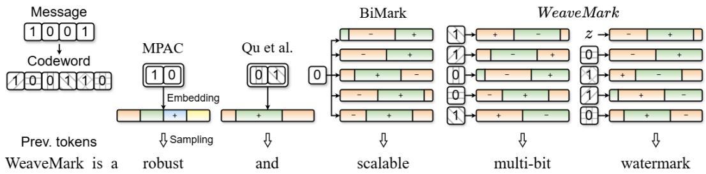  
Figure 1: Conceptual comparison of representative multi-bit LLM watermarking methods. Each column represents a distinct scheme. Colors denote vocabulary partitions, +/− signs indicate reweighting directions, and hatched bits denote ECC codeword bits. WEAVEMARK weaves multiple codeword bits into each token across layers and uses soft-decision ECC decoding.

Beyond message recovery, practical watermarking systems may require zero-bit detection. In multibit watermarking, the target partition depends on the unknown message, so existing schemes use the most-voted partition as a proxy. This max-over-partitions operation inflates the null statistic and raises the detection threshold. WEAVEMARK avoids this with message-independent zero-bit layers, enabling reliable detection while preserving strong multi-bit recovery.

## Our contributions are summarized as follows:

1. Trade-off analysis. We clarify the trade-off relationship among existing multi-bit LLM watermarking schemes in terms of extraction accuracy, text quality, and payload capacity.

2. Improved payload capacity via coded payload spreading. We propose coded payload spreading, which combines multi-bit-per-token embedding and layer shuffling to distribute token-level statistics and layer reliability more evenly across coded bits. This enables longer payloads while retaining unbiased reweighting.

3. Strong multi-bit message recovery. We combine payload spreading with soft-decision ECC decoding and show that WEAVEMARK substantially improves extraction accuracy over state-of-the-art multi-bit watermarking methods, especially for long messages, short generated texts, and editing attacks, while preserving text quality.

4. Reliable zero-bit detection. We introduce dedicated zero-bit layers that avoid the max-overpartitions effect, enabling reliable zero-bit detection while preserving multi-bit recovery.

## 2 Related work

Zero-bit watermarking. Zero-bit watermarking aims to detect only whether a text was generated by a watermarked model. A representative approach is the green-list watermark of Kirchenbauer et al. [2023], which uses the preceding tokens to pseudorandomly partition the vocabulary into green-list and red-list sets, and adds a bias toward green-list tokens during sampling. The watermark is then detected by testing whether the generated text contains an unusually large number of green-list tokens.

Multi-bit watermarking. Unlike zero-bit watermarking, multi-bit watermarking requires assigning message bits to generated tokens and aggregating token-level statistics to recover each bit. Since the entire message is recovered correctly only when all bits are extracted without error, maintaining high extraction accuracy becomes increasingly difficult as the message length grows.

Existing methods take different approaches to this challenge in how they map message bits to vocabulary partitions. MPAC [Yoo et al., 2024] assigns each token to a message segment and embeds the corresponding segment value by biasing one of multiple vocabulary partitions. This segmentallocation strategy improves payload capacity, but increasing capacity requires larger segments and therefore smaller vocabulary partitions, which degrades text quality by constraining token selection.

Qu et al. [2025] take a different approach by combining binary vocabulary partitioning with segment allocation. Binary partitioning provides more candidate tokens per partition, reducing quality degradation compared with MPAC. However, recovering multi-valued segment information from binary partitions increases bit-level errors. They use Reed-Solomon ECC to mitigate these errors.

To preserve text quality while improving extraction accuracy, BiMark [Feng et al., 2025] takes a different direction through multilayer unbiased reweighting. Each layer uses an independent vocabulary bipartition, allowing BiMark to preserve the expected token distribution. Compared with segment-wise embedding, its bit-wise embedding enables more reliable bit-level extraction. However, since each token is assigned to only one message bit, long messages receive too few and unevenly distributed token-level votes across bit positions. As a result, extraction becomes unreliable for long messages or short generated texts, limiting payload capacity.

## Trade-off summary.

Existing methods occupy different points on the multi-bit watermarking trade-off frontier. MPAC and Qu et al. improve payload capacity through segment-based biased reweighting at the cost of text quality, whereas BiMark preserves text quality through multilayer unbiased reweighting but offers limited payload capacity due to its one-bit-pertoken design. Table 1 shows that WEAVEMARK achieves the strongest trade-off across extraction accuracy, text quality, and payload capacity.

Table 1: Multi-bit watermarking comparison
<table><tr><td>Method</td><td>Extraction accuracy*</td><td>Text quality†</td><td>Payload capacity</td></tr><tr><td>MPAC (δ=3.0)</td><td>60.5</td><td>26.5</td><td>&lt; 12</td></tr><tr><td>Qu (δ=3.0)</td><td>83.5</td><td>27.5</td><td>24</td></tr><tr><td>BiMark</td><td>83.0</td><td>30.3</td><td>16</td></tr><tr><td>WEAVEMARK</td><td>96.6</td><td>30.5</td><td>&gt; 32</td></tr></table>

∗ Match rate (%) for 16-bit messages with 200 generated tokens.  
† BERTScore on summarization (CNN/DailyMail).  
⋄ Max message length achieving 80% match rate with 200 tokens.

## 3 Preliminary

LLM watermarking and zero-bit detection. Let V be the vocabulary and $\Delta _ { \nu }$ be the set of probability distributions over V. At token position $t ,$ an autoregressive LLM M defines the original next-token distribution $P _ { M } ( \cdot \mid x _ { < t } ) \in \Delta _ { \mathcal { V } }$ . Kirchenbauer et al. [2023] use the preceding h tokens, denoted by $x _ { - h } = x _ { t - h : t - 1 }$ , together with a secret key to partition the vocabulary into green-list and red-list sets, and add a bias toward green-list tokens. This can be written as a reweighting function $R : \Delta _ { \nu } \to \Delta _ { \nu }$ , which transforms the original distribution into the watermarked distribution $P _ { M , w } ( \cdot \mid x _ { < t } ) = R ( P _ { M } ( \cdot \mid x _ { < t } ) )$ , from which the next token is sampled.

Given a text with T tokens, let $| s | _ { G }$ be the number of green-list tokens and $\gamma$ be the green-list proportion. The standard zero-bit detection statistic is $z = ( | s | _ { G } - \gamma T ) / \sqrt { \gamma ( 1 - \gamma ) T }$ , and a text is classified as watermarked if z exceeds a threshold.

Multi-bit watermarking embeds a k-bit message $\mathbf { m } = ( m _ { 1 } , \ldots , m _ { k } ) \in \{ 0 , 1 \} ^ { k }$ into generated text. When ECC is used, the message is first encoded into an n-bit codeword $\mathbf { \bar { c } } = \mathbf { \bar { \mathit { E } } } ( \mathbf { m } ) \in \{ 0 , 1 \} ^ { n }$ , and the codeword bits are embedded instead. The additional $n - k$ bits enable error correction, but also increase the number of bits that must be embedded.

Unbiased multilayer watermarking. We review BiMark [Feng et al., 2025] as a representative unbiased multilayer watermarking framework. At each token position, $x _ { - h }$ seeds the selection of a single message bit position $p \in \{ 1 , \ldots , k \}$ . BiMark embeds the selected bit $m _ { p }$ across ℓ layers by constructing ℓ independent vocabulary bipartitions $\{ ( \mathcal { V } _ { 0 } ^ { i } , \mathcal { V } _ { 1 } ^ { i } ) \} _ { i = 1 } ^ { \ell }$ . For layer i, the reweighting direction is computed as $e ^ { i } = m _ { p } \oplus b ^ { i }$ , where $b ^ { i } \sim$ Bernoulli(0.5) is a pseudorandom mask. Thus, $e ^ { i }$ is a fair coin flip regardless of the embedded message bit.

Let $\theta _ { i }$ denote the reweighting configuration of layer $i ,$ including the bipartition $( \mathcal { V } _ { 0 } ^ { i } , \mathcal { V } _ { 1 } ^ { i } )$ and the bias parameters. Starting from $P _ { t } ^ { ( 0 ) } = P _ { M } ( \cdot \mid x _ { < t } )$ , BiMark applies multilayer reweighting as $P _ { t } ^ { ( i ) } = R _ { \theta _ { i } , e ^ { i } } ( P _ { t } ^ { ( i - 1 ) } )$ for $i = 1 , \ldots , \ell ,$ and samples the next token from $P _ { M , w } ( \cdot \mid x _ { < t } ) = P _ { t } ^ { ( \ell ) }$

The bit-flip reweighting preserves the input distribution in expectation. Consider a token $x \in \mathcal { V } _ { 0 } ^ { i }$ and let $\delta _ { 0 }$ be the bias factor applied to this partition. Depending on the reweighting direction $e ^ { i }$ , the token probability $P ( x )$ is scaled by either $( 1 + \delta _ { 0 } ) \mathrm { o r } \left( 1 - \delta _ { 0 } \right)$ . Since $e ^ { i }$ is a fair coin flip,

$$
\mathbb { E } _ { e ^ { i } } \left[ R _ { \theta _ { i } , e ^ { i } } ( P ) ( x ) \right] = \frac { 1 } { 2 } ( 1 + \delta _ { 0 } ) P ( x ) + \frac { 1 } { 2 } ( 1 - \delta _ { 0 } ) P ( x ) = P ( x ) .\tag{1}
$$

The same argument holds for tokens in $\mathcal { V } _ { 1 } ^ { i }$ with bias factor $\delta _ { 1 }$ . Hence, $\mathbb { E } _ { e ^ { i } } [ R _ { \theta _ { i } , e ^ { i } } ( P ) ] = P$ . Therefore, applying the layers sequentially also preserves the original distribution in expectation.

Message extraction. BiMark extracts the message using a voting matrix $\mathbf { M } \in \mathbb { N } _ { 0 } ^ { k \times 2 }$ . For each token $x _ { t } .$ , the extractor reconstructs the assigned bit position $p$ and the mask $b ^ { i }$ from $x _ { - h }$ . Each layer provides one vote: the reweighting direction is estimated as $\hat { e } ^ { i } = \mathbf { 1 } \{ x _ { t } \in \mathcal { V } _ { 1 } ^ { i } \}$ , the bit estimate is recovered as $\hat { m } ^ { i } = \hat { e } ^ { i } \oplus b ^ { i }$ , and the vote is updated as $\mathbf { M } [ p , \hat { m } ^ { i } ] \gets \mathbf { M } [ p , \hat { m } ^ { i } ] + 1$ . After processing all tokens, each message bit is extracted by majority voting as $\hat { m } _ { p } = \arg \operatorname* { m a x } _ { b \in \{ 0 , 1 \} } \mathbf { M } [ p , b ]$

We evaluate extraction performance using bit accuracy and match rate. For a k-bit message m and its estimate mˆ , bit accuracy is the fraction of correctly recovered bits, defined as $\begin{array} { r } { \frac { 1 } { k } \sum _ { p = 1 } ^ { k } \mathbf { 1 } \{ \hat { m } _ { p } = m _ { p } \} } \end{array}$ Match rate is the proportion of samples for which the entire message is correctly recovered, i.e., mˆ = m. Thus, bit accuracy measures average bit-level reliability, whereas match rate measures exact message recovery. In multi-bit watermarking, match rate is the more critical metric because the embedded message is useful only when all bits are recovered correctly.

## 4 Proposed method

## 4.1 Overview

WEAVEMARK improves the multi-bit watermarking trade-off through two main components. First, payload spreading improves payload capacity by spreading the embedded bit sequence over generated tokens and multiple layers. It combines multi-bit-per-token embedding, which increases token-level coverage for each embedded bit, with layer shuffling, which balances layer reliability across bit positions. Second, soft-decision ECC decoding improves extraction accuracy by using vote margins instead of hard majority decisions.

These components are complementary. ECC adds redundancy for message recovery, but it also expands the number of bits that must be embedded. Payload spreading counteracts this overhead by assigning more token-level observations to each embedded bit. Together, payload spreading and soft-decision ECC decoding improve payload capacity and extraction accuracy while retaining the text-quality benefit of unbiased multilayer reweighting. We describe payload spreading in Section 4.2, soft-decision ECC decoding in Section 4.3, and component-level ablation in Section 4.4. The complete embedding and extraction algorithms of WEAVEMARK are provided in Appendix A.

## 4.2 Payload spreading

Motivation. In one-bit-per-token multilayer watermarking, each token assigns a bundle of ℓ layerwise votes to a single bit position. When there are few tokens or many message bits, this all-at-once assignment can make the vote distribution uneven: some bits receive many vote bundles, while others receive few or none. A more balanced strategy is to divide the votes from each token across multiple bit positions, allowing token-level statistics to accumulate more evenly across the message bits.

Multi-bit-per-token embedding. In WEAVEMARK, the k-bit message m is first encoded into an n-bit ECC codeword $\mathbf { c } = E ( \mathbf { m } )$ . The watermarking procedure then spreads and embeds the codeword bits across generated tokens. In the ablation without ECC, we set c = m and $n = k$

Instead of assigning each token to a single bit, WEAVEMARK embeds $\kappa$ bits per token. At each token position, the preceding context $x _ { - h }$ seeds a pseudorandom function that selects κ bit positions $\mathcal { P } = \{ p _ { 1 } , \dotsc , p _ { \kappa } \} \subseteq \{ 1 , \dotsc , n \}$ . The ℓ layers are assigned to these positions as evenly as possible, so each selected bit receives either $\lfloor \ell / \kappa \rfloor$ or $\lfloor \ell / \kappa \rfloor \bar { + 1 }$ layers. For a layer i assigned to bit $c _ { p }$ WEAVEMARK computes the reweighting direction as $e ^ { i } = c _ { p } \oplus b ^ { i }$ , and applies the reweighting function $R _ { \theta _ { i } , e ^ { i } }$ as in Section 3.

This spreading strategy increases the number of token positions contributing to each bit. Under uniform selection, each bit is assigned to approximately $\kappa T / n$ token positions, compared with $T / n$ under one-bit-per-token assignment. Thus, while the total layer budget per token remains ℓ, token-level statistics are collected from more token positions for each bit, reducing uneven vote accumulation across the embedded sequence.

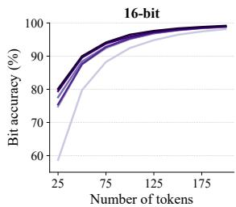

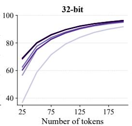

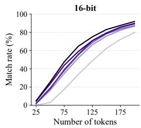

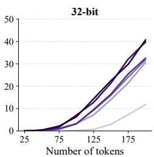  
κ = 1 κ = 2 κ = 3 κ = 5 κ = 7 κ = 10

Figure 2: Effect of the number of bits embedded in each token, κ, in payload spreading. Increasing κ spreads each bit over more token positions, improving both bit accuracy and match rate.  
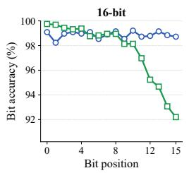

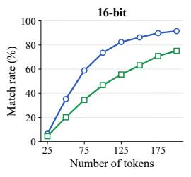

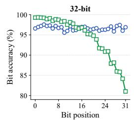

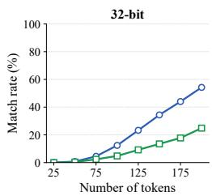  
Figure 3: Effect of layer shuffling in payload spreading. Bit-position accuracy is measured at 200 tokens. Layer shuffling balances layer reliability across bit positions, improving match rate.

Layer shuffling. Although the bit positions $\mathcal { P }$ are selected to spread token-level statistics across the embedded bits, layer assignment can still introduce imbalance because the layers have different extraction reliability. Since multilayer reweighting is applied sequentially, the bias introduced by each layer is not equally visible in the final sampled token. Earlier layers leave clearer vote signals, whereas later layers are affected by previous reweighting steps, making their votes less reliable. In our layer-wise analysis using LLaMA-3-8B on C4 RealNewsLike, extraction accuracy decreases from 72.20% at the first layer to 56.98% at the tenth layer. Thus, fixed layer assignment can repeatedly assign more reliable layers to some bit positions than to others.

To reduce this layer-wise imbalance, WEAVEMARK randomly permutes the layer indices using a pseudorandom function seeded by the preceding context $x _ { - h }$ before assigning layers to the selected bit positions. This prevents fixed bit positions from repeatedly receiving the same high- or lowreliability layers, making the effective embedding strength more balanced.

Effect of payload spreading. Figure 2 shows the effect of increasing the number of bits per token κ with layer shuffling, using Mistral-7B on C4 RealNewsLike. Increasing κ improves both bit accuracy and match rate, with larger gains when token-level observations are scarce relative to the message length. For 16-bit messages at 50 tokens, match rate improves from 3.01% (κ = 1) to 25.56% (κ = 10); for 32-bit messages at 200 tokens, it improves from 11.76% to 40.64%.

Figure 3 isolates the effect of layer shuffling. Here, bit accuracy is measured separately for each bit position. Without shuffling, later bit positions are repeatedly mapped to later, less reliable layers, leading to imbalanced bit accuracy that becomes more severe for longer messages. Layer shuffling balances bit accuracy across positions, improving match rate from 46.8% to 73.6% for 16-bit messages with 100 tokens and from 24.9% to 54.3% for 32-bit messages with 200 tokens.

Unbiased property. Payload spreading and layer shuffling preserve the unbiased reweighting property. Let $\tilde { p } ^ { i } \in \{ 1 , \ldots , n \}$ denote the bit position assigned to layer i after payload spreading and layer shuffling. At layer i, WEAVEMARK computes the reweighting direction as $e ^ { i } = \dot { c } _ { \tilde { p } ^ { i } } \oplus b ^ { \tilde { i } } .$ . For any fixed bit selection and layer assignment, $c _ { \tilde { p } ^ { \ i } }$ is simply a fixed binary value. Since $b ^ { i }$ is a fair coin flip, $e ^ { i } = c _ { \tilde { p } ^ { i } } \oplus b ^ { i }$ is also a fair coin flip. Therefore, by the unbiasedness argument in Section $^ { 3 , }$ each layer preserves its input distribution in expectation:

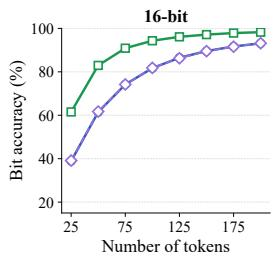

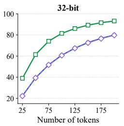

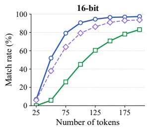  
Soft ECC Hard ECC w/o ECC

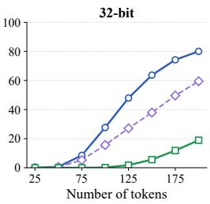  
Figure 4: Effect of soft-decision ECC with one-bit-per-token embedding. Soft-decision decoding uses vote margins as reliability information, improving match rate over hard ECC and no ECC.

$$
\mathbb { E } _ { b ^ { i } } \left[ R _ { \theta _ { i } , c _ { \tilde { p } ^ { i } } \oplus b ^ { i } } ( P ) \right] = P .\tag{2}
$$

Thus, payload spreading and layer shuffling only determine which bit is assigned to each layer; they do not change the marginal distribution of the reweighting direction. Consequently, the sequential multilayer reweighting preserves the original token distribution in expectation.

## 4.3 Soft-decision ECC decoding

Motivation. Multi-bit watermarking is evaluated by exact message recovery, so even a few bit errors can sharply reduce match rate. ECC improves recovery by adding redundancy, but at the cost of additional payload bits. Therefore, the decoder should fully exploit the extracted statistics. However, applying ECC after hard-decision majority voting discards reliability information: votes (100, 99) and (100, 0) yield the same hard decision despite very different confidence levels.

Soft reliability extraction and decoding. Instead of making a hard decision at each bit position, WEAVEMARK extracts a soft reliability score from the vote margin. Let $v _ { 0 } [ p ]$ and $v _ { 1 } [ p ]$ be the votes for 0 and 1 at bit position $p .$ We define $s [ p ] = v _ { 1 } [ p ] - v _ { 0 } [ p ]$ . The sign of $s [ p ]$ indicates the likely bit value, while its magnitude represents reliability; values near zero indicate uncertainty. Given the soft vote vector $\mathbf s = ( s [ 1 ] , \dots , s [ n ] )$ ), WEAVEMARK performs vote-margin-based soft maximumlikelihood decoding. For a linear code with codeword set ${ \mathcal { C } } ,$ the decoder selects the codeword most consistent with the soft observations:

$$
\hat { \mathbf { c } } = \arg \operatorname* { m a x } _ { \mathbf { c } \in \mathcal { C } } \sum _ { p = 1 } ^ { n } s [ p ] \left( 2 c [ p ] - 1 \right) .\tag{3}
$$

This rule chooses the codeword with the largest correlation to the soft vote vector and can be implemented efficiently by enumeration for message lengths up to 32 bits. Among the alternative soft reliability metrics tested in Appendix C, the vote margin is the clearest and consistently achieves the best performance, so we adopt it as our soft metric.

Effect of soft-decision ECC. Figure 4 shows the effect of adding soft-decision ECC to one-bit-pertoken embedding on OpenGen. We use rate-1/2 block codes: extended Golay [24, 12, 8] [Golay, 1949] for 12-bit messages, Reed-Muller [32, 16, 8] [Reed, 1954] for 16-bit messages, and two independent blocks for 24- and 32-bit messages. ECC increases the number of embedded bits and can reduce bit accuracy, but its redundancy substantially improves match rate, especially for longer messages. For 32-bit messages at 200 tokens, match rate improves from 18.94% to 80.07%.

## 4.4 Component ablation

Table 2 summarizes the cumulative effect of each component. Starting from BiMark, multi-bit embedding modestly improves match rate by spreading token-level statistics across bit positions. Layer shuffling then improves exact recovery by balancing layer reliability across bit positions. Finally, soft-decision ECC lowers bit accuracy by adding parity bits, but its error-correction capability more than compensates for this overhead and further boosts match rate. Together, these component improve match rate from 20.78% to 89.84% for 32-bit messages with 200 tokens.

Table 2: Component ablation for 32-bit messages with 200 generated tokens.
<table><tr><td>Method</td><td>Multi-bit</td><td>Shuffling</td><td>Soft ECC</td><td>Bit accuracy (%)</td><td>Match rate (%)</td></tr><tr><td>BiMark</td><td>一</td><td>一</td><td>一</td><td>93.21</td><td>20.78</td></tr><tr><td>+ Multi-bit embedding</td><td>√</td><td>一</td><td>一</td><td>94.52</td><td>24.00</td></tr><tr><td>+ Layer shuffling</td><td>√</td><td>√</td><td>一</td><td>96.67</td><td>55.88</td></tr><tr><td>+ Soft-decision ECC</td><td>√</td><td>√</td><td>√</td><td>90.51</td><td>89.84</td></tr></table>

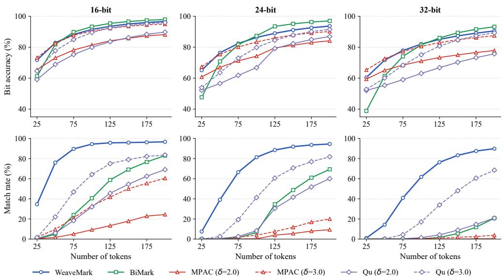  
Figure 5: Clean-text message extraction accuracy. WEAVEMARK improves match rate across token lengths, enabling reliable 32-bit payload recovery beyond the range of prior methods.

## 5 Experiments

## 5.1 Experimental setup

Models and datasets. We use LLaMA-3-8B [Dubey et al., 2024] as the primary model for extraction and robustness experiments, and Gemma-2-9B [Gemma Team et al., 2024] for perplexity evaluation. We evaluate mainly on C4 RealNewsLike [Raffel et al., 2020], and additionally use Mistral-7B [Jiang et al., 2023] and OpenGen [Krishna et al., 2023] for ablation experiments.

Baselines. We compare WEAVEMARK against BiMark [Feng et al., 2025], MPAC [Yoo et al., 2024], and Qu et al. [2025]. For MPAC and Qu et al., we evaluate $\delta \in \{ 2 . 0 , 3 . 0 \}$ to show the trade-off between extraction accuracy and text quality. For BiMark and WEAVEMARK, we use $\delta = 1 . 0 $ ℓ = 10, h = 2, and $\kappa = 1 0$ . For MPAC, we use $\gamma = 0 . 2 5$ and $r = 4 .$ For Qu et al., we use $\gamma = 0 . 5$ We use top-K sampling with $K = 5 0$ and temperature $\tau = 1 . 0$

## 5.2 Message extraction accuracy

We first evaluate whether WEAVEMARK improves exact message recovery on clean watermarked text and under editing attacks. The clean setting measures payload scalability, while the attack setting evaluates robustness when token-level statistics are partially corrupted.

Clean-text extraction. Figure 5 shows bit accuracy and match rate on clean text. WEAVEMARK consistently improves match rate over the baselines, especially for long messages and short generated texts. For short generated texts of 50 tokens, WEAVEMARK achieves 76.02% match rate for 16-bit messages, while BiMark drops to 4.84%. For long messages, WEAVEMARK achieves 89.84% match rate for 32-bit messages with 200 tokens, compared with 20.78% for BiMark. MPAC and Qu et al. underperform even with $\delta = 3 . 0$ , which uses stronger biased reweighting.

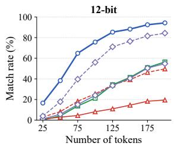

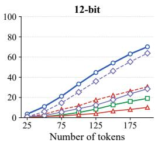

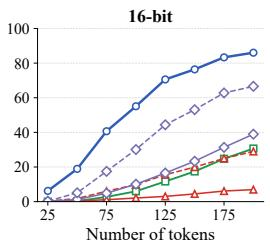

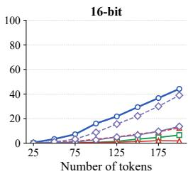  
WeaveMark BiMark MPAC (δ=2.0) MPAC (δ=3.0) Qu (δ=2.0) Qu (δ=3.0)  
Figure 6: Robustness to synonym substitution attacks. Within each message-length group, the left and right panels use substitution ratios $\rho = 0 . 1$ and $\rho = 0 . 2 ,$ , respectively.

Table 3: Text quality on downstream tasks. Higher values indicate better quality.
<table><tr><td colspan="5"></td><td colspan="2">Translation</td></tr><tr><td>Method</td><td>BERTScore</td><td>R-1</td><td>R-2</td><td>R-L</td><td>BERTScore</td><td>BLEU</td></tr><tr><td>No watermark</td><td>30.54</td><td>41.15</td><td>19.17</td><td>28.63</td><td>94.95</td><td>25.24</td></tr><tr><td>WEAVEMARK</td><td>30.48</td><td>40.89</td><td>18.22</td><td>28.11</td><td>94.52</td><td>23.15</td></tr><tr><td>BiMark</td><td>30.27</td><td>40.70</td><td>18.28</td><td>28.00</td><td>94.56</td><td>23.22</td></tr><tr><td>MPAC (δ = 2.0)</td><td>29.81</td><td>39.75</td><td>16.87</td><td>26.97</td><td>94.39</td><td>21.47</td></tr><tr><td>MPAC (δ = 3.0)</td><td>26.53</td><td>36.61</td><td>12.87</td><td>23.60</td><td>93.50</td><td>16.78</td></tr><tr><td>Qu (δ = 2.0)</td><td>29.58</td><td>39.74</td><td>16.62</td><td>26.91</td><td>94.37</td><td>21.02</td></tr><tr><td>Qu (δ = 3.0)</td><td>27.45</td><td>37.69</td><td>14.07</td><td>24.61</td><td>93.75</td><td>16.94</td></tr></table>

Robustness to editing attacks. We evaluate robustness under synonym substitution attacks, where a fraction ρ of tokens are replaced with synonyms using WordNet [Miller, 1995] candidates filtered by BERT [Devlin et al., 2019]. Figure 6 shows the match rate under different substitution ratios. For 16-bit messages with $\rho = 0 . 1$ , WEAVEMARK achieves 86.02% match rate, compared with 30.67% for BiMark. $\mathrm { A t } \ \rho = 0 . 2$ , WEAVEMARK achieves 44.20%, while BiMark drops to 6.59%. Although Qu et al. with $\delta = 3 . 0$ shows competitive robustness in some settings, this relies on stronger biased reweighting and leads to text-quality degradation, as shown in Section 5.3. In Appendix D, we provide additional robustness results for various message lengths and substitution ratios, as well as under paraphrasing attacks.

## 5.3 Text quality

Table 3 reports text quality on two downstream tasks: summarization with BART-large-CNN [Lewis et al., 2020] on CNN/DailyMail [Hermann et al., 2015], measured by BERTScore [Zhang et al., 2020] (RoBERTa-large [Liu et al., 2019]) and ROUGE [Lin, 2004]; and translation with mBARTlarge-50 [Tang et al., 2020] on WMT16 en→ro [Bojar et al., 2016], measured by BERTScore (XLM-RoBERTa-large [Conneau et al., 2020]) and BLEU [Papineni et al., 2002].

WEAVEMARK preserves text quality at a level comparable to unwatermarked text and BiMark. In contrast, MPAC and Qu et al. show noticeable degradation when δ = 3.0. This confirms that their stronger extraction accuracy comes at the cost of biased reweighting, whereas WEAVEMARK improves extraction accuracy while retaining the quality-preserving behavior of unbiased reweighting. Appendix B provides perplexity analysis.

## 6 Zero-bit detection

Multi-bit watermarking biases token sampling toward a message-dependent vocabulary partition, which we call the target partition. For zero-bit detection, the detector must count how often generated tokens fall into this target partition. However, in multi-bit watermarking, the embedded message is unknown during detection, so the target partition cannot be reconstructed directly.

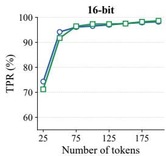

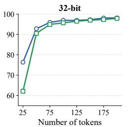

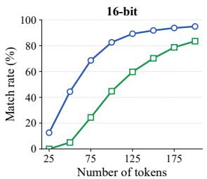

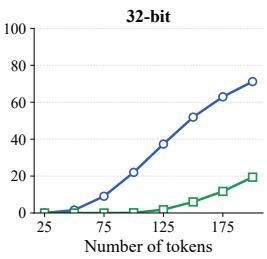  
Figure 7: Zero-bit detection in the multi-bit setting at $\mathrm { F P R = 1 \% }$ . With $\ell = 1 0$ and $\ell _ { z } = 2 .$ , WEAVE-MARK maintains its multi-bit match-rate advantage while achieving strong zero-bit TPR.

Table 4: z-score threshold at FPR=1% averaged over 25 to 200 tokens.  
Table 5: Pure zero-bit detection TPR (%) at FPR=1%.
<table><tr><td>Method</td><td>16-bit</td><td>32-bit</td></tr><tr><td>WEAVEMARK</td><td>2.24</td><td>2.33</td></tr><tr><td>BiMark</td><td>4.54</td><td>5.55</td></tr></table>

<table><tr><td rowspan="2">Method</td><td colspan="4">Number of tokens</td></tr><tr><td>50</td><td>100</td><td>150</td><td>200</td></tr><tr><td>WEAVEMARK</td><td>96.94</td><td>98.20</td><td>98.60</td><td>99.12</td></tr><tr><td>KGW (δ = 2.0)</td><td>96.51</td><td>97.78</td><td>97.95</td><td>98.71</td></tr><tr><td>SynthID</td><td>94.2</td><td>96.7</td><td>97.5</td><td>98.0</td></tr></table>

Existing schemes such as BiMark and MPAC address this by treating the most-voted partition as the target and then computing a z-score. However, this max-over-partitions operation inflates the statistic even for non-watermarked text, raising the threshold required to control the false-positive rate and reducing detection power. This effect becomes more severe as the message length increases.

To avoid this issue, WEAVEMARK reserves a small number of dedicated zero-bit layers that do not encode the message. In these layers, the vocabulary partition is generated from the context, as in Kirchenbauer et al. [2023], rather than being determined by the message bit. Therefore, the detector can reconstruct the target partition exactly. These layers use the same unbiased reweighting mechanism, preserving the expected token distribution.

Detection then applies the standard z-test with $\gamma = 0 . 5$ to the zero-bit layers. Since the target partition is known, no max-over-partitions operation is required, keeping the z-score threshold low and stable at a fixed false-positive rate. The number of zero-bit layers controls the trade-off between zero-bit detection strength and multi-bit embedding capacity. With a fixed total number of layers $\ell ,$ allocating $\ell _ { z }$ layers to zero-bit detection leaves $\ell - \bar { \ell } _ { z }$ layers for multi-bit embedding. Increasing $\ell _ { z }$ improves zero-bit detection but reduces the number of layers available for message extraction.

Multi-bit setting. Figure 7 compares WEAVEMARK with BiMark at FPR=1%, using ℓ = 10 total layers and $\ell _ { z } = 2$ zero-bit layers. Both methods achieve high TPR beyond 50 tokens, but WEAVEMARK maintains a substantial match-rate advantage. For 32-bit messages with 200 tokens, WEAVEMARK achieves 71.17% match rate, compared with 19.4% for BiMark.

Table 4 shows the z-score threshold required to control FPR at 1%. BiMark’s threshold increases with message length because the max-over-partitions statistic becomes more inflated. In contrast, WEAVEMARK maintains a stable threshold around 2.3, since its zero-bit detection statistic is independent of the multi-bit codeword structure. This allows zero-bit detection performance to remain stable even as the payload grows.

Pure zero-bit setting. We also compare against pure zero-bit baselines. Table 5 reports TPR at FPR=1% against KGW soft red-green [Kirchenbauer et al., 2023] and SynthID [Dathathri et al., 2024]. In this setting, WEAVEMARK uses all layers as zero-bit layers $\ell _ { z } = 1 0$ . It achieves the highest TPR at every measured token length.

## 7 Conclusion

We presented WEAVEMARK, a robust and scalable multi-bit LLM watermarking scheme based on coded payload spreading. WEAVEMARK improves payload capacity through multi-bit-per-token spreading, improves extraction accuracy through soft-decision ECC decoding, and preserves text quality through unbiased multilayer reweighting. Experiments show that WEAVEMARK substantially improves match rate for long messages, short generated texts, and editing attacks without degrading text quality. It improves clean-text match rate from 20.8% to 89.8% and robustness under synonym substitution from 30.7% to 86.0%. Dedicated zero-bit layers further provide strong watermark presence detection, preserving a large multi-bit extraction advantage and even outperforming existing zero-bit watermarking in the pure zero-bit setting. These results show that WEAVEMARK provides a compelling solution for both source tracing and watermark detection in LLM-generated text.

## References

Ondˇrej Bojar, Rajen Chatterjee, Christian Federmann, Yvette Graham, Barry Haddow, Matthias Huck, Antonio Jimeno Yepes, Philipp Koehn, Varvara Logacheva, Christof Monz, Matteo Negri, Aurélie Névéol, Mariana Neves, Martin Popel, Matt Post, Raphael Rubino, Carolina Scarton, Lucia Specia, Marco Turchi, Karin Verspoor, and Marcos Zampieri. Findings of the 2016 conference on machine translation. In Proceedings of the First Conference on Machine Translation: Volume 2, Shared Task Papers, pages 131–198, 2016.

Miranda Christ, Sam Gunn, and Or Zamir. Undetectable watermarks for language models. In Proceedings ofThirty Seventh Conference on Learning Theory (COLT), pages 1125–1139, 2024.

Alexis Conneau, Kartikay Khandelwal, Naman Goyal, Vishrav Chaudhary, Guillaume Wenzek, Francisco Guzmán, Edouard Grave, Myle Ott, Luke Zettlemoyer, and Veselin Stoyanov. Unsupervised cross-lingual representation learning at scale. In Proceedings ofthe 58th Annual Meeting ofthe Association for Computational Linguistics, pages 8440–8451. Association for Computational Linguistics, 2020.

Sumanth Dathathri, Abigail See, Sumedh Ghaisas, Po-Sen Huang, Rob McAdam, Johannes Welbl, Vandana Bachani, Alex Kaskasoli, Robert Stanforth, Tatiana Matejovicova, et al. Scalable watermarking for identifying large language model outputs. Nature, 634(8035):818–823, 2024.

Jacob Devlin, Ming-Wei Chang, Kenton Lee, and Kristina Toutanova. BERT: Pre-training of deep bidirectional transformers for language understanding. In Proceedings of NAACL-HLT, pages 4171–4186, 2019.

Abhimanyu Dubey, Abhinav Jauhri, Abhinav Pandey, et al. The Llama 3 herd of models. arXiv preprint arXiv:2407.21783, 2024.

Xiaoyan Feng, He Zhang, Yanjun Zhang, Leo Yu Zhang, and Shirui Pan. BiMark: Unbiased multilayer watermarking for large language models. In Proceedings of the 42nd International Conference on Machine Learning, volume 267 of Proceedings of Machine Learning Research, pages 17049–17067. PMLR, 2025.

Gemma Team, Morgane Riviere, Shreya Pathak, et al. Gemma 2: Improving open language models at a practical size. arXiv preprint arXiv:2408.00118, 2024.

Marcel J. E. Golay. Notes on digital coding. Proceedings ofthe IRE, 37:657, 1949.

Karl Moritz Hermann, Tomas Kocisky, Edward Grefenstette, Lasse Espeholt, Will Kay, Mustafa Suleyman, and Phil Blunsom. Teaching machines to read and comprehend. In Advances in Neural Information Processing Systems (NeurIPS), 2015.

Zhengmian Hu, Lichang Chen, Xidong Wu, Yihan Wu, Hongyang Zhang, and Heng Huang. Unbiased watermark for large language models. In The Twelfth International Conference on Learning Representations (ICLR), 2024.

Albert Q Jiang, Alexandre Sablayrolles, Arthur Mensch, et al. Mistral 7B. arXiv preprint arXiv:2310.06825, 2023.

John Kirchenbauer, Jonas Geiping, Yuxin Wen, Jonathan Katz, Ian Miers, and Tom Goldstein. A watermark for large language models. In Proceedings of the 40th International Conference on Machine Learning, volume 202 of Proceedings ofMachine Learning Research, pages 17061–17084. PMLR, 2023.

Kalpesh Krishna, Yixiao Song, Marzena Karpinska, John Wieting, and Mohit Iyyer. Paraphrasing evades detectors of AI-generated text, but retrieval is an effective defense. In Advances in Neural Information Processing Systems (NeurIPS), 2023.

Rohith Kuditipudi, John Thickstun, Tatsunori Hashimoto, and Percy Liang. Robust distortion-free watermarks for language models. Transactions on Machine Learning Research, 2024.

Mike Lewis, Yinhan Liu, Naman Goyal, Marjan Ghazvininejad, Abdelrahman Mohamed, Omer Levy, Veselin Stoyanov, and Luke Zettlemoyer. BART: Denoising sequence-to-sequence pre-training for natural language generation, translation, and comprehension. In Proceedings of the 58th Annual Meeting of the Association for Computational Linguistics, pages 7871–7880. Association for Computational Linguistics, 2020.

Chin-Yew Lin. ROUGE: A package for automatic evaluation of summaries. In Text Summarization Branches Out, pages 74–81, 2004.

Yinhan Liu, Myle Ott, Naman Goyal, Jingfei Du, Mandar Joshi, Danqi Chen, Omer Levy, Mike Lewis, Luke Zettlemoyer, and Veselin Stoyanov. RoBERTa: A robustly optimized BERT pretraining approach. arXiv preprint arXiv:1907.11692, 2019.

George A. Miller. WordNet: A lexical database for English. Communications of the ACM, 38(11): 39–41, 1995.

OpenAI. GPT-4 technical report. arXiv preprint arXiv:2303.08774, 2023.

Kishore Papineni, Salim Roukos, Todd Ward, and Wei-Jing Zhu. BLEU: A method for automatic evaluation of machine translation. In Proceedings ofthe 40th Annual Meeting ofthe Association for Computational Linguistics (ACL), pages 311–318, 2002.

Wenjie Qu, Wengrui Zheng, Tianyang Tao, Dong Yin, Yanze Jiang, Zhihua Tian, Wei Zou, Jinyuan Jia, and Jiaheng Zhang. Provably robust multi-bit watermarking for AI-generated text. In 34th USENIX Security Symposium (USENIX Security 25), pages 201–220, 2025.

Colin Raffel, Noam Shazeer, Adam Roberts, Katherine Lee, Sharan Narang, Michael Matena, Yanqi Zhou, Wei Li, and Peter J Liu. Exploring the limits of transfer learning with a unified text-to-text transformer. Journal ofMachine Learning Research, 21(140):1–67, 2020.

Irving S. Reed. A class of multiple-error-correcting codes and the decoding scheme. Transactions of the IRE Professional Group on Information Theory, 4(4):38–49, 1954.

Yuqing Tang, Chau Tran, Xian Li, Peng-Jen Chen, Naman Gober, Vishrav Chaudhary, Jiatao Gu, and Angela Fan. Multilingual translation with extensible multilingual pretraining and finetuning. arXiv preprint arXiv:2008.00401, 2020.

Laura Weidinger, Jonathan Uesato, Maribeth Rauh, Conor Griffin, Po-Sen Huang, John Mellor, Amelia Glaese, Myra Cheng, Borja Balle, Atoosa Kasirzadeh, et al. Taxonomy of risks posed by language models. In ACM Conference on Fairness, Accountability, and Transparency (FAccT), 2022.

KiYoon Yoo, Wonhyuk Ahn, and Nojun Kwak. Advancing beyond identification: Multi-bit watermark for large language models. In Proceedings ofthe 2024 Conference ofthe North American Chapter of the Association for Computational Linguistics: Human Language Technologies (Volume 1: Long Papers), pages 4031–4055, 2024.

Rowan Zellers, Ari Holtzman, Hannah Rashkin, Yonatan Bisk, Ali Farhadi, Franziska Roesner, and Yejin Choi. Defending against neural fake news. In Advances in Neural Information Processing Systems (NeurIPS), 2019.

Tianyi Zhang, Varsha Kishore, Felix Wu, Kilian Q Weinberger, and Yoav Artzi. BERTScore: Evaluating text generation with BERT. In International Conference on Learning Representations (ICLR), 2020.

## A Algorithm details

Algorithm 1 describes the multi-bit message embedding procedure used for source tracing, and Algorithm 2 describes the corresponding message extraction procedure. The dedicated zero-bit layers used for watermark presence detection are independent of the message bits and are described separately in Section 6.

Algorithm 1 Message Embedding   
Input:   
a language model M   
an initial prompt $x _ { 1 } , \ldots , x _ { L }$ with $L \geq h$   
a sequence of balanced vocabulary bipartitions $\{ ( \mathcal { V } _ { 0 } ^ { i } , \mathcal { V } _ { 1 } ^ { i } ) \} _ { i = 1 } ^ { \ell }$   
reweighting configurations $\{ \theta _ { i } \} _ { i = 1 } ^ { \ell }$ , where $\theta _ { i }$ includes $( \mathcal { V } _ { 0 } ^ { i } , \mathcal { V } _ { 1 } ^ { i } )$ and bias parameters   
a message m $\in \{ 0 , 1 \} ^ { k }$   
an ECC encoder $\mathsf { \bar { E } } : \mathsf { \bar { \{ 0 , 1 \} } } ^ { k } \to \{ 0 , 1 \} ^ { n }$   
window size $h$ and bits per token κ, where $1 \leq \kappa \leq \ell$   
a bit-flip unbiased reweighting function $R$   
pseudorandom functions $\mathrm { P R } \bar { \mathrm { F } } _ { b } , \mathrm { P R } \mathrm { F } _ { p } ,$ and $\mathrm { P R F } _ { s }$   
1. Encode the message into a codeword: $\mathbf { c } \gets E ( \mathbf { m } )$ , where $\mathbf { c } \in \{ 0 , 1 \} ^ { n }$   
2. Initialize the set of used contexts as $s  \varnothing .$   
for $t = L + 1 , L + 2 , . . .$ do:   
3. Compute the original next-token distribution $P _ { t } ^ { ( 0 ) } \gets P _ { M } ( \cdot | \boldsymbol { x } _ { < t } )$   
4. Let $x _ { - h } ^ { ( t ) } = x _ { t - h : t - 1 }$ be the preceding h-token context.   
if $x _ { - h } ^ { ( t ) } \in S$ then   
sample $x _ { t } \sim P _ { t } ^ { ( 0 ) }$ and continue.   
else   
update $S \gets S \cup \{ x _ { - h } ^ { ( t ) } \}$ and compute   
$( \mathrm { s e e d } _ { b } , \mathrm { s e e d } _ { p } , \mathrm { s e e d } _ { s } ) \gets ( \mathrm { P R F } _ { b } ( x _ { - h } ^ { ( t ) } ) , \mathrm { P R F } _ { p } ( x _ { - h } ^ { ( t ) } ) , \mathrm { P R F } _ { s } ( x _ { - h } ^ { ( t ) } ) )$   
end if   
5. Generate pseudorandom mask bits $b ^ { 1 } , \ldots , b ^ { \ell }$ from seedb.   
Select κ distinct bit positions $\mathcal { P } = \{ p _ { 1 } , \dotsc , p _ { \kappa } \} \subseteq \{ 1 , \dotsc , n \}$ using see $\mathrm { l } _ { p } .$   
6. Construct a balanced layer-assignment vector $\tilde { \mathbf { p } } = ( \tilde { p } ^ { 1 } , \dots , \tilde { p } ^ { \ell } )$   
Let $q = \lfloor \ell / \kappa \rfloor$ and $r = \ell$ mod κ.   
Include $q + 1$ copies of each of $p _ { 1 } , \ldots , p _ { r }$ in ${ \tilde { \mathbf { p } } } .$   
Include q copies of each of $p _ { r + 1 } , \ldots , p _ { \kappa }$ in $\tilde { \mathbf { p } } .$   
Shuffle the entries of p˜ using seeds.   
7. for $i = 1 , 2 , \dots , \ell$ do:   
Compute the reweighting direction $e ^ { i }  c _ { \tilde { p } ^ { i } } \oplus b ^ { i } .$   
Apply the i-th reweighting layer: $P _ { t } ^ { ( i ) }  \dot { R } _ { \theta _ { i } , e ^ { i } } ( P _ { t } ^ { ( i - 1 ) } )$   
end for   
8. Sample the next token $x _ { t } \sim P _ { t } ^ { ( \ell ) }$   
end for

Algorithm 2 Message Extraction   
Input:   
a token sequence $x _ { 1 } , x _ { 2 } , \ldots , x _ { T }$   
a sequence of balanced vocabulary bipartitions $\{ ( \mathcal { V } _ { 0 } ^ { i } , \mathcal { V } _ { 1 } ^ { i } ) \} _ { i = 1 } ^ { \ell }$   
codeword length n   
window size h and bits per token κ, where $1 \leq \kappa \leq \ell$   
an ECC decoder $D : \mathbb { R } ^ { \bar { n } }  \{ 0 , 1 \} ^ { k }$ based on soft-decision decoding   
pseudorandom functions $\mathrm { P R F } _ { b } , \mathring { \mathrm { P R F } } _ { p } ,$ and $\mathrm { P R F } _ { s }$   
1. Initialize vote counts $v _ { 0 } [ p ] \gets 0$ and $v _ { 1 } [ p ] \gets 0$ for all $p \in \{ 1 , \ldots , n \}$   
2. Initialize the set of used contexts as $s  \varnothing .$   
for $t = h + 1 , h + 2 , . . . , T$ do:   
3. Let $x _ { - h } ^ { ( t ) } = x _ { t - h : t - 1 }$ be the preceding h-token context.   
if $x _ { - h } ^ { ( t ) } \in S$ then   
skip the current token and continue.   
else   
update ${ \mathcal { S } } \gets { \mathcal { S } } \cup \{ x _ { - h } ^ { ( t ) } \}$ and compute   
$( \mathrm { s e e d } _ { b } , \mathrm { s e e d } _ { p } , \mathrm { s e e d } _ { s } ) \gets ( \mathrm { P R F } _ { b } ( x _ { - h } ^ { ( t ) } ) , \mathrm { P R F } _ { p } ( x _ { - h } ^ { ( t ) } ) , \mathrm { P R F } _ { s } ( x _ { - h } ^ { ( t ) } ) )$   
end if   
4. Generate pseudorandom mask bits $b ^ { 1 } , \ldots , b ^ { \ell }$ from seed .   
Select κ distinct bit positions $\mathcal { P } = \{ p _ { 1 } , \hdots , p _ { \kappa } \} \subseteq \{ 1 , \hdots , n \}$ using seedp.   
5. Construct the same balanced layer-assignment vector $\tilde { \mathbf { p } } = ( \tilde { p } ^ { 1 } , \dots , \tilde { p } ^ { \ell } )$   
Let $q = \lfloor \ell / \kappa \rfloor$ and $r = \ell$ mod κ.   
Include $q + 1$ copies of each of $p _ { 1 } , \ldots , p _ { r }$ in ${ \tilde { \mathbf { p } } } .$   
Include q copies of each of $p _ { r + 1 } , \ldots , p _ { \kappa }$ in ${ \tilde { \mathbf { p } } } .$   
Shuffle the entries of $\tilde { \mathbf { p } }$ using seeds.   
6. for $i = 1 , 2 , \dots , \ell$ do:   
Estimate the reweighting direction: $\hat { e } ^ { i }  \mathbf { 1 } \{ x _ { t } \in \mathcal { V } _ { 1 } ^ { i } \}$   
Recover the corresponding codeword-bit estimate: $\hat { \hat { c } } _ { \tilde { p } ^ { i } } \gets \hat { e } ^ { i } \oplus b ^ { i } .$   
Update the vote count: $v _ { \hat { c } _ { \tilde { p } ^ { i } } } [ \tilde { p } ^ { i } ]  v _ { \hat { c } _ { \tilde { p } ^ { i } } } [ \tilde { p } ^ { i } ] + 1 .$   
end for   
end for   
7. Compute the soft-vote vector $\mathbf { s } = ( s [ 1 ] , \dots , s [ n ] )$ by $s [ p ]  v _ { 1 } [ p ] - v _ { 0 } [ p ]$ for all $p \in \{ 1 , \ldots , n \}$   
8. Decode the message from the soft-vote vector: mˆ $ D ( \mathbf { s } )$   
9. Return the extracted message mˆ .

## B Perplexity analysis

We measure perplexity (PPL) on watermarked text generated with LLaMA-3-8B on the C4 Real-NewsLike dataset, using 16-bit messages. Figure 8 shows the PPL distribution at 200 tokens, and Figure 9 shows mean PPL across token lengths.

Across both figures, our method yields PPL comparable to BiMark, while MPAC and Qu et al. at $\delta = 3 . 0$ show noticeably higher PPL—consistent with the downstream task results in Section 5.3.

Note on PPL measurement. With our generation setup—an 8B-parameter model under 4-bit quantization—the model occasionally produces repetitive patterns where it copies its own context. Such repetitions yield artificially low PPL since repeated tokens are highly predictable. This affects all methods, including non-watermarked text generation, so relative comparisons remain meaningful, but absolute PPL values should be interpreted with caution.

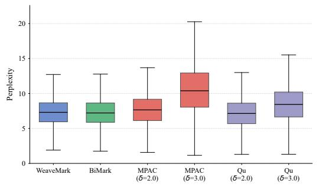  
Figure 8: PPL distribution at 200 tokens (16-bit).

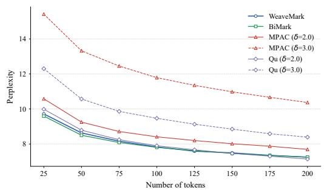  
Figure 9: Mean PPL results (16-bit).

## C Voting method comparison

When extracting an embedded bit, the per-token votes can be aggregated in three ways. Hard voting compares v0[p] and $v _ { 1 } [ p ]$ and outputs the majority bit; this discards confidence information, so a narrow majority such as (100, 99) is treated the same as a decisive majority such as (100, 0). Soft voting uses the signed vote difference $v _ { 1 } - v _ { 0 }$ as the per-bit score and decodes by maximum-likelihood correlation with the codebook. This preserves vote count but treats the magnitude of the difference as a linear measure of confidence—a difference of +4 from 4 unanimous votes (4, 0) is treated identically to +4 from 100 mostly-balanced votes (52, 48). LLR voting uses the log-likelihood ratio log $\big ( ( v _ { 1 } + 0 . 5 ) / ( v _ { 0 } + 0 . 5 ) \big )$ as the score, which compresses scores when total vote counts are large

Figure 10 reports bit accuracy and match rate for all three methods across message lengths and token counts. Hard voting consistently underperforms the other two methods on match rate at all lengths, with the gap widening as message length increases—at 32-bit, 100 tokens, hard voting achieves 37.06% match rate while soft voting achieves 61.80%. Soft voting and LLR voting are nearly indistinguishable at moderate to long lengths (125+ tokens), where they alternate within 1 percentage point. At shorter lengths (25–100 tokens), soft voting consistently outperforms LLR by 1–3 percentage points. This is because per-bit vote counts vary substantially when tokens are scarce: soft voting’s linear difference preserves this variation in ML decoding—reliable high-count bits dominate the decision while noisy low-count bits are effectively ignored. LLR’s logarithmic compression flattens these differences, letting noisy bits influence decoding more equally with reliable ones. As token length grows, all bits accumulate sufficient votes, the count disparity shrinks, and the two methods converge. We therefore use soft voting in all main experiments.

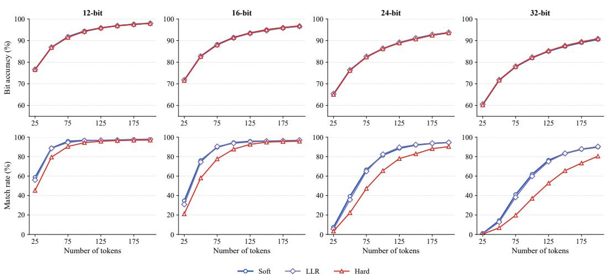  
Figure 10: Comparison of hard, soft, and LLR voting across message lengths.

Table 6: Match rate (%) at 200 tokens for 24-bit and 32-bit messages across substitution ratios.
<table><tr><td rowspan="2">Method</td><td colspan="3">24-bit</td><td colspan="3">32-bit</td></tr><tr><td> $\rho { = } 0 . 1$ </td><td> $\rho { = } 0 . 2$ </td><td> $\rho { = } 0 . 3$ </td><td> $\rho { = } 0 . 1$ </td><td> $\rho { = } 0 . 2$ </td><td> $\rho { = } 0 . 3$ </td></tr><tr><td>WEAVEMARK</td><td>60.13</td><td>14.41</td><td>0.72</td><td>32.10</td><td>2.72</td><td>0</td></tr><tr><td>BiMark</td><td>4.95</td><td>0.24</td><td>0</td><td>0.68</td><td>0.06</td><td>0</td></tr><tr><td>MPAC  $( \delta \mathrm { = } 2 . 0 )$ </td><td>0.59</td><td>0.11</td><td>0</td><td>0</td><td>0</td><td>0</td></tr><tr><td>MPAC (δ=3.0)</td><td>4.56</td><td>0.80</td><td>0.15</td><td>0.49</td><td>0.05</td><td>0</td></tr><tr><td>Qu (δ=2.0)</td><td>11.18</td><td>1.68</td><td>0.26</td><td>2.38</td><td>0.30</td><td>0</td></tr><tr><td> $\mathrm { Q u } \left( \delta \mathrm { = } 3 . 0 \right)$ </td><td>45.34</td><td>10.13</td><td>1.04</td><td>22.03</td><td>1.79</td><td>0.04</td></tr></table>

## D Additional robustness results

Various message lengths and substitution ratios. We extend the robustness experiments in Section 5.2 with a higher substitution ratio of $\rho = 0 . 3$ and longer message lengths. Figure 11 shows match rates at $\rho = 0 . 3$ for 12-bit and 16-bit messages, and Table 6 reports match rates at 200 tokens for 24-bit and 32-bit messages across $\rho = 0 . 1 , 0 . 2 , 0 . 3 .$ . At $\rho = 0 . 1$ and $\rho = 0 . 2 ,$ , our method consistently outperforms all baselines including Qu et al. at $\delta = 3 . 0$ across all message lengths. At $\rho = 0 . 3$ on short messages (12-bit and 16-bit), however, Qu et al. $( \delta = 3 . 0 )$ outperforms our method by a small but consistent margin—for example, at 200 tokens, Qu et al. achieves 25.90% vs. 19.74% on 12-bit messages and 9.58% vs. 7.14% on 16-bit messages. For longer messages (24-bit and 32-bit), match rates of all methods drop to near zero at $\rho = 0 . 3$ , leaving little room for meaningful comparison.

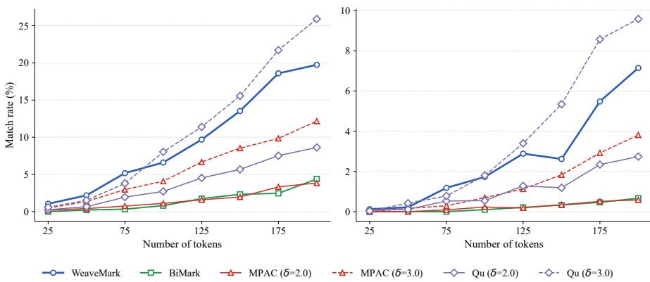  
Figure 11: Robustness to stronger synonym substitution attacks with $\rho = 0 . 3 $

We hypothesize this is partly due to the difference in context window size. Our method and BiMark use a window size of 2, while MPAC and Qu et al. use a window size of 1. A token substitution thus disrupts extraction at the substituted position and at the next 2 positions in our method, but only the next 1 position for Qu et al.—each substitution effectively causes more bit errors per affected token in our setting. The larger window size in our method and BiMark is itself a consequence of preserving the unbiased property: since unbiased reweighting requires that no context be reused for watermarking, a larger window expands the space of unique contexts and reduces skip-induced loss. MPAC and Qu et al., being biased methods, are not constrained by this requirement and use the smaller (and recommended) window size of 1. The robustness gap at $\rho = 0 . 3$ is thus partly an inherent trade-off of the unbiased design rather than a tunable parameter choice. Reed-Solomon coding’s symbol-level structure may also contribute to Qu et al.’s relative advantage at high substitution rates, since clustered bit errors within a symbol count as a single symbol error. Direct verification—for instance, by matching window sizes across methods or replacing our codes with a burst-tolerant alternative—is left for future work.

Table 7: Robustness under DIPPER paraphrasing (16-bit, 200 tokens). (L, O) denotes lexical and order diversity. Bit/Match: bit accuracy and match rate (%).
<table><tr><td rowspan="2">Method</td><td colspan="2">(L=20, O=0)</td><td colspan="2">(L=0, O=20)</td><td colspan="2">(L=20, O=20)</td></tr><tr><td>Bit</td><td>Match</td><td>Bit</td><td>Match</td><td>Bit</td><td>Match</td></tr><tr><td>WEAVEMARK</td><td>80.78</td><td>59.10</td><td>89.43</td><td>86.94</td><td>78.18</td><td>49.02</td></tr><tr><td>BiMark</td><td>84.33</td><td>13.49</td><td>92.29</td><td>42.17</td><td>81.80</td><td>9.80</td></tr><tr><td>MPAC (δ=2.0)</td><td>75.25</td><td>3.56</td><td>81.41</td><td>9.93</td><td>73.70</td><td>2.44</td></tr><tr><td>MPAC (δ=3.0)</td><td>82.89</td><td>12.98</td><td>89.33</td><td>31.98</td><td>80.84</td><td>9.67</td></tr><tr><td>Qu (δ=2.0)</td><td>71.43</td><td>12.61</td><td>80.63</td><td>36.47</td><td>69.60</td><td>9.96</td></tr><tr><td>Qu (δ=3.0)</td><td>77.87</td><td>28.43</td><td>88.10</td><td>59.35</td><td>76.15</td><td>22.88</td></tr></table>

Robustness to paraphrasing attacks. Synonym substitution disrupts extraction at the token level by replacing individual tokens with their synonyms. To evaluate WEAVEMARK under more aggressive editing, we additionally consider paraphrasing attacks using DIPPER [Krishna et al., 2023], which rewrites watermarked text with controllable lexical and order diversity (L, O). Higher values indicate stronger paraphrasing.

Table 7 shows bit accuracy and match rate for 16-bit messages with 200 generated tokens under three paraphrasing settings. WEAVEMARK substantially outperforms all baselines across all settings. Under (20, 0), which only changes lexical choices, WEAVEMARK achieves 59.10% match rate compared with 13.49% for BiMark. Under (0, 20), which only changes word order, WEAVEMARK achieves 86.94% versus 42.17%. Even under the most aggressive (20, 20) setting that simultaneously changes both lexical and order diversity, WEAVEMARK maintains 49.02% match rate, while BiMark drops to 9.80%. These results show that the redundancy from coded payload spreading and soft-decision ECC decoding makes WEAVEMARK robust under paraphrasing attacks.