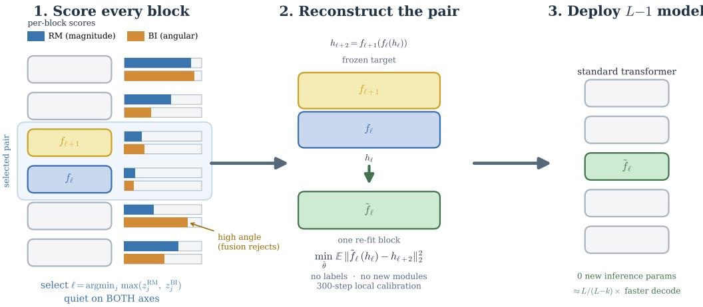
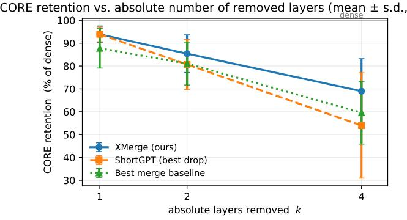
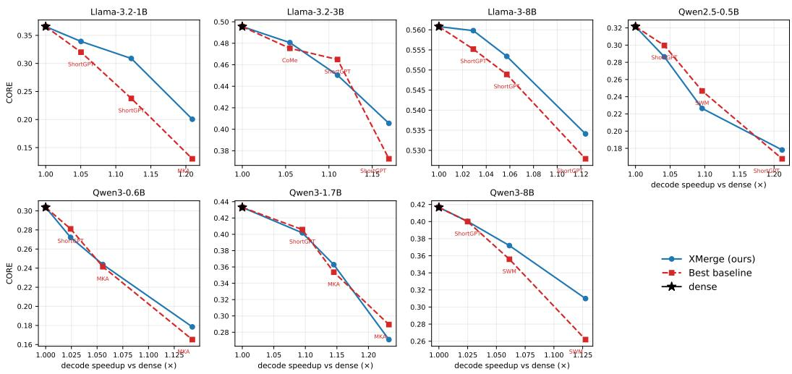
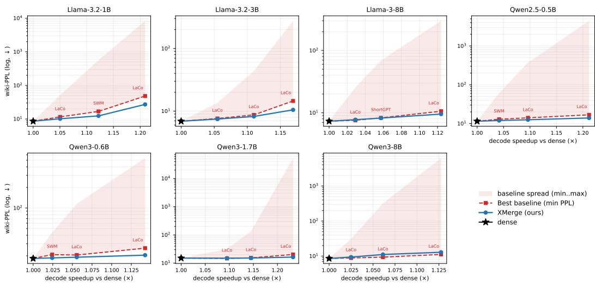
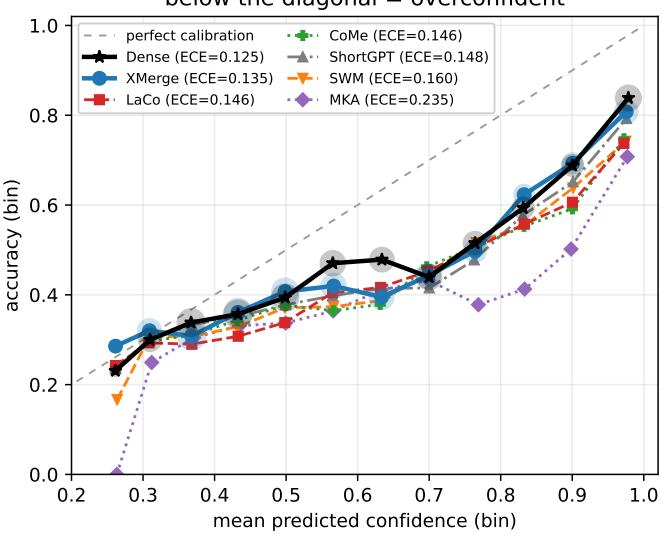

# XMerge: Cross-Axis Selection and Reconstructive Layer Merging for LLM Depth Compression

Jundong Hu∗ PayPal AI jundhu@paypal.com

Shekar Ramachandran PayPal AI sheramachandran@paypal.com

## Abstract

Removing complete transformer layers preserves a standard serving architecture, but existing depth-compression methods can lose substantial quality, and the loss varies unpredictably across models. We introduce XMERGE, a posttraining method with two components. Cross-axis selection identifies a block with low relative-magnitude and angular hidden-state change, and local boundary reconstruction re-fits the adjacent surviving block to match the original two-block output. XMERGE uses no task labels or end-to-end fine-tuning, and it introduces neither architectural changes nor additional inference-time parameters. Across seven Llama and Qwen backbones (0.5B–8B), five published baselines, and three layer-reduction levels, its advantage over baselines is largest at the most aggressive removal: at k=4 it ranks first on six of seven backbones on CORE (a 22-task aggregate) and, separately, on six of seven on MMLU (five of seven on both at once), while avoiding the large perplexity increases of several competing operators. In a task-level bootstrap, the 95% confidence intervals for the three largest CORE margins exclude zero; the remaining margins are consistent with ties. Across the 14 (model, regime) cells it is also the only evaluated operator that never collapses, ranking top-2 in both zero-shot and in-context regimes; on a first calibration probe (one backbone) it is the best-calibrated operator. Ablations show that local reconstruction provides most of the gain, while cross-axis fusion helps when the two selection axes disagree. The additional construction cost is recovered through per-token decode savings after roughly tens of thousands of requests.

## 1 Introduction

Motivation. Transformer depth drives inference latency and memory traffic: decode is sequential in layers, so removing whole blocks cuts wall-clock latency and key-value (KV) cache traffic. Unlike unstructured sparsity, which needs sparsity-aware kernels, or width pruning, which changes tensor dimensions Frantar and Alistarh [2023], Sun et al. [2024], Ma et al. [2023], depth compression removes entire layers while leaving hidden size, attention, vocabulary, and the serving interface untouched, so a shallower standard transformer runs on stock infrastructure. But layer dropping can cause disproportionate degradation, and prior methods disagree on which layers to compress and how the removed layer is absorbed: by dropping, averaging, collapsing, or reconstructing.

Depth compression is select-then-merge. Any depth-compression method decomposes into a selector S (which block to remove) and a structural operator M (how an adjacent block absorbs it), ${ \mathcal { C } } = { \mathcal { M } } \circ { \mathcal { S } }$ . This decomposition separates two failure modes: selecting an important block and failing to preserve the combined mapping of a safe block and its neighbor. We evaluate these two sources of error separately.

Proposed solution. XMERGE implements both decisions explicitly. Cross-axis selection marks a block as safe to remove only when it is quiet on both a relative-magnitude axis and an angular axis. Reconstructive merging then merges that block with an adjacent neighbor, replacing the pair with one standard transformer block whose existing parameters are optimized to reproduce the pair’s original output boundary states. The two components address different sources of degradation: reconstruction preserves the selected pair’s local mapping, while cross-axis selection reduces the chance of selecting a harmful location.

## Contributions.

• A reconstructive merge operator that preserves the serving interface. We collapse an adjacent block pair by re-fitting one existing surviving standard block (all of its parameters) to reproduce the pair’s original output mapping, so the compressed model stays an ordinary L−k-layer transformer with no new modules or added inference-time parameters. Among the operators compared here it is the only one that reconstructs by re-fitting a full existing standard (nonlinear) block: the closest module-free neighbor, ReplaceMe Shopkhoev et al. [2025], folds a linear map into a surviving weight, learned-replacement pruning (LLM-Streamline Chen et al. [2025]) adds a new module, and the analytic folds (LaCo/MKA/SWM/CoMe) use no activation fit at all (Table 1, §3.3).

• A parameter-free cross-axis selector and evaluation. We combine a relative-magnitude and an angular axis with a maximum (C = M ◦ S, §3.1) and evaluate across seven Llama and Qwen backbones, five baselines, and three compression levels, with component, regime, recovery, cost, and latency analyses. XMERGE grows increasingly robust relative to strong baselines as more layers are removed, at matched inference cost, and is the only evaluated operator with zero regime collapses across all 14 (model, regime) cells (§5–§8).

## 2 Related Work

Depth compression. Layer-dropping methods such as ShortGPT Men et al. [2025] and blockpruning approaches Kim et al. [2024], Song et al. [2024], Zhong et al. [2025] remove transformer blocks by activation- or importance-based criteria; magnitude-based analyses such as Prune&Comp Chen et al. [2026] study the hidden-state magnitude gap that layer removal induces, so a relative-magnitude selection signal has precedent in this line of work. LaCo Yang et al. [2024], MKA Liu et al. [2024], and SWM Ding et al. [2026] analytically collapse or combine neighboring parameters, while CoMe Wang et al. [2025] and related methods add feature alignment, distillation, or trained replacement modules. The most closely related operator, ReplaceMe Shopkhoev et al. [2025], is calibration-based and module-free but linearizes the removed blocks (a linear map folded into a surviving weight); XMERGE instead re-fits a full nonlinear surviving block to the two-block boundary mapping (contrasted operator-by-operator below). We use “layer merging” for adjacent-layer depth compression, not model merging across separately trained networks Wortsman et al. [2022], Ilharco et al. [2023].

Positioning. XMERGE uses a short, layer-local post-training calibration (self-supervised MSE to the model’s own pre-merge activations) rather than instantaneous structural pruning or end-toend recovery. The calibration yields an otherwise standard shallower transformer, similar to posttraining quantization Frantar et al. [2023], Lin et al. [2024]; we therefore describe it as post-training reconstruction rather than training-free compression. Local reconstruction against a dense model’s own activations is an established post-pruning paradigm Wagner et al. [2025], van der Ouderaa et al. [2024]; §3.3 details our serving-preserving instantiation.

How XMERGE differs from prior operators. Table 1 compares XMERGE with the five evaluated baselines and with two related methods that we do not run as baselines: the closest module-free neighbor ReplaceMe Shopkhoev et al. [2025] and the closest learned-reconstruction neighbor LLM Streamline Chen et al. [2025]. XMERGE is the only operator that reconstructs by re-fitting a full existing standard (nonlinear) block to the adjacent pair’s output while keeping the served model a module-free L−k transformer; the analytic folds combine layers in closed form, ReplaceMe folds a linear map into a surviving weight, and LLM-Streamline fits a new module. “Gradient fit” refers to the operator itself; CoMe’s distillation and SWM’s low-rank adaptation (LoRA) are separate recovery stages (Setting B, §4), not part of the operator.

Table 1: Operator design properties (not accuracy). Above the rule: the five evaluated baselines and XMERGE; below: ReplaceMe and LLM-Streamline, cited for positioning only (not run). All except LLM-Streamline yield a plain L−k transformer with zero new inference parameters, so they differ in how the removed block is absorbed. “Gradient $\mathrm { \ f t ^ { \prime \prime } }$ is an operator property; CoMe’s distillation and SWM’s LoRA are separate Setting-B stages (§7).
<table><tr><td></td><td>Merge into surv. block</td><td>Gradient fit</td><td>Pair-output target</td><td>Full-block refit</td></tr><tr><td>ShortGPT (drop)</td><td>X</td><td>X</td><td>X</td><td>X</td></tr><tr><td>LaCo (analytic fold)</td><td>√</td><td>X</td><td>X</td><td>X</td></tr><tr><td>MKA (analytic merge)</td><td>√</td><td>×</td><td>×</td><td>×</td></tr><tr><td>SWM (window average)</td><td>√</td><td>X</td><td>X</td><td>X</td></tr><tr><td>CoMe (head-group concat)</td><td>√</td><td>X</td><td>X</td><td>X</td></tr><tr><td>XMERGE (ours)</td><td>√</td><td>√</td><td>V</td><td>√</td></tr><tr><td colspan="5">Neighbors cited for positioning (not run as baselines):</td></tr><tr><td>ReplaceMe (block lineariz.)</td><td>√</td><td>X</td><td>√</td><td>X</td></tr><tr><td>LLM-Streamline (learned repl.)</td><td>×</td><td>√</td><td>√</td><td>X</td></tr></table>

  
Figure 1: XMERGE in three stages. (1) Score every block by relative-magnitude (RM) and Block-Influence (BI) hidden-state change on WikiText-2 activations, and select a block with low values on both axes; a block with low magnitude change but high angular change is not selected. (2) Reconstruct the pair $\left( f _ { \ell } , f _ { \ell + 1 } \right)$ into one surviving block $\tilde { f } _ { \ell }$ by a label-free 300-step local activationmatching fit. (3) Deploy a standard L−1 transformer with zero added inference-time parameters. Definitions in §3.2–§3.3.

## 3 Method: XMerge

## 3.1 Depth Compression as Select-then-Merge

Figure 1 provides an overview of XMERGE. A transformer applies blocks $f _ { 1 } , \ldots , f _ { L }$ , with block $f _ { l }$ mapping $h _ { l }  h _ { l + 1 }$ The selector S scores each single-block transition and marks a block $f _ { \ell }$ to remove; the operator M then replaces the adjacent pair $\left( f _ { \ell } , f _ { \ell + 1 } \right)$ (with original mapping $h _ { \ell + 2 } = f _ { \ell + 1 } ( f _ { \ell } ( h _ { \ell } ) ) )$ by one standard block $\tilde { f } _ { \ell }$ giving $\tilde { h } _ { \ell + 2 } = \tilde { f } _ { \ell } ( h _ { \ell } )$ , so ${ \mathcal { C } } = { \mathcal { M } } \circ { \mathcal { S } }$ . We study the two failure modes (§1) separately: the selector in §6.2, the operator in §6.1. After k merges the model has L − k blocks, a shape shared by all methods at the same k.

## 3.2 Selector: Cross-Axis Fusion (Parameter-Free)

Relative-magnitude axis. Low RM = small residual displacement; high RM = the layer strongly changes activation magnitude.

$$
\mathrm { R M } _ { l } = \mathbb { E } _ { x , t } \left[ \frac { \| h _ { l + 1 } ^ { ( x , t ) } - h _ { l } ^ { ( x , t ) } \| _ { 2 } } { \| h _ { l } ^ { ( x , t ) } \| _ { 2 } + \epsilon } \right] .
$$

Angular axis. Low BI = little directional change; high BI = the layer rotates the representation substantially.

$$
\mathrm { B I } _ { l } = \mathbb { E } _ { x , t } \Bigg [ 1 - \frac { \langle h _ { l } ^ { ( x , t ) } , h _ { l + 1 } ^ { ( x , t ) } \rangle } { \| h _ { l } ^ { ( x , t ) } \| _ { 2 } \| h _ { l + 1 } ^ { ( x , t ) } \| _ { 2 } + \epsilon } \Bigg ] .
$$

This is the Block-Influence criterion of ShortGPT Men et al. [2025]. We reuse it as the angular axis and combine it with relative magnitude. The reconstruction operator is the main methodological contribution; the cross-axis combination is used as a safeguard when the two axes disagree.

Cross-axis score. Both axes score a single block $f _ { l }$ on its input→output transition. Standardize each across eligible layers, $z _ { l } ^ { \mathrm { R M } } = ( \mathrm { R M } _ { l } - \mu _ { \mathrm { R M } } ) \ddot { / ( } \sigma _ { \mathrm { R M } } + \epsilon )$ and $z _ { l } ^ { \mathrm { B I } ^ { \bullet } } = ( \mathrm { B I } _ { l } - \mu _ { \mathrm { B I } } ) / ( \sigma _ { \mathrm { B I } } + \epsilon )$ and mark for removal the eligible block with the smallest

$$
s _ { l } = \mathrm { m a x } \big ( z _ { l } ^ { \mathrm { R M } } , ~ z _ { l } ^ { \mathrm { B I } } \big ) .
$$

A block is quiet only when neither magnitude nor angular change is large. We use max rather than an average because an average can hide a large score on one axis with a small score on the other. This choice has no tunable weighting coefficient. No boundary mask is used in the reported runs: an optional safeguard forbidding the first/last blocks as merge targets (motivated by the boundary sensitivity of layer surgery Hu and Ramachandran [2026]) is off for every reported cell, since cross axis fusion already avoids the boundary selections that would trigger it (§6.2); we disclose it only to note it was not needed.

## 3.3 Operator: Reconstructive Depth Collapse

Local activation-matching reconstruction after pruning is itself an established paradigm $( \ S 2 )  \}$ ; our novelty is not local reconstruction per se but its serving-preserving instantiation. We distill the adjacent two-block mapping into one ofthe existing surviving standard blocks rather than a learned replacement module, so the compressed model remains an ordinary shallower transformer with no inserted module. For calibration inputs x, we cache the pair’s input $\bar { h _ { l } } ( x )$ and original output $h _ { l + 2 } ( x )$ and retain one member of the pair as the surviving block ${ \tilde { f } } _ { l } \colon$ the neighbor on the side with the higher adjacent activation-patching redundancy score $S _ { \mathrm { p a t c h } }$ when both sides are available, initialized from its own pretrained weights. This fixed rule sets only the merge direction; we do not treat it as a contribution or ablate it (§H, §8). We then optimize all of its parameters (attention, MLP, and norms) in place:

$$
\operatorname* { m i n } _ { \tilde { \theta } _ { l } } \ \mathbb { E } _ { x } \Big [ \left\| \tilde { f } _ { l } \Big ( h _ { l } ( x ) ; \tilde { \theta } _ { l } \Big ) - f _ { l + 1 } ( f _ { l } ( h _ { l } ( x ) ) ) \right\| _ { 2 } ^ { 2 } \Big ] .
$$

Optimization is Adam for 300 steps, learning rate $1 0 ^ { - 5 }$ , batch size 16, over 128 WikiText-2 train sequences of 512 tokens — the same configuration for every model (not per-model tuned), without labels, downstream supervision, end-to-end optimization, or new inference parameters. We call this layer-local post-training reconstruction (not “fine-tuning-free”). Turning reconstruction off (steps=0) collapses XMERGE to a selected drop that falls below baselines (§6.1): the gain comes from reconstruction, not selection.

## 3.4 Iterative Compression

For $k > 1$ , selection order is computed once from the original model, while reconstruction targets are refreshed after each merge from the current partially compressed model. Candidates are processed in ascending fused-score order; a candidate that has already been removed, or whose neighbors have both already been removed, is skipped in favor of the next eligible candidate.

## 4 Experimental Setup

Table 2: Backbones (two families, 0.5B–8B): Llama-3 Dubey et al. [2024], Qwen2.5 Qwen Team [2024], and Qwen3 Qwen Team [2025]. Depth-reduction % shown for $k { = } 1 / 2 / 4$
<table><tr><td>Model</td><td>Layers</td><td>Dense CORE</td><td>Dense MMLU</td><td>Dense PPL</td><td>% removed  $\scriptstyle ( k = 1 / 2 / 4 )$ </td></tr><tr><td>Llama-3.2-1B</td><td>16</td><td>0.366</td><td>0.352</td><td>8.59</td><td>6.3 / 12.5 / 25.0</td></tr><tr><td>Llama-3.2-3B</td><td>28</td><td>0.496</td><td>0.405</td><td>6.91</td><td>3.6 / 7.1 / 14.3</td></tr><tr><td>Llama-3-8B</td><td>32</td><td>0.561</td><td>0.467</td><td>7.33</td><td>3.1 / 6.3 / 12.5</td></tr><tr><td>Qwen2.5-0.5B</td><td>24</td><td>0.322</td><td>0.336</td><td>11.50</td><td>4.2 / 8.3 / 16.7</td></tr><tr><td>Qwen3-0.6B</td><td>28</td><td>0.304</td><td>0.320</td><td>18.29</td><td>3.6 / 7.1 / 14.3</td></tr><tr><td>Qwen3-1.7B</td><td>28</td><td>0.433</td><td>0.379</td><td>15.05</td><td>3.6 / 7.1 / 14.3</td></tr><tr><td>Qwen3-8B</td><td>36</td><td>0.417</td><td>0.336</td><td>8.58</td><td>2.8 / 5.6 / 11.1</td></tr></table>

Baselines and comparison protocol. We compare against five published methods (dropping: ShortGPT Men et al. [2025]; merging/collapsing: LaCo Yang et al. [2024], MKA Liu et al. [2024], SWM Ding et al. [2026], CoMe Wang et al. [2025]) under two settings. Setting A (§5), the constructedcheckpoint operator comparison, has every method produce the same $L - k$ architecture using its authors’ native selection and operator at matched depth, with no follow-on recovery. It fixes the deployed artifact (identical architecture, parameter count, latency), not construction compute: XMERGE’s operator does gradient work the training-free baselines skip, so its checkpoint costs minutes–hours rather than seconds–minutes (break-even in §L; §8). We assign XMERGE’s fast, layerlocal, label-free reconstruction to the operator (like the analytic fold in LaCo/SWM) and include it here, whereas CoMe’s hierarchical distillation and SWM’s LoRA are global post-hoc stages deferred to Setting B (§7), where every healed method receives the same budget (four methods have recovery checkpoints; LaCo/MKA are analytic folds we did not heal, Setting A only). All six otherwise share the same $L { - } k$ architecture, zero inference-time parameters, and label-free inputs; baseline deviations are audited in §G. We do not run SLEB Song et al. [2024] (whole-block drop, ShortGPT’s family) or BlockPruner Zhong et al. [2025] (finer sub-block granularity, a different axis); both are cited as related work.

Compression levels. $k \in \{ 1 , 2 , 4 \}$ absolute removed-layer counts (mild→aggressive); percentage reductions in Table 2.

Metrics. Our primary metric is CORE Li et al. [2024], a 22-task centered aggregate (scored with the nanochat bundle Karpathy [2025]) covering zero-shot and in-context-learning (ICL) tasks. We use it because it is more discriminative in this study than MMLU (Massive Multitask Language Understanding) and, unlike perplexity, its task scores are less directly tied to the reconstruction corpus. We additionally report zero-shot MMLU Hendrycks et al. [2021] and WikiText-2 Merity et al. [2017] test perplexity (PPL); reconstruction calibrates on WikiText-2 train, so perplexity is partially in-domain despite disjoint train/test splits. We prespecify a collapse threshold (a model/regime centered CORE below 0.10, near-random) for the regime analysis (§6.3). Full task composition, prompting, centering, and evaluation details are in $\ S J$ and $\ S \mathrm { A }$

Protocol. Single compression seed 42; reconstruction hyperparameters (HPs) are fixed across all models (§3.3) and evaluation runs in float16. $\mathbf { A l l ~ 7 \times 6 \times 3 = }$ 126 backbone cells are complete; hardware and evaluation-sharding details are in $\ S \mathbf { A } .$

## 5 Main Results

We report the most aggressive setting (k=4) in the main text and defer the full $k \in \{ 1 , 2 , 4 \}$ six-method grids for every metric to §B–§E.

At k=4, XMERGE is strongest on six of seven backbones on CORE and, separately, on six of seven on MMLU. The exception differs by metric, so XMERGE is best on both CORE and MMLU for five of seven backbones, and no backbone is an exception on more than one metric (Table 3). The CORE win count rises with the absolute number of removed layers (four, five, six of seven at $k { = } 1 , 2 , 4 )$ : at $k { = } 1$ the picture is mixed, with XMERGE sole-best on only three backbones and tying or trailing ShortGPT elsewhere, so simpler methods are competitive at mild compression and the advantage becomes decisive only under aggressive removal (full grids in §B–§E; retention trend in Fig. 2). The three k=4 exceptions are narrow (Qwen3-1.7B CORE, §8; Qwen3-0.6B MMLU by 0.001; Qwen3-8B PPL). We report all perplexity values without truncation and impose no numerical collapse threshold. Only XMERGE and LaCo avoid the extreme k=4 blow-ups of the other four $( 1 0 ^ { 2 } – 1 0 ^ { 4 } ;$ ; e.g. MKA 8343 on Llama-3.2-1B, CoMe $5 . 3 \times 1 0 ^ { 4 }$ on Qwen3-1.7B; §E), and XMERGE is lower than LaCo on six of seven. MKA shows the risk directly: competitive CORE on Qwen3-1.7B but perplexity 440, so reporting accuracy and perplexity together reveals the degradation.

Table 3: Main results at k=4: XMERGE (XM) vs. the strongest per-model baseline $( ^ { 6 6 } \mathfrak { b } \mathfrak { b } ^ { 7 } )$ on each metric, with the winning baseline named for CORE and MMLU (full grids §B–§E). Among baselines LaCo has the lowest PPL in every row, so each wiki-PPL bb is LaCo (not the overall best — XMERGE beats LaCo’s PPL on six of seven). CORE↑, MMLU↑, wiki-PPL↓; bold = winner.
<table><tr><td>Model</td><td>CORE (XM / bb)</td><td>MMLU (XM / bb)</td><td>wiki-PPL (XM / bb; bb = LaCo)</td></tr><tr><td>Llama-3.2-1B</td><td>.201 / .130 (MKA)</td><td>.297 / .289 (ShortGPT)</td><td>27.16 / 48.18</td></tr><tr><td>Llama-3.2-3B</td><td>.406 / .373 (ShortGPT)</td><td>.374 / .359 (SWM)</td><td>10.49 / 14.53</td></tr><tr><td>Llama-3-8B</td><td>.534 / .528 (ShortGPT)</td><td>.434 / .427 (ShortGPT)</td><td>9.55 / 10.60</td></tr><tr><td>Qwen2.5-0.5B</td><td>.178 / .168 (ShortGPT)</td><td>.297 / .296 (SWM)</td><td>13.94 / 16.79</td></tr><tr><td>Qwen3-0.6B</td><td>.179 / .165 (MKA)</td><td>.295 / .296 (LaCo)</td><td>20.44 / 25.88</td></tr><tr><td>Qwen3-1.7B</td><td>.271 / .289 (MKA)</td><td>.338 / .322 (MKA)</td><td>16.33 / 20.19</td></tr><tr><td>Qwen3-8B</td><td>.310 / .262 (SWM)</td><td>.314 / .308 (LaCo)</td><td>12.89 /11.17</td></tr></table>

Signal vs. task noise. CORE is a 22-task macro-average, so we can bound how much of each k=4 margin is separable from task-level sampling noise by resampling the 22 per-task scores with replacement (paired 20,000-sample bootstrap over XMerge minus the strongest per-model baseline; Table 10, §C). The three largest margins have 95% CIs excluding zero (Llama-3.2-1B +.070, Llama-3.2-3B +.033, Qwen3-8B +.048), while the three narrow wins (Llama-3-8B +.006, Qwen2.5-0.5B +.010, Qwen3-0.6B +.013) and the single Qwen3-1.7B loss (−.018) have CIs spanning zero and should be read as ties. The one-sided sign test for the six-of-seven pattern gives p=0.06, so the cross-backbone count is not significant at conventional levels. This bootstrap measures task-sampling uncertainty only; it does not estimate reconstruction-seed variance, which we do not measure (§8).

CORE retention vs. absolute number of removed layers (mean ± s.d., 7 models)  
  
Figure 2: Mean CORE retention (compressed/dense) as the absolute number of removed layers grows from k=1 to 4 (mean±s.d. over 7 backbones). A fixed k is a different relative reduction per backbone, so this shows robustness to larger absolute removal, not a matched-ratio scaling law. XMERGE vs. best drop (ShortGPT) and best competing merge baseline (per-(model, k) max over LaCo/MKA/SWM/CoMe).

At k=1 XMERGE and ShortGPT each retain ≈94% of dense CORE, while the best competing merge baseline retains only ≈88%; the gap is largest under aggressive removal: at k=4 XMERGE holds 69% of dense CORE, versus 60% for the best competing merge baseline and 54% for ShortGPT (Fig. 2). The margin over the best merge baseline does not grow monotonically (+6.1, +4.2, +9.5 points at k=1, 2, 4).

  
Figure 3: Quality–latency Pareto per backbone (Setting A, operators only, no recovery): CORE vs. measured batch-1 decode speedup (⋆=dense; points k=1, 2, 4). All operators share the same L−k architecture at matched speedup, so higher-and-to-the-right is better; XMERGE is best at the k=4 endpoint on six of seven backbones (best-or-tied 15/21; trails at k=1,2 on Qwen2.5-0.5B). Protocol + speedup table §K.

Quality at matched inference cost. Because a fixed k yields the identical L−k decoder for every operator, the accuracy differences above are obtained at identical inference cost. We verify this directly by benchmarking decode throughput on the real checkpoints: measured batch-1 speedup is depth-proportional and method-independent (≈ $L / ( L - k ) ;$ ; mean $1 . 0 4 / 1 . 0 9 / 1 . 1 7 \times \mathrm { a t } k { = } 1 \bar { / } 2 / 4$ , full protocol and per-backbone table in §K). The quality–latency Pareto frontier is thus set entirely by which operator retains the most quality per removed layer: XMERGE is best at the k=4 endpoint on six of seven backbones and is best-or-tied in 15/21 matched-depth CORE cells (Fig. 3).

## 6 Component Analysis

We next separate the contributions of the operator (§6.1) and the selector (§6.2) and evaluate robustness across prompting regimes (§6.3).

## 6.1 Reconstruction Provides Most of the Gain

With selection fixed, reconstruction raises the score above the published baselines, whereas the corresponding selected drop is below them. In our two-backbone on/off ablation at k=4 under RM selection, Llama-3.2-3B improves from .344 (drop) to .406 (reconstruct) and Qwen3-0.6B from .136 to .184; in both cases selection+drop < published baselines < selection+reconstruction (we did not run the full seven-model grid). On Llama-3.2-3B, RM and max-fusion select the same layers, so .406 is also the deployed XMERGE number; on Qwen3-0.6B, deployed max-fusion is .179, trading a small CORE decrease for better perplexity and MMLU (§6.2). These results indicate that the gain does not come from selection alone.

## 6.2 Cross-Axis Fusion Reduces Disagreement Risk

The selector combines RM and BI with max (§3.2), fixed a priori and applied identically to all 7 models. An oracle backtest confirms RM and BI are the two informative axes and are near-tied as individual CORE predictors (§H), so fusion is adopted for robustness, not a claim that either axis is superior. Because max preserves the single-axis choice when the two axes agree, fusion is byte-identical to RM on 5/7 backbones and alters the decision only on Qwen3-0.6B and Qwen3-1.7B, where the two axes are less correlated (corr(RM, BI) ≈ 0.01 where it acts vs. 0.74 where it is a no-op; Table 19, §H). In these two cases, each single axis chooses a layer set that leads to substantially worse results, which fusion avoids: RM alone drops early layers on Qwen3-1.7B ({3,4,5,7}), while BI alone

selects the final block and collapses the model (Qwen3-1.7B PPL $5 . 1 \times 1 0 ^ { 4 }$ under reconstruction;   
Qwen3-0.6B PPL 226 under a plain drop), as the head-to-head at k=4 shows (Table 4).

Table 4: Selector head-to-head at k=4 (CORE / wiki-PPL / MMLU), on the two backbones where cross-axis fusion overrides RM; identical reconstruction HPs, so only selection differs (max-fusion adopted). BI-only collapses (Qwen3-1.7B PPL $5 . 1 \times 1 0 ^ { 4 }$ , selecting the final block; Qwen3-0.6B under a plain drop, CORE .079 / PPL 226); MKA shown for reference (high PPL despite competitive CORE). Narration in §6.2.
<table><tr><td>selector</td><td>Qwen3-1.7B (dense .433)</td><td>Qwen3-0.6B (dense .304)</td></tr><tr><td>RM-only</td><td>.205 / 19.37 / .303</td><td>.184 / 21.13 / .294</td></tr><tr><td>BI-only</td><td>.063 / 50606 / —</td><td>— (drop: .079 / 226)</td></tr><tr><td>max-fusion (RM⊕BI)</td><td>.271 / 16.33 / .338</td><td>.179 / 20.44 / .295</td></tr><tr><td>MKA</td><td>.289 / 440 / .322</td><td>.165 / 276 / .294</td></tr></table>

On Qwen3-0.6B the fused choice trades a small CORE decrease for better perplexity and MMLU, improving worst-case behavior rather than winning every metric. We therefore treat reconstruction as the primary operator contribution and cross-axis fusion as the robustness mechanism, since a strong operator alone cannot compensate for an unsafe structural choice.

## 6.3 Zero-Shot vs. In-Context Regimes

Because CORE aggregates zero-shot and in-context-learning tasks, we split it into the two regimes and ask a robustness question: does each operator preserve both? Using the prespecified collapse threshold (§4; centered CORE below 0.10), we count collapses across all 14 cells (7 models × 2 regimes). XMERGE is the only evaluated operator that never collapses: zero below-threshold cells and top-2 in all 7 models in both regimes (worst cell +0.172; Table 5). Every baseline collapses on at least one cell (CoMe on 7 of 14, with MKA and CoMe going negative at ICL on Llama-3.2-1B), so XMERGE’s clearest distinction from the baselines is this zero-collapse robustness across regimes, not any single win.

Table 5: Robustness across all 14 (model × regime) cells at k=4. A break is centered CORE $< 0 . 1 0 $ “floor” is each operator’s worst cell. Per-model 0-shot/ICL tables are in §J.
<table><tr><td>Method</td><td>breaks (of 14)</td><td>floor (min)</td><td>top-2 @ 0-shot</td><td>top-2 @ ICL</td></tr><tr><td>XM (XMERGE)</td><td>0</td><td>+.172</td><td>7/7</td><td>7/7</td></tr><tr><td>SWM</td><td>1</td><td>+.093</td><td>0/7</td><td>2/7</td></tr><tr><td>LaCo</td><td>2</td><td>+.064</td><td>2/7</td><td>0/7</td></tr><tr><td>MKA</td><td>2 (incl. neg.)</td><td>-.022</td><td>1/7</td><td>2/7</td></tr><tr><td>ShortGPT</td><td>3</td><td>+.071</td><td>4/7</td><td>3/7</td></tr><tr><td>CoMe</td><td>7 (incl. neg.)</td><td>-.025</td><td>0/7</td><td>0/7</td></tr></table>

Within each regime, XMERGE has the highest mean score (0-shot mean .291 vs. next-best ShortGPT .236; ICL .300 vs. .242; per-model means and the full per-regime tables in §J). The Qwen3-1.7B/0.6B exception (§8) is purely an ICL effect — XMERGE wins the 0-shot slice on both.

## 7 Recoverability Under a Shared Post-Compression Budget

We next test whether XMERGE also provides a strong starting point for post-compression recovery. Setting B grants every included method the same additional healing budget: one uniform WikiText-2 knowledge-distillation (KD) stage (identical data, tokens, LoRA rank, learning-rate (LR) policy, steps, and teacher, matched to XMERGE’s calibration cost) on each compressed model, isolating which operator gives the best starting point. This controls the recovery stage, not total compressionplus-recovery compute (native construction costs differ, §8). We heal the four methods with recovery checkpoints (XMERGE, ShortGPT, SWM, CoMe); the analytic folds LaCo/MKA appear in Setting A only.

Under the shared follow-on budget, XMERGE starts from the strongest unhealed model at both scales. It attains the best recovered CORE on Llama-3.2-1B (+0.007 over the next method) and ties SWM on Qwen3-8B (.358 vs. .358; unrounded gap ≈ 0.0002, within single-seed noise), while keeping the best perplexity among the CORE-competitive methods; its advantage is thus not limited to the unhealed checkpoint.

Table 6: Recovery under a shared additional post-compression budget (k=4), mean over the LR grid $\{ 1 , 2 , 5 \} \times 1 0 ^ { - 5 }$ (no LR tuned on the eval metric; per-LR + full protocol §I). The four healed methods each get the same follow-on WikiText-2 KD stage on their own compressed model (LaCo/MKA are Setting-A only). Bold = best per metric (CORE, PPL scored separately) within a model; a merge baseline has the lowest raw PPL at each scale (SWM@1B, CoMe@8B).
<table><tr><td>Model (dense CORE / PPL)</td><td>XMERGE</td><td>ShortGPT</td><td>CoMe</td><td>SWM</td></tr><tr><td>Llama-3.2-1B (.366 / 8.59)</td><td>.252 / 15.43</td><td>.245 / 16.56</td><td>.170 /17.11</td><td>.223 / 15.29</td></tr><tr><td>Qwen3-8B (.417 / 8.58)</td><td>.358 / 10.66</td><td>.351 / 11.57</td><td>.343 / 9.23</td><td>.358 / 11.89</td></tr></table>

## 8 Discussion and Limitations

Where XMERGE wins. The Setting A per-cell winners show which baselines it competes with: the strongest single baseline is most often ShortGPT (12/21 (model,k) cells; MKA 5, SWM 3, CoMe 1, LaCo 0), expected since Setting A withholds the mergers’ native LoRA/distillation (deferred to Setting B, §7) and favors pure droppers. XMERGE exceeds the strongest baseline in 15/21 cells using only label-free reconstruction, and under Setting B’s shared budget stays best-or-tied (a win at 1B, a tie with SWM at 8B).

Reliability checks. A compressed model is only useful if it stays reliable, not just fast, so we evaluate two aspects explicitly. Task-ability robustness: XMERGE is the only evaluated operator with no CORE collapse across all 14 (model, regime) cells (§6.3) and no perplexity blow-up at k=4 (§5). Calibration: because the operator matches dense hidden states, it should distort confidence less than analytic merges; we test this with expected calibration error (ECE) on MMLU. On Llama-3-8B at k=4 (Setting A), XMERGE has the lowest ECE degradation of all six operators $( \Delta \mathrm { E C E { = } { + } 0 . 0 1 0 }$ over the dense model’s 0.125), better than the analytic weight-fold/merge baselines (LaCo +0.021, MKA +0.110) and every other operator (§F, Table 17, Fig. 5); all methods stay somewhat overconfident, so reconstruction preserves calibration best but does not fully restore it. This result is limited to one backbone and one metric; it does not establish a general safety guarantee. We do not evaluate the remaining safety-oriented aspects (hallucination, refusal/safety behaviour), which require instruction or safety-tuned variants rather than the base models studied here, and we leave them to future work.

Limitations. The additional cost is incurred during construction; serving uses the same standard L−k decoder as the baselines, whose decode speedup is a single per-(backbone, k) quantity shared by all operators (§K), so the gradient work XMERGE does at build time buys quality, not speed. In absolute terms, this one-time cost is minutes to 4.4 hours (≈linear in k; §L) and is recovered by the per-token saving after ≈1.9k–24k requests (§L); we do not claim parity in total constructionplus-recovery compute with the training-free baselines. The study uses a single compression seed (42): the task-bootstrap of §5 bounds task-sampling noise but not reconstruction-seed variance across a full re-run, which only a multi-seed study would close. It covers only dense decoder-only Llama/Qwen models (0.5B–8B; the 8B ceiling reflects our single 40 GB GPU-partition compute budget, not a limitation of the method), not mixture-of-experts (MoE), encoder–decoder, multimodal, or state-space. Reconstruction uses WikiText-2, so WikiText-2 test perplexity is partially in-domain (downstream benchmarks are independent). We do not ablate the merge-direction heuristic $( S _ { \mathrm { p a t c h } } .$ §3.3). XMERGE is also not universally best: it loses k=4 CORE to MKA on Qwen3-1.7B, is not lowest-perplexity on Qwen3-8B, and at mild compression simpler methods can match it — the advantage appears under larger absolute layer removal and in cross-regime robustness. Because the reconstruction objective minimizes hidden-state MSE to the dense model, CORE, MMLU, and perplexity all partly measure proximity to that same target, so the wins across three metrics are corroborating views of one objective rather than fully independent confirmations.

## Author Contributions

Jundong Hu: Led and carried out the research end to end, including conceptualization, methodology, implementation, experimental design and execution, analysis, and manuscript drafting and revision

Shekar Ramachandran: Provided supervision, compute resources, and manuscript review.

## Acknowledgments

We thank Prakhar Mehrotra, Chandramouliswaran V, Avinash Karn, Anindya Moitra, Uma Kona, Angela McAtee, Linsey Pang, and Yun-Shiuan Chuang for their organizational support and coordination throughout this work. Jundong Hu additionally thanks Loga Vinayagam for the opportunity to join the team where this work began.

## References

Xiaodong Chen, Yuxuan Hu, Jing Zhang, Yanling Wang, Cuiping Li, and Hong Chen. Streamlining redundant layers to compress large language models. In International Conference on Learning Representations, 2025.

Xinrui Chen, Hongxing Zhang, Fanyi Zeng, Yongxian Wei, Yizhi Wang, Xitong Ling, Guanghao Li, and Chun Yuan. Prune&Comp: Free lunch for layer-pruned LLMs via iterative pruning with magnitude compensation. In Proceedings ofthe AAAI Conference on Artificial Intelligence, volume 40, pages 20316–20324, 2026. doi: 10.1609/aaai.v40i24.39120.

Xuan Ding, Rui Sun, Yunjian Zhang, Xiu Yan, Yueqi Zhou, Kaihao Huang, Suzhong Fu, Angelica I. Aviles-Rivero, Chuanlong Xie, and Yao Zhu. Sliding-window merging for compacting patchredundant layers in LLMs. In Proceedings of the AAAI Conference on Artificial Intelligence, volume 40, pages 20826–20834, 2026. doi: 10.1609/aaai.v40i25.39222.

Abhimanyu Dubey et al. The Llama 3 herd of models. arXiv preprint arXiv:2407.21783, 2024.

Elias Frantar and Dan Alistarh. SparseGPT: Massive language models can be accurately pruned in one-shot. In International Conference on Machine Learning (ICML), 2023.

Elias Frantar, Saleh Ashkboos, Torsten Hoefler, and Dan Alistarh. GPTQ: Accurate post-training quantization for generative pre-trained transformers. In International Conference on Learning Representations (ICLR), 2023.

Dan Hendrycks, Collin Burns, Steven Basart, Andy Zou, Mantas Mazeika, Dawn Song, and Jacob Steinhardt. Measuring massive multitask language understanding. In International Conference on Learning Representations (ICLR), 2021.

Geoffrey Hinton, Oriol Vinyals, and Jeff Dean. Distilling the knowledge in a neural network. arXiv preprint arXiv:1503.02531, 2015.

Edward J. Hu, Yelong Shen, Phillip Wallis, Zeyuan Allen-Zhu, Yuanzhi Li, Shean Wang, Lu Wang, and Weizhu Chen. LoRA: Low-rank adaptation of large language models. In International Conference on Learning Representations (ICLR), 2022.

Jundong Hu and Shekar Ramachandran. The structure of quantization damage in LLMs: Why the next bit should be spent globally. arXiv preprint arXiv:2609.01587, 2026.

Gabriel Ilharco, Marco Tulio Ribeiro, Mitchell Wortsman, Suchin Gururangan, Ludwig Schmidt, Hannaneh Hajishirzi, and Ali Farhadi. Editing models with task arithmetic. In International Conference on Learning Representations (ICLR), 2023.

Andrej Karpathy. nanochat. https://github.com/karpathy/nanochat, 2025. CORE metric implementation: core\_eval.py / core.yaml.

Bo-Kyeong Kim, Geonmin Kim, Tae-Ho Kim, Thibault Castells, Shinkook Choi, Junho Shin, and Hyoung-Kyu Song. Shortened LLaMA: Depth pruning for large language models with comparison of retraining methods. In ICLR 2024 Workshop on Mathematical and Empirical Understanding of Foundation Models (ME-FoMo), 2024.

Jeffrey Li, Alex Fang, Georgios Smyrnis, Maor Ivgi, Matt Jordan, Samir Gadre, Hritik Bansal, Etash Guha, Sedrick Keh, Kushal Arora, Saurabh Garg, Rui Xin, Niklas Muennighoff, Reinhard Heckel, Jean Mercat, Mayee Chen, Suchin Gururangan, Mitchell Wortsman, Alon Albalak, Yonatan Bitton, Marianna Nezhurina, Amro Abbas, Cheng-Yu Hsieh, Dhruba Ghosh, Josh Gardner, Maciej Kilian, Hanlin Zhang, Rulin Shao, Sarah Pratt, Sunny Sanyal, Gabriel Ilharco, Giannis Daras, Kalyani Marathe, Aaron Gokaslan, Jieyu Zhang, Khyathi Chandu, Thao Nguyen, Igor Vasiljevic, Sham Kakade, Shuran Song, Sujay Sanghavi, Fartash Faghri, Sewoong Oh, Luke Zettlemoyer, Kyle Lo, Alaaeldin El-Nouby, Hadi Pouransari, Alexander Toshev, Stephanie Wang, Dirk Groeneveld, Luca Soldaini, Pang Wei Koh, Jenia Jitsev, Thomas Kollar, Alexandros G. Dimakis, Yair Carmon, Achal Dave, Ludwig Schmidt, and Vaishaal Shankar. DataComp-LM: In search of the next generation of training sets for language models. In Advances in Neural Information Processing Systems (NeurIPS), 2024.

Ji Lin, Jiaming Tang, Haotian Tang, Shang Yang, Wei-Ming Chen, Wei-Chen Wang, Guangxuan Xiao, Xingyu Dang, Chuang Gan, and Song Han. AWQ: Activation-aware weight quantization for LLM compression and acceleration. In Proceedings ofMachine Learning and Systems (MLSys), 2024.

Deyuan Liu, Zhanyue Qin, Hairu Wang, Zhao Yang, Zecheng Wang, Fangying Rong, Qingbin Liu, Yanchao Hao, Bo Li, Xi Chen, Cunhang Fan, Zhao Lv, Dianhui Chu, Zhiying Tu, and Dianbo Sui. Pruning via merging: Compressing LLMs via manifold alignment based layer merging. In Proceedings of the 2024 Conference on Empirical Methods in Natural Language Processing, pages 17817–17829, Miami, Florida, USA, 2024. Association for Computational Linguistics. doi: 10.18653/v1/2024.emnlp-main.987. URL https://aclanthology.org/2024.emnlp-main. 987/.

Xinyin Ma, Gongfan Fang, and Xinchao Wang. LLM-Pruner: On the structural pruning of large language models. In Advances in Neural Information Processing Systems (NeurIPS), 2023.

Xin Men, Mingyu Xu, Qingyu Zhang, Qianhao Yuan, Bingning Wang, Hongyu Lin, Yaojie Lu, Xianpei Han, and Weipeng Chen. ShortGPT: Layers in large language models are more redundant than you expect. In Findings of the Association for Computational Linguistics: ACL 2025, 2025. URL https://aclanthology.org/2025.findings-acl.1035/.

Stephen Merity, Caiming Xiong, James Bradbury, and Richard Socher. Pointer sentinel mixture models. In International Conference on Learning Representations (ICLR), 2017.

Qwen Team. Qwen2.5 technical report. arXiv preprint arXiv:2412.15115, 2024.

Qwen Team. Qwen3 technical report. arXiv preprint arXiv:2505.09388, 2025.

Dmitriy Shopkhoev, Ammar Ali, Magauiya Zhussip, Valentin Malykh, Stamatios Lefkimmiatis, Nikos Komodakis, and Sergey Zagoruyko. ReplaceMe: Network simplification via depth pruning and transformer block linearization. In Advances in Neural Information Processing Systems, 2025.

Jiwon Song, Kyungseok Oh, Taesu Kim, Hyungjun Kim, Yulhwa Kim, and Jae-Joon Kim. SLEB: Streamlining LLMs through redundancy verification and elimination of transformer blocks. In Proceedings ofthe 41st International Conference on Machine Learning (ICML), 2024.

Mingjie Sun, Zhuang Liu, Anna Bair, and J. Zico Kolter. A simple and effective pruning approach for large language models. In International Conference on Learning Representations (ICLR), 2024.

Tycho F. A. van der Ouderaa, Markus Nagel, Mart van Baalen, Yuki M. Asano, and Tijmen Blankevoort. The LLM surgeon. In International Conference on Learning Representations, 2024.

Moritz Wagner, Christophe Roux, Max Zimmer, and Sebastian Pokutta. A free lunch in LLM compression: Revisiting retraining after pruning. arXiv preprint arXiv:2510.14444, 2025.

Fei Wang, Li Shen, Liang Ding, Chao Xue, Ye Liu, and Changxing Ding. Layer as puzzle pieces: Compressing large language models through layer concatenation. In Advances in Neural Information Processing Systems (NeurIPS), 2025. URL https://arxiv.org/abs/2510.15304.

Mitchell Wortsman, Gabriel Ilharco, Samir Yitzhak Gadre, Rebecca Roelofs, Raphael Gontijo-Lopes, Ari S. Morcos, Hongseok Namkoong, Ali Farhadi, Yair Carmon, Simon Kornblith, and Ludwig Schmidt. Model soups: Averaging weights of multiple fine-tuned models improves accuracy without increasing inference time. In International Conference on Machine Learning (ICML), 2022.

Yifei Yang, Zouying Cao, and Hai Zhao. LaCo: Large language model pruning via layer collapse. In Findings of the Association for Computational Linguistics: EMNLP 2024, 2024. URL https: //aclanthology.org/2024.findings-emnlp.372/.

Longguang Zhong, Fanqi Wan, Ruijun Chen, Xiaojun Quan, and Liangzhi Li. BlockPruner: Finegrained pruning for large language models. In Findings of the Association for Computational Linguistics: ACL 2025, 2025. URL https://aclanthology.org/2025.findings-acl.262/.

## A Hardware and Evaluation Protocol

All runs use NVIDIA A100-SXM4-80GB GPUs partitioned into Multi-Instance GPU (MIG) slices. Evaluation is sharded across 4 MIG instances via NCCL/DDP: examples are strided across ranks and all-reduced, numerically identical to single-process evaluation. Evaluation task subsets use a fixed Random(1337) shuffle. MMLU is zero-shot over all 14,042 examples across 57 subjects; WikiText-2 perplexity uses a sliding window (max-length 2048, stride 512) on the test split, while reconstruction calibrates on the train split (disjoint).

## B Full CORE Tables

All six methods × seven models $\times \textit { k } \in \{ 1 , 2 , 4 \}$ ; bold = best in row. XMERGE (“XM”) uses max-fusion selection on Qwen3-0.6B (k=4) and Qwen3-1.7B (all k) and is byte-identical to RM selection elsewhere; MKA is the fixed top-down port. Dense CORE in Table 2.

Table 7: CORE, k=1.
<table><tr><td>Model</td><td>ShortGPT</td><td>LaCo</td><td>MKA</td><td>SWM</td><td>CoMe</td><td>XM</td></tr><tr><td>Llama-3.2-1B</td><td>.320</td><td>.254</td><td>.270</td><td>.254</td><td>.266</td><td>.339</td></tr><tr><td>Llama-3.2-3B</td><td>.472</td><td>.414</td><td>.444</td><td>.401</td><td>.475</td><td>.481</td></tr><tr><td>Llama-3-8B</td><td>.555</td><td>.523</td><td>.494</td><td>.523</td><td>.549</td><td>.560</td></tr><tr><td>Qwen2.5-0.5B</td><td>.300</td><td>.240</td><td>.240</td><td>.247</td><td>.232</td><td>.286</td></tr><tr><td>Qwen3-0.6B</td><td>.281</td><td>.209</td><td>.260</td><td>.233</td><td>.129</td><td>.272</td></tr><tr><td>Qwen3-1.7B</td><td>.406</td><td>.363</td><td>.397</td><td>.359</td><td>.192</td><td>.402</td></tr><tr><td>Qwen3-8B</td><td>.400</td><td>.376</td><td>.380</td><td>.386</td><td>.326</td><td>.400</td></tr></table>

Table 8: CORE, k=2.
<table><tr><td>Model</td><td>ShortGPT</td><td>LaCo</td><td>MKA</td><td>SWM</td><td>CoMe</td><td>XM</td></tr><tr><td>Llama-3.2-1B</td><td>.238</td><td>.165</td><td>.211</td><td>.227</td><td>.113</td><td>.309</td></tr><tr><td>Llama-3.2-3B</td><td>.465</td><td>.351</td><td>.415</td><td>.391</td><td>.440</td><td>.450</td></tr><tr><td>Llama-3-8B</td><td>.549</td><td>.460</td><td>.469</td><td>.508</td><td>.524</td><td>.553</td></tr><tr><td>Qwen2.5-0.5B</td><td>.246</td><td>.219</td><td>.184</td><td>.247</td><td>.212</td><td>.226</td></tr><tr><td>Qwen3-0.6B</td><td>.239</td><td>.207</td><td>.242</td><td>.198</td><td>.055</td><td>.244</td></tr><tr><td>Qwen3-1.7B</td><td>.309</td><td>.293</td><td>.354</td><td>.325</td><td>.070</td><td>.363</td></tr><tr><td>Qwen3-8B</td><td>.340</td><td>.343</td><td>.332</td><td>.356</td><td>.213</td><td>.372</td></tr></table>

Table 9: CORE, k=4.
<table><tr><td>Model</td><td>ShortGPT</td><td>LaCo</td><td>MKA</td><td>SWM</td><td>CoMe</td><td>XM</td></tr><tr><td>Llama-3.2-1B</td><td>.111</td><td>.066</td><td>.130</td><td>.129</td><td>-.005</td><td>.201</td></tr><tr><td>Llama-3.2-3B</td><td>.373</td><td>.212</td><td>.330</td><td>.308</td><td>.279</td><td>.406</td></tr><tr><td>Llama-3-8B</td><td>.528</td><td>.358</td><td>.387</td><td>.385</td><td>.458</td><td>.534</td></tr><tr><td>Qwen2.5-0.5B</td><td>.168</td><td>.158</td><td>.109</td><td>.142</td><td>.095</td><td>.178</td></tr><tr><td>Qwen3-0.6B</td><td>.079</td><td>.160</td><td>.165</td><td>.111</td><td>.016</td><td>.179</td></tr><tr><td>Qwen3-1.7B</td><td>.167</td><td>.199</td><td>.289</td><td>.234</td><td>.010</td><td>.271</td></tr><tr><td>Qwen3-8B</td><td>.257</td><td>.244</td><td>.244</td><td>.262</td><td>.171</td><td>.310</td></tr></table>

## C Task-Bootstrap Confidence Intervals on the CORE Margins

The main sweep uses a single compression seed. To quantify how much of each k=4 CORE margin is separable from task-selection noise, we treat CORE’s 22 constituent per-task scores as the resampling unit: for each backbone we form the paired per-task differences between XMERGE and the strongest per-model baseline and draw 20,000 bootstrap resamples of the 22 tasks (with replacement), reporting the mean margin, its 95% percentile interval, and $\dot { P } ( \mathrm { { m a r g i n } > 0 ) }$ . This is a property of the frozen checkpoints (no new GPU runs) and is deliberately not a seed-variance estimate: it does not perturb the stochastic reconstruction, so it bounds task-sampling noise only. Reconstruction-seed variance remains unmeasured and is stated as a limitation (§8).

Table 10: Paired task-bootstrap of the k=4 CORE margin (XMERGE − strongest per-model baseline), B=20,000 resamples over the 22 CORE tasks. $^ { \mathrm { \scriptsize ~ \mathfrak { \omega } } } ( \mathrm { t i e } ) ^ { \flat }$ marks margins whose 95% CI includes zero. The three largest margins are separable from task noise; the narrow wins and the single Qwen3-1.7B loss are ties. Across backbones XMERGE is strongest on six of seven (one-sided sign test $\scriptstyle { p = 0 . 0 6 ) }$ Point columns are rounded to match the CORE values in Table 3 and §B; margins and CIs are computed from the unrounded per-task scores, so a listed margin can differ by up to 0.001 from the difference of the displayed points.

<table><tr><td>Model</td><td>XMERGE</td><td>best baseline</td><td>margin</td><td>95% CI</td><td> $P ( > 0 )$ </td></tr><tr><td>Llama-3.2-1B</td><td>.201</td><td>MKA.130</td><td>+0.070</td><td>[+0.026, +0.123]</td><td>1.000</td></tr><tr><td>Llama-3.2-3B</td><td>.406</td><td>ShortGPT .373</td><td>+0.033</td><td>[+0.008, +0.060]</td><td>0.996</td></tr><tr><td>Llama-3-8B</td><td>.534</td><td>ShortGPT .528</td><td>+0.006</td><td>[−0.004, +0.018] (tie)</td><td>0.861</td></tr><tr><td>Qwen2.5-0.5B</td><td>.178</td><td>ShortGPT .168</td><td>+0.010</td><td>[−0.009, +0.031] (tie)</td><td>0.842</td></tr><tr><td>Qwen3-0.6B</td><td>.179</td><td>MKA.165</td><td>+0.013</td><td>[−0.059, +0.082] (tie)</td><td>0.654</td></tr><tr><td>Qwen3-1.7B</td><td>.271</td><td>MKA.289</td><td>-0.018</td><td>[−0.094, +0.045] (tie)</td><td>0.326</td></tr><tr><td>Qwen3-8B</td><td>.310</td><td>SWM .262</td><td>+0.048</td><td>[+0.001, +0.1i0]</td><td>0.979</td></tr></table>

## D Full MMLU Tables

Zero-shot MMLU; bold = best in row. MMLU is near the 25% random floor below 7B (reported for completeness; discriminative at 8B). Dense MMLU in Table 2.

Table 11: MMLU, k=1.
<table><tr><td>Model</td><td>ShortGPT</td><td>LaCo</td><td>MKA</td><td>SWM</td><td>CoMe</td><td>XM</td></tr><tr><td>Llama-3.2-1B</td><td>.337</td><td>.322</td><td>.272</td><td>.322</td><td>.325</td><td>.340</td></tr><tr><td>Llama-3.2-3B</td><td>.396</td><td>.380</td><td>.394</td><td>.381</td><td>.390</td><td>.396</td></tr><tr><td>Llama-3-8B</td><td>.461</td><td>.448</td><td>.442</td><td>.448</td><td>.453</td><td>.461</td></tr><tr><td>Qwen2.5-0.5B</td><td>.327</td><td>.310</td><td>.312</td><td>.325</td><td>.307</td><td>.319</td></tr><tr><td>Qwen3-0.6B</td><td>.313</td><td>.311</td><td>.306</td><td>.306</td><td>.290</td><td>.319</td></tr><tr><td>Qwen3-1.7B</td><td>.365</td><td>.347</td><td>.361</td><td>.346</td><td>.312</td><td>.372</td></tr><tr><td>Qwen3-8B</td><td>.330</td><td>.325</td><td>.327</td><td>.327</td><td>.320</td><td>.332</td></tr></table>

Table 12: MMLU, k=2.
<table><tr><td>Model</td><td>ShortGPT</td><td>LaCo</td><td>MKA</td><td>SWM</td><td>CoMe</td><td>XM</td></tr><tr><td>Llama-3.2-1B</td><td>.310</td><td>.295</td><td>.272</td><td>.308</td><td>.286</td><td>.316</td></tr><tr><td>Llama-3.2-3B</td><td>.393</td><td>.348</td><td>.384</td><td>.376</td><td>.372</td><td>.395</td></tr><tr><td>Llama-3-8B</td><td>.457</td><td>.412</td><td>.429</td><td>.430</td><td>.438</td><td>.460</td></tr><tr><td>Qwen2.5-0.5B</td><td>.312</td><td>.311</td><td>.301</td><td>.309</td><td>.300</td><td>.308</td></tr><tr><td>Qwen3-0.6B</td><td>.306</td><td>.308</td><td>.304</td><td>.300</td><td>.274</td><td>.312</td></tr><tr><td>Qwen3-1.7B</td><td>.341</td><td>.335</td><td>.345</td><td>.334</td><td>.284</td><td>.366</td></tr><tr><td>Qwen3-8B</td><td>.329</td><td>.321</td><td>.315</td><td>.323</td><td>.294</td><td>.324</td></tr></table>

Table 13: MMLU, k=4.
<table><tr><td>Model</td><td>ShortGPT</td><td>LaCo</td><td>MKA</td><td>SWM</td><td>CoMe</td><td>XM</td></tr><tr><td>Llama-3.2-1B</td><td>.289</td><td>.280</td><td>.285</td><td>.280</td><td>.263</td><td>.297</td></tr><tr><td>Llama-3.2-3B</td><td>.358</td><td>.323</td><td>.352</td><td>.359</td><td>.331</td><td>.374</td></tr><tr><td>Llama-3-8B</td><td>.427</td><td>.376</td><td>.411</td><td>.409</td><td>.391</td><td>.434</td></tr><tr><td>Qwen2.5-0.5B</td><td>.294</td><td>.291</td><td>.281</td><td>.296</td><td>.283</td><td>.297</td></tr><tr><td>Qwen3-0.6B</td><td>.271</td><td>.296</td><td>.294</td><td>.291</td><td>.261</td><td>.295</td></tr><tr><td>Qwen3-1.7B</td><td>.295</td><td>.310</td><td>.322</td><td>.306</td><td>.269</td><td>.338</td></tr><tr><td>Qwen3-8B</td><td>.305</td><td>.308</td><td>.295</td><td>.304</td><td>.306</td><td>.314</td></tr></table>

## E Full Perplexity Tables

WikiText-2 test perplexity (lower better); bold = best in row. Extreme values shown untruncated to expose operator collapses (XMERGE and LaCo are the only operators that avoid the $\mathrm { 1 0 ^ { 2 } - 1 0 ^ { 4 } }$ blow-ups at k=4; XMERGE is lower than LaCo on six of seven backbones). Dense PPL in Table 2; Fig. 4 plots these values against measured decode speedup.

Table 14: wiki-PPL, k=1.
<table><tr><td>Model</td><td>ShortGPT</td><td>LaCo</td><td>MKA</td><td>SWM</td><td>CoMe</td><td>XM</td></tr><tr><td>Llama-3.2-1B</td><td>12.26</td><td>11.52</td><td>51.41</td><td>11.52</td><td>21.16</td><td>10.16</td></tr><tr><td>Llama-3.2-3B</td><td>7.78</td><td>7.64</td><td>13.65</td><td>8.06</td><td>8.05</td><td>7.48</td></tr><tr><td>Llama-3-8B</td><td>7.70</td><td>7.58</td><td>25.57</td><td>7.58</td><td>8.14</td><td>7.75</td></tr><tr><td>Qwen2.5-0.5B</td><td>13.15</td><td>13.17</td><td>60.82</td><td>12.91</td><td>14.41</td><td>11.98</td></tr><tr><td>Qwen3-0.6B</td><td>22.15</td><td>21.91</td><td>43.74</td><td>20.81</td><td>26.44</td><td>18.64</td></tr><tr><td>Qwen3-1.7B</td><td>17.93</td><td>14.61</td><td>31.69</td><td>16.35</td><td>21.21</td><td>14.96</td></tr><tr><td>Qwen3-8B</td><td>9.86</td><td>8.85</td><td>31.14</td><td>8.90</td><td>9.14</td><td>9.39</td></tr></table>

Table 15: wiki-PPL, k=2.
<table><tr><td>Model</td><td>ShortGPT</td><td>LaCo</td><td>MKA</td><td>SWM</td><td>CoMe</td><td>XM</td></tr><tr><td>Llama-3.2-1B</td><td>33.71</td><td>23.05</td><td>562</td><td>16.82</td><td>198</td><td>12.37</td></tr><tr><td>Llama-3.2-3B</td><td>8.87</td><td>8.71</td><td>43.68</td><td>9.02</td><td>10.47</td><td>8.23</td></tr><tr><td>Llama-3-8B</td><td>8.29</td><td>8.31</td><td>69.04</td><td>8.55</td><td>9.45</td><td>8.23</td></tr><tr><td>Qwen2.5-0.5B</td><td>14.73</td><td>14.05</td><td>372</td><td>15.35</td><td>16.59</td><td>12.54</td></tr><tr><td>Qwen3-0.6B</td><td>30.94</td><td>20.53</td><td>72.22</td><td>29.86</td><td>115</td><td>19.07</td></tr><tr><td>Qwen3-1.7B</td><td>31.28</td><td>15.33</td><td>82.50</td><td>18.59</td><td>134</td><td>15.11</td></tr><tr><td>Qwen3-8B</td><td>11.18</td><td>9.36</td><td>320</td><td>10.63</td><td>10.14</td><td>11.14</td></tr></table>

## F Calibration Under Compression (ECE)

As a first probe of trustworthiness beyond task accuracy (§8), we measure expected calibration error (ECE) on Llama-3-8B at k=4 under the recovery-free Setting A protocol. ECE is a per-model property (the gap between a model’s stated confidence and its actual accuracy), orthogonal to accuracy itself. We reuse the existing multiple-choice pipeline (§A): each MMLU choice is scored by mean per token NLL, the length-normalized posterior is softmax(−nll), confidence is its maximum, and ECE bins confidence into 15 equal-width bins on [0, 1] (all 14,042 MMLU items; the 12 with a degenerate empty choice span are excluded identically for every method). Table 17 reports accuracy, ECE, MCE (maximum calibration error), signed over-confidence (confidence minus accuracy; positive = overconfident), and ∆ECE relative to the dense model; Fig. 5 shows the reliability diagrams.

Table 16: wiki-PPL, k=4.
<table><tr><td>Model</td><td>ShortGPT</td><td>LaCo</td><td>MKA</td><td>SWM</td><td>CoMe</td><td>XM</td></tr><tr><td>Llama-3.2-1B</td><td>403</td><td>48.18</td><td>8343</td><td>1703</td><td>6726</td><td>27.16</td></tr><tr><td>Llama-3.2-3B</td><td>14.91</td><td>14.53</td><td>276</td><td>15.72</td><td>89.54</td><td>10.49</td></tr><tr><td>Llama-3-8B</td><td>11.92</td><td>10.60</td><td>299</td><td>12.78</td><td>15.01</td><td>9.55</td></tr><tr><td>Qwen2.5-0.5B</td><td>18.54</td><td>16.79</td><td>4445</td><td>31.34</td><td>58.82</td><td>13.94</td></tr><tr><td>Qwen3-0.6B</td><td>226</td><td>25.88</td><td>276</td><td>80.45</td><td>537</td><td>20.44</td></tr><tr><td>Qwen3-1.7B</td><td>108</td><td>20.19</td><td>440</td><td>46.83</td><td>52987</td><td>16.33</td></tr><tr><td>Qwen3-8B</td><td>28.60</td><td>11.17</td><td>6239</td><td>24.35</td><td>16.90</td><td>12.89</td></tr></table>

  
Figure 4: Perplexity vs. measured speedup per backbone (Setting A, recovery-free): WikiText-2 test PPL (log scale, lower is better) against measured batch-1 decode speedup (⋆=dense at 1×; points are k=1, 2, 4). For the same depth-proportional speedup, XMERGE stays near the dense perplexity while several competing operators blow up under aggressive removal (LaCo, like XMERGE, stays bounded; XMERGE is lower than LaCo on six of seven backbones at k=4), the analogous perplexity-versusspeedup plot to the CORE Pareto (Fig. 3). Latency is method-independent at fixed k (§K).

XMERGE has the lowest ECE degradation of all six operators (∆ECE=+0.010) — roughly half that of the next-best operator and an order of magnitude below the analytic similarity merge MKA (+0.110, also the most miscalibrated by MCE). Every method is overconfident, so compression does not improve calibration in absolute terms; the finding is that reconstructive merging preserves the dense model’s calibration best. As a single backbone and metric this result does not establish a general safety guarantee (§8).

## G Baseline Implementation Audit

All five baselines are official implementations or faithfully audited ports (baselines\_{shortgpt,laco,mka,swm,come}.py). Each uses its authors’ native selection and structural operator at the same target depth; the only shared inputs are the model and the WikiText-2 train calibration corpus (used by baselines for selection/merge ratios only, no weight training). Each baseline follows the algorithm in its cited publication.

Table 17: Calibration on MMLU (Llama-3-8B, k=4, Setting A). ECE/MCE lower is better; signed gap > 0 = overconfident; ∆ECE is relative to the dense model. XMERGE is the best-calibrated operator.
<table><tr><td>Method</td><td>Acc</td><td>ECE↓</td><td>MCE↓</td><td>Signed gap</td><td>∆ECE vs dense</td></tr><tr><td>Dense</td><td>0.467</td><td>0.125</td><td>0.260</td><td>+0.125</td><td></td></tr><tr><td>ShortGPT</td><td>0.427</td><td>0.148</td><td>0.285</td><td>+0.148</td><td>+0.023</td></tr><tr><td>LaCo</td><td>0.376</td><td>0.146</td><td>0.294</td><td>+0.146</td><td>+0.021</td></tr><tr><td>MKA</td><td>0.411</td><td>0.235</td><td>0.421</td><td>+0.235</td><td>+0.110</td></tr><tr><td>SWM</td><td>0.410</td><td>0.160</td><td>0.279</td><td>+0.160</td><td>+0.035</td></tr><tr><td>CoMe</td><td>0.392</td><td>0.146</td><td>0.308</td><td>+0.146</td><td>+0.021</td></tr><tr><td>XMERGE</td><td>0.434</td><td>0.135</td><td>0.267</td><td>+0.134</td><td>+0.010</td></tr></table>

Calibration on MMLU (Llama-3-8B, k = 4, Axis A) below the diagonal = overconfident  
  
Figure 5: Reliability diagrams on MMLU (Llama-3-8B, k=4, Setting A) for all seven methods: per-bin accuracy vs. mean confidence; the diagonal is perfect calibration and points below it are overconfident. XMERGE (ECE 0.135) tracks the dense model (0.125) most closely, the two highlighted in bold with bin-population shading; the analytic folds deviate further, LaCo and CoMe (0.146), ShortGPT (0.148) and SWM (0.160), and MKA (0.235) collapses below the diagonal in the high-confidence bins. Marker area ∝ bin population.

ShortGPT. BI-guided (angular block-influence) layer drop; verified faithful against the official implementation (matching selected layers). No deviation was identified.

LaCo. Bottom-up layer collapse folding parameter deltas into a surviving block. Minor compatibility nits only. Note (not independent from SWM at k=1): on Llama-3-8B k=1, LaCo and SWM produce a byte-identical model — both select the pair [10, 11] and both apply the same base += (src − base) fold (SWM’s weight\_factor= 1 equals LaCo’s single fold). They diverge at k=2/4 as SWM’s window selects different spans. We disclose this so the two are not read as independent points at k=1.

MKA. Top-down analytical merge of the most-similar deepest adjacent layers. Our initial port selected by argmax-NPIB, which merged near-input layers and produced an artificial collapse; we corrected it to the official top-down rule (layers N−2, N−1), and all reported MKA results use this corrected port. The corrected port’s high PPL at depth (e.g. 8343 on Llama-3.2-1B k=4) is genuine top-down behavior on small models, reproduced from the official rule.

SWM. Sliding-window merge by weighted parameter averaging. At 8B the second (reference) model copy was CPU-offloaded to fit 40 GB MIG memory; results are numerically identical to the on-GPU path. In Setting B, SWM is healed under the same uniform KD as every other healed method (SWM’s native LoRA recovery is reported separately as a disclosed, non-comparable supplementary, §I).

CoMe. Merge by attention head-group concatenation; its native hierarchical distillation is deferred to Setting B (where CoMe receives the same recovery budget as all methods). On Qwen2.5-0.5B (2 KV heads) head-group concatenation degenerates: distribute\_and\_round(2, ratio) yields groups [2, 0], so each merge takes attention entirely from the dominant layer, driving the k=4 collapse. On the 8-KV-head models this degeneracy does not occur, yet CoMe still collapses on CORE at k=4 (e.g. Qwen3-8B 0.171), confirming a real operator weakness rather than a head-count artifact.

## H Selector Definitions and Layer Choices

The deployed selector removes the eligible block with the smallest $s _ { l } = \mathrm { m a x } ( z _ { l } ^ { \mathrm { R M } } , z _ { l } ^ { \mathrm { B I } } )$ , greedily, with selection statistics fixed on the pristine model (§3.4). Table 19 lists the layers removed at k=4 by RM alone vs. max-fusion; max-fusion is byte-identical to RM on 5/7 backbones and changes selection only on Qwen3-0.6B (k=4) and Qwen3-1.7B, precisely where the two axes decorrelate: corr(RM, BI) ≈ 0.01 on Qwen3-1.7B (where it acts) vs. ≈ 0.74 on Qwen3-8B (where it is a no-op).

Merge direction (which neighbor survives). Given the selected block $f _ { \ell } ,$ XMERGE merges it with the left or right neighbor and keeps the neighbor as the surviving block. When both neighbors are eligible, we pick the side maximizing an adjacent activation-patching redundancy score $S _ { \mathrm { p a t c h } } { \mathrm { : } }$ for each calibration example we corrupt the input, restore each layer’s attention and MLP outputs to their clean values one layer at a time, and record the per-layer logit recovery; $S _ { \mathrm { p a t c h } } [ l ]$ is the Pearson correlation between the recovery profiles of adjacent layers l and l+1 (high correlation = the two blocks play redundant causal roles, so absorbing one into the other preserves function). This score sets only the merge direction; the block removed is fixed by the cross-axis selector above.

Why RM and BI (7-criterion oracle backtest). Table 18 reports the rank correlation $( | \rho |$ , Spearman) between each of seven candidate criteria and an oracle layer-removal sweep, on two backbones (Llama-3.2-1B, Qwen2.5-0.5B). RM is the strongest CORE predictor on both models, and BI is close behind on both (second on Qwen). No other criterion is robust across both architectures: WS rivals RM on Llama (0.834) but collapses on Qwen (0.212) — the mirror image of Taylor’s architecture-specific behaviour. The remaining criteria are strong perplexity predictors but weak CORE predictors: P (a causal layer-importance / patching-recovery score from prior work Hu and Ramachandran [2026]), PMR, and Taylor all reach $| \rho | = 0 . 6 \substack { - 0 . 8 }$ against PPL yet $| \rho | \le 0 . 3 3$ against CORE. Causal and first-order importance identify which layers a computation depends on and track LM loss, but do not predict which adjacent pair is safe to merge for retained downstream ability — a negative transfer that motivates the magnitude/angle signals we use; IRS is uninformative on both. RM and BI are near-tied as CORE predictors, so we adopt their fusion for robustness, not an $\mathrm { ^ { 6 6 } R M { > } B I } ^ { , , }$ claim.

Table 18: Oracle backtest: absolute Spearman rank correlation $| \rho |$ between each candidate selection criterion and the oracle removal sweep, on two backbones. Higher = better predictor of that metric. RM is the top CORE predictor on both models and BI is close behind on both; WS is strong on Llama but not Qwen; P/PMR/Taylor predict perplexity but not CORE; IRS is uninformative. Bold = best CORE predictor per model.
<table><tr><td rowspan="3">Criterion</td><td colspan="2">Llama-3.2-1B</td><td colspan="2">Qwen2.5-0.5B</td></tr><tr><td>|ρ| CORE</td><td>|ρ| PPL</td><td>|ρ| CORE</td><td>|ρ| PPL</td></tr><tr><td>RM (magnitude)</td><td>0.849</td><td>0.107</td><td>0.325</td><td>0.806</td></tr><tr><td>BI (angular)</td><td>0.805</td><td>0.043</td><td>0.321</td><td>0.508</td></tr><tr><td>WS</td><td>0.834</td><td>0.224</td><td>0.212</td><td>0.138</td></tr><tr><td>P (causal patch) Hu and Ramachandran [2026]</td><td>0.328</td><td>0.628</td><td>0.057</td><td>0.370</td></tr><tr><td>PMR</td><td>0.314</td><td>0.810</td><td>0.232</td><td>0.793</td></tr><tr><td>Taylor</td><td>0.283</td><td>0.589</td><td>0.221</td><td>0.736</td></tr><tr><td>IRS</td><td>0.121</td><td>0.024</td><td>0.012</td><td>0.262</td></tr></table>

Table 19: Layers removed at k=4 (0-indexed), RM-only vs. deployed max-fusion. “chg” marks the two models where max-fusion overrides RM.
<table><tr><td>Model (L)</td><td>RM removes</td><td>max-fusion removes</td></tr><tr><td>Llama-3.2-1B (16)</td><td>{11,12,13,14}</td><td>{11,12,13,14}</td></tr><tr><td>Llama-3.2-3B (28)</td><td>{21,22,23,24}</td><td>{21,22,23,24}</td></tr><tr><td>Llama-3-8B (32)</td><td>{23,24,25,26}</td><td>{23,24,25,26}</td></tr><tr><td>Qwen2.5-0.5B (24)</td><td>{9,10,12,13}</td><td>{9,10,12,13}</td></tr><tr><td>Qwen3-0.6B (28)</td><td>{3,12,13,14}</td><td>{12,13,14,15}</td></tr><tr><td>Qwen3-1.7B (28)</td><td>{3,4,5,7}</td><td>{11,12,13,14}</td></tr><tr><td>Qwen3-8B (36)</td><td>{18,31,32,33}</td><td>{18,31,32,33}</td></tr></table>

## I Recovery Protocol

Uniform healer (Setting B). Every method’s k=4 compressed cell is healed by the same procedure: LoRA adapters Hu et al. [2022] (rank 16, α 32) on a forward knowledge-distillation Hinton et al. [2015] objective $D _ { \mathrm { K L } }$ (teacher ∥ student) over next-token logits against the original FP16 model as teacher, on WikiText-2 train, in bf16 with 50 warmup steps. After training, the LoRA is merged back, so the healed model adds zero inference-time parameters. The compute budget is iso-compute: each method is healed for the same wall-clock as XMERGE’s own k=4 compression cost on that model (Llama-3.2-1B 4968 s; Qwen3-8B 14039 s). Per-model recipe: 1B uses batch size 4, 4096 calibration sequences, no gradient checkpointing; 8B uses batch size 2 with gradient checkpointing. Each method is run at all three LRs in the shared grid $\{ 1 , 2 , 5 \} \times 1 0 ^ { - 5 }$ , and the main-text table reports the mean over the three LRs rather than selecting the best rate on the evaluation metric; per-LR values are in Table 20. Because the budget is wall-clock-capped, the step count is set by the budget rather than fixed: a representative healed cell runs ≈15,600 steps (≈16 epochs over 4096 × 512-token sequences, ≈32M training tokens) on Llama-3.2-1B, and ≈12,800 steps (≈7 epochs, ≈13M tokens) on Qwen3-8B. The only trainable parameters are the rank-16 LoRA adapters, which are merged into the weights afterward (zero added parameters at inference).

SWM-native disclosure (non-comparable). SWM ships a native recovery that is instruction tuning (Alpaca, LoRA, cross-entropy), not the uniform WikiText-2 KD used above. Under it, the SWM cell heals to CORE above the dense model (Qwen3-8B up to 0.490 vs. dense 0.417) — a broad per-task lift (largest on boolq/winograd/copa/commonsense\_qa, monotonic in LR) characteristic of added instruction-following supervision, not merge recovery. We therefore exclude SWM-native from the fair 4-way comparison and report it only as a disclosed supplementary; the comparable SWM row uses the same uniform KD as all methods.

## J Task-Regime Breakdown

CORE’s 22 tasks split by num\_fewshot into a 0-shot bucket (7 tasks: copa, coqa, hellaswag\_zeroshot, lambada\_openai, openbook\_qa, winograd, winogrande) and a few-shot/ICL bucket (15 tasks: arc\_challenge, arc\_easy, boolq, commonsense\_qa, hellaswag, piqa, squad, jeopardy, agi\_eval\_lsat\_ar [3-shot], and 6 BIG-bench tasks [10-shot]). Values are centered CORE (per-task scores that average to core\_metric), k=4. We compare methods within a regime (task set fixed); the two buckets have different task counts, so cross-bucket gaps are not comparable. A collapse is a cell with centered $\mathrm { C O R E } < 0 . 1 0$

## K Measured Inference Speedup

At a fixed removal count k every depth-compression operator (ours and all baselines) yields the same standard L−k-block decoder with zero added inference parameters (§L), so inference latency is not a per-method quantity: it is a single per-(backbone, k) value. We therefore benchmark it once per (backbone, k) on the real XMERGE checkpoint (k=0 is dense) and it stands for all methods. Table 23 reports measured decode speedup versus dense, alongside the depth-proportional prediction $L / ( L { - } k )$ .

Table 20: Per-LR recovery (Setting B, k=4); Table 6 reports the per-method mean of these three rows. CORE and MMLU to three decimals, wiki-PPL to two.
<table><tr><td>Method</td><td>LR</td><td>CORE</td><td>wiki-PPL</td><td>MMLU</td></tr><tr><td colspan="5">Llama-3.2-1B</td></tr><tr><td>XMERGE</td><td> $1 \times 1 0 ^ { - 5 }$ </td><td>.255</td><td>15.54</td><td>.300</td></tr><tr><td>XMERGE</td><td> $2 \times 1 0 ^ { - 5 }$ </td><td>.255</td><td>15.47</td><td>.298</td></tr><tr><td>XMERGE</td><td> $5 \times 1 0 ^ { - 5 }$ </td><td>.247</td><td>15.28</td><td>.296</td></tr><tr><td>ShortGPT</td><td> $1 \times 1 0 ^ { - 5 }$ </td><td>.250</td><td>16.99</td><td>.294</td></tr><tr><td>ShortGPT</td><td> $2 \times 1 0 ^ { - 5 }$ </td><td>.246</td><td>16.51</td><td>.297</td></tr><tr><td>ShortGPT</td><td> $5 \times 1 0 ^ { - 5 }$ </td><td>.240</td><td>16.18</td><td>.294</td></tr><tr><td>CoMe</td><td> $1 \times 1 0 ^ { - 5 }$ </td><td>.161</td><td>17.38</td><td>.285</td></tr><tr><td>CoMe</td><td> $2 \times 1 0 ^ { - 5 }$ </td><td>.172</td><td>16.96</td><td>.286</td></tr><tr><td>CoMe</td><td> $5 \times 1 0 ^ { - 5 }$ </td><td>.176</td><td>16.98</td><td>.286</td></tr><tr><td>SWM</td><td> $1 \times 1 0 ^ { - 5 }$ </td><td>.225</td><td>15.55</td><td>.296</td></tr><tr><td>SWM</td><td> $2 \times 1 0 ^ { - 5 }$ </td><td>.227</td><td>15.23</td><td>.296</td></tr><tr><td>SWM</td><td> $5 \times 1 0 ^ { - 5 }$ </td><td>.216</td><td>15.11</td><td>.296</td></tr><tr><td colspan="5">Qwen3-8B</td></tr><tr><td>XMERGE</td><td> $1 \times 1 0 ^ { - 5 }$ </td><td>.351</td><td>10.90</td><td>.327</td></tr><tr><td>XMERGE</td><td> $2 \times 1 0 ^ { - 5 }$ </td><td>.363</td><td>10.75</td><td>.327</td></tr><tr><td>XMERGE</td><td> $5 \times 1 0 ^ { - 5 }$ </td><td>.359</td><td>10.33</td><td>.326</td></tr><tr><td>ShortGPT</td><td> $1 \times 1 0 ^ { - 5 }$ </td><td>.347</td><td>11.96</td><td>.320</td></tr><tr><td>ShortGPT</td><td> $2 \times 1 0 ^ { - 5 }$ </td><td>.350</td><td>11.55</td><td>.324</td></tr><tr><td>ShortGPT</td><td> $5 \times 1 0 ^ { - 5 }$ </td><td>.356</td><td>11.19</td><td>.318</td></tr><tr><td>CoMe</td><td> $1 \times 1 0 ^ { - 5 }$ </td><td>.344</td><td>9.21</td><td>.333</td></tr><tr><td>CoMe</td><td> $2 \times 1 0 ^ { - 5 }$ </td><td>.347</td><td>9.19</td><td>.332</td></tr><tr><td>CoMe</td><td> $5 \times 1 0 ^ { - 5 }$ </td><td>.337</td><td>9.30</td><td>.328</td></tr><tr><td>SWM</td><td> $1 \times 1 0 ^ { - 5 }$ </td><td>.365</td><td>12.35</td><td>.319</td></tr><tr><td>SWM</td><td> $2 \times 1 0 ^ { - 5 }$ </td><td>.350</td><td>12.05</td><td>.316</td></tr><tr><td>SWM</td><td> $5 \times 1 0 ^ { - 5 }$ </td><td>.359</td><td>11.27</td><td>.318</td></tr><tr><td></td><td></td><td></td><td></td><td></td></tr></table>

Table 21: 0-shot regime (7 tasks), centered CORE, k=4. Bold = best in row.
<table><tr><td>Model</td><td>ShortGPT</td><td>LaCo</td><td>MKA</td><td>SWM</td><td>CoMe</td><td>XM</td></tr><tr><td>Llama-3.2-1B</td><td>.140</td><td>.071</td><td>.020</td><td>.139</td><td>.038</td><td>.236</td></tr><tr><td>Llama-3.2-3B</td><td>.421</td><td>.251</td><td>.350</td><td>.398</td><td>.297</td><td>.450</td></tr><tr><td>Llama-3-8B</td><td>.489</td><td>.435</td><td>.374</td><td>.444</td><td>.403</td><td>.493</td></tr><tr><td>Qwen2.5-0.5B</td><td>.170</td><td>.149</td><td>.134</td><td>.148</td><td>.117</td><td>.192</td></tr><tr><td>Qwen3-0.6B</td><td>.071</td><td>.135</td><td>.106</td><td>.093</td><td>.044</td><td>.177</td></tr><tr><td>Qwen3-1.7B</td><td>.156</td><td>.182</td><td>.196</td><td>.188</td><td>.020</td><td>.251</td></tr><tr><td>Qwen3-8B</td><td>.205</td><td>.210</td><td>.167</td><td>.188</td><td>.209</td><td>.237</td></tr><tr><td>Mean</td><td>.236</td><td>.205</td><td>.192</td><td>.228</td><td>.161</td><td>.291</td></tr></table>

Table 22: Few-shot / ICL regime (15 tasks), centered CORE, k=4. Bold = best in row.
<table><tr><td>Model</td><td>ShortGPT</td><td>LaCo</td><td>MKA</td><td>SWM</td><td>CoMe</td><td>XM</td></tr><tr><td>Llama-3.2-1B</td><td>.097</td><td>.064</td><td>-.022</td><td>.124</td><td>-.025</td><td>.184</td></tr><tr><td>Llama-3.2-3B</td><td>.350</td><td>.194</td><td>.321</td><td>.266</td><td>.271</td><td>.385</td></tr><tr><td>Llama-3-8B</td><td>.546</td><td>.322</td><td>.392</td><td>.358</td><td>.484</td><td>.553</td></tr><tr><td>Qwen2.5-0.5B</td><td>.167</td><td>.162</td><td>.147</td><td>.139</td><td>.085</td><td>.172</td></tr><tr><td>Qwen3-0.6B</td><td>.083</td><td>.172</td><td>.193</td><td>.120</td><td>.003</td><td>.179</td></tr><tr><td>Qwen3-1.7B</td><td>.171</td><td>.207</td><td>.333</td><td>.255</td><td>.006</td><td>.281</td></tr><tr><td>Qwen3-8B</td><td>.281</td><td>.259</td><td>.280</td><td>.296</td><td>.154</td><td>.344</td></tr><tr><td>Mean</td><td>.242</td><td>.197</td><td>.235</td><td>.222</td><td>.140</td><td>.300</td></tr></table>

Protocol. NVIDIA A100-SXM4-80GB, single MIG 3g.40gb slice (3/7 of the SMs, not a full A100), driver 550.127.08, CUDA 12.8, PyTorch 2.10.0, Transformers 5.11.0, fp16. HuggingFace eager generate, greedy decoding, prompt length 512 and exactly 256 forced new tokens; decode throughput is batch·gen\_len $/ ( t _ { \mathrm { t o t a l } } - t _ { \mathrm { p r e f i l l } } )$ . Batch 1 (interactive latency) is primary: 20 timed reps after 2 warmups, median reported, run-to-run $\mathrm { C V } \leq 4 \%$ on all seven backbones. Batch 16 (through put) is secondary, reported as median speedup only: a MIG slice partitions SMs/L2/bandwidth but shares the physical card’s power/thermal domain with co-tenants we cannot see, so sustained batched runs on the large models downclock and carry high CV (∼25–30%); on a dedicated A100 this variance would be far lower. Three caveats stated up front: (i) latency at fixed k is method-independent (shared architecture); (ii) MIG does not isolate power/thermal, hence the batch-16 variance; (iii) the depth-proportional ratio (≈ $L / ( L { - } k ) )$ is more portable across serving systems than the absolute tok/s, which under HF eager on a MIG slice understates a production engine (vLLM/TensorRT-LLM).  
Table 23: Measured decode speedup vs. dense, $k { = } 1 / 2 / 4$ per cell. “Dense” is batch-1 decode tok/s on the MIG slice; “Theory” is $L / ( L - k )$ . Measured batch-1 tracks the depth-proportional prediction; batch-16 is the high-variance secondary regime (§K).
<table><tr><td>Model</td><td> $L$ </td><td>Dense (tok/s)</td><td>Theory  $k { = } 1 / 2 / 4$ </td><td>Batch-1  $k { = } 1 / 2 / 4$ </td><td> $\mathrm { B a t c h - } 1 6 \ k { = } 1 / 2 / 4$ </td></tr><tr><td>Llama-3.2-1B</td><td>16</td><td>89.6</td><td>1.07/1.14/1.33</td><td>1.05/1.12/1.21</td><td>1.04/1.11/1.27</td></tr><tr><td>Llama-3.2-3B</td><td>28</td><td>50.9</td><td>1.04/1.08/1.17</td><td>1.05/1.11/1.17</td><td>1.07/1.10/1.18</td></tr><tr><td>Llama-3-8B</td><td>32</td><td>41.3</td><td>1.03/1.07/1.14</td><td>1.03/1.06/1.12</td><td>1.03/1.06/1.13</td></tr><tr><td>Qwen2.5-0.5B</td><td>24</td><td>59.1</td><td>1.04/1.09/1.20</td><td>1.04/1.10/1.21</td><td>1.02/1.07/1.17</td></tr><tr><td>Qwen3-0.6B</td><td>28</td><td>42.7</td><td>1.04/1.08/1.17</td><td>1.02/1.06/1.14</td><td>1.04/1.09/1.17</td></tr><tr><td>Qwen3-1.7B</td><td>28</td><td>40.1</td><td>1.04/1.08/1.17</td><td>1.10/1.15/1.23</td><td>1.08/1.03/1.11</td></tr><tr><td>Qwen3-8B</td><td>36</td><td>30.4</td><td>1.03/1.06/1.12</td><td>1.02/1.06/1.13</td><td>1.03/1.06/1.11</td></tr><tr><td>Mean</td><td></td><td></td><td></td><td>1.04/1.09/1.17</td><td>1.04/1.07/1.16</td></tr></table>

Measured batch-1 speedup tracks $L / ( L { - } k )$ closely (mean $1 . 0 4 / 1 . 0 9 / 1 . 1 7 \times \mathrm { a t } k { = } 1 / 2 / 4 ;$ ; the largest per-cell deviations are on the shallowest backbones, where a single removed layer is a larger fraction of depth and prefill/sampling overheads are relatively larger). Because the speedup is depth-proportional and method-independent, the quality differences between operators at matched k are obtained at identical inference cost — so the quality–latency Pareto frontier is determined entirely by which operator retains the most quality per removed layer, which is exactly the per-backbone comparison plotted in the main text (Fig. 3).

## L Construction-Time Measurements

One-time compression cost in seconds, reported as $k { = } 1 / 2 / 4$ per cell. Training-free drop/merge baselines are seconds–minutes; XMERGE is minutes–hours, scaling ≈linearly with k (≈300 boundary optimization steps per merge). XMERGE adds zero inference-time parameters; at matched depth all methods share the same N−k-layer shape, so parameter count, FLOPs/token, and memory are identical across methods and are a single per-k quantity (not per method). We additionally measure decode throughput directly (§K): the resulting speedup is depth-proportional (≈ $L / ( L { - } k )$ , mean 1.04/1.09/1.17× at $k { = } 1 / 2 / 4$ , batch 1) and, like the parameter/FLOP counts, is a single per-(backbone, k) quantity shared by all operators. Construction timings below are wall-clock on a single NVIDIA A100-SXM4-80GB (MIG slice).

One-time cost vs. recurring saving: break-even. The construction cost above is paid once; the decode speedup of §K is paid back on every generated token for the life of the deployment. Relative to the most expensive training-free baseline (SWM) at k=4, XMERGE’s one-time cost is 3.7–22.6× larger in wall-clock, but in absolute terms it is only minutes to 4.4 hours (Table above), and it amortizes quickly. Let $T _ { c }$ be the k=4 construction time, $s _ { d }$ the dense batch-1 decode rate (Table 23), and σ the measured batch-1 speedup; the per-token wall-clock saving is $s _ { d } ^ { - 1 } ( 1 - \sigma ^ { - 1 } )$ , so XMERGE pays for itself after $N ^ { \star } = T _ { c } \bar { s } _ { d } \sigma / ( \bar { \sigma } - \bar { 1 } )$ generated tokens (Table 25). Across the seven backbones $\bar { N ^ { \star } }$ ranges from 0.48M to 6.1M generated tokens (equivalently ≈ 1.9k–24k requests of 256 tokens each), after which every further token is net faster than dense. This is a small fraction of any production serving lifetime, so the one-time cost is recovered almost immediately and the speedup dominates thereafter. Because $N ^ { \star }$ depends on $T _ { c }$ and $s _ { d }$ measured on the same MIG slice, it is to first order invariant to the absolute speed of the serving stack (a faster engine shrinks $T _ { c }$ and grows $s _ { d }$ together); a production engine that accelerates decode more than the gradient-descent construction would raise $N ^ { \star }$ somewhat, but even a 3× understatement keeps break-even in the low tens of thousands of requests.

Table 24: Construction cost (s), $k { = } 1 / 2 / 4$ per cell. A few training-free-baseline cells are nonmonotonic in k (e.g. LaCo and CoMe on Llama-3-8B, where the $k { = } 1$ entry exceeds $k { = } 2 ) \colon$ these are one-off first-call effects (weight load, CPU-offload paging, and kernel/cache warm-up on the largest backbones), not algorithmic scaling, and do not affect any reported quality number.
<table><tr><td>Model</td><td>ShortGPT</td><td>LaCo</td><td>MKA</td><td>SWM</td><td>CoMe</td><td>XM</td></tr><tr><td>Llama-3.2-1B</td><td>22/21/20</td><td>31/36/250</td><td>28/26/25</td><td>70/171/370</td><td>44/67/87</td><td>1261/2456/4968</td></tr><tr><td>Llama-3.2-3B</td><td>36/48/35</td><td>70/89/109</td><td>51/51/44</td><td>140/380/544</td><td>85/116/162</td><td>1978/3800/7509</td></tr><tr><td>Llama-3-8B</td><td>119/159/111</td><td>1172/158/214</td><td>96/100/99</td><td>216/846/1149</td><td>1196/224/329</td><td>3975/7832/15783</td></tr><tr><td>Qwen2.5-0.5B</td><td>14/12/13</td><td>34/46/70</td><td>25/24/19</td><td>49/65/207</td><td>34/50/57</td><td>375/712/1402</td></tr><tr><td>Qwen3-0.6B</td><td>15/17/16</td><td>42/62/109</td><td>23/24/26</td><td>96/269/417</td><td>44/52/67</td><td>424/806/1553</td></tr><tr><td>Qwen3-1.7B</td><td>25/27/25</td><td>59/64/130</td><td>32/37/33</td><td>96/223/321</td><td>59/81/118</td><td>1026/1998/4106</td></tr><tr><td>Qwen3-8B</td><td>84/147/96</td><td>143/223/261</td><td>120/109/177</td><td>222/300/621</td><td>200/583/562</td><td>3587/7121/14039</td></tr></table>

Table 25: Break-even for the one-time construction cost at k=4. T = construction time $( \mathbf { s } ,$ from the table above); dense $s _ { d }$ and speedup σ are the batch-1 values from Table 23; $N ^ { \star } = T _ { c } s _ { d } \sigma / ( \sigma - 1 )$ is the number of generated tokens after which the recurring decode saving offsets the construction cost, also shown as 256-token requests. After $N ^ { \star }$ , every further token is net faster than dense.
<table><tr><td>Model</td><td> $T _ { c } \left( \mathrm { s } \right)$ </td><td> $\mathrm { D e n s e } \ s _ { d } \ ( \mathrm { t o k / s } )$ </td><td> $\sigma \left( k { = } 4 \right)$ </td><td> $N ^ { \star } \left( \mathbf { M } \operatorname { t o k } \right)$ </td><td> $N ^ { \star } \left( \mathrm { k \ r e q } \right)$ </td></tr><tr><td>Llama-3.2-1B</td><td>4968</td><td>89.6</td><td>1.21</td><td>2.56</td><td>10.0</td></tr><tr><td>Llama-3.2-3B</td><td>7509</td><td>50.9</td><td>1.17</td><td>2.63</td><td>10.3</td></tr><tr><td>Llama-3-8B</td><td>15783</td><td>41.3</td><td>1.12</td><td>6.08</td><td>23.8</td></tr><tr><td>Qwen2.5-0.5B</td><td>1402</td><td>59.1</td><td>1.21</td><td>0.48</td><td>1.9</td></tr><tr><td>Qwen3-0.6B</td><td>1553</td><td>42.7</td><td>1.14</td><td>0.54</td><td>2.1</td></tr><tr><td>Qwen3-1.7B</td><td>4106</td><td>40.1</td><td>1.23</td><td>0.88</td><td>3.4</td></tr><tr><td>Qwen3-8B</td><td>14039</td><td>30.4</td><td>1.13</td><td>3.71</td><td>14.5</td></tr></table>