# gradsolve: fast exact gradients for ODE ensembles on GPUs

Alessio Spurio Mancini

Department of Physical Sciences and Engineering,

Royal Holloway, University of London, Egham Hill, Egham TW20 0EX, United Kingdom alessio.spuriomancini@rhul.ac.uk

## Abstract

Ordinary diferential equations (ODEs) underlie models in science and engineering, and many applications need derivatives of their solutions with respect to parameters. Ensembles of independent trajectories suit graphics processing units (GPUs), but current GPU software forces a trade-of: the fastest ensemble solvers cannot be diferentiated in reverse mode at the speed they solve, and the solvers built for diferentiation solve more slowly. No single tool has yet ofered a reverse-mode gradient at the speed of a fused-kernel solve.

We present gradsolve, an open-source JAX library for solving and reverse-mode differentiating low-dimensional ODE ensembles on NVIDIA GPUs. It records the steps an adaptive solver accepts and diferentiates a fixed-step replay of them; the returned gradient is the exact discrete adjoint of those steps, the same derivative Difrax returns by default, obtained more cheaply from a fixed-length chain than from an adaptive loop. It targets ensembles diferentiated many times against one recorded mesh, keeps Difrax as a fallback, and supports explicit and Rosenbrock integrators.

Used as a solver, gradsolve’s forward-only kernel ran 2.8× faster than DifEqGPU.jl; used for gradients, once a record exists, it computed them 5.6–14.1× faster than Difrax’s checkpointed adjoint at matched forward-state accuracy across three GPU generations, the advantage narrowing on large ensembles and, on stif systems, down to parity at tight accuracy. gradsolve is released at https://github.com/ECLIPSE-AI4Science/gradsolve.

Keywords: reverse-mode diferentiation; ODE ensembles; GPU computing; sensitivity analysis; diferentiable programming; scientific machine learning

## 1 Introduction

Ordinary diferential equations (ODEs) underpin quantitative modeling throughout science and engineering, and the equations of practical interest only rarely admit closed-form solutions [16, 17]. Their numerical integration is therefore a routine component of scientific computing, supported by mature solver suites in every major ecosystem [18, 33, 43, 53], and the solver’s eficiency frequently governs the overall cost of the computation it is embedded in, particularly when the same equation must be solved many times. Alongside raw solver eficiency, a second requirement has become equally central: the ability to diferentiate the solution of an ODE with respect to its parameters. Such gradients are required in several settings. In the training of neural diferential equations, models in which a neural network forms part of the right-hand side of the equation, a loss must be diferentiated through the numerical integrator at each optimization step [8, 20, 34]. In the calibration of mechanistic models, rate constants, initial conditions, or forcing terms are adjusted iteratively until the simulated trajectory reproduces observed data [37, 48]. Sensitivity analysis quantifies the response of the solution to perturbations of the inputs [1, 6, 42], and optimal control seeks the control trajectory minimizing a prescribed cost functional [3, 12]. Each of these tasks requires the same quantity, the gradient of an ODE solution with respect to its parameters, and whenever the parameters outnumber the outputs, as is typical, reverse-mode diferentiation, which obtains the whole gradient from one backward sweep through the computation, needs the fewest passes.

In practice, such gradients are seldom required for a single trajectory in isolation. Calibration procedures, for example, evaluate many parameter settings simultaneously; each training step diferentiates a loss through a batch of trajectories; and uncertainty quantification propagates thousands of parameter draws through the same equation [44]. The resulting workload, an ensemble of independent ODE solves, is naturally parallel and therefore well suited to graphics processing units (GPUs). On the GPU, however, computational speed and diferentiability have so far been provided by disjoint families of tools. The fastest ensemble solvers compile the entire adaptive integration procedure, including step-size control and error estimation, into a single GPU kernel, the program the GPU runs. Each of the GPU’s many parallel threads, its smallest units of execution, integrates one trajectory; such a kernel is called fused below. DifEqGPU.jl [33, 50] represents the published state of the art, alongside the CUDA solver suite MPGOS [28]. The compiled control flow that makes these kernels fast, however, cannot be traced by the reverse-mode automatic diferentiation of the language they are written in. Reverse-mode gradients are ofered only through a slower path that advances the whole ensemble together as one array, and, to our knowledge, no reverse-mode ensemble gradient has been reported that keeps the cost advantage of these kernels over the array-based solvers. Conversely, the solvers designed for diferentiation, Difrax [19, 20] in JAX [5] and torchode [24] in PyTorch [32], diferentiate the adaptive loop itself. Even where the accepted step sizes are held fixed, the program being diferentiated is still the loop that chose them, with its error tests and branches and, in a compiled framework such as JAX, a fixed upper bound on its number of iterations. Its backward sweep is correspondingly more expensive than one over a fixed-length chain. torchdifeq [7], also in PyTorch, ofers both routes; the interface we benchmark, odeint\_adjoint, avoids diferentiating the loop by solving a second equation backward in time for the sensitivities (a continuous adjoint), at the price of a gradient that is not the exact derivative of the solution the forward solver returned. Two further tools are not timed here. The solver in JAX’s own experimental module [5] returns a continuous adjoint; the Julia sensitivity suite [27] returns a discrete adjoint, the derivative of the steps actually taken, but only on its array-based paths. Neither provides an adaptive per-trajectory GPU ensemble solve with a discrete adjoint. Fast solving and diferentiability have moreover sat in diferent tools and largely in diferent language ecosystems: the fused kernels are written in Julia and CUDA C++, whereas Python, where most diferentiable modeling is done, has had only the diferentiable solvers. A practitioner working in Python has therefore had diferentiable solvers but no fused ensemble solver, and in no ecosystem has the fastest ensemble solver also been the one that returns a reverse-mode gradient.

gradsolve is an open-source GPU library, written in Python and built on JAX, designed to eliminate this trade-of and released at https://github.com/ECLIPSE-AI4Science/gradsolve. To diferentiate an ensemble, it first solves each trajectory once with a standard adaptive integrator and records the sequence of steps the integrator accepted. It then computes the gradient by diferentiating a fixed-step replay of the recorded steps, compiled as one regular program over the whole ensemble. The right-hand side is an ordinary JAX function written by the user. Its recording runs as a batched JAX loop on the GPU, or, on request, the library translates the function into a single fused GPU kernel, the form in which the built-in systems run (Section 3.4). Because the steps of the replay are predetermined, the diferentiated computation is a fixedlength chain of identical steps with no branch in it. Its backward sweep is one linear pass back through the chain, whereas an adaptive loop diferentiated in place must be given a fixed upper bound on its length, must decide which intermediate states to store and which to recompute (checkpointing), and is carried through every trial of every trajectory. This diference in the form of the backward sweep, not in the kind of derivative computed, is where Section 5 traces the speedups reported below: holding the method and the mesh fixed, the fixed-step scan is several times cheaper than Difrax’s loop on the GPU. The returned gradient is exact in a precisely defined sense: it is the exact derivative of the replay, with the recorded steps held fixed as data, rather than a derivative of the adaptive solve that generated them. When no gradient is required, the same interface sends those systems to the forward-only kernel, so that no cost is incurred for diferentiability when it is not used. The derivative gradsolve returns is classical: diferentiating a previously accepted step sequence is the discrete-adjoint construction developed for sensitivity analysis and PDE-constrained optimization [10, 11, 15, 20, 31, 40, 55, 56]; Section 3 places it among its neighbors. To our knowledge, gradsolve is the first implementation of this construction whose record is produced by a fused GPU ensemble kernel and whose backward sweep is a single fixed-length sweep over the whole ensemble. The workloads gradsolve is built for include ensemble calibrations and sensitivity studies of low-dimensional mechanistic models and the training of small neural right-hand sides: cases in which the same ensemble is diferentiated many times against one recorded set of steps.

Among the diferentiable solvers, Difrax is the fastest diferentiable baseline we measured. Its default adjoint, called the checkpointed adjoint below, diferentiates the steps the solver actually took, exactly, and saves memory by storing only some intermediate states and recomputing the rest; the ensemble runs as a single compiled array program. gradsolve returns the same discrete adjoint as Difrax, specialized to the regime of low-dimensional GPU ensembles diferentiated many times against one record, and keeps Difrax itself as a routing fallback. Of the PyTorch pair, torchode assigns each trajectory an independent step-size controller, and torchdifeq returns the continuous-adjoint gradient described above. We benchmark against all three, and against DifEqGPU.jl on the forward side. At matched achieved accuracy, that is, with each baseline’s tolerance adjusted until its error equals ours, gradsolve computes gradients 7.8–9.3× faster than Difrax’s checkpointed adjoint on a Lorenz ensemble. Across A100, H100, and RTX 4090 GPUs the margin is 5.6–14.1×, declining with ensemble size on every card. These ranges difer because the first is a tolerance sweep at one ensemble size and the second spans ensemble size and card; the figure to carry away is that the gradient costs several times less than Difrax’s, the saving largest on small non-stif ensembles. Against Difrax’s forward mode, the cheaper setting when each trajectory carries one to three inputs, the margin is 3.2–3.5× for the replay in reverse mode and 7.3–7.9× for the replay in forward mode. It is faster on every system we measured except on the stif Robertson system at the tighter accuracies, where Difrax’s higher-order stif method reaches a given accuracy in fewer steps than gradsolve’s default second-order one. The advantage is therefore largest on non-stif ensembles and on stif ones short of the very tightest accuracy. Against the PyTorch solvers the gap widens to between one and two orders of magnitude, consistent with the cost, measured below in their forward passes alone, of launching each solver operation as its own GPU kernel from the CPU that drives the GPU. On the forward side, gradsolve’s forward-only kernel runs 2.8× faster than $\mathrm { D i f f e q G P U . j l ^ { \prime } s }$ fused kernel on the same GPU in double precision, and 1.95× faster in single precision (Section 4.1).

The remainder of the paper is organized as follows. Section 2 formulates the problem of diferentiating an adaptive ensemble solve. Section 3 presents the record-and-replay method and the four integrators it covers. Section 4 reports the forward and gradient benchmarks against DifEqGPU.jl, Difrax, torchode, and torchdifeq, together with three parameter-estimation examples in which the lower gradient cost yields a faster fit at matched accuracy; Appendix A defines the benchmark problems. Section 5 identifies the origin of the measured advantage through controlled experiments and states when to expect it. Section 6 summarizes the results and their range of validity, and concludes; Appendix B gives the benchmark protocol and the gradient checks.

## 2 Diferentiating an ODE solve

The gradient to be computed is that of a scalar loss L, formed from many solutions of the same equation, with respect to the parameters θ. This section explains why that gradient is hard to

compute quickly on a GPU. Throughout, an ensemble is a collection of n trajectories of the same system $\dot { y } = f ( t , y , \theta ) , y \in \mathbb { R } ^ { d }$ , solved at once from n initial conditions, with parameters θ that may be shared or vary from trajectory to trajectory.

## 2.1 Adaptive Runge–Kutta solvers

An adaptive solver takes each step as large as accuracy allows: long steps where the solution is smooth, short ones where it changes quickly. Because the right size is not known in advance, it proceeds by trial. From the state $( t , y )$ it attempts a step of size h with an explicit Runge–Kutta method [17]. Such a method evaluates the right-hand side s times per step, or one fewer per accepted step when the last stage can be reused as the first stage of the next step. Each evaluation, a stage $k _ { j }$ , samples the slope at an intermediate state built from the stages before it,

$$
\begin{array} { r } { k _ { j } \ = \ f \Bigl ( t + c _ { j } h , \ y + h \sum _ { l < j } a _ { j l } k _ { l } , \ \theta \Bigr ) , \qquad j = 1 , \ldots , s , } \end{array}\tag{1}
$$

with fixed coeficients $a _ { j l }$ and $c _ { j }$ . Fixed weights $b _ { j }$ then complete the step,

$$
\begin{array} { r } { y _ { \mathrm { n e w } } \ = \ y + h \sum _ { j = 1 } ^ { s } b _ { j } k _ { j } . } \end{array}\tag{2}
$$

An embedded pair carries a second set of weights $\hat { b } _ { j }$ combining the same s evaluations into a lower-order $\hat { y } _ { \mathrm { n e w } } , \mathrm { s o } e = y _ { \mathrm { n e w } } - \hat { y } _ { \mathrm { n e w } }$ estimates the step’s local error without further evaluations of $f \ [ 9 ]$ . The step is accepted when the root-mean-square of the componentwise ratio $e / ( \tau _ { \mathrm { a b s } } +$ $\tau _ { \mathrm { r e l } }$ max $( | y | , | y _ { \mathrm { n e w } } | ) )$ is at most one [17, 43]: the absolute tolerance $\tau _ { \mathrm { a b s } }$ keeps the test meaningful where the state is near zero, the relative tolerance $\tau _ { \mathrm { r e l } }$ scales it with the state. If the test passes, t and y advance and a controller proposes the next step size from the error estimate [45]; if it fails, the step is retried from the same $( t , y )$ with a smaller h. Which step gradsolve takes depends on whether the user declares the problem stif, that is, whether it couples fast-decaying components to the slow dynamics of interest. An explicit method must then take very small steps to remain stable even where the solution is smooth, while an implicit or linearly implicit step stays stable at step sizes set by accuracy alone. gradsolve’s default for non-stif systems is the explicit fifth-order pair of Tsitouras [49], called Tsit5 below, with $s = 7$ stages, of which the last is reused as the first stage of the next accepted step. For stif systems the default is a linearly implicit Rosenbrock–Wanner step, which solves one linear system involving the Jacobian of f per stage [39, 43]. Section 3 describes the specific methods, including higher-order stif and non-stif variants.

Two properties of this loop matter in what follows. The number of steps a trajectory needs is discovered at run time, so two trajectories of the same ensemble, integrated to the same tolerance, can accept step sequences of diferent lengths. And the accepted steps are not all the work: reaching the end also involved rejected trials, error estimates, and controller updates.

## 2.2 Forward-mode and reverse-mode diferentiation

The quantity we need is the gradient $\nabla _ { \boldsymbol { \theta } } L$ of a scalar loss L with respect to the parameters θ. L is any single number computed from the ensemble’s solutions; in a calibration, for example,

$$
L ( \theta ) = \sum _ { k = 1 } ^ { n } \ell \bigl ( y ^ { ( k ) } ( t _ { 1 } ; \theta ) \bigr ) ,\tag{3}
$$

where $y ^ { ( k ) } ( t _ { 1 } ; \theta )$ is the final state of the k-th trajectory, which depends on the parameters through the solve, and ℓ measures each trajectory’s misfit against its observed data. The parameters enter L only through the solutions, so computing $\nabla _ { \boldsymbol { \theta } } L$ means diferentiating the solve itself. The gradient has one component for each of the m components of θ, where m can be a handful of physical constants or the thousands of weights of a neural right-hand side. Automatic diferentiation computes such derivatives by applying the chain rule to the operations a program actually executes [2, 14], in one of two directions. Forward mode pushes one direction of parameter change through the computation alongside the ordinary values, yielding the derivative in that direction after one pass; the full gradient therefore needs m passes, which is afordable when m is small [1]. Reverse mode runs the program forward once, then sweeps backward from the loss, propagating a sensitivity, called an adjoint, through each operation in reverse order; one sweep yields the whole gradient, for any m. With one scalar loss, reverse mode needs fewer passes than forward mode for any m above one. A backward sweep over an adaptive loop, however, costs several times as much as one forward-mode pass (Section 4.4), so for a handful of inputs per trajectory forward mode remains the practical choice. For training neural right-hand sides, where m runs to thousands, reverse mode is the only one [8]. Its price is twofold: the backward sweep needs the intermediate values of the forward pass, in reverse order, so they must be stored or recomputed [13]; and it must revisit every operation the forward pass executed that could depend on θ.

The adjoint comes in two forms. Applied to the numerical steps a solver executed, it is a discrete adjoint; solving a separate adjoint diferential equation backward in time instead gives a continuous adjoint [8], which is not in general the derivative of the numerical solution returned [11, 57].

## 2.3 Why adaptive stepping and reverse mode conflict

That last requirement is where the conflict lies: reverse mode diferentiates the program as it actually ran, with every operation the parameters influenced, rather than the equation the program was written to solve. In an adaptive solve, the parameters enter the stage evaluations of f, and from there the error estimate, the step-size choice, and every rejected trial also depend on θ. Solvers usually exclude the step-size choice from the derivative. Difrax, for example, diferentiates through the stage evaluations but treats the quantities that only choose the step size (the initial step, the error norm, and the step-size factor) as fixed constants [20, §5.4.2.2]; torchode does the same. The derivative each returns is therefore that of the solve with the accepted step sizes held fixed. The loop itself remains to be diferentiated. Reverse mode has to store or recompute the state of every iteration and then visit the iterations in reverse order. Both the storage and the backward sweep have to be laid out before the number of iterations is known, so the loop is given a fixed upper bound on its length and the backward sweep is arranged for that bound. Storing every intermediate value of a long loop exhausts memory, so implementations keep only a subset, called checkpoints, and recompute the values between them during the backward sweep [13, 47, 54]; this trade of memory for repeated computation is checkpointing. This overhead is what the backward sweep of a diferentiated adaptive loop pays; the forward solve itself is not slowed by being diferentiable, and its gap to the fused kernels in Section 4.1 comes from the lockstep execution described next.

Besides being slow, the diferentiated adaptive solve is not well defined at certain points. The accept/reject test is a branch on a computed number, and a small change in θ can move a trial across that threshold, discarding one downstream step sequence and choosing another. At such a boundary the solve is a discontinuous function of its parameters, and a derivative accounting for the branching does not exist there. Any diferentiable solver therefore returns the derivative of the computation with its branch decisions held fixed, that is, of one particular accepted step sequence, and diferent choices of what to hold fixed give measurably diferent derivatives [27]. Which version gradsolve chooses, and what its gradient means, is stated in Section 3.

## 2.4 Three ways to run an ensemble on a GPU

The costs above concern one trajectory. Running thousands on a GPU adds two hardware facts that shape every design. First, a GPU executes threads in fixed-size groups that issue the same instruction together, so when threads in a group branch diferently, the group runs both branches one after the other [25]. Second, launching a kernel from the host (the CPU that drives the GPU) carries a fixed overhead, however little work the kernel does. Three designs are in established use. They place the adaptive loop on the hardware in diferent ways, inherit diferent costs from those two facts, and are sketched, left to right, in Figure 1.

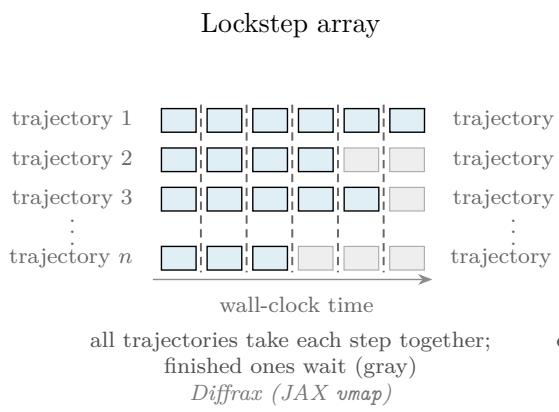

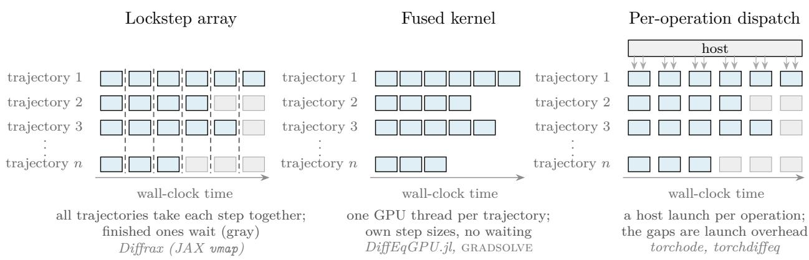  
Figure 1: The same ensemble of n trajectories under the three GPU execution designs, showing the first three trajectories, needing six, four, and five accepted steps, and the last, the n-th, needing three. Each row is one trajectory. Each block is one accepted step of the adaptive loop of Section 2.1: the Runge–Kutta stage evaluations of the right-hand side of the ODE, followed by the error test and the controller decision. Block width is uniform and does not represent step size, and rejected trials are not drawn. Horizontal position tracks wall-clock time in every panel, along the bottom arrow; the white gaps between steps in the right panel are the launch overhead, drawn as blank space. Left: a lockstep array program advances all trajectories together, one loop iteration per dashed line, in which every trajectory takes one trial step of its own size, so trajectories that finish early wait through the remaining iterations (gray). Center: a fused kernel gives each trajectory its own thread, with its own step sizes, so each row ends when its work ends. Right: per-operation dispatch launches each operation of each step (stage evaluations, error norm, controller update) as its own kernel from the host (the CPU that drives the GPU); two launch arrows are drawn per step; finished trajectories wait (gray) as in the left panel, and the white gaps between steps are the launch overhead, stretching the same work over more wall-clock time. gradsolve builds on the fused design.

Lockstep array (left panel of Figure 1). This design maps a single-trajectory solver over the whole ensemble with an array transformation, such as vmap in JAX [5]; Difrax [19] under vmap is the mature example; the lockstep is a property of the array transformation, not of the solver. Each iteration of the loop advances the whole ensemble by one trial step, trajectories whose trial was rejected keep their old state and retry in the next iteration, and trajectories that have already finished are carried along unchanged; neither is skipped. The solve is then an ordinary array program, so the framework’s reverse-mode diferentiation applies to it, with the bounded loop and checkpointing of Section 2.3; the further cost is that the whole ensemble keeps stepping until its slowest trajectory finishes, and the backward sweep likewise carries every trajectory through every iteration.

Fused kernel (center panel of Figure 1). This design compiles the entire adaptive loop, including its branches, into a single kernel in which each GPU thread advances its own trajectory, keeping its state in registers, the small, fast memory private to each thread; DifEqGPU.jl [33, 50] is the published instance. Nothing is launched per step, and no thread waits for a slow neighbor beyond the group-level serialization above, which makes this the fastest way to run an ensemble forward. Its limits are state size and the lack of reverse-mode diferentiation. A thread can use at most 255 registers, each holding one 32-bit word [30], so beyond a modest state dimension the state and stage vectors of a trajectory no longer fit and the compiler moves them to slower memory. The in-kernel branching is exactly the loop that Section 2.3 showed reverse mode cannot pass through cheaply. $\mathrm { D i f f e q G P U . j l }$ diferentiates inside these kernels in forward mode only (Section 4.3).

Per-operation dispatch (right panel of Figure 1). This design keeps the loop on the host and launches each solver operation (stage evaluation, error norm, controller update) as its own kernel; the PyTorch solvers torchode [24] and torchdifeq [7] work this way. In torchode each trajectory carries its own step-size controller, so no trajectory is forced onto another’s step sizes, although the batch loop still runs until its slowest trajectory finishes, with finished trajectories carried along as in the lockstep design; and because every operation is an ordinary framework operation, reverse mode applies directly. torchdifeq instead shares one adaptive step sequence across the batch, so it waits for the slowest trajectory, and the interface we benchmark, odeint\_adjoint, solves a continuous adjoint equation backward in time rather than diferentiating the operations themselves (Section 2.2); its plain odeint interface diferentiates the operations directly. The cost is the fixed launch overhead, paid several times per step of the integration.

Each design thus favors one of the two requirements, forward speed and reverse-mode diferentiability, over the other: the fused kernels give the highest forward speed, while those that support reverse-mode diferentiation pay for it in lockstep stepping or per-operation dispatch. All of that work (the error tests, the controller, the rejected trials) serves only to find step sizes that are not known in advance; once a solve has run, they are known, and Section 3 builds gradsolve on that observation.

## 3 The gradsolve method: record and replay

gradsolve diferentiates a second, simpler computation built from the adaptive solve, rather than the adaptive solve itself. This section first describes that construction (Section 3.1), then the integration methods it is built around (Section 3.2), then the implementations of it inside the library and how one is chosen for a request (Section 3.3), and finally the two calls a user sees (Section 3.4).

## 3.1 The construction

Figure 2 sketches it. A first pass, the record, runs an ordinary adaptive solver exactly as it would run if no gradient were wanted, and keeps one extra piece of information: the sequence of step sizes it accepted. These fix the time points of the solve, its mesh. Rejected trials leave no trace in the record. A second pass, the replay, walks the same right-hand side through the same steps, with every step size now a fixed number handed in as data. The replay uses the recorded step sizes directly, so it needs no error estimate, makes no step-size choice and takes no branch; this is the computation gradsolve diferentiates.

Across an ensemble the records difer in length, because each trajectory accepts its own number of steps (Section 2.1). gradsolve therefore pads every record with zeros to the length of the longest one. A step of size zero leaves the state unchanged, so the padded rows contribute nothing to the result or to its derivative. The padded records form one rectangular array, and the whole ensemble replays as a single regular computation, which GPUs execute eficiently.

The replay of one trajectory is a chain of S one-step maps,

$$
y _ { i } = \Phi _ { i } ( y _ { i - 1 } ; h _ { i } , \theta ) , \qquad i = 1 , \dots , S ,\tag{4}
$$

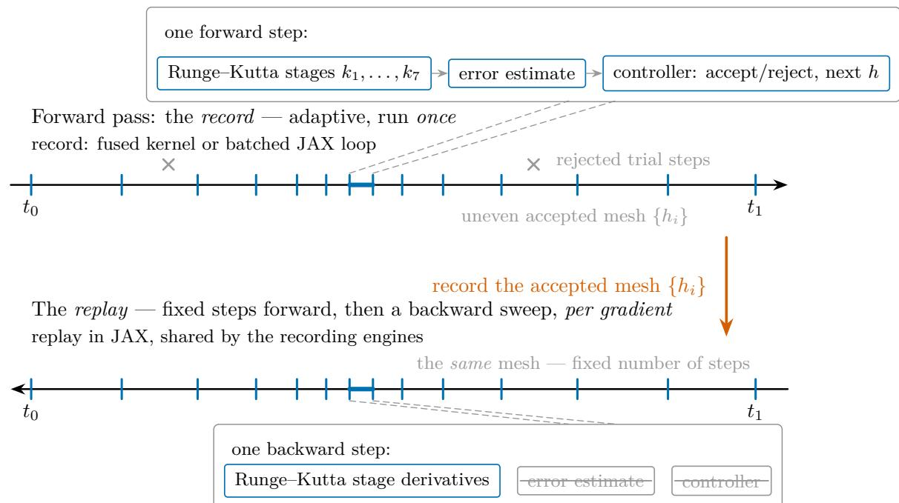  
Figure 2: Record and replay. One adaptive forward solve runs per trajectory and records the accepted step sizes $\{ h _ { i } \}$ , which fix the mesh. The magnified boxes show the anatomy of one step: the seven Runge–Kutta stages $k _ { 1 } , \ldots , k _ { 7 }$ of the Tsit5 pair, followed by the error estimate and the controller decision. Gradients are computed by diferentiating a fixed-step replay of the recorded steps. The mesh may be recorded either by a fused GPU kernel or by a batched loop written in JAX, and the recording engines then diferentiate the same JAX replay of it. In the replay the error estimate and the controller are struck out because the steps are already decided; they and the rejected trials are absent from the diferentiated computation, which is therefore a fixed-length chain with no branch in it (Section 5). The arrow in the lower part of the figure runs from $t _ { 1 }$ back to $t _ { 0 }$ because it depicts the backward sweep; the fixed-step replay that precedes it walks the same mesh forward.

where $\Phi _ { i }$ is one step of the underlying method and S is the recorded step count. For a non-stif method, $\Phi _ { i }$ is the explicit map of Equations (1) and (2) with the recorded $h _ { i }$ in place of $h ;$ a stif method uses a diferent one-step map, described in Section 3.2. Because these are the very steps the adaptive solver accepted, running the chain reproduces the trajectory the solver already produced. Because the chain has no branching left in it, reverse-mode diferentiation of it is the textbook case [14]: one backward sweep through the S maps returns the exact gradient of whatever the chain computes.

That statement is the precise sense in which gradsolve’s gradient is exact. Two maps make it formal. The record map R runs the adaptive solver at the base parameters $\theta _ { 0 }$ and returns the sequence of accepted step sizes, $h = R ( \theta _ { 0 } )$ ; the replay map $\Psi$ composes the chain of Equation (4) with that mesh held fixed as data, $\begin{array} { r } { y _ { S } = \Psi \big ( \theta ; \mathrm { s g } [ h ] \big ) } \end{array}$ , where $\mathrm { s g } [ \cdot ]$ is the stop-gradient that makes h a constant of the diferentiation. gradsolve returns $\partial \Psi / \partial \theta$ at $\theta _ { 0 }$ : the exact reverse-mode derivative of the replay, with the recorded step sizes held fixed as data. Only the step sizes survive the record: the replay recomputes the forward states from them, and the adaptive pass’s own intermediate values are discarded along with its rejected trials. The alternative — retaining that forward pass and excising the rejected steps from its backward sweep alone — would carry each trajectory’s accept/reject structure into the diferentiated program, which is precisely what the fixed-length chain removes; the recomputed forward pass is a minority of the gradient’s cost, the backward sweep dominating (Section 5). When one record is reused across an optimization, the derivative is taken at the current parameters θ while the mesh stays $h = R ( \theta _ { 0 } )$ , so the returned quantity is ${ \partial \Psi \big ( \theta ; \operatorname { s g } [ R ( \theta _ { 0 } ) ] \big ) } / { \partial \theta } ;$ Section 4.8 measures how far this departs from a fresh record as θ moves. Because sg severs the dependence of h on $\theta ,$ this derivative drops the term $\left( { { \partial \Psi } / { \partial h } } \right) \left( { \partial R } / { \partial \theta } \right)$ by which the mesh would move with the parameters. It accounts for how the parameters, and the initial state, enter the solve at every accepted step; it does not account for how an adaptive solver would have chosen diferent steps at nearby values of them. How much this matters over a fitting run — an optimization loop that repeatedly adjusts the parameters to fit data, as in a calibration — is measured in Section 4.8: the gradient direction on the recorded mesh stays within hundredths of a degree of one from a fresh record. This is the same convention as Difrax’s checkpointed adjoint, which also stops the gradient at its step-size choices (Section 2.3) and returns the discrete adjoint of its own accepted steps, dropping the same mesh-shift term; on the same method and the same mesh $R ( \theta _ { 0 } )$ the two derivatives coincide. That the replay’s gradient is not only self-consistent but an accurate sensitivity — it matches an independent high-accuracy finite-diference reference to the method’s own forward error — is shown in Appendix B.6. The correctness checks in this paper respect the convention too: the finite-diference comparisons perturb the same inputs inside the same recorded replay, so both sides diferentiate the same computation. Two neighboring constructions difer from it: the adaptive checkpoint adjoint of Zhuang et al. [57] also backpropagates only through the accepted steps, one trajectory at a time in PyTorch, advancing each solver operation as its own dispatched call. gradsolve recasts that idea as a single zero-padded fixed-length replay over the whole ensemble, compiled as one GPU program — which is what the cost measurements of Section 5 turn on; run per operation on the CPU host, as in that work, the same construction would sit in the dispatch-bound class of the PyTorch solvers of Section 4.3, and reversible integrators [58] reconstruct the forward states instead of storing them. The library-level discrete-adjoint solvers — FATODE [55], PETSc TSAdjoint [56], and CVODES in SUNDIALS [18, 42] — return this same class of derivative on CPU and array-based paths; gradsolve returns it for a fused per-trajectory GPU ensemble. Within the replay the same choice is a tuning option: it can recompute its intermediate values during the backward sweep rather than store them (the library’s remat option, on by default for non-stif problems and for stif systems of 16 or more variables), trading time for memory.

## 3.2 The integrators

The record pass uses the same methods as any adaptive solve, and every method supplies the same two ingredients: a trial step with an error estimate for the record, and a plain step for the replay. For non-stif problems the default is the Tsit5 pair of Tsitouras [49], with the Verner seventh-order pair [52] available on request. For stif problems the default is the fifth-order Rosenbrock–Wanner method Rodas5P [46]; the right-hand sides available in the fused kernels own form use instead the second-order linearly implicit Rosenbrock23 method [39, 43], with Rodas5P again available on request. Rodas5P carries a continuous extension, an interpolant inside each step, so that, when it is requested, it can return the state at intermediate times without taking extra steps; the default for every replay engine instead integrates one extra step to each requested time (Section 3.4). Rodas5P also carries the time derivative $\partial f / \partial t ;$ Rosenbrock23 assumes an autonomous system, one in which f has no explicit dependence on $t ,$ and it serves only the stif systems with a fused kernel, which are all autonomous. A stif problem with explicit time dependence therefore takes Rodas5P without a special request.

A stif problem changes the one-step map $\Phi _ { i }$ but not the construction around it. Each Rosenbrock stage solves a linear system with the matrix $I - \gamma h J $ , where $J = \partial f / \partial y$ and $\gamma$ is a method coeficient, and the recorded mesh wraps around those stages exactly as before. Diferentiating a linear solve does not require diferentiating the steps of Gaussian elimination: if x solves $A x = b ,$ the backward sweep needs only one more solve, against $A ^ { \top } \left[ 1 2 \right]$ . JAX applies this rule to its linear solve automatically, so the stif replay inherits it without any special code. The user does not supply J on the JAX path either: it comes from automatic diferentiation of the right-hand side, so the backward sweep diferentiates through it as well as through the stages.

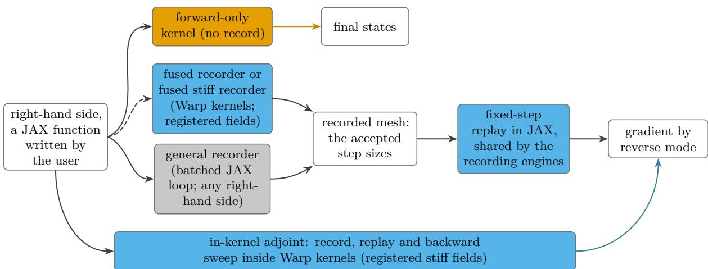  
Figure 3: The data path of one request. A user right-hand side enters at the left and takes one of three routes. On the forward-only route (gold) a single fused kernel integrates to the final states and records nothing. On the gradient route the mesh, the sequence of accepted step sizes, is recorded either by the fused recorder (a Warp kernel, for a right-hand side in the kernels’ own form, built in or translated from the user’s JAX function) or by the general recorder (a batched JAX loop, for any right-hand side as written); the two recorders produce the same mesh and feed one fixed-step replay written in JAX (blue), whose reverse mode returns the gradient. The dashed arrow marks the translation of Section 3.4, by which a user function becomes a registered field the fused recorder can call. The in-kernel adjoint (blue, bottom) is the one route that keeps the record, the replay and the backward sweep inside the Warp kernels, for the registered stif fields, and delivers the same gradient. Gold marks the forward-only kernel, blue the fused recorder and replay, and gray the general path.

## 3.3 The engines and the router

Each implementation of a solve or gradient route inside the library is an engine. Table 1 lists them by the names used in this paper and in the code, and Figure 4 shows which one the router selects for a request. A kernel here is one program launched on the GPU; a fused kernel runs a whole integration inside that one program, one GPU thread per trajectory, so the fixed cost of a launch is paid once per ensemble rather than once per step. A fused kernel needs the right-hand side in its own form, and a registered field is a right-hand side available in that form. The library provides it hand-written for the Lorenz, Van der Pol, Lorenz-96 and linear test systems and for the stif Robertson, HIRES and linear stif test systems; for any other right-hand side the user registers the JAX function, and the library translates it (Section 3.4).

On every gradient route except the in-kernel adjoint (Figure 3), the replay is the same computation: a fixed-step loop over the recorded step sizes, written in JAX [5] and diferentiated by its reverse mode. The engines difer only in how the mesh is recorded. The general recorder runs the adaptive solve as a batched JAX loop on the device, for any right-hand side, and places no bound on the state dimension. The fused recorder runs the same adaptive solve as a single fused kernel, written with the Warp kernel framework [29], and runs the registered fields, built in or translated from the user’s JAX function. The two record the same mesh up to floating-point roundof (the same accepted steps, with step sizes agreeing to about $1 0 ^ { - 8 }$ relative) and hand it to the same replay, so they return the same gradient. Since the record is paid once and the per-gradient time counts only the replay, they also reach nearly the same per-gradient time (Section 5). With either recorder the record costs about one forward solve of the ensemble on the device (Section 4.7 reports the times), so it can be renewed at any time; Section 4.8 states how the fitting loops use it.

Table 1: The engines of gradsolve. Each row is one implementation of a solve or gradient route. The second column gives the name reported on the result and accepted by the engine argument. A registered field is a right-hand side available in the fused kernels’ own form, hand-written for the built-in systems or translated from the user’s JAX function. The fused Warp kernels warp\_ode and warp\_rosenbrock each name a single kernel that the router runs without a record for a forward-only solve and with the record kept when a gradient is wanted; the gradient route of warp\_ode is reported as warp\_replay, so only warp\_rosenbrock labels two rows. The last column states the router’s default choice; d is the state dimension.
<table><tr><td>Engine</td><td>In the code</td><td>Record and replay</td><td>Default for</td></tr><tr><td>Forward-only kernel</td><td>cuda_tsit5, warp_ode</td><td>no record; one fused kernel solves to the final state</td><td>registered non-stiff field, no gradient wanted, d ≤ 64</td></tr><tr><td>Fused stiff kernel. forward only</td><td>warp_rosenbrock</td><td>no record; one fused kernel</td><td>registered stiff field, no gradient wanted,  $d \leq 6 4$ </td></tr><tr><td>Fused recorder → JAX warp_replay replay</td><td></td><td>record in a fused kernel; Tsit5 registered non-stiff field, replay in JAX</td><td>gradient wanted, d ≤ 64</td></tr><tr><td>Fused stiff recorder → Rosenbrock23 replay</td><td>warp_rosenbrock</td><td>record in a fused kernel; Rosenbrock23 replay in JAX</td><td>registered stiff field, gradient wanted,  $d \leq 6 4$ </td></tr><tr><td>General recorder → JAX replay (the general path)</td><td>tsit5_replay, rodas5p_replay; vern7_replay by name</td><td>record as a batched JAX loop on the device; Tsit5 or Rodas5P replay in JAX</td><td>every other gradient request: an unregistered field, or  $d > 6 4$ </td></tr><tr><td>In-kernel adjoint</td><td>fused_rosenbrock_ backward</td><td>record and replay both in fused kernels</td><td>registered stiff field, by name, when memory is the limit</td></tr><tr><td>Diffrax</td><td>diffrax</td><td>adaptive solve, differentiated by its own checkpointed adjoint</td><td>unregistered field, no gradient wanted; by name as the reverse-mode baseline</td></tr></table>

The in-kernel adjoint is the one engine whose replay runs in Warp rather than in JAX, for the registered stif fields: a fused kernel steps forward over the recorded mesh, and Warp’s automatic diferentiation generates the matching backward kernel. Its purpose is memory. The backward kernel does not store the intermediate values of every stage, as reverse mode normally does; it keeps only the accepted states, one per step, and recomputes the stage values from them. At a batch of 128 stif trajectories with a neural right-hand side (Section 4.8) its record occupies about 10 MB; the JAX replay of the same mesh, storing every intermediate value for its backward sweep, requested 24.3 GB and failed to obtain it on a 24 GB card. The replay it is compared against stores every intermediate value; recompute (remat) is of at this state dimension (Section 3.1), so this is the gap against a store-everything replay rather than a recompute-enabled one. Its advantage over the JAX replay is memory rather than speed, so it is selected by name; Appendix B.6 describes the two parts of it that are written by hand.

The router reads three properties of a request, stif or not, the state dimension, and whether a gradient is wanted, and applies the last column of Table 1. The cutof $d \leq 6 4$ for the fused engines is conservative: it is set below the dimension at which a trajectory’s state stops fitting in a thread’s registers (Section 4.6). Every other request takes the general path, so every request the library accepts can be diferentiated. Difrax serves the forward-only requests the fused kernels do not cover, when it is installed, and remains available by name as the reverse-mode baseline, diferentiating through an adaptive solve rather than a recorded replay (Appendix B.2).

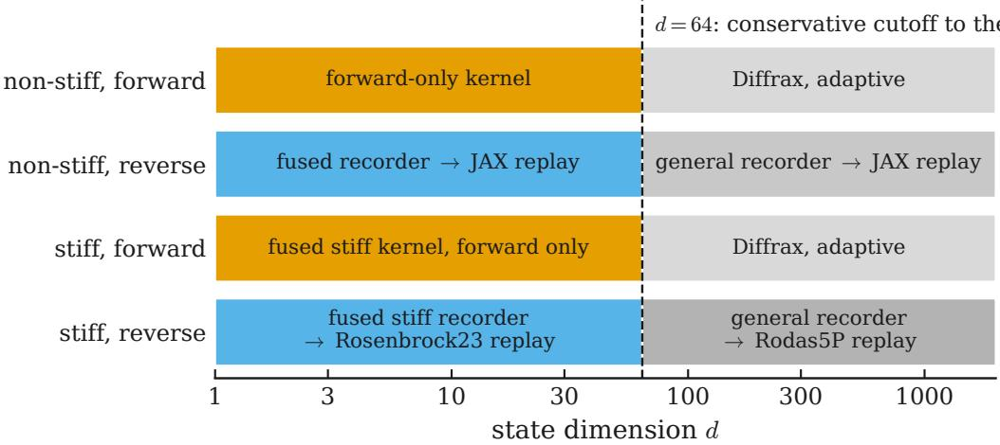  
Figure 4: Engine dispatch. Each row is one kind of request (non-stif or stif, forward solve or gradient) and the horizontal axis is the state dimension $d ;$ the boxes name the engine of Table 1 the router selects. Gold marks the two fused forward-only kernels, blue the fused recorder followed by the diferentiated replay, and gray the general path, taken by every right-hand side without a fused kernel and by all states beyond $d = 6 4$

## 3.4 The interface

A user needs none of the above to use the library: gradsolve ofers one call to solve an ensemble and one to diferentiate it, condensed in Listing 1 from the first example in the repository, and the router chooses the engine. A user who wants a particular engine can also name it, with the names of Table 1, through the engine argument, and the engine that ran is reported on the result either way. A user-defined problem is any object with six members. By default an arbitrary user right-hand side takes the general path: it is diferentiated directly through $\pm \mathrm { \underline { { ~ \sigma ~ } } } _ { - } \mathrm { j } \mathsf { a x } .$ and its record runs on the device as a batched loop over the ensemble (Section 4.7 reports its time). With fused=True, or by registering the right-hand side under a name, the library translates the JAX function into the form the fused kernels call, together with its Jacobian for a stif problem, derived by automatic diferentiation, and the same fused engines then run it with no kernel written by hand. The translation covers right-hand sides built from elementary arithmetic, the standard transcendental functions and fixed-index array operations; a right-hand side with data-dependent control flow is refused with a message naming the operation, and the request takes the general path. On four of the built-in systems (Lorenz, Van der Pol, Robertson and HIRES) the translated fields and Jacobians agree with the hand-written kernels to $1 0 ^ { - 1 5 }$ and record the same accepted steps, and on an A100 a translated Lorenz field returned final states and gradients identical to the hand-written field’s. The returned gradient function diferentiates with respect to the parameters, the initial state, or both. Every JAX replay engine can also return the state at requested intermediate times: the replay takes one extra solver step from the preceding mesh point exactly to each requested time, so the returned state is integrated, not interpolated. For the registered fields the record and the replay can both run in single precision, with GPU-verified gradients (Section 4.3 measures the saving).

```python
class Lorenz: # a problem: any object with these six members
name, dim = "lorenz", 3 # a label, and the number of state components
t0, t1, is_stiff = 0.0, 1.0, False # the time span, and whether the system is stiff
def f_jax(self, t, y, p): # the right-hand side dy/dt of ONE trajectory
# y has shape (dim,), p holds its parameters
problem = Lorenz()
y0, params = ... # shapes (n, dim), (n, P): one row per trajectory
# Solve the ensemble; the router picks the engine (engine="tsit5_replay" names one).
result = gradsolve.solve(problem, y0, params)
result.y_final # the final states, shape (n, dim)
# Differentiate. final_states(p) is a JAX function of the parameters, so any
# loss built on it can be differentiated with jax.grad.
final_states = gradsolve.grad_closure(problem, y0, params)
loss = lambda p: jnp.sum((final_states(p) - observed) ** 2) # misfit to the data
gradient = jax.grad(loss)(params) # shape (n, P): a gradient for every trajectory
```

Listing 1: The gradsolve interface. A problem is any object exposing six members: a name, the state dimension, the time span, a stifness flag, and the right-hand side f\_jax of one trajectory. solve returns the ensemble’s final states; grad\_closure returns a JAX function of the parameters that any loss can be diferentiated through with jax.grad. The router selects the engine, or engine= names one.

## 4 Benchmarks

This section reports three main results. Used as a solver alone, gradsolve’s forward-only kernel is 2.8× faster than DifEqGPU.jl, the reference GPU ensemble solver. The central one is the reverse-mode gradient: at matched achieved accuracy gradsolve returns Difrax’s exact gradient at 5.6–14.1× lower cost across three GPU generations, the margin largest on small non-stif ensembles and narrowing as they grow, and on stif systems a crossing (0.8–5.6×) that favours the replay except at the tightest accuracy. Finally, the per-gradient saving carries through to complete parameter fits. The subsections that follow give the evidence, system by system, and the tables collect every measured range.

We evaluate gradsolve on a suite of six systems spanning the workloads it targets: the Lorenz system in DifEqGPU.jl’s benchmark configuration, the Van der Pol relaxation oscillator, the stif Robertson kinetics, the mildly stif HIRES system, a flattened dark-matter halo whose stellar orbits are chaotic, and a Robertson variant whose reaction term is a small neural network; Appendix A defines all six. Of the baselines we compare against — DifEqGPU.jl, Difrax, torchode and torchdifeq — Difrax is the only one that returns a reverse-mode ensemble gradient, so it is the reference baseline throughout; torchode and torchdifeq are compared on the non-stif Lorenz gradient. Not every system enters every comparison: the stif systems appear where stifness matters, and the halo and the neural variant carry the fitting and memory studies. Solvers of diferent order reach diferent accuracy at the same nominal tolerance, so comparing at equal tolerance would conflate cost with accuracy. Ratios between methods of diferent order are therefore read at matched achieved forward-state accuracy: gradsolve runs first and its forward-state error against a high-accuracy reference is recorded, and the baseline’s tolerance is then lowered by bisection until its own error matches ours, never a higher one (Appendix B.1 states the rule in full). A work–precision sweep plots gradient cost against achieved error [17]; it is the right comparison when methods difer in order or error control. Where a ratio is read of such a sweep, the baseline’s cost at our achieved error is interpolated between its measured points, and no ratio is extrapolated. The forward comparison (Section 4.1) instead runs the same Tsit5 pair on both sides at the same nominal tolerance, which makes the achieved accuracies closely comparable rather than identical by construction.

The Difrax baseline runs its default checkpointed adjoint, compiled once and mapped over the ensemble; its step limit and checkpoint count are chosen by measurement for each comparison, and for stif problems it uses a Newton root finder that measured faster than the library’s default. All baselines are timed in reverse mode, and Difrax’s forward mode is timed as well for the systems with one to three inputs per trajectory (Section 4.4). Appendix B.2 gives every setting. Each per-gradient wall time is the best of three timed calls (five for the higher-order engines) after a warm-up pass that absorbs compilation and, for the replay engines, the one-time record; five independent repetitions of one such measurement on the same card, each with a fresh record, vary by 12.6%. The tables and figures time torchode under torch.compile, its intended fast configuration, which fuses the per-operation dispatch of Section 2.4; run eagerly, out of the box, it is 58–63× behind rather than 26–29×. torchdifeq’s continuous-adjoint path is timed eagerly (83–99×).

The reverse-mode benchmarks diferentiate the loss $\ell = \| y ( t _ { 1 } ) \| ^ { 2 }$ summed over the ensemble, with respect to each trajectory’s parameters — or its initial state for HIRES, which carries no free rate constant; the fitting studies of Section 4.8 instead minimize a data-misfit loss (Appendix B.4). Every engine’s gradient is checked against a central finite-diference estimate before its timings are reported. On the stif Robertson replay the two agree to about $7 \times 1 0 ^ { - 9 }$ the resolution of the finite-diference estimate itself; the non-stif replay passes the same check on each system timed below, and the in-kernel adjoint up to $d \approx 1 2$ . These checks run on the GPU, and Appendix B.6 repeats the comparison on a CPU.

Measurements are double precision on a single NVIDIA A100, H100, or RTX 4090, named where the A100’s two packagings (PCIe and SXM4) difer; no two frameworks share a device within one measurement, and Appendix B.5 lists the machines and software versions.

Two accounting conventions appear below and are never mixed. Most of the section reports the per-gradient cost: the cost of a single gradient evaluation once a record exists, the cost that matters when many gradients are taken against the same mesh. The fitting case studies at the end instead report the time in the optimizer loop of a complete fit once compiled and recorded: compilation and the one-time record are excluded for both engines, and any mid-fit re-records are timed. The two answer diferent questions and are not comparable.

## 4.1 Forward-only throughput

Not every workload requires a gradient, and Section 3’s router directs those that do not, for the registered fields, to the forward-only kernel: one CUDA thread per trajectory, integrating the Tsit5 pair to a final state. Holding each trajectory’s state in registers (Section 2.4) means the whole integration runs as one GPU program, so the fixed cost of starting a GPU computation is paid once per ensemble rather than once per step. Its state-dimension limit, shared by every fused kernel, DifEqGPU.jl’s and ours alike, is measured in Section 4.6. The comparison against DifEqGPU.jl’s fused GPUTsit5 kernel [50] was run with both codes on the same A100- SXM4 card, one after the other, at matched tolerance $( \tau _ { \mathrm { r e l } } = 1 \times 1 0 ^ { - 6 } , \tau _ { \mathrm { a b s } } = 1 \times 1 0 ^ { - 9 } )$ and $n = 1 . 0 5 \times 1 0 ^ { 6 }$ trajectories: gradsolve’s kernel is 2.8× faster in double precision and $1 . 9 5 \times$ faster in single precision, the mode $\mathrm { D i f f e q G P U . j }$ l’s own benchmarks use. Figure 5 plots total and per-trajectory solve time against ensemble size for the two fused kernels; the forward-only kernel is the fastest integrator we measured on this problem. Against Difrax’s vectorized adaptive solve, compiled once and timed under the same warm-up rule at $n = 1 3 1 0 7 2$ , the forward-only kernel runs 54× faster per trajectory. Ensemble size is not a practical limit for it: on the same A100-SXM4 card it handles every ensemble size on the grid, reaching 0.002 48 µs/trajectory at $n = 2 ^ { 2 4 }$ . A further A100 run sustained 0.0038 µs/trajectory at $n = 1 . 0 5 \times 1 0 ^ { 6 }$ , and a capacity run solved $1 0 ^ { 8 }$ trajectories in 0.25 s in six launches over chunks of the ensemble.

Because a GPU runs the trajectories of an ensemble in groups that advance together, an ensemble in which a few trajectories need many more steps than the rest can be held back to the pace of its slowest members. We stress-tested this by spreading the per-trajectory dificulty of the Lorenz ensemble, so that some trajectories take far more steps than others. Both fused kernels, ours and DifEqGPU.jl’s, hold their per-trajectory speed under the spread rather than slowing to their hardest trajectory, and ours stays 1.4–2.0× faster throughout (Appendix B.2 gives the settings).

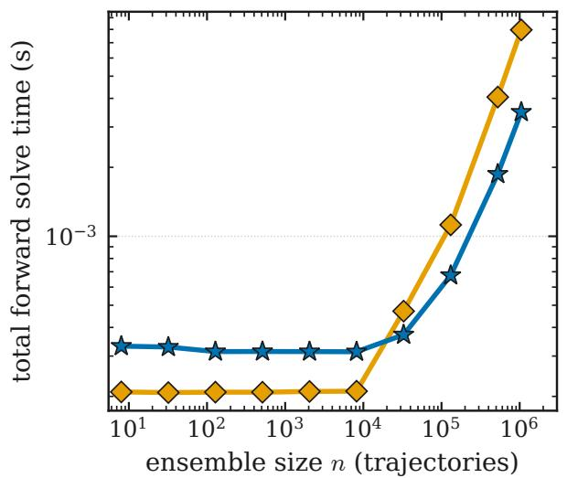

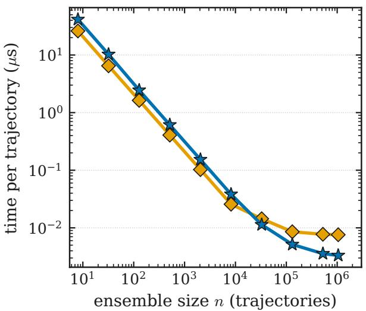  
Figure 5: Forward solve time, total (left) and per trajectory (right), against ensemble size on the Lorenz system (double precision, matched tolerance $\tau _ { \mathrm { r e l } } = 1 \times 1 0 ^ { - 6 } , \tau _ { \mathrm { a b s } } = 1 \times 1 0 ^ { - 9 } )$ Per-trajectory cost falls with ensemble size as launch overhead spreads over more trajectories. The plotted $\mathrm { D i f f e q G P U . j l }$ sweep ran on a diferent A100 and is shown only for the shape of its scaling; the forward-only kernel was swept on an A100-SXM4 at the same tolerances, and the like-for-like same-card comparison, in which the forward-only kernel is 2.8× faster, is given in the text.

## 4.2 Forward-only stif kernels

For stif problems the library’s default GPU kernel is written in a high-level language, the Warp framework of Section 3, and turned into a GPU program automatically. On the forward-only solve this kernel is 1.5–4.5× slower than DifEqGPU.jl’s stif kernels, which are written and tuned directly for the GPU by hand. To find out whether that gap is a limit of the method or the price of the automatic step, we wrote one stif kernel directly for the GPU by hand, for the same second-order method, and compared the three at matched achieved accuracy on an A100.

The answer depends on the size of the system. On the eight-variable HIRES system, where each step does a substantial amount of arithmetic, the hand-written kernel is 1.5–3.1× faster than DifEqGPU.jl and 1.8–2.3× faster than the automatic kernel, at every accuracy measured; the eight-variable state nearly fills the small fast memory each GPU thread has, so fewer trajectories run at once, and the hand-written kernel is still faster. On the three-variable Robertson system it matches $\mathrm { D i f f e q G P U . j l }$ only at the most demanding accuracy and is up to 1.1–5.3× slower at loose accuracy, because there each solve is very short and a fixed per-trajectory start-up cost, paid once however few steps follow, dominates. So the slowdown of the automatically generated kernel is mostly the price of generality, and is recovered and exceeded by a hand-written kernel where the per-step work is large. This is a solver-only comparison; gradsolve’s advantage is the reverse-mode gradient of the next section, which DifEqGPU.jl does not provide.

(a)  
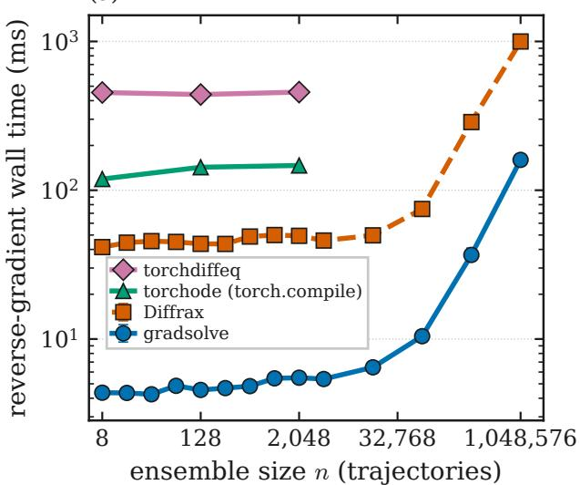

(b)  
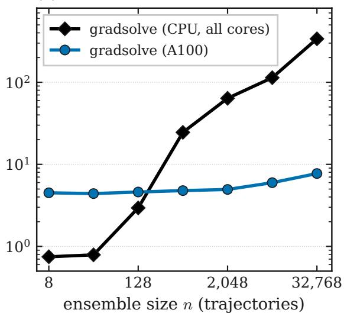  
Figure 6: Reverse-mode gradient cost against ensemble size on the Lorenz system at matched achieved accuracy (double precision). (a) On the A100, the record-and-replay adjoint computes the gradient $9 . 0 \mathrm { - } 1 0 . 7 \times$ faster than Difrax’s checkpointed adjoint across the sweep of ensemble sizes from $n = 8$ to 2048 and $6 . 2 \substack { - 8 . 5 \times }$ faster out to $n = 1 0 4 8 5 7 6$ , and one to two orders of magnitude faster than torchode (under torch.compile) and torchdifeq, shown at representative sizes and timed on a second A100 of the same class. The Difrax and record-and-replay points carry an up-whisker to the slowest of their three timed calls, mostly narrower than the marker, the run-to-run spread being 12.6% at worst (Appendix B.3). (b) The same record-and-replay gradient on the CPU of the machine hosting the A100 and on the A100 itself: the CPU is faster for small ensembles, the curves cross between $n = 1 2 8$ and $n = 5 1 2$ , and the GPU leads from there upward.

## 4.3 Reverse-mode gradient cost

Figure 6 plots the cost of one gradient against ensemble size on the Lorenz system at matched achieved accuracy, for gradsolve and three baselines. Across the sweep of ensemble sizes from $n = 8$ to 2048, the record-and-replay adjoint computes the gradient at $9 . 0 \mathrm { - } 1 0 . 7 \times$ lower cost than Difrax. At the three sizes where the PyTorch solvers were also run the margin against Difrax is 8.8–9.8×; torchode and torchdifeq, timed on a second A100 of the same class (Appendix B.2), sit 26–29× (torchode under torch.compile) and 83–99× behind the gradsolve times of the sweep (Table 3). Difrax is the principal baseline; the $\mathrm { P y }$ Torch solvers sit one to two orders of magnitude further back for the dispatch overhead examined in Section 5. The benchmark configuration spreads $\rho$ below the onset of chaos (Appendix A); a single measurement at the chaotic value $\rho = 2 8$ gives $6 . 5 \times$ at $n = 2 0 4 8$

The three baselines difer in what they diferentiate. Difrax and torchode, like gradsolve, form a discrete adjoint (Section 2.2), but of the adaptive solve itself rather than of a recorded replay. Difrax does so through its checkpointed adjoint, which stores checkpoints of the forward loop and recomputes the segments between them when there are fewer checkpoints than steps, the online checkpointing of Stumm and Walther [47] as implemented in Equinox [21]. In most of the measurements reported here the fastest of the three settings placed a checkpoint on every attempted step, so nothing was recomputed and the cost is that of the diferentiated loop itself. torchode [24] does so with a separate step-size controller for each trajectory, while still advancing the whole batch in one tensor operation. torchdifeq [7] instead forms a continuous adjoint: it derives the adjoint diferential equation of the original system and solves it backward in time with the Dormand–Prince pair [9], so its gradient is that of the exact solution, discretized afresh, rather than of the steps the forward solve took.

DifEqGPU.jl is compared on the forward side only. Inside its fused kernels it diferentiates in forward mode only, and for reverse mode its documentation routes ensembles through its arraybased path (EnsembleGPUArray), the lockstep design of Section 2.4. On the versions listed in Table 6 (Julia 1.12.6, DifEqGPU.jl 3.15.3, CUDA.jl 6.2.1), neither path returned a reverse-mode ensemble gradient. We tried three routes, each of which failed to compile or launch: the array path under SciMLSensitivity with Zygote, the reverse route its documentation recommends, which raised a DimensionMismatch projecting the gradient of the per-trajectory parameters; and the fused kernel under Enzyme and under Zygote, which raised an InvalidIRError and a MethodError during GPU compilation. The array path supports reverse-mode adjoints in general, so this reflects the per-trajectory-parameter ensemble on the tested versions rather than a limitation of the approach in principle.

The GPU is not the faster device at every ensemble size, so we measured where it overtakes the CPU. Panel (b) of Figure 6 runs the same gradient on the CPU of the machine hosting the A100 (all cores) and on the A100. The CPU is faster for the smallest ensembles, where the GPU’s fixed overheads dominate its runtime; the curves cross between $n = 1 2 8$ and $n = 5 1 2$ and from $n = 5 1 2$ upward the GPU leads, reaching 43.8× at $n = 3 2 7 6 8$

Panel (a)’s Difrax and gradsolve curves are nearly flat over the same range of ensemble sizes: while the ensemble is too small to occupy the device, fixed per-step costs dominate both runtimes, and the ratio between them is a ratio of those fixed costs. The sweep therefore continues to $n = 1 0 4 8 5 7 6 ;$ from $n = 4 0 9 6$ upward the advantage reads 6.2–8.5×; the replay’s own time only begins to grow with n above about $6 \times 1 0 ^ { 4 }$ trajectories, so a user with ensembles above $1 0 ^ { 5 }$ trajectories should expect the lower end of that range.

A second view holds the ensemble size fixed and sweeps the tolerance. gradsolve and Difrax advance the same Tsit5 pair, so both sweep the same tolerance range; Figure 7 plots gradient time against achieved final-state error from $\tau _ { \mathrm { r e l } } = 1 \times 1 0 ^ { - 3 } \ \mathrm { t o } \ 1 \times 1 0 ^ { - 8 }$ , and the same figure also carries the forward-mode arms of Section 4.4. Read at matched achieved accuracy within the curves’ overlap by the interpolation rule above, the replay computes the gradient at $7 . 8 – 9 . 3 \times$ lower cost across the range, the advantage declining mildly toward the tightest tolerance.

A speedup measured on one device can reflect that device as much as the method, so we repeated the Lorenz comparison on three GPU generations. Figure 8 plots the speedup over Difrax against ensemble size on each card. The advantage stays within 5.6–14.1× on the A100, the H100, and the RTX 4090, is highest on the H100, and falls from its small-ensemble value on all three, most steeply on the RTX 4090, where it spans $5 . 6 \mathrm { - } 1 2 . 5 \times$ from $n = 8$ to $n = 8 1 9 2$ . The A100 and H100 sweeps here reach $n = 3 2 7 6 8 ;$ ; across its own sweep the RTX 4090’s gradient times are comparable to the A100’s at the same ensemble sizes, so the card’s much lower double-precision throughput does not set these ratios.

The advantage is not specific to the Lorenz system. Panel (b) of Figure 8 repeats the matched-accuracy comparison across the suite, one speedup curve per system: the Van der Pol oscillator returns 9.7–10.5×, close to the Lorenz range, and the two stif systems, taken up next, stay above parity throughout this sweep, Robertson at 2.4–3.4× and HIRES at 4.1–4.3×.

The registered fields can also run in single precision. That changes the gradient cost only where the kernel dominates the wall time: at $n = 1 3 1 0 7 2$ the Lorenz gradient in single precision runs in 0.52× its double-precision time, and about nine tenths of that at smaller n. The stif Robertson gradient shows essentially no change, taking $1 . 0 0 { - } 1 . 0 4 \times$ its double-precision time at every ensemble size measured, from 256 to 16 384 trajectories, because there the kernel does not dominate the wall time. The single-precision gradients agree with the double-precision ones to $1 . 8 \times 1 0 ^ { - 6 }$ relative. Taken together, the views agree: at matched accuracy the replay returns the same gradient Difrax does — run on a shared mesh the two agree to $2 . 9 \times 1 0 ^ { - 1 5 }$ (Appendix B.6) and computes it several times faster, by a margin that is largest on small non-stif ensembles

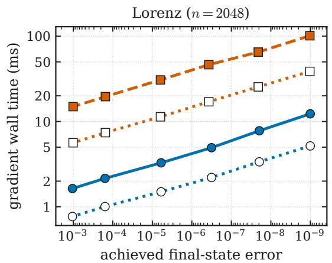

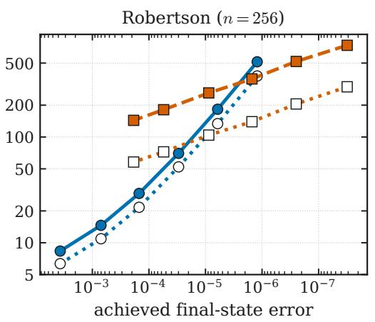  
gradsolve, reverse mode gradsolve, forward mode Diffrax, checkpointed adjoint Diffrax, forward mode

Figure 7: Gradient work–precision on the Lorenz $( n = 2 0 4 8 , \mathrm { l e f t } )$ and Robertson $( n = 2 5 6 , \mathrm { r i g h t } )$ systems (A100, double precision): time for one gradient against achieved final-state error, so the engines are compared at matched achieved accuracy. Filled markers are reverse mode (the record-and-replay adjoint and Difrax’s checkpointed adjoint), open markers forward mode (the same replay and Difrax’s ForwardMode, one tangent pass per input). On Lorenz the four curves are parallel and the replay sits below Difrax in both modes. On Robertson the replay’s curves are steeper, because its second-order method needs more steps than the fifth-order baseline as accuracy tightens: they cross Difrax’s checkpointed adjoint at an achieved error between $1 \times 1 0 ^ { - 6 }$ and $1 \times 1 0 ^ { - 5 }$ and its forward mode near $1 \times 1 0 ^ { - 5 }$ . All four arms were timed in one session, whose two reverse curves reproduce the ranges quoted in the text within the run-to-run spread.

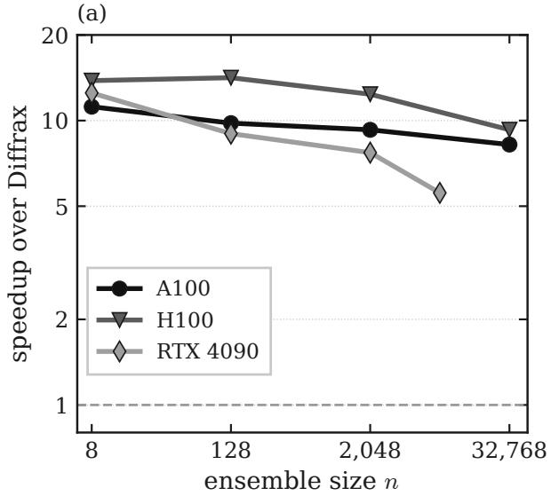

(b)  
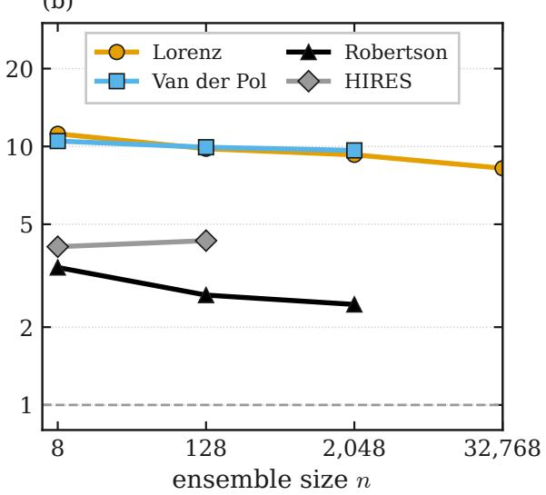  
Figure 8: Matched-accuracy gradient speedup over Difrax against ensemble size (double precision). (a) Lorenz on three GPU generations: the advantage spans 5.6–14.1× on the three cards and declines with ensemble size on each, remaining above the parity line (dashed). (b) Four systems of the suite on the A100: the non-stif Lorenz and Van der Pol systems and the stif Robertson and HIRES systems, all above parity at the accuracy swept here. HIRES diferentiates with respect to its initial state, since it has no free parameter.

and shrinks smoothly as the ensemble grows, without inverting anywhere non-stif.

## 4.4 Forward mode for few inputs

These gradients can also be obtained in forward mode. On the Lorenz, Van der Pol and Robertson ensembles each trajectory is diferentiated with respect to one to three of its own parameters. No trajectory’s solution depends on another trajectory’s inputs, so a single forward-mode pass can change the same input in every trajectory at once and still return each trajectory’s own derivative; the number of passes is therefore set by the inputs of one trajectory, not by the size of the ensemble (Appendix B.2). HIRES is not timed this way, because its gradient is taken with respect to an eight-component initial state, and neither is the neural right-hand side, whose thousands of parameters leave reverse mode as the only option. Difrax provides forward mode as its ForwardMode option, a plain loop with no checkpoints, and its documentation recommends it when inputs are few; the replay, being an ordinary JAX program, can be diferentiated in forward mode without any change. We therefore timed both engines in forward mode as well, on the same batches and at the same matched tolerances, in a separate session on the A100. Figure 7 shows all four arms, and Table 2 collects the ranges, including the ensemble-size sweeps and the by-name engines of Section 4.7 against Dopri8 and Kvaerno5 in forward mode.

On Lorenz, Difrax’s forward mode runs 2.6–2.7× faster than its checkpointed adjoint, so it is the setting a Difrax user should choose for this problem. Against it, the reverse-mode replay is still 3.2–3.5× faster at matched achieved accuracy across the tolerance range, and the replay in forward mode 7.3–7.9× faster; the Van der Pol oscillator and the ensemble-size sweeps behave the same way (Table 2). Mode for mode the advantage is close: 7.8–9.3× in reverse mode against the checkpointed adjoint, 7.3–7.9× in forward mode against forward mode. The stif Robertson system is the exception. Its forward mode also runs 2.5× faster than its adjoint, and against it the second-order Rosenbrock23 replay holds 0.3–2.2× across the accuracy range (0.4–3.0× in forward mode): above parity at loose accuracy, and below it from an achieved error of about $1 \times 1 0 ^ { - 5 }$ onwards, where the fifth-order baseline needs far fewer steps. The fifth-order Rodas5P replay of Section 4.7 recovers 2.8× at its measured point. The replay is faster in forward mode as well, where neither engine stores intermediate values, so its saving comes from the loop structure itself (Section 5).

Table 2: Matched-accuracy speedup over Difrax’s forward mode (ForwardMode, one tangent pass per input) for the systems with one to three inputs per trajectory, with the replay diferentiated in reverse mode and in forward mode. All arms were timed in one A100 session. A single value is quoted where a range collapses at one decimal or, in the by-name rows, where one ensemble size (n = 1024) was measured.
<table><tr><td>Comparison</td><td>Baseline</td><td>Replay in reverse mode Replay in forward mode</td><td></td></tr><tr><td>Lorenz, tolerance range</td><td>Diffrax Tsit5</td><td>3.2-3.5×</td><td>7.3-7.9×</td></tr><tr><td>Lorenz, n = 8–262 144</td><td>Diffrax Tsit5</td><td>2.4-4.0×</td><td>3.7-10.1×</td></tr><tr><td>Van der Pol, size sweep</td><td>Diffrax Tsit5</td><td>3.3-3.7×</td><td>10.7-13.2×</td></tr><tr><td>Robertson, loose to tight accuracy</td><td>Diffrax Kvaerno5</td><td>0.3-2.2×</td><td>0.4-3.0×</td></tr><tr><td>Robertson, size sweep, loose accuracy</td><td>Diffrax Kvaerno5</td><td>1.2×</td><td>1.5-1.6×</td></tr><tr><td>Lorenz, Verner pair (order 7)</td><td>Diffrax Dopri8</td><td>3.0×</td><td>6.6×</td></tr><tr><td>Robertson, Rodas5P engine</td><td>Diffrax Kvaerno5</td><td>2.8×</td><td>3.3×</td></tr></table>

## 4.5 Stif systems

Adaptive step control does the most work on stif systems, which therefore test whether removing it from the diferentiated computation remains an advantage. On the Robertson kinetics [16, 38], the stif replay, running on the recorded Rosenbrock23 mesh, is compared against Difrax’s higher-order Kvaerno5 baseline, a singly diagonally implicit Runge–Kutta method with an explicit first stage, designed for stif problems [23]. How much the replay saves depends on the accuracy demanded. Over the range of achieved error the two sweeps share (2.2 decades), the advantage reads 0.8–5.6×. It is 5.6× at loose accuracy and reaches parity at an achieved error between $1 \times 1 0 ^ { - 6 }$ and $1 \times 1 0 ^ { - 5 }$ ; at the tightest point it falls slightly below parity, because there the fifth-order baseline needs far fewer steps than the second-order replay to reach a given error. For tight accuracy the stif engine is instead the fifth-order Rodas5P replay (Section 4.7). Against Difrax’s forward mode, which suits this three-parameter system, the margins are smaller (Section 4.4). A companion sweep in ensemble size at one tolerance, at the loose end of that range, gives 2.4–3.4× on the A100, declining from $n = 8$ to $n = 2 0 4 8$ (the Robertson curve of Figure 8(b)).

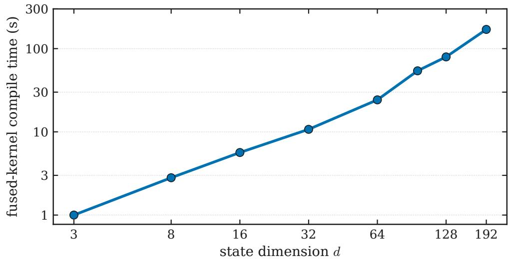  
Figure 9: Fused-kernel compile time against state dimension on the linear family of Appendix A $( n = 8 1 9 2$ , A100). The next dimension probed, $d = 3 1 6 .$ , compiles in 322 s but fails at launch and is not plotted. The family’s right-hand side is trivial, so the axis isolates the compilation limit, not speed.

HIRES [16, 41], an eight-dimensional stif system, also sits above parity. Its ensemble carries no free rate constant (Appendix A), so the gradient is taken with respect to the initial state; at matched achieved accuracy the stif replay computes it 4.1–4.3× faster than Difrax across $n = 8$ to 128. The higher-order Rodas5P engine widens the HIRES margin further (Section 4.7). On stif systems, then, the replay helps up to moderate accuracy, and at the tightest accuracy Difrax is the better choice; the fifth-order Rodas5P replay moves that boundary out where it is needed.

## 4.6 Dimension limit of the fused kernels

The fused kernels have a state-dimension limit, and it appears abruptly, at launch, rather than as a gradual loss of speed. We measured it on the linear family of Appendix A, whose state dimension is free (Figure 9). For the fused recorder, compile time grows from about 1 s at $d = 3$ to 322 s at $d = 3 1 6$ , where the kernel compiles but fails at launch. The router’s fallback to the general path at $d = 6 4$ is a conservative empirical policy: it sits far inside this launch boundary, leaving margin. The failure at $d = 3 1 6$ is a launch-time error — the GPU refusing the kernel for want of per-thread resources, the signature of register exhaustion (Section 2.4) — and the figure plots compile time rather than a register count, so it locates the boundary without profiling its cause.

## 4.7 Higher-order engines

The two higher-order methods of Section 3, the seventh-order Verner pair and the fifth-order Rosenbrock method Rodas5P, were timed under the same matched-accuracy procedure in a separate run on an A100-SXM4 at $n = 1 0 2 4$ (Table 3). Neither engine is what the router picks for a registered field: both were measured against Difrax rather than against the fused engines the router prefers, so the ratios below are what a user obtains by asking for the method by name. Rodas5P is also the general stif engine the router selects for gradients outside the registered fields. The Verner engine computes the Lorenz gradient 9.5× faster than Difrax’s Dopri8, an eighth-order explicit method and the faster of the two Difrax explicit methods timed on this problem; the Rodas5P engine is 7.2× faster on Robertson and 12.9× faster on HIRES than Kvaerno5. The first two diferentiate with respect to the ensemble’s rate parameters, HIRES with respect to the initial state, as in Section 4.5. On this system the higher-order Rodas5P replay attains a larger margin than the Rosenbrock23 replay, at the tighter accuracy it reaches $( 1 . 3 \times 1 0 ^ { - 7 } )$

The one-time record is excluded here as everywhere in this section and reported separately. At this ensemble size the general recorder records the three meshes on the A100 in 0.0076 s (Lorenz), 0.36 s (Robertson) and 0.7 s (HIRES). Against the per-gradient saving over Difrax on the same three comparisons, the device record costs 0.23–0.97 of one gradient’s saving, so it is repaid before the first gradient is complete: counting the record, gradsolve’s first gradient on each of the three still costs less than a single Difrax gradient, which carries no such record phase. A fourth system, the linear family at $d = 3 2$ , diferentiates with respect to its initial state, and its loss is a pure rescaling of that state, so the central-diference signal falls to the resolution of the finite-diference estimate itself and cannot discriminate the gradient. A linear system, however, has a closed-form sensitivity; the replay’s gradient agrees with it to $1 . 6 \times 1 0 ^ { - 7 }$ relative, the order of the method’s own forward error. Validated that way, the Verner engine computes this gradient 43.3× faster than Difrax’s Dopri8, the widest of the four margins, because the linear field’s step is so cheap that the diferentiated loop dominates the cost.

The advantage therefore does not depend on the integrator: the same simpler backward sweep carries the seventh-order Verner pair and the fifth-order Rodas5P as it does the second-order Tsit5 and Rosenbrock23.

A further control, which holds Difrax to a fixed mesh of our own step count, is reported with the analysis of Section 5.

## 4.8 Fitting case studies

To see whether the per-gradient saving carries through to a complete calibration, we also timed gradsolve inside fitting loops, where Adam [22] consumes the gradient step after step until a physical parameter is recovered. These are times in the optimizer loop, which exclude compilation and the one-time record for both engines; we run B concurrent fits, $B \in \{ 1 , 8 , 6 4 , 2 5 6 \}$ , each recovering its own parameter, with both engines under the identical optimizer (Appendix B.4 gives the protocol). The recorded mesh is treated as data for the duration of a fit. A companion measurement re-solves adaptively at parameter snapshots along the full fits of all three systems on a CPU, at their full 400 updates and at the batch sizes the fits reach $( B = 2 5 6$ for the Lorenz and galactic fits, $B = 6 4$ for the stif Robertson fit, the largest at which it converges). Relative to the replay of the starting mesh, the fresh solve’s final state moves by at most $2 . 1 \times 1 0 ^ { - 6 }$ at every snapshot, even where the Robertson rates traverse a decade. The two gradients agree in direction to within $0 . 0 5 ^ { \circ }$ while the optimizer is descending — while the fresh-solve gradient still keeps at least a hundredth of its initial norm; once a fit converges the gradient falls by four to nine orders of magnitude on both meshes and the direction of that vanishing gradient is no longer defined, but the optimizer has by then stopped moving and every fit has already recovered its parameter on the starting mesh. The starting mesh therefore remains adequate

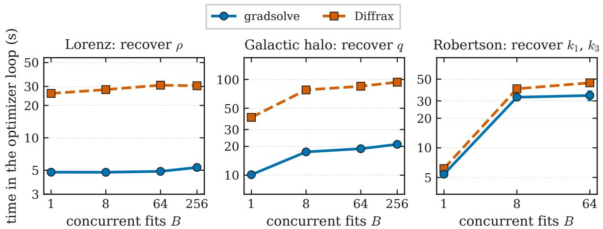  
Figure 10: Time in the optimizer loop against the number of concurrent fits B at matched accuracy (A100), recovering the Lorenz Rayleigh parameter $\rho$ (left), the galactic halo flattening $q$ (center), and the Robertson rate constants (right). The lower gradient cost translates into a faster fit in every panel. Error bars are the standard deviation over the timed repetitions; the run-to-run spread is under about 3% at almost every point (up to about 12% at the noisiest), so the bars mostly fall within the markers. The Robertson B = 256 point is absent because neither engine reached the loss tolerance there.

## throughout a fit.

The simplest study fits the flattening q of a galactic dark-matter halo, modeled by the logarithmic potential $\begin{array} { r } { \dot { \Phi } = \frac { 1 } { 2 } v _ { c } ^ { 2 } \ln ( R _ { c } ^ { 2 } + \acute { x ^ { 2 } } + y ^ { 2 } + \acute { z } ^ { 2 } / q ^ { 2 } ) } \end{array}$ [4]. The flattening is not observed directly; it is inferred from how stars move through the potential, and for $q < 1$ many of those orbits are chaotic, a setting in which a gradient through the solve is particularly valuable. Every fit was recovered by both engines at every value of B, so the comparison is a pure timing contrast: the time in the optimizer loop favors gradsolve by 3.97–4.50× across the four values of B (Figure 10). In absolute terms, recovering q for 256 concurrent fits over 400 updates took 21 s with gradsolve against 94 s with Difrax. Recovering the Lorenz Rayleigh parameter $\rho$ from noisy final-state observations gives the largest margin, 5.39–6.32×, narrowest at $B = 1$ and widest at $B = 6 4$ , easing slightly at $B = 2 5 6$ . Recovering the Robertson rate constants $k _ { 1 }$ and $k _ { 3 }$ through the stif replay holds a smaller, flatter advantage, 1.14–1.35×, for $B \leq 6 4 ;$ ; at $B = 2 5 6$ neither engine reached the loss tolerance within its step cap, so that combination reports no ratio. All three studies land below the per-gradient ranges because the optimizer bookkeeping, common to both engines, is paid on every update and dilutes the per-gradient saving. The Lorenz and galactic fits use the general path of Section 3, the path taken by any right-hand side without a registered fused kernel (the one-time record is outside the timed loop), so their ratios are the ones a user’s own model obtains on this hardware; the Robertson fit uses the fused stif recorder.

Finally, we placed a small neural network (a multilayer perceptron, Appendix A) inside the Robertson system’s autocatalytic term and trained it. Training uses the record-and-replay gradient, which agreed with a central finite-diference estimate to $1 . 5 5 \times 1 0 ^ { - 6 } ;$ ; the loss fell from $8 . 9 \times 1 0 ^ { 7 }$ to $7 . 3 \times 1 0 ^ { 5 }$ over 20 optimizer updates, so the mechanism carries over when the right-hand side is itself a trainable function. This is a capability demonstration — the record-and-replay gradient trains a neural right-hand side, and, with the in-kernel adjoint below, does so from a compact record — not a claim of learning or generalization, which a held-out evaluation would be needed to establish.

The same neural right-hand side also runs in the in-kernel adjoint of Section 3, whose backward sweep we verified separately against finite diferences to $1 . 4 \times 1 0 ^ { - 7 }$ ; this is the engine whose compact record gives the memory advantage. For this comparison Difrax’s tolerance is fixed in advance at the value that matches the replay’s achieved error, rather than bisected at each minibatch size (the number of trajectories per training step, B). The margin is narrower than on the mechanistic systems: the in-kernel adjoint’s per-update gradient is 2.0× faster than Difrax’s checkpointed baseline at B = 32 and B = 64 on the A100, narrowing to 1.3× at B = 256 on both the A100 and the H100 (Figure 11).

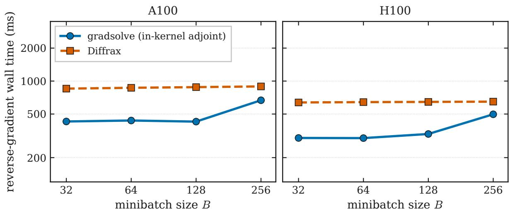  
Figure 11: Per-step gradient time against minibatch size B for the Robertson system with a neural reaction term, on the A100 and the H100, with Difrax’s tolerance fixed at the value matching the replay’s achieved error. gradsolve’s in-kernel adjoint is faster at every minibatch size measured, by a margin that is about 2× at the smaller batch sizes and narrows at B = 256.

Table 3: Matched-accuracy speedup ranges over Difrax and, where noted, over the PyTorch solvers, reported as measured minimum–maximum ranges. Every row reports the cost of a single gradient against an existing record. The last three rows time the two higher-order engines at a single ensemble size (n = 1024), so each carries one value rather than a range. The two PyTorch rows divide times measured on a second A100 of the same class by gradsolve times from the sweep; torchode is timed under torch.compile, its intended fast configuration (eager, out of the box, it is 58–63×), torchdifeq’s continuous adjoint eagerly.
<table><tr><td>Comparison</td><td>Baseline</td><td>Speedup</td></tr><tr><td>Lorenz, tolerance range (work-precision)</td><td>Diffrax</td><td>7.8-9.3×</td></tr><tr><td>Lorenz, ensemble-size sweep n = 8–2048</td><td>Diffrax</td><td>9.0-10.7×</td></tr><tr><td>Lorenz, n = 4096–1 048 576</td><td>Diffrax</td><td>6.2-8.5×</td></tr><tr><td>Lorenz, sizes run with all four solvers</td><td>Diffrax</td><td>8.8–9.8×</td></tr><tr><td>Van der Pol, ensemble-size sweep</td><td>Diffrax</td><td>9.7-10.5×</td></tr><tr><td>Lorenz, sizes run with all four solvers</td><td>torchode (torch.compile)</td><td>26-29×</td></tr><tr><td>Lorenz, sizes run with all four solvers</td><td>torchdiffeq</td><td>83-99×</td></tr><tr><td>Lorenz, three architectures (A100 / H100 / RTX 4090)</td><td>Diffrax</td><td>5.6–14.1×</td></tr><tr><td>Robertson (stiff), loose to tight accuracy</td><td>Diffrax</td><td>0.8-5.6×</td></tr><tr><td>Robertson (stiff), ensemble-size sweep, A100</td><td>Diffrax</td><td>2.4-3.4×</td></tr><tr><td>Robertson (stiff), ensemble-size sweep, RTX 4090</td><td>Diffrax</td><td>2.5-2.8×</td></tr><tr><td>HIRES (stiff)</td><td>Diffrax</td><td>4.1-4.3×</td></tr><tr><td>Lorenz, Verner pair (order 7)</td><td>Diffrax Dopri8</td><td>9.5×</td></tr><tr><td>Robertson, Rodas5P engine</td><td>Diffrax Kvaerno5</td><td>7.2×</td></tr><tr><td>HIRES, Rodas5P engine</td><td>Diffrax Kvaerno5</td><td>12.9×</td></tr></table>

Table 3 collects the per-gradient ranges against Difrax’s checkpointed adjoint, Table 2 those against its forward mode, and Table 4 the fitting case studies.

Table 4: Fitting case studies: speedup in the optimizer loop over Difrax at matched achieved accuracy (time in the optimizer loop; compilation and the one-time record excluded for both engines). Lorenz and galactic fits run 400 updates; the Robertson fit stops at a loss tolerance and is valid for $B \leq 6 4$
<table><tr><td>Study</td><td>Speedup range</td></tr><tr><td>Galactic halo q recovery</td><td>3.97-4.50×</td></tr><tr><td>Lorenz ρ recovery</td><td>5.39–6.32×</td></tr><tr><td>Robertson rate recovery,  $B \leq 6 4$ </td><td>1.14-1.35×</td></tr></table>

Table 5: Accepted-step counts across the Lorenz timing ensemble $( \rho \in [ 0 , 2 1 ] )$ of Figure 6, recorded at $\tau _ { \mathrm { r e l } } = 1 \times 1 0 ^ { - 6 } , \tau _ { \mathrm { a b s } } = 1 \times 1 0 ^ { - 9 }$ . The second row reads the same ensemble through torchode’s step counters; the linear family of Appendix A needs the same number of steps for every trajectory.
<table><tr><td>Ensemble and step counter</td><td></td><td></td><td>mean steps max steps max / mean</td></tr><tr><td>Lorenz, fused recorder</td><td>36.7</td><td>49</td><td>1.34</td></tr><tr><td>Lorenz, torchode&#x27;s step counters</td><td>39</td><td>52</td><td>1.33</td></tr><tr><td>Linear family (d = 3)</td><td>equal for all trajectories</td><td></td><td>1.00</td></tr></table>

## 5 Where the speedup comes from and when to expect it

The benchmarks of Section 4 establish how large the speedup is; this section identifies where it comes from. Three explanations are plausible: uneven step counts across the ensemble, the fused recorder, and a diference in the diferentiated computation itself. Measurements rule out the first two as the main cause; a control experiment then separates the third into the missing step-size controller and the fixed-length loop, and traces the saving to the loop. Knowing this tells a user when to expect the method to help.

Uneven step counts. The obvious candidate is the waiting described in Section 2.4. When trajectories are batched in lockstep, every trajectory steps until the slowest one finishes, so a method that frees each trajectory to take only its own steps would appear to gain exactly that wasted wait. We tested this directly. On the Lorenz ensemble used for the reverse-mode comparison of Section 4.3, the slowest trajectory accepts only 1.33–1.34 times as many steps as the average (Table 5); freeing it from the lockstep can therefore save only a factor of that order, whereas the measured gradient advantage is 7.8–9.3×, several times larger. A second solver confirms that the spread is real: reading the same ensemble through torchode’s own step counters reproduces it (Table 5). Uneven step counts therefore contribute a small factor but do not explain the gap.

The fused recorder. In a CPU experiment at $n = 1 2 8$ , where no GPU efect can contribute, the replay on the general path computes gradients 1.9–2.6× faster than Difrax and the replay with the fused recorder 2.2–2.4× faster. The comparison is at equal tolerance, which here means equal accuracy because the same Tsit5 pair runs on both sides; the two curves track each other closely (Figure 12). Both diferentiate the same fixed-step replay, so the recorder is not the source; the GPU ranges of Section 4 are those of the same replay. The same comparison on the CPU gives only $1 . 9 \mathrm { - } 2 . 6 \times$ , against 9.0–10.7× on the A100 (Figure 6), so roughly a factor of four of the GPU advantage is specific to how the GPU executes the two program forms, which the control below isolates.

The absence of the controller. A further control asks how much of each diference comes merely from not having to choose the steps. For it, Difrax was run on a fixed mesh with our own step count, hence with no controller and no rejected trials, on the three by-name comparisons of Section 4.7. Removing the step-size choice alone does not account for the diferences: on Lorenz and Robertson the fixed-mesh run is slower than the matched adaptive one, and on HIRES it is faster but reaches an error of $5 . 9 \times 1 0 ^ { - 4 }$ against our $1 . 3 \times 1 0 ^ { - 7 }$ . The HIRES speedup is therefore partly the fixed mesh rather than the loop, by an amount this run cannot fix. These runs are not accuracy-matched and use Difrax’s own methods, Dopri8 and Kvaerno5, whose steps cost more than the Verner and Rodas5P steps of the replay, on a mesh of the same count but not the recorded shape (Appendix B.2), so their ratios are rough comparisons rather than matched measurements. Measured against the replay itself, the fixed-mesh runs cost 10.7×, 7.9×, and 8.3× as much as the replay’s gradient on Lorenz, Robertson, and HIRES respectively. That remaining gap mixes the loop form with the per-step cost of the diferent methods. A last control removes the per-step cost too: the same Tsit5 method on the recorded mesh, stepped through Difrax’s StepTo controller so that only the loop form difers. On a homogeneous Lorenz ensemble — one shared recorded mesh, so no step-count spread — the replay’s fixed-step scan computes the gradient 7.9–11.1× faster than the StepTo loop on the A100 at the same accuracy (their gradients agree to $2 \times 1 0 ^ { - 1 6 } )$ , which is essentially the whole advantage of Section 4.3. On the CPU the scan holds no such advantage over the StepTo loop — it is in fact slightly slower on the larger ensembles — so the advantage is the GPU’s execution of a fixed-length scan rather than a bounded, checkpointed while-loop, the same factor of four the fused-recorder comparison left open.

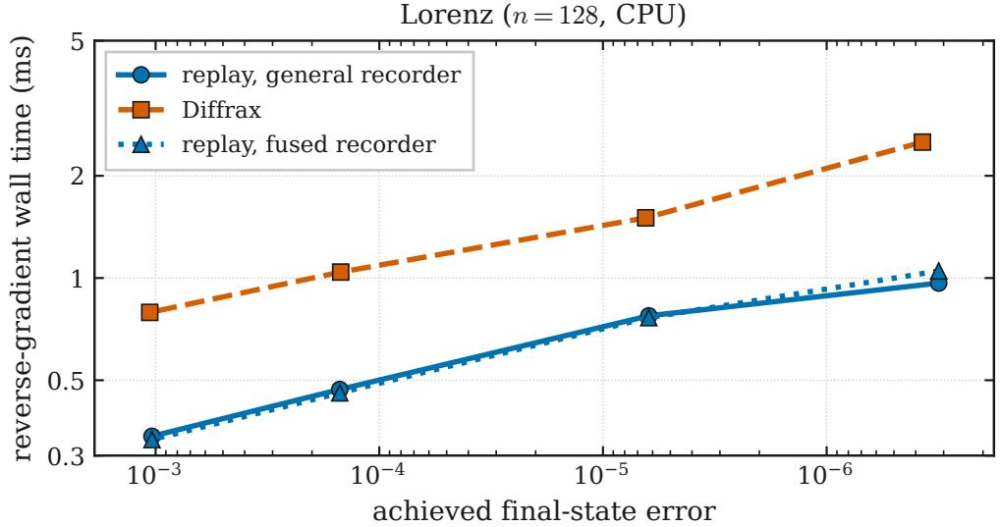  
Figure 12: Per-gradient cost against achieved final-state error on the Lorenz system $( n = 1 2 8$ double precision, CPU). Both gradsolve curves run the same diferentiated JAX replay and difer only in how the mesh was recorded, by the general recorder or by the fused recorder; recording is excluded from the per-gradient time. The two therefore track each other closely, and both sit below Difrax’s checkpointed adjoint across the tolerance range. The gap to Difrax thus measures the efect of diferentiating a fixed-step replay rather than of any GPU kernel.

The fixed mesh leaves the diferentiated loop in place, and its form is the part these controls point to: a fixed-length chain compiles to one regular program whose backward sweep is one linear pass, whereas an adaptive loop diferentiated in place is bounded, checkpointed, and advanced through every trial of every trajectory. The replay decides once, when it is compiled, whether to keep each intermediate value or recompute it, and then does the same at every step. The adaptive loop, even with a checkpoint at every step so that nothing is recomputed, must still write its intermediate values to memory and read them back from positions it only knows at run time.

Where the time goes. In the Lorenz gradient computation with the fused recorder on the A100 $( n = 2 6 2 1 4 4$ , double precision), recording is inexpensive: of the cost of recording once and taking one gradient, the record is 11–15% and the backward sweep about 80%, so the pass the replay simplifies is the one that dominates. The in-kernel adjoint of Section 3 contributes memory rather than speed; it is selected by name for that case and does not enter the ranges above.

The other baselines. The PyTorch solvers lag for the separate reason anticipated in Section 2.4: advancing the solve one host-dispatched operation at a time makes their forward pass alone 27–31× slower per trajectory than a fused kernel, and that overhead, rather than the spread in step counts, accounts for a substantial part of the 58–63× gap. Difrax avoids both the fused kernels’ lack of reverse-mode diferentiation and the PyTorch solvers’ dispatch overhead, which is why it is the principal baseline of Section 4.

In summary, the gradient is fast because the diferentiated computation is a fixed-length replay of recorded steps rather than an adaptive loop diferentiated in place: the derivative is the same, but its backward sweep involves no bounded loop and no checkpoint bookkeeping. The controls locate this saving: on the recorded mesh, holding the method fixed, the fixedstep scan computes the gradient 7.9–11.1× faster than Difrax’s StepTo loop on the A100 — essentially the whole advantage — while on the CPU the scan holds no such advantage, so the size of the advantage is set by how the GPU executes a fixed scan rather than a checkpointed while-loop. The same saving appears when both engines run in forward mode, where neither stores intermediate values. The in-kernel adjoint adds a memory advantage, and the uneven step counts across the ensemble contribute only a small factor.

When to expect the advantage. The saving comes from removing the diferentiated loop, so it is largest where that loop’s overhead dominates the backward sweep. In the measurements this means state dimensions of up to eight, where a step costs little relative to the bookkeeping around it; ensembles small enough that fixed per-step costs still dominate; and workloads that take many gradients against one recorded mesh, so that the record is paid once. At the other extreme, as the ensemble grows the margin declines toward the lower end of 6.2–8.5×, the range measured from $n = 4 0 9 6$ to n = 1 048 576, with the arithmetic dominating only above roughly $6 \times 1 0 ^ { 4 }$ trajectories. On stif systems it depends on the accuracy demanded, from 5.6× at loose accuracy to parity, and slightly below it, at tight accuracy, where the Rodas5P replay is the right choice. Against Difrax’s forward mode, the cheaper setting when each trajectory carries one to three inputs, the margins are those of Section 4.4, smaller but of the same shape, and the replay’s own forward mode is then the setting to use. For a right-hand side on the general path, one the user has not registered, one the translation of Section 3.4 refuses, or one whose state exceeds $d = 6 4$ , the gradient itself costs the same as in these measurements, since the replay is identical. The one-time record then runs as a batched JAX loop on the device, whose time Section 4.7 reports: a user-defined Lorenz ensemble of 8192 trajectories records in 0.043 s.

## 6 Discussion and conclusion

We introduced gradsolve, an open-source Python library, built on JAX, for solving and reverse-mode diferentiating low-dimensional ODE ensembles on GPUs. It records the steps an adaptive solver accepts and diferentiates a fixed-step replay of them, so an ensemble solve need not trade a fast integrator for an inexpensive gradient; the gradient it returns is a discrete adjoint of the same kind Difrax, the fastest diferentiable baseline, produces, obtained from a simpler computation. The two are complementary: gradsolve specializes this shared adjoint to low-dimensional GPU ensembles diferentiated many times against a recorded mesh, and the library keeps Difrax as both its principal baseline and a routing fallback. In our benchmarks the reverse-mode gradient runs at 5.6–14.1× lower cost than Difrax’s checkpointed adjoint across three GPU generations, and against Difrax’s forward mode, the cheaper setting for few parameters, the replay keeps a 3.2–3.5× speedup in reverse mode and 7.3–7.9× in forward mode. When no gradient is required, the forward-only kernel ran 2.8× faster than DifEqGPU.jl’s fused kernel on the low-dimensional ensembles the fused kernels are built for. The saving carries through to complete parameter recoveries, which run faster on all three fitting problems, and it does not depend on the integrator: the seventh-order Verner pair and the fifth-order Rosenbrock method Rodas5P run on the same path and show a comparable advantage, 9.5× and 7.2× per gradient against Difrax (Section 4.7). The controlled experiments of Section 5 trace the saving to that simpler form rather than to kernel fusion or to uneven step counts across the ensemble: on the recorded mesh, with the method held fixed, the fixed-step scan computes the gradient several times faster than Difrax’s loop on the GPU.

gradsolve is designed for workloads that need reverse-mode gradients through a GPU ensemble of low-dimensional ODEs. The advantage is largest on non-stif systems; it narrows as the ensemble grows on every card measured (Figure 8), and on a stif system at the tightest accuracy Difrax’s forward mode is the faster choice. The problem itself is unrestricted: any right-hand side a user writes runs on the general path, correct and diferentiable at any dimension, with a one-time record on the device and the same per-gradient cost. The fastest, specialized engines apply within boundaries — the fused kernels hold each trajectory’s state in registers, which bounds their state dimension (Figure 9); the in-kernel adjoint is verified over a narrower range of state dimensions, and the fused stif kernel assumes an autonomous system (Section 3) — and beyond every such boundary the general path takes over.

In its present form gradsolve solves initial-value problems for ODEs in the explicit form $\dot { y } = f ( t , y , \theta )$ . The fits benchmarked here recover parameters from final states; losses over many observation times run on the same recorded mesh through the dense-output replay (Section 3.4) but are not benchmarked, and a criterion for when a drifting mesh should be re-recorded is left to future work. Stochastic diferential equations, diferential-algebraic systems, and event handling are natural extensions of the construction, left to future work; event handling is the nearest — the crossing time found by the adaptive solve can be recorded and the replay made to land a step on it, with the crossing time’s own derivative supplied separately. Dense output, that is, the state at requested times between the solver’s own steps, comes from the JAX replay engines: by default the replay integrates one extra step exactly to each requested time, and Rodas5P can instead evaluate its own continuous extension when that is asked for (Section 3.4); whichever recorder produced the mesh, the forward-only fused kernels return final states only. Gradients run in double precision on the general path, and in single precision, with GPU-verified accuracy, for the systems the fused kernels serve. A user’s own right-hand side can be translated into the fused kernels’ form (Section 3.4), and widening that translation is among the extensions below.

The general path runs wherever JAX runs in double precision: the replay is an ordinary fixed-step JAX loop (a scan) that compiles through XLA, JAX’s compiler, and the general recorder is likewise a JAX program. The fused recorders are Warp kernels, which run on NVIDIA GPUs and, more slowly, on the CPU. Accelerators without hardware double precision, such as TPUs and Apple Metal, are outside the measured setting.

Several of the boundaries above point to concrete extensions. The translation of Section 3.4 feeds the Warp kernels; extending it to the hand-written CUDA forward-only kernel, and widening the set of operations it accepts, would bring every user right-hand side to the forward-only speed measured for the built-in fields. A fused kernel that tiles the state across several threads would raise the dimension limit set by thread registers without altering the returned gradient. The recorded mesh is currently reused as-is or rebuilt from scratch; an intermediate policy refreshing only the trajectories whose parameters have drifted furthest could benefit long optimization loops.

We release gradsolve as open-source software, built on JAX [5], with fused Warp kernels [29] for its recording engines and with Difrax [19] available as both a baseline and a routing fallback, at https://github.com/ECLIPSE-AI4Science/gradsolve.

## Appendix A Benchmark problem definitions

Each benchmark of Section 4 is an ensemble $\dot { y } = f ( t , y , \theta ) , y \in \mathbb { R } ^ { d }$ , whose trajectories share a right-hand side and, where stated below, difer in initial condition or parameters. For each system we give the vector field, the initial condition, the spread across the ensemble used by each measurement, and the integration span. Every measurement is in double precision except where single precision is stated: the forward comparison against DifEqGPU.jl (Section 4.1) and the single-precision gradient timings of Section 4.3.

Lorenz The three-variable attractor [26] evolves as

$$
\dot { x } = \sigma ( y - x ) , \qquad \dot { y } = x ( \rho - z ) - y , \qquad \dot { z } = x y - \beta z ,
$$

with $\sigma = 1 0$ and $\beta = 8 / 3$ . The timing benchmarks start every trajectory at $( 1 , 0 , 0 )$ and spread the Rayleigh parameter $\rho$ uniformly over [0, 21] across the ensemble, which spreads per-trajectory step counts. That range lies below $\rho \approx 2 4 . 1$ , where the chaotic attractor first appears, so the timing ensemble exercises transient dynamics. The chaotic regime enters through the ρ-recovery fit below, the galactic orbits, and a single timing point at $\rho = 2 8$ (Section 4.3). The ρ-recovery study of Section 4.8 instead starts near (1, 1, 1) with a small $( 1 0 ^ { - 2 } )$ Gaussian perturbation and spreads $\rho$ across replicates by $\pm 0 . 1 5$ decade around 28 (roughly 20 to 40). Both the timing benchmark and the recovery study integrate over $t \in [ 0 , 1 ]$

Van der Pol The relaxation oscillator [51] reads

$$
{ \dot { x } } = v ,
$$

$$
\dot { v } = \mu \big ( ( 1 - x ^ { 2 } ) v - x \big ) ,
$$

started at $( x , v ) = ( 2 , 0 )$ with $\mu = 3 ;$ larger $\mu$ stifens the oscillator and raises its step count. The reverse-mode sweep of Section 4.3 runs every trajectory at $\mu = 3$ , so its ensemble is n copies of one trajectory. Each trajectory is integrated over $t \in [ 0 , 2 0 ]$

Linear family A control problem with a free state dimension $d \colon$ each component grows independently, $\dot { y } _ { i } = 1 . 0 1 y _ { i }$ , from an initial state drawn uniformly from $[ 0 , 1 ) ^ { d }$ , over $t \in [ 0 , 1 0 ]$ with the analytic solution $y ( t ) = y _ { 0 } e ^ { 1 . 0 1 t }$ . Every trajectory needs the same number of steps, and the right-hand side carries no free parameter. It serves only as the equal-step control of Table $5 ,$ as the probe of the fused kernels’ dimension limit (Section 4.6), and at $d = 3 2$ in Section 4.7.

Robertson The stif chemical kinetics system [38] reads

$$
\dot { y } _ { 1 } = - k _ { 1 } y _ { 1 } + k _ { 3 } y _ { 2 } y _ { 3 } , \qquad \dot { y } _ { 2 } = k _ { 1 } y _ { 1 } - k _ { 3 } y _ { 2 } y _ { 3 } - k _ { 2 } y _ { 2 } ^ { 2 } , \qquad \dot { y } _ { 3 } = k _ { 2 } y _ { 2 } ^ { 2 } ,
$$

with rates $k _ { 1 } = 0 . 0 4 , k _ { 2 } = 3 \times 1 0 ^ { 7 } , k _ { 3 } = 1 0 ^ { 4 }$ spanning nearly nine orders of magnitude, started at (1, 0, 0). The per-gradient sweeps of Section 4.5 run every trajectory at these rates; the Rodas5P comparison of Section 4.7 spreads $k _ { 2 }$ over $[ 3 \times 1 0 ^ { 7 } , ~ 4 . 5 \times 1 0 ^ { 7 } ]$ across the ensemble; the fitting study (Section 4.8) draws each fit’s true $k _ { 1 }$ and $k _ { 3 }$ within $\pm 0 . 5$ decade of these values and recovers them. Each trajectory is integrated over $t \in [ 0 , 1 0 ^ { 4 } ]$

HIRES The eight-species plant-photochemistry model [41], a standard mildly stif test problem [16, §IV.10], reads

$$
\dot { y } _ { 1 } = - 1 . 7 1 y _ { 1 } + 0 . 4 3 y _ { 2 } + 8 . 3 2 y _ { 3 } + 0 . 0 0 0 7 , \quad \dot { y } _ { 2 } = 1 . 7 1 y _ { 1 } - 8 . 7 5 y _ { 2 } ,
$$

$$
\dot { y } _ { 3 } = - 1 0 . 0 3 y _ { 3 } + 0 . 4 3 y _ { 4 } + 0 . 0 3 5 y _ { 5 } , \qquad \dot { y } _ { 4 } = 8 . 3 2 y _ { 2 } + 1 . 7 1 y _ { 3 } - 1 . 1 2 y _ { 4 } ,
$$

$$
\dot { y } _ { 5 } = - 1 . 7 4 5 y _ { 5 } + 0 . 4 3 y _ { 6 } + 0 . 4 3 y _ { 7 } , \qquad \dot { y } _ { 6 } = - 2 8 0 y _ { 6 } y _ { 8 } + 0 . 6 9 y _ { 4 } + 1 . 7 1 y _ { 5 } - 0 . 4 3 y _ { 6 } + 0 . 6 9 y _ { 7 } ,
$$

$$
\dot { y } _ { 7 } = 2 8 0 y _ { 6 } y _ { 8 } - 1 . 8 1 y _ { 7 } ,
$$

$$
\dot { y } _ { 8 } = - 2 8 0 y _ { 6 } y _ { 8 } + 1 . 8 1 y _ { 7 } ,
$$

started at $y = ( 1 , 0 , 0 , 0 , 0 , 0 , 0 , 0 . 0 0 5 7 )$ . HIRES has no free per-trajectory rate. The Rosenbrock23 comparison of Section 4.5 runs every trajectory from this initial condition; the Rodas5P comparison of Section 4.7 jitters the nonzero components multiplicatively by up to ±25%, kept non-negative. Each trajectory is integrated from $t = 0 \ \mathrm { t o } \ t = 3 2 1 . 8 1 2 2$ , the problem’s standard endpoint.

Galactic logarithmic potential Stellar orbits move in a flattened dark-matter halo with the logarithmic potential [4]

$$
\begin{array} { r } { \Phi ( x , y , z ) = \frac { 1 } { 2 } v _ { c } ^ { 2 } \ln ( R _ { c } ^ { 2 } + x ^ { 2 } + y ^ { 2 } + z ^ { 2 } / q ^ { 2 } ) . } \end{array}
$$

The state is the six-dimensional phase-space vector $( x , y , z , v _ { x } , v _ { y } , v _ { z } )$ with $\dot { \mathbf { r } } = \mathbf { v } , \dot { \mathbf { v } } = - \nabla \Phi$ , i.e.

$$
\dot { v } _ { x } = - \frac { v _ { c } ^ { 2 } x } { D } , \quad \dot { v } _ { y } = - \frac { v _ { c } ^ { 2 } y } { D } , \quad \dot { v } _ { z } = - \frac { v _ { c } ^ { 2 } z } { q ^ { 2 } D } , \qquad D = R _ { c } ^ { 2 } + x ^ { 2 } + y ^ { 2 } + z ^ { 2 } / q ^ { 2 } ,
$$

in scaled units with $v _ { c } = 1 , R _ { c } = 0 . 2$ , flattening $q = 0 . 7$ . For $q < 1$ many of these orbits are chaotic; q is the parameter recovered in Section 4.8. All trajectories share the halo parameters, and the ensemble varies the stellar initial conditions: launch radii $r \in [ 0 . 3 , 1 . 2 ]$ and azimuths $\phi \in [ 0 , 2 \pi )$ , heights $z \in [ - 0 . 4 , 0 . 4 ]$ , tangential speeds 0.7–1.0 times $v _ { c } ,$ , and vertical velocities $v _ { z } \in [ - 0 . 3 , 0 . 3 ]$ , spanning loop orbits, which circulate around the center, and box orbits, which oscillate through it. Each trajectory is integrated over $t \in [ 0 , 6 ]$

Robertson neural right-hand side A stif neural diferential equation [8, 34] is built from Robertson by replacing the autocatalytic term $k _ { 2 } y _ { 2 } ^ { 2 }$ with a small neural network $\mathrm { N N } _ { \theta } : \mathbb { R } ^ { 3 } $ R in both the sink and source terms, so mass is conserved:

$$
\begin{array} { r } { { \dot { y } } _ { 1 } = - k _ { 1 } y _ { 1 } + k _ { 3 } y _ { 2 } y _ { 3 } , \qquad { \dot { y } } _ { 2 } = k _ { 1 } y _ { 1 } - k _ { 3 } y _ { 2 } y _ { 3 } - \mathrm { N N } _ { \theta } ( y ) , \qquad { \dot { y } } _ { 3 } = \mathrm { N N } _ { \theta } ( y ) , } \end{array}
$$

with $k _ { 1 } = 0 . 0 4 , k _ { 3 } = 1 0 ^ { 4 }$ and Robertson’s initial condition and integration span. The network is a multilayer perceptron with input dimension 3, output dimension 1, two hidden layers of width 16, tanh hidden activations, and a softplus output, keeping the replaced term non-negative. The parameters θ are the network weights; the gradient of the fitting loss with respect to θ flows through the stif solve. The batch-size sweep of Figure 11 spreads $k _ { 1 }$ per trajectory over $[ k _ { 1 } , 1 . 5 k _ { 1 } ]$

Lorenz-96 Used only for the high-dimensional gradient check of Appendix B.6, not as a timing benchmark, the cyclic Lorenz-96 system has right-hand side

$$
{ \dot { y } } _ { i } = \left( y _ { i + 1 } - y _ { i - 2 } \right) y _ { i - 1 } - y _ { i } + F ,
$$

with the indices i taken cyclically over the d state components and a constant forcing $F ;$ the check runs at $d = 9 6$

## Appendix B Benchmark protocol and reproducibility

This appendix records how the measurements of Section 4 were made, in enough detail to repeat them: the rule by which accuracy is matched (Appendix B.1), the configuration of every baseline (Appendix B.2), the timing rule and its uncertainties (Appendix B.3), the protocol of the fitting studies (Appendix B.4), the hardware and software (Appendix B.5), and the checks that the returned gradients are correct (Appendix B.6).

## Appendix B.1 Matching rule

Solvers of diferent order reach diferent accuracy at the same nominal tolerance, so ratios between methods of diferent order are read at matched achieved accuracy. gradsolve runs first and its error against a high-accuracy reference is recorded: the median, over all components of all final states in the ensemble, of the componentwise relative error $| \hat { y } - y _ { \mathrm { r e f } } | / \operatorname* { m a x } ( | y _ { \mathrm { r e f } } | , 1 0 ^ { - 3 0 } )$ with $y _ { \mathrm { r e f } }$ a high-accuracy reference — analytic where one exists, otherwise scipy Radau for stif systems and DOP853 for the rest, at $\tau _ { \mathrm { r e l } } = 1 0 ^ { - 1 1 } , \tau _ { \mathrm { a b s } } = 1 0 ^ { - 1 2 }$ in double precision. The median is the matched quantity; Appendix B.6 also reports the maximum and, where a system’s components difer in scale, the per-species error. The baseline’s relative tolerance is then bisected, with $\tau _ { \mathrm { a b s } } = 1 0 ^ { - 3 } \tau _ { \mathrm { r e l } }$ throughout, until its own achieved error lies within 25% of ours. Among the tolerances inside that band, the one whose error is not smaller than ours is quoted, so the baseline is never credited with accuracy it was not asked for; and no match is taken below $\tau _ { \mathrm { r e l } } = 1 0 ^ { - 1 0 }$ . Accuracy is matched on the solution: each engine’s gradient is exact for its own discretization, and the two gradients are not separately matched. Where a range is read of a work–precision sweep, the baseline’s cost at gradsolve’s achieved error is obtained by log–log interpolation between the baseline’s measured points, within the overlap of the two curves’ achieved-error ranges only; no ratio is extrapolated.

## Appendix B.2 Baseline configuration

Every device is synchronized before a timestamp is read: block\_until\_ready in JAX, and torch.cuda.synchronize in PyTorch.

The Difrax baseline is diffeqsolve with Tsit5 for the non-stif systems and Kvaerno5 for the stif ones (Section 4.5); the adaptive PIDController at its default coeficients, which reduce to an integral controller as in gradsolve’s recorders; the default RecursiveCheckpointAdjoint; dt0=None, so that the controller chooses the initial step; SaveAt(t1=True); and throw=False; mapped over the ensemble with vmap. Both engines are compiled by one outer jit around grad, with no further jit placed inside it (diffeqsolve carries its own). The stif baseline solves its implicit stages with a full Newton iteration (optimistix.Newton [36], whose linear solves use lineax [35], with the controller’s tolerances) in place of the default chord iteration (VeryChord), which reuses one Jacobian factorization per step. On the Robertson system at matched achieved accuracy, measured on a CPU at n = 64, the chord setting rejects about half of its attempted steps, accepts three to four times as many steps as the Newton setting, and takes 3.6–3.9× longer per gradient; the Newton setting is therefore the faster one and is the one timed. This comparison was made on a CPU; the GPU runs use the same Newton setting, whose lower step count is a property of the numerics rather than of the device.

The step limit max\_steps is sized from a preliminary solve of the same ensemble. The checkpoint count is the fastest of three measured settings: one checkpoint per attempted step, with the step limit tightened to the attempted count so that nothing is recomputed (the solve is re-run at that limit to confirm that no trajectory reaches it); one and a half times the attempted count on the sized step limit; and the library default, which derives the count from the step limit. The choice and its margin over the runner-up are recorded for each measurement, that is, for each combination of problem, ensemble size and pair of engines. In the fitting loops the parameters move away from the point where that step limit was sized. There Difrax instead runs one checkpoint per step of a step limit sized with headroom at the starting point, so it never recomputes and cannot exhaust the limit silently; that setting was within 6.6% of the fastest measured one, and at the end of every fit the Difrax solve is re-run at the final parameters to confirm that no trajectory reached the step limit (its tolerance, matched at the starting point, is not re-matched). The library’s own built-in Difrax engine (Section 3) uses Difrax’s defaults and is not the configuration timed here.

All baselines are timed in reverse mode, the mode the neural right-hand side of Section 4.8 requires. For the systems with one to three inputs per trajectory, Difrax’s forward-mode option (ForwardMode) was timed as well, in a separate A100 session, with the same solver, controller, tolerances and step limit as the reverse arm and the checkpointed adjoint replaced by ForwardMode.

Because the loss is a sum over trajectories and no trajectory depends on another’s inputs, the gradient is assembled from one forward pass per input, each pass changing that input in every trajectory at once. Two placements were timed, one pass over the whole ensemble and jacfwd (forward-mode Jacobian) applied per trajectory inside the vmap, and the faster of the two is quoted. Both return the reverse arm’s gradient to within 10<sup>−13</sup>, and both solve the same trajectories as the reverse arm to roundof. Pushing one pass per trajectory and input through the whole ensemble, which costs n times more, was not timed.

The replay was diferentiated in forward mode by the same rule. The two reverse arms were re-measured in that session and reproduce the ranges quoted in Section 4 within the run-to-run spread. Difrax also ofers a continuous adjoint (BacksolveAdjoint), which its documentation does not recommend because the gradient is approximate; it is not timed.

The two PyTorch solvers were timed on a second A100 machine (PCIe), in a separate process from the JAX measurements, because PyTorch’s bundled CUDA libraries otherwise interfere with JAX; the ratios against them therefore compare across two A100 machines, which difer by about 18% at the smallest ensemble size, above the run-to-run spread on one machine. torchode is timed under torch.compile, its intended fast configuration, and torchdifeq’s continuous adjoint eagerly. In the fixed-mesh control of Section 5, a uniform Robertson mesh of our step count failed on every trajectory; the number reported comes from a geometrically graded mesh, which supplies a mesh shape as well as replacing the controller.

## Appendix B.3 Timing and uncertainty

Each per-gradient wall time is the best of three timed calls (five for the higher-order engines of Section 4.7) and each fitting-loop time the mean over repetitions, both after a warm-up pass that absorbs one-time compilation and, for the replay engines, the one-time recording; the run-to-run spread of such a measurement is quoted in Section 4. The best-of-N choice isolates the computation from transient scheduling and contention on a shared host, the usual convention for timing a compiled kernel; the fitting-loop times run long enough to average such transients and are reported as means, with Figure 10 drawing their standard deviation as error bars. The per-repetition timings behind the reverse figures are kept in the released data, so any other statistic can be formed from them; on the log-scaled reverse figures the 12.6% spread is smaller than the plotted markers, so it is reported here rather than drawn. That spread is comparable to the narrowest margins — the near-parity stif points at tight accuracy, which should be read with it in mind — while the large reverse-mode margins sit far above it. Two sources of uncertainty act on the ratios of Section 4.7 in opposite directions. The matching procedure lowers Difrax’s tolerance by bisection until its achieved error reaches ours, never the reverse, so each baseline ended slightly less accurate than gradsolve (achieved-error ratios 1.01–1.12) and takes fewer steps than an exact match would, which understates the ratios. Against that, a finer ten-point sweep of Difrax’s checkpoint setting found settings up to 2% faster than the three settings measured, which overstates each ratio by at most that much.

## Appendix B.4 Fitting protocol

The fitting studies of Section 4.8 run B concurrent fits, $B \in \{ 1 , 8 , 6 4 , 2 5 6 \}$ , each recovering its own parameter, with both engines under the identical optimizer. The neural network study of Figure 11 reuses the symbol B for its minibatch size, the number of trajectories per training step. The Lorenz and galactic fits run 400 optimizer updates; the Robertson fit stops once its loss falls below a fixed tolerance. The recorded mesh is treated as data for the duration of a fit: no reported fit re-records midway, and re-recording at a fixed cadence, when used, is timed inside the loop. Any combination of problem and B where either engine failed to recover its parameter is dropped, since a failed baseline is not evidence of a speedup. The optimizer is Adam [22] at a learning rate of 0.05 (Lorenz), 0.02 (galactic) or 0.1 (Robertson); each fit starts a tenth of a decade (Lorenz), a quarter decade (galactic) or a full decade (Robertson) from the true value and recovers it from final states perturbed by relative Gaussian noise of magnitude $1 0 ^ { - 3 }$ ; the Robertson loss tolerance is $1 0 ^ { - 5 }$ , and all runs use seed 0, a single data realization, and each fit’s optimizer-loop time is the mean over two timed repetitions. Recovery is declared when the parameter returns to within a relative 0.02 (Lorenz), 0.03 (galactic) or 0.05 in $\log _ { 1 0 }$ (Robertson) of its true value. Both engines recover it to the same accuracy: on Lorenz the final $\log _ { 1 0 }$ error runs from $7 \times 1 0 ^ { - 5 }$ at $B = 1$ to $2 . 3 \times 1 0 ^ { - 3 }$ , on galactic the relative error from $2 . 9 \times 1 0 ^ { - 4 }$ down to $7 . 2 \times 1 0 ^ { - 6 }$ as B grows, and on Robertson the $\log _ { 1 0 }$ error stays below 0.02 for $B \leq 6 4$ . The one dropped combination is the stif Robertson fit at $B = 2 5 6$ , where neither engine reached the loss tolerance within its step cap $( \log _ { 1 0 }$ error ≈ 1.13 for both), the absent point in Figure 10.

## Appendix B.5 Hardware and software

Most experiments run in double precision on a single GPU: an NVIDIA A100 (80 GB), an H100, or a consumer RTX 4090 (24 GB, whose double-precision arithmetic rate is one sixty-fourth of its single-precision rate). The A100 comes in two packagings, PCIe and SXM4, which are named where they difer, and the A100 measurements were made on two machines. The CPU experiment of Section 5 was run on an Apple M3 Max and the CPU curve of Figure 6(b) on the CPU of the machine hosting the A100. No two frameworks ever share a device within one measurement. The A100 sweeps ran JAX 0.10.2 with Difrax 0.7.2 and Warp 1.15; the DifEqGPU.jl comparison ran Julia 1.12.5 with DifEqGPU.jl 3.15.2 and CUDA.jl 6. Table 6 lists the software each measurement ran under.

Table 6: Software environment of the measurements reported here. The A100 measurements were made on two machines, hence two driver versions. The Julia row gives the forward comparison of Section 4.1 first and the reverse-mode attempt of Section 4.3 second.
<table><tr><td>Component</td><td>Version</td></tr><tr><td>GPUs and drivers</td><td>A100-SXM4-80GB (580.126.16, 570.172.08), H100 80GB HBM3 (580.126.09), RTX 4090 (580.126.09)</td></tr><tr><td>CUDA</td><td>12.4 (JAX build)</td></tr><tr><td>JAX / Diffrax / equinox / optimistix / lineax Warp</td><td>0.10.2 / 0.7.2 / 0.13.8 / 0.1.0 / 0.1.1 1.15.0</td></tr><tr><td>Host CPUs</td><td>AMD EPYC 7742 64-Core Processor (first A100 machine), Intel Xeon Platinum 8470 (second A100 machine), Intel Xeon Platinum 8480+ (H100 machine),</td></tr><tr><td>PyTorch / torchode (torch.compile measurement) Julia / DiffEqGPU.jl / CUDA.jl</td><td>AMD EPYC 7K62 48-Core (RTX 4090 machine), Apple M3 Max (CPU experiment of Section 5) 2.4.1+cu124 /1.0.1 1.12.5 / 3.15.2 / 6; 1.12.6 / 3.15.3 / 6.2.1</td></tr></table>

## Appendix B.6 Gradient checks

The exactness of the gradient (Section 3) is a property of the diferentiated program rather than of an accelerator, so a finite-diference test on any machine can verify it. The check builds a small ensemble, diferentiates the benchmark loss $\ell = \| y ( t _ { 1 } ) \| ^ { 2 }$ summed over the ensemble through it with gradsolve, and compares the result to a central finite-diference gradient of the same loss (relative step $1 0 ^ { - 6 }$ along a seeded unit direction, ensemble seed 0), perturbing one trajectory’s parameter inside the same recorded replay (the convention of Section 3). On a laptop CPU the two agree to a relative diference of about $9 \times 1 0 ^ { - 1 1 }$ ; on the A100 the stif Robertson replay agrees with the finite-diference estimate to $7 \times 1 0 ^ { - 9 }$ . Where the finite-diference check is itself uninformative — for the linear family at $d = 3 2$ , whose rescaling loss drives the central-diference signal to the roundof floor — the replay’s gradient is compared instead against the system’s closed-form sensitivity, and agrees with it to $1 . 6 \times 1 0 ^ { - 7 }$ relative, the order of the method’s forward error (Section 4.7).

Table 7: Gradient accuracy against an independent high-accuracy sensitivity (CPU, double precision). For each system the record-and-replay gradient of $\| y ( t _ { 1 } ) \| ^ { 2 }$ is compared with central finite diferences of a separately, tightly solved reference (Appendix B.1), reported as the relative diference of the two gradients; the achieved forward-state error is given as the median and the maximum over the ensemble.
<table><tr><td>System</td><td>Gradient vs independent sensitivity Forward error (median) Forward error (max)</td><td></td><td></td></tr><tr><td>Lorenz (non-stiff)</td><td> $4 . 6 \times 1 0 ^ { - 6 }$ </td><td> $4 . 8 \times 1 0 ^ { - 7 }$ </td><td> $7 . 6 \times 1 0 ^ { - 6 }$ </td></tr><tr><td>Robertson (stiff)</td><td> $6 . 8 \times 1 0 ^ { - 6 }$ </td><td> $3 . 2 \times 1 0 ^ { - 5 }$ </td><td> $4 . 4 \times 1 0 ^ { - 5 }$ </td></tr></table>

The checks so far perturb inputs inside the recorded replay, so they confirm that automatic diferentiation of the replay is correct; they do not by themselves show that this gradient is an accurate sensitivity of the underlying system. A separate test does. For a non-stif system (Lorenz) and a stif one (Robertson) we compare the record-and-replay gradient of $\| y ( t _ { 1 } ) \| ^ { 2 }$ against an independent high-accuracy sensitivity: central finite diferences of a separately, tightly solved reference (the accuracy-matching reference of Appendix B.1, not the replay), swept over the step size to expose the finite-diference plateau before roundof. The two agree to $4 . 6 \times 1 0 ^ { - 6 }$ on Lorenz and $6 . 8 \times 1 0 ^ { - 6 }$ on Robertson, the level of each system’s own forward discretization error rather than machine precision, so the replay returns an accurate sensitivity and not merely a self-consistent derivative (Table 7). A third check compares the two engines head to head, on a shared mesh. Running Difrax’s Tsit5 on gradsolve’s own recorded mesh through its StepTo controller — the same method stepping to the same recorded times — its gradient of $\| y ( \bar { t } _ { 1 } ) \| ^ { 2 }$ agrees with the replay’s to $2 . 9 \times 1 0 ^ { - 1 5 }$ on Lorenz and $1 . 8 \times 1 0 ^ { - 1 3 }$ on Van der Pol, at machine precision. This confirms directly what Section 3.1 argues: on the same method and the same mesh the two return the same discrete adjoint, not two gradients that each merely match finite diferences. The forward-state error is reported there as a median and a maximum; on Robertson, whose species span decades, the maximum $( 4 . 4 \times 1 0 ^ { - 5 } )$ sits close to the median $( 3 . 2 \times 1 0 ^ { - 5 } )$ , and the per-component maxima are $3 . 3 \times 1 0 ^ { - 5 } , 4 . 4 \times 1 0 ^ { - 5 }$ and $3 . 6 \times 1 0 ^ { - 6 }$ , so the small middle species is resolved as well as the others, so the pooled median is representative rather than masking a poorly resolved species.

On the non-stif side, two independent implementations of the backward sweep, the JAX replay and a Warp kernel diferentiated in place, agree to about $3 . 5 \times 1 0 ^ { - 1 1 }$ at state dimension 96 on the Lorenz-96 system (Appendix A); the finite-diference check of that kernel was made through $d = 3 2$ , and its stif counterpart, the in-kernel adjoint, through $d \approx 1 2$ . Inside the in-kernel adjoint two pieces are written by hand rather than generated. The kernel solves its linear systems in place, overwriting the numbers it reads, and Warp’s automatic diferentiation does not propagate correctly through such overwrites, so the transpose-solve rule of the backward sweep is written out explicitly. Its Jacobian comes from a formula registered with the library, hand-written for the built-in fields and derived by automatic diferentiation for a translated user field (Section 3.4), rather than from diferentiating the right-hand side inside the kernel. A separate run of the same comparison with the fused recorder in place of the general recorder returns the same mesh to roundof and hence the same gradient, the observation Section 5 relies on. The general recorder’s compiled loop and a plain Python loop over the same trial steps agree exactly in accepted and rejected step counts, with step sizes agreeing to about $1 \times 1 0 ^ { - 8 }$ relative (the compiled loop uses fused multiply-add arithmetic).

## Acknowledgments

ASM thanks Patrick Kidger for helpful comments on the manuscript, and acknowledges funding from a Leverhulme Trust Research Leadership Award.

## Data and code availability

The gradsolve code, together with notebooks that re-measure the reverse-mode comparison against Difrax and the forward-only comparison against DifEqGPU.jl on the reader’s own hardware, is available at https://github.com/ECLIPSE-AI4Science/gradsolve.

## References

[1] Mihai Alexe and Adrian Sandu. Forward and adjoint sensitivity analysis with continuous explicit Runge–Kutta schemes. Applied Mathematics and Computation, 208(2):328–346, 2009. doi: 10.1016/j.amc.2008.11.035.

[2] Atılım Güneş Baydin, Barak A. Pearlmutter, Alexey Andreyevich Radul, and Jefrey Mark Siskind. Automatic diferentiation in machine learning: a survey. Journal of Machine Learning Research, 18(153):1–43, 2018. doi: 10.48550/arXiv.1502.05767. arXiv:1502.05767.

[3] John T. Betts. Practical Methods for Optimal Control and Estimation Using Nonlinear Programming. Society for Industrial and Applied Mathematics, Philadelphia, second edition, 2010. doi: 10.1137/1.9780898718577.

[4] James Binney and Scott Tremaine. Galactic Dynamics. Princeton University Press, 2nd edition, 2008. ISBN 978-0-691-13026-2. doi: 10.1515/9781400828722.

[5] James Bradbury, Roy Frostig, Peter Hawkins, Matthew James Johnson, Yash Katariya, Chris Leary, Dougal Maclaurin, George Necula, Adam Paszke, Jake VanderPlas, Skye Wanderman-Milne, and Qiao Zhang. JAX: composable transformations of Python+NumPy programs. Software, 2018. http://github.com/jax-ml/jax.

[6] Yang Cao, Shengtai Li, Linda Petzold, and Radu Serban. Adjoint sensitivity analysis for diferential-algebraic equations: The adjoint DAE system and its numerical solution. SIAM Journal on Scientific Computing, 24(3):1076–1089, 2003. doi: 10.1137/S1064827501380630.

[7] Ricky T. Q. Chen. torchdifeq: diferentiable ODE solvers with full GPU support and O(1)- memory backpropagation. Software, 2018. https://github.com/rtqichen/torchdiffeq.

[8] Ricky T. Q. Chen, Yulia Rubanova, Jesse Bettencourt, and David Duvenaud. Neural ordinary diferential equations. In Advances in Neural Information Processing Systems (NeurIPS), 2018. doi: 10.48550/arXiv.1806.07366. arXiv:1806.07366.

[9] J. R. Dormand and P. J. Prince. A family of embedded Runge–Kutta formulae. Journal of Computational and Applied Mathematics, 6(1):19–26, 1980. doi: 10.1016/0771-050X(80) 90013-3.

[10] Patrick E. Farrell, David A. Ham, Simon W. Funke, and Marie E. Rognes. Automated derivation of the adjoint of high-level transient finite element programs. SIAM Journal on Scientific Computing, 35(4):C369–C393, 2013. doi: 10.1137/120873558.

[11] Amir Gholaminejad, Kurt Keutzer, and George Biros. ANODE: Unconditionally accurate memory-eficient gradients for neural ODEs. In Proceedings of the Twenty-Eighth International Joint Conference on Artificial Intelligence (IJCAI), pages 730–736, 2019. doi: 10.24963/ijcai.2019/103.

[12] Michael B. Giles and Niles A. Pierce. An introduction to the adjoint approach to design. Flow, Turbulence and Combustion, 65(3-4):393–415, 2000. doi: 10.1023/A:1011430410075.

[13] Andreas Griewank and Andrea Walther. Algorithm 799: revolve: an implementation of checkpointing for the reverse or adjoint mode of computational diferentiation. ACM Transactions on Mathematical Software, 26(1):19–45, 2000. doi: 10.1145/347837.347846.

[14] Andreas Griewank and Andrea Walther. Evaluating Derivatives: Principles and Techniques of Algorithmic Diferentiation. Society for Industrial and Applied Mathematics, 2nd edition, 2008. doi: 10.1137/1.9780898717761.

[15] William W. Hager. Runge–kutta methods in optimal control and the transformed adjoint system. Numerische Mathematik, 87(2):247–282, 2000. doi: 10.1007/s002110000178.

[16] Ernst Hairer and Gerhard Wanner. Solving Ordinary Diferential Equations II: Stif and Diferential-Algebraic Problems. Springer, 1996. doi: 10.1007/978-3-642-05221-7.

[17] Ernst Hairer, Syvert P. Nørsett, and Gerhard Wanner. Solving Ordinary Diferential Equations I: Nonstif Problems. Springer, 2nd rev. edition, 1993. doi: 10.1007/978-3-540-78862-1.

[18] Alan C. Hindmarsh, Peter N. Brown, Keith E. Grant, Steven L. Lee, Radu Serban, Dan E. Shumaker, and Carol S. Woodward. SUNDIALS: Suite of nonlinear and diferential/algebraic equation solvers. ACM Transactions on Mathematical Software, 31(3):363–396, 2005. doi: 10.1145/1089014.1089020. https://github.com/LLNL/sundials.

[19] Patrick Kidger. Difrax: numerical diferential equation solvers in JAX. Software, 2021. https://github.com/patrick-kidger/diffrax.

[20] Patrick Kidger. On Neural Diferential Equations. PhD thesis, University of Oxford, 2021. arXiv:2202.02435.

[21] Patrick Kidger and Cristian Garcia. Equinox: neural networks in JAX via callable PyTrees and filtered transformations, 2021. arXiv:2111.00254, https://github.com/ patrick-kidger/equinox.

[22] Diederik P. Kingma and Jimmy Ba. Adam: A method for stochastic optimization. In International Conference on Learning Representations (ICLR), 2015. doi: 10.48550/arXiv. 1412.6980. arXiv:1412.6980.

[23] Anne Kværnø. Singly diagonally implicit Runge–Kutta methods with an explicit first stage. BIT Numerical Mathematics, 44(3):489–502, 2004. doi: 10.1023/B:BITN.0000046811.70614. 38.

[24] Marten Lienen and Stephan Günnemann. torchode: A parallel ODE solver for PyTorch. In The Symbiosis of Deep Learning and Diferential Equations II, NeurIPS Workshop, 2022. doi: 10.48550/arXiv.2210.12375. arXiv:2210.12375, https://github.com/martenlienen/ torchode.

[25] Erik Lindholm, John Nickolls, Stuart Oberman, and John Montrym. NVIDIA Tesla: A unified graphics and computing architecture. IEEE Micro, 28(2):39–55, 2008. doi: 10.1109/MM.2008.31.

[26] Edward N. Lorenz. Deterministic nonperiodic flow. Journal of the Atmospheric Sciences, 20(2):130–141, 1963. doi: 10.1175/1520-0469(1963)020<0130:DNF>2.0.CO;2.

[27] Yingbo Ma, Vaibhav Dixit, Michael J. Innes, Xingjian Guo, and Christopher Rackauckas. A comparison of automatic diferentiation and continuous sensitivity analysis for derivatives of diferential equation solutions. In 2021 IEEE High Performance Extreme Computing Conference (HPEC), pages 1–9, 2021. doi: 10.1109/HPEC49654.2021.9622796. arXiv:1812.01892.

[28] Dániel Nagy, Lambert Plavecz, and Ferenc Hegedűs. The art of solving a large number of non-stif, low-dimensional ordinary diferential equation systems on GPUs and CPUs. Communications in Nonlinear Science and Numerical Simulation, 112:106521, 2022. doi: 10.1016/j.cnsns.2022.106521. MPGOS, https://github.com/FerencHegedus/ Massively-Parallel-GPU-ODE-Solver.

[29] NVIDIA. NVIDIA Warp: A python framework for high-performance gpu simulation and graphics. https://github.com/NVIDIA/warp, 2024.

[30] NVIDIA Corporation. CUDA C++ Programming Guide. https://docs.nvidia.com/ cuda/cuda-c-programming-guide/, 2025. Release 12.x; the per-thread register limit of 255 is given in the compute-capability table.

[31] Derek Onken and Lars Ruthotto. Discretize-optimize vs. optimize-discretize for time-series regression and continuous normalizing flows, 2020. arXiv:2005.13420.

[32] Adam Paszke, Sam Gross, Francisco Massa, Adam Lerer, James Bradbury, Gregory Chanan, Trevor Killeen, Zeming Lin, Natalia Gimelshein, Luca Antiga, Alban Desmaison, Andreas Köpf, Edward Yang, Zachary DeVito, Martin Raison, Alykhan Tejani, Sasank Chilamkurthy, Benoit Steiner, Lu Fang, Junjie Bai, and Soumith Chintala. PyTorch: An imperative style, high-performance deep learning library. In Advances in Neural Information Processing Systems (NeurIPS), 2019. doi: 10.48550/arXiv.1912.01703. arXiv:1912.01703, https: //github.com/pytorch/pytorch.

[33] Christopher Rackauckas and Qing Nie. DiferentialEquations.jl – a performant and featurerich ecosystem for solving diferential equations in Julia. Journal of Open Research Software, 5 (1):15, 2017. doi: 10.5334/jors.151. https://github.com/SciML/DifferentialEquations. jl.

[34] Christopher Rackauckas, Yingbo Ma, Julius Martensen, Collin Warner, Kirill Zubov, Rohit Supekar, Dominic Skinner, Ali Ramadhan, and Alan Edelman. Universal diferential equations for scientific machine learning, 2020. arXiv:2001.04385.

[35] Jason Rader, Terry Lyons, and Patrick Kidger. Lineax: unified linear solves and linear least-squares in JAX and Equinox, 2023. arXiv:2311.17283, https://github.com/ patrick-kidger/lineax.

[36] Jason Rader, Terry Lyons, and Patrick Kidger. Optimistix: modular optimisation in JAX and Equinox, 2024. arXiv:2402.09983, https://github.com/patrick-kidger/optimistix.

[37] A. Raue, C. Kreutz, T. Maiwald, J. Bachmann, M. Schilling, U. Klingmüller, and J. Timmer. Structural and practical identifiability analysis of partially observed dynamical models by exploiting the profile likelihood. Bioinformatics, 25(15):1923–1929, 2009. doi: 10.1093/ bioinformatics/btp358.

[38] H. H. Robertson. The solution of a set of reaction rate equations. In J. Walsh, editor, Numerical Analysis: An Introduction, pages 178–182. Academic Press, London, 1966.

[39] H. H. Rosenbrock. Some general implicit processes for the numerical solution of diferential equations. The Computer Journal, 5(4):329–330, 1963. doi: 10.1093/comjnl/5.4.329.

[40] Adrian Sandu. On the properties of Runge–Kutta discrete adjoints. In Computational Science – ICCS 2006, volume 3994 of Lecture Notes in Computer Science, pages 550–557. Springer, 2006. doi: 10.1007/11758549\_76.

[41] Eberhard Schäfer. A new approach to explain the “high irradiance responses” of photomorphogenesis on the basis of phytochrome. Journal of Mathematical Biology, 2(1):41–56, 1975. doi: 10.1007/BF00276015.

[42] Radu Serban and Alan C. Hindmarsh. CVODES: The sensitivity-enabled ODE solver in SUNDIALS. In ASME International Design Engineering Technical Conferences and Computers and Information in Engineering Conference (IDETC/CIE), pages 257–269, 2005. doi: 10.1115/DETC2005-85597.

[43] Lawrence F. Shampine and Mark W. Reichelt. The MATLAB ODE suite. SIAM Journal on Scientific Computing, 18(1):1–22, 1997. doi: 10.1137/S1064827594276424.

[44] Ralph C. Smith. Uncertainty Quantification: Theory, Implementation, and Applications. Society for Industrial and Applied Mathematics, Philadelphia, 2013. doi: 10.1137/1. 9781611973228.

[45] Gustaf Söderlind. Automatic control and adaptive time-stepping. Numerical Algorithms, 31 (1-4):281–310, 2002. doi: 10.1023/A:1021160023092.

[46] Gerd Steinebach. Construction of Rosenbrock–Wanner method Rodas5P and numerical benchmarks within the Julia diferential equations package. BIT Numerical Mathematics, 63(2):27, 2023. doi: 10.1007/s10543-023-00967-x.

[47] Philipp Stumm and Andrea Walther. New algorithms for optimal online checkpointing. SIAM Journal on Scientific Computing, 32(2):836–854, 2010. doi: 10.1137/080742439.

[48] Albert Tarantola. Inverse Problem Theory and Methods for Model Parameter Estimation. Society for Industrial and Applied Mathematics, Philadelphia, 2005. doi: 10.1137/1. 9780898717921.

[49] Ch. Tsitouras. Runge–Kutta pairs of order 5(4) satisfying only the first column simplifying assumptions. Computers & Mathematics with Applications, 62(2):770–775, 2011. doi: 10.1016/j.camwa.2011.06.002.

[50] Utkarsh Utkarsh, Valentin Churavy, Yingbo Ma, Tim Besard, Prakitr Srisuma, Tim Gymnich, Adam R. Gerlach, Alan Edelman, George Barbastathis, Richard D. Braatz, and Christopher Rackauckas. Automated translation and accelerated solving of diferential equations on multiple GPU platforms. Computer Methods in Applied Mechanics and Engineering, 419:116591, 2024. doi: 10.1016/j.cma.2023.116591. DifEqGPU.jl, https: //github.com/SciML/DiffEqGPU.jl.

[51] Balthasar van der Pol. On “relaxation-oscillations”. The London, Edinburgh, and Dublin Philosophical Magazine and Journal of Science, 2(11):978–992, 1926. doi: 10.1080/ 14786442608564127.

[52] J. H. Verner. Numerically optimal Runge–Kutta pairs with interpolants. Numerical Algorithms, 53(2-3):383–396, 2010. doi: 10.1007/s11075-009-9290-3.

[53] Pauli Virtanen, Ralf Gommers, Travis E. Oliphant, Matt Haberland, Tyler Reddy, David Cournapeau, Evgeni Burovski, Pearu Peterson, Warren Weckesser, Jonathan Bright, Stéfan J. van der Walt, Matthew Brett, Joshua Wilson, K. Jarrod Millman, Nikolay Mayorov, Andrew R. J. Nelson, Eric Jones, Robert Kern, Eric Larson, C J Carey, İlhan Polat, Yu Feng, Eric W. Moore, Jake VanderPlas, Denis Laxalde, Josef Perktold, Robert Cimrman, Ian Henriksen, E. A. Quintero, Charles R. Harris, Anne M. Archibald, Antônio H. Ribeiro, Fabian Pedregosa, Paul van Mulbregt, and SciPy 1.0 Contributors. SciPy 1.0: fundamental algorithms for scientific computing in Python. Nature Methods, 17(3):261–272, 2020. doi: 10.1038/s41592-019-0686-2. https://github.com/scipy/scipy.

[54] Qiqi Wang, Parviz Moin, and Gianluca Iaccarino. Minimal repetition dynamic checkpointing algorithm for unsteady adjoint calculation. SIAM Journal on Scientific Computing, 31(4): 2549–2567, 2009. doi: 10.1137/080727890.

[55] Hong Zhang and Adrian Sandu. FATODE: A library for forward, adjoint, and tangent linear integration of ODEs. SIAM Journal on Scientific Computing, 36(5):C504–C523, 2014. doi: 10.1137/130912335.

[56] Hong Zhang, Emil M. Constantinescu, and Barry F. Smith. PETSc TSAdjoint: A discrete adjoint ODE solver for first-order and second-order sensitivity analysis. SIAM Journal on Scientific Computing, 44(1):C1–C24, 2022. doi: 10.1137/21M140078X.

[57] Juntang Zhuang, Nicha Dvornek, Xiaoxiao Li, Sekhar Tatikonda, Xenophon Papademetris, and James Duncan. Adaptive checkpoint adjoint method for gradient estimation in neural ODE. In Proceedings of the 37th International Conference on Machine Learning (ICML), volume 119 of Proceedings of Machine Learning Research, pages 11639–11649, 2020. doi: 10.48550/arXiv.2006.02493. arXiv:2006.02493.

[58] Juntang Zhuang, Nicha C. Dvornek, Sekhar Tatikonda, and James S. Duncan. MALI: A memory eficient and reverse accurate integrator for neural ODEs. In International Conference on Learning Representations (ICLR), 2021. doi: 10.48550/arXiv.2102.04668. arXiv:2102.04668.