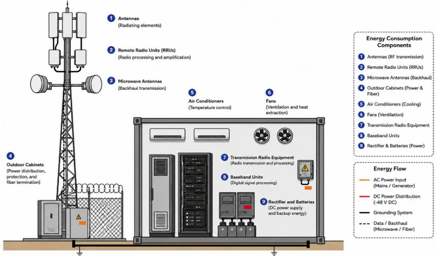
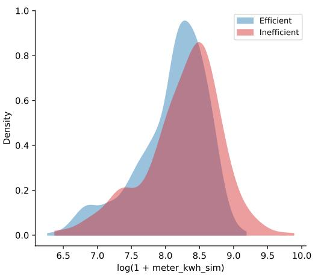
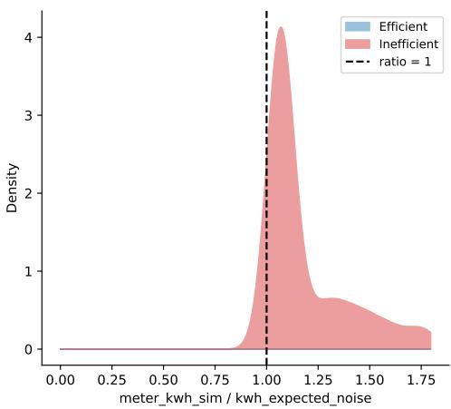
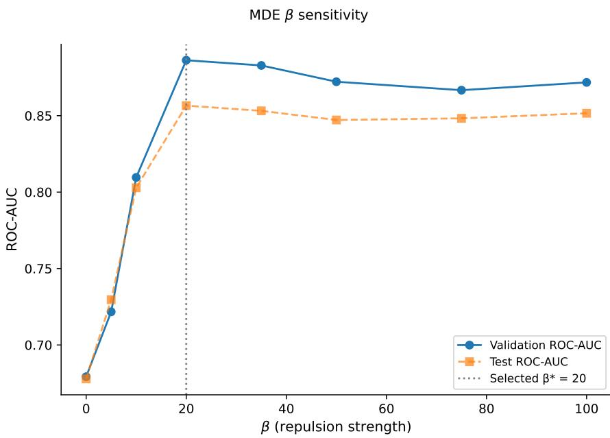
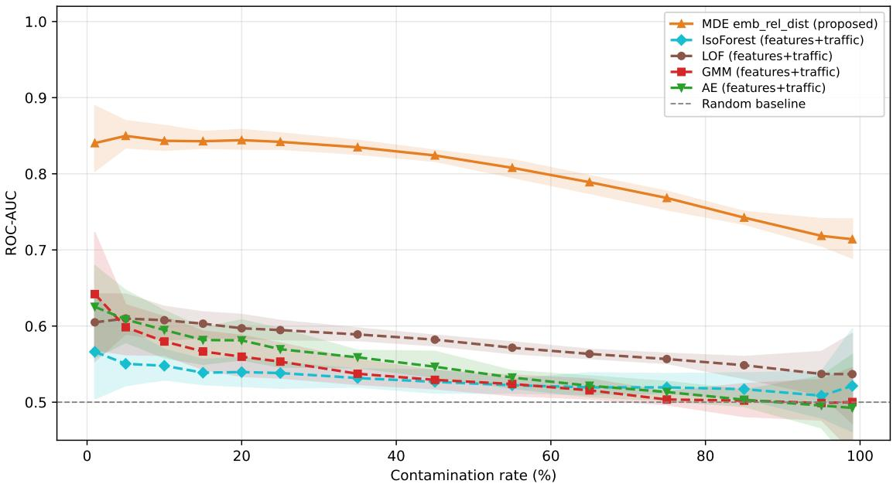
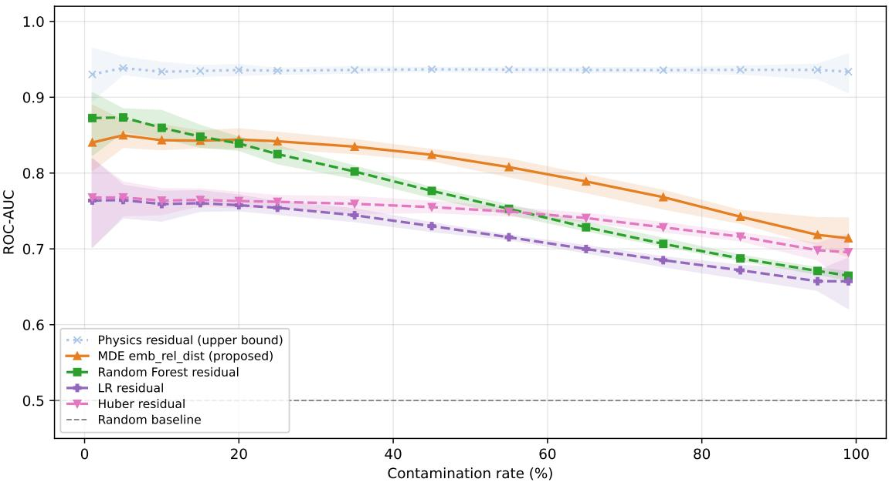
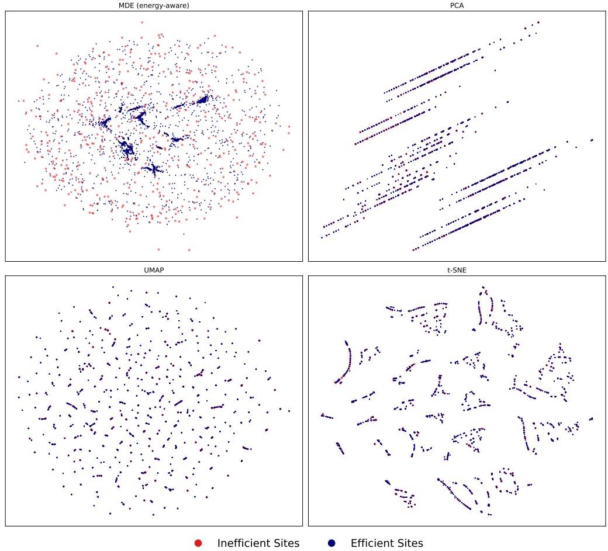

# A Peer-Relative Representation Learning Framework for Energy Ineficiency Identification in Mobile Network Sites

Eliud Nyakweba Koto∗, Jaco du Toit†, Adham Stoltz‡, and Johan du Preez§

## Abstract

Energy consumption is one of the largest operational expenditure items for mobile network operators, yet site-level energy ineficiencies such as faulty cooling controllers, idle radio equipment, and parasitic auxiliary loads often remain undetected because no ground-truth ineficiency labels exist and historical measurements may already contain embedded ineficiencies. This study proposes an unsupervised peer-relative approach based on the premise that sites with similar structural and operational characteristics should exhibit comparable energy consumption. To capture these relationships, a novel energy-aware Minimum Distortion Embedding (MDE) formulation is introduced that extends the standard MDE objective with an energy-based repulsion mechanism. This encourages sites with anomalously high energy consumption relative to comparable peers to become displaced from their local neighbourhoods in the embedding space. The resulting low-dimensional representation simultaneously preserves structural similarity and encodes energy-related deviations, enabling the identification of potentially ineficient sites through peer-relative comparison. The derived anomaly scores provide a practical mechanism for prioritising field investigations, allowing mobile network operators to focus engineering resources on sites most likely to yield energy savings. Experimental results demonstrate that the proposed approach outperforms conventional anomaly detection baselines and provides a robust foundation for large-scale energy-eficiency optimisation in mobile networks.

Keywords— Anomaly detection, energy eficiency, green communications, minimum-distortion embedding, mobile networks, representation learning, unsupervised learning.

## 1 Introduction

The rapid growth of mobile communications has driven a substantial expansion of the infrastructure operated by mobile network operators (MNOs). Modern networks comprise thousands of geographically distributed sites, each a complex cyber-physical system combining radio access network (RAN) equipment including antennas, remote radio units (RRUs), baseband units (BBUs), and transmission hardware, with supporting infrastructure such as rectifiers, backup batteries, power conversion equipment, remote management systems, and thermal management systems (Fig. 1). The cumulative energy demand of these sites constitutes a major component of MNO operational expenditure and a growing sustainability concern as electricity prices rise, carbon-reduction commitments tighten, and network densification continues [1, 2]. Because base station sites dominate network energy consumption, even modest site-level eficiency improvements translate into substantial financial and environmental savings when scaled across a national network.

  
Figure 1: High-level component layout of a typical mobile network site. Radio and signal processing equipment provide the communication functions, while supporting subsystems such as cooling and power conversion contribute a large proportion of the site’s overall energy consumption.

A significant share of site energy is consumed by supporting subsystems rather than by the radios themselves. Thermal management is a prominent example: radio, power, and electronic components generate heat inside equipment enclosures, and cooling systems must keep them within safe operating temperatures [3]. Measurements at an operational site in South Africa showed that cooling alone accounted for approximately 40% of total site energy consumption while a single air conditioner was active [4]. Faults in these subsystems, such as a controller that fails to switch of an air conditioner, a degraded rectifier, parasitic auxiliary loads, or radio equipment drawing near-peak power under low utilisation, can waste energy persistently without causing service interruptions, and therefore remain unnoticed for long periods.

Traditional approaches to reducing site energy consumption have primarily focused on engineering interventions, including designing and validating improved physical site configurations in laboratory or test environments before rolling them out across the network, as well as optimising parameters on active network equipment. While these approaches have delivered substantial improvements, they assume that similar optimisations can be broadly applied across sites. In practice, however, every mobile network site exhibits a unique combination of characteristics, including its equipment configuration, physical layout, environmental exposure, local weather conditions, trafic demand, and operational history. These factors interact to produce highly site-specific energy consumption behaviour, making it difficult to directly compare measured electricity consumption with billing records or identify genuine opportunities for optimisation from absolute energy usage alone.

Detecting such ineficiencies from operational data is dificult for three reasons. First, there are typically no labels indicating whether a site operates eficiently: monthly energy readings blend normal operation with possible abnormal behaviour, ruling out conventional supervised learning [5]. Second, models trained to predict historical consumption may absorb long-standing ineficiencies into the learned baseline: a site whose air conditioning has run continuously for months appears normal in its own history, so a regression model learns the inflated usage as expected consumption [6]. Third, energy consumption is meaningful only in context. A site may consume more energy because it is genuinely ineficient, but also because it is larger, carries more trafic, or hosts a more complex configuration [7, 8]; fixed thresholds and population-global outlier detection therefore conflate structural heterogeneity with ineficient operation.

This paper addresses these challenges by treating energy ineficiency as a peer-relative pattern: a site becomes a candidate for inspection when its energy behaviour is inconsistent with that of structurally comparable peers. We instantiate this idea through minimumdistortion embedding (MDE) [9], a general framework for learning low-dimensional representations from pairwise relationships. Our formulation embeds sites so that structural peers with consistent energy behaviour remain close, while an energy-aware repulsion term pushes sites with unusually high consumption away from their local peer groups. The resulting displacement provides an anomaly score that ranks sites for field investigation, and the ranking can further be distilled into lightweight supervised classifiers through pseudo-labels.

The main contributions of this paper are as follows.

• We propose an energy-aware MDE formulation that integrates structural similarity and local energy deviation in a single push–pull distortion objective. To the best of our knowledge, this is the first application of distortion-based representation learning to site-level energy ineficiency detection in mobile networks.

• We derive an embedding-relative displacement score that quantifies how far each site sits from its structural peer group, normalised by the intrinsic spread of that group, and we show how the score supports pseudo-label generation for downstream supervised models.

• We construct a controlled evaluation environment grounded in operational data from 5,372 live mobile network sites, with group-specific baseline energy models and four realistic classes of injected ineficiency (overload, cooling overhead, idle-RF load, and non-RAN parasitic load), enabling quantitative evaluation despite the absence of real ineficiency labels.

• We present a comprehensive empirical study against unsupervised detectors, supervised residual-based methods, and a privileged physics reference across contamination rates from 1% to 99%, together with a representation-level analysis showing that the learned embedding itself improves standard detectors, and a teacher–student experiment demonstrating a practical deployment pathway.

To support reproducibility, the full implementation and experimental code are publicly available at [10].

The remainder of this paper is organised as follows. Section 2 reviews related work. Section 3 presents the proposed energy-aware embedding framework. Section 4 describes the controlled evaluation methodology, and Section 5 the experimental setup. Section 6 reports and discusses the results, and Section 7 concludes the paper.

## 2 Related Work

## 2.1 Energy Consumption Modelling in Mobile Networks

RANs account for a substantial share of the operational energy demand of mobile telecommunication systems, with base station sites identified as the main contributor to overall network energy consumption [1]. Research on network energy eficiency has consequently concentrated on modelling RAN power demand and on optimisation mechanisms such as sleep modes, lean carrier design, resource allocation, and trafic-aware management [7]. Machine learning has been applied to energy modelling and network optimisation, including regression models, analytical power consumption frameworks, and deep learning methods for estimating site-level power demand [8].

Site-level energy consumption is shaped by a combination of technical and operational factors including radio equipment, trafic load, transmission configuration, site architecture, cooling, and auxiliary infrastructure [3, 7], so energy use cannot be interpreted independently of site context. A high-consumption site may be operating normally given its structural complexity and demand, while a lower-consumption site could still be ineficient relative to comparable peers. Ineficiency detection therefore difers from energy prediction: the objective is not to estimate consumption, but to identify consumption that is unusual for structurally similar sites. Comparatively little work addresses this site-level question, particularly in the absence of ground-truth ineficiency labels, the common constraint in operational environments.

## 2.2 Learning Under Noisy Targets

A recurring finding in the noisy-label literature is that corrupted training signals degrade model reliability in ways not always visible from standard metrics, for instance, models trained on incorrectly labelled examples may memorise noise rather than learn generalisable patterns [6]. Although this literature is usually framed around classification, the same concern applies here because observed energy consumption is only an imperfect proxy for the underlying eficiency state of a site. A site that has operated ineficiently for an extended period appears normal in historical data because its ineficiency has become part of the observed baseline; a model trained to reproduce that baseline encodes the ineficiency as expected behaviour. Noisy-label methods such as noise-tolerant loss functions [11] and co-teaching [12] address corrupted supervision in classification, but they assume an observed class-label setting with a defined label-noise process, whereas no verified labels exist in our setting at all. This motivates a departure from purely predictive modelling.

## 2.3 Anomaly Detection and Peer-Relative Comparison

Anomaly detection identifies observations that deviate from expected behaviour, with approaches ranging from supervised to unsupervised depending on label availability, and spanning statistical, clustering-based, density-based, nearest-neighbour, and reconstruction-based techniques [13]. This work operates in the label-free (unsupervised) setting, consistent with the absence of ground-truth ineficiency labels in operational networks. Isolation Forest [14] and local outlier factor (LOF) [15] illustrate two contrasting notions of abnormality: isolability from the broader population versus deviation from the local neighbourhood density. When abnormality is estimated only relative to the full population, the resulting score may reflect structural diferences between sites rather than ineficient operation. Peer-relative comparison addresses this by interpreting each site within a local neighbourhood of structurally similar peers, consistent with local methods such as LOF, but this framing remains underdeveloped for site-level energy ineficiency detection in mobile network infrastructure. Graph-based representation methods have been used for unsupervised anomaly detection in other domains [16], and MDE [9] provides a flexible framework for encoding pairwise relationships into embeddings; however, existing formulations do not incorporate an energyconsistency signal into the embedding objective.

## 2.4 Positioning of This Work

The literature addresses mobile network energy primarily through predictive modelling and network-level optimisation, with limited attention to whether a site consumes more than would be expected from structurally comparable peers. This distinction matters because historical data may already contain ineficiencies, causing predictive models to treat ineficient behaviour as normal, while global anomaly detectors may mistake structural complexity for abnormal consumption. This paper occupies that gap: it treats energy ineficiency as a peerrelative inconsistency and encodes the inconsistency directly into a representation learning objective, providing an unsupervised route to candidate ineficient sites when verified labels are unavailable.

# 3 Proposed Peer-Relative Energy-Aware Embedding Framework

## 3.1 Problem Formulation

Let $i = 1 , \dots ,$ N index the set of mobile network sites. Each site is represented by a feature vector $\mathbf { x } _ { i } \in \mathbb { R } ^ { d }$ , partitioned as

$$
\begin{array} { r } { { \bf x } _ { i } = ( { \bf s } _ { i } , e _ { i } ) , } \end{array}\tag{1}
$$

where $\mathbf { s } _ { i } ~ \in ~ \mathbb { R } ^ { d _ { s } }$ collects structural attributes and $e _ { i } ~ \in \mathbb { R }$ is the observed monthly energy consumption, so that $d = d _ { s } + 1$ . The separation in (1) allows structural features to define which sites should be compared, while the energy measurement is used to assess whether a site behaves unusually relative to those peers.

The goal is to learn a low-dimensional representation $\mathbf { z } _ { i } ~ \in ~ \mathbb { R } ^ { p }$ in which structurally similar sites with consistent energy behaviour remain close, while sites whose consumption is unusually high relative to their structural peers are displaced from their local group. Because verified labels of eficient and ineficient operation are unavailable, the problem is treated as fully unsupervised, and the displacement provides the ineficiency score.

## 3.2 Structural Graph Construction

Structural peer relationships are represented by a k-nearest-neighbour (kNN) graph built from the structural vectors $\mathbf { s } _ { i }$ . Categorical attributes are encoded and numerical attributes scaled so that features with larger numeric ranges do not dominate the distance computation. The framework uses structural neighbourhoods at three scales, all computed from the same structural distance: a graph neighbourhood of size $k _ { \mathrm { g r a p h } }$ for embedding construction, a baseline neighbourhood of size $k _ { \mathrm { b a s e } }$ for local energy comparison (Section 3.3), and a scoring neighbourhood of size $k _ { \mathrm { s c o r e } }$ for displacement scoring (Section 3.4). For $k \in \{ k _ { \mathrm { g r a p h } } , k _ { \mathrm { b a s e } } , k _ { \mathrm { s c o r e } } \}$ the set of the $k$ nearest structural peers of site i is denoted $\mathcal { N } _ { k } ( i )$ . The graph neighbourhood is computed over the full population, whereas the baseline and scoring neighbourhoods are restricted to sites sharing the vendor, sharing status, and mast group of site $i ,$ so that energy comparisons are made only among directly comparable configurations. Each site is connected to its $k _ { \mathrm { g r a p h } }$ nearest structural peers. The resulting graph is

$$
G ^ { ( s ) } = \big ( V , E ^ { ( s ) } , W ^ { ( s ) } \big ) ,\tag{2}
$$

where $V$ is the node set, $E ^ { ( s ) }$ the structural edge set, and $W ^ { ( s ) }$ the edge weights. An edge is included when at least one endpoint selects the other as one of its predefined number of nearest structural neighbours. Concretely, an edge is assigned a weight of 1 if only one of nodes i and $j$ identifies the other as a nearest neighbour, and 2 if the relationship is reciprocal. Thus, $W ^ { ( s ) }$ encodes neighbour agreement rather than structural distance, which is used only to determine the edge set $E ^ { ( s ) }$ . This is the standard graph construction used in the MDE framework [9].

## 3.3 Energy-Aware MDE Objective

## 3.3.1 Standard MDE

Let $\mathbf { Z } \in \mathbb { R } ^ { N \times p }$ denote the embedding matrix whose ith row is $\mathbf { z } _ { i } .$ , and let

$$
d _ { i j } = \lVert { \bf z } _ { i } - { \bf z } _ { j } \rVert _ { 2 }\tag{3}
$$

be the embedded distance of a connected pair $( i , j ) \in E ^ { ( s ) }$ . Standard MDE minimises a distortion objective over the graph edges,

$$
\mathcal { E } _ { \mathrm { M D E } } ( \mathbf { Z } ) = \sum _ { ( i , j ) \in E ^ { ( s ) } } w _ { i j } ^ { ( s ) } \phi ( d _ { i j } ) ,\tag{4}
$$

where $w _ { i j } ^ { ( s ) }$ is the structural weight and $\phi ( \cdot )$ a pairwise distortion function [9]. The graph specifies which pairs enter the objective; the distortion function determines how their embedded distances are penalised.

## 3.3.2 Energy-Aware Weight Adjustment

The structural graph defines comparable peers but is blind to energy behaviour. We therefore modify the weights of structurally connected pairs before optimisation, reducing attraction between peers when one or both consume unusually high energy relative to their local baseline, and reversing the relationship into repulsion when the deviation is suficiently large.

Using the baseline neighbourhood $\mathcal { N } _ { k _ { \mathrm { b a s e } } } ( i )$ , the local energy baseline of site i is the qth percentile of its neighbours’ consumption,

$$
b _ { i } = \operatorname* { m a x } \bigr ( P _ { q } \mathopen { } \mathclose \bgroup \left( \{ e _ { j } : j \in \mathcal { N } _ { k _ { \mathrm { b a s e } } } ( i ) \} \aftergroup \egroup \right) , 1 \bigr ) ,\tag{5}
$$

where $P _ { q } ( \cdot )$ denotes the percentile operator. The percentile level $q$ controls how conservative the baseline is: lower values anchor it to the lower-energy portion of the neighbourhood, while higher values move it toward the neighbourhood’s central tendency. The floor of 1 kWh prevents unstable ratios for very small baselines. The log-ratio deviation of site i is

$$
\delta _ { i } = \log \left( \frac { e _ { i } } { b _ { i } } \right) ,\tag{6}
$$

with positive values indicating excess consumption. For each structural edge $( i , j ) \in E ^ { ( s ) }$ the edge-level excess is

$$
\boldsymbol { r } _ { i j } = \operatorname* { m a x } ( \delta _ { i } , \delta _ { j } , 0 ) ,\tag{7}
$$

which captures the larger positive deviation at either endpoint and ignores edges whose endpoints are both at or below their baselines. The energy-aware weight is then

$$
w _ { i j } = w _ { i j } ^ { ( s ) } - \beta r _ { i j } ,\tag{8}
$$

where $\beta > 0$ controls the strength of the adjustment. When $r _ { i j }$ is small, $w _ { i j } \approx w _ { i j } ^ { ( s ) }$ and the pair remains attractive; when $r _ { i j }$ is large, $w _ { i j }$ may become negative, converting the

interaction from attraction to repulsion. This balance forms the push–pull mechanism at the core of the proposed formulation.

## 3.3.3 Push–Pull Objective

The energy-aware structural edges are combined with a set of sampled dissimilar pairs $E ^ { ( - ) }$ that provide additional repulsive scafolding by keeping selected non-neighbouring sites separated. $E ^ { ( - ) }$ contains $\mu \left. E ^ { ( s ) } \right.$ pairs sampled uniformly at random among non-adjacent site pairs, where $\mu$ is a sampling multiplier. With $E ^ { ( * ) } = E ^ { ( s ) } \cup E ^ { ( - ) }$ , the proposed objective is

$$
\mathcal { E } _ { \beta } ( \mathbf { Z } ) = \sum _ { ( i , j ) \in E ^ { ( s ) } } w _ { i j } \phi _ { + } ( d _ { i j } ) + \sum _ { ( i , j ) \in E ^ { ( - ) } } w _ { - } \phi _ { - } ( d _ { i j } ) ,\tag{9}
$$

where $w _ { - } < 0$ is a fixed weight for dissimilar pairs, and the attractive and repulsive penalties are

$$
\phi _ { + } ( d ) = \log ( 1 + d ) , \qquad \phi _ { - } ( d ) = \log ( d ) .\tag{10}
$$

The embedding is obtained by minimising (9) over the coordinates,

$$
\mathbf { Z } ^ { * } = \underset { \mathbf { Z } \in \mathbb { R } ^ { N \times p } } { \arg \operatorname* { m i n } } \mathcal { E } _ { \beta } ( \mathbf { Z } ) ,\tag{11}
$$

solved with the first-order numerical routines provided by the PyMDE package [9], which iteratively update the coordinates along descent directions of the objective.

## 3.4 Embedding-Relative Anomaly Scoring

Displacement from structural peers in the learned embedding serves as the ineficiency signal. For site $i ,$ the mean embedded distance to its scoring neighbourhood $\mathcal { N } _ { k _ { \mathrm { s c o r e } } } ( i )$ is

$$
D _ { i } = \frac { 1 } { | \mathcal { N } _ { k _ { \mathrm { s c o r e } } } ( i ) | } \sum _ { j \in \mathcal { N } _ { k _ { \mathrm { s c o r e } } } ( i ) } \| \mathbf { z } _ { i } - \mathbf { z } _ { j } \| _ { 2 } .\tag{12}
$$

Since embedded neighbourhoods difer in natural spread, $D _ { i }$ is normalised by the average pairwise distance among the neighbours themselves,

$$
S _ { i } = \frac { 1 } { | \mathcal { P } _ { i } | } \sum _ { ( u , v ) \in \mathcal { P } _ { i } } \mathopen { } \mathclose \bgroup \left\| \mathbf { z } _ { u } - \mathbf { z } _ { v } \aftergroup \egroup \right\| _ { 2 } ,\tag{13}
$$

where $\mathcal { P } _ { i }$ is the set of neighbour pairs within $\mathcal { N } _ { k _ { \mathrm { s c o r e } } } ( i )$ . The peer-relative anomaly score is

$$
A _ { i } = \frac { D _ { i } } { S _ { i } + \varepsilon } ,\tag{14}
$$

with $\varepsilon > 0$ a small constant preventing division by zero in degenerate neighbourhoods. A large $A _ { i }$ indicates that site i lies far from its structural peer group relative to the intrinsic spread of that group. Sites are ranked by $A _ { i }$ , with higher scores indicating stronger evidence of potential energy ineficiency.

## 3.5 Pseudo-Label Distillation

The anomaly ranking can be converted into supervisory targets for downstream models. Let $\psi \in ( 0 , 1 )$ denote an assumed anomaly proportion and $\tau _ { \psi }$ the score threshold corresponding to the top-ψ fraction of ranked sites. The pseudo-label of site i is

$$
\hat { y } _ { i } = \left\{ \begin{array} { l l } { 1 , } & { A _ { i } \ge \tau _ { \psi } , } \\ { 0 , } & { \mathrm { o t h e r w i s e } . } \end{array} \right.\tag{15}
$$

The resulting binary pseudo-labelled dataset treats strongly displaced sites as candidate ineficient examples. Because the labels derive from the embedding geometry rather than external annotation, they transfer the anomaly structure discovered by the framework to conventional classifiers.

Algorithm 1 summarises the complete pipeline.

Algorithm 1 Peer-Relative Energy-Aware Embedding and Scoring   
Require: Site features $\overline { { \{ ( \mathbf { s } _ { i } , e _ { i } ) \} _ { i = 1 } ^ { N } } }$ (Eq. (1)); neighbourhood sizes $k _ { \mathrm { g r a p h } }$ $k _ { \mathrm { b a s e } }$ $k _ { \mathrm { s c o r e } } ;$ per  
centile $q ;$ repulsion strength $\beta ;$ dissimilar-pair weight $w _ { - }$ and sampling multiplier $\mu ;$   
embedding dimension $p ;$ scoring constant $\varepsilon ;$ pseudo-label fraction $\psi$   
Ensure: Anomaly scores $\left\{ A _ { i } \right\}$ (Eq. (14)); ranked site list; pseudo-labels $\left\{ \hat { y } _ { i } \right\}$ (Eq. (15))   
1: Construct the structural kNN graph $G ^ { ( s ) } = ( V , E ^ { ( s ) } , W ^ { ( \bar { s } ) } )$ (Eq. (2))   
2: for each site $i$ do   
3: Compute the local baseline $b _ { i } ~ ( \mathrm { E q . ~ ( 5 ) } )$   
4: Compute the log-ratio deviation $\delta _ { i } ~ ( \mathrm { E q . ~ ( 6 ) } )$   
5: end for   
6: for each structural edge $( i , j ) \in E ^ { ( s ) }$ do   
7: Compute the edge excess $r _ { i j }$ (Eq. (7))   
8: Update the edge weight $w _ { i j }$ (Eq. (8))   
9: end for   
10: Sample dissimilar pairs $E ^ { ( - ) }$   
11: Form the push–pull objective (Eq. (9)) with penalties defined in Eq. (10).   
12: Solve the optimisation problem (Eq. (11)) to obtain the embedding $\mathbf { Z } ^ { \ast }$   
13: for each site i do   
14: Compute the mean neighbour displacement $D _ { i }$ (Eq. (12))   
15: Compute the neighbourhood spread $S _ { i }$ (Eq. (13))   
16: Compute the anomaly score $A _ { i }$ (Eq. (14))   
17: end for   
18: Rank sites in descending order of $A _ { i }$   
19: Generate pseudo-labels $\hat { y } _ { i }$ (Eq. (15))   
20: Optionally train a downstream classifier using $\left\{ \left( \mathbf { x } _ { i } , \hat { y } _ { i } \right) \right\}$

## 3.6 Complexity

Graph construction, dominated by the kNN search, costs O(N log N) with tree- or indexbased search in the processed structural space; baseline and edge-weight computation are linear in the number of edges, $\mathcal { O } ( N k _ { \mathrm { g r a p h } } )$ . Each iteration of the first-order MDE solver evaluates distances and gradients over $| E ^ { ( * ) } |$ edges, costing ${ \mathcal { O } } ( | E ^ { ( * ) } | p )$ per iteration [9], and the scoring step is $\mathcal { O } ( N k _ { \mathrm { s c o r e } } ^ { 2 } )$ in the worst case due to the pairwise neighbour spread in (13). The pipeline scales to national-network populations (tens of thousands of sites) on commodity hardware.

## 4 Controlled Evaluation Methodology

Verified ineficiency labels do not exist in operational data, so detection quality cannot be measured directly on live networks. We therefore construct a controlled evaluation environment that preserves the structural and energy characteristics of a real network while providing known injected ineficiencies as ground truth. The injected labels are used only for evaluation and are never used during graph construction, embedding optimisation, or scoring, preserving the unsupervised nature of the method.

## 4.1 Operational Reference Data

The reference dataset covers 5,372 unique live mobile network sites of a national operator, each represented by one cross-sectional observation drawn from the period January 2024 to January 2026 (most observations from January 2026). Each record contains a site identifier, observation month, RAN-sharing indicator, RAN vendor, mast type, total radio cell count, non-RAN equipment count, packet-switched trafic volume, and measured monthly energy consumption (kWh), which serves as the energy outcome.

Defining a full site structure as the combination of vendor, sharing status, mast type, cell count, and non-RAN equipment count yields 1,336 unique structures, of which 587 occur more than once. The data therefore contain both repeated comparable configurations, which are necessary for meaningful peer groups, and substantial heterogeneity. Exploratory analysis shows that consumption difers systematically across vendor and sharing groups (shared sites consume more than standalone sites, and vendor A sites more than vendor B sites) and increases with cell count, motivating group-specific baseline energy models rather than a single global model.

## 4.2 Synthetic Population Generation

Synthetic sites are sampled with replacement from the empirical joint distribution of structural attributes in the reference data, preserving the operational composition of the network. Trafic is assigned from reference sites with matching structural profiles, with small random perturbations to avoid exact duplication. Baseline energy is assigned by group-specific linear models fitted to the reference data: sites are grouped by vendor, sharing status, and mast group (a coarser grouping of the recorded mast types into tower, disguised, rooftop, pole, and other), and within group g the expected monthly consumption of site i is

$$
\hat { e } _ { i } = \lambda _ { g } + \alpha _ { g } c _ { i } + \gamma _ { g } n _ { i } ,\tag{16}
$$

where $c _ { i }$ is the cell count, $n _ { i }$ the non-RAN equipment count, and $\lambda _ { g } , \alpha _ { g } ,$ γg group-specific parameters. Trafic is deliberately excluded from the baseline model: expected consumption in the reference data is driven primarily by structural configuration, and trafic influences simulated energy only through the idle-RF injection mechanism (Section 4.3). The residual baselines in Section 5 nevertheless receive trafic as a regressor, so the comparison is not biased in favour of the proposed framework. Natural operational variability is modelled multiplicatively,

$$
e _ { i } ^ { ( 0 ) } = \hat { e } _ { i } \exp ( \epsilon _ { i } ) , \qquad \epsilon _ { i } \sim { \mathcal N } \big ( 0 , \sigma _ { \mathrm { l o g } , i } ^ { 2 } \big ) ,\tag{17}
$$

where the log-scale noise level $\sigma _ { \mathrm { l o g } , i } \sim \mathcal { U } ( 0 . 0 2 , 0 . 0 4 )$ is sampled independently per site, so that energy remains positive and larger sites exhibit larger absolute deviations. At this stage all sites are treated as eficient. The reference configuration generates $N = 5 { , } 0 0 0$ synthetic sites with expected energy consumption ranging from approximately 500 to 9,000 kWh (median 3,654 kWh). Vendor A accounts for 54% of sites, with cell counts ranging from 2 to 40 (median ≈23) and non-RAN equipment counts reaching up to 17.

## 4.3 Controlled Ineficiency Injection

A fraction $\rho$ of sites (the contamination rate) is selected uniformly at random and assigned elevated consumption through one of four mechanisms that reflect realistic sources of excess energy observed in operational networks (Table 1). The mechanisms produce heterogeneous deviation patterns rather than a uniform uplift. Using the noisy baseline $e _ { i } ^ { ( 0 ) }$ , the final simulated metered energy is

$$
e _ { i } = \left\{ \begin{array} { l l } { e _ { i } ^ { ( 0 ) } , } & { \mathrm { s i t e ~ } i \mathrm { ~ e f f i c i e n t } , } \\ { \mathbb { Z } _ { t _ { i } } \big ( e _ { i } ^ { ( 0 ) } , \pmb { \theta } _ { i } \big ) , } & { \mathrm { s i t e ~ } i \mathrm { ~ i n e f f i c i e n t } , } \end{array} \right.\tag{18}
$$

where $t _ { i } \in \{ 1 , 2 , 3 , 4 \}$ is the assigned injection type, $\pmb \theta _ { i }$ the site attributes used by the typespecific perturbation, and $\mathcal { T } _ { t _ { i } } ( \cdot )$ the injection function. The full parameterisation is given in the Appendix. At the reference setting $( N = 5 , 0 0 0 , \rho = 1 0 \% )$ , 500 sites are injected, balanced across the four types.

Table 1: Controlled Ineficiency Injection Types
<table><tr><td>Type</td><td>Source</td><td>Interpretation</td></tr><tr><td>1</td><td>Overload</td><td>Excess energy from unusually high site load</td></tr><tr><td>2</td><td>Cooling</td><td>Additive overhead from increased cooling demand</td></tr><tr><td>3</td><td>Idle-RF</td><td>High radio energy draw under low utilisation</td></tr><tr><td>4</td><td>Non-RAN</td><td>Parasitic load from auxiliary infrastructure</td></tr></table>

Fig. 2 characterises the resulting evaluation setting. Injected sites generally exhibit higher simulated consumption, with the ratio of simulated metered energy to the noisy baseline concentrated near one for eficient sites and shifted towards higher values for injected sites. The blue (eficient) density is not visible because it is concentrated within an extremely narrow region around a ratio of one, making it too narrow to be resolved at the plotting resolution. Although the two populations are well separated in terms of this ratio, the detection problem remains challenging because the anomaly detection methods are evaluated without access to this privileged quantity and must instead infer ineficiency from the available structural and trafic features.

  
Figure 2: Controlled ineficiency patterns in the synthetic dataset at the reference setting: simulated energy distributions on the log scale (left) and the ratio of simulated metered energy to the noisy baseline energy (right) for eficient and injected ineficient sites.

## 5 Experimental Setup

## 5.1 Configuration of the Proposed Framework

The proposed framework is unsupervised and transductive: the MDE embedding is fitted jointly on all 5,000 synthetic sites without using the injected ineficiency labels, so hyperparameters are selected by partitioning the evaluation labels rather than the features. Using a fixed random seed, the site indices are split into equally sized stratified validation and test partitions at the reference contamination rate of $1 0 \% ;$ validation labels are used only for selection, and the test partition is held out until the final evaluation.

The three neighbourhood sizes defined in Section 3.2, for graph construction, local energy comparison (5), and displacement scoring, serve diferent purposes and were tuned independently by one-factor-at-a-time grid searches, yielding $k _ { \mathrm { g r a p h } } = 3 0 0 , k _ { \mathrm { b a s e } } = 1 0$ , and $k _ { \mathrm { s c o r e } } = 5 0$ . The remaining parameters were fixed a priori: the baseline percentile $q = 3 5$ as a sub-median reference that limits the influence of ineficient peers, a trafic down-weighting factor of 0.05 in graph construction, embedding dimension $p = 4$ , dissimilar-pair sampling multiplier $\mu = 4$ , and dissimilar-pair weight $w _ { - } = - 2 . 0$

The energy-aware repulsion strength $\beta ,$ , the principal hyperparameter introduced by the framework, was selected by grid search over $\beta \in \{ 0 , 5 , 1 0 , 2 0 , 3 5 , 5 0 , 7 5 , 1 0 0 \}$ with the graph, dissimilar edges, and seeds held fixed; $\beta = 2 0$ maximises validation ROC-AUC (Fig. 3). The sweep doubles as an ablation and sensitivity analysis: at $\beta = 0$ the purely structural embedding attains a ROC-AUC of only 0.68, while test ROC-AUC remains within 0.847– 0.857 for all $\beta \in [ 2 0 , 1 0 0 ]$ , so the energy-aware term drives detection quality and requires no fine-tuning. The ROC-AUC values in Fig. 3 are computed on the half-population validation and test partitions defined above; they are therefore not directly comparable to the fullpopulation results reported in Section 6.

  
Figure 3: Validation-based selection of the repulsion strength $\beta .$ Validation and test ROC– AUC are shown across the candidate values, with all remaining hyperparameters held fixed. The vertical dashed line indicates the selected value, $\beta = 2 0$

## 5.2 Experiments and Baselines

## 5.2.1 Experiment 1: Unsupervised Feature-Space Comparison

The proposed score is compared with standard unsupervised detectors applied to the original site features: Isolation Forest [14], LOF [15], a Gaussian mixture model (GMM) scored by negative likelihood, and an autoencoder (AE) scored by reconstruction error [17]. The contamination rate is swept over $\rho \in \{ 1 , 5 , 1 0 , 1 5 , 2 0 , 2 5 , 3 5 , 4 5 , 5 5 , 6 5 , 7 5 , 8 5 , 9 5 , 9 9 \} \%$ , with all methods evaluated against the same injected labels at each rate.

## 5.2.2 Experiment 2: Supervised Residual Comparison

The proposed unsupervised score is compared with residual-based detectors that predict simulated metered energy from the site features and rank sites by positive residuals: ordinary least squares (LR), robust Huber regression [18], and a random forest (RF) regressor [19]. A physics residual reference, which scores sites by the ratio of observed to simulator-expected energy, is included as a privileged upper bound because the simulator’s expected energy is not available in deployment.

## 5.2.3 Experiment 3: Efect of the Embedding on Standard Detectors

At the reference contamination rate of 10%, Isolation Forest, LOF, GMM, and the AE are each applied in two settings, the original feature space and the learned MDE embedding, to assess whether the energy-aware representation itself improves detection, independently of the proposed displacement score.

## 5.2.4 Experiment 4: Teacher–Student Distillation

The dataset is split 70/30 with stratification (3,500 training and 1,500 test sites, preserving the 10% anomaly rate). Pseudo-labels are assigned to the top-ranked $\psi = 1 0 \%$ of training sites by the proposed score, and logistic regression, RF, and XGBoost students are trained on the original features and evaluated on the held-out test set.

## 5.3 Evaluation Metrics

Ranking quality is measured by ROC-AUC, the probability that a randomly chosen injected site outranks a randomly chosen eficient site, and by the area under the precision–recall curve (PR-AUC), computed as average precision, which summarises ranking behaviour under class imbalance [20]. Inspection-oriented performance is measured by Precision@K with K equal to the top 10% of ranked sites, reflecting the practical setting in which only the highestranked sites are selected for field investigation. Because K matches the number of injected sites at the reference contamination rate of 10%, Precision@K and Recall@K coincide in this setting, so only the former is reported.

## 6 Results and Discussion

## 6.1 Comparison With Unsupervised Feature-Space Methods

Fig. 4 reports ROC-AUC across the contamination sweep. The proposed score achieves the strongest ranking performance at every rate: it attains 0.84 at $\rho = 1 \%$ , degrades only gradually as contamination increases, and remains at 0.71 even at $\rho = 9 9 \%$ . The featurespace baselines remain far below: LOF is the strongest conventional detector (≈0.60 at low rates), while Isolation Forest, GMM, and the AE remain close to random for most of the sweep. Injected ineficient sites are thus not generic outliers in the raw feature space, indicating that the signal emerges only when structural similarity and peer-relative energy inconsistency are combined, as the proposed distortion objective does explicitly.

## 6.2 Comparison With Supervised Residual Methods

Fig. 5 shows the supervised comparison. The physics residual remains near 0.93 throughout, as expected of a privileged reference with access to the simulator’s expected energy.

  
Figure 4: ROC-AUC of the proposed energy-aware MDE score and unsupervised featurespace baselines across contamination rates. The proposed method consistently achieves the highest detection performance and remains robust as contamination increases.

Among deployable methods, the RF residual leads at low contamination, by a modest 0.02– 0.03 ROC-AUC, but its performance decays steeply as contamination grows, because the regression model increasingly absorbs injected ineficiency into its learned baseline. From $\rho = 2 0 \%$ onward the proposed score overtakes the RF residual and retains the advantage for the remainder of the sweep, ending 0.05 points ahead at $\rho = 9 9 \%$ (0.714 versus 0.665). The proposed score also exceeds the LR and Huber residuals across most of the sweep.

Table 2 adds the PR-AUC view under class imbalance. Over the full sweep, RF attains a slightly higher mean PR-AUC (0.741 versus 0.713), driven entirely by the low-contamination regime; beyond the crossover at $\rho ~ = ~ 2 5 \%$ the proposed score achieves higher PR-AUC at every evaluated rate, leading in 8 of the 14 sampled scenarios. This trade-of matters operationally since the true prevalence of ineficiency is unknown before investigation, and training data for residual models are themselves contaminated to an unknown degree. A method that is competitive when ineficiency is rare and clearly stronger across the wide moderate-to-high contamination range provides the more robust prioritisation signal under this uncertainty.

Table 2: PR-AUC Across the Contamination-Rate Sweep
<table><tr><td>Contamination range</td><td>MDE (proposed)</td><td>RF residual</td><td>Stronger</td></tr><tr><td>1%-25%</td><td>0.432</td><td>0.583</td><td>RF</td></tr><tr><td>26%-99%</td><td>0.889</td><td>0.839</td><td>MDE</td></tr><tr><td>Full sweep</td><td>0.713</td><td>0.741</td><td>RF</td></tr></table>

  
Figure 5: ROC-AUC of the proposed energy-aware MDE score and residual-based methods across the contamination-rate sweep. The proposed method consistently outperforms the practical supervised baselines, while the physics residual is shown only as a privileged upper bound.

## 6.3 Efect of the Embedding on Standard Detectors

Table 3 isolates the representational contribution at the reference contamination rate of 10%, with all methods scored on the full population of 5,000 sites (values are therefore not directly comparable to the half-partition results in Fig. 3). Moving from the original features to the learned embedding raises the ROC-AUC of Isolation Forest from 0.569 to 0.906, of the GMM from 0.577 to 0.897, and of the AE from 0.724 to 0.889: the energy-aware distortion objective reorganises the data into a space in which injected ineficiency is separable by generic detectors. The proposed displacement score performs best overall (ROC-AUC 0.911, Precision@10% = 0.554), indicating that the embedding is valuable in its own right and that the peer-relative scoring rule adds a further increment by aligning the score with the geometry the objective creates. LOF is the exception, performing better in the original space, a reminder that not every density-based detector benefits from a representation optimised for displacement.

Fig. 6 complements the quantitative comparison with a qualitative view against PCA, UMAP, and t-SNE. This comparison is intended solely for illustration: the MDE panel is generated from a dedicated two-dimensional embedding for visualisation, rather than the four-dimensional embedding used for anomaly scoring. The alternative embeddings organise the data by global variance or local density, leaving eficient and injected sites interspersed, whereas the energy-aware objective pushes injected sites toward peripheral regions, precisely the geometry the displacement score exploits.

Table 3: Standard Detectors in the Original Feature Space Versus the Learned MDE Embedding (ρ = 10%)
<table><tr><td>Method</td><td>ROC-AUC</td><td>PR-AUC</td><td>Prec.@10%</td></tr><tr><td>MDE rel. displ. (proposed)</td><td>0.9105</td><td>0.5578</td><td>0.5540</td></tr><tr><td>iForest (MDE embedding)</td><td>0.9055</td><td>0.5370</td><td>0.5200</td></tr><tr><td>GMM (MDE embedding)</td><td>0.8972</td><td>0.4946</td><td>0.4900</td></tr><tr><td>AE (MDE embedding)</td><td>0.8891</td><td>0.4878</td><td>0.4980</td></tr><tr><td>LOF (features)</td><td>0.7830</td><td>0.3723</td><td>0.4060</td></tr><tr><td>AE (features)</td><td>0.7242</td><td>0.3305</td><td>0.3300</td></tr><tr><td>LOF (MDE embedding)</td><td>0.5781</td><td>0.1403</td><td>0.1760</td></tr><tr><td>GMM (features)</td><td>0.5774</td><td>0.1632</td><td>0.1640</td></tr><tr><td>iForest (features)</td><td>0.5685</td><td>0.1282</td><td>0.1620</td></tr></table>

Table 4: Teacher–Student Distillation Results $( \rho = 1 0 \% )$
<table><tr><td colspan="4">Method Split ROC-AUC PR-AUC P@10%</td></tr><tr><td>Teacher (MDE displacement)</td><td>Test</td><td>0.9130</td><td>0.5878 0.5667</td></tr><tr><td>RF student</td><td>Train</td><td>0.9166</td><td>0.6640 0.5914</td></tr><tr><td></td><td>Test</td><td>0.8906 0.6088</td><td>0.5867</td></tr><tr><td>XGBoost student</td><td>Train</td><td>0.9067 0.6829</td><td>0.6200</td></tr><tr><td rowspan="3">Logistic student</td><td>Test</td><td>0.8768</td><td>0.6415 0.5867</td></tr><tr><td>Train</td><td>0.8503</td><td>0.5678 0.5143</td></tr><tr><td>Test</td><td>0.7973</td><td>0.5123 0.4600</td></tr></table>

## 6.4 Teacher–Student Distillation

Table 4 reports the distillation results at the reference setting; all test-set values are computed on the 1,500-site held-out split, so they difer slightly from the full-population values in Table 3. On the held-out test set the teacher score achieves the highest ROC-AUC (0.913). The student models trained purely on its pseudo-labels retain most of this signal while improving inspection-oriented metrics: RF and XGBoost reach Precision@10% = 0.587 (versus 0.567 for the teacher), and XGBoost attains the best student PR-AUC (0.642). The geometric signal discovered by the embedding can therefore be transferred into simple, fast classifiers operating on raw site features which is attractive for deployment, where scoring new sites with a trained classifier is cheaper than re-solving the embedding, and where feature-attribution tools can be applied to the student for interpretability.

## 6.5 Discussion and Limitations

Four findings summarise the study. First, peer-relative energy inconsistency is not discoverable by generic outlier detection in the raw feature space; it must be encoded into the representation, which the proposed push–pull objective does directly. Second, the framework’s advantage over supervised residual modelling grows precisely where residual modelling is most fragile, when training data are more heavily contaminated by unlabelled ineficiency, which is the regime operators cannot rule out in practice. Third, the framework produces an interpretable geometric form of evidence: potential ineficiency is represented as the displacement of a site from its structural peers in the embedding, rather than as a residual from a fitted prediction model, and the two-dimensional comparison in Fig. 6 shows that this geometry arises from the energy-aware objective itself rather than from generic dimensionality reduction. Fourth, the learned embedding has representational value beyond the proposed score, and its ranking can be distilled into lightweight classifiers, sketching a deployment pathway from unsupervised discovery to operational scoring.

  
Figure 6: Two-dimensional embeddings of the synthetic site population produced by the proposed energy-aware MDE objective, PCA, UMAP, and t-SNE. Red points denote injected ineficient sites; blue points denote eficient sites.

The evaluation has several limitations. Ground truth is available only through controlled injection: although the injected ineficiencies are based on documented failure modes and calibrated to operational data, real ineficiencies may exhibit more complex temporal and environmental behaviour. The study is also cross-sectional, using one observation per site, and therefore does not capture seasonal variation, gradual equipment degradation, or maintenance events. Hyperparameters $( k _ { \mathrm { g r a p h } } , \ q _ { \mathrm { : } }$ , and β) were selected once at the reference contamination rate (Section 5) and held fixed across the contamination sweep, leaving adaptive hyperparameter selection as future work. In deployment, where injected labels are unavailable, the controlled-injection protocol of Section 4 can itself serve as the tuning procedure: hyperparameters are selected against synthetic ground truth injected into the operator’s own reference data before the framework scores the live network. Finally, sites with uncommon structural configurations may have only weakly comparable peers, making their peer-relative anomaly scores less reliable.

## 7 Conclusion

This paper developed and evaluated an unsupervised peer-relative framework for prioritising candidate energy-ineficient mobile network sites. Its central premise is that ineficiency cannot be judged from absolute consumption alone: sites difer substantially in structure, equipment, sharing status, vendor, and demand, so a site becomes a stronger candidate when its energy behaviour is inconsistent with structurally comparable peers. The proposed energy-aware MDE formulation embeds this premise directly in a representation learning objective, displacing energy-inconsistent sites from their neighbourhoods and scoring them by normalised displacement.

In a controlled evaluation environment built from operational data of 5,372 live sites, the proposed score outperformed standard unsupervised detectors at every contamination rate, remained competitive with supervised residual methods where they are strongest and clearly ahead where they are fragile, improved generic detectors when they operate in the learned embedding, and transferred its ranking to lightweight classifiers through pseudo-labels. The framework turns heterogeneous, unlabelled site data into an actionable prioritisation signal for field investigations, supporting the industry’s transition toward energy-eficient and environmentally responsible network operation.

Importantly, the framework has also demonstrated practical value during operational field investigations. Several high-ranking candidate sites identified by the framework were confirmed to contain previously undetected energy ineficiencies. At one Distributed Antenna System (DAS) site, an incorrect control configuration caused both air-conditioning units to operate continuously. Correcting the control logic to alternate between the two units reduced energy consumption by approximately 600 kWh per month. At a shopping centre site, both air-conditioning units and the free-cooling fan were operating simultaneously despite conditions where free cooling alone was suficient. At another site adjacent to a grain silo, dust obstructing the ventilation inlets caused elevated internal temperatures. Cleaning the vents and increasing the allowable equipment temperature and air-conditioner setpoint restored eficient cooling. These examples illustrate that the proposed framework is capable of identifying operational ineficiencies that are not apparent from absolute energy consumption alone and can lead directly to measurable energy savings following field verification.

Future work will evaluate the framework on real operational deployments with partially validated labels, extend the controlled design with seasonal cooling, equipment degradation, and trafic–configuration interactions, incorporate temporal site trajectories, and develop the distillation pathway with confidence-weighted training and calibrated pseudo-label thresholds [6], as well as hybrid residual–embedding formulations that combine predictive energy modelling with peer-relative geometric interpretation.

# Appendix: Controlled Ineficiency Injection Specification

Injected sites are selected by random permutation, independently of site configuration, and assigned one of four mechanisms in equal proportion. Let $e _ { i } ^ { ( 0 ) }$ be the noisy baseline of (17) and $\sigma _ { i } = \hat { e } _ { i } \sigma _ { \log , i }$ the site-level noise standard deviation on the energy (kWh) scale implied by (17).

Type 1 (multiplicative overload): $e _ { i } = e _ { i } ^ { ( 0 ) } m _ { i }$ with $m _ { i } \sim \mathcal { U } ( 1 . 2 , 1 . 8 )$

Type 2 (cooling overhead): $e _ { i } = e _ { i } ^ { ( 0 ) } + u _ { i }$ with $u _ { i } \sim \mathcal { U } ( \ell _ { m _ { i } } , h _ { m _ { i } } )$ , where the bounds depend on the mast group of site i: tower (200, 400), disguised (150, 350), rooftop (80, 200), pole (100, 250), and other (100, 200) kWh.

Type 3 (idle-RF load): with $c _ { i }$ cells, trafic $f _ { i }$ , and median trafic $\tilde { f } _ { ; }$ , the idle factor is $\eta _ { i } =$ max $( 1 - f _ { i } / \tilde { f } , 0 . 1 )$ , the preliminary overhead $o _ { i } ^ { \mathrm { R F } } = \operatorname* { m a x } ( c _ { i } , 5 ) ^ { 2 } \eta _ { i } a _ { i }$ with $a _ { i } \sim \mathcal { U } ( 0 . 5 , 1 . 5 )$ and $e _ { i } = e _ { i } ^ { ( 0 ) } + \mathrm { m a x } \big ( o _ { i } ^ { \mathrm { R F } } , 2 \sigma _ { i } \big )$ The quadratic cell term scales the overhead with radio configuration size, and the signal-to-noise floor $2 \sigma _ { i }$ is the only guard applied.

Type 4 (non-RAN parasitic load): with $n _ { i }$ non-RAN units as in (16), $o _ { i } ^ { \mathrm { N R } } = ( n _ { i } + 1 ) ^ { 2 } v _ { i }$ with $v _ { i } \sim \mathcal { U } ( 2 0 , 5 0 )$ , and $e _ { i } = e _ { i } ^ { ( 0 ) } + \operatorname* { m a x } \left( o _ { i } ^ { \mathrm { N R } } , 2 \sigma _ { i } \right)$

Final simulated metered energy is rounded to two decimals.

## References

[1] NGMN Alliance, “Green future networks: A roadmap to energy eficient mobile networks,” NGMN White Paper, Jun. 2024, [Online]. Available: https://www.ngmn.org/ wp-content/uploads/GFN Energy Eficiency Roadmap V1.0.pdf.

[2] D. L´opez-P´erez, A. De Domenico, N. Piovesan, G. Xinli, H. Bao, S. Qitao, and M. Debbah, “A survey on 5G radio access network energy eficiency: Massive MIMO, lean carrier design, sleep modes, and machine learning,” IEEE Communications Surveys & Tutorials, vol. 24, no. 1, pp. 653–697, 2022, doi: 10.1109/COMST.2022.3142532.

[3] Y. Zhang, Y. Zhao, S. Dai, B. Nie, H. Ma, J. Li, Q. Miao, Y. Jin, L. Tan, and Y. Ding, “Cooling technologies for data centres and telecommunication base stations—a comprehensive review,” Journal of Cleaner Production, vol. 334, p. 130280, 2022, doi: 10.1016/j.jclepro.2021.130280.

[4] Stellenbosch University, Department of Electrical and Electronic Engineering, “Smarter cooling for mobile network sites: Reinforcement learning for energy-eficient thermal control,” [Online]. Available: https://www.su.ac.za/ en/faculties/engineering/departments/electrical-electronic-engineering/news/ smarter-cooling-mobile-network-sites-reinforcement-learning-energy-eficient-thermal, 2026, accessed: May 11, 2026.

[5] Y. Himeur, K. Ghanem, A. Alsalemi, F. Bensaali, and A. Amira, “Artificial intelligence based anomaly detection of energy consumption in buildings: A review, cur-

rent trends and new perspectives,” Applied Energy, vol. 287, p. 116601, 2021, doi: 10.1016/j.apenergy.2021.116601.

[6] H. Song, M. Kim, D. Park, Y. Shin, and J.-G. Lee, “Learning from noisy labels with deep neural networks: A survey,” IEEE Transactions on Neural Networks and Learning Systems, vol. 34, no. 11, pp. 8135–8153, 2023, doi: 10.1109/TNNLS.2022.3152527.

[7] R. Tan, Y. Shi, Y. Fan, W. Zhu, and T. Wu, “Energy saving technologies and best practices for 5G radio access network,” IEEE Access, vol. 10, pp. 51 747–51 756, 2022, doi: 10.1109/ACCESS.2022.3174089.

[8] N. Piovesan, D. L´opez-P´erez, A. De Domenico, X. Geng, H. Bao, and M. Debbah, “Machine learning and analytical power consumption models for 5G base stations,” IEEE Communications Magazine, vol. 60, no. 10, pp. 56–62, Oct. 2022, doi: 10.1109/MCOM.001.2200023.

[9] A. Agrawal, A. Ali, and S. Boyd, “Minimum-distortion embedding,” Foundations and Trends in Machine Learning, vol. 14, no. 3, pp. 211–378, 2021, doi: 10.1561/2200000090.

[10] E. N. Koto, “A peer-relative representation learning framework for energy ineficiency identification in mobile network sites: Source code and experiments,” 2026. [Online]. Available: https://github.com/eliud-koto/peer-relative-energy-aware-mde

[11] X. Zhou, X. Liu, D. Zhai, J. Jiang, and X. Ji, “Asymmetric loss functions for noise-tolerant learning: Theory and applications,” IEEE Transactions on Pattern Analysis and Machine Intelligence, vol. 45, no. 7, pp. 8094–8109, 2023, doi: 10.1109/TPAMI.2023.3236459.

[12] B. Han, Q. Yao, X. Yu, G. Niu, M. Xu, W. Hu, I. Tsang, and M. Sugiyama, “Coteaching: Robust training of deep neural networks with extremely noisy labels,” in Advances in Neural Information Processing Systems (NeurIPS), vol. 31, 2018.

[13] V. Chandola, A. Banerjee, and V. Kumar, “Anomaly detection: A survey,” ACM Computing Surveys, vol. 41, no. 3, pp. 1–58, 2009, doi: 10.1145/1541880.1541882.

[14] F. T. Liu, K. M. Ting, and Z.-H. Zhou, “Isolation forest,” in Proc. 8th IEEE International Conference on Data Mining (ICDM), 2008, pp. 413–422, doi: 10.1109/ICDM.2008.17.

[15] M. M. Breunig, H.-P. Kriegel, R. T. Ng, and J. Sander, “LOF: Identifying density-based local outliers,” in Proc. ACM SIGMOD International Conference on Management of Data, 2000, pp. 93–104, doi: 10.1145/342009.335388.

[16] F. Zhang, S. Kan, D. Zhang, Y. Cen, L. Zhang, and V. Mladenovic, “A graph modelbased multiscale feature fitting method for unsupervised anomaly detection,” Pattern Recognition, vol. 138, p. 109373, 2023, doi: 10.1016/j.patcog.2023.109373.

[17] G. E. Hinton and R. R. Salakhutdinov, “Reducing the dimensionality of data with neural networks,” Science, vol. 313, no. 5786, pp. 504–507, 2006, doi: 10.1126/science.1127647.

[18] P. J. Huber, “Robust estimation of a location parameter,” The Annals of Mathematical Statistics, vol. 35, no. 1, pp. 73–101, 1964, doi: 10.1214/aoms/1177703732.

[19] L. Breiman, “Random forests,” Machine Learning, vol. 45, no. 1, pp. 5–32, 2001, doi: 10.1023/A:1010933404324.

[20] J. Davis and M. Goadrich, “The relationship between precision-recall and ROC curves,” in Proc. 23rd International Conference on Machine Learning (ICML), 2006, pp. 233– 240, doi: 10.1145/1143844.1143874.