# A location-invariant estimator of extremal quantile treatment effects for heavy-tailed distributions

Xin Yu1,2,∗ Shuwei Huang1,2,∗ Jicheng Liu1,†

Jielin Tang2 Bolin Wang2 Yunxiao Zhang2 Tian Zhao2

1Huazhong University of Science and Technology 2Tencent

∗Equal contribution †Corresponding author

Contact: Jicheng Liu {jcliu@hust.edu.cn}

Code: https://github.com/Faze-Hsw/location\_invariant\_extremal\_QTE\_estimator

## Abstract

Quantile treatment effects (QTEs) measure the effect of a treatment on the distribution of an outcome, and their estimation at extreme quantile levels is of central interest in applications where the target quantiles lie far beyond the range of the data. For heavy-tailed potential outcomes, existing extremal QTE estimators rely on extrapolation combined with a causal extreme value index (EVI) estimator, but the resulting estimator is not invariant under a common location shift of the potential outcome distributions, even though the population QTE is. We address this issue in two steps. First, we adapt the location-invariant Fraga estimator of the EVI to the causal setting using inverse propensity score weighting. Second, we replace the original extrapolation formula with a difference-based scheme, under which the location parameter cancels when quantile differences are taken. The resulting QTE estimator is therefore location invariant. We establish the consistency and asymptotic normality of the proposed extremal QTE estimators, and provide a consistent variance estimator, leading to asymptotically valid inference. A simulation study confirms the location invariance, the stability with respect to the threshold, and the coverage of the proposed methods.

## 1 Introduction

Quantile treatment effects (QTEs) describe the causal effect of a treatment or policy intervention on the distribution of an outcome, rather than on its mean, and they arise naturally in many real-world applications. For example, Abadie et al. [1] found that subsidized job training raises the earnings of trainees only in the upper half of the earnings distribution, Bitler et al. [4] showed that welfare reform experiments produce distributional effects on family income that are missed by the average treatment effect, and Autor et al. [2] demonstrated that minimum wage increases lift wages throughout the lower tail of the wage distribution. These examples show that an intervention may affect different parts of the outcome distribution, in particular its tails, very differently, so that focusing on averages alone can be misleading.

To make this precise, we adopt the potential outcome framework. Let $D \in \{ 0 , 1 \}$ denote a binary treatment, and let $Y ( j )$ be the potential outcome of an individual under treatment $j \in \{ 0 , 1 \}$ ; the observed outcome is $\mathcal { \ddot { Y } } = D Y ( 1 ) + ( 1 - D ) Y ( 0 )$ . Denote by $F _ { j }$ the distribution function of $Y ( j )$ and by $q _ { j } ( \tau ) = F _ { j } ^ {  } ( \tau ) = \operatorname* { i n f } \{ y \in \mathbb { R } : F _ { j } ( y ) \geq \tau \}$ the corresponding quantile function. For $\tau \in ( 0 , 1 )$ , the quantile treatment effect is defined as the difference

$$
\Delta ( \tau ) = q _ { 1 } ( \tau ) - q _ { 0 } ( \tau ) ,
$$

which measures the effect of the treatment on the τ -quantile of the outcome distribution. As τ varies over (0, 1), the curve $\Delta ( \tau )$ traces the effect of the treatment across the entire outcome distribution, exposing heterogeneity that the average treatment effect $\mathbb { E } \big [ Y ( 1 ) - Y ( 0 ) \big ]$ , which collapses the distribution into a single number, necessarily conceals. Note that, like the average treatment effect, the QTE is invariant under a common location shift of the potential outcomes: if both $Y ( 1 )$ and $Y ( 0 )$ are shifted by the same constant c, then the difference of the two quantiles remains unchanged.

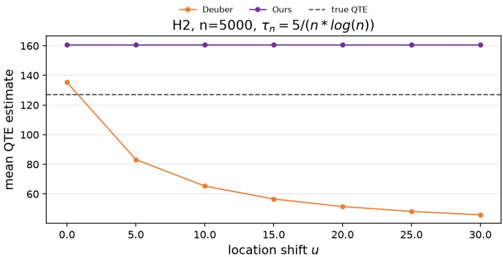  
Figure 1: Mean of the quantile treatment effect estimates, averaged over 1000 Monte Carlo replications, as a function of the location shift u for model $H _ { 2 }$ at $n = 5 0 0 0$ , at the extreme quantile level $\tau _ { n } = 5 / ( n \log n )$ , i.e. for the estimation of $\Delta ( 1 - \tau _ { n } )$ . The data generating process of model $H _ { 2 }$ is described in Section 5.

In practice, however, $\Delta ( \tau )$ cannot be identified from observational data without further assumptions, since for any unit only one of the two potential outcomes $Y ( 0 )$ and $Y ( 1 )$ is observed, and the treatment assignment $D$ is typically correlated with the covariates $X \in \mathbb { R } ^ { p }$ that drive the outcomes. Following Rosenbaum and Rubin [31], we invoke the unconfoundedness condition $( Y ( 1 ) , Y ( 0 ) ) \bot \bot D \mid \bar { X }$ , which states that, conditional on the covariates, the potential outcomes are independent of the treatment. Under this condition, the propensity score $\pi ( x ) = \mathbb { P } ( D = 1 \mid X = x )$ can be used to balance the covariate distributions across treatment groups, and combining unconfoundedness with the common support requirement $0 < \pi ( x ) < 1$ on the support of X yields identification of $\Delta ( \tau )$ within the binary treatment setting.

Given this identification, an extensive literature has developed estimation and inference methods for QTE. For a fixed quantile level $\tau \in ( 0 , 1 )$ , Firpo [14] proposed an efficient semiparametric estimator of $\Delta ( \tau )$ based on inverse propensity score weighting (see Equation (6) in Section 2.2). However, it is confined to a fixed τ: deep in the tail, only very few observations exceed the level, so the weighted empirical quantile becomes unreliable. To move beyond fixed levels, Zhang [34] extended the framework to a dynamic sequence of quantile levels $\tau _ { n } \to 0$ as $n  + \infty$ . Depending on the decay rate of $\tau _ { n }$ , two regimes arise: for an intermediate level, where $n \tau _ { n }  + \infty .$ , the estimator remains asymptotically normal; for an extreme level, where $n \tau _ { n }  a \geq 0$ , the expected number of observations beyond the level is finite, so the empirical quantile is based on only finitely many tail observations and asymptotic normality breaks down. Moreover, the QTE estimators of Firpo [14] and Zhang [34] are both invariant under a common location shift of the potential outcomes.

For many applications, however, the most relevant quantiles are precisely those that go beyond the range of the data. In climate attribution studies, for instance, scientists investigate the causal effect of anthropogenic influences on climate extremes such as heavy precipitation; the quantiles of interest for such events typically go far beyond the range of historical recordings and therefore require extreme value extrapolation $( \mathrm { e . g . }$ , Easterling et al. [12]; van Oldenborgh et al. [33]). Formally, this corresponds to the extreme level regime, where $n \tau _ { n }  a \geq 0$ , for which the fixed- and intermediatelevel estimators above are no longer applicable.

To estimate the QTE at such extreme levels, Deuber et al. [10] focused on heavy-tailed distributions, whose tail probabilities decay polynomially and are thus heavier than Gaussian, and proposed an extrapolation-based estimator. By the theory of regular variation of de Haan and Ferreira [7], the extreme quantile of each potential outcome can be extrapolated from an intermediate quantile as

$$
q _ { j } ( 1 - \tau _ { n } ) \approx q _ { j } ( 1 - \alpha _ { n } ) \left( \frac { \alpha _ { n } } { \tau _ { n } } \right) ^ { \gamma _ { j } } , \qquad j \in \{ 0 , 1 \} ,
$$

where $\gamma _ { j } > 0$ is the extreme value index (EVI) of the potential outcome $Y ( j ) , \alpha _ { n }$ is an intermediate level with $n \alpha _ { n }  + \infty$ , and $\tau _ { n }$ is an extreme level with $n \tau _ { n }  a \geq 0$ . Their estimator plugs the inverse propensity score weighted intermediate quantile estimator of Firpo [14] and a newly proposed causal Hill estimator of $\gamma _ { j }$ , based on the classical Hill estimator [21], into this approximation, and they established its asymptotic normality and provided a consistent variance estimator.

Location invariance is a property that a QTE estimator should ideally inherit from the QTE itself. As noted above, $\Delta ( \tau ) = q _ { 1 } ( \tau ) - q _ { 0 } ( \tau )$ is unchanged when both potential outcomes are shifted by the same constant; an estimator that instead depends on the location of the data would therefore attribute to the treatment an effect that is a mere artefact of the location. In applications, where the reference point or the measurement scale is often arbitrary, such location dependence is undesirable. However, the estimator of Deuber et al. [10] lacks this invariance, and this for two reasons that act jointly: first, its causal Hill estimator of the extreme value index is not invariant to location shifts; second, even with a location-invariant extreme value index estimator, the multiplicative extrapolation formula itself remains location-dependent. The present paper resolves both sources of location dependence.

To this end, two ingredients are required. First, since the extrapolation step hinges on the extreme value index, we need an estimator of $\gamma _ { j }$ that is both capable of causal identification and invariant under location shifts. Several classical extreme value index estimators are location-invariant, including the Pickands estimator [29], the moment estimator of Dekkers et al. [8], and location-invariant Hilltype constructions [15, 24, 23]. In this paper we build on the classical location-invariant estimator of Fraga Alves [15] and adapt it through inverse propensity score weighting, so that the resulting estimator eliminates confounding effects while inheriting the location invariance of its classical counterpart; we refer to this estimator as the causal Fraga estimator. We establish its consistency and asymptotic normality under conditions that are weaker than those required by the causal Hill estimator of Deuber et al. [10], whose validity relies on their Assumptions 4, B1 and B2.

Second, even with a location-invariant extreme value index estimator, the QTE estimator obtained from the multiplicative extrapolation of Deuber et al. [10] remains location-dependent, so the extrapolation formula itself has to be modified. From the theory of regular variation of de Haan and Ferreira [7], however, an alternative form of extrapolation can be derived:

$$
q _ { j } ( 1 - \tau _ { n } ) \approx q _ { j } ( 1 - \alpha _ { n } ) + \left[ q _ { j } ( 1 - \beta _ { n } ) - q _ { j } ( 1 - \alpha _ { n } ) \right] \cdot \frac { ( \alpha _ { n } / \tau _ { n } ) ^ { \gamma _ { j } } - 1 } { ( \alpha _ { n } / \beta _ { n } ) ^ { \gamma _ { j } } - 1 } ,
$$

where $\beta _ { n }  0$ with $n \beta _ { n } \to + \infty$ , so that $\beta _ { n }$ is an intermediate level. We call this the difference extrapolation, as the location parameter cancels in the differences of the quantiles. Combined with the location-invariant causal Fraga estimator, this ensures that the resulting QTE estimator is locationinvariant. Figure 1 illustrates this point: while the QTE estimates of Deuber et al. [10] drift away as the location shift u grows, the estimates based on our difference extrapolation combined with the causal Fraga estimator remain stable across all values of $u .$ Similarly, under weaker conditions than those of Deuber et al. [10], we establish the asymptotic normality of the QTE estimators based on both the multiplicative and the difference extrapolation schemes combined with the causal Fraga estimator, whereas the estimator of Deuber et al. requires additional conditions (their Assumptions 4, B1, B2 and B3). Moreover, in contrast with the estimator of Deuber et al., which has a non-zero asymptotic bias, our QTE estimator is first-order unbiased.

The topic of causality for extreme events is receiving increasing interest. On the structural side, Gissibl and Klüppelberg [17] and Gissibl et al. [18] introduced recursive max-linear structural causal models that generate extreme observations, while Mhalla et al. [26] and Gnecco et al. [19] developed causal structure learning and conditional independence tests tailored to extremes. In climate science, a large literature on extreme event attribution quantifies the causal effect of anthropogenic forcing on weather and climate extremes, typically through model-based counterfactual analyses [20, 12, 33, 28, 27]. On the more applied side, Bhuyan et al. [3] quantified the causal effect of the London cycle superhighways on extreme traffic congestion, albeit without theoretical guarantees. Within this growing literature, our work adds a theoretically justified estimator and inference procedure for the extremal QTE $\Delta ( 1 - \tau _ { n } )$ in the presence of confounding, and in particular supplements it with the important property that the estimator is invariant under location shifts of the potential outcomes.

Our contributions are twofold. First, we construct a location-invariant causal Fraga estimator of the extreme value index via inverse propensity score weighting, and establish its consistency and asymptotic normality under weaker conditions than those required by the causal Hill estimator of Deuber et al. [10]. Second, building on this estimator, we introduce a difference extrapolation scheme in which the location parameter cancels in the differences of the quantiles, thereby obtaining a location-invariant estimator of the extremal QTE; we then establish its asymptotic normality, provide a consistent variance estimator, and construct asymptotically valid confidence intervals. We validate both contributions through a finite-sample simulation study, confirming the location invariance, the stability with respect to the threshold, and the coverage of the confidence intervals.

The remainder of the paper is organized as follows. Section 2 recalls the necessary background on extreme value theory and introduces the potential outcome framework together with the identification conditions for the QTE. Section 3 constructs the causal Fraga estimator of the extreme value index and establishes its consistency and asymptotic normality. Section 4 develops the difference extrapolation estimator of the extremal QTE, derives its asymptotic distribution, and provides a consistent variance estimator for constructing asymptotically honest confidence intervals. Section 5 reports the finitesample performance of the proposed methods through an extensive simulation study. In the appendix, Section A collects all technical proofs, Section B details the corresponding multiplicative extrapolation estimator, and Section C presents additional simulation results.

Throughout, and consistent with the literature on extreme value theory, we focus on the extremal QTE in the upper tail, that is, on $\Delta ( 1 - \tau _ { n } )$ with $\tau _ { n } \to 0$ . The treatment effect on the lower tail can be handled analogously by applying the same arguments to the left tails of the potential outcome distributions.

## 2 Preliminaries

## 2.1 Extreme Value Theory

We study extreme quantiles, namely quantiles at level $1 - \tau _ { n }$ with $\tau _ { n }  0$ and $n \tau _ { n }  a \geq 0$ as $n  + \infty$ When $a = 0$ , empirical estimates of extreme quantiles become severely biased and classical asymptotic theory no longer applies. Extreme value theory addresses this gap by providing methods for quantile extrapolation that yield more accurate estimates of extreme quantiles; see de Haan and Ferreira [7]. The theory rests on a mild distributional assumption that ensures the tail of the distribution admits an accurate parametric approximation. Formally, let Y be a random variable with distribution F and quantile function $q ( \cdot ) = \bar { F } ^ {  } ( \cdot )$ , where $f ^ {  } ( x ) : = \operatorname* { i n f } \{ y \in \mathbb { R } : f ( y ) \geq x \}$ is the left-continuous inverse of a nondecreasing function $f .$

Definition 1 (Maximum domain of attraction and extreme value index (see De Haan and Ferreira [7])). $F o r \gamma \in \mathbb { R }$ , ifthere exist sequences $a _ { n } > 0$ and $b _ { n } \in \mathbb { R } , n \in \mathbb { N }$ , such that

$$
\operatorname* { l i m } _ { n  + \infty } F ^ { n } ( a _ { n } x + b _ { n } ) = G _ { \gamma } ( x ) , \quad \forall x \in \mathbb { R } ,
$$

where

$$
G _ { \gamma } ( x ) = \left\{ \begin{array} { l l } { \exp \bigl ( - ( 1 + \gamma x ) ^ { - 1 / \gamma } \bigr ) , } & { 1 + \gamma x > 0 , \gamma \ne 0 , } \\ { \exp ( - \exp ( - x ) ) , } & { x \in \mathbb { R } , \gamma = 0 , } \end{array} \right.
$$

then the distribution F is said to belong to the maximum domain of attraction of the generalized extreme value distribution $G _ { \gamma } ,$ , denoted $\breve { F } \in { \cal D } ( G _ { \gamma } )$ , and the parameter γ is called the extreme value index.

This condition is not restrictive in practice: most commonly encountered distributions—such as the Gaussian, Student-t, and beta families—fall into the maximum domain of attraction of some $G _ { \gamma } .$ A systematic treatment of the three regimes $( \gamma < 0 , \gamma = 0 , \gamma > 0 )$ can be found in Resnick [30] and Embrechts et al. [13].

Let $Y _ { 1 } , Y _ { 2 } , \ldots , Y _ { n }$ be independent and identically distributed random variables drawn from a distribution $F \in { \mathcal { D } } ( G _ { \gamma } )$ and let $Y _ { ( 1 ) } \le Y _ { ( 2 ) } \le \cdots \le { \overset { \cdot } { Y } } _ { ( n ) }$ denote the corresponding order statistics. The integer $k = k _ { n } \in \{ 1 , \ldots , n - \overset { } { 1 } \}$ is an intermediate sequence satisfying $k \to \infty$ and $k / n  0$ as $n \to \infty$ . We now recall four classical estimators of the extreme value index $\gamma$

When $\gamma > 0$ , Hill [21] proposed the celebrated Hill estimator,

$$
\hat { \gamma } ^ { H } ( k ) = \frac { 1 } { k } \sum _ { i = 0 } ^ { k - 1 } \log \frac { Y _ { ( n - i ) } } { Y _ { ( n - k ) } } .
$$

For the more general case $\gamma \in \mathbb { R }$ , Dekkers et al. [8] built on the Hill estimator and proposed the classical moment estimator,

$$
\hat { \gamma } ^ { M } ( k ) = M _ { n } ^ { ( 1 ) } ( k ) + 1 - \frac { 1 } { 2 } \left( 1 - \frac { \left( M _ { n } ^ { ( 1 ) } ( k ) \right) ^ { 2 } } { M _ { n } ^ { ( 2 ) } ( k ) } \right) ^ { - 1 } ,
$$

where

$$
M _ { n } ^ { ( j ) } ( k ) = \frac { 1 } { k } \sum _ { i = 0 } ^ { k - 1 } \left( \log \frac { Y _ { ( n - i ) } } { Y _ { ( n - k ) } } \right) ^ { j } , \quad j \in \{ 0 , 1 , 2 \} ,
$$

with $M _ { n } ^ { ( 1 ) } ( k ) = \hat { \gamma } ^ { H } ( k )$ . Pickands [29] provided another estimator that applies to any $\gamma \in \mathbb { R }$

$$
\hat { \gamma } ^ { P } ( k ) = \frac { 1 } { \log 2 } \log \frac { Y _ { ( n - [ k / 4 ] ) } - Y _ { ( n - [ k / 2 ] ) } } { Y _ { ( n - [ k / 2 ] ) } - Y _ { ( n - [ k ] ) } } ,
$$

where [x] denotes the largest integer not exceeding x. Inspired by Pickands’s estimator, Fraga Alves [15] proposed a location-invariant generalization of the Hill estimator via a random shift:

$$
\hat { \gamma } ^ { F } ( k _ { 0 } , k ) = \frac { 1 } { k _ { 0 } } \sum _ { i = 0 } ^ { k _ { 0 } - 1 } \log \frac { Y _ { ( n - i ) } - Y _ { ( n - k ) } } { Y _ { ( n - k _ { 0 } ) } - Y _ { ( n - k ) } } ,
$$

where $n  + \infty , k _ { 0 }  + \infty , k  + \infty , k _ { 0 } / k  0$ and $k / n  0$

Since γ is a shape parameter of the distribution $F .$ , it is intrinsically unchanged by any location shift: for any constant $c \in \mathbb { R }$ , the extreme value index of Y and that of $Y +$ c are identical. However, the Hill and the moment estimators are not location-invariant, since they are based on logarithms of ratios of the observations themselves. By contrast, the Fraga estimator achieves location invariance by subtracting the reference order statistic $Y _ { ( n - k ) }$ , and the Pickands estimator is likewise locationinvariant, as it is built on differences of order statistics. The extreme value index $\gamma$ controls the tail heaviness of the distribution $F \colon$ larger values of $\gamma$ correspond to heavier tails. In this work, we focus on the heavy-tailed regime $\gamma > 0$ . To make the theoretical setting precise, we now give a formal definition of a heavy-tailed distribution.

Definition 2 (First-order regular variation (Deuber et al. [10])). For $\gamma > 0 _ { ; }$ , the distribution $F$ is called heavy-tailed ifits tail $\mathrm { \bar { 1 } } - F$ admits thefirst-order regular variation representation

$$
1 - F ( x ) = L ( x ) x ^ { - 1 / \gamma } , \quad \forall x > 0 ,\tag{1}
$$

where $L ( x )$ is a slowly varying function at infinity, that $i s ,$

$$
\operatorname* { l i m } _ { x  + \infty } \frac { L ( t x ) } { L ( x ) } = 1 , \quad \forall t > 0 .
$$

We now present several equivalent characterizations of $F \in { \mathcal { D } } ( G _ { \gamma } )$ in the heavy-tailed regime $\gamma > 0$ , following de Haan and Ferreira [7]. According to de Haan and Ferreira [7], $\dot { F } \dot { \in { \mathcal { D } } ( G _ { \gamma } ) }$ holds if and only if one of the following conditions is satisfied.

(i) For $\gamma > 0 ,$

$$
\operatorname* { l i m } _ { t  + \infty } { \frac { 1 - F ( t x ) } { 1 - F ( t ) } } = x ^ { - 1 / \gamma } , \quad \forall x > 0 .\tag{2}
$$

(ii) For $\gamma > 0 ,$

$$
\operatorname* { l i m } _ { t  + \infty } \frac { U ( t x ) } { U ( t ) } = x ^ { \gamma } , \quad \forall x > 0 ,\tag{3}
$$

where

$$
U ( t ) = \{ { \begin{array} { l l } { 0 , } & { 0 \leq t < 1 , } \\ { ( { \displaystyle { \frac { 1 } { 1 - F } } } ) ^ {  } ( t ) , } & { t \geq 1 , } \end{array} } 
$$

$$
{ \mathrm { w i t h ~ } } ( { \frac { 1 } { 1 - F } } ) ^ {  } ( t ) = { \mathrm { i n f } } { \{ y { \Bigg | } { \frac { 1 } { 1 - F ( y ) } } \geq t { \} } } .
$$

(iii) For $\gamma > 0$ , there exists a function $a ( t ) > 0$ such that

$$
\operatorname* { l i m } _ { t  + \infty } \frac { U ( t x ) - U ( t ) } { a ( t ) } = \frac { x ^ { \gamma } - 1 } { \gamma } , \quad \forall x > 0 .\tag{4}
$$

Since Equation (1) and Equation (2) are equivalent, whenever $F \in { \mathcal { D } } ( G _ { \gamma } )$ and $\gamma > 0$ , the distribution $F$ is heavy-tailed and its tail $1 - F$ admits the first-order regular variation property. By Equation (3), this property can be equivalently expressed through the tail quantile function $U ( t )$ which provides the theoretical foundation for the consistency of the extreme value index estimators introduced above. To establish the asymptotic normality of these estimators, however, an additional rate condition on $U ( t )$ is required; this is captured by a second-order regular variation property, which we state next.

Definition 3 (Second-order regular variation (De Haan and Ferreira [7])). For $\gamma > 0$ and $\rho \leq 0 _ { : }$ , the function $U ( t )$ is said to possess second-order regular variation with parameters $\langle \gamma , \rho \rangle$ if there exists a function A(t) of constant sign tending to zero as $t \to + \infty$ such that,for all $x > 0 ,$

$$
\operatorname* { l i m } _ { t \to + \infty } { \frac { U ( t x ) / U ( t ) - x ^ { \gamma } } { A ( t ) } } = { \left\{ x ^ { \gamma } { \frac { x ^ { \rho } - 1 } { \rho } } , \rho < 0 , \right. }
$$

Here $\gamma$ is the first-order parameter, $\rho$ is the second-order parameter, and A is the second-order auxiliary function.

Definition 3 imposes a stronger condition than the first-order regular variation in Definition 2. For most commonly encountered distributions, the auxiliary function $A ( t )$ and the second-order parameter $\rho$ can be computed explicitly; see Alves et al. [16] for a detailed treatment.

## 2.2 Quantile Treatment Effect

This subsection reviews classical methods for estimating QTEs, which provide the analytical and methodological foundation for the extremal QTEs studied in the main text. We first introduce the QTE within the potential outcome framework of Rosenbaum and Rubin [31], making explicit the identifying assumptions required for causal interpretation. We then describe the classical fixedquantile estimator of Firpo [14], and finally recall the additional assumptions needed to extend the framework to dynamic sequences of quantiles as developed by Zhang [34]. The detailed estimation procedure for dynamic QTE is deferred to Section 4. The assumptions presented in this subsection will be used throughout the paper.

Within the potential outcome framework, let $D \in \{ 0 , 1 \}$ denote the treatment variable and let $Y \in \mathbb { R }$ denote the outcome variable. For $j \in \{ 0 , 1 \}$ , the potential outcome of $Y$ when $D = j$ is written as $Y ( j )$ .

Definition 4 (QTE). Let $F _ { 0 } ( y )$ and $F _ { 1 } ( y )$ denote the distribution functions of the potential outcomes $Y ( 0 )$ and $Y ( 1 )$ , respectively. $F o r \tau \in ( 0 , 1 )$ , the τ-QTE is defined as

$$
\Delta ( \tau ) = q _ { 1 } ( \tau ) - q _ { 0 } ( \tau ) ,
$$

where, $f o r j \in \{ 0 , 1 \}$ , the quantile function $q _ { j } ( \tau )$ is given by

$$
q _ { j } ( \tau ) = F _ { j } ^ {  } ( \tau ) = \operatorname* { i n f } \{ y \in \mathbb { R } : F _ { j } ( y ) \geq \tau \} .\tag{5}
$$

For $j \in \{ 0 , 1 \}$ , by the quantilefunction definition, Equation (5) and the tail quantilefunction $U _ { j } ( \cdot )$ we have

$$
q _ { j } ( 1 - \tau ) = \operatorname* { i n f } \{ y \in \mathbb { R } : F _ { j } ( y ) \geq 1 - \tau \} = U _ { j } ( 1 / \tau ) .
$$

Causal inference from observational data faces two key challenges. First, the problem of missing counterfactual outcomes: each sample unit is observed under only one treatment status, and the observed outcome is related to the potential outcomes through $Y = \dot { D } Y ( 1 ) + ( 1 - D ) Y ( 0 )$ . Second, causal effects are easily confounded: one or more covariates simultaneously affect both the treatment and the outcome, blurring or distorting their relationship. Concretely, confounding arises when the covariate distributions differ across treatment groups, since the observed difference in outcomes then reflects both the treatment effect and the compositional imbalance. To address these issues and identify causal effects from observational data, additional assumptions are required.

Assumption 1. Let X be the covariate vector and supp(X) its compact support.

(i) Unconfoundedness: $( Y ( 1 ) , Y ( 0 ) ) \perp D \mid X$ , i.e., conditional on X, the potential outcomes are independent ofthe treatment.

(ii) Common support: there exists a constant c with $0 < c <$ 1 such that, for every x $\ r _ { \cdot } \in \operatorname { s u p p } ( X )$ $c < \pi ( x ) < 1 - c ,$ where $\pi ( x ) = \mathbb { P } ( D = 1 \mid X = x )$ is the propensity score.

These are two standard assumptions in the causal inference literature; see Rosenbaum and Rubin [31], Zhang [34] and Deuber et al. [10]. The unconfoundedness assumption means that, conditional on all observed confounders, the treatment assignment is independent of the potential outcomes; the common support assumption guarantees that, for any value of the covariates, no sample unit is restricted to be assigned to only the treated or only the control group.

For a fixed quantile level $\tau \in ( 0 , 1 )$ ), Firpo [14] proposed the following estimator under Assumption 1. By inverse propensity score weighting to adjust for confounding and minimizing the empirical quantile loss, the τ-quantile estimator of the potential outcome $Y ( j )$ is given by

$$
\widehat { q } _ { j } ( \tau ) = \underset { q \in \mathbb { R } } { \operatorname { a r g m i n } } \sum _ { i = 1 } ^ { n } \left( \frac { D _ { i } } { \widehat { \pi } ( X _ { i } ) } \right) ^ { j } \left( \frac { 1 - D _ { i } } { 1 - \widehat { \pi } ( X _ { i } ) } \right) ^ { 1 - j } ( Y _ { i } - q ) \left( \tau - \mathbf { 1 } _ { \{ Y _ { i } \leq q \} } \right) ,\tag{6}
$$

and the corresponding $\tau { \mathrm { - } } \mathrm { Q T E }$ estimator is

$$
\begin{array} { r } { \widehat { \Delta } ( \tau ) = \widehat { q } _ { 1 } ( \tau ) - \widehat { q } _ { 0 } ( \tau ) . } \end{array}
$$

Here, $( D _ { i } , Y _ { i } , X _ { i } ) _ { i = 1 } ^ { n }$ are independent observations drawn from the population $( D , Y , X )$ , and $\widehat { \pi } ( X _ { i } )$ is an estimator of the propensity score $\pi ( X _ { i } ) = \mathbb { P } ( D = 1 \ | \ X \stackrel { } { = } \ X _ { i } )$ . In this work, we follow the nonparametric sieve approach used in Firpo [14], Zhang [34] and Deuber et al. [10] to estimate $\pi ( X _ { i } )$ ; the required assumptions are stated next (see also Hirano et al. [22]).

Assumption 2. Let X be the covariate vector and $\operatorname { s u p p } ( X )$ its compact support.

(i) The covariate X is an r-dimensional continuous random variable with density $f _ { X } ( x )$ , and there exists $0 < d < 1$ such that $d < f _ { X } ( x ) < 1 / d$ for all $x \in { \mathrm { s u p p } } ( X )$

(ii) The propensity score function $\pi ( X )$ is s-times continuously differentiable with $s \geq 4 r ,$ , and derivatives ofall orders are bounded.

(iii) For $j \in \{ 0 , 1 \}$ , the conditional expectation $\mathbb { E } \{ \tau _ { n } - \mathbf { 1 } _ { \{ Y ( j ) > q _ { j } ( 1 - \tau _ { n } ) \} } \mid x \}$ is t-times continuously differentiable in x with $t \in \mathbb { Z } ^ { + }$ , and all partial derivatives are uniformly bounded by $M _ { n } f o r \bar { x } \in \mathrm { s u p p } ( X )$

(iv) Let $h _ { n } \ > \ 0$ be a sieve complexity parameter and let $\pi _ { h _ { n } } ( x ) = L ( H _ { h _ { n } } ( x ) ^ { T } \pi _ { n } )$ be the sieve approximation $o f \pi ( x ) ,$ , where L is the sigmoid function $L ( u ) = \ddot { 1 } / ( 1 + e ^ { - u } )$ and $H _ { h _ { n } } \stackrel { \cdot } { = } ( H _ { h _ { n } , 1 } , \dotsc , \dot { H _ { h _ { n } , h _ { n } } } ) ^ { T }$ is the vector ofsieve basisfunctions on Rr. Define $\zeta ( \dot { h _ { n } } ) =$ $\begin{array} { r } { \operatorname* { s u p } _ { x \in \operatorname { s u p p } ( X ) } \| H _ { h _ { n } } ( x ) \| } \end{array}$ and assume thefollowing hold:

$$
\frac { \zeta ( h _ { n } ) ^ { 2 } h _ { n } } { \sqrt { n } }  0 , \quad \frac { \tau _ { n } \zeta ( h _ { n } ) ^ { 1 0 } h _ { n } } { n }  0 , \quad n \tau _ { n } \zeta ( h _ { n } ) ^ { 6 } h _ { n } ^ { - s / r }  0 , \quad \frac { n M _ { n } } { \tau _ { n } h _ { n } ^ { t / r } }  0 .
$$

For more discussion and details on Assumption 2, we refer to Zhang [34].

Zhang [34], building on the classical Firpo [14] estimator, extended the fixed-quantile framework to a dynamic sequence of quantiles $\tau _ { n } \to 0 { \mathrm { a s } } n \to + \infty$ , a procedure also adopted by Deuber et al. [10] and this work. Zhang showed that, for an intermediate level, i.e. $n \tau _ { n } \to + \infty$ , the difference $\widehat { q } _ { 1 } ( 1 - \tau _ { n } ) - \widehat { q } _ { 0 } ( 1 - \tau _ { n } )$ of the estimated quantiles is asymptotically normal. For an extreme level, i.e. $n \tau _ { n }  a \geq 0 .$ , however, asymptotic normality no longer holds. Subsequently, Deuber et al. [10] obtained an extremal QTE estimator that is asymptotically normal at extreme levels, by making use of an asymptotic tail approximation. In theory, the QTE is location-invariant: applying the same location shift to the potential outcome distributions does not change the QTE. Deuber’s extremal QTE estimator, however, does not possess this property. We now state the additional assumptions on the potential outcome distributions imposed by Zhang [34] in this extension.

Assumption 3. For $j \in \{ 0 , 1 \}$

(i) the potential outcome $Y ( j )$ is a continuous random variable with density $f _ { j } ( y )$ , and $f _ { j } ( y )$ is monotonically decreasing on its right tail;

(ii) the cumulative distribution function of $Y ( j )$ is $F _ { j } ( y )$ , and $F _ { j } ( y ) \in \mathcal { D } ( G _ { \gamma } )$ ;

(iii) conditional on the covariate X, the potential outcome $Y ( j ) \mid X$ is a continuous random variable with conditional density $f _ { j \vert X } ( y )$

## 3 Causal Extreme Value Index Estimator

Building on the extreme value theory and the QTE identification conditions reviewed in Section 2, this section carries out the first step of our construction. To endow the extremal QTE estimator with location invariance, we first need to construct an EVI estimator that is itself location-invariant and, at the same time, capable of causal identification. To this end, we build on the classical Fraga estimator of Fraga Alves [15] and adapt it through inverse propensity score weighting, so that it eliminates confounding effects. This section thus presents the main methodological contribution of the paper: a causal Fraga estimator of the extreme value index γ. We first construct the proposed estimator, then establish its weak consistency and asymptotic normality.

## 3.1 Definition of the Causal Fraga Estimator

We now introduce the proposed causal Fraga estimator. Let $\alpha _ { n }  0$ with $k = n \alpha _ { n }  + \infty , \beta _ { n }  0$ with $k _ { 0 } = n \beta _ { n } \to + \infty$ and $\beta _ { n } / \alpha _ { n }  0$ . For $j \in \{ 0 , 1 \}$ , the causal Fraga estimators of γ are

$$
\widehat { \gamma } _ { 1 } ^ { F } ( \beta _ { n } , \alpha _ { n } ) = \frac { 1 } { n \beta _ { n } } \sum _ { i = 1 } ^ { n } \frac { D _ { i } } { \widehat { \pi } ( X _ { i } ) } { \bf 1 } _ { \{ Y _ { i } > \widehat { q } _ { 1 } ( 1 - \beta _ { n } ) \} } \log \frac { Y _ { i } - \widehat { q } _ { 1 } ( 1 - \alpha _ { n } ) } { \widehat { q } _ { 1 } ( 1 - \beta _ { n } ) - \widehat { q } _ { 1 } ( 1 - \alpha _ { n } ) } ,\tag{7}
$$

and

$$
\widehat { \gamma } _ { 0 } ^ { F } ( \beta _ { n } , \alpha _ { n } ) = \frac { 1 } { n \beta _ { n } } \sum _ { i = 1 } ^ { n } \frac { 1 - D _ { i } } { 1 - \widehat { \pi } ( X _ { i } ) } { \mathbf 1 } _ { \{ Y _ { i } > \widehat { q _ { 0 } } ( 1 - \beta _ { n } ) \} } \log \frac { Y _ { i } - \widehat { q _ { 0 } } ( 1 - \alpha _ { n } ) } { \widehat { q _ { 0 } } ( 1 - \beta _ { n } ) - \widehat { q _ { 0 } } ( 1 - \alpha _ { n } ) } .\tag{8}
$$

Here, the quantile estimators $\widehat { q } _ { j } ( 1 - \beta _ { n } )$ and $\widehat { q } _ { j } ( 1 - \alpha _ { n } )$ are given by Equation (6), and the propensity score $\widehat { \pi } ( \bar { X _ { i } } )$ appearing in Equation (7) and Equation (8) is estimated by a nonparametric sieve method (see [34, 10] for details). Throughout the paper we refer to $\alpha _ { n }$ (or k) as the primary threshold parameter and to $\beta _ { n } \left( \mathrm { o r } k _ { 0 } \right)$ as the auxiliary threshold parameter.

Remark 1. The causal Fraga estimator defined in Equations (7) and (8) is exactly location-invariant: for any constant $c \in \mathbb { R }$ , replacing each $Y _ { i }$ by $Y _ { i } + c$ leaves $\widehat { \gamma } _ { j } ^ { F } ( \beta _ { n } , \alpha _ { n } )$ unchanged. Indeed, the quantile shift cancels in both the indicator $\mathbb { 1 } _ { \{ Y _ { i } > \widehat { q } _ { j } ( 1 - \beta _ { n } ) \} }$ and the log-ratio log $\frac { Y _ { i } - { \widehat { q } } _ { j } \left( 1 - \alpha _ { n } \right) } { { \widehat { q } } _ { j } \left( 1 - \beta _ { n } \right) - { \widehat { q } } _ { j } \left( 1 - \alpha _ { n } \right) }$ This property, inherited from the random-shift construction of Fraga [15] and Ling et al. $I 2 4 J ,$ distinguishes the causal Fraga estimator from the causal Hill estimator proposed in Deuber et al. [10], which is sensitive to the location ofthe threshold.

## 3.2 Asymptotic Properties of the Causal Fraga Estimator

We first show that the proposed causal Fraga estimator is consistent under the assumptions introduced in Section 2.2. It is worth noting that Deuber et al. [10] proved the weak consistency of their causal Hill estimator using the same assumptions as Theorem 3.1 of Zhang [34], whereas the present work establishes the weak consistency of the proposed causal Fraga estimator under more relaxed conditions, thereby further broadening the applicability of causal extreme value index estimation.

Theorem 1. Assume Assumptions 1–3 hold. As $n  + \infty ,$ , suppose $\alpha _ { n }  0 \ w i t h \ k = n \alpha _ { n }  + \infty ,$ and $\beta _ { n }  0$ with $k _ { 0 } = n \beta _ { n } \to + \infty$ and $\beta _ { n } / \alpha _ { n }  0$ . Then,for each $j \in \{ 0 , 1 \}$ , the extreme value index $\gamma _ { j } > 0$ satisfies

$$
{ \widehat { \gamma } } _ { j } ^ { F } ( \beta _ { n } , \alpha _ { n } ) \ { \overset { p } {  } } \ \gamma _ { j } ,
$$

where $\widehat { \gamma } _ { j } ^ { F } ( \beta _ { n } , \alpha _ { n } )$ is defined in Equation (7) and Equation (8).

To establish the asymptotic normality of the causal Fraga estimator, we further introduce Assumption 4, which is a second-order regular variation assumption. It is worth noting that this condition is routinely satisfied by common heavy-tailed distributions such as the Pareto and Cauchy families, which ensures the applicability of our theoretical results to typical heavy-tail scenarios including extreme climate analysis and risk management.

Assumption 4. For $j \in \{ 0 , 1 \}$ , let $\begin{array} { r } { U _ { j } ( x ) = \big ( \frac { 1 } { 1 - F _ { j } } \big ) ^ {  } ( x ) } \end{array}$ denote the tail quantile function of the potential outcome $Y ( j )$ . We assume that $U _ { j } ( x )$ possesses second-order regular variation (see Definition 3) with parameters $( \gamma _ { j } , \rho _ { j } )$ , where the extreme value index satisfies $\gamma _ { j } > 0$ , the secondorder parameter satisfies $\rho _ { j } \leq 0 ;$ , and the second-order auxiliaryfunction is $A _ { j }$

With these assumptions in place, we now present the key decomposition of the causal Fraga estimator, which underpins the asymptotic normality established below.

Lemma 1. Let Assumptions 1–4 hold. As $n  + \infty$ , suppose $\alpha _ { n }  0$ with $k = n \alpha _ { n }  + \infty$ $\beta _ { n } \to 0$ with $k _ { 0 } = n \beta _ { n } \to + \infty$ , and $\beta _ { n } / \alpha _ { n }  0$ . Then, for each $j \in \{ 0 , 1 \}$ ,

$$
\widehat { \gamma } _ { j } ^ { F } ( \beta _ { n } , \alpha _ { n } ) = \gamma _ { j } + \gamma _ { j } a _ { n , j } \frac { P _ { n , j } } { \sqrt { k _ { 0 } } } + b _ { j } \Big ( \frac { k _ { 0 } } { k } \Big ) ^ { \gamma _ { j } } ( 1 + o _ { p } ( 1 ) ) + c _ { j } A _ { j } \Big ( \frac { n } { k } \Big ) \Big ( \frac { k _ { 0 } } { k } \Big ) ^ { - \rho _ { j } } ( 1 + o _ { p } ( 1 ) ) + A _ { n , j } ,\tag{9}
$$

where $\begin{array} { r } { P _ { n , j } \stackrel { d } {  } \mathcal { N } ( 0 , 1 ) , b _ { j } = \gamma _ { j } / ( 1 + \gamma _ { j } ) } \end{array}$ , and $c _ { j } = 1 / ( 1 - \rho _ { j } )$ ; the normalized second moment $a _ { n , j } ^ { 2 } = n \bar { \mathbb { E } } ( R _ { n , j } ^ { 2 } ) / k _ { 0 }$ , where

$$
R _ { n , j } = \left( \frac { D } { \pi ( X ) } \right) ^ { j } \left( \frac { 1 - D } { 1 - \pi ( X ) } \right) ^ { 1 - j } \mathbf { 1 } _ { \{ Z ( j ) > \beta _ { n } ^ { - 1 } \} } \log ( Z ( j ) \beta _ { n } ) - \beta _ { n }
$$

with $Z ( j ) = 1 / ( 1 - F _ { j } ( Y ( j ) ) )$ ; moreover, $a _ { n , j } ^ { 2 }$ lies in the interval $[ \frac { 2 } { 1 - c } - \beta _ { n } , \frac { 2 } { c } - \beta _ { n } ] ,$ , so that $a _ { n , j } = O ( 1 )$ is guaranteed by the boundedness of the propensity score (Assumption $I ) ;$ and $A _ { n , j } = o _ { p } ( 1 )$ collects the remainder terms ofthefive-component decomposition $o f \widehat { \gamma } _ { j } ^ { F }$ , whose explicit form is given in the proofofthis lemma (Section $A . 3 )$

To obtain a well-defined asymptotic distribution, we additionally require that the sequence $\{ a _ { n , j } \}$ admits a limit, as formalised in Assumption 5.

Assumption 5. For each $j \in \{ 0 , 1 \}$ , there exists a constant $a _ { j } > 0$ such that $a _ { n , j } \to a _ { j } a s n \to + \infty$

This assumption is in the same spirit as, but considerably less demanding than, Assumption B.3 in Deuber et al. [10] and Assumption B.2 in Zhang [34]; our $a _ { n , j } ^ { 2 }$ is an unconditional second moment that is automatically bounded under Assumption 1, so that Assumption 5 only imposes the existence of the limit $a _ { j }$

Fraga [15] and Ling et al. [24] discuss the optimal choice of the auxiliary threshold parameter, which minimizes the mean squared error, for the location-invariant extreme value index estimator, but restrict attention to the special case where the second-order auxiliary function satisfies $A ( t ) = O ( t ^ { \rho } )$ as $t \to + \infty$ , yielding different optimal choices depending on the subcase. In practice, however, it is difficult to determine which subcase applies for a given data set, and moreover such an optimal choice is still subject to an asymptotic bias. In contrast, rather than pursuing the optimal choice of the auxiliary threshold parameter $k _ { 0 } \left( \mathrm { o r } \beta _ { n } \right)$ , this paper restricts the convergence rate of $k _ { 0 }$ , which suffices to establish the asymptotic normality of $\widehat { \gamma } _ { i } ^ { F }$ and is first-order unbiased.

Following Zhang [34] and Deuber et al. [10], in analysing the distribution of the extreme value index estimator, a common assumption is $\sqrt { k } A _ { j } ( n / k ) \to \lambda _ { j } \in \mathbb { R }$ (notice that this condition implies $\sqrt { k _ { 0 } } A _ { j } ( n / k ) \to 0 )$ . In addition, to make the asymptotic bias negligible, we require $( k _ { 0 } / k ) ^ { \gamma _ { j } } = o ( k _ { 0 } ^ { - 1 / 2 } )$ , and the residual term $A _ { n , j }$ in Equation (9) further satisfies $o _ { p } ( k _ { 0 } ^ { - 1 / 2 } )$ . The asymptotic distribution then follows, as summarised in the following theorem.

Theorem 2. Let Assumptions 1–5 hold. As $n  + \infty ,$ , suppose $\alpha _ { n }  0$ with $k = n \alpha _ { n }  + \infty ,$ $\beta _ { n } \to 0$ with $k _ { 0 } = n \beta _ { n } \to + \infty ,$ , and $\beta _ { n } / \alpha _ { n }  0 .$ . If for each $j \in \{ 0 , 1 \}$ , $\sqrt k A _ { j } ( n / k ) \to \lambda _ { j } \in \mathbb { R }$ $( k _ { 0 } / k ) ^ { \gamma _ { j } } = o ( k _ { 0 } ^ { - 1 / 2 } )$ , and $A _ { n , j } = o _ { p } ( k _ { 0 } ^ { - 1 / 2 } )$ , then,

$$
\sqrt { k _ { 0 } } ( \widehat { \gamma } _ { j } ^ { F } ( \beta _ { n } , \alpha _ { n } ) - \gamma _ { j } ) \overset { d } {  } { \mathcal { N } } \big ( 0 , \gamma _ { j } ^ { 2 } a _ { j } ^ { 2 } \big ) .
$$

Remark 2. In practice, all three additional assumptions in Theorem 2 are achievable by choosing k and $k _ { 0 }$ appropriately. The condition $\sqrt { k } A _ { j } ( n / k )  \lambda _ { j }$ is satisfied by taking k smaller (see Deuber et al. $I I O I )$ . For the two remaining rate conditions, suppose $\dot { k _ { 0 } } = \dot { O ( k ^ { m } ) }$ for some $m \in ( 0 , 1 )$ (the upper boundfollowsfrom $k _ { 0 } / k  0 )$ . Then

$$
( k _ { 0 } / k ) ^ { \gamma _ { j } } = o ( k _ { 0 } ^ { - 1 / 2 } ) \longleftrightarrow m < { \frac { 2 \gamma _ { j } } { 2 \gamma _ { j } + 1 } } ,
$$

and the $o _ { p } ( 1 )$ rate $o f A _ { n , j }$ (from Theorem 1) makes $A _ { n , j } = o _ { p } ( k _ { 0 } ^ { - 1 / 2 } )$ once $k _ { 0 }$ is taken smaller. Thus controlling the growth rates ofboth k and $k _ { 0 } ~ ( i . e .$ ., taking k smaller and choosing m in the above interval) yields all three conditions.

For the asymptotic analysis of the extremal QTE estimator in Section 4.2, we need the joint asymptotic distribution of the causal Fraga estimators for the treated and control arms, which we establish in the following theorem.

Theorem 3. Let Assumptions 1–5 hold. As n → +∞, suppose $\alpha _ { n }  0$ with $k = n \alpha _ { n }  + \infty ,$ $\beta _ { n } \to 0$ with $k _ { 0 } = n \beta _ { n } \to + \infty ,$ and $\beta _ { n } / \alpha _ { n }  0 .$ . Assume additionally that $\sqrt k A _ { j } ( n / k ) \to \lambda _ { j } \in \mathbb { R }$ $( k _ { 0 } / k ) ^ { \gamma _ { j } } = o ( k _ { 0 } ^ { - 1 / 2 } )$ , and $A _ { n , j } = o _ { p } ( k _ { 0 } ^ { - 1 / 2 } ) f o r j \in \{ 0 , 1 \}$ . Then the joint asymptotic distribution ofthe causal Fraga estimatorsfor $j = 1$ and $j = 0$ is

$$
\sqrt { k _ { 0 } } ( \widehat { \gamma } _ { 1 } ^ { F } ( \beta _ { n } , \alpha _ { n } ) - \gamma _ { 1 } ) \stackrel { d } {  } \mathcal { N } ( \mathbf { 0 } , ( \begin{array} { c c } { \gamma _ { 1 } ^ { 2 } a _ { 1 } ^ { 2 } } & { 0 } \\ { 0 } & { \gamma _ { 0 } ^ { 2 } a _ { 0 } ^ { 2 } } \end{array} ) ) ,\tag{10}
$$

where $a _ { 1 } ^ { 2 }$ and a2 are defined as in Lemma 1.

## 4 Extremal Quantile Treatment Effect Estimator

Building on the location-invariant causal Fraga estimator of Section 3, this section carries out the second step of our construction. The main goal of this section is to study the estimation and statistical inference of the extreme $\left( 1 - \tau _ { n } \right)$ -quantile treatment effect under heavy-tailed distributions; the $\tau _ { n }$ case follows by analogy. Depending on the convergence rate of $\tau _ { n } \to 0$ as $n  + \infty$ , this section distinguishes two regimes: the extreme level defined by $n \tau _ { n }  a \geq 0$ , and the intermediate level defined by $n \tau _ { n } \to + \infty$ . To endow the extremal QTE estimator with location invariance, we modify the multiplicative extrapolation used in Deuber et al. [10] into a difference extrapolation scheme, and construct a location-invariant extremal QTE estimator that builds upon the causal Fraga estimator of Section 3. The estimators constructed from the two extrapolation schemes possess similar asymptotic properties; details are given in the rest of this section and in Section B. We then establish the asymptotic normality of the proposed estimator.

## 4.1 Definition of the Extremal QTE Estimator

For the extreme-level regime where $n \tau _ { n }  a \geq 0$ , the empirical quantile estimator given by Equation (6) in Section 2.2 suffers from severe bias. The underlying cause is that the expected number of observations exceeding the target quantile level is $a < \infty$ , leaving the empirical quantile with insufficient effective sample size and incurring a bias that cannot be neglected.

A remedy for this problem is to use extrapolation to obtain an accurate extreme-quantile estimator (see Deuber et al. [10]). Specifically, for sufficiently large n, applying Equation (3) to the tail quantile function yields

$$
q ( 1 - \tau _ { n } ) \approx q ( 1 - \alpha _ { n } ) \left( \frac { \alpha _ { n } } { \tau _ { n } } \right) ^ { \gamma } .\tag{11}
$$

Here $\alpha _ { n }$ is the intermediate level $( n \alpha _ { n }  + \infty )$ introduced in Section 3.1, while $\tau _ { n }$ corresponds to the extreme level $( n \tau _ { n }  a \geq 0 )$

Substituting the intermediate-level empirical quantile estimator (Equation (6)) for $\widehat { q } _ { j } ( 1 - \alpha _ { n } )$ and the causal Fraga estimator (Equations (7) and (8)) for $\widehat { \gamma } _ { j } ^ { F } ( \beta _ { n } , \alpha _ { n } )$ into the extrapolation relation (11) yields the following multiplicative extrapolation estimator of the extreme quantile under the potential outcome with treatment $\bar { j } \in \{ 0 , 1 \}$

$$
\widehat { Q } _ { j } ^ { \mathrm { m u l t } } ( 1 - \tau _ { n } ) = \widehat { q } _ { j } ( 1 - \alpha _ { n } ) \left( \frac { \alpha _ { n } } { \tau _ { n } } \right) ^ { \widehat { \gamma } _ { j } ^ { F } ( \beta _ { n } , \alpha _ { n } ) } .\tag{12}
$$

The conventional multiplicative extrapolation QTE estimator is the difference of the per-arm multiplicative estimators (12):

$$
\widehat { \Delta } ^ { \mathrm { m u l t } } ( 1 - \tau _ { n } ) = \widehat { Q } _ { 1 } ^ { \mathrm { m u l t } } ( 1 - \tau _ { n } ) - \widehat { Q } _ { 0 } ^ { \mathrm { m u l t } } ( 1 - \tau _ { n } ) .\tag{13}
$$

Unlike the population QTE $\Delta ( 1 - \tau _ { n } ) = q _ { 1 } ( 1 - \tau _ { n } ) - q _ { 0 } ( 1 - \tau _ { n } )$ , which is invariant under a common location shift, the multiplicative extrapolation QTE estimator $\widehat { \Delta } ^ { \mathrm { m u l t } }$ is not location-invariant.

To obtain a location-invariant estimator, we adapt the random-shift construction underlying the causal Fraga estimator to the extrapolation step. Since $q _ { j } ( 1 - \tau ) = U _ { j } ( 1 / \tau )$ with $U _ { j }$ regularly varying of index $\gamma _ { j }$

$$
\frac { q _ { j } ( 1 - \tau _ { n } ) - q _ { j } ( 1 - \alpha _ { n } ) } { q _ { j } ( 1 - \beta _ { n } ) - q _ { j } ( 1 - \alpha _ { n } ) } \approx \frac { ( \alpha _ { n } / \tau _ { n } ) ^ { \gamma _ { j } } - 1 } { ( \alpha _ { n } / \beta _ { n } ) ^ { \gamma _ { j } } - 1 } ,
$$

where the location parameter cancels in the differences. Substituting the estimated quantities yields the difference extrapolation estimator

$$
\widehat { Q } _ { j } ( 1 - \tau _ { n } ) = \widehat { q } _ { j } ( 1 - \alpha _ { n } ) + \left[ \widehat { q } _ { j } ( 1 - \beta _ { n } ) - \widehat { q } _ { j } ( 1 - \alpha _ { n } ) \right] \cdot \frac { ( \alpha _ { n } / \tau _ { n } ) ^ { \widehat { \gamma } _ { j } ^ { F } ( \beta _ { n } , \alpha _ { n } ) } - 1 } { ( \alpha _ { n } / \beta _ { n } ) ^ { \widehat { \gamma } _ { j } ^ { F } ( \beta _ { n } , \alpha _ { n } ) } - 1 } .\tag{14}
$$

This difference-extrapolation construction parallels Dekkers and de Haan [9], but employs the causal extreme value index $\widehat { \gamma } _ { j } ^ { F }$ at the two arbitrary threshold levels $\alpha _ { n }$ and $\beta _ { n } .$ , rather than a univariate moment estimator at fixed ratios. This allows the extrapolation step to inherit the location invariance of the underlying causal Fraga estimator. Then we propose the following location-invariant extremal quantile treatment effect estimator

$$
\widehat { \Delta } ( 1 - \tau _ { n } ) = \widehat { Q } _ { 1 } ( 1 - \tau _ { n } ) - \widehat { Q } _ { 0 } ( 1 - \tau _ { n } ) .\tag{15}
$$

## 4.2 Asymptotic Properties of the Extremal QTE Estimator

We first give the following lemma which shows that the asymptotic behavior of the difference extrapolation estimator $\widehat { Q } _ { j } ( 1 - \tau _ { n } )$ defined in Equation (14) only depends on the asymptotic distribution of the EVI estimator. The properties and the proofs for the QTE estimator based on the multiplicative extrapolation are deferred to Section B.

Lemma 2. Let Assumptions 1–4 hold. As $n  + \infty$ , suppose $\alpha _ { n }  0$ with $k = n \alpha _ { n }  + \infty ,$ $\beta _ { n } \to 0$ with $k _ { 0 } = n \beta _ { n } \to + \infty ,$ , and $\beta _ { n } / \alpha _ { n }  0 .$ . If for each $j \in \{ 0 , 1 \} , \sqrt { k } A _ { j } ( n / k ) \to \lambda _ { j } \in \mathbb { R }$ $( k _ { 0 } / k ) ^ { \gamma _ { j } } = o ( k _ { 0 } ^ { - 1 / 2 } ) , A _ { n , j } = o _ { p } ( k _ { 0 } ^ { - 1 / 2 } )$ and log $( \beta _ { n } / \tau _ { n } ) = o ( k _ { 0 } ^ { 1 / 2 } )$ , then

$$
\frac { \sqrt { k _ { 0 } } } { \log ( \beta _ { n } / \tau _ { n } ) } \left( \frac { \widehat { Q } _ { j } ( 1 - \tau _ { n } ) } { q _ { j } ( 1 - \tau _ { n } ) } - 1 \right) = \sqrt { k _ { 0 } } \left( \widehat { \gamma } _ { j } ^ { F } ( \beta _ { n } , \alpha _ { n } ) - \gamma _ { j } \right) + o _ { p } ( 1 ) .
$$

In particular, $\widehat { Q } _ { j } ( 1 - \tau _ { n } ) / q _ { j } ( 1 - \tau _ { n } ) \stackrel { p } {  } 1$

Lemma 2 permits the extreme-level regime $n \tau _ { n }  0$ , but the condition $\log ( \beta _ { n } / \tau _ { n } ) = o ( k _ { 0 } ^ { 1 / 2 } )$ imposes a rate restriction: $\tau _ { n }$ cannot decay arbitrarily fast relative to the auxiliary threshold $\beta _ { n }$ Equivalently, the effective number of extreme observations cannot be too small; otherwise, the extrapolation from the auxiliary level to the extreme level becomes unstable. This reveals an inherent applicability boundary of the extrapolation approach, a finding consistent with Deuber et al. [10].

To establish the asymptotic normality of $\hat { \Delta } ( 1 - \tau _ { n } )$ , we need to analyse the joint distribution of $\widehat { Q } _ { 0 } ( 1 - \tau _ { n } )$ and $\widehat { Q } _ { 1 } ( 1 - \tau _ { n } )$ . This analysis faces a challenge: the normalising factors of $\widehat { Q } _ { 0 } ( 1 - \tau _ { n } )$ and $\widehat { Q } _ { 1 } ( 1 - \tau _ { n } )$ may differ in their convergence rates, leading to oscillations in their ratio. Inspired by Chernozhukov and Fernández-Val [5], Zhang [34], and Deuber et al. [10], we impose a constraint on the convergence of the ratio of normalising factors. Building on Lemma 2, we propose the following normalising factor for $\widehat { \Delta } ( 1 - \tau _ { n } )$

$$
\widehat { \phi } _ { n } : = \frac { \sqrt { k _ { 0 } } } { \log ( \beta _ { n } / \tau _ { n } ) \cdot \operatorname* { m a x } \{ \widehat { Q } _ { 1 } ( 1 - \tau _ { n } ) , \widehat { Q } _ { 0 } ( 1 - \tau _ { n } ) \} } .\tag{16}
$$

Furthermore, akin to the analysis in Deuber et al. [10], we require that the potential outcome distributions are either comparable in their tails or one distribution has a heavier tail than the other. This is a fairly standard assumption satisfied by many models. We formulate this condition as follows.

Assumption 6. The quantile functions $q _ { 0 }$ and $q _ { 1 }$ of the potential outcomes $Y ( 0 )$ and $Y ( 1 )$ satisfy

$$
\frac { q _ { 1 } ( 1 - \tau _ { n } ) } { q _ { 0 } ( 1 - \tau _ { n } ) }  \kappa \in [ 0 , + \infty ] .
$$

We are now ready to establish the asymptotic normality of the extremal QTE estimator.

Theorem 4. Let Assumptions $I { - } 6$ hold. As $n  + \infty ,$ , suppose $\alpha _ { n }  0$ with $k = n \alpha _ { n }  + \infty ,$ $\beta _ { n } \to 0$ with $k _ { 0 } = n \beta _ { n } \to + \infty ,$ , and $\beta _ { n } / \alpha _ { n }  0 .$ . If for each $j \in \{ 0 , 1 \} , \sqrt { k } A _ { j } ( n / k ) \to \lambda _ { j } \in \mathbb { R }$ $( k _ { 0 } / k ) ^ { \gamma _ { j } } = o ( k _ { 0 } ^ { - 1 / 2 } ) , A _ { n , j } = o _ { p } ( k _ { 0 } ^ { - 1 / 2 } )$ and $\log ( \beta _ { n } / \tau _ { n } ) = o ( k _ { 0 } ^ { 1 / 2 } )$ , then

$$
\widehat { \phi } _ { n } \big ( \widehat { \Delta } ( 1 - \tau _ { n } ) - \Delta ( 1 - \tau _ { n } ) \big ) \ \xrightarrow { d } { \mathcal { N } } ( 0 , \sigma ^ { 2 } ) ,
$$

where

$$
\begin{array} { r } { \sigma ^ { 2 } = \operatorname* { m i n } \lbrace 1 , \kappa \rbrace ^ { 2 } \gamma _ { 1 } ^ { 2 } a _ { 1 } ^ { 2 } + \operatorname* { m i n } \lbrace 1 , 1 / \kappa \rbrace ^ { 2 } \gamma _ { 0 } ^ { 2 } a _ { 0 } ^ { 2 } . } \end{array}
$$

To conduct statistical inference based on Theorem $^ { 4 , }$ the asymptotic variance $\sigma ^ { 2 }$ must be consistently estimated. The estimators $\widehat { \gamma } _ { j } ^ { F }$ for $\gamma _ { j }$ are provided by Equations (7) and (8), and an estimator $\widehat { \kappa }$ for κ follows naturally from the definition in Assumption 6, namely

$$
\widehat { \kappa } : = \frac { \widehat { Q } _ { 1 } ( 1 - \tau _ { n } ) } { \widehat { Q } _ { 0 } ( 1 - \tau _ { n } ) } .\tag{17}
$$

In the following we propose an estimator $\widehat { a } _ { j }$ for $a _ { j }$ . Define the estimator of $a _ { j } ^ { 2 }$ as

$$
\widehat { a } _ { n , j } ^ { 2 } : = \frac { 1 } { k _ { 0 } } \sum _ { i = 1 } ^ { n } \widehat { R } _ { n , j , i } ^ { 2 } , \qquad j \in \{ 0 , 1 \} ,\tag{18}
$$

where

$$
\widehat { R } _ { n , j , i } : = \left( \frac { D _ { i } } { \widehat { \pi } ( X _ { i } ) } \right) ^ { j } \left( \frac { 1 - D _ { i } } { 1 - \widehat { \pi } ( X _ { i } ) } \right) ^ { 1 - j } \mathbf { 1 } _ { \{ Y _ { i } > \widehat { q } _ { i } ( 1 - \beta _ { n } ) \} } \cdot \frac { 1 } { \widehat { \gamma } _ { j } ^ { F } } \log \frac { Y _ { i } - \widehat { q } _ { j } ( 1 - \alpha _ { n } ) } { \widehat { q } _ { j } ( 1 - \beta _ { n } ) - \widehat { q } _ { j } ( 1 - \alpha _ { n } ) } - \beta _ { n } .
$$

$$
\widehat { \sigma } ^ { 2 } : = \operatorname* { m i n } \{ 1 , \widehat { \kappa } \} ^ { 2 } \left( \widehat { \gamma } _ { 1 } ^ { F } \right) ^ { 2 } \widehat { a } _ { n , 1 } ^ { 2 } + \operatorname* { m i n } \{ 1 , 1 / \widehat { \kappa } \} ^ { 2 } \left( \widehat { \gamma } _ { 0 } ^ { F } \right) ^ { 2 } \widehat { a } _ { n , 0 } ^ { 2 } .\tag{19}
$$

We next establish the consistency of the variance estimator.

Theorem 5. Let Assumptions $I { - } 6$ hold. As $n  + \infty$ , suppose $\alpha _ { n }  0$ with $k = n \alpha _ { n }  + \infty$ $\beta _ { n } \to 0$ with $k _ { 0 } = n \beta _ { n } \to + \infty ,$ , and $\beta _ { n } / \alpha _ { n }  0 .$ . If for each $j \in \{ 0 , 1 \} , \sqrt { k } A _ { j } ( n / k ) \to \lambda _ { j } \in \mathbb { R }$ $( k _ { 0 } / k ) ^ { \gamma _ { j } } = o ( k _ { 0 } ^ { - 1 / 2 } ) , A _ { n , j } = o _ { p } ( k _ { 0 } ^ { - 1 / 2 } )$ , and log $( \beta _ { n } / \tau _ { n } ) = o ( k _ { 0 } ^ { 1 / 2 } )$ , then

$$
{ \widehat { \sigma } } ^ { 2 } { \overset { p } {  } } \sigma ^ { 2 } ,
$$

where $\widehat { \sigma } ^ { 2 }$ is defined by Equation (19).

Combining the asymptotic normality of Theorem 4 with the consistency of the variance estimator established in Theorem 5 yields

$$
\frac { \widehat { \phi } _ { n } \big ( \widehat { \Delta } ( 1 - \tau _ { n } ) - \Delta ( 1 - \tau _ { n } ) \big ) } { \widehat { \sigma } } \overset { d } {  } \mathcal { N } ( 0 , 1 ) .
$$

Hence an asymptotic $( 1 - \alpha )$ -level confidence interval for the extremal quantile treatment effect $\Delta ( 1 - \tau _ { n } )$ is

$$
\Big [ \widehat { \Delta } ( 1 - \tau _ { n } ) - z _ { 1 - \alpha / 2 } \frac { \widehat { \sigma } } { \widehat { \phi } _ { n } } , \widehat { \Delta } ( 1 - \tau _ { n } ) + z _ { 1 - \alpha / 2 } \frac { \widehat { \sigma } } { \widehat { \phi } _ { n } } \Big ] ,\tag{20}
$$

where $z _ { 1 - \alpha / 2 }$ denotes the $( 1 - \alpha / 2 )$ -quantile of the standard normal distribution.

Moreover, the linearization in Lemma 2 only involves the EVI estimator through the deviation $\sqrt { k _ { \gamma } } \left( \widehat { \gamma } _ { j } - \gamma _ { j } \right)$ , where $k _ { \gamma }$ is the number of tail observations entering the estimator (equal to $k _ { 0 }$ for the causal Fraga estimator). Hence the difference extrapolation construction (14) and the linearization remain valid for any causal extreme value index estimator (e.g. the causal Hill estimator of Deuber et al. [10]) with $\widehat { \gamma } _ { j } \ \overset { p } {  } \gamma _ { j }$ and $\sqrt { k _ { \gamma } } \left( \widehat { \gamma } _ { j } - \gamma _ { j } \right) = O _ { p } ( 1 )$ , upon replacing k0 by $k _ { \gamma }$ in the normalising factor, provided the second-order term is negligible, $\sqrt { k _ { \gamma } } A _ { j } ( n / k ) \to 0$ , and $\log ( \beta _ { n } / \tau _ { n } ) = o ( k _ { \gamma } ^ { 1 / 2 } )$ In the simulation study of Section 5, we also combine the proposed difference extrapolation with the causal Hill estimator to construct an extremal QTE estimator and examine its properties. Full location invariance of the resulting QTE estimator, however, requires the EVI estimator itself to be location-invariant.

In summary, the difference extrapolation estimator $\widehat { \Delta } ( 1 - \tau _ { n } )$ combines the location-invariant causal Fraga estimator of Section 3 with a difference extrapolation scheme to yield a location-invariant, first-order unbiased estimator of the extremal QTE, together with a consistent variance estimator and asymptotically valid confidence intervals; its finite-sample behaviour is examined in Section 5.

## 5 Simulations

We conducted simulations to examine the finite-sample behavior of the proposed difference extrapolation extremal QTE estimator (15) and the associated confidence interval (20), and to compare them with alternative methods. All simulations were carried out in Python; the code is available on GitHub.

## 5.1 Experimental Setup

Data generating process. We follow a setting similar to Zhang [34] and Deuber et al. [10]. Let $X \sim \breve { \mathrm { U n i f o r m } } ( \breve { 0 , } \bar { 1 } )$ and U ∼ Uniform(0, 1) be independent uniform random variables; the treatment is assigned by ${ \dot { D } } = \mathbf { 1 } \{ U \leq \pi ( X ) \}$ with the propensity score $\pi ( x ) = 0 . 5 x ^ { 2 } + 0 . 2 5$ . Conditional on X, the potential outcomes, shifted by a common location offset u, are generated from one of the following three heavy-tailed models:

$$
\left\{ \begin{array} { l l } { H _ { 1 } : Y ( 1 ) = 5 S \left( 1 + X \right) + u , } & { Y ( 0 ) = S \left( 1 + X \right) + u ; } \\ { H _ { 2 } : Y ( 1 ) = C _ { 2 } \exp ( X ) + u , } & { Y ( 0 ) = C _ { 3 } \exp ( X ) + u ; } \\ { H _ { 3 } : Y ( 1 ) = P _ { 1 . 7 5 + X , 2 } + u , } & { Y ( 0 ) = P _ { 1 . 7 5 + 5 X , 1 } + u , } \end{array} \right.
$$

where S follows a Student-t distribution with 3 degrees of freedom, $C _ { s }$ is Fréchet-distributed with shape parameter s, location 0 and scale 1, and $P _ { a , b }$ is Pareto distributed with shape parameter a and scale b. The extreme value indices of the three models are $\gamma _ { 1 } = \gamma _ { 0 } = 1 / 3$ under $H _ { 1 } , \gamma _ { 1 } = 1 / 2$ $\gamma _ { 0 } = 1 / 3$ under $H _ { 2 }$ , and $\gamma _ { 1 } = \gamma _ { 0 } = 4 / 7$ under $H _ { 3 }$ . We consider two sample sizes $n \in \{ 1 0 0 0 , 5 0 0 0 \}$ three extreme levels $\tau _ { n } \in \{ 5 / n , \ 1 / n$ , 5/(n log n)}, the location shift $\bar { u } \in \{ 0 , 1 0 , 2 0 , 3 0 \}$ , and set the primary threshold parameter to $\dot { k } = n ^ { 0 . 6 5 }$ , in line with the choice of Deuber et al. [10] to facilitate comparison. In addition, we analyse the sensitivity of the methods to the choice of k. Each setting is replicated over 1000 Monte Carlo runs, and all experiments involving bootstrap methods use 1000 bootstrap replications.

Methods under comparison. For the point estimation of the extreme value index and the extremal quantile treatment effect, we mainly compare two methods and their corresponding extrapolation variants.

Causal Hill estimator. The causal Hill estimator of [10] is

$$
\widehat { \gamma } _ { j } ^ { H } ( \alpha _ { n } ) = \frac { 1 } { k } \sum _ { i = 1 } ^ { n } \left( \frac { D _ { i } } { \widehat { \pi } ( X _ { i } ) } \right) ^ { j } \left( \frac { 1 - D _ { i } } { 1 - \widehat { \pi } ( X _ { i } ) } \right) ^ { 1 - j } \mathbf { 1 } _ { \left\{ Y _ { i } > \widehat { q } _ { j } ( 1 - \alpha _ { n } ) \right\} } \left( \log Y _ { i } - \log \widehat { q } _ { j } ( 1 - \alpha _ { n } ) \right) ,
$$

with $k = n \alpha _ { n }$ . Substituting $\widehat { \gamma } _ { i } ^ { H }$ for $\widehat { \gamma } _ { j } ^ { F }$ in Equations (12) and (14) yields the causal Hill multiplicative and difference extrapolation QTE estimators, respectively; the causal Hill estimator combined with the multiplicative extrapolation is precisely the estimator used by Deuber et al. [10].

Causal Fraga estimator. The causal Fraga estimator, our proposed location-invariant causal extreme value index estimator, is defined in Equations (7) and (8); the corresponding difference extrapolation QTE estimator is given by Equations (14) and (15).

For the confidence intervals of the extremal QTE, both extrapolation methods based on the causal Hill estimator use the bootstrap to estimate the standard error $\widehat { \mathrm { s e } } _ { \mathrm { b o o t } }$ together with the full-sample point estimate, yielding intervals of the form

$$
\big [ \widehat { \Delta } ( 1 - \tau _ { n } ) - z _ { 1 - \alpha / 2 } \widehat { \mathrm { s e } } _ { \mathrm { b o o t } } , \widehat { \Delta } ( 1 - \tau _ { n } ) + z _ { 1 - \alpha / 2 } \widehat { \mathrm { s e } } _ { \mathrm { b o o t } } \big ] ,
$$

where $\widehat { \Delta } ( 1 - \tau _ { n } )$ denotes the full-sample point estimate of the extremal QTE. Although Deuber et al. [10] proposed an analytical variance estimator for their extremal QTE estimator, their simulation results show that confidence intervals based on the bootstrap are equally valid. We therefore also rely on the bootstrap, which additionally allows a direct comparison with the difference extrapolation variant of their estimator. The extrapolation methods based on the causal Fraga estimator construct confidence intervals both by this bootstrap rule and by the analytical rule of Equation (20). Since both the conditions and the derivation of the confidence intervals are essentially the same for the multiplicative and the difference extrapolation schemes (see Section B for details), we only verify the analytical rule for the difference extrapolation estimator.

Experimental procedure. The main focus of the simulation study is twofold: to investigate the effect of the location shift u on the QTE estimators of all methods, and to analyse the sensitivity of the QTE estimators to the choice of k. In addition, we report the empirical coverage of the confidence intervals to assess the asymptotic properties of the QTE estimators.

For the causal Fraga estimator, the auxiliary threshold $k _ { 0 }$ is chosen in an adaptive manner based on the extremal value index estimates from both arms: we set $k _ { 0 } = k ^ { m }$ . Unbiasedness requires m $\cdot < 2 \gamma _ { j } / ( 1 + 2 \gamma _ { j } )$ , whereas the variance of the estimator increases as $k _ { 0 }$ decreases. To obtain a suitable $k _ { 0 } ,$ we adapt the automatic Fraga procedure [15] with the following modifications:

1. set the initial $k _ { 0 } ^ { \star } = 2 k ^ { 2 / 3 }$

2. with $\beta _ { n } = k _ { 0 } ^ { \star } / n$ , estimate the causal Fraga EVI $\widehat { \gamma } _ { j } ^ { F }$ from Equations (7) and (8) for $j \in$ $\{ 0 , 1 \}$ ;

3. compute m $\mathbf { \Sigma } _ { j } ^ { \star } = 2 \widehat { \gamma } _ { j } ^ { F } / ( 1 + 2 \widehat { \gamma } _ { j } ^ { F } )$ for $j \in \{ 0 , 1 \}$

4. set m = max $( m _ { \mathrm { m i n } }$ , mi $\mathrm { n } _ { j \in \{ 0 , 1 \} } \big ( m _ { j } ^ { \star } - \eta \big ) \big )$

5. set $\boldsymbol { k } _ { 0 } = k ^ { m }$ and $\beta _ { n } = k _ { 0 } / n ,$ , shared by both arms.

In the experiments we set $\eta = 0 . 0 5$ as a small safety margin: since $m _ { j } ^ { \star }$ is based on the estimated $\widehat { \gamma } _ { j } ^ { F }$ , subtracting a positive η guards against overestimation and keeps the unbiasedness requirement m $, < 2 \gamma _ { j } / ( 1 + 2 \gamma _ { j } )$ satisfied for both arms. By Theorem 2, $\sqrt { k _ { 0 } } ( \widehat { \gamma } _ { j } ^ { F } - \gamma _ { j } ) = O _ { p } ( 1 )$ , so the sampling fluctuation of $\widehat { \gamma } _ { j } ^ { F }$ is of order $k _ { 0 } ^ { - 1 / 2 }$ , which at $n = 1 0 0 0$ (yielding $k _ { 0 } \approx 4 0 )$ is about 0.03; the choice $\eta = 0$ .05 comfortably covers this fluctuation. Since m cannot vanish, we impose the lower bound $m _ { \mathrm { m i n } } = 0 . 1$ . The initial value $k _ { 0 } ^ { \star }$ follows the choice of the original Fraga procedure [15]; the modification consists in subtracting a constant $\eta$ from minj $m _ { j } ^ { \star }$ . For the causal Hill based difference extrapolation QTE estimator, which requires the auxiliary threshold $\beta _ { n }$ , we by contrast fix $k _ { 0 } = 2 k ^ { 2 / 3 }$ , i.e. $\beta _ { n } = 2 k ^ { 2 / 3 } / n$ , without the adaptive step. For the size $h _ { n }$ of the sieve basis functions in the propensity score estimation, we use $h _ { n } = \lfloor 2 n ^ { 1 / 1 1 } \rfloor$ , in line with the choice of Deuber et al. [10].

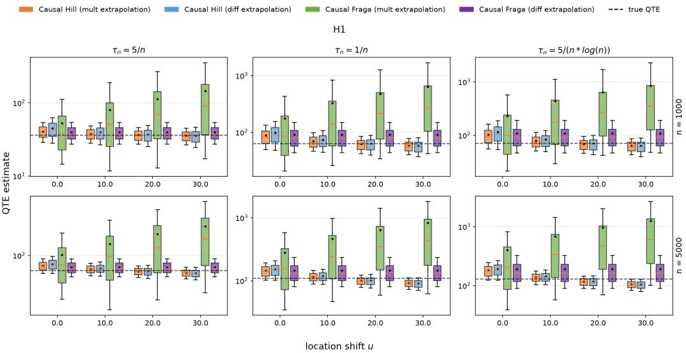  
Figure 2: Quantile treatment effect estimations under the location shift u for model $H _ { 1 }$ . The boxplot whiskers correspond to the 0.1 and 0.9 quantiles, the orange line is the median, and the black dots are the means.

## 5.2 Simulation Results

Figures 2–4 display the distributions of the QTE estimates across the location shift u for the three models, and highlight the interplay between the EVI estimator and the extrapolation scheme. Only the location-invariant causal Fraga estimator combined with the difference extrapolation yields genuinely location-invariant QTE estimates, whose distribution remains stable as u grows. For the causal Hill estimator with multiplicative extrapolation, both the extreme value index estimator and the intermediate quantile estimator shift with the location offset and in opposite directions, so the net change of the resulting QTE estimate is somewhat smaller than for its difference-extrapolation counterpart. Finally, the QTE estimates based on the causal Fraga estimator are generally more variable, reflecting the larger variance of the causal Fraga extreme value index estimator itself. Overall, the difference extrapolation effectively reduces the variance inherited from the extreme value index estimator, but it adds an extra variance component stemming from estimating the intermediate quantile at the level $\beta _ { n }$

Figures 5–7 report the mean QTE estimates as a function of the threshold parameter k for the three extreme levels $\tau _ { n }$ and the two sample sizes n. The QTE estimator that combines difference extrapolation with the causal Fraga estimator behaves stably across all three models. In contrast, the two extrapolation variants based on the causal Hill estimator fluctuate considerably under $H _ { 1 }$ and $H _ { 2 } .$ and exhibit pronounced spikes as k increases, with estimates reaching extremely negative values (truncated by the logarithmic scale), reflecting the fact that the Hill extreme value index estimator itself can be highly unstable in certain settings (see the discussion in Fraga Alves [15]). Finally, under multiplicative extrapolation, the high variance of the causal Fraga extreme value index estimator, combined with small values of $k ,$ inflates the variance and hence leads to a large mean bias.

Figures 8–10 display the empirical coverage of the confidence intervals for the three models. The curve labelled “Causal Fraga (asymp $\mathrm { C I } ) ^ { \dag }$ corresponds to the difference extrapolation estimator combined with the analytical rule of Equation (20); all the other confidence intervals are constructed with the bootstrap procedure. The bootstrap confidence intervals of the difference extrapolation estimator based on the causal Fraga estimator attain coverage close to the nominal level, supporting its asymptotic normality. The analytical confidence interval is closer to the nominal level at $n = 5 0 0 0$ than at $n = 1 0 0 0$ , indicating that the analytical variance estimator requires a larger sample size to converge. For the multiplicative extrapolation based on the causal Fraga estimator, the bootstrap standard error remains inflated at $n = 5 0 0 0$ because of the large variance of the causal Fraga extreme value index estimator itself, resulting in empirical coverages above the nominal level.

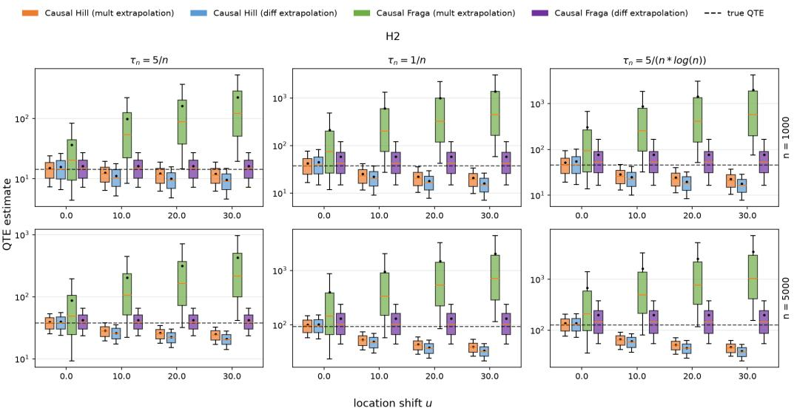

Figure 3: Quantile treatment effect estimations under the location shift u for model $H _ { 2 } .$ The boxplot whiskers correspond to the 0.1 and 0.9 quantiles, the orange line is the median, and the black dots are the means.  
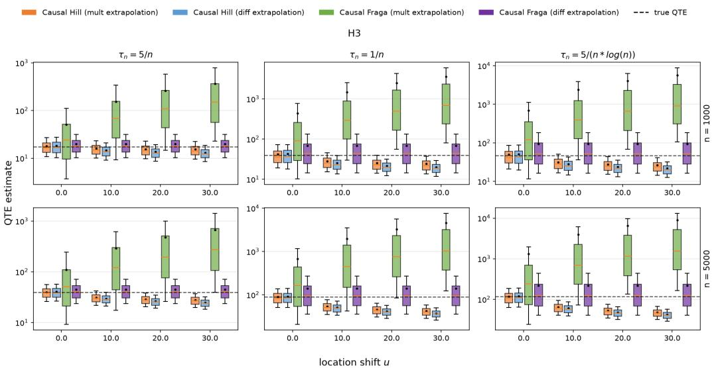  
Figure 4: Quantile treatment effect estimations under the location shift u for model $H _ { 3 } .$ . The boxplot whiskers correspond to the 0.1 and 0.9 quantiles, the orange line is the median, and the black dots are the means.

Figure 11 compares the empirical coverage of the bootstrap confidence intervals of the QTE estimator of Deuber et al. [10] and of the proposed estimator, for model $H _ { 2 }$ with $n = 5 0 0 0$ and $\tau _ { n } = 5 / ( n \log n )$ , as the location shift u increases. The coverage of the Deuber estimator drops rapidly as u grows, whereas that of the proposed estimator remains stable. Additional results on the sensitivity of the QTE estimators to the location shift u and to the choice of k are deferred to Section C.

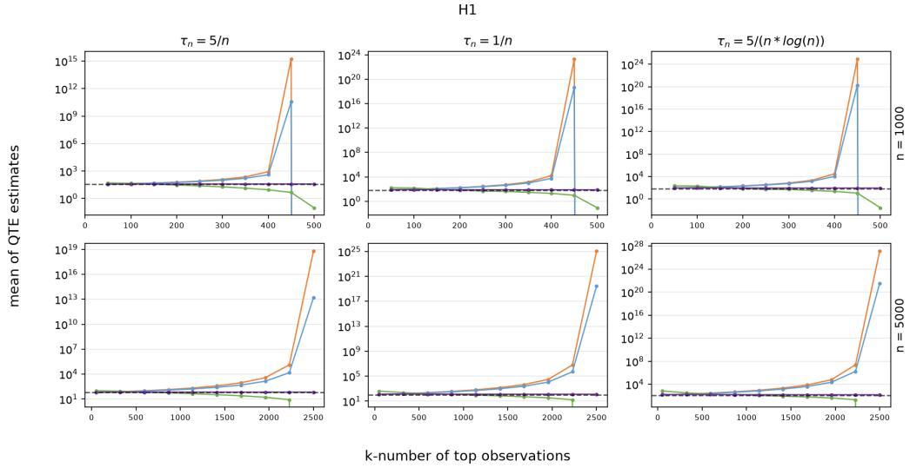

Figure 5: Mean of the quantile treatment effect estimations as a function of the threshold parameter k for model H1.  
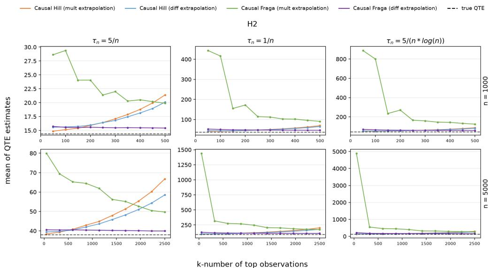  
Figure 6: Mean of the quantile treatment effect estimations as a function of the threshold parameter k for model H .

## 6 Conclusion

We proposed a location-invariant estimator of the extremal quantile treatment effect under unconfoundedness. Building on the classical location-invariant extreme value index estimator of Fraga Alves [15], we constructed the causal Fraga estimator by inverse propensity score weighting, and combined it with a difference extrapolation scheme in which the location parameter cancels in the differences of the intermediate quantiles. We established the consistency and asymptotic normality of the causal Fraga estimator, the asymptotic normality of the resulting extremal QTE estimator, and the consistency of an analytical variance estimator, which yields asymptotically honest confidence intervals. Through a simulation study we verified the location invariance of the proposed estimator, its stability as a function of the threshold k, and the coverage of the associated confidence intervals.

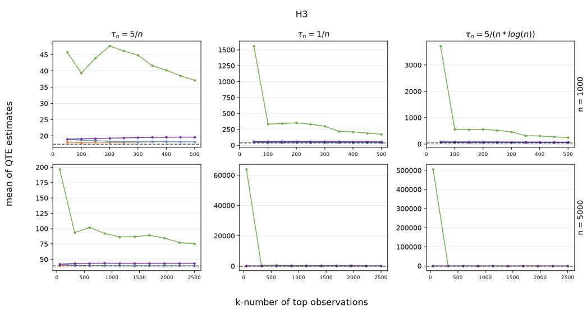

Figure 7: Mean of the quantile treatment effect estimations as a function of the threshold parameter k for model $H _ { 3 }$  
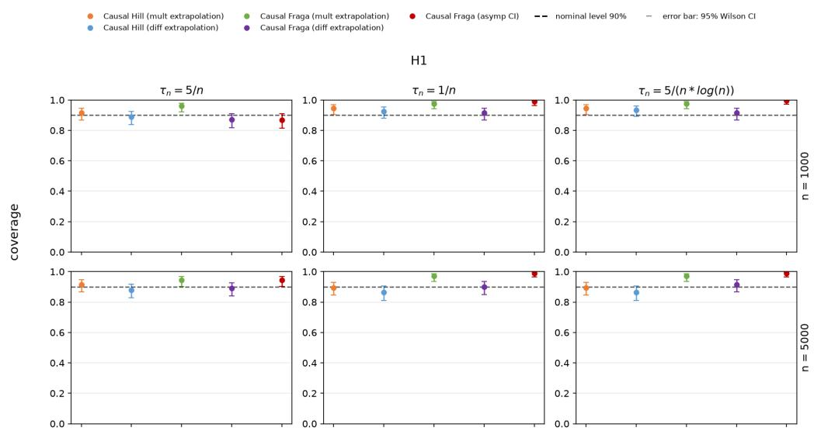  
Figure 8: Empirical coverage of the confidence intervals for the quantile treatment effect for model $H _ { 1 }$

The present work also suggests two directions for future research. First, the Fraga-type estimator is known to have a relatively large variance by construction. Embedding causal counterparts of other location-invariant extreme value index estimators with better variance properties into our framework is a promising avenue for improving the precision of the extremal QTE estimator. Second, the difference extrapolation scheme requires an additional auxiliary level $\beta _ { n }$ , and the choice of $\beta _ { n }$ currently follows an adaptive rule without a formal optimality theory. A thorough investigation of how to choose $\beta _ { n }$ is another potential direction, with the goal of a data-driven rule balancing the bias and variance of the extrapolation.

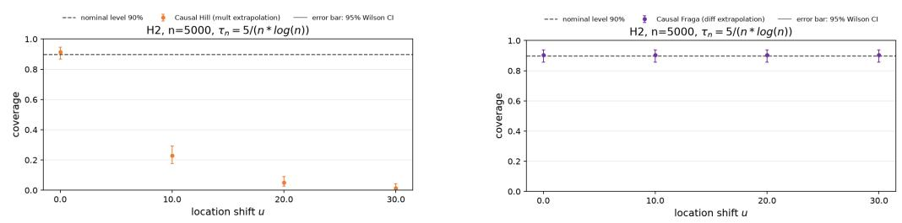

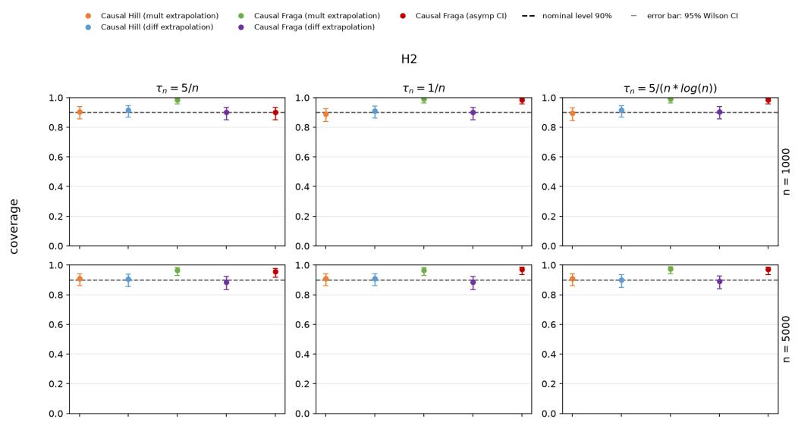

Figure 9: Empirical coverage of the confidence intervals for the quantile treatment effect for model $H _ { 2 } .$  
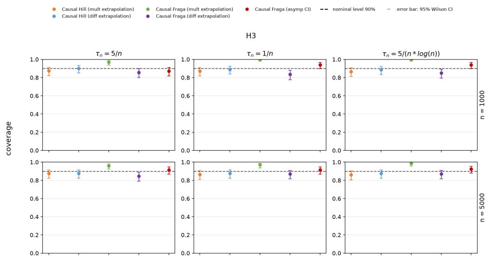  
Figure 10: Empirical coverage of the confidence intervals for the quantile treatment effect for model $H _ { 3 }$  
Figure 11: Empirical coverage of the bootstrap confidence intervals of the QTE estimator of Deuber et al. (left) and of the proposed QTE estimator (right), under the location shift u for model $H _ { 2 }$ with $n = 5 0 0 0$ and $\tau _ { n } = 5 / ( n \log n )$

## References

[1] A. Abadie, J. Angrist, and G. Imbens. Instrumental variables estimates of the effect of subsidized training on the quantiles of trainee earnings. Econometrica, 70(1):91–117, 2002.

[2] D. H. Autor, A. Manning, and C. L. Smith. The contribution of the minimum wage to us wage inequality over three decades: A reassessment. American Economic Journal: Applied Economics, 8(1):58–99, 2016.

[3] P. Bhuyan, E. J. McCoy, H. Li, and D. J. Graham. Analysing the causal effect of london cycle superhighways on traffic congestion. Annals of Applied Statistics, 15(4):1999–2022, 2021.

[4] M. P. Bitler, J. B. Gelbach, and H. W. Hoynes. What mean impacts miss: Distributional effects of welfare reform experiments. American Economic Review, 96(4):988–1012, 2006.

[5] V. Chernozhukov and I. Fernández-Val. Inference for extremal conditional quantile models, with an application to market and birthweight risks. The Review of Economic Studies, 78(2):559–589, 2011.

[6] Harald Cramér and Herman Wold. Some theorems on distribution functions. Journal of the London Mathematical Society, s1-11(4):290–294, 1936.

[7] Laurens De Haan and Ana Ferreira. Extreme value theory: an introduction. Springer, 2006.

[8] A. L. M. Dekkers, J. H. J. Einmahl, and L. de Haan. A moment estimator for the index of an extreme-value distribution. The Annals ofStatistics, 17(4):1833–1855, 1989.

[9] Arnold L. M. Dekkers and Laurens de Haan. On the estimation of the extreme-value index and large quantile estimation. The Annals ofStatistics, 17(4):1795–1832, 1989.

[10] D. Deuber, J. Li, S. Engelke, and M. H. Maathuis. Estimation and inference of extremal quantile treatment effects for heavy-tailed distributions. Journal of the American Statistical Association, 119(547):2206–2216, 2024.

[11] R. Durrett. Probability: theory and examples. Cambridge University Press, 5 edition, 2019.

[12] D. R. Easterling, K. E. Kunkel, M. F. Wehner, and L. Sun. Detection and attribution of climate extremes in the observed record. Weather and Climate Extremes, 11:17–27, 2016.

[13] Paul Embrechts, Claudia Klüppelberg, and Thomas Mikosch. Modelling Extremal Events. Springer, 1997.

[14] S. Firpo. Efficient semiparametric estimation of quantile treatment effects. Econometrica, 75(1):259–276, 2007.

[15] M. Fraga Alves. A location invariant hill-type estimator. Extremes, 4(3):199–217, 2001.

[16] M. I. Fraga Alves, M. I. Gomes, L. de Haan, and C. Neves. A note on second order conditions in extreme value theory: linking general and heavy tail conditions. REVSTAT Statistical Journal, 5(3):285–304, 2007.

[17] N. Gissibl and C. Klüppelberg. Max-linear models on directed acyclic graphs. Bernoulli, 24(4A):2693–2720, 2018.

[18] N. Gissibl, C. Klüppelberg, and M. Otto. Tail dependence of recursive max-linear models with regularly varying noise variables. Econometrics and Statistics, 6:149–167, 2018.

[19] N. Gnecco, N. Meinshausen, J. Peters, and S. Engelke. Causal discovery in heavy-tailed models. The Annals ofStatistics, 49(3):1755–1778, 2021.

[20] A. Hannart, J. Pearl, F. E. L. Otto, P. Naveau, and M. Ghil. Causal counterfactual theory for the attribution of weather and climate-related events. Bulletin ofthe American Meteorological Society, 97(1):99–110, 2016.

[21] Bruce M. Hill. A simple general approach to inference about the tail of a distribution. The Annals ofStatistics, 3(5):1163–1174, 1975.

[22] Keisuke Hirano, Guido W. Imbens, and Geert Ridder. Efficient estimation of average treatment effects using the estimated propensity score. Econometrica, 71(4):1161–1189, 2003.

[23] J. Li, Z. Peng, and S. Nadarajah. Asymptotic normality of location invariant heavy tail index estimator. Extremes, 13(3):269–290, 2010.

[24] C. Ling, Z. Peng, and S. Nadarajah. Location invariant weiss-hill estimator. Extremes, 15(2):197– 230, 2012.

[25] H. B. Mann and A. Wald. On stochastic limit and order relationships. The Annals ofMathematical Statistics, 14(3):217–226, 1943.

[26] L. Mhalla, V. Chavez-Demoulin, and D. J. Dupuis. Causal mechanism of extreme river discharges in the upper danube basin network. Journal of the Royal Statistical Society: Series C (Applied Statistics), 69(4):741–764, 2020.

[27] P. Naveau, A. Hannart, and A. Ribes. Statistical methods for extreme event attribution in climate science. Annual Review ofStatistics and Its Application, 7(1):89–110, 2020.

[28] P. Naveau, A. Ribes, F. Zwiers, A. Hannart, A. Tuel, and P. Yiou. Revising return periods for record events in a climate event attribution context. Journal ofClimate, 31(9):3411–3422, 2018.

[29] J. Pickands III. Statistical inference using extreme order statistics. The Annals of Statistics, 3(1):119–131, 1975.

[30] Sidney I Resnick. Heavy-tail phenomena: probabilistic and statistical modeling. Springer, 2007.

[31] P. R. Rosenbaum and D. B. Rubin. The central role of the propensity score in observational studies for causal effects. Biometrika, 70(1):41–55, 1983.

[32] A. W. van der Vaart. Asymptotic Statistics. Cambridge Series in Statistical and Probabilistic Mathematics. Cambridge University Press, 1998.

[33] G. J. van Oldenborgh, K. van der Wiel, A. Sebastian, R. Singh, J. Arrighi, F. Otto, K. Haustein, S. Li, G. Vecchi, and H. Cullen. Attribution of extreme rainfall from hurricane harvey, august 2017. Environmental Research Letters, 12(12):124009, 2017.

[34] Y. Zhang. Extremal quantile treatment effects. The Annals of Statistics, 46(6B):3707–3740, 2018.

## A Proofs

## A.1 Asymptotic Theory

This subsection lays down the asymptotic foundations used to prove the asymptotic properties of the estimators proposed in the main text. Because our analysis involves triangular arrays of random variables $\{ \bar { Y } _ { n , k } : 1 \leq k \leq n , n \geq 1 \}$ , the classical law of large numbers and central limit theorem for i.i.d. sequences no longer apply directly. We therefore recall the weak law of large numbers and the Lindeberg central limit theorem for triangular arrays [11], together with the continuous mapping theorem (also known as the Mann–Wald theorem [25]) that will be invoked repeatedly in the subsequent proofs.

We first collect the relationships and arithmetic rules among the order symbols $o _ { p } ( 1 )$ and $O _ { p } ( 1 )$ that are used throughout the paper.

(i) If $Y _ { n } = o _ { p } ( 1 )$ as $n  + \infty ,$ then $Y _ { n } = O _ { p } ( 1 )$ as $n  + \infty$

$$
\mathrm { ( i i ) } o _ { p } ( 1 ) + o _ { p } ( 1 ) = o _ { p } ( 1 ) , o _ { p } ( 1 ) + O _ { p } ( 1 ) = O _ { p } ( 1 ) , O _ { p } ( 1 ) + O _ { p } ( 1 ) = O _ { p } ( 1 ) .
$$

$$
\mathrm { ( i i i ) } o _ { p } ( 1 ) o _ { p } ( 1 ) = o _ { p } ( 1 ) , o _ { p } ( 1 ) O _ { p } ( 1 ) = o _ { p } ( 1 ) , \quad O _ { p } ( 1 ) O _ { p } ( 1 ) = O _ { p } ( 1 ) .
$$

We next state the weak law of large numbers for triangular arrays. Note that, unlike the Lindeberg central limit theorem presented next, the weak law does not require the random variables within the same row to be mutually independent.

Theorem A.1 (Weak law of large numbers for triangular arrays [11]). Let $\begin{array} { r } { S _ { n } \ = \ \sum _ { k = 1 } ^ { n } Y _ { n , k } , } \end{array}$ $\mu _ { n } = \mathbb { E } ( S _ { n } )$ and $\sigma _ { n } ^ { 2 } = \operatorname { V a r } ( S _ { n } )$ . Ifthere exists a sequence $\{ a _ { n } \}$ such that $\sigma _ { n } ^ { 2 } / a _ { n } ^ { 2 } \to 0 a s n \to + \infty ,$ then

$$
{ \frac { S _ { n } - \mu _ { n } } { a _ { n } } } { \overset { p } {  } } 0 .
$$

Theorem A.2 (Lindeberg central limit theorem for triangular arrays [11]). For each $n \in \mathbb { Z } ^ { + } ,$ , let $\{ Y _ { n , k } : 1 \leq k \leq n \}$ } be independent random variables with $\mathbb { E } ( Y _ { n , k } ) = 0 .$ . Define $\sigma _ { n , k } ^ { 2 } = \mathbb { E } ( Y _ { n , k } ^ { 2 } )$ $\textstyle S _ { n } = \sum _ { k = 1 } ^ { n } Y _ { n , k }$ and $\begin{array} { r } { T _ { n } ^ { 2 } = \mathrm { V a r } ( S _ { n } ) = \sum _ { k = 1 } ^ { n } \sigma _ { n , k } ^ { 2 } . } \end{array}$ . If the following Lindeberg condition holds: for every $\epsilon > 0 _ { ; }$

$$
\frac { 1 } { T _ { n } ^ { 2 } } \sum _ { k = 1 } ^ { n } \mathbb { E } \big ( Y _ { n , k } ^ { 2 } \mathbf { 1 } _ { \{ | Y _ { n , k } | > \epsilon T _ { n } \} } \big ) \to 0 , \quad n \to + \infty ,
$$

then

$$
{ \frac { S _ { n } } { T _ { n } } } \ { \overset { d } { \to } } \ N ( 0 , 1 ) .
$$

We conclude this section with the continuous mapping theorem (Mann–Wald theorem), which allows the limit function to be discontinuous, provided the random variables fall in the discontinuity set with probability zero.

Theorem A.3 (Continuous mapping theorem [25]). Let $Y _ { 1 } , Y _ { 2 } , . . .$ . be k-dimensional random vectors and let $f : \mathbb { R } ^ { k }  \mathbb { R } ^ { l }$ be continuous almost everywhere. Then

(i) $I f Y _ { n } \stackrel { p } { \to } Y ,$ then $f ( Y _ { n } ) \ { \overset { p } { \to } } \ f ( Y )$

(ii) $I f Y _ { n } \stackrel { d } { \to } Y ,$ then $f ( Y _ { n } ) \stackrel { d } { \to } f ( Y ) .$

We next state Slutsky’s theorem, which is used throughout the paper to combine convergence in distribution with convergence in probability to a constant [32].

Theorem A.4 (Slutsky’s theorem [32]). Let $X _ { n } , Y _ { n }$ be random variables and $c \in \mathbb { R }$ a constant. Then thefollowing statements are equivalent:

(i) $X _ { n } \overset { d } { \to } c$ if and only $i f X _ { n } \stackrel { p } { \to } c ;$

(ii) $i f X _ { n } \stackrel { d } { \to } X$ and the Lévy–Prokhorov distance satisfies $d ( X _ { n } , Y _ { n } ) \ \xrightarrow { p }$ 0, then $Y _ { n } \stackrel { d } { \to } X$

(iii) $i f X _ { n } \xrightarrow { d } X$ and $Y _ { n } \overset { p } {  } c ,$ , then $( X _ { n } , Y _ { n } ) \stackrel { d } { \to } ( X , c )$

## A.2 Proof of Theorem 1

Lemma A.1. Let Assumption 1 hold, and let $f \geq 0$ be a measurablefunction with $\mathbb { E } \big ( f ( Y ( 1 ) ) \big ) \ : <$ +∞ and $\mathbb { E } \big ( f ( Y ( 0 ) ) \big ) < + \infty$ . For any $r \in \mathbb { Z } ^ { + }$ , we have the uniform bounds

$$
\frac { 1 } { ( 1 - c ) ^ { r - 1 } } \mathbb { E } \big ( f ^ { r } ( Y ( 1 ) ) \big ) \leq \mathbb { E } \bigg ( \bigg ( f ( Y ) \frac { D } { \pi ( X ) } \bigg ) ^ { r } \bigg ) \leq \frac { 1 } { c ^ { r - 1 } } \mathbb { E } \big ( f ^ { r } ( Y ( 1 ) ) \big ) ,
$$

$$
{ \frac { 1 } { ( 1 - c ) ^ { r - 1 } } } \mathbb { E } { \bigl ( } f ^ { r } ( Y ( 0 ) ) { \bigr ) } \leq \mathbb { E } { \biggl ( } { \biggl ( } f ( Y ) { \frac { 1 - D } { 1 - \pi ( X ) } } { \biggr ) } ^ { r } { \biggr ) } \leq { \frac { 1 } { c ^ { r - 1 } } } \mathbb { E } { \bigl ( } f ^ { r } ( Y ( 0 ) ) { \bigr ) } .
$$

When $r = 1$ , equality is attained in both cases:

$$
\mathbb { E } \bigg ( f ( Y ) \frac { D } { \pi ( X ) } \bigg ) = \mathbb { E } \big ( f ( Y ( 1 ) ) \big ) , \qquad \mathbb { E } \bigg ( f ( Y ) \frac { 1 - D } { 1 - \pi ( X ) } \bigg ) = \mathbb { E } \big ( f ( Y ( 0 ) ) \big ) .
$$

ProofofLemma A.1. We prove the bound for the first inequality $( r \in \mathbb { Z } ^ { + } )$ only; the second follows by symmetry, and the $r = 1$ equalities are obtained by noting that the inequality step below becomes an identity. By the law of total expectation,

$$
\mathbb { E } \left( \left( f ( Y ) { \frac { D } { \pi ( X ) } } \right) ^ { r } \right) = \mathbb { E } _ { X } \left( { \frac { 1 } { \pi ( X ) ^ { r } } } \ \mathbb { E } { \big ( } f ( Y ) ^ { r } D \mid X { \big ) } \right) .
$$

Since $Y = D Y ( 1 ) + ( 1 - D ) Y ( 0 )$ and $D \in \{ 0 , 1 \} , f ( Y ) ^ { r } D = f ( Y ( 1 ) ) ^ { r } D $ , hence

$$
\mathbb { E } _ { X } \left( \frac { 1 } { \pi ( X ) ^ { r } } \mathbb { E } \big ( f ( Y ) ^ { r } D \mid X \big ) \right) = \mathbb { E } _ { X } \left( \frac { 1 } { \pi ( X ) ^ { r } } \mathbb { E } \big ( f ( Y ( 1 ) ) ^ { r } D \mid X \big ) \right) .
$$

By Assumption 1 (unconfoundedness), $( Y ( 1 ) , Y ( 0 ) ) \bot D \mid X$ , so the inner conditional expectation factorises as

$$
\mathbb { E } \big ( f ( Y ( 1 ) ) ^ { r } D \mid X \big ) = \mathbb { E } \big ( f ( Y ( 1 ) ) ^ { r } \mid X \big ) \ \mathbb { E } ( D \mid X ) .
$$

Using $\mathbb { E } ( D \mid X ) = \pi ( X )$ , the factor $\pi ( X )$ cancels one power in the denominator:

$$
\mathbb { E } _ { X } \left( \frac { 1 } { \pi ( X ) ^ { r } } \mathbb { E } \big ( f ( Y ( 1 ) ) ^ { r } \mid X \big ) \pi ( X ) \right) = \mathbb { E } _ { X } \left( \frac { 1 } { \pi ( X ) ^ { r - 1 } } \mathbb { E } \big ( f ( Y ( 1 ) ) ^ { r } \mid X \big ) \right) .
$$

From Assumption 1 (common support), $c \leq \pi ( X ) \leq 1 - c$ almost surely, hence $( 1 - c ) ^ { - ( r - 1 ) } \leq$ $1 / \pi ( X ) ^ { r - 1 } \leq c ^ { - ( r - 1 ) }$ . Applying these bounds to the expression after cancellation gives the twosided inequality

$$
\mathbb { E } _ { X } \left( { \frac { 1 } { \pi ( X ) ^ { r - 1 } } } \mathbb { E } { \big ( } f ( Y ( 1 ) ) ^ { r } \mid X { \big ) } \right) \geq { \frac { 1 } { ( 1 - c ) ^ { r - 1 } } } \mathbb { E } { \big ( } f ^ { r } ( Y ( 1 ) ) { \big ) } ,
$$

$$
\mathbb { E } _ { X } \left( { \frac { 1 } { \pi ( X ) ^ { r - 1 } } } \mathbb { E } { \big ( } f ( Y ( 1 ) ) ^ { r } \mid X { \big ) } \right) \leq { \frac { 1 } { c ^ { r - 1 } } } \mathbb { E } { \big ( } f ^ { r } ( Y ( 1 ) ) { \big ) } ,
$$

which is the claimed two-sided bound. When $r = 1$ , both bounds collapse to 1 and the factor $1 / \pi ( X ) ^ { r - 1 }$ equals 1, so cancellation with the $\pi ( X )$ factor from $\mathbb { E } ( D \mid X )$ leaves

$$
\begin{array} { r l } & { \mathbb { E } _ { X } \bigg ( \frac { 1 } { \pi \left( X \right) } \mathbb { E } \big ( f ( Y ( 1 ) ) D \mid X \big ) \bigg ) } \\ & { = \mathbb { E } _ { X } \bigg ( \frac { 1 } { \pi \left( X \right) } \mathbb { E } \big ( f ( Y ( 1 ) ) \mid X \big ) \pi ( X ) \bigg ) } \\ & { = \mathbb { E } _ { X } \bigg ( \mathbb { E } \big ( f ( Y ( 1 ) ) \mid X \big ) \bigg ) = \mathbb { E } \big ( f ( Y ( 1 ) ) \big ) . } \end{array}
$$

Lemma A.2. Let Assumptions 1 and 3 hold. For $j \in \{ 0 , 1 \}$ , let $Y _ { 1 } ( j ) , Y _ { 2 } ( j ) , \dots , Y _ { n } ( j )$ be $i . i . d .$ copies of the potential outcome $Y ( j )$ , with cumulative distribution function $F _ { j }$ and tail quantile function $\begin{array} { r } { U _ { j } ( \dot { x } ) = \big ( \frac { 1 } { 1 - F _ { i } } \big ) ^ {  } ( x ) } \end{array}$ . Define $\begin{array} { r } { Z _ { i } ( j ) = \frac { 1 } { 1 - F _ { j } ( Y _ { i } ( j ) ) } f o r i \in \{ 1 , 2 , . . . , n \} } \end{array}$ . As $n  + \infty ,$ assume $\beta _ { n }  0$ with $k _ { 0 } { \overset { \cdot } { = } } n \beta _ { n } \to + \infty$ . Then

$$
\frac { 1 } { k _ { 0 } } \sum _ { i = 1 } ^ { n } \frac { D _ { i } } { \pi ( X _ { i } ) } \mathbf { 1 } _ { \{ Y _ { i } > q _ { 1 } ( 1 - \beta _ { n } ) \} } \stackrel { p } {  } 1 ,\tag{A.1}
$$

$$
{ \frac { 1 } { k _ { 0 } } } \sum _ { i = 1 } ^ { n } { \frac { 1 - D _ { i } } { 1 - \pi ( X _ { i } ) } } { \bf 1 } _ { \{ Y _ { i } > q _ { 0 } ( 1 - \beta _ { n } ) \} } \stackrel { p } {  } 1 ,\tag{A.2}
$$

$$
\frac { 1 } { k _ { 0 } } \sum _ { i = 1 } ^ { n } \frac { D _ { i } } { \pi ( X _ { i } ) } { \bf 1 } _ { \{ Y _ { i } > q _ { 1 } ( 1 - \beta _ { n } ) \} } \log ( Z _ { i } ( 1 ) \beta _ { n } ) \stackrel { p } {  } 1 ,\tag{A.3}
$$

$$
\frac { 1 } { k _ { 0 } } \sum _ { i = 1 } ^ { n } \frac { 1 - D _ { i } } { 1 - \pi ( X _ { i } ) } { \mathbf 1 } _ { \{ Y _ { i } > q _ { 0 } ( 1 - \beta _ { n } ) \} } \log \bigl ( Z _ { i } ( 0 ) \beta _ { n } \bigr ) \stackrel { p } { \to } 1 .\tag{A.4}
$$

Proof of Lemma A.2. We prove Equation (A.1) and Equation $( \mathrm { A } . 3 ) ;$ the control-arm counterparts $( \mathrm { A } . 2 )$ and (A.4) follow by replacing D with $1 - D$ and ${ \bar { \pi } } ( X )$ with $1 - \pi ( X )$ throughout.

Proof of Equation (A.1). Define

$$
S _ { n , 1 } = \sum _ { i = 1 } ^ { n } { \frac { D _ { i } } { \pi ( X _ { i } ) } } \mathbf { 1 } _ { \left\{ Y _ { i } > q _ { 1 } ( 1 - \beta _ { n } ) \right\} } .
$$

By the consistency relation $Y _ { i } = D _ { i } Y _ { i } ( 1 ) + ( 1 - D _ { i } ) Y _ { i } ( 0 )$ , the summand vanishes unless $D _ { i } = 1$ in which case $Y _ { i } \stackrel { \cdot } { = } Y _ { i } ( 1 )$ and

$$
S _ { n , 1 } = \sum _ { i = 1 } ^ { n } \frac { D _ { i } } { \pi ( X _ { i } ) } \mathbf { 1 } _ { \left\{ Y _ { i } ( 1 ) > q _ { 1 } ( 1 - \beta _ { n } ) \right\} } .
$$

Applying Lemma A.1 with $r = 1$ and $f = \mathbf { 1 } _ { \left\{ Y > q _ { 1 } ( 1 - \beta _ { n } ) \right\} } \geq 0$ gives

$$
\mathbb { E } \bigg [ \frac { D _ { i } } { \pi ( X _ { i } ) } \mathbf { 1 } _ { \{ Y _ { i } ( 1 ) > q _ { 1 } ( 1 - \beta _ { n } ) \} } \bigg ] = \mathbb { P } \big ( Y ( 1 ) > q _ { 1 } ( 1 - \beta _ { n } ) \big ) = \beta _ { n } .
$$

Applying the lemma again with $r = 2$ yields

$$
\mathbb { E } \left[ \left( { \frac { D _ { i } } { \pi ( X _ { i } ) } } \mathbf { 1 } _ { \left\{ Y _ { i } ( 1 ) > q _ { 1 } ( 1 - \beta _ { n } ) \right\} } \right) ^ { 2 } \right] \leq { \frac { 1 } { c } } \mathbb { P } ( Y ( 1 ) > q _ { 1 } ( 1 - \beta _ { n } ) ) = { \frac { \beta _ { n } } { c } } .
$$

Hence $\mathbb { E } ( S _ { n , 1 } ) = n \beta _ { n } = k _ { 0 }$ . Moreover,

$$
\begin{array} { r l r } { \left. { \frac { \mathrm { V a r } ( S _ { n , 1 } ) } { k _ { 0 } ^ { 2 } } \le \frac { n } { k _ { 0 } ^ { 2 } } \mathbb { E } \Bigg [ \bigg ( \frac { D _ { i } } { \pi ( X _ { i } ) } \mathbf { 1 } _ { \{ Y _ { i } ( 1 ) > q _ { 1 } ( 1 - \beta _ { n } ) \} } \bigg ) ^ { 2 } \Bigg ] } }  \\ & { } & { \le \frac { n } { k _ { 0 } ^ { 2 } } \cdot \frac { \beta _ { n } } { c } = \frac { 1 } { n \beta _ { n } c } \ \right. \ 0 , } \end{array}
$$

where the first inequality uses the standard bound $\operatorname { V a r } ( S _ { n , 1 } ) \leq n \mathbb { E } [ \operatorname { s u m m a n d } ^ { 2 } ]$ for independent summands. By the weak law of large numbers for triangular arrays (Theorem $\mathrm { A . 1 } )$ applied with $a _ { n } = k _ { 0 }$

$$
{ \frac { S _ { n , 1 } - \mathbb { E } ( S _ { n , 1 } ) } { k _ { 0 } } } = { \frac { S _ { n , 1 } - k _ { 0 } } { k _ { 0 } } } \ { \overset { p } {  } } \ 0 .
$$

Substituting $\mathbb { E } ( S _ { n , 1 } ) = k _ { 0 }$ , we obtain

$$
{ \frac { 1 } { k _ { 0 } } } \sum _ { i = 1 } ^ { n } { \frac { D _ { i } } { \pi ( X _ { i } ) } } { \mathbf { 1 } } _ { \{ Y _ { i } > q _ { 1 } ( 1 - \beta _ { n } ) \} } = { \frac { S _ { n , 1 } } { k _ { 0 } } } \ { \overset { p } {  } } \ 1 ,
$$

which is Equation (A.1).

Proof of Equation (A.3). Define

$$
S _ { n , 2 } = \sum _ { i = 1 } ^ { n } \frac { D _ { i } } { \pi ( X _ { i } ) } { \bf 1 } _ { \{ Y _ { i } > q _ { 1 } ( 1 - \beta _ { n } ) \} } \log \bigl ( { Z _ { i } ( 1 ) \beta _ { n } } \bigr ) ,
$$

where $Z _ { i } ( 1 ) = 1 / ( 1 - F _ { 1 } ( Y _ { i } ( 1 ) ) )$ . The same substitution $Y _ { i } = D _ { i } Y _ { i } ( 1 )$ gives

$$
S _ { n , 2 } = \sum _ { i = 1 } ^ { n } \frac { D _ { i } } { \pi ( X _ { i } ) } \mathbf { 1 } _ { \{ Y _ { i } ( 1 ) > q _ { 1 } ( 1 - \beta _ { n } ) \} } \log \bigl ( Z _ { i } ( 1 ) \beta _ { n } \bigr ) .
$$

Because $F _ { 1 } ( Y _ { i } ( 1 ) ) \sim U ( 0 , 1 )$ under Assumption 3, the random variable $Z _ { i } ( 1 ) = 1 / ( 1 - F _ { 1 } ( Y _ { i } ( 1 ) ) )$ has density

$$
\psi _ { 1 } ( z ) = z ^ { - 2 } , \quad z \ge 1 ,
$$

so that log $Z _ { i } ( 1 )$ follows the standard exponential distribution with density

$$
\psi _ { 2 } ( z ) = e ^ { - z } , \quad z \geq 0 .
$$

By Lemma A.1 with $r = 1$ and the function $f ( y ) = \mathbf { 1 } _ { \left\{ y > q _ { 1 } ( 1 - \beta _ { n } ) \right\} } \log \bigl ( \beta _ { n } / ( 1 - F _ { 1 } ( y ) ) \bigr )$ , which is non-negative on its support, the preceding density gives

$$
\begin{array} { r l r } {  { \mathbb { E } \bigg [ \frac { D _ { i } } { \pi ( X _ { i } ) } { \mathbf 1 } _ { \{ Z _ { i } ( 1 ) > \beta _ { n } ^ { - 1 } \} } \log ( Z _ { i } ( 1 ) \beta _ { n } ) \bigg ] = \mathbb { E } \Big [ { \mathbf 1 } _ { \{ Z _ { i } ( 1 ) > \beta _ { n } ^ { - 1 } \} } \log ( Z _ { i } ( 1 ) \beta _ { n } ) \Big ] } } \\ & { } & { = \int _ { \log ( \beta _ { n } ^ { - 1 } ) } ^ { + \infty } ( z + \log \beta _ { n } ) e ^ { - z } d z } \\ & { } & { = \beta _ { n } , } \end{array}
$$

the last step following because the integral equals $e ^ { - \log ( \beta _ { n } ^ { - 1 } ) } = \beta _ { n }$ . Hence $\mathbb { E } ( S _ { n , 2 } ) = n \beta _ { n } = k _ { 0 }$ Applying Lemma A.1 with $r = 2$ yields

$$
\mathbb E \left[ \left( \frac { D _ { i } } { \pi ( X _ { i } ) } \mathbf { 1 } _ { \left\{ Z _ { i } ( 1 ) > \beta _ { n } ^ { - 1 } \right\} } \log ( Z _ { i } ( 1 ) \beta _ { n } ) \right) ^ { 2 } \right] \leq \frac { 1 } { c } \mathbb E \left[ \mathbf { 1 } _ { \left\{ Z _ { i } ( 1 ) > \beta _ { n } ^ { - 1 } \right\} } \log ^ { 2 } ( Z _ { i } ( 1 ) \beta _ { n } ) \right] = \frac { 2 \beta _ { n } } { c } ,
$$

where the exponential moment is obtained by $\begin{array} { r } { \int _ { \log ( \beta _ { n } ^ { - 1 } ) } ^ { \infty } ( z + \log \beta _ { n } ) ^ { 2 } e ^ { - z } d z = 2 \beta _ { n } } \end{array}$ . Therefore

$$
\frac { \mathrm { V a r } ( S _ { n , 2 } ) } { k _ { 0 } ^ { 2 } } \leq \frac { n } { k _ { 0 } ^ { 2 } } \cdot \frac { 2 \beta _ { n } } { c } = \frac { 2 } { n \beta _ { n } c } \  \ 0 .
$$

Theorem A.1 now yields, with $a _ { n } = k _ { 0 } .$

$$
{ \frac { S _ { n , 2 } - \mathbb { E } ( S _ { n , 2 } ) } { k _ { 0 } } } = { \frac { S _ { n , 2 } - k _ { 0 } } { k _ { 0 } } } \ { \overset { p } {  } } \ 0 .
$$

Substituting $\mathbb { E } ( S _ { n , 2 } ) = k _ { 0 }$ , we obtain

$$
\frac { 1 } { k _ { 0 } } \sum _ { i = 1 } ^ { n } \frac { D _ { i } } { \pi ( X _ { i } ) } { \bf 1 } _ { \{ Y _ { i } > q _ { 1 } ( 1 - \beta _ { n } ) \} } \log \bigl ( Z _ { i } ( 1 ) \beta _ { n } \bigr ) = \frac { S _ { n , 2 } } { k _ { 0 } } \stackrel { p } {  } 1 ,
$$

i.e., Equation (A.3).

Lemma A.3. Let Assumptions 1, 2 and 3 hold. Denote by $\widehat { q } _ { j } ( 1 - \beta _ { n } )$ the $\tau = 1 - \beta _ { n }$ quantile estimator ofthe potential outcome $Y ( j )$ constructed in Equation (6). As $n  + \infty ,$ , assume $\beta _ { n } \to 0$ with $k _ { 0 } = n \beta _ { n } \to + \infty$ . Then

$$
\frac { 1 } { k _ { 0 } } \sum _ { i = 1 } ^ { n } \frac { D _ { i } } { \widehat { \pi } ( X _ { i } ) } ( { \bf 1 } _ { \{ Y _ { i } > \widehat { q } _ { 1 } ( 1 - \beta _ { n } ) \} } - { \bf 1 } _ { \{ Y _ { i } > q _ { 1 } ( 1 - \beta _ { n } ) \} } ) \stackrel { p } {  } 0 ,\tag{A.5}
$$

$$
\frac { 1 } { k _ { 0 } } \sum _ { i = 1 } ^ { n } \frac { 1 - D _ { i } } { 1 - \widehat { \pi } ( X _ { i } ) } \left( { \mathbf { 1 } } _ { \left\{ Y _ { i } > \widehat { q } _ { 0 } ( 1 - \beta _ { n } ) \right\} } - { \mathbf { 1 } } _ { \left\{ Y _ { i } > q _ { 0 } ( 1 - \beta _ { n } ) \right\} } \right) \xrightarrow { p } 0 .\tag{A.6}
$$

ProofofLemma A.3. We prove Equation $( \mathrm { A } . 5 ) ;$ ; the control-arm statement (A.6) follows by the symmetric substitution of D with $\bar { 1 - D }$ and π with $1 - \widehat { \pi }$ throughout.

Setting $j = 1$ and $\tau = 1 - \beta _ { n }$ in Equation (6) gives

$$
\widehat { q } _ { 1 } ( 1 - \beta _ { n } ) = \underset { q \in \mathbb { R } } { \mathrm { a r g m i n } } \sum _ { i = 1 } ^ { n } \frac { D _ { i } } { \widehat { \pi } ( X _ { i } ) } \left( Y _ { i } - q \right) \left( \left( 1 - \beta _ { n } \right) - \mathbf { 1 } _ { \left\{ Y _ { i } \leq q \right\} } \right) .
$$

Denote the objective by $L _ { n } ( q )$ . Since $Y _ { i }$ is continuous under Assumption $3 , L _ { n } ( q )$ is piecewise linear and differentiable at $q = \widehat { q } _ { 1 } ( 1 - \beta _ { n } )$ almost surely. The first-order condition gives

$$
L _ { n } ^ { \prime } \big ( \widehat { q } _ { 1 } ( 1 - \beta _ { n } ) \big ) = - ( 1 - \beta _ { n } ) \sum _ { i = 1 } ^ { n } \frac { D _ { i } } { \widehat { \pi } ( X _ { i } ) } + \sum _ { i = 1 } ^ { n } \frac { D _ { i } } { \widehat { \pi } ( X _ { i } ) } \mathbf { 1 } _ { \{ Y _ { i } \leq \widehat { q } _ { 1 } ( 1 - \beta _ { n } ) \} } = 0 .
$$

Combining with ${ \bf 1 } _ { \{ Y _ { i } \leq q \} } + { \bf 1 } _ { \{ Y _ { i } > q \} } = 1$ and $k _ { 0 } = n \beta _ { n }$ yields the identity

$$
\sum _ { i = 1 } ^ { n } \frac { D _ { i } } { \widehat { \pi } ( X _ { i } ) } { \bf 1 } _ { \left\{ Y _ { i } > \widehat { q } _ { 1 } ( 1 - \beta _ { n } ) \right\} } = \beta _ { n } \sum _ { i = 1 } ^ { n } \frac { D _ { i } } { \widehat { \pi } ( X _ { i } ) } .
$$

(a.s.).

Crucially, this identity is purely algebraic and requires no asymptotic assumptions.

$$
\begin{array} { r l r } {  {  \frac { 1 } { k _ { 0 } } \sum _ { i = 1 } ^ { n } \frac { D _ { i } } { \widehat { \pi } ( X _ { i } ) } ( { \mathbf { 1 } } _ { \{ Y _ { i } > \widehat { \mathcal { G } } _ { 1 } ( 1 - \beta _ { n } ) \} } - { \mathbf { 1 } } _ { \{ Y _ { i } > \mathcal { G } _ { 1 } ( 1 - \beta _ { n } ) \} } )  } } \\ & { } & { \leq \underbrace {  \frac { 1 } { k _ { 0 } } \sum _ { i = 1 } ^ { n } \frac { D _ { i } } { \widehat { \pi } ( X _ { i } ) } ( { \mathbf { 1 } } _ { \{ Y _ { i } > \widehat { \mathcal { G } } _ { 1 } ( 1 - \beta _ { n } ) \} } - \beta _ { n } )  } _ { T _ { n , 1 } } + \underbrace {  \frac { 1 } { k _ { 0 } } \sum _ { i = 1 } ^ { n } \frac { D _ { i } } { \widehat { \pi } ( X _ { i } ) } ( { \mathbf { 1 } } _ { \{ Y _ { i } > \mathcal { G } _ { 1 } ( 1 - \beta _ { n } ) \} } - \beta _ { n } )  } _ { T _ { n , 2 } } . } \end{array}
$$

By the identity above,

$$
T _ { n , 1 } = \left| \frac { 1 } { k _ { 0 } } \beta _ { n } \sum _ { i = 1 } ^ { n } \frac { D _ { i } } { \widehat { \pi } ( X _ { i } ) } - \frac { \beta _ { n } } { k _ { 0 } } \sum _ { i = 1 } ^ { n } \frac { D _ { i } } { \widehat { \pi } ( X _ { i } ) } \right| = 0
$$

Moreover, using $k _ { 0 } = n \beta _ { n }$ , write $T _ { n , 2 } = | T _ { n , 2 } ^ { ( 1 ) } - T _ { n , 2 } ^ { ( 2 ) } |$ with

$$
T _ { n , 2 } ^ { ( 1 ) } : = \frac { 1 } { k _ { 0 } } \sum _ { i = 1 } ^ { n } \frac { D _ { i } } { \widehat { \pi } ( X _ { i } ) } \mathbf { 1 } _ { \{ Y _ { i } > q _ { 1 } ( 1 - \beta _ { n } ) \} } , \qquad T _ { n , 2 } ^ { ( 2 ) } : = \frac { \beta _ { n } } { k _ { 0 } } \sum _ { i = 1 } ^ { n } \frac { D _ { i } } { \widehat { \pi } ( X _ { i } ) } = \frac { 1 } { n } \sum _ { i = 1 } ^ { n } \frac { D _ { i } } { \widehat { \pi } ( X _ { i } ) } .
$$

For $T _ { n , 2 } ^ { ( 1 ) }$ , Lemma $\mathrm { A } . 2$ (Equation (A.1)) gives

$$
{ \frac { 1 } { k _ { 0 } } } \sum _ { i = 1 } ^ { n } { \frac { D _ { i } } { \pi ( X _ { i } ) } } \mathbf { 1 } _ { \{ Y _ { i } > q _ { 1 } ( 1 - \beta _ { n } ) \} } \ { \overset { p } {  } } \ 1 .
$$

By Deuber et al. [10] (Lemma G.3), which uses Assumption 2 together with the continuity of $g ( u ) = 1 / u$ on [c, 1] (recall $\pi ( \cdot ) \geq c > 0$ by Assumption 1),

$$
\operatorname* { s u p } _ { x \in \mathrm { s u p p } ( X ) } \Bigl | \frac { 1 } { \widehat { \pi } ( x ) } - \frac { 1 } { \pi ( x ) } \Bigr | = o _ { p } ( 1 ) .\tag{A.7}
$$

For $T _ { n , 2 } ^ { ( 1 ) }$ , Lemma A.2 (Equation (A.1)) gives $\begin{array} { r } { \frac { 1 } { k _ { 0 } } \sum _ { i } { \frac { D _ { i } } { \pi ( X _ { i } ) } \mathbf { 1 } } _ { \left\{ Y _ { i } > q _ { 1 } ( 1 - \beta _ { n } ) \right\} } \overset { p } { \longrightarrow } 1 } \end{array}$ . Expanding $\begin{array} { r } { \frac { D _ { i } } { \widehat { \pi } ( X _ { i } ) } = \frac { D _ { i } } { \pi ( X _ { i } ) } + D _ { i } \big ( \frac { 1 } { \widehat { \pi } ( X _ { i } ) } - \frac { 1 } { \pi ( X _ { i } ) } \big ) } \end{array}$ and applying (A.7), the difference satisfies

$$
\left| T _ { n , 2 } ^ { \left( 1 \right) } - \frac { 1 } { k _ { 0 } } \sum _ { i = 1 } ^ { n } \frac { D _ { i } } { \pi \left( X _ { i } \right) } \mathbf { 1 } _ { \left\{ Y _ { i } > q _ { 1 } \left( 1 - \beta _ { n } \right) \right\} } \right| \leq \operatorname* { s u p } _ { x \in \operatorname* { s u p p } \left( X \right) } \left| \frac { 1 } { \widehat { \pi } \left( x \right) } - \frac { 1 } { \pi \left( x \right) } \right| \cdot \frac { 1 } { k _ { 0 } } \sum _ { i = 1 } ^ { n } D _ { i } \mathbf { 1 } _ { \left\{ Y _ { i } > q _ { 1 } \left( 1 - \beta _ { n } \right) \right\} } .
$$

The sup factor is $o _ { p } ( 1 )$ by (A.7). For the second factor, since $Y _ { i } = Y _ { i } ( 1 )$ whenever $D _ { i } = 1$ , and by Assumption 1,

$$
\mathbb { E } \left[ D _ { i } \mathbf { 1 } _ { \{ Y _ { i } > q _ { 1 } ( 1 - \beta _ { n } ) \} } \right] = \mathbb { E } \left[ \pi ( X ) \mathbf { 1 } _ { \{ Y ( 1 ) > q _ { 1 } ( 1 - \beta _ { n } ) \} } \right] \leq ( 1 - c ) \beta _ { n } ,
$$

its mean is at most $( 1 - c ) / n \to 0$ , hence it is $o _ { p } ( 1 )$ . The product of two $o _ { p } ( 1 )$ factors is $o _ { p } ( 1 )$ whence $T _ { n . 2 } ^ { ( 1 ) } \stackrel { p } {  } 1$

For $T _ { n , 2 } ^ { ( 2 ) }$ , by Lemma A.1 with $r = 1$ and $f \equiv 1$ we have $\mathbb { E } \big [ D / \pi ( X ) \big ] = 1$ , so the Khinchine law of large numbers gives $\begin{array} { r } { \frac { 1 } { n } \sum _ { i } D _ { i } / \pi ( X _ { i } ) \stackrel { p } { \to } ~ \frac { 1 } { \Sigma } } \end{array}$ 1. The same expansion yields

$$
\bigg | \frac { 1 } { n } \sum _ { i = 1 } ^ { n } \frac { D _ { i } } { \widehat { \pi } ( X _ { i } ) } - \frac { 1 } { n } \sum _ { i = 1 } ^ { n } \frac { D _ { i } } { \pi ( X _ { i } ) } \bigg | \leq \operatorname* { s u p } _ { x \in \mathrm { s u p p } ( X ) } \bigg | \frac { 1 } { \widehat { \pi } ( x ) } - \frac { 1 } { \pi ( x ) } \bigg | \cdot \frac { 1 } { n } \sum _ { i = 1 } ^ { n } D _ { i } \leq \operatorname* { s u p p } _ { x \in \mathrm { s u p p } ( X ) } \bigg | \frac { 1 } { \widehat { \pi } ( x ) } - \frac { 1 } { \pi ( x ) } \bigg | = o _ { p } ( 1 ) ,
$$

since $\begin{array} { r } { \frac { 1 } { n } \sum _ { i } D _ { i } \leq 1 } \end{array}$ . Hence $T _ { n , 2 } ^ { ( 2 ) } \stackrel { p } {  } 1$

Therefore $T _ { n , 2 } = T _ { n , 2 } ^ { ( 1 ) } - T _ { n , 2 } ^ { ( 2 ) } \stackrel { p } {  } 0$ . Putting the two estimates together gives

$$
\frac { 1 } { k _ { 0 } } \sum _ { i = 1 } ^ { n } \frac { D _ { i } } { \widehat { \pi } ( X _ { i } ) } ( { \bf 1 } _ { \{ Y _ { i } > \widehat { q } _ { 1 } ( 1 - \beta _ { n } ) \} } - { \bf 1 } _ { \{ Y _ { i } > q _ { 1 } ( 1 - \beta _ { n } ) \} } ) \stackrel { p } {  } 0 ,
$$

which is Equation (A.5).

Now we give the proof of Theorem 1.

Proof. We prove the consistency for $j = 1 ;$ ; the case $j = 0$ follows by the symmetric substitution of D with $1 - D$ and π with $1 - \pi$ throughout. Write the estimator as

$$
\widehat { \gamma } _ { 1 } ^ { F } ( \beta _ { n } , \alpha _ { n } ) = \frac { 1 } { k _ { 0 } } \sum _ { i = 1 } ^ { n } \frac { D _ { i } } { \widehat { \pi } ( X _ { i } ) } { \bf 1 } _ { \{ Y _ { i } > \widehat { q _ { 1 } } ( 1 - \beta _ { n } ) \} } \log \frac { Y _ { i } - \widehat { q } _ { 1 } ( 1 - \alpha _ { n } ) } { \widehat { q } _ { 1 } ( 1 - \beta _ { n } ) - \widehat { q } _ { 1 } ( 1 - \alpha _ { n } ) } ,
$$

which decomposes additively as $\widehat { \gamma } _ { 1 } ^ { F } = A _ { n , 1 } ^ { 1 } + A _ { n , 1 } ^ { 2 } + A _ { n , 1 } ^ { 3 } + A _ { n , 1 } ^ { 4 } + A _ { n , 1 } ^ { 5 } + A _ { n , 1 } ^ { 5 }$ , where

$$
A _ { n , 1 } ^ { 1 } = \frac { 1 } { k _ { 0 } } \sum _ { i = 1 } ^ { n } \frac { D _ { i } } { \pi ( X _ { i } ) } { \bf 1 } _ { \{ Y _ { i } > q _ { 1 } ( 1 - \beta _ { n } ) \} } \log \frac { Y _ { i } - q _ { 1 } ( 1 - \alpha _ { n } ) } { q _ { 1 } ( 1 - \beta _ { n } ) - q _ { 1 } ( 1 - \alpha _ { n } ) } ,
$$

$$
A _ { n , 1 } ^ { 2 } = \frac { 1 } { k _ { 0 } } \sum _ { i = 1 } ^ { n } \frac { D _ { i } } { \pi ( X _ { i } ) } { \bf 1 } _ { \{ Y _ { i } > q _ { 1 } ( 1 - \beta _ { n } ) \} } \log \frac { q _ { 1 } ( 1 - \beta _ { n } ) - q _ { 1 } ( 1 - \alpha _ { n } ) } { \widehat { q _ { 1 } } ( 1 - \beta _ { n } ) - \widehat { q _ { 1 } } ( 1 - \alpha _ { n } ) } ,
$$

$$
A _ { n , 1 } ^ { 3 } = \frac { 1 } { k _ { 0 } } \sum _ { i = 1 } ^ { n } \frac { D _ { i } } { \pi ( X _ { i } ) } { \bf 1 } _ { \left\{ Y _ { i } > q _ { 1 } ( 1 - \beta _ { n } ) \right\} } \log \frac { Y _ { i } - \widehat { q } _ { 1 } ( 1 - \alpha _ { n } ) } { Y _ { i } - q _ { 1 } ( 1 - \alpha _ { n } ) } ,
$$

$$
A _ { n , 1 } ^ { 4 } = \frac { 1 } { k _ { 0 } } \sum _ { i = 1 } ^ { n } \frac { D _ { i } } { \widehat { \pi } ( X _ { i } ) } \left( \mathbf { 1 } _ { \left\{ Y _ { i } > \widehat { q } _ { 1 } ( 1 - \beta _ { n } ) \right\} } - \mathbf { 1 } _ { \left\{ Y _ { i } > q _ { 1 } ( 1 - \beta _ { n } ) \right\} } \right) \log \frac { Y _ { i } - \widehat { q } _ { 1 } ( 1 - \alpha _ { n } ) } { \widehat { q } _ { 1 } ( 1 - \beta _ { n } ) - \widehat { q } _ { 1 } ( 1 - \alpha _ { n } ) } ,
$$

$$
A _ { n , 1 } ^ { 5 } = \frac { 1 } { k _ { 0 } } \sum _ { i = 1 } ^ { n } D _ { i } \bigg ( \frac { 1 } { \widehat { \pi } ( X _ { i } ) } - \frac { 1 } { \pi ( X _ { i } ) } \bigg ) \mathbf { 1 } _ { \{ Y _ { i } > q _ { 1 } ( 1 - \beta _ { n } ) \} } \log \frac { Y _ { i } - \widehat { q } _ { 1 } ( 1 - \alpha _ { n } ) } { \widehat { q } _ { 1 } ( 1 - \beta _ { n } ) - \widehat { q } _ { 1 } ( 1 - \alpha _ { n } ) } .
$$

Step 1: $A _ { n , 1 } ^ { 1 } \overset { p } { \to } \gamma _ { 1 }$ . By the consistency relation $Y _ { i } = D _ { i } Y _ { i } ( 1 ) + ( 1 - D _ { i } ) Y _ { i } ( 0 )$ , the summand of $A _ { n , 1 } ^ { 1 }$ vanishes unless $D _ { i } = 1$ , in which case $Y _ { i } = Y _ { i } ( 1 )$ . Define $Z _ { i } ( 1 ) = 1 / ( 1 - F _ { 1 } ( Y _ { i } ( 1 ) ) )$ . For $j = 1$ , Assumption 3 gives $F _ { 1 } \in \mathcal { D } ( G _ { \gamma _ { 1 } } )$ , so that $Y _ { i } ( 1 ) = U _ { 1 } ( Z _ { i } ( 1 ) )$ and $q _ { 1 } ( 1 - \beta _ { n } ) = U _ { 1 } ( \beta _ { n } ^ { - 1 } )$ $q _ { 1 } ( 1 - \alpha _ { n } ) = U _ { 1 } ( \alpha _ { n } ^ { - 1 } )$ . We have

$$
A _ { n , 1 } ^ { 1 } = \frac { 1 } { k _ { 0 } } \sum _ { i = 1 } ^ { n } \frac { D _ { i } } { \pi ( X _ { i } ) } { \bf 1 } _ { \{ Y _ { i } > q _ { 1 } ( 1 - \beta _ { n } ) \} } \log \left( \frac { U _ { 1 } ( Z _ { i } ( 1 ) ) - U _ { 1 } ( \alpha _ { n } ^ { - 1 } ) } { U _ { 1 } ( \beta _ { n } ^ { - 1 } ) - U _ { 1 } ( \alpha _ { n } ^ { - 1 } ) } \right) .
$$

Following the statement of Proposition B.1.9 in de Haan and Ferreira [7], by the heavy-tail representation in Equation (4) and Assumption 3, for any $\epsilon _ { 0 } \in ( 0 , 1 )$ and $\epsilon _ { 1 } \in ( 0 , \gamma _ { 1 } )$ , there exists $t _ { 0 } > 0$ such that for all $x > y > 1$ and $t > t _ { 0 }$

$$
\begin{array} { r } { ( 1 - \epsilon _ { 0 } ) \frac { x ^ { \gamma _ { 1 } - \epsilon _ { 1 } } - 1 } { y ^ { \gamma _ { 1 } - \epsilon _ { 1 } } - 1 } \leq \frac { U _ { 1 } ( t x ) - U _ { 1 } ( t ) } { U _ { 1 } ( t y ) - U _ { 1 } ( t ) } \leq ( 1 + \epsilon _ { 0 } ) \frac { x ^ { \gamma _ { 1 } + \epsilon _ { 1 } } - 1 } { y ^ { \gamma _ { 1 } + \epsilon _ { 1 } } - 1 } . } \end{array}
$$

Therefore,

$$
\begin{array} { r l } & { \log ( 1 - { { \epsilon _ { 0 } } } ) + \log \biggl ( \frac { { { x ^ { { \gamma _ { 1 } } - { \epsilon _ { 1 } } } } - 1 } } { { { y ^ { { \gamma _ { 1 } } - { \epsilon _ { 1 } } } } - 1 } } \biggr ) } \\ & { \quad = \log ( 1 - { { \epsilon _ { 0 } } } ) + \log \biggl ( \frac { { { x ^ { { \gamma _ { 1 } } - { \epsilon _ { 1 } } } } - 1 } } { { { x ^ { { \gamma _ { 1 } } } } { { \epsilon _ { 1 } } } } } \biggr ) - \log \biggl ( \frac { { { y ^ { { \gamma _ { 1 } } - { \epsilon _ { 1 } } } } - 1 } } { { { y ^ { { \gamma _ { 1 } } - { \epsilon _ { 1 } } } } } } \biggr ) + ( { { \gamma _ { 1 } } } - { \epsilon _ { 1 } } ) \log \biggl ( \frac { x } { y } \biggr ) } \\ & { \quad < \log \biggl ( \frac { { { U _ { 1 } } ( t x ) } - { U _ { 1 } } ( t ) } { { U _ { 1 } } ( t y ) - { U _ { 1 } } ( t ) } \biggr ) } \\ & { \quad < \log ( 1 + { \epsilon _ { 0 } } ) + \log \biggl ( \frac { { { x ^ { { \gamma _ { 1 } } + { \epsilon _ { 1 } } } } - 1 } } { { { y ^ { { \gamma _ { 1 } } + { \epsilon _ { 1 } } } } - 1 } } \biggr ) } \\ &  \quad = \log ( 1 + { \epsilon _ { 0 } } ) + \log \biggl ( \frac { { { x ^ { { \gamma _ { 1 } } + { \epsilon _ { 1 } } } - 1 } } } { { { x ^ { { \gamma _ { 1 } } } { + \epsilon _ { 1 } } } } } \biggr ) - \log \biggl ( \frac { { { y ^ { { \gamma _ { 1 } } + { \epsilon _ { 1 } } } } - 1 } } { { { y ^ { { \gamma _ { 1 } } + { \epsilon _ { 1 } } } } } } \biggr ) + ( { { \gamma _ { 1 } } + { \epsilon _ { 1 } } } ) \ \end{array}
$$

Take $t = \alpha _ { n } ^ { - 1 } , x = \alpha _ { n } Z _ { i } ( 1 ) , y = \alpha _ { n } \beta _ { n } ^ { - 1 }$ . Since $\beta _ { n } / \alpha _ { n }  0 ,$ we have $\alpha _ { n } \beta _ { n } ^ { - 1 } \to + \infty$ , and for $Z _ { i } ( 1 ) > \beta _ { n } ^ { - 1 }$ we have $x > y > 1$ eventually. Substituting in yields

$$
\begin{array} { r l r } {  { \epsilon ^ { - } + ( \gamma _ { 1 } - \epsilon _ { 1 } ) \log \bigl ( Z _ { i } ( 1 ) \beta _ { n } \bigr ) } } \\ & { } & { \leq \log \frac { U _ { 1 } ( Z _ { i } ( 1 ) ) - U _ { 1 } ( \alpha _ { n } ^ { - 1 } ) } { U _ { 1 } ( \beta _ { n } ^ { - 1 } ) - U _ { 1 } ( \alpha _ { n } ^ { - 1 } ) } \leq \epsilon ^ { + } + ( \gamma _ { 1 } + \epsilon _ { 1 } ) \log \bigl ( Z _ { i } ( 1 ) \beta _ { n } \bigr ) , } \end{array}
$$

where $\epsilon ^ { - } = \log ( 1 - \epsilon _ { 0 } ) + o ( 1 )$ and $\epsilon ^ { + } = \log ( 1 + \epsilon _ { 0 } ) + o ( 1 )$ , with the $o ( 1 )$ terms vanishing uniformly in i as $\alpha _ { n } Z _ { i } ( 1 ) , \alpha _ { n } \beta _ { n } ^ { - 1 } $ +∞ (here $\alpha _ { n } Z _ { i } ( 1 ) \geq \alpha _ { n } \beta _ { n } ^ { - 1 } \to + \infty \mathrm { o n }$ the event $\{ Z _ { i } ( 1 ) > \beta _ { n } ^ { - 1 } \}$ , so the remainder is bounded by the y-dependent remainder, which vanishes uniformly). Then we can obtain the sandwich

$$
\begin{array} { r l } & { \epsilon ^ { - } \cfrac { 1 } { k _ { 0 } } \displaystyle \sum _ { i = 1 } ^ { n } \frac { D _ { i } } { \pi ( X _ { i } ) } \mathbf { 1 } _ { \{ Y _ { i } > q _ { 1 } ( 1 - \beta _ { n } ) \} } + ( \gamma _ { 1 } - \epsilon _ { 1 } ) \frac { 1 } { k _ { 0 } } \displaystyle \sum _ { i = 1 } ^ { n } \frac { D _ { i } } { \pi ( X _ { i } ) } \mathbf { 1 } _ { \{ Y _ { i } > q _ { 1 } ( 1 - \beta _ { n } ) \} } \log \bigl ( Z _ { i } ( 1 ) \beta _ { n } \bigr ) } \\ & { \qquad \leq \cfrac { 1 } { k _ { 0 } } \displaystyle \sum _ { i = 1 } ^ { n } \frac { D _ { i } } { \pi ( X _ { i } ) } \mathbf { 1 } _ { \{ Y _ { i } > q _ { 1 } ( 1 - \beta _ { n } ) \} } \log \frac { U _ { 1 } ( Z _ { i } ( 1 ) ) - U _ { 1 } ( \alpha _ { n } ^ { - 1 } ) } { U _ { 1 } ( \beta _ { n } ^ { - 1 } ) - U _ { 1 } ( \alpha _ { n } ^ { - 1 } ) } } \\ & { \qquad \leq \epsilon ^ { + } \cfrac { 1 } { k _ { 0 } } \displaystyle \sum _ { i = 1 } ^ { n } \frac { D _ { i } } { \pi ( X _ { i } ) } \mathbf { 1 } _ { \{ Y _ { i } > q _ { 1 } ( 1 - \beta _ { n } ) \} } + ( \gamma _ { 1 } + \epsilon _ { 1 } ) \cfrac { 1 } { k _ { 0 } } \displaystyle \sum _ { i = 1 } ^ { n } \frac { D _ { i } } { \pi ( X _ { i } ) } \mathbf { 1 } _ { \{ Y _ { i } > q _ { 1 } ( 1 - \beta _ { n } ) \} } \log \bigl ( Z _ { i } ( 1 ) \beta _ { n } \bigr ) . } \end{array}
$$

Applying Lemma $\mathrm { A } . 2$ (Equations (A.1) and (A.3)) gives

$$
{ \frac { 1 } { k _ { 0 } } } \sum _ { i = 1 } ^ { n } { \frac { D _ { i } } { \pi ( X _ { i } ) } } \mathbf { 1 } _ { \{ Y _ { i } > q _ { 1 } ( 1 - \beta _ { n } ) \} } \ { \overset { p } {  } } \ 1 ,
$$

$$
{ \frac { 1 } { k _ { 0 } } } \sum _ { i = 1 } ^ { n } { \frac { D _ { i } } { \pi ( X _ { i } ) } } { \mathbf { 1 } } _ { \{ Y _ { i } > q _ { 1 } ( 1 - \beta _ { n } ) \} } \log { ( { Z _ { i } ( 1 ) \beta _ { n } } ) } \stackrel { p } {  } 1 .
$$

Hence the lower bound on $A _ { n , 1 } ^ { 1 }$ converges in probability to $\epsilon ^ { - } + ( \gamma _ { 1 } - \epsilon _ { 1 } )$ , and the upper bound to $\epsilon ^ { + } + ( \gamma _ { 1 } + \epsilon _ { 1 } )$ . Since $\epsilon ^ { - } , \epsilon ^ { + }$ and $\epsilon _ { 1 }$ can be made arbitrarily small, so $A _ { n , 1 } ^ { 1 } \overset { p } { \to } \gamma _ { 1 }$

Step 2: $A _ { n , 1 } ^ { 2 } \overset { p } { \longrightarrow } 0$ . Factor $\begin{array} { r } { A _ { n , 1 } ^ { 2 } \mathrm { ~ a s ~ } A _ { n , 1 } ^ { 2 } = \delta _ { n } \cdot \frac { 1 } { k _ { 0 } } \sum _ { i = 1 } ^ { n } \frac { D _ { i } } { \pi ( X _ { i } ) } { \bf 1 } _ { \{ Y _ { i } > q _ { 1 } ( 1 - \beta _ { n } ) \} } } \end{array}$ , where

$$
\delta _ { n } = \log \frac { q _ { 1 } ( 1 - \beta _ { n } ) - q _ { 1 } ( 1 - \alpha _ { n } ) } { \widehat { q _ { 1 } } ( 1 - \beta _ { n } ) - \widehat { q _ { 1 } } ( 1 - \alpha _ { n } ) } .
$$

By Lemma G.1 and Theorem G.1 of Deuber et al. [10], under Assumptions $_ { 1 - 3 }$

$$
\sqrt { k } \bigg ( \frac { \widehat { q } _ { 1 } ( 1 - \alpha _ { n } ) } { q _ { 1 } ( 1 - \alpha _ { n } ) } - 1 \bigg ) = O _ { p } ( 1 ) , \qquad \sqrt { k _ { 0 } } \bigg ( \frac { \widehat { q } _ { 1 } ( 1 - \beta _ { n } ) } { q _ { 1 } ( 1 - \beta _ { n } ) } - 1 \bigg ) = O _ { p } ( 1 ) ,
$$

so that $\widehat { q } _ { 1 } ( 1 - \alpha _ { n } ) / q _ { 1 } ( 1 - \alpha _ { n } ) \stackrel { p } {  } 1$ 1 and $\widehat { q } _ { 1 } ( 1 - \beta _ { n } ) / q _ { 1 } ( 1 - \beta _ { n } )$ p−→ 1. By the continuous mapping theorem (Theorem A.3),

$$
\log \left( \frac { \widehat { q } _ { 1 } ( 1 - \beta _ { n } ) } { q _ { 1 } ( 1 - \beta _ { n } ) } \right) = o _ { p } ( 1 ) .
$$

Since $q _ { 1 } ( 1 - \alpha _ { n } ) = U _ { 1 } ( 1 / \alpha _ { n } )$ and $q _ { 1 } ( 1 - \beta _ { n } ) = U _ { 1 } ( 1 / \beta _ { n } )$ , by Equation (3),

$$
\frac { q _ { 1 } ( 1 - \alpha _ { n } ) } { q _ { 1 } ( 1 - \beta _ { n } ) } \sim ( \beta _ { n } / \alpha _ { n } ) ^ { \gamma _ { 1 } } ,
$$

which together with the rate above gives

$$
\frac { \widehat { q } _ { 1 } ( 1 - \alpha _ { n } ) } { \widehat { q } _ { 1 } ( 1 - \beta _ { n } ) } = o _ { p } ( 1 ) .
$$

Hence $\begin{array} { r } { \log \Bigl ( 1 - \frac { q _ { 1 } ( 1 - \alpha _ { n } ) } { q _ { 1 } ( 1 - \beta _ { n } ) } \Bigr ) = o ( 1 ) \mathrm { a n d } \log \Bigl ( 1 - \frac { \widehat { q } _ { 1 } ( 1 - \alpha _ { n } ) } { \widehat { q } _ { 1 } ( 1 - \beta _ { n } ) } \Bigr ) = o _ { p } ( 1 ) } \end{array}$ . Substituting these estimates into the decomposition

$$
\delta _ { n } = \log \frac { q _ { 1 } ( 1 - \beta _ { n } ) } { \widehat { q } _ { 1 } ( 1 - \beta _ { n } ) } + \log \biggr ( 1 - \frac { q _ { 1 } ( 1 - \alpha _ { n } ) } { q _ { 1 } ( 1 - \beta _ { n } ) } \biggr ) - \log \biggr ( 1 - \frac { \widehat { q } _ { 1 } ( 1 - \alpha _ { n } ) } { \widehat { q } _ { 1 } ( 1 - \beta _ { n } ) } \biggr )
$$

yields $| \delta _ { n } | = o _ { p } ( 1 )$ . Therefore

$$
| A _ { n , 1 } ^ { 2 } | = | \delta _ { n } | \cdot { \frac { 1 } { k _ { 0 } } } \sum _ { i = 1 } ^ { n } { \frac { D _ { i } } { \pi ( X _ { i } ) } } \mathbf { 1 } _ { \{ Y _ { i } > q _ { 1 } ( 1 - \beta _ { n } ) \} } \ { \overset { p } {  } } \ 0
$$

by Lemma A.2.

Step 3: $A _ { n , 1 } ^ { 3 } \ { \overset { p } { \to } } \ 0 .$ . By Step $2 , \widehat { q } _ { 1 } ( 1 - \alpha _ { n } ) / q _ { 1 } ( 1 - \alpha _ { n } ) \stackrel { p } {  } 1$ . Define $\delta _ { n } = ( { \widehat { q } } _ { 1 } ( 1 - \alpha _ { n } ) - q _ { 1 } ( 1 -$ $\alpha _ { n } ) ) / q _ { 1 } ( 1 - \alpha _ { n } ) = o _ { p } ( 1 )$ . For $Y _ { i } > q _ { 1 } ( 1 - \beta _ { n } )$ , write the ratio inside the log as $1 - x$ with

$$
x \ = \ { \frac { { \widehat { q } } _ { 1 } ( 1 - \alpha _ { n } ) - q _ { 1 } ( 1 - \alpha _ { n } ) } { Y _ { i } - q _ { 1 } ( 1 - \alpha _ { n } ) } } \ = \ \delta _ { n } \cdot { \frac { q _ { 1 } ( 1 - \alpha _ { n } ) } { Y _ { i } - q _ { 1 } ( 1 - \alpha _ { n } ) } } .
$$

Since $\delta _ { n } = o _ { p } ( 1 )$ and the second factor is bounded by $c ( \beta _ { n } / \alpha _ { n } ) ^ { \gamma _ { 1 } } \to 0$ (by the bound established below), we have $\vert x \vert < 1 / 2$ for large enough n. Hence

$$
\begin{array} { r l r } {  {  \log \frac { Y _ { i } - \widehat { q } _ { 1 } ( 1 - \alpha _ { n } ) } { Y _ { i } - q _ { 1 } ( 1 - \alpha _ { n } ) }  =  \log ( 1 - x )  } } \\ & { } & \\ & { } & { \leq 2 \vert x \vert } \\ & { } & { = 2 \vert \delta _ { n } \vert \frac { q _ { 1 } ( 1 - \alpha _ { n } ) } { Y _ { i } - q _ { 1 } ( 1 - \alpha _ { n } ) } . } \end{array}
$$

Here we used the elementary bound $| \log ( 1 - x ) | \leq 2 | x |$ , valid for $| x | \le 1 / 2$ . For $Y _ { i } > q _ { 1 } ( 1 - \beta _ { n } )$

$$
Y _ { i } - q _ { 1 } ( 1 - \alpha _ { n } ) \geq q _ { 1 } ( 1 - \beta _ { n } ) - q _ { 1 } ( 1 - \alpha _ { n } ) = q _ { 1 } ( 1 - \alpha _ { n } ) \Big ( \frac { q _ { 1 } ( 1 - \beta _ { n } ) } { q _ { 1 } ( 1 - \alpha _ { n } ) } - 1 \Big ) .
$$

Since $q _ { 1 } ( 1 - \beta _ { n } ) / q _ { 1 } ( 1 - \alpha _ { n } ) \sim ( \beta _ { n } / \alpha _ { n } ) ^ { - \gamma _ { 1 } }  + \infty$ (by Step 2 and $\beta _ { n } / \alpha _ { n }  0$ with $\gamma _ { 1 } > 0 )$ , there exists a constant $c > 0$ such that for all large n,

$$
\frac { q _ { 1 } ( 1 - \alpha _ { n } ) } { Y _ { i } - q _ { 1 } ( 1 - \alpha _ { n } ) } \leq c \Big ( \frac { \beta _ { n } } { \alpha _ { n } } \Big ) ^ { \gamma _ { 1 } } ,
$$

uniformly over all i with $Y _ { i } > q _ { 1 } ( 1 - \beta _ { n } )$ . Consequently, for every i with $Y _ { i } > q _ { 1 } ( 1 - \beta _ { n } )$

$$
\left| \log \frac { Y _ { i } - \widehat { q } _ { 1 } ( 1 - \alpha _ { n } ) } { Y _ { i } - q _ { 1 } ( 1 - \alpha _ { n } ) } \right| \leq 2 c \left| \delta _ { n } \right| \left( \frac { \beta _ { n } } { \alpha _ { n } } \right) ^ { \gamma _ { 1 } } = o _ { p } ( 1 ) \cdot o ( 1 ) = o _ { p } ( 1 ) ,
$$

where the right-hand side is independent of i. Hence,

$$
\begin{array} { l } { | A _ { n , 1 } ^ { 3 } | \le 2 c \left| \delta _ { n } \right| \Big ( \displaystyle \frac { \beta _ { n } } { \alpha _ { n } } \Big ) ^ { \gamma _ { 1 } } \cdot \displaystyle \frac { 1 } { k _ { 0 } } \sum _ { i = 1 } ^ { n } \displaystyle \frac { D _ { i } } { \pi ( X _ { i } ) } \mathbf { 1 } _ { \left\{ Y _ { i } > q _ { 1 } ( 1 - \beta _ { n } ) \right\} } } \\ { \quad \quad = o _ { p } ( 1 ) \cdot O _ { p } ( 1 ) = o _ { p } ( 1 ) , } \end{array}
$$

again by Lemma A.2.

Step 4: $A _ { n , 1 } ^ { 4 } \ { \overset { p } { \to } } \ 0 .$ . We first establish a per-i sandwich on the summand of $A _ { n , 1 } ^ { 4 }$ . Let $\Delta _ { i } : = $ $\mathbf { 1 } _ { \{ Y _ { i } > \widehat { q } _ { 1 } ( 1 - \beta _ { n } ) \} } - \mathbf { 1 } _ { \{ Y _ { i } > q _ { 1 } ( 1 - \beta _ { n } ) \} } \in \{ - 1 , 0 , 1 \}$ . For every $i \in \{ 1 , 2 , \ldots , n \}$ we claim

$$
\begin{array} { r } { 0 \leq \Delta _ { i } \log \frac { Y _ { i } - \widehat { q } _ { 1 } ( 1 - \alpha _ { n } ) } { \widehat { q } _ { 1 } ( 1 - \beta _ { n } ) - \widehat { q } _ { 1 } ( 1 - \alpha _ { n } ) } } \\ { \leq \Delta _ { i } \log \frac { q _ { 1 } ( 1 - \beta _ { n } ) - \widehat { q } _ { 1 } ( 1 - \alpha _ { n } ) } { \widehat { q } _ { 1 } ( 1 - \beta _ { n } ) - \widehat { q } _ { 1 } ( 1 - \alpha _ { n } ) } . } \end{array}\tag{A.8}
$$

To verify Equation (A.8), observe that $\widehat { q } _ { 1 } ( 1 - \beta _ { n } ) < Y _ { i } \leq q _ { 1 } ( 1 - \beta _ { n } )$ when $\Delta _ { i } \ = \ + 1$ , and $q _ { 1 } ( 1 - \beta _ { n } ) \stackrel { \_ } {  } Y _ { i } \leq \widehat { q } _ { 1 } ( 1 - \beta _ { n } )$ when $\Delta _ { i } = - 1$ . In either case, substituting the appropriate bound on $Y _ { i }$ into the numerator and using the monotonicity of the logarithm directly gives the claimed sandwich; the case $\Delta _ { i } = 0$ is trivial.

By Step 2, q1(1 − βn) = qb1(1 − βn)(1 + op(1)) and qb1(1 − αn) = qb1(1 − βn) · op(1), so

$$
\begin{array} { c c l } { \displaystyle { q _ { 1 } \big ( 1 - \beta _ { n } \big ) - \widehat { q } _ { 1 } \big ( 1 - \alpha _ { n } \big ) } } \\ { \widehat { q _ { 1 } } \big ( 1 - \beta _ { n } \big ) - \widehat { q } _ { 1 } \big ( 1 - \alpha _ { n } \big ) } \\ { \displaystyle } & { = 1 + o _ { p } \big ( 1 \big ) , } \end{array}
$$

and therefore log $\begin{array} { r } { \frac { q _ { 1 } \left( 1 - \beta _ { n } \right) - \widehat { q } _ { 1 } \left( 1 - \alpha _ { n } \right) } { \widehat { q } _ { 1 } \left( 1 - \beta _ { n } \right) - \widehat { q } _ { 1 } \left( 1 - \alpha _ { n } \right) } = o _ { p } ( 1 ) } \end{array}$

Applying the sandwich Equation (A.8) and summing over i – noting that the factor log $\frac { \hat { q } _ { 1 } \bar { ( 1 - \beta _ { n } ) } - \widehat { q } _ { 1 } ( 1 - \alpha _ { n } ) } { \widehat { q } _ { 1 } ( 1 - \beta _ { n } ) - \widehat { q } _ { 1 } ( 1 - \alpha _ { n } ) }$ does not depend on i – we obtain

$$
0 \leq A _ { n , 1 } ^ { 4 } \leq o _ { p } ( 1 ) \frac { 1 } { k _ { 0 } } \sum _ { i = 1 } ^ { n } \frac { D _ { i } } { \widehat { \pi } ( X _ { i } ) } ( { \mathbf 1 } _ { \{ Y _ { i } > \widehat { q } _ { 1 } ( 1 - \beta _ { n } ) \} } - { \mathbf 1 } _ { \{ Y _ { i } > q _ { 1 } ( 1 - \beta _ { n } ) \} } ) \overset { p } {  } 0 ,
$$

where the last convergence follows from Lemma A.3.

Step 5: $A _ { n , 1 } ^ { 5 } \overset { p } { \longrightarrow } 0 .$ . Factor $A _ { n , 1 } ^ { 5 }$ as

$$
\begin{array} { r l r } {  { | A _ { n , 1 } ^ { 5 } | = | \frac { 1 } { k _ { 0 } } \sum _ { i = 1 } ^ { n } D _ { i } ( \frac { 1 } { \widehat \pi ( X _ { i } ) } - \frac { 1 } { \pi ( X _ { i } ) } ) \mathbf { 1 } _ { \{ Y _ { i } > q _ { 1 } ( 1 - \beta _ { n } ) \} } \log \frac { Y _ { i } - \widehat q _ { 1 } ( 1 - \alpha _ { n } ) } { \widehat q _ { 1 } ( 1 - \beta _ { n } ) - \widehat q _ { 1 } ( 1 - \alpha _ { n } ) } | } } \\ & { } & { \leq \operatorname* { s u p } _ { x \in \operatorname* { s u p p } ( X ) } | \frac { 1 } { \widehat \pi ( x ) } - \frac { 1 } { \pi ( x ) } | \cdot \frac { 1 } { k _ { 0 } } \sum _ { i = 1 } ^ { n } D _ { i } \mathbf { 1 } _ { \{ Y _ { i } > q _ { 1 } ( 1 - \beta _ { n } ) \} } | \log \frac { Y _ { i } - \widehat q _ { 1 } ( 1 - \alpha _ { n } ) } { \widehat q _ { 1 } ( 1 - \beta _ { n } ) - \widehat q _ { 1 } ( 1 - \alpha _ { n } ) } | . } \end{array}
$$

By Deuber et al. [10] (Lemma $\mathbf { G } . 3 )$ (which uses Assumption 2 and the continuity of $g ( \pi ) = 1 / \pi$ on $[ c , 1 ]$ , recall $\pi ( \cdot ) \geq c > 0$ by Assumption 1),

$$
\operatorname* { s u p } _ { x \in \mathrm { s u p p } ( X ) } \left| { \frac { 1 } { { \widehat { \pi } } ( x ) } } - { \frac { 1 } { \pi ( x ) } } \right| = o _ { p } ( 1 ) .
$$

For the second factor, the triangle inequality together with the decomposition of the log in the preamble gives

$$
\begin{array} { l } { \displaystyle \frac { 1 } { k _ { 0 } } \sum _ { i = 1 } ^ { n } D _ { i } \mathbf { 1 } _ { \{ Y _ { i } > q _ { 1 } ( 1 - \beta _ { n } ) \} } \left| \log \frac { Y _ { i } - \widehat { q } _ { 1 } ( 1 - \alpha _ { n } ) } { \widehat { q } _ { 1 } ( 1 - \beta _ { n } ) - \widehat { q } _ { 1 } ( 1 - \alpha _ { n } ) } \right| } \\ { \displaystyle \leq ( 1 - c ) \frac { 1 } { k _ { 0 } } \sum _ { i = 1 } ^ { n } \frac { D _ { i } } { \pi ( X _ { i } ) } \mathbf { 1 } _ { \{ Y _ { i } > q _ { 1 } ( 1 - \beta _ { n } ) \} } \left| \log \frac { Y _ { i } - \widehat { q } _ { 1 } ( 1 - \alpha _ { n } ) } { \widehat { q } _ { 1 } ( 1 - \beta _ { n } ) - \widehat { q } _ { 1 } ( 1 - \alpha _ { n } ) } \right| } \\ { \displaystyle \leq ( 1 - c ) \big ( | A _ { n , 1 } ^ { 1 } | + | A _ { n , 1 } ^ { 2 } | + | A _ { n , 1 } ^ { 3 } | \big ) = O _ { p } ( 1 ) . } \end{array}
$$

Combining, $| A _ { n , 1 } ^ { 5 } | = o _ { p } ( 1 ) \cdot O _ { p } ( 1 ) = o _ { p } ( 1 )$

Conclusion. Combining the five steps, $\widehat { \gamma } _ { 1 } ^ { F } ( \beta _ { n } , \alpha _ { n } ) = A _ { n , 1 } ^ { 1 } + A _ { n , 1 } ^ { 2 } + A _ { n , 1 } ^ { 3 } + A _ { n , 1 } ^ { 4 } + A _ { n , 1 } ^ { 5 } ~ \frac { p } {  }$ $\gamma _ { 1 } + 0 + 0 + 0 + 0 = \gamma _ { 1 }$ . The proof for $j = 0$ is identical after replacing $D _ { i }$ with $1 - D _ { i }$ and $\pi ( X _ { i } )$ with $1 - \pi ( X _ { i } )$ throughout. □

## A.3 Proof of Lemma 1

Proof. We prove the theorem for $j = 1 ;$ the case $j = 0$ follows by replacing $D _ { i }$ with $1 - D _ { i }$ and π with $1 - \pi$ throughout.

Decomposition. Following the same decomposition as in the consistency proof (Theorem 1), we write

$$
\widehat { \gamma } _ { 1 } ^ { F } ( \beta _ { n } , \alpha _ { n } ) = A _ { n , 1 } ^ { 1 } + A _ { n , 1 } ^ { 2 } + A _ { n , 1 } ^ { 3 } + A _ { n , 1 } ^ { 4 } + A _ { n , 1 } ^ { 5 } ,
$$

where $A _ { n , 1 } ^ { 1 } , \ldots , A _ { n , 1 } ^ { 5 }$ are defined as in the proof of Theorem 1 (we omit the repetition here). From the consistency proof, $A _ { n , 1 } ^ { 2 } , A _ { n , 1 } ^ { 3 } , A _ { n , 1 } ^ { 4 } , A _ { n , 1 } ^ { 5 } = o _ { p } ( 1 )$ , but $A _ { n , 1 } ^ { 1 } \ \xrightarrow [ ] { p } \ \gamma _ { 1 }$ is the dominant term and requires a refined analysis for the CLT.

By the consistency relation $Y _ { i } = D _ { i } Y _ { i } ( 1 ) + ( 1 - D _ { i } ) Y _ { i } ( 0 )$ , the summand of $A _ { n , 1 } ^ { 1 }$ vanishes unless $D _ { i } = 1$ , in which case $Y _ { i } = Y _ { i } ( 1 )$ . Using the tail quantile function $U _ { 1 }$ and writing $Z _ { i } ( 1 ) =$ $1 / ( 1 - F _ { 1 } ( Y _ { i } ( 1 ) ) )$ ), we have $Y _ { i } ( 1 ) = { \dot { U } } _ { 1 } ^ { ' } ( Z _ { i } ( 1 ) { \stackrel { \smile } { ) } } , q _ { 1 } ( 1 - { \dot { \beta } } _ { n } ) = U _ { 1 } ( \beta _ { n } ^ { - 1 } ) , q _ { 1 } { \stackrel { \cdot } { ( } 1 - \alpha _ { n } ) } = { \stackrel { \smile } { U } } _ { 1 } ( { \stackrel { \cdot } { \alpha } } _ { n } ^ { - 1 } )$ and therefore

$$
A _ { n , 1 } ^ { 1 } = \frac { 1 } { k _ { 0 } } \sum _ { i = 1 } ^ { n } \frac { D _ { i } } { \pi ( X _ { i } ) } \mathbf { 1 } _ { \left\{ Z _ { i } ( 1 ) > \beta _ { n } ^ { - 1 } \right\} } \log \left( \frac { U _ { 1 } ( Z _ { i } ( 1 ) ) - U _ { 1 } ( \alpha _ { n } ^ { - 1 } ) } { U _ { 1 } ( \beta _ { n } ^ { - 1 } ) - U _ { 1 } ( \alpha _ { n } ^ { - 1 } ) } \right) .\tag{A.9}
$$

Second-order expansion of the log-ratio. Under Assumption $4 , U _ { 1 }$ satisfies the second-order regular variation relation (with the convention ${ \frac { x ^ { \rho } - 1 } { \rho } } : = \log :$ x when $\rho = 0$ , understood via continuous extension)

$$
\frac { U _ { 1 } ( t x ) } { U _ { 1 } ( t ) } = x ^ { \gamma _ { 1 } } + A _ { 1 } ( t ) x ^ { \gamma _ { 1 } } \frac { x ^ { \rho _ { 1 } } - 1 } { \rho _ { 1 } } ( 1 + o ( 1 ) ) , \qquad t \to + \infty ,
$$

for every $x > 0 .$ . For $i \in \{ 1 , 2 , \ldots , n \}$

$$
\begin{array} { r l } & { \mathbb { E } \| \widetilde { \mathcal { L } } ( \mathcal { L } ( \mathfrak { L } ) \| - \mathcal { D } \{ \alpha _ { n } ^ { - 1 } \} } \\ & { \quad = \mathbb { E } \| \widetilde { \mathcal { L } } ( \mathfrak { L } ( \mathfrak { L } ) ) - \mathcal { E } \| ( \alpha _ { n } ^ { - 1 } ) } \\ & { \quad = \mathbb { E } \| \widetilde { \mathcal { L } } ( \mathfrak { L } ( \mathfrak { L } ) ) - 1 \Big ) - \mathbb { E } \Bigg ( \overline { { \mathcal { L } _ { 1 } \{ \beta _ { n } ^ { - 1 } \} } } ^ { \sharp } - 1 \Bigg ) } \\ & { \quad = \mathbb { E } \Bigg ( \overline { { \mathcal { L } _ { 1 } \{ ( \mathfrak { L } ) \} } } _ { n } \Big ) ^ { n } + \lambda _ { 1 } ( \alpha _ { n } ^ { - 1 } ) ^ { n } \Bigg \langle Z _ { 1 } ( \mathfrak { L } ) \Pi _ { \alpha _ { n } ^ { - 1 } } \Big \rangle ^ { n } \frac { \mathfrak { L } } { \mathfrak { L } } \Bigg ( \| \mathfrak { L } _ { \alpha _ { n } } \| ^ { n - 1 } - 1 \Big ) } \\ & { \quad \quad - \mathbb { E } \Bigg ( \overline { { \mathcal { L } _ { 1 } \{ \alpha _ { n } ^ { - 1 } \} } } ^ { \sharp } + \lambda _ { 1 } ( \alpha _ { n } ^ { - 1 } ) ^ { n } \Big \langle \mathcal { D } _ { n } \mathfrak { L } \Big \rangle ^ { n } \frac { \mathfrak { L } } { \mathfrak { L } } \Big ( \Pi _ { \alpha _ { n } ^ { - 1 } } \Big \rangle ^ { n - 1 } \frac { \mathfrak { L } } { \mathfrak { L } } | + \mathcal { S } _ { \alpha } ( 1 ) ) - 1 \Bigg \rangle } \\ &  \quad \quad - \mathbb { E } \Bigg ( \overline { { \mathcal { L } _ { 1 } \{ \alpha _ { n } ^ { - 1 } \} } } ^ { \sharp } + \lambda _ { 1 } ( \alpha _ { n } ^ { - 1 } ) ^ { n } \frac { \mathfrak { L } } { \mathfrak { L } _ { 1 } \mathfrak { L } } \Bigg ) ^ \end{array}
$$

The last equality uses $\log ( 1 + u ) = u ( 1 + o ( 1 ) )$ as $u  0 \mathrm { : }$ : as $n \to + \infty , \alpha _ { n } ^ { - 1 } \to$ +∞ and $\alpha _ { n } / \beta _ { n } \to + \infty ;$ for $Z _ { i } ( 1 ) \stackrel { \sim } { \geq } \beta _ { n } ^ { - 1 }$ we have $Z _ { i } ( 1 ) \stackrel { \cdot \cdot } { \alpha _ { n } }  + \infty$ , so $A _ { 1 } ( \alpha _ { n } ^ { - 1 } ) \to 0 , ( \ddot { Z _ { i } } ( 1 ) \alpha _ { n } ) ^ { \rho _ { 1 } } \to 0$ $( Z _ { i } ( 1 ) \alpha _ { n } ) ^ { - \gamma _ { 1 } }  0 , ( \alpha _ { n } / \beta _ { n } ) ^ { \rho _ { 1 } }  0 \quad$ , and $( \alpha _ { n } / \beta _ { n } ) ^ { - \gamma _ { 1 } }  0 .$ , all of which enter the inner logarithms. This yields the final compact form

$$
\begin{array} { r l } & { \log \biggl ( \frac { U _ { 1 } ( Z _ { i } ( 1 ) ) - U _ { 1 } ( \alpha _ { n } ^ { - 1 } ) } { U _ { 1 } ( \beta _ { n } ^ { - 1 } ) - U _ { 1 } ( \alpha _ { n } ^ { - 1 } ) } \biggr ) } \\ & { \quad = \gamma _ { 1 } \log \bigl ( Z _ { i } ( 1 ) \beta _ { n } \bigr ) } \\ & { \quad \quad + \left( \frac { \alpha _ { n } } { \beta _ { n } } \right) ^ { - \gamma _ { 1 } } \left( 1 - \left( Z _ { i } ( 1 ) \beta _ { n } \right) ^ { - \gamma _ { 1 } } \right) \left( 1 + o _ { p } ( 1 ) \right) } \\ & { \quad \quad + A _ { 1 } ( \alpha _ { n } ^ { - 1 } ) \left( \frac { \alpha _ { n } } { \beta _ { n } } \right) ^ { \rho _ { 1 } } \frac { \left( Z _ { i } ( 1 ) \beta _ { n } \right) ^ { \rho _ { 1 } } - 1 } { \rho _ { 1 } } \bigl ( 1 + o _ { p } ( 1 ) \bigr ) . } \end{array}\tag{A.10}
$$

Three-term decomposition of $A _ { n , 1 } ^ { 1 }$ . Substituting (A.10) into (A.9) yields

$$
A _ { n , 1 } ^ { 1 } = A _ { n , 1 } ^ { 1 , 1 } + A _ { n , 1 } ^ { 1 , 2 } + A _ { n , 1 } ^ { 1 , 3 } ,
$$

where

$$
A _ { n , 1 } ^ { 1 , 1 } = \frac { \gamma _ { 1 } } { k _ { 0 } } \sum _ { i = 1 } ^ { n } \frac { D _ { i } } { \pi ( X _ { i } ) } \mathbf { 1 } _ { \{ Z _ { i } ( 1 ) > \beta _ { n } ^ { - 1 } \} } \log \bigl ( Z _ { i } ( 1 ) \beta _ { n } \bigr ) ,
$$

$$
A _ { n , 1 } ^ { 1 , 2 } = { \frac { 1 } { k _ { 0 } } } \sum _ { i = 1 } ^ { n } { \frac { D _ { i } } { \pi ( X _ { i } ) } } \mathbf { 1 } _ { \left\{ Z _ { i } ( 1 ) > \beta _ { n } ^ { - 1 } \right\} } { \frac { \alpha _ { n } } { \beta _ { n } } } \Big ) ^ { - \gamma _ { 1 } } \Big ( 1 - ( Z _ { i } ( 1 ) \beta _ { n } ) ^ { - \gamma _ { 1 } } \Big ) \left( 1 + o _ { p } ( 1 ) \right) ,
$$

$$
A _ { n , 1 } ^ { 1 , 3 } = { \frac { 1 } { k _ { 0 } } } \sum _ { i = 1 } ^ { n } { \frac { D _ { i } } { \pi ( X _ { i } ) } } \mathbf { 1 } _ { \left\{ Z _ { i } ( 1 ) > \beta _ { n } ^ { - 1 } \right\} } A _ { 1 } ( \alpha _ { n } ^ { - 1 } ) \left( { \frac { \alpha _ { n } } { \beta _ { n } } } \right) ^ { \rho _ { 1 } } { \frac { ( Z _ { i } ( 1 ) \beta _ { n } ) ^ { \rho _ { 1 } } - 1 } { \rho _ { 1 } } } { \big ( } 1 + o _ { p } ( 1 ) { \big ) } .
$$

Since $\alpha _ { n } ^ { - 1 } = n / k$ , we have $( \alpha _ { n } / \beta _ { n } ) ^ { - \gamma _ { 1 } } = ( k _ { 0 } / k ) ^ { \gamma _ { 1 } }$ and $A _ { 1 } ( \alpha _ { n } ^ { - 1 } ) = A _ { 1 } ( n / k )$

Uniformity of the $o _ { p } ( 1 )$ remainder. Although the realization of the $o _ { p } ( 1 )$ error in (A.10) depends on the sampled value of $Z _ { i } ( 1 )$ , the order of the remainder is the same for all qualifying i. Indeed, since $t = \dot { \alpha _ { n } ^ { - 1 } }$ is common to all summands and the second-order regular variation is uniform in x on the sliding window $x \in [ \alpha _ { n } / \beta _ { n } , + \infty )$ (the convergence in second-order regular variation is uniform in x; see de Haan and Ferreira [7] for details),

$$
\operatorname* { s u p } _ { i : Z _ { i } ( 1 ) > \beta _ { n } ^ { - 1 } } \bigl | o _ { p } ^ { ( i ) } ( 1 ) \bigr | = o _ { p } ( 1 ) ,
$$

i.e. there exists a single $o _ { p } ( 1 )$ random variable dominating all per-i errors.

We now analyse each term separately.

Analysis of $A _ { n , 1 } ^ { 1 , 1 }$ — Central limit theorem. Define

$$
R _ { n , 1 , i } = \frac { D _ { i } } { \pi ( X _ { i } ) } \mathbf { 1 } _ { \{ Z _ { i } ( 1 ) > \beta _ { n } ^ { - 1 } \} } \log \bigl ( Z _ { i } ( 1 ) \beta _ { n } \bigr ) - \beta _ { n } .
$$

Then $\begin{array} { r } { A _ { n , 1 } ^ { 1 , 1 } = \frac { \gamma _ { 1 } } { k _ { 0 } } \sum _ { i = 1 } ^ { n } R _ { n , 1 , i } + \gamma _ { 1 } } \end{array}$

Mean. Recall that under Assumption $3 , F _ { 1 } ( Y _ { i } ( 1 ) ) \sim U ( 0 , 1 )$ , so $Z _ { i } ( 1 ) = 1 / ( 1 - F _ { 1 } ( Y _ { i } ( 1 ) ) )$ has density $\psi _ { 1 } ( z ) = z ^ { - 2 } \mathrm { f o r } z \ge 1$ . By Lemma A.1 with $r = 1$

$$
\mathbb { E } ( R _ { n , 1 , i } ) = \int _ { \beta _ { n } ^ { - 1 } } ^ { + \infty } \log ( z \beta _ { n } ) z ^ { - 2 } d z - \beta _ { n } = \beta _ { n } - \beta _ { n } = 0 .
$$

Second moment. Since $\mathbb { E } ( R _ { n , 1 , i } ) = 0 , \mathrm { V a r } ( R _ { n , 1 , i } ) = \mathbb { E } ( R _ { n , 1 , i } ^ { 2 } )$ . Applying Lemma A.1 with $r = 2$ yields the bounds

$$
\mathbb E ( R _ { n , 1 , i } ^ { 2 } ) \le \frac { 1 } { c } \mathbb E \Big [ \mathbf { 1 } _ { \{ Z _ { i } ( 1 ) > \beta _ { n } ^ { - 1 } \} } \log ^ { 2 } ( Z _ { i } ( 1 ) \beta _ { n } ) \Big ] - \beta _ { n } ^ { 2 } = \frac { 2 \beta _ { n } } { c } - \beta _ { n } ^ { 2 } ,
$$

$$
\mathbb E ( R _ { n , 1 , i } ^ { 2 } ) \geq \frac { 1 } { 1 - c } \mathbb E \Big [ \mathbf { 1 } _ { \{ Z _ { i } ( 1 ) > \beta _ { n } ^ { - 1 } \} } \log ^ { 2 } ( Z _ { i } ( 1 ) \beta _ { n } ) \Big ] - \beta _ { n } ^ { 2 } = \frac { 2 \beta _ { n } } { 1 - c } - \beta _ { n } ^ { 2 } .
$$

Hence $\mathbb { E } ( R _ { n , 1 , i } ^ { 2 } ) = O ( \beta _ { n } )$ and

$$
\sigma _ { n , 1 } ^ { 2 } : = \mathbb { E } ( R _ { n , 1 , i } ^ { 2 } ) \in \left[ \frac { 2 } { 1 - c } \beta _ { n } - \beta _ { n } ^ { 2 } , \ \frac { 2 } { c } \beta _ { n } - \beta _ { n } ^ { 2 } \right] .
$$

Define $a _ { n , 1 } : = \sqrt { n \sigma _ { n , 1 } ^ { 2 } / k _ { 0 } } ;$ ; then $a _ { n , 1 }$ is a bounded sequence.

Lindeberg condition. Let $\begin{array} { r } { T _ { n , 1 } = \sum _ { i = 1 } ^ { n } R _ { n , 1 , i } } \end{array}$ and $V _ { n } ^ { 2 } = \mathrm { V a r } ( T _ { n , 1 } ) = n \sigma _ { n , 1 } ^ { 2 }$ . To verify the Lindeberg condition, we use the bound ${ \mathbf { 1 } } _ { \{ | R _ { n , 1 , i } | > \varepsilon V _ { n } \} } \leq R _ { n , 1 , i } ^ { 2 } / ( \varepsilon ^ { 2 } V _ { n } ^ { 2 } )$ , giving

$$
\frac { 1 } { V _ { n } ^ { 2 } } \sum _ { i = 1 } ^ { n } \mathbb { E } \big ( R _ { n , 1 , i } ^ { 2 } \mathbf { 1 } _ { \{ | R _ { n , 1 , i } | > \varepsilon V _ { n } \} } \big ) \le \frac { 1 } { \varepsilon ^ { 2 } V _ { n } ^ { 4 } } \sum _ { i = 1 } ^ { n } \mathbb { E } \big ( R _ { n , 1 , i } ^ { 4 } \big ) .
$$

Write $\begin{array} { r } { G _ { i } : = \frac { D _ { i } } { \pi ( X _ { i } ) } \mathbf { 1 } _ { \{ Z _ { i } ( 1 ) > \beta _ { n } ^ { - 1 } \} } \log ( Z _ { i } ( 1 ) \beta _ { n } ) } \end{array}$ , so that $R _ { n , 1 , i } = G _ { i } - \beta _ { n }$ . Expanding,

$$
\begin{array} { r } { \mathbb { E } ( R _ { n , 1 , i } ^ { 4 } ) = \mathbb { E } ( G _ { i } ^ { 4 } ) - 4 \beta _ { n } \mathbb { E } ( G _ { i } ^ { 3 } ) + 6 \beta _ { n } ^ { 2 } \mathbb { E } ( G _ { i } ^ { 2 } ) - 4 \beta _ { n } ^ { 3 } \mathbb { E } ( G _ { i } ) + \beta _ { n } ^ { 4 } . } \end{array}
$$

By Lemma A.1 with $r = 1 , 2 , 3 ,$ 4 and the change of variables $u = \log ( z \beta _ { n } )$ ),

$$
\mathbb { E } \big [ \mathbf { 1 } _ { \{ Z _ { i } ( 1 ) > \beta _ { n } ^ { - 1 } \} } \log ^ { k } ( Z _ { i } ( 1 ) \beta _ { n } ) \big ] = \int _ { \beta _ { n } ^ { - 1 } } ^ { + \infty } \log ^ { k } ( z \beta _ { n } ) z ^ { - 2 } d z = \beta _ { n } \int _ { 0 } ^ { \infty } u ^ { k } e ^ { - u } d u = k ! \beta _ { n } ,
$$

so that

$$
\mathbb { E } ( G _ { i } ^ { 4 } ) \leq \frac { 2 4 } { c ^ { 3 } } \beta _ { n } , \qquad \mathbb { E } ( G _ { i } ^ { 3 } ) \geq \frac { 6 } { ( 1 - c ) ^ { 2 } } \beta _ { n } ,
$$

$$
\mathbb { E } ( G _ { i } ^ { 2 } ) \leq \frac { 2 } { c } \beta _ { n } ,
$$

$$
\mathbb { E } ( G _ { i } ) = \beta _ { n } .
$$

Plugging these bounds into the expansion,

$$
\mathbb { E } ( R _ { n , 1 , i } ^ { 4 } ) \le \frac { 2 4 } { c ^ { 3 } } \beta _ { n } - \frac { 2 4 } { ( 1 - c ) ^ { 2 } } \beta _ { n } ^ { 2 } + \frac { 1 2 } { c } \beta _ { n } ^ { 3 } - 3 \beta _ { n } ^ { 4 } = O ( \beta _ { n } ) .
$$

Consequently, for every $\varepsilon > 0$

$$
\frac { 1 } { V _ { n } ^ { 2 } } \sum _ { i = 1 } ^ { n } \mathbb { E } \big ( R _ { n , 1 , i } ^ { 2 } \mathbf { 1 } _ { \{ | R _ { n , 1 , i } | > \varepsilon V _ { n } \} } \big ) \leq \frac { 1 } { \varepsilon ^ { 2 } V _ { n } ^ { 4 } } \sum _ { i = 1 } ^ { n } \mathbb { E } \big ( R _ { n , 1 , i } ^ { 4 } \big ) \leq \frac { 1 } { \varepsilon ^ { 2 } } \frac { n \cdot O ( \beta _ { n } ) } { \big ( n \cdot O ( \beta _ { n } ) \big ) ^ { 2 } } = \frac { 1 } { \varepsilon ^ { 2 } } O \bigg ( \frac { 1 } { n \beta _ { n } } \bigg ) \to 0 .
$$

Thus the Lindeberg condition holds, and by the Lindeberg CLT (Theorem A.2),

$$
{ \frac { T _ { n , 1 } } { V _ { n } } } \stackrel { d } {  } N ( 0 , 1 ) .
$$

Let $P _ { n , 1 } : = T _ { n , 1 } / V _ { n } \stackrel { d } { \to } { \mathcal { N } } ( 0 , 1 )$ . Since $V _ { n } = a _ { n , 1 } \sqrt { k _ { 0 } }$ , we have

$$
A _ { n , 1 } ^ { 1 , 1 } = \gamma _ { 1 } + \frac { \gamma _ { 1 } } { k _ { 0 } } V _ { n } P _ { n , 1 } = \gamma _ { 1 } + \gamma _ { 1 } a _ { n , 1 } \frac { P _ { n , 1 } } { \sqrt { k _ { 0 } } } .\tag{A.11}
$$

Analysis of $A _ { n , 1 } ^ { 1 , 2 } -$ Leading bias term. Define

$$
v _ { n , i } = \frac { D _ { i } } { \pi ( X _ { i } ) } \mathbf { 1 } _ { \left\{ Z _ { i } ( 1 ) > \beta _ { n } ^ { - 1 } \right\} } \Big ( 1 - \big ( Z _ { i } ( 1 ) \beta _ { n } \big ) ^ { - \gamma _ { 1 } } \Big ) , \qquad T _ { n , 2 } = \sum _ { i = 1 } ^ { n } v _ { n , i } .
$$

By Lemma A.1 with $r = 1$

$$
\mathbb { E } ( v _ { n , i } ) = \int _ { \beta _ { n } ^ { - 1 } } ^ { + \infty } \left( 1 - ( \beta _ { n } z ) ^ { - \gamma _ { 1 } } \right) z ^ { - 2 } d z = \frac { \gamma _ { 1 } } { 1 + \gamma _ { 1 } } \beta _ { n } .
$$

Hence $\mathbb { E } ( T _ { n , 2 } / k _ { 0 } ) = \gamma _ { 1 } / ( 1 + \gamma _ { 1 } ) = : b _ { 1 }$ . Applying Lemma A.1 with $r = 2$ gives $\mathbb { E } ( v _ { n , i } ^ { 2 } ) = O ( \beta _ { n } )$ so Var $( T _ { n , 2 } / k _ { 0 } ) = O ( 1 / ( n \beta _ { n } ) ) \to 0$ . The WLLN for triangular arrays (Theorem A.1) yields $T _ { n , 2 } / k _ { 0 } \overset { p } { \to } b _ { 1 }$ . Since the definition of $A _ { n , 1 } ^ { 1 , 2 }$ carries a factor $( 1 + o _ { p } ( 1 ) )$ inherited from the expansion, we have

$$
A _ { n , 1 } ^ { 1 , 2 } = \Big ( \frac { k _ { 0 } } { k } \Big ) ^ { \gamma _ { 1 } } \cdot \frac { T _ { n , 2 } } { k _ { 0 } } \cdot \big ( 1 + o _ { p } ( 1 ) \big ) = b _ { 1 } \Big ( \frac { k _ { 0 } } { k } \Big ) ^ { \gamma _ { 1 } } \big ( 1 + o _ { p } ( 1 ) \big ) .\tag{A.12}
$$

Analysis of $A _ { n , 1 } ^ { 1 , 3 }$ — Second-order bias term. Define

$$
w _ { n , i } = \frac { D _ { i } } { \pi ( X _ { i } ) } \mathbf { 1 } _ { \{ Z _ { i } ( 1 ) > \beta _ { n } ^ { - 1 } \} } \frac { ( Z _ { i } ( 1 ) \beta _ { n } ) ^ { \rho _ { 1 } } - 1 } { \rho _ { 1 } } , \qquad T _ { n , 3 } = \sum _ { i = 1 } ^ { n } w _ { n , i } .
$$

By Lemma A.1 with $r = 1$

$$
\mathbb { E } ( w _ { n , i } ) = \int _ { \beta _ { n } ^ { - 1 } } ^ { + \infty } \frac { ( \beta _ { n } z ) ^ { \rho _ { 1 } } - 1 } { \rho _ { 1 } } z ^ { - 2 } d z = \frac { 1 } { 1 - \rho _ { 1 } } \beta _ { n } .
$$

Hence $\mathbb { E } ( T _ { n , 3 } / k _ { 0 } ) = 1 / ( 1 - \rho _ { 1 } ) = : c _ { 1 }$ . Applying Lemma A.1 with $r = 2$ again gives $\mathbb { E } ( w _ { n , i } ^ { 2 } ) =$ $O ( \beta _ { n } )$ , so $\mathrm { V a r } ( T _ { n , 3 } / k _ { 0 } ) = O ( 1 / ( n \beta _ { n } ) ) \to 0$ . The WLLN gives $T _ { n , 3 } / k _ { 0 } \overset { p } {  } c _ { 1 }$ . Incorporating the factor $( 1 + o _ { p } ( 1 ) )$ inherited from the expansion, we obtain

$$
A _ { n , 1 } ^ { 1 , 3 } = A _ { 1 } \Big ( \frac { n } { k } \Big ) \Big ( \frac { k _ { 0 } } { k } \Big ) ^ { - \rho _ { 1 } } \cdot \frac { T _ { n , 3 } } { k _ { 0 } } \cdot \big ( 1 + o _ { p } ( 1 ) \big ) = c _ { 1 } A _ { 1 } \Big ( \frac { n } { k } \Big ) \Big ( \frac { k _ { 0 } } { k } \Big ) ^ { - \rho _ { 1 } } \big ( 1 + o _ { p } ( 1 ) \big ) .\tag{A.13}
$$

Final assembly. Combining (A.11), (A.12), and (A.13), we obtain

$$
A _ { n , 1 } ^ { 1 } = \gamma _ { 1 } + \gamma _ { 1 } a _ { n , 1 } \frac { P _ { n , 1 } } { \sqrt { k _ { 0 } } } + b _ { 1 } \Big ( \frac { k _ { 0 } } { k } \Big ) ^ { \gamma _ { 1 } } \big ( 1 + o _ { p } ( 1 ) \big ) + c _ { 1 } A _ { 1 } \Big ( \frac { n } { k } \Big ) \Big ( \frac { k _ { 0 } } { k } \Big ) ^ { - \rho _ { 1 } } \big ( 1 + o _ { p } ( 1 ) \big ) .
$$

From the consistency proof, $A _ { n , 1 } ^ { 2 } + A _ { n , 1 } ^ { 3 } + A _ { n , 1 } ^ { 4 } + A _ { n , 1 } ^ { 5 } = o _ { p } ( 1 )$ . Therefore

$$
\hat { \gamma } _ { 1 } ^ { F } ( \beta _ { n } , \alpha _ { n } ) = \gamma _ { 1 } + \gamma _ { 1 } a _ { n , 1 } \frac { P _ { n , 1 } } { \sqrt { k _ { 0 } } } + b _ { 1 } \biggl ( \frac { k _ { 0 } } { k } \biggr ) ^ { \gamma _ { 1 } } \bigl ( 1 + o _ { p } ( 1 ) \bigr ) + c _ { 1 } A _ { 1 } \biggl ( \frac { n } { k } \biggr ) \biggl ( \frac { k _ { 0 } } { k } \biggr ) ^ { - \rho _ { 1 } } \bigl ( 1 + o _ { p } ( 1 ) \bigr ) + A _ { n , 1 } ,
$$

with $P _ { n , 1 } \stackrel { d } { \to } \mathcal { N } ( 0 , 1 ) , a _ { n , 1 } ^ { 2 } = n \mathbb { E } ( R _ { n , 1 , i } ^ { 2 } ) / k _ { 0 } , b _ { 1 } = \gamma _ { 1 } / ( 1 + \gamma _ { 1 } ) , c _ { 1 } = 1 / ( 1 - \rho _ { 1 } )$ . The proof for $j = 0$ follows by the symmetric substitution of D with $1 - D , \pi$ with $1 - \pi$ , πb with $1 - \widehat { \pi } , q _ { 1 }$ with $q _ { 0 }$ , and $\widehat { q } _ { 1 }$ with $\widehat { \boldsymbol { q } } _ { 0 }$ throughout. □

## A.4 Proof of Theorem 2

Proof. From Lemma 1, multiplying by $\sqrt { k _ { 0 } }$ gives

$$
\sqrt { k _ { 0 } } \left( \widehat { \gamma } _ { j } ^ { F } - \gamma _ { j } \right) = \gamma _ { j } a _ { n , j } P _ { n , j } + \sqrt { k _ { 0 } } b _ { j } \left( \frac { k _ { 0 } } { k } \right) ^ { \gamma _ { j } } \left( 1 + o _ { p } ( 1 ) \right) + \sqrt { k _ { 0 } } c _ { j } A _ { j } \left( \frac { n } { k } \right) \left( \frac { k _ { 0 } } { k } \right) ^ { - \rho _ { j } } \left( 1 + o _ { p } ( 1 ) \right) + \sqrt { k _ { 0 } } A _ { n , j } .
$$

Under the additional assumptions of Theorem $2 ( \sqrt { k } A _ { j } ( n / k ) \to \lambda _ { j }$ and $( k _ { 0 } / k ) ^ { \gamma _ { j } } = o ( k _ { 0 } ^ { - 1 / 2 } )$ $A _ { n , j } = o _ { p } ( k _ { 0 } ^ { - 1 / 2 } ) )$ , the two bias terms and the remainder satisfy

$$
\begin{array} { r } { \sqrt { k _ { 0 } } b _ { j } ( k _ { 0 } / k ) ^ { \gamma _ { j } } = o _ { p } ( 1 ) , } \\ { \sqrt { k _ { 0 } } c _ { j } A _ { j } ( n / k ) ( k _ { 0 } / k ) ^ { - \rho _ { j } } = o _ { p } ( 1 ) , } \\ { \sqrt { k _ { 0 } } A _ { n , j } = o _ { p } ( 1 ) . } \end{array}
$$

Hence

$$
\sqrt { k _ { 0 } } \left( \widehat { \gamma } _ { j } ^ { F } - \gamma _ { j } \right) = \gamma _ { j } a _ { n , j } P _ { n , j } + o _ { p } ( 1 ) .
$$

By Assumption 5, $, a _ { n , j } \to a _ { j } , \mathrm { s o } \gamma _ { j } a _ { n , j } P _ { n , j } \overset { d } { \to } \mathcal { N } ( 0 , \gamma _ { j } ^ { 2 } a _ { j } ^ { 2 } )$ by Slutsky’s theorem (Theorem A.4) and $P _ { n , j } \stackrel { d } { \to } \mathcal { N } ( 0 , 1 )$ . □

## A.5 Proof of Theorem 3

Proof. We establish joint convergence. Recall the decomposition from the proof of Theorem 1:

$$
\widehat { \gamma } _ { j } ^ { F } ( \beta _ { n } , \alpha _ { n } ) = A _ { n , j } ^ { 1 } + A _ { n , j } ,
$$

where $A _ { n , j } : = A _ { n , j } ^ { 2 } + A _ { n , j } ^ { 3 } + A _ { n , j } ^ { 4 } + A _ { n , j } ^ { 5 } = o _ { p } ( 1 )$ . Moreover, in the proof of Lemma 1, the leading term $A _ { n , j } ^ { 1 }$ is further decomposed as

$$
{ \cal A } _ { n , j } ^ { 1 } = { \cal A } _ { n , j } ^ { 1 , 1 } + { \cal A } _ { n , j } ^ { 1 , 2 } + { \cal A } _ { n , j } ^ { 1 , 3 } ,
$$

with

$$
A _ { n , j } ^ { 1 , 1 } = \frac { \gamma _ { j } } { k _ { 0 } } \sum _ { i = 1 } ^ { n } \frac { D _ { i , j } } { \pi _ { j } ( X _ { i } ) } \mathbf { 1 } _ { \{ Z _ { i } ( j ) > \beta _ { n } ^ { - 1 } \} } \log \bigl ( Z _ { i } ( j ) \beta _ { n } \bigr ) ,
$$

where $\left( D _ { i , 1 } , \pi _ { 1 } \right) : = \left( D _ { i } , \pi \right)$ and $( D _ { i , 0 } , \pi _ { 0 } ) : = ( 1 - D _ { i } , 1 - \pi )$

Define the centred leading sums $\begin{array} { r } { T _ { n , j } : = \sum _ { i = 1 } ^ { n } R _ { n , j , i } , } \end{array}$ where

$$
R _ { n , j , i } : = \frac { D _ { i , j } } { \pi _ { j } ( X _ { i } ) } \mathbf { 1 } _ { \left\{ Z _ { i } ( j ) > \beta _ { n } ^ { - 1 } \right\} } \log \left( Z _ { i } ( j ) \beta _ { n } \right) - \beta _ { n } , \qquad j \in \{ 0 , 1 \} ,
$$

and $Z _ { i } ( j ) = 1 / ( 1 - F _ { j } ( Y _ { i } ( j ) ) )$ . Then $A _ { n , j } ^ { 1 , 1 } = \gamma _ { j } + \gamma _ { j } T _ { n , j } / k _ { 0 }$

Recall from the proof of Lemma 1 that

$$
A _ { n , j } ^ { 1 , 2 } = b _ { j } \Big ( \frac { k _ { 0 } } { k } \Big ) ^ { \gamma _ { j } } \big ( 1 + o _ { p } ( 1 ) \big ) ,
$$

$$
A _ { n , j } ^ { 1 , 3 } = c _ { j } A _ { j } \left( \frac { n } { k } \right) \left( \frac { k _ { 0 } } { k } \right) ^ { - \rho _ { j } } \left( 1 + o _ { p } ( 1 ) \right) .
$$

Under the rate assumptions of Theorem 3, they satisfy $\sqrt { k _ { 0 } } A _ { n , j } ^ { 1 , 2 } = o _ { p } ( 1 )$ and $\sqrt { k _ { 0 } } A _ { n , j } ^ { 1 , 3 } = o _ { p } ( 1 )$ while the remainder satisfies $A _ { n , j } = o _ { p } ( k _ { 0 } ^ { - 1 / 2 } )$ . Chaining the equalities

$$
\begin{array} { r l } & { \widehat { \gamma } _ { j } ^ { F } - \gamma _ { j } = A _ { n , j } ^ { 1 } + A _ { n , j } - \gamma _ { j } } \\ & { \qquad = ( A _ { n , j } ^ { 1 , 1 } - \gamma _ { j } ) + A _ { n , j } ^ { 1 , 2 } + A _ { n , j } ^ { 1 , 3 } + A _ { n , j } , } \end{array}
$$

and multiplying by $\sqrt { k _ { 0 } } .$

$$
\begin{array} { l } { { \sqrt { k _ { 0 } } \left( \widehat { \gamma } _ { j } ^ { F } - \gamma _ { j } \right) = \gamma _ { j } \frac { T _ { n , j } } { \sqrt { k _ { 0 } } } + \sqrt { k _ { 0 } } A _ { n , j } ^ { 1 , 2 } + \sqrt { k _ { 0 } } A _ { n , j } ^ { 1 , 3 } + \sqrt { k _ { 0 } } A _ { n , j } ^ { 1 , 3 } } } \\ { { = \gamma _ { j } \frac { T _ { n , j } } { \sqrt { k _ { 0 } } } + o _ { p } ( 1 ) . } } \end{array}
$$

Hence it suffices to prove joint convergence of $( \gamma _ { 1 } T _ { n , 1 } / \sqrt { k _ { 0 } } , \gamma _ { 0 } T _ { n , 0 } / \sqrt { k _ { 0 } } )$

Step 1: Cross-covariance vanishes. For $\textit { i } \neq \ell ,$ independence of the observations gives $\mathrm { C o } \bar { \mathrm { v } } ( R _ { n , 1 , i } , R _ { n , 0 , \ell } ) = 0$ . For $i = \ell ,$ , observe that $\dot { D _ { i } } ( 1 - D _ { i } ) \stackrel { - } { = } 0 .$ , so the product of the two uncentred indicator factors in $R _ { n , 1 , i }$ and $R _ { n , 0 , i }$ vanishes. Expanding $R _ { n , 1 , i } R _ { n , 0 , i }$ and using $\mathbb { E } ( R _ { n , j , i } ) = 0$

$$
\begin{array} { r l } {  { \mathbb { E } \big [ R _ { n , 1 , i } R _ { n , 0 , i } \big ] = - \beta _ { n } \mathbb { E } \bigg [ \frac { D _ { i } } { \pi ( X _ { i } ) } \mathbf { 1 } _ { \{ Z _ { i } ( 1 ) > \beta _ { n } ^ { - 1 } \} } \log \\bigl ( Z _ { i } ( 1 ) \beta _ { n } \bigr ) \bigg ] } } \\ & { - \beta _ { n } \mathbb { E } \bigg [ \frac { 1 - D _ { i } } { 1 - \pi ( X _ { i } ) } \mathbf { 1 } _ { \{ Z _ { i } ( 0 ) > \beta _ { n } ^ { - 1 } \} } \log \bigl ( Z _ { i } ( 0 ) \beta _ { n } \bigr ) \bigg ] + \beta _ { n } ^ { 2 } . } \end{array}
$$

By Lemma $\mathrm { A . 1 }$ with $r = 1$ , each of the two expectations on the right-hand side equals $\beta _ { n }$ , hence

$$
\mathbb { E } \big [ R _ { n , 1 , i } R _ { n , 0 , i } \big ] = - \beta _ { n } ^ { 2 } .
$$

Therefore

$$
\mathrm { C o v } \left( \gamma _ { 1 } \frac { T _ { n , 1 } } { \sqrt { k _ { 0 } } } , \ \gamma _ { 0 } \ \frac { T _ { n , 0 } } { \sqrt { k _ { 0 } } } \right) = \gamma _ { 1 } \gamma _ { 0 } \frac { n } { k _ { 0 } } \mathbb { E } \bigl [ R _ { n , 1 , i } R _ { n , 0 , i } \bigr ] = - \gamma _ { 1 } \gamma _ { 0 } \beta _ { n } \ \longrightarrow \ 0 ,
$$

i.e. the cross-covariance of the two scaled leading sums tends to zero.

Step 2: Cramér–Wold device. Let $\mathbf { v } = ( v _ { 1 } , v _ { 0 } ) ^ { T } \in \mathbb { R } ^ { 2 }$ be an arbitrary non-zero vector and set

$$
L _ { n } ( \mathbf { v } ) : = v _ { 1 } \gamma _ { 1 } \frac { T _ { n , 1 } } { \sqrt { k _ { 0 } } } + v _ { 0 } \gamma _ { 0 } \frac { T _ { n , 0 } } { \sqrt { k _ { 0 } } } = \frac { 1 } { \sqrt { k _ { 0 } } } \sum _ { i = 1 } ^ { n } \bigl ( v _ { 1 } \gamma _ { 1 } R _ { n , 1 , i } + v _ { 0 } \gamma _ { 0 } R _ { n , 0 , i } \bigr ) .
$$

The summands are independent with mean zero, and the variance of $L _ { n } ( \mathbf { v } )$ is, by Step 1,

$$
\begin{array} { l } { \displaystyle \mathrm { V a r } \big ( L _ { n } ( { \mathbf v } ) \big ) = v _ { 1 } ^ { 2 } \mathrm { V a r } \bigg ( \gamma _ { 1 } \frac { T _ { n , 1 } } { \sqrt { k _ { 0 } } } \bigg ) + v _ { 0 } ^ { 2 } \mathrm { V a r } \bigg ( \gamma _ { 0 } \frac { T _ { n , 0 } } { \sqrt { k _ { 0 } } } \bigg ) + 2 v _ { 1 } v _ { 0 } \mathrm { C o v } \bigg ( \gamma _ { 1 } \frac { T _ { n , 1 } } { \sqrt { k _ { 0 } } } , \ \gamma _ { 0 } \frac { T _ { n , 0 } } { \sqrt { k _ { 0 } } } \bigg ) } \\ { = v _ { 1 } ^ { 2 } \gamma _ { 1 } ^ { 2 } a _ { n , 1 } ^ { 2 } + v _ { 0 } ^ { 2 } \gamma _ { 0 } ^ { 2 } a _ { n , 0 } ^ { 2 } + o ( 1 ) , \qquad } \end{array}
$$

since the marginal variances satisfy $\mathrm { V a r } ( \gamma _ { j } T _ { n , j } / \sqrt { k _ { 0 } } ) = \gamma _ { j } ^ { 2 } a _ { n , j } ^ { 2 }$ (this follows from the proof of Lemma 1), and the cross-covariance is $- \gamma _ { 1 } \gamma _ { 0 } \beta _ { n }  0$ . Let us verify the Lindeberg condition explicitly. Define the standardized summand

$$
W _ { n , i } : = \frac { 1 } { \sqrt { k _ { 0 } } } \big ( v _ { 1 } \gamma _ { 1 } R _ { n , 1 , i } + v _ { 0 } \gamma _ { 0 } R _ { n , 0 , i } \big ) ,
$$

so that $\begin{array} { r } { L _ { n } ( \mathbf { v } ) = \sum _ { i = 1 } ^ { n } W _ { n , i } } \end{array}$ . Each $W _ { n , i }$ has mean zero, and the variances are controlled by

$$
\mathrm { V a r } \left( \sum _ { i = 1 } ^ { n } W _ { n , i } \right) = \frac { 1 } { k _ { 0 } } \mathrm { V a r } \left( \sum _ { i = 1 } ^ { n } \left( v _ { 1 } \gamma _ { 1 } R _ { n , 1 , i } + v _ { 0 } \gamma _ { 0 } R _ { n , 0 , i } \right) \right) = v _ { 1 } ^ { 2 } \gamma _ { 1 } ^ { 2 } a _ { n , 1 } ^ { 2 } + v _ { 0 } ^ { 2 } \gamma _ { 0 } ^ { 2 } a _ { n , 0 } ^ { 2 } + o ( 1 ) ,
$$

which is of order $\Theta ( 1 )$ . Denote $T _ { n } ^ { 2 } : = \mathrm { V a r } ( \sum _ { i = 1 } ^ { n } W _ { n , i } ) = \Theta ( 1 )$

By the elementary bound $\mathbf { 1 } _ { \left\{ | W _ { n , i } | > \epsilon T _ { n } \right\} } \leq W _ { n , i } ^ { 2 } / ( \epsilon ^ { 2 } T _ { n } ^ { 2 } )$ , for every $\epsilon > 0$ we have

$$
\begin{array} { r l r } {  { \frac { 1 } { T _ { n } ^ { 2 } } \sum _ { i = 1 } ^ { n } \mathbb { E } \big ( W _ { n , i } ^ { 2 } \mathbf { 1 } _ { \{ | W _ { n , i } | > \epsilon T _ { n } \} } \big ) \le \frac { 1 } { \epsilon ^ { 2 } T _ { n } ^ { 4 } } \sum _ { i = 1 } ^ { n } \mathbb { E } ( W _ { n , i } ^ { 4 } ) } } \\ & { } & { = \frac { 1 } { \epsilon ^ { 2 } T _ { n } ^ { 4 } k _ { 0 } ^ { 2 } } \sum _ { i = 1 } ^ { n } \mathbb { E } \big [ ( v _ { 1 } \gamma _ { 1 } R _ { n , 1 , i } + v _ { 0 } \gamma _ { 0 } R _ { n , 0 , i } ) ^ { 4 } \big ] } \\ & { } & { \le \frac { n \cdot O ( \beta _ { n } ) } { \epsilon ^ { 2 } T _ { n } ^ { 4 } k _ { 0 } ^ { 2 } } = \frac { O ( 1 ) } { \epsilon ^ { 2 } n \beta _ { n } } \longrightarrow 0 , } \end{array}
$$

since $k _ { 0 } ^ { 2 } T _ { n } ^ { 4 } = \Theta ( k _ { 0 } ^ { 2 } ) = \Theta ( n ^ { 2 } \beta _ { n } ^ { 2 } )$ . The Lindeberg condition (Theorem A.2) is therefore satisfied and

$$
\begin{array} { r } { L _ { n } ( \mathbf { v } ) \stackrel { d } {  } \mathcal { N } \big ( 0 , v _ { 1 } ^ { 2 } \gamma _ { 1 } ^ { 2 } a _ { 1 } ^ { 2 } + v _ { 0 } ^ { 2 } \gamma _ { 0 } ^ { 2 } a _ { 0 } ^ { 2 } \big ) . } \end{array}
$$

By the Cramér–Wold theorem [6], this implies the joint convergence

$$
\sqrt { k _ { 0 } } ( \widehat { \gamma } _ { 1 } ^ { F } ( \beta _ { n } , \alpha _ { n } ) - \gamma _ { 1 } ) \stackrel { d } {  } \mathcal { N } ( \mathbf { 0 } , ( \begin{array} { c c } { \gamma _ { 1 } ^ { 2 } a _ { 1 } ^ { 2 } } & { 0 } \\ { 0 } & { \gamma _ { 0 } ^ { 2 } a _ { 0 } ^ { 2 } } \end{array} ) ) ,
$$

which is the claimed joint asymptotic normality.

## A.6 Proof of Lemma 2

Proof. Denote $d _ { n } : = \alpha _ { n } / \tau _ { n } , r _ { n } : = \alpha _ { n } / \beta _ { n }$ and $e _ { n } : = d _ { n } / r _ { n } = \beta _ { n } / \tau _ { n }$ . The condition log $e _ { n } =$ $o ( k _ { 0 } ^ { 1 / 2 } )$ implies log $e _ { n } / \sqrt { k _ { 0 } } \to 0$ . We abbreviate $\widehat { q } _ { \alpha } : = \widehat { q } _ { j } ( 1 - \alpha _ { n } ) , \widehat { q } _ { \beta } : = \widehat { q } _ { j } ( 1 - \beta _ { n } ) , q _ { \alpha } : =$ $U _ { j } ( \tilde { n } / k ) , q _ { \beta } : = U _ { j } ( n / k _ { 0 } )$ and $q _ { \tau } : = q _ { j } ( 1 - \tau _ { n } ) = U _ { j } ( 1 / \tau _ { n } )$ . For $x \in \mathbb { R }$ define the weight

$$
W ( x ) : = \frac { d _ { n } ^ { x } - 1 } { r _ { n } ^ { x } - 1 } .
$$

By the difference extrapolation formula (14),

$$
\widehat { Q } _ { j } ( 1 - \tau _ { n } ) = \widehat { q } _ { \alpha } + \left( \widehat { q } _ { \beta } - \widehat { q } _ { \alpha } \right) W \left( \widehat { \gamma } _ { j } ^ { F } ( \beta _ { n } , \alpha _ { n } ) \right) .
$$

Since $U _ { j }$ is regularly varying of index $\gamma _ { j }$ (see Equation (3)) and $1 / \tau _ { n } = d _ { n } \cdot n / k , 1 / \beta _ { n } = r _ { n } \cdot n / k .$ we have

$$
q _ { \tau } - q _ { \alpha } = q _ { \alpha } \left( d _ { n } ^ { \gamma _ { j } } - 1 \right) \left( 1 + o ( 1 ) \right) , \qquad q _ { \beta } - q _ { \alpha } = q _ { \alpha } \left( r _ { n } ^ { \gamma _ { j } } - 1 \right) \left( 1 + o ( 1 ) \right) ,
$$

whence, dividing the two displays and using $q _ { \alpha } / q _ { \tau } \to 0$ (again by regular variation),

$$
\frac { q _ { \beta } - q _ { \alpha } } { q _ { \tau } } W ( \gamma _ { j } ) = \frac { q _ { \tau } - q _ { \alpha } } { q _ { \tau } } \left( 1 + o ( 1 ) \right) = 1 + o ( 1 ) .
$$

Adding and subtracting $q _ { \alpha } + \left( q _ { \beta } - q _ { \alpha } \right) W ( \gamma _ { j } )$

$$
\begin{array} { r l } & { \frac { \widehat { Q } _ { j } ( 1 - \tau _ { n } ) } { q _ { j } \left( 1 - \tau _ { n } \right) } - 1 = \underbrace { \frac { q _ { \beta } - q _ { \alpha } } { q _ { \tau } } \left( W ( \widehat { \gamma } _ { j } ^ { F } ) - W ( \gamma _ { j } ) \right) } _ { \mathrm { T e m H } } - \underbrace { \frac { q _ { \tau } - q _ { \alpha } - \left( q _ { \beta } - q _ { \alpha } \right) W ( \gamma _ { j } ) } { q _ { \tau } } } _ { \mathrm { T e m H } } } \\ & { \quad \quad \quad + \underbrace { \frac { \left( \widehat { q } _ { \alpha } - q _ { \alpha } \right) \left( 1 - W ( \widehat { \gamma } _ { j } ^ { F } ) \right) + \left( \widehat { q } _ { \beta } - q _ { \beta } \right) W ( \widehat { \gamma } _ { j } ^ { F } ) } { q _ { \tau } } } _ { \mathrm { T e m I } } , } \end{array}
$$

and we analyse the three terms after multiplying by $\sqrt { k _ { 0 } } / \log e _ { n }$

Preliminary: ratio of weights. By Theorem $2 , \widehat { \gamma } _ { j } ^ { F } - \gamma _ { j } = O _ { p } ( k _ { 0 } ^ { - 1 / 2 } )$ , and log $e _ { n } = o ( k _ { 0 } ^ { 1 / 2 } )$ , so that $( \widehat { \gamma } _ { j } ^ { F } - \gamma _ { j } ) \log e _ { n } = o _ { p } ( 1 )$ . Moreover

$$
\frac { W ( \widehat { \gamma } _ { j } ^ { F } ) } { W ( \gamma _ { j } ) } = \frac { d _ { n } ^ { \widehat { \gamma } _ { j } ^ { F } } - 1 } { d _ { n } ^ { \gamma _ { j } } - 1 } \cdot \frac { r _ { n } ^ { \gamma _ { j } } - 1 } { r _ { n } ^ { \widehat { \gamma } _ { j } ^ { F } } - 1 } = e _ { n } ^ { \widehat { \gamma } _ { j } ^ { F } - \gamma _ { j } } \cdot \frac { 1 - d _ { n } ^ { - \widehat { \gamma } _ { j } ^ { F } } } { 1 - d _ { n } ^ { - \gamma _ { j } } } \cdot \frac { 1 - r _ { n } ^ { - \gamma _ { j } } } { 1 - r _ { n } ^ { - \widehat { \gamma } _ { j } ^ { F } } } ,
$$

and since $\widehat { \gamma } _ { i } ^ { F }  \gamma _ { j } > 0$ in probability, we have $\widehat { \gamma } _ { i } ^ { F } \geq \gamma _ { j } / 2$ eventually with probability tending to one, so the last two factors converge to 1 in probability. Hence

$$
\begin{array} { r } { W ( \widehat { \gamma } _ { j } ^ { F } ) = W ( \gamma _ { j } ) e ^ { ( \widehat { \gamma } _ { j } ^ { F } - \gamma _ { j } ) \log e _ { n } } \left( 1 + o _ { p } ( 1 ) \right) = O _ { p } ( e _ { n } ^ { \gamma _ { j } } ) , } \end{array}
$$

where the second identity uses $W ( \gamma _ { j } ) = e _ { n } ^ { \gamma _ { j } } \left( 1 + o ( 1 ) \right) { \mathrm { a n d } } e ^ { ( { \hat { \gamma } } _ { j } ^ { F } - \gamma _ { j } ) \log e _ { n } } = 1 + o _ { p } ( 1 ) .$

Step 1: Term I — Quantile estimation error. By Lemma G.1 and Theorem G.1 of Deuber et al. [10],

$$
\widehat { q } _ { \alpha } - q _ { \alpha } = q _ { \alpha } O _ { p } ( k ^ { - 1 / 2 } ) , \qquad \widehat { q } _ { \beta } - q _ { \beta } = q _ { \beta } O _ { p } ( k _ { 0 } ^ { - 1 / 2 } ) .
$$

For the first summand of Term I, $q _ { \alpha } / q _ { \tau } = d _ { n } ^ { - \gamma _ { j } } ( 1 + o ( 1 ) )  0 \mathrm { a n d } 1 - W ( \widehat { \gamma } _ { j } ^ { F } ) = O _ { p } \big ( e _ { n } ^ { \gamma _ { j } } \big )$ , so that

$$
\begin{array} { r } { \frac { q _ { \alpha } } { q _ { \tau } } \left( 1 - W ( \widehat \gamma _ { j } ^ { F } ) \right) = d _ { n } ^ { - \gamma _ { j } } e _ { n } ^ { \gamma _ { j } } O _ { p } ( 1 ) = \left( \beta _ { n } / \alpha _ { n } \right) ^ { \gamma _ { j } } O _ { p } ( 1 ) = o _ { p } ( 1 ) , } \end{array}
$$

and the first summand equals $O _ { p } ( k ^ { - 1 / 2 } ) ~ \cdot ~ o _ { p } ( 1 )$ ; after multiplying by $\sqrt { k _ { 0 } } / \log e _ { n }$ it is $\begin{array} { r } { \frac { \sqrt { k _ { 0 } / k } } { \log e _ { n } } O _ { p } ( 1 ) o _ { p } ( 1 ) = o _ { p } ( 1 ) \quad \quad } \end{array}$ , since $k _ { 0 } / k = \beta _ { n } / \alpha _ { n }  0$ . For the second summand, $q _ { \beta } W ( \widehat { \gamma } _ { j } ^ { F } ) / q _ { \tau } =$ $e _ { n } ^ { - \gamma _ { j } } \left( 1 + o ( 1 ) \right) O _ { p } \left( e _ { n } ^ { \gamma _ { j } } \right) = O _ { p } ( 1 )$ , so that

$$
\frac { ( \widehat { q } _ { \beta } - q _ { \beta } ) W ( \widehat { \gamma } _ { j } ^ { F } ) } { q _ { \tau } } = O _ { p } \bigl ( k _ { 0 } ^ { - 1 / 2 } \bigr ) ,
$$

and multiplied by $\sqrt { k _ { 0 } } / \log e _ { n }$ it is $O _ { p } ( 1 / \log e _ { n } ) = o _ { p } ( 1 )$ , because log $e _ { n } \to + \infty$ (here $e _ { n } =$ $( n \beta _ { n } ) / ( n \tau _ { n } )$ with $n \beta _ { n } = k _ { 0 } \to + \infty$ and $n \tau _ { n }  a \geq 0 )$ . Hence Term $\boldsymbol { \mathrm { I } } = o _ { p } ( 1 )$

Step 2: Term II — Core term. Using the preliminary ratio,

$$
\mathrm { T e r m ~ I I } = \frac { q _ { \beta } - q _ { \alpha } } { q _ { \tau } } W ( \gamma _ { j } ) \frac { e ^ { ( \widehat { \gamma } _ { j } ^ { F } - \gamma _ { j } ) \log e _ { n } } - 1 } { \log e _ { n } } \left( 1 + o _ { p } ( 1 ) \right) .
$$

By the integral representation

$$
\frac { e ^ { ( \widehat { \gamma } _ { j } ^ { F } - \gamma _ { j } ) \log e _ { n } } - 1 } { \log e _ { n } } = ( \widehat { \gamma } _ { j } ^ { F } - \gamma _ { j } ) \cdot \frac { 1 } { \log e _ { n } } \int _ { 1 } ^ { e _ { n } } e ^ { ( \widehat { \gamma } _ { j } ^ { F } - \gamma _ { j } ) \log s } \frac { d s } { s } ,
$$

and the sandwich $\begin{array} { r } { e ^ { - | u | } \le \frac { 1 } { \log e _ { n } } \int _ { 1 } ^ { e _ { n } } e ^ { u \log s } \frac { d s } { s } \le e ^ { | u | } } \end{array}$ with $u : = ( \widehat { \gamma } _ { j } ^ { F } - \gamma _ { j } ) \log e _ { n } = o _ { p } ( 1 )$ , the integral factor is $1 + o _ { p } ( 1 )$ . Consequently, using $\begin{array} { r } { \frac { q _ { \beta } - q _ { \alpha } } { q _ { \tau } } W ( \gamma _ { j } ) = 1 + o ( 1 ) } \end{array}$

$$
\mathrm { T e r m } \ : \mathrm { I I } = \sqrt { k _ { 0 } } \ : ( \widehat { \gamma } _ { j } ^ { F } - \gamma _ { j } ) + o _ { p } ( 1 ) .
$$

Step 3: Term III — Second-order bias term. By the second-order regular variation of $U _ { j }$ (Assumption 4, Definition 3; see de Haan and Ferreira [7], Theorem 2.3.9), with the convention $\displaystyle { \dot { \frac { x ^ { \rho } - 1 } { \rho } } : = \log x }$ when $\rho = 0$

$$
U _ { j } ( t x ) - U _ { j } ( t ) = U _ { j } ( t ) \Big ( x ^ { \gamma _ { j } } - 1 + A _ { j } ( t ) x ^ { \gamma _ { j } } \frac { x ^ { \rho _ { j } } - 1 } { \rho _ { j } } \left( 1 + o ( 1 ) \right) \Big ) ,
$$

uniformly for x in the relevant range as $t \to + \infty$ . Taking $t = n / k$ and $x = d _ { n } \operatorname { o r } x = r _ { n }$

$$
q _ { \tau } - q _ { \alpha } = q _ { \alpha } { \left( d _ { n } ^ { \gamma _ { j } } - 1 + A _ { j } ( n / k ) d _ { n } ^ { \gamma _ { j } } \frac { d _ { n } ^ { \rho _ { j } } - 1 } { \rho _ { j } } \left( 1 + o ( 1 ) \right) \right) } ,
$$

$$
q _ { \beta } - q _ { \alpha } = q _ { \alpha } { \left( r _ { n } ^ { \gamma _ { j } } - 1 + A _ { j } ( n / k ) r _ { n } ^ { \gamma _ { j } } \frac { r _ { n } ^ { \rho _ { j } } - 1 } { \rho _ { j } } \left( 1 + o ( 1 ) \right) \right) } .
$$

Subtracting $W ( \gamma _ { j } )$ times the second display from the first and using $\begin{array} { r l r } { W ( \gamma _ { j } ) } & { { } = } & { \frac { d _ { n } ^ { \gamma _ { j } } - 1 } { r _ { n } ^ { \gamma _ { j } } - 1 } } \end{array}$ and $\begin{array} { r } { \frac { d _ { n } ^ { \gamma _ { j } } - 1 } { r _ { n } ^ { \gamma _ { j } } - 1 } r _ { n } ^ { \gamma _ { j } } = d _ { n } ^ { \gamma _ { j } } \left( 1 + o ( 1 ) \right) } \end{array}$ ，

$$
q _ { \tau } - q _ { \alpha } - \left( q _ { \beta } - q _ { \alpha } \right) W ( \gamma _ { j } ) = q _ { \alpha } A _ { j } ( n / k ) d _ { n } ^ { \gamma _ { j } } \frac { d _ { n } ^ { \rho _ { j } } - r _ { n } ^ { \rho _ { j } } } { \rho _ { j } } \left( 1 + o ( 1 ) \right) .
$$

Since $\rho _ { j } \leq 0$ and $\begin{array} { r } { d _ { n } > r _ { n } , \frac { d _ { n } ^ { \rho _ { j } } - r _ { n } ^ { \rho _ { j } } } { \rho _ { j } } = \int _ { r _ { n } } ^ { d _ { n } } x ^ { \rho _ { j } - 1 } d x \leq \log ( d _ { n } / r _ { n } ) = \log e _ { n } , \mathrm { a n d } q _ { \tau } = q _ { \alpha } d _ { n } ^ { \gamma _ { j } } \left( 1 + \sum _ { m = 1 } ^ { \infty } \sum _ { \rho = 1 } ^ { \infty } \sum _ { \rho = 1 } ^ { \infty } \sum _ { \rho = 1 } ^ { \infty } \sum _ { \rho = 1 } ^ { \infty } \sum _ { \rho = 1 } ^ { \infty } \sum _ { \rho = 1 } ^ { \infty } \right) . } \end{array}$ $o ( 1 ) )$ ; hence

$$
| \mathrm { T e r m ~ I I I } | \le C \frac { \sqrt { k _ { 0 } } } { \log e _ { n } } A _ { j } ( n / k ) \log e _ { n } \left( 1 + o ( 1 ) \right) = C \sqrt { k _ { 0 } } A _ { j } ( n / k ) \left( 1 + o ( 1 ) \right) = o ( 1 ) ,
$$

where the last step uses ${ \sqrt { k _ { 0 } } } A _ { j } ( n / k ) = { \sqrt { k _ { 0 } / k } } \cdot { \sqrt { k } } A _ { j } ( n / k ) = o ( 1 ) \cdot O ( 1 ) = o ( 1 )$ , by $k _ { 0 } / k =$ $\beta _ { n } / \alpha _ { n }  0$ and $\sqrt { k } A _ { j } ( n / k ) \to \lambda _ { j } \in$ R by assumption.

Step 4: Synthesis. Combining Steps 1–3,

$$
\frac { \sqrt { k _ { 0 } } } { \log e _ { n } } \left( \frac { \widehat { Q } _ { j } ( 1 - \tau _ { n } ) } { q _ { j } ( 1 - \tau _ { n } ) } - 1 \right) = \sqrt { k _ { 0 } } ( \widehat { \gamma } _ { j } ^ { F } - \gamma _ { j } ) + o _ { p } ( 1 ) ,
$$

which is the claim, since log $e _ { n } = \log ( \beta _ { n } / \tau _ { n } )$

## A.7 Proof of Theorem 4

Proof. Recall the notation $e _ { n } : = \beta _ { n } / \tau _ { n }$ from the proof of Lemma 2. By that lemma, for each $j \in \{ 0 , 1 \}$ , defining $S _ { j } : = \sqrt { k _ { 0 } } ( \widehat { \gamma } _ { j } ^ { F } - \gamma _ { j } )$ , we have

$$
\frac { \sqrt { k _ { 0 } } } { \log e _ { n } } \left( \frac { \widehat { Q } _ { j } ( 1 - \tau _ { n } ) } { q _ { j } ( 1 - \tau _ { n } ) } - 1 \right) = S _ { j } + o _ { p } ( 1 ) .
$$

By Theorem $3 , ( S _ { 1 } , S _ { 0 } )$ are jointly asymptotically normal with covariance matrix $\mathrm { d i a g } ( \gamma _ { 1 } ^ { 2 } a _ { 1 } ^ { 2 } , \gamma _ { 0 } ^ { 2 } a _ { 0 } ^ { 2 } )$ (asymptotically independent).

Expanding $\widehat { \Delta } ( 1 - \tau _ { n } ) - \Delta ( 1 - \tau _ { n } ) = ( \widehat { Q } _ { 1 } - q _ { 1 } ) - ( \widehat { Q } _ { 0 } - q _ { 0 } )$ and applying Lemma 2 to each arm yields

$$
\begin{array} { r l } & { \widehat { \Delta } ( 1 - \tau _ { n } ) - \Delta ( 1 - \tau _ { n } ) = \displaystyle \frac { q _ { 1 } \log e _ { n } } { \sqrt { k _ { 0 } } } \cdot \frac { \sqrt { k _ { 0 } } } { \log e _ { n } } \left( \frac { \widehat { Q } _ { 1 } } { q _ { 1 } } - 1 \right) - \frac { q _ { 0 } \log e _ { n } } { \sqrt { k _ { 0 } } } \cdot \frac { \sqrt { k _ { 0 } } } { \log e _ { n } } \left( \frac { \widehat { Q } _ { 0 } } { q _ { 0 } } - 1 \right) } \\ & { \qquad = \displaystyle \frac { q _ { 1 } \log e _ { n } } { \sqrt { k _ { 0 } } } \big ( S _ { 1 } + o _ { p } ( 1 ) \big ) - \frac { q _ { 0 } \log e _ { n } } { \sqrt { k _ { 0 } } } \big ( S _ { 0 } + o _ { p } ( 1 ) \big ) . } \end{array}
$$

Introduce the auxiliary population normalising factor

$$
\phi _ { n } : = \frac { \sqrt { k _ { 0 } } } { \log e _ { n } \cdot \operatorname* { m a x } \{ q _ { 1 } ( 1 - \tau _ { n } ) , q _ { 0 } ( 1 - \tau _ { n } ) \} } .
$$

Multiplying the previous display by $\phi _ { n }$ gives

$$
\phi _ { n } \bigl ( \widehat { \Delta } - \Delta \bigr ) = \frac { q _ { 1 } } { \operatorname* { m a x } \{ q _ { 1 } , q _ { 0 } \} } S _ { 1 } - \frac { q _ { 0 } } { \operatorname* { m a x } \{ q _ { 1 } , q _ { 0 } \} } S _ { 0 } + o _ { p } ( 1 ) .
$$

By Lemma $2 , \widehat { Q } _ { j } / q _ { j } \stackrel { p } {  }$ 1, so that

$$
\frac { \operatorname* { m a x } \{ \widehat { Q } _ { 1 } , \widehat { Q } _ { 0 } \} } { \operatorname* { m a x } \{ q _ { 1 } , q _ { 0 } \} } = \frac { \operatorname* { m a x } \{ q _ { 1 } ( 1 + o _ { p } ( 1 ) ) , q _ { 0 } ( 1 + o _ { p } ( 1 ) ) \} } { \operatorname* { m a x } \{ q _ { 1 } , q _ { 0 } \} } = 1 + o _ { p } ( 1 ) .
$$

Therefore

$$
\widehat { \phi } _ { n } = \phi _ { n } \cdot \big ( 1 + o _ { p } ( 1 ) \big ) ^ { - 1 } = \phi _ { n } \big ( 1 + o _ { p } ( 1 ) \big ) .
$$

Multiplying both sides by $\widehat { \phi } _ { n }$ gives

$$
\begin{array} { r l } & { \widehat { \phi } _ { n } \bigl ( \widehat { \Delta } - \Delta \bigr ) = \bigl ( 1 + o _ { p } ( 1 ) \bigr ) \bigg ( \frac { { q } _ { 1 } } { \operatorname* { m a x } \{ { q } _ { 1 } , { q } _ { 0 } \} } S _ { 1 } - \frac { { q } _ { 0 } } { \operatorname* { m a x } \{ { q } _ { 1 } , { q } _ { 0 } \} } S _ { 0 } + o _ { p } ( 1 ) \bigg ) } \\ & { \qquad = \frac { { q } _ { 1 } } { \operatorname* { m a x } \{ { q } _ { 1 } , { q } _ { 0 } \} } S _ { 1 } - \frac { { q } _ { 0 } } { \operatorname* { m a x } \{ { q } _ { 1 } , { q } _ { 0 } \} } S _ { 0 } + o _ { p } ( 1 ) . } \end{array}
$$

Taking $n \to \infty$ and using $q _ { 1 } / q _ { 0 }  \kappa ,$ we obtain

$$
\frac { q _ { 1 } } { \operatorname* { m a x } \{ q _ { 1 } , q _ { 0 } \} } \to \operatorname* { m i n } \{ 1 , \kappa \} , \qquad \frac { q _ { 0 } } { \operatorname* { m a x } \{ q _ { 1 } , q _ { 0 } \} } \to \operatorname* { m i n } \{ 1 , 1 / \kappa \} .
$$

By Slutsky’s theorem (Theorem A.4) and the asymptotic independence of $S _ { 1 }$ and $S _ { 0 }$

$$
\begin{array} { r } { \widehat { \phi } _ { n } \bigl ( \widehat { \Delta } ( 1 - \tau _ { n } ) - \Delta ( 1 - \tau _ { n } ) \bigr ) \overset { d } { \to } \mathcal { N } \bigl ( 0 , \operatorname* { m i n } \{ 1 , \kappa \} ^ { 2 } \gamma _ { 1 } ^ { 2 } a _ { 1 } ^ { 2 } + \operatorname* { m i n } \{ 1 , 1 / \kappa \} ^ { 2 } \gamma _ { 0 } ^ { 2 } a _ { 0 } ^ { 2 } \bigr ) . } \end{array}
$$

This completes the proof.

## A.8 Proof of Theorem 5

Proof. We prove $\widehat { a } _ { n , 1 } ^ { 2 } \stackrel { p } {  } a _ { 1 } ^ { 2 } ;$ the case $j = 0$ follows by the symmetric substitution of D with $1 - D$ and π with $1 - \pi$ . Together with $\widehat { \kappa } \stackrel { p } {  } \kappa ( \mathrm { I }$ Lemma 2 and Assumption 6) and $\widehat { \gamma } _ { j } ^ { F } \overset { p } {  } \gamma _ { j }$ (Theorem 1), Slutsky’s theorem (Theorem $\mathrm { A . 4 } )$ then yields

$$
\widehat { \sigma } ^ { 2 } \stackrel { p } {  } \operatorname* { m i n } \{ 1 , \kappa \} ^ { 2 } \gamma _ { 1 } ^ { 2 } a _ { 1 } ^ { 2 } + \operatorname* { m i n } \{ 1 , 1 / \kappa \} ^ { 2 } \gamma _ { 0 } ^ { 2 } a _ { 0 } ^ { 2 } = \sigma ^ { 2 } .
$$

Step 1: Oracle reduction. Let $R _ { n , 1 , i }$ denote the per-observation oracle quantity introduced in the proof of Lemma 1 (under $j = 1 ) \colon$

$$
R _ { n , 1 , i } = \frac { D _ { i } } { \pi ( X _ { i } ) } \mathbf { 1 } _ { \{ Z _ { i } ( 1 ) > \beta _ { n } ^ { - 1 } \} } \log ( Z _ { i } ( 1 ) \beta _ { n } ) - \beta _ { n } .
$$

The empirical counterpart $\widehat { R } _ { n , 1 , i }$ defined in Equation (18) uses the estimated propensity score $\widehat { \pi }$ and the Fraga estimator $\widehat { \gamma } _ { 1 } ^ { F }$ in place of π and $\gamma _ { 1 }$

Step 2: Oracle version $\to a _ { n , 1 } ^ { 2 }$ . Since $\mathbb { E } ( R _ { n , 1 , i } ) = 0 , \mathbb { E } ( R _ { n , 1 , i } ^ { 2 } ) = \mathrm { V a r } ( R _ { n , 1 , i } ) = ( k _ { 0 } / n ) a _ { n , 1 } ^ { 2 } =$ $\beta _ { n } a _ { n , 1 } ^ { 2 }$ , with $a _ { n , 1 } ^ { 2 } = n \mathbb { E } ( R _ { n , 1 , i } ^ { 2 } ) / k _ { 0 } = O ( 1 )$ by Lemma $\mathrm { A . 1 }$ and the Lindeberg condition. Because the distribution of $R _ { n , 1 , i }$ depends on n through $\beta _ { n } .$ , we apply the weak law of large numbers for triangular arrays (Theorem $\mathrm { A . 1 } )$ with $\begin{array} { r } { S _ { n } = \bar { \sum } _ { i = 1 } ^ { n } R _ { n , 1 , i } ^ { 2 } , \bar { \mu } _ { n } = n \mathbb { E } ( R _ { n , 1 , i } ^ { 2 } ) = k _ { 0 } a _ { n , 1 } ^ { \bar { 2 } } } \end{array}$ and $a _ { n } = n$ (so that Var ${ \cal \cdot } ( S _ { n } ) / a _ { n } ^ { 2 } = { \cal O } ( \beta _ { n } / n )  0$ by Lemma $\mathrm { A . 1 } )$ . This yields $\frac { 1 } { n } \sum _ { i = 1 } ^ { n } R _ { n , 1 , i } ^ { 2 } \stackrel { p } {  } \beta _ { n } a _ { n , 1 } ^ { 2 }$ , and multiplying by $n / k _ { 0 } = 1 / \beta _ { n }$ gives

$$
{ \frac { 1 } { k _ { 0 } } } \sum _ { i = 1 } ^ { n } R _ { n , 1 , i } ^ { 2 } \ { \stackrel { p } { \to } } \ a _ { n , 1 } ^ { 2 } .
$$

Step 3: Uniform estimation error. We show that $\widehat { R } _ { n , 1 , i } - R _ { n , 1 , i } = o _ { p } ( 1 )$ , uniformly in i on the tail event $\{ Z _ { i } ( 1 ) > \beta _ { n } ^ { - 1 } \}$ . By the second-order expansion (Equation (A.10)) of Lemma 1, on $\{ Y _ { i } > q _ { 1 } ( 1 - \mathsf { \bar { \beta } } _ { n } ) \}$ ,

$$
\log \frac { Y _ { i } - q _ { 1 } ( 1 - \alpha _ { n } ) } { q _ { 1 } ( 1 - \beta _ { n } ) - q _ { 1 } ( 1 - \alpha _ { n } ) } = \gamma _ { 1 } \log ( Z _ { i } ( 1 ) \beta _ { n } ) + r _ { n , i } ,
$$

where the remainder satisfies ma $\mathrm { x } _ { i } | r _ { n , i } | = o _ { p } ( 1 )$ under the bias-decay conditions of Theorem 2. Combined with $\widehat { \gamma } _ { 1 } ^ { F } \overset { p } {  } \gamma _ { 1 }$ (Theorem 1),

$$
\frac { 1 } { \widehat { \gamma } _ { 1 } ^ { F } } \log \frac { Y _ { i } - \widehat { q } _ { 1 } ( 1 - \alpha _ { n } ) } { \widehat { q } _ { 1 } ( 1 - \beta _ { n } ) - \widehat { q } _ { 1 } ( 1 - \alpha _ { n } ) } = \log ( Z _ { i } ( 1 ) \beta _ { n } ) + o _ { p } ( 1 )
$$

uniformly in i on the tail event. Substituting this into $\widehat { R } _ { n , 1 , i }$ , the three sources of error combine to give $\widehat { R } _ { n , 1 , i } - R _ { n , 1 , i } = o _ { p } ( 1 )$ : (i) the propensity-score replacement, controlled by Assumption 1 and Lemma G.3 of Deuber et al. [10], $\begin{array} { r } { \tilde { \operatorname* { s u p } } _ { x \in \mathrm { s u p p } ( X ) } | 1 / \widehat { \pi } ( \grave { x } ) - 1 / \pi ( x ) | = o _ { p } ( 1 ) ; ( \grave { i } i ) } \end{array}$ the indicatorfunction replacement, controlled by Lemma $\mathrm { A } . 3$ via the consistency of $\widehat { q } _ { 1 } ( 1 - \beta _ { n } )$ (Zhang [34]), $\mathbf { 1 } _ { \{ Y _ { i } > \widehat { q } _ { 1 } ( 1 - \beta _ { n } ) \} } - \mathbf { 1 } _ { \{ Z _ { i } ( 1 ) > \beta _ { n } ^ { - 1 } \} } = o _ { p } ( 1 )$ . The $\beta _ { n }$ terms cancel in the subtraction.

Step 4: Propagation to $\widehat { a } _ { n , 1 } ^ { 2 } .$ . By Step $3 , \operatorname* { s u p } _ { i } | \widehat { R } _ { n , 1 , i } - R _ { n , 1 , i } | = o _ { p } ( 1 )$ over all i (on the tail event this is Step 3; on its complement the indicator difference is handled by Lemma A.3 and the log factor is $o _ { p } ( 1 )$ by the sandwich of the proof of Lemma 1). Moreover, since the logarithm is non-negative on the tail event, by Lemma A.1 with $r = 1$ -，

$$
\mathbb E \big [ | R _ { n , 1 , i } | \big ] \leq \mathbb E \bigg [ \frac { D _ { i } } { \pi ( X _ { i } ) } \mathbf { 1 } _ { \{ Z _ { i } ( 1 ) > \beta _ { n } ^ { - 1 } \} } \log \big ( Z _ { i } ( 1 ) \beta _ { n } \big ) \bigg ] + \beta _ { n } = 2 \beta _ { n } ,
$$

so that $\begin{array} { r } { \frac { 1 } { n } \sum _ { i = 1 } ^ { n } | R _ { n , 1 , i } | = O _ { p } ( \beta _ { n } ) } \end{array}$ (by Markov’s inequality). Moreover, by the triangle inequality, $\begin{array} { r } { \frac { 1 } { n } \sum _ { i = 1 } ^ { n } | \widehat { R } _ { n , 1 , i } | \leq \frac { 1 } { n } \sum _ { i = 1 } ^ { n } | R _ { n , 1 , i } | + \operatorname* { s u p } _ { i } | \widehat { R } _ { n , 1 , i } - R _ { n , 1 , i } | = O _ { p } ( \beta _ { n } ) + o _ { p } ( 1 ) = O _ { p } ( 1 ) } \end{array}$ , and likewise $\begin{array} { r } { \frac { 1 } { n } \sum _ { i = 1 } ^ { n } | \widehat { R } _ { n , 1 , i } + R _ { n , 1 , i } | = O _ { p } ( 1 ) } \end{array}$ . Hence

$$
\Big | \frac { 1 } { n } \sum _ { i = 1 } ^ { n } \bigl ( \hat { R } _ { n , 1 , i } ^ { 2 } - R _ { n , 1 , i } ^ { 2 } \bigr ) \Big | \leq \operatorname* { s u p } _ { i } \big | \hat { R } _ { n , 1 , i } - R _ { n , 1 , i } \big | \cdot \frac { 1 } { n } \sum _ { i = 1 } ^ { n } \bigl | \hat { R } _ { n , 1 , i } + R _ { n , 1 , i } \bigr | = o _ { p } ( 1 ) \cdot O _ { p } ( 1 ) = o _ { p } ( 1 ) .
$$

Consequently

$$
\frac { 1 } { n } \sum _ { i = 1 } ^ { n } \widehat { R } _ { n , 1 , i } ^ { 2 } = \frac { 1 } { n } \sum _ { i = 1 } ^ { n } R _ { n , 1 , i } ^ { 2 } + o _ { p } ( 1 ) \stackrel { p } {  } \beta _ { n } a _ { n , 1 } ^ { 2 } .
$$

Multiplying by $n / k _ { 0 } = 1 / \beta _ { n } , \widehat { a } _ { n , 1 } ^ { 2 } \stackrel { p } {  } a _ { n , 1 } ^ { 2 }  a _ { 1 } ^ { 2 }$ by Assumption 5. By symmetry, $\widehat { a } _ { n , 0 } ^ { 2 } \overset { p } {  } a _ { 0 } ^ { 2 }$

Step 5: Combining. Together with $\widehat { \kappa } \stackrel { p } {  }$ κ and $\widehat { \gamma } _ { j } ^ { F } \overset { p } {  } \gamma _ { j }$ , Slutsky’s theorem (Theorem A.4) gives $\widehat { \sigma } ^ { 2 } \overset { p } { \longrightarrow } \sigma ^ { 2 }$ , completing the proof. □

## B Multiplicative Extrapolation

This appendix collects the asymptotic theory for the conventional multiplicative extrapolation estimator introduced in Section 4.1, namely

$$
\widehat { Q } _ { j } ^ { \mathrm { m u l t } } ( 1 - \tau _ { n } ) = \widehat { q } _ { j } ( 1 - \alpha _ { n } ) \left( \frac { \alpha _ { n } } { \tau _ { n } } \right) ^ { \widehat { \gamma } _ { j } ^ { F } ( \beta _ { n } , \alpha _ { n } ) } , \qquad j \in \{ 0 , 1 \} ,
$$

and the associated multiplicative extrapolation QTE estimator

$$
\widehat { \Delta } ^ { \mathrm { m u l t } } ( 1 - \tau _ { n } ) = \widehat { Q } _ { 1 } ^ { \mathrm { m u l t } } ( 1 - \tau _ { n } ) - \widehat { Q } _ { 0 } ^ { \mathrm { m u l t } } ( 1 - \tau _ { n } ) .
$$

As explained in Section 4.1, this estimator is not location-invariant; its asymptotic theory, derived below, serves as the baseline against which the location-invariant difference extrapolation estimator of the main text is compared.

The following lemma is the analogue of Lemma 2 for the multiplicative extrapolation estimator, with the extrapolation performed from the primary threshold $\alpha _ { n }$ rather than the auxiliary threshold $\beta _ { n }$

Lemma B.1. Let Assumptions 1–4 hold. As $n $ +∞, suppose $\alpha _ { n }  0$ with $k = n \alpha _ { n }  + \infty ,$ $\beta _ { n } \to 0$ with $k _ { 0 } = n \beta _ { n } \to + \infty ,$ , and $\beta _ { n } / \alpha _ { n }  0 .$ . If for each $j \in \{ 0 , 1 \} , \sqrt { k } A _ { j } ( n / k ) \to \lambda _ { j } \in \mathbb { R }$ $( k _ { 0 } / k ) ^ { \gamma _ { j } } = o ( k _ { 0 } ^ { - 1 / 2 } ) , A _ { n , j } = o _ { p } ( k _ { 0 } ^ { - 1 / 2 } )$ and $\log ( \alpha _ { n } / \tau _ { n } ) = o ( k _ { 0 } ^ { 1 / 2 } )$ , then

$$
\frac { \sqrt { k _ { 0 } } } { \log ( \alpha _ { n } / \tau _ { n } ) } \left( \frac { \widehat { Q } _ { j } ^ { \mathrm { m u l t } } ( 1 - \tau _ { n } ) } { q _ { j } ( 1 - \tau _ { n } ) } - 1 \right) = \sqrt { k _ { 0 } } \left( \widehat { \gamma } _ { j } ^ { F } ( \beta _ { n } , \alpha _ { n } ) - \gamma _ { j } \right) + o _ { p } ( 1 ) .
$$

In particular, $\begin{array} { r } { \widehat { Q } _ { j } ^ { \mathrm { m u l t } } ( 1 - \tau _ { n } ) / q _ { j } ( 1 - \tau _ { n } ) \stackrel { p } {  } } \end{array}$ 1.

Proof. Denote $d _ { n } : = \alpha _ { n } / \tau _ { n }$ . The condition log $d _ { n } = o ( k _ { 0 } ^ { 1 / 2 } )$ implies log $d _ { n } / \sqrt { k _ { 0 } } \to 0$ . Using the extrapolation formula (12) together with $q _ { j } ( 1 - \alpha _ { n } ) = \bar { U _ { j } } ( n / k )$ and $q _ { j } ( 1 - \tau _ { n } ) = U _ { j } ( 1 / \tau _ { n } )$ , we write

$$
\frac { \widehat { Q } _ { j } ^ { \mathrm { m u l t } } ( 1 - \tau _ { n } ) } { q _ { j } ( 1 - \tau _ { n } ) } = \frac { \widehat { q } _ { j } ( 1 - \alpha _ { n } ) } { U _ { j } ( n / k ) } \cdot \frac { U _ { j } ( n / k ) } { U _ { j } ( 1 / \tau _ { n } ) } \cdot \widehat { d } _ { n } ^ { \widehat { \gamma } _ { j } ^ { F } } .
$$

Note that $U _ { j } ( 1 / \tau _ { n } ) = U _ { j } ( d _ { n } \cdot n / k )$ and by Equation $( 3 ) , U _ { j } ( d _ { n } \cdot n / k ) / U _ { j } ( n / k ) \sim d _ { n } ^ { \gamma _ { j } }$ . Define

$$
R : = \frac { U _ { j } ( n / k ) d _ { n } ^ { \gamma _ { j } } } { U _ { j } ( 1 / \tau _ { n } ) } , \qquad \delta : = \frac { \widehat { q } _ { j } ( 1 - \alpha _ { n } ) } { U _ { j } ( n / k ) } - 1 ,
$$

and note that $R { \stackrel { p } { \to } } 1$ and, by Theorem $1 , \langle \widehat \gamma _ { j } ^ { F } \ \overset { p } {  } \gamma _ { j }$ . Then

$$
\begin{array} { r l } & { \frac { \widehat { Q } _ { j } ^ { \mathrm { m u l t } } ( 1 - \tau _ { n } ) } { q _ { j } ( 1 - \tau _ { n } ) } - 1 = \left( 1 + \delta \right) R d _ { n } ^ { \widehat { \gamma } _ { j } ^ { F } - \gamma _ { j } } - 1 } \\ & { \qquad = \underbrace { \left( 1 + \delta \right) R \left( d _ { n } ^ { \widehat { \gamma } _ { j } ^ { F } - \gamma _ { j } } \ - 1 \right) } _ { \mathrm { T e r m ~ I I } } + \underbrace { \delta R d _ { n } ^ { \widehat { \gamma } _ { j } ^ { F } - \gamma _ { j } } } _ { \mathrm { T e r m ~ I } } + \underbrace { \left( R - 1 \right) } _ { \mathrm { T e r m ~ I I I } } . } \end{array}
$$

Multiplying by ${ \sqrt { k _ { 0 } } } / \log d _ { n }$ and using $R = 1 + o _ { p } ( 1 )$ and $d _ { n } ^ { \widehat { \gamma } _ { j } ^ { F } - \gamma _ { j } } = 1 + o _ { p } ( 1 )$ (the latter is shown in Step 1 below), the three terms above become

$$
\begin{array} { r l } & { \frac { \sqrt { k _ { 0 } } } { \log d _ { n } } \left( \frac { \widehat { Q } _ { j } ^ { \operatorname* { m a l t } } ( 1 - \tau _ { n } ) } { q _ { j } ( 1 - \tau _ { n } ) } - 1 \right) = \underbrace { \big ( 1 + o ( 1 ) \big ) d _ { n } ^ { \gamma _ { j } ^ { F } - \gamma _ { j } } \cdot \frac { \sqrt { k _ { 0 } } } { \log d _ { n } } \left( \frac { \widehat { q } _ { j } ( 1 - \alpha _ { n } ) } { U _ { j } ( n / k ) } - 1 \right) } _ { \mathrm { T e m I } } } \\ & { \qquad + \underbrace { \big ( 1 + o ( 1 ) \big ) \cdot \frac { \sqrt { k _ { 0 } } } { \log d _ { n } } \big ( d _ { n } ^ { \gamma _ { j } ^ { F } - \gamma _ { j } } - 1 \big ) } _ { \mathrm { T e m } \Pi } } \\ & { \qquad + \underbrace { \frac { \sqrt { k _ { 0 } } } { \log d _ { n } } ( R - 1 ) } _ { \mathrm { T e m } \Pi } . } \end{array}
$$

We analyse each term in turn.

Step 1: Term I — Intermediate quantile estimation error. By Lemma G.1 and Theorem G.1 of Deuber et al. [10], we have

$$
\sqrt { k } \left( \frac { \widehat { q } _ { j } ( 1 - \alpha _ { n } ) } { U _ { j } ( n / k ) } - 1 \right) = O _ { p } ( 1 ) .
$$

From Theorem $2 , \widehat { \gamma } _ { j } ^ { F } - \gamma _ { j } = O _ { p } ( k _ { 0 } ^ { - 1 / 2 } )$ , which together with log $d _ { n } = o ( k _ { 0 } ^ { 1 / 2 } )$ gives

$$
( \widehat { \gamma } _ { j } ^ { F } - \gamma _ { j } ) \log d _ { n } = O _ { p } ( k _ { 0 } ^ { - 1 / 2 } ) \cdot o ( k _ { 0 } ^ { 1 / 2 } ) = o _ { p } ( 1 ) ,
$$

hence $\begin{array} { r } { d _ { n } ^ { \widehat { \gamma } _ { j } ^ { F } - \gamma _ { j } } = \exp \bigl ( ( \widehat { \gamma } _ { j } ^ { F } - \gamma _ { j } ) \log d _ { n } \bigr ) = 1 + o _ { p } ( 1 ) } \end{array}$ . Therefore

$$
\begin{array} { c } { \mathrm { T e r m ~ I } = \bigl ( 1 + o _ { p } ( 1 ) \bigr ) \cdot \frac { \sqrt { k _ { 0 } } } { \log d _ { n } } \cdot O _ { p } ( k ^ { - 1 / 2 } ) } \\ { = O _ { p } \Bigl ( \frac { \sqrt { k _ { 0 } / k } } { \log d _ { n } } \Bigr ) = o _ { p } ( 1 ) , } \end{array}
$$

where the last step uses log $d _ { n } \to + \infty$ (which holds since $\tau _ { n } < \alpha _ { n } , \tau _ { n }  0$ and $n \tau _ { n }  a \geq 0 .$ , so that $d _ { n } \sim k / ( n \tau _ { n } )  + \infty )$ and $k _ { 0 } / k = \beta _ { n } / \alpha _ { n }  0$

Step 2: Term II — Core term. Using the integral representation

$$
\frac { \hat { d } _ { n } ^ { \widetilde { \gamma } _ { j } ^ { F } - \gamma _ { j } } - 1 } { \log d _ { n } } = ( \widehat { \gamma } _ { j } ^ { F } - \gamma _ { j } ) \cdot \frac { 1 } { \log d _ { n } } \int _ { 1 } ^ { d _ { n } } e ^ { ( \widehat { \gamma } _ { j } ^ { F } - \gamma _ { j } ) \log s } \frac { d s } { s } ,
$$

we obtain

$$
\mathrm { T e r m ~ I I } = ( 1 + o ( 1 ) ) \sqrt { k _ { 0 } } ( \widehat { \gamma } _ { j } ^ { F } - \gamma _ { j } ) \cdot \frac { 1 } { \log d _ { n } } \int _ { 1 } ^ { d _ { n } } e ^ { ( \widehat { \gamma } _ { j } ^ { F } - \gamma _ { j } ) \log s } \frac { d s } { s } .
$$

For all $s \in [ 1 , d _ { n } ]$ , we have the sandwich

$$
e ^ { - | \widehat { \gamma } _ { j } ^ { F } - \gamma _ { j } | \log d _ { n } } \le \frac { 1 } { \log d _ { n } } \int _ { 1 } ^ { d _ { n } } e ^ { ( \widehat { \gamma } _ { j } ^ { F } - \gamma _ { j } ) \log s } \frac { d s } { s } \le e ^ { | \widehat { \gamma } _ { j } ^ { F } - \gamma _ { j } | \log d _ { n } } .
$$

By Theorem $2 , \sqrt { k _ { 0 } } \left( \widehat { \gamma } _ { j } ^ { F } - \gamma _ { j } \right) = O _ { p } ( 1 )$ , and log $d _ { n } / \sqrt { k _ { 0 } } = o ( 1 )$ , so that

$$
| \widehat { \gamma } _ { j } ^ { F } - \gamma _ { j } | \log d _ { n } = \big | \sqrt { k _ { 0 } } ( \widehat { \gamma } _ { j } ^ { F } - \gamma _ { j } ) \big | \cdot \frac { \log d _ { n } } { \sqrt { k _ { 0 } } } = O _ { p } ( 1 ) \cdot o ( 1 ) = o _ { p } ( 1 ) .
$$

The sandwich argument therefore yields

$$
\frac { 1 } { \log d _ { n } } \int _ { 1 } ^ { d _ { n } } e ^ { ( \widehat { \gamma } _ { j } ^ { F } - \gamma _ { j } ) \log s } \frac { d s } { s } = 1 + o _ { p } ( 1 ) ,
$$

and consequently

$$
\mathrm { T e r m ~ I I } = ( 1 + o ( 1 ) ) \sqrt { k _ { 0 } } ( \widehat { \gamma } _ { j } ^ { F } - \gamma _ { j } ) ( 1 + o _ { p } ( 1 ) ) = \sqrt { k _ { 0 } } ( \widehat { \gamma } _ { j } ^ { F } - \gamma _ { j } ) + o _ { p } ( 1 ) .
$$

Step 3: Term III — Second-order bias term. By Theorem 2.3.9 of de Haan and Ferreira [7], we have (with the convention $\frac { d _ { n } ^ { \rho _ { j } } - 1 } { \rho _ { j } } : = \log d _ { n }$ when $\rho _ { j } = 0$ , understood via continuous extension)

$$
\frac { U _ { j } ( 1 / \tau _ { n } ) d _ { n } ^ { - \gamma _ { j } } / U _ { j } ( n / k ) - 1 } { A _ { j } ( n / k ) } = \frac { d _ { n } ^ { \rho _ { j } } - 1 } { \rho _ { j } } \big ( 1 + o ( 1 ) \big ) = - \frac { 1 } { \rho _ { j } } \big ( 1 + o ( 1 ) \big ) , \quad \rho _ { j } < 0 ,
$$

where the last equality holds in the limit $d _ { n } \to + \infty$ for $\rho _ { j } < 0 ;$ for $\rho _ { j } = 0$ the left-hand side behaves as log $d _ { n } \left( 1 + o ( 1 ) \right)$ , in which case Term $\mathrm { I I I } = - \sqrt { k _ { 0 } } A _ { j } ( n / k ) ( 1 + o ( 1 ) ) = o ( 1 )$ since $\sqrt { k _ { 0 } } A _ { j } ( n / k ) \to 0$ (shown below), so the conclusion is unchanged. Hence, for $\rho _ { j } < 0 , 1 / R - 1 =$ $\begin{array} { r } { - \frac { A _ { j } ( n / k ) } { \rho _ { i } } ( 1 + o ( 1 ) ) } \end{array}$ (recall that $\begin{array} { r } { 1 / R - 1 = A _ { j } ( n / k ) \frac { d _ { n } ^ { \rho _ { j } } - 1 } { \rho _ { j } } ( 1 + o ( 1 ) ) } \end{array}$ in general). Substituting into Term III yields

$$
\mathrm { T e r m ~ I I I } = - \frac { \sqrt { k _ { 0 } } } { \log d _ { n } } \cdot \left( - \frac { A _ { j } ( n / k ) } { \rho _ { j } } ( 1 + o ( 1 ) ) \right) \cdot ( 1 + o ( 1 ) ) = \frac { \sqrt { k _ { 0 } } A _ { j } ( n / k ) } { \rho _ { j } \log d _ { n } } ( 1 + o ( 1 ) ) .
$$

Observe that

$$
\sqrt { k _ { 0 } } A _ { j } ( n / k ) = \sqrt { k _ { 0 } / k } \cdot \sqrt { k } A _ { j } ( n / k ) = o ( 1 ) \cdot O ( 1 ) = o ( 1 ) ,
$$

since $k _ { 0 } / k = \beta _ { n } / \alpha _ { n }  0$ and $\sqrt k A _ { j } ( n / k ) \to \lambda _ { j } \in \mathbb { R }$ by assumption. Therefore

$$
\mathrm { T e r m ~ I I I } = \frac { o ( 1 ) } { \rho _ { j } \log d _ { n } } ( 1 + o ( 1 ) ) = o ( 1 ) \cdot O ( 1 / \log d _ { n } ) = o _ { p } ( 1 ) .
$$

Step 4: Synthesis. Combining Steps 1–3,

$$
\frac { \sqrt { k _ { 0 } } } { \log d _ { n } } \left( \frac { \widehat { Q } _ { j } ^ { \mathrm { m u l t } } ( 1 - \tau _ { n } ) } { q _ { j } ( 1 - \tau _ { n } ) } - 1 \right) = \sqrt { k _ { 0 } } ( \widehat { \gamma } _ { j } ^ { F } - \gamma _ { j } ) + o _ { p } ( 1 ) ,
$$

which is the desired statement.

The following theorem is the analogue of Theorem 4 for $\widehat { \Delta } ^ { \mathrm { m u l t } } ( 1 - \tau _ { n } )$ , with the normalising factor

$$
\widehat { \phi } _ { n } ^ { \mathrm { m u l t } } : = \frac { \sqrt { k _ { 0 } } } { \log ( \alpha _ { n } / \tau _ { n } ) \cdot \operatorname* { m a x } \big \{ \widehat { Q } _ { 1 } ^ { \mathrm { m u l t } } ( 1 - \tau _ { n } ) , \widehat { Q } _ { 0 } ^ { \mathrm { m u l t } } ( 1 - \tau _ { n } ) \big \} } .
$$

Theorem B.1. Let Assumptions 1–6 hold. $A s n \to + \infty$ , suppose $\alpha _ { n }  0$ with $k = n \alpha _ { n }  + \infty ,$ $\beta _ { n } \to 0$ with $k _ { 0 } = n \beta _ { n } \to + \infty ,$ , and $\beta _ { n } / \alpha _ { n }  0 .$ . If for each $j \in \{ 0 , 1 \} , \sqrt { k } A _ { j } ( n / k ) \to \lambda _ { j } \in \mathbb { R }$ $( k _ { 0 } / k ) ^ { \gamma _ { j } } = o ( k _ { 0 } ^ { - 1 / 2 } ) , A _ { n , j } = o _ { p } ( k _ { 0 } ^ { - 1 / 2 } )$ and $\log ( \alpha _ { n } / \tau _ { n } ) = o ( k _ { 0 } ^ { 1 / 2 } )$ , then

$$
\widehat { \phi } _ { n } ^ { \mathrm { m u l t } } \big ( \widehat { \Delta } ^ { \mathrm { m u l t } } ( 1 - \tau _ { n } ) - \Delta ( 1 - \tau _ { n } ) \big ) \stackrel { d } {  } \mathcal { N } ( 0 , \sigma ^ { 2 } ) ,
$$

where

$$
\begin{array} { r } { \sigma ^ { 2 } = \operatorname* { m i n } \lbrace 1 , \kappa \rbrace ^ { 2 } \gamma _ { 1 } ^ { 2 } a _ { 1 } ^ { 2 } + \operatorname* { m i n } \lbrace 1 , 1 / \kappa \rbrace ^ { 2 } \gamma _ { 0 } ^ { 2 } a _ { 0 } ^ { 2 } . } \end{array}
$$

Proof. Recall the notation $d _ { n } : = \alpha _ { n } / \tau _ { n }$ from the proof of Lemma B.1. By that lemma, for each $j \in \{ 0 , 1 \}$ , defining $S _ { j } : = \sqrt { k _ { 0 } } \left( \widehat { \gamma } _ { j } ^ { F } - \gamma _ { j } \right)$ , we have

$$
\frac { \sqrt { k _ { 0 } } } { \log d _ { n } } \left( \frac { \widehat { Q } _ { j } ^ { \mathrm { m u l t } } ( 1 - \tau _ { n } ) } { q _ { j } ( 1 - \tau _ { n } ) } - 1 \right) = S _ { j } + o _ { p } ( 1 ) .
$$

By Theorem $3 , ( S _ { 1 } , S _ { 0 } )$ are jointly asymptotically normal with covariance matrix $\mathrm { d i a g } ( \gamma _ { 1 } ^ { 2 } a _ { 1 } ^ { 2 } , \gamma _ { 0 } ^ { 2 } a _ { 0 } ^ { 2 } )$ (asymptotically independent).

Expanding $\widehat { \Delta } ^ { \mathrm { m u l t } } ( 1 - \tau _ { n } ) - \Delta ( 1 - \tau _ { n } ) = ( \widehat { Q } _ { 1 } ^ { \mathrm { m u l t } } - q _ { 1 } ) - ( \widehat { Q } _ { 0 } ^ { \mathrm { m u l t } } - q _ { 0 } )$ and applying Lemma B.1 to each arm yields

$$
\begin{array} { r l } & { \widehat { \Delta } ^ { \mathrm { m u l t } } ( 1 - \tau _ { n } ) - \Delta ( 1 - \tau _ { n } ) = \frac { q _ { 1 } \log d _ { n } } { \sqrt { k _ { 0 } } } \cdot \frac { \sqrt { k _ { 0 } } } { \log d _ { n } } \left( \frac { \widehat { Q } _ { 1 } ^ { \mathrm { m u l t } } } { q _ { 1 } } - 1 \right) - \frac { q _ { 0 } \log d _ { n } } { \sqrt { k _ { 0 } } } \cdot \frac { \sqrt { k _ { 0 } } } { \log d _ { n } } \left( \frac { \widehat { Q } _ { 0 } ^ { \mathrm { m u l t } } } { q _ { 0 } } - 1 \right) } \\ & { \qquad = \frac { q _ { 1 } \log d _ { n } } { \sqrt { k _ { 0 } } } \big ( S _ { 1 } + o _ { p } ( 1 ) \big ) - \frac { q _ { 0 } \log d _ { n } } { \sqrt { k _ { 0 } } } \big ( S _ { 0 } + o _ { p } ( 1 ) \big ) . } \end{array}
$$

Introduce the auxiliary population normalising factor

$$
\phi _ { n } ^ { \mathrm { m u l t } } : = \frac { \sqrt { k _ { 0 } } } { \log d _ { n } \cdot \operatorname* { m a x } \big \{ q _ { 1 } ( 1 - \tau _ { n } ) , q _ { 0 } ( 1 - \tau _ { n } ) \big \} } .
$$

Multiplying the previous display by $\phi _ { n } ^ { \mathrm { m u l t } }$ gives

$$
\phi _ { n } ^ { \mathrm { m u l t } } \bigl ( \widehat { \Delta } ^ { \mathrm { m u l t } } - \Delta \bigr ) = \frac { q _ { 1 } } { \operatorname* { m a x } \{ q _ { 1 } , q _ { 0 } \} } S _ { 1 } - \frac { q _ { 0 } } { \operatorname* { m a x } \{ q _ { 1 } , q _ { 0 } \} } S _ { 0 } + o _ { p } ( 1 ) .
$$

By Lemma $\mathrm { B } . 1 , \widehat { Q } _ { j } ^ { \mathrm { m u l t } } / q _ { j } \stackrel { p } {  } 1$ , so that

$$
\frac { \operatorname* { m a x } \{ \widehat { Q } _ { 1 } ^ { \mathrm { m u l t } } , \widehat { Q } _ { 0 } ^ { \mathrm { m u l t } } \} } { \operatorname* { m a x } \{ q _ { 1 } , q _ { 0 } \} } = 1 + o _ { p } ( 1 ) .
$$

Therefore

$$
\widehat { \phi } _ { n } ^ { \mathrm { m u l t } } = \phi _ { n } ^ { \mathrm { m u l t } } \cdot \left( 1 + o _ { p } ( 1 ) \right) ^ { - 1 } = \phi _ { n } ^ { \mathrm { m u l t } } \big ( 1 + o _ { p } ( 1 ) \big ) .
$$

Multiplying both sides by $\widehat { \phi } _ { n } ^ { \mathrm { m u l t } }$ gives

$$
\begin{array} { r l } & { \widehat { \phi } _ { n } ^ { \mathrm { m u l t } } \big ( \widehat { \Delta } ^ { \mathrm { m u l t } } - \Delta \big ) = \big ( 1 + o _ { p } ( 1 ) \big ) \left( \frac { { q } _ { 1 } } { \operatorname* { m a x } \{ q _ { 1 } , q _ { 0 } \} } S _ { 1 } - \frac { { q } _ { 0 } } { \operatorname* { m a x } \{ q _ { 1 } , q _ { 0 } \} } S _ { 0 } + o _ { p } ( 1 ) \right) } \\ & { \qquad = \frac { { q } _ { 1 } } { \operatorname* { m a x } \{ q _ { 1 } , q _ { 0 } \} } S _ { 1 } - \frac { { q } _ { 0 } } { \operatorname* { m a x } \{ q _ { 1 } , q _ { 0 } \} } S _ { 0 } + o _ { p } ( 1 ) . } \end{array}
$$

Taking $n \to \infty$ and using $q _ { 1 } / q _ { 0 }  \kappa ,$ we obtain

$$
\frac { q _ { 1 } } { \operatorname* { m a x } \{ q _ { 1 } , q _ { 0 } \} } \to \operatorname* { m i n } \{ 1 , \kappa \} , \qquad \frac { q _ { 0 } } { \operatorname* { m a x } \{ q _ { 1 } , q _ { 0 } \} } \to \operatorname* { m i n } \{ 1 , 1 / \kappa \} .
$$

By Slutsky’s theorem (Theorem A.4) and the asymptotic independence of $S _ { 1 }$ and $S _ { 0 }$

$$
\widehat { \phi } _ { n } ^ { \mathrm { m u l t } } \left( \widehat { \Delta } ^ { \mathrm { m u l t } } ( 1 - \tau _ { n } ) - \Delta ( 1 - \tau _ { n } ) \right) \overset { d } { \longrightarrow } { \mathcal N } \left( 0 , \operatorname* { m i n } \{ 1 , \kappa \} ^ { 2 } \gamma _ { 1 } ^ { 2 } a _ { 1 } ^ { 2 } + \operatorname* { m i n } \{ 1 , 1 / \kappa \} ^ { 2 } \gamma _ { 0 } ^ { 2 } a _ { 0 } ^ { 2 } \right) .
$$

This completes the proof.

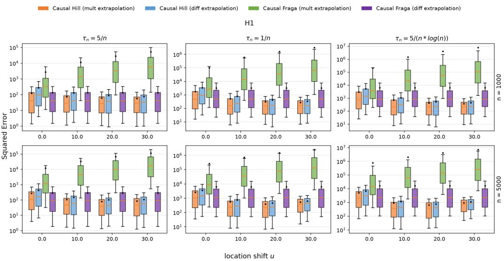  
Figure 12: Squared errors of the quantile treatment effect estimations under the location shift u for model $H _ { 1 }$ . The boxplot whiskers correspond to the 0.1 and 0.9 quantiles, the orange line is the median, and the black dots are the means.

The variance estimator ${ \widehat { \sigma } } ^ { 2 }$ defined in Equation (19) does not depend on the choice of extrapolation method (it is built from the Fraga estimator $\widehat { \gamma } _ { j } ^ { F }$ and the auxiliary thresholds only), so its consistency, Theorem 5, applies verbatim to the multiplicative extrapolation QTE estimator. We therefore refer to Section A.8 for the proof, and state here only the resulting inference statement.

Combining Theorem B.1 with Theorem $^ { 5 }$ yields

$$
\frac { \widehat { \phi } _ { n } ^ { \mathrm { m u l t } } \big ( \widehat { \Delta } ^ { \mathrm { m u l t } } ( 1 - \tau _ { n } ) - \Delta ( 1 - \tau _ { n } ) \big ) } { \widehat { \sigma } } \stackrel { d } {  } \mathcal { N } ( 0 , 1 ) .
$$

Hence an asymptotic $( 1 - \alpha )$ -level confidence interval for the extremal quantile treatment effect $\Delta ( 1 - \tau _ { n } )$ based on the multiplicative extrapolation is

$$
\big [ \widehat { \Delta } ^ { \mathrm { m u l t } } ( 1 - \tau _ { n } ) - z _ { 1 - \alpha / 2 } \frac { \widehat { \sigma } } { \widehat { \phi } _ { n } ^ { \mathrm { m u l t } } } , \widehat { \Delta } ^ { \mathrm { m u l t } } ( 1 - \tau _ { n } ) + z _ { 1 - \alpha / 2 } \frac { \widehat { \sigma } } { \widehat { \phi } _ { n } ^ { \mathrm { m u l t } } } \big ] ,
$$

where $z _ { 1 - \alpha / 2 }$ denotes the $( 1 - \alpha / 2 )$ -quantile of the standard normal distribution.

## C Additional Simulation Results

## C.1 Squared Errors of QTE estimations under the Location Shift

Figures 12–14 report the squared errors of the QTE estimations for the three models. For an extreme value index estimator with a large variance, such as the causal Fraga estimator, the difference extrapolation scheme is advantageous compared with the multiplicative extrapolation scheme. For an extreme value index estimator whose variance is inherently small, such as the causal Hill estimator, the difference extrapolation scheme is slightly inferior to the multiplicative extrapolation scheme, because of the additional variance introduced by estimating the intermediate quantile at the level $\beta _ { n }$

## C.2 Mean Squared Errors with respect to k

Figures 15–17 confirm the patterns observed in Figures 5–7. The QTE estimator that combines difference extrapolation with the causal Fraga estimator attains a low and stable mean squared error across the three models and the whole range of k. The two extrapolation variants based on the causal Hill estimator display large and erratic mean squared errors under $H _ { 1 }$ and $H _ { 2 }$ , in line with the instability of the Hill extreme value index estimator in those settings (see the discussion in Fraga Alves [15]). Under multiplicative extrapolation, the high variance of the causal Fraga extreme value index estimator, amplified by small values of $k ,$ inflates both the variance and the bias component of the mean squared error, which explains the large mean squared errors observed under $H _ { 2 }$ and $H _ { 3 }$

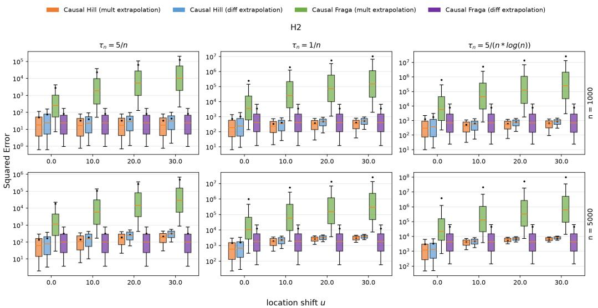  
Figure 13: Squared errors of the quantile treatment effect estimations under the location shift u for model $H _ { 2 }$ . The boxplot whiskers correspond to the 0.1 and 0.9 quantiles, the orange line is the median, and the black dots are the means.

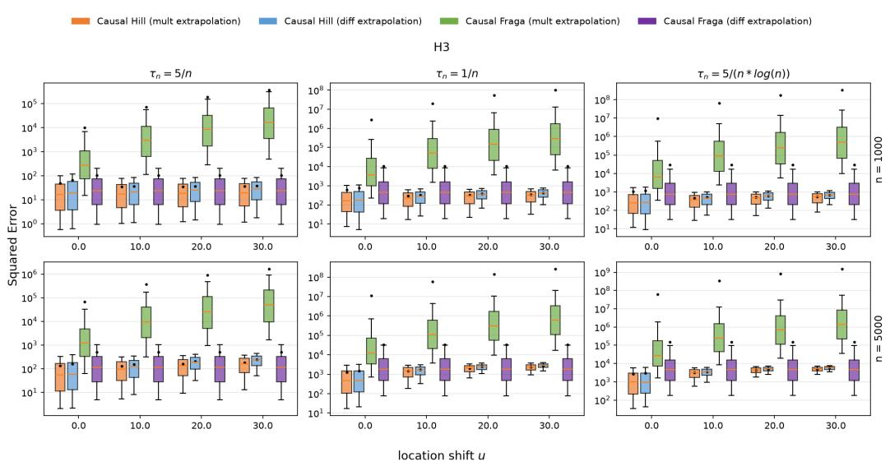  
Figure 14: Squared errors of the quantile treatment effect estimations under the location shift u for model $H _ { 3 } .$ . The boxplot whiskers correspond to the 0.1 and 0.9 quantiles, the orange line is the median, and the black dots are the means.

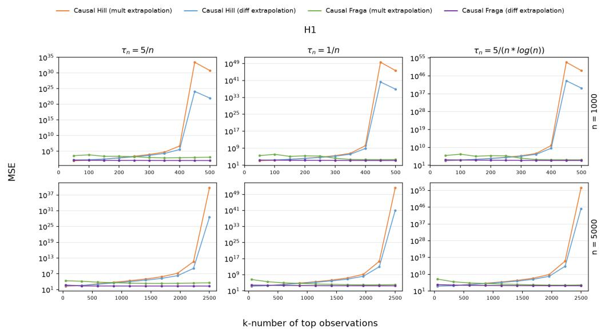  
Figure 15: Mean squared errors of the quantile treatment effect estimations as a function of the threshold parameter k for model $H _ { 1 }$

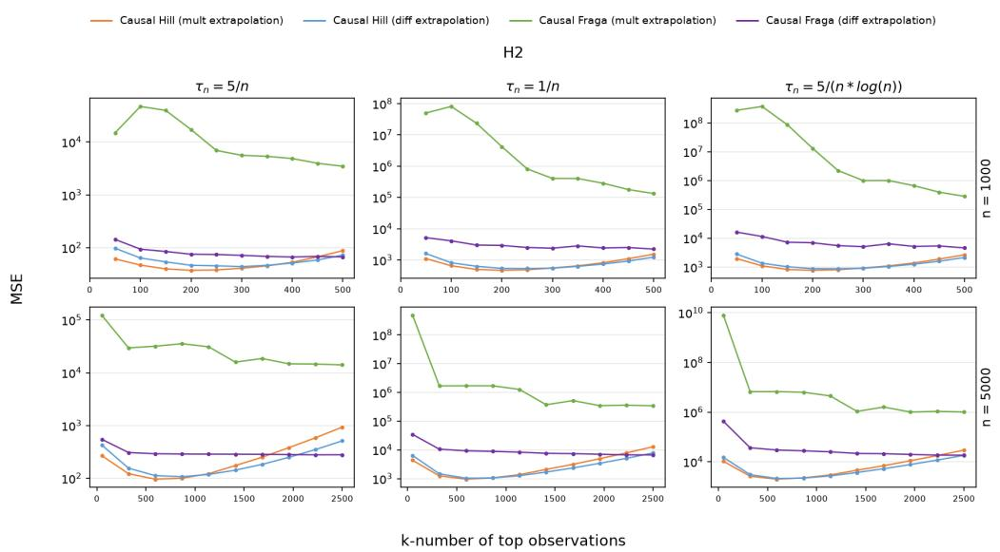  
Figure 16: Mean squared errors of the quantile treatment effect estimations as a function of the threshold parameter k for model $H _ { 2 }$

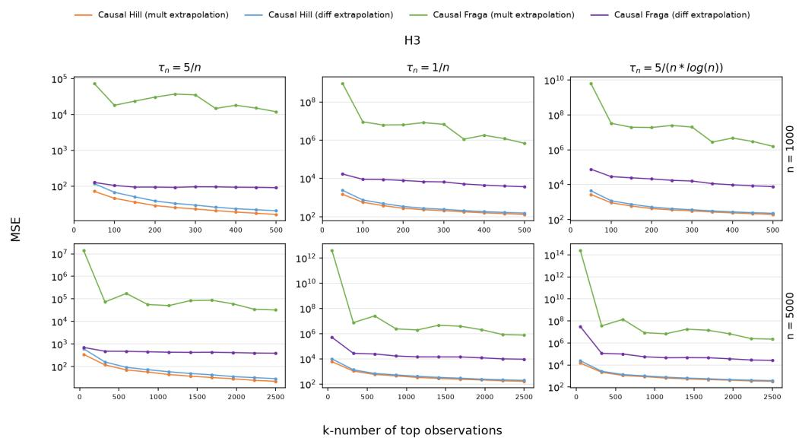  
Figure 17: Mean squared errors of the quantile treatment effect estimations as a function of the threshold parameter k for model $H _ { 3 }$