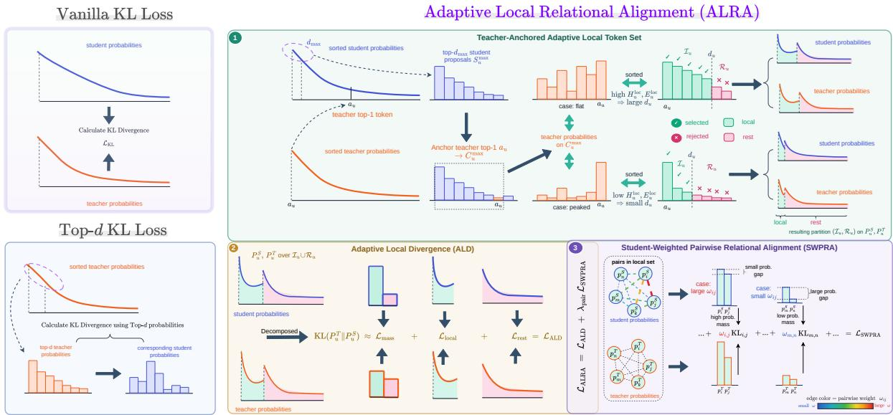
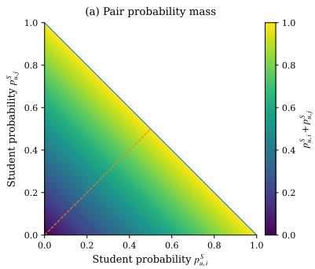
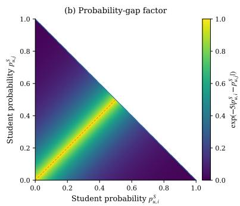
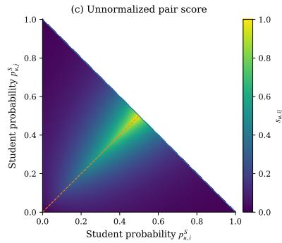
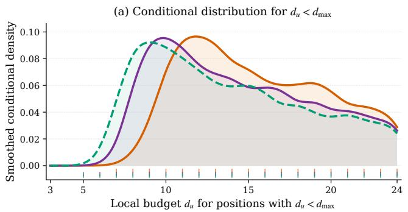
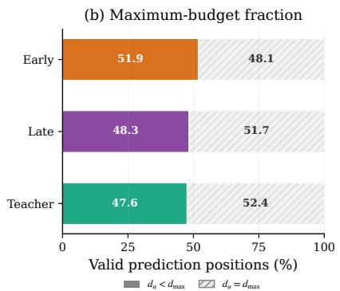
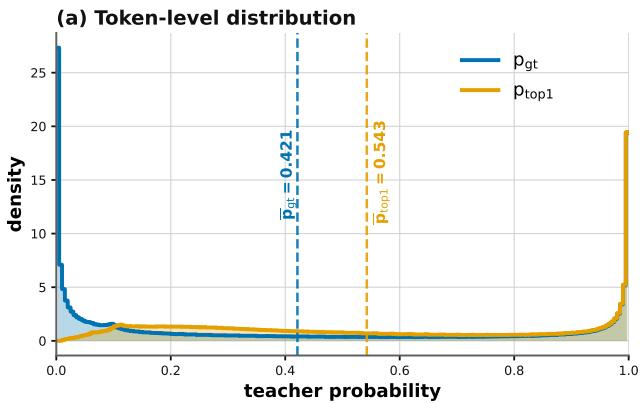
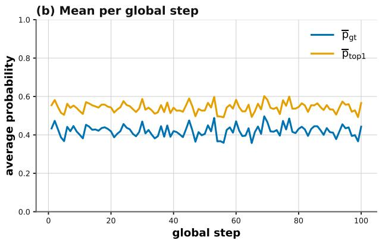
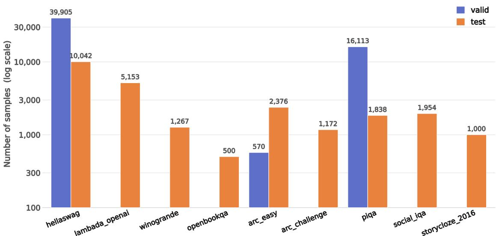

# ALRA: Adaptive Local Relational Alignment for Logit-Based Pre-training Distillation of Autoregressive Language Models

Quang Hoang Trunga,∗,1, Quang Huu Hieub,a,1, Nguyen Van Hoang Phuca and Vo Nguyen Le Duya,c,d

aVJ Technologies, Da Nang, Vietnam

bAJ Technologies, Nagoya, Japan

cVietnam National University, Ho Chi Minh City, Vietnam

dUniversity ofInformation Technology, Ho Chi Minh City, Vietnam

## A R T I C L E I N F O

Keywords: Knowledge distillation Autoregressive language modelsp Pre-training distillatione Adaptive token selectionS Pairwise relational distillation

## A BS T R AC T

Logit-based knowledge distillation for autoregressive language models usually aligns teacher and student next-token distributions over the entire vocabulary. However, this global objective overlooks relative preferences among likely token alternatives. Existing local approaches often select candidate tokens from either the teacher or the student alone. Teacher-only selection can miss tokens that the student considers likely, while student-only selection can rely on an inaccurate ranking early in training. We propose Adaptive Local Relational Alignment (ALRA), a position-specific framework combining student proposals with teacher guidance. At each valid prediction position, the student proposes likely tokens, while the teacher’s most probable token is included as an anchor. ALRA adjusts the number of selected tokens according to how broadly the teacher distributes probability within this candidate set relative to the current batch. Adaptive Local Divergence retains the mass-matching term and separately matches the relative token distributions within the selected and remaining vocabulary regions. Unlike the exact full-vocabulary decomposition, it replaces the teacher-mass coeficients of the two conditional terms with unit coeficients, preventing either term from being downweighted solely because its region has low teacher probability. Student-Weighted Pairwise Relational Alignment emphasizes high-probability token pairs with small student probability gaps and gives less weight to unlikely or clearly separated pairs. Experiments on The Pile with randomly initialized 200M- and 500Mparameter students across nine zero-shot benchmarks yield average accuracies of 36.62% and 37.40%. ALRA exceeds the strongest competing distillation baseline by 0.94 and 0.83 percentage points and improves over pre-training without distillation by 2.31 and 2.91 points, respectively.

## 1. Introduction.

Large language models (LLMs) have achieved strong performance across a broad range of natural language processing tasks, but their increasing scale also introduces substantial computational and memory requirements. Knowledge distillation (KD) provides an established approach for transferring knowledge from a larger teacher model to a smaller student model, allowing the student to learn from information beyond the observed target token (Hinton et al., 2015). For autoregressive language models, logits-based distillation typically minimizes the forward Kullback– Leibler (KL) divergence between teacher and student next-token distributions over the entire vocabulary. Although this formulation provides comprehensive distribution-level supervision, it treats all vocabulary tokens within a single global objective, despite the fact that diferent prediction contexts can exhibit substantially diferent levels of uncertainty. In particular, some contexts produce highly concentrated teacher distributions, whereas others assign meaningful probability to several competing alternatives. This motivates more selective and adaptive distillation strategies that can allocate supervision according to the characteristics of each prediction position.

A central challenge in selective distillation is how to identify the tokens that should receive detailed supervision while avoiding excessive dependence on either the teacher or the student. Existing restricted-logit approaches include teacher-based truncation (Peng et al., 2025) and student-based local selection (Xu et al., 2025). Teacher-only selection may overlook tokens that the student currently assigns high probability, whereas student-only selection can be unreliable when the student’s ranking is still inaccurate during early training. Moreover, a fixed local-set size keeps the number of selected tokens the same across prediction positions, although some contexts require only a few alternatives while others involve a broader set of high-probability tokens. Recent studies have investigated position-selective, relational, dificulty-aware, and tail-aware distillation (Tavor et al., 2026; Xu et al., 2025; He et al., 2025; Dasgupta et al., 2026). Pairwise relational supervision captures relative preferences among competing tokens (Xu et al., 2025), but applying such relations to autoregressive language modeling requires position-specific handling of a large and context-dependent vocabulary. These observations point to the need for a unified distillation objective that can adapt the supervised local region to each prediction context while preserving information from the remaining vocabulary and explicitly modeling relationships among high-probability alternatives.

  
Figure 1: Overview of Adaptive Local Relational Alignment (ALRA) and its comparison with Vanilla and Top-� KL Loss. Vanilla KL Loss aligns the complete teacher and student next-token distributions over the full vocabulary, whereas Top-� KL Loss selects the � highest-probability vocabulary tokens under the teacher distribution at each prediction position, retrieves the student probabilities at the corresponding vocabulary indices, renormalizes both restricted distributions over the selected support, and computes their KL divergence. For each valid next-token prediction position $u \in \mathcal { T } _ { B } ,$ ALRA first selects the $d _ { \mathrm { m a x } }$ vocabulary tokens with the largest probabilities under the student’s next-token distribution $P _ { u } ^ { S }$ and ensures inclusion of the teacher top-1 token to form a teacher-anchored candidate set. It then computes the effective support size of the teacher distribution renormalized within this set and compares it with the batch-average efective support size to determine the position-specific local-set size $d _ { u } .$ . The final local set $\scriptstyle { \tau _ { u } }$ contains the $d _ { u }$ highest-probability tokens under the teacher distribution within the anchored candidate set, and $\mathcal { R } _ { u } = \mathcal { V } \setminus \mathcal { I } _ { u }$ is its full-vocabulary complement. Adaptive Local Divergence (ALD) uses the mass, local-conditional, and rest-conditional structures identified by a local–rest decomposition of the full-vocabulary forward KL as separate supervision components, while assigning unit coeficients to the two conditional components. Within the adaptive local set $\scriptstyle { \boldsymbol { { \cal T } } } _ { u } ,$ Student-Weighted Pairwise Relational Alignment (SWPRA) assigns larger weights to token pairs with high total probability mass under the student’s original full-vocabulary distribution and small student probability gaps, thereby emphasizing pairwise supervision for plausible tokens that the student currently separates only weakly. Conversely, low-mass pairs and pairs with large student probability gaps receive less emphasis. The final objective combines ALD and SWPRA and updates only the student model.

To address this challenge, we propose Adaptive Local Relational Alignment (ALRA), a position-specific logit distillation framework that combines adaptive token selection, region-aware divergence, and student-dependent pairwise relational supervision. The main contributions of this paper are summarized as follows:

• We introduce a teacher-anchored adaptive local token selection mechanism for autoregressive language models. At each prediction position, the student proposes a candidate set, while the teacher top-1 token is included as an anchor. The teacher efective support within this candidate set, relative to its current batch average, determines the local budget $d _ { u }$ . The final local set is then formed by selecting the highest-probability tokens under the teacher distribution within the anchored candidate set. This design keeps the candidate set responsive to the student’s current predictions while providing teacher guidance and allowing the local-set size to vary across prediction positions.

• We introduce two complementary objectives for the resulting local–rest partition. Adaptive Local Divergence (ALD) starts from the exact local–rest decomposition of forward KL, retains the mass-matching term, and assigns unit coeficients to the local- and rest-conditional divergences so that neither conditional term is directly scaled down by its teacher region mass. Student-Weighted Pairwise Relational Alignment (SWPRA) further aligns relative preferences between local token pairs, giving more emphasis to high-probability alternatives that the student currently separates only weakly.

• We evaluate ALRA in from-scratch pre-training distillation from a frozen Qwen1.5-1.8B teacher to randomly initialized 200M- and 500M-parameter students on The Pile. Across nine zero-shot benchmarks, ALRA achieves average accuracies of 36.62% and 37.40%, exceeding the strongest compared distillation baseline by 0.94 and 0.83 percentage points, respectively. Controlled studies further compare the complete ALRA configuration with fixed local budgets and separately examine candidate-set anchoring and pairwise weighting.

## 2. Related Work

Distillationfor large language models. Knowledge distillation (KD) (Hinton et al., 2015) is a common approach for compressing large language models (LLMs) into smaller students, thereby reducing inference cost and memory footprint while seeking to preserve predictive performance (Yang et al., 2025). Recent surveys characterize the LLM distillation landscape from complementary perspectives. Yang et al. (2025) classify LLM distillation methods into white-box and black-box KD, further distinguishing logits-based and hint-based approaches within white-box KD, while black-box KD includes in-context learning (ICL), chain-of-thought (CoT), and instruction following, where only the teacher’s outputs are accessible through an API rather than its internal logits or representations. Fang et al. (2025) instead place knowledge distillation (KD) and dataset distillation (DD) within a unified framework that bridges model-centric and data-centric perspectives, treating them as complementary paradigms. Their KD taxonomy covers rationale-based, uncertainty-aware, multi-teacher, dynamic/adaptive, and task-specific approaches, while their DD discussion considers optimization-based distillation and synthetic data generation alongside complementary data-selection strategies (Fang et al., 2025). Within these taxonomies, our work falls on the model-centric side and focuses specifically on white-box, logits-based KD for causal LMs. We focus on logits-based rather than hint-based KD, the latter of which additionally supervises the student through intermediate representations. Representative encoder-based distillation methods transfer diferent forms of intermediate knowledge, including hidden-state and attention information, as exemplified by DistilBERT, TinyBERT, MiniLM, and MobileBERT (Sanh et al., 2019; Jiao et al., 2020; Wang et al., 2020; Sun et al., 2020). Direct pointwise hidden-state matching is architecture-sensitive because losses such as MSE or cosine similarity require dimensionally compatible representations or an explicit alignment mapping. TinyBERT, for example, introduces a learnable linear projection to align student and teacher hidden states when their hidden sizes difer (Jiao et al., 2020). Conversely, TAD’s larger-model experiments use students with the same hidden dimensionality as their teachers and directly apply an auxiliary cosine loss between teacher and student hidden states (Dasgupta et al., 2026). Because our students difer from the teacher in hidden size but share the same output vocabulary, we restrict the distillation signal to the output level, avoiding explicit alignment of intermediate representation spaces. Within this setting, we examine how structured, relational, tail-aware, and adaptive objectives afect the allocation of supervision across token positions and vocabulary entries while keeping the training pipeline otherwise fixed.

White-box logits-based KDfor LLMs. A canonical white-box logits-based baseline matches the full teacher and student next-token distributions using the forward KL divergence (Hinton et al., 2015; Muralidharan et al., 2024); we refer to this objective as Vanilla KD. Earlier NLP work also demonstrated output-level distillation across diferent architectures: Tang et al. (2019) transferred task-specific knowledge from BERT to a single-layer BiLSTM by minimizing the MSE between teacher and student logits. PD further studies pre-training distillation systematically across logits processing, loss selection, scaling law, and ofline versus online teacher logits (Peng et al., 2025). In the standard full-distribution forward-KL baseline, a single global divergence is applied to the complete teacher distribution at each token. Although the teacher’s non-target probabilities contain information beyond the ground-truth token (Zhong et al., 2024), this objective does not explicitly partition the output distribution into high- and low-probability regions or adapt the teaching strategy across token positions. These properties motivate structured, adaptive, and tail-aware extensions that retain the white-box, logit-level setting while controlling how teacher information is allocated across token positions and vocabulary regions.

Structured and relational KD. Beyond pointwise matching, relational KD transfers structural information by preserving relationships within the teacher signal. RKD operates in representation space, preserving distance- and angle-based relations among training examples rather than matching individual representations independently (Park et al., 2019). In pre-trained language model distillation, ReAugKD introduces a relationship loss that preserves semantic similarities among teacher and student training examples to support retrieval-augmented knowledge transfer (Zhang et al., 2023). At the output level, structured logit objectives instead model dependencies among classes. For image classification, RLD uses ground-truth labels to dynamically refine teacher logits, removing misleading teacher information while preserving class correlations (Sun et al., 2025), whereas LDRLD recursively decouples and recombines the top-� logits selected according to the student’s ranking to capture fine-grained inter-class relations and adaptively emphasize critical category pairs (Xu et al., 2025). Taken together, these works illustrate relational structure at two levels: relationships among examples in representation space and dependencies among classes in the output distribution. Our work follows the latter direction in autoregressive LMs, modeling structured relationships among vocabulary entries while keeping the distillation signal at the output level.

Adaptive, selective, and tail-aware logit KD. A complementary line of work studies where and how distillation supervision should be applied within logit-level KD. DA-KD dynamically adjusts the distillation dataset according to sample dificulty and introduces a bidirectional discrepancy loss to improve learning from dificult samples (He et al., 2025). Selective KD studies this question at finer granularity: SE-KD uses student entropy to select token positions for distillation, while $\operatorname { S E - K D } _ { 3 X }$ extends selection jointly across token positions, vocabulary classes, and training samples (Tavor et al., 2026). In autoregressive LMs, ATKD decomposes token-level KL into target-oriented and diversity-oriented knowledge and uses a teacher-uncertainty coeficient to identify token dificulty, applying diferent teaching modes to easy- and hard-to-learn tokens (Zhong et al., 2024). AdaKD further adapts the distillation process to each token’s learning state by combining loss-driven adaptive token focusing with token-level inverse dificulty temperature scaling, both driven by a unified token-dificulty metric (Xie et al., 2026). A related line focuses on how distillation supervision is distributed across the vocabulary. BiLD filters long-tail noise by retaining only the top-� teacher and student logits and constructs bidirectional logit-diference terms to leverage their internal ranking information (Li et al., 2025). TAD instead introduces a tail-aware divergence that decouples the teacher’s top-� probabilities from the remaining tail, increasing the contribution of lower-probability predictions (Dasgupta et al., 2026). Together, these methods adapt, select, or redistribute distillation supervision across samples, token positions, and vocabulary regions, motivating objectives that jointly control where and how teacher information is transferred.

Sequence-level, data-centric, and policy-based KD. Beyond token-level distribution matching, other approaches transfer teacher knowledge through generated sequences, the pre-training data distribution, or student-generated trajectories. In neural machine translation, sequence-level KD (SeqKD) uses beam search to generate target sequences from the teacher and then trains the student with cross-entropy on the resulting teacher-generated dataset (Kim and Rush, 2016). In LLM pre-training, MiniPLM takes an ofline, data-centric approach: its Diference Sampling strategy uses the discrepancy between a teacher and a small reference LM to refine the pre-training corpus, down-sampling easy and common instances, up-sampling hard and diverse instances, and filtering noisy or harmful examples, after which the student is trained from scratch with the standard next-token cross-entropy objective (Gu et al., 2025). Policy-based approaches instead optimize distillation over student-generated outputs. MiniLLM minimizes the sequence-level reverse KL divergence between student and teacher distributions and derives a policy-gradient optimization procedure over student-generated sequences (Gu et al., 2024). GKD generalizes this on-policy perspective by allowing a mixture of fixed and student-generated sequences for distillation under teacher feedback, while supporting multiple divergences, including forward KL, reverse KL, and generalized Jensen–Shannon divergence, as well as integration with reinforcement-learning fine-tuning (Agarwal et al., 2024). More generally, at the sequence-distribution level, �-DISTILL formulates sequence level KD as generalized �-divergence minimization, shows that SeqKD and related approaches can be viewed as approximations of variants within this framework, and derives a step-wise decomposition that reduces intractable sequence-level divergences to tractable word-level losses (Wen et al., 2023). These approaches modify the sequences, data distributions, or policies through which teacher knowledge is transferred, whereas our study focuses on the design of token-level white-box logit objectives under a common pre-training regime. We therefore treat them as complementary directions rather than direct baselines; in particular, data-centric, sequence-level, or policy-based strategies could be combined with our objective in future work.

Theoretical and empirical perspectives on distillation. A parallel body of work examines why teacher distributions can improve student learning and which factors determine whether distillation is efective. In autoregressive language models, the teacher’s distribution over non-target tokens conveys diversity-oriented information beyond the ground-truth token (Zhong et al., 2024). From a statistical perspective, Menon et al. (2021) show that a Bayes teacher providing the true class probabilities can reduce the variance of the student’s learning objective, and derive a bias–variance trade-of that characterizes how approximate teacher probability estimates afect student generalization. The teacher–student capacity gap is another important factor in distillation efectiveness: intermediate teacher-assistant models can mitigate large capacity gaps (Mirzadeh et al., 2020), while Zhang et al. (2025) find that, in language model distillation, the optimal teacher scale grows approximately linearly with student scale. At the same time, stronger imitation of the teacher need not imply better generalization: Stanton et al. (2021) show that increased teacher–student fidelity does not always improve student test performance and, in a self-distillation setting, enlarging the distillation set can increase fidelity while reducing test accuracy. These findings caution against treating teacher–student fidelity as a direct proxy for downstream gains and motivate our decomposition-based analysis of which components of the teacher distribution diferent distillation objectives emphasize.

Positioning of our approach. Taken together, prior work has explored several complementary design axes in logit-level KD, including relational structure among output classes (Sun et al., 2025; Xu et al., 2025), token-adaptive supervision (Zhong et al., 2024; Xie et al., 2026), multi-axis selection across token positions, vocabulary classes, and training samples (Tavor et al., 2026), and explicit handling of low-probability or tail logits, either by filtering them or by increasing their contribution to distillation (Li et al., 2025; Dasgupta et al., 2026). To our knowledge, existing logit-level KD methods for autoregressive LMs do not jointly combine a position-specific adaptive local vocabulary budget, explicit supervision of both the selected local region and its full-vocabulary complement, and pairwise relational weighting within the selected local set. ALRA targets this intersection by (i) using an exact local–rest decomposition of the forward KL to expose mass, local-conditional, and rest-conditional supervision, (ii) constructing a teacher-anchored, position-specific adaptive local set, and (iii) applying student-dependent pairwise relational weighting within that set. We compare ALRA with representative logit-level distillation baselines under a shared pre-training pipeline. Controlled studies additionally compare the complete ALRA configuration with fixed local budgets and separately examine candidate-set anchoring and pairwise weighting. Accordingly, we interpret the main baseline comparison at the level of complete objectives and reserve mechanism-specific conclusions for the corresponding controlled analyses.

## 3. Proposed Approach

We present Adaptive Local Relational Alignment (ALRA), a position-specific logit-distillation framework for autoregressive language models. The overall workflow is illustrated in Fig. 1. ALRA is motivated by two complementary lines of prior work. First, token-level forward KL admits a decomposition under a partition of the output space, exposing the probability mass assigned to diferent regions and the conditional distributions within those regions (Zhao et al., 2022; Zhong et al., 2024; Dasgupta et al., 2026). Second, pairwise logit relations can explicitly represent relative preferences between locally competing tokens (Xu et al., 2025). A relational construction designed for fixed-class classification cannot be applied directly to language modeling, because each autoregressive prediction position produces a context-dependent distribution over a large vocabulary and may have a diferent level of local ambiguity.

ALRA makes two main contributions. First, it constructs an adaptive local token set separately for every valid next-token prediction position. The student proposes the $d _ { \mathrm { m a x } }$ highest-probability vocabulary tokens, the teacher top-1 token is included as a teacher-preferred reference, and the efective support size of the teacher distribution renormalized within this anchored candidate set determines a position-specific local-set size relative to the current forward batch. The final local set is selected by teacher probability ranking within the anchored candidate set. Second, ALRA uses a position-specific local–rest decomposition of the full-vocabulary forward KL to identify mass, local-conditional, and rest-conditional supervision structures. ALD then forms a distinct region-aware objective by retaining the mass-matching term and assigning unit coeficients to the two conditional terms, so their contributions are not directly attenuated by the teacher probability masses of the corresponding regions. ALRA further augments this objective with student-weighted pairwise relational alignment inside the adaptive local token set. The pairwise weighting prioritizes high-mass local alternatives that the student separates only weakly.

## 3.1. Preliminaries

Let  denote the current forward batch, containing � tokenized sequences. We define the set of valid next-token prediction positions as

$$
T _ { B } = \{ ( b , t ) : m _ { b , t } = 1 \} ,\tag{1}
$$

where � indexes a sequence in the batch, � indexes a prediction position within that sequence, and $m _ { b , t } \in \{ 0 , 1 \}$ indicates whether the prediction at position $( b , t )$ contributes to the training loss. Each $u = ( b , t ) \in \mathcal { T } _ { B }$ therefore represents one valid next-token prediction position.

As a special case, consider � unpadded sequences, each containing � tokens, with no ignored labels. Under the standard one-token causal shift, where the output at position � predicts the token at position $t + 1$ , each sequence contributes $T - 1$ valid prediction positions. Hence,

$$
| \mathcal { T } _ { B } | = B ( T - 1 ) .
$$

ALRA computes its adaptive statistics over the valid positions in $\tau _ { B }$ within each forward pass.

Let  denote the vocabulary, with size ||. For each $u \in \tau _ { B }$ , the teacher and student produce vocabulary-logit vectors $z _ { u } ^ { T } , z _ { u } ^ { S } \in \mathbb { R } ^ { | \mathcal { V } | }$ . At distillation temperature $\tau > 0$ , their next-token distributions are

$$
\begin{array} { r l } & { P _ { u } ^ { T } = \mathrm { s o f t m a x } ( z _ { u } ^ { T } / \tau ) , \quad p _ { u , i } ^ { T } = \cfrac { \exp ( z _ { u , i } ^ { T } / \tau ) } { \sum _ { j \in \mathcal { V } } \exp ( z _ { u , j } ^ { T } / \tau ) } , } \\ & { P _ { u } ^ { S } = \mathrm { s o f t m a x } ( z _ { u } ^ { S } / \tau ) , \quad p _ { u , i } ^ { S } = \cfrac { \exp ( z _ { u , i } ^ { S } / \tau ) } { \sum _ { j \in \mathcal { V } } \exp ( z _ { u , j } ^ { S } / \tau ) } , \qquad i \in \mathcal { V } . } \end{array}\tag{2}
$$

Here, $p _ { u , i } ^ { T }$ and $p _ { u , i } ^ { S }$ denote the probabilities assigned by the teacher and student, respectively, to vocabulary token � at prediction position �.

The conventional token-level distillation objective is the forward Kullback–Leibler divergence between the teacher and student distributions over the full vocabulary:

$$
\mathcal { L } _ { \mathrm { K L } } ( u ) = \mathrm { K L } ( P _ { u } ^ { T } \| P _ { u } ^ { S } ) = \sum _ { i \in \mathcal { V } } p _ { u , i } ^ { T } \log \frac { p _ { u , i } ^ { T } } { p _ { u , i } ^ { S } } .\tag{3}
$$

## 3.2. Teacher-Anchored Adaptive Local Token Set

Let $d _ { \mathrm { m i n } }$ and $d _ { \mathrm { m a x } }$ denote the minimum and maximum local-set sizes, with $2 \leq d _ { \operatorname* { m i n } } \leq d _ { \operatorname* { m a x } } < | \mathcal { V } |$ . For each $u \in \mathcal { T } _ { B } ,$ the student first proposes the $d _ { \mathrm { m a x } }$ vocabulary tokens with the largest probabilities:

$$
S _ { u } ^ { \operatorname* { m a x } } = \mathrm { T o p D } ( P _ { u } ^ { S } , d _ { \operatorname* { m a x } } ) , \qquad a _ { u } = \arg \operatorname* { m a x } _ { i \in \mathcal { V } } p _ { u , i } ^ { T } ,\tag{4}
$$

where ${ \mathrm { T o p D } } ( P , d )$ returns the vocabulary indices of the � largest components of �, and $a _ { u }$ is the teacher top-1 token. The set $S _ { u } ^ { \mathrm { m a x } }$ is the student proposal set; it is not the final local token set. Because the student’s ranking may be unreliable, especially early in training, ALRA forms a teacher-anchored candidate set of the same cardinality:

$$
C _ { u } ^ { \operatorname* { m a x } } = \left\{ \begin{array} { l l } { S _ { u } ^ { \operatorname* { m a x } } , } & { a _ { u } \in S _ { u } ^ { \operatorname* { m a x } } , } \\ { \mathrm { T o p D } ( P _ { u } ^ { S } , d _ { \operatorname* { m a x } } - 1 ) \cup \{ a _ { u } \} , } & { a _ { u } \notin S _ { u } ^ { \operatorname* { m a x } } . } \end{array} \right.\tag{5}
$$

Thus, $| { \mathcal { C } } _ { u } ^ { \mathrm { { m a x } } } | = d _ { \mathrm { { m a x } } }$ . When $a _ { u } \notin S _ { u } ^ { \mathrm { m a x } }$ , the lowest-ranked token in the original $d _ { \mathrm { m a x } }$ -element student proposal is replaced by the teacher top-1 token. This operation preserves a candidate set largely based on the student proposal while ensuring that it contains at least one teacher-preferred reference. The teacher top-1 token is not treated as a ground-truth label.

The candidate set is intended to capture the tokens that the student currently considers most likely. We therefore construct most of the set from the tokens assigned the highest probabilities by the student. A teacher-only candidate set may exclude tokens that receive high student probability and therefore may not reflect the student’s current prediction state.

The teacher top-1 token is included as a minimal anchor. It ensures that the teacher’s most probable token remains available for local supervision when it is absent from the student proposal, while replacing at most one studentproposed token and keeping the candidate-set size fixed. Including multiple teacher-ranked tokens would introduce more teacher-selected tokens into the fixed candidate budget and make the candidate set less responsive to the student’s current predictions. It would also require an additional rule for combining the teacher and student proposals within the fixed budget. ALRA therefore uses only the teacher top-1 token as an anchor, while the teacher probabilities within the anchored candidate set are used in the following steps to compute the efective support size, determine the position-specific local budget, and rank the final local tokens.

ALRA next measures the dispersion of the teacher distribution conditioned on the anchored candidate set $c _ { u } ^ { \mathrm { m a x } }$ Specifically, it restricts the teacher distribution to $c _ { u } ^ { \mathrm { m a x } }$ , renormalizes the retained probabilities, and computes the conditional entropy and corresponding efective support size:

$$
\begin{array} { r l } & { \rho _ { u , i } = \frac { p _ { u , i } ^ { T } } { \sum _ { j \in C _ { u } ^ { \mathrm { m a x } } } p _ { u , j } ^ { T } } , \qquad i \in C _ { u } ^ { \mathrm { m a x } } , } \\ & { H _ { u } ^ { \mathrm { l o c } } = - \displaystyle \sum _ { i \in C _ { u } ^ { \mathrm { m a x } } } \rho _ { u , i } \log \rho _ { u , i } , \qquad E _ { u } ^ { \mathrm { l o c } } = \exp ( H _ { u } ^ { \mathrm { l o c } } ) . } \end{array}\tag{6}
$$

Here, $H _ { u } ^ { \mathrm { l o c } }$ is the teacher conditional entropy within the teacher-anchored candidate set; it is not the teacher’s fullvocabulary entropy. The quantity $E _ { u } ^ { \mathrm { l o c } }$ , obtained by exponentiating this entropy, is the corresponding efective support size. A concentrated conditional distribution yields a smaller efective support size, whereas a more difuse distribution yields a larger one, indicating that the teacher probability is distributed across a larger efective number of candidate alternatives.

The batch-average efective support size over the valid prediction positions in the current forward batch is

$$
\bar { E } _ { \mathcal { T } _ { B } } ^ { \mathrm { l o c } } = \frac { 1 } { | \mathcal { T } _ { B } | } \sum _ { v \in \mathcal { T } _ { B } } E _ { v } ^ { \mathrm { l o c } } .\tag{7}
$$

ALRA then assigns each prediction position an integer local-set size:

$$
d _ { u } = \mathrm { c l i p } \left( { \mathrm { r o u n d } \mathord { \left[ d _ { \mathrm { m i n } } + ( d _ { \mathrm { m a x } } - d _ { \mathrm { m i n } } ) \frac { E _ { u } ^ { \mathrm { l o c } } } { \bar { E } _ { \mathcal { T } _ { B } } ^ { \mathrm { l o c } } + \epsilon } \right] } , d _ { \mathrm { m i n } } , d _ { \mathrm { m a x } } } \right) ,\tag{8}
$$

where $\epsilon > 0$ avoids division by zero. The ratio $E _ { u } ^ { \mathrm { l o c } } / ( \bar { E } _ { T _ { B } } ^ { \mathrm { l o c } } + \epsilon )$ compares the candidate-conditioned teacher efective support size at position � with its average over the valid prediction positions in the current forward batch. Rounding converts the resulting continuous budget to an integer, while clipping enforces the prescribed bounds $d _ { \operatorname* { m i n } } \leq d _ { u } \leq d _ { \operatorname* { m a x } } .$

This batch-relative normalization allows the local budget to vary across prediction positions and to adapt as the student proposals evolve during training. Early in training, the student proposal may contain tokens that receive little teacher probability. After insertion of the teacher top-1 token, the resulting candidate-conditioned teacher distribution may therefore be strongly concentrated around the anchor, yielding small values of $E _ { u } ^ { \mathrm { l o c } }$ . When this behavior is common across the current batch, $\bar { E } _ { \mathcal { T } _ { B } } ^ { \mathrm { l o c } }$ is also small. Positions whose efective support is close to the batch average therefore have a ratio near one and can receive large, often maximum, local budgets. This provides broad local supervision while the student ranking may still be unreliable.

As training progresses, the student proposal may include more tokens that receive substantial probability under the teacher distribution. At positions where the teacher distributes probability mass across multiple candidate tokens, the candidate-conditioned teacher distribution becomes more difuse, yielding a larger efective support size. The batch-relative ratio is therefore larger at these positions than at positions with more concentrated candidate-conditioned teacher distributions. After rounding and clipping, positions with larger efective support relative to the batch average tend to receive larger local sets, including more competing tokens for supervision, whereas positions with smaller relative efective support receive smaller local sets. Thus, $d _ { u }$ depends on both the candidate-conditioned teacher distribution at position � and the batch-average efective support over the valid positions in the same forward pass. Fig. 3 empirically illustrates the budget assignments produced by Eq. (8) at diferent stages of training.

Finally, ALRA selects the $d _ { u }$ highest-probability tokens under the teacher distribution within the anchored candidate set:

$$
\mathcal { T } _ { \boldsymbol { u } } = \mathrm { T o p D } \Big ( \{ p _ { \boldsymbol { u } , i } ^ { T } : i \in C _ { \boldsymbol { u } } ^ { \operatorname* { m a x } } \} , d _ { \boldsymbol { u } } \Big ) , \qquad \mathcal { R } _ { \boldsymbol { u } } = \mathcal { V } \setminus \mathcal { T } _ { \boldsymbol { u } } .\tag{9}
$$

When TopD is applied to values indexed by $c _ { u } ^ { \mathrm { m a x } }$ , it returns the corresponding vocabulary indices from that set. Therefore, $\scriptstyle { \mathcal { I } } _ { u }$ is the final position-specific adaptive local token set, while $\mathcal { R } _ { u }$ is its full-vocabulary complement. Tokens that are not selected into the local set are not discarded. They remain in the rest region and are still supervised through the rest-conditional term of ALD introduced in the next subsection.

## 3.3. Adaptive Local Divergence

Given the adaptive partition $( T _ { u } , \mathcal { R } _ { u } )$ , we first define the teacher and student probability masses assigned to the local and rest regions, together with the corresponding binary region distributions:

$$
\begin{array} { l l } { { \alpha _ { u } ^ { T } = \displaystyle \sum _ { i \in \mathcal { I } _ { u } } p _ { u , i } ^ { T } , } } & { { \bar { \alpha } _ { u } ^ { T } = 1 - \alpha _ { u } ^ { T } , ~ b _ { u } ^ { T } = ( \alpha _ { u } ^ { T } , \bar { \alpha } _ { u } ^ { T } ) , } } \\ { { \displaystyle \alpha _ { u } ^ { S } = \displaystyle \sum _ { i \in \mathcal { I } _ { u } } p _ { u , i } ^ { S } , } } & { { \bar { \alpha } _ { u } ^ { S } = 1 - \alpha _ { u } ^ { S } , ~ b _ { u } ^ { S } = ( \alpha _ { u } ^ { S } , \bar { \alpha } _ { u } ^ { S } ) . } } \end{array}\tag{10}
$$

Here, $\alpha _ { u } ^ { T }$ and $\alpha _ { u } ^ { S }$ are the total probabilities assigned to the local region $\scriptstyle { \boldsymbol { { T } } } _ { u } .$ , whereas $\bar { \alpha } _ { u } ^ { T }$ and $\bar { \alpha } _ { u } ^ { S }$ are the corresponding probabilities assigned to its complement $\mathcal { R } _ { u } .$

Within each region, the retained token probabilities are renormalized to define conditional distributions. For each token $i \in \mathcal { I } _ { u }$ , the teacher and student conditional probabilities are

$$
\tilde { p } _ { u , i } ^ { T , T } = \frac { p _ { u , i } ^ { T } } { \alpha _ { u } ^ { T } } , \tilde { p } _ { u , i } ^ { S , T } = \frac { p _ { u , i } ^ { S } } { \alpha _ { u } ^ { S } } .\tag{11}
$$

These probabilities define the teacher and student conditional distributions $\tilde { P } _ { u } ^ { T , T }$ and $\tilde { P } _ { u } ^ { S , T }$ over the local region $\tau _ { u } .$ For each token $i \in \mathcal { R } _ { u } .$ , the corresponding conditional probabilities in the rest region are

$$
\tilde { p } _ { u , i } ^ { T , \mathcal { R } } = \frac { p _ { u , i } ^ { T } } { \bar { \alpha } _ { u } ^ { T } } , \quad \tilde { p } _ { u , i } ^ { S , \mathcal { R } } = \frac { p _ { u , i } ^ { S } } { \bar { \alpha } _ { u } ^ { S } } .\tag{12}
$$

These probabilities define the teacher and student conditional distributions $\tilde { P } _ { u } ^ { T , R }$ and $\tilde { P } _ { u } ^ { S , \mathcal { R } }$ over the rest region $\mathcal { R } _ { u }$ . By construction,

$$
\sum _ { i \in { \cal I } _ { u } } \tilde { p } _ { u , i } ^ { T , I } = \sum _ { i \in { \cal I } _ { u } } \tilde { p } _ { u , i } ^ { S , I } = 1 , \qquad \sum _ { i \in { \cal R } _ { u } } \tilde { p } _ { u , i } ^ { T , R } = \sum _ { i \in { \cal R } _ { u } } \tilde { p } _ { u , i } ^ { S , R } = 1 .
$$

Thus, the local distributions are conditioned on the next token belonging to $\scriptstyle { \mathcal { I } } _ { u }$ , while the rest distributions are conditioned on the next token belonging to $\mathcal { R } _ { u } .$

The full-vocabulary forward KL can be decomposed exactly as

$$
\mathrm { K L } ( P _ { u } ^ { T } \| P _ { u } ^ { S } ) = \mathrm { K L } ( b _ { u } ^ { T } \| b _ { u } ^ { S } ) + \alpha _ { u } ^ { T } \mathrm { K L } ( \tilde { P } _ { u } ^ { T , I } \| \tilde { P } _ { u } ^ { S , I } ) + \bar { \alpha } _ { u } ^ { T } \mathrm { K L } ( \tilde { P } _ { u } ^ { T , R } \| \tilde { P } _ { u } ^ { S , R } ) .\tag{13}
$$

Equation (13) shows that the full-vocabulary forward KL consists of three parts: a binary mass-matching term, a local-conditional divergence weighted by $\alpha _ { u } ^ { T }$ , and a rest-conditional divergence weighted by $\bar { \alpha } _ { u } ^ { T }$

The coeficients $\alpha _ { u } ^ { T }$ and $\bar { \alpha } _ { u } ^ { T }$ are the teacher probability masses assigned to the local and rest regions, respectively. They arise directly from the exact KL decomposition and are not tunable hyperparameters. Retaining these coeficients preserves equality with the original full-vocabulary forward KL, but also scales each conditional divergence in proportion to the teacher probability mass of its region. Consequently, when one region has small teacher mass, the contribution of its conditional divergence to the exact KL objective is reduced by the corresponding mass coeficient. Thus, for a fixed conditional discrepancy, that region contributes less than it would under a unit-weighted conditional objective.

This efect is particularly relevant to the rest region when the adaptive local set captures most of the teacher probability mass. In that case, $\bar { \alpha } _ { u } ^ { T }$ is small, so the contribution of the rest-conditional divergence is reduced in the exact decomposition. Although this coeficient is mathematically required to recover the original full-vocabulary KL, it gives the rest-conditional divergence less weight than an objective that assigns this term a unit coeficient.

We therefore define Adaptive Local Divergence (ALD) by retaining the mass-matching term while assigning unit coeficients to the two conditional divergences:

$$
\begin{array} { r l } & { \mathcal { L } _ { \mathrm { A L D } } ( u ) = \mathcal { L } _ { \mathrm { m a s s } } ( u ) + \mathcal { L } _ { \mathrm { l o c a l } } ( u ) + \mathcal { L } _ { \mathrm { r e s t } } ( u ) , } \\ & { \mathcal { L } _ { \mathrm { m a s s } } ( u ) = \mathrm { K L } ( b _ { u } ^ { T } \| b _ { u } ^ { S } ) , } \\ & { \mathcal { L } _ { \mathrm { l o c a l } } ( u ) = \mathrm { K L } ( \tilde { P } _ { u } ^ { T , T } \| \tilde { P } _ { u } ^ { S , T } ) , } \\ & { \mathcal { L } _ { \mathrm { r e s t } } ( u ) = \mathrm { K L } ( \tilde { P } _ { u } ^ { T , \mathcal { R } } \| \tilde { P } _ { u } ^ { S , \mathcal { R } } ) . } \end{array}\tag{14}
$$

The mass term aligns the total teacher and student probability assigned to the local and rest regions. The localconditional term aligns their relative probability distributions within the adaptive local set, while the rest-conditional term aligns the corresponding relative distributions over the complementary vocabulary region. Assigning unit coeficients to the two conditional terms prevents either term from being downweighted solely because its region has small teacher probability mass.

This design does not imply that the three terms have similar scales or produce equal gradient contributions. Rather, it removes the explicit teacher-mass scaling from the two conditional divergences and allows both conditional terms to contribute without teacher-mass scaling. The unit coeficients also avoid introducing additional region-level weighting hyperparameters.

Because ALD removes the probability-mass coeficients from the conditional terms, $\mathcal { L } _ { \mathrm { A L D } } ( u )$ is generally not algebraically identical to KL $\mathbf { \Psi } _ { : ( P _ { u } ^ { T } \parallel P _ { u } ^ { S } ) }$ . ALD is therefore a distinct region-aware objective that uses the three components of the exact local–rest KL decomposition, rather than an exact rewriting of the original forward KL. The exact decomposition is derived in Appendix A.

## 3.4. Student-Weighted Pairwise Relational Alignment

The local-conditional term in ALD aligns the complete teacher and student conditional distributions on $\scriptstyle { \boldsymbol { { T } } } _ { u } ,$ but it does not assign separate importance to discrepancies between individual local token pairs. Pairwise relational distillation provides an explicit two-token view of relative preference (Xu et al., 2025). In contrast to image classification, where the class set is fixed across samples, ALRA defines its pairwise relations over the position-specific local token set $\tau _ { u } .$ Moreover, rather than using class-rank-based weights, ALRA derives each pair weight from the student’s full-vocabulary probabilities.

Given $| T _ { u } | = d _ { u }$ , ALRA constructs the set of all unordered pairs of local vocabulary indices:

$$
\mathcal { P } _ { u } = \{ ( i , j ) : i , j \in T _ { u } , i < j \} , \qquad | \mathcal { P } _ { u } | = { \binom { d _ { u } } { 2 } } .\tag{15}
$$

For each $( i , j ) \in \mathcal { P } _ { u } .$ , the corresponding teacher and student two-token distributions are

$$
\begin{array} { r l } & { r _ { u } ^ { T } ( i , j ) = \mathrm { s o f t m a x } \left( [ z _ { u , i } ^ { T } / \tau _ { p } , ~ z _ { u , j } ^ { T } / \tau _ { p } ] \right) , } \\ & { r _ { u } ^ { S } ( i , j ) = \mathrm { s o f t m a x } \left( [ z _ { u , i } ^ { S } / \tau _ { p } , ~ z _ { u , j } ^ { S } / \tau _ { p } ] \right) , } \end{array}\tag{16}
$$

where $\tau _ { p } > 0$ is the pairwise temperature. These two-way softmax distributions represent the teacher’s and student’s relative preference between the two vocabulary tokens.

A general weighted pairwise relational objective is

$$
\mathcal { L } _ { \mathrm { p a i r } } ^ { \phi } ( u ) = \sum _ { ( i , j ) \in \mathcal { P } _ { u } } \kappa _ { u , i j } ^ { \phi } \mathrm { K L } \big ( r _ { u } ^ { T } ( i , j ) \| r _ { u } ^ { S } ( i , j ) \big ) ,\tag{17}
$$

  
Figure 2: Pair-score construction for Student-Weighted Pairwise Relational Alignment with $\gamma = 5 ,$ , as used in the main experiments. (a) Pair probability mass $p _ { u , i } ^ { S } + p _ { u , j } ^ { S }$ . (b) Probability-gap factor $\exp [ - 5 | p _ { u , i } ^ { S } - p _ { u , j } ^ { S } | ]$ . (c) Unnormalized pair score $s _ { u , i j } ,$ , obtained by multiplying the two factors. The scores are subsequently rescaled over $\mathcal { P } _ { u }$ to obtain the SWPRA pair weights $\omega _ { u , i j }$ . The region $p _ { u , i } ^ { S } + p _ { u , j } ^ { S } > 1$ is excluded because the two probabilities belong to the same full-vocabulary distribution. The dashed diagonal marks $p _ { u , i } ^ { S } = p _ { u , j } ^ { S }$ , where the probability gap is zero.

where $\phi$ denotes the weighting scheme and $\boldsymbol { \kappa } _ { u , i j } ^ { \phi }$ is the weight assigned to pair (�, �). The KL direction is teacher-to-student for every pair.

For comparison, direct Pairwise Relational Alignment (PRA) uses unit pair weights, while PRA-U uses normalized uniform weights:

$$
\begin{array} { r l r l } & { \kappa _ { u , i j } ^ { \mathrm { R } } = 1 , } & { \mathcal { L } _ { \mathrm { P R A } } ( u ) = \mathcal { L } _ { \mathrm { p a i r } } ^ { \mathrm { R } } ( u ) , } \\ & { \kappa _ { u , i j } ^ { \mathrm { U } } = \cfrac { 1 } { | \mathcal { P } _ { u } | } , } & { \mathcal { L } _ { \mathrm { P R A - U } } ( u ) = \mathcal { L } _ { \mathrm { p a i r } } ^ { \mathrm { U } } ( u ) , } & & { ( i , j ) \in \mathcal { P } _ { u } . } \end{array}\tag{18}
$$

PRA is unnormalized, so its loss scale can vary with the number of local pairs, whereas PRA-U has unit total pair weight. This diference is relevant when comparing variants with diferent local-set sizes.

For SWPRA, ALRA first computes an unnormalized score for each local token pair:

$$
s _ { u , i j } = \exp \Bigl ( - \gamma | p _ { u , i } ^ { S } - p _ { u , j } ^ { S } | \Bigr ) ( p _ { u , i } ^ { S } + p _ { u , j } ^ { S } ) , \qquad ( i , j ) \in \mathcal { P } _ { u } ,\tag{19}
$$

where $\gamma > 0$ controls the sensitivity to the student probability gap. The corresponding SWPRA pair weight is

$$
\kappa _ { u , i j } ^ { \mathrm { S W } } = \omega _ { u , i j } = \frac { s _ { u , i j } } { \sum _ { ( a , b ) \in \mathcal { P } _ { u } } s _ { u , a b } + \epsilon } , \qquad ( i , j ) \in \mathcal { P } _ { u } .\tag{20}
$$

The factor $p _ { u , i } ^ { S } + p _ { u , j } ^ { S }$ measures the total probability mass of the pair under the student’s original full-vocabulary distribution, rather than under the two-token renormalization. The factor exp[ $- \gamma | p _ { u , i } ^ { S } - p _ { u , j } ^ { S } | ]$ decreases as the student probability gap increases. Their product therefore favors pairs that carry substantial student probability mass and have similar probabilities under the student distribution. A pair containing two low-probability tokens receives a small score even when its probability gap is small, while a high-mass pair is downweighted when its two probabilities are widely separated.

The denominator in Eq. (20) rescales the scores by their sum over $\mathcal { P } _ { u }$ , while $\epsilon > 0$ prevents numerical issues when that sum is very small. The resulting weight $\omega _ { u , i j }$ determines the relative contribution of pair (�, �) to the pairwise objective. These weights multiply the corresponding teacher-to-student pairwise KL terms and do not change the teacher pairwise targets. The probabilities used to compute the scores and weights are taken from $P _ { u } ^ { S }$ at temperature �, whereas the relational distributions in Eq. (16) use $\tau _ { p } . \operatorname { F i g } . 2$ separates the two factors in Eq. (19) and shows how their product forms the unnormalized pair score. The figure uses $\gamma = 5$ , matching the value used in the main experiments.

The Student-Weighted Pairwise Relational Alignment loss is

$$
\mathcal { L } _ { \mathrm { S W P R A } } ( u ) = \mathcal { L } _ { \mathrm { p a i r } } ^ { \mathrm { S W } } ( u ) .\tag{21}
$$

PRA, PRA-U, and SWPRA use the same teacher-to-student KL divergence for each two-token pair and difer only in how the pairwise terms are weighted.

Algorithm 1 Adaptive Local Relational Alignment   
Require: Valid next-token prediction positions $\tau _ { B }$ from the current forward batch; teacher logits $\{ z _ { u } ^ { T } \} _ { u \in T _ { B } } ;$ student   
logits $\{ z _ { u } ^ { S } \} _ { u \in \mathcal { T } _ { B } } ;$ local-set bounds $d _ { \operatorname* { m i n } } , d _ { \operatorname* { m a x } }$ ; temperatures $\tau , \tau _ { p } ;$ probability-gap sensitivity �; pairwise-loss   
coeficient $\lambda _ { \mathrm { p a i r } } .$   
1: Compute $P _ { u } ^ { T } =$ softmax $( z _ { u } ^ { T } / \tau )$ and �� = softmax $( z _ { u } ^ { S } / \tau )$ for all $u \in { \mathcal { T } } _ { B } .$   
2: for $u \in \mathcal T _ { B }$ do   
3: Compute $S _ { u } ^ { \mathrm { m a x } }$ and $a _ { u }$ using Eq. (4).   
4: Construct $\ddot { C } _ { u } ^ { \mathrm { m a x } }$ using Eq. (5).   
5: Compute $E _ { u } ^ { \mathrm { l o c } }$ using Eq. (6).   
6: end for   
7: Compute $\bar { E } _ { T _ { B } } ^ { \mathrm { l o c } }$ using Eq. (7).   
8: for $u \in \mathcal T _ { B }$ do   
9: Compute $d _ { u }$ using Eq. (8).   
10: Construct $( T _ { u } , \mathcal { R } _ { u } )$ using Eq. (9).   
11: Compute $\mathcal { L } _ { \mathrm { A L D } } ( u )$ using Eq. (14).   
12: Construct $\mathcal { P } _ { u }$ using Eq. (15).   
13: Compute $s _ { u , i j }$ and $\omega _ { u , i j }$ using Eqs. (19)–(20).   
14: Compute $\mathcal { L } _ { \mathrm { S W P R A } } ( u )$ using Eq. (21).   
15: end for   
16: return $\mathcal { L } _ { \mathrm { A L R A } }$ using Eq. (22).

## 3.5. Training Objective

The ALRA distillation objective over the current forward batch is

$$
\mathcal { L } _ { \mathrm { A L R A } } = \frac { 1 } { | T _ { B } | } \sum _ { u \in \mathcal { T } _ { B } } \left[ \mathcal { L } _ { \mathrm { A L D } } ( u ) + \lambda _ { \mathrm { p a i r } } \mathcal { L } _ { \mathrm { S W P R A } } ( u ) \right] ,\tag{22}
$$

where $\lambda _ { \mathrm { p a i r } } \geq 0$ controls the contribution of the pairwise relational term. The mass term is retained unchanged, while the local-conditional and rest-conditional components of ${ \mathcal { L } } _ { \mathrm { A L D } }$ use unit coeficients, as defined in Eq. (14); no additional region-level weighting hyperparameters are introduced. In the comparison variants, $\mathcal { L } _ { \mathrm { S W P R A } }$ is replaced by $\mathcal { L } _ { \mathrm { P R A } }$ or $\mathcal { L } _ { \mathrm { P R A - U } }$

When ground-truth next-token labels are available, we define the student’s temperature-one next-token distribution $Q _ { u } ^ { S } = \mathrm { s o f t m a x } ( z _ { u } ^ { S } )$ , with component $q _ { u , i } ^ { S }$ , and optimize

$$
\mathcal { L } _ { \mathrm { t r a i n } } = \mathcal { L } _ { \mathrm { A L R A } } + \lambda _ { \mathrm { C E } } \frac { 1 } { | \mathcal { T } _ { B } | } \sum _ { u \in \mathcal { T } _ { B } } - \log q _ { u , y _ { u } } ^ { S } ,\tag{23}
$$

where $y _ { u }$ is the ground-truth next-token label associated with prediction position �, and $\lambda _ { \mathrm { C E } } \geq 0$ controls the causal language-modeling term.

Algorithm 1 shows how ALRA is computed within one forward batch. Line 1 obtains the teacher and student distributions for all valid prediction positions. Lines 2–6 build the teacher-anchored candidate set at each position and compute its candidate-conditioned teacher efective support. Line 7 averages these values over the current batch. Lines 8–15 then use this batch statistic to determine the local budget, form the local–rest partition, and compute the ALD and SWPRA terms at each position. Finally, Line 16 averages the position-level objectives to obtain $\mathcal { L } _ { \mathrm { A L R A } }$ . When the causal language-modeling term is used, it is added afterward as defined in Eq. (23).

## 4. Experiments

## 4.1. Experimental Setup

We conduct pre-training distillation with a fixed Qwen1.5-1.8B teacher and Qwen-architecture students using a processed corpus constructed from Pile Uncopyrighted, a filtered version of The Pile. All students are initialized randomly and trained from scratch. Within each student setting, all compared methods use the same processed data in the same order, sequence length, assigned token budget, and shared optimization schedule. For each method, we report the checkpoint at the end of the assigned token budget; the full-budget runs are evaluated zero-shot on nine held-out downstream benchmarks.

Models and initialization. We use Qwen1.5-1.8B1 as the fixed teacher and instantiate two Qwen student configurations corresponding to Pretrain-Qwen-200M2 and Pretrain-Qwen-500M3. We adopt these architectural configurations from prior Qwen-based pre-training experiments (Gu et al., 2025), but do not initialize from the released student weights: both students are initialized randomly and optimized from scratch, while the pretrained teacher remains frozen. For each student architecture, all compared methods use the same fixed random seed for model initialization and therefore start from the same initial parameter values. This controls for variation due to random initialization when comparing distillation objectives. Teacher and students share the same tokenizer and vocabulary, so their output probabilities are aligned token-wise and no cross-tokenizer vocabulary mapping is required. The two students provide two capacity regimes under the same training protocol, allowing us to assess whether the observed trends persist across student scale. Their exact architectural configurations are reported in Appendix B and Table B.1.

Pre-training data and budgets. The pre-training corpus is constructed from Pile Uncopyrighted4, a filtered version of The Pile (Gao et al., 2020; Biderman et al., 2022) obtained by removing the Books3, BookCorpus2, OpenSubtitles, YTSubtitles, and OWT2 subsets. We publicly release the exact processed training data used in our experiments. All compared methods within one student setting observe the same processed examples in the same order. The main baseline comparison and the pairwise weighting study use the full-budget run of approximately 1.035B nominal model-input tokens (126.4K optimizer updates), which we refer to as the approximately 1B-token setting. The fixed-budget and candidate-set anchoring studies instead terminate after approximately 550.5M nominal model-input tokens (67.2K optimizer updates), using the corresponding prefix of the same processed training stream. These shorter runs are used only for controlled mechanism analyses; their checkpoints are never mixed into the nine-benchmark held-out comparison, so every held-out result is reported at the same approximately 1B-token budget. Source-document selection, tokenization, boundary-aware fragment construction, exact token-budget accounting, and the relation between the stored 513-token examples and the 512-token model input are described in Appendix C.

Compared methods. We compare ALRA against eight baselines: Pre-train w/o KD, Vanilla KD (Muralidharan et al., 2024), PD (Peng et al., 2025), ATKD (Zhong et al., 2024), RLD (Sun et al., 2025), LDRLD (Xu et al., 2025), TAD (Dasgupta et al., 2026), and BiLD (Li et al., 2025). Pre-train w/o KD denotes standard causal language model pre-training without distillation. In our implementation, Vanilla KD combines the causal language modeling objective with a full-vocabulary forward-KL loss between teacher and student distributions. PD denotes our adaptation of a pre-training distillation configuration proposed by (Peng et al., 2025). ATKD uses teacher uncertainty to estimate token dificulty and applies diferent teaching modes to easy- and hard-to-learn tokens. RLD uses ground-truth label information to dynamically refine teacher logits while preserving class correlations, whereas LDRLD (Local Dense Relational Logit Distillation) captures fine-grained inter-class logit relations through recursive decoupling and recombination with adaptive pairwise weighting. TAD (Tail-Aware Distillation) decouples the teacher’s top-� probabilities from the remaining tail to reduce mode dominance and increase the contribution of lower-probability predictions, whereas BiLD (Bi-directional Logits Diference) uses teacher-led and student-led logit-diference matching to exploit internal logit-ranking information while filtering long-tail noise.

Several of these methods were originally introduced under diferent training regimes or output spaces. We therefore distinguish each method’s defining objective from our from-scratch autoregressive adaptation and document the exact implementation used in Appendix E.3. Within each student setting, the teacher–student pair, processed data and data order, token budget, sequence length, and optimizer schedule are held fixed; method-specific loss constructions and associated hyperparameters vary as required. The comparisons are therefore matched by student update and token budget rather than by total training FLOPs; runtime and memory overheads are reported separately in Appendix E.4.

Evaluation protocol. We perform zero-shot evaluation on nine downstream tasks widely used to assess the zero-shot capabilities of base language models (Touvron et al., 2023; Groeneveld et al., 2024; Gu et al., 2025), using the latest commit of the LM Evaluation Harness (Gao et al., 2021) available at the time of evaluation. The held-out suite contains HellaSwag (HS) (Zellers et al., 2019), LAMBADA-OpenAI (LAMB) (Paperno et al., 2016), WinoGrande (WG) (Sakaguchi et al., 2021), OpenBookQA (OBQA) (Mihaylov et al., 2018), ARC-Challenge and ARC-Easy (ARC C/ARC-E) (Clark et al., 2018), PIQA (Bisk et al., 2020), SocialIQA (SIQA) (Sap et al., 2019), and StoryCloze-2016 (SC16) (Mostafazadeh et al., 2016). No labeled downstream examples are used to update the student parameters.

Held-out zero-shot accuracy (%) of randomly initialized 200M- and 500M-parameter students trained under an approximately 1B-token budget. Qwen1.5-1.8B is used as the teacher for all KD methods, while Pre-Train w/o KD uses only the causal language-modeling objective. The compared KD methods are Vanilla KD (Muralidharan et al., 2024), PD (Peng et al., 2025), ATKD (Zhong et al., 2024), RLD (Sun et al., 2025), LDRLD (Xu et al., 2025), TAD (Dasgupta et al., 2026), and BiLD (Li et al., 2025). “Avg.” is the arithmetic mean over ARC-Challenge, ARC-Easy, HellaSwag, LAMBADA-OpenAI, OpenBookQA, PIQA, SocialIQA, StoryCloze-2016, and Winogrande. $\Delta _ { \mathrm { A v g . } }$ ↑ is the absolute diference from Pre-Train w/o KD under the same student setting, computed from unrounded averages. Within each student setting, the best and second-best benchmark values are shown in bold and underlined, respectively. The best average and largest improvement are shown in bold dark red. Ties receive the same marking.
<table><tr><td rowspan="2">Teacher/Student Method</td><td rowspan="2"></td><td>Publication</td><td rowspan="2">ARC-C</td><td rowspan="2">ARC-E</td><td rowspan="2">HS</td><td rowspan="2">LAMB</td><td rowspan="2">OBQA</td><td rowspan="2">PIQA</td><td rowspan="2">SIQA</td><td rowspan="2">SC16</td><td rowspan="2">WG</td><td rowspan="2">Avg.</td><td rowspan="2"> $\Delta _ { \mathrm { A v g . } } \uparrow$ </td></tr><tr><td>Year</td></tr><tr><td rowspan="10">Qwen1.5 1.8B</td><td>Pre-Train w/o KD</td><td></td><td>21.84</td><td>32.45</td><td>26.46</td><td>12.92</td><td>23.80</td><td>55.28</td><td>34.03</td><td>51.50</td><td>50.51</td><td>34.31</td><td>Ref.</td></tr><tr><td>Vanilla KD</td><td>NeurIPS&#x27;24</td><td>21.50</td><td>32.91</td><td>27.25</td><td>16.69</td><td>24.40</td><td>56.37</td><td>35.21</td><td>52.50</td><td>49.33</td><td>35.13</td><td>+0.82</td></tr><tr><td>PD</td><td>ACL&#x27;25</td><td>19.88</td><td>33.80</td><td>26.09</td><td>21.06</td><td>26.00</td><td>56.64</td><td>34.85</td><td>52.10</td><td>49.96</td><td>35.60</td><td>+1.29</td></tr><tr><td>ATKD</td><td>ACL&#x27;24</td><td>23.46</td><td>34.81</td><td>27.36</td><td>15.97</td><td>24.20</td><td>58.11</td><td>34.85</td><td>52.00</td><td>48.78</td><td>35.50</td><td>+1.19</td></tr><tr><td>RLD</td><td>ICCV&#x27;25</td><td>22.10</td><td>35.06</td><td>27.73</td><td>12.75</td><td>26.00</td><td>57.34</td><td>34.19</td><td>52.30</td><td>51.78</td><td>35.47</td><td>+1.16</td></tr><tr><td>LDRLD</td><td>ICCV&#x27;25</td><td>20.65</td><td>34.30</td><td>27.24</td><td>14.30</td><td>26.80</td><td>57.24</td><td>34.95</td><td>53.10</td><td>49.17</td><td>35.31</td><td>+0.99</td></tr><tr><td>TAD</td><td>ICML&#x27;26</td><td>21.67</td><td>36.45</td><td>27.37</td><td>13.00</td><td>23.20</td><td>58.76</td><td>35.41</td><td>53.60</td><td>51.62</td><td>35.68</td><td>+1.36</td></tr><tr><td>BiLD</td><td>COLING&#x27;25</td><td>25.60</td><td>26.60</td><td>27.43</td><td>13.02</td><td>29.40</td><td>53.05</td><td>33.11</td><td>45.20</td><td>49.80</td><td>33.69</td><td>-0.62</td></tr><tr><td>ALRA</td><td>Ours</td><td>21.33</td><td>37.71</td><td>28.09</td><td>19.91</td><td>24.20</td><td>58.65</td><td>35.41</td><td>52.40</td><td>51.85</td><td>36.62</td><td>+2.31</td></tr><tr><td>Pre-Train w/o KD Vanilla KD</td><td></td><td>21.16</td><td>32.53</td><td>26.74</td><td>10.85</td><td>25.20</td><td>55.50</td><td>34.60</td><td>51.60</td><td>52.17</td><td>34.48</td><td>Ref.</td></tr><tr><td rowspan="7">Qwen1.5 1.8B</td><td></td><td>NeurIPS&#x27;24</td><td>20.90</td><td>35.23</td><td>27.26</td><td>15.78</td><td>23.40</td><td>57.34</td><td>35.16</td><td>52.00</td><td>49.01</td><td>35.12</td><td>+0.64</td></tr><tr><td>PD</td><td>ACL&#x27;25</td><td>21.84</td><td>34.30</td><td>26.46</td><td>19.10</td><td>26.00</td><td>58.27</td><td>35.01</td><td>51.60</td><td>50.59</td><td>35.91</td><td>+1.42</td></tr><tr><td>ATKD</td><td>ACL&#x27;24</td><td>22.10</td><td>37.79</td><td>27.93</td><td>17.99</td><td>24.60</td><td>58.65</td><td>35.88</td><td>53.40</td><td>50.83</td><td>36.57</td><td>+2.09</td></tr><tr><td>RLD</td><td>ICCV&#x27;25</td><td>21.50</td><td>35.31</td><td>27.65</td><td>13.24</td><td>26.20</td><td>58.49</td><td>34.75</td><td>52.90</td><td>53.35</td><td>35.93</td><td>+1.45</td></tr><tr><td>LDRLD</td><td>ICCV&#x27;25</td><td>21.33</td><td>35.65</td><td>28.16</td><td>18.59</td><td>25.80</td><td>59.41</td><td>35.93</td><td>52.80</td><td>51.14</td><td>36.54</td><td>+2.05</td></tr><tr><td>TAD</td><td>ICML&#x27;26</td><td>22.35</td><td>37.96</td><td>27.65</td><td>13.60</td><td>24.60</td><td>57.83</td><td>35.41</td><td>53.40</td><td>51.30</td><td>36.01</td><td>+1.53</td></tr><tr><td>BiLD</td><td>COLING&#x27;25</td><td>25.85</td><td>26.77</td><td>27.67</td><td>13.89</td><td>29.20</td><td>54.08</td><td>33.27</td><td>45.10</td><td>49.96</td><td>33.98</td><td>-0.51</td></tr><tr><td></td><td>ALRA</td><td>Ours</td><td>22.61</td><td>38.26</td><td>28.34</td><td>20.59</td><td>26.40</td><td>58.60</td><td>35.41</td><td>53.80</td><td>52.57</td><td>37.40</td><td>+2.91</td></tr></table>

To guarantee a labeled held-out set for every task, we assign it by a fixed rule: we use the oficial test split where its public labels are usable (LAMBADA-OpenAI, OpenBookQA, ARC-Easy, ARC-Challenge, StoryCloze-2016) and otherwise fall back to the public validation split (HellaSwag, WinoGrande, PIQA, SocialIQA). A separate validation set, used only for the controlled 550M-token analyses and never for gradient-based task adaptation, is available for HellaSwag, ARC-Easy, and PIQA. No separate validation set is used for the remaining tasks. This protocol keeps all models under comparable zero-shot conditions, with no fine-tuning on labeled data. The exact task identifiers, the evaluation-file sizes, and the full split-assignment strategy are reported in Appendix D, Table D.1, and Fig. D.1. “Avg.” is an unweighted arithmetic mean, so every benchmark contributes equally regardless of its number of examples.

Training and checkpoint reporting. All students traverse their assigned budget-limited prefix of the processed training stream once, using the shared optimization configuration in Appendix E.1 and Table E.1. For each method, we report the final checkpoint at the end of its assigned token budget rather than selecting the best checkpoint based on validation or held-out performance; downstream scores therefore do not influence checkpoint selection. ALRA uses $d _ { \operatorname* { m i n } } = 3$ and $d _ { \operatorname* { m a x } } = 2 5$ ; the remaining ALRA hyperparameters are listed in Table E.2. Because the reported comparisons do not include across-seed statistics, we do not claim statistical significance for small numerical diferences.

## 4.2. Main Results on Held-Out Benchmarks

Table 1 reports zero-shot accuracy on nine downstream benchmarks after training randomly initialized 200M- and 500M-parameter students under an approximately 1B-token budget. ALRA achieves the highest average accuracy in both settings. It reaches 36.62% with the 200M student, exceeding TAD, the strongest competing baseline at this size, by 0.94 percentage points. With the 500M student, ALRA obtains 37.40%, outperforming ATKD by 0.83 percentage points. Compared with pre-training without KD, the gains are 2.31 and 2.91 percentage points for the 200M and 500M students, respectively; the corresponding gains over Vanilla KD are 1.49 and 2.28 points. These improvements are also broad across tasks: ALRA ranks first or second on six of the nine benchmarks at 200M and on seven at 500M. It improves over pre-training without KD on eight benchmarks at 200M and over both pre-training without KD and Vanilla KD on all nine benchmarks at 500M.

Without KD, the student is trained only with the causal language-modeling loss. Vanilla KD additionally matches the teacher distribution over the full vocabulary, providing information about alternative tokens, but its distillation term does not distinguish between local and rest regions. PD improves over Vanilla KD at both model sizes by applying top-�-� truncation and renormalizing the teacher distribution over the retained high-probability tokens (Peng et al., 2025). However, its token selection is determined only by the teacher distribution and fixed truncation parameters, whereas ALRA begins from a student-proposed candidate set.

ATKD adapts the distillation loss across prediction positions using the teacher’s uncertainty coeficient. It omits target-oriented KD for easy positions and applies both target- and diversity-oriented KD to hard positions (Zhong et al., 2024). TAD instead decomposes the KL loss into top-� and tail components and normalizes the tail contribution using the average teacher tail mass over each sequence (Dasgupta et al., 2026). Both methods adapt the distillation objective, but TAD uses the same � at every position. In contrast, ALRA forms a student-proposed candidate set, inserts the teacher top-1 token when needed, and uses the teacher probabilities within this anchored set to determine a position-specific budget $d _ { u }$ and select the final local tokens. The teacher top-1 token serves only as an anchor, not as a ground-truth label. Adaptive Local Divergence then retains all remaining tokens in the rest region and aligns both the probability mass and the conditional distribution within the two regions.

RLD improves over Vanilla KD by 0.34 and 0.81 percentage points for the 200M and 500M students, respectively. It uses label information to align the student’s true-class confidence with the teacher’s maximum confidence and masks classes whose teacher logits are at least as large as the true-class logit before aligning the remaining classes (Sun et al., 2025). ALRA exceeds RLD by 1.15 and 1.47 percentage points. The two methods also difer in their use of labels: RLD was designed around a true class in image classification, whereas ALRA does not use the target token when forming its local token set.

LDRLD (Xu et al., 2025) is the closest relational baseline and motivates the pairwise component of ALRA. It selects the top-� student logits and transfers relations among the selected classes, but the recursion depth � is manually chosen and fixed throughout a training run. Its local selection also depends entirely on the student ranking, which may be unreliable early in training for a randomly initialized student. ALRA instead uses a position-specific budget $d _ { u }$ and adds the teacher top-1 token before forming the final local set. The teacher probabilities over this anchored candidate set then refine the student proposal and retain the more strongly preferred candidates for local supervision. The methods also difer in pair weighting: LDRLD derives weights from rank diference and rank sum, whereas SWPRA uses the student’s current full-vocabulary probabilities, giving more weight to high-mass pairs with small probability gaps. ALRA exceeds LDRLD by 1.31 and 0.86 percentage points for the 200M and 500M students, respectively.

BiLD achieves the best results on ARC-Challenge and OpenBookQA, but its average remains below pre-training without KD at both student sizes. It constructs pairwise logit diferences from teacher-led and student-led top-� sets and was originally developed for task-specific distillation of existing language-model checkpoints (Li et al., 2025). This difers from our setting, where the students are randomly initialized and distilled during pre-training. The student-led top-� branch may therefore be less reliable early in training, which may contribute to the lower average, although Table 1 does not isolate the exact cause. BiLD also restricts alignment to selected top-� logits, whereas ALRA retains the remaining vocabulary in the rest region and continues to align its conditional distribution.

## 4.3. Analysis of Adaptive Local Budget Allocation

Table 2 compares six fixed local budgets with the complete ALRA configuration. In each Fixed-Budget setting, the same � is used at every prediction position. The local set is taken directly as the � vocabulary tokens assigned the highest probabilities by the student, while all remaining tokens form the rest region. ALD is computed over this local–rest partition, and PRA-U gives every token pair in the local set the same normalized weight. The teacher top-1 token is not force-included, so it belongs to the local set only when it is already ranked among these � tokens by the student.

Increasing � improves validation accuracy at first, but the trend is not monotonic and the best value difers between the two student sizes. For the 200M student, the best fixed-budget result is 39.39 at � = 15; increasing � to 19 or 25 lowers the accuracy. For the 500M student, the best result instead occurs at � = 19, with 40.73, while � = 25 gives no further improvement. A fixed-budget method therefore requires � to be chosen as a hyperparameter, and Table 2 does not indicate one fixed value that works best for both students.

Table 2  
Average validation accuracy (%) after approximately 550M training tokens. In the Fixed-Budget settings, the same � is used at every prediction position, and the local set contains the � vocabulary tokens assigned the highest probabilities by the student. These settings use ALD and PRA-U, without ground-truth grounding or force-including the teacher top-1 token. ALRA uses the complete proposed pipeline with $d _ { \operatorname* { m i n } } = 3$ and $d _ { \operatorname* { m a x } } = 2 5$ , including teacher top-1 anchoring, the adaptive local budget, ALD, and $\mathsf { S W P R A . \Sigma ^ { \prime \prime } A v g . } ^ { \prime \prime }$ is the arithmetic mean over the ARC-Easy, HellaSwag, and PIQA validation sets. ΔAvg. ↑ is the absolute diference from the $d = 3$ Fixed-Budget setting under the same student size. $\mathsf { A } / \mathsf { G } / \mathsf { T }$ denote adaptive local budget, ground-truth anchoring, and teacher top-1 anchoring, respectively.
<table><tr><td rowspan="2">Teacher/ Student</td><td rowspan="2">Objective</td><td rowspan="2">Local budget</td><td colspan="4">Components</td><td rowspan="2">Avg.</td><td rowspan="2"> $\Delta _ { \mathrm { A v g . } } \uparrow$ </td></tr><tr><td>A</td><td>G</td><td>T</td><td>Pairwise loss</td></tr><tr><td rowspan="6">Qwen1.5 1.8B ↓ 200M</td><td>Fixed-Budget</td><td>d = 3</td><td>x</td><td>x</td><td>x</td><td>PRA-U</td><td>37.91</td><td>Ref.</td></tr><tr><td></td><td>d = 7</td><td>x</td><td>x</td><td>x</td><td>PRA-U</td><td>38.54</td><td>+0.63</td></tr><tr><td></td><td>d = 9</td><td>x</td><td>x</td><td>x</td><td>PRA-U</td><td>38.99</td><td>+1.08</td></tr><tr><td></td><td>d = 15</td><td>x</td><td>x</td><td>x</td><td>PRA-U</td><td>39.39</td><td>+1.48</td></tr><tr><td></td><td> $d = 1 9$ </td><td>x</td><td>x</td><td>x</td><td>PRA-U</td><td>39.07</td><td>+1.16</td></tr><tr><td>ALRA</td><td> $d = 2 5$   $d _ { u } \in [ 3 , 2 5 ]$ </td><td>x √</td><td>x x</td><td>x √</td><td>PRA-U SWPRA</td><td>39.20 39.89</td><td>+1.29 +1.98</td></tr><tr><td rowspan="6">Qwen1.5 1.8B ↓ 500M</td><td></td><td>d = 3</td><td>x</td><td></td><td></td><td>PRA-U</td><td>39.27</td><td></td></tr><tr><td>Fixed-Budget</td><td>d = 7</td><td>x</td><td>x x</td><td>x x</td><td>PRA-U</td><td>39.43</td><td>Ref. +0.16</td></tr><tr><td></td><td>d = 9</td><td>x</td><td>x</td><td>x</td><td>PRA-U</td><td>40.67</td><td>+1.40</td></tr><tr><td></td><td>d = 15</td><td>x</td><td>x</td><td>x</td><td>PRA-U</td><td>40.67</td><td></td></tr><tr><td></td><td>d = 19</td><td>x</td><td>x</td><td>x</td><td>PRA-U</td><td>40.73</td><td>+1.40 +1.46</td></tr><tr><td></td><td>d = 25</td><td>x</td><td>x</td><td>x</td><td>PRA-U</td><td>40.69</td><td>+1.42</td></tr><tr><td></td><td>ALRA</td><td> $d _ { u } \in [ 3 , 2 5 ]$ </td><td>√</td><td>x</td><td>√</td><td>SWPRA</td><td>41.09</td><td>+1.82</td></tr></table>

The fixed construction also lets the student ranking fully determine which tokens enter the local set. This matters especially early in training, when the randomly initialized student may not yet rank teacher-preferred tokens highly. The teacher top-1 token can therefore remain outside the local set, so the local set is not guaranteed to contain the teacher top-1 token. Such a token is still included in the rest region and supervised by ALD, but it does not take part in the local conditional distribution or the local pairwise relations. In other words, the teacher still provides the distillation targets, but it does not guide which tokens are placed in the local set. PRA-U also weights all selected pairs equally after normalization, without distinguishing them by the student’s probability mass or probability gap.

ALRA changes this construction while keeping $3 \leq d _ { u } \leq 2 5$ , bounded by the smallest and largest fixed budgets evaluated in the table. It includes the teacher top-1 token in the candidate set, chooses $d _ { u }$ separately for each prediction position, uses teacher probabilities to select the final local tokens, and applies SWPRA to weight the local pairs. The complete configuration reaches 39.89 for the 200M student and 41.09 for the 500M student, exceeding the best fixed-budget results by 0.50 and 0.36 percentage points, respectively. These results show that the complete ALRA configuration achieves higher validation accuracy than every tested fixed-budget setting for both student sizes. Since the ALRA row also changes the candidate-set construction and pair weighting, the next analysis examines teacher top-1 and ground-truth anchoring, followed by a separate comparison of the pair-weighting schemes.

Figure 3 shows how the position-specific budget $d _ { u }$ is assigned at diferent stages of training. Panel (a) includes only positions with $d _ { u } < d _ { \operatorname* { m a x } }$ and shows how these budget values are distributed. Panel (b) uses all sampled positions and reports the fractions assigned a budget below $d _ { \mathrm { m a x } }$ or exactly $d _ { \mathrm { m a x } }$

Early stage (orange). At the beginning of training, the student is randomly initialized, so tokens ranked highly by the student can receive little probability from the teacher. After the teacher top-1 token is inserted, the teacher distribution within the anchored candidate set can become strongly concentrated around this token, giving a small $E _ { u } ^ { \mathrm { l o c } }$ . If this occurs at many positions in the same batch, the batch average $\bar { E } _ { \mathcal { T } _ { B } } ^ { \mathrm { l o c } }$ is also small. From Eq. (8), the ratio $E _ { u } ^ { \mathrm { l o c } } / \bar { E } _ { T _ { B } } ^ { \mathrm { l o c } }$ can therefore remain close to one, leading to large $d _ { u }$ values and, for some positions, $d _ { \mathrm { m a x } }$ . This is consistent with the Early curve in panel (a), which is shifted toward larger non-maximum budgets.

A larger $d _ { u }$ allows more candidates with high teacher probability to remain in the final local set. At this early stage, the student therefore receives local and pairwise supervision over more token alternatives, rather than having the local information narrowed too strongly while its own ranking is still unreliable.

  
Figure 3: Distribution of the position-specific local budget $d _ { u } ,$ , with $d _ { \operatorname* { m i n } } = 3$ and $d _ { \operatorname* { m a x } } = 2 5$ , during a 1B-token training run. Early and Late are sampled near the beginning and end of student training, respectively. Teacher refers to the frozen teacher and is shown only as a reference, not as a stage of student training. For this Teacher reference, the $d _ { \mathrm { m a x } }$ vocabulary tokens with the highest probabilities under the teacher form the candidate set at each sampled prediction position. The candidate-conditioned efective support and its batch average are then computed, and the same adaptive-budget rule is used to obtain $d _ { u } . ~ ( \mathsf { a } )$ Smoothed conditional density of $d _ { u }$ for sampled valid prediction positions with $d _ { u } < d _ { \operatorname* { m a x } } ;$ positions with $d _ { u } = d _ { \operatorname* { m a x } }$ are excluded from this panel. (b) Fractions of sampled valid prediction positions with $d _ { u } < d _ { \operatorname* { m a x } }$ and $d _ { u } = d _ { \operatorname* { m a x } } .$

Late stage (purple). As training progresses, the student proposals can contain more tokens that also receive meaningful probability from the teacher. The teacher distribution within the candidate set can then take diferent forms across prediction positions. At positions where several candidate tokens receive meaningful teacher probability, the distribution is more difuse and $E _ { u } ^ { \mathrm { l o c } }$ is larger. If it is also large relative to the current batch average, Eq. (8) assigns a larger $d _ { u } ,$ so more competing alternatives remain in the final local set.

At other positions, the teacher probability is concentrated on fewer candidates. When the corresponding efective support is smaller relative to the batch average, a smaller $d _ { u }$ is assigned. The final teacher ranking then keeps a smaller set of candidates with stronger teacher preference. In this way, the local-set size can change from one prediction position to another according to how the teacher evaluates the candidates proposed by the current student.

Panel (a) shows this change among positions with $d _ { u } < d _ { \operatorname* { m a x } }$ . The Late curve shifts toward smaller budgets than the Early curve and peaks around $d _ { u } \approx 9 – 1 0$ . This does not mean that $d _ { u }$ becomes smaller at every position, because positions with $d _ { u } = d _ { \operatorname* { m a x } }$ are excluded from panel (a). Panel (b) shows that the fraction assigned $d _ { \mathrm { m a x } }$ instead increases slightly from 48.1% at Early to 51.7% at Late. Thus, later in training, smaller local sets become more common among the non-maximum positions, while many other positions still receive the maximum budget.

Teacher reference (green dashed). Teacher denotes the frozen teacher and is not a stage of student training. At each sampled prediction position, the $d _ { \mathrm { m a x } }$ vocabulary tokens with the highest teacher probabilities form its candidate set. Since the teacher top-1 token is already contained in this set, no additional anchor changes the candidate set. The same candidate-conditioned efective-support, batch-average, and adaptive budget calculations in Eqs. (6)–(8) are then used to obtain $d _ { u }$

Among positions with $d _ { u } < d _ { \operatorname* { m a x } } ,$ the Teacher curve is shifted toward smaller budgets than the Early curve, while the Late curve is closer to the Teacher reference. This means that the shape of the student’s non-maximum budget distribution becomes more similar to the Teacher reference later in training. It does not imply that the student has matched the teacher’s downstream performance.

Panel (b) shows that 48.1%, 51.7%, and 52.4% of the sampled positions receive $d _ { \mathrm { m a x } }$ for Early, Late, and Teacher, respectively. The remaining positions receive smaller, position-specific budgets. Thus, the adaptive rule uses both maximum and non-maximum budgets instead of assigning $d _ { \mathrm { m a x } }$ to every position.

## 4.4. Efect of Teacher Top-1 and Ground-Truth Anchoring

Table 3 examines how candidate-set anchoring afects the adaptive local set. The four variants use the same adaptive-budget rule, ALD, and SWPRA. For ALRA-N, the initial candidate set is exactly the student’s $\mathrm { t o p } { - } d _ { \mathrm { m a x } }$ proposal, with no added anchor. ALRA-NG adds the ground-truth next token $y _ { u } , \mathrm { A L R A }$ adds only the teacher top-1 token as defined in Eq. (5), and ALRA-G adds both. The candidate set always contains $d _ { \mathrm { m a x } }$ tokens; any added anchor that is not already present replaces a lower-ranked student proposal.

Table 3  
Average validation accuracy (%) after approximately 550M training tokens. All variants use the same adaptive-budget rule, ALD, and SWPRA; they difer only in how the candidate set is anchored: no anchor, ground-truth only, teacher top-1 only, or both. “Avg.” is the arithmetic mean over the ARC-Easy, HellaSwag, and PIQA validation sets. ${ \Delta _ { \mathrm { A v g . } } } ^ { \prime }$ ↑ is the absolute diference from ALRA-N under the same student size. $\mathsf { A } / \mathsf { G } / \mathsf { T }$ denote adaptive local budget, ground-truth anchoring, and teacher top-1 anchoring, respectively.
<table><tr><td rowspan="2">Teacher/ Student</td><td rowspan="2">Method</td><td colspan="4">Components</td><td rowspan="2">Avg.</td><td rowspan="2"> $\Delta _ { \mathrm { A v g . } } \uparrow$ </td></tr><tr><td>A</td><td>G</td><td>T</td><td>Pairwise loss</td></tr><tr><td>Qwen1.5</td><td>ALRA-N</td><td>√</td><td>x</td><td>x</td><td>SWPRA</td><td>38.86</td><td>Ref.</td></tr><tr><td>1.8B</td><td>ALRA-NG</td><td></td><td>√</td><td>x</td><td>SWPRA</td><td>38.87</td><td>+0.01</td></tr><tr><td>↓ 200M</td><td>ALRA</td><td></td><td>x</td><td>√</td><td>SWPRA</td><td>39.89</td><td>+1.03</td></tr><tr><td></td><td>ALRA-G</td><td>√</td><td>√</td><td>√</td><td>SWPRA</td><td>39.21</td><td>+0.35</td></tr><tr><td>Qwen1.5</td><td>ALRA-N</td><td>√</td><td>x</td><td>x</td><td>SWPRA</td><td>40.07</td><td>Ref.</td></tr><tr><td>1.8B</td><td>ALRA-NG</td><td>V</td><td>√</td><td>x</td><td>SWPRA</td><td>40.74</td><td>+0.67</td></tr><tr><td>↓</td><td>ALRA</td><td>√</td><td>x</td><td>√</td><td>SWPRA</td><td>41.09</td><td>+1.02</td></tr><tr><td>500M</td><td>ALRA-G</td><td>√</td><td>√</td><td>√</td><td>SWPRA</td><td>40.52</td><td>+0.45</td></tr></table>

Without either anchor, ALRA-N gives the lowest validation average for both students, with 38.86 at 200M and 40.07 at 500M. The teacher is still used in this variant: its probabilities are used to compute the candidate-conditioned efective support, determine $d _ { u } ,$ , and select the final local tokens. The limitation is that the initial candidate set comes entirely from the student’s ranking. Early in training, this ranking can be unreliable, so the teacher top-1 token may be absent from the candidate set. If it is absent at this stage, the later teacher ranking cannot select it because it can only rank tokens already present in the candidate set.

Teacher top-1 anchoring gives the largest improvement. Compared with ALRA-N, ALRA increases the validation average by 1.03 points for the 200M student and 1.02 points for the 500M student, giving the best result in both settings. The anchor guarantees that the token with the highest teacher probability is already present when the efective support and $d _ { u }$ are computed. The final local set is then selected by teacher probability, so the teacher top-1 token is also retained in that set. Most candidates still come from the student proposal, while the local set is guaranteed to contain the token most preferred by the teacher.

Ground-truth anchoring gives a diferent result. ALRA-NG changes the 200M validation average only slightly, from 38.86 to 38.87, but improves the 500M result from 40.07 to 40.74. Unlike the teacher top-1 token, the ground-truth token is guaranteed only to enter the candidate set. It is not guaranteed to remain in the final local set, because the final selection is still based on teacher probability. Figure 4 helps explain why this diference matters.

Since $p _ { \mathrm { t o p 1 } } \geq p _ { \mathrm { g t } }$ by definition, the main point of Fig. 4 is not this inequality itself, but how often the two tokens difer and how much probability the teacher assigns to the ground-truth token. The two tokens coincide at 53% of the sampled positions. At many other positions, $p _ { \mathrm { g t } }$ is close to zero, as shown by the high density near zero in panel (a). Panel (b) shows the same pattern across sampled global steps: although the data change from step to step, the mean teacher top-1 probability remains above the mean ground-truth probability.

This directly afects the candidate-set construction. Force-including a ground-truth token with low teacher probability changes the candidate-conditioned distribution used to compute $E _ { u } ^ { \mathrm { l o c } }$ , and can therefore also change the resulting $d _ { u } .$ However, because the final local set is selected by teacher probability, the ground-truth token can still be removed when its teacher probability is low. Ground-truth anchoring therefore guarantees that the observed next token is considered when the candidate set is formed, but does not guarantee that it will be used in the final local supervision. This is consistent with the diferent gains of ALRA-NG for the two student sizes.

Adding both anchors does not improve over teacher top-1 anchoring alone. ALRA-G reaches 39.21 and 40.52, which are 0.68 and 0.57 points below ALRA for the 200M and 500M students, respectively. When the ground-truth and teacher top-1 tokens are the same, adding both does not introduce another distinct token. When they difer, both tokens must be included in the candidate set of $d _ { \mathrm { m a x } }$ tokens, leaving fewer positions for the original student proposals. The additional ground-truth token can also change the candidate-conditioned efective support even when it receives low teacher probability and is not retained in the final local set. These changes in the candidate set can explain why the two anchors do not necessarily provide additive gains.

  
Figure 4: Teacher probability assigned to the ground-truth next token $\left( \boldsymbol { p } _ { \mathrm { g t } } \right)$ and the teacher top-1 token $\left( { p _ { \mathrm { t o p 1 } } } \right)$ , measured with the frozen teacher over 8,000 sampled sequences (≈3.9M tokens). These probabilities depend only on the frozen teacher and the sampled prediction positions, not on the student. (a) Token-level probability density. The density of $p _ { \mathrm { g t } }$ is high near zero, showing that the teacher assigns low probability to the ground-truth token at many sampled positions. (b) Mean probability at each sampled global step. $\bar { p } _ { \mathrm { t o p 1 } }$ remains above $\bar { p } _ { \mathrm { g t } }$ across the sampled steps. Across all sampled positions, $\bar { p } _ { \mathrm { g t } } = 0 . 4 2 1$ and $\bar { p } _ { \mathrm { t o p 1 } } = 0 . 5 4 3$ , a diference of 0.122. The teacher top-1 and ground-truth tokens coincide at 53% of the sampled positions.

## Table 4

Held-out zero-shot average accuracy (%) after approximately 1B training tokens. All variants use the same teacher-anchored adaptive local token set and ALD and difer only in how the pairwise terms are weighted. ALRA-R uses PRA with unit pair weights, ALRA-U uses PRA-U with normalized uniform weights, and ALRA uses SWPRA with the normalized student-dependent weights in Eq. (20).“Avg.” is the arithmetic mean over the same nine held-out benchmarks used in Table 1. $\Delta _ { \mathrm { A v g . } } ^ { \mathrm { ~ ~ . ~ } }$ ↑ is the absolute diference from ALRA-R under the same student size.
<table><tr><td rowspan="2">Teacher/Student</td><td rowspan="2">Method</td><td colspan="3">Pairwise loss</td><td rowspan="2"> ${ \mathsf { A v g } } .$ </td><td rowspan="2"> $\Delta _ { \mathrm { A v g . } } \uparrow$ </td></tr><tr><td>PRA</td><td>PRA-U</td><td>SWPRA</td></tr><tr><td rowspan="3">Qwen1.5-1.8B ↓ 200M</td><td>ALRA-R</td><td>√</td><td>x</td><td>x</td><td>34.91</td><td>Ref.</td></tr><tr><td>ALRA-U</td><td>x</td><td>√</td><td>x</td><td>36.56</td><td>+1.65</td></tr><tr><td>ALRA</td><td>x</td><td>x</td><td>√</td><td>36.62</td><td>+1.71</td></tr><tr><td rowspan="3">Qwen1.5-1.8B ↓ 500M</td><td>ALRA-R</td><td>√</td><td>x</td><td>x</td><td>35.77</td><td>Ref.</td></tr><tr><td>ALRA-U</td><td>x</td><td>√</td><td>x</td><td>37.09</td><td>+1.32</td></tr><tr><td>ALRA</td><td>x</td><td>x</td><td>√</td><td>37.40</td><td>+1.63</td></tr></table>

The comparison therefore supports teacher top-1 anchoring as the choice used in the final ALRA configuration. It gives the highest validation average for both student sizes among the four variants in Table 3. Ground-truth anchoring does not reach the same performance, either when used alone or when added together with the teacher top-1 anchor. Based on these results, ALRA uses only the teacher top-1 token as the candidate-set anchor.

## 4.5. Efect of Pairwise Weighting

Table 4 isolates the efect of pairwise weighting. All three variants use the same local token pairs $\mathcal { P } _ { u }$ from Eq. (15) and the same teacher-to-student pairwise KL in Eq. (17); only the pair weights are changed.

PRA assigns weight one to every pair. Since $| \mathcal { P } _ { u } | = { \binom { d _ { u } } { 2 } }$ , a larger $d _ { u }$ produces more pairwise terms and therefore a larger summed pairwise loss simply because more pairs are present. PRA-U removes this direct dependence by assigning each pair weight $1 / | \mathcal { P } _ { u } |$ in Eq. (18). The pairwise term then becomes an average over the local pairs rather than an unnormalized sum. This gives the student a more comparable pairwise signal across prediction positions with diferent $d _ { u }$ . Consistent with this change, PRA-U improves the average from 34.91 to 36.56 for the 200M student and from 35.77 to 37.09 for the 500M student.

SWPRA keeps the same normalization but changes how the total pair weight is distributed. From Eq. (19), a pair receives a larger score when the two tokens carry more student probability mass and have a smaller student probability gap. Intuitively, these pairs correspond to plausible local alternatives that the student still assigns similar probabilities to.

Giving them more weight focuses the pairwise supervision on comparisons for which the student’s relative preference is still weak, while reducing the weight of low-probability pairs or pairs that the student already separates strongly. The scores are normalized in Eq. (20), so SWPRA redistributes the pairwise emphasis across the local pairs according to the current student distribution, rather than weighting all pairs uniformly.

Compared with PRA-U, SWPRA further increases the average from 36.56 to 36.62 for the 200M student and from 37.09 to 37.40 for the 500M student. The gain is small at 200M but larger at 500M, so the main benefit in Table 4 comes from normalizing the pairwise term, while student-dependent weighting provides an additional improvement. Since SWPRA gives the highest average for both student sizes, it is used as the pairwise term in the final ALRA objective in Eq. (22).

## 5. Conclusion

We introduced Adaptive Local Relational Alignment (ALRA) for logit-based pre-training distillation of autoregressive language models. ALRA combines student-proposed tokens with teacher guidance to construct a position-specific local token set. Adaptive Local Divergence (ALD) uses the resulting local–rest partition to align probability mass and the conditional distributions within both regions, while Student-Weighted Pairwise Relational Alignment (SWPRA) further aligns relative preferences among local token pairs, with greater emphasis on pairs with high student probability mass and small probability gaps. Across nine zero-shot benchmarks, ALRA achieves average accuracies of 36.62% and 37.40% for randomly initialized 200M- and 500M-parameter students distilled from a frozen Qwen1.5-1.8B teacher, exceeding the strongest competing distillation baseline at each student size by 0.94 and 0.83 percentage points, respectively. The controlled studies also show the roles of candidate-set anchoring and pairwise weighting and compare the complete ALRA configuration with fixed local budgets. The current formulation of ALRA is limited to white-box logit distillation in which the teacher and student share the same output vocabulary. Extending the framework to settings with diferent tokenizers or more limited access to teacher outputs would require a diferent way to define and align the local token space. In addition, this work focuses on token-level pre-training distillation for autoregressive language models. Combining ALRA with sequence-level distillation or other stages of language-model training remains an open direction for future work.

## References

Agarwal, R., Vieillard, N., Zhou, Y., Stanczyk, P., Garea, S.R., Geist, M., Bachem, O., 2024. On-policy distillation of language models: Learning from self-generated mistakes, in: The Twelfth International Conference on Learning Representations. URL: https://openreview.net/forum?id= 3zKtaqxLhW.

Biderman, S., Bicheno, K., Gao, L., 2022. Datasheet for the pile. arXiv preprint arXiv:2201.07311 .

Bisk, Y., Zellers, R., Gao, J., Choi, Y., et al., 2020. Piqa: Reasoning about physical commonsense in natural language, in: Proceedings of the AAA conference on artificial intelligence, pp. 7432–7439.

Clark, P., Cowhey, I., Etzioni, O., Khot, T., Sabharwal, A., Schoenick, C., Tafjord, O., 2018. Think you have solved question answering? try arc, the ai2 reasoning challenge. arXiv preprint arXiv:1803.05457 .

Dasgupta, S., Cohn, T., Baldwin, T., 2026. Don’t ignore the tail: Decoupled distillation produces top maths students on an academic budget, in: Forty-third International Conference on Machine Learning.

Fang, L., Yu, X., Cai, J., Chen, Y., Wu, S., Liu, Z., Yang, Z., Lu, H., Gong, X., Liu, Y., et al., 2025. Knowledge distillation and dataset distillation of large language models: Emerging trends, challenges, and future directions. Artificial Intelligence Review 59, 17.

Gao, L., Biderman, S., Black, S., Golding, L., Hoppe, T., Foster, C., Phang, J., He, H., Thite, A., Nabeshima, N., et al., 2020. The pile: An 800gb dataset of diverse text for language modeling. arXiv preprint arXiv:2101.00027 .

Gao, L., Tow, J., Biderman, S., Black, S., DiPofi, A., Foster, C., Golding, L., Hsu, J., McDonell, K., Muennighof, N., et al., 2021. A framework for few-shot language model evaluation. Zenodo .

Groeneveld, D., Beltagy, I., Walsh, E., Bhagia, A., Kinney, R., Tafjord, O., Jha, A., Ivison, H., Magnusson, I., Wang, Y., et al., 2024. Olmo: Accelerating the science of language models, in: Proceedings of the 62nd annual meeting of the association for computational linguistics (volume 1: long papers), pp. 15789–15809.

Gu, Y., Dong, L., Wei, F., Huang, M., 2024. Minillm: Knowledge distillation of large language models, in: International Conference on Learning Representations, pp. 32694–32717.

Gu, Y., Zhou, H., Meng, F., Zhou, J., Huang, M., 2025. MiniPLM: Knowledge distillation for pre-training language models, in: The Thirteenth International Conference on Learning Representations.

He, C., Ding, Y., Guo, J., Gong, R., Qin, H., Liu, X., 2025. DA-KD: Dificulty-aware knowledge distillation for eficient large language models, in: Proceedings of the 42nd International Conference on Machine Learning, PMLR. pp. 22379–22391.

Hinton, G., Vinyals, O., Dean, J., 2015. Distilling the knowledge in a neural network. arXiv preprint arXiv:1503.02531 .

Jiao, X., Yin, Y., Shang, L., Jiang, X., Chen, X., Li, L., Wang, F., Liu, Q., 2020. Tinybert: Distilling bert for natural language understanding, in: Findings of the association for computational linguistics: EMNLP 2020, pp. 4163–4174.

Kim, Y., Rush, A.M., 2016. Sequence-level knowledge distillation, in: Proceedings of the 2016 conference on empirical methods in natural language processing, pp. 1317–1327.

Li, M., Zhou, F., Song, X., 2025. Bild: Bi-directional logits diference loss for large language model distillation, in: Proceedings of the 31st International Conference on Computational Linguistics, pp. 1168–1182.

Loshchilov, I., Hutter, F., 2019. Decoupled weight decay regularization, in: International Conference on Learning Representations.

Menon, A.K., Rawat, A.S., Reddi, S., Kim, S., Kumar, S., 2021. A statistical perspective on distillation, in: Proceedings of the 38th Internationa Conference on Machine Learning, PMLR. pp. 7632–7642.

Mihaylov, T., Clark, P., Khot, T., Sabharwal, A., 2018. Can a suit of armor conduct electricity? a new dataset for open book question answering, in: Proceedings of the 2018 conference on empirical methods in natural language processing, pp. 2381–2391.

Mirzadeh, S.I., Farajtabar, M., Li, A., Levine, N., Matsukawa, A., Ghasemzadeh, H., 2020. Improved knowledge distillation via teacher assistant, in: Proceedings of the AAAI conference on artificial intelligence, pp. 5191–5198.

Mostafazadeh, N., Chambers, N., He, X., Parikh, D., Batra, D., Vanderwende, L., Kohli, P., Allen, J., 2016. A corpus and cloze evaluation for deeper understanding of commonsense stories, in: Proceedings of the 2016 Conference of the North American Chapter of the Association fo Computational Linguistics: Human Language Technologies, pp. 839–849.

Muralidharan, S., Turuvekere Sreenivas, S., Joshi, R., Chochowski, M., Patwary, M., Shoeybi, M., Catanzaro, B., Kautz, J., Molchanov, P., 2024. Compact language models via pruning and knowledge distillation. Advances in Neural Information Processing Systems 37, 41076–41102.

Paperno, D., Kruszewski, G., Lazaridou, A., Pham, N.Q., Bernardi, R., Pezzelle, S., Baroni, M., Boleda, G., Fernández, R., 2016. The lambada dataset: Word prediction requiring a broad discourse context, in: Proceedings of the 54th annual meeting of the association for computational linguistics (volume 1: Long papers), pp. 1525–1534.

Park, W., Kim, D., Lu, Y., Cho, M., 2019. Relational knowledge distillation, in: 2019 IEEE/CVF Conference on Computer Vision and Pattern Recognition (CVPR), IEEE. pp. 3962–3971.

Peng, H., Lv, X., Bai, Y., Yao, Z., Zhang, J., Hou, L., Li, J., 2025. Pre-training distillation for large language models: A design space exploration, in: Proceedings of the 63rd Annual Meeting of the Association for Computational Linguistics (Volume 1: Long Papers), pp. 3603–3618.

Sakaguchi, K., Bras, R.L., Bhagavatula, C., Choi, Y., 2021. Winogrande: An adversarial winograd schema challenge at scale. Communications of the ACM 64, 99–106.

Sanh, V., Debut, L., Chaumond, J., Wolf, T., 2019. Distilbert, a distilled version of bert: smaller, faster, cheaper and lighter. arXiv preprint arXiv:1910.01108 .

Sap, M., Rashkin, H., Chen, D., Le Bras, R., Choi, Y., 2019. Social iqa: Commonsense reasoning about social interactions, in: Proceedings of the 2019 conference on empirical methods in natural language processing and the 9th international joint conference on natural language processing (EMNLP-IJCNLP), pp. 4463–4473.

Stanton, S., Izmailov, P., Kirichenko, P., Alemi, A.A., Wilson, A.G., 2021. Does knowledge distillation really work? Advances in neural information processing systems 34, 6906–6919.

Sun, W., Chen, D., Lyu, S., Chen, G., Chen, C., Wang, C., 2025. Knowledge distillation with refined logits, in: 2025 IEEE/CVF International Conference on Computer Vision (ICCV), IEEE. pp. 1110–1119.

Sun, Z., Yu, H., Song, X., Liu, R., Yang, Y., Zhou, D., 2020. Mobilebert: a compact task-agnostic bert for resource-limited devices, in: Proceedings of the 58th annual meeting of the association for computational linguistics, pp. 2158–2170.

Tang, R., Lu, Y., Liu, L., Mou, L., Vechtomova, O., Lin, J., 2019. Distilling task-specific knowledge from bert into simple neural networks. arXiv preprint arXiv:1903.12136 .

Tavor, A., Ebenspanger, I., Cnaan, N., Geva, M., 2026. Rethinking selective knowledge distillation. arXiv preprint arXiv:2602.01395 .

Touvron, H., Lavril, T., Izacard, G., Martinet, X., Lachaux, M.A., Lacroix, T., Rozière, B., Goyal, N., Hambro, E., Azhar, F., Rodriguez, A., Joulin, A., Grave, E., Lample, G., 2023. LLaMA: Open and eficient foundation language models. arXiv preprint arXiv:2302.13971 .

Wang, W., Wei, F., Dong, L., Bao, H., Yang, N., Zhou, M., 2020. Minilm: Deep self-attention distillation for task-agnostic compression of pre-trained transformers. Advances in neural information processing systems 33, 5776–5788.

Wen, Y., Li, Z., Du, W., Mou, L., 2023. F-divergence minimization for sequence-level knowledge distillation, in: Proceedings of the 61st Annua Meeting of the Association for Computational Linguistics (Volume 1: Long Papers), pp. 10817–10834.

Xie, X., Xue, Z., Wu, J., Li, J., Wang, Y., Hu, X., Liu, Y., Zhang, J., 2026. Llm-oriented token-adaptive knowledge distillation, in: Proceedings of the AAAI Conference on Artificial Intelligence, pp. 34070–34078.

Xu, L., Liu, K., Liu, J., Wang, L., Xu, L., Cheng, J., 2025. Local dense logit relations for enhanced knowledge distillation, in: 2025 IEEE/CVF International Conference on Computer Vision (ICCV), IEEE. pp. 4539–4549.

Yang, C., Zhu, Y., Lu, W., Wang, Y., Chen, Q., Gao, C., Yan, B., Chen, Y., 2025. Survey on knowledge distillation for large language models: methods, evaluation, and application. ACM Transactions on Intelligent Systems and Technology 16, 1–27.

Zellers, R., Holtzman, A., Bisk, Y., Farhadi, A., Choi, Y., 2019. Hellaswag: Can a machine really finish your sentence?, in: Proceedings of the 57th annual meeting of the association for computational linguistics, pp. 4791–4800.

Zhang, C., Li, Q., Song, D., Ye, Z., Gao, Y., Hu, Y., 2025. Towards the law of capacity gap in distilling language models, in: Proceedings of the 63rd Annual Meeting of the Association for Computational Linguistics (Volume 1: Long Papers), pp. 22504–22528.

Zhang, J., Muhamed, A., Anantharaman, A., Wang, G., Chen, C., Zhong, K., Cui, Q., Xu, Y., Zeng, B., Chilimbi, T., et al., 2023. Reaugkd: Retrieval-augmented knowledge distillation for pre-trained language models, in: Proceedings of the 61st Annual Meeting of the Association for Computational Linguistics (Volume 2: Short Papers), pp. 1128–1136.

Zhao, B., Cui, Q., Song, R., Qiu, Y., Liang, J., 2022. Decoupled knowledge distillation, in: 2022 IEEE/CVF Conference on Computer Vision and Pattern Recognition (CVPR), IEEE. pp. 11943–11952.

Zhong, Q., Ding, L., Shen, L., Liu, J., Du, B., Tao, D., 2024. Revisiting knowledge distillation for autoregressive language models, in: Proceedings of the 62nd Annual Meeting of the Association for Computational Linguistics (Volume 1: Long Papers), pp. 10900–10913.

## A. Derivation of the Local–Rest KL Decomposition

For compactness, we omit the prediction-position index �. Let $P ^ { T }$ and $P ^ { S }$ be the teacher and student full-vocabulary distributions, with components $p _ { i } ^ { T }$ and $p _ { i } ^ { S }$ . Given a partition of the vocabulary into a local token set  and its complement $\mathcal { R } = \mathcal { V } \setminus \mathcal { I }$ , define

$$
\alpha ^ { T } = \sum _ { i \in I } p _ { i } ^ { T } , \quad \bar { \alpha } ^ { T } = 1 - \alpha ^ { T } , \quad \alpha ^ { S } = \sum _ { i \in I } p _ { i } ^ { S } , \quad \bar { \alpha } ^ { S } = 1 - \alpha ^ { S } .
$$

For each token $i \in \tau$ , define the teacher and student conditional probabilities as

$$
\tilde { p } _ { i } ^ { T , T } = { \frac { p _ { i } ^ { T } } { \alpha ^ { T } } } , \qquad \tilde { p } _ { i } ^ { S , T } = { \frac { p _ { i } ^ { S } } { \alpha ^ { S } } } .
$$

These probabilities define the conditional distributions $\tilde { P } ^ { T , T }$ and $\tilde { P } ^ { S , I }$ over . For each token $i \in \mathcal R$ , define the corresponding conditional probabilities as

$$
\tilde { p } _ { i } ^ { T , \mathcal { R } } = \frac { p _ { i } ^ { T } } { \bar { \alpha } ^ { T } } , \qquad \tilde { p } _ { i } ^ { S , \mathcal { R } } = \frac { p _ { i } ^ { S } } { \bar { \alpha } ^ { S } } .
$$

These probabilities define the conditional distributions $\tilde { P } ^ { T , R }$ and $\tilde { P } ^ { S , R }$ over . Starting from the full-vocabulary forward $\mathrm { K L }$

$$
\begin{array} { r l } & { { \displaystyle \mathrm { K L } ( P ^ { T } \| P ^ { S } ) = \sum _ { i \in I } p _ { i } ^ { T } \log \frac { p _ { i } ^ { T } } { p _ { i } ^ { S } } + \sum _ { i \in { \mathcal R } } p _ { i } ^ { T } \log \frac { p _ { i } ^ { T } } { p _ { i } ^ { S } } } } \\ & { ~ = \alpha ^ { T } \sum _ { i \in I } \tilde { p } _ { i } ^ { T , I } \log \frac { \alpha ^ { T } \tilde { p } _ { i } ^ { T , I } } { \alpha ^ { S } \tilde { p } _ { i } ^ { S , I } } + \bar { \alpha } ^ { T } \displaystyle \sum _ { i \in { \mathcal R } } \tilde { p } _ { i } ^ { T , { \mathcal R } } \log \frac { \bar { \alpha } ^ { T } \tilde { p } _ { i } ^ { T , { \mathcal R } } } { \bar { \alpha } ^ { S } \tilde { p } _ { i } ^ { S , { \mathcal R } } } } \\ & { ~ = \alpha ^ { T } \log \frac { \alpha ^ { T } } { \alpha ^ { S } } + \alpha ^ { T } \mathrm { K L } ( \tilde { P } ^ { T , I } \| \tilde { P } ^ { S , I } ) + \bar { \alpha } ^ { T } \log \frac { \bar { \alpha } ^ { T } } { \bar { \alpha } ^ { S } } + \bar { \alpha } ^ { T } \mathrm { K L } ( \tilde { P } ^ { T , { \mathcal R } } \| \tilde { P } ^ { S , { \mathcal R } } ) . } \end{array}\tag{A.1}
$$

Because

$$
\mathrm { K L } ( b ^ { T } | | b ^ { S } ) = \alpha ^ { T } \log \frac { \alpha ^ { T } } { \alpha ^ { S } } + \bar { \alpha } ^ { T } \log \frac { \bar { \alpha } ^ { T } } { \bar { \alpha } ^ { S } } ,
$$

where $b ^ { T } = ( \alpha ^ { T } , \bar { \alpha } ^ { T } )$ and $b ^ { S } = ( \alpha ^ { S } , \bar { \alpha } ^ { S } )$ , we obtain

$$
\mathrm { K L } ( P ^ { T } \| P ^ { S } ) = \mathrm { K L } ( b ^ { T } \| b ^ { S } ) + \alpha ^ { T } \mathrm { K L } ( \tilde { P } ^ { T , I } \| \tilde { P } ^ { S , I } ) + \bar { \alpha } ^ { T } \mathrm { K L } ( \tilde { P } ^ { T , R } \| \tilde { P } ^ { S , R } ) .\tag{A.2}
$$

Equation (A.2) is the exact local–rest decomposition of the full-vocabulary forward KL. In the ALD objective defined in Eq. (14), the mass term is retained, whereas the coeficients $\alpha ^ { T }$ and $\bar { \alpha } ^ { T }$ are removed from the local- and rest-conditional divergences, respectively. Therefore, the exact decomposition provides the structural basis for ALD, but ALD defines a distinct objective because the teacher-mass coeficients of the local- and rest-conditional terms are replaced by unit coeficients.

## B. Model Configurations

The teacher and both students follow the same Qwen-family decoder-only architecture and use the same tokenizer and vocabulary of 151,936 tokens. The pretrained teacher remains fixed throughout every distillation run. The public student configurations are used only to determine the model architectures; the released student weights are not used, and both students are initialized randomly before pre-training. To control for variation due to random initialization, we use a fixed random seed (seed = 1234) for model initialization. For each student architecture, all compared methods therefore start from identical initial parameter values. In particular, all 200M experiments share the same initial 200M student parameters, and all 500M experiments share the same initial 500M student parameters. All three configurations support context lengths greater than the 512-token model-input length used in our experiments, so the model-supported context length should not be conflated with the experimental sequence length.

Table B.1 lists the architecture values used in the reported experiments. The 500M student preserves the teacher depth and attention-head configuration while reducing the hidden and feed-forward dimensions. The 200M student reduces both depth and width. Consequently, the two settings create diferent capacity gaps while keeping the architecture family, tokenizer, and output space fixed.

Table B.1: Architectural configurations of the teacher and student models used in the pre-training distillation experiments. The student architectures follow the public Qwen-based configurations, but their released weights are not used; both students are initialized randomly before pre-training.
<table><tr><td>Model</td><td>Role</td><td>Hidden</td><td>FFN</td><td>Layers</td><td>Heads</td><td>KV heads</td><td>Vocabulary</td><td>Parameters</td><td>Tied emb.</td></tr><tr><td>Qwen1.5-1.8B</td><td>Teacher</td><td>2048</td><td>5504</td><td>24</td><td>16</td><td>16</td><td>151,936</td><td>1.837B</td><td>No</td></tr><tr><td>Pretrain-Qwen-500M</td><td>Student</td><td>1024</td><td>2816</td><td>24</td><td>16</td><td>16</td><td>151,936</td><td>464.0M</td><td>Yes</td></tr><tr><td>Pretrain-Qwen-200M</td><td>Student</td><td>768</td><td>2112</td><td>12</td><td>12</td><td>12</td><td>151,936</td><td>203.4M</td><td>Yes</td></tr></table>

## C. Training Data Construction

## C.1. Source Corpus and Document Selection

The pre-training text is drawn from Pile Uncopyrighted5, a filtered version of The Pile (Gao et al., 2020; Biderman et al., 2022) obtained by removing the Books3, BookCorpus2, OpenSubtitles, YTSubtitles, and OWT2 subsets. We stream the dataset with the Hugging Face datasets library without upstream shufling and retain the first 2,000,000 records in the resulting stream order. These records correspond to approximately 2.8B tokenizer tokens before documentboundary EOS insertion and final training-budget truncation. From each record, only the text field is used; no metadata field is used for tokenization, example construction, or training.

## C.2. Tokenization and Boundary-Aware Chunk Construction

Each document’s text field is encoded with the shared Qwen tokenizer used by the teacher and both students, with automatic special-token insertion disabled, and a single EOS token is appended to mark the document boundary. Token IDs are accumulated in a bufer, and each stored example contains at most 513 token IDs. For a stored sequence $s = ( s _ { 1 } , \ldots , s _ { L } ) , L \leq 5 1 3$ , the model input is $s _ { 1 : L - 1 }$ and the corresponding next-token targets are $s _ { 2 : L }$ . Hence, a full-length stored example provides 512 model-input positions and 512 next-token targets, matching the maximum model-input length used in training.

When a candidate chunk reaches the maximum stored length, the procedure searches backward within the chunk for the latest acceptable boundary, considering an EOS boundary, a newline boundary, or a sentence-ending candidate that passes checks against abbreviations and mid-word tokenization. Tokens following the selected boundary are returned to the bufer and become the prefix of the next example. This boundary-aware construction reduces unnatural truncation while keeping examples close to the maximum length; it does not change the one-token next-token alignment or the definition of valid positions in Eq. (1).

## C.3. Data Ordering and Token Budgets

The preprocessing logs record the number and lengths of the constructed sequences together with any padding introduced when shorter examples are batched. The full-budget processed training stream is constructed once, and the shorter controlled runs use the corresponding prefix of the same stream rather than a separately generated corpus. Thus, the approximately 550M-token setting is an exact prefix of the approximately 1B-token setting. The training order is precomputed and shufling is disabled, so all methods compared under the same budget observe the same sequence order, thereby removing data-order variation as a source of confounding.

With an efective batch size of 16 sequences and a maximum of 512 model-input tokens per sequence, 67.2K optimizer updates correspond to $6 7 , 2 0 0 \times 1 6 \times 5 1 2 = 5 5 0 , 5 0 2 , 4 0 0$ nominal model-input tokens, which we report as the approximately 550M-token setting. Similarly, 126.4K updates correspond to $1 2 6 , 4 0 0 \times 1 6 \times 5 1 2 = 1 , 0 3 5 , 4 6 8 , 8 0 0$ nominal model-input tokens, which we report as the approximately 1B-token setting. These counts are nominal: the number of positions that actually contribute to the objective can be smaller because padded or otherwise ignored target positions are excluded from $\tau _ { B }$

Table D.1  
Zero-shot evaluation suite, LM Evaluation Harness task identifiers, and the numbers of examples used for validation and held-out reporting. Held-out sets use the oficial test split where usable (LAMBADA-OpenAI, OpenBookQA, ARC-Easy, ARC-Challenge, StoryCloze-2016) and the public validation split otherwise (HellaSwag, WinoGrande, PIQA, SocialIQA). A dash in the validation column indicates that no separate validation set is reserved. Where a validation set is reserved, its source is the training split for HellaSwag and PIQA and the oficial validation split for ARC-Easy; these validation examples are used only for the controlled 550M-token analyses.
<table><tr><td>Benchmark</td><td>LM-Eval task ID</td><td>Validation</td><td>Held-out</td><td>Primary capability</td><td>Metric</td></tr><tr><td>HellaSwag</td><td>hellaswag</td><td>39,905</td><td>10,042</td><td>Commonsense continuation selection</td><td>Multiple-choice accuracy</td></tr><tr><td>LAMBADA- OpenAl</td><td>lambada_openai</td><td></td><td>5,153</td><td>Broad-context next-word prediction</td><td>Exact next-word accuracy</td></tr><tr><td>WinoGrande</td><td>winogrande</td><td></td><td>1,267</td><td>Commonsense coreference reasoning</td><td>Multiple-choice accuracy</td></tr><tr><td>OpenBookQA</td><td>openbookqa</td><td></td><td>500</td><td>Multiple-choice science question answering</td><td>Multiple-choice accuracy</td></tr><tr><td>ARC-Easy</td><td>arc_easy</td><td>570</td><td>2,376</td><td>Grade-school science reasoning, easy set</td><td>Multiple-choice accuracy</td></tr><tr><td>ARC-Challenge</td><td>arc_challenge</td><td></td><td>1,172</td><td>Grade-school science reasoning, challenge set</td><td>Multiple-choice accuracy</td></tr><tr><td>PIQA</td><td>piqa</td><td>16,113</td><td>1,838</td><td>Physical commonsense reasoning</td><td>Multiple-choice accuracy</td></tr><tr><td>SocialIQA</td><td>social_iqa</td><td></td><td>1,954</td><td>Social commonsense reasoning</td><td>Multiple-choice accuracy</td></tr><tr><td>StoryCloze-2016</td><td>storycloze_2016</td><td></td><td>1,000</td><td>Narrative ending selection</td><td>Multiple-choice accuracy</td></tr></table>

## D. Evaluation Details

## D.1. Benchmark Tasks, Splits, and Metrics

Table D.1 reports the LM Evaluation Harness task identifiers and the numbers of examples used in the executed protocol. The held-out column denotes the examples used to produce Table 1, and the validation column denotes the examples reserved for the controlled 550M-token analyses.

To guarantee a labeled held-out set for every task, we assign the held-out split by a fixed fallback rule: we first take the oficial test split, and only when that split is unavailable or its public labels are unusable do we fall back to the public validation split as the held-out set. For five of the nine tasks (LAMBADA-OpenAI, OpenBookQA, ARC-Easy, ARC-Challenge, and StoryCloze-2016) the oficial test split is usable and is used directly for held-out reporting. For the remaining four (HellaSwag, WinoGrande, PIQA, and SocialIQA) the oficial test labels are not usable, so the public validation split is promoted to the held-out set.

A separate validation set is reserved only for HellaSwag, ARC-Easy, and PIQA, which are the three tasks used in the 550M-token controlled analyses (the adaptive-budget study in Table 2 and the anchoring study in Table 3). The source of the separate validation set depends on which labeled split remains available after assigning the held-out set. For ARC-Easy the oficial test split is usable and serves as the held-out set (2,376 examples), so the oficial validation split remains free and is used for the controlled analyses (570 examples); its validation count is therefore smaller than its held-out count. For HellaSwag and PIQA the oficial test labels are not usable, so the public validation split is promoted to the held-out set (10,042 and 1,838 examples), and the larger labeled training split is then reserved for the controlled analyses (39,905 and 16,113 examples). For the remaining tasks, we do not reserve a separate validation set. In all cases the reserved validation examples are used only for the controlled mechanism analyses; they never update model parameters and therefore remain distinct from downstream fine-tuning. We report each split by the role it plays in our protocol rather than relabeling a public validation split as an oficial test set.

Figure D.1 visualizes the counts in Table D.1 on a logarithmic axis, used because the sets span from 39,905 examples down to 500. Blue bars appear only for HellaSwag, ARC-Easy, and PIQA, matching the validation sets reserved for the two 550M-token controlled studies; orange bars denote the held-out sets used in the nine-task comparison. The plot is descriptive rather than a weighting rule: because “Avg.” gives every benchmark equal weight, HellaSwag and PIQA do not dominate the aggregate merely because they contain more examples.

  
Figure D.1: Validation and held-out evaluation set sizes for the nine downstream benchmarks, on a logarithmic vertical axis. Blue bars denote the validation sets reserved for the controlled 550M-token studies; orange bars denote the held-out sets used in the nine-benchmark comparison.

## D.2. Controlled Mechanism Analysis

Tables 2 and 3 use the same ARC-Easy, HellaSwag, and PIQA validation sets after approximately 550M training tokens (67.2K optimizer updates), with the arithmetic mean computed over these three task scores at equal task weight. The fixed-budget sweep, the candidate-set anchoring variants, and the full ALRA row are therefore compared at the same checkpoint and on the same validation examples. These are mechanism-oriented controlled analyses; they are kept separate from the nine-task held-out results in Table 1. Table 4, in contrast, is evaluated after the approximately 1B-token run and reports the same nine-task held-out average as the main comparison.

## D.3. Zero-Shot Scoring and Averaging

No labeled downstream example is used to update student parameters; each task is scored with its default LM Evaluation Harness configuration. We report multiple-choice accuracy for the eight selection tasks and exact next-word accuracy for LAMBADA-OpenAI. The final average gives each benchmark weight 1∕9, irrespective of the number of examples in Table D.1, so no task dominates the aggregate merely by being larger. The evaluation uses the latest LM Evaluation Harness commit available when the evaluations were run. To support reproducibility, we release the corresponding commit identifier and exported task configurations in our evaluation code.

## E. Training and Implementation Details

## E.1. Optimization Configuration

All runs use the shared optimization configuration in Table E.1. Students are optimized with AdamW (Loshchilov and Hutter, 2019) using $\beta _ { 1 } = 0 . 9 , \beta _ { 2 } = 0 . 9 8 , \epsilon _ { \mathrm { A d a m W } } = 1 0 ^ { - 6 }$ , and weight decay $1 0 ^ { - 2 }$ . A micro-batch contains one sequence, and 16 gradient-accumulation steps give an efective batch of 16 sequences. Gradients are clipped to a maximum norm of 0.5. The learning rate is warmed up linearly for 512 updates to $6 \times 1 0 ^ { - 4 }$ and then follows a cosine schedule defined over the full 126.4K-update budget, with a terminal learning rate of $6 \times 1 0 ^ { - 5 }$ . The controlled 67.2K-update runs terminate at the corresponding intermediate point of this same schedule. The teacher is evaluated without parameter updates. All methods compared under one setting use the same optimizer, sequence order, sequence length, and update budget.

Table E.1  
Shared optimization and sequence configuration used in the reported experiments.
<table><tr><td>Configuration item</td><td>Value</td></tr><tr><td>Optimizer</td><td>AdamW</td></tr><tr><td>AdamW coefficients</td><td> $\beta _ { 1 } = 0 . 9 , \ \beta _ { 2 } = 0 . 9 8$ </td></tr><tr><td>AdamW epsilon</td><td> $1 0 ^ { - 6 }$ </td></tr><tr><td>Weight decay</td><td> $1 0 ^ { - 2 }$ </td></tr><tr><td>Maximum model-input length</td><td>512 tokens</td></tr><tr><td>Stored pre-shift sequence length</td><td> $\mathsf { U p }$  to 513 token IDs</td></tr><tr><td>Micro-batch size</td><td>1 sequence</td></tr><tr><td>Gradient accumulation</td><td>16 steps</td></tr><tr><td>Effective batch size</td><td>16 sequences</td></tr><tr><td>Gradient clipping</td><td>0.5</td></tr><tr><td>Warmup</td><td>512 updates</td></tr><tr><td>Peak learning rate</td><td> $6 \times 1 0 ^ { - 4 }$ </td></tr><tr><td>Final learning rate</td><td> $6 \times 1 0 ^ { - 5 }$ </td></tr><tr><td>Learning-rate decay</td><td>Cosine</td></tr><tr><td>Controlled-analysis checkpoint</td><td>67.2K updates (approximately 550M tokens)</td></tr><tr><td>Full-run endpoint</td><td>approximately 126.4K updates (approximately 1B tokens)</td></tr></table>

Checkpoint reporting. All reported results are obtained from the checkpoint at the end of the assigned training-token budget: 67.2K optimizer updates for the controlled 550M-token analyses and 126.4K updates for the approximately 1B-token experiments. We do not select checkpoints based on downstream validation or held-out performance. The main comparison, the pairwise weighting study, and the controlled analyses use the split roles described in Appendix D. Because the reported runs do not include across-seed statistics, we do not claim statistical significance for small numerical diferences.

## E.2. ALRA Hyperparameters

Table E.2 lists the ALRA hyperparameters and fixed-budget values used in the reported experiments and controlled analyses. ALRA uses $d _ { \operatorname* { m i n } } = 3 , d _ { \operatorname* { m a x } } = 2 5$ , and the fixed-budget sweep $d \in \{ 3 , 7 , 9 , 1 5 , 1 9 , 2 5 \}$ . The probability-gap sensitivity in $\mathrm { E q . } ( 1 9 ) \mathrm { i s } \gamma = 5$ . The distillation and pairwise temperatures are both set to 1.0, the pairwise-loss coeficient to $\lambda _ { \mathrm { p a i r } } = 1 . 0$ , and the numerical-stability constant to $\epsilon = 1 0 ^ { - 6 }$ . The reported ALRA comparison does not add the optional causal language modeling term, so $\lambda _ { \mathrm { C E } } = 0$

Table E.2 ALRA hyperparameters used in the reported experiments.
<table><tr><td>Hyperparameter</td><td>Symbol</td><td>Value</td></tr><tr><td>Minimum local-set size</td><td> $d _ { \mathrm { m i n } }$ </td><td>3</td></tr><tr><td>Maximum local-set size</td><td> $d _ { \mathrm { m a x } }$ </td><td>25</td></tr><tr><td>Fixed-budget sweep</td><td> $d$ </td><td>{3,7,9, 15, 19,25}</td></tr><tr><td>Probability-gap sensitivity</td><td>γ</td><td>5</td></tr><tr><td>Distillation temperature</td><td>τ</td><td>1.0</td></tr><tr><td>Pairwise temperature</td><td> $\tau _ { p }$ </td><td>1.0</td></tr><tr><td>Pairwise-loss coefficient</td><td> $\lambda _ { \mathrm { p a i r } }$ </td><td>1.0</td></tr><tr><td>Causal-LM coefficient</td><td> $\lambda _ { \mathrm { C E } }$ </td><td>0</td></tr><tr><td>Numerical-stability constant</td><td>€</td><td>10-6</td></tr></table>

The adaptive budget is computed from the teacher distribution conditioned on the student-proposed, teacher-anchored candidate set and normalized by the batch-average efective support; it is not computed from the student’s full-vocabulary entropy. Likewise, � controls only the probability-gap factor in SWPRA and should not be read as the coeficient of the complete pairwise loss, which is $\lambda _ { \mathrm { p a i r } }$

## E.3. Baseline Implementations and Adaptations

All baseline students use the same architectures, initial parameter values, processed corpus, data order, sequence length, update budget, and shared optimization configuration as ALRA. The methods difer only in objective construction and method-specific settings. Table E.3 records the configurations used in the reported runs, and the paragraphs following it state where an implementation changes the original method’s training regime or output space. The distillation and language modeling losses are combined linearly; Table E.3 reports the weight on each term as $w _ { \mathrm { K D } } / w _ { \mathrm { C E } }$ , and unless a method retains an explicit language modeling term its CE weight is zero (pure distillation).

Each row gives the unnormalized weights on the distillation (KD) and language modeling (CE) terms as $w _ { \mathrm { K D } } / w _ { \mathrm { C E } } ;$ for example, $( 1 . 0 / 0 . 0 )$ is pure distillation, (0.5/0.5) is equal weighting, and (0.0/1.0) is pure language modeling. Shared data and optimizer settings are given in Table E.1; adaptations are described below.
<table><tr><td>Method</td><td>KD/CE weight</td><td>Temperature</td><td>Restricted support</td><td>Objective used in the comparison</td></tr><tr><td>Pre-train w/o KD</td><td>0.0/1.0</td><td></td><td>None</td><td>Standard next-token causal language modeling loss.</td></tr><tr><td>Vanilla KD</td><td>0.5/0.5</td><td>0.5</td><td>Full vocabulary</td><td>Forward teacher-to-student KL combined with causal language modeling at equal weight.</td></tr><tr><td>PD</td><td>1.0/0.0</td><td>0.5</td><td>Top-p = 0.95, then top-k = 50</td><td>Teacher probabilities are processed by top-p/top-k, renormalized, and matched with forward  $\mathsf { K L } ;$  the reported run uses a fixed mixture rather than the paper&#x27;s WSD mixing schedule.</td></tr><tr><td>ATKD</td><td>1.0/0.0</td><td>1.0</td><td>Target vs. non-target vocabulary</td><td>Token-dependent teaching split by a teacher-uncertainty coefficient into a hard 50% and easy 50% split, both weighted</td></tr><tr><td>RLD</td><td>1.0/0.0</td><td>1.0</td><td>Label-refined full vocabulary</td><td>equally (0.5/0.5). Teacher logits refined using ground-truth labels, applied independently at every valid prediction position.</td></tr><tr><td>LDRLD</td><td>1.0/0.5</td><td>1.0</td><td>Local top-15; rest retained</td><td>Recursive decoupling and recombining of logits with adaptive decay weighting, adapted from fixed-class image classification to</td></tr><tr><td>TAD</td><td>0.5/0.5</td><td>1.0</td><td>Top-K = 10 head plus tail</td><td>vocabulary-token outputs. Mass-decoupled head KL (MKLD) plus normalized tail KL (NKLD), with the tail term up-weighted by 2.0.</td></tr><tr><td>BiLD</td><td>1.0/0.0</td><td>3.0</td><td>Top-k = 8 teacher and student sets</td><td>Sum of teacher-led (t-LD) and student-led (s-LD) pairwise logit-difference terms.</td></tr><tr><td>ALRA</td><td>1.0/0.0</td><td>Table E.2</td><td>Adaptive  $d _ { u } \in [ 3 , 2 5 ]$  plus full rest</td><td>ALD (mass, local, rest) plus SWPRA  $( \gamma = 5 )$  , with teacher top-1 anchoring and no ground-truth anchoring.</td></tr></table>

Pre-train w/o KD and Vanilla KD. Pre-train w/o KD uses only the next-token causal language modeling objective. Vanilla KD uses the full teacher and student vocabulary distributions and a forward-KL distillation term (Hinton et al., 2015), with the KL and causal language modeling components weighted equally (0.5∕0.5) at temperature 0.5. Vanilla KD therefore provides the direct full-vocabulary reference for assessing whether the local/rest and relational structure of ALRA adds value beyond global matching.

PD. PD treats pre-training distillation as a design space over teacher-logit processing, loss selection, data/model scale, and the mixture of language modeling and KD (Peng et al., 2025). The reported adaptation temperature-scales the teacher logits $( T = 0 . 5 )$ , first applies top- $- p = 0 . 9 5$ truncation, and then applies top-� = 50 truncation before computing the forward KL. The original study further explores a warmup–stable–decay schedule for the KD coeficient �, in which � increases during the first 10% of training, remains at its maximum value through the 89% stable phase, and decreases during the final 1%. Because the stable phase constitutes the majority of training, we approximate this schedule with a fixed $\alpha = 1 . 0 \mathrm { : }$ , corresponding to pure distillation, while retaining the shared optimization schedule used by all compared methods. The reported PD result should therefore be interpreted as an adaptation under our common pre-training protocol rather than a reproduction of the full WSD-� configuration.

ATKD. ATKD decomposes token-level KD into target-oriented and diversity-oriented terms linked by a teacheruncertainty coeficient, and varies the teaching applied to tokens of diferent learning dificulty (Zhong et al., 2024). In the reported configuration, tokens are split by the uncertainty coeficient into a hard half and an easy half. We use equal weights (0.5/0.5) for the two subsets under our common training protocol; this difers from the weighting used in the original ATKD configuration. The two subsets difer in their loss terms: the hard half uses both targetoriented and diversity-oriented KD, whereas the easy half omits the target-oriented term. ATKD therefore provides an adaptive-teaching baseline, but it does not adapt the number of local vocabulary alternatives in the manner of Eq. (8).

RLD. RLD uses ground-truth label information to dynamically refine the teacher’s logits, removing misleading signal at positions where the teacher’s prediction conflicts with the label while preserving the teacher’s class correlations (Sun et al., 2025). In our adaptation, this refinement is applied independently at every valid next-token prediction position, with vocabulary indices playing the role of output classes. We do not attribute cross-layer supervision or an adaptive local budget to RLD.

LDRLD. LDRLD was proposed for fixed-class image classification and transfers fine-grained inter-class relations over the top-� student logits through a recursive decoupling and recombination of the logits, with an adaptive decay weighting that emphasizes the most critical category pairs (Xu et al., 2025). In that setting it uses a small local size $( d = 7 )$ ; because a language model vocabulary (∼151k classes) is orders of magnitude larger than an image-label space, we enlarge it to $d = 1 5$ . Vocabulary indices at one autoregressive position play the role of output classes, and the language modeling term is retained with weight 0.5. Its entry in Table 1 is therefore an adapted language model result, not a direct reproduction of the original image-classification experiment.

TAD. TAD separates a teacher-preferred head (top-�, � = 10) from the remaining vocabulary tail (Dasgupta et al., 2026), matching the head via a mass-decoupled KL divergence (MKLD) and the tail via a normalized KL divergence (NKLD) up-weighted by a factor 2.0, at temperature 1.0. In its larger-model experiments, TAD additionally adds a cosine loss between the student’s and teacher’s hidden states, following DistilBERT (Sanh et al., 2019); because our teacher and students have diferent hidden sizes, this cosine loss cannot be applied directly without an additional representation-alignment mechanism. We therefore omit the hidden-state term and retain the logit-level MKLD and NKLD terms together with the causal language modeling objective, using equal weights of 0.5∕0.5 for the distillation and causal-LM losses. For consistency with our common initialization protocol, we do not adopt TAD’s teacher-derived attention initialization; the TAD student starts from the same random initialization as the other compared methods.

BiLD. BiLD constructs teacher-led pairwise logit diferences on teacher top-� indices and student-led diferences on student top-� indices, then sums the corresponding alignment terms (t-LD and s-LD) (Li et al., 2025). The reported comparison applies the defining loss directly to randomly initialized students with � = 8 and temperature 3.0. BiLD was originally designed for a three-stage post-training pipeline (SFT of the teacher, SFT of the student, then the BiLD stage over the two fine-tuned models); as we distill from scratch during pre-training with no labeled fine-tuning, we drop the two SFT stages and apply the BiLD loss directly. The result should therefore be read as an adaptation to from-scratch pre-training rather than a claim about BiLD in its original setting.

## E.4. Hardware, Runtime, and Pairwise Cost

The reported runs use NVIDIA GeForce RTX 4090 GPUs with 24GB of memory. A run uses either one GPU with the teacher and student co-located, or two GPUs with the teacher and student placed on separate devices; the two-device arrangement reduces memory pressure and is not data parallelism. For the full 1B-token runs (approximately 126.4K updates), the measured end-to-end wall-clock time on a single RTX 4090 with the teacher and student co-located is approximately three days for the 200M student and four days for the 500M student. These figures are observations for the stated hardware and code path rather than hardware-independent complexity estimates.

SWPRA constructs $\binom { d _ { u } } { 2 }$ two-token relations at each valid prediction position, so with $d _ { \operatorname* { m a x } } = 2 5$ the maximum is ${ \binom { 2 5 } { 2 } } = 3 0 0$ pairs. Once the adaptive local token set $\scriptstyle { \mathcal { I } } _ { u }$ is formed, the additional SWPRA pairwise construction scales as $O ( d _ { u } ^ { 2 } )$ , rather than quadratically with the full vocabulary size ||. It therefore introduces a bounded pairwise overhead on top of the full-vocabulary computations already required by the distillation objective.

We quantify this overhead on a single RTX 4090 with the teacher and student co-located, at an efective batch size of 16 sequences and a maximum sequence length of 512. Under otherwise identical conditions, the 500M student requires 2.75 s per optimizer step with ALRA versus 2.23 s with Vanilla KD, corresponding to an approximately 23% increase, while peak memory usage increases from 13.0 GB to 16.5 GB. For the 200M student, peak memory usage increases from 12.0 GB to 14.0 GB. These measurements quantify the additional computational and memory overhead of ALRA under the stated single-GPU configuration.