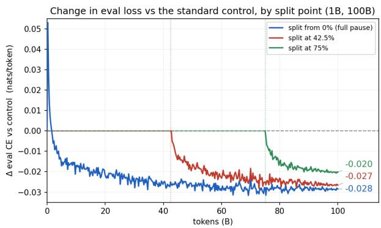
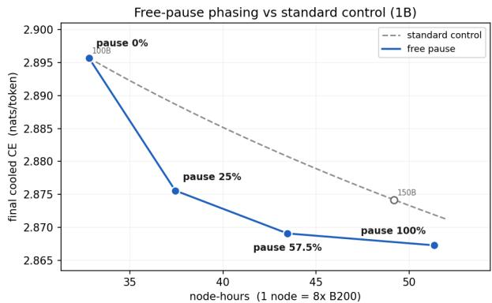
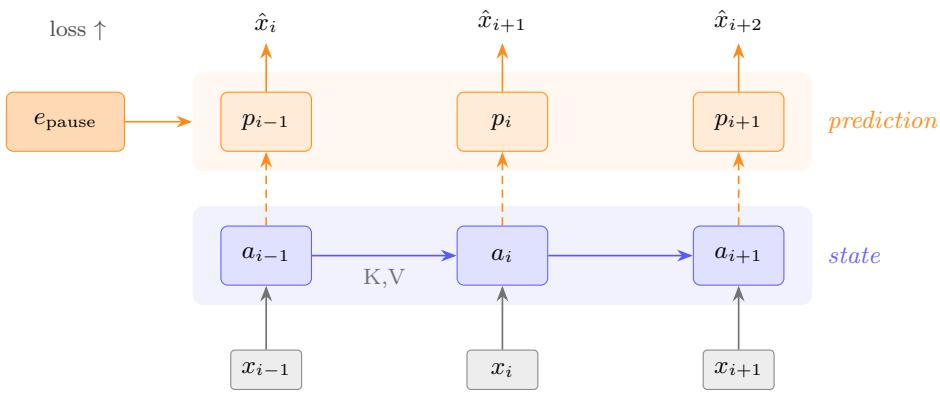
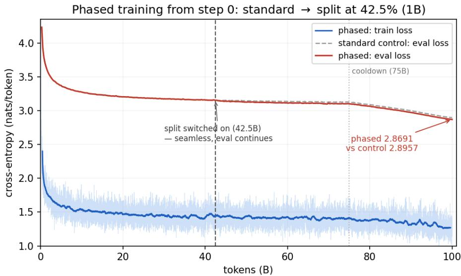
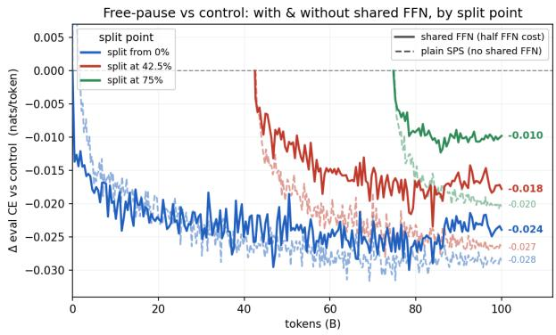
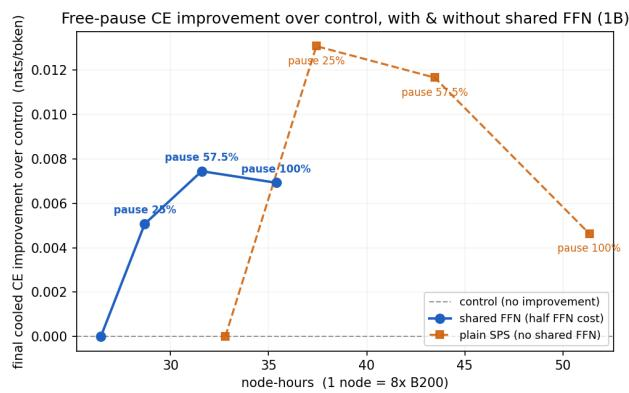
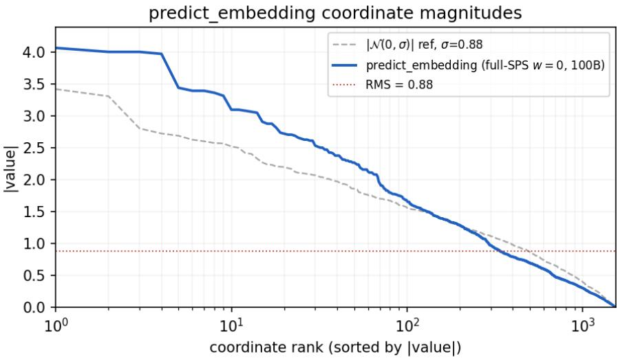

# Almost Free State Prediction Separation

John Langford1, Nathan Godey2, Giovanni Monea2, Yoav Artzi2, Harry Dong1, Ying Fan1, Gustavo de Rosa1, Zheng Zhan1

1Microsoft 2Cornell University

Draft, September 4, 2026

## Abstract

State–prediction separation (SPS) [24] relieves a language model’s hidden state of two competing burdens—summarizing the context and predicting the next token—by splitting the forward pass into a state stream and a prediction stream. The separation works, but it is expensive: the prediction stream is a second pass over the whole backbone, costing ∼1.9× the pretraining $\mathrm { F L O P s } .$ , and even more in terms of wall-clock time when using a flexible attention mask. This paper makes state–prediction separation almost free. We take the separation to its limit with a free pause token: a prediction stream that writes no keys or values at all and so rides the sequence’s existing positions. It improves next-token prediction by 2-3 centinats in practice on a 1B parameter model, and because it adds no position it costs nothing at inference—no added context length, no KV cache, no decode steps, and essentially no latency, with the growth in inference flops typically irrelevant as it is not the active bottleneck on throughput. The cost is therefore entirely in training where we use four mechanisms to drive it down: a two-pass split that keeps FlashAttention kernels viable, the w=0 prediction window, a shared gated FFN that evaluates one FFN per position rather than one per stream, and phasing the separation onto the tail of the run. Together these bring the overhead versus an optimized pretraining pipeline to 1.33× wall-clock while recovering ∼94% of the gain, and to as low as 1.09× along a graceful quality/compute tradeof. The result is an isoflop, isoparameter, and isotoken improvement over standard next token trained transformers.

  
Figure 1: Left: change in eval CE against the standard control, $\Delta ( t ) = \mathrm { C E } _ { \mathrm { v a r i a n t } } ( t ) - \mathrm { C E } _ { \mathrm { c o n t r o l } } ( t )$ for three pause phase start points; after each switch the primary gain accrues within ∼15B tokens with modest further gains. Right: compute frontier—final cooled CE vs. 8×B200 node-hours for diferent pause start points; improvements over standard control vary from −0.005 to −0.013 nats.

## 1 Introduction

Cross-entropy of next token loss is known to track downstream capability closely enough to anchor the scaling laws that govern modern pretraining [20] implying that prediction and compression are deeply aligned problems [27, 8]. Modern modeling approaches then spend enormous compute to buy fractional nats per token, each hard-won and, once folded into a base model, inherited by everything trained on top. Given this, even a small but reliable reduction in next-token loss is valuable provided it does not cost the parameters, tokens, inference budget, or training compute that would negate it. Training compute is particularly dificult–an architectural change that improves loss but doubles the cost of pretraining is not an improvement at all, because the older architecture training with more tokens may be superior [16].

A decoder transformer predicts token $x _ { i + 1 }$ from the hidden state $h _ { i }$ at position i, produced by L layers of causal attention and MLPs over the token embeddings. That single state carries two burdens at once: it must summarize $x _ { 0 : i }$ —the state that later positions attend to—and simultaneously be a good predictor of $x _ { i + 1 }$ . These two goals pull in diferent directions, yet a model with one state per position must serve both from the same vector. The state–prediction separation (SPS) hypothesis [24] addresses this tension by giving the two jobs their own streams over a weight-shared backbone resulting in next-token loss improvements. This has a substantial training time cost though—a prediction stream is a second pass over every layer, so SPS asks for roughly 1.9× the pretraining FLOPs of the model it improves. Furthermore, wall clock training time may be larger in practice since a flexible mask capable of expressing the SPS solution is not as eficient on a modern GPU.

We take state–prediction separation to its limit with a free pause token, which gives the prediction its own computation without a sequence position. Alongside the ordinary forward pass—the state stream a, which summarizes the context and exposes per-layer keys and values—we run a second, weight-shared prediction stream p. At every position p starts from one learned embedding, forms a query at each layer over a’s keys and values, and emits the next-token prediction; the training loss falls only on $p .$ Critically, p writes no keys or values of its own, so it adds nothing to the sequence—it rides the existing positions. The state can then specialize in summarizing and the prediction in predicting, and because the pause occupies no new position the separation is efectively free at inference: no added context length, KV cache, or decode steps, and near-free decode latency (a decode-step microbench on B200; §A). The primary remaining issue is therefore just training cost.

We drive this cost down using four mechanisms, all developed in §2. First, because the prediction writes no keys or values, training can instead split into two FlashAttention-friendly [7, 31] passes, providing ∼4× throughput over a naive flexible attention mask. Second, taking the prediction’s own attention window to w=0 avoids a second, log-sum-exp–merged attention call at only a millinats performance cost. Third, a shared gated FFN evaluates the position-wise FFN once per position rather than once per stream, halving the dominant term in the second pass’s FLOPs and removing its stored activations. Fourth, because the method is iso-parameter, a standard checkpoint is already a valid backbone, so the separation can be phased in for the tail of the run and the second pass paid on only a fraction of the tokens. Together these take state–prediction separation from ∼1.9× pretraining FLOPs to 1.33× wall-clock with essentially all of the gain intact, and to as low as 1.09× if some is traded away.

Section 3 places this among neighboring lines of work: the free pause delivers the efect of a pause token [13] without spending a sequence position on it, and it puts to work the same spare inference-time compute that speculative decoding [5, 6, 22, 28] exploits, for prediction quality rather than decoding speed. Everything is evaluated with a 1B scale model on Phi-4 derived pretraining data [1] against a tightly matched control at global batch 524k; the architecture and optimization are given in §4.

  
solid = writes/uses K/V dashed = query only, no K/V written $p _ { i }$ attends $a \_ s i$ weights shared, ×L layers

Figure 2: The free pause at one layer, over three positions. The state stream a is the ordinary causal pass and writes the per-layer keys and values. The prediction stream p is initialized at every position by the same shared embedding $e _ { \mathrm { p a u s e } } { \mathrm { . } }$ , forms only a query over the state’s keys and values (dashed; causally $p _ { i }$ reads $a { \leq } i )$ , and writes none of its own; its output xˆ is scored by the next-token loss. The streams share all weights and this repeats over L layers. Because p adds no key/value and no sequence position, the pause is free at inference; the only added parameter is $e _ { \mathrm { p a u s e } }$

Figure 1 previews the payof at the cheap end of that range. Against the matched control, phasing the pause onto the run’s tail lowers next-token cross-entropy at every point in training (Fig. 1, left); plotted against wall-clock node-hours the resulting frontier stays below the control’s own compute-for-loss curve, so the gain survives at equal compute—an iso-compute improvement (Fig. 1, right).

## 2 Method

Two weight-shared streams. Concretely, the state stream a embeds the input tokens and performs causal (optionally sliding-window) self-attention, producing the persistent per-layer keys and values. The prediction stream p carries no token embedding: at every position it is initialized from one shared learned vector, predict\_embedding, forms only a query over a’s keys and values at each layer, and feeds the LM head. Because every backbone parameter is shared, the model difers from a standard Transformer by exactly one tensor, so a standard checkpoint is already a valid backbone—the property phasing exploits below.

A FlashAttention-friendly two-pass split. The two passes are ordered: the state stream runs first to produce the cached keys and values, then the prediction stream runs as a plain cross-attention over them (predict query × state key/value). Both are shapes that FlashAttention kernels [7] express directly, whereas the interleaved form’s mask—neither causal, sliding-window, nor block-diagonal over packed sequences—is not. We run the Blackwell-targeted FlashAttention-4 [31] on B200. We measure 73k tokens/s per GPU instead of 16k tokens/s with a single pass flexible attention mask, about a 4× improvement.

A shared gated FFN. Since the majority of an LLM’s parameters reside in the FFNs they require heavy computation. Given this, it may be desirable to join these computations for the state and prediction streams. Let a¯ and p¯ be the post-norm state and prediction residuals entering the FFN sub-layer. A per-token scalar gate pools them, a single FFN is applied to the pooled input, and two further scalar gates route its output back into each stream:

$$
g = \sigma ( W _ { \mathrm { i n } } [ \bar { a } ; \vec { p } ] ) , \qquad f = \mathrm { F F N } ( g \bar { a } + ( 1 - g ) \bar { p } ) , \qquad a + = \sigma ( W _ { a } \bar { a } ) f , \quad p + = \sigma ( W _ { p \bar { p } } ) f .
$$

One FFN evaluation per position thus replaces two. The three added gates are single-output linears (negligible parameters); zero-bias initialization holds every gate at 0.5 initially, so a standard checkpoint remains a valid backbone and the shared form still phases in from a pretrained control. The FLOP, memory, and quality consequences are measured in §6.2.

Phasing. Training runs as for a standard next token prediction transformer for a fraction f of the schedule and switches on the split for the remainder, paying the second pass on only a $1 - f$ token fraction (compute $f + ( 1 - f ) \cdot 1 . 5 7 )$ . The free pause training phase starts from standard training with all training state intact (step, schedule, backbone optimizer, and dataloader all continue; only predict\_embedding initializes fresh). In practice, this phase switchover works well with immediate evaluation loss improvements.

## 3 Related work

Here we describe related work.

State–prediction separation. [24] introduced the hypothesis this paper builds on and the architecture that tests it: the forward pass is split into a state stream and a prediction stream so that summarizing and predicting need not share one representation. In their formulation the prediction stream still writes keys and values that are retained within a sliding window of w tokens. Our free pause is the $w { = } 0$ limit taken strictly: the prediction writes nothing at all, forming only a query over the state’s keys and values (diferently from SPS $w { = } 0$ , which also writes a temporary key and value for the prediction stream). This stricter separation is what makes the method free at inference since the prediction adds no cache. It is also what makes the training cheap: with no prediction keys or values, pure FlashAttention works in training and the prediction reduces to a plain cross-attention pass (§2). The shared gated FFN and the phasing schedule then drop the computational cost of using this in pretraining to a small and clearly viable tradeof.

Pause and thinking tokens. [13] adds computation before a prediction by inserting learned, non-vocabulary positions into the sequence, giving the model extra forward passes to “think” before it commits. The free pause supplies the same extra per-position computation, but on a parallel stream rather than a new position: a pause token occupies its own position and so enlarges the context, the KV cache, and the number of decode steps, whereas the free pause leaves all three unchanged.

Speculative and parallel decoding. Speculative decoding and related parallel-decoding methods [28, 22, 6, 5] also advance more than one token-query within a single decode step. There the extra queries are speculative future continuations that a verifier accepts or rejects; the free pause’s second query is instead a prediction at the current position that is always kept, and it improves prediction quality rather than speeding up generation. A free pause token leverages exactly the same spare compute which speculative decoding benefits from for the purpose of improving prediction quality rather than prediction speed. We leave investigating the combination of both techniques here to later work.

## 4 Model and optimization

Architecture. A 1B decoder transformer: 24 layers, hidden size 1536, grouped-query attention [2] with 16 query and 8 key value heads, sliding-window attention [3, 18] (window 2048) on most layers with a periodic full-attention layer every 6 layers [11], QK-normalization [15], partial rotary embeddings [29, 4] on the full-attention layers, and tied input/output embeddings [25]; sequence length 8192.

Optimization. A Muon-family optimizer [19] at peak learning rate 2e−2 on a warmup–stable– cooldown schedule [17, 14] (a short warmup, a constant plateau, then a final-25% linear cooldown to 2e−3). Global batch 524,288 tokens (micro-batch 4 with gradient-accumulation 2 across 8×B200), bf16 activations with mxfp8 [26] matmuls.

Data and baseline. Pretraining on Phi-4 derived data [1]. The strong baseline is the identical model with the prediction stream removed, matched on optimizer, data order, schedule, and global batch, so the two difer only in the second pass—and hence in wall-clock throughput.

## 5 Measurement

The prediction pass reruns the transformer layer stack but grafts the state’s key value pairs, skipping the key value projections implying a cost of ∼1.9× FLOPs, not 2×. Its wall-clock overhead is lower still (∼1.57×), because the compute-dense pass runs at ∼20% higher utilization than the microbatch-4 baseline. Compute is reported as wall-clock node-hours on identical 8×B200 hardware—the cost actually paid. Hence, iso-compute below means iso-node-hours which account for the higher utilization. At true iso-FLOP (∼1.9×) the control has more tokens and the margins tighten—the full pause turns slightly negative and the phased deltas roughly halve, though the ordering is unchanged.

## 6 Results

With a strong baseline (global batch 524k), the free pause reaches 2.8673 versus the control’s 2.8957—a −0.0284 nats iso-token gain. We measure each mechanism of §2 against the second pass’s cost, and then ask whether the gain survives once the control is handed the compute the separation would have consumed.

## 6.1 Cutting the second pass: a FlashAttention-friendly split, w=0, the shared FFN, and phasing

A FlashAttention-friendly split. Reorganizing the computation into two distinct stream passes— rather than one interleaved attention—is what lets stock fused kernels run the model at all, and it makes the whole run much faster.

Eliminate prediction-only attention. The original SPS paper [24] has an additional small sliding window amongst the prediction key/values. Here we find that the more extreme w=0 choice is a reasonable since the prediction self-window helps by only −0.0047 with 100B tokens, and w>0

<table><tr><td>change</td><td>effect on cost</td><td>quality</td></tr><tr><td>FA-friendly split</td><td>interleaved ~4× → the 1.57× baseline</td><td></td></tr><tr><td>w=0</td><td>avoids the window&#x27;s 1.22× pass</td><td> $\mathrm { c o s t s } \leq 0 . 0 0 9 \ ( - 0 . 0 0 4 7 @ 1 0 0 \mathrm { B } )$ </td></tr><tr><td>shared gated FFN</td><td> $1 . 5 7 \times  1 . 3 5 \times$ </td><td>costs ~0.005–0.010</td></tr><tr><td>phasing (42.5%)</td><td> $1 . 5 7 \times  1 . 3 3 \times$ </td><td>recovers ~all (2.8691 vs 2.8673)</td></tr></table>

Table 1: Each change targets the second-pass cost. Overheads are wall-clock, relative to the strong baseline (1.00×).

needs a second, log-sum-exp–merged FA call increasing compute by 1.22× the w = 0 pass (Sec. A).   
Thus using archive-only key values is the fast default.

Shared gated FFN. Evaluating the position-wise FFN once per position rather than once per stream removes about half of the second pass’s dominant term, taking a full pause from 1.57× to 1.35× wall-clock and freeing enough memory for a faster micro-batch. It gives up ∼0.005–0.010 nats against the two-pass form. §6.2 reports the memory, throughput, and quality measurements.

Phasing. Switching to the pause at 42.5% recovers essentially all the gain (2.8691, within noise of full pause’s 2.8673) at 1.33× instead of 1.57× (Table 2). The 75% split (1.14×) tests the hard case where the pause gets only the cooldown to adapt. Stitched from step 0 (Fig. 3), the phased run tracks the control’s loss up to the switch—the switch is seamless, no visible spike—then diverges below it and cools to 2.8691. The CE-vs-node-hours frontier (Fig. 1, right) is convex: a short pause finish banks most of the gain per extra node-hour. Plotting the change in eval loss against the control for diferent free pause phase points (Fig. 1, left) shows that a cold start with the full pause is actually worse for training of ∼1.5B tokens but then provides a clear win either continuing or with phases starting later. Most of the benefit accrues within ∼15B tokens of free pause training although small gains continue to be observed the longer free pause training continues. Given this structure, late phase free pause token training achieves most of the gains of early phases for a small fraction of the overall compute.

<table><tr><td>schedule</td><td>100B CE</td><td>compute</td><td>vs full pause</td></tr><tr><td>control (no pause)</td><td>2.8957</td><td>1.00×</td><td></td></tr><tr><td>full pause (w = 0)</td><td>2.8673</td><td>1.57×</td><td></td></tr><tr><td>42.5% std → pause</td><td>2.8691</td><td>1.33×</td><td>+0.0018 (recovers 94%)</td></tr><tr><td>75% std → pause</td><td>2.8756</td><td>1.14×</td><td>+0.0083 (recovers 71%)</td></tr></table>

Table 2: Phasing pays the pass only on the tail; full-resumed from a standard iso-parameter checkpoint.

## 6.2 The shared gated FFN in practice

The shared gated FFN (§2) evaluates the position-wise FFN once per position instead of once per stream. What that buys is measured here.

Memory and throughput. At sequence length 8192 the shared form removes the second pass’s stored FFN activations—about 14 GB/GPU less peak memory (91 vs 105 GB at micro-batch 4), enough that it fits a larger, faster micro-batch on which the two-pass form OOMs. On the same hardware the shared-FFN pause then runs at 0.74× the control’s tokens/s/GPU (∼95k vs ∼128k), versus 0.64× for the two-pass form—closing roughly a third of the free pause’s throughput penalty.

  
Figure 3: Phased training (42.5% split) stitched from step 0: standard pretraining to 42.5B, then the split to 100B. Eval loss (red) overlays the standard control (dashed) up to the switch—seamless, no spike—then diverges below it; cooldown at 75B brings the phased run to 2.8691 versus the control’s 2.8957. Train loss (blue) is the pretraining loss.

A full pause therefore costs 1.35× control wall-clock rather than 1.57×, and phased at 75% it costs 1.09×—the cheapest point in the paper (Table 3).

Quality. Trained fresh or phased in, the shared-FFN pause still beats the control at every split point (Table 3, Fig. 4 left): −0.0239 from a cold start, −0.0178 at a 42.5% split, −0.0098 at 75%. It gives up some of the two-pass form’s advantage (∼0.005–0.010 nats/token), so there is a real cost associated with the shared FFN. Part of that apparent gap is a baseline artifact: to fit the faster micro-batch the shared runs use a slightly smaller global batch whose own control is ∼0.011 nats/token worse, so the iso-batch cost of sharing is smaller than the raw deltas suggest. Normalizing each variant to its own control (Fig. 4 right) puts the shared-FFN frontier well to the left of the two-pass one: it reaches its improvement at far fewer node-hours.

<table><tr><td>schedule (shared FFN)</td><td>100B CE</td><td>∆ vs control</td><td>compute</td></tr><tr><td>control (no pause)</td><td>2.9064</td><td></td><td>1.00×</td></tr><tr><td>full pause (w = 0)</td><td>2.8825</td><td>-0.0239</td><td>1.35×</td></tr><tr><td>42.5% std → pause</td><td>2.8886</td><td>-0.0178</td><td>1.20×</td></tr><tr><td>75% std → pause</td><td>2.8966</td><td>-0.0098</td><td>1.09×</td></tr></table>

Table 3: Shared gated FFN: one FFN evaluation per position instead of two. Throughput 0.74× control (vs 0.64× for the two-pass form); still beats control at every split point. Measured at the faster micro-batch operating point, so the control is the matched shared-batch control (2.8957 → 2.9064; see text).

  
Figure 4: Shared gated FFN vs the two-pass free pause. $L e f t { \mathrm { : } }$ change in eval CE against control by split point; solid = shared FFN, dashed = two-pass. The shared form keeps most of the advantage at half the FFN cost. Right: final cooled CE improvement over each variant’s own control vs node-hours—this normalizes out the diferent baselines. The shared-FFN frontier (blue) reaches its gain at far fewer node-hours than the two-pass form (orange).

## 6.3 Iso-FLOP analysis

At iso-compute the baseline spends the saved node-hours on extra tokens; the comparison is the pause at 100B against the control given the same node-hours (Table 4). The control is measured to both 100B and 150B, so its cooled loss falls at a measured ∼0.037 nats/doubling. At equal node-hours every free-pause variant is ahead with shortest free phase giving a −0.013 advantage and full pause training providing only $\mathrm { ~ a ~ } - 0 . 0 0 5$ advantage. The margins tighten with a stricter iso-FLOP (∼1.9×) analysis where the phased runs stay positive $\left( - 0 . 0 0 5 \mathrm { ~ t o ~ } - 0 . 0 0 9 \right)$ while the full pause turns slightly negative (+0.006). Overall, free pause token training towards the end of pretraining is a clear and desirable compute win of ∼1 centinat depending on how measurements are done. Note the ordering: the cheapest schedules are the ones that win most at equal compute, which is precisely the point of making the separation almost free rather than merely efective.

<table><tr><td>variant</td><td>CE (100B)</td><td>compute</td><td>baseline @ iso-compute</td><td> $\Delta$ </td></tr><tr><td>full pause  $( w = 0 )$ </td><td>2.8673</td><td>1.57×</td><td>ctrl @ 157B = 2.872</td><td>-0.005</td></tr><tr><td>42.5% std → pause</td><td>2.8691</td><td>1.33×</td><td>ctrl @  $1 3 3 \mathrm { B } = 2 . 8 8 1$ </td><td>-0.012</td></tr><tr><td>75% std → pause</td><td>2.8756</td><td>1.14×</td><td>ctrl  $\textcircled { \Omega } 1 1 4 \mathrm { B } = 2 . 8 8 9$ </td><td>-0.013</td></tr></table>

Table 4: Iso-compute (node-hours) comparison against the strong baseline, from the control’s measured 100B and 150B cooled endpoints (slope ∼0.037 nats/doubling): 114–133B interpolated, 157B a short extrapolation. Every free-pause variant is ahead at equal node-hours.

## 6.4 Inference cost

At input prefill, only $x _ { i }$ need to be forwarded (no prediction is required and no keys and values are made by $p _ { i } )$ so the cost is the same as a vanilla Transformer. At decode, $( x _ { i } , p _ { i } )$ forward together as a two-token step: the state attention appends $x _ { i } \mathrm { { ' s } }$ key value pairs to the cache and the prediction reads it, the two co-advancing layer by layer. It is very typical for autoregressive latency to be set by the decode’s sequential depth (one step per generated token, L layers each), which the free pause leaves unchanged. It adds only the prediction stream’s parallel compute within each step—extra

FLOPs, not extra depth. With a small batch decode that is typically hidden, so batching the two streams’ projections and sharing the KV read across the two queries put the fused step within ∼1% of a standard decode (§A).

## 6.5 Downstream evaluation

Does the per-token gain survive as downstream capability, or is it loss-only? We evaluate the cooled checkpoints on two aggregate measures whose sampling error is small enough to resolve diferences at 1B: DCLM CORE [23] (a centered mean over 21 multiple-choice tasks) and held-out bits-per-byte (Table 5). Individual lm-eval [10] task scores are within their 95% confidence intervals so relevant signal is in these pooled and dense measures. Iso-token (both 100B), the full pause raises DCLM CORE from 0.327 to 0.347 and lowers climbmix [9] BPB by 0.008, providing modest benefit consistent with the −0.028 nats CE gain. Iso-compute, the pause at 100B matches the control given 50% more tokens (150B) to within measurement error on both metrics, and phasing reaches the same level at 1.14–1.33× compute. The gain is therefore not a loss-only artifact: it appears in downstream compression and in aggregate task accuracy.

<table><tr><td>variant</td><td>DCLM CORE ↑</td><td>BPB climbmix ↓</td></tr><tr><td>control, 100B</td><td>0.327</td><td>0.777</td></tr><tr><td>control, 150B</td><td>0.348</td><td>0.770</td></tr><tr><td>full pause (w=0), 100B</td><td>0.347</td><td>0.769</td></tr><tr><td>42.5% → pause, 100B</td><td>0.348</td><td>0.769</td></tr><tr><td>75% → pause, 100B</td><td>0.348</td><td>0.771</td></tr></table>

Table 5: Downstream metrics at 1B: DCLM CORE (centered mean over 21 tasks; $\mathrm { S E } \approx 0 . 0 1 )$ and held-out bits-per-byte on climbmix (SE ≈ 0.004), all at sequence length 8192. Iso-token, the full pause beats the 100B control on every aggregate; iso-compute it matches the 150B control, and the phased schedules reach the same level for far less compute. Per-task lm-eval scores are individually within their 95% intervals and are not shown.

## 6.6 What the pause embedding learns

The single added embedding grows ∼40× from init to per-coordinate RMS ≈ 1 (∥p∥ ≈ √d, ∼0.4× a token-embedding norm), but is RMS-normalized before use, so only its direction matters. That direction leans modestly toward the frequency prior. The nearest tokens by cosine are the commonest continuations (comma, period, newline, ‘the’, ‘and’; cosine 0.25–0.46). A dozen-odd coordinates reach ±3–4 (≈ 4σ; Fig. 5), carrying ∼11% of the energy over a difuse bulk. Against the token-embedding table it is a distinct, atypical point: its norm sits below the used-token shell (22nd percentile of a bimodal norm distribution), it is near-orthogonal to the embeddings’ strong common mode (cosine 0.05, below 96% of tokens), and its spikes fall on idiosyncratic channels rather than the model’s high-variance (massive-activation [30]) channels (top-16 overlap 2/16).

## 7 Conclusion

Our experiments here are limited to a single scale (1B) with a single primary seed. However, in our experience the pretraining process is robust enough that the results reported here are beyond the noise level. Within that scope, state–prediction separation provides a modest isotoken/parameter/compute/training FLOP advantage over standard pretraining methodology. The ∼1.9× pretraining FLOPs that made the separation an expensive curiosity fall to 1.33× wall-clock with essentially all of the gain intact, and to as low as 1.09× if some is traded away, while inference stays free. One perhaps-significant variation that may matter in practice is combining this approach with multitoken prediction [12].

  
Figure 5: Sorted coordinate magnitudes of the learned pause embedding (the full pause, w=0, 100B), against a Gaussian reference at the same RMS (0.88). A handful of channels sit well above Gaussian (±3–4, ≈ 4σ; top-10 dims = 11% of the energy) over a near-Gaussian unit-RMS bulk.

## References

[1] Marah Abdin, Jyoti Aneja, Harkirat Behl, Sébastien Bubeck, Ronen Eldan, et al. Phi-4 technical report. arXiv preprint arXiv:2412.08905, 2024.

[2] Joshua Ainslie, James Lee-Thorp, Michiel de Jong, Yury Zemlyanskiy, Federico Lebrón, and Sumit Sanghai. GQA: Training generalized multi-query transformer models from multihead checkpoints. In Empirical Methods in Natural Language Processing (EMNLP), 2023. arXiv:2305.13245.

[3] Iz Beltagy, Matthew E. Peters, and Arman Cohan. Longformer: The long-document transformer. arXiv preprint arXiv:2004.05150, 2020.

[4] Sid Black, Stella Biderman, Eric Hallahan, Quentin Anthony, Leo Gao, Laurence Golding, Horace He, Connor Leahy, Kyle McDonell, Jason Phang, Michael Pieler, USVSN Sai Prashanth, Shivanshu Purohit, Laria Reynolds, Jonathan Tow, Ben Wang, and Samuel Weinbach. GPT-NeoX-20B: An open-source autoregressive language model. In Workshop on Challenges & Perspectives in Creating Large Language Models, 2022. arXiv:2204.06745.

[5] Tianle Cai, Yuhong Li, Zhengyang Geng, Hongwu Peng, Jason D. Lee, Deming Chen, and Tri Dao. Medusa: Simple LLM inference acceleration framework with multiple decoding heads. In International Conference on Machine Learning (ICML), 2024. arXiv:2401.10774.

[6] Charlie Chen, Sebastian Borgeaud, Geofrey Irving, Jean-Baptiste Lespiau, Laurent Sifre, and John Jumper. Accelerating large language model decoding with speculative sampling. arXiv preprint arXiv:2302.01318, 2023.

[7] Tri Dao, Daniel Y. Fu, Stefano Ermon, Atri Rudra, and Christopher Ré. FlashAttention: Fast and memory-eficient exact attention with IO-awareness. In Advances in Neural Information Processing Systems (NeurIPS), 2022. arXiv:2205.14135.

[8] Grégoire Delétang, Anian Ruoss, Paul-Ambroise Duquenne, Elliot Catt, Tim Genewein, et al. Language modeling is compression. In International Conference on Learning Representations (ICLR), 2024. arXiv:2309.10668.

[9] Shizhe Diao, Yu Yang, Yonggan Fu, Xin Dong, Dan Su, Markus Kliegl, Zijia Chen, Peter Belcak, Yoshi Suhara, Hongxu Yin, Mostofa Patwary, Yingyan Lin, Jan Kautz, and Pavlo Molchanov. Nemotron-CLIMB: CLustering-based iterative data mixture bootstrapping for language model pre-training. In Advances in Neural Information Processing Systems (NeurIPS), Datasets and Benchmarks Track, 2025. arXiv:2504.13161.

[10] Leo Gao, Jonathan Tow, Baber Abbasi, Stella Biderman, Sid Black, Anthony DiPofi, Charles Foster, Laurence Golding, Jefrey Hsu, Alain Le Noac’h, et al. A framework for few-shot language model evaluation. Zenodo, https://doi.org/10.5281/zenodo.10256836, 2023.

[11] Gemma Team. Gemma 2: Improving open language models at a practical size. arXiv preprint arXiv:2408.00118, 2024.

[12] Fabian Gloeckle, Badr Youbi Idrissi, Baptiste Rozière, David Lopez-Paz, and Gabriel Synnaeve. Better & faster large language models via multi-token prediction. In International Conference on Machine Learning (ICML), 2024. arXiv:2404.19737.

[13] Sachin Goyal, Ziwei Ji, Ankit Singh Rawat, Aditya Krishna Menon, Sanjiv Kumar, and Vaishnavh Nagarajan. Think before you speak: Training language models with pause tokens. In International Conference on Learning Representations (ICLR), 2024. arXiv:2310.02226.

[14] Alexander Hägele, Elie Bakouch, Atli Kosson, Loubna Ben Allal, Leandro Von Werra, and Martin Jaggi. Scaling laws and compute-optimal training beyond fixed training durations. In Advances in Neural Information Processing Systems (NeurIPS), 2024. arXiv:2405.18392.

[15] Alex Henry, Prudhvi Raj Dachapally, Shubham Pawar, and Yuxuan Chen. Query-key normalization for transformers. In Findings of the Association for Computational Linguistics: EMNLP, 2020. arXiv:2010.04245.

[16] Jordan Hofmann, Sebastian Borgeaud, Arthur Mensch, Elena Buchatskaya, Trevor Cai, Eliza Rutherford, Diego de Las Casas, Lisa Anne Hendricks, Johannes Welbl, Aidan Clark, et al. Training compute-optimal large language models. In Advances in Neural Information Processing Systems (NeurIPS), 2022. arXiv:2203.15556.

[17] Shengding Hu, Yuge Tu, Xu Han, Chaoqun He, Ganqu Cui, Xiang Long, Zhi Zheng, Yewei Fang, Yuxiang Huang, Weilin Zhao, et al. MiniCPM: Unveiling the potential of small language models with scalable training strategies. In Conference on Language Modeling (COLM), 2024. arXiv:2404.06395.

[18] Albert Q. Jiang, Alexandre Sablayrolles, Arthur Mensch, Chris Bamford, Devendra Singh Chaplot, Diego de Las Casas, Florian Bressand, Gianna Lengyel, Guillaume Lample, Lucile Saulnier, et al. Mistral 7B. arXiv preprint arXiv:2310.06825, 2023.

[19] Keller Jordan, Yuchen Jin, Vlado Boza, Jiacheng You, Franz Cesista, Laker Newhouse, and Jeremy Bernstein. Muon: An optimizer for hidden layers in neural networks. https:// kellerjordan.github.io/posts/muon/, 2024.

[20] Jared Kaplan, Sam McCandlish, Tom Henighan, Tom B. Brown, Benjamin Chess, et al. Scaling laws for neural language models. arXiv preprint arXiv:2001.08361, 2020.

[21] Woosuk Kwon, Zhuohan Li, Siyuan Zhuang, Ying Sheng, Lianmin Zheng, Cody Hao Yu, Joseph E. Gonzalez, Hao Zhang, and Ion Stoica. Eficient memory management for large language model serving with PagedAttention. In ACM Symposium on Operating Systems Principles (SOSP), 2023. arXiv:2309.06180.

[22] Yaniv Leviathan, Matan Kalman, and Yossi Matias. Fast inference from transformers via speculative decoding. In International Conference on Machine Learning (ICML), 2023. arXiv:2211.17192.

[23] Jefrey Li, Alex Fang, Georgios Smyrnis, Maor Ivgi, Matt Jordan, Samir Yitzhak Gadre, et al. DataComp-LM: In search of the next generation of training sets for language models. In Advances in Neural Information Processing Systems (NeurIPS), Datasets and Benchmarks Track, 2024. arXiv:2406.11794.

[24] Giovanni Monea, Nathan Godey, Kianté Brantley, and Yoav Artzi. The state-prediction separation hypothesis. arXiv preprint arXiv:2607.01218, 2026.

[25] Ofir Press and Lior Wolf. Using the output embedding to improve language models. In European Chapter of the Association for Computational Linguistics (EACL), 2017. arXiv:1608.05859.

[26] Bita Darvish Rouhani, Ritchie Zhao, Ankit More, Mathew Hall, Alireza Khodamoradi, Summer Deng, Dhruv Choudhary, Marius Cornea, Eric Dellinger, Kristof Denolf, et al. Microscaling data formats for deep learning. arXiv preprint arXiv:2310.10537, 2023.

[27] Claude E. Shannon. Prediction and entropy of printed English. Bell System Technical Journal, 30(1):50–64, 1951.

[28] Mitchell Stern, Noam Shazeer, and Jakob Uszkoreit. Blockwise parallel decoding for deep autoregressive models. In Advances in Neural Information Processing Systems (NeurIPS), 2018. arXiv:1811.03115.

[29] Jianlin Su, Yu Lu, Shengfeng Pan, Ahmed Murtadha, Bo Wen, and Yunfeng Liu. RoFormer: Enhanced transformer with rotary position embedding. Neurocomputing, 568:127063, 2024. arXiv:2104.09864.

[30] Mingjie Sun, Xinlei Chen, J. Zico Kolter, and Zhuang Liu. Massive activations in large language models. In Conference on Language Modeling (COLM), 2024. arXiv:2402.17762.

[31] Ted Zadouri, Markus Hoehnerbach, Jay Shah, Timmy Liu, Vijay Thakkar, and Tri Dao. FlashAttention-4: Algorithm and kernel pipelining co-design for asymmetric hardware scaling. In Proceedings of Machine Learning and Systems (MLSys), 2026. arXiv:2603.05451.

## A Engineering

vLLM serving & decode latency. A two-stream vLLM [21] model serves the free pause: the state stream writes paged KV and the prediction stream reads the same layer’s KV read-only via cross-layer KV-sharing (no extra cache), with all weights shared and both streams run as one 2T-row batch so each layer’s weights load once. Sharing the KV read across the two queries—folding them into a single paged flash\_attn\_with\_kvcache call (archive-only write, both attend the shared KV)—puts the fused free-pause decode step within ∼1% of a standard decode in a decode-step microbench on B200.

## B Cross-entropy summary

<table><tr><td>role</td><td>CE</td></tr><tr><td>control 100B (baseline)</td><td>2.8957</td></tr><tr><td>control 150B (extended)</td><td>2.8742</td></tr><tr><td>pause w=0 100B</td><td>2.8673</td></tr><tr><td>pause w=64 100B</td><td>2.8626</td></tr><tr><td>phased 42.5%</td><td>2.8691</td></tr><tr><td>phased 75%</td><td>2.8756</td></tr></table>