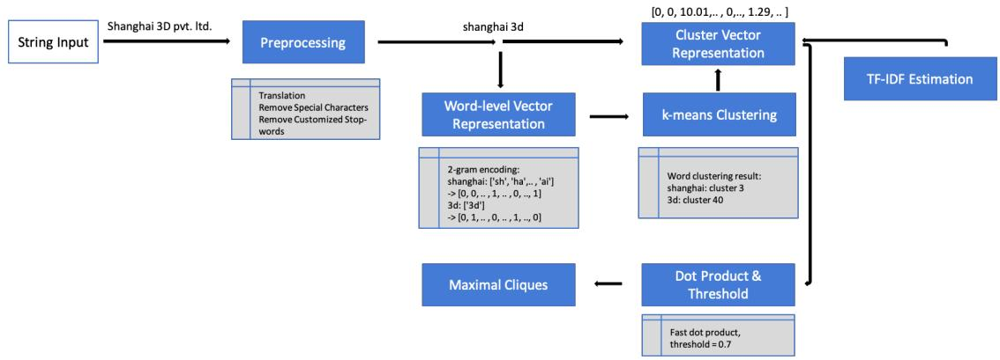
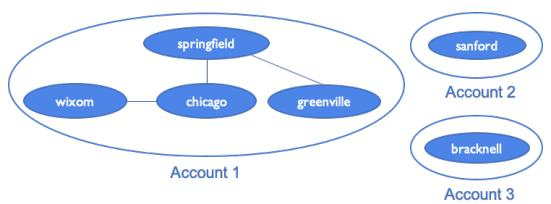
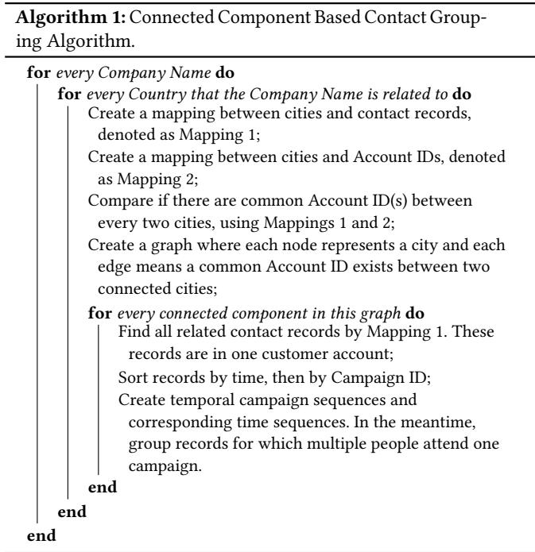
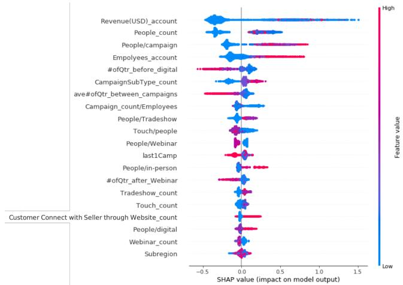
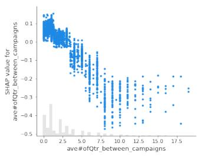
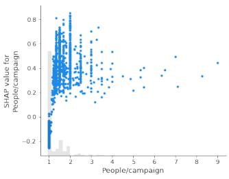
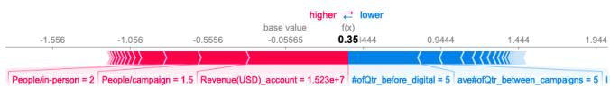

# B2B Customer Conversion Prediction: A Document Representation, Graph Theory, and CatBoost Driven Methodology

Tianqi Wang∗ Purdue University West Lafayette, Indiana, USA wang3175@purdue.edu

Anton Wiranata   
HP Inc.   
Boise, USA   
anton.wiranata@hp.com

Sheikh Shams Azam∗ Apple Cambridge, Massachusetts, USA

Christopher G. Brinton Purdue University   
West Lafayette, Indiana, USA cgb@purdue.edu

Wan Eih Huang Amazon Seattle, Washington, USA

Jan P. Allebach Purdue University West Lafayette, Indiana, USA allebach@purdue.edu

## ABSTRACT

In the one-time selling B2B context, the buying cycle may last months or even years. During the long process, targeting customers that have a high potential to make purchases and recommending personalized campaigns accordingly are important for efective marketing. For this goal, we study the following problems, B2B customer data aggregation, customer feature generation, and prediction of whether a B2B customer would show interest in making a purchase (i.e., prediction of conversion into sales funnel). We propose an algorithm to aggregate individual contacts to the B2B customer level based on multiple keys. For non-standardized keys such as company names, we propose a novel architecture to cluster them in a domain encompassing irregularities such as spelling mistakes and spelling variants. We then define and generate a set of features and apply the CatBoost model for customer conversion prediction. Our framework achieves 91% prediction accuracy. Based on the prediction results and analysis of the model, we then discuss personalized campaign recommendations to foster conversion.

## KEYWORDS

Conversion Prediction, Word Clustering, Document Representation

## ACM Reference Format:

Tianqi Wang, Sheikh Shams Azam, Wan Eih Huang, Anton Wiranata, Christopher G. Brinton, and Jan P. Allebach. 2023. B2B Customer Conversion Prediction: A Document Representation, Graph Theory, and CatBoost Driven Methodology. In Proceedings of2nd Workshop on End-End Customer Journey Optimization at KDD 2023. Long Beach, CA, USA, 10 pages.

## 1 INTRODUCTION

Data analysis is a hot topic in B2B marketing. An increasing number of companies reported successful results from their big data and AI investments [26]. Data analysis delivers value to firms by fostering B2B sales [12] and strengthening business operations in supply chain [9] and customer relationship management (CRM) [23, 35]. B2B marketing data involves large amounts of campaign records of individual contacts together with demographics and company characteristics (firmographics). Analyzing such data enables the possibilities to answer important business questions, such as, which customers are more likely to make purchases, are some sequences of campaign engagements are more efective than others in driving a sale. If so, is this sequence dynamic in nature, varying across the boundaries of regions and industries?

The analytics of B2B marketing data, however, are facing dificulties in terms of data aggregation and customer feature selection. B2B marketing engagement data that shows the interactions between customer and company is usually recorded for each individual contact. To analyze customer behavior, it is important to collect all activities on the customer-company level, which includes the behavior of all involved employees. Even though CRM platforms can gather contacts for each customer account, missing engagement data exists, resulting from incomplete data. Typically, there are standardized keys and non-standardized keys linking contacts and customer companies. Standardized keys, like a Data Universal Number System (DUNS) number, are normally clean data, but it is dificult for all individual contacts and customer accounts to have such keys due to incomplete data or insuficient human labor. In order to have complete customer campaign engagement data and an unbiased dataset that covers various sizes of companies, regions, and industries, it is important to make use of non-standardized keys, such as company name and company location. In contrast to standardized keys, non-standardized keys can be free-entered text data which creates spelling mistakes, inconsistent abbreviations, and multi-language issues. Thus, the data processing pipeline should clean and standardize keys, and the mechanism of mapping contact to customer account should utilize multiple keys.

LRFM (length, recency, frequency, and monetary) models [2, 15, 21, 30] are popular for customer data analysis. Time series data is also widely used for customer analysis [5, 14]. However, when the

B2B business is one or a few times of selling followed by supporting services, LRFM models are not applicable, and customer behavior time series data are not suficient for modeling or analysis. In this case, we consider three types of customer attributes - demographics of employees from customer companies, firmographics, and customer campaign engagement features. Here, firmographic features refers to characteristics of organizations, companies, governmental entities, or any other type of firm. Demographic and firmographic features are extracted from databases, while campaign engagement data, even after aggregating contacts to the company level, are still individual records. We are interested in attributes such as the num ber of campaigns each customer has been engaged in and temporal campaign sequences. In a B2B context, it is not rare that multiple employees from one company participate in the same campaign. The feature generation mechanism should reflect both these facts, i.e., one same campaign and multiple employees.

Considering the next steps when the customer with a high potential of conversion is targeted, although personalized content recommendation is actively studied in eCommerce, marketing campaign recommendations are rarely studied. Yang �� ��. [33] proposed a graph-based next campaign to run (NCTR) recommender system for campaign recommendations. We discuss the actions that a B2B company can take to increase the customer conversion ratio based on our conversion prediction results.

Motivated by the needs of B2B business marketing data analysis, we address the problems of processing and aggregating individual contact data, prediction of conversion into sales funnel, and action recommendation based on conversion prediction results. Our study makes the following contributions. First, we propose a data preparation pipeline for data collection and cleaning. Our data preparation pipeline not only pre-processes data stored in the B2B databases but also collects online public firmographic data. To standardize keys, we design a novel architecture for text encompassing irregularities, including spelling mistakes and spelling variants. Second, we design an algorithm for aggregating contacts to the B2B customer level based on multiple keys. Customer companies having the same names may be diferent subsidiaries or branches and thus make their own decisions on purchases. Thus, we also consider location as a key. In order to utilize account ID, company name, and location as keys, we create two criteria and adopt connected components for contact aggregation. Third, we extract firmographic features and campaign engagement features and demonstrate that these features are efective for predicting conversion into the sales funnel. After feature extraction, we adopt the CatBoost model for conversion prediction. Last, we discuss the feasibility of recommending actions to foster sales based on conversion prediction results and model interpreting tools.

## 2 RELATED WORK

Word clustering and cleaning An extensive amount of work has been focused on word clustering and text clustering. Martin �� ��. [19] employed an exchange algorithm using the criterion of perplexity improvement for bigram and trigram word clustering. Ushioda [31] described a hierarchical clustering of words and clustering of multiword compounds. Word clustering in these works is developed for semantic analysis and based on context or word positions. In the task of company name text cleaning, there is no context available. Most spelling correction systems detect errors by searching in a dictionary or by semantic analysis of the surrounding context [13]. A dictionary is also not available for the task of word clustering or text cleaning where made-up words are common.

Feature selection and extraction Research by Kourou �� ��. [16] and Guyon & Elisseef [11] emphasizes the importance of identifying the relevant attributes for predictive modeling. Studies on business analysis have been using financial data [17], operational data [10], marketing data [24], and textual data [36] for various tasks. Venkatesh & Anuradha [32] and Ghojogh �� ��. [7] review general feature selection methods when a set of features are accessible. In our task, we gather collected data and web-scraped data, which contain customer behavior and company-level characteristics, and then apply feature selection and feature extraction techniques.

Conversion prediction Conversion prediction has been studied for eCommerce [22, 25, 34], and for B2C market in the domain of mobile advertising [20, 27]. These studies use customer online behavior or click-streams as input data, which is more accessible and complete. In the B2B market, few works are found for conversion prediction. Instead, researchers have explored B2B customer churn prediction [6, 8]. However, these studies are still mainly in the context of eCommerce.

Recommender system Recommender systems have been an active topic in recent years. The major recommendation approaches include content-based methods, collaborative filtering, and hybrid methods [1]. Temporal patterns are considered in the collaborative filtering model to learn the dynamic characteristics [3]. In the B2B marketing campaign context, Yang �� ��. [33] designed a social and temporal model for B2B marketing campaign recommendations. They exploited the temporal behavior patterns and constructed a temporal graph. The framework identifies common graph patterns and predicts missing edges in the temporal graphs. They also incorporated social factors into their approach.

## 3 DATASET AND PRE-PROCESSING

Some companies (including the one we are working with) have marketing data in two parts: individual contact data and customer company data. A summary of the marketing data we analyze is shown in Table 1. The data is incomplete. In our dataset, some contacts are not linked to a customer company and thus have no Account ID. For both individual contact data and customer company data, firmographic features: Industry, Revenue, and Employee Number only exist in some contacts/companies.

Our first objective is to aggregate contacts to companies such that we can gather all campaigns a customer participated in and then create temporal campaign sequences. However, the standardized key Account ID linking individual contacts to customer companies created by the marketing team only exists for some contacts. In order to complete the campaign data for customer companies that have Account IDs and create campaign data for customers that do not have Account IDs, we need other keys to determine whether individual contacts belong to one customer company. We use Company Name, Country, and City as extra keys to group contact data to the company level. These three types of data are all entered as free-form text responses. Country and City are cleaner data relative to Company Name. We apply data cleaning techniques to Country and City, and then the resulting data are directly used as keys. Our techniques and methods involve translating non-alphabetic Country and City to English through a translation API, converting to lowercase, removing special characters, removing customized stop-words such as “city”, and manually checking. Company Name, on the other hand, has various made-up words and more irregularities such as spelling mistakes, inconsistent abbreviations, and multi-language issues. We describe the processing procedure for Company Name together with the proposed text document clustering architecture in the next section.

Table 1: Datasets
<table><tr><td></td><td></td><td>Individual Contact</td><td>Customer Company</td></tr><tr><td># of tacts/companies</td><td>con-</td><td>126.1 k</td><td>11.4 k</td></tr><tr><td># of campaign records</td><td></td><td>148.4 k</td><td>4.7 k</td></tr><tr><td>Keys that exist for all tacts/companies</td><td></td><td>Company name, Loca- con- tion (Region, Sub-region, ID, Location (Region, Sub- Country)</td><td>Company name, Account region, Country)</td></tr><tr><td>tacts/companies</td><td>ist for some of con- (City)</td><td>Keys that only ex- Account ID, Location Location (City)</td><td></td></tr><tr><td>Firmographics</td><td></td><td>Industry, Revenue, Em- Industry, Revenue, Em-</td><td>ployee Number (number ployee Number (number</td></tr><tr><td>Campaign info</td><td></td><td>of employees) Campaign type, Cam- Campaign type, Cam-</td><td>of employees)</td></tr><tr><td>Other info</td><td>terested in</td><td>Product the contact is in- Product the company is</td><td>paign ID, Campaign time paign ID, Campaign time interested in</td></tr></table>

Learning from marketing experts’ experience, firmographics are important attributes for marketing data analysis. Our datasets have missing values of these firmographic features in both contact data and company data. However, these data can be acquired in other databases or from online resources. We apply web scraping to extract firmographics in order to fill in this information. The web-scraped data and the firmographics in our dataset are not in the same formats. We adopt string processing, translation, and keyword mapping to standardize data from the two resources. After web scraping and pre-processing, there are still missing values in these firmographics. We set the global median in the processed data as Employee Number or Revenue for customer companies for which our dataset does not have this information. These firmographics will then be used in feature extraction and conversion prediction.

## 4 DOCUMENT REPRESENTATION AND CLUSTERING ARCHITECTURE

## 4.1 Architecture Overview

Text data like company names cannot be standardized by vocabulary checking nor represented directly by word embeddings because of the large number of made-up words. We tackle this issue by clustering words and using the cluster indices as a new vocabulary. Our architecture consists of a novel algorithm utilizing classical techniques such as stopword detection and correction, k-means clustering, and generation of vector representations in a vector space for the candidate documents. Figure 1 summarizes the steps of the algorithm. It has two main phases: word-level clustering and string grouping in the cluster vector space.

## 4.2 Word-level Clustering

To standardize the representation of vocabulary words in text documents, we first conduct pre-processing and basic data-cleaning techniques on the text documents. Then we encode words and apply k-means clustering on the encodings. Using the clustering results, we then generate the standardized representation for vocabulary words using their cluster indices.

We pre-process the text documents, company names in our case, by the following steps: (1) convert text to lower case; (2) remove customized stop words, including {the, company, co, pvt, ltd, llc, inc, corp, corporation}, which do not provide information to distinguish the company names; (3) search and scrape the online public company profile using the processed company name from Step 2 as the search term. The web-scraping process for firmographics can be finished at the same time. This step utilizes a search engine and online public profile to remove some spelling variants and mistakes in the data; (4) translate non-English company names using the Translation API and compare scraped company names with search terms by their fuzzy ratio [4]. If the ratio is larger than a threshold (we choose 70 in our case), use the scrapped company names for the next steps; (5) repeat Steps 1 and 2 on the scraped company names. Note that the search terms for automatic searching and web-scraping are before any language translation because small or medium-sized companies may not have profiles in multiple languages, and searching by the original languages can provide more accurate results.

To cluster input strings (vocabulary words from company names in our case), we first aggregate all the input strings that are to be clustered and filter out repeated strings. These strings are then converted to their bigram representations, followed by the one-hot encoding of the bigram tokens. Bigram tokenization generated for the word “encoding” is the set $\{ ^ { \mathfrak { c } } \mathrm { e n } ^ { \mathfrak { p } } , ^ { \mathfrak { c } } \mathrm { n c } ^ { \mathfrak { p } } , ^ { \mathfrak { c } } \mathrm { c o } ^ { \mathfrak { p } } , \cdot \cdot \cdot , ^ { \overline { { \mathfrak { c } } } } \mathrm { i n } ^ { \mathfrak { p } } , ^ { \mathfrak { c } } \mathrm { n g } ^ { \mathfrak { p } } \}$ . If the input strings only consist of 26 English letters and 10 Arabic numerals, then the one-hot encoded representation for each bigram has a dimension of 1, 296. Then each string, or vocabulary word, is represented by the sum of the one-hot encodings of all its bigram tokens. With the word-level encodings, we then perform Principal Component Analysis (PCA) and k-means clustering on principal components that retain 95% variance. The cluster index is then the standardized representation of vocabulary words. We experiment with clustering with diferent values for � and present the efect of � in the word-level clustering in the next section.

## 4.3 String Grouping in Cluster Vector Space

After the word clustering, we infer the input strings using a bag of words wherein the words are the cluster indices from the previous word clustering results. We treat a cluster index as a vocabulary, then an input string is a list of cluster indices. We then vectorize the input strings by term frequency-inverse document frequency (TF-IDF) followed by normalization to lower the influence of common words such as city names. The dimension of the string vectors is the number of clusters of vocabulary words described in the previous section, denoted as �. After these steps, we have a vector representation of each input string.

  
Figure 1: Architecture pipeline of our algorithm. All the constituent blocks are trained specifically to our data.

Next, we evaluate the similarity of these vector representations using the dot product of the normalized vector representation. If the dot product between two vectors is larger than a threshold (we choose 0.7 in our case), the two strings are considered to be similar. Because the string vectors are sparse and of high dimensions, we adopt the fast dot product to accelerate the computation.

After fast dot product and thresholding, each string has 0, 1, or multiple similar strings. If we group all similar strings in one group, strings that are very diferent can end up in one group. For example, if String 1 is similar to String 2, String 2 is similar to String 3, ..., and String n-1 is similar to String n, then String 1 and String n can be very diferent but still be in one group. To overcome this issue, we cluster company names by maximal cliques of connected components. The steps are: (1) create a connected component graph where each node represents a company name and each edge represents the dot product of the two nodes larger than the threshold; (2) the largest maximal clique that has the most nodes is set as Group 1, and the strings corresponding to these nodes are regarded as the same; (3) remove these nodes in the maximal clique from the connected component graph; (4) repeat Steps 1, 2, and 3 and increase the group number until no node is left in the connected component graph. At the end of this step, strings that are in one group are considered to be the same.

## 4.4 Experimental Results

We first look at the efect of the number of clusters in the first phase through a set of examples. For the purpose of evaluation, we consider the values of � ∈ {10000, 20000, 30000, 40000, 50000}. It can be observed from Table 2 that the clusters become less diverse as we increase the number of clusters. This leads to the trade-of between keeping � too high and losing the variations in spelling or setting � too low and allowing a lot of noisy clustering. For the following analysis, we consider � = 30000.

## 5 CONTACT GROUPING ALGORITHM

Company Name is a common non-standardized key linking contacts and customer companies. However, Company Name itself is not suficient to cluster individual contacts. One situation is that two subsidiaries of a large company in two diferent countries may be influenced by each other, but tend to make their own purchasing decisions. We set two criteria for contact grouping that make use of Company Name, Country, City, and Account ID: (1) contact records that have the same Company Name, the same Country, and the same City belong to one customer account; (2) contact records that have same Company Name, same Account ID, and same Country belong to one customer account.

In the next section, we start by explaining how we apply a graphbased method and connected components, then we introduce our algorithm in pseudo-code.

## 5.1 Connected Components Based Contact Grouping Algorithm

Table 3 shows a dummy data set, which contains four fields we need for contact aggregation. Assume that we are grouping contacts that all have Company Name 3M. We propose a method to first group contacts by Criterion 1 and then gather the contact groups by Criterion 2. The first step can be easily achieved by conditioning Company Name, Country, and City. We apply the connected compo nent in the second step. Figure 2 shows how the contact groups are clustered to customer accounts in Step 2 by connected components. Each node is a group of contacts that have the same Company Name, the same Country, and the same City. In this graph, there are 3 connected components and therefore 3 customer accounts.

In our implementation, we perform the above-mentioned connected components-based method for every Company Name in every Country. Since both of the two criteria have Company Name and Country constraints, we iterate through Company Name and Country, and then we group contacts based on Account and City. There are 4 main steps in the algorithm: (1) create a mapping between City and contacts and another mapping between City and Account ID; (2) create the connected components graph where each node is a group of contacts that are in the same City, and each edge means the two contact groups share a common Account

Table 2: Performance Comparison between Diferent Cluster Sizes.
<table><tr><td>k-value</td><td>Example 1</td><td>Example 2</td><td>Example 3</td><td>Example 4</td></tr><tr><td>10000</td><td>[&#x27;precision&#x27;, &#x27;bossprecision&#x27;, &#x27;precisionsteknik&#x27;, &#x27;precisiion&#x27;, &#x27;precisionfab&#x27;, &#x27;precisionsignscom&#x27;, &#x27;osprecision&#x27;, &#x27;precicision&#x27;, &#x27;precisions&#x27;, &#x27;precisione&#x27;, &#x27;precisionvetor&#x27;, &#x27;precisiondrone&#x27;]</td><td>[&#x27;shanghai&#x27;, &#x27;shanghe&#x27;, &#x27;shangcai&#x27;, &#x27;shangai&#x27;, &#x27;shanghaibim&#x27;]</td><td>[&#x27;argonne&#x27;, &#x27;argon&#x27;, &#x27;falconcargo&#x27;, &#x27;sargon&#x27;,</td><td>[&#x27;machining&#x27;, &#x27;teaching&#x27;, &#x27;phmachining&#x27;, &#x27;maching&#x27;],</td></tr><tr><td>20000</td><td>l&#x27;precision&#x27;, &#x27;precisiion&#x27;, &#x27;precisionfab&#x27;, &#x27;precicision&#x27;, &#x27;precisions&#x27;, &#x27;precisione&#x27;]</td><td>[&#x27;shanghai&#x27;, &#x27;shanghe&#x27;, &#x27;shangcai&#x27;, &#x27;shangai&#x27;, &#x27;shanghaibim&#x27;]</td><td>[&#x27;argonne&#x27;, &#x27;argon&#x27;, &#x27;sargon&#x27;, &#x27;margoni&#x27;]</td><td>[&#x27;machining&#x27;, &#x27;phmachining&#x27;, &#x27;maching&#x27;],</td></tr><tr><td>30000</td><td>[’precision&#x27;, &#x27;precisiion&#x27;, &#x27;osprecision&#x27;, &#x27;precicision&#x27;, &#x27;precisions&#x27;]</td><td>[&#x27;shanghai&#x27;, &#x27;changhai&#x27;]</td><td>[&#x27;argonne&#x27;, &#x27;argon&#x27;, &#x27;sargon&#x27;, &#x27;margoni&#x27;]</td><td>[&#x27;machining&#x27;, &#x27;machin&#x27;, &#x27;maching&#x27;],</td></tr><tr><td>40000</td><td>l&#x27;precision&#x27;, &#x27;precisiion&#x27;, &#x27;osprecision&#x27;, &#x27;precicision&#x27;, &#x27;precisions&#x27;]</td><td>[&#x27;shanghai&#x27;, &#x27;changhai&#x27;]</td><td>[&#x27;argonne&#x27;]</td><td>[&#x27;machining&#x27;, &#x27;phmaching&#x27;, &#x27;maching&#x27;],</td></tr><tr><td>50000</td><td>[’precision&#x27;, &#x27;precisiion&#x27;, &#x27;precicision&#x27;]</td><td>[&#x27;shanghai&#x27;]</td><td>[&#x27;argonne&#x27;]</td><td>[&#x27;machining&#x27;, &#x27;maching&#x27;]</td></tr></table>

Table 3: A Dummy Data Set of Contacts.
<table><tr><td>Index</td><td>Company Name</td><td>Country</td><td>City</td><td>Account ID</td></tr><tr><td>1</td><td>3M</td><td>united states</td><td>chicago</td><td>001</td></tr><tr><td>2</td><td>3M</td><td>united states</td><td>wixom</td><td>-</td></tr><tr><td>3</td><td>3M</td><td>united states</td><td>wixom</td><td>001</td></tr><tr><td>4</td><td>3M</td><td>united states</td><td>greenville</td><td>002</td></tr><tr><td>5</td><td>3M</td><td>united states</td><td>springfield</td><td>001</td></tr><tr><td>6</td><td>3M</td><td>united states</td><td>springfield</td><td>002</td></tr><tr><td>7</td><td>3M</td><td>united states</td><td>sanford</td><td>003</td></tr><tr><td>8</td><td>3M</td><td>united kingdom</td><td>bracknell</td><td>004</td></tr></table>

  
Figure 2: Contact grouping. Refer to Table 3 for contact data on which this grouping is based. The Springfield group is connected with the Chicago group because of common Account ID 001 and is connected with the Greenville group because of common Account ID 002.

ID; (3) in every connected component, all related contacts are in one company; (4) for contact records in one company, we sort the campaign sequences in the temporal order. We also group records for which multiple people participate in one campaign and record the number of people from the company that participated in this campaign. We consider campaigns with the same Campaign ID to be one campaign. The details of the algorithm are summarized in the following pseudo-code (Algorithm 1)

## 5.2 Experimental Results

Our contact grouping algorithm applied the two criteria separately and resulted in 93,568 customer accounts. Table 4 shows an example of contact grouping results. Contacts in this customer account are from various cities, therefore City is left blank for this account.

Table 4: Contact Grouping Result Example for a Single Contact Grouping.
<table><tr><td>Company Name</td><td>County</td><td>City</td><td colspan="2">Campaign Sequence</td><td>Time Sequence</td><td>Account ID</td><td>Contact Record Count</td></tr><tr><td>Company Name 1</td><td>japan</td><td></td><td>[Email</td><td>Cam-</td><td>[FY2018-Q1, FY2018-</td><td>[218814694.0,</td><td>314</td></tr><tr><td></td><td></td><td></td><td>paign,</td><td>Tradeshow,</td><td>Q2, FY2018-Q2,</td><td>218814694.0,</td><td></td></tr><tr><td></td><td></td><td></td><td>Tradeshow,</td><td></td><td>FY2018-Q3, ...]</td><td>218814694.0,</td><td></td></tr><tr><td></td><td></td><td></td><td>Tradeshow, ...]</td><td></td><td></td><td>218814694.0, ...]</td><td></td></tr></table>

## 6 FEATURE EXTRACTION AND FEATURE SELECTION

## 6.1 Feature Extraction

After obtaining account data, we extract firmographic features and campaign activity-related features. Each contact record has its own firmographic information. Ideally, the process of contact grouping generates customer accounts having contacts with the same firmographic information for the same customer account. However, due to the incompleteness of the data and the fact that the contact grouping process is an approximation to the real case, an account can occasionally contain contacts that have firmographics that are diferent from those of other contacts in this account. We extract the most common values from all contact records in one account for firmographic features, while we retrieve campaign activity-related features as statistics either directly from activity sequences or by computation. For each customer account, we successfully extracted 156 features. Table 5 summarizes the descriptions of these features. We also sort 18 campaign types into 8 campaign categories and retrieve features from temporal campaign category sequences. The 4 main categories are digital campaigns like Webinar, in-person campaigns like Tradeshow, B2B seller-initiated connections like Email Campaign, and customer-initiated connections, such as Customer Connect with B2B Seller through Seller’s website.

These features can be used to train models to predict whether a customer can be converted into the sales funnel. The campaign activity sequences we have generated have all activities of people belonging to that customer account. However, not all these activities happened before conversion, for example, connecting the B2B seller through the seller’s website for after-sales services. Therefore, we find conversion time and purchase time, and then truncate temporal campaign sequences for the task of conversion prediction.

## 6.2 Feature Selection

Feature selection is a process of reducing the number of input variables to reduce the computational cost and improve the performance of the model. In the 156 features we generated in the last step, there are 149 numerical features and 7 categorical features. We only conduct feature selection on the numerical features. The steps are as follows: (1) remove features that have one unique value over all accounts; (2) remove features that have a Pearson’s correlation coeficient greater than 0.99 with other features; (3) train a tree-based model with all remaining features, record importance values, and remove features that have zero importance. The model we use is Light Gradient Boost Machine (LightGBM); (4) apply the sequential forward floating selection (SFFS) algorithm [29] to select from the remaining features.

We removed 23 features, each of which has only one unique value, 13 features to eliminate high correlation magnitude that is greater than 0.99 in our data, and 28 features with zero importance, which resulted in 85 numerical features remaining. SFFS then selected 33 features from these 85 features. Table 6 lists the 33 features. Together with the 7 categorical features, Region, Sub-region, Industry, Products, last campaign, second to last campaign, and third to last campaign, we have 40 features in total. We examine the efect of feature selection on conversion prediction accuracy by training models on all 156 features and on 40 selected features, respectively, in the next section.

## 7 CONVERSION PREDICTION BASED ON CATBOOST

## 7.1 CatBoost Model

Prediction of which customers can be converted into the sales funnel enables marketing teams to take actions more efectively to convert customers. With the features we extracted in the previous section, one can build various machine-learning models to predict conversion. We choose the toolkit CatBoost [28] to build the model for the following reasons: (1) We have both categorical features and numerical features. CatBoost has an innovative algorithm for processing categorical features. (2) CatBoost is based on a decision tree, which makes the model easier to explain. There are two critical algorithmic advances introduced in CatBoost: ordered target statistics (TS) to encode categorical features, and ordered boosting based on gradient boosting algorithm with decision trees as base predictors (GBDT.

## 7.2 Experiment and Results

In our experiment, we evaluate CatBoost, random forest, logistic regression, and a recurrent neural network (RNN) on the prediction of customer conversion. In total, we have 93,568 customer accounts, of which only 15,724 have at least 2 campaign activities. Because one of our most important goals is to uncover how we can lead customers to conversion by influencing their activities, for this experiment we only use account data that has at least 2 campaign activities. Among these customer accounts, our data is unbalanced in terms of the target variable, i.e. conversion. For this reason, we use all data of 2,194 customers that are converted into the sales funnel and 2,194 randomly chosen customers from 13,530 unconverted accounts as our whole dataset. We randomly split the dataset into a training set (75%) and a testing set (25%) and use them for all these models.

The features used for these models and the results measured by accuracy are presented in Table 7. The parameters and metric for CatBoost are as follows: area under the curve (AUC) as the metric for overfitting detection and best model selection, maximum of 10 trees that can be built, 0.15 learning rate, and coeficient value 9 as the L2 regularization term of the cost function. Our RNN has one hidden layer of size 128 for each campaign activity step, and the output is produced through a fully-connected layer and log of the softmax function. This is a simple neural network structure. One possible future work is to improve the RNN structure for not only the task of conversion prediction but also the prediction of the next campaign activity. For logistic regression and random forest, we encode the categorical features with one-hot encoding. The CatBoost model trained on the 40 selected features reaches a conversion prediction accuracy of 91.0%.

Table 5: Account Level Features.
<table><tr><td>Feature</td><td colspan="2">Extraction method</td><td>Description</td></tr><tr><td colspan="4">Firmographics</td></tr><tr><td>Region1</td><td colspan="2">Most common value</td><td>Location of a customer. There are in total 3 regions in our data.</td></tr><tr><td>Sub-region¹</td><td colspan="2">Most common value</td><td>Location of a customer. There are in total 18 sub-regions in our data.</td></tr><tr><td>Industry</td><td colspan="2">Most common value</td><td>The industry a company is in. Customer company industries in our data are divided into 7 segments: industrial, mobility and transportation, consumer goods and electronics, healthcare,</td></tr><tr><td>Revenue</td><td colspan="2">Most common value</td><td>education and research, military, defense, and aerospace, and parts providers. Company revenue. If a revenue value is missing, the median value of all known revenue for companies in our data is used for this account.</td></tr><tr><td>Employee number</td><td colspan="2">Most common value</td><td>Total number of company employees in all sites. If an employee number is missing, the median value of all known employee numbers for companies in our data is used for this customer.</td></tr><tr><td>Products</td><td colspan="2">most common value</td><td>Product the customer is interested in. This is an estimation by the marketing team, not answered by the customer.</td></tr><tr><td colspan="4">Campaign related features</td></tr><tr><td>Campaign count</td><td colspan="2">Statistic</td><td>Number of campaigns that people belonging to customer company have participated in.</td></tr><tr><td>People count Touch count</td><td colspan="2">Statistic Statistic</td><td>Number of unique contacts in this company that have participated in campaigns.</td></tr><tr><td></td><td colspan="2"></td><td>Number of campaign touches, where one contact participating in one campaign counts as one touch.</td></tr><tr><td>Campaign count/Employee number</td><td colspan="2">Calculation</td><td>Campaign count divided by Employee number</td></tr><tr><td>People/Campaign</td><td colspan="2">Statistic</td><td>The average number of people from the customer company that participated in one campaign. We estimate this value by dividing the Touch count by the Campaign count.</td></tr><tr><td>Touch/People</td><td colspan="2">Statistic</td><td>The quotient of Touch count by People count. We regard the result as the average number of campaigns a person in the account has participated in.</td></tr><tr><td>Campaign type count</td><td colspan="2">Statistic</td><td>Number of campaign types of all campaigns people from a company have participated in. There are in total 18 campaign types in our data.</td></tr><tr><td>Ave # of Qtr between succes- sive campaigns</td><td colspan="2">Statistic</td><td>Average number of quarters after a campaign until the next campaign.</td></tr><tr><td>Ave # of Qtr before/after a campaign type/category</td><td colspan="2">Statistic</td><td>The Average number of quarters before/after this campaign type/category after/until the previous campaign.</td></tr><tr><td>People/each campaign type</td><td colspan="2">Statistic</td><td>Average number of people attending each type of campaign in the account. A value of 0 means</td></tr><tr><td>Last/second to last/third to</td><td>Retrieve from</td><td>cam-</td><td>the customer has not participated in that type of campaign. Last/second to last/third to last campaign in temporal campaign sequences. From marketing</td></tr><tr><td>last campaign Campaign category sub-</td><td>paign sequences</td><td></td><td>experts&#x27; insights, the most recent campaigns are important. Number of sub-sequences of length 2 existing in the customers&#x27; campaign category sequences.</td></tr><tr><td>sequences</td><td>Retrieve from paign category</td><td>cam- se-</td><td>We consider all possible length-2 sub-sequences and allow an arbitrary campaign category</td></tr><tr><td></td><td></td><td></td><td></td></tr><tr><td></td><td></td><td></td><td></td></tr><tr><td></td><td></td><td></td><td></td></tr><tr><td></td><td></td><td></td><td>in between, e.g. sequences [B2B seller-initiated connection, digital] and [B2B seller-initiated</td></tr><tr><td></td><td>quences</td><td></td><td></td></tr><tr><td></td><td></td><td></td><td>connection, in-person, digital] both have a sub-sequence [B2B seller-initiated connection,</td></tr><tr><td></td><td></td><td></td><td></td></tr><tr><td></td><td></td><td></td><td>digital].</td></tr><tr><td></td><td></td><td></td><td></td></tr><tr><td></td><td></td><td></td><td></td></tr><tr><td></td><td></td><td></td><td></td></tr><tr><td></td><td></td><td></td><td></td></tr><tr><td></td><td></td><td></td><td></td></tr><tr><td></td><td></td><td></td><td></td></tr><tr><td></td><td></td><td></td><td></td></tr><tr><td></td><td></td><td></td><td></td></tr><tr><td></td><td></td><td></td><td></td></tr><tr><td></td><td></td><td></td><td></td></tr><tr><td></td><td></td><td></td><td></td></tr><tr><td></td><td></td><td></td><td></td></tr><tr><td></td><td></td><td></td><td></td></tr></table>

1: Location information is for a customer account, which can be diferent from the headquarters.

## 7.3 Action Recommendation Based on CatBoost Model and SHAP Values

The CatBoost model is tree-based, which is more explainable than deep learning models. We adopt a model explaining tool, SHAP values, to explain the efects of features on conversion prediction. Since CatBoost has much higher accuracy than other models, we only apply the model explaining tool to the trained CatBoost model.

The SHAP values are proposed as a unified measure of the features’ importance [18]. They comprise a class of additive feature importance measures, which have an explanatory model that is a linear function of binary variables. We choose TreeExplainer from the SHAP library, and fit this explainer to the trained CatBoost model. Then, we get SHAP values for the training data. Figure 3 shows a summary of SHAP values for the top 20 important features. Features are ranked in descending importance order. Each dot represents a data point, and a dot cluster means a high data density for that feature (y-axis) around that SHAP value (x-axis). A higher feature value is shown with a magenta dot and a lower feature value with a blue dot. Positive SHAP values (to the right of the grey vertical line) are associated with higher prediction values (conversion), while negative SHAP values are associated with lower prediction values (no conversion). Figure 4 shows SHAP values for two features. For every customer, an average time interval of less than or equal to 3 quarters after a campaign until the next campaign tends to have a positive SHAP value. Regardless of the campaign type, on average more than 1 person attending each campaign has a positive impact on conversion.

Table 6: Selected Numerical Features.
<table><tr><td>Category</td><td>Numerical feature</td></tr><tr><td>Firmographics Campaign sta- tistics</td><td>Revenue Webinar count, Tradeshow count, Digital Campaign count, Email Campaign count, Conference Count, Open</td></tr><tr><td>Campaign category sub-</td><td>House count [digital, in-person], [digital, customer-initiated connec- tion], [in-person, digital], [customer-initiated connection, digital]</td></tr><tr><td>sequence Number of peo- ple</td><td>Touch count/Employees, People/campaign, Touch/people, People/Webinar, People/Tradeshow, People/Digital Campaign, People/Account Based Marketing (ABM), People/Social Media, People/B2B seller-initiated connection, People/digital, People/in-</td></tr><tr><td>Time interval between cam- paigns</td><td>person ave # of Qtr between campaigns, # of Qtr before Digital Campaign, # of Qtr before ABM, # of Qtr before Social Media, # of Qtr after Content Syndication, # of Qtr after Customer Connect With Seller by Website, # of Qtr after Parts, # of Qtr before B2B seller-initiated connection¹, # of Qtr before digital1 (category), # of Qtr before in- person1, # of Qtr after in-person1</td></tr></table>

1: Features related to temporal campaign category sequences.

  
Figure 3: Summary Plot of SHAP Values. The horizontal location shows whether the efect of that value is associated with a higher or lower prediction.

  
Figure 4: SHAP values for the average number of quarters after a campaign until the next campaign, regardless of campaign types (left), and for the average number of people in an account attending each campaign (right). Vertical gray bars indicate the density of the data.

  
Figure 5: Visualization of Feature Impacts on One Account. The base value is the average of all output values of the model. 0.35 is the model output for this account.

When predicting whether a customer can be converted or not, we can apply the trained CatBoost model. If a customer has not been converted, actions can be taken to change some negative impacts. For example, a specific account has a negative prediction (unconverted), and the associated features’ impact is shown in Figure 5. Features in red positively influence the output, and features in blue negatively influence the output. We can encourage this customer to participate in campaigns within a shorter time interval instead of 5 quarters, as we know that SHAP values for less than or equal to 3 quarters after a campaign until the next campaign are positive. However, actionable recommendations developed from these findings are not guaranteed to make significant diferences. One promising next step is to conduct causal inference to determine causality between variables.

## 8 CONCLUSION

In this paper, we present a framework for marketing data cleaning, aggregating contacts to customers at the account level, and predicting customer conversion into the sales funnel. We propose an algorithm to aggregate individual contacts to the B2B customer level based on multiple keys. For non-standardized keys such as company names, we propose a novel architecture to cluster them in a domain encompassing irregularities such as spelling mistakes and spelling variants. We demonstrate the efectiveness of predicting customer conversion by CatBoost with the features we developed. With CatBoost, we achieve a prediction accuracy of over 90%. We also discuss the feasibility of recommending actions to foster sales based on conversion prediction results and model interpreting tools.

## ACKNOWLEDGMENTS

Research supported by HP, Inc. Boise, ID 83714.

Table 7: Comparison of Four Models.
<table><tr><td></td><td>Feature #</td><td>Features</td><td>Test Accuracy</td></tr><tr><td rowspan="3">Random Forest Logistic Regression CatBoost RNN</td><td>156 / 40</td><td>We use the same features for the random forest, logistic regression, and CatBoost: 156 features before feature selection, 40 features after feature selection</td><td>81.5% / 82.5%1  $7 5 . 2 \% / 7 4 . 7 \% ^ { 1 }$   $9 0 . 2 \% / \ 9 1 . 0 \% ^ { 1 }$ </td></tr><tr><td>39 dynamic fea- tures + 9 static</td><td>For the recurrent parts we use the one-hot encoding of the campaign type and job functions for each input step, of which the combined size is 39. Statistical features</td><td>77.4%</td></tr><tr><td>features</td><td>include Region, Employee number, Revenue, Segment/Industry, Products, Touch count, People count, Campaign count, and People/Campaign.</td><td></td></tr></table>

1: Accuracy on the left is for the model trained and tested on 156 features. The accuracy on the right is for the model trained and tested on 40 selected features.

## REFERENCES

[1] G. Adomavicius and A. Tuzhilin. 2005. Toward the next generation of recommender systems: a survey of the state-of-the-art and possible extensions. IEEE Transactions on Knowledge and Data Engineering 17, 6 (2005), 734–749. https://doi.org/10.1109/TKDE.2005.99

[2] P. Anitha and Malini M. Patil. 2019. RFM model for customer purchase behavior using K-Means algorithm. Journal of King Saud University - Computer and Information Sciences (2019). https://doi.org/10.1016/j.jksuci.2019.12.011

[3] Wei Chen, Wynne Hsu, and Mong Li Lee. 2013. Modeling User’s Receptiveness over Time for Recommendation (SIGIR ’13). Association for Computing Machin ery, New York, NY, USA, 373–382. https://doi.org/10.1145/2484028.2484047

[4] Adam Cohen. 2020. fuzzywuzzy. (2020). https://github.com/seatgeek/fuzzywuzzy

[5] M. Espinoza, C. Joye, R. Belmans, and B. De Moor. 2005. Short-term load forecast ing, profile identification, and customer segmentation: a methodology based on periodic time series. IEEE Transactions on Power Systems 20, 3 (2005), 1622–1630. https://doi.org/10.1109/TPWRS.2005.852123

[6] Iris Figalist, Christoph Elsner, Jan Bosch, and Helena Holmström Olsson. 2019. Customer Churn Prediction in B2B Contexts. In Software Business, Sami Hyryn salmi, Mari Suoranta, Anh Nguyen-Duc, Pasi Tyrväinen, and Pekka Abrahamsson (Eds.). Springer International Publishing, Cham, 378–386.

[7] Benyamin Ghojogh, Maria N Samad, Sayema Asif Mashhadi, Tania Kapoor, Wahab Ali, Fakhri Karray, and Mark Crowley. 2019. Feature selection and feature extraction in pattern analysis: A literature review. arXiv preprint arXiv:1905.02845 (2019).

[8] Niccolò Gordini and Valerio Veglio. 2017. Customers churn prediction and mar keting retention strategies. An application of support vector machines based on the AUC parameter-selection technique in B2B e-commerce industry. Industrial Marketing Management 62 (2017), 100–107. https://doi.org/10.1016/j.indmarman. 2016.08.003

[9] Angappa Gunasekaran, Thanos Papadopoulos, Rameshwar Dubey, Samuel Fosso Wamba, Stephen J. Childe, Benjamin Hazen, and Shahriar Akter. 2017. Big data and predictive analytics for supply chain and organizational performance. Journal ofBusiness Research 70 (2017), 308–317. https://doi.org/10.1016/j.jbusres.2016.08. 004

[10] A Gunasekaran, C Patel, and Ronald E McGaughey. 2004. A framework for supply chain performance measurement. International Journal of Production Economics 87, 3 (2004), 333–347. https://doi.org/10.1016/j.ijpe.2003.08.003 Supply Chain Management for the 21st Century Organizational Competitiveness.

[11] Isabelle Guyon and André Elisseef. 2003. An Introduction to Variable and Feature Selection. 3, null (mar 2003), 1157–1182.

[12] Heli Hallikainen, Emma Savimäki, and Tommi Laukkanen. 2020. Fostering B2B sales with customer big data analytics. Industrial Marketing Management 86 (2020), 90–98. https://doi.org/10.1016/j.indmarman.2019.12.005

[13] Daniel Hládek, Ján Staš, and Matúš Pleva. 2020. Survey of automatic spelling correction. Electronics 9, 10 (2020), 1670.

[14] Noor Farizah Ibrahim and Xiaojun Wang. 2019. Decoding the sentiment dynamics of online retailing customers: Time series analysis of social media. Computers in Human Behavior 96 (2019), 32–45. https://doi.org/10.1016/j.chb.2019.02.004

[15] Dalia AbdelRazek Kandeil, Amani Anwar Saad, and Sherin Moustafa Youssef. 2014. A Two-Phase Clustering Analysis for B2B Customer Segmentation. In 2014 International Conference on Intelligent Networking and Collaborative Systems. 221–228. https://doi.org/10.1109/INCoS.2014.49

[16] Konstantina Kourou, Themis P. Exarchos, Konstantinos P. Exarchos, Michalis V. Karamouzis, and Dimitrios I. Fotiadis. 2015. Machine learning applications in cancer prognosis and prediction. Computational and Structural Biotechnology Journal 13 (2015), 8–17. https://doi.org/10.1016/j.csbj.2014.11.005

[17] Dimitrios P. Louzis, Angelos T. Vouldis, and Vasilios L. Metaxas. 2012. Macroeconomic and bank-specific determinants of non-performing loans in Greece: A comparative study of mortgage, business and consumer loan portfolios. Journal ofBanking & Finance 36, 4 (2012), 1012–1027. https://doi.org/10.1016/j.jbankfin. 2011.10.012

[18] Scott M Lundberg and Su-In Lee. 2017. A Unified Approach to Interpreting Model Predictions. In Advances in Neural Information Processing Systems, I. Guyon, U. V. Luxburg, S. Bengio, H. Wallach, R. Fergus, S. Vishwanathan, and R. Garnett (Eds.), Vol. 30. Curran Associates, Inc.

[19] Sven Martin, Jörg Liermann, and Hermann Ney. 1998. Algorithms for bigram and trigram word clustering. Speech Communication 24, 1 (1998), 19–37. https: //doi.org/10.1016/S0167-6393(97)00062-9

[20] Luís Miguel Matos, Paulo Cortez, Rui Mendes, and Antoine Moreau. 2019. Using Deep Learning for Mobile Marketing User Conversion Prediction. In 2019 International Joint Conference on Neural Networks (IJCNN). 1–8. https: //doi.org/10.1109/IJCNN.2019.8851888

[21] A. Mesforoush and M.J. Tarokh. 2013. Customer Profitability Segmentation for SMEs Case Study: Network Equipment Company. International Journal of Research in Industrial Engineering 2, 1 (2013), 30–44. http://www.riejournal.com/ article\_47907.html

[22] Wendy W Moe and Peter S Fader. 2004. Dynamic conversion behavior at ecommerce sites. Management Science 50, 3 (2004), 326–335. https://doi.org/10. 1287/mnsc.1040.0153

[23] Dalwoo Nam, Junyeong Lee, and Heeseok Lee. 2019. Business analytics use in CRM: A nomological net from IT competence to CRM performance. International Journal ofInformation Management 45 (2019), 233–245. https://doi.org/10.1016/ j.ijinfomgt.2018.01.005

[24] E.W.T. Ngai, Li Xiu, and D.C.K. Chau. 2009. Application of data mining techniques in customer relationship management: A literature review and classification. Expert Systems with Applications 36, 2, Part 2 (2009), 2592–2602. https://doi.org/ 10.1016/j.eswa.2008.02.021

[25] Chang Hee Park and Young-Hoon Park. 2016. Investigating purchase conversion by uncovering online visit patterns. Marketing Science 35, 6 (2016), 894–914. https://doi.org/10.1287/mksc.2016.0990

[26] NewVantage Partners. 2021. Big data and AI executive survey 2021 executive summary offindings. Technical Report. NewVantage Partners.

[27] Pedro José Pereira, Paulo Cortez, and Rui Mendes. 2021. Multi-objective Grammatical Evolution of Decision Trees for Mobile Marketing user conversion prediction. Expert Systems with Applications 168 (2021), 114287. https: //doi.org/10.1016/j.eswa.2020.114287

[28] Liudmila Prokhorenkova, Gleb Gusev, Aleksandr Vorobev, Anna Veronika Dorogush, and Andrey Gulin. 2018. CatBoost: unbiased boosting with categorical features. In Advances in Neural Information Processing Systems, S. Bengio, H. Wallach, H. Larochelle, K. Grauman, N. Cesa-Bianchi, and R. Garnett (Eds.), Vol. 31. Curran Associates, Inc.

[29] Pavel Pudil, Jana Novovičová, and Josef Kittler. 1994. Floating search methods in feature selection. Pattern Recognition Letters 15, 11 (1994), 1119–1125. https: //doi.org/10.1016/0167-8655(94)90127-9

[30] Peiman Alipour Sarvari, Alp Ustundag, and Hidayet Takci. 2016. Performance evaluation of diferent customer segmentation approaches based on RFM and demographics analysis. Kybernetes (2016). https://doi.org/10.1108/K-07-2015- 0180

[31] Akira Ushioda. 1996. Hierarchical clustering of words and application to NLP tasks. In VLC@COLING.

[32] B. Venkatesh and J. Anuradha. 2019. A Review of Feature Selection and Its Methods. Cybernetics and Information Technologies 19, 1 (2019), 3–26. https: //doi.org/doi:10.2478/cait-2019-0001

[33] Jingyuan Yang, Chuanren Liu, Mingfei Teng, Ji Chen, and Hui Xiong. 2018. A Unified View of Social and Temporal Modeling for B2B Marketing Campaign Recommendation. IEEE Transactions on Knowledge and Data Engineering 30, 5 (2018), 810–823. https://doi.org/10.1109/TKDE.2017.2783926

[34] Jinyoung Yeo, Sungchul Kim, Eunyee Koh, Seung-won Hwang, and Nedim Lipka. 2017. Predicting Online Purchase Conversion for Retargeting. In Proceedings of the Tenth ACM International Conference on Web Search and Data Mining (WSDM ’17). Association for Computing Machinery, 591–600. https://doi.org/10.1145/ 3018661.3018715

[35] Pierluigi Zerbino, Davide Aloini, Riccardo Dulmin, and Valeria Mininno. 2018. Big Data-enabled Customer Relationship Management: A holistic approach. Information Processing & Management 54, 5 (2018), 818–846. https://doi.org/10. 1016/j.ipm.2017.10.005 In (Big) Data we trust: Value creation in knowledge organizations.

[36] Huiliang Zhao, Zhenghong Liu, Xuemei Yao, and Qin Yang. 2021. A machine learning-based sentiment analysis of online product reviews with a novel term weighting and feature selection approach. Information Processing & Management 58, 5 (2021), 102656. https://doi.org/10.1016/j.ipm.2021.102656