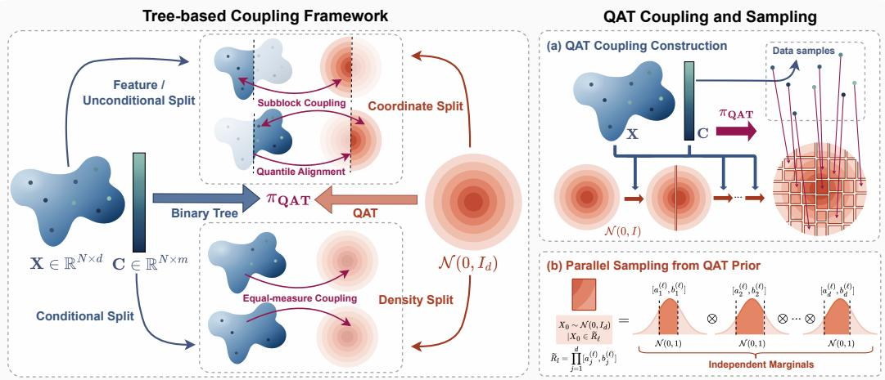
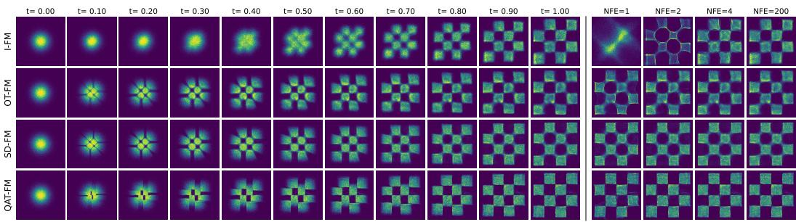
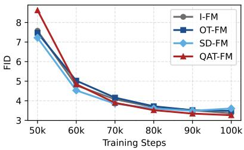
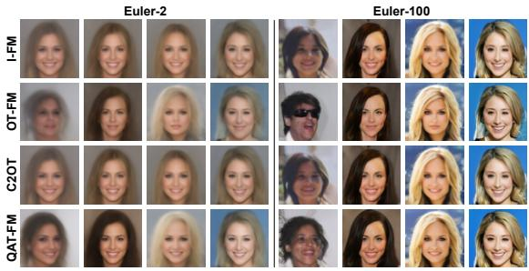
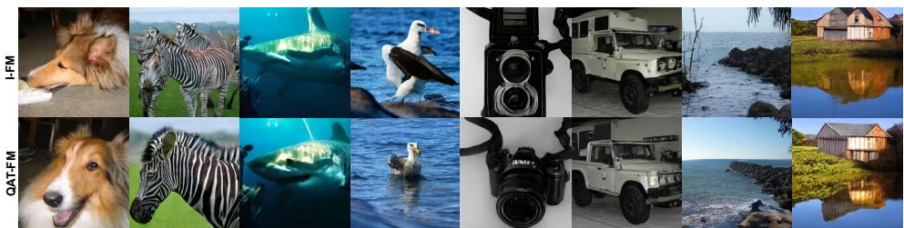
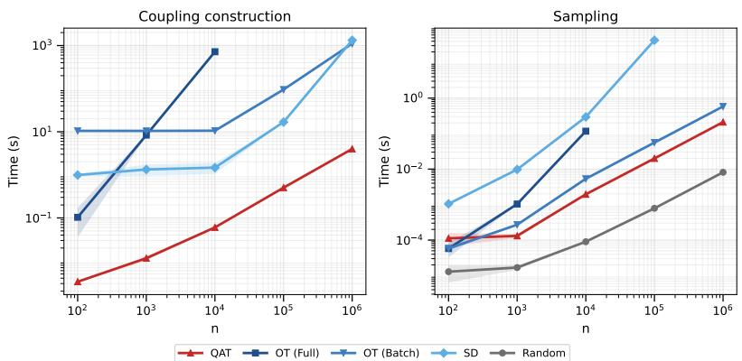
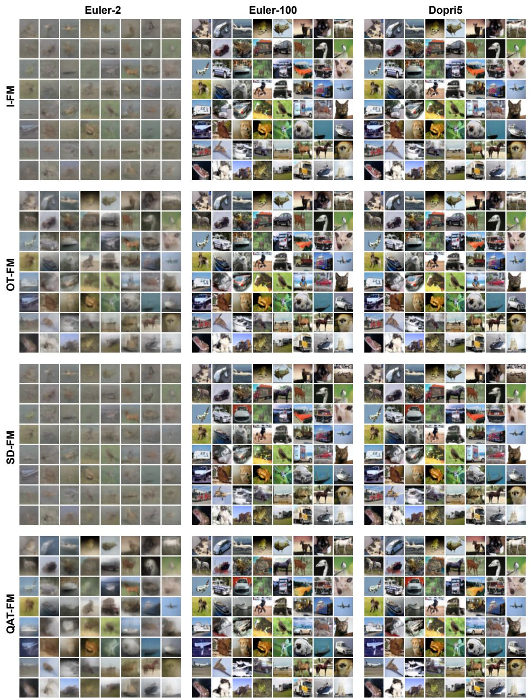
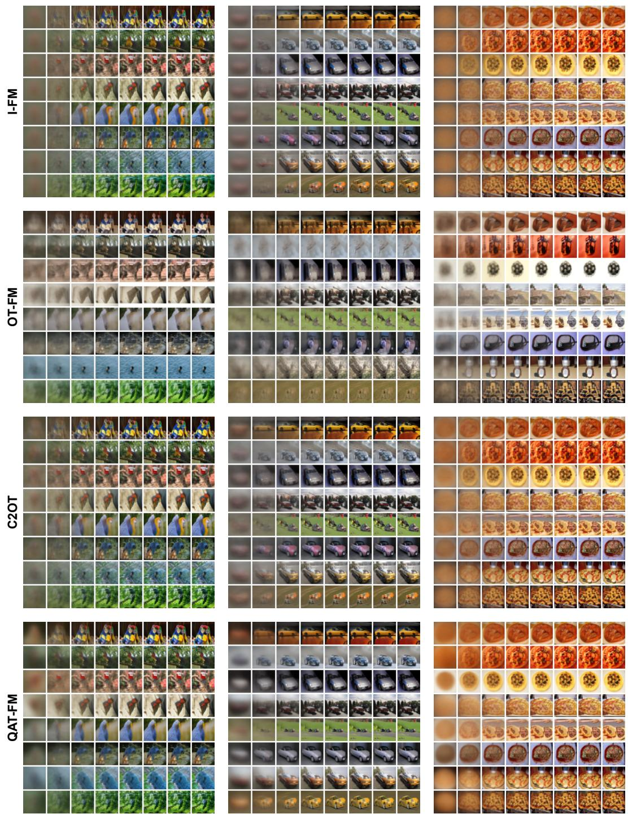
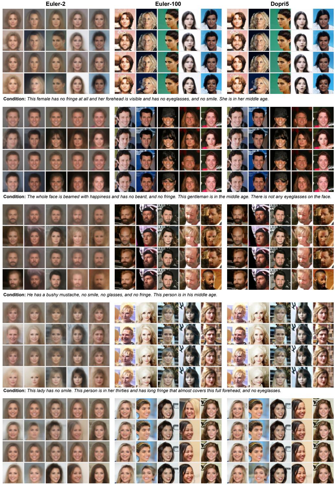
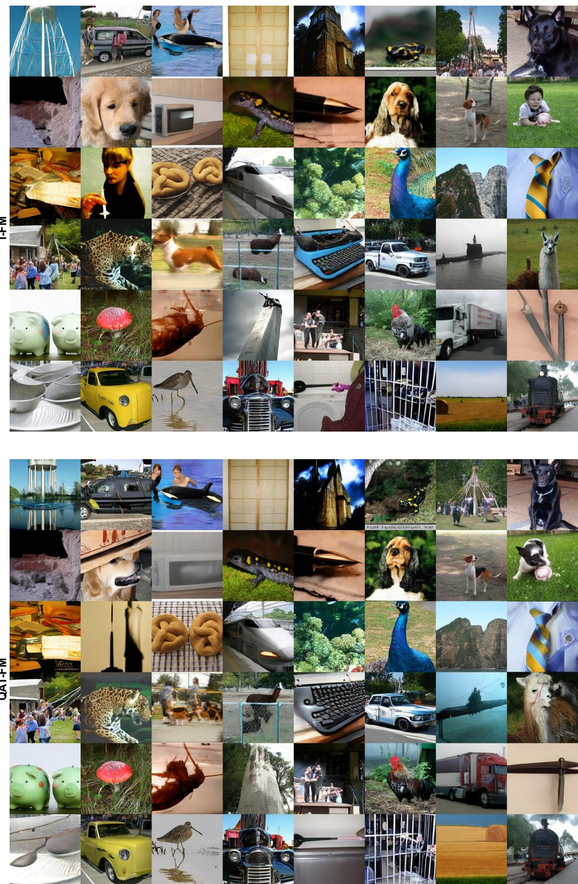

# BEYOND STRAIGHTNESS: NON-CROSSING FLOWMATCHING VIA QUANTILE ALIGNTREE COUPLING

Junyi Lin1, Mengyu Li 2, Jingxuan Hu1, Kejun He ∗1, Cheng Meng 1†

1Institute of Statistics and Big Data, Renmin University of China, Beijing, China 2Department of Statistics and Data Science, Tsinghua University, Beijing, China {junyilin, 2025104242, chengmeng, kejunhe}@ruc.edu.cn, mengyuli@tsinghua.edu.cn

## ABSTRACT

The performance of Flow Matching largely depends on the quality of the coupling between the source and target distributions. However, independent coupling often leads to path crossings and local velocity ambiguity, while OT-based couplings typically incur high construction costs. To address this challenge, we propose Quantile AlignTree Flow Matching (QAT-FM), an efficient structured coupling strategy that constructs a hierarchical coupling between a Gaussian prior and the target data distribution via a quantile-aligned tree structure. QAT-FM constructs the coupling in O(Nd log N) time and supports per-pair source sampling with O(d) complexity, enabling scalable training for large-scale high-dimensional generative tasks. Theoretically, we prove that the QAT coupling satisfies marginal consistency, induces non-crossing linear interpolation paths, and consistently improves path separation at intermediate times compared with independent coupling, thereby alleviating local velocity ambiguity. QAT-FM further extends naturally to conditional generation, enabling structured conditional coupling while preserving global Gaussian alignment. Experiments across diverse benchmark datasets demonstrate that QAT-FM achieves competitive generative performance while substantially reducing coupling construction cost.

## 1 INTRODUCTION

In recent years, continuous-time flow-based generative models have become increasingly prominent in generative modeling (Chen et al., 2018; Grathwohl et al., 2019; Lipman et al., 2023; Liu et al., 2023). A representative class is continuous normalizing flows (CNFs), which define continuous transformations as the solution flows of ordinary differential equations (ODEs) whose timedependent velocity fields are parameterized by neural networks. During sampling, new data are generated by numerically integrating the learned ODE dynamics. To improve training efficiency, Flow Matching (Lipman et al., 2023) directly supervises the velocity field with targets derived from prespecified conditional probability paths, avoiding the repeated numerical ODE integration required by conventional CNF training, enabling scalable training of generative models. Flow Matching has achieved competitive performance across diverse domains, including image generation (Ma et al., 2024; Esser et al., 2024), speech synthesis (Le et al., 2023; Liu et al., 2024), and text generation (Hu et al., 2024; 2026).

Although Flow Matching improves the scalability of training continuous-time generative models, its performance remains sensitive to the conditional probability paths and source–target couplings constructed during training (Lipman et al., 2023; Tong et al., 2024; Pooladian et al., 2023). In common linear-path formulations, Flow Matching trains the velocity field by regressing target velocities along linear interpolation paths between noise and data samples; different coupling choices therefore directly alter the structure of the supervision signal. When training paths cross, or pass too closely through the same intermediate region with substantially different target velocities, velocity ambiguity arises locally; under mean-squared-error training, these inconsistent velocity directions are averaged, increasing the difficulty of fitting the velocity field (Guo & Schwing, 2025). By contrast, training paths with the non-crossing property or good path separation reduce this local ambiguity, yielding a more deterministic mapping from intermediate states to target velocities and thereby improving training stability. In conditional generation, coupling strategies must also preserve the alignment between samples and conditions, since couplings that ignore the conditioning information may produce geometrically favorable but conditionally inconsistent supervision sig nals (Chemseddine et al., 2025; Cheng & Schwing, 2025).

Several existing approaches seek to alleviate path crossing and velocity ambiguity by improving coupling quality. The reflow procedure in Rectified Flow (Liu et al., 2023) reconstructs pairings between noise and data using a learned model, yielding more deterministic and straighter generation trajectories; however, this requires additional sampling and re-training steps, imposing substantial computational overhead. OT-based methods (Villani et al., 2009) construct geometrically optimal pairings by minimizing transport cost; under a quadratic cost, the induced displacement interpolation exhibits a favorable non-crossing structure that alleviates velocity ambiguity. Nonetheless, exact empirical OT is computationally expensive and difficult to scale to large datasets; in conditional generation, maintaining conditioning consistency typically requires condition-aware constraints or condition-wise couplings, further increasing algorithmic complexity. Mini-batch OT (Pooladian et al., 2023; Tong et al., 2024) substantially reduces this cost by solving OT within each minibatch, but the resulting coupling is primarily local and cannot strictly preserve the non-crossing structure at the full-dataset level. Most of the above methods construct couplings only over finite Gaussian samples; SD-FM (Mousavi-Hosseini et al., 2026) further improves the alignment of continuous Gaussian information via gradient-based optimization, but its iterative optimization incurs substantial sampling or optimization cost and does not yield an explicit low-cost global coupling construction.

Table 1: Comparison of Flow Matching coupling strategies.
<table><tr><td>Method</td><td>Build Cost1</td><td>Sample Cost</td><td>Non-Cross</td><td>Path Sep.</td><td>Gaussian Align.</td></tr><tr><td>FM</td><td></td><td>O(Nd)</td><td>X</td><td>X</td><td>√√</td></tr><tr><td>RecFlow</td><td> $\mathcal { O } ( N E \Theta )$ </td><td> $\mathcal { O } ( N \Theta )$ </td><td>√</td><td>X</td><td>X</td></tr><tr><td>OT-FM(Full)</td><td> $\mathcal { O } ( N ^ { 3 } + N ^ { 2 } d )$ </td><td> $O ( N ^ { 2 } + N d )$ </td><td>√</td><td>√</td><td>X</td></tr><tr><td>OT-FM(Minibatch)</td><td> $\mathcal { O } ( N B + N B d )$ </td><td> $\mathcal { O } ( N B + N d )$ </td><td>X</td><td>X</td><td>X</td></tr><tr><td>SD-FM</td><td> $\mathcal { O } ( N K d )$ </td><td> $\mathcal { O } ( N ^ { 2 } d )$ </td><td>√</td><td>√</td><td>√</td></tr><tr><td> $\mathbf { Q \mathbf { A } \mathbf { T } \mathbf { \bar { - } } F M _ { ( 0 u r s ) } }$ </td><td> $\mathcal { O } ( N d \log N )$ </td><td>O(Nd)</td><td>J</td><td>√√²</td><td>√J</td></tr></table>

1 Notation. N: dataset size; B: mini-batch size; d: data dimension; K: SD optimization steps; E: reflow rounds; Θ: one network forward pass. Complexities are reported up to constant factors.  
2 ✓✓indicates that the property is also preserved in conditional generation.

Table 1 compares representative Flow Matching coupling strategies along five axes: coupling construction cost (Build Cost), sampling cost (Sample Cost), whether the coupling induces noncrossing paths at the full-dataset level (Non-Cross), whether it improves path separation (Path Sep.), and whether the source marginal is aligned with a continuous Gaussian prior (Gaussian Align.). As shown, prior methods generally trade off computational efficiency, path geometry, and Gaussianprior alignment. To address these limitations, we propose Quantile AlignTree Flow Matching (QAT-FM), a low-cost structured coupling strategy that achieves non-crossing paths, improved path separation, and continuous Gaussian-prior alignment, with several of these properties naturally extending to conditional generation.

## Contributions. Our main contributions are as follows:

1) We propose Quantile AlignTree (QAT), an efficient semi-discrete transport construction based on binary tree-structured quantile alignment. QAT induces an exact coupling between an empirical data distribution and a continuous Gaussian prior. With construction complexity O(N d log N) and per-pair sampling complexity O(d), QAT scales to large-scale, highdimensional generative modeling tasks.

2) The QAT coupling supports multiple tree-splitting strategies and can naturally incorporate conditioning information into both tree construction and coupling.

3) We prove that QAT induces favorable path structure: the resulting linear interpolation paths satisfy the non-crossing property, and path separation at intermediate times is uniformly greater than that of standard independent-coupling flow matching, alleviating local velocity ambiguity.

4) We conduct systematic experiments on low-dimensional synthetic data, unconditional generation, discrete class-conditional generation, continuous text-conditional generation, and largescale image synthesis. Results show that QAT-FM achieves competitive generation quality with substantially lower coupling construction complexity than OT-based methods.

## 2 PRELIMINARIES

Notation. Let ${ \mathcal { P } } ( \mathbb { R } ^ { d } )$ denote the set of Borel probability measures on $\mathbb { R } ^ { d }$ . For $\alpha \in \mathcal { P } ( \mathbb { R } ^ { d } )$ and $\beta \in \mathcal { P } ( \mathbb { R } ^ { d ^ { \prime } } )$ , a joint distribution $\pi \in \mathcal { P } ( \mathbb { R } ^ { d } \times \mathbb { R } ^ { d ^ { \prime } } )$ is called a coupling of α and $\beta$ if its marginals are α and $\beta ;$ we write $\Pi ( \alpha , \beta )$ for the collection of all such couplings. For a vector $\pmb { x } \in \bar { \mathbb { R } ^ { d } }$ , let $\pmb { x } ^ { ( j ) }$ denote its $j \cdot$ -th coordinate. For $\rho \in \mathcal { P } ( \mathbb { R } ^ { d } )$ , let $\rho ^ { ( j ) }$ denote its $j \cdot$ -th marginal distribution, $F _ { \rho } ^ { ( j ) }$ the cumulative distribution function (CDF) of $\rho ^ { ( j ) }$ , and $\big ( F _ { \rho } ^ { ( j ) } \big ) ^ { - 1 }$ its generalized inverse. For a measurable map $T : \mathbb { R } ^ { d }  \mathbb { R } ^ { k }$ , we write $T _ { \# } \rho$ for the pushforward of $\rho$ under $T .$

Flow-based Generative Modeling. Given a time-dependent velocity field $v : [ 0 , 1 ] \times \mathbb { R } ^ { d } \to \mathbb { R } ^ { d }$ write $v _ { t } ( x ) : = v ( t , x )$ . Theflow map $\phi _ { t } : \mathbb { R } ^ { d }  \mathbb { R } ^ { d }$ induced by $v _ { t }$ is defined as the solution to the ODE

$$
\frac { d } { d t } \phi _ { t } ( x ) = v _ { t } ( \phi _ { t } ( x ) ) , \qquad \phi _ { 0 } ( x ) = x .
$$

Setting $\rho _ { t } = ( \phi _ { t } ) _ { \# } \gamma$ , where $\gamma$ denotes the source distribution, the pair $( \rho _ { t } , v _ { t } )$ satisfies the continuity equation

$$
\begin{array} { r } { \partial _ { t } \rho _ { t } + \nabla \cdot \left( \rho _ { t } v _ { t } \right) = 0 , } \end{array}\tag{1}
$$

with $\rho _ { 0 } = \gamma$ . When $( \phi _ { 1 } ) _ { \# } \gamma = \mu$ , the flow transports the source $\gamma$ to the target distribution $\mu .$ . The goal of flow-based generative modeling is therefore to learn a parameterized velocity field $v _ { \theta }$ whose induced flow map satisfies $\left( \phi _ { 1 } \right) _ { \# } \gamma = \mu$

Flow Matching (Lipman et al., 2023) provides a tractable training procedure for this velocity field. It specifies a probability path $( \rho _ { t } ) _ { t \in [ 0 , 1 ] }$ connecting $\gamma$ to $\mu$ together with a compatible target velocity field $u _ { t }$ . The parameterized velocity field is then learned via the regression objective

$$
\mathcal { L } _ { \mathrm { F M } } ( \theta ) = \mathbb { E } _ { t \sim \operatorname * { U n i f } _ { \boldsymbol { x } _ { t } \sim \rho _ { t } } [ 0 , 1 ] } \left\| \boldsymbol { v } _ { \boldsymbol { \theta } } ( t , \boldsymbol { x } _ { t } ) - \boldsymbol { u } _ { t } ( \boldsymbol { x } _ { t } ) \right\| ^ { 2 } .\tag{2}
$$

This formulation avoids backpropagating through numerical ODE solvers during training.

Conditional Flow Matching. In practice, the marginal velocity field $u _ { t }$ is often intractable to construct directly. Conditional Flow Matching1 (CFM) (Lipman et al., 2023; Tong et al., 2024) addresses this by conditioning on paired endpoints: given $\pi \in \Pi ( \gamma , \mu )$ , draw $( x _ { 0 } , x _ { 1 } ) \sim \pi$ , specify a conditional path $p _ { t } ( \cdot \mid x _ { 0 } , x _ { 1 } )$ and its compatible velocity $u _ { t } ( \cdot \ | \ x _ { 0 } , x _ { 1 } )$ , and train $v _ { \theta } ( t , x _ { t } )$ to match $u _ { t } ( x _ { t } \mid x _ { 0 } , x _ { 1 } )$ , where $x _ { t } \sim p _ { t } ( \cdot \mid x _ { 0 } , x _ { 1 } )$ . A canonical and widely used choice is the linear interpolation path

$$
x _ { t } = ( 1 - t ) x _ { 0 } + t x _ { 1 } , \qquad u _ { t } ( x _ { t } \mid x _ { 0 } , x _ { 1 } ) = x _ { 1 } - x _ { 0 } ,
$$

under which the training objective reduces to

$$
\mathcal { L } _ { \mathrm { C F M } } ( \theta ) = \mathbb { E } _ { t \sim \operatorname { U n i f } [ 0 , 1 ] } \left\| v _ { \theta } ( t , ( 1 - t ) x _ { 0 } + t x _ { 1 } ) - ( x _ { 1 } - x _ { 0 } ) \right\| ^ { 2 } .\tag{3}
$$

This reveals that the endpoint pairing is governed by the coupling $\pi \in \Pi ( \gamma , \mu )$ . The simplest choice is the independent coupling $\pi = \gamma \otimes \mu .$ . A more principled alternative is the OT coupling

$$
\pi _ { \mathrm { O T } } \in \arg \operatorname* { m i n } _ { \pi \in \Pi ( \gamma , \mu ) } \int _ { \mathbb { R } ^ { d } \times \mathbb { R } ^ { d } } \| x _ { 0 } - x _ { 1 } \| ^ { 2 } d \pi ( x _ { 0 } , x _ { 1 } ) ,\tag{4}
$$

which under the linear path tends to produce shorter, geometrically natural paired trajectories (Pooladian et al., 2023; Tong et al., 2024). However, computing the exact global OT coupling is expensive at large scale; in practice, mini-batch OT is used as an approximation, reducing computational cost at the expense of coupling exactness and cross-batch consistency. For the special case $\gamma = \mathcal { N } ( 0 , I _ { d } )$ Mousavi-Hosseini et al. (2026) proposes solving a semi-discrete OT problem in (4) to better align the continuous Gaussian source with the empirical target distribution.

Data Partitioning by Trees. The preceding discussion shows that the choice of coupling $\pi \ \mathrm { d i } -$ rectly governs the geometry of particle trajectories in FM, while exact global OT coupling is prohibitively expensive at large scale (Zhang et al., 2025; Mousavi-Hosseini et al., 2026). This motivates binary tree-based space partitioning, which provides a simple way to organize data hierarchically and will serve as the foundation of our coupling construction. Given a data space $\mathcal { X } \subseteq \mathbb { R } ^ { d }$ and a dataset $\mathcal { D } = \{ x _ { i } \} _ { i = 1 } ^ { N } \subseteq \mathcal { X }$ , let $\begin{array} { r } { \widehat { \mu } _ { \mathcal { D } } = N ^ { - 1 } \sum _ { i = 1 } ^ { N } \delta _ { x } } \end{array}$ denote its empirical distribution. A binary partition tree $T$ consists of an internal node set I and a leaf node set ${ \mathcal { L } } .$ Each node η is associated with a region $R _ { \eta } \subseteq \mathcal { X }$ and data subset $\mathcal { D } _ { \eta } = \mathcal { D } \cap R _ { \eta } .$ , where the root r satisfies $R _ { r } = \mathcal { X }$

For each internal node $\eta \in \mathcal { I }$ , let $\begin{array} { r } { \widehat { \mu } _ { \eta } = | \mathcal { D } _ { \eta } | ^ { - 1 } \sum _ { x \in \mathcal { D } _ { n } } \delta _ { x } } \end{array}$ denote the conditional empirical measure on $\mathcal { D } _ { \eta } . \mathrm { ~ \bf ~ A ~ }$ split strategy selects a split coordinate $\kappa _ { \eta } ~ \in ~ [ d ]$ and threshold $s _ { \eta } ~ \in ~ \mathbb { R }$ based on $\widehat { \mu } _ { \eta }$ partitioning $R _ { \eta }$ into

$$
\begin{array} { r } { R _ { \eta } ^ { - } = \{ x \in R _ { \eta } : x ^ { ( \kappa _ { \eta } ) } \leq s _ { \eta } \} , \qquad R _ { \eta } ^ { + } = \{ x \in R _ { \eta } : x ^ { ( \kappa _ { \eta } ) } > s _ { \eta } \} , } \end{array}
$$

and correspondingly partitioning $\mathcal { D } _ { \eta }$ into $\mathcal { D } _ { \eta } ^ { - } = \mathcal { D } _ { \eta } \cap R _ { \eta } ^ { - }$ and $\mathcal { D } _ { \eta } ^ { + } = \mathcal { D } _ { \eta } \cap R _ { \eta } ^ { + }$ . After recursive splitting, the leaf regions form a partition of X , denoted $\mathcal { R } ( T ) : = \{ R _ { \ell } : \ell \in \mathcal { L } \}$

## 3 QUANTILE ALIGNTREE FLOW MATCHING

## 3.1 QUANTILE ALIGNTREE COUPLING

The preceding analysis shows that in the linear FM objective, the coupling π governs how source samples are paired with target samples, directly shaping the geometry of flow paths. The key idea of QAT is to build a binary partition tree over the empirical data distribution and transfer its topology to the source distribution by matching the split mass ratios at each internal node. Figure 1 summarizes the resulting coupling and sampling procedure.

Let $\widehat { \mu } _ { \mathcal { D } }$ denote the empirical measure of dataset $\mathcal { D } ~ = ~ \{ x _ { i } \} _ { i = 1 } ^ { N } ~ \subseteq ~ \mathbb { R } ^ { d }$ , and let $\gamma \in \mathcal { P } ( \mathbb { R } ^ { d } )$ be the source distribution, $\mathbf { e . g . , } \gamma = \mathcal { N } ( 0 , T _ { d } )$ Following the binary partition tree construction of Section 2, we build a data tree $T ( \widehat { \mu } _ { \mathcal { D } } )$ on $\widehat { \mu } _ { \mathcal { D } }$ . For each internal node $\eta \in \mathcal { Z }$ , let $( \kappa _ { \eta } , s _ { \eta } )$ denote its split coordinate and threshold, and let $\widehat { \mu } _ { \eta }$ be the conditional empirical measure at that node. Based on the data tree, we define the Quantile AlignTree as follows.

Definition 1 (Quantile AlignTree (QAT)) Given the data tree $T ( \widehat { \mu } _ { \mathcal { D } } )$ and source distribution $\gamma ,$ the Quantile AlignTree $o f \gamma$ with respect to the data tree, denoted $\ddot { T } _ { \gamma } ( T )$ , is constructed recursively with the same topology as $T ( \widehat { \mu } _ { \mathcal { D } } )$ . At each internal node η, the split coordinate $\kappa _ { \eta }$ is inheritedfrom the data tree, but the data-side threshold $s _ { \eta }$ is replaced by the source-side aligned threshold

$$
\widetilde { s } _ { \eta } = \left( F _ { \gamma _ { \eta } } ^ { ( \kappa _ { \eta } ) } \right) ^ { - 1 } \left( F _ { \widehat { \mu } _ { \eta } } ^ { ( \kappa _ { \eta } ) } ( s _ { \eta } ) \right) ,\tag{5}
$$

where $\gamma _ { \eta }$ denotes the conditional distribution ofγ on the current source-side region ${ \widetilde { R } } _ { \eta } .$ . The sourceside region is then partitioned as

$$
\widetilde { R } _ { \eta } ^ { - } = \{ z \in \widetilde { R } _ { \eta } : z ^ { ( \kappa _ { \eta } ) } \leq \widetilde { s } _ { \eta } \} , \qquad \widetilde { R } _ { \eta } ^ { + } = \{ z \in \widetilde { R } _ { \eta } : z ^ { ( \kappa _ { \eta } ) } > \widetilde { s } _ { \eta } \} ,
$$

and the left and right child nodes are constructed recursively.

The quantile-based aligned threshold (5) guarantees that the source side and the data side carry equal mass ratios at every split. Specifically, when the source-side conditional marginal is continuous,

$$
\gamma _ { \eta } ( \widetilde { R } _ { \eta } ^ { - } ) = \widehat { \mu } _ { \eta } ( R _ { \eta } ^ { - } ) , \qquad \gamma _ { \eta } ( \widetilde { R } _ { \eta } ^ { + } ) = \widehat { \mu } _ { \eta } ( R _ { \eta } ^ { + } ) .
$$

Consequently, the data tree and the aligned source tree carry equal mass at corresponding leaf nodes, naturally inducing a coupling from $\gamma$ to $\widehat { \mu } _ { \mathcal { D } }$

  
Figure 1: Overview of the QAT coupling and sampling procedure. (Left) QAT builds a binary partition tree over the data using feature-based or condition-aware splits, and transfers the same tree topology to the Gaussian source by quantile alignment, yielding the structured coupling $\pi _ { \mathrm { Q A T } }$ . (Right) each data leaf is paired with an aligned Gaussian source region. Since these source regions are axis-aligned hyperrectangles, sampling from the corresponding QAT source conditional reduces to parallel per-coordinate truncated normal sampling.

Definition 2 (QAT Coupling) Let $\mathcal { L }$ be the nonempty leaf node set of data tree $T ( \widehat { \mu } _ { \mathcal { D } } )$ . For each leaf $\ell \in { \mathcal { L } } ,$ , let $\mathcal { D } _ { \ell } = \mathcal { D } \bar { \cap } R _ { \ell }$ and $\begin{array} { r } { \alpha _ { \ell } : = \frac { 1 } { N } | \mathcal { D } _ { \ell } | } \end{array}$ . Let $\begin{array} { r } { \hat { \mathscr { \mu } } _ { \ell } = | \mathcal { \dot { D } } _ { \ell } | ^ { - 1 } \sum _ { x _ { i } \in \mathcal { D } _ { \ell } } \delta _ { x _ { i } } } \end{array}$ denote the conditional empirical measure on $\mathit { \Delta } { \mathcal { D } } _ { \ell } ,$ , and let $\gamma _ { \ell }$ denote the conditional source measure associated with leaf ℓ in the Quantile AlignTree. Define the QAT coupling as

$$
\pi _ { \mathrm { Q A T } } : = \sum _ { \ell \in \mathcal { L } } \alpha _ { \ell } \gamma _ { \ell } \otimes \widehat { \mu } _ { \ell } .\tag{6}
$$

Then $\pi _ { \mathrm { Q A T } } \in \Pi ( \gamma , \widehat { \mu } _ { \mathcal { D } } )$

Intuitively, the $\mathrm { Q A T }$ coupling matches each data leaf $\mathcal { D } _ { \ell }$ with an aligned source region. To draw a training pair $( x _ { 0 } , x _ { 1 } ) \sim \pi _ { \mathrm { Q A T } }$ , one samples a leaf ℓ with probability $\alpha _ { \ell } .$ , draws $x _ { 0 } \sim \gamma _ { \ell }$ from the corresponding conditional source distribution, and draws $x _ { 1 } \sim \widehat { \mu } _ { \ell }$ from the conditional empirical distribution on that leaf.

Remark 1 (Gaussian Sampling) When $\gamma = \mathcal { N } ( 0 , I _ { d } )$ , sampling from $\gamma _ { \ell }$ is especially convenient. Since all splits are axis-aligned, every leaf source region is an axis-aligned hyperrectangle. If leaf ℓ corresponds to source region $\begin{array} { r } { \widetilde { R } _ { \ell } = \prod _ { j = 1 } ^ { \check { d } } [ a _ { j } ^ { ( \ell ) } , b _ { j } ^ { ( \ell ) } ] } \end{array}$ , sampling from $\gamma _ { \ell }$ reduces to drawing each coordinate independentlyfrom a truncated standard normal:

$$
\begin{array} { r } { x _ { 0 } ^ { ( j ) } \sim \mathcal { N } ( 0 , 1 ) \big | _ { [ a _ { j } ^ { ( \ell ) } , b _ { j } ^ { ( \ell ) } ] } , \qquad j = 1 , \dotsc , d . } \end{array}
$$

The interval endpoints are determined by all split constraints along the root-to-leafpath, and the sampling isfully parallelizable across coordinates.

## 3.2 QAT FLOW MATCHING

Substituting the QAT coupling into the linear FM objective (3) yields the QAT-FM training objective. Let $\widehat { \mu } _ { \mathcal { D } }$ be the empirical data distribution, γ the source distribution, and $\pi _ { \mathrm { Q A T } } \in \Pi ( \gamma , \widehat { \mu } _ { \mathcal { D } } )$ the QAT coupling of Definition 2. QAT-FM learns the velocity field via

$$
\mathcal { L } _ { \mathrm { Q A T - F M } } ( \theta ) : = \mathbb { E } \underset { ( x _ { 0 } , x _ { 1 } ) \sim \pi _ { \mathrm { Q A T } } } { \mathrm { E } } \left. v _ { \theta } \big ( t , ( 1 - t ) x _ { 0 } + t x _ { 1 } \big ) - ( x _ { 1 } - x _ { 0 } ) \right. ^ { 2 } .\tag{7}
$$

Compared to standard FM, QAT-FM differs only in the sample pairing: $\pi _ { \mathrm { Q A T } }$ replaces the independent coupling, while the linear interpolation path and velocity regression target remain unchanged. This structured pairing yields the following geometric properties.

Theorem 1 (Non-Crossing Property) Let $\pi _ { \mathrm { Q A T } } \in \Pi ( \gamma , \widehat { \mu } _ { \mathcal { D } } )$ be the QAT coupling. Consider two paired samples $( x _ { 0 } , x _ { 1 } ) , ( x _ { 0 } ^ { \prime } , x _ { 1 } ^ { \prime } ) \in \mathrm { s u p p } ( \pi _ { \mathrm { Q A T } } )$ $I f x _ { 1 }$ and $x _ { 1 } ^ { \prime }$ belong to two distinct leaf nodes $\bar { \boldsymbol { \ell } } \neq \boldsymbol { \ell } ^ { \prime }$ ofthe data tree, then the corresponding linear interpolation paths

$$
x _ { t } = ( 1 - t ) x _ { 0 } + t x _ { 1 } , \qquad x _ { t } ^ { \prime } = ( 1 - t ) x _ { 0 } ^ { \prime } + t x _ { 1 } ^ { \prime }
$$

do not intersect, $i . e . , x _ { t } \neq x _ { t } ^ { \prime } f o r a l l t \in [ 0 , 1 ]$ , almost surely.

Theorem 1 establishes that paths associated with distinct target leaves are strictly non-crossing. This property alleviates the velocity ambiguity that can arise from overlapping training paths: since the FM objective fits $v _ { \theta }$ pointwise at each $t \in [ 0 , 1 ]$ , two training paths satisfying $x _ { t } \ = \ x _ { t } ^ { \prime }$ but $x _ { 1 } - x _ { 0 } \neq x _ { 1 } ^ { \prime } - x _ { 0 } ^ { \prime }$ impose conflicting supervision signals at the same spatial location, increasing the difficulty of fitting $v _ { \theta }$ . Paths that remain well-separated at intermediate times are therefore desirable. Beyond preventing cross-leaf path crossings, the QAT coupling also consistently improves the expected inter-path distance, as the following theorem quantifies.

Theorem 2 (Improved Path Separation) Let $\gamma = \mathcal { N } ( 0 , I _ { d } )$ , let $\pi _ { \mathrm { Q A T } } \in \Pi ( \gamma , \widehat { \mu } _ { \mathcal { D } } )$ be the $Q A T$ coupling, and let $\pi _ { \mathrm { i n d } } : = \gamma \otimes { \widehat { \mu } } _ { \mathcal { D } }$ be the independent coupling. For any coupling π, let $\mathbb { E } _ { \pi ^ { \otimes 2 } }$ denote expectation over two independent pairs $( x _ { 0 } , \bar { x } _ { 1 } ) , ( x _ { 0 } ^ { \prime } , x _ { 1 } ^ { \prime } ) \sim \bar { \pi } _ { : }$ , and define $x _ { t } = ( 1 - t ) x _ { 0 } + t x _ { 1 }$ and $x _ { t } ^ { \prime } = ( 1 - t ) x _ { 0 } ^ { \prime } + t x _ { 1 } ^ { \prime }$ . Thenfor every $t \in ( 0 , 1 )$

$$
\begin{array} { r } { \mathbb { E } _ { \pi _ { \mathrm { Q A T } } ^ { \otimes 2 } } \big [ \| x _ { t } - x _ { t } ^ { \prime } \| _ { 2 } ^ { 2 } \big ] - \mathbb { E } _ { \pi _ { \mathrm { i n d } } ^ { \otimes 2 } } \big [ \| x _ { t } - x _ { t } ^ { \prime } \| _ { 2 } ^ { 2 } \big ] = 4 t ( 1 - t ) \Delta _ { \mathrm { Q A T } } , } \end{array}
$$

where $\Delta _ { \mathrm { Q A T } }$ is the node-level path-separation gain induced by the QAT tree:

$$
\Delta _ { \mathrm { Q A T } } : = \sum _ { \eta \in \mathbb { Z } } \alpha _ { \eta } q _ { \eta } \big ( 1 - q _ { \eta } \big ) \bigg ( \mathbb { E } _ { \gamma _ { \eta } + } \big [ X ^ { ( \kappa _ { \eta } ) } \big ] - \mathbb { E } _ { \gamma _ { \eta } - } \big [ X ^ { ( \kappa _ { \eta } ) } \big ] \bigg ) \bigg ( \mathbb { E } _ { \widehat { \mu } _ { \eta ^ { + } } } \big [ X ^ { ( \kappa _ { \eta } ) } \big ] - \mathbb { E } _ { \widehat { \mu } _ { \eta ^ { - } } } \big [ X ^ { ( \kappa _ { \eta } ) } \big ] \bigg )\tag{8}
$$

Here $\alpha _ { \eta } : = \widehat { \mu } _ { \mathcal { D } } ( R _ { \eta } )$ is the data mass at node η, $q _ { \eta } : = F _ { \widehat { \mu } _ { \eta } } ^ { ( \kappa _ { \eta } ) } ( s _ { \eta } )$ is the conditional left-child mass fraction at split coordinate $\kappa _ { \eta } ,$ and $\gamma _ { \eta ^ { \pm } } , \widehat { \mu } _ { \eta ^ { \pm } }$ denote the conditional source and empirical distributions on the left and right child regions of η. Under non-degenerate splits, $\Delta _ { \mathrm { Q A T } } > 0 ,$ , so the QAT coupling strictly dominates the independent coupling in expected inter-path separation.

## 3.3 CONDITIONAL QAT STRATEGY

In conditional generation tasks, data samples carry conditioning variables. Let $\{ ( x _ { i } , c _ { i } ) \} _ { i = 1 } ^ { N } \subseteq$ $\mathbb { R } ^ { d } \times \mathbb { R } ^ { m }$ be the joint dataset, $\begin{array} { r } { \widehat { \mu } _ { \mathcal { D } _ { C } } : = N ^ { - 1 } \sum _ { i = 1 } ^ { N } \delta _ { ( x _ { i } , c _ { i } ) } } \end{array}$ the joint empirical distribution, and $\begin{array} { r } { \widehat { \mu } _ { C } : = N ^ { - 1 } \sum _ { i = 1 } ^ { N } \delta _ { c _ { i } } } \end{array}$ the marginal over condition space. A standard OT coupling based only on data-space distances can ignore the alignment between samples and their conditioning variables. Alternatively, solving OT directly between the joint source $\gamma \otimes { \widehat { \mu } } _ { C }$ and the joint empirical distribution $\widehat { \mu } _ {  { \mathcal { D } _ { C } } }$ increases the optimization dimension and computational cost (Cheng & Schwing, 2025; Mousavi-Hosseini et al., 2026). We therefore propose the following Conditional QAT strategy.

Definition 3 (Conditional QAT) Let $\{ c _ { i } \} _ { i = 1 } ^ { N } \subseteq \mathbb { R } ^ { m }$ be conditioning variables. Conditional QAT constructs a data tree on the joint samples $\{ ( x _ { i } , c _ { i } ) \} _ { i = 1 } ^ { N } \subseteq \mathbb { R } ^ { d + m }$ . For each internal node $\eta ,$ let $\kappa _ { \eta } \in [ d + m ]$ denote its split coordinate. When building the source-side AlignTree, if $\kappa _ { \eta } \leq d$ (a data coordinate), the source side is partitioned using the standard QAT aligned threshold in (5); if $\kappa _ { \eta } > d$ (a condition coordinate), no split is applied to the source and both child nodes inherit the parent source region, the split is used only to refine the target-side grouping: $\widetilde { R } _ { \eta ^ { - } } = \widetilde { R } _ { \eta ^ { + } } = \widetilde { R } _ { \eta } .$

The Conditional QAT coupling takes the same form as Definition 2, with the target empirical distribution replaced by the joint distribution $\widehat { \mu } _ {  { \mathcal { D } _ { C } } }$

$$
\pi _ { \mathrm { C Q A T } } = \sum _ { \ell \in \mathcal { L } _ { C } } \alpha _ { \ell } \gamma _ { \ell } \otimes \widehat { \mu } _ { \mathcal { D } _ { C } , \ell } \in \Pi ( \gamma , \widehat { \mu } _ { \mathcal { D } _ { C } } ) ,
$$

where $\mathcal { L } _ { C }$ is the set of nonempty leaves of the joint data tree, and $\widehat { \mu } _ { \mathcal { D } _ { C } , \ell }$ is the conditional joint empirical distribution at leaf ℓ. A sample from $\pi _ { \mathrm { C Q A T } }$ can be written as $( x _ { 0 } , ( x _ { 1 } , c ) )$ , where the linear FM path is applied only in the data space between $x _ { 0 }$ and $x _ { 1 }$ , while c is provided as conditioning input to the velocity model. By encoding conditional structure through leaf-level matching in the joint tree, this construction avoids explicitly solving the product-space OT problem between $\gamma \otimes { \widehat { \mu } } _ { C }$ and $\widehat { \mu } _ {  { \mathcal { D } _ { C } } }$ , while retaining the efficient sampling form of unconditional QAT.

Remark 2 (Theoretical extensions) Conditional QAT inherits the theoretical properties of QAT under appropriate conditions. Specifically, if the root-to-ℓ and root-to-ℓ′ paths first diverge at a data-coordinate split node $( i . e . , \kappa _ { \eta } \leq d ) ,$ , then the linear interpolation paths drawn from the corresponding leaf couplings satisfy the non-crossing property of Theorem 1. Under the same nondegeneracy conditions, Conditional QAT also inherits the path-separation bound of Theorem 2. Proofs andfurther details are given in Appendix A.3.

## 3.4 EFFICIENT QAT CONSTRUCTION AND SAMPLING

When $\gamma = \mathcal { N } ( 0 , I _ { d } )$ , each source-side leaf region $\widetilde { R } _ { \ell }$ is fully characterized by its coordinate-wise bounds $\left( a _ { \ell } , b _ { \ell } \right)$ (Remark 1). Regardless of whether the data tree is built from unconditional or conditional samples, each leaf ℓ stores only the data index set $S _ { \ell }$ and the source-side bounds $\left( a _ { \ell } , b _ { \ell } \right)$ which fully specify the leaf-wise product coupling $\gamma _ { \ell }$ ⊗ $\widehat { \mu } _ { \ell }$ . Training pairs are drawn by sampling a leaf ℓ proportionally to its mass, then independently drawing a source point from the corresponding truncated Gaussian region and a target point from $S _ { \ell }$ . The full construction, sampling algorithm, and complexity analysis are given in Appendix B.

Split Strategy. QAT is compatible with a variety of split strategies. Throughout this work we adopt a maximum-variance rule: for each node $\eta ,$ the split coordinate is the dimension of highest empirical variance and the split threshold is the empirical mean along that coordinate,

$$
\kappa _ { \eta } = \arg \operatorname* { m a x } _ { j } \mathrm { V a r } _ { \widehat { \mu } _ { \eta } } \big ( Y ^ { ( j ) } \big ) , \qquad s _ { \eta } = \mathbb { E } _ { \widehat { \mu } _ { \eta } } \big [ Y ^ { ( \kappa _ { \eta } ) } \big ] ,
$$

where $Y = X$ in the unconditional case and $\boldsymbol { Y } = ( \boldsymbol { X } , \boldsymbol { C } )$ in the conditional case. For discrete empirical data, we recurse until each leaf contains at most one sample; in the conditional setting, the terminal splitting phase prioritizes data coordinates over condition coordinates, maximizing the number of source-side splits and thereby increasing the path-separation gain of Theorem 2.

High-Dimensional Data Handling. For high-dimensional data, axis-aligned partitioning in the raw data space may fail to capture the principal directions of variation. We therefore first rotate the data via an orthogonal transform $P \in \dot { \mathbb { R } } ^ { d \times d }$ , setting $z _ { i } = P x _ { i }$ and constructing the QAT coupling on the top-k subspace $z _ { i } ^ { ( 1 : k ) }$ . By the rotational invariance of the standard Gaussian, $P _ { \# } \mathcal { N } ( 0 , I _ { d } ) =$ $\mathcal { N } ( 0 , I _ { d } )$ for any orthogonal $P .$ . Training then proceeds by sampling $( \epsilon ^ { ( 1 : k ) } , z _ { i } ^ { ( 1 : k ) } ) \sim \pi _ { \mathrm { Q A T } }$ , independently drawing $\epsilon ^ { ( - k ) } \sim \mathcal { N } ( 0 , I _ { d - k } )$ , and setting

$$
x _ { 0 } = P ^ { \top } ( \epsilon ^ { ( 1 : k ) } , \epsilon ^ { ( - k ) } ) .
$$

The marginal distribution of $x _ { 0 }$ remains $\mathcal { N } ( 0 , I _ { d } )$ , while the QAT tree operates entirely within the low-dimensional subspace. In practice, $P$ is composed of a Patch-Hadamard transform and a PCA rotation at the mean-pooling scale, concentrating the principal data variation into a small number of coordinates. Details are given in Appendix B.3.

## 4 EXPERIMENTS

We evaluate QAT-FM through a series of experiments: we begin with path visualizations on two-dimensional synthetic data, then proceed to high-dimensional image generation benchmarks covering unconditional generation (CIFAR-10), class-conditional generation (ImageNet-32), textconditional generation (CelebA-64), and large-scale latent-space generation (ImageNet-256). Additional implementation details are provided in Appendix $\mathrm { C } ;$ extended experimental results appear in Appendix D.

## 4.1 2D SYNTHETIC EXPERIMENTS

Following Lipman et al. (2023); Pooladian et al. (2023), we compare different coupling methods on two-dimensional checkerboard data. Four methods are evaluated: I-FM, OT-FM (Tong et al., 2024), SD-FM (Mousavi-Hosseini et al., 2026), and the proposed QAT-FM. All methods share the same network architecture and training configuration.

  
Figure 2: 2D checkerboard results. (Left) sample evolution induced by different coupling methods from t = 0 to t = 1. (Right) generated samples with varying numbers of function evaluations (NFE).

Figure 2 (left) shows sample evolution from $t = 0 \mathrm { t o } t = 1$ . OT-FM and SD-FM capture the global structure of the target distribution earlier than I-FM, while QAT-FM yields better local separation and more organized intermediate transport. Figure 2 (right) shows generated samples with varying NFE. QAT-FM recovers a clear checkerboard structure at small NFE, indicating that its structured coupling improves few-step sample quality.

## 4.2 UNCONDITIONAL GENERATION ON CIFAR-10

We evaluate QAT-FM on unconditional generation using CIFAR-10 (Krizhevsky et al., 2009), which contains 50,000 RGB training images of size $3 2 \times \bar { 3 2 }$ across 10 categories. The velocity-field network follows the architecture of Tong et al. (2024); training details are provided in Appendix C. We generate 50,000 samples using several numerical solvers and compute FID (Heusel et al., 2017). Results are averaged over 5 random seeds and reported with standard deviations.

Table 2: FID results on unconditional CIFAR-10 generation at 100k training steps.
<table><tr><td>Method</td><td>Euler-2</td><td>Euler-100</td><td>Dopri5</td><td>NFE↓</td></tr><tr><td>I-FM</td><td> $1 6 4 . 1 8 _ { \pm 0 . 1 3 }$ </td><td> $\mathbf { 3 . 7 9 _ { \pm 0 . 0 4 } }$ </td><td> $3 . 3 8 _ { \pm 0 . 0 3 }$ </td><td> $1 3 7 . 3 0 { \scriptstyle \pm 0 . 3 0 }$ </td></tr><tr><td>OT-FM</td><td> $7 7 . 2 6 _ { \pm 0 . 1 2 }$ </td><td> $3 . 9 6 _ { \pm 0 . 0 4 }$ </td><td> $3 . 4 9 _ { \pm 0 . 0 3 }$ </td><td> $\mathbf { 1 2 9 . 5 2 _ { \pm 0 . 8 6 } }$ </td></tr><tr><td>SD-FM</td><td> $1 6 2 . 6 6 _ { \pm 0 . 2 3 }$ </td><td> $4 . 0 3 _ { \pm 0 . 0 2 }$ </td><td> $3 . 6 1 _ { \pm 0 . 0 1 }$ </td><td> $1 3 5 . 7 8 { \scriptstyle \pm 0 . 3 6 }$ </td></tr><tr><td>QAT-FM</td><td> $9 8 . 6 8 { \scriptstyle \pm 0 . 1 7 }$  </td><td> $\underline { { 3 . 9 1 _ { \pm 0 . 0 4 } } }$  </td><td> ${ \bf 3 . 2 6 _ { \pm 0 . 0 2 } }$  </td><td> $\overline { { 1 4 5 . 5 5 _ { \pm 1 . 0 5 } } }$ </td></tr></table>

  
Figure 3: FID (Dopri5) vs. steps.

Table 2 reports CIFAR-10 results at 100k training steps. Under few-step Euler sampling, OT-FM performs best, while QAT-FM substantially improves over I-FM and SD-FM, indicating that structured coupling can improve generation quality under coarse numerical integration. Under the adaptive Dopri5 solver, QAT-FM achieves the lowest FID, showing competitive final generation quality in the unconditional setting. Figure 3 further shows that QAT-FM maintains strong performance during late-stage training.

Ablation Studies. Our main experiments use patch size $p \ = \ 4 ,$ PCA dimension $k = 3 2 .$ , and mean-based tree splitting. To assess the sensitivity of these choices, we conduct three ablation studies: (1) varying the PCA dimension $k \in \{ 3 2 , 6 \dot { 4 } , 1 2 8 \} ; ( 2 )$ varying the patch size $p \in \{ 1 , 2 , 4 \}$ and (3) comparing three split strategies—mean split, median split, and random split with ratio ∼ U(0.25, 0.75). Results are summarized in Table 3.

As shown in Table 3, QAT-FM is insensitive to the choice of PCA dimension, patch size, and tree splitting strategy; FID and NFE vary only slightly across all configurations. These results suggest that the performance gains of QAT-FM do not rely on carefully tuned tree construction hyperparameters, but stem primarily from the global tree-structured quantile alignment mechanism.

Table 3: Ablation studies on PCA dimension, patch size, and tree splitting strategy.
<table><tr><td>PCA Dim.</td><td>FID↓</td><td>NFE↓</td></tr><tr><td> $k = 3 2$ </td><td>3.26</td><td>145.48</td></tr><tr><td> $k = 6 4$ </td><td>3.27</td><td>143.50</td></tr><tr><td> $k = 1 2 8$ </td><td>3.24</td><td>143.76</td></tr></table>

<table><tr><td>Patch Size</td><td>FID↓</td><td>NFE↓</td></tr><tr><td> $p = 1$ </td><td>3.24</td><td>145.36</td></tr><tr><td> $p = 2$ </td><td>3.24</td><td>145.55</td></tr><tr><td> $p = 4$ </td><td>3.26</td><td>145.48</td></tr></table>

<table><tr><td>Split Rule</td><td>FID↓</td><td>NFE↓</td></tr><tr><td>Mean</td><td>3.26</td><td>145.48</td></tr><tr><td>Median</td><td>3.22</td><td>143.89</td></tr><tr><td>Random</td><td>3.24</td><td>144.87</td></tr></table>

## 4.3 CONDITIONAL GENERATION EXPERIMENTS

Class-conditional generation. We evaluate QAT-FM on class-conditional generation using ImageNet-1k (Deng et al., 2009), which contains 1,000 categories and over 1M training images. All images are resized to $3 2 \times 3 2$ , with random horizontal flipping used for augmentation. We build the Conditional QAT coupling using both original and horizontally flipped training images. At evaluation, we generate 50K samples and compute FID against the training set. Results are averaged over 5 random seeds and reported with standard deviations.

Table 4: FID results on class-conditional ImageNet-32 × 32 generation.
<table><tr><td>Method</td><td>Euler-2</td><td>Euler-5</td><td>Euler-10</td><td>Euler-20</td><td></td><td>Euler-50 Euler-100</td><td>Dopri5</td><td>NFE↓</td></tr><tr><td>I-FM</td><td> $1 2 2 . 4 0 _ { \pm 0 . 0 8 }$ </td><td> $2 3 . 0 4 _ { \pm 0 . 0 7 }$ </td><td> $1 0 . 1 2 _ { \pm 0 . 0 7 }$ </td><td> $6 . 4 8 _ { \pm 0 . 0 7 }$ </td><td> $4 . 7 7 _ { \pm 0 . 0 7 }$ </td><td> $4 . 2 5 _ { \pm 0 . 0 6 }$ </td><td> $3 . 8 2 _ { \pm 0 . 0 4 }$ </td><td> ${ \bf 1 4 0 . 2 7 { \scriptstyle \pm 1 . 9 9 } }$ </td></tr><tr><td>OT-FM</td><td> $1 1 5 . 6 3 _ { \pm 0 . 4 2 }$ </td><td> $3 1 . 8 2 _ { \pm 0 . 1 1 }$ </td><td> $\overline { { 1 5 . 7 9 _ { \pm 0 . 0 2 } } }$ </td><td> $1 0 . 5 9 _ { \pm 0 . 0 0 }$ </td><td> $8 . 1 4 _ { \pm 0 . 0 2 }$ </td><td> $7 . 3 7 _ { \pm 0 . 0 0 }$ </td><td> $6 . 6 5 _ { \pm 0 . 0 2 }$ </td><td> $1 4 2 . 5 1 _ { \pm 0 . 4 5 }$ </td></tr><tr><td>C2OT</td><td> $\mathbf { 1 0 0 . 4 1 { \scriptstyle \pm 0 . 0 5 } }$ </td><td> $\mathbf { 2 0 . 9 4 } _ { \pm 0 . 0 8 }$ </td><td> $\mathbf { 1 0 . 1 0 { \scriptstyle \pm 0 . 0 6 } }$ </td><td> $6 . 8 0 { \scriptstyle \pm 0 . 0 4 }$ </td><td> $5 . 1 5 { \scriptstyle \pm 0 . 0 4 }$ </td><td> $4 . 6 2 _ { \pm 0 . 0 4 }$ </td><td> $4 . 1 6 { \scriptstyle \pm 0 . 0 2 }$ </td><td> $\overline { { 1 4 3 . 9 7 _ { \pm 0 . 7 5 } } }$ </td></tr><tr><td>QAT-FM</td><td> $1 0 5 . 1 6 { \scriptstyle \pm 0 . 3 0 }$ </td><td> $\underline { { 2 2 . 8 8 _ { \pm 0 . 0 5 } } }$ </td><td> $1 0 . 3 0 { \scriptstyle \pm 0 . 0 8 }$ </td><td> ${ \bf 6 . 4 0 _ { \pm 0 . 0 7 } }$ </td><td> ${ \bf 4 . 5 4 _ { \pm 0 . 0 7 } }$ </td><td> $\mathbf { 3 . 9 9 } \mathbf { \pm 0 . 0 7 }$ </td><td> ${ \bf 3 . 5 6 _ { \pm 0 . 0 6 } }$ </td><td> $1 4 3 . 3 5 { \scriptstyle \pm 2 . 2 2 }$ </td></tr></table>

Table 4 reports FID on class-conditional ImageNet-32 × 32 generation. Both C2OT and QAT-FM improve few-step generation over I-FM, demonstrating the effectiveness of condition-aware coupling. While C2OT performs best under small Euler step counts, its advantage reverses as the solver becomes more accurate. By contrast, QAT-FM remains competitive in few-step sampling and achieves the best performance under larger-step Euler solvers and Dopri5. This indicates that Conditional QAT provides more stable supervision for high-quality conditional FM training.

Text-conditional generation. We further evaluate QAT-FM on text-conditional CelebA- $. 6 4 \times 6 4$ generation. CelebA (Liu et al., 2015) contains over 200K celebrity face images with attribute annotations, and CelebA-Dialog (Jiang et al., 2021) provides fine-grained natural-language descriptions for these images. We use the text captions as conditioning inputs. Following C2OT (Cheng & Schwing, 2025), each caption is encoded by a CLIP (Radford et al., 2021)-like DFN text encoder (Fang et al., 2024), and the resulting embedding is used as the condition variable. We compare QAT-FM with I-FM, OT-FM, and C2OT under the same text-conditioning setting. At evaluation, we generate 50K samples and report FID for image fidelity and SigLIP-2 (Tschannen et al., 2025) CLIP score for text-image alignment.

<table><tr><td>Method</td><td>Euler-2</td><td>Euler-100</td><td>Dopri5</td><td>NFE↓</td></tr><tr><td rowspan="3">ID C2OT</td><td>I-FM OT-FM</td><td>82.40 3.60</td><td>3.13</td><td>149.97</td></tr><tr><td>70.24 81.39</td><td>3.42 3.50</td><td>2.98 3.08</td><td>146.53 148.75</td></tr><tr><td>QAT-FM 61.84</td><td>3.17</td><td>2.68</td><td>144.08</td></tr><tr><td rowspan="4">CLIIP</td><td>I-FM OT-FM</td><td>0.11</td><td>0.10</td><td>0.10</td><td>149.97</td></tr><tr><td></td><td>0.09</td><td>0.08</td><td>0.08</td><td>146.53</td></tr><tr><td>C2OT QAT-FM</td><td>0.11</td><td>0.10</td><td>0.10</td><td>148.75</td></tr><tr><td></td><td>0.11</td><td>0.10</td><td>0.10</td><td>144.08</td></tr></table>

(a) Quantitative results.

  
(b) Qualitative samples.  
Figure 4: Text-conditional generation results on CelebA-64 × 64. (a) Quantitative comparison in terms of FID and CLIP score under different solvers. (b) Qualitative samples generated by Euler-2 and Euler-100 using the caption: “The full face of this female is beamed with happiness. This person looks very young and has no bangs. There is not any glasses on herface.”

  
Figure 5: Qualitative comparison between I-FM and QAT-FM on ImageNet-256 × 256 class-conditional generation using Euler-250 sampling. Each column uses the same input condition.

Figure 4 shows that QAT-FM consistently outperforms I-FM, OT-FM, and C2OT in FID across different solvers, while also requiring the lowest average NFE. Meanwhile, QAT-FM attains the same CLIP scores as I-FM and C2OT, and higher CLIP scores than OT-FM, indicating that the improvement in image fidelity does not come at the cost of weaker text-image alignment. The qualitative samples further show that QAT-FM produces more coherent faces under Euler-2 and sharper details under Euler-100, consistent with the quantitative results.

Large-scale latent generation. To assess scalability, we further evaluate QAT-FM on class-conditional ImageNet-256 × 256 latent generation (Rombach et al., 2022; Ma et al., 2024). Following Yao et al. (2025), images are encoded into VA-VAE latents, and the flow model is trained in the latent space. We construct the Conditional QAT directly over the VAE latents, while following the network architecture, training hyperparameters, and evaluation protocol of Yao et al. (2025). Due to computational constraints, we train for 64 epochs using the official recommended setting. The implementation and evaluation details are provided in Appendix C.

Table 5: Class-conditional generation results on ImageNet-256 × 256 latent generation.
<table><tr><td>Method</td><td>Steps IS↑</td><td>FID↓ sFID↓</td><td>Pre.↑ Rec.↑</td></tr><tr><td>I-FM</td><td>10</td><td>152.19 11.83 20.73</td><td>0.64 0.49</td></tr><tr><td>QAT-FM</td><td>10 162.15</td><td>10.67 20.74</td><td>0.66 0.48</td></tr><tr><td>I-FM</td><td>50 242.65</td><td>2.57 5.62</td><td>0.80 0.57</td></tr><tr><td>QAT-FM</td><td>50 250.36</td><td>2.46 5.69</td><td>0.80 0.58</td></tr><tr><td>I-FM</td><td>250 248.94</td><td>2.08 4.29</td><td>0.81 0.59</td></tr><tr><td>QAT-FM</td><td>250 256.96</td><td>1.99 4.25</td><td>0.80 0.60</td></tr></table>

Table 5 shows that QAT-FM consistently improves FID and Inception Score over I-FM across all solver step counts, while maintaining competitive sFID, precision, and recall. The improvements hold in both few-step and high-accuracy sampling regimes, indicating that the QAT coupling benefits latent-space flow training beyond a particular solver choice. Figure 5 provides qualitative examples under Euler-250 sampling. These results suggest that QAT-FM can be integrated into modern latentspace flow backbones with minimal architectural changes while improving generation quality.

## 5 CONCLUSION

We study the prior-data coupling problem in Flow Matching and propose QAT-FM, a simple yet effective coupling strategy based on tree-structured quantile alignment. QAT-FM avoids the high cost of OT-based coupling while preserving favorable path geometry, including non-crossing paths and improved path separation. It also extends naturally to conditional generation through conditionaware tree construction. Extensive experiments verify the effectiveness and scalability of our method across synthetic data, image generation, and large-scale latent-space generation. Overall, QAT-FM provides an efficient and structured coupling mechanism for improving Flow Matching training.

## REFERENCES

Jannis Chemseddine, Paul Hagemann, Gabriele Steidl, and Christian Wald. Conditional wasserstein distances with applications in bayesian ot flow matching. Journal ofMachine Learning Research, 26(141):1–47, 2025. URL http://jmlr.org/papers/v26/24-0586.html.

Ricky T. Q. Chen, Yulia Rubanova, Jesse Bettencourt, and David K Duvenaud. Neural ordinary differential equations. In Advances in Neural Information Processing Systems, volume 31. Curran Associates, Inc., 2018. URL https://proceedings.neurips.cc/paper\_files/ paper/2018/file/69386f6bb1dfed68692a24c8686939b9-Paper.pdf.

Ho Kei Cheng and Alexander Schwing. The curse of conditions: Analyzing and improving optimal transport for conditional flow-based generation. In Proceedings of the IEEE/CVF International Conference on Computer Vision (ICCV), pp. 15875–15884, October 2025.

Jia Deng, Wei Dong, Richard Socher, Li-Jia Li, Kai Li, and Li Fei-Fei. Imagenet: A large-scale hierarchical image database. In 2009 IEEE Conference on Computer Vision and Pattern Recognition, pp. 248–255, 2009. doi: 10.1109/CVPR.2009.5206848.

Prafulla Dhariwal and Alexander Nichol. Diffusion models beat gans on image synthesis. In Advances in Neural Information Processing Systems, volume 34, pp. 8780–8794. Curran Associates, Inc., 2021. URL https://proceedings.neurips.cc/paper\_files/ paper/2021/file/49ad23d1ec9fa4bd8d77d02681df5cfa-Paper.pdf.

Patrick Esser, Sumith Kulal, Andreas Blattmann, Rahim Entezari, Jonas Müller, Harry Saini, Yam Levi, Dominik Lorenz, Axel Sauer, Frederic Boesel, Dustin Podell, Tim Dockhorn, Zion English, and Robin Rombach. Scaling rectified flow transformers for high-resolution image synthesis. In Forty-first International Conference on Machine Learning, 2024. URL https: //openreview.net/forum?id=FPnUhsQJ5B.

Alex Fang, Albin Madappally Jose, Amit Jain, Ludwig Schmidt, Alexander T Toshev, and Vaishaal Shankar. Data filtering networks. In The Twelfth International Conference on Learning Representations, 2024. URL https://openreview.net/forum?id=KAk6ngZ09F.

Rémi Flamary, Nicolas Courty, Alexandre Gramfort, Mokhtar Z. Alaya, Aurélie Boisbunon, Stanislas Chambon, Laetitia Chapel, Adrien Corenflos, Kilian Fatras, Nemo Fournier, Léo Gautheron, Nathalie T.H. Gayraud, Hicham Janati, Alain Rakotomamonjy, Ievgen Redko, Antoine Rolet, Antony Schutz, Vivien Seguy, Danica J. Sutherland, Romain Tavenard, Alexander Tong, and Titouan Vayer. Pot: Python optimal transport. Journal of Machine Learning Research, 22(78): 1–8, 2021. URL http://jmlr.org/papers/v22/20-451.html.

Aude Genevay, Marco Cuturi, Gabriel Peyré, and Francis Bach. Stochastic optimization for largescale optimal transport. In Advances in Neural Information Processing Systems, volume 29. Curran Associates, Inc., 2016. URL https://proceedings.neurips.cc/paper\_files/ paper/2016/file/2a27b8144ac02f67687f76782a3b5d8f-Paper.pdf.

Will Grathwohl, Ricky T. Q. Chen, Jesse Bettencourt, and David Duvenaud. FFJORD: Freeform continuous dynamics for scalable reversible generative models. In International Conference on Learning Representations, 2019. URL https://openreview.net/forum?id= rJxgknCcK7.

Pengsheng Guo and Alex Schwing. Variational rectified flow matching. In Forty-second International Conference on Machine Learning, 2025. URL https://openreview.net/forum? id=Rk18ZikrFI.

Martin Heusel, Hubert Ramsauer, Thomas Unterthiner, Bernhard Nessler, and Sepp Hochreiter. Gans trained by a two time-scale update rule converge to a local nash equilibrium. In Advances in Neural Information Processing Systems, volume 30. Curran Associates, Inc., 2017. URL https://proceedings.neurips.cc/paper\_files/paper/2017/ file/8a1d694707eb0fefe65871369074926d-Paper.pdf.

Kathy Horadam. Hadamard matrices and their applications. Princeton university press, 2012.

Keya Hu, Linlu Qiu, Yiyang Lu, Hanhong Zhao, Tianhong Li, Yoon Kim, Jacob Andreas, and Kaiming He. Elf: Embedded language flows, 2026. URL https://arxiv.org/abs/2605. 10938.

Vincent Hu, Di Wu, Yuki Asano, Pascal Mettes, Basura Fernando, Björn Ommer, and Cees Snoek. Flow matching for conditional text generation in a few sampling steps. In Proceedings ofthe 18th Conference of the European Chapter of the Association for Computational Linguistics (Volume 2: Short Papers), pp. 380–392, St. Julian’s, Malta, March 2024. Association for Computational Linguistics. doi: 10.18653/v1/2024.eacl-short.33. URL https://aclanthology.org/ 2024.eacl-short.33/.

Yuming Jiang, Ziqi Huang, Xingang Pan, Chen Change Loy, and Ziwei Liu. Talk-to-edit: Finegrained facial editing via dialog. In Proceedings of the IEEE/CVF International Conference on Computer Vision (ICCV), pp. 13799–13808, October 2021.

Diederik P. Kingma and Jimmy Ba. Adam: A method for stochastic optimization. In International Conference on Learning Representations, 2015.

Alex Krizhevsky, Geoffrey Hinton, et al. Learning multiple layers of features from tiny images. 2009.

Matthew Le, Apoorv Vyas, Bowen Shi, Brian Karrer, Leda Sari, Rashel Moritz, Mary Williamson, Vimal Manohar, Yossi Adi, Jay Mahadeokar, and Wei-Ning Hsu. Voicebox: Text-guided multilingual universal speech generation at scale. In Thirty-seventh Conference on Neural Information Processing Systems, 2023. URL https://openreview.net/forum?id=gzCS252hCO.

Yaron Lipman, Ricky T. Q. Chen, Heli Ben-Hamu, Maximilian Nickel, and Matthew Le. Flow matching for generative modeling. In The Eleventh International Conference on Learning Repre sentations, 2023. URL https://openreview.net/forum?id=PqvMRDCJT9t.

Yaron Lipman, Marton Havasi, Peter Holderrieth, Neta Shaul, Matt Le, Brian Karrer, Ricky T. Q. Chen, David Lopez-Paz, Heli Ben-Hamu, and Itai Gat. Flow matching guide and code, 2024. URL https://arxiv.org/abs/2412.06264.

Alexander H. Liu, Matthew Le, Apoorv Vyas, Bowen Shi, Andros Tjandra, and Wei-Ning Hsu. Generative pre-training for speech with flow matching. In The Twelfth International Conference on Learning Representations, 2024. URL https://openreview.net/forum?id= KpoQSgxbKH.

Xingchao Liu, Chengyue Gong, and qiang liu. Flow straight and fast: Learning to generate and transfer data with rectified flow. In The Eleventh International Conference on Learning Representations, 2023. URL https://openreview.net/forum?id=XVjTT1nw5z.

Ziwei Liu, Ping Luo, Xiaogang Wang, and Xiaoou Tang. Deep learning face attributes in the wild. In Proceedings ofthe IEEE International Conference on Computer Vision (ICCV), December 2015.

Nanye Ma, Mark Goldstein, Michael S. Albergo, Nicholas M. Boffi, Eric Vanden-Eijnden, and Saining Xie. Sit: Exploring flow and diffusion-based generative models with scalable interpolant transformers. In European Conference on Computer Vision, pp. 23–40, Cham, 2024. Springer Nature Switzerland. ISBN 978-3-031-72980-5.

Alireza Mousavi-Hosseini, Stephen Y. Zhang, Michal Klein, and marco cuturi. Flow matching with semidiscrete couplings. In The Fourteenth International Conference on Learning Representations, 2026. URL https://openreview.net/forum?id=4EGjzT6w80.

Mang Ning, Enver Sangineto, Angelo Porrello, Simone Calderara, and Rita Cucchiara. Input perturbation reduces exposure bias in diffusion models. In Proceedings of the 40th International Conference on Machine Learning, volume 202 of Proceedings of Machine Learning Research, pp. 26245–26265. PMLR, 23–29 Jul 2023. URL https://proceedings.mlr.press/ v202/ning23a.html.

Gaurav Parmar, Richard Zhang, and Jun-Yan Zhu. On aliased resizing and surprising subtleties in gan evaluation. In Proceedings of the IEEE/CVF Conference on Computer Vision and Pattern Recognition (CVPR), pp. 11410–11420, June 2022.

Aram-Alexandre Pooladian, Heli Ben-Hamu, Carles Domingo-Enrich, Brandon Amos, Yaron Lipman, and Ricky T. Q. Chen. Multisample flow matching: Straightening flows with minibatch couplings. In Proceedings of the 40th International Conference on Machine Learning, volume 202 of Proceedings of Machine Learning Research, pp. 28100–28127. PMLR, 23–29 Jul 2023. URL https://proceedings.mlr.press/v202/pooladian23a.html.

Alec Radford, Jong Wook Kim, Chris Hallacy, Aditya Ramesh, Gabriel Goh, Sandhini Agarwal, Girish Sastry, Amanda Askell, Pamela Mishkin, Jack Clark, Gretchen Krueger, and Ilya Sutskever. Learning transferable visual models from natural language supervision. In Proceedings of the 38th International Conference on Machine Learning, volume 139 of Proceedings of Machine Learning Research, pp. 8748–8763. PMLR, 18–24 Jul 2021. URL https: //proceedings.mlr.press/v139/radford21a.html.

Prajit Ramachandran, Barret Zoph, and Quoc V. Le. Searching for activation functions, 2017. URL https://arxiv.org/abs/1710.05941.

Robin Rombach, Andreas Blattmann, Dominik Lorenz, Patrick Esser, and Björn Ommer. Highresolution image synthesis with latent diffusion models. In Proceedings of the IEEE/CVF Conference on Computer Vision and Pattern Recognition (CVPR), pp. 10684–10695, June 2022.

Alexander Tong, Kilian FATRAS, Nikolay Malkin, Guillaume Huguet, Yanlei Zhang, Jarrid Rector-Brooks, Guy Wolf, and Yoshua Bengio. Improving and generalizing flow-based generative models with minibatch optimal transport. Transactions on Machine Learning Research, 2024. ISSN 2835-8856. URL https://openreview.net/forum?id=CD9Snc73AW. Expert Certification.

Michael Tschannen, Alexey Gritsenko, Xiao Wang, Muhammad Ferjad Naeem, Ibrahim Alabdulmohsin, Nikhil Parthasarathy, Talfan Evans, Lucas Beyer, Ye Xia, Basil Mustafa, Olivier Hénaff, Jeremiah Harmsen, Andreas Steiner, and Xiaohua Zhai. SigLIP 2: Multilingual vision-language encoders with improved semantic understanding, localization, and dense features, 2025. URL https://arxiv.org/abs/2502.14786.

Cédric Villani et al. Optimal transport: old and new, volume 338. Springer, 2009.

Zhendong Wang, Yifan Jiang, Huangjie Zheng, Peihao Wang, Pengcheng He, Zhangyang Wang, Weizhu Chen, and Mingyuan Zhou. Patch diffusion: Faster and more data-efficient training of diffusion models. In Thirty-seventh Conference on Neural Information Processing Systems, 2023. URL https://openreview.net/forum?id=iv2sTQtbst.

Jingfeng Yao, Bin Yang, and Xinggang Wang. Reconstruction vs. generation: Taming optimization dilemma in latent diffusion models. In Proceedings of the IEEE/CVF Conference on Computer Vision and Pattern Recognition (CVPR), pp. 15703–15712, June 2025.

Stephen Zhang, Alireza Mousavi-Hosseini, Michal Klein, and Marco Cuturi. On fitting flow models with large sinkhorn couplings, 2025. URL https://arxiv.org/abs/2506.05526.

## A PROOFS

## A.1 PROOF OF THEOREM 1

Proof. By the binary tree structure, for any two distinct data leaves $\ell \neq \ell ^ { \prime }$ , there exists a unique first internal node η at which the root-to-ℓ and root-to-ℓ′ paths diverge. Without loss of generality, assume ℓ lies in the left subtree of η and $\ell ^ { \prime }$ lies in the right subtree.

By the construction of the data tree, node η is split along coordinate $\kappa _ { \eta }$ with threshold $s _ { \eta } ,$ so its left and right child regions are

$$
R _ { \eta ^ { - } } = \{ x \in R _ { \eta } : x ^ { ( \kappa _ { \eta } ) } \leq s _ { \eta } \} , \qquad R _ { \eta ^ { + } } = \{ x \in R _ { \eta } : x ^ { ( \kappa _ { \eta } ) } > s _ { \eta } \} .
$$

Since $x _ { 1 } \in R _ { \eta ^ { - } }$ and $x _ { 1 } ^ { \prime } \in R _ { \eta ^ { + } }$

$$
x _ { 1 } ^ { ( \kappa _ { \eta } ) } \leq s _ { \eta } < ( x _ { 1 } ^ { \prime } ) ^ { ( \kappa _ { \eta } ) } .\tag{9}
$$

On the source side, QAT reuses the same split coordinate $\kappa _ { \eta }$ and replaces the data-side threshold $s _ { \eta }$ by the aligned threshold $\widetilde { s } _ { \eta } .$ . The corresponding source-side child regions are

$$
\widetilde { R } _ { \eta ^ { - } } = \{ z \in \widetilde { R } _ { \eta } : z ^ { ( \kappa _ { \eta } ) } \leq \widetilde { s } _ { \eta } \} , \qquad \widetilde { R } _ { \eta ^ { + } } = \{ z \in \widetilde { R } _ { \eta } : z ^ { ( \kappa _ { \eta } ) } > \widetilde { s } _ { \eta } \} .
$$

Since QAT matches each data leaf with the corresponding source leaf region, the source samples paired with leaves ℓ and $\ell ^ { \prime }$ satisfy $x _ { 0 } \in \widetilde { R } _ { \eta ^ { - } }$ − and $x _ { 0 } ^ { \prime } \in \widetilde { R } _ { \eta ^ { + } }$ . Hence

$$
x _ { 0 } ^ { ( \kappa _ { \eta } ) } \leq \widetilde s _ { \eta } < ( x _ { 0 } ^ { \prime } ) ^ { ( \kappa _ { \eta } ) } .\tag{10}
$$

For any $t \in [ 0 , 1 ]$ , the two linear interpolation paths are

$$
x _ { t } = ( 1 - t ) x _ { 0 } + t x _ { 1 } , \qquad x _ { t } ^ { \prime } = ( 1 - t ) x _ { 0 } ^ { \prime } + t x _ { 1 } ^ { \prime } .
$$

Examining the $\kappa _ { \eta } .$ -th coordinate,

$$
\begin{array} { r } { ( x _ { t } ^ { \prime } ) ^ { ( \kappa _ { \eta } ) } - x _ { t } ^ { ( \kappa _ { \eta } ) } = ( 1 - t ) \big \{ ( x _ { 0 } ^ { \prime } ) ^ { ( \kappa _ { \eta } ) } - x _ { 0 } ^ { ( \kappa _ { \eta } ) } \big \} + t \big \{ ( x _ { 1 } ^ { \prime } ) ^ { ( \kappa _ { \eta } ) } - x _ { 1 } ^ { ( \kappa _ { \eta } ) } \big \} . } \end{array}
$$

By (9) and (10), both differences on the right-hand side are strictly positive. Therefore,

$$
( x _ { t } ^ { \prime } ) ^ { ( \kappa _ { \eta } ) } - x _ { t } ^ { ( \kappa _ { \eta } ) } > 0 , \quad \quad \forall t \in [ 0 , 1 ] ,
$$

so $\boldsymbol { x } _ { t } ^ { \prime } \neq \boldsymbol { x } _ { t }$ for all $t \in [ 0 , 1 ]$ . This proves that linear interpolation paths from two distinct QAT leaves are strictly non-coincident almost surely. □

## A.2 PROOF OF THEOREM 2

Proof. For any coupling $\pi \in \Pi ( \gamma , \widehat { \mu } _ { \mathcal { D } } )$ , let $( X _ { 0 } , X _ { 1 } )$ and $( X _ { 0 } ^ { \prime } , X _ { 1 } ^ { \prime } )$ be two independent pairs drawn from π. By the linear interpolation $X _ { t } - X _ { t } ^ { \prime } = ( 1 - t ) ( X _ { 0 } - X _ { 0 } ^ { \prime } ) + t ( X _ { 1 } - X _ { 1 } ^ { \prime } )$

$$
\begin{array} { r l } & { \mathbb { E } _ { \pi ^ { \otimes 2 } } \| X _ { t } - X _ { t } ^ { \prime } \| _ { 2 } ^ { 2 } = ( 1 - t ) ^ { 2 } \mathbb { E } \| X _ { 0 } - X _ { 0 } ^ { \prime } \| _ { 2 } ^ { 2 } + t ^ { 2 } \mathbb { E } \| X _ { 1 } - X _ { 1 } ^ { \prime } \| _ { 2 } ^ { 2 } } \\ & { \qquad + 2 t ( 1 - t ) \mathbb { E } _ { \pi ^ { \otimes 2 } } \big [ ( X _ { 0 } - X _ { 0 } ^ { \prime } ) ^ { \top } ( X _ { 1 } - X _ { 1 } ^ { \prime } ) \big ] . } \end{array}\tag{11}
$$

The first two terms depend only on the marginal distributions $\gamma$ and $\widehat { \mu } _ { \mathcal { D } }$ , and are therefore identical under $\pi _ { \mathrm { Q A T } }$ and $\pi _ { \mathrm { i n d } }$ . The difference between the two couplings arises entirely from the cross term. Under the independent coupling $\pi _ { \mathrm { i n d } } = \gamma \otimes { \widehat { \mu } } _ { \mathcal { D } } , X _ { 0 } - X _ { 0 } ^ { \prime }$ and $X _ { 1 } - X _ { 1 } ^ { \prime }$ are mutually independent with zero mean, giving

$$
\mathbb { E } _ { \pi _ { \mathrm { i n d } } ^ { \otimes 2 } } \big [ ( X _ { 0 } - X _ { 0 } ^ { \prime } ) ^ { \top } ( X _ { 1 } - X _ { 1 } ^ { \prime } ) \big ] = 0 .\tag{12}
$$

Recursive analysis of the QAT cross term. For each node $\eta ,$ let $\pi _ { \eta }$ denote the normalized QAT coupling conditioned on node $\eta \mathbf { \dot { s } }$ region, and let $\mathbb { E } _ { \eta }$ denote expectation when both pairs are drawn independently from $\pi _ { \eta } .$ . Define

$$
\begin{array} { r } { \Gamma _ { \eta } : = \mathbb { E } _ { \eta } \left[ ( X _ { 0 } - X _ { 0 } ^ { \prime } ) ^ { \top } ( X _ { 1 } - X _ { 1 } ^ { \prime } ) \right] . } \end{array}
$$

If η is a leaf, the QAT coupling within that leaf is $\gamma _ { \eta } \otimes { \widehat { \mu } } _ { \eta } .$ so $X _ { 0 } - X _ { 0 } ^ { \prime }$ and $X _ { 1 } - X _ { 1 } ^ { \prime }$ are independent with zero mean, giving $\bar { \Gamma _ { \eta } } ^ { \bar { } } = \bar { 0 }$

For any internal node $\eta \in \mathcal { I }$ with left and right children $\eta ^ { - }$ and $\eta ^ { + }$ , let

$$
Z _ { \eta } : = { \bf 1 } \{ X _ { 0 } \in \widetilde { R } _ { \eta ^ { - } } , X _ { 1 } \in R _ { \eta ^ { - } } \} , \qquad Z _ { \eta } ^ { \prime } : = { \bf 1 } \{ X _ { 0 } ^ { \prime } \in \widetilde { R } _ { \eta ^ { - } } , X _ { 1 } ^ { \prime } \in R _ { \eta ^ { - } } \}
$$

indicate whether the first and second pairs fall into the left child. Write $p _ { \eta } ^ { - } : = \widehat { \mu } _ { \eta } ( R _ { \eta ^ { - } } )$ and $p _ { \eta } ^ { + } : = \widehat { \mu } _ { \eta } ( R _ { \eta ^ { + } } )$ . By the law of total expectation,

$$
\begin{array} { r l } & { \Gamma _ { \eta } = \mathbb { E } \big [ \mathbb { E } _ { \eta } \big [ ( X _ { 0 } - X _ { 0 } ^ { \prime } ) ^ { \top } ( X _ { 1 } - X _ { 1 } ^ { \prime } ) \big | Z _ { \eta } , Z _ { \eta } ^ { \prime } \big ] \big ] } \\ & { \quad = ( p _ { \eta } ^ { - } ) ^ { 2 } \Gamma _ { \eta ^ { - } } + ( p _ { \eta } ^ { + } ) ^ { 2 } \Gamma _ { \eta ^ { + } } } \\ & { \quad \quad + p _ { \eta } ^ { - } p _ { \eta } ^ { + } \mathbb { E } _ { \eta } \big [ ( X _ { 0 } - X _ { 0 } ^ { \prime } ) ^ { \top } ( X _ { 1 } - X _ { 1 } ^ { \prime } ) \big | Z _ { \eta } = 1 , Z _ { \eta } ^ { \prime } = 0 \big ] } \\ & { \quad \quad + p _ { \eta } ^ { + } p _ { \eta } ^ { - } \mathbb { E } _ { \eta } \big [ ( X _ { 0 } - X _ { 0 } ^ { \prime } ) ^ { \top } ( X _ { 1 } - X _ { 1 } ^ { \prime } ) \big | Z _ { \eta } = 0 , Z _ { \eta } ^ { \prime } = 1 \big ] . } \end{array}\tag{13}
$$

When both pairs fall into the same child, they contribute $( p _ { \eta } ^ { - } ) ^ { 2 } \Gamma _ { \eta ^ { - } }$ and $( p _ { \eta } ^ { + } ) ^ { 2 } \Gamma _ { \eta ^ { + } }$ respectively. For the cross-subtree terms, write $m _ { 0 , \eta } ^ { \pm } : = \mathbb { E } _ { \gamma _ { n } \pm } [ X ]$ and $m _ { 1 , \eta } ^ { \pm } : = \mathbb { E } _ { \widehat { \mu } _ { \eta } \pm } [ X ]$ . Taking the case $Z _ { \eta } = 0$ $Z _ { \eta } ^ { \prime } = 1$ (first pair in right child, second in left), the cross-subtree contribution is

$$
\begin{array} { r l } & { \quad p _ { \eta } ^ { + } p _ { \eta } ^ { - } \mathbb E _ { \eta } \left[ ( X _ { 0 } - X _ { 0 } ^ { \prime } ) ^ { \top } ( X _ { 1 } - X _ { 1 } ^ { \prime } ) \middle | Z _ { \eta } = 0 , Z _ { \eta } ^ { \prime } = 1 \right] } \\ & { = p _ { \eta } ^ { + } p _ { \eta } ^ { - } \Bigg \{ \mathbb E _ { \eta ^ { + } } [ X _ { 0 } ^ { \top } X _ { 1 } ] - ( m _ { 0 , \eta } ^ { + } ) ^ { \top } m _ { 1 , \eta } ^ { - } - ( m _ { 0 , \eta } ^ { - } ) ^ { \top } m _ { 1 , \eta } ^ { + } + \mathbb E _ { \eta ^ { - } } [ X _ { 0 } ^ { \top } X _ { 1 } ] \Bigg \} . } \end{array}
$$

Since $\Gamma _ { \eta ^ { \pm } } = 2 \bigl \{ \mathbb { E } _ { \eta ^ { \pm } } [ X _ { 0 } ^ { \top } X _ { 1 } ] - ( m _ { 0 , \eta } ^ { \pm } ) ^ { \top } m _ { 1 , \eta } ^ { \pm } \bigr \}$ , the above simplifies to

$$
p _ { \eta } ^ { + } p _ { \eta } ^ { - } \Bigg \{ \frac { 1 } { 2 } \Gamma _ { \eta ^ { + } } + \frac { 1 } { 2 } \Gamma _ { \eta ^ { - } } + \left( m _ { 0 , \eta } ^ { + } - m _ { 0 , \eta } ^ { - } \right) ^ { \top } \left( m _ { 1 , \eta } ^ { + } - m _ { 1 , \eta } ^ { - } \right) \Bigg \} .
$$

The case $Z _ { \eta } = 1 , Z _ { \eta } ^ { \prime } = 0$ contributes the same amount. Substituting into (13),

$$
\Gamma _ { \eta } = p _ { \eta } ^ { - } \Gamma _ { \eta ^ { - } } + p _ { \eta } ^ { + } \Gamma _ { \eta ^ { + } } + 2 p _ { \eta } ^ { - } p _ { \eta } ^ { + } \left( m _ { 0 , \eta } ^ { + } - m _ { 0 , \eta } ^ { - } \right) ^ { \top } \left( m _ { 1 , \eta } ^ { + } - m _ { 1 , \eta } ^ { - } \right) .\tag{14}
$$

Reduction to split-coordinate mean differences. Since the source distribution is $\mathcal { N } ( 0 , I _ { d } )$ and all QAT splits are axis-aligned, the source regions ${ \widetilde { R } } _ { \eta }$ − and $\widetilde { R } _ { \eta ^ { + } }$ differ only in the $\kappa _ { \eta }$ -th coordinate interval. By Gaussian coordinate independence, for any $j \neq \dot { \kappa } _ { \eta }$

$$
( \mathrm { p r o j } _ { j } ) _ { \# } \gamma _ { \eta ^ { + } } = ( \mathrm { p r o j } _ { j } ) _ { \# } \gamma _ { \eta ^ { - } } ,
$$

so $( m _ { 0 , \eta } ^ { + } ) ^ { ( j ) } = ( m _ { 0 , \eta } ^ { - } ) ^ { ( j ) }$ for all $j \neq \kappa _ { \eta }$ . Writing

$$
\begin{array} { r l } & { \Delta _ { \eta } : = \left( m _ { 0 , \eta } ^ { + } - m _ { 0 , \eta } ^ { - } \right) ^ { \top } \left( m _ { 1 , \eta } ^ { + } - m _ { 1 , \eta } ^ { - } \right) } \\ & { \qquad = \left[ ( m _ { 0 , \eta } ^ { + } ) ^ { ( \kappa _ { \eta } ) } - ( m _ { 0 , \eta } ^ { - } ) ^ { ( \kappa _ { \eta } ) } \right] \left[ ( m _ { 1 , \eta } ^ { + } ) ^ { ( \kappa _ { \eta } ) } - ( m _ { 1 , \eta } ^ { - } ) ^ { ( \kappa _ { \eta } ) } \right] , } \end{array}
$$

equation (14) becomes

$$
\Gamma _ { \eta } = p _ { \eta } ^ { - } \Gamma _ { \eta ^ { - } } + p _ { \eta } ^ { + } \Gamma _ { \eta ^ { + } } + 2 p _ { \eta } ^ { - } p _ { \eta } ^ { + } \Delta _ { \eta } .\tag{15}
$$

Telescoping from the root. Let $\begin{array} { r } { \alpha _ { \eta } : = \widehat { \mu } _ { \mathcal { D } } ( R _ { \eta } ) , \alpha _ { \eta ^ { - } } : = \widehat { \mu } _ { \mathcal { D } } ( R _ { \eta ^ { - } } ) , \alpha _ { \eta ^ { + } } : = \widehat { \mu } _ { \mathcal { D } } ( R _ { \eta ^ { + } } ) } \end{array}$ . Since $p _ { \eta } ^ { - } = \alpha _ { \eta ^ { - } } / \alpha _ { \eta }$ and $p _ { \eta } ^ { + } = \alpha _ { \eta ^ { + } } / \alpha _ { \eta }$ , multiplying (15) by $\alpha _ { \eta } \mathrm { g i v e s }$

$$
\alpha _ { \eta } \Gamma _ { \eta } = \alpha _ { \eta ^ { - } } \Gamma _ { \eta ^ { - } } + \alpha _ { \eta ^ { + } } \Gamma _ { \eta ^ { + } } + 2 \frac { \alpha _ { \eta ^ { - } } \alpha _ { \eta ^ { + } } } { \alpha _ { \eta } } \Delta _ { \eta } .\tag{16}
$$

Telescoping from the root r (where $\alpha _ { r } = 1 )$ and using $\Gamma _ { \ell } = 0$ at all leaves,

$$
\mathbb { E } _ { \pi _ { \mathrm { Q A T } } ^ { \otimes 2 } } \big [ ( X _ { 0 } - X _ { 0 } ^ { \prime } ) ^ { \top } ( X _ { 1 } - X _ { 1 } ^ { \prime } ) \big ] = \Gamma _ { r } = 2 \sum _ { \eta \in \mathcal { T } } \frac { \alpha _ { \eta ^ { - } } \alpha _ { \eta ^ { + } } } { \alpha _ { \eta } } \Delta _ { \eta } .\tag{17}
$$

Setting $q _ { \eta } : = \alpha _ { \eta ^ { - } } / \alpha _ { \eta } ,$ so that $\begin{array} { r } { \frac { \alpha _ { \eta ^ { - } } \alpha _ { \eta ^ { + } } } { \alpha _ { \eta } } = \alpha _ { \eta } q _ { \eta } ( 1 - q _ { \eta } ) } \end{array}$

$$
\mathbb { E } _ { \pi _ { \mathrm { Q A T } } ^ { \otimes 2 } } \big [ ( X _ { 0 } - X _ { 0 } ^ { \prime } ) ^ { \top } ( X _ { 1 } - X _ { 1 } ^ { \prime } ) \big ] = 2 \Delta _ { \mathrm { Q A T } } .\tag{18}
$$

Combining (11), (12), and (18),

$$
\begin{array} { r l } & { \quad \mathbb { E } _ { \pi _ { \operatorname { Q A T } } ^ { \otimes 2 } } \left[ \| X _ { t } - X _ { t } ^ { \prime } \| _ { 2 } ^ { 2 } \right] - \mathbb { E } _ { \pi _ { \operatorname { i n d } } ^ { \otimes 2 } } \left[ \| X _ { t } - X _ { t } ^ { \prime } \| _ { 2 } ^ { 2 } \right] } \\ & { = 2 t ( 1 - t ) \mathbb { E } _ { \pi _ { \operatorname { Q A T } } ^ { \otimes 2 } } \left[ ( X _ { 0 } - X _ { 0 } ^ { \prime } ) ^ { \top } ( X _ { 1 } - X _ { 1 } ^ { \prime } ) \right] } \\ & { = 4 t ( 1 - t ) \Delta _ { \operatorname { Q A T } } . } \end{array}\tag{19}
$$

Under non-degenerate splits, each effective split node satisfies $\Delta _ { \eta } \ \geq \ 0 ;$ if at least one node has $\Delta _ { \eta } > 0 ;$ , then $\Delta _ { \mathrm { Q A T } } > 0$ . This completes the proof. □

## A.3 PROPERTIES OF CQAT

Let $\mathcal { D } _ { c } = \{ ( x _ { i } , c _ { i } ) \} _ { i = 1 } ^ { N } \subseteq \mathbb { R } ^ { d } \times \mathbb { R } ^ { m }$ be the conditional dataset with joint empirical distribution $\widehat { \mu } _ { \mathcal { D } _ { c } }$ Denote the Conditional $\mathrm { Q A T }$ coupling by $\pi _ { \mathrm { C Q A T } } \in \Pi ( \gamma , \widehat { \mu } _ { \mathcal { D } _ { c } } )$ , where $\gamma = \mathsf { \bar { N } } ( 0 , I _ { d } )$ . Throughout, $X _ { 1 }$ refers to the data-coordinate component of a joint sample $( X _ { 1 } , C )$

Proposition 1 (Non-crossing property of CQAT) Let $\ell \neq \ell ^ { \prime }$ be two leaf nodes of the Conditional QAT tree, and let η be the first internal node at which the root-to-ℓ and root-to-ℓ′ paths diverge. $I f \eta$ is a data-coordinate split node, $i . e . , \kappa _ { \eta } \leq d ,$ then the linear interpolation paths drawnfrom the two leaf couplings do not intersect.

Proof. Without loss of generality, assume ℓ lies in the left subtree $\eta ^ { - }$ and $\ell ^ { \prime }$ in the right subtree $\eta ^ { + }$ Since $\kappa _ { \eta } \leq d ,$ the CQAT tree performs a data-coordinate split at η. By the tree construction, for any $( x _ { 1 } , c _ { 1 } ) \dot { } \in R _ { \ell }$ and $( x _ { 1 } ^ { \prime } , c _ { 1 } ^ { \prime } ) \in \mathrm { \dot { \cal R } } _ { \ell ^ { \prime } }$

$$
x _ { 1 } ^ { ( \kappa _ { \eta } ) } \leq s _ { \eta } < ( x _ { 1 } ^ { \prime } ) ^ { ( \kappa _ { \eta } ) } .
$$

Moreover, since η is a data-coordinate split node, the source-side region is simultaneously partitioned: for any $x _ { 0 } \in \widetilde { R } _ { \ell }$ and $\boldsymbol { x } _ { 0 } ^ { \prime } \in \widetilde { \boldsymbol { R } } _ { \ell ^ { \prime } }$

$$
x _ { 0 } ^ { ( \kappa _ { \eta } ) } \leq \widetilde s _ { \eta } < ( x _ { 0 } ^ { \prime } ) ^ { ( \kappa _ { \eta } ) } .
$$

Hence, for all $t \in [ 0 , 1 ]$

$$
\begin{array} { r } { ( x _ { t } ^ { \prime } ) ^ { ( \kappa _ { \eta } ) } - x _ { t } ^ { ( \kappa _ { \eta } ) } = ( 1 - t ) \big [ ( x _ { 0 } ^ { \prime } ) ^ { ( \kappa _ { \eta } ) } - x _ { 0 } ^ { ( \kappa _ { \eta } ) } \big ] + t \big [ ( x _ { 1 } ^ { \prime } ) ^ { ( \kappa _ { \eta } ) } - x _ { 1 } ^ { ( \kappa _ { \eta } ) } \big ] > 0 , } \end{array}
$$

which implies $\boldsymbol { x } _ { t } ^ { \prime } \neq \boldsymbol { x } _ { t }$ for all $t \in [ 0 , 1 ]$

Proposition 2 (Path separation property of CQAT) Let $x _ { t } = ( 1 - t ) x _ { 0 } { + } t x _ { 1 }$ and $x _ { t } ^ { \prime } = ( 1 - t ) x _ { 0 } ^ { \prime } +$ $t x _ { 1 } ^ { \prime }$ , where $x _ { 1 } , x _ { 1 } ^ { \prime }$ denote the data-coordinate components ofjoint samples. For any $t \in ( 0 , 1 )$

$$
\mathbb { E } _ { \pi _ { \mathrm { C Q A T } } ^ { \otimes 2 } } \big [ \| x _ { t } - x _ { t } ^ { \prime } \| _ { 2 } ^ { 2 } \big ] - \mathbb { E } _ { \pi _ { \mathrm { i n d } } ^ { \otimes 2 } } \big [ \| x _ { t } - x _ { t } ^ { \prime } \| _ { 2 } ^ { 2 } \big ] = 4 t ( 1 - t ) \Delta _ { \mathrm { C Q A T } } ,
$$

where $\Delta _ { \mathrm { C Q A T } }$ is the node-level separation induced by the Conditional QAT tree structure:

$$
\begin{array} { r l } & { \Delta _ { \mathrm { C Q A T } } : = \displaystyle \sum _ { \eta \in \mathbb { Z } _ { c } \colon \kappa _ { \eta } \le d } \alpha _ { \eta } q _ { \eta } ( 1 - q _ { \eta } ) \Big ( \mathbb { E } _ { \gamma _ { \eta + } } \big [ X ^ { ( \kappa _ { \eta } ) } \big ] - \mathbb { E } _ { \gamma _ { \eta - } } \big [ X ^ { ( \kappa _ { \eta } ) } \big ] \Big ) } \\ & { \qquad \times \left( \mathbb { E } _ { \widehat { \mu } _ { \mathcal { D } _ { c } , \eta + } } \big [ X ^ { ( \kappa _ { \eta } ) } \big ] - \mathbb { E } _ { \widehat { \mu } _ { \mathcal { D } _ { c } , \eta - } } \big [ X ^ { ( \kappa _ { \eta } ) } \big ] \right) . } \end{array}\tag{20}
$$

Here $\mathcal { T } _ { c }$ is the set of internal nodes of the Conditional QAT tree; $\alpha _ { \eta } : = \widehat { \mu } _ { \mathcal { D } _ { c } } ( R _ { \eta } )$ is the joint data mass at node η; and $q _ { \eta } : = \widehat { \mu } _ { \mathcal { D } _ { c } , \eta } ( R _ { \eta ^ { - } } )$ is the conditional mass of the left child.

Proof. The telescoping recursion (17) in the proof of Theorem 2 relies only on the left-right child decomposition at each internal node and the product structure of the leaf couplings. Replacing the QAT tree with the Conditional QAT tree and $\widehat { \mu } _ { \mathcal { D } }$ with the joint empirical distribution $\widehat { \mu } _ { \mathcal { D } _ { c } }$ , the same argument gives

$$
\mathbb { E } _ { \pi _ { \mathrm { C Q A T } } ^ { \otimes 2 } } [ ( X _ { 0 } - X _ { 0 } ^ { \prime } ) ^ { \top } ( X _ { 1 } - X _ { 1 } ^ { \prime } ) ] = 2 \sum _ { \eta \in \mathcal { T } _ { c } } \frac { \alpha _ { \eta ^ { - } } \alpha _ { \eta ^ { + } } } { \alpha _ { \eta } } \Delta _ { \eta } ,
$$

where $\alpha _ { \eta } : = \widehat { \mu } _ { \mathcal { D } _ { c } } ( R _ { \eta } )$ and $\Delta _ { \eta }$ is the local cross-term contribution at node $\eta .$

It remains to show that condition-coordinate split nodes contribute zero. If $\kappa _ { \eta } > d ,$ , the CQAT tree does not partition the source-side region at $\eta ,$ so both child nodes inherit the same source region: $\gamma _ { \eta ^ { - } } = \gamma _ { \eta ^ { + } }$ . Consequently,

$$
\mathbb { E } _ { \gamma _ { \eta ^ { + } } } [ X ] = \mathbb { E } _ { \gamma _ { \eta ^ { - } } } [ X ] ,
$$

and the source-side mean difference vanishes, giving $\Delta _ { \eta } = 0$ . Therefore, only data-coordinate split nodes $( \kappa _ { \eta } \leq d )$ contribute, and the sum reduces to

$$
\mathbb { E } _ { \pi _ { \mathrm { C Q A T } } ^ { \otimes 2 } } \big [ ( X _ { 0 } - X _ { 0 } ^ { \prime } ) ^ { \top } ( X _ { 1 } - X _ { 1 } ^ { \prime } ) \big ] = 2 \Delta _ { \mathrm { C Q A T } } .
$$

Combining with the linear interpolation expansion (11) and the fact that the cross-term vanishes under the independent coupling $\pi _ { \mathrm { i n d } }$ , we obtain

$$
\begin{array} { r } { \mathbb { E } _ { \pi _ { \mathrm { C Q A T } } ^ { \otimes 2 } } \big [ \| X _ { t } - X _ { t } ^ { \prime } \| _ { 2 } ^ { 2 } \big ] - \mathbb { E } _ { \pi _ { \mathrm { i n d } } ^ { \otimes 2 } } \big [ \| X _ { t } - X _ { t } ^ { \prime } \| _ { 2 } ^ { 2 } \big ] = 4 t ( 1 - t ) \Delta _ { \mathrm { C Q A T } } . } \end{array}
$$

Under non-degenerate splits, if at least one data-coordinate split node contributes positively, then $\Delta _ { \mathrm { C Q A T } } > 0$ . This completes the proof. □

## B ALGORITHMS

## B.1 QAT COUPLING CONSTRUCTION AND SAMPLING

This section presents pseudocode for QAT coupling construction and training-pair sampling. QAT uses $\gamma = \mathcal { N } ( 0 , I _ { d } )$ as the source distribution and maintains source-side coordinate bounds $( a _ { \ell } , b _ { \ell } ) \in$ $( \mathbb { R } \cup \{ \pm \infty \} ) ^ { d } \times ( \mathbb { R } \cup \{ \pm \infty \} ) ^ { d }$ at each leaf node. Throughout, Φ and $\Phi ^ { - 1 }$ denote the standard-normal CDF and its inverse, respectively.

Algorithm 1 QAT Coupling Construction   
Require: Dataset $\mathcal { D } = \{ x _ { i } \} _ { i = 1 } ^ { N } \subseteq \mathbb { R } ^ { d }$   
1: $\mathcal S _ { r } \gets \{ 1 , \dots , N \} , \dot { a _ { r } } \gets ( - \infty , \dots , - \infty ) , b _ { r } \gets ( + \infty , \dots , + \infty )$   
2: $\mathcal { Q }  \{ r \} , \mathcal { L }  \tilde { \alpha }$   
3: while $\mathcal { Q } \neq \mathcal { Q }$ do   
4: Pop one node $\eta$ from Q   
5: if $| \mathsf { \bar { S } } _ { \eta } | \le 1$ then   
6: Add $( S _ { \eta } , a _ { \eta } , b _ { \eta } )$ to L   
7: else   
8: $\begin{array} { r } { \kappa _ { \eta }  \arg \operatorname* { m a x } _ { j \in [ d ] } \mathrm { V a r } _ { \{ x _ { i } : i \in S _ { \eta } \} } ( x ^ { ( j ) } ) , s _ { \eta }  \frac { 1 } { | S _ { \eta } | } \sum _ { i \in S _ { \eta } } x _ { i } ^ { ( \kappa _ { \eta } ) } } \end{array}$   
9: $\begin{array} { r } { \mathcal { S } _ { \eta ^ { - } } \gets \{ i \in S _ { \eta } : x _ { i } ^ { ( \kappa _ { \eta } ) } \leq s _ { \eta } \} , ~ S _ { \eta ^ { + } } \gets S _ { \eta } \setminus S _ { \eta ^ { - } } , ~ q _ { \eta } \gets | S _ { \eta ^ { - } } | / | S _ { \eta } | } \end{array}$   
10: $\widetilde { s } _ { \eta } \gets \Phi ^ { - 1 } \bigl ( \Phi ( a _ { \eta } ^ { ( \kappa _ { \eta } ) } ) + q _ { \eta } \cdot \bigl ( \Phi ( b _ { \eta } ^ { ( \kappa _ { \eta } ) } ) - \Phi ( a _ { \eta } ^ { ( \kappa _ { \eta } ) } ) \bigr ) \bigr )$   
11: $( a _ { \eta ^ { - } } , b _ { \eta ^ { - } } ) \dot {  } ( a _ { \eta } , b _ { \eta } ) ; ( a _ { \eta ^ { + } } , b _ { \eta ^ { + } } )  ( a _ { \eta } , b _ { \eta } )$   
12: $b _ { \eta ^ { - } } ^ { ( \kappa _ { \eta } ) } \gets \widetilde { s } _ { \eta } ; \quad a _ { \eta ^ { + } } ^ { ( \kappa _ { \eta } ) } \gets \widetilde { s } _ { \eta }$   
13: Push $\eta ^ { - }$ and $\eta ^ { + }$ into Q   
14: end if   
15: end while   
16: return $\mathcal { L } = \{ ( S _ { \ell } , a _ { \ell } , b _ { \ell } ) : \ell \in \mathcal { L } \}$

Because the construction terminates when $| { \cal S } _ { \ell } | \le 1$ , each non-empty leaf holds exactly one training sample. Every leaf therefore carries mass $1 / \dot { N }$ , and sampling a leaf is equivalent to drawing a data index uniformly at random.

In flow matching training, the sampled pair $( \epsilon , x )$ serves as $( x _ { 0 } , x _ { 1 } )$

Complexity analysis. Assuming the tree is approximately balanced, it has ${ \mathcal { O } } ( \log N )$ levels. At each level, computing coordinate means and variances over all N samples costs $\mathcal { O } ( N \dot { d } )$ , giving a total construction cost of O(N d log N). Sampling a single training pair requires generating d independent truncated-Gaussian variates via the inverse-CDF method, each in $O ( 1 )$ , for a per-sample cost of $\mathcal O ( d )$ . Epoch-level sampling therefore costs $\mathcal { O } ( N d )$ , matching standard Gaussian sampling in asymptotic complexity.

Algorithm 2 QAT Coupling Training-Pair Sampling   
Require: Leaf list $\mathcal { L } = \{ ( S _ { \ell } , a _ { \ell } , b _ { \ell } ) : \ell \in \mathcal { L } \}$   
1: Sample ℓ ∼ Unif(L); let ${ \cal { S } } _ { \ell } = \{ i \}$ and set $x \gets x _ { i }$   
2: for $\bar { j } = 1 , \ldots , d$ do   
3: Sample uj ∼ Unif $\big ( \boldsymbol { \Phi } ( a _ { \ell } ^ { ( j ) } ) , \boldsymbol { \Phi } ( b _ { \ell } ^ { ( j ) } ) \big )$ ; set $\epsilon ^ { ( j ) } \gets \Phi ^ { - 1 } ( u _ { j } )$   
4: end for   
5: return $( \epsilon , x )$

Vectorized implementation. In practice, the source-side bounds for each sample’s corresponding leaf are precomputed and stacked into two matrices $\mathbf { A } , \mathbf { B } \in ( \mathbb { R } \cup \{ \pm \infty \} ) ^ { N \times d }$ indexed by data order. Given a batch of indices $\mathcal { I } = \{ i _ { b } \} _ { b = 1 } ^ { B }$ , one retrieves $\mathbf { A } _ { \mathcal { T } } ,$ and $\mathbf { B } _ { \mathcal { T } , : }$ directly and draws $U _ { b j } \sim \mathrm { U n i f } \big ( \Phi ( \mathbf { A } _ { i _ { b } , j } ) , \Phi ( \mathbf { B } _ { i _ { b } , j } ) \big )$ in parallel, then sets $\epsilon _ { b j } = \Phi ^ { - 1 } ( U _ { b j } )$ . The entire batch sampling step is therefore fully vectorizable.

## B.2 CQAT COUPLING CONSTRUCTION AND SAMPLING

In CQAT, the condition variable is embedded as a Euclidean vector and concatenated with the data feature to form $y _ { i } = ( x _ { i } , c _ { i } ) \in \mathbb { R } ^ { d + m }$ ; the algorithm then builds a tree directly on the joint sample set $\mathcal { D } _ { c } = \{ y _ { i } \} _ { i = 1 } ^ { N } .$ To prevent late-stage splits driven purely by condition coordinates — which partition the data index set without updating the source-side bounds — we restrict the candidate split coordinates to [d] whenever the node sample count falls below a threshold $n _ { \mathrm { d a t a } }$ . Algorithm 3 gives the full construction.

Algorithm 3 CQAT Coupling Construction   
Require: Joint dataset $\mathcal { D } _ { c } = \{ y _ { i } \} _ { i = 1 } ^ { N } \subseteq \mathbb { R } ^ { d + m }$ , data-split threshold $n _ { \mathrm { d a t a } }$   
$1 \colon S _ { r } \gets \{ 1 , \ldots , N \} , a _ { r } \gets ( - \infty , \ldots , - \infty ) , b _ { r } \gets ( + \infty , \ldots , + \infty )$   
2: $\mathcal { Q }  \dot { \{ r \} } , \mathcal { L }  \dot { \emptyset }$   
3: while $\mathcal { Q } \neq \mathcal { Q }$ do   
4: Pop one node $\eta$ from $\mathcal { Q }$   
5: if $| \bar { \cal S } _ { \eta } | \le 1$ then   
6: Add $( S _ { \eta } , a _ { \eta } , b _ { \eta } )$ to $\mathcal { L }$   
7: else   
8: $\mathcal { I } _ { \eta }  [ d ] \mathrm { i f } \ | \mathcal { S } _ { \eta } | \leq n _ { \mathrm { d a t a } } , \mathrm { e l s e } \ \mathcal { I } _ { \eta }  [ d + m ]$   
9: $\begin{array} { r } { \kappa _ { \eta }  \arg \operatorname* { m a x } _ { j \in \mathcal { I } _ { \eta } } \mathrm { V a r } _ { \{ y _ { i } : i \in S _ { \eta } \} } ( y ^ { ( j ) } ) , s _ { \eta }  \frac { 1 } { | S _ { \eta } | } \sum _ { i \in S _ { \eta } } y _ { i } ^ { ( \kappa _ { \eta } ) } } \end{array}$   
10: $S _ { \eta ^ { - } } \gets \{ i \in S _ { \eta } : y _ { i } ^ { ( \kappa _ { \eta } ) } \le s _ { \eta } \} , ~ S _ { \eta ^ { + } } \gets S _ { \eta } \setminus S _ { \eta ^ { - } }$   
11: $( { a _ { \eta ^ { - } } } , { b _ { \eta ^ { - } } } ) \gets ( { a _ { \eta } } , \bar { b } _ { \eta } ) ; \quad ( { a _ { \eta ^ { + } } } , { b _ { \eta ^ { + } } } ) \gets ( { a _ { \eta } } , b _ { \eta } )$   
12: if $\dot { \kappa } _ { \eta } \leq \dot { d }$ then   
13: $\dot { q } _ { \eta } \gets | S _ { \eta ^ { - } } | / | S _ { \eta } |$   
14: $\widetilde { s } _ { \eta } \gets \Phi ^ { - 1 } \bigl ( \Phi ( a _ { \eta } ^ { ( \kappa _ { \eta } ) } ) + q _ { \eta } \cdot \bigl ( \Phi ( b _ { \eta } ^ { ( \kappa _ { \eta } ) } ) - \Phi ( a _ { \eta } ^ { ( \kappa _ { \eta } ) } ) \bigr ) \bigr )$   
15: $b _ { \eta ^ { - } } ^ { ( \kappa _ { \eta } ) } \gets \widetilde { s } _ { \eta } ; \quad a _ { \eta ^ { + } } ^ { ( \kappa _ { \eta } ) } \gets \widetilde { s } _ { \eta }$   
16: end $\mathbf { i } \mathbf { \dot { f } }$   
17: Push $\eta ^ { - }$ and $\eta ^ { + }$ into Q   
18: end if   
19: end while   
20: return $\mathcal { L } = \{ ( S _ { \ell } , a _ { \ell } , b _ { \ell } ) : \ell \in \mathcal { L } \}$

Scale balancing. Since CQAT builds on data and condition coordinates jointly, scale imbalance between $x _ { i }$ and $c _ { i }$ may bias split selection toward high-variance condition dimensions. We therefore build the tree on $( X , w C )$ . For discrete class labels, we set $w = \infty$ , which is formally equivalent to first partitioning all samples by class and then constructing an independent QAT within each class subtree — matching the approach of C2OT (Cheng & Schwing, 2025). For continuous conditions,

we adopt the variance-normalized weight

$$
w = \left( \frac { \sum _ { j } { \mathrm { V a r } ( X ^ { ( j ) } ) } } { \sum _ { k } { \mathrm { V a r } ( C ^ { ( k ) } ) } } \right) ^ { 1 / 2 } ,\tag{21}
$$

so that the rescaled condition variable has aggregate variance comparable to that of the data features.

Complexity analysis. Building the tree over $d + m$ coordinates gives a construction cost of $\mathcal { O } ( N \bar { ( d + m ) } \log \bar { N } )$ under a balanced-tree assumption. Condition-coordinate splits $( \kappa _ { \eta } > d )$ partition the data index set without touching the source-side bounds; data-coordinate splits $( \kappa _ { \eta } \leq d )$ perform quantile alignment exactly as in QAT. At training time, Algorithm 2 applies directly: one returns the data sample $x _ { i }$ together with its paired condition variable $c _ { i } .$ Since source sampling remains confined to d-dimensional Gaussian space, the per-sample cost is $\mathcal O ( d )$ , unchanged from QAT.

## B.3 HIGH-DIMENSIONAL IMAGE DATA PROCESSING

For high-dimensional image data, we do not build the QAT directly in raw pixel space. Instead, we first apply an orthogonal transform to concentrate the principal variation into the leading coordinates. Crucially, only a pure rotation is applied — no mean subtraction — so that if the source is $\mathcal { N } ( 0 , I _ { d } )$ it remains standard Gaussian under both the forward and inverse transforms.

Patch-Hadamard transform. Let the input image have spatial resolution H×W with C channels, flattened to $x _ { i } \in \mathbb { R } ^ { d } ( d = H W C )$ . For patch size $p ,$ the image is divided into $d ^ { \prime } = ( H / p ) ( W / p ) C$ non-overlapping patches, each of spatial dimension $r \ = \ \bar { p } ^ { 2 }$ . A normalized Hadamard matrix $H _ { \mathrm { p a t c h } } \in \dot { \mathbb { R } } ^ { r \times \check { r } }$ (Horadam, 2012) is applied independently to each patch. Because the normalized Hadamard matrix is orthogonal with constant direction $r ^ { - 1 / 2 } \mathbf { 1 } _ { r } ,$ extracting the coefficient along this direction is equivalent to patch-level mean pooling. We denote the resulting mean-pooled representation as $\bar { \boldsymbol { x } } _ { i } \in \mathbb { R } ^ { d ^ { \prime } }$

Let $H _ { p } \in \mathbb { R } ^ { d \times d }$ denote the global patch-wise Hadamard transform induced by patch size $p .$ Since each per-patch transform is orthogonal, $H _ { p }$ is itself orthogonal. We order the output coordinates so that the first $d ^ { \prime }$ entries of $H _ { p } x _ { i }$ correspond to the constant-direction coefficients across all patches. In practice, if only the low-dimensional tree representation is needed, $\bar { x } _ { i }$ can be obtained directly by patch-level mean pooling, with PCA directions estimated on this $d ^ { \prime } .$ -dimensional representation.

PCA rotation and low-dimensional QAT. Patch-Hadamard pooling avoids the cost of PCA in the full d-dimensional pixel space. We estimate the PCA rotation matrix $ { \mathbf { P } } \in \mathbb { R } ^ { d ^ { \prime } \times d ^ { \prime } }$ from $\{ \bar { x } _ { i } \} _ { i = 1 } ^ { N }$ without mean shift. Setting $z _ { i } = \mathbf { P } \bar { x } _ { i } \in \mathbb { R } ^ { d ^ { \prime } }$ , we use only the leading k coordinates $z _ { i } ^ { ( 1 : k ) }$ to construct the QAT coupling. Algorithm 4 summarizes the full construction pipeline.

Algorithm 4 High-Dimensional QAT Construction   
Require: Image dataset $\mathcal { D } = \{ x _ { i } \} _ { i = 1 } ^ { N }$ , patch size $p ,$ reduced dimension k   
1: $\mathbf { \bar { \mathbf { \Gamma } } } ^ { \prime }  ( H / \mathbf { \bar { \mathbf { \mathit { p } } } } ) ( W / \mathbf { \mathit { p } } ) C$   
2: $\bar { x } _ { i } \gets ( H _ { p } x _ { i } ) ^ { ( 1 : d ^ { \prime } ) }$ , for $i = 1 , \ldots , N$   
3: Estimate PCA rotation $ { \mathbf { P } } \in \mathbb { R } ^ { d ^ { \prime } \times d ^ { \prime } }$ from $\{ \bar { x } _ { i } \} _ { i = 1 } ^ { N }$ without mean shift   
4: $\widetilde { z } _ { i } \gets ( \mathbf { P } \bar { x } _ { i } ) ^ { ( 1 : k ) }$ for $i = 1 , \ldots , N$   
5: Run Algorithm 1 on $\{ \widetilde { z } _ { i } \} _ { i = 1 } ^ { N }$   
6: return $\bar { \mathcal { L } } , \mathbf { P } , H _ { p }$

Inverse-transform sampling. The low-dimensional QAT constructs a coupling over the leading k PCA-pooled coordinates, whose source marginal is ${ \bf \bar { \mathcal { N } } } ( 0 , I _ { k } )$ To recover a source sample in the original d-dimensional pixel space, we fill the remaining coordinates with independent standard Gaussian noise: first the $d ^ { \prime } { - } k$ residual PCA-pooled coordinates, then the high-frequency Hadamard coefficients for each patch (all per-patch dimensions except the constant direction). Since P and $H _ { p }$ are both orthogonal and all unfilled coordinates are drawn as independent standard Gaussians, the resulting source sample has marginal exactly $\mathcal { N } ( 0 , I _ { d } )$

Algorithm 5 High-Dimensional QAT Sampling   
Require: $\mathcal { D } = \{ x _ { i } \} _ { i = 1 } ^ { N } ,$ , leaf list $\mathcal { L } = \{ ( S _ { \ell } , a _ { \ell } , b _ { \ell } ) : \ell \in \mathcal { L } \} , \mathbf { P } , H _ { p } , d ^ { \prime } , k$   
1: Sample one leaf $\dot { \ell } \sim \operatorname { U n i f } ( \mathcal { L } )$ ; let $\dot { \boldsymbol { S } } _ { \ell } = \{ i \}$ and set $x \gets x _ { i }$   
2: for $\bar { j } = 1 , \ldots , k$ do   
3: Sample $u _ { j } \sim$ Unif $\big ( \boldsymbol { \Phi } ( a _ { \ell } ^ { ( j ) } ) , \boldsymbol { \Phi } ( b _ { \ell } ^ { ( j ) } ) \big )$ ; set $\epsilon ^ { ( j ) } \gets \Phi ^ { - 1 } ( u _ { j } )$   
4: end for   
5: Sample $\epsilon ^ { ( k + 1 : d ^ { \prime } ) } \sim \mathcal { N } ( 0 , I _ { d ^ { \prime } - k } )$   
6: $\epsilon _ { \mathrm { p o o l } }  ( \epsilon ^ { ( 1 : k ) } , \epsilon ^ { ( k + 1 : d ^ { \prime } ) } )$   
7: $\bar { \epsilon }  \mathbf { P } ^ { \top } \epsilon _ { \mathrm { p o o l } }$   
8: Sample $\epsilon _ { \mathrm { h i g h } } \sim \mathcal { N } ( 0 , I _ { d - d ^ { \prime } } )$   
9: ${ \epsilon _ { H } } \gets ( \bar { \epsilon } , \epsilon _ { \mathrm { h i g h } } )$   
10: $x _ { 0 }  H _ { p } ^ { \top } \epsilon _ { H }$   
11: return $( { \bar { x } } _ { 0 } , x )$

Complexity analysis. Let $d = H W C , r = p ^ { 2 } ,$ , and $d ^ { \prime } = ( H / p ) ( W / p ) C$ . Computing patchlevel mean pooling costs $\mathcal { O } ( N d )$ ; the full patch-wise Hadamard transform can be applied via the Fast Walsh-Hadamard Transform (Horadam, 2012) in $\mathcal { O } ( N d \log r )$ . PCA is estimated on the $d ^ { \prime } .$ dimensional pooled representation, and the low-dimensional QAT is built in k-dimensional space, giving tree construction cost $\mathcal { O } ( N k \log N )$ . At sampling time, the inverse PCA rotation costs $\dot { \mathcal { O } ( d ^ { \prime 2 } ) }$ per sample and the inverse patch-wise Hadamard transform costs $\mathcal { O } ( d \log { r } )$ , giving a total persample cost of $\mathcal { O } ( d + d ^ { \prime 2 } + \bar { d } \log r )$ ; batch sampling is fully vectorizable.

## C IMPLEMENTATION DETAILS

This section details the per-experiment training configurations. Unless stated otherwise, all methods share the same network architecture, training configuration, and sampling protocol, differing only in the coupling strategy used to form training pairs: I-FM uses independent coupling, OT-FM uses mini-batch OT coupling, and QAT-FM uses the QAT or Conditional QAT coupling proposed in this work.

## C.1 TWO-DIMENSIONAL EXPERIMENT

Data. Following Lipman et al. (2023); Pooladian et al. (2023), we consider transport from a twodimensional standard Gaussian source distribution to a checkerboard target distribution. Training samples are drawn independently from the source and target; the flow paths learned by I-FM, OT-FM, SD-FM, and QAT-FM are then compared under the same network architecture and optimization configuration.

Network and training. Following Lipman et al. (2024), the velocity field is parameterized by a five-layer MLP with hidden width 512 and Swish activations (Ramachandran et al., 2017). All methods are trained for 20K iterations with batch size 256 and Adam (Kingma & Ba, 2015) at learning rate $1 0 ^ { - 3 }$ . For QAT-FM, 50K samples are drawn from the checkerboard target to build the QAT tree, and training pairs are sampled from the induced coupling. For OT-FM, exact EMD is solved within each mini-batch using POT (Flamary et al., 2021). For SD-FM, a discrete reference measure is built from 50K target samples and the corresponding regularized problem is solved with entropy parameter 0.05; we optimize with Adam, as the SGD-based strategy of Genevay et al. (2016); Mousavi-Hosseini et al. (2026) proved unstable and slow to converge in this setting.

## C.2 CIFAR-10

We conduct unconditional image generation on CIFAR-10 (Krizhevsky et al., 2009), using the U-Net architecture of Tong et al. (2024). Main network and training hyperparameters are listed in Table 6. We train with Adam, a linear warmup to $2 \times 1 0 ^ { - 4 }$ over 5k steps (constant thereafter), gradient norm clipping at 1.0, and an EMA decay of 0.9999.

Table 6: Hyperparameter settings for image-space experiments.
<table><tr><td></td><td>CIFAR-10</td><td>ImageNet-32</td><td>CelebA-64</td></tr><tr><td>Channels</td><td>192</td><td>256</td><td>192</td></tr><tr><td>Depth</td><td>2</td><td>3</td><td>3</td></tr><tr><td>Channel multiplier</td><td>1,2,2,2</td><td>1,2,2,2</td><td>1,2,3,4</td></tr><tr><td>Heads</td><td>4</td><td>4</td><td>4</td></tr><tr><td>Head channels</td><td>64</td><td>64</td><td>64</td></tr><tr><td>Attention resolution</td><td>16</td><td>4</td><td>8</td></tr><tr><td>Dropout</td><td>0.0</td><td>0.0</td><td>0.0</td></tr><tr><td>Batch size / GPU</td><td>256</td><td>128</td><td>64</td></tr><tr><td>GPUs</td><td>1</td><td>4</td><td>4</td></tr><tr><td>Effective batch size</td><td>256</td><td>512</td><td>256</td></tr><tr><td>Iterations</td><td>100k</td><td>200k</td><td>100k</td></tr><tr><td>Learning rate</td><td>2e-4</td><td>1e-4</td><td>1e-4</td></tr><tr><td>LR scheduler</td><td>Constant</td><td>Linear decay</td><td>Constant</td></tr><tr><td>Warmup steps</td><td>5k</td><td>20k</td><td>10k</td></tr></table>

For QAT-FM, the QAT coupling is built from the 50,000 CIFAR-10 training images together with their horizontally flipped augmentations, giving $n = 1 0 0 { , } 0 0 0$ tree samples. Images are first processed by patch-level mean pooling with patch size $p = 4 ;$ ; PCA rotation is then estimated on the pooled representation, and the leading $k = 3 2$ coordinates are retained for tree construction. The tree splits on the maximum-variance coordinate at the empirical mean threshold and recurses until each leaf contains at most one sample. At evaluation, 50K images are generated, and FID is computed using clean-fid (Parmar et al., 2022), following the protocol of Tong et al. (2024).

## C.3 IMAGENET-32

We evaluate class-conditional generation on ImageNet-1k (Deng et al., 2009) at $3 2 \times 3 2$ resolution. All images are resized to $3 2 \times 3 2$ with random horizontal flipping, and class labels are provided as condition inputs to the velocity-field network. We follow the class-conditional U-Net architecture of Tong et al. (2024); main hyperparameters are listed in Table 6. Optimizer, gradient clipping, and EMA settings match the CIFAR-10 setup. The learning rate warms up linearly to $1 \times 1 0 ^ { - 4 }$ over 20k steps and then decays linearly to $3 \times 1 0 ^ { - 5 }$

For QAT-FM, the Conditional QAT coupling is built from ImageNet-1k training images and their horizontal-flip augmentations, yielding over 2M tree samples. Patch-level mean pooling $( p = 4 )$ and PCA rotation are applied as in the CIFAR-10 setup, retaining the leading $k = 3 2$ coordinates. Since the condition is a discrete class label, training samples are first partitioned by class and an independent QAT coupling is constructed within each class subset. For C2OT (Cheng & Schwing, 2025), we follow its oversampling strategy with ratio 50, yielding a local OT batch size of $1 2 8 \times 5 0 \stackrel { \textstyle - } { = }$ 6400 per GPU. Following the C2OT setting for class-conditional generation, we use its conditional weighting scheme and set the condition weight to 108.

At evaluation, 50K image samples are generated to estimate Inception feature statistics of the generated distribution; reference statistics are computed from all ∼1.28M ImageNet-1k training images, following Dhariwal & Nichol (2021); Ma et al. (2024).

## C.4 CELEBA-64

Data. We evaluate text-conditional generation on CelebA (Liu et al., 2015) at 64 × 64 resolution. Since CelebA does not provide text annotations by default, we use the natural-language descriptions from CelebA-Dialog (Jiang et al., 2021) as text conditions.

Network and Training. We use the U-Net architecture with main hyperparameters in Table 6. Following Cheng & Schwing (2025), scale-shift normalization is applied in the U-Net residual blocks, and text embeddings are projected to the conditioning dimension via a linear layer before being fed to the network. Optimizer, gradient clipping, and EMA settings match the CIFAR-10 experiment; the learning rate warms up linearly to $1 \times 1 0 ^ { - 4 }$ over 10k steps and remains constant thereafter.

For QAT-FM, a Conditional QAT coupling is constructed in the joint space of low-dimensional image representations and text embeddings. The image-side representation is obtained via patch-level mean pooling $( p = 4 )$ and PCA rotation, retaining the leading $k = 3 2$ coordinates. Text conditions are encoded by a DFN5B-CLIP-ViT-H-14 text encoder (Fang et al., 2024); the resulting embeddings are projected to 32 dimensions via PCA and used as condition-side features in the joint tree. To prevent late-stage splits driven purely by condition coordinates, candidate split dimensions are restricted to data coordinates when a node’s sample count falls below $n _ { \mathrm { { d a t a } } } = 1 2 8 .$ . For C2OT (Cheng & Schwing, 2025), we follow its oversampling strategy with ratio 50, a local OT batch size of $6 4 \times 5 0 = 3 2 0 0 \mathrm { p e r G P U }$ , which substantially increases the coupling cost; see Appendix D.1. For a fair conditional comparison, we use the Euclidean distance between text embeddings as the conditional distance and apply the weighting scheme in (21).

Evaluation. At evaluation, 50K images are generated and assessed along two axes: image fidelity via FID against training-set reference statistics (Ning et al., 2023; Wang et al., 2023), and textimage alignment via CLIP score computed with the siglip2-base-patch16-224 checkpoint of SigLIP-2 (Tschannen et al., 2025).

## C.5 IMAGENET-256

We conduct class-conditional latent-space generation on ImageNet-256 × 256 (Deng et al., 2009). Images are encoded by VA-VAE (Yao et al., 2025) into latent representations, and a flow-based LightningDiT (Yao et al., 2025) is trained in the resulting latent space with class labels as condition inputs. All network architecture, optimizer, learning-rate schedule, EMA, precision, and sampling configurations follow the official implementation of Yao et al. (2025); due to computational con straints, we adopt the recommended lightweight training setting of 64 epochs.

For QAT-FM, the Conditional QAT coupling is built directly over VA-VAE latent representations. PCA projection is applied, retaining the leading $k = 2 5 6$ coordinates for tree construction; patchlevel mean pooling is omitted since VA-VAE already maps images to a compact latent space. The tree splits on the maximum-variance coordinate at the empirical mean and recurses until each leaf contains at most one sample. Classifier-free guidance is applied during inference with a scale of 10.

At evaluation, we follow the protocol of Yao et al. (2025) and compute FID against the ImageNet-256 × 256 reference statistics from guided-diffusion (Dhariwal & Nichol, 2021). We additionally report IS, sFID, Precision, and Recall.

## D EXTENDED EXPERIMENTAL RESULTS

This section provides supplementary results comprising a runtime comparison of coupling strategies and additional visualization of generated samples. Appendix D.1 benchmarks the wall-clock time of each coupling approach at both construction and sampling phases; the subsequent four subsections present additional generated samples from CIFAR-10, ImageNet- $. 3 2 \times 3 2 .$ , CelebA-64 × 64, and ImageNet-256 × 256.

## D.1 RUNTIME COMPARISON

We compare the wall-clock time of different coupling strategies at both construction and sampling phases. All experiments fix the feature dimension at $d = 3 2$ and vary the dataset size n. To reflect the repeated pairing demand of FM training, we report cumulative times over 100 training epochs. For OT-based methods, source points are resampled from a standard Gaussian and the coupling is recomputed from scratch at every epoch; by contrast, the QAT and SD-FM couplings are constructed once offline and reused throughout training. Full OT is solved with the EMD solver from POT (Flamary et al., 2021); mini-batch OT (OTBatch) uses ot.dist\_batch to compute batch pairwise distances, fully exploiting GPU parallelism. Entropy regularization with $\varepsilon = 0 . 0 5$ is applied for both SD-FM and batch OT. SD-FM optimizes a semi-discrete coupling with SGD (Mousavi-Hosseini et al., 2026), running until convergence or 100 optimization epochs.

Figure 6 reports cumulative construction and sampling times over 100 epochs. Full OT becomes rapidly infeasible as n grows; batch OT reduces the per-epoch cost but must recompute the coupling every epoch, keeping its total time high. SD-FM requires only a single construction pass, but the semi-discrete optimization itself is expensive. By contrast, QAT constructs the tree and record the Gaussian bounds at each leaf in a single offline pass, achieving substantially lower construction time at all scales. At sampling time, QAT draws source points by querying leaf bounds and sampling from truncated Gaussians, placing its per-sample cost close to that of independent (random) sampling. OT-based methods must sample from the coupling’s joint distribution, and SD-FM requires a nearest-neighbor lookup over all training points at each draw—both become prohibitive at large n. Overall, QAT achieves structured coupling at a sampling efficiency comparable to independent coupling.

  
Figure 6: Runtime comparison of different coupling strategies. Left: total coupling construction time over 100 epochs. Right: total sampling time over 100 epochs.

## D.2 CIFAR-10

  
Figure 7: Additional generated samples for unconditional CIFAR-10 generation. Rows correspond to I-FM, OT-FM, SD-FM, and QAT-FM; columns compare three sampling configurations: Euler-2, Euler-100, and dopri5. All images are randomly generated without cherry-picking.

## D.3 IMAGENET-32

  
Figure 8: Additional generated samples for class-conditional ImageNet-32 × 32 generation. The four row blocks correspond to I-FM, OT-FM, C2OT, and QAT-FM, respectively. The three column blocks correspond to macaw, sports car, and pizza class conditions. Within each class block, the eight columns show samples generated with Euler-1, Euler-2, Euler-5, Euler-10, Euler-20, Euler-50, Euler-100, and Dopri5, respectively. All images are randomly generated without cherry-picking.

## D.4 CELEBA-64

  
Condition: Her entire forehead is visible. She is a young adult and has no glasses, and a face that is beamed with happiness.

Figure 9: Additional generated samples for text-conditional CelebA-64 × 64 generation. Each horizontal block corresponds to one CelebA-Dialog text condition; the three columns show results under Euler-2, Euler-100, and Dopri5; within each block, the four rows correspond to I-FM, OT-FM, C2OT and QAT-FM. All images are randomly generated without cherry-picking.

## D.5 IMAGENET-256

  
Figure 10: Additional generated samples for class-conditional latent-space generation on ImageNet-256×256. The top and bottom groups show samples from I-FM and QAT-FM, respectively, generated under the same random seed and class conditions. All images are randomly generated without cherry-picking.