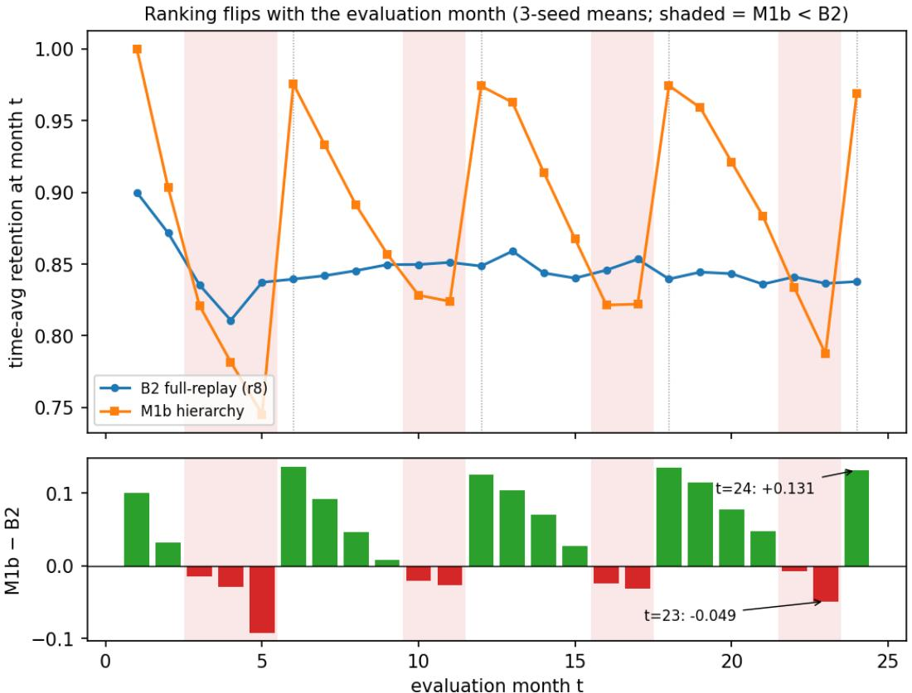
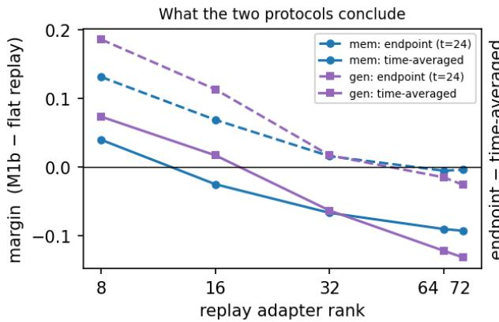
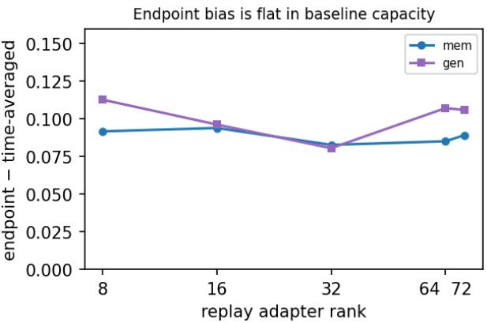
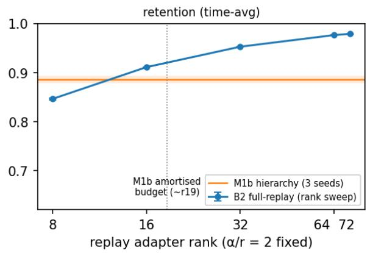
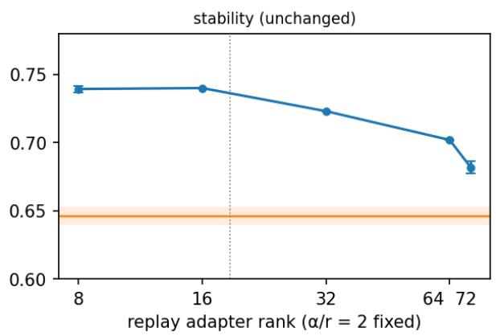
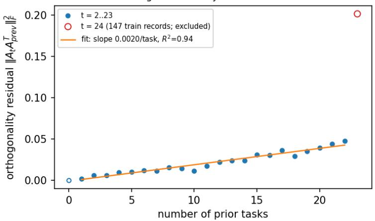

# Beyond Endpoint Scores: Time- and Capacity-Conditioned Evaluation of Continual Knowledge Updating

Heejin Choi Yonsei University Sooil Development NCreate heejin.share@gmail.com

## Abstract

Continual knowledge-updating methods are often declared superior from one final checkpoint and one conventional adapter rank. We show that this evidence can be insuficient to identify the better operating point. Holding a periodic hierarchy fixed, we compare it with cumulative replay over a 24-month Wikidata stream while varying evaluation month, replay LoRA rank, and query formulation. The selected winner changes across this evaluation region: on Qwen2.5-1.5B (three seeds), the hierarchy’s 5.0-point advantage over rank-8 replay becomes an 11.6-point deficit against rank-72 replay, and at high ranks a consolidation-aligned endpoint can suggest a tie while replay leads by 9–13 points on average. The same rank-conditioned reversal appears on Llama-3.2-1B and persists on held-out paraphrases.

These findings change what should count as evidence of superiority in continual updating. A method’s ranking is not necessarily a property of a single score; it can depend on when it is measured and how much replay-side adaptation capacity the baseline receives. We therefore propose a constructive evaluation protocol: evaluate throughout the stream, sweep tunable baseline capacity over a predeclared range, test multiple query formulations, and declare a robust winner only when the ordering is stable across this region. Otherwise, comparisons should report winner regions and retention–stability–cost frontiers. Under this protocol, the periodic hierarchy is a lower-update-cost operating point, not a quality winner.

## 1 Introduction

A deployed LLM’s parametric knowledge is fixed at its training cutof while the facts users ask about continue to change. Continual pretraining, parameter-eficient adaptation, model editing, retrieval, and hybrid memory systems ofer diferent ways to keep a frozen model current. These methods are often compared by reporting a final score under one selected configuration, implicitly treating method quality as a scalar.

The broad ingredients of this question have important precedents. Continual evaluation work shows that boundary-only scores can hide temporary forgetting and recovery [De Lange et al., 2023]. Knowledge-editor rankings can change with metric, scoring methodology, and edit batch size [Pohl et al., 2025]. LoRA-memory studies map rank-dependent factual storage and saturation [Back et al., 2026, Jiang et al., 2024], while continual-learning work shows that rank or the trainable parameter regime can change stability–plasticity trade-ofs and even comparative method rankings [Lu et al., 2026, Iordache and Burceanu, 2026]. Sequential-editing work likewise separates immediate acquisition from later accessibility [Huang et al., 2024, O’Neill, 2026]. We therefore do not claim novelty for any of these individual observations. Our narrower question is whether update phase and replay rank jointly change the winner of a continual factual-updating comparison when the hierarchy configuration is held fixed. Within the public literature covered by our prior-art search through

August 2026, we did not find a study demonstrating this joint hierarchy-versus-replay reversal across both model family and query surface.

Our results show that this scalar view is inadequate in our setting. The apparent winner depends on both when the model is evaluated and how much adaptation capacity the replay baseline receives. At month 23, rank-8 cumulative replay leads a periodic hierarchy by 4.9 points; at month 24, immediately after consolidation, the hierarchy leads by 13.1 points. Increasing replay rank then moves the entire comparison downward: at rank 72 the final checkpoint suggests a tie, although time-averaged replay leads by approximately 9 points on training templates and 13 points on unseen paraphrases.

The central object of this paper is therefore a time–replay-rank evaluation surface for a fixed hierarchy configuration: $\Delta _ { t , r , s } = R _ { \mathrm { h i e r } } ( t , s ) - R _ { \mathrm { r e p l a y } , r } ( t , s )$ . Throughout this surface analysis, the hierarchy is fixed at r64 slow + r8 fast with $K { = } 6 ;$ only the evaluation month t, replay rank r, and query surface s vary. Replay rank shifts the average level of the comparison, while periodic consolidation in the fixed hierarchy adds a temporal oscillation. Selecting one point can therefore exaggerate, reverse, or hide the average conclusion.

This perspective revises our own initial interpretation. Against conventional rank-8 replay, the hierarchy appeared both cheaper and better at retention. A full rank sweep showed that replay was capacity-limited: retention rises smoothly and saturates near rank 64, and suficiently capacitated replay exceeds the hierarchy in both retention and unchanged-fact stability. The same reversal appears on Qwen2.5-1.5B. The hierarchy’s surviving contribution is a lower-update-cost operating point obtained by replaying the full history only every K months, not evidence that calendar hierarchy stores knowledge more efectively.

Contributions. C1—A joint time–rank winner-reversal analysis. Holding the hierarchy configuration fixed (r64 slow + r8 fast, K=6), we evaluate the hierarchy-versus-replay margin over update time, replay rank, and query surface. Consolidation-aligned endpoint bias remains similar across the tested replay ranks, while rank shifts the average ordering. Their joint efect yields efect inflation, sign reversal, and hidden quality gaps. This is the paper’s principal novelty claim; the underlying stability-gap and rank sensitivity phenomena are established prior work.

C2—A cross-family falsification of the conventional low-rank baseline. The hierarchy appears to win retention against rank-8 replay, but the ordering reverses against rank-72 replay on Llama-3.2-1B and Qwen2.5-1.5B, with three seeds and on both training-template and heldout- paraphrase surfaces. We use the resulting surface to motivate a robust-winner protocol that predeclares evaluation times, replay capacities, and query surfaces and reports condition-dependent winner regions when the ordering changes. The rank curve and elementary replay-cost accounting are supporting analyses, not claims that rank-dependent LoRA memory or replay complexity are newly discovered.

C3—Scoped stream-structured diagnostics. We report a month-by-month O-LoRA residual trajectory on a relation-concentrated factual stream and a controlled WISE contrast in which P54 concentration increases answer concentration and lowers cumulative accessibility. We explicitly scope these as empirical diagnostics: orthogonal-capacity exhaustion and immediate-versus- cumulative degradation have prior art, and the WISE absolute result is limited to our integration.

## 2 Benchmark and evaluation protocol

Stream. 24 monthly snapshots (2024-01 – 2025-12) of Wikidata attribute changes with start-time qualifiers; up to 200 changed facts/month (21 months hit the cap; 198, 194 and 147 in the remainder, so 4,739 total); a fame-filtered, end-time-verified unchanged control (never trained on); base-model cutofs verified to precede the stream.

Scoring. Length-normalised loglikelihood multiple-choice against same-relation distractors, perrecord. Two surfaces per fact: mem (the training template) and gen (an unseen paraphrase); every number is surface-tagged. Retention is mean accuracy over all months seen so far; stability is accuracy on the unchanged control; both are time-averaged over $t = 1 \dots 2 4$ unless explicitly marked as an endpoint reference.

Methods. B0 frozen; B1 sequential LoRA; B2 full-replay (rank 8 conventional; rank 72 as a nominal-rank match to the hierarchy’s active-rank sum); B3 20%-replay; B4 O-LoRA [Wang et al., 2023]; B5 RAG (bge-m3 + FAISS); M1b two-level hierarchy (r64 slow, K=6, plus r8 chained fast); M2 three-level; WISE [Wang et al., 2024a] via EasyEdit, three configurations. Seeds: 3 for B2r8/B2r72/M1b/M2 and all Qwen/3B runs; 1 for the intermediate sweep points $r \in \{ 1 6 , 3 2 , 6 4 \}$ single-seed results are marked.

Provenance. Every result JSON records model, method, ranks, seed, K, per-month costs, and a completeness flag; headline tables are regenerated from the JSONs by script, never hand-edited. All runs use RTX 4090 GPUs with identical library pins; B2r72 seeds 1–2 and the $r \in \{ 1 6 , 3 2 , 6 4 \}$ sweep ran on rented hosts (device recorded per result; seed 0 local vs seeds 1–2 remote difer by $\leq 0 . 0 0 1$ retention, bounding the device efect).

## 3 Rankings form a time–replay-rank surface

Boundary-only evaluation is already known to hide transient loss and recovery in continual learning [De Lange et al., 2023]. Here we use that concern as the starting point for a joint capacity test. Consolidation produces a sawtooth: M1b peaks at $t \in \{ 6 , 1 2 , 1 8 , 2 4 \}$ (mem 0.973 mean at boundaries) and sags between (0.868 mean mid-window; amplitude +0.105, and +0.135 on the paraphrase surface). Because T=24 is a consolidation boundary, endpoint evaluation samples the peak (Figure 1). Measured on identical 3-seed runs:

• Ranking flips in $\mathbf { 9 / 2 4 }$ months against the conventional rank-8 baseline—the last 2–3 months of every window. T=23 ⇒ replay +4.9pp; T=24 ⇒ hierarchy +13.1pp.

• Efect inflation 3.32×—endpoint margin +0.131 vs time-averaged +0.040.

• Schedule blindness by construction— $K { = } 3 / 6 / 1 2$ all divide 24; endpoint ≈0.969 for all three; stream means $0 . 9 4 3 / 0 . 8 8 5 / 0 . 8 1 3$ . This comparison is between variants of one method at identical capacity, so it isolates the timing efect from any capacity confound.

Endpoint bias persists across replay capacity. A natural objection is that these flips exist only because the rank-8 baseline is starved (Section 4). Recomputing the margin against replay at every swept rank shows otherwise: the endpoint bias—endpoint margin minus time-averaged margin—is essentially constant in rank, $+ 0 . 0 9 2 / + 0 . 0 9 4 / + 0 . 0 8 3 / + 0 . 0 8 5 / + 0 . 0 8 9$ for $r = 8 / 1 6 / 3 2 / 6 4 / 7 2$ on the training-template surface $\left( + 0 . 1 1 3 \mathrm { ~ t o ~ } + 0 . 0 8 1 \right.$ on paraphrases), while the level moves steadily with capacity (months won by the hierarchy: $1 5 / 2 4 \to 1 0 \to 6 \to 4 \to 1 )$ . Capacity shifts the average level; boundary-aligned consolidation adds a similarly sized positive bias across the tested ranks (Figure 2).

  
Figure 1: The consolidation sawtooth and the months in which the ranking flips (3-seed means). Shaded months are those where flat replay leads; dotted lines mark consolidation boundaries. The two candidate endpoints t=23 and t=24 give opposite answers.

Consequently the endpoint distorts the conclusion at every capacity, in three distinguishable regimes (Table 1). At intermediate replay ranks $( r { = } 1 6 , 3 2 )$ the endpoint reverses the sign of the conclusion; at saturated capacity $( r { = } 6 4 , 7 2 )$ it reports a tie where the honest answer is a nine-point replay win. At every rank the hierarchy’s winning months are consolidation boundaries and their immediate successors—at r=72 it leads in exactly one month of 24, and that month is t=6.

The demonstrated mechanism is boundary alignment: periodic consolidation raises retention, and the selected benchmark endpoint happens to sample that peak. Other methods with periodic merge or consolidation schedules may share this structural risk, but we demonstrate the quantitative efect only for the variants evaluated here. Similar concerns about boundary-only reporting have been raised in continual evaluation [De Lange et al., 2023].

## 4 Rank-conditioned reversal of the method comparison

Prior work already establishes that LoRA’s factual-memory capacity increases and eventually saturates with rank, and that rank controls a stability– plasticity trade-of [Back et al., 2026, Jiang et al., 2024, Lu et al., 2026]. We do not claim those facts as new. Instead, the sweep is a falsification control for our original method comparison: does the hierarchy still appear preferable when replay

  
Figure 2: For the fixed hierarchy, replay rank changes the method-comparison margin. Left: endpoint and time-averaged hierarchy-minus-replay margins versus replay rank. Right: their diference, the endpoint bias. Replay rank shifts the level, while boundary-aligned timing adds a similar positive bias across the tested ranks.

Table 1: Three regimes of endpoint distortion (mem surface). Positive margins favour the hierarchy.
<table><tr><td>replay rank</td><td>endpoint says</td><td>time-average says</td><td>distortion</td></tr><tr><td>8</td><td>hierarchy +0.131</td><td>hierarchy +0.040</td><td>3.3× inflation</td></tr><tr><td>16</td><td>hierarchy +0.069</td><td>replay +0.025</td><td>sign reversal</td></tr><tr><td>32</td><td>hierarchy +0.016</td><td>replay +0.067</td><td>sign reversal</td></tr><tr><td>64</td><td>tie (−0.006)</td><td>replay +0.091</td><td>16× understatement</td></tr><tr><td>72</td><td>tie (−0.004)</td><td>replay +0.093</td><td>23× understatement</td></tr></table>

is not fixed at the conventional rank 8?

The rank-8 replay baseline places 4,739 selected training records into a low-rank adapter while the hierarchy carries active ranks 64+8. Sweeping replay rank at fixed $\alpha / r = 2$ holds adapter scaling constant while changing both update rank and trainable parameter count. We call the comparison rank-conditioned, not fully capacity- or compute-matched. Results are shown in Table 2 and Figure 3.

Three observations hold on both scoring surfaces. (i) The method ordering reverses. Flat replay beats M1b on both retention and stability from r=16 on the training-template surface and from r=32 on the held-out-paraphrase surface (at r=16, gen retention 0.797 still trails M1b’s 0.814). The central result is not that higher rank helps; it is that choosing rank 8 versus a suficiently capacious replay point produces opposite conclusions about which updating strategy is preferable. (ii) The comparison changes systematically over the tested sweep. Consistent with prior LoRA-memory work [Back et al., 2026], replay retention rises and saturates near $r \approx 6 4$ (mem $0 . 8 4 6  0 . 9 7 9 ;$ gen $0 . 7 4 1  0 . 9 4 7 )$ . Ranks 16, 32, and 64 are single-seed exploratory points; the r8 and r72 endpoints are three-seed results. (iii) Rank is not free. Stability is unchanged from rank 8 to rank 16 (0.739 vs 0.740, a diference below the r8 seed standard deviation) and then falls steadily (mem $0 . 7 2 3  0 . 7 0 2  0 . 6 8 2$ ; gen $0 . 6 9 1  0 . 6 5 0  0 . 6 3 1 )$ , consistent with prior rank–forgetting analyses [Lu et al., 2026]. We report the crossing points rather than a formal budget equivalence: LoRA rank is not linearly additive in functional capacity, and our sweep changes both update rank and parameter count. The hierarchy’s robust advantage is lower update cost $( \sim 3 . 5 \times )$ not higher quality.

Table 2: Capacity sweep, time-averaged over $t = 1 \ldots 2 4 .$ . Cost cells are wall-clock GPU-seconds from the seed-0 runs, which all executed on the same local RTX 4090; the intermediate sweep points ran on rented hosts and their timings are not comparable (r16 measured 2554 s against r64’s 1983 s—a lower rank costing 29% more, which host variation explains and rank cannot), so we mark them $\mathrm { n } / \mathrm { c } .$ . All accuracy comparisons are device-independent: the r72 seeds split across local and rented hosts agree to $\leq 0 . 0 0 1$ retention.
<table><tr><td>method</td><td>ret (MEM)</td><td>ret (GEN)</td><td>stab (MEM)</td><td>stab (GEN)</td><td>GPU-s</td><td>seeds</td></tr><tr><td>B2 r8</td><td> $0 . 8 4 6 \pm . 0 0 2$ </td><td> $0 . 7 4 1 \pm . 0 0 5$ </td><td> $0 . 7 3 9 \pm . 0 0 2$ </td><td> $0 . 7 1 3 \pm . 0 0 2$ </td><td>2062</td><td>3</td></tr><tr><td>B2 r16</td><td>0.911</td><td>0.797</td><td>0.740</td><td>0.716</td><td> $\mathrm { n } / \mathrm { c }$ </td><td>1</td></tr><tr><td>B2 r32</td><td>0.953</td><td>0.878</td><td>0.723</td><td>0.691</td><td> $\mathrm { n } / \mathrm { c }$ </td><td>1</td></tr><tr><td>B2 r64</td><td>0.976</td><td>0.937</td><td>0.702</td><td>0.650</td><td> $\mathrm { n } / \mathrm { c }$ </td><td>1</td></tr><tr><td>B2 r72</td><td> $\mathbf { 0 . 9 7 9 \pm . 0 0 1 }$ </td><td> $\mathbf { 0 . 9 4 7 \pm . 0 0 4 }$ </td><td> $0 . 6 8 2 \pm . 0 0 5$ </td><td> $0 . 6 3 1 \pm . 0 0 3$ </td><td>2230</td><td>3</td></tr><tr><td>M1b (r64+8)</td><td> $0 . 8 8 5 \pm . 0 0 6$ </td><td> $0 . 8 1 4 \pm . 0 0 8$ </td><td> $0 . 6 4 6 \pm . 0 0 5$ </td><td> $0 . 6 0 4 \pm . 0 0 5$ </td><td>586</td><td>3</td></tr></table>

## 5 Resource accounting (supporting analysis)

The following is elementary accounting included to avoid a misleading asymptotic claim; it is not a theoretical novelty claim. With period K and cumulative raw replay, total work is $\textstyle \sum _ { i } i K \approx$ $T ^ { 2 } / 2 K + O ( T )$ ; monthly full replay is $T ^ { 2 } / 2$ , so the ratio approaches K for fixed K as $T \to \infty$ Measured ratios are 2.5× at T=12 (predicted $2 . 6 \times )$ and 3.5× at T=24 (predicted 3.6×), with a 6× asymptote for $K { = } 6$ . Thus the method remains quadratic with raw replay, and bounded active adapter parameters do not imply bounded replay-data storage. Parameter-only merging [Qiao and Mahdavi, 2025] targets the bounded-corpus property that this schedule lacks.

## 6 Robustness: cross-model and cross-scale

Regime-aware continual-learning work shows that changing the trainable parameter subspace can change comparative method rankings [Iordache and Burceanu, 2026]. Our question is narrower: does a replay-rank-induced winner reversal in factual updating transfer across LLM family and query surface?

Against the fixed rank-8 replay baseline, 3 seeds per setting:
<table><tr><td>setting</td><td>M1b ret – B2r8 ret</td><td>cost ratio</td><td>stability trade</td></tr><tr><td>Llama-3.2-1B</td><td>+0.040</td><td>3.5×</td><td>-0.093</td></tr><tr><td>Qwen2.5-1.5B</td><td>+0.050</td><td>3.5×</td><td>-0.046</td></tr><tr><td>Llama-3.2-3B</td><td>+0.006</td><td>3.2×</td><td>-0.063</td></tr></table>

Direction reproduces in all three settings. Within the Llama family the margin shrinks 6× from 1B to 3B (larger models replay better) while the hierarchy’s stability rises $( 0 . 6 4 6  0 . 7 4 8 )$ , so 1B-class efect sizes should not be extrapolated upward. The Qwen point (+0.050) is a diferent family and does not order between them; with three settings across two families we report the two within-family points as the scale evidence and treat Qwen as a family-transfer check, not a third point on a trend line.

  
Figure 3: Replay-rank sweep used as a falsification control. Consistent with prior LoRA-memory work, replay retention rises and saturates with rank; the distinctive result here is that replay crosses the fixed hierarchy. Stability is flat to rank 16 and then falls. The hierarchy’s 3-seed band is shown for comparison.

The capacity reversal is not a Llama-1B artifact. Every row above uses the fixed rank-8 baseline that Section 4 shows to be starved, so on its own the table establishes reproduction of the direction, not of the ranking. We therefore repeated the rank-conditioned contrast on the second model family (Table 3): increasing Qwen’s replay rank from 8 to 72 (the hierarchy’s nominal active-rank sum) flips the retention margin from +0.050 to −0.116 (mem) and −0.109 (gen), with seed $\sigma \le 0 . 0 0 4$ . The efect is in fact stronger than at 1B: on Qwen the rank-72 replay wins stability as well $\left( + 0 . 0 3 4 \right)$ , so the hierarchy is dominated on both quality axes at once, and its surviving advantage is again update cost (3.24×)—the same bound-by-K saving. Intermediate ranks were not swept on Qwen; this tests family transfer of the reversal, not the shape of the dose-response.

Table 3: Rank-conditioned contrast on Qwen2.5-1.5B (3 seeds, time-averaged). The conventional baseline and the rank-72 baseline give opposite answers.
<table><tr><td>method</td><td>ret (MEM)</td><td>ret (GEN)</td><td>stab (MEM)</td><td>GPU-s</td></tr><tr><td>B2 r8 (conventional)</td><td> $0 . 8 1 8 \pm . 0 0 2$ </td><td> $0 . 6 6 9 \pm . 0 1 9$ </td><td> $0 . 6 6 8 \pm . 0 0 1$ </td><td>3874</td></tr><tr><td>B2 r72</td><td> $\mathbf { 0 . 9 8 4 } \pm . \mathbf { 0 0 1 }$ </td><td> $\mathbf { 0 . 8 6 8 \pm . 0 0 8 }$ </td><td> $0 . 6 5 6 \pm . 0 0 4$ </td><td>3603</td></tr><tr><td>M1b (r64+8, K=6)</td><td> $0 . 8 6 8 \pm . 0 0 4$ </td><td> $0 . 7 5 9 \pm . 0 0 4$ </td><td> $0 . 6 2 3 \pm . 0 0 2$ </td><td>1113</td></tr></table>

The remaining untested cell is a rank-72 replication at 3B.

  
Figure 4: O-LoRA’s orthogonality residual against prior-task count. The residual grows approximately linearly through $t { = } 2 3 \ ( R ^ { 2 } { = } 0 . 9 4 )$ ; the final month (open marker) contains fewer training records and is excluded from the fit.

## 7 Stress tests beyond immediate edit success

O-LoRA. O-LoRA constrains each new update toward a subspace orthogonal to previous updates. Capacity exhaustion in orthogonal-subspace continual learning is not a new mechanism claim: $\mathrm { E ^ { 2 } { - } L o R A }$ explicitly identifies difusion across the basis and exhaustion of capacity for future tasks [Li et al., 2026]. Our contribution here is a measured trajectory in a relation-concentrated factual stream. O-LoRA’s time-averaged mem retention is 0.644 and gen retention is 0.594, below plain sequential LoRA’s mem retention of 0.657. From t=2 through t=23, the logged residual overlap $\lVert A _ { t } A _ { \mathrm { p r e v } } ^ { \top } \rVert _ { F } ^ { 2 }$ increases approximately linearly from 0.0020 to 0.0476, with slope 0.0020 per prior task and $R ^ { 2 } { = } 0 . 9 4$ Month 24 jumps to 0.2017, but it contains 147 training records rather than approximately 194–200 and is reported separately. The trajectory is consistent with progressive subspace pressure in this setting; it does not establish a universal mechanism or rule out hyperparameter sensitivity.

WISE. The distinction between immediate editing success and later accessibility is established prior work [Huang et al., 2024, O’Neill, 2026]. Moreover, Liu et al. [2026] report a WISE case in which multiple temporal states collapse to one dominant answer. We therefore do not claim the first immediate-versus-cumulative gap or the first WISE answer collapse. Our narrower contribution is a quantitative 200-edit contrast under one integration. Immediate rewrite accuracy is 1.000 after each edit, while cumulative multiple-choice retention remains near the frozen base. Holding code, hyperparameters, edit count, and subject–relation deduplication fixed, the six-relation arm has top-attractor share 0.585, 45 distinct generated answers, and cumulative MC 0.390; the P54-only arm has top-attractor share 0.800, 12 distinct answers, and cumulative MC 0.330. P54 concentration thus increases collapse severity in this contrast. The balanced arm also fails to exceed the approximately 0.40 frozen-base score, and relation identity is not fully separated from concentration. We do not infer that homogeneity is the sole cause of failure or that WISE is generally unusable.

These stress tests are supporting evidence for cumulative, stream-structured evaluation rather than the principal novelty of the paper. Operational update streams can be relation-concentrated, while standard edit benchmarks often use more diverse objectives; prior sequence-editing work likewise reports efects of target diversity and sequence length [Huang et al., 2024].

## 8 Secondary result: the index-size/retention trade-of in hybrids

No single store dominates: RAG reaches 0.999 retention at zero training but an unbounded index $( 1 , 9 5 5 \to 1 1 , 6 9 8 )$ and measurable contamination of unrelated queries (trivia −5pp); rank-72 replay is the best trained quality; the hierarchy is the cheapest. Routing among {base, adapter, RAG} exposes a sharp trade-of rather than a free win:
<table><tr><td>hybrid variant</td><td>retention</td><td>index</td></tr><tr><td>spec (old→RAG, recent→adapter)</td><td> $0 . 9 8 8 \pm . 0 0 2$ </td><td>11,551</td></tr><tr><td>bounded (old→adapter, recent→RAG)</td><td> $0 . 7 4 6 \pm . 0 0 0$ </td><td>147</td></tr></table>

Restricting retrieval to the current consolidation window shrinks the index 80× but costs 24 points of retention, because the consolidated adapter—which then must serve the entire past—is the accuracy bottleneck (it retains only what was injected). The same membership routing does recover stability at inference $( 0 . 4 7 5  0 . 6 2 3 ; 9 9 \%$ of oracle end-task; forgetting bounded by router error), and merged adapters serve at base latency (19.5 vs 21.3 ms/query). The bounded-index/retention gap is a concrete target for parameter-level consolidation research.

## 9 Related work and novelty boundary

Continual evaluation and evaluation-dependent rankings. Boundary-only evaluation can hide temporary forgetting and recovery; De Lange et al. [2023] formalize this stability gap and motivate continual and worst-case metrics. In knowledge editing, Pohl et al. [2025] show that metrics, evaluation methodology, and edit batch size can change editor rankings. More broadly, Iordache and Burceanu [2026] show that continual-learning method rankings need not be invariant to the trainable-depth regime. These works preclude a broad claim that evaluation-dependent ranking is new. Our narrower result is a joint update-time by replay-rank analysis in continual factual updating, with three concrete endpoint error regimes and cross-family replication.

Rank and parametric knowledge memory. Back et al. [2026] systematically map LoRA factual-memory capacity, rank-dependent saturation, and parameter eficiency on Llama and Qwen. MoRA shows that low update rank can limit memory-intensive learning under a fixed parameter budget [Jiang et al., 2024], and CoDyRA links efective rank to a stability–plasticity trade-of [Lu et al., 2026]. We therefore do not claim novelty for monotonic rank efects, saturation, or the existence of a rank– forgetting frontier. The distinct empirical result is that a conventional rank-8 replay baseline and a higher-rank replay baseline yield opposite conclusions about hierarchy versus replay, on two model families and two query surfaces.

Lifelong editing and cumulative accessibility. GRACE [Hartvigsen et al., 2023], WISE [Wang et al., 2024a], MEMOIR [Wang et al., 2025], NMKE, and EvoEdit [Liu et al., 2025, Lyu et al., 2026] study sequential retention, generalization, locality, unlearning, and memory organization. D4S documents sequence-length and target-diversity efects and separates immediate from cumulative performance [Huang et al., 2024]. O’Neill [2026] distinguish stored content from question-keyed accessibility after later writes, and Liu et al. [2026] provide a WISE case where temporal states collapse to one answer. Our WISE analysis is consequently a scoped quantitative stress test, not a claim to introduce these general failure principles.

Orthogonal subspaces. O-LoRA uses orthogonal update subspaces to limit interference [Wang et al., 2023]. E2-LoRA explicitly motivates dynamic rank allocation by the risk that orthogonal methods difuse energy and exhaust capacity for future tasks [Li et al., 2026]. Our residual curve is a new measurement in this stream, not a new statement of the exhaustion mechanism.

Temporal data and consolidation. TemporalWiki [Jang et al., 2022] provides an evolving Wikipedia/Wikidata benchmark, while RAG or Learning? introduces a 2024–2025 continuousknowledge-drift benchmark [Liu et al., 2026]. Recent work makes the temporal evaluation axis even more explicit: ForgetBench evaluates forgetting across sequential edit stages [Gu et al., 2026], When Does Continual Learning Require Learning uses a mechanism-agnostic sequential protocol under environmental drift [Harrington et al., 2026], and OAKS evaluates online adaptation to evolving knowledge streams [Kim et al., 2026]. These works reinforce that temporal evaluation itself is not our novelty. Progress & Compress [Schwarz et al., 2018] separates fast acquisition from slow consolidation; MEMORYLLM, ProCL, Merge-before-Forget, and Memini organize learned or external memory across updates [Wang et al., 2024b, Le and Venkatesh, 2026, Qiao and Mahdavi, 2025, Pattichis and Dovrolis, 2026]. Our benchmark claim is therefore the joint update-time by replay-rank protocol for a fixed hierarchy and the resulting winner reversal, not the first temporal factual stream or the first fast/slow memory architecture.

## 10 From winner reversal to a robust evaluation protocol

Constructive protocol. The failure identified here is a model-selection failure, so the immediate solution is an evaluation protocol rather than a new updater. For a fixed candidate configuration, predeclare an evaluation region $\mathcal { E } = \mathcal { T } \times \mathcal { R } \times \mathcal { S }$ , where T contains evaluation times, R contains tunable baseline capacities (replay ranks here), and S contains query formulations. At each point report the signed pairwise margin $\Delta ( t , r , s )$ . A robust superiority claim requires the ordering to keep the same sign over the predeclared region, with seed uncertainty reported at headline comparisons. If the sign changes, the scientifically appropriate result is a winner map or a retention–stability–cost frontier, not a scalar claim that one method universally dominates the other.

In practice, this means: evaluate throughout the stream rather than only at the final checkpoint; disclose whether reported endpoints align with reset, merge, replay, or consolidation events; sweep or explicitly condition on the capacity of tunable baselines; report exact trainable parameters and efective update rank when available; test both training formulations and held-out query formulations; and account separately for retention, unchanged-fact stability, update work, replay/index storage, and serving cost. We deliberately do not collapse this surface into a new single metric, because deployment preferences over time, quality, and resource cost difer. This protocol resolves the immediate decision problem exposed by our experiments; designing an updater that approaches high-rank replay quality at periodic-consolidation cost is a separate algorithmic target.

Limitations. The central claim is an empirical winner reversal within the evaluated time, rank, model, and query ranges; it is not a universal ordering of updating methods. The complete rank dose-response is measured on Llama-3.2-1B. Its r8 and r72 endpoints are three-seed results and replicate on Qwen2.5-1.5B, but the intermediate Llama ranks are single-seed, intermediate Qwen ranks are untested, and rank-72 replay at 3B remains untested. Varying LoRA rank changes both trainable parameter count and efective update rank, so rank 72 is a nominal comparison point, not a formal capacity- or compute-equivalence to the hierarchy. The stream is one domain and is dominated by P54; the WISE relation contrast does not fully match answer entropy, relation dificulty, or target perplexity, and other editing studies report diferent diversity efects in other regimes. The stream does not implement full versioned semantics for repeated changes to the same subject–relation pair. gen is an unseen paraphrase, not unrestricted free generation or multi-hop use. WISE’s absolute performance is scoped to our EasyEdit integration, and the O-LoRA final-month spike is confounded with a smaller training batch. The $O ( T ^ { 2 } / K + T )$ expression is transparent resource accounting, not a theoretical contribution. Finally, while our search through September 3, 2026 found no prior public study with the same joint time–rank hierarchy-versus-replay reversal, literature absence cannot be proven and concurrent work may further narrow the novelty boundary.

Conclusion. Prior work already establishes that boundary-only evaluation can hide transient instability, that evaluation protocols can change editor rankings, and that LoRA rank controls factual-memory capacity. Our result is their joint consequence for method selection: with the hierarchy configuration fixed, update phase and replay rank are large enough to change the hierarchyversus-replay winner in continual factual updating. A single endpoint at a single default rank can inflate a small advantage, reverse the apparent ordering, or hide a large replay lead. The reversa appears on held-out paraphrases and on a second model family. The solution ofered by this paper is a robust evaluation protocol: claim a winner only when the ordering survives the predeclared evaluation region; otherwise report the winner regions and Pareto frontier. Under this protocol, the periodic hierarchy is a lower-update-cost operating point rather than a quality winner.

Availability. We plan to release the benchmark stream, per-run result JSONs with provenance manifests, and all analysis and figure scripts in a public repository accompanying the preprint.

## References

Seungju Back, Dongwoo Lee, Naun Kang, Taehee Lee, S. K. Hong, Youngjune Gwon, and Sungjin Ahn. Understanding LoRA as knowledge memory: An empirical analysis. In International Conference on Machine Learning (ICML), 2026. arXiv:2603.01097.

Matthias De Lange, Gido M. van de Ven, and Tinne Tuytelaars. Continual evaluation for lifelong learning: Identifying the stability gap. In International Conference on Learning Representations (ICLR), 2023. arXiv:2205.13452.

Ruxi Gu, Zhenliang Zhang, and Wei Wang. ForgetBench: Benchmarking forgetting dynamics of long-term parametric memory in language models. arXiv preprint arXiv:2607.26455, 2026.

Anne Harrington, Nayan Saxena, Michael Murphy, Anastasia Borovykh, Zeyu Yun, Sridhar Kamath, Ara Eindra Kyi, Trevor Darrell, Jitendra Malik, and Yutong Bai. When does continual learning require learning. arXiv preprint arXiv:2607.07847, 2026.

Thomas Hartvigsen, Swami Sankaranarayanan, Hamid Palangi, Yoon Kim, and Marzyeh Ghassemi. Aging with GRACE: Lifelong model editing with discrete key-value adaptors. In Advances in Neural Information Processing Systems (NeurIPS), 2023. arXiv:2211.11031.

Xiusheng Huang, Jiaxiang Liu, Yequan Wang, and Kang Liu. Reasons and solutions for the decline in model performance after editing. In Advances in Neural Information Processing Systems (NeurIPS), 2024.

Paul-Tiberiu Iordache and Elena Burceanu. Fine-tuning regimes define distinct continual learning problems. arXiv preprint arXiv:2604.21927, 2026.

Joel Jang, Seonghyeon Ye, Changho Lee, Sohee Yang, Joongbo Shin, Janghoon Han, Gyeonghun Kim, and Minjoon Seo. TemporalWiki: A lifelong benchmark for training and evaluating everevolving language models. In Proceedings of the 2022 Conference on Empirical Methods in Natural Language Processing (EMNLP), 2022. arXiv:2204.14211.

Ting Jiang, Shaohan Huang, Shengyue Luo, Zihan Zhang, Haizhen Huang, Furu Wei, Weiwei Deng, Feng Sun, Qi Zhang, Deqing Wang, and Fuzhen Zhuang. MoRA: High-rank updating for parameter-eficient fine-tuning. arXiv preprint arXiv:2405.12130, 2024.

Jiyeon Kim, Hyunji Lee, Dylan Zhou, Sue Hyun Park, Seunghyun Yoon, Trung Bui, Franck Dernoncourt, Sungmin Cha, and Minjoon Seo. Can large language models keep up? benchmarking online adaptation to continual knowledge streams. arXiv preprint arXiv:2603.07392, 2026.

Hung Le and Svetha Venkatesh. Continual fine-tuning of large language models via program memory. arXiv preprint arXiv:2605.13162, 2026.

Longhua Li, Lei Qi, Qi Tian, and Xin Geng. Energy-structured low-rank adaptation for continual learning. In International Conference on Machine Learning (ICML), 2026. arXiv:2605.27482.

Hanbing Liu, Lang Cao, and Yang Li. RAG or learning? understanding the limits of LLM adaptation under continuous knowledge drift in the real world. arXiv preprint arXiv:2604.05096, 2026.

Jinzhe Liu, Junshu Sun, Shufan Shen, Chenxue Yang, and Shuhui Wang. Edit less, achieve more: Dynamic sparse neuron masking for lifelong knowledge editing in LLMs. In Advances in Neural Information Processing Systems (NeurIPS), 2025. arXiv:2510.22139.

Haodong Lu, Chongyang Zhao, Jason Xue, Lina Yao, Kristen Moore, and Dong Gong. Take only what you need: Rank minimization as an implicit forgetting regularizer in continual learning. arXiv preprint arXiv:2412.01004, 2026. First public version 2024.

Sicheng Lyu, Yu Gu, Xinyu Wang, Jerry Huang, Sitao Luan, Yufei Cui, Xiao-Wen Chang, and Peng Lu. EvoEdit: Evolving null-space alignment for robust and eficient knowledge editing. In Findings of the Association for Computational Linguistics: ACL, 2026. arXiv:2510.13851.

Charles O’Neill. Can a language model learn facts continually in its weights? arXiv preprint arXiv:2607.11020, 2026.

Andreas Pattichis and Constantine Dovrolis. Continual knowledge updating in LLM systems: Learning through multi-timescale memory dynamics. In ICML 2026 Workshop on Continual Adaptation at Scale: Towards Sustainable AI (CATS), 2026. arXiv:2605.05097; poster.

Sebastian Pohl, Max Ploner, and Alan Akbik. Towards a principled evaluation of knowledge editors. In Proceedings of the First Workshop on Large Language Model Memorization (L2M2), pages 47–60. Association for Computational Linguistics, 2025. doi: 10.18653/v1/2025.l2m2-1.4.

Fuli Qiao and Mehrdad Mahdavi. Merge before forget: A single LoRA continual learning via continual merging. arXiv preprint arXiv:2512.23017, 2025.

Jonathan Schwarz, Wojciech Czarnecki, Jelena Luketina, Agnieszka Grabska-Barwinska, Yee Whye Teh, Razvan Pascanu, and Raia Hadsell. Progress & compress: A scalable framework for continual learning. In Proceedings of the 35th International Conference on Machine Learning (ICML), volume 80, 2018.

Ke Wang, Yiming Qin, Nikolaos Dimitriadis, Alessandro Favero, and Pascal Frossard. MEMOIR: Lifelong model editing with minimal overwrite and informed retention for LLMs. In Advances in Neural Information Processing Systems (NeurIPS), 2025. arXiv:2506.07899.

Peng Wang, Zexi Li, Ningyu Zhang, Ziwen Xu, Yunzhi Yao, Yong Jiang, Pengjun Xie, Fei Huang, and Huajun Chen. WISE: Rethinking the knowledge memory for lifelong model editing of large language models. In Advances in Neural Information Processing Systems (NeurIPS), volume 37, pages 53764–53797, 2024a. arXiv:2405.14768.

Xiao Wang, Tianze Chen, Qiming Ge, Han Xia, Rong Bao, Rui Zheng, Qi Zhang, Tao Gui, and Xuanjing Huang. Orthogonal subspace learning for language model continual learning. In Findings of the Association for Computational Linguistics: EMNLP, 2023. arXiv:2310.14152.

Yu Wang, Yifan Gao, Xiusi Chen, Haoming Jiang, Shiyang Li, Jingfeng Yang, Qingyu Yin, Zheng Li, Xian Li, Bing Yin, Jingbo Shang, and Julian McAuley. MEMORYLLM: Towards self-updatable large language models. In Proceedings of the 41st International Conference on Machine Learning (ICML), 2024b. arXiv:2402.04624.