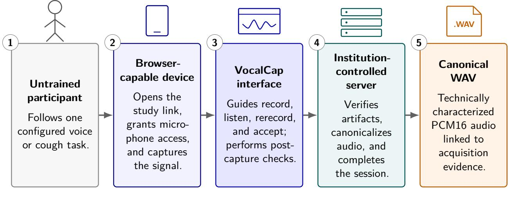
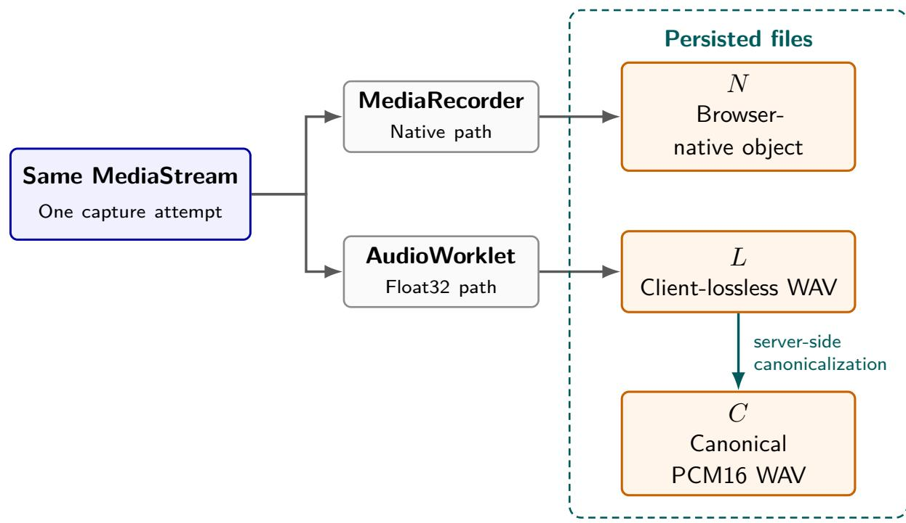

# Beyond .WAV: Design and Software Verification of VocalCap, a Traceable Browser-Based Audio Capture System for Vocal Biomarker Research

Augusto Camargo 1

1Institute of Mathematics and Statistics, University of São Paulo, São Paulo, Brazil augusto.camargo@bluecore.com.br

September 4, 2026

## Abstract

Remote voice acquisition is often represented by a final audio file with limited evidence about how the signal was captured, transferred, processed, and accepted. This limits the investigation of blank, malformed, incomplete, altered, or incorrectly transformed recordings before they enter vocal biomarker analysis.

This paper presents VocalCap, an institution-controlled, browser-based audio capture system designed for self-guided collection of voice and related acoustic signals by participants without technical training. A versioned protocol drives the participant workflow. Each accepted record ing comprises a browser-native object, a client-lossless Float32 WAV derived from the same MediaStream, and a server-canonical mono 16-bit pulse-code modulation (PCM16) WAV. These artifacts remain linked to evidence describing capture execution, technical quality, byte-level integrity, recovery, and transformation provenance. IndexedDB retains accepted browser artifacts until server confirmation, and authoritative session completion requires successful verification of every protocol task and retained artifact.

Software verification challenged the acquisition contracts with malformed or altered artifacts, exact-zero interruptions, channel-topology variants, and interrupted or repeated operations. Controlled tests verified the 40-ms continuity boundary at four sample rates and confirmed preservation of an injected transient after topology-aware canonicalization. A post hoc audit of 39 consented pilot recordings captured with version 0.1.0 and re-inspected with version 0.3.0 for technical verification of the acquisition system found 25 sample-identical stereo files and 14 files with signal confined to the left channel. Selecting the active channel in the latter group limited the canonical root-mean-square level diference to less than 0.001 dB in every file; an equalweight stereo average would introduce approximately 6.02 dB of attenuation. Fifteen recordings contained an internal exact-zero candidate, of which eight met the active-context failure rule and seven were retained as low-level intervals. Production end-to-end (E2E) verification of version 0.3.0 completed two five-task browser profiles in Chromium and WebKit, producing 10 accepted recordings and 30 retained artifacts that passed server-side integrity and format checks. These findings establish software behavior under the tested browser-engine conditions and characterize technical properties observed in consented pilot recordings produced by project team members. Controlled acoustic agreement across the declared device-support envelope, formal usability evaluation in the target participant population, clinical validity, and biomarker performance require separate studies.

Keywords: vocal biomarkers; audio capture; voice recording; remote acquisition; provenance; data integrity; software verification; self-guided research.

## 1 Introduction

Voice, speech, cough, breathing, and related acoustic productions are increasingly studied as accessible sources of digital biomarkers for neurological, psychiatric, respiratory, laryngeal, and systemic conditions [2, 3, 5, 6]. These signals can be elicited repeatedly and collected using microphones already present in consumer devices, making them attractive for geographically distributed and longitudinal research. Acquisition conditions constitute an explicit methodological variable. Reviews continue to identify methodological heterogeneity throughout acquisition, data preparation, analysis, and validation [3, 5, 6].

The verification, analytical validation, and clinical validation (V3) framework distinguishes verification of a sensing technology from analytical validation of a derived measure and clinical validation within a context of use [4]. For vocal biomarkers, this distinction means that the recording path must be characterized independently of any claim that an acoustic or linguistic feature measures disease. Instrumental voice-assessment recommendations already emphasize microphone response, distance, calibration, dynamic range, ambient noise, task selection, and reporting [7]. Empirical comparisons also show that device and setting can influence voice measurements even when mobile recordings correlate with studio references [8, 9]. Correlation must be complemented by direct evaluation of agreement and interchangeability.

Remote self-guided acquisition creates an additional operational problem: the participant performs the procedure without trained staf present. The participant workflow must minimize efort and make successful completion clear. The researcher retains responsibility for the data despite losing direct view of permission handling, task interpretation, microphone state, encoding, local persistence, transfer, or recovery. Remote speech studies have documented software navigation problems, repeated failed attempts, reliance on relatives, misunderstood instructions, inconsistent acoustic settings, duplicated collections, and identity ambiguity [10, 11, 12]. These problems can afect missingness, attribution, comparability, participant burden, and signal usability.

VocalCap was informed by prior operational experience rather than designed as a de novo recording prototype. Its predecessor was deployed during the first wave of the COVID-19 pandemic to collect speech remotely for Project SPIRA. The published account documents more than 6,000 remote voice donors, each invited to produce three utterances, in addition to recordings obtained in university hospitals [1]. That deployment supported the first peer-reviewed study arising from the collection and exposed acquisition failures that were dificult to reconstruct from the received audio alone, including blank recordings and device-dependent popping and crackling. These observations directly motivated the validation, provenance, and recovery mechanisms examined in the present work.

These uncertainties persist after a final audio file is received. Waveform inspection may reveal clipping, silence, or truncation; causal localization requires evidence about whether Web Audio received frames, whether the native recorder emitted chunks, whether the microphone track ended unexpectedly, whether the server received the same bytes produced in the browser, and which transformation generated the analysis waveform. These concerns intersect with provenance and electronic-record expectations discussed in Section 2.2.

Existing systems cover overlapping portions of this lifecycle, including prompted collection, survey integration, mobile phenotyping, ecological assessment, and corpus management. Their difering purposes leave open the integration of paired browser artifacts, client–server byte verification, versioned canonicalization, durable recovery, and task-level completion as one acceptance contract for self-guided vocal-biomarker research.

VocalCap is a browser-based audio capture system for vocal-biomarker research. It combines a no-install participant interface with an operational record that links each requested task to browser capture, subsequent processing, and final acceptance. The record preserves observed failures and client–server byte integrity and establishes whether the complete protocol task set was validly accepted. VocalCap centers on this acquisition record and is independent of a single disease, fixed task battery, or downstream biomarker model. The participant-to-WAV path and its boundary with downstream biomarker analysis are summarized in Figure 1; the complementary audio files retained for one accepted recording are detailed in Figure 2.

The objective of this study was to determine whether the frozen VocalCap implementation satisfied defined software contracts at four boundaries: browser capture, cross-boundary byte identity, canonical transformation, and session recovery and completion. Deterministic challenges were supplemented by a post hoc audit of consented pilot recordings used for technical verification of the acquisition system. The audit examined two observed WAV-level failure modes: internal exact-zero interruptions and stereo topology that can alter level during mono canonicalization.

This paper contributes:

1. a traceable browser-mediated acquisition record that links complementary audio artifacts to capture, integrity, technical-quality, recovery, and transformation-provenance evidence; and

2. software verification of the implemented acquisition contracts through deterministic and adverse-condition tests, a retrospective technical audit of 39 consented pilot recordings produced by project team members, and production end-to-end (E2E) execution of the deployed version 0.3.0 system.

## 2 Background and Related Systems

## 2.1 Acquisition is distinct from biomarker inference

A vocal biomarker is a measurable acoustic or linguistic characteristic associated with a biological, pathological, or treatment-related process. The recording file serves as an input to that measurement, while acquisition software operates upstream of diagnostic inference.

In this paper, collection refers to the study-level process of obtaining data across participants, sessions, and protocol tasks. A task is a protocol-defined elicitation unit, such as a sustained vowel, sentence, or cough. Audio capture is the browser-mediated recording of one attempt to perform a task and the creation of its initial artifacts. The acquisition lifecycle begins with capture and continues through validation, local persistence, transfer, canonicalization, and authoritative completion.

VocalCap operates across this upstream lifecycle: it executes a research protocol, retains audio and evidence, and produces a technically characterized record. Disease probabilities, care recommendations, and biomarker qualification occur downstream.

Separating these layers influences both design and evaluation. In this paper, software verification denotes conformance of the implemented browser–server acquisition contracts. V3 verification evaluates the sample-level performance of a sensing technology against an appropriate physical or bench reference. The present study examines whether artifacts conform to declared formats, preserve integrity across software boundaries, and are reproducibly transformed. Analytical validation addresses whether a downstream algorithm measures its intended quantity, while clinical validation establishes the meaning of that quantity in a defined population and context of use [4].

## 2.2 Remote acquisition evidence and electronic-record expectations

Web surveys have long used paradata to record navigation, timing, interruption, and interaction events beyond the final response [20]. Data-provenance models likewise describe entities, activities, and transformations needed to understand how an object was generated [16]. Paradata and provenance models support retaining evidence about the acquisition process alongside the recorded signal.

Adjacent guidance for remote digital acquisition and electronic records emphasizes data flow, metadata, durability, transfer, auditability, and reconstruction of significant events [13, 14, 15]. These sources provide design context for research acquisition records. Regulatory compliance and medical-device classification remain outside the study scope. Together with paradata and provenance models, they support treating the acquisition lifecycle as part of the evidentiary record.

## 2.3 Related acquisition systems

Many reusable systems already address parts of this problem. Speak supports prompted browser collection and automated validation [21]; speechcollectr provides programmable web speech experiments [22]; Voice Over Internet Surveys (VOIS) embeds spoken responses in survey systems [23]; Beiwe provides durable institution-operated mobile phenotyping [24]; and Voice EHR demonstrates guided health-oriented audio acquisition [25]. m-Path supports voice responses within configurable smartphone-based ecological momentary assessment [26]. Project Euphonia, HermeSpeech Recorder, WebSpeechRecorderNg, and LaBB-CAT further establish browser recording, prompted tasks, administration, and corpus integration [27, 28, 29, 30]. Across these systems, browser capture, WAV output, quality checks, retries, hashes, and provenance are established mechanisms.

A systems comparison for vocal-biomarker audio capture extends from recording functionality to protocol execution, participant burden, local resilience, artifact verification, transformation history, completion semantics, and institutional control. Existing systems cover overlapping subsets, often for diferent purposes. Survey recorders favor integration with questionnaires; experiment toolkits favor stimulus flexibility; crowdsourcing systems favor scale; digital-phenotyping platforms favor longitudinal multimodal sensing; and corpus systems favor annotation and management. VocalCap focuses on short, structured, self-guided voice tasks and on evidence retained between acquisition and the files used for downstream analysis. The cited systems’ published descriptions do not specify a single acceptance contract combining paired browser artifacts, client–server byte verification, versioned server canonicalization, durable recovery, and task-level completion. These dimensions define the VocalCap design problem: preserve a simple participant workflow while making acceptance of the complete acquisition, rather than receipt of an audio file alone, technically verifiable.

## 3 System Design

As a browser-based audio capture system, VocalCap couples a participant-facing protocol runner with an evidence-producing acquisition path. The protocol runner minimizes participant decisions; the acquisition path retains the artifacts and process evidence required for the server to accept a recording and, ultimately, a complete session. Figure 1 introduces the five operational stages used throughout the system description, while Figure 2 expands the accepted recording into its three persisted audio files and their derivation.

VOCALCAP ACQUISITION LIFECYCLE

  
Figure 1: Participant-to-WAV path in VocalCap. An untrained participant uses a browser-capable device to perform a configured task through the VocalCap interface. The institution-controlled server verifies the transferred artifacts, generates the canonical WAV, and completes the session. The canonical WAV remains linked to integrity, quality, and provenance evidence. Downstream biomarker analysis begins after this boundary.

## 3.1 Intended use and protocol execution

The VocalCap interface is a mobile-first web application served by an institution-controlled server running Flask. Deployment-specific values, including the public origin, filesystem paths, collection mode, administrator identities, mail transport, and E2E test identity, are supplied through operatormanaged configuration outside the application source. This separation allows an institution to deploy the same application without inheriting credentials or operational dependencies from the reference environment. An untrained participant opens a study URL on a browser-capable device, passes capability and browser-support checks, accepts the configured consent artifact, and executes the ordered tasks in a versioned protocol. The application is a generic task runner whose behavior is defined by the protocol rather than fixed application code. The protocol determines the task set and sequence, stimuli, duration policy, and canonical sample rate. The initial Portuguese protocol contains a microphone test, sustained vowel, standard sentence, counting task, and spontaneousspeech task. These tasks instantiate the released protocol; the application itself is protocol-generic.

Each task provides a consistent record, listen, rerecord, and accept sequence to minimize participant decisions. A participant can continue only after the browser has completed its postcapture checks and stored an accepted attempt for durable transfer. The interface distinguishes local acceptance, pending transfer, server confirmation, and final session completion as distinct states.

## 3.2 Traceable acquisition record

For participant p, session s, and task $t ,$ the implemented record is represented as

$$
R _ { p , s , t } = \{ N , L , C , M , E , Q , P \} ,\tag{1}
$$

where N is the browser-native object, L is a client-lossless Float32 WAV, C is the server-canonical 16-bit pulse-code modulation (PCM16) WAV, M is the integrity manifest, E is acquisition and transfer evidence, Q is the versioned technical-quality result, and P is processing and implementation provenance.

Figure 2 shows the audio-artifact lineage within this record. A single browser capture produces the complementary N and L representations. The server retains both transferred objects and derives C from the validated L representation through versioned canonicalization. The dashed boundary identifies the three persisted audio files; M, E, Q, and P remain linked non-audio components of the broader record.

  
Figure 2: Audio-artifact lineage for one accepted VocalCap recording. A single MediaStream feeds the browser-native MediaRecorder path and the client-lossless AudioWorklet path. The resulting N and L files are retained; the labeled arrow denotes versioned server canonicalization from validated L to C. The dashed Persisted files boundary contains the three complementary audio representations retained for one capture attempt. Their integrity, quality, and transformation-provenance evidence remain linked through the traceable acquisition record.

Both client artifacts originate from the same MediaStream. The underlying browser paths follow standardized Web interfaces: Media Capture and Streams defines the captured-stream abstraction, MediaStream Recording defines recording a MediaStream through MediaRecorder, and the Web Audio API defines stream-backed audio processing through the Web Audio graph and AudioWorklet [17, 18, 19]. VocalCap composes these interfaces into the parallel artifact lineage shown in Figure 2. The native path preserves the exact object emitted by the browser. The client-lossless path stores the Float32 samples delivered to Web Audio in a strict WAV representation. These are complementary representations that share an upstream signal path. “Native” denotes the exact object emitted by the browser after any upstream device or browser processing; “client-lossless” denotes preservation of the Float32 samples delivered to Web Audio without an additional lossy encoding stage.

After both client artifacts pass validation and transfer, the server creates C from L. The canonical representation is mono, 16-bit linear PCM WAV at the sample rate declared by the protocol. Canonicalization first classifies L as mono, sample-identical stereo, stereo with one exact-zero channel, or stereo with two active unequal channels. Mono input passes through; sample-identical stereo selects one channel; one-channel-active stereo selects the active channel; and two-active stereo receives an equal-weight arithmetic mean. If resampling is required, the versioned profile invokes SoXR through FFmpeg. The declared profile restricts processing to required channel selection or downmixing, format conversion, and resampling, excluding normalization, denoising, trimming, compression, equalization, enhancement, asynchronous correction, and dithering.

Table 1: Components of the traceable acquisition record.
<table><tr><td>ID</td><td>Component</td><td>Role in the acquisition record</td></tr><tr><td>N</td><td>Browser-native object</td><td>Preserves the exact object emitted by MediaRecorder, including its browser-selected container and codec.</td></tr><tr><td>L</td><td>Client-lossless WAV</td><td>Represents the Float32 samples delivered by Web Audio without an additional lossy encoding stage.</td></tr><tr><td>C</td><td>Canonical WAV</td><td>Provides a deterministic mono PCM16 derivative at the protocol- declared sample rate for downstream analysis.</td></tr><tr><td>M</td><td>Integrity manifest</td><td>Binds artifact role, byte size, Secure Hash Algorithm 256-bit (SHA-256), and manifest version across browser and server bound- aries.</td></tr><tr><td>E</td><td>Acquisition evidence</td><td>Records capture execution, lifecycle, transfer, recovery, and completion-relevant observations.</td></tr><tr><td>Q</td><td>Technical-quality result</td><td>Reports versioned digital measurements and acceptance or warn- ing outcomes without claiming calibrated sound pressure level (SPL).</td></tr><tr><td>P</td><td>Processing provenance</td><td>Identifies the transformation profile, software versions, binary identity, source state, and canonical output digest.</td></tr></table>

## 3.3 Browser acquisition evidence

During capture, the browser observes lightweight counters and states and performs full validation only after recording stops. In this paper, a probe is a prespecified software observation at a defined boundary that contributes programmatically observed state to the acquisition record. Table 2 presents the complete implemented evidence set in compact form.

Table 2: Implemented acquisition-evidence probes and their interpretation.
<table><tr><td>Evidence class</td><td>Implemented observations</td><td>Target and limitation</td></tr><tr><td>Lossless execution</td><td>Block count, frame count, sequence-gap count, and last worklet</td><td>Detect absent or discontinuous Web Audio delivery; useful speech requires separate signal and content assessment</td></tr><tr><td>Native execution</td><td>sequence MediaRecorder chunk count, emitted byte count, and runtime error state</td><td>Detect a recorder that emitted no payload or raised an error; emitted bytes may still be defective</td></tr><tr><td>Microphone track</td><td>Mute and unmute counts, unexpected track termination, and safe observed track settings</td><td>Localize browser-reported track interruption; reported values lack physical calibration</td></tr><tr><td>Audio lifecycle</td><td>Ordered AudioContext states</td><td>Expose suspended, interrupted, or closed states; the physical cause may</td></tr><tr><td>Native artifact</td><td>Nonempty object, declared media type, locally loadable metadata, and decoded duration</td><td>be unresolved Detect an empty or locally unrecognized native object; signal quality requires additional assessment</td></tr><tr><td>Lossless artifact</td><td>Strict RIFF/WAVE Float32 structure, per-channel topology, sample rate, frames, finite samples, nonzero count, root-mean-square (RMS), peak, duration, and internal</td><td>Detect malformed, non-finite, frameless, exact-all-zero, or qualifying discontinuous audio; nonzero audio may still contain the wrong or unusable signal</td></tr><tr><td>Cross-artifact comparison</td><td>exact-zero runs Native elapsed duration, lossless frame-derived duration, and absolute difference</td><td>Reveal gross divergence; the difference is treated as observe-only until real-device tolerances are validated</td></tr><tr><td>Transfer integrity</td><td>Browser size and SHA-256 for N and L, independently observed server size and SHA-256, artifact role, and</td><td>Detect truncation, substitution, or mismatch across the client-server boundary; semantic task compliance</td></tr><tr><td>Server inspection</td><td>manifest version Independent decode of N and L, stream count, codec, channels, sample rate, frames, finite and</td><td>requires task-level evidence Prevent reliance on the browser declaration alone; speaker identity and intelligibility require separate</td></tr><tr><td>Transformation provenance</td><td>nonzero samples Canonical profile and version, FFmpeg and resampler information, FFmpeg binary hash, source commit,</td><td>assessment Support reproducibility and attribution of the canonical artifact; acoustic equivalence requires empirical</td></tr><tr><td>Operational continuity</td><td>and canonical hash Local-save, queue, attempt, retry, success, failure, online/offline, page lifecycle, recovery, and completion</td><td>validation Reconstruct many interruption paths; abrupt termination can prevent a terminal client event</td></tr><tr><td>Authoritative completion</td><td>events Required task set, accepted recording records, retained-artifact recheck, and atomic complete.json</td><td>Prevent partial sessions from being counted as complete; audio-file existence alone is insufficient</td></tr></table>

During active recording, these observations require counter increments and state capture only. WAV parsing, sample traversal, hashing, local persistence, upload, server decoding, and canonicalization occur after capture. Deferring these operations prevents the evidence mechanism from imposing heavy analysis on the active recording path.

## 3.4 Post-capture browser pipeline

browser\_audio\_pipeline\_3 implements a literal ordered list. Its stable checks are grouped into seven ordered stages:

1. verify that lossless frames arrived, the microphone track remained live, and MediaRecorder reported no runtime error;

2. require a nonempty native object and load its metadata locally;

3. parse the client-lossless object as a strict Float32 WAV;

4. measure channels independently, classify channel topology, and reject non-finite samples or an exact-all-zero lossless signal;

5. reject an internal exact-zero run of at least 40 ms when nonzero samples occur on both sides and the local surrounding RMS is at least −50 decibels relative to full scale (dBFS);

6. record the native–lossless duration comparison; and

7. calculate SHA-256 for both client artifacts.

All 11 stable checks represented by these stages must pass before an attempt can be accepted. Post-capture execution produces a manifest containing the two artifact digests and sizes, capture evidence, lossless measurements, and cross-artifact duration comparison. Automatic speech recognition is absent from the browser acceptance logic. Exact-all-zero rejection addresses one unequivoca blank-recording class. The exact-zero continuity rule is an engineering boundary rather than a speech- silence detector or a validated acoustic-quality threshold. Leading and trailing zero runs remain permissible. Signal presence provides a lower bound for technical usability; semantic compliance requires separate assessment for each task. These checks establish the two browser-produced inputs shown in Figure 2 before either file enters server-side acceptance.

## 3.5 Durable transfer and recovery

After participant acceptance, both Blobs, validation result, manifest, task binding, and recovery metadata are committed to IndexedDB before upload. Browser storage persistence is requested as a progressive enhancement; IndexedDB is the required local queue regardless of the persistence grant. Uploads include expected role, size, SHA-256, and manifest version. The server receives each object through validated staging, calculates its own digest and size, and returns a receipt that must agree with the manifest.

Recording allocation, upload confirmation, and session completion are idempotent. Idempotent handling allows a lost response to be retried while preserving one accepted recording per task. Local audio is removed only after server confirmation. On a later page load, the application can distinguish queued audio, an incomplete protocol, an already completed server session, and an unavailable authorization state.

Operational evidence uses a bounded event vocabulary covering page and network lifecycle, microphone permission, recording, local storage, transfer, recovery, validation, integrity, and client failures. Telemetry is locally queued and sent in bounded batches on a path independent from audio collection. Events exclude audio bytes, email, cookies, authorization capabilities, raw request bodies, microphone labels, deviceId, and groupId. Server objects are authoritative because abrupt page termination can prevent the final client event.

## 3.6 Server-side verification pipeline

server\_audio\_pipeline\_3 first validates the exact evidence schema and requires the browser checks to pass. It then binds the upload receipts to the browser manifest and independently inspects N and L. The server recomputes the lossless per-channel topology and continuity measurements and requires agreement with the browser manifest. After recording the server-derived duration diference, the pipeline canonicalizes the validated L according to its measured topology and validates and measures the resulting C. A failure at any stage prevents acceptance. This operation is the server-side $L  C$ transformation shown in Figure 2.

Canonicalization records the implementation profile, binary provenance, and source commit. Float32 samples are explicitly clamped and converted to PCM16 using half-away-from-zero rounding. The canonical artifact is written atomically. Its technical-quality result reports duration, RMS and peak in decibels relative to full scale (dBFS), clipping ratio, silence ratio, and signal-presence ratio under a versioned profile. Task-duration violations may fail acceptance. Current low-signal, near-clipping, clipping, silence, and signal-presence conditions are warnings. They are provisional digital measurements expressed in dBFS and sample-derived ratios. Physical dB SPL, perceptual quality, and clinical interpretation require separate measurement and validation procedures.

Before completion, the server recomputes the integrity of retained artifacts and requires every protocol task to have one accepted recording. Only then is complete.json written atomically. This marker represents a complete research session after the server has validated the protocol task set and all retained artifacts. The resulting design exposes four connected contract boundaries to verification: browser capture, cross-boundary byte identity, canonical transformation, and session recovery and completion.

## 4 Software Verification Methods

## 4.1 Verification scope and frozen implementation

Local and production verification targeted VocalCap version 0.3.0 at source commit 73671bf75ca2 e7e845bf0ae6780686101088609c. The verification program covered deterministic browser checks, server and persistence contracts, controlled WAV-integrity and topology challenges, a post hoc audit of consented pilot recordings used for technical verification of the acquisition system, and E2E execution of the deployed application. The production policy identified collection mode real and protocol version 1.0.1. Table 3 defines the challenge, oracle, and success criterion applied at each contract boundary. Aggregate counts and the confirmatory execution identifier are recorded in the accompanying analysis/verification-manifest.json artifact.

Table 3: Software contract boundaries and verification criteria.
<table><tr><td>Contract boundary</td><td>Challenge</td><td>Verification oracle</td><td>Success criterion</td></tr><tr><td>Browser capture</td><td>Valid, all-zero, non-finite malformed, unexpectedly terminated, and internal exact-zero inputs</td><td>Strict lossless-WAV parser, per-channel signal and continuity measurements, capture evidence, and track events</td><td>Valid artifacts proceed; malformed, unequivocally blank, or qualifying discontinuous artifacts are rejected; unexpected termination is recorded</td></tr><tr><td>Cross-boundary byte identity</td><td>Altered bytes, inconsistent manifests, interrupted responses, and repeated requests</td><td>Independently computed browser and server sizes and SHA-256 digests</td><td>Only matching artifact pairs are accepted; mismatches are rejected; retries create no duplicate accepted object</td></tr><tr><td>Canonical transformation</td><td>Mono and stereo topology, format conversion, numerical boundaries, resampling, transients, and non-finite samples</td><td>Canonical format inspection, deterministic sample expectations, level and transient comparison, digest, and transformation</td><td>Output is mono PCM16 WAV at the configured sample rate; the declared topology operation is applied; invalid samples are rejected; the transformation</td></tr><tr><td>Recovery and completion</td><td>Lost responses, repeated confirmation, retained-object tampering, and incomplete task sets</td><td>provenance Persisted recording state, task bindings, retained-artifact integrity, and complete.json</td><td>remains attributable Each task has one accepted recording; repeated operations are idempotent; completion occurs only after all retained artifacts pass server verification</td></tr></table>

Browser validation tests used strict Float32 WAV fixtures to distinguish valid recordings from all-zero, non-finite, or malformed inputs. Unexpected track termination was exercised separately. The tests also verified manifest generation, SHA-256 format, and bounded post-capture execution. Separate module tests covered audio handling and compatibility together with IndexedDB persistence and recovery and the wake-lock lifecycle.

Server tests first exercised paired-artifact receipt and independent decoding, including corrupt native input, exact-all-zero native and lossless inputs, and browser–server hash mismatches. Contract tests covered invalid manifests, artifact-role and content-type enforcement, task binding, authorization, privacy-bounded client events, and retry after a lost response. Transformation and persistence tests verified canonical format, explicit Float32-to-PCM16 conversion, channel limits, non-finite rejection, SoXR resampling, three-artifact persistence, completion, retained-object tampering, and archival recovery.

## 4.2 Controlled WAV-integrity and topology verification

Controlled Float32 WAV fixtures placed exact-zero runs between constant nonzero segments. Runs of 39, 40, and 41 ms challenged the configured 40-ms boundary at 48 kHz. Boundary behavior was repeated at 8, 16, 44.1, and 48 kHz by calculating the required frame count from elapsed time. Constant surrounding levels of −49.9 and −50.1 dBFS challenged the active-context boundary around the configured −50 dBFS value. Separate fixtures placed zeros only at the leading or trailing edge and inserted multiple qualifying internal runs.

Topology fixtures represented mono input, sample-identical stereo, left-only signal, right-only signal, and unequal two-active-channel stereo. The verification oracle required the operation declared for each topology: passthrough, selection of one identical or active channel, or equal-weight averaging of two active unequal channels. A sinusoidal fixture containing one larger transient tested whether single-active-channel canonicalization preserved the transient frame. The PCM16 output was compared sample by sample with explicit clamp and half-away-from-zero rounding, and its RMS level was compared with the Float32 active-channel source. Browser and server measurements were generated independently; altered browser measurements were required to fail before canonical output creation.

## 4.3 Technical verification of the acquisition system with consented pilot WAVs

An access-controlled archive contained 39 completed pilot recordings captured with VocalCap 0.1.0 by project team members after each contributor accepted the study consent form presented before use of the application. The recordings were used to support technical verification of the acquisition system for remote voice collection in the dysphonia study. The audit examined aggregate file and signal-engineering properties without participant identifiers, clinical variables, task-performance judgments, or inferential analysis. The version 0.3.0 server inspection classified each client-lossless WAV by channel topology and counted internal exact-zero candidates using the same 40-ms and −50-dBFS engineering boundaries. For files with one active and one exact-zero channel, the version 0.3.0 canonicalizer selected the active channel and the resulting PCM16 RMS was compared with the source-channel RMS. The archive SHA-256 was calculated before and after the read-only audit. Because both integrity boundaries were selected during post hoc development, the audit estimates neither defect prevalence nor diagnostic accuracy.

## 4.4 Production end-to-end procedure

Production verification began after source commit 73671bf75ca2e7e845bf0ae6780686101088609c had been deployed as a minimal runtime package. Private runtime data were excluded from code synchronization and preserved on the host. The service was restarted, its public health endpoint returned version 0.3.0, and the production process reported an active state before E2E execution.

Playwright 1.62.1 exercised the public HTTPS application in headless Chromium and WebKit using mobile user-agent strings and viewports. These profiles represented browser-engine simulations rather than physical mobile-device tests. Chromium received a deterministic synthetic audio fixture through its test-media interface; the WebKit profile received a synthetic 440-Hz signal through an overridden getUserMedia path. Each profile completed the released five-task protocol, including consent, microphone positioning, recording, target-duration auto-stop, post-capture validation, playback, acceptance, upload, rating, and authoritative session completion.

The first WebKit evaluation-transfer request was intentionally aborted to exercise the participantvisible retry path. After browser completion, the E2E harness invoked a separate verifier on the production host. For each browser profile, it required five accepted recording records, three nonempty artifacts per recording, matching browser and server pipeline states, an authoritative complete.json marker, and canonical mono PCM16 WAVs at 48 kHz. The required artifact triplet corresponded to the persisted N, L, and C outputs in Figure 2. Native and client-lossless artifact sizes and SHA-256 digests were compared with the retained browser manifest; canonical sizes and digests were compared with server-generated provenance. The E2E procedure also required acquisition wake lock to be requested and released.

The E2E outcomes are deterministic contract checks rather than estimates of failure or recovery rates. Deterministic tests evaluate individual acquisition contracts; the E2E profiles evaluate their composition across the deployed participant and server workflow under the two simulated browser-engine conditions.

## 5 Results

## 5.1 Automated verification

Table 4 summarizes verification of the frozen source state. All 134 required repository paths were present. All six browser JavaScript suites and all 43 repository-level Python tests passed. The application Python suite discovered 126 tests: 125 passed and one SoXR-dependent test was skipped because the local FFmpeg build lacked the required library. The production preflight independently confirmed an FFmpeg build with libsoxr support. Production E2E verification subsequently exercised artifact receipt, server validation, canonicalization, completion, evaluation recovery, and filesystem inspection in Chromium and WebKit.

All negative fixtures produced the expected browser or server rejection. Canonicalization tests verified the output structure, configured sample rate, and declared operation for every supported channel topology. Numerical boundary tests covered saturation, rounding, channel limits, continuity boundaries, and rejection of non-finite samples. Repeated confirmation and completion requests returned their original result and produced no duplicate accepted objects.

## 5.2 WAV integrity and canonicalization findings

Table 5 reports the targeted 0.3.0 challenges and the retrospective aggregate observations. The controlled fixtures separated the duration and local-level boundaries by one frame or 0.1 dB, respectively. Browser-side and server-side classifications agreed for unaltered fixtures, while deliberate manifest disagreement prevented canonical creation.

Table 4: Software-verification results for the preprint release.
<table><tr><td>Verification unit</td><td>Checked</td><td>Successful</td><td>Result</td></tr><tr><td>Required repository paths</td><td>134</td><td>134</td><td>No required path missing</td></tr><tr><td>Browser JavaScript suites</td><td>6</td><td>6</td><td>All suites passed</td></tr><tr><td>Repository-level Python tests</td><td>43</td><td>43</td><td>All tests passed</td></tr><tr><td>Application Python tests</td><td>126</td><td>125</td><td>One local SoXR-dependent skip</td></tr><tr><td>Production Playwright profiles (0.3.0)</td><td>2</td><td>2</td><td>Chromium and WebKit completed</td></tr><tr><td>Production protocol tasks</td><td>10</td><td>10</td><td>Five tasks completed per profile</td></tr><tr><td>Production accepted recordings</td><td>10</td><td>10</td><td>One accepted recording per</td></tr><tr><td>Production retained audio artifacts</td><td>30</td><td>30</td><td>task Three verified artifacts per recording</td></tr></table>

For the 14 single-active-channel files, an unconditional equal-weight stereo average would multiply the active channel by 0.5, corresponding to approximately −6.02 dB. The topology-aware operation selected the active channel before PCM16 conversion. The reported sub-millidecibel residuals therefore reflect quantization rather than the systematic attenuation of the prior averaging rule.

## 5.3 Production workflow

The confirmatory production E2E execution, identified as e2e\_20260902211838, began after the frozen source commit had been deployed. Table 6 identifies the source state and execution reported in the primary results.

In the confirmatory execution, Chromium and WebKit completed the participant and server workflows. Each profile completed all five protocol tasks, including the target-duration auto-stop path. The server marked both sessions complete and retained five accepted recording records and fifteen audio artifacts per profile.

Every native and client-lossless artifact agreed with its retained manifest in size and SHA-256. Every canonical object was a nonempty mono PCM16 WAV at the configured 48 kHz sample rate and agreed with the server-generated provenance record. The server reported PASS for capture integrity and artifact integrity and ACCEPTED for all ten recordings.

An intentionally interrupted WebKit evaluation request produced a retry state and subsequently completed while the session retained one accepted recording per task. This planned interruption tested one recovery path; repeated trials are required to estimate recovery reliability.

## 6 Discussion

Under the tested software conditions, the participant-to-WAV path in Figure 1 and the persisted-file lineage in Figure 2 preserved the connection between each canonical WAV and its browser-origin artifacts, integrity evidence, transformation provenance, and authoritative session state. The planned WebKit interruption exercised one operational consequence of that connection at a boundary after artifact retention and before session completion. Browser retry state and authoritative server state remained distinguishable through successful completion.

Table 5: Targeted WAV-integrity and topology-aware canonicalization results. The 40-ms and −50-dBFS values are engineering boundaries rather than validated speech-quality thresholds.
<table><tr><td>Challenge or observation</td><td>Result</td><td>Interpretation</td></tr><tr><td>Active-context exact-zero duration</td><td>39 ms passed; 40 and 41 ms failed</td><td>The configured inclusive duration boundary was implemented</td></tr><tr><td>Sample-rate variation</td><td>Expected boundary at 8, 16. 44.1, and 48 kHz</td><td>Milliseconds were converted to rate-specific frame counts</td></tr><tr><td>Surrounding level</td><td>-49.9 dBFS failed: -50.1 dBFS passed</td><td>The active-context comparison followed the configured inclusive level boundary</td></tr><tr><td>Leading and trailing exact zeros</td><td>Passed</td><td>Edge silence was excluded from internal-dropout classification</td></tr><tr><td>Supported channel topologies</td><td>All five topology fixtures selected the declared</td><td>Mono, identical, single-active, and two-active paths were distinguished</td></tr><tr><td>Injected transient</td><td>operation Same peak frame; maximum error one PCM16</td><td>Single-active-channel selection preserved transient timing under the</td></tr><tr><td>Consented pilot WAV topology (n = 39)</td><td>least-significant bit 25 sample-identical stereo; 14 left-active/right-zero</td><td>tested conversion The nominal stereo format did not by itself identify the effective channel structure</td></tr><tr><td>Consented pilot WAV zero-run screen</td><td>15 candidates; 8 met the active-context rule; 7 low-level candidates were</td><td>Duration alone would have rejected all 15 in this post hoc set</td></tr><tr><td>Active-channel canonicalization (n = 14)</td><td>retained RMS difference -0.0000164 to +0.0001269 dB; mean</td><td>Every absolute difference was below 0.001 dB</td></tr><tr><td>Archive integrity</td><td>+0.0000389 dB SHA-256 unchanged</td><td>The retrospective audit did not alter the source archive</td></tr></table>

Table 6: Confirmatory production E2E execution for VocalCap 0.3.0.
<table><tr><td>UTC start</td><td>Source state</td><td>Profiles</td><td>Outcome</td><td>Verified output</td></tr><tr><td>2026-09-02</td><td>0.3.0, 73671bf</td><td>Chromium,</td><td>Passed</td><td>10 accepted recordings and 30</td></tr><tr><td>21:18:38</td><td></td><td>WebKit</td><td></td><td>retained artifacts</td></tr></table>

The retrospective topology audit exposed a concrete consequence of treating WAV format labels as a suficient transformation specification. More than one third of the consented pilot files (14/39) declared two channels while containing signal in only the left channel. Equal-weight averaging would attenuate these files by approximately 6.02 dB, whereas selecting the measured active channel preserved RMS within 0.001 dB in the tested set. A canonicalization profile for biomarker research therefore benefits from recording both the observed topology and the operation that produced the mono derivative. Retaining L alongside C also provides the reference needed to audit this transformation after collection.

Internal exact-zero runs illustrated a separate classification problem. A duration- only rule would have rejected all 15 candidate recordings, while the local-level condition retained seven low-level candidates and rejected eight that met the active- context rule. This result demonstrates the operational consequence of the added context check within this dataset; it does not establish the eight cases as clinical or perceptual defects. Adjudicated replay experiments are needed to estimate false positive and false negative rates and to replace the development boundaries with validated policy if warranted.

Acquisition probes address capture execution, artifact structure, byte identity, signal quality, operational lifecycle, and completion. Their incremental scientific value must be measured through controlled fault injection and blinded evidence-ablation studies to determine which classes improve failure identification or localization beyond conventional audio metadata.

Controlled replay experiments on supported devices are required to quantify agreement between client-lossless and canonical representations for prespecified acoustic measures and characterize variability across supported devices and browsers. The observe-only native/lossless duration comparison requires empirical tolerances, and provisional quality warnings require estimates of sensitivity, specificity, and participant burden against adjudicated technical defects. Human studies must measure completion, abandonment, rerecording, assistance, confidence, and completion time in populations representative of the intended research. Together, these outcomes characterize participant burden and the practical usability of self-guided collection.

Several properties of remote acquisition constrain interpretation. Consumer microphones are heterogeneous and uncalibrated, while browser-requested constraints may diverge from observed behavior. A nonzero signal may contain noise, the wrong speaker, or the wrong task. Abrupt process termination may leave client telemetry incomplete. Because the native and client-lossless artifacts share an upstream signal path, their comparative evidence begins only after that branch point.

Retaining three audio artifacts increases storage and transfer cost, particularly in large or longitudinal cohorts. Verification was conducted by the development team on the deployed system; an independent institutional deployment would provide an additional test of reproducibility, configuration portability, and operational observability.

The consented pilot archive provides technical evidence from human-produced recordings acquired with version 0.1.0 and re-inspected with version 0.3.0. Because the archive was a post hoc convenience set created by project team members, it does not constitute a controlled devicecomparison or usability study, and its topology and zero-run proportions must not be generalized to participants, devices, browsers, or studies. The 40-ms and −50-dBFS boundaries were not preregistered, perceptually adjudicated, or estimated on an independent dataset.

Production E2E verification exercised the deployed version 0.3.0 system, including the participant workflow, artifact transfer, canonicalization, evaluation recovery, and authoritative completion. The Chromium and WebKit profiles used synthetic microphone inputs and mobile presentation parameters; they establish software-contract behavior rather than acoustic equivalence or usability on physical mobile devices. The evaluation-transfer recovery path was deliberately induced, whereas an initial-playback failure was not induced in the confirmatory execution. Controlled testing remains necessary to cover the declared Safari/iOS and Chrome/Android support envelope and to evaluate usability in the intended participant population. The comparison with related systems was based on published descriptions rather than controlled deployment of each platform. A head-to-head evaluation would be needed to compare participant burden, operational failure detection, and recovery under common protocols and fault conditions.

## 7 Conclusion

In VocalCap, “Beyond .WAV” denotes the traceable acquisition record produced by a browser-based audio capture system for vocal biomarker research. The record spans browser capture, transfer, canonicalization, and authoritative server completion. Each accepted analysis file is connected to the artifacts and process evidence needed to characterize how it was acquired. Version 0.3.0 additionally verifies lossless continuity and records a topology-aware path from captured channels to the canonical mono derivative. Deterministic tests, technical verification using the 39 consented pilot recordings captured with version 0.1.0 and re-inspected with version 0.3.0, and E2E execution of the deployed version 0.3.0 system provide a software-verification baseline for the traceable acquisition record. The pilot archive adds technical evidence from human-produced recordings; controlled studies across the declared device-support envelope and formal usability studies with the intended participant population are required to quantify acoustic agreement, participant burden, abandonment, rerecording, recovery reliability, and the incremental value of the retained acquisition evidence.

## Ethics statement

Controlled software-verification results were produced with deterministic synthetic audio. Technical verification of the acquisition system also used 39 pilot recordings created by project team members. All pilot recordings included in the technical audit were produced after each contributor had accepted the study consent form presented by VocalCap before capture. These recordings supported verification of the remote voice-acquisition method used for the dysphonia study. Only aggregate file topology, exact-zero continuity, and transformation-level results are reported; the audit did not analyze identity, health status, linguistic content, or biomarker associations. Subsequent device or human feasibility studies will require the ethics and consent procedures appropriate to their protoco and population.

## Declaration of generative AI use

The authors used generative AI tools to assist with writing, including paraphrasing and language refinement, and with software development. All AI-generated suggestions incorporated into this work were reviewed, verified, and approved by the authors, who take responsibility for the content of the manuscript and the reported software.

## Competing interests

Augusto Camargo designed and developed VocalCap and therefore has an intellectual interest in its evaluation. No other competing interests are declared.

## References

[1] Casanova E, Gris L, Camargo A, et al. Deep learning against COVID-19: respiratory insuficiency detection in Brazilian Portuguese speech. In: Findings of the Association for Computational Linguistics: ACL-IJCNLP 2021. Association for Computational Linguistics; 2021:625–633. doi:10.18653/v1/2021.findings-acl.55.

[2] Fagherazzi G, Fischer A, Ismael M, Despotovic V. Voice for health: the use of vocal biomarkers from research to clinical practice. Digital Biomarkers. 2021;5(1):78–88. doi:10.1159/000515346.

[3] Robin J, Harrison JE, Kaufman LD, Rudzicz F, Simpson W, Yancheva M. Evaluation of speechbased digital biomarkers: review and recommendations. Digital Biomarkers. 2020;4(3):99–108. doi:10.1159/000510820.

[4] Goldsack JC, Coravos A, Bakker JP, et al. Verification, analytical validation, and clinical validation (V3): the foundation of determining fit-for-purpose for biometric monitoring technologies (BioMeTs). npj Digital Medicine. 2020;3:55. doi:10.1038/s41746-020-0260-4.

[5] Bowden M, Beswick E, Tam J, et al. A systematic review and narrative analysis of digital speech biomarkers in motor neuron disease. npj Digital Medicine. 2023;6:228. doi:10.1038/s41746-023- 00959-9.

[6] Kalia A, Boyer M, Fagherazzi G, Bélisle-Pipon J-C, Bensoussan Y; Bridge2AI-Voice Consortium. Master protocols in vocal biomarker development to reduce variability and advance clinical precision: a narrative review. Frontiers in Digital Health. 2025;7:1619183. doi:10.3389/fdgth.2025.1619183.

[7] Patel RR, Awan SN, Barkmeier-Kraemer J, et al. Recommended protocols for instrumental assessment of voice: American Speech-Language-Hearing Association expert panel to develop a protocol for instrumental assessment of vocal function. American Journal of Speech-Language Pathology. 2018;27(3):887–905. doi:10.1044/2018\_AJSLP-17-0009.

[8] Awan SN, Shaikh MA, Awan JA, Abdalla I, Lim KO, Misono S. Smartphone recordings are comparable to “gold standard” recordings for acoustic measurements of voice. Journal of Voice. 2025;39(4):1019–1032. doi:10.1016/j.jvoice.2023.01.031.

[9] Fahed VS, Doheny EP, Busse M, et al. Comparison of acoustic voice features derived from mobile devices and studio microphone recordings. Journal of Voice. 2025;39(2):559.e1–559.e18. doi:10.1016/j.jvoice.2022.10.006.

[10] Dineley J, Lavelle G, Leightley D, et al.; RADAR-CNS Consortium. Remote smartphone-based speech collection: acceptance and barriers in individuals with major depressive disorder. In: Proceedings of Interspeech 2021. 2021:631–635. doi:10.21437/Interspeech.2021-1240.

[11] Hampsey E, Meszaros M, Skirrow C, et al. Protocol for RHAPSODY: a longitudinal observational study examining the feasibility of speech phenotyping for remote assessment of neurodegenerative and psychiatric disorders. BMJ Open. 2022;12(6):e061193. doi:10.1136/bmjopen-2022-061193.

[12] Saunders S, Haider F, Lanzi AM, et al. The collection of speech data for the assessment of cognition remotely: balancing ethical and practical challenges. Alzheimer’s & Dementia: Diagnosis, Assessment & Disease Monitoring. 2026;18(2):e70341. doi:10.1002/dad2.70341.

[13] US Food and Drug Administration. Digital Health Technologies for Remote Data Acquisition in Clinical Investigations: Guidance for Industry, Investigators, and Other Stakeholders. December 2023. https://www.fda.gov/regulatory-information/search-fda-guidance-documents /digital-health-technologies-remote-data-acquisition-clinical-investigations.

[14] US Food and Drug Administration. Electronic Systems, Electronic Records, and Electronic Signatures in Clinical Investigations: Questions and Answers. October 2024. https://www.fd a.gov/regulatory-information/search-fda-guidance-documents/electronic-systems -electronic-records-and-electronic-signatures-clinical-investigations-questio ns.

[15] Medicines and Healthcare products Regulatory Agency. MHRA GXP Data Integrity Guidance and Definitions. Revision 1; March 2018. https://assets.publishing.service.gov.uk/med ia/5aa2b9ede5274a3e391e37f3/MHRA\_GxP\_data\_integrity\_guide\_March\_edited\_Final .pdf.

[16] Moreau L, Missier P, eds. PROV-DM: The PROV Data Model. W3C Recommendation; April 30, 2013. https://www.w3.org/TR/prov-dm/.

[17] Jennings C, Bruaroey J-I, Boström H, Fablet Y, eds. Media Capture and Streams. W3C Candidate Recommendation Draft; October 9, 2025. https://www.w3.org/TR/2025/CRD-med iacapture-streams-20251009/.

[18] Casas-Sanchez M, ed. MediaStream Recording. W3C Working Draft; March 16, 2026. https: //www.w3.org/TR/2026/WD-mediastream-recording-20260316/.

[19] Adenot P, Choi H, eds. Web Audio API. W3C Recommendation; June 17, 2021. https: //www.w3.org/TR/2021/REC-webaudio-20210617/.

[20] Stieger S, Reips U-D. What are participants doing while filling in an online questionnaire: a paradata collection tool and an empirical study. Computers in Human Behavior. 2010;26(6):1488– 1495. doi:10.1016/j.chb.2010.05.013.

[21] Song C, Harwath D, Alhanai T, Glass J. Speak: a toolkit using Amazon Mechanical Turk to collect and validate speech audio recordings. In: Proceedings of the Thirteenth Language Resources and Evaluation Conference. Marseille, France: European Language Resources Association; 2022:7253–7258. https://aclanthology.org/2022.lrec-1.787/.

[22] Thomas AL, Assmann PF. Speech production and perception data collection in R: a tutorial for web-based methods using speechcollectr. Behavior Research Methods. 2024;56(7):6915–6950. doi:10.3758/s13428-024-02399-z.

[23] Ristow T, Hernandez I. VOIS: a framework for recording Voice Over Internet Surveys. Behavior Research Methods. 2024;56(1):447–467. Published online 2023. doi:10.3758/s13428-022-02045-6.

[24] Onnela J-P, Dixon C, Grifin K, et al. Beiwe: a data collection platform for high-throughput digital phenotyping. Journal of Open Source Software. 2021;6(68):3417. doi:10.21105/joss.03417.

[25] Anibal J, Huth H, Li M, et al. Voice EHR: introducing multimodal audio data for health. Frontiers in Digital Health. 2025;6:1448351. doi:10.3389/fdgth.2024.1448351.

[26] Mestdagh M, Verdonck S, Piot M, et al. m-Path: an easy-to-use and highly tailorable platform for ecological momentary assessment and intervention in behavioral research and clinical practice. Frontiers in Digital Health. 2023;5:1182175. doi:10.3389/fdgth.2023.1182175.

[27] Google. Project Euphonia Audio Tool (Euphonia Open Source Code). Archived source-code repository. https://github.com/google/project-euphonia-audiotool. Accessed August 30, 2026.

[28] Park J-W, Zinkus M, Huang J, et al. HermeSpeech Recorder: a new open-source web platform to record speech to the cloud. In: Manfredi C, ed. Models and Analysis of Vocal Emissions for Biomedical Applications: 13th International Workshop. Firenze University Press; 2023:91–94. Proceedings doi:10.36253/979-12-215-0146-9. Software: https://github.com/Neuro-Logical /HermeSpeechRecorder.

[29] Institute of Phonetics and Speech Processing, LMU Munich. WebSpeechRecorderNg. Sourcecode repository. https://github.com/IPS-LMU/WebSpeechRecorderNg. Accessed August 30, 2026.

[30] University of Canterbury New Zealand Institute of Language, Brain and Behaviour. LaBB-CAT: Language, Brain & Behaviour Corpus Analysis Tool. Project documentation and software. https://labbcat.canterbury.ac.nz/. Accessed August 30, 2026.