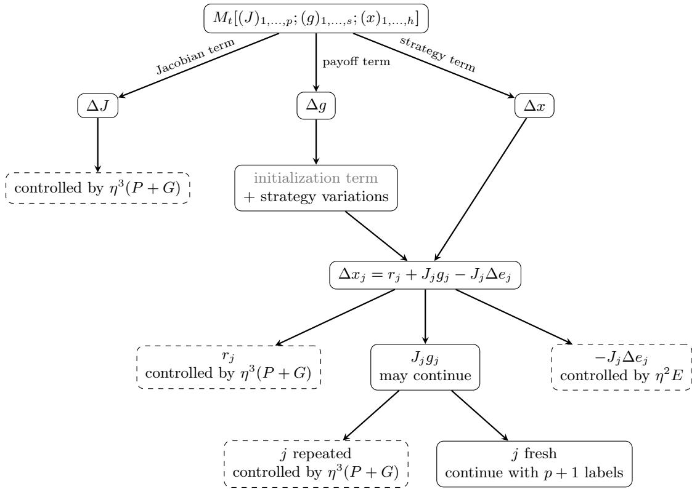

# CONSTANT REGRET IN GENERAL GAMES VIA HIGHER-ORDER OPTIMISM

OMAR ABBADIc,∗,♯, RIDA LARAKI∗, AND PANAYOTIS MERTIKOPOULOS♯

Abstract. We introduce an uncoupled learning algorithm which, when employed by all players of an arbitrary N-player normal form game with up to K actions per player, guarantees $\mathcal { O } ( N ^ { 3 } \log ^ { 2 } K )$ individual regret, uniformly over the horizon of play. The proposed algorithm—which we call higher-order optimism with discounting (HOOD)—is a variant of optimistic follow-the-regularized-leader (OptFTRL) that combines a discounted (N + 1)-th order predictor with entropic regularization over a suitable “lifting” of the game’s strategy space. This combination of ingredients is purposefully designed to dampen large oscillations of the induced sequence of play in a controlled manner, removing in this way a key stumbling block of previous attempts to achieve constant regret in general games. Our approach bears several striking similarities to the concurrent—and completely independent—work of Liu et al. [25], who very recently derived an $\mathcal { O } ( N ^ { 2 1 } \log ^ { 4 } K )$ regret bound through the use of higher-order optimism and an exponential moving average estimator.

## 1. Introduction

The standard model for learning in games typically unfolds as follows: at each instance of a repeated decision process (i) every player chooses an action; (ii) they receive any rewards and/or feedback generated from their chosen actions; (iii) they update their strategies, and the process repeats. In this general setting, the overarching objective of each player is to improve their individual payof over time, ideally reaching a state where no further improvements are possible or, at the very least—and, perhaps, more pragmatically—not regretting their past choices. This last criterion leads to the seminal notion of (external) regret, first introduced in statistical decision-making by Wald [40] and Savage [33], and subsequently rediscovered in the context of games and approachability by Hannan [17] and Blackwell [6], respectively.

At a high level, the individual regret of a player provides a natural “worst-case” performance benchmark, as it compares the player’s cumulative payof over time to that of the best fixed action in hindsight. Accordingly, these early works also established the existence of no-regret learning procedures, i.e., update rules whose regret grows sublinearly with the horizon of play in any “game against Nature”—that is, against any possible behavior of the learner’s opponents, rational or otherwise. Nonetheless, since the behavior of no-regret learners in a normal form game is not arbitrary but shaped by the actions of all other players, an important question which has remained open since these early days of the field is whether all players following a no-regret learning rule can prevent individual regret from accumulating indefinitely over time. Somewhat more formally:

Are there learning rules which, if followed by all players, guarantee constant individual regret to all players, in all games?

An important caveat in the above is that any such rule should be uncoupled in the sense of Hart and Mas-Colell [18, 19], i.e., the strategy adjustment of any given player should not depend on the payof functions of the other players (though it may of course depend on the payof function of the focal player, and through it, the strategies of other players). An additional consideration is that the feedback available to the players must be suficiently informative to allow them to leverage the (optimistically) mild evolution of their learned strategies over time. On that account, we work exclusively in the deterministic, full-information setting, where each players receives as feedback their mixed payof vector at each stage of the process (but no further information); without this assumption, standard information-theoretic lower bounds would exclude the possibility of achieving constant regret, except in very special cases [8, 9].

Our contributions in the context of related work. Our main contribution is that, with these qualifications in mind, the driving question above can be answered in the afirmative. In more detail, we propose an uncoupled, full-information learning rule, which we call higher-order optimism with discounting (HOOD), and which enjoys the following universal guarantee:

Main Theorem (Informal version). If all players of a finite N-player game with up to K actions per player follow HOOD, the individual regret of each player $i = 1 , \ldots , N$ is bounded for all T as

$$
\mathrm { R e g } _ { i } ( T ) \le 4 5 ( N + 1 ) ^ { 3 } [ 1 6 + 4 \log K + \log ^ { 2 } K ] = { \mathcal O } ( N ^ { 3 } \log ^ { 2 } K ) .\tag{1}
$$

An additional appealing feature of the proposed algorithm is that it is horizon-free, i.e., it does not require prior knowledge of the horizon of play. As a result, for any fixed N and K, each player incurs only a finite amount of regret over the entire (possibly infinite) trajectory of play; equivalently, regret does not continue to accumulate as play unfolds. On that account, by standard results in the field, this also means that the empirical distribution of play converges to the game’s set of coarse correlated equilibria at a rate of $\mathcal { O } ( 1 / T )$

To provide the proper context for our contribution, it is instructive to begin with the so-called “adversarial” setting, in which a single learner is involved in a “game against Nature”—that is, they are facing an arbitrary sequence of payof vectors, not necessarily coming from some underlying normal form game. In this case, the full-information version of the exponential weights algorithm—known in this context as Hedge [4, 5, 9, 14–16]—guarantees $\mathcal { O } ( \sqrt { T \log K } )$ regret, compared to $\mathcal { O } ( \sqrt { T K \log K } )$ regret in the bandit case, where the learner only has access to their realized payof. In either case however, the $\mathcal { O } ( \sqrt { T } )$ dependence is unavoidable without imposing further assumptions on how the sequence of payof vectors is generated [8, 9].

This is where learning in games enters the stage. If every player follows an iterative learning algorithm, the players’ individual strategy adjustments are likely to be relatively small from one epoch to the next, so the induced sequence of payof vectors faced by each player is likewise expected to be more predictable. This predictability can be leveraged by algorithms with an “extrapolation-based” structure, that is, where players attempt to anticipate their future payof landscape in order to take a more informed update step at each iteration—like the original extra-gradient algorithm of Korpelevich [21], the single-query variant of Popov [28], and the like. In the context of regret minimization, the most relevant algorithmic scheme is the optimistic follow-the-regularized-leader (OptFTRL) method proposed by Rakhlin and Sridharan [29, 30] to take advantage of predictable payof sequences, and which was shown to lead to O(1) regret in two-player zero-sum games under self-play.

This constant regret result was subsequently expanded upon by Syrgkanis et al. [36], and Tsuchiya [38] recently obtained optimal bounds for the Optimistic Hedge algorithm in the same setting. Constant regret has also been achieved in several broader structured classes of games, including variationally stable games [20], strategically zero-sum and potential games [3] and, more recently, harmonic games [24]. This array of results shows that attaining $\mathcal { O } ( 1 )$ regret is possible in the context of game-theoretic learning, but they are all contingent on a certain, amenable “variational” structure.

The case of arbitrary games is much more challenging due to the lack of such structure and lack of control over the iterates [1, 7, 23]. One of the key dificulties here is that the movement of one player can unpredictably amplify the movement of another over time; hence, for a long time, it was not known whether the presence of an underlying game was suficient to overcome the adversarial worst-case $\mathcal { O } ( \sqrt { T } )$ regret bound. The first general breakthrough here was the stability analysis of Syrgkanis et al. [36] who showed that, for arbitrary multiplayer normal form games, it is possible to achieve $\bar { \mathcal { O } } ( \bar { T } ^ { 1 / 4 } )$ individual regret, thus breaking the adversarial $\sqrt { T }$ barrier. Chen and Peng [10] later improved the exponent to $1 / 6$ for two-player general-sum games.

The next breakthrough in this thread came from the work of Daskalakis et al. [12] who showed that, somewhat surprisingly, the Optimistic Hedge algorithm actually inncurs only polylogarithmic regret in any games—the first “near-constant” result of its $\mathrm { k i n d ^ { 1 } }$ . The proof of Daskalakis et al. [12] introduced in particular a higher-order smoothness analysis showing that the successive temporal diferences of the generated sequence of play can be controlled to suficiently high order. Subsequent work then simplified and strengthened this picture: Farina et al. [13] reduced the individual regret bound to ${ \mathcal { O } } ( \log T )$ in general convex games, Anagnostides et al. [2] obtained the same $\mathcal { O } ( \log T )$ horizon dependence for the stronger notion of swap regret in finite games, and, more recently Soleymani et al. [34, 35] reduced the action dependence to polylogarithmic while keeping a ${ \mathcal { O } } ( \log T )$ dependence on the horizon.

Following these developments, the question which naturally remains is whether we can make the ultimate step of descending from unbounded to constant regret in general games, or if there is a fundamental limitation that goes beyond the algorithms and approaches used so far. Our paper provides a bridge for this gap by showing that, under HOOD, the players’ regret can be bounded uniformly over time. In this sense, it completes the sequence of horizon improvements for uncoupled learning in arbitrary games under full information feedback:

$$
\mathcal { O } ( \sqrt { T } ) \longrightarrow \mathcal { O } ( T ^ { 1 / 4 } ) \longrightarrow \mathcal { O } ( \mathrm { p o l y l o g } ( T ) ) \longrightarrow \mathcal { O } ( \log T ) \longrightarrow \mathcal { O } ( 1 ) .\tag{2}
$$

We summarize this progression in Table 1, where we also describe the specific ex ante tuning required for each algorithm.2 Note also that, in addition to removing the horizon dependence of the bound, our update uses fixed, horizon-independent parameters.

There is one concurrent paper that appears in Table 1 but which we did not discuss above, and which achieves constant regret in any game. Gvien its importance, we discuss it in detail in the end of this section.

What goes on under the HOOD. The idea behind our algorithm is to make the optimistic prediction more stable, and therefore more predictable, through a carefully tuned combination of regularization, discounting, and past payof information. In particular, we choose the optimistic predictor in a way that turns the induced prediction error into a geometrically discounted finite diference of order $N + 1$ , compared to the classical optimistic predictor of [28–30], which uses only the previous payof as its prediction, and leads to a first-order diference in time. This higher-order structure provides enough regularity to control the prediction error via the method’s regularization mechanism, which is entropic in nature but defined on a lifted space, following a technique introduced by [13]. This lifting additionally allows us to control the positive part of the regret rather than the signed regret, so large positive regret accumulated by certain players cannot be ofset in the aggregate by large negative regret contributions by others.

O. ABBADI, R. LARAKI, AND P. MERTIKOPOULOS
<table><tr><td>Work</td><td>Individual regret</td><td>Tuning</td></tr><tr><td>Syrgkanis et al. [36]</td><td> $\mathcal { O } ( \sqrt { N } \log K T ^ { 1 / 4 } )$ </td><td>static, depends on N and T only</td></tr><tr><td>Daskalakis et al. [12]</td><td> $\mathcal { O } ( N \log K \log ^ { 4 } T )$ </td><td>static, depends on N and T only</td></tr><tr><td>Farina et al. [13]</td><td> $\mathcal { O } ( N K \log T )$ </td><td>static, depends on N only</td></tr><tr><td>Soleymani et al. [34]</td><td> $\mathcal { O } ( N \log ^ { 2 } K \log T )$ </td><td>adaptive, depends on N and K only</td></tr><tr><td>Liu et al. [25]</td><td> $\mathcal { O } ( N ^ { 2 1 } \log ^ { 4 } K )$  , uniformly in T</td><td>static, depends on N and K only</td></tr><tr><td>This paper</td><td> $\mathcal { O } ( N ^ { 3 } \log ^ { 2 } K )$  , uniformly in  $T$ </td><td>static, depends on N and K only</td></tr></table>

Table 1: Selected progression of individual regret bounds for arbitrary finite games.

The resulting control over the prediction error is then obtained through an expansion which continues only for terms that have not yet been controlled by either Bregman variation or prediction error terms that are proportional to the step size. The termination of this expansion follows from a somewhat surprising interaction between the geometry of the lifted regularization and the combinatorics of the higher-order extrapolation, whereby every term that remains uncontrolled must successively introduce a new player label, because terms associated with labels that have already appeared can already be controlled. Since there are only N players, no term in the expansion can remain uncontrolled beyond the (N + 1)st diference. Moreover, since the HOOD algorithm guarantees constant individual regret, it can easily be upgraded to an adversarially robust algorithm by adding a switching rule that further leverages the boundedness of the regret.

The work of Liu et al. [25]. Three days before the submission of the current work, we were made aware of a concurrent paper by Liu et al. [25], who propose an algorithm achieving $\mathcal { O } ( N ^ { 2 1 } \log ^ { 4 } K )$ individual external regret in any N-player finite game with up to K actions per player. Even though our two papers were developed completely independently, they exhibit certain striking similarities, which we explain below.

First, the ECHO-OFTRL algorithm of Liu et al. [25] also employs a lifted regularization on the simplex in order to identify the players’ lifted regret with the positive part of their external regret, and also replaces the usual one-step prediction error by a geometrically stabilized high-order diference. The main diferences with our approach here are in the way that these ingredients mesh together and the resulting analysis: On the one hand, the HOOD predictor encodes the required discounted diferences directly in an (N + 1)-th order recurrence, and its analysis uses elementary bounds for this recurrence along with an explicit term-by-term expansion of players’ payof functions, with the lifted regularizer supplying bounds that control each term once a player label is repeated in the expansion, so the argument terminates after finitely many steps. By contrast, the ECHO-OFTRL algorighm builds its predictor as an N-stage exponential moving average (EMA) cascade, motivated by signal processing and transfer function design, and analyzed via time-domain filter estimates, EMA kernels and weighted convolutions, together with a recursive weighted variation argument.

Thus, even though both proofs ultimately exploit the number of players present in the game, our approach does so through a more direct algebraic expansion rather than through a recursive weighted variation argument, and our predictor and lifted regularizer are both designed around this choice. This more direct construction ultimately leadso to a sharper bound in the case of HOOD— $\mathcal { O } ( N ^ { 3 } \log ^ { 2 } K )$ regret for each player compared to $\mathcal { O } ( N ^ { 2 1 } \log ^ { 4 } K )$ in the case of Liu et al. [25].

## 2. Preliminaries

2.1. General notation. We write 1 for the vector of all ones, $\mathbb { R } _ { + } ^ { d }$ and $\mathbb { R } _ { + + } ^ { d }$ for the nonnegative and positive orthants, respectively, $\langle u , v \rangle$ for the usual Euclidean pairing, and, for $N \in  { \mathbb { N } }$ $[ N ] = \{ 1 , \dots , N \}$ . For $p \in [ 1 , \infty ] , \left. z \right. _ { p }$ denotes the usual $\ell _ { p }$ norm. If $A : \mathbb { R } ^ { a }  \mathbb { R } ^ { b }$ is linear and $p , q \in [ 1 , \infty ]$ , we write the operator norm

$$
\| A \| _ { p \to q } = \operatorname* { s u p } _ { \| u \| _ { p } \leq 1 } \| A u \| _ { q } .\tag{3}
$$

We also write $[ r ] _ { + } = \operatorname* { m a x } \{ r , 0 \}$ , and $A \lesssim B$ (respectively $A \gtrsim B )$ when $A \leq C B$ (respectively $A \geq C B )$ for a universal constant $C > 0$ , where dependence on an additional parameter is indicated by a subscript, and we use the symbol ⊙ to denote coordinatewise multiplication. For probability vectors $p , q$ on the same finite set, we write

$$
D _ { \mathrm { K L } } ( p \| q ) = \sum _ { \alpha : p _ { \alpha } > 0 } p _ { \alpha } \log \frac { p _ { \alpha } } { q _ { \alpha } } ,\tag{4}
$$

for the Kullback–Leibler divergence, and, for a diferentiable convex function $f ,$ we write

$$
D _ { f } ( z ^ { \prime } , z ) = f ( z ^ { \prime } ) - f ( z ) - \langle \nabla f ( z ) , z ^ { \prime } - z \rangle\tag{5}
$$

for its Bregman divergence. Finally, for a set $S _ { ; }$ we denote its convex hull by conv(S).

2.2. Finite games. We consider a finite normal form game with player set $\mathcal { N } = [ N ]$ . For notational simplicity, we assume throughout that every player has the same pure action set $\mathcal { A } _ { K } = [ K ] , K \ge 2$ , and we set $\mathbf { \mathcal { A } } = \mathbf { \mathcal { A } } _ { K } ^ { N }$ for the pure profile set; this entails no loss for our regret guarantees because unequal action sets may be padded with duplicate actions. Accordingly, player i’s mixed strategy space is the probability simplex

$$
\mathcal { X } _ { K } = \{ \boldsymbol { x } \in \mathbb { R } _ { + } ^ { K } : \langle \mathbf { 1 } , \boldsymbol { x } \rangle = 1 \} ,\tag{6}
$$

and $\mathscr { X } = \mathscr { X } _ { K } ^ { N }$ is the strategy space. We moreover write $x = ( x _ { 1 } , \ldots , x _ { N } ) \in \mathcal { X }$ for a mixed profile, $x _ { - i } = ( x _ { j } ) _ { j \neq i }$ for the opponents’ component, and $x _ { i \alpha _ { i } }$ for the probability that player i plays pure action $\alpha _ { i } \in \mathcal { A } _ { K }$ under x. As usual, we identify each pure action $\alpha \in \mathcal { A } _ { K }$ with the corresponding vertex of $\mathcal { X } _ { K }$ . Player i’s payof function is $u _ { i } : { \mathcal { A } }  [ - 1 , 1 ]$ , and we extend it multilinearly to $\mathcal { X }$ so that $u _ { i } ( x )$ is the expected payof under the product distribution induced by x:

$$
u _ { i } ( x ) = \mathbb { E } _ { \alpha \sim x } [ u _ { i } ( \alpha ) ] = \sum _ { \alpha \in \mathcal { A } } x _ { \alpha } u _ { i } ( \alpha ) ,\tag{7}
$$

where, for a pure profile $\begin{array} { r } { \alpha = ( \alpha _ { 1 } , \ldots , \alpha _ { N } ) \in \mathcal { A } , x _ { \alpha } = \prod _ { i \in \mathcal { N } } x _ { i \alpha _ { i } } } \end{array}$ is the probability that α gets played under the mixed profile x.

Remark 1 (Payof normalization). The restriction $u _ { i } ( { \cal A } ) \subseteq [ - 1 , 1 ]$ is essentially without loss of generality. Since $\mathcal { A }$ is finite, every $u _ { i } : { \mathcal { A } }  \mathbb { R }$ is bounded, and replacing $u _ { i }$ by ${ \widehat { u } } _ { i } = a _ { i } u _ { i } + b _ { i }$ with $a _ { i } > 0$ rescales regret as

$$
\widehat { \mathrm { R e g } } _ { i } ( T ) = a _ { i } \mathrm { R e g } _ { i } ( T ) .\tag{8}
$$

Thus the regret guarantees extend to arbitrary payofs up to the corresponding rescaling factor. ✦

2.3. Feedback and regret. At every round $t = 1 , 2 , . . . ,$ player i chooses a mixed strategy $x _ { i , t } \in \mathcal { X } _ { K }$ , and we write $x _ { t } = ( x _ { 1 , t } , \ldots , x _ { N , t } )$ for the joint mixed profile. We assume full information feedback: after play, player i observes the payof vector $v _ { i , t } \in [ - 1 , 1 ] ^ { K }$ with coordinates

$$
v _ { i \alpha , t } = u _ { i } ( \alpha , x _ { - i , t } ) , \qquad \alpha \in A _ { K } .\tag{9}
$$

By multilinearity, the payof obtained at round t is therefore

$$
\begin{array} { r } { u _ { i } ( x _ { t } ) = \langle x _ { i , t } , v _ { i , t } \rangle . } \end{array}\tag{10}
$$

Moreover, for the update and the subsequent analysis, it will be handy to center the payof vector by the payof actually obtained by the player in expectation. As such, we set

$$
g _ { i , t } = v _ { i , t } - u _ { i } ( x _ { t } ) \mathbf { 1 } .\tag{11}
$$

Coordinatewise, this gives

$$
g _ { i \alpha , t } = u _ { i } ( \alpha , x _ { - i , t } ) - u _ { i } ( x _ { t } ) ,\tag{12}
$$

and therefore

$$
\left. x _ { i , t } , g _ { i , t } \right. = 0 , \qquad \left\| g _ { i , t } \right\| _ { \infty } \leq 2 .\tag{13}
$$

Finally, player i’s external regret is:

$$
\mathrm { R e g } _ { i } ( T ) = \operatorname* { m a x } _ { \alpha \in \mathcal { A } _ { K } } \sum _ { t = 1 } ^ { T } \bigl [ u _ { i } ( \alpha , x _ { - i , t } ) - u _ { i } ( x _ { t } ) \bigr ] = \operatorname* { m a x } _ { \alpha \in \mathcal { A } _ { K } } \sum _ { t = 1 } ^ { T } g _ { i \alpha , t } .\tag{14}
$$

We recall that, if every player satisfies $\mathrm { R e g } _ { i } ( T ) \le \varepsilon ( T )$ after $T$ rounds, the empirical distribution of play is an ε(T)/T-approximate coarse correlated equilibrium (CCE) [9, 31]. As a direct consequence, a regret guarantee that is uniform in $T$ implies $\mathcal { O } ( 1 / T )$ convergence to the CCE set.

## 3. Algorithm and main result

We shall now describe the learning rule at play.

3.1. Lifted regularization. We start with the regularization, which we define in a “lifted space” that contains the origin, in the spirit of [13]. Define the K-dimensional simplex

$$
\begin{array} { r } { K = \{ z \in \mathbb { R } _ { + } ^ { K } : \langle \mathbf { 1 } , z \rangle \leq 1 \} , \quad \mathrm { a n d } \quad K ^ { \circ } = \{ z \in \mathbb { R } _ { + + } ^ { K } : 0 < \langle \mathbf { 1 } , z \rangle < 1 \} , } \end{array}\tag{15}
$$

so that $\kappa ^ { \circ }$ is the relative interior of $\kappa .$ . Every nonzero $z \in \kappa$ has the unique representation $z = \lambda x$ , where $\lambda = \langle \mathbf { 1 } , z \rangle \in ( 0 , 1 ]$ and $x \in \mathcal { X } _ { K }$ . For $x \in \mathcal { X } _ { K }$ , let $h$ be the negative entropy

$$
h ( x ) = \sum _ { \alpha \in { \cal A } _ { K } } x _ { \alpha } \log x _ { \alpha } ,\tag{16}
$$

with 0 log 0 = 0, and set

$$
L = 4 + \log K + { \frac { 1 } { 4 } } \log ^ { 2 } K .\tag{17}
$$

For a nonzero $z = \lambda x \in \mathcal { K }$ , define the $l i f t e d$ entropic regularizer

$$
\psi ( z ) = ( \lambda + \sqrt { \lambda } ) h ( x ) - 3 L \sqrt { \lambda ( 1 - \lambda ) } , \qquad \psi ( 0 ) = 0 .\tag{18}
$$

This regularizer induces the lifted mirror map

$$
Z ( y ) = \underset { z \in \mathcal { K } } { \arg \operatorname* { m a x } } \{ \langle y , z \rangle - \psi ( z ) \} ,\tag{19}
$$

and we call

$$
Q ( y ) = \frac { Z ( y ) } { \langle { \bf 1 } , Z ( y ) \rangle }\tag{20}
$$

the choice map. This corresponds to a lifted version of the usual regularized choice map from standard FTRL [22, 26]. Note also that, conditional on the optimal mass λ, the maximization over x is explicit. Indeed, the entropic nature of the regularizer implies that the choice map can be written as a softmax with a λ-dependent temperature:

$$
Q ( y ) = \mathrm { s o f t m a x } \left( \frac { \sqrt { \lambda } } { 1 + \sqrt { \lambda } } y \right) .\tag{21}
$$

As such, the only additional optimization introduced by $\lambda$ is an easy one-dimensional problem.

3.2. The algorithm. We denote the algorithm’s step size by $\eta > 0$ . We shall now define the predictor: initialize $g _ { i , k } = m _ { i , k } = 0$ for $- N \leq k \leq 0$ , then, at time $t ,$ form the prediction

$$
m _ { i , t } = \sum _ { k = 1 } ^ { N + 1 } ( - 1 ) ^ { k + 1 } { \binom { N + 1 } { k } } \left[ ( 1 - \delta ^ { k } ) g _ { i , t - k } + \delta ^ { k } m _ { i , t - k } \right] ,\tag{22}
$$

where its discount factor $\delta$ is fixed by the number of players:

$$
\delta = \frac { N } { N + 1 } .\tag{23}
$$

We moreover write

$$
e _ { i , t } = g _ { i , t } - m _ { i , t }\tag{24}
$$

for its prediction error. We then define the higher-order optimism with discounting (HOOD) algorithm as Algorithm 1.

1: $y _ { i , 0 }  0 , g _ { i , k } , m _ { i , k }  0 { \mathrm { ~ f o r ~ } } - N \leq k \leq 0$   
2: for $t = 1 , 2 , \dots$ do   
3: compute $m _ { i , t }$ from (22), set $y _ { i , t - 1 / 2 } \gets y _ { i , t - 1 } + m _ { i , t }$   
4: update $x _ { i , t } \gets Q ( \eta y _ { i , t - 1 / 2 } )$ , play $x _ { i , t }$   
5: observe $v _ { i , t } ,$ set $g _ { i , t } \gets v _ { i , t } - u _ { i } ( x _ { t } ) \mathbf { 1 }$ and $y _ { i , t } \gets y _ { i , t - 1 } + g _ { i , t }$   
6: end for

The resulting rule is uncoupled, in the sense that player i only uses the game dimensions $N , K$ , its own mixed action and its observed payof vectors. Moreover, neither the update nor any of its parameters requires the horizon $T$

3.3. Regret guarantee. We may now state our main result:

Theorem 1. Let

$$
L = 4 + \log K + { \frac { 1 } { 4 } } \log ^ { 2 } K .\tag{25}
$$

Suppose every player uses Algorithm 1 with a step size satisfying

$$
0 < \eta \leq \frac { 1 } { 6 0 ( N + 1 ) ^ { 3 } } .\tag{26}
$$

Then, for every player $i ,$

$$
\operatorname* { s u p } _ { T \geq 1 } \mathrm { R e g } _ { i } ( T ) \leq \frac { 3 L } { \eta } .\tag{27}
$$

In particular, for the largest choice $\eta = 1 / [ 6 0 ( N + 1 ) ^ { 3 } ]$ 2

$$
\operatorname* { s u p } _ { T \geq 1 } \mathrm { R e g } _ { i } ( T ) \leq 4 5 ( N + 1 ) ^ { 3 } [ 1 6 + 4 \log K + \log ^ { 2 } K ] .\tag{28}
$$

Consequently,

$$
\operatorname* { s u p } _ { T \geq 1 } \mathrm { R e g } _ { i } ( T ) = \mathcal { O } ( N ^ { 3 } \log ^ { 2 } K ) .\tag{29}
$$

Note that the admissible step size range in (26) is independent of the horizon T. By the earlier regret-to-CCE remark, we also have the following immediate consequence:

Corollary 1. Under the conditions of Theorem 1, let $\begin{array} { r } { \mu _ { T } = T ^ { - 1 } \sum _ { t = 1 } ^ { T } \otimes _ { i } x _ { i , t } } \end{array}$ . Then $\mu _ { T }$ is a $\frac { 3 L } { \eta T }$ -approximate coarse correlated equilibrium.

Remark 2 (Adversarial robustness). In the previous theorem, all players are assumed to use Algorithm 1. We can nonetheless exploit the boundedness of its regret guarantee to obtain robustness against adversarial payof sequences via a simple switching rule. The idea is for each player to follow Algorithm 1 until the regret bound is exceeded, and then switch permanently to a learning algorithm with adversarial regret guarantees. The details are given in Appendix D. ✦

## 4. Proof overview

In this section we overview the proof of Theorem 1, where the complete proofs are given in the appendices. The proof is based on the following four observations:

(1) First, the usual regret bounded by variation in utilities (RVU) inequality for optimistic follow-the-regularized-leader (OptFTRL) suggests the two quantities that must be related. Writing $x _ { i , t - 1 / 2 }$ for the optimistic iterate and $x _ { i , t }$ for the corresponding unoptimistic iterate, it gives

$$
\mathrm { R e g } _ { i } ( T ) \leq \frac { \Omega } { \eta } + \frac { \eta } { 2 } \sum _ { t = 1 } ^ { T } \lVert e _ { i , t } \rVert _ { \infty } ^ { 2 }\tag{30}
$$

$$
- \frac { 1 } { \eta } \sum _ { t = 1 } ^ { T } \left[ D _ { h } ( x _ { i , t - 1 / 2 } , x _ { i , t - 1 } ) + D _ { h } ( x _ { i , t } , x _ { i , t - 1 / 2 } ) \right] ,\tag{31}
$$

where Ω is the range of the regularizer. The last two Bregman divergences measure the movement of the optimistic iterate to its two neighboring unoptimistic iterates. Thus, if the regret term on the left were nonnegative, (31) would bound this Bregman movement in terms of Ω and the prediction error. Bounded regret would then follow from a complementary bound controlling the prediction error by this movement, with suficiently small coeficients to close the two inequalities.

(2) Second, following the lifting idea of Farina et al. [13], the first issue can be resolved by performing the regularized update on the lifted simplex K introduced in Section 3. Since K contains the origin and the payof vectors are centered as in (11), the regret term in the resulting RVU inequality becomes $[ \mathrm { R e g } _ { i } ( T ) ] _ { + }$ and is therefore nonnegative.

(3) Third, the needed prediction error bound can be obtained using higher-order time differences. This part is inspired by the higher-order smoothness argument of Daskalakis et al. [12] where, as in their proof, successive payof diferences are related to strategy diferences, which are then related back to payof terms through the learning map. Here, instead of proving that suficiently high finite diferences of the resulting dynamics are small, we choose the predictor so that its prediction error already contains N + 1 time diferences. Conditional on suitable local bounds for the learning map, every term that remains uncontrolled after one more diference must introduce a new player label. Since there are only N players, this expansion terminates after finitely many steps. The discounting in (22) then prevents these higher-order diferences from introducing an exponential dependence on N.

(4) Fourth, this expansion requires local bounds that ordinary entropic $\mathrm { O p t F T R I }$ satisfies on the simplex: the Jacobian of the choice map must be small (that is, proportional to the step size), Jacobian time diferences and Taylor remainders must be controlled by Bregman movement, and a newly revealed variation of a player whose Jacobian already occurs in the expansion must also be controlled by Bregman movement. A naive lift does not preserve the last bound when the optimizing mass becomes small, so the particular regularizer (18) is designed precisely so that all of these controls remain valid after lifting.

We now make these four observations more explicit.

4.1. The lifted RVU inequality. For each player $i ,$ recall from Algorithm 1 the optimistic score $y _ { i , t - 1 / 2 } = y _ { i , t - 1 } + m _ { i , t }$ and the cumulative score $y _ { i , t } = y _ { i , t - 1 } + g _ { i , t }$ . Define the corresponding lifted iterates

$$
z _ { i , t - 1 / 2 } = Z ( \eta y _ { i , t - 1 / 2 } ) , \qquad z _ { i , t } = Z ( \eta y _ { i , t } ) ,\tag{32}
$$

and the Bregman movements

$$
\begin{array} { r } { P _ { i , t } = D _ { \psi / \eta } ( z _ { i , t - 1 / 2 } , z _ { i , t - 1 } ) , \qquad G _ { i , t } = D _ { \psi / \eta } ( z _ { i , t - 1 / 2 } , z _ { i , t } ) . } \end{array}\tag{33}
$$

For a horizon $T ,$ , set

$$
P ( T ) = \sum _ { i = 1 } ^ { N } \sum _ { t = 1 } ^ { T } P _ { i , t } , \qquad G ( T ) = \sum _ { i = 1 } ^ { N } \sum _ { t = 1 } ^ { T } G _ { i , t } , \qquad E ( T ) = \sum _ { i = 1 } ^ { N } \sum _ { t = 1 } ^ { T } \lVert e _ { i , t } \rVert _ { \infty } ^ { 2 } ,\tag{34}
$$

where $e _ { i , t }$ is the prediction error from (24), and write

$$
\Omega = \operatorname* { m a x } _ { z \in { \mathcal { K } } } \psi ( z ) - \operatorname* { m i n } _ { z \in { \mathcal { K } } } \psi ( z ) .\tag{35}
$$

The usual OptFTRL analysis already contains a positive term measuring prediction error and a negative Bregman movement term, but the obstacle to rearranging this inequality is that external regret itself can be negative, so the role of the lift is then to remove this obstacle. Indeed, (13) gives $\langle x _ { i , t } , g _ { i , t } \rangle = 0$ , while $K = \operatorname { c o n v } ( 0 , e _ { 1 } , \dots , e _ { K } )$ . Hence the comparator term in the lifted problem is

$$
\operatorname* { m a x } _ { z \in K } \langle z , y _ { i , T } \rangle = \operatorname* { m a x } \left\{ 0 , \operatorname* { m a x } _ { \alpha \in A _ { K } } \sum _ { t = 1 } ^ { T } g _ { i \alpha , t } \right\} = [ \mathrm { R e g } _ { i } ( T ) ] _ { + } .\tag{36}
$$

The lifted RVU inequality proved in Appendix C.1 therefore gives

$$
\sum _ { i = 1 } ^ { N } [ \mathrm { R e g } _ { i } ( T ) ] _ { + } \leq \frac { N \Omega } { \eta } + \frac { \eta } { 2 } E ( T ) - P ( T ) , \qquad G ( T ) \leq \frac { \eta } { 2 } E ( T ) .\tag{37}
$$

which is the lifted analogue of the classical RVU inequality (31). Now, since the left-hand side is nonnegative, (37) immediately implies

$$
P ( T ) + G ( T ) \leq \frac { N \Omega } { \eta } + \eta E ( T ) .\tag{38}
$$

It remains to prove the converse type of control, that is, the prediction error must itself be bounded by the Bregman movement. The bound proved in Proposition C.2 is

$$
\sqrt { E ( T ) } \leq 5 \sqrt { N } ( N + 1 ) + 2 0 0 0 ( N + 1 ) ^ { 5 } \eta ^ { 3 / 2 } \sqrt { P ( T ) + G ( T ) } + \frac { 3 } { 1 0 } \sqrt { E ( T ) } .\tag{39}
$$

Combining (38) and (39) will give a bound on $E ( T )$ which is uniform in $T .$ . Thus the main work is to prove (39).

4.2. The prediction error and Bregman movement bounds. We first state the bounds used in the higher-order argument, without yet explaining why the lifted regularizer satisfies them, which we postpone to Section 4.5.

For a sequence $w = ( w _ { t } )$ , write

$$
( \Delta w ) _ { t } = w _ { t } - w _ { t - 1 }\tag{40}
$$

for its first time diference. Let

$$
\mathcal { I } ( y ) = D Q ( y )\tag{41}
$$

be the Jacobian of the choice map, and define

$$
J _ { i , t } = \eta \mathcal { T } ( \eta y _ { i , t - 1 } ) .\tag{42}
$$

To control $\Delta x _ { i , t }$ , note that both $x _ { i , t }$ and $x _ { i , t - 1 }$ are perturbations of the same unoptimistic iterate $Q ( \eta y _ { i , t - 1 } )$ . Indeed,

$$
x _ { i , t } = Q ( \eta ( y _ { i , t - 1 } + m _ { i , t } ) ) , \qquad x _ { i , t - 1 } = Q ( \eta ( y _ { i , t - 1 } - e _ { i , t - 1 } ) ) .\tag{43}
$$

Writing $J _ { i , t } = \eta \mathcal { I } ( \eta y _ { i , t - 1 } )$ , Taylor expansion around $\eta y _ { i , t - 1 }$ gives

$$
\Delta x _ { i , t } = J _ { i , t } \Delta y _ { i , t - 1 / 2 } + r _ { i , t } ,\tag{44}
$$

where the remainder term is

$$
r _ { i , t } = \left( x _ { i , t } - Q ( \eta y _ { i , t - 1 } ) - J _ { i , t } m _ { i , t } \right) - \left( x _ { i , t - 1 } - Q ( \eta y _ { i , t - 1 } ) + J _ { i , t } e _ { i , t - 1 } \right) .\tag{45}
$$

Since

$$
\Delta y _ { i , t - 1 / 2 } = g _ { i , t } - \Delta e _ { i , t } ,\tag{46}
$$

we obtain

$$
\begin{array} { r } { \Delta x _ { i , t } = r _ { i , t } + J _ { i , t } g _ { i , t } - J _ { i , t } \Delta e _ { i , t } . } \end{array}\tag{47}
$$

There are then three bounds in Lemma B.4 that we will use repeatedly. First,

$$
\left\| J _ { i , t } \right\| _ { \infty \to 1 } \le \eta ,\tag{48}
$$

so that the terms containing $J _ { i , t } \Delta e _ { i , t }$ can be controlled by the prediction error energy E(T). Second,

$$
\sum _ { i = 1 } ^ { N } \sum _ { t = 1 } ^ { T } \lVert r _ { i , t } \rVert _ { 1 } ^ { 2 } \lesssim ( N + 1 ) ^ { 2 } \eta ^ { 3 } \big ( P ( T ) + G ( T ) \big ) ,\tag{49}
$$

and

$$
\sum _ { i = 1 } ^ { N } \sum _ { t = 1 } ^ { T } \left. J _ { i , t } - J _ { i , t - 1 } \right. _ { \infty \to 1 } ^ { 2 } \lesssim \eta ^ { 3 } \big ( P ( T ) + G ( T ) \big ) ,\tag{50}
$$

so the Taylor remainders and Jacobian diferences are controlled by the same Bregman movements appearing in (38).

The third bound is used when the same player appears twice in the expansion. If $| t - t ^ { \prime } | \leq N + 1$ , Lemma B.4 gives

$$
\begin{array} { r } { \| J _ { i , t ^ { \prime } } \| _ { \infty  1 } ^ { 2 } \| J _ { i , t } \Delta y _ { i , t - 1 / 2 } \| _ { 1 } ^ { 2 } \lesssim \eta ^ { 3 } \big ( P _ { i , t } + G _ { i , t - 1 } \big ) . } \end{array}\tag{51}
$$

We refer to (51) as the repeated player bound. The higher-order argument below will use only $( 4 8 ) \mathrm { - ( 5 1 ) }$ ; afterward we explain how (18) is designed so that they remain valid despite the lifting.

4.3. Higher-order optimism with discounting. We next explain the prediction error expansion, where the starting point is multilinearity of the game, namely, that every payof diference reveals strategy diferences. Indeed, Lemma B.3 shows that, up to a finite initialization term, $\Delta g _ { i }$ is a sum of linear maps applied to strategy variations $\Delta x _ { j }$ , verifying the bounds in (B.55). Substituting (47), each revealed strategy variation has the form

$$
\Delta x _ { j } = \underbrace { r _ { j } } _ { \mathrm { c o n t r o l l e d ~ b y ~ ( 4 9 ) } } + \underbrace { J _ { j } g _ { j } } _ { \mathrm { m a y ~ c o n t i n u e } } - \underbrace { J _ { j } \Delta e _ { j } } _ { \mathrm { c o n t r o l l e d ~ u s i n g ~ ( 4 8 ) } } ,\tag{52}
$$

so only the middle term may require another time diference. Indeed, applying the discrete product rule gives, suppressing time ofsets,

$$
\Delta ( J _ { j } g _ { j } ) = ( \Delta J _ { j } ) g _ { j } + J _ { j } \Delta g _ { j } .\tag{53}
$$

The first term is controlled by (50) and $\| g _ { j } \| _ { \infty } \leq 2$ from (13). The second again reveals strategy variations through Lemma B.3, and (52) introduces another Jacobian. If the newly revealed variation belongs to a player whose Jacobian is already present in the term, (51) controls it. Thus a term can remain uncontrolled only if it introduces a player label that has not previously appeared in that term, and we will call such a label fresh. This is in particular where higher-order diferences enter the argument, in that we build enough time diferences directly into the prediction error. Indeed, since every continuing step introduces a fresh label and there are only N players, so $N + 1$ diferences are suficient to force every expansion branch to terminate.

Nonetheless, using the ordinary higher-order diference $\Delta ^ { N + 1 }$ would introduce the bound

$$
\left\| \Delta ^ { N + 1 } w \right\| _ { \ell _ { 2 } } \leq 2 ^ { N + 1 } \| w \| _ { \ell _ { 2 } } ,\tag{54}
$$

where, for a vector-valued sequence, we recall that $\begin{array} { r } { \| w \| _ { \ell _ { 2 } } = ( \sum _ { t } \| w _ { t } \| _ { r } ^ { 2 } ) ^ { 1 / 2 } } \end{array}$ , with $r = 1$ or ∞ depending on context. This bound is notably exponential in the number of players, and the discounting in Algorithm 1 is chosen to avoid this loss. Indeed, for a sequence $w = ( w _ { t } ) _ { t \in \mathbb { Z } } .$ define the discounted sum

$$
( \sigma w ) _ { t } = \sum _ { k = 0 } ^ { \infty } \delta ^ { k } w _ { t - k } , \qquad \delta = \frac { N } { N + 1 } ,\tag{55}
$$

where the sequences arising below have their negative index terms set to 0 as specified in Algorithm 1. The predictor identity proved in Appendix B.1 states that

$$
e _ { i } = \sigma ^ { N + 1 } \Delta ^ { N + 1 } g _ { i } .\tag{56}
$$

Hence the prediction error contains the required $N + 1$ ordinary diferences, paired with geometric discounting.

To reveal these diferences one at a time, define

$$
\kappa _ { p } = \sigma ^ { N + 1 } \Delta ^ { N + 1 - p } , \qquad 0 \le p \le N + 1 ,\tag{57}
$$

so that

$$
\kappa _ { p } = \kappa _ { p + 1 } \Delta , \qquad 0 \leq p \leq N .\tag{58}
$$

The sequence bounds of Lemma B.2 give

$$
\begin{array} { r } { \| \kappa _ { p } w \| _ { \ell _ { 2 } } \leq 4 ( N + 1 ) ^ { p + 1 } \| w \| _ { \ell _ { 2 } } , } \end{array}\tag{59}
$$

where the estimate underlying this bound is

$$
\begin{array} { r } { \| ( \sigma \Delta ) ^ { q } w \| _ { \ell _ { 2 } } \leq 2 \| w \| _ { \ell _ { 2 } } , \qquad 0 \leq q \leq N + 1 , } \end{array}\tag{60}
$$

  
Figure 1: One-step expansion of a continuing term.

for scalar sequences w. Indeed, for vector-valued sequences equipped pointwise with the $\ell _ { 1 }$ or $\ell _ { \infty }$ norm, the scalar bound proved in (B.37) gives

$$
\begin{array} { r } { \| ( \sigma \Delta ) ^ { q } w \| _ { \ell _ { 2 } } \leq 4 ( N + 1 ) \| w \| _ { \ell _ { 2 } } , \qquad 0 \leq q \leq N + 1 , } \end{array}\tag{61}
$$

and combining this with the bound for $\sigma ^ { p }$ yields (59), so the discounting prevents the successive diferences from producing exponential dependance on the number of players.

4.4. One-step expansion. We may now formalize the recursive expansion. At order $p ,$ call a term continuing if it contains $p$ Jacobians with distinct player labels and has not yet been controlled by (48)–(51). The precise conditions on its payof and strategy factors are those in Lemma C.1—for which give an abbreviated version below—and they are importantly preserved whenever a branch continues.

Lemma 1 (One-step expansion; abbreviated). Let M be a continuing term at order $1 \leq p \leq N$ Then

$$
\Delta M = R _ { M } + \sum _ { M ^ { \prime } \in { \mathcal { C } } ( M ) } M ^ { \prime } ,\tag{62}
$$

where $R _ { M }$ collects terms controlled by $P ( T ) + G ( T )$ , or $E ( T )$ , with the bound given in (C.42), the $M ^ { \prime } \in \mathcal { C } ( M )$ terms are continuing terms at order $p + 1$ , and

$$
| { \mathcal { C } } ( M ) | \leq 3 p ( N - p ) .\tag{63}
$$

In particular, $\mathcal { C } ( M ) = \emptyset$ when $p = N$

We sketch the two facts in Lemma 1 that drive the argument. By (58), moving from order p to order $p + 1$ amounts to applying one ordinary diference. If this diference falls on a Jacobian, (50) controls the resulting term; if it falls on a payof, Lemma B.3 produces strategy variations, up to the finite initialization term; if it falls on a strategy factor, such a variation appears directly. In either case, (52) shows that only ${ \cal J } _ { j } g _ { j }$ may continue. If j is already one of the existing Jacobian labels, (51) controls the resulting term, so every continuing branch introduces one fresh label. It remains then to count how many such branches are possible. Suppose the term contains s payof factors, then, by Lemma B.3, each payof factor can reveal a fixed player label at most twice, while the conditions in Lemma C.1 allow at most p strategy factors carrying any fixed label, so a fixed fresh label can produce at most $2 s + p \leq 3 p$ continuing terms, and since $N - p$ labels remain fresh, this gives (63). In particular, after all N labels have appeared, no branch can continue.

Finally, the branching must be compensated by the small factor gained by each continuation. By (59), moving one level further costs one additional factor $\mathcal { O } ( N + 1 )$ , while every continuing branch gains a new Jacobian of norm at most 2η by Lemma B.4. Hence the total weighted continuation factor is at most

$$
3 p ( N - p ) 2 \eta ( N + 1 ) \leq \frac { 3 } { 2 } N ^ { 2 } ( N + 1 ) \eta ,\tag{64}
$$

and this is in particular why the step size must be of order $N ^ { - 3 }$ . Under (26), the continuing contribution contracts geometrically from one level to the next, while Lemma 1 guarantees that it terminates altogether after N levels.

Iterating Lemma C.1, together with Lemmas B.2–B.4, gives Proposition C.2, i.e., (39). The three terms in that bound correspond respectively to the finite initialization cost, the terms stopped using Bregman movement, and the $- J _ { j } \Delta e _ { j }$ terms in (52).

4.5. Why the lifted regularizer preserves the expansion bounds. We now return to (48)–(51) and explain why they hold for the lifted choice map. Recall from (18) that, for $z = \lambda x \neq 0$

$$
\psi ( \lambda x ) = ( \lambda + \sqrt { \lambda } ) h ( x ) - 3 L \sqrt { \lambda ( 1 - \lambda ) } , \qquad L = 4 + \log K + \frac { 1 } { 4 } \log ^ { 2 } K .\tag{65}
$$

The two parts of (65) are chosen to preserve the local entropic bounds needed by the expansion while controlling the additional mass variable. Indeed, to see what must be preserved, first consider ordinary entropy on the original simplex. In that case the analogues of the strategy movement and Jacobian bounds are

$$
\| \Delta x _ { i , t } \| _ { 1 } ^ { 2 } \lesssim \eta ( P _ { i , t } + G _ { i , t - 1 } ) , \qquad \| J _ { i , t } \| _ { \infty \to 1 } ^ { 2 } \lesssim \eta ^ { 2 } .\tag{66}
$$

Thus an existing Jacobian paired with a newly revealed variation of the same player contributes

$$
\eta ^ { 2 } \cdot \eta ( P _ { i , t } + G _ { i , t - 1 } ) = \eta ^ { 3 } ( P _ { i , t } + G _ { i , t - 1 } ) ,\tag{67}
$$

which is the bound used in (51). The lifted regularizer is thus chosen so that this cancellation survives when the mass is allowed to vary.

Indeed, consider first a naive lift

$$
\psi _ { 0 } ( \lambda x ) = \lambda h ( x ) + \varphi ( \lambda ) ,\tag{68}
$$

where $\varphi$ depends only on $\lambda$ . Conditional on the optimizing mass, the factor λ cancels from the strategy dependent part of the optimization, so its normalized choice map is still $Q _ { 0 } ( y ) = \operatorname { s o f t m a x } ( y )$ , and its Jacobian therefore remains of constant order when λ becomes small. On the other hand, the strategy-dependent part $\lambda h ( x )$ gives only

$$
\left\| x ^ { \prime } - x \right\| _ { 1 } ^ { 2 } \lesssim \frac { 1 } { \lambda } D _ { \psi _ { 0 } } ( \lambda ^ { \prime } x ^ { \prime } , \lambda x ) .\tag{69}
$$

The analogue of the repeated player bound would therefore contain $\eta ^ { 3 } / \lambda$ and become uncontrolled as $\lambda  0$

As for the term $\lambda h ( x )$ in (65), it retains this Bregman control, where Lemma A.5 gives

$$
\left\| x ^ { \prime } - x \right\| _ { 1 } ^ { 2 } \lesssim \frac { 1 } { \lambda } D _ { \psi } ( \lambda ^ { \prime } x ^ { \prime } , \lambda x )\tag{70}
$$

for nearby scores. The additional term $\sqrt { \lambda } h ( x )$ then contributes by suppling the compensating factor in the Jacobian. Indeed, Lemma A.3 gives the choice map formula already stated in (21),

$$
Q ( y ) = \mathrm { s o f t m a x } \left( \frac { \sqrt { \lambda } } { 1 + \sqrt { \lambda } } y \right) .\tag{71}
$$

If the optimizing mass were fixed, (71) would immediately make the Jacobian smaller by a factor of order $\sqrt { \lambda }$ . Nonetheless, the optimizing mass itself depends on the score, so we must also control this dependence. This is the role of the single mass-dependent term $- 3 L \sqrt { \lambda ( 1 - \lambda ) }$ and of the particular choice of L. Indeed, Lemma A.1 gives

$$
\operatorname { V a r } _ { x } ( \log x ) \leq { \frac { 1 } { 4 } } \log ^ { 2 } K + \log K + 2 = L - 2 .\tag{72}
$$

Together with the mass-dependent term, this controls the interaction between mass and strategy variation in the Hessian, where Lemma A.2 and (A.32) then show in particular that the lifted regularizer is 1-strongly convex in $\ell _ { 1 } .$ , so that Lemma A.3 yields a unique smooth lifted mirror map and choice map. More importantly for the expansion, the same term also gives the lower bound (A.43) for the denominator arising when the optimality condition for the mass is diferentiated. Equations (A.54) and (A.65) then give

$$
| D \lambda ( y ) [ q ] | \lesssim \lambda ^ { 3 / 2 } \| q \| _ { \infty } , \qquad | D \log \lambda ( y ) [ q ] | \leq \frac { 1 } { 4 } \| q \| _ { \infty } .\tag{73}
$$

The first bound ensures that the dependence of the optimizing mass on the score does not destroy the $\sqrt { \lambda }$ factor suggested by (71), where Lemma A.4 gives indeed

$$
\| { \mathcal { I } } ( y ) \| _ { \infty \to 1 } \leq 2 { \sqrt { \lambda } } .\tag{74}
$$

The second bound integrates to the mass comparison (A.66), which allows the masses corresponding to the nearby times in the N + 1-step expansion to be compared. Consequently, along the learning dynamics, Lemmas A.4 and A.5 give, for the nearby times appearing in the expansion,

$$
\| \Delta x _ { i , t } \| _ { 1 } ^ { 2 } \lesssim \frac { \eta } { \lambda _ { i , t - 1 } } \big ( P _ { i , t } + G _ { i , t - 1 } \big ) , \qquad \| J _ { i , t ^ { \prime } } \| _ { \infty \to 1 } ^ { 2 } \lesssim \eta ^ { 2 } \lambda _ { i , t - 1 } .\tag{75}
$$

The mass factors therefore cancel and give a bound as in (66):

$$
\left( \eta ^ { 2 } \lambda _ { i , t - 1 } \right) \left( \frac { \eta } { \lambda _ { i , t - 1 } } \right) = \eta ^ { 3 } ,\tag{76}
$$

which gives the repeated player bound (51) through Lemma B.4.

Finally, the lifted Bregman control also controls changes in the choice map. Indeed, Lemma A.7 allows us to bound Jacobian variation by lifted Bregman divergence and Lemma A.8 converts this into a Taylor remainder bound. Applied to the iterates, these bounds give (49) and (50) through Lemma B.4. Hence all the local bound assumed in the higher-order expansion are preserved after lifting, which was our goal. Note then that the dependence on the number of actions also enters through the regularizer, where, by Lemma C.2,

$$
\Omega \leq \frac { 1 3 } { 6 } L = \mathcal { O } ( \log ^ { 2 } K ) .\tag{77}
$$

4.6. Closing the loop. We can now combine the two parts of the proof. Substituting (38) into (39) and using ${ \sqrt { a + b } } \leq { \sqrt { a } } + { \sqrt { b } }$ gives

$$
\sqrt { E ( T ) } \le 5 \sqrt { N } ( N + 1 ) + 2 0 0 0 ( N + 1 ) ^ { 5 } \eta \sqrt { N \Omega }\tag{78}
$$

$$
+ \left( 2 0 0 0 ( N + 1 ) ^ { 5 } \eta ^ { 2 } + \frac { 3 } { 1 0 } \right) \sqrt { E ( T ) } .\tag{79}
$$

The step-size condition (26) makes the coeficient multiplying $\sqrt { E ( T ) }$ on the right-hand side small enough to absorb into the left-hand side. Together with (77), the calculation in Appendix C.3 gives

$$
E ( T ) < 6 2 ^ { 2 } ( N + 1 ) ^ { 6 } L ,\tag{80}
$$

uniformly in T. Finally, the player-specific version of the lifted RVU inequality gives

$$
[ \mathrm { R e g } _ { i } ( T ) ] _ { + } \leq \frac { \Omega } { \eta } + \frac { \eta } { 2 } E ( T ) ,\tag{81}
$$

and, using Lemma C.2 and (80),

$$
[ \mathrm { R e g } _ { i } ( T ) ] _ { + } < \frac { 3 L } { \eta } ,\tag{82}
$$

hence, since Reg $( T ) \leq [ \mathrm { R e g } _ { i } ( T ) ] _ { + }$ , this proves Theorem 1. In particular, for the largest admissible step size $\eta = 1 / [ 6 0 ( N + 1 ) ^ { 3 } ]$ ], this gives

$$
\operatorname* { s u p } _ { T \geq 1 } \operatorname { R e g } _ { i } ( T ) = \mathcal { O } ( N ^ { 3 } \log ^ { 2 } K ) .\tag{83}
$$

## 5. Concluding remarks

We have shown that uncoupled full information learning can achieve regret that is uniformly bounded in time in every finite game. Compared with the previous $\mathcal { O } ( N \log ^ { 2 } K \log T )$ perplayer bound [34], our result removes the remaining dependence on the horizon, at the cost of an additional ${ \mathrm { \bar { \boldsymbol { N } } } } ^ { 2 }$ factor in the number of players. Natural future research directions are whether this $N ^ { 2 }$ price can be reduced, whether the $\log ^ { 2 } K$ dependence can be improved, and whether bounded regret is possible in broader game classes, and for stronger notions of regret, such as swap regret. Another important question is whether we can obtain bounded regret from simpler dynamics—such as the classical $\mathrm { O p t F T R I }$ update, for a suitable choice of regularizer and step size—and whether these dynamics retain good regret bounds in the game’s parameters.

## Acknowledgments

Some design choices in the algorithm and its analysis were assisted by ChatGPT 5.6 Sol.

## Appendix A. Lifted regularizer and choice map

This section proves properties of the lifted regularizer used in Section 4.

A.1. Hessian bounds. For $x \in \mathcal { X } _ { K }$ and values $a _ { \alpha }$ defined on the support of $x ,$ write

$$
\operatorname { V a r } _ { x } ( a ) = \sum _ { \alpha : x _ { \alpha } > 0 } x _ { \alpha } \left( a _ { \alpha } - \sum _ { \beta : x _ { \beta } > 0 } x _ { \beta } a _ { \beta } \right) ^ { 2 } .\tag{A.1}
$$

For probability vectors $p , q \in \mathbb { R } _ { + } ^ { K }$ , we use the following KL bounds [11, 32]:

$$
D _ { \mathrm { K L } } ( p \| q ) \geq \frac { 1 } { 2 } \| p - q \| _ { 1 } ^ { 2 } , \qquad D _ { \mathrm { K L } } ( p \| q ) \geq \| \sqrt { p } - \sqrt { q } \| _ { 2 } ^ { 2 } .\tag{A.2}
$$

For $x \in \mathcal { X } _ { K }$ , Gibbs’ inequality gives [11]

$$
- \log K \leq h ( x ) \leq 0 , \qquad \log K + h ( x ) = D _ { \mathrm { K L } } ( x \| K ^ { - 1 } \mathbf { 1 } ) \geq 0 .\tag{A.3}
$$

Set $\mathcal { X } _ { K } ^ { \circ } = \mathcal { X } _ { K } \cap \mathbb { R } _ { + + } ^ { K }$ . If $z = \lambda x \in K ^ { \circ }$ , every $\xi \in \mathbb { R } ^ { K }$ has the unique decomposition

$$
\xi = b x + \lambda w , \qquad b = \langle \mathbf { 1 } , \xi \rangle , \qquad \langle \mathbf { 1 } , w \rangle = 0 .\tag{A.4}
$$

Lemma A.1 (Logarithmic moment). For every $x \in \mathcal { X } _ { K }$ ，

$$
\operatorname { V a r } _ { x } ( \log x ) \leq { \frac { 1 } { 4 } } \log ^ { 2 } K + \log K + 2 = L - 2 .\tag{A.5}
$$

Proof. We first establish the auxiliary moment bounds, valid for every $p \in \mathbb { R } _ { + } ^ { K }$ with $\textstyle \sum _ { \alpha } p _ { \alpha } \leq$ 1:

$$
\sum _ { \alpha : p _ { \alpha } > 0 } p _ { \alpha } | \log p _ { \alpha } | ^ { 2 } \leq 4 L ,\tag{A.6}
$$

$$
\sum _ { \alpha : p _ { \alpha } > 0 } p _ { \alpha } | \log p _ { \alpha } | ^ { 4 } \leq 2 6 L ^ { 2 } .\tag{A.7}
$$

For $t \geq 0 ,$

$$
\sum _ { \alpha : - \log p _ { \alpha } \geq t } p _ { \alpha } \leq \operatorname* { m i n } \{ 1 , d e ^ { - t } \} ,\tag{A.8}
$$

where the sum is over α with $p _ { \alpha } ~ > ~ 0$ . Hence, for every integer $q \geq 1$ , using $a _ { + } ^ { q } \ =$ $\begin{array} { r } { q \int _ { 0 } ^ { \infty } u ^ { q - 1 } { \bf 1 } \{ a \geq u \} } \end{array}$ du and interchanging the finite sum with the integral gives

$$
\sum _ { \alpha : p _ { \alpha } > 0 } p _ { \alpha } ( - \log p _ { \alpha } - \log K ) _ { + } ^ { q } = q \int _ { 0 } ^ { \infty } u ^ { q - 1 } \sum _ { \alpha : - \log p _ { \alpha } \geq \log K + u } p _ { \alpha } d u\tag{A.9}
$$

$$
\leq q \int _ { 0 } ^ { \infty } u ^ { q - 1 } e ^ { - u } d u = q ! .\tag{A.10}
$$

Minkowski’s inequality therefore yields

$$
\left( \sum _ { \alpha : p _ { \alpha } > 0 } p _ { \alpha } | \log p _ { \alpha } | ^ { q } \right) ^ { 1 / q } \leq \log K + ( q ! ) ^ { 1 / q } .\tag{A.11}
$$

Since $2 \sqrt { L } \geq$ log $K + 2$ , (A.11) with $q = 2$ gives (A.6). For $q = 4$ , use $2 4 ^ { 1 / 4 } < 5 / 2$ and ${ \sqrt { L } } \geq 2 \colon$

$$
\log K + 2 4 ^ { 1 / 4 } < \log K + \frac 5 2 \leq 2 \sqrt L + \frac 1 2 \leq \frac 9 4 \sqrt L .\tag{A.12}
$$

Hence

$$
\sum _ { \alpha } p _ { \alpha } \vert \log p _ { \alpha } \vert ^ { 4 } \leq \left( \frac { 9 } { 4 } \right) ^ { 4 } L ^ { 2 } < 2 6 L ^ { 2 } ,\tag{A.13}
$$

which is (A.7). Now let $p = x \in \mathcal { X } _ { K }$ . Since variance is bounded by the second moment around any deterministic center,

$$
\operatorname { V a r } _ { x } ( \log x ) \leq \sum _ { \alpha : x _ { \alpha } > 0 } x _ { \alpha } \left( - \log x _ { \alpha } - { \frac { 1 } { 2 } } \log K \right) ^ { 2 } .\tag{A.14}
$$

$\mathrm { I f } - \log x _ { \alpha } \leq \log K$ , the squared term is at most (log $K ) ^ { 2 } / 4 ;$ otherwise,

$$
\left( - \log x _ { \alpha } - { \frac { 1 } { 2 } } \log K \right) ^ { 2 } = { \frac { ( \log K ) ^ { 2 } } { 4 } } + \int _ { \log K } ^ { - \log x _ { \alpha } } 2 \left( t - { \frac { 1 } { 2 } } \log K \right) d t .\tag{A.15}
$$

Using (A.8) and writing the square as an integral,

$$
\sum _ { \alpha : x _ { \alpha } > 0 } x _ { \alpha } \left( - \log x _ { \alpha } - { \frac { 1 } { 2 } } \log K \right) ^ { 2 } \leq { \frac { ( \log K ) ^ { 2 } } { 4 } } + \int _ { \log K } ^ { \infty } 2 \left( t - { \frac { 1 } { 2 } } \log K \right) d e ^ { - t } d t\tag{A.16}
$$

$$
= { \frac { 1 } { 4 } } \log ^ { 2 } K + \log K + 2 = L - 2 .\tag{A.17}
$$

This proves (A.5).

For nonzero $z = \lambda x \in \mathcal { K }$ , define

$$
\varphi ( z ) = \sqrt { \lambda } h ( x ) - 3 L \sqrt { \lambda ( 1 - \lambda ) } , \qquad \varphi ( 0 ) = 0 .\tag{A.18}
$$

Lemma A.2 (Hessian of the square-root terms). Let $z = \lambda x \in K ^ { \circ }$ and let $\xi = b x + \lambda$ w satisfy (A.4). Then

$$
D ^ { 2 } \varphi ( z ) [ \xi , \xi ] \geq \frac { L b ^ { 2 } } { 2 \lambda ^ { 3 / 2 } } \geq 0 .\tag{A.19}
$$

Moreover,

$$
D ^ { 2 } \varphi ( z ) [ \xi , \xi ] \ge \frac { 1 } { 2 } \sqrt { \lambda } \sum _ { \alpha } \frac { w _ { \alpha } ^ { 2 } } { x _ { \alpha } } + 3 b ^ { 2 } .\tag{A.20}
$$

Proof. For $z ( q ) = z + q \xi = \lambda ( q ) x ( q )$

$$
\lambda ( q ) = \lambda + q b , \qquad x ( q ) = x + \frac { q \lambda } { \lambda + q b } w ,\tag{A.21}
$$

so $x ^ { \prime } ( 0 ) = w$ and $x ^ { \prime \prime } ( 0 ) = - 2 b w / \lambda$ . Since $\langle \mathbf { 1 } , w \rangle = 0$

$$
D h ( x ) [ w ] = \langle w , \log x \rangle , \qquad D ^ { 2 } h ( x ) [ w , w ] = \sum _ { \alpha } { \frac { w _ { \alpha } ^ { 2 } } { x _ { \alpha } } } .\tag{A.22}
$$

Diferentiating $\varphi ( z ( q ) )$ twice at $q = 0$ gives

$$
D ^ { 2 } \varphi ( z ) [ \xi , \xi ] = \lambda ^ { - 3 / 2 } \left[ \lambda ^ { 2 } \sum _ { \alpha } \frac { w _ { \alpha } ^ { 2 } } { x _ { \alpha } } - \lambda b \langle w , \log x \rangle + \frac { b ^ { 2 } } { 4 } \left( \frac { 3 L } { ( 1 - \lambda ) ^ { 3 / 2 } } - h ( x ) \right) \right] .\tag{A.23}
$$

Moreover,

$$
| \langle w , \log x \rangle | = | \langle w , \log x - h ( x ) \mathbf { 1 } \rangle | \leq { \sqrt { \operatorname { V a r } _ { x } ( \log x ) } } \left( \sum _ { \alpha } { \frac { w _ { \alpha } ^ { 2 } } { x _ { \alpha } } } \right) ^ { 1 / 2 } .\tag{A.24}
$$

Set $\textstyle S = \sum _ { \alpha } w _ { \alpha } ^ { 2 } / x _ { \alpha }$ and $V = \mathrm { V a r } _ { x } ( \log x )$ . Then

$$
\lambda ^ { 2 } S - \lambda b \langle w , \log x \rangle \geq - \frac { V b ^ { 2 } } { 4 } .\tag{A.25}
$$

Using (A.3), (A.5), and $( 1 - \lambda ) ^ { - 3 / 2 } \geq 1$ , the bracket in (A.23) is therefore at least

$$
\frac { b ^ { 2 } } { 4 } ( 3 L - V - h ( x ) ) \geq \frac { 2 L + 2 } { 4 } b ^ { 2 } \geq \frac { L } { 2 } b ^ { 2 } ,\tag{A.26}
$$

which proves (A.19). For the stronger bound, use instead

$$
\lambda ^ { 2 } S - \lambda b \langle w , \log x \rangle \geq \frac { 1 } { 2 } \lambda ^ { 2 } S - \frac { 1 } { 2 } V b ^ { 2 } .\tag{A.27}
$$

Writing $s = { \sqrt { \lambda } } ,$ (A.23), (A.5), and $L \geq 4$ give

$$
D ^ { 2 } \varphi ( z ) [ \xi , \xi ] \ge \frac { 1 } { 2 } \sqrt { \lambda } S + \lambda ^ { - 3 / 2 } \frac { b ^ { 2 } } { 4 } \left( \frac { 3 L } { ( 1 - \lambda ) ^ { 3 / 2 } } - 2 V - h ( x ) \right)\tag{A.28}
$$

$$
\geq \frac { 1 } { 2 } \sqrt { \lambda } S + s ^ { - 3 } b ^ { 2 } \left( \frac { 3 } { ( 1 - s ^ { 2 } ) ^ { 3 / 2 } } - 1 \right) .\tag{A.29}
$$

The function $3 ( 1 - s ^ { 2 } ) ^ { - 3 / 2 } - 1 - 3 s ^ { 3 }$ is increasing on $[ 0 , 1 )$ , since its derivative is $9 s [ ( 1 -$ $s ^ { 2 } ) ^ { - 5 / 2 } - s ] \geq 0$ , and its value at $s = 0$ is 2. Thus the last coeficient is at least 3, proving (A.20). ■

Since $\varphi$ is continuous on $\kappa$ and has positive semidefinite Hessian on $\kappa ^ { \circ }$ by (A.19), it is convex on $\kappa$ . For $z = \lambda x \in K ^ { \circ }$ , write

$$
\psi ( z ) = \lambda h ( x ) + \varphi ( z ) .\tag{A.30}
$$

If $\xi = b x + \lambda w$ is as in (A.4), then

$$
D ^ { 2 } [ \lambda h ( x ) ] [ \xi , \xi ] = \lambda \sum _ { \alpha } \frac { w _ { \alpha } ^ { 2 } } { x _ { \alpha } } .\tag{A.31}
$$

Together with (A.20),

$$
D ^ { 2 } \psi ( z ) [ \xi , \xi ] \ge \left( \lambda + \frac { 1 } { 2 } \sqrt { \lambda } \right) \sum _ { \alpha } \frac { w _ { \alpha } ^ { 2 } } { x _ { \alpha } } + 3 b ^ { 2 } \ge \| \xi \| _ { 1 } ^ { 2 } .\tag{A.32}
$$

Indeed, Cauchy–Schwarz gives $\begin{array} { r } { \left\| \boldsymbol { w } \right\| _ { 1 } ^ { 2 } \leq \sum _ { \alpha } w _ { \alpha } ^ { 2 } / x _ { \alpha } } \end{array}$ . If $a = | b |$ and $c = \lambda \| w \| _ { 1 }$ , then $\lambda \leq 1$ implies that the middle expression in (A.32) is at least $3 a ^ { 2 } + \frac { 3 } { 2 } c ^ { 2 } \geq ( a + c ) ^ { 2 }$ , while $\| \xi \| _ { 1 } \leq a + c .$ Integrating (A.32) along line segments in $\mathcal { K } ^ { \circ }$ and approximating boundary points shows that ψ is 1-strongly convex with respect to the $\ell _ { 1 }$ norm on $\kappa .$ . In particular, $D ^ { 2 } \psi ( z )$ is positive definite on $\kappa ^ { \circ }$

## A.2. Lifted mirror map and choice map.

Lemma A.3 (Lifted mirror and choice map). For every $y \in \mathbb { R } ^ { K } , Z ( y )$ is unique and belongs to $K ^ { \circ } . \ I f Z ( y ) = \lambda x$ , then

$$
x = Q ( y ) = \operatorname { s o f t m a x } \left( { \frac { \sqrt { \lambda } } { 1 + { \sqrt { \lambda } } } } y \right) .\tag{A.33}
$$

The maps $Z$ and $Q$ are $C ^ { \infty }$

Proof. Continuity follows from (18), (A.3), and r log $r  0$ as $r \downarrow 0$ . By (A.32), ψ is strictly convex on $\kappa ^ { \circ }$ . Approximating any two points of K by points of $\kappa ^ { \circ }$ and passing to the limit shows that ψ is convex on $\kappa .$ Now, fix $y .$ The objective in (19) is continuous on the compact set $\kappa ,$ hence attains its maximum. For fixed $0 < \lambda \leq 1$ , its x-dependent part is

$$
\lambda \langle y , x \rangle - ( \lambda + { \sqrt { \lambda } } ) h ( x ) .\tag{A.34}
$$

The unique maximizer is (A.33). The maximized value at mass $\lambda \in ( 0 , 1 )$ is

$$
V _ { y } ( \lambda ) = ( \lambda + \sqrt { \lambda } ) \log \left( \sum _ { \alpha = 1 } ^ { K } \exp \left( \frac { \sqrt { \lambda } } { 1 + \sqrt { \lambda } } y _ { \alpha } \right) \right) + 3 L \sqrt { \lambda ( 1 - \lambda ) } .\tag{A.35}
$$

This extends continuously to [0, 1] with $V _ { y } ( 0 ) = 0$ , and

$$
\operatorname* { l i m } _ { \lambda \downarrow 0 } { \frac { V _ { y } ( \lambda ) } { \sqrt { \lambda } } } = \log K + 3 L > 0 .\tag{A.36}
$$

Thus $\lambda = 0$ is not maximizing. For $0 < \lambda < 1$ , the maximizing $x = x ( \lambda )$ is unique and smooth by (A.33). Diferentiating the unmaximized objective at $( \lambda , x ( \lambda ) )$ , the derivative through

$x ( \lambda )$ vanishes: its x-gradient is a scalar multiple of 1 at the maximizer, while $\langle \mathbf { 1 } , x ^ { \prime } ( \lambda ) \rangle = 0$ Hence

$$
V _ { y } ^ { \prime } ( \lambda ) = \left. y , x \right. - \left( 1 + \frac { 1 } { 2 \sqrt { \lambda } } \right) h ( x ) + \frac { 3 L } { 2 } \frac { 1 - 2 \lambda } { \sqrt { \lambda ( 1 - \lambda ) } } .\tag{A.37}
$$

The last term tends to −∞ as $\lambda \uparrow 1$ , while all other terms remain bounded. Hence $V _ { y } ^ { \prime } < 0$ on some interval $( 1 - \varepsilon , 1 )$ ; integrating $V _ { y } ^ { \prime }$ on this interval shows $V _ { y } ( 1 ) < V _ { y } ( 1 - \bar { \varepsilon } )$ , so $\lambda = 1$ is not maximizing. Every maximizer therefore lies in $\mathcal { K } ^ { \circ }$ , where strict concavity of $z \mapsto \langle y , z \rangle - \psi ( z )$ gives uniqueness. Finally, at the maximizer,

$$
\nabla \psi ( Z ( y ) ) = y ,\tag{A.38}
$$

and the Hessian of ψ is positive definite on $\kappa ^ { \circ }$ by (A.32), so the implicit function theorem, applied to (A.38), gives $\bar { Z } \in C ^ { \infty } ( \mathbb { R } ^ { K } )$ , and normalization gives $Q \in { \overset { \vartriangle } { C } } ^ { \infty } ( \mathbb { R } ^ { K } )$ ■

## A.3. Local stability of the choice map. For $\boldsymbol { y } \in \mathbb { R } ^ { K }$ , write

$$
Z ( y ) = \lambda x , \qquad \lambda = \lambda ( y ) = \langle { \bf 1 } , Z ( y ) \rangle , \qquad x = Q ( y ) .\tag{A.39}
$$

For $x \in \mathcal { X } _ { K } ^ { \circ }$ , set

$$
\mu _ { x } = x \odot ( \log x - h ( x ) \mathbf { 1 } ) , \qquad \Gamma _ { x } = \operatorname { D i a g } ( x ) - x x ^ { \top } .\tag{A.40}
$$

Then

$$
\begin{array} { r } { \Gamma _ { x } v = x \odot ( v - \langle x , v \rangle \mathbf { 1 } ) , \qquad \Gamma _ { x } \log x = \mu _ { x } , \qquad \| \mu _ { x } \| _ { 1 } \leq \sqrt { \mathrm { V a r } _ { x } ( \log x ) } \leq \sqrt { L - 2 } . } \end{array}\tag{A.41}
$$

For $\lambda \in ( 0 , 1 )$ and $x \in \mathcal { X } _ { K } ^ { \circ }$ , define

$$
\mathcal { D } ( \lambda , x ) = \frac { 3 L } { 4 ( 1 - \lambda ) ^ { 3 / 2 } } - \frac 1 4 \left[ h ( x ) + \frac { \mathrm { V a r } _ { x } ( \log x ) } { 1 + \sqrt { \lambda } } \right] .\tag{A.42}
$$

By (A.3) and (A.5),

$$
\mathcal { D } ( \lambda , x ) \ge \frac { L } { 2 ( 1 - \lambda ) ^ { 3 / 2 } } + \frac { 1 } { 2 } \ge \frac { L + 1 } { 2 } .\tag{A.43}
$$

Indeed, $\operatorname { V a r } _ { x } ( \log x ) \leq L - 2$ and $( 1 - \lambda ) ^ { - 3 / 2 } \geq 1$ . For $\lambda \in ( 0 , 1 )$ and $x \in \mathcal { X } _ { K } ^ { \circ }$ , set

$$
\nu _ { \lambda , x } = x + \frac { \mu _ { x } } { 2 ( 1 + \sqrt { \lambda } ) } .\tag{A.44}
$$

Lemma A.4 (Diferential of the choice map). Let $\boldsymbol { y } \in \mathbb { R } ^ { K }$ and write $Z ( y ) = \lambda x$ . Then, for every $q \in \mathbb { R } ^ { K }$

$$
\begin{array} { r } { \| D Q ( y ) [ q ] \| _ { 1 } \leq \| q \| _ { \infty } , } \end{array}\tag{A.45}
$$

$$
\| D Q ( y ) [ q ] \| _ { 1 } \leq 2 { \sqrt { \lambda } } \| q \| _ { \infty } .\tag{A.46}
$$

Proof. The first-order condition (A.37) reads

$$
\langle y , x \rangle = \left( 1 + { \frac { 1 } { 2 { \sqrt { \lambda } } } } \right) h ( x ) - { \frac { 3 L } { 2 } } { \frac { 1 - 2 \lambda } { \sqrt { \lambda ( 1 - \lambda ) } } } .\tag{A.47}
$$

From (A.33),

$$
\partial _ { \lambda } x = \frac { 1 } { 2 \sqrt { \lambda } ( 1 + \sqrt { \lambda } ) ^ { 2 } } \Gamma _ { x } y = \frac { \mu _ { x } } { 2 \lambda ( 1 + \sqrt { \lambda } ) } ,\tag{A.48}
$$

where the second identity uses $\Gamma _ { x } y = ( 1 + \sqrt { \lambda } ) \mu _ { x } / \sqrt { \lambda }$ . Hence

$$
\partial _ { \lambda } h ( x ) = \frac { \mathrm { V a r } _ { x } ( \log x ) } { 2 \lambda ( 1 + \sqrt { \lambda } ) } , \qquad \partial _ { \lambda } \langle y , x \rangle = \frac { \mathrm { V a r } _ { x } ( \log x ) } { 2 \lambda ^ { 3 / 2 } } .\tag{A.49}
$$

Diferentiating (A.37) and collecting terms gives

$$
\begin{array} { l } { { V _ { y } ^ { \prime \prime } ( \lambda ) = \lambda ^ { - 3 / 2 } \left[ \displaystyle \frac { \mathrm { V a r } _ { x } ( \log x ) } { 4 ( 1 + \sqrt { \lambda } ) } + \frac { h ( x ) } { 4 } - \frac { 3 L } { 4 ( 1 - \lambda ) ^ { 3 / 2 } } \right] } } \\ { { = - \lambda ^ { - 3 / 2 } \mathcal { D } ( \lambda , x ) . } } \end{array}\tag{A.50}
$$

(A.51)

At fixed λ, (A.33) gives $D _ { y } x [ q ] = \sqrt { \lambda } \Gamma _ { x } q / ( 1 + \sqrt { \lambda } )$ . Since $\Gamma _ { x } y = ( 1 + \sqrt { \lambda } ) \mu _ { x } / \sqrt { \lambda }$ and $\langle { \bf 1 } , D _ { y } x [ q ] \rangle = 0$

$$
D _ { y } V _ { y } ^ { \prime } ( \lambda ) [ q ] = \left. { x , q } \right. + \left. { y , D _ { y } x [ q ] } \right. - \left( 1 + \frac { 1 } { 2 \sqrt { \lambda } } \right) \left. { \log x , D _ { y } x [ q ] } \right.\tag{A.52}
$$

$$
= \langle x , q \rangle + \frac { 1 } { 2 ( 1 + \sqrt { \lambda } ) } \langle \mu _ { x } , q \rangle = \langle \nu _ { \lambda , x } , q \rangle .\tag{A.53}
$$

Diferentiating $V _ { y } ^ { \prime } ( \lambda ( y ) ) = 0$ and using (A.51) gives

$$
D \lambda ( y ) [ q ] = \frac { \lambda ^ { 3 / 2 } } { \mathcal { D } ( \lambda , x ) } \langle \nu _ { \lambda , x } , q \rangle .\tag{A.54}
$$

Finally, diferentiating (A.33) in y and λ gives

$$
D Q ( y ) [ q ] = \frac { \sqrt { \lambda } } { 1 + \sqrt { \lambda } } \Gamma _ { x } q + \frac { D \lambda ( y ) [ q ] } { 2 \lambda ( 1 + \sqrt { \lambda } ) } \mu _ { x } .\tag{A.55}
$$

Substituting (A.54) yields

$$
\mathcal { I } ( y ) = \frac { \sqrt \lambda } { 1 + \sqrt \lambda } \left[ \Gamma _ { x } + \frac { 1 } { 2 \mathcal { D } ( \lambda , x ) } \mu _ { x } \nu _ { \lambda , x } ^ { \top } \right] .\tag{A.56}
$$

Assume $\| q \| _ { \infty } \leq 1$ . By (A.41),

$$
\| \Gamma _ { x } q \| _ { 1 } \leq \sqrt { \mathrm { V a r } _ { x } ( q ) } \leq 1 , \qquad \| \mu _ { x } \| _ { 1 } \leq \sqrt { L } , \qquad \| \nu _ { \lambda , x } \| _ { 1 } \leq 1 + \frac { \sqrt { L } } { 2 } \leq \sqrt { L } .\tag{A.57}
$$

Together with (A.43), this gives

$$
\frac { \| \mu _ { x } \| _ { 1 } \| \nu _ { \lambda , x } \| _ { 1 } } { 2 D ( \lambda , x ) } \leq \frac { L } { L + 1 } < 1 .\tag{A.58}
$$

Equation (A.56) now gives

$$
\| D Q ( y ) [ q ] \| _ { 1 } \leq 2 { \frac { { \sqrt \lambda } } { 1 + { \sqrt \lambda } } } \| q \| _ { \infty } .\tag{A.59}
$$

Since $\sqrt { \lambda } / ( 1 + \sqrt { \lambda } ) \le 1 / 2$ and ${ \sqrt { \lambda } } / ( 1 + { \sqrt { \lambda } } ) \leq { \sqrt { \lambda } } ,$ (A.45) and (A.46) follow. Next, (A.43) and $\| \nu _ { \lambda , x } \| _ { 1 } \leq \sqrt { L }$ give

$$
| D \lambda ( y ) [ q ] | \leq \frac { 2 \sqrt { L } } { L + 1 } \lambda ^ { 3 / 2 } \| q \| _ { \infty } \leq \lambda ^ { 3 / 2 } \| q \| _ { \infty } .\tag{A.60}
$$

For the logarithmic derivative, put $s = { \sqrt { \lambda } } .$ Since $\sqrt { L - 2 } \leq \sqrt { L } - 1 / \sqrt { L }$ and, for $\sqrt { L } \geq 2$ $3 { \sqrt { L } } / 8 + 1 / ( 2 { \sqrt { L } } ) \geq 1$

$$
\| \nu _ { \lambda , x } \| _ { 1 } \leq 1 + \frac { 1 } { 2 } \sqrt { L - 2 } \leq \frac { 7 } { 8 } \sqrt { L } .\tag{A.61}
$$

Moreover, (A.3) and (A.5) give

$$
4 D ( \lambda , x ) \geq L \left[ \frac { 3 } { ( 1 - s ^ { 2 } ) ^ { 3 / 2 } } - \frac { 1 } { 1 + s } \right] .\tag{A.62}
$$

For $0 \leq s < 1$

$$
{ \frac { 3 } { ( 1 - s ^ { 2 } ) ^ { 3 / 2 } } } - { \frac { 1 } { 1 + s } } \geq 7 s .\tag{A.63}
$$

Indeed, $( 1 - s ^ { 2 } ) ^ { - 1 / 2 } \geq 1 + s ^ { 2 } / 2$ , so it is enough that $2 - 6 s + \textstyle { \frac { 3 } { 2 } } s ^ { 2 } + 7 s ^ { 3 } \ge 0$ . This is clear for $s \leq 1 / 6$ , while for $s \geq 1 / 6$ the left-hand side equals

$$
( s - \frac { 1 } { 2 } ) ^ { 2 } ( 7 s + \frac { 1 7 } { 2 } ) + \frac { 3 s } { 4 } - \frac { 1 } { 8 } \geq 0 .\tag{A.64}
$$

Using (A.54) and $\sqrt { L } \geq 2$ therefore gives

$$
| D \log \lambda ( y ) [ q ] | \leq { \frac { 1 } { 4 } } \| q \| _ { \infty } .\tag{A.65}
$$

For $y , y ^ { \prime } \in \mathbb { R } ^ { K }$ , with $Z ( y ) = \lambda x$ and $Z ( y ^ { \prime } ) = \lambda ^ { \prime } x ^ { \prime }$ , integration of (A.65) gives

$$
\exp \left( - \frac 1 4 \| y ^ { \prime } - y \| _ { \infty } \right) \leq \frac { \lambda ^ { \prime } } { \lambda } \leq \exp \left( \frac 1 4 \| y ^ { \prime } - y \| _ { \infty } \right) .\tag{A.66}
$$

By (A.30),

$$
D _ { \psi } ( \lambda ^ { \prime } x ^ { \prime } , \lambda x ) = \lambda ^ { \prime } D _ { \mathrm { K L } } ( x ^ { \prime } \| x ) + D _ { \varphi } ( \lambda ^ { \prime } x ^ { \prime } , \lambda x ) .\tag{A.67}
$$

Lemma A.5 (Local Bregman coercivity). Let $y , y ^ { \prime } \in \mathbb { R } ^ { K }$ . Suppose $Z ( y ) = \lambda x , Z ( y ^ { \prime } ) = \lambda ^ { \prime } x ^ { \prime } ,$ and $\| y ^ { \prime } - y \| _ { \infty } \leq M \leq 1$ . Then

$$
D _ { \psi } ( Z ( y ^ { \prime } ) , Z ( y ) ) \ge e ^ { - M / 4 } \left[ \lambda D _ { \mathrm { K L } } ( x ^ { \prime } \| x ) + \frac { ( \sqrt { \lambda ^ { \prime } } - \sqrt { \lambda } ) ^ { 2 } } { \sqrt { \lambda } } \right] ,\tag{A.68}
$$

and

$$
\left\| x ^ { \prime } - x \right\| _ { 1 } ^ { 2 } \leq \frac { 2 e ^ { M / 4 } } { \lambda } D _ { \psi } ( Z ( y ^ { \prime } ) , Z ( y ) ) .\tag{A.69}
$$

Proof. By (A.66),

$$
e ^ { - M / 4 } \lambda \leq \lambda ^ { \prime } \leq e ^ { M / 4 } \lambda .\tag{A.70}
$$

Hence

$$
\lambda ^ { \prime } D _ { \mathrm { K L } } ( x ^ { \prime } \| x ) \geq e ^ { - M / 4 } \lambda D _ { \mathrm { K L } } ( x ^ { \prime } \| x ) .\tag{A.71}
$$

Let $z ( \theta ) = ( 1 - \theta ) Z ( y ) + \theta Z ( y ^ { \prime } )$ and $\lambda ( \theta ) = \langle \mathbf { 1 } , z ( \theta ) \rangle$ . By $( \mathrm { A } . 7 0 ) , \lambda ( \theta ) \leq e ^ { M / 4 } \lambda$ . Therefore (A.19) gives

$$
D _ { \varphi } ( Z ( y ^ { \prime } ) , Z ( y ) ) = \int _ { 0 } ^ { 1 } ( 1 - \theta ) D ^ { 2 } \varphi ( z ( \theta ) ) [ Z ( y ^ { \prime } ) - Z ( y ) , Z ( y ^ { \prime } ) - Z ( y ) ] \ d \theta\tag{A.72}
$$

$$
\geq { \frac { L } { 4 } } e ^ { - 3 M / 8 } { \frac { ( \lambda ^ { \prime } - \lambda ) ^ { 2 } } { \lambda ^ { 3 / 2 } } }\tag{A.73}
$$

$$
\ge e ^ { - M / 4 } { \frac { ( \sqrt { \lambda ^ { \prime } } - \sqrt { \lambda } ) ^ { 2 } } { \sqrt { \lambda } } } .\tag{A.74}
$$

For the last inequality, (A.70) gives $\sqrt { \lambda ^ { \prime } / \lambda } \ge e ^ { - M / 8 }$ , while $L \ge 4 \mathrm { a n d } e ^ { - M / 8 } \ge 1 - M / 8 \ge 7 / 8$ imply

$$
\frac { L } { 4 } e ^ { - M / 8 } ( 1 + e ^ { - M / 8 } ) ^ { 2 } \geq \frac { 7 } { 8 } \left( \frac { 1 5 } { 8 } \right) ^ { 2 } > 1 .\tag{A.75}
$$

Now (A.67) and (A.71) prove (A.68). Finally, (A.2) and (A.71) give

$$
D _ { \psi } ( Z ( y ^ { \prime } ) , Z ( y ) ) \ge \frac { 1 } { 2 } e ^ { - M / 4 } \lambda \| x ^ { \prime } - x \| _ { 1 } ^ { 2 } ,
$$

which is (A.69).

(A.76)

The next lemma proves the continuity bounds used in the Jacobian calculation.

Lemma A.6 (Square-root stability). Let $x , x ^ { \prime } \in \mathcal { X } _ { K } ^ { \circ }$ and λ, $\lambda ^ { \prime } \in ( 0 , 1 )$ . Set $\varepsilon = \left\| { \sqrt { x ^ { \prime } } } - { \sqrt { x } } \right\| _ { 2 }$ Then

$$
| h ( x ^ { \prime } ) - h ( x ) | \leq 5 \sqrt { L } \varepsilon ,\tag{A.77}
$$

$$
\| \mu _ { x ^ { \prime } } - \mu _ { x } \| _ { 1 } \leq 1 4 \sqrt { L } \varepsilon ,\tag{A.78}
$$

$$
\begin{array} { r } { | \operatorname { V a r } _ { x ^ { \prime } } ( \log x ^ { \prime } ) - \operatorname { V a r } _ { x } ( \log x ) | \leq 3 1 L \varepsilon , } \end{array}\tag{A.79}
$$

$$
\left\| \Gamma _ { x ^ { \prime } } - \Gamma _ { x } \right\| _ { \infty \to 1 } \leq 3 \varepsilon .\tag{A.80}
$$

Moreover,

$$
\| \nu _ { \lambda , x } \| _ { 1 } \leq { \sqrt { L } } ,\tag{A.81}
$$

$$
\| \nu _ { \lambda ^ { \prime } , x ^ { \prime } } - \nu _ { \lambda , x } \| _ { 1 } \leq 8 \sqrt { L } \varepsilon + \frac { 1 } { 2 } \sqrt { L } | \sqrt { \lambda ^ { \prime } } - \sqrt { \lambda } | .\tag{A.82}
$$

Proof. For $0 \leq \theta \leq 1$ , put

$$
a ( \theta ) = ( 1 - \theta ) \sqrt { x } + \theta \sqrt { x ^ { \prime } } , \qquad p _ { \alpha } ( \theta ) = a _ { \alpha } ( \theta ) ^ { 2 } .\tag{A.83}
$$

Since $\| a ( \theta ) \| _ { 2 } \leq ( 1 - \theta ) \| \sqrt { x } \| _ { 2 } + \theta \Big \| \sqrt { x ^ { \prime } } \Big \| _ { 2 } = 1$ , we have $\textstyle \sum _ { \alpha } p _ { \alpha } ( \theta ) \leq 1$ . For $f _ { 1 } ( s ) = s ^ { 2 } \log s ^ { 2 }$ and $f _ { 2 } ( s ) = s ^ { 2 } ( \log s ^ { 2 } ) ^ { 2 }$ , with the values and derivatives at $s = 0$ defined by continuity,

$$
| f _ { 1 } ^ { \prime } ( s ) | ^ { 2 } = 4 s ^ { 2 } ( 1 + \log s ^ { 2 } ) ^ { 2 } , \qquad | f _ { 2 } ^ { \prime } ( s ) | ^ { 2 } = 4 s ^ { 2 } ( \log s ^ { 2 } ) ^ { 2 } ( 2 + \log s ^ { 2 } ) ^ { 2 } .\tag{A.84}
$$

Since $p _ { \alpha } ( \theta ) \leq 1$ , log $p _ { \alpha } ( \theta ) \leq 0$ . Thus (A.6)–(A.7) give

$$
\sum _ { \alpha } | f _ { 1 } ^ { \prime } ( a _ { \alpha } ( \theta ) ) | ^ { 2 } \leq 4 + 4 \sum _ { \alpha } p _ { \alpha } ( \theta ) | \log p _ { \alpha } ( \theta ) | ^ { 2 } \leq 1 6 L + 4 ,\tag{A.85}
$$

$$
\sum _ { \alpha } | f _ { 2 } ^ { \prime } ( a _ { \alpha } ( \theta ) ) | ^ { 2 } \leq 4 \sum _ { \alpha } p _ { \alpha } ( \theta ) | \log p _ { \alpha } ( \theta ) | ^ { 4 } + 1 6 \sum _ { \alpha } p _ { \alpha } ( \theta ) | \log p _ { \alpha } ( \theta ) | ^ { 2 }\tag{A.86}
$$

$$
\leq 1 0 4 L ^ { 2 } + 6 4 L .\tag{A.87}
$$

Since $L \geq 4$ , the right-hand sides are smaller than 25L and 121 $L ^ { 2 }$ , respectively. Integration and Cauchy–Schwarz therefore give

$$
\sum _ { \alpha } | x _ { \alpha } ^ { \prime } \log x _ { \alpha } ^ { \prime } - x _ { \alpha } \log x _ { \alpha } | \leq 5 \sqrt { L } \varepsilon ,\tag{A.88}
$$

$$
\sum _ { \alpha } | x _ { \alpha } ^ { \prime } ( \log x _ { \alpha } ^ { \prime } ) ^ { 2 } - x _ { \alpha } ( \log x _ { \alpha } ) ^ { 2 } | \leq 1 1 L \varepsilon .\tag{A.89}
$$

Also,

$$
\left\| x ^ { \prime } - x \right\| _ { 1 } \leq \left\| { \sqrt { x ^ { \prime } } } - { \sqrt { x } } \right\| _ { 2 } \left\| { \sqrt { x ^ { \prime } } } + { \sqrt { x } } \right\| _ { 2 } \leq 2 \varepsilon .\tag{A.90}
$$

Together with (A.88), this proves (A.77). Next, using $\mu _ { x } = x \odot \log x - h ( x ) x$ , (A.90), and $| h ( x ) | \leq \log K \leq 2 { \sqrt { L } } ,$

$$
\begin{array} { r } { \| \mu _ { x ^ { \prime } } - \mu _ { x } \| _ { 1 } \leq 5 \sqrt { L } \varepsilon + | h ( x ^ { \prime } ) - h ( x ) | + | h ( x ) | \| x ^ { \prime } - x \| _ { 1 } } \end{array}\tag{A.91}
$$

$$
\leq 1 4 { \sqrt { L } } \varepsilon .\tag{A.92}
$$

This proves (A.78). Similarly,

$$
| \operatorname { V a r } _ { x ^ { \prime } } ( \log x ^ { \prime } ) - \operatorname { V a r } _ { x } ( \log x ) | \leq 1 1 L \varepsilon + | h ( x ^ { \prime } ) - h ( x ) | \big ( | h ( x ^ { \prime } ) | + | h ( x ) | \big )
$$

$$
\leq 3 1 L \varepsilon ,\tag{A.93}
$$

(A.94)

which proves (A.79). For (A.80), note that

$$
\Gamma _ { x } = \mathrm { D i a g } ( \sqrt { x } ) \big ( I - \sqrt { x } ( \sqrt { x } ) ^ { \top } \big ) \mathrm { D i a g } ( \sqrt { x } ) .\tag{A.95}
$$

Hence

$$
\Gamma _ { x ^ { \prime } } - \Gamma _ { x } = \mathrm { D i a g } ( \sqrt { x ^ { \prime } } - \sqrt { x } ) \big ( I - \sqrt { x ^ { \prime } } ( \sqrt { x ^ { \prime } } ) ^ { \top } \big ) \mathrm { D i a g } ( \sqrt { x ^ { \prime } } )\tag{A.96}
$$

$$
+ \operatorname { D i a g } ( { \sqrt { x } } ) \left( { \sqrt { x } } ( { \sqrt { x } } ) ^ { \top } - { \sqrt { x ^ { \prime } } } ( { \sqrt { x ^ { \prime } } } ) ^ { \top } \right) \operatorname { D i a g } ( { \sqrt { x ^ { \prime } } } )\tag{A.97}
$$

$$
+ \operatorname { D i a g } ( { \sqrt { x } } ) { \big ( } I - { \sqrt { x } } ( { \sqrt { x } } ) ^ { \top } { \big ) } \operatorname { D i a g } ( { \sqrt { x ^ { \prime } } } - { \sqrt { x } } ) .\tag{A.98}
$$

For vectors $c , d$ and a matrix A,

$$
\begin{array} { r } { \| \mathrm { D i a g } ( c ) A \mathrm { D i a g } ( d ) \| _ { \infty \to 1 } \le \| c \| _ { 2 } \| A \| _ { 2 \to 2 } \| d \| _ { 2 } . } \end{array}\tag{A.99}
$$

Since $\left\| { \sqrt { x } } \right\| _ { 2 } = \left\| { \sqrt { x ^ { \prime } } } \right\| _ { 2 } = 1$ , the first and third terms are at most ε. Moreover,

$$
\| { \sqrt { x } } ( { \sqrt { x } } ) ^ { \top } - { \sqrt { x ^ { \prime } } } ( { \sqrt { x ^ { \prime } } } ) ^ { \top } \| _ { 2  2 } ^ { 2 } = 1 -  { \sqrt { x } } , { \sqrt { x ^ { \prime } } }  ^ { 2 }\tag{A.100}
$$

$$
\leq 2 ( 1 - \left. { \sqrt { x } } , { \sqrt { x ^ { \prime } } } \right. )\tag{A.101}
$$

$$
= \left\| { \sqrt { x ^ { \prime } } } - { \sqrt { x } } \right\| _ { 2 } ^ { 2 } = \varepsilon ^ { 2 } .\tag{A.102}
$$

Thus the middle term is also at most ε, proving (A.80). Next, by (A.41) and $L \geq 4$

$$
\| \nu _ { \lambda , x } \| _ { 1 } \leq 1 + \frac { 1 } { 2 } \| \mu _ { x } \| _ { 1 } \leq 1 + \frac { 1 } { 2 } \sqrt { L - 2 } \leq \sqrt { L } ,\tag{A.103}
$$

which proves (A.81). Finally, subtracting the two expressions in (A.44) and using (A.90), (A.78), and $| ( 1 + \sqrt { \lambda ^ { \prime } } ) ^ { - 1 } - ( 1 + \sqrt { \lambda } ) ^ { - 1 } | \leq | \sqrt { \lambda ^ { \prime } } - \sqrt { \lambda } |$ gives

$$
\| \nu _ { \lambda ^ { \prime } , x ^ { \prime } } - \nu _ { \lambda , x } \| _ { 1 } \leq 2 \varepsilon + 7 \sqrt { L } \varepsilon + \frac 1 2 \sqrt { L } | \sqrt { \lambda ^ { \prime } } - \sqrt { \lambda } |\tag{A.104}
$$

$$
\leq 8 { \sqrt { L } } \varepsilon + { \frac { 1 } { 2 } } { \sqrt { L } } | { \sqrt { \lambda ^ { \prime } } } - { \sqrt { \lambda } } | ,\tag{A.105}
$$

where $\sqrt { L } \geq 2$ . This proves (A.82).

Lemma A.7 (Jacobian stability). Let y, $y ^ { \prime } \in \mathbb { R } ^ { K }$ $I f \left\| y ^ { \prime } - y \right\| _ { \infty } \leq M \leq 1$ , then

$$
\begin{array} { r } { \| \mathcal { I } ( y ^ { \prime } ) - \mathcal { I } ( y ) \| _ { \infty \to 1 } ^ { 2 } \le 2 0 0 0 e ^ { M / 4 } D _ { \psi } ( Z ( y ^ { \prime } ) , Z ( y ) ) . } \end{array}\tag{A.106}
$$

Proof. Write $Z ( y ) = \lambda x , Z ( y ^ { \prime } ) = \lambda ^ { \prime } x ^ { \prime }$ , and $\varepsilon = \left\| { \sqrt { x ^ { \prime } } } - { \sqrt { x } } \right\| _ { 2 }$ . Holding λ fixed, (A.77) and (A.79) give

$$
| \mathcal { D } ( \lambda , x ^ { \prime } ) - \mathcal { D } ( \lambda , x ) | \leq \frac { 1 } { 4 } ( 5 \sqrt { L } + 3 1 L ) \varepsilon .\tag{A.107}
$$

Using (A.43) at both x and $x ^ { \prime }$ therefore gives

$$
| \mathcal { D } ( \lambda , x ^ { \prime } ) ^ { - 1 } - \mathcal { D } ( \lambda , x ) ^ { - 1 } | \leq \frac { 3 5 } { L } \varepsilon .\tag{A.108}
$$

Indeed, $\sqrt { L } \leq L / 2$ and (A.43) give

$$
\frac { 5 \sqrt L + 3 1 L } { ( L + 1 ) ^ { 2 } } < \frac { 3 5 } { L } .\tag{A.109}
$$

For fixed x, the function $s \mapsto \mathcal { D } ( s ^ { 2 } , x )$ satisfies

$$
{ \frac { d } { d s } } { \mathcal { D } } ( s ^ { 2 } , x ) = { \frac { 9 L s } { 4 ( 1 - s ^ { 2 } ) ^ { 5 / 2 } } } + { \frac { \mathrm { V a r } _ { x } ( \log x ) } { 4 ( 1 + s ) ^ { 2 } } } .\tag{A.110}
$$

Together with (A.43) and $\operatorname { V a r } _ { x } ( \log x ) \leq L$ , for $0 < s < 1$

$$
\left| \frac { d } { d s } \mathcal { D } ( s ^ { 2 } , x ) ^ { - 1 } \right| \leq \frac { 9 } { L } s \sqrt { 1 - s ^ { 2 } } + \frac { 1 } { L } \frac { ( 1 - s ^ { 2 } ) ^ { 3 } } { ( 1 + s ) ^ { 2 } }\tag{A.111}
$$

$$
\leq \frac { 1 1 } { 2 L } < \frac { 6 } { L } .\tag{A.112}
$$

Here $s \sqrt { 1 - s ^ { 2 } } \leq 1 / 2$ . The mean value theorem therefore gives

$$
| \mathcal { D } ( \lambda ^ { \prime } , x ) ^ { - 1 } - \mathcal { D } ( \lambda , x ) ^ { - 1 } | \leq \frac { 6 } { L } | \sqrt { \lambda ^ { \prime } } - \sqrt { \lambda } | .\tag{A.113}
$$

Set now

$$
B ( \lambda , x ) = \Gamma _ { x } + \frac { \mu _ { x } \nu _ { \lambda , x } ^ { \top } } { 2 D ( \lambda , x ) } .\tag{A.114}
$$

By (A.108)–(A.113),

$$
| \mathcal { D } ( \lambda ^ { \prime } , x ^ { \prime } ) ^ { - 1 } - \mathcal { D } ( \lambda , x ) ^ { - 1 } | \leq \frac { 3 5 } { L } \varepsilon + \frac { 6 } { L } | \sqrt { \lambda ^ { \prime } } - \sqrt { \lambda } | .\tag{A.115}
$$

Using this bound together with (A.80), (A.78), (A.81), (A.82), and $2 \mathcal { D } \geq L + 1$ , we obtain

$$
\begin{array} { r } { \| B ( \lambda ^ { \prime } , x ^ { \prime } ) - B ( \lambda , x ) \| _ { \infty \to 1 } \leq 3 \varepsilon + 1 4 \varepsilon + ( 8 \varepsilon + \frac { 1 } { 2 } | \sqrt { \lambda ^ { \prime } } - \sqrt { \lambda } | ) + ( \frac { 3 5 } { 2 } \varepsilon + 3 | \sqrt { \lambda ^ { \prime } } - \sqrt { \lambda } | ) } \end{array}\tag{A.116}
$$

$$
\leq 4 3 \varepsilon + 4 | { \sqrt { \lambda ^ { \prime } } } - { \sqrt { \lambda } } | .\tag{A.117}
$$

Moreover, by (A.41), (A.81), and (A.43),

$$
\| \Gamma _ { x } \| _ { \infty \to 1 } \leq 1 , \qquad \frac { \| \mu _ { x } \| _ { 1 } \| \nu _ { \lambda , x } \| _ { 1 } } { 2 { \mathcal D } ( \lambda , x ) } \leq \frac { L } { L + 1 } < 1 .\tag{A.118}
$$

Thus $\| B ( \lambda , x ) \| _ { \infty \to 1 } \leq 2$ . Since

$$
\left| \frac { \sqrt { \lambda ^ { \prime } } } { 1 + \sqrt { \lambda ^ { \prime } } } - \frac { \sqrt { \lambda } } { 1 + \sqrt { \lambda } } \right| \leq | \sqrt { \lambda ^ { \prime } } - \sqrt { \lambda } | ,\tag{A.119}
$$

(A.56) yields

$$
\| \mathcal I ( y ^ { \prime } ) - \mathcal I ( y ) \| _ { \infty \to 1 } \le 4 3 \sqrt \lambda \varepsilon + 6 | \sqrt { \lambda ^ { \prime } } - \sqrt \lambda | .\tag{A.120}
$$

Hence, by Cauchy–Schwarz, (A.2), and $0 < \sqrt { \lambda } \le 1$

$$
\left\| \mathcal { I } ( y ^ { \prime } ) - \mathcal { I } ( y ) \right\| _ { \infty \to 1 } ^ { 2 } \leq ( 4 3 ^ { 2 } + 6 ^ { 2 } ) ( \lambda \varepsilon ^ { 2 } + | \sqrt { \lambda ^ { \prime } } - \sqrt { \lambda } | ^ { 2 } )\tag{A.121}
$$

$$
< 1 9 0 0 \left[ \lambda D _ { \mathrm { K L } } ( x ^ { \prime } \| x ) + \frac { | \sqrt { \lambda ^ { \prime } } - \sqrt { \lambda } | ^ { 2 } } { \sqrt { \lambda } } \right] .\tag{A.122}
$$

Now apply (A.68); enlarging 1900 to 2000 proves (A.106).

Lemma A.8 (Taylor remainder bound). Let $y , v \in \mathbb { R } ^ { K } . \ I f \| v \| _ { \infty } \leq M \leq 1$ , then

$$
\begin{array} { r } { \| Q ( y + v ) - Q ( y ) - \mathcal { I } ( y ) v \| _ { 1 } ^ { 2 } \leq 2 0 0 0 e ^ { M / 4 } \| v \| _ { \infty } ^ { 2 } D _ { \psi } ( Z ( y + v ) , Z ( y ) ) . } \end{array}\tag{A.123}
$$

Proof. By integration,

$$
Q ( y + v ) - Q ( y ) - \mathcal { I } ( y ) v = \int _ { 0 } ^ { 1 } [ \mathcal { I } ( y + \theta v ) - \mathcal { I } ( y ) ] v \ d \theta .\tag{A.124}
$$

Also

$$
\frac { d } { d \theta } D _ { \psi } ( Z ( y + \theta v ) , Z ( y ) ) = \langle \theta v , D Z ( y + \theta v ) [ v ] \rangle \ge 0 ,\tag{A.125}
$$

because $D Z = ( D ^ { 2 } \psi ) ^ { - 1 }$ is positive definite by (A.32). Hence the Bregman divergence along the segment is at most its value at $\theta = 1$ . Apply (A.106) inside the integral and then Cauchy–Schwarz to obtain (A.123). ■

## Appendix B. Higher-order predictor and one-step expansions

This section proves the predictor bounds used in Appendix C: first the discounted-diference bounds, then one payof diference and one mirror-map diference.

B.1. Discounted finite diferences. For the analysis, extend $g _ { i , t } = m _ { i , t } = e _ { i , t } = 0$ to every $t \leq 0$ and recall $\delta = N / ( N + 1 )$ . For a sequence $w = ( w _ { t } ) _ { t \in \mathbb { Z } }$ , define

$$
( \Delta w ) _ { t } = w _ { t } - w _ { t - 1 } , \qquad ( \sigma w ) _ { t } = \sum _ { k = 0 } ^ { \infty } \delta ^ { k } w _ { t - k } .\tag{B.1}
$$

The sum defining σw converges absolutely whenever w is bounded. For the zero-prehistory sequences (that is, sequences whose nonpositive index terms vanish) used below, it is actually finite at every fixed time, so it is well defined without any boundedness assumption. Then, directly from the geometric sum,

$$
( \sigma w ) _ { t } - \delta ( \sigma w ) _ { t - 1 } = w _ { t } .\tag{B.2}
$$

Conversely, if $w _ { t } = 0$ for $t \leq 0$ , the sum below is finite at every fixed t and telescopes:

$$
\sum _ { k = 0 } ^ { \infty } \delta ^ { k } ( w _ { t - k } - \delta w _ { t - k - 1 } ) = w _ { t } .\tag{B.3}
$$

Thus, on the space of sequences with zero prehistory, σ and the map $w \mapsto ( w _ { t } - \delta w _ { t - 1 } ) _ { t }$ are inverse. The same conclusion holds for bounded sequences by absolute convergence. Moreover,

$$
\sigma \Delta = \Delta \sigma ,\tag{B.4}
$$

because both sides at time t are equal to $\begin{array} { r } { \sum _ { k > 0 } \delta ^ { k } \big ( w _ { t - k } - w _ { t - k - 1 } \big ) } \end{array}$ . We now begin with the central identity that justifies the predictor’s definition.

Lemma B.1 (Predictor identity). For every player i,

$$
e _ { i } = \sigma ^ { N + 1 } \Delta ^ { N + 1 } g _ { i } .\tag{B.5}
$$

Proof. For $t \geq 1$ , Algorithm 1 and (24) give

$$
e _ { i , t } = \sum _ { k = 0 } ^ { N + 1 } ( - 1 ) ^ { k } { \binom { N + 1 } { k } } g _ { i , t - k } - \sum _ { k = 1 } ^ { N + 1 } ( - 1 ) ^ { k } { \binom { N + 1 } { k } } \delta ^ { k } e _ { i , t - k } .\tag{B.6}
$$

For $t \leq 0$ both sides are zero. Equivalently,

$$
\sum _ { k = 0 } ^ { N + 1 } ( - 1 ) ^ { k } { \binom { N + 1 } { k } } \delta ^ { k } e _ { i , t - k } = \Delta ^ { N + 1 } g _ { i , t } , \qquad \forall t \in \mathbb { Z } .\tag{B.7}
$$

The left-hand side of (B.7) is obtained by applying $w \mapsto ( w _ { t } - \delta w _ { t - 1 } ) _ { t }$ successively $N + 1$ times to $e _ { i }$ . Applying its inverse σ successively $N + 1$ times to (B.7) gives (B.5). ■

For $0 \leq p \leq N + 1$ , define

$$
\kappa _ { p } = \sigma ^ { N + 1 } \Delta ^ { N + 1 - p } = \sigma ^ { p } ( \sigma \Delta ) ^ { N + 1 - p } ,\tag{B.8}
$$

then, for $0 \leq p \leq N$

$$
\kappa _ { p } = \kappa _ { p + 1 } \Delta .\tag{B.9}
$$

The next lemma collects important sequence bounds used in what will follow. Fix $r \in \{ 1 , \infty \}$ and, for a sequence $w _ { t } \in \mathbb { R } ^ { K }$ , write

$$
\| w \| _ { \ell _ { 2 } } = \left( \sum _ { t \in \mathbb { Z } } \| w _ { t } \| _ { r } ^ { 2 } \right) ^ { 1 / 2 } .\tag{B.10}
$$

In particular, for scalar sequences, this is the usual $\ell _ { 2 }$ norm.

Lemma B.2 (Higher-order diferences sequence bounds). For either $r = 1$ or $r = \infty$ , every $1 \leq p \leq N + 1$ , and every sequence $w _ { t } \in \bar { \mathbb { R } } ^ { K }$ with $\| w \| _ { \ell _ { 2 } } < \infty$ ，

$$
\begin{array} { r } { \| \kappa _ { p } w \| _ { \ell _ { 2 } } \leq 4 ( N + 1 ) ^ { p + 1 } \| w \| _ { \ell _ { 2 } } . } \end{array}\tag{B.11}
$$

Proof. We first establish the required bounds for scalar sequences. For every finitely supported scalar sequence $^ { a , }$

$$
4 \sum _ { t } ( a _ { t } - \delta a _ { t - 1 } ) ^ { 2 } - ( 1 + \delta ) ^ { 2 } \| \Delta a \| _ { \ell _ { 2 } } ^ { 2 }\tag{B.12}
$$

$$
= 2 ( 1 - \delta ) ^ { 2 } { \sum _ { t } } ( a _ { t } ^ { 2 } + a _ { t } a _ { t - 1 } ) \geq 0 ,\tag{B.13}
$$

where the last inequality follows by summing $2 a _ { t } a _ { t - 1 } \geq - a _ { t } ^ { 2 } - a _ { t - 1 } ^ { 2 }$ over t. Moreover, Minkowski’s inequality gives

$$
\| \sigma w \| _ { \ell _ { 2 } } \leq \sum _ { k \geq 0 } \delta ^ { k } \| ( w _ { t - k } ) _ { t } \| _ { \ell _ { 2 } } = ( N + 1 ) \| w \| _ { \ell _ { 2 } } ,\tag{B.14}
$$

so (B.13) extends by density to every scalar $\ell _ { 2 }$ sequence. Since

$$
( \sigma w ) _ { t } - \delta ( \sigma w ) _ { t - 1 } = w _ { t } , \qquad \Delta \sigma w = \sigma \Delta w ,\tag{B.15}
$$

applying (B.13) to σw yields

$$
\lVert ( \sigma \Delta ) w \rVert _ { \ell _ { 2 } } \leq \frac { 2 } { 1 + \delta } \lVert w \rVert _ { \ell _ { 2 } } .\tag{B.16}
$$

Set now

$$
\beta = \frac { 2 } { 1 + \delta } = \left( 1 - \frac { 1 } { 2 ( N + 1 ) } \right) ^ { - 1 } .\tag{B.17}
$$

then, iterating (B.16), for $0 \leq q \leq N + 1$ we obtain

$$
\lVert ( \sigma \Delta ) ^ { q } w \rVert _ { \ell _ { 2 } } \leq \beta ^ { q } \lVert w \rVert _ { \ell _ { 2 } } .\tag{B.18}
$$

Furthermore,

$$
\beta ^ { q } \leq \left( 1 - \frac { 1 } { 2 ( N + 1 ) } \right) ^ { - ( N + 1 ) } \leq \exp \left( \frac { N + 1 } { 2 N + 1 } \right) \leq e ^ { 2 / 3 } < 2 ,\tag{B.19}
$$

where we used $- \log ( 1 - u ) \leq u / ( 1 - u )$ . Consequently, for $0 \leq q \leq N + 1$

$$
\| ( \sigma \Delta ) ^ { q } w \| _ { \ell _ { 2 } } \leq 2 \| w \| _ { \ell _ { 2 } } .\tag{B.20}
$$

We next bound the scalar coeficients of $( \sigma \Delta ) ^ { q }$ . Directly from the definition of $\sigma .$

$$
( ( \sigma \Delta ) v ) _ { t } = \sum _ { k \geq 0 } b _ { k } v _ { t - k } ,\tag{B.21}
$$

where

$$
b _ { 0 } = 1 , \qquad b _ { k } = - ( 1 - \delta ) \delta ^ { k - 1 } , \quad k \geq 1 .\tag{B.22}
$$

Extend $b _ { k }$ by 0 for $k < 0$ . Define $a _ { 0 } ^ { ( 0 ) } = 1$ and $a _ { k } ^ { ( 0 ) } = 0$ for $k \neq 0$ , and inductively set

$$
a _ { k } ^ { ( q + 1 ) } = \sum _ { \ell = 0 } ^ { k } b _ { \ell } a _ { k - \ell } ^ { ( q ) } , \qquad k \geq 0 ,\tag{B.23}
$$

where we also extend $a _ { k } ^ { ( q ) }$ by 0 for $k < 0$ . Since $\begin{array} { r } { \sum _ { k \geq 0 } \left| b _ { k } \right| = 2 } \end{array}$ , induction shows that $a ^ { ( q ) }$ is absolutely summable and that

$$
( ( \sigma \Delta ) ^ { q } v ) _ { t } = \sum _ { k \geq 0 } a _ { k } ^ { ( q ) } v _ { t - k } .\tag{B.24}
$$

Applying the preceding scalar $\ell _ { 2 }$ estimate to a sequence supported at time 0 gives

$$
\left( \sum _ { k \geq 0 } | a _ { k } ^ { ( q ) } | ^ { 2 } \right) ^ { 1 / 2 } \leq \beta ^ { q } .\tag{B.25}
$$

Set now

$$
s _ { q } = \left( \sum _ { k \geq 0 } k ^ { 2 } \lvert a _ { k } ^ { ( q ) } \rvert ^ { 2 } \right) ^ { 1 / 2 } .\tag{B.26}
$$

We shall bound $s _ { q }$ by induction, where the same argument also proves that it is finite. Indeed, multiplying (B.23) by k and writing $k = ( k - \ell ) + \ell$ gives

$$
k a _ { k } ^ { ( q + 1 ) } = \sum _ { \ell = 0 } ^ { k } b _ { \ell } ( k - \ell ) a _ { k - \ell } ^ { ( q ) } + \sum _ { \ell = 0 } ^ { k } \ell b _ { \ell } a _ { k - \ell } ^ { ( q ) } ,\tag{B.27}
$$

and, by (B.16) for the first sum, and by Minkowski’s inequality for the second,

$$
s _ { q + 1 } \leq \beta s _ { q } + \left( \sum _ { \ell \geq 0 } \ell | b _ { \ell } | \right) \left( \sum _ { k \geq 0 } | a _ { k } ^ { ( q ) } | ^ { 2 } \right) ^ { 1 / 2 }\tag{B.28}
$$

$$
\leq \beta s _ { q } + ( N + 1 ) \beta ^ { q } ,\tag{B.29}
$$

because

$$
\sum _ { \ell \geq 0 } \ell | b _ { \ell } | = ( 1 - \delta ) \sum _ { \ell > 1 } \ell \delta ^ { \ell - 1 } = \frac { 1 } { 1 - \delta } = N + 1 ,\tag{B.30}
$$

hence, since $s _ { 0 } = 0$ , induction yields, for $1 \leq q \leq N + 1$ ，

$$
s _ { q } \leq q ( N + 1 ) \beta ^ { q - 1 } < 2 q ( N + 1 ) .\tag{B.31}
$$

Combining (B.25), (B.31), and $\beta ^ { q } < 2$ , we obtain

$$
\sum _ { k \geq 0 } | a _ { k } ^ { ( q ) } | ^ { 2 } < 4 , \quad \quad \sum _ { k \geq 0 } k ^ { 2 } | a _ { k } ^ { ( q ) } | ^ { 2 } < 4 q ^ { 2 } ( N + 1 ) ^ { 2 } .\tag{B.32}
$$

For $1 \leq q \leq N + 1$ , Cauchy–Schwarz gives

$$
\begin{array} { r l } { \displaystyle \left( \sum _ { k \geq 0 } | a _ { k } ^ { ( q ) } | \right) ^ { 2 } \leq \left( \sum _ { k \geq 0 } \frac { 1 } { 1 + \left( k / \left[ q ( N + 1 ) \right] \right) ^ { 2 } } \right) } & { } \\ { \displaystyle \quad } & { \times \left( \sum _ { k \geq 0 } | a _ { k } ^ { ( q ) } | ^ { 2 } \left( 1 + \frac { k ^ { 2 } } { q ^ { 2 } ( N + 1 ) ^ { 2 } } \right) \right) . } \end{array}\tag{B.33}
$$

(B.34)

The first factor satisfies

$$
\sum _ { k \geq 0 } { \frac { 1 } { 1 + ( k / [ q ( N + 1 ) ] ) ^ { 2 } } } \leq 1 + \int _ { 0 } ^ { \infty } { \frac { d x } { 1 + ( x / [ q ( N + 1 ) ] ) ^ { 2 } } }\tag{B.35}
$$

$$
= 1 + { \frac { \pi q ( N + 1 ) } { 2 } } \leq 2 ( N + 1 ) ^ { 2 } ,\tag{B.36}
$$

where we used $\pi < 7 / 2 , q \le N + 1$ , and $N + 1 \geq 2$ , and the second factor is smaller than $\begin{array} { r } { 8 , } \end{array}$ hence for $1 \leq q \leq N + 1$ ，

$$
\sum _ { k \geq 0 } | a _ { k } ^ { ( q ) } | < 4 ( N + 1 ) .\tag{B.37}
$$

For $q = 0 ,$ , the same bound follows immediately from the definition of $a ^ { ( 0 ) }$ . Let now $w _ { t } \in \mathbb { R } ^ { K }$ Minkowski’s inequality and (B.37) give

$$
\| ( \sigma \Delta ) ^ { q } w \| _ { \ell _ { 2 } } \leq \sum _ { k \geq 0 } | a _ { k } ^ { ( q ) } | \| ( w _ { t - k } ) _ { t } \| _ { \ell _ { 2 } }\tag{B.38}
$$

$$
\leq 4 ( N + 1 ) \| w \| _ { \ell _ { 2 } } .\tag{B.39}
$$

Repeated application of the corresponding bound for $\sigma$ also gives

$$
\lVert \sigma ^ { p } w \rVert _ { \ell _ { 2 } } \leq ( N + 1 ) ^ { p } \lVert w \rVert _ { \ell _ { 2 } } .\tag{B.40}
$$

Since

$$
\kappa _ { \boldsymbol { p } } = \sigma ^ { \boldsymbol { p } } ( \sigma \Delta ) ^ { N + 1 - \boldsymbol { p } } ,\tag{B.41}
$$

we conclude that

$$
\begin{array} { r } { \| \kappa _ { p } w \| _ { \ell _ { 2 } } \leq 4 ( N + 1 ) ^ { p + 1 } \| w \| _ { \ell _ { 2 } } , } \end{array}\tag{B.42}
$$

which proves (B.11). If w is supported at time $t _ { 0 }$ with value $v ,$ then

$$
( ( \sigma \Delta ) ^ { N + 1 - p } w ) _ { t } = a _ { t - t _ { 0 } } ^ { ( N + 1 - p ) } v .\tag{B.43}
$$

Therefore, (B.25) and $\beta ^ { N + 1 - p } < 2$ imply

$$
\left\| ( \sigma \Delta ) ^ { N + 1 - p } w \right\| _ { \ell _ { 2 } } \leq 2 \| v \| _ { r } .\tag{B.44}
$$

Combining this with the bound for $\sigma ^ { p }$ gives

$$
\begin{array} { r } { \| \kappa _ { p } w \| _ { \ell _ { 2 } } \leq 2 ( N + 1 ) ^ { p } \| v \| _ { r } . } \end{array}\tag{B.45}
$$

Finally, (B.37) with $q = N + 1$ gives

$$
\operatorname* { s u p } _ { t } \big \| ( ( \sigma \Delta ) ^ { N + 1 } w ) _ { t } \big \| _ { r } \leq 4 ( N + 1 ) \operatorname* { s u p } _ { t } \| w _ { t } \| _ { r } .\tag{B.46}
$$

Applying (B.5) and (B.46) to $g _ { i }$ , and using (13), gives

$$
\left\| e _ { i , t } \right\| _ { \infty } \leq 8 ( N + 1 ) .\tag{B.47}
$$

Since $m _ { i , t } = g _ { i , t } - e _ { i , t }$ t and $N + 1 \geq 2$

$$
\left\| m _ { i , t } \right\| _ { \infty } \leq 9 ( N + 1 ) .\tag{B.48}
$$

B.2. Payof diferences. We call any strategy vector $x _ { k , t } ~ \mathrm { o r } ~ x _ { k , t - 1 }$ appearing as an argument of a multilinear payof map a strategy term. Now, for $t \leq 0 .$ , set $x _ { i , t } = Q ( 0 )$ and $x _ { t } =$ $( x _ { 1 , t } , \ldots , x _ { N , t } )$ and for every $t \in \mathbb { Z } .$ , define

$$
\gamma _ { i , t } = u _ { i } ( \cdot , x _ { - i , t } ) - u _ { i } ( x _ { t } ) \mathbf { 1 } .\tag{B.49}
$$

Since payofs lie in $[ - 1 , 1 ]$ ，

$$
\| \gamma _ { i , t } \| _ { \infty } \leq 2 ,\tag{B.50}
$$

and, for $t \geq 1 , \gamma _ { i , t } = g _ { i , t }$ , whereas $g _ { i , t } = 0$ $t \leq 0$ . Consequently, for $t \in \mathbb { Z } .$

$$
\Delta g _ { i , t } = \mathbf { 1 } _ { \{ t = 1 \} } \gamma _ { i , 0 } + \Delta \gamma _ { i , t } .\tag{B.51}
$$

We shall also repeatedly use the following elementary product rule. If F is q-linear, then

$$
F ( z _ { 1 , t } , \dots , z _ { q , t } ) - F ( z _ { 1 , t - 1 } , \dots , z _ { q , t - 1 } )\tag{B.52}
$$

$$
= \sum _ { k = 1 } ^ { q } F ( z _ { 1 , t - 1 } , \ldots , z _ { k - 1 , t - 1 } , \Delta z _ { k , t } , z _ { k + 1 , t } , \ldots , z _ { q , t } ) .\tag{B.53}
$$

Lemma B.3 (One payof diference). For every player i and every $t \in \mathbb { Z }$ , there are linear maps $C _ { i j , t } ^ { v } \ ( j \neq i )$ and $C _ { i j , t } ^ { u } ~ ( j \in \mathcal { N } )$ such that

$$
\Delta \gamma _ { i , t } = \sum _ { j \neq i } C _ { i j , t } ^ { v } \Delta x _ { j , t } + \sum _ { j = 1 } ^ { N } C _ { i j , t } ^ { u } \Delta x _ { j , t } ,\tag{B.54}
$$

with

$$
\left. C _ { i j , t } ^ { v } w \right. _ { \infty } \leq \Vert w \Vert _ { 1 } , \qquad \left. C _ { i j , t } ^ { u } w \right. _ { \infty } \leq \Vert w \Vert _ { 1 } .\tag{B.55}
$$

Each coeficient contains at most $N - 1$ strategy terms, with each player label appearing at most once; consequently, each fixed label occurs at most twice in (B.54).

Proof. Apply (B.53) to $x _ { - i } \mapsto u _ { i } ( { \cdot , x _ { - i } } )$ and $x \mapsto u _ { i } ( x )$ , and absorb the minus sign from (B.49) into $C _ { i j , t } ^ { u }$ . More explicitly, $C _ { i j , t } ^ { v }$ is obtained from $x _ { - i } \mapsto u _ { i } ( { \cdot , x _ { - i } } )$ by leaving player $j ^ { \circ } \mathrm { s }$ argument free and fixing every other argument at a strategy term; $C _ { i j , t } ^ { u }$ is obtained analogously from $x \mapsto - u _ { i } ( x ) \mathbf { 1 }$ , so that $C _ { i j , t } ^ { v } w$ and $C _ { i j , t } ^ { u } w$ are obtained by inserting w in that free argument. This gives (B.54) and shows that each coeficient contains at most $N - 1$ strategy terms, with each player label appearing at most once. A fixed j can occur once in each of the two sums in (B.54), hence at most twice overall. Finally, if $| a _ { \beta } | \le 1$ , then

$$
\left| \sum _ { \beta } a _ { \beta } \prod _ { k = 1 } ^ { q } z _ { k , \beta _ { k } } \right| \leq \prod _ { k = 1 } ^ { q } \| z _ { k } \| _ { 1 } .\tag{B.56}
$$

Taking one $z _ { k } = w$ and the others in $\mathcal { X } _ { K }$ proves (B.55).

B.3. Diferences control. By (B.54), it remains to control $\Delta x _ { i , t }$ . For $t \geq 1$ , retain the notation $y _ { i , t - 1 / 2 } , z _ { i , t - 1 / 2 } , z _ { i , t } , P _ { i , t } , G _ { i , t }$ introduced in Section 4. For $t \leq 0$ , set

$$
y _ { i , t } = m _ { i , t } = e _ { i , t } = y _ { i , t - 1 / 2 } = 0 , \quad z _ { i , t } = z _ { i , t - 1 / 2 } = Z ( 0 ) , \quad x _ { i , t } = Q ( 0 ) , \quad P _ { i , t } = G _ { i , t } = 0 .\tag{B.57}
$$

Set

$$
y _ { i , t - 1 / 2 } = y _ { i , t - 1 } + m _ { i , t } = y _ { i , t } - e _ { i , t } .\tag{B.58}
$$

Then

$$
\Delta y _ { i , t - 1 / 2 } = g _ { i , t } - \Delta e _ { i , t } .\tag{B.59}
$$

For $t \geq 1$ , set

$$
\lambda _ { i , t - 1 } = \langle \mathbf { 1 } , z _ { i , t - 1 } \rangle , \qquad J _ { i , t } = \eta \mathcal { I } ( \eta y _ { i , t - 1 } ) ,\tag{B.60}
$$

and set $J _ { i , t } = \eta \mathcal { I } ( 0 )$ for $t \leq 0$ . The required bounds on $\Delta x _ { i , t } , r _ { i , t }$ , and $\Delta J _ { i , t }$ are collected next.

Lemma B.4 (Expansion terms bounds). Assume (26). Then, for every player i and every   
$t \geq 1$ ，

$$
\left\| J _ { i , t } \right\| _ { \infty \to 1 } \le \eta ,\tag{B.61}
$$

$$
\begin{array} { r } { \left. J _ { i , t } \right. _ { \infty \to 1 } \le 2 \eta \sqrt { \lambda _ { i , t - 1 } } . } \end{array}\tag{B.62}
$$

Moreover, if

$$
\Delta x _ { i , t } = J _ { i , t } \Delta y _ { i , t - 1 / 2 } + r _ { i , t } ,\tag{B.63}
$$

then, for every $T \geq 1$

$$
\sum _ { t = 1 } ^ { T } \lVert r _ { i , t } \rVert _ { 1 } ^ { 2 } \leq 3 0 0 0 0 0 ( N + 1 ) ^ { 2 } \eta ^ { 3 } \sum _ { t = 1 } ^ { T } ( P _ { i , t } + G _ { i , t } ) ,\tag{B.64}
$$

$$
\sum _ { t = 1 } ^ { T } \left. J _ { i , t } - J _ { i , t - 1 } \right. _ { \infty \to 1 } ^ { 2 } \leq 4 1 0 0 \eta ^ { 3 } \sum _ { t = 1 } ^ { T } ( P _ { i , t } + G _ { i , t } ) ,\tag{B.65}
$$

$$
\left. \Delta x _ { i , t } \right. _ { 1 } ^ { 2 } \leq \frac { 5 \eta } { \lambda _ { i , t - 1 } } ( P _ { i , t } + G _ { i , t - 1 } ) .\tag{B.66}
$$

Finally, if $t ^ { \prime } \in \mathbb { Z }$ and $| t - t ^ { \prime } | \leq N + 1$ , then

$$
\begin{array} { r } { \left\| J _ { i , t ^ { \prime } } \right\| _ { \infty \to 1 } ^ { 2 } \left\| J _ { i , t } \Delta y _ { i , t - 1 / 2 } \right\| _ { 1 } ^ { 2 } \leq 9 0 \eta ^ { 3 } ( P _ { i , t } + G _ { i , t - 1 } ) . } \end{array}\tag{B.67}
$$

Proof. The bounds (B.61)–(B.62) follow from (A.45)–(A.46). Fix $t \geq 1$ . By (B.58),

$$
x _ { i , t } = Q ( \eta ( y _ { i , t - 1 } + m _ { i , t } ) ) , \qquad x _ { i , t - 1 } = Q ( \eta ( y _ { i , t - 1 } - e _ { i , t - 1 } ) ) ,\tag{B.68}
$$

and $\Delta y _ { i , t - 1 / 2 } = m _ { i , t } + e _ { i , t - 1 }$ . Hence

$$
r _ { i , t } = \left( x _ { i , t } - Q ( \eta y _ { i , t - 1 } ) - J _ { i , t } m _ { i , t } \right) - \left( x _ { i , t - 1 } - Q ( \eta y _ { i , t - 1 } ) + J _ { i , t } e _ { i , t - 1 } \right) .\tag{B.69}
$$

By (B.47)–(B.48) and (26),

$$
\eta \| m _ { i , t } \| _ { \infty } < \frac { 1 } { 1 6 } , \qquad \eta \| e _ { i , t - 1 } \| _ { \infty } < \frac { 1 } { 1 6 } .\tag{B.70}
$$

Apply (A.123) to the two brackets. Since $e ^ { a } \leq ( 1 - a ) ^ { - 1 } { \mathrm { ~ f o r ~ } } 0 \leq a < 1$ ， $2 0 0 0 e ^ { 1 / 6 4 } < 2 0 5 0$ Using

$$
D _ { \psi } ( z _ { i , t - 1 / 2 } , z _ { i , t - 1 } ) = \eta P _ { i , t } , \qquad D _ { \psi } ( z _ { i , t - 3 / 2 } , z _ { i , t - 1 } ) = \eta G _ { i , t - 1 } ,\tag{B.71}
$$

we obtain

$$
\begin{array} { r } { \| r _ { i , t } \| _ { 1 } ^ { 2 } \leq 2 0 5 0 ( N + 1 ) ^ { 2 } \eta ^ { 3 } \left( 9 \sqrt { P _ { i , t } } + 8 \sqrt { G _ { i , t - 1 } } \right) ^ { 2 } . } \end{array}\tag{B.72}
$$

Since $( 9 a + 8 b ) ^ { 2 } \leq 1 4 5 ( a ^ { 2 } + b ^ { 2 } )$

$$
\begin{array} { r } { \| r _ { i , t } \| _ { 1 } ^ { 2 } < 3 0 0 0 0 0 ( N + 1 ) ^ { 2 } \eta ^ { 3 } ( P _ { i , t } + G _ { i , t - 1 } ) . } \end{array}\tag{B.73}
$$

Summing in t proves (B.64). For (B.65), insert $\eta y _ { i , t - 3 / 2 }$ between $\eta y _ { i , t - 1 }$ and $\eta y _ { i , t - 2 }$ . The two score diferences have $\ell _ { \infty }$ norm smaller than $1 / 1 6$ . Thus

$$
\begin{array} { r } { \left. J _ { i , t } - J _ { i , t - 1 } \right. _ { \infty \to 1 } ^ { 2 } \le 2 \eta ^ { 2 } \left. \mathcal { I } ( \eta y _ { i , t - 1 } ) - \mathcal { I } ( \eta y _ { i , t - 3 / 2 } ) \right. _ { \infty \to 1 } ^ { 2 } } \end{array}\tag{B.74}
$$

$$
+  2 \eta ^ { 2 } \| \mathcal { I } ( \eta y _ { i , t - 3 / 2 } ) - \mathcal { I } ( \eta y _ { i , t - 2 } ) \| _ { \infty \to 1 } ^ { 2 }\tag{B.75}
$$

$$
\leq 4 0 0 0 e ^ { 1 / 6 4 } \eta ^ { 3 } ( P _ { i , t - 1 } + G _ { i , t - 1 } )\tag{B.76}
$$

$$
< 4 1 0 0 \eta ^ { 3 } ( P _ { i , t - 1 } + G _ { i , t - 1 } ) ,\tag{B.77}
$$

where (A.106) was applied with the orientation matching the definitions of $P _ { i , t - 1 }$ and $G _ { i , t - 1 }$ Summing in t and shifting the indices gives (B.65). For (B.66), insert $Q ( \eta y _ { i , t - 1 } )$ between $x _ { i , t }$ and $x _ { i , t - 1 }$ . By (A.69), with $\eta y _ { i , t - 1 }$ as the base score in both applications,

$$
\left\| x _ { i , t } - Q ( \eta y _ { i , t - 1 } ) \right\| _ { 1 } ^ { 2 } \leq \frac { 2 e ^ { 1 / 6 4 } \eta } { \lambda _ { i , t - 1 } } P _ { i , t } , \qquad \| x _ { i , t - 1 } - Q ( \eta y _ { i , t - 1 } ) \| _ { 1 } ^ { 2 } \leq \frac { 2 e ^ { 1 / 6 4 } \eta } { \lambda _ { i , t - 1 } } G _ { i , t - 1 } .\tag{B.78}
$$

Therefore

$$
\| \Delta x _ { i , t } \| _ { 1 } ^ { 2 } \leq \frac { 4 e ^ { 1 / 6 4 } \eta } { \lambda _ { i , t - 1 } } ( P _ { i , t } + G _ { i , t - 1 } ) < \frac { 5 \eta } { \lambda _ { i , t - 1 } } ( P _ { i , t } + G _ { i , t - 1 } ) .\tag{B.79}
$$

It remains to prove (B.67). If $| t - t ^ { \prime } | \leq N + 1$ , then

$$
\eta \| y _ { i , t ^ { \prime } - 1 } - y _ { i , t - 1 } \| _ { \infty } \leq 2 \eta ( N + 1 ) \leq \frac { 1 } { 1 2 0 } .\tag{B.80}
$$

Since $J _ { i , t ^ { \prime } } = \eta \mathcal { I } ( \eta y _ { i , t ^ { \prime } - 1 } )$ also for $t ^ { \prime } \leq 0 , ( \mathrm { A } . 6 6 )$ and (A.46) give

$$
\left. J _ { i , t ^ { \prime } } \right. _ { \infty \to 1 } ^ { 2 } \le 4 e ^ { 1 / 4 8 0 } \eta ^ { 2 } \lambda _ { i , t - 1 } .\tag{B.81}
$$

Also, by (B.63),

$$
\left\| J _ { i , t } \Delta y _ { i , t - 1 / 2 } \right\| _ { 1 } ^ { 2 } \leq 2 \| \Delta x _ { i , t } \| _ { 1 } ^ { 2 } + 2 \| r _ { i , t } \| _ { 1 } ^ { 2 } .\tag{B.82}
$$

Using (B.66) and (B.73),

$$
\| J _ { i , t ^ { \prime } } \| _ { \infty  1 } ^ { 2 } \| J _ { i , t } \Delta y _ { i , t - 1 / 2 } \| _ { 1 } ^ { 2 }\tag{B.83}
$$

$$
\leq 4 e ^ { 1 / 4 8 0 } \eta ^ { 3 } \left( 1 0 + 6 0 0 0 0 0 ( N + 1 ) ^ { 2 } \eta ^ { 2 } \right) ( P _ { i , t } + G _ { i , t - 1 } )\tag{B.84}
$$

$$
< 9 0 \eta ^ { 3 } ( P _ { i , t } + G _ { i , t - 1 } ) ,\tag{B.85}
$$

where $6 0 0 0 0 0 ( N + 1 ) ^ { 2 } \eta ^ { 2 } < 1 1$ and $e ^ { 1 / 4 8 0 } < 4 8 0 / 4 7 9$ . This proves (B.67).

For what follows, set $r _ { i , t } = 0$ for $t \leq 0$ . By (B.57), for $t \leq 0 .$

$$
\Delta x _ { i , t } = \Delta y _ { i , t - 1 / 2 } = 0 ,\tag{B.86}
$$

so (B.63) holds for every $t \in \mathbb { Z }$

## Appendix C. Proof of the main theorem

We combine Appendices A and B: first the RVU inequality, then the prediction error bound, and finally Theorem 1.

C.1. The RVU inequality. Recall from Section 4 the optimistic score and lifted iterates

$$
y _ { i , t - 1 / 2 } = y _ { i , t - 1 } + m _ { i , t } , \qquad z _ { i , t - 1 / 2 } = Z ( \eta y _ { i , t - 1 / 2 } ) , \qquad z _ { i , t } = Z ( \eta y _ { i , t } ) ,\tag{C.1}
$$

the Bregman variation terms

$$
\begin{array} { r } { P _ { i , t } = D _ { \psi / \eta } ( z _ { i , t - 1 / 2 } , z _ { i , t - 1 } ) , \qquad G _ { i , t } = D _ { \psi / \eta } ( z _ { i , t - 1 / 2 } , z _ { i , t } ) , } \end{array}\tag{C.2}
$$

and the cumulative quantities

$$
P ( T ) = \sum _ { i = 1 } ^ { N } \sum _ { t = 1 } ^ { T } P _ { i , t } , \qquad G ( T ) = \sum _ { i = 1 } ^ { N } \sum _ { t = 1 } ^ { T } G _ { i , t } , \qquad E ( T ) = \sum _ { i = 1 } ^ { N } \sum _ { t = 1 } ^ { T } \lVert e _ { i , t } \rVert _ { \infty } ^ { 2 } .\tag{C.3}
$$

Finally, recall the range of the regularizer,

$$
\Omega = \operatorname* { m a x } _ { z \in { \mathcal { K } } } \psi ( z ) - \operatorname* { m i n } _ { z \in { \mathcal { K } } } \psi ( z ) .\tag{C.4}
$$

We now prove the RVU inequality.

Proposition C.1 (RVU inequality). For every $T _ { i }$

$$
\sum _ { i = 1 } ^ { N } [ \mathrm { R e g } _ { i } ( T ) ] _ { + } \leq \frac { N \Omega } { \eta } + \frac { \eta } { 2 } E ( T ) - P ( T ) ,\tag{C.5}
$$

and

$$
G ( T ) \leq \frac { \eta } { 2 } E ( T ) .\tag{C.6}
$$

Proof. Fix i. Since

$$
x _ { i , t } = \frac { z _ { i , t - 1 / 2 } } { \left. 1 , z _ { i , t - 1 / 2 } \right. } ,\tag{C.7}
$$

(13) gives

$$
\left. z _ { i , t - 1 / 2 } , g _ { i , t } \right. = 0 .\tag{C.8}
$$

Therefore, because $\mathcal { K } = \mathrm { c o n v } ( \{ 0 , e _ { 1 } , \dots , e _ { K } \} )$

$$
\operatorname* { m a x } _ { u \in { \mathcal { K } } } \sum _ { t = 1 } ^ { T } \langle u - z _ { i , t - 1 / 2 } , g _ { i , t } \rangle = \operatorname* { m a x } _ { u \in { \mathcal { K } } } \langle u , y _ { i , T } \rangle\tag{C.9}
$$

$$
= \operatorname* { m a x } \{ 0 , \operatorname* { m a x } _ { \alpha } y _ { i \alpha , T } \} = [ \mathrm { R e g } _ { i } ( T ) ] _ { + } .\tag{C.10}
$$

Let

$$
\Phi = \left( \frac { \psi } { \eta } + \iota _ { \mathcal { K } } \right) ^ { * } ,\tag{C.11}
$$

where $\iota _ { \mathcal { K } }$ is 0 on $\kappa$ and +∞ outside $\kappa ,$ and ∗ denotes convex conjugation. By Lemma A.3, the maximizer is unique and smooth, so, for a generic score y,

$$
\Phi ( y ) = \langle y , Z ( \eta y ) \rangle - \frac { 1 } { \eta } \psi ( Z ( \eta y ) ) .\tag{C.12}
$$

Diferentiating in a direction q and using $\nabla \psi ( Z ( \eta y ) ) = \eta y$ from (A.38) gives

$$
\begin{array} { r } { D \Phi ( y ) [ q ] = \langle q , Z ( \eta y ) \rangle + \eta \langle y , D Z ( \eta y ) [ q ] \rangle - \langle \nabla \psi ( Z ( \eta y ) ) , D Z ( \eta y ) [ q ] \rangle = \langle q , Z ( \eta y ) \rangle . } \end{array}\tag{C.13}
$$

Hence

$$
\nabla \Phi ( y ) = Z ( \eta y ) .\tag{C.14}
$$

If $p , q \in \mathbb { R } ^ { K }$ , then $\eta p = \nabla \psi ( Z ( \eta p ) )$ and $\eta q = \nabla \psi ( Z ( \eta q ) )$ by (A.38). Fenchel equality therefore gives

$$
D _ { \Phi } ( p , q ) = D _ { \psi / \eta } ( Z ( \eta q ) , Z ( \eta p ) ) .\tag{C.15}
$$

Indeed, substituting $\Phi ( r ) = \langle r , Z ( \eta r ) \rangle - \psi ( Z ( \eta r ) ) / \eta$ in the left side yields the right side. Consequently,

$$
P _ { i , t } = D _ { \Phi } ( y _ { i , t - 1 } , y _ { i , t - 1 / 2 } ) , \qquad G _ { i , t } = D _ { \Phi } ( y _ { i , t } , y _ { i , t - 1 / 2 } ) .\tag{C.16}
$$

Subtracting these two identities and using $y _ { i , t } - y _ { i , t - 1 } = g _ { i , t }$ gives

$$
G _ { i , t } - P _ { i , t } = \Phi ( y _ { i , t } ) - \Phi ( y _ { i , t - 1 } ) - \langle z _ { i , t - 1 / 2 } , g _ { i , t } \rangle .\tag{C.17}
$$

Hence, for every $u \in \kappa$

$$
\sum _ { t = 1 } ^ { T } \bigl \langle g _ { i , t } , u - z _ { i , t - 1 / 2 } \bigr \rangle = \langle y _ { i , T } , u \bigr \rangle - \Phi ( y _ { i , T } ) + \Phi ( 0 ) + \sum _ { t = 1 } ^ { T } ( G _ { i , t } - P _ { i , t } )\tag{C.18}
$$

$$
\leq \frac { \psi ( u ) - \operatorname* { m i n } _ { z \in { \mathcal { K } } } \psi ( z ) } { \eta } + \sum _ { t = 1 } ^ { T } G _ { i , t } - \sum _ { t = 1 } ^ { T } P _ { i , t } ,\tag{C.19}
$$

where we used the Fenchel–Young inequality, that is, $\langle y _ { i , T } , u \rangle - \Phi ( y _ { i , T } ) \leq \psi ( u ) / \eta$ and $\Phi ( 0 ) = - \mathrm { m i n } \kappa \psi / \eta$ . Maximizing in u and using (C.10) proves

$$
[ \mathrm { R e g } _ { i } ( T ) ] _ { + } \leq \frac { \Omega } { \eta } + \sum _ { t = 1 } ^ { T } G _ { i , t } - \sum _ { t = 1 } ^ { T } P _ { i , t } .\tag{C.20}
$$

It remains to bound $G _ { i , t }$ . Let $z ^ { \prime } , z \in \mathcal { K } ^ { \circ }$ . By the 1-strong convexity in (A.32),

$$
D _ { \psi / \eta } ( z ^ { \prime } , z ) \geq \frac { 1 } { 2 \eta } \bigl \| z ^ { \prime } - z \bigr \| _ { 1 } ^ { 2 } .\tag{C.21}
$$

For arbitrary $p , q \in \mathbb { R } ^ { K }$ , the first-order conditions imply

$$
\langle p - q , Z ( \eta p ) - Z ( \eta q ) \rangle = D _ { \psi / \eta } ( Z ( \eta p ) , Z ( \eta q ) ) + D _ { \psi / \eta } ( Z ( \eta q ) , Z ( \eta p ) )\tag{C.22}
$$

$$
\geq \frac { 1 } { \eta } \Vert Z ( \eta p ) - Z ( \eta q ) \Vert _ { 1 } ^ { 2 } .\tag{C.23}
$$

By Hölder’s inequality,

$$
\frac 1 \eta \| Z ( \eta p ) - Z ( \eta q ) \| _ { 1 } ^ { 2 } \leq \| p - q \| _ { \infty } \| Z ( \eta p ) - Z ( \eta q ) \| _ { 1 } .\tag{C.24}
$$

If $Z ( \eta p ) = Z ( \eta q )$ , the desired bound is immediate; otherwise, canceling one factor of $\| Z ( \eta p ) - Z ( \eta q ) \|$ proves

$$
\begin{array} { r } { \| Z ( \eta p ) - Z ( \eta q ) \| _ { 1 } \le \eta \| p - q \| _ { \infty } . } \end{array}\tag{C.25}
$$

By (C.14) and integration,

$$
D _ { \Phi } ( p , q ) = \int _ { 0 } ^ { 1 } \langle Z ( \eta ( q + \theta ( p - q ) ) ) - Z ( \eta q ) , p - q \rangle \ d \theta\tag{C.26}
$$

$$
\leq \int _ { 0 } ^ { 1 } \eta \theta \left\| p - q \right\| _ { \infty } ^ { 2 } d \theta = \frac { \eta } { 2 } \| p - q \| _ { \infty } ^ { 2 } ,\tag{C.27}
$$

where the inequality uses (C.25). Thus

$$
D _ { \Phi } ( p , q ) \leq \frac { \eta } { 2 } \| p - q \| _ { \infty } ^ { 2 } .\tag{C.28}
$$

Since $G _ { i , t } = D _ { \Phi } \big ( y _ { i , t } , y _ { i , t - 1 / 2 } \big )$ and $y _ { i , t } - y _ { i , t - 1 / 2 } = e _ { i , t }$

$$
G _ { i , t } \leq \frac { \eta } { 2 } \| e _ { i , t } \| _ { \infty } ^ { 2 } .\tag{C.29}
$$

Summing (C.20) and (C.29) over players and rounds gives (C.5) and (C.6).

By (C.5)–(C.6), it remains to control $E ( T )$ in terms of $P ( T ) + G ( T )$ . We combine the bounds of Appendix B below.

C.2. Prediction error control. Fix T, and let all $\ell _ { 2 }$ norms below be taken over $t = 1 , \dots , T$ with the underlying vector norm clear from context. By the zero prehistory conventions above, every sequence to which we apply $\kappa _ { p }$ vanishes for $t \leq 0$ . Moreover, $( \kappa _ { p } w ) _ { t }$ depends only on the values $w _ { s }$ with $s \leq t ,$ so values of the sequence after time $T$ do not afect $( \kappa _ { p } w )$ t for $1 \leq t \leq T$ . Hence the bounds of Lemma B.2 apply directly on the finite horizon $1 , \ldots , T$ and we obtain

$$
\begin{array} { r } { \| \kappa _ { p } w \| _ { \ell _ { 2 } } \leq 4 ( N + 1 ) ^ { p + 1 } \| w \| _ { \ell _ { 2 } } , } \end{array}\tag{C.30}
$$

$$
\begin{array} { r } { \| \kappa _ { p } w \| _ { \ell _ { 2 } } \leq 2 ( N + 1 ) ^ { p } \| v \| \quad \mathrm { i f } \ w _ { t } = \mathbf { 1 } _ { \{ t = t _ { 0 } \} } v . } \end{array}\tag{C.31}
$$

Summing Lemma B.4 over players yields

$$
\sum _ { j = 1 } ^ { N } \lVert r _ { j } \rVert _ { \ell _ { 2 } } ^ { 2 } \leq 3 0 0 0 0 0 ( N + 1 ) ^ { 2 } \eta ^ { 3 } ( P ( T ) + G ( T ) ) ,\tag{C.32}
$$

$$
\sum _ { j = 1 } ^ { N } \lVert \Delta J _ { j } \rVert _ { \ell _ { 2 } } ^ { 2 } \leq 4 1 0 0 \eta ^ { 3 } ( P ( T ) + G ( T ) ) ,\tag{C.33}
$$

$$
\sum _ { j = 1 } ^ { N } \lVert \Delta e _ { j } \rVert _ { \ell _ { 2 } } ^ { 2 } \leq 4 E ( T ) .\tag{C.34}
$$

The third bound uses $\left\| \Delta e _ { j , t } \right\| _ { \infty } ^ { 2 } \leq 2 \| e _ { j , t } \| _ { \infty } ^ { 2 } + 2 \| e _ { j , t - 1 } \| _ { \infty } ^ { 2 }$ and $e _ { j , 0 } = 0$ . Also, for $0 \leq \ell , u \leq$ $N + 1$ , (B.67) gives

$$
\sum _ { t = 1 } ^ { T } \left. J _ { j , t - \ell } \right. _ { \infty \to 1 } ^ { 2 } \left. J _ { j , t - u } \Delta y _ { j , t - u - \frac { 1 } { 2 } } \right. _ { 1 } ^ { 2 } \leq 9 0 \eta ^ { 3 } \sum _ { k = 1 } ^ { T } ( P _ { j , k } + G _ { j , k } ) .\tag{C.35}
$$

For $t - u > 0$ , this is (B.67) at time $t - u ,$ since $| u - \ell | \leq N + 1 ;$ for $t - u \leq 0$ the summand is zero. We will also use the following Cauchy–Schwarz consequence. If $\| w _ { \nu } \| _ { \ell _ { 2 } } \le c u _ { j _ { \nu } }$ ， $| I | \le n _ { 0 }$ , and each label occurs at most $n _ { 1 }$ times, then

$$
\left\| \sum _ { \nu \in I } w _ { \nu } \right\| _ { \ell _ { 2 } } \leq c \sqrt { n _ { 0 } n _ { 1 } } \left( \sum _ { j = 1 } ^ { N } u _ { j } ^ { 2 } \right) ^ { 1 / 2 } .\tag{C.36}
$$

Next, in the expansion below, we call $J _ { j , t - q } , g _ { k , t - q } ,$ and $x _ { \ell , t - q }$ a Jacobian term, payof term, and strategy term, respectively, with q denoting the corresponding time ofset, and each term in the expansion is multilinear in these factors. Accordingly, if its Jacobian, payof, and strategy terms are replaced by arbitrary maps $B _ { a } : \mathbb { R } ^ { K } \to \mathbb { R } ^ { K }$ and vectors $v _ { a } , z _ { a }$ , we write the resulting expression as ${ M _ { t } } [ ( B _ { a } ) ; ( v _ { a } ) ; ( z _ { a } ) ]$ ]. The terms generated by the expansion satisfy

$$
\| M _ { t } [ ( B _ { a } ) ; ( v _ { a } ) ; ( z _ { a } ) ] \| _ { \infty } \leq \prod _ { a } \| B _ { a } \| _ { \infty \to 1 } \prod _ { a } \| v _ { a } \| _ { \infty } \prod _ { a } \| z _ { a } \| _ { 1 } ,\tag{C.37}
$$

and the proof below shows that this bound is preserved whenever the expansion continues. The way the expansion continues becomes then simple. Indeed, whenever a strategy or payof diference, after being expanded, reveals $\Delta x _ { j }$ , (B.63) and (B.59) give, suppressing time ofsets,

$$
\Delta x _ { j } = r _ { j } + J _ { j } g _ { j } - J _ { j } \Delta e _ { j } .\tag{C.38}
$$

The first and last terms are controlled directly, while ${ \cal J } _ { j } g _ { j }$ can continue only if the player label $j$ is new; and $\arg j$ has already appeared among the Jacobian terms, the resulting repeated player term is controlled by (C.35), so every continuing term must introduce a fresh player label. The next lemma makes this recursive structure precise.

Lemma C.1 (One-step expansion). Fix $1 \leq p \leq N$ , and let M be a term containing p Jacobian terms with distinct player labels $j _ { 1 } , \dots , j _ { p }$ , together with s payof terms and h strategy terms, where $1 \leq s \leq p$ and $0 \leq h \leq N p$ . Assume that all time ofsets lie in $\{ 0 , \ldots , p \}$ , that each player occurs at most p times among the strategy terms, and that M satisfies (C.37). Then

$$
\Delta M = R _ { M } + \sum _ { M ^ { \prime } \in { \mathcal { C } } ( M ) } M ^ { \prime } ,\tag{C.39}
$$

where $R _ { M }$ collects the controlled terms and satisfies

$$
\| \kappa _ { p + 1 } R _ { M } \| _ { \ell _ { 2 } } \le 2 p ( N + 1 ) ^ { p + 1 } ( 2 \eta ) ^ { p }\tag{C.40}
$$

$$
+ 8 1 5 p \sqrt { N } ( N + 1 ) ^ { p + 2 } ( 2 \eta ) ^ { p - 1 } \eta ^ { 3 / 2 } \sqrt { P ( T ) + G ( T ) }\tag{C.41}
$$

$$
+ 1 2 p \sqrt { N } ( N + 1 ) ^ { p + 2 } ( 2 \eta ) ^ { p + 1 } \sqrt { E ( T ) } .\tag{C.42}
$$

Moreover, every $M ^ { \prime } \in \mathcal { C } ( M )$ satisfies the same conditions as M with p replaced by $p + 1$ , and

$$
| { \mathcal { C } } ( M ) | \leq 3 p ( N - p ) .\tag{C.43}
$$

In particular, $\mathcal { C } ( M ) = \emptyset$ when $p = N$

Proof. Apply the discrete product rule (B.53) to M, so that exactly one Jacobian, payof, or strategy term is diferenced, while all the other terms remain present, possibly with their time ofsets increased by one. We now need to determine which terms may continue. First, a diferenced Jacobian is controlled directly; next if a payof term is diferenced, (B.51) separates an initialization term and Lemma B.3 expresses the remaining part as a sum of strategy variations $\Delta x _ { j } \mathbf { \hat { \Pi } }$ and diferencing a strategy term produces such a variation directly. Since each of the s payof terms produces at most $2 N - 1$ strategy variations, the total number of revealed variations is at most

$$
( 2 N - 1 ) s + h \leq 3 N p .\tag{C.44}
$$

More importantly, for any fixed player $j ,$ , Lemma B.3 can produce the label $j$ at most twice from each payof term, while by assumption $j$ occurs at most $p$ times among the strategy terms. Hence each label is revealed at most

$$
2 s + p \leq 3 p\tag{C.45}
$$

times. For every revealed $\Delta x _ { j }$ , use (C.38):

$$
\Delta x _ { j } = r _ { j } + J _ { j } \Delta y _ { j , \cdot - 1 / 2 } = r _ { j } + J _ { j } g _ { j } - J _ { j } \Delta e _ { j } .\tag{C.46}
$$

We know the remainder $r _ { j }$ is already controlled. If $j \in \{ j _ { 1 } , \dotsc , j _ { p } \}$ , an existing Jacobian with the same player label is already present, so the term $J _ { j } \Delta y _ { j , \cdot - 1 / 2 }$ is controlled by (C.35). If instead $j \not \in \{ j _ { 1 } , \dotsc , j _ { p } \}$ , then $- J _ { j } \Delta e _ { j }$ is controlled and ${ \cal J } _ { j } g _ { j }$ is the only term that may continue. Thus every continuing term introduces one fresh Jacobian label. There are $N - p$ possible fresh labels, and by (C.45) each can arise at most 3p times. Therefore

$$
| { \mathcal { C } } ( M ) | \leq 3 p ( N - p ) ,\tag{C.47}
$$

which proves (C.43). In particular, no continuation is possible when $p = N$ . We next check that a continuing term satisfies the same structural conditions at the next order. If $\Delta x _ { j }$ came from a strategy term, the continuing replacement is simply ${ \cal J } _ { j } g _ { j }$ , and

$$
\left\| J _ { j } g _ { j } \right\| _ { 1 } \leq \left\| J _ { j } \right\| _ { \infty \to 1 } \left\| g _ { j } \right\| _ { \infty } .\tag{C.48}
$$

If it came from a payof term, Lemma B.3 produces an expression of the form $C _ { k j } J _ { j } g _ { j }$ , and (B.55) gives

$$
\| C _ { k j } J _ { j } g _ { j } \| _ { \infty } \leq \| J _ { j } \| _ { \infty \to 1 } \| g _ { j } \| _ { \infty } \prod _ { a } \| z _ { a } \| _ { 1 } .\tag{C.49}
$$

Hence (C.37) is preserved in either case. Diferencing a payof term inserts at most $N - 1$ strategy terms, with each player appearing at most once, whereas diferencing a strategy term inserts none. Consequently, a continuing term has at most $N ( p + 1 )$ ) strategy terms, each player occurs at most $p + 1$ times among them, it has $p + 1$ distinct Jacobian labels and between 1 and $p + 1$ payof terms, and every time ofset lies in $\{ 0 , \ldots , p + 1 \}$ . It remains then to bound the controlled part. Write

$$
R _ { M } = R _ { M } ^ { J } + R _ { M } ^ { 0 } + R _ { M } ^ { r } + R _ { M } ^ { e } + R _ { M } ^ { y } ,\tag{C.50}
$$

where the five pieces contain, respectively, a Jacobian variation, an initialization term, a remainder $r _ { j } ,$ , a term $- J _ { j } \Delta e _ { j } .$ and a repeated player term $J _ { j } \Delta y _ { j , \cdot - 1 / 2 }$ . For brevity, set

$$
P = P ( T ) , \qquad G = G ( T ) , \qquad E = E ( T ) .\tag{C.51}
$$

Since $\left. x _ { i , t } \right. _ { 1 } = 1 , \left. J _ { i , t } \right. _ { \infty \to 1 } \leq \eta$ by (B.61), and $\| g _ { i , t } \| _ { \infty } \leq 2$ by (13), the product of the bounds for the p Jacobian terms, the $s \leq p$ payof terms, and all strategy terms is at most

$$
\eta ^ { p } 2 ^ { s } \leq ( 2 \eta ) ^ { p } .\tag{C.52}
$$

We use this bound after removing whichever factor is being controlled. For $R _ { M } ^ { J }$ , one of the $p$ Jacobian factors is replaced by $\Delta J _ { j }$ . The remaining factors contribute at most $2 ( 2 \eta ) ^ { p - 1 }$ Hence (C.30), Cauchy–Schwarz over the $p$ distinct Jacobian labels, and (C.33) give

$$
\left. \kappa _ { p + 1 } R _ { M } ^ { J } \right. _ { \ell _ { 2 } } \leq 4 ( N + 1 ) ^ { p + 2 } 2 ( 2 \eta ) ^ { p - 1 } \sqrt { p } \left( \sum _ { j = 1 } ^ { N } \lVert \Delta J _ { j } \rVert _ { \ell _ { 2 } } ^ { 2 } \right) ^ { 1 / 2 }\tag{C.53}
$$

$$
\leq 8 { \sqrt { 4 1 0 0 } } { \sqrt { p } } ( N + 1 ) ^ { p + 2 } ( 2 \eta ) ^ { p - 1 } \eta ^ { 3 / 2 } { \sqrt { P + G } }\tag{C.54}
$$

$$
\leq 5 2 0 { \sqrt { p } } ( N + 1 ) ^ { p + 2 } ( 2 \eta ) ^ { p - 1 } \eta ^ { 3 / 2 } { \sqrt { P + G } } ,\tag{C.55}
$$

where $8 { \sqrt { 4 1 0 0 } } < 5 2 0$ . For $R _ { M } ^ { 0 }$ , each initialization term is supported at one time and has norm at most 2 by (B.50). There are at most $s \leq p$ such terms, so (C.31) gives

$$
\begin{array} { r } { \left\| \kappa _ { p + 1 } R _ { M } ^ { 0 } \right\| _ { \ell _ { 2 } } \leq 2 p ( N + 1 ) ^ { p + 1 } ( 2 \eta ) ^ { p } . } \end{array}\tag{C.56}
$$

For $R _ { M } ^ { r }$ , there are at most $3 N p$ revealed variations, while each label occurs at most $3 p$ times by (C.45). After singling out $r _ { j }$ , the remaining factors contribute at most $( 2 \eta ) ^ { p }$ . Applying (C.36) with

$$
n _ { 0 } = 3 N p , \qquad n _ { 1 } = 3 p ,\tag{C.57}
$$

and then (C.32) and (C.30), we obtain

$$
\| \kappa _ { p + 1 } R _ { M } ^ { r } \| _ { \ell _ { 2 } } \leq 4 ( N + 1 ) ^ { p + 2 } ( 2 \eta ) ^ { p } \sqrt { ( 3 N p ) ( 3 p ) } \left( \sum _ { j = 1 } ^ { N } \| r _ { j } \| _ { \ell _ { 2 } } ^ { 2 } \right) ^ { 1 / 2 }\tag{C.58}
$$

$$
\leq 1 2 { \sqrt { 3 0 0 0 0 0 } } p { \sqrt { N } } ( N + 1 ) ^ { p + 3 } ( 2 \eta ) ^ { p } \eta ^ { 3 / 2 } { \sqrt { P + G } }\tag{C.59}
$$

$$
\leq 6 6 0 0 p \sqrt { N } ( N + 1 ) ^ { p + 3 } ( 2 \eta ) ^ { p } \eta ^ { 3 / 2 } \sqrt { P + G } ,\tag{C.60}
$$

where $1 2 { \sqrt { 3 0 0 0 0 } } < 6 6 0 0$ . For $R _ { M } ^ { e }$ , the revealed term is $- J _ { j } \Delta e _ { j }$ . After singling out $\Delta e _ { j }$ ， there are $p + 1$ Jacobian factors and at most p payof factors, so the remaining product is at most

$$
\eta ^ { p + 1 } 2 ^ { p } = \frac 1 2 ( 2 \eta ) ^ { p + 1 } .\tag{C.61}
$$

Using again $n _ { 0 } = 3 N p , n _ { 1 } = 3 p$ , together with (C.36), (C.34), and (C.30), gives

$$
\| \kappa _ { p + 1 } R _ { M } ^ { e } \| _ { \ell _ { 2 } } \leq 4 ( N + 1 ) ^ { p + 2 } \frac { 1 } { 2 } ( 2 \eta ) ^ { p + 1 } \sqrt { ( 3 N p ) ( 3 p ) } \left( \sum _ { j = 1 } ^ { N } \| \Delta e _ { j } \| _ { \ell _ { 2 } } ^ { 2 } \right) ^ { 1 / 2 }\tag{C.62}
$$

$$
\leq 1 2 p \sqrt { N } ( N + 1 ) ^ { p + 2 } ( 2 \eta ) ^ { p + 1 } \sqrt { E } .\tag{C.63}
$$

Finally, $R _ { M } ^ { y }$ contains the repeated player terms $J _ { j } \Delta y _ { j , \cdot - 1 / 2 }$ . We pair this factor with the existing Jacobian carrying the same player label and apply (C.35), and the remaining factors contribute at most $2 ( 2 \eta ) ^ { p - 1 }$ . Thus (C.36), (C.35), and (C.30) give

$$
\| \kappa _ { p + 1 } R _ { M } ^ { y } \| _ { \ell _ { 2 } } \leq 4 ( N + 1 ) ^ { p + 2 } 2 ( 2 \eta ) ^ { p - 1 } \sqrt { ( 3 N p ) ( 3 p ) } \sqrt { 9 0 } \eta ^ { 3 / 2 } \sqrt { P + G }\tag{C.64}
$$

$$
\leq 2 4 0 p \sqrt { N } ( N + 1 ) ^ { p + 2 } ( 2 \eta ) ^ { p - 1 } \eta ^ { 3 / 2 } \sqrt { P + G } ,\tag{C.65}
$$

where $2 4 { \sqrt { 9 0 } } < 2 4 0$ . We now put the three $P + G$ terms on the same scale. By (26),

$$
2 ( N + 1 ) \eta \leq \frac { 1 } { 1 2 0 } ,\tag{C.66}
$$

so the $R _ { M } ^ { r }$ bound becomes

$$
6 6 0 0 p \sqrt { N } ( N + 1 ) ^ { p + 3 } ( 2 \eta ) ^ { p } \eta ^ { 3 / 2 } \sqrt { P + G }\tag{C.67}
$$

$$
\leq 5 5 p \sqrt { N } ( N + 1 ) ^ { p + 2 } ( 2 \eta ) ^ { p - 1 } \eta ^ { 3 / 2 } \sqrt { P + G } .\tag{C.68}
$$

Also, since $1 \leq p \leq N , \sqrt { p } \leq p \sqrt { N }$ . Therefore the three coeficients of the common $P + G$ factor are bounded by

$$
5 2 0 + 5 5 + 2 4 0 = 8 1 5 .\tag{C.69}
$$

Adding the five pieces proves (C.42).

Proposition C.2 (Prediction error bound). If (26) holds, then, for every $T \geq 1$

$$
\sqrt { E ( T ) } \leq 5 \sqrt { N } \left( N + 1 \right) + 2 0 0 0 ( N + 1 ) ^ { 5 } \eta ^ { 3 / 2 } \sqrt { P ( T ) + G ( T ) } + \frac { 3 } { 1 0 } \sqrt { E ( T ) } .\tag{C.70}
$$

Proof. We first iterate Lemma C.1. Every continuing term contains at least one payof term and therefore vanishes for $t \leq 0$ . Let M satisfy the hypotheses of Lemma C.1 with $p = 1$ , set ${ \mathcal { F } } _ { 1 } = \{ M \}$ , and recursively define

$$
\mathcal { F } _ { p + 1 } = \bigcup _ { M ^ { \prime } \in \mathcal { F } _ { p } } \mathcal { C } ( M ^ { \prime } ) ,\tag{C.71}
$$

so that ${ \mathcal { F } } _ { p }$ is the multiset of continuing terms containing p distinct Jacobian labels. Since $\kappa _ { p } = \kappa _ { p + 1 } \Delta$ by (B.9), iterating (C.39) and using $\begin{array} { r } { \mathcal { C } ( M ^ { \prime } ) = \mathcal { O } } \end{array}$ at $p = N$ gives

$$
\kappa _ { 1 } M = \sum _ { p = 1 } ^ { N } \sum _ { M ^ { \prime } \in \mathcal { F } _ { p } } \kappa _ { p + 1 } R _ { M ^ { \prime } } .\tag{C.72}
$$

We next bound the size of the continuing families. By (C.43),

$$
| \mathcal { F } _ { p + 1 } | \leq 3 p ( N - p ) | \mathcal { F } _ { p } | .\tag{C.73}
$$

At the same time, passing from order $p$ to $p + 1$ multiplies each of the weights appearing in (C.42) by $2 ( N + 1 ) \eta$ . Hence

$$
6 p ( N - p ) ( N + 1 ) \eta \leq \frac { 3 } { 2 } N ^ { 2 } ( N + 1 ) \eta\tag{C.74}
$$

$$
\leq { \frac { 1 } { 4 0 } } ,\tag{C.75}
$$

where the last inequality follows from (26). Starting from $| \mathcal { F } _ { 1 } | = 1$ , induction therefore gives

$$
| \mathcal { F } _ { p } | ( N + 1 ) ^ { p + 2 } ( 2 \eta ) ^ { p - 1 } \leq ( N + 1 ) ^ { 3 } \left( \frac { 1 } { 4 0 } \right) ^ { p - 1 } ,\tag{C.76}
$$

$$
| \mathcal { F } _ { p } | ( N + 1 ) ^ { p + 1 } ( 2 \eta ) ^ { p } \leq ( N + 1 ) ^ { 2 } ( 2 \eta ) \left( \frac { 1 } { 4 0 } \right) ^ { p - 1 } .\tag{C.77}
$$

Since

$$
\sum _ { p \geq 1 } p \left( { \frac { 1 } { 4 0 } } \right) ^ { p - 1 } = \left( { \frac { 4 0 } { 3 9 } } \right) ^ { 2 } < { \frac { 1 1 } { 1 0 } } ,\tag{C.78}
$$

summing (C.42) over all $M ^ { \prime } \in \mathcal { F } _ { p }$ and all p yields

$$
\lVert \kappa _ { 1 } M \rVert _ { \ell _ { 2 } } \leq 5 ( N + 1 ) ^ { 2 } \eta\tag{C.79}
$$

$$
+ 9 0 0 \sqrt { N } \left( N + 1 \right) ^ { 3 } \eta ^ { 3 / 2 } \sqrt { P ( T ) + G ( T ) }\tag{C.80}
$$

$$
+ 5 3 \sqrt { N } ( N + 1 ) ^ { 3 } { \eta } ^ { 2 } \sqrt { E ( T ) } .\tag{C.81}
$$

Indeed, the three numerical constants follow from

$$
2 \cdot 2 \cdot { \frac { 1 1 } { 1 0 } } < 5 , \qquad 8 1 5 \cdot { \frac { 1 1 } { 1 0 } } < 9 0 0 , \qquad 1 2 \cdot 4 \cdot { \frac { 1 1 } { 1 0 } } < 5 3 .\tag{C.82}
$$

We now apply this bound to the prediction error. Define

$$
b _ { i , t } = \mathbf { 1 } _ { \{ t = 1 \} } \gamma _ { i , 0 } , \qquad A _ { i } ^ { r } = \sum _ { j \ne i } C _ { i j } ^ { v } r _ { j } + \sum _ { j = 1 } ^ { N } C _ { i j } ^ { u } r _ { j } ,\tag{C.83}
$$

and

$$
A _ { i } ^ { e } = \sum _ { j \neq i } C _ { i j } ^ { v } J _ { j } \Delta e _ { j } + \sum _ { j = 1 } ^ { N } C _ { i j } ^ { u } J _ { j } \Delta e _ { j } , \qquad A _ { i } ^ { g } = \sum _ { j \neq i } C _ { i j } ^ { v } J _ { j } g _ { j } + \sum _ { j = 1 } ^ { N } C _ { i j } ^ { u } J _ { j } g _ { j } .\tag{C.84}
$$

Then (B.9), (B.51), (B.54), (B.63), and (B.59) give

$$
e _ { i } = \kappa _ { 1 } b _ { i } + \kappa _ { 1 } \big ( A _ { i } ^ { r } - A _ { i } ^ { e } + A _ { i } ^ { g } \big ) .\tag{C.85}
$$

We bound the four contributions in (C.85). First, (C.31) and (B.50) give

$$
\left( \sum _ { i } \lVert \kappa _ { 1 } b _ { i } \rVert _ { \ell _ { 2 } } ^ { 2 } \right) ^ { 1 / 2 } \leq 4 \sqrt { N } ( N + 1 ) .\tag{C.86}
$$

Next, each of $A _ { i } ^ { r }$ and $A _ { i } ^ { e }$ contains $2 N - 1$ terms, and by Lemma B.3 each fixed player label occurs at most twice. Thus (C.36) may be applied with

$$
n _ { 0 } = 2 N - 1 , \qquad n _ { 1 } = 2 .\tag{C.87}
$$

Using (C.30) and (C.32), and then taking the $\ell _ { 2 }$ norm over $i ,$ gives

$$
\left( \sum _ { i } \lVert \kappa _ { 1 } A _ { i } ^ { r } \rVert _ { \ell _ { 2 } } ^ { 2 } \right) ^ { 1 / 2 } \leq 4 \sqrt { 3 0 0 0 0 0 } \sqrt { 2 N ( 2 N - 1 ) } ( N + 1 ) ^ { 3 } \eta ^ { 3 / 2 } \sqrt { P ( T ) + G ( T ) }\tag{C.88}
$$

$$
< 2 2 0 0 \sqrt { 2 N ( 2 N - 1 ) } ( N + 1 ) ^ { 3 } \eta ^ { 3 / 2 } \sqrt { P ( T ) + G ( T ) } ,\tag{C.89}
$$

where $4 \sqrt { 3 0 0 0 0 0 } < 2 2 0 0$ . Similarly, using (B.61) and (C.34),

$$
\left( \sum _ { i } \big \| \kappa _ { 1 } A _ { i } ^ { e } \big \| _ { \ell _ { 2 } } ^ { 2 } \right) ^ { 1 / 2 } \leq 4 \cdot 2 \sqrt { 2 N ( 2 N - 1 ) } ( N + 1 ) ^ { 2 } \eta \sqrt { E ( T ) }\tag{C.90}
$$

$$
= 8 \sqrt { 2 N ( 2 N - 1 ) } ( N + 1 ) ^ { 2 } \eta \sqrt { E ( T ) } .\tag{C.91}
$$

Finally, $A _ { i } ^ { g }$ is a sum of 2N − 1 terms satisfying the hypotheses of Lemma C.1 with p = 1. Applying (C.81) to each such term, summing them, and then taking the $\ell _ { 2 }$ norm over i, gives the three contributions

$$
5 \sqrt { N } ( 2 N - 1 ) ( N + 1 ) ^ { 2 } \eta ,\tag{C.92}
$$

$$
9 0 0 N ( 2 N - 1 ) ( N + 1 ) ^ { 3 } \eta ^ { 3 / 2 } \sqrt { P ( T ) + G ( T ) } ,\tag{C.93}
$$

$$
5 3 N ( 2 N - 1 ) ( N + 1 ) ^ { 3 } \eta ^ { 2 } \sqrt { E ( T ) } .\tag{C.94}
$$

It remains only to combine these bounds. For the initialization terms, (26) and $2 N - 1 \leq$ $( N + 1 ) ^ { 2 }$ imply

$$
4 \sqrt { N } \left( N + 1 \right) + 5 \sqrt { N } ( 2 N - 1 ) ( N + 1 ) ^ { 2 } \eta\tag{C.95}
$$

$$
\leq \left( 4 + \frac { 1 } { 1 2 } \right) \sqrt { N } \left( N + 1 \right) < 5 \sqrt { N } \left( N + 1 \right) .\tag{C.96}
$$

For the coeficient of $\sqrt { P ( T ) + G ( T ) }$ , we use

$$
\sqrt { 2 N ( 2 N - 1 ) } \le 2 N , \qquad 2 N - 1 \le 2 N .\tag{C.97}
$$

Hence

$$
2 2 0 0 \sqrt { 2 N ( 2 N - 1 ) } + 9 0 0 N ( 2 N - 1 )\tag{C.98}
$$

$$
\leq 4 4 0 0 N + 1 8 0 0 N ^ { 2 }\tag{C.99}
$$

$$
\leq 2 0 0 0 ( N + 1 ) ^ { 2 } ,\tag{C.100}
$$

because

$$
2 0 0 0 ( N + 1 ) ^ { 2 } - ( 1 8 0 0 N ^ { 2 } + 4 4 0 0 N ) = 2 0 0 ( N ^ { 2 } - 2 N + 1 0 ) > 0 .\tag{C.101}
$$

After restoring the common factor $( N + 1 ) ^ { 3 } \eta ^ { 3 / 2 }$ , this gives

$$
2 0 0 0 ( N + 1 ) ^ { 5 } { \eta } ^ { 3 / 2 } \sqrt { P ( T ) + G ( T ) } .\tag{C.102}
$$

Finally, for the coeficient of $\sqrt { E ( T ) }$ , (26) gives

$$
8 \sqrt { 2 N ( 2 N - 1 ) } ( N + 1 ) ^ { 2 } \eta \le \frac { 4 N } { 1 5 ( N + 1 ) } < \frac { 4 } { 1 5 } ,\tag{C.103}
$$

$$
5 3 N ( 2 N - 1 ) ( N + 1 ) ^ { 3 } \eta ^ { 2 } \le \frac { 1 0 6 N ^ { 2 } } { 6 0 ^ { 2 } ( N + 1 ) ^ { 3 } } \le \frac { 5 3 } { 3 6 0 0 } < \frac { 1 } { 6 0 } ,\tag{C.104}
$$

where we used

$$
\frac { N ^ { 2 } } { ( N + 1 ) ^ { 3 } } \leq \frac { 1 } { N + 1 } \leq \frac 1 2 .\tag{C.105}
$$

Since

$$
{ \frac { 4 } { 1 5 } } + { \frac { 1 } { 6 0 } } = { \frac { 1 7 } { 6 0 } } < { \frac { 3 } { 1 0 } } ,\tag{C.106}
$$

the total $\sqrt { E ( T ) }$ contribution is at most $\scriptstyle { \frac { 3 } { 1 0 } } { \sqrt { E ( T ) } }$ . Combining the three bounds proves (C.70). ■

## C.3. Proof of the main theorem. We use the following bound on Ω.

Lemma C.2 (Regularizer range).

$$
\Omega = \operatorname* { m a x } _ { \kappa } \psi - \operatorname* { m i n } _ { \kappa } \psi \leq \frac { 1 3 } { 6 } L .\tag{C.107}
$$

Proof. Both terms in (18) are nonpositive, so maxK $\psi = 0$ . Since

$$
L - 3 \log K = { \frac { 1 } { 4 } } ( \log K - 4 ) ^ { 2 } \geq 0 ,\tag{C.108}
$$

we have log $K / L  \leq 1 / 3$ . Hence

$$
\frac { - \psi ( \lambda x ) } { L } \leq \frac { \log K } { L } ( \lambda + \sqrt { \lambda } ) + 3 \sqrt { \lambda ( 1 - \lambda ) } \leq \frac { 2 } { 3 } + \frac { 3 } { 2 } = \frac { 1 3 } { 6 } .\tag{C.109}
$$

This proves (C.107).

Proof of Theorem 1. From (C.5), (C.6), and $\begin{array} { r } { \sum _ { i = 1 } ^ { N } [ \mathrm { R e g } _ { i } ( T ) ] _ { + } \geq 0 . } \end{array}$

$$
P ( T ) + G ( T ) \leq \frac { N \Omega } { \eta } + \eta E ( T ) .\tag{C.110}
$$

Substituting this into (C.70) and using ${ \sqrt { a + b } } \leq { \sqrt { a } } + { \sqrt { b } }$ gives

$$
\sqrt { E ( T ) } \leq 5 \sqrt { N } ( N + 1 ) + 2 0 0 0 ( N + 1 ) ^ { 5 } \eta \sqrt { N \Omega } + 2 0 0 0 ( N + 1 ) ^ { 5 } \eta ^ { 2 } \sqrt { E ( T ) } + \frac { 3 } { 1 0 } \sqrt { E ( T ) } .\tag{C.111}
$$

By (C.107), $L \geq 4 .$ and $( N + 1 ) ^ { 3 } \eta \le 1 / 6 0$

$$
5 \sqrt { N } \left( N + 1 \right) \le \frac { 5 } { 8 } ( N + 1 ) ^ { 3 } \sqrt { L } ,\tag{C.112}
$$

$$
2 0 0 0 ( N + 1 ) ^ { 5 } \eta \sqrt { N \Omega } \le \frac { 1 0 0 } { 3 } ( N + 1 ) ^ { 2 } \sqrt { \frac { 1 3 N L } { 6 } } < 2 5 ( N + 1 ) ^ { 3 } \sqrt { L } ,\tag{C.113}
$$

$$
2 0 0 0 ( N + 1 ) ^ { 5 } \eta ^ { 2 } \leq \frac { 5 } { 1 8 } .\tag{C.114}
$$

For the second inequality, $N + 1 \geq 2 \sqrt { N } , \mathrm { s o } \ \sqrt { N } / ( N + 1 ) \leq 1 / 2$ , and we used $\sqrt { 1 3 / 6 } < 3 / 2$ Therefore

$$
\sqrt { E ( T ) } < 2 6 ( N + 1 ) ^ { 3 } \sqrt { L } + \frac { 2 6 } { 4 5 } \sqrt { E ( T ) } .\tag{C.115}
$$

Since $2 6 \cdot 4 5 / 1 9 < 6 2$

$$
E ( T ) < 6 2 ^ { 2 } ( N + 1 ) ^ { 6 } L .\tag{C.116}
$$

Finally, (C.20), (C.29), and $P _ { i , t } \geq 0$ give

$$
[ \mathrm { R e g } _ { i } ( T ) ] _ { + } \leq \frac { \Omega } { \eta } + \frac { \eta } { 2 } E ( T ) .\tag{C.117}
$$

Using (C.107), (C.116), and $( N + 1 ) ^ { 3 } \eta \le 1 / 6 0$

$$
[ \mathrm { R e g } _ { i } ( T ) ] _ { + } < \left( \frac { 1 3 } { 6 } + \frac { 5 } { 9 } \right) \frac { L } { \eta } = \frac { 4 9 } { 1 8 } \frac { L } { \eta } < \frac { 3 L } { \eta } .\tag{C.118}
$$

This proves (27). Taking $\eta = 1 / ( 6 0 ( N + 1 ) ^ { 3 } )$ gives (28), and (29) follows.

## Appendix D. Adversarial robustness

For the switching rule stated after Theorem 1, set

$$
B = \frac { 3 } { \eta } \left( 4 + \log K + \frac { 1 } { 4 } \log ^ { 2 } K \right) .\tag{D.1}
$$

Fix any full information adversarial rule whose k-th strategy after a fresh start is $q _ { k }$ and whose remaining regret satisfies, for every payof sequence $w _ { 1 } , \dotsc , w _ { s } \in [ - 1 , 1 ] ^ { K }$ ，

$$
\operatorname* { m a x } _ { \alpha \in \mathcal { A } _ { K } } \sum _ { k = 1 } ^ { s } \langle \alpha - q _ { k } , w _ { k } \rangle \leq H ( s ) , \qquad H ( s ) = o ( s ) .\tag{D.2}
$$

Standard examples of such rules include Hedge / exponential weights with well-chosen step sizes. Put $\mathrm { R e g } _ { i } ( 0 ) = 0$ . Define

$$
\tau _ { i } = \operatorname* { i n f } \{ t \geq 1 : \operatorname { R e g } _ { i } ( t ) > B \} , \qquad \operatorname* { i n f } \varnothing = \infty .\tag{D.3}
$$

Run Algorithm 1 through round $\tau _ { i }$ and, if $\tau _ { i } < \infty$ , restart the adversarial rule from round $\tau _ { i } + 1$ . The switching rule follows the bounded regret dynamics until the first bound violation and then makes a single permanent switch to the adversarially robust rule.

Proposition D.1 (Switching guarantee). If every player uses the above rule, then $\tau _ { i } = \infty$ for every player. Against arbitrary deviations of the other players,

$$
\operatorname* { l i m } _ { T \to \infty } \operatorname* { l n p } { \frac { \operatorname { R e g } _ { i } ( T ) } { T } } \leq 0 .\tag{D.4}
$$

Proof. By definition of $\tau _ { i }$ , for $0 \leq T < \tau _ { i } , \operatorname { R e g } _ { i } ( T ) \leq B$ . Moreover, one round can increase external regret by at most 2, because $| g _ { i \alpha , t } | \le 2$ for every action α. Hence, if $\tau _ { i } < \infty$ ，

$$
\mathrm { R e g } _ { i } ( \tau _ { i } ) \leq B + 2 .\tag{D.5}
$$

After round $\tau _ { i } .$ , the restarted adversarial rule is run on the payof vectors $v _ { i , \tau _ { i } + 1 } , \ldots , v _ { i , T } .$ Since

$$
\langle \alpha - x _ { i , t } , v _ { i , t } \rangle = u _ { i } ( \alpha , x _ { - i , t } ) - u _ { i } ( x _ { t } ) ,\tag{D.6}
$$

its regret guarantee (D.2) gives, for $T > \tau _ { i }$

$$
\mathrm { R e g } _ { i } ( T ) \leq \mathrm { R e g } _ { i } ( \tau _ { i } ) + H ( T - \tau _ { i } ) \leq B + 2 + H ( T - \tau _ { i } ) ,\tag{D.7}
$$

so the switching rule satisfies the three bounds above for every realized play of the other players. Suppose now that every player uses the switching rule and that a switch occurs at some point for some player. Let ${ \tau } = \operatorname* { m i n } _ { j } \tau _ { j } .$ , then up to and including the round $\tau ,$ no player has switched and so the realized play coincides with a trajectory on which all players use Algorithm 1. This means that the bound (27) implies $\mathrm { R e g } _ { i } ( \tau ) \leq B$ for every $j ,$ contradicting the fact that $\mathrm { R e g } _ { j } ( \tau ) > B$ for any player with $\tau _ { j } = \tau$ , hence $\tau _ { i } = \infty$ for every player. Finally, against arbitrary opponents, if $\tau _ { i } = \infty$ then $\mathrm { R e g } _ { i } ( T ) \leq B$ for all $T ,$ , and if $\tau _ { i } < \infty$ , then for $T > \tau _ { i }$

$$
{ \frac { \mathrm { R e g } _ { i } ( T ) } { T } } \leq { \frac { B + 2 } { T } } + { \frac { T - \tau _ { i } } { T } } { \frac { H ( T - \tau _ { i } ) } { T - \tau _ { i } } } .\tag{D.8}
$$

Both terms tend to zero because $\begin{array} { r } { H ( s ) = o ( s ) } \end{array}$ , proving (D.4).

## References

[1] O. Abbadi, R. Laraki, and P. Mertikopoulos. What preferences can—and cannot—predict in multi-agent online learning. In Proc. 43rd Internat. Conf. Machine Learning, 2026.

[2] I. Anagnostides, G. Farina, C. Kroer, C.-W. Lee, H. Luo, and T. Sandholm. Uncoupled learning dynamics with O(log T) swap regret in multiplayer games. In Advances in Neural Information Processing Systems 35, 2022.

[3] I. Anagnostides, I. Panageas, G. Farina, and T. Sandholm. On last-iterate convergence beyond zero-sum games. In Proc. 39th Internat. Conf. Machine Learning, 2022.

[4] P. Auer, N. Cesa-Bianchi, Y. Freund, and R. E. Schapire. Gambling in a rigged casino: The adversarial multi-armed bandit problem. In Proceedings of the 36th Annual Symposium on Foundations of Computer Science, 1995.

[5] P. Auer, N. Cesa-Bianchi, Y. Freund, and R. E. Schapire. The nonstochastic multiarmed bandit problem. SIAM Journal on Computing, 32(1):48–77, 2002.

[6] D. Blackwell. Controlled random walks. In Proc. Internat. Congr. Math., volume 3, pages 336–338, 1954.

[7] V. Boone and P. Mertikopoulos. The equivalence of dynamic and strategic stability under regularized learning in games. In Advances in Neural Information Processing Systems 36, pages 78533–78557, 2023.

[8] S. Bubeck and N. Cesa-Bianchi. Regret analysis of stochastic and nonstochastic multi-armed bandit problems. Found. Trends Mach. Learn., 5(1):1–122, 2012.

[9] N. Cesa-Bianchi and G. Lugosi. Prediction, Learning, and Games. Cambridge University Press, Cambridge, 2006.

[10] X. Chen and B. Peng. Hedging in games: Faster convergence of external and swap regrets. In Advances in Neural Information Processing Systems 33, pages 18990–18999, 2020.

[11] T. M. Cover and J. A. Thomas. Elements of Information Theory. Wiley, second edition, 2006.

[12] C. Daskalakis, M. Fishelson, and N. Golowich. Near-optimal no-regret learning in general games. In Advances in Neural Information Processing Systems 34, 2021.

[13] G. Farina, I. Anagnostides, H. Luo, C.-W. Lee, C. Kroer, and T. Sandholm. Near-optimal no-regret learning dynamics for general convex games. In Advances in Neural Information Processing Systems 35, 2022.

[14] D. P. Foster and R. Vohra. Regret in the on-line decision problem. Games Econom. Behav., 29(1–2): 7–35, 1999.

[15] Y. Freund and R. E. Schapire. A decision-theoretic generalization of on-line learning and an application to boosting. J. Comput. System Sci., 55(1):119–139, 1997.

[16] Y. Freund and R. E. Schapire. Adaptive game playing using multiplicative weights. Games Econom. Behav., 29(1–2):79–103, 1999.

[17] J. Hannan. Approximation to Bayes risk in repeated play. In Contributions to the Theory of Games, Vol. III, pages 97–139. Princeton University Press, 1957.

[18] S. Hart and A. Mas-Colell. Uncoupled dynamics do not lead to Nash equilibrium. American Economic Review, 93(5):1830–1836, 2003.

[19] S. Hart and A. Mas-Colell. Stochastic uncoupled dynamics and Nash equilibrium. Games and Economic Behavior, 57:286–303, 2006.

[20] Y.-G. Hsieh, K. Antonakopoulos, and P. Mertikopoulos. Adaptive learning in continuous games: Optimal regret bounds and convergence to Nash equilibrium. In Proc. 34th Conf. Learning Theory, 2021.

[21] G. M. Korpelevich. The extragradient method for finding saddle points and other problems. Èkonom. i Mat. Metody, 12:747–756, 1976.

[22] J. Kwon and P. Mertikopoulos. A continuous-time approach to online optimization. J. Dynam. Games, 4(2):125–148, 2017.

[23] R. Laraki and P. Mertikopoulos. Higher order game dynamics. J. Econom. Theory, 148(6):2666–2695, 2013.

[24] D. Legacci, P. Mertikopoulos, C. H. Papadimitriou, G. Piliouras, and B. S. R. Pradelski. No-regret learning in harmonic games: Extrapolation in the face of conflicting interests. In Advances in Neural Information Processing Systems 37, 2024.

[25] M. Liu, G. Farina, and A. Ozdaglar. Constant Individual Regret in General Games. https://arxiv. org/abs/2608.31166, 2026.

[26] P. Mertikopoulos and W. H. Sandholm. Learning in games via reinforcement and regularization. Math. Oper. Res., 41(4):1297–1324, 2016.

[27] G. Piliouras, R. Sim, and S. Skoulakis. Beyond time-average convergence: Near-optimal uncoupled online learning via Clairvoyant Multiplicative Weights Update. In Advances in Neural Information Processing Systems 35, 2022.

[28] L. D. Popov. A modification of the Arrow–Hurwicz method for search of saddle points. Mathematical Notes of the Academy of Sciences of the USSR, 28(5):845–848, 1980.

[29] A. Rakhlin and K. Sridharan. Optimization, learning, and games with predictable sequences. In Advances in Neural Information Processing Systems 26, 2013.

[30] A. Rakhlin and K. Sridharan. Online learning with predictable sequences. In Proc. 26th Annual Conf. Learning Theory, pages 993–1019, 2013.

[31] T. Roughgarden. Twenty Lectures on Algorithmic Game Theory. Cambridge University Press, Cambridge, 2016.

[32] I. Sason and S. Verdú. f-divergence inequalities. IEEE Trans. Inform. Theory, 62(11):5973–6006, 2016

[33] L. J. Savage. The theory of statistical decision. Journal of the American Statistical Association, 46 (253):55–67, March 1951.

[34] A. Soleymani, G. Piliouras, and G. Farina. Faster rates for no-regret learning in general games via cautious optimism. In Proc. 57th Annual ACM Symposium on Theory of Computing, 2025.

[35] A. Soleymani, G. Piliouras, and G. Farina. Cautious optimism: A meta-algorithm for near-constant regret in general games, 2025. Extended abstract in Proc. 26th ACM Conf. Economics and Computation; arXiv:2506.05005.

[36] V. Syrgkanis, A. Agarwal, H. Luo, and R. E. Schapire. Fast convergence of regularized learning in games. In Advances in Neural Information Processing Systems 28, 2015.

[37] Y. Tao and W. Zheng. Optimal alternating regret for online learning and games. https://arxiv.org/ abs/2608.24731, 2026.

[38] T. Tsuchiya. Tight regret upper and lower bounds for Optimistic Hedge in two-player zero-sum games. In Proc. Internat. Conf. Artificial Intelligence and Statistics (AISTATS), 2026.

[39] T. Tsuchiya. Sublogarithmic swap regret in multiplayer general-sum games via hybrid regularization. https://arxiv.org/abs/2608.04149, 2026.

[40] A. Wald. Statistical Decision Functions. Wiley, 1950.