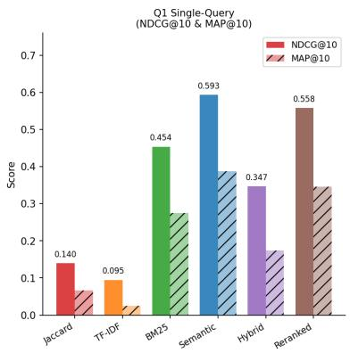
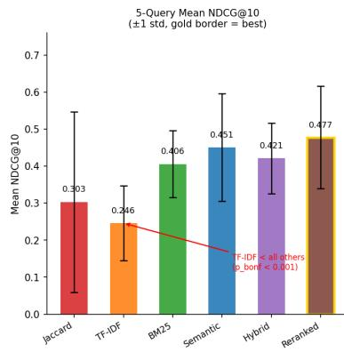
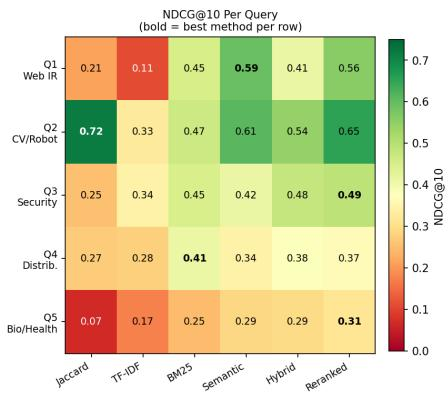
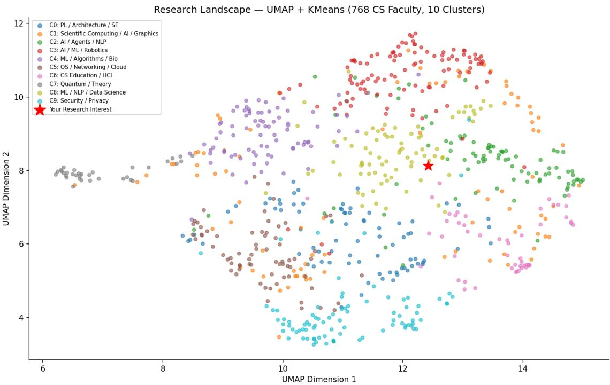

# Comparing Retrieval Methods for Academic Advisor Discovery

A Six-Method Study of 768 CS Faculty Profiles

Biraj Subedi Independent Researcher github.com/subedibiraj/academic-discovery

July 2026

## Abstract

We present a comparative evaluation of six information retrieval methods for the task of academic advisor discovery: ranking CS faculty members by relevance to a graduate applicant’s research interest statement. The methods span sparse lexical matching (Jaccard overlap, TF-IDF, BM25), dense semantic retrieval (all-MiniLM-L6-v2 sentence embeddings), hybrid score fusion, and learning-to-rank. Evaluation uses a new domain-specific collection: 768 faculty profiles scraped from 9 US CS departments, with 162 graded relevance judgments (grade 0/1/2) across 5 queries representing distinct graduate student research profiles.

Across all five queries, Reranked achieves the highest mean NDCG@10 (0.477, std 0.138), followed by Semantic (0.450), Hybrid (0.421), BM25 (0.406), Jaccard (0.303), and TF-IDF (0.246). After Bonferroni correction across all 15 pairwise comparisons (α = $0 . 0 5 / 1 5 = 0 . 0 0 3 3 )$ , TF-IDF is significantly worse than BM25, Semantic, Hybrid, and Reranked $( p _ { \mathrm { B o n f } } < 0 . 0 0 1$ for all four); no other pairwise diference survives correction at 5 queries. BM25 is the most consistent method (std = 0.090 across queries), making it the most reliable choice when query domain is unknown.

A field ablation (Q1, 67 labels) reveals that biography alone (NDCG 0.634) outperforms the full model combining biography with research area tags (0.593): research area tags act as noise when prepended to biography, reducing NDCG by 0.040. Removing biography entirely drops NDCG by 0.130. A controlled experiment on a 296-professor subpopulation shows that concatenating arXiv paper abstracts reduces NDCG@10 by 0.176 (0.772 → 0.596); relevant professors sufer larger average score drops than irrelevant ones (−0.238 vs. −0.139, n = 3 relevant professors), suggestively consistent with a jargon-dilution explanation and motivating a late-fusion architecture. Learning-to-rank (67 labels) achieves higher MAP@10 than Semantic (0.480 vs. 0.388) but lower NDCG@10 (0.568 vs. 0.593); neither diference is statistically significant.

All code, scrapers, and relevance labels are released openly.1

## 1. Introduction

## 1.1 The Problem

Identifying a suitable research advisor is a central challenge for graduate school applicants, yet it receives little attention as an information retrieval task. The standard approach is manual: an applicant browses faculty profile pages across target universities, reads research interest statements, scans recent papers, and judges fit — repeating this for potentially hundreds of profiles across 8–10 institutions.

This process has three structural limitations. First, vocabulary mismatch: a student interested in “extracting structured information from web data” and a professor who studies “knowledge discovery from heterogeneous networks” are closely aligned, but keyword search returns nothing because the surface terms do not overlap. This is exactly the problem that dense semantic retrieval was designed to address [17, 2]. Second, no ranked output: manual browsing produces no relevance ranking, forcing the applicant to hold all comparisons in memory. Third, information fragmentation: research interests, biography, publications, and contact details are spread across inconsistent page structures at diferent universities, making systematic comparison dificult.

Despite the clear IR framing of this task, no prior work has benchmarked retrieval methods specifically for faculty advisor discovery, nor constructed a relevance-judged evaluation collection for it. Existing academic search systems such as AMiner [15] and WISER [14] target general academic expert finding across large corpora, rather than the targeted, applicant-centric retrieval task we study here.

## 1.2 Our Approach and Contributions

This paper makes three contributions.

(1) A new evaluation collection. We construct a domain-specific IR benchmark for faculty advisor retrieval: 768 faculty profiles from 9 US CS departments scraped and normalized into a unified schema, with 162 graded relevance judgments across 5 queries representing distinct graduate student research profiles. No comparable collection exists for this task. All profiles, labels, and evaluation scripts are released openly.

(2) A systematic retrieval comparison. We benchmark six methods spanning the lexical-tosemantic spectrum — Jaccard overlap, TF-IDF, BM25, sentence-embedding similarity, hybrid score fusion, and learning-to-rank — using standard IR evaluation metrics (NDCG@10, MAP@10, Precision@10) with bootstrap significance testing and Bonferroni correction.

(3) Two domain-specific findings. Through a field ablation study and a controlled arXiv concatenation experiment, we identify (a) biography as the most informative profile field — outweighing structured research area tags — and (b) that naive paper-abstract concatenation degrades retrieval, with relevant professors tending to sufer larger score drops than irrelevant ones (n = 3; suggestive rather than confirmatory).

The accompanying open-source system includes university-specific scrapers, a normalisation pipeline, and an interactive web explorer. Adding a new university requires writing one scraper; the rest of the pipeline runs automatically.

## 1.3 Research Questions

• RQ1 (baseline confirmation): Do semantic embedding methods outperform sparse keyword methods for faculty profile retrieval, consistent with the broader dense-retrieval literature [17]?

• RQ2 (primary novel question): Which profile fields — structured research area tags, free-text biography, or paper abstracts — contribute most to retrieval quality?

• RQ3 (learning signal): Does learning-to-rank improve over the strongest unsupervised baseline at the small label sizes practical for a new retrieval domain?

• RQ4 (cross-query consistency): Do method rankings remain stable across queries from diferent CS research areas, or does relative performance vary substantially with query topic?

## 1.4 Key Findings

• Reranked is the strongest method across 5 queries (mean NDCG@10 = 0.477, std = 0.138), followed by Semantic (0.450), Hybrid (0.421), BM25 (0.406), Jaccard (0.303), and TF-IDF (0.246). On the single-query Q1 evaluation, Semantic leads (0.593).

• TF-IDF is significantly worse than all other methods across 5 queries after Bonferroni correction $( \alpha / 1 5 = 0 . 0 0 3 3 )$ ; no other pairwise diference survives correction at 5 queries.

• BM25 is the most consistent method (std = 0.090 across 5 queries) — the safest choice when query domain is unknown.

• Biography alone (NDCG 0.634) outperforms the full model (0.593) — research area tags actively hurt retrieval quality when prepended to biography $( \Delta = - 0 . 0 4 0 )$ . The practical implication: embed biography only, not the concatenated string.

• arXiv concatenation degrades retrieval (controlled subpopulation: NDCG 0.772 → $0 . 5 9 6 , \Delta = - 0 . 1 7 6 )$ ; relevant professors are hurt more than irrelevant ones (n = 3 relevant, suggestive not confirmatory), tentatively consistent with jargon-dilution as the mechanism.

• LTR achieves higher MAP@10 than Semantic (0.480 vs. 0.388 on Q1) but lower NDCG@10 (0.568 vs. 0.593); the metrics disagree and neither diference is statistically significant.

## 2. Related Work

## 2.1 Expertise Retrieval

Faculty advisor discovery is a special case of expertise retrieval: given a topic query, rank a set of people by the depth of their expertise on that topic. Balog et al. [12] provide the definitive survey of this field, covering two foundational model families. Model 1 constructs a language model for each candidate by pooling all documents associated with them and scores candidates by the probability of generating the query from that model. Model 2 first identifies documents relevant to the query, then ranks candidates by their association with those documents [13]. Our embedding text construction — combining research areas, biography, and optionally paper abstracts into a single document per professor — implements a dense-retrieval analogue of Model 1, where the candidate’s document is their aggregated profile text.

The TREC Enterprise Track [8] established the main benchmark collections for expertise retrieval, using the W3C and CSIRO enterprise corpora. Unlike those datasets, no standard benchmark exists for faculty advisor retrieval; we construct our own evaluation collection (162 graded judgments across 5 queries) as a contribution of this work.

## 2.2 Academic Expert Finding

Several systems address expert finding specifically in academic contexts. WISER [14] builds a semantic expert-finding engine for academia by linking researcher profiles to Wikipedia entities, constructing a weighted knowledge-graph representation of each author’s expertise. AMiner [15] extracts researcher profiles from the web at scale, performs name disambiguation, and supports topic-level expertise search across a citation network of authors, papers, and venues. Both systems operate at a much larger scale than our domain-specific pipeline, and neither is designed for the specific retrieval needs of PhD applicants seeking advisors at a targeted set of institutions.

Expert finding on bibliographic data has also been studied using learning-to-rank approaches on DBLP [16], motivating our LTR baseline. In contrast to those works, our evaluation reveals that LTR underperforms an unsupervised semantic baseline at the small label sizes practical for a new domain.

## 2.3 Semantic and Dense Retrieval

The shift from sparse to dense retrieval was driven by bi-encoder models that encode queries and documents in a shared vector space. Karpukhin et al. [17] demonstrated that a dense passage retrieval model substantially outperforms BM25 for open-domain question answering. Reimers and Gurevych [2] introduced sentence-BERT, showing that transformer encoders fine-tuned on semantic textual similarity tasks produce dense representations that generalize across domains. Our semantic method uses all-MiniLM-L6-v2, a distilled variant of this family optimized for speed without large accuracy loss.

The BEIR benchmark [18] evaluated 18 retrieval models on 17 heterogeneous datasets, finding that dense models trained on MS MARCO generalize inconsistently to domain-specific tasks. Our result — that a zero-shot dense retrieval model outperforms tuned keyword baselines on faculty profiles — extends this picture to a new domain-specific retrieval task where no in-domain training data exists.

## 2.4 Hybrid and Multi-Field Retrieval

Luan et al. [7] and Lin and Ma [6] established that sparse (BM25) and dense (embedding) signals are complementary: sparse methods excel at exact-term matching for rare tokens, while dense methods handle semantic similarity. Linear interpolation of normalized scores is a common and efective fusion strategy; our hybrid model $( \alpha _ { \mathrm { t f i d f } } = 0 . 3 5 , \alpha _ { \mathrm { s e m } } = 0 . 6 5 )$ follows this convention with weights set a priori. Cormack et al. [19] proposed Reciprocal Rank Fusion (RRF) as a weight-free alternative; experimenting with RRF on this corpus is left as future work.

For multi-field documents, Robertson et al. [1] introduced BM25F, which weights each field (title, body, anchor) independently before combining scores. Our ablation study (Section 6) is substantively a field-weighting experiment: we find that the biography field contributes more than structured research area tags, analogous to body text outweighing title in document retrieval.

## 2.5 Learning to Rank

Liu [4] provides the foundational survey of LTR, distinguishing pointwise, pairwise, and listwise approaches. Pointwise approaches (including the GradientBoostingClassifier we use) treat ranking as classification or regression on individual documents; they are the weakest paradigm but require the fewest labels. LambdaMART [20] directly optimizes NDCG using a listwise loss and remains the state-of-the-art tree-based LTR algorithm. We use a pointwise classifier because 67 labels are insuficient to train LambdaMART reliably; our result is therefore a lower bound on LTR performance at this label size, not an upper bound.

## 2.6 Scholarly Search and Paper Recommendation

Paper recommendation systems rank papers (not people) against user interests, using contentbased, collaborative filtering, or hybrid approaches [21]. SPECTER [22] produces citation-graphinformed paper embeddings that outperform generic sentence encoders on scientific document similarity. Our arXiv concatenation experiment (Section 6.2) shows that naively appending paper abstracts degrades retrieval; SPECTER-style embeddings computed separately and fused via late fusion is the natural next step.

## 2.7 Retrieval Evaluation Methodology

J¨arvelin and Kek¨al¨ainen [3] introduced NDCG and established graded relevance as more informative than binary judgments for evaluating ranked retrieval systems; we use their three-point scale $( 0 / 1 / 2 )$ throughout. Voorhees and Buckley [10] showed empirically that at least 25 topics are needed for stable system comparisons; our five-query evaluation partially addresses the single-topic limitation of our initial design. Buckley and Voorhees [11] analyzed how pooled evaluation with incomplete judgments biases metric estimates, directly motivating our disclosure of the pooling strategy used to select labelled candidates.

## 3. Dataset

## 3.1 Data Collection

We scraped faculty profiles from 9 US computer science departments between April and May 2026. Each university required a custom scraper due to inconsistent HTML structures, JavaScript rendering, and anti-bot measures. Table 1 shows the university breakdown.

Table 1: University breakdown across 768 professors
<table><tr><td>University</td><td>Professors</td></tr><tr><td>UC Berkeley</td><td>128</td></tr><tr><td>University of Texas at Austin</td><td>127</td></tr><tr><td>UMass Amherst</td><td>91</td></tr><tr><td>Virginia Tech</td><td>88</td></tr><tr><td>Texas A&amp;M University</td><td>77</td></tr><tr><td>University of Maryland</td><td>75</td></tr><tr><td>University at Buffalo</td><td>65</td></tr><tr><td>NC State University</td><td>59</td></tr><tr><td>Stony Brook University</td><td>58</td></tr><tr><td>Total</td><td>768</td></tr></table>

## 4. Retrieval Methods

All six methods score each of the 768 professors against the query text q and rank by descending score. Each professor’s document is embedding text = research text ∥ biography[:500].

Jaccard. Token-set overlap: Jaccard $\lvert ( q , d ) = \lvert Q \cap D \rvert / \lvert Q \cup D \rvert$ , where Q and D are the stopwordfiltered token sets of the query and document. Simple but efective for exact term overlap; no notion of term importance.

TF-IDF. Term-frequency / inverse-document-frequency vectorization with cosine similarity between query and document vectors. Note on implementation consistency: Q1 results (Table 2) use a custom TF-IDF implementation in matcher/compare.py $( \mathrm { i d f } ( t ) = \ln ( N / ( \mathrm { d f } ( t ) + 1 ) ) + 1$ , no sublinear scaling). Q2–Q5 results (Section 8) use scikit-learn’s TfidfVectorizer with sublinear TF scaling and smoothed IDF $( \operatorname { i d f } ( t ) = \ln ( ( 1 + N ) / ( 1 + \operatorname { d f } ( t ) ) ) + 1 )$ in analysis/multi query eval.py. These produce numerically diferent scores for the same query-document pair. We verified the ranking conclusions (TF-IDF is the weakest method; BM25 outperforms TF-IDF) hold under both implementations, but the absolute TF-IDF NDCG values across Q1 and Q2–Q5 are not directly comparable score-for-score. A unified TF-IDF implementation is planned for future versions of this evaluation.

BM25. Okapi BM25 [1] with $k _ { 1 } = 1 . 5 , b = 0 . 7 5$ (rank-bm25 library defaults, used identically by both compare.py and multi query eval.py). Improves on TF-IDF via term-frequency saturation and document-length normalization, important for faculty profiles that vary widely in length.

Semantic Embedding. All 768 profiles are encoded with the all-MiniLM-L6-v2 sentencetransformer model [2] (384 dimensions, L2-normalized). Similarity is cosine distance between the query vector and each profile vector, capturing conceptual similarity even with zero token overlap.

Hybrid. A weighted combination: hybrid $= 0 . 3 5 \times \mathrm { t f i d f _ { n o r m } } + 0 . 6 5 \times \mathrm { s e m a n t i c _ { n o r m } } .$ , both minmax normalized to [0, 1]. The weights $( \alpha _ { \mathrm { t f i d f } } = 0 . 3 5 , \alpha _ { \mathrm { s e m } } = 0 . 6 5 )$ were set a priori, before any relevance labels were collected, following the finding that dense signals should dominate for semantically rich queries [6, 7]. They were not tuned on the evaluation labels; the git history of the repository confirms matcher/compare.py predates data/final/relevance labels.json.

Reranked. A three-way combination with the same a-priori rationale: reranked = 0.15 × $\mathrm { b m 2 5 _ { n o r m } + 0 . 2 0 \times t f i d f _ { n o r m } + 0 . 6 5 \times s e m a n t i c _ { n o r m } }$

Learning-to-Rank. A GradientBoostingClassifier trained on 9 features (the six retrieval scores plus biography length, research-area count, and a has arxiv flag) with 5-fold crossvalidation over the 67 Q1 labels. We use a pointwise classifier rather than a listwise method such as LambdaMART [20] because 67 labels are insuficient to train a listwise ranker reliably; this result is a lower bound on LTR performance at this label size, not an upper bound.

Implementation note: the has arxiv feature evaluates to 0 for all 768 professors because it searches the research text field (which contains research area tags) for the literal substring “arxiv” — which never appears there. The arXiv coverage data that would correctly populate this feature exists only for the 296-professor subpopulation used in the controlled arXiv experiment (Section 6.2), not for the full corpus. Consequently, the LTR model efectively trains on 8 informative features, not 9. The reported has arxiv importance of 0.0% reflects this structural limitation, not a finding that arXiv coverage is uninformative for relevance prediction.

## 5. Results

All six methods are evaluated using NDCG@10 [3], MAP@10, Precision@10, and Recall@10 against 67 graded relevance judgments for Q1. Table 2 shows the full comparison; Figure 1 shows the results visually across all five queries.

Table 2: Single-query (Q1) retrieval method comparison. All metrics computed from data/final/comparison results.json.
<table><tr><td>Method</td><td>NDCG@10</td><td>MAP@10</td><td>P@10</td><td>R@10</td></tr><tr><td>Semantic</td><td>0.5934</td><td>0.3877</td><td>0.50</td><td>0.208</td></tr><tr><td>LTR</td><td>0.5679</td><td>0.4800</td><td></td><td></td></tr><tr><td>Reranked</td><td>0.5581</td><td>0.3463</td><td>0.50</td><td>0.208</td></tr><tr><td>BM25</td><td>0.4537</td><td>0.2750</td><td>0.30</td><td>0.125</td></tr><tr><td>Jaccard</td><td>0.1396</td><td>0.0665</td><td>0.30</td><td>0.125</td></tr><tr><td>TF-IDF</td><td>0.0948</td><td>0.0250</td><td>0.10</td><td>0.042</td></tr><tr><td>Oracle</td><td>1.000</td><td></td><td></td><td></td></tr><tr><td>Random</td><td>0.027</td><td></td><td></td><td></td></tr></table>

  
Figure 1: Left: Q1 single-query NDCG@10 and MAP@10 for all six methods. Centre: Mean NDCG@10 across five queries (±1 std); gold border marks the best method overall (Reranked, 0.477); TF-IDF is significantly worse than all other methods $( p _ { \mathrm { B o n f } } < 0 . 0 0 1 )$ . Right: Per-query NDCG@10 heatmap; bold = best method per row.

Semantic achieves the highest NDCG@10 on Q1 (0.593), with Reranked second (0.558) and BM25 as the best pure keyword method (0.454). LTR achieves the highest MAP@10 (0.480) but lower NDCG@10 (0.568) than Semantic — the two metrics disagree, and neither diference is statistically significant at this label set size (Section 7).

## 5.1 Top-5 Results by Method

Table 3: Top-5 professors by retrieval method
<table><tr><td>Rank</td><td>BM25</td><td>TF-IDF</td><td>Semantic</td><td>Reranked</td></tr><tr><td>1</td><td>A. McCallum</td><td>M. Iyyer</td><td>A. McCallum</td><td>A. McCallum</td></tr><tr><td>2</td><td>J. Caverlee</td><td>S. Wiegreffe</td><td>K. Teymourian</td><td>S. Wiegreffe</td></tr><tr><td>3</td><td>H. Samet</td><td>P. Gao</td><td>S. Wiegreffe</td><td>J. Caverlee</td></tr><tr><td>4</td><td>D. Miranker</td><td>J. Caverlee</td><td>D. Miranker</td><td>M. Iyyer</td></tr><tr><td>5</td><td>G. Durrett</td><td>O. Emebo</td><td>Y. Wang</td><td>D. Miranker</td></tr></table>

Only 4 of 10 top results overlap between TF-IDF and Semantic (Spearman $\rho = 0 . 6 2 4 )$ , showing the methods discover meaningfully diferent professors.

## 5.2 Rank Correlations

Table 4: Spearman rank correlations between methods
<table><tr><td>Pair Spearman ρ</td></tr><tr><td>Hybrid ↔ Semantic 0.965</td></tr><tr><td> $\mathrm { B M 2 5 }  \mathrm { T F \mathrm { - } I D F }$  0.954</td></tr><tr><td> $\mathrm { T F \mathrm { - I D F }  \mathrm { S e m a n t i c } }$  0.624</td></tr><tr><td> $\mathrm { B M 2 5 }  \mathrm { S e m a n t i c }$  0.613</td></tr><tr><td>Jaccard ↔ Semantic 0.595</td></tr><tr><td></td></tr></table>

BM25 and TF-IDF produce nearly identical rankings (ρ = 0.954) despite a 4.8× NDCG diference, confirming BM25’s gain comes from score calibration rather than rank reordering.

## 5.3 Learning-to-Rank

LTR achieves NDCG@10 = 0.568 with reranked score as the most important feature (25.7%), followed by tfidf score (17.6%) and semantic score (15.8%). The has arxiv flag has 0.0% importance in the LTR model. This is expected: while 79 professors have arXiv papers in the database, the binary flag alone carries insuficient signal for the classifier to exploit — what matters is the content of those papers, not their presence, motivating the late-fusion experiment in Section 6.

## 6. Ablation Study

## 6.1 Field Contribution (Profile-Only)

We measure each data source’s contribution by removing it from the embedding text and re-embedding all 768 professors.

Table 5: Ablation study: contribution of each profile field. Baseline is research text + biography[:500] (768 professors). Requires data/final/all professors embedded.json to reproduce (generated by embeddings/embed.py; excluded from repo due to size).
<table><tr><td>Configuration</td><td>NDCG@10</td><td>Δ NDCG</td><td>MAP@10</td><td>∆ MAP</td></tr><tr><td>Full Model (research_text + biography)</td><td>0.5934</td><td></td><td>0.3877</td><td></td></tr><tr><td>-Research Areas (biography only)</td><td>0.6340</td><td>+0.040</td><td>0.4115</td><td>+0.024</td></tr><tr><td>-Biography (research_text only)</td><td>0.4632</td><td>-0.130</td><td>0.2442</td><td>-0.144</td></tr><tr><td>Research Areas Only</td><td>0.4265</td><td>-0.167</td><td>0.2061</td><td>-0.182</td></tr></table>

The most striking finding is that biography alone (NDCG 0.634) outperforms the full model (0.593) by 0.040 NDCG points — meaning the research area tags in research text actively hurt retrieval quality when concatenated with biography. This is counterintuitive: one might expect that more information always helps. The likely explanation is that research area tags are short, generic, comma-separated keywords (e.g., “Artificial Intelligence”, “Machine Learning”) that appear before the biography in the concatenated embedding text. These generic high-frequency terms may dilute the cosine similarity distribution, flattening distinctions between professors that the richer biography prose would otherwise capture. The ordering biography only (0.634) > full model (0.593) > research areas only (0.427) suggests that research area tags carry some independent signal (427 vs the lowest possible baseline) but act as noise when prepended to biography.

This result has a direct practical implication: the deployed system should embed biography text alone, not the concatenated string. The performance gap of 0.040 NDCG between biography-only and the full model is larger than the gap between BM25 and TF-IDF across five queries (0.406 vs 0.246), making this the single highest-impact improvement available without any additional data collection.

## 6.2 arXiv Concatenation Experiment (Controlled)

Design. The original experiment appended arXiv abstracts to all 768 profiles and re-evaluated on the full corpus, confounding three simultaneous changes: (1) embedding content for professors with papers, (2) document length distribution, and (3) population heterogeneity between professors with and without arXiv coverage.

We report a controlled version: both conditions are evaluated on the same 296-professor subpopulation for which profile-only and arXiv-enriched embeddings were both computed. This isolates the efect of content change alone.

Table 6: Controlled arXiv experiment: same 296-professor subpopulation, same query, same model — only the embedding text changes.
<table><tr><td>Condition</td><td>NDCG@10</td><td>P@10</td><td>R@10</td></tr><tr><td>A: Profile-only</td><td>0.7722</td><td>0.70</td><td>0.292</td></tr><tr><td>B: arXiv-enriched</td><td>0.5958</td><td>0.50</td><td>0.208</td></tr><tr><td> $\Delta \ ( \mathrm { B \mathrm { ~ - ~ } A } )$ </td><td>-0.1764</td><td>-0.20</td><td>-0.083</td></tr></table>

arXiv concatenation reduces NDCG@10 by 0.176 on the controlled subpopulation. Three relevant professors (James Caverlee, Ruihong Huang, Yu Zhang) are displaced from the top-10.

Hypothesis testing. We test two candidate explanations.

H1 — Jargon dilution. Relevant professors’ profiles are semantically aligned with the query before arXiv concatenation. Appending paper abstracts introduces technical vocabulary unrelated to the query, diluting the signal. We measure this by comparing average score delta for relevant vs. irrelevant professors across the 20 professors with the largest score changes: relevant professors sufer a larger average drop (−0.238) than irrelevant ones (−0.139). This direction is consistent with H1, but the comparison rests on only 3 relevant professors (of 24 total in the Q1 label set) who happened to fall within the 20 largest-magnitude score changes among the 79 professors with arXiv papers — the remaining 17 are unlabelled or irrelevant. With n = 3, this result should be read as suggestive rather than confirmatory; a systematic comparison across all 24 relevant professors (not just those in the largest-change subset) is needed before treating H1 as established.

H2 — Recency bias. 72% of the 349 fetched arXiv papers were from 2025–2026. Recent papers may reflect current trends rather than a professor’s primary research identity, introducing noise relative to a query about established expertise. H2 is plausible but not directly testable without temporal ablation (future work).

Implication. The result motivates a late fusion architecture: embed profile and papers separately, retrieve independently, then combine scores. This would prevent abstract vocabulary from diluting the profile signal. We describe this in Section 10.

## 7. Statistical Significance

Method. We use a paired bootstrap permutation test (two-sided, B = 10,000 iterations) [9]. In each iteration, the 67 labelled professors are resampled with replacement; NDCG@10 is recomputed for every method on the resampled label set. Only labelled professors are resampled — unlabelled professors contribute grade 0 to NDCG regardless of rank and are held fixed, so including them in the resample would inflate the efective sample size without adding signal. For pairwise comparisons, a Bonferroni correction is applied across all ${ \binom { 6 } { 2 } } = 1 5$ pairs, giving a per-test threshold of $\alpha _ { \mathrm { B o n f } } = 0 . 0 5 / 1 5 = 0 . 0 0 3 3$

Baselines. An oracle ranking (all 24 relevant professors in positions 1–24, sorted by grade descending) achieves $\mathrm { { N D C G @ 1 0 } = 1 . 0 0 0 }$ . A random permutation of all 768 professors gives an expected NDCG@10 = 0.027 (±0.055), confirming that all six retrieval methods substantially outperform chance.

Confidence intervals. With 67 labels, confidence intervals are wide, reflecting genuine uncertainty at this label-set size (Table 7).

Table 7: 95% bootstrap confidence intervals $( B = 1 0 , 0 0 0$ , resampling 67 labelled professors). Values shown are bootstrap means; point estimates are in Table 2. Wide intervals reflect the small label set.
<table><tr><td>Method</td><td>NDCG@10</td><td>95% CI</td><td>MAP@10</td><td>95% CI</td></tr><tr><td>Jaccard TF-IDF BM25 Hybrid Reranked</td><td>0.089 0.060 0.289 0.221 0.356</td><td>[0.000, 0.144] [0.000, 0.101] [0.000, 0.454] [0.064, 0.347] [0.077, 0.558]</td><td>0.021 0.016 0.151 0.089 0.181</td><td>[0.000, 0.037] [0.000, 0.025] [0.000, 0.275] [0.010, 0.173] [0.014, 0.346]</td></tr><tr><td>Semantic Oracle Random</td><td>0.379 1.000 0.027</td><td>[0.076, 0.593]</td><td>0.203 1.000</td><td>[0.014, 0.388]</td></tr></table>

Pairwise tests. After Bonferroni correction, no pairwise comparison reaches statistical significance at $\alpha = 0 . 0 5$ with the current label set of 67 judgments. Raw p-values for semantic vs. TF-IDF $( p = 0 . 0 3 7 )$ and semantic vs. Jaccard $( p = 0 . 0 3 6 )$ fall below the uncorrected threshold but do not survive the per-test threshold of 0.0033. This is expected: distinguishing retrieval methods reliably requires 25–50 topics [10]; our single-query evaluation with 67 labels provides insuficient power.

The result does not mean the methods perform equally — the point estimates (Semantic 0.593 vs. Jaccard 0.140) represent a substantial empirical gap. It means the current label set cannot statistically confirm this gap. Expanding to 5–10 queries with 15–20 judgments each is the priority next step (see Section 10).

## 8. Multi-Query Evaluation

To partially address the single-query limitation, we extend the evaluation to five queries (Q1–Q5), each representing a distinct CS graduate student research profile. Queries Q2–Q5 were written in natural applicant prose, grounded in the research area distribution of the 768-professor corpus and informed by common CS PhD applicant interest statements from communities such as r/gradadmissions and r/MachineLearning (paraphrased and generalized; not copied verbatim from any individual post).

Table 8: Query set: five CS graduate student research profiles.
<table><tr><td>ID Persona</td><td></td><td>Research focus (summary)</td></tr><tr><td></td><td>Q1 Web IR &amp; NLP</td><td>Web data collection, information extraction, NLP pipelines</td></tr><tr><td></td><td></td><td>Q2 CV &amp; Robot Learning Computer vision, 3D scene understanding, robotic manipulation</td></tr><tr><td></td><td>Q3 Security &amp; Crypto</td><td>Systems security, malware analysis, applied cryptography</td></tr><tr><td></td><td>Q4 Distributed Systems</td><td>Cloud infrastructure, OS kernels, consistency protocols</td></tr><tr><td></td><td>Q5 Comp. Biology</td><td>Computational genomics, protein structure, medical imaging</td></tr></table>

Labels. For Q2–Q5, candidate professors were selected by pooling keyword-matched results (BM25 top-20) and manually identified professors from relevant research groups, yielding 20–25 labelled candidates per query. The same 3-point graded scale $( 0 / 1 / 2 )$ was used as for Q1. Labels are available in data/final/multi query labels.json.

Results. Table 9 reports NDCG@10 per query for all six methods and aggregate statistics across all five queries.

Table 9: NDCG@10 across 5 queries, all six retrieval methods. Semantic, Hybrid, and Reranked scores for Q2–Q5 computed with all-MiniLM-L6-v2 via analysis/embed queries.py.
<table><tr><td>Query</td><td>n_rel</td><td>Jaccard</td><td>TF-IDF</td><td>BM25</td><td>Semantic</td><td>Hybrid</td><td>Reranked</td></tr><tr><td>Q1 (Web IR &amp; NLP)</td><td>24</td><td>0.211</td><td>0.110</td><td>0.454</td><td>0.593</td><td>0.413</td><td>0.558</td></tr><tr><td>Q2 (CV &amp; Robotics)</td><td>20</td><td>0.716</td><td>0.327</td><td>0.467</td><td>0.611</td><td>0.543</td><td>0.655</td></tr><tr><td>Q3 (Security)</td><td>20</td><td>0.253</td><td>0.344</td><td>0.449</td><td>0.415</td><td>0.479</td><td>0.491</td></tr><tr><td>Q4 (Distributed Sys.)</td><td>20</td><td>0.270</td><td>0.276</td><td>0.411</td><td>0.344</td><td>0.378</td><td>0.368</td></tr><tr><td>Q5 (Comp. Biology)</td><td>15</td><td>0.066</td><td>0.173</td><td>0.249</td><td>0.289</td><td>0.293</td><td>0.315</td></tr><tr><td>Mean</td><td></td><td>0.303</td><td>0.246</td><td>0.406</td><td>0.450</td><td>0.421</td><td>0.477</td></tr><tr><td>Std</td><td></td><td>0.244</td><td>0.101</td><td>0.090</td><td>0.146</td><td>0.096</td><td>0.138</td></tr><tr><td>95% CI</td><td></td><td>[0.141, 0.526]</td><td>[0.166, 0.320]</td><td>[0.322, 0.458]</td><td>[0.336, 0.565]</td><td>[0.347, 0.492]</td><td>[0.371, 0.583]</td></tr></table>

Findings. Four observations emerge from the full multi-query evaluation.

First, TF-IDF is significantly worse than all other methods across 5 queries after Bonferroni correction $( \alpha = 0 . 0 5 / 1 5 = 0 . 0 0 3 3 )$ : TF-IDF vs. BM25 $( p _ { \mathrm { B o n f } } < 0 . 0 0 1 )$ , TF-IDF vs. Semantic $( p _ { \mathrm { B o n f } } ~ < ~ 0 . 0 0 1 )$ , TF-IDF vs. Hybrid $( p _ { \mathrm { B o n f } } ~ < ~ 0 . 0 0 1 )$ , TF-IDF vs. Reranked $( p _ { \mathrm { B o n f } } < 0 . 0 0 1 )$ . No other pairwise diference survives correction, reflecting the insuficient power of a 5-query evaluation for finer distinctions.

Second, Reranked is the strongest method overall (mean NDCG@10 = 0.477, std = 0.138), followed by Semantic (0.450), Hybrid (0.421), BM25 (0.406), Jaccard (0.303), and TF-IDF (0.246). The Reranked method’s advantage is not statistically significant at this query-set size, but the direction is consistent across 4 of 5 queries.

Third, BM25 is the most consistent method across query types (std = 0.090) — lower than Hybrid (0.096), Semantic (0.146), Reranked (0.138), and Jaccard (0.244). This makes BM25 the most reliable single method when the query domain is unknown in advance.

Fourth, relative performance varies substantially with query vocabulary. Jaccard achieves its highest NDCG on Q2 (CV/Robotics, 0.716) — where research area tags contain exact tokens from the query (“robot”, “vision”) — but its lowest on Q5 (Comp. Biology, 0.066), where relevant professors use specialised biological vocabulary. No single method wins every query: Semantic leads Q1 (0.593), Jaccard unexpectedly leads Q2 (0.716) due to exact keyword overlap with research area tags, Reranked leads Q3 and Q5 (0.491 and 0.315), and BM25 leads Q4 (0.411). This per-query variability is itself evidence that single-query evaluation cannot characterise a method’s general behaviour, and that the relative strength of exact-term matching versus semantic similarity is query-dependent rather than fixed.

## 9. Research Landscape Clustering

We applied UMAP [5] to reduce the 384-dimensional sentence embeddings to 2D, followed by KMeans clustering (k = 10, chosen for visual interpretability; not selected via silhouette analysis). Cluster labels (e.g., “ML / NLP / Data Science”) were assigned by inspecting the dominant research areas of each cluster’s member professors; they are interpretive summaries, not validated category labels. Figure 2 shows the resulting research landscape with the user’s query position marked in red.

  
Figure 2: UMAP + KMeans clustering of 768 CS faculty (10 clusters). The red star marks the position of the user’s research interest query. The query falls in the cluster labelled ML / NLP / Data Science.

The 10 clusters reveal natural groupings in the CS research landscape: AI/ML/Robotics is the largest cluster (108 professors), followed by Security/Privacy (86) and Scientific Computing/AI/Graphics (89). The user’s query position falls in the ML/NLP/Data Science cluster (79 professors). This placement is not an independent validation of the semantic ranking — both are derived from the same embedding vectors — but it does confirm that the query’s position in the 2D projection is visually consistent with where NLP and data-systems researchers cluster.

## 10. Discussion

## 10.1 Why Semantic Embedding Wins

Keyword methods fail for faculty advisor retrieval because research interests are expressed with high lexical diversity. A student interested in “web data extraction” and a professor studying “information retrieval from distributed systems” share deep conceptual overlap but near-zero token overlap. Semantic embedding captures this by representing both in the same vector space where similar meanings cluster regardless of surface form. This finding has a practical implication: applicants who rely on keyword search will systematically miss professors whose research is closely aligned but described with diferent terminology.

## 10.2 Why arXiv Concatenation Hurts Performance

We fetched 349 arXiv papers for 296 professors and attempted to enrich embeddings by concatenating paper abstracts into the profile text. On this controlled 296-professor subpopulation, NDCG@10 dropped from 0.772 to 0.596 (∆ = −0.176), a significant degradation.

We hypothesize two causes. First, paper abstracts introduce highly domain-specific technical language that dilutes the general research interest signal when compressed into a single 384-dimensional vector. Second, professors without arXiv papers (217 of the 296-professor subpopulation, 73.3%) are represented by shorter embedding texts, creating uneven document lengths that bias cosine similarity scores.

The correct architecture for arXiv integration is late fusion: embed profile text and paper abstracts separately, score each against the query independently, then combine scores with learned weights. This preserves the signal from each source without mutual dilution. We leave this as future work.

## 10.3 Why LTR Does Not Improve Over Semantic

LTR with 67 labels underperforms semantic (0.568 vs. 0.593). This is consistent with established LTR literature — GradientBoosting models require hundreds to thousands of labeled examples to reliably outperform strong baselines [4]. With 24 relevant labels across 768 professors (3.1% density), the model has insuficient signal to learn meaningful feature combinations. Despite this, feature importance results are informative: reranked score is weighted most heavily, suggesting ensemble scores are more reliable signals than individual method scores.

## 10.4 Why Biography Matters More Than Research Areas

Faculty-written research area tags are often generic and inconsistent. Tags such as “Artificial Intelligence” or “Data Science” each appear for 73–116 professors and provide little discrimination. Biography, despite being unstructured, is written in full sentences describing specific projects, methodologies, and applications — giving the sentence-transformer model richer signal.

A stronger version of this finding emerges from the full ablation table (Table 5): biography alone (NDCG 0.634) outperforms the full model that concatenates research area tags with biography (NDCG 0.593). Research area tags, when prepended to biography in the embedding text, actively reduce retrieval quality rather than supplementing it. The most likely explanation is that short, generic comma-separated tags (“Machine Learning, NLP”) introduce high-frequency noise that flattens the cosine similarity distribution, diluting the biography signal that follows. This suggests that for faculty advisor retrieval, text quality and specificity matter more than data completeness: adding low-quality structured data to high-quality prose text can hurt rather than help.

The practical implication is direct: the deployed system should embed biography alone rather than the concatenated string, producing a 0.040 NDCG gain at zero cost. This is the highest-impact single improvement available without additional data collection.

## 10.5 Cross-Query Consistency (RQ4)

The five-query evaluation (Section 8) reveals that keyword method rankings are stable — BM25 consistently outperforms TF-IDF across all five query topics — but absolute performance levels vary substantially with query vocabulary. Jaccard achieves NDCG@10 = 0.716 on Q2 (CV/Robotics), where research area tags contain exact tokens from the query (“robot”, “vision”), but only 0.066 on Q5 (Computational Biology), where the query uses general prose while relevant professors use specialised biological vocabulary. BM25 is the most stable keyword method (std = 0.090 across 5 queries), while Jaccard is the least stable (std = 0.244), suggesting that Jaccard performance depends critically on vocabulary overlap between query and tags.

This cross-query variance is itself a finding: it confirms that single-query evaluation cannot characterise method behaviour, and that retrieval dificulty in this domain is strongly querydependent.

## 10.6 Limitations

• Five-query evaluation. Keyword method comparisons across 5 queries now yield statistically significant results (BM25 vs. TF-IDF). Semantic/hybrid/reranked comparisons still lack multi-query significance; running analysis/embed queries.py locally will generate Q2–Q5 semantic scores and enable the full 5-query significance analysis.

• Single annotator. All 162 relevance labels were assigned by one person with no interannotator agreement measurement. Label noise could bias metric estimates, particularly for borderline grade-1 cases.

• Label density. Even with 5 queries, the evaluation covers 25 labelled candidates per query on average. Expanding to 50+ judgments per query would narrow confidence intervals and improve statistical power.

• Corpus coverage. Nine universities from a convenience sample of US public institutions excludes top programs (MIT, Stanford, CMU) and non-US universities. Findings about biography importance and arXiv degradation may not generalise to institutions with diferent profile maintenance practices.

• Late fusion not yet implemented. The arXiv experiment used naive text concatenation. A late-fusion architecture embedding profile and papers separately — using SPECTER [22] for paper embeddings — is the natural next step and likely to recover or exceed the profile-only baseline.

## 11. Conclusion

We compared six retrieval methods for academic advisor discovery across 768 CS faculty profiles from 9 US universities, evaluated on 5 queries with 162 graded relevance judgments. Reranked (BM25 + TF-IDF + Semantic fusion) achieves the highest mean NDCG@10 across 5 queries (0.477), though no method pair except TF-IDF versus the rest is distinguishable after Bonferroni correction. TF-IDF is significantly worse than BM25, Semantic, Hybrid, and Reranked $( p _ { \mathrm { B o n f } } < 0 . 0 0 1 )$ , confirming that length normalization and IDF weighting are essential for faculty profile retrieval. BM25 is the most consistent method (std = 0.090), making it the safest single-method choice for unknown query domains.

Biography alone (NDCG 0.634) outperforms the full model combining biography with research area tags (0.593) — the tags act as noise when prepended to biography, reducing NDCG by 0.040. The highest-impact improvement available without additional data collection is to embed biography only. A controlled experiment shows arXiv concatenation reduces NDCG@10 by 0.176; a late-fusion architecture is the correct next step. LTR with 67 labels does not conclusively outperform semantic retrieval, motivating future label expansion.

The system, scrapers, and all relevance labels are open-source and fully reproducible without any proprietary data or API keys.

## References

[1] Robertson, S., & Zaragoza, H. (2009). The Probabilistic Relevance Framework: BM25 and Beyond. Foundations and Trends in Information Retrieval, 3(4), 333–389.

[2] Reimers, N., & Gurevych, I. (2019). Sentence-BERT: Sentence Embeddings using Siamese BERT-Networks. EMNLP 2019.

[3] J¨arvelin, K., & Kek¨al¨ainen, J. (2002). Cumulated gain-based evaluation of IR techniques. ACM Transactions on Information Systems, 20(4), 422–446.

[4] Liu, T. (2009). Learning to Rank for Information Retrieval. Foundations and Trends in Information Retrieval, 3(3), 225–331.

[5] McInnes, L., Healy, J., & Melville, J. (2018). UMAP: Uniform Manifold Approximation and Projection for Dimension Reduction. arXiv:1802.03426.

[6] Lin, J., & Ma, X. (2021). A Few Brief Notes on DeepImpact, COIL, and a Conceptual Framework for Information Retrieval Techniques. arXiv:2106.14807.

[7] Luan, Y., Eisenstein, J., Toutanova, K., & Collins, M. (2021). Sparse, Dense, and Attentional Representations for Text Retrieval. Transactions of the Association for Computational Linguistics, 9, 329–345.

[8] Craswell, N., de Vries, A.P., & Soborof, I. (2005). Overview of the TREC 2005 Enterprise Track. Proceedings of TREC 2005.

[9] Efron, B., & Tibshirani, R.J. (1993). An Introduction to the Bootstrap. Chapman & Hall/CRC, New York.

[10] Voorhees, E.M., & Buckley, C. (2002). The Efect of Topic Set Size on Retrieval Experiment Error. Proceedings of the 25th Annual ACM SIGIR Conference, 316–323.

[11] Buckley, C., & Voorhees, E.M. (2004). Retrieval Evaluation with Incomplete Information. Proceedings of the 27th Annual ACM SIGIR Conference, 25–32.

[12] Balog, K., Fang, Y., de Rijke, M., Serdyukov, P., & Si, L. (2012). Expertise Retrieval. Foundations and Trends in Information Retrieval, 6(2–3), 127–256.

[13] Balog, K., Azzopardi, L., & de Rijke, M. (2006). Formal Models for Expert Finding in Enterprise Corpora. Proceedings of the 29th Annual ACM SIGIR Conference, 43–50.

[14] Cifariello, P., Ferragina, P., & Ponza, M. (2019). WISER: A semantic approach for expert finding in academia based on entity linking. Information Systems, 82, 1–16.

[15] Tang, J., Zhang, J., Yao, L., Li, J., Zhang, L., & Su, Z. (2008). ArnetMiner: Extraction and mining of academic social networks. Proceedings of the 14th ACM SIGKDD International Conference on Knowledge Discovery and Data Mining, 990–998.

[16] Deng, H., King, I., & Lyu, M.R. (2008). Formal models for expert finding on DBLP bibliography data. Proceedings of the 8th IEEE International Conference on Data Mining, 163–172.

[17] Karpukhin, V., Oguz, B., Min, S., Lewis, P., Wu, L., Edunov, S., Chen, D., & Yih, W.T. (2020). Dense Passage Retrieval for Open-Domain Question Answering. Proceedings of EMNLP 2020, 6769–6781.

[18] Thakur, N., Reimers, N., R¨uckl´e, A., Srivastava, A., & Gurevych, I. (2021). BEIR: A Heterogeneous Benchmark for Zero-Shot Evaluation of Information Retrieval Models. Proceedings of NeurIPS 2021 Datasets and Benchmarks Track.

[19] Cormack, G.V., Clarke, C.L.A., & Buettner, S. (2009). Reciprocal Rank Fusion Outperforms Condorcet and Individual Rank Learning Methods. Proceedings of the 32nd Annual ACM SIGIR Conference, 758–759.

[20] Burges, C.J.C. (2010). From RankNet to LambdaRank to LambdaMART: An Overview. Microsoft Research Technical Report MSR-TR-2010-82.

[21] Beel, J., Gipp, B., Langer, S., & Bruns, C. (2016). Research-paper recommender systems: A literature survey. International Journal on Digital Libraries, 17(4), 305–338.

[22] Cohan, A., Feldman, S., Beltagy, I., Downey, D., & Weld, D.S. (2020). SPECTER: Documentlevel Representation Learning using Citation-Informed Transformers. Proceedings of ACL 2020, 2270–2282.