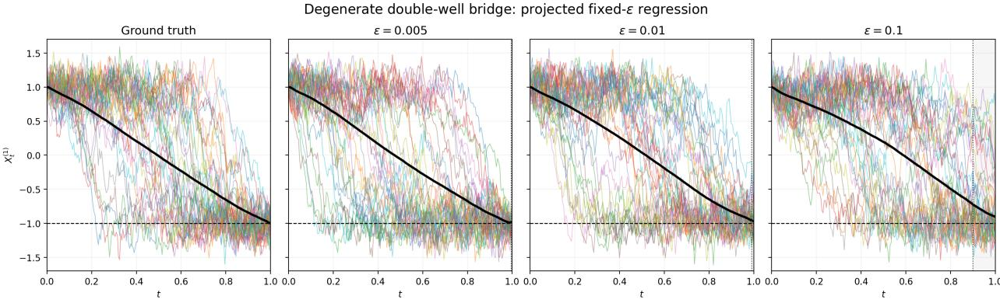
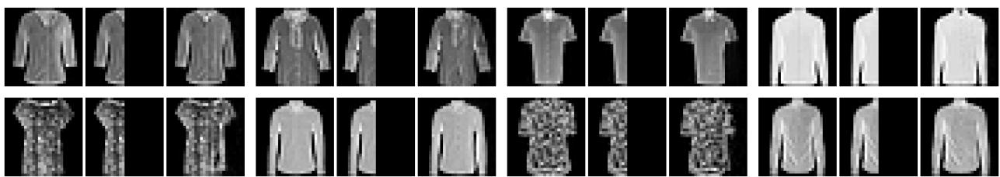

# Conditioning Degenerate Difusion Models

U˘gur Aydın & Tamer Ba¸sar

Department of Electrical and Computer Engineering and Coordinated Science Laboratory University of Illinois Urbana Champaign Illinois, IL 61801, USA {uaydin2, basar1}@illinois.edu

## Abstract

Current conditioned generative models heavily rely on score functions for guidance during training. When the generative model is a difusion process with a singular difusion coeficient and the underlying (conditional) densities either do not exist or are not smooth, we use causal optimal transport to define approximate loss functions that identify a minimum-entropy control for guidance under minimal assumptions. Our approach relies on causal optimal transport and its characterization through the predictable representation property of (conditioned) difusion processes whose associated martingale problem is well posed, \`a la Ust¨unel.¨

## 1 Introduction

Conditioned difusion processes appear in physical chemistry Bolhuis et al. (2002), genetics Wang et al. (2011), economics Elerian et al. (2001), and guided generative models Zhang et al. (2023); Domingo i Enrich et al. (2025). In practice, a common feature of these problems is that the conditioned process must be constructed from data generated by an unconditioned process $X =$ $( X _ { t } ) _ { 0 \leq t \leq T }$ together with a terminal condition Baudoin (2002); Tzen & Raginsky (2019); Pidstrigach et al. (2025). Hence, at time t, the available data are the state history and the condition.

In particular, consider an n-dimensional stochastic diferential equation (SDE) of the form

$$
d X _ { t } = b ( t , X _ { t } ) d t + \sigma ( t , X _ { t } ) d B _ { t } , \qquad X _ { 0 } = \eta ,\tag{1}
$$

where B is a d-dimensional Brownian motion, and a terminal condition $Y = G ( X _ { T } )$ , where $G :$ $\mathbb { R } ^ { n } \to \mathbb { R } ^ { k }$ and η is potentially a random variable. Degeneracy refers to the case in which $\sigma ( t , x ) \in$ $\mathbb { R } ^ { n \times d }$ does not have full rank (which can be also extended to the case where the corresponding Malliavin covariance operator is also singular). When the conditional likelihood is suficiently smooth, the Doob h-transform identifies a controlled equation

$$
\begin{array} { r } { d X _ { t } ^ { u } = \big ( b ( t , X _ { t } ^ { u } ) + \sigma ( t , X _ { t } ^ { u } ) u _ { t } ( X _ { t } ^ { u } , y ) \big ) d t + \sigma ( t , X _ { t } ^ { u } ) d B _ { t } , \qquad X _ { 0 } ^ { u } \sim \mathcal { L } ( \eta \mid Y = y ) , } \end{array}\tag{2}
$$

whose state-path law agrees with $\mathcal { L } ( X _ { [ 0 , T ] } \ | \ Y = y )$ Pidstrigach et al. (2025); Tzen & Raginsky (2019). If $Z _ { t } ^ { y } = h _ { t } ( X _ { t } ; y )$ is a smooth conditional likelihood, then the Brownian-space shift is $u _ { t } = \sigma ( t , X _ { t } ) ^ { \top } \nabla _ { x } \log h _ { t } ( X _ { t } ; y )$ , and the added state drift is $\sigma u = \sigma \sigma ^ { \top } \nabla _ { x } \log h$ . This shift is the F¨ollmer drift of the corresponding Brownian realization, and it is characterized by a minimumentropy property Lassalle (2018), which also has connections with causal optimal transport.

When σ is not invertible, this problem is considerably more dificult than in the invertible case. First, the filtration ${ \mathcal { F } } ( X )$ need not coincide with that of the driving (ambient) Brownian motion B.

As suggested by the notation, we require the control $( u _ { t } ( X _ { t } ) ) _ { t }$ to be ${ \mathcal { F } } ( X )$ -adapted, i.e. a closed-loop control. This is important because adaptiveness of u to the path of $X ^ { u }$ is crucial for the controlled SDE equation 2 to remain closed-loop; otherwise, its implementation would require information external to ${ \mathcal { F } } ( X ) \vee \sigma ( Y )$ generated from equation 1. Furthermore, when $G$ is the identity map, as is the case, for instance, when equation 1 is used as a bridge model, the corresponding conditional law at the terminal time is a Dirac measure and is therefore singular rather than smooth.

## 2 Related Work and Contributions

## 2.1 Related Work

In this work, we introduce loss functions that yield a control u such that X and $X ^ { u }$ , introduced in equation 1 and equation 2, respectively, have the same law. This result relies on the adapted representation property of SDEs satisfying weak uniqueness Ust¨unel (2019), which was first estab-¨ lished in Stroock & Yor (1980); see also Elworthy et al. (2010) for a special case on Riemannian manifolds. Using this property, Ust¨unel (2019) also characterized the associated causal optimal¨ transport problem. We use these results to derive a closed-loop variant of the so-called F¨ollmer drift $( u _ { t } )$ t under minimal conditions, which has minimum energy among the admissible shifts (that satisfy Girsanov’s theorem). Moreover, through a localization argument, we relax the strict positivity condition imposed in Ust¨unel (2019) in their treatment of the causal optimal transport¨ problem.

With the advancements of generative models, there has been recent interest on the behavior of degenerate difusion models. The works Dockhorn et al. (2021); Blessing et al. (2025) study bridge models under degeneracy when the densities are suficiently smooth. A theory for manifold based generative models has been developed in De Bortoli (2022); De Bortoli et al. (2022), which are inherently degenerate and satisfy less restrictive smoothness conditions on the corresponding densities compared to their Euclidean variants.

In the presence of degeneracy or non-smooth densities, recently Malliavin calculus based approaches have been used Pidstrigach et al. (2025); Mirafzali et al. (2025). However, Malliavin calculus based approaches still require suficient smoothness and regularity (as in non-degeneracy of the corresponding Malliavin covariance operator) of b and σ. Several diferent approaches have also appeared Conforti et al. (2025); Blessing et al. (2025). However, all these works either assume that $\mathcal { L } ( X _ { t } | Y = y )$ is continuously diferentiable, or suppose that b and $\sigma$ are suficiently smooth/regular.

## 2.2 Contributions

Our contributions in this paper are summarized as follows.

1. We extend the predictable-representation result for degenerate difusions in Ust¨unel (2019)¨ to random initializations.

2. In Section 4, we introduce local regression losses that do not require an ambient density or score. Under local square integrability of the conditional Radon–Nikodym derivative and a state-feedback factorization, the corresponding minimizer is the unique minimum-energy Brownian perturbation.

3. We present this loss function as a solution of a control problem (Subsection 5.1). Our loss functions depend on choosing suficient increments of the data, say ε. To demonstrate the performance of our loss function under diferent $\varepsilon ,$ in Subsection $5 . 2$ we provide a numerical experiment. We also provide an application to an image generation problem in Subsection 5.3.

## 3 Notation

For a process X, we let $\mathcal { F } _ { t } ^ { 0 } ( X ) : = \sigma \{ X _ { s } : 0 \leq s \leq t \}$ and let $\mathcal { F } _ { t } ( X )$ denote its usual P-augmentation. For another probability measure $\mathbb { Q } , \mathcal { F } _ { t } ^ { \mathbb { Q } } ( X )$ denotes the corresponding Q-augmentation. The ambient filtration is denoted by $( { \mathcal { G } } _ { t } ) _ { t \leq T }$ . For a measure $\mathbb { Q }$ and a σ-field $\mathcal { H } , \mathbb { Q } | _ { \mathcal { H } }$ denotes restriction to $\mathcal { H }$ . We write ${ \mathcal { L } } _ { \mathbb { Q } } ( U )$ for the law of $U$ under $\mathbb { Q }$ and $D _ { \mathrm { K L } } ( \mathbb { Q } \backslash \lvert \mathbb { P } )$ for relative entropy. The space $L _ { a } ^ { 2 } ( \mathcal { F } ( X ) , \mathbb { Q } ; \mathbb { R } ^ { d } )$ consists of ${ \mathcal { F } } ( X )$ -predictable processes v such that $\begin{array} { r } { \mathbb { E } ^ { \mathbb { Q } } \int _ { 0 } ^ { T } | v _ { t } | ^ { 2 } d t < \infty } \end{array}$ . The notation $L _ { a } ^ { 2 } ( [ 0 , r ] , \mathcal { F } ( X ) , \mathbb { Q } ; \mathbb { R } ^ { d } )$ uses the same definition with the integral restricted to $[ 0 , r ]$ , and $L _ { a , \mathrm { l o c } } ^ { 2 } ( [ 0 , T ) , \mathcal { F } ( X ) , \mathbb { Q } ; \mathbb { R } ^ { d } )$ means that this condition holds on every interval $[ 0 , r ]$ with $r < T$ . The symbol $A ^ { \dagger }$ denotes the Moore–Penrose pseudoinverse and $\Vert A \Vert _ { \mathrm { F } }$ the Frobenius norm. Given a matrix valued curve $a : [ 0 , T ]  \mathbb { R } ^ { n \times d }$ , we use

$$
\widetilde \Pi ( t , a ) : = \Pi ( a ( t ) ) : = a ( t ) ^ { \top } \big ( a ( t ) a ^ { \top } ( t ) \big ) ^ { \dagger } a ( t ) , \qquad P _ { t } ( \boldsymbol X ) : = \widetilde \Pi ( t , \sigma ( \cdot , \boldsymbol X . ) ) = \Pi ( \sigma ( t , \boldsymbol X _ { t } ) ) ,
$$

i.e., $\Pi ( a ( t ) )$ is the orthogonal projection onto $\mathrm { R a n } ( a ( t ) ^ { \top } ) = ( \ker a ( t ) ) ^ { \perp }$ ; hence $P _ { t } ( X )$ is an orthogonal projection onto Ran $( \sigma ( t , X _ { t } ) ^ { \top } ) = ( \ker \sigma ( t , X _ { t } ) ) ^ { \perp }$ . All process equalities are understood up to the product measure explicitly specified in the statement.

## 4 Loss Functions for Degenerate Conditioned Difusions

In this section, we introduce our main regression formulae and explain how they can be used as population losses. The predictable-representation and minimum-energy arguments are given in Section 6, and the detailed proofs are deferred to the appendix.

Assumption 1 (Regularity and well-posedness). On a complete filtered probability space $( \Omega , { \mathcal { F } } , ( { \mathcal { G } } _ { t } ) _ { t \leq T } , \mathbb { P } )$ satisfying the usual conditions, B is a d-dimensional $\left( \mathcal { G } _ { t } \right) - B$ rownian motion and $X _ { 0 }$ is G -measurable. Equation 1 has a pathwise-continuous strong solution that is unique up to indistinguishability. The maps $b : [ 0 , T ] \times \mathbb { R } ^ { n } \to \mathbb { R } ^ { n }$ and $\sigma : [ 0 , T ] \times \mathbb { R } ^ { n }  \mathbb { R } ^ { n \times d }$ are bounded and Borel measurable. If $\mu _ { 0 } = \mathscr { L } _ { \mathbb { P } } ( X _ { 0 } )$ , then for $\mu _ { 0 } - a . e .$ . x the equation started from x has a weak solution that is unique in law. A regular conditional family $( \mathbb { P } _ { x } ) _ { x \in \mathbb { R } ^ { n } }$ of $\mathbb { P }$ given $X _ { 0 }$ exists.

Global Lipschitz continuity in the state variable together with linear growth is a standard suficient condition for strong well-posedness for SDEs. Boundedness is used below only for simple integrability estimates and can be replaced by corresponding localized moment assumptions. We only use pathwise uniqueness for the minimum entropy property of the adapted shift.

Assumption 2 (Regularity of conditional density). Let $\mathbb { P } ^ { y } : = \mathbb { P } ( \cdot \mid Y = y )$ be a regular conditional probability. For $\mathcal { L } _ { \mathbb { P } } ( Y ) _ { - a . e }$ . y and every $t < T$

$$
\mathbb { P } ^ { y } | _ { \mathcal { F } _ { t } ( X ) } \ll \mathbb { P } | _ { \mathcal { F } _ { t } ( X ) } , \qquad Z _ { t } ^ { y } ( X ) : = \frac { d ( \mathbb { P } ^ { y } | _ { \mathcal { F } _ { t } ( X ) } ) } { d ( \mathbb { P } | _ { \mathcal { F } _ { t } ( X ) } ) } \in L ^ { 2 } ( \mathcal { F } _ { t } ( X ) , \mathbb { P } ) .
$$

When $y$ is fixed, we suppress the superscript and write $Z _ { t } ( X )$ for $Z _ { t } ^ { y } ( X )$ . The only restrictve condition that is used in this work is the square integrability of the process $Z ^ { y }$ , which is needed to apply the martingale representation theorem.

Remark 1 (Square integrability and entropy). The $L ^ { 2 } ( \mathbb { P } )$ condition is used to invoke the predictablerepresentation theorem, which is the primary additional restriction in our work. Since $f o r \ x > 0$ it holds that x log $x \leq C ( 1 { + } x ^ { 2 } )$ , Assumption 2 also implies that we have finite entropy: $\mathbb { E } ^ { \mathbb { P } } [ Z _ { t } ^ { y }$ log $Z _ { t } ^ { y } ] <$ ∞ for every $t < T$

Assumption 3. There exists a Borel measurable function G such that $Y = G ( X _ { T } )$ and solutions of equation 1 are Markov processes.

Remark 2. We need Assumpton 3 to have loss functions that rely on $( X _ { t } , Y )$ at time t rather than $( X _ { [ 0 , t ] } , Y )$ , where $X _ { [ 0 , t ] }$ denotes the whole trajectory of the process X up to time t.

For the rest of this section, Assumptions 1, 2, and 3 are in force.

Theorem 1 (Degenerate Tweedie formula-1). For $\mathcal { L } _ { \mathbb { P } } ( Y ) _ { - a . e . }$ . y and every $r < T$ , there is a unique realized process $u ( \cdot , X . , y ) \in L _ { a , \mathrm { l o c } } ^ { 2 } ( [ 0 , T ) , \mathcal { F } ( X ) , \mathbb { P } ^ { y } ; \mathbb { R } ^ { d } )$ satisfying

$$
u _ { t } ( X _ { t } , y ) = \operatorname* { l i m } _ { \varepsilon \downarrow 0 } \mathbb { E } ^ { \mathbb { P } ^ { y } } \left[ \frac { 1 } { \varepsilon } \int _ { t } ^ { t + \varepsilon } P _ { s } ( X ) d B _ { s } \bigg | X _ { t } \right] = \operatorname* { l i m } _ { \varepsilon \downarrow 0 } \mathbb { E } ^ { \mathbb { P } } \left[ \frac { 1 } { \varepsilon } \int _ { t } ^ { t + \varepsilon } P _ { s } ( X ) d B _ { s } \bigg | X _ { t } , Y = y \right]\tag{3}
$$

where both limits are in $L ^ { 2 } ( [ 0 , r ] \times \Omega , d t \otimes d \mathbb { P } ^ { y } )$ . Moreover, $P _ { t } ( X ) u _ { t } ( X _ { t } , y ) = u _ { t } ( X _ { t } , y )$ dt $\otimes d ^ { \mathbb { P } ^ { y } - a . e }$ There is a canonical weak realization of equation 2 whose state-path law on $[ 0 , r ]$ is $\mathcal { L } _ { \mathbb { P } } ( X _ { [ 0 , r ] } \mid Y =$ y). Among the admissible Brownian perturbations, u uniquely minimizes $\begin{array} { r } { \mathbb { E } ^ { \mathbb { Q } } \int _ { 0 } ^ { r } | v _ { t } | ^ { 2 } d t } \end{array}$

Remark 3 (Independent simulation). The proof relies on Girsanov theorem, which proves existence of a canonical weak controlled solution with the desired law. If the controlled equation 2 is weakly unique, then every weak solution of that equation has the same law. Weak uniqueness of the original equation alone does not imply weak uniqueness after adding a merely measurable control.

Corollary 1 (Degenerate Tweedie formula-2). Equation 3 can also be written as

$$
u _ { t } ( X _ { t } , y ) = \operatorname* { l i m } _ { \varepsilon \downarrow 0 } \mathbb { E } ^ { \mathbb { P } } \left[ \left. \frac { B _ { t + \varepsilon } - B _ { t } } { \varepsilon } \right| X _ { t } \right] = \operatorname* { l i m } _ { \varepsilon \downarrow 0 } \mathbb { E } ^ { \mathbb { P } } \left[ \left. \frac { B _ { t + \varepsilon } - B _ { t } } { \varepsilon } \right| X _ { t } , Y = y \right] .\tag{4}
$$

A Girsanov shift changes the state drift only through σu. A component of u in ker σ would therefore leave the state law unchanged while increasing its energy. The minimum-energy control must consequently satisfy $P _ { t } ( X ) u _ { t } ~ = ~ u _ { t }$ Corollary 1 is useful in simulation because the raw Brownian increments are already available and no numerical projection is required.

If only the state trajectory of X and the condition Y are observed, one can instead learn the induced state-space drift.

Theorem 2 (Degenerate Tweedie formula-3). Let $u _ { t } ( X _ { t } , y )$ be the control obtained from equation 3. Then, for every $r < T$

$$
\sigma ( t , X _ { t } ) u _ { t } ( X _ { t } , y ) = \operatorname* { l i m } _ { \varepsilon \downarrow 0 } \mathbb { E } ^ { \mathbb { P } ^ { y } } \left[ \frac { X _ { t + \varepsilon } - X _ { t } } { \varepsilon } - b ( t , X _ { t } ) \bigg | X _ { t } \right]\tag{5}
$$

exists in $L ^ { 2 } \big ( [ 0 , r ] \times \Omega , d t \otimes d \mathbb { P } ^ { y } \big )$

Under the conditioned measure $\mathbb { P } ^ { y }$ , enlarging the information by Y changes the semimartingale decomposition of X. The predictable-representation result below (Theorem 4) identifies the new finite-variation term as σu and rules out an additional orthogonal martingale contribution.

Although σu does not identify an arbitrary Brownian control modulo ker $\sigma ,$ it does identify the canonical control. Indeed,

$$
\sigma ( t , X _ { t } ) ^ { \dagger } \sigma ( t , X _ { t } ) u _ { t } = P _ { t } ( X ) u _ { t } = u _ { t } ,
$$

where $\sigma ^ { \dagger } = \sigma ^ { \top } ( \sigma \sigma ^ { \top } ) ^ { \dagger }$ . Hence, the state-space loss recovers u through the Moore–Penrose inverse even when σ is noninjective.

The next corollary recovers the classical Tweedie formula when it is available. Notice that the preceding recovery of the control does not recover the entire Brownian path. In a degenerate model, B cannot generally be reconstructed from $\begin{array} { r } { \int _ { 0 } ^ { \cdot } \sigma ( s , X _ { s } ) d B _ { s } } \end{array}$ . The missing kernel component is irrelevant to the minimum-energy control and to the controlled state equation 2.

Corollary 2. Suppose that $Z _ { t } ^ { y } = h ( t , X _ { t } ; y )$ with $h > 0$ , and that h admits the Itˆo martingale diferential

$$
d h ( t , X _ { t } ; y ) = \smash { \Big \langle \sigma ( t , X _ { t } ) ^ { \top } \nabla _ { x } h ( t , X _ { t } ; y ) , d B _ { t } \Big \rangle } ;
$$

for example, this holds for a $C ^ { 1 , 2 }$ solution of the corresponding backward equation. $T h e n ,$

$$
u _ { t } ( X _ { t } , y ) = \sigma ( t , X _ { t } ) ^ { \top } \nabla _ { x } \log h ( t , X _ { t } ; y ) \quad d t \otimes d \mathbb { P } ^ { y } - a . e .
$$

The desired control u can be approximated by the following local regression problem.

Proposition 1. Fix $r < T$ and $0 < \varepsilon < T - r$ . The problem

$$
\operatorname* { i n f } _ { \substack { v \in L _ { a } ^ { 2 } ( \mathcal { F } ( X ) , d t \otimes d \mathbb { P } ^ { y } ; \mathbb { R } ^ { d } ) } } \mathbb { E } ^ { \mathbb { P } ^ { y } } \int _ { 0 } ^ { r } \left| v _ { t } - \frac { 1 } { \varepsilon } \int _ { t } ^ { t + \varepsilon } P _ { s } ( X ) d B _ { s } \right| ^ { 2 } d t .\tag{6}
$$

has the unique minimizer given by the product-space conditional expectation that satisfies

$$
u _ { \varepsilon } ( t , X _ { t } , y ) = \mathbb { E } ^ { \mathbb { P } ^ { y } } \left[ \frac { 1 } { \varepsilon } \int _ { t } ^ { t + \varepsilon } P _ { s } ( X ) d B _ { s } \bigg | X _ { t } \right] \quad d t \otimes d \mathbb { P } ^ { y } \cdot a . e .
$$

Moreover, $u _ { \varepsilon } ^ { * } \to u ( \cdot , X . , y )$ in $L ^ { 2 } ( [ 0 , r ] \times \Omega , d t \otimes d \mathbb { P } ^ { y } )$

Proof. Conditional expectation is the orthogonal projection onto the closed product-space subspace $L _ { a } ^ { 2 } ( \mathcal { F } ( X ) , d t \otimes d \mathbb { P } ^ { y } ; \mathbb { R } ^ { d } )$ . The convergence is from Theorem 1. □

Remark 4. Analogous projection statements hold for Corollary 1 and Theorem 2. Replacing the targets $S _ { t _ { j } } ^ { i }$ in Algorithm 1 leads to the corresponding algorithms.

In Algorithm 1 we adapt (Pidstrigach et al., 2025, Algorithm 1) to the degenerate setting under our loss functions.

For example, for an overparameterized ReLU parametrization with finite-dimensional separated inputs, vanishing finite-sample optimization error can be justified under the random-initialization, width, data-separation, and learning-rate conditions of Allen-Zhu et al. (2019), which are suficient to establish convergence of the algorithm considered in Tzen & Raginsky (2019). In particular, Allen-Zhu et al. (2019) establish linear convergence of gradient descent and stochastic gradient descent for $\ell _ { 2 }$ regression. When these specific conditions are not imposed, we retain vanishing optimization error as an explicit assumption. We discuss the corresponding implementation details in Appendix G. We emphasize, however, that the regression step equation 8 must in practice be approximated using a neural network.

Algorithm 1 Training with equation 6   
Require: SDE equation 1, batch size N, current control approximation $u ^ { \theta } .$ , uniform grid $t _ { k } = k h$   
window $\varepsilon = q h$ , and $r < T - \varepsilon$   
1: for $i = 1$ to N do   
2: Sample a path $X ^ { i }$ and its corresponding Brownian path $B ^ { i }$ from equation 1.   
3: Compute the corresponding condition $Y ^ { i } = G ( X _ { T } ^ { i } )$   
4: For every $t _ { j } \leq r _ { : }$ compute the discrete projected-noise target   
$S _ { t _ { j } } ^ { i } = \frac { 1 } { q h } \sum _ { k = j } ^ { j + q - 1 } P _ { t _ { k } } ( X ^ { i } ) \big ( B _ { t _ { k + 1 } } ^ { i } - B _ { t _ { k } } ^ { i } \big ) .$ (7)   
5: Calculate the single-path loss   
$\ell _ { i } ( \theta ) = h \sum _ { \{ j : t _ { j } \leq r \} } \left\| u _ { t _ { j } } ^ { \theta } ( X _ { t _ { j } } ^ { i } , Y ^ { i } ) - S _ { t _ { j } } ^ { i } \right\| ^ { 2 } .$ (8)   
6: end for   
7: Calculate the Monte Carlo full-batch loss   
$\mathcal { L } ^ { N } ( \theta ) = \frac { 1 } { N } \sum _ { i = 1 } ^ { N } \ell _ { i } ( \theta ) .$   
8: Take a gradient step on $\mathcal { L } ^ { N } ( \theta )$

## 5 Applications

## 5.1 A Stochastic Control Problem

The variational formula of Bou´e & Dupuis (1998) is interpreted in Tzen & Raginsky (2019) as a stochastic control problem with a quadratic running cost. This control problem approach has been used in the generative model for conditioning in recent works, for instance, see Domingo i Enrich et al. (2025). We next extend this interpretation to the degenerate setting. The statement is informal; Theorem 10 in Appendix D gives the precise version for an arbitrary target endpoint law.

Theorem 3 (Informal). Suppose that $X _ { 0 } = x _ { 0 }$ is deterministic, and let

$$
z _ { r } ^ { y } : = \frac { d \mathcal { L } _ { \mathbb { P } } ( X _ { r } \mid Y = y ) } { d \mathcal { L } _ { \mathbb { P } } ( X _ { r } ) } .
$$

Define the endpoint density process and its control by

$$
Z _ { t } ^ { y , r } : = \mathbb { E } ^ { \mathbb { P } } [ z _ { r } ^ { y } ( X _ { r } ) \mid \mathcal { F } _ { t } ( X ) ] = 1 + \int _ { 0 } ^ { t } \langle \xi _ { s } ^ { y , r } , d B _ { s } \rangle , \qquad u _ { t } ^ { y , r } : = \frac { \xi _ { t } ^ { y , r } } { Z _ { t } ^ { y , r } } \quad o n \ \{ Z _ { t } ^ { y , r } > 0 \} .
$$

Consider

$$
V ( r , y ) : = \operatorname* { i n f } _ { ( \mathbb { Q } , v ) } \mathbb { E } ^ { \mathbb { Q } } \left[ \frac { 1 } { 2 } \int _ { 0 } ^ { r } | v _ { t } | ^ { 2 } d t - \log z _ { r } ^ { y } ( X _ { r } ) \right] ,\tag{9}
$$

Then, $V ( r , y ) = 0$ . The endpoint control $u ^ { y , r }$ is the unique minimizer in the admissible one-sided Girsanov class, and its canonical measure $\mathbb { Q } ^ { y , r }$ satisfies

$$
\mathscr { L } _ { \mathbb { Q } ^ { y , r } } ( X _ { r } ) = \mathscr { L } _ { \mathbb { P } } ( X _ { r } \mid Y = y ) .
$$

Among all admissible Brownian perturbations realizing this conditional terminal law, $u ^ { y , r }$ is the unique minimum-energy perturbation:

$$
\frac { 1 } { 2 } \mathbb { E } ^ { \mathbb { Q } ^ { y , r } } \int _ { 0 } ^ { r } | u _ { t } ^ { y , r } | ^ { 2 } d t = \operatorname* { i n f } _ { ( \mathbb { Q } , v ) : } \frac { 1 } { 2 } \mathbb { E } ^ { \mathbb { Q } } \int _ { 0 } ^ { r } | v _ { t } | ^ { 2 } d t .
$$

## 5.2 Degenerate Nonlinear Difusion

We consider the nonlinear difusion

$$
d X _ { t } = b \left( X _ { t } \right) d t + \sigma d B _ { t } , \qquad X _ { 0 } = ( 1 , 0 , 0 . 4 ) ^ { \top } , \qquad Y = X _ { T } ^ { ( 1 ) } ,\tag{10}
$$

where $B _ { t }$ is a standard three-dimensional Brownian motion and

$$
b ( x ) = \left( \begin{array} { c c } { { 2 0 x _ { 1 } ( 1 - x _ { 1 } ^ { 2 } ) } } \\ { { - x _ { 2 } + 0 . 3 5 x _ { 1 } } } \\ { { - 0 . 8 x _ { 3 } } } \end{array} \right) , \qquad \sigma = \left( \begin{array} { c c c } { { 1 } } & { { 1 } } & { { 1 } } \\ { { 0 } } & { { 1 } } & { { 2 } } \\ { { 0 } } & { { 2 } } & { { 4 } } \end{array} \right) .\tag{11}
$$

Since rank $( \sigma ) \ : = \ : 2 \ : < \ : 3$ , the instantaneous covariance $\sigma \sigma ^ { \top } \ = \ \left( { \begin{array} { c c c } { 3 } & { 3 } & { 6 } \\ { 3 } & { 5 } & { 1 0 } \\ { 6 } & { 1 0 } & { 2 0 } \end{array} } \right)$ is singular. The

corresponding projection to $\mathrm { R a n } ( \sigma ^ { \top } )$ is $P = \sigma ^ { \dag } \sigma = \left( \begin{array} { c c c } { { 5 / 6 } } & { { 1 / 3 } } & { { - 1 / 6 } } \\ { { 1 / 3 } } & { { 1 / 3 } } & { { 1 / 3 } } \\ { { - 1 / 6 } } & { { 1 / 3 } } & { { 5 / 6 } } \end{array} \right)$

For each $\varepsilon \in \{ 0 . 0 0 5 , 0 . 0 1 , 0 . 1 \}$ , we train a separate control using the fixed-ε loss

$$
\mathcal { L } _ { \varepsilon } ( \theta ) = \mathbb { E } \left[ \left. P u _ { \theta } ( t , X _ { t } , Y ) - P \frac { B _ { t + \varepsilon } - B _ { t } } { \varepsilon } \right. ^ { 2 } \right] .\tag{12}
$$

The training pool contains 80,000 independent reference trajectories. Each model is trained for 20,000 Adam updates with batch size 2048.

At evaluation time, we impose the terminal condition $Y = - 1$ and simulate

$$
d \widehat { X } _ { t } = \left[ b ( \widehat { X } _ { t } ) + \sigma P u _ { \theta } ( t , \widehat { X } _ { t } , - 1 ) \right] d t + \sigma d B _ { t } ,\tag{13}
$$

where $P u _ { \theta }$ is obtained from equation 12 through a neural network Tzen & Raginsky (2019). Because $X _ { t } ^ { ( 1 ) }$ is autonomous, the ground-truth can be computed from the one-dimensional backward Kolmogorov equation. Writing

$$
h ( t , x _ { 1 } ) = p \Big ( X _ { T } ^ { ( 1 ) } = - 1 \Big | X _ { t } ^ { ( 1 ) } = x _ { 1 } \Big ) ,\tag{14}
$$

the corresponding backward Kolmogorov equation has difusion term $\frac { 3 } { 2 } \partial _ { x _ { 1 } x _ { 1 } } h$ . The exact Brownianspace bridge control is

$$
\begin{array} { r } { \boldsymbol { u } ^ { \star } ( t , x ) = \boldsymbol { \sigma } ^ { \top } \nabla _ { x } \log h ( t , x _ { 1 } ) = \left( \begin{array} { l } { \partial _ { x _ { 1 } } \log h ( t , x _ { 1 } ) } \\ { \partial _ { x _ { 1 } } \log h ( t , x _ { 1 } ) } \\ { \partial _ { x _ { 1 } } \log h ( t , x _ { 1 } ) } \end{array} \right) , } \end{array}\tag{15}
$$

  
Figure 1: Sample paths from the numerical ground-truth Doob bridge and from the learned controls with $\varepsilon = 0 . 0 0 5 , \varepsilon = 0 . 0 1$ , and $\varepsilon = 0 . 1$ . Thin curves represent individual trajectories, the bold black curve is the empirical mean, and the horizontal dashed line denotes the terminal target $X _ { T } ^ { ( 1 ) } = - 1$

and the corresponding state-space drift correction is

$$
\begin{array} { r } { \sigma u ^ { \star } ( t , x ) = ( 3 , 3 , 6 ) ^ { \top } \partial _ { x _ { 1 } } \log h ( t , x _ { 1 } ) , } \end{array}\tag{16}
$$

which we use to compare our empirical results against the ground-truth. We evaluate each method using 15,000 independently simulated trajectories. Sample trajectories obtained from this experiment can be seen on Figure 1.

## 5.3 Conditioned Image Generation

We next give a proof-of-concept application to image inpainting. In contrast to Algorithm 1, the terminal samples in this experiment are drawn from an empirical data law rather than from the terminal law of the reference SDE. Our implementation of this experiment closely follows the one in Baker et al. (2024).

Degenerate models are natural when the variability relevant to the conditioning task is intrinsically lower-dimensional Li & He (2026). For example, in an inpainting problem in which only a localized feature is missing, one can use the accessible directions of the difusion to represent the variability of the missing region while conditioning on the observed context.

In our numerical illustration, we train on the Shirt class of Fashion-MNIST Xiao et al. (2017), condition on the left half of a $2 8 \times 2 8$ image, and generate its missing right half. The forward model is

$$
d X _ { t } = A S d B _ { t } , \qquad X _ { 0 } = x _ { 0 } ,
$$

where the deterministic $x _ { 0 }$ is the empirical training mean, A embeds the accessible latent directions into the image space, and $S$ rescales these directions according to their empirical standard deviations. The latent coordinates comprise the 392 whitened visible pixels and 256 whitened principal components of the hidden half. Before training, each hidden half is projected onto these retained principal components, so the reconstructed terminal target lies in the afine support of the model. Hence, the accessible dimension is $6 4 8 < 7 8 4$ , and thus every generated path remains on a fixed afine subspace and no ambient image-space density or score is required.

  
Figure 2: Conditioned image-generation results for eight held-out examples. First column is the ground truth, the second column is the given condition, and the last column is the generated image. The SDE we used for conditioned model is degenerate, cannot be “time-reverted” via the methods used in the existing literature and $\nabla _ { x }$ log $p ( Y = y | X _ { t } = x )$ , and $\sigma ^ { - 1 }$ do not exist.

Let $\nu _ { T }$ be the empirical law of the projected terminal images. We first sample a target $E \sim \nu _ { T }$ and then sample an additive Gaussian bridge from $x _ { 0 }$ to $E .$ This defines a bridge-mixture law $\mathbb { R } ^ { \nu _ { T } }$ it is not the reference law of $d X _ { t } = A S d B _ { t }$ . Although $\nu _ { T }$ is atomic and singular at $T _ { i }$ , for every observed condition $y$ and every $r < T$ , the conditional bridge-mixture marginal $\nu _ { r } ^ { y } = \mathcal { L } _ { \mathbb { R } ^ { \nu _ { T } } } ( X _ { r } \mid$ $Y = y )$ is absolutely continuous with respect to the reference marginal $\mu _ { r }$

The regression expectation in this experiment is taken under $\mathbb { R } ^ { \nu _ { T } }$ , not under the reference path law P. We use the finite target $\frac { B _ { t + \varepsilon } - B _ { t } } { \varepsilon } ,$ . This choice does not send ε to zero.

Since the difusion is supported on a 648-dimensional afine subspace of the 784-dimensional image space, $X _ { t }$ is singular with respect to the ambient Lebesgue measure and there is no canonical ambient Lebesgue score $\nabla _ { x }$ log $p _ { t } ( x )$ . Our construction requires neither such a score nor a smooth ambient extension of the conditional likelihood. Since the left half of the terminal image is observed, its corresponding control is available analytically. A small U-Net therefore learns only the unknown hidden component. We train its parameters using AdamW. Its inputs are the current decoded image, the observed left half, the inpainting mask, and time, and its image-shaped output is mapped onto the retained PCA coordinates of the hidden half.

At generation time, an exponential moving average of the trained network repeatedly predicts the hidden control. Each Euler–Maruyama step combines the predicted control with a new Gaussian increment in the accessible coordinates and decodes the updated coordinates back into image space. The time grid is refined near the terminal time, producing multiple right-half completions consistent with the supplied left half. Results are shown in Figure 2.

## 6 Predictable Representation Property and Causal Optimal Transport

The loss functions we derived rely on the predictable representation property of difusion processes when the corresponding martingale problem is well-posed. To derive those loss functions, we extend the martingale representation result of Ust¨unel (2019) to a random initialization in the conditioned¨ setting. Related constant-rank results for manifold-valued difusions appear in Elworthy et al. (2010). However, when the rank is not constant, the associated geometric distributions need not retain the same smoothness; see (Lee, 2013, Theorem 10.34) and (Elworthy et al., 2010, Subsection 9.2).

Theorem 4. Let $( X , B )$ be a weak solution of equation 1 on a complete filtered probability space and b, and σ have linear growth, where B is a (Gt)-Brownian motion and $X _ { 0 }$ is $\mathcal { G } _ { 0 }$ -measurable. Let $\mu _ { 0 } = \mathscr { L } _ { \mathbb { P } } ( X _ { 0 } )$ , and suppose that for µ0-a.e. x equation 1 with $X _ { 0 } = x$ has a weak solution that is unique in law. Then, every $F \in L ^ { 2 } ( \mathcal { F } _ { T } ( X ) , \mathbb { P } ; \mathbb { R } )$ has a representation

$$
F = \mathbb { E } ^ { \mathbb { P } } [ F \mid X _ { 0 } ] + \int _ { 0 } ^ { T } \langle H _ { s } , d B _ { s } \rangle ,\tag{17}
$$

for a unique $H \in L _ { a } ^ { 2 } ( \mathcal { F } ( X ) , \mathbb { P } ; \mathbb { R } ^ { d } )$ satisfying $P _ { t } ( X ) H _ { t } = H _ { t } ~ d t \otimes d \mathbb { P } \ – a . e .$ . Conversely, if $g ( X _ { 0 } ) \in$ $L ^ { 2 } ( \sigma ( X _ { 0 } ) , \mathbb { P } )$ and H has these properties, then $\begin{array} { r } { g ( X _ { 0 } ) + \int _ { 0 } ^ { T } \langle H _ { s } , d B _ { s } \rangle } \end{array}$ belongs to $L ^ { 2 } ( \mathcal { F } _ { T } ( X ) , \mathbb { P } ; \mathbb { R } )$

Proof. See Appendix C for a complete proof.

In particular, predictability and square integrability of the integrand is not suficient to ensure that $F$ is $\mathcal { F } _ { T } ( X )$ measurable. In our next result, we essentially show that the corresponding minimum entropy Brownian shifts therefore needs to be of the norm σu as in equation 2, which generalizes (Ust¨unel, 2019, Theorem 3) when the difusion has random initialization setting.¨

Theorem 5. Under the hypotheses of Theorem $^ { 4 , }$ let $\mathcal { H } _ { t } : = \sigma ( X _ { 0 } ) \vee \mathcal { F } _ { t } ( B )$ , with the usual augmentation, and suppose $F \in L ^ { 2 } ( \mathcal { H } _ { T } , \mathbb { P } ; \mathbb { R } )$ . Write

$$
F = \mathbb { E } ^ { \mathbb { P } } [ F \mid X _ { 0 } ] + \int _ { 0 } ^ { T } \langle \xi _ { s } , d B _ { s } \rangle ,\tag{18}
$$

where $\xi \in L _ { a } ^ { 2 } ( ( \mathcal { H } _ { t } ) _ { t \leq T } , \mathbb { P } ; \mathbb { R } ^ { d } )$ . Then,

$$
\mathbb { E } ^ { \mathbb { P } } [ F \mid { \mathcal F } _ { T } ( X ) ] = \mathbb { E } ^ { \mathbb { P } } [ F \mid X _ { 0 } ] + \int _ { 0 } ^ { T } \langle P _ { s } ( X ) \mathbb { E } ^ { \mathbb { P } } [ \xi _ { s } | { \mathcal F } _ { s } ( X ) ] , d B _ { s } \rangle .
$$

Proof. See Appendix C for a complete proof.

The representation in equation 18 is satisfied for any such F. Using this representation, we derive a nonsmooth analogue of the Doob h-transform and connect it to causal optimal transport Lassalle (2012, 2018). In particular, using Theorem $5 ,$ we present a method to approximate the corresponding minimum entropy shift. As shown in Corollary 2, this naturally generalizes the Doob h-transform while preserving the desired properties.

Theorem 6. Suppose that Assumptions 1–2 hold. Let the locally square-integrable integrand $\xi$ be defined by

$$
Z _ { t } ( X ) = Z _ { 0 } ( X ) + \int _ { 0 } ^ { t } \langle \xi _ { s } , d B _ { s } \rangle , \qquad P _ { s } ( X ) \xi _ { s } = \xi _ { s } ,
$$

which exists and is unique by Assumption 2 and Theorem $\it 4 .$ . Set $u _ { t } = \xi _ { t } / Z _ { t } ( X )$ on $\{ Z _ { t } ( X ) > 0 \}$ and define it arbitrarily on $\{ Z _ { t } ( X ) = 0 \}$ . Then, for every $r < T$ ,

$$
\operatorname* { l i m } _ { \varepsilon \downarrow 0 } \mathbb { E } ^ { \mathbb { P } ^ { y } } \left[ { \frac { 1 } { \varepsilon } } \int _ { t } ^ { t + \varepsilon } P _ { s } ( X ) d B _ { s } { \Big | } X _ { t } \right] = u _ { t } ( X _ { t } , y )\tag{19}
$$

in $L ^ { 2 } ( [ 0 , r ] \times \Omega , d t \otimes d \mathbb { P } ^ { y } )$

Proof. See Appendix C for a complete proof.

Our next result verifies the minimum-energy property without requiring $Z$ to be strictly positive under $d t \otimes d \mathbb { P }$ , which extends (Ust¨unel, 2019, Theorem¨ $7 )$ to our setting. In particular, we verify that the limit equation 19 has the minimum entropy property, as desired.

Theorem 7. Suppose that Assumptions 1–2 hold, fix $r \ < \ T _ { : }$ , and let $\xi$ be the local integrand from Lemma 2. Set $u _ { t } ~ = ~ \xi _ { t } / Z _ { t } ( X )$ on $\{ Z _ { t } ( X ) ~ > ~ 0 \}$ and $u _ { t } ~ = ~ 0$ otherwise. Define $H _ { 0 } ^ { y } : =$ $D _ { \mathrm { K L } } \big ( \mathbb { P } ^ { y } | _ { \mathcal { F } _ { 0 } ( X ) } \| \mathbb { P } | _ { \mathcal { F } _ { 0 } ( X ) } \big )$ . Let $\mathcal { A } _ { r } ^ { y }$ be the class of pairs (Q, v) such that $\mathbb { Q } \ll \mathbb { P }$ on $\mathcal { G } _ { r }$

$$
{ \frac { d ( \mathbb { Q } | _ { \mathcal { G } _ { 0 } } ) } { d ( \mathbb { P } | _ { \mathcal { G } _ { 0 } } ) } } = Z _ { 0 } ( X ) ,
$$

v is (Gt)-predictable, $\begin{array} { r } { B _ { t } ^ { \mathbb { Q } } : = B _ { t } - \int _ { 0 } ^ { t } v _ { s } } \end{array}$ ds is $\boldsymbol { a } _ { \mathit { \Pi } } ( \mathcal { G } _ { t } , \mathbb { Q } )$ -Brownian motion, $\begin{array} { r } { \mathbb { E } ^ { \mathbb { Q } } \int _ { 0 } ^ { r } | v _ { t } | ^ { 2 } d t < \infty } \end{array}$ , and

$$
D _ { \mathrm { K L } } ( \mathbb { Q } \| \mathbb { P } ) = H _ { 0 } ^ { y } + \frac { 1 } { 2 } \mathbb { E } ^ { \mathbb { Q } } \int _ { 0 } ^ { r } | v _ { t } | ^ { 2 } d t .
$$

For every $( \mathbb { Q } , v ) \in \mathcal { A } _ { r } ^ { y }$ whose corresponding controlled equation

$$
d X _ { t } = \bigl ( b ( t , X _ { t } ) + \sigma ( t , X _ { t } ) v _ { t } \bigr ) d t + \sigma ( t , X _ { t } ) d B _ { t } ^ { \mathbb { Q } }\tag{20}
$$

has state-path law $\mathcal { L } _ { \mathbb { P } } ( X _ { [ 0 , r ] } \mid Y = y )$ 2

$$
\mathbb { E } ^ { \mathbb { Q } } \int _ { 0 } ^ { r } | v _ { t } | ^ { 2 } d t \geq \mathbb { E } ^ { \mathbb { P } y } \int _ { 0 } ^ { r } | u _ { t } | ^ { 2 } d t .\tag{21}
$$

The canonical pair $( \mathbb { Q } ^ { y , r } , u )$ , defined by $d ( \mathbb { Q } ^ { y , r } | _ { \mathcal { G } _ { r } } ) / d ( \mathbb { P } | _ { \mathcal { G } _ { r } } ) = Z _ { r } ( X )$ , belongs to $\mathcal { A } _ { r } ^ { y }$ and attains equality. Equality holds for equation 21 if, and only if, $\mathbb { Q } = \mathbb { Q } ^ { y , r }$ and $v _ { t } = u _ { t } ~ d t \otimes d \mathbb { Q } ^ { y , r } { - a . e }$

Proof. See Appendix C for a complete proof.

Remark 5. The preceding theorem compares perturbations on the fixed ambient space and therefore does not require uniqueness of the controlled equation. Weak uniqueness of equation 2 is needed only to transfer the canonical law to every independently constructed controlled solution; see Remark 3. Assumption 3 is not needed for this energy comparison; it is imposed in the regression results only to express the path-adapted shift as a function of $( t , X _ { t } , y )$

## 7 Conclusion

In this work, we have introduced regression losses for computing minimum-entropy adapted shifts when the difusion is degenerate and the conditional law may be nonsmooth or singular. The construction uses the predictable representation property of the difusion and does not require an ambient score or an invertible difusion coeficient. Under mild conditions, we have demonstrated that the obtained controls satisfy the minimum-entropy in a class of “admissible controls”.

Extensions to manifold-valued and infinite-dimensional difusions are natural directions for future work.

## 8 Acknowledgments

Research of the authors was supported in part by the AFOSR Grant FA9550-24-1-0152.

## References

Zeyuan Allen-Zhu, Yuanzhi Li, and Zhao Song. A convergence theory for deep learning via overparameterization. In Proceedings of the 36th International Conference on Machine Learning, volume 97 of Proceedings of Machine Learning Research, pp. 242–252, 2019.

J¨urgen Amendinger. Martingale representation theorems for initially enlarged filtrations. Stochastic Processes and Their Applications, 89(1):101–116, 2000.

Elizabeth L Baker, Gefan Yang, Michael L Severinsen, Christy A Hipsley, and Stefan Sommer. Conditioning non-linear and infinite-dimensional difusion processes. In Advances in Neural Information Processing Systems, volume 37, pp. 10801–10826, 2024.

Fabrice Baudoin. Conditioned stochastic diferential equations: theory, examples and application to finance. Stochastic Process. Appl., 100:109–145, 2002.

Denis Blessing, Julius Berner, Lorenz Richter, and Gerhard Neumann. Underdamped difusion bridges with applications to sampling. In Y. Yue, A. Garg, N. Peng, F. Sha, and R. Yu (eds.), International Conference on Learning Representations, volume 2025, pp. 2970–3002, 2025.

Peter G Bolhuis, David Chandler, Christoph Dellago, and Phillip L Geissler. Transition path sampling: Throwing ropes over rough mountain passes, in the dark. Annual Review of Physical Chemistry, 53(1):291–318, 2002.

Michelle Bou´e and Paul Dupuis. A variational representation for certain functionals of Brownian motion. The Annals of Probability, 26(4):1641–1659, 1998.

Giovanni Conforti, Alain Durmus, and Marta Gentiloni Silveri. KL convergence guarantees for score difusion models under minimal data assumptions. SIAM Journal on Mathematics of Data Science, 7(1):86–109, 2025.

Valentin De Bortoli. Convergence of denoising difusion models under the manifold hypothesis. Transactions on Machine Learning Research, 2022. ISSN 2835-8856.

Valentin De Bortoli, Emile Mathieu, Michael Hutchinson, James Thornton, Yee Whye Teh, and Arnaud Doucet. Riemannian score-based generative modelling. In Advances in Neural Information Processing Systems, volume 35, pp. 2406–2422, 2022.

Tim Dockhorn, Arash Vahdat, and Karsten Kreis. Score-based generative modeling with criticallydamped Langevin difusion. arXiv preprint arXiv:2112.07068, 2021.

Carles Domingo i Enrich, Michal Drozdzal, Brian Karrer, and Ricky TQ Chen. Adjoint matching: Fine-tuning flow and difusion generative models with memoryless stochastic optimal control. In International Conference on Learning Representations, volume 2025, pp. 53791–53846, 2025.

Ola Elerian, Siddhartha Chib, and Neil Shephard. Likelihood inference for discretely observed nonlinear difusions. Econometrica, 69(4):959–993, 2001.

K David Elworthy, Yves Le Jan, and Xue-Mei Li. The Geometry of Filtering. Springer Science & Business Media, 2010.

Martin Hairer. Advanced stochastic analysis. Lecture Notes, https://www. hairer. org, 2026.

Roger A. Horn and Charles R. Johnson. Matrix Analysis. Cambridge University Press, Cambridge, second edition, 2013.

Nobuyuki Ikeda and Shinzo Watanabe. Stochastic Diferential Equations and Difusion Processes, volume 24. Elsevier, 2014.

Peter E. Kloeden and Eckhard Platen. Numerical Solution of Stochastic Diferential Equations, volume 23 of Applications of Mathematics (New York). Springer-Verlag, Berlin, 1992.

Hui-Hsiung Kuo. Gaussian measures in Banach spaces. In Gaussian Measures in Banach Spaces, pp. 1–109. Springer, 2006.

Thomas Kurtz. The Yamada-Watanabe-Engelbert theorem for general stochastic equations and inequalities. Electron. J. Probab., 12, 2007.

R´emi Lassalle. Invertibility of adapted perturbations of the identity on abstract Wiener space. Journal of Functional Analysis, 262(6):2734–2776, 2012.

R´emi Lassalle. Causal transport plans and their Monge–Kantorovich problems. Stochastic Analysis and Applications, 36(3):452–484, 2018.

John M Lee. Smooth Manifolds. Springer, 2013.

Tianhong Li and Kaiming He. Back to basics: Let denoising generative models denoise. In Proceedings of the IEEE/CVF Conference on Computer Vision and Pattern Recognition, pp. 36115– 36125, 2026.

Ehsan Mirafzali, Utkarsh Gupta, Patrick Wyrod, Frank Proske, Daniele Venturi, and Razvan Marinescu. Malliavin calculus for score-based difusion models. arXiv preprint arXiv:2503.16917, 2025.

Ashkan Nikeghbali. An essay on the general theory of stochastic processes. Probab. Surv., 3: 345–412, 2006.

Jakiw Pidstrigach, Elizabeth Louise Baker, Carles Domingo-Enrich, George Deligiannidis, and Nikolas N¨usken. Conditioning difusions using Malliavin calculus. In Forty-second International Conference on Machine Learning, 2025.

Daniel Revuz and Marc Yor. Continuous Martingales and Brownian Motion. Springer Science & Business Media, 2013.

Daniel W Stroock and Marc Yor. On extremal solutions of martingale problems. Annales Scientifiques de l’Ecole Normale Sup´erieure ´ , 13(1):95–164, 1980.

Belinda Tzen and Maxim Raginsky. Theoretical guarantees for sampling and inference in generative models with latent difusions. In Conference on Learning Theory, pp. 3084–3114. PMLR, 2019.

A. S. Ust¨unel. Martingale representation for degenerate difusions. ¨ J. Funct. Anal., 276(11):3468– 3483, 2019.

Jin Wang, Kun Zhang, Li Xu, and Erkang Wang. Quantifying the Waddington landscape and biological paths for development and diferentiation. Proceedings of the National Academy of Sciences, 108(20):8257–8262, 2011.

Han Xiao, Kashif Rasul, and Roland Vollgraf. Fashion-MNIST: A novel image dataset for benchmarking machine learning algorithms. arXiv preprint arXiv:1708.07747, 2017.

Lvmin Zhang, Anyi Rao, and Maneesh Agrawala. Adding conditional control to text-to-image difusion models. In 2023 IEEE/CVF International Conference on Computer Vision (ICCV), pp. 3813–3824. IEEE, 2023.

## A A Primer on Stochastic Analysis

We recall the notions of weak and strong well-posedness used in the paper.

Definition 1 (Brownian motion). Let $( \Omega , \mathcal { F } , ( \mathcal { G } _ { t } ) _ { t } , \mathbb { P } )$ be a complete filtered probability space. A d-dimensional Brownian motion is a (Gt)-adapted process B with continuous paths such that

1. $\begin{array} { r } { B _ { 0 } = 0 \ P \mathrm { - } a . s . ; } \end{array}$

2. for every $0 \leq s < t$ , the increment $B _ { t } - B _ { s }$ is independent of $\mathcal { G } _ { s }$ ;

3. for every $0 \leq s < t , B _ { t } - B _ { s } \sim \mathcal { N } ( 0 , ( t - s ) I _ { d } )$

Definition 2 (Weak solution). A weak solution of equation 1 consists of a filtered probability space $( \Omega , \mathcal { F } , ( \mathcal { G } _ { t } ) _ { t } , \mathbb { P } ) , a \left( \mathcal { G } _ { t } \right)$ -Brownian motion B, and a continuous adapted process X with the prescribed initial law such that

$$
X _ { t } = X _ { 0 } + \int _ { 0 } ^ { t } b ( s , X _ { s } ) d s + \int _ { 0 } ^ { t } \sigma ( s , X _ { s } ) d B _ { s } \quad \mathbb { P } \mathrm { - } a . s .
$$

Remark 6. In a weak solution, X need not be adapted to the filtration generated by B alone; the ambient filtration may contain additional randomness.

Definition 3 (Weak uniqueness). Equation 1 has weak uniqueness, or uniqueness in law, if any two weak solutions with the same initial law induce the same law for the state process. When needed, joint uniqueness refers to the law of (X, B).

Definition 4 (Strong solution). A solution is strong if X is adapted to the usual augmentation of $\sigma ( X _ { 0 } ) \vee \mathcal { F } _ { t } ( B )$ ; equivalently, it is constructed from the given initial variable and driving Brownian motion without additional randomness.

Definition 5 (Pathwise uniqueness). Equation 1 has pathwise uniqueness if any two solutions on the same filtered probability space, driven by the same Brownian motion and with the same initial variable, are indistinguishable.

Theorem 8 (Yamada-Watanabe). A weak solution exists and pathwise uniqueness holds if, and only if, a strong solution exists and uniqueness in law holds.

The classical statement is for deterministic initial conditions; extensions to more general stochastic equations are discussed in Kurtz (2007) and the references therein.

In general, weak uniqueness need not imply pathwise uniqueness or strong existence. A standard example is Tanaka’s equation

$$
d X _ { t } = \mathrm { s i g n } ( X _ { t } ) d B _ { t } .
$$

Another example is Tsirelson’s equation, which instead has a nonanticipative path-dependent drift, and has the following form

$$
d X _ { t } = b ( t , X _ { [ 0 , t ] } ) d t + d B _ { t } .
$$

Our martingale representation theorem requires weak existence and uniqueness in law for almost every deterministic initial state x under the conditioned measure $\mathbb { P } ( \cdot | X _ { 0 } = x )$ ; thus, it is applicable for the SDEs above although they do not admit a strong solution.

Definition 6. Let $( \mathcal { F } _ { t } ^ { 0 } ) _ { t \geq 0 }$ be a filtration and let $\mathcal { N } ^ { \mathbb { P } }$ denote the collection of all subsets of P-null sets in $\mathcal { F } _ { \infty } ^ { 0 }$ . The P-usual augmentation of $( \mathcal { F } _ { t } ^ { 0 } ) _ { t \geq 0 }$ is the filtration $( \mathcal { F } _ { t } ^ { \mathbb { P } } ) _ { t \geq 0 }$ defined by

$$
\mathcal { F } _ { t } ^ { \mathbb { P } } : = \bigcap _ { s > t } \left( \mathcal { F } _ { s } ^ { 0 } \vee \mathcal { N } ^ { \mathbb { P } } \right) , \qquad t \geq 0 .
$$

It is the smallest right-continuous and P-complete filtration containing $( \mathcal { F } _ { t } ^ { 0 } ) _ { t \geq 0 }$

## B A Discussion of the Tweedie Formulae

We first recall the Kunita–Watanabe decomposition, which explains the potential orthogonal martingale component when the difusion is degenerate.

Theorem 9 (Kunita–Watanabe decomposition). Let $( \Omega , \mathcal { F } , ( \mathcal { F } _ { t } ) _ { t \geq 0 } , \mathbb { P } )$ satisfy the usual conditions. Let $M \ = \ ( M ^ { 1 } , \ldots , M ^ { d } )$ be a continuous square-integrable martingale and let N be a square-integrable martingale. Then, there exist a predictable M-integrable process H and a squareintegrable martingale L such that

$$
N _ { t } = N _ { 0 } + \int _ { 0 } ^ { t } \langle H _ { s } , d M _ { s } \rangle + L _ { t } ,
$$

with

$$
\langle L , M ^ { i } \rangle _ { t } = 0 , \qquad i = 1 , \dots , d , \quad t \geq 0 .
$$

The decomposition is unique up to the usual $d \langle M \rangle$ ⊗dP equivalence for H and indistinguishability for L, where $\langle A , B \rangle _ { t }$ denotes the quadratic variation between A and B.

When $( \mathcal F _ { t } ) _ { t }$ is a Brownian filtration, the Brownian martingale-representation theorem of Itˆo forces $L \equiv 0$ when $M = B$ . For a degenerate equation, however, $\mathcal { F } _ { t } ( X )$ can be strictly smaller than the filtration generated by the driving Brownian motion. It is therefore not obvious that the orthogonal term vanishes after conditioning. The martingale representation result for degenerate difusions shows that the relevant Brownian integrand is unique; its image $\sigma ( t , X _ { t } ) u _ { t }$ is the added state drift in equation 2, where $( u _ { t } ) _ { t }$ is $( \mathcal { F } _ { t } ( X ) ) _ { t }$ -adapted. Thus, adaptiveness of $( u _ { t } ) _ { t }$ is not suficient for a stochastic integral of the form $\int _ { 0 } ^ { \cdot } \langle u _ { s } , d B _ { s } \rangle$ to be $( \mathcal { F } _ { t } ( X ) )$ t-adapted.

## C Proofs of the Theorems in Section 6

We first show that we can choose the projection $( P _ { t } ( X ) ) _ { t }$ as a Borel function of the coeficient. This choice is independent of any completion of the state filtration and can therefore be used under both P and the conditional measures $\mathbb { P } _ { x } = \mathbb { P } ( . \ | \ X _ { 0 } = x )$ . This distinction is important, because in the original results of Ust¨unel (2019), the process¨ $( P _ { t } ( X ) ) _ { t }$ is chosen via a measurable selection theorem; thus, it is not implementable in practice.

## C.1 Auxiliary Results

Lemma 1. Let $K = \left( K _ { t } \right)$ be a (Gt)t-predictable process. Let $z ( \cdot , \cdot ) : [ 0 , T ] \times \mathbb { R } ^ { n } \to \mathbb { R } ^ { n \times d }$ be Borel measurable. Define

$$
\mathfrak { q } _ { t } ( \cdot ) : = z ( t , K _ { t } ( \cdot ) ) ^ { \top } ( z ( t , K _ { t } ( \cdot ) ) z ( t , K _ { t } ( \cdot ) ) ^ { \top } ) ^ { \dagger } z ( t , K _ { t } ( \cdot ) ) .
$$

Then, ${ \mathfrak { q } } = ( { \mathfrak { q } } _ { t } ) _ { t } { \mathrm { ~ } } i s \left( { \mathcal { G } } _ { t } \right)$ -predictable. Moreover, $\mathfrak { q } _ { t } ( \cdot )$ is the orthogonal projection onto $\mathrm { R a n } ( z ( t , K _ { t } ( \cdot ) ) ^ { \top } ) =$ $( \ker z ( t , K _ { t } ( \cdot ) ) ) ^ { \perp }$

Proof. For $\ b { a } \in \mathbb { R } ^ { n \times d }$ , recall that $\Pi ( a ) : = a ^ { \top } ( a a ^ { \top } ) ^ { \dagger } a .$ , where $( a a ^ { \top } ) ^ { \dagger }$ is the Moore–Penrose inverse of $a a ^ { \top }$ (Horn & Johnson, 2013, 7.3P7). By (Horn & Johnson, 2013, 7.3P15),

$$
\Pi ( a ) = \operatorname* { l i m } _ { k \to \infty } { a ^ { \top } ( a a ^ { \top } + k ^ { - 1 } I _ { n } ) ^ { - 1 } } a ,
$$

and for each $k ,$ the map on the right-hand side is continuous in a. Consequently, Π is Borel measurable. Thus, $\mathfrak { q } = ( \Pi ( z ( t , K _ { t } ) ) ) _ { t }$ is predictable (Revuz & Yor, 2013, Chapter IX, Proposition 1.1). The projection property follows directly from the Moore–Penrose pseudoinverse identities (Horn & Johnson, 2013, 7.3P7). □

Remark 7. Since $( t , \omega ) \mapsto ( t , X _ { t } ( \omega ) )$ is predictable and σ is Borel, $( \sigma ( t , X _ { t } ) ) _ { t }$ is predictable. The projection $P . ( X )$ need not be continuous when the rank of σ is not constant, but predictability is suficient to have well-defined stochastic integrals. We also remark that, we did not assume that $( { \mathcal { G } } _ { t } ) _ { t }$ is augmented.

Second, for completeness, we show that $( Z _ { t } ( X ) ) _ { t }$ is a martingale.

Lemma 2. Suppose that Assumptions 1–2 hold. For $\mathcal { L } _ { \mathbb { P } } ( Y ) _ { - a . e . ~ y }$ , the process

$$
Z _ { t } ( X ) : = { \frac { d ( \mathbb { P } ^ { y } | _ { { \mathcal { F } } _ { t } ( X ) } ) } { d ( \mathbb { P } | _ { { \mathcal { F } } _ { t } ( X ) } ) } } , \qquad 0 \leq t < T ,
$$

is a nonnegative $( \mathcal { F } _ { t } ( X ) , \mathbb { P } )$ -martingale. Moreover, for every $R < T$ , it admits a continuous version of the form

$$
Z _ { t } ( X ) = Z _ { 0 } ( X ) + \int _ { 0 } ^ { t } \langle \xi _ { s } , d B _ { s } \rangle , \qquad 0 \le t \le R ,
$$

where $P _ { s } ( X ) \xi _ { s } = \xi _ { s } \ d t \otimes d \mathbb { P } \ - a . e .$ , and

$$
Z _ { 0 } ( X ) = { \frac { d ( \mathbb { P } ^ { y } | _ { { \mathcal { F } } _ { 0 } ( X ) } ) } { d ( \mathbb { P } | _ { { \mathcal { F } } _ { 0 } ( X ) } ) } } .
$$

Proof. For $0 \leq s \leq t < T$ and $A \in { \mathcal { F } } _ { s } ( X )$ , using the tower property and Assumption 2, we obtain

$$
\mathbb { E } ^ { \mathbb { P } } \left[ Z _ { t } ( X ) \mathbf { 1 } _ { A } \right] = \mathbb { P } ^ { y } ( A ) = \mathbb { E } ^ { \mathbb { P } } \left[ Z _ { s } ( X ) \mathbf { 1 } _ { A } \right] .
$$

Hence

$$
\mathbb { E } ^ { \mathbb { P } } \left[ Z _ { t } ( X ) ~ | ~ { \mathcal { F } } _ { s } ( X ) \right] = Z _ { s } ( X ) \qquad \mathbb { P } \mathrm { - a . s . , }
$$

and thus Z is a nonnegative $( \mathcal { F } _ { t } ( X ) , \mathbb { P } )$ -martingale.

Fix $R < T$ . By Assumption 2, $Z _ { R } ( X ) \in L ^ { 2 } ( { \mathcal { F } } _ { R } ( X ) )$ . Therefore, Theorem 4 gives an ${ \mathcal { F } } ( X )$ predictable process $ { \xi ^ { R } } \in L _ { a } ^ { 2 } ( \mathcal { F } ( X ) , \mathbb { P } ; \mathbb { R } ^ { d } )$ such that

$$
Z _ { R } ( X ) = \operatorname { \mathbb { E } } ^ { \mathbb { P } } [ Z _ { R } ( X ) \mid X _ { 0 } ] + \int _ { 0 } ^ { R } \langle \xi _ { s } ^ { R } , d B _ { s } \rangle .
$$

By the martingale property,

$$
\mathbb { E } ^ { \mathbb { P } } [ Z _ { R } ( X ) \mid X _ { 0 } ] = Z _ { 0 } ( X ) .
$$

The stochastic integral is an ${ \mathcal { F } } ( X )$ -martingale. Taking conditional expectation with respect to $\mathcal { F } _ { t } ( X )$ therefore yields

$$
Z _ { t } ( X ) = Z _ { 0 } ( X ) + \int _ { 0 } ^ { t } \langle \xi _ { s } ^ { R } , d B _ { s } \rangle , \qquad 0 \le t \le R .
$$

The right-hand side is continuous. Uniqueness of the integrand shows that these representations agree on overlapping intervals, and thus they define a single locally square-integrable process $\xi$ on [0, T). □

## C.2 Proof of Theorem 4

Conditional versions of (Ust¨unel, 2019, Theorems 1 and 2), even under suficiently regular as- ¨ sumptions, require significant technical care because the projection process $( P _ { t } ( X _ { t } ) )$ t need not be continuous. In particular, switching between probability measures changes the corresponding completed filtrations and therefore requires care when passing to enlargements of the filtration generated by the difusion process. In the proof of Theorem 4, for this reason we use predictable σ-field associated with the raw filtration generated by X to obtain the desired predictable representation property of X.

The proof is organized into several parts. We start from an ambient probability space $( \Omega , \mathcal { F } , \mathbb { P } )$ such that a solution $( X , B )$ to equation 1 lies on. Then, we show that $( X , B )$ is also a solution to equation 1 under the conditioned measure $\mathbb { P } _ { x } ( . ) = \mathbb { P } ( . , \mid X _ { 0 } = x )$ . This requires B to be a Brownian motion under $\mathbb { P } _ { x }$ too. Proofs of these statements are relatively standard; however, since we were not able to find a source for these statements, we provide complete proofs.

Lemma 3. Let $( X , B )$ be defined on $( \Omega , { \mathcal { F } } , ( { \mathcal { G } } _ { t } ) _ { t \leq T } , \mathbb { P } )$ , where B is a d-dimensional $( \mathcal { G } _ { t } , \mathbb { P } )$ -Brownian motion, X is continuous and (Gt)-adapted, and $X _ { 0 }$ is G0-measurable. Let $\mu _ { 0 } : = \mathscr { L } _ { \mathbb { P } } ( X _ { 0 } )$ , and let $( \mathbb { P } _ { x } ) _ { x \in \mathbb { R } ^ { n } }$ be a regular conditional probability of $\mathbb { P }$ given $X _ { 0 }$ . Define the raw σ-algebra

$$
\mathcal { G } _ { t } ^ { 0 } : = \sigma ( X _ { s } , B _ { s } : 0 \leq s \leq t ) ,\tag{22}
$$

and let $( \mathcal { G } _ { t } ^ { x } ) _ { t \leq T }$ be the $\mathbb { P } _ { x }$ -usual augmentation of $( \mathcal { G } _ { t } ^ { 0 } ) _ { t \leq T }$ . Then, for µ0-a.e. x, B is a d-dimensional $( \mathcal { G } _ { t } ^ { x } , \mathbb { P } _ { x } )$ -Brownian motion.

Proof. Since X and B are $\left( \mathcal { G } _ { t } \right)$ -adapted, $\mathcal G _ { t } ^ { 0 } \subseteq \mathcal G _ { t }$ for every $t \leq T$ . Hence, under $\mathbb { P } ,$ every increment $B _ { t } - B _ { s }$ is independent of $\mathcal { G } _ { s } ^ { 0 }$

For each rational $s \in [ 0 , T ]$ , choose a countable π-system $\mathcal { C } _ { s }$ generating $\mathcal { G } _ { s } ^ { 0 }$ . Such a class may be constructed from finite-dimensional cylinder events of $( X _ { q } , B _ { q } ) , q \in \mathbb { Q } \cap [ 0 , s ]$ , since X and B have continuous paths Kuo (2006). Fix rational $0 \leq s < t \leq T , A \in \mathcal { C } _ { s } .$ , and $\theta \in \mathbb { Q } ^ { d }$ . For every bounded Borel function $f : \mathbb { R } ^ { n }  \mathbb { R }$ , the random variable $f ( X _ { 0 } ) \mathbf { 1 } _ { A }$ is $\mathcal { G } _ { s } .$ -measurable. Therefore,

$$
\begin{array} { r } { \mathbb { E } ^ { \mathbb { P } } \left[ f ( X _ { 0 } ) \mathbf { 1 } _ { A } e ^ { i \langle \theta , B _ { t } - B _ { s } \rangle } \right] = e ^ { - \frac { 1 } { 2 } | \theta | ^ { 2 } ( t - s ) } \mathbb { E } ^ { \mathbb { P } } \left[ f ( X _ { 0 } ) \mathbf { 1 } _ { A } \right] . } \end{array}\tag{23}
$$

Disintegrating with respect to $X _ { 0 }$ yields

$$
\int _ { \mathbb { R } ^ { n } } f ( x ) \mathbb { E } ^ { \mathbb { P } _ { x } } \left[ { \mathbf 1 } _ { A } e ^ { i \langle \theta , B _ { t } - B _ { s } \rangle } \right] \mu _ { 0 } ( d x ) = \int _ { \mathbb { R } ^ { n } } f ( x ) e ^ { - \frac { 1 } { 2 } | \theta | ^ { 2 } ( t - s ) } \mathbb { P } _ { x } ( A ) \mu _ { 0 } ( d x ) .\tag{24}
$$

Since this holds for every bounded Borel $f ,$

$$
\mathbb { E } ^ { \mathbb { P } _ { x } } \left[ \mathbf { 1 } _ { A } e ^ { i \langle \theta , B _ { t } - B _ { s } \rangle } \right] = e ^ { - { \frac { 1 } { 2 } } | \theta | ^ { 2 } ( t - s ) } \mathbb { P } _ { x } ( A )\tag{25}
$$

for $\mu _ { 0 } - \mathrm { a . e . } ~ x .$

There are only countably many choices of

$$
\begin{array} { r } { ( s , t , A , \theta ) , \qquad s , t \in \mathbb { Q } \cap [ 0 , T ] , \quad A \in \mathcal { C } _ { s } , \quad \theta \in \mathbb { Q } ^ { d } . } \end{array}\tag{26}
$$

Consequently, there exists a single $\mu _ { \mathrm { 0 } ^ { - } \mathrm { n u l l } }$ set N such that, for every $x \notin N$ , all of the preceding identities hold simultaneously. Enlarging N if necessary, disintegration of the $\mathbb { P } \mathrm { - a . s }$ . events $\{ B _ { 0 } = 0 \}$ and {B has continuous paths} also gives, for every $x \notin N , \mathbb { P } _ { x } ( B _ { 0 } = 0 ) = 1$ and B has continuous paths $\mathbb { P } _ { x ^ { - } \mathrm { a . s } }$

Fix $x \notin N$ . For rational $s < t ,$ the monotone class theorem extends the preceding identity from $A \in { \mathcal { C } } _ { s }$ to every $A \in \mathcal { G } _ { s } ^ { 0 }$ . Continuity in θ then extends it from $\theta \in \mathbb { Q } ^ { d }$ to every $\boldsymbol { \theta } \in \mathbb { R } ^ { d }$ . Thus,

$$
\begin{array} { r } { \mathbb { E } ^ { \mathbb { P } _ { x } } \left[ \mathbf { 1 } _ { A } e ^ { i \langle \theta , B _ { t } - B _ { s } \rangle } \right] = \mathbb { P } _ { x } ( A ) e ^ { - \frac { 1 } { 2 } | \theta | ^ { 2 } ( t - s ) } , \qquad A \in \mathcal { G } _ { s } ^ { 0 } . } \end{array}\tag{27}
$$

By uniqueness of characteristic functions, $B _ { t } - B _ { s } \sim \mathcal { N } ( 0 , ( t - s ) I _ { d } )$ under $\mathbb { P } _ { x }$ , and $B _ { t } - B _ { s }$ is independent of $\mathcal { G } _ { s } ^ { 0 }$

Now let $0 \leq s < t \leq T$ be arbitrary. Choose rational sequences $s _ { k } \downarrow s$ and $t _ { k } \to t$ such that $s _ { k } < t _ { k }$ . If $A \in \mathcal { G } _ { s } ^ { 0 }$ , then $A \in \mathcal { G } _ { s _ { k } } ^ { 0 }$ , and hence

$$
\begin{array} { r } { \mathbb { E } ^ { \mathbb { P } _ { x } } \left[ \mathbf { 1 } _ { A } e ^ { i \langle \theta , B _ { t _ { k } } - B _ { s _ { k } } \rangle } \right] = \mathbb { P } _ { x } ( A ) e ^ { - \frac { 1 } { 2 } | \theta | ^ { 2 } ( t _ { k } - s _ { k } ) } . } \end{array}\tag{28}
$$

By continuity of B and dominated convergence, letting $k \to \infty$ gives

$$
\begin{array} { r } { \mathbb { E } ^ { \mathbb { P } _ { x } } \left[ \mathbf { 1 } _ { A } e ^ { i \langle \theta , B _ { t } - B _ { s } \rangle } \right] = \mathbb { P } _ { x } ( A ) e ^ { - \frac { 1 } { 2 } | \theta | ^ { 2 } ( t - s ) } . } \end{array}\tag{29}
$$

Thus $B _ { t } - B _ { s }$ is independent of $\mathcal { G } _ { s } ^ { 0 }$ and has law $\mathcal { N } ( 0 , ( t - s ) I _ { d } )$ for every $0 \leq s < t \leq T$

Finally, these properties are preserved under the $\mathbb { P } _ { x } { \mathrm { - u s u a l } }$ augmentation of the raw filtration. Therefore, B is a d-dimensional $( \mathcal { G } _ { t } ^ { x } , \mathbb { P } _ { x } )$ -Brownian motion. □

Next, we show that a solution of $( X , B )$ of equation 1 under P is also a solution under $\mathbb { P } _ { x }$ . This essentially amounts to picking predictable approximations of $( X , B )$ under the raw filtration, and showing that these approximations also work under $\mathbb { P } _ { x }$

Lemma 4. Suppose, in addition to the hypotheses of Lemma 3, that $b : [ 0 , T ] \times \mathbb { R } ^ { n } \to \mathbb { R } ^ { n }$ and $\sigma : [ 0 , T ] \times \mathbb { R } ^ { n }  \mathbb { R } ^ { n \times d }$ are bounded Borel functions and that

$$
X _ { t } = X _ { 0 } + \int _ { 0 } ^ { t } b ( s , X _ { s } ) d s + \int _ { 0 } ^ { t } \sigma ( s , X _ { s } ) d B _ { s } , \qquad 0 \leq t \leq T ,\tag{30}
$$

holds $\mathbb { P } \mathrm { - } a . s .$ . Then, for $\mu _ { 0 } - a . e . \ x$ 2

$$
\mathbb { P } _ { x } ( X _ { 0 } = x ) = 1 ,
$$

and, with respect to the filtration $( \mathcal { G } _ { t } ^ { x } ) _ { t \leq T }$ 2

$$
X _ { t } = x + \int _ { 0 } ^ { t } b ( s , X _ { s } ) d s + \int _ { 0 } ^ { t } \sigma ( s , X _ { s } ) d B _ { s } , \qquad 0 \leq t \leq T , \quad \mathbb { P } _ { x ^ { - } } a . s .\tag{31}
$$

Consequently, for $\mu _ { 0 } \ – a . e . \ x , \ ( X , B )$ is a weak solution of equation 1 with deterministic initial condition $X _ { 0 } = x$ under $\mathbb { P } _ { x }$

Proof. We first identify the initial condition. Since $( \mathbb { P } _ { x } ) _ { x }$ is a regular conditional probability of P given $X _ { 0 } ,$ , for every bounded Borel function $f : \mathbb { R } ^ { n }  \mathbb { R }$ $\mathbb { E } ^ { \mathbb { P } _ { x } } [ f ( X _ { 0 } ) ] = f ( x )$ for $\mu _ { 0 } . . . , x$ . Taking f from a countable determining class for $B ( \mathbb { R } ^ { n } )$ and removing a single µ0-null set gives $\mathcal { L } _ { \mathbb { P } _ { x } } ( X _ { 0 } ) = \delta _ { x }$ and hence $\mathbb { P } _ { x } ( X _ { 0 } = x ) = 1$ for $\mu _ { 0 } . . . . . x$

It remains to verify that the stochastic integral appearing in the original P-SDE agrees, on almost every fiber, with the Itˆo integral defined under $\mathbb { P } _ { x }$ . Since X is continuous and adapted to the raw filtration $( \mathcal { G } _ { t } ^ { 0 } ) _ { t }$ , the process $\boldsymbol { \sigma } ~ = ~ ( \sigma ( t , \boldsymbol { X } _ { t } ) ) _ { t }$ t is ${ \mathcal { G } } ^ { 0 }$ -predictable (Revuz & Yor, 2013, Chapter IX, Proposition 1.1). Since $\sigma$ is bounded, there exists a sequence of bounded elementary ${ \mathcal { G } } ^ { 0 } .$ -predictable matrix-valued processes $( \sigma ^ { m } ) _ { m \geq 1 }$ such that, after passing to a subsequence,

$$
\sum _ { m = 1 } ^ { \infty } \mathbb { E } ^ { \mathbb { P } } \int _ { 0 } ^ { T } \| \sigma ^ { m } ( s , X _ { s } ) - \sigma ( s , X _ { s } ) \| _ { \mathrm { F } } ^ { 2 } d s < \infty .\tag{32}
$$

For each $m$ , define $\begin{array} { r } { I _ { t } ^ { m } : = \int _ { 0 } ^ { t } \sigma ^ { m } ( s , X _ { s } ) d B _ { s } } \end{array}$ . Since $\sigma ^ { m }$ is an elementary predictable process, $I _ { t } ^ { m }$ is given by a finite sum of the form

$$
I _ { t } ^ { m } = \sum _ { j } H _ { j } ^ { m } \big ( B _ { t \wedge t _ { j + 1 } } - B _ { t \wedge t _ { j } } \big ) ,
$$

and therefore represents the same random variable whether it is viewed under P or under $\mathbb { P } _ { x }$

Let

$$
I _ { t } : = \int _ { 0 } ^ { t } \sigma ( s , X _ { s } ) d B _ { s }
$$

denote the Itˆo integral under P. By Itˆo’s isometry and equation 32,

$$
\sum _ { m = 1 } ^ { \infty } \mathbb { E } ^ { \mathbb { P } } | I _ { t } ^ { m } - I _ { t } | ^ { 2 } \leq \sum _ { m = 1 } ^ { \infty } \mathbb { E } ^ { \mathbb { P } } \int _ { 0 } ^ { T } \| \sigma _ { s } ^ { m } - \sigma _ { s } \| _ { \mathrm { F } } ^ { 2 } d s < \infty\tag{33}
$$

for every $t \leq T$

Disintegrating equation 32 with respect to $X _ { 0 }$ and using Tonelli’s theorem gives

$$
\int _ { \mathbb { R } ^ { n } } \sum _ { m = 1 } ^ { \infty } \mathbb { E } ^ { \mathbb { P } _ { z } } \int _ { 0 } ^ { T } \| \sigma ^ { m } ( s , X _ { s } ) - \sigma ( s , X _ { s } ) \| _ { \mathrm { F } } ^ { 2 } d s \mu _ { 0 } ( d x ) = \sum _ { m = 1 } ^ { \infty } \mathbb { E } ^ { \mathbb { P } } \int _ { 0 } ^ { T } \| \sigma ^ { m } ( s , X _ { s } ) - \sigma ( s , X _ { s } ) \| _ { \mathrm { F } } ^ { 2 } d s < \infty .\tag{34}
$$

Hence, outside a µ0-null set,

$$
\mathbb { E } ^ { \mathbb { P } _ { x } } \int _ { 0 } ^ { T } \Vert \sigma ^ { m } ( s , X _ { s } ) - \sigma ( s , X _ { s } ) \Vert _ { \mathrm { F } } ^ { 2 } d s \longrightarrow 0 .\tag{35}
$$

By Lemma 3, after enlarging the exceptional set if necessary, B is a $( \mathcal { G } _ { t } ^ { x } , \mathbb { P } _ { x } )$ -Brownian motion. Therefore, σ is square-integrable and predictable under $\mathbb { P } _ { x } .$ . Itˆo’s isometry under $\mathbb { P } _ { x }$ and equation 35 imply

$$
I _ { t } ^ { m } \longrightarrow I _ { t } ^ { x } : = \int _ { 0 } ^ { t } \sigma _ { s } d B _ { s } \quad \mathrm { i n ~ } L ^ { 2 } ( \mathbb { P } _ { x } )\tag{36}
$$

for every t ≤ T $t \leq T$

We now identify $I _ { t } ^ { x }$ with the stochastic integral $I _ { t }$ appearing in the original P-SDE. Fix $t \in$ $\mathbb { Q } \cap [ 0 , T ]$ . Disintegrating equation 33 yields

$$
\int _ { \mathbb { R } ^ { n } } \sum _ { m = 1 } ^ { \infty } \mathbb { E } ^ { \mathbb { P } _ { x } } | I _ { t } ^ { m } - I _ { t } | ^ { 2 } \mu _ { 0 } ( d x ) = \sum _ { m = 1 } ^ { \infty } \mathbb { E } ^ { \mathbb { P } } | I _ { t } ^ { m } - I _ { t } | ^ { 2 } < \infty .\tag{37}
$$

Thus, for $\mu _ { 0 } { \mathrm { - a . e . ~ } } x ,$

$$
I _ { t } ^ { m } \longrightarrow I _ { t } \quad \mathrm { i n } ~ L ^ { 2 } ( \mathbb { P } _ { x } ) .
$$

Comparing this with equation 36 and using uniqueness of the $L ^ { 2 } ( \mathbb { P } _ { x } )$ limit gives

$$
I _ { t } = \int _ { 0 } ^ { t } \sigma ( s , X _ { s } ) d B _ { s } \qquad \mathbb { P } _ { x ^ { - } } \mathrm { a . s . }\tag{38}
$$

for $\mu _ { 0 } - \mathrm { a . e . } ~ x .$ . Since $\mathbb { Q } \cap [ 0 , T ]$ is countable, a single $\mu _ { \mathrm { 0 } ^ { - } } \mathrm { n u l l }$ set can be chosen so that equation 38 holds simultaneously for all rational $t \in [ 0 , T ]$

For each rational $t \in [ 0 , T ]$ , the original SDE identity

$$
X _ { t } = X _ { 0 } + \int _ { 0 } ^ { t } b ( s , X _ { s } ) d s + I _ { t }
$$

holds $\mathbb { P } \mathrm { - a . s }$ . Disintegrating this probability-one event with respect to $X _ { 0 }$ and using countability of the rational times gives, outside one µ0-null set,

$$
X _ { t } = x + \int _ { 0 } ^ { t } b ( s , X _ { s } ) d s + \int _ { 0 } ^ { t } \sigma ( s , X _ { s } ) d B _ { s }
$$

for every rational $t \in [ 0 , T ] , \mathbb { P } _ { x ^ { - } } \mathrm { a . s . }$ ., which follows from the definition of regular conditional probability directly.

Finally, X has continuous paths, $\begin{array} { r } { t \longmapsto \int _ { 0 } ^ { t } \boldsymbol { b } ( s , \boldsymbol { X _ { s } } ) } \end{array}$ ds is continuous, and $\begin{array} { r } { t \longmapsto \int _ { 0 } ^ { t } \sigma ( s , X _ { s } ) d B _ { s } } \end{array}$ has a continuous version under $\mathbb { P } _ { x }$ . Hence the preceding identity extends from rational times to every $t \in [ 0 , T ]$ . Since X is adapted to $( \mathcal { G } _ { t } ^ { x } ) _ { t }$ and, by Lemma 3, B is a $( \mathcal { G } _ { t } ^ { x } , \mathbb { P } _ { x } )$ -Brownian motion, $( X , B )$ is a weak solution of equation 1 under $\mathbb { P } _ { x }$ with initial condition x. □

Proof of Theorem $\it 4 .$ Let $( X , B )$ be the given weak solution and let $( \mathbb { P } _ { x } ) _ { x \in \mathbb { R } ^ { n } }$ be a regular conditional probability of P given $X _ { 0 } { \mathrm { : } }$

$$
\mathbb { P } _ { x } \big ( \cdot \big ) = \mathbb { P } \big ( \cdot \mid X _ { 0 } = x \big ) ,
$$

whose existence follows from the running assumptions, see (Ikeda & Watanabe, 2014, Theorem I.3.3).

For each $x \in \mathbb { R } ^ { n }$ , let $\mathcal { G } _ { t } ^ { 0 } : = \sigma ( X _ { s } , B _ { s } : 0 \leq s \leq t )$ , and let $( \mathcal { G } _ { t } ^ { x } ) _ { t \leq T }$ be its $\mathbb { P } _ { x } .$ -usual augmentation. By Lemma 3, for $\mu _ { 0 } { \mathrm { - a . e . ~ } } x ,$ B is a d-dimensional $( \mathcal { G } _ { t } ^ { x } , \mathbb { P } _ { x } )$ -Brownian motion. Moreover, by Lemma 4, after removing a further µ0-null set, $\mathbb { P } _ { x } ( X _ { 0 } = x ) = 1$ and

$$
X _ { t } = x + \int _ { 0 } ^ { t } b ( s , X _ { s } ) d s + \int _ { 0 } ^ { t } \sigma ( s , X _ { s } ) d B _ { s } , \qquad 0 \leq t \leq T , \quad \mathbb { P } _ { x ^ { - } } \mathrm { a . s . }
$$

Therefore, for $\mu _ { 0 } \mathrm { - a . e . } \ x , \ ( X , B )$ is a weak solution of equation 1 with initial condition x on $( \Omega , \mathcal { F } , ( \mathcal { G } _ { t } ^ { x } ) _ { t \leq T } , \mathbb { P } _ { x } )$

For a probability measure $\mathbb { Q } .$ , write ${ \mathcal { F } } ^ { \mathbb { Q } } ( X )$ for the usual augmentation of the raw state filtration under Q.

We argue by orthogonality as in (Ust¨unel, 2019, Theorem 1), now disintegrating with respect ¨ to $\mathbb { P } _ { x }$ . Let $\kappa$ be the closed subspace of $L ^ { 2 } ( \mathcal { F } _ { T } ^ { \mathbb { P } } ( X ) , \mathbb { P } ; \mathbb { R } )$ generated by random variables of the form

$$
g ( X _ { 0 } ) + \int _ { 0 } ^ { T } \langle H _ { t } , d B _ { t } \rangle ,
$$

where $g ( X _ { 0 } ) \in L ^ { 2 } ( \mathcal { F } _ { 0 } ^ { \mathbb { P } } ( X ) )$ , H is ${ \mathcal { F } } ^ { \mathbb { P } } ( X )$ -predictable, square-integrable, and $H _ { t } = P _ { t } ( X ) H _ { t } ~ d t \otimes d \mathbb { P } .$ a.e. It sufices to show ${ \cal K } ^ { \perp } = \{ 0 \}$ , where $\kappa ^ { \perp }$ is the orthogonal complement of K under the $L ^ { 2 } \mathrm { . }$ norm. Fix $Z \in { \mathcal { K } } ^ { \perp }$ . Choose an ${ \mathcal { F } } _ { T } ^ { 0 } ( X )$ -measurable representative equal to $Z \ \mathbb { P } \mathrm { - a . s }$ . and continue to denote it by $Z .$ . Disintegration transfers this equality to $\mathbb { P } _ { x ^ { - } \mathrm { a . s } }$ . for $\mu _ { 0 } { \mathrm { - a . e . ~ } } x ;$ in particular, $Z$ is $\mathcal { F } _ { T } ^ { \mathbb { P } _ { x } } ( X )$ -measurable on those fibers. Since $\mathcal { F } _ { 0 } ^ { \mathbb { P } } ( X ) = \sigma ( X _ { 0 } ) \vee \mathcal { N } _ { \mathbb { P } }$ , orthogonality to every $g ( X _ { 0 } )$ gives E ${ \bf \nabla } ^ { \mathbb { P } } [ Z \mid X _ { 0 } ] = 0$

Let ${ \mathcal { P } } ^ { 0 } ( X )$ denote the predictable σ-field associated with the raw filtration $( { \mathcal { F } } _ { t } ^ { 0 } ( X ) ) _ { t \in [ 0 , T ] }$ (Revuz & Yor, 2013, Chapter I, Exercise 4.20). Since the continuous path space $C ( [ 0 , T ] ; \mathbb { R } ^ { n } )$ is Polish, the raw state filtration $( \mathcal { F } _ { t } ( X ) ) _ { t }$ and its predictable σ-field are countably generated (Nikeghbali, 2006, Proposition 2.19). Hence, we may choose a countable family of bounded, $\mathbb { R } ^ { d _ { - } }$ -valued, ${ \mathcal { P } } ^ { 0 } ( X )$ measurable simple processes generated by a countable algebra (because the underlying $L ^ { 2 }$ space is separable). We define $( J ^ { m } ) _ { m \geq 1 }$ to be an enumeration of all rational finite linear combinations of this family. Then, $( J ^ { m } ) _ { m \geq 1 }$ itself is dense in

$$
L ^ { 2 } \big ( \mathcal { P } ^ { 0 } ( X ) , d t \otimes \mathbb { Q } ; \mathbb { R } ^ { d } \big )
$$

for every probability measure $\mathbb { Q } .$

For $m \geq 1$ , set

$$
H _ { t } ^ { m } : = P _ { t } ( X ) J _ { t } ^ { m } .
$$

Since X is continuous and adapted to its raw filtration $( \mathcal { F } _ { t } ^ { 0 } ( X ) ) _ { t \in [ 0 , T ] }$ , it is ${ \mathcal { F } } ^ { 0 } ( X )$ -predictable. Since $( t , x ) \mapsto \sigma ( t , x )$ is Borel measurable, $( \sigma ( t , X _ { t } ) ) _ { t }$ is ${ \mathcal { P } } ^ { 0 } ( X )$ -measurable. Moreover, as argued in the proof of Lemma 1, the map

$$
a \mapsto a ^ { \top } ( a a ^ { \top } ) ^ { \dagger } a
$$

is Borel measurable. Hence $( P _ { t } ( X ) ) _ { t }$ is ${ \mathcal { P } } ^ { 0 } ( X )$ -measurable (and predictable). Therefore, $H ^ { m }$ is ${ \mathcal { P } } ^ { 0 } ( X )$ -measurable, and hence predictable with respect to ${ \mathcal { F } } ^ { \mathbb { P } } ( X )$ . Since $J ^ { m }$ is bounded and $P _ { t } ( X )$ is an orthogonal projection, $H ^ { m }$ is square-integrable. Furthermore,

$$
P _ { t } ( X ) H _ { t } ^ { m } = P _ { t } ( X ) ^ { 2 } J _ { t } ^ { m } = P _ { t } ( X ) J _ { t } ^ { m } = H _ { t } ^ { m } , \qquad d t \otimes d \mathbb { P } \mathrm { - a . e . }
$$

For each $m ,$ , since $H ^ { m }$ is ${ \mathcal { P } } ^ { 0 } ( X )$ -measurable and square-integrable, there exists a sequence of raw elementary predictable processes $( H ^ { m , k } ) _ { k \geq 1 }$ such that

$$
\mathbb { E } ^ { \mathbb { P } } \int _ { 0 } ^ { T } | H _ { t } ^ { m , k } - H _ { t } ^ { m } | ^ { 2 } d t \longrightarrow 0 ,
$$

see (Hairer, 2026, Proposition 4.6). Passing to a subsequence, we may assume that

$$
\sum _ { k = 1 } ^ { \infty } \mathbb { E } ^ { \mathbb { P } } \int _ { 0 } ^ { T } | H _ { t } ^ { m , k } - H _ { t } ^ { m } | ^ { 2 } d t < \infty .
$$

Disintegration and Tonelli’s theorem then show, simultaneously for all $m ,$ that $H ^ { m , k } \to H ^ { m }$ in $L ^ { 2 } ( d t \otimes d \mathbb { P } _ { x } )$ for $\mu _ { 0 } . . . , x$ . Choose the P-version of $\int H ^ { m } d B$ as the $L ^ { 2 } ( \mathbb { P } )$ limit of the corresponding raw elementary integrals. Applying the same summable subsequence argument to the integral errors and using Itˆo’s isometry under both $\mathbb { P }$ and $\mathbb { P } _ { x }$ shows that this fixed version is also the $\mathbb { P } _ { x ^ { - } } \mathrm { I t } \hat { \mathrm { o } }$ integral for $\mu _ { 0 } . . . . . x$ . Intersecting the resulting countably many full-measure sets makes this choice valid for every m below.

Hence, for every Borel set $A \subset \mathbb { R } ^ { n }$ , $L ^ { 2 } .$ -orthogonality of $Z$ to $\kappa$ gives

$$
0 = \mathbb { E } ^ { \mathbb { P } } \left[ Z 1 _ { \{ X _ { 0 } \in A \} } \int _ { 0 } ^ { T } \langle H _ { t } ^ { m } , d B _ { t } \rangle \right] = \mathbb { E } ^ { \mathbb { P } } \left[ Z \int _ { 0 } ^ { T } \langle 1 _ { \{ X _ { 0 } \in A \} } H _ { t } ^ { m } , d B _ { t } \rangle \right] .
$$

Therefore,

$$
\mathbb { E } ^ { \mathbb { P } } \left[ Z \int _ { 0 } ^ { T } \langle H _ { t } ^ { m } , d B _ { t } \rangle \bigg | X _ { 0 } \right] = 0 \implies \mathbb { E } ^ { \mathbb { P } _ { x } } \left[ Z \int _ { 0 } ^ { T } \langle H _ { t } ^ { m } , d B _ { t } \rangle \right] = 0 .\tag{39}
$$

Since the family $( H ^ { m } ) _ { m \geq 1 }$ is countable, there exists a single set $N \subset \mathbb { R } ^ { n }$ , with $\mu _ { 0 } ( N ) = 0$ , such that the preceding equality holds simultaneously for every $m \geq 1$ and every x $\notin N$

Now fix $x \notin N$ such that $\mathbb { E } ^ { \mathbb { P } _ { x } } [ Z ] = 0 , Z \in L ^ { 2 } ( \mathbb { P } _ { x } )$ , and the fixed-initial-condition hypotheses hold. Let $H \in L _ { a } ^ { 2 } ( \mathcal { F } ^ { \mathbb { P } _ { x } } ( X ) , \mathbb { P } _ { x } ; \mathbb { R } ^ { d } )$ satisfy $P _ { t } ( X ) H _ { t } = H _ { t } ~ d t \otimes d \mathbb { P } _ { x ^ { - } } \mathrm { a . e . }$ , where $( P _ { t } ( X ) ) _ { t } { \mathrm { ~ i s ~ } } { \mathcal { F } } ^ { \mathbb { P } _ { x } } ( X ) .$ adapted by Lemma 1. Since the predictable σ-field of the augmented filtration is the dt $\otimes \mathbb { P } _ { x ^ { - } }$ completion of ${ \mathcal { P } } ^ { 0 } ( X )$ , the process H admits a ${ \mathcal { P } } ^ { 0 } ( X )$ -measurable representative. In particular, by density of $( J ^ { m } ) _ { m \geq 1 }$ , there exists a sequence $( J ^ { m _ { k } } ) _ { k \geq 1 }$ such that

$$
\mathbb { E } ^ { \mathbb { P } _ { x } } \int _ { 0 } ^ { T } \left| J _ { t } ^ { m _ { k } } - H _ { t } \right| ^ { 2 } d t \longrightarrow 0 .
$$

Since $P _ { t } ( X )$ is an orthogonal projection and $P _ { t } ( X ) H _ { t } = H _ { t } ~ d t \otimes d \mathbb { P } _ { x ^ { - } } \mathrm { a . e . }$ ，

$$
\begin{array} { r l } & { \mathbb { E } ^ { \mathbb { P } _ { x } } \displaystyle \int _ { 0 } ^ { T } \left| H _ { t } ^ { m _ { k } } - H _ { t } \right| ^ { 2 } d t = \mathbb { E } ^ { \mathbb { P } _ { x } } \displaystyle \int _ { 0 } ^ { T } \left| P _ { t } ( X ) J _ { t } ^ { m _ { k } } - P _ { t } ( X ) H _ { t } \right| ^ { 2 } d t } \\ & { \qquad \le \mathbb { E } ^ { \mathbb { P } _ { x } } \displaystyle \int _ { 0 } ^ { T } \left| J _ { t } ^ { m _ { k } } - H _ { t } \right| ^ { 2 } d t \longrightarrow 0 . } \end{array}
$$

By Itˆo’s isometry under $\mathbb { P } _ { x }$

$$
\int _ { 0 } ^ { T } \langle H _ { t } ^ { m _ { k } } , d B _ { t } \rangle \longrightarrow \int _ { 0 } ^ { T } \langle H _ { t } , d B _ { t } \rangle \qquad \mathrm { i n ~ } L ^ { 2 } ( \mathbb { P } _ { x } ) .
$$

Since $Z \in L ^ { 2 } ( \mathbb { P } _ { x } )$ , by Cauchy-Schwarz and Itˆo isometry, it follows that

$$
\mathbb { E } ^ { \mathbb { P } _ { x } } \left[ Z \int _ { 0 } ^ { T } \langle H _ { t } , d B _ { t } \rangle \right] = \operatorname* { l i m } _ { k \to \infty } \mathbb { E } ^ { \mathbb { P } _ { x } } \left[ Z \int _ { 0 } ^ { T } \langle H _ { t } ^ { m _ { k } } , d B _ { t } \rangle \right] = 0 .\tag{40}
$$

Thus $Z$ is orthogonal under $\mathbb { P } _ { x }$ to every stochastic integral $\begin{array} { r } { \int _ { 0 } ^ { T } \langle H _ { s } , d B _ { s } \rangle } \end{array}$ with $H \in L _ { a } ^ { 2 } ( \mathcal { F } ^ { \mathbb { P } _ { x } } ( X ) , \mathbb { P } _ { x } ; \mathbb { R } ^ { d } )$ and $P _ { t } ( X ) H _ { t } = H _ { t } ~ d t \otimes d \mathbb { P } _ { x ^ { - } \mathrm { { a . e } } }$

Under $\mathbb { P } _ { x } , \ X _ { 0 } \ = \ x .$ . The fixed-initial representation theorem (Ust¨unel, 2019, Theorem 1),¨ together with equation 39–equation 40, therefore gives $Z = 0 \ : \mathbb { P } _ { x ^ { - } \mathrm { a . s } }$ . for $\mu _ { 0 } . . . , x$ . Integrating with respect to $\mu _ { 0 }$

$$
\mathbb { P } ( Z \neq 0 ) = \int \mathbb { P } _ { x } \left( Z \neq 0 \right) \mu _ { 0 } ( d x ) = 0 .
$$

Thus ${ \mathcal { K } } ^ { \perp } = \{ 0 \}$ . It remains to show that closure of $\kappa$ in $L ^ { 2 }$ consist of terms of the form

$$
g ( X _ { 0 } ) + \int _ { 0 } ^ { T } \langle H _ { s } , d B _ { s } \rangle ,
$$

where $P _ { t } ( X ) H _ { t } = H _ { t } ~ d t \otimes d \mathbb { P } \mathrm { - a . e . }$

To show this, we closely follow the proof of (Ust¨unel, 2019, Theorem 2).¨

Let ${ \widetilde { F } } : = F - \mathbb { E } ^ { \mathbb { P } } [ F \mid X _ { 0 } ] , { \mathrm { i . e . , } } \mathbb { E } ^ { \mathbb { P } } \left[ { \widetilde { F } } \mid X _ { 0 } \right] = 0$ . By the preceding density argument, there exists a sequence $( F ^ { m } ) _ { m \ge 1 } \subset L ^ { 2 } ( \mathcal { F } _ { T } ^ { \mathbb { P } } ( X ) , \mathbb { P } )$ such that $F ^ { m } \to { \widetilde { F } }$ in $L ^ { 2 } ( \mathbb { P } )$ , and, for every $m ,$

$$
F ^ { m } = \int _ { 0 } ^ { T } \langle H _ { t } ^ { m } , d B _ { t } \rangle , \qquad H _ { t } ^ { m } = P _ { t } ( X ) H _ { t } ^ { m } \quad d t \otimes d \mathbb { P } \mathrm { \bar { \mathbf { a } } . e . }
$$

Since $F ^ { m } \to { \widetilde { F } }$ in $L ^ { 2 } ( \mathbb { P } )$ , Itˆo’s isometry gives

$$
\operatorname* { l i m } _ { m , k \to \infty } \mathbb { E } ^ { \mathbb { P } } \int _ { 0 } ^ { T } | H _ { t } ^ { m } - H _ { t } ^ { k } | ^ { 2 } d t = \operatorname* { l i m } _ { m , k \to \infty } \mathbb { E } ^ { \mathbb { P } } | F ^ { m } - F ^ { k } | ^ { 2 } = 0 .
$$

Hence $( H ^ { m } ) _ { m \geq 1 }$ converges in $L ^ { 2 } ( d t \otimes d \mathbb { P } ; \mathbb { R } ^ { d } )$ to some predictable process H. Since $P _ { t } ( X )$ is an orthogonal projection and $P _ { t } ( X ) H _ { t } ^ { m } = H _ { t } ^ { m }$ , we also have $P _ { t } ( X ) H _ { t } = H _ { t } ~ d t \otimes d \mathbb { P } \mathrm { - a . e }$ . Indeed,

$$
\mathbb { E } ^ { \mathbb { P } } \int _ { 0 } ^ { T } | P _ { t } ( X ) H _ { t } - H _ { t } | ^ { 2 } d t \leq 4 \operatorname* { l i m } _ { m  \infty } \mathbb { E } ^ { \mathbb { P } } \int _ { 0 } ^ { T } | H _ { t } - H _ { t } ^ { m } | ^ { 2 } d t = 0 .
$$

Applying Itˆo’s isometry once more,

$$
\int _ { 0 } ^ { T } \langle H _ { t } ^ { m } , d B _ { t } \rangle \longrightarrow \int _ { 0 } ^ { T } \langle H _ { t } , d B _ { t } \rangle \qquad \mathrm { i n ~ } L ^ { 2 } ( \mathbb { P } ) .
$$

Therefore,

$$
\widetilde { F } = \int _ { 0 } ^ { T } \langle H _ { t } , d B _ { t } \rangle \qquad { \mathbb { P } } \mathrm { - a . s . } ,
$$

and consequently

$$
{ \boldsymbol { F } } = \mathbb { E } ^ { \mathbb { P } } [ { \boldsymbol { F } } \mid { \boldsymbol { X } } _ { 0 } ] + \int _ { 0 } ^ { T } \langle { \boldsymbol { H } } _ { t } , d { \boldsymbol { B } } _ { t } \rangle , \qquad { \boldsymbol { H } } _ { t } = P _ { t } ( { \boldsymbol { X } } ) { \boldsymbol { H } } _ { t } \quad d t \otimes d \mathbb { P } \mathrm { - a . e . }
$$

This proves the assertion.

## C.3 Proof of Theorem 5

Proof of Theorem 5. Since $X _ { 0 }$ is $\mathcal { G } _ { 0 } .$ -measurable and B is a $\left( \mathcal { G } _ { t } \right)$ -Brownian motion,

$$
X _ { 0 } ~ \perp \perp ~ \sigma ( B _ { s } : 0 \le s \le T ) .
$$

Thus, the enlargement of the Brownian filtration by $X _ { 0 }$ is independent, and the equivalence condition in (Amendinger, 2000, Theorem 4.2) is satisfied. Consequently, equation 18 follows in $( \mathcal { H } _ { t } ) _ { t \leq T } ;$ equivalently, one may apply the Brownian martingale representation theorem conditionally on $X _ { 0 }$ For the rest of the proof, we follow the projection argument of (Ust¨unel, 2019, Theorem 3).¨

Let $\widehat { \xi }$ be the $L ^ { 2 } ( d t \otimes d \mathbb { P } )$ predictable projection of $\xi$ onto the closed subspace of ${ \mathcal { F } } ( X )$ -predictable processes (Revuz & Yor, 2013, Exercise 5.14). Then,

$$
\mathbb { E } ^ { \mathbb { P } } \int _ { 0 } ^ { T } | \widehat { \xi _ { t } } | ^ { 2 } d t \leq \mathbb { E } ^ { \mathbb { P } } \int _ { 0 } ^ { T } | \xi _ { t } | ^ { 2 } d t < \infty ,
$$

and, for every square-integrable ${ \mathcal { F } } ( X )$ -predictable process $H$

$$
\mathbb { E } ^ { \mathbb { P } } \int _ { 0 } ^ { T } \left. \xi _ { t } - \widehat { \xi _ { t } } , H _ { t } \right. d t = 0 .\tag{41}
$$

Define $K _ { t } \ : = \ P _ { t } ( X ) { \widehat \xi } _ { t }$ . By Lemma 1, $P _ { t } ( X )$ is ${ \mathcal { F } } ( X )$ -predictable. Hence K is an ${ \mathcal { F } } ( X ) .$ predictable process. Moreover, since $P _ { t } ( X )$ is an orthogonal projection with respect to the Euclidean metric, we have $\begin{array} { r } { | K _ { t } | \leq | \widehat { \xi } _ { t } | \ d t \otimes \mathbb { P } \mathrm { - a . e . } } \end{array}$ , and therefore $K$ is square-integrable. Also,

$$
P _ { t } ( X ) K _ { t } = P _ { t } ( X ) ^ { 2 } { \widehat { \xi } } _ { t } = K _ { t } \qquad d t \otimes d \mathbb { P } \mathrm { - a . e . }\tag{42}
$$

Set

$$
\widetilde { F } : = \mathbb { E } ^ { \mathbb { P } } [ F \mid X _ { 0 } ] + \int _ { 0 } ^ { T } \langle K _ { t } , d B _ { t } \rangle .
$$

By Theorem 4, since K is ${ \mathcal { F } } ( X )$ -predictable, square-integrable, and equation 42 holds, we have $\widetilde { F } \in L ^ { 2 } ( { \mathcal { F } } _ { T } ( X ) , \mathbb { P } )$ . We claim that $\widetilde { F } = \mathbb { E } ^ { \mathbb { P } } [ F \mid { \mathcal { F } } _ { T } ( X ) ]$ . It is therefore enough to prove that

$$
\begin{array} { r } { { \mathbb E } ^ { { \mathbb P } } [ ( F - \widetilde { F } ) Z ] = 0 \qquad \mathrm { ~ f o r ~ e v e r y ~ } Z \in L ^ { 2 } ( \mathcal { F } _ { T } ( X ) , { \mathbb P } ; { \mathbb R } ) . } \end{array}
$$

Fix such $\mathrm { ~ a ~ } Z . \mathrm { ~ B y ~ }$ Theorem 4, there exists a square-integrable ${ \mathcal { F } } ( X )$ -predictable process H satisfying $P _ { t } ( X ) H _ { t } = H _ { t } ~ d t \otimes d \mathbb { P } \mathrm { - a . e }$ . such that

$$
Z = \mathbb { E } ^ { \mathbb { P } } [ Z \mid X _ { 0 } ] + \int _ { 0 } ^ { T } \langle H _ { t } , d B _ { t } \rangle .\tag{43}
$$

On the other hand, by the initially enlarged-filtration Brownian martingale representation established above,

$$
F = \mathbb { E } ^ { \mathbb { P } } [ F \mid X _ { 0 } ] + \int _ { 0 } ^ { T } \langle \xi _ { t } , d B _ { t } \rangle \implies F - \widetilde { F } = \int _ { 0 } ^ { T } \langle \xi _ { t } - K _ { t } , d B _ { t } \rangle .
$$

In particular, $\mathbb { E } ^ { \mathbb { P } } [ F - \widetilde { F } \mid X _ { 0 } ] = 0 \mathbb { P } \mathrm { - a . e }$

Using equation 43, we therefore obtain

$$
\begin{array} { r l } & { \mathbb { E } ^ { \mathbb { P } } [ ( F - \widetilde { F } ) Z ] = \mathbb { E } ^ { \mathbb { P } } \left[ ( F - \widetilde { F } ) \mathbb { E } ^ { \mathbb { P } } [ Z \mid X _ { 0 } ] \right] } \\ & { \quad \quad \quad + \mathbb { E } ^ { \mathbb { P } } \left[ \left( \int _ { 0 } ^ { T } \langle \xi _ { t } - K _ { t } , d B _ { t } \rangle \right) \left( \int _ { 0 } ^ { T } \langle H _ { t } , d B _ { t } \rangle \right) \right] . } \end{array}
$$

The first term is zero by conditioning on $X _ { 0 }$ . By Itˆo’s isometry, we have

$$
\mathbb { E } ^ { \mathbb { P } } \left[ \left( \int _ { 0 } ^ { T } \langle \xi _ { t } - K _ { t } , d B _ { t } \rangle \right) \left( \int _ { 0 } ^ { T } \langle H _ { t } , d B _ { t } \rangle \right) \right] = \mathbb { E } ^ { \mathbb { P } } \int _ { 0 } ^ { T } \langle \xi _ { t } - K _ { t } , H _ { t } \rangle d t .
$$

Since $K _ { t } = P _ { t } ( X ) \widehat { \xi _ { t } }$ , the symmetry of the orthogonal projection $P _ { t } ( X )$ and the invariance of $H _ { t }$ under $P _ { t } ( X )$ yield

$$
\begin{array} { r l } & { \langle K _ { t } , H _ { t } \rangle = \Big \langle P _ { t } ( X ) \widehat { \xi } _ { t } , H _ { t } \Big \rangle } \\ & { \qquad = \Big \langle \widehat { \xi } _ { t } , P _ { t } ( X ) H _ { t } \Big \rangle } \\ & { \qquad = \langle \widehat { \xi } _ { t } , H _ { t } \rangle . } \end{array}
$$

Consequently,

$$
\mathbb { E } ^ { \mathbb { P } } [ ( F - \widetilde { F } ) Z ] = \mathbb { E } ^ { \mathbb { P } } \int _ { 0 } ^ { T } \langle \xi _ { t } - \widehat { \xi } _ { t } , H _ { t } \rangle d t .
$$

Since H is ${ \mathcal { F } } ( X )$ -predictable, the defining orthogonality property of equation 41 gives

$$
\mathbb { E } ^ { \mathbb { P } } [ ( F - \widetilde { F } ) Z ] = 0 .
$$

Since this holds for every $Z \in L ^ { 2 } ( { \mathcal { F } } _ { T } ( X ) )$ and $\widetilde { F } \in L ^ { 2 } ( { \mathcal { F } } _ { T } ( X ) )$ , the Hilbert-space characterization of conditional expectation implies ${ \widetilde { F } } = \mathbb { E } ^ { \mathbb { P } } [ F \mid { \mathcal { F } } _ { T } ( X ) ] \ \mathbb { P } { \mathrm { - a . s } }$ . Therefore,

$$
\operatorname { \mathbb { E } } ^ { \mathbb { P } } [ F \mid { \mathcal { F } } _ { T } ( X ) ] = \operatorname { \mathbb { E } } ^ { \mathbb { P } } [ F \mid X _ { 0 } ] + \int _ { 0 } ^ { T } \left. P _ { t } ( X ) { \widehat { \xi } } _ { t } , d B _ { t } \right. .
$$

This proves the result.

## C.4 Proof of Theorem 6

Proof of Theorem 6. Fix $r < T$ and choose R such that $r < R < T$ . By Lemma 2, on $[ 0 , R ]$

$$
Z _ { t } ( X ) = Z _ { 0 } ( X ) + \int _ { 0 } ^ { t } \langle \xi _ { s } , d B _ { s } \rangle , \qquad P _ { s } ( X ) \xi _ { s } = \xi _ { s } .
$$

Set

$$
u _ { t } : = \frac { \xi _ { t } } { Z _ { t } ( X ) } \quad \mathrm { o n } \ \{ Z _ { t } ( X ) > 0 \} ,
$$

and set $u _ { t } = 0 \mathrm { o n } \left\{ Z _ { t } ( X ) = 0 \right\}$ . This set is $d t \otimes d \mathbb { P } ^ { y } .$ -null because $\mathbb { P } ^ { y } ( Z _ { t } ( X ) = 0 ) = \mathbb { E } ^ { \mathbb { P } } [ Z _ { t } ( X ) \mathbf { 1 } _ { \{ Z _ { t } ( X ) = 0 \} } ] =$ 0.

For $n \geq 1$ , define the stopping time

$$
\tau _ { n } ^ { R } : = R \wedge \operatorname* { i n f } \left\{ t \geq 0 : Z _ { t } ( X ) \notin \left( { \frac { 1 } { n } } , n \right) \right\} ,
$$

with inf $\mathcal { O } = \infty$ . On $[ 0 , \tau _ { n } ^ { R } ] , 1 / n \leq Z _ { t } ( X ) \leq n$ , and

$$
d Z _ { t } ( X ) = Z _ { t } ( X ) \langle u _ { t } , d B _ { t } \rangle .
$$

The change of measure separates into an initial change by the $\mathcal { G } _ { \mathrm { 0 } ^ { - } } \mathrm { m e a s u r a b l e }$ density $Z _ { 0 }$ and a dynamic change generated by u. The initial change leaves Brownian increments Brownian, since they are independent of $\mathcal { G } _ { 0 } ;$ on $\{ Z _ { 0 } > 0 \}$ , the normalized density $Z _ { t } / Z _ { 0 }$ generates the dynamic Girsanov shift. Thus, Girsanov’s theorem over $( \mathcal { F } _ { t } ( X ) )$ t shows that

$$
M _ { t \wedge \tau _ { n } ^ { R } } : = \int _ { 0 } ^ { t \wedge \tau _ { n } ^ { R } } P _ { s } ( X ) d B _ { s } - \int _ { 0 } ^ { t \wedge \tau _ { n } ^ { R } } u _ { s } d s
$$

is an $( \mathcal { F } _ { t } ( X ) , \mathbb { P } ^ { y } )$ -local martingale. It is in fact square-integrable, since

$$
\mathbb { E } ^ { \mathbb { P } ^ { y } } \int _ { 0 } ^ { \tau _ { n } ^ { R } } | u _ { s } | ^ { 2 } d s = \mathbb { E } ^ { \mathbb { P } } \int _ { 0 } ^ { \tau _ { n } ^ { R } } \frac { | \xi _ { s } | ^ { 2 } } { Z _ { s } ( X ) } d s \leq n \mathbb { E } ^ { \mathbb { P } } \int _ { 0 } ^ { R } | \xi _ { s } | ^ { 2 } d s < \infty .
$$

We next remove the localization on the fixed interval $[ 0 , R ]$ . Since $Z$ is a nonnegative continuous martingale, it remains zero after its first hitting time of zero. Therefore, for

$$
A _ { R } : = \left\{ \operatorname* { i n f } _ { 0 \leq s \leq R } Z _ { s } ( X ) = 0 \right\} ,
$$

we have $Z _ { R } ( X ) = 0$ on $A _ { R } .$ , and thus

$$
\mathbb { P } ^ { y } ( A _ { R } ) = \mathbb { E } ^ { \mathbb { P } } [ Z _ { R } ( X ) \mathbf { 1 } _ { A _ { R } } ] = 0 .
$$

On $A _ { R } ^ { c }$ , continuity gives $\begin{array} { r } { 0 < \operatorname* { i n f } _ { s \leq R } Z _ { s } ( X ) \leq \operatorname* { s u p } _ { s < R } Z _ { s } ( X ) < \infty } \end{array}$ . On $A _ { R } { \mathrm { . } }$ , the stopped values converge to zero, which equals $Z _ { R }$ because a nonnegative continuous martingale remains zero after its first hitting time of zero. Consequently, pointwise,

$$
Z _ { \tau _ { n } ^ { R } } ( X ) \longrightarrow Z _ { R } ( X ) \qquad { \mathbb { P } } \mathrm { - a . s . , }
$$

and $\tau _ { n } ^ { R } \nearrow R \mathbb { P } ^ { y _ { - \mathrm { { a . s } } } }$

Moreover, Itˆo’s formula for log Z on $[ 0 , \tau _ { n } ^ { R } ]$ gives

$$
\frac 1 2 \mathbb { E } ^ { \mathbb { P } ^ { y } } \int _ { 0 } ^ { \tau _ { n } ^ { R } } | u _ { s } | ^ { 2 } d s = \mathbb { E } ^ { \mathbb { P } ^ { y } } \left[ \log \frac { Z _ { \tau _ { n } ^ { R } } ( X ) } { Z _ { 0 } ( X ) } \right] = \mathbb { E } ^ { \mathbb { P } } \left[ Z _ { \tau _ { n } ^ { R } } ( X ) \log Z _ { \tau _ { n } ^ { R } } ( X ) \right] - \mathbb { E } ^ { \mathbb { P } } \left[ Z _ { 0 } ( X ) \log Z _ { 0 } ( X ) \right] .
$$

By Doob’s Optional Sampling Theorem, we obtain $Z _ { \tau _ { n } ^ { R } } = \mathbb { E } ^ { \mathbb { P } } [ Z _ { R } \mid { \mathcal F } _ { \tau _ { n } ^ { R } } ( X ) ]$ . In particular, condi tional Jensen’s inequality gives

$$
Z _ { \tau _ { n } ^ { R } } ^ { 2 } \leq \mathbb { E } ^ { \mathbb { P } } [ Z _ { R } ^ { 2 } \mid { \mathcal { F } _ { \tau _ { n } ^ { R } } ( X ) } ] .
$$

The conditional expectations on the right form a uniformly integrable family. Hence $( Z _ { \tau _ { n } ^ { R } } ^ { 2 } ) _ { n }$ is uniformly integrable. Since $( z \log z ) ^ { + } \leq z ^ { 2 }$ and $( z \log z ) ^ { - } \leq e ^ { - 1 }$ , the family $( Z _ { \tau _ { n } ^ { R } }$ log $Z _ { \tau _ { n } ^ { R } } ) _ { n }$ is uniformly integrable as well. Together with the almost-sure convergence above, by Vitali’s convergence theorem,

$$
\mathbb { E } ^ { \mathbb { P } } [ Z _ { \tau _ { n } ^ { R } } \log Z _ { \tau _ { n } ^ { R } } ] \longrightarrow \mathbb { E } ^ { \mathbb { P } } [ Z _ { R } \log Z _ { R } ] .
$$

Using monotone convergence on $\begin{array} { r } { \int _ { 0 } ^ { \tau _ { n } ^ { R } } | u _ { s } | ^ { 2 } d s = \int _ { 0 } ^ { \infty } | u _ { s } | ^ { 2 } 1 _ { \{ s \leq \tau _ { n } ^ { R } \} } d s } \end{array}$ , we obtain li $\begin{array} { r } { \mathrm { n } _ { n  \infty } \int _ { 0 } ^ { \tau _ { n } ^ { R } } | u _ { s } | ^ { 2 } d s = } \end{array}$ $\int _ { 0 } ^ { R } | u _ { s } | ^ { 2 } d s$ . Thus, we obtain both square integrability and the exact identity

$$
\frac 1 2 \mathbb { E } ^ { \mathbb { P } ^ { y } } \int _ { 0 } ^ { R } | u _ { s } | ^ { 2 } d s = \mathbb { E } ^ { \mathbb { P } } [ Z _ { R } \log Z _ { R } ] - \mathbb { E } ^ { \mathbb { P } } [ Z _ { 0 } \log Z _ { 0 } ] .\tag{44}
$$

Since $\tau _ { n } ^ { R } \neq R \mathbb { P } ^ { y _ { - \mathrm { a . s } } }$ . and $M ^ { \tau _ { n } ^ { R } }$ is a martingale for every n, the process

$$
M _ { t } : = \int _ { 0 } ^ { t } P _ { s } ( X ) d B _ { s } - \int _ { 0 } ^ { t } u _ { s } d s , \qquad 0 \leq t \leq R ,
$$

is a continuous $( \mathcal { F } _ { t } ( X ) , \mathbb { P } ^ { y } )$ -local martingale. Its matrix quadratic variation is

$$
\langle M \rangle _ { t } = \int _ { 0 } ^ { t } P _ { s } ( X ) P _ { s } ( X ) ^ { \top } d s = \int _ { 0 } ^ { t } P _ { s } ( X ) d s \Longrightarrow \operatorname { t r } \langle M \rangle _ { R } = \int _ { 0 } ^ { R } \operatorname { t r } \big ( P _ { s } ( X ) \big ) d s \leq d R .
$$

Hence, by (Revuz & Yor, 2013, Chapter IV, Proposition 1.23) (applied componentwise), M is a square-integrable $( \mathcal { F } _ { t } ( X ) , \mathbb { P } ^ { y } )$ -martingale on $\left\lceil 0 , R \right\rceil$

Define the canonical ambient measure $\mathbb { Q } ^ { y , R }$ on $\mathcal { G } _ { R }$ by

$$
{ \frac { d ( \mathbb { Q } ^ { y , R } | _ { { \mathcal { G } } _ { R } } ) } { d ( \mathbb { P } | _ { { \mathcal { G } } _ { R } } ) } } = Z _ { R } ( X ) .
$$

The representation of $Z$ is a square-integrable $( \mathcal { G } _ { t } , \mathbb { P } )$ -martingale, and thus $Z _ { t } ( X )$ is the density process of $\mathbb { Q } ^ { y , R }$ . Moreover, $\mathbb { Q } ^ { y , R } | _ { \mathcal { F } _ { R } ( X ) } = \mathbb { P } ^ { y } | _ { \mathcal { F } _ { R } ( X ) }$ . The preceding localization and Girsanov’s theorem show that

$$
B _ { t } ^ { y , R } : = B _ { t } - \int _ { 0 } ^ { t } u _ { s } d s , \qquad 0 \leq t \leq R ,
$$

is $\mathrm { ~ a ~ } ( \mathcal { G } _ { t } , \mathbb { Q } ^ { y , R } )$ -Brownian motion. Since $\mathbb { Q } ^ { y , R } \ll \mathbb { P }$ on $\mathcal { G } _ { R } .$ , the original SDE formulation (equation 1) is preserved. Substitution gives

$$
\begin{array} { r } { d X _ { t } = \big ( b ( t , X _ { t } ) + \sigma ( t , X _ { t } ) u _ { t } \big ) d t + \sigma ( t , X _ { t } ) d B _ { t } ^ { y , R } , \qquad 0 \leq t \leq R . } \end{array}\tag{45}
$$

Consequently,

$$
\begin{array} { r } { \mathcal { L } _ { \mathbb { Q } ^ { y , R } } ( X _ { [ 0 , R ] } ) = \mathcal { L } _ { \mathbb { P } } ( X _ { [ 0 , R ] } \mid Y = y ) . } \end{array}
$$

For $0 < \varepsilon < R - r$ and $0 \leq t \leq r .$ , the martingale property of M together with Theorem 5 give

$$
\mathbb { E } ^ { \mathbb { P } ^ { y } } \left[ \frac { 1 } { \varepsilon } \int _ { t } ^ { t + \varepsilon } P _ { s } ( X ) d B _ { s } \bigg | X _ { t } \right] = \mathbb { E } ^ { \mathbb { P } ^ { y } } \left[ \frac { 1 } { \varepsilon } \int _ { t } ^ { t + \varepsilon } u _ { s } d s \bigg | X _ { t } \right] .
$$

Assumption 3 gives the $\sigma ( X _ { t } )$ -measurable version $u _ { t } = u _ { t } ( X _ { t } , y )$ . As $u \in L ^ { 2 } ( [ 0 , R ] \times \Omega , d t \otimes d \mathbb { P } ^ { y } )$ , by the Lebesgue diferentiation theorem,

$$
\frac { 1 } { \varepsilon } \int _ { t } ^ { t + \varepsilon } u _ { s } d s \longrightarrow u _ { t } \quad \mathrm { i n ~ } L ^ { 2 } ( [ 0 , r ] \times \Omega , d t \otimes d \mathbb { P } ^ { y } ) .
$$

Since $u _ { t }$ is $\sigma ( X _ { t } )$ -measurable and conditional expectation is an $L ^ { 2 } .$ -contraction, the same convergence holds after conditioning. Therefore

$$
\operatorname* { l i m } _ { \varepsilon \downarrow 0 } \mathbb { E } ^ { \mathbb { P } ^ { y } } \left[ { \frac { 1 } { \varepsilon } } \int _ { t } ^ { t + \varepsilon } P _ { s } ( X ) d B _ { s } { \Big | } X _ { t } \right] = u _ { t } = { \frac { \xi _ { t } } { Z _ { t } ( X ) } }
$$

in $L ^ { 2 } ( [ 0 , r ] \times \Omega , d t \otimes d \mathbb { P } ^ { y } )$ . Since $r < T$ was arbitrary, the result follows on every compact subinterval of $[ 0 , T )$ , as desired. □

## C.5 Proof of Theorem 7

Proof of Theorem 7. Fix $r \ < \ T$ . Throughout the proof, let $( \Omega , \mathcal { F } , ( \mathcal { G } _ { t } ) _ { 0 \leq t \leq r } , \mathbb { P } )$ be the filtered probability space carrying a weak solution $( X , B )$ of equation 1, where B is a $( { \mathcal { G } } _ { t } ) .$ -Brownian motion and

$$
{ \mathcal { F } } _ { t } ( X ) \subseteq { \mathcal { G } } _ { t } , \qquad 0 \leq t \leq r .
$$

Thus, under $\mathbb { P } _ { i }$ ,

$$
d X _ { t } = b ( t , X _ { t } ) d t + \sigma ( t , X _ { t } ) d B _ { t } .\tag{46}
$$

Let

$$
Z _ { t } ( X ) = \frac { d \big ( \mathbb { P } ^ { y } | _ { \mathcal { F } _ { t } ( X ) } \big ) } { d \big ( \mathbb { P } | _ { \mathcal { F } _ { t } ( X ) } \big ) } , \qquad u _ { t } : = \frac { \xi _ { t } } { Z _ { t } ( X ) } \quad \mathrm { o n ~ } \{ Z _ { t } ( X ) > 0 \} .
$$

By Lemma 2 and Theorem 4, there exists a square-integrable integrand $\xi = ( \xi _ { s } )$ s on $[ 0 , r ]$ such that

$$
Z _ { t } ( X ) = Z _ { 0 } ( X ) + \int _ { 0 } ^ { t } \langle \xi _ { s } , d B _ { s } \rangle , \qquad Z _ { 0 } ( X ) = \frac { d ( \mathbb { P } ^ { y } | _ { \mathcal { F } _ { 0 } ( X ) } ) } { d ( \mathbb { P } | _ { \mathcal { F } _ { 0 } ( X ) } ) } , \qquad P _ { s } ( X ) \xi _ { s } = \xi _ { s } .
$$

In particular, since the integrand is $( { \mathcal { G } } _ { t } ) { \mathrm { - a d a p t e d } }$ $( Z _ { t } ( X ) ) _ { 0 \leq t \leq r }$ is also a $( \mathcal { G } _ { t } , \mathbb { P } )$ - martingale.

We now construct an ambient probability measure which realizes the conditional state law. Define $\mathbb { Q } ^ { y , r }$ on $( \Omega , { \mathcal { G } } _ { r } )$ by

$$
{ \frac { d ( \mathbb { Q } ^ { y , r } | _ { \mathcal { G } _ { r } } ) } { d ( \mathbb { P } | _ { \mathcal { G } _ { r } } ) } } : = Z _ { r } ( X ) .\tag{47}
$$

Since $Z _ { r } ( X )$ is ${ \mathcal { F } } _ { r } ( X )$ -measurable and $\mathbb { E } ^ { \mathbb { P } } [ Z _ { r } ( X ) ] = 1$ , this defines a probability measure. Moreover, for every $A \in { \mathcal { F } } _ { r } ( X )$ ，

$$
\mathbb { Q } ^ { y , r } ( A ) = \mathbb { E } ^ { \mathbb { P } } [ Z _ { r } ( X ) \mathbf { 1 } _ { A } ] = \mathbb { P } ^ { y } ( A ) .
$$

Hence

$$
\mathbb { Q } ^ { y , r } | _ { \mathcal { F } _ { r } ( X ) } = \mathbb { P } ^ { y } | _ { \mathcal { F } _ { r } ( X ) } .\tag{48}
$$

Furthermore, because $Z$ is a $( \mathcal { G } _ { t } , \mathbb { P } )$ -martingale with terminal value $Z _ { r } ( X )$

$$
Z _ { t } ( X ) = \mathbb { E } ^ { \mathbb { P } } \left[ Z _ { r } ( X ) \mid { \mathcal G } _ { t } \right] , \qquad 0 \le t \le r .
$$

Thus, $Z$ is the Radon-Nikodym derivative of $\mathbb { Q } ^ { y , r }$ with respect $\tan \mathbb { P }$ on $( { \mathcal { G } } _ { t } ) _ { t }$

As proved by the localization argument in Theorem 6, under $\mathbb { Q } ^ { y , r }$ , the process

$$
B _ { t } ^ { y , r } : = B _ { t } - \int _ { 0 } ^ { t } u _ { s } d s , \qquad 0 \leq t \leq r ,
$$

is a $\left( \mathcal { G } _ { t } \right)$ -Brownian motion. Since equation 46 holds $\mathbb { P } { \mathrm { - a . s } }$ . and $\mathbb { Q } ^ { y , r } \ll \mathbb { P }$ , the same stochastic identity holds $\mathbb { Q } ^ { y , r _ { - \mathrm { a . s } } }$ . Substituting $d B _ { t } = d B _ { t } ^ { y , r } +$ utdt gives

$$
d X _ { t } = \big ( b ( t , X _ { t } ) + \sigma ( t , X _ { t } ) u _ { t } \big ) d t + \sigma ( t , X _ { t } ) d B _ { t } ^ { y , r } .\tag{49}
$$

Consequently,

$$
\left( \Omega , \mathcal { F } , ( \mathcal { G } _ { t } ) _ { t \leq r } , \mathbb { Q } ^ { y , r } , X , B ^ { y , r } \right)
$$

is a weak solution of equation 2 with control u.

By equation 48,

$$
{ \mathcal { L } } _ { \mathbb { Q } ^ { y , r } } ( X _ { [ 0 , r ] } ) = { \mathcal { L } } _ { \mathbb { P } ^ { y } } ( X _ { [ 0 , r ] } ) = { \mathcal { L } } _ { \mathbb { P } } ( X _ { [ 0 , r ] } \mid Y = y ) .
$$

Thus, the canonical controlled realization has the conditioned state-path law on $[ 0 , r ]$

We next prove its minimum-energy property. Applying the exact limit identity equation 44 with $R = r { \mathrm { ~ y ~ } }$ ields

$$
D _ { \mathrm { K L } } ( \mathbb { P } ^ { y } | _ { \mathcal { F } _ { r } ( X ) } ) \Big | \Big | \mathbb { P } | _ { \mathcal { F } _ { r } ( X ) } \Big ) = D _ { \mathrm { K L } } ( \mathbb { P } ^ { y } | _ { \mathcal { F } _ { 0 } ( X ) } | \Big | \mathbb { P } | _ { \mathcal { F } _ { 0 } ( X ) } ) + \frac { 1 } { 2 } \mathbb { E } ^ { \mathbb { P } ^ { y } } \int _ { 0 } ^ { r } | u _ { t } | ^ { 2 } d t .\tag{50}
$$

Since $\int _ { 0 } ^ { r } | u _ { t } | ^ { 2 } d t$ ${ \mathcal { F } } _ { r } ( X )$ -measurable and $\mathbb { Q } ^ { y , r }$ and $\mathbb { P } ^ { y }$ agree on ${ \mathcal { F } } _ { r } ( X )$ , equivalently,

$$
\frac 1 2 \mathbb { E } ^ { \mathbb { Q } ^ { y , r } } \int _ { 0 } ^ { r } | u _ { t } | ^ { 2 } d t = D _ { \mathrm { K L } } ( \mathbb { P } ^ { y } | _ { \mathcal { F } _ { r } ( X ) }  \mathbb { P } | _ { \mathcal { F } _ { r } ( X ) } ) - D _ { \mathrm { K L } } ( \mathbb { P } ^ { y } | _ { \mathcal { F } _ { 0 } ( X ) }  \mathbb { P } | _ { \mathcal { F } _ { 0 } ( X ) } ) .
$$

Let $( \mathbb { Q } , v ) \in \mathcal { A } _ { r } ^ { y }$ have the conditioned state-path law. Then $\mathbb { Q } | _ { { \mathcal F } _ { r } ( X ) } = \mathbb { P } ^ { y } | _ { { \mathcal F } _ { r } ( X ) }$ , and data processing inequality gives

$$
\begin{array} { r l } & { D _ { \mathrm { K L } } \left( \mathbb { P } ^ { y } | _ { \mathcal { F } _ { r } ( X ) } \right) \Big \| \mathbb { P } | _ { \mathcal { F } _ { r } ( X ) } \Big ) \leq D _ { \mathrm { K L } } ( { \mathbb { Q } } \| \mathbb { P } ) } \\ & { \qquad = H _ { 0 } ^ { y } + \displaystyle \frac { 1 } { 2 } { \mathbb { E } } ^ { \mathbb { Q } } \int _ { 0 } ^ { r } | v _ { t } | ^ { 2 } d t . } \end{array}
$$

Combining this inequality with equation 50 yields

$$
\mathbb { E } ^ { \mathbb { Q } } \int _ { 0 } ^ { r } | v _ { t } | ^ { 2 } d t \geq \mathbb { E } ^ { \mathbb { P } ^ { y } } \int _ { 0 } ^ { r } | u _ { t } | ^ { 2 } d t .
$$

The canonical pair has initial density $Z _ { 0 } ( X )$ , and the construction above shows that $B ^ { y , r } = B -$ $\int _ { 0 } ^ { \cdot } u _ { s }$ ds is Brownian under $\mathbb { Q } ^ { y , r } ;$ indeed, $\mathbb { E } ^ { \mathbb { P } } [ Z _ { r } ( X ) \mid { \mathcal G } _ { 0 } ] = Z _ { 0 } ( X )$ . Identity present in equation 50 gives the required entropy identity, and thus $( \mathbb { Q } ^ { y , r } , u ) \in \mathcal { A } _ { r } ^ { y }$ and it attains equality.

If another admissible adapted shift attains the same value, then the data-processing inequality used above must hold with equality. By the equality case of conditional Jensen’s inequality,

$$
{ \frac { d \mathbb { Q } } { d \mathbb { P } } } = \mathbb { E } ^ { \mathbb { P } } \left[ \left. { \frac { d \mathbb { Q } } { d \mathbb { P } } } \right| { \mathcal { F } } _ { r } ( X ) \right] \qquad \mathbb { P } { \mathrm { - a . s . } }
$$

Thus, $d \mathbb { Q } / d \mathbb { P }$ admits an ${ \mathcal { F } } _ { r } ( X )$ -measurable version. Since its restriction to ${ \mathcal { F } } _ { r } ( X )$ has density $Z _ { r } ( X )$ , it follows that

$$
\frac { d \mathbb { Q } } { d \mathbb { P } } = Z _ { r } ( X ) \qquad \mathbb { P } \mathrm { - a . s . , }
$$

and hence

$$
\mathbb { Q } = \mathbb { Q } ^ { y , r } \mathrm { ~ o n ~ } \mathcal { G } _ { r } .
$$

Theorem 4 was used above to identify the canonical shift u through the martingale representation of the density process, and the corresponding Girsanov argument shows that $B - \int _ { 0 } ^ { . } u _ { s }$ ds is a Brownian motion under $\mathbb { Q } ^ { y , r }$ . By admissibility, $B - \int _ { 0 } ^ { \cdot } v _ { s }$ ds is a Brownian motion under $\mathbb { Q } .$ Under the common measure $\mathbb { Q } = \mathbb { Q } ^ { y , r }$ , uniqueness of the continuous semimartingale decomposition therefore gives

$$
v _ { t } = u _ { t } \qquad d t \otimes d \mathbb { Q } ^ { y , r } \mathrm { - a . e . }
$$

This proves the minimum-energy property and uniqueness.

## D Statement and Proof of Theorem 3

First, we provide a formal version of Theorem 3. For simplicity, we assume that $X _ { 0 }$ is deterministic.

Theorem 10. Suppose that $X _ { 0 } = x _ { 0 }$ is deterministic and Assumption 1 holds. Fix $r < T$ , set $\mu _ { r } : = \mathcal { L } _ { \mathbb { P } } ( X _ { r } )$ , and let $\nu _ { r }$ be a probability measure such that

$$
\nu _ { r } \ll \mu _ { r } , \qquad z _ { r } : = \frac { d \nu _ { r } } { d \mu _ { r } } \in L ^ { 2 } ( \mu _ { r } ) .
$$

Let $\mathcal { A } _ { r }$ be the class of pairs $( \mathbb { Q } , v )$ such that $\mathbb { Q } \ll \mathbb { P }$ on $\mathcal { G } _ { r } , \ v$ is (Gt)-predictable,

$$
B _ { t } ^ { \mathbb { Q } } : = B _ { t } - \int _ { 0 } ^ { t } v _ { s } d s
$$

is a $( \mathcal { G } _ { t } , \mathbb { Q } )$ -Brownian motion, $\begin{array} { r } { \mathbb { E } ^ { \mathbb { Q } } \int _ { 0 } ^ { r } | v _ { t } | ^ { 2 } d t < \infty } \end{array}$ . Consider the stochastic optimal control problem

$$
V ( \boldsymbol { r } , \nu _ { r } ) : = \operatorname* { i n f } _ { ( \mathbb { Q } , \boldsymbol { v } ) \in \mathcal { A } _ { r } } \mathbb { E } ^ { \mathbb { Q } } \left[ \frac { 1 } { 2 } \int _ { 0 } ^ { r } | v _ { t } | ^ { 2 } d t - \log z _ { r } ( X _ { r } ) \right] ,\tag{51}
$$

where the objective is interpreted in the extended sense. Define

$$
Z _ { t } ^ { \nu , r } : = \mathbb { E } ^ { \mathbb { P } } \left[ z _ { r } ( X _ { r } ) \mid { \mathcal { F } } _ { t } ( X ) \right] , \qquad 0 \leq t \leq r .
$$

Then, $Z _ { 0 } ^ { \nu , r } = 1 , Z _ { r } ^ { \nu , r } = z _ { r } ( X _ { r } )$ , and there exists a unique $\xi ^ { \nu , r } \in L _ { a } ^ { 2 } ( [ 0 , r ] , { \mathcal { F } } ( X ) , \mathbb { P } ; \mathbb { R } ^ { d } )$ such that

$$
Z _ { t } ^ { \nu , r } = 1 + \int _ { 0 } ^ { t } \langle \xi _ { s } ^ { \nu , r } , d B _ { s } \rangle , \qquad P _ { t } ( X ) \xi _ { t } ^ { \nu , r } = \xi _ { t } ^ { \nu , r } \quad d t \otimes d \mathbb { P } \mathrm { - } a . e .
$$

Set

$$
u _ { t } ^ { \nu , r } : = \frac { \xi _ { t } ^ { \nu , r } } { Z _ { t } ^ { \nu , r } } \quad o n \ \{ Z _ { t } ^ { \nu , r } > 0 \} , \qquad u _ { t } ^ { \nu , r } : = 0 \quad o t h e r w i s e ,
$$

and define

$$
{ \frac { d ( \mathbb { Q } ^ { \nu , r } | _ { \mathcal { G } _ { r } } ) } { d ( \mathbb { P } | _ { \mathcal { G } _ { r } } ) } } = z _ { r } ( X _ { r } ) .
$$

Then $( \mathbb { Q } ^ { \nu , r } , u ^ { \nu , r } ) \in \mathcal { A } _ { r } , P _ { t } ( X ) u _ { t } ^ { \nu , r } = u _ { t } ^ { \nu , r } \ d t \otimes d \mathbb { Q } ^ { \nu , r } - a . e .$ , and

$$
B _ { t } ^ { \nu , r } : = B _ { t } - \int _ { 0 } ^ { t } u _ { s } ^ { \nu , r } d s
$$

is a $( \mathcal { G } _ { t } , \mathbb { Q } ^ { \nu , r } )$ )-Brownian motion. Under this measure, the coordinate process satisfies

$$
d X _ { t } = ( b ( t , X _ { t } ) + \sigma ( t , X _ { t } ) u _ { t } ^ { \nu , r } ) d t + \sigma ( t , X _ { t } ) d B _ { t } ^ { \nu , r } .\tag{52}
$$

Moreover,

$$
\begin{array} { r } { \mathcal L _ { \mathbb Q ^ { \nu , r } } ( X _ { r } ) = \nu _ { r } , \qquad V ( r , \nu _ { r } ) = 0 , } \end{array}
$$

and $u ^ { \nu , r }$ is the unique minimum-energy Brownian perturbation realizing $\nu _ { r }$

$$
\frac { 1 } { 2 } \mathbb { E } ^ { \mathbb { Q } ^ { \nu , r } } \int _ { 0 } ^ { r } | u _ { t } ^ { \nu , r } | ^ { 2 } d t = \operatorname* { i n f } _ { ( \mathbb { Q } , v ) \in \mathcal { A } _ { r } : } \frac { 1 } { 2 } \mathbb { E } ^ { \mathbb { Q } } \int _ { 0 } ^ { r } | v _ { t } | ^ { 2 } d t .
$$

In particular, under Assumption ${ \mathit { 2 } } ,$ one may take $\nu _ { r } = \mathcal { L } _ { \mathbb { P } } ( X _ { r } \mid Y = y )$ . We then write $z _ { r } ^ { y } , Z ^ { y , r }$ ， $u ^ { y , r }$ , and $\mathbb { Q } ^ { y , r }$ for the corresponding objects.

Remark 8. Pairs induced by strictly positive true stochastic exponentials are special cases of $\mathcal { A } _ { r }$ Allowing $\mathbb { Q }$ to be merely absolutely continuous, rather than equivalent, includes canonical densities that may vanish under P.

Proof of Theorem 10. Since $z _ { r } ( X _ { r } ) \in L ^ { 2 } ( \mathcal { F } _ { r } ( X ) , \mathbb { P } )$ and $X _ { 0 }$ is deterministic,

$$
Z _ { 0 } ^ { \nu , r } = 1 , \qquad Z _ { r } ^ { \nu , r } = z _ { r } ( X _ { r } ) .
$$

Theorem 4 implies that there exists ${ \mathcal { F } } ( X )$ -adapted square integrable $\xi ^ { \nu , r }$ such that

$$
Z _ { t } ^ { \nu , r } = 1 + \int _ { 0 } ^ { t } \langle \xi _ { s } ^ { \nu , r } , d B _ { s } \rangle , ~ P _ { s } ( X ) \xi _ { s } ^ { \nu , r } = \xi _ { s } ^ { \nu , r } .
$$

Define

$$
u _ { s } ^ { \nu , r } : = \frac { \xi _ { s } ^ { \nu , r } } { Z _ { s } ^ { \nu , r } } \mathbf { 1 } _ { \{ Z _ { s } ^ { \nu , r } > 0 \} } .
$$

Then

$$
d Z _ { t } ^ { \nu , r } = Z _ { t } ^ { \nu , r } \langle u _ { t } ^ { \nu , r } , d B _ { t } \rangle , \qquad P _ { t } ( X ) u _ { t } ^ { \nu , r } = u _ { t } ^ { \nu , r } .
$$

Moreover,

$$
\{ Z _ { t } ^ { \nu , r } = 0 \}
$$

is dt ⊗ dQν,r-null.

The localization and uniform-integrability argument in the proof of Theorem 6 applies with terminal density $z _ { r } ( X _ { r } )$ . It shows that $B ^ { \nu , r }$ is Brownian under $\mathbb { Q } ^ { \nu , r }$ and that

$$
\frac 1 2 \mathbb { E } ^ { \mathbb { Q } ^ { \nu , r } } \int _ { 0 } ^ { r } | u _ { t } ^ { \nu , r } | ^ { 2 } d t = D _ { \mathrm { K L } } ( \mathbb { Q } ^ { \nu , r } \| \mathbb { P } ) .
$$

Thus $( \mathbb { Q } ^ { \nu , r } , u ^ { \nu , r } ) \in \mathcal { A } _ { r }$ . Since $d \mathbb { Q } ^ { \nu , r } / d \mathbb { P } = z _ { r } ( X _ { r } )$

$$
\mathcal { L } _ { \mathbb { Q } ^ { \nu , r } } ( X _ { r } ) = \nu _ { r } .
$$

The original SDE identity holds $\mathbb { Q } ^ { \nu , r _ { - \mathrm { a . s . } } }$ substituting $d B _ { t } = d B _ { t } ^ { \nu , r } + u _ { t } ^ { \nu , r }$ dt proves equation 52.

For any $( \mathbb { Q } , v ) \in \mathcal { A } _ { r }$ , let $\lambda _ { r } : = \mathcal { L } _ { \mathbb { Q } } ( X _ { r } )$ . Data processing inequality for relative entropy gives

$$
D _ { \mathrm { K L } } ( \mathbb { Q } | | \mathbb { P } ) \geq D _ { \mathrm { K L } } ( \lambda _ { r } | | \mu _ { r } ) .
$$

Therefore, with the standard extended-value convention,

$$
\begin{array} { r l r } {  { \mathbb { E } ^ { \mathbb { Q } } [ \frac { 1 } { 2 } \int _ { 0 } ^ { r } | v _ { t } | ^ { 2 } d t - \log z _ { r } ( X _ { r } ) ] = D _ { \mathrm { K L } } ( \mathbb { Q } \| \mathbb { P } ) - \int \log z _ { r } d \lambda _ { r } } } \\ & { } & \\ & { } & { \geq D _ { \mathrm { K L } } ( \lambda _ { r } \| \nu _ { r } ) \geq 0 . ~ } \end{array}
$$

The canonical pair attains zero, and hence $V ( r , \nu _ { r } ) = 0$

Now restrict to competitors satisfying $\lambda _ { r } = \nu _ { r }$ . Then

$$
\frac 1 2 \mathbb { E } ^ { \mathbb { Q } } \int _ { 0 } ^ { r } | v _ { t } | ^ { 2 } d t \geq D _ { \mathrm { K L } } ( \nu _ { r } \Vert \mu _ { r } ) = \frac 1 2 \mathbb { E } ^ { \mathbb { Q } ^ { \nu , r } } \int _ { 0 } ^ { r } | u _ { t } ^ { \nu , r } | ^ { 2 } d t .
$$

If equality holds, equality also holds in data processing. Its equality case shows that $d \mathbb { Q } / d \mathbb { P }$ is $\sigma ( X _ { r } )$ -measurable. Since its pushforward density is $z _ { r } ,$ , necessarily

$$
\frac { d ( \mathbb { Q } | _ { \mathcal { G } _ { r } } ) } { d ( \mathbb { P } | _ { \mathcal { G } _ { r } } ) } = z _ { r } ( X _ { r } ) = \frac { d ( \mathbb { Q } ^ { \nu , r } | _ { \mathcal { G } _ { r } } ) } { d ( \mathbb { P } | _ { \mathcal { G } _ { r } } ) } .
$$

Thus $\mathbb { Q } = \mathbb { Q } ^ { \nu , r }$ . Under this common measure, both $\boldsymbol { B } - \int _ { 0 } ^ { \cdot } \boldsymbol { v } _ { s }$ ds and $B - \int _ { 0 } ^ { \cdot } u _ { s } ^ { \nu , r }$ ds are Brownian motions. Uniqueness of the continuous semimartingale decomposition gives $v _ { t } = u _ { t } ^ { \nu , r } ~ d t \otimes d \mathbb { Q } ^ { \nu , r _ { - \mathrm { a . e } } }$

Note that, for any bounded Borel function $\varphi ,$

$$
\begin{array} { r l } { \mathbb { E } ^ { \mathbb { P } } \left[ \varphi ( X _ { r } ) \mathbb { E } ^ { \mathbb { P } } [ Z _ { r } ^ { y } ( X ) \mid X _ { r } ] \right] = \mathbb { E } ^ { \mathbb { P } } \left[ \varphi ( X _ { r } ) Z _ { r } ^ { y } ( X ) \right] } & { } \\ { \quad } & { = \mathbb { E } ^ { \mathbb { P } ^ { y } } \left[ \varphi ( X _ { r } ) \right] } \\ { \quad } & { = \displaystyle \int \varphi ( x ) z _ { r } ^ { y } ( x ) \mathcal { L } _ { \mathbb { P } } ( X _ { r } ) ( d x ) . } \end{array}
$$

Thus, $\mathcal { L } _ { \mathbb { P } } ( X _ { r } \mid Y = y ) \ll \mu _ { r }$ , and

$$
z _ { r } ^ { y } ( X _ { r } ) = \mathbb { E } ^ { \mathbb { P } } [ Z _ { r } ^ { y } \mid X _ { r } ] .
$$

The $L ^ { 2 } .$ -contraction and Assumption 2 give $z _ { r } ^ { y } ( X _ { r } ) \in L ^ { 2 } ( \mathbb { P } )$ , and thus all preceding conclusions apply. □

## E Proofs of the degenerate Tweedie formulae

## E.1 Proof of Degenerate Tweedie formula-1

Proof of Theorem 1. Apply Theorem 6. It gives equation 3 in the stated $L ^ { 2 }$ space with $u _ { t } ( X _ { t } , y ) =$ $\xi _ { t } / Z _ { t } ( X )$ . Since $P _ { t } ( X ) \xi _ { t } = \xi _ { t } ~ d t \otimes d \mathbb { P } \mathrm { - a . e . }$ , we also have $P _ { t } ( X ) u _ { t } ( X _ { t } , y ) = u _ { t } ( X _ { t } , y )$ dt $\mathbb { \otimes } d ^ { \mathbb { P } ^ { y } - } \mathrm { a . e . }$ and uniqueness follows from the uniqueness of the integrand in the martingale representation by Theorem 4. The conditional-law and minimum-entropy claims on every $[ 0 , r ] , r < T$ , follow directly from Theorem 7. □

## E.2 Proof of Degenerate Tweedie formula-2

Proof of Corollary 1. Fix $r < T , 0 \leq t \leq r$ , and $0 < \varepsilon < T - r$ . We apply Theorem 5 componentwise to $B _ { t + \varepsilon } - B _ { t }$

For each $j \in \{ 1 , \dots , d \} , j ^ { \mathrm { t h } }$ -component of $B _ { t + \varepsilon } - B _ { t }$ satisfies

$$
( B _ { t + \varepsilon } - B _ { t } ) ^ { j } = \int _ { 0 } ^ { T } \left. \mathbf { 1 } _ { ( t , t + \varepsilon ] } ( s ) e _ { j } , d B _ { s } \right. ,
$$

and $\mathbb { E } ^ { \mathbb { P } } \left[ ( B _ { t + \varepsilon } - B _ { t } ) ^ { j } \ | \ X _ { 0 } \right] = 0$ , since $B _ { t + \varepsilon } - B _ { t }$ is independent of $\mathcal { G } _ { t }$ , and hence of $\sigma ( X _ { 0 } )$ . Therefore, Theorem 5 gives

$$
\mathbb { E } ^ { \mathbb { P } } \left[ ( B _ { t + \varepsilon } - B _ { t } ) ^ { j } \mid \mathcal { F } _ { T } ( X ) \right] = \int _ { t } ^ { t + \varepsilon } \langle P _ { s } ( X ) e _ { j } , d B _ { s } \rangle .
$$

Applying this componentwise yields

$$
\mathbb { E } ^ { \mathbb { P } } \left[ B _ { t + \varepsilon } - B _ { t } \mid { \mathcal F } _ { T } ( X ) \right] = \int _ { t } ^ { t + \varepsilon } P _ { s } ( X ) d B _ { s } .\tag{53}
$$

Since $Y = G ( X _ { T } ) , \sigma \{ X _ { t } , Y \} \subseteq { \mathcal { F } } _ { T } ( X )$ . Hence, by the tower property and equation 53,

$$
\begin{array} { r l } & { \mathbb { E } ^ { \mathbb { P } } [ B _ { t + \varepsilon } - B _ { t } \mid X _ { t } , Y ] = \mathbb { E } ^ { \mathbb { P } } [ \mathbb { E } ^ { \mathbb { P } } [ B _ { t + \varepsilon } - B _ { t } \mid \mathcal { F } _ { T } ( X ) ]  X _ { t } , Y ] } \\ & { \quad \quad \quad = \mathbb { E } ^ { \mathbb { P } } [ \int _ { t } ^ { t + \varepsilon } P _ { s } ( X ) d B _ { s } \Big \lvert X _ { t } , Y ] . } \end{array}
$$

Thus, the result follows from Theorem 1.

## E.3 Proof of Degenerate Tweedie formula-3

Proof of Theorem ${ \it 2 . }$ Fix R with $r < R < T$ . Under the canonical measure $\mathbb { Q } ^ { y , R }$ of Theorem $^ { 7 , }$ for $0 < \varepsilon < R - r$ and $0 \leq t \leq r$

$$
X _ { t + \varepsilon } - X _ { t } = \int _ { t } ^ { t + \varepsilon } \bigl ( b ( s , X _ { s } ) + \sigma ( s , X _ { s } ) u _ { s } ( X _ { s } , y ) \bigr ) d s + \int _ { t } ^ { t + \varepsilon } \sigma ( s , X _ { s } ) d B _ { s } ^ { y , R } .
$$

The stochastic integral is a square-integrable (G , Qy,R)-martingale increment, so its conditional expectation given $X _ { t }$ is zero. Since $\mathbb { Q } ^ { y , R }$ and Py agree on ${ \mathcal { F } } _ { R } ( X )$ , this gives

$$
\begin{array} { r } { \mathbb { E } ^ { \mathbb { P } y } \bigg [ \frac { X _ { t + \varepsilon } - X _ { t } } { \varepsilon } - b ( t , X _ { t } ) \bigg | X _ { t } \bigg ] = \mathbb { E } ^ { \mathbb { P } ^ { y } } \bigg [ \frac { 1 } { \varepsilon } \int _ { t } ^ { t + \varepsilon } \big ( b ( s , X _ { s } ) - b ( t , X _ { t } ) \big ) d s \bigg | X _ { t } \bigg ] } \\ { + \mathbb { E } ^ { \mathbb { P } ^ { y } } \bigg [ \frac { 1 } { \varepsilon } \int _ { t } ^ { t + \varepsilon } \sigma ( s , X _ { s } ) u _ { s } ( X _ { s } , y ) d s \bigg | X _ { t } \bigg ] . } \end{array}
$$

By Assumption 1 and Theorem 1,

$$
\mathbb { E } ^ { \mathbb { P } ^ { y } } \int _ { 0 } ^ { r } | \sigma ( t , X _ { t } ) u _ { t } ( X _ { t } , y ) | ^ { 2 } d t \leq \| \sigma \| _ { \infty } ^ { 2 } \mathbb { E } ^ { \mathbb { P } ^ { y } } \int _ { 0 } ^ { r } | u _ { t } ( X _ { t } , y ) | ^ { 2 } d t < \infty .
$$

Thus, by Assumption 1, the bound above, and the $L ^ { 2 } .$ -Lebesgue diferentiation theorem,

$$
\begin{array} { l } { \displaystyle \frac 1 \varepsilon \int _ { t } ^ { t + \varepsilon } \bigl ( b ( s , X _ { s } ) - b ( t , X _ { t } ) \bigr ) d s \longrightarrow 0 , } \\ { \displaystyle \quad \frac 1 \varepsilon \int _ { t } ^ { t + \varepsilon } \sigma ( s , X _ { s } ) u _ { s } ( X _ { s } , y ) d s \longrightarrow \sigma ( t , X _ { t } ) u _ { t } ( X _ { t } , y ) } \end{array}
$$

in $L ^ { 2 } ( [ 0 , r ] \times \Omega , d t \otimes d \mathbb { P } ^ { y } )$ . For any such pair $H _ { t } ^ { \varepsilon } \to H _ { t }$

$$
\int _ { 0 } ^ { r } \mathbb { E } ^ { \mathbb { P } ^ { y } } \left| \mathbb { E } ^ { \mathbb { P } ^ { y } } [ H _ { t } ^ { \varepsilon } \mid X _ { t } ] - H _ { t } \right| ^ { 2 } d t \leq \int _ { 0 } ^ { r } \mathbb { E } ^ { \mathbb { P } ^ { y } } | H _ { t } ^ { \varepsilon } - H _ { t } | ^ { 2 } d t \longrightarrow 0 .
$$

Thus both convergences remain valid after conditioning on $X _ { t }$ . Passing to the limit in the preceding identity proves equation 5. □

## F Terminal-Increment Regression for Additive Difusions

For additive difusions with a fixed noise matrix, the local Brownian target can be replaced exactly by a terminal-increment target. This removes the auxiliary limit $\varepsilon \downarrow 0$ required in the the definition of the loss function.

Theorem 11. Let B be a d-dimensional $\left( \mathcal { G } _ { t } \right)$ -Brownian motion, let $X _ { 0 }$ be $\mathcal { G } _ { 0 } . . m e a s u r a b l e .$ , and suppose that

$$
X _ { t } = X _ { 0 } + \int _ { 0 } ^ { t } b ( s ) d s + \sigma B _ { t } ,
$$

where $b : [ 0 , T ] \to \mathbb { R } ^ { n }$ is deterministic and integrable and $\sigma \in \mathbb { R } ^ { n \times d }$ is fixed, possibly rank deficient. Let $Y = G ( X _ { T } )$ for a Borel map G. Fix $r \ < \ T$ , let $\mathcal { H } _ { r }$ be the σ-field on $[ 0 , r ] \times \Omega$ generated by $( t , \omega ) \mapsto ( t , X _ { t } ( \omega ) , Y ( \omega ) )$ . For $Q _ { t } : = ( B _ { T } - B _ { t } ) / ( T - t )$ , define the product-space conditional expectation

$$
\bar { u } : = \mathbb { E } ^ { d t \otimes d \mathbb { P } } [ Q \mid \mathcal { H } _ { r } ] .
$$

Choose a Borel representative $\bar { u } : [ 0 , r ] \times \mathbb { R } ^ { n } \times \mathsf { Y } \to \mathbb { R } ^ { d }$ for this conditional expectation. Then, $\bar { u } ( t , X _ { t } , Y ) = \mathbb { E } ^ { \mathbb { P } } [ Q _ { t } \mid X _ { t } , Y ]$ dt $\otimes d ^ { \mathbb { P } - a . e }$ . For every $0 < \varepsilon < T - r$

$$
{ \bar { u } } ( t , X _ { t } , Y ) = \mathbb { E } ^ { \mathbb { P } } \left[ \left. { \frac { P ( B _ { T } - B _ { t } ) } { T - t } } \right| X _ { t } , Y \right] = \mathbb { E } ^ { \mathbb { P } } \left[ \left. { \frac { B _ { t + \varepsilon } - B _ { t } } { \varepsilon } } \right| X _ { t } , Y \right]\tag{54}
$$

for $d t \otimes d \mathbb { P } \mathrm { - } a . e . ~ \left( t , \omega \right) \in \left[ 0 , r \right] \times \Omega$ . Moreover,

$$
\mathbb { E } ^ { \mathbb { P } } \int _ { 0 } ^ { r } \left. \frac { B _ { T } - B _ { t } } { T - t } \right. ^ { 2 } d t = d \log \frac { T } { T - r } < \infty ,
$$

and the regression problem

$$
\operatorname* { i n f } _ { v \in L ^ { 2 } ( \mathcal { H } _ { r } , d t \otimes d \mathbb { P } ; \mathbb { R } ^ { d } ) } \mathbb { E } ^ { \mathbb { P } } \int _ { 0 } ^ { r } \left| v _ { t } - \frac { B _ { T } - B _ { t } } { T - t } \right| ^ { 2 } d t\tag{55}
$$

has the unique minimizer u¯.

If Assumptions 1–2 also hold, let $\xi ^ { y }$ be the integrand from Lemma 2. For $\mathcal { L } _ { \mathbb { P } } ( Y ) . . . ~ g . . ~ y ~$ , let $u _ { t } ^ { \mathrm { p a t h } , y } : = \xi _ { t } ^ { y } / Z _ { t } ^ { y } ( X )$ on $\{ Z _ { t } ^ { y } ( X ) > 0 \}$ and set it to zero otherwise. Then $\bar { u } ( t , X _ { t } , y ) = u _ { t } ^ { \mathrm { p a t h } , y }$ in $L ^ { 2 } ( [ 0 , r ] \times \Omega , d t \otimes d \mathbb { P } ^ { y } )$ . Consequently, the path-adapted control admits this state-feedback version, and the terminal-increment loss recovers its canonical controlled state law on [0, r] and its minimumenergy property.

Proof. Fix $0 \leq t \leq r$ and $0 < \varepsilon < T - r$ , and write

$$
\Delta B _ { t , T } : = B _ { T } - B _ { t } , \qquad \Delta B _ { t , \varepsilon } : = B _ { t + \varepsilon } - B _ { t } .
$$

The Brownian bridge decomposition is

$$
\Delta B _ { t , \varepsilon } = \frac { \varepsilon } { T - t } \Delta B _ { t , T } + R _ { t , \varepsilon } ,\tag{56}
$$

where $R _ { t , \varepsilon }$ is centered Gaussian and independent of $\mathcal { G } _ { t } \vee \sigma ( \Delta B _ { t , T } )$ . Since

$$
X _ { T } = X _ { t } + \int _ { t } ^ { T } b ( s ) d s + \sigma \Delta B _ { t , T } ,
$$

the pair $( X _ { t } , Y )$ is measurable with respect to $\mathcal { G } _ { t } \vee \sigma ( \Delta B _ { t , T } )$ . Hence $\mathbb { E } ^ { \mathbb { P } } [ R _ { t , \varepsilon } ~ | ~ X _ { t } , Y ] = 0$ , and conditioning equation 56 gives

$$
\mathbb { E } ^ { \mathbb { P } } \left[ \left. { \frac { B _ { t + \varepsilon } - B _ { t } } { \varepsilon } } \right| X _ { t } , Y \right] = \mathbb { E } ^ { \mathbb { P } } \left[ \left. { \frac { B _ { T } - B _ { t } } { T - t } } \right| X _ { t } , Y \right] .
$$

Since $P$ is the orthogonal projection onto $\mathrm { R a n } ( \sigma ^ { \top } )$ , we have $\sigma ( I - P ) = 0$ . The Gaussian vectors $P \Delta B _ { t , T }$ and $( I - P ) \Delta B _ { t , T }$ are independent, and the latter is jointly independent of $\mathcal { G } _ { t } \vee \sigma ( P \Delta B _ { t , T } )$ Since Y depends on the future increment only through $P \Delta B _ { t , T }$

$$
\mathbb { E } ^ { \mathbb { P } } [ ( I - P ) \Delta B _ { t , T } \mid X _ { t } , Y ] = 0 .
$$

This proves all identities in equation 54.

The stated integrability follows from

$$
\mathbb { E } ^ { \mathbb { P } } | B _ { T } - B _ { t } | ^ { 2 } = d ( T - t ) .
$$

The regression claim is the orthogonal-projection characterization of conditional expectation in the Hilbert space $\mathcal { V } _ { r }$ . Finally, choose a deterministic sequence $\varepsilon _ { k } \downarrow 0$ and disintegrate the exact identities in equation 54 simultaneously outside one $\mathcal { L } _ { \mathbb { P } } ( Y )$ -null set. The same independence argument with conditioning on $\mathcal { F } _ { t } ( X ) \vee \sigma ( Y )$ gives

$$
\mathbb { E } ^ { \mathbb { P } } \left[ \left. \frac { B _ { t + \varepsilon _ { k } } - B _ { t } } { \varepsilon _ { k } } \right| \mathcal { F } _ { t } ( X ) \vee \sigma ( Y ) \right] = \mathbb { E } ^ { \mathbb { P } } \left[ \left. \frac { B _ { T } - B _ { t } } { T - t } \right| X _ { t } , Y \right] .
$$

The path-feedback form of Corollary 1 therefore yields $\bar { u } ( t , X _ { t } , y ) = u _ { t } ^ { \mathrm { p a t h } , y }$ in the stated fiberwise $L ^ { 2 }$ space. In particular, the additive model supplies its own state-feedback version without $\mathrm { A s } _ { - }$ sumption 3. The controlled-law and minimum-energy conclusions follow from the path-feedback form of Theorem 7. □

## G Implementation of the Training Procedure

This section studies the procedure for the convergence to the control u appearing in equation 3. We consider both the projected target used in Proposition 1 and the unprojected Brownian-increment target from Corollary 1.

## G.1 Population regression

Assume throughout this subsection that Assumptions 1, 2, and 3 hold. Fix $r < T$ and $0 < \varepsilon < T - r$ Define

$$
M _ { t } ^ { \varepsilon , \mathrm { p r o j } } : = \frac { 1 } { \varepsilon } \int _ { t } ^ { t + \varepsilon } P _ { s } ( X ) d B _ { s } \mathrm { ~ a n d ~ } M _ { t } ^ { \varepsilon , \mathrm { r a w } } : = \frac { B _ { t + \varepsilon } - B _ { t } } { \varepsilon } .
$$

Let $\mathcal { H } _ { r }$ be the product σ-field on $[ 0 , r ] \times \Omega$ generated by the map $( t , \omega ) \mapsto ( t , X _ { t } ( \omega ) , Y ( \omega ) )$ , and let

$$
\mathcal { V } _ { r } : = L ^ { 2 } ( \mathcal { H } _ { r } , d t \otimes d \mathbb { P } ; \mathbb { R } ^ { d } ) .
$$

This is the closed regression space corresponding to state feedback controls that appears in equation 2.

For either choice $M _ { t } ^ { \varepsilon } \in \{ M _ { t } ^ { \varepsilon , \mathrm { p r o j } } , M _ { t } ^ { \varepsilon , \mathrm { r a w } } \}$ , consider the population loss

$$
\mathcal { L } _ { \varepsilon } ( v ) = \mathbb { E } ^ { \mathbb { P } } \int _ { 0 } ^ { r } | v _ { t } - M _ { t } ^ { \varepsilon } | ^ { 2 } d t .
$$

Its unique minimizer over $\mathcal { V } _ { r }$ is the product-space conditional expectation. Choose a Borel representative $u _ { \varepsilon } ^ { * } : [ 0 , r ] \times \mathbb { R } ^ { n } \times \mathsf { Y } \to \mathbb { R } ^ { d } ;$ ; then, $d t \otimes d \mathbb { P } \mathrm { - a . e . }$ ，

$$
\begin{array} { r } { u _ { \varepsilon } ^ { * } ( t , X _ { t } , Y ) = \mathbb { E } ^ { \mathbb { P } } \left[ M _ { t } ^ { \varepsilon } \mid X _ { t } , Y \right] . } \end{array}
$$

When no arguments are displayed, $\boldsymbol { u } _ { \varepsilon } ^ { * }$ denotes the realized process $\boldsymbol { u } _ { \varepsilon } ^ { * } ( t , \boldsymbol { X } _ { t } , Y )$

Indeed, the orthogonality property of conditional expectation gives

$$
\mathcal { L } _ { \varepsilon } ( v ) - \mathcal { L } _ { \varepsilon } ( u _ { \varepsilon } ^ { * } ) = \mathbb { E } ^ { \mathbb { P } } \int _ { 0 } ^ { r } | v _ { t } - u _ { \varepsilon } ^ { * } ( t , \boldsymbol { X } _ { t } , Y ) | ^ { 2 } d t .\tag{57}
$$

Consequently, minimizing the squared regression loss is equivalent to approximating the appropriate conditional expectation.

After disintegration with respect to Y , Proposition 1 and Corollary 1 give, for $\mathcal { L } _ { \mathbb { P } } ( Y ) _ { \mathrm { - a . e . ~ } y }$

$$
u _ { \varepsilon } ^ { * , \mathrm { p r o j } } \longrightarrow u \quad \mathrm { i n ~ } L ^ { 2 } ( [ 0 , r ] \times \Omega , d t \otimes d \mathbb { P } ^ { y } ) , \qquad u _ { \varepsilon } ^ { * , \mathrm { r a w } } \longrightarrow u \quad \mathrm { i n ~ } L ^ { 2 } ( [ 0 , r ] \times \Omega , d t \otimes d \mathbb { P } ^ { y } ) .
$$

Let $g _ { \varepsilon } ( y )$ be such that

$$
\mathbb { E } ^ { \mathbb { P } } \int _ { 0 } ^ { r } | u _ { \varepsilon } ^ { * } ( t , X _ { t } , Y ) - u ( t , X _ { t } , Y ) | ^ { 2 } d t = \int g _ { \varepsilon } ( y ) \mathcal { L } _ { \mathbb { P } } ( Y ) ( d y ) .
$$

We additionally assume convergence in $L ^ { 2 } ( [ 0 , r ] \times \Omega , d t \otimes d \mathbb { P } )$ ; it follows, for example, if $g _ { \varepsilon } ( y ) \to 0$ for $\mathcal { L } _ { \mathbb { P } } ( Y ) _ { \mathrm { - a . e } }$ . y and the family $( g _ { \varepsilon } ) _ { i }$ ε is uniformly integrable under $\mathcal { L } _ { \mathbb { P } } ( Y )$ . Under this joint regularity conditions, both losses recover the same minimum-energy control.

## G.2 Discretization of the projected target

In this subsection, we provide an approximation scheme for $M _ { t _ { i } } ^ { \varepsilon , \mathrm { p r o j } }$ that appears in equation $^ { 7 , }$ whose convergence is not obvious since the projection $( P _ { t } ( X ) ) _ { t }$ is not continuous.

Let $t _ { k } = k h$ be a uniform grid, assume $T = K h$ for an integer K, and suppose that $\varepsilon = q h$ for an integer $q \geq 1$ . Let $X ^ { h }$ be the Euler–Maruyama approximation of $X$ , and let $\eta _ { h } ( 0 ) = 0$ and $\eta _ { h } ( s ) = t _ { k }$ for $s \in ( t _ { k } , t _ { k + 1 } ]$ . Define the predictable piecewise-constant approximation

$$
\begin{array} { r } { \overline { { P } } _ { s } ^ { h } : = P _ { \eta _ { h } ( s ) } ( X ^ { h } ) , \qquad 0 \le s \le T , } \end{array}
$$

where $\overline { { P } } _ { 0 } ^ { h } = P _ { 0 } ( X ^ { h } )$ . Equivalently,

$$
\begin{array} { r } { \overline { { P } } _ { s } ^ { h } = P _ { t _ { k } } ( X ^ { h } ) , \qquad s \in ( t _ { k } , t _ { k + 1 } ] . } \end{array}
$$

For $0 \leq t \leq r$ , set

$$
{ \cal M } _ { t } ^ { \varepsilon , \mathrm { p r o j } , h } : = \frac { 1 } { \varepsilon } \int _ { t } ^ { t + \varepsilon } \overline { { { P } } } _ { s } ^ { h } d B _ { s } \implies { \cal M } _ { t _ { j } } ^ { \varepsilon , \mathrm { p r o j } , h } = \frac { 1 } { q h } \sum _ { k = j } ^ { j + q - 1 } P _ { t _ { k } } \big ( X ^ { h } \big ) \big ( B _ { t _ { k + 1 } } - B _ { t _ { k } } \big ) .
$$

By Itˆo’s isometry and Fubini’s theorem,

$$
\mathbb { E } ^ { \mathbb { P } } \int _ { 0 } ^ { r } \left| M _ { t } ^ { \varepsilon , \mathrm { p r o j } , h } - M _ { t } ^ { \varepsilon , \mathrm { p r o j } } \right| ^ { 2 } d t \leq \frac { 1 } { \varepsilon } \mathbb { E } ^ { \mathbb { P } } \int _ { 0 } ^ { r + \varepsilon } \left\| \overline { { P } } _ { s } ^ { h } - P _ { s } ( X ) \right\| _ { \mathrm { F } } ^ { 2 } d s ,\tag{58}
$$

where $\Vert \cdot \Vert _ { \mathrm { F } }$ is the Frobenius norm. Therefore, for fixed ε, the discrete target converges whenever

$$
{ \mathbb E } ^ { { \mathbb P } } \int _ { 0 } ^ { r + \varepsilon } \Big \| \overline { { P } } _ { s } ^ { h } - P _ { s } ( X ) \Big \| _ { \mathrm F } ^ { 2 } d s \longrightarrow 0 .
$$

For example, suppose that the state-dependent projection $P ( t , x )$ satisfies

$$
\Vert P ( t , x ) - P ( s , z ) \Vert _ { \mathrm { F } } \leq L _ { P } \big ( | x - z | + | t - s | ^ { 1 / 2 } \big ) ,\tag{59}
$$

and that the numerical approximation of X has mean-square error of order h. Then,

$$
\mathbb { E } ^ { \mathbb { P } } \int _ { 0 } ^ { r + \varepsilon } \left\| \overline { { P } } _ { s } ^ { h } - P _ { s } ( X ) \right\| _ { \mathrm { F } } ^ { 2 } d s \leq C h \implies \mathbb { E } ^ { \mathbb { P } } \int _ { 0 } ^ { r } \left| M _ { t } ^ { \varepsilon , \mathrm { p r o j } , h } - M _ { t } ^ { \varepsilon , \mathrm { p r o j } } \right| ^ { 2 } d t \leq C \frac { h } { \varepsilon } .
$$

The displayed bound is driven to zero by the suficient conditions $\varepsilon \downarrow 0$ and $h / \varepsilon \to 0$

Below, we provide a suficient condition for equation 59.

Proposition 2. Let $X ^ { h }$ be the Euler–Maruyama approximation of X. Suppose that b and σ are globally Lipschitz in the state variable, $1 / 2 { \cdot } H \ddot { o } l d e r$ continuous in time, and of linear growth, with $\mathbb { E } ^ { \mathbb { P } } | X _ { 0 } | ^ { 2 } < \infty$ . Assume further that, for some $\rho \geq 1$ and $\kappa > 0$

$$
\operatorname { r a n k } \sigma ( t , x ) = \rho , \qquad s _ { \rho } \big ( \sigma ( t , x ) \big ) \geq \kappa
$$

for every $( t , x )$ , where $s _ { \rho } ( \sigma )$ denotes the smallest nonzero singular value of σ. Then, there is a constant C, independent of h and ε, such that

$$
\mathbb { E } ^ { \mathbb { P } } \int _ { 0 } ^ { r + \varepsilon } \Big \| \overline { { P } } _ { s } ^ { h } - P _ { s } ( X ) \Big \| _ { \mathrm { F } } ^ { 2 } d s \leq C h .
$$

Consequently,

$$
\mathbb { E } ^ { \mathbb { P } } \int _ { 0 } ^ { r } \left| M _ { t } ^ { \varepsilon , \mathrm { p r o j } , h } - M _ { t } ^ { \varepsilon , \mathrm { p r o j } } \right| ^ { 2 } d t \leq C \frac { h } { \varepsilon } .
$$

Proof. The constant-rank assumption and the uniform lower bound on the smallest nonzero singular value imply that the orthogonal projection $\Pi ( a ) = a ^ { \dagger } a$ onto $\mathrm { R a n } ( a ^ { \top } )$ is Lipschitz continuous as a function of a on this class of matrices. For $a , \widetilde { a } \in \mathbb { R } ^ { n \times d }$ satisfying

$$
\mathrm { r a n k } ( a ) = \mathrm { r a n k } ( \widetilde { a } ) = \rho , \qquad s _ { \rho } ( a ) , s _ { \rho } ( \widetilde { a } ) \geq \kappa ,
$$

let

$$
\Pi ( a ) : = a ^ { \dagger } a , \qquad \Pi ( \widetilde { a } ) : = \widetilde { a } ^ { \dagger } \widetilde { a }
$$

denote the orthogonal projections onto $\mathrm { R a n } ( a ^ { \top } )$ and $\mathrm { R a n } ( \widetilde { a } ^ { \top } )$ , respectively. Since

$$
\widetilde { \boldsymbol { a } } \big ( I - \Pi ( \widetilde { \boldsymbol { a } } ) \big ) = 0 ,
$$

we have

$$
\Pi ( a ) \big ( I - \Pi ( \widetilde { a } ) \big ) = a ^ { \dagger } ( a - \widetilde { a } ) \big ( I - \Pi ( \widetilde { a } ) \big ) .
$$

Moreover,

$$
\| a ^ { \dag } \| _ { \mathrm { o p } } = \frac { 1 } { s _ { \rho } ( a ) } \leq \frac { 1 } { \kappa } ,
$$

and therefore

$$
\| \Pi ( a ) ( I - \Pi ( \widetilde { a } ) ) \| _ { \mathrm { F } } \le \frac { 1 } { \kappa } \| a - \widetilde { a } \| _ { \mathrm { F } } \implies \| ( I - \Pi ( a ) ) \Pi ( \widetilde { a } ) \| _ { \mathrm { F } } \le \frac { 1 } { \kappa } \| a - \widetilde { a } \| _ { \mathrm { F } } .
$$

Since

$$
\Pi ( a ) - \Pi ( \widetilde { a } ) = \Pi ( a ) ( I - \Pi ( \widetilde { a } ) ) - ( I - \Pi ( a ) ) \Pi ( \widetilde { a } ) ,
$$

we obtain

$$
\| \Pi ( a ) - \Pi ( \widetilde { a } ) \| _ { \mathrm { F } } \le \frac { 2 } { \kappa } \| a - \widetilde { a } \| _ { \mathrm { F } } \implies \| \widetilde { \Pi } ( t , \sigma ( \cdot , x ) ) - \widetilde { \Pi } ( s , \sigma ( \cdot , z ) ) \| _ { \mathrm { F } } \le \frac { 2 } { \kappa } \| \sigma ( t , x ) - \sigma ( s , z ) \| _ { \mathrm { F } } .
$$

Using the Lipschitz continuity of $\sigma$ in the state variable and its $1 / 2 \cdot$ -H¨older continuity in time, we conclude that

$$
\| \widetilde \Pi ( t , \sigma ( \cdot , x ) ) - \widetilde \Pi ( s , \sigma ( \cdot , z ) ) \| _ { \mathrm { F } } \leq C \big ( | x - z | + | t - s | ^ { 1 / 2 } \big ) ,
$$

where $C$ depends only on κ and the corresponding regularity constants of $\sigma .$

The standard strong Euler–Maruyama estimate and the increment estimate for X yield

$$
\mathbb { E } ^ { \mathbb { P } } \left| X _ { s } - X _ { \eta _ { h } ( s ) } ^ { h } \right| ^ { 2 } \le C h ,
$$

see (Kloeden & Platen, 1992, Theorem 10.2.2.). Hence,

$$
\begin{array} { r l } & { \mathbb { E } ^ { \mathbb { P } } \left\| \overline { { P } } _ { s } ^ { h } - P _ { s } ( \boldsymbol { X } ) \right\| _ { \mathrm { F } } ^ { 2 } \leq C \left( \mathbb { E } ^ { \mathbb { P } } \left| \boldsymbol { X } _ { \eta _ { h } ( s ) } ^ { h } - \boldsymbol { X } _ { s } \right| ^ { 2 } + \vert s - \eta _ { h } ( s ) \vert \right) } \\ & { \qquad \leq C h . } \end{array}
$$

Integrating over $[ 0 , r + \varepsilon ]$ proves the first assertion.

Finally, Itˆo’s isometry and Fubini’s theorem give

$$
\begin{array} { r l } {  { \mathbb { E } ^ { \mathbb { P } } \int _ { 0 } ^ { r } | M _ { t } ^ { \varepsilon , \mathrm { p r o j } , h } - M _ { t } ^ { \varepsilon , \mathrm { p r o j } } | ^ { 2 } d t = \frac { 1 } { \varepsilon ^ { 2 } } \int _ { 0 } ^ { r } \mathbb { E } ^ { \mathbb { P } } \int _ { t } ^ { t + \varepsilon } \| \overline { { P } } _ { s } ^ { h } - P _ { s } ( X ) \| _ { \mathrm { F } } ^ { 2 } d s d t } } \\ & { \leq \frac { 1 } { \varepsilon } \mathbb { E } ^ { \mathbb { P } } \int _ { 0 } ^ { r + \varepsilon } \| \overline { { P } } _ { s } ^ { h } - P _ { s } ( X ) \| _ { \mathrm { F } } ^ { 2 } d s } \\ & { \leq C \frac { h } { \varepsilon } . } \end{array}
$$

## G.3 The unprojected loss function

When Corollary 1 is used, the discrete target is

$$
M _ { t _ { j } } ^ { \varepsilon , \mathrm { r a w } } = \frac { B _ { t _ { j + q } } - B _ { t _ { j } } } { q h } = \frac { 1 } { q h } \sum _ { k = j } ^ { j + q - 1 } \big ( B _ { t _ { k + 1 } } - B _ { t _ { k } } \big ) .\tag{60}
$$

This equality is exact. Hence, unlike the projected case, there is no stochastic-integral discretization error and no regularity assumption on $P _ { t } ( X )$ is needed. A time discretization is still required for the integral in the loss and, when X is simulated numerically, for the state process itself.

## G.4 Monte Carlo and optimization consistency

To approximate the loss functions we defined for the Tweedie’s formula, a standard approach is to use neural networks. We refer to (Tzen $\&$ Raginsky, 2019, Section 3) for a theoretical study of the feasibility of this approach. Their analysis is directly applicable in our setting.