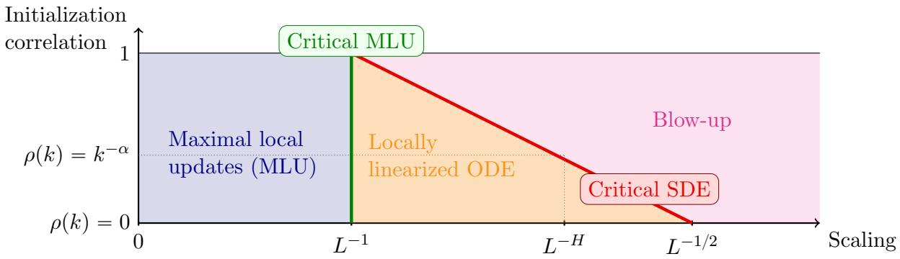
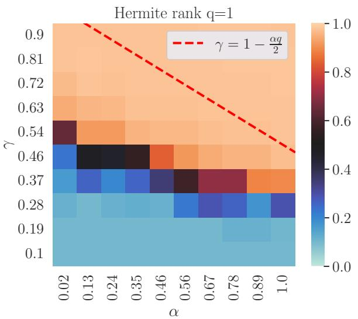
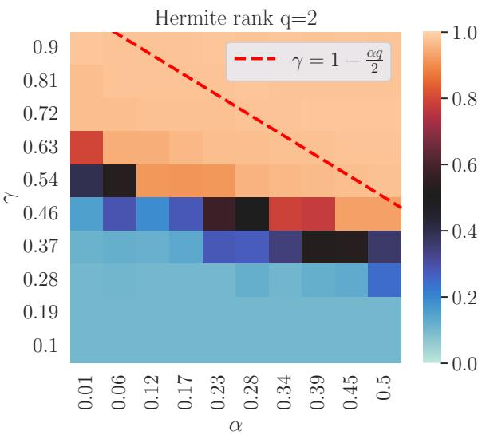

# Correlated initialization of deep residual networks

Felix Benning

Ivan Nourdin

Giovanni Peccati

September 4, 2026

## Abstract

We study the large-depth behavior of residual networks whose weights are correlated across layers at initialization. Our results confirm and extend a conjecture of Marion et al. [2025], according to which correlated initializations should interpolate continuously between the Brownian stochastic diferential equation arising from independent initialization and the ordinary diferential equation arising from perfectly correlated initialization.

When the initialization is obtained from the application of a feature function to a stationary Gaussian sequence with regularly varying correlation, we prove that there exists a unique critical scaling such that the infinite-depth limit is the solution of a Young diferential equation driven by a Hermite process. Hermite processes reduce to the fractional Brownian motion if the feature function generating the initialization has Hermite rank one, which is the case for the identity function, for example. We show that the critical scaling and asymptotic limit are uniquely determined by the decay of correlations together with the Hermite rank of the feature function. Consequently, the correlation structure and Hermite rank of the initialization represent meaningful hyperparameters in the asymptotic regime. By contrast, under finite-variance iid initialization, the asymptotic driver is universally Brownian up to normalization regardless of the choice of distribution.

Our proofs rely on a collection of novel results establishing a robust stability theory for Young diferential equations in Banach spaces.

Keywords: Residual networks, correlated initialization, large-depth limit, Young diferential equations, Hermite processes, fractional Brownian motion, long-range dependence, functional limit theorems

AMS Classification: 60G18, 60G22, 60H10, 60L20, 60L90, 60F17, 68T07.

## 1 Introduction

Residual connections are one of the principal architectural ideas that made very deep neural networks trainable. They have become a standard component of modern architectures, including the Transformer architecture [Vaswani et al., 2017], which underpins modern large language models. Early work introduced general shortcut paths between successive layers [Srivastava et al., 2015]. He et al. [2016a] popularized the idea of residual networks by showing that simple identity shortcuts enable the training of networks with hundreds or even thousands of layers. They further found that the identity map performed best among several shortcut transformations [He et al., 2016b]. The resulting structure—an identity map perturbed by the residual output—motivated the interpretation of the residual output as the rate of change of the hidden state and the network itself as the numerical approximation of a diferential equation [E, 2017, Haber and Ruthotto, 2018, Marion et al., 2023].

In this paper, we consider residual networks (ResNets) of depth $L \in \mathbb { N }$ , whose hidden states $h _ { l }$ evolve according to

$$
h _ { l + 1 } = h _ { l } + \lambda _ { L } \sigma ( w _ { l } , h _ { l } ) v _ { l } , \qquad l = 0 , \ldots , L - 1 .\tag{1}
$$

Here, $\sigma ( w _ { l } , h _ { l } ) v _ { l }$ is the residual update produced by the l-th layer with parameters $w _ { l }$ and $v _ { l } .$ . The scaling factor $\lambda _ { L } > 0$ controls the magnitude of this update and therefore how strongly each layer contributes to the overall transformation of the input.

It is worth noting that the explicit depth-dependent scaling factor $\lambda _ { L }$ was not part of the original ResNet formulation. The residual blocks of He et al. [2016a,b] instead incorporated batch normalization [Iofe and Szegedy, 2015] to control the scale of activations and gradients throughout the network. Although batch normalization has proved highly efective, it introduces both theoretical and practical complications: its behavior depends on batch statistics and therefore on the batch size, it treats training and inference diferently, and it incurs additional memory and communication costs [Brock et al., 2020]. These limitations have motivated normalization-free architectures in which the magnitude of the residual updates is controlled directly through depth-dependent scaling or through an appropriate choice of initialization.

While depth-dependent scaling of order $\lambda _ { L } = L ^ { - 1 / 2 }$ repeatedly appears in this literature [e.g. Arpit et al., 2019, De and Smith, 2020, Shao et al., 2020, Zhang et al., 2022], it is important to highlight that the appropriate choice of the scaling factor does not only depend on the depth of the network, but also on the dependence structure of the parameters across layers.

At one endpoint, Marion et al. [2023] studied ResNets whose parameters at initialization are discretizations of paths that vary smoothly with the layer index, with weight-tied initialization providing the simplest perfectly correlated example. Under the scaling $\lambda _ { L } \asymp L ^ { - 1 }$ , such networks are Euler discretizations of ordinary diferential equations (ODEs). Moreover, Marion et al. [2023] show that the smooth dependence of the parameters on the layer index is preserved during training, so that the trained networks also admit an ODE limit.

Building on findings by Zhang et al. [2022], Cohen et al. [2021], Cont et al. [2023], the work by Marion et al. [2025] characterizes the other endpoint of parameters initialized independently across layers. They identified $\lambda _ { L } = L ^ { - 1 / 2 }$ as the critical scaling leading to non-trivial large-depth dynamics and proved that the limiting hidden state is the solution of an Itˆo stochastic diferential equation driven by Brownian motion,

$$
d \hbar _ { s } = \sigma ( w _ { s } , \hbar _ { s } ) d B _ { s } .
$$

More precisely, scalings larger than $L ^ { - 1 / 2 }$ lead to explosion, whereas scalings smaller than $L ^ { - 1 / 2 }$ suppress the random fluctuations and cause the network to converge to the identity map.

The sharp contrast between the ODE regime, obtained when the weights vary smoothly with the layer index, and the Brownian SDE regime, obtained with independent weights, naturally raises the question of whether intermediate correlation structures can interpolate between these two limits.

Marion et al. [2025] formulated this conjecture and tested it experimentally by initializing the weights with increments of fractional Brownian motion with Hurst parameter $H \in \left( \frac { 1 } { 2 } , 1 \right)$ . Their experiments suggested that the transition between explosion and identity occurs at the critical scaling

$$
\lambda _ { L } = L ^ { - H } .
$$

As explained in the next section, the principal aim of this paper is to provide a rigorous and substantially more general answer to this conjecture, extending it beyond the fractional Brownian setting.

## Our contributions

1. Large-depth limits under correlated initialization. Our first contribution (see Theorem 2.11 below) is a rigorous and more general resolution of the conjecture formulated by Marion et al. [2025]. Consider first the Gaussian setting. For each coordinate i, suppose that $( v _ { l } ^ { i } ) _ { l \geqslant 0 }$ (where $v _ { l } = ( v _ { l } ^ { 1 } , . . . , v _ { l } ^ { p } )$ is given in (1)) is a centered stationary Gaussian sequence with regularly varying covariance

$$
\mathsf { E } [ v _ { 0 } ^ { i } v _ { k } ^ { i } ] = : \rho ( k ) = k ^ { - \alpha } \ell ( k ) , \qquad \alpha \in ( 0 , 1 ) ,
$$

where ℓ is slowly varying. Setting

$$
\begin{array} { r } { H = 1 - \frac { \alpha } { 2 } \in \big ( \frac { 1 } { 2 } , 1 \big ) , } \end{array}
$$

we prove that, under the scaling

$$
\begin{array} { r } { \lambda _ { L } = \frac { L ^ { - H } } { \ell ( L ) ^ { 1 / 2 } } , } \end{array}
$$

the interpolated hidden states converge, as the depth tends to infinity, to the solution of the Young diferential equation

$$
d \hbar _ { s } = \sigma ( w _ { s } , \hbar _ { s } ) d B _ { s } ^ { H } ,
$$

where $B ^ { H }$ is a fractional Brownian motion with Hurst parameter H. Thus, fractional Brownian motion need not be built directly into the initialization through its increments, as in the experiments of Marion et al. [2025]: it arises naturally as the scaling limit of a broad class of long-range correlated Gaussian initializations.

Our main theorem actually covers the more general case in which each coordinate of $v _ { l }$ is obtained by applying a centered nonlinear function of Hermite rank q (see (4) and the subsequent discussion) to the underlying Gaussian sequence. Provided $\alpha q \ < \ 1$ , the selfsimilarity parameter and the corresponding scaling become

$$
\begin{array} { r } { H = 1 - \frac { \alpha q } { 2 } , \qquad \lambda _ { L } = \frac { L ^ { - H } } { \ell ( L ) ^ { q / 2 } } . } \end{array}
$$

Under this scaling, the piecewise-linear interpolation of the hidden layers converges in distribution, in H¨older topology, to the unique solution of the Young diferential equation

$$
d \hbar _ { s } = \sigma ( w _ { s } , \hbar _ { s } ) d { \varkappa } _ { s } ^ { q , H } , \qquad \hbar _ { 0 } = A x ,
$$

where $\gtrsim ^ { q , H }$ is a Hermite process of rank q and self-similarity parameter $H ;$ see Definition 2.8. Fractional Brownian motion is recovered when $q = 1$ , while the case $q = 2$ corresponds to the so-called Rosenblatt process, as discussed, $\mathrm { e . g . }$ , by Tudor [2013, 2023] and Pipiras and Taqqu [2017]. We observe that Hermite ranks one and two are especially relevant in applications: the identity map and many transformations used to generate the initialization have Hermite rank one, whereas symmetry may force the first Hermite coeficient to vanish and lead to Hermite rank two [Bai and Taqqu, 2019]; in general, it is not dificult to construct functions with arbitrarily high Hermite rank. Theorem 2.11 therefore identifies a whole family of large-depth limits and shows that both the appropriate scaling and the limiting dynamics are determined jointly by the decay of correlations and the Hermite rank of the initialization.

Our limiting theory contributes towards an asymptotic theory for selecting initialization hyperparameters, namely the one-layer distribution of the weights, their dependence structure across layers, and the depth-dependent scaling factor. Consistently with the central limit theorem, Marion et al. [2025] show that independent initialization exhibits a strong universality phenomenon: after centering and normalization, a broad class of finite-variance distributions leads to the same Brownian-driven SDE in the large-depth limit, under the scaling $\lambda _ { L } = L ^ { - 1 / 2 }$ . In this regime, many details of the one-layer distribution are therefore asymptotically immaterial. Our main result, Theorem 2.11, shows that the picture changes in the presence of long-range dependence: the decay of correlations and the Hermite rank of the transformation used to generate the weights jointly determine both the appropriate depth scaling and the nature of the limiting driver. Thus, once correlations across layers are introduced, not only their strength and decay, but also the way in which the one-dimensional weight distribution is generated, become relevant initialization hyperparameters. Our results do not provide a complete selection procedure, but they identify which features of the initialization can genuinely alter the infinite-depth dynamics.

Our results also substantially extend the work of Hayashi and Nakagawa [2022], who introduced fractional-Brownian-driven neural diferential equations to model long-range dependence in a time-series setting: whereas fractional Brownian motion is postulated there as the driving noise, in our setting it arises naturally as a large-depth limit of correlated ResNet initialization, and is further replaced by general Hermite processes for nonlinear transformations of the underlying Gaussian sequence.

2. Stability and approximation of Young diferential equations. To prove the ResNet convergence result, we develop a general stability and approximation theory for parameterdependent Young diferential equations in Banach spaces of the form

$$
d x _ { t } = \sigma ( t , w _ { t } , x _ { t } ) d g _ { t } ,
$$

where both the driving signal g and the parameter path w are H¨older continuous with H¨older exponents strictly larger than $1 / 2$ . We establish existence and uniqueness, local Lipschitz continuity of the solution with respect to the initial condition, the driving signal, and the parameter path, as well as convergence of Euler approximations in H¨older topology. The ResNet convergence theorem (Theorem 2.11) then follows as a direct application of these continuity and approximation results, developed in Section 4. This theory is of independent interest beyond the neural-network application.

Remark 1.1 (Related work on Young diferential equations). Diferential equations driven by paths of finite p-variation, with $p < 2$ , go back to the foundational work of Young [1936] and Lyons [1994]. Existence, uniqueness, continuity, flow properties, and Euler approximation for autonomous Young diferential equations have been studied in several works; see, in particular, [Hu and Nualart, 2007, Lejay, 2010]. Time-dependent Young diferential equations, including equations driven by fractional Brownian motion, were considered in [Nualart and R˘a¸scanu, 2002, Cong et al., 2018]. More broadly, Young diferential equations fit within the rough-path framework; see, for instance, [Lyons, 1998, Bailleul, 2015] and the systematic presentation in [Friz and Hairer, 2020, Chapter 8]. Our results extend this literature by treating Banach-space-valued equations with a separate H¨older parameter path and by providing stability and Euler convergence directly in H¨older topology, complementing the classical approximation results for Young and rough diferential equations [Davie, 2008, Friz and Victoir, 2008, Lejay, 2010].

## 2 Depth Limit with correlated weights at initialization

In this section, we characterize the large-depth limit of ResNets whose weights are correlated across layers at initialization. After introducing a generalized ResNet architecture, we specify a class of correlated initializations for which the partial sums of residual updates converge to a Hermite process. We then show that, under suitable regularity assumptions on the activation function and the remaining weights, the interpolated hidden states converge to the solution of a Young diferential equation driven by this process. The proof combines a functional limit theorem for correlated random walks [Benning and Nourdin, 2026] with stability of Young diferential equations and convergence of their Euler discretizations (Section 4).

Definition 2.1 (General ResNet). A generalized residual network $F = F _ { A , B , ( v _ { l } ) _ { l = 0 } ^ { L - 1 } , ( w _ { l } ) _ { l = 0 } ^ { L - 1 } }$ with parameters $( A , B , ( v _ { l } ) _ { l = 0 } ^ { L - 1 } , ( w _ { l } ) _ { l = 0 } ^ { L - 1 } )$ maps an input $x \in \mathbb { R } ^ { d _ { \mathrm { i n } } }$ through a series of hidden layers

$$
\begin{array} { c } { { h _ { 0 } : = A x } } \\ { { { } } } \\ { { h _ { l + 1 } : = h _ { l } + \lambda _ { L } \sigma ( w _ { l } , h _ { l } ) v _ { l } } } \end{array}
$$

$$
l \in \{ 0 , \ldots , L - 1 \}
$$

to an output $F ( x ) : = B h _ { L } \in \mathbb { R } ^ { d _ { \mathrm { o u t } } }$ , with

$\lambda _ { L } \in [ 0 , \infty )$ , a scaling factor that depends on the depth L of the ResNet,

• input and output processing matrices $A \in \mathbb { R } ^ { d \times d _ { \mathrm { i n } } }$ and $B \in \mathbb { R } ^ { d _ { \mathrm { o u t } } \times d }$

• parameters $w _ { l } \in \mathcal { W }$ , where  is a fixed Banach space, and $v _ { l } \in \mathbb { R } ^ { r }$ , which determine the residual update through the continuous map

$$
\sigma \colon { \mathcal { W } } \times \mathbb { R } ^ { d } \longrightarrow \mathbb { R } ^ { d \times r } .
$$

Example 2.2 (Classic ResNet). Classically, a ResNet is of the form

$$
h _ { l + 1 } = h _ { l } + \lambda _ { L } V _ { l } \varphi ( W _ { l } h _ { l } + b _ { l } ) ,
$$

with activation function $\varphi : \mathbb { R }  \mathbb { R }$ applied component-wise and parameter matrices $W _ { l } \in \mathbb { R }$ mˆd and $V _ { l } \in \mathbb { R } ^ { d \times m }$ and a bias vector $b _ { l }$ . This is a special case of the general ResNet (Definition 2.1) with

$$
\begin{array} { r l } & { V _ { l } \varphi ( W _ { l } h _ { l } + b _ { l } ) = \underbrace { ( \varphi ( W _ { l } h _ { l } + b _ { l } ) ^ { T } \otimes \mathbb { I } _ { d } ) } _ { = : \sigma ( \underbrace { ( W _ { l } , b _ { l } ) } _ { = : w _ { l } } , h _ { l } ) } \underbrace { \mathrm { v e c } ( V _ { l } ) } _ { = : \upsilon _ { l } \in \mathbb { R } ^ { m d } } = \sigma ( w _ { l } , h _ { l } ) v _ { l } , } \end{array}
$$

where $\operatorname { v e c } ( A )$ stacks the columns of the matrix A into a vector and $\otimes$ is the Kronecker product [see e.g. Kschischang, 2022, Prop. 2].

We now specify the model for correlations between the parameters $v _ { l }$ across layers. For each coordinate, we obtain $v _ { l }$ by applying a feature function to a stationary Gaussian sequence with regularly varying covariance. The construction is most transparent for the identity feature function, in which case $v _ { l }$ is itself a stationary Gaussian sequence. Allowing more general feature functions can yield examples of ResNets whose scaling limits are solutions of stochastic diferential equations driven by Hermite processes instead of the fractional Brownian motion.

Definition 2.3 (Correlated initialization). For a feature function $\phi \colon \mathbb { R } \to \mathbb { R }$ we define

$$
v _ { l } ^ { i } : = \phi ( \xi _ { l } ^ { i } ) , \qquad i \in \{ 1 , \ldots , r \} , l \in \{ 0 , \ldots , L - 1 \} ,
$$

where $( \xi _ { l } ^ { i } ) _ { l \in  { \mathbb { N } } _ { 0 } }$ are stationary Gaussian sequences in R, independent over $i ,$ with zero mean $\mathsf { E } [ \xi _ { k } ^ { i } ] =$ $0 ,$ unit variance $\mathrm { V a r } ( \xi _ { k } ^ { i } ) = 1$ and regularly-varying correlation of index $\alpha \in ( 0 , 1 )$

$$
\rho ( k ) : = \mathsf E [ \xi _ { l } ^ { i } \xi _ { l + k } ^ { i } ] = k ^ { - \alpha } \ell ( k ) , \quad k \geqslant 1 , l \geqslant 0 ,
$$

where $\ell$ is a slowly varying function.

Remark 2.4. The centering condition

$$
\mathsf E [ v _ { l } ^ { i } ] = \mathsf E [ \phi ( \xi _ { l } ^ { i } ) ] = 0\tag{2}
$$

is essential to obtain an intermediate scaling. If the mean were nonzero, its contribution would accumulate over the $L$ layers and require the scaling $L ^ { - 1 }$ . This scaling would average out the random fluctuations and the deterministic mean would dominate the limit. Observe that, for the identity feature function $\phi ( x ) = x ,$ , the centering condition (2) follows directly from the assumption $\mathsf { E } [ \xi _ { l } ^ { i } ] = 0$

Let us first retain the assumption $\phi ( x ) = x .$ . The linearly interpolated partial sums of the correlated initializations then form the interpolated correlated Gaussian random walk

$$
\qquad \overline { { \boldsymbol { z } } } _ { s } ^ { L } : = \lambda _ { L } \Big ( \sum _ { l = 0 } ^ { \lfloor L s \rfloor - 1 } v _ { l } + \underbrace { ( L s - \lfloor L s \rfloor ) v _ { \lfloor L s \rfloor } } _ { \mathrm { l i n e a r ~ i n t e r p o l a t i o n } } \Big ) , \qquad s \in [ 0 , 1 ] .\tag{3}
$$

For

$$
\begin{array} { r } { H = 1 - \frac { \alpha } { 2 } , \qquad \lambda _ { L } = \frac { L ^ { - H } } { \ell ( L ) ^ { 1 / 2 } } , } \end{array}
$$

this process converges in H¨older topology to a fractional Brownian motion with Hurst parameter H [Benning and Nourdin, 2026]. Thus, the identity case,

$$
\phi ( x ) = x \qquad \mathrm { l e a d s ~ t o } \qquad \overline { { { z } } } ^ { L } \stackrel { d } {  } B ^ { H } ,
$$

where Ñ indicates convergence in distribution in an appropriate topology. This is the correlated $\xrightarrow { d }$ analogue of the independent Gaussian setting, where the initialization variables can be viewed as increments of a Brownian motion, which then drives the infinite-depth limit.

To determine what replaces fractional Brownian motion for more general feature functions, we use the Hermite rank of $\phi .$ . If $\phi ( \xi _ { l } ^ { i } ) = v _ { l } ^ { i } \in L ^ { 2 } ( \Omega )$ , then $\phi$ admits an expansion in the Hermite polynomials $( H _ { k } ) _ { k \geqslant 0 }$ (see e.g. [Nourdin and Peccati, 2012, Chapter 1]),

$$
\phi ( x ) = \sum _ { k = q } ^ { \infty } c _ { k } H _ { k } ( x ) , \qquad c _ { q } \neq 0 , \qquad \sum _ { k = q } ^ { \infty } k ! c _ { k } ^ { 2 } < \infty .\tag{4}
$$

The Hermite rank $q$ of $\phi$ is therefore the smallest index corresponding to a non-zero coeficient in this expansion. Note that the centering assumption $\mathsf { E } [ \phi ( \xi _ { l } ^ { i } ) ] = 0$ in (2) is equivalent to $q \geqslant 1$ Since $H _ { 1 } ( x ) = x$ , the identity feature has Hermite rank one, as do many commonly occurring functions [Bai and Taqqu, 2019].

For a feature function of generic Hermite rank $q ,$ provided $\alpha q < 1$ , the correlated random walk requires a diferent normalization and has, in general, a non-Gaussian limit. More precisely, setting

$$
\begin{array} { r } { H = 1 - \frac { \alpha q } { 2 } , \qquad \lambda _ { L } = \frac { L ^ { - H } } { \ell ( L ) ^ { q / 2 } } , } \end{array}
$$

the process $\overline { { z } } ^ { L }$ converges in H¨older topology to a Hermite process $\big ( \varkappa _ { s } ^ { q , H } \big ) _ { s \in [ 0 , 1 ] }$ of rank $q$ and selfsimilarity parameter H (see Definition 2.8, as well as [Tudor, 2013, Chapter $3 ]$ , [Tudor, 2023, Chapter 2] and [Benning and Nourdin, 2026]). In other words,

$$
\mathrm { H e r m i t e ~ r a n k ~ o f ~ } \phi = q \qquad \mathrm { l e a d s ~ t o } \qquad \overline { { z } } ^ { L } \stackrel { d } {  } \varkappa ^ { q , H } .
$$

The Hermite process of rank $q = 1$ is the fractional Brownian motion.

The significance of this functional limit for the ResNet is that $\overline { { z } } ^ { L }$ plays the role of the cumulative driving signal in the residual recursion. Once the remaining parameters $w _ { l }$ are shown to approximate a suficiently regular path w, the stability results developed below will allow us to pass to the limit in this recursion and prove that the interpolated hidden states converge to the solution of a Young-type diferential equation (see Remark 2.10 for details)

$$
d \hbar _ { s } = \sigma ( w _ { s } , \hbar _ { s } ) d \varkappa _ { s } ^ { q , H } , \qquad \hbar _ { 0 } = A x .
$$

We therefore consider the piecewise-linear interpolation of the remaining parameters,

$$
\overline { { { w } } } _ { s } ^ { L } = w _ { \lfloor L s \rfloor } + \underbrace { ( L s - \lfloor L s \rfloor ) \bigl ( w _ { \lfloor L s \rfloor + 1 } - w _ { \lfloor L s \rfloor } \bigr ) } _ { \mathrm { l i n e a r ~ i n t e r p o l a t i o n } }
$$

and assume that $\overline { { w } } ^ { L }$ converges in distribution, in H¨older topology, to some w as $L  \infty$ . The overall mechanism can therefore be summarized as

$$
\begin{array} { r } { \overline { { z } } ^ { L } \overset { d } { \to } \varkappa ^ { q , H } , \qquad \overline { { w } } ^ { L } \overset { d } { \to } w \qquad \mathrm { i m p l i e s } \qquad \overline { { h } } ^ { L } \overset { d } { \to } \varkappa , } \end{array}
$$

where the written implication follows from the stability of the Young diferential equation. We observe that two families of parameters play distinct roles: the variables $v _ { l }$ represent increments of the limiting driver $\gtrsim ^ { q , H }$ , whereas the parameters $w _ { l }$ approximate the values ${ w } _ { l / L }$ of the limiting parameter path.

Next we state the required regularity assumptions about the activation function $\sigma$ for our main result. See Remark 5.1 for a discussion of the technical role played by the boundedness of $\sigma$ in our proofs.

Assumption 2.5 (Regularity of the activation function). The function $\sigma \colon \mathcal { W } \times \mathbb { R } ^ { d } \to \mathbb { R } ^ { d \times r }$ is bounded, $\| \sigma \| _ { \infty } < \infty$ , and locally Lipschitz continuous with locally Lipschitz continuous derivatives in the second variable. That is, there exists a continuous function $c \colon \mathbb { R } ^ { 2 }  [ 0 , \infty )$ such that

$$
\begin{array} { r } { | \sigma ( w , h ) - \sigma ( \tilde { w } , \tilde { h } ) | \leqslant c ( | w | , | \tilde { w } | ) \Big ( | h - \tilde { h } | + ( 1 + | h | + | \tilde { h } | ) | w - \tilde { w } | \Big ) } \\ { | \nabla _ { h } \sigma ( w , h ) - \nabla _ { h } \sigma ( \tilde { w } , \tilde { h } ) | \leqslant \underbrace { c ( | w | , | \tilde { w } | ) } _ { \mathrm { l o c a l l y ~ b o u n d e d } } \underbrace { \Big ( | h - \tilde { h } | + ( 1 + | h | + | \tilde { h } | ) | w - \tilde { w } | \Big ) } _ { \mathrm { l o c a l ~ L i p s c h i t z ~ c o n t r o l } } } \end{array}
$$

The assumption above is suficient if $w _ { \lfloor L s \rfloor } = w _ { s }$ for a fixed H¨older continuous process w. If we want $w _ { \lfloor L s \rfloor } = \overline { { w } } _ { s } ^ { L }$ with $\overline { { w } } ^ { L } \stackrel { d } { \to } w$ in H¨older space, then we need the following additional regularity assumption.

Assumption 2.6 (Additional regularity). The activation function is diferentiable in the first variable, with a gradient that is also locally Lipschitz. More precisely, there exists a continuous function $\tilde { c } \colon  { \mathbb { R } } ^ { 4 } \to \bigl [ 0 , \infty \bigr )$ such that

$$
\begin{array} { r } { | \nabla _ { w } \sigma ( w , x ) - \nabla _ { w } \sigma ( \tilde { w } , \tilde { x } ) | \leqslant \tilde { c } ( | w | , | \tilde { w } | , | x | , | \tilde { x } | ) \big ( | x - \tilde { x } | + | w - \tilde { w } | \big ) . } \end{array}
$$

Example 2.7 (Suficiently nice activation function). If $\psi : \mathbb { R } \to \mathbb { R }$ is a continuously diferentiable activation function such that $\psi$ and $\psi ^ { \prime }$ are bounded and $\psi ^ { \prime }$ is Lipschitz continuous $\left( \mathrm { e . g . } \ \psi ^ { \prime \prime } \right.$ is bounded), then the generalized activation function

$$
\sigma ( \boldsymbol { w } , \boldsymbol { x } ) : = \boldsymbol { \psi } ( W \boldsymbol { x } + b ) ^ { T } \otimes \mathbb { I } _ { d } \qquad \boldsymbol { w } = ( W , b ) \in \mathbb { R } ^ { m \times d } \times \mathbb { R } ^ { m } , \boldsymbol { x } \in \mathbb { R } ^ { d }
$$

satisfies Assumption 2.5 and 2.6. Examples for such an activation function $\psi$ are sigmoid functions such as

$$
\psi ( x ) \in \big \{ \operatorname { t a n h } ( x ) , \arctan ( x ) , \frac { 1 } { 1 + e ^ { - x } } , \operatorname { e r f } ( x ) \big \} .
$$

Before stating our main result, Theorem 2.11, we formally introduce Hermite processes in Definition 2.8 and Remark 2.9, and briefly recall the notion of a Young diferential equation in Remark 2.10.

Definition 2.8 (Hermite process; see e.g. [Tudor, 2013, Def. 3.1]). The rank $q$ Hermite process with Hurst index $H \in \left( { \frac { 1 } { 2 } } , 1 \right)$ is defined as

$$
Z _ { t } ^ { q , H } : = A _ { q , H } \int _ { \mathbb { R } ^ { q } } ^ { \prime } \int _ { 0 } ^ { t } \prod _ { j = 1 } ^ { q } ( s - x _ { j } ) _ { + } ^ { - ( \frac { 1 } { 2 } + \frac { 1 - H } { q } ) } d s W ( d x _ { 1 } ) \cdot \cdot \cdot W ( d x _ { q } ) , \quad t \geqslant 0 ,
$$

where W is the Wiener Gaussian white noise measure and $\int _ { \mathbb { R } ^ { q } } ^ { \prime } ( \ldots ) W ( d x _ { 1 } ) \cdot \cdot \cdot W ( d x _ { q } )$ indicates a multiple Wiener-Itˆo integral of order $q$ (see [Nourdin and Peccati, 2012, Section 2.7]). The normalizing constant $A _ { q , H }$ is selected so that $\mathsf { E } [ ( \mathsf { \bar { Z } } _ { 1 } ^ { q , H } ) ^ { 2 } ] = 1$ and is known explicitly [Tudor, 2013, Proposition 3.1]. Equivalent representations are given e.g. in [Tudor, 2013, Section 3.1.2] and [Pipiras and Taqqu, 2017, Cor. 4.2.11].

Remark 2.9. The following facts are well-known (see e.g. [Tudor, 2013, Section 3.1.1]):

(i) for every $H \in \left( \textstyle { \frac { 1 } { 2 } } , 1 \right)$ and $q \geqslant 1$ , the process $Z ^ { q , H }$ is H-self-similar, that is: for every $c > 0$ $( Z _ { c t } ^ { q , H } ) _ { t \geqslant 0 }$ and $\bar { ( c ^ { H } Z _ { t } ^ { q , H } ) } _ { t \geqslant 0 }$ have the same law;

(ii) For every $q \geqslant 1 , Z ^ { q , H }$ is centered, has stationary increments and its covariance is given by

$$
\mathsf E [ Z _ { t } ^ { q , H } Z _ { s } ^ { q , H } ] = \frac 1 2 \left\{ t ^ { 2 H } + s ^ { 2 H } - | t - s | ^ { 2 H } \right\} , \quad s , t \geqslant 0 ;\tag{5}
$$

(iii) For every $\gamma \in ( 0 , H )$ , the process $Z ^ { q , H }$ admits a modification whose sample paths are locally γ-H¨older continuous with probability one.

It can be shown that if $q = 1$ then, $Z ^ { 1 , H } = B ^ { H }$ is a standard fractional Brownian motion with Hurst index H (that is, $Z ^ { 1 , H }$ is a centered Gaussian process with covariance (5)). The Hermite process with rank $q = 2$ corresponds to the so-called Rosenblatt process (see e.g. [Tudor, 2013, Section 3.2] or [Tudor, 2023, Section 2.3.2]).

Remark 2.10 (Young Diferential Equations). In this paper, an equation of the form

$$
d h _ { s } = \sigma ( w _ { s } , h _ { s } ) d z _ { s } , \qquad h _ { 0 } = a ,
$$

where $z$ is typically a Hermite process, is understood pathwise in the Young sense. More precisely, a stochastic process $h$ is a solution if, for almost every realization of $( w , z )$

$$
h _ { t } = a + \int _ { 0 } ^ { t } \sigma ( w _ { s } , h _ { s } ) d z _ { s } , \qquad t \in [ 0 , 1 ] .
$$

Here, the integral is the Young integral: if $z$ is β-H¨older continuous and $s \mapsto \sigma ( w _ { s } , h _ { s } )$ is $\eta -$ H¨older continuous, with $\eta , \beta \in ( 0 , 1 ]$ and $\eta + \beta > 1$ , then

$$
\int _ { 0 } ^ { t } \sigma ( w _ { s } , h _ { s } ) d z _ { s } = \operatorname* { l i m } _ { | \pi |  0 } \sum _ { [ u , v ] \in \pi } \sigma ( w _ { u } , h _ { u } ) \big ( z _ { v } - z _ { u } \big ) ,
$$

where π ranges over partitions of $[ 0 , t ]$ and $| \pi |$ denotes their mesh. In particular, the integral   
and the resulting diferential equation are defined pathwise, rather than in the Itˆo sense. Since   
a Hermite process with self-similarity parameter $H \ > \ \frac { 1 } { 2 }$ has sample paths that are γ-H¨older   
continuous for every $\gamma < H$ (see Remark 2.9), the limiting drivers considered below fall within the   
Young framework. We refer to Friz and Hairer [2020, Chapter 8] for further details.   
The (standard) functional spaces appearing in the following theorem are formally introduced   
in Definition 4.2.   
Theorem 2.11 (Large depth limit of ResNets with correlated weights at initialization). Let   
$F = F _ { A , B , ( v _ { l } ) _ { l = 0 } ^ { L - 1 } , ( w _ { l } ) _ { l = 0 } ^ { L - 1 } }$ be a ResNet as in Definition 2.1 with an activation function σ that   
satisfies Assumption 2.5 and correlated initialization of $v _ { l }$ as in Definition 2.3. Let $( w _ { l } ) _ { l = 0 } ^ { L - 1 }$ be   
initialized, independently of $( v _ { l } ) _ { l = 0 } ^ { L - 1 }$ , with either   
(i) $w _ { l } = \boldsymbol { w } _ { \frac { l } { L } }$ for some $w \in C ^ { \beta _ { w } } ( [ 0 , 1 ] , \mathcal { W } )$ with $\beta _ { w } \in \left( \frac { 1 } { 2 } , 1 \right]$ , or   
(ii) $w _ { l } = \overline { { w } } _ { \frac { l } { L } } ^ { L }$ for $\overline { w } ^ { L } \overset { d } { \to }$ w in $C ^ { \beta _ { w } } ( [ 0 , 1 ] , \mathcal { W } )$ with $\beta _ { w } \in \left( \frac { 1 } { 2 } , 1 \right]$ and Assumption 2.6 is satisfied.   
Assume that $v _ { l } ^ { i } \in L ^ { p } ( \Omega )$ for some $\begin{array} { r } { p > \frac { 2 } { 1 - \alpha q } } \end{array}$ and $\alpha \in ( 0 , \frac { 1 } { q } )$ , where $q \geqslant 1$ is the Hermite rank of   
the feature function $\phi$ that produces $v _ { l } ^ { i }$ . Then for the scaling   
$\begin{array} { r } { \lambda _ { L } = \frac { L ^ { - H } } { \ell ( L ) ^ { \frac { q } { 2 } } } , } \end{array}$   
we have for all $\beta \in ( 0 ,$ min $\begin{array} { r } { \{ H - \frac { 1 } { p } , \beta _ { w } \} ) } \end{array}$ with $\begin{array} { r } { H = 1 - \frac { \alpha q } { 2 } \in \left( \frac { 1 } { 2 } , 1 \right) } \end{array}$ that   
$\overline { { z } } ^ { L } \overset { d } { \to } \varkappa ^ { q , H }$ , in $C ^ { \beta } ( [ 0 , 1 ] , \mathbb { R } ^ { r } )$ , and $\overline { { h } } ^ { L } \overset { d }  \hbar$ , in $C ^ { \beta } ( [ 0 , 1 ] , \mathbb { R } ^ { d } )$ as $L \to \infty ,$   
where   
$\overline { { z } } ^ { L }$ is the interpolated sum process of the parameters $v _ { l }$ defined in (3),   
${ { \bf { \chi } } ^ { q , H } } = \gamma ( { { Z } ^ { q , H , 1 } } , \ldots , { { Z } ^ { q , H , r } } )$ are independent Hermite processes $( D \ o { e } f . \ 2 . 8 ) \ Z ^ { q , H , i }$ of rank   
$q$ and self-similarity parameter H scaled by $\gamma ^ { 2 } = c _ { q } ^ { 2 } q ! / ( H ( 2 H - \overset { . } { 1 } ) )$ with $c _ { q }$ from (4),   
$\overline { { h } } ^ { L }$ is the piecewise linear interpolation of the hidden layers $h _ { l }$ , that is   
$\overline { { h } } _ { s } ^ { L } : = h _ { \lfloor L s \rfloor } + \underbrace { ( L s - \lfloor L s \rfloor ) ( h _ { \lfloor L s \rfloor + 1 } - h _ { \lfloor L s \rfloor } ) } _ { l i n e a r ~ i n t e r p o l a t i o n }$   
• h is the unique solution of the diferential equation   
dhs “ σpws, hsqdzq,H with h “ Ax,   
which is a.s. contained in $C ^ { \beta } ( [ 0 , 1 ] , \mathbb { R } ^ { d } )$   
Sketch of the proof. The convergence of $\overline { z } ^ { L }$ to $\gtrsim ^ { q , H }$ in H¨older space follows from a functional limit   
theorem for correlated random walks [Benning and Nourdin, 2026]. To get convergence of $\overline { { h } } ^ { L }$ to

h we essentially apply a triangle inequality in the following way: We define $\hat { h } ^ { L }$ as the solution of the diferential equation

$$
\begin{array} { r } { d \hat { h } _ { s } ^ { L } = \sigma ( w _ { s } ^ { L } , \hat { h } _ { s } ^ { L } ) d \overline { { z } } _ { s } ^ { L } \quad \mathrm { w i t h } \quad \hat { h } _ { 0 } ^ { L } = A x , } \end{array}\tag{6}
$$

with $w ^ { L } \in \{ w , \overline { { w } } ^ { L } \}$ depending on the initialization assumption. With $L  \infty$ the parameters of this Wong-Zakai approximation of the limiting Young diferential equation (see [Friz and Hairer, 2020, Section 9.2]) converge to the parameters of the original diferential equation that define h. So we get convergence of $\hat { h } ^ { L }$ to h by stability results about Young diferential equations (Theorem 4.6 and Corollary 4.7). With $\hat { h } ^ { L } \to \hat { n }$ established we then essentially show that the diference between $\hat { h } ^ { L }$ and $\overline { { h } } ^ { L }$ vanishes asymptotically. Since $\overline { { h } } ^ { L }$ is simply the Euler discretization of the Wong-Zakai diferential equation (6), the diference between $\hat { h } ^ { L }$ and $\overline { { h } } ^ { L }$ is controlled by our general result about the convergence of the Euler method for Young diferential equations (Theorem 4.8). □

The proof of Theorem 2.11 consequently relies on general stability results about Young diferential equations. These results of independent interest are the content of Section 4.

Before moving on we highlight the natural conjecture that the scaling

$$
\lambda _ { L } = { \frac { L ^ { - H } } { \ell ( L ) ^ { \frac { q } { 2 } } } }
$$

is necessary for a non-trivial limit of the ResNet at initialization. Larger, super-critical scaling should lead to a blow-up of the hidden states, while smaller sub-critical scaling should lead to a trivial limit. The following corollary shows the latter.

Corollary 2.12 (Sub-critical scaling). Assume the setting of Theorem 2.11. In particular, let $\begin{array} { r } { \lambda _ { L } : = \frac { L ^ { - H } } { \ell ( L ) ^ { q / 2 } } } \end{array}$ be the standard scaling. Let $\overline { { h } } _ { s } ^ { L , \dagger }$ be the interpolated hidden states of the ResNet with a diferent scaling $\lambda _ { L } ^ { \dagger }$ with initial condition $h _ { 0 } = A x$ . Then for all $\beta \in ( 0 , \operatorname* { m i n } \{ H - \textstyle \frac { 1 } { p } , \beta _ { w } \} )$

$$
\operatorname* { l i m } _ { L \to \infty } \frac { \lambda _ { L } ^ { \dag } } { \lambda _ { L } } = 0 \qquad \Longrightarrow \qquad \bar { h } ^ { L , \dag } \xrightarrow { p } ( s \mapsto h _ { 0 } ) , \qquad i n C ^ { \beta } ( [ 0 , 1 ] , \mathbb { R } ^ { d } ) .\tag{Identity limit}
$$

Proof. First, we will show that instead of replacing the standard scaling $\lambda _ { L }$ by $\lambda _ { L } ^ { \dagger }$ we can equivalently replace drivers $v _ { l }$ by $\begin{array} { r } { v _ { l } ^ { \dagger } = \frac { \lambda _ { L } ^ { \dagger } } { \lambda _ { L } } v _ { l } } \end{array}$ and keep the standard scaling $\lambda _ { L }$ to obtain the hidden states $\overline { { h } } _ { s } ^ { L , \dagger }$ . This is a simple consequence of linearity:

$$
h _ { l + 1 } ^ { \dagger } = h _ { l } + \lambda _ { L } ^ { \dagger } \sigma ( w _ { l } , h _ { l } ^ { \dagger } ) v _ { l } = h _ { l } + \lambda _ { L } \sigma ( w _ { l } , h _ { l } ^ { \dagger } ) v _ { l } ^ { \dagger } .
$$

In turn, we have that the interpolated sum process of the new drivers $v _ { l } ^ { \dagger }$ converges to zero in distribution in H¨older space:

$$
\overline { { z } } _ { s } ^ { L , \dag } = \sum _ { l = 0 } ^ { \lfloor L s \rfloor - 1 } \lambda _ { L } v _ { l } ^ { \dag } + ( L s - \lfloor L s \rfloor ) \lambda _ { L } v _ { \lfloor L s \rfloor } ^ { \dag } = \frac { \lambda _ { L } ^ { \dag } } { \lambda _ { L } } \overline { { z } } _ { s } ^ { L } \stackrel { d } {  } 0 = : \varkappa _ { s } ^ { \dag } ,
$$

The convergence follows from the convergence of $\overline { { z } } ^ { L }$ to $\gtrsim ^ { q , H }$ in Theorem 2.11 combined with Slutsky’s theorem [e.g. Klenke, 2014, Thm. 13.18] to get the joint convergence of $( \overline { { z } } ^ { L } , \frac { \lambda _ { L } ^ { \dag } } { \lambda _ { L } } )$ to $( \ast ^ { q , H } , 0 )$ in distribution and an application of the continuous mapping theorem $[ \mathrm { e . g . }$ . Klenke, 2014, Thm. 13.25]. Since we only use convergence of $\overline { { z } } ^ { L }$ against a limiting process $\gtrsim ^ { q , H }$ in the proof of Theorem 2.11 (proven in Step 1), the remaining steps of the proof yield convergence of $\overline { { h } } ^ { L , \dagger }$ to the solution of the diferential equation

$$
d \hbar _ { s } = \sigma ( w _ { s } , \hbar _ { s } ) d \varkappa _ { s } ^ { \dagger } , \quad \hbar _ { 0 } = A x ,
$$

with $\varkappa _ { s } ^ { \dagger } = 0$ for all $s \in [ 0 , 1 ]$ . However the solution to this diferential equation is simply $\hbar _ { s } = A x$ r for all $s \in [ 0 , 1 ]$ . Since convergence in distribution against a constant implies convergence in probability, we also have $\overline { { h } } _ { s } ^ { L , \dag } \xrightarrow [ ] { p } A x$ in H¨older space. □

Remark 2.13 (Super-critical scaling). The conjectured blow-up for super-critical scaling is more dificult to prove. However, the same argument as in the proof above may be used to show that the driver of the limiting diferential equation is multiplied by a diverging factor $\lambda _ { L } ^ { \dag } / \lambda _ { L }$ . This alone does not imply blow-up of the hidden states however, because the difusion term $\sigma ( w _ { s } , \hbar _ { s } )$ may suppress this amplification. A trivial example is $\sigma = 0$ . A more sophisticated one is $\sigma ( h ) = ( 1 - \| h \| ^ { 2 } ) _ { + } ^ { 2 }$ which prevents $\| h \|$ from exceeding 1. A proof of the conjectured blow-up for super-critical scaling therefore requires appropriate lower bounds on the activation function $\sigma$ and is left for future work. For independent initializations, Marion et al. [2025] introduce their Assumption $A _ { 2 }$ for this purpose.

## 3 Discussion and experiments

Our analysis concerns the large-depth behavior of ResNets at initialization and rigorously resolves a conjecture of Marion et al. [2025]. During the preparation of this work, Chizat [2026] developed a complementary analysis of the large-depth behavior of trained ResNets under i.i.d. initialization. His results show, in particular, that a scaling which is critical at initialization need not coincide with the scaling leading to maximal local parameter updates during training.

In this section, we briefly review the main mechanism underlying Chizat’s analysis and formulate a conjectural extension of this analysis in the correlated setting considered in the present paper. We emphasize that Chizat’s results do not directly apply to our model, since our initialization is correlated across layers. Nevertheless, they suggest a natural training phase diagram in which our critical initialization regime appears as the boundary of a locally linearized regime. This interpretation is partially supported by the experiments described in Section 3.2.

## 3.1 Critical initialization versus trainability

## 3.1.1 Overview of Chizat [2026]

A non-trivial random output at initialization is not necessarily the right criterion for choosing the scaling of a trainable model. The main object of interest is the output after training. This distinction is emphasized by Chizat [2026], who organizes the large-depth behavior of trained ResNets in a phase diagram depending on the scaling $\lambda _ { L }$ (his Figure 4). In this subsection, we restrict ourselves to the setting considered by Chizat, in which the trainable parameters are initialized independently across layers. In this framework, Chizat shows that residual scalings less aggressive than $L ^ { - 1 }$ , while remaining below the stochastic critical scale $L ^ { - 1 / 2 }$ , lead to what he calls the “lazy-ODE” regime: the displacement of each layer’s parameters vanishes and each residual layer becomes asymptotically linear in its parameters. At the boundary scaling $L ^ { - 1 / 2 }$ , Marion et al. [2025] prove that the random fluctuations at initialization remain of order one and give rise to a Brownian-driven SDE in the large-depth limit, while Chizat expects the locally linearized training mechanism to persist at this boundary, although with a stochastic limiting dynamics diferent from the lazy-ODE regime. To understand the mechanism behind this phenomenon, define

$$
f ( h _ { l } , z _ { l } ) : = \sigma ( w _ { l } , h _ { l } ) v _ { l } , \qquad z _ { l } : = ( w _ { l } , v _ { l } ) ,
$$

where $z _ { l }$ denotes the trainable parameters at initialization. For centered i.i.d. parameters across layers, at the critical stochastic scaling $\lambda _ { L } = L ^ { - 1 / 2 }$ we have

$$
h _ { L } = h _ { 0 } + \sum _ { l = 0 } ^ { L - 1 } \underbrace { L ^ { - 1 / 2 } f ( h _ { l } , z _ { l } ) } _ { = \mathcal { O } ( L ^ { - 1 / 2 } ) } = \mathcal { O } ( 1 ) .
$$

Thus, the L increments of order $L ^ { - 1 / 2 }$ sum to a quantity of order one by a stochastic averaging efect. Without such an averaging efect, increments would need to be of order $L ^ { - 1 }$ in order to accumulate to a quantity of order one.

The situation is diferent for the changes in the parameters induced by training. Since the training of the parameter $z _ { l }$ causes a highly structured change $\Delta z _ { l }$ to the parameters $z _ { l }$ , these changes should not be expected to benefit from the same averaging efect. Using $h _ { l } ( t )$ for the hidden layer at training time $t ,$ we thus heuristically obtain, by Taylor expansion of $f ( h _ { l } ( t ) , z _ { l } ( t ) )$ around the initial parameters $z _ { l }$

$$
h _ { L } ( t ) = h _ { 0 } + \underbrace { \sum _ { l = 0 } ^ { L - 1 } L ^ { - 1 / 2 } f ( h _ { l } ( t ) , z _ { l } ) } _ { \mathcal { O } ( 1 ) } + \sum _ { l = 0 } ^ { L - 1 } L ^ { - 1 / 2 } \hat { \sigma } _ { z } f ( h _ { l } ( t ) , z _ { l } ) \Delta z _ { l } ( t ) + \sum _ { l = 0 } ^ { L - 1 } \mathcal { O } \big ( L ^ { - 1 / 2 } \lVert \Delta z _ { l } ( t ) \rVert ^ { 2 } \big ) .\tag{7}
$$

Since the increments

$$
\Delta z _ { l } ( t ) = z _ { l } ( t ) - z _ { l }
$$

are highly structured across layers, the second term is of order one when $L ^ { - 1 / 2 } \Delta z _ { l } ( t )$ is of order $L ^ { - 1 }$ . This requires

$$
\Delta z _ { l } ( t ) \in { \mathcal { O } } ( L ^ { - 1 / 2 } ) .
$$

Consequently, the trained displacement $\Delta z _ { l } ( t )$ vanishes as $L \to \infty$ , while its accumulated first-order efect across the network remains of order one. The same scaling also implies that the quadratic remainder in (7) is of order $\mathcal { O } ( L ^ { - 1 / 2 } )$ , and therefore vanishes asymptotically. The first-order Taylor expansion thus suggests a locally linearized description of the training dynamics.

This mechanism is closely related to what Chizat [2026] calls the lazy-ODE regime, for which he rigorously proves the vanishing of the parameter displacements and a locally linearized limiting dynamics. As already observed, at the critical stochastic scaling $\lambda _ { L } = L ^ { - 1 / 2 }$ , the random fluctuations at initialization do not vanish, so that the limiting dynamics is diferent from the lazy-ODE limit; nevertheless, the same scaling argument suggests vanishing parameter displacements also at this boundary. However, while the displacement of each layer’s parameters vanishes, the accumulated first-order efect across depth may still induce an order-one change of the hidden representations. Thus, unlike in the usual Neural Tangent Kernel regime, the features need not remain asymptotically frozen during training. We therefore use the term locally linearized, rather than lazy, for this behavior.

We observe that the empirical evidence as to whether ResNets with independent initialization benefit more from the scaling $L ^ { - 1 / 2 }$ or from $L ^ { - 1 }$ does not yet appear fully conclusive. Earlier studies observed slightly better performance for the $L ^ { - 1 / 2 }$ scaling [Shao et al., 2020, Table 1], whereas the study motivating Chizat’s work suggests that the $L ^ { - 1 }$ scaling may be more beneficial [Dey et al., 2025].

## 3.1.2 A conjectural phase diagram

We now put ourselves in the framework of Theorem 2.11. Fix $\alpha \in ( 0 , 1 / q )$ and Hermite rank $q ,$ and set

$$
H = 1 - \frac { \alpha q } { 2 } \in ( 1 / 2 , 1 ) .
$$

Thus, H is the critical exponent associated with the correlation structure by our theorem. To distinguish this critical exponent from the scaling actually used in the network, we write

$$
\lambda _ { L } = L ^ { - \gamma } .
$$

Motivated by the phase diagram of Chizat [2026, Fig. 4] and by the discussion in the previous subsection, we conjecture that our results fit into the broader phase diagram represented in Fig ure 1. We emphasize that the behavior of the ResNet after training and the Blow-up regime are conjectures based on Chizat’s analysis of the independent initialization setting and Remark 2.13.

• Blow up.1 If $\gamma < H$ , the scaling is larger than the critical scale associated with the prescribed correlation structure, and we expect the ResNet to blow up at initialization subject to suitable non-degeneracy assumptions about $\sigma$ (Rem. 2.13). This agrees with the independent case, where the corresponding threshold is $1 / 2$

• Critical SDE (Non-trivial initialization).2 If

$$
\gamma = H = 1 - \frac { \alpha q } { 2 } ,
$$

then Theorem 2.11 proves that the ResNet converges at initialization to the non-trivial limiting diferential equation driven by the corresponding Hermite process. Based on Chizat’s analysis of the training we conjecture that the parameter changes should be of order $L ^ { H - 1 }$ and hence vanish, while their accumulated first-order efect remains of order one. We therefore expect the training dynamics to be locally linearized. This would extend the “Lazy SDE” regime of Chizat [2026, Fig. 4] to the correlated setting.

  
Figure 1: Conjectural phase diagram for the ResNet model in the framework of Theorem 2.11, with $\begin{array} { r } { H = 1 - \frac { \alpha q } { 2 } } \end{array}$ and $\alpha \in ( 0 , 1 / q )$ . The behavior during training and the Blow-up regime are conjectures.

• Locally linearized $\mathbf { O D E . ^ { 2 } }$ If $H < \gamma < 1$ , the residual scaling is smaller than the critical initialization scale, and we prove that the ResNet converges to the identity at initialization (Corollary 2.12). At the same time, extrapolating Chizat’s argument suggests parameter changes of order $L ^ { \gamma - 1 }$ , which vanish as the depth diverges. To see this, combine the scaling $\lambda _ { L } = L ^ { - \gamma }$ with the Taylor expansion (7). We therefore conjecture a locally linearized ODE regime, analogous to the “Lazy ODE” regime of Chizat [2026, Fig. 4, Thm. 2].

• Critical maximal local updates.2 $\mathrm { A t } ~ \gamma = 1$ , the preceding scaling argument predicts parameter changes of order one. This corresponds to the “Maximum local update” regime of Chizat [2026, Thm. 1]. Here, maximal local updates means that the local features generated by an individual residual block may change by order one during training while the overall dynamics remains stable. We conjecture that an analogous regime persists under our correlated initialization. The ResNet is generally scaled to be the identity function at initialization.

• Maximal local updates (Subcritical ODE).2 For $\gamma > 1$ , the residual scaling is even smaller. In Chizat’s setting, the corresponding subcritical MLU regime asymptotically coincides with the behavior of a network initialized with zero output weights [Chizat, 2026, Remark 4.2]. By analogy, we conjecture a similar subcritical ODE behavior in our setting.

In summary, at initialization Theorem 2.11 and Corollary 2.12 rigorously characterize the critical SDE curve

$$
\gamma = H = 1 - \frac { \alpha q } { 2 }
$$

and its subcritical side in Figure 1. The blow up-region, and the subdivision of the sub-critical region into the Locally linearized ODE, Critical MLU and MLU regimes represent a conjectural extension of Chizat’s training phase diagram to correlated initialization. The resulting picture suggests, in particular, that criticality at initialization need not coincide with maximal local updates during training.

  
Figure 2: The plots show the accuracy after ten epochs of training of a ResNet on the MNIST dataset. The parameter $\gamma$ is the exponent of the scaling $\lambda _ { L } = L ^ { - \gamma }$ , while α is the index of the regularly varying correlation of the initialization process. The dashed red line corresponds to the critical exponent $\begin{array} { r } { \gamma = 1 - \frac { \alpha q } { 2 } } \end{array}$ identified by Theorem 2.11. The left plot uses the identity $x \mapsto x$ as feature function, with Hermite rank $q = 1$ , whereas the right plot uses the second Hermite polynomial $x ^ { 2 } - 1$ , with Hermite rank $q = 2$

## 3.2 Experiments

To connect our main results to a training setting, we modify the experiments of Marion et al. [2025, Fig. 9] and reproduce their experiment on trained ResNets with correlated initialization.3 We keep the same architecture of a ResNet of width $d = 3 0$ and depth $L = 1 0 0 0$ with ReLU activation function and without inner weights $w _ { l }$ trained on the MNIST dataset. While they initialized the inner weights $v _ { l }$ directly with increments of a fractional Brownian motion, we use the Cauchy correlation function

$$
\rho ( k ) = ( 1 + k ) ^ { - \alpha } ,
$$

which has the regularly varying behavior considered in our theoretical framework. Besides the identity feature function $\phi ( x ) = x$ , of Hermite rank 1, we also use the second Hermite polynomial $\phi ( x ) = x ^ { 2 } - 1$ , of Hermite rank 2. The results are shown in Figure 2.

For both Hermite rank one and Hermite rank two, the low-accuracy region in blue lies predominantly below the critical curve

$$
\gamma = 1 - \frac { \alpha q } { 2 }
$$

identified by Theorem 2.11. This region below the curve represents the conjectured blow-up region. Larger exponents resulting in sub-critical scaling often still yield good performance. Curiously, the slope of the transition between poor and successful training neither matches the slope of the critical curve for non-trivial initialization, nor is it horizontal. A horizontal border may be expected if maximal local updates fully determined training behavior. In that case the outcome should improve as the scaling approaches $L ^ { - 1 }$ . Our experiments therefore cannot establish whether the critical initialization scaling or the maximal-local-update scaling $\lambda _ { L } = L ^ { - 1 }$ is the more favorable choice for training.

## 4 Young integral equation solution theory

The goal of this section is to develop a general solution theory for diferential equations of the form

$$
d x _ { t } = \sigma ( t , w _ { t } , x _ { t } ) d g _ { t } \quad \mathrm { w i t h ~ i n i t i a l ~ c o n d i t i o n } \quad x _ { t } = a \in \mathcal { X } ,
$$

where $g _ { t }$ and $w _ { t }$ are $\beta$ and $\alpha \mathrm { - }$ H¨older continuous functions with exponent $\beta \in \left( \frac { 1 } { 2 } , 1 \right]$ and $\alpha \in ( \frac 1 2 , \beta )$ This means that classical ODE theory does not apply as the driving signal $g$ is not necessarily diferentiable or of bounded variation. However it is still smooth enough for Young integration theory to be applicable. For $\beta \leqslant \frac { 1 } { 2 }$ it would become necessary to use rough path theory instead of Young integration [see e.g. Friz and Hairer, 2020, Friz and Victoir, 2008]. Diferential equations of the form

$$
d x _ { t } = \sigma ( x _ { t } ) d g _ { t }
$$

with Lipschitz continuous $\sigma$ are already well understood both in the Young regime as well as in the rough path regime [e.g. Friz and Hairer, 2020, Chapter $8 ]$ . Our contribution is to extend this theory to non-homogeneous $\sigma$ and prove stability results with respect to $g ,$ w and initial conditions a. An application of this theory is the infinite depth limit of residual neural networks as described in Section 2.

To distinguish between functional norms and norms on vectors, we use $\left| \cdot \right|$ as notation for the norm of vectors and reserve $\left. \cdot \right.$ for functional norms. Of course a vector in a general Banach space may be a function. Since we will however not use its properties as a function this distinction still helps make the concepts clearer. Moreover we typically write $f _ { s }$ for function evaluation at s to reserve $f ( x )$ for functions that map a function $x$ to another function.

Definition 4.1. Let $( \mathcal { E } , | \cdot | )$ be a Banach space, and let $\alpha \in ( 0 , 1 ]$ . For a function $f \colon \left[ \underline { { t } } , \overline { { t } } \right] \to \mathcal { E }$ with $\underline { { t } } , \bar { t } \in \mathbb { R }$ and $\underline { { s } } , \overline { { s } } \in \left[ \underline { { t } } , \overline { { t } } \right]$ we define the H¨older seminorm

$$
[ f ] _ { \alpha , [ s , { \bar { s } } ] } : = \operatorname* { s u p } _ { s \neq t \in [ s , { \bar { s } } ] } \frac { | f _ { t } - f _ { s } | } { | t - s | ^ { \alpha } } \qquad \mathrm { a n d } \qquad [ f ] _ { \alpha } : = [ f ] _ { \alpha , [ t , { \bar { t } } ] } .
$$

We further define the H¨older norm

$$
\| f \| _ { \alpha , [ s , { \overline { { s } } } ] } : = \| f \| _ { \infty , [ s , { \overline { { s } } } ] } + [ f ] _ { \alpha , [ s , { \overline { { s } } } ] } \qquad \mathrm { a n d } \qquad \| f \| _ { \alpha } : = \| f \| _ { \alpha , [ t , { \overline { { t } } } ] }
$$

where $\| f \| _ { \infty , [ \underline { { s } } , \overline { { s } } ] } = \operatorname* { s u p } _ { s \in [ \underline { { s } } , \overline { { s } } ] } | f _ { s } |$ is the supremum norm of $f$ on $[ \underline { { s } } , \overline { { s } } ]$

Definition 4.2 (Functional spaces). Let $\mathcal { W }$ be a Banach space, let $T = [ \underline { { t } } , \overline { { t } } ] \subseteq [ 0 , \infty )$ be a compact interval, and let $\beta \in ( 0 , 1 ]$ . We denote by

$$
C ^ { \beta } ( T , \mathcal { W } ) : = \{ w : T \to \mathcal { W } : \| w \| _ { \beta } < \infty \}
$$

the space of $\beta \mathrm { . }$ -H¨older continuous functions from $T$ to $\mathcal { W } _ { : }$ , equipped with the H¨older norm $\left\| \cdot \right\| _ { \beta }$ defined above.

For the diferential equation $d x _ { t } = \sigma ( t , w _ { t } , x _ { t } ) d g _ { t }$ to have a unique solution, we require the following assumption, that is a generalization of Assumptions 2.5 and 2.6 to the non-homogeneous case.

Assumption 4.3 (Suficiently nice function). Let ,  and  be Banach spaces and let $\alpha \in ( 0 , 1 ]$ Then, the mapping

$$
\sigma \colon \mathbb { R } \times \mathcal { W } \times \mathcal { X } \to \mathcal { L } ( \gamma , \mathcal { X } )
$$

is an α-nice function if the following properties are verified:

(a) σ is bounded, that is $\| \sigma \| _ { \infty } < \infty$

(b) Local Lipschitz continuity: $\sigma ( t , w , x )$ and the Fr´echet derivative

$$
D _ { x } \sigma ( t , w , x ) \in \mathcal { L } ( \mathcal { X } , \mathcal { L } ( \mathcal { V } , \mathcal { X } ) )
$$

are locally Lipschitz continuous in w and x, with local Lipschitz coeficients controlled by a continuous function $c \colon \mathbb { R } ^ { 3 }  [ 0 , \infty )$

$$
\begin{array} { r } { | \sigma ( t , w , x ) - \sigma ( t , \tilde { w } , \tilde { x } ) | \leqslant c ( t , | w | , | \tilde { w } | ) \Big ( | x - \tilde { x } | + ( 1 + | x | + | \tilde { x } | ) | w - \tilde { w } | \Big ) } \\ { | D _ { x } \sigma ( t , w , x ) - D _ { x } \sigma ( t , \tilde { w } , \tilde { x } ) | \leqslant \underbrace { c ( t , | w | , | \tilde { w } | ) } _ { \mathrm { l o c a l l y ~ b o u n d e d } } \underbrace { \Big ( | x - \tilde { x } | + ( 1 + | x | + | \tilde { x } | ) | w - \tilde { w } | \Big ) } _ { \mathrm { l o c a l ~ L i p s c h i t z ~ c o n t r o l } } . } \end{array}
$$

(c) H¨older continuity in t: $\sigma ( \cdot , w , x )$ and $D _ { x } \sigma ( \cdot , w , x )$ are locally α-H¨older continuous in $t ,$ with local H¨older coeficients controlled by a continuous function $\mathsf { c } : \mathbb { R } \to [ 0 , \infty )$

$$
\begin{array} { r } { | \sigma ( t , w , x ) - \sigma ( s , w , x ) | \leqslant \mathsf { c } ( | w | ) ( 1 + | x | ) | t - s | ^ { \alpha } } \\ { | D _ { x } \sigma ( t , w , x ) - D _ { x } \sigma ( s , w , x ) | \leqslant \underbrace { \mathsf { c } ( | w | ) ( 1 + | x | ) } _ { \mathrm { l o c a l l y ~ b o u n d e d } } | t - s | ^ { \alpha } . } \end{array}
$$

Finally, an optional assumption on the Fr´echet derivative of $\sigma$ with respect to w instead of $x$ is given by

(d) Diferentiability in w: there exists a continuous function $\tilde { c } \colon  { \mathbb { R } } ^ { 5 } \to [ 0 , \infty )$ and ${ \tilde { \mathsf { c } } } \colon { \mathbb { R } } ^ { 2 } \ \to$ $[ 0 , \infty )$ such that the Fr´echet derivative

$$
D _ { w } \sigma ( t , w , x ) \in \mathcal { L } ( \mathcal { W } , \mathcal { L } ( \mathcal { V } , \mathcal { X } ) )
$$

is locally Lipschitz continuous in the sense

$$
| D _ { w } \sigma ( t , w , x ) - D _ { w } \sigma ( t , \tilde { w } , \tilde { x } ) | \leqslant \tilde { c } ( t , | w | , | \tilde { w } | , | x | , | \tilde { x } | ) \Big ( | x - \tilde { x } | + | w - \tilde { w } | \Big )
$$

$$
\begin{array} { r } { | D _ { w } \sigma ( t , w , x ) - D _ { w } \sigma ( s , w , x ) | \leqslant \widetilde { \mathsf { c } } ( | w | , | x | ) | t - s | ^ { \alpha } . } \end{array}
$$

Remark 4.4 (Merging t into w). While we assume local Lipschitz continuity in $w ,$ we only assume local H¨older continuity in t. For this reason, it is not trivial to merge t into w. If one were to embed t into the function space $L ^ { p } ( [ 0 , T ] , \mathbb { R } )$ with $\textstyle p = { \frac { 1 } { \alpha } }$ via $t \mapsto \mathbf { 1 } _ { [ 0 , t ] }$ , then Lipschitz continuity translates to α-H¨older continuity in t as $\| \mathbf { 1 } _ { [ 0 , t ] } - \mathbf { 1 } _ { [ 0 , s ] } \| _ { L ^ { p } } = | t - s | ^ { \alpha }$ , such that in place of $( t , w )$ one may consider the parameter $\tilde { w } = \bigl ( \mathbf { 1 } _ { [ 0 , t ] } , w \bigr )$ . This may allow for an alternative proof where t is merged into w, but the translation is a bit awkward and we choose the more direct approach in the following.

Theorem 4.6 below is one of the main theoretical contributions of the paper.

Remark 4.5. For the reader’s convenience, we formally clarify the meaning of the diferential equation (8) below; see e.g. Friz and Victoir [2008], Friz and Hairer [2020] for further details. A path $x \in C ^ { \alpha } ( [ { \underline { { t } } } , { \overline { { t } } } ] , \chi )$ is a solution of (8) if

$$
x _ { t } = a + \int _ { \underline { { t } } } ^ { t } \sigma ( s , w _ { s } , x _ { s } ) d g _ { s } , \qquad t \in [ \underline { { t } } , \overline { { t } } ] ,
$$

where the integral is understood in the Young sense. More precisely,

$$
\int _ { \frac { t } { \tau } } ^ { t } \sigma ( s , w _ { s } , x _ { s } ) d g _ { s } : = \operatorname* { l i m } _ { | \pi |  0 } \sum _ { [ u , v ] \in \pi } \sigma ( u , w _ { u } , x _ { u } ) ( g _ { v } - g _ { u } ) ,
$$

where $\pi$ ranges over partitions of rt, ts and $| \pi |$ denotes the mesh of the partition. Under the assumptions of Theorem 4.6, the map $s \mapsto \sigma ( s , w _ { s } , x _ { s } )$ is α-H¨older continuous, while g is β-H¨older continuous, and $\alpha + \beta > 1$ ; hence the Young integral above is well defined. Whenever (8) admits a unique solution for every initial condition, one defines the solution flow

$$
\psi ( \cdot ; s , t ) \colon \mathcal { X } \to \mathcal { X } , \qquad 0 \leqslant s \leqslant t \leqslant T ,
$$

by $\psi ( a ; s , t ) : = x _ { t } ^ { s , a }$ , where $x ^ { s , a }$ denotes the unique solution of (8) starting from $a \in { \mathcal { X } }$ at time $s ,$ that is,

$$
x _ { r } ^ { s , a } = a + \int _ { s } ^ { r } \sigma ( u , w _ { u } , x _ { u } ^ { s , a } ) d g _ { u } , \qquad r \in [ s , T ] .
$$

By uniqueness the flow satisfies

$$
\psi ( a ; s , s ) = a , \qquad \psi ( \cdot ; s , t ) = \psi ( \cdot ; u , t ) \circ \psi ( \cdot ; s , u ) , \qquad 0 \leqslant s \leqslant u \leqslant t \leqslant T .
$$

Theorem 4.6 (Diferential equation solution). For $\beta \in \mathsf { \Gamma } ( \frac { 1 } { 2 } , 1 ]$ , let $\alpha \in \mathsf { \Gamma } ( \frac { 1 } { 2 } , \beta )$ and assume $g \in C ^ { \beta } ( [ 0 , T ] , \mathcal { V } ) , w \in C ^ { \alpha } ( [ 0 , T ] , \mathcal { W } )$ and let $\sigma \colon \mathbb { R } \times \mathcal { W } \times \mathcal { X } \overset { \textstyle - } { \to } \mathcal { L } ( \mathcal { V } , \mathcal { X } )$ be an α-nice function (Assumption 4.3). Then, for any $0 \leqslant \underline { { t } } < \bar { t } \leqslant T$ the diferential equation

$$
d x _ { t } = \sigma ( t , w _ { t } , x _ { t } ) d g _ { t } \quad w i t h \ i n i t i a l \ c o n d i t i o n \quad x _ { t } = a \in \mathcal { X }\tag{8}
$$

(i) has a unique solution x with $x \in C ^ { \alpha } ( [ t , \bar { t } ] , \mathcal { X } )$

For any $R > 0$ there exist constants

$$
C _ { f o w } ^ { R } , C _ { f l o w , l o c } ^ { R } , C _ { i n i t } ^ { R } , C _ { d r i v e r } ^ { R } , C _ { p a r a m } ^ { R } > 0
$$

such that for all initial conditions $a , b \in B ( 0 , R )$ , all driving signals $g , \tilde { g } \in C ^ { \beta } ( [ 0 , T ] , \mathcal { V } )$ with $[ g ] _ { \beta } , [ \tilde { g } ] _ { \beta } \leqslant R$ , all $w , \tilde { w } \in C ^ { \alpha } ( [ 0 , T ] , \mathcal { W } )$ with $\| w \| _ { \alpha } , \| \tilde { w } \| _ { \alpha } \leqslant$ R and all $0 \leqslant \underline { { t } } < \bar { t } \leqslant T$ we have

(ii) Local flow bound: Let $\psi$ be the flow starting at $a \in { \mathcal { X } }$ in time $\underline { { t } }$ (the solution path), then we have

$$
\begin{array} { r l } { \| \psi ( a ; \underline { { t } } , \cdot ) \| _ { \alpha } \leqslant C _ { \mathcal { H } o w } ^ { R } } \\ { [ \psi ( a ; \underline { { t } } , \cdot ) ] _ { \alpha , [ \underline { { t } } , \bar { t } ] } \leqslant C _ { \mathcal { H } o w , l o c } ^ { R } | \bar { t } - \underline { { t } } | ^ { \beta - \alpha } \quad \quad } & { \quad \forall a \in B ( 0 , R ) , 0 \leqslant \underline { { t } } < \bar { t } \leqslant T . } \end{array}\tag{9}
$$

(iii) Local Lipschitz continuity in the initial condition: Let x be the solution to the diferential equation (8) with initial condition a, and y be the solution to (8) with initial condition b and the same driving signal g with $[ g ] _ { \beta } < R$ , then

$$
\| x - y \| _ { \alpha , [ t , \bar { t } ] } \leqslant C _ { i n i t } ^ { R } | a - b | \qquad \forall a , b \in B ( 0 , R ) , 0 \leqslant \underline { { t } } < \bar { t } \leqslant T .
$$

(iv) Local Lipschitz continuity in the driving signal: Let x be the solution to the diferential equation (8) with driving signal g, and y be the solution to (8) with driving signal $\tilde { g } \in C ^ { \beta } ( [ 0 , T ] , \dot { \mathcal { V } } )$ and the same initial condition $a \in B ( 0 , R )$ , then

$$
\| x - y \| _ { \alpha , [ t , \bar { t } ] } \leqslant C _ { d r i v e r } ^ { R } [ g - \tilde { g } ] _ { \beta } \qquad \forall g , \tilde { g } \in C ^ { \beta } ( [ 0 , T ] , \mathcal { V } ) : [ g ] _ { \beta } , [ \tilde { g } ] _ { \beta } \leqslant R .
$$

And with the optional Assumption ${ \it 4 . 3 \ ( d ) }$

(v) Local Lipschitz continuity in the parameters: Let x be the solution to the diferential equation (8) with parameters w, and y be the solution to (8) with parameters w˜ and the same initial condition $a \in B ( 0 , R )$ and the same driving signal g with $[ g ] _ { \beta } < R ,$ then

$$
\| x - y \| _ { \alpha , [ t , \bar { t } ] } \leqslant C _ { p a r a m } ^ { R } \| w - \tilde { w } \| _ { \alpha } \quad \quad \forall w , \tilde { w } \in C ^ { \alpha } ( [ 0 , T ] , \mathcal { W } ) : \| w \| _ { \alpha } , \| \tilde { w } \| _ { \alpha } \leqslant R .
$$

A direct consequence of the previous statement is that the solution of the diferential equation is locally Lipschitz continuous in all input arguments.

Corollary 4.7 (Solution is locally Lipschitz in inputs). Assume that Assumption 4.3, including the optional condition (d), holds. For $\beta \in \left( \frac { 1 } { 2 } , 1 \right]$ and $\alpha \in ( \frac 1 2 , \beta )$ let

$$
\begin{array} { r } { \Psi _ { \alpha } \colon \left\{ \begin{array} { l l } { C ^ { \beta } ( [ 0 , T ] , \mathcal { V } ) \times C ^ { \alpha } ( [ 0 , T ] , \mathcal { W } ) \times \mathcal { X } } & { \to C ^ { \alpha } ( [ 0 , T ] , \mathcal { X } ) } \\ { ( g , w , a ) } & { \mapsto \Psi _ { \alpha } ( g , w , a ) } \end{array} \right. } \end{array}
$$

be the map that maps the driving signal g, the parameters w and the initial condition a to the unique solution $\Psi _ { \alpha } ( g , w , a )$ of the diferential equation (8). Then $\Psi _ { \alpha }$ is locally Lipschitz continuous, where the space $C ^ { \beta } ( [ 0 , T ] , \mathcal { V } ) \times C ^ { \alpha } ( [ 0 , T ] , \mathcal { W } ) \times \mathcal { X }$ is equipped with the norm

$$
\| ( g , w , a ) \| = \| g \| _ { \beta } + \| w \| _ { \alpha } + | a | .
$$

Without the optional assumption (d) local Lipschitz continuity in g and a remains.

Proof of Corollary 4.7. Let $\theta = ( g , w , a )$ and define $R : = \operatorname* { m a x } \{ 2 \| \theta \| , 1 \}$ . Then for all $\tilde { { \boldsymbol { \theta } } } = ( \tilde { g } , \tilde { w } , \tilde { a } )$ with $\begin{array} { r } { \| \tilde { \theta } - \theta \| < \frac { R } { 2 } } \end{array}$ we have

$$
[ \widetilde { g } ] _ { \beta } \leqslant \| \widetilde { g } \| _ { \beta } \leqslant \| \widetilde { g } - g \| _ { \beta } + \| g \| _ { \beta } \leqslant \frac { R } { 2 } + \| g \| _ { \beta } \leqslant R
$$

and similarly, $\| \tilde { w } \| _ { \alpha } \leqslant R$ and $| \tilde { a } | \leqslant R$ . Thus, we can apply Theorem 4.6 to obtain

$$
\begin{array} { r l } & { \| \Psi _ { \alpha } ( \tilde { \theta } ) - \Psi _ { \alpha } ( \theta ) \| _ { \alpha } \overset { \Delta } { \leqslant } \| \Psi _ { \alpha } ( \tilde { g } , \tilde { w } , \tilde { a } ) - \Psi _ { \alpha } ( \tilde { g } , \tilde { w } , a ) \| _ { \alpha } + . . . + \| \Psi _ { \alpha } ( \tilde { g } , w , a ) - \Psi _ { \alpha } ( g , w , a ) \| _ { \alpha } } \\ & { \qquad \mathrm { T h m } _ { \ast } 4 . 6 } \\ & { \qquad \leqslant C _ { \mathrm { i n i t } } ^ { R } | a - \tilde { a } | + C _ { \mathrm { d r i v e r } } ^ { R } [ g - \tilde { g } ] _ { \beta } + C _ { \mathrm { p a r a m } } ^ { R } \| w - \tilde { w } \| _ { \alpha } } \\ & { \qquad \leqslant \underbrace { ( C _ { \mathrm { i n i t } } ^ { R } + C _ { \mathrm { d r i v e r } } ^ { R } + C _ { \mathrm { p a r a m } } ^ { R } ) } _ { \mathrm { l o c . ~ L i p s c h i t z ~ c o n s t a n t } } \| \tilde { \theta } - \theta \| } \end{array}
$$

The arguments for local Lipschitz continuity in g and a without the optional condition (d) in Assumption 4.3 are analogous. □

Having established existence, uniqueness, and stability of the solution, we now turn to its approximation by finite discretizations. The following result shows that the piecewise-linear interpolation of the Euler scheme converges to the solution in H¨older topology, and in particular in the supremum norm. This approximation result is a key ingredient in the proof of the large-depth convergence of ResNets in Section 2.

Theorem 4.8 (Euler method convergence). For $\beta \in \left( \frac { 1 } { 2 } , 1 \right]$ let $\begin{array} { r } { \alpha \in ( \frac { 1 } { 2 } , \beta ) , g \in C ^ { \beta } ( [ 0 , T ] , \mathcal { V } ) } \end{array}$ $w \in C ^ { \alpha } ( [ 0 , T ] , \mathcal { W } )$ and assume $\sigma ( t , w , x )$ is an α-nice function (see Assumption $4 . 3 )$ . Let x be the unique solution of the diferential equation

$$
d x _ { t } = \sigma ( t , w _ { t } , x _ { t } ) d g _ { t } \qquad w i t h \ i n i t i a l \ c o n d i t i o n \quad x _ { 0 } = a .
$$

Let $\pi = \{ t _ { 0 } , \ldots , t _ { n } \}$ be a discretization of $[ 0 , T ]$ with $0 = t _ { 0 } < \cdot \cdot \cdot < t _ { n } = T$ , yielding the Euler discretization of x given by

$$
x _ { k + 1 } ^ { \pi } = x _ { k } ^ { \pi } + \sigma \big ( t _ { k } , w _ { t _ { k } } , x _ { k } ^ { \pi } \big ) \big ( g _ { t _ { k + 1 } } - g _ { t _ { k } } \big ) \qquad w i t h \ i n i t i a l \ c o n d i t i o n \quad x _ { 0 } ^ { \pi } = a .
$$

Define $\begin{array} { r } { | \pi | : = \operatorname* { m a x } _ { k } | t _ { k + 1 } - t _ { k } | } \end{array}$ . Then for any $\alpha ^ { \prime } \in ( 0 , \alpha )$ we have

$$
\operatorname* { l i m } _ { | \pi |  0 } \| \bar { x } ^ { \pi } - x \| _ { \alpha ^ { \prime } } = 0 \qquad w i t h \qquad \bar { x } _ { t } ^ { \pi } : = x _ { k } ^ { \pi } + \underbrace { \frac { t - t _ { k } } { t _ { k + 1 } - t _ { k } } ( x _ { k + 1 } ^ { \pi } - x _ { k } ^ { \pi } ) } _ { , \qquad , \qquad , \qquad , \qquad , } f o r \ t \in [ t _ { k } , t _ { k + 1 } )
$$

linear interpolation

and $\bar { x } _ { T } ^ { \pi } : = x _ { n } ^ { \pi }$ . Specifically, for any $\alpha \in ( { \textstyle { \frac { 1 } { 2 } } } , \beta )$ as above, and any $R > 0$ , there exist $C _ { \mathrm { E u l e r } } ^ { R , \alpha } > 0$ and $\tau = \tau ( R , \alpha ) > 0$ such that for all $\bar { \alpha } ^ { \prime } \in ( 0 , \alpha )$ , all initial conditions a with $| a | \leqslant R$ , all drivers g with $[ g ] _ { \beta } \leqslant R$ and all parameters w with $\| w \| _ { \alpha } \leqslant R$ we have for all discretizations $\pi$ with maximal gap $| \pi | \leqslant \tau$

$$
\begin{array} { r } { \| \bar { x } ^ { \pi } - x \| _ { \alpha ^ { \prime } } \leqslant C _ { \mathrm { E u l e r } } ^ { R , \alpha } | \pi | ^ { ( 1 - \frac { \alpha ^ { \prime } } { \alpha } ) ( \alpha + \beta - 1 ) } . } \end{array}
$$

Remark 4.9 (Sup-norm). Observe that the case $\alpha ^ { \prime } = 0$ may be viewed as corresponding to the supremum norm, for which the estimate becomes

$$
\| \bar { x } ^ { \pi } - x \| _ { \infty } \leqslant \operatorname* { l i m } _ { \alpha ^ { \prime } \to 0 } \mathrm { { i } } \mathrm { { i } } \mathrm { { i } } \mathrm { { i } } \mathrm { { i } } \mathrm { { i } } \mathrm { { - } } x \| _ { \alpha ^ { \prime } } \leqslant \operatorname* { l i m } _ { \alpha ^ { \prime } \to 0 } \| \bar { x } ^ { \pi } - x \| _ { \alpha ^ { \prime } } \leqslant C _ { \mathrm { E u l e r } } ^ { R , \alpha } | \pi | ^ { \alpha + \beta - 1 } .
$$

In fact, the proof proceeds by first establishing this sup-norm estimate and then using it to deduce convergence in H¨older topology.

Remark 4.10 (Discrete convergence). If one is not interested in the interpolation $\bar { x }$ of $x ,$ one can use the fact that, at the discretization points, the interpolation coincides with $x _ { k }$ , in such a way that

$$
\operatorname* { s u p } _ { k } \lvert x _ { k } ^ { \pi } - x _ { t _ { k } } \rvert = \operatorname* { s u p } _ { k } \lvert \bar { x } _ { t _ { k } } ^ { \pi } - x _ { t _ { k } } \rvert \leqslant \lVert \bar { x } ^ { \pi } - x \rVert _ { \infty } .
$$

Analogously, a discrete H¨older bound holds.

## 5 Proofs

## 5.1 Proof of Theorem 2.11

Choose a target exponent $\begin{array} { r } { \beta \in \left( \frac { 1 } { 2 } , \operatorname* { m i n } \{ H - \frac { 1 } { p } , \beta _ { w } \} \right) } \end{array}$ and the auxiliary exponents $\gamma _ { 1 } , \gamma _ { 2 }$ such that

$$
\textstyle { \frac { 1 } { 2 } } < \beta < \gamma _ { 2 } < \operatorname* { m i n } \{ \gamma _ { 1 } , \beta _ { w } \} , \qquad { \mathrm { w i t h } } \qquad \gamma _ { 1 } < H - { \frac { 1 } { p } } .\tag{10}
$$

Note that we may choose $\beta > \frac { 1 } { 2 }$ without loss of generality, even though we only assume $\beta > 0$ in the theorem statement, due to the embedding of H¨older spaces and min $\begin{array} { r } { \left\{ H - \frac { 1 } { p } , \beta _ { w } \right\} > \frac { 1 } { 2 } } \end{array}$ by assumption.

Step $\mathbf { 1 } \colon \overline { { z } } ^ { L } \overset { d } { \to } \varkappa ^ { q , H }$ in γ1-H¨older space: This follows directly from the functional limit theorems for correlated random walks [Benning and Nourdin, 2026]. More specifically, Theorem 2.4 from Benning and Nourdin [2026] implies component-wise convergence of $\overline { z } ^ { L }$ in H¨older space

$$
( { \overline { { z } } } ^ { L } ) ^ { i } \ { \overset { d } { \to } } \ ( { \mathfrak { x } } ^ { q , H } ) ^ { i } .
$$

Since these processes are independent in i we obtain convergence of the entire processes $\overline { z } ^ { L }$ in the product H¨older space [Billingsley, 1999, Thm. 2.8]. Note that by independence of $\overline { { z } } ^ { L }$ and $\overline { { w } } ^ { L }$ we also have joint convergence $( \overline { { z } } ^ { L } , \overline { { w } } ^ { L } ) \stackrel { d } { \to } ( { \not { \times } } { } ^ { q , H } , w )$ in $C ^ { \gamma _ { 1 } } \times C ^ { \gamma _ { 2 } }$ using $\gamma _ { 2 } < \beta _ { w }$

Step 2: Convergence of Wong-Zakai approximation: For $w ^ { L } \in \{ \overline { { w } } ^ { L } , w \}$ , depending on the initialization assumption on $w _ { l }$ , we have, by the continuous mapping Theorem [e.g. Klenke, 2014, Thm. 13.25],

$$
\begin{array} { r } { \hat { h } ^ { L } : = \Psi _ { \beta } ( \bar { z } ^ { L } , w ^ { L } , A x ) \xrightarrow { d } \Psi _ { \beta } ( \varkappa ^ { q , H } , w , A x ) = \hbar , \quad \mathrm { i n } \quad C ^ { \beta } ( [ 0 , 1 ] , \mathbb { R } ^ { d } ) , } \end{array}\tag{11}
$$

where $\Psi _ { \beta } ( z , w , a )$ is the continuous solution map of the diferential equation

$$
d h _ { t } = \sigma ( w _ { t } , h _ { t } ) d z _ { t } \quad \mathrm { w i t h } \quad h _ { 0 } = a .
$$

The continuity of the solution map follows directly from Corollary 4.7 using Assumption 2.5 to get continuity in $( z , a )$ and the additional regularity Assumption 2.6 for continuity in $( z , w , a )$

Step 3: Convergence of Euler discretization: Since $h ^ { L }$ is the Euler discretization of the diferential equation

$$
d \hat { h } _ { s } ^ { L } = \sigma ( w _ { s } ^ { L } , \hat { h } _ { s } ^ { L } ) d \overline { { { z } } } _ { s } ^ { L } \quad \mathrm { w i t h } \quad \hat { h } _ { 0 } ^ { L } = A x
$$

and $\overline { { h } } ^ { L }$ is the piecewise linear interpolation of the Euler discretization, the convergence proof of the Euler method (Theorem 4.8) will allow us to finish the proof. Observe that for this result to be applicable we need $w ^ { L }$ and $\overline { { z } } ^ { L }$ to be bounded by some $R \ > \ \operatorname* { m a x } \{ | A x | , 0 \}$ . As a consequence, we condition on this event to get for all bounded, Lipschitz continuous functions $f \colon ( C ^ { \beta } ( [ 0 , 1 ] , \mathbb { R } ^ { d } ) , \| \cdot \| _ { \beta } )  \mathbb { R }$

$$
\begin{array} { r l } { \mathsf { E } \Big [ \big | f ( \overline { { h } } ^ { L } ) - f ( \hat { h } ^ { L } ) \big | \mathbf 1 _ { \| \overline { { \varepsilon } } ^ { L } \| _ { \gamma _ { 1 } } \leqslant R , \| w ^ { L } \| _ { \gamma _ { 2 } } \leqslant R } \Big ] \leqslant \mathrm { L i p } ( f ) \mathsf { E } [ \| \overline { { h } } ^ { L } - \hat { h } ^ { L } \| _ { \beta } \mathbf 1 _ { \| \overline { { \varepsilon } } ^ { L } \| _ { \gamma _ { 1 } } \leqslant R , \| w ^ { L } \| _ { \gamma _ { 2 } } \leqslant R } ] } & { } \\ { \mathsf { T h } _ { \leqslant } ^ { m _ { - } 4 , \delta } \mathrm { L i p } ( f ) C _ { \mathsf { E u l e r } } ^ { R , \gamma _ { 2 } } \| \frac 1 { L } \big ( 1 - \frac \beta { \gamma _ { 2 } } \big ) ( \gamma _ { 2 } + \gamma _ { 1 } - 1 ) \to 0 } & { ( L \to \infty ) , } \end{array}\tag{12}
$$

since $\frac { 1 } { L }$ is the size of the discretization intervals, and the exponent is positive by the choice of auxiliary exponents in (10).

Step 4: Conclusion. For all bounded, Lipschitz continuous functions $f \colon ( C ^ { \beta } ( [ 0 , 1 ] , \mathbb { R } ^ { d } ) , \| \cdot \| _ { \beta } ) $ R we have for all $R >$ max $\{ | A x | , 0 \}$

$$
\begin{array} { r } { | \mathsf { E } [ f ( \hbar ) ] - \mathsf { E } [ f ( \overline { { h } } ^ { L } ) ] | \leqslant \underbrace { | \mathsf { E } [ f ( \hbar ) ] - \mathsf { E } [ f ( \hat { h } ^ { L } ) ] | } _ {  0 \quad \mathrm { ~ c o n t i n . ~ s o l u t i o n ~ m a p ~ } ( 1 1 ) } + \underbrace { \mathsf { E } \big [ \big | f ( \hat { h } ^ { L } ) - f ( \overline { { h } } ^ { L } ) \big | \mathbf { 1 } _ { \| \overline { { z } } ^ { L } \| _ { \gamma _ { 1 } } \leqslant R , \| w ^ { L } \| _ { \gamma _ { 2 } } \leqslant R } \big ] } _ {  0 \quad \mathrm { ~ E u l c r ~ m e t h o d ~ c o n v . ~ } ( 1 2 ) } } \\ { + 2 \| f \| _ { \infty } \mathsf { P } \big \{ \{ \{ \| \overline { { z } } ^ { L } \| _ { \gamma _ { 1 } } > R \} \cup \{ \| w ^ { L } \| _ { \gamma _ { 2 } } > R \} \big \} . } \end{array}
$$

Consequently, we have

$$
\begin{array} { r l } & { \underset { L \to \infty } { \operatorname* { l i m } } \lvert \mathsf { E } [ f ( \hbar ) ] - \mathsf { E } [ f ( \overline { { h } } ^ { L } ) ] \rvert \leqslant \underset { L \to \infty } { \operatorname* { l i m } } 2 \Vert f \Vert _ { \infty } \big ( \mathsf { P } \big \{ \| \overline { { z } } ^ { L } \| _ { \gamma _ { 1 } } > R \big \} + \mathsf { P } \big \{ \| w ^ { L } \| _ { \gamma _ { 2 } } > R \big \} \big ) } \\ & { \qquad \to 0 \qquad ( R \to \infty ) . } \end{array}
$$

The convergence follows from tightness. Indeed, since $\overline { { z } } ^ { L } \overset { d } { \to } \varkappa ^ { q , H }$ in $\gamma _ { 1 } { \mathrm { - H } } { \ddot { \mathrm { o l d e r } } }$ space $( { \mathrm { S t e p ~ 1 } } )$ , we have that (by the continuous mapping Theorem) $\lVert \overline { { z } } ^ { L } \rVert _ { \gamma _ { 1 } } \overset { d } { \to } \lVert \mathbf { \boldsymbol { z } } ^ { q , H } \rVert _ { \gamma _ { 1 } }$ . This sequence is consequently tight in R by Prokhorov’s theorem [e.g. Klenke, 2014, Thm. 13.29], which implies that

$$
\operatorname* { l i m } _ { R \to \infty } \operatorname* { s u p } _ { L \in \mathbb { N } } \mathsf { P } \{ \| \overline { { z } } ^ { L } \| _ { \gamma _ { 1 } } > R \} = 0 .
$$

The proof for $\| w ^ { L } \| _ { \gamma _ { 2 } }$ is analogous and follows from the definition of $w ^ { L }$ due to $\gamma _ { 2 } < \beta _ { w }$

## 5.2 Proof of Example 2.7

The boundedness of $\sigma$ follows from the boundedness of $\psi .$ . Since $\sigma ( w , x ) = \psi ( W x + b ) ^ { T } \otimes \mathbb { I } _ { d }$ we have

$$
| \sigma ( w , x ) - \sigma ( \tilde { w } , \tilde { x } ) | \prec | \psi ( W x + b ) - \psi ( \tilde { W } \tilde { x } + \tilde { b } ) | ,
$$

where $\precsim$ means that the left-hand side is upper bounded by a constant multiple of the right-hand side. This constant multiple depends on the choice of matrix norm, but always exists since all norms in finite dimension are equivalent. Let $W _ { i }$ be the i-th row vector of $W$ , then, since any vector norm is equivalent to the 1-norm up to a constant, we have

$$
\big | \psi ( W x + b ) - \psi ( \tilde { W } \tilde { x } + \tilde { b } ) \big | \prec \sum _ { i = 1 } ^ { m } \bigl | \psi ( \langle W _ { i } , x \rangle + b _ { i } ) - \psi ( \langle \tilde { W } _ { i } , \tilde { x } \rangle + \tilde { b } _ { i } ) \bigr | .
$$

For every i we have

$$
\begin{array} { r l } & { | \psi ( \langle W _ { i } , x \rangle + b _ { i } ) - \psi ( \langle \tilde { W } _ { i } , \tilde { x } \rangle + \tilde { b } _ { i } ) | \lesssim | \psi ( \langle W _ { i } , x \rangle + b _ { i } ) - \psi ( \langle W _ { i } , \tilde { x } \rangle + b _ { i } ) | } \\ & { \qquad + | \psi ( \langle W _ { i } , \tilde { x } \rangle + b _ { i } ) - \psi ( \langle \tilde { W } _ { i } , \tilde { x } \rangle + b _ { i } ) | } \\ & { \qquad + | \psi ( \langle \tilde { W } _ { i } , \tilde { x } \rangle + b _ { i } ) - \psi ( \langle \tilde { W } _ { i } , \tilde { x } \rangle + \tilde { b } _ { i } ) | . } \\ & { \mathrm { c a u a r y - s d u w a r ~ L i p } ( | W _ { i } | | x - \tilde { x } | + | \tilde { x } | | W _ { i } - \tilde { W } _ { i } | + | b _ { i } - \tilde { b } _ { i } | ) } \\ & { \qquad \lesssim c ^ { 0 } ( | W _ { i } | ) \Big ( | x - \tilde { x } | + ( 1 + | x | + | \tilde { x } | ) \underbrace { \big ( | W _ { i } - \tilde { W } _ { i } | + | b _ { i } - \tilde { b } _ { i } | \big ) } _ { \lesssim | w - \tilde { w } | } \Big ) } \end{array}
$$

with $c ^ { 0 } ( | W _ { i } | ) : = \mathrm { L i p } ( \psi ) ( 1 + | W _ { i } | )$ . Collecting the absolute constants from the conversion of norms we have shown that there exists a continuous function $c ^ { 1 } ( | w | )$ in $| w |$ such that

$$
| \sigma ( w , x ) - \sigma ( \tilde { w } , \tilde { x } ) | \leqslant c ^ { 1 } ( | w | ) \big ( | x - \tilde { x } | + ( 1 + | x | + | \tilde { x } | ) | w - \tilde { w } | \big ) .
$$

For the Fr´echet derivative we proceed similarly:

$$
\begin{array} { r l } & { | D _ { x } \sigma ( w , x ) - D _ { x } \sigma ( \tilde { w } , \tilde { x } ) | \prec | \psi ^ { \prime } ( W x + b ) W - \psi ^ { \prime } ( \tilde { W } \tilde { x } + \tilde { b } ) \tilde { W } | } \\ & { \qquad \prec \displaystyle \sum _ { i = 1 } ^ { m } | \psi ^ { \prime } ( \langle W _ { i } , x \rangle + b _ { i } ) W _ { i } - \psi ^ { \prime } ( \langle \tilde { W } _ { i } , \tilde { x } \rangle + \tilde { b } _ { i } ) \tilde { W } _ { i } | . } \end{array}
$$

This additional $W _ { i }$ factor does not pose a problem, as we can reduce it to the previous case with $\psi ^ { \prime }$ instead of $\psi$ using the triangle inequality

$$
\begin{array} { r l } & { \lvert \psi ^ { \prime } ( \langle W _ { i } , x \rangle + b _ { i } ) W _ { i } - \psi ^ { \prime } ( \langle \tilde { W } _ { i } , \tilde { x } \rangle + \tilde { b } _ { i } ) \tilde { W } _ { i } \rvert } \\ & { \leqslant \underbrace { \lvert \psi ^ { \prime } ( \langle W _ { i } , x \rangle + b _ { i } ) - \psi ^ { \prime } ( \langle \tilde { W } _ { i } , \tilde { x } \rangle + \tilde { b } _ { i } ) \rvert } _ { \gtrsim \mathrm { L i p } ( \psi ^ { \prime } ) ( \lvert W _ { i } \rvert \lvert x - \tilde { x } \rvert + \lvert \tilde { x } \rvert \lvert W _ { i } - \tilde { W } _ { i } \rvert + \lvert b _ { i } - \tilde { b } _ { i } \rvert ) } \lvert W _ { i } \rvert + \underbrace { \lvert \psi ^ { \prime } ( \langle \tilde { W } _ { i } , \tilde { x } \rangle + \tilde { b } _ { i } ) \rvert } _ { \leqslant \mathrm { L i p } ( \psi ) } \lvert W _ { i } - \tilde { W } _ { i } \rvert . } \end{array}
$$

This yields for some constant $c ^ { 2 } ( | w | )$ that depends continuously on $| w |$ that

$$
\begin{array} { r } { | D _ { x } \sigma ( w , x ) - D _ { x } \sigma ( \tilde { w } , \tilde { x } ) | \leqslant c ^ { 2 } ( | w | ) \big ( | x - \tilde { x } | + ( 1 + | x | + | \tilde { x } | ) | w - \tilde { w } | \big ) . } \end{array}
$$

Putting everything together, we infer that Assumption 2.5 is satisfied, with the function $c ( | w | ) : =$ max $\{ c ^ { 1 } ( | w | ) , c ^ { 2 } ( | w | ) \}$ . The proof of the additional regularity Assumption 2.6 is analogous and left to the reader.

## 5.3 Proof of Theorem 4.6

For existence and uniqueness of the solution we will use the Banach fixed point theorem. Specifically, we will construct time intervals $[ t _ { k } , t _ { k + 1 } ]$ on which we show that the operator $F _ { k }$ with

$$
F _ { k } ( x ) _ { t } = a _ { k } + \int _ { t _ { k } } ^ { t } f ( x ) _ { s } d g _ { s } \qquad { \mathrm { w h e r e } } \qquad f ( x ) _ { s } : = \sigma ( s , w _ { s } , x _ { s } )
$$

has a unique fixed point. Key ingredients for this are the continuity properties of the Young integral, which are summarized in Lemma 5.6 and the continuity properties of f summarized in Lemma 5.7. Using these results we prove that $F _ { k }$ maps a suitable ball to itself (Lemma 5.3) and is a contraction on this ball (Lemma 5.4). The last step to prove existence and uniqueness will then be to glue the solutions on the small intervals together and prove H¨older continuity. The key ingredient for this is Lemma 5.5.

Remark 5.1. Interestingly, the boundedness of $\sigma$ is used only to show that $F _ { k }$ maps a suitable ball into itself. More precisely, it enters the proof only through the four estimates (15), (16), (20), and (25). By contrast, the contraction property of $F _ { k }$ does not rely on the boundedness of σ.

The proofs of the stability properties are relatively short, reusing some of the machinery developed for existence and uniqueness.

## 5.3.1 Proof of (i): Existence and uniqueness

We prove that $x _ { t }$ is the unique solution on finitely many small intervals. Define

$$
\tau _ { k } : = \frac { \tau _ { 0 } } { k + 1 } , \qquad K : = \operatorname* { m i n } \big \{ n \in \mathbb { N } : \sum _ { k = 0 } ^ { n - 1 } \tau _ { k } \geqslant \bar { t } - \underline { { t } } \big \} ,
$$

where $\tau _ { 0 } > 0$ is to be chosen later. The number K is finite since $\scriptstyle \sum _ { k = 0 } ^ { \infty } \tau _ { k } = \infty$ . We set

$$
t _ { k } : = \underline { { t } } + \sum _ { l = 0 } ^ { k - 1 } \tau _ { l } \quad \mathrm { f o r ~ } 0 \leqslant k < K , \qquad t _ { K } : = \overline { { t } } .
$$

Thus $t _ { 0 } = \underline { { t } } , t _ { K } = \bar { t } .$ and $t _ { k + 1 } - t _ { k } \leqslant \tau _ { k }$ for every $0 \leqslant k < K ;$ only the final interval may be shorter than $\tau _ { K - 1 }$ . We set $a _ { 0 } = a$ and, once the fixed point on $[ t _ { k } , t _ { k + 1 } ]$ has been constructed, use its end point as the next initial condition, $a _ { k + 1 } : = x _ { t _ { k + 1 } }$ . Using the Banach fixed point theorem we will construct α-H¨older continuous solutions on each interval. These are then glued together to obtain a solution on rt, ts and we show uniqueness and H¨older continuity of the solution on the entire interval rt, ts.

Step 1: The Banach fixed point theorem on small intervals. On each interval $[ t _ { k } , t _ { k + 1 } ]$ we want to show that the operator $F _ { k }$ with

$$
F _ { k } ( x ) _ { t } = a _ { k } + \int _ { t _ { k } } ^ { t } f ( x ) _ { s } d g _ { s } \qquad { \mathrm { w h e r e } } \qquad f ( x ) _ { s } = \sigma ( s , w _ { s } , x _ { s } )
$$

has a unique fixed point. Define $\| \cdot \| _ { \infty , k } : = \| \cdot \| _ { \infty , [ t _ { k } , t _ { k + 1 } ] }$ and $[ \cdot ] _ { \alpha , k } : = [ \cdot ] _ { \alpha , [ t _ { k } , t _ { k + 1 } ] }$ , and the helper function

$$
h \colon { \left\{ \begin{array} { l l } { \mathbb { N } \to \mathbb { R } } \\ { n \mapsto n ^ { 1 - \alpha } \log ( n ) ^ { \alpha } . } \end{array} \right. }
$$

Then

$$
n ^ { - \alpha } ( 1 + h ( n ) ) = { \Big ( } n ^ { - \alpha } + { \frac { \log ( n ) ^ { \alpha } } { n ^ { 2 \alpha - 1 } } } { \Big ) } \to 0 \implies K _ { h } : = \operatorname* { s u p } _ { n \in \mathbb { N } } n ^ { - \alpha } ( 1 + h ( n ) ) < \infty .
$$

With the constant above and the constant $C _ { \alpha , \beta }$ from Lemma 5.6 we may now choose the initial interval size $\tau _ { 0 }$

$$
\tau _ { 0 } = \operatorname* { m i n } \Bigr \{ 1 , \big ( \frac { \eta } { ( \| \sigma \| _ { \infty } + C _ { \alpha , \beta } c _ { 1 } K _ { h } T ^ { \alpha } ) R } \big ) ^ { \frac { 1 } { \beta - \alpha } } , ( 2 K _ { h } c _ { 2 } ) ^ { - \frac { 1 } { \beta } } \Bigr \} ,
$$

where η and $c _ { 1 }$ are defined in Lemma 5.3 below and $c _ { 2 }$ is defined in Lemma 5.4 below. This choice of $\tau _ { 0 }$ ensures that the Lemmas 5.3 and 5.4 are in force.

Remark 5.2 (Constants). The constants are chosen so that they do not depend on the initial point $^ { a , }$ the driving signal $g$ or the parameters w as long as they are bounded by R. Finally, $\eta$ is only a variable for the uniqueness argument in Step 2. After it is established that the solution is unique we can choose $\eta = 1$ without loss of generality to obtain constants independent of η.

Lemma 5.3 $( F _ { k }$ maps the ball to itself). For all $\eta > 0$ selected independently of k

$$
x \in B _ { k } : = B _ { k } ( \eta ) : = \big \{ x \colon [ t _ { k } , t _ { k + 1 } ] \to \mathcal { X } \mid x _ { t _ { k } } = a _ { k } , [ x ] _ { \alpha , k } \leqslant \eta \big \}
$$

we have for all starting points with $| a | \leqslant R$ and all $g$ with $[ g ] _ { \beta } \leqslant R$

$$
\begin{array} { r } { | a _ { k + 1 } | \leqslant \| x \| _ { \infty , k } \leqslant c _ { 0 } ( 1 + h ( k + 1 ) ) \qquad \ \qquad c _ { 0 } : = R + \eta \bigl ( 1 + \frac { 1 } { \log ( 2 ) } \bigr ) ^ { \alpha } } \end{array}\tag{13}
$$

$$
[ f ( x ) ] _ { \alpha , k } \leqslant c _ { 1 } ( 1 + h ( k + 1 ) ) \qquad \quad c _ { 1 } : = c _ { 1 2 } ( 1 + \eta + c _ { 0 } )\tag{14}
$$

$$
\| f ( x ) \| _ { \infty , k } \leqslant \| \sigma \| _ { \infty } .\tag{15}
$$

1 As a consequence, for any $\tau _ { 0 } \leqslant$ mint1, \` ηp}σ}8\`Cα,βc1KhT αqR ˘β´α u we have

$$
[ F _ { k } ( x ) ] _ { \alpha , k } \leqslant \eta \qquad a n d { \mathrm { ~ } } t h e r e b y \qquad F _ { k } ( B _ { k } ) \subseteq B _ { k } .
$$

Proof. For the first claim (13), observe that by $\tau _ { 0 } \leqslant 1$

$$
\sum _ { l = 0 } ^ { k - 1 } \tau _ { l } ^ { \alpha } \leqslant k \Big ( \frac { 1 } { k } \sum _ { l = 0 } ^ { k - 1 } \tau _ { l } ^ { \alpha } \Big ) \overset { \mathrm { \tiny ~ j e n s e n } } { \leqslant } k \Big ( \frac { 1 } { k } \sum _ { l = 0 } ^ { k - 1 } \tau _ { l } \Big ) ^ { \alpha } \leqslant k ^ { 1 - \alpha } \Big ( \sum _ { l = 0 } ^ { k - 1 } \frac { \tau _ { 0 } } { l + 1 } \Big ) \overset { \alpha } { \leqslant } k ^ { 1 - \alpha } \Big ( 1 + \log ( k ) \Big ) ^ { \alpha } .
$$

Consequently, for all $k \geqslant 1$ and $x \in B _ { k - 1 }$ we have,

$$
\| x \| _ { \infty , k - 1 } = \operatorname* { s u p } _ { t \in \left[ t _ { k - 1 } , t _ { k } \right] } \lvert x _ { t } \rvert \leqslant \left| a _ { k - 1 } \right| + \left[ x \right] _ { \alpha , k - 1 } ( t _ { k } - t _ { k - 1 } ) ^ { \alpha } \leqslant \left| a _ { k - 1 } \right| + \eta \tau _ { k - 1 } ^ { \alpha }
$$

$$
\stackrel { \mathrm { i n d u c t i o n } } { \leqslant } | a _ { 0 } | + \eta \sum _ { l = 0 } ^ { k - 1 } \tau _ { l } ^ { \alpha } \leqslant R + \eta k ^ { 1 - \alpha } \Big ( 1 + \log ( k ) \Big ) ^ { \alpha } \leqslant c _ { 0 } ( 1 + h ( k ) ) .
$$

The last inequality follows from $R + \eta \leqslant c _ { 0 }$ for $k = 1$ and for $k \geqslant 2$ we use

$$
\begin{array} { r } { k ^ { 1 - \alpha } \Big ( 1 + \log ( k ) \Big ) ^ { \alpha } \leqslant \big ( 1 + \frac { 1 } { \log ( 2 ) } \big ) ^ { \alpha } \underbrace { k ^ { 1 - \alpha } \log ( k ) ^ { \alpha } } _ { = h ( k ) } . } \end{array}
$$

For the second claim (14) we use local boundedness of f from Lemma 5.7, specifically,

$$
[ f ( x ) ] _ { \alpha , k } \stackrel { \mathrm { L e m . ~ } 5 . 7 } { \leqslant } c _ { 1 2 } ( 1 + \| x \| _ { \alpha , k } ) = c _ { 1 2 } ( 1 + \underbrace { [ x ] _ { \alpha , k } } _ { \leqslant \eta } + \underbrace { \| x \| _ { \infty , k } } _ { \leqslant c _ { 0 } ( 1 + h ( k ) ) } ) \leqslant c _ { 1 } ( 1 + h ( k ) )
$$

with $c _ { 1 } = c _ { 1 2 } ( 1 + \eta + c _ { 0 } )$ . The third claim (15) follows immediately from the boundedness of $\sigma { : }$ by the definition of $f$

$$
| f ( x ) _ { s } | = | \sigma ( s , w _ { s } , x _ { s } ) | \leqslant \| \sigma \| _ { \infty } .
$$

This bound finally implies that for any $x \in B _ { k }$ and $s , t \in \left[ t _ { k } , t _ { k + 1 } \right]$ using the continuity of Young integrals from Lemma 5.6

$$
\frac { | F _ { k } ( x ) _ { t } - F _ { k } ( x ) _ { s } | } { | t - s | ^ { \alpha } } = \frac { \left| \int _ { s } ^ { t } f ( x ) _ { u } d g _ { u } \right| _ { \mathrm { \tiny ~ L e m } , 5 , 6 } } { | t - s | ^ { \alpha } } \overset { \mathrm { l . e m . ~ 5 . 6 } } { \leqslant } ( \underset { \leqslant | \sigma | _ { \infty } } { \underbrace { ( | f ( x ) _ { s } | } } + C _ { \alpha , \beta } \underset { \leqslant c _ { 1 } ( 1 + h ( k + 1 ) ) \tau _ { k } ^ { \alpha } } { \underbrace { ( f ( x ) ] _ { \alpha , k } | t - s | ^ { \alpha } ) [ g ] _ { \beta } } } \underset { \leqslant \tau _ { k } ^ { \beta - \alpha } } { \underbrace { | f ^ { \beta - \alpha } } }\tag{16}
$$

For the last equation we use $[ g ] _ { \beta } \leqslant R$ and the choice $\tau _ { 0 } \leqslant$ min $\{ 1 , \big ( \frac { \eta } { ( \| \sigma \| _ { \infty } + C _ { \alpha , \beta } c _ { 1 } K _ { h } T ^ { \alpha } ) R } \big ) ^ { \frac { 1 } { \beta - \alpha } } \}$ . This proves $[ F _ { k } ( x ) ] _ { \alpha , k } \leqslant \eta$ and thus $F _ { k } ( x ) \in B _ { k }$ , that is: $F _ { k }$ maps $B _ { k }$ to itself. □

Lemma 5.4 $( F _ { k }$ is a contraction). Assume $[ g ] _ { \beta } \leqslant R$ and let $\tau _ { 0 } \leqslant$ min $\{ 1 , ( 2 K _ { h } c _ { 2 } ) ^ { - \frac { 1 } { \beta } } \}$ with

$$
c _ { 2 } : = 2 c _ { 1 1 } ( 1 + \eta + c _ { 0 } ) ( 1 + C _ { \alpha , \beta } ) R .
$$

Let x, $y \in B _ { k } ( \eta )$ with $B _ { k }$ as in Lemma 5.3, then $F _ { k }$ is a contraction on $B _ { k }$ , that is

$$
\begin{array} { r } { [ F _ { k } ( y ) - F _ { k } ( x ) ] _ { \alpha , k } \leqslant \frac { 1 } { 2 } [ y - x ] _ { \alpha , k } . } \end{array}
$$

Proof. Let $x , y \in B _ { k }$ . Since $x _ { t _ { k } } = y _ { t _ { k } }$ we also have $f ( x ) _ { t _ { k } } = f ( y ) _ { t _ { k } }$ and therefore for all $s \in \left[ t _ { k } , t _ { k + 1 } \right]$

$$
\begin{array} { r l } & { | f ( y ) _ { s } - f ( x ) _ { s } | = | f ( y ) _ { s } - f ( x ) _ { s } - f ( y ) _ { t _ { k } } + f ( x ) _ { t _ { k } } | \leqslant [ f ( y ) - f ( x ) ] _ { \alpha , k } | s - t _ { k } | ^ { \alpha } } \\ & { \qquad \leqslant [ f ( y ) - f ( x ) ] _ { \alpha , k } \tau _ { k } ^ { \alpha } . } \end{array}\tag{17}
$$

Thus for any $s , t \in \left[ t _ { k } , t _ { k + 1 } \right]$ we have by the continuity of Young integrals (Lemma 5.6)

$$
| F _ { k } ( y ) _ { t } - F _ { k } ( y ) _ { s } - F _ { k } ( x ) _ { t } + F _ { k } ( x ) _ { s } | = \Big | \int _ { s } ^ { t } f ( y ) _ { u } - f ( x ) _ { u } d g _ { u } \Big |
$$

$$
\begin{array} { r l } & { \overset { \mathrm { L e m . ~ } 5 . 6 } { \leqslant } \big ( | f ( y ) _ { s } - f ( x ) _ { s } | + C _ { \alpha , \beta } [ f ( y ) - f ( x ) ] _ { \alpha , k } | t - s | ^ { \alpha } \big ) [ g ] _ { \beta } | t - s | ^ { \beta } } \\ & { \overset { \mathrm { ( 1 7 ) } } { \leqslant } \big ( 1 + C _ { \alpha , \beta } \big ) [ f ( y ) - f ( x ) ] _ { \alpha , k } [ g ] _ { \beta } \tau _ { k } ^ { \alpha } | t - s | ^ { \beta } } \end{array}
$$

Dividing both sides by $| t - s | ^ { \alpha }$ we observe that $| t - s | ^ { \beta - \alpha } \leqslant \tau _ { k } ^ { \beta - \alpha }$ , where we use $t _ { k + 1 } - t _ { k } \leqslant \tau _ { k }$ , and therefore

$$
\begin{array} { l } { [ F _ { k } ( y ) - F _ { k } ( x ) ] _ { \alpha , k } = \underset { s \neq t \in [ t _ { k } , t _ { k + 1 } ] } { \operatorname* { s u p } } \frac { \vert F _ { k } ( y ) _ { t } - F _ { k } ( y ) _ { s } - F _ { k } ( x ) _ { t } + F _ { k } ( x ) _ { s } \vert } { \vert t - s \vert ^ { \alpha } } } \\ { \leqslant [ f ( y ) - f ( x ) ] _ { \alpha , k } ( 1 + C _ { \alpha , \beta } ) [ g ] _ { \beta } \boldsymbol { \tau } _ { k } ^ { \beta } . } \end{array}
$$

Using $x _ { t _ { k } } = y _ { t _ { k } }$ again in Lemma 5.7 we get a bound on $[ f ( y ) - f ( x ) ] _ { \alpha , k }$ of the form

$$
[ f ( y ) - f ( x ) ] _ { \alpha , k } \leqslant c _ { 1 1 } ( 1 + \| x \| _ { \alpha , k } + \| y \| _ { \alpha , k } ) [ y - x ] _ { \alpha , k } .
$$

Recall that by Lemma 5.3 we have for $x \in B _ { k }$

$$
\| x \| _ { \alpha , k } = [ x ] _ { \alpha , k } + \| x \| _ { \infty , k } \leqslant \eta + c _ { 0 } ( 1 + h ( k + 1 ) )
$$

and therefore the same for $y \in B _ { k }$ . Using the constant

$$
c _ { 2 } = 2 c _ { 1 1 } ( 1 + \eta + c _ { 0 } ) ( 1 + C _ { \alpha , \beta } ) R
$$

and $[ g ] _ { \beta } \leqslant R$ we thus have

$$
[ F _ { k } ( y ) - F _ { k } ( x ) ] _ { \alpha , k } \leqslant [ y - x ] _ { \alpha , k } c _ { 2 } ( 1 + h ( k + 1 ) ) \Bigl ( \frac { \tau _ { 0 } } { k + 1 } \Bigr ) ^ { \beta } \leqslant \frac { 1 } { 2 } [ y - x ] _ { \alpha , k } .
$$

In the last inequality, we used $( 1 + h ( k + 1 ) ) ( k + 1 ) ^ { - \beta } \leqslant K _ { h }$ (due to $\alpha < \beta )$ and the choice of $\tau _ { 0 } \leqslant ( 2 K _ { h } c _ { 2 } ) ^ { - \frac { 1 } { \beta } }$ . Consequently $F _ { k }$ is a contraction on $B _ { k }$ □

Step 2: Gluing the solutions together, uniqueness and H¨older continuity. Now we simply apply Lemma 5.3 and Lemma 5.4 to obtain by the Banach fixed point theorem that $F _ { k }$ has a unique fixed point x in $B _ { k } = B _ { k } ( \eta )$ for every $k \in \{ 0 , \ldots , K - 1 \}$ . By concatenating the solutions on the intervals $[ t _ { k } , t _ { k + 1 } ]$ we obtain a solution on $[ \underline { { t } } , \bar { t } ]$ . So far we only know that this solution is α-H¨older continuous on each interval $[ t _ { k } , t _ { k + 1 } ]$ with constant $\eta$

Lemma 5.5 (H¨older glue). Let $0 \leqslant \underline { { t } } < \bar { t } \leqslant T$ and $\pi = \{ t _ { 0 } , \ldots , t _ { K } \}$ be a discretization $o f \left[ { \underline { { t } } } , { \bar { t } } \right]$ , so that $t _ { 0 } = \underline { { t } }$ and $t _ { K } = \bar { t }$ . Let $x \colon [ \underline { { t } } , \overline { { t } } ] \to \mathcal { X }$ be a function such that for all $k \in \{ 0 , \ldots , K - 1 \}$ we have

$$
[ x ] _ { \alpha , [ t _ { k } , t _ { k + 1 } ] } \leqslant \eta
$$

for some $\eta > 0$ . Then x is α-H¨older continuous on $[ \underline { { t } } , \bar { t } ]$ , specifically

$$
[ x ] _ { \alpha , [ t , \bar { t } ] } \leqslant \eta K ^ { 1 - \alpha } .
$$

Proof. To get α-H¨older continuity on $[ \underline { { t } } , \bar { t } ]$ , let $t , s \in [ \underline { { t } } , \overline { { t } } ]$ (without loss of generality $t > s )$ . Then there exist $k , m \in \{ 0 , \ldots , K - 1 \}$ such that $t \in \left[ t _ { k } , t _ { k + 1 } \right]$ and $s \in \left[ t _ { m } , t _ { m + 1 } \right]$ . The case $k = m$ is trivial so we assume $m < k$ without loss of generality. Then we have

$$
\begin{array} { l } { | x _ { t } - x _ { s } | \leqslant | x _ { t } - x _ { t _ { k } } | + \displaystyle \sum _ { l = m + 1 } ^ { k - 1 } | x _ { t _ { l + 1 } } - x _ { t _ { l } } | + | x _ { t _ { m + 1 } } - x _ { s } | } \\ { \leqslant \eta ( t - t _ { k } ) ^ { \alpha } + \displaystyle \sum _ { l = m + 1 } ^ { k - 1 } \eta ( t _ { l + 1 } - t _ { l } ) ^ { \alpha } + \eta ( t _ { m + 1 } - s ) ^ { \alpha } \qquad ( [ x ] _ { \alpha , [ t _ { l } , t _ { l + 1 } ] } \leqslant \eta ) } \\ { \leqslant \eta ( k - m + 1 ) ^ { 1 - \alpha } ( t - s ) ^ { \alpha } \qquad \Big ( n \displaystyle \sum _ { i = 1 } ^ { n } \frac { 1 } { n } { y _ { i } ^ { \alpha } } ^ { \mathrm { \texttt { c o n c e w } } } n \Big ( \frac { 1 } { n } \displaystyle \sum _ { i = 1 } ^ { n } y _ { i } \Big ) ^ { \alpha } \Big ) } \\ { \leqslant \eta K ^ { 1 - \alpha } | t - s | ^ { \alpha } } \end{array}
$$

and consequently x is α-H¨older continuous on rt, ts with constant $\eta K ^ { 1 - \alpha }$

Since $\bar { t } - \underline { { t } } \leqslant T$ , the number K of intervals in our construction is bounded by the constant

$$
K \leqslant K _ { T } : = \operatorname* { m i n } \Bigl \{ n \in \mathbb { N } : \sum _ { k = 0 } ^ { n - 1 } \tau _ { k } \geqslant T \Bigr \} .\tag{18}
$$

The sequence $\left( \tau _ { k } \right) _ { k }$ is independent of $\underline { { t } } ,$ and so is $K _ { T }$ . Applying Lemma 5.5 therefore gives the uniform bound

$$
\lbrack x ] _ { \alpha , [ \underline { { t } } , \bar { t } ] } \leqslant c _ { 3 } : = \eta ( K _ { T } + 1 ) ^ { 1 - \alpha } .
$$

Uniqueness of the solution follows from the Banach fixed point theorem on the ball $B _ { k }$ . For the general case, pick two α-H¨older continuous solutions x and $y$ of the diferential equation and select $\eta = \operatorname* { m a x } \{ [ x ] _ { \alpha } , [ y ] _ { \alpha } \}$ . Then by induction over k we have $x , y \in B _ { k } ( \eta )$ for all k and thus $x = y$ as argued above. This finishes the proof of (i).

## 5.3.2 Proof of (ii): Local flow bound

First observe that none of the constants depend on the exact initial condition (cf. Remark 5.2). We only used $| a | \leqslant R$ in Lemma 5.3 to define the constant $c _ { 0 }$ and thereby the following constants that use it. In particular, for any initial condition $a \in B ( 0 , R )$ we obtain uniform bounds on the solution x

$$
\begin{array} { l } { \| x \| _ { \alpha } = \| x \| _ { \infty } \qquad + [ x ] _ { \alpha } } \\ { \leqslant c _ { 0 } ( 1 + h ( K _ { T } + 1 ) ) + c _ { 3 } = : C _ { \mathrm { f o w } } ^ { R } } \end{array}\tag{19}
$$

where $c _ { 3 }$ and $K _ { T }$ are defined in (18) and are independent of $\underline { { t } }$ by the discussion preceding Lemma 5.5. Since this constant is independent of the initial condition $a \in B ( 0 , R )$ and the initial time t we moreover have these uniform bounds on the flow $\psi ( a ; \underline { { t } } , \cdot )$ for all $a \in B ( 0 , R )$ and $\underline { { t } } \in [ 0 , T ]$ , that is

$$
\| \psi ( a ; \underline { { { t } } } , \cdot ) \| _ { \alpha } \leqslant C _ { \mathrm { f o w } } ^ { R } \qquad \forall a \in B ( 0 , R ) , \underline { { { t } } } \in [ 0 , T ] .
$$

This proves the bound (9). For the local bound observe that we have by continuity of the Young integral (Lemma 5.6) and local boundedness of f (Lemma 5.7)

$$
\begin{array} { r l } & { \displaystyle \left. x _ { t } - x _ { s } \right. = \left. \int _ { s } ^ { t } f ( x ) _ { u } d g _ { u } \right. } \\ & { \quad \quad \quad \stackrel { \mathrm { L e m . ~ 5 . 6 } } { \leqslant } ( \underbrace { \left. f ( x ) _ { s } \right. } _ { \leqslant \| \sigma \| _ { \infty } } + C _ { \alpha , \beta } \underbrace { \left. f ( x ) \right. _ { \alpha } \lvert t - s \rvert ^ { \alpha } ) [ g ] _ { \beta } \lvert t - s \rvert ^ { \beta } } _ { \leqslant c _ { 1 2 } ( 1 + \| x \| _ { \alpha } ) \quad ( \mathrm { L e m . ~ 5 . 7 } ) } } \\ & { \quad \quad \leqslant \underbrace { ( \| \sigma \| _ { \infty } + C _ { \alpha , \beta } c _ { 1 2 } ( 1 + C _ { \mathrm { f l o w } } ^ { R } ) T ^ { \alpha } ) } _ { = : C _ { \mathrm { f l o w , l o c } } ^ { R } } R \vert t - s \vert ^ { \beta } . } \end{array}\tag{20}
$$

Since this is a uniform bound, we consequently have

$$
[ \psi ( a ; \underline { { { t } } } , \cdot ) ] _ { \alpha , [ \underline { { { t } } } , \bar { t } ] } \leqslant C _ { \mathrm { f l o w , l o c } } ^ { R } ( \bar { t } - \underline { { { t } } } ) ^ { \beta - \alpha } .
$$

## 5.3.3 Proof of (iii): Local Lipschitz continuity in the initial condition

With $f ( x ) _ { s } = \sigma ( s , w _ { s } , x _ { s } )$ consider two solutions to the ODE x and y starting in a and b respectively, that is

$$
x _ { t } = a + \int _ { \underline { { t } } } ^ { t } f ( x ) _ { s } d g _ { s } \qquad \mathrm { ~ a n d ~ } \qquad y _ { t } = b + \int _ { \underline { { t } } } ^ { t } f ( y ) _ { s } d g _ { s } .
$$

We will again prove Lipschitz continuity on small intervals $[ t _ { k } , t _ { k + 1 } ]$ and then glue the bounds together to obtain Lipschitz continuity on rt, ts. However this time it is suficient to choose a partition $\underline { { t } } = t _ { 0 } < \dots < t _ { K } = \overline { { t } }$ whose interval lengths satisfy $t _ { k + 1 } - t _ { k } \leqslant \tau$ . We may choose it such that $K \leqslant \lceil T / \tau \rceil + 1$ . Using the continuity of f (Lemma 5.7) and the uniform bounds on x and y from (19) we get that for all k

$$
\begin{array} { r l } & { [ f ( x ) - f ( y ) ] _ { \alpha , k } \leqslant c _ { 1 2 } ( 1 + \| x \| _ { \alpha , k } + \| y \| _ { \alpha , k } ) ( [ x - y ] _ { \alpha , k } + | x _ { t _ { k } } - y _ { t _ { k } } | ) } \\ & { \qquad \leqslant \underbrace { c _ { 1 2 } ( 1 + 2 C _ { \mathrm { f l o w } } ^ { R } ) } _ { = : c _ { 4 } } ( [ x - y ] _ { \alpha , k } + | x _ { t _ { k } } - y _ { t _ { k } } | ) . } \end{array}\tag{21}
$$

We will use the constant $c _ { 5 }$ defined in (24) to select $\tau \leqslant ( 2 c _ { 5 } ) ^ { - \frac { 1 } { \beta - \alpha } }$ . Similarly to the proof of the contraction property (Lemma 5.4) we deduce, using Lemma 5.6,

$$
\begin{array} { l } { \displaystyle | x _ { t } - y _ { t } - x _ { s } + y _ { s } | = \Big | \int _ { s } ^ { t } f ( x ) _ { u } - f ( y ) _ { u } d g _ { u } \Big | } \\ { \displaystyle \leqslant \big ( | f ( x ) _ { s } - f ( y ) _ { s } | + C _ { \alpha , \beta } \big [ f ( x ) - f ( y ) \big ] _ { \alpha , k } | t - s | ^ { \alpha } \big ) \big [ g \big ] _ { \beta } | t - s | ^ { \beta } . } \end{array}\tag{22}
$$

Since we do not have the same starting location, the bound on the diference at s is less tight. However, one has the estimates

$$
\begin{array} { r l } & { \lvert f ( x ) _ { s } - f ( y ) _ { s } \rvert \leqslant \lvert f ( x ) _ { t _ { k } } - f ( y ) _ { t _ { k } } \rvert + \lvert f ( x ) - f ( y ) \rvert _ { \alpha , k } \tau ^ { \alpha } } \\ & { \hphantom { x x x x x x x x x x x x x x x x x x x x x x x x x x x } = \lvert \sigma ( t _ { k } , w _ { t _ { k } } , x _ { t _ { k } } ) - \sigma ( t _ { k } , \boldsymbol { x } _ { t _ { k } } ) - f ( y ) \rvert _ { \alpha , k } \tau ^ { \alpha } } \\ & { \hphantom { x x x x x x x x x x x x x x x x x x } \leqslant \underset { t \in [ 0 , T ] } { \operatorname* { s u p } } c ( t , \lvert w _ { t } \rvert , \lvert w _ { t } \rvert ) \lvert x _ { t _ { k } } - y _ { t _ { k } } \rvert + \left[ f ( x ) - f ( y ) \right] _ { \alpha , k } T ^ { \alpha } . } \\ & { \hphantom { x x x x x x x x x x x x x x x } \leqslant \lvert \frac { t \in [ 0 , T ] } { \leqslant K _ { c } ^ { R } } } \\ & { \hphantom { x x x x x x x x x x x x x x } \leqslant \left( K _ { c } ^ { R } + T ^ { \alpha } c _ { 4 } \right) \left( \left[ x - y \right] _ { \alpha , k } + \left. x _ { t _ { k } } - y _ { t _ { k } } \right. \right) , } \end{array}\tag{23}
$$

with $K _ { c } ^ { R }$ as defined in Lemma 5.7. Using (23), (21) and $[ g ] _ { \beta } \leqslant R$ in (22), we finally get the bound

$$
[ x - y ] _ { \alpha , k } \leqslant c _ { 5 } ( [ x - y ] _ { \alpha , k } + | x _ { t _ { k } } - y _ { t _ { k } } | ) \tau ^ { \beta - \alpha }
$$

with

$$
c _ { 5 } : = ( K _ { c } ^ { R } + c _ { 4 } ( T ^ { \alpha } + C _ { \alpha , \beta } T ^ { \alpha } ) ) R .\tag{24}
$$

Due to the choice of $\tau \leqslant ( 2 c _ { 5 } ) ^ { - \frac { 1 } { \beta - \alpha } }$ we then get

$$
\begin{array} { r l } & { [ x - y ] _ { \alpha , k } \leqslant | x _ { t _ { k } } - y _ { t _ { k } } | \leqslant \big ( | x _ { t _ { k - 1 } } - y _ { t _ { k - 1 } } | + [ x - y ] _ { \alpha , k - 1 } \tau ^ { \alpha } \big ) } \\ & { \qquad \leqslant ( 1 + \tau ^ { \alpha } ) | x _ { t _ { k - 1 } } - y _ { t _ { k - 1 } } | \overset { \mathrm { i n d u c t i o n } } { \leqslant } ( 1 + \tau ^ { \alpha } ) ^ { k } | a - b | } \\ & { \qquad \leqslant \underbrace { ( 1 + \tau ^ { \alpha } ) ^ { [ \frac { T } { \tau } ] } | a - b | } _ { = : c _ { 6 } } . } \end{array}
$$

Recall that the number of intervals K is bounded by $\lceil T / \tau \rceil + 1$ and therefore we can glue the local bounds on the H¨older seminorm together using Lemma 5.5 to obtain

$$
\begin{array} { r } { [ x - y ] _ { \alpha } \leqslant 2 c _ { 6 } ( \lceil \frac { T } { \tau } \rceil + 1 ) | a - b | . } \end{array}
$$

Consequently, we have

$$
\begin{array} { r } { \| x - y \| _ { \alpha } = \| x - y \| _ { \infty } + [ x - y ] _ { \alpha } } \\ { \leqslant | a - b | + [ x - y ] _ { \alpha } T ^ { \alpha } + [ x - y ] _ { \alpha } \leqslant \underset { = : C _ { \mathrm { i n i t } } ^ { R } } { \underbrace { ( 1 + 2 ( 1 + T ^ { \alpha } ) c _ { 6 } ( \left[ \frac { T } { \tau } \right] + 1 ) ) } } | a - b | . } \end{array}
$$

This is Lipschitz continuity in the initial condition with constant $C _ { \mathrm { i n i t } } ^ { R }$

## 5.3.4 Proof of (iv): Local Lipschitz continuity in the driving signal

Again, we have carefully chosen the constants to be independent of g and only depending on the uniform bound R. We will similarly prove Lipschitz continuity on small intervals $[ t _ { k } , t _ { k + 1 } ]$ first and then glue the bounds together to obtain Lipschitz continuity. Let x and y be two solutions to the ODE with

$$
x _ { t } = a + \int _ { \underline { { t } } } ^ { t } f ( x ) _ { s } d g _ { s } \qquad \mathrm { ~ a n d ~ } \qquad y _ { t } = a + \int _ { \underline { { t } } } ^ { t } f ( y ) _ { s } d \tilde { g } _ { s } .
$$

First observe that we already have obtained some bounds for $x , y \in B ( 0 , R )$ and $\| g \| _ { \beta } \leqslant R$ , namely

$$
| f ( x ) _ { s } | \leqslant \| f ( x ) \| _ { \infty , k } \leqslant \| \sigma \| _ { \infty }\tag{25}
$$

$$
[ f ( x ) ] _ { \alpha , k } \stackrel { \mathrm { L e m m a ~ 5 . 7 } } { \leqslant } c _ { 1 2 } ( 1 + \| x \| _ { \alpha } ) \stackrel { ( 1 9 ) } { \leqslant } c _ { 1 2 } ( 1 + C _ { \mathrm { f o w } } ^ { R } )\tag{26}
$$

While x and y are defined diferently, the same arguments as in the previous section yield

$$
\left| f ( x ) _ { s } - f ( y ) _ { s } \right| \overset { ( 2 3 ) } { \leqslant } \left( K _ { c } ^ { R } + T ^ { \alpha } c _ { 4 } \right) \left( [ x - y ] _ { \alpha , k } + | x _ { t _ { k } } - y _ { t _ { k } } | \right)\tag{27}
$$

$$
[ f ( x ) - f ( y ) ] _ { \alpha , k } \stackrel { \scriptscriptstyle ( 2 1 ) } { \leqslant } c _ { 4 } \big ( [ x - y ] _ { \alpha , k } + | x _ { t _ { k } } - y _ { t _ { k } } | \big ) .\tag{28}
$$

Using that the Young integral is bilinear in $( f , g )$ , we obtain for $s , t \in \left[ t _ { k } , t _ { k + 1 } \right]$

$$
x _ { t } - y _ { t } - x _ { s } + y _ { s } = \int _ { s } ^ { t } f ( x ) _ { u } - f ( y ) _ { u } d g _ { u } - \int _ { s } ^ { t } f ( y ) _ { u } d ( \tilde { g } _ { u } - g _ { u } ) .
$$

We will now bound each term individually using Lemma 5.6. We have for s, $t \in \left[ t _ { k } , t _ { k + 1 } \right]$

$$
\begin{array}{c} \biggl | \int _ { s } ^ { t } f ( x ) _ { u } - f ( y ) _ { u } d g _ { u } \biggr | \leqslant \bigl ( | f ( x ) _ { s } - f ( y ) _ { s } | + C _ { \alpha , \beta } [ f ( x ) - f ( y ) ] _ { \alpha , k } | t - s | ^ { \alpha } \bigr ) [ g ] _ { \beta } | t - s | ^ { \beta }  \\ { \overset { ( 2 7 ) , ( 2 8 ) } { \leqslant } \underbrace { \bigl ( \underbrace { K _ { c } ^ { R } + T ^ { \alpha } c _ { 4 } + C _ { \alpha , \beta } c _ { 4 } T ^ { \alpha } } _ { = c _ { 5 } } \bigr ) } _ { = c _ { 6 } } R \bigl ( [ x - y ] _ { \alpha , k } + | x _ { t _ { k } } - y _ { t _ { k } } | \bigr ) | t - s | ^ { \beta } } \end{array}
$$

The bound on the second integral is simply

$$
\Big | \int _ { s } ^ { t } f ( y ) _ { u } d \big ( \tilde { g } _ { u } - g _ { u } \big ) \Big | \leqslant \big ( | f ( y ) _ { s } | + C _ { \alpha , \beta } [ f ( y ) ] _ { \alpha , k } | t - s | ^ { \alpha } \big ) [ \tilde { g } - g ] _ { \beta } | t - s | ^ { \beta }
$$

Putting everything together, we thus have

$$
[ x - y ] _ { \alpha , k } \leqslant \operatorname* { m a x } \{ c _ { 5 } , c _ { 7 } \} ( | x _ { t _ { k } } - y _ { t _ { k } } | + [ x - y ] _ { \alpha , k } + [ \tilde { g } - g ] _ { \beta } ) \tau ^ { \beta - \alpha }
$$

and, for $\tau \leqslant ( 2 \operatorname* { m a x } \{ c _ { 5 } , c _ { 7 } \} ) ^ { - { \frac { 1 } { \beta - \alpha } } }$ , we thus obtain

$$
\begin{array} { r l } & { [ x - y ] _ { \alpha , k } \leqslant | x _ { t _ { k } } - y _ { t _ { k } } | + [ \tilde { g } - g ] _ { \beta } } \\ & { \leqslant | x _ { t _ { k - 1 } } - y _ { t _ { k - 1 } } | + [ x - y ] _ { \alpha , k - 1 } \tau ^ { \alpha } + [ \tilde { g } - g ] _ { \beta } } \\ & { \leqslant ( 1 + \tau ^ { \alpha } ) \Big ( | x _ { t _ { k - 1 } } - y _ { t _ { k - 1 } } | + [ \tilde { g } - g ] _ { \beta } \Big ) } \\ & { \leqslant ( 1 + \tau ^ { \alpha } ) ^ { k } \Big ( \underbrace { | x _ { t _ { 0 } } - y _ { t _ { 0 } } | } _ { = 0 } + [ \tilde { g } - g ] _ { \beta } \Big ) \leqslant \underbrace { ( 1 + \tau ^ { \alpha } ) ^ { [ \frac { T } { \tau } ] } } _ { = : c _ { 8 } } [ \tilde { g } - g ] _ { \beta } . } \end{array}
$$

With the same arguments as before we can glue the local bounds on the H¨older seminorm together to obtain

$$
\begin{array} { r } { [ x - y ] _ { \alpha } \leqslant 2 ( \lceil \frac { T } { \tau } \rceil + 1 ) c _ { 8 } [ \tilde { g } - g ] _ { \beta } , } \end{array}
$$

and therefore

$$
\| x - y \| _ { \alpha } = \| x - y \| _ { \infty } + [ x - y ] _ { \alpha } \leqslant \underbrace { 2 ( 1 + T ^ { \alpha } ) ( \lceil \frac { T } { \tau } \rceil + 1 ) c _ { 8 } [ \tilde { g } - g ] _ { \beta } } _ { = : C _ { \mathrm { d r i v e r } } ^ { R } } ,
$$

which is Lipschitz continuity in the driving signal.

## 5.3.5 Proof of (v): local Lipschitz continuity in the parameters

With $f ( w , x ) _ { s } = \sigma ( s , w _ { s } , x _ { s } )$ consider two solutions to the ODE x and y with the same initial condition a and driving signal g but diferent parameters w and ˜w respectively, that is

$$
x _ { t } = a + \int _ { \underline { { t } } } ^ { t } f ( w , x ) _ { s } d g _ { s } \qquad \mathrm { a n d } \qquad y _ { t } = a + \int _ { \underline { { t } } } ^ { t } f ( \tilde { w } , y ) _ { s } d g _ { s } .
$$

The proof is now very similar to that of (iii) and (iv). Using ${ \tilde { R } } : = C _ { \mathrm { f l o w } } ^ { R }$ as a uniform bound on the solutions x and $y ,$ we have by Lemma 5.7:

$$
\begin{array} { r l } & { [ f ( w , x ) - f ( \tilde { w } , y ) ] _ { \alpha , k } \leqslant [ f ( w , x ) - f ( w , y ) ] _ { \alpha , k } + [ f ( w , y ) - f ( \tilde { w } , y ) ] _ { \alpha , k } } \\ & { \leqslant c _ { 1 1 } \big ( 1 + 2 \tilde { R } \big ) \big ( [ x - y ] _ { \alpha , k } + | x _ { t _ { k } } - y _ { t _ { k } } | \big ) + c _ { 1 3 } \| w - \tilde { w } \| _ { \alpha } . } \end{array}
$$

And we have

$$
\begin{array} { r l } & { | f ( w , x ) _ { s } - f ( \tilde { w } , y ) _ { s } | = | \sigma ( s , w _ { s } , x _ { s } ) - \sigma ( s , \tilde { w } _ { s } , y _ { s } ) | } \\ & { \qquad \overset { \mathrm { A s s u p t . ~ 4 . 3 } } { \leqslant } K _ { c } ^ { R } \big ( | x _ { s } - y _ { s } | + ( 1 + 2 \tilde { R } ) | w _ { s } - \tilde { w } _ { s } | \big ) } \\ & { \qquad \leqslant K _ { c } ^ { R } \big ( [ x - y ] _ { \alpha , k } T ^ { \alpha } + | x _ { t k } - y _ { t k } | + ( 1 + 2 \tilde { R } ) \| w - \tilde { w } \| _ { \alpha } \big ) } \\ & { \qquad \leqslant \underbrace { K _ { c } ^ { R } \operatorname* { m a x } \{ 1 , T ^ { \alpha } , ( 1 + 2 \tilde { R } ) \} } _ { = : \varsigma _ { 0 } } \big ( [ x - y ] _ { \alpha , k } + | x _ { t _ { k } } - y _ { t _ { k } } | + \| w - \tilde { w } \| _ { \alpha } \big ) } \end{array}
$$

Thus, we have by Lemma 5.6:

$$
\begin{array} { r l } {  { | x _ { t } - y _ { t } - x _ { s } + y _ { s } | = | \int _ { s } ^ { t } f ( w , x ) _ { u } - f ( \tilde { w } , y ) _ { u } d g _ { u } | } } \\ & { \leqslant ( | f ( w , x ) _ { s } - f ( \tilde { w } , y ) _ { s } | + C _ { \alpha , \beta } [ f ( w , x ) - f ( \tilde { w } , y ) ] _ { \alpha , k } | t - s | ^ { \alpha } ) [ g ] _ { \beta } | t - s | ^ { \beta } \cdot  } \\ & { \leqslant  c _ { 1 0 } \Big ( \lfloor x - y \rfloor _ { \alpha , k } + | x _ { t _ { k } } - y _ { t _ { k } } | + \| w - \tilde { w } \| _ { \alpha } \Big ) | t - s | ^ { \beta } \cdot } \end{array}
$$

with the constant

$$
c _ { 1 0 } : = ( c _ { 9 } + C _ { \alpha , \beta } \operatorname* { m a x } \{ c _ { 1 1 } ( 1 + 2 \tilde { R } ) , c _ { 1 3 } \} T ^ { \alpha } ) R .
$$

With $t _ { k + 1 } - t _ { k } \leqslant \tau$ , we thus get

$$
[ x - y ] _ { \alpha , k } \leqslant c _ { 1 0 } \Big ( [ x - y ] _ { \alpha , k } + | x _ { t _ { k } } - y _ { t _ { k } } | + \| w - \tilde { w } \| _ { \alpha } \Big ) \tau ^ { \beta - \alpha } .
$$

We now finish with the usual arguments. We pick $\tau \leqslant ( 2 c _ { 1 0 } ) ^ { - \frac { 1 } { \beta - \alpha } }$ to get

$$
\begin{array} { r l } & { [ x - y ] _ { \alpha , k } \leqslant | x _ { t _ { k } } - y _ { t _ { k } } | + \| w - \tilde { w } \| _ { \alpha } } \\ & { \leqslant | x _ { t _ { k - 1 } } - y _ { t _ { k - 1 } } | + [ x - y ] _ { \alpha , k - 1 } \tau ^ { \alpha } + \| w - \tilde { w } \| _ { \alpha } } \\ & { \overset { \mathrm { ( 2 9 ) } } { \leqslant } ( 1 + \tau ^ { \alpha } ) \Big ( | x _ { t _ { k - 1 } } - y _ { t _ { k - 1 } } | + \| w - \tilde { w } \| _ { \alpha } \Big ) } \\ & { \overset { \mathrm { i n d . } } { \leqslant } ( 1 + \tau ^ { \alpha } ) ^ { k } \Big ( \underbrace { | x _ { t _ { 0 } } - y _ { t _ { 0 } } | } _ { = 0 } + \| w - \tilde { w } \| _ { \alpha } \Big ) \leqslant ( 1 + \tau ^ { \alpha } ) ^ { \lceil \frac { T } { \tau } \rceil } \| w - \tilde { w } \| _ { \alpha } . } \end{array}\tag{29}
$$

Again, we recall that the number of intervals K is bounded by $\lceil T / \tau \rceil + 1$ and therefore Lemma 5.5 allows us to glue the local bounds on the H¨older seminorm together and to get

$$
[ x - y ] _ { \alpha } \leqslant ( 1 + \tau ^ { \alpha } ) ^ { [ \frac { T } { \tau } ] } ( [ \frac { T } { \tau } ] + 1 ) \| w - \tilde { w } \| _ { \alpha }
$$

and therefore

$$
\begin{array} { r l } & { \| x - y \| _ { \alpha } = \| x - y \| _ { \infty } + [ x - y ] _ { \alpha } } \\ & { \qquad \leqslant \underbrace { | x _ { 0 } - y _ { 0 } | } _ { = 0 } + [ x - y ] _ { \alpha } T ^ { \alpha } + [ x - y ] _ { \alpha } } \\ & { \qquad \leqslant \underbrace { ( 1 + T ^ { \alpha } ) ( 1 + { \tau } ^ { \alpha } ) ^ { [ \frac { T } { \tau } ] } ( \lceil \frac { T } { \tau } \rceil + 1 ) } _ { = : C _ { \mathrm { p a r a m } } ^ { R } } \| w - \tilde { w } \| _ { \alpha } . } \end{array}
$$

## 5.3.6 Technical Lemmas

Lemma 5.6 (Continuity of Young integrals). Let  and  be Banach spaces and let $\mathcal { L } ( \nu , \mathcal { W } )$ be the space of bounded linear operators from to equipped with the operator norm. Let $f \in C ^ { \alpha } ( [ \underline { { t } } , \overline { { t } } ] , , \mathcal { L } ( \mathcal { V } , \mathcal { W } ) )$ and $g \in C ^ { \beta } ( [ \underline { { t } } , \overline { { t } } ] , \mathcal { V } )$ with α, $\beta \in ( 0 , 1 ]$ and $\alpha + \beta > 1$ . Then, there exists a constant $C _ { \alpha , \beta }$ such that for all $s , t \in [ \underline { { t } } , \bar { t } ]$

$$
{ \biggl | } \int _ { s } ^ { t } f _ { u } d g _ { u } - f _ { s } ( g _ { t } - g _ { s } ) { \biggr | } \leqslant C _ { \alpha , \beta } [ f ] _ { \alpha } [ g ] _ { \beta } { \mid } t - s | ^ { \alpha + \beta }
$$

in particular

$$
\Big | \int _ { s } ^ { t } f _ { u } d g _ { u } \Big | \leqslant ( | f _ { s } | + C _ { \alpha , \beta } [ f ] _ { \alpha } | t - s | ^ { \alpha } ) [ g ] _ { \beta } | t - s | ^ { \beta }
$$

Proof. See e.g. [Friz and Victoir, 2010, Theorem 6.8] or [Friz and Hairer, 2020, Equation (4.3)].

For $T > 0$ let $w \in C ^ { \alpha } ( [ 0 , T ] , \mathcal { W } )$ and for $\underline { { t } } , \overline { { t } } \in [ 0 , T ]$ let x, $y \in C ^ { \alpha } ( [ \underline { { t } } , \overline { { t } } ] , \mathcal { X } )$ . Define the map

$$
f ( x ) _ { t } : = f ( w , x ) _ { t } : = \sigma ( t , w _ { t } , x _ { t } ) .
$$

Lemma 5.7 (Lipschitz continuity and boundedness of $f )$ . Let $\sigma \colon \mathbb { R } \times \mathcal { W } \times \mathcal { X } \to \mathcal { L } ( \gamma , \mathcal { X } )$ satisfy Assumption 4.3, Then for every $R > 0$ there exist $c _ { 1 1 } , c _ { 1 2 } > 0$ such that for all $w \in$ $C ^ { \alpha } ( [ 0 , T ] , \mathcal { W } )$ with $\| w \| _ { \alpha } \leqslant R$ and all $x , y \in C ^ { \alpha } ( [ \underline { { t } } , \bar { t } ] , \mathcal { X } )$

$$
[ f ( y ) - f ( x ) ] _ { \alpha , [ t , { \bar { t } } ] } \leqslant c _ { 1 1 } ( 1 + \| x \| _ { \alpha , [ t , { \bar { t } } ] } + \| y \| _ { \alpha , [ t , { \bar { t } } ] } ) \Bigl ( [ y - x ] _ { \alpha , [ t , { \bar { t } } ] } + \operatorname* { m i n } _ { t \in [ t , { \bar { t } } ] } | x _ { t } - y _ { t } | \Bigr )\tag{30}
$$

$$
[ f ( x ) ] _ { \alpha , [ \underline { { t } } , \overline { { t } } ] } \leqslant c _ { 1 2 } ( 1 + \| x \| _ { \alpha , [ \underline { { t } } , \overline { { t } } ] } ) .\tag{31}
$$

And with the additional assumption (d) it holds that for all $R , { \tilde { R } } > 0$ there exists $c _ { 1 3 } > 0$ such that for all $w , \tilde { w } \in C ^ { \alpha } ( [ 0 , T ] , \mathcal { W } )$ with $\| w \| _ { \alpha } , \| \tilde { w } \| _ { \alpha } \leqslant R$ and all $x \in C ^ { \alpha } ( [ t , \bar { t } ] , \mathcal { X } )$ with $\| x \| _ { \alpha } \leqslant \tilde { R }$

$$
\begin{array} { r } { [ f ( w , x ) - f ( \tilde { w } , x ) ] _ { \alpha , [ \underline { { t } } , \overline { { t } } ] } \leqslant c _ { 1 3 } \| w - \tilde { w } \| _ { \alpha } . } \end{array}\tag{32}
$$

Moreover the constants may be chosen as

$$
\begin{array} { r l r l } & { c _ { 1 1 } : = | D _ { x } \sigma ( 0 , 0 , 0 ) | + 2 K _ { c } ^ { R } ( 1 + R ) ( 1 + T ^ { \alpha } ) } & & { K _ { c } ^ { R } : = \underset { t = t [ 0 , T ] } { \operatorname* { m a x } } \operatorname* { m a x } \{ c ( t , r , s ) , c ( r ) \} < \infty } \\ & { c _ { 1 2 } : = K _ { c } ^ { R } ( 1 + 2 R ) } & & { \qquad r , s \in [ 0 , R ] } \end{array}
$$

$$
c _ { 1 3 } : = | D _ { w } \sigma ( 0 , 0 , 0 ) | + K _ { c } ^ { R , \tilde { R } } ( 1 + 2 \tilde { R } + 3 R + T ^ { \alpha } )
$$

with

$$
\bar { K } _ { c } ^ { R , \tilde { R } } : = \operatorname* { m a x } _ { \stackrel { t \in [ 0 , T ] } { r _ { w } , s _ { w } \in [ 0 , R ] } } \operatorname* { m a x } \big \{ \tilde { c } ( t , r _ { w } , s _ { w } , r _ { x } , s _ { x } ) , \tilde { \mathsf { c } } ( r _ { w } , r _ { x } ) \big \} < \infty .
$$

Proof. We first prove the local Lipschitz continuity of f (30). Using $v _ { t } ^ { \lambda } : = \lambda y _ { t } + ( 1 - \lambda ) x _ { t }$ we have

$$
\begin{array} { l l } { \displaystyle | f ( y ) _ { t } - f ( x ) _ { t } - f ( y ) _ { s } + f ( x ) _ { s } | } \\ { \displaystyle = \big | \sigma ( t , w _ { t } , y _ { t } ) - \sigma ( t , w _ { t } , x _ { t } ) - \sigma ( s , w _ { s } , y _ { s } ) + \sigma ( s , w _ { s } , x _ { s } ) \big | } \\ { \displaystyle = \bigg | \int _ { 0 } ^ { 1 } { D _ { x } \sigma ( t , w _ { t } , v _ { t } ^ { \lambda } ) d \lambda \left( y _ { t } - x _ { t } \right) } - \int _ { 0 } ^ { 1 } { D _ { x } \sigma ( s , w _ { s } , v _ { s } ^ { \lambda } ) d \lambda \left( y _ { s } - x _ { s } \right) } \bigg | } \\ { \displaystyle \leqslant \big | y _ { t } - x _ { t } - ( y _ { s } - x _ { s } ) \big | \int _ { 0 } ^ { 1 } \big | D _ { x } \sigma ( t , w _ { t } , v _ { t } ^ { \lambda } ) \big | d \lambda } \\ { \displaystyle \qquad + \left| y _ { s } - x _ { s } \right| \int _ { 0 } ^ { 1 } \Big | D _ { x } \sigma ( t , w _ { t } , v _ { t } ^ { \lambda } ) - D _ { x } \sigma ( s , w _ { s } , v _ { s } ^ { \lambda } ) \Big | d \lambda . } \end{array}\tag{33}
$$

Step 1: Bound on first summand. The factor in front is bounded by

$$
\left| y _ { t } - x _ { t } - ( y _ { s } - x _ { s } ) \right| \leqslant [ y - x ] _ { \alpha } | t - s | ^ { \alpha } .\tag{34}
$$

To bound the integral we use

$$
| v _ { t } ^ { \lambda } | \leqslant \lambda | y _ { t } | + ( 1 - \lambda ) | x _ { t } | \leqslant \| y \| _ { \infty } + \| x \| _ { \infty }
$$

to get the following bound on the Fr´echet derivative

$$
\begin{array} { r l r } & { } & { \left| D _ { x } \sigma ( t , w _ { t } , v _ { t } ^ { \lambda } ) \right| \leqslant \underbrace { \left| D _ { x } \sigma ( t , w _ { t } , v _ { t } ^ { \lambda } ) - D _ { x } \sigma ( 0 , w _ { t } , v _ { t } ^ { \lambda } ) \right| } _ { \leqslant \mathsf { c } ( | w _ { t } | ) ( 1 + | v _ { t } ^ { \lambda } | ) | t - 0 | ^ { \alpha } } + \underbrace { \left| D _ { x } \sigma ( 0 , w _ { t } , v _ { t } ^ { \lambda } ) - D _ { x } \sigma ( 0 , 0 , 0 ) \right| } _ { \leqslant \mathsf { c 0 } ( 0 , | w _ { t } | , 0 ) \big ( | v _ { t } ^ { \lambda } - 0 | + ( 1 + | v _ { t } ^ { \lambda } | + 0 ) | w _ { t } - 0 | \big ) } + \left| D _ { x } \sigma ( 0 , 0 , 0 ) \right| } \\ & { } & { \leqslant \underbrace { \left( K _ { c } ^ { R } ( 1 + R + T ^ { \alpha } ) + | D _ { x } \sigma ( 0 , 0 , 0 ) | \right) } _ { = : c _ { 1 4 } } ( 1 + \| x \| _ { \infty } + \| y \| _ { \infty } ) } \end{array}
$$

using $\| w \| _ { \infty } \leqslant \| w \| _ { \alpha } \leqslant R$ . Combining (35) with (34) we get the following bound on the first summand in (33)

$$
\displaystyle \big | y _ { t } - x _ { t } - ( y _ { s } - x _ { s } ) \big | \int _ { 0 } ^ { 1 } \big | D _ { x } \sigma ( t , w _ { t } , v _ { t } ^ { \lambda } ) \big | d \lambda \leqslant c _ { 1 4 } ( 1 + \| x \| _ { \infty } + \| y \| _ { \infty } ) [ y - x ] _ { \alpha } | t - s | ^ { \alpha } .\tag{36}
$$

Step 2: Bound on second summand. By the triangle inequality and (34)

$$
\left| y _ { s } - x _ { s } \right| \overset { \Delta } { \leqslant } \operatorname* { m i n } _ { t \in \left[ \dot { \varepsilon } , \dot { t } \right] } | y _ { t } - x _ { t } | + | y _ { s } - y _ { t } - ( x _ { s } - x _ { t } ) | \overset { ( 3 4 ) } { \leqslant } \operatorname* { m i n } _ { t \in \left[ \dot { \varepsilon } , \dot { t } \right] } | y _ { t } - x _ { t } | + [ y - x ] _ { \alpha } T ^ { \alpha }\tag{37}
$$

As (34) is smaller for s close to $t ,$ we need tighter bounds on the derivative diference than on the derivative itself. For this we use

$$
\begin{array} { r l } & { | v _ { t } ^ { \lambda } - v _ { s } ^ { \lambda } | \leqslant \lambda | y _ { t } - y _ { s } | + ( 1 - \lambda ) | x _ { t } - x _ { s } | } \\ & { \qquad \leqslant ( [ y ] _ { \alpha } + [ x ] _ { \alpha } ) | t - s | ^ { \alpha } . } \end{array}
$$

together with $| w _ { t } - w _ { s } | \leqslant [ w ] _ { \alpha } | t - s | ^ { \alpha }$ and the previous bound $| v _ { t } ^ { \lambda } | \leqslant \| y \| _ { \infty } + \| x \| _ { \infty }$ we get

$$
\begin{array} { r l } & { \big | D _ { x } \sigma ( t , w _ { t } , v _ { t } ^ { \lambda } ) - D _ { x } \sigma ( s , w _ { s } , v _ { s } ^ { \lambda } ) \big | } \\ & { \stackrel { \Delta } { \leqslant } \underbrace { \big | D _ { x } \sigma ( t , w _ { t } , v _ { t } ^ { \lambda } ) - D _ { x } \sigma ( s , w _ { t } , v _ { t } ^ { \lambda } ) \big | } _ { \leqslant \mathsf { c } ( | w _ { t } | ) ( 1 + | v _ { t } ^ { \lambda } | ) | t - s | ^ { \alpha } } + \underbrace { \big | D _ { x } \sigma ( s , w _ { t } , v _ { t } ^ { \lambda } ) - D _ { x } \sigma ( s , w _ { s } , v _ { s } ^ { \lambda } ) \big | } _ { \leqslant \mathsf { c } ( s , | w _ { t } | , | w _ { s } | ) \big ( | v _ { t } ^ { \lambda } - v _ { s } ^ { \lambda } | + ( 1 + | v _ { t } ^ { \lambda } | + | v _ { s } ^ { \lambda } | ) | w _ { t } - w _ { s } | \big ) } \quad \mathsf { ( A s s m p t . ~ 4 . 3 ) } } \\ & { \leqslant K _ { c } ^ { R } \big ( 1 + \| y \| _ { \infty } + \| x \| _ { \infty } \big ) | t - s | ^ { \alpha } + K _ { c } ^ { R } \big ( [ y ] _ { \alpha } + [ x ] _ { \alpha } + ( 1 + 2 \| x \| _ { \infty } + 2 \| y \| _ { \infty } ) [ w ] _ { \alpha } \big ) | t - s | ^ { \alpha } } \\ & { \leqslant \underbrace { K _ { c } ^ { R } ( 1 + 2 R ) } _ { = c _ { 1 2 } } ( 1 + \| y \| _ { \alpha } + \| x \| _ { \alpha } ) | t - s | ^ { \alpha } } \end{array}\tag{38}
$$

using $[ w ] _ { \alpha } \leqslant \| w \| _ { \alpha } \leqslant R$ and $\| x \| _ { \alpha } = \| x \| _ { \infty } + [ x ] _ { c }$ . Combining (37) with (38) we get the following bound on the second summand in (33)

$$
\begin{array} { l } { \displaystyle \Big | y _ { s } - x _ { s } \Big | \int _ { 0 } ^ { 1 } \Big | D _ { x } \sigma ( t , w _ { t } , v _ { t } ^ { \lambda } ) - D _ { x } \sigma ( s , w _ { s } , v _ { s } ^ { \lambda } ) \Big | d \lambda } \\ { \displaystyle \leqslant \Big ( \underset { t \in [ t , \bar { t } ] } { \operatorname* { m i n } } | y _ { t } - x _ { t } | + [ y - x ] _ { \alpha } T ^ { \alpha } \Big ) c _ { 1 2 } ( 1 + \| y \| _ { \alpha } + \| x \| _ { \alpha } ) | t - s | ^ { \alpha } . } \end{array}\tag{39}
$$

Combining the bound on the first summand (36) and second summand (39) in (33) we get (30), that is

$$
\begin{array} { l } { { [ f ( y ) - f ( x ) ] _ { \alpha } = \displaystyle \operatorname* { s u p } _ { s \neq t \in [ t , \bar { t } ] } \frac { | f ( y ) _ { t } - f ( x ) _ { t } - f ( y ) _ { s } + f ( x ) _ { s } | } { | t - s | ^ { \alpha } } \nonumber } } \\ { { \leqslant \underbrace { \left( c _ { 1 4 } + c _ { 1 2 } T ^ { \alpha } \right) } _ { \leqslant c _ { 1 1 } } ( 1 + \| y \| _ { \alpha } + \| x \| _ { \alpha } ) \Big ( \displaystyle \operatorname* { m i n } _ { t \in [ t , \bar { t } ] } | y _ { t } - x _ { t } | + [ y - x ] _ { \alpha } \Big ) } } \end{array}
$$

with the constant

$$
\begin{array} { r l } & { c _ { 1 4 } + c _ { 1 2 } T ^ { \alpha } = | D _ { x } \sigma ( 0 , 0 , 0 ) | + K _ { c } ^ { R } ( 1 + R + T ^ { \alpha } ) + K _ { c } ^ { R } ( 1 + 2 R ) T ^ { \alpha } } \\ & { \qquad \leqslant | D _ { x } \sigma ( 0 , 0 , 0 ) | + 2 K _ { c } ^ { R } ( 1 + R ) ( 1 + T ^ { \alpha } ) } \\ & { \qquad \stackrel { \mathrm { d e f . } } { = } c _ { 1 1 } . } \end{array}
$$

For the local boundedness of $f ~ ( 3 1 )$ we simply use Assumption 4.3 to get

$$
\begin{array} { r l } {  { \| f ( x ) \| _ { \alpha , [ \underline { { t } } , \overline { { t } } ] } = \operatorname* { s u p } _ { s \neq t \in [ \underline { { t } } , \overline { { t } } ] } \frac { \vert \sigma ( t , w _ { t } , x _ { t } ) - \sigma ( s , w _ { s } , x _ { s } ) \vert } { \vert t - s \vert ^ { \alpha } } } } \\ & { \overset { \Delta } { \leqslant } \operatorname* { s u p } _ { s \neq t \in [ \underline { { t } } , \overline { { t } } ] } \frac { \vert \sigma ( t , w _ { t } , x _ { t } ) - \sigma ( s , w _ { t } , x _ { t } ) \vert } { \vert t - s \vert ^ { \alpha } } + \frac { \vert \sigma ( s , w _ { t } , x _ { t } ) - \sigma ( s , w _ { s } , x _ { s } ) \vert } { \vert t - s \vert ^ { \alpha } } } \\ & { \overset { \mathrm { A s s m p t . ~ 4 . 3 } } { \leqslant } K _ { c } ^ { R } \big ( 1 + \| x \| _ { \infty , [ \underline { { t } } , \overline { { t } } ] } \big ) + K _ { c } ^ { R } \Big ( \vert x \vert _ { \alpha , [ \underline { { t } } , \overline { { t } } ] } + ( 1 + 2 \| x \| _ { \infty , [ \underline { { t } } , \overline { { t } } ] } ) \underbrace { \vert w \vert _ { \alpha } } _ { \leqslant R } \Big ) } \\ & { \leqslant \underbrace { K _ { c } ^ { R } \big ( 1 + 2 R \big ) } _ { = c _ { 1 } , _ { 2 } } ( 1 + \| x \| _ { \alpha , [ \underline { { t } } , \overline { { t } } ] } ) . } \end{array}
$$

Finally, we prove the local Lipschitz continuity of f in w (32). The proof is similar to that of local Lipschitz continuity of $f$ in x. We begin by defining the convex combination $w _ { t } ^ { \lambda } : =$ $( 1 - \lambda ) w _ { t } + \lambda \tilde { w } _ { t }$ with $\lambda \in [ 0 , 1 ]$ such that

$$
\begin{array} { r l } & { \| w _ { t } ^ { \lambda } - w _ { s } ^ { \lambda } | \leqslant ( 1 - \lambda ) | w _ { t } - w _ { s } | + \lambda | \tilde { w } _ { t } - \tilde { w } _ { s } | } \\ & { \qquad \leqslant ( [ w ] _ { \alpha } + [ \tilde { w } ] _ { \alpha } ) | t - s | ^ { \alpha } } \\ & { \qquad \leqslant 2 R | t - s | ^ { \alpha } } \\ & { \| w _ { t } ^ { \lambda } | \leqslant ( 1 - \lambda ) | w _ { t } | + \lambda | \tilde { w } _ { t } | } \\ & { \qquad \leqslant \operatorname* { m a x } \{ \| w \| _ { \infty } , \| \tilde { w } \| _ { \infty } \} } \\ & { \qquad \leqslant R . } \end{array}
$$

With the following bound on the Fr´echet derivative using Assumption 4.3 (d) and the definition of $K _ { c } ^ { R , { \tilde { R } } }$

$$
| D _ { w } \sigma ( t , w _ { t } ^ { \lambda } , x _ { t } ) |
$$

$$
\begin{array} { r l } & { \lesssim \underbrace { | D _ { w } \sigma ( t , w _ { t } ^ { \lambda } , x _ { t } ) - D _ { w } \sigma ( 0 , w _ { t } ^ { \lambda } , x _ { t } ) | } _ { \leqslant K _ { c } ^ { R , \tilde { R } } | t - 0 | ^ { \alpha } \leqslant K _ { c } ^ { R , \tilde { R } } T ^ { \alpha } } + \underbrace { | D _ { w } \sigma ( 0 , w _ { t } ^ { \lambda } , x _ { t } ) - D _ { w } \sigma ( 0 , 0 , 0 ) | } _ { \leqslant K _ { c } ^ { R , \tilde { R } } ( | x _ { t } | + | w _ { t } ^ { \lambda } | ) \leqslant K _ { c } ^ { R , \tilde { R } } ( \tilde { R } + R ) } + | D _ { w } \sigma ( 0 , 0 , 0 ) | } \\ & { \leqslant c _ { 1 5 } : = K _ { c } ^ { R , \tilde { R } } ( \tilde { R } + R + T ^ { \alpha } ) + | D _ { w } \sigma ( 0 , 0 , 0 ) | . } \end{array}
$$

we get

$$
\begin{array} { r l } & { \quad \int ( t ( x , x ) _ { i \setminus j \setminus j } ^ { n } - \int ( \{ w , x \} _ { j \setminus i } ) _ { j \setminus j } - \int ( \{ \tilde { w } , x \} _ { j \setminus i } ) _ { i \setminus j } + \int ( \{ \tilde { w } , x \} _ { j \setminus i } ) _ { i } \Big ] } \\ & { = \Big | \Big | \Big | \Big | \Big | \partial _ { t } y _ { i \setminus j \setminus i } - \int ( t ( x , y _ { i \setminus j } , x ) - \sigma \big ( t , x , x _ { i \setminus j } \big ) + \sigma \big ( s , y _ { i \setminus j } , x _ { j \setminus i } \big ) \Big | \Big | } \\ & { = \Big | \Big | \int _ { 0 } ^ { 1 } \partial _ { t } \sigma ( t , x , x ) _ { i \setminus j } \partial _ { t } \lambda ( y _ { i \setminus i } - \tilde { w } _ { i \setminus j } ) - \int _ { 0 } ^ { 1 } \partial _ { t \setminus i } \sigma \big ( s , x _ { i \setminus j } ^ { \lambda } x _ { j \setminus i } \big ) \partial _ { t } \lambda ( w _ { s } - \tilde { w } _ { i \setminus j } ) \Big | } \\ & { \lesssim \underbrace { \frac { w _ { 1 } - \tilde { w } _ { i } } { \sqrt { | w | } } - \big ( w _ { 1 } - \tilde { w } _ { i \setminus j } \big ) \Big | } _ { \leq | w | \leq \setminus \tilde { \mathcal { C } } _ { 1 \setminus j \setminus i } } \Big | \int _ { 0 } ^ { 1 } \underbrace { D _ { \sigma } \sigma \big ( t , w _ { 1 } ^ { \lambda } , x _ { 2 \setminus j } ^ { \lambda } , y _ { i } \big ) \big | \tilde { d } \lambda } _ { \in \mathcal { D } _ { \leq } } } \\ &  \qquad + \underbrace { | w _ { 1 } - \tilde { w } _ { i \setminus j } | _ { \infty } } _ { \leq | w | \leq \tilde { \mathcal { C } } _ { 1 \setminus i } } \Big | \int _ { 0 } ^ { 1 } \underbrace  \int _ { 0 } ^ { 1 } \sigma \big ( t , w _ { 1 } ^ { \lambda } , x _ { 1 \setminus j } ^  \lambda  \end{array}
$$

And consequently

$$
[ f ( w , x ) - f ( \tilde { w } , x ) ] _ { \alpha } \leqslant \| w - \tilde { w } \| _ { \alpha } \underbrace { \big ( c _ { 1 5 } + K _ { c } ^ { R , \tilde { R } } ( 1 + \tilde { R } + 2 R ) \big ) } _ { = c _ { 1 3 } } .
$$

This proves the final claim.

## 5.4 Proof of Theorem 4.8

The heart of the proof in sup-norm convergence is an incremental restart of the flow at the Euler method points and the fact that the flow is locally Lipschitz in the initial condition. But since we only have local Lipschitz continuity, we need to carefully construct a suficiently large ball to encompass both the ODE solution and the Euler discretization. For a fixed $R > 0$ that bounds the driver g, the parameter w and initial condition a we define

$$
r ( R ) : = 4 \operatorname* { m a x } \{ C _ { \mathrm { f o w } } ^ { R } , R \} \geq 4 \| x \| _ { \alpha } .\tag{40}
$$

Then for all $s , t \in [ 0 , T ]$ with $\left| t - s \right| \leqslant \left| \pi \right|$ we have by the local H¨older bound on the flow from Theorem 4.6 (ii)

$$
\left| \psi ( b ; s , t ) \right| \leqslant \left| b \right| + \left| \psi ( b ; s , t ) - \psi ( b ; s , s ) \right|
$$

$$
\begin{array} { r l r l } & { \leqslant \displaystyle \frac { r ( R ) } { 2 } + C _ { \mathrm { f o w , l o c } } ^ { r ( R ) } | \pi | ^ { \beta - \alpha } \qquad } & & { \mathrm { f o r } \quad | b | \leqslant \frac { r ( R ) } { 2 } } \\ & { \leqslant r ( R ) } & & { \mathrm { f o r } \quad | \pi | \leqslant \big ( \frac { r ( R ) } { 2 C _ { \mathrm { f o w , l o c } } ^ { r ( R ) } } \big ) ^ { \frac { 1 } { \beta - \alpha } } } \end{array}\tag{41}
$$

For b and $| \pi |$ selected to satisfy (41) we moreover have by Lemma 5.7 that for $\left| t - s \right| \leqslant \left| \pi \right|$

$$
\begin{array} { r l } & { [ f ( \psi ( b ; s , \cdot ) ) ] _ { \alpha , [ s , t ] } \leqslant c _ { 1 2 } ( 1 + \| \psi ( b ; s , \cdot ) \| _ { \alpha , [ s , t ] } ) } \\ & { \qquad \leqslant c _ { 1 2 } ( 1 + \underbrace { \| \psi ( b ; s , \cdot ) \| _ { \infty , [ s , t ] } } _ { \leqslant r ( R ) } + \underbrace { [ \psi ( b ; s , \cdot ) ] _ { \alpha } } _ { \leqslant C _ { \mathrm { f o w } } ^ { r ( R ) } } ) } \\ & { \qquad \leqslant c _ { 1 6 } . } \end{array}\tag{42}
$$

with $c _ { 1 6 } : = c _ { 1 2 } ( 1 + r ( R ) + C _ { \mathrm { f o w } } ^ { r ( R ) } )$ . To ensure that (41) is in force we select

$$
\tau : = \operatorname* { m i n } \Bigr \{ 1 , \underbrace { ( \frac { r ( R ) } { 2 C _ { \mathrm { f l o w , l o c } } ^ { r ( R ) } } ) ^ { \frac { 1 } { \beta - \alpha } } , ( \frac { r ( R ) } { 4 C _ { \mathrm { E u l e r } } ^ { R , \alpha , 1 } } ) ^ { \frac { 1 } { \alpha + \beta - 1 } } } _ { \mathrm { s u p - n o r m ~ b o u n d ~ ( S t e p ~ 1 ) } } , \underbrace { \frac { 1 } { 2 } ( 2 K _ { \mathrm { s e w } } ^ { R } ) ^ { - 1 / \beta } } _ { \mathrm { H \ddot { o } l d e r ~ b o u n d ~ ( S t e p ~ 3 ) } } \Bigr \} ,\tag{43}
$$

with $C _ { \mathrm { E u l e r } } ^ { R , \alpha , 1 } : = C _ { \mathrm { i n i t } } ^ { r ( R ) } C _ { \alpha , \beta } c _ { 1 6 } R T$ , where $C _ { \mathrm { i n i t } } ^ { r ( R ) }$ and $2 C _ { \mathrm { f l o w , l o c } } ^ { r ( R ) }$ are the constants from Theorem 4.6 and $K _ { \mathrm { s e w } } ^ { R }$ is the constant from the discrete sewing lemma (Lemma 5.9). If we can keep the Euler discretization within the ball of radius $\frac { r ( R ) } { 2 }$ , then for $| \pi | \leqslant \tau$ we can apply (41). This turns out to be possible. Indeed we will prove in the first step that a constant $C _ { \mathrm { E u l e r } } ^ { R , \alpha , 1 } > 0$ exists such that for all $| \pi | \leqslant \tau$ we have the uniform bound

$$
\begin{array} { r } { \| x ^ { \pi } - x \| _ { \infty , \pi } \leqslant C _ { \mathrm { E u l e r } } ^ { R , \alpha , 1 } | \pi | ^ { \alpha + \beta - 1 } \qquad \mathrm { a n d } \qquad \| x ^ { \pi } \| _ { \infty , \pi } \leqslant \frac { r ( R ) } { 2 } . } \end{array}\tag{44}
$$

with $\| x ^ { \pi } - x \| _ { \infty , \pi } : = \operatorname* { s u p } _ { k } \lvert x _ { k } ^ { \pi } - x _ { t _ { k } } \rvert { \mathrm { ~ a n d ~ } } \| x ^ { \pi } \| _ { \infty , \pi } : = \operatorname* { s u p } _ { k } \lvert x _ { k } ^ { \pi } \rvert .$

Step 1: Bound in discrete sup-norm. We prove (44) by induction. That is, for all $k \in$ $\{ 0 , \ldots , n \}$ we show

$$
\begin{array} { r } { | x _ { k } ^ { \pi } - x _ { t _ { k } } | = | x _ { k } ^ { \pi } - \psi ( a ; 0 , t _ { k } ) | \leqslant C _ { \mathrm { E u l e r } } ^ { R , \alpha , 1 } | \pi | ^ { \alpha + \beta - 1 } \quad \mathrm { a n d } \quad | x _ { k } ^ { \pi } | \leqslant \frac { r ( R ) } { 2 } . } \end{array}
$$

The second claim is needed to ensure we can apply (41) and (42) in the induction step and we will also require this uniform bound on the Euler discretization in later proof steps.

The induction start $k = 0$ is trivial, since $x _ { 0 } ^ { \pi } = a = \psi ( a ; 0 , 0 )$ . For the induction step we have

$$
\begin{array} { r l } { \displaystyle \big | x _ { k } ^ { \pi } - \psi ( a ; 0 , t _ { k } ) \big | \leqslant \displaystyle \sum _ { l = 1 } ^ { k } \left| \psi ( x _ { l } ^ { \pi } ; t _ { l } , t _ { k } ) - \psi ( x _ { l - 1 } ^ { \pi } ; t _ { l - 1 } , t _ { k } ) \right| } & { } \\ { \leqslant \displaystyle \sum _ { l = 1 } ^ { k } \left| \psi ( x _ { l } ^ { \pi } ; t _ { l } , t _ { k } ) - \psi ( \psi ( x _ { l - 1 } ^ { \pi } ; t _ { l - 1 } , t _ { l } ) ; t _ { l } , t _ { k } ) \right| } & { } \\ { \displaystyle } & { = \big | x _ { k } ^ { \pi } - \psi ( x _ { k - 1 } ^ { \pi } ; t _ { k - 1 } , t _ { k } ) \big | + \displaystyle \sum _ { l = 1 } ^ { k - 1 } \left| \psi ( x _ { l } ^ { \pi } ; t _ { l } , t _ { k } ) - \psi ( \psi ( x _ { l - 1 } ^ { \pi } ; t _ { l - 1 } , t _ { l } ) ; t _ { l } , t _ { k } ) \right| } \\ & { \leqslant C _ { \operatorname* { m i n } } ^ { \ell ( \ell ) } \displaystyle \sum _ { l = 1 } ^ { k } x _ { l } ^ { \pi } - \psi ( x _ { l - 1 } ^ { \pi } ; t _ { l - 1 } , t _ { l } ) \big | . } \end{array}
$$

Here $C _ { \mathrm { i n i t } } ^ { r ( R ) }$ is the constant from the local Lipschitz continuity in the initial condition (see (iii) of Theorem 4.6), which is applicable since $x _ { l } ^ { \pi } , \psi ( x _ { l - 1 } ^ { \pi } ; t _ { l - 1 } , t _ { l } ) \in B ( 0 , r ( R ) )$ due to (41) and the induction hypothesis. Now we may bound the individual terms

$$
\begin{array} { r l } & { | x _ { l } ^ { \pi } - \psi ( x _ { l - 1 } ^ { \pi } ; t _ { l - 1 } , t _ { l } ) | \leqslant \Big | \sigma ( t _ { l - 1 } , w _ { t _ { l - 1 } } , x _ { l - 1 } ^ { \pi } ) \big ( g _ { t _ { l } } - g _ { t _ { l - 1 } } \big ) - \displaystyle \int _ { t _ { l - 1 } } ^ { t _ { l } } \sigma \big ( s , w _ { s } , \psi \big ( x _ { l - 1 } ^ { \pi } ; t _ { l - 1 } , s \big ) \big ) d g _ { s } \Big | } \\ & { \qquad \leqslant \mathbf { \mathscr { C } } _ { \alpha , \beta } \underbrace { \left[ f \big ( \psi \big ( x _ { l - 1 } ^ { \pi } ; t _ { l - 1 } , \cdot \big ) \big ) \right] _ { \alpha , [ t _ { l - 1 } , t _ { l } ] } } _ { \leqslant c _ { \alpha _ { 1 6 } } } \underbrace { \Big [ g ] _ { \beta } } _ { \leqslant R } \left| t _ { l } - t _ { l - 1 } \right| ^ { \alpha + \beta } , } \end{array}
$$

using (42) in the last step. This bound on the individual terms together with

$$
\begin{array} { r l r } {  { \big | t _ { l } - t _ { l - 1 } \big | ^ { \alpha + \beta } = \big | t _ { l } - t _ { l - 1 } \big | \big | t _ { l } - t _ { l - 1 } \big | ^ { \alpha + \beta - 1 } } } \\ & { } & { \leqslant \big | t _ { l } - t _ { l - 1 } \big | \big | \pi \big | ^ { \alpha + \beta - 1 } } \end{array}
$$

results in

$$
\big | x _ { k } ^ { \pi } - \psi ( a ; 0 , t _ { k } ) \big | \leqslant C _ { \mathrm { i n i t } } ^ { r ( R ) } C _ { \alpha , \beta } c _ { 1 6 } R \underbrace { \sum _ { l = 1 } ^ { k } | t _ { l } - t _ { l - 1 } | } _ { = t _ { k } \leqslant T } \big | \pi | ^ { \alpha + \beta - 1 } \leqslant C _ { \mathrm { E u l e r } } ^ { R , \alpha , 1 } \big | \pi | ^ { \alpha + \beta - 1 }\tag{45}
$$

using the constant $C _ { \mathrm { E u l e r } } ^ { R , \alpha , 1 } = C _ { \mathrm { i n i t } } ^ { r ( R ) } C _ { \alpha , \beta } c _ { 1 6 } R T$ . This proves the first claim. Using $\| x \| _ { \infty } \leqslant { \frac { r ( R ) } { 4 } }$ by definition (40) we also have the second claim. Indeed we have

$$
\begin{array} { r } { | x _ { k } ^ { \pi } | \leqslant | x _ { k } ^ { \pi } - \psi ( a ; 0 , t _ { k } ) | + | \psi ( a ; 0 , t _ { k } ) | \leqslant \frac { r ( R ) } { 4 } + \| x \| _ { \infty } \leqslant \frac { r ( R ) } { 2 } , } \end{array}
$$

due to $\begin{array} { r } { | \pi | \leqslant \big ( \frac { r ( R ) } { 4 C _ { \mathrm { E 1 l e r } } ^ { R , \alpha , 1 } } \big ) ^ { \frac { 1 } { \alpha + \beta - 1 } } } \end{array}$ combined with (45) for the diference. This completes the induction and we thus have proved (44).

Step 2: Bound in sup-norm. Next we bound the piecewise linear interpolation ${ \bar { x } } ^ { \pi }$ . For $t \in$ $[ t _ { k } , t _ { k + 1 } )$ let $\begin{array} { r } { \lambda _ { t } = \frac { t - t _ { k } } { t _ { k + 1 } - t _ { k } } } \end{array}$ . Then we have

$$
\bar { x } _ { t } ^ { \pi } = \big ( 1 - \lambda _ { t } \big ) x _ { k } ^ { \pi } + \lambda _ { t } x _ { k + 1 } ^ { \pi } \qquad t \in \big [ t _ { k } , t _ { k + 1 } \big ) .
$$

Define an interpolated version of the ODE solution $\bar { x } _ { t } : = ( 1 - \lambda _ { t } ) x _ { t _ { k } } + \lambda _ { t } x _ { t _ { k + 1 } }$ . Then we have

$$
\begin{array} { r l } & { | \bar { x } _ { t } ^ { \pi } - x _ { t } | \leqslant | \bar { x } _ { t } ^ { \pi } - \bar { x } _ { t } | + | \bar { x } _ { t } - x _ { t } | } \\ & { \qquad \leqslant \lambda _ { t } \underbrace { | x _ { k + 1 } ^ { \pi } - x _ { t _ { k + 1 } } | } _ { \leqslant C _ { \mathrm { E u l e r } } ^ { R , \alpha _ { 1 } } | \pi | ^ { \alpha + \beta - 1 } } + ( 1 - \lambda _ { t } ) \underbrace { | x _ { k } ^ { \pi } - x _ { t _ { k } } | } _ { \leqslant C _ { \mathrm { E u l e r } } ^ { R , \alpha _ { 1 } , 1 } | \pi | ^ { \alpha } } + \lambda _ { t } \underbrace { | x _ { t _ { k + 1 } } - x _ { t } | } _ { \leqslant \| x \| _ { \alpha } | \pi | ^ { \alpha } } + ( 1 - \lambda _ { t } ) \underbrace { | x _ { t _ { k } } - x _ { t } | } _ { \leqslant \| x \| _ { \alpha } | \pi | ^ { \alpha } } } \\ & { \qquad \leqslant \underbrace { C _ { \mathrm { E u l e r } } ^ { R , \alpha _ { 1 } } | \pi | ^ { \alpha + \beta - 1 } } _ { \boxed { \mathrm { H } \mathrm { H e r } } } + \| x \| _ { \alpha } \pi | ^ { \alpha } } \\ & { \leqslant \underbrace { \left( C _ { \mathrm { E u l e r } } ^ { R , \alpha _ { 2 } } + C _ { \mathrm { f l o w } } ^ { R } \tau ^ { 1 - \beta } \right) } _ { = : C _ { \mathrm { E u l e r } } ^ { R , \alpha _ { 2 } } } | \pi | ^ { \alpha + \beta - 1 } . } \end{array}
$$

using $\| x \| _ { \alpha } \leqslant C _ { \mathrm { f l o w } } ^ { R }$ and $| \pi | \leqslant \tau$ in the last inequality. This proves the bound of the sup-norm

$$
\| \bar { x } ^ { \pi } - x \| _ { \infty } \leqslant C _ { \mathrm { E u l e r } } ^ { R , \alpha , 2 } | \pi | ^ { \alpha + \beta - 1 } \qquad \forall | \pi | \leqslant \tau .\tag{46}
$$

Step 3: Bound of discrete H¨older semi-norm. For the bound in the H¨older norm we want to apply Lemma 5.8 with $\epsilon = \alpha - \alpha ^ { \prime }$ . This requires a uniform bound on the H¨older semi-norms of x and ${ \bar { x } } ^ { \pi }$ . For x we already have $[ x ] _ { \alpha } \leqslant C _ { \mathrm { f l o w } } ^ { R }$ by Theorem 4.6 (ii). For the bound on ${ \bar { x } } ^ { \pi }$ we have to work.

From the discretization $\pi = \{ t _ { 0 } , \ldots , t _ { n } \}$ select a subset of anchors $\pi ^ { \prime } = \{ T _ { 0 } , \dots , T _ { m } \}$ with $T _ { 0 } = 0$ 2 $T _ { m } = T$ and

$$
\tau \leqslant T _ { i } - T _ { i - 1 } \leqslant 2 \tau , \quad \forall i \in \{ 1 , \ldots , m - 1 \} \qquad \mathrm { a n d } \qquad T _ { m } - T _ { m - 1 } \leqslant 2 \tau .
$$

This is possible since $| \pi | \leqslant \tau$ implies there exists $t _ { k }$ between $T _ { i } + \tau$ and $T _ { i } + 2 \tau$ which may be selected as $T _ { i + 1 }$ . This selection of anchors ensures that their number m is uniformly bounded independent of π. Indeed, we have

$$
T \geqslant T _ { m - 1 } = \sum _ { i = 1 } ^ { m - 1 } ( T _ { i } - T _ { i - 1 } ) \geqslant ( m - 1 ) \tau \quad \implies \quad m \leqslant \frac { T } { \tau } + 1 .\tag{47}
$$

Using $z _ { i } : = \sigma ( t _ { i } , w _ { t _ { i } } , x _ { i } ^ { \pi } )$ and $A _ { i , j } : = z _ { i } ( g _ { t _ { j } } - g _ { t _ { i } } )$ we may express the increments of $x ^ { \pi }$ as

$$
x _ { j } ^ { \pi } - x _ { i } ^ { \pi } = \sum _ { l = i } ^ { j - 1 } z _ { l } \bigl ( g _ { t _ { l + 1 } } - g _ { t _ { l } } \bigr ) = \sum _ { l = i } ^ { j - 1 } A _ { l , l + 1 } .
$$

Our first step is to obtain a uniform H¨older bound on $x ^ { \pi }$ on the intervals spanned by the anchors. For this let $i , j$ be such that $[ t _ { i } , t _ { j } ) \subseteq [ T _ { k - 1 } , T _ { k } ) = [ t _ { l } , t _ { l ^ { \prime } } )$ for some $k ,$ l and $l ^ { \prime } .$ Then we have by the discrete sewing Lemma (Lemma 5.9)

$$
\begin{array} { r l r } {  { | x _ { j } ^ { \pi } - x _ { i } ^ { \pi } | \leqslant | x _ { j } ^ { \pi } - x _ { i } ^ { \pi } - A _ { i , j } | + | A _ { i , j } | } } \\ & { } & { \displaystyle = \Big | \sum _ { l = i } ^ { j - 1 } A _ { l , l + 1 } - A _ { i , j } \Big | + | z _ { i } ( g _ { t _ { j } } - g _ { t _ { i } } ) | } \\ & { } & { \displaystyle \overset { \mathrm { L e m . ~ } \overset { . \mathrm { S . ~ } 9 } { \leqslant } } K _ { \mathrm { s e w } } ^ { R } ( 1 + \| x ^ { \pi } \| _ { \alpha , [ i : j ] } ) | t _ { j } - t _ { i } | ^ { \alpha + \beta } + \| \sigma \| _ { \infty } [ g ] _ { \beta } | t _ { j } - t _ { i } | ^ { \beta } } \\ & { } & { \displaystyle \leqslant K _ { \mathrm { s e w } } ^ { R } ( 1 + \| x ^ { \pi } \| _ { \alpha , [ l : l ^ { \prime } ] } ) | t _ { j } - t _ { i } | ^ { \alpha + \beta } + \| \sigma \| _ { \infty } R | t _ { j } - t _ { i } | ^ { \beta } , } \end{array}
$$

where $\| x ^ { \pi } \| _ { \alpha , [ l : l ^ { \prime } ] } : = \| x ^ { \pi } \| _ { \infty , [ l : l ^ { \prime } ] } + [ x ^ { \pi } ] _ { \alpha , [ l : l ^ { \prime } ] }$ with

$$
\| x ^ { \pi } \| _ { \infty , [ l : l ^ { \prime } ] } : = \operatorname* { s u p } _ { l \leqslant k \leqslant l ^ { \prime } } | x _ { k } ^ { \pi } | \qquad { \mathrm { a n d } } \qquad [ x ^ { \pi } ] _ { \alpha , [ l : l ^ { \prime } ] } : = \operatorname* { s u p } _ { l \leqslant i < j \leqslant l ^ { \prime } } { \frac { | x _ { j } ^ { \pi } - x _ { i } ^ { \pi } | } { | t _ { j } - t _ { i } | ^ { \alpha } } } .
$$

Due to $| t _ { j } - t _ { i } | \leqslant | T _ { k } - T _ { k - 1 } | \leqslant 2 \tau$ we thus have

$$
\begin{array} { r l r } {  { \big [ x ^ { \pi } \big ] _ { \alpha , [ l : l ^ { \prime } ] } = \operatorname* { s u p } _ { i \neq j \in [ l : l ^ { \prime } ] } \frac { \big | x _ { j } ^ { \pi } - x _ { i } ^ { \pi } \big | } { \big | t _ { j } - t _ { i } \big | ^ { \alpha } } } } \\ & { } & { \leqslant K _ { \mathrm { s e w } } ^ { R } ( 1 + \| x ^ { \pi } \| _ { \infty , [ l : l ^ { \prime } ] } + \big [ x ^ { \pi } \big ] _ { \alpha , [ l : l ^ { \prime } ] } ) \big | t _ { j } - t _ { i } \big | ^ { \beta } + \| \sigma \| _ { \infty } R \vert t _ { j } - t _ { i } \vert ^ { \beta - \alpha } } \end{array}
$$

$$
\leqslant K _ { \mathrm { s e w } } ^ { { \cal R } } ( 1 + r ( { \cal R } ) + [ x ^ { \pi } ] _ { \alpha , [ l : l ^ { \prime } ] } ) ( 2 \tau ) ^ { \beta } + \| \sigma \| _ { \infty } { \cal R } ( 2 \tau ) ^ { \beta - \alpha }
$$

Due to the selection of $\tau \leqslant \frac { 1 } { 2 } ( 2 K _ { \mathrm { s e w } } ^ { R } ) ^ { - 1 / \beta }$ in (43) we have $\begin{array} { r } { K _ { \mathrm { s e w } } ^ { R } ( 2 \tau ) ^ { \beta } \leqslant \frac { 1 } { 2 } } \end{array}$ and therefore

$$
[ x ^ { \pi } ] _ { \alpha , [ L : l ^ { \prime } ] } \leqslant \frac { K _ { \mathrm { s e w } } ^ { R } ( 1 + r ( R ) ) ( 2 \tau ) ^ { \beta } + \| \sigma \| _ { \infty } R ( 2 \tau ) ^ { \beta - \alpha } } { 1 - K _ { \mathrm { s e w } } ^ { R } ( 2 \tau ) ^ { \beta } } \leqslant 1 + r ( R ) + 2 \| \sigma \| _ { \infty } R ( 2 \tau ) ^ { \beta - \alpha } = : M _ { 0 } .
$$

Since this bound does not depend on $[ T _ { k - 1 } , T _ { k } )$ we thereby have a uniform H¨older bound on $x ^ { \pi }$ on each of these intervals. Since the number of these intervals is uniformly bounded independent of π, we only need to glue these bounds together to get a uniform H¨older bound on $x ^ { \pi }$ on the entire interval r0, Ts. For this we use

$$
\sum _ { i = 1 } ^ { n } y _ { i } ^ { \alpha } = n \sum _ { i = 1 } ^ { n } { \frac { 1 } { n } } y _ { i } ^ { \alpha } \sum _ { \ast } ^ { \mathrm { c o n c a v e } } n \Big ( \sum _ { i = 1 } ^ { n } { \frac { 1 } { n } } y _ { i } \Big ) ^ { \alpha } = n ^ { 1 - \alpha } \Big ( \sum _ { i = 1 } ^ { n } y _ { i } \Big ) ^ { \alpha } .\tag{48}
$$

In the following we will write $x _ { T _ { k } } ^ { \pi } : = x _ { l } ^ { \pi }$ for $T _ { k } = t _ { l }$ to avoid cumbersome notation. Then we have for $i , j$ with $t _ { i } \in [ T _ { k - 1 } , T _ { k } )$ and $t _ { j } \overset { \cdot \cdot } { \in } \left[ T _ { k ^ { \prime } } , T _ { k ^ { \prime } + 1 } \right)$ such that $k \leqslant k ^ { \prime }$

$$
\begin{array} { l } { \displaystyle | x _ { j } ^ { \pi } - x _ { i } ^ { \pi } | \leqslant | x _ { j } ^ { \pi } - x _ { T _ { k } } ^ { \pi } | + \displaystyle \sum _ { l = k } ^ { k - 1 } | x _ { T _ { l + 1 } } ^ { \pi } - x _ { T _ { l } } ^ { \pi } | + | x _ { T _ { k } } ^ { \pi } - x _ { i } ^ { \pi } | } \\ { \leqslant M _ { 0 } ( t _ { j } - T _ { k ^ { \prime } } ) ^ { \alpha } + M _ { 0 } \displaystyle \sum _ { l = k } ^ { k - 1 } ( T _ { l + 1 } - T _ { l } ) ^ { \alpha } + M _ { 0 } ( T _ { k } - t _ { i } ) ^ { \alpha } } \\ { \overset { ( \mathrm { d s } ) } { \leqslant } M _ { 0 } \displaystyle ( \underline { { k ^ { \prime } } } - k + 2 ) ^ { 1 - \alpha } ( t _ { j } - t _ { i } ) ^ { \alpha } } \\ { \overset { ( \mathrm { d } ) } { \leqslant } \displaystyle \frac { M _ { 0 } \displaystyle \big ( \frac { T } { \tau } + 1 \big ) ^ { 1 - \alpha } } { \varkappa A _ { 1 } } ( t _ { j } - t _ { i } ) ^ { \alpha } . } \end{array}
$$

Due to $M _ { 0 } \leqslant M _ { 1 }$ the constant $M _ { 1 }$ may also be used in the case of $t _ { i } , t _ { j } \in [ T _ { k - 1 } , T _ { k } )$ and we obtain a discrete uniform H¨older bound on $x ^ { \pi }$

$$
[ x ^ { \pi } ] _ { \alpha , \pi } : = \operatorname* { s u p } _ { 0 \leqslant i < j \leqslant n } \frac { | x _ { j } ^ { \pi } - x _ { i } ^ { \pi } | } { | t _ { j } - t _ { i } | ^ { \alpha } } \leqslant M _ { 1 } .
$$

Step 4: Bound of the H¨older norm. For the interpolation ${ \bar { x } } ^ { \pi }$ we have for $t , s \in \left[ t _ { k } , t _ { k + 1 } \right)$

$$
\lvert \hat { x } _ { t } ^ { \pi } - \hat { x } _ { s } ^ { \pi } \rvert = \frac { \lvert t - s \rvert } { t _ { k + 1 } - t _ { k } } \lvert x _ { k + 1 } ^ { \pi } - x _ { k } ^ { \pi } \rvert \leqslant \lvert t - s \rvert M _ { 1 } \lvert t _ { k + 1 } - t _ { k } \rvert ^ { \alpha - 1 } \leqslant M _ { 1 } \lvert t - s \rvert ^ { \alpha } .
$$

And for $s \in [ t _ { j - 1 } , t _ { j } )$ and $t \in \left[ t _ { i } , t _ { i + 1 } \right)$ with $j \leqslant i$ we therefore get

$$
\begin{array} { c } { { | \bar { x } _ { t } ^ { \pi } - \bar { x } _ { s } ^ { \pi } | \leqslant | \bar { x } _ { t } ^ { \pi } - x _ { i } ^ { \pi } | + | x _ { i } ^ { \pi } - x _ { j } ^ { \pi } | + | x _ { j } ^ { \pi } - \bar { x } _ { s } ^ { \pi } | } } \\ { { \leqslant M _ { 1 } ( t - t _ { i } ) ^ { \alpha } + M _ { 1 } ( t _ { i } - t _ { j } ) ^ { \alpha } + M _ { 1 } ( t _ { j } - s ) ^ { \alpha } } } \end{array}
$$

$$
\stackrel { ( 4 8 ) } { \leqslant } 3 ^ { 1 - \alpha } M _ { 1 } | t - s | ^ { \alpha } .
$$

Put together we have using ${ \cal M } : = \operatorname* { m a x } \{ 3 ^ { 1 - \alpha } { \cal M } _ { 1 } , C _ { \mathrm { f o w } } ^ { R } \} \geqslant { \cal M } _ { 1 }$

$$
[ \bar { x } ^ { \pi } ] _ { \alpha } = \operatorname* { s u p } _ { s \neq t \in [ 0 , T ] } \frac { | \bar { x } _ { t } ^ { \pi } - \bar { x } _ { s } ^ { \pi } | } { | t - s | ^ { \alpha } } \leqslant M
$$

uniformly over π. And for the solution of the diferential equation x we have $[ x ] _ { \alpha } \leqslant C _ { \mathrm { f l o w } } ^ { R } \leqslant M$ by Theorem 4.6 (ii). With the application of Lemma 5.8 with $\epsilon = \alpha - \alpha ^ { \prime }$ we thus have

$$
[ \bar { x } ^ { \pi } - x ] _ { \alpha ^ { \prime } } \leqslant 2 M ^ { \frac { \alpha ^ { \prime } } { \alpha } } \| \bar { x } ^ { \pi } - x \| _ { \infty } ^ { 1 - \frac { \alpha ^ { \prime } } { \alpha } }
$$

This implies

$$
\begin{array} { r l } & { \| \bar { x } ^ { \pi } - x \| _ { \alpha ^ { \prime } } = \| \bar { x } ^ { \pi } - x \| _ { \infty } + \big [ \bar { x } ^ { \pi } - x \big ] _ { \alpha ^ { \prime } } } \\ & { \qquad \leqslant \| \bar { x } ^ { \pi } - x \| _ { \infty } + 2 M ^ { \frac { \alpha ^ { \prime } } { \alpha } } \| \bar { x } ^ { \pi } - x \| _ { \infty } ^ { 1 - \frac { \alpha ^ { \prime } } { \alpha } } } \\ & { \qquad \leqslant \bigg ( C _ { \mathrm { E u l e r } } ^ { R , \alpha , 2 } \big | \pi \big | ^ { \frac { \alpha ^ { \prime } } { \alpha } ( \alpha + \beta - 1 ) } + 2 M ^ { \frac { \alpha ^ { \prime } } { \alpha } } \big ( C _ { \mathrm { E u l e r } } ^ { R , \alpha , 2 } \big ) ^ { 1 - \frac { \alpha ^ { \prime } } { \alpha } } \bigg ) \big | \pi \big | ^ { ( 1 - \frac { \alpha ^ { \prime } } { \alpha } ) ( \alpha + \beta - 1 ) } } \\ & { \qquad \leqslant \underset { = : C _ { \mathrm { E u l e r } } } { \underbrace { \operatorname* { m a x } \{ 1 , C _ { \mathrm { E u l e r } } ^ { R , \alpha , 2 } \} } } ( 1 + 2 M ) \big | \pi \big | ^ { ( 1 - \frac { \alpha ^ { \prime } } { \alpha } ) ( \alpha + \beta - 1 ) } , } \end{array}
$$

where we use $\alpha ^ { \prime } < \alpha$ with $M \geqslant M _ { 0 } \geqslant 1$ and $| \pi | \leqslant \tau \leqslant 1$ in the last inequality.

The key ingredient to turn the uniform convergence into convergence in H¨older space is the following Lemma.

Lemma 5.8 (Uniform to H¨older bound). Let $\alpha \in ( 0 , 1 ]$ . For x, $y \in C ^ { \alpha } ( [ 0 , T ] , \mathcal { X } )$ assume there exists $M > 0$ such that $[ x ] _ { \alpha } , [ y ] _ { \alpha } \leqslant M _ { \beta }$ ; then for all $\epsilon \in ( 0 , \alpha )$ we have

$$
[ x - y ] _ { \alpha - \epsilon } \leqslant 2 M ^ { 1 - \frac { \epsilon } { \alpha } } \| x - y \| _ { \infty } ^ { \frac { \epsilon } { \alpha } } .
$$

Proof. Let $e _ { t } : = x _ { t } - y _ { t }$ be the error of the approximation. Then

$$
| e _ { t } - e _ { s } | \leqslant | e _ { t } | + | e _ { s } | \leqslant 2 \| e \| _ { \infty }
$$

and due to $[ x ] _ { \alpha } , [ y ] _ { \alpha } \leqslant M$

$$
\vert e _ { t } - e _ { s } \vert \leqslant \vert x _ { t } - x _ { s } \vert + \vert y _ { t } - y _ { s } \vert \leqslant 2 M \vert t - s \vert ^ { \alpha } .
$$

This implies the error diference is bounded by the minimum and we may bound this by any combination of the two bounds. That is

$$
\begin{array} { r } { | e _ { t } - e _ { s } | \leqslant \operatorname* { m i n } \{ 2 \| e \| _ { \infty } , 2 M | t - s | ^ { \alpha } \} \leqslant 2 \| e \| _ { \infty } ^ { \frac { \varepsilon } { \alpha } } ( M | t - s | ^ { \alpha } ) ^ { 1 - \frac { \varepsilon } { \alpha } } = 2 M ^ { 1 - \frac { \varepsilon } { \alpha } } \| x - y \| _ { \infty } ^ { \frac { \varepsilon } { \alpha } } | t - s | ^ { \alpha - \varepsilon } . } \end{array}
$$

But this implies $[ x - y ] _ { \alpha - \epsilon } = [ e ] _ { \alpha - \epsilon } \leqslant 2 M ^ { 1 - \frac { \epsilon } { \alpha } } \| x - y \| _ { \infty } ^ { \frac { \epsilon } { \alpha } }$ , which is the claim.

Discrete sewing. To prove the necessary uniform bound on the H¨older semi-norm required for Lemma 5.8 the key ingredient is the discrete sewing Lemma 5.9.

For $z _ { i } : = \sigma ( t _ { i } , w _ { t _ { i } } , x _ { i } ^ { \pi } )$ we define the integral approximation

$$
A _ { t _ { i } , t _ { j } } : = A _ { i , j } : = z _ { i } ( g _ { t _ { j } } - g _ { t _ { i } } ) \Big ( \approx \int _ { t _ { i } } ^ { t _ { j } } \sigma ( s , w _ { s } , x _ { s } ) d g _ { s } \Big ) .
$$

Since integrals satisfy the addition property $\int _ { t _ { i } } ^ { t _ { j } } = \int _ { t _ { i } } ^ { s } + \int _ { s } ^ { t _ { j } }$ for any $s \in [ t _ { i } , t _ { j } ]$ we denote the addition defect by

$$
\delta A _ { i , k , j } : = A _ { i , j } - A _ { i , k } - A _ { k , j } .
$$

Using a bound on this addition defect (Lemma 5.10) we can prove the following discrete sewing lemma that is the key ingredient to obtain a uniform bound on the H¨older semi-norm of $x ^ { \pi }$ on the intervals spanned by the anchors (Step 3 in the proof of Theorem 4.8).

Lemma 5.9 (Discrete sewing). Suppose that $\sigma$ satisfies Assumption $4 . 3$ and $\| w \| _ { \alpha } , [ g ] _ { \beta } \leqslant R$ . Let $z _ { k } = \sigma ( t _ { k } , w _ { t _ { k } } , x _ { k } ^ { \pi } )$ for $x _ { k } ^ { \pi }$ and $t _ { k }$ as defined in Theorem $4 . 8 .$ . Then, for $0 \leqslant i < j \leqslant n$

$$
\displaystyle \sum _ { k = i } ^ { j - 1 } z _ { k } ( g _ { t _ { k + 1 } } - g _ { t _ { k } } ) - z _ { i } ( g _ { t _ { j } } - g _ { t _ { i } } ) { \Bigg | } = \displaystyle \left| \sum _ { k = i } ^ { j - 1 } A _ { k , k + 1 } - A _ { i , j } \right| \leqslant K _ { \mathrm { s e w } } ^ { R } ( 1 + \| x ^ { \pi } \| _ { \alpha , [ i : j ] } ) | t _ { j } - t _ { i } | ^ { \alpha + \beta }
$$

with $\begin{array} { r } { K _ { \mathrm { s e w } } ^ { R } : = \sum _ { k = 1 } ^ { \infty } \left( \frac { 2 } { k } \right) ^ { \alpha + \beta } K _ { \delta A } ^ { R } } \end{array}$

Proof. Observe that the sum over $A _ { k , k + 1 }$ is essentially a better integral approximation than $A _ { i , j }$ that corresponds to just the end-points. Let $t _ { 0 } < \cdots < t _ { n }$ be the discretization $\pi$ and

$$
\pi _ { m } : = \{ t _ { i } , \ldots , t _ { j } \} = \{ u _ { 0 } , \ldots , u _ { m } \} , \qquad \pi _ { 1 } : = \{ t _ { i } , t _ { j } \}
$$

be two sub-partitions of the discretization $\pi$ with

$$
\bigl [ \pi _ { m } \bigr ] = \bigl \{ \bigl [ t _ { k } , t _ { k + 1 } \bigr ] : i \leqslant k < j \bigr \} , \qquad \mathrm { a n d } \qquad \bigl [ \pi _ { 1 } \bigr ] = \bigl \{ \bigl [ t _ { i } , t _ { j } \bigr ] \bigr \} .
$$

We define the notation

$$
S _ { \pi } A : = \sum _ { [ t , s ] \in [ \pi ] } A _ { t , s } ,
$$

such that the quantity we want to bound is given by

$$
S _ { \pi _ { m } } A - S _ { \pi _ { 1 } } A = \sum _ { k = i } ^ { j - 1 } A _ { k , k + 1 } - A _ { i , j } = \sum _ { k = i } ^ { j - 1 } z _ { k } ( g _ { t _ { k + 1 } } - g _ { t _ { k } } ) - z _ { i } ( g _ { t _ { j } } - g _ { t _ { i } } ) .
$$

We will now construct $\pi _ { m - 1 } , \ldots , \pi _ { 2 }$ by successively dropping one $t _ { l }$ from the partition. Specifically, since

$$
( m - 1 ) \operatorname* { m i n } _ { 0 < k < m } ( u _ { k + 1 } - u _ { k - 1 } ) \leqslant \sum _ { 0 < k < m } ( u _ { k + 1 } - u _ { k - 1 } ) \leqslant 2 ( u _ { m } - u _ { 0 } ) = 2 ( t _ { j } - t _ { i } ) ,
$$

we have for $l : = \mathrm { a r g } \mathrm { m i n } _ { 0 < k < m } ( u _ { k + 1 } - u _ { k - 1 } )$ that

$$
\begin{array} { r } { u _ { l + 1 } - u _ { l - 1 } \leqslant \frac { 2 ( t _ { j } - t _ { i } ) } { m - 1 } . } \end{array}\tag{49}
$$

We then define $\pi _ { m - 1 } = \pi _ { m } \backslash \{ u _ { l } \}$ and thus have

$$
S _ { \pi _ { m } } A - S _ { \pi _ { m - 1 } } A = A _ { u _ { l - 1 } , u _ { l } } + A _ { u _ { l } , u _ { l + 1 } } - A _ { u _ { l - 1 } , u _ { l + 1 } } = - \delta A _ { u _ { l - 1 } , u _ { l } , u _ { l + 1 } } .
$$

With Lemma 5.10 we thus obtain

$$
\begin{array} { r l r } {  { \vert S _ { \pi _ { m } } A - S _ { \pi _ { m - 1 } } A \vert = \vert \delta A _ { u _ { l - 1 } , u _ { l } , u _ { l + 1 } } \vert } } \\ & { } & { \stackrel { \mathrm { L e m m a ~ 5 . 1 0 } } { \leqslant } K _ { \delta A } ^ { R } ( 1 + \| x ^ { \pi } \| _ { \alpha , [ i : j ] } ) \vert u _ { l + 1 } - u _ { l - 1 } \vert ^ { \alpha + \beta } } \\ & { } & { \stackrel { ( 4 9 ) } { \leqslant } 2 ^ { \alpha + \beta } K _ { \delta A } ^ { R } ( 1 + \| x ^ { \pi } \| _ { \alpha , [ i : j ] } ) \frac { \vert t _ { j } - t _ { i } \vert ^ { \alpha + \beta } } { ( m - 1 ) ^ { \alpha + \beta } } . } \end{array}
$$

Iterating this argument we get

$$
\begin{array} { r l } & { \displaystyle | S _ { \pi _ { m } } A - S _ { \pi _ { 1 } } A | \leqslant \sum _ { k = 1 } ^ { m - 1 } | S _ { \pi _ { k + 1 } } A - S _ { \pi _ { k } } A | } \\ & { \leqslant 2 ^ { \alpha + \beta } K _ { \delta A } ^ { R } ( 1 + \| x ^ { \pi } \| _ { \alpha , [ i : j ] } ) | t _ { j } - t _ { i } | ^ { \alpha + \beta } \overset { m - 1 } { k = 1 } \frac { 1 } { k ^ { \alpha + \beta } } } \\ & { \leqslant K _ { \mathrm { s e w } } ^ { R } ( 1 + \| x ^ { \pi } \| _ { \alpha , [ i : j ] } ) | t _ { j } - t _ { i } | ^ { \alpha + \beta } } \end{array}
$$

with $\begin{array} { r } { K _ { \mathrm { s e w } } ^ { R } : = \sum _ { k = 1 } ^ { \infty } \left( \frac { 2 } { k } \right) ^ { \alpha + \beta } K _ { \delta A } ^ { R } } \end{array}$

What is left to prove is the bound on the addition defect.

Lemma 5.10 (Addition defect bound). The addition defect is given by

$$
\delta A _ { i , k , j } = ( z _ { i } - z _ { k } ) ( g _ { t _ { j } } - g _ { t _ { k } } )
$$

and if σ satisfies Assumption $4 . 3$ and $\| w \| _ { \alpha } , [ g ] _ { \beta } \leqslant R$ , then

$$
| \delta A _ { i , k , j } | \leqslant K _ { \delta A } ^ { R } ( 1 + \| x ^ { \pi } \| _ { \alpha , [ i : j ] } ) | t _ { j } - t _ { i } | ^ { \alpha + \beta } \qquad \forall 0 \leqslant i < k < j \leqslant n .
$$

with $\| x ^ { \pi } \| _ { \alpha , [ i : j ] } = \| x ^ { \pi } \| _ { \infty , [ i : j ] } + [ x ^ { \pi } ] _ { \alpha , [ i : j ] }$ where

$$
[ x ^ { \pi } ] _ { \alpha , [ i : j ] } = \operatorname* { s u p } _ { \substack { i \leqslant k < l \leqslant j } } \frac { | x _ { l } ^ { \pi } - x _ { k } ^ { \pi } | } { | t _ { l } - t _ { k } | ^ { \alpha } } \qquad a n d \qquad \| x ^ { \pi } \| _ { \infty , [ i : j ] } = \operatorname* { m a x } _ { i \leqslant k \leqslant j } | x _ { k } ^ { \pi } |
$$

and $K _ { \delta A } ^ { R } : = 2 K _ { c } ^ { R } ( 1 + R ) R$

Proof. The first claim follows directly from the definition

$$
\begin{array} { r l } & { \delta A _ { i , k , j } = A _ { i , j } - A _ { i , k } - A _ { k , j } } \\ & { \qquad = z _ { i } ( g _ { t _ { j } } - \mathcal { H } _ { i } ) - z _ { i } ( g _ { t _ { k } } - \mathcal { H } _ { i } ) - z _ { k } ( g _ { t _ { j } } - g _ { t _ { k } } ) } \\ & { \qquad = ( z _ { i } - z _ { k } ) ( g _ { t _ { j } } - g _ { t _ { k } } ) . } \end{array}
$$

We thus obtain with $[ g ] _ { \beta } \leqslant R$ that

$$
| \delta A _ { i , k , j } | \leqslant [ z ] _ { \alpha , [ i ; j ] } [ g ] _ { \beta } | t _ { k } - t _ { i } | ^ { \alpha } | t _ { j } - t _ { k } | ^ { \beta } \leqslant [ z ] _ { \alpha , [ i ; j ] } R | t _ { j } - t _ { i } | ^ { \alpha + \beta } .
$$

Now for $i \leqslant k < l \leqslant j$ we have

$$
\begin{array} { r l } & { | z _ { l } - z _ { k } | = \Big | \sigma ( t _ { l } , w _ { t _ { l } } , x _ { l } ^ { \pi } ) - \sigma ( t _ { k } , w _ { t _ { k } } , x _ { k } ^ { \pi } ) \Big | } \\ & { \qquad \leqslant | \sigma ( t _ { l } , w _ { t _ { l } } , x _ { l } ^ { \pi } ) - \sigma ( t _ { k } , w _ { t _ { l } } , x _ { l } ^ { \pi } ) | + | \sigma ( t _ { k } , w _ { t _ { l } } , x _ { l } ^ { \pi } ) - \sigma ( t _ { k } , w _ { t _ { k } } , x _ { k } ^ { \pi } ) | } \\ & { { \mathrm { ~ a s s m p t . ~ } } ^ { k , 4 , 3 } } \\ & { \qquad \leqslant K _ { c } ^ { R } ( 1 + | x _ { l } ^ { \pi } | ) | t _ { l } - t _ { k } | ^ { \alpha } + K _ { c } ^ { R } \Big ( | x _ { l } ^ { \pi } - x _ { k } ^ { \pi } | + ( 1 + | x _ { k } ^ { \pi } | + | x _ { l } ^ { \pi } | ) | w _ { t _ { l } } - w _ { t _ { k } } | \Big ) } \\ & { \qquad \leqslant K _ { c } ^ { R } \Big ( \big ( 1 + | x _ { l } ^ { \pi } | + | x _ { k } ^ { \pi } | \big ) ( 1 + [ w ] \alpha ) + [ x ^ { \pi } ] _ { \alpha , [ i ; j ] } \Big ) | t _ { l } - t _ { k } | ^ { \alpha } } \\ & { \qquad \leqslant 2 K _ { c } ^ { R } ( 1 + R ) \big ( 1 + \underbrace { [ x ^ { \pi } ] | _ { \alpha , [ i ; j ] } + [ x ^ { \pi } ] _ { \alpha , [ i ; j ] } } _ { = | x ^ { \pi } | _ { \alpha , [ i ; j ] } } \big ) | t _ { l } - t _ { k } | ^ { \alpha } } \end{array}
$$

using $[ w ] _ { \alpha } \leqslant R$ . We thus have $[ z ] _ { \alpha , [ i : j ] } \leqslant 2 K _ { c } ^ { R } ( 1 + R ) ( 1 + \| x ^ { \pi } \| _ { \alpha , [ i : j ] } )$ and by definition of $K _ { \delta A } ^ { R }$ the claim follows. □

## Acknowledgements

The experiments presented in this paper were carried out using the HPC facilities of the University of Luxembourg [Varrette et al., 2022] – see https://hpc.uni.lu. Research supported by the Lux embourg National Research Fund (Grants: O24/18972745/GFRF and O22/17372844/FraMStA).

## References

D. Arpit, V. Campos, and Y. Bengio. How to initialize your network? robust initialization for weightnorm & resnets. Advances in Neural Information Processing Systems, 32, 2019.

S. Bai and M. S. Taqqu. Sensitivity of the Hermite rank. Stochastic Processes and their Applications, 129(3):822–840, Mar. 2019. ISSN 0304-4149. doi: 10.1016/j.spa.2018.03.020.

I. Bailleul. Regularity of the Itˆo-Lyons map. Confluentes Mathematici, 7(1):3–11, 2015. ISSN 1793-7434. doi: 10.5802/cml.15.

F. Benning and I. Nourdin. Functional Scaling Limits of Interpolated Correlated Random Walks in H¨older Topology, June 2026.

P. Billingsley. Convergence of Probability Measures. Wiley Series in Probability and Statistics. John Wiley & Sons, 2 edition, July 1999. ISBN 978-1-118-62596-5. doi: 10.1002/9780470316962.

A. Brock, S. De, and S. L. Smith. Characterizing signal propagation to close the performance gap in unnormalized ResNets. In International Conference on Learning Representations, Oct. 2020.

L. Chizat. The Hidden Width of Deep ResNets: Tight Error Bounds and Phase Diagram, Mar. 2026.

A.-S. Cohen, R. Cont, A. Rossier, and R. Xu. Scaling Properties of Deep Residual Networks. In Proceedings of the 38th International Conference on Machine Learning, pages 2039–2048. PMLR, July 2021.

N. D. Cong, L. H. Duc, and P. T. Hong. Nonautonomous Young Diferential Equations Revisited. Journal of Dynamics and Diferential Equations, 30(4):1921–1943, Dec. 2018. ISSN 1040-7294, 1572-9222. doi: 10.1007/s10884-017-9634-y.

R. Cont, A. Rossier, and R. Xu. Asymptotic Analysis of Deep Residual Networks, Jan. 2023.

A. M. Davie. Diferential Equations Driven by Rough Paths: An Approach via Discrete Approximation. Applied Mathematics Research eXpress, 2008:40, Jan. 2008. ISSN 1687-1200. doi: 10.1093/amrx/abm009.

S. De and S. Smith. Batch Normalization Biases Residual Blocks Towards the Identity Function in Deep Networks. In H. Larochelle, M. Ranzato, R. Hadsell, M. Balcan, and H. Lin, editors, Advances in Neural Information Processing Systems, volume 33, pages 19964–19975. Curran Associates, Inc., 2020.

N. Dey, B. Zhang, L. Noci, M. Li, B. Bordelon, S. Bergsma, C. Pehlevan, B. Hanin, and J. Hestness. Don’t be lazy: CompleteP enables compute-eficient deep transformers. In Advances in Neural Information Processing Systems, volume 38, pages 137707–137739. Curran Associates, Inc., 2025.

W. E. A Proposal on Machine Learning via Dynamical Systems. Communications in Mathematics and Statistics, 5(1):1–11, Mar. 2017. ISSN 2194-671X. doi: 10.1007/s40304-017-0103-z.

P. Friz and N. Victoir. Euler estimates for rough diferential equations. Journal of Diferential Equations, 244(2):388–412, Jan. 2008. ISSN 0022-0396. doi: 10.1016/j.jde.2007.10.008.

P. K. Friz and M. Hairer. A Course on Rough Paths: With an Introduction to Regularity Structures. Universitext. Springer International Publishing, Cham, 2020. ISBN 978- 3-030-41555-6 978-3-030-41556-3. doi: 10.1007/978-3-030-41556-3.

P. K. Friz and N. B. Victoir. Multidimensional Stochastic Processes as Rough Paths: Theory and Applications. Cambridge Studies in Advanced Mathematics. Cambridge University Press, Cambridge, 2010. ISBN 978-0-521-87607-0. doi: 10.1017/CBO9780511845079.

E. Haber and L. Ruthotto. Stable architectures for deep neural networks. Inverse problems, 34 (1):014004, 2018.

K. Hayashi and K. Nakagawa. Fractional SDE-Net: Generation of Time Series Data with Long-term Memory. In 2022 IEEE 9th International Conference on Data Science and Advanced Analytics (DSAA), pages 1–10, Oct. 2022. doi: 10.1109/DSAA54385.2022.10032351.

K. He, X. Zhang, S. Ren, and J. Sun. Deep residual learning for image recognition. In Proceedings of the IEEE Conference on Computer Vision and Pattern Recognition, pages 770–778, 2016a.

K. He, X. Zhang, S. Ren, and J. Sun. Identity Mappings in Deep Residual Networks. In B. Leibe, J. Matas, N. Sebe, and M. Welling, editors, Computer Vision – ECCV 2016, volume 9908, pages 630–645. Springer International Publishing, Cham, 2016b. ISBN 978-3-319-46492-3 978-3-319- 46493-0. doi: 10.1007/978-3-319-46493-0 38.

Y. Hu and D. Nualart. Diferential Equations Driven by H¨older Continuous Functions of Order Greater than 1/2. In F. E. Benth, G. Di Nunno, T. Lindstrøm, B. Øksendal, and T. Zhang, editors, Stochastic Analysis and Applications, pages 399–413. Springer Berlin Heidelberg, Berlin, Heidelberg, 2007. ISBN 978-3-540-70846-9 978-3-540-70847-6. doi: 10.1007/978-3-540-70847-6 17.

S. Iofe and C. Szegedy. Batch Normalization: Accelerating Deep Network Training by Reducing Internal Covariate Shift. In Proceedings of the 32nd International Conference on Machine Learning, pages 448–456. PMLR, June 2015.

A. Klenke. Probability Theory: A Comprehensive Course. Universitext. Springer, London, 2014. ISBN 978-1-4471-5360-3 978-1-4471-5361-0. doi: 10.1007/978-1-4471-5361-0.

F. R. Kschischang. Kronecker Product and Vectorization. 2022.

A. Lejay. Controlled diferential equations as Young integrals: A simple approach. Journal of Diferential Equations, 249(8):1777–1798, Oct. 2010. ISSN 0022-0396. doi: 10.1016/j.jde.2010. 05.006.

T. Lyons. Diferential equations driven by rough signals (I): An extension of an inequality of L. C. Young. Mathematical Research Letters, 1(4):451–464, Aug. 1994. ISSN 1073-2780, 1945-001X. doi: 10.4310/MRL.1994.v1.n4.a5.

T. J. Lyons. Diferential equations driven by rough signals. Revista Matem´atica Iberoamericana, 14(2):215–310, 1998.

P. Marion, Y.-H. Wu, M. E. Sander, and G. Biau. Implicit regularization of deep residual networks towards neural ODEs. In The Twelfth International Conference on Learning Representations, Oct. 2023.

P. Marion, A. Fermanian, G. Biau, and J.-P. Vert. Scaling ResNets in the Large-depth Regime. Journal of Machine Learning Research, 26(56):1–48, 2025. ISSN 1533-7928.

I. Nourdin and G. Peccati. Normal Approximations with Malliavin Calculus: From Stein’s Method to Universality. Cambridge Tracts in Mathematics. Cambridge University Press, 2012. doi: 10.1017/CBO9781139084659.

D. Nualart and A. R˘a¸scanu. Diferential equations driven by fractional Brownian motion. Collectanea Mathematica, pages 55–81, 2002.

V. Pipiras and M. S. Taqqu. Long-Range Dependence and Self-Similarity. Cambridge University Press, Apr. 2017. ISBN 978-1-107-03946-9.

J. Shao, K. Hu, C. Wang, X. Xue, and B. Raj. Is normalization indispensable for training deep neural network? In Advances in Neural Information Processing Systems, volume 33, pages 13434–13444. Curran Associates, Inc., 2020.

R. K. Srivastava, K. Gref, and J. Schmidhuber. Training Very Deep Networks. In Advances in Neural Information Processing Systems, volume 28. Curran Associates, Inc., 2015.

C. Tudor. Non-Gaussian selfsimilar stochastic processes. SpringerBriefs Prob. Math. Stat. Cham: Springer, 2023. ISBN 978-3-031-33771-0; 978-3-031-33772-7. doi: 10.1007/978-3-031-33772-7.

C. A. Tudor. Analysis of variations for self-similar processes. A stochastic calculus approach. Probab. Appl. Cham: Springer, 2013. ISBN 978-3-319-00935-3; 978-3-319-00936-0. doi: 10. 1007/978-3-319-00936-0.

S. Varrette, H. Cartiaux, S. Peter, E. Kiefer, T. Valette, and A. Olloh. Management of an Academic HPC & Research Computing Facility: The ULHPC Experience 2.0. In Proc. of the 6th ACM High Performance Computing and Cluster Technologies Conf. (HPCCT 2022), Fuzhou, China, July 2022. Association for Computing Machinery (ACM). ISBN 978-1-4503-9664-6.

A. Vaswani, N. Shazeer, N. Parmar, J. Uszkoreit, L. Jones, A. N. Gomez, L. Kaiser, and I. Polosukhin. Attention is all you need. Advances in neural information processing systems, 30, 2017.

L. C. Young. An inequality of the H¨older type, connected with Stieltjes integration. Acta Mathematica, 67(none):251–282, Jan. 1936. ISSN 0001-5962, 1871-2509. doi: 10.1007/ BF02401743.

H. Zhang, D. Yu, M. Yi, W. Chen, and T.-Y. Liu. Stabilize deep ResNet with a sharp scaling factor τ. Machine Learning, 111(9):3359–3392, Sept. 2022. ISSN 0885-6125, 1573-0565. doi: 10.1007/s10994-022-06192-x.