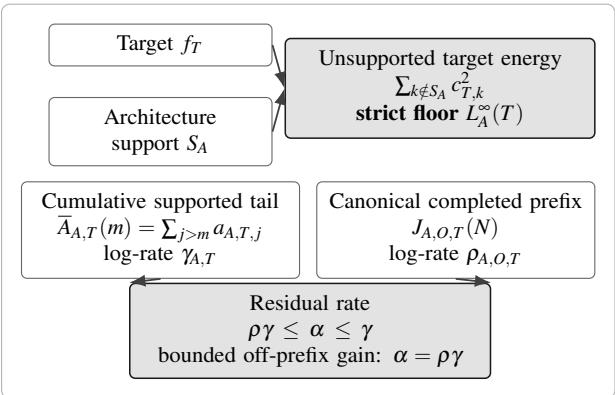
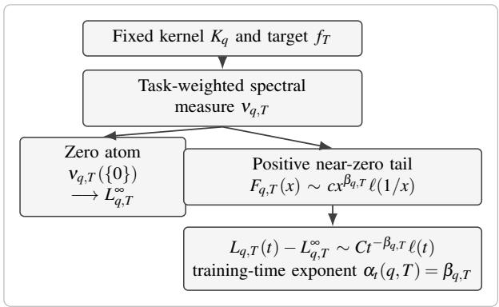
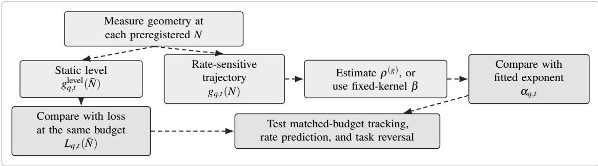
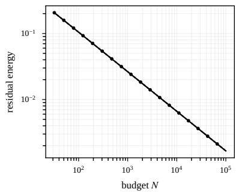
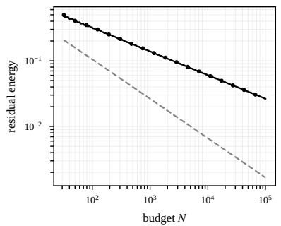
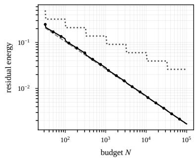

# Coupled Scaling: A Representational Accessibility Framework for Neural Scaling Laws

Jie Wang

School ofCivil and Commercial Law, Southwest University ofPolitical Science and Law

September 2026

## Abstract

Existing theories derive neural scaling from data geometry or a specified data–model spectrum, but systems trained on the same data can scale differently in practice when architecture or optimization changes the representations they can efficiently reach. We introduce Coupled Scaling, a taskconditioned framework in which finite-budget scaling depends on the relation between task structure and the geometry accessible to an architecture–optimization system. In a solvable mode-truncation model, loss separates exactly into target energy outside architectural support and an unresolved supported tail. For an arbitrary priority order, the residual lies between the best-N supported tail and the tail beyond the largest completed high-value prefix. If the cumulative-tail and coverage log-rates are $\gamma _ { A , T }$ and $\rho _ { A , O , T }$ , the residual exponent lies in $\left[ \rho _ { A , O , T } \gamma _ { A , T } , \gamma _ { A , T } \right]$ . The interval separates prefixlimited scaling from dispersed acquisition. Under bounded off-prefix gain, the completed prefix is ratedetermining and the lower endpoint is exact, $\alpha _ { A , O , T } = \rho _ { A , O , T } \gamma _ { A , T } ;$ the power-law case $a _ { A , T , j } \asymp j ^ { - b _ { A , T } }$ recovers $\alpha _ { A , O , T } = \rho _ { A , O , T } ( b _ { A , T } - 1 )$ . A fixed-kernel specialization derives the training-time exponent from the near-zero tail of a task-weighted spectral measure defined independently of the loss fit. These results sharpen the separation between architectural support and finite-budget acquisition and motivate two empirical tests: static task-relevant geometry should track loss at a common budget, while multiscale geometry should track coupling-specific exponent ordering, including its preregistered reversal across contrasting tasks. An audit of released emergence trajectories identifies the controls needed for a direct test and organizes them in a factorial design that measures geometry separately from the scaling fit.

## 1. Introduction

Neural scaling laws describe how loss changes with model size, data, and compute, and they guide both resource allocation and forecasts of future capability (Hestness et al., 2017; Kaplan et al., 2020; Hoffmann et al., 2022). A central comparative question remains open: when should systems trained on the same data share a scaling law, and when should their slopes or attainable losses diverge?

Existing geometric and spectral theories address the task-side part of this question by explaining how task structure enters scaling. Manifold accounts relate parameter scaling to intrinsic dimension under smoothness assumptions (Sharma and Kaplan, 2022); kernel and random-feature models derive learning curves from a specified feature map, data–model spectrum, target alignment, and statistical regime (Maloney et al., 2022; Bahri et al., 2024). These theories apply most directly when the representation is fixed or sufficiently flexible.

The comparison changes when systems trained on the same data reach different task-relevant geometries. Equivariant and non-equivariant models trained on the same neural-force-field data have different parameter-, data-, and computescaling exponents (Ngo and Ravanbakhsh, 2026). Feature learning changes training-time and compute exponents for targets poorly aligned with the initial representation (Bordelon et al., 2025), preconditioning changes fitted modelsize exponents in controlled random-feature regression (Ramani and Jain, 2026), and weight-decay interventions on superposition give a direct geometric mechanism for width scaling (Liu, Liu, and Gore, 2025). Together, these studies place the learning system inside the scaling relation. Across distinct resource axes, they reveal the same structural possibility: a model may contain directions relevant to a target yet assign them too little strength or reach them too late to matter at the observed scale. Architecture shapes availability; training shapes when available directions become useful. Their effects call for an object indexed by the learning system, the task, and the available budget.

We call the resulting relation Coupled Scaling.1 Let B be a finite envelope over parameters, data, compute, and training time, and let $\mathscr { P } = ( \mathscr { D } _ { \mathrm { t r a i n } } , \ell )$ fix the training problem and objective. For architecture A and training procedure O, the representational accessibility set $\mathcal { R } _ { B } ( A , O ; \mathcal { P } )$ contains the geometries reachable within that envelope. Architecture can shape structural support, feature learning can reshape the realized representation, and optimization can change which represented directions are acquired first. Coupled Scaling tracks these channels through their interaction with the task.

Its empirical signature is a coupling-by-task interaction with distinct level and rate margins. At a common finite budget, static task-relevant geometry is paired with loss at that budget. Across scales, geometry growth is paired with fitted exponent differences. Shared task-relevant access predicts convergence toward the applicable data-side rate. Under the common-tail and prefix-adequacy conditions formalized in §3.3, reversed acquisition-rate ordering across tasks predicts reversed exponent ordering. Static probes measure useful task structure at a fixed budget; multiscale trajectories measure its growth. The geometry quantities are specified independently of the loss curve.

The interaction has an exact witness in a mode-truncation model. Architecture supplies a support $S _ { A }$ , and the architecture– optimization coupling supplies a priority order $\pi _ { A , O }$ over supported directions. Population loss decomposes into target energy outside support and an unresolved supported tail. For an arbitrary priority order, the cumulative supported tail and the largest completed high-value prefix give the universal bracket

$$
\overline { { A } } _ { A , T } ( N ) \leq E _ { A , O , T } ( N ) \leq \overline { { A } } _ { A , T } ( J _ { A , O , T } ( N ) ) .
$$

If the cumulative-tail and completed-prefix log-rates are $\gamma _ { A , T }$ and $\rho _ { A , O , T }$ , the residual exponent lies in $\left[ \rho _ { A , O , T } \gamma _ { A , T } , \gamma _ { A , T } \right]$ Bounded off-prefix gain makes the completed prefix rate-determining and gives

$$
\alpha _ { A , O , T } = \rho _ { A , O , T } \gamma _ { A , T } .
$$

For $a _ { A , T , j } \asymp j ^ { - b _ { A , T } } , \ \gamma _ { A , T } = b _ { A , T } - 1$ , yielding the power-law specialization. The interval also captures dispersed acquisition: Appendix B.2 constructs a fixed nested order with the same completed-prefix rate and a strictly faster residual rate. A fixed-kernel specialization derives the training-time exponent from task-weighted spectral mass near zero.

At the theoretical level, Coupled Scaling supplies a comparison framework and a solvable witness. It identifies the strict floor, gives an exact tail–coverage bracket for arbitrary priority orders, states when a scalar completed-prefix rate predicts the exponent, and anchors the construction in a fixed-kernel spectral limit.

The empirical contribution is an identification design that pairs static geometry with matched-budget loss and multiscale geometry with fitted rates. The released emergence trajectories identify the needed controls; the proposed factorial test crosses couplings with contrasting tasks. Figure 1 summarizes the logic.

## 2. From Data-Side Scaling to Model-Side Dependence

## 2.1 Data Geometry and Fixed-Representation Accounts

Empirical scaling work established regular power-law or power-law-plus-constant relations across model size, data, and compute (Hestness et al., 2017; Kaplan et al., 2020; Hoffmann et al., 2022). These relations became useful for forecasting and allocation; their fitted parameters remained principally descriptive.2 Data-side theory supplied mechanisms by connecting scaling to the structure of the learning problem. Sharma and Kaplan (2022), for example, relate parameter scaling to intrinsic dimension under smoothness and generic-function assumptions. Bahri et al. (2024) derive multiple statistical regimes from a data–model spectrum, target alignment, and finite-sample effects; solvable kernel and random-feature models express learning curves through eigenspectra, target coefficients, noise, regularization, and resource regime (Maloney et al., 2022; Bordelon et al., 2020; Canatar et al., 2021).

Discrete coverage accounts provide a closely related tail perspective. Zou et al. (2026) formalize a sharp, monotone effective frontier in a ranked Zipfian pattern space and derive resource-dependent loss from the mass beyond that frontier. Song et al. (2026) construct a corpus-intrinsic predictive-contribution spectrum and infer a moving data-scale cutoff by matching observed excess loss to its residual tail. Together, these papers establish tail–frontier composition as a direct neighboring mechanism. Coupled Scaling extends that mechanism to systems that may differ in support and strict floor, permits acquisition paths that interleave target ranks, and obtains the empirical acquisition rate from geometry before the loss fit.

(A) Minimal support–tail–coverage witness  

(B) Fixed-kernel specialization  

(C) Direct 2 × 2 geometry-tracking test  
  
Figure 1: Coupled Scaling as a support–tail–coverage framework and a direct test. (A) Target energy outside architectural support determines the strict floor. Within support, the cumulative target tail and the canonical completed-prefix coverage give a universal rate interval; bounded off-prefix gain makes the lower endpoint exact. For $a _ { A , T , j } \asymp j ^ { - b _ { A , T } }$ the cumulative-tail rate is $\gamma _ { A , T } = b _ { A , T } - 1$ . (B) In the fixed-kernel specialization, regular variation of task-weighted spectral mass near zero gives the training-time exponent, up to a slowly varying factor. (C) In the factorial design, static geometry at N¯ is compared with loss at the same preregistered budget. The multiscale trajectory supplies $\rho ^ { ( g ) }$ , and the fixed-kernel alternative uses $\beta .$ . The common-tail and prefix-adequacy criteria define the product-law comparison. Within-task contrasts are primary, and the fitted exponent ordering is tested for a preregistered reversal across tasks.

The prefix-exact specialization recovers Zou et al.’s sharp-frontier law. Under full support and $K _ { R } = \left\{ 1 , \ldots , k _ { \star } ( R ) \right\}$ , the canonical completed prefix is $J ( R ) = k _ { \star } ( R )$ , and Proposition 2 gives $E ( R ) = \overline { { A } } ( k _ { \star } ( R ) )$ . Hence $a _ { j } \asymp j ^ { - b }$ and $k _ { \star } ( R ) \asymp R ^ { \rho }$ yield $E ( R ) \asymp R ^ { - \rho ( b - 1 ) }$ . This recovery isolates the added comparative objects: coupling-indexed support, interleaved acquisition, the prefix-adequacy criterion, and cross-task reversal. Zou et al.’s resource-specific frontier derivations and max-bottleneck analysis address complementary questions. Song et al. infer the cutoff by matching observed excess loss to residual tail mass; Coupled Scaling estimates acquisition from a geometry trajectory specified before loss fitting and evaluates it as a predictor of exponent ordering.

The matched-data cross-system question is how architecture–optimization systems make task-relevant directions strong, available early, or reachable within a feasible budget.

## 2.2 Same-Data Evidence for Model-Side Dependence

Architecture comparisons make model-side dependence concrete. Tay et al. (2023) report architecture-dependent scaling behavior and rank changes under matched language-model pretraining. Ngo and Ravanbakhsh (2026) compare equivariant and non-equivariant neural-force-field models on the same data and task and find different parameter-, data-, and compute-scaling exponents, with task-matched equivariance scaling more efficiently. In a controlled hierarchicallanguage generator, Cagnetta et al. (2025) find that convolutional networks aligned through locality and weight sharing scale faster than Transformers; representation probes track acquisition of the latent hierarchy. Defilippis, Krzakala, Loureiro, and Maillard (2026a) sharpen this structural picture for two-layer networks on hierarchical multi-index targets, deriving representation-limited regimes, subspace-recovery transitions, plateaus, and spectral structure.

A recent resource-matched architecture comparison studies recurrent depth while closely matching per-token FLOPs, total non-embedding parameters, and KV-cache size between looped and unlooped sparse MoE Transformers. Wang et al. (2026) loop the middle half of the layers twice and fit separate Chinchilla-style scaling surfaces for the two architectures across four model sizes. The looped recipe has a steeper compute-optimal frontier; its downstream advantage is largest on code and grows with sample length and the number of in-context examples. Because budget matching also changes width, expert count, and attention configuration, the experiment identifies a resource-matched architecture recipe rather than recurrence in isolation. In Coupled Scaling terms, it supplies unusually controlled evidence of model-side rate dependence while leaving open whether the operative accessibility channel is support, completed-prefix acquisition, or dispersed off-prefix gain. Distinguishing these possibilities requires an independently measured, task-conditioned geometry trajectory.

Feature learning and optimization supply a second group of mechanisms. Bordelon, Atanasov, and Pehlevan (2025) show that feature learning improves training-time and compute exponents for hard targets outside the initial kernel’s reproducing space, with little change for aligned targets. Ramani and Jain (2026) isolate a spectral optimization channel: preconditioning changes fitted model-size exponents in controlled random-feature regression. Defilippis et al. (2026b) derive excess-risk phase diagrams for diagonal and quadratic shallow networks and connect those regimes to trained-weight spectra. In GPT-style models, Jha and Reagen (2026) hold the architecture family, data recipe, and FFN-width schedule fixed across four optimizers and observe different effective-rank scaling. Their extended-training control reaches approximately matched validation perplexity for AdamW and low-rank Dion and preserves the rank difference. Huang et al. (2026) add a capacity-allocation account in which larger models retain rare and complex task features by reducing resource competition and gradient interference. Volkova et al. (2026) and Bansal et al. (2022) identify shared-exponent regimes captured by coefficients or effective-resource rescaling.

Representational interference through superposition supplies a third, explicitly geometric mechanism. In a controlled autoencoder, Liu, Liu, and Gore (2025) vary weight decay and obtain weak- and strong-superposition regimes. The weak regime inherits its exponent from the feature-frequency tail; the strong regime produces a robust inverse-width contribution through geometric interference among representation vectors. Four open language-model families exhibit the overlap signature associated with the strong regime.

Across these studies, interventions on architecture, feature learning, optimization, and superposition alter fitted scaling, learned geometry, or both under fixed or closely controlled data. These results motivate a common coupling-by-task design that tests whether independently measured geometry predicts the scaling interaction.

## 2.3 The Missing Relational Variable

The missing variable is relational: model-side interventions matter through the task structure they make easy or difficult to acquire. Connecting data-side theory to those interventions requires an object indexed by task and budget that records structural support, realized representation, and acquisition order, and reduces to spectrum plus target alignment in a fixed-representation limit. The object describes what a learning system can reach at feasible cost and preserves feasible-budget distinctions even when unbounded expressivity is shared. We call it representational accessibility.

Representational accessibility also identifies a shared-access regime. When compared systems expose effectively the same task-relevant geometry, coupling-specific exponent differences should disappear. Neural scaling universality offers a hypothesis for this regime. Liu and Gore (2026) argue that time, width, and depth exponents for current dense Transformers are fixed within a universality class, with architecture and data changing coefficients. Volkova et al. (2026) obtain more stable language-model extrapolation by fixing Chinchilla exponents to an AdamW reference and fitting optimizer-specific resource rescalings. Coefficient-only descriptions are natural under shared task-relevant access. Coupled Scaling becomes discriminating when a controlled intervention changes that access differently across tasks.

The resulting design crosses couplings with tasks. Protocol-asymptotic support sets strict floors, finite-budget acquisition sets residual rates, and the completed-prefix bracket determines when a scalar coverage rate predicts the exponent. Equivalent access defines the null; reversed acquisition-rate and exponent orderings across tasks supply the confirmatory interaction.

## 3. The Coupled Scaling Framework

## 3.1 Budget-Relative Representational Accessibility

A neural-network architecture defines an information-flow structure: a pattern induced by connectivity, attention, normalization, activation, parameter sharing, and other inductive biases. Convolution makes spatial locality inexpensive; attention permits content-dependent interaction across positions; equivariant architectures restrict representations to respect specified symmetries. These inductive biases change the resources required to realize task-relevant representations, even among architectures with comparable unrestricted expressivity. Feasible-scale comparison therefore requires a budget-relative notion of representational reach.

Let B denote a finite budget envelope over parameters, data, compute, and optimization time. Fix a training problem $\mathcal { P } = \left( \mathcal { D } _ { \mathrm { t r a i n } } , \ell \right)$ , where ℓ includes the supervision or self-supervised objective and the associated preprocessing. For architecture A trained by procedure $O ,$ define the representational accessibility set $\mathcal { R } _ { B } ( A , O ; \mathcal { P } )$ as the representational geometries attainable by the specified system within B on $\mathcal { P }$ . Here O includes parameterization, optimizer, schedule, and the resulting training dynamics; different random seeds index draws from the stochastic component of $O .$ Membership records feasibility within $B ;$ computational optimality lies outside the definition. An empirical instantiation must prespecify the representation operator or projection, the equivalence or tolerance criterion, and the resource schedule encoded by B. Universal approximation at unbounded capacity is therefore compatible with sharply different accessibility at feasible scale.

An operational form makes the suppressed choices explicit. Fix a representation descriptor $\mathcal { M }$ and an equivalence relation ∼ on its output space. Let

$$
\begin{array} { r } { \mathcal { U } _ { B } ( A , O ; \mathcal { P } ) = \left\{ \tau : \tau \mathrm { ~ i s ~ a n ~ a d m i s s i b l e ~ r u n ~ o f ~ } ( A , O ) \mathrm { ~ o n ~ } \mathcal { P } , \mathrm { ~ c o s t } ( \tau ) \preceq B \right\} . } \end{array}
$$

The corresponding accessibility set is

$$
\mathcal { R } _ { B } ^ { \mathcal { M } , \sim } ( A , O ; \mathcal { P } ) = \{ [ \mathcal { M } ( \pmb { \theta } _ { \tau } ) ] _ { \sim } : \tau \in \mathcal { U } _ { B } ( A , O ; \mathcal { P } ) \} .
$$

The superscripts are suppressed when the descriptor and equivalence convention are fixed. A closure may be taken only after a topology on the descriptor space has been specified. When O is stochastic, the empirical instantiation must state whether the reported object concerns the support of the induced distribution, an existence claim, a high-probability region, or an expectation-level summary. Budget monotonicity follows when every run admissible under $B _ { 1 }$ remains admissible under $B _ { 2 } \succeq B _ { 1 }$ 1. Empirical tests therefore use prespecified task-relevant projections as operational summaries of the reachable set.

By representation geometry we mean the task-relevant relational structure induced by a representation—operationally, a feature, similarity, covariance, or kernel operator—modulo coordinate changes that preserve the relevant operator. This quotient convention makes accessibility invariant to coordinate reparameterizations that preserve the relevant operator.

We impose four admissibility requirements on $\mathcal { R } _ { B } ( A , O ; \mathcal { P } )$ .

1. Budget monotonicity. If $B _ { 1 } \preceq B _ { 2 }$ componentwise, then $\mathcal { R } _ { B _ { 1 } } ( A , O ; \mathcal { P } ) \subseteq \mathcal { R } _ { B _ { 2 } } ( A , O ; \mathcal { P } )$ . Every geometry feasible under the smaller envelope remains feasible under the larger one when the smaller-budget procedure remains available.

2. Task conditioning. Predictions concern a task projection $P _ { T , \mathcal { D } } \mathcal { R } _ { B } ( A , O ; \mathcal { P } )$ : the portion of accessible geometry relevant to evaluation target T under distribution D. An architecture can be well aligned with one target and poorly aligned with another on the same inputs. When training and evaluation tasks coincide, T is already encoded in $\ell ;$ the projection notation keeps the comparison explicit.

3. Mechanism separation. Structural support, realized representation, and learning order are distinct channels. Architecture may alter available directions; feature learning may reweight or create realized directions; optimization may change which represented directions are reached within the budget.

4. Kernel consistency. In a fixed-kernel or appropriate lazy-training limit, the task projection must reduce to a description in terms of available eigendirections, their eigenvalues, and target alignment.

These requirements distinguish the relevant levels of description. $\mathcal { R } _ { B } ( A , O ; \mathcal { P } )$ is conditional on the training problem; its task projection is the comparison object for a particular evaluation problem. An effective spectrum is one representation of that projection, and $d _ { \mathrm { a c c e s s } }$ is a possible scalar summary. Both must be measured independently of the scaling curve.

The dependence on $o$ captures variation within a fixed architecture: lazy and rich training regimes can realize different portions of representation space under different parameterizations and dynamics (Chizat et al., 2019; Yang and Hu, 2021). The dependence on A captures structural variation under shared data, as illustrated by equivariant and nonequivariant architectures (Ngo and Ravanbakhsh, 2026). Coupled Scaling hypothesizes that both sources of variation change the task-relevant geometry reachable within the budget and thereby enter scaling behavior.

## 3.2 Task Projection and the Dual Bottleneck

Consider a task T under data distribution $\mathcal { D }$ . Only part of the input geometry is relevant to the task loss. Coupled Scaling separates that task-relevant structure into two budget-relative components.

Accessible structure is task-relevant structure that some geometry in $\mathcal { R } _ { B } ( A , O ; \mathcal { P } )$ resolves efficiently. Increasing scale can progressively refine this component, with rates governed by the applicable geometric, spectral, and statistical regime.

Currently inaccessible structure is task-relevant structure not efficiently resolved by any geometry in $\mathcal { R } _ { B } ( A , O ; \mathcal { P } )$ . It may become reachable at larger budgets or under other couplings. It contributes to residual loss at the stated budget because the current coupling supplies no sufficiently efficient pathway. Accessibility is graded: a high-cost direction can behave as inaccessible over the observed range.

Two notions of a floor must be distinguished. Let $B ( N )$ denote the experiment’s resource schedule as model size grows, including the associated data, compute, and training-time allocation. The strict asymptoticfloor under that protocol is

$$
L _ { A , O } ^ { \infty } ( \mathcal { D } ) = \operatorname* { l i m i n f } _ { N \to \infty } L ( N ; A , O , \mathcal { D } ) ,
$$

where the remaining resources follow $B ( N )$ . This liminf defines an asymptotic lower envelope without assuming an ordinary limit or an observed plateau. The task/target index is suppressed in this notation. The additive floor-plus-tail form applies to regimes in which $L ( N ) \to L ^ { \infty }$ and the residual tail is nonnegative. The finite-budget attainable loss at a maximum feasible model size $\bar { N }$ is

$$
L _ { A , O } ^ { \mathrm { e f f } } ( \mathcal { D } ; \bar { N } ) = \operatorname* { i n f } _ { N \leq \bar { N } } L ( N ; A , O , \mathcal { D } ) .
$$

For monotone learning curves this is $L ( { \bar { N } } )$ . In a nonnegative floor-plus-tail regime it contains both the strict floor and whatever task-relevant tail remains unresolved at N¯ . For a nonmonotone curve, an early low-loss excursion can place the finite-range infimum below the asymptotic lower envelope. A plateau estimated from a bounded empirical range may therefore combine $L _ { A , O } ^ { \infty }$ with an unresolved tail.

Within an active scaling regime, the standard phenomenological form becomes

$$
L ( N ; A , O , \mathcal { D } ) \approx L _ { A , O } ^ { \infty } ( \mathcal { D } ) + C ( A , O , \mathcal { D } ) N ^ { - \alpha ( A , O , \mathcal { D } ) } .
$$

The terms have distinct roles. α describes the rate at which the coupling resolves the accessible task-relevant tail in that regime, and C captures its scale. ${ \cal L } ^ { \mathrm { e f f } } ( \bar { N } )$ summarizes the best loss attained over the feasible range. A geometry measurement made at a particular budget N¯ is state-matched to $L ( { \bar { N } } )$ . It is also state-matched to ${ \cal L } ^ { \mathrm { e f f } } ( \bar { N } )$ when the curve is monotone over the studied range. A strict $L ^ { \infty }$ contains target structure outside the ultimately reachable support together with irreducible loss. Its empirical identification requires a range that separates an asymptote from curvature or an unresolved tail. For realistic networks, the expression is a regime-indexed hypothesis: its exponent is tied to a stated resource axis and fitted range, allowing broken or changing laws across scales.

This notation separates two roles of optimization. In the general framework, $o$ can affect $L ^ { \infty }$ if the training mechanism changes the support ultimately reached under the specified protocol. In the minimal model of $\ S 3 . 3$ , support is assigned to architecture and O changes priority order. The strict floor in that special case is therefore architecture- and data dependent, while O changes the finite-budget residual, prefactor, and exponent. Existing optimizer evidence concerns finite-budget residuals, prefactors, and exponents; strict-floor estimation is a next empirical target.

The dual bottleneck yields three regimes.

Accessibility-unconstrained regime. The task projection of $\mathcal { R } _ { B } ( A , O ; \mathcal { P } )$ covers the relevant structure over the fitted range. Scaling is then governed by the applicable data-side regime, and system differences may be confined to constants or vanish within a prespecified equivalence margin.

Accessibility-constrained regime. Some relevant directions are absent, weakly represented, or reached too late. The observed exponent can change, and finite-budget residual loss rises. If the omitted structure lies outside ultimate support, the strict floor rises as well.

Task-aligned regime. A coupling covers the relevant structure with little representational waste and prioritizes high-value directions. It can combine a low attainable loss with a steep fitted slope for that task. Alignment and any resulting advantage are task-specific.

## 3.3 A Minimal Solvable Instance

The following construction provides an exact witness for the mechanism. It specializes the budget-relative framework by separating a protocol-asymptotic support from finite-budget acquisition. Let $f ^ { * } \in L ^ { 2 } ( \mathcal { D } )$ be a target expanded in an orthonormal basis $\{ \varphi _ { k } \} _ { k \ge 1 } \colon$

$$
f ^ { * } = \sum _ { k } c _ { k } \varphi _ { k } , \qquad c _ { k } = \langle f ^ { * } , \varphi _ { k } \rangle .
$$

Represent a coupling by two objects: an architecture-family support $S _ { A } \subseteq \mathbb { N } ,$ defined as the union of directions available as the modeled capacity coordinate grows under the fixed protocol, and a priority order $\pi _ { A , O }$ enumerating $S _ { A }$ . For the asymptotic construction, $S _ { A }$ is countably infinite and $\pi _ { A , O } : \mathbb { N } \to S _ { A }$ is a bijection. A finite support exhausts after $\vert S _ { A } \vert$ and belongs to a finite-tail regime. We stipulate joint realizability of successive prefixes by a nested capacity family. Thus $S _ { A }$ denotes the protocol-asymptotic support in this idealized instance. At budget $N ,$ the learner’s finite-budget access consists of the first N prioritized modes,

$$
\hat { f } _ { N } = \sum _ { r = 1 } ^ { N } c _ { \pi _ { A , O } ( r ) } \varphi _ { \pi _ { A , O } ( r ) } .
$$

Orthonormality gives the exact decomposition

$$
L ( \hat { f } _ { N } ) = \underbrace { \sum _ { k \notin S _ { A } } c _ { k } ^ { 2 } } _ { L _ { A } ^ { \infty } ( T ) } + \underbrace { \sum _ { r > N } c _ { \pi _ { A , O } ( r ) } ^ { 2 } } _ { E _ { A , O , T } ( N ) } .
$$

Proposition 1 (architecture-dependent strict floor). Let $V _ { A } = { \overline { { \operatorname { s p a n } } } } \{ \varphi _ { k } : k \in S _ { A } \}$ . Then

$$
L _ { A } ^ { \infty } ( T ) = \| \Pi _ { V _ { A } ^ { \perp } } f ^ { * } \| ^ { 2 } .
$$

The strict floor is the target energy outside architectural support. It vanishes if and only if the task-relevant support of $f ^ { * }$ is contained in $S _ { A }$ . Within this construction it is invariant to priority order and finite budget. The proof is given in Appendix B.2.

At maximum feasible budget $\bar { N } ,$ however,

$$
{ L } _ { A , O , T } ^ { \mathrm { e f f } } ( \bar { N } ) = { L } _ { A } ^ { \infty } ( T ) + { E } _ { A , O , T } ( \bar { N } ) ,
$$

so the full coupling governs attainable loss, while architectural support alone governs the strict floor in this construction. For the residual rate, fix a task $T$ and let $I _ { A , O } ( N ) = \{ \pi _ { A , O } ( r ) : 1 \leq r \leq N \}$ be the acquired set. List the modes in $S _ { A }$ with nonzero target power as $i _ { 1 } , i _ { 2 } , \dots$ . in nonincreasing target power and write $\bar { a _ { A , T , j } } = c _ { i _ { j } } ^ { 2 }$ . Ties are resolved by a deterministic rule fixed ex ante and independently of the coupling. Let

$$
K _ { A , O , T } ( N ) = \{ j : i _ { j } \in I _ { A , O } ( N ) \}
$$

be the acquired rank set and define the canonical completed-prefix coverage

$$
J _ { A , O , T } ( N ) = \operatorname* { m a x } \big \{ m \geq 0 : \{ 1 , \dots , m \} \subseteq K _ { A , O , T } ( N ) \big \} ,
$$

with the maximum of the empty prefix equal to zero. Finally define the cumulative supported target tail

$$
\overline { { { A } } } _ { A , T } ( m ) = \sum _ { j > m } a _ { A , T , j } .
$$

Proposition 2 (tail–coverage bracket and product law). Suppose $J _ { A , O , T } ( N ) $ ∞ and the cumulative-tail and coverage log-rates exist:

$$
\gamma _ { A , T } = \operatorname* { l i m } _ { m  \infty } \frac { - \log \overline { { A } } _ { A , T } ( m ) } { \log m } \in ( 0 , \infty ) , \qquad \rho _ { A , O , T } = \operatorname* { l i m } _ { N  \infty } \frac { \log J _ { A , O , T } ( N ) } { \log N } \in ( 0 , 1 ] .
$$

Then, for every $N ,$

$$
\overline { { { A } } } _ { A , T } ( N ) \leq E _ { A , O , T } ( N ) \leq \overline { { { A } } } _ { A , T } ( J _ { A , O , T } ( N ) ) ,
$$

and hence

$$
\rho _ { A , O , T } \gamma _ { A , T } \leq \operatorname* { l i m i n f } _ { N  \infty } \frac { - \log E _ { A , O , T } ( N ) } { \log N } \leq \operatorname* { l i m s u p } _ { N  \infty } \frac { - \log E _ { A , O , T } ( N ) } { \log N } \leq \gamma _ { A , T } .
$$

If bounded off-prefix gain holds—that is, for some $\eta \in ( 0 , 1 ]$ and all sufficiently large $N _ { \ast }$

$$
E _ { A , O , T } ( N ) \ge \eta \overline { { { A } } } _ { A , T } ( J _ { A , O , T } ( N ) ) ,
$$

then the residual exponent exists and satisfies

$$
\alpha _ { A , O , T } = \rho _ { A , O , T } \gamma _ { A , T } .
$$

The same product law holds under the weaker rate condition

$$
\frac { \overline { { A } } _ { A , T } ( J _ { A , O , T } ( N ) ) } { E _ { A , O , T } ( N ) } = N ^ { o ( 1 ) } .
$$

If, in addition,

$$
a _ { A , T , j } \asymp j ^ { - b _ { A , T } } , \qquad b _ { A , T } > 1 , \qquad J _ { A , O , T } ( N ) \asymp N ^ { \rho _ { A , O , T } } ,
$$

then $\gamma _ { A , T } = b _ { A , T } - 1$ and bounded off-prefix gain yields the stronger asymptotic-order result

$$
E _ { A , O , T } ( N ) \asymp N ^ { - \rho _ { A , O , T } ( b _ { A , T } - 1 ) } .
$$

The lower bound is a best-N-mode bound: budget N can resolve at most N nonzero-target modes, and the first N ranks capture the greatest possible target power. The upper bound uses the completed prefix. The bounded-gain assumption makes these bounds rate-matched; it can be weakened from a constant-factor condition to the displayed subpolynomial ratio. When $\rho _ { A , O , T } = 1$ , the universal interval collapses and $\alpha _ { A , O , T } = \gamma _ { A , T }$ even without a separate off-prefix assumption. Appendix B.2 proves the result, quantifies the gap between the two bounds, and gives a fixed nested order in which dispersed acquisition adds a second rate component. Figure 2 evaluates the equality cases and the interleaved counterexample at finite budgets.

Because the supported sequence is defined after restriction to $S _ { A } , \gamma _ { A , T }$ , like $b _ { A , T } .$ , is generally architecture–task dependent. Common full support in a basis fixed ex ante independently of the coupling is one sufficient condition under which compared systems share a coupling-invariant $\gamma _ { T }$ . With full support and $\rho = 1$ , the representational floor vanishes and the residual rate reduces to the common task-side tail rate.

Corollary 1 (coupling-by-task reversal). Consider two couplings $q _ { 1 } = ( A _ { 1 } , O _ { 1 } )$ and $q _ { 2 } = ( A _ { 2 } , O _ { 2 } )$ and two tasks $T _ { 1 } , T _ { 2 }$ . Suppose that, within each task $T _ { t } ,$ the two couplings have full support in the same ex ante task-side basis and induce a common cumulative supported-tail log-rate

$$
\gamma _ { A _ { 1 } , T _ { t } } = \gamma _ { A _ { 2 } , T _ { t } } = : \gamma _ { t } > 0 .
$$

Suppose also that both couplings satisfy Proposition $2 \mathrm { { : } }$ bounded or subpolynomial off-prefix condition. If

$$
\rho _ { q _ { 1 } , T _ { 1 } } > \rho _ { q _ { 2 } , T _ { 1 } } \qquad \mathrm { a n d } \qquad \rho _ { q _ { 1 } , T _ { 2 } } < \rho _ { q _ { 2 } , T _ { 2 } } ,
$$

then their residual-exponent ordering reverses across tasks. The corresponding residual-loss ordering reverses for all sufficiently large $N ;$ equal within-task floors extend the conclusion to total loss. Equal support, common tail behavior, and equal coverage rates imply no exponent difference in this instance.

The construction supplies an existence witness for the support–acquisition mechanism. Under stipulated support, acquisition order, and an omniscient within-order allocation, it generates coupling-dependent exponents and cross-task reversals. Its abstraction from sample noise and optimization error isolates the quantities that a fuller theory must derive from architecture and training dynamics: support, cumulative supported-tail behavior, acquisition order, and the completed-prefix coverage rate.

Formal-to-empirical bridge. The solvable quantities identify the targets for realistic measurement. $S _ { A }$ corresponds to protocol-asymptotic task-relevant support in this instance, and $I _ { A , O } ( N )$ to the finite-budget acquired set. The cumulativetail rate $\gamma _ { A , T }$ summarizes the remaining target power after a high-value prefix; $b _ { A , T } - 1$ is its power-law special case. $\rho _ { A , O , T }$ measures how quickly the coupling completes that prefix. The tail is basis-relative; its data-side reading requires a basis fixed ex ante independently of the coupling or supplied by a task/data-side operator. Empirical interpretation of $L _ { A } ^ { \infty }$ uses a scale range that separates the asymptote from slow acquisition. Section 3.5 separates static geometry levels from rate-sensitive coverage trajectories. A confirmatory product-law test preregisters a prefix-adequacy route: either a rank-resolved off-prefix diagnostic or a design- or theory-based argument that makes off-prefix gain bounded or exponent-neutral. All quantities are fixed independently of the fitted loss curve. The empirical test asks whether they predict matched-budget loss and the direction of exponent differences under the stated tail and acquisition conditions.

## 3.4 Effective Spectrum and a Fixed-Kernel Specialization

For a fixed task and data distribution, an effective spectrum operationalizes one projection of representational accessibil ity: which directions are represented, with what strength, and at what learning rate. Kernel and random-feature theories make this description precise through an architecture- and data-dependent eigenspectrum together with the target’s decomposition over its eigenfunctions. Target power in large-eigenvalue modes is typically learned earlier, whereas power in small- or zero-eigenvalue modes is learned slowly or remains unexpressed (Bordelon et al., 2020; Canatar et al., 2021; Bahri et al., 2024).

The three model-side channels enter this projection differently.

• Structural accessibility. Architecture shapes support, basis directions, information flow, and inductive bias. Wiringlevel results on copying and associative recall illustrate that architectural constraints can create large task-specific efficiency gaps (Jelassi et al., 2024; Arora et al., 2024).

• Dynamical accessibility. Feature learning changes the representation realized during training and can reweight task-relevant directions relative to the initial kernel (Yang and Hu, 2021; Bordelon et al., 2025).

• Optimization-conditioned accessibility. Preconditioning and changes in the training metric can alter the order or rate at which already represented directions are resolved while preserving support in the controlled setting of Ramani and Jain (2026).

Superposition supplies one concrete operational instance. In the controlled model of Liu, Liu, and Gore (2025), overlap among feature vectors contributes an interference term to loss, and a weight-decay intervention changes the superposition regime. Within Coupled Scaling, this can be interpreted as changing the effective strength and interference of accessible directions. More generally, the common object across the three channels is budget-relative learnability: architecture can move a support frontier, feature learning can reshape realized geometry, and optimization can change the rate at which the system approaches that frontier. The support/order split in §3.3 is a minimal formal separation of these roles; richer models may allow feature learning and optimization to change both support and order.

Kernel correspondence. In kernel regression and appropriate infinite-width lazy-training limits, the task projection of accessibility has a precise analogue. Learning curves depend on sample size, kernel eigendirections and eigenvalues, target alignment, and—where applicable—noise and regularization (Bordelon et al., 2020; Canatar et al., 2021; Caponnetto and De Vito, 2007). Kernel support corresponds to available directions, while eigenvalue-weighted target alignment supplies an acquisition hierarchy. The lazy-limit analogue of $\mathcal { R } _ { B } ( A , O ; \mathcal { P } )$ is therefore a fixed spectrum-andalignment description conditional on the remaining statistical assumptions. This anchors the framework in a known limit. When representation is fixed, Coupled Scaling recovers the static spectrum-and-alignment description. Beyond that limit, independently measured evolving geometry supplies the empirical bridge to feature learning and cross-family variation.

Restricted operational anchor. Let q index a bounded, positive semidefinite, self-adjoint fixed-kernel operator $K _ { q }$ on $L ^ { 2 } ( \mathcal { D } )$ , while the optimizer and noiseless population gradient-flow dynamics are held fixed. Assume a complete countable orthonormal eigenbasis $\{ \phi _ { q , k } \} _ { k } .$ , including the zero-eigenvalue subspace, with eigenvalues $\lambda _ { q , k } \ge 0$ , and write $c _ { q , T , k } = \langle f _ { T } , \phi _ { q , k } \rangle$ . For a nonzero target $f _ { T } \in L ^ { 2 } ( \mathcal { D } )$ , define the normalized task-weighted spectral measure

$$
\nu _ { q , T } = \sum _ { k } \frac { c _ { q , T , k } ^ { 2 } } { \sum _ { j } c _ { q , T , j } ^ { 2 } } \delta _ { \lambda _ { q , k } } .
$$

This object is determined by the fixed kernel spectrum and target alignment before any power-law fit. For squared-loss gradient flow from zero initialization, using residual dynamics $\dot { \boldsymbol { r } } = - K _ { q } \boldsymbol { r } ,$ equivalently $r ( t ) = e ^ { - t K _ { q } } r ( 0 )$

$$
\frac { L _ { q , T } ( t ) } { L _ { q , T } ( 0 ) } = \int e ^ { - 2 \lambda t } d \nu _ { q , T } ( \lambda ) , \qquad H _ { q , T } ( t ) = 1 - \int e ^ { - 2 \lambda t } d \nu _ { q , T } ( \lambda ) .
$$

Spectral mass on $( 0 , \infty )$ represents target energy learnable under the fixed-kernel dynamics, while $\nu _ { q , T } ( \{ 0 \} )$ is the normalized strict-residual fraction. The spectral filter $e ^ { - 2 \lambda t }$ supplies a dynamics-derived soft acquisition profile, and $H _ { q , T } ( t )$ is the corresponding resolved-energy summary. Independent geometry measurements enter the empirical tests separately.

Proposition 3 (classical fixed-kernel spectral-tail bridge). Let $m _ { q , T } = \nu _ { q , T } ( \{ 0 \} )$ and $F _ { q , T } ( x ) = \nu _ { q , T } ( ( 0 , x ] )$ . If, for some $\beta _ { q , T } > 0 , F _ { q , T }$ is regularly varying at zero,

$$
\operatorname* { l i m } _ { x \downarrow 0 } \frac { F _ { q , T } ( a x ) } { F _ { q , T } ( x ) } = a ^ { \beta _ { q , T } } \qquad ( a > 0 ) ,
$$

then, as $t \to \infty$

$$
\frac { L _ { q , T } ( t ) - L _ { q , T } ^ { \infty } } { L _ { q , T } ( 0 ) } \sim \Gamma ( \beta _ { q , T } + 1 ) F _ { q , T } ( ( 2 t ) ^ { - 1 } ) , \qquad L _ { q , T } ^ { \infty } = m _ { q , T } L _ { q , T } ( 0 ) .
$$

Here $\Gamma ( \cdot )$ is the Euler gamma function.

In particular, if $F _ { q , T } ( x ) \sim c _ { q , T } x ^ { \beta _ { q , T } } \ell _ { q , T } ( 1 / x )$ , where $\ell _ { q , T }$ is slowly varying, then the residual loss is asymptotic to

$$
L _ { q , T } ( 0 ) c _ { q , T } \Gamma ( \beta _ { q , T } + 1 ) ( 2 t ) ^ { - \beta _ { q , T } } \ell _ { q , T } ( 2 t ) .
$$

Thus independently specified spectral mass near zero determines a fixed-kernel training-time exponent $\alpha _ { t } ( q , T ) = \beta _ { q , T }$ up to a slowly varying correction. To see the result, suppress $q , T$ , separate the zero atom, set $s = 2 t$ , and use Stieltjes integration by parts:

$$
\int _ { ( 0 , \infty ) } e ^ { - s \lambda } d F ( \lambda ) = s \int _ { 0 } ^ { \infty } e ^ { - s \lambda } F ( \lambda ) d \lambda = \int _ { 0 } ^ { \infty } e ^ { - u } F ( u / s ) d u .
$$

After division by $F ( 1 / s )$ , regular variation and Potter bounds give dominated convergence to $\begin{array} { r } { \int _ { 0 } ^ { \infty } e ^ { - u } u ^ { \beta } d u = \Gamma ( \beta + 1 ) } \end{array}$ Proposition 3 uses the Abelian direction of the classical Karamata Laplace–Stieltjes theorem (Bingham, Goldie, and Teugels, 1987) as a restricted calibration: regular variation of the task-weighted spectral measure implies the stated loss asymptotic. The reverse identification from an observed power-law loss curve requires additional Tauberian conditions. A positive spectral gap yields exponential decay and defines a different regime.

For the positive eigenmodes indexed so that $\lambda _ { 1 } \geq \lambda _ { 2 } \geq \cdots \downarrow 0 .$ let $w _ { j } = c _ { q , T , j } ^ { 2 } / \sum _ { k } c _ { q , T , k } ^ { 2 }$ be their weights relative to total target energy, including any zero-eigenvalue target mass in the denominator. If this eigenvalue order is asymptotically aligned with the target-power order of Proposition 2 and $\lambda _ { j } \sim \kappa j ^ { - a } , w _ { j } \sim d j ^ { - b }$ , where $\kappa , d > 0 , a > 0$ , and $b > 1$

$$
F ( x ) \sim { \frac { d } { b - 1 } } \kappa ^ { - ( b - 1 ) / a } x ^ { ( b - 1 ) / a } .
$$

Because the filter effectively resolves modes with $t \lambda _ { j } \gtrsim 1$ , its soft cutoff satisfies $J _ { \mathrm { e f f } } ( t ) \asymp t ^ { 1 / a }$ . Hence $\beta = ( b - 1 ) / a$ matches the rate product with the analogues $\gamma = b - 1$ and $\rho _ { \mathrm { e f f } } = 1 / a$ . This soft-filter correspondence is distinct from the hard acquired-set bounds in Proposition 2. If one sets $N = t$ and retains the normalization $J ( N ) \leq N$ , then $a \geq 1$ is required. For asymptotically misaligned eigenvalue and target-power orders, the joint spectral measure $F$ is the appropriate object. Opposite β-orderings across two tasks give the same eventual residual-order reversal as Corollary 1; equal within-task floors extend the reversal to total loss.

The construction provides a mathematically closed fixed-kernel instantiation of the framework; feature-learning networks require an independently specified accessibility measure.

## 3.5 Operationalization and Measurement

The empirical design maps each theoretical object to a prespecified proxy and comparison. Table 1 summarizes the resulting measurement and identification structure.

Table 1. Theoretical objects, empirical roles, candidate measurements, and identification status.
<table><tr><td>Object</td><td>Empirical role</td><td>Candidate measurement</td><td>Identification status</td></tr><tr><td> $\mathcal { R } _ { B } ( A , O ; \mathcal { P } )$ </td><td>Budget-relative reachable set conditional on the training</td><td>Prespecified projections of a fixed representation descriptor recovery is unspecified</td><td>Theoretical object; full-set</td></tr><tr><td> $P _ { T , \mathcal { D } } \mathcal { R } _ { B } ( A , O ; \mathcal { P } )$ </td><td>problem Task-relevant projection</td><td>Cross-system probes, task-conditioned representation</td><td>Partly measurable</td></tr><tr><td>Static task-conditioned geometry level  $g _ { q , t } ^ { \mathrm { l e v e l } } ( \bar { N } )$ </td><td>Task-relevant breadth or alignment at a common finite budget; primary outcome  ${ \cal L } _ { q , t } ( \bar { N } )$ </td><td>Held-out probes, effective rank, Partly measurable; alignment, or task-conditioned proxy-dependent spectral summaries</td><td></td></tr><tr><td>Cumulative-tail rate  $\gamma _ { A , T }$ </td><td>Task-power mass remaining after a high-value prefix</td><td>Ex ante task basis, supported target spectrum, or controlled synthetic construction</td><td>Precise in the witness; basis- and support-dependent in general</td></tr><tr><td>Completed-prefix rate  $\rho _ { A , O , T }$ </td><td>Rate at which high-value task structure becomes accessible; primary outcome  $\alpha _ { q , t }$  under the</td><td> $J _ { \boldsymbol { q } , t } ^ { ( g ) } ( \boldsymbol { N } )$  , a preregistered geometry trajectory</td><td>Precise in the witness; proxy-based in general</td></tr><tr><td>Fixed-kernel spectral tail  $\beta _ { q , T }$ </td><td>off-prefix condition Rate-sensitive fixed-kernel quantity; primary outcome</td><td>Near-zero tail of  $F _ { q , T }$ </td><td>Precise under Proposition 3 conditions</td></tr><tr><td>Scaling saturation</td><td> $\alpha _ { t } ( q , T )$  Consequence of limited accessibility</td><td>Regime transition, fitted curvature, or plateau</td><td>Diagnostic proxy requiring independent validation</td></tr></table>

The static quantity $g _ { \boldsymbol { q } , t } ^ { \mathrm { l e v e l } } ( \bar { N } )$ summarizes task-relevant breadth, alignment, or effective rank at the selected comparison budget, typically the largest feasible point on the resource grid. A directional contrast uses a scalar proxy or scalarization fixed in advance. Candidate measurements include the subspace used for effective adaptation (Aghajanyan et al., 2021), activation-space intrinsic dimension (Ansuini et al., 2019), and $d _ { \mathrm { a l i g n } } .$ , which tests whether a local residual direction transfers from training to held-out data (Zhang et al., 2026). In the fixed-kernel setting, the full task-weighted spectral measure $\nu _ { q , T }$ supplies the corresponding geometry.

The level is paired with ${ \cal L } _ { q , t } ( \bar { N } )$ under a common resource convention. Parameter-matched and compute-matched comparisons form separate analyses because they may rank the same systems differently. The couplings also share the probe population, task projection, representation layer, and scalar orientation. Repetition across seeds identifies stable geometric separation. The finite-range summary $L _ { q , t } ^ { \mathrm { e f f } } ( \bar { N } )$ may be reported alongside the primary state-matched loss and coincides with it when the curve is monotone over the studied range.

Exponent prediction uses a trajectory. Let $g _ { q , t } ( N )$ be the held-out geometry measurement at each scale on the fixed grid. When the measure has a completed high-value-prefix interpretation, define $J _ { \boldsymbol { q } , t } ^ { ( g ) } ( \boldsymbol { N } )$ and estimate

$$
J _ { \boldsymbol { q } , t } ^ { ( g ) } ( N ) \asymp N ^ { \rho _ { \boldsymbol { q } , t } ^ { ( g ) } } .
$$

The empirical rate $\rho _ { q , t } ^ { ( g ) }$ is the analogue of the canonical completed-prefix rate in Proposition 2. Confirmatory cells follow one of two prefix-adequacy routes. A rank-resolved route compares unresolved supported energy with the cumulative tail beyond the completed prefix, using geometry quantities specified before loss fitting. A design- or theory-based route establishes bounded or exponent-neutral off-prefix gain through construction or independent theory. Polynomial off-prefix acceleration selects the universal exponent interval in place of the product-law endpoint.

In the fixed-kernel specialization, the near-zero spectral-tail index $\beta _ { q , T }$ supplies the rate-sensitive quantity directly; Appendix B.2 gives the corresponding diagnostic, finite-budget illustration, and counterexample. Level and rate can move independently: systems can differ at N¯ yet grow at similar rates, or cross within the measured range despite different rates. Estimating $\rho ^ { ( g ) }$ therefore uses the full trajectory and its uncertainty. Nikolaou et al. (2026) track the eNTK eigenvalue scale currently driving loss reduction through a loss-gradient-weighted spectral position, while Liu, Paquette, and Sous (2026) use activation-covariance and per-sample gradient spectra as early diagnostics of optimization and token efficiency. A rank-and-coverage interpretation fixed before loss fitting connects these evolving spectra to the completed-prefix quantities. Saturation diagnostics can then locate candidate bottlenecks, cross-system representation comparisons measure task-relevant geometry, and direct inductive-bias interventions test a manipulable structural mechanism such as locality or equivariance. The predictions below pair static geometry with matched-budget loss and completed-prefix growth with exponent ordering under the stated tail and prefix-adequacy criteria.

## 3.6 Testable Predictions

Coupled Scaling yields two discriminating predictions. At a common comparison budget, greater task-relevant geometric access should predict lower loss on the corresponding task. Across scales, a completed-prefix rate measured apart from performance should predict the fitted exponent when the within-task cumulative-tail rate is common and off-prefix gain is exponent-neutral. Tasks favoring the opposite coupling should reverse both orderings. Equivalent task-relevant access defines the null, with coupling-specific exponent differences expected to fall within a prespecified margin.

The exact decomposition in §3.3 motivates the level prediction by expressing fixed-budget loss as target energy outside architectural support plus an unresolved within-support tail. Its empirical use requires a preoriented scalar geometry measure and a common resource convention. Proposition 2 supplies the formal route for the rate prediction: the geometry trajectory carries the completed-prefix meaning, the compared couplings share the cumulative supported-tail rate within a task, and off-prefix gain is bounded or exponent-neutral. Proposition 3 supplies the fixed-kernel comparison between an independently measured spectral-tail index and the training-time exponent. Cross-task geometry interactions additionally require common standardization

Three outcome patterns challenge the accessibility hypothesis under the stated conditions: verified geometry separation paired with equivalent matched-budget loss or exponent; a scaling shift opposite to the measured rate; or an interaction accounted for by task-side variables after the coupling intervention and geometry separation are established. In a mode-resolved test, a residual exponent outside the universal interval [ργ,γ] also violates the solvable witness.

## 4. Evidence, Identification, and a Direct Test

## 4.1 What Controlled Studies Establish

Same-data comparisons provide the clearest evidence that scaling can depend on the learning system. Ngo and Ravanbakhsh (2026) compare equivariant and non-equivariant neural force fields on the same task and data, finding architecture-dependent parameter-, data-, and compute-scaling exponents. Tay et al. (2023) observe scaling differences and rank changes across ten language-model architectures under a matched pretraining and evaluation protocol. Structured shallow-network theories add representation-limited regimes, phase transitions, and spectral structure, and feature-learning analyses connect risk exponents to the learned representation. These results show that architecture and structural alignment can shape scaling under fixed or closely controlled data. Each effect remains indexed to the resource axis measured: parameter-, data-, compute-, and training-time exponents are distinct empirical quantities.

Feature learning and optimization supply complementary mechanisms. Bordelon et al. (2025) obtain different trainingtime and compute exponents for hard tasks under feature learning. Ramani and Jain (2026) obtain optimizer-dependent fitted model-size exponents in a random-feature setting. Jha and Reagen (2026) measure optimizer-dependent FFN effective-rank scaling in a common GPT-style family and include an extended-training comparison at matched perplexity. Activation and gradient spectra offer multiscale diagnostics of optimization.

Superposition and capacity-based mechanisms broaden this picture. Liu, Liu, and Gore (2025) show that superposition induced geometric interference can generate robust model-width scaling, while capacity, interference, and rare-task retention provide another route through which finite resources shape access to task features. Shared-exponent cases identify the corresponding null regime. In Bansal et al. (2022), the tested architecture, task setup, filtering, and iid-noise interventions have little effect on data-scaling exponents; back-translated data is the reported exception and degrades the fitted exponent. Volkova et al. (2026) find ill-conditioned separate optimizer fits and improved stability and extrapolation under a constrained shared-exponent rescaling. Current evidence supports both difference and equivalence hypotheses at the level of finite-range exponent or geometry effects. Architecture-specific strict floors remain an empirical target. A direct Coupled Scaling test therefore brings four elements into one design: an explicit coupling intervention, contrasting tasks, multiscale geometry measurement, and a separately fitted scaling interaction. Appendix C.1 maps the existing evidence to these elements; §§4.2–4.3 derive the corresponding controls and test.

## 4.2 An Identification Audit of Released Emergence Trajectories

We use the released emergence trajectories to ask what a direct test of Coupled Scaling must control. Let x be a monotone scaling coordinate and suppose that, within a fitted regime,

$$
L _ { t } ( x ; A , O ) = L _ { t } ^ { \infty } ( A , O ) + C _ { t } ( A , O ) x ^ { - \alpha _ { t } ( A , O ) } .
$$

For a task-specific threshold $\varepsilon _ { t } .$ , the corresponding continuous crossing scale is

$$
x _ { t } ( A , O ) = \left( \frac { C _ { t } ( A , O ) } { \varepsilon _ { t } - L _ { t } ^ { \infty } ( A , O ) } \right) ^ { 1 / \alpha _ { t } ( A , O ) } .
$$

Thus the exponent, prefactor, and attainable floor can each change an emergence scale. For unrelated tasks, crossing order can reverse across couplings because each task has its own curve parameters. A valid prerequisite ordering has an additional task-side interpretation: success on a composite must entail competence on its component at commensurate thresholds. Appendix A gives the continuous and discrete validity conditions.

Liu et al. (2026) find a stable capability-emergence order across the released model families and describe it as an implicit curriculum. The Coupled Scaling question is whether, after valid task dependencies are separated out, the remaining order has a component that changes with the learning system and follows representation geometry measured on its own. The release helps specify the required controls because it spans several families and scales while combining those changes with training and evaluation differences.

The released data contain four accuracy trajectories from three open-weight model families. We evaluate five thresholdbased measures and two threshold-free measures—maximum-improvement timing (max-slope) and normalized trajectory area under the curve (AUC). The primary universe contains 29 tasks and 46 prerequisite edges, and a registry-native universe provides a robustness check. The matched estimand compares prerequisite-linked elemental–composite pairs (category A) with cross-level but non-prerequisite pairs $( C _ { 1 } )$ within the same composite:

$$
\Delta ( c ) = \bar { S } _ { A ( c ) } - \bar { S } _ { C _ { 1 } ( c ) } , \qquad \bar { \Delta } = | \mathcal { C } | ^ { - 1 } \sum _ { c \in \mathcal { C } } \Delta ( c ) .
$$

Matching fixes the composite; elemental identity, difficulty, format, and exposure remain uncontrolled, so the estimand is descriptive. Task-universe construction, validity rules, resampling, and degeneracy checks appear in Appendix A.

Table 2. Within-composite matched contrasts for the two threshold-free measures. $\bar { \Delta }$ is the composite-equal-weight mean of $\Delta ( c ) ; r _ { \mathrm { p e r m } }$ is the tail area under the within-composite label-permutation reference distribution in the $\bar { \Delta } > 0$ direction specified before the matched-contrast implementation and serves as an uncalibrated descriptive reference quantity; ranges are 2.5–97.5% composite-resampling percentiles. All quantities are descriptive under the observational design (Appendix A.5).

<table><tr><td>Measure</td><td>Task set</td><td> $n _ { c }$ </td><td>Δ</td><td> $r _ { \mathrm { p e r m } }$ </td><td>2.5–97.5% percentile range</td></tr><tr><td>max-slope</td><td>Primary</td><td>17</td><td>-0.068</td><td>0.925</td><td>(−0.175, +0.033)</td></tr><tr><td>max-slope</td><td>Registry</td><td>12</td><td>-0.103</td><td>1.000</td><td>(−0.228, −0.011)</td></tr><tr><td>AUC</td><td>Primary</td><td>20</td><td>+0.029</td><td>0.176</td><td>(−0.035, +0.093)</td></tr><tr><td>AUC</td><td>Registry</td><td>17</td><td>+0.084</td><td>0.020</td><td>(−0.031, +0.209)</td></tr></table>

Table 2 changes the interpretation of the unmatched benchmark. In the primary universe, the unmatched A–B comparison is positive for max-slope (0.278; permutation-reference tail area 0.007), AUC (0.128; 0.018), and all five thresholds. That comparison also mixes prerequisite structure with task level, difficulty, format, and valid-comparison structure. The within-composite $\mathbf { A } { - } C _ { 1 }$ contrast holds the composite fixed and sharply attenuates the pattern. Max-slope becomes negative in both universes (−0.068 and −0.103), whereas AUC remains small and positive (+0.029 and +0.084), with composite-resampling ranges spanning zero. The stable conclusion from the matched analysis is measure dependence and substantial attenuation.

Sensitivity analyses identify AUC as the more stable threshold-free summary. Max-slope changes materially with checkpoint structure, valid-comparison weighting, and model deletion and is retained as exploratory. AUC remains positive under every model deletion and after exclusion of six operationally degenerate composites (+0.040 primary; +0.044 registry). Appendix A reports the full seven-measure battery, the alternative integration axis, and the remaining sensitivity analyses. The audit’s descriptive interpretation therefore rests on AUC.

The audit therefore serves as an identification analysis. In the released suite, coupling, corpus, scale, checkpoint structure, and stochastic realization vary jointly. A direct test requires coupling to vary independently of the training recipe, task structure to be matched or deliberately crossed, geometry to be measured separately from performance, and stochastic variation to be estimated with repeated runs. Together, these controls define the factorial design in §4.3.

## 4.3 A Discriminating Multiscale Test

The direct test crosses at least two architecture–optimization couplings with at least two task families selected for a predicted alignment reversal. Within each task instance, the data-generating process, examples, objective, evaluation, schedule, and seed distribution are held fixed across couplings. An optimizer claim is tested by crossing optimization explicitly with architecture and task. Every coupling–task cell spans multiple scales and seeds. Parameter-matched and compute-matched analyses form distinct resource comparisons, and task families are matched on format, exposure, and nominal difficulty when those features enter the claim. Before training, the design assigns the expected alignment direction for each coupling. Its primary comparison is the resulting cross-task reversal.

Geometry is measured on held-out data at every scale on the fixed grid. Let $g _ { q , t } ( N )$ denote the task-conditioned trajectory. A preoriented scalar level, or a scalarization fixed before any loss comparison, defines $g _ { q , t } ^ { \mathrm { l e v e l } } ( \bar { N } )$ and is paired with ${ \cal L } _ { q , t } ( \bar { N } )$ at the same budget. The multiscale trajectory supplies the rate comparison; $L _ { q , t } ^ { \mathrm { e f f } } ( \bar { N } )$ remains an optional finite-range summary. For a measure with a completed high-value-prefix interpretation, define $J _ { \boldsymbol { q } , t } ^ { ( g ) } ( \boldsymbol { N } )$ and estimate

$$
J _ { \boldsymbol { q } , t } ^ { ( g ) } ( N ) \asymp N ^ { \rho _ { \boldsymbol { q } , t } ^ { ( g ) } } .
$$

The Proposition 2 comparison uses a common cumulative supported-target-tail rate within each task,

$$
\gamma _ { A _ { 1 } , T _ { t } } = \gamma _ { A _ { 2 } , T _ { t } } = : \gamma _ { t } > 0 .
$$

Common full support in a basis fixed ex ante independently of the coupling supplies one experimental route to this condition; in the power-law case, $\gamma _ { t } = b _ { t } - 1$ . When the common-tail condition, the completed-prefix interpretation, and bounded or exponent-neutral off-prefix gain hold, the predicted exponent is

$$
\alpha _ { q , t } ^ { \mathrm { p r e d } } = \rho _ { q , t } ^ { ( g ) } \gamma _ { t } .
$$

The confirmatory protocol records how each product-law cell satisfies the common-tail and prefix-adequacy requirements. The first may follow from common full support or an independent task-side tail analysis. The second may follow from a rank-resolved diagnostic or a design- or theory-based guarantee. A cell with polynomial off-prefix acceleration is evaluated against the universal exponent interval.

The contrasting task families are chosen so that different couplings acquire high-value directions more quickly on different tasks, producing opposite within-task rate orderings. For fixed-kernel cells, $\beta _ { q , t }$ serves as the geometry-side rate variable. Across all cells, geometry is measured on the same held-out population and repeated across seeds and task instances. Probe targets, normalization, scale sets, and the primary level and rate measures are fixed before the loss curves are fit. Additional diagnostics remain secondary. Appendix C.2 gives the remaining held-out, naturalistic-task, curve-fitting, and inferential specifications.

For two couplings $q _ { 1 } , q _ { 2 }$ , define the static contrasts at a common resource axis, matching convention, and budget N¯ :

$$
d _ { g } ^ { \mathrm { l e v e l } } ( t ) = g _ { \boldsymbol { q } _ { 1 } , t } ^ { \mathrm { l e v e l } } ( \bar { \boldsymbol { N } } ) - g _ { \boldsymbol { q } _ { 2 } , t } ^ { \mathrm { l e v e l } } ( \bar { \boldsymbol { N } } ) , \qquad d _ { \mathrm { l o s s } } ( t ) = L _ { \boldsymbol { q } _ { 2 } , t } ( \bar { \boldsymbol { N } } ) - L _ { \boldsymbol { q } _ { 1 } , t } ( \bar { \boldsymbol { N } } ) .
$$

Here ${ \cal L } _ { q , t } ( \bar { N } )$ is the specified cell-level loss estimand, aggregated across seeds and task instances through the stated hierarchical or repeated-run analysis. With the chosen sign convention, $d _ { \mathrm { l o s s } } ( t ) > 0$ means that $q _ { 1 }$ has lower loss. The level hypothesis is

$$
\mathrm { s i g n } d _ { \mathrm { l o s s } } ( t ) = \mathrm { s i g n } d _ { g } ^ { \mathrm { l e v e l } } ( t ) .
$$

The rate contrasts are

$$
d _ { \rho } ( t ) = \rho _ { q _ { 1 } , t } ^ { ( g ) } - \rho _ { q _ { 2 } , t } ^ { ( g ) } , \qquad d _ { \alpha } ( t ) = \alpha _ { q _ { 1 } , t } - \alpha _ { q _ { 2 } , t } .
$$

Under the stated tail and off-prefix conditions, the directional prediction is

$$
\mathrm { s i g n } d _ { \alpha } ( t ) = \mathrm { s i g n } d _ { \rho } ( t ) ,
$$

and the contrasting tasks satisfy

$$
d _ { \alpha } ( t _ { 1 } ) d _ { \alpha } ( t _ { 2 } ) < 0 .
$$

The static and rate margins answer different questions. The first tests whether the system with more useful geometry at N¯ has lower loss at that budget; the second measures how quickly useful structure is added. A system can lead at N¯ and still have the shallower exponent. Reporting both margins distinguishes task-conditioned accessibility from a general capacity or optimization advantage.

For the fixed-kernel test, define $d _ { \beta } ( t ) = \beta _ { q _ { 1 } , t } - \beta _ { q _ { 2 } , t }$ and compare its sign with $d _ { \alpha } ( t )$ . Cross-task geometry interactions require a common standardization. The exponent interaction

$$
\Delta _ { \alpha } = d _ { \alpha } ( t _ { 1 } ) - d _ { \alpha } ( t _ { 2 } )
$$

summarizes the reversal, with uncertainty propagated from the four joint curve fits. Raw geometry differences across tasks enter only under a shared standardization; within-task signs remain the primary geometry tests.

The curve analysis fits $L ^ { \infty } , C ,$ and α jointly and propagates their uncertainty to every contrast. Candidate curve families are evaluated on held-out sizes or out-of-range prediction. Geometry-side rates may be estimated on an early or lower-scale subset and tested against exponent ordering at larger held-out scales, yielding an out-of-sample prediction. Seeds replicate runs within a task instance, and independently generated or sampled instances support task-family claims. A pilot-informed power analysis sets both counts; a single instance from each family confines the conclusion to those tasks. Equivalence assessment follows verified geometry-rate separation and, for product-law cells, the recorded prefix-adequacy route.

The preregistration records the expected within-task level and rate signs, the cross-task reversal, the applicability route for each product-law cell, and the equivalence margins for the null. Together, these entries define the primary joint test. Concordant level and rate tracking supports the accessibility hypothesis. Scaling differences with a distinct geometry pattern identify another model-side mechanism. Verified rate separation with exponent equivalence challenges the directional prediction. Complete causal mediation requires a geometry intervention or an explicit causal model.

## 5. Implications and Research Priorities

## 5.1 Coupling-Specific Scaling Walls

Within this framework, a scaling wall is indexed by a coupling, task, resource axis, and budget range. Over a bounded range, transient optimization or data bottlenecks, a large unresolved tail within ultimate support, and a positive strict floor can produce similar curves. Comparative interventions across a sufficiently long scale range separate these possibilities. Recovery of the prior slope under longer training of the same coupling indicates a transient wall. On matched data, a structurally different coupling that yields a steeper slope or lower ${ \cal L } ^ { \mathrm { e f f } } ( \bar { N } )$ supports a finite-budget accessibility constraint, while convergence of well-chosen couplings toward an equivalent $L ^ { \infty }$ increases the plausibility of irreducible task noise or specification limits. Across successive model generations, these patterns motivate a staircase conjecture: structural interventions shift the accessibility frontier, after which scaling exploits the newly reachable region.

## 5.2 Task-Conditional Evaluation and Model Selection

Coupled Scaling makes evaluation explicitly task-conditional. When two systems expose non-nested task-relevant geometries, aggregate rankings depend on the benchmark’s task mixture. Changing that mixture can reverse the ranking, with each result describing its own evaluation distribution.

Prompting and scoring choices also alter the effective task distribution. Attributing the resulting reversal to accessibility therefore requires an independent measurement of task-relevant geometry.

Compositional benchmarks add a further identification problem: endpoint scores mix prerequisite structure with task level, format, exposure, and operational degeneracy. Component trajectories, emergence gaps, and format-aligned comparisons make those contributions visible. For deployment, model selection should follow the target task distribution; global rankings are summaries of the distribution on which they were constructed.

## 5.3 Measurement Priorities and Next Tests

The factorial intervention in §4.3 is the immediate empirical priority: multiscale coupling-by-task comparisons, independent representation measurement, repeated runs, and independently sampled task instances. The fixed-kernel specialization supplies a complete spectral object. Feature-learning systems need prespecified geometry proxies for support, cumulative-tail behavior, completed-prefix coverage, and off-prefix acceleration. Rank-resolved designs estimate these quantities directly; controlled designs establish them through construction or independent theory. Strict floor estimation requires enough scale to identify an asymptote after finite-range curvature and unfinished acquisition are accounted for. Compute-matched recurrent MoE architectures are an especially informative direct-test setting: cross visit expert routing, residual updates, and attention redistribution can be tracked across scale as candidate accessibility trajectories, while contrasting task families test whether their rate ordering reverses (Wang et al., 2026).

These measurements also delimit the formal extension. A network-level theory must derive support and acquisition from architecture and stochastic optimization while reproducing the witness’s exact floor–tail decomposition, coverage bracket, and rate alternatives. Its resource map must replace the one-slot-per-mode convention and explain when off-prefix acquisition contributes an additional exponent.

## 5.4 Conclusion

Coupled Scaling treats neural scaling as a relation between a task and the learning system used to reach it. In the solvable witness, architectural support determines the strict target residual, and the cumulative target tail combines with acquisition order to determine the finite-budget residual rate. Proposition 2 gives

$$
\rho _ { A , O , T } \gamma _ { A , T } \leq \alpha _ { A , O , T } \leq \gamma _ { A , T } ,
$$

with the lower endpoint attained under bounded or exponent-neutral off-prefix gain:

$$
\alpha _ { A , O , T } = \rho _ { A , O , T } \gamma _ { A , T } .
$$

For a power-law supported target sequence, this becomes $\alpha _ { A , O , T } = \rho _ { A , O , T } ( b _ { A , T } - 1 )$ . A reversal in completed-prefix coverage ordering yields a cross-task exponent reversal under the common-tail and off-prefix conditions. The fixedkernel specialization expresses the same relation through the near-zero tail of a task-weighted spectral measure and retains the joint spectral measure when eigenvalue and target-power orders are misaligned. Relative to frontier accounts of progressive tail coverage, Coupled Scaling adds coupling-indexed support, interleaved acquisition, and a coverage bracket that locates the exponent between a prefix-limited endpoint and the best-N tail rate. This structure separates strict floors from finite-budget rates and identifies when dispersed acquisition contributes an additional exponent.

The empirical test measures geometry before the scaling curves are fit and crosses couplings with tasks that favor different inductive biases. It pairs static access with matched-budget loss and completed-prefix rates with exponent ordering and the cross-task reversal specified in advance. The central question is whether independent geometry measurements of support and acquisition explain why systems trained on the same data can exhibit different scaling laws.

## Appendix A: Reanalysis Protocol

This appendix documents the methodology behind the reanalysis reported in §4.2. The fixed-seed scripts and machine readable results described in A.11 reproduce every reanalysis value reported in §4.2 and this appendix from the public data.

## A.1 Data Source and Models

We use data from Liu et al. (2026), publicly available at https://github.com/KaiserWhoLearns/ElementalTask. At the pinned commit used for the analysis (fc08c318), the repository contained no license file. A project author subsequently confirmed that the project code and data are released under the MIT License. The analysis reads the source data in place from the authors’ repository (A.11). The released results cover four models from three open-weight families: Pythia-6.9B (EleutherAI); Amber-7B (LLM360); and OLMo2-1B and OLMo2-7B (early-training checkpoint releases). The trajectories come from separate training runs spanning three model families and several scales. Across the suite, model family, scale, training corpus or recipe, data order, checkpoint structure, and training randomness vary jointly; notably, OLMo2-1B and OLMo2-7B use the same named OLMo-2 data mixtures. Sixty-two tasks have accuracy trajectories for all four models. Liu et al.’s paper describes a broader model set; the analysis here uses the trajectories in the public release.

## A.2 Task Typing: Two Universes

The prerequisite relation $\prec ( t _ { i } \prec t _ { j }$ iff $t _ { i }$ is a compositional component of $t _ { j } )$ can be derived mechanically from two sources in the release, and we report both.

Primary (authors-map) universe. Composites are all measured compositional\_\* tasks whose operation chain parses under the component mapping in the dataset authors’ own analysis code (predict\_compositional\_from\_components.py), which maps each operation to its measured elemental task, including reverse → token\_reversal, and we require every component to be measured for all four models. This yields 29 tasks (9 elemental, 20 composite), 46 prerequisite edges, and 406 pairs. We adopt it as primary because it uses the authors’ own operation-to-task identification and covers every parseable measured composite.

Registry-native universe. Composites and elementals are exactly the entries of the dataset’s metadata registries (dataset/compositional\*.csv operations column; dataset/simple.csv) that are measured for all four models: 27 tasks (10 elemental, 17 composite) and 351 pairs. The reverse operation has no registry elemental, so reverse-containing composites link only through their other components (27 edges), and the two knowledge-retrieval elementals (country to-capital, country-to-currency) appear as isolated nodes because neither is used as a registered composite operation. This universe hews exactly to the dataset’s own metadata and is reported as a robustness check.

The two universes have partially overlapping composite sets. The last operation has no measured elemental in the release (last\_letter appears in the registry files but has no released trajectories), so lower\_last and upper\_last enter the registry universe with a single prerequisite edge each, through their case-map component, and are absent from the primary universe, whose admission rule requires every component to be measured under the authors’ mapping. Conversely, three-operation chains that parse under that mapping, such as lower\_reverse\_first, may be absent from the registry files. Degeneracy (A.3) is a property of the task alone; the audit’s member lists differ across universes only because membership does.

## A.3 Pair Classification and Operational-Degeneracy Audit

All pairs are classified into five categories based solely on their position in the DAG, independent of performance data, with the definitions applied in list order:

• A. Prerequisite-linked: $t _ { i } \prec t _ { j } \mathrm { o r } t _ { j } \prec t _ { i } .$

• B. Same-level elemental: both tasks elemental, no dependency.

• C. Cross-level incomparable: different compositional levels, no prerequisite link.

• D. Shared-prerequisite composites: same-level composites sharing at least one component.

• E. Disjoint composites: same-level composites with no shared components.

• $C _ { 1 }$ . Elemental-anchored cross-level, non-prerequisite (derived subtype of C): elemental–composite pairs with no prerequisite link. Primary: 134; registry: 143. For every composite c, its elemental pairs partition exactly into $A ( c )$ and $C _ { 1 } ( c )$

Counts for the primary universe: A 46, B 36, C 218, D 59, E 47 (406). Registry: A 27, B 45, C 173, D 48, E 58 (351). The declared matched contrast is the within-composite comparison of §4.2 (A versus C , within each composite); the A–B contrast and the A-versus-all-incomparable contrast are reported as benchmarks.

Six composites in each universe are operationally degenerate: on their own item pools, at least one declared operation is extensionally trivial, meaning that deleting it from the operation chain leaves the input–output mapping unchanged on every item. Four are single-character case-mapping composites. In the primary universe these are lower\_first, lower\_reverse, and lower\_reverse\_first (all reducing to lowercase) and upper\_reverse\_first (to uppercase); in the registry universe they are lower\_first, lower\_last, lower\_reverse (to lowercase) and upper\_last (to uppercase). Their items are single characters, on which reversal and first- and last-letter extraction act as identities.

Two further composites, common to both universes, reduce through a trivial trailing case-map: plural\_lower coincides with singular\_to\_plural and translate\_eng\_fr\_lower with translate\_eng\_fr, because irregular plurals and French glosses are already lowercase. The corresponding translate\_fr\_eng\_lower and translate\_sp\_eng\_lower are not degenerate: their outputs contain uppercase forms on which the trailing lowercase is non-trivial.

The degenerate composites account for 14 of the 46 prerequisite edges in the primary universe and 9 of the 27 in the registry universe; their declared prerequisite edges encode operational identities and lack capability-prerequisite content. The A.4 validity rule retains these edges. When the released trajectories coincide exactly, the pair is tie-excluded; when demonstration sampling drives them apart, the pair contributes a defined, noise-driven ordering sign. Because composite prompts are resampled at every evaluation (A.4), the rule can remove benign coincidences while retaining contaminating divergences. Exclusion is consequently applied at the task level using the degeneracy rule above, which i computable from task definitions alone and independent of performance data; the implementation appears in the public artifact described in A.11. Appendix A.6c reports the full battery with these tasks excluded; all main-text analyses retain them unless explicitly labelled otherwise.

## A.4 Emergence Measures and Checkpoint Hygiene

For each model m and task t, the threshold emergence time $e _ { m } ( t )$ is the first training checkpoint at which accuracy reaches or exceeds θ, evaluated at $\pmb { \theta } \in \{ 0 . 3 , 0 . 4 , 0 . 5 , 0 . 6 , 0 . 7 \}$ . Tasks that never cross the threshold produce undefined emergence times and are excluded pairwise; ties $( e _ { m } ( t _ { i } ) = e _ { m } ( t _ { j } ) )$ ) are excluded from the stability computation. Two threshold-free measures are computed on the same trajectories: maximum-improvement timing (the checkpoint at which the largest checkpoint-to-checkpoint improvement occurs; labelled max-slope in tables) and trajectory area under the curve (AUC) (larger normalized area read as earlier emergence).

Checkpoint identifiers are parsed numerically before ordering, and release-style rows (main), which duplicate the final model, are excluded from the training-checkpoint sequence. Lexicographic ordering of step identifiers, or ingestion of release rows as early checkpoints, would silently corrupt emergence times on this dataset. The max-slope measure uses the maximum checkpoint-to-checkpoint improvement over the released grid with checkpoint spacing left unweighted (the OLMo2 grids are non-uniform in training step; A.12).

The released evaluation pipeline constructs prompts differently at the two levels. Elemental prompts are fixed: the same demonstration set appears at every checkpoint. Compositional prompts are redrawn at each evaluation from an unseeded generator (compositional\_task.py, random.shuffle with no seed set), whereas elemental prompts remain fixed. The resulting demonstration-sampling component is aligned with compositional level. The within-composite matched contrast of §4.2 holds the composite fixed across both arms, making this sampling component common to $A ( c )$ and $C _ { 1 } ( c )$ . Degenerate composites remain exposed because at least one component pairing is an identity whose ordering is sampling noise in its entirety. The fixed-prompt protocol specified for the controlled design of §4.3 removes this demonstration-sampling component.

## A.5 Statistical Procedures

The declared primary comparison of §4.2 is the within-composite matched contrast. The A-versus-B comparison is a structurally motivated benchmark, and the A-versus-all-incomparable comparison is a secondary aggregate benchmark. For these observational benchmarks, a one-sided permutation-reference procedure (10,000 iterations) randomizes pair-type labels within the compared categories.

Pairs sharing a task induce dependence, so we additionally report task-resampling intervals based on 2,000 draws of the task set with replacement; a pair is retained when both of its tasks are drawn. Each replicate is computed on the induced subgraph of a random task subset and discards the multiplicity of repeated draws. This induced-subgraph resampling scheme has undetermined interval conservativeness. The pair-level permutation-reference tail areas serve as descriptive reference quantities under shared-task dependence, and A.12 adds a multiplicity-weighted sensitivity analysis.

The matched contrast of §4.2 adds three procedures. First, within-composite label permutation reassigns which k(c) of each qualifying composite’s $k ( c ) + m ( c )$ pooled valid pairs carry the component label, holding S values fixed (10,000 draws from an independent generator, seed 20260721). The statistic is the composite-equal-weight mean ∆¯ . The quantity $r _ { \mathrm { p e r m } }$ is reported as an uncalibrated permutation-reference tail area in the $\bar { \Delta } > 0$ direction specified before the matched-contrast implementation and, for the robustness analyses summarized in §4.2, in the observed direction. The corresponding two-sided reference tail area is twice the observed-direction one-sided value, capped at 1.

The $\bar { \Delta } > 0$ direction and the emergence measures were documented before the matched-contrast implementation and its fixed seeds were added; the analysis was not externally registered. The permutation-reference distribution has a calibrated inferential interpretation only under conditional exchangeability. Exact randomization calibration would require randomized component labels; in the observed suite, elemental identity, difficulty, format, and cross-composite prevalence may covary with the label and therefore propagate to the reference distribution (§4.2).

Second, composite-resampling intervals use 2,000 multiplicity-preserving draws of the qualifying composites’ $\Delta ( c )$ values with replacement (seed 20260722) to give percentile intervals for ∆¯ . The interval model treats the per-composite contrasts as exchangeable. Third, the leave-one-elemental-out battery probes dependence induced by elementals shared across composites by rerunning the full matched analysis with each elemental removed in turn and reporting sign changes. The full battery is reported without selection or multiplicity correction and is interpreted through the magnitude and measure-dependence of the residual (§4.2, A.12).

## A.6a Results

Primary universe (mean $\bar { S }$ with number of valid pairs in parentheses; $r _ { \mathrm { p e r m } }$ one-sided):
<table><tr><td>Measure A</td><td></td><td>B</td><td>C</td><td>D</td><td>E</td><td>A-B gap (rperm)</td><td>A-all gap (rperm)</td><td>95% resampling interval A-B</td></tr><tr><td>θ = 0.3</td><td>.941 (17)</td><td>.691 (27)</td><td>.858 (54)</td><td>.857 (7)</td><td>.556 (3)</td><td>.250 (.0079)</td><td>.143 (.0446)</td><td>(−.167, .579)</td></tr><tr><td>θ = 0.4</td><td>.818 (11)</td><td>.583 (24)</td><td>.863 (51)</td><td>1.000 (8)</td><td>1.000 (3)</td><td>.235 (.0715)</td><td>.016 (.4497)</td><td>(−.833, .667)</td></tr><tr><td>θ = 0.5</td><td>.833 (12)</td><td>.754 (19)</td><td>.865 (52)</td><td>.889 (9)</td><td>.333 (3)</td><td>.079 (.3402)</td><td>.010 (.4290)</td><td>(−.883, .500)</td></tr><tr><td>θ=0.6</td><td>.909 (11)</td><td>.867 (20)</td><td>.939 (55)</td><td>1.000 (8)</td><td>1.000 (2)</td><td>.042 (.3856)</td><td>-.020</td><td>(−.500, .333)</td></tr><tr><td>θ0 = 0.7</td><td>.917 (12)</td><td>.841 (21)</td><td>.922 (60)</td><td>.917 (12)</td><td>1.000 (3)</td><td>.075 (.3613)</td><td>(.7275) .010 (.6100)</td><td>(−.500, .389)</td></tr><tr><td>max-slope</td><td>.871 (31)</td><td>.593 (27)</td><td>.910 (108)</td><td>.852 (18)</td><td>1.000 (19)</td><td>.278 (.0070)</td><td>.007 (.4992)</td><td>(−.085, .818)</td></tr><tr><td>AUC</td><td>.906 (46)</td><td>.778 (36)</td><td>.890 (218)</td><td>.825 (59)</td><td>.894 (47)</td><td>.128 (.0176)</td><td>.037 (.1839)</td><td>(−.040, .322)</td></tr></table>

Registry-native universe (robustness):
<table><tr><td>Measure</td><td>A</td><td>B</td><td>C</td><td>D</td><td>E</td><td>A-B gap (rperm)</td></tr><tr><td>θ = 0.3</td><td>1.000 (6)</td><td>.793 (29)</td><td>.798 (28)</td><td>.857 (7)</td><td>一</td><td>.207 (.2316)</td></tr><tr><td>θ = 0.4</td><td>.800 (5)</td><td>.829 (35)</td><td>.871 (31)</td><td>1.000 (8)</td><td>一</td><td>−.029 (.7469)</td></tr><tr><td>θ = 0.5</td><td>.833 (6)</td><td>.790 (35)</td><td>.882 (34)</td><td>1.000 (8)</td><td>一</td><td>.043 (.4578)</td></tr><tr><td>θ = 0.6</td><td>.833 (6)</td><td>.892 (37)</td><td>.902 (34)</td><td>1.000 (7)</td><td>一</td><td>−.059 (.7425)</td></tr><tr><td>θ = 0.7</td><td>.857 (7)</td><td>.839 (29)</td><td>.868 (38)</td><td>.923 (13)</td><td>1.000 (2)</td><td>.018 (.5579)</td></tr><tr><td>max-slope</td><td>.784 (17)</td><td>.593 (27)</td><td>.781 (93)</td><td>.611 (12)</td><td>.818 (22)</td><td>.192 (.1016)</td></tr><tr><td>AUC</td><td>.901 (27)</td><td>.759 (45)</td><td>.833 (173)</td><td>.792 (48)</td><td>.839 (58)</td><td>.142 (.0163)</td></tr></table>

In the primary universe the A–B contrast is positive at every threshold and under both threshold-free measures, and is associated with small pair-label permutation-reference tail areas at $\theta = 0 . 3$ and under both threshold-free measures, although shared-task dependence prevents calibrated inferential interpretation; the task-resampling intervals include zero throughout. In the registry universe, only five to seven prerequisite pairs survive at threshold level, and the thresholdwise point estimates are correspondingly unstable (including sign flips at $\theta = 0 . 4 \ \mathrm { a n d } \ 0 . 6 ) ;$ ; the lowest-threshold pattern (1.000 against 0.793) and the AUC contrast $( r _ { \mathrm { p e r m } } = . 0 1 6 3 )$ match the primary universe’s direction. Cells with $n \leq 3$ (several D and E entries) are reported for completeness and excluded from interpretation. Throughout these tables, n counts task pairs contributing at least one valid model comparison.

## A.6b Matched-Contrast Results

Table A.1. Within-composite matched contrast, full suite, all seven emergence measures and both universes. $\bar { \Delta }$ is the composite-equal-weight mean of $\Delta ( c )$ over qualifying composites; $r _ { \mathrm { p e r m } }$ is the within-composite permutation-reference tail area, one-sided in the $\bar { \Delta } > 0$ direction specified before the matched-contrast implementation; intervals are composite resampling percentiles (A.5). Pooled columns give the pooled $\mathbf { A } \mathbf { - } \mathbf { v e r s u s } { \mathbf { - } } C _ { 1 }$ means over the qualifying composites’ arm pairs and the pooled gap with its permutation-reference tail area. Registry threshold rows rest on four qualifying composites and are retained as background.
<table><tr><td></td><td></td><td></td><td></td><td></td><td>95%</td><td></td><td></td><td>pooled gap</td></tr><tr><td>Measure</td><td>Universe</td><td> $n _ { c }$ </td><td>Δ</td><td> $r _ { \mathrm { p e r m } }$ </td><td>resampling interval</td><td> ${ \bar { \cal S } } _ { A } \ ( n )$ </td><td> $\hat { S } _ { C _ { 1 } } \left( n \right)$ </td><td> $( r _ { \mathrm { p e r m } } )$ </td></tr><tr><td>θ = 0.3</td><td>primary</td><td>9</td><td>+0.086</td><td>.2026</td><td>(−0.111, +0.284)</td><td>0.938 (16)</td><td>0.793 (37)</td><td>+0.145 (.1739)</td></tr><tr><td>θ = 0.3</td><td>registry</td><td>4</td><td>+0.202</td><td>.2095</td><td>(+0.042,</td><td>1.000 (6)</td><td>0.754 (23)</td><td>+0.246</td></tr><tr><td>θ = 0.4</td><td>primary</td><td>9</td><td>+0.034</td><td>.4193</td><td>+0.411) (−0.167,</td><td>0.818 (11)</td><td>0.800 (35)</td><td>(.1059) +0.018</td></tr><tr><td>θ = 0.4</td><td>registry</td><td>4</td><td>+0.035</td><td>.4402</td><td>+0.237) (−0.243,</td><td>0.800 (5)</td><td>0.840 (25)</td><td>(.6678) -0.040</td></tr><tr><td>θ = 0.5</td><td>primary</td><td>9</td><td>+0.052</td><td>.2911</td><td>+0.278) (−0.086,</td><td>0.833 (12)</td><td>0.806 (36)</td><td>(.6424) +0.028</td></tr><tr><td>θ= 0.5</td><td>registry</td><td>4</td><td>+0.007</td><td>.5435</td><td>+0.182) (−0.260,</td><td>0.833 (6)</td><td>0.857 (28)</td><td>(.3434) -0.024</td></tr><tr><td>θ = 0.6</td><td>primary</td><td>9</td><td>+0.018</td><td>.4531</td><td>+0.223) (−0.093,</td><td>0.909 (11)</td><td>0.905 (35)</td><td>(.6755) +0.004</td></tr><tr><td>θ = 0.6</td><td>registry</td><td>4</td><td>+0.001</td><td>.6621</td><td>+0.110) (−0.257,</td><td>0.833 (6)</td><td>0.881 (28)</td><td>(.6558) -0.048</td></tr><tr><td>θ = 0.7</td><td>primary</td><td>9</td><td>+0.015</td><td>.4228</td><td>+0.171) (−0.096,</td><td>0.917 (12)</td><td>0.904 (38)</td><td>(.7787) +0.013</td></tr><tr><td>θ= 0.7</td><td>registry</td><td>4</td><td>+0.058</td><td>.3905</td><td>+0.101) (−0.221,</td><td>0.857 (7)</td><td>0.815 (27)</td><td>(.5636) +0.042</td></tr><tr><td>max-</td><td>primary</td><td>17</td><td>-0.068</td><td>.9251</td><td>+0.242) (−0.175,</td><td>0.867 (30)</td><td>0.931 (68)</td><td>(.4394) -0.065</td></tr><tr><td>slope max-</td><td>registry</td><td>12</td><td>-0.103</td><td>1.000</td><td>+0.033) (−0.228,</td><td>0.784 (17)</td><td>0.859 (59)</td><td>(.9721) -0.074</td></tr><tr><td>slope AUC</td><td>primary</td><td>20</td><td>+0.029</td><td>.1762</td><td>-0.011) (−0.035,</td><td>0.906 (46)</td><td>0.863 (134)</td><td>(1.000) +0.043</td></tr><tr><td>AUC</td><td>registry</td><td>17</td><td>+0.084</td><td>.0198</td><td>+0.093) (−0.031,</td><td>0.901 (27)</td><td>0.814 (143)</td><td>(.1895) +0.088 (.0619)</td></tr></table>

The table is generated from the archived results file (matched\_contrast\_results.json), which additionally contains per-composite $\Delta ( c )$ and $k ( c ) / m ( c )$ , pooled comparisons, audit-excluded scenarios, and the leave-one-elemental-out battery.

## A.6c Degeneracy-Excluded Battery

The following tables report the full A.6a battery recomputed on the degeneracy-excluded universes of A.3 (primary minus six: 23 tasks, 32 prerequisite edges, 253 pairs; registry minus six: 21 tasks, 18 edges, 210 pairs; independent generator, seed 20260723).

Primary universe, degeneracy-excluded:

<table><tr><td colspan="7"></td><td rowspan="2">95% A-B gap resampling interval A-B</td></tr><tr><td>Measure</td><td>A</td><td>B</td><td>C</td><td>D</td><td>E</td><td>(rperm)</td></tr><tr><td>θ = 0.3</td><td>0.889 (9)</td><td>0.691 (27)</td><td>0.875 (24)</td><td></td><td>0.667 (2)</td><td>+0.198 (.0750)</td><td>(−0.417, +0.513)</td></tr><tr><td> $\theta = 0 . 4$ </td><td>0.833 (6)</td><td>0.583 (24)</td><td>0.768 (23)</td><td></td><td>1.000 (2)</td><td>+0.250 (.0914)</td><td>(−0.593, +0.667)</td></tr><tr><td>θ = 0.5</td><td>0.857 (7)</td><td>0.754 (19)</td><td>0.747 (25)</td><td></td><td>0.333 (2)</td><td>+0.103 (.2694) (−0.833,</td><td>+0.467)</td></tr><tr><td>θ = 0.6</td><td>1.000 (6)</td><td>0.867 (20)</td><td>0.942 (23)</td><td></td><td>1.000 (2)</td><td>+0.133 (.2412)</td><td>(+0.000, +0.333)</td></tr><tr><td>θ = 0.7</td><td>1.000 (6)</td><td>0.841 (21)</td><td>0.944 (24)</td><td>1.000 (1)</td><td>1.000 (2)</td><td>+0.159 (.2996) (+0.000,</td><td>+0.400)</td></tr><tr><td>max-slope</td><td>0.861 (24)</td><td>0.593 (27)</td><td>0.910 (74)</td><td>0.926 (9)</td><td>1.000 (13)</td><td>+0.269 (.0158)</td><td>(−0.085, +0.714)</td></tr><tr><td>AUC</td><td>0.948 (32)</td><td>0.778 (36)</td><td>0.918 (134)</td><td>0.910 (26)</td><td>0.953 (25)</td><td>+0.170 (.0023) (+0.050,</td><td>+0.333)</td></tr></table>

Registry universe, degeneracy-excluded:

<table><tr><td>Measure</td><td>A</td><td>B</td><td>C</td><td>D</td><td>E</td><td>A-B gap (rperm)</td><td>95% resampling interval A-B</td></tr><tr><td>θ = 0.3</td><td>1.000 (3)</td><td>0.793 (29)</td><td>0.848 (11)</td><td></td><td></td><td>+0.207 (.4517)</td><td>(+0.000, +0.429)</td></tr><tr><td>θ = 0.4</td><td>1.000 (2)</td><td>0.829 (35)</td><td>0.722 (12)</td><td></td><td></td><td>+0.171 (.6574)</td><td>(+0.000, +0.361)</td></tr><tr><td>θ = 0.5</td><td>1.000 (3)</td><td>0.790 (35)</td><td>0.778 (15)</td><td></td><td></td><td>+0.210 (.2818) (+0.000,</td><td>+0.424)</td></tr><tr><td>θ = 0.6</td><td>1.000 (3)</td><td>0.892 (37)</td><td>0.911 (15)</td><td></td><td></td><td>+0.108 (.5684)</td><td>(+0.000, +0.278)</td></tr><tr><td>θ = 0.7</td><td>1.000 (3)</td><td>0.839 (29)</td><td>0.846 (13)</td><td>1.000 (1)</td><td></td><td>+0.161 (.4356) (+0.000,</td><td>+0.333)</td></tr><tr><td>max-slope</td><td>0.810 (14)</td><td>0.593 (27)</td><td>0.891 (61)</td><td>0.867 (5)</td><td>1.000 (10)</td><td>+0.217 (.0840)</td><td>(-0.150, +0.561)</td></tr><tr><td>AUC</td><td>1.000 (18)</td><td>0.759 (45)</td><td>0.955 (110)</td><td>0.870 (18)</td><td>1.000 (19)</td><td>+0.241 (.0004)</td><td>(+0.100, +0.411)</td></tr></table>

Threshold rows thin under exclusion because the degenerate composites carried a large share of threshold-defined prerequisite pairs $( n _ { A } \leq 9$ primary, ≤ 3 registry); the excluded battery’s weight rests on the threshold-free measures. Under the AUC measure the A-versus-B contrast strengthens in both universes relative to the full suite, and its taskresampling interval excludes zero: primary ${ \bar { S } } _ { A } = 0 . 9 4 8$ (32) against $\bar { S } _ { B } = 0 . 7 7 8 \ ( 3 6 )$ , gap $0 . 1 7 0 , r _ { \mathrm { p e r m } } = . 0 0 2 3$ , interval (0.050, 0.333); registry $\bar { S } _ { A } = 1 . 0 0 0$ (18) against 0.759 (45), gap 0.241, $r _ { \mathrm { p e r m } } = . 0 0 0 4$ , interval (0.100,0.411).

The audit-excluded matched contrast summarized in §4.2 is tabulated here for reference; $r _ { \mathrm { p e r m } }$ is the one-sided permutation-reference tail area in the observed direction (A.5), and the intervals are composite-resampling percentiles.

<table><tr><td>Measure</td><td>Universe</td><td> $n _ { c } ( \mathrm { f u l l } \to \mathrm { e x c l } . )$ </td><td> $\bar { \Delta } \left( \mathrm { f u l l } \to \mathrm { e x c l . } \right)$ </td><td> $r _ { \mathrm { p e r m } } ( \mathrm { o b s . } )$ </td><td>95% resampling interval (excl.)</td></tr><tr><td>max-slope</td><td>primary</td><td>17 → 12</td><td>-0.068 → −0.124</td><td>.021</td><td>(−0.261, 0.000)</td></tr><tr><td>max-slope</td><td>registry</td><td>12 → 9</td><td>−0.103 → −0.130</td><td>.063</td><td>(−0.278, −0.018)</td></tr><tr><td>AUC</td><td>primary</td><td> $2 0  1 4$ </td><td>+0.029 → +0.040</td><td>.098</td><td>(−0.002, +0.088)</td></tr><tr><td>AUC</td><td>registry</td><td> $1 7  1 1$ </td><td>+0.084 → +0.044</td><td>.158</td><td>(+0.000, +0.106)</td></tr></table>

## A.7 Prerequisite Direction and Category Heterogeneity

Two readings of the sanity check “components emerge before their composites” give different answers. Under the natural interpretation for coarse checkpoint grids, which counts ties as satisfying the constraint, components emerge no later than their composites in 63–69% of defined model-edge comparisons in the primary universe and 74–87% in the registry universe. Under the threshold measures, restricting the analysis to strictly ordered comparisons lowers the primary-universe rate to 25–28%. Strict inversions concentrate on extraction-style elementals whose answer format is stricter than the composite’s: for example, compositional\_first\_upper reaches accuracy 0.81 on an OLMo2 checkpoint where simple\_icl\_first\_letter stands at 0.07. This concentration points to a task-design artifact. Because the prerequisite constraint on timing is soft, the near-ceiling ordering agreement of category A is an empirical regularity whose strength depends on task design.

The directional composition is also measure-dependent. Among strictly ordered comparisons in the primary universe, components precede their composites in 25.3% of cases under max-slope (87 comparisons) but 62.4% under AUC (178 comparisons); registry figures are 45.5% (44) and 77.7% (103). The two measures yield nearly opposite directional regimes for prerequisite pairs, bearing directly on the sign reversal summarized in §4.2.

Selection partly determines how much weight this artifact carries. Strict, defined comparisons are far scarcer under the timing-sensitive measure (87 against 178 prerequisite comparisons in the primary universe), so pairs affected by the artifact constitute a larger share of the surviving comparisons. At category level, this heterogeneity motivates the A–B benchmark, while the matched contrast of §4.2 remains the main test.

## A.8 Universe Sensitivity

The two universes differ in whether token\_reversal is admitted as the elemental realization of the reverse operation (authors’ mapping: yes; registry: no such elemental) and whether knowledge elementals without outgoing edges are included (registry: yes). The direction of the A–B contrast at the lowest threshold and under the AUC measure is shared across both; magnitudes and threshold-level stability differ, dominated by the number of valid prerequisite comparisons each universe admits.

## A.9 Threshold-Free Robustness

Because threshold-crossing measures are vulnerable to metric artifacts (Schaeffer et al., 2023), the full battery is replicated under two threshold-free emergence measures (A.4). The A–B contrast remains positive under both measures in both universes. In the primary universe, the smallest pair-label permutation-reference tail areas occur under the two threshold-free measures (max-slope gap $0 . 2 7 8 , r _ { \mathrm { p e r m } } = . 0 0 7 0 ; \mathrm { A U C ~ g a p ~ } 0 . 1 2 8 , r _ { \mathrm { p e r m } } = . 0 1 7 6 )$ ; the registry AUC gap is $0 . 1 4 2 \ : ( r _ { \mathrm { p e r m } } = . 0 1 6 3 )$ . These permutation-reference tail areas serve as descriptive reference quantities under the observational design. The subsequent sensitivity audit finds max-slope sensitivity to denominator weighting and completeness restriction (A.12). AUC therefore carries the threshold-free benchmark.

## A.10 Within-Family versus Cross-Family Agreement

The released models contain exactly one same-family pair (OLMo2-1B and OLMo2-7B), permitting an underpowered decomposition of incomparable-pair agreement according to whether the models share a coupling family. Under the AUC measure, the same-family pair agrees more often than cross-family pairs do (primary universe: 0.931 over 347 pairs against 0.855 over 357; registry: 0.927 against 0.794), and the same direction holds at $\theta \leq 0 . 5 ( \mathrm { e . g . , } \theta = 0 . 3 { \mathrm { : } }$ 0.910 against 0.763). The direction reverses at $\theta \geq 0 . 6 ,$ where surviving comparisons are few. One within-family pair, which also differs in scale, supplies a descriptive analogue of the controlled contrast in §4.3 and carries no inferential weight.

## A.11 Code and Reproducibility

The analysis is implemented in four scripts. The public artifact repository is https://github.com/quintonvina/coupledscaling (tag v1.0-reanalysis). Its reanalysis/ directory contains the four scripts together with the machine-readable release-of-record results, fresh-environment verification logs, an environment file (requirements.txt), a hash manifest (MANIFEST.sha256), and a single-command entry point $\left( \mathtt { r u n \_ a l l . s h } \right)$ . All paths are configurable through relative defaults and environment-variable overrides.

reanalysis\_canonical.py (fixed seed 20260707; CPU-only; runs in minutes on a laptop) produces the canonical battery summarized in §4.2 and reported in A.6a, and writes canonical\_results.json. matched\_contrast\_canonical.py executes the canonical script unmodified and adds the matched contrast of §4.2 using independent fixed-seed generators (permutation 20260721; resampling 20260722; excluded battery 20260723). It writes matched\_contrast\_results.json, including per-composite $\Delta ( c )$ and $k ( c ) / m ( c )$ , pooled A-versus-C comparisons, and the leave-one-elemental-out battery, as well as the degeneracy-excluded battery of A.6c (a6c\_excluded\_battery.json).

degeneracy\_audit.py implements the audit in A.3. audit\_sensitivity.py implements the subsequent sensitivity battery in A.12 using independent seed 20260727. It writes audit\_sensitivity\_results.json and the pair-level table pair\_level\_audit.csv and never overwrites the canonical outputs. Together, the scripts ingest the public repository above and reproduce every reanalysis number in §4.2 and this appendix for both universes. License status and in-place data access are documented in A.1.

## A.12 Subsequent Statistical Sensitivity Audit

After the canonical, matched-contrast, and degeneracy-excluded batteries were fixed with their seeds and archived, an independently implemented statistical audit re-derived the pipeline from the pinned commit and tested sensitivity to weighting and implementation choices. A second independent implementation reproduced its findings, and the canonical battery was reproduced end to end from a fresh clone, yielding a bitwise-identical canonical\_results.json.

The sensitivity audit leaves every reported number and seed in A.5–A.6c unchanged. Its analyses are reported separately wherever they enter the interpretation (§4.2, §5.3). The battery is implemented in audit\_sensitivity.py (independent seed 20260727) and archived in audit\_sensitivity\_results.json and pair\_level\_audit.csv. For each task pair and measure, the table records the universe, tasks, category, per-model ordering signs, valid-model count, comparison denominator, S, anchoring composite and component status where applicable, and degeneracy-inclusion status.

Valid-comparison structure. The declared estimand weights task pairs equally regardless of how many of the six model comparisons stand behind each S. Under max-slope this matters decisively: in the primary universe, 20 of 31 valid prerequisite pairs and 19 of 27 elemental pairs rest on a single valid comparison, and the registry universe has no four-model prerequisite or elemental pair at all. Three estimands of the primary-universe A-versus-B gap, namely task-pair equal weight (the declared statistic), comparison-denominator weight, and four-model complete case, give +0.278, +0.017, and −0.133. The complete-case estimate uses five prerequisite and eight elemental pairs. The spread across estimands makes max-slope exploratory. Under AUC, 43 of 46 prerequisite pairs and all 36 elemental pairs use all four models, and the same three estimands give +0.128, +0.142, and +0.145. AUC therefore carries the battery-level interpretation.

Sparse support and model deletion. ∆(c) is exactly zero for 13 of 17 qualifying composites under max-slope and 11 of 20 under AUC in the primary universe (8 of 12 and 9 of 17 in the registry universe): each matched sign rests on a handful of composites, supporting a sparse-effect interpretation of the leave-one-elemental-out stability. Leave-one-model-out deletion reverses the max-slope contrast (removing OLMo2-1B: primary −0.068 → +0.022; registry → 0.000 on four qualifying composites) and leaves the AUC contrast positive under every deletion (+0.012 to +0.068 primary; +0.068 to +0.105 registry).

Resampling procedure. The interval procedure is the induced-subgraph resampling scheme of A.5, with undetermined conservativeness. A multiplicity-weighted sensitivity (pair weight $w _ { i } w _ { j }$ from draw counts; 20,000 draws, seed 20260727) changes the primary-universe AUC A–B interval from $( - 0 . 0 4 0 , \dot { 0 } . 3 2 2 )$ to (−0.069, 0.354) and preserves the positive lower bound of the degeneracy-excluded AUC A-versus-B interval in both universes (primary (0.011, 0.357); registry (0.087, 0.429)). This weighting supplies a complementary sensitivity analysis.

AUC axis. The canonical AUC integrates accuracy over checkpoint index, treating adjacent checkpoints as equidistant. The Amber and Pythia grids are (near-)uniform in training step; the OLMo2 grids are non-uniform, running from step 150 to beyond step $1 0 ^ { 5 }$ with denser early coverage. Integrating over parsed training step (normalized within model)

changes 3.0% and 1.5% of the OLMo2-1B and OLMo2-7B within-model task-pair orderings, respectively; it changes none of the Amber or Pythia orderings. The headline statistics become +0.100 (primary-universe A-versus-B), +0.061 (primary-universe $\bar { \Delta } , n _ { c } = 2 0 )$ , +0.161 (registry A-versus-B), and +0.121 (registry $\bar { \Delta } , n _ { c } = 1 7 )$ , with the degeneracyexcluded matched contrasts at $+ 0 . 0 3 4 \left( n _ { c } = 1 4 \right) \mathrm { a n d } + 0 . 0 3 4 \left( n _ { c } = 1 1 \right)$ : no direction changes. The manuscript’s AUC is the checkpoint-index integral throughout; the step-weighted variant is archived as sensitivity, and measuring emergence against training progress directly belongs to the controlled design of §4.3.

Weight of evidence. The prespecified battery, the §4.2 analysis declaration, and their seeds remain archived separately from the subsequent sensitivity analyses, including both degeneracy-exclusion sets. The audit assigns max-slope an exploratory role. The observational interpretation rests on AUC, whose A-versus-B benchmark and matched residual retain their direction under reweighting, completeness restriction, task-level exclusion, model deletion, and the integration-axis change. The matched residual remains small, positive, and descriptive (§4.2).

## Appendix B: Proofs and Extensions for the Solvable Instance

Section 3.3 states the minimal support–order model, its two main propositions, and a coupling-by-task corollary. This appendix supplies the complete construction, proofs, counterexamples, connections to adjacent solvable models, and scope conditions. Architectural support and data determine the strict floor in this instance; the cumulative supported tail and priority order determine the finite-budget residual. The model is a solvable existence witness whose deep-network counterpart requires deriving these quantities from training dynamics.

## B.1 Setup

Let a task be specified by a data distribution $\mathcal { D }$ and target function $f ^ { * } \in L ^ { 2 } ( \mathcal { D } )$ . Fix a countable orthonormal basis $\{ \varphi _ { k } \} _ { k \ge 1 }$ for $L ^ { 2 } ( \mathcal { D } )$ and write $c _ { k } = \langle f ^ { * } , \varphi _ { k } \rangle$ , so that $\begin{array} { r } { f ^ { * } = \sum _ { k } c _ { k } \varphi _ { k } } \end{array}$ and $\textstyle \sum _ { k } c _ { k } ^ { 2 } = \| f ^ { * } \| ^ { 2 } < \infty$ . For a hypothesis $f ,$ define population loss as $L ( f ) = \| f - f ^ { * } \| ^ { 2 }$ . Observation noise would add a constant term and is omitted.

An architecture–optimization system $( A , O )$ is represented by two objects:

• a support $S _ { A } \subseteq \mathbb { N }$ , the protocol-asymptotic union of directions available to the architecture family as the modeled capacity coordinate grows, taken to be countably infinite in Proposition $2 ;$ and

• a priority order $\pi _ { A , O } : \mathbb { N } \to S _ { A }$ , a bijective enumeration that specifies the order in which additional capacity resolves those directions.

This division of labor provides a minimal specialization of $\mathcal { R } _ { B } ( A , O ; \mathcal { P } ) ;$ : support is assigned to the architecture alone, while optimization, parameterization, and feature learning act through the order. The acquired set at budget N is $I _ { A , O } ( N ) = \{ \pi _ { A , O } ( r ) : 1 \leq r \leq N \}$ . A model with budget N realizes the best approximation over these prioritized modes. The toy model assumes a nested capacity family in which successive prefixes are jointly realizable.

$$
\hat { f } _ { N } = \sum _ { r = 1 } ^ { N } c _ { \pi _ { A , O } ( r ) } \varphi _ { \pi _ { A , O } ( r ) } .
$$

This “omniscient within-order” allocation removes estimation noise and optimization error to isolate the representational bottleneck. Its motivating analogies are the coarse-to-fine resolution intuition of Sharma and Kaplan (2022), the resolution-limited spectral picture of Bahri et al. (2024), and the quanta-truncation logic of Michaud et al. (2023).

## B.2 Exact decomposition and rate bounds

By orthonormality,

$$
L ( \hat { f } _ { N } ) = \underbrace { \sum _ { k \notin S _ { A } } c _ { k } ^ { 2 } } _ { L _ { A } ^ { \infty } ( T ) } + \underbrace { \sum _ { r > N } c _ { \pi _ { A , O } ( r ) } ^ { 2 } } _ { E _ { A , O , T } ( N ) } .
$$

Proof of Proposition 1. Let $V _ { A } = { \overline { { \operatorname { s p a n } } } } \{ \varphi _ { k } : k \in S _ { A } \}$ . By orthonormality, the component of $f ^ { * }$ in $V _ { A } ^ { \perp }$ is $\textstyle \sum _ { k \not \in S _ { A } } c _ { k } \varphi _ { k }$ , and hence

$$
L _ { A } ^ { \infty } ( T ) = \sum _ { k \notin { \cal S } _ { A } } c _ { k } ^ { 2 } = \| \Pi _ { V _ { A } ^ { \perp } } f ^ { * } \| ^ { 2 } .
$$

The quantity vanishes if and only if the task-relevant support of $f ^ { * }$ is contained in $S _ { A }$ . Because priority order enumerates only directions inside $S _ { A }$ , it leaves the orthogonal component unchanged. Because $\pi _ { A , O }$ is bijective and $\textstyle \sum _ { k } c _ { k } ^ { 2 } < \infty$ $\begin{array} { r } { E _ { A , O , T } ( N ) = \sum _ { r > N } c _ { \pi _ { A } } ^ { 2 } { _ { O } } ( r ) \to 0 } \end{array}$ , so the displayed quantity is the learner’s ordinary asymptotic limit in this construction.

The strict floor in Proposition 1 is order-invariant because the omniscient allocation allows any order eventually to exhaust the support. At feasible budgets, however, the unresolved tail depends on priority order. The following remark separates that residual from the strict asymptotic floor.

Remark (finite-budget residual). For a maximum feasible budget $\bar { N } ,$ , define

$$
{ \cal L } _ { A , O , T } ^ { \mathrm { e f f } } ( \bar { N } ) = { \cal L } _ { A } ^ { \infty } ( T ) + \sum _ { r > \bar { N } } c _ { \pi _ { A , O } ( r ) } ^ { 2 } = { \cal L } ( \hat { f } _ { \bar { N } } ) .
$$

This quantity is the minimum loss attained by the monotone toy learner over budgets $N \leq \bar { N }$ . It depends on priority order as well as support and converges to $L _ { A } ^ { \infty } ( T )$ as $\bar { N } \to \infty .$ . Over a bounded range, the unresolved tail can appear as part of a fitted plateau (§3.2).

Proof of Proposition 2. Suppress the fixed $( A , T )$ indices. Let $K _ { N } = \{ j : i _ { j } \in I _ { A , O } ( N ) \}$ , let $J _ { N } = \operatorname* { m a x } \{ m : \{ 1 , \ldots , m \} \subseteq$ $K _ { N } \big \}$ , and let $\begin{array} { r } { \overline { { A } } ( m ) = \sum _ { j > m } a _ { j } } \end{array}$ . Because the acquired set contains at most N positive-target modes and $a _ { 1 } \geq a _ { 2 } \geq \cdots ,$

$$
\sum _ { j \in K _ { N } } a _ { j } \leq \sum _ { j = 1 } ^ { N } a _ { j } .
$$

Subtracting both sides from $\Sigma _ { j \geq 1 } a _ { j }$ gives the best-N-mode lower bound

$$
E ( N ) \geq { \overline { { A } } } ( N ) .
$$

By definition, every rank $j \leq J _ { N }$ has been acquired. Hence every unresolved positive-target mode has rank greater than $J _ { N }$ , which gives

$$
E ( N ) \leq { \overline { { A } } } ( J _ { N } ) .
$$

Together,

$$
\begin{array} { r } { \overline { { A } } ( N ) \leq E ( N ) \leq \overline { { A } } ( J _ { N } ) . } \end{array}
$$

Taking negative logarithms, dividing by logN, and using

$$
\frac { - \log \overline { { A } } ( J _ { N } ) } { \log N } = \frac { - \log \overline { { A } } ( J _ { N } ) } { \log J _ { N } } \frac { \log J _ { N } } { \log N }
$$

gives the claimed liminf–limsup interval. If $\dot { \cdot } E ( N ) \geq \eta \overline { { { A } } } ( J _ { N } )$ , then $1 \leq \overline { { A } } ( J _ { N } ) / E ( N ) \leq 1 / \eta$ , so

$$
\frac { - \log E ( N ) } { \log N } - \frac { - \log \overline { { A } } ( J _ { N } ) } { \log N } \longrightarrow 0 ,
$$

and $\alpha = \rho \gamma .$ The same argument works whenever $\overline { { A } } ( J _ { N } ) / E ( N ) = N ^ { o ( 1 ) }$ . Finally, the integral test for $a _ { j } \asymp j ^ { - b } , b > 1$ gives

$$
\overline { { { A } } } ( m ) = \sum _ { j > m } a _ { j } \asymp m ^ { - ( b - 1 ) } .
$$

Combined with $J _ { N } \asymp N ^ { \rho }$ and the two-sided bounded-gain inequality, this yields $E ( N ) \asymp N ^ { - \rho ( b - 1 ) }$

Remark (off-prefix acceleration decomposition). For $N > 1$ , define

$$
\delta _ { N } = \frac { \log [ \overline { { A } } ( J _ { N } ) / E ( N ) ] } { \log N } \geq 0 .
$$

The exact identity

$$
\frac { - \log E ( N ) } { \log N } = \frac { - \log \overline { { A } } ( J _ { N } ) } { \log J _ { N } } \frac { \log J _ { N } } { \log N } + \delta _ { N }
$$

shows that, if $\delta _ { N }  \delta _ { \ l }$ , then $\alpha = \rho \gamma + \delta$ . The universal interval gives $0 \leq \delta \leq ( 1 - \rho ) \gamma$ . This quantity is an appendixlevel way to locate the gap between completed-prefix coverage and the actual residual; the main product law needs only $\delta = 0$

Remark (non-vacuity of the prefix-limited assumptions). For any chosen $\rho \in ( 0 , 1 ]$ , consider an instance whose architectural support is

$$
{ \cal S } _ { \cal A } = \{ i _ { 1 } , i _ { 2 } , \ldots \} \cup \{ z _ { 1 } , z _ { 2 } , \ldots \} ,
$$

where the $i _ { j }$ are the nonzero-target modes and the $z _ { m }$ enumerate all remaining orthogonal zero-target-power directions. Place $i _ { j }$ at position

$$
p _ { j } = { \left\{ \begin{array} { l l } { { \lceil j ^ { 1 / \rho } \rceil , } } & { { 0 < \rho < 1 , } } \\ { { 2 j , } } & { { \rho = 1 , } } \end{array} \right. }
$$

and fill the remaining positions with the $z _ { m }$ . The endpoint adjustment at $\rho = 1$ leaves room for the filler sequence while preserving linear-order coverage. Then

$$
J ( N ) = \operatorname* { m a x } \{ j : p _ { j } \leq N \} \asymp N ^ { \rho } .
$$

Because the filler modes carry zero target power,

$$
E ( N ) = \sum _ { j > J ( N ) } a _ { j } ,
$$

so the bounded off-prefix-gain condition holds with $\eta = 1$ . This construction provides a non-vacuous witness for the joint assumptions. Its role is to establish their mathematical consistency; realistic training dynamics remain the target of the derivation described in $\ S 5 . 3 .$

Remark (completed-prefix growth alone is insufficient). Fix $0 < \rho < 1$ , let $a _ { j } \asymp j ^ { - b }$ with $b > 1$ , reserve the sparse ranks $d _ { m } = 2 ^ { m }$ , and write $\mathcal { Q } = \{ d _ { m } : m \ge 1 \}$ }. Place each $d _ { m }$ at priority position $p _ { m } = \lceil d _ { m } ^ { 1 / \rho } \rceil$ , reserving those positions before the remaining order is filled. At every other priority position, place the smallest unused rank outside Q. This defines one fixed bijection and therefore a nested acquisition sequence.

For $p _ { m } \leq N < p _ { m + 1 } , p _ { m } / d _ { m + 1 }  \infty$ , so for all sufficiently large m every nonreserved rank below $d _ { m + 1 }$ has already been placed before budget $p _ { m }$ , whereas $d _ { m + 1 }$ remains unacquired. Thus

$$
J ( N ) = d _ { m + 1 } - 1 \asymp N ^ { \rho } .
$$

By budget N, $N - m + O ( 1 )$ nonreserved ranks have been acquired, so the first unacquired nonreserved rank is $\Theta ( N )$ The unresolved energy therefore consists of the future reserved ranks and an ordinary tail beginning at order N:

$$
E ( N ) \asymp \sum _ { r \geq m + 1 } d _ { r } ^ { - b } + \sum _ { j \underset { j \not \in \mathcal { Q } } { \geq } N } j ^ { - b } \asymp N ^ { - \rho b } + N ^ { - ( b - 1 ) } .
$$

Its exponent is

$$
\operatorname* { m i n } \{ \rho b , b - 1 \} > \rho ( b - 1 ) .
$$

Thus $J ( N ) \asymp N ^ { \rho }$ can coexist with a strictly faster residual rate when dispersed acquisitions remove polynomially more of the tail. Equivalently, $\delta > 0$ in the decomposition above. The product-law endpoint therefore uses the prefix-adequacy condition.

αb = 0.606.  
  
(a) Prefix-exact, ρ = 1.

  
(b) Prefix-limited, ρ = 0.6.

  
(c) Interleaved, ρ = 0.6.  
Figure 2: Finite-budget evaluation of Proposition 2 and the constructions in Appendix B.2 with $a _ { j } = j ^ { - 1 . 6 }$ , so $\gamma = 0 . 6$ . Dashed lines show $\overline { { A } } ( N )$ , dotted lines show $\overline { { A } } ( J _ { N } )$ , and marked solid lines show $E ( N )$ . In panel (a), exact prefix acquisition collapses both bounds and gives $\alpha = \gamma = 0 . 6$ . In panel (b), the zero-target filler construction has $E ( N ) = { \overline { { A } } } ( J _ { N } )$ and $\alpha = \rho \gamma = 0 . 3 6$ . Panel (c) uses the same completed-prefix rate as panel (b), but interleaved acquisition moves the residual toward the best-N tail: the fitted slope is 0.606 and approaches the asymptotic value 0.6, while the product-law endpoint is 0.36. Fitted slopes use the upper half of the displayed log-budget range.

High-value coverage is stronger than rank density: an order could resolve many low-power modes while leaving highpower modes untouched. The completed-prefix variable records the guaranteed head, while the appendix diagnostic records what the remaining acquisitions accomplish. Modes outside $S _ { A }$ contribute to the floor in Proposition 1 and never enter $E _ { A , O , T } ( N )$ . Because the supported sequence depends on $S _ { A }$ , its cumulative-tail rate can depend on architecture as well as data. Its task-side reading in the aligned full-support regime is relative to a basis fixed ex ante independently of the coupling. The power-law result supplies bounded multiplicative constants; the prefactor may vary within those bounds. Together, Propositions 1–2 establish

$$
L _ { A , O , T } ( N ) - L _ { A } ^ { \infty } ( T ) \asymp N ^ { - \alpha _ { A , O , T } } \qquad ( N \to \infty )
$$

under the power-law, completed-prefix, and bounded-gain conditions. The floor–tail decomposition itself is exact.

Proof of Corollary 1. Under common full support in the same ex ante task-side basis, Proposition $2$ gives $\alpha _ { q , t } = \rho _ { q , t } \gamma _ { t }$ Because $\gamma _ { t } > 0$ , the assumed ordering of $\rho$ is preserved for $T _ { 1 }$ and reversed for $T _ { 2 }$ . If $\alpha _ { 1 } > \alpha _ { 2 }$ , then

$$
\frac { \log ( E _ { 1 } ( N ) / E _ { 2 } ( N ) ) } { \log N } \longrightarrow - ( \alpha _ { 1 } - \alpha _ { 2 } ) < 0 ,
$$

so $E _ { 1 } ( N ) / E _ { 2 } ( N ) \to 0$ . Thus residual-loss ordering follows exponent ordering for all sufficiently large $N ;$ equal within-task floors give the same ordering for total loss. ■

## B.3 What the toy model reproduces

(a) Architecture-dependent (α,L∞) on fixed data. Two couplings applied to the same target can differ in $\rho _ { A , O , T }$ and support, and therefore in exponent and floor, while the data distribution remains fixed. The architecture dependence of the exponent parallels the same-data results of Ngo and Ravanbakhsh (2026); architecture-specific strict-floor estimation is a next test (§5.3).

(b) Feature learning under task misalignment. In the toy model, feature learning is represented as reprioritization within fixed support. When the initial order serves a task poorly $( \rho _ { \mathrm { i n i t } , T } < 1 )$ , feature learning can raise $\rho _ { A , O , T }$ toward 1 and improve the exponent; for an already aligned task $( \rho _ { \mathrm { i n i t } , T } = 1 )$ , the exponent is unchanged. This order-side mechanism parallels the easy/hard dichotomy of Bordelon et al. (2025); §4.1 states the axis-specificity of that evidence. Fixed support is an explicit assumption of the construction. Jelassi et al.’s (2024) task-specific copying bound provides a wiring-level example consistent with a support constraint.

(c) Optimizer as an order-side channel. In the toy model, preconditioning changes which directions descent resolves early: it intervenes on π, and hence on $\rho _ { A , O , T }$ , without affecting support. Ramani and Jain’s (2026) controlled randomfeature results support the narrower claim that optimizer choice can change fitted scaling exponents. The construction assumes that this effect operates through order and remains bounded by support; feature-learning networks may require a richer decomposition.

(d) Superposition as a mechanism-specific analogue. Liu, Liu, and Gore (2025) derive an interference contribution from overlaps among representation vectors. Their weak-superposition regime inherits its exponent from the featurefrequency tail, while strong superposition produces a robust inverse-width contribution. The two constructions operate at different levels: vector-overlap geometry supplies the mechanism-specific calculation, while Coupled Scaling places such interference within a task-conditioned comparison of coupling-dependent effective geometry and its null regimes.

(e) Recovery ofthe accessibility-unconstrained regime. With full support in a task-side basis fixed ex ante, $\rho _ { A , O , T } = 1$ gives $\alpha _ { A , O , T } = b _ { T } - 1$ and a zero representational floor; restoring the observation-noise constant omitted in §B.1 returns the floor to its irreducible noise level. This is the data-side limiting case described in §3.2 when the common basis is fixed ex ante independently of the coupling.

(f) Frequency-ordered learning as a special case. Under the usage-frequency hypothesis of Michaud et al. (2023), if corpus statistics alone determine π, the order is shared across architectures and emergence ordering is modelindependent. This is the data-side limiting case from which §4.2 seeks to detect a finer-grained departure.

(g) Finite-budget grading. At a maximum feasible budget ${ \bar { N } } ,$ modes ranked beyond $\bar { N }$ contribute to the order-dependent residual in the Remark, while the strict asymptotic floor remains unchanged.

## B.4 Relation to solvable scaling models

Maloney, Roberts, and Sully (2022), Bordelon, Canatar, and Pehlevan (2020), Canatar, Bordelon, and Pehlevan (2021), and Bahri et al. (2024) derive learning curves from spectra, target alignment, and statistical regime. Bordelon, Atanasov, and Pehlevan (2024) add a rank-constrained dynamics in which top-k truncation and target spectral tails generate multiple scaling laws. Zou et al. (2026) and Song et al. (2026) establish the neighboring tail–frontier line; §2.1 shows the exact prefix specialization that recovers Zou et al.’s law and the identification contrast with Song et al. Proposition 2 extends that local tail calculation to coupling-indexed support, interleaved target ranks, and a universal bracket, while Corollary 1 supplies the cross-task comparison.

Liu, Liu, and Gore (2025) derive a complementary model-width mechanism from geometric overlap under strong superposition. In the lazy limit, Coupled Scaling’s support and acquisition objects have spectral analogues: available kernel modes encode support, and the task-weighted spectral measure combines eigenvalue strength with target alignment. Asymptotic order alignment recovers the product structure; the general case is represented by the joint spectral measure.

## B.5 Rate Classes and Network Extension

The solvable instance fixes an ex ante basis and target ranking, assigns one budget unit to one mode, and uses omniscient within-order allocation. Within this normalization it yields an exact floor–tail decomposition, an exact coverage bracket, an exponent interval, and the product-law endpoint under bounded or exponent-neutral off-prefix gain. Finite support, exponentially decaying tails, and unstable tail log-rates form separate rate classes.

The deep-network extension replaces stipulated support and priority with quantities derived from architecture and stochastic optimization. Section 5.3 identifies the corresponding measurement program: network-native resource maps, cumulative target tails, completed-prefix coverage, and rank-resolved off-prefix acceleration.

## Appendix C: Evidence and Test Specification

## C.1 Detailed Evidence Matrix

Table C.1. Reported evidence on model-side dependence in scaling, organized by intervention, controls, identified effect, and remaining inferential scope.
<table><tr><td>Evidence</td><td>Intervention</td><td>Main controls</td><td>Identified effect</td><td>Open inferential target</td></tr><tr><td>Ngo &amp; Ravanbakhsh (2026)</td><td>Equivariant versus non-equivariant architecture</td><td>Same neural-force-field data and task</td><td>Architecture-dependent parameter-, data-, and compute-scaling exponents</td><td>Positive architecture-specific strict floor; accessibility mechanism</td></tr><tr><td>Tay et al. (2023)</td><td>Ten language-model architectures</td><td>Matched pretraining and Architecture-dependent evaluation protocol</td><td>scaling behavior and rank changes with scale</td><td>Specific geometric mechanism; accessibility-consistent tracking</td></tr><tr><td></td><td>Liu, Liu, &amp; Gore (2025) Weight-decay-controlled Same toy architecture superposition</td><td>and feature distributions across superposition families for external</td><td>Geometric interference can generate robust model-width scaling in a architecture- regimes; four open LLM controlled representation optimization couplings; model</td><td>General task-conditioned geometry tracking across data- or training-time</td></tr><tr><td>Bordelon et al. (2025)</td><td>Feature-learning regime</td><td>consistency Controlled task/model setting</td><td>Hard-task training-time and compute exponents depend on feature</td><td>scaling Parameter- or data-scaling exponent dependence</td></tr><tr><td>Ramani &amp; Jain (2026)</td><td>Optimizer/ preconditioner</td><td>Same random-feature model within each spectral condition</td><td>learning Optimizer-dependent fitted model-size exponents</td><td>Transfer beyond controlled lazy random features; strict-floor effects</td></tr><tr><td>Jha &amp; Reagen (2026)</td><td>AdamW, Muon, NorMuon, and rank-constrained Dion</td><td>Common GPT-style model family, FineWeb-Edu recipe, and FFN-width grid; one extended-training seed per cell</td><td>Optimizer-dependent FFN effective-rank exponents; an AdamW-low-rank-Dion control separates spectral scaling at matched</td><td>Task-conditioned geometry-to- performance tracking; seed robustness</td></tr><tr><td>Volkova et al. (2026)</td><td>Optimizer choice in LLM pretraining</td><td>Common model family, corpus, objective, and N, D grid within each architecture-dataset instance</td><td>perplexity Separate fits are ill-conditioned; a constrained shared-exponent rescaling improves stability and</td><td>Independently tested exponent equivalence; task-relevant geometry and coupling-by-task interaction</td></tr><tr><td>Bansal et al. (2022)</td><td>NMT architecture and data conditions</td><td>Shared corpus and scale Data-scaling exponents protocol within comparisons</td><td>extrapolation minimally affected by the tested architecture/task-setup, filtering, and iid-noise interventions; significant</td><td>Invariance beyond the tested interventions and objectives</td></tr><tr><td>Xiao et al. (2025)</td><td>Historical model pipeline No factorial isolation</td><td></td><td>back-translated data Capability-density trend Separate effects of data,</td><td>architecture, optimization, and evaluation</td></tr></table>

## C.2 Test Specification

Measurement and freezing. Geometry definitions, probes, normalization, scalarization, rank conventions, and scales are frozen. Held-out probes define the trajectory independently of loss outcomes. Where feasible, lower scales estimate its rate and larger held-out scales evaluate both the prediction and curve family.

Tail, coverage, and prefix adequacy. Confirmatory Proposition 2 cells preregister the cumulative supported-target-tail rate, a completed high-value-prefix trajectory, and one of two prefix-adequacy routes. Common full support in a preselected task basis or independent tail estimation supplies $\gamma _ { t } .$ . Rank-resolved designs estimate off-prefix acceleration with the geometry-side diagnostic in §3.5; controlled designs establish bounded or exponent-neutral off-prefix gain through construction or independent theory. Zero polynomial acceleration selects the product-law endpoint, and a stable positive slope selects the universal-interval prediction. Other task cells contribute to the preregistered geometry-tracking analysis.

Cross-task standardization. The exponent interaction $\Delta _ { \alpha } = d _ { \alpha } ( t _ { 1 } ) - d _ { \alpha } ( t _ { 2 } )$ is a summary with propagated uncertainty. A cross-task geometry difference-in-differences requires common standardization against a shared baseline, null, or ceiling. Under task-specific rescaling $g _ { q , t } ^ { \prime } = a _ { t } g _ { q , t } , a _ { t } > 0$ , within-task order is unchanged, while an unstandardized $\Delta _ { g }$ can change magnitude or sign. Primary geometry tests therefore use within-task directions.

Curve fitting and uncertainty. Within each cell, $L ^ { \infty } , C .$ , and α are fitted jointly, and their joint uncertainty propagates to $d _ { \alpha } ( t )$ and $\Delta \alpha \cdot \mathrm { A }$ power law plus floor, a broken power law, and other preregistered families are compared on held-out or out-of-range prediction. Because floor and exponent correlate over finite ranges, a strict-floor reading must separate an asymptote from curvature, regime change, and an unresolved tail.

Statistical units and calibration. Each model size is a point on a shared scaling curve. Stochastic replication comes from seeds within a task instance, and task-family inference comes from independently sampled task instances. A pilot sets both counts; one instance per family restricts the claim to the studied tasks. A randomization p-value is calibrated by the experiment’s actual randomization; §4.2 supplies observational reference distributions. Parameter- and compute-matched analyses remain separate, and each static contrast shares a resource axis, matching convention, and N¯ . The primary static contrast is state-matched: $g _ { q , t } ^ { \mathrm { l e v e l } } ( \bar { N } )$ is paired with ${ \cal L } _ { q , t } ( \bar { N } )$ under the same resource axis and matching convention. $L _ { q , t } ^ { \mathrm { e f f } } ( \bar { N } )$ is a secondary finite-range summary and replaces $L _ { q , t } ( \bar { N } )$ only when monotonicity over the studied range has been established. The cell-level loss is the preregistered aggregate across seeds and task instances under the stated hierarchical or repeated-run analysis.

Equivalence implementation. The directional equivalence test combines verified completed-prefix-rate separation, the registered prefix-adequacy route, and a joint compatibility interval for $d _ { \alpha } ( t )$ inside the prespecified margin. Exponent equivalence under that combination challenges the directional prediction. Cells with unresolved separation or broad compatibility intervals remain unclassified.

## References

Aghajanyan, A., Gupta, S., and Zettlemoyer, L. (2021). Intrinsic dimensionality explains the effectiveness of language model fine-tuning. In Proceedings ofthe 59th Annual Meeting ofthe Associationfor Computational Linguistics and the 11th International Joint Conference on Natural Language Processing (Volume 1: Long Papers), pages 7319–7328.

Ansuini, A., Laio, A., Macke, J. H., and Zoccolan, D. (2019). Intrinsic dimension of data representations in deep neural networks. In Advances in Neural Information Processing Systems 32 (NeurIPS), pages 6111–6122.

Arora, S., Eyuboglu, S., Timalsina, A., Johnson, I., Poli, M., Zou, J., Rudra, A., and Ré, C. (2024). Zoology: Measuring and improving recall in efficient language models. In The Twelfth International Conference on Learning Representations (ICLR).

Bahri, Y., Dyer, E., Kaplan, J., Lee, J., and Sharma, U. (2024). Explaining neural scaling laws. Proceedings of the National Academy ofSciences, 121(27):e2311878121.

Bansal, Y., Ghorbani, B., Garg, A., Zhang, B., Cherry, C., Neyshabur, B., and Firat, O. (2022). Data scaling laws in NMT: The effect of noise and architecture. In Proceedings of the 39th International Conference on Machine Learning, PMLR 162:1466–1482.

Bingham, N. H., Goldie, C. M., and Teugels, J. L. (1987). Regular Variation. Cambridge University Press.

Bordelon, B., Atanasov, A., and Pehlevan, C. (2024). A dynamical model of neural scaling laws. In Proceedings of the 41st International Conference on Machine Learning (ICML), PMLR 235:4345–4382.

Bordelon, B., Atanasov, A., and Pehlevan, C. (2025). How feature learning can improve neural scaling laws. Journal of Statistical Mechanics: Theory and Experiment, 2025(8):084002.

Bordelon, B., Canatar, A., and Pehlevan, C. (2020). Spectrum dependent learning curves in kernel regression and wide neural networks. In Proceedings of the 37th International Conference on Machine Learning (ICML), PMLR 119:1024–1034.

Caballero, E., Gupta, K., Rish, I., and Krueger, D. (2023). Broken neural scaling laws. In The Eleventh International Conference on Learning Representations (ICLR).

Cagnetta, F., Favero, A., Sclocchi, A., and Wyart, M. (2025). Scaling laws and representation learning in simple hierarchical languages: Transformers versus convolutional architectures. Physical Review E, 112:065312.

Canatar, A., Bordelon, B., and Pehlevan, C. (2021). Spectral bias and task-model alignment explain generalization in kernel regression and infinitely wide neural networks. Nature Communications, 12:2914.

Caponnetto, A. and De Vito, E. (2007). Optimal rates for the regularized least-squares algorithm. Foundations of Computational Mathematics, 7(3):331–368.

Cheng, D., Liu, Z., Sun, J., Xia, F., Zhang, B., Liu, D., and Zhang, Y. (2026). A qualitative test-risk mechanism for scaling behavior in normalized residual networks. arXiv preprint, arXiv:2605.08297.

Chizat, L., Oyallon, E., and Bach, F. (2019). On lazy training in differentiable programming. In Advances in Neural Information Processing Systems 32 (NeurIPS), pages 2937–2947.

Defilippis, L., Krzakala, F., Loureiro, B., and Maillard, A. (2026a). Optimal scaling laws in learning hierarchical multi-index models. arXiv preprint, arXiv:2602.05846.

Defilippis, L., Xu, Y., Girardin, J., Troiani, E., Erba, V., Zdeborová, L., Loureiro, B., and Krzakala, F. (2026b). Scaling laws and spectra of shallow neural networks in the feature learning regime. In The Fourteenth International Conference on Learning Representations (ICLR).

Hestness, J., Narang, S., Ardalani, N., Diamos, G., Jun, H., Kianinejad, H., Patwary, M. M. A., Yang, Y., and Zhou, Y. (2017). Deep learning scaling is predictable, empirically. arXiv preprint, arXiv:1712.00409.

Hoffmann, J., Borgeaud, S., Mensch, A., Buchatskaya, E., Cai, T., Rutherford, E., de Las Casas, D., Hendricks, L. A., Welbl, J., Clark, A., Hennigan, T., Noland, E., Millican, K., van den Driessche, G., Damoc, B., Guy, A., Osindero, S., Simonyan, K., Elsen, E., Vinyals, O., Rae, J. W., and Sifre, L. (2022). Training compute-optimal large language models. In Advances in Neural Information Processing Systems 35 (NeurIPS), pages 30016–30030.

Huang, J., Wurgaft, D., Bansal, R., Ruis, L., Saphra, N., Alvarez-Melis, D., Lampinen, A. K., Potts, C., and Lubana, E. S. (2026). Why larger models learn more: Effects of capacity, interference, and rare-task retention. arXiv preprint, arXiv:2605.29548.

Jha, N. K. and Reagen, B. (2026). Same architecture, different capacity: Optimizer-induced spectral scaling laws. arXiv preprint, arXiv:2605.21803.

Jelassi, S., Brandfonbrener, D., Kakade, S. M., and Malach, E. (2024). Repeat after me: Transformers are better than state space models at copying. In Proceedings of the 41st International Conference on Machine Learning (ICML), PMLR 235:21502–21521.

Kaplan, J., McCandlish, S., Henighan, T., Brown, T. B., Chess, B., Child, R., Gray, S., Radford, A., Wu, J., and Amodei, D. (2020). Scaling laws for neural language models. arXiv preprint, arXiv:2001.08361.

Liu, A. Z., Paquette, E., and Sous, J. (2026). Spectral lens: Activation and gradient spectra as diagnostics of LLM optimization. arXiv preprint, arXiv:2605.05683.

Liu, E., Sun, K., Li, M., Lee, I., Tjuatja, L., Huang, J.-T., and Neubig, G. (2026). What do language models learn and when? The implicit curriculum hypothesis. Accepted at the Conference on Language Modeling (COLM 2026). arXiv:2604.08510.

Liu, Y. and Gore, J. (2026). Neural scaling universality: If exponents are fixed, time to understand coefficients. arXiv preprint, arXiv:2606.25008.

Liu, Y., Liu, Z., and Gore, J. (2025). Superposition yields robust neural scaling. In Advances in Neural Information Processing Systems 38 (NeurIPS). arXiv:2505.10465.

Maloney, A., Roberts, D. A., and Sully, J. (2022). A solvable model of neural scaling laws. arXiv preprint, arXiv:2210.16859.

Michaud, E. J., Liu, Z., Girit, U., and Tegmark, M. (2023). The quantization model of neural scaling. In Advances in Neural Information Processing Systems 36 (NeurIPS), pages 28699–28722.

Ngo, K. and Ravanbakhsh, S. (2026). Scaling laws and symmetry, evidence from neural force fields. In The Fourteenth International Conference on Learning Representations (ICLR).

Nikolaou, K., Scheunemann, J., Krippendorf, S., Tovey, S., and Holm, C. (2026). Spectral reach: Understanding neural scaling as progress into the spectral tail. arXiv preprint, arXiv:2605.31244.

Ramani, V. and Jain, S. V. (2026). On the optimizer dependence of neural scaling laws. In 4th Workshop on Highdimensional Learning Dynamics (HiLD), ICML 2026. arXiv:2605.29387.

Schaeffer, R., Miranda, B., and Koyejo, S. (2023). Are emergent abilities of large language models a mirage? In Advances in Neural Information Processing Systems 36 (NeurIPS).

Sharma, U. and Kaplan, J. (2022). Scaling laws from the data manifold dimension. Journal of Machine Learning Research, 23(9):1–34.

Song, Z., Ji, S., Li, H., Cheng, S., and Huang, C. (2026). Data scaling as progressive coverage of a predictive contribution spectrum. arXiv preprint, arXiv:2605.20196.

Tay, Y., Dehghani, M., Abnar, S., Chung, H. W., Fedus, W., Rao, J., Narang, S., Tran, V. Q., Yogatama, D., and Metzler, D. (2023). Scaling laws vs model architectures: How does inductive bias influence scaling? In Findings of the Associationfor Computational Linguistics: EMNLP 2023, pages 12342–12364.

Volkova, A., Safaryan, M., Lampert, C. H., and Alistarh, D. (2026). Towards robust scaling laws for optimizers. arXiv preprint, arXiv:2602.07712.

Wang, S., Zhang, G., Luo, K., Wu, Y., Liu, S., Liu, J., Huang, W., Yan, S., and Li, J. (2026). SMELT: Scaling laws for compute-matched MoE looped Transformers. arXiv preprint, arXiv:2609.01343.

Xiao, C., Cai, J., Zhao, W., Lin, B., Zeng, G., Zhou, J., Zheng, Z., Han, X., Liu, Z., and Sun, M. (2025). Densing law of LLMs. Nature Machine Intelligence, 7:1823–1833.

Yang, G. and Hu, E. J. (2021). Tensor programs IV: Feature learning in infinite-width neural networks. In Proceedings ofthe 38th International Conference on Machine Learning (ICML), PMLR 139:11727–11737.

Zhang, J., Liu, Z., Yan, Z., Zhang, Y., Tan, G., Liu, F., and Cheng, D. (2026). Mechanisms of width scaling in normalized residual networks: The effective alignment dimension. arXiv preprint, arXiv:2607.24887.

Zou, J., Gong, Z., Su, Y., Tang, H., and Liu, Y. (2026). Effective frontiers: A unification of neural scaling laws. arXiv preprint, arXiv:2602.02593.