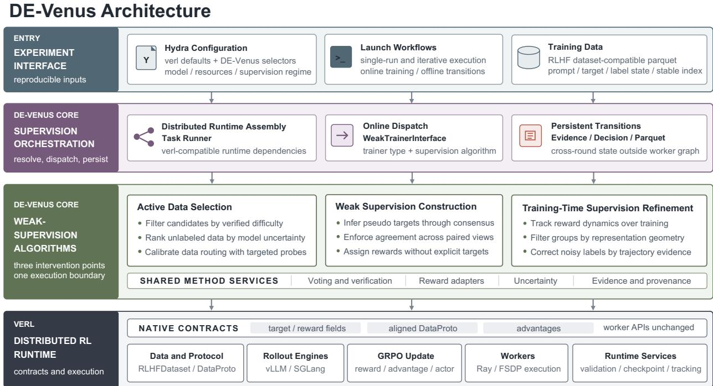
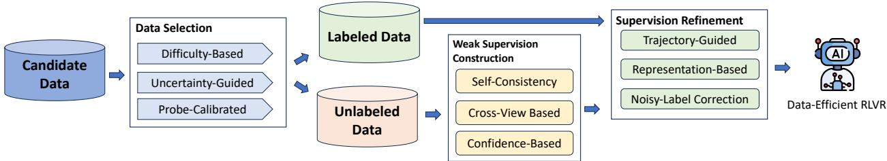
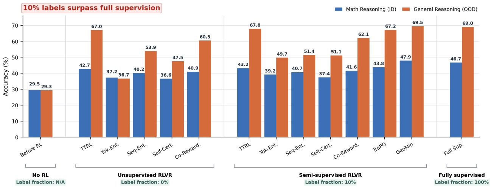
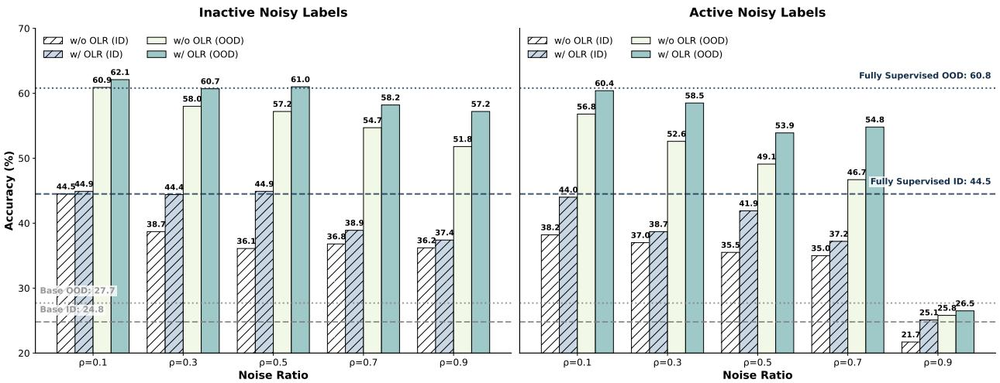
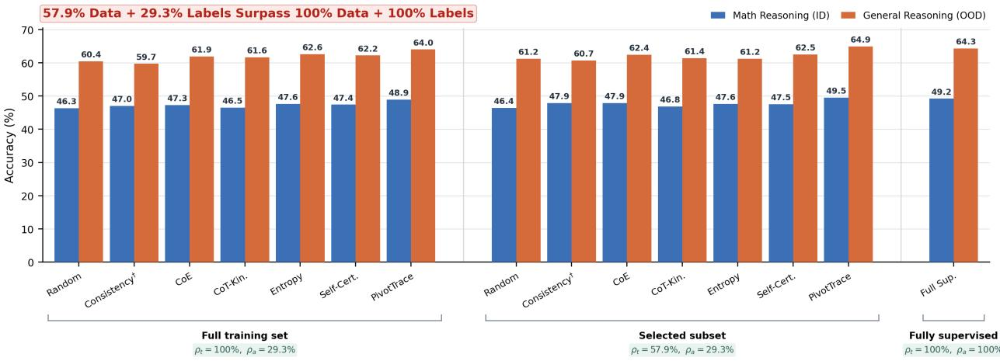
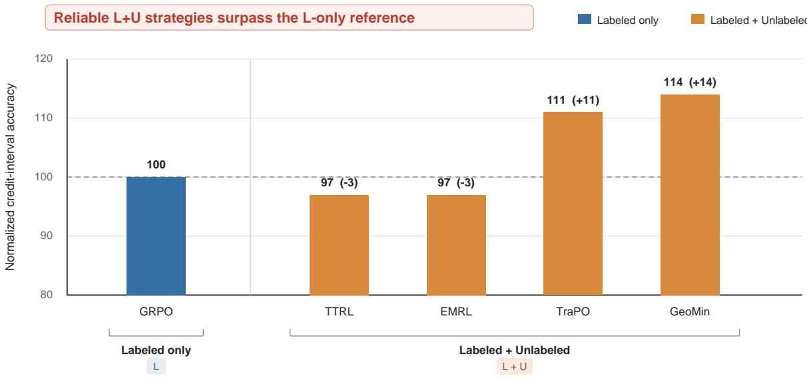
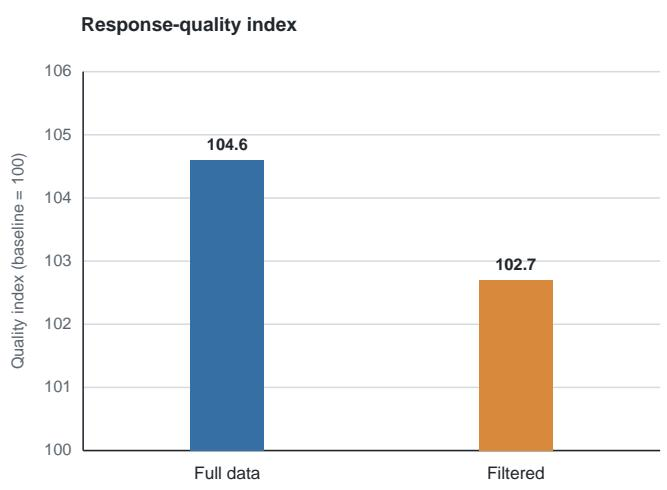
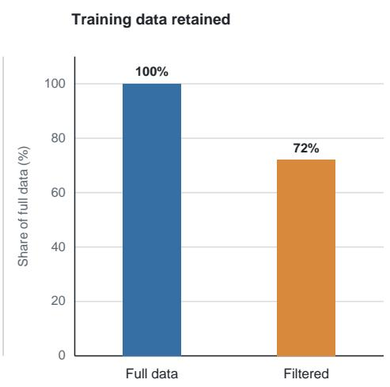
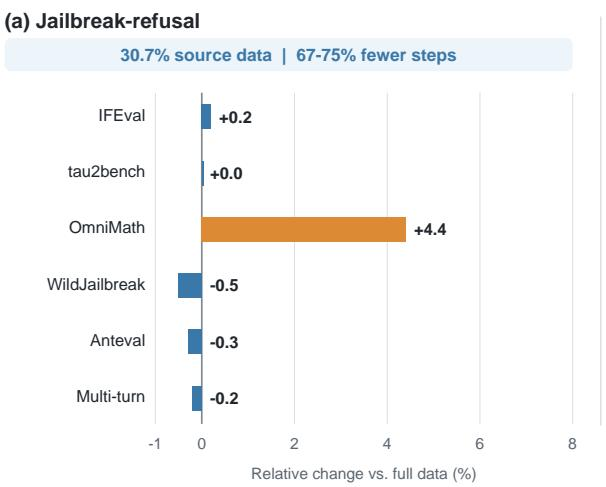
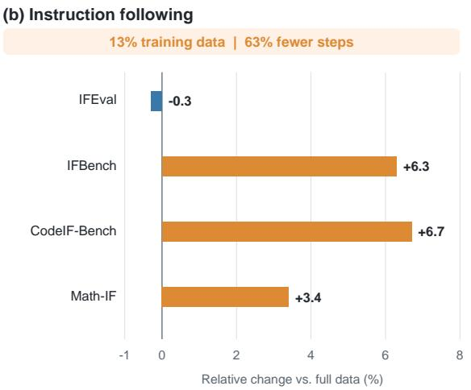

# DE-Venus: A Data-Efficient RLVR Framework for Large Language Models

Shenzhi Yang1,2∗, Guangcheng Zhu1,2∗, Kai Tang1,2∗, Zhengqing Zang1,2∗, Xing Zheng2, Haobo Wang1‡, Yingfan Ma2, Bowen Song2‡, Bo Han3, Bo An4, Lei Feng5, Weiqiang Wang2, Junbo Zhao1, Gang Chen1

1Zhejiang University 2Ant Group 3Hong Kong Baptist University 4Nanyang Technological University 5Southeast University

∗Equal contribution, ‡Corresponding authors

Reinforcement learning with verifiable rewards (RLVR) improves large language model reasoning, but its practical scaling is constrained by expensive on-policy rollouts and the cost of obtaining reliable targets at scale. Existing methods address sample selection, incomplete supervision, or noisy labels separately, often entangling supervision logic with distributed training and hindering controlled comparison and reuse. We present DE-Venus, a unified framework for data-efficient RLVR that treats supervision as evolving state across data preparation and policy optimization. It organizes this lifecycle into three modules: Active Data Selection allocates training and annotation budgets; Weak Supervision Construction derives learning signals from unlabeled examples; and Training-Time Supervision Refinement filters or corrects unreliable supervision. DE-Venus supports seven representative methods and a data-selection pipeline by expressing method-specific decisions as offline dataset transitions or online transformations oftargets, rewards, batches, and advantages while preserving verl’s distributed execution contracts. Across public benchmarks and three business scenarios, separate configurations preserve or improve model quality with only 10% oflabels or as little as 13% of relevant data; selected business configurations also reduce observed convergence steps by 63%–75%. DE-Venus thus reduces annotation and training costs without sacrificing scalable RL execution.

## 1 Introduction

Reinforcement learning with verifiable rewards (RLVR) has become a prominent paradigm for improving the reasoning capabilities of large language models (LLMs) (Jaech et al., 2024; Guo et al., 2025; Team et al., 2025; Yang et al., 2025a). Given a question, the current policy samples multiple reasoning trajectories, an outcome verifier evaluates their final answers, and a policy optimizer such as Group Relative Policy Optimization (GRPO) reinforces responses that outperform others in the group (Shao et al., 2024; Liu et al., 2025; Yu et al., 2025; Zheng et al., 2025). This loop has produced substantial gains on mathematics, code, and related reasoning tasks (Guo et al., 2025; Team et al., 2025; Hu et al., 2025b; Li et al., 2025). Its effectiveness, however, assumes that every training question merits repeated rollout computation and is paired with a reliable, readily verifiable target.

These assumptions are difficult to sustain at scale. On-policy RLVR repeatedly incurs generation and optimization costs, even for questions that are mastered, intractable, or unlikely to yield informative reward variation. Recent studies show that controlling sample difficulty and utility can materially affect optimization efficiency (Yu et al., 2025; Bae et al., 2026; Zeng et al., 2025; Li et al., 2025). Reference answers are labor-intensive to construct, and reference-based verifiers can themselves be imperfect (Yan et al., 2025); the bottleneck is sharper in specialized domains that require scarce expertise. Data efficiency in RLVR is therefore not simply a matter of reducing the training-set size. It concerns the entire supervision lifecycle: which questions should enter training, which warrant external annotation, how unlabeled questions can provide useful learning signals, and when unreliable supervision should be filtered or repaired.

Prior work addresses individual stages of this lifecycle. Data-selection methods identify informative examples using verified difficulty, uncertainty, or learning dynamics (Yu et al., 2025; Bae et al., 2026; Zeng et al., 2025; Zhu et al., 2026a). Unsupervised and label-free methods replace external targets with signals derived from rollout agreement, entropy, self-certainty, or self-play (Zuo et al., 2025; Agarwal et al., 2025; Zhao et al., 2025b,a). Semi-supervised methods use a small trusted subset to assess supervision constructed over a larger unlabeled pool (Yang et al., 2025b; Zhu et al., 2026b), while noisy-label methods use policy-generated evidence to diagnose or revise questionable targets (Yang et al., 2026). Although these directions are complementary, their implementations remain fragmented. New methods often arrive as standalone pipelines or trainer forks that rewrite the rollout-to-update loop. Differences in data conventions, reward placement, filtering, state management, and execution then become entangled with the algorithm, complicating faithful reproduction, controlled comparison, and transfer across supervision settings.

We present DE-Venus, a unified framework for data-efficient reinforcement learning for LLM reasoning. Its central abstraction treats supervision as evolving state whose source, reliability, and persistence may change from data preparation to policy optimization. Accordingly, DE-Venus separates how supervision is selected, constructed, and revised from how distributed RL is executed. It retains verl as the execution substrate for rollout generation, optimization, validation, and checkpointing (Sheng et al., 2025), while localizing method-specific decisions to the points at which supervision semantics change: before training through data selection, during training through supervision construction or reliability-aware updates, and between rounds through persistent dataset transitions. This contract-preserving, “minimal-invasion” design allows heterogeneous methods to share one scalable backend without flattening their distinct learning objectives.

DE-Venus organizes the supervision lifecycle into three complementary modules. Active Data Selection allocates training and annotation budgets by determining which examples should be retained, externally labeled, or routed to weak supervision; its implementations cover verified-difficulty filtering, model-derived uncertainty, and probe-calibrated selection (Yu et al., 2025; Bae et al., 2026; Zeng et al., 2025; Zhu et al., 2026a). Weak Supervision Construction enables unlabeled examples to participate in RLVR by inferring pseudo targets, enforcing cross-view agreement, or assigning target-free rewards, covering TTRL, Co-Rewarding, EMRL, and Intuitor (Zuo et al., 2025; Zhang et al., 2025b; Agarwal et al., 2025; Zhao et al., 2025b). Training-Time Supervision Refinement reassesses constructed or existing supervision using reward dynamics, representation geometry, and rollout evidence, supporting TraPO, GeoMin, and online label refinement (Yang et al., 2025b; Zhu et al., 2026b; Yang et al., 2026). These modules identify distinct intervention points rather than mandatory consecutive stages, so each experiment activates only the mechanisms required by its supervision setting.

The framework provides common abstractions at the data and execution boundaries. A shared Parquet convention records persistent identity and supervision state, while verl-compatible batches carry targets, rewards, aligned selections, and advantages through online optimization. Reusable services provide voting, verification, uncertainty estimation, reward construction, evidence analysis, and validation logging. Configuration-driven dispatch exposes method-specific choices without introducing a second backend, allowing new supervision rules to be localized instead of rebuilding distributed rollout, optimization, and evaluation.

Our contributions are summarized as follows:

  
Figure 1 DE-Venus architecture. Three supervision modules share a common orchestration layer and interact with verl through native contracts. The dashed path denotes persistent Parquet transitions across runs.

• We formulate data-efficient RLVR as a unified supervision lifecycle spanning active data selection, weak supervision construction, and training-time supervision refinement.

• We develop DE-Venus, a contract-preserving framework over verl that localizes supervision-specific interventions while retaining a common scalable execution backend.

• We provide reproducible implementations and workflows for seven representative methods and an active data-selection pipeline, evaluated on public reasoning benchmarks and three business scenarios.

On standard mathematical and general-reasoning benchmarks, DE-Venus configurations surpass fully supervised references using only 10% of the labels or 57.9% of the training data with 29.3% annotations. More importantly, the business scenarios demonstrate operational gains beyond controlled benchmarks. With a fixed 500-label budget, reliability-aware weak supervision improves the normalized credit-assignment metric by up to 14 points. Trajectory-based filtering removes 28% of medical-empathy training examples while remaining within 1.9 points of full-data training. For intrinsic-safety training, retaining only 13%–30.7% of relevant source data preserves core safety metrics, improves selected capabilities by up to 6.7%, and reduces observed convergence steps by 63%–75%. These results show that DE-Venus can reduce annotation requirements, training volume, and iteration time while preserving or improving model quality in practical 1.

## 2 Design and Implementation

DE-Venus provides a unified system for data-efficient RLVR when supervision is incomplete, unavailable, or unreliable. Rather than treating a label or reward as an immutable attribute of a training example, DE-Venus models supervision as state whose content, confidence, and persistence may evolve from data preparation to policy optimization. This abstraction yields three complementary intervention modules. Active Data Selection determines which examples should be retained, weakly supervised, or annotated before optimization. Weak Supervision Construction turns model-generated evidence into pseudo targets or target-free rewards for examples without trusted answers. Training-Time Supervision Refinement reassesses constructed or existing supervision using reward dynamics, representation geometry, and rollout evidence. Their ordering follows the supervision lifecycle, but they are not mandatory consecutive stages: an experiment activates only the interventions required by its supervision setting.

The systems contribution of DE-Venus is a supervision control plane that spans these three intervention points without replacing the distributed RL runtime. DE-Venus owns experiment-level dispatch, method-local supervision transformations, evidence and provenance management, and persistent dataset transitions. verl continues to own data transport, rollout execution, distributed model computation, optimization, validation, and checkpoint services. Minimal invasion therefore does not mean that every method is expressible as a small callback. It means that even when a method specializes controller flow, it preserves the dependency direction and data contracts of the underlying runtime.

## 2.1 Design Principles

DE-Venus follows four principles that turn the supervision lifecycle into a reusable systems abstraction.

Decouple supervision semanticsfrom distributed execution. Constructing a pseudo target, assigning an intrinsic reward, admitting a reliable trajectory group, or proposing a label revision is a method-level decision. Model placement, rollout generation, distributed forward and backward computation, optimization, and checkpointing are backend responsibilities. DE-Venus introduces control logic only where supervision is interpreted or consumed and delegates the corresponding systems operations to verl.

Preserve native contracts at intervention points. Minimal invasion is achieved by preserving interfaces rather than forcing every method into one callback. Online methods materialize their decisions as targets, token-level rewards, aligned DataProto selections, or advantages already understood by downstream verl components. Offline selection, promotion, and relabeling materialize RLHFDataset-compatible Parquet datasets, while method-specific evidence and provenance remain separate artifacts. No second worker protocol, data representation, or optimization backend is introduced.

Make supervision lifetimes explicit. A supervision decision may be local to one optimization step or persistent across training rounds. Step-local decisions replace a target or reward, filter a rollout group, or transform an advantage in memory. Persistent decisions select an example, promote an unlabeled sample, or revise an unreliable target in a versioned dataset. Separating these lifetimes prevents transient rollout evidence from silently mutating persistent supervision and makes every cross-round change auditable.

Control experimental variation. Hydra configuration and launch workflows expose method selection while retaining a shared execution environment. Whenever algorithmic requirements permit, methods use the same model, dataset loader, rollout engine, GRPO implementation, resource allocation, logging, validation, and checkpoint path. The architecture does not require identical controller flow; it limits infrastructure-level confounders so that comparisons primarily reflect differences in supervision strategy.

## 2.2 Architecture Overview

Figure 1 organizes DE-Venus into four functional bands and three ownership domains. The experiment interface specifies a reproducible run through Hydra configuration, launch workflows, and a training Parquet dataset. The two middle bands form the DE-Venus core. Supervision orchestration assembles the runtime context, dispatches online methods, and manages persistent transitions. The weak-supervision algorithm band implements the three intervention modules introduced above and factors common voting, verification, reward, uncertainty, and provenance services across them. The bottom distributed RL runtime remains owned by verl and provides the dataset protocol, rollout engines, GRPO update, distributed workers, and runtime services.

The horizontal ordering of the three intervention modules describes when supervision may change, not a compulsory pipeline. Active Data Selection is an upstream producer of training data. Weak Supervision Construction operates in the online rollout-to-update path. Training-Time Supervision Refinement may act online by filtering or reweighting trajectories and may also persist accepted promotions or corrections between runs. All three share the same Parquet schema and, whenever they enter online optimization, the same DataProto and worker contracts.

## 2.3 Unified Invocation and the verl Boundary

DE-Venus adopts verl’s configuration and invocation model rather than introducing a parallel control stack (Sheng et al., 2025). A Hydra overlay inherits the trainer configuration and adds selectors for the supervision setting and method. Model, dataset, rollout, parallelization, optimization, resource, validation, and checkpoint options remain in the verl configuration space. The online methods evaluated in this report use GRPO as a common policy-optimization interface (Shao et al., 2024).

At runtime, TaskRunner is executed as a Ray remote actor. It resolves the composed configuration and assembles a shared execution context containing worker roles and resource pools, model and data dependencies, reward managers, validation services, datasets, samplers, and collators. This context is injected into WeakTrainerInterface, which dispatches the selected online trainer while preserving the standard init\_workers() and fit() lifecycle. Cluster construction and model placement therefore remain independent of method selection.

The dispatch boundary intentionally covers online computation only. Active Data Selection executes before optimization, while persistent promotion and relabeling execute between training rounds. These offline components emit a common Parquet dataset and provenance artifacts, and a subsequent invocation consumes the result through the ordinary RLHFDataset path. Input-shape specializations follow the same placement rule. For example, Co-rewarding aligns original and rewritten questions during dataset construction, the highest layer that understands their pairing, and then reuses the standard rollout and optimization interfaces.

Minimal invasion is consequently a property of this boundary rather than a claim about method code size. A trainer may require paired rollout passes, periodic probes, reliability filtering, or a specialized ordering of reward and advantage computation. Nevertheless, method code invokes existing worker APIs and produces objects expected by the next verl stage; it neither reconstructs the cluster nor forks the distributed execution backend.

## 2.4 Three Supervision Modules

The three modules share one execution substrate but differ in decision time, evidence source, and boundary object. Table 1 summarizes their implementation forms. This architectural grouping follows where a method intervenes in the supervision lifecycle; individual trainers may still be organized by semi-supervised, unsupervised, or noisy-label assumptions.

<table><tr><td>Intervention module</td><td>Execution form</td><td>Boundary object</td></tr><tr><td>Active Data Selection</td><td>Offline generate-score-route pipeline</td><td>Training Parquet</td></tr><tr><td>Weak Supervision Construction</td><td>Method-local online trainer</td><td>Target or reward fields</td></tr><tr><td>Training-Time Supervision Refinement</td><td>Online filtering with optional cross-round transition</td><td>Aligned batch or revised Parquet</td></tr></table>

Table 1 Execution forms and boundary objects of the three DE-Venus intervention modules.

## 2.4.1 Active Data Selection

Active Data Selection is implemented as an offline generate–score–route pipeline and is not dispatched through WeakTrainerInterface. A response generator first performs multi-sample inference over the candidate pool. Scoring adapters then aggregate response behavior and model-internal statistics into question-level signals such as empirical accuracy, consistency, entropy, self-certainty, attention pivots, and hidden-state dynamics. A selector consumes these normalized records together with annotation and training budgets and determines the destination of each candidate.

The decision procedure supports both verified and initially unlabeled pools. When answers are available, empirical pass rate restricts the admissible difficulty region and an uncertainty signal ranks the remaining examples. When answers are unavailable, the selector ranks the pool by model uncertainty, samples a small set of probes across that ranking, and uses their annotations to calibrate data-dependent routing thresholds. The resulting routes distinguish examples that can be excluded, retained for weakly supervised training, or prioritized for annotation. This offline placement keeps candidate generation and calibration artifacts outside the distributed training protocol.

The final materializer writes the selected examples directly into the common Parquet schema consumed by RLHFDataset. Each retained record carries its prompt, current target, label state, stable sample key, source, and task metadata. Consequently, the selected dataset can be combined with any compatible online intervention by changing the input Parquet alone.

## 2.4.2 Weak Supervision Construction

Weak Supervision Construction is implemented by method-local online trainers selected via WeakTrainer Interface. Each trainer receives the execution context assembled by TaskRunner and specializes controller-side logic around the inherited RayPPOTrainer lifecycle. The principal intervention occurs after grouped rollouts are available and before the corresponding reward or advantage consumer, so supervision can be derived from multiple responses without altering generation workers.

The module supports two output forms. Pseudo-target methods infer a temporary answer from response consensus or agreement across paired views and write it to reward\_model.ground\_truth before verifier scoring. TTRL uses within-question consensus, whereas Co-rewarding coordinates original and rewritten questions to introduce cross-view evidence. Target-free methods instead convert confidence or uncertainty statistics into sequence-level supervision and write the resulting signal through the reward interface. Intuitor and EMRL instantiate this path with self-certainty and entropy, respectively. The unsupervised trainer uses the same reward interface for confidence, agreement, and self-verification signals. In a semi-supervised batch, verified targets remain active for labeled examples while constructed supervision is applied only where trusted answers are unavailable.

Both forms terminate at a native verl contract: either the verifier receives a substituted target or GRPO receives a response-shaped reward tensor. Once that contract has been materialized, advantage estimation, actor update, metric reduction, validation, and checkpointing proceed through the shared runtime.

## 2.4.3 Training-Time Supervision Refinement

Training-Time Supervision Refinement reassesses supervision after rollout evidence becomes available. Its online path admits or reweights trajectories before actor optimization. TraPO tracks reward and pass-rate dynamics over training and uses their temporal behavior to retain reliable supervision; GeoMin evaluates rollout groups against representation distributions estimated from verified examples and uses the resulting geometric evidence for filtering or advantage transformation. These operations apply one aligned selection or tensor transformation to the complete DataProto, preserving the correspondence between trajectories and metadata.

The module also supports decisions whose effects must persist beyond the current run. Periodic probe passes collect majority answers, pass rates, and trajectory histories without performing actor updates. TraPO can use this evidence to promote reliable unlabeled examples, while OLR compares a stable model-generated candidate with the existing annotation and proposes a correction only when its trajectory evidence satisfies the configured reliability rule. Probe records are keyed by stable sample identity rather than by transient rollout groups, allowing observations from different steps and rounds to be joined consistently.

Accepted promotions and corrections are materialized outside the trainer and Ray worker graph. An offline transition builder consumes the current Parquet and persisted evidence, applies the decision rule, and writes both the next-round dataset and a manifest of accepted changes. Distributed workers therefore provide evidence but never mutate persistent labels, and the revised dataset re-enters training through the same invocation and dataset contracts as its predecessor.

## 2.5 Unified Data Model

DE-Venus uses a two-level data model to connect cross-round dataset evolution with within-step RL opti mization. The persistent level represents the current supervision state of each sample, whereas the runtime level represents trajectories generated from that sample in one optimization step. Let the training dataset at round k be

$$
\mathcal { D } ^ { ( k ) } = \left\{ d _ { s } ^ { ( k ) } = \left( x _ { s } , y _ { s } ^ { ( k ) } , z _ { s } ^ { ( k ) } , m _ { s } \right) \ \Big | \ s \in \mathbb { Z } ^ { ( k ) } \right\} ,\tag{1}
$$

where s is the persistent sample key stored in extra\_info.index, and $\mathcal { T } ^ { ( k ) }$ is the set of samples present in round k. The remaining components denote the prompt $x _ { s }$ , supervision target $y _ { s } ^ { ( k ) }$ in reward\_model. ground\_truth, label state $z _ { s } ^ { ( k ) }$ in $\mathtt { e x t r a \_ i n f o }$ .labeled, and task metadata $m _ { s }$ , including data\_- source and ability. Selection may change membership in $\mathcal { T } ^ { ( k ) }$ , while promotion or correction may change $y _ { s } ^ { ( k ) }$ and $z _ { s } ^ { ( k ) }$ , without changing the identity of a retained sample.

At ingestion, RLHFDataset exposes each persistent record to the dataloader and copies s to the batch-level index. The collated batch is represented as a DataProto: its tensor partition carries model inputs and optimization quantities, while its non-tensor partition carries targets, label states, task metadata, and persistent keys. Controller-side transformations operate on this composite object so semantic metadata remains aligned with the corresponding trajectories. Offline modules read or materialize $\mathcal { D } ^ { ( k ) }$ , whereas online trainers operate on its in-memory DataProto representation.

For optimization step t, let $\mathcal { T } _ { t } \subseteq \mathcal { T } ^ { ( k ) }$ denote the sampled records. The trainer assigns a fresh group identifier $u _ { s } ^ { ( t ) }$ to each $s \in \mathcal { T } _ { t }$ and repeats the prompt n times before generation. The resulting rollout group is

$$
\mathcal { G } _ { s } ^ { ( t ) } = \left\{ \tau _ { s , j } ^ { ( t ) } \right\} _ { j = 1 } ^ { n } , \qquad \mathrm { u i d } \left( \tau _ { s , j } ^ { ( t ) } \right) = u _ { s } ^ { ( t ) } .\tag{2}
$$

<table><tr><td>Surface</td><td>Native contract</td><td>Method operation</td></tr><tr><td>Target</td><td>reward_model.ground_truth</td><td>Pseudo-target substitution</td></tr><tr><td>Reward</td><td>token_level_scores</td><td>Intrinsic or proxy signal</td></tr><tr><td>Batch</td><td>Aligned DataProto</td><td>Trajectory-group admission</td></tr><tr><td>Advantage</td><td>advantages</td><td>Reliability-aware reweighting</td></tr></table>

Table 2 Online intervention surfaces and native verl contracts preserved by DE-Venus.

The shared uid lets groupwise operations, including majority voting and GRPO normalization, recover sibling trajectories after batch balancing or reordering. Unlike the persistent key $s , u _ { s } ^ { ( t ) }$ is local to the current rollout batch and is regenerated at later steps. Probe histories, transition manifests, and successive Parquet datasets therefore join records by extra\_info.index, never by uid.

## 2.6 Contract-Preserving Dataflows

DE-Venus represents an online method as a composition of optional supervision transformations around verl’s rollout-to-update path. For optimization step t, the dataflow is

$$
\begin{array} { r l } & { \mathcal { B } _ { t } \xrightarrow { \mathrm { \tiny ~ r o l l o u t } } \mathcal { T } _ { t } \xrightarrow { S _ { m } ^ { y } } \mathcal { T } _ { t } ^ { y } , } \\ & { \mathcal { T } _ { t } ^ { y } \xrightarrow { S _ { m } ^ { b } } \widetilde { \mathcal { T } } _ { t } \xrightarrow { \mathrm { \tiny ~ r e w a r d } } R _ { t } \xrightarrow { S _ { m } ^ { r } } \widetilde { R } _ { t } , } \\ & { \widetilde { R } _ { t } \xrightarrow { \mathrm { \tiny ~ G R P O } } A _ { t } \xrightarrow { S _ { m } ^ { a } } \widetilde { A } _ { t } \xrightarrow { \mathrm { \tiny ~ u p d a t e } } \theta _ { t + 1 } . } \end{array}\tag{3}
$$

Here $S _ { m } ^ { y } , S _ { m } ^ { b } , S _ { m } ^ { r }$ , and $S _ { m } ^ { a }$ denote target construction, batch admission, reward construction, and advantage transformation for method m, respectively. An unused transformation is the identity. Each active transformation is placed after its required evidence becomes available and immediately before the first downstream stage that consumes its output. Table 2 summarizes the corresponding runtime contracts.

Contract preservation is enforced by two invariants. First, when a method produces a sequence-level score, DE-Venus places it at the final valid response token, yielding the response-shaped reward tensor expected by verl. Second, admission and filtering use aligned DataProto selections, so tensor and non-tensor partitions retain the same row mapping. After the final active transformation, the remaining verl stages execute unchanged.

Decisions that must survive the current optimization step follow a separate outer dataflow:

$$
\begin{array} { r l } & { \mathcal { D } ^ { ( k ) } \xrightarrow { \mathrm { c o l l e c t } } \mathcal { E } ^ { ( k ) } \xrightarrow { \Pi _ { m } } \Delta _ { m } ^ { ( k ) } , } \\ & { \Delta _ { m } ^ { ( k ) } \xrightarrow { \mathrm { m a t e r i a l i z e } } \mathcal { D } ^ { ( k + 1 ) } , } \end{array}\tag{4}
$$

where $\mathcal { E } ^ { ( k ) }$ contains generated responses, uncertainty scores, or index-keyed probe evidence; $\Pi _ { m }$ is the method-specific decision rule; and ${ \Delta } _ { m } ^ { ( k ) }$ is the accepted set of selections, promotions, or target revisions. Active Data Selection applies this pattern to a candidate pool to construct $\mathcal { D } ^ { ( 0 ) }$ ; TraPO applies it to promote reliable unlabeled samples; and OLR applies it to revise unreliable targets. Probe-only rollouts terminate in $\mathcal { E } ^ { ( k ) }$ and do not enter actor optimization. Each dataset transition is therefore reproducible from its source dataset, persisted evidence, decision configuration, and manifest.

## 2.7 Diagnostics, State, and Extensibility

Supervision observability. Weakly supervised optimization must expose the quality of its supervision decisions, not only final task reward. DE-Venus augments verl’s optimization and systems metrics with pseudo-target agreement, pass-rate and reward dynamics, admitted-group counts, confidence estimates, and reward and advantage statistics. These diagnostics enter the same step-indexed tracking and validation path as native verl metrics. Persistent decisions additionally retain response or probe records and transition manifests, providing a sample-level audit trail for selection, promotion, and correction.

State ownership. DE-Venus assigns state according to lifetime. Step-local supervision state remains in DataProto and is discarded after the update. Run-resumable decision state extends the inherited checkpoint only when later behavior depends on it. TraPO, for example, persists majority answers, pass-rate histories, probe counters, and associated decision buffers alongside the normal training state. Cross-round state is externalized as Parquet datasets, evidence records, and manifests keyed by persistent sample identity; it is never reconstructed from an ephemeral uid or worker-local memory.

Extension protocol. An online method reuses the execution context assembled by TaskRunner and implements one or more intervention surfaces from Table 2 by specializing RayPPOTrainer or an existing DE-Venus trainer. Registration with WeakTrainerInterface exposes it through the common Hydra entry point. An offline method instead implements the evidence–decision–materialization dataflow in Equation 4 and emits an RLHFDataset-compatible Parquet dataset with the required evidence or provenance. Neither extension requires a new worker role, Ray protocol, parallelization strategy, or optimizer lifecycle. This protocol operationalizes minimal invasion while allowing method-specific control over supervision.

## 3 Data-Efficient RLVR: From Data Curation to Reliable Supervision

Reinforcement learning with verifiable rewards (RLVR) typically relies on training instances whose responses can be evaluated against trustworthy ground-truth answers. This dependence creates a fundamental data bottleneck: obtaining verified labels is costly, uniformly using all available examples may waste annotation and rollout budgets, and large collections of unlabeled data cannot directly provide verifiable rewards. Moreover, both automatically constructed supervision and existing annotations may be unreliable, causing noisy or even harmful policy updates. Data-efficient RLVR therefore aims to extract effective learning signals from limited and imperfect supervision while controlling the quality of the resulting rewards. We organize the methods supported by our framework into three stages. First, active data selection estimates the utility of candidate examples and allocates limited annotation and training budgets to informative data. Second, weak supervision construction enables examples without trusted answers to participate in RLVR by constructing either pseudo targets or intrinsic rewards. Third, training-time supervision refinement filters, reweights, or corrects imperfect supervision before it affects policy optimization. This organization provides a unified view of semi-supervised, label-free, and noisy-label RLVR: they differ primarily in the availability and reliability of the supervision entering these three stages. After active data selection, let $\mathcal { D } _ { \ell }$ and $\mathcal { D } _ { u }$ denote the selected labeled and unlabeled training sets, respectively. Given a question $x _ { i }$ and its k-th rollout $y _ { i , k } \sim \pi _ { \theta } ( \cdot \mid x _ { i } )$ we formulate the unified training interface as

$$
\begin{array} { r } { r _ { i , k } = \left\{ \begin{array} { l l } { R ( y _ { i , k } , a _ { i } ^ { \star } ) , \quad ( x _ { i } , a _ { i } ^ { \star } ) \in \mathcal { D } _ { \ell } , } \\ { R _ { u } ( y _ { i , k } ; x _ { i } ) , \quad x _ { i } \in \mathcal { D } _ { u } , } \end{array} \right. \quad \widetilde { A } _ { i , k } = w _ { i } \widehat { A } _ { i , k } , \quad w _ { i } \in [ 0 , 1 ] . } \end{array}\tag{5}
$$

Here, $R ( y , a ) = \mathbb { I } [ \mathrm { A n s } ( y ) = a ]$ denotes the standard verified reward, while $R _ { u }$ denotes the weak reward constructed for an unlabeled question. Specifically, $R _ { u }$ can be instantiated either as a pseudo-target reward, $\mathbb { I } [ \mathrm { A n s } ( y _ { i , k } ) = \tilde { a } _ { i } ]$ , or as a target-free intrinsic reward $r _ { \mathrm { i n t } } ( x _ { i } , y _ { i , k } ; \theta )$ . The standard group-normalized advantage $\hat { A _ { i , k } }$ is further modulated by the reliability weight $w _ { i }$ . Accordingly, training-time refinement can filter a question by setting $w _ { i } = 0$ , softly reweight its supervision with $0 < w _ { i } < 1$ , or correct the pseudo target ${ \tilde { a } } _ { i }$ used by $R _ { u }$

  
Figure 2 Overview of the weakly supervised RLVR pipeline. Candidate data are first selected before training, followed by weak supervision construction for selected unlabeled samples and supervision refinement during policy optimization. Potentially noisy labels are handled through a separate training-time correction branch.

## 3.1 Active Data Selection

Active data selection determines how annotation and optimization resources are allocated before RLVR training begins. Because candidate questions differ in both learning utility and their need for external supervision, selection is not limited to retaining a smaller training subset; it may also determine which questions should be annotated, trained with weak supervision, or excluded from training. Depending on the supervision available during selection, the methods supported by our framework fall into three categories: difficulty-based filtering using verified outcomes, uncertainty-guided selection using model-derived signals, and probe-calibrated data triage using a small amount of targeted annotation. Together, these categories progress from accurate but label-dependent selection to annotation-efficient selection from initially unlabeled data.

## 3.1.1 Difficulty-Based Data Filtering

Difficulty-based filtering provides the most direct way to estimate the learning utility of a question when verified answers are available. Existing RLVR systems commonly sample multiple responses from the current policy and use their empirical pass rate as a model-dependent measure of question difficulty. Questions that are consistently solved are regarded as already mastered, whereas questions for which the policy rarely produces a correct response may provide insufficient reward variation for effective optimization; consequently, difficulty-aware methods typically retain questions within an intermediate pass-rate range (Yu et al., 2025; Bae et al., 2026; Zeng et al., 2025). Our framework implements this paradigm through configurable accuracy intervals, after which the retained questions can be ranked by an auxiliary uncertainty criterion when they exceed the available training budget. This approach provides an interpretable mechanism for controlling both sample difficulty and training-set size, but it assumes that verified answers are already available for the entire candidate pool. When such full annotation is unavailable, data utility must instead be inferred from signals produced by the model itself.

## 3.1.2 Uncertainty-Guided Data Selection

Uncertainty-guided selection replaces verified correctness with question-level signals derived from model outputs or internal representations. Response-based methods use agreement among multiple sampled answers, treating lower consistency as higher uncertainty, while probability-based methods quantify uncertainty through statistics such as token-level entropy or self-certainty. Representation-based methods further examine the internal dynamics of reasoning: CoE characterizes layer-wise changes in hidden-state magnitude and direction, whereas CoT-Kinetics describes the semantic movement and curvature of reasoning representations across layers (Zuo et al., 2025; Huang et al., 2023b; Tang et al., 2025; Kang et al., 2026; Wang et al., 2024a; Bi et al., 2025). Our framework exposes consistency, entropy, self-certainty, CoE, and CoT-Kinetics as interchangeable selection strategies, each of which can rank the candidate pool and select questions under a predefined threshold or budget. Although some of these signals are also adopted by weakly supervised RLVR algorithms, their role here is restricted to deciding which questions enter the training pool rather than constructing rewards for individual responses. These methods remove the need to annotate every candidate question, but their raw scores may not be comparably calibrated across models and datasets, motivating the use of limited annotations to determine data-dependent selection boundaries.

## 3.1.3 Probe-Calibrated Data Triage

Probe-calibrated data triage addresses this calibration problem by combining model-derived uncertainty with a small, strategically distributed set of annotations. It first ranks the initially unlabeled question pool using an uncertainty estimator, samples probe questions across the resulting spectrum, and annotates only these probes to estimate how the selection score relates to the current policy’s empirical correctness. The estimated relationship is then used to determine thresholds for different data routes. PivotTrace is a representative method in this category: it detects metacognitive pivots from long-range attention patterns in generated reasoning trajectories, uses the number of detected pivots as an uncertainty proxy, and calibrates the pivot count ranking through sliding-window statistics over a small probing set (Zhu et al., 2026a). Based on the calibrated thresholds, low-uncertainty questions that have likely been mastered are discarded, questions with intermediate uncertainty are retained for weakly supervised training, and highly uncertain questions are prioritized for external annotation. Our framework generalizes this procedure by allowing consistency, entropy, self-certainty, CoE, and CoT-Kinetics to replace pivot count as the underlying ranking criterion. The resulting data partition completes the selection stage: verified answers are available for the annotated subset, while the retained unlabeled subset is passed to the subsequent supervision-construction stage.

## 3.2 Weak Supervision Construction

Following active data selection, the remaining challenge is to make unlabeled questions usable for RLVR. Unlike labeled examples, these questions lack verified answers against which generated responses can be evaluated. Weak supervision construction addresses this missing-verifier problem by converting model-generated information into response-level learning signals. According to the source and form of the constructed supervision, the methods supported by our framework fall into three categories: self-consistency methods that infer pseudo targets from repeated responses, cross-view methods that construct supervision from complementary sources, and confidence-based methods that directly assign rewards without producing an explicit target. These categories progressively move from reconstructing a temporary verifier to bypassing answer-based verification altogether.

## 3.2.1 Self-Consistency-Based Pseudo-Target Construction

Self-consistency-based methods approximate a missing verifier through the collective prediction of the current policy. TTRL samples multiple responses for each unlabeled question, groups their extracted answers, and treats the majority answer as a pseudo target (Zuo et al., 2025). Individual responses can then be evaluated by whether their answers agree with this target, allowing the resulting binary signals to replace ground-truth rewards during policy optimization. Our framework supports this construction through both TTRL and ensemble-style voting over multiple rollouts, while preserving verified rewards for the labeled portion of a semi-supervised dataset. This approach is simple and compatible with the standard RLVR pipeline because it ultimately recovers an answer-based verifier. However, responses sampled from the same policy may exhibit correlated errors and converge on a shared but incorrect answer, causing majority voting to reinforce an internally consistent mistake. This weakness motivates the use of complementary views when constructing pseudo supervision.

## 3.2.2 Cross-View Agreement-Based Supervision

Cross-view methods strengthen pseudo supervision by requiring agreement across complementary views rather than relying exclusively on repeated responses to the same question. Co-Rewarding instantiates this idea by rewriting each question into a semantically equivalent variant, generating responses for both the original and rewritten questions, and constructing supervision from cross-view agreement (Zhang et al., 2025b). Because the two views express the same underlying reasoning problem through different surface forms, their agreement provides an additional constraint on whether a candidate answer should be reinforced. Our framework implements this data-side construction by coordinating rollouts and cross-voting between the original and rewritten questions, thereby extending single-view majority voting without requiring external annotations. Nevertheless, both self-consistency and cross-view agreement ultimately commit to a discrete pseudo target, whose correctness still depends on the quality and diversity of the model-generated candidates. A different family of methods avoids this commitment by deriving rewards directly from the policy’s predictive distributions.

## 3.2.3 Confidence-Based Target-Free Rewards

Confidence-based methods bypass pseudo-target construction and directly use the model’s internal uncertainty as a reward signal. Intuitor adopts self-certainty as its sole supervision, rewarding responses for which the policy assigns a more concentrated predictive distribution (Zhao et al., 2025b). EM-RL follows a closely related principle by using negative token- or sequence-level entropy as the reward, thereby encouraging the policy to reinforce responses generated with greater confidence (Agarwal et al., 2025). Our framework implements this family through configurable self-certainty, token-level entropy, trajectory-level entropy, and sequence-probability rewards, which can be computed for each response and directly incorporated into group-relative advantage estimation. Although similar statistics also appear in active data selection, their roles are different: selection aggregates them at the question level to determine which data enter training, whereas target-free reward construction applies them at the response level to guide policy updates. By eliminating both verified answers and discrete pseudo targets, these methods provide a broadly applicable source of internal supervision; however, model confidence does not necessarily imply correctness, and an overconfident policy may reinforce its own errors. This remaining reliability problem motivates the training-time supervision refinement methods introduced next.

## 3.3 Training-Time Supervision Refinement

Weak supervision should not be treated as a fixed training signal because its reliability may change as the policy evolves. Supervision entering RLVR can be imperfect for two complementary reasons: unlabeled questions rely on pseudo targets whose correctness is initially uncertain, while labeled questions may contain annotations that are themselves incorrect. Training-time supervision refinement uses evidence collected during optimization or between successive training rounds to reassess these signals and determine whether they should be retained, promoted, reweighted, or replaced. We organize the supported methods according to the evidence used for this decision: learning trajectories track how candidate supervision evolves over time, representation geometry measures its compatibility with reliable rollouts, and online label correction resolves conflicts between model-generated candidates and existing annotations.

## 3.3.1 Trajectory-Guided Pseudo-Label Refinement

Trajectory-guided refinement evaluates pseudo labels through their behavior over the course of policy optimization. TraPO uses a small labeled subset to establish reliable learning trajectories and retains unlabeled examples whose pseudo-label trajectories exhibit similar dynamics (Yang et al., 2025b). In particular, it tracks the pass rate of majority-voted answers across training steps and compares their temporal patterns with those observed on verified examples, allowing pseudo labels that behave inconsistently with labeled supervision to be excluded from policy updates. Our framework supports this mechanism through the original TraPO filtering procedure and further extends it with TraPO v2, which performs labeled-only warmup, periodically probes the candidate pool, and promotes an unlabeled example only when its current majority answer achieves a sufficiently high pass rate, a positive growth trend, and stable historical consistency. TraPO v2 therefore turns reliability estimation into an iterative process in which the trusted subset expands as the policy develops. However, trajectory-based evidence requires repeated observations before a decision can be made, motivating complementary approaches that assess pseudo-label reliability through the policy’s internal representation structure.

## 3.3.2 Representation-Based Reliability Filtering

Representation-based filtering determines pseudo-label reliability by comparing unlabeled rollouts with the geometric structure learned from verified examples. GeoMin models the layer-wise hidden representations of correct and incorrect labeled rollouts using von Mises–Fisher distributions and identifies the layers that most clearly separate the two groups (Zhu et al., 2026b). For an unlabeled question, it first obtains a majority pseudo target and then evaluates whether the corresponding majority and minority rollouts align with the correct and incorrect representation distributions, respectively. The resulting distributional affinity is used as a confidence signal, while a two-component Gaussian mixture model adaptively separates reliable pseudo labels from unreliable ones. Our framework uses this signal to filter pseudo-labeled examples and to reweight selected ambiguous updates during training. Although GeoMin performs sample filtering, its input consists of pseudo-labeled rollouts generated during optimization rather than raw questions before training, placing it in supervision refinement rather than active data selection. Both GeoMin and TraPO thus address weak supervision caused by missing labels; yet supervision may also be weak because an apparently verified label is incorrect. In this latter setting, filtering constructed pseudo labels is insufficient, and refinement must instead decide when an existing target should be replaced.

## 3.3.3 Online Noisy-Label Correction

Online noisy-label correction addresses this complementary setting by refining labels that are available but potentially corrupted. In RLVR, the effect of a label depends on whether the current policy can generate responses that match it, making rollout dynamics a natural source of evidence for identifying unreliable annotations. Online Label Refinement (OLR) therefore preserves the provided labels during an initial learning phase and subsequently tracks the majority answer generated for each question across policy updates (Yang et al., 2026). A candidate answer is considered for correction only when its rollout pass rate exhibits a positive trend and its identity remains consistent across recent training history, reducing the risk of replacing a label with a transient model prediction. The NL-OLR v2 implementation in our framework further compares the candidate trajectory with that of the current label and performs relabeling only when the candidate satisfies absolute reliability thresholds and improves over the existing target by a configurable margin. Whereas TraPO v2 promotes previously unlabeled examples into the trusted subset, NL-OLR v2 revises supervision for examples that were already labeled. Together with representation-based filtering, these methods allow the framework to refine weak supervision arising from both missing and noisy annotations as training progresses.

## 4 Experiments

This section evaluates DE-Venus along three complementary dimensions of data-efficient RLVR: learning from incomplete supervision, robust training with corrupted supervision, and allocation of annotation and training budgets through data selection. We first conduct controlled studies on public reasoning benchmarks and then validate the same framework capabilities in three business scenarios. All compared methods are instantiated through the common DE-Venus training and evaluation pipeline, with variation confined to the supervision or selection strategy under study. The experiments are intended to characterize framework coverage and practical behavior rather than to claim the individual methods as new contributions of DE-Venus.

Optimization protocol. Unless otherwise stated, the reported RLVR experiments instantiate DE-Venus with GRPO (Shao et al., 2024) as the default policy-optimization backbone. Holding the optimization rule fixed allows observed differences to be attributed primarily to data selection, weak-supervision construction, and label refinement rather than to the choice of RL algorithm. This protocol does not define the capability boundary of the framework: because DE-Venus preserves verl’s native reward, batch, and advantage interfaces, the same supervision modules can be configured with other commonly used RLVR formulations, including RLOO (Ahmadian et al., 2024) and REINFORCE++ (Hu et al., 2025a), among others. A systematic comparison across RLVR algorithms is beyond the scope of this report.

Shared evaluation protocol. The public studies evaluate in-domain (ID) mathematical reasoning on AIME 2024, AIME 2025, AMC (Li et al., 2024), MATH-500 (Hendrycks et al., 2021), Minerva (Lewkowycz et al., 2022), and OlympiadBench (He et al., 2024), and out-of-domain (OOD) general reasoning on ARC-c (Clark et al., 2018), GPQA-Diamond (Rein et al., 2024), and MMLU-Pro (Wang et al., 2024b). We report avg @32 for AIME 2024/2025 and AMC, pass @1 for MMLU-Pro, and avg @4 for the remaining benchmarks. Decoding uses temperature 0.6 and top-p = 1.0. Because the three studies use different backbones and training corpora, results should be compared within each subsection rather than across them.

## 4.1 Weakly Supervised Learning

The weak-supervision evaluation compares unsupervised and semi-supervised reinforcement learning with verifiable rewards (RLVR). It measures how different reward and sample-utilization strategies perform when labels are unavailable or when only 10% of the training examples are labeled.

## 4.1.1 Experimental Setup

Training configuration. Training uses the subset of DeepMath-103K (He et al., 2025) with difficulty scores of at least 6 and Qwen3-8B-Base (Yang et al., 2025a) as the backbone. The reported runs use 8×A100 GPUs, a total batch size of 128, a micro-batch size of 32, a learning rate of $1 0 ^ { - 6 }$ , and G = 8 rollouts per prompt.

Compared methods. The comparison includes seven weakly supervised RLVR methods: TTRL (Zuo et al., 2025), which rewards rollouts that produce the majority answer; Tok-entropy and Seq-entropy (Agarwal et al., 2025), which rank rollouts using token-level entropy and sequence probability, respectively; Selfcertainty (Zhao et al., 2025b), which uses the KL divergence between the token distribution and a uniform distribution; Co-rewarding (Zhang et al., 2025a), which uses pseudo-labels generated by a slowly updated reference teacher; TraPO (Yang et al., 2025b), which selects unlabeled examples whose pass-rate trajectories are close to those of labeled examples; and GeoMin (Zhu et al., 2026b), which combines boundary-focused representation separation with distribution-matched selection of unlabeled examples. TTRL, Tok-entropy, Seq-entropy, Self-certainty, and Co-rewarding are evaluated both without labeled data and with 10% labeled data. TraPO and GeoMin are reported in the latter semi-supervised setting. For all semi-supervised methods, labeled examples receive correctness-based rewards, whereas unlabeled examples use the method-specific self-guided reward.

  
Figure 3 ID and OOD average accuracy of Qwen3-8B-Base across supervision regimes. The best method trained with 10% labeled data surpasses the fully supervised baseline on both evaluation groups.

## 4.1.2 Results and Discussion

Figure 3 shows that useful learning signals can be constructed even without labeled examples: TTRL obtains the strongest unsupervised result, reaching 42.7% ID and 67.0% OOD average accuracy. The wider spread on OOD benchmarks indicates that the choice of self-guided supervision is especially consequential for cross-domain generalization.

The main result appears in the 10%-label regime. GeoMin reaches 47.9% ID and 69.5% OOD accuracy, compared with 46.7% and 69.0% under full supervision. It therefore exceeds the fully supervised reference by 1.2 ID points and 0.5 OOD points while using only one tenth of the labels. TraPO also remains competitive at 43.8% ID and 67.2% OOD. Together, these results show that DE-Venus supports both label-free reward construction and selective use of unlabeled examples, and that reliability-aware supervision can recover or surpass full-supervision performance under a sharply reduced annotation budget.

## 4.2 Learning with Noisy Labels

The noisy-label evaluation measures the behavior of standard and noise-robustness-enhanced RLVR configurations when a fraction of the supervision is corrupted. The framework varies the noise ratio and supports both inactive and active noisy-label regimes.

## 4.2.1 Experimental Setup

Experiments use Qwen3-4B-Base and compare standard GRPO with GRPO augmented by online label refinement (OLR). We vary the noise ratio over $\rho \in \{ 0 . 1 , 0 . 3 , 0 . 5 , 0 . 7 , 0 . 9 \}$ under both inactive and active noise. Inactive noisy labels are synthetic targets that the current policy is unlikely to generate, whereas active noisy labels are constructed from on-policy incorrect answers and can therefore be reinforced by sampled rollouts. Every OLR result is compared with standard GRPO at the same noise ratio and under the same noise regime.

## 4.2.2 Results and Discussion

Figure 4 shows a consistent robustness benefit: OLR improves both ID and OOD averages at every tested noise ratio in both regimes. Under inactive noise, the largest gains are 8.8 ID points at $\rho = 0 . 5$ and 5.4 OOD points at $\rho = 0 . 9 .$ . Under the more challenging active-noise regime, OLR improves ID accuracy by as much as 6.4 points at $\rho = 0 . 5$ and OOD accuracy by as much as 8.1 points at $\rho = 0 . 7$

  
Figure 4 ID and OOD average accuracy of Qwen3-4B-Base across label-noise ratios. OLR is compared with standard GRPO under matched inactive- and active-noise conditions; horizontal lines denote the base-model and fully supervised references.

The matched comparisons are more informative than the absolute ranges: they show that refinement remains beneficial as both the amount and realizability of corrupted supervision change. $\operatorname { A t } \rho = 0 . 9$ under active noise, both configurations deteriorate sharply and OLR provides only a limited recovery, indicating that refinement mitigates rather than eliminates extreme corruption. Across the remaining settings, however, the uniformly positive deltas demonstrate that DE-Venus can incorporate persistent label correction without changing the underlying GRPO execution path.

## 4.3 Data Selection

The data-selection evaluation compares label-free strategies for two decisions: which examples should be annotated and which examples can be removed before RLVR training. All methods are implemented in DE-Venus and evaluated under both full-data and selected-subset training settings.

## 4.3.1 Experimental Setup

Training and budget configuration. Models are trained on DAPO-Math-14K (Yu et al., 2025) with Qwen3- 4B-Base as the backbone. Both selection settings annotate $\rho _ { a } \approx 2 9 . 3 \%$ of the original examples. The first retains the full training set $( \rho _ { t } = 1 0 0 \% )$ , whereas the second discards the bottom-ranked 42.1% and trains on the remaining $\rho _ { t } \approx 5 7 . 9 \%$

Compared methods. Seven label-free selection strategies are considered: Random; Consistency (Zuo et al., 2025), which regards lower agreement among G sampled answers as higher uncertainty; Entropy (Huang et al., 2023a), which uses the average output-token entropy; Self-Certainty (Kang et al., 2025), which uses the average KL divergence between output-token distributions and a uniform distribution; CoE (Wang et al., 2024a), which combines magnitude and angular variation of hidden states across layers; CoT-Kinetics (Bi et al., 2025), which measures semantic momentum and curvature energy of hidden states; and PivotTrace (Zhu et al., 2026a), which uses pivotal changes in long-range attention signals. Random ranks samples uniformly; the remaining non-random methods rank samples by descending estimated uncertainty. For every method, the top $| \mathcal { D } _ { a } |$ examples are annotated and, in the subset-training setting, the bottom $| \mathcal { D } _ { d } |$ examples are discarded.

  
Figure 5 ID and OOD average accuracy of Qwen3-4B-Base under different data-selection settings. Here, $\rho _ { t }$ and $\rho _ { a }$ denote the retained training-data and annotation fractions, respectively, while the fully supervised reference uses $\rho _ { t } = \rho _ { a } = 1 0 0 \%$ . † marks methods requiring multiple stochastic inferences.

## 4.3.2 Results and Discussion

Figure 5 shows that selection quality matters for both annotation and training efficiency. PivotTrace is strongest in both settings, reaching 48.9% ID and 64.0% OOD accuracy when the full training set is retained, and 49.5% ID and 64.9% OOD when training is restricted to the selected subset. Its improvement after discarding low-utility examples also shows that additional data is not uniformly beneficial.

The selected-subset result is the central efficiency outcome: using only 57.9% of the training examples and 29.3% of the annotations, PivotTrace exceeds the fully supervised full-data reference by 0.3 ID points and 0.6 OOD points. The remaining methods exhibit smaller or less consistent changes, which confirms that the gain cannot be attributed to reducing the dataset alone. DE-Venus therefore supports a joint reduction in training volume and annotation demand while retaining a common downstream RLVR pipeline.

## 4.4 Business Scenario Validation

The public studies above isolate individual framework capabilities under controlled conditions. We ad ditionally evaluate whether those capabilities translate into operational gains in three business settings: loan-credit assignment with weak supervision, medical-empathy training with noisy rubric supervision, and intrinsic-safety training with data selection. Company names, internal project identifiers, model identifiers, and absolute business scores are suppressed; sample counts, selection ratios, public backbones, public benchmarks, and relative outcomes are retained. Results are normalized against the corresponding in-scenario baseline and should not be compared across scenarios.

Across the three settings, DE-Venus yields three concrete efficiency outcomes. With the same 500 labeled credit examples, reliability-aware use of 1,000 unlabeled examples improves the normalized business metric by up to 14 points. In medical-empathy training, trajectory-based filtering removes 28% of the training data while remaining within 1.9 points of full-data training and 2.7 points above the untrained reference. In intrinsic-safety training, compact subsets preserve the principal safety metrics, improve selected capability metrics by up to 6.7%, and reduce the observed steps to convergence by 63–75%. These cases demonstrate that the framework can turn supervision quality into measurable annotation, computation, and iteration-cycle savings.

  
Figure 6 Normalized credit-interval accuracy in the loan-credit scenario. GRPO uses labeled data only (L), whereas TTRL, EMRL, TraPO, and GeoMin use the same labeled data plus an additional unlabeled set (L+U). Absolute business scores are suppressed and the labeled-only GRPO result is normalized to 100. Bar heights and direct labels report the rounded normalized index; parentheses give the change from the labeled-only reference. Higher values indicate better performance.

## 4.4.1 Scenario A: Weakly Supervised Loan-Credit Assignment

Scenario and setup. Scenario A evaluates credit-limit interval prediction in an online-loan approval workflow characterized by a long-tailed customer distribution, limited annotation coverage, and ambiguous boundaries between adjacent intervals. The validation contains 500 labeled examples and 1,000 additional unlabeled examples. Labeled-only GRPO provides the reference. TTRL, EMRL, TraPO, and GeoMin retain the same 500-label budget and additionally use the unlabeled pool through majority-vote pseudo-labeling, entropy regularization, trajectory-based selection, and representation-distribution filtering, respectively.

Results. Figure 6 normalizes the labeled-only GRPO result to 100. TraPO reaches 111 and GeoMin reaches 114, corresponding to gains of 11 and 14 points without requesting any additional labels. GeoMin provides the strongest result by filtering the unlabeled pool in representation space, while TraPO converts learning-trajectory evidence into a similarly substantial improvement.

The two direct baselines provide an important control: TTRL and EMRL both reach 97 despite receiving the same additional data. The benefit therefore does not arise from unlabeled volume alone. It appears only when DE-Venus identifies which weak signals are sufficiently reliable to influence the policy. In this scenario, reliability-aware selection turns a fixed annotation budget into a double-digit business gain, whereas indiscriminate use of the same unlabeled pool slightly degrades performance.

## 4.4.2 Scenario B: Noisy Rubric Supervision for Medical Empathy

Scenario and setup. Scenario B evaluates empathy training for a consumer-facing medical assistant, where responses must be professional, safe, understandable, and emotionally appropriate. Supervision is provided by rubric-based rewards, but some rubrics are ambiguous or weakly aligned with the desired behavior. DE-Venus uses the Qwen3-8B reward trajectory from epoch 0 to epoch 1 as an evidence signal. Among the 7,504 examples observed in both epochs, reward increases for 5,374, decreases for 2,047, and remains unchanged for 83. Filtering the decreasing and unchanged trajectories removes 2,130 low-confidence examples and

28% less training data retains a positive quality gain

  
Figure 7 Medical-empathy results after trajectory-based rubric denoising. The left panel reports a response-quality index with the untrained reference normalized to 100 but not plotted as a separate bar; the right panel reports the fraction of training data retained. Absolute response-quality scores are suppressed, and higher normalized values indicate better performance.

retains approximately 72% of the original data.

Results. Figure 7 normalizes the untrained reference to 100. Full-data training reaches a response-quality index of 104.6, while the filtered configuration reaches 102.7 with only 72% of the examples. Thus, DE-Venus removes more than one quarter of the training workload while remaining within 1.9 points of full-data training and preserving a 2.7-point gain over the untrained model. The objective in this scenario is cost-controlled denoising rather than a higher peak score: reward trajectories provide a reusable confidence signal that reduces training volume without additional annotation and with a bounded quality trade-off.

## 4.4.3 Scenario C: Data Selection for Intrinsic Safety

Jailbreak-refusal task. The first intrinsic-safety validation selects the strongly verifiable RLVR portion of a jailbreak-refusal training mixture while holding the RL hyperparameters, reward function, and execution environment fixed. From a 3,225-example mathematics and instruction source pool, DE-Venus retains 989 examples, or 30.67% of that pool; its share of the complete training mixture falls from 11.46% to 3.82%. As shown in Figure 8(a), the selected-data run remains within 0.5% of the full-data baseline on IFEval, tau2bench, WildJailbreak, Anteval, and the stepwise multi-turn attack evaluation, while improving OmniMath by 4.4%. It converges in approximately 200 steps instead of 600–800, a reduction of roughly 67–75% in observed optimization steps.

Instruction-following task. The second validation starts from 2,380 RL examples and constructs subsets retaining 13%, 23%, and 38% of the full data. Figure 8(b) shows that the smallest, 13% subset offers the strongest operating point: it approximately matches the full-data reference on IFEval (−0.3%) while improving IFBench by 6.3%, CodeIF-Bench by 6.7%, and Math-IF by 3.4%. This run converges in approximately 110 steps rather than 300, reducing the observed training cycle by about 63%. The higher-retention subsets produce smaller and mixed changes, confirming that the value comes from identifying high-utility examples rather than simply retaining more data.

  
Figure 8 Relative capability changes at the selected operating points in Scenario C. Panel (a) retains 30.67% of the mathematics and instruction source pool for jailbreak-refusal training, while Panel (b) retains 13% of the instruction-following data. Bars report changes against the corresponding full-data baseline, and the observed reductions in convergence steps are shown above each panel.

Across both intrinsic-safety tasks, data selection functions as a resource-allocation mechanism: compact subsets preserve the full-data capability level on sensitive safety metrics, improve selected general capabilities, and shorten the iteration cycle substantially.

## 5 Conclusion

We present DE-Venus, a unified framework for data-efficient reinforcement learning with verifiable rewards. DE-Venus organizes methods around a common supervision lifecycle: selecting useful training or annotation candidates before optimization, constructing learning signals from partially labeled or unlabeled data, and refining unreliable supervision during training. By implementing these interventions as a lightweight layer over verl, the framework preserves a shared distributed RL substrate while localizing method-specific logic to explicit data, reward, filtering, relabeling, and advantage-transformation interfaces. This design enables heterogeneous data-efficient RLVR methods to be implemented, evaluated, and extended without repeatedly rebuilding the underlying rollout and optimization system.

Our experiments evaluate DE-Venus across weakly supervised learning, noisy-label learning, and data selection, as well as representative business scenarios. The results demonstrate that carefully constructed weak supervision can approach or exceed fully supervised training with substantially fewer verified labels, that Online Label Refinement improves robustness across a wide range of label-noise conditions, and that modelderived selection signals can reduce annotation and training requirements while maintaining competitive performance. Together, these results show that data efficiency in RLVR is best treated as an end-to-end supervision problem rather than as an isolated choice of dataset size or reward function. We hope DE-Venus provides a practical and reproducible foundation for developing data-efficient reasoning algorithms and for extending reliable weak-supervision techniques to broader models, tasks, and domains.

## References

Shivam Agarwal, Zimin Zhang, Lifan Yuan, Jiawei Han, and Hao Peng. The unreasonable effectiveness of entropy minimization in llm reasoning. arXiv preprint arXiv:2505.15134, 2025.

Arash Ahmadian, Chris Cremer, Matthias Gallé, Marzieh Fadaee, Julia Kreutzer, Olivier Pietquin, Ahmet Üstün, and Sara Hooker. Back to basics: Revisiting REINFORCE-style optimization for learning from human feedback in LLMs. In Proceedings ofthe 62nd Annual Meeting ofthe Associationfor Computational Linguistics (Volume 1: Long Papers), pages 12248–12267. Association for Computational Linguistics, 2024. doi: 10.18653/v1/2024.acl-long.662.

Sanghwan Bae, Jiwoo Hong, Min Young Lee, Hanbyul Kim, JeongYeon Nam, and Donghyun Kwak. Online difficulty filtering for reasoning oriented reinforcement learning. In Proceedings of the 19th Conference of the European Chapter of the Association for Computational Linguistics (Volume 1: Long Papers), pages 700–719, 2026.

Jinhe Bi, Danqi Yan, Yifan Wang, Wenke Huang, Haokun Chen, Guancheng Wan, Mang Ye, Xun Xiao, Hinrich Schuetze, Volker Tresp, et al. Cot-kinetics: A theoretical modeling assessing lrm reasoning process. arXiv preprint arXiv:2505.13408, 2025.

Peter Clark, Isaac Cowhey, Oren Etzioni, Tushar Khot, Ashish Sabharwal, Carissa Schoenick, and Oyvind Tafjord. Think you have solved question answering? try arc, the ai2 reasoning challenge. arXiv preprint arXiv:1803.05457, 2018.

Daya Guo, Dejian Yang, Haowei Zhang, Junxiao Song, Ruoyu Zhang, Runxin Xu, Qihao Zhu, Shirong Ma, Peiyi Wang, Xiao Bi, et al. Deepseek-r1: Incentivizing reasoning capability in llms via reinforcement learning. arXiv preprint arXiv:2501.12948, 2025.

Chaoqun He, Renjie Luo, Yuzhuo Bai, Shengding Hu, Zhen Thai, Junhao Shen, Jinyi Hu, Xu Han, Yujie Huang, Yuxiang Zhang, et al. Olympiadbench: A challenging benchmark for promoting agi with olympiad-level bilingual multimodal scientific problems. In Proceedings of the 62nd Annual Meeting of the Association for Computational Linguistics (Volume 1: Long Papers), pages 3828–3850, 2024.

Zhiwei He, Tian Liang, Jiahao Xu, Qiuzhi Liu, Xingyu Chen, Yue Wang, Linfeng Song, Dian Yu, Zhenwen Liang, Wenxuan Wang, et al. Deepmath-103k: A large-scale, challenging, decontaminated, and verifiable mathematical dataset for advancing reasoning. arXiv preprint arXiv:2504.11456, 2025.

Dan Hendrycks, Collin Burns, Saurav Kadavath, Akul Arora, Steven Basart, Eric Tang, Dawn Song, and Jacob Steinhardt. Measuring mathematical problem solving with the math dataset. arXiv preprint arXiv:2103.03874, 2021.

Jian Hu, Jason Klein Liu, Haotian Xu, and Wei Shen. REINFORCE++: Stabilizing critic-free policy optimization with global advantage normalization. arXiv preprint arXiv:2501.03262, 2025a.

Jingcheng Hu, Yinmin Zhang, Qi Han, Daxin Jiang, Xiangyu Zhang, and Heung-Yeung Shum. Open-reasoner-zero: An open source approach to scaling up reinforcement learning on the base model, 2025b. https://arxiv.org/abs/2503.24290.

Yuheng Huang, Jiayang Song, Zhijie Wang, Shengming Zhao, Huaming Chen, Felix Juefei-Xu, and Lei Ma. Look before you leap: An exploratory study of uncertainty measurement for large language models. arXiv preprint arXiv:2307.10236, 2023a.

Yuheng Huang, Jiayang Song, Zhijie Wang, Shengming Zhao, Huaming Chen, Felix Juefei-Xu, and Lei Ma. Look before you leap: An exploratory study of uncertainty measurement for large language models. arXiv preprint arXiv:2307.10236, 2023b.

Aaron Jaech, Adam Kalai, Adam Lerer, Adam Richardson, Ahmed El-Kishky, Aiden Low, Alec Helyar, Aleksander Madry, Alex Beutel, Alex Carney, et al. Openai o1 system card. arXiv preprint arXiv:2412.16720, 2024.

Zhewei Kang, Xuandong Zhao, and Dawn Song. Scalable best-of-n selection for large language models via self-certainty. arXiv preprint arXiv:2502.18581, 2025.

Zhewei Kang, Xuandong Zhao, and Dawn Song. Scalable best-of-n selection for large language models via self-certainty. Advances in neural information processing systems, 38:19720–19745, 2026.

Aitor Lewkowycz, Anders Andreassen, David Dohan, Ethan Dyer, Henryk Michalewski, Vinay Ramasesh, Ambrose Slone, Cem Anil, Imanol Schlag, Theo Gutman-Solo, et al. Solving quantitative reasoning problems with language models. Advances in neural information processing systems, 35:3843–3857, 2022.

Jia Li, Edward Beeching, Lewis Tunstall, Ben Lipkin, Roman Soletskyi, Shengyi Huang, Kashif Rasul, Longhui Yu, Albert Q. Jiang, Ziju Shen, et al. Numinamath: The largest public dataset in ai4maths with 860k pairs of competition math problems and solutions. https://huggingface.co/datasets/Numinamath, 2024. Hugging Face repository, 13:9.

Xuefeng Li, Haoyang Zou, and Pengfei Liu. Limr: Less is more for rl scaling. arXiv preprint arXiv:2502.11886, 2025.

Zichen Liu, Changyu Chen, Wenjun Li, Penghui Qi, Tianyu Pang, Chao Du, Wee Sun Lee, and Min Lin. Understanding r1-zero-like training: A critical perspective. arXiv preprint arXiv:2503.20783, 2025.

David Rein, Betty Li Hou, Asa Cooper Stickland, Jackson Petty, Richard Yuanzhe Pang, Julien Dirani, Julian Michael, and Samuel R Bowman. Gpqa: A graduate-level google-proof q&a benchmark. In First Conference on Language Modeling, 2024.

Zhihong Shao, Peiyi Wang, Qihao Zhu, Runxin Xu, Junxiao Song, Xiao Bi, Haowei Zhang, Mingchuan Zhang, Y. K. Li, Y. Wu, and Daya Guo. Deepseekmath: Pushing the limits of mathematical reasoning in open language models, 2024. https: //arxiv.org/abs/2402.03300.

Guangming Sheng, Chi Zhang, Zilingfeng Ye, Xibin Wu, Wang Zhang, Ru Zhang, Yanghua Peng, Haibin Lin, and Chuan Wu. Hybridflow: A flexible and efficient rlhf framework. In Proceedings ofthe Twentieth European Conference on Computer Systems, pages 1279–1297, 2025. doi: 10.1145/3689031.3696075.

Kai Tang, Rui Wang, Renyu Zhu, Minmin Lin, Xiao Ding, Tangjie Lv, Changjie Fan, Runze Wu, and Haobo Wang. Towards transferable personality representation learning based on triplet comparisons and its applications. In Proceedings of the 2025 Conference on Empirical Methods in Natural Language Processing, pages 10061–10077, 2025.

Kimi Team, Angang Du, Bofei Gao, Bowei Xing, Changjiu Jiang, Cheng Chen, Cheng Li, Chenjun Xiao, Chenzhuang Du, Chonghua Liao, et al. Kimi k1. 5: Scaling reinforcement learning with llms. arXiv preprint arXiv:2501.12599, 2025.

Yiming Wang, Pei Zhang, Baosong Yang, Derek F Wong, and Rui Wang. Latent space chain-of-embedding enables output-free llm self-evaluation. arXiv preprint arXiv:2410.13640, 2024a.

Yubo Wang, Xueguang Ma, Ge Zhang, Yuansheng Ni, Abhranil Chandra, Shiguang Guo, Weiming Ren, Aaran Arulraj, Xuan He, Ziyan Jiang, et al. Mmlu-pro: A more robust and challenging multi-task language understanding benchmark. Advances in Neural Information Processing Systems, 37:95266–95290, 2024b.

Yuchen Yan, Jin Jiang, Zhenbang Ren, Yijun Li, Xudong Cai, Yang Liu, Xin Xu, Mengdi Zhang, Jian Shao, Yongliang Shen, et al. Verifybench: Benchmarking reference-based reward systems for large language models. arXiv preprint arXiv:2505.15801, 2025.

An Yang, Anfeng Li, Baosong Yang, Beichen Zhang, Binyuan Hui, Bo Zheng, Bowen Yu, Chang Gao, Chengen Huang, Chenxu Lv, et al. Qwen3 technical report. arXiv preprint arXiv:2505.09388, 2025a.

Shenzhi Yang, Guangcheng Zhu, Xing Zheng, Yingfan MA, Zhongqi Chen, Bowen Song, Weiqiang Wang, Junbo Zhao, Gang Chen, and Haobo Wang. Trapo: A semi-supervised reinforcement learning framework for boosting llm reasoning. arXiv preprint arXiv:2512.13106, 2025b.

Shenzhi Yang, Guangcheng Zhu, Bowen Song, Sharon Li, Haobo Wang, Xing Zheng, Yingfan Ma, Zhongqi Chen, Weiqiang Wang, and Gang Chen. Can llms learn to reason robustly under noisy supervision? arXiv preprint arXiv:2604.03993, 2026.

Qiying Yu, Zheng Zhang, Ruofei Zhu, Yufeng Yuan, Xiaochen Zuo, Yu Yue, Weinan Dai, Tiantian Fan, Gaohong Liu, Lingjun Liu, et al. Dapo: An open-source llm reinforcement learning system at scale. arXiv preprint arXiv:2503.14476, 2025.

Yongcheng Zeng, Zexu Sun, Bokai Ji, Erxue Min, Hengyi Cai, Shuaiqiang Wang, Dawei Yin, Haifeng Zhang, Xu Chen, and Jun Wang. Cures: From gradient analysis to efficient curriculum learning for reasoning llms. arXiv preprint arXiv:2510.01037, 2025.

Zizhuo Zhang, Jianing Zhu, Xinmu Ge, Zihua Zhao, Zhanke Zhou, Xuan Li, Xiao Feng, Jiangchao Yao, and Bo Han. Co-reward: Self supervised reinforcement learning for large language model reasoning via contrastive agreement. arXiv preprint arXiv:2508.00410, 2025a.

Zizhuo Zhang, Jianing Zhu, Xinmu Ge, Zihua Zhao, Zhanke Zhou, Xuan Li, Xiao Feng, Jiangchao Yao, and Bo Han. Co-rewarding: Stable self-supervised rl for eliciting reasoning in large language models. arXiv preprint arXiv:2508.00410, 2025b.

Andrew Zhao, Yiran Wu, Yang Yue, Tong Wu, Quentin Xu, Yang Yue, Matthieu Lin, Shenzhi Wang, Qingyun Wu, Zilong Zheng, and Gao Huang. Absolute zero: Reinforced self-play reasoning with zero data. arXiv preprint arXiv:2505.03335, 2025a

Xuandong Zhao, Zhewei Kang, Aosong Feng, Sergey Levine, and Dawn Song. Learning to reason without external rewards. arXiv preprint arXiv:2505.19590, 2025b.

Chujie Zheng, Shixuan Liu, Mingze Li, Xiong-Hui Chen, Bowen Yu, Chang Gao, Kai Dang, Yuqiong Liu, Rui Men, An Yang, et al. Group sequence policy optimization. arXiv preprint arXiv:2507.18071, 2025.

Guangcheng Zhu, Shenzhi Yang, Haobo Wang, Xing Zheng, Yingfan MA, Xuening Feng, Zhongqi Chen, Bowen Song, Weiqiang Wang, and Gang Chen. Smart picks in the dark: Towards efficient rlvr for reasoning via tracing metacognitive pivots. arXiv preprint arXiv:2606.04503, 2026a.

Guangcheng Zhu, Shenzhi Yang, Haobo Wang, Xing Zheng, Yingfan MA, Xuening Feng, Zhongqi Chen, Kai Tang, Zhengqing Zang, Bowen Song, et al. Geomin: Data-efficient semi-supervised rlvr via geometric distribution modeling. arXiv preprint arXiv:2606.04516, 2026b.

Yuxin Zuo, Kaiyan Zhang, Shang Qu, Li Sheng, Xuekai Zhu, Biqing Qi, Youbang Sun, Ganqu Cui, Ning Ding, and Bowen Zhou. Ttrl: Test-time reinforcement learning. arXiv preprint arXiv:2504.16084, 2025.