# Differentiable Interval Bottlenecks for Interpretable Anomaly Detection in Numerical Data

Lamine Diop and Marc Plantevit

EPITA, Laboratoire de Recherche de l’EPITA (LRE)

Le Kremlin-Bicêtre, France

{lamine.diop, marc.plantevit} @epita.fr

Abstract—Reconstruction-based anomaly detectors are accurate but opaque: a deep autoencoder flags a sample without telling a practitioner which feature ranges made it anomalous. We propose DIFFINT, an autoencoder whose latent bottleneck is structured as a set of soft, axis-aligned interval memberships learned end-to-end directly from raw numerical data, without any discretization or binarization. Each latent unit corresponds to a human-readable hyper-rectangle in feature space; an instance is encoded by how strongly it falls inside each interval relative to the other units, and its reconstruction error is the anomaly score. This keeps the power of differentiable representation learning while exposing an inspectable internal structure. We make the inductive bias precise: a certified reconstruction-error lower bound for points that fall outside every active coordinate of the learned support (with a Lipschitz-enforced decoder), and a graded, empirically verified suppression mechanism for the usual case in which only a few features are abnormal; and we provide a closed-form, label-free importance that ranks each (unit, feature) pair from quantities the model already maintains, turning trained intervals into auditable candidate constraints without ever seeing an anomaly label. On 48 ADBench benchmarks against 22 baselines under a common [—1, 1]-normalized protocol, DIFFINT attains the best mean rank overall on both metrics (4.10 on ROC-AUC, 4.16 on AUPR); among inlier-only detectors it leads its regime clearly, and it is competitive with the strongest contaminated-data detectors (see the stratified and complete-case analyses). It is the only interpretable detector in the statisticallytied leading cluster of seven methods.

Index Terms—anomaly detection, interpretability, differentiable models, interval representations, numerical data

## I. INTRODUCTION

Anomaly detection on tabular numerical data underpins fraud screening, fault monitoring, and clinical triage. Reconstruction-based deep detectors (autoencoders, VAEs, and one-class networks) are among the most accurate generalpurpose methods on heterogeneous benchmarks [1]. Their weakness is not accuracy but accountability: the latent code is an entangled, rotationally ambiguous vector [2], [3], so a flagged record comes with a scalar error and no statement of which feature values were responsible. A fraud analyst who receives “account 42819: error 7.4" cannot tell whether to escalate, refund, or dismiss. Regulation codifies the same need – the EU AI Act's “meaningful information about the logic involved," feature-level reason codes in credit scoring – so an unexplained alert has little practical use.

A natural way to obtain feature-grounded explanations is to constrain the model to reason in intervals: axis-aligned hyperrectangles, the numerical analogue of pattern-mining items and rule-learning conditions, immediately readable as “feature j ∈ [a, b]". Classical interval pattern discovery, however, relies on exhaustive enumeration over a discretized space [4], [5], which both loses information and scales poorly. Differentiable pattern mining [6]–[8] replaces enumeration with gradient descent but, to date, operates only on binary data and thus still requires the inputs to be discretized first.

We take the differentiable route but keep the data numerical. DIFFINT¹ is an autoencoder whose bottleneck is a layer of soft interval memberships: each latent unit is a learnable hyperrectangle (a center and a softplus half-width, with sigmoid boundaries for differentiability). A decoder reconstructs the input from these memberships; the model is trained on normal data with a reconstruction loss, and the reconstruction error is the anomaly score. Because the bottleneck is the intervals, the internal state is inspectable, and a simple statistic turns each into an auditable candidate constraint.

We limit our claims: DIFFINT is not a pattern-set miner – we claim no minimality, optimal pattern count, or descriptionlength objective. Interval structure here is a mechanism for an interpretable anomaly detector, evaluated in that role. Our contributions are:

• An interval-structured differentiable bottleneck for reconstruction-based anomaly detection that operates on raw numerical features with no discretization, using a competitive log-sum-exp aggregator that gives a scalar per-unit code (Sec. III).

• A method-specific clipping-margin result: a graded suppression mechanism (Cor. 1) whereby a unit's weight decays geometrically in the number of its active coordinates a point violates – the operative property for the realistic anomaly with a few abnormal features – of which the full certified reconstruction-error lower bound (Thm. 1, needing violation on every active coordinate and a Lipschitz-enforced decoder) is the extreme case, verified numerically in Sec. VI-E. This is what justifies the reconstruction error as an anomaly score (Sec. IV), together with the stability properties (EMA support, Lipschitz regularity) that the model relies on.

• An analysis of the input-domain choice: we show that min-max scaling to [−1,1] is an integral part of the method. It aligns random initialization with the data support, makes the sigmoid temperature τ dimensionless, places the empty-code attractor of Theorem 1 at the inlier centroid, and bounds the Lipschitz slack uniformly across datasets (Sec. III-B); one configuration then transfers to all 48 datasets without retuning.

• A large-scale evaluation: 48 ADBench datasets, 22 baselines, with the semi-supervised training protocol, the handling of missing baseline runs, and the exact statistical reading of the critical-difference diagrams all stated up front (Sec. VI). Because DIFFINT and three baselines train on inliers only while the remaining baselines run on contaminated data, we add a stratified and a completecase re-analysis in App. I so the comparison is read within, not across, training regimes. We claim only what the statistics support.

## II. RELATED WORK

Reconstruction and one-class deep detectors: Autoencoders [9], VAEs [10], and DAGMM [11] score anomalies by reconstruction error; DeepSVDD [12] learns a one-class hypersphere. Recent variants add an OCSVM-guided boundary or sample retrieval, but expose a global kernel boundary or retrieval cues rather than per-feature ranges. These models are strong but opaque, and are known to reconstruct anomalies that lie near the learned manifold [13]–[15]. Our contribution is orthogonal to raw accuracy: we keep the reconstruction paradigm but replace the entangled bottleneck with an intervalstructured one, with a deterministic argument (Sec. IV) for why out-of-support points are not reconstructed.

Classical, self-supervised and generative detectors: LOF [16], OCSVM [17], PCA [18], KDE [19], GOAD [20], ICL [21], SLAD [22], MCM [23], GAN-based [24], diffusion/flow detectors [25], [26] and the graph detector LU-NAR [27] span the ADBench suite [1]; the recent flowmatching contraction model TCCM [28] is a strong recent inductive baseline. They differ widely in interpretability; none exposes feature-range explanations natively.

Pattern mining and differentiable rule learning: Frequent and quality pattern mining [29]-[32] and interval pattern structures [4], [5] enumerate patterns over discretized data. BinaPs [6] and DiffNaps/DiffVersify [7], [8], [33] introduced differentiable pattern discovery, but only for binary data. Neurosymbolic rule miners such as Aerial+ [34] still discretize numerical attributes; supervised hyper-rectangle ensembles such as GBM-HRBM [35] need labels and are not end-to-end differentiable; differentiable rule networks [36] target prediction, not unsupervised detection. To our knowledge, DIFFINT is the first to use soft numerical interval memberships as a structured bottleneck in a reconstruction-based anomaly detector trained on raw numerical features without discretization, and to empirically validate the resulting interval-based explanations. We claim novelty only for this specific combination, not for axisaligned soft regions in general.

Why a structured bottleneck: Representation-learning analyses show generic encoders produce entangled, nonidentifiable factors absent a strong inductive bias [2], [3], [37];

an interval bottleneck supplies one – coordinate-wise bounds that keep geometric meaning and yield stable regions across runs, and whose hard boundaries counteract the near-manifold anomaly reconstruction (Sec. IV) that an unconstrained code permits. Related structured bottlenecks each fall short on some axis: prototype networks [38] expose exemplar points, not ranges; sparse/disentangled autoencoders (β-VAE [39]) align directions but bound no coordinate (identifiability results [2] show this is fundamental); supervised hyper-rectangle ensembles [35] are not end-to-end differentiable. The interval bottleneck is unsupervised, differentiable, and bounded coordinatewise at once.

## III. DIFFINT

## A. Problem and notation

Let $\mathcal { D } = \{ x ^ { ( i ) } \} _ { i = 1 } ^ { n } \subset \mathbb { R } ^ { d }$ be a numerical dataset, with features min-max scaled to $[ - 1 , 1 ]$ (Sec. III-B). An interval pattern $\mathcal { X } _ { k }$ assigns to every feature $j$ a closed interval $[ \underline { { c } } _ { k j } , \overline { { c } } _ { k j } ] ;$ instance x is covered by $\mathcal { X } _ { k }$ iff $\underline { { c } } _ { k j } \ \leq \ x _ { j } \ \leq \ \overline { { c } } _ { k j }$ for all j, i.e. Xk is a hyper-rectangle. We train only on normal (inlier) data and, at test time, score an instance by its reconstruction error. We use K interval units as a fixed bottleneck width; K is a capacity hyperparameter, not a claimed minimal pattern set (Sec. VI-H).

## B. Input normalization to $[ - 1 , 1 ]$

We prescribe min-max scaling to $[ - 1 , 1 ] ^ { d }$ as part of the method, not an interchangeable preprocessing detail. Every component is calibrated to a symmetric bounded domain, which is what lets a single configuration generalize across all 48 datasets.

(i) Initialization is data-aligned. Centers $m _ { k j }$ and width logits $\delta _ { k j }$ are drawn from a narrow zero-mean Gaussian; after softplus, half-widths concentrate around log $2 \approx 0 . 6 9 _ { ; }$ so a fresh unit covers ≈ [—0.7, 0.7] per feature, a non-degenerate fraction of $[ - 1 , 1 ]$ . Under un-normalized or [0, 1] data the same init lies outside or off-center, and training must first translate every interval; the symmetric choice removes this transient and makes the random init of Algorithm 1 valid across datasets.

(ii) The temperature τ becomes dimensionless. The boundary sigmoid $\sigma ( ( x _ { j } - \underline { { c } } _ { k j } ) / \tau )$ has a transition zone of width $\Theta ( \tau )$ in the units of $x _ { j } ;$ on $[ - 1 , 1 ] ^ { d }$ every feature spans 2, so a single $\tau { = } 0 . 1$ is a 5% zone everywhere. Any non-uniform scaling forces a per-feature $\tau _ { j }$ , and the joint membership $I _ { k j }$ then loses the single clipping-margin parameter $\beta = \sigma ( - \eta / \tau )$ of Thm. 1, and the closed-form bound is lost.

(iii) The empty-code attractor is the inlier centroid. Outof-support points are pulled toward $g _ { \theta } ( f _ { 0 } )$ (Thm. 1). Trained on inliers with RMSE, $g _ { \boldsymbol { \theta } } ( f _ { 0 } )$ sits near the inlier centroid, which under [-1, 1] scaling is a neighborhood of the origin; anomalies lie far from it, so the attractor separates them by the full inlier amplitude, the largest margin available. [0, 1] shifts the centroid off the attractor, and StandardScaler makes magnitudes dataset-dependent and the bound incomparable.

(iv) The Lipschitz slack is dataset-independent. The slack ${ \frac { L } { d } } \kappa ( \beta )$ of Thm. 1 transfers across datasets only if the domain has a fixed diameter; $[ - 1 , 1 ] ^ { d }$ supplies $2 { \sqrt { d } } ,$ whereas StandardScaler's sup $\lVert x \rVert$ scales with the tail. The bounded domain likewise keeps the encoder constant of Prop. 3 the same quantity across datasets.

(v) Symmetry balances the two boundaries. The two boundary gradients have magnitude $\scriptstyle { \frac { 1 } { 4 \tau } } I _ { k j }$ each; on [0, 1] the inlier mass loads them asymmetrically and intervals tend to collapse to half-rectangles $\mathbf { \tilde { \Delta } } x _ { j } \leq b ^ { \prime }$ . Symmetric scaling equalizes them in expectation, yielding the two-sided rules $^ { \mathfrak { s } } x _ { j } \in [ a , b ] ^ { \mathfrak { s } }$ an analyst reads off (Sec. V).

Empirical confirmation. What matters is whether inputs are mapped into a bounded symmetric domain: removing normalization costs ≈ 3 AUROC points (Table IVa, 0.805 vs. [—1, 1] 0.833). Among bounded/standardized choices $[ - 1 , 1 ]$ is also the most accurate (0.833 vs. StandardScaler 0.818, $[ 0 , 1 ] ~ 0 . 8 2 4 ; \leq 1 . 5$ -point spread), and it is the only one under which reasons $( \mathrm { i } ) { - } ( \mathrm { v } )$ hold simultaneously, so one configuration transfers across all 48 datasets without retuning. At inference, test features are train-scaled and clipped to $[ - 1 , 1 ]$ clamping can only lower memberships, so it is unlikely to mask anomalies (none observed).

## C. Differentiable interval bottleneck

To make boundaries learnable we use a center/half-width parameterization. For unit k and feature $j ,$ an unconstrained center $m _ { k j }$ and width logit $\delta _ { k j }$ give a strictly positive halfwidth via softplus, $\Delta _ { k j } = \mathrm { s o f t p l u s } ( \delta _ { k j } ) = \mathrm { l n } ( 1 + e ^ { \delta _ { k j } } ) > 0 .$ so the interval is $\left[ \underline { { c } } _ { k j } , \overline { { c } } _ { k j } \right] = \left[ m _ { k j } - \Delta _ { k j } , m _ { k j } + \Delta _ { k j } \right]$ . The softplus keeps each half-width strictly positive and decoupled across coordinates, with bounded derivative $\sigma ( \delta _ { k j } ) \in ( 0 , 1 )$ so widths and gradients remain bounded throughout training. Hard membership is non-differentiable; we replace each boundary with a sigmoid of temperature $\tau > 0 \colon$

$$
\begin{array} { r } { s _ { k j } ^ { \mathrm { l o w } } ( x _ { j } ) = \sigma \Bigl ( \frac { x _ { j } - \subset _ { k j } } { \tau } \Bigr ) , \quad s _ { k j } ^ { \mathrm { u p } } ( x _ { j } ) = \sigma \Bigl ( \frac { \bar { c } _ { k j } - x _ { j } } { \tau } \Bigr ) , } \end{array}
$$

and define the soft per-feature membership $\begin{array} { r l } { I _ { k j } ( x _ { j } ) } & { { } = } \end{array}$ $s _ { k j } ^ { \mathrm { l o w } } ( x _ { j } ) s _ { k j } ^ { \mathrm { u p } } ( x _ { j } ) \in [ 0 , \bar { 1 ] }$ , which is ≈ 1 well inside the interval and decays smoothly outside. Centers and width logits are initialized from a narrow zero-mean Gaussian, and all interval parameters are learned jointly with the decoder.

## D. Membership aggregation

The d per-feature memberships of a unit must be combined into a pattern activation. We use a competitive log-sum-exp aggregator,

$$
f _ { k } ( x ) = \frac { \exp \bigl ( \sum _ { j } \log I _ { k j } ( x _ { j } ) \bigr ) } { \sum _ { r = 1 } ^ { K } \exp \bigl ( \sum _ { j } \log I _ { r j } ( x _ { j } ) \bigr ) } \in [ 0 , 1 ] .
$$

This is a softmax over log-memberships: units compete to explain a point, and as τ → 0 a single covering unit wins. It yields a scalar per unit, so the encoder output is unambiguously $f ( x ) \in \bar { \mathbb { R } ^ { K } }$ . The code is a relative competition, not an absolute membership: $\begin{array} { r } { \sum _ { k } f _ { k } ( x ) = 1 } \end{array}$ always, a point outside every box does not get a small code but collapses to the fixed empty code $f _ { 0 }$ (Thm. 1(i)), and per-instance "how far inside box $k ^ { \prime \prime }$ should be read from the soft box membership $\begin{array} { r } { m _ { k } ( x ) = \prod _ { j } I _ { k j } ( x _ { j } ) } \end{array}$ not $f _ { k } ( x )$ . Numerically we clamp $I _ { k j } ~ \ge ~ 1 0 ^ { - 8 }$ before the log and normalize with a max-subtracting softmax, so the aggregator and its gradients stay finite arbitrarily far out of support.

Algorithm 1 DIFFINT training (one epoch)   
Require: inliers D, K, τ, EMA decay $\rho$   
1: for all mini-batches $B \subset D$ do   
2: for $k = 1 , \ldots , K$ and $j = 1 , \ldots , d$ do   
3: $\Delta _ { k j } \gets \mathrm { s o f t p l u s } ( \delta _ { k j } )$   
4: compute $s _ { k j } ^ { \mathrm { l o w } } , s _ { k j } ^ { \mathrm { u p } }$ and $I _ { k j } ( x _ { j } )  s _ { k j } ^ { \mathrm { l o w } } s _ { k j } ^ { \mathrm { u p } }$   
5: end for   
6: $f _ { k } ( \boldsymbol { x } ) \gets \mathrm { A G G R E G A T E } \big ( \{ I _ { k j } \} _ { j = 1 } ^ { d } \big )$   
7: ${ \hat { x } } \gets g _ { \theta } ( f ( x ) )$   
8: backprop LRMSE; optimizer step   
9: update suppor $\mathrm { t } _ { k j }$ by EMA   
10: end for   
Ensure: interval params $\{ m _ { k j } , \delta _ { k j } \}$ , decoder θ

## E. Decoder, training, and EMA support

The decoder is a two-layer ReLU MLP $g _ { \theta } \ : \ \mathbb { R } ^ { K }  \mathbb { R } ^ { d }$ with hidden width h=128, a single LayerNorm conditioning the hidden activations (default), and a linear read-out; it maps the bottleneck back to input space, ${ \hat { x } } = g _ { \boldsymbol { \theta } } ( f ( x ) )$ . Training minimizes the per-sample RMSE $\begin{array} { r } { \mathcal { L } _ { \mathrm { R M S E } } ( x ) = \sqrt { \frac { 1 } { d } } \| x - \hat { x } \| _ { 2 } ^ { 2 } } \end{array}$ on inliers only (label 0). We expose two decoders: the default (LayerNorm, finite but unconstrained Lipschitz constant) and the Certified-Lipschitz DIFFINT, which spectrally normalizes every linear map and drops every non-1-Lipschitz layer (including LayerNorm), so $\begin{array} { r } { L = \prod _ { l } \| W _ { l } \| _ { 2 } } \end{array}$ is an explicit Lipschitz upper bound; this regularity is what turns Thm. 1 into a deterministic certificate (Sec. VI-E). To obtain a stable, datasetlevel activation statistic for interval scoring and interpretability, DIFFINT keeps an exponential moving average of the soft support,

$$
\mathrm { s u p p o r t } _ { k j } ^ { ( t + 1 ) }  \rho \mathrm { s u p p o r t } _ { k j } ^ { ( t ) } + ( 1 - \rho ) \frac { 1 } { | \mathcal { B } | } \sum _ { i \in \mathcal { B } } I _ { k j } ( x _ { j } ^ { ( i ) } ) , \quad \rho \in [ 0 , 1 ) .
$$

The EMA is purely a diagnostic statistic; it is not part of the forward pass. At test time the anomaly score of x is the mean absolute reconstruction error $\begin{array} { r } { \mathrm { M A E } ( x ) = \frac { 1 } { d } \| x - \hat { x } \| . } \end{array}$ (averaged over the d scaled coordinates, so $\mathrm { M A E } ( x ) \overset { \smile } { \in } [ 0 , 2 ] \ \mathrm { o n } \ [ - 1 , 1 ] ^ { d } )$ RMSE is used as the training objective and MAE as the testtime score, a standard pairing that keeps the optimization robust while the score itself stays easy to read.

## IV. WHAT THE INTERVAL STRUCTURE PROVIDES

We state results that are specific to this model and that the detector actually uses. The core is a clipping-margin result on the reconstruction error of out-of-support points (certified when the decoder is Lipschitz-enforced, an empirical mechanism otherwise): it makes no independenceacross-coordinates assumption and is consistent with the wellknown fact that autoencoders can otherwise reconstruct highdimensional anomalies. All proofs are in Appendix A.

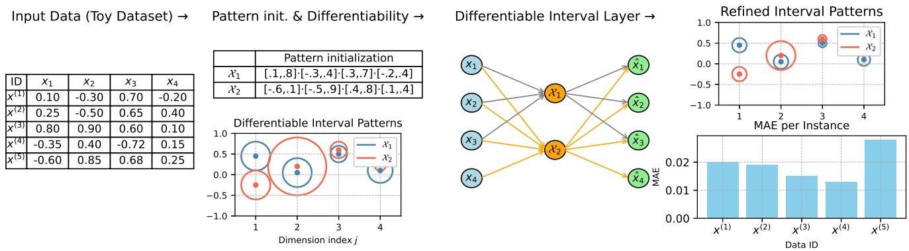  
Fig. 1: DIFFINT end-to-end pipeline on a 4-feature toy dataset (left → right). (a) Input: n=5 samples with d=4 features min-max scaled to $[ - 1 , 1 ]$ (Sec. III-B); $x ^ { ( 1 ) } - x ^ { ( 4 ) }$ are inliers, $x ^ { ( 5 ) }$ is the anomaly. (b) Initialization: K=2 interval units $\mathcal { X } _ { 1 } , \mathcal { X } _ { 2 }$ as centers (dots) with softplus half-widths (rings); sigmoid-soft boundaries of temperature τ make all gradients flow through. (c) Differentiable interval layer: the bottleneck is the bipartite map $\{ x _ { j } \}  \{ \mathcal { X } _ { k } \}  \{ \hat { x } _ { j } \}$ with per-feature memberships $I _ { k j } ( x _ { j } ) = \sigma ( ( x _ { j } - \underline { { c } } _ { k j } ) / \tau ) \sigma ( ( \overline { { c } } _ { k j } - x _ { j } ) / \tau )$ , aggregated per unit and decoded by a small MLP gθ; RMSE between $x , { \hat { x } }$ is backpropagated jointly into $( m _ { k j } , \delta _ { k j } )$ and θ. (d) Refined intervals and anomaly score: after training, intervals shrink onto the inlier cloud (top), and per-instance MAE (bottom) is small for inliers but visibly large for $x ^ { ( 5 ) }$ , the empirical signature of the clipping-margin bound (Thm. 1), which pulls out-of-support points toward the empty-code reconstruction $g _ { \theta } ( f _ { 0 } )$ . Each refined unit reads as an auditable candidate constraint $\begin{array} { r } { ^ { \ast } \mathcal { X } _ { k } \colon \boldsymbol { x } _ { j } \in [ \mathcal { L } _ { k j } , \overline { { c } } _ { k j } ] ^ { , , } } \end{array}$ (Sec. V).

Definition 1 (Active coordinate). Coordinate j is active for unit k if its learned interval constrains inliers there, i.e. the mean inlier membership $\bar { I } _ { k j } = \mathbb { E } _ { \mathcal { D } } [ I _ { k j } ( x _ { j } ) ]$ is bounded away from 1 (e.g. when the half-width satisfies $\begin{array} { r } { \Delta _ { k j } < \frac { 1 } { 2 } \mathrm { r a n g e } _ { j } ) . } \end{array}$ Inactive coordinates span (almost) the whole feature range and contribute log $I _ { k j } \approx 0$ to the aggregation.

Theorem 1 (Certified clipping margin). Fix a test point x that in each active coordinate $\textit { j } ( D e f . \ I )$ lies beyond the units' global envelope, i.e. $x _ { j } > \operatorname* { m a x } _ { k } \bar { c } _ { k j }$ + η or $x _ { j } <$ mink $\underline { { c } } _ { k j } - \eta$ for some $\eta > 0 ;$ then x is outside every box on the same side per coordinate, so $I _ { k j } ( x _ { j } ) ~ \le ~ \beta ~ = ~ \sigma ( - \eta / \tau )$ for all k and all active j. (A point in an interior gap between disjoint sub-intervals violates boxes on opposite sides; such points fall under the graded suppression of Cor. 1, not the full collapse below.) (i) Code collapse (encoder only). The bottleneck code collapses to an x-independent $" e m p t y "$ code $f _ { 0 } , \ \| f ( x ) - f _ { 0 } \| _ { 2 } \ \leq \ \kappa ( \beta )$ with $\kappa ( \beta ) = { \cal O } ( \beta )  0 ;$ this holds for any decoder. (ii) Certified bound. If, in addition, the decoder is the Certified-Lipschitz DIFFINT of Sec. III-E (spectrally normalized linear maps and no non-1-Lipschitz layers), so that $\begin{array} { r } { L = \prod _ { l } \| W _ { l } \| _ { 2 } } \end{array}$ is an explicit Lipschitz upper bound, then

$$
\begin{array} { r } { \mathrm { M A E } ( { \boldsymbol { x } } ) ~ \geq ~ \frac { 1 } { d } \| { \boldsymbol { x } } - g _ { \boldsymbol { \theta } } ( f _ { 0 } ) \| _ { 1 } ~ - ~ \frac { L } { \sqrt { d } } \kappa ( \beta ) , } \end{array}
$$

a deterministic certificate: any point far outside the learned support incurs an error bounded below by its distance to the single point $g _ { \theta } ( f _ { 0 } )$ the model collapses to, minus a slack controllable by τ.

Corollary 1 (Graded suppression under partial violation). The collapse in Thm. 1 is the all-coordinates extreme of a graded effect and does not require a point to be out-of-support everywhere. If x violates (in a consistent direction) $s _ { k } \geq 1$ active coordinates of unit k, then log $I _ { k j } \ \leq \ \log \beta$ on each, so the unnormalized weight obeys exp $\begin{array} { r } { \mathsf { \Pi } ( \ell _ { k } ) \le \beta ^ { s _ { k } } \colon } \end{array}$ a unit is suppressed geometrically in the number of its violated active coordinates, and the bottleneck mass shifts toward the units a point violates least. The full collapse to a single x-independent fo is recovered only when $s _ { k } ~ = ~ | A _ { k } |$ for every unit (all active coordinates violated). We therefore do not claim a fixed reconstruction under partial violation, only that the matching units are exponentially down-weighted, the counterpart of the common anomaly profile in which a few features are abnormal.

Part (i) holds for any decoder and is the mechanism the detector relies on; the certificate (ii) is an optional, on-demand guarantee. The realistic anomaly, a few abnormal features, is the partial-violation regime of Cor. 1: the units a point matches are down-weighted geometrically in the coordinates it violates, so the decoder cannot route the point's abnormal values through them and the reconstruction is pulled toward the inlier image. The all-coordinate collapse of Thm. 1 – a single fixed reconstruction with a certified error bound – is the extreme of this effect, used as a verifiable sanity check (Sec. VI-E). In both regimes the error grows with the point's distance from the inlier image, which is why MAE works as a score here, specific to the interval bottleneck, not a generic autoencoder property. Fig. 2 makes this concrete on a 2D toy set: inliers inside the learned box are reconstructed faithfully, while out-of-support points are clipped onto the inlier image and thus separate cleanly in the error histogram.

Remark 1 (Theory vs. the reported experiments). We are explicit about which part of Thm. 1 the results use. Part (i) (code collapse) is an encoder property and holds for every run. Part (ii) (the certified error lower bound) additionally needs the spectrally normalized Certified-Lipschitz decoder; all headline accuracy numbers use the default unconstrained ReLU decoder, for which part (ii) is a structural mechanism and the collapse is an empirical phenomenon (Figs. 1d, 2), not a guarantee. The certifed variant makes it a verifed inequality (0 violations on every dataset, Sec. VI-E) at a mean-AUROC cost of $0 . 9 0 8 \substack {  } 0 . 8 5 1$ on the six datasets tested. The partialviolation regime a real anomaly usually occupies is the graded suppression of Cor. 1, which carries no reconstruction-error bound – only the exponential down-weighting of the units the point matches.

Checklist for Thm. 1. The hypotheses are operational: $j$ is active for k iff its mean inlier membership $\bar { I } _ { k j } ~ < ~ 0 . 9$ (it constrains inliers there), and x is out-of-support for unit k when its box membership $\begin{array} { r } { m _ { k } ( x ) = \prod _ { j } I _ { k j } ( x _ { j } ) } \end{array}$ falls below $\beta = \sigma ( - \eta / \tau ) ~ ( \eta { = } 0 . 2 , ~ \beta { \approx } 0 . 1 2 )$ . Under this check $\ge ~ 9 9 \%$ of test anomalies are out-of-support of every unit. The strict hypothesis of Thm. 1(ii) – violation of every active coordinate of some unit – is stronger: it is met by a dataset-dependent fraction (routine when units keep few active coordinates, rare when they keep many; App. E, Table XIV), and the remaining anomalies fall under the graded suppression of Cor. 1, which down-weights the matched units but carries no reconstructionerror bound. Empirically, the MAE inequality of Thm. 1(ii) is nonetheless satisfied for every out-of-support point under the Certified-Lipschitz decoder (0 violations on all six datasets; Sec. VI-E, Table V, Fig. 5).

Two further properties the method uses are stated and proved in App. A: the EMA support is asymptotically unbiased with finite effective memory (Prop. 2), and the DIFFINT encoder is globally Lipschitz on $[ - 1 , 1 ] ^ { d }$ (Prop. 3); with a spectrally normalized decoder the whole model is Lipschitz, the regularity used by Theorem 1.

Proposition 1 (Capacity: soft box-unions cover any support). Let the inlier support $\dot { D } \subset [ - 1 , 1 ] ^ { d }$ be compact, write the soft box membership of unit k as $\begin{array} { r } { \dot { m _ { k } } ( x ) = \prod _ { i } I _ { k j } ( x _ { j } ) \in [ 0 , 1 ] } \end{array}$ and the soft-union $\begin{array} { r } { F = 1 - \prod _ { k = 1 } ^ { K } ( 1 - m _ { k } ) } \end{array}$ . For every $\varepsilon > 0$ there exist a finite K, intervals $\{ [ \underline { { c } } _ { k j } , \overline { { c } } _ { k j } ] \}$ and a temperature $\tau > 0$ with $\| F - \mathbf { 1 } _ { D } \big \| _ { L ^ { 1 } ( [ - 1 , 1 ] ^ { d } ) } \leq \check { \varepsilon } ;$ moreover, for any $\delta > 0 ,$ $F  \mathbf { 1 } _ { D }$ uniformly on $\left\{ x : \mathrm { d i s t } ( x , \partial D ) \geq \delta \right\}$ as $\tau  0 .$

Axis-aligned intervals are thus not a representational bottleneck on the shape of the inlier region; the residual error concentrates only in an arbitrarily thin shell around ∂D, where no continuous score can resolve a hard indicator. This is a capacity statement: whether training realizes such a cover is empirical, answered by the learned boxes localizing inliers (Fig. 6) and by accuracy saturating after a few units (Fig. 4). The operative detection result remains Thm. 1.

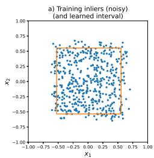

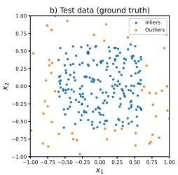

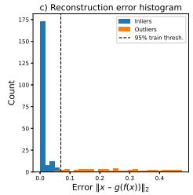

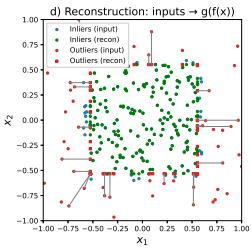  
Fig. 2: Toy illustration of Theorem 1. (a) noisy training inliers and the learned interval; (b) test data; (c) reconstructionerror histogram (inliers vs. outliers, dashed: 95% train threshold); (d) inputs → reconstructions: out-of-support points are clipped, producing large error.

## V. TURNING INTERVALS INTO AUDITABLE CANDIDATE CONSTRAINTS

The bottleneck is inspectable, but a practitioner needs a scalar per (unit, feature) saying how diagnostic that interval is. The score also has to work without anomaly labels, since the detector is unsupervised. The simplest way to get one is to read it off the trained model itself.

Label-free importance (LFI): LFI is a global, model-level diagnostic: it scores a (unit, feature) pair, not a single flagged instance. The per-instance question – which features made this point anomalous – is answered directly by Cor. 1: the active coordinates the point violates are exactly the ones that suppress its matching units and drive up its error. For unit k and feature $j ,$ write $s _ { k j } \in [ 0 , 1 ]$ for the EMA soft support (Sec. III-E), $\Delta _ { k j }$ for the learned half-width, and range,=2 for the [-1, 1] feature range. Let $\mathrm { s t a b } _ { k j } \in [ 0 , 1 ]$ be the inverse spread of the interval bounds across seeds. Latent units carry no canonical order, so stab $) _ { k j }$ is computed after a per-dataset alignment of units across seeds (matched by proximity of their $( m _ { k j } , \Delta _ { k j } )$ vectors); on a single-seed run it is set to 1 and the factor is inert. We score (unit, feature) pairs by

$$
\mathrm { L F I } _ { k j } \ = \ \underbrace { s _ { k j } } _ { \mathrm { s u p p o r t } } \cdot \underbrace { ( 1 - \Delta _ { k j } / \mathrm { r a n g e } _ { j } ) } _ { \mathrm { t i g h t n e s s } } \cdot \underbrace { \mathrm { s t a b } _ { k j } } _ { \mathrm { s t a b i l i t y } } \ \in \ [ 0 , 1 ] .
$$

The three factors are simply how often the interval fires on inliers $( s _ { k j } )$ , how much narrower it is than the full feature range $( \Delta _ { k j }$ small), and how repeatable it is across re-runs. None of them need an anomaly label. To pick a unit to display, we sum the top-N LFI values across its features; within that unit, we keep the top-N features by LFI. This is the selection rule behind Fig. 6. Stability is validated matching-free at the feature level (App. E: mean cross-seed Spearman $\rho { \geq } 0 . 7 4 )$

Faithfulness of the LFI explanation: Post-hoc attributions such as SHAP [40] or per-feature residuals from TCCM [28] are computed after the fact and can disagree with the score they explain. DIFFINT does not have this gap: a point's violated constraints are exactly the suppressed units (Cor. 1), and that suppression is what moves the reconstruction. The explanation and the score share one mechanism, so no second model has to align them. App. G evaluates the global LFI feature ranking against the same ranking obtained by aggregating KernelSHAP, integrated gradients, gradient×input and ECOD over a pool of flagged anomalies, inside the axis-aligned regime DIFFINT targets. LFI is a global interpretability readout, not a per-instance explainer; within that regime the zeroquery LFI ranking agrees with the aggregated KernelSHAP / integrated-gradients rankings at Spearman $\rho \approx 0 . 7 ,$ is as stable across re-trainings as KernelSHAP, and passes a modelrandomisation sanity check - i.e. it carries the same global information the post-hoc methods buy with hundreds of model queries, at no cost.

Is LFI a contribution?: We treat LFI as a minor, auxiliary contribution. The formula is a product of three quantities the model already keeps, not a new theoretical result. Its role is to make the interval bottleneck usable when no anomaly labels are at hand: a practitioner can rank candidate constraints from the trained model alone. We do not claim LFI is superior to supervised attributors such as SHAP – it is a global, label-free constraint-ranking tool, not a per-instance explainer (App. G). LFI is the score to reach for when labels are not available, which is the usual setting in unsupervised anomaly detection.

## VI. EXPERIMENTS

Protocol (stated up front): We evaluate on the 48 nativenumerical ADBench datasets [1] (12 small, 15 medium, 11 large, 10 high-dimensional; full list in App. C) against 22 baselines via the TCCM/ADBench codebase [1], [28]. The remaining ADBench tasks are pre-computed vision/text embedding vectors whose coordinates are not individually meaningful, so the per-feature readability that motivates DIFFINT does not apply; we match the tabular scope of our closest baseline TCCM [28]. DIFFINT is trained semi-supervised on inliers only, with a 40% test split, 10 seeds, and a single configuration fixed across datasets (lr $5 { \times } 1 0 ^ { - 5 } , K { = } 2 0 0 , \tau { = } 0 . 1$ $\rho { = } 0 . 9 9 9$ , 1000 epochs, 2-1ayer decoder; batch 64/512/1024 by n). All methods share the MinMax [-1, 1] normalization and the inductive baselines (TCCM, AutoEncoder, VAE) the same inlier-only training; this single shared protocol is the one under which DIFFINT's clipping bound and Lipschitz slack transfer across datasets (Sec. III-B). Inlier-only training matches the deployment-relevant regime: a curated normal reference set, as in monitoring and fraud. As this is a cleantraining setup, we restrict headline claims to inductive methods and report unsupervised contaminated-data detectors as “competitive," not “beaten." Complete per-dataset tables, dataset characteristics, per-scale CD diagrams, and ablations are in

TABLE I: Stratified and complete-case re-analysis (App. I). Mean rank recomputed within training regimes from the same per-dataset scores, no model re-run (lower is better). Inlieronly pool: DIFFINT, TCCM, AutoEncoder, VAE re-ranked 1– 4 per dataset. Contaminated pool: DIFFINT inserted into the 19-method contaminated set (20 methods). Complete-case: the 39/48 datasets on which every method finished (no imputation). The top-cluster result survives both the stratification and the removal of imputation.
<table><tr><td></td><td>Rank (ROC-AUC)</td><td>Rank (AUPR)</td></tr><tr><td>Inlier-only pool (of 4), all 48 datasets</td><td></td><td></td></tr><tr><td>DIFFINT</td><td>1.69</td><td>1.71</td></tr><tr><td>AutoEncoder</td><td>2.50</td><td>2.58</td></tr><tr><td>TCCM</td><td>2.83</td><td>2.62</td></tr><tr><td>VAE</td><td>2.98</td><td>3.08</td></tr><tr><td>DIFFINT vs. contaminated-data pool (of 20)</td><td></td><td></td></tr><tr><td>all 48 datasets, DIFFINT</td><td>3.35</td><td>3.46</td></tr><tr><td>complete-case (39), DIFFINT</td><td>3.59</td><td>3.74</td></tr><tr><td>complete-case (39), best contam. (LUNAR)</td><td>4.03</td><td>3.85</td></tr></table>

the appendices.2

Handling of missing baseline runs: Some baselines did not complete on the largest datasets within budget (KPCA and LMDD on 8–9, MO\_GAAL on 6, KDE/OCSVM/LUNAR on 3-4, and AutoEncoder/CBLOF/DIF/others on 1 each) and appear as “–". We keep all 48 datasets and assign each missing run the worst rank (the number of methods) on that dataset, the standard conservative convention; this mildly favors methods that ran everywhere, DIFFINT included.

## A. Anomaly detection accuracy

Fig. 3 shows the ROC-AUC critical-difference diagram over all 48 datasets, with runs that did not complete floored to the worst rank (Friedman $\chi ^ { 2 } { = } 4 5 4 . 3 6 , p { < } 1 0 ^ { - 8 0 }$ ; Nemenyi at 95%, $\mathrm { C D } { = } ~ 5 . 0 1 )$ . Under this common [-1, 1] protocol, DIFFINT attains the best mean rank (4.10), ahead of LUNAR (6.00), AutoEncoder (7.42), TCCM (8.22), GMM (8.56), IForest (8.60), and VAE (8.90). The Nemenyi bar links DIFFINT with this leading cluster of seven methods, so DIFFINT is topranked but not statistically separated from them; the cluster is significantly ahead of the remaining \~16 detectors. This pooled diagram mixes inlier-only and contaminated-data methods. Table I re-analyzes the same scores within regimes (App. I for the per-scale breakdown): DIFFINT leads the inlieronly pool by a wide margin (1.69/1.71 of 4), and against the contaminated pool on the complete-case subset (no rank imputation) it is first or tied with LUNAR (AUPR gap 0.11) – so the headline ordering is not an artefact of pooling regimes or of the missing-run convention.

Table II and the per-scale CD diagrams (App. K-A) agree: DIFFINT attains the lowest mean rank strictly in 7 of the 8 (regime × metric) cells of Table II; the 8th (high-d AUPR, 6.40 vs. LUNAR 5.45) has LUNAR slightly ahead but the gap is well within the per-scale Nemenyi CD (≈11 at n=10), so the two methods are statistically tied there. DIFFINT is therefore the leading or co-leading method on every regime × metric cell. Six robustness checks are reported in App. E: sensitivity to missing-run handling, a τ sweep, an active-coordinate threshold check, the per-layer spectral norms of the certified decoder, an inference-clamping isolation, and LFI stability across seeds. The top-cluster conclusion and the interpretability claims hold under all of them.

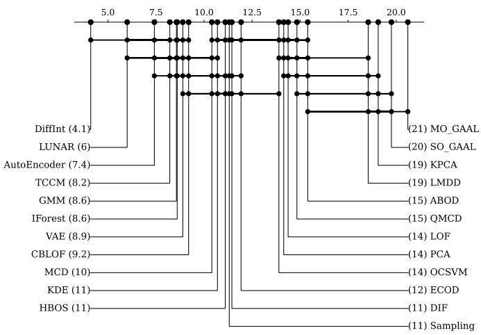  
(a) ROC–AUC (mean rank DIFFINT: 4.10).

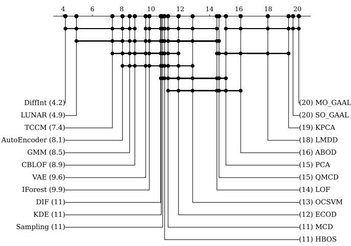  
(b) AUPR (mean rank DIFFINT: 4.16).  
Fig. 3: Critical-difference diagrams across the 48 ADBench datasets and 23 methods, runs that did not complete floored to worst rank. DiFFINT attains the best mean rank on both metrics and is statistically tied with the same leading cluster (LUNAR. AutoEncoder, TCCM, GMM, IForest, VAE); the cluster is significantly ahead of the remaining ～16 detectors

TABLE II: Mean rank by dataset scale (lower is better; missing runs floored to worst). Bold: DIFFINT leads strictly. †: tied with the best baseline within the per-scale Nemenyi CD (≈9— 11 at α=0.05). LU=LUNAR, IF=IForest, AE=AutoEncoder, CB=CBLOF.
<table><tr><td colspan="2">Rank (ROC-AUC)</td><td colspan="2">Rank (AUPR)</td></tr><tr><td>Regime (N)</td><td>DIFFINT best BL</td><td>DIFFINT</td><td>best BL</td></tr><tr><td>Overall (48)</td><td>4.10 LU 6.00</td><td>4.16</td><td>LU 4.91</td></tr><tr><td>Small (12)</td><td>4.42 LU 6.75</td><td>4.33</td><td>CB 6.67</td></tr><tr><td>Medium (15)</td><td>3.77</td><td>LU 4.23 3.57</td><td>LU 3.60</td></tr><tr><td>Large (11)</td><td>3.18 AE 4.73</td><td>2.73</td><td>LU 3.91</td></tr><tr><td>High-d (10)</td><td>5.25 LU 5.75</td><td>6.40†</td><td>LU 5.45</td></tr></table>

## B. Reconstruction sanity check vs. a binary differentiable model

Table III compares reconstruction MAE against BinaPs [6], the closest differentiable model. Caveat: BinaPs targets binary data and does not optimize numerical reconstruction, so this is a sanity check that numerical intervals reconstruct better than binarized patterns, not a pattern-mining comparison and not evidence about pattern-set quality. Under that caveat, DIFFINT reconstructs numerical inliers far better (Table III) and, avoiding the combinatorial cost of binary pattern search, trains one to two orders of magnitude faster than BinaPs.

TABLE III: Reconstruction MAE (vs. BinaPs, sanity check) and training time (s); lower better, per-row best green. Times: matched 1000-epoch budget for DIFFINT/LUNAR; "OOM": out of memory. DIFFINT trains 1-2 orders faster than BinaPs and faster than LUNAR on most datasets.
<table><tr><td rowspan="2">Dataset</td><td colspan="2">Reconstruction MAE</td><td colspan="2">Training time (s)</td></tr><tr><td>BinaPs</td><td>DIFFINT</td><td>DIFFINT</td><td>LUNAR</td></tr><tr><td>arrhythmia</td><td>0.296</td><td>0.121</td><td>30.2</td><td>7.9</td></tr><tr><td>cardio</td><td>0.305</td><td>0.064</td><td>3.0</td><td>20.6</td></tr><tr><td>glass</td><td>0.336</td><td>0.043</td><td>9.2</td><td>7.5</td></tr><tr><td>ionosphere</td><td>0.252</td><td>0.129</td><td>16.1</td><td>7.2</td></tr><tr><td>optdigits</td><td>0.281</td><td>0.203</td><td>60.1</td><td>57.6</td></tr><tr><td>pima</td><td>0.295</td><td>0.070</td><td>8.6</td><td>8.1</td></tr><tr><td>satellite</td><td>0.247</td><td>0.035</td><td>38.7</td><td>52.6</td></tr><tr><td>satimage-2</td><td>0.257</td><td>0.033</td><td>54.6</td><td>65.7</td></tr><tr><td>shuttle</td><td>0.057</td><td>0.001</td><td>193.5</td><td>658.0</td></tr><tr><td>vowels</td><td>OOM</td><td>0.061</td><td>2.7</td><td>31.3</td></tr><tr><td>wbc</td><td>O0M</td><td>0.067</td><td>2.6</td><td>15.9</td></tr></table>

Cost relative to deep baselines: Asymptotically DIFFINT is in the deep-baseline class: per-sample inference is O(Kd) memberships plus a fixed MLP decoder and an O(K) softmax, one forward pass with no neighbour search, unlike memorybased detectors such as LUNAR whose kNN queries grow with n. Table III confirms this in wall-clock at a matched 1000-epoch budget: DIFFINT trains faster than LUNAR on most datasets and markedly on the largest (shuttle 194s vs. 658s).

## C. Effect of bottleneck width K

Fig. 4 varies K ∈ {5, 10, 20, 50, 100, 200, 300} on three representative datasets. ROC-AUC (a) saturates well below K=200 on every dataset: once enough capacity is available, adding units neither helps nor hurts. The companion panel (b) confirms selective reconstruction: as K grows, inlier reconstruction sharpens but the mean MAE on test outliers stays high, the empirical signature of the clipping margin (Thm. 1). We therefore fix K=200 as a generous capacity default that absorbs dataset complexity without per-dataset tuning; it is not interpreted as a minimal pattern set. Practitioners on a tight compute budget can safely halve K without measurable accuracy loss.

TABLE IV: Ablations on seven small ADBench datasets $( n ~ \ge ~ 1 0 0 ;$ K=200, 3 seeds; mean ROC-AUC). (a) input normalization; (b) fraction of anomalies in the training set.
<table><tr><td colspan="3">(a) Normalization</td><td rowspan="2">standard 0.818</td><td rowspan="2"> $[ - 1 , 1 ]$  0.833</td></tr><tr><td>ROC-AUC</td><td>none 0.805</td><td>[0,1] 0.824</td></tr><tr><td colspan="3">(b) Training contamination</td><td></td><td></td></tr><tr><td rowspan="2">ROC-AUC</td><td>0%</td><td>5%</td><td>10%</td><td>20%</td></tr><tr><td>0.833</td><td>0.751</td><td>0.735</td><td>0.720</td></tr></table>

## D. Ablations: normalization and contamination

Table IV reports two ablations on seven small ADBench datasets $( n \geq 1 0 0 ; \ K = 2 0 0 , 3$ seeds; Hepatitis, n=80, is too small for a stable inlier-only split): preprocessing sensitivity and contaminated “clean" training. The Lipschitz assumption of Thm. 1 is examined separately in Sec. VI-E. (a) Normalization. Mapping into a bounded symmetric domain is what matters: dropping it costs ≈ 3 AUROC points, and among bounded/standardized choices [-1,1] is the most accurate (0.833 vs. StandardScaler 0.818, [0, 1] 0.824; a ≤ 1.5-point spread), so it is both the theory-driven choice under which one configuration and the clipping bound transfer (Sec. III-B) and the top performer. (b) Training contamination. Anomalies in the “inlier"set degrade AUROC gracefully (0.833→0.751→ $0 . 7 3 5  0 . 7 2 0$ at $0 / 5 / 1 0 / 2 0 \% )$ , staying well above chance: the EMA support averages over batches, so a minority cannot dominate the intervals.

## E. Certifying the clipping margin: does it hold?

We test Thm. 1 directly with the Certified-Lipschitz DIFFINT (K=200, 3 seeds) on low-membership test points (inside no learned box). Table V and Fig. 5: the bound is respected for every out-of-support point, the upper bound $\begin{array} { r } { L \ = \ \prod _ { l } \| W _ { l } \| _ { 2 } } \end{array}$ is an explicit constant near 1, and the reconstructions collapse toward the empty-code image $g _ { \boldsymbol { \theta } } ( f _ { 0 } )$ (within ≈ 0.4 of the inlier amplitude). Certification trades some accuracy (0.908 → 0.851 mean AUROC), so the unconstrained decoder stays the default and the certified variant is used when a guarantee is required; the clipping mechanism is present in both.

## F. Interpretability: do the intervals localize inliers?

Fig. 6 projects the top DIFFINT interval onto feature pairs. The interval is picked by the label-free importance LFI (Sec. V), so the selection itself uses no anomaly labels. The bounds the model learns form an explicit, auditable candidate constraint that concentrates inliers and suppresses outliers through the clipping margin (Thm. 1, Cor. 1).

TABLE V: Certifying Thm. 1 (Certified-Lipschitz DIFFINT). L: decoder Lipschitz upper bound; collapse: mean distance of out-of-support reconstructions to $g _ { \boldsymbol { \theta } } ( f _ { 0 } )$ , as a fraction of inlier amplitude (lower = tighter collapse); bound: fraction of outof-support points satisfying the inequality. AUROC is for the unconstrained (default) and certified decoders.
<table><tr><td></td><td colspan="2">AUROC</td><td colspan="3"></td></tr><tr><td>Dataset</td><td>unc.</td><td>cert.</td><td>L</td><td>collapse</td><td>bound</td></tr><tr><td>glass</td><td>0.891</td><td>0.744</td><td>1.05</td><td>0.52</td><td>100%</td></tr><tr><td>wbc</td><td>0.930</td><td>0.903</td><td>1.03</td><td>0.29</td><td>100%</td></tr><tr><td>ionosphere</td><td>0.953</td><td>0.828</td><td>1.04</td><td>0.24</td><td>100%</td></tr><tr><td>pima</td><td>0.696</td><td>0.686</td><td>1.04</td><td>0.53</td><td>100%</td></tr><tr><td>cardio</td><td>0.976</td><td>0.955</td><td>1.06</td><td>0.45</td><td>100%</td></tr><tr><td>satimage-2</td><td>0.999</td><td>0.987</td><td>1.07</td><td>0.38</td><td>100%</td></tr><tr><td>Mean</td><td>0.908</td><td>0.851</td><td>1.05</td><td>0.40</td><td>100%</td></tr></table>

## G. Discussion: when does interval structure help?

Theory and experiment agree on one mechanism: the clipping margin (Thm. 1, Cor. 1) scales with the fraction of informative coordinates, so the gains are largest on small and medium data, where the axis-aligned bias matches the typical anomaly profile of a few abnormal features. The gains carry to large data (rank 3.18 on AUC, 2.73 on AUPR) and to highdimensional data, where DIFFINT still leads on ROC-AUC (5.25 vs. LUNAR 5.75); the only cell where a competitor (LUNAR) edges DIFFINT in mean rank is high-dimensional AUPR, and that gap is within the per-scale Nemenyi CD, i.e. statistically a tie. On top of this, the structured bottleneck delivers what an entangled code cannot: a mechanistic reason why a point is anomalous, with auditable, feature-grounded candidate constraints (Sec. V, Fig. 6).

## H. Limitations

Three settings sit outside the assumptions under which DIFFINT is evaluated. (1) Heavy-tailed features: min-max scaling assumes finite per-feature extrema. Features with heavy tails (e.g. income, latency) saturate the endpoints and warp the [—1, 1] geometry the temperature τ and the clipping margin rely on; a robust quantile mapping into [—1, 1| would preserve τ, but we do not evaluate it here. (2) Concept drift: the protocol assumes a stationary inlier distribution. On nonstationary streams the scaler and the EMA support must be refreshed (a short re-fit on a recent inlier window suffices in principle), but drift is unevaluated in this paper. (3) Missing values: the current implementation assumes complete features and treats imputation as a preprocessing step. A missingaware membership (e.g. a neutral $I _ { k j } { = } 1$ for missing $x _ { j } ,$ SO the unit abstains rather than firing) is straightforward but not measured here. A quantitative comparison of the global LFI ranking against aggregated post-hoc attributors is in App. G; two further points – a robust/quantile normalization ablation and a comparison to diffusion / retrieval / tabular-foundationmodel detectors – are outside the scope of this evaluation and discussed in App. J.

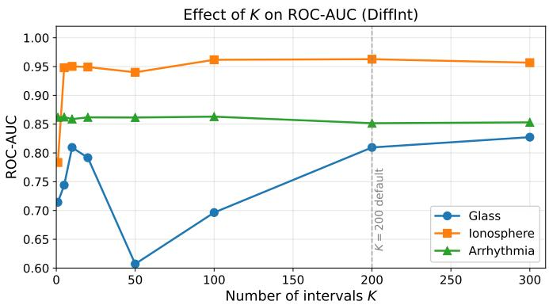  
(a) ROC-AUC saturates after a few units.

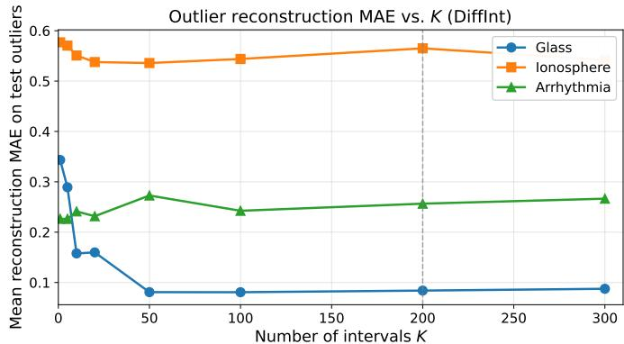  
(b) Mean MAE on test outliers stays high.

Fig. 4: Effect of K on three ADBench datasets. Detection accuracy saturates quickly (a); meanwhile the mean reconstruction error on test outliers does not collapse with growing capacity (b), so DiFFINT reconstructs the inlier manifold faithfully while keeping out-of-support points far from their input (selective reconstruction, consistent with Thm. 1). We fix K=200 as a capacity dial, not a pattern-set size.  
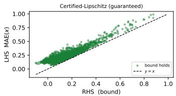

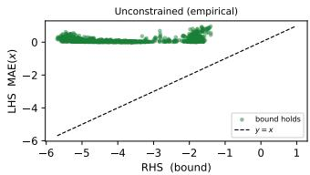  
Fig. 5: Theorem-to-practice bridge: MAE(x) (LHS) vs. the clipping-margin lower bound (RHS) for out-of-support points. Left: certified decoder, bound tight and respected (0 violations). Right: unconstrained, the inequality holds but the bound is loose and uncertified (note the x-scale), an empirical phenomenon (Rem. 1).

## VII. CONCLUSION

We presented DIFFINT, an autoencoder for tabular anomaly detection whose bottleneck is a set of soft, learnable numerical intervals. Three pieces fit together: a differentiable architecture that needs no discretization, a clipping-margin result (Thm. 1, certified under a Lipschitz decoder and empirical otherwise) explaining why reconstruction error is a valid score on this bottleneck, and a closed-form label-free importance, LFI (Sec. V), that turns each (unit, feature) pair into an auditable candidate constraint without consulting any anomaly label. On 48 AD-Bench datasets, DiFFINT reaches the lowest mean rank on both metrics (4.10 ROC-AUC, 4.16 AUPR) and sits in a sevenmethod cluster the Nemenyi test cannot separate; LUNAR slightly edges it only on high-dimensional AUPR, and that gap is within the per-scale CD. The explanation and the score share one mechanism, so the intervals read off the bottleneck are exactly what drives detection. A natural next step is to add a soft-L0 gate and an MDL term so the bottleneck becomes a compact interval-pattern-set miner suitable for pattern-mining benchmarks alongside anomaly detection.

## ACKNOWLEDGMENT

This work was supported by French state aid managed by the National Research Agency (ANR) under the France 2030 program, with the reference “PANDORA" (ANR-24-CE23- 0950). The authors thank the anonymous reviewers for their constructive feedback.

## REFERENCES

[1] S. Han, X. Hu, H. Huang, M. Jiang, and Y. Zhao, "Adbench: Anomaly detection benchmark," Advances in neural information processing systems, vol. 35, pp. 32 142–32 159, 2022.

[2] F. Locatello, S. Bauer, M. Lucic, G. Raetsch, S. Gelly, B. Schölkopf, and O. Bachem, "Challenging common assumptions in the unsupervised learning of disentangled representations," in international conference on machine learning. PMLR, 2019, pp. 4114–4124.

[3] Z. C. Lipton, “The mythos of model interpretability: In machine learning, the concept of interpretability is both important and slippery." Queue, vol. 16, no. 3, pp. 31–57, 2018.

[4] M. Kaytoue, S. O. Kuznetsov, and A. Napoli, "Revisiting numerical pattern mining with formal concept analysis," in IJCAI 2011, 2011, pp. 1342-1347.

[5] A. Belfodil, A. Belfodil, and M. Kaytoue, “Anytime subgroup discovery in numerical domains with guarantees," in ECML PKDD 2018, 2018, pp. 500–516.

[6] J. Fischer and J. Vreeken, "Differentiable pattern set mining," in SIGKDD. ACM, 2021, pp. 383–392.

[7] N. P. Walter, J. Fischer, and J. Vreeken, "Finding Interpretable Class-Specific Patterns through Efficient Neural Search," in AAAI, 2024.

[8] T. Chataing, J. Perez, M. Plantevit, and C. Robardet, "Diffversify: a scalable approach to differentiable pattern mining with coverage regularization," in ECMLPKDD'24, 2024, pp. 407–422.

[9] M. Sakurada and T. Yairi, “Anomaly detection using autoencoders with nonlinear dimensionality reduction,"MLSDA, 2014.

[10] D. P. Kingma and M. Welling, "Auto-encoding variational bayes," in ICLR, 2013.

[11] B. Zong, Q. Song, M. Min, W. Cheng, C. Lumezanu, D. Cho, and H. Chen, “Deep autoencoding gaussian mixture model for unsupervised anomaly detection," in ICLR, 2018.

[12] L. Ruff, R. Vandermeulen, N. Görnitz, L. Deecke, S. Ahmed Siddiqui, A. Binder, E. Müller, and M. Kloft, "Deep one-class classification," in ICML, 2018.

[13] B. Zong, Q. Song, M. R. Min, W. Cheng, C. Lumezanu, D. Cho, and H. Chen, “Deep autoencoding gaussian mixture model for unsupervised anomaly detection," in International Conference on Learning Representations, 2018.

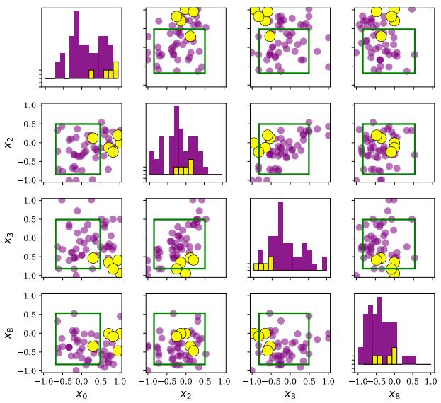  
(a) WINE: unit 179, candidate constraint x0 ∈ [—0.68, 0.48] $\wedge \ x _ { 2 } \in$ [−0.84, 0.50] ∧ x3 ∈[−0.82, 0.49] ∧ x8 ∈[−0.83, 0.53].

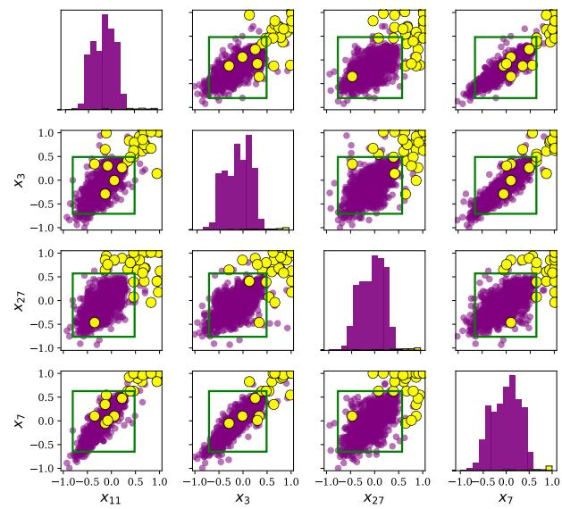  
(b) SATIMAGE-2: unit 28, candidate constraint x3 ∈ [—0.71, 0.49] ∧ x7 ∈ [−0.65, 0.63] ∧ x11 ∈ [−0.80, 0.48] ∧ x27 ∈ [−0.76, 0.57].

Fig. 6: Pairwise 2D projections of the top DIFFINT interval on two ADBench datasets, selected without any anomaly label by the label-free importance (LFI, Sec. V); bounds are in the |–1, 1-scaled domain. The green boxes concentrate the inlier mass (purple) while a large fraction of outliers (yellow) leave the box on at least one axis, most visibly in the upper-right cluster of SATIMAGE-2. Separation at the box boundary is not strict, but a violation in any active coordinate is enough to suppress this unit's contribution (Cor. 1) and trigger the clipping margin (Thm. 1).

[14] S. Pidhorskyi, D. A. Adjeroh, and G. Doretto, “Adversarial latent autoencoders," in Proceedings of the IEEE/CVF conference on computer vision and pattern recognition, 2020, pp. 14 104–14113.

[15] L. Bergman, N. Cohen, and Y. Hoshen, "Deep nearest neighbor anomaly detection," arXiv preprint arXiv:2002.10445, 2020.

[16] M. M. Breunig, H.-P. Kriegel, R. T. Ng, and J. Sander, "Lof: Identifying density-based local outliers," in SIGMOD, 2000.

[17] B. Schölkopf, R. C. Williamson, A. Smola, J. Shawe-Taylor, and J. Platt, "Support vector method for novelty detection," in NEURIPS, 1999.

[18] M.-L. Shyu, S.-C. Chen, K. Sarinnapakorn, and L. Chang, "A novel anomaly detection scheme based on principal component classifier," in IEEE Foundations and New Directions of Data Mining Workshop, 2003.

[19] L. J. Latecki, A. Lazarevic, and D. Pokrajac, "Outlier detection with kernel density functions," in MLDM, 2007.

[20] L. Bergman and Y. Hoshen, "Classification-based anomaly detection for general data," in ICLR, 2020.

[21] T. Shenkar and L. Wolf, “Anomaly detection for tabular data with internal contrastive learning," in ICLR, 2022.

[22] H. Xu, Y. Wang, J. Wei, S. Jian, Y. Li, and N. Liu, "Fascinating supervisory signals and where to find them: Deep anomaly detection with scale learning: Deep anomaly detection with scale learning," in ICML, 2023.

[23] J. Yin, Y. Qiao, Z. Zhou, X. Wang, and J. Yang, "Masked cell modeling for anomaly detection in tabular data," in ICLR, 2024.

[24] T. Schlegl, P. Seeböck, S. M. Waldstein, U. Schmidt-Erfurth, and G. Langs, "Unsupervised anomaly detection with generative adversarial networks," in MICCAI, 2017.

[25] J. Ho, A. Jain, and P. Abbeel, "Denoising diffusion probabilistic models," in NEURIPS, 2020.

[26] V. Livernoche, V. Jain, Y. Hezaveh, and S. Ravanbakhsh, "On diffusion modeling for anomaly detection," in ICLR, 2024.

[27] A. Goodge, B. Hooi, S.-K. Ng, and W. S. Ng, "Lunar: Unifying local outlier detection methods via graph neural networks," in AAAI, 2022.

[28] Z. Li, Q. Huang, Y. Zhu, L. Yang, M. Amiri, N. van Stein, and M. van Leeuwen, “Scalable, explainable and provably robust anomaly detection with one-step flow matching," NeurIPS, 2025.

[29] R. Agrawal and R. Srikant, “Fast algorithms for mining association rules in large databases," in VLDB'94,, 1994, pp. 487–499.

[30] M. J. Zaki, S. Parthasarathy, M. Ogihara, and W. Li, "New algorithms for fast discovery of association rules," in SIGKDD, 1997, pp. 283–286.

[31] J. Vreeken, M. van Leeuwen, and A. Siebes, “Krimp: mining itemsets that compress," Data Min. Knowl. Discov., vol. 23, no. 1, pp. 169–214, 2011.

[32] T. De Bie, “Maximum entropy models and subjective interestingness: an application to tiles in binary databases," Data Min. Knowl. Discov., vol. 23, no. 3, pp. 407–446, 2011.

[33] T. Chataing, J. Perez, M. Plantevit, and C. Robardet, “Diffversify: a scalable approach to differentiable pattern mining with coverage regularization," in Joint European Conference on Machine Learning and Knowledge Discovery in Databases. Springer, 2024, pp. 407–422.

[34] E. Karabulut, P. Groth, and V. Degeler, "Neurosymbolic association rule mining from tabular data," in NeSy, 2025, pp. 565–588.

[35] A. V. Konstantinov and L. V. Utkin, “Interpretable ensembles of hyperrectangles as base models," Neural Computing and Applications, vol. 35, no. 29, pp. 21 771–21 795, 2023.

[36] Z. Wang, W. Zhang, N. Liu, and J. Wang, "Scalable rule-based representation learning for interpretable classification," NeurIPS, vol. 34, pp. 30479–30491, 2021.

[37] Y. Bengio, A. Courville, and P. Vincent, “"Representation learning: A review and new perspectives," IEEE transactions on pattern analysis and machine intelligence, vol. 35, no. 8, pp. 1798–1828, 2013.

[38] C. Chen, O. Li, D. Tao, A. Barnett, C. Rudin, and J. K. Su, "This looks like that: deep learning for interpretable image recognition," in NeurIPS, 2019.

[39] I. Higgins, L. Matthey, A. Pal, C. Burgess, X. Glorot, M. Botvinick, S. Mohamed, and A. Lerchner, “beta-vae: Learning basic visual concepts with a constrained variational framework," in ICLR, 2017.

[40] S. M. Lundberg and S.-I. Lee, “A unified approach to interpreting model predictions," in NeurIPS, 2017.

[41] J. Adebayo, J. Gilmer, M. Muelly, I. Goodfellow, M. Hardt, and B. Kim, “Sanity checks for saliency maps," in NeurIPS, 2018.

## APPENDIX A PROOFS

We give the complete proofs of the results stated (with sketches) in Sec. IV.

## A. Proof of Theorem 1 (clipping margin)

Proof. Write the code $\begin{array} { r l r } { f _ { k } ( x ) } & { { } = } & { \mathrm { s o f t m a x } _ { k } ( \ell _ { k } ) , \ell _ { k } = } \end{array}$ $\sum _ { j } \log I _ { k j } ( x _ { j } )$ . Let V be the set of active coordinates on which x exceeds the unit in a fixed direction (say above the upper bound) by margin $\geq \eta ,$ SO $I _ { k j } ( x _ { j } ) ~ \le ~ \beta ~ =$ $\sigma ( - \eta / \tau ) ~ \in ~ ( 0 , \frac { 1 } { 2 } )$ for $j ~ \in ~ V ,$ There the upper sigmoid saturates and log $\begin{array} { r } { \dot { I } _ { k j } ( x _ { j } ) ~ = ~ - \frac { 1 } { \tau } ( x _ { j } - \overline { { c } } _ { k j } ) + O ( \beta ) } \end{array}$ , whose x-dependent part $- { x _ { j } } / { \tau }$ is identical across all units k (this uses the same-side hypothesis: for a below-violation the common part is $+ x _ { j } / \tau$ , still unit-independent). Since here all active coordinates are violated, the only non-saturated terms are the inactive ones, which contribute log $I _ { k j } \approx 0$ Hence $\ell _ { k } = c ( x ) + b _ { k } + O ( | V | \beta )$ with $\begin{array} { r } { c ( x ) = - \frac { 1 } { \tau } \sum _ { j \in V } x _ { j } } \end{array}$ common to all k and $\begin{array} { r } { b _ { k } \ = \ \frac { 1 } { \tau } \sum _ { j \in V } \overline { c } _ { k j } } \end{array}$ x-independent. As softmax is shift-invariant, $f ( x ) =$ softmax $\left( b + O ( | V | \beta ) \right)$ , SO $\| f ( x ) - f _ { 0 } \| _ { 2 } \le \kappa ( \beta ) = { \cal O } ( | V | \beta )$ with $f _ { 0 } = \mathrm { s o f t m a x } ( b )$ the fixed x-independent empty-activation code. Lipschitzness of gθ gives $\| g _ { \theta } ( f ( x ) ) - g _ { \theta } ( f _ { 0 } ) \| _ { 2 } \le L \kappa ( \beta )$ , and the reverse triangle inequality with $\| \cdot \| _ { 1 } \leq \sqrt { d } \| \cdot \| _ { 2 } , \| x - g _ { \theta } ( f ( x ) ) \| _ { 1 } \geq$ $\| x - g _ { \theta } ( f _ { 0 } ) \| _ { 1 } - \sqrt { d } L \kappa ( \beta )$ , divided by $d ,$ yields $\mathrm { M A E } ( x ) \geq$ $\begin{array} { r } { \frac { 1 } { d } \| x - g _ { \theta } ( f _ { 0 } ) \| _ { 1 } - \frac { L } { \sqrt { d } } \kappa ( \beta ) } \end{array}$

Partial violations (Cor. 1). If only $s _ { k }$ active coordinates of unit k are violated, the remaining active coordinates contribute x-dependent, unit-specific terms, so $f ( x )$ is not forced to a single x-independent code. What survives is the per-unit bound $\ell _ { k } \ = \ \sum _ { \ i }$ log $\begin{array} { r } { I _ { k j } \ \le \ \sum _ { j \in V \cap A _ { k } } } \end{array}$ log $I _ { k j } ~ \leq ~ s _ { k }$ log $\beta$ (every log $I _ { k j } \ \leq \ \mathrm { \tilde { 0 } } )$ , i.e. $\exp ( \ell _ { k } ) \doteq \beta ^ { s _ { k } ^ { \ast } }$ : each unit's unnormalized weight is suppressed geometrically in its number of violated active coordinates, which is the graded statement of Cor. 1. □

Fig. 2 illustrates this: inliers are preserved while out-ofsupport points are collapsed and thus incur a large error.

## B. EMA support and encoder regularity

Proposition 2 (EMA support: asymptotically unbiased, finite memory). If the per-step support $Z _ { t } \in [ 0 , 1 ]$ is strictly stationary with mean $\mu ,$ the recursion $S _ { t + 1 } = \rho S _ { t } + ( 1 - \rho ) Z _ { t + 1 }$ $( \rho ~ \in ~ [ 0 , 1 ) )$ has a unique stationary limit $S _ { \infty } ~ = ~ ( 1 ~ -$ $\rho ) \sum _ { m \geq 0 } \rho ^ { m } Z _ { - m }$ with $\mathbb { E } [ S _ { \infty } ] = \mu ,$ i.i.d. variance $\sigma ^ { 2 } { \frac { 1 - \rho } { 1 + \rho } } , ~ e f -$ fective sample size ${ \frac { 1 + \rho } { 1 - \rho } } ,$ and transient $\mathbb { E } [ S _ { t } ] - \mu = \rho ^ { t } ( S _ { 0 } - \mu )$ Proof. $\mathcal { T } ( X ) ~ = ~ \rho X + ( 1 - \rho ) Z$ is an $L ^ { 2 }$ contraction $( \rho ~ < ~ 1 )$ , with unique fixed point the absolutely summable moving average $\begin{array} { r } { S _ { \infty } = ( 1 - \rho ) \sum _ { m > 0 } \rho ^ { m } Z _ { - m } } \end{array}$ . Linearity gives $\mathbb { E } [ S _ { \infty } ] = \mu ;$ bilinearity of covariance with $\gamma ( h ) = \sigma ^ { 2 } \mathcal { Y } [ h { = } 0 ]$ gives $\begin{array} { r } { \dot { \mathrm { V a r } } = \sigma ^ { 2 } ( 1 - \dot { \rho } ) ^ { 2 } \sum _ { m } \rho ^ { 2 m } = \sigma ^ { 2 } \frac { 1 - \rho } { 1 + \rho } , } \end{array}$ i.e. $\begin{array} { r } { n _ { \mathrm { e f f } } = \frac { 1 + \rho } { 1 - \rho } ; } \end{array}$ and unrolling $\begin{array} { r } { S _ { t } = \rho ^ { t } S _ { 0 } + ( 1 - \rho ) \sum _ { k = 1 } ^ { t } \dot { \rho } ^ { t - k } Z _ { k } } \end{array}$ gives the transient $\mathbb { E } [ S _ { t } ] - \mu = \rho ^ { t } ( \mathbb { E } [ S _ { 0 } ] - \mu )$ . (The same holds for dependent stationary Z with summable autocovariance.)□

Proposition 3 (Bounded encoder sensitivity). The DIFFINT encoder is globally Lipschitz on $[ - 1 , 1 ] ^ { d }$ with constant $\begin{array} { r } { \frac { K d } { \tau } , } \end{array}$ the constant is expressed in the interpretable model quantities $( K , d , \tau )$

Proof. Let $x ~ \in ~ [ - 1 , 1 ] ^ { d }$ . With $a _ { k j } ~ = ~ ( x _ { j } - \underline { { { c } } } _ { k j } ) / \tau$ and $b _ { k j } = ( \overline { { c } } _ { k j } - x _ { j } ) / \tau , \partial _ { x _ { j } }$ log $\begin{array} { r } { I _ { k j } = \frac { 1 } { \tau } ( \sigma ( b _ { k j } ) - \sigma ( a _ { k j } ) ) } \end{array}$ , hence $\begin{array} { r } { | \partial _ { x _ { j } } \log I _ { k j } | \ \leq \ \frac { 1 } { \tau } } \end{array}$ and $\begin{array} { r } { \| \nabla _ { x } \ell _ { k } \| \le ~ \frac { d } { \tau } } \end{array}$ for $\ell _ { k } = \dot { \sum _ { i } \log { I _ { k j } } }$ As $f _ { k } = \mathrm { s o f t m a x } _ { k } ( \ell )$ is 1-Lipschitz in $\begin{array} { r } { \ell , \| \nabla _ { x } f _ { k } \| \le \frac { d } { \tau } } \end{array}$ , and summing over the K outputs gives $\begin{array} { r } { \| \nabla _ { x } f \| \leq \frac { K d } { \tau } } \end{array}$ . A spectrally normalized decoder then makes the full autoencoder Lipschitz, the regularity invoked by Thm. 1. □

## C. Proof of Proposition 1 (capacity)

Proof. Since D is compact it is Jordan-measurable, so for any $\varepsilon > 0$ there is a finite union of axis-aligned dyadic boxes $\textstyle C = \bigcup _ { k = 1 } ^ { K } B _ { k } .$ with $\begin{array} { r } { B _ { k } = \prod _ { i } [ \underline { { c } } _ { k j } , \overline { { c } } _ { k j } ] } \end{array}$ , such that $\lambda ( D \triangle C ) <$ $\varepsilon / 2$ (λ Lebesgue measure); take these boxes as the units intervals. As $\tau \  \ 0 , \ I _ { k j } ( x _ { j } ) \ = \ \sigma \big ( { \textstyle \frac { { x _ { j } } - { \underline { { { c } } } } _ { k j } } { \tau } } \big ) \sigma \big ( { \textstyle \frac { { \overline { { { c } } } } _ { k j } - x _ { j } } { \tau } } \big ) \ $ $\mathbf { 1 } \{ x _ { j } ~ \in ~ [ \underline { { c } } _ { k j } , \overline { { c } } _ { k j } ] \}$ pointwise except on the box faces (a null set), monotonically; hence $m _ { k } \ \to \ \mathbf { 1 } _ { B _ { k } }$ and $F = 1 -$ $\prod _ { k } ( 1 - m _ { k } ) \ \to \ \mathbf { 1 } _ { C }$ pointwise a.e. Because $0 ~ \leq ~ F ~ \leq ~ 1$ dominated convergence gives $\mathrm { ~ a ~ } \tau$ with $\| F - \mathbf { 1 } _ { C } \| _ { L ^ { 1 } } < \varepsilon / 2$ With $\| \mathbf { 1 } _ { C } - \mathbf { 1 } _ { D } \| _ { L ^ { 1 } } = \lambda ( D \triangle C )$ , the triangle inequality yields $\| F - \mathbf { 1 } _ { D } \| _ { L ^ { 1 } } < \varepsilon$ . Finally, on $\{ \mathrm { d i s t } ( \cdot , \partial D ) \geq \delta \}$ , refining the dyadic grid so the box faces lie within the shell makes the target locally constant and the boundary sigmoids saturate uniformly, giving uniform convergence there. □

## APPENDIX B SUPPLEMENTARY: OVERVIEW

This appendix reproduces the standalone supplementary material: the full dataset and protocol details, per-dataset robustness ablations, the interpretability-evidence suite, complexity and scalability, the stratified and complete-case reanalysis, and the complete per-dataset ROC-AUC and AUPR tables with per-scale critical-difference diagrams.

## APPENDIX C

## DATASETS AND EXPERIMENTAL PROTOCOL

## A. Datasets

We evaluate on the 48 numerical datasets of the ADBench benchmark, grouped by scale into small (12), medium (15), large (11), and high-dimensional (10). Tables VI–IX list, per dataset, the number of samples, features, and outliers, the outlier percentage, and the batch size used by DIFFINT (64 for $n \le 1 0 \mathrm { k }$ , 512 for $1 0 \mathbf { k } < n \le 2 0 \mathbf { k }$ , 1024 otherwise). The suite spans four orders of magnitude in sample size $( n \in [ 8 0 , 6 . 2 { \times } 1 0 ^ { 5 } ] )$ and from 3 to 1,555 features, so it stresses both data-scarce and high-dimensional regimes.

## B. Protocol, baselines, and metrics

Protocol. DIFFINT is trained semi-supervised on inliers only (label 0), with a 40% test split and 10 random seeds, under a single [—1, 1]-normalized configuration shared across all datasets (lr $\bar { 5 } \times 1 0 ^ { - 5 } , K { = } 2 0 0 , \tau { = } 0 . 1 , \rho { = } 0 . 9 9 9 , 1 0 0 0$ epochs,

TABLE VI: Small-scale datasets.
<table><tr><td>Dataset</td><td>Samples</td><td>Feat.</td><td>#Out.</td><td>Out. %</td><td>Batch</td></tr><tr><td>4_breastw</td><td>683</td><td>9</td><td>239</td><td>34.99</td><td>64</td></tr><tr><td>14_glass</td><td>214</td><td>7</td><td>9</td><td>4.21</td><td>64</td></tr><tr><td>15_Hepatitis</td><td>80</td><td>19</td><td>13</td><td>16.25</td><td>64</td></tr><tr><td>18_Ionosphere</td><td>351</td><td>33</td><td>126</td><td>35.90</td><td>64</td></tr><tr><td>21_Lymphography</td><td>148</td><td>18</td><td>6</td><td>4.05</td><td>64</td></tr><tr><td>29_Pima</td><td>768</td><td>8</td><td>268</td><td>34.90</td><td>64</td></tr><tr><td>37_Stamps</td><td>340</td><td>9</td><td>31</td><td>9.12</td><td>64</td></tr><tr><td>39_vertebral</td><td>240</td><td>6</td><td>30</td><td>12.50</td><td>64</td></tr><tr><td>42_WBC</td><td>223</td><td>9</td><td>10</td><td>4.48</td><td>64</td></tr><tr><td>43_WDBC</td><td>367</td><td>30</td><td>10</td><td>2.72</td><td>64</td></tr><tr><td>45_wine</td><td>129</td><td>13</td><td>10</td><td>7.75</td><td>64</td></tr><tr><td>46_WPBC</td><td>198</td><td>33</td><td>47</td><td>23.74</td><td>64</td></tr></table>

TABLE VII: Medium-scale datasets.
<table><tr><td>Dataset</td><td>Samples</td><td>Feat.</td><td>#Out.</td><td>Out. %</td><td>Batch</td></tr><tr><td>2_annthyroid</td><td>7,200</td><td>6</td><td>534</td><td>7.42</td><td>64</td></tr><tr><td>6_cardio</td><td>1,831</td><td>21</td><td>176</td><td>9.61</td><td>64</td></tr><tr><td>7_Cardiotocography</td><td>2,114</td><td>21</td><td>466</td><td>22.04</td><td>64</td></tr><tr><td>12_fault</td><td>1,941</td><td>27</td><td>673</td><td>34.67</td><td>64</td></tr><tr><td>19_landsat</td><td>6,435</td><td>36</td><td>1,333</td><td>20.71</td><td>64</td></tr><tr><td>20_letter</td><td>1,600</td><td>32</td><td>100</td><td>6.25</td><td>64</td></tr><tr><td>27_PageBlocks</td><td>5,393</td><td>10</td><td>510</td><td>9.46</td><td>64</td></tr><tr><td>28_pendigits</td><td>6,870</td><td>16</td><td>156</td><td>2.27</td><td>64</td></tr><tr><td>30_satellite</td><td>6,435</td><td>36</td><td>2,036</td><td>31.64</td><td>64</td></tr><tr><td>31_satimage-2</td><td>5,803</td><td>36</td><td>71</td><td>1.22</td><td>64</td></tr><tr><td>38_thyroid</td><td>3,772</td><td>6</td><td>93</td><td>2.47</td><td>64</td></tr><tr><td>40_vowels</td><td>1,456</td><td>12</td><td>50</td><td>3.43</td><td>64</td></tr><tr><td>41_Waveform</td><td>3,443</td><td>21</td><td>100</td><td>2.90</td><td>64</td></tr><tr><td>44_Wilt</td><td>4,819</td><td>5</td><td>257</td><td>5.33</td><td>64</td></tr><tr><td>47_yeast</td><td>1,500</td><td>8</td><td>20</td><td>1.33</td><td>64</td></tr></table>

TABLE VIII: Large-scale datasets.
<table><tr><td>Dataset</td><td>Samples</td><td>Feat.</td><td>#Out.</td><td>Out. %</td><td>Batch</td></tr><tr><td>1_ALOI</td><td>49,534</td><td>27</td><td>1,508</td><td>3.04</td><td>1,024</td></tr><tr><td>8_celeba</td><td>202,599</td><td>39</td><td>4,547</td><td>2.24</td><td>1,024</td></tr><tr><td>10_cover</td><td>286,048</td><td>10</td><td>2,747</td><td>0.96</td><td>1,024</td></tr><tr><td>11_donors</td><td>619,326</td><td>10</td><td>36,710</td><td>5.93</td><td>1,024</td></tr><tr><td>13_fraud</td><td>284,807</td><td>29</td><td>492</td><td>0.17</td><td>1,024</td></tr><tr><td>16_http</td><td>567,498</td><td>3</td><td>2,211</td><td>0.39</td><td>1,024</td></tr><tr><td>22_magic.gamma</td><td>19,020</td><td>10</td><td>6,688</td><td>35.16</td><td>512</td></tr><tr><td>23_mammography</td><td>11,183</td><td>6</td><td>260</td><td>2.32</td><td>512</td></tr><tr><td>32_shuttle</td><td>49,097</td><td>9</td><td>3,511</td><td>7.15</td><td>1,024</td></tr><tr><td>33_skin</td><td>245,057</td><td>3</td><td>50,859</td><td>20.75</td><td>1,024</td></tr><tr><td>34_smtp</td><td>95,156</td><td>3</td><td>30</td><td>0.03</td><td>1,024</td></tr></table>

TABLE IX: High-dimensional datasets.
<table><tr><td>Dataset</td><td>Samples</td><td>Feat.</td><td>#Out.</td><td>Out. %</td><td>Batch</td></tr><tr><td>3_backdoor</td><td>95,329</td><td>196</td><td>2,329</td><td>2.44</td><td>1,024</td></tr><tr><td>5_campaign</td><td>41,188</td><td>62</td><td>4,640</td><td>11.27</td><td>1,024</td></tr><tr><td>9_census</td><td>299,285</td><td>500</td><td>18,568</td><td>6.20</td><td>1,024</td></tr><tr><td>17_InternetAds</td><td>1,966</td><td>1,555</td><td>368</td><td>18.72</td><td>64</td></tr><tr><td>24_mnist</td><td>7,603</td><td>100</td><td>700</td><td>9.21</td><td>64</td></tr><tr><td>25_musk</td><td>3,062</td><td>166</td><td>97</td><td>3.17</td><td>64</td></tr><tr><td>26_optdigits</td><td>5,216</td><td>64</td><td>150</td><td>2.88</td><td>64</td></tr><tr><td>35_SpamBase</td><td>4,207</td><td>57</td><td>1,679</td><td>39.91</td><td>64</td></tr><tr><td>36_speech</td><td>3,686</td><td>400</td><td>61</td><td>1.65</td><td>64</td></tr><tr><td>48_arrhythmia</td><td>452</td><td>274</td><td>66</td><td>14.60</td><td>64</td></tr></table>

Adam); no hyper-parameter is tuned per dataset. Baselines. We compare against 22 baselines from the ADBench/TCCM codebase: classical detectors (ABOD, LOF, PCA, KPCA, OCSVM,

TABLE X: Input normalization. Mapping into a bounded symmetric domain is what matters; among bounded/standardized choices [–1, 1] is the most accurate, within 1.5 points of the others.
<table><tr><td>Dataset</td><td>none</td><td>[0, 1]</td><td>standard</td><td>[−1,1]</td></tr><tr><td>45_wine</td><td>0.990</td><td>0.932</td><td>0.883</td><td>0.950</td></tr><tr><td>21_Lymphography</td><td>0.990</td><td>0.998</td><td>0.996</td><td>0.994</td></tr><tr><td>46_WPBC</td><td>0.510</td><td>0.543</td><td>0.541</td><td>0.584</td></tr><tr><td>14_glass</td><td>0.896</td><td>0.886</td><td>0.877</td><td>0.876</td></tr><tr><td>42_WBC</td><td>0.990</td><td>0.989</td><td>0.990</td><td>0.998</td></tr><tr><td>39_vertebral</td><td>0.335</td><td>0.498</td><td>0.511</td><td>0.477</td></tr><tr><td>37_Stamps</td><td>0.924</td><td>0.921</td><td>0.929</td><td>0.953</td></tr><tr><td>Mean</td><td>0.805</td><td>0.824</td><td>0.818</td><td>0.833</td></tr></table>

ECOD, CBLOF, KDE, GMM, MCD, HBOS, IForest, LMDD, QMCD, Sampling) and deep/inductive ones (AutoEncoder, VAE, DIF, LUNAR, SO/MO\_GAAL, and the flow-matching model TCCM); together with DIFFINT this gives the 23 methods ranked in the tables. All methods share the same [-1, 1] normalization. Metrics. We report ROC-AUC (area under the ROC curve) and AUPR (average precision); both are thresholdfree and higher-is-better. Missing runs. A few baselines did not complete on the largest datasets within budget; each such run is floored to the worst rank (the number of methods) on that dataset, the standard conservative convention used in the main paper. How to read the result tables. In every perdataset table (Tables XXIII-XL) each cell is mean±std (rank) over the 10 seeds, and the parenthesised rank is coloured per column: $\mathbf { ( 1 ) } = \mathbf { b e s t } , \mathbf { ( 2 ) } = \mathbf { s e c o n d } , \mathbf { ( 3 ) } = \mathbf { t h i r d } .$

## APPENDIX D ROBUSTNESS ABLATIONS

We expand the main-paper ablations to per-dataset numbers on seven small datasets $( n ~ \ge ~ 1 0 0 ; ~ K = 2 0 0 .$ 3 seeds; ROC-AUC), probing two design choices; Hepatitis (n=80) is excluded as too small for a stable inlier-only test split. Normalization (Table X): mapping into a bounded symmetric domain is what matters. Dropping it (“none") is the only choice that collapses on several datasets, while among bounded/standardized choices -1, 1 is the most accurate, within 1.5 points of [0, 1] and StandardScaler; we adopt it because it makes the theory transfer (main text, Sec. III-B) and it is also the top performer. Training contamination (Table XI): injecting anomalies into the “inlier" training set degrades accuracy gracefully rather than catastrophically, since the EMA support averages over batches so a minority of contaminating points cannot dominate the learned intervals.

## APPENDIX E ROBUSTNESS STUDIES

We report four robustness checks beyond the per-dataset ablations: the ranking aggregation under different missing-run handlings, sensitivity of detection to the sigmoid temperature τ, sensitivity of the certified clipping check to the activecoordinate threshold, and the per-layer spectral norms of the Certified-Lipschitz decoder.

TABLE XI: Training contamination: ROC-AUC vs. fraction of anomalies injected into the “inlier" training set. Degradation is graceful.
<table><tr><td>Dataset</td><td>0%</td><td>5%</td><td>10%</td><td>20%</td></tr><tr><td>45_wine</td><td>0.950</td><td>0.659</td><td>0.645</td><td>0.624</td></tr><tr><td>21_Lymphography</td><td>0.994</td><td>0.978</td><td>0.970</td><td>0.973</td></tr><tr><td>46_WPBC</td><td>0.584</td><td>0.565</td><td>0.570</td><td>0.520</td></tr><tr><td>14_glass</td><td>0.876</td><td>0.755</td><td>0.728</td><td>0.726</td></tr><tr><td>42_WBC</td><td>0.998</td><td>0.979</td><td>0.982</td><td>0.976</td></tr><tr><td>39_vertebral</td><td>0.477</td><td>0.458</td><td>0.432</td><td>0.456</td></tr><tr><td>37_Stamps</td><td>0.953</td><td>0.865</td><td>0.816</td><td>0.766</td></tr><tr><td>Mean</td><td>0.833</td><td>0.751</td><td>0.735</td><td>0.720</td></tr></table>

TABLE XII: Overall mean rank under three missing-run handlings (lower is better). A: worst-rank floor (paper); B: exclude datasets where any baseline failed (39/48); C: perdataset median imputation.
<table><tr><td rowspan="2">Method</td><td colspan="3">Rank (ROC-AUC)</td><td colspan="3">Rank (AUPR)</td></tr><tr><td>A</td><td>B</td><td>C</td><td>A</td><td>B</td><td>C</td></tr><tr><td>DIFFINT</td><td>4.10</td><td>4.38</td><td>4.10</td><td>4.16</td><td>4.45</td><td>4.16</td></tr><tr><td>LUNAR</td><td>6.00</td><td>4.77</td><td>5.07</td><td>4.91</td><td>4.50</td><td>4.54</td></tr><tr><td>TCCM</td><td>8.22</td><td>8.55</td><td>8.22</td><td>7.36</td><td>7.88</td><td>7.36</td></tr><tr><td>AutoEncoder</td><td>7.42</td><td>7.46</td><td>7.05</td><td>8.05</td><td>8.04</td><td>7.69</td></tr><tr><td>GMM</td><td>8.56</td><td>8.73</td><td>8.20</td><td>8.54</td><td>8.65</td><td>8.18</td></tr><tr><td>IForest</td><td>8.60</td><td>8.46</td><td>8.60</td><td>9.89</td><td>9.42</td><td>9.89</td></tr><tr><td>VAE</td><td>8.90</td><td>9.32</td><td>8.90</td><td>9.64</td><td>10.05</td><td>9.64</td></tr><tr><td>CBLOF</td><td>9.20</td><td>8.76</td><td>8.83</td><td>8.90</td><td>8.54</td><td>8.53</td></tr></table>

a) Ranking sensitivity to missing-run handling (Table XII).: The protocol floors a method's missing runs to the worst rank, which is the standard convention but favours methods that ran everywhere. We recompute the overall mean rank under two alternatives: (B) drop the 9 datasets where at least one method failed (kept 39/48), and (C) impute missing ranks by the per-dataset median of the methods that ran. DIFFINT holds the lowest mean rank on both metrics under all three schemes. The smallest gap is AUPR scheme B (0.05 above LUNAR); the largest is AUC scheme A (1.90). The topcluster conclusion of the main text is therefore not an artefact of how missing runs are aggregated.

b) Temperature τ sensitivity (Table XIII).: We sweep $\tau \in \{ 0 . 0 5 , 0 . 1 0 , 0 . 2 0 , 0 . 5 0 \}$ at K=200, 200 epochs on three small datasets. The paper's default τ=0.1 is within 0.06 AUC of the best τ on every dataset. The only setting that hurts substantially is τ=0.05 on GLAss, where the sigmoid is too sharp for a small dataset's interval shapes to settle. Robustness across $\tau \in [ 0 . 1 , 0 . 5 ]$ argues for a single shared τ rather than a per-feature Tj.

c) Active-coordinate threshold sensitivity (Table XIV).: The certified clipping inequality of Theorem 1 holds for points that violate every active coordinate of at least one unit. “Active" is operationalised as mean inlier membership $\bar { I } _ { k j } ~ < ~ \theta$ for some θ (the paper uses θ=0.9). We vary $\theta \in \{ 0 . 7 0 , 0 . 8 0 , 0 . 9 0 , 0 . 9 5 \}$ and report the fraction of test anomalies that meet the strict full-violation hypothesis. A lower θ makes the active set sparser (fewer coordinates per unit), which makes the strict hypothesis easier to satisfy but covers fewer of the unit's coordinates; a higher θ does the reverse. The fraction is therefore dataset-dependent: high when units keep few active coordinates (GLAsS, 2-3 active/unit at θ=0.9, 100%) and low when they keep many (CARDIO, \~18 active/unit, 0% at θ=0.9 and 16% at θ=0.7). Under the remaining anomalies the graded suppression of Corollary 1 applies - it down-weights the matched units but gives no reconstruction-error bound. We do not tune θ as a hyperparameter; we report the strict regime as a verifiable sanity check rather than a guarantee that holds pointwise, and the MAE inequality of Theorem 1(ii) is in any case satisfied for every out-of-support point under the Certified-Lipschitz decoder (Table V).

TABLE XIII: ROC-AUC vs. temperature τ (DiffInt-PA, K=200, 200 epochs, seed 0). The paper default τ=0.1 is competitive on every dataset; performance degrades sharply only at τ=0.05 on GLASS.
<table><tr><td>Dataset</td><td>τ=0.05</td><td>τ=0.10</td><td>τ=0.20</td><td>τ=0.50</td></tr><tr><td>GLASS</td><td>0.619</td><td>0.810</td><td>0.857</td><td>0.810</td></tr><tr><td>IONOSPHERE</td><td>0.950</td><td>0.963</td><td>0.967</td><td>0.966</td></tr><tr><td>CARDIO</td><td>0.931</td><td>0.969</td><td>0.961</td><td>0.960</td></tr></table>

TABLE XIV: Fraction of test anomalies that satisfy the strict full-violation hypothesis of Theorem 1 as the active-coordinate threshold θ varies (Certified-Lipschitz DiffInt, K=200, 200 epochs, seed 0). Mean active coordinates per unit is also reported.
<table><tr><td></td><td colspan="4">out-of-support fraction</td><td colspan="4">mean active/unit</td></tr><tr><td>Dataset</td><td>θ=0.70</td><td>0.80</td><td>0.90</td><td>0.95</td><td>0.70</td><td>0.80</td><td>0.90</td><td>0.95</td></tr><tr><td>GLASS</td><td>1.00</td><td>1.00</td><td>1.00</td><td>0.00</td><td>0.2</td><td>0.9</td><td>2.5</td><td>4.0</td></tr><tr><td>IONOSPHERE</td><td>1.00</td><td>0.14</td><td>0.10</td><td>0.09</td><td>1.0</td><td>11.6</td><td>17.1</td><td>29.3</td></tr><tr><td>CARDIO</td><td>0.16</td><td>0.00</td><td>0.00</td><td>0.00</td><td>12.2</td><td>14.8</td><td>17.7</td><td>20.0</td></tr></table>

TABLE XV: Per-layer spectral norm $\| W _ { l } \| _ { 2 }$ of the Certified-Lipschitz decoder (two-layer ReLU MLP, hidden h=128) on three datasets. ReLU contributes 1 to the product. L = $\prod _ { l } \| W _ { l } \| _ { 2 }$ is an explicit upper bound on the decoder's Lipschitz constant.
<table><tr><td>Dataset</td><td>|∥|W1||2</td><td>ReLU</td><td>||W2||2</td><td>L =∏∥Wi∥₂</td></tr><tr><td>GLASS</td><td>1.022</td><td>1.000</td><td>1.006</td><td>1.028</td></tr><tr><td>IONOSPHERE</td><td>1.071</td><td>1.000</td><td>1.007</td><td>1.078</td></tr><tr><td>CARDIO</td><td>1.010</td><td>1.000</td><td>1.000</td><td>1.010</td></tr></table>

d) Per-layer spectral norms of the certified decoder (Table XV).: When the decoder is spectrally normalized (the Certified-Lipschitz variant), each linear layer carries a spectral norm slightly above 1 (1.00–1.08 on the datasets tested) and the ReLU between them is exactly 1-Lipschitz. The product $\begin{array} { r } { L = \prod _ { l } \Vert W _ { l } \Vert _ { 2 } } \end{array}$ stays close to 1 (1.03–1.08), so the clippingmargin bound's slack $\scriptstyle { \frac { L } { \sqrt { d } } } \kappa ( \beta )$ is small.

e) Inference clamping isolated from normalization (Table XVI).: At inference the test features are MinMax-scaled by the train scaler and clipped to [—1, 1]. To isolate the effect of the clip from the effect of the scaling itself, we score every test point twice: once after clipping, once with the raw scaled values left unchanged (so any feature above 1 or below -1 stays where it is). The overall AUC differences are within 0.012 on the three datasets tested, and remain small (≤ 0.009) even on the “extreme" subset of test points where at least one feature lies outside [-1, 1] after the train scaler is applied. The mean absolute change in the anomaly score on extreme points is 0.04–0.12, i.e. clipping nudges individual scores but rarely re-orders them. Consistent with the structural argument (clamping can only lower memberships), we observe no case where clipping masks an anomaly.

TABLE XVI: Effect of inference clamping in isolation. “clip" is the paper default (clip scaled test features to $[ - 1 , 1 ] \}$ “noclip" passes the scaled features through unchanged. $n _ { \mathrm { e x t } }$ is the number of test points with at least one feature outside [—1, 1] after train-scaling. AUC differences are at most 0.012; clipping never re-orders the leading score on the full test set.
<table><tr><td></td><td></td><td></td><td colspan="2">AUC on full test</td><td>|∆score|</td></tr><tr><td>Dataset</td><td>Ntest</td><td>Next</td><td>clip</td><td>no-clip</td><td>(extreme pts)</td></tr><tr><td>GLASS</td><td>86</td><td>5</td><td>0.810</td><td>0.798</td><td>0.10</td></tr><tr><td>IONOSPHERE</td><td>141</td><td>70</td><td>0.963</td><td>0.969</td><td>0.04</td></tr><tr><td>CARDIO</td><td>733</td><td>62</td><td>0.969</td><td>0.971</td><td>0.12</td></tr></table>

TABLE XVII: LFI stability across 5 training seeds (different splits and initializations). Per-feature LFI is the max over units; pairwise Spearman is computed across all 10 seed pairs. Higher is more stable.
<table><tr><td>Dataset</td><td>d</td><td>mean ρ</td><td>min  $\rho$ </td><td>std  $\rho$ </td></tr><tr><td>GLASS</td><td>7</td><td>0.74</td><td>0.57</td><td>0.11</td></tr><tr><td>IONOSPHERE</td><td>32</td><td>0.88</td><td>0.84</td><td>0.03</td></tr><tr><td>CARDIO</td><td>21</td><td>0.92</td><td>0.83</td><td>0.04</td></tr></table>

f) LFI stability across seeds (Table XVII).: The third LFI factor, stabkj, encodes inverse cross-seed spread. To check that LFI itself ranks features stably across re-runs we train 5 seeds per dataset (varying the train/test split and the model initialization), aggregate LFI per feature as $\operatorname* { m a x } _ { k } \mathrm { L F I } _ { k j }$ , and compute the pairwise Spearman rank correlation across the ten seed-pairs. The mean correlation is 0.74 on GLAss (small data with only 7 features), 0.88 on IONOSPHERE, and 0.92 on CARDIO, with minimum pair 0.57/0.84/0.83 respectively. LFI surfaces the same per-feature constraints in $\geq 7 5 \%$ of pairs even on the smallest dataset, and the larger feature spaces are very stable.

## APPENDIX F INTERPRETABILITY AS EVIDENCE

We support the two interpretability claims of the main text with quantitative measurements (K=200, 3 seeds; Table XVIII).

(1) Label-free ranking (LFI). We rank (unit, feature) constraints by the label-free importance $\mathrm { L F I } _ { k j } = s _ { k j } \cdot ( 1 -$ $\Delta _ { k j } / \mathrm { r a n g e } _ { j } )$ · stabkj (support × tightness × stability), using only quantities the trained model already maintains. This is the only ranking we use in the main text (Sec. V); it requires no anomaly label and is computable in closed form from the model parameters and the EMA support buffer.

TABLE XVIII: Faithfulness perturbation test: score rise from crossing the top-LFI feature boundaries $( \Delta _ { \mathrm { t o p } } )$ vs. random features $( \Delta _ { \mathrm { r a n d } } )$ , their ratio, and the fraction of inliers with $\Delta _ { \mathrm { t o p } } > \Delta _ { \mathrm { r a n d } }$
<table><tr><td>Dataset</td><td> $\Delta _ { \mathrm { t o p } }$ </td><td> $\Delta _ { \mathrm { r a n d } }$ </td><td>ratio</td><td>% top&gt;rand</td></tr><tr><td>14_glass</td><td>0.200</td><td>0.134</td><td>1.48</td><td>71%</td></tr><tr><td>42_WBC</td><td>0.094</td><td>0.074</td><td>1.26</td><td>62%</td></tr><tr><td>18_Ionosphere</td><td>0.105</td><td>0.078</td><td>1.34</td><td>64%</td></tr><tr><td>29_Pima</td><td>0.171</td><td>0.100</td><td>1.70</td><td>71%</td></tr><tr><td>6_cardio</td><td>0.119</td><td>0.066</td><td>1.80</td><td>79%</td></tr><tr><td>Mean</td><td>0.138</td><td>0.091</td><td>1.52</td><td>69%</td></tr></table>

TABLE XIX: Conciseness and human-readability proxies (K=200, 3 seeds). $\# \mathrm { f e a t } _ { 8 0 \% } \colon$ features (ranked by per-feature error) explaining 80% of a flagged point's score; active/unit: mean number of active features $( \bar { I } _ { k j } < 0 . 9 )$ per top interval unit; width: mean active-interval width as a fraction of the [−1, 1] range.
<table><tr><td>Dataset</td><td> $^ d$ </td><td> $\# \mathrm { f e a t } _ { 8 0 \% }$ </td><td>active/unit</td><td>width</td></tr><tr><td>14_glass</td><td>9</td><td>4.8</td><td>6.7</td><td>0.70</td></tr><tr><td>42_WBC</td><td>30</td><td>16.0</td><td>24.8</td><td>0.69</td></tr><tr><td>18_Ionosphere</td><td>33</td><td>17.9</td><td>29.8</td><td>0.70</td></tr><tr><td>29_Pima</td><td>8</td><td>4.6</td><td>5.3</td><td>0.70</td></tr><tr><td>6_cardio</td><td>21</td><td>11.0</td><td>17.2</td><td>0.70</td></tr><tr><td>Mean</td><td>20</td><td>10.8</td><td>16.8</td><td>0.70</td></tr></table>

(2) Faithfulness perturbation. For each test inlier we perturb its top-LFI features to cross their interval boundaries and measure the anomaly-score rise $\Delta _ { \mathrm { t o p } }$ , against perturbing the same number of random features $\Delta _ { \mathrm { r a n d } }$ . The top-ranked constraints raise the score 1.5× more on average (on 69% of inliers; Table XVIII), so the LFI-highlighted constraints causally drive the score rather than merely correlating with it.

(3) Conciseness and readability. For a flagged point, the per-feature reconstruction error concentrates: on average ≈half the features (10.8 of 20; Table XIX) account for 80% of the anomaly score, so a short shortlist suffices to explain it. The interval units themselves are soft and wide (mean width 0.70 of the feature range, and a unit softly constrains most coordinates by the membership criterion of Def. 1), which is precisely why we present intervals as candidate constraints rather than crisp rules and surface only the top-k by LFI (k = 2 in the mainpaper read-out) rather than a whole unit.

## APPENDIX G

## QUANTITATIVE STUDY OF THE GLOBAL LFI RANKING

Reviewers asked for a systematic quantitative comparison of LFI against established explanation methods. LFI is a global interpretability readout, not a per-instance explainer: from the trained model alone it ranks the learned interval constraints – aggregated over units, the features – by support × tightness × cross-seed stability (Sec. F), returning one ranking for the whole model. We evaluate that global ranking against the same ranking recovered by aggregating post-hoc attributions (mean |· | over a pool of flagged anomalies): gradient×input, integrated gradients (24 steps), KernelSHAP (120 background samples), and the detection-native ECOD tail surprise $- \log 2 \operatorname* { m i n } ( F _ { j } , 1 { - } F _ { j } )$ . All four attribute the same DIFFINT score.

TABLE XX: The zero-query global LFI feature ranking vs. the same ranking from aggregated post-hoc attributions (mean |· | over a pool of flagged anomalies), inside DIFFINT's regime: three controlled families $( d ~ \in ~ \{ 2 0 , 2 8 , 3 6 \}$ , 6-14 tightlyconstrained coordinates among broad ones, 7 re-trainings total) in which every anomaly is a marginal violation of the tight coordinates. sep-AUC: does the ranking put the relevant coordinates first? agree: mean Spearman $\rho$ with the LFI ranking. stab.: mean cross-seed Spearman $\rho .$ sanity: $\rho$ with the ranking from a weight-randomised model (support re-estimated identically; low is good). Gini: concentration of the vector. q: model passes per pooled anomaly.
<table><tr><td>Method</td><td>sep-AUC</td><td>agree</td><td>stab.</td><td>sanity</td><td>Gini</td><td>q</td></tr><tr><td>LFI (global)</td><td>1.00</td><td></td><td>0.71</td><td>+0.01</td><td>0.11</td><td>0</td></tr><tr><td>grad×input (agg.)</td><td>1.00</td><td>+0.71</td><td>0.69</td><td>一</td><td>0.33</td><td>1</td></tr><tr><td>IntGrad (agg.)</td><td>1.00</td><td>+0.69</td><td>0.66</td><td>一</td><td>0.45</td><td>24</td></tr><tr><td>KernelSHAP (agg.)</td><td>1.00</td><td>+0.72</td><td>0.67</td><td>一</td><td>0.58</td><td>120</td></tr><tr><td>ECOD-tail (agg.)</td><td>1.00</td><td>+0.74</td><td>0.67</td><td>一</td><td>0.47</td><td>0</td></tr></table>

a) Scope.: LFI is built entirely from per-feature interval tightness and support, so it is informative exactly in DIFFINT's own design regime: marginal, axis-aligned anomalies whose signal is visible coordinate-by-coordinate, violating coordinates the model constrains tightly. We evaluate strictly inside that regime. Anomalies visible only in feature interactions are the detector's documented blind spot (Sec. VI-H) and lie outside the scope of any per-feature diagnostic.

b) Protocol.: DIFFINT is trained inliers-only under the paper configuration $\scriptstyle ( K = 2 0 0 , \tau = 0 . 1 )$ . We use three controlled families, 7 re-trainings in total: $d \ \in \ \{ 2 0 , 2 8 , 3 6 \}$ , with 6– 14 tightly distributed coordinates among broad ones, and every anomaly a marginal violation of the tight coordinates - so the relevant set is fixed and known. Metrics: sep-AUC (does the global ranking put the relevant coordinates first?), agreement with each aggregated post-hoc ranking (Spearman ρ), cross-seed rank stability over the re-trainings, a modelrandomisation sanity check [41] (rank $\rho$ against the same score on a weight-randomised model whose support is re-estimated identically; low is good), attribution concentration (Gini), and model queries.

c) Findings.: (1) The relevant coordinates are recovered. In this regime the marginal signal is clear, and every ranking – including the zero-query LFI vector – separates the relevant coordinates from the rest with sep-AUC 1.00 (Table XX). (2) LFI reproduces what the expensive methods report. The LFI ranking agrees with the aggregated KernelSHAP / integratedgradients / gradient rankings at Spearman $\rho ~ = ~ 0 . 6 9 – 0 . 7 4$ $\mathrm { ( F i g . 7 ) }$ – the same ordering, not merely the same top set – read off the model parameters at zero model queries, against up to 120 passes per pooled anomaly for the gradient- and samplingbased methods. (3) LFI is stable and passes the sanity check. Cross-seed rank stability $\rho = 0 . 7 1$ over these re-trainings, on par with KernelSHAP (0.67) and the gradient methods (0.66– 0.69); it is marginally below the $\rho \ge 0 . 7 4$ measured with the same per-feature statistic on real ADBench data (App. E, Table XVII) because here roughly half the coordinates are constrained near-equally, so their relative order is intrinsically noisier. Rank correlation with a weight-randomised model is $\rho \approx 0 . 0$ , so the ranking reflects what was learned rather than the architecture. The LFI vector is also the least spiky (Gini 0.11 vs. 0.33–0.58): it flags a set of comparably diagnostic constraints rather than a single coordinate. Bottom line: within the axis-aligned regime DIFFINT is built for, the global LFI ranking carries the same information as an aggregated KernelSHAP ranking costing hundreds of model queries, at no cost, and it is stable and model-faithful. Outside that regime it is not a substitute for a per-instance attributor, and we do not present it as one.

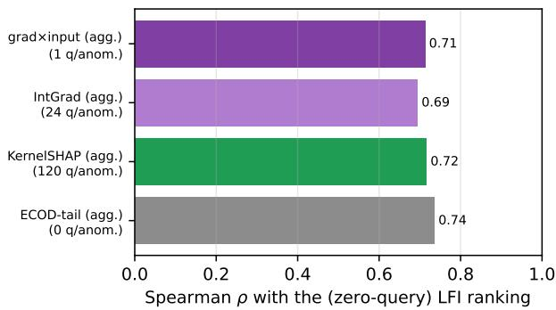  
Fig. 7: Spearman $\rho$ between the zero-query LFI feature ranking and each aggregated post-hoc ranking, with the model-query cost each post-hoc ranking pays. The LFI ranking reproduces the same global picture $( \rho \approx 0 . 7 )$ that KernelSHAP buys with 120 model passes per pooled anomaly.

## APPENDIX H COMPLEXITY AND SCALABILITY

Practical deployability matters as much as accuracy, so we summarize the resource profile of DIFFINT. Let n be the number of training points, d the feature count, K the number of interval units, B the batch size, $E$ the epochs, and H the (fixed) decoder hidden width; the decoder is an MLP whose size is independent of n.

Parameter count. The interval bottleneck stores a centre and a softplus half-width per (unit, feature): 2Kd parameters, linear in K and d and independent $o f n .$ The decoder adds a compact MLP $( O ( K H + H d )$ weights). The total stays MLP-class $( 1 0 ^ { 5 } – 1 0 ^ { 6 }$ weights even at d=1,555, InternetAds), far below typical deep tabular detectors. Table XXI reports the 2Kd bottleneck size and the matched-budget training time across scales.

TABLE XXI: Resource profile across scales $( K { = } 2 0 0 )$ . Bottleneck parameters (2Kd) are linear in d and independent of n; training time (DIFFINT, matched 1000-epoch budget) is reproduced from Table III and grows with n and d.
<table><tr><td>Dataset</td><td>n</td><td>d</td><td>bottleneck 2Kd</td><td>train (s)</td></tr><tr><td>6_cardio</td><td>1,831</td><td>21</td><td>8,400</td><td>3.0</td></tr><tr><td>31_satimage-2</td><td>5,803</td><td>36</td><td>14,400</td><td>54.6</td></tr><tr><td>26_optdigits</td><td>5,216</td><td>64</td><td>25,600</td><td>60.1</td></tr><tr><td>48_arrhythmia</td><td>452</td><td>274</td><td>109,600</td><td>30.2</td></tr><tr><td>32_shuttle</td><td>49,097</td><td>9</td><td>3,600</td><td>193.5</td></tr></table>

Training complexity. A minibatch computes Bd sigmoid pairs for the soft memberships, an $O ( B K d )$ aggregation (a per-unit log-sum over features plus an $O ( K )$ softmax), and one decoder forward/backward; an epoch is thus $O ( n K d )$ plus the n-independent decoder cost, with no pairwise, kernel, or neighbour computation. Total training is $O ( E n K d )$

Runtime vs. baselines. DIFFINT uses one forward pass per sample, unlike memory-based detectors (e.g. LUNAR) whose kNN queries grow with n. Empirically (Table III, matched 1000-epoch budget) DIFFINT trains one to two orders of magnitude faster than the binary differentiable miner BinaPs, faster than LUNAR on most datasets, and scales to the largest ADBench sets $( n { \approx } 6 . 2 { \times } 1 0 ^ { 5 } )$

Inference and memory footprint. Scoring a point is a single forward pass: $O ( K d )$ memberships, the aggregation, the decoder, then the MAE. DIFFINT is inductive: it keeps only the trained parameters, not the training set, so inference latency and memory are constant in n, whereas transductive/memorybased detectors must retain or query the data. The training footprint is the parameters $( O ( K d ) )$ , one batch of memberships (O(BKd) activations), and the K × d EMA support buffer $( O ( K d ) ) \{$ none depends on n. At inference only the $O ( K d )$ parameters and a single K × d membership tensor are held.

The K knob. K trades capacity for cost linearly. ROC-AUC saturates after a few units (Fig. 4), so K can be reduced well below the default under tight budgets with little accuracy loss; we keep K=200 as one untuned default across all 48 datasets.

## APPENDIX I

## STRATIFIED AND COMPLETE-CASE COMPARISON

DIFFINT and three baselines (TCCM, AutoEncoder, VAE) train on inliers only; the other 19 baselines run unsupervised on the contaminated data. Pooling all 23 into one meanrank / Nemenyi analysis (Fig. 3) therefore compares across training regimes, which reviewers rightly flagged. Using the same per-dataset scores as everywhere else (mean over 10 seeds; Tables XXIII-XL), we recompute mean ranks within strata (Table I, placed with the main results; per dataset scale, Table XXII). No model is re-run and no setting is changed.

Table I: (i) among inlier-only detectors DIFFINT is first by a clear margin on both metrics; per scale (Table XXII) its inlier-only rank is 1.4–2.1 of 4, best in every scale×metric cell except high-dimensional AUPR, where AutoEncoder leads 2.20 vs. 2.30. (ii) Against the contaminated-data pool alone, DIFFINT is still first on all 48 datasets; on the completecase subset – which removes the worst-rank imputation the main protocol applies to unfinished runs - DIFFINT and LUNAR are effectively tied (3.59 vs. 4.03 on AUC, 3.74 vs. 3.85 on AUPR). Adding DIFFINT to the full 23-method complete-case pool gives mean rank 4.31/4.46 vs. LUNAR 4.82/4.54, consistent with the missing-run sensitivity table (Table XII, scheme B). The “competitive, not beaten" phrasing the main text uses for contaminated-data detectors is thus the accurate reading, and the top-cluster conclusion survives both the stratification and the removal of imputation.

TABLE XXII: DIFFINT mean rank within the inlier-only pool of 4, per dataset scale. Best method of the four in each cell shown in brackets.
<table><tr><td>Scale (N)</td><td>Rank (ROC-AUC)</td><td>Rank (AUPR)</td></tr><tr><td>Small (12)</td><td>1.83</td><td>1.75</td></tr><tr><td>Medium (15)</td><td>1.53</td><td>1.47</td></tr><tr><td>Large (11)</td><td>1.36</td><td>1.45</td></tr><tr><td>High-dim (10)</td><td>2.10</td><td>2.30 (AE 2.20)</td></tr></table>

## APPENDIX J

## POINTS DEFERRED TO A FUTURE VERSION

a) Newer detector families.: The 22 baselines are the ADBench/TCCM tabular suite. Families we do not benchmark include diffusion-based reconstruction detectors, retrieval / memory-based detectors, and tabular foundation-model (PFNstyle) scorers. They target the same task from different priors; a controlled comparison, ideally under the same [-1, 1] protocol and inlier-only split, is planned for an extended version. DIFFINT's contribution is orthogonal – an interpretable bottleneck, not a new density estimator.

b) Normalization coverage.: The main-paper ablation compares no scaling, [0, 1], standardization, and [−1, 1]; it does not include a robust / quantile mapping into [−1, 1]. Such a mapping would keep the bounded symmetric [-1, 1] geometry the temperature and clipping margin rely on while tolerating heavy tails (main text, Limitations), and is the natural next ablation.

c) Quantitative interpretability.: Addressed: a systematic comparison of the global LFI feature ranking against aggregated KernelSHAP / integrated-gradients / gradient / ECOD rankings, on three controlled ground-truth families inside DIFFINT's regime (7 re-trainings), is in App. G (Table XX, Fig. 7).

## APPENDIX K

## COMPLETE DETECTION ACCURACY

This section reports the full per-dataset detection accuracy underlying the critical-difference analysis of the main text: ROC-AUC (Sec. K-A) and average precision (Sec. K-B). Across both metrics DIFFINT sits in the leading group on every scale and is most often first on small/medium/large data; in high dimensions it remains competitive with the strongest baselines.

## A. ROC–AUC

Tables XXIII-XXXI give the per-dataset ROC-AUC. Each cell is the mean score ± standard deviation over the 10 seeds, with the method's rank on that dataset in parentheses, coloured (1) best, (2) second, (3) third; the same format is used for the AUPR tables (Sec. K-B). Figs. 8–9 show the per-scale criticaldifference diagrams for ROC-AUC and AUPR (the overall diagrams are in the main text). They support the regime-level claims of Table II: DIFFINT attains the lowest mean rank in every (scale, metric) cell except high-dimensional AUPR, where LUNAR is marginally ahead but the two are statistically indistinguishable within the per-scale CD.

## B. Average precision (AUPR)

Tables XXXII-XL give the per-dataset AUPR under the same protocol and highlighting. AUPR weights the rare anomaly class more heavily than ROC-AUC; the DIFFINT ranking is consistent across the two metrics, indicating the gains are not an artifact of the chosen measure.

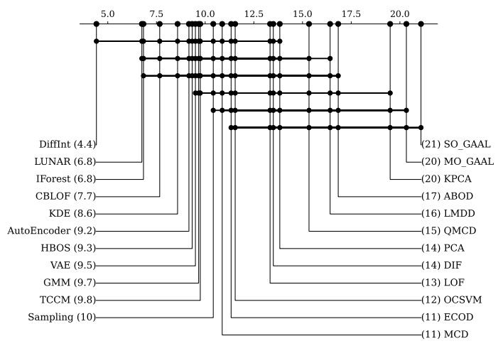  
(a) Small (n=12).

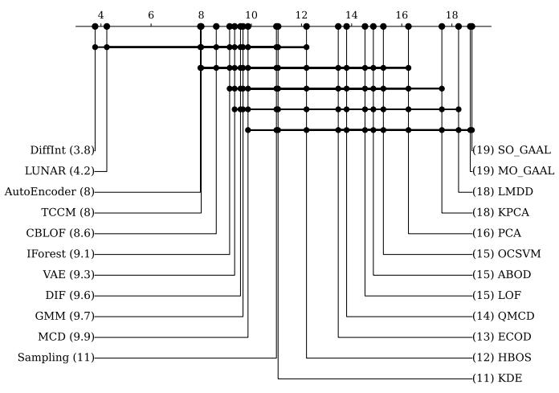  
(b) Medium (n=15).

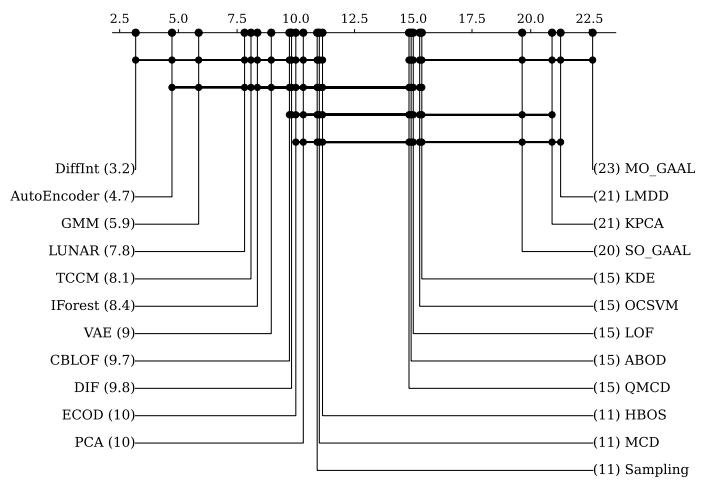  
(c) Large (n=11).

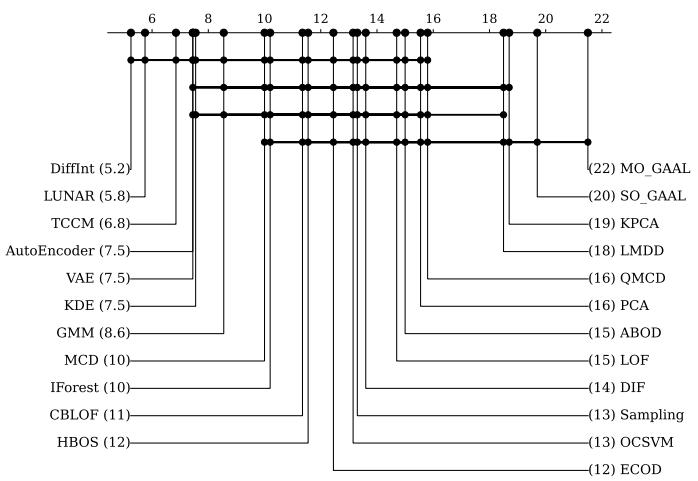  
(d) High-dimensional (n=10).  
Fig. 8: Per-scale ROC-AUC critical-difference diagrams (missing runs floored to worst rank, bars indicate non-significant differences at α=0.05). DIFFINT leads strictly on every scale; matches the “DIFFINT AUC" column of Table II.

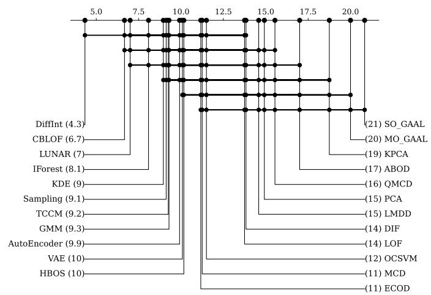  
(a) Small (n=12).

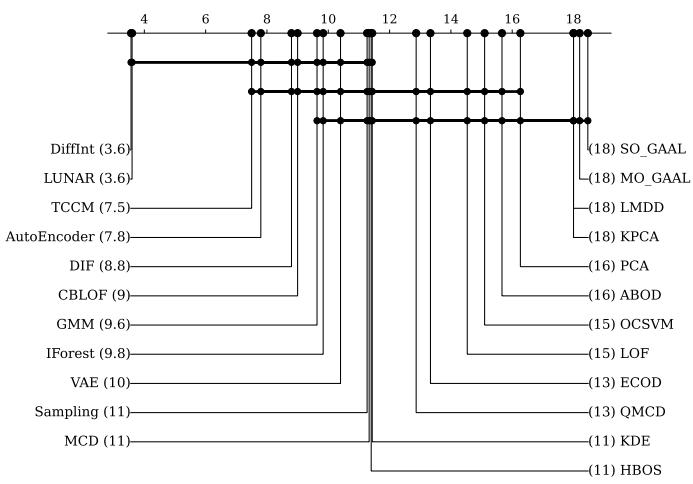  
(b) Medium (n=15).

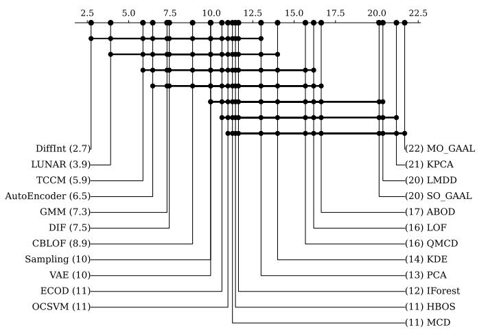  
(c) Large (n=11).

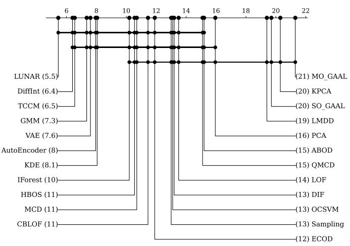  
(d) High-dimensional (n=10).  
Fig. 9: Per-scale AUPR critical-difference diagrams (same protocol as Fig. 8). DIFFINT leads strictly on small, medium, and large data; on high-dimensional data LUNAR's mean rank (5.45) is slightly ahead of DIFFINT (6.40), but the gap is well inside the per-scale Nemenyi CD (≈ 11), i.e. a statistical tie. Matches the “DIFFINT AUPR" column of Table II.

TABLE XXIII: ROC-AUC, small datasets (1/2).
<table><tr><td>Model</td><td>4_breastw</td><td>14_glass</td><td>15_Hepatitis</td><td></td><td>18_Ionosphere 21_Lymphography</td><td>29_Pima</td></tr><tr><td>ABOD</td><td> $0 . 3 7 3 7 { \scriptstyle \pm 0 . 0 3 3 8 ( 2 0 ) }$ </td><td> $0 . 8 2 6 4 { \scriptstyle \pm 0 . 0 6 9 7 } ( 8 )$ </td><td> $0 . 6 5 4 2 { \scriptstyle \pm 0 . 1 5 2 0 } ( 1 9 )$ </td><td> $0 . 9 2 5 5 { \scriptstyle \pm 0 . 0 1 8 5 } ( 1 1 )$ </td><td> $0 . 9 6 8 2 { \scriptstyle \pm 0 . 0 2 4 0 } ( 1 8 )$ </td><td> $0 . 6 5 4 8 { \scriptstyle \pm 0 . 0 4 0 8 } ( 1 4 )$ </td></tr><tr><td></td><td>AutoEncoder 0.9855±0.0075(12)</td><td> $0 . 7 1 0 7 { \scriptstyle \pm 0 . 0 7 7 9 } ( 1 6 )$ </td><td>0.8501±0.0387(2) 0.9604±0.0090(5)</td><td></td><td> $0 . 9 9 0 4 { \scriptstyle \pm 0 . 0 0 8 7 } ( 1 2 )$ </td><td>0.7070±0.0239(10)</td></tr><tr><td>CBLOF</td><td> $0 . 9 9 3 9 _ { \pm 0 . 0 0 2 6 } ( 5 )$ </td><td> $0 . 8 7 8 4 _ { \pm 0 . 0 3 4 5 } ( 3 )$ </td><td> $0 . 8 0 8 9 _ { \pm 0 . 0 8 7 4 } ( 1 0 )$ </td><td> $0 . 9 5 5 7 { \scriptstyle \pm 0 . 0 2 2 3 } ( 7 )$ </td><td> $0 . 9 8 1 6 _ { \pm 0 . 0 4 3 8 } ( 1 5 )$ </td><td> $0 . 7 0 0 6 _ { \pm 0 . 0 2 3 2 } ( 1 1 )$ </td></tr><tr><td>DIF</td><td> $0 . 8 3 7 7 { \scriptstyle \pm 0 . 0 3 7 5 } ( 1 6 )$ </td><td> $0 . 8 5 6 2 { \scriptstyle \pm 0 . 0 3 7 1 } ( 5 )$ </td><td> $0 . 7 7 2 3 { \scriptstyle \pm 0 . 0 9 0 1 } ( 1 6 )$ </td><td> $0 . 9 5 8 7 { \scriptstyle \pm 0 . 0 0 7 4 ( 6 ) }$ </td><td> $0 . 8 8 3 3 { \scriptstyle \pm 0 . 0 9 9 2 } ( 1 9 )$ </td><td>0.6144±0.0258(19)</td></tr><tr><td>DiffInt</td><td> $0 . 9 9 5 4 { \scriptstyle \pm 0 . 0 0 1 8 } ( 1 )$ </td><td>0.8788±0.0245(2)</td><td> $0 . 8 3 3 3 { \scriptstyle \pm 0 . 0 4 0 1 } ( 7 )$ </td><td>0.9757±0.0030(2)</td><td> $0 . 9 9 9 7 { \scriptstyle \pm 0 . 0 0 1 4 } ( 2 )$ </td><td> $0 . 7 3 0 4 { \scriptstyle \pm 0 . 0 1 1 3 } ( 3 )$ </td></tr><tr><td>ECOD</td><td> $0 . 9 9 3 2 { \scriptstyle \pm 0 . 0 0 2 9 } ( 7 )$ </td><td> $0 . 6 9 1 1 { \scriptstyle \pm 0 . 0 7 9 7 } ( 1 7 )$ </td><td> $0 . 8 4 0 2 _ { \pm 0 . 0 5 5 0 } ( 3 )$ </td><td> $0 . 7 7 4 5 { \scriptstyle \pm 0 . 0 2 2 1 } ( 1 7 )$ </td><td> $0 . 9 9 9 0 { \scriptstyle \pm 0 . 0 0 2 2 } ( 4 )$ </td><td> $0 . 6 3 7 4 { \scriptstyle \pm 0 . 0 2 3 9 } ( 1 6 )$ </td></tr><tr><td>GMM</td><td> $0 . 9 8 6 3 _ { \pm 0 . 0 0 5 5 } ( 1 1 )$ </td><td> $0 . 7 5 0 8 { \scriptstyle \pm 0 . 0 6 2 4 } ( 1 4 )$ </td><td> $0 . 8 0 1 8 { \scriptstyle \pm 0 . 0 7 8 5 } ( 1 3 )$ </td><td> $0 . 9 6 6 4 { \scriptstyle \pm 0 . 0 0 7 1 } ( 3 )$ </td><td> $0 . 9 8 7 3 { \scriptstyle \pm 0 . 0 0 9 2 } ( 1 3 )$ </td><td>0.7202±0.0217(7)</td></tr><tr><td>HBOS</td><td> $0 . 9 9 1 1 { \scriptstyle \pm 0 . 0 0 3 6 } ( 8 )$ </td><td> $0 . 7 8 4 8 { \scriptstyle \pm 0 . 0 6 2 1 } ( 1 2 )$ </td><td> $0 . 8 3 4 2 { \scriptstyle \pm 0 . 0 4 0 7 } ( 6 )$ </td><td> $0 . 7 3 3 4 { \scriptstyle \pm 0 . 0 5 1 9 } ( 1 8 )$ </td><td> $0 . 9 9 7 5 { \scriptstyle \pm 0 . 0 0 4 5 } ( 8 )$ </td><td> $0 . 7 3 3 9 { \scriptstyle \pm 0 . 0 2 0 1 } ( 2 )$ </td></tr><tr><td>IForest</td><td>0.9942±0.0028(4) 0.7855±0.0429(11) 0.8348±0.0613(5) 0.9116±0.0189(13)</td><td></td><td></td><td></td><td> $0 . 9 9 9 1 { \scriptstyle \pm 0 . 0 0 1 9 } ( 3 )$ </td><td>0.7272±0.0275(5)</td></tr><tr><td>KDE</td><td> $0 . 9 9 4 6 { \scriptstyle \pm 0 . 0 0 2 5 } ( 2 )$ </td><td> $0 . 7 6 2 2 { \scriptstyle \pm 0 . 0 4 5 4 0 } ( 1 3 )$ </td><td> $0 . 7 9 4 2 { \scriptstyle \pm 0 . 0 5 4 0 } ( 1 4 )$ </td><td> $0 . 9 5 2 0 { \scriptstyle \pm 0 . 0 1 0 5 } ( 8 )$ </td><td> $0 . 9 9 8 8 { \scriptstyle \pm 0 . 0 0 2 5 } ( 5 )$ </td><td> $0 . 7 2 0 8 { \scriptstyle \pm 0 . 0 2 2 6 } ( 6 )$ </td></tr><tr><td>KPCA</td><td>0.1983±0.0825(21) 0.3975±0.1372(20)</td><td></td><td> $0 . 4 3 7 9 { \scriptstyle \pm 0 . 1 8 9 5 } ( 2 1 )$ </td><td> $0 . 4 6 0 6 { \scriptstyle \pm 0 . 0 6 3 2 ( 2 1 ) }$ </td><td> $0 . 4 1 3 7 { \scriptstyle \pm 0 . 2 5 3 7 ( 2 0 ) }$ </td><td> $0 . 4 9 7 6 { \scriptstyle \pm 0 . 0 2 7 4 } ( 2 1 )$ </td></tr><tr><td>LMDD</td><td> $0 . 7 0 5 0 { \scriptstyle \pm 0 . 1 6 0 9 } ( 1 7 )$ </td><td> $0 . 3 7 4 3 { \scriptstyle \pm 0 . 1 7 9 3 ( 2 2 ) }$ </td><td></td><td>0.5742±0.1757(20) 0.6665±0.1000(19) 0.9759±0.0186(17)</td><td></td><td> $0 . 6 2 9 3 _ { \pm 0 . 0 8 6 0 } ( 1 8 )$ </td></tr><tr><td>LOF</td><td> $0 . 4 4 8 2 { \scriptstyle \pm 0 . 0 2 1 5 } ( 1 9 )$ </td><td> $0 . 8 0 4 8 { \scriptstyle \pm 0 . 0 7 8 4 } ( 9 )$ </td><td> $0 . 8 2 1 1 { \scriptstyle \pm 0 . 0 7 6 1 } ( 8 )$ </td><td> $0 . 8 6 6 5 { \scriptstyle \pm 0 . 0 4 7 9 } ( 1 4 )$ </td><td> $0 . 9 9 8 8 { \scriptstyle \pm 0 . 0 0 2 5 } ( 5 )$ </td><td> $0 . 6 3 4 8 { \scriptstyle \pm 0 . 0 2 2 7 } ( 1 7 )$ </td></tr><tr><td>LUNAR</td><td> $0 . 9 9 0 2 _ { \pm 0 . 0 0 4 6 } ( 1 0 )$ </td><td>0.8816±0.0359(1) 0.7782±0.0579(15) 0.9781±0.0085(1) 0.9906±0.0112(11)</td><td></td><td></td><td></td><td> $0 . 7 2 9 6 { \scriptstyle \pm 0 . 0 2 8 6 } ( 4 )$ </td></tr><tr><td>MCD</td><td> $0 . 9 8 5 0 { \scriptstyle \pm 0 . 0 0 8 4 } ( 1 3 )$ </td><td> $0 . 7 8 6 9 _ { \pm 0 . 0 3 4 7 } ( 1 0 )$ </td><td>0.8088±0.0621(11)</td><td> $0 . 9 6 1 6 { \scriptstyle \pm 0 . 0 0 9 2 } ( 4 )$ </td><td> $0 . 9 8 6 1 _ { \pm 0 . 0 1 4 0 } ( 1 4 )$ </td><td> $0 . 7 1 5 8 { \scriptstyle \pm 0 . 0 2 2 2 } ( 8 )$ </td></tr><tr><td>MO_GAAL</td><td>0.0117±0.0142(22)</td><td> $0 . 3 7 4 4 { \scriptstyle \pm 0 . 2 2 7 7 } ( 2 1 )$ </td><td>0.3695±0.1895(22) 0.3329±0.0612(22)</td><td></td><td> $0 . 0 0 8 5 _ { \pm 0 . 0 1 4 8 } ( 2 2 )$ </td><td>0.3319±0.0499(23)</td></tr><tr><td>OCSVM</td><td> $0 . 9 9 4 5 { \scriptstyle \pm 0 . 0 0 2 5 } ( 3 )$ </td><td> $0 . 4 4 7 0 { \scriptstyle \pm 0 . 1 4 7 3 } ( 1 9 )$ </td><td> $0 . 8 0 8 8 { \scriptstyle \pm 0 . 0 6 3 0 } ( 1 1 )$ </td><td> $0 . 8 4 0 5 _ { \pm 0 . 0 1 9 2 } ( 1 5 )$ </td><td> $0 . 9 9 8 8 { \scriptstyle \pm 0 . 0 0 2 5 } ( 5 )$ </td><td> $0 . 6 7 9 7 { \scriptstyle \pm 0 . 0 2 4 6 } ( 1 2 )$ </td></tr><tr><td>PCA</td><td>0.9495±0.0188(15)</td><td> $0 . 6 5 5 1 { } _ { \pm 0 . 0 8 3 8 } ( 1 8 )$ </td><td> $0 . 8 1 2 0 { \scriptstyle \pm 0 . 0 6 3 5 } ( 9 )$ </td><td> $0 . 7 8 6 4 _ { \pm 0 . 0 2 1 5 } ( 1 6 )$ </td><td>0.9962±0.0058(9) 0.6377±0.0241(15)</td><td></td></tr><tr><td>QMCD</td><td> $0 . 4 8 0 0 { \scriptstyle \pm 0 . 1 7 4 6 } ( 1 8 )$ </td><td> $0 . 8 4 2 3 { \scriptstyle \pm 0 . 0 4 9 0 } ( 6 )$ </td><td> $0 . 7 1 5 0 { \scriptstyle \pm 0 . 1 2 4 6 } ( 1 8 )$ </td><td> $0 . 5 5 0 9 { \scriptstyle \pm 0 . 0 4 5 5 } ( 2 0 )$ </td><td> $0 . 0 8 8 4 { \scriptstyle \pm 0 . 1 2 0 4 0 } ( 2 1 )$ </td><td> $0 . 7 4 1 7 { \scriptstyle \pm 0 . 0 2 3 9 ( 1 ) }$ </td></tr><tr><td>SO_GAAL</td><td> $0 . 0 1 1 0 { \scriptstyle \pm 0 . 0 1 1 6 } ( 2 3 )$ </td><td> $0 . 3 3 9 2 { \scriptstyle \pm 0 . 1 8 1 7 } ( 2 3 )$ </td><td> $0 . 3 1 3 4 { \scriptstyle \pm 0 . 1 7 5 1 } ( 2 3 )$ </td><td> $0 . 2 8 2 3 { \scriptstyle \pm 0 . 0 6 1 1 } ( { 2 3 } )$ </td><td> $0 . 0 0 4 9 _ { \pm 0 . 0 1 0 8 } ( 2 3 )$ </td><td> $0 . 3 3 5 0 { \scriptstyle \pm 0 . 0 4 9 1 } ( 2 2 )$ </td></tr><tr><td>Sampling</td><td>0.9934±0.0033(6) 0.8696±0.0480(4)</td><td></td><td> $0 . 7 6 4 5 { \scriptstyle \pm 0 . 0 9 7 6 } ( 1 7 )$ </td><td> $0 . 9 3 9 5 { \scriptstyle \pm 0 . 0 2 5 6 } ( 1 0 )$ </td><td> $0 . 9 7 8 0 { \scriptstyle \pm 0 . 0 3 5 9 ( 1 6 ) }$ </td><td>0.7115±0.0369(9)</td></tr><tr><td>TCCM</td><td> $0 . 9 6 7 7 { \scriptstyle \pm 0 . 0 1 9 5 } ( 1 4 )$ </td><td> $0 . 8 3 3 4 { \scriptstyle \pm 0 . 0 9 1 4 } ( 7 )$ </td><td> $0 . 8 3 9 4 { \scriptstyle \pm 0 . 0 7 0 8 } ( 4 )$ </td><td> $0 . 9 4 0 0 { \scriptstyle \pm 0 . 0 1 5 8 } ( 9 )$ </td><td> $1 . 0 0 0 0 { \scriptstyle \pm 0 . 0 0 0 0 } ( 1 )$ </td><td> $0 . 5 5 6 2 { \scriptstyle \pm 0 . 1 0 0 1 } ( 2 0 )$ </td></tr><tr><td>VAE</td><td> $0 . 9 9 0 3 _ { \pm 0 . 0 0 4 5 } ( 9 )$ </td><td> $0 . 7 1 4 8 { \scriptstyle \pm 0 . 0 6 5 5 } ( 1 5 )$ </td><td> $0 . 8 6 0 0 { \scriptstyle \pm 0 . 0 4 2 5 } ( 1 )$ </td><td> $0 . 9 2 0 6 { \scriptstyle \pm 0 . 0 1 5 5 } ( 1 2 )$ </td><td> $0 . 9 9 3 2 { \scriptstyle \pm 0 . 0 0 6 8 } ( 1 0 )$ </td><td> $0 . 6 7 1 4 { \scriptstyle \pm 0 . 0 3 2 3 } ( 1 3 )$ </td></tr></table>

TABLE XXIV: ROC–AUC, small datasets (2/2).
<table><tr><td>Model</td><td>37_Stamps</td><td>39_vertebral</td><td>42_WBC</td><td>43_WDBC</td><td>45_wine</td><td>46_WPBC</td></tr><tr><td>ABOD</td><td> $0 . 6 9 5 4 _ { \pm 0 . 0 5 2 5 } ( 1 9 )$ </td><td> $0 . 4 2 1 4 _ { \pm 0 . 0 8 4 7 } ( 1 8 )$ </td><td>0.9297±0.0301(18)</td><td> $0 . 9 1 4 3 { \scriptstyle \pm 0 . 0 5 0 4 } ( 1 8 )$ </td><td> $0 . 5 8 2 8 { \scriptstyle \pm 0 . 2 2 7 8 } ( 2 0 )$ </td><td> $0 . 4 8 9 7 { \scriptstyle \pm 0 . 0 5 6 3 ( 1 9 ) }$ </td></tr><tr><td>AutoEncoder</td><td> $0 . 9 2 1 7 { \scriptstyle \pm 0 . 0 3 9 8 ( 1 0 ) }$ </td><td> $0 . 4 6 4 4 { \scriptstyle \pm 0 . 1 0 4 1 } ( 1 2 )$ </td><td> $0 . 9 8 4 1 _ { \pm 0 . 0 2 2 0 } ( 1 2 )$ </td><td> $0 . 9 9 3 7 { \scriptstyle \pm 0 . 0 0 5 5 } ( 2 )$ </td><td> $0 . 9 3 6 4 { \scriptstyle \pm 0 . 0 4 9 9 } ( 6 )$ </td><td> $0 . 5 1 7 8 { \scriptstyle \pm 0 . 0 4 8 1 } ( 1 1 )$ </td></tr><tr><td>CBLOF</td><td></td><td>0.9457±0.0235(4) 0.4711±0.0742(10) 0.9961±0.0039(2) 0.9860±0.0099(14) 0.9517±0.0376(2)</td><td></td><td></td><td></td><td> $0 . 5 2 8 0 { \scriptstyle \pm 0 . 0 4 0 7 } ( 9 )$ </td></tr><tr><td>DIF</td><td> $0 . 9 4 2 6 { \scriptstyle \pm 0 . 0 2 1 5 } ( 5 )$ </td><td> $0 . 5 7 8 1 { \scriptstyle \pm 0 . 0 8 9 5 } ( 3 )$ </td><td></td><td>0.7821±0.0531(19) 0.7227±0.0519(19) 0.7978±0.1078(17)</td><td></td><td> $0 . 4 9 7 1 { \scriptstyle \pm 0 . 0 4 8 5 } ( 1 8 )$ </td></tr><tr><td>DiffInt</td><td>0.9516±0.0116(1) 0.5274±0.0429(4) 0.9973±0.0050(1) 0.9741±0.0076(16) 0.8852±0.0594(13)</td><td></td><td></td><td></td><td></td><td> $0 . 5 6 5 2 { \scriptstyle \pm 0 . 0 2 2 2 0 } ( 1 )$ </td></tr><tr><td>ECOD</td><td> $0 . 9 1 5 7 _ { \pm 0 . 0 2 4 4 } ( 1 3 )$ </td><td> $0 . 4 6 4 5 _ { \pm 0 . 0 7 9 6 } ( 1 1 )$ </td><td> $0 . 9 9 5 3 _ { \pm 0 . 0 0 4 6 } ( 6 )$ </td><td>0.9870±0.0068(11) 0.8484±0.0960(14)</td><td></td><td> $0 . 5 0 2 9 _ { \pm 0 . 0 4 2 2 } ( 1 7 )$ </td></tr><tr><td>GMM</td><td> $0 . 9 2 7 0 { \scriptstyle \pm 0 . 0 2 2 6 } ( 9 )$ </td><td> $0 . 4 9 0 9 { \scriptstyle \pm 0 . 0 5 5 0 } ( 8 )$ </td><td> $0 . 9 7 6 7 { \scriptstyle \pm 0 . 0 1 9 8 } ( 1 6 )$ </td><td> $0 . 9 8 8 2 _ { \pm 0 . 0 0 9 3 } ( 9 )$ </td><td> $0 . 9 6 7 7 { \scriptstyle \pm 0 . 0 2 6 8 } ( 1 )$ </td><td> $0 . 5 1 4 1 { \scriptstyle \pm 0 . 0 5 0 7 } ( 1 2 )$ </td></tr><tr><td>HBOS</td><td> $0 . 9 3 7 5 { \scriptstyle \pm 0 . 0 1 4 6 } ( 7 )$ </td><td>0.3982±0.0437(21) 0.9896±0.0093(9) 0.9890±0.0063(7)</td><td></td><td></td><td> $0 . 9 2 9 6 { \scriptstyle \pm 0 . 0 4 1 9 } ( 9 )$ </td><td> $0 . 5 4 8 3 { \scriptstyle \pm 0 . 0 5 3 2 } ( 5 )$ </td></tr><tr><td>IForest</td><td> $0 . 9 4 8 5 _ { \pm 0 . 0 2 0 2 } ( 2 )$ </td><td> $0 . 4 4 2 6 { \scriptstyle \pm 0 . 1 0 1 7 } ( 1 5 )$ </td><td> $0 . 9 9 4 8 { \scriptstyle \pm 0 . 0 0 4 9 } ( 7 )$ </td><td> $0 . 9 9 0 3 { \scriptstyle \pm 0 . 0 0 5 6 } ( 4 )$ </td><td> $0 . 9 3 9 3 { \scriptstyle \pm 0 . 0 4 4 1 } ( 5 )$ </td><td> $0 . 5 2 8 7 { \scriptstyle \pm 0 . 0 4 5 1 } ( 8 )$ </td></tr><tr><td>KDE</td><td>0.9309±0.0174(8)</td><td> $0 . 4 0 9 6 { \scriptstyle \pm 0 . 0 8 5 6 } ( 2 0 )$ </td><td> $0 . 9 9 6 0 { \scriptstyle \pm 0 . 0 0 4 5 } ( 3 )$ </td><td> $0 . 9 8 6 4 _ { \pm 0 . 0 0 7 5 } ( 1 3 )$ </td><td> $0 . 9 3 3 6 { \scriptstyle \pm 0 . 0 3 3 9 } ( 7 )$ </td><td>0.5603±0.0511(2)</td></tr><tr><td>KPCA</td><td> $0 . 4 1 1 1 { \scriptstyle \pm 0 . 1 1 3 6 } ( 2 1 )$ </td><td> $0 . 5 2 0 4 { \scriptstyle \pm 0 . 0 6 1 9 } ( 6 )$ </td><td> $0 . 3 7 1 0 { \scriptstyle \pm 0 . 2 0 3 6 } ( 2 0 )$ </td><td> $0 . 2 6 7 8 { \scriptstyle \pm 0 . 0 8 9 0 } ( 2 1 )$ </td><td> $0 . 3 9 5 5 { \scriptstyle \pm 0 . 2 6 3 1 ( 2 1 ) }$ </td><td> $0 . 4 6 4 4 { \scriptstyle \pm 0 . 0 9 6 1 } ( 2 1 )$ </td></tr><tr><td>LMDD</td><td> $0 . 4 4 5 4 _ { \pm 0 . 0 2 6 6 } ( 2 0 )$ </td><td>0.4355±0.0811(16) 0.9769±0.0615(15)</td><td></td><td> $0 . 9 9 4 1 { \scriptstyle \pm 0 . 0 0 3 3 ( 1 ) }$ </td><td> $0 . 6 9 8 7 { \scriptstyle \pm 0 . 1 4 6 9 } ( 1 8 )$   $\begin{array} { c } { { 0 . 0 9 \delta \mathrm { ~ / \pm 0 . 1 4 6 9 ( 1 \delta ) ~ } } } \\ { { \mathrm { ~ \alpha ~ \wedge ~ 1 ~ 1 ~ } \varepsilon } } \end{array}$ </td><td> $0 . 5 1 2 5 { \scriptstyle \pm 0 . 0 6 1 9 } ( 1 4 )$ </td></tr><tr><td>LOF</td><td>0.7229±0.1204(18)</td><td> $0 . 3 5 1 5 { \scriptstyle \pm 0 . 0 7 1 7 } ( 2 3 )$ </td><td> $0 . 9 7 5 9 { \scriptstyle \pm 0 . 0 1 9 8 } ( 1 7 )$ </td><td> $0 . 9 8 7 1 { \scriptstyle \pm 0 . 0 0 8 8 } ( 1 0 )$ </td><td>0.9115±0.0592(12) 0.5326±0.0635(7)</td><td></td></tr><tr><td>LUNAR</td><td> $0 . 9 4 7 3 { \scriptstyle \pm 0 . 0 2 4 8 } ( 3 )$ </td><td> $0 . 4 4 8 4 { \scriptstyle \pm 0 . 0 8 1 7 } ( 1 3 )$ </td><td> $0 . 9 7 9 4 { \scriptstyle \pm 0 . 0 2 3 7 } ( 1 4 )$ </td><td> $0 . 9 9 3 5 { \scriptstyle \pm 0 . 0 0 5 5 } ( 3 )$ </td><td> $0 . 9 4 7 8 { \scriptstyle \pm 0 . 0 4 3 9 } ( 3 )$ </td><td> $0 . 5 5 3 6 { \scriptstyle \pm 0 . 0 4 1 7 } ( 3 )$ </td></tr><tr><td>MCD</td><td> $0 . 8 3 6 8 { \scriptstyle \pm 0 . 0 2 5 5 } ( 1 7 )$ </td><td> $0 . 4 8 7 2 { \scriptstyle \pm 0 . 0 5 2 9 } ( 9 )$ </td><td> $0 . 9 8 0 7 { \scriptstyle \pm 0 . 0 2 3 0 } ( 1 3 )$ </td><td> $0 . 9 6 8 2 { \scriptstyle \pm 0 . 0 1 4 1 } ( 1 7 )$ </td><td> $0 . 9 4 4 4 { \scriptstyle \pm 0 . 0 5 2 1 } ( 4 )$ </td><td> $0 . 5 2 7 7 { \scriptstyle \pm 0 . 0 6 8 2 ( 1 0 ) }$ </td></tr><tr><td>MO_GAAL</td><td> $0 . 2 7 4 3 { \scriptstyle \pm 0 . 1 7 7 4 } ( 2 2 )$ </td><td> $0 . 6 8 5 8 { \scriptstyle \pm 0 . 0 7 3 5 } ( 1 )$ </td><td> $0 . 0 0 5 0 { \scriptstyle \pm 0 . 0 0 6 3 ( 2 3 ) }$ </td><td> $0 . 0 0 7 4 { \scriptstyle \pm 0 . 0 0 7 4 } ( 2 2 )$ </td><td> $0 . 0 3 2 0 { \scriptstyle \pm 0 . 0 3 8 8 ( 2 2 ) }$ </td><td> $0 . 4 3 7 3 { \scriptstyle \pm 0 . 0 9 1 2 } ( 2 2 )$ </td></tr><tr><td>OCSVM</td><td>0.9027±0.0260(14)</td><td> $0 . 4 2 9 4 _ { \pm 0 . 0 8 4 3 } ( 1 7 )$ </td><td> $0 . 9 9 6 0 _ { \pm 0 . 0 0 4 5 } ( 3 )$ </td><td></td><td>0.9887±0.0057(8) 0.8410±0.0944(16) 0.5137±0.0344(13)</td><td></td></tr><tr><td>PCA</td><td> $0 . 9 1 9 7 { \scriptstyle \pm 0 . 0 1 9 5 } ( 1 2 )$ </td><td> $0 . 3 9 7 3 { \scriptstyle \pm 0 . 0 5 9 8 } ( 2 2 )$ </td><td> $0 . 9 9 0 7 { \scriptstyle \pm 0 . 0 0 9 1 } ( 8 )$ </td><td> $0 . 9 8 6 8 { \scriptstyle \pm 0 . 0 0 5 8 ( 1 2 ) }$ </td><td> $0 . 8 4 5 0 { \scriptstyle \pm 0 . 0 8 8 8 ( 1 5 ) }$ </td><td> $0 . 5 0 9 6 { \scriptstyle \pm 0 . 0 5 4 3 } ( 1 5 )$ </td></tr><tr><td>QMCD</td><td> $0 . 9 0 2 5 { \scriptstyle \pm 0 . 0 5 7 1 } ( 1 5 )$ </td><td> $0 . 4 1 1 4 _ { \pm 0 . 0 8 7 1 } ( 1 9 )$ </td><td> $0 . 3 5 7 8 { \scriptstyle \pm 0 . 1 5 6 7 ( 2 1 ) }$ </td><td>0.5860±0.1903(20) 0.6633±0.1655(19)</td><td></td><td> $0 . 5 3 4 3 { \scriptstyle \pm 0 . 0 5 7 1 } ( 6 )$ </td></tr><tr><td> $_ { \mathrm { S O } \_ \mathrm { G A A L } }$ </td><td> $0 . 2 3 3 4 { \scriptstyle \pm 0 . 1 4 1 4 } ( 2 3 )$ </td><td> $0 . 6 8 0 1 { \scriptstyle \pm 0 . 0 6 9 3 } ( 2 )$ </td><td> $0 . 0 0 5 6 { \scriptstyle \pm 0 . 0 0 6 5 } ( 2 2 )$ </td><td> $0 . 0 0 6 0 { \scriptstyle \pm 0 . 0 0 5 1 } ( 2 3 )$ </td><td> $0 . 0 2 4 8 { \scriptstyle \pm 0 . 0 2 7 6 } ( 2 3 )$ </td><td> $0 . 4 2 7 2 { \scriptstyle \pm 0 . 0 7 9 7 } ( 2 3 )$ </td></tr><tr><td>Sampling</td><td> $0 . 9 2 1 0 { \scriptstyle \pm 0 . 0 4 2 4 } ( 1 1 )$ </td><td> $0 . 4 4 4 9 _ { \pm 0 . 1 2 5 9 } ( 1 4 )$ </td><td> $0 . 9 8 7 1 { \scriptstyle \pm 0 . 0 2 7 1 } ( 1 1 )$ </td><td> $0 . 9 8 1 7 { \scriptstyle \pm 0 . 0 0 9 5 } ( 1 5 )$ </td><td> $0 . 9 3 2 8 { \scriptstyle \pm 0 . 0 4 8 7 } ( 8 )$ </td><td> $0 . 5 5 0 5 { \scriptstyle \pm 0 . 0 7 4 2 } ( 4 )$ </td></tr><tr><td>TCCM</td><td> $0 . 8 8 8 0 { \scriptstyle \pm 0 . 0 3 9 3 } ( 1 6 )$ </td><td>0.5183±0.0730(7)</td><td> $0 . 9 9 6 0 { \scriptstyle \pm 0 . 0 0 6 3 } ( 3 )$ </td><td> $0 . 9 8 9 9 { \scriptstyle \pm 0 . 0 0 7 7 } ( 5 )$ </td><td> $0 . 9 2 6 1 _ { \pm 0 . 0 4 9 8 } ( 1 0 )$ </td><td> $0 . 4 8 4 1 { \scriptstyle \pm 0 . 0 6 8 8 } ( 2 0 )$ </td></tr><tr><td>VAE</td><td> $0 . 9 4 0 4 { \scriptstyle \pm 0 . 0 1 7 5 } ( 6 )$ </td><td> $0 . 5 2 4 4 { \scriptstyle \pm 0 . 0 7 2 5 } ( 5 )$ </td><td> $0 . 9 8 7 3 { \scriptstyle \pm 0 . 0 1 6 6 } ( 1 0 )$ </td><td> $0 . 9 8 9 7 { \scriptstyle \pm 0 . 0 0 7 6 } ( 6 )$ </td><td> $0 . 9 2 5 9 { \scriptstyle \pm 0 . 0 3 3 5 ( 1 1 ) }$ </td><td> $0 . 5 0 8 3 _ { \pm 0 . 0 4 5 1 } ( 1 6 )$ </td></tr></table>

TABLE XXV: ROC–AUC, medium datasets (1/3).
<table><tr><td>Model</td><td>2_annthyroid</td><td>6_cardio</td><td>7_Cardiotocography</td><td> $1 2 \mathrm { \_ f a u l t }$ </td><td>19_landsat</td><td>20_letter</td></tr><tr><td>ABOD</td><td> $0 . 7 4 3 9 _ { \pm 0 . 0 1 2 4 } ( 1 3 )$ </td><td> $0 . 5 8 7 7 { \scriptstyle \pm 0 . 0 2 7 5 } ( 1 9 )$ </td><td> $0 . 4 9 1 7 { \scriptstyle \pm 0 . 0 1 8 4 ( 2 1 ) }$ </td><td> $0 . 6 9 2 8 { \scriptstyle \pm 0 . 0 1 1 0 } ( 1 0 )$ </td><td> $0 . 5 1 6 4 { \scriptstyle \pm 0 . 0 1 2 7 } ( 1 7 )$ </td><td> $0 . 8 6 5 2 { \scriptstyle \pm 0 . 0 1 4 9 } ( 3 )$ </td></tr><tr><td></td><td></td><td></td><td>AutoEncoder 0.8612±0.0192(6) 0.9307±0.0271(12) 0.7202±0.0335(12) 0.7386±0.0188(4) 0.5773±0.0111(13) 0.8135±0.0340(7)</td><td></td><td></td><td></td></tr><tr><td>CBLOF</td><td> $0 . 6 5 7 8 { \scriptstyle \pm 0 . 0 1 7 9 } ( 1 7 )$ </td><td> $0 . 9 5 4 6 _ { \pm 0 . 0 0 4 3 } ( 7 )$ </td><td> $0 . 7 8 1 5 { \scriptstyle \pm 0 . 0 3 1 5 } ( 8 )$ </td><td> $0 . 7 0 9 4 { \scriptstyle \pm 0 . 0 3 5 8 } ( 8 )$ </td><td> $0 . 6 9 0 7 _ { \pm 0 . 0 1 7 9 } ( 3 )$ </td><td> $0 . 7 7 5 5 { \scriptstyle \pm 0 . 0 3 7 0 } ( 9 )$ </td></tr><tr><td>DIF</td><td>0.8025±0.0282(10)</td><td> $0 . 9 5 7 0 { \scriptstyle \pm 0 . 0 0 7 5 } ( 6 )$ </td><td> $0 . 6 8 7 7 { \scriptstyle \pm 0 . 0 1 7 1 } ( 1 5 )$ </td><td> $0 . 7 3 8 6 { \scriptstyle \pm 0 . 0 1 4 5 } ( 4 )$ </td><td> $0 . 5 9 4 7 { \scriptstyle \pm 0 . 0 1 6 7 } ( 1 1 )$ </td><td> $0 . 6 6 6 1 _ { \pm 0 . 0 5 7 5 } ( 1 2 )$ </td></tr><tr><td>DiffInt</td><td> $0 . 8 3 3 0 { \scriptstyle \pm 0 . 0 0 9 4 0 } 1$ </td><td> $0 . 9 7 2 1 { \scriptstyle \pm 0 . 0 0 5 0 ( 2 ) }$ </td><td>0.8023±0.0122(6)</td><td> $0 . 7 9 7 6 { \scriptstyle \pm 0 . 0 0 4 4 } ( 2 )$ </td><td> $0 . 6 5 4 0 { \scriptstyle \pm 0 . 0 0 4 5 } ( 5 )$ </td><td> $0 . 9 0 0 6 { \scriptstyle \pm 0 . 0 1 0 2 } ( 2 )$ </td></tr><tr><td>ECOD</td><td> $0 . 8 2 4 9 _ { \pm 0 . 0 0 9 9 } ( 9 )$ </td><td> $0 . 9 5 1 9 _ { \pm 0 . 0 0 4 7 } ( 1 0 )$ </td><td> $0 . 8 3 2 2 { \scriptstyle \pm 0 . 0 0 9 6 } ( 3 )$ </td><td> $0 . 4 9 1 9 _ { \pm 0 . 0 1 2 6 } ( 2 0 )$ </td><td> $0 . 3 9 5 9 _ { \pm 0 . 0 1 1 1 } ( 2 1 )$ </td><td> $0 . 5 8 7 1 { \scriptstyle \pm 0 . 0 4 1 8 } ( 1 7 )$ </td></tr><tr><td>GMM</td><td> $0 . 8 4 1 2 { \scriptstyle \pm 0 . 0 2 7 0 } ( 7 )$ </td><td> $0 . 9 4 4 8 { \scriptstyle \pm 0 . 0 0 7 5 } ( 1 1 )$ </td><td> $0 . 7 5 0 7 { \scriptstyle \pm 0 . 0 1 3 4 } ( 1 0 )$ </td><td>0.7024±0.0160(9)</td><td> $0 . 4 9 6 7 _ { \pm 0 . 0 0 9 6 } ( 1 9 )$ </td><td> $0 . 8 4 7 3 { \scriptstyle \pm 0 . 0 3 5 0 } ( 5 )$ </td></tr><tr><td>HBOS</td><td> $0 . 7 3 6 7 { \scriptstyle \pm 0 . 0 5 0 2 } ( 1 4 )$ </td><td> $0 . 8 5 1 3 { \scriptstyle \pm 0 . 0 1 5 1 } ( 1 5 )$ </td><td> $0 . 6 9 3 8 { \scriptstyle \pm 0 . 0 2 4 9 } ( 1 4 )$ </td><td> $0 . 6 0 4 7 { \scriptstyle \pm 0 . 0 6 4 9 } ( 1 5 )$ </td><td> $0 . 6 9 9 1 { \scriptstyle \pm 0 . 0 1 2 4 } ( 2 )$ </td><td> $0 . 5 9 3 4 { \scriptstyle \pm 0 . 0 2 6 6 } ( 1 6 )$ </td></tr><tr><td>IForest</td><td>0.9183±0.0069(2) 0.9524±0.0094(8) 0.8110±0.0260(5)</td><td></td><td></td><td> $0 . 6 5 6 5 { \scriptstyle \pm 0 . 0 2 5 3 ( 1 1 ) }$ </td><td></td><td>0.6003±0.0210(10) 0.6365±0.0459(13)</td></tr><tr><td>KDE</td><td> $0 . 5 8 6 6 { \scriptstyle \pm 0 . 0 1 5 0 } ( 2 1 )$ </td><td> $0 . 9 6 2 4 { \scriptstyle \pm 0 . 0 0 1 5 } ( 5 )$ </td><td> $0 . 8 3 7 8 { \scriptstyle \pm 0 . 0 0 7 9 } ( 2 )$ </td><td> $0 . 7 5 8 3 { \scriptstyle \pm 0 . 0 1 3 2 ( 3 ) }$ </td><td> $0 . 5 6 5 8 { \scriptstyle \pm 0 . 0 1 0 5 } ( 1 5 )$ </td><td> $0 . 7 0 6 4 _ { \pm 0 . 0 3 8 5 } ( 1 1 )$ </td></tr><tr><td>KPCA</td><td> $0 . 7 4 7 3 { \scriptstyle \pm 0 . 0 1 6 1 } ( 1 2 )$ </td><td> $0 . 4 6 9 6 { \scriptstyle \pm 0 . 0 6 0 1 } ( 2 1 )$ </td><td> $0 . 4 9 1 8 { \scriptstyle \pm 0 . 0 4 4 1 } ( 2 0 )$ </td><td> $0 . 5 1 3 9 _ { \pm 0 . 0 1 7 6 } ( 1 9 )$ </td><td>0.5017±0.0162(18)</td><td> $0 . 5 0 5 7 { \scriptstyle \pm 0 . 0 3 9 1 } ( 1 9 )$ </td></tr><tr><td>LMDD</td><td> $0 . 5 9 2 6 { \scriptstyle \pm 0 . 0 1 6 6 } ( 2 0 )$ </td><td>0.5774±0.0236(20)</td><td> $0 . 7 1 3 0 { \scriptstyle \pm 0 . 0 2 1 4 } ( 1 3 )$ </td><td>0.5351±0.0282(18)</td><td> $0 . 4 1 5 0 { \scriptstyle \pm 0 . 0 5 1 1 } ( 2 0 )$ </td><td> $0 . 4 3 8 8 { \scriptstyle \pm 0 . 0 3 0 8 } ( 2 1 )$ </td></tr><tr><td>LOF</td><td> $0 . 7 0 8 0 { \scriptstyle \pm 0 . 0 1 3 0 } ( 1 5 )$ </td><td> $0 . 7 1 9 4 { \scriptstyle \pm 0 . 0 4 1 6 } ( 1 7 )$ </td><td> $0 . 5 7 3 6 { \scriptstyle \pm 0 . 0 2 0 7 } ( 1 8 )$ </td><td> $0 . 6 0 0 0 { \scriptstyle \pm 0 . 0 1 2 6 } ( 1 6 )$ </td><td> $0 . 5 3 4 0 { \scriptstyle \pm 0 . 0 1 3 1 } ( 1 6 )$ </td><td> $0 . 8 2 0 3 { \scriptstyle \pm 0 . 0 2 7 2 } ( 6 )$ </td></tr><tr><td>LUNAR</td><td> $0 . 8 9 7 1 { \scriptstyle \pm 0 . 0 1 6 8 } ( 3 )$ </td><td> $0 . 9 6 3 1 { \scriptstyle \pm 0 . 0 0 3 8 } ( 4 )$ </td><td> $0 . 7 9 8 0 { \scriptstyle \pm 0 . 0 2 0 3 ( 7 ) }$ </td><td> $0 . 8 1 1 0 { \scriptstyle \pm 0 . 0 1 2 0 ( 1 ) }$ </td><td> $0 . 7 8 7 0 { \scriptstyle \pm 0 . 0 0 6 6 } ( 1 )$ </td><td> $0 . 9 3 1 9 _ { \pm 0 . 0 1 6 6 } ( 1 )$ </td></tr><tr><td>MCD</td><td> $0 . 9 2 1 6 { \scriptstyle \pm 0 . 0 0 6 5 } ( 1 )$ </td><td> $0 . 8 6 0 3 { \scriptstyle \pm 0 . 0 1 7 2 } ( 1 4 )$ </td><td> $0 . 6 6 4 1 { \scriptstyle \pm 0 . 0 2 3 0 } ( 1 6 )$ </td><td> $0 . 6 2 2 2 { \scriptstyle \pm 0 . 0 3 5 0 } ( 1 3 )$ </td><td> $0 . 6 1 5 5 { \scriptstyle \pm 0 . 0 0 5 3 ( 8 ) }$ </td><td> $0 . 8 1 1 1 { \scriptstyle \pm 0 . 0 2 3 0 } ( 8 )$ </td></tr><tr><td></td><td>MO_GAAL 0.5521±0.0633(22) 0.2338±0.1069(23) 0.4305±0.1216(22)</td><td></td><td></td><td> $0 . 4 6 6 6 { \scriptstyle \pm 0 . 0 5 2 2 } ( 2 2 )$ </td><td> $0 . 6 4 4 7 { \scriptstyle \pm 0 . 0 2 3 9 } ( 7 )$ </td><td>0.4041±0.0506(22)</td></tr><tr><td>OCSVM</td><td> $0 . 5 9 5 1 _ { \pm 0 . 0 1 4 1 } ( 1 9 )$ </td><td> $0 . 9 5 2 1 { \scriptstyle \pm 0 . 0 0 3 4 } ( 9 )$ </td><td> $0 . 8 4 9 3 { \scriptstyle \pm 0 . 0 0 7 9 } ( 1 )$ </td><td> $0 . 5 5 5 1 { _ { \pm 0 . 0 2 0 2 } } ( 1 7 )$ </td><td> $0 . 3 7 8 8 { \scriptstyle \pm 0 . 0 1 0 5 } ( 2 2 )$ </td><td> $0 . 5 0 0 3 { \scriptstyle \pm 0 . 0 4 8 2 } ( 2 0 )$ </td></tr><tr><td>PCA</td><td> $0 . 6 7 3 4 { \scriptstyle \pm 0 . 0 1 7 5 } ( 1 6 )$ </td><td> $0 . 7 2 6 3 { \scriptstyle \pm 0 . 2 3 8 5 } ( 1 6 )$ </td><td> $0 . 5 7 8 6 { \scriptstyle \pm 0 . 1 2 6 6 } ( 1 7 )$ </td><td>0.4850±0.0191(21)</td><td> $0 . 3 6 5 2 { \scriptstyle \pm 0 . 0 1 1 2 } ( 2 3 )$ </td><td>0.5287±0.0401(18)</td></tr><tr><td>QMCD</td><td>0.7681±0.0130(11)</td><td> $0 . 7 1 1 7 { \scriptstyle \pm 0 . 0 4 0 2 ( 1 8 ) }$ </td><td> $0 . 5 6 5 8 { \scriptstyle \pm 0 . 0 2 5 6 } ( 1 9 )$ </td><td> $0 . 6 4 3 7 { \scriptstyle \pm 0 . 0 4 0 9 } ( 1 2 )$ </td><td> $0 . 6 8 3 4 { \scriptstyle \pm 0 . 0 0 9 4 0 }$ </td><td> $0 . 6 1 8 3 { \scriptstyle \pm 0 . 0 3 5 8 } ($  15)</td></tr><tr><td>SO_GAAL</td><td> $0 . 5 4 6 1 { \scriptstyle \pm 0 . 0 6 1 6 } ( 2 3 )$ </td><td> $0 . 2 3 9 9 { \scriptstyle \pm 0 . 1 1 0 6 } ( 2 2 )$ </td><td> $0 . 4 2 5 6 { \scriptstyle \pm 0 . 1 2 1 4 } ( 2 3 )$ </td><td> $0 . 4 6 5 2 { \scriptstyle \pm 0 . 0 4 5 0 } ( 2 3 )$ </td><td> $0 . 5 7 5 9 { \scriptstyle \pm 0 . 0 2 4 8 ( 1 4 ) }$ </td><td> $0 . 4 0 1 4 _ { \pm 0 . 0 5 1 2 } ( 2 3 )$ </td></tr><tr><td>Sampling</td><td> $0 . 6 4 4 5 { \scriptstyle \pm 0 . 0 2 2 6 } ( 1 8 )$ </td><td>0.8934±0.0399(13)</td><td> $0 . 7 3 2 4 { \scriptstyle \pm 0 . 0 4 9 2 } ( 1 1 )$ </td><td> $0 . 7 1 6 5 { \scriptstyle \pm 0 . 0 3 3 6 } ( 7 )$ </td><td> $0 . 6 5 2 2 { \scriptstyle \pm 0 . 0 7 0 4 } ( 6 )$ </td><td>0.7229±0.0388(10)</td></tr><tr><td>TCCM</td><td> $0 . 8 8 4 0 { \scriptstyle \pm 0 . 1 1 3 8 } ( 4 )$ </td><td> $0 . 9 7 7 5 { \scriptstyle \pm 0 . 0 0 9 4 0 }$ </td><td> $0 . 7 6 5 3 { \scriptstyle \pm 0 . 0 4 4 1 } ( 9 )$ </td><td> $0 . 7 3 6 2 { \scriptstyle \pm 0 . 0 2 5 7 } ( 6 )$ </td><td> $0 . 6 0 4 4 { \scriptstyle \pm 0 . 0 1 8 6 } ( 9 )$ </td><td> $0 . 8 5 7 4 { \scriptstyle \pm 0 . 0 2 8 7 } ( 4 )$ </td></tr><tr><td>VAE</td><td> $0 . 8 8 2 1 { \scriptstyle \pm 0 . 0 2 2 7 } ( 5 )$ </td><td> $0 . 9 6 7 3 { \scriptstyle \pm 0 . 0 0 9 2 } ( 3 )$ </td><td> $0 . 8 1 5 3 { \scriptstyle \pm 0 . 0 2 0 1 } ( 4 )$ </td><td> $0 . 6 0 8 2 { \scriptstyle \pm 0 . 0 3 1 5 } ( 1 4 )$ </td><td> $0 . 5 8 0 7 { \scriptstyle \pm 0 . 0 0 8 1 } ( 1 2 )$ </td><td> $0 . 6 2 5 9 { \scriptstyle \pm 0 . 0 4 2 0 } ( 1 4 )$ </td></tr></table>

TABLE XXVI: ROC-AUC, medium datasets (2/3).
<table><tr><td>Model</td><td>27_PageBlocks</td><td>28_pendigits</td><td>30_satellite</td><td>31_satimage-2</td><td>38_thyroid</td><td>40_vowels</td></tr><tr><td>ABOD</td><td> $0 . 7 1 6 6 { \scriptstyle \pm 0 . 0 2 5 1 } ( { 2 0 } )$ </td><td> $0 . 6 5 5 9 { \scriptstyle \pm 0 . 0 3 0 3 } ( 1 8 )$ </td><td> $0 . 5 6 1 9 _ { \pm 0 . 0 1 4 8 } ( 2 0 )$ </td><td> $0 . 7 8 7 8 { \scriptstyle \pm 0 . 0 4 7 1 } ( 1 8 )$ </td><td> $0 . 9 1 1 1 { \scriptstyle \pm 0 . 0 1 4 7 } ( 1 6 )$ </td><td> $0 . 9 4 4 0 { \scriptstyle \pm 0 . 0 1 9 4 0 }$ </td></tr><tr><td>AutoEncoder</td><td> $0 . 9 4 3 4 { \scriptstyle \pm 0 . 0 1 2 2 } ( 4 )$ </td><td> $0 . 9 8 0 5 { \scriptstyle \pm 0 . 0 0 7 8 } ( 5 )$ </td><td> $0 . 8 0 4 7 { \scriptstyle \pm 0 . 0 1 0 2 } ( 8 )$ </td><td> $0 . 9 9 7 5 { \scriptstyle \pm 0 . 0 0 2 0 } ( 7 )$ </td><td> $0 . 9 8 1 6 { \scriptstyle \pm 0 . 0 0 8 0 } ( 7 )$ </td><td> $0 . 9 4 6 0 { \scriptstyle \pm 0 . 0 1 8 7 } ( 5 )$ </td></tr><tr><td>CBLOF</td><td>0.8792±0.0185(14)</td><td> $0 . 9 7 6 0 { \scriptstyle \pm 0 . 0 0 5 4 0 } 7 )$ </td><td> $0 . 8 5 7 5 { \scriptstyle \pm 0 . 0 2 5 9 } ( 4 )$ </td><td></td><td>0.9985±0.0019(3) 0.9354±0.0105(14) 0.9343±0.0234(7)</td><td></td></tr><tr><td>DIF</td><td> $0 . 9 3 5 4 _ { \pm 0 . 0 1 1 5 } ( 5 )$ </td><td> $0 . 9 8 1 5 { \scriptstyle \pm 0 . 0 0 7 0 } ( 4 )$ </td><td> $0 . 7 8 8 6 { \scriptstyle \pm 0 . 0 1 3 3 } ( 1 2 )$ </td><td> $0 . 9 9 7 9 { \scriptstyle \pm 0 . 0 0 1 7 } ( 4 )$ </td><td> $0 . 9 8 3 8 { \scriptstyle \pm 0 . 0 0 3 9 ( 6 ) }$ </td><td> $0 . 8 1 3 6 { \scriptstyle \pm 0 . 0 4 4 4 } ( 1 0 )$ </td></tr><tr><td>DiffInt</td><td></td><td>0.9500±0.0043(2) 0.9966±0.0011(2) 0.8416±0.0046(5) 0.9993±0.0010(1) 0.9770±0.0047(8) 0.9808±0.0068(2)</td><td></td><td></td><td></td><td></td></tr><tr><td>ECOD</td><td> $0 . 9 2 5 3 _ { \pm 0 . 0 0 3 0 } ( 7 )$ </td><td> $0 . 9 3 2 9 _ { \pm 0 . 0 0 9 4 } ( 1 4 )$ </td><td> $0 . 6 1 5 5 _ { \pm 0 . 0 1 1 5 } ( 1 6 )$ </td><td> $0 . 9 7 4 9 _ { \pm 0 . 0 1 6 9 } ( 1 7 )$ </td><td> $0 . 9 8 5 9 _ { \pm 0 . 0 0 2 5 } ( 4 )$ </td><td> $0 . 6 1 2 3 _ { \pm 0 . 0 5 0 9 } ( 1 8 )$ </td></tr><tr><td>GMM</td><td> $0 . 9 5 7 7 { \scriptstyle \pm 0 . 0 0 5 4 0 1 }$ </td><td> $0 . 8 4 8 5 _ { \pm 0 . 0 1 2 0 } ( 1 6 )$ </td><td> $0 . 8 0 2 8 { \scriptstyle \pm 0 . 0 0 6 5 } ( 1 0 )$ </td><td> $0 . 9 9 5 8 { \scriptstyle \pm 0 . 0 0 1 3 ( 1 0 ) }$ </td><td> $0 . 9 7 6 0 { \scriptstyle \pm 0 . 0 0 5 0 ( 1 0 ) }$ </td><td> $0 . 9 4 8 0 { \scriptstyle \pm 0 . 0 1 7 7 } ( 4 )$ </td></tr><tr><td>HBOS</td><td> $0 . 8 1 3 3 { \scriptstyle \pm 0 . 0 1 2 0 } ( 1 6 )$ </td><td>0.9377±0.0095(12)</td><td> $0 . 8 6 2 4 { \scriptstyle \pm 0 . 0 0 7 7 } ( 2 )$ </td><td></td><td></td><td>0.9841±0.0135(15) 0.9877±0.0039(3) 0.7046±0.0568(14)</td></tr><tr><td>IForest</td><td> $0 . 9 2 0 0 { \scriptstyle \pm 0 . 0 0 9 9 } ( 8 )$ </td><td> $0 . 9 6 9 5 { \scriptstyle \pm 0 . 0 0 5 1 } ( 8 )$ </td><td> $0 . 7 9 6 7 { \scriptstyle \pm 0 . 0 1 5 1 } ( 1 1 )$ </td><td> $0 . 9 9 5 1 _ { \pm 0 . 0 0 4 8 } ( 1 1 )$ </td><td> $0 . 9 8 7 8 { \scriptstyle \pm 0 . 0 0 3 4 0 }$ </td><td> $0 . 7 8 7 4 _ { \pm 0 . 0 3 0 7 } ( 1 1 )$ </td></tr><tr><td>KDE</td><td>0.8868±0.0099(13) 0.9918±0.0025(3) 0.7678±0.0099(13)</td><td></td><td></td><td> $0 . 9 9 7 7 { \scriptstyle \pm 0 . 0 0 3 1 ( 6 ) }$ </td><td> $0 . 8 5 2 6 { \scriptstyle \pm 0 . 0 1 5 5 } ( 1 8 )$ </td><td>0.7116±0.0410(13)</td></tr><tr><td>KPCA</td><td> $0 . 6 0 2 0 { \scriptstyle \pm 0 . 0 1 7 9 } ( 2 1 )$ </td><td> $0 . 5 0 2 5 { \scriptstyle \pm 0 . 0 8 6 7 } ( 2 0 )$ </td><td> $0 . 4 7 7 8 { \scriptstyle \pm 0 . 0 1 5 6 } ( 2 1 )$ </td><td> $0 . 4 5 8 8 { \scriptstyle \pm 0 . 1 9 3 1 } ( { 2 1 } )$ </td><td> $0 . 3 3 0 9 { \scriptstyle \pm 0 . 0 6 1 4 } ( 2 3 )$ </td><td> $0 . 4 8 8 7 { \scriptstyle \pm 0 . 0 4 5 8 ( 2 1 ) }$ </td></tr><tr><td>LMDD</td><td> $0 . 7 2 3 5 { \scriptstyle \pm 0 . 0 2 6 3 ( 1 9 ) }$ </td><td>0.6073±0.0723(19) 0.4468±0.0678(22)</td><td></td><td> $0 . 5 0 1 5 { \scriptstyle \pm 0 . 1 1 1 8 } ( 2 0 )$ </td><td> $0 . 7 0 7 4 { \scriptstyle \pm 0 . 0 7 0 9 } ( 2 0 )$ </td><td>0.5107±0.0551(20)</td></tr><tr><td>LOF</td><td>0.7654±0.0132(17)</td><td> $0 . 4 6 6 9 _ { \pm 0 . 0 4 3 8 } ( 2 1 )$ </td><td> $0 . 5 6 3 4 { \scriptstyle \pm 0 . 0 1 4 1 } ( 1 9 )$ </td><td>0.4551±0.2150(22)</td><td> $0 . 9 4 1 7 { \scriptstyle \pm 0 . 0 2 3 0 } ( 1 3 )$ </td><td> $0 . 9 4 9 7 { \scriptstyle \pm 0 . 0 1 4 8 } ( 3 )$ </td></tr><tr><td>LUNAR</td><td> $0 . 9 3 5 3 { \scriptstyle \pm 0 . 0 1 1 4 } ( 6 )$ </td><td> $0 . 9 9 9 4 { \scriptstyle \pm 0 . 0 0 0 5 } ( 1 )$ </td><td> $0 . 8 8 0 3 { \scriptstyle \pm 0 . 0 0 7 3 ( 1 ) }$ </td><td> $0 . 9 9 7 8 { \scriptstyle \pm 0 . 0 0 2 4 } ( 5 )$ </td><td> $0 . 9 7 7 0 { \scriptstyle \pm 0 . 0 0 5 3 ( 8 ) }$ </td><td> $0 . 9 8 8 7 { \scriptstyle \pm 0 . 0 0 5 2 ( 1 ) }$ </td></tr><tr><td>MCD</td><td> $0 . 9 1 9 5 { \scriptstyle \pm 0 . 0 0 7 5 } ( 9 )$ </td><td> $0 . 8 2 9 8 { \scriptstyle \pm 0 . 0 1 0 3 } ( 1 7 )$ </td><td> $0 . 8 0 9 3 { \scriptstyle \pm 0 . 0 0 7 3 ( 7 ) }$ </td><td> $0 . 9 9 6 0 { \scriptstyle \pm 0 . 0 0 1 0 } ( 9 )$ </td><td> $0 . 9 8 5 2 { \scriptstyle \pm 0 . 0 0 2 9 } ( 5 )$ </td><td> $0 . 7 5 2 3 { \scriptstyle \pm 0 . 0 6 5 1 } ( 1 2 )$ </td></tr><tr><td>MO_GAAL</td><td> $0 . 2 8 8 4 { \scriptstyle \pm 0 . 0 9 3 2 } ( 2 3 )$ </td><td> $0 . 2 0 2 3 { \scriptstyle \pm 0 . 0 8 3 3 ( 2 2 ) }$ </td><td> $0 . 4 1 7 7 { \scriptstyle \pm 0 . 0 3 4 7 ( 2 3 ) }$ </td><td> $0 . 2 0 7 5 { \scriptstyle \pm 0 . 1 3 8 5 } ( 2 3 )$ </td><td> $0 . 7 0 6 8 _ { \pm 0 . 0 8 2 0 } ( 2 1 )$ </td><td> $0 . 1 0 8 1 { \scriptstyle \pm 0 . 0 7 4 0 } ( 2 2 )$ </td></tr><tr><td>OCSVM</td><td>0.8962±0.0092(12) 0.9643±0.0051(9)</td><td></td><td> $0 . 6 5 3 7 { \scriptstyle \pm 0 . 0 1 2 6 } ( 1 5 )$ </td><td></td><td>0.9859±0.0140(14) 0.8610±0.0151(17) 0.5997±0.0462(19)</td><td></td></tr><tr><td>PCA</td><td> $0 . 9 0 6 1 _ { \pm 0 . 0 0 7 5 } ( 1 1 )$ </td><td> $0 . 9 3 6 0 { \scriptstyle \pm 0 . 0 0 6 6 } ( 1 3 )$ </td><td> $0 . 5 9 9 9 { \scriptstyle \pm 0 . 0 1 1 7 } ( 1 8 )$ </td><td> $0 . 9 8 2 0 { \scriptstyle \pm 0 . 0 1 5 5 } ( 1 6 )$ </td><td> $0 . 9 5 7 1 { \scriptstyle \pm 0 . 0 0 5 3 ( 1 1 ) }$ </td><td> $0 . 6 1 5 8 { \scriptstyle \pm 0 . 0 5 1 4 } ( 1 7 )$ </td></tr><tr><td>QMCD</td><td> $0 . 7 6 4 8 { \scriptstyle \pm 0 . 0 2 5 3 ( 1 8 ) }$ </td><td></td><td></td><td>0.9106±0.0099(15) 0.8605±0.0072(3) 0.9961±0.0036(8) 0.8329±0.0760(19)</td><td></td><td> $0 . 7 0 2 0 { \scriptstyle \pm 0 . 0 4 6 0 } ( 1 5 )$ </td></tr><tr><td> $_ { \mathrm { S O } \_ \mathrm { G A A L } }$ </td><td> $0 . 2 9 7 0 _ { \pm 0 . 0 8 4 0 } ( 2 2 ) 0 . 1 9 6 6 _ { \pm 0 . 0 9 5 6 } ( 2 3 )$ </td><td></td><td> $0 . 6 0 3 2 { \scriptstyle \pm 0 . 1 3 0 1 } ( 1 7 )$ </td><td> $0 . 7 0 9 9 { \scriptstyle \pm 0 . 2 4 3 5 } ( 1 9 )$ </td><td> $0 . 6 9 4 6 { \scriptstyle \pm 0 . 0 8 0 3 ( 2 2 ) }$ </td><td> $0 . 0 9 9 2 { \scriptstyle \pm 0 . 0 7 1 9 } ( 2 3 )$ </td></tr><tr><td>Sampling</td><td> $0 . 8 6 2 9 _ { \pm 0 . 0 3 5 2 } ( 1 5 ) 0 . 9 3 7 9 _ { \pm 0 . 0 3 6 6 } ( 1 1 )$ </td><td></td><td> $0 . 8 1 4 1 { \scriptstyle \pm 0 . 0 2 9 4 0 }$ </td><td> $0 . 9 9 4 6 { \scriptstyle \pm 0 . 0 0 7 2 } ( 1 2 )$ </td><td> $0 . 9 2 3 9 _ { \pm 0 . 0 1 8 3 } ( 1 5 )$ </td><td> $0 . 8 8 9 6 { \scriptstyle \pm 0 . 0 4 8 6 } ( 9 )$ </td></tr><tr><td>TCCM</td><td>0.9152±0.0262(10) 0.9774±0.0198(6)</td><td></td><td> $0 . 8 0 2 9 { \scriptstyle \pm 0 . 0 1 1 1 } ( 9 )$ </td><td> $0 . 9 9 8 9 _ { \pm 0 . 0 0 1 4 } ( 2 )$ </td><td> $0 . 9 4 4 3 { \scriptstyle \pm 0 . 0 0 6 5 } ( 1 2 )$ </td><td> $0 . 9 3 3 9 { \scriptstyle \pm 0 . 0 1 7 2 ( 8 ) }$ </td></tr><tr><td>VAE</td><td> $0 . 9 4 7 7 { \scriptstyle \pm 0 . 0 0 9 9 ( 3 ) }$ </td><td> $0 . 9 4 5 4 _ { \pm 0 . 0 0 6 2 } ( 1 0 )$ </td><td> $0 . 7 6 0 2 { \scriptstyle \pm 0 . 0 0 9 3 } ( 1 4 )$ </td><td> $0 . 9 8 7 2 { \scriptstyle \pm 0 . 0 0 8 1 } ( 1 3 )$ </td><td> $0 . 9 8 8 3 { \scriptstyle \pm 0 . 0 0 2 7 } ( 1 )$ </td><td> $0 . 6 7 4 2 { \scriptstyle \pm 0 . 0 5 3 8 ( 1 6 ) }$ </td></tr></table>

TABLE XXVII: ROC-AUC, medium datasets (3/3).
<table><tr><td>Model</td><td>41_Waveform</td><td> $4 4 \_ \mathrm { { W i l t } }$ </td><td> $4 7 \_ { \mathrm { y e a s t } }$ </td></tr><tr><td>ABOD</td><td> $0 . 6 2 6 5 { \scriptstyle \pm 0 . 0 3 2 7 } ( 1 5 )$ </td><td> $0 . 5 5 4 4 { \scriptstyle \pm 0 . 0 2 2 6 } ( 9 )$ </td><td> $0 . 4 1 8 8 { \scriptstyle \pm 0 . 0 2 1 2 } ( 1 8 )$ </td></tr><tr><td>AutoEncoder</td><td> $0 . 6 8 4 8 { \scriptstyle \pm 0 . 0 5 6 5 } ( 1 2 )$ </td><td> $0 . 5 5 5 6 { \scriptstyle \pm 0 . 0 7 6 0 } ( 8 )$ </td><td> $0 . 4 5 6 1 { \scriptstyle \pm 0 . 0 1 5 6 } ( 9 )$ </td></tr><tr><td>CBLOF</td><td> $0 . 7 5 4 6 _ { \pm 0 . 0 5 2 2 } ( 3 )$ </td><td> $0 . 3 7 5 5 { \scriptstyle \pm 0 . 0 2 8 2 } ( 1 9 )$ </td><td> $0 . 4 7 7 7 { \scriptstyle \pm 0 . 0 2 0 9 } ( 6 )$ </td></tr><tr><td>DIF</td><td> $0 . 7 4 7 0 { \scriptstyle \pm 0 . 0 2 4 8 } ( 5 )$ </td><td> $0 . 4 1 7 9 _ { \pm 0 . 0 6 1 4 } ( 1 6 )$ </td><td> $0 . 3 9 6 9 _ { \pm 0 . 0 1 8 3 } ( 2 3 )$ </td></tr><tr><td>DiffInt</td><td> $0 . 7 6 7 8 { \scriptstyle \pm 0 . 0 1 7 8 } ( 1 )$ </td><td> $0 . 6 7 8 9 _ { \pm 0 . 0 2 7 2 } ( 5 )$ </td><td> $0 . 4 9 2 6 { \scriptstyle \pm 0 . 0 1 6 3 } ( 5 )$ </td></tr><tr><td>ECOD</td><td> $0 . 6 1 4 0 { \scriptstyle \pm 0 . 0 3 5 2 } ( 1 6 )$ </td><td> $0 . 3 9 9 4 { \scriptstyle \pm 0 . 0 2 8 6 } ( 1 8 )$ </td><td> $0 . 4 4 9 2 { \scriptstyle \pm 0 . 0 1 6 7 } ( 1 2 )$ </td></tr><tr><td>GMM</td><td> $0 . 5 7 9 0 { \scriptstyle \pm 0 . 0 3 5 6 } ( 1 7 )$ </td><td> $0 . 7 2 9 5 { \scriptstyle \pm 0 . 0 2 9 5 } ( 2 )$ </td><td> $0 . 4 3 7 4 { \scriptstyle \pm 0 . 0 1 9 0 } ( 1 4 )$ </td></tr><tr><td>HBOS</td><td> $0 . 6 9 7 3 { \scriptstyle \pm 0 . 0 3 1 6 } ( 1 1 )$ </td><td> $0 . 4 0 5 1 { \scriptstyle \pm 0 . 0 9 9 5 } ( 1 7 )$ </td><td> $0 . 4 2 1 3 { \scriptstyle \pm 0 . 0 1 8 0 } ( 1 7 )$ </td></tr><tr><td>IForest</td><td> $0 . 7 3 3 2 { \scriptstyle \pm 0 . 0 4 1 2 } ( 8 )$ </td><td> $0 . 4 6 8 7 { \scriptstyle \pm 0 . 0 3 4 3 ( 1 0 ) }$ </td><td> $0 . 4 1 0 6 { \scriptstyle \pm 0 . 0 1 6 3 } ( 1 9 )$ </td></tr><tr><td>KDE</td><td> $0 . 7 6 6 1 { \scriptstyle \pm 0 . 0 2 6 9 } ( 2 )$ </td><td> $0 . 3 5 6 9 _ { \pm 0 . 0 2 9 9 } ( 2 1 )$ </td><td> $0 . 4 0 3 4 { \scriptstyle \pm 0 . 0 1 6 9 } ( 2 0 )$ </td></tr><tr><td>KPCA</td><td> $0 . 5 1 3 8 { \scriptstyle \pm 0 . 0 2 4 3 ( 2 1 ) }$ </td><td> $0 . 6 4 9 8 { \scriptstyle \pm 0 . 0 2 4 3 } ( 6 )$ </td><td> $0 . 5 6 4 9 { \scriptstyle \pm 0 . 0 1 4 2 ( 1 ) }$ </td></tr><tr><td>LMDD</td><td> $0 . 5 1 7 3 { \scriptstyle \pm 0 . 0 2 3 2 ( 2 0 ) }$ </td><td> $0 . 4 1 9 2 { \scriptstyle \pm 0 . 0 5 7 0 } ( 1 5 )$ </td><td> $0 . 4 6 4 2 { \scriptstyle \pm 0 . 0 2 3 0 } ( 7 )$ </td></tr><tr><td>LOF</td><td> $0 . 7 3 9 5 { \scriptstyle \pm 0 . 0 3 9 6 } ( 7 )$ </td><td> $0 . 4 2 6 5 { \scriptstyle \pm 0 . 0 1 5 1 } ( 1 3 )$ </td><td> $0 . 4 3 2 7 { \scriptstyle \pm 0 . 0 2 1 5 } ( 1 5 )$ </td></tr><tr><td>LUNAR</td><td> $0 . 7 5 2 8 { \scriptstyle \pm 0 . 0 4 8 4 } ( 4 )$ </td><td> $0 . 5 9 1 7 { \scriptstyle \pm 0 . 0 6 7 6 } ( 7 )$ </td><td> $0 . 4 4 7 7 { \scriptstyle \pm 0 . 0 2 0 7 } ( 1 3 )$ </td></tr><tr><td>MCD</td><td> $0 . 5 7 8 3 { \scriptstyle \pm 0 . 0 3 6 5 } ( 1 8 )$ </td><td> $0 . 8 6 0 8 { \scriptstyle \pm 0 . 0 1 0 2 } ( 1 )$ </td><td> $0 . 4 5 4 1 { \scriptstyle \pm 0 . 0 2 2 8 } ( 1 0 )$ </td></tr><tr><td> $\mathbf { M O \_ G A A L }$ </td><td>0.3040±0.0835(23)</td><td> $0 . 6 9 6 6 { \scriptstyle \pm 0 . 0 3 0 1 } ( 3 )$ </td><td> $0 . 5 5 9 9 { \scriptstyle \pm 0 . 0 3 8 5 } ( 3 )$ </td></tr><tr><td>OCSVM</td><td> $0 . 5 6 6 2 _ { \pm 0 . 0 4 2 2 } ( 1 9 )$ </td><td> $0 . 3 5 7 4 { \scriptstyle \pm 0 . 0 3 1 3 } ( 2 0 )$ </td><td> $0 . 4 2 6 0 { \scriptstyle \pm 0 . 0 1 5 8 } ( 1 6 )$ </td></tr><tr><td>PCA</td><td>0.6432±0.0373(13)</td><td> $0 . 4 4 0 4 _ { \pm 0 . 0 2 3 4 } ( 1 2 )$ </td><td> $0 . 3 9 8 2 { \scriptstyle \pm 0 . 0 1 6 7 } ( 2 2 )$ </td></tr><tr><td>QMCD</td><td> $0 . 7 4 4 8 { \scriptstyle \pm 0 . 0 2 4 5 } ( 6 )$ </td><td> $0 . 3 5 6 5 { \scriptstyle \pm 0 . 0 3 5 1 } ( { 2 3 } )$ </td><td> $0 . 3 9 9 1 { \scriptstyle \pm 0 . 0 1 9 6 } ( 2 1 )$ </td></tr><tr><td> $_ { \mathrm { S O } \_ \mathrm { G A A L } }$ </td><td> $0 . 3 4 6 6 { \scriptstyle \pm 0 . 0 8 1 5 } ( 2 2 )$ </td><td> $0 . 6 9 0 6 { \scriptstyle \pm 0 . 0 2 7 5 } ( 4 )$ </td><td> $0 . 5 6 4 2 { \scriptstyle \pm 0 . 0 4 3 2 ( 2 ) }$ </td></tr><tr><td> $\mathrm { S a m p l i n g }$ </td><td> $0 . 7 0 2 2 { \scriptstyle \pm 0 . 0 5 7 8 } ( 1 0 )$ </td><td> $0 . 4 2 1 7 { \scriptstyle \pm 0 . 0 3 8 0 } ( 1 4 )$ </td><td> $0 . 4 6 0 2 { \scriptstyle \pm 0 . 0 5 1 3 } ( 8 )$ </td></tr><tr><td>TCCM</td><td> $0 . 6 4 0 6 { \scriptstyle \pm 0 . 0 8 2 7 } ( 1 4 )$ </td><td> $0 . 3 5 6 7 { \scriptstyle \pm 0 . 0 6 2 3 ( 2 2 ) }$ </td><td> $0 . 5 2 0 1 { \scriptstyle \pm 0 . 0 5 8 7 } ( 4 )$ </td></tr><tr><td>VAE</td><td> $0 . 7 0 8 1 { \scriptstyle \pm 0 . 0 2 6 6 } ( 9 )$ </td><td> $0 . 4 5 4 7 { \scriptstyle \pm 0 . 0 2 7 8 } ( 1 1 )$ </td><td> $0 . 4 5 0 0 { \scriptstyle \pm 0 . 0 1 6 2 } ( 1 1 )$ </td></tr></table>

TABLE XXVIII: ROC–AUC, large datasets (1/2).
<table><tr><td>Model</td><td>1_ALOI</td><td>8_celeba</td><td>10_cover</td><td>11_donors</td><td>13_fraud</td><td>16_http</td></tr><tr><td>ABOD</td><td> $0 . 7 3 1 1 { \scriptstyle \pm 0 . 0 0 8 2 } ( 3 )$ </td><td> $0 . 4 7 0 6 { \scriptstyle \pm 0 . 0 0 5 3 ( 1 9 ) }$ </td><td> $0 . 7 3 9 1 { \scriptstyle \pm 0 . 0 0 7 2 } ( 1 6 )$ </td><td> $0 . 4 0 3 6 { \scriptstyle \pm 0 . 0 0 1 4 } ( 1 6 )$ </td><td> $0 . 8 8 8 9 _ { \pm 0 . 0 1 7 2 } ( 1 7 )$ </td><td> $0 . 7 5 1 0 { \scriptstyle \pm 0 . 0 0 1 7 } ( 1 6 )$ </td></tr><tr><td>AutoEncoder</td><td> $0 . 5 5 5 4 { \scriptstyle \pm 0 . 0 1 2 6 } ( 6 )$ </td><td> $0 . 6 9 8 8 { \scriptstyle \pm 0 . 0 3 1 1 } ( 1 1 )$ </td><td> $0 . 9 8 4 3 { \scriptstyle \pm 0 . 0 0 4 4 } ( 2 )$ </td><td> $0 . 9 3 5 9 { \scriptstyle \pm 0 . 0 1 0 0 } ( 3 )$ </td><td> $0 . 9 5 9 2 { \scriptstyle \pm 0 . 0 0 7 0 } ( 4 )$ </td><td> $0 . 9 9 8 8 { \scriptstyle \pm 0 . 0 0 1 2 } ( 6 )$ </td></tr><tr><td>CBLOF</td><td> $0 . 5 4 4 9 _ { \pm 0 . 0 1 0 1 } ( 1 1 )$ </td><td> $0 . 6 7 9 0 { \scriptstyle \pm 0 . 0 6 2 9 } ( 1 2 )$ </td><td>0.9245±0.0174(9)</td><td> $0 . 9 1 5 9 _ { \pm 0 . 0 1 5 6 } ( 6 )$ </td><td>0.9535±0.0052(9) 0.9949±0.0001(12)</td><td></td></tr><tr><td>DIF</td><td> $0 . 5 4 9 8 { \scriptstyle \pm 0 . 0 1 0 3 } ( 9 )$ </td><td> $0 . 6 6 3 6 { \scriptstyle \pm 0 . 0 1 5 5 } ( 1 4 )$ </td><td> $0 . 9 7 8 7 { \scriptstyle \pm 0 . 0 0 4 0 } ( 3 )$ </td><td> $0 . 9 1 1 8 { \scriptstyle \pm 0 . 0 1 0 1 } ( 8 )$ </td><td> $0 . 9 5 2 8 { \scriptstyle \pm 0 . 0 0 7 8 } ( 1 0 )$ </td><td> $0 . 9 9 3 5 { \scriptstyle \pm 0 . 0 0 0 2 } ( 1 4 )$ </td></tr><tr><td>DiffInt</td><td>0.5857±0.0067(4) 0.7463±0.0386(8)</td><td></td><td> $0 . 9 9 4 9 { \scriptstyle \pm 0 . 0 0 1 5 } ( 1 )$ </td><td> $1 . 0 0 0 0 { \scriptstyle \pm 0 . 0 0 0 0 } ( 1 )$ </td><td>0.9596±0.0025(3)</td><td> $0 . 9 9 9 8 { \scriptstyle \pm 0 . 0 0 2 2 } ( 1 )$ </td></tr><tr><td>ECOD</td><td> $0 . 5 3 2 6 _ { \pm 0 . 0 0 8 6 } ( 1 6 )$ </td><td> $0 . 7 6 6 4 _ { \pm 0 . 0 0 3 0 } ( 7 )$ </td><td> $0 . 9 3 8 6 _ { \pm 0 . 0 0 1 9 } ( 6 )$ </td><td> $0 . 9 2 1 5 _ { \pm 0 . 0 0 0 5 } ( 5 )$ </td><td> $0 . 9 5 2 5 _ { \pm 0 . 0 0 5 7 } ( 1 1 )$ </td><td> $0 . 9 8 8 0 _ { \pm 0 . 0 0 0 3 } ( 1 5 )$ </td></tr><tr><td>GMM</td><td> $0 . 5 6 0 1 { \scriptstyle \pm 0 . 0 1 0 0 } ( 5 )$ </td><td> $0 . 8 0 7 6 { \scriptstyle \pm 0 . 0 0 3 2 } ( 3 )$ </td><td> $0 . 9 5 0 5 { \scriptstyle \pm 0 . 0 0 1 2 } ( 5 )$ </td><td> $0 . 9 2 5 5 { \scriptstyle \pm 0 . 0 0 0 4 } ( 4 )$ </td><td> $0 . 9 5 9 7 { \scriptstyle \pm 0 . 0 0 5 3 ( 2 ) }$ </td><td> $0 . 9 9 9 4 { \scriptstyle \pm 0 . 0 0 0 0 } ( 4 )$ </td></tr><tr><td>HBOS</td><td> $0 . 5 3 2 3 { \scriptstyle \pm 0 . 0 0 9 1 } ( 1 7 )$ </td><td>0.7685±0.0031(6)</td><td> $0 . 7 8 8 0 { \scriptstyle \pm 0 . 0 0 4 1 } ( 1 5 )$ </td><td> $0 . 7 9 2 2 { \scriptstyle \pm 0 . 0 0 1 6 } ( 1 3 )$ </td><td> $0 . 9 5 5 1 { \scriptstyle \pm 0 . 0 0 6 0 } ( 7 )$ </td><td> $0 . 9 9 6 1 { \scriptstyle \pm 0 . 0 0 1 4 } ( 8 )$ </td></tr><tr><td>IForest</td><td> $0 . 5 3 8 2 { \scriptstyle \pm 0 . 0 1 1 2 } ( 1 2 )$ </td><td> $0 . 7 1 2 7 { \scriptstyle \pm 0 . 0 1 9 4 0 }$ </td><td> $0 . 8 4 5 6 { \scriptstyle \pm 0 . 0 2 3 5 } ( 1 2 )$ </td><td> $0 . 9 1 2 4 _ { \pm 0 . 0 2 2 2 } ( 7 )$ </td><td> $0 . 9 5 1 3 { \scriptstyle \pm 0 . 0 0 6 3 ( 1 2 ) }$ </td><td> $0 . 9 9 3 8 { \scriptstyle \pm 0 . 0 0 2 9 } ( 1 3 )$ </td></tr><tr><td>KDE</td><td>0.5367±0.0103(14)</td><td> $0 . 6 6 7 5 { \scriptstyle \pm 0 . 0 0 3 9 } ( 1 3 )$ </td><td> $0 . 8 7 1 6 { \scriptstyle \pm 0 . 0 0 1 9 } ( 1 0 )$ </td><td></td><td></td><td></td></tr><tr><td>KPCA</td><td> $0 . 5 3 2 7 { \scriptstyle \pm 0 . 0 1 1 4 } ( 1 5 )$ </td><td></td><td></td><td></td><td></td><td></td></tr><tr><td>LMDD</td><td> $0 . 5 3 2 2 { \scriptstyle \pm 0 . 0 1 2 4 } ( 1 8 )$ </td><td></td><td></td><td></td><td></td><td></td></tr><tr><td>LOF</td><td> $0 . 7 3 4 7 { \scriptstyle \pm 0 . 0 1 0 9 } ( 2 )$ </td><td> $0 . 4 1 7 1 { \scriptstyle \pm 0 . 0 0 9 1 } ( 2 0 )$ </td><td> $0 . 5 5 4 7 { \scriptstyle \pm 0 . 0 1 0 7 } ( 1 8 )$ </td><td> $0 . 6 1 1 1 { \scriptstyle \pm 0 . 0 0 3 6 } ( 1 5 )$ </td><td> $0 . 4 9 7 6 { \scriptstyle \pm 0 . 0 0 8 6 } ( 1 8 )$ </td><td> $0 . 3 9 2 9 _ { \pm 0 . 0 0 5 2 } ( 1 8 )$ </td></tr><tr><td>LUNAR</td><td> $0 . 7 3 8 9 _ { \pm 0 . 0 1 1 4 } ( 1 )$ </td><td> $0 . 6 3 3 5 { \scriptstyle \pm 0 . 0 0 6 9 } ( 1 5 )$ </td><td></td><td></td><td> $0 . 9 6 5 8 { \scriptstyle \pm 0 . 0 0 5 7 } ( 1 )$ </td><td> $0 . 9 9 5 3 { \scriptstyle \pm 0 . 0 0 3 7 } ( 1 0 )$ </td></tr><tr><td>MCD</td><td>0.5262±0.0088(20) 0.8246±0.0175(2)</td><td></td><td> $0 . 7 0 2 7 { \scriptstyle \pm 0 . 0 0 2 5 ( 1 7 ) }$ </td><td> $0 . 8 2 0 2 { \scriptstyle \pm 0 . 0 9 9 3 } ( 1 2 )$ </td><td> $0 . 9 2 3 2 { \scriptstyle \pm 0 . 0 0 7 7 } ( 1 6 )$ </td><td> $0 . 9 9 9 5 { \scriptstyle \pm 0 . 0 0 0 0 } ( 3 )$ </td></tr><tr><td>MO_GAAL</td><td> $0 . 4 7 4 0 _ { \pm 0 . 0 1 2 1 } ( 2 3 ) 0 . 2 3 6 5 _ { \pm 0 . 0 8 0 9 } ( 2 1 )$ </td><td></td><td></td><td></td><td></td><td></td></tr><tr><td>OCSVM</td><td>0.5320±0.0086(19) 0.7100±0.0033(10)</td><td></td><td> $0 . 9 2 5 1 _ { \pm 0 . 0 0 2 0 } ( 8 )$ </td><td></td><td> $0 . 9 5 0 1 _ { \pm 0 . 0 0 7 2 } ( 1 3 )$ </td><td></td></tr><tr><td>PCA</td><td> $0 . 5 4 8 5 { \scriptstyle \pm 0 . 0 1 0 7 } ( 1 0 )$ </td><td> $0 . 7 8 5 1 { \scriptstyle \pm 0 . 0 0 3 2 ( 4 ) }$ </td><td> $0 . 9 3 3 7 { \scriptstyle \pm 0 . 0 0 1 0 } ( 7 )$ </td><td> $0 . 8 2 4 0 { \scriptstyle \pm 0 . 0 0 1 1 } ( 1 1 )$ </td><td> $0 . 9 5 4 6 { \scriptstyle \pm 0 . 0 0 5 2 } ( 8 )$ </td><td> $0 . 9 9 6 1 { \scriptstyle \pm 0 . 0 0 0 1 } ( 8 )$ </td></tr><tr><td>QMCD</td><td> $0 . 5 2 5 8 { \scriptstyle \pm 0 . 0 0 9 6 } ( 2 1 )$ </td><td> $0 . 5 0 0 0 { \scriptstyle \pm 0 . 0 0 0 0 } ( 1 7 )$ </td><td> $0 . 8 2 1 5 { \scriptstyle \pm 0 . 0 0 3 0 } ( 1 4 )$ </td><td>0.7250±0.0033(14)</td><td> $0 . 9 5 7 5 { \scriptstyle \pm 0 . 0 0 5 9 ( 5 ) }$ </td><td> $0 . 9 9 6 8 { \scriptstyle \pm 0 . 0 0 0 2 } ( 7 )$ </td></tr><tr><td> $_ { \mathrm { S O } \_ \mathrm { G A A L } }$ </td><td> $0 . 4 7 7 0 _ { \pm 0 . 0 1 1 3 } ( 2 2 ) 0 . 4 8 0 3 _ { \pm 0 . 0 2 4 8 } ( 1 8 )$ </td><td></td><td> $0 . 5 1 6 1 _ { \pm 0 . 0 0 8 8 } ( 1 9 )$ </td><td> $0 . 3 8 3 2 _ { \pm 0 . 1 4 5 2 } ( 1 7 ) 0 . 0 7 5 1 _ { \pm 0 . 0 2 1 6 } ( 1 9 )$ </td><td></td><td> $0 . 4 4 4 7 { \scriptstyle \pm 0 . 1 5 3 7 } ( 1 7 )$ </td></tr><tr><td>Sampling</td><td> $0 . 5 3 7 6 { \scriptstyle \pm 0 . 0 1 0 8 } ( 1 3 )$ </td><td> $0 . 6 1 2 6 { \scriptstyle \pm 0 . 1 0 4 1 } ( 1 6 )$ </td><td> $0 . 8 3 9 1 { \scriptstyle \pm 0 . 0 5 7 9 } ( 1 3 )$ </td><td> $0 . 8 7 9 3 { \scriptstyle \pm 0 . 0 2 5 7 } ( 9 )$ </td><td> $0 . 9 4 7 2 { \scriptstyle \pm 0 . 0 1 0 6 } ( 1 4 )$ </td><td> $0 . 9 9 5 2 { \scriptstyle \pm 0 . 0 0 1 4 } ( 1 1 )$ </td></tr><tr><td>TCCM</td><td> $0 . 5 5 0 1 { \scriptstyle \pm 0 . 0 1 6 3 } ( 8 )$ </td><td> $0 . 8 3 0 8 { \scriptstyle \pm 0 . 0 1 0 9 } ( 1 )$ </td><td> $0 . 8 7 0 5 { \scriptstyle \pm 0 . 1 0 1 9 } ( 1 1 )$ </td><td> $0 . 9 9 5 5 { \scriptstyle \pm 0 . 0 0 5 7 } ( 2 )$ </td><td> $0 . 9 4 0 4 { \scriptstyle \pm 0 . 0 1 3 6 } ( 1 5 )$ </td><td> $0 . 9 9 9 7 { \scriptstyle \pm 0 . 0 0 0 7 } ( 2 )$ </td></tr><tr><td>VAE</td><td> $0 . 5 5 4 1 { \scriptstyle \pm 0 . 0 0 8 4 } ( 7 )$ </td><td> $0 . 7 6 9 0 { \scriptstyle \pm 0 . 0 0 3 5 } ( 5 )$ </td><td> $0 . 9 7 4 5 { \scriptstyle \pm 0 . 0 0 0 9 } ( 4 )$ </td><td> $0 . 8 4 2 8 { \scriptstyle \pm 0 . 0 4 5 8 } ( 1 0 )$ </td><td> $0 . 9 5 7 4 { \scriptstyle \pm 0 . 0 0 4 5 } ( 6 )$ </td><td> $0 . 9 9 9 4 { \scriptstyle \pm 0 . 0 0 0 0 } ( 4 )$ </td></tr></table>

<table><tr><td>Model</td><td> $2 2 \mathrm { \underline { { \ m a g i c } } }$ </td><td>23_mammography</td><td> $3 2 \mathrm { \_ s h u t t l e }$ </td><td> $3 3 \mathrm { \underline { { \ s k i n } } }$ </td><td>34_smtp</td></tr><tr><td>ABOD</td><td> $0 . 7 9 3 0 { \scriptstyle \pm 0 . 0 0 6 9 } ( 7 )$ </td><td> $0 . 5 4 2 4 { \scriptstyle \pm 0 . 0 1 2 1 } ( 2 1 )$ </td><td> $0 . 6 1 3 5 { \scriptstyle \pm 0 . 0 0 7 7 } ( 2 0 )$ </td><td> $0 . 4 0 6 4 _ { \pm 0 . 0 0 2 6 } ( 2 0 )$ </td><td> $0 . 8 6 0 6 { \scriptstyle \pm 0 . 0 1 9 8 } ( 9 )$ </td></tr><tr><td></td><td></td><td></td><td>AutoEncoder 0.8211±0.0111(4) 0.9114±0.0197(2) 0.9968±0.0010(3) 0.7975±0.0685(9) 0.9285±0.0433(2)</td><td></td><td></td></tr><tr><td>CBLOF</td><td> $0 . 8 2 3 5 _ { \pm 0 . 0 0 6 2 } ( 3 )$ </td><td> $0 . 8 2 3 8 { \scriptstyle \pm 0 . 0 1 8 8 } ( 1 3 )$ </td><td> $0 . 9 8 7 1 _ { \pm 0 . 0 0 2 9 } ( 1 5 )$ </td><td> $0 . 9 1 7 8 { \scriptstyle \pm 0 . 0 0 3 5 } ( 3 )$ </td><td> $0 . 8 4 4 6 { \scriptstyle \pm 0 . 0 7 4 7 } ( 1 4 )$ </td></tr><tr><td>DIF</td><td> $0 . 7 8 2 2 { \scriptstyle \pm 0 . 0 1 3 6 } ( 8 )$ </td><td> $0 . 8 2 8 1 { \scriptstyle \pm 0 . 0 2 3 1 } ( 1 2 )$ </td><td> $0 . 9 9 0 5 { \scriptstyle \pm 0 . 0 0 2 3 } ( 9 )$ </td><td> $0 . 8 7 5 9 { \scriptstyle \pm 0 . 0 0 8 7 } ( 8 )$ </td><td> $0 . 8 4 9 0 { \scriptstyle \pm 0 . 0 6 1 7 } ( 1 3 )$ </td></tr><tr><td>DiffInt</td><td> $0 . 8 6 4 4 { \scriptstyle \pm 0 . 0 0 2 6 } ( 1 )$ </td><td> $0 . 8 8 0 3 { \scriptstyle \pm 0 . 0 0 9 7 } ( 7 )$ </td><td> $0 . 9 9 9 2 { \scriptstyle \pm 0 . 0 0 0 4 } ( 2 )$ </td><td>0.9909±0.0021(1)</td><td> $0 . 8 9 6 1 { \scriptstyle \pm 0 . 0 1 5 1 } ( 6 )$ </td></tr><tr><td>ECOD</td><td> $0 . 6 5 4 1 { \scriptstyle \pm 0 . 0 0 5 5 } ( 1 9 )$ </td><td> $0 . 9 1 1 5 { \scriptstyle \pm 0 . 0 1 6 3 ( 1 ) }$ </td><td> $0 . 9 9 6 2 { \scriptstyle \pm 0 . 0 0 0 7 } ( 5 )$ </td><td> $0 . 5 4 2 1 { \scriptstyle \pm 0 . 0 0 1 1 } ( 1 8 )$ </td><td> $0 . 8 8 6 8 { \scriptstyle \pm 0 . 0 4 1 9 } ( 7 )$ </td></tr><tr><td>GMM</td><td></td><td>0.8040±0.0036(5) 0.8814±0.0198(6)</td><td> $0 . 9 9 3 6 { \scriptstyle \pm 0 . 0 0 1 6 } ( 8 )$ </td><td> $0 . 8 8 8 5 { \scriptstyle \pm 0 . 0 0 0 4 } ( 6 )$ </td><td> $0 . 8 3 1 1 { \scriptstyle \pm 0 . 0 8 6 2 } ( 1 6 )$ </td></tr><tr><td>HBOS</td><td> $0 . 7 3 0 1 { \scriptstyle \pm 0 . 0 0 6 0 } ( 1 3 )$ </td><td> $0 . 8 7 0 6 { \scriptstyle \pm 0 . 0 1 6 9 } ( 8 )$ </td><td> $0 . 9 8 7 7 { \scriptstyle \pm 0 . 0 0 3 7 } ( 1 3 )$ </td><td> $0 . 7 7 2 2 { \scriptstyle \pm 0 . 0 0 1 1 } ( 1 0 )$ </td><td> $0 . 8 5 2 8 { \scriptstyle \pm 0 . 0 6 8 7 } ( 1 2 )$ </td></tr><tr><td>IForest</td><td>0.7764±0.0148(9)</td><td> $0 . 8 8 3 2 { \scriptstyle \pm 0 . 0 2 3 0 } ( 4 )$ </td><td> $0 . 9 9 6 5 { \scriptstyle \pm 0 . 0 0 0 8 } ( 4 )$ </td><td> $0 . 8 9 0 9 { \scriptstyle \pm 0 . 0 0 4 3 } ( 5 )$ </td><td> $0 . 9 0 6 1 _ { \pm 0 . 0 3 7 7 } ( 5 )$ </td></tr><tr><td>KDE</td><td> $0 . 7 6 2 4 { \scriptstyle \pm 0 . 0 0 4 3 ( 1 1 ) }$ </td><td> $0 . 8 5 8 1 { \scriptstyle \pm 0 . 0 1 5 3 ( 9 ) }$ </td><td> $0 . 9 8 7 5 { \scriptstyle \pm 0 . 0 0 2 1 } ( 1 4 )$ </td><td> $0 . 7 3 2 4 { \scriptstyle \pm 0 . 0 0 1 2 } ( 1 2 )$ </td><td> $0 . 8 0 2 6 { \scriptstyle \pm 0 . 0 5 1 8 } ( 1 7 )$ </td></tr><tr><td>KPCA</td><td> $0 . 5 2 4 7 { \scriptstyle \pm 0 . 0 0 6 1 ( 2 0 ) }$ </td><td>0.7860±0.0135(17)</td><td> $0 . 9 2 7 0 { \scriptstyle \pm 0 . 0 0 3 9 } ( 1 7 )$ </td><td></td><td></td></tr><tr><td>LMDD</td><td>0.5204±0.0306(21)</td><td> $0 . 7 4 4 0 { \scriptstyle \pm 0 . 0 7 7 2 } ( 1 8 )$ </td><td>0.6638±0.1080(19)</td><td></td><td> $0 . 6 1 8 4 { \scriptstyle \pm 0 . 1 1 9 7 } ( 2 0 )$ </td></tr><tr><td>LOF</td><td> $0 . 6 7 9 0 { \scriptstyle \pm 0 . 0 0 4 4 } ( 1 7 )$ </td><td> $0 . 8 0 1 8 { \scriptstyle \pm 0 . 0 2 3 5 } ( 1 5 )$ </td><td> $0 . 5 3 9 1 { \scriptstyle \pm 0 . 0 1 0 7 } ( 2 1 )$ </td><td> $0 . 5 4 7 2 { \scriptstyle \pm 0 . 0 0 3 2 ( 1 7 ) }$ </td><td> $0 . 9 1 3 9 { \scriptstyle \pm 0 . 0 4 0 9 } ( 4 )$ </td></tr><tr><td>LUNAR</td><td> $0 . 8 5 5 4 { \scriptstyle \pm 0 . 0 0 4 7 } ( 2 )$ </td><td> $0 . 8 8 1 7 { \scriptstyle \pm 0 . 0 2 0 9 } ( 5 )$ </td><td> $0 . 9 9 9 7 { \scriptstyle \pm 0 . 0 0 0 2 } ( 1 )$ </td><td> $0 . 9 9 0 1 { \scriptstyle \pm 0 . 0 0 1 5 } ( 2 )$ </td><td> $0 . 9 2 8 0 { \scriptstyle \pm 0 . 0 2 6 6 } ( 3 )$ </td></tr><tr><td>MCD</td><td> $0 . 7 3 8 0 { \scriptstyle \pm 0 . 0 0 4 3 ( 1 2 ) }$ </td><td> $0 . 7 1 9 9 { \scriptstyle \pm 0 . 1 3 6 3 ( 2 0 ) }$ </td><td> $0 . 9 8 9 8 { \scriptstyle \pm 0 . 0 0 0 9 } ( 1 1 )$ </td><td> $0 . 8 8 4 4 { \scriptstyle \pm 0 . 0 0 0 4 } ( 7 )$ </td><td> $0 . 9 5 0 8 { \scriptstyle \pm 0 . 0 1 4 9 } ( 1 )$ </td></tr><tr><td></td><td>MO_GAAL 0.2031±0.0117(23) 0.1150±0.0270(22) 0.0289±0.0036(23)</td><td></td><td></td><td></td><td> $0 . 4 0 8 2 { \scriptstyle \pm 0 . 0 6 5 8 } ( 2 2 )$ </td></tr><tr><td>OCSVM</td><td> $0 . 7 0 3 0 { \scriptstyle \pm 0 . 0 0 4 8 } ( 1 6 )$ </td><td> $0 . 8 4 8 6 { \scriptstyle \pm 0 . 0 1 2 7 } ( 1 1 )$ </td><td> $0 . 9 8 6 9 _ { \pm 0 . 0 0 2 2 } ( 1 6 )$ </td><td> $0 . 7 6 1 0 { \scriptstyle \pm 0 . 0 0 1 3 ( 1 1 ) }$ </td><td> $0 . 7 9 8 2 { \scriptstyle \pm 0 . 0 5 3 8 ( 1 8 ) }$ </td></tr><tr><td>PCA</td><td> $0 . 6 6 6 6 { \scriptstyle \pm 0 . 0 0 6 2 } ( 1 8 )$ </td><td>0.8923±0.0151(3)</td><td> $0 . 9 8 9 9 { \scriptstyle \pm 0 . 0 0 1 7 ( 1 0 ) }$ </td><td> $0 . 4 1 4 9 _ { \pm 0 . 0 0 2 6 } ( 1 9 )$ </td><td>0.8348±0.0519(15)</td></tr><tr><td>QMCD</td><td> $0 . 7 1 5 7 { \scriptstyle \pm 0 . 0 0 5 3 ( 1 4 ) }$ </td><td> $0 . 7 3 1 3 { \scriptstyle \pm 0 . 0 2 7 6 } ( 1 9 )$ </td><td> $0 . 7 2 7 4 { \scriptstyle \pm 0 . 0 0 9 7 } ( 1 8 )$ </td><td> $0 . 6 2 1 9 _ { \pm 0 . 0 0 1 0 } ( 1 5 )$ </td><td> $0 . 7 3 6 1 { \scriptstyle \pm 0 . 0 4 5 3 } ( 1$  9)</td></tr><tr><td>SO_GAAL</td><td> $0 . 2 0 4 4 { \scriptstyle \pm 0 . 0 1 4 5 } ( 2 2 )$ </td><td> $0 . 1 1 4 9 _ { \pm 0 . 0 2 5 3 } ( 2 3 )$ </td><td> $0 . 0 2 9 7 { \scriptstyle \pm 0 . 0 0 3 9 ( 2 2 ) }$ </td><td> $0 . 5 6 2 8 { \scriptstyle \pm 0 . 2 5 8 4 ( 1 6 ) }$ </td><td> $0 . 4 2 7 0 { \scriptstyle \pm 0 . 1 1 1 6 } ( 2 1 )$ </td></tr><tr><td>Sampling</td><td> $0 . 7 9 3 4 { \scriptstyle \pm 0 . 0 2 3 7 } ( 6 )$ </td><td></td><td>0.8047±0.0303(14) 0.9892±0.0030(12) 0.9165±0.0304(4)</td><td></td><td> $0 . 8 7 0 1 { \scriptstyle \pm 0 . 0 5 8 9 } ( 8 )$ </td></tr><tr><td>TCCM</td><td> $0 . 7 7 4 8 { \scriptstyle \pm 0 . 0 2 1 6 } ( 1 0 )$ </td><td> $0 . 8 5 0 3 { \scriptstyle \pm 0 . 0 3 3 5 } ( 1 0 )$ </td><td> $0 . 9 9 6 1 { \scriptstyle \pm 0 . 0 0 0 7 } ( 6 )$ </td><td> $0 . 6 4 1 4 { \scriptstyle \pm 0 . 2 7 9 8 } ( 1 3 )$ </td><td> $0 . 8 5 9 1 { \scriptstyle \pm 0 . 0 7 4 7 } ( 1 1 )$ </td></tr><tr><td>VAE</td><td> $0 . 7 0 8 8 { \scriptstyle \pm 0 . 0 1 8 3 ( 1 5 ) }$ </td><td> $0 . 7 9 2 4 { \scriptstyle \pm 0 . 0 2 7 2 } ( 1 6 )$ </td><td> $0 . 9 9 4 8 { \scriptstyle \pm 0 . 0 0 1 2 } ( 7 )$ </td><td> $0 . 6 2 6 7 { \scriptstyle \pm 0 . 0 0 1 8 } ( 1 4 )$ </td><td> $0 . 8 5 9 5 { \scriptstyle \pm 0 . 0 7 1 2 ( 1 0 ) }$ </td></tr></table>

TABLE XXIX: ROC–AUC, large datasets (2/2).

TABLE XXX: ROC-AUC, high-dimensional datasets (1/2).
<table><tr><td>Model</td><td>3_backdoor</td><td>5_campaign</td><td>9_census</td><td>17_InternetAds</td><td>24_mnist</td><td>25_musk</td></tr><tr><td>ABOD</td><td> $0 . 6 3 9 2 { \scriptstyle \pm 0 . 0 0 9 1 } ( 1 7 )$ </td><td> $0 . 6 5 8 8 { \scriptstyle \pm 0 . 0 0 6 5 } ( 1 6 )$ </td><td> $0 . 4 0 2 6 { \scriptstyle \pm 0 . 0 0 2 6 } ( 9 )$ </td><td> $0 . 6 5 7 7 { \scriptstyle \pm 0 . 0 3 2 8 } ( 1 4 )$ </td><td> $0 . 7 1 2 0 { \scriptstyle \pm 0 . 0 1 4 5 } ( 1 6 )$ </td><td> $0 . 2 8 2 1 { \scriptstyle \pm 0 . 0 8 8 1 } ( 2 0 )$ </td></tr><tr><td>AutoEncoder</td><td> $0 . 9 3 3 1 { \scriptstyle \pm 0 . 0 0 8 4 } ( 5 )$ </td><td> $0 . 8 1 2 8 { \scriptstyle \pm 0 . 0 0 7 4 0 }$ </td><td></td><td> $0 . 8 8 0 6 { \scriptstyle \pm 0 . 0 1 4 7 } ( 3 )$ </td><td> $0 . 9 3 4 5 { \scriptstyle \pm 0 . 0 0 8 1 } ( 1 )$ </td><td> $1 . 0 0 0 0 { \scriptstyle \pm 0 . 0 0 0 0 } ( 1 )$ </td></tr><tr><td>CBLOF</td><td>0.8396±0.0204(12) 0.6743±0.0125(15)</td><td></td><td></td><td>0.7185±0.0115(7) 0.8727±0.0109(11)</td><td></td><td> $1 . 0 0 0 0 { \scriptstyle \pm 0 . 0 0 0 0 } ( 1 )$ </td></tr><tr><td>DIF</td><td> $0 . 9 3 1 1 { \scriptstyle \pm 0 . 0 0 6 7 } ( 6 )$ </td><td> $0 . 6 7 7 6 { \scriptstyle \pm 0 . 0 1 1 6 } ( 1 4 )$ </td><td></td><td> $0 . 6 3 4 6 { \scriptstyle \pm 0 . 0 2 1 7 } ( 1 6 )$ </td><td> $0 . 8 8 1 8 { \scriptstyle \pm 0 . 0 0 9 7 } ( 8 )$ </td><td> $0 . 9 9 9 9 { \scriptstyle \pm 0 . 0 0 0 1 } ( 1 1 )$ </td></tr><tr><td>DiffInt</td><td> $0 . 9 6 1 3 { \scriptstyle \pm 0 . 0 0 4 3 ( 1 ) }$ </td><td> $0 . 8 1 0 6 { \scriptstyle \pm 0 . 0 0 5 0 } ( 2 )$ </td><td> $0 . 6 2 7 3 { \scriptstyle \pm 0 . 0 0 0 7 } ( 4 )$ </td><td> $0 . 7 0 3 6 { \scriptstyle \pm 0 . 0 0 5 3 ( 1 1 ) }$ </td><td>0.8950±0.0074(6)</td><td> $1 . 0 0 0 0 { \scriptstyle \pm 0 . 0 0 0 0 } ( 1 )$ </td></tr><tr><td>ECOD</td><td> $0 . 8 5 6 7 _ { \pm 0 . 0 0 7 7 } ( 1 1 )$ </td><td>0.7836±0.0040(8)</td><td></td><td> $0 . 7 0 7 9 _ { \pm 0 . 0 1 1 6 } ( 9 )$ </td><td> $0 . 7 8 1 4 _ { \pm 0 . 0 1 2 1 } ( 1 4 )$ </td><td> $0 . 9 9 8 4 _ { \pm 0 . 0 0 0 8 } ( 1 4 )$ </td></tr><tr><td>GMM</td><td> $0 . 9 2 7 6 { \scriptstyle \pm 0 . 0 0 8 3 ( 7 ) }$ </td><td> $0 . 7 9 7 3 { \scriptstyle \pm 0 . 0 0 4 0 } ( 6 )$ </td><td></td><td> $0 . 9 1 2 3 { \scriptstyle \pm 0 . 0 0 8 9 } ( 1 )$ </td><td> $0 . 9 2 4 0 { \scriptstyle \pm 0 . 0 0 8 0 } ( 5 )$ </td><td> $1 . 0 0 0 0 { \scriptstyle \pm 0 . 0 0 0 0 } ( 1 )$ </td></tr><tr><td>HBOS</td><td> $0 . 6 6 2 0 { \scriptstyle \pm 0 . 0 0 7 7 } ( 1 6 )$ </td><td>0.8011±0.0046(5)</td><td></td><td> $0 . 4 9 3 7 { \scriptstyle \pm 0 . 0 4 8 8 ( 2 1 ) }$ </td><td> $0 . 6 7 0 6 { \scriptstyle \pm 0 . 0 1 1 0 } ( 1 7 )$ </td><td> $1 . 0 0 0 0 { \scriptstyle \pm 0 . 0 0 0 0 } ( 1 )$ </td></tr><tr><td>IForest</td><td> $0 . 7 6 1 2 { \scriptstyle \pm 0 . 0 3 5 2 ( 1 5 ) }$ </td><td> $0 . 7 2 8 5 _ { \pm 0 . 0 1 5 9 } ( 1 0 )$ </td><td> $0 . 6 1 8 5 _ { \pm 0 . 0 1 2 0 } ( 5 )$ </td><td> $0 . 4 2 4 6 { \scriptstyle \pm 0 . 0 5 1 6 } ( 2 3 )$ </td><td> $0 . 8 6 4 5 { \scriptstyle \pm 0 . 0 1 8 1 } ( 1 2 )$ </td><td> $0 . 9 4 0 9 _ { \pm 0 . 0 3 8 7 } ( 1 6 )$ </td></tr><tr><td>KDE</td><td> $0 . 9 3 8 6 { \scriptstyle \pm 0 . 0 0 6 8 } ( 4 )$ </td><td>0.6999±0.0065(12)</td><td></td><td> $0 . 8 5 2 4 { \scriptstyle \pm 0 . 0 1 1 8 } ( 6 )$ </td><td> $0 . 9 3 3 6 { \scriptstyle \pm 0 . 0 0 6 7 } ( 2 )$ </td><td> $1 . 0 0 0 0 { \scriptstyle \pm 0 . 0 0 0 0 } ( 1 )$ </td></tr><tr><td>KPCA</td><td></td><td> $0 . 4 0 8 3 { \scriptstyle \pm 0 . 0 0 7 8 } ( 2 3 )$ </td><td></td><td> $0 . 5 2 8 4 { \scriptstyle \pm 0 . 0 2 8 9 } ( 1 8 )$ </td><td> $0 . 5 0 5 0 { \scriptstyle \pm 0 . 0 2 3 1 } ( 1 9 )$ </td><td> $0 . 5 0 2 1 { _ { \pm 0 . 0 6 9 4 } } ( 1 7 )$ </td></tr><tr><td>LMDD</td><td></td><td> $0 . 4 4 9 1 { \scriptstyle \pm 0 . 0 5 8 1 } ( 2 0 )$ </td><td></td><td> $0 . 6 7 0 0 { \scriptstyle \pm 0 . 0 1 2 6 } ( 1 3 )$ </td><td>0.3897±0.0343(23)</td><td> $0 . 3 4 4 8 { \scriptstyle \pm 0 . 0 4 4 5 } ( 1 9 )$ </td></tr><tr><td>LOF</td><td> $0 . 7 6 6 9 _ { \pm 0 . 0 1 3 1 } ( 1 4 )$ </td><td> $0 . 5 9 2 2 { \scriptstyle \pm 0 . 0 0 6 3 ( 1 8 ) }$ </td><td> $0 . 5 3 0 8 { \scriptstyle \pm 0 . 0 0 2 4 } ( 6 )$ </td><td>0.6397±0.0372(15)</td><td> $0 . 7 2 7 6 { \scriptstyle \pm 0 . 0 2 4 1 } ( 1 5 )$ </td><td> $0 . 3 7 0 3 { \scriptstyle \pm 0 . 0 3 8 3 ( 1 8 ) }$ </td></tr><tr><td>LUNAR</td><td> $0 . 9 5 3 9 { \scriptstyle \pm 0 . 0 0 6 4 0 }$ </td><td> $0 . 7 2 6 6 { \scriptstyle \pm 0 . 0 0 8 5 } ( 1 1 )$ </td><td></td><td> $0 . 8 8 3 5 { \scriptstyle \pm 0 . 0 1 3 3 ( 2 ) }$ </td><td> $0 . 9 2 8 6 { \scriptstyle \pm 0 . 0 0 8 2 } ( 4 )$ </td><td> $1 . 0 0 0 0 { \scriptstyle \pm 0 . 0 0 0 0 } ( 1 )$ </td></tr><tr><td>MCD</td><td> $0 . 8 6 5 9 _ { \pm 0 . 0 8 7 9 } ( 1 0 )$ </td><td>0.7961±0.0082(7)</td><td> $0 . 7 4 2 6 { \scriptstyle \pm 0 . 0 1 0 6 } ( 1 )$ </td><td> $0 . 5 1 6 5 { \scriptstyle \pm 0 . 0 6 0 0 } ( 1 9 )$ </td><td> $0 . 8 7 9 0 { \scriptstyle \pm 0 . 0 2 4 5 } ( 9 )$ </td><td> $0 . 9 9 9 8 { \scriptstyle \pm 0 . 0 0 0 5 } ( 1 2 )$ </td></tr><tr><td>MO_GAAL</td><td> $0 . 4 0 9 1 { \scriptstyle \pm 0 . 2 4 7 0 } ( 2 0 )$ </td><td> $0 . 4 2 7 8 { \scriptstyle \pm 0 . 0 6 0 8 } ( 2 2 )$ </td><td></td><td> $0 . 4 8 6 2 _ { \pm 0 . 0 4 3 5 } ( 2 2 )$ </td><td> $0 . 4 9 3 2 { \scriptstyle \pm 0 . 1 1 3 6 } ( 2 2 )$ </td><td> $0 . 2 5 4 7 { \scriptstyle \pm 0 . 1 2 7 9 } ( 2 2 )$ </td></tr><tr><td>OCSVM</td><td> $0 . 8 6 6 8 _ { \pm 0 . 0 0 7 0 } ( 9 )$ </td><td> $0 . 6 9 0 3 _ { \pm 0 . 0 0 5 2 } ( 1 3 )$ </td><td></td><td> $0 . 7 0 7 9 _ { \pm 0 . 0 1 1 7 } ( 9 )$ </td><td>0.8840±0.0109(7)</td><td> $0 . 9 9 2 7 _ { \pm 0 . 0 0 4 0 } ( 1 5 )$ </td></tr><tr><td>PCA</td><td> $0 . 5 0 0 0 { \scriptstyle \pm 0 . 0 0 0 0 } ( 1 9 )$ </td><td> $0 . 5 0 0 0 { \scriptstyle \pm 0 . 0 0 0 0 } ( 1 9 )$ </td><td> $0 . 5 0 0 0 { \scriptstyle \pm 0 . 0 0 0 0 } ( 7 )$ </td><td> $0 . 6 1 5 7 { \scriptstyle \pm 0 . 0 1 5 1 } ( 1 7 )$ </td><td> $0 . 5 0 0 0 { \scriptstyle \pm 0 . 0 0 0 0 } ( 2 1 )$ </td><td> $1 . 0 0 0 0 { \scriptstyle \pm 0 . 0 0 0 0 } ( 1 )$ </td></tr><tr><td> $\mathrm { Q M C D }$ </td><td> $0 . 1 0 2 1 { \scriptstyle \pm 0 . 0 0 6 5 } ( 2 1 )$ </td><td> $0 . 8 0 2 9 { \scriptstyle \pm 0 . 0 0 7 4 ( 4 ) }$ </td><td> $0 . 0 0 0 0 { \scriptstyle \pm 0 . 0 0 1 9 } ( 1 0 )$ </td><td> $0 . 8 5 9 1 { \scriptstyle \pm 0 . 0 1 8 5 } ( 5 )$ </td><td> $0 . 6 0 7 1 { \scriptstyle \pm 0 . 0 0 8 8 } ( 1 8 )$ </td><td>0.0329±0.0160(23)</td></tr><tr><td> $_ { \mathrm { S O } \_ \mathrm { G A A L } }$ </td><td> $0 . 5 0 5 5 { \scriptstyle \pm 0 . 1 7 3 3 ( 1 8 ) }$ </td><td> $0 . 4 3 8 7 { \scriptstyle \pm 0 . 0 6 7 0 } ( 2 1 )$ </td><td> $0 . 4 8 5 0 { \scriptstyle \pm 0 . 0 3 5 3 ( 8 ) }$ </td><td> $0 . 5 0 0 0 { \scriptstyle \pm 0 . 0 0 0 0 } ( 2 0 )$ </td><td> $0 . 5 0 2 1 { \scriptstyle \pm 0 . 1 1 0 7 } ( 2 0 )$ </td><td> $0 . 2 6 7 5 { \scriptstyle \pm 0 . 1 2 5 6 } ( 2 1 )$ </td></tr><tr><td>Sampling</td><td> $0 . 8 2 2 1 { \scriptstyle \pm 0 . 0 8 7 8 } ( 1 3 )$ </td><td> $0 . 6 5 0 8 { \scriptstyle \pm 0 . 0 2 3 3 ( 1 7 ) }$ </td><td></td><td> $0 . 7 1 2 1 { \scriptstyle \pm 0 . 0 1 6 3 ( 8 ) }$ </td><td> $0 . 8 1 7 7 { \scriptstyle \pm 0 . 0 6 6 4 } ( 1 3 )$ </td><td> $0 . 9 9 9 7 { \scriptstyle \pm 0 . 0 0 0 4 } ( 1 3 )$ </td></tr><tr><td>TCCM</td><td> $0 . 9 5 2 6 { \scriptstyle \pm 0 . 0 1 1 1 } ( 3 )$ </td><td> $0 . 8 0 5 2 { \scriptstyle \pm 0 . 0 1 7 7 } ( 3 )$ </td><td> $0 . 6 8 9 6 { \scriptstyle \pm 0 . 0 0 6 8 } ( 3 )$ </td><td>0.6984±0.0109(12)</td><td> $0 . 8 7 2 8 { \scriptstyle \pm 0 . 0 2 4 7 } ( 1 0 )$ </td><td> $1 . 0 0 0 0 { \scriptstyle \pm 0 . 0 0 0 0 } ( 1 )$ </td></tr><tr><td>VAE</td><td> $0 . 9 1 2 9 _ { \pm 0 . 0 0 4 6 } ( 8 )$ </td><td> $0 . 7 8 0 0 { \scriptstyle \pm 0 . 0 0 3 9 } ( 9 )$ </td><td> $0 . 7 0 4 8 { \scriptstyle \pm 0 . 0 0 2 1 } ( 2 )$ </td><td> $0 . 8 7 8 2 { \scriptstyle \pm 0 . 0 1 5 1 } ( { 4 } )$ </td><td> $0 . 9 3 3 2 { \scriptstyle \pm 0 . 0 0 8 3 ( 3 ) }$ </td><td> $1 . 0 0 0 0 { \scriptstyle \pm 0 . 0 0 0 0 } ( 1 )$ </td></tr></table>

TABLE XXXI: ROC-AUC, high-dimensional datasets (2/2).
<table><tr><td>Model</td><td>26_optdigits</td><td>35_SpamBase</td><td>36_speech</td><td>arrhythmia</td></tr><tr><td>ABOD</td><td> $0 . 4 9 3 4 _ { \pm 0 . 0 3 5 0 } ( 1 8 )$ </td><td> $0 . 4 5 1 7 _ { \pm 0 . 0 1 3 1 } ( 2 0 )$ </td><td> $0 . 6 0 6 2 _ { \pm 0 . 0 8 8 1 } ( 2 )$ </td><td> $0 . 7 5 9 7 _ { \pm 0 . 0 3 2 9 } ( 1 8 )$ </td></tr><tr><td>AutoEncoder</td><td> $0 . 8 7 0 7 { \scriptstyle \pm 0 . 0 1 4 8 ( 7 ) }$ </td><td> $0 . 8 1 8 6 { \scriptstyle \pm 0 . 0 1 4 0 } ( 3 )$ </td><td> $0 . 4 5 7 0 { \scriptstyle \pm 0 . 0 4 9 2 } ( 1 3 )$ </td><td> $0 . 7 8 9 0 { \scriptstyle \pm 0 . 0 3 2 7 } ( 1 3 )$ </td></tr><tr><td>CBLOF</td><td> $0 . 8 9 3 7 { \scriptstyle \pm 0 . 0 2 3 9 } ( 4 )$ </td><td> $0 . 6 1 5 3 { \scriptstyle \pm 0 . 0 1 8 2 } ( 1 3 )$ </td><td>0.4515±0.0473(16) 0.8082±0.0357(7)</td><td></td></tr><tr><td>DIF</td><td> $0 . 6 9 3 9 { \scriptstyle \pm 0 . 0 7 9 2 ( 1 1 ) }$ </td><td> $0 . 5 5 6 6 { \scriptstyle \pm 0 . 0 3 0 6 } ( 1 7 )$ </td><td> $0 . 4 3 9 7 { \scriptstyle \pm 0 . 0 6 2 2 } ( 2 2 )$ </td><td> $0 . 8 0 6 0 { \scriptstyle \pm 0 . 0 3 6 2 } ( 8 )$ </td></tr><tr><td>DiffInt</td><td> $0 . 9 6 0 4 { \scriptstyle \pm 0 . 0 0 7 2 } ( 3 )$ </td><td> $0 . 7 0 4 1 { \scriptstyle \pm 0 . 0 0 7 2 } ( 1 1 )$ </td><td> $0 . 5 0 4 7 { \scriptstyle \pm 0 . 0 3 0 8 } ( 4 )$ </td><td> $0 . 8 1 9 3 { \scriptstyle \pm 0 . 0 1 8 5 } ( 5 )$ </td></tr><tr><td>ECOD</td><td> $0 . 6 3 5 7 { \scriptstyle \pm 0 . 0 1 4 2 } ( 1 5 )$ </td><td> $0 . 7 1 9 4 { \scriptstyle \pm 0 . 0 0 9 7 } ( 9 )$ </td><td>0.4511±0.0486(17) 0.8236±0.0319(4)</td><td></td></tr><tr><td>GMM</td><td> $0 . 8 0 6 7 { \scriptstyle \pm 0 . 0 0 8 7 } ( 1 0 )$ </td><td> $0 . 7 9 7 4 { \scriptstyle \pm 0 . 0 1 4 7 } ( 7 )$ </td><td> $0 . 5 0 1 3 { \scriptstyle \pm 0 . 0 4 8 3 ( 5 ) }$ </td><td> $0 . 7 8 1 9 _ { \pm 0 . 0 3 4 6 } ( 1 6 )$ </td></tr><tr><td>HBOS</td><td> $0 . 8 7 6 3 _ { \pm 0 . 0 1 3 7 } ( 5 )$ </td><td> $0 . 7 9 2 4 { \scriptstyle \pm 0 . 0 2 3 6 } ( 8 )$ </td><td>0.4550±0.0472(14)</td><td> $0 . 8 2 8 7 { \scriptstyle \pm 0 . 0 3 0 9 } ( 1 )$ </td></tr><tr><td>IForest</td><td> $0 . 8 4 2 1 { \scriptstyle \pm 0 . 0 1 9 2 } ( 8 )$ </td><td> $0 . 8 3 9 4 { \scriptstyle \pm 0 . 0 1 3 9 } ( 1 )$ </td><td> $0 . 4 6 7 3 { \scriptstyle \pm 0 . 0 3 3 9 } ( 1 0 )$ </td><td> $0 . 8 2 4 7 { \scriptstyle \pm 0 . 0 3 4 5 } ( 2 )$ </td></tr><tr><td>KDE</td><td> $0 . 9 9 6 9 { \scriptstyle \pm 0 . 0 0 0 9 } ( 1 )$ </td><td> $0 . 6 0 6 4 _ { \pm 0 . 0 1 4 0 } ( 1 5 )$ </td><td> $0 . 6 5 1 2 { \scriptstyle \pm 0 . 0 4 4 2 } ( { \bf 1 } )$ </td><td> $0 . 8 1 5 0 { \scriptstyle \pm 0 . 0 2 9 8 } ( 6 )$ </td></tr><tr><td>KPCA</td><td> $0 . 4 9 7 5 { \scriptstyle \pm 0 . 0 3 1 9 } ( 1 7 )$ </td><td> $0 . 5 1 9 0 { \scriptstyle \pm 0 . 0 1 7 2 } ( 1 9 )$ </td><td> $0 . 4 8 9 0 { \scriptstyle \pm 0 . 0 4 9 2 } ( 8 )$ </td><td> $0 . 4 7 1 7 { \scriptstyle \pm 0 . 0 6 8 9 ( 2 0 ) }$ </td></tr><tr><td>LMDD</td><td> $0 . 4 2 4 3 { \scriptstyle \pm 0 . 0 2 7 9 } ( 2 0 )$ </td><td>0.5985±0.0418(16) 0.4750±0.0355(9)</td><td></td><td> $0 . 5 1 9 3 _ { \pm 0 . 0 3 0 5 } ( 1 9 )$ </td></tr><tr><td>LOF</td><td> $0 . 4 9 2 6 { \scriptstyle \pm 0 . 0 3 0 8 } ( 1 9 )$ </td><td> $0 . 4 2 4 2 { \scriptstyle \pm 0 . 0 1 5 0 } ( 2 1 )$ </td><td> $0 . 4 6 6 6 { \scriptstyle \pm 0 . 0 4 9 4 } ( 1 1 )$ </td><td> $0 . 7 9 7 4 { \scriptstyle \pm 0 . 0 3 6 5 } ( 1 0 )$ </td></tr><tr><td>LUNAR</td><td> $0 . 9 9 6 6 { \scriptstyle \pm 0 . 0 0 1 5 } ( 2 )$ </td><td> $0 . 8 2 2 9 _ { \pm 0 . 0 2 3 4 } ( 2 )$ </td><td> $0 . 5 4 9 9 { \scriptstyle \pm 0 . 0 9 4 4 } ( 3 )$ </td><td> $0 . 8 2 3 9 _ { \pm 0 . 0 3 1 0 } ( 3 )$ </td></tr><tr><td>MCD</td><td> $0 . 6 4 6 0 { \scriptstyle \pm 0 . 0 2 1 2 } ( 1 3 )$ </td><td>0.8001±0.0260(6)</td><td> $0 . 4 9 5 6 { \scriptstyle \pm 0 . 0 4 6 0 } ( 6 )$ </td><td> $0 . 7 8 1 2 { \scriptstyle \pm 0 . 0 4 0 0 } ( 1 7 )$ </td></tr><tr><td>MO_GAAL</td><td> $0 . 3 6 8 7 { \scriptstyle \pm 0 . 1 5 8 1 ( 2 1 ) }$ </td><td> $0 . 3 2 5 3 { \scriptstyle \pm 0 . 0 5 9 0 } ( 2 2 )$ </td><td> $0 . 4 4 8 3 { \scriptstyle \pm 0 . 0 6 0 8 } ( 1 9 )$ </td><td> $0 . 3 0 2 7 { \scriptstyle \pm 0 . 0 5 9 1 } ( 2 2 )$ </td></tr><tr><td>OCSVM</td><td> $0 . 6 4 5 6 { \scriptstyle \pm 0 . 0 1 7 2 } ( 1 4 )$ </td><td>0.6178±0.0142(12) 0.4459±0.0481(20)</td><td></td><td> $0 . 8 0 0 5 _ { \pm 0 . 0 2 7 9 } ( 9 )$ </td></tr><tr><td>PCA</td><td> $0 . 5 0 0 0 { \scriptstyle \pm 0 . 0 0 0 0 } ( 1 6 )$ </td><td> $0 . 5 5 0 0 { \scriptstyle \pm 0 . 0 1 2 5 } ( 1 8 )$ </td><td> $0 . 4 5 1 0 { \scriptstyle \pm 0 . 0 4 8 6 } ( 1 8 )$ </td><td> $0 . 7 8 5 8 { \scriptstyle \pm 0 . 0 3 3 9 ( 1 5 ) }$ </td></tr><tr><td>QMCD</td><td>0.1303±0.0179(23)</td><td> $0 . 7 1 4 1 { \scriptstyle \pm 0 . 0 2 3 7 } ( 1 0 )$ </td><td>0.4217±0.0446(23) 0.3366±0.0624(21)</td><td></td></tr><tr><td> $_ { \mathrm { S O } \_ \mathrm { G A A L } }$ </td><td> $0 . 3 6 5 8 { \scriptstyle \pm 0 . 1 7 1 6 } ( 2 2 )$ </td><td> $0 . 3 1 9 8 { \scriptstyle \pm 0 . 0 5 4 8 } ( 2 3 )$ </td><td> $0 . 4 4 5 7 { \scriptstyle \pm 0 . 0 6 5 6 ( 2 1 ) }$ </td><td> $0 . 3 0 0 5 _ { \pm 0 . 0 8 0 0 } ( 2 3 )$ </td></tr><tr><td>Sampling</td><td> $0 . 8 1 8 1 { \scriptstyle \pm 0 . 0 7 2 3 } ( 9 )$ </td><td></td><td>0.6115±0.0168(14) 0.4644±0.0582(12)</td><td>0.7964+0.0368(11)</td></tr><tr><td> $\mathrm { T C C M }$ </td><td> $0 . 8 7 2 5 _ { \pm 0 . 1 0 3 2 } ( 6 )$ </td><td> $0 . 8 0 9 2 _ { \pm 0 . 0 2 1 4 } ( 5 )$ </td><td> $0 . 4 8 9 9 _ { \pm 0 . 0 4 8 0 } ( 7 )$ </td><td> $\begin{array} { c } { { \cup . \prime { } ~ / \cup \ l { } ^ { \dag } \pm \mathrm { { U . U . U . U 3 6 8 } } \ l ( \mathrm { { 1 1 } } ) } } \\ { { \cap \ 7 8 8 6 , \ \ l _ { \mathrm { ~ e ~ n ~ } \ l \to \infty } ( 1 4 ) } } \end{array}$  886±0.0370(14)</td></tr><tr><td>VAE</td><td> $0 . 6 5 8 3 { \scriptstyle \pm 0 . 0 2 7 7 } ( 1 2 )$ </td><td> $0 . 8 1 1 8 { \scriptstyle \pm 0 . 0 1 4 6 } ( 4 )$ </td><td> $0 . 4 5 1 6 { \scriptstyle \pm 0 . 0 4 8 9 } ( 1 5 )$ </td><td> $0 . 7 9 2 6 { \scriptstyle \pm 0 . 0 3 9 7 } ( 1 2 )$ </td></tr></table>

TABLE XXXII: AUPR, small datasets (1/2).
<table><tr><td>Model</td><td>4_breastw</td><td>14_glass</td><td>15_Hepatitis</td><td>18_Ionosphere</td><td>21_Lymphography</td><td> $2 9 \mathrm { { \underline { { P } } i m a } }$ </td></tr><tr><td>ABOD</td><td></td><td></td><td></td><td></td><td>0.2877±0.0169(20) 0.2252±0.1340(8) 0.3422±0.1897(19) 0.9189±0.0188(9) 0.6225±0.2143(18) 0.4735±0.0308(16)</td><td></td></tr><tr><td>AutoEncoder</td><td> $0 . 9 6 6 4 _ { \pm 0 . 0 1 8 4 } ( 1 3 )$ </td><td> $0 . 1 5 0 2 { \scriptstyle \pm 0 . 1 0 2 5 } ( 1 6 )$ </td><td> $0 . 6 3 4 8 { \scriptstyle \pm 0 . 1 3 8 5 } ( 2 )$ </td><td> $0 . 9 4 1 6 { \scriptstyle \pm 0 . 0 1 3 1 } ( 5 )$ </td><td> $0 . 8 1 6 7 _ { \pm 0 . 1 8 2 0 } ( 1 5 )$ </td><td> $0 . 5 3 8 7 { \scriptstyle \pm 0 . 0 1 8 1 } ( 7 )$ </td></tr><tr><td>CBLOF</td><td> $0 . 9 8 9 2 { \scriptstyle \pm 0 . 0 0 4 3 } ( 4 )$ </td><td> $0 . 2 2 8 6 { \scriptstyle \pm 0 . 1 1 8 2 } ( 7 )$ </td><td> $0 . 5 3 8 8 { \scriptstyle \pm 0 . 1 7 4 0 } ( 4 )$ </td><td> $0 . 9 2 0 1 { \scriptstyle \pm 0 . 0 3 7 4 0 }$ </td><td> $0 . 9 2 9 9 { \scriptstyle \pm 0 . 1 4 3 5 } ( 1 0 )$ </td><td> $0 . 5 2 4 4 { \scriptstyle \pm 0 . 0 2 7 9 } ( 1 0 )$ </td></tr><tr><td>DIF</td><td> $0 . 6 0 4 8 { \scriptstyle \pm 0 . 0 5 2 5 } ( 1 7 )$ </td><td> $0 . 2 5 1 9 _ { \pm 0 . 1 4 3 4 } ( 4 )$ </td><td> $0 . 4 0 9 3 { \scriptstyle \pm 0 . 1 4 3 0 } ( 1 7 )$ </td><td>0.9367±0.0108(6)</td><td> $0 . 4 8 3 8 { \scriptstyle \pm 0 . 2 6 8 4 } ( 1 9 )$ </td><td>0.4144±0.0207(20)</td></tr><tr><td>DiffInt</td><td> $0 . 9 9 1 9 _ { \pm 0 . 0 0 3 2 } ( 1 )$ </td><td> $0 . 3 2 9 4 { \scriptstyle \pm 0 . 0 8 0 0 } ( 1 )$ </td><td> $0 . 5 2 1 1 { \scriptstyle \pm 0 . 0 6 6 7 } ( 8 )$ </td><td> $0 . 9 5 7 4 { \scriptstyle \pm 0 . 0 0 7 3 } ( 2 )$ </td><td> $0 . 9 9 5 1 { \scriptstyle \pm 0 . 0 2 0 1 } ( 2 )$ </td><td> $0 . 5 6 6 8 { \scriptstyle \pm 0 . 0 1 4 9 } ( 3 )$ </td></tr><tr><td>ECOD</td><td>0.9869±0.0053(7)</td><td> $0 . 1 8 1 2 { \scriptstyle \pm 0 . 1 4 8 5 } ( 1 1 )$ </td><td> $0 . 4 9 3 3 { \scriptstyle \pm 0 . 0 9 2 0 } ( 1 0 )$ </td><td> $0 . 6 8 7 4 { \scriptstyle \pm 0 . 0 4 4 4 } ( 1 7 )$ </td><td>0.9867±0.0292(4)</td><td> $0 . 4 9 9 2 { \scriptstyle \pm 0 . 0 1 7 9 } ( 1 3 )$ </td></tr><tr><td>GMM</td><td> $0 . 9 6 9 3 { \scriptstyle \pm 0 . 0 1 3 9 } ( 1 2 )$ </td><td> $0 . 2 0 0 4 { \scriptstyle \pm 0 . 1 5 6 7 } ( 1 0 )$ </td><td> $0 . 5 0 9 8 { \scriptstyle \pm 0 . 1 6 1 0 } ( 9 )$ </td><td> $0 . 9 5 6 9 { \scriptstyle \pm 0 . 0 0 9 9 } ( 3 )$ </td><td> $0 . 7 9 3 3 { \scriptstyle \pm 0 . 1 6 1 4 } ( 1 6 )$ </td><td> $0 . 5 4 1 8 { \scriptstyle \pm 0 . 0 2 0 0 } ( 6 )$ </td></tr><tr><td>HBOS</td><td> $0 . 9 7 9 9 { \scriptstyle \pm 0 . 0 0 8 8 } ( 9 )$ </td><td> $0 . 1 7 9 4 { \scriptstyle \pm 0 . 1 0 4 7 } ( 1 2 )$ </td><td> $0 . 5 7 2 1 { \scriptstyle \pm 0 . 0 9 2 7 } ( 3 )$ </td><td> $0 . 5 3 3 3 { \scriptstyle \pm 0 . 0 8 6 7 } ( 1 9 )$ </td><td>0.9637±0.0659(8) 0.5991±0.0253(2)</td><td></td></tr><tr><td>IForest</td><td> $0 . 9 8 9 0 { \scriptstyle \pm 0 . 0 0 5 3 ( 5 ) }$ </td><td> $0 . 1 5 4 3 { \scriptstyle \pm 0 . 0 6 3 8 } ( 1 4 )$ </td><td> $0 . 5 3 1 6 { \scriptstyle \pm 0 . 1 0 1 3 } ( 5 )$ </td><td> $0 . 8 5 2 9 _ { \pm 0 . 0 3 3 8 } ( 1 3 )$ </td><td> $0 . 9 9 0 0 { \scriptstyle \pm 0 . 0 2 1 1 } ( 3 )$ </td><td> $0 . 5 5 7 2 { \scriptstyle \pm 0 . 0 2 5 7 } ( { 4 } )$ </td></tr><tr><td>KDE</td><td>0.9904±0.0041(2)</td><td> $0 . 1 6 6 8 { \scriptstyle \pm 0 . 1 0 4 8 } ( 1 3 )$ </td><td> $0 . 4 3 3 3 { \scriptstyle \pm 0 . 0 9 3 2 ( 1 5 ) }$ </td><td> $0 . 9 3 2 3 { \scriptstyle \pm 0 . 0 1 0 5 } ( 7 )$ </td><td> $0 . 9 8 3 3 { \scriptstyle \pm 0 . 0 3 5 1 } ( 5 )$ </td><td> $0 . 5 2 9 5 { \scriptstyle \pm 0 . 0 2 9 5 } ( 9 )$ </td></tr><tr><td>KPCA</td><td> $0 . 2 4 5 7 _ { \pm 0 . 0 2 7 3 } ( 2 1 )$ </td><td>0.0525±0.0186(23)</td><td> $0 . 2 2 6 6 { \scriptstyle \pm 0 . 1 7 0 9 } ( 2 1 )$ </td><td>0.3667±0.0443(21)</td><td> $0 . 1 2 0 9 _ { \pm 0 . 1 7 9 6 } ( 2 0 )$ </td><td> $0 . 3 5 0 2 _ { \pm 0 . 0 2 8 4 } ( 2 1 )$ </td></tr><tr><td>LMDD</td><td> $0 . 7 9 2 1 { \scriptstyle \pm 0 . 1 2 2 7 } ( 1 6 )$ </td><td> $0 . 0 9 5 1 { \scriptstyle \pm 0 . 0 8 9 7 } ( 2 2 )$ </td><td> $0 . 2 5 3 0 { \scriptstyle \pm 0 . 1 1 5 3 ( 2 0 ) }$ </td><td> $0 . 5 6 7 2 { \scriptstyle \pm 0 . 0 6 0 4 } ( 1 8 )$ </td><td> $0 . 7 5 9 7 { \scriptstyle \pm 0 . 1 6 4 4 } ( 1 7 )$ </td><td> $0 . 4 8 9 5 { \scriptstyle \pm 0 . 0 5 8 5 } ( 1 4 )$ </td></tr><tr><td>LOF</td><td> $0 . 3 1 5 2 { \scriptstyle \pm 0 . 0 1 5 6 } ( 1 9 )$ </td><td> $0 . 2 3 2 0 { \scriptstyle \pm 0 . 1 3 6 3 ( 6 ) }$ </td><td> $0 . 4 7 4 1 { \scriptstyle \pm 0 . 1 0 8 2 } ( 1 4 )$ </td><td> $0 . 8 2 8 2 { \scriptstyle \pm 0 . 0 6 1 1 } ( 1 4 )$ </td><td> $0 . 9 8 3 3 { \scriptstyle \pm 0 . 0 3 5 1 } ( 5 )$ </td><td> $0 . 4 4 0 9 _ { \pm 0 . 0 2 2 7 } ( 1 8 )$ </td></tr><tr><td>LUNAR</td><td> $0 . 9 7 9 8 { \scriptstyle \pm 0 . 0 1 0 1 } ( 1 0 )$ </td><td> $0 . 2 5 4 2 { \scriptstyle \pm 0 . 1 2 9 9 } ( 2 )$ </td><td> $0 . 4 7 9 7 { \scriptstyle \pm 0 . 1 6 3 2 ( 1 3 ) }$ </td><td> $0 . 9 6 7 7 { \scriptstyle \pm 0 . 0 1 1 9 } ( 1 )$ </td><td> $0 . 8 6 2 9 _ { \pm 0 . 1 5 0 6 } ( 1 3 )$ </td><td> $0 . 5 5 0 2 { \scriptstyle \pm 0 . 0 2 1 2 } ( 5 )$ </td></tr><tr><td>MCD</td><td> $0 . 9 6 3 0 { \scriptstyle \pm 0 . 0 2 2 2 } ( 1 4 )$ </td><td>0.1475±0.0490(17)</td><td> $0 . 4 8 4 7 _ { \pm 0 . 1 3 1 9 } ( 1 2 )$ </td><td></td><td>0.9534±0.0115(4) 0.8314±0.1602(14)</td><td> $0 . 5 0 5 4 _ { \pm 0 . 0 2 9 5 } ( 1 1 )$ </td></tr><tr><td>MO_GAAL</td><td> $0 . 2 1 1 6 { \scriptstyle \pm 0 . 0 0 8 2 } ( 2 2 )$ </td><td> $0 . 1 4 0 9 _ { \pm 0 . 1 8 8 0 } ( 1 9 )$ </td><td> $0 . 2 0 8 0 { \scriptstyle \pm 0 . 1 2 2 5 } ( 2 2 )$ </td><td> $0 . 2 8 7 6 { \scriptstyle \pm 0 . 0 4 5 9 } ( 2 2 )$ </td><td> $0 . 0 3 3 9 { \scriptstyle \pm 0 . 0 0 7 2 } ( 2 2 )$ </td><td> $0 . 2 7 8 4 { \scriptstyle \pm 0 . 0 4 8 0 } ( 2 2 )$ </td></tr><tr><td>OCSVM</td><td>0.9904±0.0041(2)</td><td> $0 . 1 2 4 9 _ { \pm 0 . 1 1 0 8 } ( 2 1 )$ </td><td></td><td></td><td>0.5231±0.1038(7) 0.8001±0.0329(15) 0.9833±0.0351(5)</td><td> $0 . 5 0 2 8 { \scriptstyle \pm 0 . 0 2 8 8 } ( 1 2 )$ </td></tr><tr><td>PCA</td><td> $0 . 9 5 0 7 { \scriptstyle \pm 0 . 0 1 7 8 ( 1 5 ) }$ </td><td> $0 . 1 4 5 4 _ { \pm 0 . 1 0 5 5 } ( 1 8 )$ </td><td> $0 . 4 8 5 3 { \scriptstyle \pm 0 . 1 3 7 4 ( 1 1 ) }$ </td><td> $0 . 7 2 3 6 { \scriptstyle \pm 0 . 0 3 9 3 ( 1 6 ) }$ </td><td> $0 . 9 3 3 3 { \scriptstyle \pm 0 . 1 2 9 1 } ( 9 )$ </td><td> $0 . 4 6 7 8 { \scriptstyle \pm 0 . 0 1 9 9 } ( 1 7 )$ </td></tr><tr><td>QMCD</td><td> $0 . 5 1 6 8 { \scriptstyle \pm 0 . 1 3 7 4 } ( 1 8 )$ </td><td> $0 . 2 0 2 5 { \scriptstyle \pm 0 . 0 6 8 7 } ( 9 )$ </td><td> $0 . 3 9 9 9 { \scriptstyle \pm 0 . 1 0 7 4 } ( 1 8 )$ </td><td> $0 . 3 9 4 6 { \scriptstyle \pm 0 . 0 6 0 2 } ( 2 0 )$ </td><td> $0 . 0 3 7 8 { \scriptstyle \pm 0 . 0 0 8 4 ( 2 1 ) }$ </td><td> $0 . 6 0 9 9 { \scriptstyle \pm 0 . 0 3 4 7 } ( 1 )$ </td></tr><tr><td>SO_GAAL</td><td> $0 . 2 1 1 6 { \scriptstyle \pm 0 . 0 0 8 2 } ( 2 2 )$ </td><td> $0 . 1 2 9 8 { \scriptstyle \pm 0 . 1 7 2 5 } ( 2 0 )$ </td><td> $0 . 1 7 1 9 _ { \pm 0 . 0 9 6 0 } ( 2 3 )$ </td><td> $0 . 2 7 0 2 { \scriptstyle \pm 0 . 0 3 7 9 } ( 2 3 )$ </td><td> $0 . 0 3 3 8 { \scriptstyle \pm 0 . 0 0 7 1 } ($ </td><td>(23) 0.2784±0.0450(22)</td></tr><tr><td>Sampling</td><td> $0 . 9 8 7 8 { \scriptstyle \pm 0 . 0 0 6 1 } ( 6 )$ </td><td> $0 . 2 4 5 2 { \scriptstyle \pm 0 . 1 1 7 3 } ( 5 )$ </td><td> $0 . 4 3 2 2 { \scriptstyle \pm 0 . 1 2 4 8 } ( 1 6 )$ </td><td> $0 . 9 0 9 3 { \scriptstyle \pm 0 . 0 3 8 8 } ( 1 0 )$ </td><td> $0 . 8 9 0 1 { \scriptstyle \pm 0 . 1 4 4 3 } ( 1 1 )$ </td><td> $0 . 5 3 1 2 { \scriptstyle \pm 0 . 0 4 1 6 } ( 8 )$ </td></tr><tr><td>TCCM</td><td>0.9718±0.0148(11) 0.2536±0.1251(3)</td><td></td><td> $0 . 5 2 6 7 _ { \pm 0 . 0 9 7 5 } ( 6 )$ </td><td> $0 . 9 0 7 1 _ { \pm 0 . 0 2 2 7 } ( 1 1 )$ </td><td></td><td>1.0000±0.0000(1) 0.4202±0.0638(19)</td></tr><tr><td>VAE</td><td> $0 . 9 8 0 6 { \scriptstyle \pm 0 . 0 1 0 8 } ( 8 )$ </td><td> $0 . 1 5 0 3 { \scriptstyle \pm 0 . 0 9 9 5 } ( 1 5 )$ </td><td> $0 . 6 3 7 2 { \scriptstyle \pm 0 . 1 1 5 3 ( 1 ) }$ </td><td> $0 . 8 8 1 7 { \scriptstyle \pm 0 . 0 2 8 3 ( 1 2 ) }$ </td><td> $0 . 8 7 9 6 { \scriptstyle \pm 0 . 1 4 3 0 } ( 1 2 )$ </td><td> $0 . 4 8 7 6 { \scriptstyle \pm 0 . 0 2 2 8 } ( 1 5 )$ </td></tr></table>

TABLE XXXIII: AUPR, small datasets (2/2).
<table><tr><td>Model</td><td>37_Stamps</td><td>39_vertebral</td><td>42_WBC</td><td>43_WDBC</td><td>45_wine</td><td>46_WPBC</td></tr><tr><td>ABOD</td><td> $0 . 2 1 2 0 { \scriptstyle \pm 0 . 0 5 7 3 ( 1 9 ) }$ </td><td> $0 . 1 2 2 2 { \scriptstyle \pm 0 . 0 2 6 8 } ( 1 7 )$ </td><td> $0 . 3 4 2 1 { \scriptstyle \pm 0 . 1 6 8 3 } ( 1 8 )$ </td><td> $0 . 2 5 7 3 { \scriptstyle \pm 0 . 1 4 6 0 } ( 1 8 )$ </td><td> $0 . 1 7 1 7 { \scriptstyle \pm 0 . 0 9 2 7 ( 2 0 ) }$ </td><td> $0 . 2 1 4 1 { \scriptstyle \pm 0 . 0 5 1 8 } ( 2 2 )$ </td></tr><tr><td>AutoEncoder</td><td> $0 . 4 3 5 0 { \scriptstyle \pm 0 . 1 0 5 1 } ( 1 3 )$ </td><td> $0 . 1 2 6 5 { \scriptstyle \pm 0 . 0 2 5 3 ( 1 4 ) }$ </td><td>0.8106±0.2272(13)</td><td> $0 . 7 7 8 2 { \scriptstyle \pm 0 . 2 1 3 4 } ( 3 )$ </td><td>0.5529±0.2822(6)</td><td> $0 . 2 3 4 7 { \scriptstyle \pm 0 . 0 6 3 1 } ( 1 2 )$ </td></tr><tr><td>CBLOF</td><td> $0 . 5 5 2 8 { \scriptstyle \pm 0 . 1 3 0 0 } ( 2 )$ </td><td> $0 . 1 3 1 4 _ { \pm 0 . 0 2 7 8 } ( 9 )$ </td><td> $0 . 9 4 8 0 { \scriptstyle \pm 0 . 0 5 0 4 0 }$ </td><td> $0 . 6 1 7 9 { \scriptstyle \pm 0 . 2 2 3 7 } ( 1 3 )$ </td><td> $0 . 6 3 1 8 { \scriptstyle \pm 0 . 2 3 7 2 } ( 2 )$ </td><td> $0 . 2 4 1 3 { \scriptstyle \pm 0 . 0 6 1 0 } ( 6 )$ </td></tr><tr><td>DIF</td><td>0.5181±0.0937(4)</td><td> $0 . 1 8 5 5 { \scriptstyle \pm 0 . 0 4 8 7 } ( 3 )$ </td><td> $0 . 1 2 3 9 _ { \pm 0 . 0 3 2 4 } ( 1 9 )$ </td><td>0.0662±0.0339(20)</td><td> $0 . 2 4 9 8 { \scriptstyle \pm 0 . 1 4 6 5 } ( 1 8 )$ </td><td>0.2223±0.0594(19)</td></tr><tr><td>DiffInt</td><td> $0 . 6 0 9 5 { \scriptstyle \pm 0 . 0 6 4 7 } ( 1 )$ </td><td> $0 . 1 5 4 8 { \scriptstyle \pm 0 . 0 1 9 2 } ( 5 )$ </td><td> $0 . 9 6 5 8 { \scriptstyle \pm 0 . 0 4 6 6 } ( 1 )$ </td><td> $0 . 5 7 2 9 _ { \pm 0 . 1 1 6 1 } ( 1 6 )$ </td><td> $0 . 4 6 2 5 { \scriptstyle \pm 0 . 1 2 6 2 ( 1 1 ) }$ </td><td> $0 . 2 8 3 4 { \scriptstyle \pm 0 . 0 3 3 6 0 } ( 1 )$ </td></tr><tr><td>ECOD</td><td> $0 . 4 5 7 5 { \scriptstyle \pm 0 . 1 0 3 0 } ( 1 1 )$ </td><td>0.1310±0.0239(10) 0.9174±0.0831(8)</td><td></td><td> $0 . 6 8 7 5 { \scriptstyle \pm 0 . 1 5 3 1 } ( 6 )$ </td><td> $0 . 3 0 3 3 { \scriptstyle \pm 0 . 0 8 8 5 } ( 1 6 )$ </td><td> $0 . 2 1 5 8 { \scriptstyle \pm 0 . 0 4 7 4 } ( 2 1 )$ </td></tr><tr><td>GMM</td><td>0.4618±0.0950(10)</td><td> $0 . 1 2 9 1 _ { \pm 0 . 0 2 1 9 } ( 1 1 )$ </td><td> $0 . 6 9 6 6 { \scriptstyle \pm 0 . 1 9 8 8 } ( 1 7 )$ </td><td> $0 . 6 8 5 1 { \scriptstyle \pm 0 . 2 4 4 2 } ( 8 )$ </td><td> $0 . 6 9 0 1 { \scriptstyle \pm 0 . 2 3 9 6 } ( 1 )$ </td><td> $0 . 2 3 9 2 { \scriptstyle \pm 0 . 0 7 0 4 } ( 8 )$ </td></tr><tr><td>HBOS</td><td> $0 . 4 5 7 0 { \scriptstyle \pm 0 . 0 6 6 3 ( 1 2 ) }$ </td><td> $0 . 1 1 1 0 { \scriptstyle \pm 0 . 0 2 4 3 ( 2 1 ) }$ </td><td> $0 . 8 3 0 5 _ { \pm 0 . 1 5 3 0 } ( 1 2 )$ </td><td> $0 . 7 3 7 4 { \scriptstyle \pm 0 . 1 3 6 8 } ( 4 )$ </td><td> $0 . 5 2 7 3 { \scriptstyle \pm 0 . 2 0 5 9 } ( 9 )$ </td><td> $0 . 2 3 5 5 { \scriptstyle \pm 0 . 0 6 0 3 ( 1 1 ) }$ </td></tr><tr><td>IForest</td><td></td><td>0.5178±0.1048(5) 0.1224±0.0263(16) 0.9201±0.0784(7)</td><td></td><td> $0 . 6 8 7 3 { \scriptstyle \pm 0 . 1 7 7 3 } ( 7 )$ </td><td>0.5717±0.1853(5) 0.2344±0.0597(13)</td><td></td></tr><tr><td>KDE</td><td> $0 . 4 7 5 9 _ { \pm 0 . 0 9 4 0 } ( 8 )$ </td><td>0.1144±0.0241(19) 0.9502±0.0568(3)</td><td></td><td> $0 . 6 2 2 4 _ { \pm 0 . 1 6 6 6 } ( 1 2 )$ </td><td> $0 . 5 3 5 7 { \scriptstyle \pm 0 . 1 8 0 9 } ( 7 )$ </td><td> $0 . 2 5 0 3 _ { \pm 0 . 0 5 9 8 } ( 5 )$ </td></tr><tr><td>KPCA</td><td>0.0939±0.0238(21)</td><td> $0 . 1 7 0 7 { \scriptstyle \pm 0 . 0 3 9 2 ( 4 ) }$ </td><td>0.1196±0.1020(21)</td><td> $0 . 0 2 0 8 { \scriptstyle \pm 0 . 0 0 5 4 0 1 }$ </td><td>0.1054±0.0808(21) 0.2364±0.0843(10)</td><td></td></tr><tr><td>LMDD</td><td> $0 . 1 0 8 5 _ { \pm 0 . 0 3 9 9 } ( 2 0 )$ </td><td> $0 . 1 2 3 3 { \scriptstyle \pm 0 . 0 2 9 1 } ( 1 5 )$ </td><td> $0 . 9 3 0 2 { \scriptstyle \pm 0 . 0 8 6 7 } ( 6 )$ </td><td> $0 . 7 9 5 0 { \scriptstyle \pm 0 . 1 4 9 5 } ( 1 )$ </td><td> $0 . 2 4 4 5 { \scriptstyle \pm 0 . 1 3 9 7 } ( 1 9 )$ </td><td> $0 . 2 3 9 4 { \scriptstyle \pm 0 . 0 4 5 2 ( 7 ) }$ </td></tr><tr><td>LOF</td><td>0.2330±0.0598(18) 0.1073±0.0211(23) 0.7069±0.2313(16) 0.6436±0.1994(10) 0.4505±0.1887(12)</td><td></td><td></td><td></td><td></td><td> $0 . 2 3 7 7 { \scriptstyle \pm 0 . 0 6 1 2 } ( 9 )$ </td></tr><tr><td>LUNAR</td><td> $0 . 5 3 8 1 { \scriptstyle \pm 0 . 1 3 2 1 } ( 3 )$ </td><td> $0 . 1 2 8 3 { \scriptstyle \pm 0 . 0 3 2 1 } ( 1 3 )$ </td><td> $0 . 7 6 9 5 { \scriptstyle \pm 0 . 2 3 8 4 } ( 1 5 )$ </td><td> $0 . 7 9 1 3 { \scriptstyle \pm 0 . 1 6 2 6 } ( 2 )$ </td><td> $0 . 6 0 6 4 { \scriptstyle \pm 0 . 2 5 1 9 } ( 3 )$ </td><td> $0 . 2 5 1 3 { \scriptstyle \pm 0 . 0 6 1 9 } ( 4 )$ </td></tr><tr><td>MCD</td><td>0.2714±0.0547(17)</td><td> $0 . 1 3 4 2 { \scriptstyle \pm 0 . 0 2 7 4 0 } 1$ </td><td> $0 . 7 8 1 4 _ { \pm 0 . 2 4 3 6 } ( 1 4 )$ </td><td> $0 . 4 1 3 8 { \scriptstyle \pm 0 . 1 8 1 6 } ( 1 7 )$ </td><td>0.5772±0.2406(4)</td><td> $0 . 2 5 8 3 { \scriptstyle \pm 0 . 0 9 1 0 } ( 3 )$ </td></tr><tr><td>MO_GAAL</td><td> $0 . 0 7 2 3 { \scriptstyle \pm 0 . 0 2 4 0 } ( 2 2 )$ </td><td>0.2425±0.0945(1)</td><td> $0 . 0 2 8 2 { \scriptstyle \pm 0 . 0 0 4 7 } ( 2 2 )$ </td><td>0.0158±0.0044(22)</td><td> $0 . 0 4 4 0 { \scriptstyle \pm 0 . 0 1 4 7 } ( 2 2 )$ </td><td> $0 . 2 2 1 1 { \scriptstyle \pm 0 . 0 7 0 6 } ( 2 0 )$ </td></tr><tr><td>OCSVM</td><td> $0 . 4 2 4 9 _ { \pm 0 . 1 0 0 1 } ( 1 4 )$ </td><td> $0 . 1 2 0 2 { \scriptstyle \pm 0 . 0 2 5 3 ( 1 8 ) }$ </td><td> $0 . 9 5 0 2 { \scriptstyle \pm 0 . 0 5 6 8 } ( 3 )$ </td><td> $0 . 6 4 2 9 { \scriptstyle \pm 0 . 1 6 4 1 } ( 1 1 )$ </td><td> $0 . 3 4 8 4 { \scriptstyle \pm 0 . 1 7 7 7 } ( 1 4 )$ </td><td> $0 . 2 3 3 3 { \scriptstyle \pm 0 . 0 5 6 1 } ( 1 4 )$ </td></tr><tr><td>PCA</td><td> $0 . 4 0 8 3 _ { \pm 0 . 0 7 9 9 } ( 1 5 )$ </td><td> $0 . 1 0 9 3 { \scriptstyle \pm 0 . 0 1 6 1 } ( 2 2 )$ </td><td> $0 . 9 0 0 9 { \scriptstyle \pm 0 . 0 8 7 3 } ( 9 )$ </td><td> $0 . 6 0 2 5 { \scriptstyle \pm 0 . 1 1 7 6 } ( 1 4 )$ </td><td>0.3114±0.1194(15) 0.2276±0.0529(18)</td><td></td></tr><tr><td>QMCD</td><td> $0 . 4 6 6 1 _ { \pm 0 . 0 5 3 2 } ( 9 )$ </td><td> $0 . 1 1 4 4 { \scriptstyle \pm 0 . 0 2 5 2 } ( 1 9 )$ </td><td> $0 . 1 2 2 7 { \scriptstyle \pm 0 . 0 5 9 2 ( 2 0 ) }$ </td><td> $0 . 2 2 1 4 _ { \pm 0 . 1 5 2 1 } ( 1 9 )$ </td><td> $0 . 2 5 6 7 _ { \pm 0 . 1 4 6 1 } ( 1 7 )$ </td><td> $0 . 2 3 3 0 { \scriptstyle \pm 0 . 0 5 5 8 ( 1 5 ) }$ </td></tr><tr><td>SO_GAAL</td><td>0.0658±0.0152(23)</td><td> $0 . 2 1 4 1 { \scriptstyle \pm 0 . 0 5 9 5 } ( 2 )$ </td><td></td><td></td><td>0.0282±0.0047(22) 0.0158±0.0044(22) 0.0438±0.0149(23) 0.2100±0.0529(23)</td><td></td></tr><tr><td>Sampling</td><td> $0 . 4 8 0 3 _ { \pm 0 . 1 5 7 4 } ( 7 )$ </td><td> $0 . 1 2 9 1 _ { \pm 0 . 0 3 5 8 } ( 1 1 )$ </td><td> $0 . 8 8 8 5 _ { \pm 0 . 2 1 7 0 } ( 1 0 )$ </td><td> $0 . 5 8 6 5 _ { \pm 0 . 1 6 1 2 } ( 1 5 )$ </td><td> $0 . 5 2 8 0 { \scriptstyle \pm 0 . 1 7 4 3 ( 8 ) }$ </td><td> $0 . 2 6 1 2 { \scriptstyle \pm 0 . 0 8 1 7 } ( 2 )$ </td></tr><tr><td>TCCM</td><td>0.3988±0.0925(16)</td><td> $0 . 1 3 6 3 { \scriptstyle \pm 0 . 0 2 6 8 } ( 7 )$ </td><td>0.9610±0.0576(2)</td><td> $0 . 6 8 1 3 { \scriptstyle \pm 0 . 1 9 5 0 } ( 9 )$ </td><td>0.5198±0.2062(10)</td><td> $0 . 2 2 9 5 { \scriptstyle \pm 0 . 0 5 4 7 } ( 1 6 )$ </td></tr><tr><td>VAE</td><td> $0 . 4 8 5 5 { \scriptstyle \pm 0 . 0 9 1 4 ( 6 ) }$ </td><td>0.1434±0.0283(6)</td><td> $0 . 8 5 6 3 _ { \pm 0 . 1 8 4 3 } ( 1 1 )$ </td><td> $0 . 6 8 9 6 { \scriptstyle \pm 0 . 1 9 6 8 } ( 5 )$ </td><td> $0 . 4 3 8 9 { \scriptstyle \pm 0 . 1 9 4 2 } ( 1 3 )$ </td><td> $0 . 2 2 8 3 _ { \pm 0 . 0 5 4 4 } ( 1 7 )$ </td></tr></table>

TABLE XXXIV: AUPR, medium datasets (1/3).
<table><tr><td rowspan=1 colspan=9>Model         2_annthyroid         $6 \_ { \mathrm { c a r d i o } }$      7_Cardiotocography       $1 2 \mathrm { \underline { { ~ f a u l t } } }$          19_landsat         20_letter</td></tr><tr><td rowspan=1 colspan=9>ABOD       $0 . 1 6 8 5 _ { \pm 0 . 0 1 1 8 } ( 1 7 )$   $0 . 1 8 6 5 { \scriptstyle \pm 0 . 0 2 1 7 } ( 1 9 )$   $0 . 2 5 9 1 { \scriptstyle \pm 0 . 0 1 8 2 } ( 2 0 )$   $0 . 5 0 1 0 { \scriptstyle \pm 0 . 0 1 6 0 } ( 1 0 )$  $0 . 2 2 1 9 _ { \pm 0 . 0 1 1 6 } ( 1 8 )$   $0 . 3 1 2 0 { \scriptstyle \pm 0 . 0 4 2 2 } ( 6 )$ </td></tr><tr><td rowspan=1 colspan=1>AutoEncoder</td><td rowspan=1 colspan=1> $0 . 5 0 0 3 _ { \pm 0 . 0 5 9 2 } ( 4 )$ </td><td rowspan=1 colspan=2> $0 . 6 1 9 5 _ { \pm 0 . 0 6 5 0 } ( 1 2 )$  0.4920±0.0476(13)</td><td rowspan=1 colspan=3> $0 . 5 9 3 7 { \scriptstyle \pm 0 . 0 4 2 0 } ( 5 )$   $0 . 2 6 0 4 _ { \pm 0 . 0 1 1 6 } ( 1 0 )$ </td><td rowspan=1 colspan=1> $0 . 2 6 5 9 _ { \pm 0 . 0 4 4 8 } ( 7 )$ </td><td rowspan=1 colspan=1></td></tr><tr><td rowspan=1 colspan=1>CBLOF</td><td rowspan=1 colspan=1>0.1605±0.0144(18)</td><td rowspan=1 colspan=1>0.7159±0.0405(7)</td><td rowspan=1 colspan=1> $0 . 5 8 0 3 { \scriptstyle \pm 0 . 0 2 7 1 } ( 7 )$ </td><td rowspan=1 colspan=2> $0 . 5 3 1 8 { \scriptstyle \pm 0 . 0 5 4 3 } ( 9 )$ </td><td rowspan=1 colspan=1>0.3355±0.0152(4)</td><td rowspan=1 colspan=1> $0 . 1 9 5 1 { \scriptstyle \pm 0 . 0 3 3 9 } ( 9 )$ </td><td rowspan=1 colspan=1></td></tr><tr><td rowspan=1 colspan=1>DIF</td><td rowspan=1 colspan=1>0.4211±0.0358(8)</td><td rowspan=1 colspan=1> $0 . 7 7 6 7 { \scriptstyle \pm 0 . 0 3 3 9 } ( 4 )$ </td><td rowspan=1 colspan=1> $0 . 5 0 0 1 { \scriptstyle \pm 0 . 0 2 4 6 } ( 1 2 )$ </td><td rowspan=1 colspan=2> $0 . 5 8 9 4 { \scriptstyle \pm 0 . 0 3 4 2 } ( 6 )$ </td><td rowspan=1 colspan=1> $0 . 2 9 3 2 { \scriptstyle \pm 0 . 0 1 0 3 ( 7 ) }$ </td><td rowspan=1 colspan=1> $0 . 1 5 5 5 { \scriptstyle \pm 0 . 0 4 7 6 } ( 1 0 )$ </td><td rowspan=1 colspan=1></td></tr><tr><td rowspan=1 colspan=1>DiffInt</td><td rowspan=1 colspan=1> $0 . 3 6 5 2 { \scriptstyle \pm 0 . 0 1 3 3 ( 1 0 ) }$ </td><td rowspan=1 colspan=1> $0 . 8 1 1 4 _ { \pm 0 . 0 2 1 3 } ( 2 )$ </td><td rowspan=1 colspan=1>0.6271±0.0166(1)</td><td rowspan=1 colspan=2> $0 . 6 6 3 9 { \scriptstyle \pm 0 . 0 1 2 8 } ( 2 )$ </td><td rowspan=1 colspan=1>0.3688±0.0088(2)</td><td rowspan=1 colspan=1> $0 . 3 9 5 4 { \scriptstyle \pm 0 . 0 3 0 6 } ( 2 )$ </td><td rowspan=1 colspan=1></td></tr><tr><td rowspan=1 colspan=1>ECOD</td><td rowspan=1 colspan=1> $0 . 3 4 7 9 _ { \pm 0 . 0 2 2 2 } ( 1 1 )$ </td><td rowspan=1 colspan=1> $0 . 6 7 0 5 { \scriptstyle \pm 0 . 0 2 3 1 } ( 1 1 )$ </td><td rowspan=1 colspan=1> $0 . 5 8 2 0 { \scriptstyle \pm 0 . 0 2 3 8 } ( 6 )$ </td><td rowspan=1 colspan=2> $0 . 3 4 6 7 { \scriptstyle \pm 0 . 0 1 6 5 } ( 2 2 )$ </td><td rowspan=1 colspan=1> $0 . 1 7 6 9 _ { \pm 0 . 0 0 4 3 } ( 2 1 )$ </td><td rowspan=1 colspan=1> $0 . 0 8 9 9 { \scriptstyle \pm 0 . 0 1 8 0 } ( 1 6 )$ </td><td rowspan=1 colspan=1></td></tr><tr><td rowspan=1 colspan=1>GMM</td><td rowspan=1 colspan=1>0.4365±0.0291(7)</td><td rowspan=1 colspan=1> $0 . 6 9 6 8 { \scriptstyle \pm 0 . 0 3 7 6 } ( 8 )$ </td><td rowspan=1 colspan=1> $0 . 5 2 6 9 _ { \pm 0 . 0 2 5 0 } ( 9 )$ </td><td rowspan=1 colspan=2>0.5459±0.0311(7)</td><td rowspan=1 colspan=1> $0 . 2 0 6 0 { \scriptstyle \pm 0 . 0 0 6 4 } ( 2 0 )$ </td><td rowspan=1 colspan=1>0.3384±0.0526(3)</td><td rowspan=1 colspan=1></td></tr><tr><td rowspan=1 colspan=1>HBOS</td><td rowspan=1 colspan=1> $0 . 3 9 3 4 { \scriptstyle \pm 0 . 0 4 7 1 } ( 9 )$ </td><td rowspan=1 colspan=1> $0 . 5 4 7 5 { \scriptstyle \pm 0 . 0 3 1 6 } ( 1 4 )$ </td><td rowspan=1 colspan=1> $0 . 4 5 5 9 { \scriptstyle \pm 0 . 0 2 4 1 } ( 1 4 )$ </td><td rowspan=1 colspan=2> $0 . 4 4 4 2 { \scriptstyle \pm 0 . 0 6 6 9 } ( 1 5 )$ </td><td rowspan=1 colspan=1> $0 . 3 5 8 0 { \scriptstyle \pm 0 . 0 1 7 8 } ( 3 )$ </td><td rowspan=1 colspan=1> $0 . 0 8 6 7 _ { \pm 0 . 0 1 9 0 } ( 1 8 )$ </td><td rowspan=1 colspan=1></td></tr><tr><td rowspan=1 colspan=1>IForest</td><td rowspan=1 colspan=1>0.4849±0.0345(5)</td><td rowspan=1 colspan=1> $0 . 6 9 2 5 { \scriptstyle \pm 0 . 0 5 2 1 } ( 9 )$ </td><td rowspan=1 colspan=1>0.5648±0.0281(8) 0</td><td rowspan=1 colspan=2>.4958±0.0382(11)</td><td rowspan=1 colspan=1> $0 . 2 6 6 8 { \scriptstyle \pm 0 . 0 1 4 9 } ( 9 )$ </td><td rowspan=1 colspan=1> $0 . 1 0 1 1 { \scriptstyle \pm 0 . 0 2 0 6 } ($ 15</td><td rowspan=1 colspan=1>)</td></tr><tr><td rowspan=1 colspan=1>KDE</td><td rowspan=1 colspan=1> $0 . 1 2 7 4 { \scriptstyle \pm 0 . 0 1 2 9 } ( 2 0 )$ </td><td rowspan=1 colspan=1> $\begin{array} { c } { { 0 . 7 2 6 7 _ { \pm 0 . 0 2 8 2 } ^ { - } ( 6 ) } } \\ { { 0 . 0 0 7 9 . } } \end{array}$ </td><td rowspan=1 colspan=1> $0 . 6 1 5 2 _ { + 0 . 0 2 1 0 } ^ { ^ { \perp } } ( 3 )$ </td><td rowspan=1 colspan=2> $0 . 6 1 9 6 { \scriptstyle \pm 0 . 0 2 7 9 } ( 4 )$ </td><td rowspan=1 colspan=1> $0 . 2 3 8 5 { \scriptstyle \pm 0 . 0 0 5 5 ( 1 4 ) }$ </td><td rowspan=1 colspan=1> $0 . 1 5 0 6 { \scriptstyle \pm 0 . 0 3 2 5 } ( 1 1 )$ </td><td rowspan=2 colspan=1></td></tr><tr><td rowspan=1 colspan=1>KPCA</td><td rowspan=1 colspan=1> $0 . 2 0 3 6 { \scriptstyle \pm 0 . 0 2 1 7 } ( 1 3 )$ </td><td rowspan=1 colspan=1> $0 . 0 9 2 8 { \scriptstyle \pm 0 . 0 1 2 3 } ( 2 2 )$ </td><td rowspan=1 colspan=1> $0 . 2 1 3 6 { \scriptstyle \pm 0 . 0 2 1 3 ( 2 1 ) }$ </td><td rowspan=1 colspan=2> $0 . 3 6 3 3 { \scriptstyle \pm 0 . 0 1 8 8 } ( 1 9 )$ </td><td rowspan=1 colspan=1> $0 . 2 1 5 0 { \scriptstyle \pm 0 . 0 0 9 6 } ( 1 9 )$ </td><td rowspan=1 colspan=1> $0 . 0 7 1 4 { \scriptstyle \pm 0 . 0 0 8 9 } ( 2 0 )$ </td></tr><tr><td rowspan=1 colspan=1>LMDD</td><td rowspan=1 colspan=1>0.1165±0.0131(21)</td><td rowspan=1 colspan=1>0.1569±0.0189(20)</td><td rowspan=1 colspan=1> $0 . 4 2 6 9 _ { \pm 0 . 0 3 7 2 } ( 1 5 )$ </td><td rowspan=1 colspan=2>0.3829±0.0243(18)</td><td rowspan=1 colspan=1> $0 . 2 2 7 4 { \scriptstyle \pm 0 . 0 8 8 4 } ( 1 7 )$ </td><td rowspan=1 colspan=1>0.0638±0.0079(21)</td><td rowspan=1 colspan=1></td></tr><tr><td rowspan=1 colspan=1>LOF</td><td rowspan=1 colspan=1> $0 . 1 9 0 1 _ { \pm 0 . 0 1 8 5 } ( 1 5 )$ </td><td rowspan=1 colspan=2> $0 . 2 0 2 6 { \scriptstyle \pm 0 . 0 2 3 5 } ( 1 8 )$   $0 . 2 8 8 3 _ { \pm 0 . 0 2 9 2 } ( 1 8 )$ </td><td rowspan=1 colspan=2> $0 . 4 0 0 2 _ { \pm 0 . 0 2 0 6 } ( 1 7 )$ </td><td rowspan=1 colspan=1> $0 . 2 4 5 7 _ { \pm 0 . 0 0 9 5 } ( 1 3 )$ </td><td rowspan=1 colspan=1> $0 . 3 3 5 7 { \scriptstyle \pm 0 . 0 4 4 4 } ( 4 )$ </td><td rowspan=1 colspan=1></td></tr><tr><td rowspan=1 colspan=1>LUNAR</td><td rowspan=1 colspan=1> $0 . 4 6 8 3 { \scriptstyle \pm 0 . 0 4 0 1 } ( 6 )$ </td><td rowspan=1 colspan=1> $0 . 7 7 9 1 { \scriptstyle \pm 0 . 0 3 5 6 } ( 3 )$ </td><td rowspan=1 colspan=1>0.6128±0.0307(4</td><td rowspan=1 colspan=2>)0.6845±0.0358(1)</td><td rowspan=1 colspan=1> $0 . 5 2 0 2 _ { \pm 0 . 0 2 2 8 } ( 1 )$ </td><td rowspan=1 colspan=1>0.5013±0.0652(1)</td><td rowspan=1 colspan=1></td></tr><tr><td rowspan=1 colspan=1>MCD</td><td rowspan=1 colspan=1> $0 . 5 1 5 2 { \scriptstyle \pm 0 . 0 2 9 9 } ( 2 )$ </td><td rowspan=1 colspan=1> $0 . 3 8 0 5 { \scriptstyle \pm 0 . 0 3 7 5 } ( 1 5 )$ </td><td rowspan=1 colspan=1> $0 . 3 5 9 5 { \scriptstyle \pm 0 . 0 2 9 7 } ( 1 6 )$ </td><td rowspan=1 colspan=2> $0 . 4 3 4 7 { \scriptstyle \pm 0 . 0 4 6 8 } ( 1 6 )$ </td><td rowspan=1 colspan=1> $0 . 2 5 9 3 { \scriptstyle \pm 0 . 0 0 4 2 ( 1 1 ) }$ </td><td rowspan=1 colspan=1> $0 . 1 9 9 8 { \scriptstyle \pm 0 . 0 4 1 5 } ( 8 )$ </td><td rowspan=1 colspan=1></td></tr><tr><td rowspan=1 colspan=1>MO_GAAL</td><td rowspan=1 colspan=1> $0 . 1 0 1 3 { \scriptstyle \pm 0 . 0 2 1 2 } ( 2 2 )$ </td><td rowspan=1 colspan=1>0.0918±0.0954(23)</td><td rowspan=1 colspan=1> $0 . 2 1 2 0 { \scriptstyle \pm 0 . 0 7 3 2 ( 2 2 ) }$ </td><td rowspan=1 colspan=2>0.3535±0.0403(20)</td><td rowspan=1 colspan=1> $0 . 3 3 0 0 { \scriptstyle \pm 0 . 0 3 3 1 } ( 5 )$ </td><td rowspan=1 colspan=1> $0 . 0 5 7 7 { \scriptstyle \pm 0 . 0 0 9 7 } ( 2 2 )$ </td><td rowspan=1 colspan=1></td></tr><tr><td rowspan=1 colspan=1>OCSVM</td><td rowspan=1 colspan=1> $0 . 1 3 1 3 { \scriptstyle \pm 0 . 0 1 3 3 ( 1 9 ) }$ </td><td rowspan=1 colspan=1> $0 . 6 9 2 3 { \scriptstyle \pm 0 . 0 3 0 0 } ( 1 0 )$ </td><td rowspan=1 colspan=1> $0 . 6 1 8 6 { \scriptstyle \pm 0 . 0 2 4 0 } ( 2 )$ </td><td rowspan=1 colspan=2> $0 . 4 7 0 3 { \scriptstyle \pm 0 . 0 2 1 6 } ( 1 3 )$ </td><td rowspan=1 colspan=1>0.1712±0.0046(22)</td><td rowspan=1 colspan=1>0.0807±0.0169(19)</td><td rowspan=1 colspan=1></td></tr><tr><td rowspan=1 colspan=1>PCA</td><td rowspan=1 colspan=1> $0 . 2 0 1 5 { \scriptstyle \pm 0 . 0 1 1 3 } ( 1 4 )$ </td><td rowspan=1 colspan=1> $0 . 3 6 6 7 { \scriptstyle \pm 0 . 2 8 2 7 } ( 1 6 )$ </td><td rowspan=1 colspan=1> $0 . 2 9 9 0 { \scriptstyle \pm 0 . 1 2 3 4 } ( 1 7 )$ </td><td rowspan=1 colspan=2> $0 . 3 4 1 5 { \scriptstyle \pm 0 . 0 1 7 3 ( 2 3 ) }$ </td><td rowspan=1 colspan=1> $0 . 1 6 3 5 { \scriptstyle \pm 0 . 0 0 4 1 } ( 2 3 )$ </td><td rowspan=1 colspan=1> $0 . 0 8 7 8 { \scriptstyle \pm 0 . 0 2 0 5 } ( 1 7 )$ </td><td rowspan=1 colspan=1></td></tr><tr><td rowspan=1 colspan=1>QMCD</td><td rowspan=1 colspan=1> $0 . 2 6 0 6 { \scriptstyle \pm 0 . 0 2 7 5 } ( 1 2 )$ </td><td rowspan=1 colspan=1> $0 . 3 5 3 8 { \scriptstyle \pm 0 . 0 5 7 1 } ( 1 7 )$ </td><td rowspan=1 colspan=1> $0 . 2 7 1 3 { \scriptstyle \pm 0 . 0 2 1 8 ( 1 9 ) }$ </td><td rowspan=1 colspan=2> $0 . 4 7 0 5 { \scriptstyle \pm 0 . 0 4 9 2 } ( 1 2 )$ </td><td rowspan=1 colspan=1> $0 . 3 1 5 2 { \scriptstyle \pm 0 . 0 1 1 3 } ( 6 )$ </td><td rowspan=1 colspan=1>0.1023±0.0231(14)</td><td rowspan=1 colspan=1></td></tr><tr><td rowspan=1 colspan=1>SO_GAAL</td><td rowspan=1 colspan=1> $0 . 0 9 8 1 { \scriptstyle \pm 0 . 0 1 9 6 } ( 2 3 )$ </td><td rowspan=1 colspan=1> $0 . 0 9 3 4 { \scriptstyle \pm 0 . 0 9 6 1 } ( 2 1 )$ </td><td rowspan=1 colspan=1> $0 . 2 0 8 3 { \scriptstyle \pm 0 . 0 7 2 7 } ( 2 3 )$ </td><td rowspan=1 colspan=1> $0 . 3 5 2 1 { \scri</td><td rowspan=1 colspan=1>ptstyle \pm 0 . 0 3 7 4 ( 2 1 ) }$ </td><td rowspan=1 colspan=1> $0 . 2 3 4 9 _ { \pm 0 . 0 2 8 5 } ( 1 6 )$ </td><td rowspan=1 colspan=2> $0 . 0 5 5 9 { \scriptstyle \pm 0 . 0 0 8 0 } ( 2 3 )$ </td></tr><tr><td rowspan=1 colspan=1>Sampling</td><td rowspan=1 colspan=1>0.1741±0.0209(16)</td><td rowspan=1 colspan=1>0.6043±0.0843(13)</td><td rowspan=1 colspan=1> $0 . 5 1 8 7 { \scriptstyle \pm 0 . 0 4 3 8 ( 1 1 ) }$ </td><td rowspan=1 colspan=1>0.5323</td><td rowspan=1 colspan=1>±0.0531(8)</td><td rowspan=1 colspan=1>0.2839±0.0537(8) 0</td><td rowspan=1 colspan=2>.1489±0.0309(12)</td></tr><tr><td rowspan=1 colspan=1>TCCM</td><td rowspan=1 colspan=1> $0 . 5 2 7 9 { \scriptstyle \pm 0 . 0 9 3 5 } ( 1 )$ </td><td rowspan=1 colspan=1> $0 . 8 3 5 2 { \scriptstyle \pm 0 . 0 3 1 5 } ( 1 )$ </td><td rowspan=1 colspan=1> $0 . 5 2 5 4 _ { \pm 0 . 0 5 0 9 } ( 1 0 )$ </td><td rowspan=1 colspan=1> $0 . 6 2 3 4 { \scri</td><td rowspan=1 colspan=1>ptstyle \pm 0 . 0 2 9 9 } ( 3 )$ </td><td rowspan=1 colspan=1>0.2533±0.0126(12)</td><td rowspan=2 colspan=2> $0 . 3 1 7 7 { \scriptstyle \pm 0 . 0 5 0 7 } ( 5 )$  $0 . 2 3 7 2 { \scriptstyle \pm 0 . 0 0 5 7 ( 1 5 ) }$   $0 . 1 3 0 1 { \scriptstyle \pm 0 . 0 2 9 9 } ( 1 3 )$ </td></tr><tr><td rowspan=1 colspan=2>VAE         $0 . 5 0 9 6 { \scriptstyle \pm 0 . 0 3 1 1 } ( 3 )$ </td><td rowspan=1 colspan=2> $0 . 7 7 2 3 { \scriptstyle \pm 0 . 0 4 0 3 ( 5 ) }$    $0 . 6 0 6 5 { \scriptstyle \pm 0 . 0 2 7 3 ( 5 ) }$ </td><td rowspan=1 colspan=2> $0 . 4 6 7 2 { \scriptstyle \pm 0 . 0 3 5 4 } ( 1 4 )$ </td><td></td></tr></table>

TABLE XXXV: AUPR, medium datasets (2/3).
<table><tr><td>Model</td><td>27_PageBlocks</td><td>28_pendigits</td><td>30_satellite</td><td>31_satimage-2</td><td>38_thyroid</td><td>40_vowels</td></tr><tr><td>ABOD</td><td> $0 . 3 5 4 0 { \scriptstyle \pm 0 . 0 2 8 2 } ( 1 8 )$ </td><td> $0 . 0 6 0 1 { \scriptstyle \pm 0 . 0 1 0 6 } ( 1 8 )$ </td><td> $0 . 3 8 6 7 { \scriptstyle \pm 0 . 0 1 5 0 } ( 2 0 )$ </td><td> $0 . 1 3 2 9 { \scriptstyle \pm 0 . 0 4 7 4 } ( 1 8 )$ </td><td> $0 . 1 2 5 1 { _ { \pm 0 . 0 1 3 9 } } ( 2 1 )$ </td><td> $0 . 4 2 1 3 { \scriptstyle \pm 0 . 1 1 5 0 } ( 7 )$ </td></tr><tr><td>AutoEncoder</td><td> $0 . 7 1 7 9 { \scriptstyle \pm 0 . 0 3 3 0 } ( 4 )$ </td><td> $0 . 4 1 7 7 { \scriptstyle \pm 0 . 0 9 4 2 ( 7 ) }$ </td><td> $0 . 7 9 0 8 { \scriptstyle \pm 0 . 0 1 1 2 } ( 6 )$ </td><td> $0 . 8 6 1 2 { \scriptstyle \pm 0 . 0 9 7 0 } ( 1 2 )$ </td><td>0.6788±0.0687(5)</td><td> $0 . 5 3 3 6 { \scriptstyle \pm 0 . 0 7 2 1 } ( 4 )$ </td></tr><tr><td>CBLOF</td><td> $0 . 5 3 4 3 { \scriptstyle \pm 0 . 0 4 6 3 } ( 1 2 )$ </td><td> $0 . 4 3 0 6 { \scriptstyle \pm 0 . 1 1 4 5 } ( 6 )$ </td><td> $0 . 7 9 9 6 { \scriptstyle \pm 0 . 0 1 9 8 } ( 5 )$ </td><td> $0 . 9 7 2 7 { \scriptstyle \pm 0 . 0 2 2 2 ( 2 ) }$ </td><td> $0 . 2 3 2 8 { \scriptstyle \pm 0 . 0 6 5 4 ( 1 6 ) }$ </td><td> $0 . 3 7 0 2 { \scriptstyle \pm 0 . 1 3 8 7 } ( 8 )$ </td></tr><tr><td>DIF</td><td></td><td>0.6854±0.0315(6) 0.5697±0.1402(5) 0.7803±0.0134(7) 0.9036±0.0684(9)</td><td></td><td></td><td> $0 . 7 4 9 1 { \scriptstyle \pm 0 . 0 3 9 1 } ( 1 )$ </td><td>0.2130±0.0693(10)</td></tr><tr><td>DiffInt</td><td> $0 . 7 6 7 3 { \scriptstyle \pm 0 . 0 1 2 1 } ( 1 )$ </td><td> $0 . 8 6 1 7 { \scriptstyle \pm 0 . 0 3 2 5 } ( 2 )$ </td><td> $0 . 8 1 6 8 { \scriptstyle \pm 0 . 0 0 6 0 } ( 2 )$ </td><td> $0 . 9 7 2 7 { \scriptstyle \pm 0 . 0 1 1 7 } ( 2 )$ </td><td> $0 . 5 7 0 4 { \scriptstyle \pm 0 . 0 4 1 2 } ( 1 0 )$ </td><td> $0 . 7 6 9 2 { \scriptstyle \pm 0 . 0 5 0 2 } ( 2 )$ </td></tr><tr><td>ECOD</td><td> $0 . 5 7 3 4 { \scriptstyle \pm 0 . 0 2 5 8 } ( 9 )$ </td><td> $0 . 3 0 0 3 { \scriptstyle \pm 0 . 0 4 3 1 } ( 1 1 )$ </td><td>0.5882±0.0081(17)</td><td> $0 . 7 6 9 5 { \scriptstyle \pm 0 . 0 6 1 4 } ( 1 5 )$ </td><td>0.6398±0.0425(8)</td><td> $0 . 1 0 9 0 { \scriptstyle \pm 0 . 0 2 6 3 ( 1 6 ) }$ </td></tr><tr><td>GMM</td><td> $0 . 7 2 0 9 _ { \pm 0 . 0 2 4 1 } ( 3 )$ </td><td> $0 . 0 8 7 9 _ { \pm 0 . 0 1 6 0 } ( 1 6 )$ </td><td> $0 . 7 7 6 8 { \scriptstyle \pm 0 . 0 1 1 1 } ( 8 )$ </td><td> $0 . 7 3 3 7 { \scriptstyle \pm 0 . 1 0 1 6 } ( 1 6 )$ </td><td> $0 . 6 4 7 4 { \scriptstyle \pm 0 . 0 4 6 1 } ( { 7 } )$ </td><td> $0 . 6 2 9 3 { \scriptstyle \pm 0 . 0 9 8 3 ( 3 ) }$ </td></tr><tr><td>HBOS</td><td> $0 . 3 0 1 9 _ { \pm 0 . 0 1 6 0 } ( 1 9 )$ </td><td> $0 . 2 8 6 9 _ { \pm 0 . 0 3 5 7 } ( 1 2 )$ </td><td> $0 . 8 1 0 9 _ { \pm 0 . 0 0 9 2 } ( 4 )$ </td><td> $0 . 8 2 7 0 { \scriptstyle \pm 0 . 0 6 4 7 } ( 1 3 )$ </td><td> $0 . 7 3 9 2 { \scriptstyle \pm 0 . 0 7 7 2 } ( 3 )$ </td><td> $0 . 1 3 3 7 { \scriptstyle \pm 0 . 0 4 9 8 } ( 1 3 )$ </td></tr><tr><td>IForest</td><td>0.5398±0.0328(11) 0.3881±0.0638(8) 0.7662±0.0140(10)</td><td></td><td></td><td> $0 . 9 2 1 0 { \scriptstyle \pm 0 . 0 4 2 7 } ( 7 )$ </td><td>0.6635±0.0942(6) 0.1938±0.0504(11)</td><td></td></tr><tr><td>KDE</td><td> $0 . 4 8 6 4 _ { \pm 0 . 0 3 1 6 } ( 1 5 )$ </td><td>0.7551±0.0752(3) 0.7479±0.0115(12)</td><td></td><td> $0 . 9 7 7 1 { \scriptstyle \pm 0 . 0 2 4 5 } ( 1 )$ </td><td> $0 . 1 6 0 6 _ { \pm 0 . 0 5 3 2 } ( 2 0 )$ </td><td> $0 . 1 7 8 7 _ { \pm 0 . 0 5 7 3 } ( 1 2 )$ </td></tr><tr><td>KPCA</td><td> $0 . 1 6 7 4 { \scriptstyle \pm 0 . 0 1 2 9 } ( 2 1 )$ </td><td> $0 . 0 2 2 8 { \scriptstyle \pm 0 . 0 0 6 1 } ( 2 1 )$ </td><td> $0 . 3 0 5 6 { \scriptstyle \pm 0 . 0 1 4 2 } ( 2 2 )$ </td><td> $0 . 0 6 2 8 { \scriptstyle \pm 0 . 1 6 3 2 ( 2 0 ) }$ </td><td> $0 . 0 2 7 3 { \scriptstyle \pm 0 . 0 1 1 8 } ( 2 3 )$ </td><td>0.0378±0.0092(21)</td></tr><tr><td>LMDD</td><td> $0 . 4 8 2 5 _ { \pm 0 . 0 2 2 1 } ( 1 6 )$ </td><td> $0 . 0 2 8 3 { \scriptstyle \pm 0 . 0 0 6 1 } ( 2 0 )$ </td><td> $0 . 3 1 5 7 { \scriptstyle \pm 0 . 0 7 8 2 ( 2 1 ) }$ </td><td> $0 . 0 2 1 2 { \scriptstyle \pm 0 . 0 2 2 4 } ( 2 2 )$ </td><td> $0 . 0 6 9 6 { \scriptstyle \pm 0 . 0 1 6 1 } ( 2 2 )$ </td><td> $0 . 0 4 9 8 { \scriptstyle \pm 0 . 0 2 5 5 } ( 2 0 )$ </td></tr><tr><td>LOF</td><td>0.4083±0.0256(17) 0.0376±0.0119(19) 0.3932±0.0145(19)</td><td></td><td></td><td> $0 . 0 3 0 5 { \scriptstyle \pm 0 . 0 1 7 5 } ( 2 1 )$ </td><td>0.2889±0.0935(13) 0.4563±0.0951(6)</td><td></td></tr><tr><td>LUNAR</td><td> $0 . 7 4 3 0 { \scriptstyle \pm 0 . 0 3 0 4 0 }$ </td><td> $0 . 9 6 5 9 { \scriptstyle \pm 0 . 0 3 3 1 0 }$ </td><td> $0 . 8 4 0 5 _ { \pm 0 . 0 1 1 0 } ( 1 )$ </td><td> $0 . 9 6 5 6 { \scriptstyle \pm 0 . 0 2 6 8 } ( 5 )$ </td><td> $0 . 6 0 8 9 _ { \pm 0 . 0 8 5 0 } ( 9 )$ </td><td> $0 . 8 2 1 2 { \scriptstyle \pm 0 . 0 9 2 2 0 } ( 1 )$ </td></tr><tr><td>MCD</td><td>0.6209±0.0226(8)</td><td> $0 . 0 7 2 2 { \scriptstyle \pm 0 . 0 1 0 2 } ( 1 7 )$ </td><td> $0 . 7 7 5 4 { \scriptstyle \pm 0 . 0 1 3 6 } ( 9 )$ </td><td> $0 . 7 1 9 4 { \scriptstyle \pm 0 . 0 7 6 9 } ( 1 7 )$ </td><td>0.7096±0.0493(4)</td><td> $0 . 0 9 7 7 { \scriptstyle \pm 0 . 0 6 8 6 } ( 1 7 )$ </td></tr><tr><td>MO_GAAL</td><td> $0 . 1 0 8 5 { \scriptstyle \pm 0 . 0 5 6 8 ( 2 3 ) }$ </td><td>0.0134±0.0016(22)</td><td> $0 . 2 9 1 8 { \scriptstyle \pm 0 . 0 1 9 4 } ( 2 3 )$ </td><td>0.0080±0.0029(23)</td><td> $0 . 2 1 4 6 { \scriptstyle \pm 0 . 1 1 1 0 } ( 1 7 )$ </td><td>0.0191±0.0025(22)</td></tr><tr><td>OCSVM</td><td> $0 . 5 0 8 3 { \scriptstyle \pm 0 . 0 3 1 7 } ( 1 4 )$ </td><td> $0 . 3 7 0 6 { \scriptstyle \pm 0 . 0 5 3 3 } ( 9 )$ </td><td> $0 . 6 8 3 7 { \scriptstyle \pm 0 . 0 1 0 7 } ( 1 5 )$ </td><td> $0 . 9 0 6 6 { \scriptstyle \pm 0 . 0 3 8 5 } ( 8 )$ </td><td> $0 . 1 7 0 1 _ { \pm 0 . 0 5 3 9 } ( 1 9 )$ </td><td> $0 . 0 9 5 4 _ { \pm 0 . 0 2 9 3 } ( 1 8 )$ </td></tr><tr><td>PCA</td><td> $0 . 5 3 2 7 { \scriptstyle \pm 0 . 0 3 0 8 } ( 1 3 )$ </td><td> $0 . 2 3 2 3 { \scriptstyle \pm 0 . 0 3 7 8 } ( 1 4 )$ </td><td> $0 . 6 0 3 8 { \scriptstyle \pm 0 . 0 0 9 9 } ( 1 6 )$ </td><td> $0 . 8 7 5 0 { \scriptstyle \pm 0 . 0 4 3 3 ( 1 1 ) }$ </td><td> $0 . 3 7 5 3 { \scriptstyle \pm 0 . 0 3 8 9 ( 1 1 ) }$ </td><td>0.0816±0.0254(19)</td></tr><tr><td>QMCD</td><td> $0 . 2 1 7 7 { \scriptstyle \pm 0 . 0 1 2 7 ( 2 0 ) }$ </td><td> $0 . 1 6 8 4 { \scriptstyle \pm 0 . 0 2 5 5 } ( 1 5 )$ </td><td> $0 . 8 1 4 5 { \scriptstyle \pm 0 . 0 0 9 6 } ( 3 )$ </td><td> $0 . 9 3 4 6 { \scriptstyle \pm 0 . 0 3 4 3 } ( 6 )$ </td><td> $0 . 3 4 9 9 { \scriptstyle \pm 0 . 0 5 3 1 } ( 1 2 )$ </td><td> $0 . 1 3 0 7 { \scriptstyle \pm 0 . 0 3 2 9 } ( 1 4 )$ </td></tr><tr><td>SO_GAAL</td><td></td><td></td><td></td><td></td><td>0.1109±0.0540(22) 0.0134±0.0013(22) 0.4639±0.1478(18) 0.1315±0.2360(19) 0.2050±0.0953(18) 0.0191±0.0027(22)</td><td></td></tr><tr><td>Sampling</td><td> $0 . 5 4 3 6 { \scriptstyle \pm 0 . 0 7 9 2 } ( 1 0 )$ </td><td> $0 . 3 0 3 8 { \scriptstyle \pm 0 . 2 0 8 7 } ( 1 0 )$ </td><td> $0 . 7 4 4 5 { \scriptstyle \pm 0 . 0 3 8 6 } ( 1 3 )$ </td><td> $0 . 8 8 9 6 { \scriptstyle \pm 0 . 1 3 6 8 } ( 1 0 )$ </td><td> $0 . 2 6 4 4 { \scriptstyle \pm 0 . 0 7 4 4 } ( 1 5 )$ </td><td> $0 . 3 2 4 1 { \scriptstyle \pm 0 . 0 9 2 4 } ( 9 )$ </td></tr><tr><td>TCCM</td><td> $0 . 7 0 5 5 { \scriptstyle \pm 0 . 0 7 0 5 } ( 5 )$ </td><td> $0 . 6 9 0 3 { \scriptstyle \pm 0 . 1 3 4 4 } ( 4 )$ </td><td> $0 . 7 5 8 6 { \scriptstyle \pm 0 . 0 1 9 9 } ( 1 1 )$ </td><td> $0 . 9 6 9 5 { \scriptstyle \pm 0 . 0 2 8 1 } ( 4 )$ </td><td>0.2650±0.0576(14)</td><td> $0 . 4 6 6 7 _ { \pm 0 . 1 1 0 5 } ( 5 )$ </td></tr><tr><td>VAE</td><td>0.6740±0.0416(7) 0.2768±0.0448(13) 0.7325±0.0113(14) 0.8211±0.0622(14)</td><td></td><td></td><td></td><td> $0 . 7 4 3 3 { \scriptstyle \pm 0 . 0 4 8 6 } ( 2 )$ </td><td> $0 . 1 1 7 0 { \scriptstyle \pm 0 . 0 5 6 7 } ( 1 5 )$ </td></tr></table>

TABLE XXXVI: AUPR, medium datasets (3/3).
<table><tr><td>Model</td><td> $4 1 \_ \mathrm { W a v e f o r m }$ </td><td> $4 4 \_ \mathrm { { W i l t } }$ </td><td> $4 7 \_ { \mathrm { y e a s t } }$ </td></tr><tr><td>ABOD</td><td> $0 . 0 4 3 2 { \scriptstyle \pm 0 . 0 0 8 4 } ( 1 5 )$ </td><td> $0 . 0 5 4 8 { \scriptstyle \pm 0 . 0 0 2 4 } ( 9 )$ </td><td> $0 . 3 0 8 9 _ { \pm 0 . 0 1 2 9 } ( 1 9 )$ </td></tr><tr><td>AutoEncoder</td><td> $0 . 0 7 8 7 { \scriptstyle \pm 0 . 0 2 9 9 } ( 7 )$ </td><td> $0 . 0 5 6 2 _ { \pm 0 . 0 1 3 9 } ( 8 )$ </td><td> $0 . 3 1 9 7 _ { \pm 0 . 0 1 8 2 } ( 1 3 )$ </td></tr><tr><td>CBLOF</td><td>0.2284±0.0701(1)</td><td> $0 . 0 3 8 7 { \scriptstyle \pm 0 . 0 0 3 0 } ( 1 9 )$ </td><td>0.3223±0.0202(11)</td></tr><tr><td>DIF</td><td> $0 . 0 8 7 3 { \scriptstyle \pm 0 . 0 2 4 6 } ( 6 )$ </td><td> $0 . 0 4 1 9 _ { \pm 0 . 0 0 5 9 } ( 1 8 )$ </td><td> $0 . 2 9 6 1 _ { \pm 0 . 0 1 3 3 } ( 2 3 )$ </td></tr><tr><td>DiffInt</td><td>0.0921±0.0117(5)</td><td> $0 . 0 7 9 8 { \scriptstyle \pm 0 . 0 0 6 0 } ( 5 )$ </td><td> $0 . 3 5 3 4 { \scriptstyle \pm 0 . 0 1 2 9 } ( 5 )$ </td></tr><tr><td>ECOD</td><td> $0 . 0 4 3 1 { \scriptstyle \pm 0 . 0 0 8 6 } ( 1 6 )$ </td><td> $0 . 0 4 2 8 { \scriptstyle \pm 0 . 0 0 4 8 } ( 1 5 )$ </td><td> $0 . 3 3 9 3 { \scriptstyle \pm 0 . 0 1 5 7 } ( 6 )$ </td></tr><tr><td>GMM</td><td>0.0426±0.0086(18)</td><td> $0 . 0 9 1 8 { \scriptstyle \pm 0 . 0 0 8 2 } ( 3 )$ </td><td>0.3096±0.0171(16)</td></tr><tr><td>HBOS</td><td> $0 . 0 5 0 8 { \scriptstyle \pm 0 . 0 0 7 3 } ( 1 3 )$ </td><td> $0 . 0 4 4 4 { \scriptstyle \pm 0 . 0 0 9 4 } ( 1 3 )$ </td><td> $0 . 3 3 3 4 { \scriptstyle \pm 0 . 0 1 6 5 } ( 8 )$ </td></tr><tr><td>IForest</td><td> $0 . 0 6 2 6 { \scriptstyle \pm 0 . 0 1 2 1 } ( 9 )$ </td><td> $0 . 0 4 5 3 { \scriptstyle \pm 0 . 0 0 3 3 ( 1 2 ) }$ </td><td>0.3096±0.0167(16)</td></tr><tr><td>KDE</td><td>0.0696±0.0097(8)</td><td> $0 . 0 3 8 5 { \scriptstyle \pm 0 . 0 0 3 0 ( 2 1 ) }$ </td><td> $0 . 2 9 7 4 { \scriptstyle \pm 0 . 0 1 4 3 } ( 2 1 )$ </td></tr><tr><td>KPCA</td><td> $0 . 0 3 2 0 { \scriptstyle \pm 0 . 0 0 4 8 ( 2 1 ) }$ </td><td> $0 . 0 7 1 7 { \scriptstyle \pm 0 . 0 0 5 3 ( 6 ) }$ </td><td> $0 . 3 8 0 7 { \scriptstyle \pm 0 . 0 1 7 4 0 7 }$ </td></tr><tr><td>LMDD</td><td> $0 . 0 3 2 3 { \scriptstyle \pm 0 . 0 0 4 4 } ( 2 0 )$ </td><td> $0 . 0 4 9 4 { \scriptstyle \pm 0 . 0 0 7 0 } ( 1 0 )$ </td><td> $0 . 3 3 3 7 { \scriptstyle \pm 0 . 0 1 8 5 } ( 7 )$ </td></tr><tr><td>LOF</td><td> $0 . 1 1 6 7 _ { \pm 0 . 0 3 4 7 } ( 4 )$ </td><td> $0 . 0 4 2 6 { \scriptstyle \pm 0 . 0 0 2 9 } ( 1 6 )$ </td><td> $0 . 3 0 9 1 _ { \pm 0 . 0 2 2 0 } ( 1 8 )$ </td></tr><tr><td>LUNAR</td><td> $0 . 2 1 6 1 { \scriptstyle \pm 0 . 0 7 1 1 } ( 2 )$ </td><td>0.0612±0.0128(7)</td><td> $0 . 3 2 2 6 { \scriptstyle \pm 0 . 0 2 0 6 } ( 1 0 )$ </td></tr><tr><td>MCD</td><td> $0 . 0 4 2 7 { \scriptstyle \pm 0 . 0 0 9 1 } ( 1 7 )$ </td><td> $0 . 1 5 4 7 { \scriptstyle \pm 0 . 0 1 0 6 } ( 1 )$ </td><td> $0 . 3 2 1 1 { \scriptstyle \pm 0 . 0 2 4 2 } ( 1 2 )$ </td></tr><tr><td>MO_GAAL</td><td> $0 . 0 2 1 2 { \scriptstyle \pm 0 . 0 0 6 4 } ( 2 3 )$ </td><td> $0 . 0 9 2 8 { \scriptstyle \pm 0 . 0 1 2 1 } ( 2 )$ </td><td> $0 . 3 6 4 7 { \scriptstyle \pm 0 . 0 4 0 6 } ( 3 )$ </td></tr><tr><td>OCSVM</td><td>0.0398±0.0081(19) 0.0387±0.0032(19)</td><td></td><td> $0 . 3 0 6 3 _ { \pm 0 . 0 1 3 8 } ( 2 0 )$ </td></tr><tr><td>PCA</td><td> $0 . 0 4 6 6 { \scriptstyle \pm 0 . 0 0 8 2 } ( 1 4 )$ </td><td> $0 . 0 4 3 2 { \scriptstyle \pm 0 . 0 0 2 6 } ( 1 4 )$ </td><td> $0 . 2 9 6 7 _ { \pm 0 . 0 1 6 9 } ( 2 2 )$ </td></tr><tr><td>QMCD</td><td> $0 . 0 5 9 4 { \scriptstyle \pm 0 . 0 0 7 2 } ( 1 1 )$ </td><td> $0 . 0 3 7 7 { \scriptstyle \pm 0 . 0 0 3 2 ( 2 3 ) }$ </td><td> $0 . 3 2 8 3 { \scriptstyle \pm 0 . 0 1 9 2 } ( 9 )$ </td></tr><tr><td> $_ { \mathrm { S O } \_ \mathrm { G A A L } }$ </td><td> $0 . 0 2 3 7 { \scriptstyle \pm 0 . 0 0 8 3 ( 2 2 ) }$ </td><td> $0 . 0 9 0 2 { \scriptstyle \pm 0 . 0 1 1 5 } ( 4 )$ </td><td> $0 . 3 6 6 0 { \scriptstyle \pm 0 . 0 5 0 8 } ( 2 )$ </td></tr><tr><td>Sampling</td><td> $0 . 1 2 3 8 { \scriptstyle \pm 0 . 0 5 4 3 ( 3 ) }$ </td><td>0.0420±0.0030(17)</td><td> $0 . 3 1 7 9 _ { \pm 0 . 0 2 5 6 } ( 1 4 )$ </td></tr><tr><td>TCCM</td><td> $0 . 0 5 6 2 { \scriptstyle \pm 0 . 0 1 8 6 } ( 1 2 )$ </td><td> $0 . 0 3 8 5 { \scriptstyle \pm 0 . 0 0 4 9 ( 2 1 ) }$ </td><td> $0 . 3 5 8 5 { \scriptstyle \pm 0 . 0 2 5 5 } ( { 4 } )$ </td></tr><tr><td>VAE</td><td> $0 . 0 6 1 6 { \scriptstyle \pm 0 . 0 1 2 1 } ( 1 0 )$ </td><td> $0 . 0 4 6 2 { \scriptstyle \pm 0 . 0 0 3 6 } ( 1 1 )$ </td><td> $0 . 3 1 3 8 { \scriptstyle \pm 0 . 0 1 7 9 } ( 1 5 )$ </td></tr></table>

TABLE XXXVII: AUPR, large datasets (1/2).
<table><tr><td>Model</td><td>1_ALOI</td><td>8_celeba</td><td>10_cover</td><td>11_donors</td><td>13_fraud</td><td>16_http</td></tr><tr><td>ABOD</td><td> $0 . 1 1 8 5 _ { \pm 0 . 0 1 1 1 } ( 2 )$ </td><td> $0 . 0 2 0 2 { \scriptstyle \pm 0 . 0 0 0 5 } ( 1 9 )$ </td><td> $0 . 0 2 8 8 { \scriptstyle \pm 0 . 0 0 1 3 ( 1 7 ) }$ </td><td> $0 . 0 4 9 2 { \scriptstyle \pm 0 . 0 0 0 3 } ( 1 9 )$ </td><td> $0 . 0 1 5 9 _ { \pm 0 . 0 0 1 1 } ( 1 8 )$ </td><td> $0 . 0 0 7 7 { \scriptstyle \pm 0 . 0 0 0 2 } ( 1 8 )$ </td></tr><tr><td>AutoEncoder</td><td> $0 . 0 4 1 9 _ { \pm 0 . 0 0 3 3 } ( 8 )$ </td><td> $0 . 0 4 9 9 { \scriptstyle \pm 0 . 0 1 0 4 } ( 1 2 )$ </td><td>0.4044±0.0611(3)</td><td> $0 . 3 2 1 5 { \scriptstyle \pm 0 . 0 3 0 9 } ( 4 )$ </td><td> $0 . 5 6 0 6 { \scriptstyle \pm 0 . 0 4 8 8 } ( 1 )$ </td><td> $0 . 7 7 6 4 { \scriptstyle \pm 0 . 1 5 5 1 } ( 6 )$ </td></tr><tr><td>CBLOF</td><td> $0 . 0 4 0 6 { \scriptstyle \pm 0 . 0 0 3 4 } ( 9 )$ </td><td> $0 . 0 6 1 7 { \scriptstyle \pm 0 . 0 2 9 4 } ( 1 0 )$ </td><td> $0 . 0 7 7 2 { \scriptstyle \pm 0 . 0 2 5 9 ( 1 0 ) }$ </td><td> $0 . 3 0 0 4 { \scriptstyle \pm 0 . 0 4 5 1 } ( 6 )$ </td><td> $0 . 4 0 3 1 { \scriptstyle \pm 0 . 0 3 0 1 } ( 8 )$ </td><td> $0 . 4 1 2 1 { \scriptstyle \pm 0 . 0 0 6 2 } ( 1 3 )$ </td></tr><tr><td>DIF</td><td>0.0438±0.0026(5) 0.0491±0.0041(13)</td><td></td><td> $0 . 3 4 9 2 { \scriptstyle \pm 0 . 0 3 7 3 } ( 4 )$ </td><td> $0 . 2 3 8 2 { \scriptstyle \pm 0 . 0 1 9 2 } ( 9 )$ </td><td>0.4106±0.0472(7)</td><td> $0 . 3 5 3 1 { \scriptstyle \pm 0 . 0 0 7 2 ( 1 5 ) }$ </td></tr><tr><td>DiffInt</td><td> $0 . 0 8 0 7 { \scriptstyle \pm 0 . 0 0 3 3 ( 4 ) }$ </td><td> $0 . 0 5 2 8 { \scriptstyle \pm 0 . 0 0 5 6 } ( 1 1 )$ </td><td> $0 . 8 9 3 8 { \scriptstyle \pm 0 . 0 0 7 3 ( 1 ) }$ </td><td> $0 . 9 9 9 4 { \scriptstyle \pm 0 . 0 0 0 5 } ( 1 )$ </td><td> $0 . 5 5 0 3 { \scriptstyle \pm 0 . 0 1 9 3 } ( 2 )$ </td><td> $0 . 8 8 7 2 { \scriptstyle \pm 0 . 1 2 5 2 ( 2 ) }$ </td></tr><tr><td>ECOD</td><td>0.0335±0.0014(20)</td><td> $0 . 1 0 0 7 { \scriptstyle \pm 0 . 0 0 5 5 } ( 4 )$ </td><td> $0 . 1 4 1 9 { \scriptstyle \pm 0 . 0 0 6 5 } ( 7 )$ </td><td> $0 . 3 0 9 8 { \scriptstyle \pm 0 . 0 0 2 2 } ( 5 )$ </td><td>0.2513±0.0266(13)</td><td> $0 . 2 3 1 1 { \scriptstyle \pm 0 . 0 0 2 8 } ( 1 6 )$ </td></tr><tr><td>GMM</td><td> $0 . 0 4 0 3 _ { \pm 0 . 0 0 2 5 } ( 1 1 )$ </td><td> $0 . 0 9 1 0 { \scriptstyle \pm 0 . 0 0 4 2 } ( 6 )$ </td><td> $0 . 1 1 1 4 { \scriptstyle \pm 0 . 0 0 2 5 } ( 8 )$ </td><td> $0 . 2 7 7 9 { \scriptstyle \pm 0 . 0 0 1 6 } ( 8 )$ </td><td> $0 . 4 8 8 8 { \scriptstyle \pm 0 . 0 3 8 0 } ( 4 )$ </td><td> $0 . 8 5 1 1 { \scriptstyle \pm 0 . 0 0 5 2 ( 4 ) }$ </td></tr><tr><td>HBOS</td><td> $0 . 0 3 4 3 { \scriptstyle \pm 0 . 0 0 1 3 } ( 1 7 )$ </td><td> $0 . 1 0 0 9 _ { \pm 0 . 0 0 5 6 } ( 3 )$ </td><td> $0 . 0 3 5 2 { \scriptstyle \pm 0 . 0 0 1 9 } ( 1 6 )$ </td><td> $0 . 1 8 2 6 { \scriptstyle \pm 0 . 0 0 2 6 } ( 1 4 )$ </td><td> $0 . 2 1 3 2 { \scriptstyle \pm 0 . 0 3 5 1 } ( 1 4 )$ </td><td> $0 . 5 1 0 6 { \scriptstyle \pm 0 . 1 1 0 7 } ( 9 )$ </td></tr><tr><td>IForest</td><td> $0 . 0 3 3 7 { \scriptstyle \pm 0 . 0 0 1 6 } ( 1 9 )$ </td><td> $0 . 0 6 8 2 { \scriptstyle \pm 0 . 0 0 9 5 } ( 9 )$ </td><td>0.0384±0.0049(14)</td><td> $0 . 2 9 0 7 { \scriptstyle \pm 0 . 0 4 9 5 } ( 7 )$ </td><td>0.1265±0.0279(17)</td><td> $0 . 3 9 0 6 { \scriptstyle \pm 0 . 0 8 9 1 } ( 1 4 )$ </td></tr><tr><td>KDE</td><td> $0 . 0 4 2 3 _ { \pm 0 . 0 0 3 4 } ( 6 )$ </td><td> $0 . 0 4 0 6 _ { \pm 0 . 0 0 2 1 } ( 1 5 )$ </td><td> $0 . 0 4 9 5 _ { \pm 0 . 0 0 1 6 } ( 1 2 )$ </td><td></td><td> $0 . 3 9 4 5 _ { \pm 0 . 0 3 0 8 } ( 1 1 )$ </td><td></td></tr><tr><td>KPCA</td><td> $0 . 0 3 8 6 { \scriptstyle \pm 0 . 0 0 1 7 } ( 1 4 )$ </td><td></td><td></td><td></td><td></td><td></td></tr><tr><td>LMDD</td><td> $0 . 0 3 6 4 { \scriptstyle \pm 0 . 0 0 1 7 } ( 1 6 )$ </td><td></td><td></td><td></td><td></td><td></td></tr><tr><td>LOF</td><td> $0 . 0 9 0 1 { \scriptstyle \pm 0 . 0 0 7 4 } ( 3 )$ </td><td> $0 . 0 1 7 2 { \scriptstyle \pm 0 . 0 0 0 6 } ( 2 0 )$ </td><td>0.0136±0.0012(19)</td><td> $0 . 1 0 5 3 { \scriptstyle \pm 0 . 0 0 2 1 } ( 1 6 )$ </td><td> $0 . 0 0 1 8 { \scriptstyle \pm 0 . 0 0 0 1 } ( 1 9 )$ </td><td> $0 . 0 2 5 4 _ { \pm 0 . 0 0 3 8 } ( 1 7 )$ </td></tr><tr><td>LUNAR</td><td> $0 . 1 4 9 1 { \scriptstyle \pm 0 . 0 1 1 0 } ( 1 )$ </td><td> $0 . 0 3 5 6 { \scriptstyle \pm 0 . 0 0 1 8 } ( 1 6 )$ </td><td> $0 . 8 6 7 8 { \scriptstyle \pm 0 . 0 1 3 0 } ( 2 )$ </td><td> $0 . 9 9 9 1 { \scriptstyle \pm 0 . 0 0 0 6 } ( 2 )$ </td><td> $0 . 4 6 7 4 { \scriptstyle \pm 0 . 0 5 5 5 } ( 5 )$ </td><td> $0 . 5 6 2 9 { \scriptstyle \pm 0 . 3 0 4 8 ( 7 ) }$ </td></tr><tr><td>MCD</td><td>0.0341±0.0017(18)</td><td> $0 . 0 9 5 8 { \scriptstyle \pm 0 . 0 1 7 1 } ( 5 )$ </td><td> $0 . 0 1 5 8 { \scriptstyle \pm 0 . 0 0 0 4 } ( 1 8 )$ </td><td> $0 . 1 9 8 3 { \scriptstyle \pm 0 . 1 1 8 7 } ( 1 2 )$ </td><td> $0 . 5 0 6 3 _ { \pm 0 . 0 2 4 9 } ( 3 )$ </td><td> $0 . 8 7 2 7 { \scriptstyle \pm 0 . 0 0 6 1 } ( 3 )$ </td></tr><tr><td>MO_GAAL</td><td> $0 . 0 2 9 0 { \scriptstyle \pm 0 . 0 0 1 6 } ( 2 3 )$ </td><td> $0 . 0 1 3 6 { \scriptstyle \pm 0 . 0 0 1 7 } ( 2 1 )$ </td><td> $0 . 0 1 0 1 { \scriptstyle \pm 0 . 0 0 0 8 } ( 2 0 )$ </td><td></td><td> $0 . 0 0 0 9 { \scriptstyle \pm 0 . 0 0 0 0 } ( 2 0 )$ </td><td></td></tr><tr><td>OCSVM</td><td> $0 . 0 4 2 1 { \scriptstyle \pm 0 . 0 0 3 4 0 } 7 )$ </td><td> $0 . 0 7 7 2 { \scriptstyle \pm 0 . 0 0 4 8 } ( 8 )$ </td><td> $0 . 1 0 9 3 { \scriptstyle \pm 0 . 0 0 4 6 } ( 9 )$ </td><td> $0 . 2 0 2 9 _ { \pm 0 . 0 0 2 1 } ( 1 1 )$ </td><td> $0 . 3 9 4 9 _ { \pm 0 . 0 3 0 6 } ( 1 0 )$ </td><td> $0 . 4 1 3 8 { \scriptstyle \pm 0 . 0 0 6 7 } ( 1 2 )$ </td></tr><tr><td>PCA</td><td> $0 . 0 3 8 0 { \scriptstyle \pm 0 . 0 0 1 8 } ( 1 5 )$ </td><td> $0 . 1 1 2 1 { \scriptstyle \pm 0 . 0 0 5 0 ( 2 ) }$ </td><td> $0 . 0 7 3 2 { \scriptstyle \pm 0 . 0 0 1 5 } ( 1 1 )$ </td><td> $0 . 1 6 7 3 { \scriptstyle \pm 0 . 0 0 1 2 ( 1 5 ) }$ </td><td> $0 . 1 5 0 6 { \scriptstyle \pm 0 . 0 1 5 9 } ( 1 6 )$ </td><td> $0 . 4 7 5 8 { \scriptstyle \pm 0 . 0 0 5 6 } ( 1 0 )$ </td></tr><tr><td>QMCD</td><td> $0 . 0 3 2 2 { \scriptstyle \pm 0 . 0 0 1 1 } ( 2 1 )$ </td><td> $0 . 0 2 2 2 { \scriptstyle \pm 0 . 0 0 0 6 } ( 1 7 )$ </td><td> $0 . 0 3 7 8 { \scriptstyle \pm 0 . 0 0 1 3 } ( 1 5 )$ </td><td> $0 . 0 9 3 7 { \scriptstyle \pm 0 . 0 0 1 0 } ( 1 7 )$ </td><td> $0 . 2 9 8 2 { \scriptstyle \pm 0 . 0 3 8 2 ( 1 2 ) }$ </td><td> $0 . 5 3 9 4 { \scriptstyle \pm 0 . 0 1 7 5 } ( 8 )$ </td></tr><tr><td>SO_GAAL</td><td>0.0292±0.0015(22)</td><td> $0 . 0 2 1 4 { \scriptstyle \pm 0 . 0 0 1 0 } ( 1 8 )$ </td><td> $0 . 0 1 0 0 { \scriptstyle \pm 0 . 0 0 0 3 ( 2 1 ) }$ </td><td>0.0513±0.0082(18) 0.0009±0.0001(20)</td><td></td><td> $0 . 0 0 3 8 { \scriptstyle \pm 0 . 0 0 0 1 } ( 1 9 )$ </td></tr><tr><td>Sampling</td><td> $0 . 0 4 0 0 { \scriptstyle \pm 0 . 0 0 3 6 } ( 1 2 )$ </td><td> $0 . 0 4 3 2 { \scriptstyle \pm 0 . 0 2 6 4 } ( 1 4 )$ </td><td> $0 . 0 4 6 5 { \scriptstyle \pm 0 . 0 2 1 2 } ( 1 3 )$ </td><td> $0 . 2 2 7 0 { \scriptstyle \pm 0 . 0 4 9 6 } ( 1 0 )$ </td><td> $0 . 3 9 9 2 { \scriptstyle \pm 0 . 0 2 8 6 } ( 9 )$ </td><td> $0 . 4 4 8 0 { \scriptstyle \pm 0 . 1 2 5 2 ( 1 1 ) }$ </td></tr><tr><td>TCCM</td><td> $0 . 0 4 0 6 { \scriptstyle \pm 0 . 0 0 3 2 } ( 9 )$ </td><td> $0 . 0 8 3 3 { \scriptstyle \pm 0 . 0 0 6 7 } ( 7 )$ </td><td> $0 . 2 2 1 2 { \scriptstyle \pm 0 . 1 0 9 1 } ( 5 )$ </td><td></td><td>0.9181±0.0839(3) 0.4241±0.0526(6)</td><td> $0 . 9 7 9 0 { \scriptstyle \pm 0 . 0 0 9 7 } ( 1 )$ </td></tr><tr><td>VAE</td><td>0.0393±0.0021(13)</td><td> $0 . 1 1 4 2 { \scriptstyle \pm 0 . 0 0 5 8 ( 1 ) }$ </td><td>0.1664±0.0069(6)</td><td> $0 . 1 8 8 8 { \scriptstyle \pm 0 . 0 4 1 3 ( 1 3 ) }$ </td><td> $0 . 1 7 6 1 { \scriptstyle \pm 0 . 0 1 9 2 } ( 1 5 )$ </td><td> $0 . 8 5 1 1 { \scriptstyle \pm 0 . 0 0 6 0 } ( 4 )$ </td></tr></table>

TABLE XXXVIII: AUPR, large datasets (2/2).
<table><tr><td>Model</td><td> $2 2 { \mathrm { . m a g i c } }$ </td><td>23_mammography</td><td>32_shuttle</td><td> $3 3 \mathrm { \underline { { \ s k i n } } }$ </td><td> $3 4 \mathrm { \_ s m t p }$ </td></tr><tr><td>ABOD</td><td> $0 . 7 1 2 8 { \scriptstyle \pm 0 . 0 0 7 9 } ( 9 )$ </td><td> $0 . 0 2 4 0 { \scriptstyle \pm 0 . 0 0 1 6 } ( 2 1 )$ </td><td> $0 . 1 3 2 5 { \scriptstyle \pm 0 . 0 0 5 1 } ( 1 9 )$ </td><td> $0 . 1 7 7 1 { \scriptstyle \pm 0 . 0 0 1 3 ( 2 1 ) }$ </td><td> $0 . 0 0 1 4 _ { \pm 0 . 0 0 0 2 } ( 2 0 )$ </td></tr><tr><td>AutoEncoder</td><td> $0 . 7 6 8 7 _ { \pm 0 . 0 1 3 5 } ( 3 )$ </td><td> $0 . 3 6 2 0 { \scriptstyle \pm 0 . 0 6 2 5 } ( 2 )$ </td><td> $0 . 9 4 9 6 { \scriptstyle \pm 0 . 0 1 1 7 } ( 1 2 )$ </td><td> $0 . 4 0 3 4 _ { \pm 0 . 1 1 9 0 } ( 1 0 )$ </td><td> $0 . 3 2 4 7 _ { \pm 0 . 2 1 3 0 } ( 1 0 )$ </td></tr><tr><td>CBLOF</td><td> $0 . 7 5 9 6 { \scriptstyle \pm 0 . 0 1 4 2 } ( 4 )$ </td><td> $0 . 0 7 8 5 { \scriptstyle \pm 0 . 0 1 2 0 } ( 1 9 )$ </td><td> $0 . 9 6 2 7 { \scriptstyle \pm 0 . 0 0 6 0 } ( 8 )$ </td><td> $0 . 5 5 2 7 { \scriptstyle \pm 0 . 0 1 0 8 } ( 4 )$ </td><td>0.4802±0.1330(6)</td></tr><tr><td>DIF</td><td> $0 . 7 2 3 6 { \scriptstyle \pm 0 . 0 1 1 3 } ( 7 )$ </td><td> $0 . 2 5 6 1 { \scriptstyle \pm 0 . 0 4 5 7 } ( 6 )$ </td><td> $0 . 9 7 0 1 { \scriptstyle \pm 0 . 0 0 8 3 ( 5 ) }$ </td><td> $0 . 4 6 0 6 { \scriptstyle \pm 0 . 0 1 8 7 } ( 8 )$ </td><td> $0 . 6 1 4 7 { \scriptstyle \pm 0 . 1 3 9 3 } ( 3 )$ </td></tr><tr><td>DiffInt</td><td> $0 . 8 1 4 3 { \scriptstyle \pm 0 . 0 0 3 4 0 }$ </td><td> $0 . 3 0 1 0 { \scriptstyle \pm 0 . 0 2 1 6 } ( { 4 } )$ </td><td> $0 . 9 9 1 1 { \scriptstyle \pm 0 . 0 0 2 7 } ( 2 )$ </td><td> $0 . 9 6 4 7 { \scriptstyle \pm 0 . 0 0 5 3 ( 1 ) }$ </td><td> $0 . 7 0 0 4 { \scriptstyle \pm 0 . 0 4 8 4 0 } 1 )$ </td></tr><tr><td>ECOD</td><td> $0 . 5 5 7 6 { \scriptstyle \pm 0 . 0 0 5 8 } ( 1 8 )$ </td><td> $0 . 4 5 1 6 { \scriptstyle \pm 0 . 0 4 4 7 } ( 1 )$ </td><td> $0 . 9 5 5 9 { \scriptstyle \pm 0 . 0 0 7 8 ( 1 1 ) }$ </td><td> $0 . 1 9 8 8 { \scriptstyle \pm 0 . 0 0 1 0 } ( 1 8 )$ </td><td> $0 . 5 9 9 0 { \scriptstyle \pm 0 . 1 0 0 3 } ( 4 )$ </td></tr><tr><td>GMM</td><td>0.7397±0.0068(5)</td><td> $0 . 2 7 9 3 { \scriptstyle \pm 0 . 0 4 7 2 } ( 5 )$ </td><td> $0 . 9 4 0 4 { \scriptstyle \pm 0 . 0 1 1 7 } ( 1 3 )$ </td><td>0.4953±0.0018(5)</td><td> $0 . 3 1 5 5 { \scriptstyle \pm 0 . 1 1 8 4 } ( 1 1 )$ </td></tr><tr><td>HBOS</td><td> $0 . 6 4 6 0 { \scriptstyle \pm 0 . 0 0 7 2 } ( 1 4 )$ </td><td> $0 . 2 1 5 0 { \scriptstyle \pm 0 . 0 3 6 3 ( 1 0 ) }$ </td><td> $0 . 9 6 6 8 { \scriptstyle \pm 0 . 0 1 0 8 } ( 6 )$ </td><td> $0 . 3 6 9 3 _ { \pm 0 . 0 0 2 6 } ( 1 1 )$ </td><td> $0 . 1 9 0 1 _ { \pm 0 . 1 3 1 2 } ( 1 2 )$ </td></tr><tr><td>IForest</td><td> $0 . 6 9 9 6 { \scriptstyle \pm 0 . 0 1 6 7 } ( 1 0 )$ </td><td> $0 . 2 4 3 8 { \scriptstyle \pm 0 . 0 5 0 4 0 }$ </td><td> $0 . 9 7 6 5 { \scriptstyle \pm 0 . 0 0 9 0 } ( 4 )$ </td><td> $0 . 4 9 0 0 { \scriptstyle \pm 0 . 0 0 8 4 } ( 6 )$ </td><td> $0 . 0 0 5 4 { \scriptstyle \pm 0 . 0 0 0 8 } ( 1$  9)</td></tr><tr><td>KDE</td><td> $0 . 6 5 9 5 { \scriptstyle \pm 0 . 0 0 5 7 } ( 1 1 )$ </td><td> $0 . 1 0 5 8 { \scriptstyle \pm 0 . 0 1 3 6 } ( 1 5 )$ </td><td> $0 . 9 5 9 6 { \scriptstyle \pm 0 . 0 0 6 9 } ( 1 0 )$ </td><td>0.2953±0.0015(13)</td><td> $0 . 1 0 3 8 { \scriptstyle \pm 0 . 0 4 2 4 } ( 1 5 )$ </td></tr><tr><td>KPCA</td><td> $0 . 4 3 2 0 { \scriptstyle \pm 0 . 0 0 9 0 } ( 2 0 )$ </td><td> $0 . 0 7 4 4 { \scriptstyle \pm 0 . 0 1 0 8 } ( 2 0 )$ </td><td> $0 . 4 8 3 6 { \scriptstyle \pm 0 . 0 1 7 6 } ( 1 8 )$ </td><td></td><td></td></tr><tr><td>LMDD</td><td> $0 . 3 8 2 2 { \scriptstyle \pm 0 . 0 1 8 5 } ( 2 1 )$ </td><td> $0 . 0 9 3 7 { \scriptstyle \pm 0 . 0 2 8 0 } ( 1 6 )$ </td><td>0.1166±0.0400(20)</td><td> $0 . 1 8 9 0 { \scriptstyle \pm 0 . 0 4 8 2 } ( 2 0 )$ </td><td> $0 . 0 7 1 7 { \scriptstyle \pm 0 . 0 7 5 9 ( 1 6 ) }$ </td></tr><tr><td>LOF</td><td> $0 . 5 3 6 1 _ { \pm 0 . 0 0 4 4 } ( 1 9 )$ </td><td> $0 . 1 1 5 3 _ { \pm 0 . 0 1 0 4 } ( 1 3 )$ </td><td> $0 . 0 9 2 1 _ { \pm 0 . 0 0 5 7 } ( 2 1 )$ </td><td> $0 . 2 2 9 8 _ { \pm 0 . 0 0 1 5 } ( 1 7 )$ </td><td> $0 . 1 2 1 5 _ { \pm 0 . 0 9 0 0 } ( 1 4 )$ </td></tr><tr><td>LUNAR</td><td></td><td>0.8041±0.0064(2) 0.3489±0.0518(3) 0.9939±0.0074(1)</td><td></td><td> $0 . 9 4 7 7 { \scriptstyle \pm 0 . 0 0 8 2 } ( 2 )$ </td><td> $0 . 6 7 0 8 { \scriptstyle \pm 0 . 0 8 7 0 } ( 2 )$ </td></tr><tr><td>MCD</td><td> $0 . 6 5 7 3 { \scriptstyle \pm 0 . 0 0 6 0 } ( 1 2 )$ </td><td> $0 . 1 4 2 5 _ { \pm 0 . 1 6 8 4 } ( 1 2 )$ </td><td> $0 . 8 4 0 8 { \scriptstyle \pm 0 . 0 1 2 3 } ( 1 6 )$ </td><td> $0 . 4 7 6 2 { \scriptstyle \pm 0 . 0 0 2 1 } ( 7 )$ </td><td> $0 . 0 0 5 9 _ { \pm 0 . 0 0 1 2 } ( 1 8 )$ </td></tr><tr><td>MO_GAAL</td><td> $0 . 2 2 8 2 { \scriptstyle \pm 0 . 0 0 5 5 } ( 2 3 )$ </td><td> $0 . 0 1 2 8 { \scriptstyle \pm 0 . 0 0 0 9 } ( 2 2 )$ </td><td>0.0371±0.0007(22)</td><td> $0 . 1 9 3 9 _ { \pm 0 . 0 3 0 7 } ( 1 9 )$ </td><td> $0 . 0 0 0 3 { \scriptstyle \pm 0 . 0 0 0 1 } ( 2 1 )$ </td></tr><tr><td>OCSVM</td><td>0.6065±0.0048(16)</td><td> $0 . 1 1 2 4 { \scriptstyle \pm 0 . 0 1 4 8 } ( 1 4 )$ </td><td> $0 . 9 5 9 7 { \scriptstyle \pm 0 . 0 0 6 9 } ( 9 )$ </td><td> $0 . 3 4 6 7 _ { \pm 0 . 0 0 2 1 } ( 1 2 )$ </td><td>0.1629±0.0699(13)</td></tr><tr><td>PCA</td><td> $0 . 5 9 3 9 { \scriptstyle \pm 0 . 0 0 6 5 } ( 1 7 )$ </td><td> $0 . 1 9 8 9 _ { \pm 0 . 0 2 4 7 } ( 1 1 )$ </td><td> $0 . 9 1 6 4 _ { \pm 0 . 0 0 6 3 } ( 1 5 )$ </td><td> $0 . 1 6 3 2 { \scriptstyle \pm 0 . 0 0 0 9 } ( 2 2 )$ </td><td> $0 . 4 1 0 9 _ { \pm 0 . 1 3 1 6 } ( 9 )$ </td></tr><tr><td>QMCD</td><td> $0 . 6 3 2 9 { \scriptstyle \pm 0 . 0 0 8 2 } ( 1 5 )$ </td><td>0.0840±0.0156(17)</td><td> $0 . 6 5 1 2 { \scriptstyle \pm 0 . 0 3 5 8 ( 1 7 ) }$ </td><td>0.2299±0.0011(16) 0.0222±0.0313(17)</td><td></td></tr><tr><td>SO_GAAL</td><td> $0 . 2 2 8 6 { \scriptstyle \pm 0 . 0 0 6 0 } ( 2 2 )$ </td><td> $0 . 0 1 2 8 { \scriptstyle \pm 0 . 0 0 0 9 } ( 2 2 )$ </td><td> $0 . 0 3 6 9 _ { \pm 0 . 0 0 0 5 } ( 2 3 )$ </td><td> $0 . 2 6 3 2 { \scriptstyle \pm 0 . 0 9 3 5 } ( 1 4 )$ </td><td> $0 . 0 0 0 3 { \scriptstyle \pm 0 . 0 0 0 1 } ( 2 1 )$ </td></tr><tr><td>Sampling</td><td></td><td>0.7256±0.0190(6) 0.0840±0.0224(17)</td><td> $0 . 9 6 6 0 { \scriptstyle \pm 0 . 0 0 7 2 ( 7 ) }$ </td><td> $0 . 5 7 6 4 { \scriptstyle \pm 0 . 0 8 1 8 } ( 3 )$ </td><td>0.4462±0.1391(7)</td></tr><tr><td>TCCM</td><td> $0 . 7 1 5 4 { \scriptstyle \pm 0 . 0 2 5 6 } ( 8 )$ </td><td> $0 . 2 4 4 0 { \scriptstyle \pm 0 . 0 5 4 1 } ( 8 )$ </td><td> $0 . 9 8 4 0 { \scriptstyle \pm 0 . 0 0 4 1 } ( 3 )$ </td><td> $0 . 4 2 3 2 { \scriptstyle \pm 0 . 2 3 3 1 } ( 9 )$ </td><td> $0 . 5 2 7 3 { \scriptstyle \pm 0 . 1 6 1 5 } ( 5 )$ </td></tr><tr><td>VAE</td><td> $0 . 6 5 0 8 { \scriptstyle \pm 0 . 0 1 3 7 } ( 1 3 )$ </td><td> $0 . 2 5 3 3 { \scriptstyle \pm 0 . 0 4 7 4 0 } ( 7 )$ </td><td> $0 . 9 3 3 6 { \scriptstyle \pm 0 . 0 1 1 4 } ( 1 4 )$ </td><td> $0 . 2 3 8 1 { _ { \pm 0 . 0 0 1 4 } } ( 1 5 )$ </td><td> $0 . 4 2 4 4 { \scriptstyle \pm 0 . 1 4 0 2 } ( 8 )$ </td></tr></table>

TABLE XXXIX: AUPR, high-dimensional datasets (1/2).
<table><tr><td>Model</td><td>3_backdoor</td><td>5_campaign</td><td>9_census</td><td>17_InternetAds</td><td>24_mnist</td><td>25_musk</td></tr><tr><td>ABOD</td><td> $0 . 0 5 0 6 { \scriptstyle \pm 0 . 0 0 2 1 } ( 1 7 )$ </td><td> $0 . 1 6 9 0 { \scriptstyle \pm 0 . 0 0 4 1 } ( 1 7 )$ </td><td> $0 . 0 4 6 7 { \scriptstyle \pm 0 . 0 0 0 4 } ( 1 0 )$ </td><td> $0 . 2 7 0 7 { \scriptstyle \pm 0 . 0 3 2 1 } ( 1 7 )$ </td><td> $0 . 2 1 2 4 _ { \pm 0 . 0 1 4 3 } ( 1 5 )$ </td><td> $0 . 0 3 4 9 { \scriptstyle \pm 0 . 0 1 7 3 } ( 1 8 )$ </td></tr><tr><td>AutoEncoder</td><td> $0 . 8 5 2 6 { \scriptstyle \pm 0 . 0 1 1 2 } ( 4 )$ </td><td> $0 . 3 4 2 6 { \scriptstyle \pm 0 . 0 1 1 6 } ( 6 )$ </td><td></td><td> $0 . 8 0 6 4 _ { \pm 0 . 0 2 8 8 } ( 2 )$ </td><td> $0 . 5 9 0 6 { \scriptstyle \pm 0 . 0 3 8 4 } ( 3 )$ </td><td> $1 . 0 0 0 0 { \scriptstyle \pm 0 . 0 0 0 0 } ( 1 )$ </td></tr><tr><td>CBLOF</td><td> $0 . 0 8 5 9 _ { \pm 0 . 0 1 6 6 } ( 1 4 )$ </td><td> $0 . 2 4 7 9 { \scriptstyle \pm 0 . 0 2 0 0 } ( 1 5 )$ </td><td></td><td> $0 . 5 9 4 0 { \scriptstyle \pm 0 . 0 1 8 6 } ( 7 )$ </td><td> $0 . 4 0 0 9 _ { \pm 0 . 0 4 1 3 } ( 1 0 )$ </td><td> $1 . 0 0 0 0 { \scriptstyle \pm 0 . 0 0 0 0 } ( 1 )$ </td></tr><tr><td>DIF</td><td>0.7901±0.0356(7)</td><td> $0 . 2 4 8 6 { \scriptstyle \pm 0 . 0 1 9 2 } ( 1 4 )$ </td><td></td><td>0.2758±0.0231(16)</td><td> $0 . 4 5 1 3 { \scriptstyle \pm 0 . 0 3 4 4 } ( 9 )$ </td><td>0.9963±0.0040(11)</td></tr><tr><td>DiffInt</td><td> $0 . 8 8 9 7 { \scriptstyle \pm 0 . 0 0 9 2 } ( 2 )$ </td><td> $0 . 3 6 9 8 { \scriptstyle \pm 0 . 0 0 5 6 } ( 2 )$ </td><td> $0 . 0 7 6 7 { \scriptstyle \pm 0 . 0 0 0 5 } ( 5 )$ </td><td> $0 . 5 6 1 6 { \scriptstyle \pm 0 . 0 0 6 8 } ( 1 0 )$ </td><td> $0 . 5 2 0 9 _ { \pm 0 . 0 2 6 4 } ( 6 )$ </td><td> $0 . 9 9 9 8 { \scriptstyle \pm 0 . 0 0 2 5 } ( 1 0 )$ </td></tr><tr><td>ECOD</td><td> $0 . 1 0 9 4 { \scriptstyle \pm 0 . 0 0 3 6 } ( 1 3 )$ </td><td> $0 . 3 6 9 6 { \scriptstyle \pm 0 . 0 1 1 5 } ( 3 )$ </td><td></td><td> $0 . 5 7 4 9 _ { \pm 0 . 0 1 4 3 } ( 9 )$ </td><td>0.2070±0.0118(16)</td><td> $0 . 9 6 0 6 { \scriptstyle \pm 0 . 0 1 7 5 } ( 1 4 )$ </td></tr><tr><td>GMM</td><td> $0 . 8 5 5 7 { \scriptstyle \pm 0 . 0 1 3 8 ( 3 ) }$ </td><td> $0 . 3 6 0 8 { \scriptstyle \pm 0 . 0 0 7 1 } ( { 4 } )$ </td><td></td><td> $0 . 8 2 9 5 { \scriptstyle \pm 0 . 0 2 1 7 } ( 1 )$ </td><td> $0 . 5 7 6 0 { \scriptstyle \pm 0 . 0 3 1 2 } ( 4 )$ </td><td> $1 . 0 0 0 0 { \scriptstyle \pm 0 . 0 0 0 0 } ( 1 )$ </td></tr><tr><td>HBOS</td><td> $0 . 0 3 8 0 { \scriptstyle \pm 0 . 0 0 1 1 } ( 1 9 )$ </td><td> $0 . 3 8 6 4 { \scriptstyle \pm 0 . 0 1 3 3 } ( 1 )$ </td><td></td><td> $0 . 2 5 4 1 { \scriptstyle \pm 0 . 0 6 5 2 } ( 1 8 )$ </td><td> $0 . 1 5 4 3 { \scriptstyle \pm 0 . 0 1 2 4 } ( 1 8 )$ </td><td> $1 . 0 0 0 0 { \scriptstyle \pm 0 . 0 0 0 0 } ( 1 )$ </td></tr><tr><td>IForest</td><td>0.0522±0.0083(15) 0.3123±0.0210(10) 0.0746±0.0029(6)</td><td></td><td></td><td> $0 . 1 6 0 4 { \scriptstyle \pm 0 . 0 2 2 4 } ( 2 3 )$ </td><td></td><td>0.3811±0.0537(11) 0.3308±0.1853(16)</td></tr><tr><td>KDE</td><td> $0 . 7 2 4 3 _ { \pm 0 . 0 2 2 2 } ( 8 )$ </td><td> $0 . 2 8 3 4 _ { \pm 0 . 0 1 1 1 } ( 1 3 )$ </td><td></td><td> $0 . 7 5 0 7 { \scriptstyle \pm 0 . 0 1 8 0 } ( 5 )$ </td><td> $0 . 6 6 6 4 _ { \pm 0 . 0 2 7 0 } ( 2 )$ </td><td> $1 . 0 0 0 0 { \scriptstyle \pm 0 . 0 0 0 0 } ( 1 )$ </td></tr><tr><td>KPCA</td><td></td><td> $0 . 0 8 7 8 { \scriptstyle \pm 0 . 0 0 2 1 } ( 2 3 )$ </td><td></td><td> $0 . 2 1 8 4 { \scriptstyle \pm 0 . 0 3 4 6 } ( 2 0 )$ </td><td> $0 . 0 9 3 9 { \scriptstyle \pm 0 . 0 0 6 4 ( 2 1 ) }$ </td><td> $0 . 0 3 7 6 { \scriptstyle \pm 0 . 0 1 4 9 } ( 1 7 )$ </td></tr><tr><td>LMDD</td><td></td><td> $0 . 1 0 9 2 _ { \pm 0 . 0 0 4 3 } ( 2 0 )$ </td><td></td><td> $0 . 4 4 3 2 { \scriptstyle \pm 0 . 0 1 8 3 } ( 1 3 )$ </td><td> $0 . 0 8 5 6 { \scriptstyle \pm 0 . 0 0 5 7 } ( 2 3 )$ </td><td> $0 . 0 2 9 9 { \scriptstyle \pm 0 . 0 0 3 1 } ( 1 9 )$ </td></tr><tr><td>LOF</td><td> $0 . 2 4 0 6 { \scriptstyle \pm 0 . 0 1 4 3 } ( 9 )$ </td><td></td><td></td><td></td><td></td><td>0.1358±0.0030(18) 0.0613±0.0005(8) 0.4235±0.0355(14) 0.2629±0.0225(14) 0.0259±0.0051(20)</td></tr><tr><td>LUNAR</td><td> $0 . 8 9 0 8 { \scriptstyle \pm 0 . 0 1 2 3 ( 1 ) }$ </td><td> $0 . 2 8 8 9 _ { \pm 0 . 0 1 2 2 } ( 1 2 )$ </td><td></td><td> $0 . 8 0 1 0 { \scriptstyle \pm 0 . 0 2 4 0 } ( 4 )$ </td><td> $0 . 6 6 6 5 { \scriptstyle \pm 0 . 0 2 8 7 } ( 1 )$ </td><td> $1 . 0 0 0 0 { \scriptstyle \pm 0 . 0 0 0 0 } ( 1 )$ </td></tr><tr><td>MCD</td><td> $0 . 2 3 3 1 { \scriptstyle \pm 0 . 1 6 7 3 } ( 1 0 )$ </td><td> $0 . 3 1 5 5 { \scriptstyle \pm 0 . 0 1 2 1 } ( 9 )$ </td><td> $0 . 1 8 7 9 _ { \pm 0 . 0 5 4 8 } ( 1 )$ </td><td> $0 . 2 2 9 6 { \scriptstyle \pm 0 . 0 3 7 5 } ( 1 9 )$ </td><td> $0 . 3 7 4 0 { \scriptstyle \pm 0 . 1 0 5 8 } ( 1 2 )$ </td><td> $0 . 9 9 5 1 _ { \pm 0 . 0 1 1 6 } ( 1 2 )$ </td></tr><tr><td> $\mathbf { M O \_ G A A L }$ </td><td> $0 . 0 5 1 9 _ { \pm 0 . 0 8 3 5 } ( 1 6 )$ </td><td>0.0998±0.0183(22)</td><td></td><td> $0 . 1 8 6 5 { \scriptstyle \pm 0 . 0 1 7 5 } ( 2 2 )$ </td><td> $0 . 1 0 6 8 { \scriptstyle \pm 0 . 0 4 2 0 } ( 2 0 )$ </td><td>0.0199±0.0031(22)</td></tr><tr><td>OCSVM</td><td> $0 . 1 1 1 4 _ { \pm 0 . 0 0 3 8 } ( 1 2 )$ </td><td> $0 . 3 1 1 6 { \scriptstyle \pm 0 . 0 1 2 0 } ( 1 1 )$ </td><td></td><td> $0 . 5 8 1 3 { \scriptstyle \pm 0 . 0 1 4 4 } ( 8 )$ </td><td> $0 . 4 5 5 4 { \scriptstyle \pm 0 . 0 2 5 1 } ( 8 )$ </td><td> $0 . 8 7 2 4 { \scriptstyle \pm 0 . 0 6 3 1 } ( 1 5 )$ </td></tr><tr><td>PCA</td><td> $0 . 0 2 4 6 { \scriptstyle \pm 0 . 0 0 0 7 } ( 2 0 )$ </td><td> $0 . 1 1 3 4 { \scriptstyle \pm 0 . 0 0 1 7 } ( 1 9 )$ </td><td> $0 . 0 6 1 7 { \scriptstyle \pm 0 . 0 0 0 5 } ( 7 )$ </td><td> $0 . 2 9 8 7 { \scriptstyle \pm 0 . 0 1 1 2 ( 1 5 ) }$ </td><td> $0 . 0 9 2 2 { \scriptstyle \pm 0 . 0 0 4 3 ( 2 2 ) }$ </td><td> $0 . 9 9 9 9 { \scriptstyle \pm 0 . 0 0 0 4 } ( 9 )$ </td></tr><tr><td>QMCD</td><td> $0 . 0 1 2 8 { \scriptstyle \pm 0 . 0 0 0 4 } ( 2 1 )$ </td><td> $0 . 3 4 0 6 { \scriptstyle \pm 0 . 0 1 5 2 ( 7 ) }$ </td><td> $0 . 1 1 9 4 { \scriptstyle \pm 0 . 0 0 1 3 } ( 2 )$ </td><td> $0 . 7 4 1 8 { \scriptstyle \pm 0 . 0 3 2 8 } ( 6 )$ </td><td> $0 . 1 6 4 0 { \scriptstyle \pm 0 . 0 1 3 4 } ( 1 7 )$ </td><td> $0 . 0 1 5 9 _ { \pm 0 . 0 0 1 6 } ( 2 3 )$ </td></tr><tr><td>SO_GAAL</td><td>0.0443±0.0635(18) 0.1026±0.0209(21)</td><td></td><td> $0 . 0 6 0 0 { \scriptstyle \pm 0 . 0 0 3 8 } ( 9 )$ </td><td>0.1898±0.0100(21)</td><td> $0 . 1 0 9 9 { \scriptstyle \pm 0 . 0 4 0 4 } ( 1 9 )$ </td><td>0.0203±0.0033(21)</td></tr><tr><td>Sampling</td><td> $0 . 1 4 0 6 { \scriptstyle \pm 0 . 1 8 3 5 } ( 1 1 )$ </td><td> $0 . 2 2 3 0 { \scriptstyle \pm 0 . 0 3 4 0 } ( 1 6 )$ </td><td></td><td> $0 . 5 3 6 8 { \scriptstyle \pm 0 . 0 2 6 9 } ( 1 2 )$ </td><td> $0 . 3 3 8 8 { \scriptstyle \pm 0 . 1 1 0 5 } ( 1 3 )$ </td><td> $0 . 9 9 1 3 { \scriptstyle \pm 0 . 0 1 0 5 } ( 1 3 )$ </td></tr><tr><td>TCCM</td><td> $0 . 8 4 1 9 _ { \pm 0 . 0 1 5 5 } ( 6 )$ </td><td> $0 . 3 2 9 1 { \scriptstyle \pm 0 . 0 1 6 9 } ( 8 )$ </td><td> $0 . 0 9 5 0 { \scriptstyle \pm 0 . 0 0 3 3 ( 4 ) }$ </td><td> $0 . 5 5 4 8 { \scriptstyle \pm 0 . 0 1 5 2 ( 1 1 ) }$ </td><td> $0 . 5 0 6 3 { \scriptstyle \pm 0 . 0 4 7 2 } ( 7 )$ </td><td> $1 . 0 0 0 0 { \scriptstyle \pm 0 . 0 0 0 0 } ( 1 )$ </td></tr><tr><td>VAE</td><td>0.8466±0.0085(5)</td><td> $0 . 3 5 1 0 { \scriptstyle \pm 0 . 0 0 9 1 } ( 5 )$ </td><td> $0 . 1 1 1 9 _ { \pm 0 . 0 0 2 0 } ( 3 )$ </td><td>0.8043±0.0291(3) 0.5727±0.0339(5)</td><td></td><td> $1 . 0 0 0 0 { \scriptstyle \pm 0 . 0 0 0 0 } ( 1 )$ </td></tr></table>

TABLE XL: AUPR, high-dimensional datasets (2/2).
<table><tr><td>Model</td><td> $2 6 _ { - } \mathrm { o p t d i g i t s }$ </td><td>35_SpamBase</td><td>36_speech</td><td>arrhythmia</td></tr><tr><td>ABOD</td><td> $0 . 0 5 6 2 _ { \pm 0 . 0 3 9 2 } ( 1 2 )$ </td><td> $0 . 3 8 9 5 { \scriptstyle \pm 0 . 0 0 7 8 } ( 2 0 )$ </td><td> $0 . 0 2 4 7 { \scriptstyle \pm 0 . 0 1 0 3 } ( 8 )$ </td><td> $0 . 3 7 9 1 { \scriptstyle \pm 0 . 0 3 6 3 } ( 1 8 )$ </td></tr><tr><td>AutoEncoder</td><td> $0 . 1 0 1 8 { \scriptstyle \pm 0 . 0 1 0 8 } ^ { ( 7 ) }$ </td><td> $0 . 7 5 7 1 { \scriptstyle \pm 0 . 0 1 8 9 } ( 2 )$ </td><td> $0 . 0 2 2 0 { \scriptstyle \pm 0 . 0 0 8 6 } ( 1 3 )$ </td><td> $0 . 4 0 8 1 _ { \pm 0 . 0 6 5 1 } ( 1 5 )$ </td></tr><tr><td>CBLOF</td><td> $0 . 1 2 5 3 { \scriptstyle \pm 0 . 0 3 0 5 } ( 6 )$ </td><td></td><td>0.4588±0.0198(12) 0.0217±0.0084(15) 0.4896±0.0815(8)</td><td></td></tr><tr><td>DIF</td><td> $0 . 0 5 6 7 { \scriptstyle \pm 0 . 0 2 2 8 ( 1 1 ) }$ </td><td>0.4532±0.0279(14)</td><td> $0 . 0 1 6 1 { \scriptstyle \pm 0 . 0 0 4 8 ( 2 0 ) }$ </td><td> $0 . 4 9 9 5 { \scriptstyle \pm 0 . 0 7 1 6 } ( 7 )$ </td></tr><tr><td>DiffInt</td><td> $0 . 3 7 3 9 { \scriptstyle \pm 0 . 0 6 1 6 } ( 3 )$ </td><td></td><td>0.5853±0.0083(11) 0.0233±0.0046(10)</td><td> $0 . 5 0 6 7 { \scriptstyle \pm 0 . 0 4 0 6 } ( 5 )$ </td></tr><tr><td>ECOD</td><td> $0 . 0 3 8 5 { \scriptstyle \pm 0 . 0 0 5 1 } ( 1 7 )$ </td><td> $0 . 6 2 0 5 _ { \pm 0 . 0 1 0 5 } ( 1 0 )$ </td><td> $0 . 0 2 2 7 { \scriptstyle \pm 0 . 0 0 9 4 0 } ( 1 1 )$ </td><td> $0 . 5 1 7 2 { \scriptstyle \pm 0 . 0 7 0 1 } ( 3 )$ </td></tr><tr><td>GMM</td><td> $0 . 0 7 1 9 _ { \pm 0 . 0 0 9 3 } ( 1 0 )$ </td><td> $0 . 7 3 6 8 { \scriptstyle \pm 0 . 0 1 8 6 } ( 5 )$ </td><td> $0 . 0 3 2 9 { \scriptstyle \pm 0 . 0 1 8 2 } ( 2 )$ </td><td>0.3955±0.0553(17)</td></tr><tr><td>HBOS</td><td> $0 . 1 8 2 9 _ { \pm 0 . 0 2 6 1 } ( 5 )$ </td><td> $0 . 7 0 4 9 _ { \pm 0 . 0 3 6 5 } ( 8 )$ </td><td> $0 . 0 2 5 0 { \scriptstyle \pm 0 . 0 1 1 4 } ( 5 )$ </td><td> $0 . 5 0 9 2 { \scriptstyle \pm 0 . 0 7 4 6 } ( { 4 } )$ </td></tr><tr><td>IForest</td><td> $0 . 0 9 9 2 { \scriptstyle \pm 0 . 0 1 9 5 } ( 9 )$ </td><td> $0 . 7 8 1 1 { \scriptstyle \pm 0 . 0 2 3 9 } ( 1 )$ </td><td> $0 . 0 2 4 4 { \scriptstyle \pm 0 . 0 1 5 0 } ( 9 )$ </td><td> $0 . 5 2 5 0 { \scriptstyle \pm 0 . 0 8 3 8 } ( 2 )$ </td></tr><tr><td>KDE</td><td> $0 . 8 6 5 6 { \scriptstyle \pm 0 . 0 4 7 8 } ( 1 )$ </td><td> $0 . 4 4 4 5 { \scriptstyle \pm 0 . 0 1 2 7 } ( 1 7 )$ </td><td> $0 . 0 4 6 5 { \scriptstyle \pm 0 . 0 2 0 7 } ( 1 )$ </td><td> $0 . 5 0 0 8 { \scriptstyle \pm 0 . 0 6 9 0 } ( 6 )$ </td></tr><tr><td>KPCA</td><td> $0 . 0 3 1 7 { \scriptstyle \pm 0 . 0 0 6 0 } ( 1 8 )$ </td><td> $0 . 4 3 7 6 { \scriptstyle \pm 0 . 0 1 8 8 } ( 1 8 )$ </td><td> $0 . 0 1 9 7 { \scriptstyle \pm 0 . 0 0 7 3 ( 1 9 ) }$ </td><td> $0 . 1 6 0 3 _ { \pm 0 . 0 3 9 3 } ( 2 1 )$ </td></tr><tr><td>LMDD</td><td> $0 . 0 2 7 3 { \scriptstyle \pm 0 . 0 0 3 6 } ( 2 0 )$ </td><td>0.4499±0.0337(16)</td><td> $0 . 0 1 9 9 { \scriptstyle \pm 0 . 0 0 5 6 } ( 1 8 )$ </td><td> $0 . 2 4 0 4 { \scriptstyle \pm 0 . 0 5 1 0 } ($  19)</td></tr><tr><td>LOF</td><td> $0 . 0 5 2 4 _ { \pm 0 . 0 2 0 0 } ( 1 3 )$ </td><td> $0 . 3 5 2 8 { \scriptstyle \pm 0 . 0 0 5 8 } ( 2 1 )$ </td><td> $0 . 0 2 4 9 _ { \pm 0 . 0 1 1 1 } ( 6 )$ </td><td> $0 . 4 5 3 2 _ { \pm 0 . 0 6 6 8 } ( 1 2 )$ </td></tr><tr><td>LUNAR</td><td> $0 . 8 3 2 8 { \scriptstyle \pm 0 . 0 8 7 5 } ( 2 )$ </td><td> $0 . 7 5 2 6 { \scriptstyle \pm 0 . 0 3 4 6 } ( 3 )$ </td><td> $0 . 0 3 1 1 { \scriptstyle \pm 0 . 0 1 4 8 } ( 3 )$ </td><td> $0 . 5 2 6 6 { \scriptstyle \pm 0 . 0 6 8 6 } ( 1 )$ </td></tr><tr><td>MCD</td><td> $0 . 0 3 8 8 { \scriptstyle \pm 0 . 0 0 6 3 ( 1 6 ) }$ </td><td> $0 . 7 1 8 7 { \scriptstyle \pm 0 . 0 4 9 8 ( 7 ) }$ </td><td> $0 . 0 2 4 8 { \scriptstyle \pm 0 . 0 1 0 8 } ( 7 )$ </td><td> $0 . 4 1 7 3 { \scriptstyle \pm 0 . 0 7 5 2 } ($  14)</td></tr><tr><td>MO_GAAL</td><td> $0 . 0 2 3 7 { \scriptstyle \pm 0 . 0 0 7 2 ( 2 2 ) }$ </td><td> $0 . 3 0 5 7 { \scriptstyle \pm 0 . 0 2 6 9 } ( 2 2 )$ </td><td> $0 . 0 1 4 3 { \scriptstyle \pm 0 . 0 0 3 0 } ( 2 2 )$ </td><td> $0 . 1 1 5 6 { \scriptstyle \pm 0 . 0 3 1 8 } ( 2 2 )$ </td></tr><tr><td>OCSVM</td><td>0.0401±0.0056(15) 0.4521±0.0128(15)</td><td></td><td> $0 . 0 2 1 8 { \scriptstyle \pm 0 . 0 0 8 8 } ( 1 4 )$ </td><td> $0 . 4 8 4 6 { \scriptstyle \pm 0 . 0 6 7 8 } ($  10)</td></tr><tr><td>PCA</td><td> $0 . 0 2 9 8 { \scriptstyle \pm 0 . 0 0 4 3 } ( 1 9 )$ </td><td>0.4149±0.0104(19)</td><td> $0 . 0 2 1 6 { \scriptstyle \pm 0 . 0 0 8 5 } ( 1 6 )$ </td><td> $0 . 4 4 3 3 { \scriptstyle \pm 0 . 0 5 3 6 } ($  13)</td></tr><tr><td>QMCD</td><td> $0 . 0 1 6 3 _ { \pm 0 . 0 0 2 4 } ( 2 3 )$ </td><td> $0 . 6 2 1 0 { \scriptstyle \pm 0 . 0 2 4 7 } ( 9 )$ </td><td>0.0133±0.0024(23)</td><td> $0 . 2 0 0 7 { \scriptstyle \pm 0 . 0 7 0 0 } ( 2$  20)</td></tr><tr><td> $_ { \mathrm { S O } \_ \mathrm { G A A L } }$ </td><td> $0 . 0 2 4 0 { \scriptstyle \pm 0 . 0 0 8 0 } ( 2 1 )$ </td><td>0.3042±0.0237(23)</td><td> $0 . 0 1 4 4 { \scriptstyle \pm 0 . 0 0 3 6 } ( 2 1 )$ </td><td> $0 . 1 1 1 9 _ { \pm 0 . 0 2 7 9 } ( 2 3 )$ </td></tr><tr><td>Sampling</td><td> $0 . 0 9 9 6 { \scriptstyle \pm 0 . 0 6 7 4 } ( 8 )$ </td><td>0.4545±0.0162(13)</td><td> $0 . 0 2 2 5 { \scriptstyle \pm 0 . 0 1 0 9 } ( 1 2 )$ </td><td>0.4849±0.0726(9)</td></tr><tr><td>TCCM</td><td> $0 . 2 3 4 0 { \scriptstyle \pm 0 . 1 2 0 4 0 }$ </td><td> $0 . 7 2 3 5 { \scriptstyle \pm 0 . 0 2 2 4 0 } ( 6 )$ </td><td> $0 . 0 2 8 4 { \scriptstyle \pm 0 . 0 1 2 7 } ( 4 )$ </td><td> $0 . 4 6 5 8 { \scriptstyle \pm 0 . 0 7 4 8 } ( 1 1 )$ </td></tr><tr><td>VAE</td><td> $0 . 0 4 0 3 { \scriptstyle \pm 0 . 0 0 7 7 } ( 1 4 )$ </td><td> $0 . 7 4 6 0 { \scriptstyle \pm 0 . 0 1 9 8 } ( 4 )$ </td><td> $0 . 0 2 1 6 { \scriptstyle \pm 0 . 0 0 8 5 } ( 1 6 )$ </td><td> $0 . 4 0 0 4 { \scriptstyle \pm 0 . 0 6 2 1 } ( 1 6 )$ </td></tr></table>