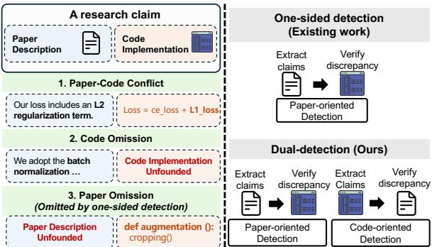
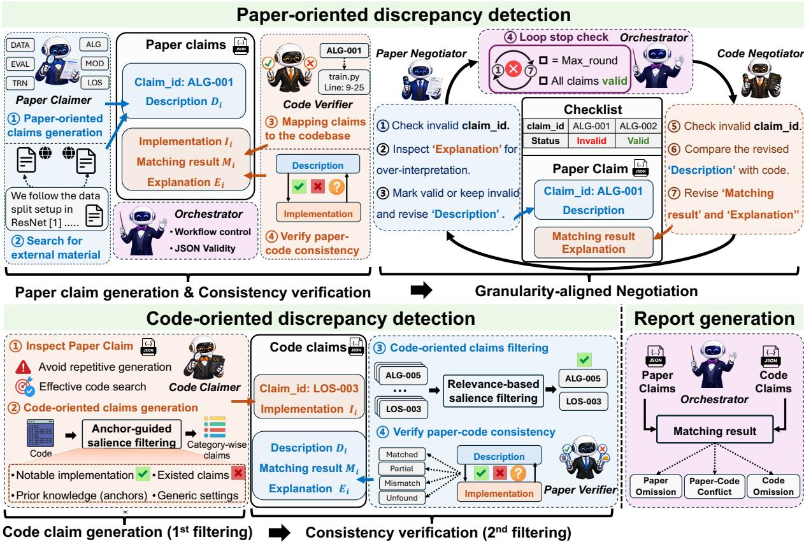
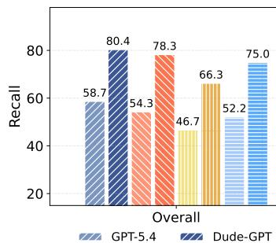
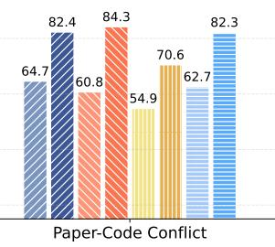
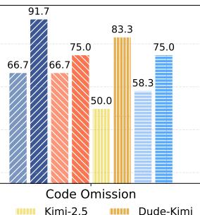
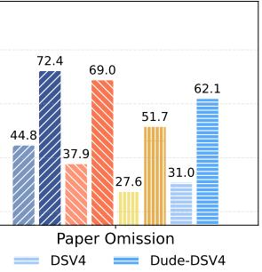
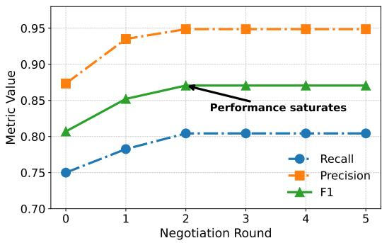
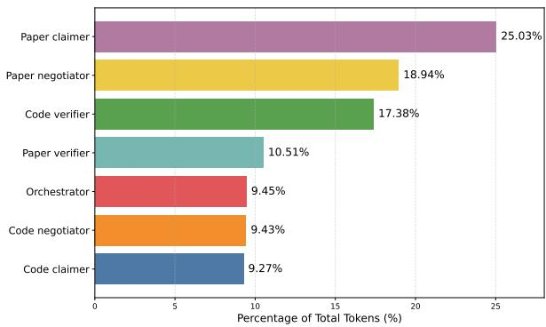
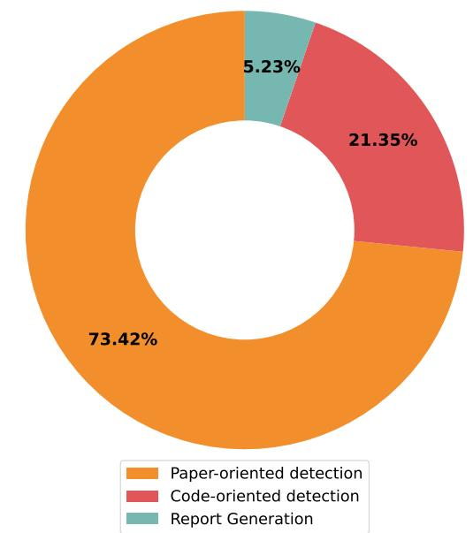

# Dude: A Dual-Detection Multi-Agent System for Paper-Code Discrepancy Detection

Weijie Liu1, Running Zhao1, Wenhao Yuan1, Jinfeng Xu1, Zhanfeng Xu1, Xiaoxi Zhang2, Edith Cheuk-Han Ngai1,\* 1The University of Hong Kong, 2Sun Yat-sen University liuwj0817@connect.hku.hk, chngai@eee.hku.hk

## Abstract

LLM-empowered paper-code discrepancy detection has received growing concern since the scaling of research submissions exceeds the manual review capability. However, the limited context capacity and one-sided discrepancy detection of existing single-agent LLM paradigms lead to an inferior recall performance in detecting discrepancies. In this paper, we propose Dude1, the first Dual-Detection Multi-Agent System for paper-code discrepancy detection. We discover that the granularity asymmetry of the paper-language and code-language introduces over-interpretation and over-reporting challenges in a multi-agent system design for discrepancy detection, resulting in increasing false positives. To address this, we propose a granularity-aligned negotiation and a two-stage salience-filtering mechanism in Dude, which effectively prevents agents from falsely reporting discrepancies. Experimental results in realworld paper-code discrepancy datasets showcase Dude’s significant recall and precision improvement by up to 22.8%, increasing F1 score by up to 18.7% compared to baseline methods.

## 1 Introduction

Paper-code discrepancy detection aims to identify inconsistencies of research claims described in the paper manuscript and code repository. This task is crucial as such inconsistencies compromise the credibility and reproducibility of research findings. Yet, the rapid growth of paper submissions has gone beyond reviewers’ capacity to conduct accurate assessments of paper-code consistency within tight timelines. Therefore, leveraging the power of LLMs to conduct automated discrepancy detection has attracted increasing attention (You et al., 2026; Liu et al., 2026; Xu et al., 2026).

Limitations. However, a recent study (Baumgärtner and Gurevych, 2026) has reported the inferior performance of the single-agent paradigm in detecting paper-code discrepancies, with the bestperforming models attaining only 46% recall on a real-world discrepancy dataset SciCoQA. This suboptimal performance of single-agent LLMs stem from: 1) The limited context window makes it difficult to jointly reason over lengthy papers and large codebases. 2) LLM tends to adopt paper-oriented detection by only generating a research claim from the paper, then searching the codebase for matching code. While this is effective to detect paper-code conflict and code-omission discrepancies which are explicitly stated in the paper, it is inherently limited to spot paper-omission discrepancies only observable from the code, as we illustrated in Fig. 1.

  
Figure 1: Three types of paper-code discrepancy of a research claim (Left) and the comparison of one-sided detection and our proposed dual-detection (Right).

To address these limitations, we design Dude, a Dual-Detection Multi-Agent System for papercode discrepancy detection. Dude decomposes the discrepancy detection task into fine-grained subtasks and assigns specialized paper agents and code agents to conduct either paper-side understanding or code-side analysis. This alleviates the context burden of individual agents, and enables them to collectively perform both paper-oriented and codeoriented detection, i.e., dual-detection.

However, designing an effective dual-detection multi-agent system is non-trivial. The core challenge arises from the granularity asymmetry between the paper-language description and codelanguage implementation ofa research claim, introducing unique challenges in paper-oriented and code-oriented discrepancy detection, respectively.

<table><tr><td>Method</td><td>Recall</td><td>Precision</td><td>F1</td></tr><tr><td>Simple-LM</td><td>58.70%</td><td>91.53%</td><td>71.52%</td></tr><tr><td>Vanilla-MA</td><td>75.00%</td><td>74.19%</td><td>74.59%</td></tr><tr><td>Improvment</td><td>+16.30 %</td><td>-17.34 %</td><td>+3.07 %</td></tr></table>

Table 1: Precision, recall, and F1 score of a single-agent method (Simple-LM) and a naive multi-agent method (Vanilla-MA), both methods adopt GPT-5.4.

Over-interpretation in paper-oriented detection. In paper-oriented detection, research claims extracted from papers are often condensed and highlevel, leaving multiple valid code implementation choices. This ambiguity may cause the code agent to over-interpret the claim and mistakenly treat its inferred implementation as paper-grounded claims before examining the code. Consequently, this ungrounded over-interpretation leads to falsely reporting a discrepancy when the code implements one valid interpretation of a high-level research claim, but not the particular implementation that the code agent inferred without textual support from papers.

Over-reporting in code-oriented detection. In code-oriented detection, research claims extracted from the code are concrete and fine-grained. However, not every code implementation constitutes a research claim that requires documentation in the paper. Codebases also include environment setup and other auxiliary implementations that are necessary only for execution but peripheral to scientific contributions. A naive code-oriented detection over-reports these non-salient implementations as research claims, resulting in false-positive discrepancies. Tab. 1 shows that simply decomposing dualdetection to multiple agents increases recall, but incurs significant precision drop, showing the negative effect of over-interpretation and over-reporting.

To mitigate the over-interpretation challenge, we introduce a granularity-aligned negotiation mechanism in Dude, which enables multi-round interactions between the paper agent and code agent. During this process, the paper agent progressively refines and provides increasingly concrete and grounded paper description of the research claim. This mitigates over-interpretation by the code agent and yields more reliable discrepancy judgments. To mitigate over-reporting, Dude introduces a twostage filtering module that combines anchor-guided filtering with evidence-based filtering. This module suppresses research claims over-reported by code agents, thereby preventing paper agents from falsely reporting discrepancies in trivial code implementations. Our key contributions are as follows:

• We reveal the limitation of single-agent LLM to detect paper-code discrepancies stems from its one-sided discrepancy detection.

• We design Dude, a dual-detection multi-agent system with granularity-aligned negotiation and filtering modules, bridging the granularity asymmetry between papers and codebases.

• Experiments demonstrate significant recall and precision improvement of Dude in detecting real-world paper-code discrepancies.

## 2 Related Work

Error detection in research papers and codes. Leveraging the power of LLM to detect errors in research articles or open-sourced codes has attracted growing attention in current LLM era. For paper error detection, prior works include identifying logical issues (Liu and Shah, 2023), incorrect data calculations (Bianchi et al., 2025), invalid arguments (Xi et al., 2025), flawed proofs or experiment designs (Zhang and Abernethy, 2025). For code error detection, existing work covers code-comment inconsistency detection (Ratol and Robillard, 2017; Panthaplackel et al., 2021), bug rectification (Rong et al., 2025), reproducibility (Weng et al., 2026; Bogin et al., 2024), and quality evaluation (Tong and Zhang, 2024). However, these works focus either solely on paper understanding or code analysis, neglecting the potential discrepancies between a research paper and its associated codebases.

A recent study (Baumgärtner and Gurevych, 2026) presents a comprehensive analysis along with SciCoQA, a real-world paper-code discrepancy dataset, revealing the inferior performance of the latest LLMs in detecting such discrepancies. Another concurrent work BioCon (Xu et al., 2026) also studies the paper-code inconsistencies between publications and their associated software design in the bioinformatics field. However, these two works only consider adopting single-agent paradigms to conduct discrepancy detection. The limited context capability and one-sided detection of a single LLM hinder its ability to comprehensively identify all potential inconsistencies.

Multi-agent LLM Collaboration. To tackle increasingly complex and long-horizon tasks, LLMbased agent systems have developed from singleagent reasoning to multi-agent collaboration (Lee et al., 2025; Zhang et al., 2025b; Yuan et al., 2025; Chen et al., 2026). In the multi-agent paradigm, a complex task is often decomposed into a set of subtasks (Hong et al., 2024; Liao et al., 2025), which are then assigned to multiple specialized agents to alleviate the context burden of individual agents. Moreover, building an effective multi-agent system typically requires a carefully designed framework to ensure efficient and desirable collaboration. Existing multi-agent collaboration frameworks are often tailored to the specific task properties like MedAgents (Tang et al., 2024) and ChatDev (Qian et al., 2024), or motivated by human collaboration workflows like Multi-Agent Debate (Zhang et al., 2025a; Liang et al., 2024).

## 3 Methodology

## 3.1 Overview

We formulate the paper-code discrepancy detection task using multi-agent LLM systems M as:

$$
\mathcal { Y } = \mathcal { M } ( \mathcal { P } , \mathcal { C } ) ,\tag{1}
$$

where $\mathcal { P }$ and C denote the paper and its associated code, and $\mathcal { V }$ represents the final discrepancy report that includes all verified research claims $R _ { i }$ with paper-code discrepancies. For each verified research claim $R _ { i }$ , we have:

$$
R _ { i } = \{ D _ { i } , I _ { i } , M _ { i } , E _ { i } , O _ { i } \} ,\tag{2}
$$

where $D _ { i }$ denotes its paper description, $I _ { i }$ denotes its code implementation, $M _ { i }$ denotes the matching results between the paper and code, $E _ { i }$ denotes the explanation of the matching result, and $O _ { i } \in \{ p , c \}$ indicates whether this research claim is initiated from the paper-oriented detection or code-oriented detection. We define $\mathcal { R } _ { p } = \{ R _ { i } \ | \ O _ { i } = p \}$ and ${ \mathcal { R } } _ { c } = \{ R _ { i } \ | \ O _ { i } = c \}$ as the set of verified research claims generated in paper-oriented and codeoriented detection, referred to as paper-oriented claims and code-oriented claims. 2

Our proposed Dude includes four types of specialized agents (claimer, verifier, negotiator, orchestrator) to decompose the discrepancy detection process into three stages: paper-oriented detection (§3.2), code-oriented detection(§3.3), and report generation(§3.4), as shown in Fig. 2. In paper-oriented detection, a paper claimer initializes research claims $R _ { i }$ by extracting paper descriptions $D _ { i }$ from the paper, then a code verifier searches for corresponding code implementation $I _ { i }$ to verify their consistency, presenting the matching result $M _ { i }$ and explanation $E _ { i }$ to form the verified paperoriented claims $\mathcal { R } _ { p }$ . In code-oriented detection, a code claimer initializes research claims by extracting notable implementations from the codebase, then a paper verifier retrieves corresponding paper description to verify their consistency, returning the matching result $M _ { i }$ and explanation $E _ { i }$ to form the code-oriented claims $\mathcal { R } _ { c }$ . During this process, two negotiators refine claim description and explanation to mitigate over-interpretation, and an orchestrator coordinates workflow and consolidates ${ \mathcal R } _ { p }$ and $\mathcal { R } _ { c }$ into a final report $\mathcal { V }$

## 3.2 Paper-oriented Discrepancy Detection

We formulate the paper-oriented discrepancy detection process $f _ { p a p e r } ( . )$ as:

$$
\mathcal { R } _ { p } = f _ { p a p e r } ( \mathcal { P } , \mathcal { C } , \mathcal { A } _ { p } ) ,\tag{3}
$$

where $A _ { p } = \{ A _ { p c } , A _ { c v } , A _ { p n } , A _ { c n } , A _ { O } \}$ denotes specialized agents in the paper-oriented detection.

## 3.2.1 Claim initialization

To begin the paper-oriented detection, a paper claimer agent $\mathcal { A } _ { p c }$ initializes a research claim $R _ { i }$ by extracting the paper description $D _ { i }$ of the research claim from the paper manuscript $\mathcal { P } \mathrm { i }$

$$
D _ { i } = { A _ { p c } ( \mathcal { P } ) } ,\tag{4}
$$

If the research claim mentions the adoption or comparison of external research, like ‘Our work follows the dataset split setup in $[ 1 ] . . . \dot { }$ . The paper claimer would use web search tools $\mathcal { T } _ { w } \ = \left\{ \begin{array} { r l r } \end{array} \right.$ WebSearch, WebFetch} to refine the description $D _ { i }$ with fetched external knowledge $\mathrm { ~ \mathcal { K } _ { \it i } ^ { e x t } ~ } =$ $\mathcal { T } _ { w } ( \mathcal { P } , D _ { i } )$ . The paper description $D _ { i }$ of the research claim is further refined as:

$$
D _ { i } = { \mathcal { A } } _ { p c } ( { \mathcal { P } } , { \mathcal { K } } _ { i } ^ { e x t } ) .\tag{5}
$$

## 3.2.2 Paper-code consistency verification

The code verifier agent $\mathcal { A } _ { c v }$ then inspects the codebase C and maps the paper description $D _ { i }$ to its corresponding code implementation $I _ { i }$ using built-in code-search tools Tc ={grep, glob, read}:

$$
I _ { i } = \mathcal { T } _ { c } ( D _ { i } , \mathcal { C } ) ,\tag{6}
$$

  
Figure 2: A complete overview of our proposed dual-detection multi-agent system Dude, including three consecutive stages, paper-oriented detection (Top), code-oriented detection (Lower left), and report generation (Lower right).

where $I _ { i }$ includes both the content and location of the corresponding source code. If the code implementation is not found, $I _ { i } = \emptyset$ . The code verifier $\mathcal { A } _ { c v }$ then verifies the consistency between the paper description $D _ { i }$ and code implementation $I _ { i } ,$ , providing the matching result $M _ { i }$ and explanation $E _ { i }$

$$
M _ { i } , E _ { i } = \mathcal { A } _ { c v } ( D _ { i } , I _ { i } ) ,\tag{7}
$$

where $M _ { i } \in \{$ {matched, partial, mismatch, unfound}, and $E _ { i }$ interprets the result $M _ { i }$ based on the description $D _ { i }$ and implementation $I _ { i }$

## 3.2.3 Negotiation process.

Due to the granularity asymmetry between the natural language of paper description $D _ { i }$ and code languages of implementation $I _ { i } ,$ the code verifier $\mathcal { A } _ { c v }$ in Eq. (7) may over-interpret the high-level paper description $D _ { i }$ , yielding a false matching result $M _ { i }$ and an over-interpreted explanation $E _ { i }$ . To this end, we design a granularity-aligned negotiation process that iteratively refines the paper description, revises explanation, and corrects matching result for all $N _ { p }$ paper-oriented claims $\{ D _ { i } , M _ { i } , E _ { i } \} _ { i = 1 } ^ { N _ { p } }$ The negotiation process $f _ { n e g } ( . )$ at the $j ^ { t h }$ round

can be formulated as:

$$
D _ { i } ^ { j + 1 } , M _ { i } ^ { j + 1 } , E _ { i } ^ { j + 1 } = f _ { n e g } ( D _ { i } ^ { j } , M _ { i } ^ { j } , E _ { i } ^ { j } , A ) , \forall i\tag{8}
$$

where $\mathcal { A } = \{ \mathcal { A } _ { p n } , \mathcal { A } _ { c n } , \mathcal { A } _ { O } \}$ represents the paper negotiator agent $\begin{array} { r } { A _ { p n } . } \end{array}$ , code negotiator agent $\mathcal { A } _ { c n } .$ and orchestrator agent $A _ { O }$

As shown in the negotiation process in Fig. 2, a checklist $\mathcal { L } = \{ L _ { i } \} _ { i = 1 } ^ { N _ { p } }$ records the validity of each claim explanation $E _ { i } ,$ , where $L _ { i }$ is defined as:

$L _ { i } = \left\{ \begin{array} { l l } { { \mathsf { v a l i d } , } } & { { E _ { i } } } \\ { { \mathsf { i n v a l i d } , } } & { { E _ { i } } } \end{array} \right.$ has no over-interpretation, has over-interpretation.

To initiate the negotiation process, the paper negotiator $\mathcal { A } _ { p n }$ first inspects explanation $E _ { i }$ of each claim to identify over-interpretation. If the explanation $E _ { i }$ is accurate, the paper negotiator marks $L _ { i } = \mathsf { v a l }$ id on the checklist. For claims with overinterpreted explanation, the paper negotiator refines the description $D _ { i }$ based on the paper $\mathcal { P }$ to resolve the extrapolation that causes over-interpretation. Formally, the refinement of paper description $D _ { i } ^ { j }$ at the $j ^ { t h }$ negotiation round is formulated as:

$$
\boldsymbol { D } _ { i } ^ { j + 1 } = \mathcal { A } _ { p n } ( \boldsymbol { D } _ { i } ^ { j } , \boldsymbol { E } _ { i } ^ { j } , \mathcal { P } )\tag{9}
$$

Next, the code negotiator agent $\boldsymbol { A } _ { c n }$ locates the code implementation $I _ { i } ^ { j + 1 }$ corresponding to the refined paper description $D _ { i } ^ { j + 1 }$ , re-verifies their consistency, and updates the matching result $M _ { i } ^ { j + 1 }$ along with a refined explanation $E _ { i } ^ { j + 1 }$ for the examination the next negotiation round. The revision of matching result and explanation at the $j ^ { t h }$ negotiation round is formulated as:

$$
M _ { i } ^ { j + 1 } , E _ { i } ^ { j + 1 } = \mathcal { A } _ { c n } ( D _ { i } ^ { j + 1 } , I _ { i } ^ { j + 1 } )\tag{10}
$$

The orchestrator agent $\scriptstyle A _ { O }$ coordinates the overall negotiation process, and terminates it when $L _ { i } = { \tt v a l i d } , { \tt \forall } i$ , or when the process reaches a pre-defined maximum number of rounds r. At this point, our Dude has produced a set of verified research claims ${ \mathcal R } _ { p } \ = \ \{ R _ { i } \ | \ O _ { i } \ = \ p \}$ from the paper-oriented detection process.

## 3.3 Code-oriented Discrepancy Detection

We formulate the code-oriented discrepancy detection process $f _ { c o d e } ( . )$ as:

$$
\mathcal { R } _ { c } = f _ { c o d e } ( \mathcal { C } , \mathcal { P } , \mathcal { A } _ { c } ) ,\tag{11}
$$

where $\mathcal { R } _ { c }$ denotes the generated code-oriented research claims, and $A _ { c } = \{ \mathcal { A } _ { c c } , \mathcal { A } _ { p v } \}$ denotes all specialized agents in the code-oriented detection.

Claim generation and anchor-guided filtering. In code-oriented discrepancy detection, a code claimer agent $\mathcal { A } _ { c c }$ initializes a research claim $R _ { i }$ by extracting the notable code implementations $I _ { i }$ of the research claim from the codebase C. We formulate the claim generation process as:

$$
I _ { i } = \mathcal { A } _ { c c } ( \mathcal { R } _ { p } , \mathcal { C } , \mathcal { K } _ { a } )\tag{12}
$$

Before examining the repository ${ \mathcal { C } } ,$ the code claimer first inspects the paper-oriented claims $\mathcal { R } _ { \mathcal { P } }$ to avoid extracting repetitive research claims and enable more efficient search, since $\mathcal { R } _ { p }$ contains existing paper-oriented claims and their code implementation. To preserve only notable implementations $I _ { i }$ and discard those trivial ones, we adopt an anchored-guided filtering module by adopting category-wise domain knowledge $\kappa _ { a }$ as anchors to help code claimer better understand the criterion of the implementation significance from different categories. In this way, the code claimer can more accurately identify the salient code implementation $I _ { i }$ and thus alleviate the over-reporting problem.

Relevance-based filtering and consistency verification. However, the importance of code implementations is not an intrinsic property of the code alone. It is often context-dependent and papersensitive. The same implementation may be highly important in one type of article but peripheral in another. For instance, an INT8 quantization module is essential to report in a model compression paper, since it directly affects paper’s contribution about memory usage and efficiency. However, the same quantization code is trivial in a paper about new attention architectures for classification, whose contribution has little connection with quantized models. Therefore, the paper verifier agent $\mathcal { A } _ { p v }$ conducts a relevance-based salience filtering $f _ { f i l t e r } ( . )$ to remove trivial research claims and extract paper description $D _ { i }$ of research claim whose implementation $I _ { i }$ has high relevance to the paper $\mathcal { P }$

$$
D _ { i } = f _ { f i l t e r } ( A _ { p v } , \mathcal { P } , I _ { i } ) .\tag{13}
$$

This prevents the paper verifier from reporting trivial inconsistencies in the verification process, where the paper verifier examines the consistency between the code implementation $I _ { i }$ and paper description $D _ { i }$ , and returns the matching result $M _ { i }$ and explanation $E _ { i }$

$$
M _ { i } , E _ { i } = \mathcal { A } _ { p v } ( D _ { i } , I _ { i } ) .\tag{14}
$$

At this point, our Dude has produced a set of verified research claims $\mathcal { R } _ { c } = \{ R _ { i } \ | \ O _ { i } = c \}$ from the code-oriented detection process.

## 3.4 Discrepancy Report Generation

To yield the final discrepancy report Y, the orchestrator agent $\scriptstyle A _ { O }$ merges the paper-oriented claims ${ \mathcal R } _ { p }$ and code-oriented claims $\mathcal { R } _ { c }$ and determines the discrepancy type $t _ { i }$ of research claim $R _ { i }$ based on its matching results $M _ { i }$ and origination $O _ { i }$

$$
t _ { i } = \left\{ \begin{array} { l l } { \mathsf { C o n f l i c t } , } & { M _ { i } \in \{ \mathsf { p a r t i a l } , \mathsf { m i s m a t c h } \} , } \\ { \mathsf { P a p e r - o m i s s i o n } , } & { M _ { i } = \mathsf { u n f o u n d } , O _ { i } = c , } \\ { \mathsf { C o d e - o m i s s i o n } , } & { M _ { i } = \mathsf { u n f o u n d } , O _ { i } = p . } \end{array} \right.
$$

All partial and mismatch claims are treated as paper-code conflicts. For unfound claims, if the claim is paper-oriented $( O _ { i } \ = \ p )$ , it indicates a code omission. Otherwise, if the claim is codeoriented $( O _ { i } = c )$ , it indicates a paper omission, and all matched claims are excluded.

## 4 Experiment

## 4.1 Experimental Setup

Dataset and models. We evaluate Dude using four closed-source and open-source LLMs (GPT-5.4, DeepSeekV4-Pro, Kimi, Claude-4.6) on the only available paper-code discrepancy dataset Sci-CoQA (Baumgärtner and Gurevych, 2026). We also evaluate Dude by selecting 20 research papers with public available codebases published in latest top-tier conferences (ICML 2025, ICLR 2026).

Baselines. We compare Dude against four baselines, covering both single-agent and multi-agent paradigms. For single-agent methods, we use the default method employed in SciCoQA, Single-LM, where a single LLM agent directly generates discrepancy report after inspecting both the paper and its corresponding code repository. We adopt Prompt-LM by prompting a single agent to perform paper-oriented and code-oriented detection. For multi-agent methods, we consider Vanilla-MA by assigning multiple agents to conduct paperoriented and code-oriented detection. Finally, we include Multi-Agent Debate (MAD) (Liang et al., 2024) method which aggregates multiple agents discussion to verify paper-code discrepancies.

Evaluation Metrics. We follow the evaluation protocol in the SciCoQA dataset and adopt LLM-as-a-Judge (Zheng et al., 2023) to evaluate whether the reported discrepancies match those in SciCoQA. We adopt Gemini-3.1 Pro as the judge and compute the recall, precision, and F1 scores. Notably, the reported discrepancies may include valid but unannotated discrepancies in SciCoQA. We do not count such discrepancies as true positives or false positives. We only consider discrepancies annotated in the SciCoQA dataset when computing the metrics. Nevertheless, for invalid and trivial discrepancies, we label them as false positives after verification using domain expertise and Gemini-3.1. For token consumption, we accumulate the total input and output tokens reported in the session logs or official API platforms.

Implementation Details. We implement Dude on top of Codex and OpenCode (Anomalyco, 2026), enabling Dude to be empowered by GPT, Claude, Kimi, and Deepseek. We set the default number of negotiation rounds r = 2, and all agents employ the same LLM model unless specified. The detailed code and configurations are available at anonymous.4open.science/r/Dude

## 4.2 Main Results

Overall performance analysis. Table 2 presents a comprehensive comparison of our proposed Dude against baseline methods on the SciCoQA dataset, evaluated in terms of recall, precision, F1 score, and token consumption. The results demonstrate that Dude consistently outperforms all baselines under both GPT-5.4 and DeepSeek-V4 settings, yielding substantial improvements of up to 22.8% in recall, 9.0% in precision, and 18.7% in F1 score.

Moreover, the result also shows that Vanilla-MA, which performs paper-oriented and codeoriented detection (i.e., dual-detection) within a multi-agent framework, achieves a more substantial recall improvement than Prompt-LM, in which a single agent is prompted to perform dual-detection. This indicates that prompting a single-agent LLM is insufficient to perform effective dual-detection and thorough discovery of paper-code discrepancies. Despite its pronounced recall gains, Vanilla-MA suffers from a substantial drop in precision, whereas our proposed Dude preserves high precision while still benefiting from the recall enhancement from the multi-agent dual-detection design. This showcases the effectiveness of the granularityaligned negotiation process and two-stage filtering mechanism in Dude, which jointly mitigates the over-interpretation and over-reporting challenges, thereby reducing false-positive discrepancy reports.

In terms of the token consumption, Dude incurs the lowest additional overhead among all multiagent methods. This efficiency stems from the design in which all paper agents and code agents in Dude communicate exclusively through structured JSON files, substantially reducing the token cost of multi-agent interactions. In addition, Dude maintains a record for all previously searched paper and code snippets, preventing agents from expending extra tokens on redundant searches.

Recall analysis by discrepancy type. To better understand the sources of the recall gains achieved by our multi-agent framework Dude over the single-agent baseline Single-LM, we conduct a fine-grained analysis across discrepancy types. Fig. 3 compares the recall of Dude and Single-LM under four LLM backbones (GPT, Claude, Kimi, and DeepSeek) across three discrepancy categories: paper-code conflict, paper omission, and code omission. The results show that Dude consistently outperforms Single-LM across all three discrepancy types and all four LLM backbones, with average gains ranging from 19.1% to 28.5%. The improvement is most pronounced on paper omission (28.5%), which is particularly notable given that this category has been identified as the most challenging for single-agent systems (Baumgärtner and Gurevych, 2026). Taken together, these results confirm that the multi-agent architecture in Dude yields broad and robust recall improvements on the paper-code discrepancy detection task.

<table><tr><td>Method</td><td>Recall↑</td><td>∆R</td><td>Precision↑</td><td>∆P</td><td>F1↑</td><td>∆F1</td><td>Token↓</td><td>∆Token</td></tr><tr><td colspan="9">GPT-5.4-xhigh</td></tr><tr><td>Single-LM</td><td>58.70%</td><td></td><td>91.53%</td><td></td><td>71.52%</td><td></td><td>0.71M</td><td></td></tr><tr><td>Prompt-LM</td><td>64.13%</td><td>+5.43%</td><td>84.29%</td><td>-7.24%</td><td>72.84%</td><td>+1.32%</td><td>0.75M</td><td>+5.63%</td></tr><tr><td>Vanilla-MA</td><td>75.00%</td><td>+16.30%</td><td>74.19%</td><td>-17.33%</td><td>74.59%</td><td>+3.07%</td><td>1.04M</td><td>+46.48%</td></tr><tr><td>MAD</td><td>59.78%</td><td>+1.09%</td><td>93.22%</td><td>+1.69%</td><td>72.85%</td><td>+1.32%</td><td>1.28M</td><td>+80.28%</td></tr><tr><td>Dude (ours)</td><td>80.43%</td><td>+21.74%</td><td>93.67%</td><td>+2.15%</td><td>86.55%</td><td>+15.03%</td><td>0.76M</td><td>+7.04%</td></tr></table>

<table><tr><td colspan="9">DeepseekV4-Pro-Max</td></tr><tr><td>Single-LM</td><td>52.17%</td><td></td><td>84.21%</td><td></td><td>64.43%</td><td></td><td>0.49M</td><td></td></tr><tr><td>Prompt-LM</td><td>64.13%</td><td>+11.96%</td><td>77.63%</td><td>-6.58%</td><td>70.24%</td><td>+5.81%</td><td>0.59M</td><td>+20.41%</td></tr><tr><td>Vanilla-MA</td><td>73.91%</td><td>+21.74%</td><td>76.40%</td><td>-7.81%</td><td>75.14%</td><td>+10.71%</td><td>0.91M</td><td>+85.71%</td></tr><tr><td>MAD</td><td>67.39%</td><td>+15.22%</td><td>80.52%</td><td>-3.69%</td><td>73.37%</td><td>+8.94%</td><td>0.95M</td><td>+93.87%</td></tr><tr><td>Dude (ours)</td><td>75.00%</td><td>+22.83%</td><td>93.24%</td><td>+9.03%</td><td>83.13%</td><td>+18.70%</td><td>0.60M</td><td>+22.49%</td></tr></table>

Table 2: The recall, precision, F1, and token usage results of Dude and baseline methods on the SciCoQA dataset using GPT-5.4 and DeepseekV4 models. ∆ are calculated relative to Single-LM within each model group. Bold numbers and underlined numbers denote the highest and second-highest value in each model group.

  
Figure 3: The recall performance of Single-LM and Dude across different discrepancy types (paper-code conflict, code-omission, paper-omission) in SciCoQA dataset using GPT5.4, Claude 4.6, Kimi, and DeepseekV4 models.

Table 3: F1 scores under different paper-side and codeside agent model combinations.
<table><tr><td rowspan="2">Code-side agents</td><td colspan="2">Paper-side agents</td></tr><tr><td>GPT5.4</td><td>DeepseekV4</td></tr><tr><td>GPT5.4</td><td>0.9367</td><td>0.9114</td></tr><tr><td>DeepseekV4</td><td>0.9333</td><td>0.9324</td></tr></table>

Robustness under heterogeneous LLMs We further evaluate Dude when different LLMs are assigned to be the paper-side and code-side agents. Table 3 reports F1 scores under four configurations: two hybrid settings with GPT-5.4 and DeepSeekV4 assigned to opposite sides, and two uniform settings using the same model on both sides. The results show that Dude maintains robust discrepancy detection performance even under mixed LLM model assignments. We further observe that replacing the paper-side agents has a larger impact than replacing the code-side agents, suggesting that the capability of the paper-side agents plays a more crucial role in overall performance.

## 4.3 Ablation studies

Table 4 presents the ablation study of our proposed Dude on SciCoQA dataset using GPT5.4 and DeepseekV4, evaluating the individual contributions of our designed negotiation and saliencyfiltering components in Dude. The results show that removing either one of these two components results leads to a degradation in F1 score, confirming the effectiveness of both designs in discrepancy detection. More specifically, removing the saliencyfiltering module causes a significant drop in precision. Although this filtering module can occasionally filter out valid discrepancies, it is essential for suppressing the large number of trivial research claims over-reported by the multi-agent system. Removing negotiation process, on the other hand, leads to a degradation in both recall and precision, indicating the necessity of bridging the granularity gap between natural language and code language during the consistency verification process.

<table><tr><td>Method</td><td>Recall↑</td><td>∆R</td><td>Precision↑</td><td>∆P</td><td>F1↑</td><td>∆F1</td></tr><tr><td colspan="7">GPT-5.4-xhigh</td></tr><tr><td>Dude w/o Negotiation</td><td>75.00%</td><td>-5.43%</td><td>87.34%</td><td>-6.33%</td><td>80.70%</td><td>-5.85%</td></tr><tr><td>Dude w/o Saliency-Filtering</td><td>81.52%</td><td>+1.09%</td><td>74.26%</td><td>-19.41%</td><td>77.72%</td><td>-8.83%</td></tr><tr><td>Dude (ours)</td><td>80.43%</td><td></td><td>93.67%</td><td></td><td>86.55%</td><td>一</td></tr><tr><td colspan="7">DeepseekV4-Pro-Max</td></tr><tr><td>Dude w/o Negotiation</td><td>70.65%</td><td>-4.35%</td><td>90.28%</td><td>-2.96%</td><td>79.27%</td><td>-3.86%</td></tr><tr><td>Dude w/o Saliency-Filtering</td><td>76.09%</td><td>+1.09%</td><td>81.40%</td><td>-11.84%</td><td>78.65%</td><td>-4.48%</td></tr><tr><td>Dude (ours)</td><td>75.00%</td><td></td><td>93.24%</td><td></td><td>83.13%</td><td></td></tr></table>

Table 4: Ablation study of Dude on the SciCoQA dataset using GPT5.4 and DeepseekV4. ∆ values are calculated relative to Dude (ours) within each model group. Bold values in the ∆ column highlight the largest degradation.

  
Figure 4: The effect of negotiation rounds r on Recall, Precision, and F1 (Dude-GPT-5.4)

## 4.4 Parameter sensitivity analysis

We investigate the impact of the number of negotiation rounds r on Dude’s discrepancy detection performance. As illustrated in Fig. 4, the recall, precision, and F1 score of Dude exhibit monotonic improvement as the number of negotiation rounds r increases, reaching a plateau at r = 2, indicating that the performance saturates beyond this point. We attribute this behavior to the observation that the majority of research claims can be resolved within two rounds of discussion. As a result, even when r is configured to a larger value, the negotiation process generally terminates within the first two rounds.

## 4.5 Results on latest real-world research

To further assess the capability of Dude, we employ Dude with GPT-5.4 to detect paper-code discrepancies in 20 selected research papers and their corresponding publicly available code repositories. These papers were accepted by recent top-tier AI conferences, including ICML 2025 and ICLR 2026. As shown in Table 5, Dude identifies the secondlargest number of valid discrepancies while achieving the highest precision among all methods. Although Vanilla-MA detects the largest number of valid discrepancies, it produces the highest number of invalid ones, resulting in significantly low precision. These results demonstrate the strong potential of Dude for comprehensive and reliable paper-code discrepancy detection in cutting-edge AI research.

Table 5: The number of valid and invalid reported discrepancies as well as the precision results of Dude and baseline methods in 20 latest top-tier research works.
<table><tr><td>Method</td><td># valid (↑) # invalid (↓) discrepancy discrepancy</td><td>Precision</td></tr><tr><td>Single-LM</td><td>29 3</td><td>90.63%</td></tr><tr><td>Prompt-LM</td><td>31 8</td><td>79.49%</td></tr><tr><td>Vanilla-MA</td><td>46 21</td><td>68.66%</td></tr><tr><td>MAD</td><td>34 6</td><td>85.00%</td></tr><tr><td>Dude (GPT)</td><td>45 3</td><td>93.75%</td></tr></table>

## 5 Conclusion

In this paper, we present Dude, a dual-detection multi-agent framework for paper-code discrepancy detection. Our analysis reveals that the inferior recall performance of the single-agent paradigm stems from its inherent one-sided discrepancy detection process, a limitation that cannot be overcame through simple prompting. While a naive multi-agent implementation alleviates this issue, it introduces a precision degradation arising from the granularity asymmetry between papers and code. Dude addresses both limitations through a negotiation module that aligns cross-granularity representations via iterative agent dialogue, and a twostage filtering module that suppresses over-reported false positives. Extensive experiments confirm that Dude substantially improves recall while preserving precision, establishing a strong foundation for automated paper-code discrepancy detection.

## Limitations

Despite its substantial improvements in recall and precision, Dude has two limitations. First, its multiagent design leads to higher token consumption than single-agent frameworks. As shown in Table 2, although Dude incurs the lowest token consumption among all multi-agent methods, it still consumes more tokens than single-agent baselines (Single-LM and Prompt-LM). Second, due to the high inference cost of the latest models, we were unable to evaluate all baseline methods under the latest backbones of all LLM providers (GPT-5.5, Claude-Opus-4.7). Future work could investigate more token-efficient multi-agent frameworks and extend the evaluation to additional advanced LLM backbones to further assess the generalizability of our proposed Dude framework.

## Ethical Considerations

Our proposed Dude is designed to serve as a selfchecking tool for researchers and as a paper-code discrepancy detection tool for reviewers to assess the reliability and reproducibility of scientific research. By providing a structured summary about potential inconsistencies between papers and their associated code, Dude can help alleviate the reviewing burden on reviewers under growing submission volumes and compressed review cycles.

Despite its strong empirical performance, the output of Dude may still be incomplete or incorrect. Therefore, its outputs should be regarded as supportive evidence rather than fully automated decisions. Final judgments about the validity, quality, or reproducibility of a research work should remain under human oversight, with careful consideration of the paper, code, and experimental context.

All experiments in this paper were conducted on publicly available datasets, and our use of models and data complies with their respective license terms.

## Acknowledgments

This work was supported by the UGC General Research Fund no. 17209822 and the Innovation and Technology Commission Fund no. ITS/383/23FP from Hong Kong.

## GenAI Usage Disclosure

Generative AI tools were only used for typo revising to improve clarity and readability, and were not

used for method design or experimental analysis in this work.

## References

Anomalyco. 2026. Opencode: The open-source ai coding agent.

Tim Baumgärtner and Iryna Gurevych. 2026. Scicoqa: Quality assurance for scientific paper–code alignment. In Proceedings of the 64th Annual Meeting of the Associationfor Computational Linguistics (Volume 1: Long Papers), pages 38740–38770.

Federico Bianchi, Yongchan Kwon, Zachary Izzo, Linjun Zhang, and James Zou. 2025. To err is human: Systematic quantification of errors in published ai papers via llm analysis. arXiv preprint arXiv:2512.05925.

Ben Bogin, Kejuan Yang, Shashank Gupta, Kyle Richardson, Erin Bransom, Peter Clark, Ashish Sabharwal, and Tushar Khot. 2024. Super: Evaluating agents on setting up and executing tasks from research repositories. In Proceedings ofthe 2024 Conference on Empirical Methods in Natural Language Processing, pages 12622–12645.

Handi Chen, Running Zhao, Xiuzhe Wu, and Edith C. H. Ngai. 2026. Macro-llm: Llm-empowered multiagent collaborative reasoning under spatiotemporal partial observability. Preprint, arXiv:2601.09295.

Sirui Hong, Mingchen Zhuge, Jonathan Chen, Xiawu Zheng, Yuheng Cheng, Jinlin Wang, Ceyao Zhang, zili wang, Steven Yau, Zijuan Lin, Liyang Zhou, Chenyu Ran, Lingfeng Xiao, Chenglin Wu, and Jürgen Schmidhuber. 2024. Metagpt: Meta programming for a multi-agent collaborative framework. In International Conference on Learning Representations, volume 2024, pages 23247–23275.

Cheryl Lee, Chunqiu Steven Xia, Longji Yang, Jentse Huang, Zhouruixing Zhu, Lingming Zhang, and Michael R Lyu. 2025. Unidebugger: Hierarchical multi-agent framework for unified software debugging. In Proceedings of the 2025 Conference on Empirical Methods in Natural Language Processing, pages 18248–18277.

Tian Liang, Zhiwei He, Wenxiang Jiao, Xing Wang, Yan Wang, Rui Wang, Yujiu Yang, Shuming Shi, and Zhaopeng Tu. 2024. Encouraging divergent thinking in large language models through multi-agent debate. In Proceedings of the 2024 conference on empirical methods in natural language processing, pages 17889–17904.

Callie C Liao, Duoduo Liao, and Sai Surya Gadiraju. 2025. Agentmaster: A multi-agent conversational framework using a2a and mcp protocols for multimodal information retrieval and analysis. In Proceedings of the 2025 Conference on Empirical Methods in Natural Language Processing: System Demonstrations, pages 52–72.

Jiachen Liu, Jiaxin Pei, Jintao Huang, Chenglei Si, Ao Qu, Xiangru Tang, Runyu Lu, Lichang Chen, Xiaoyan Bai, Haizhong Zheng, Carl Chen, Zhiyang Chen, Haojie Ye, Yujuan Fu, Zexue He, Zijian Jin, Zhenyu Zhang, Shangquan Sun, Maestro Harmon, and 18 others. 2026. The last human-written paper: Agent-native research artifacts. Preprint, arXiv:2604.24658.

Ryan Liu and Nihar B Shah. 2023. Reviewergpt? an exploratory study on using large language models for paper reviewing. arXiv preprint arXiv:2306.00622.

Sheena Panthaplackel, Junyi Jessy Li, Milos Gligoric, and Raymond J Mooney. 2021. Deep just-in-time inconsistency detection between comments and source code. In Proceedings of the AAAI conference on artificial intelligence, volume 35, pages 427–435.

Chen Qian, Wei Liu, Hongzhang Liu, Nuo Chen, Yufan Dang, Jiahao Li, Cheng Yang, Weize Chen, Yusheng Su, Xin Cong, Juyuan Xu, Dahai Li, Zhiyuan Liu, and Maosong Sun. 2024. ChatDev: Communicative agents for software development. In Proceedings of the 62nd Annual Meeting of the Association for Computational Linguistics (Volume 1: Long Papers), pages 15174–15186, Bangkok, Thailand. Association for Computational Linguistics.

Inderjot Kaur Ratol and Martin P Robillard. 2017. Detecting fragile comments. In 2017 32nd IEEE/ACM International Conference on Automated Software Engineering (ASE), pages 112–122. IEEE.

Guoping Rong, Yongda Yu, Song Liu, Xin Tan, Tianyi Zhang, Haifeng Shen, and Jidong Hu. 2025. Code comment inconsistency detection and rectification using a large language model. In Proceedings ofthe IEEE/ACM 47th International Conference on Software Engineering, pages 1832–1843.

Xiangru Tang, Anni Zou, Zhuosheng Zhang, Ziming Li, Yilun Zhao, Xingyao Zhang, Arman Cohan, and Mark Gerstein. 2024. Medagents: Large language models as collaborators for zero-shot medical reasoning. In Findings ofthe Associationfor Computa tional Linguistics: ACL 2024, pages 599–621.

Weixi Tong and Tianyi Zhang. 2024. Codejudge: Evaluating code generation with large language models. In Proceedings of the 2024 Conference on Empirical Methods in Natural Language Processing, pages 20032–20051.

Yixuan Weng, Minjun Zhu, Qiujie Xie, QiYao Sun, Zhen Lin, Sifan Liu, and Yue Zhang. 2026. Deepscientist: Advancing frontier-pushing scientific findings progressively. In International Conference on Learning Representations, volume 2026, pages 47981– 48037.

Sarina Xi, Vishisht Rao, Justin Payan, and Nihar B Shah. 2025. Flaws: A benchmark for error identification and localization in scientific papers. arXiv preprint arXiv:2511.21843.

Tianxiang Xu, Xiaoyan Zhu, Xin Lai, Sizhe Dang, Xin Lian, Hangyu Cheng, and Jiayin Wang. 2026. Do papers tell the whole story? a benchmark and framework for uncovering hidden implementation gaps in bioinformatics. arXiv preprint arXiv:2603.22018.

Lei You, Lele Cao, and Iryna Gurevych. 2026. Preventing the collapse of peer review requires verificationfirst ai. arXiv preprint arXiv:2601.16909.

Zike Yuan, Ming Liu, Hui Wang, and Bing Qin. 2025. Ma-gts: A multi-agent framework for solving complex graph problems in real-world applications. In Proceedings of the 2025 Conference on Empirical Methods in Natural Language Processing, pages 19297–19315.

Kaiyuan Zhang, Qian Liu, Luyang Zhang, Chaoqun Zheng, Shuaimin Li, Bing Xu, Muyun Yang, Xinxiao Qiao, and Wenpeng Lu. 2025a. Madawsd: Multiagent debate framework for adversarial word sense disambiguation. In Proceedings of the 2025 Conference on Empirical Methods in Natural Language Processing, pages 22294–22313.

Tianmai M Zhang and Neil F Abernethy. 2025. Reviewing scientific papers for critical problems with reasoning llms: Baseline approaches and automatic evaluation. arXiv preprint arXiv:2505.23824.

Yehang Zhang, Xinli Xu, Xiaojie Xu, Doudou Zhang, Li Liu, and Ying-Cong Chen. 2025b. Orchestrating audio: Multi-agent framework for long-video audio synthesis. In Proceedings ofthe 2025 Conference on Empirical Methods in Natural Language Processing, pages 22278–22293.

Lianmin Zheng, Wei-Lin Chiang, Ying Sheng, Siyuan Zhuang, Zhanghao Wu, Yonghao Zhuang, Zi Lin, Zhuohan Li, Dacheng Li, Eric Xing, Hao Zhang, Joseph Gonzalez, and Ion Stoica. 2023. Judging llm-as-a-judge with mt-bench and chatbot arena. In Advances in Neural Information Processing Systems, volume 36, pages 46595–46623. Curran Associates, Inc.

## A Agent Prompts

The complete agent configuration files, along with their complete prompts, are available at anonymous.4open.science/r/Dude. We here briefly showcase the roles of different specialized agents in paper-oriented detection, code-oriented detection, and final report generation.

## A.1 Paper-oriented detection

## Paper Claimer Agent (Claim generation)

## You are a paper-claim extraction agent for paper-to-code auditing.

Goal: Extract implementation-auditable research claims from the input paper file and generate the paper description of research claims in a single strict JSON object.

Input: <Input paper path>

Output: A paper-claim.json in the workspace root.

Your output must organize claims into these 6 categories:

1. Algorithm (Step order, Core logic)

2. Model (Architecture, Initialization)

3. Loss (Loss definitions, Weighting, Coefficients)

4. Evaluation (Evaluation logic, Metrics, Inference or validation procedure)

5. Data (Dataset usage, Pre-processing, Augmentation, Filtering, Sampling)

6. Training (Learning rate schedule, batch, epochs, optimizer, mixed Precision, clipping, accumulation)

## Extraction rules:

• Extract atomic claims whenever possible. If a sentence contains multiple independently verifiable components, split them into multiple claims instead of combining them into one broad statement.

• Prefer implementation-relevant claims over broad summaries.

• Do not invent, infer, or hallucinate details that are not explicitly supported by the paper.

• Every claim must include at least one ‘paper\_description‘ item.

• If a claim mixes multiple concept, assign the claim to the category corresponding to the main implementation target.

## Paper Claimer Agent (Search external files)

Goal: Your goal is to determine whether external material is needed for verification of each research claim, and if so, add concise, evidence-based external information to refine paper description.

## Inputs:

• paper claims: <paper-claim.json path>

• Paper: <Input paper path>

Output: Update the paper-claim.json.

## Workflow:

Step 1: Analyze each claim one by one. For each claim object, read its paper description carefully and decide whether the claim requires external material to verify.

A claim requires external material if:

• Verifying the claim requires establishing facts outside the current paper.

• The claim says the paper follows, adopts, uses, matches, extends, improves, or is consistent with an external source (paper, dataset, benchmark, method, implementation, setting, pre-processing rule, evaluation protocol).

• The claim depends on information that cannot be verified from the current paper alone.

A claim require no external material if:

• it merely mentions an external dataset, benchmark, metric, method adopted in this paper.

• it merely introduces or mentions related work without making a verifiable dependency claim.

• it is simply listing prior work as background.

Step 2: Locate the referenced external source.

If a claim requires external material:

• Use the claim’s paper description to find where this claim appears in the paper.

• Read the nearby context and corresponding reference.

• Extract the key search clues, such as:

– cited paper title, citation number, and bibliography entry

– dataset, benchmark, website, repository name

– URL if present in the paper

Use these clues to search for the most appropriate external source on the web.

Step 3: Read the external source and fetch external evidence to refine paper description of the research claim.

## Code Verifier Agent

## You are a careful code-verification agent for paper-to-code auditing.

Goals: Your task is to map the paper description of each research claim to likely implementation in the code repository, and verify whether the paper description is supported by the codebase.

## Inputs:

• Paper Claim: <paper-claim.json path>

• Code Repository: <Code Repository path>

Output: - Update the paper-claim.json.

Workflow: For each research claim:

1. Search the code repository to look for likely implementation locations of the paper description of this claim.

2. Add and write the ‘code\_location’ field of this claim, if no candidate location is found, return an empty array.

3. Start your code inspection from the location specified in ‘code\_location’, this location is only the starting point, not necessarily the only relevant code. Follow related function calls, class definitions, utilities, configuration, and dependencies when necessary.

4. Determine whether the code implementation is consistent with the paper description.

5. For each research claim, add:

• Matching result = {matched, partial, mismatch, unfound}

• Explanation

## Definition of matching result:

• matched: The code implementation clearly and substantially supports the paper description.

• partial: The code implementation supports part of the claim, but not all of it; or the code implementation is weaker, narrower, conditional, or incomplete compared with the paper description.

• mismatch: The code implementation clearly contradicts the claim, or the code implements something materially different from what the paper description states.

• unfound: You cannot find relevant code implementation to verify the paper description, even after starting from code\_location and checking nearby/related code.

## Requirements for Explanation:

• Explain why the code matches, partially matches, or mismatches with the paper description.

• Use the relevant code files and paper content to support your conclusion.

## Paper Negotiatior Agent

You are the paper negotiator in a twoagent negotiation workflow.

Your job is to evaluate whether the current explanation for each invalid research claim becomes valid.

Input:

• Paper claim = <paper-claim.json path>

• Checklist = <checklist path>

• Paper = <Paper path>

Outputs: Update the paper-claim.json and checklist when necessary.

## Workflow:

1. Inspect checklist and locate every claim whose status is ‘invalid‘.

2. For each invalid claim:

• Locate the original paper context of the claim.

• Compare the original context against the explanation of the claim, and evaluate whether the explanation of the research claim is valid.

• Edit the checklist and paper description accordingly.

## Criterion for explanation validity:

• A ‘valid’ explanation is when it no longer contains misunderstanding, factual mistakes, or unsupported extrapolation relative to the paper description and original paper context.

• An ‘invalid’ explanation is when the explanation contains misunderstanding, factual error, or unsupported extrapolation, compared to the paper description and original paper context.

• When in doubt, keep the claim ‘invalid’.

## Editing requirement:

• If you think that the explanation is ‘valid’, update only checklist so this claim’s status becomes ‘valid’.

• If you think that the explanation remains ‘invalid’, keep its checklist status as ’invalid’, and edit the paper description. The edit should consider resolving the misunderstanding, factual error, or unsupported extrapolation of existing over-interpreted explanation.

## Code Negotiatior Agent

## You are the code negotiator in a twoagent negotiation workflow.

Your job is to re-evaluate whether the revised paper description of the research claim is supported by the code repository. Inputs:

• paper claims: <paper-claim.json path>

• Checklist = <checklist path>

• Codebase <Code repository path>

## Workflow:

1. Read checklist and locate every invalid research claim.

2. For each invalid claim:

• Read and understand the revised papaer description of the research claim.

• Start your code inspection from the code\_location specified. Follow related function calls, class definitions, utilities, configuration, and dependencies when necessary.

• Determine whether the code implementation is consistent with the revised paper description.

• Revise the current matching result and explanation accordingly, so the paper negotiator can judge your updated explanation in the next negotiation round.

## Orchestrator Agent

You are the orchestrator agent for a twoagent negotiation workflow involving:

1. ‘paper negotiator‘ agent

2. ‘code negotiator‘ agent

Your job is to initialize a checklist, spawn two custom agents, coordinate the negotiation loop, and stop exactly under the defined stopping conditions.

Step 1: Create checklist.json

At the beginning of the workflow, create checklist from the ‘paper-claim.json‘:

1. Traverse claims in the exact same order as they appear in ‘claim\_verify.json‘.

2. Initialize every claim status as ‘invalid‘.

3. Initialize the ‘current\_round=0‘, and read the pre-set maximum negotiation round from the configuration file.

Step 2: Invoke ‘paper negotiator’ agent

After the paper negotiator agent finishes, inspect checklist.json.

If either condition holds, stop the negotiation loop:

• All claims in the checklist are valid.

• ‘current\_round == maximum\_round‘

## Step 4: Invoke ‘code negotiator’ agent

## Step 5: Increment round counter

After the code negotiator agent finishes, set

‘current\_round = current\_round + 1‘

This increment counts as one complete negotiation round.

Then return to Step 2.

## Final deliverables after negotiation:

When the loop ends, produce:

• Final ‘checklist.json

• Final ‘paper-claim.json’ with revised paper description and explanation.

• A concise negotiation report including:

– total completed rounds

– final valid claims

– final invalid claim ids

– whether the loop stopped because all claims became valid or because ‘maximum\_round‘ was reached

## A.2 Code-oriented detection

## Code Claimer Agent

You are a code-claim extraction agent for code-to-paper auditing.

Goal: Your job is to extract auditable research claims from the target code repository and summarize notable code implementations of the research claim in a strict JSON object.

Input:

• paper claim = <paper-claim.json path>

• Codebase = <Code Repository Path>

Output: A code-claim.json in the workspace root.

## Workflow:

Step 1: Inspect ‘paper-claim.json‘ as prior knowledge so that you can:

• understand the paper, repository, discrepancy categories, and already-covered paper claims.

• build a roadmap of likely code locations.

• avoid repeating claims that are already present in ‘paper-claim.json‘;

Step 2: Inspect the code repository strictly one category at a time, in the following order (Algorithm, Model, Loss, Evaluation, Data, Training)

Step 3: For each category:

1. Inspect the code repository and identify notable and implementation.

2. Exclude any finding that is already covered in ‘paper-claim.json‘, or repetitive in current ’code-claim.json’.

3. Write the code implementation as a claim for this category into ‘code-claim.json‘.

Anchor-based salience filtering. The representative examples below are highpriority retrieval anchors. Use them to guide where you look first and what kinds of repository details deserve extra scrutiny. However, they are not exhaustive and must not limit your search space. You must still record any other code-grounded, nonredundant, impactful implementation detail even if it does not match these examples.

For the Algorithm category:

• Hyper-parameters, thresholds, script-level settings, dynamic coefficients, or weighting decay, caching strategies that affects algorithm’s step order, control flow, and core logic.

• Code patches or fallback branches for corner cases. E.g., exception handling, fallback behavior, tie-breaking, or branchspecific shortcuts.

<table><tr><td rowspan="4">For the Model category: • Architectural model implementation de- tails like nonlinearities, normalization, pooling, concatenation, masking, routing, gating, reshaping, residual mixing, or fea-</td><td>Paper Verifier Agent</td></tr><tr><td>You are a careful paper-verification agent</td></tr><tr><td>for paper-to-code auditing. Goal: Your task is to remove trivial claims</td></tr><tr><td>in code-claim.json’ based on their rele-</td></tr><tr><td>• Activation functions, normalization proce- dures, masking policies, feature fusion de-</td><td>vance to the paper, and determines whether the code implementation is supported by the paper. Input:</td></tr><tr><td>tails, or tensor manipulation choices that alter how representations are formed or</td><td>• code claims = &lt;code-claim.json path&gt;</td></tr><tr><td>propagated; For the Loss or Training category:</td><td>• paper = &lt;paper path&gt;</td></tr><tr><td>• Additional objective terms and regulariz-</td><td>Output: Update the code-claim.json. Workflow:</td></tr><tr><td rowspan="4">ers to stabilize model training. E.g., code includes extra loss terms, penalty terms, priors, or fallback objectives.</td><td>For each research claim in the code-</td></tr><tr><td></td></tr><tr><td>claim.json: 1. Inspect the paper carefully to look for cor-</td></tr><tr><td>responding paper description for the code</td></tr><tr><td>• Hyper-parameters, thresholds, script-level settings, dynamic coefficients, weight-</td><td>implementation of the research claim.</td></tr><tr><td></td><td>2. Remove the trivial research claims by</td></tr><tr><td>ing decay, curriculum schedules, caching strategies, optimizer / scheduler details, or</td><td>assessing the relevance between the code</td></tr><tr><td>numerical stabilizers that affect training</td><td>implementation and the paper contributions.</td></tr><tr><td>dynamics.</td><td>3. Determine whether the paper description</td></tr><tr><td></td><td>matches, partially matches, mismatches, or</td></tr><tr><td>For the Evaluation category:</td><td>fails to mention the code implementation</td></tr><tr><td>• Evaluation protocol, benchmark-specific</td><td>described in the research claim.</td></tr><tr><td>handling, scoring rules, thresholds, sam-</td><td>4. For each research claim, add:</td></tr><tr><td>ple filters, or subset selection that affects the evaluation process and success crite-</td><td>• Matching result = {matched, partial, mis-</td></tr><tr><td></td><td>match, unfound}</td></tr><tr><td>rion.</td><td>• Explanation</td></tr><tr><td>• Exclusions, special-case metric han-</td><td>Definition of ‘matching result&#x27;</td></tr><tr><td>dling, dataset-dependent or benchmark- dependent evaluation branches, or eval-</td><td></td></tr><tr><td>uation protocol shortcuts that change re-</td><td>• matched: The paper description clearly</td></tr><tr><td>ported outcomes;</td><td>and substantially supports the code imple- mentation.</td></tr><tr><td>For the Data category:</td><td></td></tr><tr><td></td><td>• partial: The paper description supports</td></tr><tr><td>• Data preprocessing strategy like augmen-</td><td>part of the code implementation, but not</td></tr><tr><td>tations, truncation, clipping, subsampling</td><td>all of it; or the code implementation is</td></tr><tr><td></td><td></td></tr><tr><td></td><td>weaker, narrower, conditional, or incom-</td></tr><tr><td>feature smoothing, transformation, and</td><td>plete compared with the paper descrip-</td></tr><tr><td>prompt engineering that changes the data</td><td></td></tr><tr><td></td><td>tion.</td></tr><tr><td>input distribution</td><td></td></tr><tr><td></td><td>• mismatch: The paper description clearly</td></tr><tr><td></td><td></td></tr><tr><td></td><td>contradicts the code implementation, or</td></tr></table>

• unfound: You cannot find relevant paper description to verify the code implementation.

## Requirements for Explanation:

• Explain why the paper description matches, partially matches, or mismatches with the code implementation.

• Use the original paper text to support your   
conclusion.

## A.3 Final report generation

## Orchestrator Agent

Your task is to read paper-claim.json and   
code-claim.json, and then conduct the   
paper-code discrepancy classification based   
on the matching result of research claims.   
• For each research claim in the paper  
claim.json,   
– If the ’matching result’ is   
’matched’, do not include.   
– If the ’matching result’ is   
’partial’ or ’mismatch’, append the   
claim to ’paper-code conflict’   
– If the ’matching result’ is   
’unfound’, append the claim to   
’code omission’   
• For each research claim in the code  
claim.json,   
– If the ’matching\_status’ is   
’matched’, do not include it.   
– If the ’matching result’ is   
’partial’ or ’mismatch’, append the   
claim to ’paper-code conflict’   
– If the ’matching result’ is   
’unfound’, append the claim to   
’paper omission’

## B Additional implementation details

## B.1 Baseline method configurations

Single-LM: For the Single-LM baseline method, we adopt the same prompt and configurations used in SciCoQA (Baumgärtner and Gurevych, 2026), thereby maintaining consistency with prior work and ensuring a fair comparison.

Prompt-LM: For the Prompt-LM baseline method, we enable a single agent to perform both paperoriented discrepancy detection and code-oriented discrepancy detection. The prompt is revised based on the one used in Single-LM (Baumgärtner and Gurevych, 2026).

## Prompt-LM

You are an expert in analyzing research papers and their corresponding code implementations. Your task is to carefully identify concrete discrepancies between what is described in a paper and what is actually implemented in the code.

## ## What counts as a discrepancy

\- A concrete paper–code discrepancy means a mismatch between what is stated in the original paper (e.g., formulas, algorithms, logic, methods, processes, or other settings) and what is implemented in the original code repository.

\- Each distinct mismatch should be reported as a separate item.

## ## Important

You should conduct both paper-oriented detection and code-oriented detection to discover the paper-code discrepancies. More specifically, you should first extract the research claim from the paper and inspect its corresponding code implementations to verify the consistency. Then you should extract the research claim from the code repository and inspect the corresponding paper content to verify the consistency.

Vanilla-MA: We employ Vanilla-MA by removing the negotiation process and two-stage salience filtering modules in our propose Dude.

MAD: We adopt the default prompts and configurations in (Liang et al., 2024) to perform the discrepancy detection. We set the number of debaters ndebate = 2 in our experiments.

Notably, for fair comparison, all baseline methods and Dude have the same access to the websearch tools (WebSearch, WebFetch), code-search tools (Grep, Glob, Read), and pdf-extraction tools (MinerU, PyMuPDF) in all experimental settings.

## B.2 Evaluation Setup

To evaluate whether the reported paper-code discrepancies matches the discovered discrepancies in

SciCoQA, we employ the same LLM-as-a-Judge protocol and prompt proposed in the original Sci-CoQA paper (Baumgärtner and Gurevych, 2026).

## Prompt for LLM-as-a-Judge

Your task is to evaluate whether a reference paper-code discrepancies matches a predicted paper-code discrepancy. Follow these steps:

1. Analyze which part of the paper or code each discrepancy is describing. Extract the core claims and issues from the reference and predicted discrepancies.

2. Analyze whether the core claims are about the same issue, i.e. if they describe the same or different paper-code discrepancies. The two discrepancies might use different wording or one might be more detailed than the other. Focus on whether the issue is the same, even if minor details are different. However, if they describe different issues (even about the same topic or part of the paper or code) they do not match.

3. Provide a brief explanation of your reasoning.

\# Answer Format Provide your answer in the following format: <yes | no > <Brief explanation>

## B.3 Annotation and Validation Protocol

We construct the annotations by adopting the annotation process, validation protocol, and prompt in SciCoQA. This keeps our annotation and validation consistent with this prior work while enabling a fair comparison across compared methods. The annotation and validation processes are as follows.

All compared methods, including Single-LM, Prompt-LM, Vanilla-MA, MAD, and Dude, are first applied to the 20 paper-code pairs to detect candidate discrepancies. Then we aggregate all reported discrepancies and validate them using Gemini-3.1-Pro as an LLM-as-a-Judge. When the judge’s decision is ambiguous or when different LLM outputs yield conflicting evidence, authors with relevant domain expertise manually verify the discrepancy by inspecting both the paper claim and the corresponding code.

After validation, for each valid discrepancy, Gemini-3.1-Pro is prompted to generate a standardized description of 3–5 sentences covering the paper statement, the code implementation, and where the discrepancy lies. We use these standardized descriptions as the reference annotations for all validated paper-code discrepancies identified in the 20 real-world papers.

  
Figure 5: Token consumption percentage by agents

  
Figure 6: Token consumption percentage by discrepancy detection process

## C Token Consumption Analysis

We provide a fine-grained token consumption analysis of our proposed Dude by agents (Fig. 5) and by the discrepancy detection process (Fig. 6). Fig. 5 presents the breakdown of token consumption across all agents, measured as the percentage of the total token usage. The results show that the paper claimer agent, paper negotiator agent, and code verifier agent are the three most tokenintensive agents. Notably, the paper claimer agent accounts for nearly 25% of the overall token consumption. This huge token consumption of paper claimer agent primarily arises from its responsibility to search for and retrieve external materials during paper-oriented generation, which substantially increases its context length and leads to markedly higher token usage compared with the other agents. The higher token consumption of paper-side agents (paper claimer, paper negotiator) also supports our empirical results in Table 3, which suggests that the capability of the paper-side agents plays a more crucial role than code-side agents in overall performance.

We also examine the token consumption of different stages in our proposed Dude framework, including paper-oriented detection, code-oriented detection, and final report generation. Fig. 6 shows that paper-oriented detection is the primary source of token consumption, accounting for over 73% of the total usage and substantially exceeding the other two stages. This high cost can be attributed to two main factors. First, as we discussed above, the paper claimer agent in paper-oriented detection incurs considerable token overhead due to its need to search for and retrieve external materials for claim analysis. Second, the granularity-aligned negotiation process in paper-oriented detection requires multi-round interactions among agents, which also further increases the token budget required by the paper-oriented detection.

## D Additional Experimental Results

## D.1 Real-world Research Results

Table 5 reports precision on the 20 recent papers because, unlike SciCoQA, these 20 newly published works have no pre-existing discrepancy annotations to compute the recall metric. To address this, we compute recall and F1 against the reference set of 55 verified discrepancies whose annotation and validation process is detailed in Section B.3.

We provide the complete real-world evaluation results below, including recall, precision, F1, and average token consumption.

<table><tr><td>Method</td><td>Recall</td><td>Precision</td><td>F1</td><td>Token</td></tr><tr><td>Single-LM</td><td>52.73%</td><td>90.63%</td><td>66.67%</td><td>0.84M</td></tr><tr><td>Prompt-LM</td><td>56.36%</td><td>79.49%</td><td>65.96%</td><td>0.91M</td></tr><tr><td>Vanilla-MA</td><td>83.64%</td><td>68.66%</td><td>75.41%</td><td>1.33M</td></tr><tr><td>MAD</td><td>61.82%</td><td>85.00%</td><td>71.58%</td><td>1.58M</td></tr><tr><td>Dude</td><td>81.82%</td><td>93.75%</td><td>87.38%</td><td>0.98M</td></tr></table>

Table 6: The recall, precision, F1, and token usage results of Dude and baseline methods on the 20 realworld research using GPT-5.4.

Table 6 shows that Dude improves real-world paper-code discrepancy detection not merely by increasing the number of reported discrepancies, but by substantially improving recall while maintaining high precision. Notably, since the reference set is built from discrepancies reported by these methods and then validated, it may not include discrepancies that all methods missed. The recall values in Table 6 are therefore best read as a fair comparison across methods rather than an exact measure of how many true discrepancies exist.

## D.2 Evaluation Results on GPT-5.5

We conduct an additional evaluation on SciCoQA dataset using the latest GPT-5.5 backbone, comparing Dude against all baseline methods.

<table><tr><td>Method</td><td>Recall</td><td>Precision</td><td>F1</td><td>Token</td></tr><tr><td>Single-LM</td><td>64.13%</td><td>93.65%</td><td>76.13%</td><td>0.79M</td></tr><tr><td>Prompt-LM</td><td>64.13%</td><td>86.76%</td><td>73.75%</td><td>0.85M</td></tr><tr><td>Vanilla-MA</td><td>73.91%</td><td>79.07%</td><td>76.40%</td><td>1.39M</td></tr><tr><td>MAD</td><td>65.22%</td><td>95.24%</td><td>77.42%</td><td>1.41M</td></tr><tr><td>Dude</td><td>82.61%</td><td>96.20%</td><td>88.89%</td><td>0.96M</td></tr></table>

Table 7: The recall, precision, F1, and token usage results of Dude and baseline methods on the SciCoQA dataset using GPT-5.5.

Table 7 shows that most methods benefit from the stronger GPT-5.5 backbone compared with GPT-5.4, indicating that the newer LLMs improve paper-code discrepancy detection. However, simply replacing the backbone with GPT-5.5 does not eliminate the limitations of the single-agent paradigm in discrepancy detection. The Single-LM baseline with GPT-5.5 still achieves only 64.13% overall recall, while our proposed Dude continues to achieve strong performance under GPT-5.5, improving recall by 18.48% and F1 by 12.76% compared with Single-LM. This demonstrates that the dual-detection design and negotiation/filtering mechanisms in Dude remain effective on more recent LLM backbones.

## D.3 Human and cross-LLM Agreement

To assess the reliability of our adopted Gemini-3.1-Pro as an LLM judge, we sample 50 papercode discrepancy cases spanning both SciCoQA and recent real-world papers. These cases were manually reviewed by the authors with relevant domain expertise, since validating paper-code discrepancies requires understanding both paper claims and code implementation. We compare the human judgments with those produced by Gemini-3.1-Pro. Among the 50 cases, 47 received the same judgment from both, yielding a 94% agreement rate.

We also compare Gemini-3.1-Pro against a second LLM judge, Qwen-3.6. On the same 50 cases, 44 received the same judgment, yielding an 88% agreement rate. This indicates that our LLM-as-a-Judge protocol is reasonably reliable for our evaluation, while we acknowledge that subtle cases still benefit from human evaluation.

## D.4 Representative Failure Case Study

Although Dude substantially improves recall and precision over existing paper-code discrepancy detection methods, it is not perfect. Our inspection shows that Dude ’s remaining false negatives mainly arise from implicit discrepancies, where the inconsistency is not stated through explicit keywords but is induced by code behavior and requires deeper reasoning to detect. On the other hand, the remaining false positives arise from ambiguous engineering code. We provide two representative failure cases of Dude below, one false positive and one false negative, which give a clearer understanding of Dude’s remaining limitations.

Case 1 (False Positive / Incorrect Report): Some repositories contain demonstration code in .ipynb notebooks. These notebooks may use settings that differ from the official implementation and the paper, such as running only a single trial instead of repeating experiments and reporting averaged results. These notebooks sometimes are not clearly named or commented as ’example’ or ’demonstration’ code. In such cases, Dude treats them as authoritative implementations and reports the difference as a discrepancy.

Case 2 (False Negative / Missed Discrepancy): In one case, the code restricts the outputs of the proposed module to the range (0,1) using a sigmoid activation, while the paper formulation describes these parameters as outputs of standard unbounded MLPs. Dude missed this discrepancy because the inconsistency is implicit in the activation function and requires reasoning about the numerical range induced by the code, rather than simply matching a stated paper claim to a code fragment.