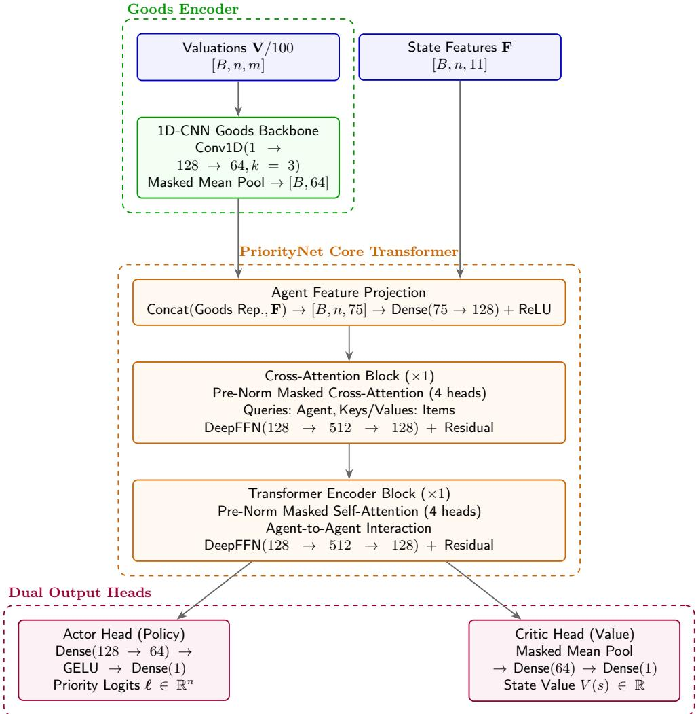
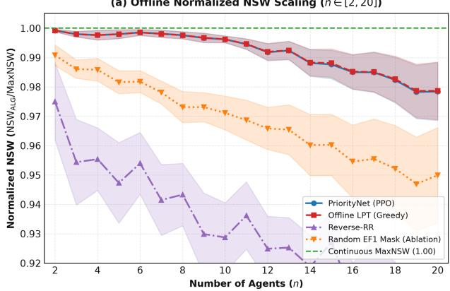
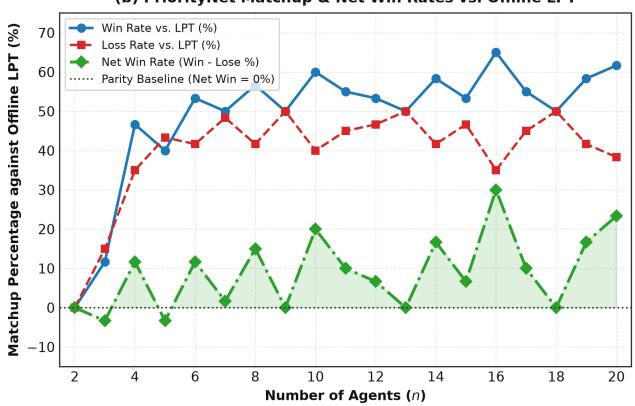
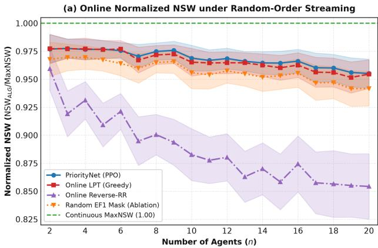
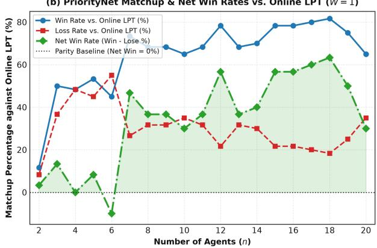

# EF1-Constrained Nash Social Welfare with Identical Additive Valuations: Complexity, Guarantees, and Experiments⋆

Zih-Sian Yang1†, Yi-Hao Chen1†, Yu-Te Kuan1, Cheng-Jui Wu1, Chuang-Chieh Lin1†\*, and Po-An Chen2\*

1 National Taiwan Ocean University, Keelung City 202301, Taiwan {01257049,01357144,01257109,josephcclin,01057139}@mail.ntou.edu.tw National Yang Ming Chiao Tung University, Hsinchu City 300, Taiwan poanchen@nycu.edu.tw

Abstract. We study the allocation of indivisible goods among agents with identical additive valuations, focusing on envy-freeness up to one good (EF1) and Nash social welfare (NSW). Since every maximum-NSW allocation is EF1 under additive valuations, the associated threshold problem inherits the known strong NP-hardness of NSW maximization under identical additive valuations and is strongly NPcomplete. We therefore focus on welfare guarantees satisfied by arbitrary EF1 allocations. Although every such allocation is known to achieve an e−1/e-approximation to the unrestricted optimal NSW, we identify conditions yielding stronger guarantees. Under uniform valuations, every EF1 allocation is NSW-optimal. Under an ε-small-item condition, every EF1 allocation achieves an explicit approximation ratio ρn(ϵ) satisfying ρn(ε) = 1 − O(ε2) as ε → 0 for fixed n. We further consider the stronger sequential requirement that EF1 be maintained after every item assignment. For this setting, we propose PriorityNet, a deep reinforcement learning framework trained using Proximal Policy Optimization and equipped with prospective EF1 action masking. The mask restricts every decision to assignments that preserve EF1, thereby guaranteeing prefix-wise EF1 by construction without post-processing repair. Across 3,000 test instances in each of the ofline and random-order online regimes $( n \in [ 2 , 2 0 ]$ and $m \in [ 5 , 1 0 0 ] )$ , PriorityNet attains mean normalized NSW values of 0.9911 and 0.9701, respectively. Relative to ofline Longest Processing Time (LPT) and online least-valued-bundle baselines, it achieves instance-wise win-minus-loss rates of +27.10% and +17.87%, while matching the ofline baseline’s mean normalized welfare to four decimal places and modestly improving the online mean from 0.9694 to 0.9701.

Keywords: Fairness · Envy-freeness up to one good (EF1) · Nash social welfare · Deep reinforcement learning · Prospective action masking · Online streaming

## 1 Introduction

Fair allocation of indivisible goods is a central problem in artificial intelligence, computational social choice, and multiagent resource allocation. In this problem, a set of indivisible goods must be allocated among agents with possibly diferent preferences over bundles of goods. Since exact envy-freeness may fail to exist even in very simple indivisible-goods instances, much of the modern literature focuses on relaxations of envy-freeness and on welfare objectives that balance eficiency and fairness.

One particularly influential objective is the Nash social welfare (NSW), defined as the geometric mean of the agents’ utilities. Originating from Nash’s bargaining solution [18], NSW has become a canonical objective in fair division because it interpolates between utilitarian welfare and egalitarian welfare. It rewards eficiency while strongly penalizing allocations in which some agents receive very low utility. For an allocation $A = \left( A _ { 1 } , A _ { 2 } , \ldots , A _ { n } \right)$ , the NSW is $\textstyle \operatorname { N S W } ( A ) = { \big ( } \prod _ { i = 1 } ^ { n } v _ { i } ( A _ { i } ) { \big ) } ^ { 1 / n }$ . When the valuations are additive and the goods are indivisible, maximizing NSW is computationally challenging. It is NP-hard and even APX-hard in general [15, 20]. Nevertheless, the objective has received substantial attention due to its strong fairness and eficiency properties.

In this paper, we study NSW maximization under the fairness constraint of envy-freeness up to one good (EF1). EF1 is one of the most widely used relaxations of envy-freeness for indivisible goods. An allocation is EF1 if, for every pair of agents i and j, any envy of agent i toward agent j can be eliminated by removing one good from j’s bundle. EF1 allocations are guaranteed to exist and can be computed eficiently under broad valuation classes [16]. The relationship between EF1 and NSW is also well known: maximum Nash welfare allocations are EF1 and Pareto optimal for additive valuations [6]. Moreover, Barman, Krishnamurthy, and Vaish showed that, for identical additive valuations, every EF1 allocation gives an $e ^ { - 1 / e } .$ -approximation to the optimal NSW [2].

We focus on the special but important case in which all agents have identical additive valuations. In this setting, every agent assigns the same value $v ( g )$ to each good $^ { g , }$ and the value of a bundle is the sum of the values of its goods. This restriction captures resource-allocation problems in which the goods have a common objective quality or utili $\mathrm { t y , }$ and the main issue is to divide the goods as evenly as possible. In contrast with the case of general additive valuations, the total utilitarian welfare is fixed across all complete allocations. Thus, maximizing NSW becomes a balancing problem. That is, one seeks a partition of the goods whose bundle values are as equal as possible.

Our goal is to understand the interaction between EF1 and NSW in this identical additive setting. We consider the following EF1-constrained NSW decision problem: given an identical additive valuation instance and a threshold $T ,$ decide whether there exists an EF1 allocation A such that NSW $( A ) \geq T$ . We also study structural approximation guarantees: for an arbitrary EF1 allocation A, how close must NSW(A) be to the optimal NSW? The contributions of this paper are as follows.

## 1.1 Our Contributions

## Theoretical Results

Ofline Setting. First, we note that EF1-constrained NSW maximization is strongly NP-complete even under identical additive valuations. The proof, which can be rediscovered in [6, 13], is by a direct reduction from 3-Partition. The reduction exploits the fact that an allocation with NSW equal to the average share must have perfectly equal bundle values. Such an allocation is automatically envy-free, and hence EF1. We include a direct proof in the full version for completeness. Second, we revisit the known $e ^ { - 1 / e }$ approximation guarantee for EF1 allocations under identical additive valuations. This guarantee shows that EF1 alone already provides a constant-factor approximation to the unconstrained optimal NSW. We then identify natural conditions under which this guarantee can be improved. Third, we show that if the identical valuation is uniform, then every EF1 allocation is exactly NSW-optimal. This provides a simple but useful benchmark: when all goods have the same value, EF1 forces the bundle cardinalities to be as balanced as possible, which maximizes the geometric mean. Finally, we prove an improved approximation guarantee under a small-item condition. Let $\begin{array} { r } { V = v ( M ) , \mu = \frac { V } { n } , \Delta = \mathrm { m a x } _ { g \in M } v ( g ) } \end{array}$ . If each good has value at most an ε-fraction of the average share, i.e., $\varDelta \leq \varepsilon \mu ,$ then EF1 implies that all bundle values difer by at most $\varDelta .$ . This bounded-spread property yields an explicit NSW approximation ratio that tends to 1 as $\varepsilon  0 .$ . Thus, in large-market instances where individual goods are small relative to the average share, EF1 allocations are nearly NSW-optimal. The theoretical results in the ofline setting are summarized in Table 1.

<table><tr><td>Setting</td><td>Guarantee or Complexity</td><td>Comment</td></tr><tr><td>Identical additive valuations</td><td> $e ^ { - 1 / e }$  -approximation</td><td>[2]</td></tr><tr><td>Uniform identical valuations</td><td>optimal (1-approximation)</td><td>this work</td></tr><tr><td>Identical valuations with ε-small-item condition</td><td>ρn(ε)-approximation, ρn (ε) → 1 as  $\epsilon  0$ </td><td>this work</td></tr><tr><td>Exact EF1-constrained NSW</td><td>Strongly NP-complete</td><td>Inherited from [6, 13]</td></tr></table>

Table 1. Theoretical results on EF1-constrained NSW maximization in the ofline setting.

Online Setting. We first show that the online allocation of indivisible goods does not always have the EF1 guarantee even for agents with additive valuations, by providing an illustrating counterexample. Aside from the impossibility result, we show that there always exists an EF1 allocation at any time prefix interval when agents have identical additive valuations. This further motivates our investigation on NSW maximization under the EF1 constraint for agents with identical additive valuations.

Experimental Results To translate our theoretical guarantees into scalable algorithms, we propose PriorityNet, a deep reinforcement learning framework trained via PPO equipped with prospective EF1 action masking. Under identical additive valuations, fair division shares a natural structural equivalence with multiprocessor scheduling: assigning incoming items to the agent with the lowest accumulated utility mirrors Graham’s classical Longest Processing Time (LPT) heuristic [11]. In the fair division literature, this greedy principle corresponds to the 1.061-NSW approximation algorithm Alg\_Identical in the ofline setting [3] and the least-valued-bundle rule in the online streaming setting (Theorem $5 ;$ see also [8, 19]). With a slight abuse of terminology, we call the LPT heuristic and the least-valued-bundle rule online and ofline LPT rules, respectively, for simplicity. We evaluate PriorityNet against these canonical ofline and online LPT benchmarks across 3,000 multi-scale instances $( n \in [ 2 , 2 0 ] , m \in [ 5 , 1 0 0 ] )$ , demonstrating that PriorityNet achieves near-continuous optimal welfare $( \geq 9 9 . 8 \%$ and ≥ 97.0% of MaxNSW). PriorityNet also achieves instance-wise win-minus rates of +27.10% and +17.87% with respect to ofline and online LPT benchmarks, respectively.

## 1.2 Related Work

Nash social welfare and indivisible goods. The Nash social welfare objective originates from Nash’s bargaining solution [18] and has since become a fundamental welfare criterion in fair division and multiagent resource allocation. For divisible resources, NSW is closely connected to market equilibrium and convex programming formulations. For indivisible goods, however, NSW maximization becomes algorithmically dificult.

Nguyen and Rothe studied the allocation of indivisible goods with additive utilities and considered, among other objectives, the maximization of average Nash social welfare [20]. They showed that the problem is computationally challenging and gave approximation algorithms, including a PTAS for the case of identical additive valuations. Lee later proved that maximizing NSW with indivisible goods and additive utilities is APX-hard [15], thereby ruling out a polynomial-time approximation scheme for the general additive case unless $\mathsf { P } = \mathsf { N P }$

A major algorithmic breakthrough was obtained by Cole and Gkatzelis, who gave the first constant-factor approximation algorithm for NSW maximization with indivisible goods and additive valuations [7]. Subsequent work improved and generalized this line of research using techniques from Fisher markets, matching, local search, and configuration linear programs. Barman, Krishnamurthy, and Vaish gave a combinatorial approach that obtains a 1.45-approximation and also produces fair and eficient allocations [2]. More recently, Feng and Li obtained an $\left( e ^ { 1 / e } + \varepsilon \right)$ -approximation for the weighted NSW problem with additive valuations [9]. Their analysis explicitly uses the worst-case gap between the optimal NSW and the NSW of an EF1 allocation in identical additive instances.

Identical additive valuations. The identical additive valuation setting is a natural special case in which all agents agree on the value of each good. Although this setting is more structured than the general additive case, the problem remains nontrivial: the goal is to partition the goods into bundles whose total values are as balanced as possible. Barman, Krishnamurthy, and Vaish studied simple greedy algorithms for special valuation classes and showed that, for identical additive valuations, a greedy algorithm that processes goods in decreasing order of value and assigns each good to a currently least-valued agent gives a 1.061-approximation to the optimal NSW [3]. They also observed that NSW maximization remains NP-hard even under identical valuations. Inoue and Kobayashi later gave an additive approximation scheme for identical additive valuations, achieving an additive error of $\varepsilon v _ { \mathrm { m a x } } ,$ where $v _ { \mathrm { m a x } }$ is the maximum value of a good [13].

Our work is complementary to this literature. Prior work on identical additive valuations primarily studies unconstrained NSW maximization. In contrast, we focus on the EF1-constrained problem and on approximation guarantees that hold for every EF1 allocation, not only for the output of a particular algorithm.

EF1 and maximum Nash welfare. EF1 was introduced as an algorithmically tractable relaxation of envyfreeness for indivisible goods [16]. It has become a standard fairness notion because EF1 allocations exist under very general conditions, whereas exact envy-free allocations may not exist. A fundamental connection between EF1 and NSW was established by Caragiannis et al., who showed that every maximum Nash welfare allocation for additive valuations is EF1 and Pareto optimal [6]. This result explains why NSW is not only an eficiency objective but also a fairness-promoting rule.

Barman, Krishnamurthy, and Vaish strengthened this connection algorithmically by developing methods for finding allocations that are EF1 and Pareto optimal, and by proving approximation guarantees for NSW [2]. Of particular relevance to our paper is their result that, under identical additive valuations, every EF1 allocation is an $e ^ { - 1 / e }$ -approximation to the optimal NSW. This guarantee serves as the baseline for our approximation results. We show that the guarantee can be improved to exact optimality under uniform identical valuations and can be strengthened under a small-item condition.

Welfare maximization subject to fairness constraints. Another related line of work studies the complexity of maximizing welfare subject to fairness constraints. Aziz, Huang, Mattei, and Segal-Halevi studied the problem of computing allocations that are both fair and utilitarian-welfare maximizing, focusing on EF1 and PROP1 constraints [1]. They showed strong NP-hardness results for several variants. Bu et al. studied the complexity and approximability of maximizing social welfare within EFX and EF1 allocations [5]. These works are conceptually close to ours because they investigate welfare optimization over fair allocations. However, they focus primarily on utilitarian social welfare and broader valuation models. Our paper instead studies the Nash social welfare objective under EF1, with emphasis on identical additive valuations, where the utilitarian objective is fixed and the geometric-mean objective captures balance among agents.

Learning-based approaches for fair division. Most algorithmic work on NSW maximization and fair division is based on combinatorial algorithms, market-based methods, local search, or linear-programming relaxations. Recently, learning-based approaches have also been proposed for fair allocation of indivisible goods. Mascioli, Goyal, and Chakraborty introduced FairFormer, a transformer architecture for discrete fair division under additive subjective valuations [17]. Their model is an amortized, permutation-equivariant two-tower transformer that encodes agents and goods as unordered token sets, applies self-attention within each set, and uses itemto-agent cross-attention to output assignment distributions. Their method discretizes the assignment and applies a lightweight repair routine to remove violations of EF1 while attempting to preserve or improve Nash welfare.

This learning-based line of work is closely related to the experimental component of our paper. Mascioli et al.’s FairFormer [17] is primarily an amortized neural optimization method for general additive subjective valuations. Their approach enforces EF1 through a post-processing repair step after discretization, whereas our experimental component examines whether a transformer-inspired [23] model can directly produce allocations with competitive NSW approximation ratios, without additional repair procedures. Thus, FairFormer provides an important recent benchmark and motivation for the learning-based part of our study, while our results complement it by giving problem-specific complexity and approximation analyses for the identical-valuation EF1-constrained setting.

Positioning of this paper. The present paper lies at the intersection of EF1 fairness, Nash social welfare maximization, and identical additive valuations. On the theoretical side, we first observe that the final-time EF1 constraint is nonbinding: the best EF1 allocation has the same NSW as the unrestricted optimum. Hence, the constrained decision problem inherits the known strong NP-completeness of identical-additive NSW maximization. We include a direct proof in the full version for completeness. Our contribution concerns not the best EF1 allocation, but every EF1 allocation. We show that uniform identical valuations imply exact NSW optimality and derive an explicit small-item approximation ratio $\rho _ { n } ( \epsilon )$ satisfying $\rho _ { n } ( \epsilon ) = 1 - O ( \epsilon ^ { 2 } )$ On the experimental side, motivated by recent neural approaches such as FairFormer [17], we investigate transformer-inspired reinforcement learning methods for producing high-NSW allocations in this structured fair division setting.

## 2 Preliminaries and Problem Specification

Let $N = \{ 1 , 2 , \dots , n \}$ be a set of agents and let M be a finite set of indivisible goods. We assume that each agent $i \in N$ has an additive valuation function $v _ { i } : 2 ^ { M } \to \mathbb { R } _ { \geq 0 }$ , such that for any subset $S \subseteq M$ $\begin{array} { r } { v _ { i } ( S ) = \sum _ { q \in S } v _ { i } ( g ) } \end{array}$ . When $v _ { 1 } ( g ) = v _ { 2 } ( g ) = \ldots = v _ { n } ( g ) : = v ( g )$ for each good $g \in M$ , we say that the agents have identical valuation functions. An allocation is a partition $A = \left( A _ { 1 } , A _ { 2 } , \ldots , A _ { n } \right)$ of $M .$ , where $A _ { i }$ is the bundle assigned to agent i. The Nash social welfare of an allocation A is the geometric mean of the values of agents’ bundles, that is,

$$
\operatorname { N S W } ( A ) = \left( \prod _ { i = 1 } ^ { n } v _ { i } ( A _ { i } ) \right) ^ { 1 / n } .
$$

For multiplicative approximation statements we focus on instances for which the optimal NSW is positive.   
Otherwise, the ratio would be degenerate.

Definition 1 (EF1). An allocation $A = \left( A _ { 1 } , A _ { 2 } , \ldots , A _ { n } \right)$ is envy-free up to one good $( E F 1 )$ if for every pair of agents $i , j \in N$ with $A _ { j } \neq \varnothing .$ , there exists a good $g \in A _ { j }$ such that $v _ { i } ( A _ { i } ) \geq v _ { i } ( A _ { j } \setminus \{ g \} )$ .

The main approximation question considered here is the following.

Approximation question. For an EF1 allocation A, how large can we guarantee the ratio $\mathrm { N S W } ( A ) / \mathrm { N S W } ( A ^ { * } )$ to be, where $A ^ { * }$ is an allocation maximizing NSW among all allocations? By the result of Caragiannis et al. [6], an NSW-maximizing allocation is EF1 whenever the optimal NSW is positive. Therefore, maxA is EF1 $\operatorname { N S W } ( A ) = \operatorname* { m a x } _ { A } \operatorname { N S W } ( A )$ . Thus, requiring EF1 only for the final allocation does not change the optimal objective value. Our approximation question concerns the welfare guaranteed by an arbitrary EF1 allocation, rather than the welfare of the best EF1 allocation.

We specifically consider the following exact decision problem.

Definition 2 (EF1-Identical-NSW). The input consists of a set M of goods, a number n of agents, a nonnegative integer value $w _ { g } \ f o r$ each good $g \in M$ , and an integer threshold T. All agents have the identical additive valuation $\begin{array} { r } { v ( S ) = \bar { \sum _ { q \in S } w _ { g } } } \end{array}$ for any $S \subseteq M$ . The question is whether there exists an EF1 allocation $A = \left( A _ { 1 } , A _ { 2 } , \ldots , A _ { n } \right)$ such that $\mathrm { N S W } ( A ) \geq T$ . Equivalently, since the values are integral, this asks whether there exists an EF1 allocation satisfying $\textstyle \prod _ { i = 1 } ^ { n } v ( A _ { i } ) \geq T ^ { n }$

Remark. By the preceding observation, EF1-Identical-NSW is equivalent, in terms of its optimal objective value, to ordinary NSW maximization under identical additive valuations. Consequently, its computational hardness is inherited from the corresponding unconstrained problem; the EF1 requirement does not introduce an additional restriction at an optimum.

## 2.1 Known Baseline Guarantee

A result of Barman, Krishnamurthy, and Vaish [2], as quoted by Feng and Li [9], gives the following baseline.

Theorem 1 (Barman–Krishnamurthy–Vaish [2]). For the unweighted Nash social welfare problem with identical additive valuations, every EF1 allocation is an $e ^ { 1 / e }$ -approximate solution. Equivalently, if A is EF1 and A∗ maximizes NSW, then $\mathrm { N S W } ( A ) \geq e ^ { - 1 / e } \mathrm { N S W } ( A ^ { * } )$

Clearly, Theorem 1 implies that EF1 alone already provides a nontrivial constant-factor approximation to optimal NSW, where the approximation ratio is $e ^ { - 1 / e } \approx 0 . 6 9 2 2$ . In the subsequent sections, we investigate how this guarantee can be improved both theoretically and experimentally.

## 3 Theoretical Results: Hardness and Optimization

## 3.1 Equivalence and Known Computational Hardness

We first note that exact EF1-constrained NSW maximization is computationally hard even under identical additive valuations. The proof is direct and uses 3-Partition, which is strongly NP-complete [10].

Theorem 2 (Strong NP-completeness). EF1-Identical-NSW is strongly NP-complete.

Proof $( S k e t c h )$ . Membership in NP follows because an allocation is a polynomial-size certificate, and its EF1 property and Nash product can be verified using polynomial-time integer arithmetic.

For hardness, identical-additive NSW maximization is already known to be strongly NP-hard via a reduction from 3-Partition [13]. Moreover, every maximum-NSW allocation is EF1 under additive valuations [6]. Therefore, imposing EF1 on the final allocation does not change the optimal value, and the known strong hardness transfers directly to EF1-Identical-NSW. ⊓⊔

For completeness, Appendix D provides a direct self-contained reduction from 3-Partition.

## 3.2 Special Case I: Uniform Identical Valuations

We first consider the case in which all goods have the same value.

Definition 3 (Uniform identical valuation). The identical additive valuation is uniform if there exists a constant $c > 0$ such that $v ( g ) = c ~ f o r$ every $g \in M$ . Without loss of generality, one may normalize $c = 1$

Theorem 3 (Exact optimality under uniform valuations). Assume uniform identical valuations. Then every EF1 allocation is NSW-optimal. Hence every EF1 allocation is a 1-approximation to the optimal NSW.

Proof. Normalize $v ( g ) = 1$ for every good $g .$ For an allocation $A ,$ , let us write $x _ { i } = | A _ { i } | = v ( A _ { i } )$ . The NSW objective is $\textstyle \operatorname { N S W } ( A ) = ( \prod _ { i = 1 } ^ { n } x _ { i } ) ^ { 1 / n }$ . If A is EF1, then for every pair $i , j$ with $A _ { j } \neq \emptyset$ , there exists $g \in A _ { j }$ such that $| A _ { i } | \geq | A _ { j } \setminus \{ g \} | = \bar { | A _ { j } | } - 1$ . Therefore $| A _ { j } | - | A _ { i } | \leq 1$ whenever $A _ { j } \neq \varnothing .$ . Note that if $A _ { j } = \emptyset$ , the inequality is immediate. Hence all bundle sizes difer by at most one.

Now consider any integer vector $( x _ { 1 } , x _ { 2 } , \ldots , x _ { n } )$ with $\textstyle \sum _ { i = 1 } ^ { n } x _ { i } = m$ . If there exist $a , b \in \{ 1 , 2 , \ldots , n \}$ with $x _ { a } \geq x _ { b } + 2$ , then replacing $( x _ { a } , x _ { b } )$ by $( x _ { a } - 1 , x _ { b } + 1 )$ strictly increases the product. Indeed, $( x _ { a } - 1 ) ( x _ { b } +$ $1 ) - x _ { a } x _ { b } = x _ { a } - x _ { b } - 1 > 0 .$ Thus the product $\textstyle \prod _ { i = 1 } ^ { n } x _ { i }$ is maximized exactly when all $x _ { i }$ difer by at most one. Since every EF1 allocation has this property, every EF1 allocation maximizes the product and therefore maximizes NSW. ⊓⊔

Remark 1. This result is stronger than the $e ^ { - 1 / e }$ baseline, but it relies on a restrictive valuation class. For completely homogeneous goods, EF1 already enforces the bundle cardinalities that maximize NSW.

## 3.3 Special Case II: Small-Item Condition

The uniform case is very special. A more flexible condition is that no single good is too large compared with the average share. Define $\begin{array} { r } { V = v ( M ) , \mu = \frac { V } { n } , v ^ { * } = \operatorname* { m a x } _ { g \in M } v ( g ) } \end{array}$ . Here $\mu$ is the average total value per agent, and $v ^ { * }$ is the largest item value.

Definition 4 (Small-item condition). $F o r \ : \varepsilon \in [ 0 , 1 ] ,$ , an identical additive instance satisfies the ε-small-item condition if $v ^ { * } \leq \varepsilon \mu$ . Equivalently, every individual good is worth at most an ε-fraction of mu.

This condition is natural in large-market settings: as goods become individually negligible relative to the average share, EF1 forces the realized bundle values to become nearly balanced. Let us define

$$
\rho _ { n } ( \varepsilon ) = \left[ \operatorname* { m i n } _ { 1 \leq k \leq n - 1 } \left( 1 - { \frac { k \varepsilon } { n } } \right) ^ { n - k } \left( 1 + { \frac { ( n - k ) \varepsilon } { n } } \right) ^ { k } \right] ^ { 1 / n } .
$$

For $\varepsilon \in [ 0 , 1 ]$ , all factors are positive.

Theorem 4 (Improved NSW guarantee under small items). Assume identical additive valuations and the ε-small-item condition $v ^ { * } \leq \varepsilon \mu \ f o r \varepsilon \in [ 0 , 1 ]$ . Then every EF1 allocation A satisfies NS $\mathrm { { V } } ( A ) / \mathrm { { N S W } } ( A ^ { * } ) \geq$ max $\{ e ^ { - 1 / e } , \rho _ { n } ( \varepsilon ) \}$ , where A∗ is an NSW-optimal allocation.

Proof. Refer to Appendix E for the proof in the full paper.

Remark 2 (Asymptotics). For fixed n, we can show that $\rho _ { n } ( \varepsilon )  1 \mathrm { a s } \varepsilon  0$ . Expanding the logarithm of the kth term by Taylor expansion gives

$$
\frac { 1 } { n } \log \left[ \left( 1 - \frac { k \varepsilon } { n } \right) ^ { n - k } \left( 1 + \frac { ( n - k ) \varepsilon } { n } \right) ^ { k } \right] = - \frac { k ( n - k ) } { 2 n ^ { 2 } } \varepsilon ^ { 2 } + O ( \varepsilon ^ { 3 } ) .
$$

The worst second-order term is obtained by maximizing $k ( n - k )$ , so $\begin{array} { r } { \rho _ { n } ( \varepsilon ) = 1 - \frac { \lfloor n ^ { 2 } / 4 \rfloor } { 2 n ^ { 2 } } \varepsilon ^ { 2 } + O ( \varepsilon ^ { 3 } ) \ge } \end{array}$ $\begin{array} { r } { 1 - \frac { 1 } { 8 } \varepsilon ^ { 2 } - O ( \varepsilon ^ { 3 } ) \to 1 \mathrm { ~ a s ~ } \varepsilon \to 0 , } \end{array}$

## 3.4 Positive and Negative Results on the Online EF1 Allocation

Consider a set N of agents and a sequence of indivisible goods $g _ { 1 } , g _ { 2 } , \ldots$ . arriving online. When $g _ { t }$ arrives, its values $( v _ { i } ( g _ { t } ) ) _ { i \in N }$ are revealed and the good must be allocated immediately and irrevocably. Let $A ^ { t } =$ $\left( A _ { 1 } ^ { t } , A _ { 2 } ^ { t } , \ldots , A _ { n } ^ { t } \right)$ denote the accumulated allocation after the first t arrivals. Recall that $A ^ { t }$ is envy-free up to one good (EF1) if, for every pair $i , j \in N$ with $A _ { j } ^ { t } \neq \varnothing$ , there exists $g \in A _ { j } ^ { t }$ such that $v _ { i } ( A _ { i } ^ { t } ) \geq v _ { i } ( A _ { j } ^ { t } \setminus \{ g \} )$ An online allocation sequence $( A ^ { t } ) _ { t = 1 } ^ { T }$ is prefix-wise EF1 if $A ^ { t }$ is EF1 for every $t \in \{ 1 , 2 , \ldots , T \}$

The impossibility of maintaining exact fairness under irrevocable online allocation is well established. Benadè et al. [4, Theorem 2.13] show that, even when every single-good value lies in [0, 1], an adversary can force the maximum pairwise envy to grow polynomially with the horizon. Since an EF1 allocation with single-good values bounded by 1 has pairwise envy at most 1, their lower bound already rules out a general EF1 guarantee. More directly, He et al. [12, Theorem 3.3] study the requirement that EF1 hold after every round and prove that any uninformed online EF1 algorithm requires at least $\lfloor T / 6 \rfloor$ reallocations in the worst case, even with two agents. In particular, an irrevocable algorithm, which permits zero reallocations, cannot guarantee prefix-wise EF1. We give below a short self-contained counterexample tailored to deterministic irrevocable algorithms.

Proposition 1 (Impossibility of prefix-wise EF1 for general additive valuations). For general nonnegative additive valuations, no deterministic irrevocable online allocation algorithm can guarantee that the accumulated allocation $A ^ { t }$ is EF1 after every arriving good $g _ { t }$ .

Proof. It sufices to consider two agents. Fix any constant $K > 1$ , and let $\mathcal { A }$ be an arbitrary deterministic irrevocable online algorithm. We construct an adversarial input for A $\mathcal { A }$

The first arriving good $g _ { 1 }$ has $v _ { 1 } ( g _ { 1 } ) = v _ { 2 } ( g _ { 1 } ) = 1$ . Since A is deterministic, it assigns $g _ { 1 }$ to one of the two agents. WLOG, rename the recipient agent 1 and the other agent 2. Hence, $A _ { 1 } ^ { 1 } = \{ g _ { 1 } \} , A _ { 2 } ^ { 1 } = \emptyset$

The second good $g _ { 2 }$ has values $\begin{array} { r } { v _ { 1 } ( g _ { 2 } ) = K , v _ { 2 } ( g _ { 2 } ) = \frac { 1 } { K } } \end{array}$ . If A assigns $g _ { 2 }$ to agent 1, then $A _ { 1 } ^ { 2 } = \{ g _ { 1 } , g _ { 2 } \}$ and $A _ { 2 } ^ { 2 } = \mathcal { D }$ . From agent $2 \mathrm { { ^ { \circ } s } }$ perspective, deleting either one good from $A _ { 1 } ^ { 2 }$ leaves strictly positive value, that is, $\begin{array} { r } { v _ { 2 } ( A _ { 1 } ^ { 2 } \setminus \{ g _ { 1 } \} ) = \frac 1 \kappa > 0 = v _ { 2 } ( A _ { 2 } ^ { 2 } ) } \end{array}$ and $v _ { 2 } ( A _ { 1 } ^ { 2 } \setminus \{ g _ { 2 } \} ) = 1 > 0 = v _ { 2 } ( A _ { 2 } ^ { \bar { 2 } } )$ . Thus $A ^ { 2 }$ would not be EF1. Consequently, any algorithm that preserves EF1 after the second arrival is forced to assign $g _ { 2 }$ to agent 2, so $A _ { 1 } ^ { 2 } = \{ g _ { 1 } \} , A _ { 2 } ^ { 2 } = \{ g _ { 2 } \}$

Now let a third good $g _ { 3 }$ arrive with $v _ { 1 } ( g _ { 3 } ) = v _ { 2 } ( g _ { 3 } ) = K$ . There are only two possible irrevocable assignments. If $g _ { 3 }$ is given to agent 1, then agent 2 has value $1 / K$ , whereas deleting either good from agent 1’s bundle leaves value strictly larger than $1 / K$ , that is, $\begin{array} { r } { v _ { 2 } ( \{ g _ { 3 } \} ) = K > \frac { 1 } { K } , v _ { 2 } ( \{ g _ { 1 } \} ) = 1 > \frac { 1 } { K } } \end{array}$ . Hence EF1 fails for the ordered pair (2, 1). If instead $g _ { 3 }$ is given to agent 2, then agent 1 has value 1, while deleting either good from $A _ { 2 } ^ { 3 } = \{ g _ { 2 } , g _ { 3 } \}$ leaves value $K > 1$ according to agent 1. That is, $v _ { 1 } ( \{ g _ { 2 } \} ) = K > 1 , v _ { 1 } ( \{ g _ { 3 } \} ) = K > 1$ Hence EF1 fails for the ordered pair (1, 2). Therefore no assignment of g preserves EF1, contradicting the claimed guarantee of ${ \mathcal { A } } .$ Since $\mathcal { A }$ was arbitrary, no deterministic irrevocable online algorithm can guarantee prefix-wise EF1 for the full class of additive valuations. ⊓⊔

For identical valuations the situation changes. Suppose all agents share the same nonnegative additive valuation v. Consider the least-valued-bundle rule: when $g _ { t }$ arrives, we choose $r \in \arg \operatorname* { m i n } _ { i \in N } v ( A _ { i } ^ { t - 1 } )$ and assign $g _ { t }$ to agent $r .$ The following result is also covered by a stronger result of Elkind et al. [8, Theorem 3.7]. They prove temporal EF1 (TEF1), $\mathrm { i . e . , }$ , EF1 at every prefix, for the more general class of generalized binary (restricted additive) valuations. Their greedy algorithm for goods assigns each positively valued arriving good to an interested agent whose current bundle has minimum value (see Algorithm 3 in their full version). Under identical nonnegative valuations, every positive-valued good is valued by every agent, so their rule specializes exactly to the least-valued-bundle rule below.

Theorem 5 (Prefix-wise EF1 under identical additive valuations). If all agents have the same nonnegative additive valuation $v ,$ then the least-valued-bundle rule maintains EF1 after every arriving good.

Proof. We proceed by induction on t. All bundles are empty initially, so EF1 holds. Assume that $A ^ { t - 1 }$ is EF1, and let $r \in \arg \operatorname* { m i n } _ { i \in N } v ( A _ { i } ^ { t - 1 } )$ receive the newly arriving good $g _ { t }$ . Thus $A _ { r } ^ { t } = A _ { r } ^ { t - 1 } \cup \{ g _ { t } \} , A _ { i } ^ { t } = A _ { i } ^ { t - 1 } \left( i \neq r \right)$ Note that only agent $r \mathrm { { s } }$ bundle changes. Hence, for every ordered pair $( i , j )$ with $j \neq r ,$ the EF1 witness from time $t - 1$ remains valid. Indeed, ${ \mathrm { i f ~ } } i \neq r$ , neither relevant bundle changes, while if $i = r ,$ the value of $i \mathrm { \ ' } _ { \mathrm { S } }$ own bundle can only increase.

It remains to consider possible new envy toward agent $r .$ Fix any $i \neq r$ . Since r had a least-valued bundle immediately before the arrival of $g _ { t }$ , we obtain that $\overset { \cdot } { v } ( A _ { r } ^ { t - 1 } ) \leq v ( \dot { A _ { i } ^ { t - 1 } } )$ . Agent i’s bundle is unchanged, and removing the newly assigned good from agent $r \mathrm { { s } }$ bundle restores the old bundle. Therefore, $v ( A _ { i } ^ { t } ) = v ( \bar { A } _ { i } ^ { t - 1 } ) \geq$ $v ( A _ { r } ^ { t - 1 } ) = v ( A _ { r } ^ { t } \setminus \{ g _ { t } \} )$ ). Thus $g _ { t }$ itself is an EF1 witness for every possible new envy toward r. Consequently $A ^ { t }$ is EF1. By induction, the allocation is EF1 after every arrival. ⊓⊔

Remark 3. In an online Nash-social-welfare formulation with a prefix-wise EF1 constraint, Proposition 1 shows that feasibility already fails on the unrestricted additive domain. Theorem 5 identifies the identical-value domain as a natural setting in which prefix-wise EF1 feasibility is restored, leaving welfare maximization as a feasible algorithmic objective.

Final-time EF1 versus prefix-wise EF1. The requirement of maintaining EF1 after every assignment can be strictly stronger than requiring EF1 only for the final allocation. To illustrate this distinction, consider two agents with identical additive valuations and five goods processed in descending order, with values 3, 3, 2, 2, 2. The final allocation $( A _ { 1 } , A _ { 2 } ) = ( \{ 3 , 3 \} , \{ 2 , 2 , 2 \} )$ gives utility profile (6, 6) and therefore attains the optimal Nash social welfare $\mathrm { N S W } ( A ) = 6$ . In particular, it is envy-free and hence EF1. However, reaching this allocation requires assigning the first two value-3 goods to the same agent. Immediately afterward, the partial allocation would be $( \{ 3 , 3 \} , \emptyset )$ , which violates EF1 because removing either value-3 good from the first bundle still leaves value $3 > 0$ for the empty-bundle agent. Consequently, any policy maintaining prefix-wise EF1 under this fixed order must assign the first two goods to diferent agents. Each agent then holds one value-3 good, and the most balanced possible distribution of the three remaining value-2 goods yields utilities (7, 5), with $\mathrm { N S W } = \sqrt { 7 \cdot 5 } = \sqrt { 3 5 } < 6$ . Thus, prospective EF1 action masking may exclude a final-time EF1-optimal allocation, showing that prefix-wise EF1 maximization and final-time EF1 maximization are generally diferent optimization problems.

## 4 Reinforcement Learning Optimization via PPO PriorityNet

Having studied welfare guarantees for final EF1 allocations, we now consider a diferent and stronger sequential problem. Given a fixed item order, the allocation must remain EF1 after every assignment. We introduce PriorityNet, which is a reinforcement learning architecture trained via Proximal Policy Optimization (PPO) [22], for solving this prefix-wise EF1 problem. Note that it does not in general optimize over all final-time EF1 allocations. PriorityNet parameterizes dynamic priority fields over agents to guide sequential allocations toward maximum welfare. To ensure strict fairness, we integrate a prospective EF1 action mask directly into the policy: at every decision step, actions that would violate the EF1 invariant are strictly filtered, guaranteeing exactly prefix-wise EF1 by construction without heuristic post-processing. This section presents the formal MDP formulation, the modular neural architecture, the PPO policy optimization pipeline, and extensive empirical benchmarks across ofline and online streaming regimes.

## 4.1 Problem Formulation & Allocation Protocol

Constrained Sequential Allocation as an MDP. We formulate fair sequential allocation as a finitehorizon Constrained Markov Decision Process $( S , { \mathcal { A } } , \mathbf { M } , { \mathcal { P } } , { \mathcal { R } } )$ . At step $t \in \{ 1 , 2 , \dots , m \}$ , exactly one good $g _ { t }$ is allocated:

– State $s _ { t } \in S \colon$ Encodes the current partial allocation $( A _ { 1 } ^ { t - 1 } , A _ { 2 } ^ { t - 1 } , \dots , A _ { n } ^ { t - 1 } )$ , agent utility state features $\mathbf { F } _ { t } \in [ 0 , 1 ] ^ { n \times 1 1 }$ , and visible item valuations.

– Action Space & EF1 Mask $\mathcal { A } = \{ 1 , 2 , \ldots , n \}$ : The recipient agent $a _ { t } \in \mathcal A$ . The prospective EF1 mask $\mathbf { M } _ { t } \in \{ 0 , 1 \} ^ { n }$ restricts decisions to the feasible set $A _ { t } ^ { \mathrm { f e a s } } = \{ i \in \mathcal { A } | A ^ { t - 1 } \cup \{ \left( i , g _ { t } \right) \}$ is EF1}.

Policy Decision: The Actor network outputs continuous priority logits $\boldsymbol { \ell } _ { t } \in \mathbb { R } ^ { n }$ . The allocated recipient is selected via $a _ { t } = \arg \operatorname* { m a x } _ { i \in A _ { t } ^ { \mathrm { f e a s } } } \ell _ { t , i }$ during deterministic evaluation.

– State Transition P: The chosen agent receives gt $\left( A _ { a _ { t } } ^ { t } = A _ { a _ { t } } ^ { t - 1 } \cup \left\{ g _ { t } \right\} \right)$ , and the environment advances to $g _ { t + 1 }$

Ofline vs. Online Allocation Regimes. We evaluate PriorityNet under two canonical information regimes sharing the identical sequential masked allocation mechanism:

(a) Ofline Full-Information Regime: The complete goods catalog and valuations are known a priori. Goods are pre-sorted in descending value order $( v ( g _ { 1 } ) \ge v ( g _ { 2 } ) \ge \dots \ge v ( g _ { m } ) )$ , and unallocated goods are dynamically tracked via global attention.

(b) Online Dynamic Streaming Regime: Goods arrive sequentially under the Random-Order Arrival Model (window $W = 1 )$ with zero future lookahead. Each arriving good must be irrevocably allocated upon arrival.

Nash Social Welfare Objective and Continuous Optimal Ceiling. For n agents with final accumulated utilities $\mathbf { u } = ( u _ { 1 } , u _ { 2 } , \ldots , u _ { n } )$ , we obtain $\begin{array} { r } { \mathrm { N S W } ( \mathbf { u } ) \ = \ ( \prod _ { i = 1 } ^ { n } u _ { i } ) ^ { 1 / n } \ = \ \exp ( \frac { 1 } { n } \sum _ { i = 1 } ^ { n } \ln u _ { i } ) } \end{array}$ . To ensure scaleinvariant rewards across varying market dimensions, utility geometric means are normalized by the continuous AM–GM upper bound ceiling (referred to as the continuous optimal ceiling MaxNSW). That is, MaxNSW = $\begin{array} { r } { \frac { 1 } { n } \sum _ { g = 1 } ^ { m } \operatorname* { m a x } _ { i = 1 , 2 , \dots , n } v _ { i , g } , } \end{array}$ and define $\begin{array} { r } { R _ { \mathrm { n o r m } } = \frac { \mathrm { N S W } ( \mathbf { u } ) } { \mathrm { M a x N S W } } } \end{array}$ as the normalized NSW. Crucially, this full-instance ceiling is computed strictly post-hoc upon allocation termination $( \mathrm { i . e . , } t = m )$ for external benchmarking and terminal reward normalization; it is never accessible to the online policy during sequential decision-making.

Valuation Generators and Curriculum Training Setup. Each problem instance generates a valuation matrix $\mathbf { V } \in \{ 1 , 2 , \ldots , 1 0 0 \} ^ { n \times m }$ . Under identical additive valuations $( v _ { i , g } = v _ { 1 , g }$ for all i), item values are drawn from five representative generator classes: (1) Uniform, (2) Gaussian $N ( \mu , \sigma ^ { 2 } )$ , (3) Bimodal Beta Mixture (high variance), (4) Heavy-Tailed Exponential / Skewed (dominant star items), and (5) Flat (low variance). During training, market dimensions $( n , m )$ are sampled dynamically across $n \in [ 2 , 2 0 ]$ and $m \in [ 3 , 4 0 ]$ . Batches consist of $B = 6 4$ parallel environment workers running up to a trajectory horizon length of $T = 3 2$ steps. Hyperparameters are detailed in Appendix Table 5.

## 4.2 State Representation & PriorityNet Architecture

At each decision step t, the environment constructs an 11-dimensional normalized state feature matrix $\mathbf { F } \in [ 0 , 1 ] ^ { n \times 1 1 }$ for the active agents (formally defined in Table 4 in the Appendix). In the ofline setting, the full sequence of unallocated goods is visible and processed in descending value order. In the online sequential setting, goods arrive one at a time, so only the currently arriving good gt is visible $( \mathcal { W } _ { t } = \{ g _ { t } \} )$ while future goods remain unrevealed. All item valuations are normalized by 100.0 (matching the valuation support $v \in [ 1 , 1 0 0 ] )$ , avoiding future-value leakage. Agent cumulative utilities and envy gaps are normalized relative to max $( U _ { t } ^ { \operatorname* { m a x } } , 1 . 0 )$ where $U _ { t } ^ { \operatorname* { m a x } } = \operatorname* { m a x } _ { i \in N } u _ { i }$ . Crucially, the running normalized welfare is computed causally as $\widehat { \mathrm { N S W } } = \mathrm { N S W } _ { \mathrm { c u r } } /$ max $( \mathrm { M a x N S W } _ { t } , 1 0 ^ { - 8 } )$ , where Max $\begin{array} { r } { \mathrm { { . N S W } } _ { t } = \frac { 1 } { n } \sum _ { g \in { \mathcal H } _ { t } } v ( g ) } \end{array}$ is evaluated strictly over the revealed history $\mathcal { H } _ { t } = \{ g _ { 1 } , g _ { 2 } , \dotsc , g _ { t } \} \ \left( \mathcal { H } _ { t } = M \right.$ in the ofline setting), ensuring a strict zero-lookahead online policy. Agent utility ranks, utility shares, One-Hot last-selected indicators $\mathbb { I } ( i = a _ { t - 1 } )$ , and idle starvation counters are tracked dynamically across steps.

As illustrated in Fig. 1, PriorityNet processes agent and item state information through four interconnected neural modules:

(1) 1D Convolutional Goods Encoder: In the ofline setting with a catalog of unallocated goods, a two-layer 1D CNN $\mathrm { ( C o n v 1 D ( 1  1 2 8  6 4 , } k = 3 ) )$ extracts latent representations from the (masked) item valuation sequence, aggregated via masked mean pooling into a global item embedding $\mathbf { e } _ { \mathrm { g o o d s } } \in \mathbb { R } ^ { 6 4 }$ . In the online setting where goods arrive strictly one at a time under identical valuations, sequence-level spatia convolution is unnecessary; omitting the CNN encoder streamlines the architecture, directly encodes the arriving item valuation into F, and substantially accelerates policy training convergence.

(2) Cross-Attention Layer: A Pre-LayerNorm Multi-Head Cross-Attention block (4 heads) [23] projects concatenated agent state features and item embeddings $\left[ \mathbf { F } , \mathbf { e } _ { \mathrm { g o o d s } } \right]$ to dimension 128, enabling agent Queries to attend dynamically to item Keys/Values.

(3) Agent Self-Attention Layer: A Pre-LayerNorm Multi-Head Self-Attention block (4 heads) captures interagent utility relations and envy dependencies.

(4) Dual Output Heads: An Actor head computes agent priority logits $\ b \ell _ { t } \in \mathbb { R } ^ { n }$ , which are filtered through the EF1 action mask to determine the winning agent, while a Critic head estimates the state value $V ( s ) \in \mathbb { R }$

## 4.3 Policy Optimization via Proximal Policy Optimization

Rationale for Proximal Policy Optimization. We use an EF1 action mask to ensure that every selected allocation remains EF1 throughout the allocation process. The mask restricts the policy to prospectively EF1-safe agents, reducing the feasible action space to fairness-preserving choices while still leaving multiple valid decisions at many states. PPO is then used to optimize the policy within this constrained action space. Its clipped surrogate objective stabilizes policy updates, preventing outlier high-reward trajectories from inducing destructively large policy shifts. This allows the model to systematically discover non-greedy, welfare-maximizing sequential allocations while preserving the EF1 feasibility guaranteed by action masking.

Masked Categorical Policy & Action Sampling. At each allocation step $t \in \{ 1 , 2 , \dots , m \}$ , the Actor produces priority logits $\boldsymbol { \ell } _ { t } \in \mathbb { R } ^ { n }$ . Before sampling an action, we apply a prospective EF1 mask that removes any agent whose selection would violate EF1 after assigning the current good. The policy therefore operates only over the feasible action set $A _ { t } ^ { \mathrm { f e a s } }$

Under identical nonnegative additive valuations, Theorem 5 guarantees that assigning the arriving good to an agent with a least-valued current bundle preserves EF1 at every prefix. Hence, $A _ { t } ^ { \mathrm { f e a s } } \neq \emptyset$ for every allocation step t, so the masked policy always admits at least one valid action and no fallback allocation rule is required.

During training, the recipient is sampled from the resulting masked categorical policy, enabling stochastic exploration exclusively among EF1-feasible allocations. During deterministic evaluation and inference, the highest-priority feasible agent is selected. The complete masked policy definition, action-selection rules, and masked PPO likelihood-ratio formulation are provided in Appendix A.

Relative Advantage Reward Formulation. To direct policy optimization toward welfare dominance over strong heuristic baselines while preventing gradient scale disparities across varying instance sizes, we define a normalized relative advantage terminal reward measured against Ofline LPT:

$$
R _ { \mathrm { t e r m } } = w _ { \mathrm { r e w a r d } } \cdot \frac { \mathrm { N S W } _ { \mathrm { R L } } - \mathrm { N S W } _ { \mathrm { L P T } } } { \mathrm { M a x N S W } } ,
$$

where $\mathrm { N S W _ { L P T } }$ is the welfare achieved by the ofline descending greedy baseline (equivalent to Alg\_Identical [3]), $\begin{array} { r } { \mathrm { M a x N S W } = \frac { 1 } { n } \sum _ { k = 1 } ^ { m } v _ { k } } \end{array}$ represents the continuous theoretical welfare upper bound (via the AM-GM inequality), and $w _ { \mathrm { r e w a r d } } = 2 0 . 0$ is an amplification constant that scales minute relative welfare diferentials (∼ 0.005–0.05) into a well-conditioned numerical range [−2.0, +2.0]. Intermediate step rewards are set to zero $( r _ { t } = 0$ for $t < m )$ , focusing value estimation entirely on the quality of the final complete allocation.

Surrogate Loss Objective. The network parameters θ are trained end-to-end using the standard PPO clipped surrogate objective [22], together with value-function regression and policy entropy regularization. Temporal advantages are estimated using Generalized Advantage Estimation (GAE-λ) [21] and standardized within each mini-batch before policy optimization. The overall training objective is

$$
\mathcal { L } _ { \mathrm { t o t a l } } ( \theta ) = \mathcal { L } _ { \mathrm { c l i p } } ( \theta ) + c _ { v f } \mathcal { L } _ { \mathrm { v a l u e } } ( \theta ) - c _ { \mathrm { e n t } } \mathcal { H } ( \pi _ { \theta } ) ,
$$

where $c _ { v f }$ and $c _ { \mathrm { e n t } }$ control the Critic loss and entropy regularization, respectively. The PPO likelihood ratio is evaluated under the same state-dependent EF1 mask used during rollout collection.

The complete GAE formulation, Critic target, advantage normalization, clipped surrogate objective, PPO likelihood-ratio computation and optimization details are provided in Appendix B.

  
Fig. 1. Data flow and module layout of PriorityNet.

## 4.4 Experimental Results & Comparative Analysis

Ofline Full-Information Benchmark. We evaluate policy performance under the static full-information ofline setting across 3,000 independent test instances (1,000 per scale regime: Small $n \in [ 2 , 5 ] , m \in [ 5 , 2 0 ]$

Medium $n \in [ 6 , 1 0 ] , m \in [ 2 0 , 5 0 ]$ ; and Large $n \in [ 1 1 , 2 0 ] , m \in [ 5 0 , 1 0 0 ] )$ drawn from the five representative valuation generator classes under identical additive valuations. In this setting, the full catalog of goods is sorted in descending order and allocated sequentially. We benchmark PriorityNet (PPO, converged checkpoint $\mathrm { P r i o r i t y N e t _ { 8 k } } )$ against four baselines:

(a) Ofline LPT (Greedy): Drawing inspiration from Graham’s classical Longest Processing Time first rule in multiprocessor scheduling [11], this greedy heuristic pre-sorts goods in descending order and iteratively assigns each item to the agent with the lowest accumulated utility $\left( \operatorname { a r g m i n } _ { i } u _ { i } \right)$ . In fair division literature, this exact protocol was analyzed by Barman et al. [3] as Alg\_Identical, which guarantees EFX and a 1.061-approximation to optimal NSW under identical valuations.

(b) Reverse Round-Robin (Reverse-RR): The classical non-adaptive fair division protocol adopting alternating snake pick order $( 1 , 2 , \ldots n , n , n - 1 , \ldots , 1 )$

(c) Random EF1 Mask: An ablation baseline that selects a feasible recipient uniformly at random from $A _ { t } ^ { \mathrm { f e a s } }$ at each step, isolating the welfare contribution of learned priorities from feasibility masking.

(d) Random RBS: A baseline enforcing round-level item count balance (∆Count ≤ 1) via random agent permutations per round.

Table 2 summarizes the comparative performance across all scale regimes.
<table><tr><td>Scale Regime</td><td>Method/ Baseline</td><td>Mean NSW</td><td>vs. LPT Win (%)</td><td>vs. LPT Tie (%)</td><td>vs. LPT Lose (%)</td></tr><tr><td rowspan="5">Overall (n ∈ [2, 20])</td><td>PriorityNet (PPO)</td><td>0.9911</td><td>53.03%</td><td>21.03%</td><td>25.93%</td></tr><tr><td>Offline LPT (Greedy)</td><td>0.9911</td><td></td><td></td><td></td></tr><tr><td>Reverse-RR</td><td>0.9819</td><td>15.53%</td><td>6.67%</td><td>77.80%</td></tr><tr><td>Random EF1 Mask</td><td>0.9774</td><td>4.77%</td><td>1.00%</td><td>94.23%</td></tr><tr><td>Random RBS</td><td>0.9784</td><td>6.13%</td><td>1.23%</td><td>92.63%</td></tr><tr><td rowspan="5">Small (n ∈ [2, 5])</td><td>PriorityNet (PPO)</td><td>0.9788</td><td>24.00%</td><td>61.00%</td><td>15.00%</td></tr><tr><td>Offline LPT (Greedy)</td><td>0.9787</td><td></td><td></td><td></td></tr><tr><td>Reverse-RR</td><td>0.9683</td><td>11.80%</td><td>19.30%</td><td>68.90%</td></tr><tr><td>Random EF1 Mask</td><td>0.9619</td><td>6.70%</td><td>3.00%</td><td>90.30%</td></tr><tr><td>Random RBS</td><td>0.9620</td><td>9.40%</td><td>3.70%</td><td>86.90%</td></tr><tr><td rowspan="5">Medium (n ∈ [6, 10])</td><td>PriorityNet (PPO)</td><td>0.9963</td><td>68.50%</td><td>1.90%</td><td>29.60%</td></tr><tr><td>Offline LPT (Greedy)</td><td>0.9961</td><td></td><td></td><td></td></tr><tr><td>Reverse-RR</td><td>0.9869</td><td>17.00%</td><td>0.60%</td><td>82.40%</td></tr><tr><td>Random EF1 Mask</td><td>0.9829</td><td>4.50%</td><td>0.00%</td><td>95.50%</td></tr><tr><td>Random RBS</td><td>0.9845</td><td>5.00%</td><td>0.00%</td><td>95.00%</td></tr><tr><td rowspan="5">Large (n ∈ [11, 20])</td><td>PriorityNet (PPO)</td><td>0.9983</td><td>66.60%</td><td>0.20%</td><td>33.20%</td></tr><tr><td>Offline LPT (Greedy)</td><td>0.9984</td><td></td><td></td><td></td></tr><tr><td>Reverse-RR</td><td>0.9904</td><td>17.80%</td><td>0.10%</td><td>82.10%</td></tr><tr><td>Random EF1 Mask</td><td>0.9874</td><td>3.10%</td><td>0.00%</td><td>96.90%</td></tr><tr><td>Random RBS</td><td>0.9887</td><td>4.00%</td><td>0.00%</td><td>96.00%</td></tr></table>

Table 2. Ofline Benchmark Results: PriorityNet (PPO) vs. Baselines across 3,000 independent test instances $( n \in [ 2 , 2 0 ] , m \in [ 5 , 1 0 0 ] )$ .

Performance Analysis and Ablation Insights. As shown in Table 2, PriorityNet performs competitively with Ofline LPT and attains higher mean normalized NSW than the other considered baselines. Across all 3,000 test instances, PriorityNet and Ofline LPT both achieve an overall mean normalized NSW of 0.9911. Nevertheless, PriorityNet attains higher NSW than LPT on 53.03% of the instances, ties on 21.03%, and attains lower NSW on 25.93%, yielding a win-minus-loss rate of +27.10% and a non-loss rate of 74.06%. Across the Small, Medium, and Large regimes, the respective mean normalized NSW values of PriorityNet and LPT are (0.9788, 0.9787), (0.9963, 0.9961), and (0.9983, 0.9984). Thus, PriorityNet has slightly higher mean welfare in the Small and Medium regimes and slightly lower mean welfare in the Large regime, although it wins more often than it loses in all three regimes. In particular, its win rates increase to 68.50% and 66.60% in the Medium and Large regimes, respectively. The Random EF1 Mask ablation attains an overall mean normalized NSW of 0.9774 and, relative to LPT, records a 4.77% win rate and a 94.23% loss rate. Its lower performance is consistent with the importance of learned action selection beyond feasibility masking alone, although a direct paired comparison between PriorityNet and Random EF1 Mask would be needed to quantify this contribution more precisely. The round-robin baselines also perform less favorably than LPT: Reverse-RR and Random RBS attain overall mean normalized NSW values of 0.9819 and 0.9784, respectively, with corresponding loss rates of 77.80% and 92.63% against LPT. Overall, these results show that PriorityNet is competitive with LPT in aggregate welfare and obtains higher welfare on a larger fraction of the tested instances, rather than demonstrating a uniformly large improvement in mean welfare.

Multi-Scale Scaling Dynamics and Theoretical Alignment. The multi-scale breakdown reveals consistent theoretical alignment with Theorem 4 (Small-Item Condition). In Small instances where item counts are small, Ofline LPT is frequently near-exact; PriorityNet achieves a 61.00% Tie Rate and an 85.00% Non-Loss Rate (24.00% Win vs. 15.00% Lose). As problem scale expands to Medium $( m \in [ 2 0 , 5 0 ] )$ and Large $( m \in [ 5 0 , 1 0 0 ] )$ individual item values become finer fractions of average share $\mu ,$ allowing PriorityNet to exploit global combinatorial cross-attention to surpass myopic greedy choices in over two-thirds of all instances. Concurrently, Mean Normalized NSW approaches 0.9983 MaxNSW, directly verifying that empirical welfare scales toward the theoretical continuous optimum as $\epsilon  0$

Fig. 2(a) illustrates this normalized NSW convergence toward the continuous optimal ceiling MaxNSW = 1.00 across agent counts $n \in [ 2 , 2 0 ]$ , corroborating the asymptotic scaling behavior predicted by Theorem 4. Fig. 2(b) decomposes the detailed head-to-head matchup dynamics against Ofline LPT, directly demonstrating how PriorityNet’s Net Win Rate $( \mathrm { W i n - L o s s \% }$ , shaded green) remains strictly positive across $n \geq 4$ and scales up to $+ 2 0 \% - + 3 0 \%$ in larger problem dimensions.

(a) Offline Normalized NSW Scaling (n ∈ [2, 20])  

(b) PriorityNet Matchup & Net Win Rates vs. Offline LPT  
  
Fig. 2. Ofline full-information scaling dynamics and head-to-head matchup evaluation across agent count $n \in [ 2 , 2 0 ]$ (60 random seeds per cell). Panel (a) shows Normalized NSW $( \mathrm { N S W _ { A L G } / M a x N S W } )$ with 95% Confidence Interval error bands $( 1 . 9 6 \times \mathrm { S E M } )$ converging toward the continuous upper bound $\mathrm { M a x N S W } = 1 . 0 0$ . Panel (b) illustrates PriorityNet’s Win Rate (%), Loss Rate (%), and Net Win Rate $( \mathrm { W i n - L o s s \% }$ , shaded green) against Ofline LPT across scaling dimensions.

Online Dynamic Streaming Benchmark. We evaluate policy performance in the dynamic online streaming setting under the standard Random-Order Arrival Model (window $W = 1 )$ , where indivisible goods arrive sequentially in a uniformly random arrival permutation with zero future visibility. To maintain direct symmetry with the ofline benchmark, we evaluate the converged online policy $\mathrm { P r i o r i t y N e t } _ { 8 \mathrm { k } }$ across 3,000 independent test instances over the identical multi-scale regimes: Small $( n \in [ 2 , 5 ] , m \in [ 5 , 2 0 ] )$ , Medium $( n \in [ 6 , 1 0 ] , m \in [ 2 0 , 5 0 ] )$ , and Large $( n \in [ 1 1 , 2 0 ] , m \in [ 5 0 , 1 0 0 ] )$ drawn across the full spectrum of eight distinct valuation distribution profiles.

We benchmark PriorityNet against three online baseline mechanisms:

(a) Online LPT (Greedy): The online greedy counterpart that immediately assigns each sequentially arriving item to the agent with the lowest accumulated utility $\left( \operatorname { a r g m i n } _ { i } u _ { i } \right)$ without pre-sorting, which strictly preserves prefix-wise EF1 at every arrival step under identical valuations (Theorem 5).

(b) Online Reverse-RR: The non-adaptive fair division protocol assigning arriving items in alternating snake order $( 1 , 2 , \ldots n , n , n - 1 , \ldots , 1 )$

(c) Random EF1 Mask: The neural ablation baseline selecting actions uniformly at random from $A _ { t } ^ { \mathrm { f e a s } }$ at each dynamic arrival step.

Table 3 summarizes the comparative performance across all scale regimes.
<table><tr><td>Scale Regime</td><td>Method/ Baseline</td><td>Mean NSW</td><td>vs. LPT Win (%)</td><td>vs. LPT Tie (%)</td><td>vs. LPT Lose (%)</td></tr><tr><td rowspan="4">Overall (n ∈ [2, 20])</td><td>PriorityNet (PPO)</td><td>0.9701</td><td>54.27%</td><td>9.33%</td><td>36.40%</td></tr><tr><td>Online LPT (Greedy)</td><td>0.9694</td><td></td><td></td><td></td></tr><tr><td>Online Reverse-RR</td><td>0.9005</td><td>8.43%</td><td>1.97%</td><td>89.60%</td></tr><tr><td>Random EF1 Mask</td><td>0.9608</td><td>27.13%</td><td>5.60%</td><td>67.27%</td></tr><tr><td rowspan="4">Small (n ∈ [2, 5])</td><td>PriorityNet (PPO)</td><td>0.9610</td><td>37.00%</td><td>28.00%</td><td>35.00%</td></tr><tr><td>Online LPT (Greedy)</td><td>0.9617</td><td></td><td></td><td></td></tr><tr><td>Online Reverse-RR</td><td>0.9165</td><td>18.30%</td><td>5.90%</td><td>75.80%</td></tr><tr><td>Random EF1 Mask</td><td>0.9531</td><td>26.10%</td><td>16.80%</td><td>57.10%</td></tr><tr><td rowspan="4">Medium (n ∈ [6, 10])</td><td>PriorityNet (PPO)</td><td>0.9765</td><td>58.10%</td><td>0.00%</td><td>41.90%</td></tr><tr><td>Online LPT (Greedy)</td><td>0.9759</td><td></td><td></td><td></td></tr><tr><td>Online Reverse-RR</td><td>0.9039</td><td>5.10%</td><td>0.00%</td><td>94.90%</td></tr><tr><td>Random EF1 Mask</td><td>0.9676</td><td>30.50%</td><td>0.00%</td><td>69.50%</td></tr><tr><td rowspan="4">Large (n ∈ [11, 20])</td><td>PriorityNet (PPO)</td><td>0.9726</td><td>67.70%</td><td>0.00%</td><td>32.30%</td></tr><tr><td>Online LPT (Greedy)</td><td>0.9705</td><td></td><td></td><td></td></tr><tr><td>Online Reverse-RR</td><td>0.8811</td><td>1.90%</td><td>0.00%</td><td>98.10%</td></tr><tr><td>Random EF1 Mask</td><td>0.9616</td><td>24.80%</td><td>0.00%</td><td>75.20%</td></tr></table>

Table 3. Online Dynamic Streaming Benchmark under the Random-Order Arrival Model: PriorityNet $( \mathrm { P r i o r i t y N e t } _ { 8 \mathrm { k } } )$ vs. Online Baselines across 3,000 independent test instances $( n \in [ 2 , 2 0 ] , m \in [ 5 , 1 0 0 ] )$ ).

Performance Analysis across Online Regimes. As shown in Table 3, PriorityNet performs competitively with the online LPT baseline under random-order arrivals. Across all 3,000 test instances, PriorityNet attains a mean normalized NSW of 0.9701, compared with 0.9694 for the baseline. PriorityNet obtains higher NSW on 54.27% of the instances, ties on 9.33%, and obtains lower NSW on 36.40%, yielding a win-minus-loss rate of +17.87% and a non-loss rate of 63.60%. Thus, PriorityNet wins on a larger fraction of the tested instances, although the improvement in overall mean normalized welfare is modest.

Across the Small, Medium, and Large regimes, the respective mean normalized NSW values of PriorityNet and the LPT baseline are (0.9610, 0.9617), (0.9765, 0.9759), and (0.9726, 0.9705). PriorityNet therefore has a slightly lower mean in the Small regime and slightly higher means in the Medium and Large regimes. Its corresponding win-minus-loss rates are +2.00%, +16.20%, and +35.40%, respectively. These results suggest that PriorityNet’s instance-wise advantage becomes more frequent as the tested scale increases, although the diferences in mean normalized welfare remain relatively small.

The Random EF1 Mask ablation attains an overall mean normalized NSW of 0.9608 and, relative to the LPT baseline, records a 27.13% win rate and a 67.27% loss rate. Its lower performance is consistent with the benefit of learned action selection beyond feasibility masking alone. However, a direct paired comparison between PriorityNet and Random EF1 Mask would be required to quantify this contribution more precisely. Online Reverse-RR performs less favorably, attaining a mean normalized NSW of 0.9005 and losing to the least-valued-bundle baseline on 89.60% of the instances.

Fig. 3(a) illustrates the normalized-welfare results under the sampled random-order arrivals, with PriorityNet attaining regime-level means between 0.9610 and 0.9765. Fig. 3(b) presents the corresponding instance-wise win, loss, and win-minus-loss rates against the LPT baseline as the number of agents varies. Together, these results indicate that PriorityNet maintains high normalized welfare and frequently improves upon the greedy baseline, particularly in the larger tested regimes.

(b) PriorityNet Matchup & Net Win Rates vs. Online LPT (W = 1)  

  
Fig. 3. Online dynamic streaming benchmark under the Random-Order Arrival Model $( W = 1$ , 60 random seeds per cell). Panel (a) illustrates Normalized Nash Social Welfare $( \mathrm { N S W _ { A L G } / M a x N S W } )$ with 95% Confidence Interval error bands under arrival uncertainty. Panel (b) displays PriorityNet’s Win Rate (%), Loss Rate (%), and Net Win Rate $( \mathrm { W i n - L o s s \% }$ , shaded green) against Online LPT across agent count $n \in [ 2 , 2 0 ]$

## 5 Conclusion

In this work, we provided a comprehensive theoretical and algorithmic investigation of Nash social welfare maximization under envy-freeness up to one item (EF1) for indivisible goods allocation with identical additive valuations. On the theoretical side, we clarified that requiring EF1 only for the final allocation does not change the optimal NSW, because every maximum-NSW allocation is already EF1. Thus, the problem inherits the known strong NP-completeness of identical-additive NSW maximization. Our main theoretical contribution instead concerns the welfare of arbitrary EF1 allocations. While every EF1 allocation inherently provides a universal $e ^ { - 1 / e }$ -approximation to the unrestricted optimal NSW, we further proved structural conditions under which this guarantee is significantly amplified: uniform identical valuations guarantee exact NSW optimality, and under the ϵ-small-item condition, every EF1 allocation achieves an explicit approximation factor $\rho _ { n } ( \epsilon ) = 1 - O ( \varepsilon ^ { 2 } )$ that converges asymptotically to the continuous ceiling as individual goods become negligible.

Separately, we considered the stronger sequential problem in which EF1 must be maintained after every item assignment. For this setting, we introduced PriorityNet, a reinforcement-learning framework trained using Proximal Policy Optimization and equipped with prospective EF1 action masking. The masking mechanism guarantees prefix-wise EF1 by construction for the processed item order. In the ofline experiments, PriorityNet and LPT both attained an overall mean normalized NSW of 0.9911, although PriorityNet won on more individual instances, yielding a reported win-minus-loss rate of +27.10%. On the large ofline subset, PriorityNet attained a mean normalized NSW of 0.9983, compared with 0.9984 for LPT. In the online streaming experiments, PriorityNet attained an overall mean normalized NSW of 0.9701, compared with 0.9694 for the online least-valued-bundle baseline, together with a win-minus-loss rate of +17.87%. These results indicate that PriorityNet is competitive with the considered heuristics and wins on a larger fraction of the tested instances, although the diferences in aggregate mean welfare are modest.

Promising avenues for future research include extending the prospective priority field architecture to asymmetric agent valuations and general submodular valuation profiles, investigating dynamic streaming with finite lookahead bufer windows $( W > 1 )$ , and establishing theoretical sample-complexity and generalization bounds for reinforcement learning policies in constrained fair division.

Acknowledgments. This work is funded and supported by the National Science and Technology Council, Taiwan, under grant nos. NSTC 115-2221-E-019-045-.

## References

[1] Aziz, H., Huang, X., Mattei, N., Segal-Halevi, E.: Computing welfare-maximizing fair allocations of indivisible goods. European Journal of Operational Research 307(2), 773–784 (2023). https://doi.org/ 10.1016/j.ejor.2022.10.013

[2] Barman, S., Krishnamurthy, S.K., Vaish, R.: Finding fair and eficient allocations. In: Proceedings of the 2018 ACM Conference on Economics and Computation (EC’18). pp. 557–574 (2018). https: //doi.org/10.1145/3219166.3219176

[3] Barman, S., Krishnamurthy, S.K., Vaish, R.: Greedy algorithms for maximizing Nash social welfare. In: Proceedings of the 17th International Conference on Autonomous Agents and Multiagent Systems (AAMAS’18). pp. 7–13 (2018), https://dl.acm.org/doi/10.5555/3237383.3237392

[4] Benade, G., Kazachkov, A.M., Procaccia, A.D., Psomas, C.A.: How to make envy vanish over time. In: Proceedings of the 2018 ACM Conference on Economics and Computation (EC’18). pp. 593–610 (2018). https://doi.org/10.1145/3219166.3219179

[5] Bu, X., Li, Z., Liu, S., Song, J., Tao, B.: Approximability landscape of welfare maximization within fair allocations (2025), https://arxiv.org/abs/2205.14296

[6] Caragiannis, I., Kurokawa, D., Moulin, H., Procaccia, A.D., Shah, N., Wang, J.: The unreasonable fairness of maximum Nash welfare. ACM Transactions on Economics and Computation 7(3), 1–32 (2019). https://doi.org/10.1145/3355902

[7] Cole, R., Gkatzelis, V.: Approximating the Nash social welfare with indivisible items. SIAM Journal on Computing 47(3), 1211–1236 (2018). https://doi.org/10.1137/15M1053682

[8] Elkind, E., Lam, A., Latifian, M., Neoh, T.Y., Teh, N.: Temporal fair division of indivisible items. In: Proceedings of the 24th International Conference on Autonomous Agents and Multiagent Systems (AAMAS’25). pp. 676–685 (2025), https://dl.acm.org/doi/10.5555/3709347.3743584

[9] Feng, Y., Li, S.: A note on approximating weighted Nash social welfare with additive valuations. In: 51st International Colloquium on Automata, Languages, and Programming (ICALP’24). LIPIcs, vol. 297, pp. 63:1–63:18 (2024). https://doi.org/10.4230/LIPIcs.ICALP.2024.63

[10] Garey, M.R., Johnson, D.S.: Computers and Intractability: A Guide to the Theory of NP-Completeness. A Series of Books in the Mathematical Sciences, W. H. Freeman (1979)

[11] Graham, R.L.: Bounds on multiprocessing timing anomalies. SIAM Journal on Applied Mathematics 17(2), 416–429 (1969). https://doi.org/10.1137/0117039

[12] He, J., Procaccia, A.D., Psomas, A., Zeng, D.: Achieving a fairer future by changing the past. In: Proceedings of the Twenty-Eighth International Joint Conference on Artificial Intelligence (IJCAI’19). pp. 343–349 (2019). https://doi.org/10.24963/ijcai.2019/49

[13] Inoue, A., Kobayashi, Y.: An additive approximation scheme for the Nash social welfare maximization with identical additive valuations. Journal of the Operations Research Society of Japan 68(4), 133–150 (2025). https://doi.org/10.15807/jorsj.68.133

[14] Kingma, D.P., Ba, J.: Adam: A method for stochastic optimization. arXiv preprint arXiv:1412.6980 (2014). https://doi.org/10.48550/arXiv.1412.6980

[15] Lee, E.: APX-hardness of maximizing Nash social welfare with indivisible items. Information Processing Letters 122, 17–20 (2017). https://doi.org/10.1016/j.ipl.2017.01.012

[16] Lipton, R.J., Markakis, E., Mossel, E., Saberi, A.: On approximately fair allocations of indivisible goods. In: Proceedings of the 5th ACM Conference on Electronic Commerce (EC’04). pp. 125–131 (2004). https://doi.org/10.1145/988772.988792

[17] Mascioli, C., Goyal, S., Chakraborty, M.: FAIRFORMER: A transformer architecture for discrete fair division (2026). https://doi.org/10.48550/arXiv.2601.22346

[18] Nash, J.F.: The bargaining problem. Econometrica 18(2), 155–162 (1950). https://doi.org/10.2307/ 1907266

[19] Neoh, T.Y., Peters, J., Teh, N.: Online fair division with additional information. In: Proceedings of the 43rd International Conference on Machine Learning (ICML’26) (2026). https://doi.org/10.48550/ arXiv.2505.24503

[20] Nguyen, T.T., Rothe, J.: Minimizing envy and maximizing average Nash social welfare in the allocation of indivisible goods. Discrete Applied Mathematics 179, 54–68 (2014). https://doi.org/10.1016/j. dam.2014.09.010

[21] Schulman, J., Moritz, P., Levine, S., Jordan, M., Abbeel, P.: High-dimensional continuous control using generalized advantage estimation. In: International Conference on Learning Representations (ICLR’16) (2016), http://arxiv.org/abs/1506.02438

[22] Schulman, J., Wolski, F., Dhariwal, P., Radford, A., Klimov, O.: Proximal policy optimization algorithms. arXiv preprint arXiv:1707.06347 (2017). https://doi.org/10.48550/arXiv.1707.06347

[23] Vaswani, A., Shazeer, N., Parmar, N., Uszkoreit, J., Jones, L., Gomez, A.N., Kaiser, Ł., Polosukhin, I.: Attention is all you need. In: Advances in Neural Information Processing Systems (NeurIPS’17). vol. 30 (2017). https://doi.org/10.48550/arXiv.1706.03762

## Appendix

## A Masked Categorical Policy and PPO Likelihood Computation

This appendix provides the complete formulation of the prospective EF1 action mask, the resulting masked Categorical policy, and the corresponding likelihood-ratio computation used during PPO optimization.

## A.1 Prospective EF1 Action Mask

At allocation step $t \in \{ 1 , 2 , \dots , m \}$ , the Actor produces a vector of raw priority logits

$$
\ell _ { t } = ( \ell _ { t , 1 } , \ell _ { t , 2 } , \ldots , \ell _ { t , n } ) \in \mathbb { R } ^ { n } .\tag{1}
$$

For the current good $g _ { t }$ , the prospectively EF1-feasible recipient set is defined as

$$
A _ { t } ^ { \mathrm { f e a s } } = \left\{ i \in \mathcal { A } \vert A ^ { t - 1 } \cup \{ ( i , g _ { t } ) \} \mathrm { ~ i s ~ E F 1 } \right\} .\tag{2}
$$

The corresponding binary action mask $\mathbf { M } _ { t } \in \{ 0 , 1 \} ^ { n }$ is defined componentwise by

$$
M _ { t , i } = \left\{ { \begin{array} { l l } { 1 , } & { i \in A _ { t } ^ { \mathrm { f e a s } } , } \\ { 0 , } & { i \notin A _ { t } ^ { \mathrm { f e a s } } . } \end{array} } \right.\tag{3}
$$

The mask is applied directly to the Actor logits:

$$
\begin{array} { r } { \widetilde { \ell } _ { t , i } = \left\{ { \begin{array} { l l } { \ell _ { t , i } , } & { i \in { \cal A } _ { t } ^ { \mathrm { f e a s } } , } \\ { - \infty , } & { i \notin { \cal A } _ { t } ^ { \mathrm { f e a s } } . } \end{array} } \right. } \end{array}\tag{4}
$$

Thus, infeasible actions are removed from the support of the policy before probability normalization.

Under identical nonnegative additive valuations, Theorem 5 guarantees that assigning the arriving good to an agent whose current bundle has minimum value preserves EF1. Therefore, whenever the current prefix allocation $A ^ { t - 1 }$ is EF1,

$$
\underset { i \in { \cal N } } { \arg \operatorname* { m i n } } v ( A _ { i } ^ { t - 1 } ) \subseteq A _ { t } ^ { \mathrm { f e a s } } .\tag{5}
$$

Since a minimum-valued bundle always exists,

$$
A _ { t } ^ { \mathrm { f e a s } } \neq \emptyset \qquad \mathrm { f o r ~ e v e r y ~ } t \in \{ 1 , 2 , \dots , m \} .\tag{6}
$$

The empty initial allocation is trivially EF1, and every subsequent action is restricted to $A _ { t } ^ { \mathrm { f e a s } }$ . Hence, EF1 is preserved throughout the entire allocation sequence. Moreover, Eq. (6) guarantees that at least one admissible recipient is available at every step, so no fallback allocation rule is required.

## A.2 Masked Categorical Policy

Applying softmax to the masked logits in Eq. (4) yields the constrained policy

$$
\pi _ { \boldsymbol { \theta } } ^ { \mathbf { M } _ { t } } ( a _ { t } = i \mid s _ { t } ) = \frac { \exp \left( \widetilde { \ell } _ { t , i } \right) } { \displaystyle \sum _ { j = 1 } ^ { n } \exp \left( \widetilde { \ell } _ { t , j } \right) } .\tag{7}
$$

Equivalently, the masked Categorical distribution can be written explicitly as

$$
\pi _ { \theta } ^ { \mathbf { M } _ { t } } ( a _ { t } = i \mid s _ { t } ) = \left\{ \begin{array} { l l } { \frac { \exp ( \ell _ { t , i } ) } { \sum _ { j \in A _ { t } ^ { \mathrm { f e a s } } } \exp ( \ell _ { t , j } ) } , } & { i \in A _ { t } ^ { \mathrm { f e a s } } , } \\ { 0 , } & { i \notin A _ { t } ^ { \mathrm { f e a s } } . } \end{array} \right.\tag{8}
$$

Thus, the Actor produces scores for all agents, while probability normalization is performed only over the state-dependent feasible action set $A _ { t } ^ { \mathrm { f e a s } }$ . In particular, every EF1-infeasible action receives zero probability.

During training rollouts, the recipient agent is sampled from the masked Categorical policy:

$$
a _ { t } \sim \pi _ { \theta } ^ { \mathbf { M } _ { t } } ( \cdot \mid s _ { t } ) .\tag{9}
$$

This provides stochastic exploration among alternative allocations while restricting exploration entirely to EF1-feasible recipients.

During deterministic evaluation and inference, sampling is replaced by selection of the highest-priority feasible agent:

$$
a _ { t } = \underset { i \in A _ { t } ^ { \mathrm { f e a s } } } { \arg \operatorname* { m a x } } \ell _ { t , i } .\tag{10}
$$

Because every infeasible logit is replaced by $- \infty$ before action selection, Eq. (10) is equivalently obtained by taking the arg max over the masked logits $\widetilde { \ell } _ { t }$

## A.3 Masked PPO Likelihood Ratio

The feasible action set depends on the current allocation state. Consequently, the same state-dependent mask used to generate a rollout action must also be used when evaluating that action during PPO optimization.

For each rollout transition, the mask $\mathbf { M } _ { t }$ associated with state $s _ { t }$ is retained together with the rollout information and reapplied when the sampled action is evaluated under the updated policy. The behavior-policy log-probability is therefore

$$
\log \pi _ { \theta _ { \mathrm { o l d } } } ^ { \mathbf { M } _ { t } } ( a _ { t } \mid s _ { t } ) ,\tag{11}
$$

whereas the corresponding log-probability under the updated policy is

$$
\log \pi _ { \theta } ^ { \mathbf { M } _ { t } } ( a _ { t } \mid s _ { t } ) .\tag{12}
$$

The PPO likelihood ratio is consequently defined as

$$
r _ { t } ( \theta ) = \frac { \pi _ { \theta } ^ { \mathbf { M } _ { t } } ( a _ { t } \mid s _ { t } ) } { \pi _ { \theta _ { \mathrm { o l d } } } ^ { \mathbf { M } _ { t } } ( a _ { t } \mid s _ { t } ) } .\tag{13}
$$

Equivalently, using stored log-probabilities,

$$
r _ { t } ( \theta ) = \exp \Bigl ( \log \pi _ { \theta } ^ { \mathbf { M } _ { t } } ( a _ { t } \mid s _ { t } ) - \log \pi _ { \theta _ { \mathrm { o l d } } } ^ { \mathbf { M } _ { t } } ( a _ { t } \mid s _ { t } ) \Bigr ) .\tag{14}
$$

The use of the mask in both terms is important because the rollout action was sampled from the constrained policy rather than from the unconstrained Actor distribution. To make this distinction explicit, let $\pi _ { \theta } ^ { \mathrm { r a w } }$ denote the Categorical distribution obtained by applying softmax directly to the unmasked logits. For a feasible action $i \in A _ { t } ^ { \mathrm { f e a s } }$ , the masked probability can be expressed as

$$
\pi _ { \theta } ^ { \mathbf { M } _ { t } } ( a _ { t } = i \mid s _ { t } ) = \frac { \pi _ { \theta } ^ { \operatorname { r a w } } ( a _ { t } = i \mid s _ { t } ) } { Z _ { \theta } ( s _ { t } , \mathbf { M } _ { t } ) } ,\tag{15}
$$

where

$$
Z _ { \theta } ( s _ { t } , \mathbf { M } _ { t } ) = \sum _ { j \in A _ { t } ^ { \mathrm { f e a s } } } \pi _ { \theta } ^ { \mathrm { r a w } } ( a _ { t } = j \mid s _ { t } )\tag{16}
$$

is the total probability mass that the unconstrained policy assigns to EF1-feasible actions.

Substituting Eq. (15) into Eq. (13) gives

$$
r _ { t } ( \theta ) = \frac { \pi _ { \theta } ^ { \mathrm { r a w } } ( a _ { t } \mid s _ { t } ) } { \pi _ { \theta _ { \mathrm { o l d } } } ^ { \mathrm { r a w } } ( a _ { t } \mid s _ { t } ) } \cdot \frac { Z _ { \theta _ { \mathrm { o l d } } } ( s _ { t } , \mathbf { M } _ { t } ) } { Z _ { \theta } ( s _ { t } , \mathbf { M } _ { t } ) } .\tag{17}
$$

Equation (17) shows that the likelihood ratio of the masked policy is generally not equal to the likelihood ratio computed from the unmasked Actor distributions. In particular, the updated and behavior policies may assign diferent total probability mass to infeasible actions, so that

$$
Z _ { \theta } ( s _ { t } , \mathbf { M } _ { t } ) \neq Z _ { \theta _ { \mathrm { o l d } } } ( s _ { t } , \mathbf { M } _ { t } )\tag{18}
$$

in general.

Therefore, computing the PPO ratio from unmasked probabilities would evaluate a policy diferent from the constrained policy that generated the rollout. Reapplying the same mask $\mathbf { M } _ { t }$ ensures that both the numerator and denominator of the PPO likelihood ratio are normalized over the identical EF1-feasible action set. PPO updates consequently modify the relative preferences among feasible recipients while EF1-infeasible actions remain outside the support of the policy.

## B PPO Objective and Advantage Estimation

This appendix provides the detailed formulation of the advantage estimator, Critic regression target, PPO clipped surrogate objective, and the complete Actor–Critic optimization loss.

## B.1 Generalized Advantage Estimation

Temporal advantages are estimated using Generalized Advantage Estimation (GAE-λ). The temporal-diference residual at step t is

$$
\delta _ { t } = r _ { t } + \gamma V ( s _ { t + 1 } ) - V ( s _ { t } ) ,\tag{19}
$$

where $r _ { t }$ is the environment reward and $\gamma$ is the discount factor.

The corresponding GAE estimate is

$$
A _ { t } = \sum _ { l = 0 } ^ { T - t - 1 } ( \gamma \lambda ) ^ { l } \delta _ { t + l } ,\tag{20}
$$

where $\lambda$ controls the bias–variance trade-of of the estimator.

The value-function regression target is constructed from the unnormalized advantage estimate:

$$
{ \hat { R } } _ { t } = A _ { t } + V ( s _ { t } ) .\tag{21}
$$

The Critic is optimized using the squared-error objective

$$
\mathcal { L } _ { \mathrm { v a l u e } } ( \theta ) = \frac { 1 } { 2 } \hat { \mathbb { E } } _ { t } \left[ \Big ( V _ { \theta } ( s _ { t } ) - \hat { R } _ { t } \Big ) ^ { 2 } \right] .\tag{22}
$$

## B.2 Advantage Normalization

For policy optimization, the advantages are standardized within each mini-batch:

$$
\bar { A } _ { t } = \frac { A _ { t } - \mu _ { A } } { \sqrt { \sigma _ { A } ^ { 2 } + 1 0 ^ { - 8 } } } ,\tag{23}
$$

where $\mu _ { A }$ and $\sigma _ { A } ^ { 2 }$ denote the mean and variance of the valid advantage estimates in the current mini-batch. Advantage normalization is applied only to the policy surrogate objective. The original, unnormalized advantages $A _ { t }$ are retained when constructing the Critic targets in Eq. (21).

## B.3 Clipped PPO Surrogate Objective

Because actions are sampled from the EF1-constrained policy, the PPO likelihood ratio is evaluated using the same state-dependent mask $\mathbf { M } _ { t } \colon$

$$
r _ { t } ( \theta ) = \frac { \pi _ { \theta } ^ { \mathbf { M } _ { t } } ( a _ { t } \mid s _ { t } ) } { \pi _ { \theta _ { \mathrm { o l d } } } ^ { \mathbf { M } _ { t } } ( a _ { t } \mid s _ { t } ) } .\tag{24}
$$

The clipped surrogate loss is then

$$
\mathcal { L } _ { \mathrm { c l i p } } ( \theta ) = - \hat { \mathbb { E } } _ { t } \left[ \operatorname* { m i n } \left( r _ { t } ( \theta ) \bar { A } _ { t } , \mathrm { c l i p } \left( r _ { t } ( \theta ) , 1 - \epsilon , 1 + \epsilon \right) \bar { A } _ { t } \right) \right] ,\tag{25}
$$

where ϵ is the PPO clipping coeficient.

The complete Actor–Critic objective is

$$
\mathcal { L } _ { \mathrm { t o t a l } } ( \theta ) = \mathcal { L } _ { \mathrm { c l i p } } ( \theta ) + c _ { v f } \mathcal { L } _ { \mathrm { v a l u e } } ( \theta ) - c _ { \mathrm { e n t } } \mathcal { H } \left( \pi _ { \theta } ^ { \mathbf { M } _ { t } } \right) .\tag{26}
$$

Here, $c _ { v f }$ controls the contribution of the Critic regression loss, while $c _ { \mathrm { e n t } }$ controls entropy regularization and encourages suficient exploration among EF1-feasible actions.

## B.4 Optimization Details.

The Actor–Critic network is jointly optimized using the Adam optimizer [14]. For each PPO update, the collected rollout samples are randomly shufled at the beginning of every optimization epoch and partitioned into mini-batches. Each mini-batch is then used to compute the clipped policy loss, value-function loss, and entropy regularization term, followed by an Adam parameter update. The same rollout data are reused for multiple PPO optimization epochs, with a new random permutation generated at each epoch. The learning rate, PPO clipping coeficient, GAE parameters, value-loss coeficient, entropy coeficient, mini-batch size, and number of $\mathrm { P P O }$ optimization epochs are reported in Table 5.

## C Lemmas and Their Proofs

Lemma 1 (EF1 implies bounded utility spread). Let A be an EF1 allocation under identical additive valuations. Then for all agents $i , j$

$$
v ( A _ { j } ) - v ( A _ { i } ) \leq v ^ { * } .
$$

Equivalently, the largest and smallest bundle values difer by at most $v ^ { * }$

Proof. Fix $i , j \in \{ 1 , 2 , \dots , n \} . \mathrm { I f } \ A _ { j } = \emptyset .$ the inequality is immediate. Otherwise, since A is EF1, there exists $g \in A _ { j }$ such that $v ( A _ { i } ) \geq v ( A _ { j } \setminus \{ g \} ) = v ( A _ { j } ) - v ( g )$ . Because $v ( g ) \leq v ^ { * }$ , we have $v ( A _ { i } ) \geq v ( A _ { j } ) - v ^ { * }$ , which is equivalent to $v ( A _ { j } ) - v ( A _ { i } ) \leq v ^ { * }$ ⊓⊔

The next lemma is the product estimate used for the small-item guarantee. The minimum over k is important in the sense that the extremal product needs not occur when exactly one bundle is poor and all other bundles are rich.

Lemma 2 (Product lower bound under bounded spread). Let $n \geq 2$ and let $x _ { 1 } , x _ { 2 } , \ldots , x _ { n } > 0$ satisfy

$$
\sum _ { i = 1 } ^ { n } x _ { i } = n \mu \quad a n d \quad \operatorname* { m a x } _ { i \in \{ 1 , 2 , \ldots , n \} } x _ { i } - \operatorname* { m i n } _ { j \in \{ 1 , 2 , \ldots , n \} } x _ { j } \leq D ,
$$

where $0 \le D \le \mu$ . Then

$$
\prod _ { i = 1 } ^ { n } x _ { i } \geq \mu ^ { n } \operatorname* { m i n } _ { 1 \leq k \leq n - 1 } \left( 1 - { \frac { k D } { n \mu } } \right) ^ { n - k } \left( 1 + { \frac { ( n - k ) D } { n \mu } } \right) ^ { k } .
$$

Proof. Let

$$
d : = \operatorname* { m a x } _ { i \in \{ 1 , 2 , \ldots , n \} } x _ { i } - \operatorname* { m i n } _ { j \in \{ 1 , 2 , \ldots , n \} } x _ { j } .
$$

We first prove the structure of a product-minimizing vector with fixed sum and spread at most D. Consider a feasible vector minimizing $\textstyle \prod _ { i = 1 } ^ { n } x _ { i }$ . Such a minimizer exists because the constraints

$$
\sum _ { i = 1 } ^ { n } x _ { i } = n \mu , \qquad x _ { i } - x _ { j } \leq D \quad { \mathrm { f o r ~ a l l ~ } } i , j \in \{ 1 , 2 , \ldots , n \}
$$

define a closed and bounded feasible region. Moreover, since $D \leq \mu ,$ all feasible coordinates are nonnegative, and in fact positive unless all coordinates are equal.

Let $M = \operatorname* { m a x } _ { i \in \{ 1 , 2 , \dots , n \} }$ xi and $\begin{array} { r } { m = \operatorname* { m i n } _ { j \in \{ 1 , 2 , \dots , n \} } x _ { i } } \end{array}$ , so that $M - m = d \leq D$ . Suppose two coordinates $x _ { p } \leq x _ { q }$ both lie strictly between m and M. For suficiently small $t > 0$ , replacing them by $x _ { p } - t$ and $x _ { q } + t ,$ respectively, preserves the total sum and keeps all coordinates in the interval $[ m , M ]$ , and hence preserves feasibility. However, the product of these two coordinates changes from $x _ { p } x _ { q }$ to

$$
( x _ { p } - t ) ( x _ { q } + t ) = x _ { p } x _ { q } + t ( x _ { p } - x _ { q } ) - t ^ { 2 } < x _ { p } x _ { q } .
$$

All other coordinates are unchanged, so the total product strictly decreases. This contradicts the minimality of the vector. Therefore, at a product minimizer, at most one coordinate can lie strictly between the minimum value m and the maximum value M.

We next show that the possible interior coordinate can also be eliminated. Fix the spread $d = M - m$ and fix the number k of coordinates equal to the upper endpoint. Suppose there is one interior coordinate. Write

the lower endpoint as $^ { a , }$ the upper endpoint as $a + d ,$ and the interior coordinate as $a + t ,$ where $0 < t < d .$ Then the sum constraint gives $( n - k - 1 ) a + ( a + t ) + k ( a + d ) = n \mu ,$ so

$$
a ( t ) = \mu - { \frac { k d + t } { n } } .
$$

For this fixed k and $d ,$ the logarithm of the product is

$$
\phi ( t ) = ( n - k - 1 ) \log \left( \mu - \frac { k d + t } { n } \right) + \log \left( \mu - \frac { k d + t } { n } + t \right) + k \log \left( \mu - \frac { k d + t } { n } + d \right) .
$$

Each term is the logarithm of an afine function of $t ,$ and hence $\phi ( t )$ is concave on its feasible interval. A concave function on an interval attains its minimum at an endpoint. Thus the product cannot be increased by replacing the interior coordinate by one of the two endpoints. Consequently, a product-minimizing vector may be chosen with all coordinates equal either to a or to $a + d .$

Hence, for some $k \in \{ 1 , 2 , \ldots , n - 1 \}$ , the extremal vector has $n - k$ coordinates equal to a and k coordinates equal to $a + d .$ The sum constraint gives

$$
( n - k ) a + k ( a + d ) = n \mu ,
$$

and therefore

$$
a = \mu - { \frac { k d } { n } } , \quad a + d = \mu + { \frac { ( n - k ) d } { n } } .
$$

Thus the product is at least

$$
\left( \mu - { \frac { k d } { n } } \right) ^ { n - k } \left( \mu + { \frac { ( n - k ) d } { n } } \right) ^ { k }
$$

for some $k \in \{ 1 , 2 , \ldots , n - 1 \}$

It remains to replace d by the upper bound D. For fixed $k \in \{ 1 , 2 , \ldots , n - 1 \}$ }, define

$$
F _ { k } ( d ) = \left( \mu - \frac { k d } { n } \right) ^ { n - k } \left( \mu + \frac { ( n - k ) d } { n } \right) ^ { k } .
$$

A direct calculation gives

$$
{ \frac { \mathrm { d } } { \mathrm { d } d } } \log F _ { k } ( d ) = - { \frac { k ( n - k ) } { n } } { \frac { 1 } { \mu - { \frac { k d } { n } } } } + { \frac { k ( n - k ) } { n } } { \frac { 1 } { \mu + { \frac { ( n - k ) d } { n } } } } < 0
$$

whenever $d > 0$ . Hence $F _ { k } ( d )$ is nonincreasing in d. Since $d \leq D$ , we have

$$
F _ { k } ( d ) \geq F _ { k } ( D ) .
$$

Therefore

$$
\prod _ { i = 1 } ^ { n } x _ { i } \geq \operatorname* { m i n } _ { 1 \leq k \leq n - 1 } \left( \mu - { \frac { k D } { n } } \right) ^ { n - k } \left( \mu + { \frac { ( n - k ) D } { n } } \right) ^ { k } .
$$

Equivalently,

$$
\prod _ { i = 1 } ^ { n } x _ { i } \geq \mu ^ { n } \operatorname* { m i n } _ { 1 \leq k \leq n - 1 } \left( 1 - { \frac { k D } { n \mu } } \right) ^ { n - k } \left( 1 + { \frac { ( n - k ) D } { n \mu } } \right) ^ { k } .
$$

Thus the claimed bound follows.

## D A Self-Contained Proof of Theorem 2

Proof. NP-membership. We first show that the problem belongs to NP. A certificate is an allocation $A =$ $\left( A _ { 1 } , A _ { 2 } , \ldots , A _ { n } \right)$ , which can be encoded by specifying, for each good, the agent to whom it is assigned. The size of this certificate is polynomial in the input size. Given such an allocation, we can verify in polynomial time that it is a valid allocation, namely that every good is assigned to exactly one agent. We then compute the bundle values $\begin{array} { r } { x _ { i } : = v ( A _ { i } ) = \sum _ { g \in A _ { i } } v ( g ) } \end{array}$ for all $i \in N$ . Since the valuation is additive and the item values are part of the input, all these values can be computed in polynomial time using integer arithmetic. Next, we verify the EF1 condition. For every ordered pair of agents $i , j ,$ if $A _ { j } = \varnothing .$ , then agent i does not envy agent $j .$ . Otherwise, under identical additive valuations, the condition that there exists a good $g \in A _ { j }$ such that $v ( A _ { i } ) \geq v ( A _ { j } \setminus \{ g \} )$ is equivalent to $x _ { i } \geq x _ { j } - \operatorname* { m a x } _ { g \in A _ { j } } v ( g )$ . Thus, for each $j ,$ we compute ma $\mathrm { x } _ { g \in A _ { j } } \ v ( g )$ and then check the above inequality for all pairs $i , j .$ . This requires only polynomial time. Finally, we verify the Nash social welfare threshold. Since $\textstyle \operatorname { N S W } ( A ) = \left( \prod _ { i = 1 } ^ { n } x _ { i } \right) ^ { 1 / n }$ , the condition $\mathrm { N S W } ( A ) \geq T$ is equivalent to $\textstyle \prod _ { i = 1 } ^ { n } x _ { i } \geq T ^ { n }$ , hence we can verify the inequality using integer arithmetic. The product $\textstyle \prod _ { i = 1 } ^ { n } x _ { i }$ and the value $T ^ { n }$ have polynomially many bits, because each $x _ { i }$ is at most the total value of all goods. Therefore the threshold condition can also be checked in polynomial time. Consequently, a proposed allocation can be verified in polynomial time, and the problem belongs to NP.

NP-hardness reduction. We consider a reduction from 3-Partition. An instance of 3-Partition consists of positive integers $a _ { 1 } , a _ { 2 } , \ldots , a _ { 3 q }$ and an integer B such that $\textstyle \sum _ { j = 1 } ^ { 3 q } a _ { j } = q B$ and $\textstyle { \frac { B } { 4 } } < a _ { j } < { \frac { B } { 2 } }$ for every $j \in$ $\{ 1 , 2 , \ldots , 3 q \}$ . The question is whether the 3q numbers can be partitioned into q triples, each summing exactly to B. We construct an allocation instance with $q$ agents and 3q goods $g _ { 1 } , g _ { 2 } , \ldots , g _ { 3 q }$ . All agents have the same additive valuation v, defined by $v ( g _ { j } ) = a _ { j }$ for each $j = 1 , 2 , \dots , 3 q$ . Set the NSW threshold to $T = B$ . This construction is clearly polynomial.

Suppose first that the 3-Partition instance is a yes-instance. Then the goods can be divided into $q$ bundles $A _ { 1 } , A _ { 2 } , \dotsc , A _ { q }$ such that $v ( A _ { i } ) = B$ for every $i \in \{ 1 , 2 , \ldots , q \}$ . The resulting allocation is envy-free, because all agents have identical valuations and all bundles have equal value. Hence it is EF1. Moreover, $\begin{array} { r } { \mathrm { N S W } ( A ) = ( \prod _ { i = 1 } ^ { q } B ) ^ { 1 / q } = B = T } \end{array}$ . Thus the constructed EF1-Identical-NSW instance is a yes-instance.

Conversely, suppose that the constructed allocation instance admits an EF1 allocation $A = \left( A _ { 1 } , A _ { 2 } , \ldots , A _ { q } \right)$ with $\mathrm { N S W } ( A ) \geq B$ . Since the valuation is identical and additive, the total value over all bundles is fixed. That is, $\begin{array} { r } { \sum _ { i = 1 } ^ { q } v ( A _ { i } ) = v ( M ) = \sum _ { j = 1 } ^ { 3 q } a _ { j } = q B } \end{array}$ . By the arithmetic-geometric mean inequality (AM-GM), $\begin{array} { r } { \mathrm { N S W } ( A ) = \left( \prod _ { i = 1 } ^ { q } v ( A _ { i } ) \right) ^ { 1 / q } \leq \frac { 1 } { a } \sum _ { i = 1 } ^ { q } v ( A _ { i } ) = B } \end{array}$ . Since $\mathrm { N S W } ( A ) \geq B$ , equality must hold in AM-GM. Therefore $v ( A _ { 1 } ) = v ( A _ { 2 } ) = \cdots \ { \stackrel { \cdot } { = } } \ v ( A _ { q } ) = B$ . Thus the goods are partitioned into $q$ bundles, each of total value B. Finally, the size bounds $B / 4 < a _ { j } < B / 2$ imply that each such bundle contains exactly three goods since one or two goods have total value strictly less than $B ,$ while four or more goods have total value strictly greater than B. Hence the bundles define a valid 3-Partition solution.

Concluding. Since the yes-direction constructs an allocation that is actually envy-free, the EF1 constraint is fully respected by the reduction. Because 3-Partition is strongly NP-complete, the decision problem is strongly NP-complete, and the corresponding optimization problem is thus strongly NP-hard. ⊓⊔

## E Proof of Theorem 4

Proof. Let $x _ { i } = v ( A _ { i } )$ . Since valuations are identical and additive, $\textstyle \sum _ { i = 1 } ^ { n } x _ { i } = v ( M ) = n \mu$ . By the boundedspread lemma, every EF1 allocation satisfies ma $\begin{array} { r } { \mathbf { x } _ { i \in \{ 1 , 2 , \dots , n \} } x _ { i } - \operatorname* { m i n } _ { j \in \{ 1 , 2 , \dots , n \} } x _ { i } \ \leq \ v ^ { * } \ \leq \ \varepsilon \mu } \end{array}$ . Applying Lemma 2 with $D = \varepsilon \mu$ gives

$$
\prod _ { i = 1 } ^ { n } x _ { i } \geq \mu ^ { n } \operatorname* { m i n } _ { 1 \leq k \leq n - 1 } \left( 1 - { \frac { k \varepsilon } { n } } \right) ^ { n - k } \left( 1 + { \frac { ( n - k ) \varepsilon } { n } } \right) ^ { k } .
$$

Taking the n-th root yields $\mathrm { N S W } ( A ) \geq \mu \rho _ { n } ( \varepsilon )$

On the other hand, for any allocation B, the AM-GM inequality gives

$$
\operatorname { N S W } ( B ) = \left( \prod _ { i = 1 } ^ { n } v ( B _ { i } ) \right) ^ { 1 / n } \leq { \frac { 1 } { n } } \sum _ { i = 1 } ^ { n } v ( B _ { i } ) = { \frac { v ( M ) } { n } } = \mu .
$$

In particular, $\mathrm { N S W } ( A ^ { * } ) \leq \mu$ . Hence

$$
\frac { \mathrm { N S W } ( A ) } { \mathrm { N S W } ( A ^ { * } ) } \geq \rho _ { n } ( \varepsilon ) .
$$

The maximum with $e ^ { - 1 / e }$ follows because both lower bounds hold simultaneously.

## F State Representation & PriorityNet Architecture, and Hyperparameter Configuration

<table><tr><td>Feature Index</td><td>Symbol</td><td>Mathematical Definition</td><td>Semantic Description &amp; Interpretation</td></tr><tr><td>0</td><td> $\bar { u } _ { i }$ </td><td> $u _ { i }$   $\overline { { \operatorname* { m a x } ( U _ { t } ^ { \mathrm { m a x } } , 1 . 0 ) } }$ </td><td>Normalized cumulative utility relative to current maximum utility  $U _ { t } ^ { \operatorname* { m a x } } = \operatorname* { m a x } _ { k } u _ { k }$ </td></tr><tr><td>1</td><td> $\mathrm { r a n k } ( u _ { i } )$ </td><td> $\mathrm { r a n k } ( u _ { i } )$   $n - 1$ </td><td>Relative utility rank among all agents  $\mathrm { ( 0 . 0 ~ = ~ p o o r e s t , 1 . 0 ~ = ~ }$  richest)</td></tr><tr><td>2</td><td> $\hat { m } _ { \mathrm { r e m } }$ </td><td> $m - t$  m</td><td>Fraction of remaining unallocated goods (allocation progress clock)</td></tr><tr><td>3</td><td> $\hat { v } _ { t }$ </td><td> $v _ { t }$   $1 0 0 . 0$ </td><td>Normalized valuation of the current arriving/available item  $g _ { t }$ </td></tr><tr><td>4</td><td> $\bar { v } _ { t }$ </td><td> $v _ { t }$   $1 0 0 . 0$ </td><td>Valuation channel slot for arriving item representation</td></tr><tr><td>5</td><td> $\varDelta u _ { i } ^ { \mathrm { m a x } }$ </td><td> $U _ { t } ^ { \operatorname* { m a x } } - u _ { i }$   $\operatorname* { m a x } ( U _ { t } ^ { \operatorname* { m a x } } , 1 . 0 )$ </td><td>Normalized maximum envy gap relative to the richest agent</td></tr><tr><td>6</td><td> $\phi _ { i }$ </td><td> $u _ { i }$   $\overline { { \sum _ { k } u _ { k } + 1 0 ^ { - 8 } } }$ </td><td>Relative utility share of total realized social welfare</td></tr><tr><td>7</td><td> $\widehat { \mathrm { N S W } } _ { t }$ </td><td> $\mathrm { N S W _ { c u r } }$   $\overline { { \operatorname* { m a x } ( \mathrm { M a x N S W } _ { t } , 1 0 ^ { - 8 } ) } }$ </td><td>Running normalized NSW relative to revealed-history ceiling  $\begin{array} { r } { \mathrm { M a x N S W } _ { t } = \frac { 1 } { n } \sum _ { g \in \mathcal { H } _ { t } } v ( g ) } \end{array}$  (offline:  $\mathcal { H } _ { t } = M )$ </td></tr><tr><td>8</td><td> $r _ { i } ^ { \mathrm { l a s t } }$ </td><td> $\mathbb { I } ( i = a _ { t - 1 } )$ </td><td>One-Hot indicator for agent selected at step  $t - 1 \ ( 1 . 0 \ \mathrm { i f } \ i = a _ { t - 1 } ,$  0.0 otherwise)</td></tr><tr><td>9</td><td> $\tau _ { i } ^ { \mathrm { i d l e } }$ </td><td> $\operatorname* { m i n } \left( \frac { t - t _ { i } ^ { \mathrm { l a s t } } } { 2 n } , 1 . 0 \right)$ </td><td>Normalized starvation indicator (idle steps elapsed since agent i&#x27;s last pick)</td></tr><tr><td>10</td><td> $\varDelta v _ { i } ^ { \mathrm { t o p } }$ </td><td> $\left| v _ { t } - \operatorname* { m a x } ( A _ { i } ) \right|$  100.0</td><td>Normalized value gap between arriving item vt and agent i&#x27;s top existing item</td></tr></table>

Table 4. Engineered observation features.

<table><tr><td>Hyperparameter</td><td>Symbol / Key</td><td>Value</td></tr><tr><td>Total Training Episodes episodes</td><td></td><td> $5 , 5 0 0 - 8 , 0 0 0$ </td></tr><tr><td>Batch Size (Parallel Envs) B / batch_size</td><td></td><td>64</td></tr><tr><td>Learning Rate</td><td> $\mathtt { l e a r n i n g \_ r a t e }$ </td><td> $3 \times 1 0 ^ { - 4 }$  (Cosine Decay to 10%)</td></tr><tr><td>PPO Clip Epsilon</td><td>€/ ppo_clip_epsilon 0.1</td><td></td></tr><tr><td>PPO Epochs</td><td>ppo_epochs</td><td>4</td></tr><tr><td>PPO Minibatch Size</td><td>ppo_minibatch_size 32</td><td></td></tr><tr><td>GAE Lambda</td><td> $\lambda _ { \mathrm { g a e } }$ </td><td>0.95</td></tr><tr><td>Discount Factor</td><td>γ</td><td>0.995</td></tr><tr><td>Value Loss Coefficient</td><td> $\scriptstyle { c _ { v f } } \ / \ { \sqrt { \mathbf { f } } } _ { - } \subset \circ { \mathsf { e f } }$ </td><td>0.5</td></tr><tr><td>Entropy Coefficient</td><td> $\scriptstyle { c _ { e n t } } \ / \ { \mathrm { e n t r o p y } } _ { - } { \mathrm { c o e f } }$ </td><td>0.02</td></tr><tr><td>Gradient Clipping Norm</td><td> $\mathtt { m a x \mathrm { _ { - } g r a d \mathrm { _ { - } n o r m } } }$ </td><td>1.0</td></tr></table>

Table 5. Hyperparameter Configuration for PriorityNet Training.