# EPIC: Explicit Posterior Item Conditioning for Semantic ID Difusion Recommendation

Tuan-Binh Tran   
College of Engineering and Computer   
Science   
VinUniversity   
Hanoi, Vietnam   
binh.tt2@vinuni.edu.vn   
Dung D. Le   
College of Engineering and Computer   
Science   
VinUniversity   
Hanoi, Vietnam   
dung.ld@vinuni.edu.vn   
Thanh Tam Nguyen   
School of Information and   
Communication Technology   
Grifith University   
Gold Coast, Queensland, Australia   
t.nguyen19@grifith.edu.au   
Tung Kieu   
Department of Computer Science   
Aalborg University   
Copenhagen, Denmark   
tungkvt@cs.aau.dk   
Quoc Viet Hung Nguyen   
School of Information and   
Communication Technology   
Grifith University   
Gold Coast, Queensland, Australia   
henry.nguyen@grifith.edu.au   
Thanh Trung Huynh∗   
College of Engineering and Computer   
Science   
VinUniversity   
Hanoi, Vietnam   
trung.ht@vinuni.edu.vn

## Abstract

Semantic ID (SID) generative recommendation predicts the next item by generating a short tuple of discrete tokens. Recent maskeddifusion methods improve this process through bidirectional context and flexible decoding, yet recommendation ultimately requires selecting among complete catalog items. At each denoising step, a partial SID can correspond to multiple feasible items, while existing methods primarily reason through position-wise token predictions. We propose Explicit Posterior Item Conditioning (EPIC), which introduces explicit item-level competition into SID denoising. EPIC constructs a personalized posterior over feasible candidate items us ing the current generation context and the user’s recent interactions, then projects this distribution back to unresolved SID positions to guide subsequent token decisions. The pretrained backbone remains frozen and requires no additional decoder forward pass. Experiments on four Amazon benchmarks show consistent improvements over strong baselines, while diagnostic analyses indicate that the gains primarily arise from personalized transition evidence that preserves promising item hypotheses during denoising.

## CCS Concepts

• Information systems → Recommender systems; Retrieval models and ranking.

## Keywords

generative recommendation, semantic IDs, masked difusion, sequential recommendation, item-level modeling

## 1 Introduction

Sequential recommendation predicts the next item a user will interact with from a chronologically ordered history. Classical sequential recommenders score catalog items directly, such that both learning and evaluation are defined at item granularity [9, 18]. Generative recommendation instead formulates the output as a sequence, such as natural-language text or an item identifier [3]. A prominent realization of this paradigm represents each item by a Semantic ID (SID), a short tuple of discrete codes obtained by quantizing its content representation, and recommends an item by generating its SID [15]. Because related items can share codes, SIDs support parameter sharing across large catalogs while retaining a compact generative interface.

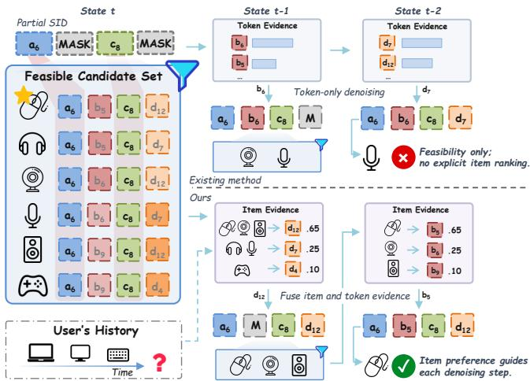  
Figure 1: Why item evidence must act during denoising. A partial SID defines a feasible candidate set that contracts with each token commitment. Top: token-only denoising follows locally plausible evidence but can eliminate the starred target, making it unreachable for later generation or reranking. Botom: EPIC uses the user’s recent interactions to compare feasible candidates and maps the resulting item posterior to unresolved SID positions, guiding token commitments while the target remains reachable. The star denotes the groundtruth item for illustration only.

Early SID recommenders generate these codes autoregressively, so each decision conditions only on the preceding codes and an early error constrains all subsequent predictions [15]. Recent maskeddifusion methods replace this fixed left-to-right process with iterative denoising: they learn to recover masked SID positions from bidirectional context and can resolve positions in a confidencedriven order, potentially several at once [10, 12, 16, 17]. These developments substantially improve how SID tokens are generated. However, they retain a token-level decision interface even though the recommended object is a complete catalog item.

Figure 1 illustrates the resulting gap. At any intermediate denoising step, the resolved SID positions restrict the catalog to a feasible candidate set: the complete items whose identifiers remain consistent with the current state. Feasibility alone does not indicate which candidate best matches the user’s preference. Token-level decoding determines how this set contracts through position-wise predictions, leaving competition among the feasible complete items implicit. This matters because every token commitment is simultaneously an item-level elimination decision. A locally plausible code can remove a promising item from the feasible set; once removed, that item is unreachable to subsequent denoising and cannot be recovered by post-hoc reranking over the generated candidates. Item-level evidence is therefore most useful while candidates still compete and remain reachable.

Motivated by this observation, we propose Explicit Posterior Item Conditioning (EPIC), which introduces explicit item-level competition into Semantic ID denoising. At each step, EPIC identifies the feasible item hypotheses and constructs a normalized item posterior over a retained candidate support using the current backbone context and the user’s recent interactions. It then marginalizes this posterior back to the unresolved SID positions and fuses the resulting item-level evidence with the backbone predictions, allowing preference over complete items to influence subsequent token decisions. As denoising proceeds, the feasible set and posterior are recomputed, so item-level evidence guides which hypotheses remain reachable throughout the generation trajectory.

Two components make this interaction efective. First, candidateconditioned transition evidence compares each candidate with the user’s recent complete items, allowing diferent hypotheses to receive support from diferent parts of the interaction history. Second, frontier-aware learning concentrates direct item-level supervision on states where multiple feasible candidates genuinely compete. The resulting module is lightweight and additive: the pretrained backbone remains frozen, and EPIC reuses its existing hidden states, token representations, and logits without requiring an additional backbone forward pass.

Experiments on four Amazon benchmarks show that EPIC consistently improves full-catalog next-item recommendation over strong baselines. Further analyses attribute the gains primarily to personalized transition evidence acting during denoising: it preserves promising candidates as the feasible set contracts, and it depends on the correct user’s recent interactions rather than a generic catalog-level signal.

In summary, our main contributions are as follows:

• We identify the token–item inference gap in masked SID diffusion: every partial SID induces a feasible set of completeitem hypotheses, yet their personalized competition remains implicit in token-level denoising.

• We propose EPIC, which constructs an explicit item posterior from candidate-conditioned transition evidence and feeds its item-level marginals back to unresolved SID positions, with frontier-aware learning focusing supervision on states where candidate competition is informative.

• We demonstrate consistent improvements on four Amazon benchmarks and show that personalized transition evidence is the primary source of the gains, acting by preserving promising candidates throughout denoising.

Our full implementation and reproducibility scripts are publicly available.1

## 2 Related Work

Semantic ID Generative Recommendation. Generative retrieval replaces the conventional score-and-index interface with sequence generation, where a model directly emits the identifier of a document or entity and constrained decoding ensures valid outputs [2, 20]. TIGER extends this paradigm to recommendation by assigning each item a semantic identifier through residual quantization ofcontent embeddings and autoregressively generating the next item’s identifier [15]. Subsequent work has explored SID construction from several directions. Vector-quantized text representations [13, 22] support transferable recommendation across domains [5]; learnable tokenizers incorporate collaborative signals and reduce codeassignment bias [24, 31]; contextual tokenization adapts identifiers to the interaction sequence [8]; and longer unordered identifiers trade collision reduction against decoding complexity [7]. Generative recommendation has also been demonstrated at industrial scale [28]. Despite these advances, the common interface remains token-based: preference over a complete item is induced through the generation of its constituent SID tokens rather than represented explicitly during generation.

Masked and Difusion Generative Recommendation. Discrete difusion replaces fixed left-to-right decoding with iterative denoising from a masked state [1], an approach recently extended to large language models [14]. A separate line applies continuous difusion to recommendation by denoising interaction representations or generating target item embeddings [25, 27]; these methods operate outside the SID generation setting considered here. For SIDs, LLaDA-Rec addresses the unidirectional context and error propagation of autoregressive decoding by learning a bidirectional model to recover masked target tokens [17]. DiffGRM similarly exploits bidirectional dependencies among codes that jointly identify an item [10], while MaskGR and MDGR further develop masked-token objectives with parallel or adaptive decoding [12, 16]. Related work also improves the history representation itself: masked history learning reconstructs historical items to capture a broader behavioral trajectory [26]. These methods substantially improve SID generation and condition their token predictors on user interaction histories. However, their training and inference remain primarily parameterized at the token level: supervision is applied to masked positions, and decoding proceeds from per-position vocabulary distributions. Consequently, competition among the complete items compatible with a partial identifier is not explicitly parameterized as a normalized item-level distribution during the denoising process.

Item-Level Modeling in Generative Recommendation. Recent studies have highlighted the limitations of relying solely on token-level generation for item ranking. SimGR shows theoretically and empirically that item-preference distributions induced from generated tokens can be incomplete or distorted, and therefore replaces identifier generation with direct item scoring [30]. Gryphon retains the generative interface but applies item-level rescoring after candidate identifiers have been generated [21]. Concurrently, ISD constructs a user-specific item ranking before generation and uses it to support autoregressive SID prefixes prior to beam pruning [23]. Another related line focuses on output validity, using trieor graph-constrained decoding to restrict generation to valid catalog identifiers [2, 7, 16]. These approaches difer from EPIC in when and how item-level information is introduced. SimGR bypasses SID generation, Gryphon applies item evidence after candidate generation, and ISD guides autoregressive decoding with a ranking fixed before generation. In contrast, EPIC operates on arbitrary non-prefix states arising during masked difusion, recomputes itemlevel evidence from the current partial SID and user history at each denoising step, and feeds this evidence back to unresolved positions before the next token commitment.

## 3 Preliminaries and Problem Formulation

Sequential recommendation. Let I denote the item catalog. For a user �, let $\mathcal { H } _ { u } = ( i _ { 1 } , \ldots , i _ { L } )$ be the chronologically ordered interaction history, where $i _ { \ell } \in \mathcal { I }$ . Sequential recommendation aims to rank the next item $i ^ { \star }$ given $\mathcal { H } _ { u }$

Semantic ID generative recommendation. Each catalog item $i \in \mathcal { I }$ is represented by an �-tuple of discrete codes,

$$
i \longleftrightarrow s _ { i } = ( s _ { i } ^ { 1 } , . . . , s _ { i } ^ { H } ) , \qquad s _ { i } ^ { h } \in \mathcal { V } ^ { h } ,\tag{1}
$$

obtained by quantizing an item representation [7, 15]. The mapping from items to tuples need not be injective: two items may collide under the fixed tokenizer. The catalog therefore induces the finite set of distinct complete tuples

$$
S _ { \mathcal { I } } = \{ \mathbf { s } _ { i } : i \in \mathcal { I } \} \subseteq \mathcal { V } ^ { 1 } \times \cdot \cdot \cdot \times \mathcal { V } ^ { H } .\tag{2}
$$

A generative recommender predicts $i ^ { \star }$ by generating $\mathbf { \delta } _ { \mathbf { s } _ { i } \star . \mathrm { ~ A ~ } }$ generated tuple identifies a unique item only when its catalog preimage is a singleton. Importantly, the valid catalog tuple forms only a small subset of the combinatorial product space.

## 3.1 Masked Semantic ID Generation

A masked-difusion recommender treats the target tuple as a sequence to be iteratively denoised. During training, a sampled subset of target positions is replaced with MASK, and the model learns to recover the original codes. At inference, generation starts from a fully masked target and progressively resolves positions over � denoising steps. At step �, the current target state is

$$
\mathbf { x } _ { t } = ( x _ { t } ^ { 1 } , \dots , x _ { t } ^ { H } ) .\tag{3}
$$

Let

$$
O _ { t } = \{ h : x _ { t } ^ { h } \neq \mathsf { M A S K } \} , \qquad M _ { t } = \{ 1 , \ldots , H \} \setminus O _ { t }\tag{4}
$$

denote its resolved and masked positions. Given $\mathbf { x } _ { t }$ and the user history, the masked backbone produces target hidden states $\mathbf { h } _ { t } ^ { h }$ and

token logits $\ell _ { t } ^ { h } .$ . The corresponding token distribution is

$$
p _ { \theta , t } ^ { h } ( v ) = \mathrm { s o f t m a x } ( \ell _ { t } ^ { h } ) _ { v } , \qquad h \in M _ { t } .\tag{5}
$$

The base decoder then uses these distributions to select both the codes and the positions to resolve, producing $\mathbf { x } _ { t - 1 }$ . We use a pretrained masked-difusion recommender as this token-level backbone and keep it frozen when learning our item-level module.

## 3.2 Partial States as Feasible Candidate Sets

Although the backbone predicts individual codes, every partial state already defines a set of complete item hypotheses. Intuitively, once some positions of the target tuple are resolved, only the catalog items whose SIDs agree with those positions can still be the final recommendation. Formally, we call

$$
C _ { t } = \left\{ i \in \mathcal { I } : s _ { i } ^ { h } = x _ { t } ^ { h } , \forall h \in O _ { t } \right\}\tag{6}
$$

the feasible candidate set. Feasibility here means only SID consistency; it does not imply personalized relevance. Because the catalog and SID table are fixed, $C _ { t }$ is obtained exactly by matching resolved positions against all catalog tuples. For masked difusion, $O _ { t }$ may be any subset of positions rather than a prefix.

The feasible candidate set is the item-hypothesis space induced by the current state. When $\left| C _ { t } \right| > 1$ , several items remain indistinguishable from the resolved codes; when $| C _ { t } | = 1$ , the item is already identified even if redundant codes remain masked. A fully resolved tuple can still have $| C _ { t } | > 1$ under a tokenizer collision.

## 3.3 The Token–Item Inference Gap

The token distributions in Equation (5) and the support in Equation (6) do not constitute a distribution over complete items:

$$
\begin{array} { r l r } { p _ { \theta , t } ^ { h } ( v ) } & { { } \neq } & { P ( i \mid \mathbf { x } _ { t } , \mathcal { H } _ { u } ) . } \end{array}\tag{7}
$$

The first quantity represents uncertainty at one SID position. The second must compare complete candidates, incorporate which candidate is a plausible continuation of this user’s behavior, and normalize that competition over the current item-hypothesis space. Further, support restriction only determines which candidates remain feasible; it does not distinguish their personalized preference. Our goal is therefore to construct an explicit, learned item posterior during denoising and to make that posterior actionable for the token-level generator.

## 4 Explicit Posterior Item Conditioning

## 4.1 Framework Overview

Figure 2 follows one denoising step. From the feasible candidate set $C _ { t }$ induced by the partial SID, EPIC retains at most � candidates, constructs complete-item and history representations, and scores each candidate using both the current backbone context and personalized transition evidence. The normalized item posterior is projected to SID codes and injected into the token logits before the ordinary transfer decision, and the updated partial state re-enters the same loop at the next step.

The design follows two principles. First, item-level reasoning is strictly additive: the backbone remains frozen, and every new component, namely the pairwise item encoder, the history path, the transition field, and the feedback gate, enters through a residual

Tran et al.

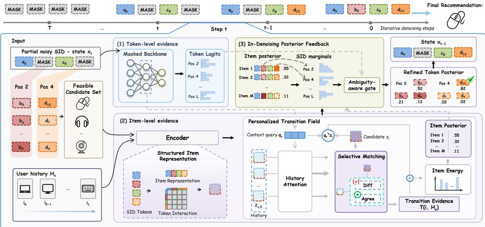  
Figure 2: EPIC within iterative SID denoising. At state $\mathbf { x } _ { t } ,$ , the frozen backbone provides token evidence, while the item-level branch encodes a retained support of feasible candidates and the user’s recent history. Personalized transition evidence yields an item posterior, which is marginalized to unresolved SID positions and fused with the backbone logits through an ambiguity aware gate. The refined token posterior produces $\mathbf { x } _ { t - 1 }$ , and the procedure repeats.

with a zero-initialized scale. The initial model therefore recovers backbone inference exactly and departs from it only to the extent that item evidence proves useful during training. Second, item evidence is exact where it matters: the feasible candidate set is computed exactly at every step, and direct item supervision is restricted to states where the posterior is normalized over the complete set rather than a truncation, as detailed in Section 4.2.4.

## 4.2 Item-Level Posterior Construction

4.2.1 Feasible candidates and retained support. Scoring the full catalog at every step is unnecessary because resolved SID positions already restrict the hypotheses to C�. We use the frozen backbone as a non-diferentiable proposal mechanism. For $i \in C _ { t }$

$$
B _ { t } ( i ) = \sum _ { h \in \mathcal { M } _ { t } } \log p _ { \theta , t } ^ { h } ( s _ { i } ^ { h } ) ,\tag{8}
$$

$$
S _ { t } = \mathrm { T o p M } _ { i \in C _ { t } } B _ { t } ( i ) , \qquad | S _ { t } | \leq M .\tag{9}
$$

We call $S _ { t }$ the retained candidate support; it equals $C _ { t }$ whenever $| C _ { t } | \leq M$ . Gradients do not pass through Equation (9). Thus, token likelihood determines which hypotheses are scored, but not their learned posterior ranking. This separation is deliberate: it prevents the same token evidence from being counted twice, once in proposal formation and again in the posterior energy, and Section 6.3 shows that folding token likelihood into the posterior is consistently harmful. Intuitively, token likelihood is a reliable instrument for pruning hypotheses but a poor one for ranking the survivors. The feasibility-only rung in the capability ladder uses the same $C _ { t }$ restriction but omits the learned item posterior and transition field.

4.2.2 Structured item and history representations. Candidates and historical items share an encoder over complete SIDs, so both sides of the later comparison live in one representation space. Reusing the frozen code embeddings also introduces no new item vocabulary: an item is represented purely through the codes the backbone already understands. Let $\mathbf { \bar { c } } _ { i } ^ { h } = \mathbf { w } ( s _ { i } ^ { h } ) + \mathbf { d } _ { h }$ combine the frozen code embedding with a learned position embedding, and let $\bar { \mathbf { z } } _ { i } = f _ { \mathrm { t u p l e } } ( [ \mathbf { c } _ { i } ^ { 1 } ; \ldots ; \mathbf { c } _ { i } ^ { H } ] )$ . Concatenation alone, however, does not represent interactions among SID heads, which describe complementary facets of the same item. With $\mathbf { u } _ { i } ^ { h } = W _ { p } \mathbf { c } _ { i } ^ { h }$ we therefore add

$$
\mathbf { m } _ { i } = \frac { \left( \sum _ { h } \mathbf { u } _ { i } ^ { h } \right) ^ { \odot 2 } - \sum _ { h } ( \mathbf { u } _ { i } ^ { h } ) ^ { \odot 2 } } { H ( H - 1 ) } ,\tag{10}
$$

$$
\begin{array} { r } { \mathbf { z } _ { i } = \mathrm { n o r m } \big ( \bar { \mathbf { z } } _ { i } + \mathrm { t a n h } ( \gamma _ { \flat } ) f _ { \flat } ( \mathbf { m } _ { i } ) \big ) . } \end{array}\tag{11}
$$

This computes the mean pairwise SID-head interaction in $O ( H )$ time. The same encoder maps the � most recent items to $\mathbf { Z } _ { u , 1 } , \ldots , \mathbf { Z } _ { u , K } ,$ ordered from newest to oldest. Items sharing a complete SID remain tied because EPIC adds no item-identity feature.

The backbone states supply the current denoising context, while a lightweight GRU summarizes the retained history window:

$$
{ \bf q } _ { t } = \mathrm { n o r m } \left[ f _ { q } \left( \frac { 1 } { H } \sum _ { h = 1 } ^ { H } { \bf h } _ { t } ^ { h } \right) + \operatorname { t a n h } ( \gamma _ { h } ) \mathrm { G R U } ( { \bf z } _ { u , K } , \dots , { \bf z } _ { u , 1 } ) \right] .\tag{12}
$$

The GRU consumes items chronologically from oldest to newest; $\mathbf { q } _ { t }$ is shared when scoring all candidates in $S _ { t }$

4.2.3 Personalized transition field and item posterior. As illustrated by the selective-matching block in Figure 2, history attention determines which recent interactions matter at the current state, while the candidate–history interaction determines how each candidate relates to them:

$$
\begin{array} { r } { a _ { t , r } = \operatorname { s o f t m a x } _ { r } \left( \mathbf { q } _ { t } ^ { \top } \mathbf { z } _ { u , r } / \tau _ { H } + b _ { r } \right) , } \end{array}\tag{13}
$$

$$
\phi ( i , r ) = f _ { \mathrm { t r a n s } } \big ( \big [ \mathbf { z } _ { i } \odot \mathbf { z } _ { u , r } ; | \mathbf { z } _ { i } - \mathbf { z } _ { u , r } | \big ] \big ) ,\tag{14}
$$

$$
T _ { t } ( i , \mathcal { H } _ { u } ) = \sum _ { r = 1 } ^ { K } a _ { t , r } \phi ( i , r ) .\tag{15}
$$

Here $b _ { r }$ is a learned recency bias for the �-th newest item, so the shape of the recency prior is estimated from data rather than imposed as a fixed temporal decay. Although $a _ { t , r }$ is shared across candidates, the agreement/diference features in $\phi ( i , r )$ make $T _ { t } ( i , \mathcal { H } _ { u } )$ candidate-specific: diferent hypotheses can draw support from diferent parts of the recent history, which a single pooled history representation cannot express.

We combine direct context relevance with transition evidence and normalize over complete candidates:

$$
E _ { t } ( i ) = \frac { \mathbf { q } _ { t } ^ { \top } \mathbf { z } _ { i } + \operatorname { t a n h } ( \gamma _ { T } ) T _ { t } ( i , \mathcal { H } _ { u } ) } { \kappa } ,\tag{16}
$$

$$
\pi _ { t } ( i ) = \frac { 1 [ i \in S _ { t } ] \exp { E _ { t } ( i ) } } { \sum _ { j \in S _ { t } } \exp { E _ { t } ( j ) } } .\tag{17}
$$

Thus $\pi _ { t }$ explicitly represents competition among complete items in the retained support and covers all feasible candidates when $| C _ { t } | \leq$ �. Here, posterior denotes the normalized learned distribution in Equation 17. Importantly, $B _ { t } ( i )$ forms $S _ { t }$ but is not added to $E _ { t } ( i ) ;$ the principal posterior is learned independently of token likelihood. Relaxing this separation yields the product-of-experts and cavity alternatives evaluated in the ablation study, and setting $\gamma _ { T } = 0$ gives the generic-posterior rung, while the full model includes transition memory.

4.2.4 Frontier-aware learning. Direct item supervision is most informative when several exact hypotheses compete. We therefore apply it only on the identification frontier $w _ { t } = 1 \big [ 2 \leq | C _ { t } | \leq M \big ]$ The lower bound removes singleton states, where the item is already determined and there is nothing to discriminate; the upper bound guarantees $S _ { t } = C _ { t }$ , so the supervised posterior is normalized over every feasible candidate rather than a truncated proposal set. At heavily masked states, however, insisting on the exact target is a noisy objective, since many candidates share most of the target’s SID structure. To retain this structure under heavy masking, let

$$
d _ { \mathrm { S I D } } ( i , i ^ { \star } ) = \frac { 1 } { H } \sum _ { h = 1 } ^ { H } \mathbf { 1 } \big [ s _ { i } ^ { h } \neq s _ { i ^ { \star } } ^ { h } \big ] ,\tag{18}
$$

$$
r _ { t } ( i \mid i ^ { \star } ) = \frac { \exp [ - d _ { \mathrm { S I D } } ( i , i ^ { \star } ) / \tau _ { S } ] } { \sum _ { j \in C _ { t } } \exp [ - d _ { \mathrm { S I D } } ( j , i ^ { \star } ) / \tau _ { S } ] } .\tag{19}
$$

With masked fraction $\rho _ { t } = | \mathcal { M } _ { t } | / H$ , the objectives are

$$
\mathcal { L } _ { \mathrm { i t e m } } = w _ { t } \left[ - \log \pi _ { t } ( i ^ { \star } ) + \eta \rho _ { t } \mathrm { C E } ( r _ { t } , \pi _ { t } ) \right] ,\tag{20}
$$

$$
\begin{array} { r } { \mathcal { L } = \mathcal { L } _ { \mathrm { t o k } } ( \widetilde { \ell } ) + \beta \mathcal { L } _ { \mathrm { i t e m } } . } \end{array}\tag{21}
$$

The $\rho _ { t }$ scaling makes the structured smoothing strongest when the target is most corrupted and lets it vanish as the SID resolves, so the objective anneals toward exact-item discrimination. The pairwise residual, transition term, frontier restriction, and SID kernel are separable components used in the removal study. Only the item level adapter is updated; the masked-difusion backbone receives no gradients.

## 4.3 In-Denoising Posterior Feedback

4.3.1 Item-to-token marginalization. For unresolved position ℎ and code $v \in \mathcal { V } ^ { h }$ , we project the same complete-item posterior to the SID vocabulary:

$$
{ \cal P } _ { I , t } ^ { h } ( v ) = \sum _ { i \in S _ { t } } \pi _ { t } ( i ) { \bf 1 } [ s _ { i } ^ { h } = v ] .\tag{22}
$$

This is the exact positional marginal of $\pi _ { t }$ . It preserves joint itemlevel competition across positions and assigns mass only to codes used by at least one retained complete item.

4.3.2 Ambiguity-aware residualfusion. A straightforward fusion would be a convex mixture of $\boldsymbol { p } _ { I , t } ^ { h }$ and $\boldsymbol { p } _ { \theta , t } ^ { h }$ . Yet, such a mixture constrains the feedback to be positive and combines two distributions whose calibration may difer. We instead express item guidance as a clipped log-probability residual,

$$
\Delta _ { t } ^ { h } ( v ) = \mathrm { c l i p } \left( \log [ p _ { I , t } ^ { h } ( v ) + \epsilon ] - \log [ p _ { \theta , t } ^ { h } ( v ) + \epsilon ] , - c , c \right) ,\tag{23}
$$

where $\epsilon > 0$ handles codes absent from the retained support. The gate uses the target state $\mathbf { h } _ { t } ^ { h }$ , normalized feasible-set size $A _ { t } \ =$ log max $\left( 1 , | C _ { t } | \right) / { \log | \bar { J } | }$ , normalized item-posterior entropy $\bar { H } ( \pi _ { t } )$ top-two posterior margin ��, masked fraction $\rho _ { t }$ , and normalized backbone-token entropy $\bar { H } ( \boldsymbol { p } _ { \theta , t } ^ { h } )$

$$
\begin{array} { r } { \mathbf { z } _ { t } ^ { h } = [ \mathbf { h } _ { t } ^ { h } ; A _ { t } ; \bar { H } ( \pi _ { t } ) ; m _ { t } ; \rho _ { t } ; \bar { H } ( \mathcal { p } _ { \theta , t } ^ { h } ) ] , } \end{array}
$$

$$
g _ { t } ^ { h } = \lambda _ { F } \operatorname { t a n h } f _ { g } ( \mathbf { z } _ { t } ^ { h } ) \mathbf { 1 } [ h \in \mathcal { M } _ { t } ] ,
$$

$$
\begin{array} { r } { \widetilde { \ell } _ { t } ^ { h } ( v ) = \ell _ { t } ^ { h } ( v ) + g _ { t } ^ { h } \Delta _ { t } ^ { h } ( v ) . } \end{array}\tag{24}
$$

(25)

We normalize the item- and token-level entropies as

$$
\begin{array} { r } { \bar { H } ( \pi _ { t } ) = \displaystyle \frac { H ( \pi _ { t } ) } { \log \operatorname* { m a x } \{ 2 , | S _ { t } | \} } , } \\ { \bar { H } ( \boldsymbol { \rho } _ { \theta , t } ^ { h } ) = \displaystyle \frac { H ( \boldsymbol { \rho } _ { \theta , t } ^ { h } ) } { \log | \mathcal { V } ^ { h } | } . } \end{array}
$$

Moreover, $m _ { t } = \pi _ { t } ^ { ( 1 ) } - \pi _ { t } ^ { ( 2 ) }$ when $| S _ { t } | \geq 2 ,$ and $m _ { t } = 1$ otherwise. The gate is position-specific and conditioned on both item- and token-level uncertainty because the reliability of item evidence changes throughout denoising: early states carry broad feasible sets and difuse posteriors, whereas late states may already be determined by the resolved codes. The signed gate can promote or suppress item evidence accordingly, and its zero-initialized final layer makes feedback an exact initial no-op.

Iterative inference and cost. The base transfer rule consumes softmax $( \widetilde { \ell } _ { t } ^ { h } )$ to produce $\mathbf { x } _ { t - 1 }$ , and applying the loop at every step yields a sequence of posteriors $\pi _ { T } , \ldots , \pi _ { 0 }$ over progressively contracting feasible sets. At each step, $C _ { t } , S _ { t }$ , and $\pi _ { t }$ are recomputed from the updated state; no posterior state is carried across denoising steps. Item evidence therefore changes the denoising trajectory itself, which separates EPIC from both post-hoc reranking and a recurrent latent-posterior model. Regarding cost, the exact feasiblecandidate scan costs $O ( | \mathcal { T } | H )$ , the candidate–history interaction costs �(���), and marginalization costs �(��) per step. All computations reuse the current backbone states and logits, requiring no additional backbone forward pass; an inverted SID index could replace the dense catalog scan at larger scale.

Table 1: Dataset statistics after preprocessing.
<table><tr><td></td><td>Beauty</td><td>Sports</td><td>Toys</td><td>Musical</td></tr><tr><td>Users</td><td>22,363</td><td>35,598</td><td>19,412</td><td>57,439</td></tr><tr><td>Items</td><td>12,101</td><td>18,357</td><td>11,924</td><td>24,587</td></tr><tr><td>Interactions</td><td>198,502</td><td>296,337</td><td>167,597</td><td>511,836</td></tr><tr><td>Mean sequence length</td><td>8.88</td><td>8.32</td><td>8.63</td><td>8.91</td></tr></table>

## 5 Experimental Setup

## 5.1 Datasets and Evaluation Protocol

We evaluate full-catalog next-item recommendation on four 5-core Amazon Review categories, which are used by prior SID recommenders [6, 15]. For each user, interactions are ordered chronologically. The final interaction is held out for testing, the penultimate interaction is used for validation, and all preceding interactions form the training sequence. Table 1 summarizes the resulting datasets.

## 5.2 Baselines and Metrics

We compare EPIC with 3 groups of baselines. The first group includes Item ID-based sequential recommenders, represented by BERT4Rec [18], S3-Rec [34] and HSTU [28]. The second group contains SID-based generative baselines, such as TIGER [15], Action-Piece [8] and RPG [7]. The third group consists ofmasked-difusion generative recommenders, including MaskGR [16], LLaDA-Rec [17] and DiffGRM [10]. Full baseline citations are given in Table 2. A † indicates a method for which at least one released implementation was executed locally. We retain a local result only when its data split, full-catalog ranking protocol, seen-item handling, and metric implementation match ours. All remaining baseline values are taken from the cited sources and marked with ‡.

We report full-catalog Recall@� and NDCG@� for $K \in \{ 5 , 1 0 \}$ under a unique-SID item-level protocol. For tokenizers that retain collisions and do not introduce item-specific disambiguation tokens, a predicted SID receives item-level credit only when it is catalog valid, has a singleton catalog preimage, and maps to the target item. Ambiguous SIDs receive no credit.

Results for EPIC are reported as mean±sample standard deviation over five independently trained runs, with checkpoints selected using validation NDCG@5 only. For each of the 16 dataset–metric combinations, we compare the per-user scores of EPIC with those of the corresponding second-best method using a two-sided paired �-test. All second-best methods were reproduced locally under the same evaluation protocol, enabling matched per-user comparisons. We apply Holm correction jointly across the 16 tests; all adjusted comparisons satisfy $p _ { \mathrm { a d j } } < 0 . 0 5$

## 5.3 Training and Inference Details

Following LLaDA-Rec [17], we use its pretrained Sentence-T5- based tokenizer [13], which maps each item to a four-position SID with 256 codes per position. The tokenizer and the resulting itemto-SID mapping remain fixed and are shared across all matched comparisons.

EPIC adopts the bidirectional Transformer and four-step transfer schedule of LLaDA-Rec. We freeze the backbone and optimize only the item-reasoning adapter. During inference, EPIC injects item-level evidence into each denoising step using the procedure described in Section 4. All matched interventions use the same tokenizer, backbone decoder, beam width, candidate budget, and completion rule.

We select the backbone depth, learning rate, candidate budget $M ,$ and recency window � using validation NDCG@5, searching over $L \in \{ 4 , 6 \} , l r \in \{ 1 0 ^ { - 3 } , 3 \times 1 0 ^ { - 3 } \} , M \in \{ 6 4 , 1 2 8 , 2 5 6 \}$ , and $K \in$ $\{ 2 , 4 , 8 \}$ . All remaining settings are shared across datasets: hidden dimension 256, four attention heads, four SID positions and transfer steps, AdamW with weight decay 0.01 and warmup ratio 0.05, batch size 512, at most 8,000 updates, posterior temperature $\kappa = 0 . 1$ and transition temperature $\tau = 0 . 2 5$ . Training uses early stopping according to validation NDCG@5. Eficiency measurements are conducted on one Tesla T4 using the same software stack and batch configuration for both methods.

## 6 Results and Analysis

We organize our evaluation around four research questions that separate overall efectiveness from the mechanism, source, and cost of EPIC’s gains:

RQ1. Overall efectiveness. Does EPIC improve full-catalog nextitem recommendation over conventional, Semantic ID generative, and masked-difusion baselines across datasets?

RQ2. In-denoising mechanism. Does item evidence improve recommendation by preserving promising target hypotheses during denoising, rather than merely reranking completed outputs?

RQ3. Source ofimprovement. Which model components and personalized history signals account for the gains, and how does the chosen item-posterior construction afect performance?

RQ4. Operating regimes and cost. Under what ambiguity and partial-resolution regimes is EPIC efective, and what parameter, training, and inference costs does its item-level reasoning introduce?

We address RQ1 in Section 6.1, RQ2 in Sections 6.2 and 6.5, RQ3 in Section 6.3, and RQ4 in Section 6.4.

## 6.1 Overall Performance

Table 2 summarizes full-catalog next-item recommendation performance on the four benchmarks. EPIC achieves the best mean in all 16 metric–dataset combinations. Relative to the second-best result in each column, its gains range from 1.2% to 16.8%. The largest improvements occur on ranking-sensitive metrics: 16.8% in NDCG@5 and 14.1% in NDCG@10 on Toys and Games, 13.1% in NDCG@10 on Beauty, and 12.9% in NDCG@10 on Sports and Outdoors. Even against strong locally reproduced competitors, EPIC remains consistently better.

The improvements are stable across independent training runs, with sample standard deviations of at most .0011 across all reported metrics. Moreover, every gain over the corresponding second-best method remains statistically significant under a two-sided paired �- test after Holm correction across all 16 dataset–metric comparisons $( p _ { \mathrm { a d j } } < 0 . 0 5 )$ . Together, these results indicate that explicit posterior item conditioning consistently improves both top-ranked accuracy and deeper-list recall.

Table 2: Full-catalog next-item recommendation. R@K and N@K denote Recall@K and NDCG@ $\mathbf { K } ;$ best and second-best results are bold and underlined.
<table><tr><td></td><td colspan="4">Sports and Outdoors</td><td colspan="4">Beauty</td><td colspan="4">Toys and Games</td><td colspan="4">Musical Instruments</td></tr><tr><td>Model</td><td>R@5</td><td>N@5</td><td>R@10</td><td>N@10</td><td>R@5</td><td>N@5 R@10</td><td>N@10</td><td>R@5</td><td></td><td>N@5</td><td>R@10</td><td>N@10</td><td>R@5</td><td>N@5</td><td>R@10</td><td>N@10</td></tr><tr><td colspan="10">Item ID-based Methods</td><td></td><td></td><td></td><td></td><td></td><td></td><td></td></tr><tr><td>Caser [19]</td><td>.0116</td><td>.0072</td><td>.0194</td><td>.0097</td><td>.0205</td><td>.0131</td><td>.0347</td><td>.0176</td><td>.0166</td><td>.0107</td><td>.0270</td><td>.0141</td><td>.0241</td><td>.0151</td><td>.0386</td><td>.0197</td></tr><tr><td>GRU4Rec [4]‡</td><td>.0129</td><td>.0086</td><td>.0204</td><td>.0110</td><td>.0164</td><td>.0099</td><td>.0283</td><td>.0137</td><td>.0097</td><td>.0059</td><td>.0176</td><td>.0084</td><td>.0324</td><td>.0209</td><td>.0501</td><td>.0266</td></tr><tr><td>HGN [11]</td><td>.0189</td><td>.0120</td><td>.0313</td><td>.0159</td><td>.0325</td><td>.0206</td><td>.0512</td><td>.0266</td><td>.0321</td><td>.0221</td><td>.0497</td><td>.0277</td><td>.0321</td><td>.0202</td><td>.0517</td><td>.0265</td></tr><tr><td>BERT4Rec [18]‡</td><td>.0115</td><td>.0075</td><td>.0191</td><td>.0099</td><td>.0203</td><td>.0124</td><td>.0347</td><td>.0170</td><td>.0116</td><td>.0071</td><td>.0203</td><td>.0099</td><td>.0307</td><td>.0195</td><td>.0485</td><td>.0252</td></tr><tr><td> $\mathrm { S A S R e c } [ 9 ] ^ { \frac { 1 } { 4 } }$ </td><td>.0233</td><td>.0154</td><td>.0350</td><td>.0192</td><td>.0387</td><td>.0249</td><td>.0605</td><td>.0318</td><td>.0463</td><td>.0306</td><td>.0675</td><td>.0374</td><td>.0333</td><td>.0213</td><td>.0523</td><td>.0274</td></tr><tr><td>HSTU [28]†</td><td>.0274</td><td>.0176</td><td>.0438</td><td>.0229</td><td>.0563</td><td>.0348</td><td>.0853</td><td>.0442</td><td>.0630</td><td>.0390</td><td>.0916</td><td>.0483</td><td>.0343</td><td>.0221</td><td>.0553</td><td>.0289</td></tr><tr><td>FDSA [29]</td><td>.0182</td><td>.0122</td><td>.0288</td><td>.0156</td><td>.0267</td><td>.0163</td><td>.0407</td><td>.0208</td><td>.0228</td><td>.0140</td><td>.0381</td><td>.0189</td><td>.0347</td><td>.0230</td><td>.0545</td><td>.0293</td></tr><tr><td> $\bar { \mathsf { S } } ^ { 3 } - \mathrm { R e c } \bar { \mathsf { [ 3 4 ] } } ^ { \ddag }$ </td><td>.0251</td><td>.0161</td><td>.0385</td><td>.0204 .0173</td><td>.0387</td><td>.0244</td><td>.0647</td><td>.0327</td><td>.0443</td><td>.0294</td><td>.0700</td><td>.0376</td><td>.0317</td><td>.0199</td><td>.0496</td><td>.0257</td></tr><tr><td>VQ-Rec [5]</td><td>.0208</td><td>.0144</td><td>.0300</td><td></td><td>.0457</td><td>.0317</td><td>.0664</td><td>.0383</td><td>.0497</td><td>.0346</td><td>.0737</td><td>.0423</td><td>.0361</td><td>.0231</td><td>.0578</td><td>.0301</td></tr><tr><td colspan="10">Semantic ID-based Generative Methods</td><td colspan="7"></td></tr><tr><td>TIGER [15]†</td><td>.0233</td><td>.0149</td><td>.0364</td><td>.0191</td><td>.0382</td><td>.0249</td><td>.0615</td><td>.0323</td><td>.0328</td><td>.0207</td><td>.0514</td><td>.0266</td><td>.0341</td><td>.0221</td><td>.0537</td><td>.0284</td></tr><tr><td>LETTER [24]‡</td><td>.0288</td><td>.0198</td><td>.0435</td><td>.0244</td><td>.0500</td><td>.0340</td><td>.0708</td><td>.0406</td><td>.0547</td><td>.0389</td><td>.0741</td><td>.0452</td><td>.0372</td><td>.0246</td><td>.0580</td><td>.0313</td></tr><tr><td>LC-Rec [31]</td><td>.0276</td><td>.0188</td><td>.0417</td><td>.0233</td><td>.0478</td><td>.0334</td><td>.0675</td><td>.0397</td><td>.0540</td><td>.0384</td><td>.0734</td><td>.0447</td><td>.0379</td><td>.0251</td><td>.0587</td><td>.0318</td></tr><tr><td>ActionPiece [8]†</td><td>.0330</td><td>.0224</td><td>.0500</td><td>.0264</td><td>.0553</td><td>.0379</td><td>.0775</td><td>.0424</td><td>.0559</td><td>.0398</td><td>.0760</td><td>.0463</td><td>.0383</td><td>.0243</td><td>.0615</td><td>.0318</td></tr><tr><td>RPG [7]†</td><td>.0304</td><td>.0211</td><td>.0441</td><td>.0255</td><td>.0533</td><td>.0368</td><td>.0788</td><td>.0450</td><td>.0574</td><td>.0390</td><td>.0859</td><td>.0481</td><td>.0191</td><td>.0132</td><td>.0272</td><td>.0158</td></tr><tr><td colspan="10">Diffusion-based Generative Methods</td><td colspan="7"></td></tr><tr><td>MaskGR [16]‡</td><td>.0302</td><td>.0191</td><td>.0454</td><td>.0249</td><td>.0538</td><td>.0351</td><td>.0815</td><td>.0441</td><td>.0548</td><td>.0375</td><td>.0846</td><td>.0445</td><td></td><td></td><td></td><td></td></tr><tr><td>LLaDA-Rec [17]†</td><td>.0287</td><td>.0186</td><td>.0441</td><td>.0235</td><td>.0525</td><td>.0359</td><td>.0770</td><td>.0438</td><td>.0484</td><td>.0328</td><td>.0718</td><td>.0403</td><td>.0405</td><td>.0265</td><td>.0630</td><td>.0337</td></tr><tr><td>DiffGRM [10]†</td><td>.0183</td><td>.0117</td><td>.0287</td><td>.0150</td><td>.0321</td><td>.0207</td><td>.0498</td><td>.0264</td><td>.0301</td><td>.0208</td><td>.0435</td><td>.0251</td><td>.0237</td><td>.0152</td><td>.0348</td><td>.0189</td></tr><tr><td>EPIC (Ours)</td><td>.0353* ±.0003</td><td>.0244* ±.0001</td><td>.0521* ±.0006</td><td>.0298* ±.0002</td><td>.0610* ±.0004</td><td>.0426 ±.0003</td><td>.0866* ±.0002</td><td>.0509* ±.0002</td><td>.0662* ±.0009</td><td>.0465* ±.0007</td><td>.0927* ±.0011</td><td>.0551* ±.0007</td><td>.0424 ±.0001</td><td>.0282 ±.0001</td><td>.0640* ±.0003</td><td>.0352* ±.0001</td></tr><tr><td>Gain vs. second-best</td><td>+7.0%</td><td>+8.9%</td><td>+4.2%</td><td>+12.9%</td><td>+8.3%</td><td>+12.4%</td><td>+1.5%</td><td>+13.1%</td><td>+5.1%</td><td>+16.8%</td><td>+1.2%</td><td>+14.1%</td><td>+4.7%</td><td>+6.4%</td><td>+1.6%</td><td>+4.5%</td></tr></table>

† denotes locally reproduced results, whereas ‡ denotes paper-reported results. Citations beside model names identify the original methods. The paper-reported cells were consolidated from the benchmark tables of MHL [26], UTGRec [32], Pctx [33], and LLaDA-Rec [17]. Section 5 details the evaluation protocol. A dash denotes an unavailable result. EPIC reports mean±sample standard deviation over five independent runs. The gain row gives the relative improvement of the EPIC mean over the second-best result in each column. ∗ marks a significant improvement over the corresponding second-best method under a two-sided paired �-test over users, with Holm correction jointly applied across all 16 dataset–metric comparisons $( \bar { p _ { \mathrm { a d j } } } < 0 . 0 5 )$

## 6.2 Does Item Evidence Preserve Hypotheses During Denoising?

Inline versus post-hoc evidence. Figure 3 compares when the same item evidence is introduced during inference, testing whether EPIC improves recommendation by altering the denoising trajectory and preserving target hypotheses rather than merely refining final scores. This matched intervention holds the trained scorer, checkpoint, decoder, beam width, and candidate budget fixed. Post-hoc inference applies the scorer only after token denoising has completed, whereas inline inference feeds the same evidence into every active denoising step. Inline inference improves NDCG@5 over its matched post-hoc counterpart by 15.7%, 26.6%, and 26.8% on Beauty, Sports, and Toys, respectively.

This gap cannot be closed by retuning the post-hoc scoring strength. Control and post-hoc beam signatures remain identical at every audited query-step state, and runtime audits confirm that no token-feedback calls occur in the post-hoc arms. The comparison therefore isolates whether item evidence changes the denoising trajectory, rather than whether a stronger final scorer is used.

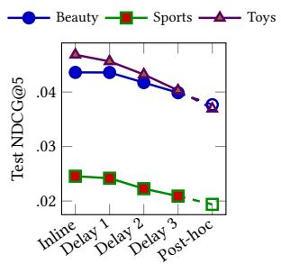  
(a) Later feedback lowers NDCG@5.

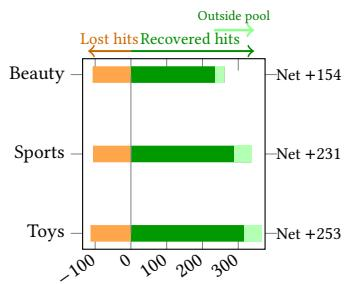  
(b) Inline feedback recovers more top-5 hits than it loses.  
Figure 3: Inline item evidence changes denoising. Delayed feedback lowers NDCG@5. Inline feedback recovers more top-5 targets than it loses; light segments identify recoveries absent from the final control pool.

The timing sweep further shows that the gain accumulates throughout denoising. Delaying feedback until step 2 reduces NDCG@5

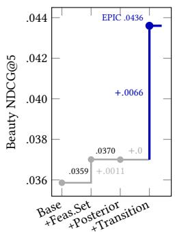

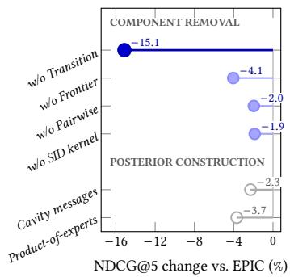  
(a) Personalized transitions (b) Item-posterior design ablations drive item-to-token feedback. on Beauty.

Figure 4: The capability progression and matched design ablations locate the gain: personalized transition dominates, while separated item scoring outperforms token-coupled posterior constructions.

by 4.3–9.3%, while restricting item evidence to conditional completion leads to an 8.6–14.9% reduction. Nevertheless, every intermediate timing remains better than pure post-hoc scoring, ruling out a single final scoring pass as the sole source of improvement.

Trajectory preservation and hard rescues. We examine how inline feedback changes the search trajectory by following the ground-truth target through each denoising state. A target counts toward trajectory Recall@128 if it remains compatible with at least one active beam and ranks among the top 128 items under the combined beam and conditional completion score. At the final state, inline inference retains more targets on every dataset, yielding net gains of 315/371/360 trajectory hits on Beauty/Sports/Toys.

Figure 3b decomposes the corresponding changes in top-5 accuracy. A recovered hit is a user for whom the control misses the target but inline inference ranks it in the top 5; a lost hit is the reverse. Inline inference recovers 261/337/366 hits while losing only 107/106/113, for net gains of 154/231/253 on Beauty/Sports/Toys. In 25/48/49 recovered cases, the target is absent from every final control beam and from the control top-128 pool. These outside-pool recoveries cannot be produced by a reranker restricted to the final control candidates. For the remaining recovered hits, the target is still accessible to the control, and the gain may reflect either better trajectory preservation or better ranking.

The outside-pool recoveries show that inline feedback acts before final ranking. In these cases, the target is absent from the final control candidate pool and therefore cannot be recovered by post-hoc reranking. Inline feedback instead changes the denoising trajectory, preserving the target as successive SID positions narrow the feasible candidate set.

## 6.3 What Drives the Improvement?

Capability ladder and component removals. We next separate gains due to catalog-valid decoding from gains due to explicit item reasoning. Figure 4a constructs this capability ladder under the same Beauty split and evaluation protocol. Feasible-candidateset fusion modestly improves the unmodified LLaDA-Rec decoder, but adding a generic item posterior without transition memory is neutral relative to this decode-matched control. The clear improvement appears only when the posterior is conditioned on the user’s transition history. This indicates that adding a catalog-level scoring head alone does not explain the observed gain.

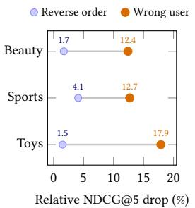  
(a) User identity matters more than temporal order.

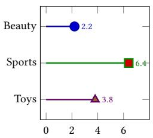  
NDCG@5 gain over uniform (%)  
(b) Learned weighting improves all three datasets.  
Figure 5: EPIC depends on user-specific history; learned position weights further improve history aggregation.

The component-removal group in Figure 4b leads to the same conclusion. Removing transition memory causes a 15.13% NDCG@5 drop and returns the model to the decode-control regime. Frontier supervision is the second-largest isolated component contribution (4.05%), while pairwise item structure and the SID kernel provide smaller but consistent gains.

Is the transition signal personalized? We determine whether transition memory captures user-specific evidence or merely a dataset-level popularity prior. Replacing a user’s history with another user’s history reduces NDCG@5 by 12.4–17.9% across the three datasets (Figure 5a). Reversing the correct history preserves its item set but destroys temporal order and yields a smaller, consistent 1.5–4.1% degradation. Thus, user identity explains most of the transition gain, while temporal order provides additional signal.

The transition module also benefits from learning which history positions to trust. At each dataset’s default history window, learned weighting improves over uniform aggregation by 2.2–6.4% (Figure 5b), with the largest gain on Sports. This intervention establishes that position-dependent weighting is useful.

Posterior construction. We examine whether the item posterior should be learned independently of the backbone’s token evidence or derived from it. In the principal model, token likelihood forms the candidate support and contributes at final fusion, but is not added to the posterior energy (Section 4.2.3). Two alternative constructions fold token evidence directly into the exponent: a product-of-experts prior that adds the token-induced tuple score of Equation (8) to �� (�), and leave-one-position-out cavity messages (Figure 4b). Both are consistently worse than the independently learned scorer on Beauty, by 3.7% and 2.3% validation NDCG@5, respectively.

These results support separating candidate-support construction from item-preference estimation. Backbone likelihood provides a tractable support for item inference and remains available at final fusion, whereas including it again in the item-posterior energy degrades validation ranking. This finding is consistent with prior evidence that sequence likelihood need not be calibrated for item elevance [21, 30]. Accordingly, Equation (9) treats preselection as a non-diferentiable support operation, and the posterior energy is learned without an additional token-score term. This prevents token likelihood from being reused as a second preference signal within the item posterior.

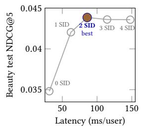  
(a) Two resolved SID positions give the best quality–latency operating point.

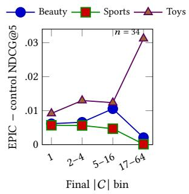  
(b) Gain is positive across feasible-set strata; the final Toys point is descriptive only.  
Figure 6: EPIC helps across ambiguity regimes, while partial SID resolution provides a favorable quality–latency operating point.

## 6.4 When Is EPIC Efective, and at What Cost?

Partial SID resolution and ambiguity. Figure 6a varies the number of SID positions explicitly resolved before catalog rank ing. Resolving two positions achieves the best Beauty NDCG@5 (.04385) and is 1.72× faster than resolving all four. The nearly flat quality from two to four positions suggests that a short partial SID is often suficient to identify the useful item-hypothesis region; it does not imply that every item is uniquely identified after two positions.

We also stratify gains by the size of the final feasible candidate set on the control trajectory (Figure 6b). EPIC improves every populated stratum, but ambiguity alone does not guarantee a large gain. Sports receives almost no benefit in its broadest feasible-set bin, while the largest Toys point contains only 34 users and is therefore descriptive. Positive gain at |C| = 1 reflects benefit accumulated at earlier states, before the final set became unique.

Parameter and compute cost. EPIC adds item-level reasoning through parameter-eficient adaptation. On the same Tesla T4, its adapter stage trains only 0.391M parameters, 94.3% fewer than full LLaDA-Rec fine-tuning, while improving adapter-training through put by 42.7% and reducing peak training memory by 55.9%. This comparison excludes the cost of pretraining the frozen backbone, which is shared by both inference systems. Candidate reasoning increases inference latency by 34.2%, from 93.0 to 124.8 ms/user, but leaves peak inference memory nearly unchanged. The resolved-SID result in Figure 6a further shows that this latency cost is control lable: resolving two SID positions attains the best observed quality while requiring less latency than the complete trajectory.

Table 3: Parameter and compute cost on one Tesla T4. Relative changes are measured against LLaDA-Rec.
<table><tr><td>Measurement</td><td>LLaDA-Rec</td><td>EPIC</td><td>Change</td></tr><tr><td>Training adaptation</td><td></td><td></td><td></td></tr><tr><td>Trainable parameters (M)</td><td>6.847</td><td>0.391</td><td>-94.3%</td></tr><tr><td>Throughput (ex/s)</td><td>333.8</td><td>476.3</td><td>+42.7%</td></tr><tr><td>Peak memory (MiB)</td><td>4299.6</td><td>1895.4</td><td>-55.9%</td></tr><tr><td>Inference</td><td></td><td></td><td></td></tr><tr><td>Latency (ms/user)</td><td>93.0</td><td>124.8</td><td>+34.2%</td></tr><tr><td>Peak memory (MiB)</td><td>3359.8</td><td>3361.3</td><td>+0.04%</td></tr></table>

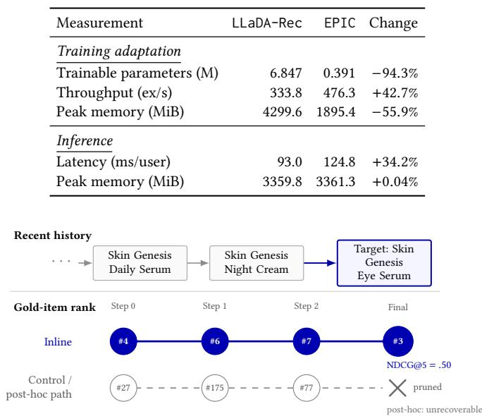  
Figure 7: An audited hard rescue on Beauty. For the first hard rescue in deterministic test order, inline feedback preserves the target through denoising and ranks it third. The control path prunes the target from every final beam, leaving no candidate for post-hoc scoring to recover.

## 6.5 Case Study: A Hard Rescue

We conclude the analysis with an audited test instance that illustrates the trajectory-preservation mechanism identified above in Figure 7. To avoid selecting an example based on semantic appearance, we use the first Beauty hard rescue in deterministic test order. Its two most recent interactions are a Skin Genesis daily serum and night cream, while the target is an eye serum from the same product line. This history makes the relevant transition interpretable without requiring product images or additional metadata.

The quantitative trajectory shows why timing matters. Under control denoising, the target moves from ranks 27 to 175 and 77 before being pruned from every final beam. Pure post-hoc scoring follows this same trajectory and therefore has no surviving target candidate to recover. With inline item feedback, the target remains available at every state, following ranks 4, 6, and 7 before finishing at rank 3, for an NDCG@5 of .50. This example provides a concrete instance of the elimination mechanism quantified by the aggregate hard-rescue analysis.

## 7 Conclusion

Semantic ID difusion improves how identifier tokens are generated, but recommendation ultimately requires selecting a complete catalog item. This mismatch creates a token–item inference gap: locally plausible token decisions may prematurely eliminate the preferred item before its item-level evidence is considered. EPIC addresses this gap by explicitly reasoning over the feasible candidates represented by each partial SID. At every denoising step, it compares these candidates using user-specific item evidence and projects the resulting posterior back into token generation, allowing promising items to influence decoding while they remain reachable rather than only reranking the final survivors.

Across four Amazon benchmarks, EPIC improves all 16 dataset– metric combinations, demonstrating consistent benefits across different catalog domains and ranking cutofs. Matched inline–posthoc comparisons further show that applying item evidence during denoising is substantially more efective than using the same scorer only after generation. Together with history-perturbation analyses, these results attribute the gains primarily to user-specific transition evidence guiding intermediate decoding decisions, rather than to a generic change in candidate scoring. Future work could replace the current exact catalog scan with approximate candidate construction, adapt the candidate budget across denoising steps, and extend item inference to distinguish catalog items sharing the same SID.

## Ethical Considerations

This work uses publicly available, de-identified Amazon review benchmarks and involves neither new data collection nor humansubject intervention. Nevertheless, historical interactions and item metadata may encode popularity, exposure, demographic, and rep resentation biases. If deployed, these biases could be amplified through repeated recommendation and feedback loops, potentially disadvantaging long-tail items or underrepresented user groups. The method should therefore be evaluated beyond ranking accuracy, including subgroup performance, catalog exposure, diversity, and robustness to sparse interaction histories. Interaction logs should be collected with appropriate consent, minimized, securely stored, and protected against re-identification. Sensitive attributes should not be used for personalization without a clear, justified, and lawful purpose. Finally, real-world deployment would require ongoing bias auditing, user controls, and mechanisms for identifying and correcting harmful recommendations.

## References

[1] Jacob Austin, Daniel D. Johnson, Jonathan Ho, Daniel Tarlow, and Rianne van den Berg. 2021. Structured Denoising Difusion Models in Discrete State-Spaces. In Advances in Neural Information Processing Systems.

[2] Nicola De Cao, Gautier Izacard, Sebastian Riedel, and Fabio Petroni. 2021. Autoregressive Entity Retrieval. In Proceedings ofthe International Conference on Learning Representations.

[3] Shijie Geng, Shuchang Liu, Zuohui Fu, Yingqiang Ge, and Yongfeng Zhang. 2022. Recommendation as Language Processing (RLP): A Unified Pretrain, Personalized Prompt & Predict Paradigm (P5). In Proceedings ofthe 16th ACM Conference on Recommender Systems.

[4] Balázs Hidasi, Alexandros Karatzoglou, Linas Baltrunas, and Domonkos Tikk. 2016. Session-based Recommendations with Recurrent Neural Networks. In Proceedings ofthe International Conference on Learning Representations.

[5] Yupeng Hou, Zhankui He, Julian McAuley, and Wayne Xin Zhao. 2023. Learning Vector-Quantized Item Representation for Transferable Sequential Recom menders. In Proceedings ofthe ACM Web Conference 2023.

[6] Yupeng Hou, Jiacheng Li, Xiangjun Fu, Zhankui He, An Yan, Xiusi Chen, and Julian McAuley. 2026. Bridging Language and Items for Retrieval and Recommendation: Benchmarking LLMs as Semantic Encoders. In Proceedings ofthe 64th Annual Meeting of the Association for Computational Linguistics (Volume 1: Long Papers).

[7] Yupeng Hou, Jiacheng Li, Ashley Shin, Jinsung Jeon, Abhishek Santhanam, Wei Shao, Kaveh Hassani, Ning Yao, and Julian McAuley. 2025. Generating Long Semantic IDs in Parallel for Recommendation. In Proceedings ofthe 31st ACM SIGKDD Conference on Knowledge Discovery and Data Mining V.2.

[8] Yupeng Hou, Jianmo Ni, Zhankui He, Noveen Sachdeva, Wang-Cheng Kang, Ed H. Chi, Julian McAuley, and Derek Zhiyuan Cheng. 2025. ActionPiece: Contextually Tokenizing Action Sequences for Generative Recommendation. In Proceedings of the 42nd International Conference on Machine Learning.

[9] Wang-Cheng Kang and Julian McAuley. 2018. Self-Attentive Sequential Recommendation. In 2018 IEEE International Conference on Data Mining.

[10] Zhao Liu, Yichen Zhu, Yiqing Yang, Xiao Lv, Guoping Tang, Rui Huang, Qiang Luo, Ruiming Tang, Kun Gai, and Guorui Zhou. 2026. DifGRM: Difusion-based Generative Recommendation Model. In Proceedings ofthe ACM Web Conference 2026.

[11] Chen Ma, Peng Kang, and Xue Liu. 2019. Hierarchical Gating Networks for Sequential Recommendation. In Proceedings ofthe 25th ACM SIGKDD International Conference on Knowledge Discovery and Data Mining

[12] Lingyu Mu, Hao Deng, Haibo Xing, Jinxin Hu, Yu Zhang, Xiaoyi Zeng, and Jing Zhang. 2026. Masked Difusion Generative Recommendation. arXiv preprint arXiv:2601.19501 (2026).

[13] Jianmo Ni, Gustavo Hernandez Abrego, Noah Constant, Ji Ma, Keith B. Hall, Daniel Cer, and Yinfei Yang. 2022. Sentence-T5: Scalable Sentence Encoders from Pre-trained Text-to-Text Models. In Findings ofthe Association for Computational Linguistics: ACL 2022.

[14] Shen Nie, Fengqi Zhu, Zebin You, Xiaolu Zhang, Jingyang Ou, Jun Hu, Jun Zhou, Yankai Lin, Ji-Rong Wen, and Chongxuan Li. 2025. Large Language Difusion Models. In Advances in Neural Information Processing Systems.

[15] Shashank Rajput, Nikhil Mehta, Anima Singh, Raghunandan H. Keshavan, Trung Vu, Lukasz Heldt, Lichan Hong, Yi Tay, Vinh Q. Tran, Jonah Samost, Maciej Kula, Ed H. Chi, and Maheswaran Sathiamoorthy. 2023. Recommender Systems with Generative Retrieval. In Advances in Neural Information Processing Systems.

[16] Kulin Shah, Bhuvesh Kumar, Neil Shah, and Liam Collins. 2025. Masked Difusion for Generative Recommendation. arXiv preprint arXiv:2511.23021 (2025).

[17] Teng Shi, Chenglei Shen, Weijie Yu, Shen Nie, Chongxuan Li, Xiao Zhang, Ming He, Yan Han, and Jun Xu. 2025. LLaDA-Rec: Discrete Difusion for Parallel Semantic ID Generation in Generative Recommendation. arXiv preprint arXiv:2511.06254 (2025).

[18] Fei Sun, Jun Liu, Jian Wu, Changhua Pei, Xiao Lin, Wenwu Ou, and Peng Jiang. 2019. BERT4Rec: Sequential Recommendation with Bidirectional Encoder Representations from Transformer. In Proceedings ofthe 28th ACM International Conference on Information and Knowledge Management.

[19] Jiaxi Tang and Ke Wang. 2018. Personalized Top-N Sequential Recommendation via Convolutional Sequence Embedding. In Proceedings of the Eleventh ACM International Conference on Web Search and Data Mining.

[20] Yi Tay, Vinh Q. Tran, Mostafa Dehghani, Jianmo Ni, Dara Bahri, Harsh Mehta, Zhen Qin, Kai Hui, Zhe Zhao, Jai Gupta, Tal Schuster, William W. Cohen, and Donald Metzler. 2022. Transformer Memory as a Diferentiable Search Index. In Advances in Neural Information Processing Systems.

[21] Daria Tikhonovich, Oleg Sorokin, Vladislav Dodonov, Mariia Ulianova, and Ilya Murzin. 2026. Gryphon: A Unified Architecture for Semantic-ID Generation and Item-Level Scoring in Industrial Recommendations. arXiv preprint arXiv:2606.08604 (2026).

[22] Aäron van den Oord, Oriol Vinyals, and Koray Kavukcuoglu. 2017. Neural Discrete Representation Learning. In Advances in Neural Information Processing Systems.

[23] Junting Wang, Xinrui He, Yunzhe Li, and Hari Sundaram. 2026. Understand ing Semantic IDs: From Item Representation to Item Selection in Generative Recommendation. arXiv preprint arXiv:2607.24995 (2026).

[24] Wenjie Wang, Honghui Bao, Xinyu Lin, Jizhi Zhang, Yongqi Li, Fuli Feng, See-Kiong Ng, and Tat-Seng Chua. 2024. Learnable Item Tokenization for Generative Recommendation. In Proceedings ofthe 33rd ACM International Conference on Information and Knowledge Management.

[25] Wenjie Wang, Yiyan Xu, Fuli Feng, Xinyu Lin, Xiangnan He, and Tat-Seng Chua. 2023. Difusion Recommender Model. In Proceedings ofthe 46th International ACM SIGIR Conference on Research and Development in Information Retrieval.

[26] Kaiwen Wei, Kejun He, Xiaomian Kang, Jie Zhang, Yuming Yang, Li Jin, Zhenyang Li, Jiang Zhong, He Bai, and Junnan Zhu. 2026. From Past To Path: Masked History Learning for Next-Item Prediction in Generative Recommendation. In Proceedings of the 64th Annual Meeting of the Association for Computational Linguistics (Volume 1: Long Papers).

[27] Zhengyi Yang, Jiancan Wu, Zhicai Wang, Xiang Wang, Yancheng Yuan, and Xiangnan He. 2023. Generate What You Prefer: Reshaping Sequential Recom mendation via Guided Difusion. In Advances in Neural Information Processing Systems.

[28] Jiaqi Zhai, Lucy Liao, Xing Liu, Yueming Wang, Rui Li, Xuan Cao, Leon Gao, Zhaojie Gong, Fangda Gu, Jiayuan He, Yinghai Lu, and Yu Shi. 2024. Actions Speak Louder than Words: Trillion-Parameter Sequential Transducers for Gener ative Recommendations. In Proceedings ofthe 41st International Conference on Machine Learning.

[29] Tingting Zhang, Pengpeng Zhao, Yanchi Liu, Victor S. Sheng, Jiajie Xu, Deqing Wang, Guanfeng Liu, and Xiaofang Zhou. 2019. Feature-level Deeper Self Attention Network for Sequential Recommendation. In Proceedings of the Twenty-Eighth International Joint Conference on Artificial Intelligence.

[30] Yuanbo Zhao, Ruochen Liu, Senzhang Wang, Jun Yin, Yuxin Dong, Huan Gong, Hao Chen, Shirui Pan, and Chengqi Zhang. 2026. SimGR: Escaping the Pitfalls of Generative Decoding in LLM-based Recommendation. arXiv preprint arXiv:2602.07847 (2026).

[31] Bowen Zheng, Yupeng Hou, Hongyu Lu, Yu Chen, Wayne Xin Zhao, Ming Chen, and Ji-Rong Wen. 2024. Adapting Large Language Models by Integrating Collaborative Semantics for Recommendation. In 2024 IEEE 40th International Conference on Data Engineering.

[32] Bowen Zheng, Hongyu Lu, Yu Chen, Wayne Xin Zhao, and Ji-Rong Wen. 2026. Universal Item Tokenization for Transferable Generative Recommendation. In Proceedings of the 49th International ACM SIGIR Conference on Research and Development in Information Retrieval.

[33] Qiyong Zhong, Jiajie Su, Yunshan Ma, Julian McAuley, and Yupeng Hou. 2025. Pctx: Tokenizing Personalized Context for Generative Recommendation. arXiv preprint arXiv:2510.21276 (2025).

[34] Kun Zhou, Hui Wang, Wayne Xin Zhao, Yutao Zhu, Sirui Wang, Fuzheng Zhang, Zhongyuan Wang, and Ji-Rong Wen. 2020. S3-Rec: Self-Supervised Learning for Sequential Recommendation with Mutual Information Maximization. In Proceedings ofthe 29th ACM International Conference on Information and Knowledge Management.