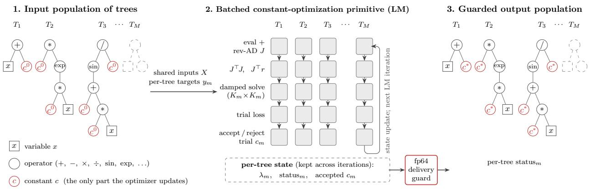
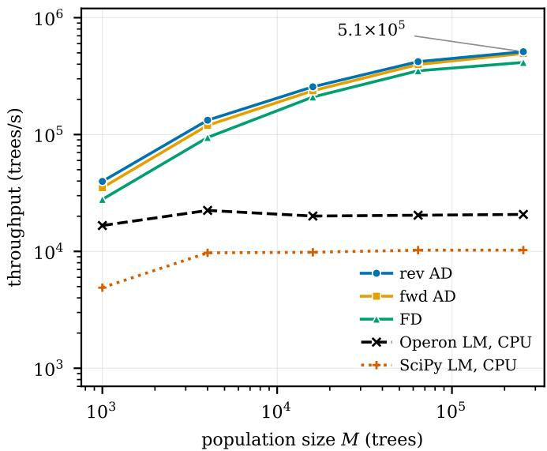

# Efficient Constant Optimization for Symbolic Regression with GPU-Accelerated Tree-Based Genetic Programming

Hao Mao∗ Xu T. Liu†‡ Shuai Lu§ Peng Zhao¶ Wenzheng Jiang∥ Yuntian Chen∗∗

∗The Hong Kong Polytechnic University, Hong Kong SAR, China †University of Washington, USA

‡Amazon Web Services, USA §Jiangxi University of Finance and Economics, China ¶EEO Education Technology, China ∥Chongqing Medical University, China ∗∗Eastern Institute of Technology, Ningbo, China

Abstract—Constant optimization refines the numerical coefficients of candidate expressions in tree-based genetic programming for symbolic regression. But its per-generation cost has led modern GPU-accelerated frameworks to omit it or restrict it to lightweight forms. We present a GPU-resident, batched Levenberg–Marquardt solver that optimizes constants across a structurally heterogeneous population of expression trees using a fixed number of population-wide CUDA launches per iteration. Reverse-mode automatic differentiation assembles the per-tree Jacobian in one backward sweep, making the dominant periteration cost independent of the number of constants per tree, and a double-precision delivery guard guarantees that returned constants are never worse than their initial values. On earlygeneration populations, the solver sustains up to 5.1 105 trees per second on an NVIDIA A100; at a GPU-saturated benchmark configuration it delivers roughly 9.9 the throughput of Operon running on a 64-core EPYC 7763, while matching fp64-reference quality. Integrated in-process into EvoGP, the solver enables end-to-end search to recover governing equations on 10 of 18 constructed problems versus 0 for stock EvoGP. Our code is at https://github.com/TensorConv/CuSR.

## I. INTRODUCTION

Symbolic regression (SR) discovers closed-form expressions from data by jointly searching over both the structure and the numerical parameters of candidate models. The dominant approach is tree-based genetic programming (TGP), which evolves a population of expression trees through fitness-based selection and genetic operators such as subtree crossover and mutation. However, genetic operators modify tree topology and are ineffective at fine-tuning real-valued constants; consequently, a structurally correct expression may receive poor fitness because its numerical coefficients are suboptimal. Constant optimization (CO) addresses this by solving, for each fixed tree, a continuous nonlinear least-squares subproblem via local optimization, typically Levenberg–Marquardt (LM).

The tension between the benefit of CO and its computational cost is reflected in the design of modern SR systems. PySR, a Julia-based framework on CPU, applies BFGS optimization with a restricted iteration budget per generation to control overhead [1]. Operon, a high-performance C++ library, integrates LM constant optimization but operates within CPUbound throughput constraints [2]. EvoGP, a GPU-based TGP framework, achieves population-level parallelism through tensorized tree representations and GPU-resident evolutionary operators, yielding substantial gains in evaluation throughput [3]. Critically, however, EvoGP does not natively support constant optimization, leaving a gap between its structural search and the precision needed to recover governing equations with inner constants: coefficients that sit inside a nonlinear function.

Closing this gap is not a straightforward port of existing CPU solvers. In a GPU-resident evolutionary loop, off-GPU constant optimization would incur repeated host–device data transfers that negate the throughput advantage of GPU acceleration. The workload is further complicated by structural heterogeneity: different expression trees contain different numbers of constants and may require different numbers of optimization iterations, which is incompatible with the uniform batched execution model that GPU architectures demand.

In this paper, we address these challenges by designing a GPU-resident, batched LM solver purpose-built for the heterogeneous CO workload in TGP-based symbolic regression, and integrating it directly into EvoGP so that constant optimization runs entirely on the GPU within each generation. Our method co-designs the optimization kernels with the tree evaluation pipeline. A reverse-mode automatic differentiation pass builds the per-tree Jacobian in a single backward sweep. The LM loop executes as a fixed number of population-wide CUDA kernel launches per iteration, and a double-precision delivery guard certifies that the resulting constants are never worse than their initial values. In end-to-end searches on problems constructed to require nonlinear inner-constant fitting, EvoGP with in-loop constant optimization recovers the true governing equations that stock EvoGP does not. To the best of our knowledge, this is the first work to bring batched, secondorder constant optimization fully onto the GPU for tree-based symbolic regression. Below are our main contributions.

1) We present a GPU-resident batched second-order LM primitive that optimizes the constants of a structurally heterogeneous population in a fixed number of population-wide CUDA launches per iteration; reversemode automatic differentiation keeps the dominant periteration cost independent of per-tree constant count, and a double-precision delivery guard certifies that constants are never worse than their initial values (Section III).

2) We integrate this primitive in-process into EvoGP, eliminating per-generation subprocess launches and CUDAcontext rebuilds so that constant optimization runs inside the search loop; applying it every fifth generation is statistically indistinguishable from applying it every generation (Sections III-E and IV-E).

3) We build a controlled benchmark for constant optimization (heterogeneous populations calibrated to real GP runs, with known near-optimal targets, solved identically on CPU and GPU), and on constructed inner-constant problems we show that the in-loop GPU solver recovers governing equations that structural evolution alone does not (Sections IV-B and IV-E).

## II. BACKGROUND AND RELATED WORKS

We introduce the notation used throughout and review prior work on tree-based genetic programming, constant optimization, and computational methods for symbolic regression.

## A. Tree-Based GP and Constant Optimization

The dataset for symbolic regression is denoted as $\mathcal { D } =$ $\{ ( \mathbf { x } _ { i } , y _ { i } ) \} _ { i = 1 } ^ { N }$ , where $\mathbf { x } _ { i } \in \mathbb { R } ^ { d }$ is the input vector, $y _ { i } \in \mathbb { R }$ is the target value, N is the number of samples, and d is the number of input variables. An expression is represented by a tree $T ,$ where internal nodes are functions or operators and leaf nodes are variables or constants. The function set is denoted as ${ \mathcal { F } } ,$ the terminal set is denoted as $\tau$ , and the set of real-valued constants in T is denoted as $\mathbf { c } _ { T } \in \mathbb { R } ^ { K _ { T } }$ , where $K _ { T }$ is the number of constants in the tree.

For a given tree T, the expression evaluated on an input vector x is written as $f _ { T } ( \mathbf { x } ; \mathbf { c } _ { T } )$ . The symbolic regression objective considered in this paper is to find both a tree structure and its constants by minimizing the prediction loss:

$$
\operatorname* { m i n } _ { T , \mathbf { c } _ { T } } \mathcal { L } ( T , \mathbf { c } _ { T } ) = \frac { 1 } { N } \sum _ { i = 1 } ^ { N } \left( f _ { T } ( \mathbf { x } _ { i } ; \mathbf { c } _ { T } ) - y _ { i } \right) ^ { 2 } .\tag{1}
$$

The structure $T$ is discrete and changes through genetic programming operators, while $\mathbf { c } _ { T }$ is continuous and can be refined by numerical optimization. In a population-based algorithm, the population at generation $g$ is denoted as $\mathcal { P } ^ { ( g ) } =$ $\mathsf { \bar { f } } T _ { 1 } ^ { ( g ) } , T _ { 2 } ^ { ( g ) } , \dots , T _ { M } ^ { ( g ) } \}$ , where M is the population size.

Tree-based genetic programming (TGP) is a common representation for symbolic regression. Each individual in the population is an expression tree [4], [5]. During evolution, individuals are selected according to fitness, and new individuals are generated by genetic operators such as subtree crossover, subtree mutation, point mutation, and reproduction. Since a tree directly corresponds to a mathematical expression, TGP can search over flexible nonlinear structures and produce readable analytic forms.

Compared with regression methods that assume a fixed model family, TGP searches over model structure and model size. This flexibility makes it suitable for scientific discovery and interpretable machine learning, where the expression is expected to be compact and meaningful rather than only accurate [4], [6]. Closely related is the data-driven discovery of governing differential equations, where symbolic and evolutionary methods search over equation structure while fitting its coefficients [7]–[9]. However, TGP also faces two computational difficulties. First, fitness evaluation is expensive because each candidate expression must be evaluated on all training samples. Second, evolutionary operators mainly change tree structure and are not efficient local optimizers for real-valued constants. Therefore, a structurally promising tree may receive a poor fitness value if its constants are inaccurate [5], [10].

To address this issue, constant optimization is often introduced into GP-based symbolic regression. For a fixed tree structure T, constant optimization solves:

$$
\mathbf { c } _ { T } ^ { * } = \underset { \mathbf { c } _ { T } } { \arg \operatorname* { m i n } } \frac { 1 } { N } \sum _ { i = 1 } ^ { N } \left( f _ { T } ( \mathbf { x } _ { i } ; \mathbf { c } _ { T } ) - y _ { i } \right) ^ { 2 } .\tag{2}
$$

Previous studies have shown that numerical optimization methods, such as nonlinear least-squares optimization and evolutionary strategies, can improve fitted expressions and provide a more informative fitness signal for selection [10]–[12]. At the same time, constant optimization is not a trivial add-on. Applying local optimization to every individual can introduce overhead, especially when trees have different structures and constant counts [11]; it is also often ill-conditioned [13].

## B. Computational Approaches to Symbolic Regression

Traditional symbolic regression systems are implemented on CPUs. CPU-based implementations provide flexible control flow and can use mature numerical optimization libraries, making them suitable for evaluating expression trees and applying individual-specific constant optimization [1], [2]. However, evaluating a population over many training samples remains computationally expensive, even when multithreading or vectorized execution is used [14], [15].

The main cost of TGP-based symbolic regression comes from evaluating expression trees over many samples. This pattern provides parallelism, making GPU acceleration attractive. GPU-based GP and symbolic regression systems accelerate program evaluation and population-level fitness computation through CUDA-style parallel execution or GPUresident workflows [3], [16]–[19]. These systems show that high performance depends not only on the GPU, but also on data layouts and evaluation kernels that reduce irregular memory access and avoid CPU–GPU synchronization [20].

Most GPU-accelerated TGP systems focus on structural evolution and fast fitness evaluation [3], [19]. Constant optimization is a different workload: calling a local optimizer per expression, as CPU systems do, fits the GPU poorly, since trees carry different numbers of constants and repeated host–device transfer erodes the benefit of GPU acceleration. Constant optimization for GPU-based TGP therefore needs a batched, population-compatible design.

The most related GPU-based symbolic regression system is Kozax [21], a JAX-based genetic-programming framework that supports numerical constant fitting. However, its constant optimization is an optional, first-order component. In contrast, this paper focuses on constant optimization itself. We design a GPU-compatible second-order constant-optimization kernel that refines constants for heterogeneous expression trees while preserving the throughput advantage of GPU-accelerated treebased genetic programming.

## III. BATCHED CONSTANT OPTIMIZATION FOR HETEROGENEOUS TREES

This section develops a GPU-resident, batched LM primitive that fits constants for an entire population of trees at once. We motivate the design first, then build it up from its contract to its deployment inside EvoGP.

## A. Motivation

EvoGP touches constants only through random initialization and mutation. A tree with the right structure can still lose: unfit constants keep its loss high, and selection discards it for a bloated approximation, not the true formula. Fitting constants is solved for one tree. It is not solved for a population, every generation. Our goal is to make constant optimization a batched GPU primitive, cheap enough to run for every tree in every generation of the search.

## B. Proposed Constant-Optimization Workflow

Here is our proposed constant-optimization workflow, as illustrated in Fig. 1. We treat the population, not the single tree, as the unit of constant optimization input: one call to a GPU-resident primitive fits the constants of all M trees. In Fig. 1, the primitive takes a population of M expression trees $T _ { 1 } , \dots , T _ { M } ,$ , a per-tree vector of initial constants $\mathbf { c } _ { m } ^ { 0 } \in \mathbb { R } ^ { K _ { m } }$ where $m \in \{ 1 , \ldots , M \}$ and $K _ { m }$ is the constant count of $T _ { m } ,$ and a per-tree target $\mathbf { y } _ { m }$ over a shared set of N input points X. The population shares only these input points X, not initial constants or target ${ \bf y } _ { m }$ . Once the solve is underway, each tree also converges at its own pace.

Each call to the primitive runs in three stages. It first encodes the trees into a structure-of-arrays batch layout: per-node and per-tree fields are kept in separate, contiguous arrays across the whole population. Second, a batched LM loop advances all trees together: each iteration builds the Jacobian of every tree, solves its damped normal equations, accepts or rejects its trial step. Third, before returning, a double-precision delivery guard re-evaluates the loss of every tree. The output is the fitted constants and a per-tree status: converged, failed, or capped at the iteration limit. It also has one guarantee: evaluated in double precision (fp64), every tree’s delivered constants are never worse than its initial ones. Any tree whose fit ends worse or non-finite is rolled back to its initial values. Trees without constants $( K _ { m } = 0 )$ pass through untouched, and the tree structure itself is never modified, only its constants.

## C. GPU-Batched Levenberg–Marquardt

We present the GPU-batched LM loop as Algorithm 1. The constant values live outside the tree structure: the whole population’s constants sit in one flat vector, addressed by a pertree offset plus a within-tree index. The solver updates only this vector; the structure arrays are uploaded once and never rewritten. Each tree in the batch is a four-field record: node offset, node count, constant offset, and constant count $K _ { m } .$

Algorithm 1: GPU-batched Levenberg–Marquardt   
In : node/const. buffers; $\mathbf { c } _ { m } ^ { 0 } ; X , \{ \mathbf { y } _ { m } \} ;$ λ0; tmax   
Out: constants $\mathbf { c } _ { m }$ and status $\mathbf { \Omega } _ { n } , m \in \{ 1 , \ldots , M \}$   
1 $\mathbf { c } _ { m } \gets \mathbf { c } _ { m } ^ { 0 } ; \lambda _ { m } \gets \lambda _ { 0 } ;$ status $_ m \gets$ active $( K _ { m } { = } 0 ;$ skip);   
2 $\ell _ { m } ^ { \star } \gets \log ( \mathbf { c } _ { m } ) ;$ // batched eval; fills ${ \bf r } _ { m }$   
3 for $t \gets 1$ to $t _ { \mathrm { m a x } }$ do // outer loop on host   
4 if no tree is active then break;   
5 parallel for active tree $m \in \{ 1 , \ldots , M \}$ do   
6 parallel for data row $i \in \{ 1 , \ldots , N \}$ do   
7 $J _ { m } [ i , 1 ; K _ { m } ] \gets$   
BUILDJACOBIANROW $\bigl ( T _ { m } , \mathbf { c } _ { m } , \mathbf { x } _ { i } \bigr ) ;$   
8 parallel for active tree m do   
9 $A _ { m } \gets J _ { m } ^ { \top } J _ { m } ; ~ \mathbf { g } _ { m } \gets J _ { m } ^ { \top } \mathbf { r } _ { m } ; ~ / /$ reduce over   
rows   
10 parallel for active tree m do   
11 solve $\bigl ( A _ { m } + \lambda _ { m } \mathrm { d i a g } A _ { m } \bigr ) \delta _ { m } = - \mathbf { g } _ { m } ;$   
// Cholesky; non-PD fail   
12 parallel for active tree m do   
13 parallel for data row i do   
14 $\begin{array} { r l } { \mathbf { \bar { \Pi } } | } & { { } e _ { m , i } \gets f _ { T _ { m } } ( \mathbf { x } _ { i } ; \mathbf { c } _ { m } + \pmb { \delta } _ { m } ) - y _ { i } } \end{array}$   
15 $\begin{array} { r } { \ell _ { m } \gets \frac { 1 } { 2 } \sum _ { i } e _ { m , i } ^ { 2 } ; } \end{array}$ // reduce   
16 foreach active tree m do // host code   
17 if $\ell _ { m } \leq \ell _ { m } ^ { \star }$ then   
18 $| ~ \mathbf { c } _ { m } \gets \mathbf { c } _ { m } + \delta _ { m } ; ~ \boldsymbol { \ell } _ { m } ^ { \star } \gets \boldsymbol { \ell } _ { m } ; ~ \lambda _ { m } \gets 0 . 1 \lambda _ { m } ;$   
19 else   
20 $\lambda _ { m } \gets 1 0 \lambda _ { m } ;$   
21 statu $\mathrm { ~ s ~ } _ { m } \gets$ converged / failed / active;   
22 parallel for active tree m do   
23 refresh $\mathbf { r } _ { m } ;$   
24 return $\mathbf { c } _ { m } ,$ statusm

Trees of any shape are just different ranges inside the same arrays, and this is what lets a heterogeneous population share one batched launch. In the tree-walking stages (evaluation and Jacobian construction), one warp serves one tree and its 32 lanes split the N data rows; the small per-tree solve runs as one thread per tree. Each tree allows at most 32 constants, a 64-deep operand stack, and a 128-node tape for reverse-mode automatic differentiation (AD), all compile-time limits that a rebuild can raise. The solver reads only this buffer format and does not care which engine produced the trees; adding a new source needs only a thin host-side converter into this layout.

Each LM iteration builds every tree’s Jacobian $J _ { m } \in$ $\mathbb { R } ^ { N \times K _ { m } }$ of the residual ${ \bf r } _ { m } = f _ { T _ { m } } ( X ; { \bf c } _ { m } ) - { \bf y } _ { m }$ at Line $^ { 7 , }$ one row per data point and one column per constant, then solves the damped normal equations at Line 11 and accepts or rejects the trial step at Line 17. How each row of $J _ { m }$ is built decides how the build cost scales with the tree’s constant count $K _ { m }$ . We build it in three ways, compared in Table I: finite differences (FD), AD in forward mode (fwd AD) and reverse mode (rev AD). Rev AD is backpropagation over the expression tree and matches the shape of the problem: one scalar residual out, $K _ { m }$ constants in. One taped forward walk plus one backward walk delivers the whole row at a cost independent of $K _ { m } ,$ the cheap-gradient property of reverse mode [22]. The tape records at most two local partials per node in per-lane scratch. The backward multiply uses a zero guard: the product is taken as zero when either factor is exactly zero, preventing a $0 \times \infty$ at a singular point from producing a NaN that poisons the whole column. This independence from $K _ { m }$ applies only to the Jacobian construction. Under all three modes, forming $J _ { m } ^ { \top } J _ { m }$ costs $O ( K _ { m } ^ { 2 } N )$ , and the pertree Cholesky factorization costs $O ( K _ { m } ^ { 3 } )$ . One LM iteration requires eight population-wide launches under all three modes, independent of M and of the trees’ $K _ { m }$ . The Jacobian, residuals, and normal-equation matrices remain on the GPU; each iteration, the host exchanges only small per-tree state, and nothing that scales with N crosses the bus.

  
Fig. 1. The batched constant-optimization primitive. Left: a population of M heterogeneous expression trees, each with its own initial constants $\mathbf { c } _ { m } ^ { 0 }$ (red). Middle: a batched Levenberg–Marquardt loop advances all trees together. Right: a double-precision delivery guard runs before the fitted constants and per-tree status are returned.

TABLE I  
JACOBIAN CONSTRUCTION MODES. WALKS ARE PER DATA ROW; BUILD COST IS PER TREE PER LM ITERATION.
<table><tr><td>mode</td><td>row construction</td><td>walks/row</td><td>build cost</td><td>per-lane extra</td></tr><tr><td>FD</td><td>perturb one constant, re-walk</td><td> $K _ { m }$ </td><td> $O ( K _ { m } N n _ { m } )$ </td><td>128 B</td></tr><tr><td></td><td>fwd AD 8 tangents/walk</td><td> $\lceil K _ { m } / 8 \rceil$ </td><td> $O ( \lceil K _ { m } / 8 \rceil N n _ { m } )$ </td><td>2.0 KB</td></tr><tr><td></td><td>rev AD taped fwd + bwd sweep</td><td>2</td><td> $O ( N n _ { m } )$ </td><td>1.25 KB</td></tr></table>

## D. Double-Precision Delivery Guard

To retain the speed of the single-precision LM loop while protecting solution quality, we add a double-precision delivery guard. The numerical hot path runs in single precision (fp32), compiled under $\mathtt { \mathrm { ~ \mathtt ~ { ~ \_ - u s e \_ f a s t \_ m a t h } : } }$ ; trading numerical precision for throughput is common practice in high-performance GPU kernels [23]. Near singularities, the reciprocal and square-root approximations of the fast-math can yield a residual that is finite but wrong. This error can fool the accept/reject decision: a step that looks like an improvement in single precision but turns out worse in double precision. Classical treatments of optimization under inexact arithmetic adjust the evaluation precision across iterations [24], [25]. We only need to certify the final result, not every iteration. We therefore perform the check at the delivery boundary. After the loop ends, every tree’s loss is recomputed in double precision at both the delivered constants and the initial ones. Any tree whose delivered loss is non-finite or worse than its initial loss is rolled back to $\mathbf { c } _ { m } ^ { 0 } .$ , its reported status and loss corrected to match. This check costs two double-precision evaluations per tree, done once after the loop, not every iteration. In double precision, delivered constants are never worse than initial ones, but the inner solve itself still runs in single precision.

## E. EvoGP Integration

We integrate our CO implementation into EvoGP. Stock EvoGP samples constants from a fixed table or a bounded range but offers no mechanism for fitting them to the data; continuous inner constants — a frequency inside a sine, a decay rate inside an exponential — are therefore difficult to recover by sampling alone. Our integration closes this gap: before selection evaluates fitness, every candidate tree’s constants are fit to the data by our solver. The solver is loaded in-process by the EvoGP engine. Each generation, the constants from every tree are handed to the solver in one batched fit, and the returned values are written back; any tree whose fit does not improve keeps its inherited constants. The fit need not run every generation — invoking it every few generations preserves recovery quality at a fraction of the cost. Section IV-E quantifies the end-to-end improvement.

## IV. EXPERIMENTAL EVALUATION

## A. Experimental Setup

Hardware Platform All GPU measurements use one NVIDIA A100-SXM4-80GB (compute capability 8.0, 80 GB HBM2e) hosted in a shared dual-socket AMD EPYC 7763 server (2×64 cores). The GPU is held exclusively during each run, with its SM clock locked at 1410 MHz via nvidia-smi -lgc and ECC enabled. CPU baselines run as 64 worker processes pinned to the 64 physical cores of one socket; spanning both sockets measured 38% lower Operon throughput under cross-NUMA memory-bandwidth contention.

Software Environment Kernels are built with CUDA 12.4. Library versions: Python 3.12, NumPy 2.1.3, SciPy 1.17.1 [26], [27], and pyoperon 0.6.1 (Operon rev. 5a1c937, single-precision release build) [28]; the end-to-end integration study additionally uses PyTorch 2.11 and EvoGP 0.1.0 [29]. All GPU kernels are compiled with --use\_fast\_math; the fast-math safety implications are addressed by the doubleprecision delivery guard described in Section III-D.

Measurement Methodology Kernel time is measured ondevice with CUDA events around the optimization loop itself, excluding the one-time ∼280 ms binary start-up (context creation and population load). Every configuration runs with three population seeds and three timed repetitions each, and we report medians. Headline throughput is quoted only from the occupancy-saturated regime (loop time $\geq 1 4 5 ~ \mathrm { m s } )$ , where the median-of-repetitions throughput under locked clocks is reproducible within 0.5%. No quality number in this section relies on the solver’s own reporting: the constants delivered by every run are re-scored independently in fp64 on the host.

## B. Workload and Compared Implementations

We evaluate the constant-optimization step under controlled conditions. Its workload is driven primarily by the population statistics, specifically its tree shapes, depths, and constant counts, rather than by the target equation alone. Standard benchmark equations often contain only a few outer coefficients and therefore do not represent the many inner constants that arise during evolutionary search. Each benchmark therefore uses a synthetic population whose distribution of tree shapes, depths, and constant counts is calibrated to snapshots from real EvoGP runs.

We consider three workload regimes: early-generation populations of compact trees, late-generation populations dominated by bloat, and populations with many inner constants (per-tree constant counts average 1.2–6.9 and never exceed 14). Targets are also synthetic: each tree’s output at reference constants with 1% Gaussian noise added. This yields a known near-global optimum for every instance, enabling direct assessment of solution quality and identical problem setups on CPU and GPU for fair throughput comparisons. Populations range from $1 0 ^ { 3 }$ to $2 . 5 6 \times 1 0 ^ { 5 }$ trees, with 100 to 10,000 data points per tree. All methods receive the same trees, data, and initial constants.

We compare three implementations of the same secondorder method: our solver (run with each of its three Jacobian modes), Operon as the throughput baseline, and SciPy’s least\_squares in lm mode as a double-precision quality reference and additional CPU baseline. All three implement LM updates from the same MINPACK family. Both Operon and our solver construct the Jacobian via reverse mode. The comparison therefore isolates execution strategy: CPU methods optimize one tree per worker, whereas our solver advances the entire population with a fixed number of population-wide launches per iteration. We omit PySR for the same reason: it optimizes constants with BFGS, not LM, so including it would change the optimizer along with the execution strategy.

## C. Overall Throughput and Scaling Results

Throughput is reported as optimized trees per second (trees/s), i.e., population size divided by optimization-loop wall time. Fig. 2 shows the population-size scaling by sweeping M with a fixed $N { = } 1 0 0$ on the early-generation workload; the same GPU scaling trend is observed across the remaining workload regimes. Throughput climbs from 39,717 trees/s at $M { = } 1 0 ^ { 3 }$ to 511,308 trees/s at $M = 2 5 6 , 0 0 0 .$ , a 12.9× rise; growth slows with M, and the curve is still rising at the largest population measured. This scaling is the payoff of populationwide batching: the fixed cost of a launch does not depend on how many trees it covers, so a small population leaves the device undersubscribed and the fixed cost dominates, while a large population amortizes it.

  
Fig. 2. Constant-optimization throughput versus population size M at $N { = } 1 0 0$ (early-generation workload): the three Jacobian modes and the Operon and SciPy CPU baselines. Axes are logarithmic.

All three Jacobian modes exhibit the same scaling trend, and the early-generation workload is representative rather than easy: across the three structural regimes a population spans, peak throughput ranges from $2 . 8 \times 1 0 ^ { 5 }$ trees/s on the constantheavy regime to $6 . 1 \times 1 0 ^ { 5 }$ on late-generation bloat.

Beyond population size, throughput also depends on the number of data points per tree. As N grows from 100 to $1 0 ^ { 4 }$ at $M { = } 1 6 { , } 0 0 0$ , per-tree work rises 100× while tree throughput falls only about $2 1 \times$ (from 256,246 to 12,340 trees/s); the point rate meanwhile rises from $2 . 6 \times 1 0 ^ { 7 }$ to $1 . 2 \times 1 0 ^ { 8 }$ points/s and has not leveled off, so larger N keeps the device fuller even as fewer trees finish per second.

Across the measured grid of three workloads, five population sizes, and three data-point counts, rev AD is the fastest overall: its median advantage is 1.51× over FD and 1.11× over fwd AD. Cell by cell, the reverse-to-forward throughput ratio ranges from 0.95 to 1.43: fwd AD wins narrowly where constants are few, and rev AD pulls ahead as $K _ { m }$ grows, as the walk counts of Table I predict. So, rev AD is the default.

## D. Bottleneck Explanation and In-Loop Cost

The optimization loop is neither compute-bound nor bandwidth-bound. Across the Jacobian and evaluation kernels, Nsight Compute speed-of-light profiles show FMA-pipe utilization at or below 15% (11% for the Jacobian kernel) and DRAM utilization below 23% and mostly under 10%. An instruction-roofline view places the kernels between 24% and 55% of the device’s instruction-issue ceiling, and the dominant stall reasons are dependency waits and memorylatency scoreboard stalls. The loop is therefore bound by instruction issue and on-chip latency: its work consists of many short dependent walks over irregular trees, not dense arithmetic. Population-wide batching supplies the throughput here: it keeps enough independent trees in flight to hide the per-lane latency of these dependent walks.

In stage-level timing, building the Jacobian is the largest stage under FD, 27–60% of loop time (peaking at $M { = } 1 6 { , } 0 0 0$ $N { = } 1 , 0 0 0 )$ ; rev AD holds the same stage to 12–28%, consistent with the walk counts of the two modes. Normal-equation assembly accounts for 6–15% of the loop time, and the pertree Cholesky factorization only 2–5%. The per-iteration host round trip (constants up; step and status down) takes $5 \mathrm { - } 1 1 \%$ of the loop at $N { = } 1 { , } 0 0 0$ and 11–29% at $N { = } 1 0 0$ , part of the fixed cost that dominates the small-N end.

The compact, unpadded layout is the loop’s other lever, echoing how memory-efficient data layouts govern throughput in other GPU kernels [20]. Fixed-shape GPU frameworks pad every tree to a run-level node cap; padding to our 128-node cap runs the solver 4.45× slower on the early-generation workload at $M { = } 1 6 { , } 0 0 0$ $N { = } 1 { , } 0 0 0$ , on identical inputs through the same binary, returning bit-identical results, so the difference is layout alone. EvoGP’s tighter configured length (64 nodes) pays less but cannot escape the tax: the gap between a worstcase cap and populations that here average 12–28 nodes. Within our cap a growing tree is a longer range, while a fixedlength layout must re-pad the whole population and cannot represent trees that outgrow its cap at all.

## E. Quality, Throughput, and In-Loop Integration

We measure quality on a fixed population of 1,000 EvoGP trees, solved independently by the three GPU Jacobian modes and by SciPy’s fp64 using the same data and initial constants. The GPU modes produce similar rankings: Spearman correlations are 0.959 between rev AD and FD and 0.995 between the two AD modes, with 95.5% overlap in their top-10% sets. Jacobian mode is therefore primarily a throughput choice. Compared with the SciPy reference, 86.6–93.8% of converged trees fall within 1.05× of the reference loss (Table II). Since evolutionary selection depends mainly on fitness ranks, these small deviations are unlikely to materially affect which highfitness trees survive. Table II also reports Operon’s results for reference. Operon converges in a median of five iterations and improves 45% of the trees. On this near-optimal synthetic fixture, the loss-down metric mainly reflects stopping behavior near the fp32 precision floor rather than solver quality.

Having established comparable solution quality, we compare throughput at a representative saturated configuration. On the early-generation workload with M=16,000 and N=1,000, one A100 delivers 98,154 trees/s compared with 9,959 trees/s for Operon on one EPYC 7763 socket and 5,310 trees/s for the SciPy reference, corresponding to speedups of about 9.9× and 18×. The advantage over Operon depends on the number of data points per tree: at fixed $M { = } 1 6 { , } 0 0 0$ , it narrows from $1 2 . 8 \times$ at $N { = } 1 0 0$ to $2 . 7 \times \textbf { a }$ t $N { = } 1 0 ^ { 4 }$ . This narrowing does not indicate reduced GPU efficiency: over the same range, our point-evaluation throughput rises from 25.6 to 123.4 million points/s. Instead, Operon benefits more from amortizing fixed per-tree overheads as N increases.

TABLE II  
SHARE OF TREES WHOSE DELIVERED LOSS LANDS WITHIN THE STATEDFACTOR OF THE SCIPY FP64 REFERENCE, AMONG TREES WHERE BOTHSOLVERS CONVERGE; LOSS DOWN: SHARE OF TREES WITH CONSTANTSWHOSE DELIVERED LOSS IMPROVES ON THE INITIAL VALUE.
<table><tr><td></td><td colspan="3">within factor of reference</td><td></td></tr><tr><td>mode</td><td>1.05×</td><td>2×</td><td>10×</td><td>loss down</td></tr><tr><td>FD</td><td>93.8%</td><td>95.7%</td><td>99.7%</td><td>94.0%</td></tr><tr><td>fwd AD</td><td>86.6%</td><td>90.0%</td><td>100.0%</td><td>93.3%</td></tr><tr><td>rev AD</td><td>86.6%</td><td>90.0%</td><td>100.0%</td><td>93.3%</td></tr><tr><td>Operon</td><td>73.9%</td><td>75.0%</td><td>75.9%</td><td>45.0%</td></tr></table>

The results so far establish standalone quality and throughput. We integrate the GPU LM solver directly into EvoGP without changing the search. We construct 18 test problems whose true equations each place a constant inside a nonlinear function. We judge recovery by symbolic equivalence to the true equation rather than $\dot { R } ^ { 2 }$ , which reflects only numerical closeness of fit, not whether the structure is recovered. Stock EvoGP can reach $R ^ { 2 } > 0 . 9 9 9$ with bloated expressions that do not recover the real equation. With constant optimization, the same search recovers 10 of the 18 problems; without it, none (exact McNemar test over problems, $\scriptstyle p = 2 . 0 \times 1 0 ^ { - 3 } )$ . The cost of this step can be amortized further: constant optimization need not run every generation, and applying it every fifth generation recovers almost as many equations as every generation (p=0.73). This section implements the simplest in-process integration; jointly optimizing cadence with the evolutionary search remains future work.

## V. CONCLUSION

We presented a GPU-resident, batched Levenberg– Marquardt solver that makes constant optimization practical inside GPU-accelerated tree-based genetic programming. On early-generation populations, the solver sustains up to $5 . 1 \times 1 0 ^ { 5 }$ trees/s on an A100; at a saturated reference cell it delivers about 9.9× the throughput of Operon on a 64-core EPYC 7763, matching fp64-reference quality. Integrated in-process into EvoGP, the search recovers the governing equations on 10 of 18 inner-constant problems; stock EvoGP recovers none. These results remove a key CPU-side bottleneck in GPU-accelerated tree-based genetic programming, enabling structure search and nonlinear constant fitting to execute together on GPU.

## ACKNOWLEDGMENT

This work was partially supported by the National Natural Science Foundation of China under Grant No. 12572266. The authors gratefully acknowledge the support provided for this research. This work is not related to Xu T. Liu’s position at Amazon.

## REFERENCES

[1] M. Cranmer, “Interpretable machine learning for science with PySR and SymbolicRegression.jl,” arXiv:2305.01582, 2023.

[2] B. Burlacu, G. Kronberger, and M. Kommenda, “Operon C++: An efficient genetic programming framework for symbolic regression,” in Proceedings of the 2020 Genetic and Evolutionary Computation Conference Companion. ACM, 2020, pp. 1562–1570.

[3] Z. Wu, L. Wang, K. Sun, Z. Li, and R. Cheng, “Enabling populationlevel parallelism in tree-based genetic programming for GPU acceleration,” IEEE Transactions on Evolutionary Computation, 2026.

[4] N. Makke and S. Chawla, “Interpretable scientific discovery with symbolic regression: A review,” Artificial Intelligence Review, vol. 57, 2024, Art. no. 2.

[5] P. Orzechowski, W. La Cava, and J. H. Moore, “Where are we now? A large benchmark study of recent symbolic regression methods,” in Proceedings of the Genetic and Evolutionary Computation Conference. ACM, 2018, pp. 1183–1190.

[6] S.-M. Udrescu and M. Tegmark, “AI Feynman: A physics-inspired method for symbolic regression,” Science Advances, vol. 6, no. 16, p. eaay2631, 2020.

[7] Y. Chen, Y. Luo, Q. Liu, H. Xu, and D. Zhang, “Symbolic genetic algorithm for discovering open-form partial differential equations (SGA-PDE),” Physical Review Research, vol. 4, no. 2, p. 023174, 2022.

[8] H. Xu, H. Chang, and D. Zhang, “DLGA-PDE: Discovery of PDEs with incomplete candidate library via combination of deep learning and genetic algorithm,” Journal of Computational Physics, vol. 418, p. 109584, 2020.

[9] S. Lou, H. Xu, W. Wang, L. Lu, H. Sun, Y. Liu, L. Zhang, D. Zhang, and Y. Chen, “Data-driven discovery of governing differential equations across physical systems,” arXiv:2606.09638, 2026.

[10] M. Kommenda, G. Kronberger, S. Winkler, M. Affenzeller, and S. Wagner, “Effects of constant optimization by nonlinear least squares minimization in symbolic regression,” in Proceedings of the 15th Annual Conference Companion on Genetic and Evolutionary Computation. ACM, 2013, pp. 1121–1128.

[11] M. Kommenda, B. Burlacu, G. Kronberger, and M. Affenzeller, “Parameter identification for symbolic regression using nonlinear least squares,” Genetic Programming and Evolvable Machines, vol. 21, pp. 471–501, 2020.

[12] C. L. Alonso, J. L. Montana, and C. E. Borges, “Evolution strategies˜ for constants optimization in genetic programming,” in 2009 21st IEEE International Conference on Tools with Artificial Intelligence. IEEE, 2009, pp. 703–707.

[13] G. Kronberger, “Local optimization often is ill-conditioned in genetic programming for symbolic regression,” in 2022 24th International Symposium on Symbolic and Numeric Algorithms for Scientific Computing. IEEE, 2022, pp. 304–310.

[14] D. M. Chitty, “Fast parallel genetic programming: Multi-core CPU versus many-core GPU,” Soft Computing, vol. 16, no. 10, pp. 1795– 1814, 2012.

[15] F. Baeta, J. Correia, T. Martins, and P. Machado, “Speed benchmarking of genetic programming frameworks,” in Proceedings of the Genetic and Evolutionary Computation Conference. ACM, 2021, pp. 768–775.

[16] W. B. Langdon, “A many threaded CUDA interpreter for genetic programming,” in Genetic Programming, ser. Lecture Notes in Computer Science, vol. 6021. Springer, 2010, pp. 146–158.

[17] ——, “Graphics processing units and genetic programming: An overview,” Soft Computing, vol. 15, no. 8, pp. 1657–1669, 2011.

[18] F. Baeta, J. Correia, T. Martins, and P. Machado, “TensorGP: Genetic programming engine in TensorFlow,” in Applications of Evolutionary Computation, ser. Lecture Notes in Computer Science, vol. 12694. Springer, 2021, pp. 763–778.

[19] R. Zhang, A. Lensen, and Y. Sun, “Speeding up genetic programming based symbolic regression using GPUs,” in PRICAI 2022: Trends in Artificial Intelligence, ser. Lecture Notes in Computer Science, vol. 13629. Springer, 2022, pp. 519–533.

[20] S. Lu, J. Chu, L. Guo, and X. T. Liu, “Im2win: An efficient convolution paradigm on GPU,” in Euro-Par 2023: Parallel Processing, ser. Lecture Notes in Computer Science, vol. 14100. Springer, 2023, pp. 592–607.

[21] S. de Vries, S. W. Keemink, and M. A. J. van Gerven, “Kozax: Flexible and scalable genetic programming in JAX,” in Proceedings of the Genetic and Evolutionary Computation Conference Companion. ACM, 2025, pp. 603–606.

[22] A. Griewank and A. Walther, Evaluating Derivatives, 2nd ed. Society for Industrial and Applied Mathematics, 2008.

[23] X. Fu, J. Ma, X. Zhang, P. Zhao, S. Lu, and X. T. Liu, “Enabling memory-efficient Im2win convolution with multi-precision support on GPU CUDA and tensor cores,” arXiv:2608.20725, 2026.

[24] R. J. Clancy, M. Menickelly, J. Huckelheim, P. Hovland, P. Nalluri,¨ and R. Gjini, “TROPHY: Trust region optimization using a precision hierarchy,” in Computational Science – ICCS 2022, ser. Lecture Notes in Computer Science, vol. 13350. Springer, 2022, pp. 445–459.

[25] S. Gratton and P. L. Toint, “A note on solving nonlinear optimization problems in variable precision,” Computational Optimization and Appli cations, vol. 76, pp. 917–933, 2020.

[26] P. Virtanen, R. Gommers, T. E. Oliphant, M. Haberland, T. Reddy et al., “SciPy 1.0: Fundamental algorithms for scientific computing in Python,” Nature Methods, vol. 17, pp. 261–272, 2020.

[27] SciPy Developers, “SciPy,” 2026, GitHub repository, accessed Jul. 12, 2026. [Online]. Available: https://github.com/scipy/scipy

[28] HEAL Research, “Operon,” 2026, GitHub repository, accessed Jul. 12, 2026. [Online]. Available: https://github.com/heal-research/operon

[29] EMI Group, “EvoGP,” 2026, GitHub repository, accessed Jul. 12, 2026. [Online]. Available: https://github.com/EMI-Group/evogp