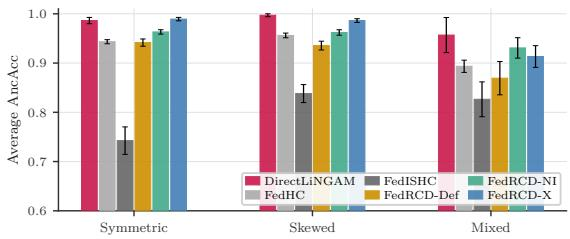
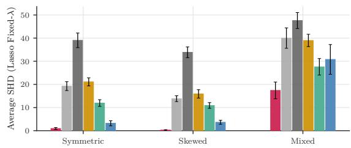
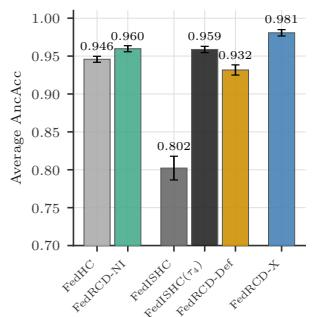
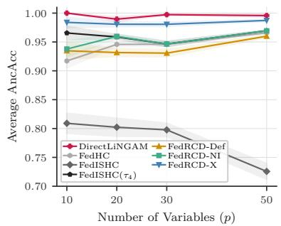
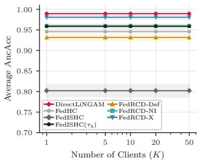
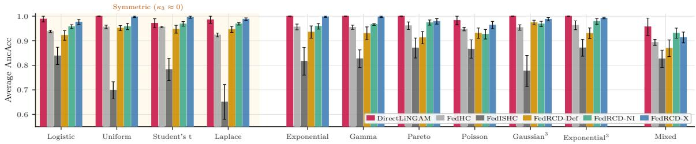
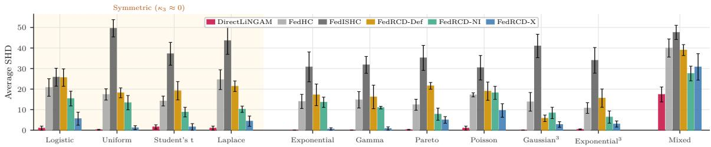
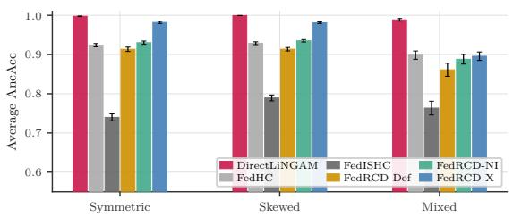
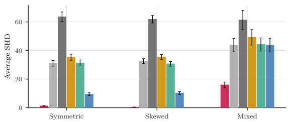

# Federated Causal Discovery via Regression-Directed Cumulants

Pablo Torrijos   
Departamento de Sistemas Inform´aticos   
Universidad de Castilla-La Mancha   
Albacete, Spain   
Fabio Stella   
Dipartimento di Informatica, Sistemistica e Comunicazione   
Universit\`a degli Studi di Milano Bicocca   
Milano, Italy   
Jos´e A. G´amez   
Departamento de Sistemas Inform´aticos   
Universidad de Castilla-La Mancha   
Albacete, Spain   
Jos´e M. Puerta   
Departamento de Sistemas Inform´aticos   
Universidad de Castilla-La Mancha   
Albacete, Spain

pablo.torrijos@uclm.es

Editor: Gustau Camps-Valls, Manuele Leonelli and Gherardo Varando

fabio.stella@unimib.it

jose.gamez@uclm.es

jose.puerta@uclm.es

## Abstract

In this paper we study linear non-Gaussian acyclic models (LiNGAM) when used in federated environments. These causal models allow one to go beyond Markov equivalence. However, in many domains data are scarce, and increasing the sample size by centralising data from diferent clients is not advisable due to regulations such as the General Data Protection Regulation (GDPR). The federated environment ofers an attractive option to balance privacy and causal discovery accuracy. Unfortunately, the standard centralised estimator in the LiNGAM setting, i.e., DirectLiNGAM, cannot be straightforwardly federated. Higherorder cumulant tensors ofer a way around this obstacle: they depend only on the joint distribution of the variables involved and add exactly across independent sample groups, so a single communication round sufices in horizontal, vertical, and hybrid partitions. However, FedISHC, i.e., the current federated method along these lines, breaks down under near-symmetric noise. To overcome the above limitation, we introduce the FedRCD family of causal discovery algorithms, and investigate three variants that trade of communication rounds against algebraic noise; two of them are exact federated counterparts of the centralised high-order cumulant (HC) and HC-LiNGAM algorithms, and the single-round variants further efectively support exact unlearning at any granularity, from a single observation to a whole client. Numerical experiments show that at sample sizes typical of real deployments, the entire cumulant-based federated family does not actually rank variables by the population asymmetry that the scores encode at zero. It ranks them by a variance ladder induced by the DAG along its directed paths, the cumulant counterpart of varsortability. Marginal standardisation collapses every cumulant method to near-random ordering, while scaleinvariant DirectLiNGAM, not federable under this protocol, is unafected.

Keywords: Federated causal discovery; horizontal, vertical, and hybrid federation; LiNGAM;   
higher-order cumulants; federated unlearning.

## 1. Introduction

Causal structure learning from observational data drives applications in genomics (Tejada-Lapuerta et al., 2025), protein signalling (Zhai et al., 2025), econometrics (Moneta et al., 2011), or epidemiology (Ferrari et al., 2022; Wang et al., 2022). However, in some domains, especially in healthcare, data are scarce and the only option to improve sample size is to combine data from patients cohorts across multiple hospitals and/or research centres. While this option serves the purpose of increasing the sample size and thus improving the power of causal learning, it brings severe concerns about data privacy. Privacy regulations such as the General Data Protection Regulation impose strict constraints on sharing raw personal data outside the institution where they were collected. Federated learning (McMahan et al., 2017; Kairouz et al., 2021) addresses the tension between privacy and causal learning power: clients keep their data local and exchange only aggregated statistics through a central server. The federated setting itself splits into three partitioning regimes (Zhang et al., 2021): horizontal (same variables, diferent samples), vertical (same samples, diferent variables), and hybrid.

Standard approaches to causal discovery have been adapted to the federated setting. Constraint-based federated methods such as federated PC variants (Wang et al., 2023; Huang et al., 2023) rely on conditional independence tests over the full conditioning set, while continuous optimisation procedures (Ng and Zhang, 2022) rely on algebraic score functions. Both families generally recover only Markov equivalence classes, and both struggle in vertical and hybrid regimes: when the variables required for a conditional independence test are split across clients, the test cannot be evaluated without pooling data, and partial-overlap workarounds introduce spurious edges that propagate through aggregation. An option to go beyond Markov equivalence and recover a causal ordering is given by the LiNGAM framework (Shimizu et al., 2006, 2011) under the assumption of non-Gaussian exogenous noise. Unfortunately, its state-of-the-art estimator, DirectLiNGAM (Shimizu et al., 2011), relies on nonparametric independence tests applied to centralised data, and cannot be straightforwardly federated. Recent centralised methods (Chen et al., 2025) replace those tests with closed-form pairwise scores based on higher-order cumulants. This is the natural primitive for federation as cumulants depend only on the joint distribution of the variables involved (Brillinger, 2001), so missing variables on a client do not bias the entries the client can compute (this handles vertical partitioning). They are also additive over independent sample groups (Speed, 1983), so per-client raw-moment sums add up to the global tensor (this handles horizontal partitioning). The protocol is identical for horizontal, vertical, and hybrid partitions, runs in a single round, and supports exact federated unlearning by subtracting specific raw moments. The current federated method along these lines, FedISHC (Chen et al., 2026), instantiates this protocol with third-order cumulants and runs sequential deflation on the server. Its limitation under symmetric noise is expected: its identification score and deflation coeficient both divide by the candidate source’s skewness, which is zero for symmetric distributions (Proposition 1). Fixing this requires more than swapping the third-order score for a fourth-order one: FedISHC updates only third-order arrays at each iteration, so a fourth-order score evaluated on those arrays is invariant under the iteration and behaves like a single-pass ranking. Because identification and deflation must be redesigned together, we introduce the FedRCD family to solve the symmetric-noise failure by pairing a fourth-order source criterion with a stable covariance-based deflation coeficient whose denominator is bounded away from zero by construction.

There is, however, a less flattering question to ask of any cumulant-based estimator. The asymmetry that the third- and fourth-order pairwise scores encode vanishes for true sources at the population level, which is precisely how the theory identifies them. A relevant question we ask is as follows: at the sample sizes that real federated deployments actually see, what dominates the ranking? We find that the dominant signal is a variance ladder induced by the DAG along its directed paths. Under LiNGAM, descendants accumulate variance from their ancestors, the marginal cumulants inherit that scale at every order, and the row sums that drive identification across the entire cumulant family, federated or centralised, line up almost perfectly with depth. This is the cumulant counterpart of varsortability (Reisach et al., 2021), the same scale signal that has been documented to drive continuous optimisation methods such as NOTEARS (Zheng et al., 2018). Marginal standardisation removes the ladder and collapses every cumulant-based method to near-random ranking, including the centralised baselines HC and HC-LiNGAM; DirectLiNGAM, scale-invariant by construction, is unafected.

The main contributions of this paper are the following: 1) we formalise the symmetricnoise limit of FedISHC and explain why a fourth-order score on its own does not repair it; 2) we introduce the FedRCD family, pairing a fourth-order source criterion with a stable covariance-based deflation coeficient, where three variants trade of communication rounds against algebraic noise; 3) we show that the entire cumulant-based federated family ranks variables by a variance ladder induced by the DAG. This places it in the scale-dependent regime that Reisach et al. (2021) identified for MSE-based continuous methods; and finally 4) we provide extensive empirical evidence across Erd˝os-R´enyi DAGs under eleven noise families and eight bnlearn BN repository topologies.

The rest of the paper is organised as follows: Section 2 reviews LiNGAM, fourth-order identification, and the federated setting. Section 3 develops the FedRCD family. Section 4 presents the empirical evaluation including the stratification diagnostic. Section 5 concludes.

## 2. Background and Problem Formulation

## 2.1. The LiNGAM Model

Let $\mathbf { X } = ( x _ { 1 } , \ldots , x _ { p } ) ^ { \intercal } \in \mathbb { R } ^ { p }$ be a vector of observed variables. The LiNGAM framework (Shimizu et al., 2006, 2011) models their causal structure as $\mathbf { X } = \mathbf { B } \mathbf { X } + \mathbf { E }$ , where $\mathbf { B } \in \mathbb { R } ^ { p \times p }$ is a matrix of causal coeficients that can be permuted to strictly lower-triangular form, and $\mathbf { E } = ( e _ { 1 } , \ldots , e _ { p } ) ^ { \top }$ is a vector of mutually independent, non-Gaussian disturbances with $\mathbb { E } [ e _ { i } ] = 0$ and $\mathbb { E } [ e _ { i } ^ { 2 } ] = \sigma _ { i } ^ { 2 } > 0$ . Solving for X gives the mixing form $\mathbf { X } = \mathbf { A } \mathbf { E }$ with $\mathbf { A } = ( \mathbf { I } - \mathbf { B } ) ^ { - 1 }$ , where I denotes the $p \times p$ identity matrix. LiNGAM ofers a stronger guarantee than constraint-based methods: as long as at most one disturbance is Gaussian, B is uniquely identified from the joint distribution of X alone, that is, the entire DAG is recovered rather than only its Markov equivalence class (Shimizu et al., 2006). The required assumptions are linearity, acyclicity, mutual independence of noise terms, and no unobserved confounders; heteroscedastic noise is allowed.

Two classical LiNGAM estimators are ICA-LiNGAM (Shimizu et al., 2006), which recovers the causal order via Independent Component Analysis (ICA) on the mixing matrix, and DirectLiNGAM (Shimizu et al., 2011), which does so iteratively via regression and nonparametric independence tests between candidate sources and residuals. Both achieve strong structural recovery at high computational cost, and neither admits federation by aggregated statistics alone: ICA operates on the raw data matrix, and the kernel independence tests need joint access to the variables they are testing.

## 2.2. Higher-Order Cumulants and Source Identification

The m-th order marginal cumulant of $x _ { i }$ is denoted $\kappa _ { m } ( \boldsymbol { x } _ { i } )$ (Brillinger, 2001), and $\kappa _ { m _ { 1 } , m _ { 2 } } ( x _ { i } , x _ { j } )$ denotes the joint cumulant with $m _ { 1 }$ copies of $x _ { i }$ and $m _ { 2 }$ copies of $x _ { j }$ . We use $\kappa _ { \bullet }$ for population cumulants and $\hat { \kappa } _ { \bullet }$ for their empirical estimates. We use the thirdand fourth-order self-cumulants $\kappa _ { 3 } , \kappa _ { 4 }$ and the joint cumulants $\kappa _ { 1 , 2 } , \kappa _ { 2 , 1 } , \kappa _ { 1 , 3 } , \kappa _ { 2 , 2 } , \kappa _ { 3 , 1 }$ , all of which are particular instances of this notation. Cumulants are multilinear, additive for independent variables, and vanish at order $\geq 3$ for Gaussian variables. Non-Gaussianity breaks the directional symmetry of joint cumulants and is what supplies the statistical signal that distinguishes cause from efect. The fourth-order pairwise asymmetry score (Chen et al., 2025) is

$$
\tau _ { i j } = \big | \kappa _ { 4 } ( x _ { i } ) \kappa _ { 1 , 3 } ( x _ { i } , x _ { j } ) - \kappa _ { 2 , 2 } ( x _ { i } , x _ { j } ) \kappa _ { 3 , 1 } ( x _ { i } , x _ { j } ) \big | .\tag{1}
$$

In the population limit, $\tau _ { i j } = 0$ if and only if $x _ { i }$ is an ancestor of $x _ { j }$ (or the two variables are independent), and $\tau _ { i j } > 0$ otherwise (Chen et al., 2025, Theorems 2–3). A source node of the DAG is a variable with no incoming edges; $x _ { s }$ is a source if and only if $\textstyle \sum _ { j \neq s } \tau _ { s j } = 0$ . The source at each step of an ordering algorithm is found by solving the optimisation problem

$$
s = \arg \operatorname* { m i n } _ { i \in U } \sum _ { \substack { j \in U , j \neq i } } \tau _ { i j } ,\tag{2}
$$

where $U \subseteq \{ 1 , \ldots , p \}$ collects the indices of variables not yet placed in the partial order (the active set). High-order cumulant HC (Chen et al., 2025) identifies each source via (2), deflates by ordinary least squares OLS $( x _ { j } \gets x _ { j } - \hat { \beta } _ { j s } x _ { s } , \hat { \beta } _ { j s } = \hat { \Sigma } _ { j s } / \hat { \Sigma } _ { s s } )$ , and repeats at $O ( n p ^ { 3 } )$ total cost. HC-LiNGAM (Chen et al., 2025) computes the τ matrix once and sorts globally by the row sums $\begin{array} { r } { T _ { \tau } ( x _ { i } ) = \sum _ { j \neq i } \tau _ { i j } } \end{array}$ at $O ( n p ^ { 2 } )$ cost. Both are centralised reference points for the methods of Section 3.

## 2.3. Federated Causal Discovery

Data are distributed across K clients that cannot share raw observations. Client k holds dataset $\mathcal { D } _ { k }$ over variable set $\mathbf { X } _ { k } \subseteq \mathbf { X }$ with $n _ { k }$ samples, where $\mathbf { X } = \cup _ { k = 1 } ^ { K } \mathbf { X } _ { k }$ and $\begin{array} { r } { N = \sum _ { k = 1 } ^ { K } n _ { k } } \end{array}$ Following Chen et al. (2026), we require that for every pair $( x _ { i } , x _ { j } )$ at least one client holds observations for both. The condition is milder than asking for a common complete variable set, and is what enables coverage of the full joint cumulant tensor; pair-coverage gaps would leave the corresponding cumulant entries unidentifiable.

Each joint cumulant $\kappa _ { m _ { 1 } , m _ { 2 } } ( x _ { i } , x _ { j } )$ is a function of the bivariate distribution of $( x _ { i } , x _ { j } )$ alone, so clients that do not observe both variables contribute nothing to that entry. Cumulants are additive over independent sample groups (Speed, 1983), so the global cumulant tensor (the array indexed by all required pairs and orders) is recovered exactly from per-client raw-moment sums by a weighted sum, regardless of whether the partition is horizontal, vertical, or hybrid. Each client transmits $O ( p _ { k } ^ { 2 } )$ floats with $p _ { k } = | \mathbf { X } _ { k } |$ , and the server pools these into global estimates that are numerically identical to centralised computation on the full dataset. Neither property holds for residuals or kernel-based independence tests on raw data, which therefore fall outside this protocol.

FedISHC. FedISHC (Chen et al., 2026) aggregates third-order cumulants in a single round and runs sequential deflation on the server. Sources are identified by the third-order score

$$
\tau _ { i j } ^ { ( 3 ) } = \big | \kappa _ { 3 } ( x _ { i } ) \kappa _ { 1 , 2 } ( x _ { i } , x _ { j } ) - \kappa _ { 2 , 1 } ( x _ { i } , x _ { j } ) \kappa _ { 1 , 2 } ( x _ { j } , x _ { i } ) \big | .\tag{3}
$$

The causal influence of an identified source $x _ { s }$ on each remaining variable $x _ { j }$ is estimated as

$$
\hat { \alpha } _ { j s } = \frac { \hat { \kappa } _ { 2 , 1 } ( x _ { j } , x _ { s } ) } { \hat { \kappa } _ { 3 } ( x _ { s } ) } ,\tag{4}
$$

and the third-order cumulant arrays are updated via

$$
\hat { \kappa } _ { 3 } ( x _ { j } ) ^ { \prime } = \hat { \kappa } _ { 3 } ( x _ { j } ) - \hat { \alpha } _ { j s } ^ { 3 } \hat { \kappa } _ { 3 } ( x _ { s } ) .\tag{5}
$$

Both (3) and (4) carry $\kappa _ { 3 } ( x _ { s } )$ in their denominator, which Section 2.4 exploits to formalise the limit. Chen et al. (2026) also introduce FedHC, a no-deflation variant that uses (3) and sorts variables by row sums in a single pass. FedHC inherits the symmetric-noise weakness of $\tau ^ { ( 3 ) }$ , but its absence of deflation prevents error compounding across the $p - 1$ steps.

## 2.4. Limitations of FedISHC under symmetric noise

Under symmetric noise the third self-cumulant $\kappa _ { 3 } ( x _ { s } )$ vanishes in population, and at finite samples it is dominated by sampling fluctuation. FedISHC places this quantity in the denominator of both its identification score (3) and its deflation coeficient (4). The consequences for accuracy under symmetric noise follow directly from this. We record the variance bound on $\hat { \alpha } _ { j \varepsilon }$ s for completeness:

Proposition 1 (Symmetric-noise variance bound) Let $\hat { \kappa } _ { 3 } ( x _ { s } )$ and $\hat { \kappa } _ { 2 , 1 } ( x _ { j } , x _ { s } )$ be unbiased aggregated estimators (Schefczik and H¨agele, 2019) based on N total samples. Assume all moments of $e _ { s }$ up to order six are finite, and consider the regime $\kappa _ { 3 } ( x _ { s } ) \neq 0$ . By the delta method applied to $f ( a , b ) = a / b$

$$
\mathrm { V a r } [ \hat { \alpha } _ { j s } ] = \frac { \mathrm { V a r } [ \hat { \kappa } _ { 2 , 1 } ] } { \kappa _ { 3 } ( x _ { s } ) ^ { 2 } } + \frac { \kappa _ { 2 , 1 } ( x _ { j } , x _ { s } ) ^ { 2 } \mathrm { V a r } [ \hat { \kappa } _ { 3 } ( x _ { s } ) ] } { \kappa _ { 3 } ( x _ { s } ) ^ { 4 } } - \frac { 2 \kappa _ { 2 , 1 } ( x _ { j } , x _ { s } ) } { \kappa _ { 3 } ( x _ { s } ) ^ { 3 } } \mathrm { C o v } [ \hat { \kappa } _ { 2 , 1 } , \hat { \kappa } _ { 3 } ] + O ( N ^ { - 2 } ) .\tag{6}
$$

Under the LiNGAM model, $\kappa _ { 2 , 1 } ( x _ { j } , x _ { s } ) = \beta _ { j s } ^ { 2 } \kappa _ { 3 } ( x _ { s } )$ , so all three terms scale as $\kappa _ { 3 } ( x _ { s } ) ^ { - 2 } / N$ and the leading order is $\Theta ( \kappa _ { 3 } ( x _ { s } ) ^ { - 2 } / N )$ . Along any sequence of LiNGAM distributions with $\kappa _ { 3 } ( x _ { s } )  0$ at fixed $\beta _ { j s }$ , the variance bound diverges.

Proof See Appendix A.

The fourth-order score $\tau ^ { ( 4 ) }$ in (1) avoids the issue, since $\kappa _ { 4 } ( x _ { s } ) \neq 0$ for every standard non-Gaussian distribution. Replacing only the score, however, is not enough. Let $\mathrm { F E D I S H C } ( \tau ^ { ( 4 ) } )$ denote the algorithm using $\tau ^ { ( 4 ) }$ for identification while retaining the third-order deflation from Equations (4) and (5). The deflation in (5) updates only $\kappa _ { 3 }$ arrays. The score $\tau ^ { ( 4 ) }$ depends on $\kappa _ { 4 }$ and on the joint cumulants $\kappa _ { 1 , 3 } , \kappa _ { 2 , 2 } , \kappa _ { 3 , 1 }$ , and none of these is touched by (5). Every iteration of $\mathrm { F E D I S H C } ( \tau ^ { ( 4 ) } )$ therefore evaluates $\tau ^ { ( 4 ) }$ on the same matrix, restricted to the current active set. Identification and deflation have to be repaired together.

## 3. The FedRCD Family

We propose FedRCD (Federated Regression-Directed Cumulants), a family of federated LiNGAM estimators that addresses both issues raised in Section 2.4.

## 3.1. OLS Deflation Coeficient

The instability of $\hat { \alpha } _ { j s }$ in (4) comes from its denominator $\hat { \kappa } _ { 3 } ( x _ { s } )$ . Ordinary least squares supplies a replacement with a bounded denominator. When $x _ { s }$ is the current source, it has no parents under the LiNGAM model, so $\Sigma _ { j s } = b _ { j s } \Sigma _ { s s }$ exactly and the OLS coeficient $\hat { \beta } _ { j s } = \hat { \Sigma } _ { j s } / \hat { \Sigma } _ { s s }$ is consistent for the same structural parameter $b _ { j s }$ that $\hat { \alpha } _ { j s }$ targets. Its denominator $\Sigma _ { s s } = \mathrm { V a r } ( x _ { s } )$ is strictly positive for any non-degenerate variable, whatever the noise distribution. Both $\hat { \Sigma } _ { j s }$ and $\hat { \Sigma } _ { s s }$ are entries of the aggregated $\hat { \Sigma }$ , so $\hat { \beta } _ { j s }$ is computed once on the server, never on raw data, and takes the same value as in the centralised case whether or not the clients are IID. The residual $r _ { j } = x _ { j } - \beta _ { j s } x _ { s }$ is orthogonal to $x _ { s }$ in second order; structure at higher orders is handled by the closed-form cumulant updates of Appendix B.

Proposition 2 (Stability of the OLS deflation coeficient) Assume $\mathbb { E } [ x _ { i } ^ { 4 } ] < \infty , \forall i$ and ${ \Sigma _ { s s } } = \mathrm { V a r } ( x _ { s } ) { > } 0$ . Then

$$
\mathrm { V a r } [ \hat { \beta } _ { j s } ] = \frac { \mathrm { V a r } [ \hat { \Sigma } _ { j s } ] } { \Sigma _ { s s } ^ { 2 } } + \frac { \Sigma _ { j s } ^ { 2 } \mathrm { V a r } [ \hat { \Sigma } _ { s s } ] } { \Sigma _ { s s } ^ { 4 } } - \frac { 2 \Sigma _ { j s } } { \Sigma _ { s s } ^ { 3 } } \mathrm { C o v } [ \hat { \Sigma } _ { j s } , \hat { \Sigma } _ { s s } ] + O ( N ^ { - 2 } ) = O ( N ^ { - 1 } ) ,\tag{7}
$$

uniformly over noise distributions with $\mathrm { V a r } ( x _ { s } ) > 0$

Proof See Appendix A.

The cumulant ratio $\kappa _ { 3 } ( x _ { s } ) ^ { - 2 } / N$ of Proposition 1 is replaced by a constant that depends only on second-order moments. Both estimators are consistent for $b _ { j s } \mathrm { ; }$ the diference is purely numerical. The FedRCD family uses $\tau ^ { ( 4 ) }$ for identification and $\hat { \beta } _ { j s }$ wherever a deflation coeficient is required. A second consequence matters in Section 4.5: the deflation step does not inject divergent noise into the cumulant arrays, so the depth ordering of variances and cumulants induced by the DAG survives the iteration.

## 3.2. The FedRCD-(NI/Def/X) Variants

The three variants (Algorithm 1) share the $\tau ^ { ( 4 ) }$ criterion, the $\hat { \beta } _ { j s }$ coeficient, and the clientside aggregation protocol. They difer in where deflation happens and how many rounds it requires. All three apply to horizontal, vertical, and hybrid federation, and recover $\hat { \bf B }$ from the pre-deflation $\hat { \Sigma }$ via adaptive Lasso with fixed $\lambda = 0 . 0 1 \bar { \sigma }$ once the order is determined.

FedRCD-NI computes $\tau ^ { ( 4 ) }$ once and sorts variables by the row sums $\begin{array} { r } { T _ { \tau } ( x _ { i } ) = \sum _ { j \neq i } \tau _ { i j } } \end{array}$ in a single pass at $O ( p ^ { 2 } )$ server cost. There is no deflation step: by Theorem 4 of Chen et al. (2025), $T _ { \tau } ( x _ { i } ) < T _ { \tau } ( x _ { j } )$ in population whenever $x _ { i }$ is a predecessor of $x _ { j }$ , so the row-sum sort recovers the true order. At finite samples and on dense graphs, unresolved confounding adds noise. FedRCD-NI is the exact federated counterpart of HC-LiNGAM (Chen et al., 2025) and supports exact instance-level federated unlearning. Raw moments are additive over independent samples, hence also subtractive: given the raw-moment contribution of any subset to be forgotten (a single observation, a cohort within a client, or an entire client), the server subtracts it from the global aggregates and rescales the totals by $( N - n _ { \mathrm { r m } } ) ^ { - 1 }$ recovering exactly the statistics that would have been obtained had those samples never participated. In vertical and hybrid regimes the same procedure applies pair by pair, with the server keeping per-pair counts $N _ { i j }$ to rescale each entry of the cumulant tensor. The one-message protocol therefore handles the full spectrum of General Data Protection Regulation right-to-erasure requests, from a single individual withdrawing consent to an entire institution leaving the federation, without retraining.

FedRCD-Def adds algebraic deflation on the server after each source removal. Multilinearity of cumulants applied to the residual $r _ { j } = x _ { j } - \beta _ { j s } x _ { s }$ yields closed-form updates of all aggregated arrays (Appendix ${ \mathrm { B } } ;$ this extends Lemma 2 of Chen et al. (2026) from third to fourth order and from αˆ to the stable $\hat { \beta } )$ . The server applies these updates in place at $O ( p ^ { 3 } )$ total cost, still in a single round. The deflation coeficient is stable by Proposition 2, and the updates are exact at population level. At finite samples, however, every algebraic step injects estimation noise that compounds across p − 1 updates. Exact federated unlearning is preserved because the protocol remains a one-round exchange.

Algorithm 1: FedRCD Family   
Input: Global stats $\hat { \kappa } _ { \bullet } , \hat { \Sigma }$ aggregated from all clients; set $U = \{ 1 , \dotsc , p \} ;$ mode $\in \{ \mathrm { N I } , \mathrm { D E F } , \mathrm { X } \}$   
Output: Causal order K; matrix Bˆ   
1 $\hat { \Sigma } _ { 0 } \gets \hat { \Sigma }$ // Save original covariance for Bˆ estimation   
2 $K \gets [ ]$   
3 if mode = NI then   
4 Compute $\tau _ { i j }$ for all $i \neq j$ via (1)   
5 K ← argsort $\textstyle { \bigl ( } \sum _ { j \neq i } \tau _ { i j } { \bigr ) } _ { i = 1 } ^ { p }$ // Single pass, no deflation   
6 else   
7 while $| U | > 1$ do   
8 Compute $\tau _ { i j }$ for $i , j \in U$ via (1)   
9 s ← arg mini∈U $\textstyle \sum _ { j \in U , j \neq i } \tau _ { i j }$ // Identify source   
10 Append s to K   
11 $\hat { \beta } _ { j s } \gets \hat { \Sigma } _ { j s } / \hat { \Sigma } _ { s s }$ for each $j \in U \setminus \{ s \}$ // OLS coeficient   
12 if mode = Def then   
13 Update $\hat { \kappa } _ { \bullet } , \hat { \Sigma }$ server-side via (11)–(15) // Appendix B   
14 else if mode = X then   
15 Server broadcasts $( s , { \hat { \boldsymbol { \beta } } } )$ to clients   
16 Clients: xj $ x _ { j } - \hat { \beta } _ { j s } x _ { s }$ for $j \in U \setminus \{ s \}$ ; drop $x _ { s }$   
17 Clients send fresh raw moments; server re-aggregates $\hat { \kappa } _ { \bullet }$ , Σˆ   
18 end   
19 U ← U \ {s}   
20 end   
21 Append remaining element of U to K   
22 end   
23 Bˆ ← AdaptiveLasso $( \hat { \Sigma } _ { 0 } , K )$ // Edge weights from original Σˆ

FedRCD-X pushes deflation back to the clients to avoid algebraic accumulation. In each of $p - 1$ rounds, the server identifies the source via (2), broadcasts the OLS coeficients, and each client deflates its local data, drops the identified source, and returns fresh suficient statistics. Cumulants are recomputed from actual residuals at every round rather than approximated algebraically, and no approximation error accumulates. FedRCD-X is the federated counterpart of HC (Chen et al., 2025). The price is $p - 1$ rounds at $O ( p ^ { 3 } )$ total payload. Exact unlearning is no longer available, since each round depends on coeficients derived from the previous aggregate, and removing a client retroactively would invalidate every subsequent round.

Table 1 summarises all methods. For single-round protocols, the total payload equals the per-round payload; for FedRCD-X it equals the per-round payload times $p - 1$

Table 1: Algorithm comparison. M: maximum kernel rank in DirectLiNGAM.
<table><tr><td></td><td>METHOD</td><td>DEFLATION</td><td>CLIENT</td><td>COMM./R</td><td>SERVER</td><td>ROUNDS</td></tr><tr><td></td><td>DIRECTLıNGAM (Shimizu et al., 2011)</td><td>Kernel independence test</td><td> $O ( n p ^ { 3 } M ^ { 2 } + p ^ { 4 } M ^ { 3 } )$ </td><td>n/a</td><td>n/a</td><td>n/a</td></tr><tr><td>COENTR.</td><td>HC (Chen et al., 2025)</td><td>OLS on data</td><td> $\bar { O ( n p ^ { 3 } ) }$ </td><td>n/a</td><td>n/a</td><td>n/a</td></tr><tr><td></td><td>HC-LINGAM (Chen et al., 2025)</td><td>None</td><td>O(np2)</td><td>n/a</td><td>n/a</td><td>n/a</td></tr><tr><td></td><td>FEDHC (Chen et al., 2026)</td><td>None</td><td> $O ( n _ { k } p _ { - } ^ { 2 } )$ </td><td> $O ( p ^ { 2 } )$ </td><td>O(p2)</td><td>1</td></tr><tr><td></td><td>FEDISHC (Chen et al., 2026)</td><td> $\hat { \alpha } = { { \hat { \kappa } } _ { 2 , 1 } } / { { \hat { \kappa } } _ { 3 } }$  (3rd order)</td><td> $O ( n _ { k } p ^ { 2 } )$ </td><td>O(p2)</td><td>O(p3)</td><td>1</td></tr><tr><td></td><td>FEDRCD-NI (ours)</td><td>None</td><td> $O ( n _ { k } p ^ { 2 } )$ </td><td>O(p2)</td><td>O(p2)</td><td>1</td></tr><tr><td>FEED</td><td>FEDRCD-DEF (ours)</td><td>OLS on agg. stats (server)</td><td> $O ( n _ { k } p ^ { 2 } )$ </td><td>O(p2)</td><td>O(p3)</td><td>1</td></tr><tr><td></td><td>FEDRCD-X (ours)</td><td>OLS on local data (client)</td><td>O(nkp3)</td><td>O(p2)</td><td>O(p2)</td><td>p − 1</td></tr></table>

## 4. Experimental Evaluation

## 4.1. Setup

Data generation. We sample Erd˝os-R´enyi ER-2 DAGs (expected density 0.2) with edge weights from $U ( [ - 1 . 5 , - 0 . 5 ] \cup [ 0 . 5 , 1 . 5 ] )$ ). Exogenous noise is drawn from eleven continuous families (Gaussian Cubed, Pareto, Logistic, Uniform, Laplace, Poisson, Exponential, Studentt, Gamma, Exponential Cubed, plus a Mixed setting where each variable draws from a diferent family). Defaults are $p = 2 0 , n = 2 0 0 0$ observations per client, and $K = 1 0$ clients. The main grid sweeps $p \in \{ 1 0 , 2 0 , 3 0 , 5 0 \}$ and $K \in \{ 1 , 5 , 1 0 , 2 0 , 5 0 \}$ under horizontal partitioning. Results average 10 random seeds with standard error of the mean.

Baselines. Centralised: DirectLiNGAM (Shimizu et al., 2011), HC and HC-LiNGAM (Chen et al., 2025). Federated: FedISHC and its no-deflation variant FedHC (Chen et al., 2026). FedHC is the third-order analogue of FedRCD-NI: same single-pass sort, same $O ( p ^ { 2 } )$ server cost, but identification through $\tau ^ { ( 3 ) }$ rather than $\tau ^ { ( 4 ) }$ . For a fair comparison, all methods recover edge weights via adaptive Lasso on the aggregated Σˆ with $\lambda = 0 . 0 1 \bar { \sigma }$ . FedRCD-NI and FedRCD-X produce the same orderings as HC-LiNGAM and HC given the same aggregated statistics; we plot the centralised counterparts only when their traces add information.

Metrics. LiNGAM methods primarily recover a causal ordering σ. A pairwise F1 score between orderings penalises valid orderings, since it compares the estimated σ against a single arbitrary topological sort extracted from the gold-standard DAG, even though multiple valid sorts typically exist. We instead evaluate against the partial order induced by the true DAG G. The transitive closure $\mathcal { G } _ { + }$ of $\mathcal { G }$ is the set of pairs $( x _ { i } , x _ { j } )$ for which there exists a directed path from $x _ { i }$ to $x _ { j }$ in ${ \mathcal { G } } ,$ , that is, $x _ { i }$ is an ancestor of $x _ { j }$ . Every such ancestral relation $x _ { i } \to x _ { j } \in { \mathcal { G } } _ { + }$ requires $x _ { i } \prec _ { \sigma } x _ { j }$ in the estimated order; pairs with no ancestral relation are excluded.

Definition 3 (Ancestral Accuracy) Let σ be a learned causal ordering and $\mathcal { G }$ a groundtruth DAG with transitive closure $\mathscr { G } _ { + }$ . The Ancestral Accuracy is

$$
\operatorname { A n c A c c } ( \sigma , \mathcal { G } ) = \frac { \left| \left\{ ( x _ { i } , x _ { j } ) : x _ { i } \to x _ { j } \in \mathcal { G } _ { + } , ~ x _ { i } \prec _ { \sigma } ~ x _ { j } \right\} \right| } { | \mathcal { G } _ { + } | } .\tag{8}
$$

AncAcc rewards any ordering consistent with the ancestral relations of G. We also report Structural Hamming Distance (SHD) when edge-level error is informative.

## 4.2. Reproducibility

Algorithms are implemented in Python 3.13 using the Flower1 framework for federated orchestration. DirectLiNGAM relies on the lingam2 library; HC, HC-LiNGAM, FedISHC, and FedHC were reimplemented from scratch since no public source code was available. Source code and experiment scripts are at https://github.com/ptorrijos99/FedLiNGAM. Experiments run on an AMD Ryzen AI 9 HX 370 with 32 GB RAM.

## 4.3. Robustness Across Noise Distributions

Figure 1 aggregates AncAcc and SHD by noise regime: symmetric (Logistic, Uniform, Student-t, Laplace) where $\kappa _ { 3 } \approx 0$ , mixed (each variable drawn independently from a diferent family), and skewed (the remaining unimodal families). Per-family breakdowns are deferred to Appendix C.1; results on real-world BN topologies appear in Appendix C.2.

  
(a) AncAcc ↑ by noise regime

  
(b) SHD ↓ by noise regime  
Figure 1: Performance by noise regime (p=20, K=10).

The hierarchy is consistent across symmetric and skewed regimes, and is the same on synthetic and bnlearn topologies. FedISHC trails substantially, more so on symmetric noise as expected from Section 2.4. DirectLiNGAM (centralised) approaches perfect recovery. Among the federated methods, FedRCD-X is very close to DirectLiNGAM, with FedRCD-NI a few points behind, then FedHC, then FedRCD-Def. The gap between symmetric and skewed regimes is smaller than Proposition 1 alone would predict. The proposition formalises a divergence in the limit $\kappa _ { 3 }  0$ , but finite-sample performance is governed by a diferent mechanism that we identify in Section 4.5. The mixed regime breaks the pattern slightly. FedISHC recovers some accuracy because non-zero average skewness across variables provides partial signal, but it still trails. The federated methods cluster more tightly than under homogeneous noise. FedRCD-NI overtakes FedRCD-X by a small margin with FedHC close behind, while DirectLiNGAM does not recover the perfect order in this case. SHD tracks AncAcc closely throughout.

## 4.4. Ablation Study

Identification versus deflation. To isolate the source of FedISHC’s deficit, we implement FedISHC $\vdots ( \tau ^ { ( 4 ) } )$ ), which replaces only the identification criterion $( \tau ^ { ( 3 ) } \to \tau ^ { ( 4 ) } )$ while keeping the original third-order deflation (5). Figure $2 ( a )$ reports the all-noise mean. AncAcc rises from 0.802 for FedISHC to 0.959 for FedISH $\mathrm { C } ( \tau ^ { ( 4 ) } )$ , matching FedRCD-NI (0.960), which performs no deflation at all. Going from $\tau ^ { ( 3 ) }$ to $\tau ^ { ( 4 ) }$ at fixed no-deflation (FedHC to FedRCD-NI) yields a small but consistent improvement (for $p \leq 2 0 )$ . At fixed third-order αˆ-deflation (FedISHC to $\mathrm { F E D I S H C } ( \tau ^ { ( 4 ) } ) )$ the gain is much larger, because the bottleneck in FedISHC is identification rather than deflation. FedISH $\mathrm { C } ( \tau ^ { ( 4 ) } )$ matches FedRCD-NI because its third-order deflation leaves the fourth-order tensors invariant. FedRCD-Def performs genuine fourth-order updates, but compounding finite-sample algebraic noise limits its gains. FedRCD-X remains the best on average, and is the only iterative variant that recomputes cumulants from actual residuals at each round.

Scalability in p. Figure 2(b) reports mean AncAcc against p at $K ~ = ~ 1 0$ DirectLiNGAM and FedRCD-X are the most stable. $\mathrm { F E D I S H C } ( \tau ^ { ( 4 ) } )$ is the best of the rest at $p = 1 0$ but converges with FedRCD-NI and FedHC as p grows, in line with the order-mismatch issue of Section 2.4: the third-order deflation in $\mathrm { F E D I S H C } ( \tau ^ { ( 4 ) } )$ leaves $\tau ^ { ( 4 ) }$ unchanged at every iteration, so the algorithm difers from a single-pass ranking only through the active-set restriction in the row sums. At small p this restriction still helps; as p grows, finite-sample noise on the row sums dominates and the two strategies converge.

Federation invariance. Figure $2 ( c )$ reports AncAcc against K at $p = 2 0$ . All federated methods produce flat curves: cumulant aggregation is lossless given a fixed D, independently of how $\mathcal { D } _ { k }$ are distributed (IID or non-IID; horizontal, vertical, or hybrid). Each entry of the joint cumulant tensor is a function of the bivariate marginal alone, so any pair-covering split yields exactly the same global statistics as the centralised computation, and the curves above transfer literally to the vertical and hybrid regimes.

  
(a) $\mathrm { F E D I S H C } ( \tau ^ { ( 4 ) } )$ ablation $( p { = } 2 0 , K { = } 1 0 )$

  
(b) Scalability (K=10).

  
(c) Federation invariance $\scriptstyle ( p = 2 0 )$  
Figure 2: Ablation study on $\mathrm { F E D I S H C } ( \tau ^ { ( 4 ) } )$ , scalability, and federation invariance.

## 4.5. What the cumulant family actually reads

The previous sections have argued for FedRCD on its own merits: it removes a divergence, stabilises deflation, and matches the centralised counterparts of Chen et al. (2025) given the same aggregated statistics. The diagnostic that follows asks a less flattering question. The score $\tau ^ { ( \bar { k } ) }$ is by construction zero in population at true sources, and identification of the order rests on row sums of cumulant tensors. At the sample sizes we actually run, what does that ranking line up with? Reisach et al. (2021) define the varsortability v of a dataset as the fraction of directed paths along which marginal variance is monotone, and report $v > 0 . 9 4$ under generic Additive Noise Model simulations. In that regime, MSE-based continuous methods (NOTEARS, GOLEM-EV, MSE-GDS) attain state-of-the-art recovery on raw data and collapse under marginal standardisation, while DirectLiNGAM, PC, and GES are unafected because they use scale-invariant criteria. The efect is a property of the data scale, not of any specific method. The same mechanism acts on cumulant magnitudes. Under LiNGAM, descendants accumulate variance from their ancestors, $\mathrm { V a r } ( x _ { i } )$ is monotone in DAG depth on average, and $\kappa _ { m } ( \boldsymbol { x } _ { i } )$ inherits this scale at every order: empirically $\kappa _ { m } ( \boldsymbol { x } _ { i } )$ behaves as $\sigma _ { i } ^ { m }$ to leading order. The row sums $\begin{array} { r } { \sum _ { j } \tau _ { i j } ^ { ( k ) } } \end{array}$ that drive identification across the entire cumulant family, federated or centralised, are dominated at finite N by this depth-monotone scale rather than by the population asymmetry, which vanishes for true sources. We refer to the regularity as variance stratification; it is the cumulant counterpart of varsortability. To check whether stratification is what the family reads, we standardise each variable marginally before aggregating cumulants: $\tilde { x } _ { i } = x _ { i } / \sigma _ { i }$ The transform is a diagonal rescaling that preserves LiNGAM identifiability (the order is unchanged) but kills the variance ladder, taking v from 0.953 on raw data to exactly 0.5. Table 2 reports $\mathrm { A N C A C C } \pm \mathrm { S D }$ in both regimes.

Table 2: Mean AncAcc on raw and marginally standardised data $( p = 2 0 , K = 1 0 )$ Standardisation removes the depth-monotone variance ladder, reducing v to 0.5. Values below the random baseline of 0.5 indicate inversion of the true order.
<table><tr><td></td><td colspan="2">SYMMETRIC</td><td colspan="2">SKEWED</td></tr><tr><td>METHOD</td><td></td><td>RAW (v=0.953) STANDARDISED (v=0.5) RAW (v=0.953)</td><td></td><td>STANDARDISED (v=0.5)</td></tr><tr><td>DIRECTLINGAM (K =1)</td><td> $\mathbf { 0 . 9 9 6 \pm 0 . 0 0 2 }$ </td><td> $\mathbf { 0 . 9 9 6 \pm 0 . 0 0 2 }$ </td><td> $\mathbf { 0 . 9 9 8 \pm 0 . 0 0 1 }$ </td><td> $\mathbf { 0 . 9 9 8 \pm 0 . 0 0 1 }$ </td></tr><tr><td>FEDHC</td><td> $0 . 9 3 7 \pm 0 . 0 0 3$ </td><td> $0 . 4 1 0 \pm 0 . 0 1 4$ </td><td> $0 . 9 3 3 \pm 0 . 0 0 4$ </td><td> $0 . 5 7 3 \pm 0 . 0 1 6$ </td></tr><tr><td>FEDISHC</td><td> $0 . 7 6 9 \pm 0 . 0 0 9$ </td><td> $0 . 4 7 0 \pm 0 . 0 1 3$ </td><td> $0 . 8 3 9 \pm 0 . 0 0 8$ </td><td> $0 . 4 3 6 \pm 0 . 0 1 6$ </td></tr><tr><td>FEDISHC(τ(4))</td><td> $0 . 9 4 0 \pm 0 . 0 0 3$ </td><td> $0 . 3 8 7 \pm 0 . 0 1 3$ </td><td> $0 . 9 4 2 \pm 0 . 0 0 4$ </td><td> $0 . 5 2 1 \pm 0 . 0 2 0$ </td></tr><tr><td>FEDRCD-DEF</td><td> $0 . 9 2 4 \pm 0 . 0 0 5$ </td><td> $0 . 3 0 8 \pm 0 . 0 1 0$ </td><td> $0 . 9 1 7 \pm 0 . 0 0 7$ </td><td> $0 . 3 5 8 \pm 0 . 0 1 7$ </td></tr><tr><td>HC-LINGAM (K =1) / FEDRCD-NI</td><td> $0 . 9 4 0 \pm 0 . 0 0 3$ </td><td> $0 . 3 0 3 \pm 0 . 0 1 3$ </td><td> $0 . 9 4 2 \pm 0 . 0 0 4$ </td><td> $0 . 4 4 1 \pm 0 . 0 2 2$ </td></tr><tr><td>HC  $( K { = } 1 ) / \mathrm { F E D R C D { - } X }$ </td><td> $0 . 9 7 8 \pm 0 . 0 0 3$ </td><td> $0 . 3 6 8 \pm 0 . 0 1 4$ </td><td> $0 . 9 7 6 \pm 0 . 0 0 4$ </td><td> $0 . 4 7 0 \pm 0 . 0 1 9$ </td></tr></table>

Every cumulant-based method collapses under standardisation, in both regimes, regardless of cumulant order $( \tau ^ { ( 3 ) } \ \mathrm { o r } \ \tau ^ { ( 4 ) } )$ , of deflation strategy (none, server-side algebraic, or clientside OLS), and of whether the algorithm is centralised or federated. The pattern matches what Reisach et al. (2021) reported for MSE-based methods, here extended to a new class of estimators. Standardised AncAcc falls at or below the conditional-random baseline of 0.5, with several methods in the 0.30–0.40 range. The strictly below-random performance is a stronger efect than the one observed for NOTEARS, and the mechanism is direct: standardisation rescales $\kappa _ { m } ( \boldsymbol { x } _ { i } )$ by $\sigma _ { i } ^ { - m }$ , deeper nodes lose more cumulant magnitude than sources, the depth-monotone scale reverses, and the row-sum ranking confidently reads the inverted ladder. DirectLiNGAM is unafected because its kernel-based independence tests on raw residuals access the population asymmetry directly.

The asymmetry that $\tau ^ { ( 3 ) }$ and $\tau ^ { ( 4 ) }$ encode is present in the data but not accessible to the cumulant family at N in the thousands; aggregation of order-k tensors confines them to the stratification proxy. This is the price of exact federation under cumulant aggregation, and it parallels the price MSE-based methods pay for diferentiable acyclicity (Reisach et al., 2021). It also explains the raw-data gap between FedISHC and FedRCD-X under symmetric noise. FedISHC’s deflation injects the divergent noise of $\hat { \alpha } _ { j s }$ into (5) and corrupts the depth-monotone scale across the $p - 1$ updates. FedRCD-X recomputes cumulants from actual residuals at every round and restores stratification on increasingly clean data. FedHC and FedRCD-NI preserve the original stratification trivially. FedRCD-Def sits in between: a stable coeficient, but algebraic updates that still inject finite-sample noise.

## 5. Conclusion

We started from the theoretical failure mode of FedISHC under symmetric noise (the third self-cumulant in the denominator goes to zero) and from the slightly less obvious follow-up: replacing the score is not enough, because the deflation operates on the wrong order. The FedRCD family fixes both at once by working in the fourth-order domain with a covariancebased OLS coeficient. FedRCD-NI and FedRCD-X are exact federated counterparts of HC-LiNGAM and HC, match centralised performance given the same aggregated statistics, apply to horizontal, vertical, and hybrid federation, and support exact unlearning at any granularity in the single-round variants (FedRCD-NI and FedRCD-Def).

The diagnostic of Section 4.5 is the part of the paper that surprised us most. The entire cumulant-based federated family, together with its centralised baselines, ranks variables by the variance ladder induced by the DAG rather than by the population asymmetry that the scores encode at zero. Marginal standardisation collapses every cumulant method to near-random ordering, while scale-invariant DirectLiNGAM keeps full performance. This places the cumulant family squarely in the scale-dependent regime that Reisach et al. (2021) identified for MSE-based methods such as NOTEARS or GOLEM-EV. The family is therefore appropriate when downstream variables accumulate variance from their ancestors, a regime that is structural rather than synthetic, as the Danube river-flow benchmark of Chen et al. (2025) illustrates. Within it, FedRCD-X reaches the ceiling of exact federation under cumulant aggregation. FedISHC falls below that ceiling under both symmetric and asymmetric noise. Open directions for future work include determining when stratification sufices, finding the sample size required to access population asymmetry, and applying diferential privacy to transmitted tensors.

## Acknowledgements

This work was supported by PID2022-139293NB-C32 (MICIU/AEI/10.13039/501100011033 and ERDF, EU), FPU21/01074 (MICIU/AEI/10.13039/501100011033 and ESF+), and 2025-GRIN-38476 (Universidad de Castilla-La Mancha and ERDF, A way of making Europe). Fabio Stella has been supported by the MUR under the grant “Dipartimenti di Eccellenza

2023-2027” of the Department of Informatics, Systems and Communication of the University of Milano-Bicocca, Milan, Italy, and by the National Plan for NRRP Complementary Investments (Project n. PNC0000003 - AdvaNced Technologies for Human-centrEd Medicine (ANTHEM)).

## References

David R. Brillinger. Time Series: Data Analysis and Theory. Society for Industrial and Applied Mathematics, 2001.

Wei Chen, Linjun Peng, Zhiyi Huang, Ruichu Cai, Zhifeng Hao, and Kun Zhang. Higher order cumulants-based method for direct and eficient causal discovery. IEEE Transactions on Neural Networks and Learning Systems, pages 1–14, 2025. ISSN 2162-2388. doi: 10.1109/tnnls.2025.3622148.

Wei Chen, Wanyang Gu, Linjun Peng, Ting Yan, Ruichu Cai, Zhifeng Hao, and Kun Zhang. Horizontal and vertical federated causal structure learning via higher-order cumulants. Proceedings of the AAAI Conference on Artificial Intelligence, 40(24):20280–20288, March 2026. ISSN 2159-5399. doi: 10.1609/aaai.v40i24.39116.

Elisa Ferrari, Luna Gargani, Greta Barbieri, Lorenzo Ghiadoni, Francesco Faita, and Davide Bacciu. A causal learning framework for the analysis and interpretation of COVID-19 clinical data. PLOS ONE, 17(5):e0268327, 2022. ISSN 1932-6203. doi: 10.1371/journal.pone.0268327.

Jianli Huang, Xianjie Guo, Kui Yu, Fuyuan Cao, and Jiye Liang. Towards Privacy-Aware Causal Structure Learning in Federated Setting. IEEE Transactions on Big Data, 9(6): 1525–1535, December 2023. ISSN 2372-2096. doi: 10.1109/tbdata.2023.3285477.

Peter Kairouz, H. Brendan McMahan, et al. Advances and open problems in federated learning. Foundations and Trends in Machine Learning, 14(1–2):1–210, 2021. doi: 10. 1561/2200000083.

Brendan McMahan, Eider Moore, Daniel Ramage, Seth Hampson, and Blaise Ag¨uera y Arcas. Communication-eficient learning of deep networks from decentralized data. In Proceedings of the 20th International Conference on Artificial Intelligence and Statistics, volume 54 of Proceedings of Machine Learning Research, pages 1273–1282, 2017.

Alessio Moneta, Nadine Chlass, Doris Entner, and Patrik Hoyer. Causal search in structural vector autoregressive models. In Proceedings of the Neural Information Processing Systems Mini-Symposium on Causality in Time Series, volume 12 of Proceedings of Machine Learning Research, pages 95–114. PMLR, 2011.

Ignavier Ng and Kun Zhang. Towards federated Bayesian network structure learning with continuous optimization. In Proceedings of the 25th International Conference on Artificial Intelligence and Statistics, volume 151 of Proceedings of Machine Learning Research, pages 8095–8111. PMLR, 2022.

Alexander Reisach, Christof Seiler, and Sebastian Weichwald. Beware of the simulated dag! causal discovery benchmarks may be easy to game. In Advances in Neural Information Processing Systems, volume 34, pages 27772–27784. Curran Associates, Inc., 2021.

Fabian Schefczik and Daniel H¨agele. Ready-to-use unbiased estimators for multivariate cumulants including one that outperforms $\overline { { x ^ { 3 } } }$ , 2019.

Shohei Shimizu, Patrik O. Hoyer, Aapo Hyv¨arinen, and Antti Kerminen. A linear non-Gaussian acyclic model for causal discovery. Journal of Machine Learning Research, 7: 2003–2030, 2006.

Shohei Shimizu, Takanori Inazumi, Yasuhiro Sogawa, Aapo Hyv¨arinen, Yoshinobu Kawahara, Takashi Washio, Patrik O. Hoyer, and Kenneth Bollen. DirectLiNGAM: A direct method for learning a linear non-Gaussian structural equation model. Journal of Machine Learning Research, 12:1225–1248, 2011.

T. P. Speed. Cumulants and partition lattices. Australian Journal of Statistics, 25(2): 378–388, 1983. doi: 10.1111/j.1467-842x.1983.tb00391.x.

Alejandro Tejada-Lapuerta, Paul Bertin, Stefan Bauer, Hananeh Aliee, Yoshua Bengio, and Fabian J. Theis. Causal machine learning for single-cell genomics. Nature Genetics, 57(4): 797–808, 2025. ISSN 1546-1718. doi: 10.1038/s41588-025-02124-2.

A. W. van der Vaart. Asymptotic Statistics. Cambridge Series in Statistical and Probabilistic Mathematics. Cambridge University Press, 1998.

Lijing Wang, Aniruddha Adiga, Jiangzhuo Chen, Adam Sadilek, Srinivasan Venkatramanan, and Madhav Marathe. CausalGNN: Causal-based graph neural networks for spatiotemporal epidemic forecasting. In Proceedings of the AAAI Conference on Artificial Intelligence, volume 36, pages 12191–12199, 2022. doi: 10.1609/aaai.v36i11.21479.

Zhiyi Wang, Pingchuan Ma, and Shiqing Wang. Towards practical federated causal structure learning. In Machine Learning and Knowledge Discovery in Databases: Research Track (ECML PKDD 2023), volume 14170 of Lecture Notes in Computer Science, pages 351–367. Springer, 2023. doi: 10.1007/978-3-031-43415-0 21.

Jihao Zhai, Junzhong Ji, and Jinduo Liu. Inferring causal protein signaling networks with reinforcement learning via artificial bee colony neural architecture search. In Proceedings of the Thirty-Fourth International Joint Conference on Artificial Intelligence, IJCAI-2025, pages 8996–9004, 2025. doi: 10.24963/ijcai.2025/1000.

Chen Zhang, Yu Xie, Hang Bai, Bin Yu, Weihong Li, and Yuan Gao. A survey on federated learning. Knowledge-Based Systems, 216:106775, 2021. doi: 10.1016/j.knosys.2021.106775.

Xun Zheng, Bryon Aragam, Pradeep K Ravikumar, and Eric Xing. Dags with no tears: Continuous optimization for structure learning. In Advances in Neural Information Processing Systems, volume 31. Curran Associates, Inc., 2018.

## Appendix A. Proofs of Propositions 1 and 2

Proof [Proof of Proposition 1] Let $a = \kappa _ { 2 , 1 } ( x _ { j } , x _ { s } )$ and $b = \kappa _ { 3 } ( x _ { s } )$ denote the population values, and let $\hat { a } , \hat { b }$ be their unbiased aggregated estimators with $\mathrm { V a r } [ \hat { a } ] ~ = ~ \sigma _ { a } ^ { 2 } / N$ and $\mathrm { V a r } [ \hat { b } ] = \sigma _ { b } ^ { 2 } / N$ . By the delta method (Vaart, 1998, Ch. 3) for $f ( a , b ) = a / b$ with $b \neq 0$

$$
\mathrm { V a r } [ f ( \hat { a } , \hat { b } ) ] \approx \frac { 1 } { b ^ { 2 } } \frac { \sigma _ { a } ^ { 2 } } { N } + \frac { a ^ { 2 } } { b ^ { 4 } } \frac { \sigma _ { b } ^ { 2 } } { N } - \frac { 2 a } { b ^ { 3 } } \frac { \sigma _ { a b } } { N } ,\tag{9}
$$

which gives (6). Under the LiNGAM model $a = \beta _ { j s } ^ { 2 } b ,$ so $a ^ { 2 } / b ^ { 4 } = \beta _ { i s } ^ { 4 } / b ^ { 2 }$ and all three terms are ${ \cal O } ( b ^ { - 2 } / N )$ . The first term dominates: $\sigma _ { a } ^ { 2 } / ( b ^ { 2 } N )$ , where $\sigma _ { a } ^ { 2 } = \ o \mathrm { ~ N ~ V a r } [ \hat { \kappa } _ { 2 , 1 } ]$ involves joint fourth-order moments of $x _ { j }$ and $x _ { s }$ that remain bounded away from zero even when $\kappa _ { 3 } ( x _ { s } ) = 0$ , since the joint distribution of $( x _ { j } , x _ { s } )$ retains non-Gaussian fourth-order structure through the mixing. Hence the leading order is $\Theta ( \kappa _ { 3 } ( x _ { s } ) ^ { - 2 } / N )$ . The sixth-moment condition guarantees that $\sigma _ { a } ^ { 2 } , \sigma _ { b } ^ { 2 }$ , and $\sigma _ { a b }$ are finite. 7

Proof [Proof of Proposition 2] The result is a standard application of the delta method to a well-conditioned ratio; we record it explicitly to enable the contrast with Proposition 1. Let $\mu = \Sigma _ { j s }$ and $\nu = \Sigma _ { s s } > 0$ . Sample covariance estimators satisfy Var $[ \hat { \Sigma } _ { j s } ] = O ( N ^ { - 1 } )$ under bounded fourth moments (Vaart, 1998, Ch. 3). The delta method applied to $f ( \mu , \nu ) = \mu / \nu$ gives

$$
\mathrm { V a r } [ \hat { \beta } _ { j s } ] \approx \frac { 1 } { \nu ^ { 2 } } \mathrm { V a r } [ \hat { \Sigma } _ { j s } ] + \frac { \mu ^ { 2 } } { \nu ^ { 4 } } \mathrm { V a r } [ \hat { \Sigma } _ { s s } ] - \frac { 2 \mu } { \nu ^ { 3 } } \mathrm { C o v } [ \hat { \Sigma } _ { j s } , \hat { \Sigma } _ { s s } ] = { \cal O } ( N ^ { - 1 } ) ,\tag{10}
$$

with constant $C = \sigma _ { \mu } ^ { 2 } / \nu ^ { 2 } + \mu ^ { 2 } \sigma _ { \nu } ^ { 2 } / \nu ^ { 4 } - 2 \mu \sigma _ { \mu \nu } / \nu ^ { 3 }$ bounded for any fixed distribution with $\nu = \mathrm { V a r } ( x _ { s } ) > 0$ . No cumulant near zero enters the denominator. ■

## Appendix B. Algebraic Cumulant Updates for FedRCD-Def

The server-side variant FedRCD-Def applies in-place updates to all aggregated arrays after replacing each variable $x _ { j }$ with the residual $r _ { j } = x _ { j } - \beta _ { j s } x _ { s }$ , where $x _ { s }$ is the source identified in the current iteration. Multilinearity of cumulants yields closed-form expressions, extending Lemma 2 of Chen et al. (2026) from third to fourth order and from $\hat { \alpha }$ to the stable $\hat { \beta } \colon$

$$
\Sigma _ { i j } ^ { \prime } = \Sigma _ { i j } - \beta _ { i s } \beta _ { j s } \Sigma _ { s s } ,\tag{11}
$$

$$
\kappa _ { 3 } ( x _ { j } ) ^ { \prime } = \kappa _ { 3 } ( x _ { j } ) - \beta _ { j s } ^ { 3 } \kappa _ { 3 } ( x _ { s } ) - 3 \beta _ { j s } \kappa _ { 2 , 1 } ( x _ { j } , x _ { s } ) + 3 \beta _ { j s } ^ { 2 } \kappa _ { 1 , 2 } ( x _ { j } , x _ { s } ) ,\tag{12}
$$

$$
\kappa _ { 4 } ( x _ { j } ) ^ { \prime } = \kappa _ { 4 } ( x _ { j } ) - 4 \beta _ { j s } \kappa _ { 3 , 1 } ( x _ { j } , x _ { s } ) + 6 \beta _ { j s } ^ { 2 } \kappa _ { 2 , 2 } ( x _ { j } , x _ { s } ) - 4 \beta _ { j s } ^ { 3 } \kappa _ { 1 , 3 } ( x _ { j } , x _ { s } ) + \beta _ { j s } ^ { 4 } \kappa _ { 4 } ( x _ { s } ) ,\tag{13}
$$

$$
\kappa _ { 1 , 2 } ( x _ { i } , x _ { j } ) ^ { \prime } = \kappa _ { 1 , 2 } ( x _ { i } , x _ { j } ) - \beta _ { i s } \beta _ { j s } ^ { 2 } \kappa _ { 3 } ( x _ { s } ) ,\tag{14}
$$

$$
\kappa _ { 2 , 1 } ( x _ { i } , x _ { j } ) ^ { \prime } = \kappa _ { 2 , 1 } ( x _ { i } , x _ { j } ) - \beta _ { i s } ^ { 2 } \beta _ { j s } \kappa _ { 3 } ( x _ { s } ) .\tag{15}
$$

Equations (12) and (13) use the empirical cross-cumulants directly, without the substitution $\kappa _ { 2 , 1 } ( x _ { j } , x _ { s } ) \approx \hat { \alpha } _ { j s } ^ { 2 } \kappa _ { 3 } ( x _ { s } )$ that FedISHC applies in (5). Equations (14) and (15) invoke the source condition $\kappa _ { 2 , 1 } ( x _ { s } , x _ { i } ) \approx \beta _ { i s } \kappa _ { 3 } ( x _ { s } )$ to avoid transmitting trivariate cumulants at $O ( p ^ { 3 } )$ cost; the approximation is exact in population when $x _ { s }$ is a true source.

## Appendix C. Extended Experimental Results

## C.1. Per-Noise-Family Breakdown

For completeness, Figure 3 reports AncAcc on each of the eleven individual noise families separately, and Figure 4 the corresponding SHD. The patterns of Section 4.3 hold uniformly: FedISHC is consistently the worst federated method, FedRCD-X the best (except with Mixed noise regime), with FedRCD-NI and FedHC tracking close behind.

  
Figure 3: AncAcc per noise family (p=20, K=10).

  
Figure 4: SHD per noise family (p=20, K=10).

## C.2. Real-World Topologies

Figure 5 repeats the noise-regime analysis on eight standard networks from the bnlearn BN repository3: Asia, Sachs, Child, Insurance, Water, Mildew, Alarm, and Barley, ranging from $p = 8 \mathrm { ~ t o ~ } p = 4 8$ . Each topology runs through the eleven noise families with the same edge-weight pipeline as the main experiments. The pattern mirrors Figure 1. DirectLiNGAM almost recovers the perfect orders, but its SHD under mixed noise fails slightly. FedRCD-X leads on symmetric and skewed inputs by a clear margin; under mixed noise the federated methods cluster, with FedHC, FedRCD-NI, and FedRCD-X essentially tied.

  
(a) AncAcc ↑ by noise regime

  
(b) SHD ↓ by noise regime  
Figure 5: Mean performance on eight bnlearn topologies (K=10).