# Flip, Don’t Shuffle: Watermarking LLMs at the Speed of Inference

Simone Ceppi   
European Commission   
Joint Research Centre   
Ispra, Italy   
Ignacio Sanchez   
European Commission   
Joint Research Centre   
Ispra, Italy

## Abstract

We introduce Stateless Bernoulli Watermark ing (SBW), a new statistical watermark for Large Language Models that determines green list membership through independent per-token Bernoulli trials. Unlike KGW’s vocabulary permutation or SynthID’s multi-layer tournament, SBW requires only a single comparison per token against a counter-based ran dom number generator, reducing membership complexity to O(1) and enabling single-kernel execution with zero intermediate allocations. We prove that this formulation preserves the same detection guarantees as fixed-size green lists: the z-score test remains N(0, 1) under the null. The stateless architecture enables capabilities unavailable to existing methods: fullvocabulary self-salt watermarking (over 6000× faster than KGW’s self-salt and 2× faster than SynthID despite biasing the entire vocabulary with candidate-dependent seeding) and archi tectural compatibility with distributed inference. In end-to-end generation benchmarks, SBW adds less than 1% overhead at all batch sizes. We additionally identify hash function design as a previously unexplored axis for wa termark quality, showing that a GPU-native Jenkins hash improves null calibration by 1.8× while producing more diverse text. Experiments across two seeding schemes and eight (γ, δ) configurations confirm statistical equivalence with ROC-AUC differences below 0.01.

## 1 Introduction and State of the Art

As Large Language Models (LLMs) become integrated into the global information infrastructure, the ability to distinguish machine-generated text from human-written content has become a critical safety requirement. Emerging regulations across multiple jurisdictions now have started to require providers of AI systems to mark their output as machine-generated, making it urgent to research watermarking solutions deployable in production without incurring the so-called “watermark tax”

(i.e. the significant computational and temporal overhead related to applying the watermark during inference).

Different methods exist to apply a watermark during text generation (Lalai et al., 2025; Zhang and Koushanfar, 2024). These include adversarial learning approaches that train a model to embed a retrievable signal (Abdelnabi and Fritz, 2021; Li et al., 2023a), with recent work showing that decoding-based watermarks can also be distilled into model weights (Gu et al., 2024), post-hoc methods that modify text after generation (e.g., synonym substitution (Qiang et al., 2023), semantic word insertion (Chang et al., 2024)), and statistical methods that modify the token sampling process itself (Kirchenbauer et al., 2023; Christ et al., 2024; Kuditipudi et al., 2024; Hu et al., 2024; Wu et al., 2024; Dathathri et al., 2024; Zhao et al., 2025). This work focuses on the last category, introduced by Kirchenbauer et al. (2023), where green list biasing preserves output quality while showing resilience to basic paraphrasing attacks (Kirchenbauer et al., 2024), though adaptive attackers can degrade detection rates (Diaa et al., 2025; Rastogi and Pruthi, 2024) and even steal watermark schemes from API access (Jovanovic´ et al., 2024). Google’s SynthID-Text (Dathathri et al., 2024) demonstrated production-scale deployment, confirming industry demand for efficient watermarking. However, KGW involves an inherently unfusible operation (vocabulary permutation via randperm), while SynthID requires m = 30 se quential reweighting passes that impose per-token compute proportional to tournament depth. As vocabulary sizes grow beyond 100K tokens and deployments scale to millions of concurrent users, a watermarking method with O(1) per-token cost compiling into a single fused kernel with no intermediate allocations would eliminate this overhead entirely.

Contributions. We introduce Stateless Bernoulli Watermarking (SBW), which replaces KGW’s vocabulary permutation and SynthID’s tournament passes with independent per-token Bernoulli trials: a local, stateless decision. We prove this preserves identical detection guarantees under the standard null model (Section 3); experiments confirm this equivalence holds empirically, where SBW and KGW deviate identically from the idealized $\mathcal { N } ( 0 , 1 )$ on real LLM generations (Section 4). The stateless formulation enables: (1) single-kernel $O ( 1 )$ watermarking with zero intermediate allocation, (2) true full-vocabulary selfsalt without top-k approximation, and (3) compatibility with distributed inference (Section 5). In benchmarks, SBW achieves 2× lower latency than SynthID and over 6000× lower than KGW, while being the first method to support full-vocabulary self-salt at production scale (Section 6). We provide a production-ready implementation integrated with vLLM (Kwon et al., 2023). We additionally identify hash function design as a previously unexplored factor in watermark quality (Section 4.5).

Code. Our implementation, including the vLLM logits processor, is available at https: //github.com/si-mon-jinn/sbw (pip install sbw); watermark evaluation library used to run experiments at https: $: / \ d s / \ d t$ github.com/si-mon-jinn/waterpipe; paper source at https://github.com/ si-mon-jinn/flip-dont-shuffle.

## 2 Stateless Bernoulli Watermarking

## 2.1 From Global Operations to Local Decisions

Existing statistical watermarks involve costly additional computation at each generation step: KGW calls randperm(V) to partition the vocabulary, while SynthID applies m sequential reweighting passes over sampled candidates. These approaches introduce overhead through: (1) pertoken complexity that scales with vocabulary size (O(V log V) for KGW) or tournament depth $( O ( k$ m) for SynthID), and (2) allocation of intermediate tensors (a full $( B , V )$ permutation for KGW; $( B , k , m )$ g-values for SynthID) that compete with KV-cache for GPU memory. Our method eliminates both by reconceptualizing green list membership as a local, stateless computation.

## 2.2 Bernoulli Green List Construction

We propose independent Bernoulli selection for green list construction. For each token step $t ,$ we derive a seed $r _ { t }$ from the preceding context via a pseudorandom function (PRF). Instead of shuffling the entire vocabulary, we treat each token $v \in V$ as an independent candidate for the green list $G _ { t }$ via a threshold test:

$$
G _ { t } = \{ v \in V \mid \mathbf { C B R N G } ( v , r _ { t } ) < \gamma \} .\tag{1}
$$

The modified logits $l _ { t } ^ { \prime }$ are computed as in the KGW method:

$$
l _ { t , v } ^ { \prime } = \left\{ { l } _ { t , v } + \delta \ \begin{array} { l l } { \mathrm { ~ i f ~ } v \in G _ { t } } \\ { { l } _ { t , v } } & { \mathrm { ~ i f ~ } v \notin G _ { t } } \end{array} \right. .\tag{2}
$$

The key insight is that a counter-based random number generator (CBRNG), given a seed and a position, computes the random value at that position in $O ( 1 )$ without computing any preceding values. This allows us to determine the “greenness” of any token ID independently, turning a global coordination problem into a local, parallelizable computation. Our implementation uses Philox 4x32-10 (Salmon et al., 2011), a CBRNG with strong statistical properties and native GPU support.

The practical benefits are substantial:

• Generation: Per-token complexity drops from $O ( V$ log V) (KGW) or $O ( k \cdot m )$ (SynthID) to $O ( V )$ with a single fused kernel, enabling significant speedups (Section 5.1).

• Self-salt schemes: Full-vocabulary evaluation becomes tractable. KGW’s self-salt requires a separate randperm per candidate, and SynthID does not support self-salt (Section 5.2).

• Detection: Each token can be tested without computing the full green list, reducing pertoken detection complexity from O(V log V) (KGW) or $O ( m )$ (SynthID) to $O ( 1 )$

The theoretical cost is that $| G _ { t } |$ becomes a random variable with $\mathbb { E } [ | G _ { t } | ] = \gamma | V |$ rather than exactly $\gamma | V |$ . Section 3 formally proves this has no impact on detection power, and Section 4.2 confirms empirically that z-score distributions are indistinguishable.

## 2.3 Jenkins Integer Hash

For seeding schemes that hash token IDs (selfhash, minhash, skipgram), KGW uses a pre-generated permutation table to map tokens to ${ \sim } 1 0 ^ { 6 }$ distinct values. This requires a memory lookup per hash call.

We replace this with the Bob Jenkins integer hash (Jenkins, 1997), that compiles into pure ALU instructions with full throughput avoiding scattered memory accesses that thrash GPU caches. This substitution does not affect watermark security, which rests on the secret key. The larger output range also has consequences for watermark quality, which we analyze in Section 4.5.

## 3 Theoretical Analysis of Equivalence

We prove that replacing the fixed-size green list of KGW with stochastic Bernoulli membership preserves the detection z-score exactly.

Proposition 1. Let each token $i \in V$ be included in the green list $G _ { t }$ independently with $X _ { i } \sim \mathrm { B e r n o u l l i } ( \gamma )$ , so the green list proportion

$$
\Gamma _ { t } = \frac { 1 } { | V | } \sum _ { i = 1 } ^ { | V | } X _ { i }\tag{3}
$$

is stochastic with $\mathrm { E } [ \Gamma _ { t } ] = \gamma .$ . Under $H _ { 0 }$ (text generated without watermarking, so the model is unaware of $G _ { t } ) ,$ , the per-token green indicator $Y _ { t }$ satisfies $\operatorname { E } [ Y _ { t } ] = \gamma$ and $\operatorname { V a r } ( Y _ { t } ) = \gamma ( 1 - \gamma )$ , identical to thefixed-size case.

Proofsketch. By symmetry of the i.i.d. construction, $P ( Y _ { t } = 1 \mid \Gamma _ { t } ) = \Gamma _ { t }$ (Appendix H). By the Law of Total Expectation, $\operatorname { E } [ Y _ { t } ] = \operatorname { E } [ \Gamma _ { t } ] = \gamma$ Applying the Law of Total Variance:

$$
\begin{array} { r } { \operatorname { V a r } ( Y _ { t } ) = \underbrace { E [ \Gamma _ { t } ( 1 - \Gamma _ { t } ) ] } _ { \mathrm { c o n d . ~ v a r i a n c e } } + \underbrace { \operatorname { V a r } ( \Gamma _ { t } ) } _ { \mathrm { v a r i a n c e ~ o f ~ m e a n } } } \\ { = E [ \Gamma _ { t } ] - E [ \Gamma _ { t } ^ { 2 } ] + \operatorname { V a r } ( \Gamma _ { t } ) . } \end{array}\tag{4}
$$

Substituting $E [ \Gamma _ { t } ^ { 2 } ] = \mathrm { V a r } ( \Gamma _ { t } ) + \gamma ^ { 2 }$ , the ${ \mathrm { V a r } } ( \Gamma _ { t } )$ terms cancel, yielding Var $\left( Y _ { t } \right) = \gamma - \gamma ^ { 2 } = \gamma ( 1 -$ $\gamma )$ □

Since the $Y _ { t } \mathrm { ' s }$ are mutually independent under $H _ { 0 }$ (Appendix H), the green token count $W =$ $\textstyle \sum _ { t = 1 } ^ { T } Y _ { t }$ is binomial with parameters $( T , \gamma )$ , and the standard KGW z-score applies unchanged:

$$
z = { \frac { W - T \gamma } { \sqrt { T \gamma ( 1 - \gamma ) } } } \sim { \mathcal { N } } ( 0 , 1 ) .\tag{5}
$$

Table 1: Watermark Schemes Evaluated. Top: statistical equivalence experiments. Bottom: performance benchmarks only.
<table><tr><td>Scheme</td><td>Green list</td><td>Context</td><td>Self-salt</td><td>Candidates</td><td>Section</td></tr><tr><td>simple_1</td><td>randperm</td><td>width 1</td><td>No</td><td>full V</td><td>4</td></tr><tr><td>SBW-1</td><td>Bernoulli</td><td>width 1</td><td>No</td><td>full V</td><td>4</td></tr><tr><td>selfhash</td><td>randperm</td><td>width 4</td><td>Yes</td><td>top-40</td><td>4</td></tr><tr><td>SBW-Ss</td><td>Bernoulli</td><td>width 4</td><td>Yes</td><td>top-40</td><td>4</td></tr><tr><td>SBW-4</td><td>Bernoulli</td><td>width 4</td><td>No</td><td>full V</td><td>6</td></tr><tr><td> $\bar { \mathsf { S B W } } \bar { \mathsf { - s s - V } }$ </td><td>Bernoulli</td><td>width 4</td><td>Yes</td><td>full V</td><td>6</td></tr></table>

At detection, the stochastic formulation preserves the null distribution exactly, inheriting the asymptotic optimality of the z-score test for greenlist watermarks (Li et al., 2025), while enabling an $O ( 1 )$ per-token membership test that makes kernel fusion possible (Section 5.1). The full derivation, including concentration bounds and independence proof, is in Appendix H.

## 4 Numerical Experiments

To validate our theoretical equivalence claims, we conducted systematic experiments comparing KGW against Stateless Bernoulli Watermarking across z-score distributions (Section 4.2), detection accuracy (Section 4.3), and text quality (Section 4.4).

## 4.1 Experimental Setup

Models and data. We used Qwen3-8B (Yang et al., 2025) (vocabulary size 151,936) for generation and Qwen3.5-27B (Team, 2025) as an external perplexity judge. Prompts (500) were sampled from the C4 validation split (Raffel et al., 2020), each truncated to 30 tokens. All experiments ran on a single NVIDIA RTX 3090 using temperature $T = 1 . 0$ (pure sampling without top-p truncation). Full reproducibility details are in Appendix C. Validation on Falcon-7B with different sampling $( T { = } 0 . 7$ $t o p \_ p { = } 0 . 8 )$ and hardware (A6000) confirms the results generalize beyond this setup (Appendix F).

Watermark schemes. We focus on two seeding strategies from Kirchenbauer et al. (2023): contextonly seeding (simple\_1, context width 1) and self-salt seeding (selfhash, context width 4 plus candidate token). Table 1 summarizes all schemes evaluated. Statistical equivalence (this section) is validated on SBW-1 and $\mathbf { S B W - S S }$ , which match the KGW baselines in context width and candidate coverage. Performance benchmarks (Section 6) additionally include full-vocabulary variants (SBW-4, SBW-ss-V) that bias the entire 151K vocabulary.

All SBW variants use fused compiled kernels; SBW-ss additionally uses Jenkins hash instead of KGW’s permutation table.

Parameter grid. We evaluated each scheme across a grid of watermark strength parameters:

$\gamma \in \{ 0 . 2 5 , 0 . 5 0 \}$ : green list fraction (smaller = more constrained vocabulary)

$\delta \in \{ 1 , 2 , 5 , 1 0 \}$ : logit bias strength (larger = stronger watermark signal)

## 4.2 Z-Score Distribution Analysis

We verify that our Bernoulli method produces indistinguishable z-score distributions using Kolmogorov-Smirnov (KS) tests and moment comparisons.

## 4.2.1 Without Self-Salt (simple\_1 vs SBW-1)

Non-watermarked text. We pool across all δ values (thus a sample with $N = 4 0 0 0 \mathrm { c o m p l e t i o n s } )$ Under $H _ { 0 }$ (no watermark applied, model unaware of $G _ { t } )$ , the z-score of non-watermarked text should follow $\mathcal { N } ( 0 , 1 )$ . We first test each scheme’s conformance using one-sample KS tests (Table 2, top panel; Fig. 1, top right). Both schemes reject $\mathcal { N } ( 0 , 1 )$ for both $\gamma ;$ this is expected (Kirchenbauer et al., 2023): real LLM-generated text exhibits correlations between token distributions and hashbased green list assignments. The KS statistics are comparable between schemes (0.050–0.068), and the empirical means and standard deviations closely match, confirming our theoretical prediction. More directly, two-sample KS tests between the schemes show negligible effect sizes (Appendix B, Table 10): 0.026 (p=0.14) at $\gamma = 0 . 2 5$ and 0.042 (p=0.002) at $\gamma = 0 . 5 0$ . While the pvalue at $\gamma = 0 . 5 0$ falls below 0.05 (expected given $N = 4 0 0 0$ , which gives the test power to detect trivial differences), the maximum CDF difference is under 5 percentage points, confirming equivalent null distributions.

Watermarked text. We now verify that the watermark signal (the z-score shift induced by green list biasing) is preserved by our method. Table 3 (top panel) reports summary statistics and twosample t-tests comparing the mean z-scores. The results confirm that both methods produce statistically equivalent watermark strength: 7 of 8 t-tests fail to reject the null hypothesis of equal means. The single significant difference is small in magnitude relative to the mean (Table 3). The standard deviations also match closely, further validating our theoretical moment equivalence.

Table 2: One-Sample KS Tests vs $\mathcal { N } ( 0 , 1 )$ (Non-Watermarked)
<table><tr><td>γ</td><td>Scheme</td><td>Mean</td><td>Std</td><td>KS</td><td>p-value</td></tr><tr><td></td><td colspan="5">Without self-salt</td></tr><tr><td>0.25 0.25</td><td> $\mathsf { s i m p l e \_ l }$  SBW-1</td><td>+0.120 +0.091</td><td>0.991 0.965</td><td>0.062 0.057</td><td>8.65e-14 7.29e-12</td></tr><tr><td>0.50</td><td>simple_1</td><td>+0.053</td><td>1.036</td><td>0.053</td><td>2.16e-10</td></tr><tr><td>0.50</td><td>SBW-1</td><td>+0.138</td><td>0.995</td><td>0.068</td><td>1.05e-16</td></tr><tr><td></td><td colspan="5">With self-salt</td></tr><tr><td>0.25</td><td>selfhash</td><td>-0.518</td><td>1.155</td><td>0.239</td><td> $< 1 0 ^ { - 2 6 7 }$ </td></tr><tr><td>0.25</td><td>SBW-sS</td><td>-0.272</td><td>1.159</td><td>0.137</td><td> $< 1 0 ^ { - 6 6 }$ </td></tr><tr><td></td><td></td><td></td><td></td><td></td><td></td></tr><tr><td>0.50</td><td>selfhash</td><td>-0.205</td><td>1.262</td><td>0.139</td><td> $< 1 0 ^ { - 6 8 }$ </td></tr><tr><td>0.50</td><td>SBW-sS</td><td>-0.096</td><td>1.140</td><td>0.087</td><td>7.02e-27</td></tr></table>

N = 4000 pooled across δ and γ values.

Table 3: Watermarked Z-Score Statistics
<table><tr><td>γ</td><td>δ</td><td>KGW (std)</td><td>Ours (std)</td><td>∆</td><td>t-stat</td><td>p</td></tr><tr><td colspan="7">Without self-salt</td></tr><tr><td>0.25</td><td>1.0</td><td>3.21 (1.44)</td><td>3.18 (1.33)</td><td>-0.03</td><td>0.40</td><td>0.693</td></tr><tr><td>0.25</td><td>2.0</td><td>6.93 (2.07)</td><td>6.69 (2.10)</td><td>-0.24</td><td>1.81</td><td>0.070</td></tr><tr><td>0.25</td><td>5.0</td><td>15.54 (3.43)</td><td>15.14 (3.53)</td><td>-0.40</td><td>1.83</td><td>0.068</td></tr><tr><td>0.25</td><td>10.0</td><td>17.63 (4.66)</td><td>17.64 (4.50)</td><td>+0.01</td><td>-0.03</td><td>0.978</td></tr><tr><td>0.50</td><td>1.0</td><td>3.19 (1.26)</td><td>3.22 (1.22)</td><td>+0.03</td><td>-0.41</td><td>0.679</td></tr><tr><td>0.50</td><td>2.0</td><td>5.80 (1.63)</td><td>5.92 (1.58)</td><td>+0.13</td><td>-1.24</td><td>0.215</td></tr><tr><td>0.50</td><td>5.0</td><td>10.26 (1.93)</td><td>10.61 (1.57)</td><td>+0.35</td><td>-3.16</td><td>0.002</td></tr><tr><td>0.50</td><td>10.0</td><td>11.77 (1.98)</td><td>11.92 (1.88)</td><td>+0.15</td><td>-1.22</td><td>0.224</td></tr><tr><td colspan="7">With self-salt</td></tr><tr><td>0.25</td><td>1.0</td><td>2.68 (1.62)</td><td>2.96 (1.45)</td><td>+0.28</td><td>-2.87</td><td>0.004</td></tr><tr><td>0.25</td><td>2.0</td><td>6.67 (2.22)</td><td>6.86 (2.16)</td><td>+0.19</td><td>-1.39</td><td>0.165</td></tr><tr><td>0.25</td><td>5.0</td><td>16.37 (3.61)</td><td>16.66 (3.66)</td><td>+0.29</td><td>-1.25</td><td>0.211</td></tr><tr><td>0.25</td><td>10.0</td><td>18.31 (5.13)</td><td>19.75 (4.85)</td><td>+1.44</td><td>-4.55</td><td> $< 1 0 ^ { - 5 }$ </td></tr><tr><td>0.50</td><td>1.0</td><td>3.07 (1.36)</td><td>3.11 (1.36)</td><td>+0.04</td><td>-0.52</td><td>0.602</td></tr><tr><td>0.50</td><td>2.0</td><td>6.10 (1.72)</td><td>6.17 (1.63)</td><td>+0.07</td><td>-0.67</td><td>0.504</td></tr><tr><td>0.50</td><td>5.0</td><td>10.74 (2.05)</td><td>11.17 (1.66)</td><td>+0.43</td><td>-3.65</td><td> $< 1 0 ^ { - 3 }$ </td></tr><tr><td>0.50</td><td>10.0</td><td>12.64 (2.03)</td><td>12.73 (2.01)</td><td>+0.09</td><td>-0.67</td><td>0.505</td></tr></table>

N = 500 per group.

The top left panel of Fig. 1 confirms this visually: the watermarked z-score distributions for both schemes overlap almost completely, with clear separation from zero.

To test full distributional agreement beyond the mean, we apply two-sample KS tests to the watermarked z-scores for each configuration (Appendix B, Table 11). Seven of eight configurations fail to reject the null hypothesis of identical distributions $( \mathtt { p } > 0 . 0 5 )$ . The single rejection occurs at the same configuration flagged by the t-test, consistent with chance given 8 independent tests at $\alpha = 0 . 0 5$

## 4.2.2 With Self-Salt (selfhash vs SBW-ss)

Non-watermarked text. Unlike the non-self-salt case, the two-sample KS test strongly rejects the hypothesis that selfhash and SBW-ss produce the same null distribution $( D = 0 . 1 1 2 , p < 1 0 ^ { - 2 2 }$ at $\gamma = 0 . 2 5 ;$ Appendix B, Table 10). However, SBWss is consistently closer to the theoretical $\mathcal { N } ( 0 , 1 )$ : 1.74× at $\gamma = 0 . 2 5$ and 1.60× at $\gamma = 0 . 5 0$ (measured by KS statistic ratio; Table 2, bottom panel; Fig. 2, top right), with the negative mean bias 1.9× smaller at $\gamma = 0 . 2 5$ and $2 . 1 \times \mathrm { ~ a t ~ } \gamma = 0 . 5 0$ . Section 4.5 attributes this difference entirely to the hash function, not the Bernoulli construction.

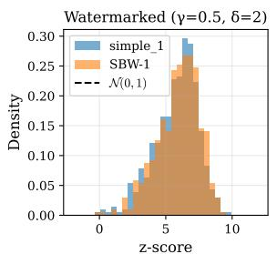

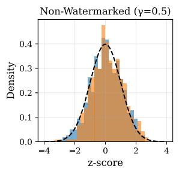

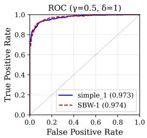

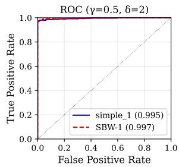  
Figure 1: Without self-salt: z-score distributions are indistinguishable between implementations. Bottom: ROC curves showing equivalent detection (AUC differences <0.01).

Watermarked text. Table 3 bottom panel reports summary statistics and two-sample t-tests for watermarked text. The SBW-ss scheme consistently produces slightly higher z-scores (all ∆ positive), with 3 of 8 configurations reaching statistical significance.

Fig. 2 top left shows the results for the selfhash scheme, confirming the slight positive shift for SBW-ss.

Two-sample KS tests confirm the distributional differences (Appendix B, Table 11): four of eight configurations reject distributional equivalence, contrasting with the non-self-salt result (1/8 rejections). The effect is stronger at high δ values, where the watermark bias amplifies any difference in green list composition.

## 4.3 Detection Accuracy: ROC-AUC Analysis

We measure detection performance using ROC-AUC, which captures the trade-off between true positive rate and false positive rate across all zscore thresholds.

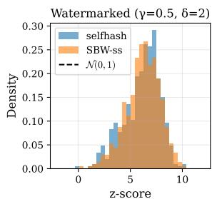

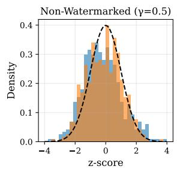

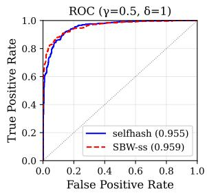

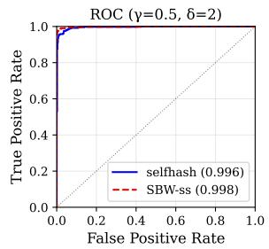  
Figure 2: With self-salt: SBW-ss produces slightly higher z-scores due to the Jenkins hash (Section 4.5). Bottom: ROC curves showing equivalent detection.

Table 4: ROC-AUC Comparison
<table><tr><td colspan="5">Without self-salt</td><td colspan="3">With self-salt (top-40)</td></tr><tr><td>γ</td><td>δ</td><td>KGW</td><td>Ours</td><td>∆</td><td>KGW</td><td>Ours</td><td>∆</td></tr><tr><td>0.25</td><td>1.0</td><td>.96</td><td>.97</td><td>+.009</td><td>.943</td><td>.953</td><td>+.009</td></tr><tr><td>0.25</td><td>2.0</td><td>.995</td><td>.997</td><td>+.001</td><td>.995</td><td>.994</td><td>-.001</td></tr><tr><td>0.25</td><td>5.0</td><td>1.00</td><td>1.00</td><td>.000</td><td>1.00</td><td>1.00</td><td>.000</td></tr><tr><td>0.25</td><td>10</td><td>1.00</td><td>1.00</td><td>.000</td><td>1.00</td><td>1.00</td><td>.000</td></tr><tr><td>0.50</td><td>1.0</td><td>.972</td><td>.974</td><td>+.001</td><td>.955</td><td>.959</td><td>+.004</td></tr><tr><td>0.50</td><td>2.0</td><td>.995</td><td>.996</td><td>+.001</td><td>.995</td><td>.998</td><td>+.002</td></tr><tr><td>0.50</td><td>5.0</td><td>1.00</td><td>1.00</td><td>.000</td><td>1.00</td><td>1.00</td><td>.000</td></tr><tr><td>0.50</td><td>10</td><td>1.00</td><td>1.00</td><td>.000</td><td>.999</td><td>1.00</td><td>+.000</td></tr></table>

500 WM + 500 non-WM per config. Max ∆AUC = 0.01.

## 4.3.1 Without Self-Salt (simple\_1 vs SBW-1)

Given the z-score equivalence established above, we expect equivalent detection performance. Table 4 confirms this prediction.

The maximum AUC difference is below 1% (Table 4) and occurs at the weakest configuration where sampling variance is highest. Across all configurations, the differences show no systematic bias favoring either implementation. At higher δ values, both schemes achieve near-perfect separation $( \mathrm { A U C } \geq 0 . 9 9 9 )$ , leaving no room for measurable differences. Fig. 1 bottom row confirms this visually: the ROC curves are indistinguishable. These results demonstrate that Stateless Bernoulli Watermarking achieves equivalent detection accuracy to KGW.

## 4.3.2 With Self-Salt (selfhash vs SBW-ss)

Since SBW-ss produces slightly higher z-scores on watermarked text (Section 4.2), detection performance can only remain equivalent or improve. Fig. 2 bottom panel confirms this: AUC differences are below 1% (Table 4), with SBW-ss showing a marginal advantage at low false positive rates due to its better-calibrated null distribution.

Table 5: Perplexity Degradation $( \Delta \mathrm { { P P L } = \Delta \mathbf { W M } - }$ NoWM)
<table><tr><td></td><td></td><td colspan="3">Without self-salt</td><td colspan="3">With self-salt</td></tr><tr><td>γ</td><td>δ</td><td>∆KGW</td><td>∆Ours</td><td>p</td><td>∆KGW</td><td>∆Ours</td><td>p</td></tr><tr><td>0.25</td><td>1.0</td><td>+0.25</td><td>+0.17</td><td>0.54</td><td>+0.19</td><td>+0.24</td><td>0.26</td></tr><tr><td>0.25</td><td>2.0</td><td>+1.34</td><td>+1.05</td><td>0.06</td><td>+1.29</td><td>+1.27</td><td>0.70</td></tr><tr><td>0.25</td><td>5.0</td><td>+6.91</td><td>+6.00</td><td>0.01</td><td>+7.16</td><td>+8.14</td><td>.004</td></tr><tr><td>0.25</td><td>10</td><td>+11.2</td><td>+10.4</td><td>0.23</td><td>+10.6</td><td>+14.9</td><td>&lt; 10−7</td></tr><tr><td>0.50</td><td>1.0</td><td>+0.31</td><td>+0.25</td><td>0.64</td><td>+0.26</td><td>+0.15</td><td>0.97</td></tr><tr><td>0.50</td><td>2.0</td><td>+0.98</td><td>+1.07</td><td>0.71</td><td>+1.11</td><td>+1.07</td><td>0.80</td></tr><tr><td>0.50</td><td>5.0</td><td>+4.01</td><td>+4.19</td><td>0.25</td><td>+4.15</td><td>+4.78</td><td>.001</td></tr><tr><td>0.50</td><td>10</td><td>+6.63</td><td>+6.74</td><td>0.71</td><td>+7.66</td><td>+8.40</td><td>0.03</td></tr></table>

N = 500. Baseline PPL without watermark ≈ 5.4.

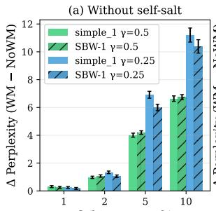

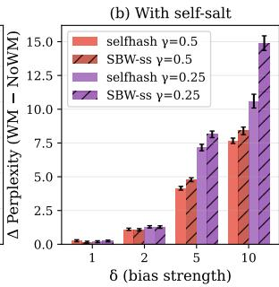  
Figure 3: Perplexity degradation (∆PPL = watermarked − non-watermarked) vs δ. (a) Without self-salt: implementations are indistinguishable. (b) With self-salt: SBW-ss shows higher degradation at $\delta \geq 5 ,$ , attributable to the Jenkins hash (Section 4.5).

## 4.4 Text Quality: Perplexity Analysis

We measure text quality using perplexity (PPL) from the external evaluation model.

## 4.4.1 Without Self-Salt (simple\_1 vs SBW-1)

Table 5 and Fig. 3 left panels report the perplexity comparison for the non-self-salt scheme. The perplexity degradation follows expected patterns: larger δ values cause greater quality loss, and smaller $\cdot \gamma$ (more constrained green lists) amplifies this effect. Critically, both implementations produce nearly identical perplexity profiles. Only one of eight configurations shows $\mathfrak { p } < 0 . 0 5$ (Table 5), consistent with chance given 8 independent tests at $\alpha = 0 . 0 5$

## 4.4.2 With Self-Salt (selfhash vs SBW-ss)

Unlike the non-self-salt comparison, Table 5 right panel reveals a systematic difference: SBW-ss shows higher perplexity degradation at $\delta \geq 5$ , with the gap growing substantially at aggressive configurations (Table 5). At practical settings $( \delta \leq 2 )$ , the implementations are statistically indistinguishable. This pattern suggests the hash function interacts with the watermark bias; Section 4.5 attributes this to the Jenkins hash and shows the higher perplexity is accompanied by higher text diversity.

## 4.5 Hash Function Design: A New Axis for Watermark Quality

The experiments in Sections 4.2–4.4 compared selfhash and SBW-ss, which differ in two ways simultaneously: (1) green list construction (permutation vs Bernoulli) and (2) hash function (permutation table vs Jenkins). Because the hash difference produced unexpected results, we introduce a control scheme, SBW-ss-cpu, which uses the GPU Bernoulli code path but retains the KGW hash function. By comparing all three schemes on the same data, we isolate the hash effect and show that hash function design significantly impacts watermark quality, independent of the green list construction method.

## 4.5.1 Attribution of Distributional Differences

To confirm the distributional differences observed in Section 4.2 and identify their cause, we score a separate set of 500 non-watermarked completions (from a $\delta = 0$ control experiment) with three detectors: selfhash, SBW-ss-cpu (our control), and SBW-ss. The results (detailed in Appendix A) are unambiguous: when the hash function is held constant, the Bernoulli method produces distributions indistinguishable from permutation $( p = 0 . 1 7 3$ and $p = 0 . 3 2 9$ for $\gamma = 0 . 2 5 , 0 . 5$ respectively), while the different-hash comparison is strongly rejected $( p = 4 { \times } 1 0 ^ { - 4 } \mathrm { a t } \gamma = 0 . 2 5 )$ . The distributional differences are entirely attributable to the Jenkins hash function, not the Bernoulli green list construction.

On this control experiment, the Jenkins hash improves null calibration by $1 . 8 \times \mathrm { a t } \gamma = 0 . 2 5$ and reduces the negative mean bias by 2.3×, in line with what already reported. At any fixed z-score threshold, the SBW-ss detector therefore produces fewer false positives. The effect is most pronounced at $\gamma = 0 . 2 5$ , where the smaller green list amplifies sensitivity to hash uniformity.

## 4.5.2 Perplexity and Diversity

Using the same control scheme, we confirm that the perplexity difference between selfhash and

SBW-ss is also attributable to the hash function (Appendix A). At practical configurations $( \delta \leq 2 )$ the two schemes produce statistically indistinguishable diversity and perplexity. At aggressive configurations $\left( \delta \geq 5 \right)$ , a tradeoff emerges: selfhash produces lower perplexity but also lower diversity $( \mathrm { e . g . }$ , diversity drops to 0.40 at $\delta \ : = \ : 1 0$ vs 0.62 with Jenkins, relative to a 0.70 non-watermarked baseline), while SBW-ss produces higher perplexity but higher diversity. The lower perplexity in selfhash does not indicate better text quality; it reflects the model being constrained to repeat similar token patterns due to autocorrelation in the permutation table hash’s green list assignments.

## 5 Capabilities Enabled by Stateless Formulation

Beyond the asymptotic improvement, the shift to a stateless, threshold-based RNG unlocks several hardware-level optimizations that we have implemented and validated in a production-ready codebase integrated with vLLM (Kwon et al., 2023).

## 5.1 Fused Kernel Architecture

Kernel fusion, combining multiple operations into a single GPU kernel launch, is critical for latency-sensitive inference as it eliminates intermediate memory traffic and kernel launch overhead. KGW’s permutation cannot be fused: the GPU must complete the shuffle, materialize a (B, V) index tensor, derive a boolean mask, and apply the bias, each as a separate kernel. SynthID’s m reweighting passes can be fused by torch.compile into a single kernel (as we demonstrate in our benchmark), but the fused kernel still performs $O ( k \cdot m )$ work per token step.

Our Bernoulli formulation eliminates this barrier through three properties: (1) in-place logit mutation with no intermediate tensor materialization (zero additional memory required; Section 6), (2) a single CBRNG evaluation per token (no sequential dependencies), and (3) fully GPU-resident computation with no CPU synchronization. The entire watermarking operation can be expressed as a single pointwise tensor expression and compiled into one fused CUDA kernel using torch.compile (Ansel et al., 2024; Tillet et al., 2019) with mode="max-autotune", absorbing watermarking into existing logit postprocessing without a dedicated pipeline step.

## 5.2 Full-Vocabulary Self-Salt Watermarking

Self-salt seeding schemes, where the candidate token itself influences the seed, exhibit superior robustness to editing attacks (Kirchenbauer et al., 2023). However, existing methods either avoid selfsalt entirely (SynthID uses a fixed context window of $H = 4$ tokens, independent of the candidate) or restrict it to a small subset: KGW evaluates only the $ { \mathrm { t o p } }  { - } k = 4 0$ candidates, leaving the remaining vocabulary unbiased and weakening the watermark signal in high-entropy contexts.

Our approach reduces the per-candidate cost to $O ( 1 )$ , making full-vocabulary self-salt practical. Setting $k \ = \ V$ biases the entire vocabulary at $O ( B \times V )$ total cost, cheaper than KGW’s $O ( B \times 4 0 \times V \log V )$ for just 40 candidates. For the first time, true self-salt watermarking without approximation is feasible at production scale, combining the robustness benefits of candidate-dependent seeding with full vocabulary coverage.

## 5.3 Inherited Security and Robustness

A natural question is whether SBW inherits the security and robustness guarantees established for KGW (Kirchenbauer et al., 2023, 2024; Fernandez et al., 2023; Zhao et al., 2024). We argue that it does, inheriting both the strengths and the fundamental limitations (Zhang et al., 2024) of the underlying statistical framework. The existing theoretical analyses rely on a single statistical property: conditioned on the seeding context, each token is assigned to the green list with probability γ, independently of other tokens. Our Proposition 1 proves that SBW satisfies exactly this property. Any theorem whose proof depends only on this independence and the marginal γ transfers directly, including detection power and false positive rates (confirmed empirically by our two-sample KS tests, Table 10), robustness to partial edits (same signal degradation for identical seeding schemes), resistance to removal attacks (same δ bias profile), and security against spoofing (inverting the CBRNG is computationally equivalent to inverting KGW’s PRF-seeded permutation). Appendix G validates this empirically: across 19 attack configurations (character/word edits, truncation, paraphrasing, MLM substitution), SBW matches or exceeds (due to improved hash function; Section 4.5) KGW’s robustness in all cases.

## 6 Performance Evaluation

To quantify practical impact, we measure end-toend watermark overhead on Qwen2-7B, generating 128 tokens per request across batch sizes 16– 256, with 50 iterations and 10 warmup runs. Both methods run as logits processors within the same transformers.generate() loop.1 Overhead is computed as the difference in median generation time between watermarked and nonwatermarked runs; error bars show ±1σ computed as $\sqrt { \sigma _ { \mathrm { w m } } ^ { 2 } + \sigma _ { \mathrm { b a s e } } ^ { 2 } } .$

Fig. 4 reports the results. SBW adds less than 1% overhead across all batch sizes (9– 76 ms over 3.4–14.5 s generation time), with the absolute overhead remaining nearly constant as batch size grows. SynthID (official SynthIDSparseTopKMixin, top-k=40) adds 80–148 ms (0.6–4.4% at small batches). At batch 64, SBW overhead is 21 ms vs. SynthID’s 136 ms, a 6.5× reduction. At batch 256, the two converge: SBW adds 76 ms (0.53%) while SynthID adds 80 ms (0.55%).

The relative overhead (right panel) reveals distinct scaling regimes. SBW’s percentage overhead remains approximately constant (∼0.5%) across all batch sizes, while SynthID’s decreases from 6% to 0.6%. This is explained by GPU compute saturation: SBW computes seeds for every token in the 151K vocabulary (full-vocab self-salt), performing ∼3800× more work per position than SynthID’s top-40 approximation. This full-vocabulary computation saturates GPU compute around B=32–64, as confirmed by isolated kernel benchmarks (Appendix E). Beyond this saturation point, the watermark kernel time grows proportionally with batch size, matching the growth rate of generation time, yielding a constant percentage overhead. SynthID’s top-40 approximation requires far less compute and does not saturate, so its fixed absolute cost (∼100–200 ms) becomes a shrinking fraction of the growing generation time. The two curves cross at B≈256; on more powerful hardware, this crossing point would shift to higher batch sizes (as the saturation threshold increases), but the crossing is inherent to the asymmetry in computational work.

These measurements are conservative for SBW:

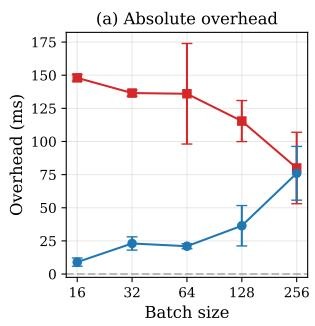

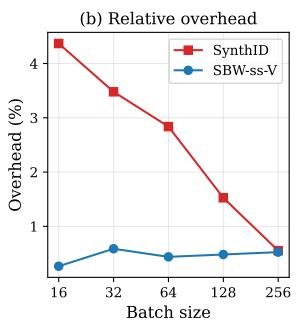  
Figure 4: End-to-end watermark overhead (Qwen2-7B, RTX 3090, 128 output tokens, 50 iterations). Left: absolute overhead in ms with ±1σ error bars. Right: relative overhead as percentage of total generation time. SBW remains below 1% at all batch sizes while SynthID (official, top-k=40) ranges from 0.6% to 4.4%. KGW (selfhash, top-40) is omitted as out of scale: +1.8s at B=1 (57%), +7.0s at B=4 (221%), +27.7s at B=16 (869%).

in production vLLM deployments, the watermark kernel runs on the same CUDA stream as the model forward pass, allowing partial overlap with memory-bound operations. Neither KGW (CPUside randperm) nor SynthID (stateful mixin design) can benefit from this pipelining. A dedicated vLLM serving benchmark confirms ∼1% overhead at production concurrency (Appendix E.4), with room for further optimization.

In isolated benchmarks measuring only the watermarking logits processor (excluding the LLM forward pass), SBW achieves 2–3× lower latency than SynthID (Dathathri et al., 2024) and over 6000× lower than KGW (Kirchenbauer et al., 2023), despite processing the entire 151K vocabulary with candidate-dependent seeding while SynthID processes only top-40 and KGW is limited to top-40 self-salt. Our schemes also use zero additional memory (in-place logit mutation), while KGW allocates 9B · V bytes per step and SynthID allocates tensors proportional to $B \times k \times$ depth (reaching 3.8 MB at batch 512). We note that SynthID provably preserves the output distribution (non-distortionary), while our method adds δ to green token logits with negligible perplexity impact at practical values $( \delta \ \leq \ 2 ,$ Section 4.4). Full isolated latency results, tail latency percentiles, speedup ratios, and memory overhead are reported in Appendix E.

## 7 Conclusion

We have presented Stateless Bernoulli Watermarking (SBW), a statistical watermark that achieves the same detection guarantees as KGW through a fundamentally different mechanism: independent per-token Bernoulli trials rather than inherently sequential vocabulary operations. This enables single-kernel O(1) watermarking with zero allocation, full-vocabulary self-salt, and architectural compatibility with distributed inference, while achieving 2× lower latency than SynthID and over 6000× lower than KGW. A second contribution is the identification of hash function design as a meaningful factor in watermark quality. These results demonstrate that the “watermark tax” is not inherent to statistical watermarking but a consequence of inherently sequential formulations. The computational headroom freed by SBW opens future directions including vocabulary-agnostic watermarks that transfer across tokenizers, asymmetric schemes with public verification, and adaptive γ/δ strategies informed by token entropy (Liu and Bu, 2024) or online optimization (Cai et al., 2026).

## 8 Ethical Considerations

We advocate that watermarking should be applied transparently: users should be informed when a watermark is present. The method itself is agnostic to disclosure policy, and we encourage adopters to pair deployment with clear user-facing documentation.

Regarding false accusations, the z-score framework provides calibrated Type I error control: at sufficiently conservative thresholds and with texts of adequate length, the false positive rate becomes negligible. We caution against applying detection to very short texts where statistical power is limited.

## 9 Limitations

The main experiments use a single GPU (RTX 3090) and model (Qwen3-8B); while we validate on an additional model and setup (Appendix F), broader evaluation across model families remains future work. While we validate robustness across 19 attack configurations (Appendix G), we did not evaluate adaptive watermark-removal strategies or spoofing attacks; dedicated security analysis remains future work. Our GPU implementation relies on compiler-generated Triton kernels via torch.compile; hand-tuned CUDA kernels with explicit memory coalescing and warp-level optimizations could further reduce latency, particularly at small batch sizes where kernel launch overhead dominates. Finally, while the stateless formulation is architecturally compatible with distributed and multi-device inference (each device can independently compute identical green lists from the shared key), we have not empirically validated this in a tensor-parallel or pipeline-parallel deployment.

## References

Sahar Abdelnabi and Mario Fritz. 2021. Adversarial watermarking transformer: Towards tracing text provenance with data hiding. In IEEE Symposium on Security and Privacy (S&P), pages 121–140.

Jason Ansel, Edward Yang, Horace He, Natalia Gimelshein, Animesh Jain, Michael Voznesensky, Bin Bao, Peter Bell, David Berard, Evgeni Burovski, Geeta Chauhan, Anjali Chourdia, Will Constable, Alban Desmaison, Zachary DeVito, Elias Ellison, Will Feng, Jiong Gong, Michael Gschwind, and 30 others. 2024. PyTorch 2: Faster machine learning through dynamic python bytecode transformation and graph compilation. In Proceedings ofASPLOS, pages 929– 947.

Zhongze Cai, Shang Liu, Hanzhao Wang, Huaiyang Zhong, and Xiaocheng Li. 2026. Towards better statistical understanding of watermarking LLMs. Journal of the American Statistical Association, 121(553):1–22.

Yapei Chang, Kalpesh Krishna, Amir Houmansadr, John Frederick Wieting, and Mohit Iyyer. 2024. Post-Mark: A robust blackbox watermark for large language models. In Proceedings of EMNLP, pages 8969–8987.

Miranda Christ, Sam Gunn, and Or Zamir. 2024. Undetectable watermarks for language models. In Proceedings of COLT, volume 247 of Proceedings of Machine Learning Research, pages 1125–1139.

Sumanth Dathathri, Abigail See, Sumedh Ghaisas, Po-Sen Huang, Rob McAdam, Johannes Welbl, Vandana Bachani, Alex Kaskasoli, Robert Stanforth, Tatiana Matejovicova, Jamie Hayes, Nidhi Vyas, Majd Al Merey, Jonah Brown-Cohen, Rudy Bunel, Borja Balle, Taylan Cemgil, Zahra Ahmed, Kitty Stacpoole, and 5 others. 2024. Scalable watermarking for identifying large language model outputs. Nature, 634:818– 823.

Abdulrahman Diaa, Toluwani Aremu, and Nils Lukas. 2025. Optimizing adaptive attacks against watermarks for language models. In Proceedings ofICML.

Pierre Fernandez, Antoine Chaffin, Karim Tit, Vivien Chappelier, and Teddy Furon. 2023. Three bricks to consolidate watermarks for large language models. In IEEE International Workshop on Information Forensics and Security (WIFS).

Chenchen Gu, Xiang Lisa Li, Percy Liang, and Tatsunori Hashimoto. 2024. On the learnability of watermarks for language models. In Proceedings of ICLR.

Zhengmian Hu, Lichang Chen, Xidong Wu, Yihan Wu, Hongyang Zhang, and Heng Huang. 2024. Unbiased watermark for large language models. In Proceedings ofICLR.

Bob Jenkins. 1997. A hash function for hash table lookup. Dr. Dobb’s Journal.

Nikola Jovanovic, Robin Staab, and Martin Vechev.´ 2024. Watermark stealing in large language models. In Proceedings ofICML, volume 235 of Proceedings ofMachine Learning Research, pages 22570–22593.

John Kirchenbauer, Jonas Geiping, Yuxin Wen, Jonathan Katz, Ian Miers, and Tom Goldstein. 2023. A watermark for large language models. In Proceedings ofICML, volume 202 of Proceedings ofMachine Learning Research, pages 17061–17084.

John Kirchenbauer, Jonas Geiping, Yuxin Wen, Manli Shu, Khalid Saifullah, Kezhi Kong, Kasun Fernando, Aniruddha Saha, Micah Goldblum, and Tom Goldstein. 2024. On the reliability of watermarks for large language models. In Proceedings ofICLR.

Rohith Kuditipudi, John Thickstun, Tatsunori Hashimoto, and Percy Liang. 2024. Robust distortion-free watermarks for language models. Transactions on Machine Learning Research.

Woosuk Kwon, Zhuohan Li, Siyuan Zhuang, Ying Sheng, Lianmin Zheng, Cody Hao Yu, Joseph Gonzalez, Hao Zhang, and Ion Stoica. 2023. Efficient memory management for large language model serving with PagedAttention. In Proceedings of SOSP, pages 611–626.

Harsh Nishant Lalai, Aashish Anantha Ramakrishnan, Raj Sanjay Shah, and Dongwon Lee. 2025. From intentions to techniques: A comprehensive taxonomy and challenges in text watermarking for large language models. In Findings ofNAACL, pages 6162– 6175.

Peixuan Li, Pengzhou Cheng, Fangqi Li, Wenbiao Li, Lianwen Jin, and Gongshen Liu. 2023a. PLMmark: A secure and robust black-box watermarking framework for pre-trained language models. In Proceedings ofAAAI, volume 37, pages 14991–14998.

Xiang Li, Feng Ruan, Huiyuan Wang, Qi Long, and Weijie J. Su. 2025. A statistical framework of watermarks for large language models: Pivot, detection efficiency and optimal rules. The Annals ofStatistics, 53(1):322–351.

Xiang Lisa Li, Ari Holtzman, Daniel Fried, Percy Liang, Jason Eisner, Tatsunori Hashimoto, Luke Zettlemoyer, and Mike Lewis. 2023b. Contrastive decoding: Open-ended text generation as optimization. In Proceedings ofACL, pages 12286–12312.

Yepeng Liu and Yuheng Bu. 2024. Adaptive text watermark for large language models. In Proceedings of ICML, volume 235 of Proceedings of Machine Learning Research, pages 30718–30737. PMLR.

Jipeng Qiang, Shiyu Zhu, Yun Li, Yi Zhu, Yunhao Yuan, and Xindong Wu. 2023. Natural language watermarking via paraphraser-based lexical substitution. Artificial Intelligence, 317:103859.

Colin Raffel, Noam Shazeer, Adam Roberts, Katherine Lee, Sharan Narang, Michael Matena, Yanqi Zhou, Wei Li, and Peter J. Liu. 2020. Exploring the limits of transfer learning with a unified text-to-text transformer. Journal ofMachine Learning Research, 21(140):1–67.

Saksham Rastogi and Danish Pruthi. 2024. Revisiting the robustness of watermarking to paraphrasing attacks. In Proceedings of EMNLP, pages 18100– 18110.

John K. Salmon, Mark A. Moraes, Ron O. Dror, and David E. Shaw. 2011. Parallel random numbers: As easy as 1, 2, 3. In Proceedings ofSC’11, pages 1–12. ACM.

Qwen Team. 2025. Qwen3.5-omni technical report. arXiv preprint arXiv:2604.15804.

Philippe Tillet, H. T. Kung, and David Cox. 2019. Triton: An intermediate language and compiler for tiled neural network computations. In Proceedings of the 3rd ACM SIGPLAN International Workshop on Machine Learning and Programming Languages (MAPL), pages 10–19.

Sean Welleck, Ilia Kulikov, Stephen Roller, Emily Dinan, Kyunghyun Cho, and Jason Weston. 2020. Neural text generation with unlikelihood training. In Proceedings ofICLR.

Yihan Wu, Zhengmian Hu, Junfeng Guo, Hongyang Zhang, and Heng Huang. 2024. A resilient and accessible distribution-preserving watermark for large language models. In Proceedings ofICML, volume 235 of Proceedings of Machine Learning Research, pages 53443–53470.

An Yang, Anfeng Li, Baosong Yang, Beichen Zhang, Binyuan Hui, Bo Zheng, Bowen Yu, Chang Gao, Chengen Huang, Chenxu Lv, Chujie Zheng, Dayiheng Liu, Fan Yang, Fei Huang, Feng Hu, Hao Ge, Haoran Wei, Huan Lin, Jialong Tang, and 40 others. 2025. Qwen3 technical report. arXiv preprint, arXiv:2505.09388.

Hanlin Zhang, Benjamin L. Edelman, Danilo Francati, Daniele Venturi, Giuseppe Ateniese, and Boaz Barak. 2024. Watermarks in the sand: Impossibility of strong watermarking for generative models. In Proceedings of ICML, volume 235 of Proceedings of Machine Learning Research, pages 58851–58880.

Table 6: Two-Sample KS Tests Isolating Hash Effect
<table><tr><td></td><td colspan="2"> $\gamma = 0 . 2 5$ </td><td colspan="2"> $\gamma = 0 . 5 0$ </td></tr><tr><td>Comparison</td><td>KS</td><td>p</td><td>KS</td><td>p</td></tr><tr><td>simple_1 vs SBW-1 (same hash)</td><td>0.028</td><td>0.990</td><td>0.040</td><td>0.819</td></tr><tr><td>selfhash vs SBW-ss-cpu (same)</td><td>0.070</td><td> $0 . 1 7 3$ </td><td>0.060</td><td>0.329</td></tr><tr><td>selfhash vs SBW-ss (diff hash)</td><td>0.130</td><td> $4 \times 1 0 ^ { - 4 }$ </td><td>0.054</td><td>0.460</td></tr></table>

$N = 5 0 0 .$ Only different-hash comparison rejected at $\overline { { \gamma = } }$ 0.25.

Ruisi Zhang and Farinaz Koushanfar. 2024. Watermarking large language models and the generated content: Opportunities and challenges. In Asilomar Conference on Signals, Systems, and Computers, pages 1779–1786.

Xuandong Zhao, Prabhanjan Ananth, Lei Li, and Yu-Xiang Wang. 2024. Provable robust watermarking for AI-generated text. In Proceedings ofICLR.

Xuandong Zhao, Lei Li, and Yu-Xiang Wang. 2025. Permute-and-flip: An optimally stable and watermarkable decoder for LLMs. In Proceedings of ICLR.

## A Hash Function Analysis: Detailed Results

This appendix provides the full statistical analysis supporting the hash function findings in Section 4.5.

## A.1 Distributional Attribution

We scored 500 non-watermarked completions (from a separate $\delta \quad = \quad 0$ control experiment) with three detectors: selfhash, SBW-ss-cpu (Bernoulli green list with permutation table hash), and SBW-ss (Bernoulli green list with Jenkins hash). For each pair of detectors (with $\gamma \quad =$ 0.25, 0.5), we apply the two-sample Kolmogorov-Smirnov (KS) test. Table 6 reports the results.

When the hash function is held constant, the Bernoulli method produces distributions indistinguishable from permutation. At $\gamma = 0 . 5 0$ , even the different-hash comparison fails to reject equivalence, indicating the effect is most pronounced when the smaller green list amplifies sensitivity to hash uniformity.

## A.2 Null Calibration

We assess how well each detector’s null distribution conforms to the theoretical $\mathcal { N } ( 0 , 1 )$ using onesample KS tests. A lower KS statistic indicates better calibration, meaning the detector’s false positive rate at any z-score threshold is closer to the nominal rate. Table 7 reports the results.

Table 7: One-Sample KS Tests vs $\mathcal { N } ( 0 , 1 )$ (Null Calibration)
<table><tr><td></td><td colspan="2"> $\gamma = 0 . 2 5$ </td><td colspan="2"> $\gamma = 0 . 5 0$ </td></tr><tr><td>Detector</td><td>Mean</td><td>KS</td><td>Mean</td><td>KS</td></tr><tr><td>selfhash (CPU hash)</td><td>-0.634</td><td>0.259</td><td>-0.150</td><td>0.101</td></tr><tr><td>SBW-ss-cpu</td><td>-0.694</td><td>0.296</td><td>-0.104</td><td>0.067</td></tr><tr><td>SBW-ss (Jenkins)</td><td>-0.279</td><td>0.143</td><td>-0.102</td><td>0.091</td></tr></table>

N = 500. Lower KS = closer to theoretical null.

Table 8: Perplexity Comparison Isolating Hash Effect
<table><tr><td>Scheme</td><td>Hash</td><td> $\delta = 5$   $\Delta \mathsf { p p l }$ </td><td>p</td><td> $\delta = 1 0$   $\Delta { \sf p p l }$ </td></tr><tr><td>selfhash</td><td>CPU perm</td><td>7.16</td><td></td><td>10.60</td></tr><tr><td>SBW-ss-cpu</td><td>CPU perm</td><td>7.81</td><td>0.095</td><td>10.67 0.927</td></tr><tr><td>SBW-ss</td><td>Jenkins</td><td>8.14</td><td>.004 14.89</td><td>.000</td></tr></table>

$\overline { { \gamma = 0 . 2 5 , N = 5 0 0 . } }$ p-values vs selfhash.

The Bernoulli method alone (with permutation table hash) does not improve calibration, as predicted by our equivalence proof (Section 3), confirming that the improvement is attributable to the Jenkins hash’s larger output range producing more uniform green list assignments.

## A.3 Perplexity Isolation

Using the same SBW-ss-cpu control scheme, we compare perplexity across the three implementations. Table 8 shows that when using the same hash function, selfhash and SBW-ss-cpu produce statistically indistinguishable perplexity, confirming the hash function as the sole cause of the perplexity difference.

## A.4 Diversity Analysis

The permutation table hash, with its smaller range and table-based structure, produces more autocorrelation in green list assignments across similar contexts. This autocorrelation manifests as text repetition: when similar contexts map to similar seeds, the model is biased toward the same green tokens repeatedly. We quantify this using a diversity metric based on unique n-gram fractions (Welleck et al., 2020; Li et al., 2023b; Kirchenbauer et al., 2024):

$$
{ \mathrm { d i v e r s i t y } } = - \log \left( 1 - \prod _ { n = 1 } ^ { N } u _ { n } \right)\tag{6}
$$

where $u _ { n }$ is the fraction of unique n-grams at order n $( N = 4 )$ . Higher values indicate more diverse (less repetitive) text. Table 9 reports the results.

Table 9: Text Diversity Comparison (Watermarked)
<table><tr><td>δ</td><td>selfhash</td><td>SBW-ss</td><td>p</td></tr><tr><td>1</td><td>0.696</td><td>0.723</td><td>0.13</td></tr><tr><td>2</td><td>0.728</td><td>0.761</td><td>0.10</td></tr><tr><td>5</td><td>0.695</td><td>0.805</td><td>&lt;.0001</td></tr><tr><td>10</td><td>0.403</td><td>0.624</td><td>&lt;.0001</td></tr></table>

γ = 0.25, N = 500. NoWM diversity ≈ 0.70. Higher = less repetition.

Table 10: Two-Sample KS Tests on Non-WatermarkedZ-Scores
<table><tr><td>Scheme</td><td> $\gamma _ { \mathrm { d e t } }$ </td><td>N</td><td>KS</td><td>p-value</td></tr><tr><td>simple_1</td><td>0.25</td><td>4000</td><td>0.026</td><td> $_ { 0 . 1 4 1 }$ </td></tr><tr><td>simple_1</td><td>0.50</td><td>4000</td><td>0.042</td><td> $< 1 0 ^ { - 3 }$ </td></tr><tr><td>selfhash selfhash</td><td>0.25 0.50</td><td>4000 4000</td><td>0.112 0.081</td><td> $< 1 0 ^ { - 2 2 }$   $< 1 0 ^ { - 1 2 }$ </td></tr></table>

N = 4000 pooled (4 $\overline { { \delta \times 2 \gamma \times } }$ 500 samples). Same texts scored by both detectors.

Table 11: Two-Sample KS Tests on Watermarked Z-Scores
<table><tr><td rowspan=1 colspan=1>γ    δ</td><td rowspan=1 colspan=1>Without self-saltKS      p</td><td rowspan=1 colspan=1>With self-saltKS     p</td></tr><tr><td rowspan=1 colspan=1>0.25  1.0</td><td rowspan=1 colspan=1>0.044   0.719</td><td rowspan=1 colspan=1>0.098  0.016</td></tr><tr><td rowspan=1 colspan=1>0.25  2.0</td><td rowspan=1 colspan=1>0.062   0.292</td><td rowspan=1 colspan=1>0.048  0.613</td></tr><tr><td rowspan=1 colspan=1>0.25  5.0</td><td rowspan=1 colspan=1>0.080   0.082</td><td rowspan=1 colspan=1>0.096  0.020</td></tr><tr><td rowspan=1 colspan=1>0.25  10</td><td rowspan=1 colspan=1>0.058   0.370</td><td rowspan=1 colspan=1>0.154  0.000</td></tr><tr><td rowspan=1 colspan=1>0.50  1.0</td><td rowspan=1 colspan=1>0.034   0.935</td><td rowspan=1 colspan=1>0.050  0.560</td></tr><tr><td rowspan=1 colspan=1>0.50  2.0</td><td rowspan=1 colspan=1>0.044   0.719</td><td rowspan=1 colspan=1>0.046  0.666</td></tr><tr><td rowspan=1 colspan=1>0.50  5.0</td><td rowspan=1 colspan=1>0.092   0.029</td><td rowspan=1 colspan=1>0.112  0.004</td></tr><tr><td rowspan=1 colspan=1>0.50  10</td><td rowspan=1 colspan=1>0.070   0.173</td><td rowspan=1 colspan=1>0.066  0.226</td></tr></table>

N = 500 per group. Without self-salt: 7/8 pass. With selfsalt: 4/8 pass.

## B Two-Sample KS Tests

## B.1 Non-Watermarked Z-Scores

We pool non-watermarked z-scores across all δ values and generation γ settings (N = 4000 per scheme), then run two-sample KS tests between KGW and SBW for each detector γ. Table 10 reports the results.

## B.2 Watermarked Z-Scores

To test full distributional agreement beyond the mean, we apply two-sample KS tests to the watermarked z-scores for each $( \gamma , \delta )$ configuration. Table 11 reports the results for both schemes.

For the non-self-salt scheme, seven of eight configurations fail to reject the null hypothesis of identical distributions $( p > 0 . 0 5 )$ . The single rejection occurs at the same configuration flagged by the ttest in the main text. For the self-salt scheme, four of eight reject equivalence, with the effect stronger at high δ values where the watermark bias amplifies differences in green list composition due to the hash function (Section 4.5).

## C Reproducibility

Hardware. All experiments were conducted on a single NVIDIA GeForce RTX 3090 GPU (24 GB VRAM, 10,496 CUDA cores, 936 GB/s memory bandwidth).

Software. Python 3.10.12, PyTorch 2.10.0 (CUDA 12.8, cuDNN 9.10.02), NVIDIA driver 535.183.01, vLLM 0.19.1.

Generation parameters. For each prompt, we generated one watermarked and one nonwatermarked completion of up to 200 tokens. The same random seed (42) and hash key (15485863) were used across all experiments.

Code. This paper’s source and supplementary materials are available at https://github.com/si-mon-jinn/ flip-dont-shuffle, including scripts to reproduce all tables and figures. The watermarking method is implemented in the sbw library (https://github.com/si-mon-jinn/ sbw, also available via pip install sbw). All experiments were run using waterpipe (https://github.com/si-mon-jinn/ waterpipe), a watermark evaluation library.

## D Isolated Benchmark: Fairness and Methodology

This section documents the methodology and fairness considerations of the isolated logits processor benchmark (end of Section 6), which measures percall watermark kernel latency in isolation from the LLM forward pass. We detail the optimizations applied to each baseline to ensure the comparison reflects each method’s best achievable performance.

## D.1 Improvements to the KGW Baseline

The KGW baseline uses our reimplementation (sbw-watermark, scheme ff-additive\_prf-4-False) that retains the same algorithmic structure as KGW (Kirchenbauer et al., 2023, 2024): sequential torch.randperm(V) per batch element, per-sequence RNG seeding, and Pythonlevel mask construction. We applied several backward-compatible fixes (e.g. batched seed computation, avoiding redundant tensor allocations), with the most significant being: the reference selfhash loop uses Python enumerate() over a CUDA tensor, causing one implicit CPU transfer per element. Replacing it with index-based access yields a 23× speedup while producing bit-identical green lists.

## D.2 Improvements to the SynthID Baseline

We benchmark against SynthID-Text (Dathathri et al., 2024), vendored from the official google-deepmind/synthid-text repository (Apache 2.0 license). To measure SynthID’s theoretical minimum latency, we inline all operations into a single torch.compile call with mode="max-autotune", stripping state management, context history tracking, and safety checks. We verified bit-identical outputs between our compiled pipeline and the reference implementation; tests are available in the paper repository. This gives SynthID every advantage: our reported numbers represent a lower bound on its actual production cost.

## D.3 Our GPU Implementation

Our fused Bernoulli implementation is benchmarked as-is from the production library (sbw-watermark), with no benchmark-specific optimizations. The compiled kernels are the same ones used in the vLLM logits processor. This means our reported numbers reflect actual production performance.

## D.4 Measurement Methodology

All measurements use identical methodology:

• CUDA event timing with torch.cuda.synchronize() between iterations

• 20 warmup iterations (discarded) followed by 200 measurement iterations

• torch.cuda.empty\_cache() between methods to prevent memory interference

• Same torch.compile with mode="max-autotune" for all compiled paths

• Sequential execution (no parallel streams or concurrent kernels)

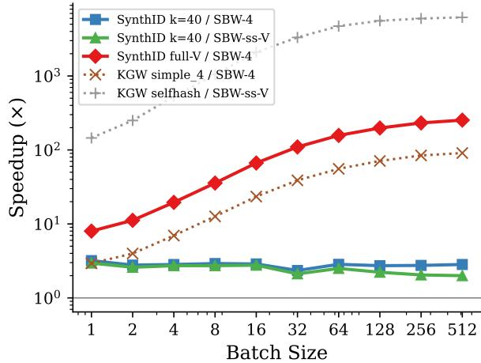  
Figure 5: Speedup ratio (log scale). Values above 1.0 indicate slower than the SBW reference.

• Fresh random logits tensor of shape (B, 151,936) for each method

## D.5 Known Asymmetries

1. Depth parameter. SynthID uses depth= 30 (Google’s official demo configuration, upper end of the recommended 20–30 range). Using depth= 20 would reduce SynthID’s latency by ∼33%.

2. Hand-optimized SynthID vs. production SBW. As noted above, our SynthID benchmark represents a theoretical optimum, while our SBW numbers are production code.

## D.6 Scheme Label Mapping

Table 12 maps the paper labels to the library scheme identifiers used in the sbw-watermark package, for reproducibility.

## E Isolated Logits Processor Benchmark: Full Results

This appendix provides the full latency, tail latency, and memory data from the isolated logits processor benchmark (Section 6), which measures per-call watermark kernel cost on synthetic tensors without an LLM forward pass.

## E.1 Full Latency (All Batch Sizes)

Table 13 reports median latency (p50) for all methods across all tested batch sizes. Fig. 6 visualizes the scaling behavior. Fig. 5 shows speedup ratios on a log scale.

Table 12: Paper labels and corresponding library scheme identifiers.
<table><tr><td>Paper</td><td>Library scheme</td><td>PRF</td><td>Width</td><td>Self-salt</td><td>Candidates</td></tr><tr><td>SBW-1</td><td> $\mathfrak { g p u { - } f u s e d { - } s i m p l e { \_ 1 } }$ </td><td>additive</td><td>1</td><td>No</td><td>full V</td></tr><tr><td>SBW-4</td><td> $\mathsf { g p u { - } f u s e d { - } s i m p l e { \_ 4 } }$ </td><td>additive</td><td>4</td><td>No</td><td>full V</td></tr><tr><td>SBW-SS</td><td> $9 \mathrm { { p u - f u s e d - s e l f h a s h } }$ </td><td>anchored minhash</td><td>4</td><td>Yes</td><td>top-40</td></tr><tr><td> $\mathrm { S B W \mathrm { - } s s \mathrm { - } V }$ </td><td> ${ \tt g p u \mathrm { - } f u s e d \mathrm { - } s e l f h a s h \mathrm { - } f u l l v o c a b }$ </td><td>anchored minhash</td><td>4</td><td>Yes</td><td>full V</td></tr><tr><td>SBW-ss-cpu</td><td> ${ \tt g p u \mathrm { - } f u s e d \mathrm { - } s e l f h a s h \mathrm { - } c p u h a s h }$ </td><td>anchored minhash</td><td>4</td><td>Yes</td><td>top-40</td></tr></table>

Table 13: Median Latency (ms) Across All Batch Sizes
<table><tr><td>Method</td><td></td><td>1</td><td>2</td><td>4</td><td>8</td><td>16</td><td>32</td><td>64</td><td>128</td><td>256</td><td>512</td></tr><tr><td rowspan="2">SBW-4</td><td>ms</td><td>0.090</td><td>0.104</td><td>0.102</td><td>0.100</td><td>0.102</td><td>0.121</td><td>0.167</td><td>0.262</td><td>0.445</td><td>0.814</td></tr><tr><td>ratio</td><td>0.9×</td><td>0.9×</td><td>1.0×</td><td>0.9×</td><td>1.0×</td><td>0.9×</td><td>0.9×</td><td>0.8×</td><td>0.7×</td><td>0.7×</td></tr><tr><td rowspan="2">SBW-ss-V</td><td>ms</td><td>0.097</td><td>0.112</td><td>0.105</td><td>0.107</td><td>0.106</td><td>0.134</td><td>0.189</td><td>0.322</td><td>0.599</td><td>1.154</td></tr><tr><td>ratio</td><td>1.0×</td><td>1.0×</td><td>1.0×</td><td>1.0×</td><td>1.0×</td><td>1.0×</td><td>1.0×</td><td>1.0×</td><td>1.0×</td><td>1.0×</td></tr><tr><td rowspan="2">SynthID (k=40)</td><td>ms</td><td>0.288</td><td>0.290</td><td>0.288</td><td>0.293</td><td>0.295</td><td>0.284</td><td>0.474</td><td>0.715</td><td>1.225</td><td>2.305</td></tr><tr><td>ratio</td><td>3.0×</td><td>2.6×</td><td>2.7×</td><td>2.7×</td><td>2.8×</td><td>2.1×</td><td>2.5×</td><td>2.2×</td><td>2.0×</td><td>2.0×</td></tr><tr><td rowspan="2">KGW simple_4</td><td>ms</td><td>0.264</td><td>0.415</td><td>0.708</td><td>1.269</td><td>2.401</td><td>4.690</td><td>9.259</td><td>18.6</td><td>37.5</td><td>73.9</td></tr><tr><td>ratio</td><td>2.7×</td><td>3.7×</td><td>6.7×</td><td>11.8×</td><td>22.5×</td><td>35.0×</td><td>48.9×</td><td>57.9×</td><td>62.7×</td><td>64.1×</td></tr><tr><td rowspan="2">KGW selfhash (top-40)</td><td>ms</td><td>14.1</td><td>27.9</td><td>55.8</td><td>112.2</td><td>223.2</td><td>444.9</td><td>893.7</td><td>1790.6</td><td>3577.5</td><td>7150.7</td></tr><tr><td>ratio</td><td>145.2×</td><td>250.2×</td><td>528.7×</td><td>1045.5×</td><td>2095.3×</td><td>3318.0×</td><td>4718.4×</td><td>5569.4×</td><td>5972.5×</td><td>6196.5×</td></tr></table>

RTX 3090, V=151,936. Median over 200 iterations with 20 warmup.

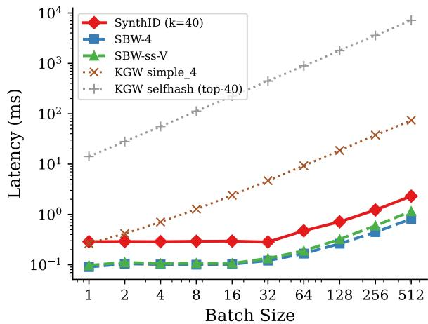  
Figure 6: Latency scaling across all methods. SBW-4 and SBW-ss-V (dashed) process the entire 151K vocabulary yet remain faster than SynthID (top-40) at all batch sizes.

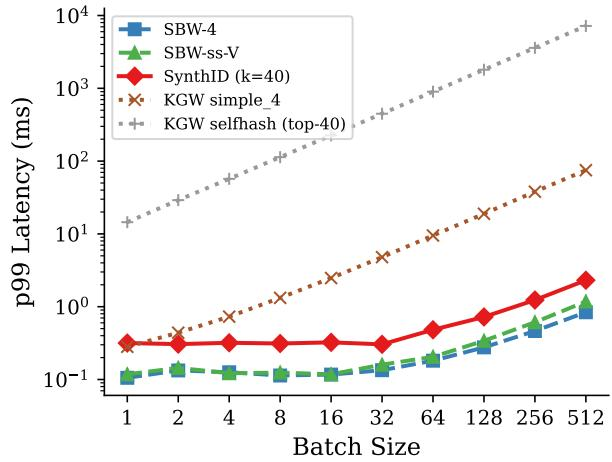  
Figure 7: p99 tail latency across batch sizes. SBW-4 and SBW-ss-V maintain low tail latency at all scales.

## E.2 Tail Latency

Table 14 reports p50, p95, and p99 latencies at all batch sizes. Our SBW fullvocab schemes exhibit minimal variance (p99 within 7–15% of p50), while SynthID and KGW show higher tail latency. Fig. 7 visualizes the p99 latency across batch sizes.

## E.3 Memory Overhead

Table 15 reports peak additional GPU memory allocated during watermark computation. Our SBW fullvocab schemes operate in-place on the logits tensor with zero additional allocation. SynthID allocates intermediate tensors proportional to $B \times k \times$ depth.

## E.4 vLLM Serving Benchmark

To validate production deployment overhead, we benchmarked SBW within a vLLM serving stack (Qwen3-8B, 128 requests, 200 output tokens). Table 16 reports request throughput with and without the SBW logits processor at various concurrency levels.

At production concurrency (≥32 concurrent requests), SBW adds ∼1% overhead.

Table 14: Tail Latency (ms): p50 / p95 / p99
<table><tr><td>Method</td><td>1 1</td><td>2</td><td>4</td><td>8</td><td>16</td><td>32</td><td>64</td><td>128</td><td>256</td><td>512</td></tr><tr><td colspan="9">p50</td><td></td></tr><tr><td>SBW-4</td><td>0.09</td><td>0.10</td><td>0.10</td><td>0.10</td><td>0.10</td><td>0.12</td><td>0.17</td><td>0.26</td><td>0.45</td><td>0.81</td></tr><tr><td>SBW-ss-V</td><td>0.10</td><td>0.11</td><td>0.11</td><td>0.11</td><td>0.11</td><td>0.13</td><td>0.19</td><td>0.32</td><td>0.60</td><td>1.15</td></tr><tr><td>SynthID (k=40)</td><td>0.29</td><td>0.29</td><td>0.29</td><td>0.29</td><td>0.29</td><td>0.28</td><td>0.47</td><td>0.71</td><td>1.22</td><td>2.31</td></tr><tr><td>KGW simple_4</td><td>0.26</td><td>0.42</td><td>0.71</td><td>1.27</td><td>2.40</td><td>4.69</td><td>9.26</td><td>18.6</td><td>37.5</td><td>73.9</td></tr><tr><td>KGW selfhash (top-40)</td><td>14.1</td><td>27.9</td><td>55.8</td><td>112.2</td><td>223.2</td><td>444.9</td><td>893.7</td><td>1791</td><td>3578</td><td>7151</td></tr><tr><td colspan="9">p95</td><td></td></tr><tr><td>SBW-4</td><td>0.10</td><td>0.12</td><td>0.11</td><td>0.11</td><td>0.11</td><td>0.13</td><td>0.18</td><td>0.27</td><td>0.45</td><td>0.82</td></tr><tr><td>SBW-ss-V</td><td>0.11</td><td>0.13</td><td>0.12</td><td>0.12</td><td>0.12</td><td>0.14</td><td>0.20</td><td>0.33</td><td>0.61</td><td>1.17</td></tr><tr><td>SynthID (k=40)</td><td>0.30</td><td>0.30</td><td>0.30</td><td>0.31</td><td>0.31</td><td>0.30</td><td>0.48</td><td>0.72</td><td>1.23</td><td>2.31</td></tr><tr><td>KGW simple_4</td><td>0.28</td><td>0.43</td><td>0.72</td><td>1.31</td><td>2.46</td><td>4.78</td><td>9.45</td><td>18.8</td><td>37.8</td><td>74.7</td></tr><tr><td>KGW selfhash (top-40)</td><td>14.3</td><td>28.5</td><td>56.5</td><td>113.0</td><td>225.0</td><td>447.4</td><td>898.4</td><td>1800</td><td>3589</td><td>7184</td></tr><tr><td colspan="10">p99</td></tr><tr><td>SBW-4</td><td>0.11</td><td>0.13</td><td>0.13</td><td>0.11</td><td>0.12</td><td>0.13</td><td>0.18</td><td>0.28</td><td>0.46</td><td>0.84</td></tr><tr><td>SBW-ss-V</td><td>0.12</td><td>0.14</td><td>0.12</td><td>0.12</td><td>0.12</td><td>0.16</td><td>0.20</td><td>0.34</td><td>0.61</td><td>1.18</td></tr><tr><td>SynthID (k=40)</td><td>0.32</td><td>0.31</td><td>0.32</td><td>0.31</td><td>0.32</td><td>0.30</td><td>0.48</td><td>0.72</td><td>1.24</td><td>2.31</td></tr><tr><td>KGW simple_4</td><td>0.28</td><td>0.44</td><td>0.73</td><td>1.32</td><td>2.48</td><td>4.80</td><td>9.50</td><td>18.9</td><td>38.0</td><td>75.0</td></tr><tr><td>KGW selfhash (top-40)</td><td>14.5</td><td>29.1</td><td>57.1</td><td>113.3</td><td>225.7</td><td>447.9</td><td>899.5</td><td>1801</td><td>3594</td><td>7191</td></tr></table>

RTX 3090, V=151,936. 200 iterations.

Table 15: Peak Memory Overhead (MB)
<table><tr><td>Method</td><td>B=1</td><td>B=8</td><td>B=32</td><td>B=64</td><td> $\scriptstyle \mathrm { B } = 1 2 8$ </td><td>B=256</td><td>B=512</td></tr><tr><td>SBW-4</td><td>0</td><td>0</td><td>0</td><td>0</td><td>0</td><td>0</td><td>0</td></tr><tr><td>SBW-ss-V</td><td>0</td><td>0</td><td>0</td><td>0</td><td>0</td><td>0</td><td>0</td></tr><tr><td>SynthID (k=40)</td><td>0.08</td><td>0.27</td><td>0.32</td><td>0.43</td><td>0.86</td><td>2.1</td><td>3.4</td></tr><tr><td>SBW-4 (k=40)</td><td>0</td><td>0</td><td>0</td><td>0</td><td>0</td><td>0</td><td>0</td></tr><tr><td>SBW-ss (k=40)</td><td>0</td><td>0</td><td>0</td><td>0</td><td>0</td><td>0</td><td>0</td></tr></table>

RTX 3090, V=151,936. Delta from baseline (no watermark).

Table 16: vLLM Serving Overhead
<table><tr><td>Concurrency</td><td>Baseline (req/s)</td><td>SBW (req/s)</td><td>Overhead</td></tr><tr><td>1</td><td>0.23</td><td>0.23</td><td>&lt;0.1%</td></tr><tr><td>8</td><td>1.83</td><td>1.62</td><td>11.5%</td></tr><tr><td>32</td><td>6.14</td><td>6.10</td><td>0.7%</td></tr><tr><td>64</td><td>9.64</td><td>9.53</td><td>1.1%</td></tr><tr><td>128</td><td>13.35</td><td>13.18</td><td>1.3%</td></tr></table>

Qwen3-8B, 128 requests, 200 tokens, full-vocabulary self-salt.

To validate that SBW’s equivalence to KGW generalizes beyond the main experimental setup, we conducted additional experiments varying five factors simultaneously (Table 17).

## F Generalization Experiments

We ran 200 samples per scheme at $\delta \ = \ 2 .$ $\gamma = 0 . 5 0$ . Table 18 reports two-sample KS tests comparing KGW and SBW z-score distributions. All tests fail to reject equivalence $( p > 0 . 0 5 )$ , confirming that the Bernoulli construction’s equivalence is independent of model architecture, vocabulary size, prompt distribution, sampling strategy, and hardware.

<table><tr><td>Variable</td><td>Main paper</td><td>Generalization</td></tr><tr><td>Generation model</td><td>Qwen3-8B</td><td>Falcon-7B</td></tr><tr><td>Judge model</td><td>Qwen3.5-27B</td><td>Mistral-small-3.2-24b</td></tr><tr><td>Dataset</td><td>C4 (web text)</td><td>Alpaca (instructions)</td></tr><tr><td>Sampling</td><td>T=1.0, pure</td><td>T=0.7, top_p=0.8</td></tr><tr><td>Hardware</td><td>RTX 3090</td><td>A6000</td></tr></table>

Table 17: Generalization Experiment Setup

## G Robustness to Attacks

To validate that SBW inherits KGW’s robustness properties, we evaluated both methods under 19 attack configurations across four categories. Character-level attacks randomly substitute or delete individual characters at various fractions (1– 20%). Structural attacks truncate the text, keeping only the first 25–75% of tokens. Word-level attacks delete random words (10–30%) or reorder all words within each sentence. Semantic attacks include LLM-based paraphrasing at three intensity levels (Qwen3-4B) and masked language model substitution replacing 10–20% of words with contextually plausible alternatives (T5). We used 500 watermarked samples per method $( \delta = 2 , \gamma = 0 . 5 0$ Qwen3-8B).

Table 18: Two-Sample KS Tests: KGW vs SBW on Falcon-7B
<table><tr><td>Seeding</td><td>Watermarked KS D</td><td>p</td><td>Non-watermarked KS D</td><td>p</td></tr><tr><td>Without self-salt</td><td>0.107</td><td>0.313</td><td>0.133</td><td>0.125</td></tr><tr><td>With self-salt</td><td>0.114</td><td>0.662</td><td>0.080</td><td>0.676</td></tr></table>

Falcon-7B, Alpaca prompts, $\overline { { \delta = 2 , \gamma = 0 . 5 0 , } }$ 200 samples.

Table 19 reports the mean z-score after each attack and two-sample KS test p-values comparing the z-score distributions. In 11/19 configurations, the distributions are statistically equivalent $( p >$ 0.05). In all 8 non-equivalent cases, SBW retains more watermark signal than KGW (higher mean zscore), never less. This is consistent with the hash function analysis in Section 4.5: the Jenkins hash produces less autocorrelated green-list assignments, so attacks that disrupt local token sequences destroy fewer correlated “runs” of green tokens.

Table 19: Robustness: KGW vs SBW under Attacks
<table><tr><td>Category</td><td>Attack</td><td>KGW z</td><td>SBW z</td><td>KSp</td><td>Equiv.</td></tr><tr><td>Char</td><td>Subst. 1%</td><td>5.28</td><td>5.37</td><td>.613</td><td>√</td></tr><tr><td></td><td>Subst. 5%</td><td>3.67</td><td>3.75</td><td>.413</td><td>√</td></tr><tr><td></td><td>Subst. 10%</td><td>2.40</td><td>2.36</td><td>.250</td><td>√</td></tr><tr><td></td><td>Subst. 20%</td><td>1.23</td><td>1.21</td><td>.589</td><td>√</td></tr><tr><td></td><td>Delete 5%</td><td>3.46</td><td>3.56</td><td>.534</td><td>√</td></tr><tr><td></td><td>Delete 10%</td><td>1.96</td><td>2.11</td><td>.182</td><td>√</td></tr><tr><td></td><td>Delete 20%</td><td>0.79</td><td>0.88</td><td>.255</td><td>√</td></tr><tr><td>Struct</td><td>Trunc. 25%</td><td>4.83</td><td>5.02</td><td>.026</td><td>+</td></tr><tr><td></td><td>Trunc. 50%</td><td>4.14</td><td>4.31</td><td>.107</td><td>√</td></tr><tr><td></td><td>Trunc. 75%</td><td>3.09</td><td>3.25</td><td>.032</td><td>+</td></tr><tr><td>Word</td><td>Delete 10%</td><td>4.65</td><td>4.83</td><td>.096</td><td>√</td></tr><tr><td></td><td>Delete 20%</td><td>4.07</td><td>4.23</td><td>.050</td><td>+</td></tr><tr><td></td><td>Delete 30%</td><td>3.44</td><td>3.52</td><td>.559</td><td>√</td></tr><tr><td></td><td>Reorder</td><td>0.70</td><td>0.96</td><td>&lt;.001</td><td>+</td></tr><tr><td>Semantic</td><td>Paraph. (L)</td><td>1.05</td><td>1.59</td><td>&lt;.001</td><td>+</td></tr><tr><td></td><td>Paraph. (M)</td><td>1.33</td><td>1.39</td><td>.842</td><td>√</td></tr><tr><td></td><td>Paraph. (H)</td><td>0.72</td><td>1.37</td><td>&lt;.001</td><td>+</td></tr><tr><td></td><td>MLM 10%</td><td>4.48</td><td>4.71</td><td>.014</td><td>+</td></tr><tr><td></td><td>MLM 20%</td><td>3.81</td><td>4.01</td><td>.013</td><td>+</td></tr></table>

500 samples, $\overline { { \delta = 2 , \gamma = 0 . 5 0 } } .$ KGW/SBW: mean z-score. +: SBW retains more signal.

## H Proof of Detection Equivalence

## H.1 Setup

In KGW, the green list $G _ { t }$ at each generation step contains exactly $\gamma | V |$ tokens, selected by a pseudorandom permutation seeded by the context. SBW instead includes each token $i \in V$ independently with probability γ, producing a stochastic green list proportion:

$$
\Gamma _ { t } = \frac { 1 } { | V | } \sum _ { i = 1 } ^ { | V | } X _ { i } , \quad X _ { i } \sim \mathrm { B e r n o u l l i } ( \gamma ) \ \mathrm { i . i . d . }\tag{7}
$$

with $\operatorname { E } [ \Gamma _ { t } ] = \gamma \operatorname { a n d } \operatorname { V a r } ( \Gamma _ { t } ) = \gamma ( 1 - \gamma ) / | V | .$

## H.2 Concentration of Green List Size

By the Central Limit Theorem, for large |V |:

$$
\Gamma _ { t } \stackrel { d } { \to } \mathcal { N } \Bigg ( \gamma , \frac { \gamma ( 1 - \gamma ) } { | V | } \Bigg ) .\tag{8}
$$

For $\gamma = 0 . 5$ and $\vert V \vert = 1 5 1 , 9 3 6$ , the standard deviation of the green list proportion is $\sigma _ { \Gamma } \approx 1 . 2 8 \% o .$ corresponding to ≈195 tokens out of ≈75,968.

Hoeffding’s inequality provides a finite-sample bound:

$$
P ( | \Gamma _ { t } - \gamma | > \epsilon ) \le 2 \exp ( - 2 | V | \epsilon ^ { 2 } ) .\tag{9}
$$

For $\epsilon = 0 . 0 1$ (a 1% deviation): $P ( | \Gamma _ { t } - \gamma | >$ $0 . 0 1 ) \leq 2 \exp ( - 2 \cdot 1 5 1 . 9 3 6 \cdot 1 0 ^ { - 4 } ) < 2 \times 1 0 ^ { - 1 3 } .$

## H.3 Symmetry Argument

Let $Y _ { t } = 1$ if the generated token $s _ { t }$ belongs to $G _ { t }$ , and $Y _ { t } = 0$ otherwise. Under $H _ { 0 }$ , the model selects $s _ { t }$ independently of $G _ { t }$ . We claim $P ( Y _ { t } =$ $1 \mid \Gamma _ { t } ) = \Gamma _ { t }$

Proof. By the i.i.d. Bernoulli construction, conditioned on $| G _ { t } | = m ,$ , each token v has equal probability $m / | V |$ of being in $G _ { t } ,$ regardless of which specific tokens were selected. Therefore:

$$
P ( Y _ { t } = 1 \mid | G _ { t } | = m ) = \sum _ { v \in V } p _ { v } \cdot \frac { m } { | V | } = \frac { m } { | V | } ,\tag{10}
$$

where $p _ { v }$ is the model’s probability of generating token v. Since $\Gamma _ { t } = m / | V |$ , we have $P ( Y _ { t } = 1 \mid$ $\Gamma _ { t } ) = \Gamma _ { t }$ □

By the Law of Total Expectation, the mean follows immediately: $\operatorname { E } [ Y _ { t } ] ~ = ~ \operatorname { E } [ \operatorname { E } [ Y _ { t } ~ | ~ \Gamma _ { t } ] ]$ $\mathrm { E } [ \Gamma _ { t } ] = \gamma .$

## H.4 Law of Total Variance

We decompose ${ \mathrm { V a r } } ( Y _ { t } )$ by conditioning on $\Gamma _ { t }$ :

$$
\operatorname { V a r } ( Y _ { t } ) = E [ \operatorname { V a r } ( Y _ { t } \mid \Gamma _ { t } ) ] + \operatorname { V a r } ( E [ Y _ { t } \mid \Gamma _ { t } ] ) .\tag{11}
$$

First term (conditional variance). Given $\Gamma _ { t } ,$ the indicator $Y _ { t }$ is Bernoulli with parameter $\Gamma _ { t } .$ , so $\operatorname { V a r } ( Y _ { t } \mid \Gamma _ { t } ) = \Gamma _ { t } ( 1 - \Gamma _ { t } )$ . Taking expectations:

$$
E [ \mathrm { V a r } ( Y _ { t } \mid \Gamma _ { t } ) ] = E [ \Gamma _ { t } - \Gamma _ { t } ^ { 2 } ] = \gamma - E [ \Gamma _ { t } ^ { 2 } ] .\tag{12}
$$

Second term (variance of the conditional mean). Since $E [ Y _ { t } \mid \Gamma _ { t } ] = \Gamma _ { t }$

$$
\operatorname { V a r } ( E [ Y _ { t } \mid \Gamma _ { t } ] ) = \operatorname { V a r } ( \Gamma _ { t } ) .\tag{13}
$$

Combining. Using $E [ \Gamma _ { t } ^ { 2 } ] = \mathrm { V a r } ( \Gamma _ { t } ) + \gamma ^ { 2 } \mathrm { : }$

$$
\begin{array} { r } { \mathrm { V a r } ( Y _ { t } ) = \gamma - \mathrm { V a r } ( \Gamma _ { t } ) - \gamma ^ { 2 } + \mathrm { V a r } ( \Gamma _ { t } ) } \\ { = \gamma ( 1 - \gamma ) . \qquad } \end{array}\tag{14}
$$

The ${ \mathrm { V a r } } ( \Gamma _ { t } )$ terms cancel exactly. This holds for any distribution of $\Gamma _ { t }$ with mean $\gamma .$ , not only the Bernoulli case. The marginal distribution of $Y _ { t }$ is therefore Bernoulli(γ), identical to the fixed-size KGW green list.

## H.5 Independence of the $Y _ { t } ^ { \bullet } { \mathbf { s } }$

The z-score requires that the $Y _ { t } \mathrm { ' s }$ be mutually independent. Under $H _ { 0 }$ :

• Each $Y _ { t }$ depends only on $G _ { t }$ (determined by a pseudorandom seed $\boldsymbol { r } _ { t } )$ and on the model’s token choice $s _ { t }$

• The model’s choice $s _ { t }$ is independent of all green lists by assumption $( H _ { 0 } )$ .

• Distinct seeds $\boldsymbol { r } _ { t } \neq \boldsymbol { r } _ { t ^ { \prime } }$ produce independent RNG outputs, so $G _ { t } \perp G _ { t ^ { \prime } }$

Therefore $Y _ { t } ~ \perp ~ Y _ { t ^ { \prime } }$ for $\textit { t } \neq \textit { t } ^ { \prime }$ , and $\begin{array} { r l } { W } & { { } = } \end{array}$ $\textstyle \sum _ { t = 1 } ^ { T } Y _ { t } \sim$ Binomia $( T , \gamma )$