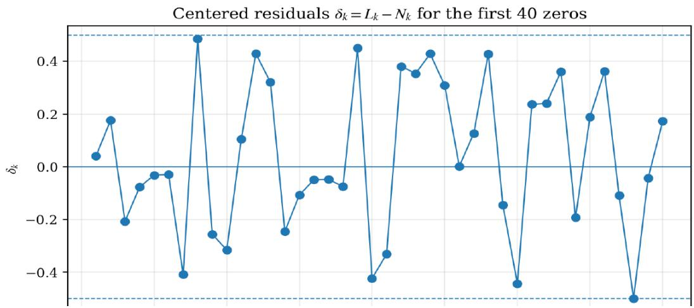
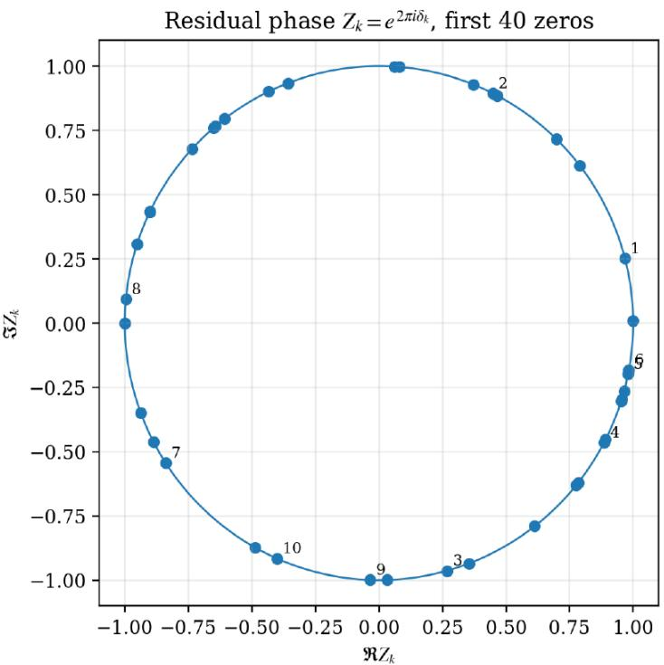
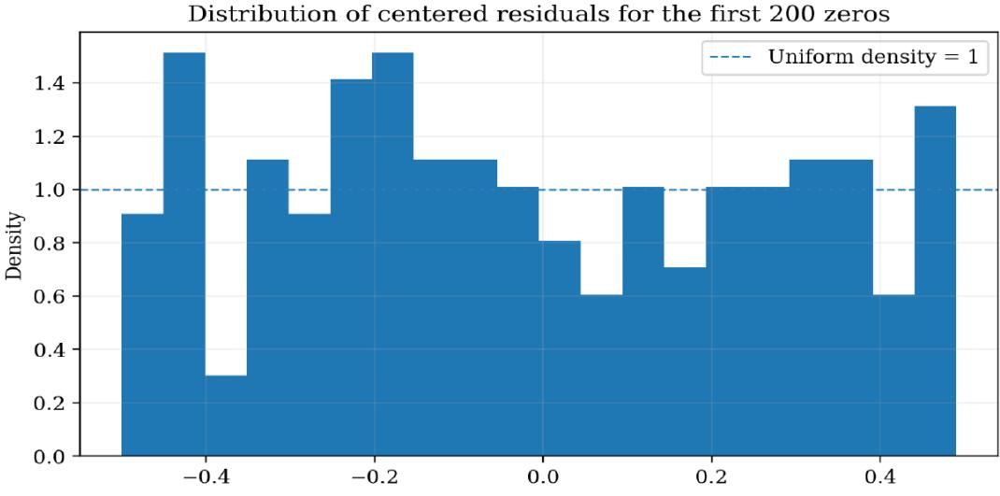
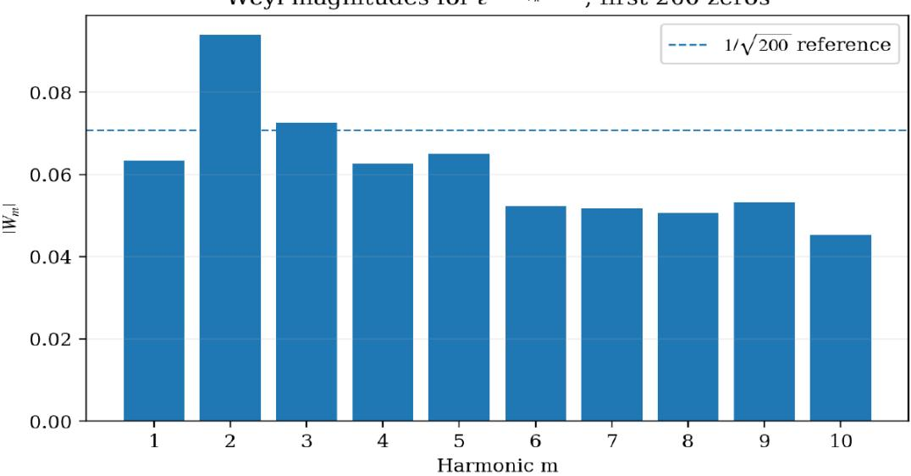
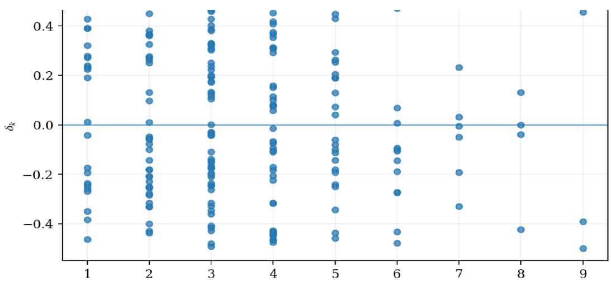
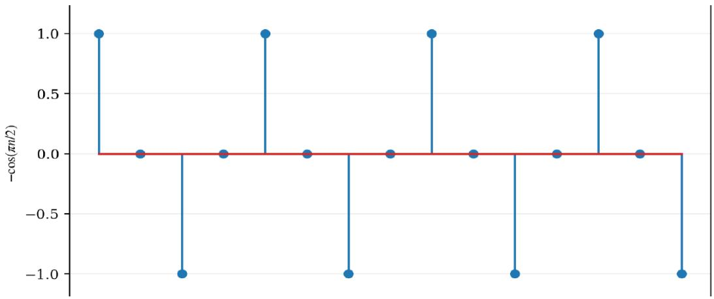
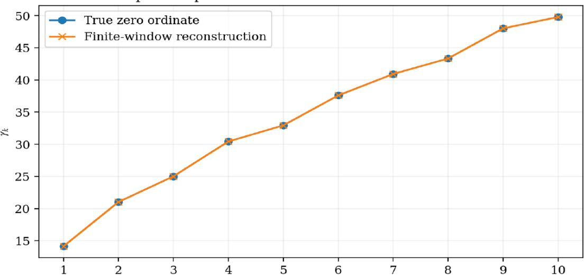
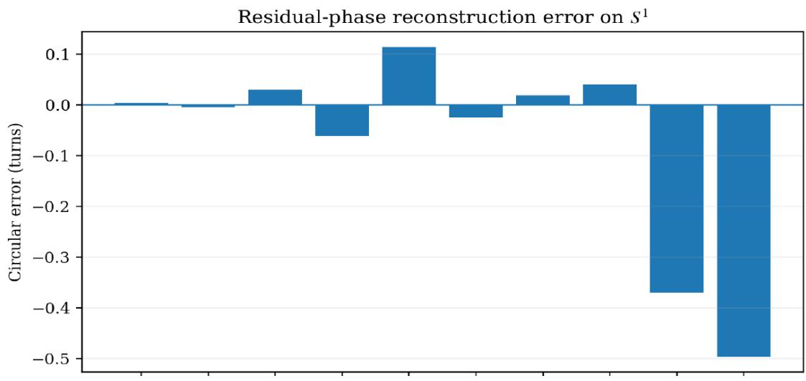

# From Ordered Bernoulli Levels to Critical-Line Geometry:

Integer Quantization, Bernoulli Residual Phase, and Prime-Power Spectra

Y. Kenan Yılmaz

yilmazykenan@gmail.com

September 2026

## Abstract

We begin with the ordered Bernoulli-word kernel

$$
f ( p , n , k ) = p ^ { k } ( 1 - p ) ^ { n - k } ,
$$

using no binomial coeficient and no prior zeta-function input. The first inverse-integer level, $2 ^ { - n }$ , selects the unique real split-independent anchor $p = 1 / 2$ . Preserving complementarity under complex continuation by $1 - z = { \overline { { z } } }$ forces the full conjugation-symmetric vertical geometry $z = 1 / 2 \pm i u$ . On the central normalized level branch, every inverseinteger label $q \geq 2$ likewise lies on $\Re \kappa = 1 / 2$

A second exact coordinate is obtained directly from the conjugate pair,

$$
Q ( z ) = z ( 1 - z ) = { \frac { 1 } { 4 } } + u ^ { 2 } .
$$

It has the sharp minimum $Q _ { \mathrm { m i n } } = 1 / 4$ at the central point and inverse map $z _ { L } ^ { \pm } =$ $1 / 2 \pm i \sqrt { L - 1 / 4 }$ . Restricting L to integers gives an arithmetic quantization of the continuous vertical geometry, and unique factorization resolves each nonunit integer level into prime-generator occupations.

For a tabulated critical-line zero $\rho _ { k } = 1 / 2 + i \gamma _ { k }$ , the same coordinate gives the exact real level $L _ { k } = 1 / 4 + \gamma _ { k } ^ { 2 }$ . We refine nearest-integer rounding to the lossless decomposition

$$
{ \cal L } _ { k } = N _ { k } + \delta _ { k } , \qquad N _ { k } = \left\lfloor { \cal L } _ { k } + \frac { 1 } { 2 } \right\rfloor , \qquad \delta _ { k } = \widetilde B _ { 1 } \left( \gamma _ { k } ^ { 2 } + \frac { 3 } { 4 } \right) ,
$$

where $\widetilde { B } _ { 1 } ( x ) = \{ x \} - 1 / 2$ is the periodic first Bernoulli function. The factorization of $N _ { k }$ forms an integer/arithmetic channel, while

$$
Z _ { k } = e ^ { 2 \pi i \delta _ { k } } = i e ^ { 2 \pi i \gamma _ { k } ^ { 2 } }
$$

is a circular residual-phase channel; the pair $( N _ { k } , Z _ { k } )$ is lossless. This local periodic-Bernoulli role is distinct from the indexed Bernoulli numbers $B _ { 2 } , B _ { 4 } , \ldots$ . entering Euler– Maclaurin representations of zeta.

Classical explicit formulas couple the von Mangoldt prime-power spectrum to the zeta-zero spectrum globally, motivating conditional Weyl statistics for testing whether arithmetic classes of $N _ { k }$ leave a nontrivial signature in $Z _ { k }$ . Preliminary coarse factorization and low-order Bernoulli-mode controls are negative and are retained as such.

The technical lift replaces the integer total exponent by a distinct complex exponent s and solves

$$
z ^ { k } ( 1 - z ) ^ { s - k } = m ^ { - s } .
$$

Prime powers then occupy one prime coordinate repeatedly, general composites are finite prime-coordinate superpositions, and the scalar level coordinate is an afine projection through log m. The common atom $m ^ { - s }$ organizes the two classical zeta assemblies: global Dirichlet enumeration and local Euler prime-power generation. The resulting architecture links primitive Bernoulli level geometry, integer quantization, exact integer–residual decomposition, circular phase, prime-factor coordinates, and zeta assembly while keeping exact identities, classical bridges, numerical controls, and open statistical questions explicitly separated.

Keywords. Riemann critical line; ordered Bernoulli likelihood; integer quantization; periodic Bernoulli function; residual phase; squared zero ordinates; Weyl statistics; von Mangoldt function; prime powers; prime factorization; Dirichlet series; Euler product; Bohr lift.

## 1 Introduction

Riemann’s 1859 memoir placed the zeros of the analytically continued zeta function at the center of the relation between complex analysis and the distribution of primes [8, 10]. The construction studied here approaches the familiar real-part-1/2 geometry from a diferent entry point. It begins not with $\zeta ( s )$ , but with the ordered Bernoulli-word kernel

$$
f ( p , n , k ) = p ^ { k } ( 1 - p ) ^ { n - k } ,\tag{1}
$$

and asks what geometry is obtained when inverse-integer levels are solved in a broad real/complex domain.

The first level $2 ^ { - n }$ uniquely selects $p = 1 / 2$ as the real split-independent anchor. Preserving the complementary pair as complex conjugates gives

$$
z = { \frac { 1 } { 2 } } + i u , \qquad 1 - z = { \frac { 1 } { 2 } } - i u ,
$$

so a full conjugation-symmetric vertical line is obtained before a Dirichlet series, Euler product, or prime classification is introduced. A normalized split coordinate $\kappa = k / n$ inherits the same real part on the central phase branch.

The quadratic coordinate

$$
Q ( z ) = z ( 1 - z ) = { \frac { 1 } { 4 } } + u ^ { 2 }\tag{2}
$$

then supplies an exact real level geometry. Integer restriction of $Q$ produces a discrete family on the same vertical line. Known critical-line zeros may be passed through this coordinate diagnostically via $L _ { k } = 1 / 4 + \gamma _ { k } ^ { 2 }$ . Each such real level admits an exact nearest-integer shell and centered residual, and the residual can be represented on the unit circle. This isolates $\gamma _ { k } ^ { 2 }$ mod 1 as the modular variable naturally associated with the quadratic coordinate.

A separate arithmetic layer uses the prime-exponent vector of an integer. Prime powers occupy one prime coordinate repeatedly, while integers with several distinct prime divisors occupy several coordinates. The scalar level lift depends only on the logarithmic resultant log m, so it is a one-dimensional afine projection of the full factorization state. This is closely related in spirit to the classical Bohr multi-index viewpoint for Dirichlet series [3].

Finally, a distinct complex exponent s is introduced in

$$
F ( z , s , k ) = z ^ { k } ( 1 - z ) ^ { s - k } .\tag{3}
$$

Solving $F ( z , s , k ) = m ^ { - s }$ realizes each Dirichlet atom inside the same multiplicative architecture. The common atom $m ^ { - s }$ then appears in the two standard zeta assemblies,

$$
\zeta ( s ) = \sum _ { m \geq 1 } m ^ { - s } = \prod _ { r \in \mathbb { P } } ( 1 - r ^ { - s } ) ^ { - 1 } , \qquad \Re s > 1 .
$$

The manuscript does not claim a proof of the Riemann Hypothesis. The derived 1/2 geometry belongs first to the Bernoulli coordinate z and to the normalized split coordinate κ under a specified conjugation-preserving continuation. The later Dirichlet exponent s is introduced independently and is not assumed or proved to satisfy $\Re s = 1 / 2$ . The relationship with zeta zeros is therefore diagnostic and structural: exact coordinate identities are kept separate from classical prime-power/zero couplings, finite-sample numerical controls, and open conditional-equidistribution questions.

The principal exact statements are: (i) the binary level singles out the real anchor; (ii) the chosen complement-preserving continuation forces a conjugation-symmetric $1 / 2$ line; (iii) the quadratic coordinate has a sharp minimum and exact inverse; (iv) integer restriction yields arithmetic level quantization; (v) zero-induced levels have an exact periodic-Bernoulli residual; (vi) circularization yields a lossless integer/phase pair; (vii) prime-exponent space separates one-generator and multi-generator arithmetic states; and (viii) the complex-s lift realizes the common Dirichlet atom that underlies both zeta assemblies.

## 2 Ordered Bernoulli levels and the binary anchor

The kernel (1) is the likelihood of one specified ordered Bernoulli word containing k events of type p and $n - k$ complementary events of type $1 - p$ . No binomial coeficient is required because permutation classes are not being counted.

Proposition 2.1 (Unique split-independent binary anchor). Let $0 < p < 1$ and $n > 0$ . The map

$$
k \longmapsto p ^ { k } ( 1 - p ) ^ { n - k }
$$

is independent of k if and only $i f p = 1 / 2$ . At this unique point its value is $2 ^ { - n }$ for every finite real or complex k.

Proof. For positive real $p _ { \mathrm { { i } } }$

$$
p ^ { k } ( 1 - p ) ^ { n - k } = ( 1 - p ) ^ { n } \exp \left( k \log { \frac { p } { 1 - p } } \right) .
$$

Independence from k is equivalent to $\log ( p / ( 1 - p ) ) = 0$ , hence $p = 1 - p$ and $p = 1 / 2$ Substitution gives $f ( 1 / 2 , n , k ) = 2 ^ { - n }$ □

Proposition 2.2 (Centered solution of the binary level). At the centered split $k = n / 2$ , the real level equation

$$
p ^ { n / 2 } ( 1 - p ) ^ { n / 2 } = 2 ^ { - n } , \qquad 0 < p < 1 ,
$$

has the unique solution $p = 1 / 2$ , with algebraic multiplicity two in the resulting quadratic equation.

Proof. Raising both sides to the power $2 / n$ gives

$$
p ( 1 - p ) = { \frac { 1 } { 4 } } ,
$$

so

$$
\left( p - { \frac { 1 } { 2 } } \right) ^ { 2 } = 0 .
$$

Remark 2.3 (Algebraic and arithmetic roles of 2). The level $2 ^ { - n }$ arises algebraically from the unique equal split of the Bernoulli complement pair. Separately, 2 is the first prime and the unique even prime. The construction uses both facts, but does not identify them as logically equivalent.

## 3 Complex phase and conjugation-symmetric continuation

We first keep $p$ real and allow the exponent split to become complex.

Proposition 3.1 (Vertical phase lattice). Let $0 < p < 1 , p \neq 1 / 2 , n \in \mathbb { N }$ , and $q > 0$ . Write $k = a + i \tau$ . The level equation

$$
p ^ { k } ( 1 - p ) ^ { n - k } = q ^ { - n }\tag{4}
$$

holds precisely when

$$
a = n { \frac { \log [ 1 / ( q ( 1 - p ) ) ] } { \log [ p / ( 1 - p ) ] } } ,\tag{5}
$$

$$
\tau = \frac { 2 \pi j } { \log [ p / ( 1 - p ) ] } , \qquad j \in \mathbb { Z } .\tag{6}
$$

Hence the solutions form a vertical arithmetic lattice in the complex k-plane.

Proof. Since $p$ and $1 - p$ are positive real numbers,

$$
p ^ { k } ( 1 - p ) ^ { n - k } = p ^ { a } ( 1 - p ) ^ { n - a } \exp \left( i \tau \log \frac { p } { 1 - p } \right) .
$$

Equality with the positive real number $q ^ { - n }$ requires equality of the magnitudes and phase closure modulo $2 \pi$ . Solving the two resulting equations gives the formulas above. □

Remark 3.2 (A clean example). For $q = 3$ and $p = 2 / 3$ , the real part is $a = 0$ and

$$
k _ { j } = i \frac { 2 \pi j } { \log 2 } .
$$

The spacing $2 \pi / \log 2$ is a consequence of phase closure under complex exponentiation; it is not a statement about zeta-zero spacing.

We next complexify the complementary Bernoulli pair by imposing the continuation rule

$$
1 - z = { \overline { { z } } } .\tag{7}
$$

Together with $z + ( 1 - z ) = 1$ , this yields

$$
z + { \overline { { z } } } = 1 ,
$$

and therefore

$$
z = { \frac { 1 } { 2 } } + i u , \qquad 1 - z = { \frac { 1 } { 2 } } - i u , \qquad u \in \mathbb { R } .\tag{8}
$$

The real part $1 / 2$ is thus a consequence of the adopted complement-preserving continuation rule.

Write

$$
z = \varrho e ^ { i \theta } , \qquad 1 - z = \varrho e ^ { - i \theta } , \qquad \varrho = \sqrt { \frac { 1 } { 4 } + u ^ { 2 } } , \qquad \theta = \arctan ( 2 u ) .\tag{9}
$$

Because both factors lie in the open right half-plane, we use the principal logarithm

$$
\mathrm { L o g } z = \log \varrho + i \theta , \qquad \mathrm { L o g } ( 1 - z ) = \log \varrho - i \theta .
$$

Remark 3.3 (Derived statement versus continuation choice). The real anchor $p = 1 / 2$ is derived from the binary level together with split symmetry. Equation (7) is an additional complex-continuation rule. The statement $\Re z = 1 / 2$ follows from that rule; the level equation alone does not force every complex parameter to lie on this line.

Proposition 3.4 (Integer-exponent level family). Let u ${ \mathrm { ~ ; ~ } } \neq 0 , n \in \mathbb { N }$ , and $q > 0$ . Under the principal logarithm, the solutions of

$$
z ^ { k } ( 1 - z ) ^ { n - k } = q ^ { - n }
$$

are

$$
k _ { j } ( n ; q , u ) = \frac { n } { 2 } + \frac { \pi j } { \theta } + i \frac { n \log ( q \varrho ) } { 2 \theta } , \qquad j \in \mathbb { Z } .\tag{10}
$$

In particular, on the central phase branch $j = 0$

$$
\Re k _ { 0 } = { \frac { n } { 2 } } .
$$

Proof. Using (9),

$$
\begin{array} { r } { \mathrm { L o g } \big ( z ^ { k } ( 1 - z ) ^ { n - k } \big ) = n \log \varrho + i \theta ( 2 k - n ) . } \end{array}
$$

Equality with the positive real level $q ^ { - n }$ is equivalent to

$$
n \log { \varrho } + i \theta ( 2 k - n ) = - n \log { q } + 2 \pi i j ,
$$

which rearranges to (10).

□

After normalization $\kappa = k / n$ , the central branch becomes

$$
\kappa _ { q } = \frac { 1 } { 2 } + i \frac { \log ( q \varrho ) } { 2 \theta } , \qquad q \ge 2 ,\tag{11}
$$

so

$$
\Re \kappa _ { q } = \frac { 1 } { 2 } .
$$

For $q = 2$ , the continuous function

$$
t _ { 2 } ( u ) = \frac { \log ( 2 \varrho ( u ) ) } { 2 \theta ( u ) }
$$

extends by $t _ { 2 } ( 0 ) = 0$ , is odd, and has $| t _ { 2 } ( u ) | \to \infty \mathrm { a s } | u | \to \infty$ . Thus the binary level supplies both conjugate directions of the normalized vertical geometry.

## 4 Quadratic level coordinate and integer quantization

Define

$$
Q ( z ) = z ( 1 - z ) .
$$

On the conjugation-symmetric line (8),

$$
Q ( z ) = \left( { \frac { 1 } { 2 } } + i u \right) \left( { \frac { 1 } { 2 } } - i u \right) = { \frac { 1 } { 4 } } + u ^ { 2 } .\tag{12}
$$

Hence $Q ( z ) \geq 1 / 4$ , with equality if and only if $u = 0$ . The central point is therefore the unique minimum state:

$$
Q _ { \mathrm { m i n } } = \frac { 1 } { 4 } \quad \Longleftrightarrow \quad z = \frac { 1 } { 2 } .
$$

Conversely, every real $L \ge 1 / 4$ determines a conjugate pair

$$
z _ { L } ^ { \pm } = \frac { 1 } { 2 } \pm i \sqrt { L - \frac { 1 } { 4 } } .\tag{13}
$$

Restricting L to positive integers yields the exact discrete family

$$
z _ { m } ^ { \pm } = \frac { 1 } { 2 } \pm i \sqrt { m - \frac { 1 } { 4 } } , \qquad m \in \mathbb { Z } _ { > 0 } .\tag{14}
$$

This is an arithmetic quantization of the continuous level coordinate. It does not, by itself, identify the resulting points with any externally specified spectral set.

For a nonunit integer level $m \geq 2$ , unique prime factorization separates three structural arithmetic forms:

<table><tr><td>Level type</td><td></td><td>Arithmetic form Generator interpretation</td></tr><tr><td>Prime</td><td> $m = p$ </td><td>single prime generator</td></tr><tr><td>Proper prime power</td><td> $m = p ^ { a } , a \geq 2$ </td><td>repeated single generator</td></tr><tr><td>Multi-prime composite</td><td> $\begin{array} { r } { m = \prod _ { j } p _ { j } ^ { a _ { j } } } \end{array}$ </td><td>finite superposition of generators</td></tr></table>

The integer 2 may be isolated further because it also has the prior binary-anchor role.

## 4.1 Zeta zeros as a diagnostic of the level coordinate

For a nontrivial zeta zero known on the critical line, write

$$
\rho _ { k } = { \frac { 1 } { 2 } } + i \gamma _ { k } .
$$

The same quadratic map induces

$$
L _ { k } = Q ( \rho _ { k } ) = \frac { 1 } { 4 } + \gamma _ { k } ^ { 2 } .\tag{15}
$$

Using the standard tabulated ordinates [7], the first zero $\gamma _ { 1 } = 1 4 . 1 3 4 7 2 5 \ldots \mathrm { g i }$ ves

$$
L _ { 1 } = 2 0 0 . 0 4 0 4 5 4 8 \ldots
$$

The nearby integer $2 0 0 = 2 ^ { 3 } \cdot 5 ^ { 2 }$ lies in the multi-generator composite class.

A nearest-integer diagnostic

$$
N _ { k } = { \mathrm { r o u n d } } ( L _ { k } )
$$

is not itself an identity. For the first forty tabulated zeros, five rounded levels are prime. The observed count is $5 / 4 0 = 1 2 . 5 \%$ . As a first-order control, the prime number theorem suggests local prime density 1/ log x [4]. Summing over the same forty rounded levels gives

$$
\sum _ { k = 1 } ^ { 4 0 } { \frac { 1 } { \log N _ { k } } } \approx 4 . 8 3 .
$$

Thus the observed count 5 is close to the heuristic expectation 4.83 and supplies no evidence of preferential prime enrichment. This negative control is retained to separate exact coordinate identities from numerical pattern-seeking.

## 5 Exact integer–residual decomposition and Bernoulli phase

The diagnostic rounding can be refined to an exact centered decomposition:

$$
N _ { k } = \left\lfloor L _ { k } + { \frac { 1 } { 2 } } \right\rfloor , \qquad \delta _ { k } = L _ { k } - N _ { k } , \qquad - { \frac { 1 } { 2 } } \leq \delta _ { k } < { \frac { 1 } { 2 } } .\tag{16}
$$

Hence

$$
L _ { k } = N _ { k } + \delta _ { k }
$$

exactly, and $N _ { k }$ has a unique factorization.

For the first tabulated ordinate,

$$
L _ { 1 } \approx 2 0 0 . 0 4 0 4 5 4 8 3 2 4 , \qquad N _ { 1 } = 2 0 0 = 2 ^ { 3 } 5 ^ { 2 } , \qquad \delta _ { 1 } \approx 0 . 0 4 0 4 5 4 8 3 2 4 .
$$

Let $B _ { 1 } ( x ) = x - 1 / 2$ and define the periodic first Bernoulli function

$$
\widetilde { B } _ { 1 } ( x ) = B _ { 1 } ( \{ x \} ) = \{ x \} - \frac { 1 } { 2 } .
$$

Then the centered residual is exactly

$$
\delta _ { k } = \bigg \{ L _ { k } + \frac { 1 } { 2 } \bigg \} - \frac { 1 } { 2 } = \widetilde { B } _ { 1 } \bigg ( \gamma _ { k } ^ { 2 } + \frac { 3 } { 4 } \bigg ) .\tag{17}
$$

Consequently,

$$
\frac { 1 } { 4 } + \gamma _ { k } ^ { 2 } = \prod _ { j } p _ { j } ^ { a _ { j } } + \widetilde { B } _ { 1 } \bigg ( \gamma _ { k } ^ { 2 } + \frac { 3 } { 4 } \bigg ) ,\tag{18}
$$

where the product denotes the prime factorization of $N _ { k }$

The centered floor $/ \widetilde { B } _ { 1 }$ decomposition is universal for every real number. The special input here is the level $L _ { k } = 1 / 4 + \gamma _ { k } ^ { 2 }$ , which is tied simultaneously to the quadratic Bernoulli coordinate and to a zeta-zero ordinate.

## 5.1 Two distinct Bernoulli roles

The construction uses two mathematically diferent Bernoulli structures. The local object $\widetilde { B } _ { 1 } ( \gamma _ { k } ^ { 2 } + 3 / 4 )$ is the exact centered fractional residual of an individual level. The indexed Bernoulli numbers $B _ { 2 } , B _ { 4 } , B _ { 6 } , . .$ . are classical correction coeficients in Euler–Maclaurin and Gamma–zeta analysis [1, 10]. For $n \geq 2$

$$
B _ { n } = - { \frac { 2 n ! \zeta ( n ) } { ( 2 \pi ) ^ { n } } } \cos \biggl ( { \frac { \pi n } { 2 } } \biggr ) ,\tag{19}
$$

and in particular

$$
B _ { 2 m } = ( - 1 ) ^ { m + 1 } \frac { 2 ( 2 m ) ! \zeta ( 2 m ) } { ( 2 \pi ) ^ { 2 m } } .
$$

The cosine supplies the parity/sign cycle; the remaining factor supplies the amplitude. No identity is asserted in which $\delta _ { k }$ is a sum of higher Bernoulli corrections.

A defensible directional chain is therefore

$$
\left\{ B _ { 2 m } \right\} \longrightarrow \mathrm { E u l e r - M a c l a u r i n / z e t a ~ a n a l y s i s } \longrightarrow \gamma _ { k } \longrightarrow \frac { 1 } { 4 } + \gamma _ { k } ^ { 2 } \longrightarrow \widetilde { B } _ { 1 } \left( \gamma _ { k } ^ { 2 } + \frac { 3 } { 4 } \right) .
$$

## 5.2 Prime-power spectrum and common-source interpretation

The classical explicit-formula side uses the full von Mangoldt prime-power spectrum

$$
\Lambda ( p ^ { a } ) = \log p , \qquad a \geq 1 ,
$$

and couples it globally to the nontrivial zeta zeros [10, 4]. The structural picture used here is therefore

{prime powers with von Mangoldt weights} $\longleftrightarrow \{ \gamma _ { k } \} \longrightarrow L _ { k } \longrightarrow ( N _ { k } , \delta _ { k } )$

where the double arrow denotes the classical explicit-formula coupling, not a one-to-one correspondence between individual prime powers and individual zeros.

While the nearest-integer cell is unchanged, diferentiation gives

$$
d \delta = d L = 2 \gamma d \gamma .\tag{20}
$$

For $k = 1$ , the displacement of $\gamma _ { 1 }$ from the integer shell is approximately

$$
\gamma _ { 1 } - \sqrt { 2 0 0 - \frac { 1 } { 4 } } \approx 0 . 0 0 1 4 3 1 1 ,
$$

illustrating that the residual phase is more sensitive to zero-ordinate precision than the ordinate itself.

## 5.3 Circular residual coordinate

Because $\delta _ { k }$ has a coordinate cut at $\pm 1 / 2$ , comparisons near that boundary are more naturally made on the unit circle. Define

$$
Z _ { k } = e ^ { 2 \pi i \delta _ { k } } = e ^ { 2 \pi i L _ { k } } = i e ^ { 2 \pi i \gamma _ { k } ^ { 2 } } .\tag{21}
$$

The integer shell disappears because $e ^ { 2 \pi i N _ { k } } = 1$ . Thus the level has two complementary coordinates:

$$
\mathrm { i n t e g e r / a r i t h m e t i c ~ c h a n n e l : } ~ N _ { k } = \prod _ { j } p _ { j } ^ { a _ { j } } ,
$$

circular/residual channel: $Z _ { k } = i e ^ { 2 \pi i \gamma _ { k } ^ { 2 } }$

With the centered branch Arg $Z _ { k } \in [ - \pi , \pi )$ 2

$$
\delta _ { k } = { \frac { \operatorname { A r g } Z _ { k } } { 2 \pi } } ,
$$

so $( N _ { k } , Z _ { k } )$ is lossless. Locally,

$$
\frac { d Z } { d \gamma } = 4 \pi i \gamma Z , \qquad d ( \arg Z ) = 4 \pi \gamma d \gamma .
$$

The modular core behind this channel is $\gamma _ { k } ^ { 2 }$ mod 1.

## 5.4 Conditional Weyl statistics

The literature contains classical uses of Bernoulli numbers and periodic Bernoulli functions in Euler–Maclaurin/zeta analysis, together with results on distribution modulo one for certain sequences of zero ordinates [1, 2]. The present open question is not a deterministic formula $\delta _ { k } = F$ (factorization of $N _ { k } )$ , but whether arithmetic classes of $N _ { k }$ leave a Fourier signature in $Z _ { k }$

For an arithmetic class A, define

$$
{ \mathcal { A } } _ { K } = \{ k \leq K : N _ { k } \in { \mathcal { A } } \} .
$$

The conditional circular moment is

$$
W _ { h } ( { \cal A } ; K ) = \frac { 1 } { | { \cal A } _ { K } | } \sum _ { k \in { \cal A } _ { K } } Z _ { k } ^ { h } = \frac { 1 } { | { \cal A } _ { K } | } \sum _ { k \in { \cal A } _ { K } } e ^ { 2 \pi i h ( \gamma _ { k } ^ { 2 } + 1 / 4 ) } , \qquad h = 1 , 2 , \ldots .\tag{22}
$$

Equivalently, replacing $1 / 4$ by $3 / 4$ multiplies the statistic by $( - 1 ) ^ { h }$ and leaves its vanishing/nonvanishing content unchanged. This is a conditional version of exponential sums appearing in Weyl’s criterion [11]. Candidate classes include prime shells, pure prime powers, semiprimes, fixed $\omega ( N _ { k } )$ , fixed $\Omega ( N _ { k } )$ , and richer factorization signatures. Under phase independence, these conditional moments should tend to zero; a persistent nonzero harmonic would indicate arithmetic conditioning of the residual phase.

Preliminary controls against $\omega ( N _ { k } )$ and $\Omega ( N _ { k } )$ show essentially no dependence at the tested scale, and short-range nonlinear Bernoulli-mode and simple prime-factor phase summaries likewise show no statistically convincing coupling. These are retained as negative controls rather than interpreted as evidence for the stronger hypothesis.

## 6 Prime-coordinate modes and scalar collapse

The arithmetic role classification is most precise before scalar projection.

Definition 6.1 (Prime-exponent state space). Let $c _ { 0 0 } ( \mathbb { P } )$ denote the real vector space of finitely supported sequences indexed by the primes, with canonical basis $( e _ { r } ) _ { r \in \mathbb { P } }$ . For

$$
m = \prod _ { r \in \mathbb { P } } r ^ { a _ { r } } ,
$$

define

$$
\alpha ( m ) = \sum _ { r \in \mathbb { P } } a _ { r } e _ { r } \in c _ { 0 0 } ( \mathbb { P } ) .\tag{23}
$$

The logarithmic functional $\mathcal { L } : c _ { 0 0 } ( \mathbb { P } ) \to \mathbb { R }$ is

$$
\mathcal { L } \Bigg ( \sum _ { r } x _ { r } e _ { r } \Bigg ) = \sum _ { r } x _ { r } \log r .\tag{24}
$$

For integer states, $\mathcal { L } ( \alpha ( m ) ) = \log m$

On the central branch of the integer-exponent level family, define

$$
k _ { 1 } = { \frac { n } { 2 } } + i { \frac { n \log \varrho } { 2 \theta } } , \qquad \Delta _ { r } = i { \frac { n \log r } { 2 \theta } } .
$$

Then

$$
k _ { m } = k _ { 1 } + i \frac { n \log m } { 2 \theta } .\tag{25}
$$

Proposition 6.2 (Prime powers and multi-prime composites). Let $\begin{array} { r } { m = \prod _ { r } r ^ { a _ { r } } } \end{array}$

(a) If $m = r ^ { a }$ is a prime power, then

$$
\alpha ( m ) = a e _ { r } , \qquad k _ { r ^ { a } } = k _ { 1 } + a \Delta _ { r } .
$$

Thus successive powers of one prime form an arithmetic trajectory with increment $\Delta _ { r }$

(b) For a general integer,

$$
\alpha ( m ) = \sum _ { r } a _ { r } e _ { r } , \qquad k _ { m } = k _ { 1 } + \sum _ { r } a _ { r } \Delta _ { r } .
$$

Hence a multi-prime composite is a finite superposition of prime-coordinate occupations before scalar projection.

Proof. Unique factorization gives log $\begin{array} { r } { m = \sum _ { r } a _ { r } \log r } \end{array}$ . Substitution into (25) yields both statements. □

Remark 6.3 (Mode versus eigenstate). The word mode is exact here in the coordinate sense: $\left( e _ { r } \right)$ is the canonical basis of prime-exponent space. The word eigenstate would require an additional operator for which these basis vectors are eigenvectors; no such operator is assumed.

Proposition 6.4 (Afine-log collapse). For fixed n and u $\neq 0$ , the central-branch scalar level coordinate is the afine functional

$$
k _ { m } = k _ { 1 } + B \mathcal { L } ( \alpha ( m ) ) , \qquad B = i \frac { n } { 2 \theta } .\tag{26}
$$

Equivalently, $k _ { m } = A + B$ log m for constants $A , B$ independent of m.

Corollary 6.5 (What is hidden and what is preserved). The scalar map $\alpha ( m ) \mapsto k _ { m }$ hides the separate prime-coordinate entries but does not destroy uniqueness of integer factorization. $I f k _ { m } = k _ { m ^ { \prime } }$ for positive integers $m , m ^ { \prime }$ under fixed $n , u \ne 0$ , then $m = m ^ { \prime }$ and therefore $\alpha ( m ) = \alpha ( m ^ { \prime } )$

Before projection, the prime factors occupy independent canonical coordinates. After projection, only the weighted sum $\textstyle \sum _ { r } a _ { r }$ log r is visible. Recovering the components from the integer m is precisely the factorization problem. In a Bohr lift, the same integer is encoded by its prime multi-index $\left( a _ { r } \right)$ , and Dirichlet-series coeficients become Fourier or power-series coeficients indexed by those multi-indices [3]. The present scalar level coordinate does not replace that richer space; it is a specific afine logarithmic projection arising from the Bernoulli level equation.

## 7 Continuation to a complex spectral exponent

We now replace the integer total exponent n by a distinct complex variable $s \in \mathbb { C }$ and use (3). The half real part derived earlier belongs to the Bernoulli coordinate z and normalized split coordinate $\kappa ;$ no restriction $\Re s = 1 / 2$ is imposed. At this stage F is a complex analytic extension of the multiplicative Bernoulli kernel, not a probability mass function.

Proposition 7.1 (Lift of a Dirichlet atom). Let $u \neq 0 , s \in \mathbb { C }$ , and $m > 0$ . Under the principal-branch convention, the solutions of

$$
F ( z , s , k ) = m ^ { - s }\tag{27}
$$

are

$$
k _ { j } ( s ; m , u ) = \frac { s } { 2 } + \frac { \pi j } { \theta } + i \frac { s \log ( m \varrho ) } { 2 \theta } , \qquad j \in \mathbb { Z } .\tag{28}
$$

The central branch is

$$
k _ { m } ( s ; u ) = \frac { s } { 2 } + i \frac { s \log ( m \varrho ) } { 2 \theta } .\tag{29}
$$

Proof. Using the principal logarithm,

$$
\operatorname { L o g } F = s \log \varrho + i \theta ( 2 k - s ) .
$$

Equation (27) is equivalent to

$$
s \log \varrho + i \theta ( 2 k - s ) = - s \log m + 2 \pi i j ,
$$

which gives (28).

For fixed s and $u ,$ the central lift again has the form $A + B \log m$ . The scalar coordinate is therefore an explicit re-encoding of the ordinary logarithmic embedding. Arithmetic information beyond that scalar coordinate resides in the prime multi-index α(m) and in how those coordinates are assembled.

## 8 The two zeta faces from the common atom

Define

$$
K ( m , s ) = m ^ { - s } = e ^ { - s \log m } .\tag{30}
$$

The previous section realizes this kernel as a level value of $F .$

## 8.1 Dirichlet face: enumeration

For $\Re s > 1$

$$
\sum _ { m \geq 1 } F ( z , s , k _ { m } ) = \sum _ { m \geq 1 } m ^ { - s } = \zeta ( s ) .\tag{31}
$$

The level construction produces individual integer atoms; the zeta function is obtained by global enumeration.

## 8.2 Euler face: prime-power generation

The geometric identity

$$
( 1 - x ) ^ { - 1 } = \sum _ { a \geq 0 } x ^ { a }
$$

is the shape-one negative-binomial generating identity. For a prime r and $\Re s > 1$ , setting $x = r ^ { - s }$ gives

$$
( 1 - r ^ { - s } ) ^ { - 1 } = \sum _ { a \geq 0 } r ^ { - a s } = \sum _ { a \geq 0 } K ( r ^ { a } , s ) .\tag{32}
$$

Thus a local Euler factor generates the full prime-power tower $1 , r , r ^ { 2 } , r ^ { 3 } , . .$ . through the same atom K. Multiplication over primes gives

$$
\prod _ { r \in \mathbb { P } } \left( \sum _ { a \geq 0 } K ( r ^ { a } , s ) \right) = \prod _ { r \in \mathbb { P } } ( 1 - r ^ { - s } ) ^ { - 1 } = \zeta ( s ) .\tag{33}
$$

Unique factorization makes every finite choice of occupations $\left( a _ { r } \right)$ correspond to exactly one integer m.

The two faces can therefore be summarized as follows:

$$
\mathrm { D i r i c h l e t ~ f a c e : ~ e n u m e r a t e ~ c o m p l e t e ~ i n t e g e r ~ s t a t e s ~ } m ,
$$

Euler face: generate those states from prime-power occupations.

The common interface is the atom $m ^ { - s }$

## 9 Relation to probabilistic zeta constructions

For real $\sigma > 1$ , the normalized weights

$$
\mathbb { P } _ { \sigma } ( N = m ) = { \frac { m ^ { - \sigma } } { \zeta ( \sigma ) } }
$$

define the classical zeta distribution. Its Euler product leads to infinite-divisibility and compound-Poisson descriptions supported on logarithmic prime-power locations; see Saito and Tanaka [9]. Completed-zeta characteristic-function constructions and RH-related divisibility criteria have been developed by Nakamura [5] and Nakamura–Suzuki [6].

The present paper uses probability at a diferent entry point. It starts from a Bernoulli likelihood kernel and then analytically extends its exponent split. Once n is replaced by complex s, $F ( z , s , k )$ is no longer interpreted as a probability mass. Accordingly, no new claim about infinite divisibility or characteristic functions follows merely from the level-set lift. The probabilistic literature is relevant because it confirms that logarithmic prime-power coordinates and Euler-factor decompositions already have precise stochastic realizations; the contribution here is the explicit Bernoulli level geometry that maps integer atoms into a centered complex k-coordinate family.

## 10 Coordinate scope, limitations, and relation to the Riemann Hypothesis

Three coordinate levels must remain distinct.

Primitive Bernoulli coordinate. The binary level and continuation rule construct $z = 1 / 2 \pm i u$ directly. The quadratic coordinate $Q ( z ) = z ( 1 - z )$ then gives a real continuous level with an exact integer quantization.

Normalized split coordinate. The central branch $\kappa = k / n$ also lies on $\Re \kappa = 1 / 2$ . Its imaginary coordinate is generated by the inverse-integer level equation and is related to, but not identical with, the u coordinate of z.

Later Dirichlet exponent. The variable s introduced in the complex lift is distinct and unrestricted. The paper therefore does not obtain the Riemann Hypothesis by inserting or deriving a condition $\Re s = { 1 } / { 2 }$ for zeta zeros. Instead, the critical-line geometry appears earlier in the Bernoulli/split coordinates and is compared with zeta-zero data through the diagnostic coordinate $L _ { k } = 1 / 4 + \gamma _ { k } ^ { 2 }$

The zero-sensitive comparison does not identify individual prime powers with individual zeros. The classical explicit formula supplies a global prime-power/zero coupling, while the conditional Weyl statistics ask a narrower question: whether arithmetic classes of the integer shell condition the residual phase. Exact identities, classical bridges, negative numerical controls, and this open statistical question are separate checkable layers.

The logarithmic formulas use the principal branch for $z = 1 / 2 +$ iu and $1 - z$ . Other logarithm branches produce shifted level lattices, so the branch convention is part of the coordinate specification. Likewise, for fixed parameters the scalar coordinate contains no more factorization information than log $m ;$ its value is to make explicit, inside one analytic kernel, the projection from independent prime-coordinate occupations to a scalar complex level. The term superposition refers to finite-support prime-exponent space, not to a quantum-mechanical state or an asserted spectral operator.

## 11 Conclusion

The construction can be read in five aligned layers. First, the starting object is the likelihood of one ordered Bernoulli word, $p ^ { k } ( 1 - p ) ^ { n - k }$ . The first nonunit inverse-integer level $2 ^ { - n }$ uniquely selects $p = 1 / 2$ , and complement-preserving complex continuation generates the conjugationsymmetric vertical line $1 / 2 \pm i u$ . The normalized central split coordinate independently inherits the same real part.

Second, the integers that label the construction separate by arithmetic role. The integer 2 is distinguished by its binary-anchor function; prime powers are repeated occupations of one prime generator; composites with at least two distinct prime divisors are finite multi-generator superpositions. This factorization classification acts on a geometry already obtained from the primitive level problem.

Third, the quadratic coordinate $Q ( z ) = 1 / 4 + u ^ { 2 }$ adds an exact real level geometry with a sharp minimum and explicit inverse. Restriction to integer values gives a discrete arithmetic quantization. Passing tabulated critical-line zeros through $L _ { k } = 1 / 4 + \gamma _ { k } ^ { 2 }$ supplies a diagnostic of the coordinate; the first forty-zero prime-hit control is deliberately negative.

Fourth, every zero-induced level decomposes exactly as

$$
L _ { k } = N _ { k } + \delta _ { k } , \qquad \delta _ { k } = \widetilde { B } _ { 1 } \left( \gamma _ { k } ^ { 2 } + \frac { 3 } { 4 } \right) ,
$$

so the integer shell and centered periodic-Bernoulli residual are complementary coordinates. Circularization gives $Z _ { k } = e ^ { 2 \pi i \delta _ { k } } = i e ^ { 2 \pi i \gamma _ { k } ^ { 2 } }$ , removing the integer shell and isolating $\gamma _ { k } ^ { 2 }$ mod 1. The local $\widetilde { B } _ { 1 }$ role is distinct from the higher Bernoulli numbers occurring upstream in Euler– Maclaurin/zeta analysis. The classical explicit formula couples the global von Mangoldt prime-power spectrum to the zero spectrum, while the first coarse shell–phase tests are negative. The remaining question is statistical: conditional Weyl moments ask whether arithmetic classes of $N _ { k }$ leave persistent harmonics in $Z _ { k }$

Fifth, the full complex level-set lift introduces a distinct spectral exponent s and realizes every Dirichlet atom m−s inside the same multiplicative architecture. Prime-exponent space retains the full factorization state, while the scalar level coordinate collapses it through log m. The atom then presents the two classical zeta faces in complementary roles: the Dirichlet series enumerates already assembled integers, whereas the Euler product generates them from local prime-power towers.

The resulting framework is therefore algebraic and organizational rather than a proof of RH. It creates a precise interface between continuous conjugation-symmetric geometry, discrete arithmetic factorization, Bernoulli residual structure, and the classical prime-power/zero spectrum while keeping exact statements, known theory, finite numerical controls, and open tests distinct.

## A Numerical diagnostics and statistical controls

## A.1 Exact level decomposition

For each tabulated critical-line ordinate $\gamma _ { k }$ , define

$$
L _ { k } = \frac { 1 } { 4 } + \gamma _ { k } ^ { 2 } , \qquad N _ { k } = \left\lfloor L _ { k } + \frac { 1 } { 2 } \right\rfloor , \qquad \delta _ { k } = L _ { k } - N _ { k } .
$$

The first ten levels are shown in Table 1. The factorization and residual are displayed side by side without asserting that either algebraically determines the other.

Table 1: First ten quadratic level coordinates and nearest-integer arithmetic shells.
<table><tr><td> $k$ </td><td> $\gamma _ { k }$ </td><td> $L _ { k }$ </td><td> $N _ { k }$ </td><td>factorization of  $N _ { k }$ </td><td> $\delta _ { k }$ </td></tr><tr><td>1</td><td>14.134725</td><td>200.040455</td><td>200</td><td> $2 ^ { 3 } \cdot 5 ^ { 2 }$ </td><td>+0.040455</td></tr><tr><td>2</td><td>21.022040</td><td>442.176151</td><td>442</td><td> $2 \cdot 1 3 \cdot 1 7$ </td><td>+0.176151</td></tr><tr><td>3</td><td>25.010858</td><td>625.792997</td><td>626</td><td> $2 \cdot 3 1 3$ </td><td>-0.207003</td></tr><tr><td>4</td><td>30.424876</td><td>925.923087</td><td>926</td><td> $2 \cdot 4 6 3$ </td><td>-0.076913</td></tr><tr><td>5</td><td>32.935062</td><td>1084.968282</td><td>1085</td><td> $5 \cdot 7 \cdot 3 1$ </td><td>-0.031718</td></tr><tr><td>6</td><td>37.586178</td><td>1412.970789</td><td>1413</td><td> $3 ^ { 2 } \cdot 1 5 7$ </td><td>-0.029211</td></tr><tr><td>7</td><td>40.918719</td><td>1674.591566</td><td>1675</td><td> $5 ^ { 2 } \cdot 6 7$ </td><td>-0.408434</td></tr><tr><td>8</td><td>43.327073</td><td>1877.485279</td><td>1877</td><td>1877</td><td>+0.485279</td></tr><tr><td>9</td><td>48.005151</td><td>2304.744511</td><td>2305</td><td> $5 \cdot 4 6 1$ </td><td>-0.255489</td></tr><tr><td>10</td><td>49.773832</td><td>2477.684400</td><td>2478</td><td> $2 \cdot 3 \cdot 7 \cdot 5 9$ </td><td>-0.315600</td></tr></table>

## A.2 Circular residual geometry

  
Figure 1: Centered residuals $\delta _ { k } = L _ { k } - N _ { k }$ for the first forty zeros. The interval $[ - 1 / 2 , 1 / 2 )$ is intrinsic to nearest-integer centering. The visual absence of a simple trend motivates circular/Fourier diagnostics rather than ordinary linear regression.

  
Figure 2: Unit-circle representation $Z _ { k } = e ^ { 2 \pi i \delta _ { k } }$ for the first forty zeros. Labels 1–10 identify the first ten levels. Circularization removes the artificial discontinuity between residuals near $+ 1 / 2$ and $- 1 / 2$

## A.3 Fourier/Weyl diagnostics and coarse factorization controls

  
Figure 3: Histogram of the first 200 centered residuals. The dashed line is the density of $U [ - 1 / 2 , 1 / 2 )$ . This is a finite-sample diagnostic only and does not establish equidistribution.

Weyl magnitudes for $e ^ { 2 \pi i m ( \gamma _ { k } ^ { 2 } + 3 / 4 ) }$ , first 200 zeros  
  
Figure 4: First ten Weyl magnitudes for $e ^ { 2 \pi i m ( \gamma _ { k } ^ { 2 } + 3 / 4 ) }$ , using the first 200 zeros. The dashed reference is $1 / \sqrt { 2 0 0 }$

Table 2: Recomputed first-200 residual diagnostics.
<table><tr><td colspan="2">Diagnostic Value</td></tr><tr><td>Sample size</td><td>200</td></tr><tr><td>Mean of  $\delta _ { k }$ </td><td>-0.012976</td></tr><tr><td>Variance of  $\delta _ { k }$  Uniform benchmark variance</td><td>0.083552</td></tr><tr><td> $U [ - 1 / 2 , 1 / 2 )$ </td><td>0.083333</td></tr><tr><td>KS statistic vs.</td><td>0.0642</td></tr><tr><td>KS p-value</td><td>0.3661</td></tr><tr><td> $\mathrm { c o r r } ( \delta , \omega ( N ) )$ </td><td>-0.1106</td></tr><tr><td> $\mathrm { c o r r } ( \delta , \Omega ( N ) )$ </td><td>-0.1288</td></tr><tr><td> $\mathrm { c o r r } ( | \delta | , \omega ( N ) )$ </td><td>-0.0839</td></tr><tr><td> $\mathrm { c o r r } ( | \delta | , \Omega ( N ) )$ </td><td>-0.1074</td></tr></table>

  
Figure 5: Residual versus total number of prime factors $\Omega ( N _ { k } )$ for the first 200 levels. The scatter illustrates why a coarse factor-count statistic can discard too much of the primegenerator structure for a stronger shell–phase hypothesis.

## A.4 Bernoulli hierarchy illustration

  
Figure 6: Exact sign/parity skeleton $- \cos ( \pi n / 2 )$ of the Bernoulli-number sequence for $n \geq 2 .$

Table 3: Bernoulli objects used in distinct roles.
<table><tr><td>Object</td><td>Exact/classical form</td><td>Role in the present framework</td></tr><tr><td>Periodic  $\widetilde { B } _ { 1 }$ </td><td> $\delta _ { k } = \widetilde { B } _ { 1 } ( \gamma _ { k } ^ { 2 } + 3 / 4 )$ </td><td>Exact centered residual readout</td></tr><tr><td>Higher Bernoulli polynomials</td><td> $B _ { m } ( \{ \gamma _ { k } ^ { 2 } + 3 / 4 \} )$ </td><td>Nonlinear modes of the same modu- lar coordinate</td></tr><tr><td>Bernoulli numbers</td><td>Eq. (19)</td><td>Indexed parity/sign and correction</td></tr><tr><td>Euler-Maclaurin</td><td> $B _ { 2 } , B _ { 4 } , \ldots$ </td><td>hierarchy as correction coeffi- Classical upstream link to zeta anal-</td></tr><tr><td></td><td>cients</td><td>ysis</td></tr></table>

## A.5 Preliminary prime-power reconstruction diagnostics

The following reconstruction figures use the finite-window prime-power reconstruction values recorded during the working analysis. They are retained because they illustrate sensitivity

and circular error, but they are explicitly preliminary: the reconstruction pipeline is not used as a premise of any exact statement in the manuscript.

Prime-power spectral reconstruction: first 10 zero ordinates  
  
Figure 7: True versus finite-window reconstructed zero ordinates for $k = 1 , \ldots , 1 0 .$ . The curves nearly overlap for the early ordinates, while $d L \approx 2 \gamma d \gamma$ explains how a small ordinate error can become a much larger residual-phase error.

  
Figure 8: Circular reconstruction error measured in turns. The wraparound behavior illustrates why residual errors should be compared on $S ^ { 1 }$ rather than by ordinary subtraction near $\pm 1 / 2$

## A.6 Arithmetic shell classes for conditional Weyl tests

Table 4: Candidate arithmetic conditioning classes.
<table><tr><td> $\mathrm { C l a s s } \ { \mathcal { A } }$ </td><td>Definition/example</td><td>Purpose</td></tr><tr><td>Prime shell</td><td> $N _ { k } \ \mathrm { p r i m e }$ </td><td>Single-generator arithmetic shell</td></tr><tr><td>Pure prime power</td><td> $N _ { k } = p ^ { a } , a \geq 2$ </td><td>One base prime with repeated expo- nent</td></tr><tr><td>Semiprime</td><td> $\Omega ( N _ { k } ) = 2$ </td><td>Minimal two-factor composite class</td></tr><tr><td>Fixed  $\omega$ </td><td> $\omega ( N _ { k } ) = r$ </td><td>Controls number of distinct base primes</td></tr><tr><td>Fixed Ω</td><td> $\Omega ( N _ { k } ) = r$ </td><td>Controls multiplicity-weighted com- plexity</td></tr><tr><td></td><td> $\mathrm { f o r ~ 2 ^ { 3 } 5 ^ { 2 } }$ </td><td>Factorization signature e.g. exponent partition (3,2) Retains richer generator structure</td></tr></table>

Among the first forty zero-induced shells, the prime cases occur at $k = 8 , 1 4 , 2 4 , 3 2 , 3 9$ . This is the same $5 / 4 0$ count already compared with the PNT heuristic in the main text. The appendix figures are diagnostic and are not used as evidence for the exact identities proved above.

## References

[1] Tom M. Apostol. Introduction to Analytic Number Theory. Undergraduate Texts in Mathematics. Springer, New York, 1976.

[2] Fatma Cicek and Steven M. Gonek. The uniform distribution modulo one of certain subsequences of ordinates of zeros of the zeta function. Mathematical Proceedings of the Cambridge Philosophical Society, 176(3):593–608, 2024.

[3] Hakan Hedenmalm, Peter Lindqvist, and Kristian Seip. A hilbert space of dirichlet series and systems of dilated functions in $l ^ { 2 } ( 0 , 1 )$ . Duke Mathematical Journal, 86(1):1–37, 1997.

[4] Hugh L. Montgomery and Robert C. Vaughan. Multiplicative Number Theory I: Classical Theory, volume 97 of Cambridge Studies in Advanced Mathematics. Cambridge University Press, Cambridge, 2007.

[5] Takashi Nakamura. A complete riemann zeta distribution and the riemann hypothesis, 2015.

[6] Takashi Nakamura and Masatoshi Suzuki. On infinitely divisible distributions related to the riemann hypothesis. Statistics & Probability Letters, 201:109889, 2023.

[7] Andrew M. Odlyzko. Tables of zeros of the riemann zeta function. University of Minnesota. https://www-users.cse.umn.edu/\~odlyzko/zeta\_tables/.

[8] Bernhard Riemann. Ueber die anzahl der primzahlen unter einer gegebenen grösse. Monatsberichte der Berliner Akademie, pages 671–680, 1859. English translation by D. R. Wilkins available from Trinity College Dublin.

[9] Shintaro Saito and Toshihiro Tanaka. A note on infinite divisibility of zeta distributions. Applied Mathematical Sciences, 6:1455–1461, 2012.

[10] E. C. Titchmarsh and D. R. Heath-Brown. The Theory of the Riemann Zeta-Function. Clarendon Press, Oxford, 2 edition, 1986.

[11] Hermann Weyl. Über die gleichverteilung von zahlen mod. eins. Mathematische Annalen, 77(3):313–352, 1916.