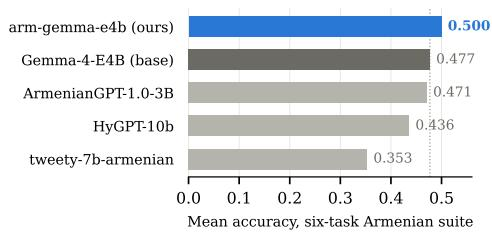
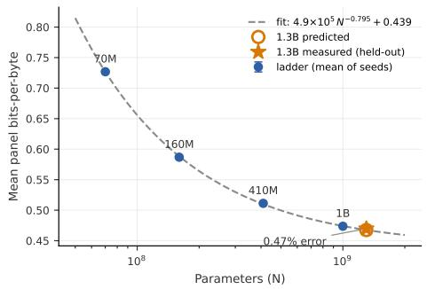
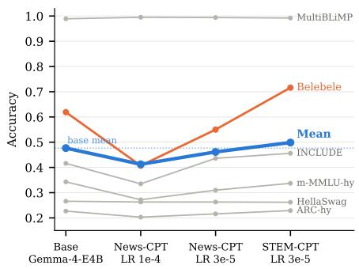
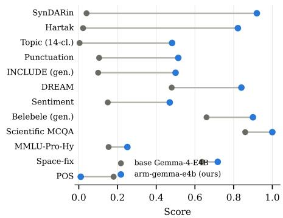

# From Zero to Hero: An Open LLM Ecosystem for Armenian

Erik Arakelyan1,2 Khatun Avetisyan2 Meri Davtyan2 Heghine Grigoryan2 Nane Khachatryan2 Hayk Shahsuvaryan2 Henrik Sergoyan2 Vahan Martirosyan2 1NVIDIA 2COPA

earakelyan@nvidia.com, info@copa.team

## Abstract

Pretraining data for Armenian, a morphologically rich and low-resource language, is scarce, and no open Armenian LLM has been released with the data and recipe needed to reproduce it. To address this gap, we curate and release two datasets. ArmWeb is an extensively validated corpus of 4.37M Armenian news documents. ArmSTEM is a parallel English–Armenian collection of 373K math and science problems, 324K of them with stepby-step solutions, translated into Armenian and verified through both answer-preserving LLM judgment and human evaluation. Continued pretraining of Gemma-4-E4B on these datasets yields arm-gemma-e4b, which outperforms every existing open Armenian model as well as its unadapted base, and is the first open Armenian LLM with complete training data and recipe. Our ablations show that newsonly continued pretraining improves fluency while eroding knowledge, a pattern we also observe in existing Armenian models, and that a small share of verified translated STEM data reverses the loss. We further find that the largest public Armenian corpora overlap webderived evaluation panels heavily, including a train/test self-overlap inside FineWeb-2. We openly release all data, models, and code.

## 1 Introduction

Progress in language modeling remains concentrated in English and a handful of data-rich languages (Le Scao et al., 2022; Ust ¨ un et al. ¨ , 2024). Although massively multilingual models train on corpora spanning hundreds of languages, their benefits are uneven, since pretraining allocates most capacity to the same high-resource head of the language distribution (Le Scao et al., 2022). Small monolingual models still outperform models orders of magnitude larger on basic generation in low-resource languages (Chang et al., 2026). To overcome this imbalance, a growing line of work releases language-specific ecosystems, publishing a curated corpus, an adapted open model, evaluations, and the training recipe together, as has been done for Basque (Etxaniz et al., 2024), Kazakh (Koto et al., 2025), Polish (Kocon et al.´ , 2025), and Southeast Asian languages (Nguyen et al., 2024b).

Armenian is a morphologically rich language that is widely considered low-resource (Ghazaryan et al., 2025; Khurshudyan et al., 2022), and it has no such ecosystem. Its open text is confined to Armenian slices of multilingual web crawls (Abadji et al., 2022; Penedo et al., 2025; Burchell et al., 2025) with no Armenian-specific curation, and we show below that these slices overlap Armenian evaluation sets at rates up to 17.4% (§2.1), echoing audits of English corpora (Dodge et al., 2021; Sainz et al., 2023). Its open models are released as weights alone, without training data or recipes (Gen2B and NCCAIT, 2025; Remy et al., 2024), so they cannot be audited or reproduced. Evaluation, meanwhile, has recently improved (Metric AI Lab, 2025; Ghazaryan et al., 2025), but there is no open training data for the knowledge those benchmarks measure. No math or science text with worked solutions exists in Armenian at training scale.

This paper releases the missing pieces as one documented, auditable pipeline,1 following the datasheet practice of Gebru et al. (2021) and the per-stage reporting of Soldaini et al. (2024), and reports a finding about language adaptation that we believe generalizes. We make five contributions.

• We release ArmWeb, a 4.37M-document (3.3B Gemma-token) Armenian news corpus built from an author-operated 15-year crawl with a fully documented pipeline covering extraction, language identification, syndication-aware deduplication, verified leakage gates, and 13-gram decontamination against ten Armenian benchmarks, with per-document provenance metadata. Quality is validated by a 410M ablation grid, a repetition study, and a scaling ladder whose fit predicts the loss of a held-out 1.3B model to within 0.47%.

• We release ArmSTEM, 373K mathematics and science problems from GSM8K (Cobbe et al., 2021), AceReason-Math (Chen et al., 2025), OpenScience (NVIDIA, 2025a), and OpenScienceReasoning-2 (NVIDIA, 2025b), machine-translated to Eastern Armenian and verified through placeholder-masked translation, language identification, and blind resolving with exact-match answer checking, with dual-side decontamination against both English benchmark origins and Armenian benchmark targets. In a human evaluation, two native speakers independently rated 299 of 300 sampled problems as valid, with perfect inter-annotator agreement. The corpus ships as parallel EN–HY data with per-item provenance and per-subset licenses, and it is to our knowledge the first Armenian STEM corpus with step-by-step solutions at training scale.

• We release arm-gemma-e4b, Gemma-4- E4B adapted to Armenian by continued pretraining on a 69/6/20/5 mixture of ArmWeb, ArmSTEM (both languages), English web replay, and code. It outperforms every open Armenian model we are aware of, as well as its own unadapted base (Figure 1), and it is to our knowledge the first open Armenian LLM released with its complete training corpus and recipe.

• We provide a rigorous study of the adaptation recipe. Naive continued pretraining on news text exhibits classic catastrophic forgetting (McCloskey and Cohen, 1989; French, 1999), trading knowledge for fluency at up to −21.2pp on Belebele (Bandarkar et al., 2024), and existing Armenian models show the same pattern of improved fluency and degraded knowledge at a comparable budget. A gentler learning rate (Ibrahim et al., 2024) recovers roughly two-thirds of the loss, and epoch-capped verified translated STEM data more than reverses it, ending +2.2pp above the base model on average while keeping the fluency gains (§5).

  
Figure 1: Mean accuracy on the six-task Armenian likelihood suite (§4) for all open Armenian models and the unadapted base.

• We report benchmark hygiene results. Scans of the three largest public Armenian crawl slices find 7.9–17.4% of documents overlapping our evaluation sets, dominated by web-derived perplexity panels and including FineWeb-2’s own Armenian test split leaking into its training split. Without decontamination, perplexity-style evaluation systematically overstates the performance of crawl-trained Armenian models.

Figure 1 summarizes the central result.

## 2 Methodology

Token units. This paper counts tokens in two tokenizers. Gemma tokens use the stock Gemma-4 vocabulary (4.15 tokens per Armenian word, Table 13), the unit the released model was trained in, so all corpus sizes, mixture shares, and crosscorpus comparisons use them, with other public corpora re-tokenized by us. SP tokens use a 32K SentencePiece tokenizer trained on ArmWeb, the most fertile tokenizer we built (1.48 tokens per word). The small-scale Megatron ablations of §2.1 use it so that small models spend their budget on content rather than on fragmenting words, so their budgets are stated in SP tokens. One SP token is about 2.8 Gemma tokens on ArmWeb text.

We build a curated in-language corpus (§2.1) and a verified translated knowledge corpus (§2.2), which §3 combines into an adaptation recipe.

## 2.1 The ArmWeb news corpus

Source. ArmWeb derives from a single-operator crawl of public Armenian news sites spanning 2011–2026, stored as a structured database rather than raw HTML, which nearly eliminates the boilerplate that dominates web-crawl curation. Each record carries title, body, URL, outlet, topic, and publication and crawl dates. We release all metadata except author names.

Pipeline. Table 1 gives the full funnel. Cleaning is deliberately minimal because the heuristics that dominate web-crawl curation, such as boilerplate rules, blocklists, and quality classifiers (Raffel et al., 2020; Rae et al., 2021; Penedo et al., 2023), target crawl artifacts our source lacks and are known to discard benign text as collateral (Dodge et al., 2021). Following the light-touch precedent of OSCAR (Abadji et al., 2022), we apply only title–body concatenation, a minimum length of 100 characters, and whitespace normalization. The released text is NFC-normalized and otherwise verbatim, while all similarity computations use a separate aggressive “signature view” built with NFKC normalization, Armenian ligature folding, punctuation stripping, and digit zeroing. GlotLID (Kargaran et al., 2023) retains 98.3% of documents as hye/hyw. Deduplication measurably improves the resulting models (Lee et al., 2022; Penedo et al., 2023; Li et al., 2024) and reduces memorization (Kandpal et al., 2022), and it must run globally before splitting because duplicates that straddle a train/test boundary silently inflate evaluation (Lee et al., 2022; Soboleva et al., 2023). We first remove exact duplicates with xxh128 hashing and a keep-longest rule, then run MinHash LSH with word 5-gram shingles, 112 permutations, and 14 bands of 8 rows, targeting a Jaccard threshold near 0.72. The low threshold is our tuned choice, since news syndication produces true reprints at far lower Jaccard similarity than web duplicates (Silcock et al., 2023) and standard 0.8-threshold recipes (Penedo et al., 2023) miss most of them, an instance of the per-source tuning FineWeb2 argues is necessary (Penedo et al., 2025). Appendix E validates the engine against two independent implementations. Dolma-style repeated paragraph removal (Soldaini et al., 2024) modifies 0.1% of documents and drops only the 13 that fall below the length floor afterward.

Splits and leakage checks. We hold out three evaluation splits of 20K documents each. The validation and in-distribution test splits are drawn by stratified sampling over outlet and month, so each mirrors the training distribution, while the temporal test split takes documents from the final two months of the crawl to measure generalization to future text. Because deduplication ran before splitting, no held-out document should have a duplicate in training, and three checks verify this. The first requires zero exact-duplicate documents between any two splits. The second bounds nearduplicates, found with the same MinHash procedure, at 0.1% of held-out documents. Both run as hard assertions that abort the release build if violated, and both pass, with zero exact collisions and near-duplicate rates of 0.045%, 0.010%, and 0.005% for validation, in-distribution test, and temporal test. The third check counts paragraphs of at least 13 tokens that a held-out split shares with training and reports the counts rather than asserting a bound, finding 30, 63, and 10 shared paragraphs for the three splits (Appendix F). Finally, training text is decontaminated by 13-gram overlap against ten Armenian evaluation sets, removing 147,101 documents (3.3%), following the n-gram decontamination practice operationalized by open-corpus tooling (Soldaini et al., 2024; Li et al., 2024).

<table><tr><td>Stage</td><td>Documents</td></tr><tr><td>Extracted</td><td>5,918,811</td></tr><tr><td>Language ID</td><td>5,817,343 -1.7%</td></tr><tr><td>Exact dedup</td><td>5,436,984 -6.5%</td></tr><tr><td>MinHash dedup</td><td>4,515,497 -16.9%</td></tr><tr><td>Boilerplate</td><td>4,515,484 -0.0%</td></tr><tr><td>Splits held out</td><td>4,455,484 -60K</td></tr><tr><td>Decontamination</td><td>4,308,383 -3.3%</td></tr></table>

Final: 11.0 GB, 3.3B Gemma / 1.15B SP tokens  
Table 1: ArmWeb pipeline funnel. Each ∆ is relative to the preceding row. “Splits held out”: val/test 20K each plus a 20K temporal tail, removed before trainside decontamination.

Contamination of existing corpora. Benchmark contamination is documented in English corpora (Dodge et al., 2021), invalidates evaluation conclusions when unreported (Sainz et al., 2023), and is detectable post hoc (Oren et al., 2024), so it will eventually be audited. Applying our scan to the Armenian slices of the three largest recent public corpora quantifies a problem the community has not priced in. Each overlaps our ten evaluation sets at document rates of 7.9–17.4% (Table 2), dominated by the web-derived perplexity panels, above all FineWeb-2’s own Armenian test split and Wikipedia, while hits on the handbuilt MCQA benchmarks are near zero for every corpus including ours. Restricted to the handbuilt benchmarks, document rates are at or below 0.06% for every corpus, though only 20–53% of Belebele (Bandarkar et al., 2024), INCLUDE (Romanou et al., 2025), and SynDARin (Ghazaryan et al., 2025) items are long enough to be detectable at n=13, and FineWeb-2 additionally carries 38.8K documents overlapping ArmBench items. Perplexity-style evaluation of crawl-trained Armenian models is therefore inflated, FineWeb-2’s own train/test split leaks, and our bpb comparisons (Table 3) are fair only because these panels were decontaminated from ArmWeb.

<table><tr><td>Corpus</td><td>Docs</td><td>Gemma tokens</td><td>Contaminated</td></tr><tr><td>ArmWeb (ours)</td><td>4.46M</td><td>3.3B</td><td>3.3%</td></tr><tr><td>CulturaX-hy</td><td>2.96M</td><td>4.5B</td><td>7.9%</td></tr><tr><td>HPLT-v2-hy</td><td>3.60M</td><td>5.8B</td><td>10.9%</td></tr><tr><td>FineWeb-2-hy</td><td>1.76M</td><td>2.3B</td><td>17.4%</td></tr></table>

Table 2: Documents sharing at least one 13-gram with our ten Armenian evaluation sets (§4), over the normalized signature view. The ArmWeb row is the pre-removal training pool, and released splits have all hits removed. Rates are document-level and lengthsensitive. Gemma tokens re-tokenize each corpus as distributed with the Gemma-4 vocabulary (ArmWeb as released), so sizes are comparable across corpora.

Is curation worth it? We answer with controlled small-scale ablations, relying on the finding that data-recipe rankings established at small scale predict rankings at larger scale (Magnusson et al., 2025; Li et al., 2024). In 410Mparameter comparisons with identical architecture, tokenizer, and a 4.6B SP-token budget (Table 3), spanning CulturaX (Nguyen et al., 2024a), HPLTv2, FineWeb-2, and news (LR-Sum (Palen-Michel and Lignos, 2023)), wiki, and FLORES (NLLB Team et al., 2024) panels, ArmWeb beats all crawl slices on held-out news by roughly 10% bits-perbyte, while crawls win on web and wiki text. The union of ArmWeb and CulturaX wins on the mean, with a bpb of 0.532 against 0.545 for the best single corpus, and is within 0.007 bpb of the column best on every panel. Because the crawl trainers retain their contamination on the webderived panels (Table 2), we also check the three panels on which no trainer has a single 13-gram hit (our held-out news pair and FLORES), where the union still leads at 0.525 against 0.544 for ArmWeb and 0.548 for CulturaX, so the conclusion is not a train-on-test artifact. Mixing Russian into the training stream instead degrades Armenian bpb monotonically at fixed compute (Table 3). The ranking transfers exactly to 1.3B confirmation runs, where the union’s lead widens (Appendix C). Curated and crawled Armenian data are complements, not substitutes.

Effect of data repetition. At 1.15B SP tokens, ArmWeb is small enough that any realistic training run will repeat it, so we measure the value of repetition directly. The marginal gain shrinks with each doubling of epochs at 160M and stays positive through 8 epochs at both scales with no saturation cliff (Table 4), consistent with data-constrained scaling laws (Muennighoff et al., 2023; Hernandez et al., 2022). This trend directly validates the epoch-capped mixture of §3. The repetition runs were trained separately from the ablation grid, and the 410M 4-epoch run scores 0.559 mean bpb against the grid’s ArmWeb score of 0.561, independently replicating the grid measurement.

Scaling ladder. The ablations above are measured at 160M and 410M parameters, so their value depends on whether conclusions drawn at that scale carry over to larger models. The scaling ladder tests this directly. We train the union recipe at four compute-optimal budgets (Hoffmann et al., 2022), from 70M parameters at 1.4B SP tokens to 1B at 20B, with 3/3/3/2 seeds per rung and seed spreads at or below 0.003 bpb. Mean panel bpb falls from 0.727 through 0.587 and 0.511 to 0.474 across the ladder. Residual duplication or contamination that a larger model could exploit would bend the curve away from the smooth power law that clean pretraining data produces (Kaplan et al., 2020). Instead a three-parameter power law (capacity scale, exponent, and irreducible floor) fits all four rungs within 0.0015 bpb at full precision and extrapolates to a fifth, independently trained, larger model. A power-law fit of mean panel bpb against parameter count N,

$$
\mathrm { b p b } ( N ) = \underbrace { 4 . 9 { \times } 1 0 ^ { 5 } N ^ { - 0 . 7 9 5 } } _ { \mathrm { c a p a c i t y ~ t e r m ~ } A N ^ { - \alpha } } + \underbrace { 0 . 4 3 9 } _ { \mathrm { i r r e d u c i b l e ~ b p b ~ } E }\tag{1}
$$

predicts 0.4675 for the held-out 1.3B confirmation model against a measured 0.4697, a 0.47% extrapolation error on a model 30% larger than the largest model in the fit and trained independently (Figure 2). The irreducible term E estimates the bpb floor of the panel under this recipe, and the exponent α measures how quickly added capacity buys loss. Together with the 1.3B confirmation runs, which preserve the 410M corpus ranking (Appendix C), the ladder shows that the grid’s conclusions are properties of the data rather than of the 410M scale. Coefficients are rounded for display and the full-precision fit ships with the code.

<table><tr><td>Variant</td><td>our-iid</td><td>our-tail</td><td>FW2-test</td><td>hyWiki</td><td>LR-Sum</td><td>FLORES</td><td>Avg</td></tr><tr><td>Union (ArmWeb+CulturaX)</td><td>0.426</td><td>0.433</td><td>0.545</td><td>0.603</td><td>0.468</td><td>0.717</td><td>0.532</td></tr><tr><td>CulturaX-hy</td><td>0.465</td><td>0.469</td><td>0.543</td><td>0.610</td><td>0.472</td><td>0.710</td><td>0.545</td></tr><tr><td>FineWeb-2-hy</td><td>0.482</td><td>0.472</td><td>0.538</td><td>0.643</td><td>0.477</td><td>0.735</td><td>0.558</td></tr><tr><td>ArmWeb (ours)</td><td>0.419</td><td>0.426</td><td>0.589</td><td>0.666</td><td>0.477</td><td>0.788</td><td>0.561</td></tr><tr><td>HPLT-v2-hy</td><td>0.474</td><td>0.483</td><td>0.584</td><td>0.620</td><td>0.477</td><td>0.737</td><td>0.562</td></tr><tr><td>ArmWeb/Ru 90/10</td><td>0.424</td><td>0.429</td><td>0.593</td><td>0.660</td><td>0.480</td><td>0.790</td><td>0.563</td></tr><tr><td>ArmWeb/Ru 75/25</td><td>0.428</td><td>0.433</td><td>0.596</td><td>0.665</td><td>0.484</td><td>0.790</td><td>0.566</td></tr><tr><td>ArmWeb/Ru 50/50</td><td>0.439</td><td>0.444</td><td>0.608</td><td>0.679</td><td>0.493</td><td>0.798</td><td>0.577</td></tr></table>

Table 3: Cross-corpus bits-per-byte at 410M/4.6B SP tokens (lower is better). Bold marks the column best, excluding FineWeb-2 on its own test panel. Crawl trainers are used as distributed and keep their contamination on the FW2-test and hyWiki panels (see text). ArmWeb/Ru rows mix ArmWeb with a Russian sister collection at the stated ratios.

<table><tr><td>Epochs over ArmWeb</td><td>1</td><td>2</td><td>4</td><td>8</td></tr><tr><td>160M mean bpb</td><td>0.710</td><td>0.628</td><td>0.593</td><td>0.572</td></tr><tr><td>410M mean bpb</td><td>0.649</td><td>0.590</td><td>0.559</td><td>0.526</td></tr></table>

Table 4: Mean panel bpb when ArmWeb is repeated for more epochs, at two model scales (lower is better).

  
Figure 2: Scaling ladder on the union recipe. Points are Chinchilla-budget runs from 70M to 1B, the curve is the power-law fit, and the held-out point is the independently trained 1.3B confirmation. Seed-range bars (3/3/3/2 per rung) are smaller than the markers.

## 2.2 The ArmSTEM translated STEM corpus

Translated reasoning data reliably improves target-language ability. Chain-of-thought transfers across languages (Shi et al., 2023), translated math training data improves multilingual math performance (Chen et al., 2024), and translated reasoning traces can even beat native-language distillation from stronger models (Barua et al., 2025). Armenian cannot exploit any of this because it has no math or science training data with worked solutions, only small evaluation sets (Romanou et al., 2025; Metric AI Lab, 2025). ArmSTEM fills this gap by translating verified English corpora, namely GSM8K (Cobbe et al., 2021), AceReason-Math (Chen et al., 2025), OpenScience (NVIDIA, 2025a), and OpenScienceReasoning-2 (NVIDIA, 2025b), selected for machine-checkable answers, permissive licenses, and freedom from benchmark provenance.

Translation with placeholder masking. The dominant failure mode of translating math is corruption of numbers and notation (Chen et al., 2024). We eliminate it structurally rather than detecting it after the fact, adapting the placeholder/do-not-translate masking long used for numerals, entities, and inline markup in NMT (Crego et al., 2016; Post and Vilar, 2018; Dinu et al., 2019) to LaTeX-bearing STEM text. Numbers, LaTeX spans, and a question/solution separator are replaced by indexed placeholder tokens before translation and restored afterward. We translate with Gemini-3.1-flash-lite (Google DeepMind, 2026). To choose it, we translated the same 200 items with Gemini-3.1-flash-lite and with GPT-5.5 (OpenAI, 2026) and passed both sets of outputs through the full verification pipeline described next. The decision rule was fixed before scoring, namely that we would switch to the costlier GPT-5.5 only if its pass rate exceeded Gemini’s by at least 5 points. GPT-5.5 passed 96.5% of the items and Gemini 94.0%, a 2.5-point gap below the threshold, so we kept the cheaper model.

Verification gates. Where LLM-based transla tion evaluation typically judges fluency and adequacy (Kocmi and Federmann, 2023), STEM data admits a stronger, functional check, namely whether the translated problem still has the same answer. Each item passes three gates in order. Gate G0 checks placeholder integrity, requiring every token exactly once and no stray digits. Gate G1 is a GlotLID language check. Gate G2 is blind re-solving, in which an independent model (o4-mini, OpenAI, 2025) solves the Armenian problem and must reproduce the gold answer exactly. On a mismatch, a control resolves the English original, and if that also fails the item is solver-limited rather than mistranslated and is kept with a tag, which affects 10.9% of accepted math and 27.6% of science items and certifies problem-statement integrity only. Freeform answers, under 5% of items, use a three-model judge panel with 2/3 majority (Kocmi and Federmann, 2023). Failures are retried twice with feedback, then escalated to a stronger translator, then dropped. Per-source acceptance after repair ranges from 91.5% (OSR-2) to 99.1% (GSM8K), 96.6% overall (Table 5), and per-stage rejection statistics ship with the corpus. An automated adequacy audit (GPT-5.5 judging 300 stratified items against their sources, 1–5 scale) rates 100% of re-solve-verified and 92.7% of solver-limited items meaning-preserving (means 4.65 and 4.39), bounding the tagged stratum’s residual risk. The adequacy judge also serves as the escalation translator for a small fraction of items. For a complete verification of the translated samples, two native Armenian speakers independently assessed a sample of 300 ArmSTEM problems, judging whether each Armenian problem makes logical sense and whether its solution is correct, and rated 299 of 300 as valid, with identical verdicts on every item (raw agreement 100%, Cohen’s κ = 1.0). Answer-checking has precedent for generated math data (Toshniwal et al., 2024). Apply ing it to translation is, to our knowledge, new. G2 checks answer preservation rather than solution style (§7).

Dual-side decontamination. Because Armenian benchmarks are partly translations of English ones, one scan cannot suffice. English sources are scanned against English benchmark origins, above all the MMLU-Pro test set that feeds ArmBench’s largest column, and accepted Armenian translations are scanned against the full Armenian benchmark item set. Both gates rejected real collisions in production. Table 5 gives the resulting composition, totalling 372,907 pairs, about 311M Armenian and 124M parallel English Gemma tokens. A harder competition-math tranche is in preparation.

<table><tr><td>Source</td><td>Pool</td><td>Accepted</td><td>Rate</td></tr><tr><td>GSM8K</td><td>7,473</td><td>7,404</td><td>99.1%</td></tr><tr><td>AceReason-Math</td><td>49,585</td><td>48,584</td><td>98.0%</td></tr><tr><td>OpenScience</td><td>271,440</td><td>264,266</td><td>97.4%</td></tr><tr><td>OSR-2</td><td>57,573</td><td>52,653</td><td>91.5%</td></tr><tr><td>Total</td><td>386,071</td><td>372,907</td><td>96.6%</td></tr></table>

Table 5: ArmSTEM composition. “Pool” is the full English source. “Accepted” is the verified EN–HY pairs released. “Rate” is Accepted/Pool.

## 3 Adapting Gemma-4 to Armenian

Continued pretraining is the established route to language adaptation when target-language text is too scarce to pretrain from scratch (Gururangan et al., 2020; Cui et al., 2023; Csaki et al., 2024). We adapt Gemma-4-E4B, chosen among CPT candidates for the best Armenian tokenizer fertility at 4.15 tokens per word against Qwen3.5’s 5.31 and Llama-3.1’s 12.2 (Table 13), since high fertility inflates both compute cost and downstream error on the affected language (Rust et al., 2021; Ahia et al., 2023).

Keep or extend the tokenizer? A natural alternative to living with a multilingual tokenizer is extending its vocabulary with Armenian tokens, which pays off at large token budgets (Cui et al., 2023) but is known to be sensitive to budget and initialization (Yamaguchi et al., 2024; Zhao et al., 2024). We settle the question with a controlled ablation (Table 6). Mean-initialized extension is sharply harmful at the 2B-token ablation budget, landing 40–45% above even the unadapted base in bits-per-byte, as new embeddings displace welltrained BPE compositions faster than they can be learned, so we retain the stock tokenizer. The ablation uses the smaller E2B at a fifth of the final budget, and stronger initializers (Minixhofer et al., 2022; Dobler and de Melo, 2023) remain untested, so extension could become viable at larger scale.

Mixture and schedule. Training runs for 10B tokens, sequence-packed, on a five-stream mixture of 69% ArmWeb, 4% ArmSTEM-HY, 2% ArmSTEM-EN (parallel data improves both sides (Chen et al., 2024; Wang et al., 2024a)), 20% English web replay from FineWeb-Edu (Penedo et al., 2024), the standard mitigation for forgetting under distribution shift (Rolnick et al., 2019; Ibrahim et al., 2024), and 5% code from Stacksmol (Kocetkov et al., 2022). We compare five training runs and name them by their data. News-CPT trains on news only, with the same replay and code streams at 75/20/5, at learning rates 10−4 and 3×10−5. STEM-CPT trains on the five-stream mixture above at the same two learning rates, and STEM-CPT at $3 \times 1 0 ^ { - 5 }$ is the released armgemma-e4b. Crucially for attribution, the News-CPT runs use the identical trainer, seed, budget, and replay and code streams, so a STEM-CPT run differs from its News-CPT counterpart only in swapping 6 points of ArmWeb for ArmSTEM. The ArmSTEM stream in these runs is a 109,885- item subset of the corpus, about 30%, sampled at random with balanced stratification across the mathematics and science pools (51/49 by items). The fifth run, STEM-CPT-full, trains the released recipe with its STEM share drawn from the full 373K-item corpus instead, and §5 shows it matches arm-gemma-e4b on the likelihood suite while trailing it on format-sensitive generative tasks. Mixture weights are epoch-capped because repetition beyond roughly 4 epochs yields rapidly diminishing returns (Muennighoff et al., 2023; Hernandez et al., 2022). In training-tokenizer accounting ArmWeb spans roughly 3.3B Gemma tokens, so its share is read about twice, which is near-free, while each ArmSTEM token is read 7– 9 times, within the productive zone measured in Table 4. The learning rate of 3×10−5 cosine, the single most consequential CPT hyperparameter (Ibrahim et al., 2024), is itself an experimental result (§5), three times gentler than our first attempt at 10−4.

<table><tr><td>Model</td><td>our-iid</td><td>our-tail</td><td>FW2-test</td><td>hyWiki</td><td>LR-Sum</td><td>FLORES</td><td>Mean</td></tr><tr><td>Base E2B (un-adapted)</td><td>0.463</td><td>0.460</td><td>0.375</td><td>0.188</td><td>0.471</td><td>0.731</td><td>0.448</td></tr><tr><td>CPT, stock tokenizer</td><td>0.356</td><td>0.378</td><td>0.325</td><td>0.174</td><td>0.404</td><td>0.684</td><td>0.387</td></tr><tr><td>CPT, +8k hy tokens</td><td>0.613</td><td>0.635</td><td>0.565</td><td>0.365</td><td>0.656</td><td>0.933</td><td>0.628</td></tr><tr><td>CPT, +16k hy tokens</td><td>0.635</td><td>0.655</td><td>0.591</td><td>0.401</td><td>0.674</td><td>0.948</td><td>0.651</td></tr></table>

Table 6: CPT tokenizer ablation (Gemma-4-E2B, 2B tokens in each variant’s own tokenizer). Bits-per-byte, lower is better. Because bpb is tokenizer-independent, the comparison is fair across vocabularies.

## 4 Experimental setup

We evaluate on two complementary suites. The first is a six-task Armenian likelihood suite comprising Belebele-hye (Bandarkar et al., 2024), m-MMLU-hy (Hendrycks et al., 2021), INCLUDE-Armenian (Romanou et al., 2025), ARC-hy (Clark et al., 2018), HellaSwag-hy (Zellers et al., 2019), and MultiBLiMP-hye (Jumelet et al., 2026), scored by zero-shot log-likelihood accuracy in LM Evaluation Harness (Gao et al., 2024), which measures knowledge independent of output formatting. Item counts range from 550 (INCLUDE) to 10,891 (m-MMLU), and the -hy versions of m-MMLU, ARC, and HellaSwag are Okapi machine translations (Lai et al., 2023), a provenance we account for in §5. The second is ArmBench-LLM (Metric AI Lab, 2025), a 24-task generative benchmark including Armenian nationalexam sections and MMLU-Pro-Hy (Wang et al., 2024b), run in the authors’ lighteval (Habib et al., 2023) fork (Appendix B). In the main text we report the ArmBench tasks whose metrics measure knowledge and language competence for base models. The remaining tasks score instruction adherence and output formatting, which base models definitionally lack, so we report them in the appendix and defer them to instructiontuned variants. The ten ArmWeb decontamination targets are Belebele, INCLUDE, HellaSwaghy, MultiBLiMP, SIB-200, SynDARin, LR-Sum, the FineWeb-2-hy test split, hyWiki eval, and FLORES-200 (NLLB Team et al., 2024), and the CPT mixture was additionally scanned against all ArmBench items including MMLU-Pro-Hy (m-MMLU-hy and ARC-hy were not ArmWeb targets, so we scanned both post hoc, finding zero of the 4.31M ArmWeb training documents and 4 of the 372,907 ArmSTEM pairs sharing any 13-gram with their items). As baselines we evaluate the unadapted Gemma-4-E4B, the existing open Armenian models HyGPT-10b (Gen2B and NCCAIT, 2025), ArmenianGPT-1.0-3B (ArmGPT, 2026) (a Mistral-3-based instruction-tuned model, evaluated as described in Appendix G), and tweety-7barmenian (Remy et al., 2024), and finally Gemma-2-9B, which is HyGPT’s own base model and lets us measure that model’s adaptation delta.

<table><tr><td></td><td></td><td></td><td colspan="2">News-CPT</td><td colspan="3">STEM-CPT</td></tr><tr><td>Task</td><td>95%</td><td>base</td><td> $1 0 ^ { - 4 }$ </td><td> $3 \times 1 0 ^ { - 5 }$ </td><td>10 -4</td><td> $\mathbf { 3 \times 1 0 ^ { - 5 } }$ </td><td>full</td></tr><tr><td>MultiBLiMP</td><td>±.005</td><td>0.989</td><td>0.995</td><td>0.994</td><td>0.995</td><td>0.992</td><td>0.993</td></tr><tr><td>HellaSwag-hy</td><td>±.010</td><td>0.266</td><td>0.263</td><td>0.263</td><td>0.264</td><td>0.262</td><td>0.263</td></tr><tr><td>ARC-hy</td><td>±.025</td><td>0.227</td><td>0.203</td><td>0.216</td><td>0.217</td><td>0.229</td><td>0.219</td></tr><tr><td>m-MMLU-hy</td><td>±.009</td><td>0.343</td><td>0.272</td><td>0.310</td><td>0.314</td><td>0.337</td><td>0.334</td></tr><tr><td>INCLUDE</td><td>±.041</td><td>0.416</td><td>0.335</td><td>0.436</td><td>0.391</td><td>0.456</td><td>0.455</td></tr><tr><td>Belebele</td><td>±.032</td><td>0.619</td><td>0.407</td><td>0.550</td><td>0.590</td><td>0.716</td><td>0.703</td></tr><tr><td>Mean</td><td>±.010</td><td>0.477</td><td>0.412</td><td>0.462</td><td>0.462</td><td>0.500</td><td>0.494</td></tr></table>

Table 7: The likelihood suite across the five adaptation runs of §3. Accuracy, with the row best in bold. The second column gives per-task 95% binomial halfwidths. The bold learning rate marks the released armgemma-e4b and “full” is STEM-CPT-full. Each column is a single training run.

  
Figure 3: Mean accuracy over the six-task suite across CPT runs. Each point is an independent run and connecting lines are visual guides. The remaining runs appear in Table 7.

## 5 Results

Training on our datasets produces the best open Armenian model. arm-gemma-e4b reaches a suite mean of 0.50, above the unadapted Gemma-4-E4B at 0.48 and above every existing open Armenian model, whose means range from 0.35 to 0.47 (Figure 1, Table 8). To our knowledge it is the only open Armenian-adapted model that ends above its own base, and the only one trained with verified translated STEM data. HellaSwaghy and ARC-hy sit at the four-way chance floor for every model and MultiBLiMP is near ceiling, so the discriminative signal concentrates in the three knowledge tasks, where arm-gemma-e4b posts the best score of any open Armenian model on each and the margin over the base widens (0.459 to 0.503 on the m-MMLU/INCLUDE/Belebele submean). The rest of this section traces that margin.

Naive adaptation forgets, early and fast. Table 7 and Figure 3 trace the arc. News-CPT at learning rate 10−4 costs 21.2 points on Belebele and 7.1 on m-MMLU-hy. In our checkpoint inspections the degradation was already complete by mid-training, so checkpoint selection cannot recover it. The released training logs contain the full curves.

A gentler learning rate buys back most, not all. At $3 \times 1 0 ^ { - 5 }$ the model keeps the full fluency gain and recovers two-thirds of the Belebele loss. It even surpasses the base on INCLUDE, whose Armenian-context questions benefit from news knowledge.

Verified translated STEM data reverses the forgetting. Swapping 6% of the news share for ArmSTEM lifts the mean 2.2 points above the unadapted base. Belebele reaches 0.716, a gain of 9.7 points over the base, INCLUDE gains 4.0 points, and m-MMLU-hy returns to within its confidence interval of the base. The STEM swap also works at the aggressive learning rate, where STEM-CPT at 10−4 recovers 18.3 points of Belebele over News-CPT at $1 0 ^ { - 4 }$ and lifts the mean from 0.412 to 0.462, although in our single-run design ending above the base also required the gentler schedule. The effect is also saturated at this dose. STEM-CPT-full, which draws its STEM share from the full 373K-item corpus and thereby cuts repetition from 7–9 reads per token to about 1.3 for Armenian and 1.6 for English, matches arm-gemma-e4b within confidence intervals (mean 0.494 against 0.500), so repeating the verified STEM pool 7–9 times costs nothing on the likelihood suite. On generative ArmBench the comparison splits. STEM-CPT-full uniquely lifts exam mathematics from 1.75 to 2.75 points yet trails on the format-sensitive tasks (0.57 against 0.62 when its scores in Table 10 are averaged over the twelve 0–1 tasks of Table 9) and costs exam history (2.50 to 0.75). This suggests that repeated exposure to a verified QA pool doubles as format training while the full corpus’s diversity helps content-heavy mathematics, with the caveat that STEM-CPT-full also shifts the STEM stream’s math-to-science ratio (51/49 by items in the training subset against 15/85 in the full corpus), so composition and repetition change together. The effect is attributable to the swap itself because the 20% English replay stream, the conventional forgetting mitigation (Rolnick et al., 2019; Ibrahim et al., 2024), was present in every run and did not prevent forgetting. Nor is the reversal a translationese artifact (Singh et al., 2024a), since the gains extend to natively authored evaluations such as INCLUDE and ArmBench’s SynDARin, Hartak, and national exams (Table 9).

The gains transfer to generative evaluation. On capability-measurable ArmBench tasks (Table 9, Figure 4), arm-gemma-e4b improves over its base nearly everywhere, often dramatically. SynDARin rises from 0.04 to 0.92, Belebele from 0.66 to 0.90, MMLU-Pro-Hy from 0.154 to 0.251, and national-exam history from 1.0 to 2.5 points. The cross-model comparison makes the mechanism visible. The base-style competitors collapse on these strict-format tasks, with tweety-7b at zero almost everywhere and HyGPT-10b close behind despite its ten billion CPT tokens, because base models cannot express what they know in the required formats. ArmenianGPT-1.0-3B, the one instruction-tuned model in the table, is competitive, yet arm-gemma-e4b, without any instruction tuning, posts the better accuracy-task mean (0.62 against 0.57) while carrying more knowledge on the likelihood suite (Table 8); given the small pertask sizes we read the aggregate rather than single rows. QA-shaped training data teaches answer discipline without any instruction tuning. The clear competitor wins are exam literature, where HyGPT leads, plausibly reflecting its undisclosed corpus, and POS tagging, where the unadapted base is best and continued pretraining hurts every adapted model.

Existing Armenian models show the same trade at scale. tweety-7b, built by trans-tokenization, is fluent at 0.934 MultiBLiMP yet near chance on every knowledge task. HyGPT-10b, a Gemma-2- 9B continually pretrained on roughly 10B undisclosed Armenian tokens (Gen2B and NCCAIT, 2025), gains fluency over its own base (MultiB-LiMP +2.5pp, outside its ±0.5pp interval) while losing 17.1 points on Belebele and 4.6 on the suite mean (Table 8). Its recipe is undisclosed, so we cannot isolate the cause, but the pattern of rising fluency and falling knowledge is exactly the signature above, and the unauditability is itself part of our argument for open recipes. ArmenianGPT-1.0-3B, the strongest existing open model at a mean of 0.47, still trails even the unadapted Gemma-4-E4B at 0.48. Openly validated data, not scale, separates arm-gemma-e4b from

<table><tr><td></td><td colspan="4">HyGPT pair</td><td></td></tr><tr><td>Task</td><td>G2-9B</td><td>HyGPT</td><td>tweety</td><td>ArmGPT</td><td>ours</td></tr><tr><td>MultiBLiMP</td><td>0.971</td><td>0.996</td><td>0.934</td><td>0.965</td><td>0.992</td></tr><tr><td>HellaSwag-hy</td><td>0.265</td><td>0.262</td><td>0.249</td><td>0.260</td><td>0.262</td></tr><tr><td>ARC-hy</td><td>0.231</td><td>0.219</td><td>0.217</td><td>0.205</td><td>0.229</td></tr><tr><td>m-MMLU-hy</td><td>0.329</td><td>0.282</td><td>0.226</td><td>0.330</td><td>0.337</td></tr><tr><td>INCLUDE</td><td>0.433</td><td>0.367</td><td>0.262</td><td>0.413</td><td>0.456</td></tr><tr><td>Belebele</td><td>0.660</td><td>0.489</td><td>0.229</td><td>0.654</td><td>0.716</td></tr><tr><td>Mean</td><td>0.48</td><td>0.44</td><td>0.35</td><td>0.47</td><td>0.50</td></tr></table>

Table 8: Open Armenian models on the likelihood suite (accuracy, row best in bold). G2-9B is Gemma-2-9B, HyGPT-10b’s own base model; ours is arm-gemmae4b.
<table><tr><td>ArmBench task</td><td>tweety</td><td>HyGPT ArmGPT†</td><td></td><td>base</td><td>ours</td></tr><tr><td>Scientific MCQA</td><td>0.000</td><td>0.300</td><td>1.000</td><td>0.860</td><td>1.000*</td></tr><tr><td>Belebele (gen.)</td><td>0.000</td><td>0.200</td><td>0.800</td><td>0.660</td><td>0.900</td></tr><tr><td>SynDARin</td><td>0.000</td><td>0.340</td><td>0.920</td><td>0.040</td><td>0.920</td></tr><tr><td>DREAM</td><td>0.000</td><td>0.220</td><td></td><td>0.7000.480</td><td>0.840</td></tr><tr><td>Hartak</td><td>0.000</td><td>0.022</td><td>0.822</td><td>0.022</td><td>0.822</td></tr><tr><td>MMLU-Pro-Hy</td><td>0.000</td><td>0.026</td><td>0.281</td><td>0.154</td><td>0.251</td></tr><tr><td>Exam history</td><td>0.50</td><td>2.50</td><td>2.00</td><td>1.00</td><td>2.50</td></tr><tr><td>Exam literature</td><td>0.50</td><td>4.25</td><td>3.00</td><td>3.00</td><td>3.25</td></tr><tr><td>Topic (14-class)</td><td>0.000</td><td>0.071</td><td>0.504</td><td>0.004</td><td>0.482</td></tr><tr><td>Punctuation</td><td>0.000</td><td>0.000</td><td>0.325</td><td>0.105</td><td>0.514</td></tr><tr><td>INCLUDE (gen.)</td><td>0.000</td><td>0.060</td><td></td><td>0.4400.100</td><td>0.500</td></tr><tr><td>Sentiment</td><td>0.000</td><td>0.250</td><td>0.550</td><td>0.150</td><td>0.470</td></tr><tr><td>Space-fix</td><td>0.042</td><td>0.419</td><td>0.535</td><td>0.636</td><td>0.718</td></tr><tr><td>POS</td><td>0.000</td><td>0.000</td><td>0.010</td><td>0.180</td><td>0.010</td></tr><tr><td>Mean (0–1 tasks)</td><td>0.00</td><td>0.16</td><td>0.57</td><td>0.28</td><td>0.62</td></tr></table>

Table 9: ArmBench tasks with accuracy-style metrics (row best in bold, ties both). BLEU- and judge-scored tasks appear in Appendix B. Task sizes: 45–50 items for MCQA rows, 100–280 for Sentiment/Punctuation/Topic, n≈1,000 for MMLU-Pro-Hy. †Instruction-tuned ArmenianGPT-1.0-3B, evaluated as described in Appendix G, without a chat template like all models here. ∗Audited: zero shared 8-grams with ArmSTEM (Appendix D).

this field.

Negative results, including a regression on POS tagging and flat exam mathematics, are reported in Appendix A.

## 6 Related work

Language-specific ecosystems. Massively multilingual models (Le Scao et al., 2022; Ust¨ un et al.¨ , 2024) and instruction collections (Singh et al., 2024b) concentrate capacity in the high-resource head, and small monolingual models can beat far larger multilingual ones (Chang et al., 2026). The corpus+model+evaluation release pattern we follow was established by Latxa (Etxaniz et al., 2024) and extended to Kazakh (Koto et al., 2025),

  
Figure 4: Base model vs. arm-gemma-e4b on Arm-Bench accuracy-style tasks, sorted by improvement.

Southeast Asian languages (Nguyen et al., 2024b), Finnish (Luukkonen et al., 2023), Estonian (Kuulmets et al., 2024), Japanese (Fujii et al., 2024), and Polish (Kocon et al. ´ , 2025), a design space that Tejaswi et al. (2024) systematize. For Armenian, prior work releases models without their training data, with HyGPT-10b’s ∼10B-token corpus undisclosed (Gen2B and NCCAIT, 2025) and tweety-7b releasing its trans-tokenization recipe but not its Armenian continued-pretraining corpus (Remy et al., 2024), while corpus resources are the non-redistributable EANC (Khurshudyan et al., 2022) and Armenian slices of multilingual crawls (Abadji et al., 2022; Penedo et al., 2025; Burchell et al., 2025; Kudugunta et al., 2023; Xue et al., 2021; Conneau et al., 2020; Imani et al., 2023), of which our audit covers the three largest recent ones. Evaluation infrastructure has recently arrived (Metric AI Lab, 2025; Ghazaryan et al., 2025; Bandarkar et al., 2024; Romanou et al., 2025; Adelani et al., 2024; Jumelet et al., 2026), making the missing piece the open training data this paper supplies.

Corpus curation and hygiene. Web-scale pipelines evolved from heuristic filtering (Raffel et al., 2020; Rae et al., 2021) to dedup-centric (Penedo et al., 2023) and empirically ablated (Li et al., 2024; Penedo et al., 2025) recipes, with documentation as an artifact (Gebru et al., 2021; Soldaini et al., 2024; Burchell et al., 2025). Cross-source global deduplication (Soboleva et al., 2023) and syndication-aware thresholds for news (Silcock et al., 2023) are the two refinements our pipeline builds on. Contamination auditing (Dodge et al., 2021; Sainz et al., 2023; Oren et al., 2024) motivates our decontamination gates and the scan in Table 2. Our epoch caps follow data-constrained scaling laws (Muennighoff et al., 2023; Hernandez et al., 2022).

Continued pretraining and forgetting. Domain- and language-adaptive pretraining (Gururangan et al., 2020; Cui et al., 2023; Csaki et al., 2024) inherits catastrophic forgetting (McCloskey and Cohen, 1989; French, 1999; Kirkpatrick et al., 2017), conventionally mitigated by replay (Rolnick et al., 2019) and learning-rate choices (Gupta et al., 2023; Ibrahim et al., 2024; Parmar et al., 2024). Tokenizer adaptation is the other axis, with dedicated embedding initializers (Minixhofer et al., 2022; Dobler and de Melo, 2023) and trans-tokenization (Remy et al., 2024) as alternatives to the mean initialization we ablate (§3). We contribute a third mitigation lever, verified translated knowledge data in the mixture, which does not merely slow forgetting like replay but reverses it.

Translated training data. Chain-of-thought transfers across languages (Shi et al., 2023), translated math data improves multilingual reasoning (Chen et al., 2024), translated traces can beat native distillation (Barua et al., 2025), multilingual instruction data is built largely by translation (Li et al., 2023; Ust ¨ un et al. ¨ , 2024), and parallel data also helps at the pretraining stage (Wang et al., 2024a). Prior work verifies translations by LLM judging (Kocmi and Federmann, 2023) or formula integrity (Chen et al., 2024) and answer-checks generated math data (Toshniwal et al., 2024). Our blind re-solve extends answer-checking to translation, and we deploy translated data in continued pretraining rather than instruction tuning.

## 7 Conclusion

We release two rigorously validated Armenian datasets and show that training on them produces the strongest open Armenian model, the first published with its complete corpus and recipe, and that verified translated STEM data turns the fluency-for-knowledge trade of low-resource adaptation into a net gain. The pipeline uses no Armenian-specific machinery and should transfer to other low-resource languages. Since every artifact carries per-item provenance and licenses, the ecosystem can grow in place, and a competitionmath tranche of ArmSTEM and an instructiontuned arm-gemma-e4b are the next releases.

## Limitations

ArmWeb is news-domain-concentrated, so register diversity is limited. At 3.3B Gemma tokens it is about a third of the undisclosed ∼10B-token corpus behind HyGPT, if that count is in Gemma-2 tokens, a comparable unit. We argue curation and openness over scale but note the gap. Within the 6-point mixture swap we cannot yet separate the contributions of STEM content, QA format, and verification, and a format-matched comparison run is future work (STEM-CPT-full already provides a repetition-matched one, §5). Evaluation is MCQA-heavy with no generation quality or safety assessment. The perfect scientific-MCQA score passes n-gram decontamination and a direct per-item n-gram audit against ArmSTEM (Appendix D), but the 50-item set is small and a paraphrase-level audit is future work.

## Ethics Statement

Copyright and licensing. ArmWeb redistributes the text of publicly published news articles crawled by one of the authors over 15 years. The compilation (selection, cleaning, deduplication, metadata, splits) is released under ODC-BY 1.0, while copyright in the underlying articles remains with their publishers, and we make no claim over it. The crawl honored the sites’ crawling rules, including robots.txt directives. The release is made for research use in the text-and-datamining tradition under which C4, OSCAR, HPLT, and FineWeb-class corpora are distributed (Raffel et al., 2020; Abadji et al., 2022; Burchell et al., 2025). Per-document url and source fields preserve attribution, and the hosting repository provides a takedown mechanism through which any rights holder can have their content removed. Personal data. Author bylines are removed from all records. A scan of the released text finds contact-style PII in a small fraction of documents, with 942 e-mail addresses in 782 documents and 8,971 documents containing phone-number-like strings, overwhelmingly newsroom and institutional contact lines that are part of the published articles. The scan report ships with the corpus. News text inherently discusses named individuals, and we release only what the source outlets made public. ArmSTEM inherits its sources’ MIT/CC-BY-4.0 licenses with a statement of changes (machine translation with automated verification), and its card notes that OpenScience/OSR-2 are Qwengenerated synthetic data. Intended use. The corpora and model are research artifacts. The model is a base model with no safety tuning and should not be deployed to end users without further alignment.

## References

Julien Abadji, Pedro Ortiz Suarez, Laurent Romary, and Benoˆıt Sagot. 2022. Towards a cleaner document-oriented multilingual crawled corpus. In Proceedings of the 13th Language Resources and Evaluation Conference (LREC). ArXiv:2201.06642.

David Ifeoluwa Adelani, Hannah Liu, Xiaoyu Shen, Nikita Vassilyev, Jesujoba O. Alabi, Yanke Mao, Haonan Gao, and En-Shiun Annie Lee. 2024. SIB-200: A simple, inclusive, and big evaluation dataset for topic classification in 200+ languages and dialects. In Proceedings ofthe 18th Conference ofthe European Chapter of the Association for Computational Linguistics (Volume 1: Long Papers), pages 226–245.

Orevaoghene Ahia, Sachin Kumar, Hila Gonen, Jungo Kasai, David R. Mortensen, Noah A. Smith, and Yulia Tsvetkov. 2023. Do all languages cost the same? tokenization in the era of commercial language models. In Proceedings of the 2023 Conference on Empirical Methods in Natural Language Processing, pages 9904–9923. ArXiv:2305.13707.

ArmGPT. 2026. Armeniangpt-1.0-3b. Hugging Face model card, https://huggingface.co/ ArmGPT/ArmenianGPT-1.0-3B.

Lucas Bandarkar, Davis Liang, Benjamin Muller, Mikel Artetxe, Satya Narayan Shukla, Donald Husa, Naman Goyal, Abhinandan Krishnan, Luke Zettlemoyer, and Madian Khabsa. 2024. The belebele benchmark: a parallel reading comprehension dataset in 122 language variants. In Proceedings of the 62nd Annual Meeting of the Association for Computational Linguistics (Volume 1: Long Papers), pages 749–775.

Josh Barua, Seun Eisape, Kayo Yin, and Alane Suhr. 2025. Long chain-of-thought reasoning across languages. arXiv preprint arXiv:2508.14828.

Laurie Burchell, Ona de Gibert, Nikolay Arefyev, Mikko Aulamo, Marta Ban˜on, Pinzhen Chen, Mariia´ Fedorova, Liane Guillou, Barry Haddow, Jan Hajic,ˇ et al. 2025. An expanded massive multilingual dataset for high-performance language technologies (HPLT). In Proceedings of ACL 2025. ArXiv:2503.10267; anthology 2025.acl-long.854.

Tyler A. Chang, Catherine Arnett, Zhuowen Tu, and Benjamin K. Bergen. 2026. Goldfish: Monolingual language models for 350 languages. In Proceedings of the Language Resources and Evaluation Conference (LREC 2026). ArXiv:2408.10441.

Nuo Chen, Zinan Zheng, Ning Wu, Ming Gong, Dongmei Zhang, and Jia Li. 2024. Breaking language barriers in multilingual mathematical reasoning: Insights and observations. In Findings of the Associationfor Computational Linguistics: EMNLP 2024. ArXiv:2310.20246.

Yang Chen, Shrimai Prabhumoye, Akhiad Bercovich, et al. 2025. Acereason-nemotron: Advancing math and code reasoning through reinforcement learning. arXiv preprint arXiv:2505.16400.

Peter Clark, Isaac Cowhey, Oren Etzioni, Tushar Khot, Ashish Sabharwal, Carissa Schoenick, and Oyvind Tafjord. 2018. Think you have solved question answering? try ARC, the AI2 reasoning challenge. Preprint, arXiv:1803.05457.

Karl Cobbe, Vineet Kosaraju, Mohammad Bavarian, Mark Chen, Heewoo Jun, Lukasz Kaiser, Matthias Plappert, Jerry Tworek, Jacob Hilton, Reiichiro Nakano, Christopher Hesse, and John Schulman. 2021. Training verifiers to solve math word problems. Preprint, arXiv:2110.14168.

Alexis Conneau, Kartikay Khandelwal, Naman Goyal, Vishrav Chaudhary, Guillaume Wenzek, Francisco Guzman, Edouard Grave, Myle Ott, Luke Zettle-´ moyer, and Veselin Stoyanov. 2020. Unsupervised cross-lingual representation learning at scale. In Proceedings of the 58th Annual Meeting of the Association for Computational Linguistics (ACL). ArXiv:1911.02116.

Josep Crego, Jungi Kim, Guillaume Klein, Anabel Rebollo, Kathy Yang, Jean Senellart, et al. 2016. Systran’s pure neural machine translation systems. arXiv preprint arXiv:1610.05540.

Zoltan Csaki, Bo Li, Jonathan Li, Qiantong Xu, Pian Pawakapan, Leon Zhang, Yun Du, Hengyu Zhao, Changran Hu, and Urmish Thakker. 2024. Sambalingo: Teaching large language models new languages. arXiv preprint arXiv:2404.05829.

Yiming Cui, Ziqing Yang, and Xin Yao. 2023. Efficient and effective text encoding for chinese llama and alpaca. arXiv preprint arXiv:2304.08177.

Georgiana Dinu, Prashant Mathur, Marcello Federico, and Yaser Al-Onaizan. 2019. Training neural machine translation to apply terminology constraints. In Proceedings of the 57th Annual Meeting of the Association for Computational Linguistics (ACL). ArXiv:1906.01105.

Konstantin Dobler and Gerard de Melo. 2023. Focus: Effective embedding initialization for monolingual specialization of multilingual models. In Proceedings of the 2023 Conference on Empirical Methods in Natural Language Processing (EMNLP). ArXiv:2305.14481.

Jesse Dodge, Maarten Sap, Ana Marasovic, William´ Agnew, Gabriel Ilharco, Dirk Groeneveld, Margaret Mitchell, and Matt Gardner. 2021. Documenting

large webtext corpora: A case study on the colossal clean crawled corpus. In Proceedings of the 2021 Conference on Empirical Methods in Natural Language Processing (EMNLP). ArXiv:2104.08758.

Julen Etxaniz, Oscar Sainz, Naiara Perez, Itziar Aldabe, German Rigau, Eneko Agirre, Aitor Ormazabal, Mikel Artetxe, and Aitor Soroa. 2024. Latxa: An open language model and evaluation suite for basque. In Proceedings of the 62nd Annual Meeting of the Association for Computational Linguistics (Volume 1: Long Papers), pages 14952–14972. ArXiv:2403.20266.

Robert M. French. 1999. Catastrophic forgetting in connectionist networks. Trends in Cognitive Sciences, 3(4):128–135.

Kazuki Fujii, Taishi Nakamura, Mengsay Loem, Hiroki Iida, Masanari Ohi, Kakeru Hattori, Hirai Shota, Sakae Mizuki, Rio Yokota, and Naoaki Okazaki. 2024. Continual pre-training for cross-lingual llm adaptation: Enhancing japanese language capabilities. In Conference on Language Modeling (COLM). ArXiv:2404.17790.

Leo Gao, Jonathan Tow, Baber Abbasi, Stella Biderman, Sid Black, Anthony DiPofi, Charles Foster, Laurence Golding, Jeffrey Hsu, Alain Le Noac’h, Haonan Li, Kyle McDonell, Niklas Muennighoff, Chris Ociepa, Jason Phang, Laria Reynolds, Hailey Schoelkopf, Aviya Skowron, Lintang Sutawika, and 5 others. 2024. The language model evaluation harness.

Timnit Gebru, Jamie Morgenstern, Briana Vecchione, Jennifer Wortman Vaughan, Hanna Wallach, Hal Daume III, and Kate Crawford. 2021. Datasheets for´ datasets. Communications of the ACM, 64(12):86– 92. ArXiv:1803.09010.

Gen2B and NCCAIT. 2025. Hygpt-10b: A large language model for eastern armenian. Hugging Face model card, https://huggingface. co/Gen2B/HyGPT-10b. Technical report at gen2b.ai/hygpt-release-1-0.

Gayane Ghazaryan, Erik Arakelyan, Isabelle Augenstein, and Pasquale Minervini. 2025. Syn-DARin: Synthesising datasets for automated reasoning in low-resource languages. In Proceedings of the 31st International Conference on Computational Linguistics (COLING), pages 6459–6466. ArXiv:2406.14425.

Google DeepMind. 2026. Gemini 3.1 Flash-Lite model card.

Kshitij Gupta, Benjamin Therien, Adam Ibrahim,´ Mats L. Richter, Quentin Anthony, Eugene Belilovsky, Irina Rish, and Timothee Lesort. 2023.´ Continual pre-training of large language models: How to (re)warm your model? arXiv preprint arXiv:2308.04014.

Suchin Gururangan, Ana Marasovic, Swabha´ Swayamdipta, Kyle Lo, Iz Beltagy, Doug Downey, and Noah A. Smith. 2020. Don’t stop pretraining: Adapt language models to domains and tasks. In Proceedings of the 58th Annual Meeting of the Association for Computational Linguistics, pages 8342–8360.

Nathan Habib, Clementine Fourrier, Hynek Kydl´ ´ıcek,ˇ Thomas Wolf, and Lewis Tunstall. 2023. Lighteval: A lightweight framework for llm evaluation.

Dan Hendrycks, Collin Burns, Steven Basart, Andy Zou, Mantas Mazeika, Dawn Song, and Jacob Steinhardt. 2021. Measuring massive multitask language understanding. In International Conference on Learning Representations (ICLR). ArXiv:2009.03300.

Danny Hernandez, Tom Brown, Tom Conerly, Nova DasSarma, Dawn Drain, Sheer El-Showk, Nelson Elhage, Zac Hatfield-Dodds, Tom Henighan, Tristan Hume, et al. 2022. Scaling laws and interpretability of learning from repeated data. arXiv preprint arXiv:2205.10487.

Jordan Hoffmann, Sebastian Borgeaud, Arthur Mensch, Elena Buchatskaya, Trevor Cai, Eliza Rutherford, Diego de Las Casas, Lisa Anne Hendricks, Johannes Welbl, Aidan Clark, et al. 2022. Training compute-optimal large language models. arXiv preprint arXiv:2203.15556.

Adam Ibrahim, Benjamin Therien, Kshitij Gupta,´ Mats L. Richter, Quentin Anthony, Timothee Lesort,´ Eugene Belilovsky, and Irina Rish. 2024. Simple and scalable strategies to continually pre-train large language models. Transactions on Machine Learning Research. ArXiv:2403.08763.

Ayyoob Imani, Peiqin Lin, Amir Hossein Kargaran, Silvia Severini, Masoud Jalili Sabet, Nora Kassner, Chunlan Ma, Helmut Schmid, Andre Mar-´ tins, Franc¸ois Yvon, and Hinrich Schutze. 2023.¨ Glot500: Scaling multilingual corpora and language models to 500 languages. In Proceedings of the 61st Annual Meeting of the Association for Computational Linguistics (ACL). ArXiv:2305.12182.

Jaap Jumelet, Leonie Weissweiler, Joakim Nivre, and Arianna Bisazza. 2026. MultiBLiMP 1.0: A massively multilingual benchmark of linguistic minimal pairs. Transactions ofthe Associationfor Computational Linguistics, 14:193–216. ArXiv:2504.02768.

Nikhil Kandpal, Eric Wallace, and Colin Raffel. 2022. Deduplicating training data mitigates privacy risks in language models. In Proceedings of the 39th International Conference on Machine Learning (ICML), PMLR 162. ArXiv:2202.06539.

Jared Kaplan, Sam McCandlish, Tom Henighan, Tom B. Brown, Benjamin Chess, Rewon Child, Scott Gray, Alec Radford, Jeffrey Wu, and Dario Amodei. 2020. Scaling laws for neural language models. arXiv preprint arXiv:2001.08361.

Amir Hossein Kargaran, Ayyoob Imani, Franc¸ois Yvon, and Hinrich Schutze. 2023. GlotLID: Lan-¨ guage identification for low-resource languages. In Findings of the Association for Computational Linguistics: EMNLP 2023, pages 6155–6218. ArXiv:2310.16248.

Victoria Khurshudyan, Timofey Arkhangelskiy, Misha Daniel, Vladimir Plungian, Dmitri Levonian, Alex Polyakov, and Sergei Rubakov. 2022. Eastern Armenian national corpus: State of the art and perspectives. In Proceedings of the Workshop on Processing Language Variation: Digital Armenian (DigitAm) at LREC 2022, pages 28–37.

James Kirkpatrick, Razvan Pascanu, Neil Rabinowitz, Joel Veness, Guillaume Desjardins, Andrei A. Rusu, Kieran Milan, John Quan, Tiago Ramalho, Agnieszka Grabska-Barwinska, Demis Hassabis, Claudia Clopath, Dharshan Kumaran, and Raia Hadsell. 2017. Overcoming catastrophic forgetting in neural networks. Proceedings of the National Academy of Sciences, 114(13):3521–3526.

Denis Kocetkov, Raymond Li, Loubna Ben Allal, Jia Li, Chenghao Mou, Carlos Munoz Ferrandis, Yacine˜ Jernite, Margaret Mitchell, Sean Hughes, Thomas Wolf, Dzmitry Bahdanau, Leandro von Werra, and Harm de Vries. 2022. The stack: 3 tb of permissively licensed source code. arXiv preprint arXiv:2211.15533.

Tom Kocmi and Christian Federmann. 2023. Large language models are state-of-the-art evaluators of translation quality. In Proceedings of the 24th Annual Conference of the European Association for Machine Translation (EAMT). ArXiv:2302.14520.

Jan Kocon, Maciej Piasecki, Arkadiusz Janz, Teddy´ Ferdinan, Łukasz Radlinski, et al. 2025. Pllum:´ A family of polish large language models. arXiv preprint arXiv:2511.03823.

Fajri Koto, Rituraj Joshi, Nurdaulet Mukhituly, Yuxia Wang, et al. 2025. Sherkala-chat: Building a state-of-the-art llm for kazakh in a moderately resourced setting. In Conference on Language Modeling (COLM). ArXiv:2503.01493.

Sneha Kudugunta, Isaac Caswell, Biao Zhang, Xavier Garcia, Christopher A. Choquette-Choo, Katherine Lee, Derrick Xin, Aditya Kusupati, Romi Stella, Ankur Bapna, and Orhan Firat. 2023. Madlad-400: A multilingual and document-level large audited dataset. In Advances in Neural Information Processing Systems 36 (Datasets and Benchmarks Track). ArXiv:2309.04662.

Hele-Andra Kuulmets, Taido Purason, Agnes Luhtaru, and Mark Fishel. 2024. Teaching llama a new language through cross-lingual knowledge transfer. In Findings of the Association for Computational Linguistics: NAACL 2024. ArXiv:2404.04042.

Viet Dac Lai, Nghia Trung Ngo, Amir Pouran Ben Veyseh, Hieu Man, Franck Dernoncourt, Trung Bui, and

Thien Huu Nguyen. 2023. Okapi: Instruction-tuned large language models in multiple languages with reinforcement learning from human feedback. In Proceedings of the 2023 Conference on Empirical Methods in Natural Language Processing: System Demonstrations. ArXiv:2307.16039.

Teven Le Scao, Angela Fan, Christopher Akiki, Ellie Pavlick, et al. 2022. Bloom: A 176b-parameter open-access multilingual language model. arXiv preprint arXiv:2211.05100.

Katherine Lee, Daphne Ippolito, Andrew Nystrom, Chiyuan Zhang, Douglas Eck, Chris Callison-Burch, and Nicholas Carlini. 2022. Deduplicating training data makes language models better. In Proceedings of the 60th Annual Meeting of the Association for Computational Linguistics (ACL). ArXiv:2107.06499.

Haonan Li, Fajri Koto, Minghao Wu, Alham Fikri Aji, and Timothy Baldwin. 2023. Bactrian-x: Multilingual replicable instruction-following models with low-rank adaptation. arXiv preprint arXiv:2305.15011.

Jeffrey Li, Alex Fang, Georgios Smyrnis, Maor Ivgi, Matt Jordan, Samir Gadre, Hritik Bansal, Etash Guha, Sedrick Keh, Kushal Arora, et al. 2024. Datacomp-lm: In search of the next generation of training sets for language models. In Advances in Neural Information Processing Systems 37 (Datasets and Benchmarks Track). ArXiv:2406.11794.

Risto Luukkonen, Ville Komulainen, Jouni Luoma, Anni Eskelinen, Jenna Kanerva, Hanna-Mari Kupari, Filip Ginter, Veronika Laippala, Niklas Muennighoff, Aleksandra Piktus, et al. 2023. Fingpt: Large generative models for a small language. In Proceedings of the 2023 Conference on Empirical Methods in Natural Language Processing (EMNLP). ArXiv:2311.05640.

Ian Magnusson, Nguyen Tai, Ben Bogin, David Heineman, Jena D. Hwang, Luca Soldaini, Akshita Bhagia, Jiacheng Liu, Dirk Groeneveld, Oyvind Tafjord, Noah A. Smith, Pang Wei Koh, and Jesse Dodge. 2025. Datadecide: How to predict best pretraining data with small experiments. In Proceedings of the 42nd International Conference on Machine Learning (ICML). ArXiv:2504.11393.

Michael McCloskey and Neal J. Cohen. 1989. Catastrophic interference in connectionist networks: The sequential learning problem. In Psychology of Learning and Motivation, volume 24, pages 109– 165. Academic Press.

Metric AI Lab. 2025. Armbench-llm: Benchmarking llms on armenian language tasks. https://huggingface.co/blog/ Metric-AI/armbench-llm. Code: https: //github.com/Metricam/ArmBench-LLM.

Benjamin Minixhofer, Fabian Paischer, and Navid Rekabsaz. 2022. Wechsel: Effective initialization of subword embeddings for cross-lingual transfer of monolingual language models. In Proceedings of the 2022 Conference of the North American Chapter ofthe Associationfor Computational Linguistics (NAACL). ArXiv:2112.06598.

Niklas Muennighoff, Alexander M. Rush, Boaz Barak, Teven Le Scao, Aleksandra Piktus, Nouamane Tazi, Sampo Pyysalo, Thomas Wolf, and Colin Raffel. 2023. Scaling data-constrained language models. In Advances in Neural Information Processing Systems 36 (NeurIPS 2023). ArXiv:2305.16264.

Thuat Nguyen, Chien Van Nguyen, Viet Dac Lai, Hieu Man, Nghia Trung Ngo, Franck Dernoncourt, Ryan A. Rossi, and Thien Huu Nguyen. 2024a. Culturax: A cleaned, enormous, and multilingual dataset for large language models in 167 languages. In Proceedings of the 2024 Joint International Conference on Computational Linguistics, Language Resources and Evaluation (LREC-COLING). ArXiv:2309.09400.

Xuan-Phi Nguyen, Wenxuan Zhang, Xin Li, Mahani Aljunied, Zhiqiang Hu, et al. 2024b. Seallms – large language models for southeast asia. In Proceedings of the 62nd Annual Meeting of the Association for Computational Linguistics (ACL 2024): System Demonstrations. ArXiv:2312.00738.

NLLB Team, Marta R. Costa-jussa, James Cross, Onur\` C¸ elebi, Maha Elbayad, Kenneth Heafield, Kevin Heffernan, Elahe Kalbassi, et al. 2024. Scaling neural machine translation to 200 languages. Nature, 630(8018):841–846. ArXiv:2207.04672.

NVIDIA. 2025a. Openscience. Hugging Face dataset, https://huggingface.co/datasets/ nvidia/OpenScience.

NVIDIA. 2025b. Opensciencereasoning-2. Hugging Face dataset, https: //huggingface.co/datasets/nvidia/ OpenScienceReasoning-2.

OpenAI. 2025. OpenAI o3 and o4-mini system card.

OpenAI. 2026. GPT-5.5 system card.

Yonatan Oren, Nicole Meister, Niladri Chatterji, Faisal Ladhak, and Tatsunori B. Hashimoto. 2024. Proving test set contamination in black box language models. In International Conference on Learning Representations (ICLR). ArXiv:2310.17623.

Chester Palen-Michel and Constantine Lignos. 2023. Lr-sum: Summarization for less-resourced languages. In Findings of the Association for Computational Linguistics: ACL 2023. ArXiv:2212.09674.

Jupinder Parmar, Sanjev Satheesh, Mostofa Patwary, Mohammad Shoeybi, and Bryan Catanzaro. 2024. Reuse, don’t retrain: A recipe for continued pretraining of language models. arXiv preprint arXiv:2407.07263.

Guilherme Penedo, Hynek Kydl´ıcek, Anton Lozhkov,ˇ Margaret Mitchell, Colin Raffel, Leandro von Werra, Thomas Wolf, et al. 2024. The fineweb datasets: Decanting the web for the finest text data at scale. In Advances in Neural Information Processing Systems 37 (Datasets and Benchmarks Track). ArXiv:2406.17557.

Guilherme Penedo, Hynek Kydl´ıcek, Vinko Sabolˇ cec,ˇ Bettina Messmer, Negar Foroutan, Amir Hossein Kargaran, Colin Raffel, Martin Jaggi, Leandro von Werra, and Thomas Wolf. 2025. Fineweb2: One pipeline to scale them all – adapting pre-training data processing to every language. arXiv preprint arXiv:2506.20920.

Guilherme Penedo, Quentin Malartic, Daniel Hesslow, Ruxandra Cojocaru, Alessandro Cappelli, Hamza Alobeidli, Baptiste Pannier, Ebtesam Almazrouei, and Julien Launay. 2023. The refinedweb dataset for falcon llm: Outperforming curated corpora with web data, and web data only. In Advances in Neural Information Processing Systems 36 (Datasets and Benchmarks Track). ArXiv:2306.01116.

Matt Post and David Vilar. 2018. Fast lexically constrained decoding with dynamic beam allocation for neural machine translation. In Proceedings of the 2018 Conference of the North American Chapter of the Association for Computational Linguistics (NAACL). ArXiv:1804.06609.

Jack W. Rae, Sebastian Borgeaud, Trevor Cai, Katie Millican, Jordan Hoffmann, Francis Song, John Aslanides, Sarah Henderson, Roman Ring, Susannah Young, et al. 2021. Scaling language models: Methods, analysis & insights from training gopher. arXiv preprint arXiv:2112.11446.

Colin Raffel, Noam Shazeer, Adam Roberts, Katherine Lee, Sharan Narang, Michael Matena, Yanqi Zhou, Wei Li, and Peter J. Liu. 2020. Exploring the limits of transfer learning with a unified text-to-text transformer. Journal of Machine Learning Research, 21(140):1–67. ArXiv:1910.10683.

Franc¸ois Remy, Pieter Delobelle, Hayastan Avetisyan, Alfiya Khabibullina, Miryam de Lhoneux, and Thomas Demeester. 2024. Trans-tokenization and cross-lingual vocabulary transfers: Language adaptation of llms for low-resource nlp. In Conference on Language Modeling (COLM). ArXiv:2408.04303.

David Rolnick, Arun Ahuja, Jonathan Schwarz, Timothy P. Lillicrap, and Greg Wayne. 2019. Experience replay for continual learning. In Advances in Neural Information Processing Systems 32 (NeurIPS 2019). ArXiv:1811.11682.

Angelika Romanou, Negar Foroutan, Anna Sotnikova, Zeming Chen, Sree Harsha Nelaturu, Shivalika Singh, Rishabh Maheshwary, Micol Altomare, Mohamed A. Haggag, Alfonso Amayuelas, et al. 2025.

INCLUDE: Evaluating multilingual language understanding with regional knowledge. In The Thirteenth International Conference on Learning Representations (ICLR). ArXiv:2411.19799.

Phillip Rust, Jonas Pfeiffer, Ivan Vulic, Sebastian´ Ruder, and Iryna Gurevych. 2021. How good is your tokenizer? on the monolingual performance of multilingual language models. In Proceedings ofthe 59th Annual Meeting of the Association for Computational Linguistics and the 11th International Joint Conference on Natural Language Processing (Volume 1: Long Papers). ArXiv:2012.15613.

Oscar Sainz, Jon Campos, Iker Garc´ıa-Ferrero, Julen Etxaniz, Oier Lopez de Lacalle, and Eneko Agirre. 2023. NLP evaluation in trouble: On the need to measure LLM data contamination for each benchmark. In Findings of the Association for Computational Linguistics: EMNLP 2023. ArXiv:2310.18018; anthology 2023.findingsemnlp.722.

Freda Shi, Mirac Suzgun, Markus Freitag, Xuezhi Wang, Suraj Srivats, Soroush Vosoughi, Hyung Won Chung, Yi Tay, Sebastian Ruder, Denny Zhou, Dipanjan Das, and Jason Wei. 2023. Language models are multilingual chain-of-thought reasoners. In The Eleventh International Conference on Learning Representations (ICLR). ArXiv:2210.03057.

Emily Silcock, Luca D’Amico-Wong, Jinglin Yang, and Melissa Dell. 2023. Noise-robust de-duplication at scale. In International Conference on Learning Representations (ICLR). ArXiv:2210.04261.

Shivalika Singh, Angelika Romanou, Clementine Four-´ rier, David I. Adelani, Jian Gang Ngui, Daniel Vila-Suero, et al. 2024a. Global mmlu: Understanding and addressing cultural and linguistic biases in multilingual evaluation. arXiv preprint arXiv:2412.03304.

Shivalika Singh, Freddie Vargus, Daniel Dsouza, Borje F. Karlsson, Abinaya Mahendiran, Wei-Yin¨ Ko, Herumb Shandilya, Jay Patel, et al. 2024b. Aya dataset: An open-access collection for multilingual instruction tuning. In Proceedings of the 62nd Annual Meeting of the Association for Computational Linguistics (Volume 1: Long Papers). ArXiv:2402.06619.

Daria Soboleva, Faisal Al-Khateeb, Robert Myers, Jacob R. Steeves, Joel Hestness, and Nolan Dey. 2023. SlimPajama: A 627b token cleaned and deduplicated version of RedPajama. Cerebras blog, https: //cerebras.ai/blog/slimpajama. Dataset: cerebras/SlimPajama-627B on Hugging Face.

Luca Soldaini, Rodney Kinney, Akshita Bhagia, Dustin Schwenk, David Atkinson, Russell Authur, Ben Bogin, Khyathi Chandu, Jennifer Dumas, Yanai Elazar,

et al. 2024. Dolma: an open corpus of three trillion tokens for language model pretraining research. In Proceedings of the 62nd Annual Meeting ofthe Associationfor Computational Linguistics (ACL 2024). ArXiv:2402.00159.

Atula Tejaswi, Nilesh Gupta, and Eunsol Choi. 2024. Exploring design choices for building languagespecific llms. In Findings of the Association for Computational Linguistics: EMNLP 2024. ArXiv:2405.14670.

Shubham Toshniwal, Wei Du, Ivan Moshkov, Branislav Kisacanin, Alexan Ayrapetyan, and Igor Gitman. 2024. Openmathinstruct-2: Accelerating ai for math with massive open-source instruction data. arXiv preprint arXiv:2410.01560.

Ahmet Ust ¨ un, Viraat Aryabumi, Zheng-Xin Yong,¨ Wei-Yin Ko, Daniel D’souza, et al. 2024. Aya model: An instruction finetuned open-access multilingual language model. In Proceedings of the 62nd Annual Meeting of the Association for Computational Linguistics. ArXiv:2402.07827.

Jiayi Wang, Yao Lu, Maurice Weber, Max Ryabinin, Yihong Chen, Raphael Tang, and Pontus Stenetorp. 2024a. Multilingual pretraining using a large corpus machine-translated from a single source language. arXiv preprint arXiv:2410.23956.

Yubo Wang, Xueguang Ma, Ge Zhang, Yuansheng Ni, Abhranil Chandra, Shiguang Guo, Weiming Ren, Aaran Arulraj, Xuan He, Ziyan Jiang, et al. 2024b. MMLU-pro: A more robust and challenging multitask language understanding benchmark. In Advances in Neural Information Processing Systems 37 (NeurIPS 2024), Datasets and Benchmarks Track. ArXiv:2406.01574.

Linting Xue, Noah Constant, Adam Roberts, Mihir Kale, Rami Al-Rfou, Aditya Siddhant, Aditya Barua, and Colin Raffel. 2021. mt5: A massively multilingual pre-trained text-to-text transformer. In Proceedings of the 2021 Conference of the North American Chapter of the Association for Computational Linguistics (NAACL). ArXiv:2010.11934.

Atsuki Yamaguchi, Aline Villavicencio, and Nikolaos Aletras. 2024. An empirical study on crosslingual vocabulary adaptation for efficient language model inference. In Findings of the Association for Computational Linguistics: EMNLP 2024. ArXiv:2402.10712.

Rowan Zellers, Ari Holtzman, Yonatan Bisk, Ali Farhadi, and Yejin Choi. 2019. HellaSwag: Can a machine really finish your sentence? In Proceedings of the 57th Annual Meeting of the Association for Computational Linguistics, pages 4791–4800.

Jun Zhao, Zhihao Zhang, Luhui Gao, Qi Zhang, Tao Gui, and Xuanjing Huang. 2024. Llama beyond english: An empirical study on language capability transfer. arXiv preprint arXiv:2401.01055.

## A Negative results

POS tagging regresses under CPT, from 0.18 to 0.01. Exam mathematics is flat at 1.75 points for the released model, though STEM-CPT-full reaches 2.75, indicating that data diversity rather than difficulty may be the binding factor. Instruction-dependent ArmBench tasks such as judged generation and BLEU-scored QA remain low for all base-style models including ours. These measure formatting, and we defer them to an instruction-tuned variant.

## B Full ArmBench results

Table 10 reports every ArmBench-LLM task score produced by the released harness fork for the base model, News-CPT at $3 \times 1 0 ^ { - 5 }$ , arm-gemmae4b, and STEM-CPT-full, including instructiondependent tasks (judged generation, BLEU-scored QA) on which all base-style models score low by construction.

## C Scale confirmation at 1.3B

Table 11 confirms the 410M grid of Table 3 at 1.3B parameters. Three recipes were retrained at 27.6B SP tokens each, the 410M ranking transfers exactly, the union’s lead over CulturaX widens from 0.013 to 0.035 mean bpb, and at 1.3B the union overtakes pure ArmWeb even on the held-out news domain, as larger models exploit data diversity. The table reports bits-per-byte, lower is better.

## D Contamination audit of the perfect MCQA score

Beyond the pipeline’s 13-gram decontamination gates, we audited the perfect ArmBench scientific-MCQA score (50 of 50) directly. Every benchmark item was compared against the full Arm-STEM training corpus, covering the Armenian side of both math and science shards with 21.8M distinct 8-grams, at n-gram lengths 5 and 8 over the normalized signature view. At n=8, zero of the 50 items share a single 8-gram with the training data. At n=5, 15 items share at least one 5-gram, with a maximum overlap of 5.9% of an item’s 5-grams and a median of zero, consistent with generic scientific phrasing rather than item leakage. The base model already scores 0.86 on this 50-item set, and the adaptation adds seven items. We conclude the score reflects capability, not memorization, while noting the set’s small size in the main text.

<table><tr><td>ArmBench task (metric)</td><td>base E4B</td><td>News-CPT 3×10−5</td><td>arm-gemma-e4b</td><td>STEM-CPT-full</td></tr><tr><td>arak (BLEU)</td><td>1.088</td><td>0.534</td><td>1.351</td><td>1.205</td></tr><tr><td>belebele (EM)</td><td>0.660</td><td>0.760</td><td>0.900</td><td>0.820</td></tr><tr><td>dream (EM)</td><td>0.480</td><td>0.700</td><td>0.840</td><td>0.800</td></tr><tr><td>exam_history (exam pts)</td><td>1.000</td><td>1.000</td><td>2.500</td><td>0.750</td></tr><tr><td>exam_literature (exam pts)</td><td>3.000</td><td>2.000</td><td>3.250</td><td>3.250</td></tr><tr><td>exam_math (exam pts)</td><td>1.750</td><td>0.250</td><td>1.750</td><td>2.750</td></tr><tr><td>finer (NER acc)</td><td>0.000</td><td>0.001</td><td>0.007</td><td>0.036</td></tr><tr><td>hartak (EM)</td><td>0.022</td><td>0.044</td><td>0.822</td><td>0.867</td></tr><tr><td>include (EM)</td><td>0.100</td><td>0.080</td><td>0.500</td><td>0.380</td></tr><tr><td>mmlu_pro (MMLU-Pro)</td><td>0.154</td><td>0.087</td><td>0.251</td><td>0.151</td></tr><tr><td>ms_marco (BLEU)</td><td>2.489</td><td>0.110</td><td>3.993</td><td>3.484</td></tr><tr><td>paraphrase (BLEU)</td><td>0.575</td><td>0.322</td><td>1.566</td><td></td></tr><tr><td>paraphrase (bert_score)</td><td>0.748</td><td>0.663</td><td>0.765</td><td></td></tr><tr><td>pioner (NER acc)</td><td>0.010</td><td>0.007</td><td>0.114</td><td>0.042</td></tr><tr><td>pos (POS acc)</td><td>0.180</td><td>0.000</td><td>0.010</td><td>0.000</td></tr><tr><td>punctuation (acc)</td><td>0.105</td><td>0.168</td><td>0.514</td><td>0.320</td></tr><tr><td>scientific (EM)</td><td>0.860</td><td>0.460</td><td>1.000</td><td>1.000</td></tr><tr><td>sentiment (EM)</td><td>0.150</td><td>0.150</td><td>0.470</td><td>0.500</td></tr><tr><td>short_sentences_translation (bert_score)</td><td>0.491</td><td>0.621</td><td>0.678</td><td>0.637</td></tr><tr><td>short_sentences_translation (BLEU)</td><td>0.001</td><td>0.140</td><td>0.168</td><td>0.347</td></tr><tr><td>space_fix (acc)</td><td>0.636 0.278</td><td>0.346</td><td>0.718</td><td>0.632</td></tr><tr><td>squad (BLEU)</td><td></td><td>0.025</td><td>0.481</td><td>0.422</td></tr><tr><td>syndarin (EM)</td><td>0.040</td><td>0.360</td><td>0.920</td><td>0.900</td></tr><tr><td>topic-14class (EM)</td><td>0.004</td><td>0.043</td><td>0.482</td><td>0.461</td></tr></table>

Table 10: Every ArmBench task the fork scores, for the base model, News-CPT, arm-gemma-e4b, and STEM-CPTfull (§5). Best per row in bold, ties both. Exam rows are points with negative marking; BLEU rows are corpus-level; “–” marks the one pair (STEM-CPT-full paraphrase) where the fork’s BERTScore scorer fails reproducibly.
<table><tr><td>Variant</td><td>our-iid</td><td>our-tail</td><td>FW2-test</td><td>hyWiki</td><td>LR-Sum</td><td>FLORES</td><td>Mean</td></tr><tr><td>Union (ArmWeb+CulturaX)</td><td>0.351</td><td>0.380</td><td>0.479</td><td>0.508</td><td>0.418</td><td>0.682</td><td>0.470</td></tr><tr><td>CulturaX-hy</td><td>0.404</td><td>0.448</td><td>0.500</td><td>0.537</td><td>0.437</td><td>0.705</td><td>0.505</td></tr><tr><td>ArmWeb</td><td>0.367</td><td>0.405</td><td>0.575</td><td>0.649</td><td>0.460</td><td>0.815</td><td>0.545</td></tr><tr><td>Union @ 410M (ref.)</td><td>0.426</td><td>0.433</td><td>0.545</td><td>0.603</td><td>0.468</td><td>0.717</td><td>0.532</td></tr></table>

Table 11: 1.3B confirmation runs (27.6B SP tokens each; bpb, lower is better), with the 410M union row repeated for reference.

## E Cross-implementation deduplication check

We verified the engine twice. First, the reference datasketch library, run with the identical recipe (word 5-grams, 112 permutations, 14 bands of 8, threshold 0.72) on a 1% sample of 57,801 documents, finds 449 in-sample duplicate documents, of which our full-corpus engine had already flagged 430 (95.8%), the remainder being threshold-edge pairs. Second, we ran NeMo-Curator (v1.1, official container) on the same post-LID corpus with matched LSH geometry (112 permutations as 14 bands of 8, seed 42) over the same signature view, differing only in shingling (Curator’s 30-character n-grams against our word 5-grams). On the full 5.82M documents Curator flags 23.5% for removal against our 22.4%. On a 100K-document sample where both tools ran identically scoped, document-level decisions agree on 99.2% of documents and Curator reproduces 71.9% of our duplicate clusters exactly. The disagreements are the stochastic LSH boundary, since clusters both tools find have a median true word-5-gram Jaccard of 0.79, while clusters only one tool finds have a median of 0.62, below the 0.72 threshold, where any LSH implementation detects pairs only probabilistically. We conclude the two implementations are equivalent away from the threshold boundary and the released corpus is not an artifact of our engine. Separately, the identical recipe applied to a Russian sister collection gathered by the same crawler removes only 0.9% of documents, against 22.4% for the Armenian corpus, confirming that the measured duplication level is a property of the Armenian news ecosystem rather than of the pipeline.

<table><tr><td>Outlet</td><td>Domain</td><td>Documents</td><td>Share</td></tr><tr><td>News</td><td>news.am</td><td>743,867</td><td>17.0%</td></tr><tr><td>lin</td><td>1in.am</td><td>683,802</td><td>15.7%</td></tr><tr><td>Tert</td><td>tert.am</td><td>500,341</td><td>11.5%</td></tr><tr><td>Blognews</td><td>blognews.am</td><td>405,199</td><td>9.3%</td></tr><tr><td>168</td><td>168.am</td><td>376,009</td><td>8.6%</td></tr><tr><td>Aravot</td><td>aravot.am</td><td>344,456</td><td>7.9%</td></tr><tr><td>Armtimes</td><td>armtimes.com</td><td>236,368</td><td>5.4%</td></tr><tr><td>Lurer</td><td>lurer.com</td><td>223,624</td><td>5.1%</td></tr><tr><td>Mamul</td><td>mamul.am</td><td>218,189</td><td>5.0%</td></tr><tr><td>Panarmenian</td><td>panarmenian.net</td><td>183,936</td><td>4.2%</td></tr><tr><td>Lragir</td><td>lragir.am</td><td>177,804</td><td>4.1%</td></tr><tr><td>Asekose</td><td>asekose.am</td><td>116,617</td><td>2.7%</td></tr><tr><td>Radar</td><td>radar.am</td><td>42,986</td><td>1.0%</td></tr><tr><td>Azatutyun</td><td>azatutyun.am</td><td>38,727</td><td>0.9%</td></tr><tr><td>Banks</td><td>banks.am</td><td>26,709</td><td>0.6%</td></tr><tr><td>Iravaban</td><td>iravaban.net</td><td>19,785</td><td>0.5%</td></tr><tr><td>Armlur</td><td>armlur.am</td><td>16,243</td><td>0.4%</td></tr><tr><td>Armenpress</td><td>armenpress.am</td><td>13,613</td><td>0.3%</td></tr><tr><td>Hraparak</td><td>hraparak.am</td><td>108</td><td>0.0%</td></tr><tr><td>Total</td><td>19 domains</td><td>4,368,383</td><td>100%</td></tr></table>

Table 12: Source outlets of the released ArmWeb corpus with document counts across all splits. Every document of an outlet resolves to the single domain shown.

## F ArmWeb datasheet summary

The corpus draws on 19 outlets (Table 12), with the five largest (News, 1in, Tert, Blognews, 168) contributing 2.71M of the 4.37M released documents. The released corpus holds 3.3B Gemma tokens, 1.15B SP tokens, and 789M whitespace words; measured the same way, CulturaX-hy holds 4.5B Gemma tokens (1.1B words), HPLTv2-hy 5.8B (1.4B words), and FineWeb-2-hy 2.3B (558M words), all as distributed. Publication dates span 1998–2026 (older archives were captured by the 2011–2026 crawl), with a broad plateau of 180K–370K documents per year from 2012 onward. Median document length is 944 characters and the 90th percentile is 2,784. Western Armenian (hyw) accounts for 4,533 documents, with the remainder Eastern Armenian (hye). Documents carry outlet, topic, URL, and publication and crawl dates, while author names are withheld. Per-outlet, per-month, and length distributions ship with the corpus as CSV reports, alongside the PII scan of the Ethics Statement. The machine-readable leakage-gate report also ships with the corpus and records zero exact crosssplit collisions, near-duplicate rates of 0.045%, 0.010%, and 0.005% for validation and the two test sets, and cross-split paragraph overlaps of 30, 63, and 10 shared paragraphs of at least 13 tokens for validation, test-iid, and the temporal tail.

<table><tr><td>Tokenizer Tokens/word</td><td>Bytes/token</td></tr><tr><td>ArmWeb SP 32K (ours)</td><td>1.48 9.56</td></tr><tr><td>ArmWeb SP 8K (ours)</td><td>2.09 6.77</td></tr><tr><td>Gemma-3 / Gemma-4</td><td>4.15 3.42</td></tr><tr><td>Qwen3.5</td><td>5.31 2.67</td></tr><tr><td>Qwen3</td><td>7.66 1.85</td></tr><tr><td>Llama-3.1</td><td>12.22 1.16</td></tr></table>

Table 13: Armenian tokenizer fertility on ArmWeb validation text (lower tokens per word is better). The two SentencePiece rows are trained on ArmWeb and serve the Megatron ablations; the remaining rows are the stock tokenizers of candidate base models for continued pretraining.

## G Reproducibility details

CPT training. Training uses the plain Hugging-Face Trainer under torchrun on 16 nodes of 8 H100s. Sequences are packed to length 4096 with per-device batch 2 and gradient accumulation 2, a global batch of 512 sequences or about 2.1M tokens per step, for 4,770 steps or about 10B tokens. The schedule is cosine with 100 warmup steps, the optimizer is AdamW with $\beta _ { 2 } { = } 0 . 9 5$ and weight decay 0.1 in bf16, and data streams through interleave datasets with the probabilities of §3 and seed 42 in all runs. Each run takes about 10 hours of wallclock time on 128 H100s, roughly 1,250 H100- hours. The replay stream is a FineWeb-Edu sample and the code stream is Stack-smol. Arm-STEM training subset. The CPT runs other than STEM-CPT-full used a 109,885-item subset of ArmSTEM (7,404 GSM8K, 48,584 AceReason-Math, 45,883 OpenScience, 8,014 OSR-2), about 59M Armenian and 24M parallel English Gemma tokens, so the 4%/2% mixture shares give 0.04 × $1 0 \mathrm { B / 5 9 \mathrm { M } ~ \approx ~ 6 . 8 }$ reads of each Armenian token and $0 . 0 2 \times 1 0 \mathrm { B } / 2 4 \mathrm { M } \approx 8 . 3$ of each English token, the “7–9 reads” of §3. A manifest of the subset ships with the corpus and lists the 104,630 training items that appear verbatim in the released corpus. The remaining 5,255 Open-Science items were superseded by revised translations before release and are not in the released corpus. Translation models. Translator Gemini-3.1- flash-lite; escalation GPT-5.5; blind re-solver o4- mini; freeform judge panel: all three, 2/3 majority (accessed June–August 2026). Evaluation. Likelihood suite: LM Evaluation Harness, zero-shot, acc; ArmBench: the authors’ released lighteval fork, default task configs. ArmenianGPT-1.0-3B is a Mistral-3-based multimodal checkpoint, evaluated on the likelihood suite through its multimodal wrapper with text-only inputs and on Arm-Bench through its extracted text backbone, which reproduces the wrapper’s likelihood scores exactly. The 410M/1.3B grid, repetition, and ladder models are Megatron-LM trainings. All pipeline code, per-stage reports, and job scripts with their full configurations are released with the corpora.