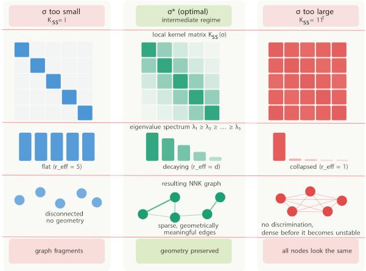
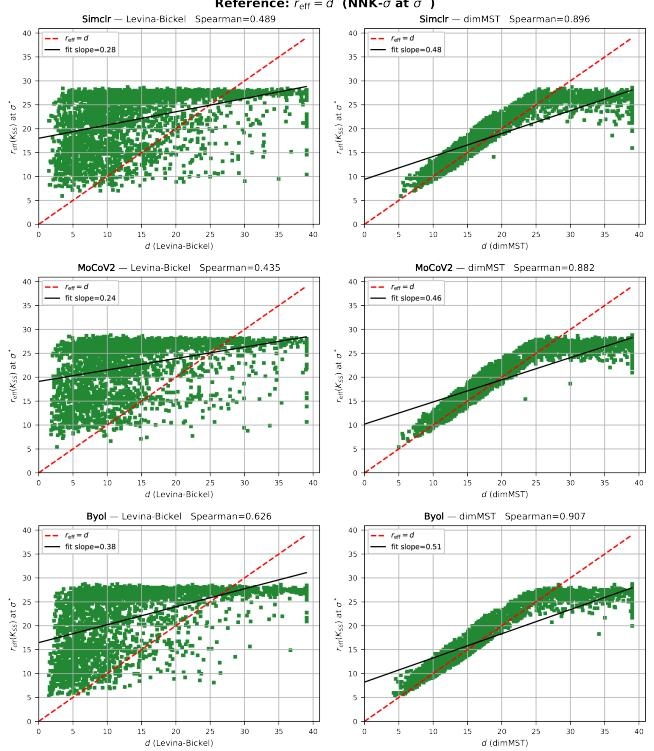
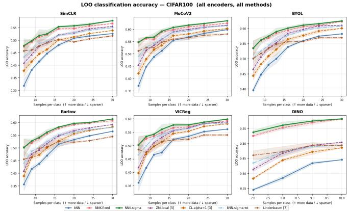
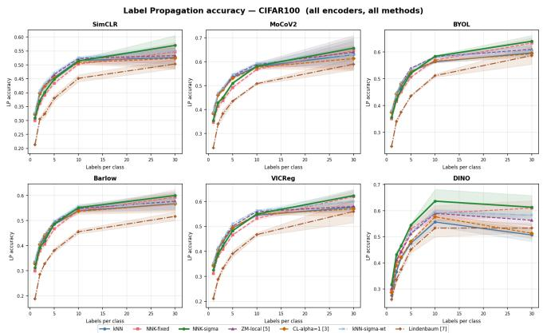

# GEOMETRY-AWARE GRAPH CONSTRUCTION VIA ADAPTIVE SPECTRAL BANDWIDTH CONTROL

Ecem Bozkurt, Antonio Ortega

Department of Electrical and Computer Engineering University of Southern California, Los Angeles, CA, USA bozkurt@usc.edu, aortega@usc.edu

## ABSTRACT

Kernelized graph methods — spectral clustering, diffusion maps, and sparse kernel-regression graphs — that use Gaussian kernels depend on the choice of Gaussian bandwidth σ, which governs the spectral character of the local kernel operator. When σ is too small, the kernel overestimates local complexity and treats each sample as an independent direction; when σ is too large, the kernel collapses multiple directions together, the condition number diverges, and all geometric discrimination is lost. We propose a choice of scale to make the spectral complexity of the kernel consistent with the intrinsic complexity of the underlying manifold. We propose a per-node bandwidth criterion that operationalizes this principle by jointly matching the kernel’s effective rank to the local intrinsic dimension estimated via minimum spanning tree, anchoring the search in the manifold-consistent log-log scaling regime. We evaluate SSL embeddings from six encoders on CIFAR-100, showing that adaptive bandwidth consistently improves leave-one-out (LOO) classification and label propagation (LP) accuracy over fixed-bandwidth methods and competing adaptive methods.

Index Terms— Graph Signal Processing, Manifold Learning, Self-Supervised Learning, Representation Geometry, Kernel Methods.

## 1. INTRODUCTION

Kernelized graphs as spectral operators. Modern selfsupervised learning (SSL) encoders produce high-dimensional embeddings that serve as the input to downstream tasks such as classification, retrieval, clustering, and graph-based learning. A large family of graph-based signal processing and learning methods — spectral clustering [1], Laplacian eigenmaps [2], diffusion maps [3], and non-negative kernel (NNK) graphs [4] — build a similarity graph by applying a Gaussian kernel to pairwise distances and then operating on the resulting matrix. In all of these methods, the bandwidth σ is the main hyperparameter. We observe that without a careful choice of σ, the local characteristics in kernel space (e.g., its geometric properties estimated by the kernel matrix rank) can be completely different from the local properties of the linear space (e.g., its local intrinsic dimension). The local kernel matrix can exhibit distinct spectral properties depending on the choice of σ, which impacts downstream tasks.

  
Fig. 1. Spectral regimes of the local kernel operator K $s s ( \sigma )$ Left: σ too small — identity-like, flat spectrum, $r _ { \mathrm { e f f } } \approx | S | ,$ graph fragments, no geometric information. Center: $\sigma ^ { \star } -$ decaying spectrum, $r _ { \mathrm { e f f } } \approx \hat { d } ,$ well-conditioned, geometrically informative. Right: σ too large — rank-one, $\kappa  \infty ,$ all directions collapsed, discrimination lost.

Two spectral failure modes. When σ is too small, the Gaussian kernel approaches the identity matrix: each data point appears orthogonal to every other, effective rank is artificially inflated, the graph becomes disconnected, and the spectral operator carries no useful structure. When σ is too large, the kernel collapses toward a rank-one matrix: one eigenvalue dominates, the condition number κ diverges, and the graph becomes a dense clique in which all geometric discrimination is lost (Fig. 1). Both regimes are useless for downstream tasks. Thus, we are interested in identifying where, between those two regimes, σ should be chosen.

The missing principle. Existing bandwidth selection methods address parts of the problem but miss a unifying principle (Table 1). Distance-driven methods [5] anchor σ to local neighbor distances but do not consider the spectral character of the resulting kernel or distance unreliability at higher dimensions. Density normalization [3] corrects sampling bias but does not target spectral stability. Log-log scaling methods [6, 7] exploit the fact that, for data sampled from a lowdimensional manifold, the total kernel mass follows a predictable scaling law with respect to the bandwidth. The slope of this relationship can be used to estimate the manifold dimension and to identify scales at which the kernel provides a faithful approximation of the underlying geometry. Lindenbaum et al. [7] further select a bandwidth whose implied dimension matches an external intrinsic-dimension estimate. However, these approaches estimate a single global scale for the entire dataset, without adapting to local variations in density or geometry. None of these methods selects σ by asking whether the spectral complexity — the effective number of independent directions the kernel operator resolves, measured by the effective rank of the resulting kernel, is consistent with the geometric complexity of the local neighborhood (the intrinsic dimensionality of the local data manifold).

A spectral-complexity principle. To avoid the spectral failure modes arising from poor choices of σ (Fig. 1), we hypothesize that: a kernel operates at the correct scale when the complexity revealed through its spectrum is comparable to the intrinsic complexity of the local data manifold.

Connection to recent observations. Three recent results support this principle from different directions. RankMe [8] establishes that effective rank — the entropy of the normalized eigenvalue distribution — quantifies the number of active spectral degrees of freedom in a representation. IDEST [9] shows that minimum spanning tree (MST)-based intrinsic dimension tracks geometric structure in the high-dimensional, low-sample regime where classical estimators break down. T-REGS [10] demonstrates that MST geometry is directly regularizable and prevents spectral collapse. Together, these results indicate that both spectral complexity and intrinsic dimension carry meaningful information about representation geometry. We therefore use effective rank as a measure of kernel-visible complexity and intrinsic dimension as a measure of manifold complexity, and seek bandwidths for which the two are locally consistent.

Contributions We propose (i) A per-node bandwidth criterion to select the scale at which the kernel’s effective rank matches the local intrinsic dimension, placing the kernel operator in the informative scale, and (ii) Empirical evidence that σ adaptation improves graph-based inference for both sparse and dense graph construction, and that dimMST is the appropriate complexity target under distance concentration.

Table 1. Bandwidth selection strategies.
<table><tr><td>Method</td><td>Strategy</td><td>Scale</td></tr><tr><td>ZM [5]</td><td>Neighbor distance</td><td>Local</td></tr><tr><td>CL [3]</td><td>Density normalization</td><td>Global</td></tr><tr><td>Singer [6]</td><td>Log-log scaling</td><td>Global</td></tr><tr><td>Lindenbaum [7]</td><td>Dimension matching</td><td>Global</td></tr><tr><td>Ours</td><td>Effective rank + dimMST +log-log scaling</td><td>Local</td></tr></table>

## 2. RELATED WORK

Bandwidth selection for kernel graph operators Closest to our work is Lindenbaum et al. [7], where a global bandwidth and a feature-scaling matrix are selected to match a kernel-implied dimension to an external estimate. Our criterion shares the dimension-matching spirit but differs in that (i) it is applied per node, (ii) it uses effective rank rather than kernel-implied dimension as the spectral measure, and (iii) it estimates intrinsic dimension with dimMST [9], which is robust to the distance concentration that affects methods that operate on high-dimensional $\ell _ { 2 }$ -normalized embeddings.

Non-negative kernel (NNK) graphs NNK graphs [4] remove redundant neighbors while preserving local structure through a non-negative quadratic program in the kernel domain, which can be interpreted as a geometric condition in linear space. In these methods, which have been used to study SSL and LLM geometry [11–13], σ is treated as an external hyperparameter. In contrast, we focus on selecting the bandwidth itself, leaving the NNK optimization unchanged. While we test our σ selection criterion to construct NNK graphs, the underlying idea is more general: selecting σ adjusts the relative importance of neighbors through the kernel weights, and is therefore a form of neighborhood selection if the neighborhood is defined explicitly (as in NNK) or implicitly through weight decay (as in k-NN).

Effective rank and intrinsic dimension. We use effective rank [14] as the spectral complexity measure: it is continuous, entropy-based, and captures how uniformly information is distributed across all eigenvalue directions — unlike the participation ratio, which relies only on second-order statistics, or raw rank, which is sensitive to small eigenvalues. Its recent adoption in RankMe [8] further confirms that effective rank is a reliable indicator of how many meaningful directions a kernel operator resolves. Intrinsic dimension of the embedding, on the other hand, indicates how many geometrically relevant directions exist in linear space. We use MST-based intrinsic dimension [9], which is provably consistent under weaker assumptions than Levina–Bickel [15] or TwoNN [16], and remains informative under distance concentration.

## 3. METHOD

## 3.1. Spectral characterization of the bandwidth problem

For node $\mathbf { x } _ { j } .$ , with candidate neighbors $S _ { j }$ and $\mathbf { x } _ { k } \in S _ { j }$ , define the local Gaussian kernel matrix ${ \bf K } _ { S S } ( \sigma )$ with entries $\mathbf { K } _ { j k } = \exp ( - \| \mathbf { x } _ { j } - \mathbf { x } _ { k } \| ^ { 2 } / ( 2 \sigma ^ { 2 } ) )$ . The intrinsic dimension ˆd characterizes how many independent directions exist in the local data manifold, working directly with the $\mathbf { x } _ { i } ,$ while the effective rank $r _ { \mathrm { e f f } } ( \mathbf { K } _ { S S } ( \sigma ) )$ characterizes how many independent directions the kernel operator actually resolves at a given σ.

When these two quantities disagree, the kernel is misspecified (see Fig. 1): if $r _ { \mathrm { e f f } } < \hat { d } ,$ , the kernel collapses genuinely distinct manifold directions into a single component, neighbors that lie in different directions become indistinguishable, and the graph loses discriminative power. If $r _ { \mathrm { e f f } } \ > \ \hat { d } ,$ the kernel resolves more directions than the manifold has, treating noise and ambient dimensions as genuine structure, causing the graph to fragment along spurious directions. In both cases, the mismatch corrupts the graph’s geometric fidelity.

Target regime. We seek an operating point where the kernel sees a complexity consistent with what the manifold provides, i.e., $r _ { \mathrm { e f f } } ( K _ { S S } ( \sigma ^ { \star } ) ) \approx \hat { d } ,$ where ${ \bf K } _ { S S } ( \sigma )$ resolves approximately $\ddot { d } _ { i }$ independent directions, matching the intrinsic dimensionality of the local neighborhood (see Fig. 1(center)). In this regime, the condition number κ is moderate, the graph is well-conditioned, and the spectral operator captures the local geometry of the manifold. Next, we introduce the local metrics we use to optimize σ.

## 3.2. Local neighborhood metrics

Effective rank We use the effective rank [14] of ${ \bf K } _ { S S } ( \sigma ) { : }$

$$
\begin{array} { r } { r _ { \mathrm { e f f } } ( \mathbf { K } ) = \exp \Bigl ( - \sum _ { j } p _ { j } \log p _ { j } \Bigr ) , } \end{array}\tag{1}
$$

where $p _ { j } = \lambda _ { j } / \sum _ { k } \lambda _ { k }$ . From a signal-processing perspective, $r _ { \mathrm { e f f } }$ quantifies the number of active spectral degrees of freedom represented by the kernel operator: $r _ { \mathrm { e f f } } = 1$ indicates a rank-one operator (all energy in one direction); $r _ { \mathrm { e f f } } = | S |$ indicates a uniform operator (no dominant direction). The target is $r _ { \mathrm { e f f } } \approx \hat { d } _ { i } \colon$ the kernel should resolve as many independent directions as the local manifold has.

Intrinsic dimension and manifold complexity. We estimate the local intrinsic dimension $\hat { d } _ { i }$ using the minimum spanning tree (MST)-based estimator (dimMST) [9] on the $k _ { \mathrm { c a n d } }$ neighborhood. Nearest-neighbor estimators such as Levina–Bickel [15] and TwoNN [16] rely on ratios of interpoint distances; on $\ell _ { 2 } { \mathrm { - n o r m a l i z e d } }$ embeddings, these ratios lose contrast, and the estimators become unstable at higher dimensions, as the distances concentrate. The dimMST estimator depends on the growth rate of the spanning tree rather than on pairwise distance contrasts. IDEST [9] shows that dimMST tracks SSL representation quality in the $n \ \approx \ d$ regime where TwoNN and MLE fail. Our results (Fig. 2) confirm this empirically: dimMST aligns with $r _ { \mathrm { e f f } }$ at $\sigma ^ { \star }$ substantially better than Levina–Bickel across all six encoders.

Manifold scaling consistency and log-log slope . Following Singer [6] and Lindenbaum [7], on a ˆd-dimensional manifold the total kernel energy $\begin{array} { r } { L _ { i } ( \sigma ) ~ = ~ \sum _ { j , k \in S _ { i } } { \bf K } _ { j k } ( \sigma ) } \end{array}$ satisfies log $L _ { i } \approx ( \hat { d } / 2 ) \log \sigma + C$ in the manifold-consistent regime. Let $\begin{array} { l l l } { { \ell _ { i } ( \sigma ) } } & { { = } } & { { d \log L _ { i } ( \sigma ) / d \log \sigma } } \end{array}$ denote the log-log slope of the total kernel energy at node $i ,$ and $\ell _ { \mathrm { m a x } } ~ =$ $\operatorname* { m a x } _ { \sigma \in { \mathcal { G } } _ { i } } \ell _ { i } ( \sigma )$ the peak slope over the local bandwidth grid. We compute $\ell _ { \mathrm { m a x } } = \operatorname* { m a x } _ { \sigma } \ell _ { i } ( \sigma )$ to locate the peak of the consistent scaling region. It penalizes bandwidths that fall outside this linear regime.

## 3.3. Bandwidth optimization criterion

To achieve our desired bandwidth target, we combine the previously introduced metrics to define an optimality criterion:

$$
J _ { i } ( \sigma ) = \underbrace { \frac { | r _ { \mathrm { e f f } } ( K _ { S S } ( \sigma ) ) - \hat { d } _ { i } | } { \hat { d } _ { i } } } _ { \mathrm { s p e c t r a l }  \mathrm { m a n i f o l d c o m p l e x i t y } } + \underbrace { \frac { \ell _ { \mathrm { m a x } } - \ell _ { i } ( \sigma ) } { \ell _ { \mathrm { m a x } } } } _ { \mathrm { s c a l i n g c o n s i s t e n c y } } ,\tag{2}
$$

Both terms are dimensionless and expressed as fractional quantities, placing them on a common scale without requiring an additional balancing coefficient. The first term drives the effective rank toward the local intrinsic dimension, penalizing both the identity limit $( r _ { \mathrm { e f f } } \gg \hat { d } )$ and the rank-one limit $( r _ { \mathrm { e f f } } \ll \hat { d } )$ . The second term selects the bandwidth at which the kernel’s energy scaling is most consistent with manifold geometry; note that it has no knowledge of the local intrinsic dimension — it defines a valid operating region, but cannot distinguish between a kernel that sees too few directions and one that sees too many within that region. The effective-rank term resolves this ambiguity.

Our target bandwidth is then

$$
\sigma _ { i } ^ { \star } = \arg \operatorname* { m i n } _ { \sigma \in { \mathcal { G } } _ { i } } J _ { i } ( \sigma ) ,\tag{3}
$$

which we find via a local log-spaced grid search, with

$$
\mathcal { G } _ { i } = \log \mathrm { s p a c e } ( 0 . 0 5 d _ { i , k _ { \mathrm { m l e } } } , 3 . 0 d _ { i , k _ { \mathrm { c a n d } } } )
$$

where, in our experiments, we choose $| \mathcal { G } | = 1 2$

The per-node cost of the bandwidth search is $O ( | \mathcal { G } |$ $k _ { \mathrm { c a n d } } ^ { 2 } )$ for kernel matrix construction and energy summation, plus $\mathrm { \dot { ~ } O } ( | \mathcal { G } | \cdot k _ { \mathrm { c a n d } } ^ { 2 } )$ for the eigenvalue computation, giving $O ( | \mathcal { G } | \cdot k _ { \mathrm { c a n d } } ^ { 2 } )$ overall since $k _ { \mathrm { c a n d } } \ll n$ . Given the number of grid points,|G|, and $k _ { \mathrm { c a n d } }$ , this is a constant-time operation per node; the total graph construction cost is $O ( n \cdot k _ { \mathrm { c a n d } } ^ { 2 } )$ dominated in practice by the k-NN search.

## 3.4. Weight sharpening: a secondary refinement

As a secondary refinement, we adjust the edge weights without changing the neighborhood support. The intuition is that dense regions, where neighbors are close and distances are small, should place more weight on their strongest neighbors, whereas sparse regions should distribute weight more evenly to avoid relying on a single connection.

The selected bandwidth $\boldsymbol { \sigma } _ { i } ^ { \star }$ already reflects local density: small bandwidths typically occur in dense regions and large bandwidths in sparse ones. We therefore define a per-node exponent

$$
p _ { i } = \mathrm { c l i p } \left( ( \sigma _ { i } ^ { \star } / \sigma _ { g } ) ^ { - 1 } , 0 . 2 , 2 . 0 \right) ,\tag{4}
$$

where $\sigma _ { g } = \mathrm { m e d i a n } _ { j } , \sigma _ { j } ^ { \star }$ is the global reference bandwidth. The clipping operation prevents extreme weight concentration or flattening. The edge weights are then updated as

$$
w _ { j }  \frac { w _ { j } ^ { p _ { i } } } { \sum _ { k } w _ { k } ^ { p _ { i } } } .
$$

When $p _ { i } > 1$ , larger weights become more dominant, concentrating support on the strongest neighbors. When $p _ { i } < 1$ the weights become more uniform, distributing support across multiple neighbors. This only redistributes weight among existing edges and does not modify the graph topology.

## 4. EXPERIMENTS

## 4.1. Setup

The proposed bandwidth-selection criterion is applied prior to the graph-construction procedure and can therefore be used for both dense and sparse graph methods. For NNK, we solve the standard non-negative quadratic program at scale $\boldsymbol { \sigma } _ { i } ^ { \star }$ . For dense graph baselines, we use Gaussian-weighted k-NN with the same bandwidth.

Ablation design The following chain of baselines isolates the contribution of each component:

$$
\underbrace { \mathrm { k N N } } _ { \mathrm { n o } \sigma } \to \underbrace { \mathrm { k N N } - \sigma } _ { \sigma ^ { \star } } \to \underbrace { \mathrm { k N N } - \sigma - \alpha } _ { \sigma ^ { \star } + \mathrm { s h a r p e n } } \to \underbrace { \mathrm { N N K } - \mathrm { f i x e d } } _ { \mathrm { g l o b a l } \sigma } \to \underbrace { \mathrm { N N K } - \sigma } _ { \sigma ^ { \star } + \mathrm { s p a r s e } }
$$

kNN-σ uses $\boldsymbol { \sigma } _ { i } ^ { \star }$ as a per-node Gaussian bandwidth over $k _ { \mathrm { c a n d } }$ neighbors without sparsification. Each step adds exactly one component, enabling clean attribution in the LOO results.

Datasets and embeddings. Tests use six SSL encoders on CIFAR-100 [17]: SimCLR [18], MoCo v2 [19], BYOL [20], Barlow Twins [21], VICReg [22], DINO [23], from [24]. ResNet-50 [25]: $d = 5 1 2 ;$ ViT-S/16 [26] (DINO): d = 384. All embeddings ℓ2-normalized, 3,000 samples (30 per class). Hyperparameters (Table 2). We chose a candidate pool size of $k _ { \mathrm { c a n d } } = 3 0$ to balance neighborhood coverage and computational cost, as larger sizes improve dimMST accuracy but increase the per-node eigenvalue cost at $O ( k ^ { 3 } )$ . Using $| \mathcal { G } | = 1 2$ provides sufficient log spacing to identify both the slope peak and the crossing of $r _ { \mathrm { e f f } } \ = \ \hat { d } ,$ while $k _ { \mathrm { m l e } } ~ = ~ 1 0$ anchors the lower bound to the MLE-implied scale. To reduce variance in the per-node dimension estimate, we perform $n _ { \mathrm { r e p } } = 5$ replications of dimMST, which adds a fixed number of MST computations per node. In the LP method [27], we set $\alpha = 0 . 8 5$ , perform 200 iterations with early stopping, and adjust the labeled rows of the transition matrix to zero to ensure they act purely as sources without absorbing beliefs from neighbors. In our LOO strategy, graphs are completely rebuilt at each sparsity level. All results are averaged over five independent stratified trials.

Table 2. Hyperparameter summary.
<table><tr><td>Parameter</td><td>Value</td></tr><tr><td>Candidate pool  $k _ { \mathrm { c a n d } }$ </td><td>30</td></tr><tr><td>MLE anchor  $k _ { \mathrm { m l e } }$ </td><td>10</td></tr><tr><td>Min. support  $k _ { \mathrm { m i n } }$ </td><td>6</td></tr><tr><td>Bandwidth grid |G|</td><td>12</td></tr><tr><td>dimMST replications nrep</td><td>5</td></tr><tr><td>LP diffusion α</td><td>0.85</td></tr><tr><td>LP iterations</td><td>200</td></tr><tr><td>Trials</td><td>5</td></tr></table>

## 4.2. Local neighborhood evaluation

We test whether a $\sigma ^ { \star }$ that optimizes (2) produces local kernel matrices whose effective rank is aligned with the local intrinsic dimension. Fig. 2 plots $r _ { \mathrm { e f f } } ( K _ { S S } )$ at $\sigma ^ { \star }$ against the per-node dimension estimate, comparing dimMST to Levina– Bickel (LB) for three encoders.

Spearman correlations between $r _ { \mathrm { e f f } }$ and dimMST range from 0.88 to 0.91 on CIFAR-100 — consistently and substantially higher than the correlations with LB (0.43–0.63). This confirms that dimMST is the appropriate target: LB intrinsic dimension estimators are degraded by distance concentration on the $\ell _ { 2 }$ sphere, while the MST-based intrinsic dimension estimation remains informative.

The fit slopes (0.3–0.5) are below the ideal $r _ { \mathrm { e f f } } = \hat { d }$ line, due to finite-sample saturation of dimMST for $k _ { \mathrm { c a n d } } = 3 0$ However, as shown in downstream task experiments, even without an exact matching, consistent rank ordering of $\hat { d } _ { i }$ across nodes leads to improved performance.

## 4.3. Leave-One-Out (LOO) classification

LOO directly measures per-node graph quality (Fig. 3): each node is predicted by a weighted majority vote over its graph neighbors, testing whether the graph’s local spectral structure supports accurate inference. For dense graphs, kNN-σ-α consistently outperforms plain kNN across all encoders, with the largest gaps at low $n _ { \mathrm { p c } }$ where bandwidth choice is most critical. For sparse graphs, NNK-σ outperforms NNK-fixed in all cases. The gain from NNK-fixed to NNK-σ shows that geometric sparsification at the correct $\sigma ^ { \star }$ retains only the geometrically relevant edges. The ordering kNN < kNN-σ-α $< \mathrm { N N K - f i x e d } < \mathrm { N N K - } \sigma$ holds, sigma adaptation helps both dense and sparse graphs, and the sparse solve provides a consistent further gain on top of sigma adaptation. NNK- $- \sigma$ leads across all six encoders at all label fractions.

  
Fig. 2. $r _ { \mathrm { e f f } } ( K _ { S S } )$ at $\sigma ^ { \star }$ vs. per-node intrinsic dimension for 3 encoders (rows) for the LB estimator (Left) and dimMST (Right). dimMST aligns substantially better, confirming it as a better complexity target under distance concentration.

Table 3. LOO accuracy vs. dimension target scale γ.
<table><tr><td> $\gamma$ </td><td>LOO</td><td>med  $r _ { \mathrm { e f f } }$ </td><td>med â</td></tr><tr><td>0.50</td><td>0.607</td><td>14.7</td><td>13.3</td></tr><tr><td>0.75</td><td>0.607</td><td>21.0</td><td>20.0</td></tr><tr><td>1.00</td><td>0.611</td><td>25.7</td><td>26.7</td></tr><tr><td>1.25</td><td>0.611</td><td>26.1</td><td>33.3</td></tr><tr><td>1.50</td><td>0.612</td><td>26.3</td><td>40.0</td></tr><tr><td>2.00</td><td>0.611</td><td>26.4</td><td>53.3</td></tr></table>

The effective-rank term targets $r _ { \mathrm { e f f } } \approx \gamma \hat { d } ,$ where $\gamma = 1$ scales the dimMST estimate. Table 3 reports LOO accuracy and median $r _ { \mathrm { e f f } }$ on CIFAR100-MoCoV2 (npc=20) as $\gamma$ varies. When $\gamma < 0 . 7 5$ , the criterion forces $r _ { \mathrm { e f f } }$ below the manifold dimension, selecting a bandwidth that is too small: the kernel sees fewer directions than the data has, and LOO accuracy drops. When $\gamma \geq 1 . 0$ , the criterion is robust once the target is at or above the true dimension. $\mathrm { A t } \ \gamma = 2 . 0 \ \mathrm { L O O }$ accuracy drops again. This confirms the role of the effective-rank term: it prevents the bandwidth from collapsing to the identity limit.

  
Fig. 3. LOO accuracy vs. samples per class, CIFAR-100, six encoders. NNK-σ (green) leads consistently across all encoders. Sigma adaptation improves both dense graphs (kNN → kNN-σ-α) and sparse graphs (NNK-fixed → NNK-σ).

## 4.4. Label Propagation (LP) accuracy

LP [27, 28] tests whether the graph’s spectral structure supports semi-supervised inference over the full graph (Fig. 4). On CIFAR-100 (100 classes, harder propagation), NNK-σ leads across all six encoders at all label fractions. Gains are most pronounced at ≥10 labels/class, where graph quality becomes the binding constraint rather than label sparsity. NNKσ+α provides a further improvement over NNK-σ at higher label fractions, suggesting that weight sharpening complements bandwidth selection when sufficient labels are available to propagate beyond immediate neighbors.

  
Fig. 4. LP accuracy vs. labels per class, six encoders. NNK-σ (green) leads on CIFAR-100 across all encoders, with gains over NNK-fixed most pronounced at ≥10 labels per class.

## 5. CONCLUSION

We have proposed a per-node bandwidth criterion that matches the kernel’s active spectral degrees of freedom to the local intrinsic dimension of the data manifold consistently produces better-conditioned graph operators and improves downstream performance. Our results show that σ adaptation helps regardless of whether the graph is sparse (NNK) or dense (k-NN): the spectral alignment at $\sigma ^ { \star }$ improves graph conditioning and inference accuracy for all encoders. Additionally, geometric sparsification at the selected $\sigma ^ { \star }$ provides a consistent additional gain over sigma-adapted k-NN, confirming that bandwidth selection and sparse graph construction are complementary. The criterion (2) is not specific to NNK graphs. It can be applied before any Gaussian-kernel graph construction by running the per-node grid search and passing $\boldsymbol { \sigma } _ { i } ^ { \star }$ to the downstream method. The key principle — that kernel effective rank should be consistent with local intrinsic dimension — connects spectral graph signal processing to the geometry of the underlying data manifold.

## 6. REFERENCES

[1] U. von Luxburg, “A tutorial on spectral clustering,” Stat. Comput., vol. 17, no. 4, pp. 395–416, 2007.

[2] M. Belkin and P. Niyogi, “Laplacian eigenmaps for dimensionality reduction and data representation,” Neural Comput., vol. 15, no. 6, pp. 1373–1396, 2003.

[3] R. R. Coifman and S. Lafon, “Diffusion maps,” Appl. Comput. Harmon. Anal., vol. 21, no. 1, pp. 5–30, 2006.

[4] S. Shekkizhar and A. Ortega, “Graph construction from data by non-negative kernel regression,” in Proc. ICASSP, 2020.

[5] L. Zelnik-Manor and P. Perona, “Self-tuning spectral clustering,” in Proc. NeurIPS, 2004.

[6] A. Singer et al., “Detecting intrinsic slow variables in stochastic dynamical systems by anisotropic diffusion maps,” Proc. Natl. Acad. Sci., vol. 106, no. 38, pp. 16090–16095, 2009.

[7] O. Lindenbaum et al., “Gaussian bandwidth selection for manifold learning and classification,” Data Min. Knowl. Discov., vol. 34, pp. 1676–1712, 2020.

[8] Q. Garrido et al., “RankMe: Assessing the downstream performance of pretrained self-supervised representations by their rank,” in Proc. ICML, 2023.

[9] J. Mordacq et al., “IDEST: Assessing self-supervised learning representations via intrinsic dimension,” in Proc. ICML, 2026.

[10] J. Mordacq et al., “T-REGS: Minimum spanning tree regularization for self-supervised learning,” in Proc. NeurIPS, 2025.

[11] R. Cosentino et al., “The geometry of self-supervised learning models and its impact on transfer learning,” arXiv:2209.08622, 2022.

[12] R. Balestriero et al., “Characterizing large language model geometry helps solve toxicity detection and generation,” in Proc. ICML, 2024.

[13] C. Hurtado et al., “Study of manifold geometry using multiscale non-negative kernel graphs,” arXiv:2210.17475, 2022.

[14] O. Roy and M. Vetterli, “The effective rank: A measure of effective dimensionality,” in Proc. EUSIPCO, 2007, pp. 606– 610.

[15] E. Levina and P. J. Bickel, “Maximum likelihood estimation of intrinsic dimension,” in Proc. NeurIPS, 2005.

[16] E. Facco et al., “Estimating the intrinsic dimension of datasets by a minimal neighborhood information,” Sci. Rep., vol. 7, pp. 12140, 2017.

[17] A. Krizhevsky, “Learning multiple layers of features from tiny images,” Tech. Rep., Univ. Toronto, 2009.

[18] T. Chen et al., “A simple framework for contrastive learning of visual representations,” in Proc. ICML, 2020.

[19] X. Chen et al., “Improved baselines with momentum contrastive learning,” arXiv:2003.04297, 2020.

[20] J.-B. Grill et al., “Bootstrap your own latent: A new approach to self-supervised learning,” in Proc. NeurIPS, 2020.

[21] J. Zbontar et al., “Barlow twins: Self-supervised learning via redundancy reduction,” in Proc. ICML, 2021.

[22] A. Bardes et al., “VICReg: Variance-invariance-covariance regularization for self-supervised learning,” in Proc. ICLR, 2022.

[23] M. Caron et al., “Emerging properties in self-supervised vision transformers,” in Proc. ICCV, 2021.

[24] V. G. Turrisi da Costa et al., “solo-learn: A library of selfsupervised methods for visual representation learning,” J. Mach. Learn. Res., vol. 23, no. 56, pp. 1–6, 2022.

[25] K. He et al., “Deep residual learning for image recognition,” in Proc. CVPR, 2016.

[26] A. Dosovitskiy et al., “An image is worth 16x16 words: Transformers for image recognition at scale,” in Proc. ICLR, 2021.

[27] D. Zhou et al., “Learning with local and global consistency,” in Proc. NeurIPS, 2004.

[28] Xiaojin Zhu et al., “Semi-supervised learning using Gaussian fields and harmonic functions,” in Proc. ICML, 2003, pp. 912– 919.