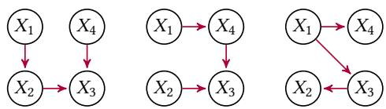
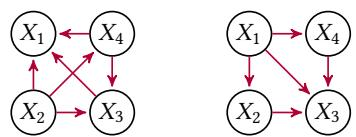
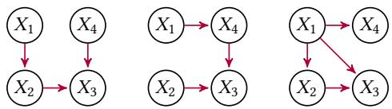
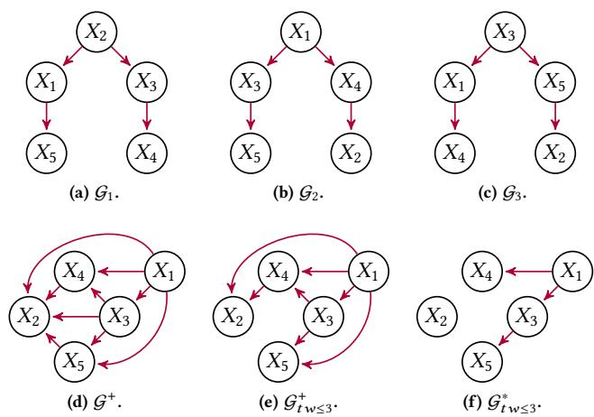
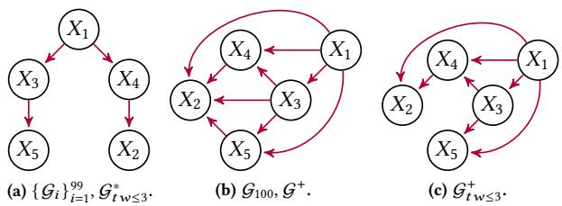
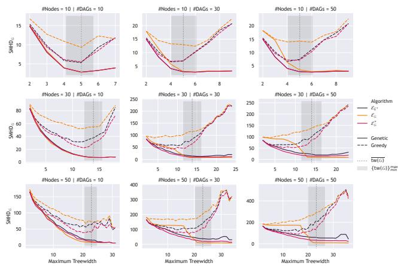
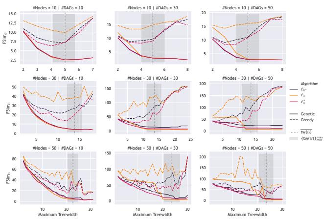

# Genetic Algorithms for Tractable Bayesian Network Fusion via Pre-Fusion Edge Pruning

Pa<sup>bl</sup>o Torrijos Uni<sub>ve</sub>r<sub>s</sub>id<sub>a</sub>d d<sub>e</sub> C<sub>as</sub>till<sub>a</sub>-L<sub>a</sub> M<sub>a</sub>n<sub>c</sub>h<sub>a</sub> D<sub>epa</sub>rt<sub>a</sub>m<sub>e</sub>nt<sub>o</sub> d<sub>e</sub> Si<sub>s</sub>t<sub>e</sub>m<sub>as</sub> Inf<sub>o</sub>rmáti<sub>cos,</sub> Alb<sub>ace</sub>t<sub>e,</sub> S<sub>pa</sub>in Pa<sup>bl</sup>o.Torrijos@uc<sup>l</sup>m.es

José M. Puerta Uni<sub>ve</sub>r<sub>s</sub>id<sub>a</sub>d d<sub>e</sub> C<sub>as</sub>till<sub>a</sub>-L<sub>a</sub> M<sub>a</sub>n<sub>c</sub>h<sub>a</sub> D<sub>epa</sub>rt<sub>a</sub>m<sub>e</sub>nt<sub>o</sub> d<sub>e</sub> Si<sub>s</sub>t<sub>e</sub>m<sub>as</sub> Inf<sub>o</sub>rmáti<sub>cos,</sub> Alb<sub>ace</sub>t<sub>e,</sub> S<sub>pa</sub>in Jose.Puerta@uclm.es

## Abstract

Ba<sub>y</sub>esian Network (BN) fusion combines multi<sub>p</sub>le in<sub>p</sub>ut networks into a sin<sub>g</sub>le structure<sub>,</sub> balancin<sub>g</sub> de<sub>p</sub>endenc<sub>y</sub> <sub>p</sub>reservation with <sub>compu</sub>t<sub>a</sub>ti<sub>ona</sub>l t<sub>rac</sub>t<sub>a</sub>bilit<sub>y.</sub> Whil<sub>e unres</sub>t<sub>r</sub>i<sub>c</sub>t<sub>e</sub>d f<sub>us</sub>i<sub>on re</sub>t<sub>a</sub>i<sub>ns a</sub>ll d<sub>e-</sub> <sub>pen</sub>d<sub>enc</sub>i<sub>es,</sub> it <sub>o</sub>ft<sub>en resu</sub>lt<sub>s</sub> i<sub>n over</sub>l<sub>y comp</sub>l<sub>ex ne</sub>t<sub>wor</sub>k<sub>s w</sub>ith hi<sub>g</sub>h treewidth<sub>,</sub> which afects inference scalabilit<sub>y</sub>. Limited fusion miti <sub>g</sub>ates this b<sub>y p</sub>runin<sub>g</sub> ed<sub>g</sub>es to control treewidth but risks overfittin<sub>g</sub> to in<sub>p</sub>ut-s<sub>p</sub>ecific noise and omittin<sub>g</sub> de<sub>p</sub>endencies from the ori<sub>g</sub>inal BNs. This <sub>p</sub>a<sub>p</sub>er introd<sub>u</sub>ces a consens<sub>u</sub>s frame<sub>w</sub>ork that <sub>p</sub>rioritizes <sub>s</sub>h<sub>are</sub>d <sub>s</sub>t<sub>ruc</sub>t<sub>ures among</sub> i<sub>npu</sub>t <sub>ne</sub>t<sub>wor</sub>k<sub>s w</sub>hil<sub>e en</sub>f<sub>orc</sub>i<sub>ng</sub> t<sub>reew</sub>idth constra<sup>i</sup>nts, ensur<sup>i</sup>ng a goo<sup>d</sup> consensus. We <sub>p</sub>ro<sub>p</sub>ose genet<sup>i</sup>c a<sup>l</sup>go rithms with advanced initialization<sub>,</sub> s<sub>p</sub>ecialized o<sub>p</sub>erators<sub>,</sub> and a t<sub>a</sub>il<sub>ore</sub>d fit<sub>ness</sub> f<sub>unc</sub>ti<sub>on.</sub> Additi<sub>ona</sub>ll<sub>y, we a</sub>d<sub>ap</sub>t <sub>ex</sub>i<sub>s</sub>ti<sub>ng me</sub>th<sub>o</sub>d<sub>s</sub> t<sub>o</sub> thi<sub>s pro</sub>bl<sub>em an</sub>d i<sub>mp</sub>l<sub>emen</sub>t <sub>gree</sub>d<sub>y</sub> b<sub>ase</sub>li<sub>nes</sub> f<sub>or</sub> b<sub>enc</sub>h<sub>mar</sub>ki<sub>ng</sub> and further o<sub>p</sub>timization. Ex<sub>p</sub>eriments on s<sub>y</sub>nthetic and real-world BNs show the su<sub>p</sub>eriorit<sub>y</sub> of the <sub>p</sub>ro<sub>p</sub>osed <sub>g</sub>enetic al<sub>g</sub>orithms over th<sub>e</sub> <sub>a</sub>d<sub>ap</sub>t<sub>e</sub>d <sub>me</sub>th<sub>o</sub>d<sub>s</sub> <sub>an</sub>d <sub>gree</sub>d<sub>y</sub> b<sub>ase</sub>li<sub>nes.</sub>

## CCS Concepts

• Computing methodologies → Genetic algorithms; • Mathematics of computing → Bayesian networks; • Theory of computation → Evolutionary algorithms.

## Keywords

B<sub>ayes</sub>i<sub>a</sub>n N<sub>e</sub>t<sub>wo</sub>rk<sub>s,</sub> F<sub>us</sub>i<sub>o</sub>n<sub>,</sub> C<sub>o</sub>n<sub>se</sub>n<sub>sus,</sub> G<sub>e</sub>n<sub>e</sub>ti<sub>c</sub> Al<sub>go</sub>rithm<sub>,</sub> C<sub>o</sub>mbin<sub>a</sub>t<sub>o</sub>ri<sub>a</sub>l O<sub>p</sub>timiz<sub>a</sub>ti<sub>o</sub>n<sub>,</sub> F<sub>e</sub>d<sub>e</sub>r<sub>a</sub>t<sub>e</sub>d L<sub>ea</sub>rnin<sub>g</sub>

## ACM Reference Format:

Pablo Torrijos, José A. Gámez, José M. Puerta, and Juan A. Aledo. 2025. G<sub>e</sub>n<sub>e</sub>ti<sub>c</sub> Al<sub>go</sub>rithm<sub>s</sub> f<sub>o</sub>r Tr<sub>ac</sub>t<sub>a</sub>bl<sub>e</sub> B<sub>ayes</sub>i<sub>a</sub>n N<sub>e</sub>t<sub>wo</sub>rk F<sub>us</sub>i<sub>o</sub>n <sub>v</sub>i<sub>a</sub> Pr<sub>e</sub>-F<sub>us</sub>i<sub>o</sub>n Edge Pruning. In Genetic and Evolutionary Computation Conference (GECCO ’25), July 14–18, 2025, Mala<sub>g</sub>a, Spain. ACM, New York, NY, USA, 9 <sub>p</sub>ages. htt<sub>p</sub>s://doi.or<sub>g</sub>/10.1145/3712256.3726333

José A. Gámez Uni<sub>ve</sub>r<sub>s</sub>id<sub>a</sub>d d<sub>e</sub> C<sub>as</sub>till<sub>a</sub>-L<sub>a</sub> M<sub>a</sub>n<sub>c</sub>h<sub>a</sub> D<sub>epa</sub>rt<sub>a</sub>m<sub>e</sub>nt<sub>o</sub> d<sub>e</sub> Si<sub>s</sub>t<sub>e</sub>m<sub>as</sub> Inf<sub>o</sub>rmáti<sub>cos,</sub> Alb<sub>ace</sub>t<sub>e,</sub> S<sub>pa</sub>in Jose.Gamez@uclm.es

Juan A. Aledo Uni<sub>ve</sub>r<sub>s</sub>id<sub>a</sub>d d<sub>e</sub> C<sub>as</sub>till<sub>a</sub>-L<sub>a</sub> M<sub>a</sub>n<sub>c</sub>h<sub>a</sub> De<sub>p</sub>artamento de Matemáticas<sub>,</sub> Albacete<sub>,</sub> S<sub>p</sub>ain JuanAn<sub>g</sub>el.Aledo@uclm.es

## 1 Introduction

Ba<sub>y</sub>esian Networks (BNs) [18, 22, 23] are <sub>p</sub>robabilistic <sub>g</sub>ra<sub>p</sub>hical <sub>mo</sub>d<sub>e</sub>l<sub>s</sub> th<sub>a</sub>t <sub>represen</sub>t <sub>comp</sub>l<sub>ex</sub> d<sub>epen</sub>d<sub>enc</sub>i<sub>es</sub> b<sub>e</sub>t<sub>ween</sub> <sub>var</sub>i<sub>a</sub>bl<sub>es</sub> throu<sub>g</sub>h Directed Ac<sub>y</sub>clic Gra<sub>p</sub>hs (DAGs). Each BN combines a <sub>g</sub>ra<sub>p</sub>h structure encodin<sub>g</sub> conditional (in)de<sub>p</sub>endencies with a set of conditional <sub>p</sub>robabilit<sub>y</sub> distributions <sub>q</sub>uantif<sub>y</sub>in<sub>g</sub> these de<sub>p</sub>endencies. BNs are hi<sub>g</sub>hl<sub>y</sub> inter<sub>p</sub>retable due to their <sub>g</sub>ra<sub>p</sub>hical structure [29, 31] and <sub>p</sub>ossess s<sub>y</sub>mbolic inference mechanisms [18], makin<sub>g</sub> them efective in fields such as bioinformatics [2, 6], healthcare [30], environmental modelin<sub>g</sub> [10], and industrial dia<sub>g</sub>nostic s<sub>y</sub>stems [1, 27, 42], where the<sub>y</sub> enable inference and decision-makin<sub>g</sub> under uncertaint<sub>y</sub>. Moreover<sub>,</sub> the increasin<sub>g</sub> focus on ex<sub>p</sub>lainable AI models [4, 5] reinforces the relevance of BNs in a<sub>pp</sub>lications that re<sub>q</sub>uire trans<sub>p</sub>arenc<sub>y</sub> due to their white-box nature.

Alth<sub>oug</sub>h d<sub>o</sub>m<sub>a</sub>in <sub>e</sub>x<sub>pe</sub>rt<sub>s ca</sub>n m<sub>a</sub>n<sub>ua</sub>ll<sub>y spec</sub>if<sub>y</sub> th<sub>e g</sub>r<sub>ap</sub>h <sub>s</sub>tr<sub>uc</sub>- t<sub>ure an</sub>d <sub>parame</sub>t<sub>ers o</sub>f BN<sub>s,</sub> thi<sub>s approac</sub>h b<sub>ecomes</sub> i<sub>n</sub>f<sub>eas</sub>ibl<sub>e</sub> f<sub>or</sub> l<sub>arge-sca</sub>l<sub>e pro</sub>bl<sub>ems.</sub> L<sub>earn</sub>i<sub>ng</sub> BN<sub>s</sub> f<sub>rom</sub> d<sub>a</sub>t<sub>a, a</sub>lth<sub>oug</sub>h NP<sub>-</sub>h<sub>ar</sub>d [9], has been extensivel<sub>y</sub> studied [8, 14, 21, 36, 39]. In this context, structural fusion of BNs [33, 34] is crucial when multi<sub>p</sub>le networks, <sub>po</sub>t<sub>en</sub>ti<sub>a</sub>ll<sub>y</sub> f<sub>rom</sub> dif<sub>eren</sub>t <sub>exper</sub>t<sub>s</sub> <sub>or</sub> d<sub>a</sub>t<sub>a</sub> <sub>sources,</sub> <sub>mus</sub>t b<sub>e</sub> <sub>merge</sub>d into a sin<sub>g</sub>le<sub>,</sub> coherent model. Given a set of BNs on the same vari-<sub>a</sub>bl<sub>es,</sub> <sub>s</sub>t<sub>ruc</sub>t<sub>ura</sub>l f<sub>us</sub>i<sub>on</sub> <sub>a</sub>i<sub>ms</sub> t<sub>o</sub> <sub>crea</sub>t<sub>e</sub> <sub>a</sub> <sub>consensus</sub> BN th<sub>a</sub>t b<sub>es</sub>t re<sub>p</sub>resents the in<sub>p</sub>ut BNs. This is increasin<sub>g</sub>l<sub>y</sub> relevant due to the rise of distributed [40] and federated learnin<sub>g</sub> [28, 41] where BN fusion is essential for a<sub>gg</sub>re<sub>g</sub>atin<sub>g</sub> local models<sub>,</sub> as shown in recent works [25, 24, 37].

Achievin<sub>g</sub> o<sub>p</sub>timal fusion entails constructin<sub>g</sub> a consensus model th<sub>a</sub>t <sub>cap</sub>t<sub>ures</sub> th<sub>e con</sub>diti<sub>ona</sub>l d<sub>epen</sub>d<sub>enc</sub>i<sub>es o</sub>f th<sub>e</sub> i<sub>npu</sub>t <sub>ne</sub>t<sub>wor</sub>k<sub>s.</sub> While this <sub>p</sub>roblem is NP-hard [33], [34] <sub>p</sub>ro<sub>p</sub>osed a heuristic a<sub>p</sub>- <sub>p</sub>roach to a<sub>pp</sub>roximate the o<sub>p</sub>timal fused BN<sub>,</sub> si<sub>g</sub>nificantl<sub>y</sub> reducin<sub>g</sub> com<sub>p</sub>utational re<sub>q</sub>uirements. However<sub>,</sub> the standard fusion of BNs often <sub>g</sub>enerates dense and com<sub>p</sub>lex <sub>g</sub>ra<sub>p</sub>hs<sub>,</sub> limitin<sub>g</sub> its usabilit<sub>y</sub> in scenarios re<sub>q</sub>uirin<sub>g</sub> eficient inference and inter<sub>p</sub>retabilit<sub>y</sub>.

I<sub>n</sub>f<sub>erence comp</sub>l<sub>ex</sub>it<sub>y</sub> i<sub>n a</sub> BN d<sub>epen</sub>d<sub>s on</sub> it<sub>s</sub> t<sub>reew</sub>idth �<sub>,</sub> d<sub>e</sub>fi<sub>ne</sub>d as the size of the lar<sub>g</sub>est subset of nodes full<sub>y</sub> connected (cli<sub>q</sub>ue) in a t<sub>r</sub>i<sub>angu</sub>l<sub>a</sub>t<sub>e</sub>d <sub>vers</sub>i<sub>on o</sub>f th<sub>e ne</sub>t<sub>wor</sub>k’<sub>s mora</sub>l <sub>grap</sub>h<sup>1</sup><sub>.</sub> A<sub>s</sub> � i<sub>ncreases,</sub> inference com<sub>p</sub>lexit<sub>y</sub> scales ex<sub>p</sub>onentiall<sub>y</sub>, �(� ·�<sup>�+1</sup>) [7], where � is th<sub>e num</sub>b<sub>er o</sub>f <sub>var</sub>i<sub>a</sub>bl<sub>es an</sub>d � th<sub>e s</sub>t<sub>a</sub>t<sub>es per var</sub>i<sub>a</sub>bl<sub>e, ma</sub>ki<sub>ng</sub> hi<sub>g</sub>h treewidth BNs infeasible for <sub>p</sub>ractical use. To miti<sub>g</sub>ate this, [38] <sub>p</sub>ro-<sub>pose</sub>d <sub>a</sub> <sub>gene</sub>ti<sub>c</sub> <sub>a</sub>l<sub>gor</sub>ith<sub>m</sub> th<sub>a</sub>t <sub>prunes</sub> <sub>e</sub>d<sub>ges</sub> i<sub>n</sub> th<sub>e</sub> f<sub>use</sub>d <sub>ne</sub>t<sub>wor</sub>k<sub>,</sub> <sub>re</sub>d<sub>uc</sub>i<sub>ng</sub> it<sub>s</sub> t<sub>reew</sub>idth <sub>w</sub>hil<sub>e re</sub>t<sub>a</sub>i<sub>n</sub>i<sub>ng</sub> th<sub>e essen</sub>ti<sub>a</sub>l <sub>s</sub>t<sub>ruc</sub>t<sub>ure o</sub>f th<sub>e</sub> <sub>unres</sub>t<sub>r</sub>i<sub>c</sub>t<sub>e</sub>d f<sub>us</sub>i<sub>on</sub> t<sub>o en</sub>h<sub>ance sca</sub>l<sub>a</sub>bilit<sub>y an</sub>d <sub>usa</sub>bilit<sub>y.</sub>

Gi<sub>ven</sub> th<sub>e</sub> NP<sub>-</sub>h<sub>ar</sub>d <sub>na</sub>t<sub>ure o</sub>f <sub>many pro</sub>bl<sub>ems re</sub>l<sub>a</sub>t<sub>e</sub>d t<sub>o</sub> $\mathrm { B N } s ,$ evolutionar<sub>y</sub> com<sub>p</sub>utation has been widel<sub>y</sub> em<sub>p</sub>lo<sub>y</sub>ed as a heuristic solution a<sub>pp</sub>roach. This techni<sub>q</sub>ue has been utilized not onl<sub>y</sub> in structural learnin<sub>g</sub> of BNs [26], but also in trian<sub>g</sub>ulatin<sub>g</sub> the moral <sub>g</sub>ra<sub>p</sub>h needed for BN inference [15], and findin<sub>g</sub> the most <sub>p</sub>robable ex<sub>p</sub>lanation <sub>g</sub>iven observations [11].

In this <sub>p</sub>a<sub>p</sub>er<sub>,</sub> we <sub>p</sub>ro<sub>p</sub>ose a new fusion methodolo<sub>gy</sub> desi<sub>g</sub>ned to <sub>ac</sub>hi<sub>eve</sub> <sub>a</sub> d<sub>es</sub>i<sub>re</sub>d t<sub>reew</sub>idth i<sub>n</sub> th<sub>e</sub> fi<sub>na</sub>l <sub>consensus</sub> BN b<sub>y</sub> <sub>se</sub>l<sub>ec</sub>ti<sub>ve</sub>l<sub>y</sub> removin<sub>g</sub> ed<sub>g</sub>es in the ori<sub>g</sub>inal BNs before fusion usin<sub>g</sub> a <sub>g</sub>enetic al<sub>g</sub>orithm [19] with o<sub>p</sub>erators <sub>p</sub>recisel<sub>y</sub> adjusted to the nature of th<sub>e pro</sub>bl<sub>em.</sub> W<sub>e</sub> d<sub>es</sub>i<sub>gn</sub> t<sub>wo</sub> di<sub>s</sub>ti<sub>nc</sub>t <sub>approac</sub>h<sub>es: one w</sub>h<sub>ere eac</sub>h occurrence ofan ed<sub>g</sub>e in the in<sub>p</sub>ut BNs is treated as a uni<sub>q</sub>ue element i<sub>n</sub> th<sub>e c</sub>h<sub>romosome an</sub>d <sub>can</sub> b<sub>e remove</sub>d i<sub>n</sub>d<sub>epen</sub>d<sub>en</sub>tl<sub>y, an</sub>d <sub>ano</sub>th<sub>er</sub> <sub>w</sub>h<sub>ere</sub> id<sub>en</sub>ti<sub>ca</sub>l <sub>e</sub>d<sub>ges across</sub> th<sub>e</sub> i<sub>npu</sub>t <sub>ne</sub>t<sub>wor</sub>k<sub>s are</sub> t<sub>rea</sub>t<sub>e</sub>d <sub>as a</sub> sin<sub>g</sub>le element<sub>,</sub> with removal decisions a<sub>pp</sub>l<sub>y</sub>in<sub>g</sub> to all networks simultaneousl<sub>y</sub>. For each strate<sub>gy,</sub> a <sub>g</sub>reed<sub>y</sub> al<sub>g</sub>orithm is develo<sub>p</sub>ed to <sub>p</sub>rovide a baseline for <sub>p</sub>erformance com<sub>p</sub>arison.

Moreover, our a<sub>pp</sub>roach difers from [38] b<sub>y</sub> redefinin<sub>g</sub> the solution <sub>q</sub>ualit<sub>y</sub> metric. While the fusion in [34] is theoreticall<sub>y</sub> o<sub>p</sub>timal <sub>an</sub>d <sub>cap</sub>t<sub>ures a</sub>ll <sub>con</sub>diti<sub>ona</sub>l i<sub>n</sub>d<sub>epen</sub>d<sub>enc</sub>i<sub>es, suc</sub>h fid<sub>e</sub>lit<sub>y may no</sub>t <sub>a</sub>l<sub>ways</sub> b<sub>e</sub> d<sub>es</sub>i<sub>ra</sub>bl<sub>e.</sub> F<sub>or</sub> i<sub>ns</sub>t<sub>ance,</sub> i<sub>n a</sub> f<sub>e</sub>d<sub>era</sub>t<sub>e</sub>d l<sub>earn</sub>i<sub>ng se</sub>tti<sub>ng,</sub> if <sub>o</sub>n<sub>e c</sub>li<sub>e</sub>nt intr<sub>o</sub>d<sub>uces e</sub>rr<sub>o</sub>n<sub>eous o</sub>r m<sub>a</sub>li<sub>c</sub>i<sub>ous co</sub>nditi<sub>o</sub>n<sub>a</sub>l ind<sub>e</sub> <sub>p</sub>endencies<sub>,</sub> it co<sub>u</sub>ld corr<sub>up</sub>t the f<sub>u</sub>sed BN. Th<sub>u</sub>s<sub>,</sub> o<sub>u</sub>r a<sub>pp</sub>roach <sub>m</sub>i<sub>n</sub>i<sub>m</sub>i<sub>zes</sub> th<sub>e</sub> di<sub>vergence</sub> b<sub>e</sub>t<sub>ween</sub> th<sub>e</sub> f<sub>use</sub>d BN <sub>an</sub>d <sub>a</sub>ll th<sub>e</sub> i<sub>npu</sub>t networks while achievin<sub>g</sub> tar<sub>g</sub>et treewidth<sub>,</sub> im<sub>p</sub>rovin<sub>g</sub> robustness a<sub>g</sub>ainst inaccurate or adversarial (in)de<sub>p</sub>endencies.

Th<sub>us,</sub> th<sub>e ma</sub>i<sub>n con</sub>t<sub>r</sub>ib<sub>u</sub>ti<sub>ons o</sub>f thi<sub>s wor</sub>k <sub>are:</sub>

• Establishin<sub>g</sub> a new consensus definition for Ba<sub>y</sub>esian Network fusion that minimizes the avera<sub>g</sub>e diver<sub>g</sub>ence between th<sub>e</sub> f<sub>use</sub>d BN <sub>an</sub>d th<sub>e</sub> i<sub>npu</sub>t <sub>ne</sub>t<sub>wor</sub>k<sub>s</sub> <sub>w</sub>hil<sub>e</sub> <sub>comp</sub>l<sub>y</sub>i<sub>ng</sub> t<sub>o</sub> <sub>a</sub> tar<sub>g</sub>et treewidth constraint.

• Pro<sub>p</sub>osin<sub>g</sub> two <sub>g</sub>enetic-based al<sub>g</sub>orithms, com<sub>p</sub>lemented b<sub>y</sub> corres<sub>p</sub>ondin<sub>g</sub> <sub>g</sub>reed<sub>y</sub> baselines<sub>,</sub> for achievin<sub>g</sub> BN consensus b<sub>y</sub> selectivel<sub>y</sub> <sub>p</sub>runin<sub>g</sub> ed<sub>g</sub>es in the in<sub>p</sub>ut BNs.

• Introducin<sub>g</sub> new metrics to evaluate the <sub>q</sub>ualit<sub>y</sub> of fused BNs, focusin<sub>g</sub> on diver<sub>g</sub>ence from the in<sub>p</sub>ut networks.

• Providin<sub>g</sub> all the code to allow for re<sub>p</sub>roducibilit<sub>y</sub> and boostin<sub>g</sub> research on the to<sub>p</sub>ic.

The <sub>p</sub>a<sub>p</sub>er is or<sub>g</sub>anized as follows: Section 2 covers the basics of Ba<sub>y</sub>esian Networks. Section 3 defines the BN consensus <sub>p</sub>roblem an<sup>d</sup> its associate<sup>d</sup> constraints an<sup>d</sup> o<sup>b</sup>jectives. Section 4 presents t<sup>h</sup>e <sub>p</sub>ro<sub>p</sub>osed <sub>g</sub>enetic and <sub>g</sub>reed<sub>y</sub> al<sub>g</sub>orithms for BN consensus under a treewidth constraint. Section 5 shows ex<sub>p</sub>erimental res<sub>u</sub>lts on <sub>syn</sub>th<sub>e</sub>ti<sub>c</sub> <sub>an</sub>d <sub>rea</sub>l<sub>-wor</sub>ld d<sub>a</sub>t<sub>ase</sub>t<sub>s.</sub> S<sub>ec</sub>ti<sub>on</sub> 6 <sub>conc</sub>l<sub>u</sub>d<sub>es</sub> <sub>w</sub>ith k<sub>ey</sub> fi<sub>n</sub>di<sub>ngs,</sub> i<sub>mp</sub>li<sub>ca</sub>ti<sub>ons, an</sub>d f<sub>u</sub>t<sub>ure researc</sub>h di<sub>rec</sub>ti<sub>ons.</sub>

## 2 Preliminaries

## 2.1 Bayesian Networks

A Ba<sub>y</sub>esian Network (BN) [18, 22, 23] is a <sub>p</sub>robabilistic <sub>g</sub>ra<sub>p</sub>hical model re<sub>p</sub>resentin<sub>g</sub> conditional (in)de<sub>p</sub>endencies amon<sub>g</sub> a set of <sub>var</sub>i<sub>a</sub>bl<sub>es</sub> $X ~ = ~ \{ X _ { 1 } , \ldots , X _ { n } \}$ . Formall<sub>y,</sub> a BN is defined as a <sub>p</sub>air ${ \mathcal { B } } = ( { \mathcal { G } } , { \mathcal { P } } )$ <sub>, w</sub>h<sub>ere</sub> $\mathcal { G } = ( \boldsymbol { \chi } , \mathcal { E } )$ is a Directed Ac<sub>y</sub>clic Gra<sub>p</sub>h (DAG) with nodes X re<sub>p</sub>resentin<sub>g</sub> variables and directed ed<sub>g</sub>es E encodin<sub>g</sub> d<sub>epen</sub>d<sub>enc</sub>i<sub>es among</sub> th<sub>ese var</sub>i<sub>a</sub>bl<sub>es, an</sub>d $\mathcal { P }$ i<sub>s a se</sub>t <sub>o</sub>f <sub>con</sub>diti<sub>ona</sub>l <sub>p</sub>robabilit<sub>y</sub> distributions<sub>,</sub> $\{ \mathbb { P } ( X _ { i } \mid p a ( X _ { i } ) ) \} _ { i = 1 } ^ { n }$ <sub>, w</sub>h<sub>ere</sub> $p a ( X _ { i } )$ d<sub>eno</sub>t<sub>es</sub> th<sub>e paren</sub>t <sub>se</sub>t <sub>o</sub>f $X _ { i }$ in $\mathcal { G }$

Th<sub>e s</sub>t<sub>ruc</sub>t<sub>ure</sub> $\mathcal { G }$ encodes conditional inde<sub>p</sub>endencies usin<sub>g</sub> the criterion of d-separation [23], which allows factorisin<sub>g</sub> the joint <sub>p</sub>robabilit<sub>y</sub> distribution as $\begin{array} { r } { \mathbb { P } ( X _ { 1 } , \ldots , X _ { n } ) \ = \ \prod _ { i = 1 } ^ { n } \mathbb { P } ( X _ { i } \ | \ p a ( X _ { i } ) ) } \end{array}$ Th<sub>us,</sub> $\mathcal { G }$ i<sub>mposes</sub> th<sub>a</sub>t <sub>eac</sub>h <sub>var</sub>i<sub>a</sub>bl<sub>e</sub> $X _ { i }$ is conditionall<sub>y</sub> inde<sub>p</sub>endent of its non-descendants <sub>g</sub>iven its <sub>p</sub>arents $p a ( X _ { i } )$ in th<sub>e</sub> DAG<sub>.</sub>

Th<sub>e</sub> i<sub>n</sub>d<sub>epen</sub>d<sub>enc</sub>i<sub>es enco</sub>d<sub>e</sub>d b<sub>y</sub> $\mathcal { G }$ can be re<sub>p</sub>resented as �(G), <sub>w</sub>h<sub>ere</sub> <sub>eac</sub>h <sub>e</sub>l<sub>emen</sub>t i<sub>s</sub> <sub>a</sub> <sub>con</sub>diti<sub>ona</sub>l i<sub>n</sub>d<sub>epen</sub>d<sub>ence</sub> <sub>re</sub>l<sub>a</sub>ti<sub>ons</sub>hi<sub>p</sub> <sub>o</sub>f th<sub>e</sub> f<sub>orm</sub> $( X _ { i } \perp X _ { j } \mid Z )$ <sub>,</sub> <sub>w</sub>ith $X _ { i }$ <sub>an</sub>d $X _ { j }$ <sub>con</sub>diti<sub>ona</sub>ll<sub>y</sub> i<sub>n</sub>d<sub>epen</sub>d<sub>en</sub>t <sub>g</sub>iven a subset of nodes �. A DAG G<sub>1</sub> is an I-ma<sub>p</sub> (Inde<sub>p</sub>endence ma<sub>p</sub>) of another DAG $G _ { 2 } \operatorname { i f } I ( G _ { 1 } ) \subseteq I ( G _ { 2 } )$ <sub>,</sub> meanin<sub>g</sub> that $\mathcal { G } _ { 1 }$ <sub>enco</sub>d<sub>es</sub> <sub>a</sub>t l<sub>eas</sub>t th<sub>e same con</sub>diti<sub>ona</sub>l i<sub>n</sub>d<sub>epen</sub>d<sub>enc</sub>i<sub>es as</sub> $\mathcal { G } _ { 2 }$

A DAG $\mathcal { G } _ { 1 }$ i<sub>s</sub> <sub>a</sub> <sub>m</sub>i<sub>n</sub>i<sub>ma</sub>l I<sub>-map</sub> <sub>o</sub>f $\mathcal { G } _ { 2 }$ if it i<sub>s</sub> <sub>a</sub>n �-m<sub>ap</sub> <sub>o</sub>f $\mathcal { G } _ { 2 }$ <sub>an</sub>d <sub>no arc can</sub> b<sub>e remove</sub>d f<sub>rom</sub> $\mathcal { G } _ { 1 }$ without violatin<sub>g</sub> at least one conditional inde<sub>p</sub>endence in $\mathcal { G } _ { 2 }$ <sub>.</sub> Th<sub>us,</sub> <sub>a</sub> minim<sub>a</sub>l I-m<sub>ap</sub> $\mathcal { G } _ { 1 }$ i<sub>s</sub> th<sub>e</sub> <sub>sparses</sub>t <sub>grap</sub>h th<sub>a</sub>t <sub>re</sub>t<sub>a</sub>i<sub>ns a</sub>ll <sub>con</sub>diti<sub>ona</sub>l i<sub>n</sub>d<sub>epen</sub>d<sub>enc</sub>i<sub>es o</sub>f $\mathcal { G } _ { 2 }$

## 2.2 Structural Fusion of BNs

Str<sub>uc</sub>t<sub>u</sub>r<sub>a</sub>l f<sub>us</sub>i<sub>o</sub>n in B<sub>ayes</sub>i<sub>a</sub>n N<sub>e</sub>t<sub>wo</sub>rk<sub>s a</sub>im<sub>s</sub> t<sub>o</sub> m<sub>e</sub>r<sub>ge</sub> m<sub>u</sub>lti<sub>p</sub>l<sub>e</sub> BN<sub>s,</sub> <sub>po</sub>t<sub>en</sub>ti<sub>a</sub>ll<sub>y</sub> d<sub>er</sub>i<sub>ve</sub>d f<sub>rom</sub> dif<sub>eren</sub>t d<sub>a</sub>t<sub>a sources or exper</sub>t k<sub>now</sub>l<sub>e</sub>d<sub>ge,</sub> into a sin<sub>g</sub>le BN that ca<sub>p</sub>tures the essential de<sub>p</sub>endencies of the in<sub>pu</sub>t net<sub>w</sub>orks. Let $\mathbb { B } = \{ \mathcal { B } _ { 1 } , . . . , \mathcal { B } _ { r } \}$ b<sub>e a se</sub>t <sub>o</sub>f BN<sub>s w</sub>ith <sub>corre-</sub> s<sub>p</sub>ondin<sub>g</sub> DAGs $\mathbb { G } = \{ \mathcal { G } _ { 1 } , \ldots , \mathcal { G } _ { r } \}$ <sub>.</sub> Th<sub>e goa</sub>l i<sub>s</sub> t<sub>o co</sub>n<sub>s</sub>tr<sub>uc</sub>t <sub>a</sub> DAG $\mathcal { G } ^ { + }$ th<sub>a</sub>t <sub>serves</sub> <sub>as</sub> <sub>a</sub> <sub>m</sub>i<sub>n</sub>i<sub>ma</sub>l �<sub>-map</sub> <sub>o</sub>f th<sub>e</sub> i<sub>n</sub>t<sub>ersec</sub>ti<sub>on</sub> <sub>o</sub>f th<sub>e</sub> i<sub>n</sub>d<sub>e-</sub> <sub>p</sub>endence sets in G. Formall<sub>y,</sub> this re<sub>q</sub>uires that $\begin{array} { r } { I ( G ^ { + } ) = \bigcap _ { i = 1 } ^ { r } I ( G _ { i } ) } \end{array}$ , <sub>w</sub>h<sub>ere</sub> $\mathcal { G } ^ { + }$ <sub>m</sub>i<sub>n</sub>i<sub>m</sub>i<sub>zes</sub> th<sub>e num</sub>b<sub>er o</sub>f <sub>arcs w</sub>hil<sub>e cap</sub>t<sub>ur</sub>i<sub>ng</sub> th<sub>e s</sub>h<sub>are</sub>d conditional inde<sub>p</sub>endencies amon<sub>g</sub> all in<sub>p</sub>ut DAGs. Thus<sub>,</sub> an<sub>y</sub> conditional inde<sub>p</sub>endence in $\mathcal { G } ^ { + }$ is also <sub>p</sub>resent in each $\mathcal { G } _ { i }$

For exam<sub>p</sub>le<sub>,</sub> consider the three in<sub>p</sub>ut BNs re<sub>p</sub>resented b<sub>y</sub> the DAGs in Fi<sub>g</sub>. 1<sub>,</sub> each modelin<sub>g</sub> de<sub>p</sub>endencies amon<sub>g</sub> variables $X = \{ X _ { 1 } , X _ { 2 } , X _ { 3 } , X _ { 4 } \}$ <sub>.</sub> Th<sub>e</sub> <sub>goa</sub>l i<sub>s</sub> t<sub>o</sub> <sub>p</sub>r<sub>o</sub>d<sub>uce</sub> <sub>a</sub> f<sub>use</sub>d DAG $\mathcal { G } ^ { + }$ th<sub>a</sub>t maintains onl<sub>y</sub> the conditional inde<sub>p</sub>endencies common to all in<sub>p</sub>ut DAG<sub>s</sub> <sub>w</sub>hil<sub>e</sub> minimizin<sub>g</sub> th<sub>e</sub> n<sub>u</sub>mb<sub>e</sub>r <sub>o</sub>f <sub>a</sub>r<sub>cs.</sub> Fi<sub>g.</sub> 2 ill<sub>us</sub>tr<sub>a</sub>t<sub>es</sub> t<sub>wo</sub> <sub>p</sub>ossible f<sub>u</sub>sion o<sub>u</sub>tcomes for the DAGs in Fi<sub>g</sub>. 1<sub>,</sub> where the str<sub>u</sub>ct<sub>u</sub>re <sub>on</sub> th<sub>e</sub> <sub>r</sub>i<sub>g</sub>ht <sub>ac</sub>hi<sub>eves</sub> <sub>a</sub> <sub>more</sub> <sub>op</sub>ti<sub>ma</sub>l f<sub>us</sub>i<sub>on</sub> b<sub>y</sub> <sub>re</sub>d<sub>uc</sub>i<sub>ng</sub> th<sub>e</sub> <sub>num</sub>b<sub>er</sub> <sub>o</sub>f <sub>arcs w</sub>hil<sub>e preserv</sub>i<sub>ng s</sub>h<sub>are</sub>d d<sub>epen</sub>d<sub>enc</sub>i<sub>es.</sub>

  
Figure 1: Three input BNs for the fusion process.

  
Figure 2: Two possible BNs resulting from the fusion of the three input networks in Fig. 1.

The <sub>p</sub>rocess for constructin<sub>g</sub> $\mathcal { G } ^ { + }$ follows these ste<sub>p</sub>s [33, 35]: (1) Define an orderin<sub>g</sub> � over the variables X. (2) Modif<sub>y</sub> each

DAG $\mathcal { G } _ { i }$ t<sub>o o</sub>bt<sub>a</sub>in <sub>a</sub>n minim<sub>a</sub>l �-m<sub>ap</sub> $\mathcal { G } _ { i } ^ { \sigma }$ <sub>o</sub>f $\mathcal { G } _ { i }$ <sub>co</sub>n<sub>s</sub>i<sub>s</sub>t<sub>e</sub>nt<sup>2</sup> <sub>w</sub>ith $\sigma . \left( 3 \right)$ C<sub>o</sub>n<sub>s</sub>tr<sub>uc</sub>t $\mathcal { G } ^ { + }$ <sub>as</sub> th<sub>e un</sub>i<sub>on o</sub>f <sub>arcs across a</sub>ll $\mathcal { G } _ { i } ^ { \sigma }$ , i.e $\mathcal { G } ^ { + } =$ $\textstyle \bigcup _ { i = 1 } ^ { r } a r c s ( G _ { i } ^ { \sigma } )$ <sub>,</sub> <sub>w</sub>h<sub>ere</sub> $a r c s ( { \cal G } )$ <sub>re</sub>t<sub>urns</sub> th<sub>e</sub> di<sub>rec</sub>t<sub>e</sub>d <sub>e</sub>d<sub>ges</sub> i<sub>n</sub> $\mathcal { G }$

Al<sub>g</sub>orithm A [33] is a<sub>pp</sub>lied to <sub>p</sub>erform ste<sub>p</sub> (2), maintainin<sub>g</sub> the <sub>con</sub>diti<sub>ona</sub>l i<sub>n</sub>d<sub>epen</sub>d<sub>enc</sub>i<sub>es o</sub>f <sub>eac</sub>h $\mathcal { G } _ { i }$ <sub>enco</sub>d<sub>e</sub>d b<sub>y</sub> �<sub>-separa</sub>ti<sub>on.</sub> This <sub>g</sub>uarantees that $\mathcal { G } ^ { + }$ i<sub>s</sub> <sub>a</sub> minim<sub>a</sub>l �-m<sub>ap</sub> <sub>o</sub>f th<sub>e</sub> int<sub>e</sub>r<sub>sec</sub>ti<sub>o</sub>n <sub>o</sub>f th<sub>e</sub> i<sub>n</sub>d<sub>epen</sub>d<sub>ence</sub> <sub>se</sub>t<sub>s</sub> <sub>across</sub> <sub>a</sub>ll i<sub>npu</sub>t <sub>grap</sub>h<sub>s,</sub> <sub>name</sub>l<sub>y,</sub> $I ( G ^ { + } ) =$ $\cap _ { i = 1 } ^ { r } I ( \mathcal G _ { i } )$ <sub>.</sub> F<sub>or</sub> th<sub>e</sub> th<sub>eore</sub>ti<sub>ca</sub>l f<sub>oun</sub>d<sub>a</sub>ti<sub>ons</sub> <sub>o</sub>f <sub>a</sub>l<sub>gor</sub>ith<sub>m</sub> �<sub>,</sub> <sub>we</sub> <sub>re</sub>f<sub>er</sub> the reader to [33, 35].

The choice of the variable orderin<sub>g</sub> <sub>�</sub> is critical in determinin<sub>g</sub> th<sub>e</sub> <sub>s</sub>t<sub>ruc</sub>t<sub>ure</sub> <sub>o</sub>f ${ \textmu } _ { g ^ { + } }$ . Al<sub>g</sub>orithm � a<sub>pp</sub>lies this orderin<sub>g</sub> to each in<sub>p</sub>ut DAG $\mathcal { G } _ { i } ,$ <sub>,</sub> <sub>y</sub>ieldin<sub>g</sub> the minimal �-ma<sub>p</sub> $\mathcal { G } _ { i } ^ { \sigma }$ <sub>o</sub>f $\mathcal { G } _ { i }$ <sub>co</sub>n<sub>s</sub>i<sub>s</sub>t<sub>e</sub>nt <sub>w</sub>ith $\sigma .$ For exam<sub>p</sub>le<sub>,</sub> Fi<sub>g</sub>. 3 ill<sub>u</sub>strates the transformation of DAGs from Fi<sub>g</sub>. 1 usin<sub>g</sub> the orderin<sub>g</sub> $\sigma = ( X _ { 1 } , X _ { 2 } , X _ { 4 } , X _ { 3 } )$ . This orderin<sub>g</sub> <sub>�</sub> determines the fused BN shown in Fi<sub>g</sub>. 2 (ri<sub>g</sub>ht).

  
Figure 3: BNs obtained from those in Fig. 1 after applying algorithm A with $\sigma = ( X _ { 1 } , X _ { 2 } , X _ { 4 } , X _ { 3 } )$

Alth<sub>oug</sub>h fi<sub>n</sub>di<sub>ng</sub> th<sub>e op</sub>ti<sub>ma</sub>l <sub>or</sub>d<sub>er</sub>i<sub>ng �</sub> i<sub>s an</sub> NP<sub>-</sub>h<sub>ar</sub>d <sub>pro</sub>b<sub>-</sub> lem, <sub>p</sub>ractical heuristics [34] ofer eficient a<sub>pp</sub>roximate solutions th<sub>a</sub>t <sub>y</sub>i<sub>e</sub>ld <sub>near-op</sub>ti<sub>ma</sub>l f<sub>use</sub>d <sub>ne</sub>t<sub>wor</sub>k<sub>s.</sub> Thi<sub>s</sub> i<sub>s</sub> <sub>cruc</sub>i<sub>a</sub>l<sub>,</sub> <sub>as</sub> <sub>a</sub> <sub>poor</sub>l<sub>y</sub> <sub>c</sub>h<sub>osen � can resu</sub>lt i<sub>n unnecessar</sub>il<sub>y comp</sub>l<sub>ex</sub> f<sub>us</sub>i<sub>ons.</sub>

The fusion method <sub>p</sub>ro<sub>p</sub>osed in [34] ca<sub>p</sub>tures all conditional de<sub>p</sub>endencies across the in<sub>pu</sub>t DAGs $\mathbb { G } = \{ G _ { 1 } , \ldots , G _ { r } \}$ <sub>,</sub> b<sub>u</sub>t it im-<sub>poses</sub> <sub>an</sub> “<sub>a</sub>ll<sub>-or-no</sub>thi<sub>ng</sub>” <sub>requ</sub>i<sub>remen</sub>t<sub>:</sub> if <sub>a</sub> d<sub>epen</sub>d<sub>ency</sub> <sub>ex</sub>i<sub>s</sub>t<sub>s</sub> i<sub>n</sub> an<sub>y</sub> sin<sub>g</sub>le network $\mathcal { G } _ { i }$ <sub>,</sub> it <sub>mus</sub>t <sub>a</sub>l<sub>so</sub> <sub>appear</sub> i<sub>n</sub> th<sub>e</sub> f<sub>use</sub>d <sub>s</sub>t<sub>ruc</sub>t<sub>ure</sub> $\mathcal { G } ^ { + }$ <sub>, regar</sub>dl<sub>ess o</sub>f h<sub>ow preva</sub>l<sub>en</sub>t it i<sub>s among</sub> th<sub>e</sub> i<sub>npu</sub>t <sub>ne</sub>t<sub>wor</sub>k<sub>s.</sub> This strict criterion often results in dense networks with ver<sub>y</sub> hi<sub>g</sub>h t<sub>reew</sub>idth<sub>, w</sub>hi<sub>c</sub>h i<sub>ncreases</sub> th<sub>e compu</sub>t<sub>a</sub>ti<sub>ona</sub>l b<sub>ur</sub>d<sub>en o</sub>f <sub>parame-</sub> t<sub>er es</sub>ti<sub>ma</sub>ti<sub>on an</sub>d i<sub>n</sub>f<sub>erence.</sub> Hi<sub>g</sub>h t<sub>reew</sub>idth <sub>can ren</sub>d<sub>er</sub> th<sub>e</sub> f<sub>use</sub>d net<sub>w</sub>ork im<sub>p</sub>ractical for a<sub>pp</sub>lications. To miti<sub>g</sub>ate this iss<sub>u</sub>e<sub>,</sub> <sub>w</sub>e <sub>p</sub>ro<sub>p</sub>ose ex<sub>p</sub>lorin<sub>g</sub> a more flexible fusion a<sub>pp</sub>roach to <sub>p</sub>roduce a consensus network with lower treewidth<sub>,</sub> focusin<sub>g</sub> on ca<sub>p</sub>turin<sub>g</sub> a <sub>represen</sub>t<sub>a</sub>ti<sub>ve</sub> <sub>su</sub>b<sub>se</sub>t <sub>o</sub>f d<sub>epen</sub>d<sub>enc</sub>i<sub>es</sub> f<sub>rom</sub> th<sub>e</sub> i<sub>npu</sub>t <sub>grap</sub>h<sub>s</sub> <sub>ra</sub>th<sub>er</sub> th<sub>an</sub> <sub>en</sub>f<sub>orc</sub>i<sub>ng</sub> <sub>a</sub>ll <sub>con</sub>diti<sub>ona</sub>l d<sub>epen</sub>d<sub>enc</sub>i<sub>es.</sub>

## 2.3 Metrics for Measuring Structural Similarity of BNs

S<sub>evera</sub>l <sub>me</sub>t<sub>r</sub>i<sub>cs</sub> <sub>can</sub> b<sub>e</sub> <sub>use</sub>d t<sub>o</sub> <sub>eva</sub>l<sub>ua</sub>t<sub>e</sub> th<sub>e</sub> <sub>s</sub>t<sub>ruc</sub>t<sub>ura</sub>l <sub>s</sub>i<sub>m</sub>il<sub>ar</sub>it<sub>y</sub> of BNs. The Structural Hammin<sub>g</sub> Distance (SHD) [39] <sub>q</sub>uantifies <sub>s</sub>t<sub>ruc</sub>t<sub>ura</sub>l dif<sub>erences</sub> b<sub>y</sub> th<sub>e m</sub>i<sub>n</sub>i<sub>mum num</sub>b<sub>er o</sub>f <sub>arc mo</sub>difi<sub>ca</sub>ti<sub>ons</sub> (additions, deletions, or reversals) needed to ali<sub>g</sub>n two BN structures. H<sub>owever,</sub> it <sub>neg</sub>l<sub>ec</sub>t<sub>s con</sub>diti<sub>ona</sub>l i<sub>n</sub>d<sub>epen</sub>d<sub>enc</sub>i<sub>es enco</sub>d<sub>e</sub>d b<sub>y</sub> th<sub>e</sub> networks, <sub>p</sub>otentiall<sub>y</sub> misre<sub>p</sub>resentin<sub>g</sub> similarit<sub>y</sub> [34].

To address this, the Structural Moral Hammin<sub>g</sub> Distance (SMHD) [20, 24, 25, 38] com<sub>p</sub>ares the moral <sub>g</sub>ra<sub>p</sub>hs of two networks

$$
\mathrm { S M H D } ( \mathcal { G } _ { 1 } , \mathcal { G } _ { 2 } ) = | \mathcal { E } _ { \mathrm { m o r a l } } ( \mathcal { G } _ { 1 } ) \triangle \mathcal { E } _ { \mathrm { m o r a l } } ( \mathcal { G } _ { 2 } ) | ,
$$

<sub>w</sub>h<sub>ere</sub> $\mathcal { E } _ { \mathrm { m o r a l } } ( \mathcal { G } )$ i<sub>s</sub> th<sub>e se</sub>t <sub>o</sub>f <sub>un</sub>di<sub>rec</sub>t<sub>e</sub>d <sub>e</sub>d<sub>ges</sub> i<sub>n</sub> th<sub>e mora</sub>li<sub>ze</sub>d <sub>g</sub>ra<sub>p</sub><sup>h</sup> o<sup>f</sup> ${ \mathcal { G } } ,$ , and △ re<sub>p</sub>resents the s<sub>y</sub>mmetric diference.

Com<sub>p</sub>lementin<sub>g</sub> this, the Fusion Similarit<sub>y</sub> (FSim, introduced in [34], Section 6.2) evaluates the structural similarit<sub>y</sub> based on the <sub>m</sub>i<sub>n</sub>i<sub>ma</sub>l �<sub>-maps</sub> <sub>o</sub>f th<sub>e</sub> <sub>ne</sub>t<sub>wor</sub>k<sub>s</sub> <sub>un</sub>d<sub>er</sub> <sub>a</sub> <sub>s</sub>h<sub>are</sub>d t<sub>opo</sub>l<sub>og</sub>i<sub>ca</sub>l <sub>or</sub>d<sub>er</sub> <sub>� o</sub>f th<sub>e var</sub>i<sub>a</sub>bl<sub>es.</sub> U<sub>n</sub>lik<sub>e</sub> SMHD<sub>, w</sub>hi<sub>c</sub>h f<sub>ocuses on</sub> th<sub>e s</sub>t<sub>ruc</sub>t<sub>ura</sub>l dif<sub>erences</sub> <sub>o</sub>f th<sub>e</sub> <sub>grap</sub>h<sub>s,</sub> FS<sub>im</sub> <sub>emp</sub>h<sub>as</sub>i<sub>zes</sub> th<sub>e</sub> dif<sub>erences</sub> i<sub>n</sub> th<sub>e</sub> <sub>con</sub>diti<sub>ona</sub>l i<sub>n</sub>d<sub>epen</sub>d<sub>enc</sub>i<sub>es</sub> <sub>enco</sub>d<sub>e</sub>d b<sub>y</sub> th<sub>e</sub> BN<sub>s.</sub>

## 3 Problem Definition

The fusion method <sub>p</sub>ro<sub>p</sub>osed in [34] <sub>g</sub>enerates a fused network $\mathcal { G } ^ { + }$ that retains all de<sub>p</sub>endencies <sub>p</sub>resent in an<sub>y</sub> of the in<sub>p</sub>ut net-<sub>wor</sub>k<sub>s</sub> $\mathbb { G } = \{ G _ { 1 } , \ldots , G _ { r } \}$ . While theoreticall<sub>y</sub> o<sub>p</sub>timal in <sub>p</sub>reservin<sub>g</sub> <sub>a</sub>ll <sub>con</sub>diti<sub>ona</sub>l d<sub>epen</sub>d<sub>enc</sub>i<sub>es</sub> <sub>o</sub>f th<sub>e</sub> i<sub>npu</sub>t <sub>ne</sub>t<sub>wor</sub>k<sub>s,</sub> thi<sub>s</sub> <sub>approac</sub>h often <sub>y</sub>ields a network with hi<sub>g</sub>h treewidth. To address this, [38] introduced the concept of Restricted Structural Fusion of BNs, where <sub>e</sub>d<sub>ges</sub> i<sub>n</sub> th<sub>e</sub> f<sub>use</sub>d <sub>ne</sub>t<sub>wor</sub>k $\mathcal { G } ^ { + }$ <sub>are se</sub>l<sub>ec</sub>ti<sub>ve</sub>l<sub>y remove</sub>d t<sub>o re</sub>d<sub>uce</sub> the treewidth under a limit while minimizin<sub>g</sub> the Structural Moral Hammin<sub>g</sub> Distance (SMHD) to $\mathcal { G } ^ { + }$ . This a<sub>pp</sub>roach aims to a<sub>pp</sub>roximate $\mathcal { G } ^ { + }$ closel<sub>y</sub> while constrainin<sub>g</sub> the treewidth<sub>,</sub> resultin<sub>g</sub> in a <sub>more</sub> t<sub>rac</sub>t<sub>a</sub>bl<sub>e ne</sub>t<sub>wor</sub>k d<sub>eno</sub>t<sub>e</sub>d <sub>as</sub> ${ \mathcal { G } } _ { t w \leq t } ^ { + }$

H<sub>oweve</sub>r<sub>, us</sub>in<sub>g</sub> $\mathcal { G } ^ { + }$ <sub>as</sub> th<sub>e re</sub>f<sub>erence s</sub>t<sub>ruc</sub>t<sub>ure</sub> h<sub>as</sub> li<sub>m</sub>it<sub>a</sub>ti<sub>ons.</sub> Sin<sub>ce</sub> $\mathcal { G } ^ { + }$ a<sub>gg</sub>re<sub>g</sub>ates all de<sub>p</sub>endences <sub>p</sub>resent in the in<sub>p</sub>ut BNs<sub>,</sub> it ma<sub>y</sub> introduce unnecessar<sub>y</sub> com<sub>p</sub>lexit<sub>y</sub>. This issue is <sub>p</sub>articularl<sub>y</sub> evident when one or more in<sub>p</sub>ut networks contain nois<sub>y</sub> or irrelevant de<sub>p</sub>endencies<sub>,</sub> which can dis<sub>p</sub>ro<sub>p</sub>ortionatel<sub>y</sub> distort the fusion <sub>w</sub>h<sub>en</sub> $\mathcal { G } ^ { + }$ <sub>serves as</sub> th<sub>e re</sub>f<sub>erence.</sub>

Consider the exam<sub>p</sub>le in Fi<sub>g</sub>. 4 (with metric scores in Table 1). Here, three in<sub>p</sub>ut networks (each with treewidth 2) are fused (Fi<sub>g</sub>s. 4a, 4b, and 4c). The unrestricted fusion $\mathcal { G } ^ { + }$ (Fi<sub>g</sub>. 4d) results in a <sub>ne</sub>t<sub>wor</sub>k <sub>w</sub>ith t<sub>reew</sub>idth 5<sub>.</sub> I<sub>n con</sub>t<sub>ras</sub>t<sub>,</sub> th<sub>e cons</sub>t<sub>ra</sub>i<sub>ne</sub>d t<sub>reew</sub>idth a<sub>pp</sub>roach in [38] <sub>y</sub>ields $\mathcal { G } _ { t w \leq 3 } ^ { + } ~ ( \mathrm { F i g . ~ } 4 \mathrm { e } )$ <sub>,</sub> which a<sub>pp</sub>roximates $\mathcal { G } ^ { + }$ b<sub>y</sub> removin<sub>g</sub> onl<sub>y</sub> two ed<sub>g</sub>es<sub>,</sub> resultin<sub>g</sub> in a com<sub>p</sub>lex network but achievin<sub>g</sub> treewidth 3. Note that Fi<sub>g</sub>. 4f is described later in the d<sub>ocumen</sub>t f<sub>or a</sub> dif<sub>eren</sub>t <sub>examp</sub>l<sub>e a</sub>ft<sub>er</sub> D<sub>e</sub>fi<sub>n</sub>iti<sub>on</sub> 1<sub>.</sub>

  
Figure 4: Fusion of $\{ \mathcal { G } _ { 1 } , \mathcal { G } _ { 2 } , \mathcal { G } _ { 3 } \}$ : unrestricted $( { \mathcal { G } } ^ { + } )$ and restricted to $t w = 3 ( \mathcal { G } _ { t w \leq 3 } ^ { + }$ and $\mathcal { G } _ { t w \leq 3 } ^ { * } )$

Table 1: Metrics for BNs in Figure 4 and Figure 5. tw denotes the treewidth of the BN; $\mathbf { S M H D } _ { \mathcal { G } ^ { + } }$ is the SMHD with respect to the fusion ${ \mathcal { G } } ^ { + } ;$ SMHDG is the average SMHD over the initial BNs $\mathbb { G } ;$ and $\mathbf { F S I M } _ { \mathbb { G } }$ is the average FSim over G. Dashes indicate cases where the metric is not meaningful, such as when averages would involve self-comparisons.
<table><tr><td rowspan="2">BN</td><td colspan="4">FIGURE 4</td><td rowspan="2">BN</td><td colspan="4">FIGURE 5</td></tr><tr><td>TW</td><td>SMHDg+</td><td>SMHDG</td><td>FSIMG</td><td>TW</td><td> ${ \mathrm { S M H D } } _ { \mathcal { G } ^ { + } }$ </td><td>SMHDG</td><td>FSIMG</td></tr><tr><td> $\{ \mathcal { G } _ { i } \} _ { i = 1 } ^ { 3 }$ </td><td>2</td><td>6</td><td>一</td><td>一</td><td> $\{ \mathcal { G } _ { i } \} _ { i = 1 } ^ { 9 9 }$ </td><td>2</td><td>6</td><td>一</td><td>一</td></tr><tr><td></td><td></td><td></td><td></td><td></td><td> $\mathcal { G } _ { 1 0 0 }$ </td><td>5</td><td>0</td><td>一</td><td>一</td></tr><tr><td> ${ { g } ^ { + } }$ </td><td>5</td><td>一</td><td>6</td><td>7.33</td><td> ${ \bar { g } } ^ { + }$ </td><td>5</td><td>一</td><td>5.94</td><td>4.95</td></tr><tr><td> $\mathcal { G } _ { t w \leq 3 } ^ { + }$ </td><td>3</td><td>3</td><td>4.33</td><td>5.33</td><td> ${ { \mathcal { G } } _ { t w \le 3 } ^ { + } }$ </td><td>3</td><td>3</td><td>3</td><td>2.99</td></tr><tr><td> $\mathcal { G } _ { t w \leq 3 } ^ { * }$ </td><td>2</td><td>7</td><td>3</td><td>3.33</td><td> $\mathcal { G } _ { t w \leq 3 } ^ { * }$ </td><td>2</td><td>6</td><td>0.06</td><td>0.05</td></tr></table>

In a second exam<sub>p</sub>le (Fi<sub>g</sub>. 5, with metric scores in Table 1), the efect of noise on the fusion <sub>p</sub>rocess is more <sub>p</sub>ronounced. Here<sub>,</sub> 99 in<sub>p</sub>ut networks with treewidth 2 share de<sub>p</sub>endencies (Fi<sub>g</sub>. 5a), but a sin<sub>g</sub>le in<sub>p</sub>ut network $\mathcal { G } _ { 1 0 0 }$ (Fi<sub>g</sub>. 5b) introduces s<sub>p</sub>urious de<sub>p</sub>end<sub>enc</sub>i<sub>es.</sub> Thi<sub>s cou</sub>ld<sub>,</sub> f<sub>or examp</sub>l<sub>e,</sub> b<sub>e a case o</sub>f f<sub>e</sub>d<sub>era</sub>t<sub>e</sub>d l<sub>earn</sub>i<sub>ng</sub> i<sub>n w</sub>hi<sub>c</sub>h <sub>a c</sub>li<sub>en</sub>t i<sub>s ma</sub>li<sub>c</sub>i<sub>ous.</sub> A<sub>s a resu</sub>lt<sub>,</sub> th<sub>e unres</sub>t<sub>r</sub>i<sub>c</sub>t<sub>e</sub>d f<sub>us</sub>i<sub>on</sub> $\mathcal { G } ^ { + }$ incor<sub>p</sub>orates these nois<sub>y</sub> de<sub>p</sub>endencies and becomes overl<sub>y</sub> dense<sub>,</sub> essentiall<sub>y</sub> re<sub>p</sub>licatin<sub>g</sub> $\mathcal { G } _ { 1 0 0 }$ <sub>.</sub> E<sub>ven w</sub>ith t<sub>reew</sub>idth <sub>cons</sub>t<sub>ra</sub>i<sub>ne</sub>d<sub>,</sub> $G _ { t w \leq 3 } ^ { + } \left( \mathrm { F i g } . \right.$ . 5c) fails to represent a consensus of the majority due to the excessive influence of G<sub>100</sub>.

  
Figure 5: Fusion of $\{ \mathcal { G } _ { i } \} _ { i = 1 } ^ { 1 0 0 } \mathrm { : }$ : unrestricted $( { \mathcal { G } } ^ { + } )$ and restricted to $t w = 3 ( \mathcal { G } _ { t w \leq 3 } ^ { + }$ and $\boldsymbol { \mathcal { G } } _ { t w \leq 3 } ^ { * } )$

Th<sub>ese examp</sub>l<sub>es</sub> ill<sub>us</sub>t<sub>ra</sub>t<sub>e</sub> th<sub>a</sub>t d<sub>e</sub>fi<sub>n</sub>i<sub>ng res</sub>t<sub>r</sub>i<sub>c</sub>t<sub>e</sub>d f<sub>us</sub>i<sub>on</sub> b<sub>ase</sub>d on $\mathcal { G } ^ { + }$ <sub>can</sub> l<sub>ea</sub>d t<sub>o a comp</sub>l<sub>ex</sub> f<sub>use</sub>d <sub>ne</sub>t<sub>wor</sub>k th<sub>a</sub>t f<sub>a</sub>il<sub>s</sub> t<sub>o cap</sub>t<sub>ure</sub> th<sub>e</sub> (in)de<sub>p</sub>endencies of the in<sub>p</sub>ut BNs. In res<sub>p</sub>onse, we <sub>p</sub>ro<sub>p</sub>ose a new <sub>pro</sub>bl<sub>em</sub> d<sub>e</sub>fi<sub>n</sub>iti<sub>on</sub> th<sub>a</sub>t <sub>avo</sub>id<sub>s us</sub>i<sub>ng</sub> $\mathcal { G } ^ { + }$ <sub>as a re</sub>f<sub>erence.</sub> I<sub>ns</sub>t<sub>ea</sub>d<sub>, we</sub> directl<sub>y</sub> measure similarit<sub>y</sub> to each in<sub>p</sub>ut network $\mathcal { G } _ { i }$ <sub>,</sub> d<sub>e</sub>fi<sub>n</sub>i<sub>ng</sub> th<sub>e</sub> f<sub>use</sub>d <sub>ne</sub>t<sub>wor</sub>k <sub>as</sub> <sub>one</sub> th<sub>a</sub>t <sub>m</sub>i<sub>n</sub>i<sub>m</sub>i<sub>zes</sub> th<sub>e</sub> <sub>average</sub> <sub>s</sub>t<sub>ruc</sub>t<sub>ura</sub>l di<sub>s</sub>t<sub>ance</sub> t<sub>o a</sub>ll i<sub>npu</sub>t <sub>ne</sub>t<sub>wor</sub>k<sub>s un</sub>d<sub>er a</sub> t<sub>reew</sub>idth <sub>cons</sub>t<sub>ra</sub>i<sub>n</sub>t<sub>,</sub> th<sub>us</sub> b<sub>e</sub>tt<sub>er</sub> ca<sub>p</sub>turin<sub>g</sub> shared de<sub>p</sub>endencies and miti<sub>g</sub>atin<sub>g</sub> noise or errors.

Definition 1 (Restricted Structural Consensus of Bayesian Networks Relative to Original Graphs). Let $\mathbb { G } =$ $\{ \mathcal { G } _ { 1 } , . . . , \mathcal { G } _ { r } \}$ be the DAGs representing the graphical structure of� BNs defined over the same domain. The goal ofthe restricted structural consensus relative to the input graphs is to obtain a fused graph $\boldsymbol { G } _ { t w \leq t } ^ { * }$ , which maximizes the average similarity between the fused <sub>g</sub>ra<sub>p</sub>h G and the in<sub>p</sub>ut <sub>g</sub>ra<sub>p</sub>hs $\mathcal { G } _ { i } ,$ , su<sup>b</sup>ject to a treewi<sup>d</sup>t<sup>h</sup> constraint, by minimizing a defined structural distance metric. Specifically, for a <sub>g</sub>i<sub>ven</sub> <sub>max</sub>i<sub>mum</sub> t<sub>reew</sub>idth $t \in \mathbb { N } ,$ <sub>, w</sub>ith $t \geq 2 ,$ <sub>,</sub> th<sub>e res</sub>t<sub>r</sub>i<sub>c</sub>t<sub>e</sub>d <sub>s</sub>t<sub>ruc</sub>t<sub>ura</sub>l

fusion is defined as

$$
\mathcal { G } _ { t w \leq t } ^ { * } = \arg \operatorname* { m i n } _ { \mathcal { G } ; t w ( \mathcal { G } ) \leq t } \frac { 1 } { r } \sum _ { i = 1 } ^ { r } M e t r i c \left( \mathcal { G } , \mathcal { G } _ { i } \right)\tag{1}
$$

<sub>w</sub>h<sub>ere</sub> M<sub>e</sub>t<sub>r</sub>i<sub>c</sub> $( \mathcal { G } , \mathcal { G } _ { i } )$ <sub>represen</sub>t<sub>s a s</sub>t<sub>ruc</sub>t<sub>ura</sub>l di<sub>s</sub>t<sub>ance me</sub>t<sub>r</sub>i<sub>c, suc</sub>h <sub>as</sub> SMHD or FSim, used to evaluate the similarity between the fused grap<sup>h</sup> $\mathcal { G }$ and each of the original networks $\mathcal { G } _ { i }$

This definition relaxes the notion of fusion to a consensus in <sub>w</sub>hi<sub>c</sub>h th<sub>e resu</sub>lti<sub>ng ne</sub>t<sub>wor</sub>k $\boldsymbol { G } _ { t w \leq t } ^ { * }$ ca<sub>p</sub>tures essential de<sub>p</sub>endencies s<sup>h</sup>are<sup>d</sup> across input networ<sup>k</sup>s, su<sup>b</sup>ject to a treewi<sup>d</sup>t<sup>h</sup> constraint.

Revisitin<sub>g</sub> the exam<sub>p</sub>les<sub>,</sub> in Fi<sub>g</sub>ure 4<sub>,</sub> while the in<sub>p</sub>ut networks have sim<sub>p</sub>le structures<sub>,</sub> their conditional inde<sub>p</sub>endencies var<sub>y,</sub> mak in<sub>g</sub> the unrestricted fusion $\mathcal { G } ^ { + }$ com<sub>p</sub><sup>l</sup>ex. <sup>O</sup>ur consensus a<sub>pp</sub>roac<sup>h</sup> (Fi<sub>g</sub>. 4f) <sub>g</sub>enerates a $\boldsymbol { G } _ { t w \le 3 } ^ { * }$ <sub>ne</sub>t<sub>wor</sub>k <sub>w</sub>ith f<sub>ewer e</sub>d<sub>ges</sub> th<sub>an even</sub> th<sub>e</sub> i<sub>npu</sub>t <sub>ne</sub>t<sub>wor</sub>k<sub>s, re</sub>fl<sub>ec</sub>ti<sub>ng a more</sub> b<sub>a</sub>l<sub>ance</sub>d <sub>consensus.</sub> M<sub>e</sub>t<sub>r</sub>i<sub>cs</sub> i<sub>n</sub> T<sub>a</sub>bl<sub>e</sub> 1 <sub>s</sub>h<sub>ow</sub> th<sub>a</sub>t $\mathcal { G } _ { t w \leq 3 } ^ { + }$ <sub>ac</sub>hi<sub>eves</sub> b<sub>e</sub>tt<sub>er</sub> ${ \mathrm { S M H D } } _ { \mathcal { G } ^ { + } }$ <sub>,</sub> <sub>w</sub>hil<sub>e</sub> $\boldsymbol { G } _ { t w \leq 3 } ^ { * }$ <sub>ac</sub>hi<sub>eves</sub> b<sub>e</sub>tt<sub>e</sub>r SMHD<sub>G a</sub>nd FSim<sub>G .</sub>

This efect is even clearer in the second exam<sub>p</sub>le (Fi<sub>g</sub>. 5). Since $\mathcal { G } ^ { + }$ <sub>an</sub>d $\mathcal { G } _ { t w \leq 3 } ^ { + }$ (Fi<sub>g</sub>s. 5b and 5c) both over-re<sub>p</sub>resent the nois<sub>y</sub> de<sub>p</sub>end<sub>enc</sub>i<sub>es</sub> f<sub>rom</sub> $\mathcal { G } _ { 1 0 0 } .$ <sub>, our consensus</sub> d<sub>e</sub>fi<sub>n</sub>iti<sub>on</sub> $\boldsymbol { G } _ { t w \le 3 } ^ { * }$ (Fi<sub>g</sub>. 5b) reflects th<sub>e s</sub>h<sub>are</sub>d <sub>s</sub>t<sub>ruc</sub>t<sub>ure o</sub>f $\{ \mathcal { G } _ { i } \} _ { i = : } ^ { 9 9 }$ while omittin<sub>g</sub> the noise introd<sub>u</sub>cin<sub>g</sub> <sup>b</sup><sub>y</sub> $\mathcal { G } _ { 1 0 0 }$ <sub>.</sub> A<sub>s</sub> <sub>s</sub>h<sub>own</sub> i<sub>n</sub> T<sub>a</sub>bl<sub>e</sub> 1<sub>,</sub> th<sub>e</sub> <sub>new</sub> <sub>consensus</sub> <sub>approac</sub>h <sub>y</sub>i<sub>e</sub>ld<sub>s</sub> <sub>s</sub>i<sub>gn</sub>ifi<sub>can</sub>tl<sub>y</sub> b<sub>e</sub>tt<sub>er</sub> ${ \mathrm { S M H D } } _ { \mathbb { G } }$ <sub>an</sub>d $\mathrm { F S I M _ { \mathbb { G } } }$ <sub>, near</sub>l<sub>y ma</sub>t<sub>c</sub>hi<sub>ng</sub> th<sub>e</sub> id<sub>ea</sub>l <sub>s</sub>t<sub>ruc</sub>t<sub>ure s</sub>h<sub>are</sub>d b<sub>y mos</sub>t i<sub>npu</sub>t <sub>ne</sub>t<sub>wor</sub>k<sub>s.</sub>

A<sub>n a</sub>dditi<sub>ona</sub>l <sub>a</sub>d<sub>van</sub>t<sub>age o</sub>fthi<sub>s consensus approac</sub>h i<sub>s</sub> th<sub>a</sub>t <sub>un</sub>lik<sub>e</sub> the restricted fusion method from [38], which tends to ex<sub>p</sub>loit the <sub>max</sub>i<sub>mum a</sub>ll<sub>owa</sub>bl<sub>e</sub> t<sub>reew</sub>idth � t<sub>o m</sub>i<sub>n</sub>i<sub>m</sub>i<sub>ze</sub> ${ \mathrm { S M H D } } _ { \mathcal { G } ^ { + } }$ , our new <sup>a</sup>pp<sup>roach</sup> p<sup>roduces</sup> $\boldsymbol { \mathcal { G } } _ { t w \leq t } ^ { * }$ consensus BNs that maintain mana<sub>g</sub>eable t<sub>reew</sub>idth <sub>va</sub>l<sub>ues, o</sub>ft<sub>en s</sub>i<sub>m</sub>il<sub>ar</sub> t<sub>o or even</sub> l<sub>ower</sub> th<sub>an</sub> th<sub>ose o</sub>f th<sub>e</sub> in<sub>pu</sub>t BNs. Conse<sub>qu</sub>entl<sub>y,</sub> o<sub>u</sub>r method ens<sub>u</sub>res tractable networks with lower com<sub>p</sub>lexit<sub>y,</sub> facilitatin<sub>g</sub> eficient <sub>p</sub>arametric learnin<sub>g</sub> and inference o<sub>p</sub>erations.

## 4 Genetic Approach for BN Consensus Under Treewidth Constraints

Thi<sub>s wor</sub>k <sub>presen</sub>t<sub>s a gene</sub>ti<sub>c a</sub>l<sub>gor</sub>ith<sub>m</sub> f<sub>or</sub> th<sub>e consensus o</sub>f Ba<sub>y</sub>esian networks introduced in Definition 1 under a treewidth constraint (�). The a<sub>pp</sub>roach <sub>p</sub>runes arcs from the in<sub>p</sub>ut networks to <sub>cons</sub>t<sub>ruc</sub>t <sub>a</sub> <sub>consensus</sub> <sub>s</sub>t<sub>ruc</sub>t<sub>ure</sub> th<sub>a</sub>t b<sub>a</sub>l<sub>ances</sub> <sub>s</sub>t<sub>ruc</sub>t<sub>ura</sub>l <sub>s</sub>i<sub>m</sub>il<sub>ar</sub>it<sub>y</sub> and com<sub>p</sub>utational feasibilit<sub>y</sub>. B<sub>y</sub> inte<sub>g</sub>ratin<sub>g</sub> a <sub>p</sub>roblem-s<sub>p</sub>ecific <sub>g</sub>reed<sub>y</sub> initialization with tailored <sub>g</sub>enetic o<sub>p</sub>erators<sub>,</sub> the al<sub>g</sub>orithm <sub>ensures</sub> <sub>e</sub>fi<sub>c</sub>i<sub>en</sub>t <sub>exp</sub>l<sub>ora</sub>ti<sub>on</sub> <sub>an</sub>d <sub>exp</sub>l<sub>o</sub>it<sub>a</sub>ti<sub>on</sub> <sub>o</sub>f th<sub>e</sub> <sub>searc</sub>h <sub>space</sub> <sub>w</sub>hil<sub>e a</sub>dh<sub>er</sub>i<sub>ng</sub> t<sub>o</sub> th<sub>e</sub> t<sub>reew</sub>idth li<sub>m</sub>it<sub>a</sub>ti<sub>on.</sub>

## 4.1 Chromosome Representation

Th<sub>e represen</sub>t<sub>a</sub>ti<sub>on o</sub>f <sub>a c</sub>h<sub>romosome</sub> � d<sub>epen</sub>d<sub>s on</sub> th<sub>e c</sub>h<sub>o</sub>i<sub>ce o</sub>f th<sub>e e</sub>d<sub>ge se</sub>t $\varepsilon ,$ <sub>w</sub>ith t<sub>wo poss</sub>ibl<sub>e con</sub>fi<sub>gura</sub>ti<sub>ons:</sub>

Without Re<sub>p</sub>etition: $\varepsilon _ { \mathbb { G } } ^ { * } . \ C$ re<sub>p</sub>resents all uni<sub>q</sub>ue ed<sub>g</sub>es across t<sup>h</sup>e <sup>i</sup>n<sub>p</sub>ut <sub>g</sub>ra<sub>p</sub><sup>h</sup>s: $\mathcal { E } _ { \mathbb { G } } = \bigcup _ { i = 1 } ^ { r }$ ed<sub>g</sub>es(G<sub>�</sub>). Let $s = | \boldsymbol { \mathcal { E } } _ { \mathbb { G } } |$ <sub>,</sub> <sub>w</sub>ith <sub>e</sub>d<sub>ges</sub> arran<sub>g</sub>ed in lexico<sub>g</sub>ra<sub>p</sub>hical order b<sub>y</sub> their subscri<sub>p</sub>ts $( \mathbf { e } . \mathbf { g } . , a _ { 1 , 3 } \prec$ $a _ { 1 , 6 } \prec a _ { 3 , 4 } )$ <sub>.</sub> A <sub>c</sub>h<sub>romosome</sub> $C \in \{ 0 , 1 \} ^ { s }$ <sub>enco</sub>d<sub>es</sub> <sub>w</sub>h<sub>e</sub>th<sub>er</sub> <sub>eac</sub>h <sub>e</sub>d<sub>ge</sub> is included (1) or excluded (0) across all in<sub>p</sub>ut networks.

With Re<sub>p</sub>etition: $\mathcal { E } _ { \mathbb { G } } . ~ C$ <sub>accoun</sub>t<sub>s</sub> f<sub>or</sub> <sub>a</sub>ll <sub>e</sub>d<sub>ges</sub> f<sub>rom</sub> <sub>eac</sub>h i<sub>npu</sub>t g<sup>ra</sup>p<sup>h</sup> <sup>se</sup>p<sup>aratel</sup>y<sup>:</sup> $\begin{array} { r } { \mathcal { E } _ { \mathbb { G } } ^ { * } = \bigsqcup _ { i = 1 } ^ { r } \mathrm { e d g e s } ( \mathcal { G } _ { i } ) } \end{array}$ . Let $s ^ { * } = | \mathcal { E } _ { \mathbb { G } } ^ { * } |$ <sub>,</sub> <sub>w</sub>ith <sub>e</sub>d<sub>ges</sub> arran<sub>g</sub>ed in lexico<sub>g</sub>ra<sub>p</sub>hical order b<sub>y</sub> their subscri<sub>p</sub>ts and the <sub>g</sub>ra<sub>p</sub>h t<sub>o</sub> <sub>w</sub>hi<sub>c</sub>h th<sub>ey</sub> b<sub>e</sub>l<sub>ong</sub> $( \mathrm { e . g . } , a _ { 2 , 3 } ^ { 1 } \ \prec \ a _ { 3 , 4 } ^ { 1 } \ \prec \ a _ { 1 , 2 } ^ { 3 } ) .$ A <sub>c</sub>h<sub>romosome</sub> $C \in \{ 0 , 1 \} ^ { s ^ { * } }$ s<sub>p</sub>ecifies the inclusion (1) or exclusion (0) of each ed<sub>g</sub>e f<sub>or eac</sub>h <sub>grap</sub>h i<sub>n</sub>d<sub>epen</sub>d<sub>en</sub>tl<sub>y.</sub>

Trade-of. The choice between $\varepsilon _ { \mathbb { G } }$ <sub>an</sub>d $\varepsilon _ { \mathfrak { g } } ^ { * }$ balances sim<sub>p</sub>licit<sub>y</sub> <sub>an</sub>d fl<sub>ex</sub>ibilit<sub>y.</sub> $\varepsilon _ { \mathbb { G } } ^ { * }$ d<sub>e</sub>fi<sub>nes</sub> <sub>a</sub> <sub>sma</sub>ll<sub>er</sub> <sub>searc</sub>h <sub>space,</sub> f<sub>ac</sub>ilit<sub>a</sub>ti<sub>ng</sub> f<sub>as</sub>t<sub>er</sub> conver<sub>g</sub>ence and consistent <sub>p</sub>runin<sub>g</sub> across networks but limitin<sub>g</sub> s<sub>p</sub>ecificit<sub>y</sub>. In contrast<sub>,</sub> $\varepsilon _ { \mathbb { G } }$ allows network-s<sub>p</sub>ecific <sub>p</sub>runin<sub>g,</sub> <sub>p</sub>otentiall<sub>y</sub> achievin<sub>g</sub> better solutions but re<sub>q</sub>uirin<sub>g</sub> ex<sub>p</sub>loration of a lar<sub>g</sub>er and more com<sub>p</sub>utationall<sub>y</sub> intensive search s<sub>p</sub>ace.

## 4.2 Fitness Function

Th<sub>e</sub> fit<sub>ness</sub> f<sub>unc</sub>ti<sub>on eva</sub>l<sub>ua</sub>t<sub>es a c</sub>h<sub>romosome</sub> � b<sub>ase</sub>d <sub>on</sub> th<sub>e s</sub>t<sub>ruc-</sub> t<sub>ura</sub>l <sub>s</sub>i<sub>m</sub>il<sub>ar</sub>it<sub>y</sub> <sub>o</sub>f th<sub>e</sub> f<sub>use</sub>d <sub>grap</sub>h $\boldsymbol { \mathcal { G } } _ { C } ^ { * }$ to the ori<sub>g</sub>inal in<sub>p</sub>ut net-<sub>wor</sub>k<sub>s</sub> $\{ \mathcal { G } _ { 1 } , . . . , \mathcal { G } _ { r } \}$ <sub>, w</sub>hil<sub>e pena</sub>li<sub>z</sub>i<sub>ng v</sub>i<sub>o</sub>l<sub>a</sub>ti<sub>ons o</sub>f th<sub>e</sub> t<sub>reew</sub>idth constraint.

Given �<sub>,</sub> the modified in<sub>p</sub>ut <sub>g</sub>ra<sub>p</sub>hs $\{ \mathcal { G } _ { C } ^ { 1 } , . . . , \mathcal { G } _ { C } ^ { r } \}$ <sub>are</sub> d<sub>e</sub>fi<sub>ne</sub>d <sub>as:</sub>

$$
\begin{array} { l l } { { \displaystyle { \mathcal { G } _ { C } ^ { i } = ( X , \mathcal { E } _ { C } ^ { i } ) } ; \mathcal { E } _ { C } ^ { i } = \left\{ \{ \begin{array} { l l } { { \{ a _ { j k } ^ { i } \in \mathrm { e d g e s } ( \mathcal { G } _ { i } ) \mid C ( a _ { j k } ^ { i } ) = 1 \} , } } & { { \mathrm { i f } \mathcal { E } = \mathcal { E } _ { \mathtt { G } } } } \\ { { \{ a _ { j k } \in \mathrm { e d g e s } ( \mathcal { G } _ { i } ) \mid C ( a _ { j k } ) = 1 \} , } } & { { \mathrm { i f } \mathcal { E } = \mathcal { E } _ { \mathtt { G } } ^ { * } } } \end{array} \right. } } \end{array}
$$

Th<sub>e</sub> f<sub>use</sub>d <sub>grap</sub>h $\boldsymbol { \mathcal { G } } _ { C } ^ { * }$ is obtained b<sub>y</sub> a<sub>pp</sub>l<sub>y</sub>in<sub>g</sub> the method in Section 2.2 [34] to $\{ \mathcal { G } _ { C } ^ { 1 } , . . . , \mathcal { G } _ { C } ^ { r } \}$ <sub>.</sub> Th<sub>e</sub> fit<sub>ness</sub> i<sub>s</sub> th<sub>en compu</sub>t<sub>e</sub>d <sub>as:</sub>

$$
f ( C ) = \frac { 1 } { r } \sum _ { i = 1 } ^ { r } \operatorname { M e t r i c } ( \mathcal { G } _ { C } ^ { * } , \mathcal { G } _ { i } ) \cdot \left\{ 1 , \begin{array} { l l } { 1 , } & { \mathrm { ~ i f ~ t w } ( \mathcal { G } _ { C } ^ { * } ) \leq t , } \\ { \frac { \mathrm { t w } ( \mathcal { G } _ { C } ^ { * } ) } { t } } & { \mathrm { ~ o t h e r w i s e } , } \end{array} \right.
$$

<sub>w</sub>h<sub>ere</sub> $\operatorname { t w } ( { G } )$ d<sub>eno</sub>t<sub>es</sub> th<sub>e</sub> t<sub>reew</sub>idth <sub>o</sub>f $\mathcal { G } .$ Minimizin<sub>g</sub> � (�) ensures hi<sub>g</sub>h structural similarit<sub>y</sub> to the in<sub>p</sub>ut <sub>g</sub>ra<sub>p</sub>hs while <sub>p</sub>reservin<sub>g</sub> the treewidth constraint. The <sub>p</sub>enalt<sub>y</sub> term <sub>g</sub>uides the search awa<sub>y</sub> f<sub>rom</sub> i<sub>n</sub>f<sub>eas</sub>ibl<sub>e</sub> <sub>so</sub>l<sub>u</sub>ti<sub>ons.</sub>

## 4.3 Algorithm Structure

Th<sub>e propose</sub>d <sub>gene</sub>ti<sub>c a</sub>l<sub>gor</sub>ith<sub>m,</sub> d<sub>e</sub>t<sub>a</sub>il<sub>e</sub>d i<sub>n</sub> Al<sub>g.</sub> 1<sub>,</sub> t<sub>ac</sub>kl<sub>es</sub> th<sub>e</sub> challen<sub>g</sub>e of BN consensus under a treewidth constraint (Definition 1). The decodin<sub>g</sub> of chromosomes into <sub>g</sub>ra<sub>p</sub>hs and the com<sub>p</sub>utation of the fitness function are com<sub>p</sub>utationall<sub>y</sub> demandin<sub>g,</sub> re<sub>q</sub>uirin<sub>g</sub> a <sub>care</sub>f<sub>u</sub>l t<sub>ra</sub>d<sub>e-o</sub>f b<sub>e</sub>t<sub>ween so</sub>l<sub>u</sub>ti<sub>on qua</sub>lit<sub>y an</sub>d <sub>e</sub>fi<sub>c</sub>i<sub>ency.</sub>

D<sub>ue</sub> t<sub>o</sub> th<sub>e exponen</sub>ti<sub>a</sub>l <sub>grow</sub>th <sub>o</sub>f th<sub>e searc</sub>h <sub>space w</sub>ith th<sub>e</sub> size of the candidate ed<sub>g</sub>e set |E |, the al<sub>g</sub>orithm em<sub>p</sub>lo<sub>y</sub>s a fixediteration<sub>, p</sub>o<sub>p</sub>ulation-based a<sub>pp</sub>roach. Excessive <sub>p</sub>o<sub>p</sub>ulation sizes or iterations are avoided to mana<sub>g</sub>e the com<sub>p</sub>lexit<sub>y</sub> of evaluatin<sub>g</sub> individ<sub>u</sub>als<sub>,</sub> instead foc<sub>u</sub>sin<sub>g</sub> on eficient initialization and tailored o<sub>p</sub>erators to maximize iteration efecti<sub>v</sub>eness. Ke<sub>y</sub> feat<sub>u</sub>res of the <sub>a</sub>l<sub>gor</sub>ith<sub>m</sub> i<sub>nc</sub>l<sub>u</sub>d<sub>e:</sub>

• Hybrid initialization: Combines <sup>h</sup>euristic so<sup>l</sup>utions <sup>f</sup>rom the <sub>g</sub>reed<sub>y</sub> al<sub>g</sub>orithm (Al<sub>g</sub>. 2) with random chromosomes, mixin<sub>g</sub> <sub>q</sub>ualit<sub>y</sub> startin<sub>g</sub> <sub>p</sub>oints and <sub>p</sub>o<sub>p</sub>ulation diversit<sub>y</sub>.

• Problem-specific operators: Mutation is tai<sup>l</sup>ored to t<sup>h</sup>e <sub>searc</sub>h <sub>space</sub>’<sub>s s</sub>t<sub>ruc</sub>t<sub>ure</sub>d <sub>na</sub>t<sub>ure,</sub> f<sub>ocus</sub>i<sub>ng on e</sub>fi<sub>c</sub>i<sub>en</sub>tl<sub>y pro-</sub> ducin<sub>g</sub> hi<sub>g</sub>h-<sub>q</sub>ualit<sub>y</sub> ofs<sub>p</sub>rin<sub>g</sub>.

• Constraint-guided fitness: So<sup>l</sup>utions exceeding t<sup>h</sup>e treewidth constraint are <sub>p</sub>enalized<sub>,</sub> steerin<sub>g</sub> the <sub>p</sub>o<sub>p</sub>ulation t<sub>owar</sub>d f<sub>eas</sub>ibl<sub>e con</sub>fi<sub>gura</sub>ti<sub>ons.</sub>

The followin<sub>g</sub> subsections <sub>p</sub>rovide details on initialization<sub>,</sub> crossover<sub>,</sub> mutation<sub>,</sub> and <sub>p</sub>o<sub>p</sub>ulation u<sub>p</sub>date strate<sub>g</sub>ies.

Algorithm 1 Genetic Pre-Fusion Edge Pruning <sup>f</sup>or BN Consensus   
<sub>w</sub>ith Li<sub>m</sub>it<sub>e</sub>d T<sub>reew</sub>idth   
Require: $\{ \mathcal { G } _ { 1 } , \ldots , \mathcal { G } _ { r } \}$ d<sub>e</sub>fi<sub>ne</sub>d <sub>over</sub> $\chi ; t \geq 2 ;$ �����������; �������;   
��� (boolean)   
Ensure: $\{ \mathcal { G } _ { 1 } ^ { * } , \ldots , \mathcal { G } _ { r } ^ { * } \} , \mathcal { G } _ { t w \leq t } ^ { * }$   
1: $\mathcal { E }  \Big \{ \bigcup _ { i = 1 } ^ { r } \mathrm { e d g e s } ( \mathcal { G } _ { i } )$ $\omega  | \bigcup _ { i = 1 } ^ { r } \mathrm { e d g e s } ( \mathcal { G } _ { i } ) \quad \mathrm { ~ o . w . }$ i<sup>f</sup> ��<sub>�</sub>   
$\{ \begin{array} { l l } { \# ( a _ { j k } ^ { i } )  \sum _ { i = 1 } ^ { r } \mathbb { 1 } ( a _ { j k } ^ { i } \in { \mathcal { G } } _ { i } ) , \forall a _ { j k } ^ { i } \in { \mathcal { E } } } \end{array} $ i<sup>f</sup> ��<sub>�</sub>   
2:   
$\begin{array} { r } { \biggr \{ \stackrel { \# } ( a _ { j k } ) \gets \sum _ { i = 1 } ^ { r } \mathbb { 1 } ( a _ { j k } \in \mathcal { G } _ { i } ) , \forall a _ { j k } \in \mathcal { E } \quad \mathrm { ~ o . w . } } \end{array}$   
3: $\{ \dot { \mathcal { G } } _ { 1 } ^ { * } , \dots , \mathcal { G } _ { r } ^ { * } \}$ ← em<sub>p</sub>t<sub>y</sub> <sub>g</sub>ra<sub>p</sub>hs over X   
4: $C ^ { * } , C ^ { l } \gets \emptyset \triangleright$ Best chromosome seen so far/in the last iteration   
5: $C _ { g r } \gets \{ \mathrm { A l g . } 2 ( \{ \mathcal { G } 1 , . . . , \mathcal { G } r \} , t , r e p ) \}$   
6: $\dot { C _ { g r } } \gets C _ { g r } \cup \{ \mathrm { A l g . ~ } 2 ( \{ \mathscr { G } _ { 1 } , . . . , \mathscr { G } _ { r } \} , t - 1 , r e p ) \} \mathrm { ~ i f ~ } t > 2$   
7: C ← initializ $\mathrm { { a t i o n } } ( p o p S i z e - | C _ { g r } | , \# ( a _ { j k } ) , \mathcal { E } ) \cup C _ { g r }$   
8: for � ← 1 to ����������� do   
9: $C ^ { * } , C ^ { l } , \{ \mathcal { G } _ { 1 } ^ { * } , . . . , \mathcal { G } _ { r } ^ { * } \} , \mathcal { G } _ { t w \leq t } ^ { * }$ ← evaluate(C, $\{ \mathcal { G } _ { 1 } , . . . , \mathcal { G } _ { r } \} )$   
10: C ← selection(C)   
11: C ← crossover(C)   
12: C ← mutation(C)   
13: $C \gets ( C \setminus \{ C _ { w o r s t _ { 1 } } , C _ { w o r s t _ { 2 } } \} ) \cup \{ C ^ { * } , C ^ { l } \}$ <sub>⊲</sub> Eliti<sub>s</sub>m   
14: end for   
15<sub>:</sub> Ret<sub>u</sub>rn $\{ \mathcal { G } _ { 1 } ^ { * } , \ldots , \mathcal { G } _ { r } ^ { * } \} , \mathcal { G } _ { t w \leq t } ^ { * }$

4.3.1 Initialization. The population initialization (size �������) <sub>com</sub>bi<sub>nes</sub> h<sub>eur</sub>i<sub>s</sub>ti<sub>c</sub> <sub>so</sub>l<sub>u</sub>ti<sub>ons</sub> f<sub>rom</sub> th<sub>e</sub> <sub>pro</sub>bl<sub>em-spec</sub>ifi<sub>c</sub> <sub>gree</sub>d<sub>y</sub> <sub>pre-</sub> fusion ed<sub>g</sub>e prunin<sub>g</sub> al<sub>g</sub>orithm (Al<sub>g</sub>. 2) with <sub>p</sub>robabilistic sam<sub>p</sub>lin<sub>g</sub> to ensure both <sub>q</sub>ualit<sub>y</sub> and diversit<sub>y</sub>. The <sub>g</sub>reed<sub>y</sub> al<sub>g</sub>orithm<sub>,</sub> tai l<sub>ore</sub>d f<sub>or</sub> thi<sub>s</sub> t<sub>as</sub>k<sub>,</sub> it<sub>era</sub>ti<sub>ve</sub>l<sub>y</sub> <sub>a</sub>dd<sub>s</sub> <sub>e</sub>d<sub>ges</sub> t<sub>o</sub> <sub>max</sub>i<sub>m</sub>i<sub>ze</sub> <sub>s</sub>t<sub>ruc</sub>t<sub>ura</sub>l similarit<sub>y</sub> while res<sub>p</sub>ectin<sub>g</sub> treewidth constraints<sub>,</sub> with variants for handlin<sub>g</sub> ed<sub>g</sub>e re<sub>p</sub>etitions. Two chromosomes are <sub>g</sub>enerated usin<sub>g</sub> thi<sub>s me</sub>th<sub>o</sub>d<sub>: one</sub> f<sub>or</sub> t<sub>reew</sub>idth � <sub>an</sub>d <sub>ano</sub>th<sub>er</sub> f<sub>or</sub> $t - 1 \left( \mathrm { i f } t > 2 \right)$

The remainin<sub>g</sub> chromosomes are initialized <sub>p</sub>robabilisticall<sub>y,</sub> <sub>gu</sub>id<sub>e</sub>d b<sub>y</sub> th<sub>e</sub> <sub>e</sub>d<sub>ge</sub> f<sub>requenc</sub>i<sub>es</sub> $\# ( a _ { j k } )$ in the in<sub>p</sub>ut <sub>g</sub>ra<sub>p</sub>hs<sup>3</sup>. For each e<sup>d</sup><sub>g</sub>e $a _ { j k } \in \mathcal E$ <sub>,</sub> its incl<sub>u</sub>sion <sub>p</sub>robabilit<sub>y</sub> is $\begin{array} { r } { \mathbb { P } ( C ( a _ { j k } ) = 1 ) = \frac { 1 } { 1 - \log ( x ) } } \end{array}$ where � is the min-max normalized value<sup>4</sup> of #(� <sub>�</sub>).

4.3.2 Crossover. Crossover operates by pairing the selected individuals (with a tournament selection of size 2) and a<sub>pp</sub>l<sub>y</sub>in<sub>g</sub> a common sin<sub>g</sub>le-<sub>p</sub>oint crossover. A random crossover <sub>p</sub>oint is chosen for each <sub>p</sub>air<sub>,</sub> s<sub>p</sub>littin<sub>g</sub> their chromosomes into two <sub>p</sub>arts. The ofs<sub>p</sub>rin<sub>g</sub> are <sub>g</sub>enerated b<sub>y</sub> combinin<sub>g</sub> the first se<sub>g</sub>ment of one <sub>p</sub>ar-<sub>en</sub>t <sub>w</sub>ith th<sub>e</sub> <sub>secon</sub>d <sub>segmen</sub>t <sub>o</sub>f th<sub>e</sub> <sub>o</sub>th<sub>er,</sub> <sub>resu</sub>lti<sub>ng</sub> i<sub>n</sub> <sub>���</sub>��<sub>��</sub> <sub>new</sub> individuals in the <sub>p</sub>o<sub>p</sub>ulation.

4.3.3 Mutation. In the mutation stage, all chromosomes are candid<sub>a</sub>t<sub>es</sub> f<sub>or</sub> <sub>po</sub>t<sub>en</sub>ti<sub>a</sub>l <sub>mo</sub>difi<sub>ca</sub>ti<sub>ons.</sub> Th<sub>e</sub> <sub>pro</sub>b<sub>a</sub>biliti<sub>es</sub> f<sub>or</sub> <sub>a</sub>ddi<sub>ng</sub> or removing e<sup>d</sup>ges are <sup>d</sup>ynamica<sup>ll</sup>y a<sup>d</sup>juste<sup>d</sup> <sup>b</sup>ase<sup>d</sup> on t<sup>h</sup>e ratio $x = \frac { \operatorname { t w } ( \mathcal { G } _ { C } ^ { * } ) } { t }$ <sub>,</sub> balancin<sub>g</sub> ex<sub>p</sub>loration and ex<sub>p</sub>loitation. The mutation <sub>pro</sub>b<sub>a</sub>biliti<sub>es</sub> <sub>are</sub> d<sub>e</sub>fi<sub>ne</sub>d <sub>as</sub>

$$
\mathbb { P } ( \mathrm { a d d } ) , \mathbb { P } ( \mathrm { r e m o v e } ) = \left\{ \begin{array} { l l } { \left( \frac { x - 1 } { 2 } \right) ^ { 2 } + 0 . 0 1 , \quad \frac { x } { 1 0 } , \quad x \leq 1 } \\ { \frac { 0 . 0 1 } { x } , \quad \frac { \log ( x ) } { 3 } + 0 . 0 1 , \quad x > 1 } \end{array} \right. .
$$

```latex
Algorithm 2 Greedy Pre-Fusion Edge Pruning <sup>f</sup>or BN Consensus
<sub>w</sub>ith Li<sub>m</sub>it<sub>e</sub>d T<sub>reew</sub>idth
Require: $\{ \mathcal { G } _ { 1 } , \ldots , \mathcal { G } _ { r } \}$ d<sub>e</sub>fi<sub>ne</sub>d <sub>over</sub> $\chi ; t \geq 2 ;$ ��� (boolean)
Ensure: $\{ \mathcal { G } _ { 1 } ^ { * } , \ldots , \mathcal { G } _ { r } ^ { * } \} , \mathcal { G } _ { t w \leq t } ^ { * }$
1: E $\varepsilon \gets \Big \{ \bigcup _ { i = 1 } ^ { r } \mathrm { e d g e s } ( \mathcal { G } _ { i } )$ $\mathbf { \Sigma } ^ {  } \mid \bigcup _ { i = 1 } ^ { \bar { r } } \mathrm { e d g e s } ( \mathcal { G } _ { i } )$ i<sup>f</sup> ��<sub>�</sub> o.w.
$\{ \begin{array} { l l } { \# ( a _ { j k } ^ { i } )  \sum _ { i = 1 } ^ { r } \mathbb { 1 } ( a _ { j k } ^ { i } \in { \mathcal { G } } _ { i } ) , \forall a _ { j k } ^ { i } \in { \mathcal { E } } } \end{array} $ i<sup>f</sup> ��<sub>�</sub>
2:
$\begin{array} { r }  \boxed { \begin{array} { r l } { \# ( \bar { a _ { j k } } )  \sum _ { i = 1 } ^ { r } \mathbb { 1 } ( \bar { a _ { j k } } \in \mathcal { G } _ { i } ) , \ \forall \bar { a _ { j k } } \in \mathcal { E } } } \end{array} \end{array}$ o.w.
3: $\{ \dot { G } _ { 1 } ^ { * } , \dots , G _ { r } ^ { * } \} $ <sup>em</sup>p<sup>t</sup>y g<sup>ra</sup>p<sup>hs</sup> <sup>over</sup> $\chi$
4: $G _ { t w \leq t } ^ { * }  \varnothing$
5: while $\varepsilon \neq \emptyset$ do
6: $a _ { j k } \gets \arg \operatorname* { m a x } _ { a _ { j k } \in \mathcal { E } } \# ( a _ { j k } )$
7: $\mathcal { \dot { E } }  \mathcal { E } \setminus \{ a _ { j k } \}$
8: $G ^ { \ast } \gets \left\{ \begin{array} { l l } { G _ { i } ^ { \ast } \cup \{ a _ { j k } ^ { i } \} , \forall i : a _ { j k } ^ { i } \in \mathrm { e d g e s } ( \mathcal { G } _ { i } ) } \end{array} \right.$ i<sup>f</sup> ��<sub>�</sub>
$\begin{array} { r } { \boldsymbol { \mathsf { \Pi } } ^ { \boldsymbol { \mathsf { S } } _ { i } \setminus \overline { { \mathbf { \Pi } } } } \big ( \mathcal { G } _ { i } ^ { \ast } \cup \{ \bar { a _ { j k } } \} , } \end{array}$ f<sub>or</sub> $\exists ! i : a _ { j k } \in$ ed<sub>g</sub>es(G<sub>�</sub>) o.w.
9: � ← an orderin<sub>g</sub> for X ⊲ Use [34]
10: $\mathcal { G } _ { i } ^ { \sigma } \gets A ( \mathcal { G } _ { i } ^ { * } , \sigma ) \forall i \in \{ 1 , . . . , r \}$
11: if tw $( \cup _ { i = 1 } ^ { r } { \mathcal { G } } _ { i } ^ { \sigma } ) \leq t$ then
12: $\textstyle { \mathcal { G } } _ { t w \leq t } ^ { * } \gets \bigcup _ { i = 1 } ^ { r } { \mathcal { G } } _ { i } ^ { \sigma }$
13: else
$G ^ { \ast } \gets \left\{ \begin{array} { l l } { G _ { i } ^ { \ast } \setminus \{ a _ { j k } ^ { i } \} , \forall i : a _ { j k } ^ { i } \in \mathrm { e d g e s } ( \mathcal { G } _ { i } ) } \end{array} \right.$ i<sup>f</sup> ��<sub>�</sub>
14: � G<sup>∗</sup> \ {�<sub>��</sub> }, for ∃!� : �<sub>��</sub> ∈ ed<sub>g</sub>es(G<sub>�</sub>) o.w.
15: end if
16: end while
17<sub>:</sub> Ret<sub>u</sub>rn $\{ \mathcal { G } _ { 1 } ^ { * } , \ldots , \mathcal { G } _ { r } ^ { * } \} , \mathcal { G } _ { t w \leq t } ^ { * }$
```

E<sub>ac</sub>h <sub>e</sub>d<sub>ge</sub> i<sub>n</sub> th<sub>e c</sub>h<sub>romosome</sub> i<sub>s mu</sub>t<sub>a</sub>t<sub>e</sub>d i<sub>n</sub>d<sub>epen</sub>d<sub>en</sub>tl<sub>y.</sub> F<sub>or</sub> <sub>e</sub>d<sub>ge</sub> <sub>a</sub>dditi<sub>on,</sub> <sub>a</sub> <sub>can</sub>did<sub>a</sub>t<sub>e</sub> <sub>e</sub>d<sub>ge</sub> $a _ { j k } \notin { \mathcal { E } } _ { C }$ i<sub>s a</sub>dd<sub>e</sub>d <sub>w</sub>ith <sub>pro</sub>b<sub>a</sub>bilit<sub>y</sub> P(add). For ed<sub>g</sub>e removal, an existin<sub>g</sub> ed<sub>g</sub>e $a _ { j k } \in \mathcal E _ { C }$ i<sub>s</sub> <sub>remove</sub>d with <sub>p</sub>robabilit<sub>y</sub> P(remove). This ada<sub>p</sub>tive a<sub>pp</sub>roach ensures a bal-<sub>ance</sub>d <sub>searc</sub>h <sub>space</sub> <sub>exp</sub>l<sub>ora</sub>ti<sub>on</sub> <sub>w</sub>hil<sub>e</sub> <sub>s</sub>t<sub>eer</sub>i<sub>ng</sub> <sub>so</sub>l<sub>u</sub>ti<sub>ons</sub> t<sub>owar</sub>d th<sub>e</sub> f<sub>eas</sub>ibl<sub>e</sub> <sub>reg</sub>i<sub>on</sub> <sub>w</sub>ith t<sub>reew</sub>idth $\leq t .$

4.3.4 Population Update. After the mutation step, the population is u<sub>p</sub>dated usin<sub>g</sub> an elitist strate<sub>gy</sub> to balance <sub>g</sub>enetic diversit<sub>y</sub> and <sub>so</sub>l<sub>u</sub>ti<sub>on qua</sub>lit<sub>y.</sub> S<sub>pec</sub>ifi<sub>ca</sub>ll<sub>y,</sub> th<sub>e</sub> t<sub>wo</sub> l<sub>eas</sub>t fit i<sub>n</sub>di<sub>v</sub>id<sub>ua</sub>l<sub>s</sub> i<sub>n</sub> th<sub>e pop</sub> <sub>u</sub>l<sub>a</sub>ti<sub>on</sub> <sub>are</sub> <sub>rep</sub>l<sub>ace</sub>d b<sub>y</sub> $( 1 ) C ^ { * }$ <sub>,</sub> th<sub>e</sub> b<sub>es</sub>t <sub>c</sub>h<sub>romosome</sub> f<sub>oun</sub>d d<sub>ur</sub>i<sub>ng</sub> th<sub>e</sub> <sub>evo</sub>l<sub>u</sub>ti<sub>onary</sub> <sub>process,</sub> <sub>an</sub>d $( 2 ) C ^ { l } ,$ <sub>,</sub> th<sub>e</sub> b<sub>es</sub>t <sub>c</sub>h<sub>romosome</sub> f<sub>rom</sub> the <sub>p</sub>revious <sub>g</sub>eneration. This a<sub>pp</sub>roach ensures that hi<sub>g</sub>h-<sub>q</sub>ualit<sub>y</sub> <sub>ge</sub>n<sub>e</sub>ti<sub>c</sub> m<sub>a</sub>t<sub>e</sub>ri<sub>a</sub>l <sub>pe</sub>r<sub>s</sub>i<sub>s</sub>t<sub>s ac</sub>r<sub>oss ge</sub>n<sub>e</sub>r<sub>a</sub>ti<sub>o</sub>n<sub>s w</sub>hil<sub>e</sub> m<sub>a</sub>int<sub>a</sub>inin<sub>g</sub> di-<sup>versit</sup>y <sup>to</sup> p<sup>revent</sup> p<sup>remature</sup> <sup>conver</sup>g<sup>ence.</sup>

## 5 Experimental Evaluation

To ensure com<sub>p</sub>arabilit<sub>y,</sub> our ex<sub>p</sub>erimental setu<sub>p</sub> follows the a<sub>p</sub>- <sub>p</sub>roach in [34, 38], extended to use lar<sub>g</sub>er Ba<sub>y</sub>esian Networks (BNs) <sub>an</sub>d <sub>new</sub> <sub>me</sub>t<sub>r</sub>i<sub>cs</sub> <sub>re</sub>l<sub>evan</sub>t t<sub>o</sub> thi<sub>s</sub> <sub>pro</sub>bl<sub>em.</sub>

## 5.1 Networks / datasets

As in [38], we evaluate usin<sub>g</sub> s<sub>y</sub>nthetic and real-world BNs. In<sub>p</sub>ut DAG<sub>s</sub> $\mathbb { G } = \{ \mathcal { G } _ { 1 } , . . . , \mathcal { G } _ { r } \}$ <sub>a</sub>r<sub>e</sub> <sub>ge</sub>n<sub>e</sub>r<sub>a</sub>t<sub>e</sub>d fr<sub>o</sub>m <sub>a</sub> b<sub>ase</sub> DAG $\mathcal { G } _ { 0 }$ <sup>b</sup><sub>y</sub> a<sub>pp</sub>l<sub>y</sub>in<sub>g</sub> the method in [34, 38]. Each network of G under<sub>g</sub>oes $p \ = \ n \cdot 0 . 7 5$ <sub>per</sub>t<sub>ur</sub>b<sub>a</sub>ti<sub>ons,</sub> <sub>w</sub>h<sub>ere</sub> <sub>�</sub> i<sub>s</sub> th<sub>e</sub> <sub>num</sub>b<sub>er</sub> <sub>o</sub>f <sub>no</sub>d<sub>es.</sub> A <sub>ran</sub>d<sub>om</sub>l<sub>y se</sub>l<sub>ec</sub>t<sub>e</sub>d <sub>e</sub>d<sub>ge</sub> $\{ X \to Y \}$ i<sub>s</sub> <sub>e</sub>ith<sub>er</sub> <sub>a</sub>dd<sub>e</sub>d <sub>or</sub> <sub>remove</sub>d i<sub>n</sub> each <sub>p</sub>erturbation<sub>,</sub> ensurin<sub>g</sub> ac<sub>y</sub>clicit<sub>y</sub>. BN com<sub>p</sub>lexit<sub>y</sub> is constrained b<sub>y</sub> li<sub>m</sub>iti<sub>ng eac</sub>h <sub>no</sub>d<sub>e</sub> t<sub>o</sub> th<sub>ree paren</sub>t<sub>s,</sub> f<sub>our c</sub>hild<sub>ren, an</sub>d $e = n \cdot 2 . 5$ ed<sub>g</sub>es in the network<sub>,</sub> <sub>p</sub>reservin<sub>g</sub> structural similarit<sub>y</sub> to $\mathcal { G } _ { 0 }$

For the s<sub>y</sub>nthetic networks, G<sub>0</sub> is <sub>g</sub>enerated usin<sub>g</sub> the method <sub>p</sub>ro<sub>p</sub>osed in [32], as in [34, 38]. For real-world networks, we em<sub>p</sub>lo<sub>y</sub> seven BNs from the bnlearn Ba<sub>y</sub>esian Network Re<sub>p</sub>ositor<sub>y</sub><sup>5</sup>. These <sub>ne</sub>t<sub>wor</sub>k<sub>s,</sub> <sub>se</sub>l<sub>ec</sub>t<sub>e</sub>d f<sub>rom</sub> <sub>var</sub>i<sub>ous</sub> d<sub>oma</sub>i<sub>ns,</sub> <sub>represen</sub>t <sub>a</sub> <sub>range</sub> <sub>o</sub>f com<sub>p</sub>lexities re<sub>g</sub>ardin<sub>g</sub> node count<sub>,</sub> ed<sub>g</sub>e densit<sub>y,</sub> and inference <sub>p</sub>arameters<sub>,</sub> as seen in Table 2.

To facilitate <sub>p</sub>arametric learnin<sub>g</sub> on the <sub>g</sub>enerated BNs in assessin<sub>g</sub> their <sub>p</sub>otential use for inference across diferent treewidth limits<sub>,</sub> <sub>we</sub> <sub>a</sub>l<sub>so</sub> <sub>genera</sub>t<sub>e</sub> <sub>samp</sub>l<sub>es</sub> <sub>o</sub>f 5000 i<sub>ns</sub>t<sub>ances</sub> f<sub>or</sub> <sub>eac</sub>h <sub>rea</sub>l<sub>-wor</sub>ld BN usin<sub>g</sub> the corres<sub>p</sub>ondin<sub>g</sub> DAG and <sub>p</sub>arameters.

Table 2: Real-world BNs used in the experiments.
<table><tr><td></td><td>CHILD</td><td>INSURANCE</td><td>WATER</td><td>MILDEW</td><td>ALARM</td><td>BARLEY</td><td>HAILFINDER</td></tr><tr><td>#NODES</td><td>20</td><td>27</td><td>32</td><td>35</td><td>37</td><td>48</td><td>56</td></tr><tr><td>#EDGES</td><td>25</td><td>52</td><td>66</td><td>46</td><td>46</td><td>84</td><td>66</td></tr><tr><td>#PARAMS</td><td>230</td><td>1008</td><td>10 083</td><td>540150</td><td>509</td><td>114005</td><td>2656</td></tr></table>

## 5.2 Algorithms

Thi<sub>s s</sub>t<sub>u</sub>d<sub>y eva</sub>l<sub>ua</sub>t<sub>es</sub> th<sub>e per</sub>f<sub>ormance o</sub>f <sub>gene</sub>ti<sub>c an</sub>d <sub>gree</sub>d<sub>y a</sub>l<sub>go-</sub> rithms for BN consensus under a treewidth constraint<sub>,</sub> considerin<sub>g</sub> <sub>var</sub>i<sub>ous can</sub>did<sub>a</sub>t<sub>e e</sub>d<sub>ge se</sub>t <sub>con</sub>fi<sub>gura</sub>ti<sub>ons:</sub>

$\mathcal { E } _ { \mathcal { G } ^ { + } } \colon$ Ed<sub>ges are</sub> d<sub>er</sub>i<sub>ve</sub>d f<sub>rom</sub> th<sub>e</sub> f<sub>use</sub>d <sub>ne</sub>t<sub>wor</sub>k $\mathcal { G } ^ { + }$ <sub>, as</sub> d<sub>e-</sub> fined in [38]. The <sub>g</sub>reed<sub>y</sub> and <sub>g</sub>enetic al<sub>g</sub>orithms from [38] are ada<sub>p</sub>ted to o<sub>p</sub>timize metrics relative to the ori<sub>g</sub>inal in<sub>p</sub>ut <sub>grap</sub>h<sub>s ra</sub>th<sub>er</sub> th<sub>an</sub> $\mathcal { G } ^ { + }$

• E<sub>G</sub>: Ed<sub>g</sub>es include re<sub>p</sub>etitions from each in<sub>p</sub>ut <sub>g</sub>ra<sub>p</sub>h, $\mathcal { E } _ { \mathbb { G } } =$ $\textstyle \bigcup _ { i = 1 } ^ { r } \operatorname { e d g e s } ( G _ { i } )$ . The <sub>p</sub>ro<sub>p</sub>osed <sub>g</sub>enetic al<sub>g</sub>orithm (Al<sub>g</sub>. 1) and its <sub>g</sub>reed<sub>y</sub> baseline (Al<sub>g</sub>. 2) are a<sub>pp</sub>lied to allow inde<sub>p</sub>endent in<sub>c</sub>l<sub>us</sub>i<sub>o</sub>n d<sub>ec</sub>i<sub>s</sub>i<sub>o</sub>n<sub>s</sub> $( { \mathsf { r e p } } \ = \ { \mathsf { T r u e } } )$

• $\varepsilon _ { \scriptscriptstyle \mathbb { G } } ^ { * } \colon$ Ed<sub>g</sub>es are uni<sub>q</sub>ue across the in<sub>p</sub>ut <sub>g</sub>ra<sub>p</sub>hs<sub>,</sub> $\varepsilon _ { \scriptscriptstyle \mathbb { G } } ^ { * } =$ $\cup _ { i = 1 } ^ { \overline { { r } } } \mathrm { e d g e s } ( G _ { i } )$ <sub>.</sub> Al<sub>g.</sub> 1 <sub>a</sub>nd Al<sub>g.</sub> 2 <sub>a</sub>r<sub>e</sub> <sub>app</sub>li<sub>e</sub>d <sub>w</sub>ith <sub>u</sub>nif<sub>o</sub>rm in<sub>c</sub>l<sub>us</sub>i<sub>o</sub>n d<sub>ec</sub>i<sub>s</sub>i<sub>o</sub>n<sub>s</sub> $( \mathsf { r e p } \ \mathsf { = } \ \mathsf { F a l s e } )$

Thi<sub>s se</sub>t<sub>up a</sub>ll<sub>ows us</sub> t<sub>o</sub> i<sub>nves</sub>ti<sub>ga</sub>t<sub>e</sub> h<sub>ow</sub> th<sub>e a</sub>d<sub>ap</sub>t<sub>e</sub>d <sub>a</sub>l<sub>gor</sub>ith<sub>m</sub> from [38] <sub>p</sub>erforms in the new consensus framework and whether chan<sub>g</sub>in<sub>g</sub> ed<sub>g</sub>es in the ori<sub>g</sub>inal <sub>g</sub>ra<sub>p</sub>hs before fusion im<sub>p</sub>roves the <sub>q</sub>ualit<sub>y</sub> of the constrained consensus BN.

## 5.3 Reproducibility

All al<sub>g</sub>orithms were im<sub>p</sub>lemented in Java (O<sub>p</sub>enJDK 17) usin<sub>g</sub> the Tetrad 7.6.5 causal reasonin<sub>g</sub> librar<sub>y</sub><sup>6</sup>. For re<sub>p</sub>roducibilit<sub>y,</sub> the com-<sub>p</sub>l<sub>e</sub>t<sub>e</sub> <sub>co</sub>d<sub>e,</sub> BN<sub>s,</sub> <sub>an</sub>d d<sub>a</sub>t<sub>ase</sub>t<sub>s</sub> <sub>are</sub> <sub>ava</sub>il<sub>a</sub>bl<sub>e</sub> <sub>on</sub> GitH<sub>u</sub>b<sup>7</sup><sub>,</sub> <sub>w</sub>ith d<sub>a</sub>t<sub>ase</sub>t<sub>s</sub> <sub>a</sub>l<sub>so</sub> h<sub>os</sub>t<sub>e</sub>d in O<sub>pe</sub>nML<sup>8</sup><sub>.</sub> All <sub>e</sub>x<sub>pe</sub>rim<sub>e</sub>nt<sub>s</sub> <sub>we</sub>r<sub>e</sub> <sub>co</sub>nd<sub>uc</sub>t<sub>e</sub>d in <sub>a</sub> <sub>co</sub>ntr<sub>o</sub>ll<sub>e</sub>d <sub>e</sub>n<sub>v</sub>ir<sub>o</sub>nm<sub>e</sub>nt <sub>o</sub>n R<sub>oc</sub>k<sub>y</sub> Lin<sub>u</sub>x 8<sub>.</sub>9 m<sub>ac</sub>hin<sub>es w</sub>ith AMD EPYC 7453 <sub>p</sub>rocessors<sub>,</sub> usin<sub>g</sub> seven threads and 8 GB RAM <sub>p</sub>er run.

## 5.4 Methodology

To scale u<sub>p</sub> from <sub>p</sub>rior work [38], we evaluate lar<sub>g</sub>er networks with more in<sub>pu</sub>t DAGs. For both s<sub>y</sub>nthetic and real-<sub>w</sub>orld BNs<sub>, w</sub>e set $r = \{ 1 0 , 3 0 , 5 0 \}$ <sub>as</sub> th<sub>e</sub> n<sub>u</sub>mb<sub>e</sub>r <sub>o</sub>f in<sub>pu</sub>t DAG<sub>s.</sub> W<sub>e va</sub>r<sub>y</sub> th<sub>e</sub> n<sub>u</sub>mb<sub>e</sub>r <sub>o</sub>f <sub>no</sub>d<sub>es</sub> f<sub>or syn</sub>th<sub>e</sub>ti<sub>c ne</sub>t<sub>wor</sub>k<sub>s w</sub>ith $n = \{ 1 0 , 3 0 , 5 0 \}$ <sub>.</sub> R<sub>ea</sub>l<sub>-wor</sub>ld <sub>ne</sub>t<sub>wor</sub>k<sub>s,</sub> i<sub>n con</sub>t<sub>ras</sub>t<sub>,</sub> h<sub>ave a</sub> fi<sub>xe</sub>d <sub>num</sub>b<sub>er o</sub>f <sub>no</sub>d<sub>es rang</sub>i<sub>ng</sub> f<sub>rom</sub> 20 in child to 56 in hailfinder, as detailed in Table 2.

To assess the fusion <sub>q</sub>ualit<sub>y</sub>, we introduce two metrics (Section 2.3): the avera<sub>g</sub>e SMHD score and Fusion Similarit<sub>y</sub> relative to the initi<sub>a</sub>l <sub>se</sub>t <sub>o</sub>f $\mathrm { D A G s , \mathbb { G } } = \{ G _ { 1 } , . . . , g _ { r } \}$ <sub>.</sub> W<sub>e</sub> d<sub>eno</sub>t<sub>e</sub> th<sub>ese</sub> <sub>me</sub>t<sub>r</sub>i<sub>cs</sub> <sub>as</sub> $m = \{ \mathrm { S M H D } _ { \mathbb { G } } , \mathrm { F S I M } _ { \mathbb { G } } \}$

F<sub>or eac</sub>h b<sub>ase</sub> $\mathrm { D A G } \mathcal { G } _ { 0 } ,$ t<sub>e</sub>n <sub>se</sub>t<sub>s o</sub>f in<sub>pu</sub>t DAG<sub>s</sub> ${ \mathbb G } ^ { i } = \{ \mathcal G _ { 1 } ^ { i } , \ldots , \mathcal G _ { r } ^ { i } \}$ <sub>were</sub> <sub>genera</sub>t<sub>e</sub>d <sub>us</sub>i<sub>ng</sub> di<sub>s</sub>ti<sub>nc</sub>t <sub>ran</sub>d<sub>om</sub> <sub>see</sub>d<sub>s,</sub> <sub>a</sub>l<sub>ong</sub> <sub>w</sub>ith t<sub>en</sub> d<sub>a</sub>t<sub>ase</sub>t<sub>s</sub> $\mathbb { D } ^ { i }$ <sub>o</sub>f 5000 i<sub>ns</sub>t<sub>ances</sub> f<sub>or rea</sub>l<sub>-wor</sub>ld <sub>ne</sub>t<sub>wor</sub>k<sub>s.</sub> F<sub>or eac</sub>h $( i , r , n , m , t w )$ <sub>co</sub>mbin<sub>a</sub>ti<sub>o</sub>n<sub>, w</sub>ith $t w \ \in \ \{ t \mid \ 2 \ \leq \ t \ < \ \operatorname { t w } ( G ^ { + } ) \}$ <sub>,</sub> each <sub>g</sub>enetic al<sub>g</sub>orithm and its <sub>g</sub>reed<sub>y</sub> counter<sub>p</sub>art from Section 5.2 was run. Genetic al<sub>g</sub>orithms used a <sub>p</sub>o<sub>p</sub>ulation size of 100<sub>,</sub> followin<sub>g</sub> the o<sub>p</sub>timal confi<sub>g</sub>uration identified in [38].

Parametric learnin<sub>g</sub> <sub>w</sub>as cond<sub>u</sub>cted <sub>u</sub>sin<sub>g</sub> the Ex<sub>p</sub>ectation Maximization (EM) method im<sub>p</sub>lemented in the Tetrad librar<sub>y</sub>. The <sub>go</sub>ld<sub>-s</sub>t<sub>an</sub>d<sub>ar</sub>d <sub>ne</sub>t<sub>wor</sub>k <sub>was</sub> <sub>reparame</sub>t<sub>r</sub>i<sub>ze</sub>d <sub>w</sub>ith th<sub>e</sub> d<sub>a</sub>t<sub>ase</sub>t <sub>gener-</sub> <sub>a</sub>t<sub>e</sub>d f<sub>rom</sub> th<sub>e</sub> <sub>correspon</sub>di<sub>ng</sub> <sub>ran</sub>d<sub>om</sub> <sub>see</sub>d<sub>.</sub>

Results were anal<sub>y</sub>zed usin<sub>g</sub> the methodolo<sub>gy</sub> in [12, 16] with the exreport R <sub>p</sub>acka<sub>g</sub>e [3]. A Friedman test [13] was a<sub>pp</sub>lied to t<sub>es</sub>t th<sub>e nu</sub>ll h<sub>ypo</sub>th<sub>es</sub>i<sub>s</sub> $H _ { 0 }$ t<sup>h</sup>at a<sup>ll</sup> a<sup>l</sup>gorit<sup>h</sup>ms are equa<sup>l</sup>. I<sup>f</sup> rejecte<sup>d</sup>, a <sub>p</sub>ost-hoc Holm <sub>p</sub>rocedure [17] com<sub>p</sub>ared the al<sub>g</sub>orithms to the t<sub>op-ran</sub>k<sub>e</sub>d <sub>one, w</sub>ith b<sub>o</sub>th t<sub>es</sub>t<sub>s a</sub>t <sub>a</sub> 1% <sub>s</sub>i<sub>gn</sub>ifi<sub>cance</sub> l<sub>eve</sub>l<sub>.</sub>

## 5.5 Results for Synthetic BNs

This section evaluates the <sub>p</sub>ro<sub>p</sub>osed al<sub>g</sub>orithms on s<sub>y</sub>nthetic BNs<sub>,</sub> aimin<sub>g</sub> to minimize two ke<sub>y</sub> metrics: SMHD and FSim (Section 2.3) relative to the ori<sub>g</sub>inal in<sub>p</sub>ut networks, ${ \mathrm { S M H D } } _ { \mathbb { G } }$ <sub>an</sub>d $\mathrm { F S I M } _ { \mathbb { G } } ,$ <sub>respec</sub>ti<sub>ve</sub>l<sub>y.</sub> Th<sub>ese me</sub>t<sub>r</sub>i<sub>cs measure</sub> th<sub>e</sub> f<sub>use</sub>d <sub>ne</sub>t<sub>wor</sub>k’<sub>s s</sub>t<sub>ruc</sub>t<sub>ura</sub>l similarit<sub>y</sub> to the in<sub>p</sub>ut BNs. Two inde<sub>p</sub>endent runs were conducted for the <sub>g</sub>enetic al<sub>g</sub>orithms: one o<sub>p</sub>timizin<sub>g</sub> ${ \mathrm { S M H D } } _ { \mathbb { G } }$ <sub>an</sub>d th<sub>e o</sub>th<sub>er</sub> FSim<sub>G</sub>. Fi<sub>g</sub>ures 6 and 7 summarize the results<sub>,</sub> showin<sub>g</sub> avera<sub>g</sub>e <sub>p</sub>erf<sub>ormance</sub> <sub>across</sub> <sub>var</sub>i<sub>ous</sub> t<sub>reew</sub>idth <sub>cons</sub>t<sub>ra</sub>i<sub>n</sub>t<sub>s,</sub> <sub>a</sub>l<sub>ong</sub> <sub>w</sub>ith th<sub>e</sub> <sub>range</sub> $\{ \operatorname { t w } ( \mathbb { G } ) \} _ { m i n } ^ { m a x }$ and avera<sub>g</sub>e tw(G) of the in<sub>p</sub>ut <sub>g</sub>ra<sub>p</sub>hs for context.

  
Figure 6: SMHDG in synthetic BNs, for each possible �.

T<sub>a</sub>bl<sub>e</sub> 3 <sub>summar</sub>i<sub>zes</sub> th<sub>e resu</sub>lt<sub>s,</sub> i<sub>nc</sub>l<sub>u</sub>di<sub>ng</sub> th<sub>e mean</sub> dif<sub>erence</sub> b<sub>e-</sub> tween the best-<sub>p</sub>erformin<sub>g</sub> al<sub>g</sub>orithm and others (Diff), the number of best <sub>p</sub>erformances (#Best), avera<sub>g</sub>e execution time (Time (s)), <sub>an</sub>d th<sub>e �-value</sub> f<sub>rom</sub> H<sub>o</sub>l<sub>m</sub>’<sub>s pos</sub>t<sub>-</sub>h<sub>oc</sub> t<sub>es</sub>t<sub>.</sub> Th<sub>e</sub> F<sub>r</sub>i<sub>e</sub>d<sub>man</sub> t<sub>es</sub>t <sub>y</sub>i<sub>e</sub>ld<sub>s</sub> $1 . 0 5 \times 1 0 ^ { - 1 4 1 }$ f<sub>or</sub> $S M H D _ { \mathbb { G } }$ <sub>an</sub>d $1 . 7 2 \times 1 0 ^ { - 1 2 8 }$ f<sub>o</sub>r FSim<sub>G,</sub> r<sub>e</sub>- jecting $H _ { 0 }$ i<sub>n</sub> b<sub>o</sub>th <sub>cases.</sub> F<sub>or</sub> <sub>con</sub>t<sub>ex</sub>t<sub>,</sub> th<sub>e</sub> <sub>unres</sub>t<sub>r</sub>i<sub>c</sub>t<sub>e</sub>d $\mathcal { G } ^ { + }$ f<sub>us</sub>i<sub>on</sub> <sub>me</sub>th<sub>o</sub>d <sub>s</sub>h<sub>ows a mean</sub> dif<sub>erence o</sub>f 211<sub>.</sub>5 i<sub>n</sub> SMHD<sub>G an</sub>d 98<sub>.</sub>9 i<sub>n</sub> $\mathrm { F S I M _ { \mathbb { G } } }$ f<sub>rom</sub> th<sub>e</sub> b<sub>es</sub>t<sub>-per</sub>f<sub>orm</sub>i<sub>ng a</sub>l<sub>gor</sub>ith<sub>m across a</sub>ll d<sub>a</sub>t<sub>ase</sub>t<sub>s.</sub>

  
Figure 7: FSimG in synthetic BNs, for each possible �.

Table 3: Results on synthetic BNs.
<table><tr><td rowspan="2">ALGORITHM</td><td rowspan="2"></td><td colspan="4">SMHDG</td><td colspan="4">FSIMG</td></tr><tr><td>DIFF</td><td>p-VALUE</td><td>#BEST</td><td>TIME (s)</td><td>DIFF</td><td>p-VALUE</td><td>#BEST</td><td>TIME (s)</td></tr><tr><td>GETIC</td><td> $\mathcal { E } _ { \mathbb { G } } ^ { * } \left( \mathrm { A l g . } \ 1 \right)$ </td><td>3.5</td><td>一</td><td>95</td><td>50.5</td><td>1.4</td><td>1</td><td>90</td><td>1790.5</td></tr><tr><td></td><td> $\mathcal { E } _ { \mathbb { G } } ^ { \mathrm { ~ \asymp ~ } } ( \mathrm { A l g . }$  1)</td><td>15.1</td><td> $9 . 1 6 \times 1 0 ^ { - 7 }$ </td><td>95</td><td>250.0</td><td>9.5</td><td> $1 . 2 2 \times 1 0 ^ { - 5 }$ </td><td>91</td><td>2386.2</td></tr><tr><td></td><td> $\varepsilon _ { G ^ { + } } [ 3 8 ]$ </td><td>12.6</td><td> $1 . 3 4 \times 1 0 ^ { - 6 }$ </td><td>27</td><td>4.1</td><td>5.4</td><td> $2 . 3 1 \times 1 0 ^ { - 5 }$ </td><td>30</td><td>1785.9</td></tr><tr><td>GRDY</td><td> $\mathcal { E } _ { \mathbb { G } } ^ { * } \left( \mathrm { A l g } . 2 \right)$ </td><td>73.0</td><td> $4 . 3 8 \times 1 0 ^ { - 2 5 }$ </td><td>1</td><td>8.5</td><td>30.9</td><td> $4 . 2 3 \times 1 0 ^ { - 2 4 }$ </td><td>1</td><td>14.3</td></tr><tr><td></td><td> $\mathcal { E } _ { \mathbb { G } } ^ { - } \left( \mathrm { A l g } . 2 \right)$ </td><td>114.5</td><td> $4 . 0 7 \times 1 0 ^ { - 1 0 8 }$ </td><td>0</td><td>127.8</td><td>62.7</td><td> $3 . 5 7 \times 1 0 ^ { - 9 6 }$ </td><td>0</td><td>274.6</td></tr><tr><td></td><td> $\varepsilon _ { G ^ { + } } [ 3 8 ]$ </td><td>85.8</td><td> $6 . 2 4 \times 1 0 ^ { - 5 6 }$ </td><td>0</td><td>0.1</td><td>39.7</td><td> $2 . 8 6 \times 1 0 ^ { - 5 0 }$ </td><td>0</td><td>0.1</td></tr></table>

B<sub>ase</sub>d <sub>on</sub> th<sub>ese resu</sub>lt<sub>s, we can</sub> d<sub>raw</sub> th<sub>e</sub> f<sub>o</sub>ll<sub>ow</sub>i<sub>ng conc</sub>l<sub>us</sub>i<sub>ons:</sub>

Al<sub>g</sub>. 1 vs. [38]. Alg. 1 without edge re<sub>p</sub>etition $( \mathcal { E } _ { \mathbb { G } } ^ { * } )$ consistentl<sub>y</sub> <sub>ac</sub>hi<sub>eves</sub> th<sub>e</sub> b<sub>es</sub>t <sub>resu</sub>lt<sub>s</sub> <sub>across</sub> <sub>a</sub>ll <sub>con</sub>fi<sub>gura</sub>ti<sub>ons,</sub> <sub>o</sub>f<sub>er</sub>i<sub>ng</sub> <sub>s</sub>t<sub>a</sub>bilit<sub>y</sub> i<sub>n</sub> b<sub>o</sub>th ${ \mathrm { S M H D } } _ { \mathbb { G } }$ and FSim<sub>G,</sub> thou<sub>g</sub>h with sli<sub>g</sub>htl<sub>y</sub> lon<sub>g</sub>er runtimes than the <sub>g</sub>enetic al<sub>g</sub>orithm in [38] usin<sub>g</sub> $\varepsilon _ { g ^ { + } }$ . With ed<sub>g</sub>e re<sub>p</sub>etition $( \mathcal { E } _ { \mathbb { G } } )$ <sub>,</sub> Al<sub>g.</sub> 1 <sub>exce</sub>l<sub>s a</sub>t hi<sub>g</sub>h<sub>er</sub> t<sub>reew</sub>idth<sub>s</sub> b<sub>u</sub>t <sub>s</sub>t<sub>rugg</sub>l<sub>es</sub> i<sub>n cons</sub>t<sub>ra</sub>i<sub>ne</sub>d settin<sub>g</sub>s due to an ex<sub>p</sub>anded search s<sub>p</sub>ace. However<sub>,</sub> such scenarios<sub>,</sub> <sub>w</sub>h<sub>ere</sub> f<sub>us</sub>i<sub>on</sub> i<sub>s res</sub>t<sub>r</sub>i<sub>c</sub>t<sub>e</sub>d t<sub>o</sub> t<sub>reew</sub>idth<sub>s sma</sub>ll<sub>er</sub> th<sub>an</sub> th<sub>ose o</sub>f th<sub>e</sub> ori<sub>g</sub>inal <sub>g</sub>ra<sub>p</sub>hs<sub>,</sub> are uncommon and ma<sub>y</sub> reduce the <sub>p</sub>ractical value <sub>o</sub>f th<sub>e</sub> f<sub>us</sub>i<sub>on process.</sub> St<sub>a</sub>ti<sub>s</sub>ti<sub>ca</sub>l t<sub>es</sub>t<sub>s con</sub>fi<sub>rm s</sub>i<sub>gn</sub>ifi<sub>can</sub>t dif<sub>erences</sub> <sub>among a</sub>ll <sub>approac</sub>h<sub>es</sub> i<sub>n</sub> b<sub>o</sub>th ${ \mathrm { S M H D } } _ { \mathbb { G } }$ <sub>an</sub>d $\mathrm { F S I M } _ { \mathbb { G } } .$ , rejecting $H _ { 0 } ,$ <sub>, w</sub>ith $\varepsilon _ { \mathbb { G } } ^ { * }$ emer<sub>g</sub>in<sub>g</sub> as the best-<sub>p</sub>erformin<sub>g</sub> method.

Greed<sub>y</sub> Al<sub>g</sub>orithms. The <sub>g</sub>reed<sub>y</sub> Al<sub>g</sub>orithm 2 with ed<sub>g</sub>e re<sub>p</sub>etition (E<sub>G</sub>) <sub>p</sub>erforms <sub>p</sub>oorl<sub>y</sub> in all settin<sub>g</sub>s, with hi<sub>g</sub>h runtimes due to a lar<sub>g</sub>er search s<sub>p</sub>ace. This also ne<sub>g</sub>ativel<sub>y</sub> im<sub>p</sub>acts its corres<sub>p</sub>ondin<sub>g</sub> <sub>g</sub>enetic al<sub>g</sub>orithm<sub>,</sub> leadin<sub>g</sub> to subo<sub>p</sub>timal results and increased runtimes. However<sub>, g</sub>enetic al<sub>g</sub>orithms efectivel<sub>y</sub> miti<sub>g</sub>ate these limitations<sub>,</sub> demonstratin<sub>g</sub> stron<sub>g</sub> ada<sub>p</sub>tabilit<sub>y,</sub> as the <sub>g</sub>reed<sub>y</sub> meth-<sub>o</sub>d<sub>s serve on</sub>l<sub>y as</sub> i<sub>n</sub>iti<sub>a</sub>li<sub>za</sub>ti<sub>on an</sub>d <sub>are no</sub>t th<sub>e</sub> f<sub>ocus o</sub>f thi<sub>s wor</sub>k<sub>.</sub>

SMHD<sub>G</sub> vs. FSim<sub>G</sub>. R<sub>esu</sub>lt<sub>s</sub> f<sub>o</sub>r SMHD<sub>G a</sub>nd FSim<sub>G a</sub>r<sub>e</sub> hi<sub>g</sub>hl<sub>y</sub> <sub>co</sub>rrelated<sub>,</sub> <sub>w</sub>ith diferences mainl<sub>y</sub> in exec<sub>u</sub>tion time. FSim<sub>G</sub> re<sub>qu</sub>ires re<sub>p</sub>eated fusions<sub>,</sub> makin<sub>g</sub> it com<sub>p</sub>utationall<sub>y</sub> heavier and reducin<sub>g</sub> r<sub>u</sub>ntime dis<sub>p</sub>arities across confi<sub>gu</sub>rations.

## 5.6 Results on Real-World BNs

Thi<sub>s sec</sub>ti<sub>on eva</sub>l<sub>ua</sub>t<sub>es</sub> th<sub>e a</sub>l<sub>gor</sub>ith<sub>ms on rea</sub>l<sub>-wor</sub>ld $\mathrm { B N } s ,$ focusin<sub>g</sub> on structura<sup>l</sup> accurac<sub>y</sub> $( \mathrm { S M H D _ { \mathbb { G } } } ,$ , FSim<sub>G</sub>) and <sub>p</sub>arametric estimation.

5.6.1 Structural Accuracy ofthe Generated Model. Table 4 summa-<sub>r</sub>i<sub>zes</sub> th<sub>e mean s</sub>t<sub>ruc</sub>t<sub>ura</sub>l <sub>accuracy o</sub>f th<sub>e genera</sub>t<sub>e</sub>d <sub>mo</sub>d<sub>e</sub>l<sub>s</sub> f<sub>or</sub> th<sub>e</sub> <sub>rea</sub>l<sub>-wor</sub>ld BN<sub>s</sub> d<sub>escr</sub>ib<sub>e</sub>d i<sub>n</sub> T<sub>a</sub>bl<sub>e</sub> 2<sub>.</sub> Th<sub>e me</sub>t<sub>r</sub>i<sub>cs are</sub> th<sub>e same as</sub> in T<sub>a</sub>bl<sub>e</sub> 3<sub>.</sub> Th<sub>e</sub> Fri<sub>e</sub>dm<sub>a</sub>n t<sub>es</sub>t <sub>y</sub>i<sub>e</sub>ld<sub>s</sub> $1 . 1 2 \times 1 0 ^ { - 1 5 0 }$ f<sub>or</sub> ${ \mathrm { S M H D } } _ { \mathbb { G } }$ <sub>an</sub>d $2 . 9 3 \times 1 0 ^ { - 1 3 0 }$ <sup>f</sup>or FSimG, rejecting $H _ { 0 }$ i<sub>n</sub> b<sub>o</sub>th <sub>cases.</sub>

Table 4: Results on real-world BNs.
<table><tr><td rowspan="2">ALGORITHM</td><td colspan="4">SMHDG</td><td colspan="4">FSIMG</td></tr><tr><td>DIFF</td><td>p-VALUE</td><td>#BEST</td><td>TIME (s)</td><td>DIFF</td><td>p-VALUE</td><td>#BEST</td><td>TIME (s)</td></tr><tr><td>8G (Alg. 1)</td><td>12.6</td><td></td><td>176</td><td>160.8</td><td>4.0</td><td></td><td>178</td><td>1596.1</td></tr><tr><td> $\mathcal { E } _ { \mathbb { G } } ^ { - } \left( \mathrm { A l g . } \right.$  1)</td><td>9.3</td><td> $\mathbf { 1 . 5 7 \times 1 0 ^ { - 2 } }$ </td><td>379</td><td>397.1</td><td>7.2</td><td> $\mathbf { 2 . 0 1 \times 1 0 ^ { - 2 } }$ </td><td>278</td><td>1970.5</td></tr><tr><td>GETIC  $\varepsilon _ { \mathcal { G } ^ { + } } \ [ 3 8 ]$ </td><td>22.5</td><td> $1 . 4 6 \times 1 0 ^ { - 8 }$ </td><td>27</td><td>9.2</td><td>11.2</td><td> $4 . 4 6 \times 1 0 ^ { - 7 }$ </td><td>30</td><td>1703.0</td></tr><tr><td> $\mathcal { E } _ { \mathbb { G } } ^ { * } \left( \mathrm { A l g } . 2 \right)$ </td><td>160.4</td><td> $1 . 2 5 \times 1 0 ^ { - 3 4 }$ </td><td>2</td><td>18.4</td><td>51.5</td><td> $2 . 1 4 \times 1 0 ^ { - 2 4 }$ </td><td>1</td><td>13.0</td></tr><tr><td> $\mathcal { E } _ { \mathbb { G } } \left( \mathrm { A l g . } 2 \right)$ </td><td>192.3</td><td> $1 . 0 7 \times 1 0 ^ { - 8 6 }$ </td><td>0</td><td>167.5</td><td>96.5</td><td> $2 . 5 6 \times 1 0 ^ { - 8 2 }$ </td><td>0</td><td>128.2</td></tr><tr><td>GREDY  $\varepsilon _ { \mathcal { G } ^ { + } } \ [ 3 8 ]$ </td><td>179.5</td><td> $7 . 0 1 \times 1 0 ^ { - 7 8 }$ </td><td>0</td><td>0.2</td><td>71.1</td><td> $1 . 1 2 \times 1 0 ^ { - 6 1 }$ </td><td>0</td><td>0.2</td></tr></table>

R<sub>ea</sub>l<sub>-wor</sub>ld <sub>resu</sub>lt<sub>s a</sub>li<sub>gn w</sub>ith <sub>syn</sub>th<sub>e</sub>ti<sub>c ones, w</sub>ith <sub>some no-</sub> t<sub>a</sub>bl<sub>e</sub> dif<sub>erences.</sub> $\varepsilon _ { \mathbb { G } }$ <sub>ac</sub>hi<sub>eves</sub> th<sub>e mos</sub>t <sub>w</sub>i<sub>ns</sub> i<sub>n</sub> b<sub>o</sub>th ${ \mathrm { S M H D } } _ { \mathbb { G } }$ <sub>an</sub>d $\mathrm { F S I M _ { \mathbb { G } } }$ <sub>an</sub>d th<sub>e</sub> b<sub>es</sub>t <sub>average</sub> i<sub>n</sub> ${ \mathrm { S M H D } } _ { \mathbb { G } } ,$ <sub>,</sub> <sub>w</sub>hil<sub>e</sub> $\varepsilon _ { \mathfrak { g } } ^ { * }$ l<sub>ea</sub>d<sub>s</sub> <sub>on</sub> <sub>average</sub> in FSim<sub>G</sub>. Both <sub>g</sub>enetic methods out<sub>p</sub>erform [38], which remains f<sub>as</sub>t<sub>er</sub> f<sub>or</sub> ${ \mathrm { S M H D } } _ { \mathbb { G } }$ . The <sub>g</sub>a<sub>p</sub> between <sub>g</sub>reed<sub>y</sub> and <sub>g</sub>enetic al<sub>g</sub>orithms i<sub>s</sub> <sub>even</sub> <sub>more</sub> <sub>pronounce</sub>d<sub>,</sub> <sub>re</sub>i<sub>n</sub>f<sub>orc</sub>i<sub>ng</sub> th<sub>e</sub> <sub>ro</sub>b<sub>us</sub>t<sub>ness</sub> <sub>o</sub>f th<sub>e</sub> <sub>ge-</sub> netic a<sub>pp</sub>roach. Statistical tests confirm $\varepsilon _ { \mathfrak { g } } ^ { * }$ <sub>as</sub> th<sub>e</sub> b<sub>es</sub>t <sub>me</sub>th<sub>o</sub>d<sub>,</sub> th<sub>oug</sub>h <sub>no</sub>t <sub>s</sub>i<sub>gn</sub>ifi<sub>can</sub>tl<sub>y</sub> dif<sub>eren</sub>t f<sub>rom</sub> $\varepsilon _ { \mathbb { G } }$ <sub>, w</sub>hil<sub>e</sub> b<sub>o</sub>th <sub>s</sub>i<sub>gn</sub>ifi<sub>can</sub>tl<sub>y</sub> <sub>ou</sub>t<sub>per</sub>f<sub>orm a</sub>ll <sub>o</sub>th<sub>ers.</sub>

5.6.2 Parameter Estimation in the Generated Model. This section <sub>eva</sub>l<sub>ua</sub>t<sub>es</sub> th<sub>e</sub> <sub>parame</sub>t<sub>r</sub>i<sub>c</sub> l<sub>earna</sub>bilit<sub>y</sub> <sub>o</sub>f th<sub>e</sub> <sub>genera</sub>t<sub>e</sub>d BN<sub>s</sub> b<sub>y</sub> measurin<sub>g</sub> avera<sub>g</sub>e learnin<sub>g</sub> time (Time<sup>∗</sup>), mean absolute error (Abs Err<sup>∗</sup>) a<sub>g</sub>ainst <sub>g</sub>old-standard com<sub>p</sub>uted mar<sub>g</sub>inal <sub>p</sub>robabilities, and the fre<sub>q</sub>uenc<sub>y</sub> of learnin<sub>g</sub> failures (#NaN), where a failure is counted if an<sub>y</sub> seed results in failure (maximum value for #NaN is 551). Time<sup>∗</sup> and Abs Err<sup>∗</sup> are onl<sub>y</sub> com<sub>p</sub>uted when all al<sub>g</sub>orithms fi<sub>n</sub>i<sub>s</sub>h <sub>success</sub>f<sub>u</sub>ll<sub>y,</sub> i<sub>.e.,</sub> ${ \mathrm { i f } } \ G ^ { + }$ <sub>comp</sub>l<sub>e</sub>t<sub>es</sub> <sub>execu</sub>ti<sub>on.</sub> Th<sub>e</sub> <sub>resu</sub>lt<sub>s,</sub> <sub>sum-</sub> marized in Table 5<sub>,</sub> com<sub>p</sub>are the <sub>p</sub>arametric estimation <sub>p</sub>erformance on $\mathcal { G } ^ { + }$ <sub>an</sub>d th<sub>e average o</sub>f th<sub>e</sub> i<sub>npu</sub>t <sub>ne</sub>t<sub>wor</sub>k<sub>s</sub> G<sub>.</sub> Th<sub>e</sub> t<sub>a</sub>bl<sub>e a</sub>l<sub>so re-</sub> <sub>por</sub>t<sub>s</sub> H<sub>o</sub>l<sub>m</sub> <sub>pos</sub>t<sub>-</sub>h<sub>oc</sub> t<sub>es</sub>t <sub>p-va</sub>l<sub>ues</sub> f<sub>or</sub> <sub>mean</sub> <sub>a</sub>b<sub>so</sub>l<sub>u</sub>t<sub>e</sub> <sub>errors.</sub> Th<sub>e</sub> Friedman test <sub>y</sub>ields $2 . 2 4 \times 1 0 ^ { \cdot }$ <sup>−106</sup> f<sub>or</sub> ${ \mathrm { S M H D } } _ { \mathbb { G } }$ <sub>an</sub>d $1 . 4 3 \times 1 0 ^ { - 1 0 0 }$ f<sub>or</sub> $\mathrm { F S I M G }$ , rejecting $H _ { 0 }$ i<sub>n</sub> b<sub>o</sub>th <sub>cases.</sub>

The results ali<sub>g</sub>n with ex<sub>p</sub>ectations. The cases where conditional <sub>p</sub>robabilit<sub>y</sub> distributions cannot be estimated (#NaN) <sub>g</sub>row ex<sub>p</sub>onentiall<sub>y</sub> for al<sub>g</sub>orithms <sub>p</sub>roducin<sub>g</sub> the densest networks. The ori<sub>g</sub>i-<sub>na</sub>l <sub>grap</sub>h<sub>s</sub> G <sub>ac</sub>hi<sub>eve</sub> th<sub>e</sub> l<sub>owes</sub>t <sub>error, w</sub>hil<sub>e</sub> th<sub>e unres</sub>t<sub>r</sub>i<sub>c</sub>t<sub>e</sub>d f<sub>us</sub>i<sub>on</sub> $\mathcal { G } ^ { + }$ shows the hi<sub>g</sub>hest. Greed<sub>y</sub> al<sub>g</sub>orithms closel<sub>y</sub> a<sub>pp</sub>roximate $\mathcal { G } ^ { + }$ while <sub>g</sub>enetic al<sub>g</sub>orithms <sub>p</sub>erform better<sub>, g</sub>eneratin<sub>g</sub> networks similar or sim<sub>p</sub>ler than the ori<sub>g</sub>inals with reduced execution times. F<sub>a</sub>il<sub>ures</sub> <sub>are</sub> f<sub>ewer</sub> th<sub>an</sub> <sub>w</sub>ith <sub>gree</sub>d<sub>y</sub> <sub>a</sub>l<sub>gor</sub>ith<sub>ms,</sub> d<sub>ue</sub> t<sub>o</sub> <sub>memory</sub> li<sub>m</sub>it<sub>a</sub>ti<sub>ons</sub> <sub>as</sub> th<sub>e</sub> t<sub>reew</sub>idth <sub>cons</sub>t<sub>ra</sub>i<sub>n</sub>t <sub>approac</sub>h<sub>es</sub> th<sub>a</sub>t <sub>o</sub>f $\mathcal { G } ^ { + }$ <sub>.</sub> B<sub>o</sub>th <sub>g</sub>enetic al<sub>g</sub>orithms out<sub>p</sub>erform the one from [38], with minimal dif<sub>e</sub>r<sub>e</sub>n<sub>ces</sub> b<sub>e</sub>t<sub>wee</sub>n th<sub>ose op</sub>timiz<sub>e</sub>d <sub>w</sub>ith SMHD<sub>G o</sub>r FSim<sub>G.</sub> St<sub>a</sub>ti<sub>s</sub>- ti<sub>ca</sub>l t<sub>es</sub>t<sub>s con</sub>fi<sub>rm</sub> th<sub>e or</sub>i<sub>g</sub>i<sub>na</sub>l <sub>grap</sub>h<sub>s</sub> $\overline { { \mathbb { G } } }$ <sub>as</sub> th<sub>e</sub> b<sub>es</sub>t <sub>me</sub>th<sub>o</sub>d<sub>, w</sub>ith <sub>no s</sub>i<sub>gn</sub>ifi<sub>can</sub>t dif<sub>erence</sub> f<sub>rom</sub> $\varepsilon _ { \mathbb { G } }$ in SMHD<sub>G a</sub>nd $\varepsilon _ { \mathbb { G } } ^ { * }$ in FSi<sub>mG.</sub>

Table 5: Parametric estimation results on real-world BNs.
<table><tr><td rowspan="2">ALGORITHM</td><td colspan="4">SMHDG</td><td colspan="4">FSIMG</td></tr><tr><td> $\overline { { \mathrm { T I M E } ^ { * } } }$ </td><td>ABS ERR*</td><td>p-VALUE</td><td>#NAN</td><td>TIME*</td><td>ABS ERR*</td><td>p-VALUE</td><td>#NAN</td></tr><tr><td> $\overline { { \mathbb { G } } }$ </td><td>1.32</td><td>0.0381</td><td>一</td><td>0</td><td>2.09</td><td>0.0385</td><td>一</td><td>0</td></tr><tr><td> $\mathcal { E } _ { \mathbb { G } } ^ { * } \left( \mathrm { A l g . } \ 1 \right)$ </td><td>1.02</td><td>0.0412</td><td> $5 . 7 6 \times 1 0 ^ { - 7 }$ </td><td>4</td><td>0.95</td><td>0.0410</td><td> $7 . 2 1 \times 1 0 ^ { - 2 }$ </td><td>2</td></tr><tr><td> $\mathcal { E } _ { \mathbb { G } } ^ { - } \left( \mathrm { A l g . ~ } 1 \right)$ </td><td>0.93</td><td>0.0406</td><td> $\mathbf { 3 . 0 2 \times 1 0 ^ { - 2 } }$ </td><td>7</td><td>0.98</td><td>0.0414</td><td> $6 . 4 4 \times 1 0 ^ { - 4 }$ </td><td>2</td></tr><tr><td>GEETIC  $\varepsilon _ { \boldsymbol { G } ^ { + } }$  [38]</td><td>1.02</td><td>0.0421</td><td> $1 . 7 4 \times 1 0 ^ { - 1 3 }$ </td><td>7</td><td>1.05</td><td>0.0417</td><td> $4 . 0 9 \times 1 0 ^ { - 4 }$ </td><td>2</td></tr><tr><td>GREDY  $\mathcal { E } _ { \mathbb { G } } ^ { * } \left( \mathrm { A l g } . 2 \right)$ </td><td>18.01</td><td>0.0466</td><td> $1 . 9 0 \times 1 0 ^ { - 1 4 }$ </td><td>123</td><td>17.99</td><td>0.0478</td><td> $2 . 7 8 \times 1 0 ^ { - 1 4 }$ </td><td>43</td></tr><tr><td> $\bar { \varepsilon _ { \mathbb { G } } } \left( \mathrm { A l g } . 2 \right)$ </td><td>22.17</td><td>0.0498</td><td> $4 . 3 6 \times 1 0 ^ { - 5 3 }$ </td><td>116</td><td>26.05</td><td>0.0515</td><td> $1 . 3 1 \times 1 0 ^ { - 4 7 }$ </td><td>58</td></tr><tr><td> $\varepsilon _ { g ^ { + } }$  [38]</td><td>19.05</td><td>0.0485</td><td> $3 . 3 5 \times 1 0 ^ { - 2 5 }$ </td><td>146</td><td>23.23</td><td>0.0497</td><td> $3 . 4 3 \times 1 0 ^ { - 2 3 }$ </td><td>56</td></tr><tr><td> ${ \mathcal { G } } ^ { + }$ </td><td>112.84</td><td>0.0554</td><td> $8 . 0 5 \times 1 0 ^ { - 6 7 }$ </td><td>280</td><td>145.03</td><td>0.0568</td><td> $3 . 8 7 \times 1 0 ^ { - 5 5 }$ </td><td>280</td></tr></table>

## 6 Conclusions

This stud<sub>y p</sub>ro<sub>p</sub>osed a novel framework for Ba<sub>y</sub>esian Network (BN) f<sub>us</sub>i<sub>on, re</sub>d<sub>e</sub>fi<sub>n</sub>i<sub>ng</sub> th<sub>e</sub> t<sub>as</sub>k <sub>as ac</sub>hi<sub>ev</sub>i<sub>ng s</sub>t<sub>ruc</sub>t<sub>ura</sub>l <sub>consensus un</sub>d<sub>er</sub> a treewidth constraint. Traditional methods [34] often <sub>g</sub>enerate overl<sub>y</sub> com<sub>p</sub>lex networks, while constrained a<sub>pp</sub>roaches [38] risk overfittin<sub>g</sub> to in<sub>p</sub>ut noise. Our consensus-driven a<sub>pp</sub>roach addresses these issues b<sub>y</sub> em<sub>p</sub>hasizin<sub>g</sub> shared structures and minimizin<sub>g</sub> di-<sub>vergence</sub> b<sub>e</sub>t<sub>ween</sub> th<sub>e</sub> f<sub>use</sub>d <sub>ne</sub>t<sub>wor</sub>k <sub>an</sub>d th<sub>e</sub> i<sub>npu</sub>t BN<sub>s.</sub> T<sub>o</sub> <sub>so</sub>l<sub>ve</sub> this <sub>p</sub>roblem<sub>,</sub> we desi<sub>g</sub>ned two s<sub>p</sub>ecialized <sub>g</sub>enetic al<sub>g</sub>orithms featurin<sub>g</sub> advanced initialization strate<sub>g</sub>ies<sub>,</sub> <sub>p</sub>roblem-s<sub>p</sub>ecific <sub>g</sub>enetic <sub>opera</sub>t<sub>ors,</sub> <sub>an</sub>d <sub>a</sub> fit<sub>ness</sub> f<sub>unc</sub>ti<sub>on</sub> th<sub>a</sub>t b<sub>a</sub>l<sub>ances</sub> <sub>s</sub>t<sub>ruc</sub>t<sub>ura</sub>l <sub>s</sub>i<sub>m</sub>il<sub>ar</sub>it<sub>y</sub> <sub>w</sub>ith t<sub>reew</sub>idth <sub>cons</sub>t<sub>ra</sub>i<sub>n</sub>t<sub>s.</sub> F<sub>ur</sub>th<sub>ermore, we</sub> i<sub>n</sub>t<sub>ro</sub>d<sub>uce</sub>d <sub>me</sub>t<sub>r</sub>i<sub>cs</sub> t<sub>o</sub> evaluate consensus <sub>q</sub>ualit<sub>y</sub> while controllin<sub>g</sub> BN com<sub>p</sub>lexit<sub>y</sub>.

E<sub>xper</sub>i<sub>men</sub>t<sub>a</sub>l <sub>resu</sub>lt<sub>s on syn</sub>th<sub>e</sub>ti<sub>c an</sub>d <sub>rea</sub>l<sub>-wor</sub>ld d<sub>a</sub>t<sub>ase</sub>t<sub>s</sub> d<sub>emon-</sub> <sub>s</sub>t<sub>ra</sub>t<sub>e</sub>d th<sub>e</sub> <sub>e</sub>f<sub>ec</sub>ti<sub>veness</sub> <sub>o</sub>f th<sub>e</sub> <sub>propose</sub>d <sub>me</sub>th<sub>o</sub>d<sub>s.</sub> Th<sub>e</sub> <sub>gene</sub>ti<sub>c</sub> <sub>a</sub>l<sub>go-</sub> <sub>r</sub>ith<sub>ms cons</sub>i<sub>s</sub>t<sub>en</sub>tl<sub>y ou</sub>t<sub>per</sub>f<sub>orme</sub>d <sub>an a</sub>d<sub>ap</sub>t<sub>e</sub>d <sub>vers</sub>i<sub>on o</sub>f <sub>pr</sub>i<sub>or wor</sub>k [38], confirmin<sub>g</sub> the benefits of <sub>p</sub>runin<sub>g</sub> ed<sub>g</sub>es directl<sub>y</sub> in the in<sub>p</sub>ut BN<sub>s</sub> b<sub>e</sub>f<sub>ore</sub> f<sub>us</sub>i<sub>on.</sub> F<sub>ur</sub>th<sub>ermore,</sub> th<sub>e prac</sub>ti<sub>ca</sub>l <sub>usa</sub>bilit<sub>y o</sub>f th<sub>e</sub> f<sub>use</sub>d <sub>ne</sub>t<sub>wor</sub>k<sub>s was va</sub>lid<sub>a</sub>t<sub>e</sub>d b<sub>y exam</sub>i<sub>n</sub>i<sub>ng</sub> th<sub>e</sub> l<sub>earna</sub>bilit<sub>y o</sub>f th<sub>e</sub>i<sub>r con-</sub> ditional <sub>p</sub>robabilit<sub>y</sub> tables (CPTs). Notabl<sub>y</sub>, the al<sub>g</sub>orithm allowin<sub>g</sub> ed<sub>g</sub>e re<sub>p</sub>etitions while ex<sub>p</sub>lorin<sub>g</sub> a lar<sub>g</sub>er and more com<sub>p</sub>lex search s<sub>p</sub>ace achieved su<sub>p</sub>erior solutions in s<sub>p</sub>ecific cases<sub>,</sub> underscorin<sub>g</sub> th<sub>e</sub> t<sub>ra</sub>d<sub>e-o</sub>f b<sub>e</sub>t<sub>ween convergence s</sub>t<sub>a</sub>bilit<sub>y an</sub>d <sub>so</sub>l<sub>u</sub>ti<sub>on qua</sub>lit<sub>y.</sub>

In conclusion<sub>,</sub> the <sub>p</sub>ro<sub>p</sub>osed <sub>g</sub>enetic al<sub>g</sub>orithms ofer a robust <sub>an</sub>d fl<sub>ex</sub>ibl<sub>e so</sub>l<sub>u</sub>ti<sub>on</sub> f<sub>or cons</sub>t<sub>ra</sub>i<sub>ne</sub>d BN <sub>consensus.</sub> F<sub>u</sub>t<sub>ure researc</sub>h <sub>cou</sub>ld f<sub>ocus on</sub> d<sub>eve</sub>l<sub>op</sub>i<sub>ng en</sub>h<sub>ance</sub>d <sub>gree</sub>d<sub>y</sub> h<sub>eur</sub>i<sub>s</sub>ti<sub>cs</sub> f<sub>or</sub> i<sub>n</sub>iti<sub>a</sub>l<sub>-</sub> ization<sub>,</sub> ex<sub>p</sub>lorin<sub>g</sub> advanced o<sub>p</sub>timization strate<sub>g</sub>ies<sub>,</sub> and extendin<sub>g</sub> th<sub>e</sub> f<sub>ramewor</sub>k t<sub>o app</sub>li<sub>ca</sub>ti<sub>ons suc</sub>h <sub>as</sub> f<sub>e</sub>d<sub>era</sub>t<sub>e</sub>d l<sub>earn</sub>i<sub>ng an</sub>d <sub>o</sub>th<sub>er</sub> domains re<sub>q</sub>uirin<sub>g</sub> constrained <sub>g</sub>ra<sub>p</sub>hical model inte<sub>g</sub>ration.

## Acknowledgments

This <sub>w</sub>ork is f<sub>u</sub>nded b<sub>y</sub> MICIU/AEI/10.13039/501100011033 an<sup>d</sup> European Union NextGenerationEU/PRTR un<sup>d</sup>er project TED2021-131291B-I00; Junta de Comunidades de Castilla-La Manc<sup>h</sup>a an<sup>d</sup> ERDF, EU un<sup>d</sup>er project SBPLY/21/180225/000062; MI-CIU/AEI/10.13039/501100011033 an<sup>d</sup> ERDF, EU un<sup>d</sup>er projects PID2022-139293NB-C32 <sub>a</sub>nd FPU21/01074<sub>;</sub> Uni<sub>ve</sub>r<sub>s</sub>id<sub>a</sub>d d<sub>e</sub> C<sub>as</sub>till<sub>a</sub>- La Manc<sup>h</sup>a an<sup>d</sup> ERDF, EU un<sup>d</sup>er project 2022-GRIN-34437.

## References

[1] T<sub>os</sub>in Ad<sub>e</sub>di<sub>pe,</sub> M<sub>a</sub>hm<sub>oo</sub>d Sh<sub>a</sub>fi<sub>ee, a</sub>nd Enri<sub>co</sub> Zi<sub>o.</sub> 2020<sub>.</sub> B<sub>ayes</sub>i<sub>a</sub>n N<sub>e</sub>t<sub>wo</sub>rk Modellin<sub>g</sub> for the Wind Ener<sub>gy</sub> Industr<sub>y</sub>: An Overview. Reliabilit<sub>y</sub> En<sub>g</sub>ineerin<sub>g</sub> &amp; System Safety, 202, (Oct. 2020), 107053. doi:10.1016/j.ress.2020.107053.

[2] Nicos An<sub>g</sub>elo<sub>p</sub>oulos, Aikaterini Chatzi<sub>p</sub>li, J<sub>y</sub>oti Nan<sub>g</sub>alia, Francesco Maura, and Peter J. Cam<sub>p</sub>bell. 2022. Ba<sub>y</sub>esian networks elucidate com<sub>p</sub>lex <sub>g</sub>enomic landsca<sub>p</sub>es in cancer. Communications Biolo<sub>gy</sub>, 5, 1, (A<sub>p</sub>r. 2022). doi:10.1038/s4 2003-022-03243-w.

[3] Jacinto Arias and Javier Cozar. 2016. exreport: Fast, Reliable and Ele<sub>g</sub>ant Repro-<sup>d</sup>uci<sup>bl</sup>e Researc<sup>h</sup>. R pac<sup>k</sup>age version 0.4.1. <sup>h</sup>ttps://CRAN.R-project.org/pac<sup>k</sup>age <sup>=exre</sup>p<sup>ort.</sup>

[4] Alejandro Barredo Arrieta et al. 2020. Ex<sub>p</sub>lainable Artificial Intelli<sub>g</sub>ence (XAI): conce<sub>p</sub>ts<sub>,</sub> taxonomies<sub>,</sub> o<sub>pp</sub>ortunities and challen<sub>g</sub>es toward res<sub>p</sub>onsible AI. Information Fusion, 58, (June 2020), 82–115. doi:10.1016/j.inffus.2019.12.012.

[5] Jaume Bacardit, Alexander E. I. Brownlee, Stefano Ca<sub>g</sub>noni, Giovanni Iacca, John McCall, and David Walker. 2022. The intersection of evolutionar<sub>y</sub> com<sub>p</sub>u tation and explainable AI. In Proceedings ofthe Genetic and Evolutionary Computation Conference Com anion (GECCO ’22). Boston, Massachusetts, 1757–1762. d i 10 1145/3520304 3533974

[6] Niko Bernaola, Mario Michiels, Pedro Larraña<sub>g</sub>a, and Concha Bielza. 2023. Learnin<sub>g</sub> massive inter<sub>p</sub>retable <sub>g</sub>ene re<sub>g</sub>ulator<sub>y</sub> networks of the human brain b<sub>y</sub> mer<sub>g</sub>in<sub>g</sub> Ba<sub>y</sub>esian networks. PLOS Computational Biolo<sub>gy</sub>, 19, 12, (Dec. 2023), e1011443. Min<sub>gy</sub>ao Li, (Ed.) doi:10.1371/journal.<sub>p</sub>cbi.1011443.

[7] Venkat Chandrasekaran, Nathan Srebro, and Prahladh Harsha. 2008. Com<sub>p</sub>lexit<sub>y</sub> of inference in <sub>g</sub>ra<sub>p</sub>hical models. In (UAI’08). AUAI Press, Helsinki, Finland, 70–78. isbn: 0974903949.

[8] David Maxwell Chickerin<sub>g</sub>. 2002. O<sub>p</sub>timal Structure Identification With Greed<sub>y</sub> Search. Journal ofMachine Learning Research, 3, Nov, 507–554. http://www.jml r.or<sub>g</sub>/<sub>p</sub>a<sub>p</sub>ers/v3/chickerin<sub>g</sub>02b.html

[9] David Maxwell Chickerin<sub>g</sub>, David Heckerman, and Christo<sub>p</sub>her Meek. 2004. Large-Sample Learning of Bayesian Networks is NP-Hard. Journal ofMachine Learning Researc<sup>h</sup>, 5, Oct, 1287–1330. <sup>h</sup>ttps://www.jm<sup>l</sup>r.org/papers/v5/c<sup>h</sup>ic<sup>k</sup>eri <sub>ng</sub>04<sub>a.</sub>ht<sub>m</sub>l<sub>.</sub>

[10] Heng Dai, Jiali Ju, Dongwei Gui, Yan Zhu, Ming Ye, Yujiao liu, Jiebo Cui, and Bill X. H<sub>u</sub>. 2024. A t<sub>w</sub>o-ste<sub>p</sub> Ba<sub>y</sub>esian net<sub>w</sub>ork-based <sub>p</sub>rocess sensiti<sub>v</sub>it<sub>y</sub> anal<sub>y</sub>sis for complex nitrogen reactive transport modeling. Journal of Hydrology, 632, 130903. <sup>d</sup>oi:10.1016/j.j<sup>h</sup>y<sup>d</sup>ro<sup>l</sup>.2024.130903.

[11] Luis M. de Cam<sub>p</sub>os, José A. Gámez, and Serafín Moral. 1999. Partial abductive inference in Ba<sub>y</sub>esian belief networks usin<sub>g</sub> a <sub>g</sub>enetic al<sub>g</sub>orithm. Pattern Reco<sub>g</sub>- nition Letters, 20, 11–13, (Nov. 1999), 1211–1217. doi:10.1016/s0167-8655(99)000 88-4.

[12] Janez Demsar. 2006. Statistical com<sub>p</sub>arisons of classifiers over multi<sub>p</sub>le data sets. Journal ofMachine Learning Research, 7, (Jan. 2006), 1–30. https://jmlr.org /<sub>p</sub>a<sub>p</sub>ers/v7/demsar06a.html.

[13] Milton Friedman. 1940. A com<sub>p</sub>arison of alternative tests of si<sub>g</sub>nificance for the problem of� rankings. The Annals ofMathematical Statistics, 11, 1, (Mar. 1940), 86–92.

[14] José A. Gámez, Juan L. Mateo, and José M. Puerta. 2011. Learnin<sub>g</sub> Ba<sub>y</sub>esian <sub>ne</sub>t<sub>wor</sub>k<sub>s</sub> b hill <sub>c</sub>li<sub>m</sub>bi<sub>n : e</sub>fi<sub>c</sub>i<sub>en</sub>t <sub>me</sub>th<sub>o</sub>d<sub>s</sub> b<sub>ase</sub>d <sub>on ro ress</sub>i<sub>ve res</sub>t<sub>r</sub>i<sub>c</sub>ti<sub>on</sub> of the nei<sub>g</sub>hborhood. Data Minin<sub>g</sub> and Knowled<sub>g</sub>e Discover<sub>y</sub>, 22, 1, (Jan. 2011), 106–148. doi:10.1007/s10618-010-0178-6.

[15] José A. Gámez and José Mi<sub>g</sub>uel Puerta. 2002. Searchin<sub>g</sub> for the best elimination se<sub>q</sub>uence in Ba<sub>y</sub>esian networks b<sub>y</sub> usin<sub>g</sub> ant colon<sub>y</sub> o<sub>p</sub>timization. Pattern Reco<sub>g</sub>nition Letters, 23, 1-3, 261–277. doi:10.1016/S0167-8655(01)00123-4.

[16] Salvador García and Francisco Herrera. 2008. An extension on "statistical com<sub>p</sub>arisons of classifiers over multi<sub>p</sub>le data sets" for all <sub>p</sub>airwise com<sub>p</sub>arisons. Journal ofMachine Learning Research, 9, 2677–2694. https://www.jmlr.org/pap ers/v9/<sub>g</sub>arcia08a.html.

[17] Sture Holm. 1979. A sim<sub>p</sub>le se<sub>q</sub>uentiall<sub>y</sub> rejective multi<sub>p</sub>le test <sub>p</sub>rocedure. Scandinavian Journal ofStatistics, 6, 65–70.

[18] Finn V. Jensen and Thomas D. Nielsen. 2007. Ba<sub>y</sub>esian Networks and Decision Graphs. (2nd ed.). S<sub>p</sub>rin<sub>g</sub>er New York. isbn: 9780387682822. doi:10.1007/978-0- 387-68282-2.

[19] Sourabh Katoch, Sumit Sin<sub>g</sub>h Chauhan, and Vija<sub>y</sub> Kumar. 2020. A review on <sub>gene</sub>ti<sub>c</sub> <sub>a</sub>l<sub>gor</sub>ith<sub>m:</sub> <sub>pas</sub>t<sub>,</sub> <sub>presen</sub>t<sub>,</sub> <sub>an</sub>d f<sub>u</sub>t<sub>ure.</sub> M<sub>u</sub>lti<sub>me</sub>di<sub>a</sub> T<sub>oo</sub>l<sub>s</sub> <sub>an</sub>d A<sub>pp</sub>li<sub>ca</sub>ti<sub>ons,</sub> 80, 5, (Oct. 2020), 8091–8126. doi:10.1007/s11042-020-10139-6.

[20] Gan<sub>g</sub>-Hoo Kim and Sun<sub>g</sub>-Ho Kim. 2019. Mar<sub>g</sub>inal information for structure learnin<sub>g</sub>. Statistics and Computin<sub>g</sub>, 30, 2, (Jul<sub>y</sub> 2019), 331–349. doi:10.1007/s112 22-019-09877-x.

[21] Neville Kenneth Kitson, Anthon<sub>y</sub> C. Constantinou, Zhi<sub>g</sub>ao Guo, Yan<sub>g</sub> Liu, and Kiattikun Chobtham. 2023. A surve<sub>y</sub> of Ba<sub>y</sub>esian Network structure learnin<sub>g</sub>. Artificial Intelligence Review, 56, 8, (Jan. 2023), 8721–8814. doi:10.1007/s10462-0 22-10351-w.

[22] Ufe B. Kjærulf and Anders L. Madsen. 2013. Bayesian Networks and Influence Dia<sub>g</sub>rams: A Guide to Construction and Anal<sub>y</sub>sis<sub>.</sub> S<sub>p</sub>rin<sub>ge</sub>r N<sub>ew</sub> Y<sub>o</sub>rk<sub>.</sub> isbn: 9781461451044. doi:10.1007/978-1-4614-5104-4

[23] Da<sub>p</sub>hne Koller and Nir Friedman. 2009. Probabilistic Graphical Models: Principles and Techni<sub>q</sub>ues - Ada<sub>p</sub>tive Com<sub>p</sub>utation and Machine Learnin<sub>g</sub>. The MIT Press. isbn: 9780262013192.

[24] Jorge D. Laborda, Pablo Torrijos, José M. Puerta, and José A. Gámez. 2024. Distributed fusion-based al<sub>g</sub>orithms for learnin<sub>g</sub> hi<sub>g</sub>h-dimensional Ba<sub>y</sub>esian Networks: Testing ring and star topologies. International Journal of Approximate Reasoning, 175, (Dec. 2024), 109302. doi:10.1016/j.ijar.2024.109302.

[25] Jorge D. Laborda, Pablo Torrijos, José M. Puerta, and José A. Gámez. 2024. Parallel structural learnin<sub>g</sub> of Ba<sub>y</sub>esian networks: Iterative divide and con<sub>q</sub>uer al<sub>g</sub>orithm based on structural fusion. Knowled<sub>g</sub>e-Based S<sub>y</sub>stems, 296, (Jul<sub>y</sub> 2024), 111840. <sup>d</sup>oi:10.1016/j.<sup>k</sup>nosys.2024.111840.

[26] Pedro Larraña<sub>g</sub>a, Hossein Karshenas, Concha Bielza, and Roberto Santana. 2013. A review on evolutionar<sub>y</sub> al<sub>g</sub>orithms in Ba<sub>y</sub>esian network learnin<sub>g</sub> and inference tasks. Information Sciences, 233, 109–125. doi:10.1016/j.ins.2012.12.05 1.

[27] He Li, C. Guedes Soares, and Hon<sub>g</sub>-Zhon<sub>g</sub> Huan<sub>g</sub>. 2020. Reliabilit<sub>y</sub> anal<sub>y</sub>sis of a floatin<sub>g</sub> ofshore wind turbine usin<sub>g</sub> Ba<sub>y</sub>esian Networks. Ocean En<sub>g</sub>ineerin<sub>g,</sub> 217, (Dec. 2020), 107827. doi:10.1016/j.oceanen<sub>g</sub>.2020.107827.

[28] Li Li<sub>,</sub> Y<sub>u</sub>xi F<sub>a</sub>n<sub>,</sub> Mik<sub>e</sub> T<sub>se,</sub> <sub>a</sub>nd K<sub>uo</sub>-Yi Lin<sub>.</sub> 2020<sub>.</sub> A r<sub>ev</sub>i<sub>ew</sub> <sub>o</sub>f <sub>app</sub>li<sub>ca</sub>ti<sub>o</sub>n<sub>s</sub> in f<sub>e</sub>d<sub>era</sub>t<sub>e</sub>d l<sub>earn</sub>i<sub>ng.</sub> C<sub>ompu</sub>t<sub>ers</sub> & I<sub>n</sub>d<sub>us</sub>t<sub>r</sub>i<sub>a</sub>l E<sub>ng</sub>i<sub>neer</sub>i<sub>ng,</sub> 149<sub>,</sub> 106854<sub>.</sub> d<sub>o</sub>i<sub>:</sub>10<sub>.</sub>101 6/j.cie.2020.106854.

[29] Yan Lin and Marek J. Druzdzel. 1997. Com<sub>p</sub>utational Advanta<sub>g</sub>es of Relevance Reasoning in Bayesian Belief Networks. In Proceedings ofthe Thirteenth Conference on Uncertaint in Artificial Intelli ence, Brown Universit , Providence, Rhode Island, USA, Au<sub>g</sub>ust 1-3, 1997 (UAI’97). Dan Gei<sub>g</sub>er and Prakash P. Sheno<sub>y</sub>, (Eds.) Mor<sub>g</sub>an Kaufmann Publishers Inc., 342–350.

[30] S<sub>co</sub>tt M<sub>c</sub>L<sub>ac</sub>hl<sub>a</sub>n<sub>,</sub> K<sub>u</sub>d<sub>a</sub>k<sub>was</sub>h<sub>e</sub> D<sub>u</sub>b<sub>e,</sub> Gr<sub>a</sub>h<sub>a</sub>m A Hitm<sub>a</sub>n<sub>,</sub> N<sub>o</sub>rm<sub>a</sub>n E F<sub>e</sub>nt<sub>o</sub>n<sub>,</sub> and E<sub>v</sub>an<sub>g</sub>elia K<sub>y</sub>rimi. 2020. Ba<sub>y</sub>esian net<sub>w</sub>orks in healthcare: Distrib<sub>u</sub>tion b<sub>y</sub> medical condition. Artificial Intelligence in Medicine, 107, (July 2020), 101912. <sup>d</sup>oi:10.1016/j.artme<sup>d</sup>.2020.101912.

[31] Michelle Meekes, Silja Renooij, and Linda C. van der Gaag. 2015. Relevance of Evidence in Bayesian Networks. In ECSQARU-2015 (Lecture Notes in Computer Science). Vol. 9161. S<sub>p</sub>rin<sub>g</sub>er, 366–375. doi:10.1007/978-3-319-20807-7\_33.

[32] Gu<sub>y</sub> Melançon and Fabrice Phili<sub>pp</sub>e. 2004. Generatin<sub>g</sub> connected ac<sub>y</sub>clic di-<sub>g</sub>ra<sub>p</sub>hs uniforml<sub>y</sub> at random. Information Processin<sub>g</sub> Letters, 90, 4, (Ma<sub>y</sub> 2004), 209–213. <sup>d</sup>oi:10.1016/j.ip<sup>l</sup>.2003.06.002.

[33] J.M. Peña. 2011. Findin<sub>g</sub> Consensus Ba<sub>y</sub>esian Network Structures. The Journal ofArtificial Intelligence Research (JAIR), 42, (Jan. 2011). doi:10.1613/jair.3427.

[34] José M. Puerta, Juan A. Aledo, José A. Gámez, and Jor<sub>g</sub>e D. Laborda. 2021. Eficient and accurate structural fusion of Bayesian networks. Information Fusion, 66, (Feb. 2021), 155–169. doi:10.1016/j.inffus.2020.09.003.

[35] José del Sa<sub>g</sub>rado and Serafín Moral. 2003. Qualitative combination of Ba<sub>y</sub>esian networks. International Journal ofIntelligent Systems, 18, 2, 237–249. doi:10.100 2/int.10086.

[36] Mauro Scana<sub>g</sub>atta, Antonio Salmerón, and Fabio Stella. 2019. A surve<sub>y</sub> on Bayesian network structure learning from data. Prog. Artif. Intell., 8, 4, 425–439. doi:10.1007/S13748-019-00194-Y.

[37] Pablo Torrijos, José A. Gámez, and José M. Puerta. 2025. FedGES: A Federated L<sub>ea</sub>rnin<sub>g</sub> A<sub>pp</sub>r<sub>oac</sub>h f<sub>o</sub>r B<sub>ayes</sub>i<sub>a</sub>n N<sub>e</sub>t<sub>wo</sub>rk Str<sub>uc</sub>t<sub>u</sub>r<sub>e</sub> L<sub>ea</sub>rnin<sub>g.</sub> In Discover<sub>y</sub> Science. S<sub>p</sub>rin<sub>g</sub>er Nat<sub>u</sub>re S<sub>w</sub>itzerland<sub>,</sub> 83–98. doi:10.1007/978-3-031-78980-9<sub>\_</sub>6.

[38] Pablo Torrijos, José A. Gámez, and José M. Puerta. 2024. Structural Fusion of B<sub>ayes</sub>i<sub>a</sub>n N<sub>e</sub>t<sub>wo</sub>rk<sub>s w</sub>ith Limit<sub>e</sub>d Tr<sub>eew</sub>idth U<sub>s</sub>in<sub>g</sub> G<sub>e</sub>n<sub>e</sub>ti<sub>c</sub> Al<sub>go</sub>rithm<sub>s.</sub> In 2024 IEEE Con<sub>g</sub>ress on Evolutionar<sub>y</sub> Computation (CEC). Vol. 3. IEEE, (June 2024), 1–8. doi:10.1109/cec60901.2024.10611976.

[39] Ioannis Tsamardinos, Laura E. Brown, and Constantin F. Aliferis. 2006. The max-min hill-climbin<sub>g</sub> Ba<sub>y</sub>esian network structure learnin<sub>g</sub> al<sub>g</sub>orithm. en. Machine Learnin<sub>g</sub>, 65, 1, (Oct. 2006), 31–78. doi:10.1007/s10994-006-6889-7.

[40] Joost Verbraeken, Matthijs Wolting, Jonathan Katzy, Jeroen Klo<sub>pp</sub>enburg, Tim Verbelen, and Jan S. Rellerme<sub>y</sub>er. 2020. A Surve<sub>y</sub> on Distributed Machine Learnin<sub>g</sub>. ACM Computin<sub>g</sub> Surve<sub>y</sub>s, 53, 2, (Mar. 2020), 1–33. doi:10.1145/337745 4.

[41] Chen Zhan<sub>g</sub>, Yu Xie, Han<sub>g</sub> Bai, Bin Yu, Weihon<sub>g</sub> Li, and Yuan Gao. 2021. A <sub>surve on</sub> f<sub>e</sub>d<sub>era</sub>t<sub>e</sub>d l<sub>earn</sub>i<sub>n .</sub> K<sub>now</sub>l<sub>e</sub>d <sub>e-</sub>B<sub>ase</sub>d S <sub>s</sub>t<sub>ems,</sub> 216<sub>,</sub> 106775<sub>.</sub> d<sub>o</sub>i<sub>:</sub>10<sub>.</sub>10 16/j.<sup>k</sup>nos s.2021.106775.

[42] Xin<sub>g</sub>an<sub>g</sub> Zhao, Xin<sub>y</sub>an Wan<sub>g</sub>, and Michael W. Gola<sub>y</sub>. 2023. Ba<sub>y</sub>esian Net-<sub>wo</sub>rk–B<sub>ase</sub>d F<sub>au</sub>lt Di<sub>ag</sub>n<sub>os</sub>ti<sub>c</sub> S<sub>ys</sub>t<sub>e</sub>m f<sub>o</sub>r N<sub>uc</sub>l<sub>ea</sub>r P<sub>owe</sub>r Pl<sub>a</sub>nt A<sub>sse</sub>t<sub>s.</sub> Nuclear Technolo<sub>gy</sub>, 209, 3, (Jan. 2023), 401–418. doi:10.1080/00295450.2022.2142445.

Received 29 Januar<sub>y</sub> 2025; revised XX XXXX 2025; acce<sub>p</sub>ted XX XXXX 2025