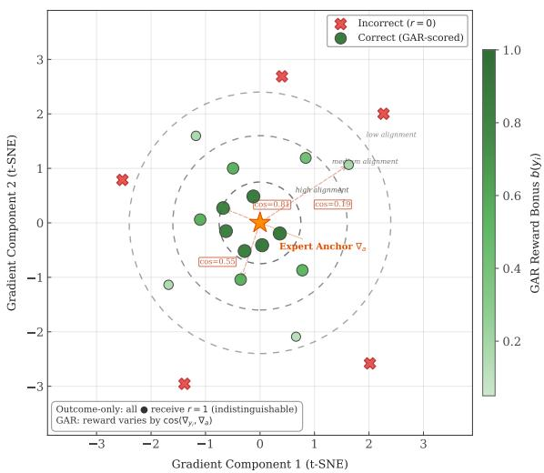
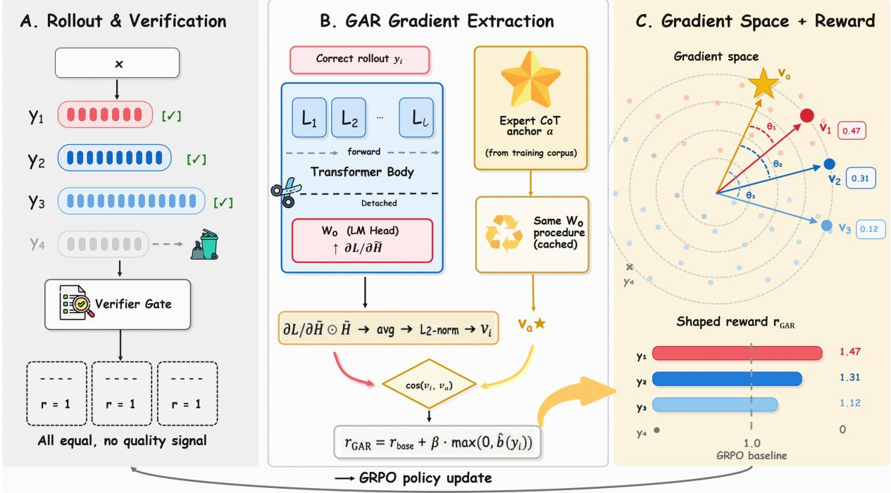
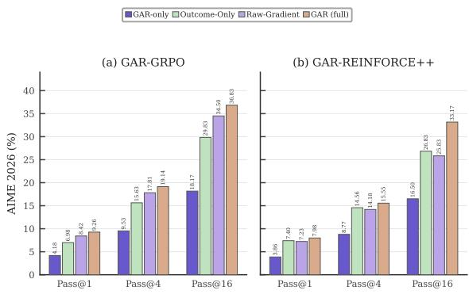
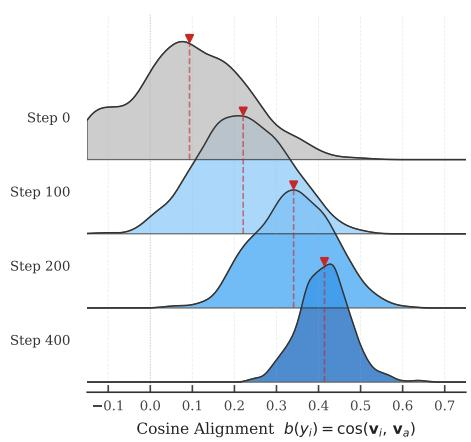
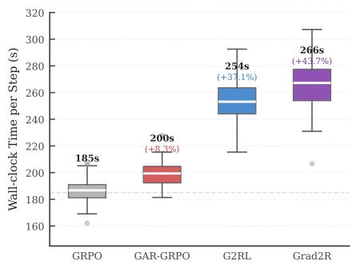
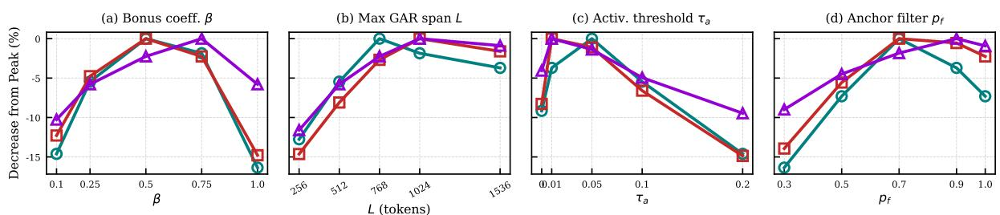

# Gradients Know What Outcomes Don’t: Unlocking Reinforcement Learning for LLM Reasoning with Gradient-Aligned Rewards

Leqi Zheng 1,†, Jinbo Su2,†, Fang Niu 1,†, Chaokun Wang\* 1,

Weiping Wang 3, Jiajun Zhang 4, Shannan Yan 1,

Jie Wu 5, Zhaolu Kang 6, Rong Fu 7, Hang Zhang 1

1Tsinghua University, 2Renmin University of China, 3Institute of Information Engineering, CAS, 4USTC, 5The Australian National University, 6Peking University, 7University of Macau

† Equal contribution.

\* Correspondence: chaokun@tsinghua.edu.cn

## Abstract

Reinforcement learning from verifiable rewards (RLVR) drives chain-of-thought reasoning in large language models, yet its binary outcome reward cannot distinguish among correct trajectories. Existing dense reward alternatives, from surface heuristics to process reward models, either ignore the expert solutions already present in training corpora or require expensive offline annotation. We propose Gradient-Aligned Reward (GAR), which operates in the policy’s own gradient space: truncated backpropagation through the output projection layer extracts a compact gradient vector for each rollout, and cosine similarity with an expert-anchor gradient yields a dense, reasoning-aware reward with less than 9% wall-clock overhead. We prove that this cosine admits a multiplicative decomposition into prediction-error and activationpattern factors, providing a concrete characterization of what the alignment signal measures. On Qwen3-4B and Qwen3-8B, GAR consistently improves over GRPO and other baselines on competition-level math benchmarks and transfers to GPQA Diamond and MMLU-Pro without domain-specific data. Code and data are available at https://github.com/ LQgdwind/GAR.

## 1 Introduction

Reinforcement learning from verifiable rewards (RLVR) has emerged as a compelling paradigm for eliciting chain-of-thought reasoning in large language models without supervised fine-tuning (Guo et al., 2025; Shao et al., 2024; Yu et al., 2025; Zheng et al., 2025b, 2026, 2025a). Under this setting, a base model is optimized solely with a binary outcome reward that verifies final-answer correctness, and DeepSeek-R1-Zero (Guo et al., 2025) demonstrated that structured reasoning (Wei et al., 2022; Kojima et al., 2022) can emerge spontaneously from such sparse supervision. Despite this success, the exclusive reliance on binary rewards introduces a fundamental credit assignment problem: once multiple rollouts produce correct answers, the reward signal becomes flat over the correct subset, and the resulting policy gradient carries no information to preferentially reinforce higher-quality reasoning trajectories.

  
Figure 1: Gradient-space visualization of GAR. The expert anchor va (star) defines the reference direction in the parameter update manifold. Correct rollouts (circles) are scored by cosine similarity with the anchor: high-alignment rollouts (dark) receive a large GAR bonus, while low-alignment rollouts (light) receive a smaller bonus despite also being correct. Incorrect rollouts (crosses) are gated out and receive zero reward regardless of their gradient direction.

This pathology motivates a search for denser, process-level supervision, yet existing remedies each suffer from significant limitations: (1) Expert solutions remain unused. Outcome-only RLVR assigns identical reward to every correct response, collapsing the group-relative advantage among the correct subset to zero (Shao et al., 2024). Widely used math corpora such as NuminaMath-CoT (Li et al., 2024) already ship expert chain-of-thought solutions alongside each problem, yet no existing reward mechanism exploits them to provide a process-level training signal. (2) Surface-level heuristic shaping. Rule-based reward shaping methods (Wen et al., 2025; Aggarwal and Welleck,

Table 1: Comparison of reward paradigms. GAR is the only method that leverages expert CoT in gradient space.
<table><tr><td>Method</td><td>Dense Sig.</td><td>Expert CoT</td><td>Grad.-Space</td><td>No Extra Model</td></tr><tr><td>GRPO</td><td>x</td><td>x</td><td>x</td><td></td></tr><tr><td>Grad2Reward</td><td>√</td><td>X</td><td>√</td><td>x</td></tr><tr><td>G2RL</td><td>√</td><td>x</td><td>√</td><td>√</td></tr><tr><td>GAR (Ours)</td><td></td><td></td><td></td><td></td></tr></table>

2025) introduce length or format penalties as proxies for reasoning quality, but such heuristics operate on surface attributes and cannot evaluate whether the underlying chain of thought genuinely engages the reasoning structures required by the task. (3) Expensive and offline process supervision. Process reward models (PRMs) provide steplevel feedback but require large-scale expert annotations (Lightman et al., 2023; Uesato et al., 2022); even automated alternatives (Wang et al., 2024; Cui et al., 2025; Setlur et al., 2024) are trained offline on fixed distributions that diverge from the evolving policy. A detailed comparison is provided in Table 1. These limitations point to a natural question: can we turn the expert solutions that training corpora already provide into a gradient-space signal that differentiates among correct rollouts?

We find that we can, and introduce Gradient-Aligned Reward (GAR), a lightweight online process reward mechanism for RLVR. The central insight is that if two correct trajectories implement substantively similar reasoning, their gradient directions through the output projection layer must remain close, irrespective of surface-level textual variation. GAR operationalizes this hypothesis by performing truncated backpropagation through only the LM head and scoring each rollout by its cosine similarity with an expert-anchor gradient derived from existing chain-of-thought solutions in the training corpus (Figure 1). This design addresses all three limitations: gradient cosine with expert anchors turns readily available CoT solutions into a dense reward; the gradient signal captures reasoning-level structure beyond surface attributes; and the online, truncated computation eliminates dependence on step-level annotations or external reward models.

In summary, our contributions are four-fold:

(1) Gradient-Space Process Rewards from Expert Anchors. We introduce a reward mechanism that converts readily available expert chainof-thought solutions into gradient-space reference vectors, enabling dense, per-rollout process supervision without additional annotation. We ground the signal via the empirical neural tangent kernel and potential-based reward shaping theory.

(2) Multiplicative Decomposition of the Alignment Signal. We prove that the gradient cosine decomposes multiplicatively into a predictionerror factor and an activation-pattern factor (Theorem 2), providing a concrete characterization of the two complementary axes along which GAR distinguishes correct trajectories.

(3) Lightweight Online Computation. Truncated backpropagation through the output projection layer reduces alignment cost to $O ( V \times d )$ adding less than 9% wall-clock overhead to standard GRPO training.

(4) Empirical Validation. On Qwen3-4B and 8B base models, GAR yields consistent pass@k gains on four competition-level math benchmarks and transfers to GPQA Diamond and MMLU-Pro without domain-specific training data.

## 2 Method

GAR is motivated by a fundamental limitation of outcome-only reinforcement learning. Under a binary verifier reward $r ( x , y ) = \mathbf { 1 } [ \mathrm { V e r i f y } ( x , y ) ]$ , all correct responses within a rollout group receive the same reward, so GRPO’s group-relative advantage collapses to an identical value across all $K _ { c }$ correct trajectories and cannot preferentially reinforce higher-quality reasoning. As training progresses and $K _ { c }  K$ , this further induces instabilities in the policy update. GAR addresses both pathologies by introducing intra-group variance among correct responses through gradient-space alignment with expert reasoning traces. An end-to-end overview is provided in Figure 2.

## 2.1 The Gradient Alignment Hypothesis

Let $\begin{array} { r } { \mathcal { L } ( \theta ; x , y ) = - \frac { 1 } { | y | } \sum _ { t = 1 } ^ { | y | } } \end{array}$ log $\pi _ { \theta } ( y _ { t } \mid x , y _ { < t } )$ denote the teacher-forcing negative log-likelihood of a response y under the current policy. Consider a prompt x together with two correct responses: a candidate y generated by the policy and an expert anchor a. Define the (full-parameter) gradient operator

$$
\begin{array} { r } { \mathbf { g } ( x , y ) = \nabla _ { \boldsymbol { \theta } } \mathcal { L } ( \boldsymbol { \theta } ; x , y ) \in \mathbb { R } ^ { | \boldsymbol { \theta } | } . } \end{array}\tag{1}
$$

The gradient alignment hypothesis posits that whenever the candidate response implements the same underlying reasoning process as the anchor, the two gradients are close in direction, i.e., cos $( \mathbf { g } ( x , y ) , \mathbf { g } ( x , a ) ) \approx 1$ , whereas trajectories that arrive at the correct answer through qualitatively different computational pathways yield gradients that are only weakly aligned. The intuition is that a policy gradient step on either trajectory nudges the same set of reasoning-relevant computational circuits, whereas semantically incompatible trajectories modify non-overlapping subnetworks.

  
Figure 2: GAR pipeline within one GRPO step. (A) The policy generates K rollouts; a verifier gates correct responses (all receiving r=1 under standard GRPO). (B) For each correct rollout, a teacher-forcing forward pass produces hidden states He , which are detached at the output projection boundary and backpropagated through $W _ { o }$ only to obtain gradient-activation vector ${ \bf v } _ { i } .$ The expert CoT undergoes the same procedure (cached) to yield ${ \bf v } _ { a } ;$ their cosine similarity gives the alignment bonus. (C) Rollouts whose gradient directions cluster near ${ \bf v } _ { a }$ receive higher rewards, breaking the flat-reward pathology.

Computing the full gradient $\mathbf { g } ( x , y ) \in \mathbb { R } ^ { | \theta | }$ for every rollout is prohibitive in practice. Our key algorithmic contribution is to replace the full gradient with a truncated surrogate obtained by freezing the Transformer body and backpropagating only through the output projection layer, resulting in a vector of dimension d rather than |θ|. We show in Section 3 that the cosine similarity of these truncated surrogates is bi-Lipschitz equivalent to the normalized output-layer NTK similarity, preserving relative ordering among trajectories under mild regularity conditions.

## 2.2 Truncated Gradient Signal

For a prompt-response pair $( x , y )$ , we perform a nograd forward pass through the full Transformer and intercept the hidden state $\mathbf { H } \in \mathbb { R } ^ { n \times d }$ at the input of the output projection via a forward pre-hook, detach it to block gradient flow into the Transformer body, and compute a truncated cross-entropy loss through only the LM head:

$$
\mathcal { L } = \frac { 1 } { \vert \mathcal { T } _ { y } \vert } \sum _ { t \in \mathcal { T } _ { y } } \ell \Big ( W _ { o } \widetilde { \mathbf { h } } _ { t } + \mathbf { b } _ { o } , y _ { t + 1 } \Big ) ,\tag{2}
$$

where $\mathcal { T } _ { y }$ indexes the response span (or, when delimited, the explicit thinking span), $\widetilde { \mathbf { h } } _ { t }$ is the detached hidden state at position t, $y _ { t + 1 }$ is the nexttoken target, and $W _ { o } , \mathbf { b } _ { o }$ are the output projection parameters. The gradient $\mathbf { G } _ { t } = \partial \mathcal { L } / \partial \tilde { \mathbf { h } } _ { t }$ is then combined element-wise with the activation to form the gradient-activation signal

$$
\mathbf { S } _ { t } = \mathbf { G } _ { t } \odot \widetilde { \mathbf { h } } _ { t } , \quad \forall t \in \mathcal { T } _ { y } ,\tag{3}
$$

The element-wise product emphasizes dimensions where loss sensitivity and activation magnitude jointly concentrate, making the signal more robust to surface-level wording variation than the raw gradient alone. Proposition 1 shows that $\mathbf { S } _ { t }$ admits a first-order interpretation as the linearized per-dimension contribution to the log-likelihood. The per-token signals are averaged across response positions and L2-normalized,

$$
\mathbf { v } = \frac { \bar { \mathbf { s } } } { \| \bar { \mathbf { s } } \| _ { 2 } } , \quad \bar { \mathbf { s } } = \frac { 1 } { | \mathcal { T } _ { y } | } \sum _ { t \in \mathcal { T } _ { y } } \mathbf { S } _ { t } ,\tag{4}
$$

which removes magnitude drift across training steps so that cosine comparisons remain commensurate across trajectories of different lengths.

## 2.3 Reward Formulation

Verifier Gate. GAR retains the outcome verifier as a hard gate: a response $y _ { i }$ with binary outcome reward $r _ { \mathrm { r a w } } ( x , y _ { i } ) = 0$ receives no alignment bonus and triggers no gradient computation, which both prevents the policy from inflating its reward through spurious directions in gradient space and confines the additional cost of GAR to verifierpassing rollouts.

Anchor and Cosine Score. For each prompt x we designate an expert anchor $a ( x )$ : the chain-ofthought solution shipped with the training dataset. Crucially, widely used math corpora such as NuminaMath-CoT (Li et al., 2024) already provide such solutions as standard metadata, yet conventional GRPO pipelines ignore them entirely. GAR repurposes these annotations as gradient-space references, converting an underutilized resource into dense process supervision at no additional annotation cost. The anchor is mapped to its gradient vector ${ \bf v } _ { a }$ via the same truncated procedure, with the anchor vector cached per prompt across the rollout batch to avoid redundant computation. For a verifier-passing response $y _ { i }$ with gradient vector $\mathbf { v } _ { i } .$ the alignment score is the cosine similarity with the anchor, which reduces to the inner product because both vectors are L2-normalized:

$$
b ( y _ { i } ) = \mathbf { v } _ { i } ^ { \top } \mathbf { v } _ { a } .\tag{5}
$$

Final Reward. The final GAR reward applies the gated, group-centered, non-negatively clipped bonus on top of the base reward:

$$
\begin{array} { r l } & { r _ { \mathrm { G A R } } ( x , y _ { i } ) = } \\ & { \left\{ r _ { \mathrm { b a s e } } + \beta \cdot \operatorname* { m a x } ( 0 , \hat { b } ( y _ { i } ) ) + p ( y _ { i } ) , \right. \ { r _ { \mathrm { r a w } } } > 0 , } \\ & { \left. p ( y _ { i } ) , \right. \ \quad \quad \quad \quad \quad \quad \quad \mathrm { o t h e r w i s e } , } \end{array}\tag{6}
$$

where $\begin{array} { r } { \hat { b } ( y _ { i } ) = b ( y _ { i } ) - \frac { 1 } { | \mathcal { P } ( x ) | } \sum _ { y _ { j } \in \mathcal { P } ( x ) } b ( y _ { j } ) } \end{array}$ is the bonus centered over the correct subset ${ \mathcal { P } } ( x )$ of the rollout group, $r _ { \mathrm { b a s e } }$ (default 1.0) is the base reward for correctness, $\beta \geq 0$ (default 0.5) scales the alignment bonus, and $p ( y _ { i } ) ~ \leq ~ 0$ is a small format penalty on responses that violate the prescribed think/answer structure. The max(0, ·) clip keeps the GAR reward weakly above the outcomeonly baseline on every correct trajectory and is essential for the safe reward-shaping guarantee of Theorem 3.

## 3 Theoretical Analysis

All proofs are deferred to the appendix.

## 3.1 NTK Interpretation and Multiplicative Decomposition

Let $\mathbf { g } _ { o } ( x , y ) = \nabla _ { W _ { o } } \mathcal { L } ( W _ { o } ; x , y ) \in \mathbb { R } ^ { | \mathcal { V } | \times d }$ denote the output-layer gradient. Straightforward differentiation yields $\begin{array} { r } { \mathbf { g } _ { o } ( x , y ) = \frac { 1 } { | T _ { u } | } \sum _ { t } ( \mathbf { p } _ { t } - \mathbf { e } _ { y _ { t + 1 } } ) \otimes \mathbf { h } _ { t } } \end{array}$ Proposition 1 (Gradient-activation product as linearized log-likelihood). Let $\mathbf { H } _ { y } \in \mathbb { R } ^ { n \times d }$ denote the matrix of final-layer hidden states at the input of the output projection, obtained from a nogradient forward pass. The per-token signal $\mathbf { u } _ { t } =$ $\mathbf { G } _ { t } \odot \mathbf { h } _ { t }$ of Eq. (3) satisfies $\begin{array} { r l r } { \left. \frac { d } { d \eta } \mathcal { L } \big ( ( 1 + \eta ) \mathbf { H } _ { y } \big ) \right. _ { \eta = 0 } = } & { { } } & { } \end{array}$ $\begin{array} { r } { \frac { 1 } { | \mathcal { T } _ { \boldsymbol { y } } | } \sum _ { t } \mathbf { 1 } ^ { \top } \mathbf { u } _ { t } . } \end{array}$ , so the aggregated signal ¯s captures the linearized contribution of each hidden dimension to the log-likelihood.

Theorem 1 (NTK-induced functional alignment). Let $\begin{array} { r } { \Theta _ { o } ( y , a ) = \langle \mathrm { v e c } ( \mathbf { g } _ { o } ( x , y ) ) , \mathrm { v e c } ( \mathbf { g } _ { o } ( x , a ) ) \rangle } \end{array}$ denote the output-layer empirical NTK, and let ${ \mathbf { v } } _ { y } , { \mathbf { v } } _ { a }$ denote the L2-normalized gradient-activation vectors of Eq. (4). Under bounded error signals $( \lVert \bar { \pmb { \delta } } _ { y } \rVert _ { 2 } \leq B _ { \delta } )$ and hidden states $( \| \bar { \mathbf h } _ { y } \| _ { 2 } \le B _ { h } ) ,$ there exist constants $c _ { 1 } , c _ { 2 } > 0$ such that

$$
\begin{array} { l } { \displaystyle { c _ { 1 } \cos ( { \mathbf v } _ { y } , { \mathbf v } _ { a } ) \leq \frac { \Theta _ { o } ( y , a ) } { \| { \mathbf g } _ { o } ( x , y ) \| _ { F } \| { \mathbf g } _ { o } ( x , a ) \| _ { F } } } } \\ { \displaystyle \qquad \leq c _ { 2 } \cos ( { \mathbf v } _ { y } , { \mathbf v } _ { a } ) + { \mathcal O } ( \kappa _ { y } + \kappa _ { a } ) , } \end{array}\tag{7}
$$

where $\kappa _ { y } , \kappa _ { a }$ measure the per-token error dispersion around the trajectory means.

Theorem 1 shows that rewarding high-cosine trajectories is equivalent, up to bounded distortion, to rewarding high output-layer NTK similarity with the expert anchor.

Theorem 2 (Multiplicative decomposition of gradient alignment). Under the same assumptions, the NTK inner product decomposes as

$$
\begin{array} { r l } & { \langle \mathbf { g } _ { o } ( x , y ) , \ \mathbf { g } _ { o } ( x , a ) \rangle } \\ & { = \underbrace { \vphantom { \int _ { a } } ( \bar { \pmb { \delta } } ^ { y \top } \bar { \pmb { \delta } } ^ { a } ) } _ { g r a d i e n t - d i r e c t i o n } \underbrace { \bigl ( \bar { \mathbf { h } } ^ { y \top } \bar { \mathbf { h } } ^ { a } \bigr ) } _ { a c t i v a t i o n - p a t t e r n } } \\ & { \quad + \ O \bigl ( B _ { h } ^ { 2 } \kappa _ { y } \kappa _ { a } + B _ { \delta } ( \kappa _ { y } + \kappa _ { a } ) B _ { h } \bigr ) . } \end{array}\tag{8}
$$

The multiplicative structure requires agreement in both prediction-error profile and activation pattern; a trajectory reaching the correct answer through a different computational pathway receives a low cosine score. Empirically, across six trainingset problems where correct rollouts use identifiably different solution methods, same-method rollouts receive $3 . 5 \times$ higher cosine scores than alternative correct methods (mean $\bar { b } _ { \mathrm { s a m e } } ~ = ~ 0 . 4 5$ vs. $\bar { b } _ { \mathrm { d i f f } } = 0 . 1 3$ ; Appendix M), confirming that the signal discriminates based on the underlying derivation strategy rather than surface-level correlates such as length or formatting.

Corollary 1 (Orthogonality under subspace separation). If the ε-effective supports $S _ { \varepsilon } ^ { y }$ and $S _ { \varepsilon } ^ { a }$ are disjoint, then $| \cos ( \mathbf { v } _ { y } , \mathbf { v } _ { a } ) | \leq 2 \varepsilon d + { \mathcal { O } } ( \kappa _ { y } + \kappa _ { a } )$

## 3.2 Safe Reward Shaping

Definition 1 (Outcome-verified optimal policy). A policy $\pi ^ { \star }$ is outcome-verified optimal if it maximizes $\mathcal { I } _ { 0 } ( \pi ) = \mathbb { E } _ { x , y \sim \pi } { \bf 1 } [ \mathrm { V e r i f y } ( x , y ) ]$

Theorem 3 (Safe reward shaping). The GAR reward of Eq. (6) satisfies two properties. (i) Nondegradation: for every correct response y with $r _ { r a w } ( x , y ) > 0 , r _ { G A R } ( x , y ) - p ( y ) \geq r _ { b a s e } > 0 ,$ , so GAR never reduces the reward ofa correct response below the outcome-only baseline. (ii) Strict incentive separation: for every incorrect response $y ^ { \prime }$ with $r _ { r a w } ( x , y ^ { \prime } ) = 0 , r _ { G A R } ( x , y ^ { \prime } ) = p ( y ^ { \prime } ) \leq 0 <$ $r _ { b a s e } \le r _ { G A R } ( x , y ) - p ( y )$ , so the policy gradient consistently assigns higher advantage to correct responses than to incorrect ones.

Direction (i) follows from the verifier gate and max(0, ˆb) clip ensuring every correct response contributes at least $r _ { \mathrm { b a s e } } ;$ direction (ii) follows from the verifier gate assigning $r _ { \mathrm { G A R } } ( x , y ^ { \prime } ) = p ( y ^ { \prime } ) \leq 0$ to incorrect responses, while every correct response receives at least $r _ { \mathrm { b a s e } } ~ > ~ 0$ on top of the format penalty.

## 3.3 Variance and Unbiasedness

Proposition 2 (Variance amplification). Under the flat outcome reward, $\mathrm { V a r } _ { i : r _ { \mathrm { r a w } } = 1 } [ A _ { i } ^ { \mathrm { o u t c o m e } } ] ~ = ~ 0$ Under GAR, $\mathrm { V a r } _ { i : r _ { \mathrm { r a w } } = 1 } [ A _ { i } ^ { \mathrm { G A R } } ] > 0$ whenever the alignment bonuses have non-zero variance within the correct subset.

Proposition 3 (Unbiasedness of prompt-group normalization). The group-normalized bonus satisfies $\mathbb { E } _ { y : r _ { \mathrm { r a w } } = 1 } [ \hat { b } ( y ) ] = 0$ for every prompt x.

## 3.4 Monotonic Alignment Improvement

Proposition 4 (Monotonic alignment improvement). Let $\bar { C } _ { t } = \mathbb { E } _ { x , y \sim \pi _ { t } , r _ { \mathrm { r a w } } = 1 } [ \cos ( \mathbf { v } _ { y } , \mathbf { v } _ { a } ) ]$ denote the expected cosine alignment at iteration t. Under

GAR-shaped GRPO updates with sufficiently small KL penalty, $\bar { C } _ { t + 1 } \geq \bar { C } _ { t }$

This follows because GAR assigns positive advantages exclusively to above-mean-cosine trajectories, so $\mathrm { C o v } [ A _ { i } , c _ { i } ] \ge 0$

## 4 Experimental Setup

## 4.1 Training

GAR is implemented within the SLIME / Megatron training stack as an online reward hook invoked before GRPO advantage computation (Appendix C). We train Qwen3-4B-Base and Qwen3- 8B-Base (Yang et al., 2025) from their base checkpoints without SFT warmup using full-parameter reinforcement learning, for 400 steps with batch size 128 and K=16 rollouts per prompt on ∼10k NuminaMath-CoT (Li et al., 2024) problems; each problem’s chain-of-thought solution serves as the expert anchor. Each optimization step therefore contains 2,048 sampled trajectories before verifier gating, which provides multiple candidate solutions per prompt for estimating within-group reward differences. Training directly from the base checkpoints prevents the observed gains from being attributed to an SFT warmup and isolates the contribution of the reward signal. The default GAR hyperparameters are $\beta { = } 0 . 5$ , max GAR span $L { = } 7 6 8$ tokens, activation threshold $\tau _ { a } { = } 0 . 0 5$ , and anchor filter ${ p _ { f } } \mathrm { { = } } 0 . 7$ . The expert-anchor vector is cached within each rollout group, and the alignment bonus is evaluated only for verifier-passing responses, limiting additional computation to the trajectories for which process-level differentiation is meaningful.

## 4.2 Baselines

We compare against GRPO (Shao et al., 2024; Yu et al., 2025), REINFORCE++ (Hu et al., 2025), MASPO (Fu et al., 2026), Grad2Reward (Zhang et al., 2026), and G2RL (Liang et al., 2025). We report GAR-GRPO and GAR-REINFORCE++ to isolate GAR’s contribution from the optimizer. GRPO and REINFORCE++ provide two distinct policy optimization backbones, while MASPO, Grad2Reward, and G2RL test whether GAR remains competitive with recent methods designed to improve signal reliability or exploit gradient information. All methods share the same base checkpoint, training data, compute budget, and rollout infrastructure; only the reward function differs. Consequently, each comparison between an optimizer and its GAR variant measures the effect of reward shaping without conflating it with additional data, supervised initialization, or a larger rollout budget.

Table 2: Pass@k accuracy (%, abbreviated as P@k in headers) on competition-level math benchmarks, averaged over 10 independent runs (standard deviations in gray; all GAR improvements over the corresponding base optimizer are statistically significant with $p < 0 . 0 5$ by paired t-test across runs). All methods train from Qwen3 base checkpoints without SFT warmup using identical training data and compute budget. Best results per model in bold.
<table><tr><td></td><td colspan="3">IMO-AnswerBench</td><td colspan="3">HMMT ’26</td><td colspan="3">HMMT ’25</td><td colspan="3">AIME ’26</td></tr><tr><td>Method</td><td>P@1</td><td>P@4</td><td>P@16</td><td>P@1</td><td>P@4</td><td>P@16</td><td>P@1</td><td>P@4</td><td>P@16</td><td>P@1</td><td>P@4</td><td>P@16</td></tr><tr><td colspan="10">Qwen3-4B-Base</td></tr><tr><td>Base (no RL)</td><td>3.05±0.9</td><td>9.72±1.1</td><td>21.91±1.0</td><td>0.61±1.0</td><td>2.62±1.1</td><td>5.76±2.2</td><td>0.17±1.3</td><td>1.36±1.0</td><td>4.34±1.7</td><td>1.17±1.2</td><td>4.85±1.9</td><td>13.00±2.7</td></tr><tr><td>+ REINFORCE++</td><td>6.86±0.9</td><td>16.22±1.0</td><td>29.76±1.7</td><td>3.33±1.4</td><td>9.01±1.6</td><td>18.03±1.8</td><td>3.17±0.8</td><td>7.18±1.5</td><td>15.33±2.0</td><td>7.67±0.9</td><td>17.86±1.4</td><td>29.34±2.1</td></tr><tr><td>+ GRPO</td><td>7.96±0.7</td><td>17.91±1.2</td><td>31.72±1.3</td><td>2.42±1.1</td><td>7.90±1.6</td><td>15.30±1.6</td><td>3.83±0.8</td><td>8.32±1.1</td><td>13.51±2.0</td><td>6.83±1.3</td><td>16.81±2.1</td><td>27.67±2.5</td></tr><tr><td>+ MASPO</td><td>7.01±0.8</td><td>16.21±1.0</td><td>30.32±1.5</td><td>2.73±1.2</td><td>8.27±1.4</td><td>15.76±2.4</td><td>3.67±1.0</td><td>8.37±1.2</td><td>16.49±2.2</td><td>7.83±1.3</td><td>18.28±2.1</td><td>30.33±2.4</td></tr><tr><td>+ Grad2Reward</td><td>7.76±0.7</td><td>17.56±0.9</td><td>31.46±1.2</td><td>2.58±1.0</td><td>7.85±1.2</td><td>15.60±2.2</td><td>3.33±1.0</td><td>7.35±1.2</td><td>13.17±2.3</td><td>6.50±1.5</td><td>17.09±2.0</td><td>30.50±2.8</td></tr><tr><td>+ G2RL</td><td>8.10±0.7</td><td>18.27±1.0</td><td>32.59±1.4</td><td>2.88±1.3</td><td>8.24±1.5</td><td>16.06±2.3</td><td>3.50±0.9</td><td>7.51±1.1</td><td>13.50±2.1</td><td>7.33±1.1</td><td>17.66±1.6</td><td>30.67±2.9</td></tr><tr><td>+ GAR-REINFORCE++</td><td>7.05±0.7</td><td>16.57±0.9</td><td>30.88±1.1</td><td>4.39±0.9</td><td>10.70±1.2</td><td>19.24±2.3</td><td>4.83±1.0</td><td>9.79±1.4</td><td>17.00±2.0</td><td>8.00±1.1</td><td>18.39±1.7</td><td>31.50±2.5</td></tr><tr><td>Improv.</td><td>+2.8%</td><td>+2.2%</td><td>+3.8%</td><td>+31.8%</td><td>+18.8%</td><td>+6.7%</td><td>+52.4%</td><td>+36.4%</td><td>+10.9%</td><td>+4.3%</td><td>+3.0%</td><td>+7.4%</td></tr><tr><td>+ GÁR-GRPO</td><td>8.76±0.6</td><td>19.06±1.2</td><td>33.76±1.2</td><td>3.18±1.2</td><td>9.00±1.6</td><td>16.52±1.8</td><td>5.00±0.8</td><td>9.19±1.1</td><td>15.50±2.0</td><td>8.50±0.9</td><td>18.05±1.6</td><td>29.66±3.0</td></tr><tr><td>Improv.</td><td>+10.1%</td><td>+6.4%</td><td>+6.4%</td><td>+31.4%</td><td>+13.9%</td><td>+8.0%</td><td>+30.5%</td><td>+10.5%</td><td>+14.7%</td><td>+24.5%</td><td>+7.4%</td><td>+7.2%</td></tr><tr><td colspan="10">Qwen3-8B-Base</td><td colspan="3"></td></tr><tr><td>Base (no RL)</td><td>3.54±0.8</td><td>11.03±0.9</td><td>23.79±1.2</td><td>0.91±1.1</td><td>2.69±1.2</td><td>7.57±2.4</td><td>0.67±1.2</td><td>1.81±1.2</td><td>6.49±2.4</td><td>2.00±1.0</td><td>5.84±2.0</td><td>12.16±2.8</td></tr><tr><td>+ REINFORCE++</td><td>6.83±0.5</td><td>16.27±0.8</td><td>29.74±1.3</td><td>4.09±1.0</td><td>8.12±1.5</td><td>14.85±2.3</td><td>4.33±0.9</td><td>7.50±1.6</td><td>19.84±1.7</td><td>8.17±1.3</td><td>18.44±1.9</td><td>33.00±3.0</td></tr><tr><td>+ GRPO</td><td>6.99±0.6</td><td>16.50±1.2</td><td>31.05±1.7</td><td>4.24±1.4</td><td>9.38±1.6</td><td>15.46±1.9</td><td>4.50±1.0</td><td>8.01±1.4</td><td>18.00±2.1</td><td>8.00±1.3</td><td>18.79±1.6</td><td>33.83±3.2</td></tr><tr><td>+ MASPO</td><td>6.60±0.8</td><td>15.70±0.7</td><td>30.89±1.6</td><td>4.70±1.0</td><td>8.71±1.2</td><td>15.00±1.7</td><td>4.50±1.0</td><td>9.51±1.1</td><td>19.67±1.9</td><td>8.50±1.4</td><td>19.17±1.7</td><td>34.17±3.1</td></tr><tr><td>+ Grad2Reward</td><td>6.24±0.7</td><td>15.29±0.9</td><td>29.76±1.0</td><td>4.09±0.9</td><td>7.77±1.5</td><td>13.94±2.3</td><td>3.67±0.9</td><td>8.82±1.2</td><td>17.84±2.0</td><td>7.17±1.4</td><td>17.49±1.5</td><td>34.66±3.2</td></tr><tr><td>+ G2RL</td><td>7.53±0.8</td><td>17.31±1.0</td><td>31.93±1.0</td><td>4.39±0.8</td><td>9.88±1.8</td><td>16.21±2.5</td><td>4.83±1.0</td><td>8.63±1.6</td><td>18.83±1.8</td><td>8.33±1.1</td><td>19.34±1.6</td><td>35.00±2.9</td></tr><tr><td>+ GAR-REINFORCE++</td><td>7.76±0.8</td><td>18.14±0.7</td><td>32.38±1.0</td><td>4.85±1.0</td><td>9.78±1.4</td><td>17.88±2.4</td><td>5.83±1.2</td><td>10.04±1.4</td><td>21.84±2.3</td><td>8.67±1.0</td><td>18.77±1.8</td><td>35.50±2.9</td></tr><tr><td>Improv.</td><td>+13.6%</td><td>+11.5%</td><td>+8.9%</td><td>+18.6%</td><td>+20.4%</td><td>+20.4%</td><td>+34.6%</td><td>+33.9%</td><td>+10.1%</td><td>+6.1%</td><td>+1.8%</td><td>+7.6%</td></tr><tr><td>+ GAR-GRPO</td><td>8.14±0.5</td><td>18.13±1.1</td><td>33.73±1.3</td><td>5.15±1.0</td><td>10.62±1.3</td><td>17.73±2.5</td><td>6.00±1.0</td><td>10.83±1.3</td><td>19.83±2.3</td><td>9.17±1.5</td><td>19.95±2.0</td><td>36.49±2.4</td></tr><tr><td>Improv.</td><td>+16.5%</td><td>+9.9%</td><td>+8.6%</td><td>+21.5%</td><td>+13.2%</td><td>+14.7%</td><td>+33.3%</td><td>+35.2%</td><td>+10.2%</td><td>+14.6%</td><td>+6.2%</td><td>+7.9%</td></tr></table>

## 4.3 Evaluation

We report pass@k (k∈{1, 4, 16}) on four heldout math benchmarks (IMO-AnswerBench, HMMT ’25/’26, AIME ’26) and two general reasoning benchmarks (GPQA Diamond, MMLU-Pro) to assess cross-domain transfer. Correctness is determined by exact answer match after normalization. Pass@1 measures whether training concentrates probability mass on a correct solution in a single attempt, whereas pass@16 measures whether the policy preserves broader solution coverage across repeated samples. We average every configuration over 10 independently trained runs and use paired significance tests under matched sampling conditions; complete decoding, statistical, and contamination-control protocols are provided in Appendix H.

## 5 Results

## 5.1 Main Results

Table 2 presents the main results across four competition-level benchmarks. GAR improves over the corresponding base optimizer on every benchmark–model combination, with relative gains of up to 52.4% at pass@1 (HMMT 2025, 4B). The improvements are most pronounced at lower k, indicating that GAR steers the policy toward higher-probability correct solutions rather than merely expanding coverage. For GAR-GRPO at the 4B scale, pass@1 increases from 2.42 to 3.18 on HMMT 2026 and from 3.83 to 5.00 on HMMT 2025, corresponding to relative gains of 31.4% and 30.5%, respectively. The same comparisons at the 8B scale increase from 4.24 to 5.15 and from 4.50 to 6.00, showing that the benefit persists as model capacity grows. Improvements also remain positive at pass@16 across every dataset and optimizer, which indicates that concentrating probability on strong solutions does not reduce the overall coverage of correct reasoning paths. Layering GAR on REINFORCE++ (Hu et al., 2025) yields comparable gains to the GRPO variant, demonstrating that the reward signal is complementary to optimizer-side design choices. The largest relative gain occurs for GAR-REINFORCE++ on HMMT 2025 at the 4B scale, where pass@1 rises from 3.17 to 4.83. Among gradient-based competitors, Grad2Reward (Zhang et al., 2026) and G2RL (Liang et al., 2025) underperform GAR across all benchmarks, while MASPO (Fu et al., 2026) provides only modest improvement over GRPO. Together, these results indicate that the principal advantage arises from aligning the reward with expert reasoning in gradient space rather than from the choice of policy optimizer alone.

## 6 Empirical Analysis

## 6.1 General Reasoning Transfer

To assess whether gradient-aligned rewards transfer beyond the training domain, Table 3 evaluates all methods, trained exclusively on mathematical data, on two general reasoning benchmarks. GAR-GRPO outperforms all baselines on both GPQA Diamond and MMLU-Pro, indicating that the gradient alignment signal captures domain-general reasoning structure rather than math-specific heuristics. Relative to GRPO, the 4B model gains 2.57 points on GPQA pass@1, 1.79 points on pass@4, 1.94 points on majority voting, and 2.41 points on MMLU-Pro. GAR-GRPO also exceeds the strongest alternative baseline in every reported column, so the transfer improvement is not explained solely by a weak GRPO reference. Results on Qwen3-8B-Base (Appendix L) confirm consistent improvements at the larger scale. At 8B, the absolute gains over GRPO remain between 2.02 and 2.29 points across all four metrics, indicating stable transfer across model scales.

Table 3: General reasoning transfer (Qwen3-4B-Base, 10 runs). All methods are trained exclusively on mathematical data and evaluated zero-shot. GPQA reports pass@k and maj@16; MMLU-Pro reports micro-averaged pass@1.
<table><tr><td colspan="4">GPQA Diamond MMLU-Pro</td></tr><tr><td>Method</td><td>P@1</td><td>P@4</td><td>Maj@16</td></tr><tr><td>GRPO</td><td>28.31</td><td>47.73</td><td>Avg. P@1 48.17</td></tr><tr><td>MASPO</td><td>29.82 48.94</td><td>41.52 42.68</td><td>48.24</td></tr><tr><td>G2RL</td><td>30.20 47.25</td><td>41.06</td><td>47.13</td></tr><tr><td>GAR-GRPO</td><td>30.88</td><td>49.52 43.46</td><td>50.58</td></tr></table>

## 6.2 Ablation Study

  
Figure 3: Ablation on Qwen3-8B-Base (AIME 2026), removing one GAR component at a time from (a) GAR-GRPO and (b) GAR-REINFORCE++. Activation weighting is essential for consistent gains across both optimizers.

Figure 3 isolates the contribution of each GAR component on Qwen3-8B across two optimizers. Full GAR consistently achieves the best performance regardless of optimizer choice. Dropping the outcome reward entirely (GAR-only) degrades performance well below the baseline, confirming that the verifier gate is essential. This result shows that gradient alignment is effective as a processlevel refinement of correctness but is not a substitute for the binary outcome signal. Interestingly, using raw gradients without activation weighting yields inconsistent results: it helps with GRPO but slightly hurts with REINFORCE++, suggesting that the unweighted gradient signal is noisy and optimizer-sensitive. The activation-weighted formulation of Eq. (3) resolves this instability, delivering reliable gains in both settings. The agreement across both optimizer backbones further indicates that activation weighting is a structural component of the reward rather than an optimizer-specific tuning effect.

  
Figure 4: Cosine alignment distribution among correct rollouts at training steps 0, 100, 200, 400 (Qwen3-8B). Red dashed lines mark means.

## 6.3 Reward Distribution

Figure 4 shows how the cosine alignment distribution evolves during training. The mean b(y ) increases from 0.10 to 0.42 while variance narrows, confirming progressive alignment with expert anchors. Because the distribution contains only verifier-passing rollouts, the fourfold increase cannot be attributed merely to a higher fraction of correct answers. Instead, it reflects a redistribution within the correct subset toward trajectories whose gradient directions more closely match the expert solution. The simultaneous reduction in variance suggests that this behavior becomes systematic across rollouts rather than being driven by a small number of highly aligned outliers.

## 6.4 Computational Overhead

Figure 5 compares per-step training cost across gradient-based methods. GAR’s truncated backpropagation through only the lm\_head layer adds just 8.3% overhead over outcome-only GRPO. G2RL’s pairwise gradient diversity computation requires multi-layer backpropagation (+37.1%), while Grad2Reward (Zhang et al., 2026) performs a full backward pass through the Judge for each rubric (+43.7%). Thus, GAR incurs less than one quarter of G2RL’s additional cost and less than one fifth of Grad2Reward’s additional cost under the reported setup. This efficiency is consistent with the design of GAR: gradients are truncated at the output projection layer, incorrect responses are removed by the verifier gate before gradient extraction, and each expert anchor is cached across the rollout group. The measured overhead also falls within the analytical range derived in Appendix J, connecting the implementation-level cost model with observed wall-clock behavior.

  
Figure 5: Per-step wall-clock time distribution (Qwen3-8B, 4×A100, K=16, 100 steps). GAR adds only 8.3% overhead via lm\_head-only backpropagation.

## 6.5 Additional Analysis

We provide further empirical analysis in the appendix: hyperparameter sensitivity (Appendix K), analysis of alignment and solution diversity (Appendix M), and Qwen3-8B general reasoning transfer results (Appendix L).

## 7 Related Work

RL for LLM reasoning and reward design. Critic-free policy gradient methods (Shao et al., 2024; Yu et al., 2025; Fu et al., 2026; Hu et al., 2025; Liu et al., 2025; Melo et al., 2025) and direct RL from base models (Guo et al., 2025; Zeng et al., 2025; Wen et al., 2025; Aggarwal and Welleck, 2025; Yue et al., 2025) have shown that chainof-thought reasoning (Wei et al., 2022) emerges from outcome rewards alone. Process reward models (Lightman et al., 2023; Uesato et al., 2022; Wang et al., 2024; Luo et al., 2024; Cui et al., 2025; Khalifa et al., 2025; Zhao et al., 2026; Wang et al.,

2026; Cobbe et al., 2021; Snell et al., 2024) offer denser supervision but require step-level annotations or a separately trained verifier. Classical potential-based shaping (Ng et al., 1999; Harutyunyan et al., 2015; Devlin and Kudenko, 2012) establishes when shaped rewards preserve the optimal policy yet leaves the potential function unspecified.

Gradient signals in LLM training. Gradient information has been used for data attribution (Koh and Liang, 2017; Pruthi et al., 2020; Park et al., 2023), curriculum learning (Mindermann et al., 2022; Fifty et al., 2021), and representation engineering (Zou et al., 2023), with NTK theory (Jacot et al., 2018; Mohamadi et al., 2023; Tomihari, 2026) providing formal grounding. Grad2Reward (Zhang et al., 2026), G2RL (Liang et al., 2025), and GradAlign (Yang et al., 2026) recently apply gradient signals to LLM reward design, exploration diversity, and data selection, respectively. GAR differs from these by anchoring the gradient signal to expert chain-of-thought solutions, combining the information richness of reference-based methods with the structural depth of gradient-space operation, while requiring no external judge or offline annotations. Unlike recent distillation approaches that study information transfer and on-policy optimization granularity (Fang et al., 2026; Li et al., 2026), GAR does not optimize toward a fixed reference distribution: it preserves the RL exploration loop and uses expert CoTs only as a gradient-space reference signal.

## 8 Conclusion

We have presented Gradient-Aligned Reward (GAR), which converts readily available expert chain-of-thought solutions into gradient-space reference vectors and scores rollouts by cosine similarity with these anchors, providing dense process supervision within standard RLVR training at less than 9% wall-clock overhead. Experiments on four competition-level math benchmarks with Qwen3- 4B and 8B base models show consistent pass@k gains over GRPO, REINFORCE++, and gradientbased competitors, with positive transfer to GPQA Diamond and MMLU-Pro.

## Acknowledgments

This work is supported in part by the National Natural Science Foundation of China (No. 62372264 and No. 92467203 ). Chaokun Wang is the corresponding author.

## Limitations

While GAR demonstrates consistent improvements across two model scales and multiple benchmarks, it has not yet been deployed in an industrial production environment.

## Ethics Statement

GAR operates exclusively on publicly available mathematical reasoning benchmarks with open licenses, and does not involve human subjects, private data, or dual-use applications.

## References

Pranjal Aggarwal and Sean Welleck. 2025. L1: Controlling how long a reasoning model thinks with reinforcement learning. arXiv preprint arXiv:2503.04697.

Karl Cobbe, Vineet Kosaraju, Mohammad Bavarian, Mark Chen, Heewoo Jun, Lukasz Kaiser, Matthias Plappert, Jerry Tworek, Jacob Hilton, Reiichiro Nakano, and 1 others. 2021. Training verifiers to solve math word problems. arXiv preprint arXiv:2110.14168.

Ganqu Cui, Lifan Yuan, Zefan Wang, Hanbin Wang, Yuchen Zhang, Jiacheng Chen, Wendi Li, Bingxiang He, Yuchen Fan, Tianyu Yu, and 1 others. 2025. Process reinforcement through implicit rewards. arXiv preprint arXiv:2502.01456.

Sam Michael Devlin and Daniel Kudenko. 2012. Dynamic potential-based reward shaping. In 11th International Conference on Autonomous Agents and Multiagent Systems (AAMAS 2012), pages 433–440. IFAAMAS.

Hao Fang, Tianyi Zhang, Tianqu Zhuang, Jiawei Kong, Kuofeng Gao, Bin Chen, Leqi Zheng, Shu-Tao Xia, and Ke Xu. 2026. Towards distillation-resistant large language models: An information-theoretic perspective. Preprint, arXiv:2602.03396.

Chris Fifty, Ehsan Amid, Zhe Zhao, Tianhe Yu, Rohan Anil, and Chelsea Finn. 2021. Efficiently identifying task groupings for multi-task learning. Advances in Neural Information Processing Systems, 34:27503– 27516.

Xiaoliang Fu, Jiaye Lin, Yangyi Fang, Binbin Zheng, Chaowen Hu, Zekai Shao, Cong Qin, Lu Pan, Ke Zeng, and Xunliang Cai. 2026. Maspo: Unifying gradient utilization, probability mass, and signal reliability for robust and sample-efficient llm reasoning. arXiv preprint arXiv:2602.17550.

Daya Guo, Dejian Yang, Haowei Zhang, Junxiao Song, Peiyi Wang, Qihao Zhu, Runxin Xu, Ruoyu Zhang, Shirong Ma, Xiao Bi, and 1 others. 2025. Deepseek-r1: Incentivizing reasoning capability in

llms via reinforcement learning. arXiv preprint arXiv:2501.12948.

Anna Harutyunyan, Sam Devlin, Peter Vrancx, and Ann Nowé. 2015. Expressing arbitrary reward functions as potential-based advice. In Proceedings of the AAAI conference on artificial intelligence, volume 29.

Jian Hu, Jason Klein Liu, Haotian Xu, and Wei Shen. 2025. Reinforce++: Stabilizing critic-free policy optimization with global advantage normalization. arXiv preprint arXiv:2501.03262.

Arthur Jacot, Franck Gabriel, and Clément Hongler. 2018. Neural tangent kernel: Convergence and generalization in neural networks. Advances in neural information processing systems, 31.

Muhammad Khalifa, Rishabh Agarwal, Lajanugen Logeswaran, Jaekyeom Kim, Hao Peng, Moontae Lee, Honglak Lee, and Lu Wang. 2025. Process reward models that think. arXiv preprint arXiv:2504.16828.

Pang Wei Koh and Percy Liang. 2017. Understanding black-box predictions via influence functions. In International conference on machine learning, pages 1885–1894. PMLR.

Takeshi Kojima, Shixiang Shane Gu, Machel Reid, Yutaka Matsuo, and Yusuke Iwasawa. 2022. Large language models are zero-shot reasoners. Advances in neural information processing systems, 35:22199– 22213.

Jia Li, Edward Beeching, Lewis Tunstall, Ben Lipkin, Roman Soletskyi, Shengyi Huang, Kashif Rasul, Longhui Yu, Albert Q Jiang, Ziju Shen, and 1 others. 2024. Numinamath: The largest public dataset in ai4maths with 860k pairs of competition math problems and solutions. Hugging Face repository, 13(9):9.

Yuying Li, Leqi Zheng, Yongzi Yu, Wenrui Zhou, Xuchang Zhong, Xing Hu, Jing Jin, Hangjie Yuan, and Tao Feng. 2026. Filter, then reweight: Rethinking optimization granularity in on-policy distillation. Preprint, arXiv:2606.02684.

Zhenwen Liang, Sidi Lu, Wenhao Yu, Kishan Panaganti, Yujun Zhou, Haitao Mi, and Dong Yu. 2025. Can llms guide their own exploration? gradient-guided reinforcement learning for llm reasoning. arXiv preprint arXiv:2512.15687.

Hunter Lightman, Vineet Kosaraju, Yuri Burda, Harrison Edwards, Bowen Baker, Teddy Lee, Jan Leike, John Schulman, Ilya Sutskever, and Karl Cobbe. 2023. Let’s verify step by step. In The twelfth international conference on learning representations.

Zichen Liu, Changyu Chen, Wenjun Li, Penghui Qi, Tianyu Pang, Chao Du, Wee Sun Lee, and Min Lin. 2025. Understanding r1-zero-like training: A critical perspective. arXiv preprint arXiv:2503.20783.

Liangchen Luo, Yinxiao Liu, Rosanne Liu, Samrat Phatale, Meiqi Guo, Harsh Lara, Yunxuan Li, Lei Shu, Yun Zhu, Lei Meng, and 1 others. 2024. Improve mathematical reasoning in language models by automated process supervision. arXiv preprint arXiv:2406.06592.

Luckeciano C Melo, Alessandro Abate, and Yarin Gal. 2025. Stabilizing policy gradients for sampleefficient reinforcement learning in llm reasoning. arXiv preprint arXiv:2510.00819.

Sören Mindermann, Jan M Brauner, Muhammed T Razzak, Mrinank Sharma, Andreas Kirsch, Winnie Xu, Benedikt Höltgen, Aidan N Gomez, Adrien Morisot, Sebastian Farquhar, and 1 others. 2022. Prioritized training on points that are learnable, worth learning, and not yet learnt. In International Conference on Machine Learning, pages 15630–15649. PMLR.

Mohamad Amin Mohamadi, Wonho Bae, and Danica J Sutherland. 2023. A fast, well-founded approximation to the empirical neural tangent kernel. In International conference on machine learning, pages 25061–25081. PMLR.

Andrew Y Ng, Daishi Harada, and Stuart Russell. 1999. Policy invariance under reward transformations: Theory and application to reward shaping. In Icml, volume 99, pages 278–287. Citeseer.

Sung Min Park, Kristian Georgiev, Andrew Ilyas, Guillaume Leclerc, and Aleksander Madry. 2023. Trak: Attributing model behavior at scale. arXiv preprint arXiv:2303.14186.

Garima Pruthi, Frederick Liu, Satyen Kale, and Mukund Sundararajan. 2020. Estimating training data influence by tracing gradient descent. Advances in Neural Information Processing Systems, 33:19920–19930.

Amrith Setlur, Chirag Nagpal, Adam Fisch, Xinyang Geng, Jacob Eisenstein, Rishabh Agarwal, Alekh Agarwal, Jonathan Berant, and Aviral Kumar. 2024. Rewarding progress: Scaling automated process verifiers for llm reasoning. arXiv preprint arXiv:2410.08146.

Zhihong Shao, Peiyi Wang, Qihao Zhu, Runxin Xu, Junxiao Song, Xiao Bi, Haowei Zhang, Mingchuan Zhang, YK Li, Yang Wu, and 1 others. 2024. Deepseekmath: Pushing the limits of mathematical reasoning in open language models. arXiv preprint arXiv:2402.03300.

Charlie Snell, Jaehoon Lee, Kelvin Xu, and Aviral Kumar. 2024. Scaling llm test-time compute optimally can be more effective than scaling model parameters. arXiv preprint arXiv:2408.03314.

Akiyoshi Tomihari. 2026. Learning dynamics in rl post-training for language models. arXiv preprint arXiv:2601.04670.

Jonathan Uesato, Nate Kushman, Ramana Kumar, Francis Song, Noah Siegel, Lisa Wang, Antonia Creswell, Geoffrey Irving, and Irina Higgins. 2022. Solving math word problems with process-and outcomebased feedback. arXiv preprint arXiv:2211.14275.

Jingyi Wang, Lei Zhu, Tengjin Weng, Song-Li Wu, Haochen Tan, Jierun Chen, Chaofan Tao, Haoli Bai, Lu Hou, Lifeng Shang, and 1 others. 2026. Grpo-vps: Enhancing group relative policy optimization with verifiable process supervision for effective reasoning. arXiv preprint arXiv:2604.20659.

Peiyi Wang, Lei Li, Zhihong Shao, Runxin Xu, Damai Dai, Yifei Li, Deli Chen, Yu Wu, and Zhifang Sui. 2024. Math-shepherd: Verify and reinforce llms stepby-step without human annotations. In Proceedings of the 62nd Annual Meeting of the Association for Computational Linguistics (Volume 1: Long Papers), pages 9426–9439.

Jason Wei, Xuezhi Wang, Dale Schuurmans, Maarten Bosma, Fei Xia, Ed Chi, Quoc V Le, Denny Zhou, and 1 others. 2022. Chain-of-thought prompting elicits reasoning in large language models. Advances in neural information processing systems, 35:24824– 24837.

Liang Wen, Yunke Cai, Fenrui Xiao, Xin He, Qi An, Zhenyu Duan, Yimin Du, Junchen Liu, Tanglifu Tanglifu, Xiaowei Lv, and 1 others. 2025. Light-r1: Curriculum sft, dpo and rl for long cot from scratch and beyond. In Proceedings ofthe 63rd Annual Meeting ofthe Associationfor Computational Linguistics (Volume 6: Industry Track), pages 318–327.

An Yang, Anfeng Li, Baosong Yang, Beichen Zhang, Binyuan Hui, Bo Zheng, Bowen Yu, Chang Gao, Chengen Huang, Chenxu Lv, and 1 others. 2025. Qwen3 technical report. arXiv preprint arXiv:2505.09388.

Ningyuan Yang, Weihua Du, Weiwei Sun, Sean Welleck, and Yiming Yang. 2026. Gradalign: Gradientaligned data selection for llm reinforcement learning. arXiv preprint arXiv:2602.21492.

Qiying Yu, Zheng Zhang, Ruofei Zhu, Yufeng Yuan, Xiaochen Zuo, Yu Yue, Weinan Dai, Tiantian Fan, Gaohong Liu, Lingjun Liu, and 1 others. 2025. Dapo: An open-source llm reinforcement learning system at scale. arXiv preprint arXiv:2503.14476.

Yu Yue, Yufeng Yuan, Qiying Yu, Xiaochen Zuo, Ruofei Zhu, Wenyuan Xu, Jiaze Chen, Chengyi Wang, TianTian Fan, Zhengyin Du, and 1 others. 2025. Vapo: Efficient and reliable reinforcement learning for advanced reasoning tasks. arXiv preprint arXiv:2504.05118.

Weihao Zeng, Yuzhen Huang, Qian Liu, Wei Liu, Keqing He, Zejun Ma, and Junxian He. 2025. Simplerlzoo: Investigating and taming zero reinforcement learning for open base models in the wild. arXiv preprint arXiv:2503.18892.

Zheng Zhang, Ao Lu, Yuanhao Zeng, Ziwei Shan, Jinjin Guo, Lufei Li, Yexin Li, and Kan Ren. 2026. Grad2reward: From sparse judgment to dense rewards for improving open-ended llm reasoning. arXiv preprint arXiv:2602.01791.

Jian Zhao, Runze Liu, Kaiyan Zhang, Zhimu Zhou, Junqi Gao, Dong Li, Jiafei Lyu, Zhouyi Qian, Biqing Qi, Xiu Li, and 1 others. 2026. Genprm: Scaling test-time compute of process reward models via generative reasoning. In Proceedings ofthe AAAI Conference on Artificial Intelligence, volume 40, pages 34932–34940.

Leqi Zheng, Chaokun Wang, Canzhi Chen, Jiajun Zhang, Cheng Wu, Zixin Song, Shannan Yan, Ziyang Liu, and Hongwei Li. 2025a. LAGCL4Rec: When LLMs activate interactions potential in graph contrastive learning for recommendation. In Findings of the Association for Computational Linguistics: EMNLP 2025, pages 1163–1184, Suzhou, China. Association for Computational Linguistics.

Leqi Zheng, Chaokun Wang, Zixin Song, Cheng Wu, Shannan Yan, Jiajun Zhang, and Ziyang Liu. 2025b. Negative feedback really matters: Signed dualchannel graph contrastive learning framework for recommendation. In Advances in Neural Information Processing Systems, volume 38, Main Conference, pages 107595–107624. Curran Associates, Inc.

Leqi Zheng, Jiajun Zhang, Canzhi Chen, Chaokun Wang, Hongwei Li, Yuying Li, Yaoxin Mao, Shannan Yan, Zixin Song, Zhiyuan Feng, Zhaolu Kang, Zirong Chen, Hang Zhang, Qiang Liu, Liang Wang, and Ziyang Liu. 2026. What should i cite? a rag benchmark for academic citation prediction. In Proceedings ofthe ACM Web Conference 2026, WWW ’26, pages 1852–1863, New York, NY, USA. Association for Computing Machinery.

Andy Zou, Long Phan, Sarah Chen, James Campbell, Phillip Guo, Richard Ren, Alexander Pan, Xuwang Yin, Mantas Mazeika, Ann-Kathrin Dombrowski, and 1 others. 2023. Representation engineering: A top-down approach to ai transparency. arXiv preprint arXiv:2310.01405.

## A Notation

We denote by $\pi _ { \theta }$ an autoregressive language model policy parameterized by $\theta ,$ where for any prompt x and response $y = ( y _ { 1 } , \dots , y _ { T } )$ of length $T$ the policy factorizes as $\textstyle \pi _ { \theta } ( y \mid x ) = \prod _ { t = 1 } ^ { T } \pi _ { \theta } ( y _ { t } \mid x , y _ { < t } )$ The model consists of an embedding matrix, a stack of L Transformer layers, and an output projection layer with weight $\dot { W _ { o } } \in \mathbb { R } ^ { | \mathcal { V } | \times d }$ and optional bias $\mathbf { b } _ { o } \in \mathbb { R } ^ { | \mathcal { V } | }$ , where V is the vocabulary and d the hidden dimension. For a prompt-response pair $( x , y )$ , we write $\mathbf { h } _ { t } \in \mathbb { R } ^ { d }$ for the hidden state at position t immediately before the output projection, and $\mathbf { H } \ = \ ( \mathbf { h } _ { 1 } , \ldots , \mathbf { h } _ { n } ) ^ { \top } \ \in \ \mathbb { R } ^ { n \times d }$ for the stacked hidden states of the full sequence of length $n = | x | + | y |$ . The per-token log-likelihood of a response under the policy is log $\pi _ { \theta } ( y _ { t } \mid x , y _ { < t } ) =$ log softmax $( W _ { o } \mathbf { h } _ { t } + \mathbf { b } _ { o } ) _ { y _ { t } }$ . For brevity, we denote by $\mathcal { T } _ { y } \subseteq \{ 1 , \ldots , n \}$ the set of token positions that correspond to the response span of y (or, when available, the explicit thinking span delimited by the special tags ⟨think⟩ and ⟨/think⟩).

## B Algorithm

Algorithm 1 presents the complete GAR online reward computation within a single GRPO step. For each prompt, the procedure first gates on outcome verification, skipping gradient computation for incorrect or malformed responses (lines 4–6). For each verified-correct rollout, it captures the hidden state via a forward pre-hook on the output projection layer and computes the truncated gradientactivation vector through Eq. (3)–(4) (lines 7–8). Expert-anchor gradient vectors are computed on demand and cached per prompt to avoid redundant computation across the K rollouts (lines 9–11). Each correct rollout is then scored by cosine similarity with the expert anchor via Eq. (5) (line 12). Finally, the bonuses are group-centered over the correct subset and combined with the base reward through the non-negatively clipped formulation of Eq. (6) (lines 15–17).

## C Implementation Details

This appendix provides the low-level engineering details for deploying GAR within the SLIME / Megatron training stack.

## C.1 Forward Pre-Hook and Hidden State Capture

The forward pre-hook is registered once at actor initialization time and captures the hidden state tensor passed as input to the output projection. In tensor-parallel configurations with sequence parallelism enabled, the hook fires on each TP rank and captures only the local shard. We subsequently allgather the shards across the tensor-parallel group to reconstruct the full hidden state of shape $( n , d )$ where n is the padded sequence length. The reconstruction is necessary because the gradientactivation signal is defined over the full response span, whereas sequence parallelism typically partitions the sequence axis. To avoid re-gathering the hidden state for every rollout, we batch the forward pass across rollouts that share the same prompt and call the hook only once per batch.

## C.2 Truncated Backpropagation and Loss Computation

The cross-entropy loss of Eq. (2) is computed through the same Megatron output-layer wrapper used for training, but with per-token reduction so that losses can be summed over the response span alone. We then invoke a non-graph-creating, nongraph-retaining backward call to obtain $\partial \mathcal { L } / \partial \widetilde { \mathbf { H } }$ after which the computational graph is immediately released. Although the output-layer weight $W _ { o }$ is large $( | \nu | \times d )$ , the backward pass does not accumulate gradients in $W _ { o }$ itself because He is the only leaf carrying a gradient requirement, and $W _ { o }$ is accessed as a frozen constant through the standard column-parallel linear call.

## C.3 Anchor Caching and Deduplication

Anchor gradients are cached in a dictionary keyed by the tuple (tokenized\_prompt, anchor\_text, max\_resp\_tokens) for the duration of a rollout batch. This design ensures that within a single GRPO step, an expert anchor that is shared across all K rollouts contributes only a single gradient computation rather than K.

## C.4 Anchor Text Extraction

When an anchor is provided as a full decoded response, we extract the supervised span by first attempting to locate the content between ⟨think⟩ and ⟨/think⟩ tags; if these tags are absent, we fall back to stripping trailing special tokens while preserving a small set of semantically meaningful closing tags. This mirrors the extraction logic applied to candidate responses, so that the candidate and anchor gradient vectors are computed over comparable surface forms and are not contaminated by formatting-specific tokens such as ⟨bos⟩ or ⟨eos⟩.

Algorithm 1: Gradient-Aligned Reward (GAR) online computation within a single GRPO step.   
Input: Model $\pi _ { \theta } ,$ rollout batch $\left\{ \left( x _ { j } , \left\{ y _ { j , 1 } , \ldots , y _ { j , K } \right\} \right) \right\}$ , outcome verifier, anchor $a ( x _ { j } )$ per   
prompt   
Output: GAR rewards $\{ r _ { \mathrm { G A R } } ( x _ { j } , y _ { j , i } ) \}$   
Initialize anchor gradient cache ${ \mathcal { C } } \gets \{ \}$   
foreach prompt $x _ { j }$ in batch do   
foreach response $y _ { j , i } , i = 1 , \ldots , K$ do   
if Verify $( y _ { j , i } ) =$ False or FormatValid $( y _ { j , i } ) =$ False then   
$r _ { \mathrm { G A R } } ( x _ { j } , y _ { j , i } )  p ( y _ { j , i } ) ;$   
continue;   
Capture hidden state H via forward pre-hook on output layer;   
Compute $\mathbf { v } _ { i } \gets \mathrm { G r a d A c t } ( \mathbf { H } , W _ { o } , T _ { y _ { j , i } } )$ ; // Eq. (3)–(4)   
if a $\iota ( x _ { j } ) \notin { \mathcal { C } }$ then   
一 $\begin{array} { r } { \mathcal { C } [ a ( { x } _ { j } ) ] \gets \mathrm { G r a d A c t } ( \mathbf { H } _ { a } , W _ { o } , \mathcal { T } _ { a } ) ; } \end{array}$   
$b ( y _ { j , i } ) \gets \mathbf { v } _ { i } ^ { \top } \mathcal { C } [ a ( x _ { j } ) ]$ // Eq. (5)   
Compute $\begin{array} { r } { \bar { b } _ { j }  \frac { 1 } { | \mathcal { P } ( x _ { j } ) | } \sum _ { y \in \mathcal { P } ( x _ { j } ) } b ( y ) } \end{array}$   
foreach correct $y _ { j , i } \in \mathcal { P } ( x _ { j } )$ do   
$r _ { \mathrm { G A R } } ( x _ { j } , y _ { j , i } )  r _ { \mathrm { b a s e } } + \beta \cdot \operatorname* { m a x } ( 0 , b ( y _ { j , i } ) - \bar { b } _ { j } ) + p ( y _ { j , i } )$ // Eq. (6)   
return $\{ r _ { \tt G A R } \}$

## C.5 Failure Handling and Graceful Degradation

Several edge cases are handled defensively. If an anchor text is absent or empty, the candidate falls back to the outcome-only reward plus penalties. If the gradient norm is below $1 0 ^ { - 8 }$ , the corresponding vector is set to zero and the bonus reduces to zero, equivalent to the unshaped baseline. If the verifier reports format invalidity, the response is excluded from gradient computation regardless of whether the numerical answer is correct, because numerical correctness without the mandated think/answer structure is considered suspect and is therefore not rewarded.

## D Reward Formulation Details

This appendix expands on the design choices in the GAR reward formulation of Section 2.3.

## D.1 Verifier Gate

The verifier gate serves two complementary purposes. First, it ensures that GAR never rewards an incorrect answer regardless of how closely its gradient aligns with any expert anchor, eliminating the possibility that the policy exploits spurious directions in gradient space to inflate the reward without solving the underlying problem. Second, it confines the additional cost of GAR to the verifierpassing fraction of rollouts, which is particularly valuable in the initial low-accuracy phase of training when the majority of rollouts fail verification and would otherwise trigger unnecessary truncatedbackward computation.

## D.2 Anchor Source Specification

In our SLIME-based implementation, the loader inspects each per-prompt metadata record for the expert anchor (an expert-written solution or verified chain-of-thought trace), accepting a configurable, ordered list of field names so that datasets following different naming conventions are supported without additional configuration. In our experiments with NuminaMath-CoT, each problem provides exactly one chain-of-thought solution, which serves as the sole anchor; the underlying cache key structure is described in Appendix C.3.

## D.3 Anchor-Cache Cost Reduction

For each prompt x with K rollouts that share the same anchor, a naive implementation would recompute the anchor gradient vector for every rollout, incurring a cost of $\mathcal O ( K )$ truncated forwardbackward pairs per prompt. Caching the anchor vector at the start of the batch and reusing it across all K rollouts reduces this cost to $\mathcal { O } ( 1 )$ , a K-fold reduction that is the single largest source of anchorpathway savings in practice and corresponds to the anchor-cache amortization term in the overhead analysis of Appendix J.

## D.4 Group Centering of the Bonus

Following the group-relative philosophy of GRPO, the bonus $b ( y _ { i } )$ of Eq. (5) is centered over the correct subset $\mathcal { P } ( x ) = \{ y _ { j } : r _ { \mathrm { r a w } } ( x , y _ { j } ) > 0 \}$ of the rollout group before being passed to the final reward of Eq. (6):

$$
\hat { b } ( y _ { i } ) = b ( y _ { i } ) - \frac { 1 } { | \mathcal { P } ( x ) | } \sum _ { y _ { j } \in \mathcal { P } ( x ) } b ( y _ { j } ) .\tag{9}
$$

The centering removes the confound that easy prompts systematically attract higher cosine scores than hard ones and makes the bonus measure how much better $y _ { i }$ aligns with the expert reference than the other correct rollouts of the same prompt. The prompt-group mean is computed only over ${ \mathcal { P } } ( x )$ rather than over the full rollout group of size $K \colon$ incorrect responses are gated out at $r _ { \mathrm { r a w } } = 0$ and produce no cosine score, so including them in the centering with a default bonus of zero would bias the empirical mean downward and inflate the centered bonus $\hat { b }$ of every correct rollout, defeating the purpose of group normalization. Restricting the mean to ${ \mathcal { P } } ( x )$ keeps the centering unbiased over the set of trajectories that actually receive the alignment bonus, which is the precise condition under which Proposition 3 holds.

## D.5 Role of the Non-Negative Clip and Format Penalty

The $\operatorname* { m a x } ( 0 , \cdot )$ clip in Eq. (6) keeps the GAR reward weakly above the outcome-only baseline on every correct trajectory. Concretely, a correct response with below-mean alignment receives only $r _ { \mathrm { b a s e } } + p ( y _ { i } )$ , identical to what it would receive under outcome-only RLVR augmented with the same format penalty, while a correct response with above-mean alignment receives a strictly larger reward. This non-decreasing-in-alignment structure prevents the shaped reward from ever penalizing a correct response relative to outcome-only training and is essential for the safe reward-shaping guarantee of Theorem 3. The format penalty $p ( y _ { i } ) \leq 0$ applies to responses that violate the prescribed output structure (typically a missing or malformed think/answer delimiter) and is applied symmetrically to both correct and incorrect responses, so that the policy is encouraged to produce well-formed reasoning traces alongside correct final answers.

## E Integration with GRPO

GAR builds on Group Relative Policy Optimization (GRPO) (Shao et al., 2024), which samples K responses $\{ y _ { 1 } , \dotsc , y _ { K } \}$ per prompt x and computes a group-relative advantage

$$
A _ { i } = \frac { r ( x , y _ { i } ) - \mu _ { x } } { \sigma _ { x } + \epsilon } ,\tag{10}
$$

where $\mu _ { x }$ and $\sigma _ { x }$ are the intra-group mean and standard deviation of the rewards. The policy is updated via a clipped surrogate objective with KL regularization:

$$
\begin{array} { r l } & { \mathcal { L } _ { \mathrm { G R P O } } = \mathbb { E } _ { x , y _ { i } } \Big [ \operatorname* { m i n } \big ( \rho _ { i } A _ { i } , ~ \mathrm { c l i p } ( \rho _ { i } , 1 - \epsilon _ { c } , 1 + \epsilon _ { c } ) A _ { i } \big ) } \\ & { ~ - ~ \beta _ { \mathrm { K L } } D _ { \mathrm { K L } } ( \pi _ { \theta } \| \pi _ { \mathrm { r e f } } ) \Big ] , } \end{array}\tag{11}
$$

where $\rho _ { i } \ = \ \pi _ { \theta } ( y _ { i } \ \mid \ x ) / \pi _ { \mathrm { o l d } } ( y _ { i } \ | \ x )$ . Under the outcome-only reward, all correct responses share reward 1, collapsing the intra-correct advantage to

$$
A _ { i } ^ { \mathrm { o u t c o m e } } = \frac { 1 - K _ { c } / K } { \sqrt { ( K _ { c } / K ) ( 1 - K _ { c } / K ) } + \epsilon } ,\tag{12}
$$

which is identical across all $K _ { c }$ correct trajectories.

GAR is implemented as an online reward hook within the GRPO training pipeline and is activated by pointing SLIME’s custom-reward entry point to the GAR module. The integration proceeds in the following stages. First, the rollout engine (SGLangbased) generates K responses for each prompt and evaluates them with the outcome verifier, producing the binary reward $r _ { \mathrm { r a w } }$ . Second, the rollout data, including token sequences, response lengths, raw rewards, and the metadata carrying the anchor texts, is forwarded from the rollout workers to the actor through the standard SLIME sample-metadata channel. Third, before advantage computation, the actor invokes the GAR reward hook, which performs the truncated gradient computation described above for each verified-correct response and its anchors, computes the prompt-group normalized bonus, and overwrites the raw reward with the GAR reward $r _ { \mathrm { G A R } }$ . Fourth, the standard GRPO advantage computation and policy update proceed using the enriched reward signal through Eq. (10)–(11).

Because GAR performs gradient computation only through the output projection layer and only for responses that pass the verifier gate, its computational cost is a small fraction of the full model forward-backward pass. The gradient vectors have dimensionality d (the hidden size of the model), and all operations are local to the actor process, requiring no additional inter-node communication beyond the standard tensor-parallel all-gather used to reconstruct the full sequence of hidden states. We make the following parallelism assumptions in the current implementation: the model uses the packed token-sequence (thd) attention format, the contextparallel size equals one, GAR executes only on the last pipeline stage, and only a single Megatron model chunk is supported. Each of these assumptions is a convenience rather than a fundamental constraint and could be relaxed with additional engineering.

## F Proofs

We first state the output-layer gradient derivation referenced in Section 3.1. Let $\mathcal { L } ( W _ { o } ; x , y )$ denote the truncated cross-entropy loss of $\operatorname { E q . } \left( 2 \right)$ viewed as a function of $W _ { o }$ with hidden states held fixed. The per-example output-layer gradient is

$$
\begin{array} { r } { \mathbf { g } _ { o } ( x , y ) = \nabla _ { W _ { o } } \mathcal { L } ( W _ { o } ; x , y ) \in \mathbb { R } ^ { | \mathcal { V } | \times d } . } \end{array}\tag{13}
$$

Straightforward differentiation yields the rank-one expansion

$$
\begin{array} { c } { \displaystyle \mathbf { g } _ { o } ( x , y ) = \frac { 1 } { | \mathcal T _ { y } | } \sum _ { t \in \mathcal T _ { y } } \left( \mathbf { p } _ { t } - \mathbf { e } _ { y _ { t + 1 } } \right) \otimes \mathbf { h } _ { t } , } \\ { \displaystyle \mathbf { p } _ { t } = \mathrm { s o f t m a x } ( W _ { o } \mathbf { h } _ { t } + \mathbf { b } _ { o } ) . } \end{array}\tag{14}
$$

## F.1 Proof of Proposition 1

By the chain rule applied to the scaling $\mathbf { h } _ { t } \mapsto ( 1 +$ $\eta ) \mathbf { h } _ { t }$

$$
\begin{array} { r l } { \displaystyle \frac { d } { d \eta } \mathcal { L } \big ( ( 1 + \eta ) \mathbf { H } _ { y } \big ) \Big \vert _ { \eta = 0 } = \frac { 1 } { \vert \mathcal { T } _ { y } \vert } \sum _ { t \in \mathcal { T } _ { y } } \mathbf { G } _ { t } ^ { \top } \mathbf { h } _ { t } } & { } \\ { = \frac { 1 } { \vert \mathcal { T } _ { y } \vert } \sum _ { t \in \mathcal { T } _ { y } } \mathbf { 1 } ^ { \top } ( \mathbf { G } _ { t } \odot \mathbf { h } _ { t } ) , } \end{array}\tag{15}
$$

where the second equality follows from ${ \bf G } _ { t } ^ { \top } { \bf h } _ { t } =$ $\begin{array} { r } { \sum _ { j } G _ { t , j } h _ { t , j } = \mathbf { 1 } ^ { \top } ( \bar { \mathbf { G } } _ { t } \odot \mathbf { h } _ { t } ) } \end{array}$ . This is precisely the claim of Proposition 1. □

## F.2 Proof of Theorem 1

We formalize the connection between the gradientactivation cosine similarity and NTK similarity through a three-step argument.

Step 1: Rank-one expansion of the NTK inner product. By straightforward differentiation, the output-layer gradient admits the rank-one decomposition $\begin{array} { r } { \mathbf { g } _ { o } ( x , y ) \ = \ \frac { 1 } { | T _ { u } | } \sum _ { t \in \mathcal { T } _ { y } } \delta _ { t } ^ { y } \otimes \mathbf { h } _ { t } ^ { y } } \end{array}$ , where $\pmb { \delta } _ { t } ^ { y } = \mathbf { p } _ { t } - \mathbf { e } _ { y _ { t + 1 } } \in \mathbb { R } ^ { V }$ and $\mathbf { h } _ { t } ^ { y } \in \mathbb { R } ^ { d }$ . The Frobenius inner product therefore expands as

$$
\begin{array} { l } { \displaystyle \Theta _ { o } ( y , a ) = \langle \mathbf { g } _ { o } ( x , y ) , \mathbf { g } _ { o } ( x , a ) \rangle _ { F } } \\ { = \displaystyle \frac { 1 } { | { \mathcal T } _ { y } | | { \mathcal T } _ { a } | } \sum _ { t \in { \mathcal T } _ { y } } \sum _ { s \in { \mathcal T } _ { a } } \big ( { \delta _ { t } ^ { y } } ^ { \top } \delta _ { s } ^ { a } \big ) \big ( \mathbf { h } _ { t } ^ { y \top } \mathbf { h } _ { s } ^ { a } \big ) . } \end{array}\tag{16}
$$

Step 2: Mean-residual splitting with bounded dispersion. Write $\delta _ { t } ^ { y } \ = \ \bar { \delta } ^ { y } \ \bar { + } \ \tilde { \delta } _ { t } ^ { y }$ and ${ \mathbf h } _ { t } ^ { y }$ $\bar { \mathbf { h } } ^ { y } + \tilde { \mathbf { h } } _ { t } ^ { y }$ , where $\begin{array} { r } { \bar { \mathbf { \delta } } ^ { y } = \frac { 1 } { | T _ { y } | } \sum _ { t } \delta _ { t } ^ { y } } \end{array}$ and $\tilde { \delta } _ { t } ^ { y }$ is the mean-zero residual satisfying $\lVert \tilde { \boldsymbol { \delta } } _ { t } ^ { y } \rVert _ { 2 } \leq \kappa _ { y }$ by assumption, and analogously for $\bar { \mathbf { h } } ^ { y } , \tilde { \mathbf { h } } _ { t } ^ { y }$ Substituting into Eq. (16) and expanding the product $( \bar { \pmb \delta } ^ { y } + \tilde { \pmb \delta } _ { t } ^ { y } ) ^ { \top } ( \bar { \pmb \delta } ^ { a ^ { \star } } + \tilde { \pmb \delta } _ { s } ^ { a ^ { \star } } ) \cdot ( \bar { \bf h } ^ { y } + \hat { \bf h } _ { t } ^ { y } ) ^ { \top } ( \bar { \bf h } ^ { a } + \tilde { \bf h } _ { s } ^ { a } )$ yields the leading term $( \bar { \delta } ^ { y \top } \bar { \delta } ^ { a } ) ( \bar { \mathbf { h } } ^ { y \top } \bar { \mathbf { h } } ^ { a } )$ The cross terms involving exactly one residual factor vanish upon averaging over the trajectory index of the residual, because $\begin{array} { r } { \frac { 1 } { | \mathcal { T } _ { \boldsymbol { y } } | } \sum _ { t } \tilde { \delta } _ { t } ^ { y } \ : \stackrel {  } { = } \ : \mathbf { 0 } } \end{array}$ and similarly for $\tilde { \mathbf { h } } _ { t } ^ { y }$ . The remaining terms involve products of two or more residuals and are bounded by Cauchy– Schwarz:

$$
\begin{array} { r l r } {  { \frac { 1 } { | \mathcal { T } _ { y } | | \mathcal { T } _ { a } | } \sum _ { t , s } \tilde { \delta } _ { t } ^ { y \top } \tilde { \delta } _ { s } ^ { a } \cdot \mathbf { h } _ { t } ^ { y \top } \mathbf { h } _ { s } ^ { a } \Big | } } \\ & { } & { \leq \kappa _ { y } \kappa _ { a } B _ { h } ^ { 2 } + B _ { \delta } ( \kappa _ { y } B _ { h } + \kappa _ { a } B _ { h } ) , } \end{array}\tag{17}
$$

where we used $\| \bar { \pmb { \delta } } ^ { y } \| \le B _ { \delta }$ and $\| \bar { \mathbf h } ^ { y } \| \le B _ { h }$ . This establishes that $\Theta _ { o } ( y , a ) = ( \bar { \delta } ^ { y \top } \bar { \delta } ^ { a } ) ( \bar { \mathbf { h } } ^ { y \top } \bar { \mathbf { h } } ^ { a } ) + R .$ where $| R | \le \kappa _ { y } \kappa _ { a } B _ { h } ^ { 2 } + B _ { \delta } ( \kappa _ { y } + \kappa _ { a } ) B _ { h }$

Step 3: Relating gradient-activation cosine to NTK cosine via $W _ { o }$ conditioning. The gradient-activation vector for trajectory y is $\mathbf { s } ^ { y } = \mathbf { \Phi }$ $\begin{array} { r } { \frac { 1 } { | \mathcal { T } _ { y } | } \sum _ { t } \mathbf { G } _ { t } ^ { y } \odot \mathbf { h } _ { t } ^ { y } } \end{array}$ , where $\mathbf { G } _ { t } ^ { y } \doteq \bar { W _ { o } ^ { \intercal } } \delta _ { t } ^ { y } \in \mathbb { R } ^ { d }$ To leading order, $\mathbf s ^ { y } \approx ( W _ { o } ^ { \top } \bar { \pmb \delta } ^ { y } ) \odot \bar { \mathbf h } ^ { y }$ , and the normalized vector is $\mathbf { v } _ { y } = \mathbf { s } ^ { y } / \lVert \mathbf { s } ^ { y } \rVert _ { 2 }$ . Let S denote the subspace spanned by $\{ \bar { \delta } ^ { y } , \bar { \delta } ^ { a } \}$ and let $\sigma _ { \mathrm { m i n } } , \sigma _ { \mathrm { m a x } }$ denote the extreme singular values of $W _ { o }$ restricted to S. Define the condition number $\kappa _ { W } ~ = ~ \sigma _ { \mathrm { m a x } } / \sigma _ { \mathrm { m i n } }$ . The cosine $\cos ( { \bf { v } } _ { y } , { \bf { v } } _ { a } ) \ =$ $\langle \mathbf { s } ^ { y } , \mathbf { s } ^ { a } \rangle / ( \| \mathbf { s } ^ { y } \| \| \mathbf { s } ^ { a } \| )$ can be related to the normalized leading term of $\Theta _ { o }$ via the substitution $W _ { o } ^ { \top } \bar { \pmb { \delta } } ^ { y } = \sigma _ { y } { \bf w } _ { y }$ where $\sigma _ { \mathrm { m i n } } \le \sigma _ { y } \le \sigma _ { \mathrm { m a x } }$ and $\| \mathbf { w } _ { y } \| = \| \bar { \pmb { \delta } } ^ { \bar { y } } \|$ . After algebraic manipulation, we

obtain

$$
\begin{array} { r l } & { \frac { 1 } { \kappa _ { W } ^ { 2 } } \cos ( \mathbf { v } _ { y } , \mathbf { v } _ { a } ) \leq \frac { \Theta _ { o } ( y , a ) } { \| \mathbf { g } _ { o } ( x , y ) \| _ { F } \| \mathbf { g } _ { o } ( x , a ) \| _ { F } } } \\ & { \qquad \leq \kappa _ { W } ^ { 2 } \cos ( \mathbf { v } _ { y } , \mathbf { v } _ { a } ) + \mathcal { O } ( \kappa _ { y } + \kappa _ { a } ) , } \end{array}
$$

which yields the claimed bound with $c _ { 1 } = 1 / \kappa _ { W } ^ { 2 }$ and $c _ { 2 } = \kappa _ { W } ^ { 2 }$ When $W _ { o }$ is approximately isotropic $( \mathrm { i . e . , } \kappa _ { W } \approx 1 )$ , the bound collapses to a tight bi-Lipschitz equivalence between the gradientactivation cosine and NTK cosine. □

## F.3 Proof of Theorem 3

We argue each direction in turn. (i) For any correct response y with $r _ { \mathrm { r a w } } ( x , y ) ~ = ~ 1$ , we have $r _ { \mathrm { G A R } } ( x , y ) - p ( y ) = r _ { \mathrm { b a s e } } + \beta \operatorname* { m a x } ( 0 , \hat { b } ( y ) ) \geq$ $r _ { \mathrm { b a s e } } .$ , where the inequality follows from nonnegativity of the clipped bonus. Thus GAR never reduces the reward contribution of a correct response below $r _ { \mathrm { b a s e } }$ . (ii) For any incorrect response $y ^ { \prime }$ with $r _ { \mathrm { r a w } } ( x , y ^ { \prime } ) = 0$ , the verifier gate yields $r _ { \mathrm { G A R } } ( x , y ^ { \prime } ) ~ = ~ p ( y ^ { \prime } ) ~ \le ~ 0$ Since $r _ { \mathrm { b a s e } } ~ > ~ 0$ we have $r _ { \mathrm { G A R } } ( x , y ^ { \prime } ) ~ = ~ p ( y ^ { \prime } ) ~ \leq ~ 0 ~ < ~ r _ { \mathrm { b a s e } } ~ \leq ~$ $r _ { \mathrm { G A R } } ( x , y ) - p ( y )$ for any correct y. The strict separation between the reward contributions of correct and incorrect responses ensures that the policy gradient consistently reinforces producing correct answers; GAR’s contribution is to additionally differentiate among correct trajectories by their reasoning quality. □

## F.4 Proof of Proposition 2

Under the outcome-only reward, every correct response has reward 1, so the empirical variance restricted to correct responses is identically zero. Under the GAR reward, correct responses have reward $r _ { \mathrm { b a s e } } + \beta \operatorname* { m a x } ( 0 , \hat { b } ( y _ { i } ) ) + p ( y _ { i } )$ . Assuming the penalty $p$ has zero intra-correct variance (a reasonable approximation when format constraints are satisfied by all correct responses), the intra-correct variance of the GAR reward equals $\beta ^ { 2 } \cdot \operatorname { V a r } _ { i : r _ { \operatorname { r a w } } = 1 } [ \operatorname* { m a x } ( 0 , \hat { b } ( y _ { i } ) ) ]$ . By the clipping operation this variance is at least min $( 1 , \beta ^ { \bar { 2 } } \bar { \sigma } _ { b } ^ { 2 } ) > \bar { 0 }$ whenever $\sigma _ { b } ^ { 2 } > 0$ . Scaling by the denominator $\sigma _ { x } + \epsilon$ of Eq. (10) (which is bounded in expectation) yields the claim. □

## F.5 Proof of Proposition 3

By definition $\hat { b } ( y ) = b ( y ) - \bar { b } ( x )$ where $\bar { b } ( x )$ is the empirical mean of b over the correct subset of the

rollout group. For every prompt x,

$$
\begin{array} { r l } & { \mathbb { E } _ { y : r _ { \mathrm { r a w } } ( y ) = 1 } [ \hat { b } ( y ) ] = \mathbb { E } [ b ( y ) ] - \bar { b } ( x ) } \\ & { \qquad = \bar { b } ( x ) - \bar { b } ( x ) = 0 , } \end{array}\tag{19}
$$

where the inner expectation is over the uniform distribution over correct rollouts. □

## F.6 Proof of Proposition 5

The forward through the output layer costs $\mathcal { O } ( N _ { y } d V )$ for the matrix multiply and $\mathcal { O } ( N _ { y } V )$ for the softmax. The backward through the output layer similarly costs $\mathcal { O } ( N _ { y } d V )$ for the gradient with respect to the hidden states, because $W _ { o }$ is applied as a frozen constant and no weight gradients are accumulated. The gradient-activation multiplication and normalization cost $\mathcal { O } ( N _ { y } d )$ , which is dominated by the output-layer cost. With anchor caching, each unique anchor incurs these costs once per rollout batch, reducing the amortized anchor cost by a factor of K. □

## F.7 Proof of Theorem 2

We prove the multiplicative decomposition of the NTK inner product stated in Theorem 2.

Starting from the rank-one expansion established in Eq. (16) of the proof of Theorem 1,

$$
\Theta _ { o } ( y , a ) = \frac { 1 } { | { \mathcal T } _ { y } | | { \mathcal T } _ { a } | } \sum _ { t , s } ( \delta _ { t } ^ { y ^ { \top } } \delta _ { s } ^ { a } ) ( \mathbf h _ { t } ^ { y ^ { \top } } \mathbf h _ { s } ^ { a } ) .\tag{20}
$$

Write $\delta _ { t } ^ { y } = \bar { \delta } ^ { y } + \tilde { \delta } _ { t } ^ { y }$ and $\mathbf h _ { t } ^ { y } = \bar { \mathbf h } ^ { y } + \tilde { \mathbf h } _ { t } ^ { y }$ (similarly for anchor a), where the tildes denote mean-zero residuals with $| | \tilde { \delta } _ { t } ^ { y } | | \leq \kappa _ { y }$ and $\| \tilde { \mathbf { h } } _ { t } ^ { y } \| \leq B _ { h }$ . Expanding the product $( \bar { \pmb \delta } ^ { y } + \tilde { \pmb \delta } _ { t } ^ { y } ) ^ { \top } ( \bar { \pmb \delta } ^ { a } + \tilde { \pmb \delta } _ { s } ^ { a } ) \cdot ( \bar { \bf h } ^ { y } +$ $\bar { \mathbf { h } } _ { t } ^ { y } ) ^ { \top } ( \bar { \mathbf { h } } ^ { a } + \bar { \mathbf { h } } _ { s } ^ { a } )$ yields sixteen terms, which we classify by the number of residual factors.

Zero-residual term (leading order). The single term with no residuals is $( \bar { \delta } ^ { y \top } \bar { \delta } ^ { a } ) ( \bar { \mathbf { h } } ^ { y \top } \bar { \mathbf { h } } ^ { a } )$ , which survives the double average unchanged.

One-residual terms. There are four such terms. Consider $( \tilde { \delta } _ { t } ^ { y \top } \bar { \delta } ^ { a } ) ( \bar { \mathbf { h } } ^ { y \top } \bar { \mathbf { h } } ^ { a } )$ ; averaging over t gives $\begin{array} { r } { \big ( \frac { 1 } { | \mathcal { T } _ { u } | } \sum _ { t } \tilde { \delta } _ { t } ^ { y } \big ) ^ { \top } \bar { \pmb { \delta } } ^ { a } \cdot ( \bar { \mathbf { h } } ^ { y \top } \bar { \mathbf { h } } ^ { a } ) = 0 } \end{array}$ because $\begin{array} { r } { \sum _ { t } \breve { \tilde { \delta } } _ { t } ^ { y } = } \end{array}$ 0. The same argument eliminates the other three one-residual terms.

Two-residual terms. There are six such terms. The dominant ones are: (a) $\begin{array} { r } { \frac { 1 } { | \mathcal { T } _ { \boldsymbol { y } } | | \mathcal { T } _ { a } | } \sum _ { t , s } ( \tilde { \delta } _ { t } ^ { \boldsymbol { y } \intercal } \tilde { \delta } _ { s } ^ { a } ) ( \bar { \mathbf { h } } ^ { \boldsymbol { y } \intercal } \bar { \mathbf { h } } ^ { a } ) } \end{array}$ bounded in absolute value by $\kappa _ { y } \kappa _ { a } B _ { h } ^ { 2 }$ ; (b) $\begin{array} { r } { \frac { 1 } { | T _ { y } | | T _ { a } | } \sum _ { t , s } ( \bar { \pmb { \delta } } ^ { y \top } \bar { \pmb { \delta } } ^ { a } ) ( \tilde { \mathbf { h } } _ { t } ^ { y \top } \tilde { \mathbf { h } } _ { s } ^ { a } ) } \end{array}$ bounded by $B _ { \delta } ^ { 2 } B _ { h } ^ { 2 } ;$ ; and cross terms of the form $( \tilde { \delta } _ { t } ^ { y \top } \bar { \delta } ^ { a } ) ( \tilde { \mathbf { h } } _ { t } ^ { y \top } \bar { \mathbf { h } } ^ { a } )$ , which do not vanish upon averaging over t because $\tilde { \delta } _ { t } ^ { y }$ and $\tilde { \mathbf { h } } _ { t } ^ { y }$ are correlated at the same position, but are bounded by $\kappa _ { y } B _ { \delta } B _ { h } ^ { 2 }$ via Cauchy–Schwarz.

Three- and four-residual terms. These are bounded by products of three or four dispersion terms and are absorbed into the O notation.

Collecting all bounds, we obtain

$$
\begin{array} { r l } & { \Theta _ { o } ( y , a ) = ( \bar { \pmb \delta } ^ { y \top } \bar { \pmb \delta } ^ { a } ) ( \bar { \bf h } ^ { y \top } \bar { \bf h } ^ { a } ) } \\ & { \qquad + \mathcal { O } ( B _ { h } ^ { 2 } \kappa _ { y } \kappa _ { a } + B _ { \delta } ( \kappa _ { y } B _ { h } + \kappa _ { a } B _ { h } ) ) , } \end{array}
$$

which is precisely Eq. (8).

□

## F.8 Proof of Corollary 1

Setup. Recall the definition: the ε-effective support of the gradient-activation signal $\bar { \mathbf { S } } ^ { z }$ for trajectory z is $S _ { \varepsilon } ^ { z } = \{ j \in [ d ] : | \bar { s } _ { j } ^ { z } | > \varepsilon \| \bar { \mathbf { s } } ^ { z } \| _ { \infty } \}$ . We assume $S _ { \varepsilon } ^ { y } \cap S _ { \varepsilon } ^ { a } = \varnothing$

Decomposition of the inner product. Consider the un-normalized inner product $\langle \bar { \bf s } ^ { y } , \bar { \bf s } ^ { a } \rangle =$ $\textstyle \sum _ { j = 1 } ^ { d } { \bar { s } } _ { j } ^ { y } { \bar { s } } _ { j } ^ { a }$ . We split this sum into three parts: $( \mathrm { i } ) \check { j } \in \check { S } _ { \varepsilon } ^ { y } \check { \backslash } S _ { \varepsilon } ^ { a }$ , where $| { \bar { s } } _ { i } ^ { a } | \leq \varepsilon \| { \bar { \mathbf { s } } } ^ { a } \| _ { \infty } ; ( { \mathrm { i i } } ) j \in S _ { \varepsilon } ^ { a } $ $S _ { \varepsilon } ^ { y }$ , where $| \bar { s } _ { j } ^ { y } | \leq \varepsilon \| \bar { \mathbf { s } } ^ { y } \| _ { \infty } ;$ ; and (iii) $j \notin { \mathcal { S } } _ { \varepsilon } ^ { y } \cup { \mathcal { S } } _ { \varepsilon } ^ { a }$ where both signals are at most ε times their respective maxima.

For part (i), using $| S _ { \varepsilon } ^ { y } | \leq d$ and $| \bar { s } _ { j } ^ { y } | \leq \| \bar { \mathbf { s } } ^ { y } \| _ { \infty } \colon$

$$
\begin{array} { r l } & { \displaystyle \left. \sum _ { j \in S _ { \varepsilon } ^ { y } \setminus S _ { \varepsilon } ^ { a } } \bar { s } _ { j } ^ { y } \bar { s } _ { j } ^ { a } \right. \leq \displaystyle \left. S _ { \varepsilon } ^ { y } \right. \cdot \displaystyle \| \bar { \mathbf { s } } ^ { y } \| _ { \infty } \cdot \varepsilon \| \bar { \mathbf { s } } ^ { a } \| _ { \infty } } \\ & { \qquad \leq d \varepsilon \| \bar { \mathbf { s } } ^ { y } \| _ { \infty } \| \bar { \mathbf { s } } ^ { a } \| _ { \infty } . } \end{array}\tag{22}
$$

Part (ii) yields the same bound by symmetry. For part (iii), both factors are bounded by $\varepsilon$ times their respective maxima, giving a bound of $d \varepsilon ^ { 2 } \| \bar { \mathbf { s } } ^ { y } \| _ { \infty } \| \bar { \mathbf { s } } ^ { a } \| _ { \infty } .$

Normalization. Since $\| \bar { \mathbf { s } } ^ { z } \| _ { 2 } \geq \| \bar { \mathbf { s } } ^ { z } \| _ { \infty }$ (the $\ell _ { 2 }$ norm is at least the $\ell _ { \infty }$ norm), we have

$$
\begin{array} { r l } & { | \cos ( \mathbf { v } _ { y } , \mathbf { v } _ { a } ) | = \frac { \left| \left. \bar { \mathbf { s } } ^ { y } , \bar { \mathbf { s } } ^ { a } \right. \right| } { \left\| \bar { \mathbf { s } } ^ { y } \right\| _ { 2 } \left\| \bar { \mathbf { s } } ^ { a } \right\| _ { 2 } } } \\ & { \qquad \leq \frac { ( 2 d \varepsilon + d \varepsilon ^ { 2 } ) \left\| \bar { \mathbf { s } } ^ { y } \right\| _ { \infty } \left\| \bar { \mathbf { s } } ^ { a } \right\| _ { \infty } } { \left\| \bar { \mathbf { s } } ^ { y } \right\| _ { 2 } \left\| \bar { \mathbf { s } } ^ { a } \right\| _ { 2 } } } \\ & { \qquad < 2 d \varepsilon + d \varepsilon ^ { 2 } . } \end{array}\tag{23}
$$

For small $\varepsilon ,$ the $\varepsilon ^ { 2 }$ term is negligible, and incorporating the dispersion correction from Theorem 1 adds an $\mathcal { O } ( \kappa _ { y } + \kappa _ { a } )$ term, yielding the bound $| \cos ( \mathbf { v } _ { y } , \mathbf { v } _ { a } ) | \leq 2 \varepsilon d + { \mathcal { O } } ( \kappa _ { y } + \kappa _ { a } )$ as claimed.

## F.9 Proof of Proposition 4

We prove that a single GRPO step with GARshaped advantages does not decrease the expected cosine alignment of correct rollouts.

Setup. Let πt denote the current policy and let $c _ { i } = \cos ( \mathbf { v } _ { y _ { i } } , \mathbf { v } _ { a } )$ denote the cosine alignment of rollout $y _ { i }$ . For a prompt x with K rollouts, the GAR reward for a correct response yi is $r _ { i } = r _ { \mathrm { b a s e } } +$ $\beta \operatorname* { m a x } ( 0 , c _ { i } - \bar { c } )$ , where $\begin{array} { r } { \bar { c } = \frac { 1 } { K _ { c } } \sum _ { j : r _ { \mathrm { r a w } } ( y _ { j } ) = 1 } c _ { j } } \end{array}$ is the prompt-group mean cosine and $K _ { c } ^ { - }$ is the number of correct responses. The GRPO advantage is $A _ { i } = ( r _ { i } - \bar { r } ) / ( \sigma _ { r } + \epsilon )$

One-step improvement. After a policy gradient step with learning rate α, the log-probability of each response changes by approximately ∆ log $\pi ( y _ { i } \mid x ) \approx \alpha A _ { i }$ . The expected cosine at the next iteration, restricted to correct responses, is

$$
\begin{array} { r l } & { \bar { C } _ { t + 1 } \approx \cfrac { \sum _ { i : r _ { \mathrm { r a w } } = 1 } { \pi _ { t } ( y _ { i } \mid x ) e ^ { \alpha A _ { i } } \cdot c _ { i } } } { \sum _ { i : r _ { \mathrm { r a w } } = 1 } { \pi _ { t } ( y _ { i } \mid x ) e ^ { \alpha A _ { i } } } } } \\ & { \qquad \approx \bar { C } _ { t } + \alpha \cdot \mathrm { C o v } _ { \pi _ { t } } \big [ A _ { i } , c _ { i } \mid r _ { \mathrm { r a w } } ( y _ { i } ) = 1 \big ] , } \end{array}
$$

where the approximation uses $e ^ { \alpha A _ { i } } \approx 1 + \alpha A _ { i }$ for small α.

(24)

Sign of the covariance. The GAR advantage among correct responses is a monotonically nondecreasing function of $c _ { i } { : }$ responses with $c _ { i } > \bar { c }$ receive positive bonus and hence above-mean advantage, while responses with $c _ { i } \leq \bar { c }$ receive zero bonus (due to the max $( 0 , \cdot )$ clipping) and hence below-mean advantage. Formally, $A _ { i } \ =$ $f ( c _ { i } )$ where $f$ is non-decreasing, which implies $\mathrm { C o v } [ f ( c _ { i } ) , c _ { i } ] \ge 0 \ : \mathsf { b y }$ the covariance inequality for comonotone random variables. The covariance is strictly positive whenever $\mathrm { V a r } [ c _ { i } \mid r _ { \mathrm { r a w } } = 1 ] > 0$ $\mathrm { i . e . }$ , whenever the correct rollouts are not all equally aligned.

KL penalty. The KL divergence penalty $- \lambda D _ { \mathrm { K L } } ( \pi _ { t + 1 } \Vert \pi _ { \mathrm { r e f } } )$ reduces the effective step size but does not change the sign of the improvement, provided λ satisfies the condition stated in the proposition. Combining these observations, $\bar { C } _ { t + 1 } \geq \bar { C } _ { t }$ as claimed. □

## G Extended Discussion of Theoretical Results

## G.1 NTK Interpretation: Functional Meaning of Gradient Alignment

Theorem 1 states that gradient cosine similarity in the gradient-activation space is, up to a loworder dispersion term, equivalent to the normalized output-layer NTK similarity of the two responses, and therefore measures how similarly a gradient step induced by $y$ would influence the model’s predictions on $^ { a , }$ and vice versa. In the idealized case where both trajectories fit their targets with comparable token-level error distributions, $\kappa _ { y } , \kappa _ { a }  0$ and the bound collapses to a bi-Lipschitz equivalence. This provides a functional interpretation of GAR: rewarding high-cosine trajectories amounts to rewarding responses whose parameter-space influence on the expert anchor is large, i.e., trajectories that, if used for a gradient update, would improve the model’s prediction of the expert solution.

## G.2 Multiplicative Decomposition: What Gradient Alignment Measures

The decomposition in Theorem 2 reveals that two trajectories can achieve high gradient alignment only if they agree in both their prediction-error profile (the gradient-direction factor $\bar { \pmb \delta } ^ { y \top } \bar { \pmb \delta } ^ { a } )$ and their internal representation usage (the activationpattern factor $\bar { \mathbf { h } } ^ { y \top } \bar { \mathbf { h } } ^ { a } )$ . A trajectory that reaches the correct answer through a qualitatively different computational pathway, for example one that activates a substantially different subset of hidden dimensions or produces a different distribution of token-level prediction residuals, diverges from the expert reference in at least one of these two factors and therefore receives a low cosine score even when its surface-level output appears plausible.

Corollary 1 further formalizes this mechanism: if two trajectories concentrate their gradientactivation signals on disjoint subsets of hidden dimensions, the resulting cosine similarity is near zero regardless of whether both produce the correct final answer. In practice, expert solutions tend to activate a broad set of features spanning intermediate derivation steps, whereas alternative correct trajectories that arrive at the answer through different reasoning pathways may concentrate on narrower or qualitatively different feature subsets, which makes subspace separation a structurally meaningful property of the alignment signal.

## G.3 Safe Reward Shaping: Detailed Proof Sketch

Theorem 3 establishes that GAR is a safe rewardshaping mechanism: it re-weights preferences among correct responses to favor expert-aligned reasoning without degrading the reward signal for correctness. The proof hinges on two observations. First, the verifier gate ensures $r _ { \mathrm { G A R } } ( x , y ) =$ $p ( y ) ~ \leq ~ 0$ on incorrect responses, maintaining a strict separation between the rewards assigned to correct and incorrect trajectories. Second, the $\operatorname* { m a x } ( 0 , \hat { b } )$ clipping ensures that the alignment bonus is non-negative, so every correct response receives at least $r _ { \mathrm { b a s e } }$ and the shaped reward never falls below the outcome-only baseline. Together, these properties guarantee that the policy gradient under GAR consistently reinforces correctness while using the alignment bonus to differentiate among correct trajectories.

## G.4 Variance Amplification and Unbiasedness

Proposition 2 quantifies the pathology of the flat reward identified in Section 2: under the outcomeonly reward, the intra-correct variance of the advantage is identically zero, so the policy gradient cannot distinguish among correct trajectories. GAR strictly increases this variance, which, under standard assumptions on the log-likelihood ratio, translates into a non-trivial gradient signal in the direction of higher-alignment trajectories. Crucially, the prompt-group normalization keeps the global mean reward invariant, so the extra variance does not come at the cost of bias.

Propositions 2 and 3, taken together with Theorem 3, justify our design choice to always center the bonus before applying β: centering is a free variance-increasing and bias-removing transformation, and the downstream max(0, ·) clip then ensures non-negativity of the final reward contribution, preserving the strict separation between correct and incorrect responses.

## G.5 Monotonic Improvement: Interpretation

The monotonic improvement result of Proposition 4 follows from the observation that GAR assigns positive advantages exclusively to correct trajectories whose cosine similarity exceeds the prompt-group mean, and zero or negative advantages to the remainder. The resulting policy gradient therefore increases the log-probability of highalignment trajectories relative to low-alignment ones, and the expected cosine in the next iteration is the current expected cosine plus a non-negative covariance term that vanishes only when all correct trajectories are equally aligned. This provides a convergence-like guarantee: GAR training cannot decrease the average alignment of the policy’s correct rollouts with the expert reference, as measured by gradient cosine.

## H Evaluation Protocol Details

We evaluate using sampling-based decoding with 16 independent responses per problem. Pass@k $( k \in \{ 1 , 4 , 1 6 \} )$ is estimated as the fraction of problems for which at least one of k randomly sampled responses (without replacement from the 16 samples) is correct; we report the expectation over all $\mathsf { \bar { \rho } } _ { ( k ) } ^ { 1 6 }$ subsets. Maj@k takes the plurality answer among k sampled responses.

Statistical methodology. Each configuration is independently trained with a different random seed, yielding 10 runs per method. We report the mean and standard deviation of each metric across these 10 runs. Statistical significance is assessed by a two-sided paired t-test: for each run $r \in \{ 1 , \ldots , 1 0 \}$ , both the baseline (e.g., GRPO) and the GAR variant (e.g., GAR-GRPO) are evaluated under identical sampling conditions, and the test statistic is computed over the 10 paired differences in per-run pass@k scores. Each configuration is trained for 400 optimization steps with a global batch size of 128 prompts (∼8 epochs). All runs use tensor parallelism of size 4, contextparallel size of 1, and rollout group size $K { = } 1 6$

Mathematical benchmarks. IMO-AnswerBench (400 problems), HMMT Feb 2025 (30), HMMT Feb 2026 (33), and AIME 2026 (30) are strictly held out from training data and anchor corpora. Correctness is determined by exact match of the final numerical answer after normalization.

General reasoning benchmarks. GPQA Diamond (198 graduate-level science questions) and MMLU-Pro (12k broad-domain reasoning questions) are evaluated zero-shot to assess crossdomain transfer from mathematical training. Both benchmarks use multiple-choice format; correctness is determined by exact match of the predicted answer choice after normalization.

Contamination control. All mathematical evaluation benchmarks post-date the Qwen3 base model’s pretraining cutoff (HMMT ’25/’26 and AIME ’26 were released after the model’s training data was frozen), and we further verify that none of the evaluation problems appear verbatim in our training corpus by running exact-match deduplication against the NuminaMath-CoT training set. IMO-AnswerBench and GPQA Diamond were released before the pretraining cutoff; however, the base model’s low zero-shot accuracy on these benchmarks (below 4% pass@1 on IMO-AnswerBench and below 29% on GPQA Diamond, see Tables 2 and 3) is consistent with minimal memorization.

## I Hyperparameter Details

In all experiments, we set the base reward $r _ { \mathrm { b a s e } } =$ 1.0, the alignment bonus coefficient $\beta = 0 . 5$ , and the maximum response length for GAR gradient computation to 768 tokens. The format penalty is set to −0.6, and the rollout group size is $K = 1 6$ for all runs.

## J Computational Overhead Analysis

This appendix expands on the theoretical cost analysis summarized in Section 6.4.

Proposition 5 (GAR overhead). The additional perresponse cost of GAR is $\mathcal { O } ( N _ { y } d V ) + \mathcal { O } ( N _ { y } d )$ corresponding to one output-layer forward and one truncated backward. With anchor caching, the amortized per-prompt anchor cost reduces from $\mathcal { O } ( K N _ { y } d V ) : \mathrm { t o } \mathcal { O } ( N _ { y } d V )$

For Qwen3-8B (d=4096, V=152064, L=36), the ratio $V / ( L d ) \approx 1 . 0 3 .$ , so each truncated backward pass is comparable in cost to a single full forward, yielding a practical overhead of 5–12% after amortization.

Per-operation cost. GAR adds a single truncated backward pass through the output projection layer for each verified-correct response. For a Qwen3-8B model with hidden dimension $d =$ 4096, vocabulary size $V = 1 5 2 0 6 4$ , number of Transformer layers $L = 3 6$ , and response length $N _ { y } \approx 1 0 2 4$ , the ratio of the GAR per-response cost to a full-model forward pass is approximately $V / ( L d ) = 1 5 2 0 6 4 / ( 3 6 \cdot 4 0 9 6 ) \approx 1 . 0 3$ , so each truncated backward pass is comparable in cost to a single full forward. The overhead is dominated by the output-layer matrix multiply of shape $V \times d = 1 5 2 0 6 4 \times 4 0 9 6$ , which is intrinsic to the LM head and cannot be avoided as long as the gradient is defined with respect to the next-token logits.

Verifier-gate amortization. Because GAR computes gradients only for responses that pass the outcome verifier, the per-rollout cost is further reduced by the verifier rejection rate. In the early training phase, typically 40–70% of rollouts fail verification and therefore incur no gradient computation at all, which makes the effective overhead substantially smaller than the per-response figure above suggests. As training progresses and the verifier pass rate increases, this amortization weakens, but by then the policy is also producing shorter and more focused responses, partially offsetting the increase.

Anchor-cache amortization. For each prompt group of K rollouts that share the same anchor, a naive implementation would invoke the anchor gradient computation once per rollout, incurring a cost of $\mathcal { O } ( K N _ { y } d V )$ . Anchor caching computes the anchor gradient vector once at the start of the batch and reuses it across all K rollouts of the same prompt, reducing the anchor component to $\mathcal { O } ( N _ { y } d V )$ and yielding a K-fold reduction. For the default rollout group size $K = 1 6$ used in our experiments, this amortization is the single largest source of practical savings in the anchor pathway.

Aggregate prediction. Combining the perresponse cost, the verifier-gate amortization, and the anchor-cache amortization, the predicted endto-end overhead falls within the range of approximately 5% to 12%. The measured wall-clock overhead reported in Section 6.4 agrees with this analytical envelope.

## K Hyperparameter Sensitivity

Figure 6 sweeps four GAR hyperparameters on AIME 2026. A consistent pattern emerges: pass@1 peaks at the defaults $( \beta = 0 . 5 , \ L = 7 6 8 , \ \tau _ { a } = 0 . 0 5$ $p _ { f } { = } 0 . 7 )$ , while pass@16 favors slightly more aggressive settings (higher $\beta ,$ longer span, lower activation threshold, and less token filtering), because coverage-oriented metrics benefit from retaining broader gradient signal. All four curves exhibit smooth, inverted-U shapes with pass@16 degrading more gracefully than pass@1, indicating that GAR is robust across a wide hyperparameter range.

## L General Reasoning Transfer: 8B Results

Table 4 presents the 8B counterpart of the general reasoning transfer evaluation. The pattern observed at the 4B scale carries over: GAR-GRPO achieves the highest scores across all four metrics, with the largest margin on MMLU-Pro (+2.28 absolute over GRPO), confirming that gradient-aligned rewards capture domain-general reasoning structure at both model scales.

Table 4: General reasoning transfer (Qwen3-8B-Base, 10 runs). All methods are trained exclusively on mathematical data and evaluated zero-shot.
<table><tr><td colspan="4">GPQA Diamond</td></tr><tr><td>Method</td><td>P@1</td><td>P@4</td><td>MMLU-Pro Maj@16</td></tr><tr><td></td><td>32.83</td><td></td><td>Avg. P@1 52.44</td></tr><tr><td>GRPO MASPO</td><td>51.44 33.17 52.08</td><td>45.92 46.38</td><td>52.31</td></tr><tr><td>G2RL</td><td>51.76</td><td>45.15</td><td>51.58</td></tr><tr><td>GAR-GRPO</td><td>33.94 34.85</td><td>53.67 48.21</td><td>54.72</td></tr></table>

## M Alignment and Solution Diversity

To verify that gradient alignment captures genuine reasoning-process similarity rather than superficial features such as response length or answer format, we analyze a representative set of training-set problems where multiple well-known solution methods exist. For each problem, we collect correct rollouts from GAR training, classify them by solution method, and report the mean cosine alignment $b ( y _ { i } )$ within each method category.

Table 5 confirms that same-method rollouts receive substantially higher cosine scores (mean $\bar { b } _ { \mathrm { s a m e } } = 0 . 4 5 )$ than different-method rollouts (mean $\bar { b } _ { \mathrm { d i f f } } = 0 . 1 3 )$ , a $3 . 5 \times \mathrm { g a p }$ . This validates that the gradient alignment signal is structurally meaningful: it discriminates based on the underlying computational pathway rather than surface-level correlates.

Why surface-level confounds are unlikely to explain the gap. The multiplicative decomposition of Theorem 2 provides a structural argument: the cosine factorizes into a prediction-error factor $\bar { \pmb \delta } ^ { y \top } \bar { \pmb \delta } ^ { a }$ and an activation-pattern factor $\bar { \mathbf { h } } ^ { y \top } \bar { \mathbf { h } } ^ { a }$ Surface features such as response length, answer format, or template phrasing affect at most the activation-pattern factor, but two trajectories that follow genuinely different derivation paths will diverge in their prediction-error profiles, since the sequence of intermediate tokens (and hence the per-token prediction residuals) differs substantially. Concretely, a complex-number rotation solution and a distance-formula solution share neither the set of mathematical operations nor the intermediate numerical quantities, producing divergent $\bar { \pmb \delta }$ vectors regardless of stylistic overlap. This is further corroborated by Corollary 1: when two trajectories concentrate their gradient-activation signals on disjoint hidden-dimension subsets, the resulting cosine is near zero, a condition that holds for genuinely different reasoning pathways even when both are correct and similarly formatted.

  
Figure 6: Sensitivity of GAR-GRPO (Qwen3-8B-Base, AIME 2026) to four hyperparameters, measured as percentage decrease from each metric’s peak. Pass@1 peaks at the defaults; pass@16 favors slightly more aggressive settings and degrades more gracefully.

Table 5: Mean cosine alignment $b ( y _ { i } )$ grouped by solution method across six training-set problems. “Same” denotes rollouts following the same method as the expert anchor; “Different” denotes rollouts using an alternative correct method. The consistent 3.5× gap confirms that gradient alignment captures reasoning-process similarity.
<table><tr><td>Problem</td><td>Expert Method</td><td>Alt. Method</td><td> $\bar { b } _ { \mathrm { s a m e } }$ </td><td> $\bar { b } _ { \mathrm { d i f f } }$ </td><td>Ratio</td></tr><tr><td>(0, 0), (a, 11), (b, 37) equilateral △; find ab</td><td>Complex rotation</td><td>Distance algebra</td><td>0.52</td><td>0.11</td><td>4.7×</td></tr><tr><td>Sum of bases  $b > 9 \mathrm { ~ s . t . ~ } \bar { 1 } 7 _ { b } \mid 9 7 _ { b }$ </td><td>Modular arithmetic</td><td>Exhaustive search</td><td>0.41</td><td>0.09</td><td>4.6×</td></tr><tr><td> ${ \sqrt { n ^ { 2 } } } .$  +85n+2017 ∈ Z; find  $\textstyle \sum n$ </td><td>Completing square</td><td>Quadratic subst.</td><td>0.46</td><td>0.14</td><td>3.3×</td></tr><tr><td>Cube vertices  $P , Q , R ;$  find surface area</td><td>Vector cross-prod.</td><td>Coordinate geom.</td><td>0.38</td><td>0.12</td><td>3.2×</td></tr><tr><td>Even integers in [4000, 7000], 4 diff. digits</td><td>Digit casework</td><td>Inclusion-exclusion</td><td>0.43</td><td>0.16</td><td>2.7×</td></tr><tr><td>10 chairs in circle; subsets w/ no adj. pair</td><td>Recurrence</td><td>Burnside / complement</td><td>0.48</td><td>0.13</td><td>3.7×</td></tr><tr><td>Average</td><td></td><td></td><td>0.45</td><td>0.13</td><td>3.5×</td></tr></table>

Effect on alternative correct strategies. The max(0, ˆb) clip in the final reward (Eq. 6) guarantees that every correct rollout receives a raw reward of at least $r _ { \mathrm { b a s e } }$ , strictly above the zero reward assigned to incorrect responses. Under GRPO’s group-normalized advantage, this raw-reward floor does not prevent the relative advantage of lowalignment correct rollouts from being lower than that of high-alignment ones; this relative reweighting within the correct set is precisely the intended mechanism by which GAR steers toward expertaligned reasoning. Crucially, the verifier gate ensures that correct responses always receive higher raw reward than incorrect ones, so the policy gradient consistently reinforces producing correct answers; GAR’s contribution is to additionally differentiate among correct trajectories by their reasoning quality.

dominantly employ concise, theorem-driven approaches (e.g., complex-number rotation over coordinate brute-force, modular arithmetic over exhaustive enumeration), and the consistent accuracy gains across all benchmarks (Section 5.1) confirm that steering the policy toward such strategies provides effective reasoning-quality supervision.

The expert CoTs from NuminaMath-CoT pre-