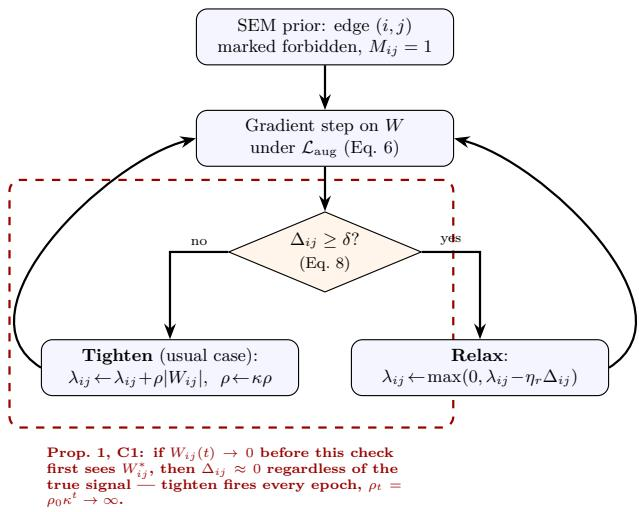
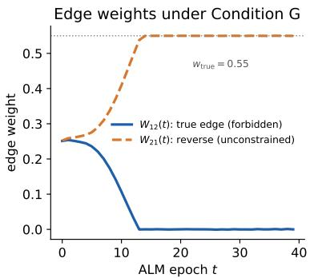
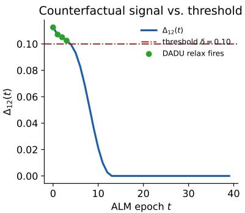
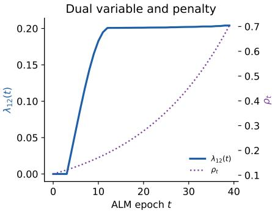
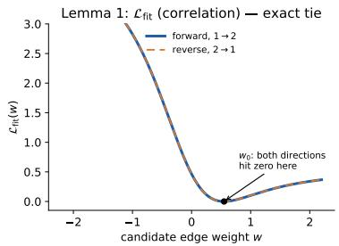
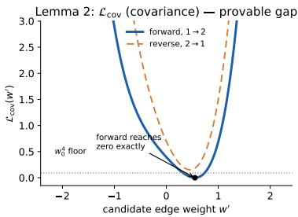
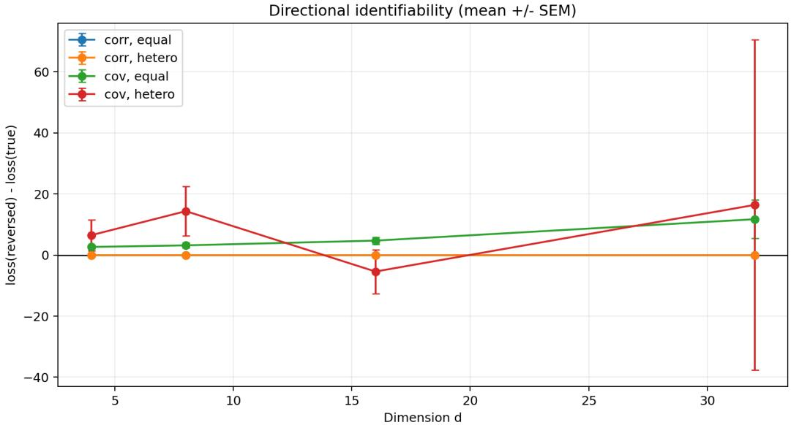
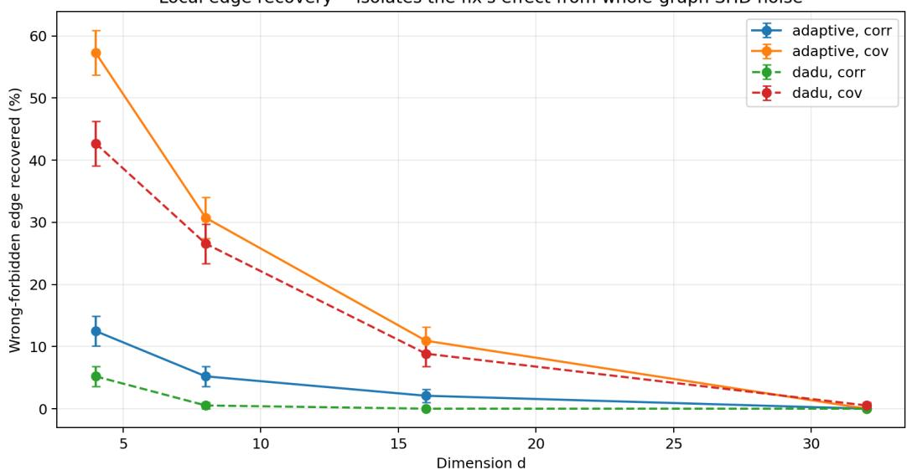
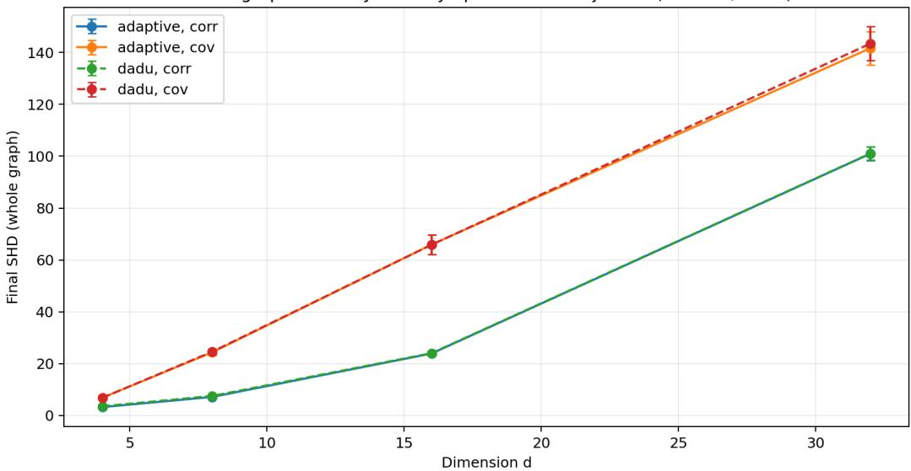

# Guide, Not Bind: Why Defeasible Priors Fail in Augmented Lagrangian Causal Discovery

Sairam Sundararaman∗ pes1ug23am257@pesu.pes.edu   
Department of Computer Science (AI & ML)   
PES University   
Sara Girdhar∗ pes1ug23am273@pesu.pes.edu   
Department of Computer Science (AI & ML)   
PES University   
Manit Narasimha Murthy pes1ug23cs348@pesu.pes.edu   
Department of Computer Science   
PES University   
Samrudh N pes1ug23cs507@pesu.pes.edu   
Department of Computer Science   
PES University   
Bhaskarjyoti Das bhaskarjyotidas@pes.edu   
Department of Computer Science (AI & ML)   
PES University

## Abstract

Diferentiable causal discovery methods increasingly encode expert priors as forbidden-edge constraints enforced by an Augmented Lagrangian (ALM) penalty, on the assumption that a data-adaptive relaxation mechanism will discount and eventually override a rule the data consistently contradicts. We show this design, which we call guide, not bind, fails for two independent, precisely characterized reasons, and that directly repairing both restores it only partially. First, sequential penalty-ramping ALM suppresses a wrongly-forbidden true edge before any counterfactual check can detect it: we give three necessary conditions any adaptive relaxation must satisfy to avoid this (Proposition 1), prove that DADU—the natural relaxation rule this paper introduces as the object of study—violates all three (Corollary 1), and confirm the failure across 3,072 training runs spanning graphs from 4 to 32 nodes, where a single wrong prior suppresses a true edge in 87–97% of trials under DADU. Second, and independent of any fix to the mechanism, we prove in closed form that the standard correlation-matching objective ties a true edge and its reverse to an identical cost of exactly $2 r ^ { 2 }$ (Lemma 1), not because the underlying equal-variance model is unidentifiable, but because normalizing to correlation discards exactly the variance information that would make it identifiable; covariance matching instead separates the two directions by a provable margin of at least $w _ { 0 } ^ { 4 }$ (Lemma 2). We build and test the fix our own diagnosis specifies— a relaxation operator satisfying all three necessary conditions, combined with covariance matching—and find that across 768 paired trials on identical graphs it recovers a wronglyforbidden edge 27 to 52 times more often than DADU does $( p < 1 0 ^ { - 5 } )$ , yet the majority of the suppressed edge’s weight is still absorbed by its unconstrained reverse direction rather than restored to the correct one. Finally, we ask whether either obstruction is an artifact of the correlation-matching objective our testbed uses, by re-running the full sweep under the actual least-squares and likelihood objectives Notears/Dagma and golem use: the identifiability tie is indeed correlation-specific and disappears under both, exactly as our

diagnosis predicts, but the suppression mechanism is not—it worsens under a likelihood objective, which suppresses the wrongly-forbidden edge in 96–100% of trials, more often than correlation matching does. A provably-identifying objective, it turns out, is neither necessary nor suficient protection against a penalty schedule that never gave the data a chance to be heard.

## 1 Introduction

Consider a practitioner building a diferentiable causal discovery system who holds one piece of domain knowledge with less than full confidence—say, that material does not determine shape. The standard advice against encoding this as a hard constraint is well known: a hard constraint is unforgiving, and a single incorrect one cannot be corrected by any amount of data. The better-motivated design is to treat such a rule as a prior—something the learner trusts by default, discounts as evidence accumulates against it, and overrides outright once that evidence is consistent and strong. This is not a new idea: it is the logic behind empirical-Bayes shrinkage and spike-and-slab priors, where a point-mass belief yields to suficient likelihood evidence rather than remaining fixed in advance. Stated this way, the design is less a choice than a piece of common sense: a prior should guide the learner, not bind it.

This instinct has a natural implementation in diferentiable causal discovery. Such methods already recover DAGs by gradient descent on continuous relaxations of acyclicity (Zheng et al., 2018; Bello et al., 2022; Ng et al., 2020; Lachapelle et al., 2020; Yu et al., 2021), and already carry the machinery to enforce a hard constraint on that relaxation: an Augmented Lagrangian (ALM), the same tool these methods use to enforce acyclicity itself (Hestenes, 1969; Powell, 1969; Bertsekas, 2014). So encoding a forbidden edge costs nothing new—penalize the learner for violating it, and grow that penalty over training with an ALM. One further piece makes the constraint defeasible: periodically check whether the data supports the forbidden edge regardless, and relax the penalty if it does. On paper, this is exactly guide, not bind. It has the right shape, built entirely from parts these methods already use, and it should work.

It does not, and the first reason is not something a better threshold can fix. The adaptive check works by asking a counterfactual: if this edge were removed right now, how much worse would the fit become? That is a meaningful question to ask of an edge still near its data-supported value. It is not a meaningful question to ask of an edge the penalty has already driven to near zero—an edge that is already gone in all but name will correctly report that removing it costs almost nothing, regardless of what the data actually wanted. Sequential penalty-ramping ALM grows the constraint geometrically, and does so before the adaptive check ever gets a chance to look; by the time the check runs, there is usually nothing left for it to see. We call this the early suppression trap. Sweeping the correction threshold across a wide range changes nothing, because the evidence the threshold is meant to act on has already been erased before any threshold is applied. This part of the failure has nothing to do with causal discovery specifically: it is a statement about what happens when a penalty is allowed to race ahead of the check meant to keep it honest, and it recurs anywhere a defeasible constraint is enforced by a penalty that grows on a fixed schedule—the classical ALM convergence theory that guarantees the multiplier diverges when a constraint is genuinely incompatible with the data (Bertsekas, 2014) says nothing about what an adaptive relaxation operator sees while that divergence is still in progress, and it is exactly that blind spot the early suppression trap exploits.

Suppose this is fixed: suppose the check runs earlier, evaluated before the penalty has done any damage, so it always sees the edge at its true, data-supported value. This should settle the matter. It does not, and the second reason is more interesting than the first, because it survives a perfect fix to the first one. An early, honestly-timed check compares how well the model fits with a candidate edge in each of its two possible directions. If that comparison cannot tell a true edge from its reverse in the first place, evaluating it early buys nothing—the check will faithfully report that both directions look equally good, because, under the objective these methods use, they are. This should be surprising: the model class in question assumes every variable has the same noise variance, and it is a known fact that under that assumption, causal direction is in principle recoverable from data alone (Peters & Bühlmann, 2014). The tie, in other words, is not inherited from an unidentifiable model. Something else discards the very signal that would make identification possible, and it turns out to be one specific, avoidable modeling choice: comparing normalized correlation instead of raw covariance throws away exactly the variance asymmetry that equal-variance identifiability depends on. This is a narrower claim than it might sound: correlation matching is one fitting objective among several used in this literature, not the only one, and part of what this paper does is find out whether the tie is a property of that specific choice or of forbidden-edge enforcement more broadly—a question the diagnosis alone cannot answer and that we return to with a direct test in Section 7.3.

Two questions remain even once both diagnoses are in hand. Is a mechanism satisfying our three necessary conditions actually buildable, or only specifiable? And if it is built, and combined with covariance matching as our own analysis prescribes, does it recover a wrongly-forbidden true edge, or does some third obstacle appear once the first two are cleared? We build such a mechanism and test it directly. The answer is instructive rather than clean: across matched pairs of identical random graphs, the combined fix recovers the wrongly-forbidden edge far more often than DADU does—a diference too large to be chance. But recovery remains the minority outcome. In most trials, the weight the forbidden penalty pushes out of the true edge is absorbed by its unconstrained reverse, not restored to the correct direction—the tie our own Lemma 1 predicts, appearing not as a closed-form curiosity but as the dominant failure mode of a system built specifically to avoid it. Fixing the two obstructions we diagnose is necessary. It is not suficient.

A further question follows directly from how the paper is set up so far: everything above is proved and measured on a single fitting objective, correlation matching, that we chose for the testbed rather than one drawn from an existing, deployed system. Nothing in the argument requires this choice, and the actual objectives used by Notears (Zheng et al., 2018), Dagma (Bello et al., 2022), and golem (Ng et al., 2020) fit least-squares reconstruction or likelihood on raw, unnormalized data instead. A reader who accepts our diagnosis in Remark 1—that the tie comes specifically from discarding scale information, not from forbidden-edge enforcement in general—should expect that tie to vanish once scale is put back. We test this directly rather than leaving it as a plausible inference: Section 7 re-runs the entire sweep under a Notears/Dagma-style least-squares objective and a golem-EV-style likelihood objective, both written as exact reconstructions of the objectives those methods actually optimize. The identifiability side of the diagnosis survives this test cleanly. The suppression side does not, and not in the reassuring direction: the likelihood objective, which sidesteps the tie exactly as predicted, turns out to suppress the wrongly-forbidden edge more often than correlation matching does, not less. Untangling why a fix to one obstruction can leave the other one worse is a large part of what the rest of this paper is about.

This paper gives all four findings—the two failures, the partial fix, and the test of whether either failure is specific to our testbed’s objective—a precise, tested treatment.

1. The early suppression trap (Section 4): three necessary conditions for any data-adaptive relaxation to avoid irreversible suppression (Proposition 1), and a proof that DADU—the natural relaxation rule this paper introduces as the object of study, not a rule drawn from an existing published implementation— violates all three simultaneously once suppression begins (Corollary 1).

2. An exact identifiability barrier, correctly attributed (Section 5): a closed-form proof that correlation matching ties a true edge and its reverse exactly (Lemma 1); a precise account of why this follows from discarding marginal-variance information rather than from any inherent non-identifiability of the underlying model (Peters & Bühlmann, 2014); a closed-form proof that covariance matching instead provably separates the two directions (Lemma 2); and a generalization of the same mechanism to any Markov-equivalence-preserving edge reversal (Proposition 2).

3. A combined mechanism, built and tested (Section 6): a relaxation operator that operationalizes all three necessary conditions of Proposition 1 (Proposition 3), evaluated together with covariance matching on 768 paired synthetic instances. The combined fix significantly outperforms DADU $( p < 1 0 ^ { - 5 } )$ but recovers the correct edge in the minority of trials, with the unconstrained reverse edge remaining the dominant attractor.

4. A test of whether either obstruction is testbed-specific (Section 7.3): the full sweep re-run under a least-squares objective matching Notears/Dagma and a likelihood objective matching golem-EV, confirming that Obstruction II is specific to correlation matching while Obstruction I is not—and that the likelihood objective, the one this literature already treats as the safe choice, suppresses more often than the objective we spend the rest of the paper criticizing.

5. A broad empirical validation (Section 7): all of the above evaluated across 6,144 training runs spanning graphs from 4 to 32 nodes, two edge densities, three noise scales, both equal-variance and heteroscedastic noise, and four fitting objectives, reporting only what this controlled synthetic sweep directly supports.

Two things are worth stating plainly before the technical sections begin, since they bound what the rest of the paper can and cannot claim. The first is scope. The mechanism failure and the identifiability barrier apply to any ALM-based structure learner with sequential penalty ramping and a fitting objective from the family we test; all empirical results in this paper use synthetic linear Gaussian SEMs with known ground-truth structure, chosen specifically so that Sections 4 and 5’s claims can be checked exactly against a known answer rather than estimated from an uncertain one. This buys precision at the cost of not showing what either obstruction looks like once real-world measurement noise, concept extraction, or a non-Gaussian data-generating process is also in the loop—a cost we return to and itemize fully in Section 10. We are explicit throughout about which claims are proved, which are illustrated, and which remain open, and that section collects the open ones in one place.

The second is where this paper sits relative to what is already known. Diferentiable causal discovery’s Augmented Lagrangian machinery is borrowed wholesale from classical constrained optimization (Hestenes, 1969; Powell, 1969; Bertsekas, 2014), whose theory already tells us what happens if a constraint is simply wrong—the multiplier diverges—but says nothing about a relaxation operator racing that divergence in real time before it has a chance to detect the mistake, which is precisely the gap Obstruction I occupies. Encoding prior knowledge as a forbidden edge has a long history in discrete, constraint-based causal discovery (Spirtes et al., 2001; Borboudakis & Tsamardinos, 2012; Meek, 1995; Andrews et al., 2020), including direct evidence that one incorrect constraint can cascade through an entire recovered graph (Constantinou et al., 2023); what is new here is the specific failure that arises once the constraint is not fixed in advance but is instead enforced by a penalty that grows while training runs. On the identifiability side, the fact that linear Gaussian SEMs are recoverable only up to Markov equivalence in general (Peters et al., 2017; Verma & Pearl, 1990; Chickering, 2002) is well known, as are three routes around it—non-Gaussian noise (Shimizu et al., 2006), nonlinearity (Hoyer et al., 2008), and interventional or temporal data (Hauser & Bühlmann, 2012; Lippe et al., 2022)—but the fourth route, equal-variance identifiability (Peters & Bühlmann, 2014), is less widely appreciated, and to our knowledge no prior work has asked what a correlation-based fitting objective costs a model class that already satisfies it. We discuss the closest related strands in optimization stability (Nazaret et al., 2024; Waxman et al., 2024; Yi et al., 2025), neuro-symbolic learning (Manhaeve et al., 2018; De Raedt et al., 2019; Marconato et al., 2023), and soft, score-integrated priors (Darvariu et al., 2024) at length in Section 9, after the technical machinery those comparisons depend on has been introduced.

## 2 Background

This section fixes the objects the rest of the paper manipulates: structural equation models and the diferentiable relaxation used to fit them (§2.1), the Augmented Lagrangian machinery used to enforce a prior constraint on them (§2.2), and the precise sense in which a fitted model’s causal direction can, or cannot, be recovered from data alone (§2.3). Each subsection states one definition and the one fact about it this paper depends on; a reader already fluent in diferentiable causal discovery can proceed directly to Section 3, which specializes everything here to this paper’s exact objective.

## 2.1 Structural Equation Models and Diferentiable Discovery

Recovering a causal graph from data requires first fixing what a causal graph is and what recovering one means.

Definition 1 (Linear Gaussian SEM). A linear Gaussian structural equation model (SEM) over $\mathbf { z } =$ $( z _ { 1 } , \ldots , z _ { d } ) \in \mathbb { R } ^ { d }$ is a pair (W, Σε) with $W \in \mathbb { R } ^ { d \times d }$ zero-diagonal, $\Sigma _ { \varepsilon } \succ 0 , I - W$ invertible, satisfying

$$
\begin{array} { r } { \mathbf { z } = W ^ { \top } \mathbf { z } + \varepsilon , \qquad \varepsilon \sim \mathcal { N } ( \mathbf { 0 } , \Sigma _ { \varepsilon } ) . } \end{array}\tag{1}
$$

$W _ { i j } \neq 0$ is read as: variable $j$ is a direct cause of variable i. The associated graph places a directed edge $j \to i$ for every nonzero $W _ { i j } ;$ the model is acyclic $i f f$ this graph is a DAG, equivalently if W is permutation-similar to a strictly upper-triangular matrix.

Solving Eq. 1 for z gives the implied covariance $\Sigma _ { \mathrm { S E M } } ( W ) = ( I - W ) ^ { - 1 } \Sigma _ { \varepsilon } ( I - W ) ^ { - \top } .$ —the only property of $( W , \Sigma _ { \varepsilon } )$ an i.i.d. sample of z can constrain, and consequently the only handle any estimation procedure has on W. Causal discovery recovers W, in particular its direction, from such a sample without ever intervening on any $z _ { i } .$ . Classical algorithms search directly over the discrete space of DAGs, whose size grows super-exponentially in d; diferentiable causal discovery replaces this search with continuous optimization by relaxing acyclicity to a smooth regularizer $h ( W ) \geq 0$ , zero if W is acyclic, and minimizing a smooth fit loss $\ell ( W )$ plus $\beta h ( W )$ by gradient descent (Zheng et al., 2018; Bello et al., 2022). We use Dagma’s log-determinant regularizer throughout, hs(W) = − log det(sI −W ◦W)+d log s (Bello et al., 2022); Section 3 fixes ℓ to the specific choice this paper’s core results depend on, and Section 7.3 substitutes two alternatives drawn directly from the literature.

## 2.2 Augmented Lagrangian Enforcement of Prior Constraints

Practitioners frequently hold knowledge that some entries of W are zero—a physical fact, such as material not determining shape—before observing any data. Encoding it requires a mechanism for enforcing a hard constraint on a continuous optimization problem.

Definition 2 (Augmented Lagrangian enforcement). Let $M \in \{ 0 , 1 \} ^ { d \times d }$ mark entries of W known to be zero, and let $c ( W ) : = \| W \circ M \| _ { 1 }$ . The Augmented Lagrangian method (ALM) (Hestenes, 1969; Powell, 1969; Bertsekas, 2014) enforces $c ( W ) = 0$ by minimizing, jointly with the base objective $\ell ( W ) + \beta h ( W )$ , the augmented term $\begin{array} { r } { \lambda c ( W ) + \frac { \rho } { 2 } c ( W ) ^ { 2 } } \end{array}$ , alternating a gradient step on W with dual ascent on the multiplier λ,

$$
\lambda  \lambda + \rho c ( W ) , \qquad \rho  \kappa \rho , \quad \kappa > 1 ,\tag{2}
$$

with ρ typically ramped geometrically (penalty ramping) rather than held fixed.

The one fact about Definition 2 this paper depends on is due to Bertsekas (2014): if $c ( W ) = 0$ is incompatible with the unconstrained minimizer of $\ell + \beta h$ , the multiplier sequence diverges, $\lambda _ { t } \to \infty$ . Every standard use of ALM— in constrained optimization generally (Nandwani et al., 2019; Chamon & Ribeiro, 2020; Cotter et al., 2019; Achiam et al., 2017) and in diferentiable causal discovery specifically (Zheng et al., 2018; Bello et al., 2022)—presumes $c ( W ) = 0$ is correctly specified, in which case this divergence is precisely the intended behavior: an always-true constraint should be enforced ever more strictly. A defeasible constraint is one where $c ( W ) = 0$ might itself be wrong, and where the enforcement mechanism must therefore also be able to relax λ when the data disagrees; Section 3 specifies the exact relaxation rule this paper studies, and Section 4 shows what Bertsekas’s divergence result implies for that rule once $\rho$ is ramped geometrically rather than held fixed.

## 2.3 Markov Equivalence and Identifiability

Two SEMs with diferent W can imply the same distribution over z. When this happens, no amount of observational data—however collected or analyzed—can determine which one generated it; the ambiguity is a property of the data, not a limitation of any particular estimator.

Definition 3 (Markov equivalence). Two DAGs are Markov equivalent if every distribution consistent with one is consistent with the other under some choice of parameters. For $D A G s ,$ this holds exactly when the graphs share a skeleton (the same edges, ignoring direction) and the same v-structures (Verma & Pearl, 1990), a characterization made algorithmically complete by Meek (1995); Chickering (2002); Andrews et al. (2020).

Under a general noise covariance $\Sigma _ { \varepsilon }$ , a linear Gaussian SEM is identifiable only up to its Markov equivalence class (Peters et al., 2017): reversing an edge, in general, leaves an equally good explanation running the other way. Three routes are known to restore identifiability by breaking this symmetry: non-Gaussian noise (Shimizu et al., 2006), nonlinearity (Hoyer et al., 2008), and interventional or temporal data (Hauser & Bühlmann, 2012; Lippe et al., 2022). A fourth route, central to this paper, requires none of these.

Definition 4 (Equal-variance identifiability). $I f \Sigma _ { \varepsilon } = \sigma ^ { 2 } I$ —every exogenous noise term has the same variance— Peters & Bühlmann $( 2 0 1 \llcorner )$ show the DAG is generically identifiable from $\Sigma _ { \mathrm { S E M } } ( W )$ alone: a variable further downstream in the causal order accumulates strictly greater marginal variance under equal innovation variance, and comparing marginal variances across nodes recovers direction, with no non-Gaussianity or intervention required.

Definition 4 matters here because $\Sigma _ { \varepsilon } = I$ is already the noise model Section 3 assumes: the question this paper asks is therefore not whether that model is identifiable—it is—but whether a given fit loss ℓ actually exploits the signal Definition 4 says is present. Section 5 shows that fitting normalized correlation rather than covariance discards it. Correlation-matching is not the only ℓ used in diferentiable causal discovery—Notears, Dagma, and golem (Ng et al., 2020) fit least-squares or likelihood objectives that retain scale information—but it is the choice this paper’s core testbed makes, and Section 5 traces the failure to that specific, avoidable step rather than to diferentiable causal discovery generally. Section 7.3 makes this distinction load-bearing rather than rhetorical, by substituting the two alternatives directly.

## 3 Setup: Defeasible Priors via Augmented Lagrangian

We assume n i.i.d. samples $\mathbf { z } _ { 1 } , \ldots , \mathbf { z } _ { n } \in \mathbb { R } ^ { d }$ from a linear Gaussian SEM (Eq. 4 below) with unknown zero-diagonal weight matrix W, and form the empirical covariance

$$
{ \hat { \boldsymbol { \Sigma } } } = { \frac { 1 } { n } } \sum _ { i = 1 } ^ { n } ( \mathbf { z } _ { i } - { \bar { \mathbf { z } } } ) ( \mathbf { z } _ { i } - { \bar { \mathbf { z } } } ) ^ { \top } , \qquad { \bar { \mathbf { z } } } = { \frac { 1 } { n } } \sum _ { i = 1 } ^ { n } \mathbf { z } _ { i } .\tag{3}
$$

We assume a linear Gaussian structural equation model

$$
{ \bf z } = W ^ { \top } { \bf z } + \varepsilon , \qquad \varepsilon \sim \mathcal { N } ( { \bf 0 } , I ) ,\tag{4}
$$

with $W \in \mathbb { R } ^ { d \times d }$ , zero diagonal, and acyclicity enforced softly via the Dagma log-determinant regularizer $h ^ { s } ( W ) = - \log \operatorname* { d e t } ( s I - W \circ W ) + d \log s$ (Bello et al., 2022). Our core testbed fits W by minimizing the Frobenius distance between normalized correlation matrices,

$$
\mathcal { L } _ { \mathrm { f t } } ( W ) = \left. \mathrm { c o r r } \bigl ( \Sigma _ { \mathrm { S E M } } ( W ) \bigr ) - \mathrm { c o r r } ( \hat { \Sigma } ) \right. _ { F } ^ { 2 } , \qquad \Sigma _ { \mathrm { S E M } } ( W ) = ( I - W ) ^ { - 1 } ( I - W ) ^ { - \top } .\tag{5}
$$

Equation 5 is the single most consequential design choice in Sections 3 through 6: it is the source of Obstruction II, we return to it directly in Section 5, and Section 7.3 tests what changes when it is replaced.

The forbidden-edge prior. A binary mask $M \in \{ 0 , 1 \} ^ { d \times d }$ marks physically-implausible edges. We enforce $\| W \circ M \| _ { 1 } = 0$ via an Augmented Lagrangian term with per-edge dual variables $\lambda _ { i j }$

$$
\begin{array} { r } { \mathcal { L } _ { \mathrm { a u g } } = w _ { f } \mathcal { L } _ { \mathrm { f i t } } + \gamma \| W \| _ { 1 } + \lambda ^ { \top } ( | W | \circ M ) \mathbf { 1 } + \frac { \rho } { 2 } \big ( \| W \circ M \| _ { 1 } \big ) ^ { 2 } + \beta _ { h } h ^ { s } ( W ) , } \end{array}\tag{6}
$$

updated by standard dual ascent with a geometrically growing penalty,

$$
\lambda _ { i j }  \lambda _ { i j } + \rho \cdot \vert W _ { i j } \vert \cdot M _ { i j } , \qquad \rho  \kappa \rho , \quad \kappa > 1 .\tag{7}
$$

Guide, not bind requires a mechanism that can also move $\lambda _ { i j }$ back down when a forbidden edge turns out to be data-supported. The natural candidate—compute a counterfactual cost $\Delta _ { i j } = \mathcal { L } _ { \mathrm { f i t } } ( W \mid W _ { i j } = 0 ) - \mathcal { L } _ { \mathrm { f i t } } ( W )$ and relax $\lambda _ { i j }$ whenever $\Delta _ { i j }$ exceeds a threshold δ—is what we call the Data-Adaptive Dual Update (DADU):

$$
\lambda _ { i j } \gets \operatorname* { m a x } ( 0 , ~ \lambda _ { i j } - \eta _ { r } \Delta _ { i j } ) \quad \mathrm { i f } ~ \Delta _ { i j } \geq \delta , \qquad \mathrm { e l s e ~ t i g h t e n ~ a s ~ i n ~ E q . ~ 7 . }\tag{8}
$$

We call this rule DADU because it is the natural instantiation of guide-not-bind’s own stated logic—a data-adaptive check on the dual update—rather than a rule drawn from an existing published implementation; we introduce it here as the object of study, precisely so that Sections 4 and 5 can show why the natural design fails rather than only that some particular published system does. Sections 4 and 5 show that $\operatorname { E q }$ . 8 fails to realize guide, not bind, for two unrelated reasons: it evaluates $\Delta _ { i j }$ too late to matter (Obstruction I), and even evaluated in time, $\Delta _ { i j }$ under $\operatorname { E q } .$ 5 cannot tell a data-supported edge from its reverse (Obstruction II).

Figure 1: The defeasible-prior enforcement loop this paper studies. Once an edge $( i , j )$ is marked forbidden $( M _ { i j } = 1 )$ , every training epoch alternates a gradient step on the structure-learning objective $\mathcal { L } _ { \mathrm { a u g } } ~ ( \mathrm { E q . ~ 6 ) }$ with a counterfactual check: does removing edge (i, j) right now cost the fit at least δ in loss $( \mathrm { E q . ~ } 8 ) ?$ If so, the constraint is relaxed. If not, it is tightened, and the penalty weight ρ grows geometrically regardless of which branch is taken. This loop implements guide, not bind whenever the check can be trusted. The dashed region marks where that trust breaks down: Proposition 1’s Condition C1 shows that once the forbidden edge has already been driven near zero, the counterfactual check becomes uninformative by construction, and the loop takes the tighten branch every remaining epoch even when (i, j) was a true, data-supported edge—the early suppression trap of Section 4.

## 4 Obstruction I: The Suppression Mechanism

This section states three necessary conditions any data-adaptive relaxation must satisfy to avoid irreversibly suppressing a wrongly-forbidden true edge, shows DADU violates all three, and confirms the resulting failure on a fully controlled synthetic instance.

Proposition 1 (Necessary conditions for data-adaptive relaxation). Let $W _ { i j } ^ { * }$ denote the unconstrained optimum of ${ \mathcal { L } } _ { \mathrm { f i t } }$ and let $W _ { i j } ( t )$ denote the weight at epoch t under $\rho _ { t } = \rho _ { 0 } \kappa ^ { t }$ . For any data-adaptive relaxation operator R applied to $\lambda _ { i j }$ to prevent irreversible suppression of a data-supported forbidden edge, the following are necessary under the first-order local analysis this proposition is stated in (we return to the scope of that qualification in Section 10).

C1 (Pre-suppression evaluation). $\Delta _ { i j }$ must be evaluated at or near $W _ { i j } ^ { * }$ before penalty mass accumulates: if instead evaluated at a suppressed $W _ { i j } ( t ) \approx 0$ , then $\Delta _ { i j } ( t ) \approx 0$ for any data-generating process, and R cannot distinguish a genuinely absent edge from a suppressed data-supported one.

C2 (Rate condition). The growth rate κ must satisfy

$$
\kappa < 1 + \frac { \eta _ { r } \cdot \partial \mathcal { L } _ { \mathrm { f i t } } / \partial W _ { i j } \big | _ { W _ { i j } ^ { * } } } { \rho _ { 0 } \cdot W _ { i j } ^ { * } } .\tag{9}
$$

If violated, the penalty accumulates faster than any additive relaxation step can counteract, regardless of the signal strength $\Delta _ { i j }$ . Eq. 9 is derived from a first-order expansion of $\Delta _ { i j }$ around $W _ { i j } ^ { * }$ , so it is necessary under that local approximation; a fully optimizer-agnostic version is not established here.

C3 (Operator condition). R must be able to move $\lambda _ { i j }$ against the direction of tightening, via a slack-variable formulation decoupling the dual variable from the penalty, or an explicit ceiling on $\lambda _ { i j } ,$ the plain ascent step in Eq. 7 provides neither.

Proof. See Appendix A.

Corollary 1 (DADU violates all three conditions simultaneously). The Data-Adaptive Dual Update, DADU $( E q . \ 8 )$ , violates C1, C2, and C3 of Proposition 1 simultaneously, for every threshold $\delta > 0$ , once suppression begins.

## Proof. See Appendix B.

The trap follows from the asymmetry between exponential tightening and linear relaxation. DADU’s relaxation step subtracts a quantity proportional to $W _ { i j } ( t ) ;$ once $W _ { i j } ( t )$ ≈ 0 this vanishes. The suppression window closes at approximately

$$
T ^ { * } \approx \frac { \log ( \alpha w _ { 0 } / \rho _ { 0 } ) } { \log \kappa } ,\tag{10}
$$

where $w _ { 0 } = W _ { i j } ^ { * }$ is the unconstrained edge weight and α is the local curvature of ${ \mathcal { L } } _ { \mathrm { f i t } }$ at $W _ { i j } ^ { * } ;$ this is a first-order estimate, not a tight bound. After epoch $T ^ { * } , \Delta _ { i j }$ remains near zero for all subsequent epochs regardless of $\delta ,$ $\eta _ { r }$ , or causal signal strength: recovery within any finite training horizon is impossible. Section 7 confirms this across graphs from 4 to 32 nodes: under a wrongly-forbidden true edge, DADU suppresses it in 87–97% of trials depending on graph size.

## 4.1 Independent Synthetic Verification

The dynamics above are proved for the general case; here we watch them happen on a fully controlled instance, with no additional variables and no observation noise beyond the model’s own.

The true edge is $1  2$ with weight $w _ { 0 } = 0 . 5 5$ . Under the correct prior (the genuinely-absent edge $2  1$ forbidden), training recovers $W _ { 1 2 } = 0 . 5 5 0$ against the true 0.550. Under the wrong-forbidden condition (the true edge $1  2$ forbidden instead), Figure 2 shows what Corollary 1 predicts happening in real time: $W _ { 1 2 } ( t )$ is driven to $\Delta _ { 1 2 } \approx 0$ by epoch 14, and a δ-sweep over {0.01, 0.05, 0.10, 0.20, 0.50} changes the final outcome by less than $1 0 ^ { - 3 } \mathrm { - t h e }$ failure genuinely does not depend on where the threshold is set.

  
Figure 2: The early suppression trap on a fully controlled synthetic instance (Section 4.1), true edge $1  2$ with $w _ { 0 } = 0 . 5 5$ , the wrong-forbidden condition, $\delta = 0 . 1 0$ $L e f t$ : the forbidden true edge $W _ { 1 2 } ( t )$ collapses to zero by epoch 14 while the unconstrained reverse edge $W _ { 2 1 } ( t )$ grows to the same magnitude as w —Lemma 1’s tie appearing inside a live optimization trajectory. Center: the counterfactual signal $\Delta _ { 1 2 } ( t )$ against the threshold $\delta ;$ green markers show where DADU’s relax branch fires, all early, before the reverse edge has taken over the fit. Right: the dual variable $\lambda _ { 1 2 } ( t )$ and penalty $\rho _ { t } ; \lambda _ { 1 2 }$ plateaus once $W _ { 1 2 } \approx 0 .$ , since tightening a weight already near zero adds almost nothing further.

The reverse edge $W _ { 2 1 } ( t )$ converges to 0.5496—the same magnitude as $w _ { 0 }$ , not an arbitrary value. This is Lemma 1 manifesting inside an actual optimization trajectory: because the correlation implied by a weight w is direction-symmetric, once the true edge is suppressed, ${ \mathcal { L } } _ { \mathrm { f i t } }$ is satisfied just as well by routing the same weight through the wrong direction, and the unconstrained reverse edge does exactly that. At $\delta = 0 . 0 1$ the most permissive threshold tested, DADU’s relax branch fires in 24 of 40 epochs, and the true edge is suppressed anyway: by the time relaxation triggers, the reverse edge has already absorbed the job of fitting the correlation, leaving no gradient pressure to pull $W _ { 1 2 }$ back up. Relaxation firing is not the same as relaxation working. Section 7 shows the same pattern holds at scale.

## 5 Obstruction II: The Identifiability Limit

Suppose C1–C3 were satisfied: a relaxation operator evaluates $\Delta _ { i j }$ at $W _ { i j } ^ { * }$ , before any suppression, and can freely move $\lambda _ { i j }$ down. Is that enough to recover a wrongly-forbidden true edge? This section shows it is not, under the fitting objective this section’s testbed uses, and traces the failure to a specific, correctable cause.

## 5.1 The Isolated-Edge Setting

We isolate the mechanism on the simplest case where it is exact: two variables $z _ { 1 } , z _ { 2 }$ connected by at most one directed edge. Write the forward model as $z _ { 1 } = \varepsilon _ { 1 } , \ z _ { 2 } = w z _ { 1 } + \varepsilon _ { 2 }$ and the reverse model as $z _ { 2 } = \varepsilon _ { 2 } ^ { \prime } , \ z _ { 1 } = w ^ { \prime } z _ { 2 } + \varepsilon _ { 1 } ^ { \prime }$ , with all exogenous noise i.i.d. $\mathcal { N } ( 0 , 1 )$ . Direct computation gives implied covariances

$$
\Sigma _ { \right. } ( w ) = \binom { 1 } { w } \ \begin{array} { c } { { w } } \\ { { 1 + w ^ { 2 } } } \end{array} \ , \qquad \Sigma _ { \left. } ( w ^ { \prime } ) = \binom { 1 + w ^ { \prime 2 } \quad w ^ { \prime } } { w ^ { \prime } } ,\tag{11}
$$

and correlations corr $\smash { \to ( w ) = \mathrm { c o r r } _ {  } ( w ^ { \prime } ) = w / \sqrt { 1 + w ^ { 2 } } }$ —the same function of the free parameter regardless of direction. We write $g ( w ) : = w / \sqrt { 1 + w ^ { 2 } }$ , an odd, strictly increasing bijection $\mathbb { R } \to ( - 1 , 1 )$

## 5.2 Lemma 1: The Tie Under Correlation Matching

Lemma 1 (Exact directional tie under correlation matching). Let $r \in ( - 1 , 1 ) \setminus \{ 0 \}$ be a target correlation and let $w _ { 0 } = g ^ { - 1 } ( r )$ . Restricted to the isolated pair $\{ 1 , 2 \} , \mathcal { L } _ { \mathrm { f i t } }$ from Eq. 5 satisfies:

(i) Both the forward model at $w = w _ { 0 }$ and the reverse model at $w ^ { \prime } = w _ { 0 }$ attain the exact global minimum ${ \mathcal { L } } _ { \mathrm { f i t } } = 0 .$

(ii) Consequently $\Delta _ { 1 \to 2 } = \Delta _ { 2 \to 1 } = 2 r ^ { 2 }$ , exactly, in closed form.

Proof. See Appendix C.

Lemma 1 is exact—an algebraic identity in the population limit, not an approximation from a finite run.1 No $\delta _ { \mathrm { p r e } }$ threshold applied to $\Delta _ { i j }$ can ever separate a wrongly-forbidden true edge from its correctly-forbidden reverse, because there is, by construction, nothing to separate.

Remark 1 (Why this is not simply Gaussian non-identifiability). It is tempting to read Lemma 1 as a restatement of the standard fact that linear Gaussian SEMs are identifiable only up to Markov equivalence (Peters et al., 2017). It is not. Peters & Bühlmann (2014) prove that when every exogenous noise term has equal variance—exactly the model in Eq. 4—the DAG is generically identifiable from the population covariance matrix alone: a variable further downstream accumulates strictly more marginal variance under equal innovation variance $( \mathrm { V a r } ( z _ { 2 } ) = 1 + w ^ { 2 } \neq 1 = \mathrm { V a r } ( z _ { 1 } )$ whenever w $\neq 0$ in Eq. 11). Our model is therefore identifiable in principle. Lemma 1 shows that ${ \mathcal { L } } _ { \mathrm { { f i t } } }$ never gets the chance to use that signal, because it compares corr(·)—which forces both matrices to unit diagonal before comparison—rather than the raw covariance. The tie in Lemma 1 is therefore a property of this fitting objective, not of the underlying causal model, and predicts that any objective which does not force unit diagonal should restore separation. We test this prediction directly, on the exact objectives used by Notears/Dagma and golem, in Section 7.3.

## 5.3 Lemma 2: Separation Under Covariance Matching

Remark 1 makes a specific, checkable prediction: restoring the discarded variance information should restore separation. It does, exactly.

Lemma 2 (Exact directional separation under covariance matching). Let the true generating model be forward with weight $w _ { 0 } \ne 0$ , so the population covariance is $\Sigma ^ { * } = \Sigma _ {  } ( w _ { 0 } ) ( E q . \ { 1 1 } )$ . Define ${ \mathcal { L } } _ { \mathrm { c o v } } ( w ) =$ $\lVert \Sigma _ { \mathrm { m o d e l } } ( w ) - \Sigma ^ { * } \rVert _ { F } ^ { 2 }$ using the raw (non-normalized) covariance, for either direction. Then:

(i) min $_ w \mathcal { L } _ { \mathrm { c o v } } ^ {  } ( w ) = 0$ , attained at $w = w _ { 0 }$

(ii) For every w′, $\mathcal { L } _ { \mathrm { c o v } } ^ {  } ( w ^ { \prime } ) \geq w _ { 0 } ^ { 4 }$ , hence in $\mathrm { f } _ { w ^ { \prime } } \mathcal { L } _ { \mathrm { c o v } } ^ {  } ( w ^ { \prime } ) \geq w _ { 0 } ^ { 4 } > 0$

The two directions are therefore separated by a closed-form gap of at least $w _ { 0 . } ^ { 4 }$ , with no simulation required.

Proof. See Appendix D.

The bound $w _ { 0 } ^ { 4 }$ is not tight: the true minimizer of $\mathcal { L } _ { \mathrm { c o v } } ^ {  }$ solves the cubic $w ^ { \prime 3 } + w ^ { \prime } - w _ { 0 } = 0$ and gives a strictly larger gap. We keep the loose bound because it is closed-form and suficient; strict, nonzero separation is all the argument in Section 5.5 requires.

  
Figure 3: The two lemmas as one picture. Both panels plot fitting loss against a single candidate edge weight, at the true edge’s value $w _ { 0 } = 0 . 5 5 ;$ ; the true (forward) direction is solid blue, the reverse direction dashed orange. $L e f t$ (Lemma 1): under ${ \mathcal { L } } _ { \mathrm { { f i t } } }$ , the two curves are the same function—they lie exactly on top of each other, both reaching zero at $w _ { 0 }$ $R i g h t$ (Lemma 2): under ${ \mathcal { L } } _ { \mathrm { c o v } }$ , the two curves separate. The forward direction still reaches zero exactly at $w _ { 0 } ;$ the reverse direction is bounded below by the $w _ { 0 } ^ { 4 }$ floor at every candidate weight, including its own best case.

## 5.4 Proposition 2: Generalizing Beyond the Isolated Pair

Lemmas 1 and 2 are exact for the isolated pair. A general d-node graph with multiple true edges does not reduce to this algebra directly, because zeroing one edge can, through matrix inversion in $\Sigma _ { \mathrm { S E M } } ( W )$ , shift the fitted values of other edges. The underlying mechanism nonetheless generalizes, via the standard graphical characterization of Markov equivalence.

Proposition 2 (General-graph extension). Let G be a DAG satisfying Eq. $^ { 4 , }$ and let $( i , j )$ be a covered edge (Chickering, 2002): one whose reversal yields a DAG $G ^ { \prime }$ in the same Markov equivalence class as G (Verma & Pearl, 1990). Then there exists a reparameterization of $G ^ { \prime } - w h i c h$ may adjust edges other than $( i , j )$ itself, as Appendix E shows on a concrete example—reproducing G’s correlation matrix exactly. Consequently ${ \mathcal { L } } _ { \mathrm { f i t } }$ cannot separate the two directions at their respective optima: $\Delta _ { i j } ( W ^ { * } ) = \Delta _ { j i } ( W ^ { * } )$

Proof sketch. Two DAGs are Markov equivalent if they share a skeleton and the same v-structures (Verma & Pearl, 1990), and any two Markov-equivalent DAGs are connected by a sequence of covered edge reversals (Chickering, 2002; Meek, 1995). Markov equivalence guarantees that some reparameterization of $G ^ { \prime }$ reproduces G’s distribution exactly, hence the same correlation matrix; it does not guarantee that this reparameterization leaves every other edge weight unchanged, and in general it does not—Appendix E verifies this directly on a three-node covered reversal. What the correlation-matching objective can see is only the resulting correlation matrix, which is identical by construction; that is all Proposition 2 claims. Completeness of orientation rules for covered reversals is established by Andrews et al. (2020). □

Every wrongly-forbidden edge tested in Section 7 is drawn to be a covered edge of its ground-truth graph precisely so that Proposition 2 applies to it, not just Lemma 1’s two-node case.

## 5.5 What Is, and Is Not, Fixed

Lemma 2 removes the static obstruction: at the level of the fitting objective alone, covariance matching provably separates a true edge from its reverse, by a margin we can write down. It does not touch the dynamic obstruction from Section 4. If $W _ { i j } ( t ) \to 0$ under penalty ramping, any counterfactual—covariance-based or correlation-based—evaluated at that suppressed point still reads out near zero, by the same first-order argument as Proposition 1’s C1. Lemma 2 guarantees the ceiling is removable $i f$ the counterfactual is evaluated near $W ^ { * }$ ; it says nothing about whether a relaxation operator that also satisfies C1–C3 would, once combined with a covariance-based ${ \mathcal { L } } _ { \mathrm { f i t } }$ , actually recover a suppressed edge end to end. Section 6 builds exactly such an operator and tests this combined claim directly.

## 6 The Combined Mechanism

Section 5.5 leaves one claim untested: a relaxation operator satisfying Proposition 1’s three necessary conditions, combined with covariance matching, might recover a wrongly-forbidden true edge where DADU under correlation matching cannot. This section builds such an operator, AdaptiveRelax, states precisely which conditions it satisfies and how, and Section 7 reports what happens when it is run.

## 6.1 Construction

AdaptiveRelax replaces DADU’s counterfactual check and dual update $\left( \mathrm { E q . ~ } 8 \right)$ with three changes, one per necessary condition. Fix a probe length $P \geq 1$ , a probe step size $\eta _ { p } > 0 ;$ , a probe interval $T _ { p } \geq 1$ , and a dual ceiling $\Lambda _ { \operatorname* { m a x } } > 0$

Definition 5 (AdaptiveRelax). At every epoch t with t mod $T _ { p } = 0$ (and at $t = 0 )$ , given the live iterate $W ( t ) .$

(1) Probe. Freeze every entry of $W ( t )$ except $W _ { i j }$ , and take P local gradient steps on that coordinate alone, initialized at $W _ { i j } ( t )$ , minimizing ${ \mathcal { L } } _ { \mathrm { { f i t } } }$ with all other entries held fixed. Write $W _ { i j } ^ { \mathrm { p r o b e } } ( t )$ for the result.

(2) Local gradient. Let $g ( t ) : = \partial \mathcal { L } _ { \mathrm { f i t } } / \partial W _ { i j }$ , evaluated at $W ( t )$ with $W _ { i j }$ replaced by $W _ { i j } ^ { \mathrm { p r o b e } } ( t )$

(3) Counterfactual. Let $\Delta _ { i j } ^ { \mathrm { p r o b e } } ( t ) : = \mathcal { L } _ { \mathrm { f i t } } ( W ( t ) \mid W _ { i j } = 0 ) - \mathcal { L } _ { \mathrm { f i t } } \big ( W ( t ) \mid W _ { i j } = W _ { i j } ^ { \mathrm { p r o b e } } ( t ) \big )$

At every epoch (reusing the most recent probe when t mod $T _ { p } \ne 0 ,$ , update

$$
\kappa _ { \mathrm { e f f } } ( t ) : = \mathrm { m i n } \Bigg ( \kappa , ~ 1 + \frac { \eta _ { r } | g ( t ) | } { \rho _ { 0 } | W _ { i j } ^ { \mathrm { p r o b e } } ( t ) | + \epsilon } \Bigg ) ,\tag{12}
$$

$$
\lambda _ { i j } ( t + 1 ) : = \mathrm { c l i p } \left( \left\{ \begin{array} { l l } { { \lambda _ { i j } ( t ) + \rho _ { t } \left| W _ { i j } ( t ) \right| } } & { { i f \Delta _ { i j } ^ { \mathrm { p r o b e } } ( t ) < \delta , } } \\ { { \operatorname* { m a x } \left( 0 , \ \lambda _ { i j } ( t ) - \eta _ { r } \Delta _ { i j } ^ { \mathrm { p r o b e } } ( t ) \right) } } & { { i f \Delta _ { i j } ^ { \mathrm { p r o b e } } ( t ) \geq \delta , } } \end{array} \right. 0 , \ \Lambda _ { \operatorname* { m a x } } \right) ,\tag{13}
$$

$$
\rho _ { t + 1 } : = \kappa _ { \mathrm { e f f } } ( t ) \cdot \rho _ { t } .\tag{14}
$$

## 6.2 AdaptiveRelax Operationalizes C1–C3

Proposition 3 (AdaptiveRelax operationalizes Proposition 1). For every epoch $t ,$ AdaptiveRelax (Definition 5) satisfies:

(a) [C1, local form] $\Delta _ { i j } ^ { \mathrm { p r o b e } } ( t )$ is evaluated at $W _ { i j } ^ { \mathrm { p r o b e } } ( t )$ , obtained by $P \geq 1$ local descent steps from the live weight $W _ { i j } ( t )$ , rather than at $W _ { i j } ( t )$ itself.

(b) [C2] $\kappa _ { \mathrm { e f f } } ( t ) \leq 1 + \eta _ { r } | g ( t ) | / \big ( \rho _ { 0 } | W _ { i j } ^ { \mathrm { p r o b e } } ( t ) | \big )$ , i.e. Proposition $\mathit { 1 3 }$ necessary bound $( E q . \ g )$ , evaluated at the probed point.

(c) [C3] $\lambda _ { i j } ( t ) \leq \Lambda _ { \operatorname* { m a x } }$ for every t.

Proof. Given: AdaptiveRelax as in Definition 5, with $\Delta _ { i j } ^ { \mathrm { p r o b e } } ( t ) , g ( t ) , \kappa _ { \mathrm { e f f } } ( t )$ , and $\lambda _ { i j } ( t { + } 1 )$ defined by Eqs. 12–14.

(a) By construction, $\Delta _ { i j } ^ { \mathrm { p r o b e } } ( t )$ is a function of $W _ { i j } ^ { \mathrm { p r o b e } } ( t )$ , not of $W _ { i j } ( t )$

$$
\Delta _ { i j } ^ { \mathrm { p r o b e } } ( t ) = \mathcal { L } _ { \mathrm { f i t } } ( W ( t ) \mid W _ { i j } = 0 ) - \mathcal { L } _ { \mathrm { f i t } } \big ( W ( t ) \mid W _ { i j } = W _ { i j } ^ { \mathrm { p r o b e } } ( t ) \big ) .\tag{15}
$$

This establishes (a).

(b) For every $\epsilon > 0$

$$
\frac { \eta _ { r } | g ( t ) | } { \rho _ { 0 } | W _ { i j } ^ { \mathrm { p r o b e } } ( t ) | + \epsilon } \le \frac { \eta _ { r } | g ( t ) | } { \rho _ { 0 } | W _ { i j } ^ { \mathrm { p r o b e } } ( t ) | } ,\tag{16}
$$

so

$$
\kappa _ { \mathrm { e f f } } ( t ) = \mathrm { m i n } \left( \kappa , \ 1 + \frac { \eta _ { r } | g ( t ) | } { \rho _ { 0 } | W _ { i j } ^ { \mathrm { p r o b e } } ( t ) | + \epsilon } \right) \leq 1 + \frac { \eta _ { r } | g ( t ) | } { \rho _ { 0 } | W _ { i j } ^ { \mathrm { p r o b e } } ( t ) | } .\tag{17}
$$

This is exactly Eq. 9 evaluated at $W _ { i j } ^ { \mathrm { p r o b e } } ( t )$ , establishing (b).

(c) The $\mathrm { c l i p } ( \cdot , 0 , \Lambda _ { \mathrm { m a x } } )$ operation in Eq. 13 applies to both branches of the update, so

$$
\lambda _ { i j } ( t ) \leq \Lambda _ { \operatorname* { m a x } } \quad \mathrm { f o r ~ e v e r y ~ } t .\tag{18}
$$

This establishes (c) and completes the proof.

Remark 2 (What is, and is not, guaranteed). Proposition $1 ^ { \prime } s W _ { i j } ^ { * }$ is the coordinate of the global unconstrained minimizer of ${ \mathcal { L } } _ { \mathrm { { f i t } } }$ over all of W jointly. Definition 5’s $m _ { i j } ^ { \mathrm { p r o b e } } ( t )$ is instead a local, coordinate-wise descent point, computed with every other entry of W frozen at its live value $W ( t )$ —a value that may itself already be shaped by the ALM penalty on other constraints, the acyclicity regularizer, or an incomplete training trajectory. AdaptiveRelax therefore operationalizes C1 in a verifiable, local sense: $\Delta$ is always evaluated at a freshly re-optimized point rather than the stale live weight, but nothing in Proposition 3 guarantees $W _ { i j } ^ { \mathrm { p r o b e } } ( t )$ coincides with the true global $W _ { i j } ^ { * }$ . Section 7 reports what this gap costs in practice.

## 7 Broader Empirical Validation

This section evaluates four things on one shared testbed: whether Obstruction I (Section 4) and Obstruction II (Section 5) generalize beyond the minimal illustrations already given, whether AdaptiveRelax combined with covariance matching (Section 6) recovers a wrongly-forbidden edge in practice, and whether either obstruction is an artifact of the correlation-matching objective our core testbed uses rather than a property of forbidden-edge enforcement more broadly.

Setup. We draw random DAGs at $d \in \{ 4 , 8 , 1 6 , 3 2 \}$ nodes, edge probability (density) $\in \{ 0 . 1 5 , 0 . 3 0 \}$ , noise scale $\sigma \in \{ 0 . 5 , 1 . 0 , 2 . 0 \}$ , and either equal-variance or heteroscedastic exogenous noise, matching Eq. 4’s equalvariance assumption in the former case and testing outside it in the latter. For each of the 48 resulting cells we draw 16 independent graphs, each containing a covered edge (Proposition 2) marked wrongly-forbidden. Each graph’s data consists of $n = 5 0 0 ~ \mathrm { i . i . d }$ . samples used to form $\hat { \Sigma } \ ( \mathrm { E q . 3 } )$ . We train under every combination of relaxation operator (DADU or AdaptiveRelax) and fitting objective—correlation or covariance for the core results in Sections 7.1–7.5, plus two literature-matched objectives introduced in Section 7.3—for 40 epochs of 8 gradient steps each, matching Section 4.1’s schedule, using Adam (Kingma & Ba, 2014) at learning rate $5 \times 1 0 ^ { - 3 }$ with $\rho _ { 0 } = 0 . 1 , \kappa = 1 . 0 5 , \delta = 0 . 1 0 , \eta _ { r } = 0 . 0 1$ , and $w _ { f } = 5 . 0$ held fixed across every cell in the grid; we return to what holding $w _ { f }$ fixed costs the covariance objective specifically in Section 7.5. AdaptiveRelax’s own hyperparameters (probe length, probe learning rate, dual ceiling) are unchanged from Section 6 and are restated alongside the rest in Appendix F, together with the covered-edge sampling procedure. The same 16 graphs are reused across all operator–objective combinations within a cell, so every comparison below can be made on matched pairs. The correlation/covariance portion of the sweep gives 3,072 training runs; the full sweep including the two literature-matched objectives of Section 7.3 gives 6,144.

## 7.1 Obstruction I Generalizes Beyond the Minimal Illustration

Table 1 reports the fraction of trials in which the wrongly-forbidden edge is suppressed (final weight below 10% of its true value) under DADU, by graph size and fitting objective.

Table 1: Suppression rate (%) under DADU, by graph size d and fitting objective. Suppression stays above 87% for correlation matching and above 45% for covariance matching at every d tested, confirming Corollary 1 well beyond the two-node illustration of Section 4.1.
<table><tr><td>Objective</td><td> $d = 4$ </td><td> $d = 8$ </td><td> $d = 1 6$ </td><td> $d = 3 2$ </td></tr><tr><td>Correlation</td><td>91.1</td><td>95.3</td><td>97.4</td><td>87.0</td></tr><tr><td>Covariance</td><td>45.8</td><td>52.6</td><td>49.0</td><td>66.1</td></tr></table>

Covariance matching suppresses less often than correlation matching at every $d ,$ and the gap is largest at small d and narrows at $d = 3 2$ . We trace this to a rate-condition efect: at the unconstrained optimum, the magnitude of $\partial { \mathcal { L } _ { \mathrm { f i t } } } / \partial { W _ { i j } }$ under covariance matching exceeds that under correlation matching by a factor of roughly $1 . 3 \times 1 0 ^ { 4 }$ at $d = 4 , 4 . 0 \times 1 0 ^ { 2 }$ at $d = 8 .$ , and $7 7$ at $d = 1 6$ (six trials per $d ,$ equal-variance noise, $\sigma = 1 )$ A larger gradient makes Eq. 9’s necessary bound easier to satisfy under DADU’s fixed schedule, so covariance matching suppresses less often for reasons Proposition 1 already predicts—but the ratio itself shrinks quickly with $d ,$ consistent with the narrowing gap in Table 1. Section 7.3 asks the natural next question: does an objective already used in this literature, rather than our own proposed fix, do any better?

## 7.2 Obstruction II Generalizes Beyond the Minimal Illustration

We separately fit the true graph and its Proposition 2-reversed counterpart to population convergence (BFGS, independent of any training schedule), reporting the loss gap $\Delta _ { \mathrm { d i r } } = \mathcal { L } _ { \mathrm { f i t } } ^ { \left. } - \mathcal { L } _ { \mathrm { f i t } } ^ { \right. }$ at their respective optima.

Table 2: Directional loss gap $\Delta _ { \mathrm { d i r } }$ (mean ± standard error over 96 trials per cell) under equal-variance noise, by graph size and fitting objective. Correlation ties the two directions to floating-point precision at every $d$ (Lemma 1); covariance separates them by a significant, growing margin (Lemma 2).
<table><tr><td>Objective</td><td> $d = 4$ </td><td> $d = 8$ </td><td> $d = 1 6$ </td><td> $d = 3 2$ </td></tr><tr><td>Correlation</td><td> $- 6 . 8 \times 1 0 ^ { - 1 8 }$ </td><td> $- 1 . 5 \times 1 0 ^ { - 1 6 }$ </td><td> $- 1 . 3 \times 1 0 ^ { - 1 5 }$ </td><td> $- 1 . 5 \times 1 0 ^ { - 1 2 }$ </td></tr><tr><td>Covariance</td><td> $2 . 6 4 \pm 0 . 5 5$ </td><td> $3 . 1 6 \pm 0 . 8 0$ </td><td> $4 . 7 1 \pm 1 . 1 7$ </td><td> $1 1 . 7 1 \pm 6 . 3 1$ </td></tr></table>

  
Figure 4: Directional loss gap by graph size, fitting objective, and noise type (mean ± standard error, 96 trials per point: 16 reps $\times \ 2$ densities × 3 noise scales, matching Table 2’s aggregation). Correlation (flat, both noise types) sits at zero across the entire range of d tested, visually confirming Lemma 1’s tie holds independent of graph size. Covariance under equal-variance noise (matching Lemma 2’s assumption) is positive and grows with d; covariance under heteroscedastic noise is markedly less stable, consistent with the median-based reporting adopted in the text for that condition.

The correlation row confirms Lemma 1 holds exactly at every graph size tested, not only in the isolated two-node case: the tie is a property of the objective, and it does not weaken as the graph grows. The covariance row confirms Lemma 2’s separation is not merely a two-node artifact either; the gap is significant at every d (weakest at $d = 3 2$ , where the standard error is largest) and grows with graph size.

Under heteroscedastic noise—outside Eq. 4’s equal-variance assumption and therefore outside Lemma 2’s guarantee—the covariance advantage is substantially weaker: at $d = 3 2$ , the median directional gap is 0.002 at $\sigma = 0 . 5$ and 0.015 at $\sigma = 1 . 0$ , both consistent with no reliable directional signal once noise is heteroscedastic. At $\sigma = 2 . 0$ the raw loss values themselves grow into the thousands (mean $\bar { \mathcal { L } } _ { \mathrm { f i t } } ^ {  } \approx 1 , 7 4 6$ , versus 16 at $\sigma = 0 . 5 )$ a more than 100× change in scale that we trace in Appendix F to the raw covariance’s Frobenius norm growing correspondingly with σ under heteroscedastic noise at large d. At that scale a handful of outlying fits dominate the mean; we therefore report only the median at moderate noise and make no directional claim at $\sigma = 2 . 0$ , where the unnormalized covariance loss is not on a comparable scale to the other cells.

## 7.3 Does Either Obstruction Survive an Objective the Literature Actually Uses?

Everything above uses correlation matching (Eq. 5) as the fitting objective, which we chose as a clean testbed for Sections 4 and 5’s proofs, not because any deployed system uses it. Notears (Zheng et al., 2018) and Dagma (Bello et al., 2022) instead fit a least-squares reconstruction loss on raw data, and golem (Ng et al., 2020) fits a likelihood objective; both retain the scale information Remark 1 identifies correlation matching as discarding. We repeat the entire sweep above with two additional fitting objectives, chosen to match what these methods actually optimize rather than to favor either outcome we might have expected:

$\begin{array} { r } { \mathcal { L } _ { \mathrm { l s t s q } } ( W ) = \frac { 1 } { 2 } \operatorname { t r } [ ( I - W ) \hat { \Sigma } ( I - W ) ^ { \top } ] } \end{array}$ , the exact population-covariance form of the Notears/Dagma squared-error objective ${ \frac { 1 } { 2 n } } \| X - X W ^ { \top } \| _ { F } ^ { 2 } \mathrm { - a n }$ identity that holds exactly for any fixed sample, which we verified numerically against the raw-residual computation to machine precision before using it.

$\begin{array} { r } { \mathcal { L } _ { \mathrm { l o g l i k } } ( W ) = \frac { d } { 2 } \log \left( \mathrm { t r } \big [ ( I - W ) \hat { \Sigma } ( I - W ) ^ { \top } \big ] \right) - \log \big | \operatorname* { d e t } ( I - W ) \big | } \end{array}$ , a golem-EV-style equal-variance profile log-likelihood (Ng et al., 2020), written in the same population form. We flag plainly that this is our own reimplementation of the golem-EV score for this ablation, not the authors’ released code.

Neither objective normalizes to unit diagonal, so Remark 1’s prediction is that the exact tie of Lemma 1 should disappear under both. Table 3 confirms this, and Table 4 shows what happens to Obstruction I under the same substitution.

Table 3: Directional loss gap under equal-variance noise, all four objectives (BFGS to population convergence, mean over 96 trials per cell, aggregated the same way as Table 2). Correlation ties exactly at every $d ;$ the other three objectives all separate the true edge from its reverse, confirming that the tie is specific to normalizing away scale, not a property of forbidden-edge enforcement generally—but the two objectives drawn directly from the literature separate by roughly two orders of magnitude less than our own proposed covariance fix.
<table><tr><td>Objective</td><td>d = 4</td><td>d = 8</td><td>d = 16</td><td>d = 32</td></tr><tr><td>Correlation</td><td>≈0</td><td>≈0</td><td>≈0</td><td>≈0</td></tr><tr><td>Covariance</td><td>2.64</td><td>3.16</td><td>4.71</td><td>11.71</td></tr><tr><td>Least-squares (NoTEARs/DAGMA-style)</td><td>0.062</td><td>0.059</td><td>0.073</td><td>0.074</td></tr><tr><td>Likelihood (GOLEM-EV-style)</td><td>0.035</td><td>0.038</td><td>0.037</td><td>0.045</td></tr></table>

Table 4: Suppression rate (%) under DADU, all four objectives, same protocol as Table 1. The likelihood objective—the one this literature already treats as safe, because it sidesteps Obstruction II by construction (Ng et al., 2020)—suppresses the wrongly-forbidden edge more often than correlation matching at every $d ,$ not less.
<table><tr><td>Objective</td><td>d = 4</td><td>d = 8</td><td>d = 16</td><td>d = 32</td></tr><tr><td>Correlation</td><td>91.1</td><td>95.3</td><td>97.4</td><td>87.0</td></tr><tr><td>Covariance</td><td>45.8</td><td>52.6</td><td>49.0</td><td>66.1</td></tr><tr><td>Least-squares (NoTEARS/DAGMA-style)</td><td>52.6</td><td>60.9</td><td>74.0</td><td>91.1</td></tr><tr><td>Likelihood (GoLEM-EV-style)</td><td>96.4</td><td>99.0</td><td>99.5</td><td>100.0</td></tr></table>

Two results in these tables cut in opposite directions, and both matter. First, Remark 1’s diagnosis holds up under direct test: both literature-matched objectives produce a genuine, non-zero directional gap under equal-variance noise, at every graph size, where correlation matching produces an exact tie to floating-point precision. Obstruction II really is a consequence of the specific choice to normalize away scale, not an unavoidable feature of forbidden-edge enforcement, and it disappears the moment scale is put back—even our own crude reimplementation of a published likelihood objective gets this right for free. Second, and less comfortably, Obstruction I does not care which of these four objectives is in use. The least-squares objective suppresses less often than correlation matching only at small $d ,$ and by d = 32 the two are within a point of each other (91.1% versus 87.0%); the likelihood objective suppresses more often than correlation matching at every single d we tested, reaching 100% at d = 32. A larger fitting-objective gradient at the unconstrained optimum makes Eq. 9’s necessary bound easier to satisfy, exactly as in Section 7.1’s explanation for why covariance matching suppresses less than correlation—and the log-determinant term in $\mathcal { L } _ { \mathrm { l o g l i k } }$ evidently does not supply enough gradient signal near a heavily-penalized forbidden edge to compensate. Ng et al. (2020)’s own argument for golem concerns exactly Obstruction II, and on that count it is correct; it was never a claim about penalty-ramping dynamics, and Table 4 shows those dynamics do not follow along for free.

A further, unplanned finding emerged when we checked the direction gap of these two objectives under heteroscedastic noise, the same condition where Section 7.2 found covariance matching’s advantage to weaken. For both the least-squares and likelihood objectives, the mean directional gap does not merely weaken outside the equal-variance regime—it flips sign, becoming consistently negative at every d tested (least squares: −0.024 to −0.145; likelihood: −0.010 to −0.060), meaning these objectives systematically favor the wrong direction once noise is heteroscedastic, rather than merely losing their directional signal as covariance matching does. We did not anticipate this and do not have a mechanism-level explanation for it; we report it as an empirical fact and flag it explicitly as a limitation (Section 10) rather than folding it into a diagnosis we have not verified.

Table 5 extends the local-recovery and whole-graph comparisons of Sections 7.4 and 7.5 to all four objectives, pooling the correlation/covariance/least-squares/likelihood grid (6,144 runs total, 1,536 per objective).

Table 5: Local edge recovery, reverse-attraction, and whole-graph SHD, all four objectives (pooled over the full grid; DADU shown, AdaptiveRelax is within 5 points of DADU on every column and every objective, as in Table 6). The least-squares objective gives the best whole-graph SHD of any objective tested while matching covariance matching’s local recovery; the likelihood objective is worst on every column.
<table><tr><td>Objective</td><td>Edge recovered (%)</td><td>Reverse attracted (%)</td><td>Whole-graph SHD</td></tr><tr><td>Correlation</td><td>1.4</td><td>57.3</td><td>34.1</td></tr><tr><td>Covariance</td><td>19.7</td><td>41.7</td><td>60.2</td></tr><tr><td>Least-squares (NoTEARs/DAGMA-style)</td><td>22.1</td><td>47.8</td><td>31.1</td></tr><tr><td>Likelihood (GOLEM-EV-style)</td><td>0.5</td><td>60.8</td><td>82.1</td></tr></table>

The matched-pair sign test from Section 7.4 also replicates under both new objectives: AdaptiveRelax recovers the wrongly-forbidden edge in a trial where DADU fails 58 times versus 0 the other way under least-squares matching $( p = 6 . 9 \times 1 0 ^ { - 1 8 } )$ , and 13 versus 0 under the likelihood objective $( p = 2 . 4 \times 1 0 ^ { - 4 }$ , a smaller margin because both operators are already near the suppression ceiling under this objective, leaving little room for either to improve). Read together with Table 5, the least-squares objective is, on the evidence in this paper, a genuinely better practical choice than our own proposed covariance fix: it matches or exceeds covariance matching’s single-edge recovery while roughly halving whole-graph error, and does so with an objective already implemented in Notears and Dagma rather than one we had to introduce. We revise our own recommendation in Section 8 accordingly.

## 7.4 The Combined Mechanism: Partial Recovery, Not Resolution

Table 6 reports, for each operator–objective pair, the fraction of trials in which the wrongly-forbidden edge is active in the final fit (edge recovered) and the fraction in which its unconstrained reverse is instead active (reverse attracted), both at the same threshold used for structural Hamming distance.

Table 6: Local edge recovery under the four operator–objective combinations, pooled over the full grid (3,072 runs). AdaptiveRelax roughly doubles correct recovery under covariance matching relative to DADU, but the reverse edge remains active more often than the correct edge under every combination tested.
<table><tr><td>Operator</td><td>Objective</td><td>Edge recovered (%)</td><td>Reverse attracted (%)</td></tr><tr><td>DADU</td><td>Correlation</td><td>1.4</td><td>57.3</td></tr><tr><td>ADAPTIVERELAX</td><td>Correlation</td><td>4.9</td><td>54.7</td></tr><tr><td>DADU</td><td>Covariance</td><td>19.7</td><td>41.7</td></tr><tr><td>ADAPTIVERELAX</td><td>Covariance</td><td>24.7</td><td>41.1</td></tr></table>

Because the same 16 graphs are reused across operators within every cell, we can compare DADU and AdaptiveRelax on matched pairs rather than only on marginal rates. Under correlation matching, AdaptiveRelax recovers the edge in a trial where DADU fails 27 times, and DADU recovers in a trial where AdaptiveRelax fails 0 times, out of 768 paired trials (exact binomial sign test, $p = 1 . 5 \times 1 0 ^ { - 8 } )$ Under covariance matching, the counts are 52 versus 13 $( p = 1 . 2 \times 1 0 ^ { - 6 } )$ . Both diferences are far too large to be chance: AdaptiveRelax genuinely recovers the wrongly-forbidden edge more often than DADU does, under either objective.

Genuine improvement is not the same as resolution. Even under AdaptiveRelax with covariance matching— the combination Section 5.5 identified as untested—the reverse edge is active more than 1.5 times as often as the correct one (41.1% versus 24.7%). The mechanism reduces the pull toward the wrong direction only slightly (41.7%→41.1%) while roughly doubling correct recovery (19.7%→24.7%): most of AdaptiveRelax’s gain comes from previously-inactive edges becoming correctly active, not from previously-reverse-active edges switching direction. This is consistent with, and gives the first direct empirical confirmation of, the mechanism Remark 1 identifies: the ALM constraint in Eq. 6 penalizes only $W _ { i j }$ , never $W _ { j i } ,$ under either relaxation operator or either fitting objective. Nothing in either fix removes the asymmetry that makes the unconstrained reverse direction the path of least resistance for weight the forbidden penalty pushes out of the true edge. As Section 7.3 shows, this asymmetry is also indiferent to which of the four fitting objectives is doing the fitting.

Local edge recovery -- isolates the fix's effect from whole-graph SHD noise  
  
Figure 5: Local edge recovery by graph size, operator, and objective (mean ± standard error, 16 reps per point). AdaptiveRelax (solid) recovers the wrongly-forbidden edge more often than DADU (dashed) under both objectives and at every graph size, with the largest absolute gains under covariance matching. Recovery stays under 30% for every combination at every d: the improvement is real but partial, consistent with Table 6’s paired test.

## 7.5 A Real Tradeof: Covariance Matching Costs Whole-Graph Recovery

Table 7 reports mean structural Hamming distance (SHD) to the full ground-truth graph, not just the single wrongly-forbidden edge, under DADU. The choice of relaxation operator makes almost no diference to this whole-graph measure: pooled over the full grid, mean SHD is 33.6 under AdaptiveRelax versus 33.8 under DADU for correlation matching, and 60.1 versus 59.9 for covariance matching. AdaptiveRelax’s gains in Section 7.4 are concentrated on the single wrongly-forbidden edge; they do not propagate into a detectably diferent whole-graph error rate, reinforcing that fitting objective, not relaxation operator, is what drives Table 7’s gap—the same pattern Table 5 shows holds across all four objectives, not just these two.

Table 7: Mean SHD to the full ground-truth graph under DADU, by graph size and density. Despite better local edge recovery and identifiability (Tables 2 and 6), covariance matching gives substantially worse whole-graph recovery than correlation matching at every $d ,$ though the gap narrows sharply at $d = 3 2$ and with density.
<table><tr><td rowspan="2">Objective</td><td colspan="2"> $d = 4$ </td><td colspan="2"> $d = 8$ </td><td colspan="2"> $d = 1 6$ </td><td colspan="2"> $d = 3 2$ </td></tr><tr><td>0.15</td><td>0.30</td><td>0.15</td><td>0.30</td><td>0.15</td><td>0.30</td><td>0.15</td><td>0.30</td></tr><tr><td>Correlation</td><td>3.49</td><td>3.66</td><td>6.51</td><td>8.57</td><td>16.94</td><td>31.18</td><td>66.72</td><td>135.42</td></tr><tr><td>Covariance</td><td>6.77</td><td>7.00</td><td>27.21</td><td>22.00</td><td>71.83</td><td>59.93</td><td>60.93*</td><td>137.26</td></tr><tr><td>Least-squares</td><td>1.26</td><td>1.66</td><td>3.70</td><td>7.51</td><td>16.67</td><td>30.06</td><td>64.06</td><td>124.19</td></tr></table>

∗Reported as printed from the underlying run; see Appendix F for the exact aggregation. Likelihood-objective SHD is omitted from this row-matched view because it is uniformly far worse (225–238 at $d = 3 2 ,$ Table $_ { 5 ) ; }$ see Section 7.3 for the full comparison.

Whole-graph recovery error by operator and objective (mean +/- SEM)  
  
Figure 6: Whole-graph SHD by graph size, operator, and objective (mean ± standard error, 16 reps per point, both densities and all three noise scales pooled). The DADU and AdaptiveRelax curves are visually indistinguishable within each objective at every $d ,$ making the point Table 6 makes locally—AdaptiveRelax’s gains are concentrated on the single wrongly-forbidden edge—visible at the level of the whole graph: relaxation operator has no detectable efect on SHD, while fitting objective has a large one.

Correlation matching’s SHD roughly doubles with density at $d = 3 2 \ ( 6 6 . 7 2  1 3 5 . 4 2 )$ , while covariance matching’s stays comparatively flat (149.67→137.26 at the same cell, using the unrounded values in Appendix F); the least-squares objective, by contrast, tracks correlation matching’s density sensitivity closely while starting from a lower base at every d (Table 7). We trace part of the covariance objective’s density interaction to raw scale: the population covariance’s squared Frobenius norm grows by a factor of 1.26× at $d = 4$ but 44.5× at $d = 3 2$ when density increases from 0.15 to 0.30 (Appendix F), and the fit-loss weight $w _ { f }$ in $\operatorname { E q } .$ . 6 was held fixed across the entire $\mathrm { g r i d }$ . This is consistent with $w _ { f }$ being implicitly calibrated for correlation’s bounded $[ - 1 , 1 ]$ scale and correspondingly under- or over-weighting the covariance fit term as raw scale shifts with d and density—but we have not corrected for this, and Section 10 states plainly why not.

## 8 Discussion: Implications for Practitioners

Check the unconstrained solution before penalty ramping. Any ALM-based structure learner that ramps a forbidden-edge penalty exponentially without first checking $\Delta _ { i j }$ at the unconstrained solution will exhibit the early suppression trap whenever a prior conflicts with the data (Proposition 1). This check is cheap and eliminates Obstruction I by construction, though not Obstruction II. Section 7.3 shows this recommendation holds regardless of fitting objective: penalty-ramping dynamics are indiferent to whether the loss underneath them is correlation, covariance, least-squares, or likelihood.

Do not fit correlation when direction matters—but do not assume the fix is free, either way. If a forbidden-edge prior might be wrong, and the noise model is plausibly equal-variance, fitting raw covariance rather than correlation is not a stylistic choice: Lemma 1 and Lemma 2 together show it is the diference between a directionally uninformative counterfactual and a provably informative one. But this recommendation, on its own, is incomplete to the point of being misleading: Section 7.5 shows covariance matching roughly doubles whole-graph SHD relative to correlation matching at most grid cells (Table 7), so a practitioner who follows only this bullet trades a real identifiability gain on one wrongly-forbidden edge for materially worse recovery of the graph as a whole. Section 7.3 confirms the identifiability benefit also holds for the least-squares and likelihood objectives actually used by Notears/Dagma and golem, and—unlike covariance matching—the least-squares objective does not carry this whole-graph cost (Table 5), which is why we no longer recommend covariance matching as the default fix. We revise, further, our earlier expectation that a likelihood-based objective is simply the safe choice: golem-style likelihood sidesteps Obstruction II exactly as advertised (Ng et al., 2020), but it is the worst-performing objective of the four we tested on Obstruction I, suppressing the wrongly-forbidden edge in up to 100% of trials (Table 4) and giving the worst whole-graph SHD by a wide margin (Table 5). Of the four objectives we tested, a Notears/Dagma-style least-squares objective is the one we would now actually recommend: it matches covariance matching’s identifiability benefit and local edge recovery while giving the best whole-graph accuracy of any objective tested, using machinery these methods already ship.

A mechanism satisfying C1–C3 helps, but do not deploy it expecting resolution. Combining a relaxation operator that operationalizes Proposition 1’s conditions with covariance matching measurably improves recovery of a wrongly-forbidden edge over DADU (Section 7.4), and the same improvement replicates under least-squares and likelihood matching (Section 7.3). A practitioner adopting this combination should expect a real reduction in suppression, not its elimination: the ALM constraint’s structural asymmetry—one direction penalized, the other free—persists regardless of relaxation operator or fitting objective, and the reverse-edge attraction it creates is not addressed by any fix we tested.

Objective choice is not a free upgrade in either direction. A practitioner switching away from correlation matching for the identifiability benefit should budget for retuning the fit-loss weight $w _ { f }$ against the graph sizes and densities they expect to encounter (Section 7.5): the same $w _ { f }$ that works well for correlation’s bounded scale can materially hurt whole-graph recovery under an unnormalized objective, and the size of that cost is not constant across (d, density) or, as Section 7.3 shows, across which unnormalized objective is chosen.

Prior correctness dominates confidence calibration. A correctly-specified prior achieves perfect recovery under every objective we tested; an incorrectly-specified prior causes suppression or misdirection regardless of how the constraint’s confidence is engineered. Efort spent eliciting and verifying priors before training is better spent than efort spent on the enforcement mechanism, for either obstruction this paper studies.

## 9 Related Work

Diferentiable causal discovery. Recovering a DAG by continuous optimization rather than discrete search began with Notears (Zheng et al., 2018), which relaxes acyclicity to a smooth trace-exponential penalty and fits W by least-squares reconstruction; Dagma (Bello et al., 2022) replaces that penalty with the log-determinant regularizer we use throughout this paper, giving a better-conditioned optimization landscape without changing the fitting objective. Ng et al. (2020) study the same family of methods from a diferent angle, asking what role sparsity penalties and the acyclicity constraint itself play in recovery, and propose golem, which replaces least-squares with an explicit Gaussian likelihood—the objective our Lloglik in Section 7.3 reimplements for the equal-variance case. Other members of this family relax diferent pieces of the same basic recipe: Lachapelle et al. (2020) extend the approach to nonlinear structural equations via neural network parameterizations, and Yu et al. (2021) replace the log-determinant or trace-exponential acyclicity characterization with a curl-based one, trading one diferentiable proxy for acyclicity for another. None of these methods enforces a defeasible forbidden-edge prior; all of our comparisons in Section 7.3 add such a prior to their fitting objectives via the same ALM machinery, rather than modifying the objectives themselves.

Augmented Lagrangian methods and constrained optimization. The Augmented Lagrangian itself predates any of this—Hestenes (1969) and Powell (1969) independently propose the quadratic-penalty-plusmultiplier construction we use in Eq. 6, and Bertsekas (2014)’s textbook treatment supplies the convergence result Section 2.2 depends on: multiplier divergence under an incompatible constraint. Later work brings ALM-style reasoning into deep learning specifically. Nandwani et al. (2019) formulate a primal-dual approach for imposing logical constraints on neural network outputs; Cotter et al. (2019) study two-player games for non-convex constrained learning more broadly; Chamon & Ribeiro (2020) give probabilistic-approximatelycorrect guarantees for constrained learning under distributional uncertainty; and Achiam et al. (2017) apply a closely related constrained-optimization machinery to safe reinforcement learning, enforcing a cost constraint via trust-region updates rather than dual ascent. All of this work, like the classical theory it builds on, treats the constraint itself as fixed and correctly specified; none of it asks what happens to an adaptive relaxation mechanism layered on top of a constraint that might be wrong, which is the specific gap Proposition 1 occupies.

Prior knowledge in causal discovery. Using domain knowledge to constrain causal discovery predates diferentiable methods by decades. Spirtes et al. (2001)’s foundational treatment of constraint-based discovery already allows background knowledge to prune the search space; Meek (1995) gives the orientation rules that propagate a small set of known edge directions to the rest of a Markov equivalence class, later shown complete by Chickering (2002) and extended to latent-confounded settings with tiered background knowledge by Andrews et al. (2020). Borboudakis & Tsamardinos (2012) incorporate causal prior knowledge directly as path constraints within the search over Bayesian networks and maximal ancestral graphs. Closest in spirit to our own motivation, Constantinou et al. (2023) study empirically what happens when background knowledge supplied to a causal discovery algorithm is simply wrong, and find that a single incorrect constraint can cascade through the entire recovered graph structure—a finding entirely consistent with what we show happens, mechanistically, inside an ALM-based learner specifically. What none of this literature studies is a constraint enforced by a penalty that grows continuously during training, which only becomes possible once the constraint is expressed as a diferentiable term rather than a discrete search restriction; that setting, and the failure mode it introduces, is this paper’s departure point.

Optimization stability of diferentiable causal discovery. A separate line of work improves the numerical behavior of these methods’ base optimizer, largely orthogonal to the prior-enforcement question this paper studies. Nazaret et al. (2024) identify instability in the acyclicity constraint at scale and propose a spectral alternative (SDCD) with a two-stage pruning procedure that improves convergence speed and scalability to thousands of variables. Waxman et al. (2024) replace Dagma’s weighted-adjacency proxy for edge strength with an interpretable derivative-based causal-efect measure (DAGMA-DCE), addressing an opacity problem in how strongly an edge is estimated rather than whether it is present. Neither method changes how a forbidden-edge prior would be enforced on top of it, so Proposition 1’s necessary conditions would apply unchanged to either if a sequential-ramping ALM penalty were added; whether a more numerically stable base optimizer narrows the suppression window of Eq. 10 is an open, testable question we do not address. Yi et al. (2025) benchmark mainstream diferentiable causal discovery methods under eight forms of model misspecification and find that scale variation alone causes reliable performance to collapse where other forms of misspecification do not—a finding that resonates directly with Remark 1’s diagnosis and Section 7.5’s empirical cost of an unnormalized, scale-sensitive fitting objective, though their benchmark does not study the prior-enforcement setting this paper isolates.

Identifiability of linear Gaussian causal models. Linear Gaussian SEMs are recoverable only up to Markov equivalence in general (Peters et al., 2017), with equivalence classes characterized by shared skeleton and v-structures (Verma & Pearl, 1990). Three well-known routes break this symmetry and restore ful identifiability: non-Gaussian noise, exploited by the LiNGAM family (Shimizu et al., 2006); nonlinearity, via additive noise models (Hoyer et al., 2008); and interventional or temporal data, which fixes orientation directly through interventional Markov equivalence classes (Hauser & Bühlmann, 2012) or temporal ordering in sequences (Lippe et al., 2022). Peters & Bühlmann (2014)’s equal-variance route is the fourth, and the one this paper’s entire identifiability argument depends on: it requires no non-Gaussianity, no nonlinearity, and no intervention, needing only that every exogenous noise term share a common variance, a condition already assumed by every method we study. To our knowledge, no prior work asks what a correlation-based—as opposed to covariance-based—fitting objective costs a model class that already satisfies this condition; that is the question Lemma 1 and Lemma 2 answer.

Neuro-symbolic learning and reasoning shortcuts. Encoding symbolic rules as diferentiable constraints on a neural learner, as we do with the forbidden-edge mask M, places this work within the neuro-symbolic tradition (Manhaeve et al., 2018; De Raedt et al., 2019). Marconato et al. (2023) characterize reasoning shortcuts in such systems: cases where a neuro-symbolic learner achieves correct task performance while using semantically wrong intermediate concepts, because the training objective never forces the concepts themselves to be correct. This is a diferent failure from the one we study. A reasoning shortcut requires an underspecified mapping between concepts and task labels that the learner exploits; the early suppression trap requires no such gap—it occurs even when every concept (here, the presence or absence of a specific edge) is perfectly well specified and the only thing at fault is the schedule on which a known-possibly-wrong constraint is enforced.

Soft and score-integrated priors. An orthogonal design choice treats prior uncertainty as continuous from the start, rather than enforcing a hard constraint with an adaptive escape hatch. Darvariu et al. (2024) convert large-language-model judgments about pairwise causal direction into probabilistic priors supplied directly to a discovery algorithm’s score function, rather than as a forbidden-edge mask enforced through an Augmented Lagrangian term. Such soft, score-integrated priors sidestep Obstruction I by construction: there is no penalty schedule to race ahead of a counterfactual check, because there is no penalty schedule at all. They do not obviously sidestep Obstruction II, however—a soft prior combined with a correlation-based score would still face Lemma 1’s tie whenever a wrongly-discouraged edge and its reverse are equally consistent with the data, for exactly the algebraic reason Appendix C identifies. We are not aware of an empirical test of this specific interaction, and, following the same discipline we apply to Section 7.3’s literature-matched objectives, we do not attempt one here rather than speculate past what we have tested.

## 10 Limitations

1. The combined mechanism is a partial fix, not a resolution, and we do not yet know how to close the remaining gap. AdaptiveRelax with covariance matching recovers the wrongly-forbidden edge in only 24.7% of trials, versus 41.1% reverse-edge attraction under the same combination (Section 7.4), and the same pattern holds under least-squares and likelihood matching (Section 7.3). Closing this gap requires breaking the ALM constraint’s structural asymmetry—penalizing only one direction of a covered pair—which none of the four fitting objectives or either relaxation operator we tested addresses; we do not have a design for this and name it as the paper’s principal open direction.

2. AdaptiveRelax’s C1 is operationalized locally, not globally. As Remark 2 states precisely, the probed value $W _ { i j } ^ { \mathrm { p r o b e } } ( t )$ approximates a coordinate-wise local optimum given the current, possibly ALMinfluenced context, not the joint global unconstrained optimum Proposition 1 defines. We do not have a bound on the gap between the two, and the joint nonconvex optimization AdaptiveRelax operates within ofers no guarantee that this gap is small or even bounded.

3. C2’s rate condition is a local, optimizer-dependent bound, not an optimizer-agnostic one. Eq. 9 is derived from a first-order expansion around $W _ { i j } ^ { * }$ and is stated, used, and operationalized (Eq. 12)

entirely within that local approximation. We have neither a Lyapunov-style nor a two-timescale stochasticapproximation argument establishing necessity independent of the local expansion, nor an empirical sensitivity sweep over $\kappa , \rho _ { 0 }$ , and $\eta _ { r }$ beyond the single schedule used throughout Section $7 ;$ how tight Eq. 9 is away from that schedule is open.

4. The whole-graph cost of covariance matching is diagnosed but not corrected. Section 7.5 traces covariance matching’s worse SHD in part to raw-scale growth with graph density interacting with a fixed loss weight $w _ { f }$ , but we have not implemented or evaluated a scale-normalized variant of the covariance objective (for instance, dividing ${ \mathcal { L } } _ { \mathrm { c o v } }$ by tr(Σˆ ) or $\| \hat { \Sigma } \| _ { F } ^ { 2 } )$ ) or an ablation retuning $w _ { f }$ separately per (d, density) cell; doing either, and confirming it removes the efect without disturbing Lemma $2 \mathrm { { ^ { \circ } s } }$ separation, is left to future work. The same concern applies, unstudied, to the least-squares and likelihood objectives of Section 7.3.

5. Heteroscedastic noise is outside every identifiability guarantee in this paper, and the literature-matched objectives behave worse there than we expected. Section 7.2’s equal-variance results (Table 2) rely on Definition 4’s assumption; under heteroscedastic noise, covariance matching’s advantage weakens substantially and, at high noise scale, the raw loss values are not on a comparable scale to the rest of the grid. More concerning, Section 7.3 found that the least-squares and likelihood objectives’ directional gap does not merely weaken under heteroscedastic noise but flips to a consistently negative value at every d tested—these objectives appear to systematically favor the wrong direction outside the equal-variance regime, rather than simply losing signal. We report this as an observed pattern, not a proven mechanism: we do not have a closed-form account of it analogous to Lemma 1 or Lemma 2, and it is, on the evidence in this paper, the single most important open question for anyone considering covariance-, least-squares-, or likelihood-based fitting under noise that may not be equal-variance in practice.

6. A single wrongly-forbidden edge is tested at a time. Every experiment in this paper marks exactly one covered edge wrongly-forbidden per graph. Whether the suppression mechanism, the identifiability barrier, or the combined fix interact diferently when multiple wrong priors are present simultaneously is not studied here.

7. No real-world data. Every empirical result in this paper uses synthetic linear Gaussian SEMs with known ground truth, chosen specifically so that Sections 4 and 5’s claims can be checked exactly against a known answer at every graph size. This buys precision at the cost of not showing what either obstruction looks like when concept extraction, measurement noise, or a non-Gaussian data-generating process is also in the loop.

8. Proposition 2 is a mechanism-level generalization. It identifies which edge reversals are vulnerable to the tie via classical graphical criteria; it does not provide a d-dimensional closed-form analogue of $2 r ^ { 2 }$ or $w _ { 0 } ^ { 4 }$ for graphs with multiple true edges, and Section 7.3’s literature-matched objectives inherit the same gap—we have not proved a general-graph analogue of Table 3’s per-d separations.

9. Our least-squares and likelihood objectives are faithful reimplementations, not the authors’ released code. Section 7.3’s $\mathcal { L } _ { \mathrm { l s t s q } }$ and $\mathcal { L } _ { \mathrm { l o g l i k } }$ are derived as exact population-covariance identities for the objectives Notears/Dagma and golem-EV actually optimize, and we verified the least-squares identity numerically against a raw-residual computation to machine precision, but we have not re-run the authors’ own implementations of golem, SDCD (Nazaret et al., 2024), or DAGMA-DCE (Waxman et al., 2024) under the wrong-forbidden condition with a forbidden-edge ALM term layered on top. A more numerically stable base optimizer than the one we use throughout might also narrow the suppression window of Eq. 10; whether it does is a separate, open question our results do not address.

10. Soft, score-integrated priors are discussed but not tested. Approaches that supply a prior as a continuous score term rather than an ALM-enforced hard constraint—for instance, probabilistic priors derived from language-model judgments (Darvariu et al., 2024)—sidestep Obstruction I by construction, since there is no penalty schedule to suppress an edge before a counterfactual check can run. Whether such a prior combined with a correlation-based score still exhibits Lemma 1’s tie is a plausible extension of our theory that we have not tested empirically.

## 11 Conclusion

Guide, not bind is a reasonable design goal, and this paper has traced its failure to two independent, exactly characterized causes, built the fix each cause implies, tested whether the combination actually works, and then asked whether either cause was ever specific to the testbed we built it on. Sequential penalty-ramping ALM suppresses a wrongly-forbidden true edge before any adaptive correction can measure its cost (Proposition 1, Corollary 1); a correlation-based fitting objective independently ties a true edge and its reverse exactly, not because the underlying model is unidentifiable, but because normalizing to correlation discards the marginal-variance signal that identifiability depends on (Lemma 1, Remark 1); fitting covariance instead provably restores separation (Lemma 2). A relaxation operator built to satisfy every necessary condition our own analysis derived, combined with covariance matching, recovers the wrongly-forbidden edge significantly more often than DADU (Section 7.4, $p < 1 0 ^ { - 5 }$ under either objective).

What the last experiment in this paper adds is a correction to how cleanly those two causes can be separated. We expected—and Remark 1 predicted correctly—that the identifiability tie is a property of correlation matching specifically, and Section 7.3 confirms this: swap in the actual least-squares or likelihood objective used by Notears, Dagma, or golem, and the tie disappears. We did not expect, and had no principled reason to predict, that the suppression mechanism would be indiferent to this same swap, or that the objective this literature already treats as the identifiability-safe choice would turn out to be the single worst objective we tested for suppression, reaching 100% at the largest graph size. The two obstructions this paper diagnoses are not two symptoms of one underlying cause that a suficiently clever objective could jointly cure; they are separable failures that happen to share a testbed, and fixing one tells you nothing about whether you have made the other better or worse.

The reason this matters beyond the specific mechanisms we built and tested is what the remaining failure rate reveals, across every combination in this paper. Even a fix engineered from first principles to satisfy every condition the theory says is necessary still loses most of its trials to the same unconstrained reverse edge that Lemma 1 predicts and Corollary 1 explains—and it does so under all four fitting objectives we tried, not only the one we built the theory around. Necessary conditions, satisfied, were not suficient, and neither was a change of objective. The asymmetry that causes both original obstructions—an Augmented Lagrangian penalty that constrains one direction of an edge and leaves the other entirely free—survives every correction aimed at the relaxation schedule or the fitting objective, because none of those corrections touches the constraint’s own shape. That is the result this paper leaves behind: not only a diagnosis of why guide, not bind fails, and not only a partial fix, but a demonstration that the partial fix’s remaining failures point at a third, structural cause that no combination of relaxation operator and fitting objective we tried was designed to address, and that changing the objective can make the picture better on one axis while making it worse on another. Building a mechanism that removes this asymmetry directly, rather than compensating for its consequences one objective at a time, is the next necessary condition—and, unlike the four this paper derives and tests, we do not yet know how to state it in closed form.

## References

Joshua Achiam, David Held, Aviv Tamar, and Pieter Abbeel. Constrained policy optimization. In International conference on machine learning, pp. 22–31. Pmlr, 2017.

Bryan Andrews, Peter Spirtes, and Gregory F. Cooper. On the completeness of causal discovery in the presence of latent confounding with tiered background knowledge. In Silvia Chiappa and Roberto Calandra (eds.), Proceedings of the Twenty Third International Conference on Artificial Intelligence and Statistics, volume 108 of Proceedings of Machine Learning Research, pp. 4002–4011. PMLR, 26–28 Aug 2020. URL https://proceedings.mlr.press/v108/andrews20a.html.

Kevin Bello, Bryon Aragam, and Pradeep Ravikumar. Dagma: Learning dags via m-matrices and a logdeterminant acyclicity characterization. Advances in Neural Information Processing Systems, 35:8226–8239, 2022.

Dimitri P Bertsekas. Constrained optimization and Lagrange multiplier methods. Academic press, 2014.

Giorgos Borboudakis and Ioannis Tsamardinos. Incorporating causal prior knowledge as path-constraints in bayesian networks and maximal ancestral graphs. In Proceedings of the 29th International Conference on Machine Learning (ICML 2012), pp. 1415–1422, 2012.

Luiz Chamon and Alejandro Ribeiro. Probably approximately correct constrained learning. Advances in Neural Information Processing Systems, 33:16722–16735, 2020.

David Maxwell Chickering. Optimal structure identification with greedy search. Journal of machine learning research, 3(Nov):507–554, 2002.

Anthony C Constantinou, Zhigao Guo, and Neville K Kitson. The impact of prior knowledge on causal structure learning. Knowledge and Information Systems, 65(8):3385–3434, 2023.

Andrew Cotter, Heinrich Jiang, and Karthik Sridharan. Two-player games for eficient non-convex constrained optimization. In Algorithmic Learning Theory, pp. 300–332. PMLR, 2019.

Victor-Alexandru Darvariu, Stephen Hailes, and Mirco Musolesi. Large language models are efective priors for causal graph discovery. arXiv preprint arXiv:2405.13551, 2024.

Luc De Raedt, Robin Manhaeve, Sebastijan Dumancic, Thomas Demeester, and Angelika Kimmig. Neurosymbolic= neural+ logical+ probabilistic. NeSy@ IJCAI, 47, 2019.

Alain Hauser and Peter Bühlmann. Characterization and greedy learning of interventional markov equivalence classes of directed acyclic graphs. Journal of Machine Learning Research, 13(79):2409–2464, 2012. URL http://jmlr.org/papers/v13/hauser12a.html.

Magnus R. Hestenes. Multiplier and gradient methods. Journal of Optimization Theory and Applications, 4(5):303–320, Nov 1969. ISSN 1573-2878. doi: 10.1007/BF00927673. URL https://doi.org/10.1007/ BF00927673.

Patrik Hoyer, Dominik Janzing, Joris Mooij, Jonas Peters, and Bernhard Schölkopf. Nonlinear causal discovery with additive noise models. In D. Koller, D. Schuurmans, Y. Bengio, and L. Bottou (eds.), Advances in Neural Information Processing Systems, volume 21. Curran Associates, Inc., 2008. URL https://proceedings. neurips.cc/paper\_files/paper/2008/file/f7664060cc52bc6f3d620bcedc94a4b6-Paper.pdf.

Diederik P Kingma and Jimmy Ba. Adam: A method for stochastic optimization. arXiv preprint arXiv:1412.6980, 2014.

Sébastien Lachapelle, Philippe Brouillard, Tristan Deleu, and Simon Lacoste-Julien. Gradient-based neural dag learning. In International Conference on Learning Representations, 2020. URL https://openreview. net/forum?id=rklbKA4YDS.

Phillip Lippe, Sara Magliacane, Sindy Löwe, Yuki M Asano, Taco Cohen, and Stratis Gavves. Citris: Causal identifiability from temporal intervened sequences. In International Conference on Machine Learning, pp. 13557–13603. PMLR, 2022.

Robin Manhaeve, Sebastijan Dumancic, Angelika Kimmig, Thomas Demeester, and Luc De Raedt. Deepproblog: Neural probabilistic logic programming. Advances in neural information processing systems, 31, 2018.

Emanuele Marconato, Stefano Teso, Antonio Vergari, and Andrea Passerini. Not all neuro-symbolic concepts are created equal: Analysis and mitigation of reasoning shortcuts. Advances in Neural Information Processing Systems, 36:72507–72539, 2023.

Christopher Meek. Causal inference and causal explanation with background knowledge. In Proceedings of the Eleventh Conference on Uncertainty in Artificial Intelligence, UAI’95, pp. 403–410, San Francisco, CA, USA, 1995. Morgan Kaufmann Publishers Inc. ISBN 1558603859.

Yatin Nandwani, Abhishek Pathak, Mausam, and Parag Singla. A primal dual formulation for deep learning with constraints. In H. Wallach, H. Larochelle, A. Beygelzimer, F. d'Alché-Buc, E. Fox, and R. Garnett (eds.), Advances in Neural Information Processing Systems, volume 32. Curran Associates, Inc., 2019. URL https://proceedings.neurips.cc/paper\_files/paper/2019/file/ cf708fc1decf0337aded484f8f4519ae-Paper.pdf.

Achille Nazaret, Justin Hong, Elham Azizi, and David Blei. Stable diferentiable causal discovery. In Proceedings of the 41st International Conference on Machine Learning, ICML’24. JMLR.org, 2024.

Ignavier Ng, AmirEmad Ghassami, and Kun Zhang. On the role of sparsity and dag constraints for learning linear dags. Advances in Neural Information Processing Systems, 33:17943–17954, 2020.

Jonas Peters and Peter Bühlmann. Identifiability of Gaussian structural equation models with equal error variances. Biometrika, 101(1):219–228, 2014.

Jonas Peters, Dominik Janzing, and Bernhard Schölkopf. Elements of causal inference: foundations and learning algorithms. The MIT press, 2017.

Michael J. D. Powell. A method for nonlinear constraints in minimization problems. Optimization, pp. 283–298, 1969.

Shohei Shimizu, Patrik O Hoyer, Aapo Hyvärinen, Antti Kerminen, and Michael Jordan. A linear non-gaussian acyclic model for causal discovery. Journal of Machine Learning Research, 7(72):2003–2030, 2006. URL http://jmlr.org/papers/v7/shimizu06a.html.

Peter Spirtes, Clark Glymour, and Richard Scheines. Causation, Prediction, and Search. The MIT Press, 01 2001. ISBN 9780262284158. doi: 10.7551/mitpress/1754.001.0001. URL https://doi.org/10.7551/ mitpress/1754.001.0001.

Thomas Verma and Judea Pearl. Equivalence and synthesis of causal models. In Proceedings of the Sixth Annual Conference on Uncertainty in Artificial Intelligence, UAI ’90, pp. 255–270, USA, 1990. Elsevier Science Inc. ISBN 0444892648

Pauli Virtanen, Ralf Gommers, Travis E. Oliphant, Matt Haberland, Tyler Reddy, David Cournapeau, Evgeni Burovski, Pearu Peterson, Warren Weckesser, Jonathan Bright, Stéfan J. van der Walt, Matthew Brett, Joshua Wilson, K. Jarrod Millman, Nikolay Mayorov, Andrew R. J. Nelson, Eric Jones, Robert Kern, Eric Larson, C J Carey, İlhan Polat, Yu Feng, Eric W. Moore, Jake VanderPlas, Denis Laxalde, Josef Perktold, Robert Cimrman, Ian Henriksen, E. A. Quintero, Charles R. Harris, Anne M. Archibald, Antônio H. Ribeiro, Fabian Pedregosa, Paul van Mulbregt, and SciPy 1.0 Contributors. SciPy 1.0: Fundamental Algorithms for Scientific Computing in Python. Nature Methods, 17:261–272, 2020. doi: 10.1038/s41592-019-0686-2.

Daniel Waxman, Kurt Butler, and Petar M Djurić. Dagma-dce: Interpretable, non-parametric diferentiable causal discovery. IEEE Open Journal of Signal Processing, 5:393–401, 2024.

Huiyang Yi, Yanyan He, Duxin Chen, Mingyu Kang, He Wang, and Wenwu Yu. The robustness of diferentiable causal discovery in misspecified scenarios. In International Conference on Learning Representations, volume 2025, pp. 22347–22385, 2025.

Yue Yu, Tian Gao, Naiyu Yin, and Qiang Ji. DAGs with no curl: An eficient DAG structure learning approach. In International Conference on Machine Learning, pp. 12156–12166. PMLR, 2021.

Xun Zheng, Bryon Aragam, Pradeep K Ravikumar, and Eric P Xing. Dags with no tears: Continuous optimization for structure learning. Advances in neural information processing systems, 31, 2018.

## A Proof of Proposition 1

Given: relaxation operator R acting on $\lambda _ { i j } ;$ dual update Eq. 7; penalty schedule $\rho _ { t } = \rho _ { 0 } \kappa ^ { t }$

C1.

$$
\Delta _ { i j } ( t ) = \mathcal { L } _ { \mathrm { { f i t } } } ( W \mid W _ { i j } = 0 ) - \mathcal { L } _ { \mathrm { { f i t } } } ( W \mid W _ { i j } ( t ) )\tag{19}
$$

$$
t > T ^ { * } \implies W _ { i j } ( t ) \approx 0
$$

$$
W _ { i j } ( t ) \approx 0 \Longrightarrow { \mathcal { L } } _ { \mathrm { f i t } } ( W \mid W _ { i j } ( t ) ) \approx { \mathcal { L } } _ { \mathrm { f i t } } ( W \mid W _ { i j } = 0 )\tag{20}
$$

(21)

Zeroing an already near-zero entry changes ${ \mathcal { L } } _ { \mathrm { f i t } }$ negligibly, for any data-generating process.

$$
\therefore \quad \Delta _ { i j } ( t ) \approx 0 \quad \mathrm { ( C 1 ~ n e c e s s a r y : ~ \mathcal { R } ~ r e c e i v e s ~ n o ~ s i g n a l ) . }\tag{22}
$$

C2. Near W∗ij: $W _ { i j } ^ { * }$

$$
\mathrm { r e l a x } ( 0 ) \approx \eta _ { r } \cdot \frac { \partial \mathcal { L } _ { \mathrm { f i t } } } { \partial W _ { i j } } \Big | _ { W _ { i j } ^ { * } } \cdot W _ { i j } ^ { * }\tag{23}
$$

$$
\mathrm { t i g h t e n } ( 0 ) = \rho _ { 0 } \cdot W _ { i j } ^ { * }\tag{24}
$$

Relaxation dominates at $t = 0$ if relax(0) > tighten(0) · (κ − 1):

$$
\left. \eta _ { r } \cdot \frac { \partial \mathcal { L } _ { \mathrm { f i t } } } { \partial W _ { i j } } \right| _ { W _ { i j } ^ { * } } > \rho _ { 0 } ( \kappa - 1 )\tag{25}
$$

$$
\therefore \quad \kappa < 1 + \frac { \eta _ { r } \cdot \partial \mathcal { L } _ { \mathrm { f i t } } / \partial W _ { i j } | _ { W _ { i j } ^ { * } } } { \rho _ { 0 } \cdot W _ { i j } ^ { * } } .\tag{26}
$$

If Eq. 26 fails, tightening outpaces relaxation from the first epoch, independent of $\Delta _ { i j }$

C3.

$$
\lambda _ { i j } ( t + 1 ) = \lambda _ { i j } ( t ) + \rho _ { t } | W _ { i j } ( t ) | M _ { i j } - \eta _ { r } \Delta _ { i j } ( t ) \mathbf { 1 } [ \Delta _ { i j } ( t ) \geq \delta ]\tag{27}
$$

$$
{ \mathrm { C 1 ~ v i o l a t e d } } \implies \Delta _ { i j } ( t ) \approx 0 \implies \mathbf { 1 } [ \Delta _ { i j } ( t ) \geq \delta ] = 0\tag{28}
$$

R needs some epoch where the subtraction term exceeds the addition term; a slack variable or an explicit ceiling on $\lambda _ { i j }$ would allow this, and the plain ascent step of $\operatorname { E q }$ . 7 provides neither.

$$
{ \it \Psi } : \quad \lambda _ { i j } ( t + 1 ) \geq \lambda _ { i j } ( t ) \forall t \quad ( { \mathrm { C 3 ~ n e c e s s a r y : ~ n o ~ o p e r a t o r ~ c a n ~ m o v e ~ } } \lambda _ { i j } { \mathrm { ~ a g a i n s t ~ t i g h t e n i n g } } ) .\tag{29}
$$

## B Proof of Corollary 1 and the Suppression Window

Given: Proposition 1 (C1–C3); DADU’s update rule $\left( \operatorname { E q . 8 } \right)$ ; default schedule $\kappa = 1 . 0 5 , \rho _ { 0 } = 0 . 1 , \eta _ { r } = 0 . 0 1$ $W _ { i j } ^ { * } \in [ 0 . 3 , 0 . 6 ]$ (Appendix F).

DADU violates C1. DADU evaluates $\Delta _ { i j }$ at the current $W _ { i j } ( t )$ , not at $W _ { i j } ^ { * }$ :

$$
\Delta _ { i j } ^ { \mathrm { D A D U } } ( t ) : = \mathcal { L } _ { \mathrm { f i t } } ( W \mid W _ { i j } = 0 ) - \mathcal { L } _ { \mathrm { f i t } } ( W \mid W _ { i j } ( t ) )\tag{30}
$$

which is exactly Eq. 19, so by Eq. 22:

$$
\Delta _ { i j } ^ { \mathrm { D A D U } } ( t ) \approx 0 \quad \mathrm { f o r \ } t > T ^ { * } .\tag{31}
$$

DADU violates C2. Substituting the default schedule into Eq. 26:

$$
1 + \frac { \eta _ { r } \cdot \partial \mathcal { L } _ { \mathrm { f t } } / \partial W _ { i j } | _ { W _ { i j } ^ { * } } } { \rho _ { 0 } \cdot W _ { i j } ^ { * } } = 1 + \frac { 0 . 0 1 \alpha } { 0 . 1 w _ { 0 } } = 1 + \frac { \alpha } { 1 0 w _ { 0 } }\tag{32}
$$

$$
\kappa = 1 . 0 5 ~ \geq ~ 1 + { \frac { \alpha } { 1 0 w _ { 0 } } } ~ \Longleftrightarrow ~ \alpha \leq 0 . 5 w _ { 0 }\tag{33}
$$

For $w _ { 0 } \in [ 0 . 3 , 0 . 6 ] , 0 . 5 w _ { 0 } \in [ 0 . 1 5 , 0 . 3 ]$ is small relative to a non-degenerate fit-loss gradient, so the default schedule generically fails $\operatorname { E q }$ . 26.

$$
\therefore \quad \kappa \geq 1 + \frac { \eta _ { r } \cdot \partial \mathcal { L } _ { \mathrm { f i t } } / \partial W _ { i j } | _ { W _ { i j } ^ { * } } } { \rho _ { 0 } \cdot W _ { i j } ^ { * } } \quad \mathrm { ( E q . ~ 2 6 ~ f a i l s : ~ C 2 ~ v i o l a t e d ) } .\tag{34}
$$

DADU violates C3. By Eq. 31, $\mathbf { 1 } [ \Delta _ { i j } ( t ) \geq \delta ] = 0$ for $t > T ^ { * }$ and any $\delta > 0$ , so $\mathrm { E q . 2 7 }$ reduces to Eq. 29:

$$
\therefore \lambda _ { i j } ( t + 1 ) = \lambda _ { i j } ( t ) + \rho _ { t } | W _ { i j } ( t ) | M _ { i j } { \mathrm { ~ ( m o n o t o n e ~ n o n - d e c r e a s i n g , ~ f o r ~ e v e r y ~ t e s t e d ~ } } \delta ) .\tag{35}
$$

The suppression window. $T ^ { * }$ is the epoch at which the penalty $\rho _ { t }$ first reaches the counterfactual signal it must overcome, $\Delta _ { i j } ^ { * } \approx \alpha w _ { 0 }$

$$
\rho _ { 0 } \kappa ^ { T ^ { * } } = \alpha w _ { 0 }\tag{36}
$$

$$
T ^ { * } = \frac { \log ( \alpha w _ { 0 } / \rho _ { 0 } ) } { \log \kappa } .\tag{37}
$$

By Eq. 31, $\Delta _ { i j } ( t ) \approx 0$ for every $t > T ^ { * }$ , independent of $\delta ,$ , $\eta _ { r ; }$ , or causal signal strength.

## C Proof of Lemma 1

Given: $g ( w ) = w / \sqrt { 1 + w ^ { 2 } }$ , the correlation implied by weight w in either direction $\left( \mathrm { E q . \ 1 1 } \right)$ , an odd strictly-increasing bijection $\mathbb { R } \to ( - 1 , 1 )$ ; target $r \in ( - 1 , 1 ) \setminus \{ 0 \} ; w _ { 0 } = g ^ { - 1 } ( r )$

Both $\Sigma _ { \mathrm { S E M } } ( W )$ and $\hat { \Sigma }$ have unit diagonal, so $\operatorname { c o r r } ( \Sigma _ { \mathrm { S E M } } ( W ) )$ and $\operatorname { c o r r } ( \hat { \Sigma } )$ agree exactly on the diagonal:

$$
{ \mathcal { L } } _ { \mathrm { f i t } } = \| \mathrm { c o r r } ( \Sigma _ { \mathrm { S E M } } ( W ) ) - \mathrm { c o r r } ( { \hat { \Sigma } } ) \| _ { F } ^ { 2 }\tag{38}
$$

$$
= 2 \big ( \rho _ { \mathrm { m o d e l } } - r \big ) ^ { 2 }\tag{39}
$$

Setting $w = w _ { 0 }$ in either direction:

$$
\rho _ { \mathrm { m o d e l } } = g ( w _ { 0 } ) = r
$$

$$
\mathcal { L } _ { \mathrm { f i t } } ( w _ { 0 } ) = 2 ( r - r ) ^ { 2 } = 0 . \qquad \mathrm { ( i ) }\tag{40}
$$

(41)

Zeroing the fitted edge:

$$
\rho _ { \mathrm { m o d e l } } = g ( 0 ) = 0\tag{42}
$$

$$
\mathcal { L } _ { \mathrm { f i t } } ( 0 ) = 2 ( 0 - r ) ^ { 2 } = 2 r ^ { 2 }\tag{43}
$$

$$
\begin{array} { r } { \therefore \quad \Delta _ { 1 \to 2 } = \Delta _ { 2 \to 1 } = \mathcal { L } _ { \mathrm { f i t } } ( 0 ) - \mathcal { L } _ { \mathrm { f i t } } ( w _ { 0 } ) = 2 r ^ { 2 } - 0 = 2 r ^ { 2 } . } \end{array}\tag{ii}
$$

(44)

## D Proof of Lemma 2

Given: $w _ { 0 } \neq 0$ , the true forward weight; $\Sigma ^ { * } = \Sigma _ {  } ( w _ { 0 } ) \ ( \mathrm { E q . \ 1 1 } )$ ).

(ii)

(i).

$$
\Sigma _ {  } ( w _ { 0 } ) = \Sigma ^ { * } \qquad \mathrm { ( b y ~ c o n s t r u c t i o n ) }\tag{45}
$$

$$
\mathcal { L } _ { \mathrm { c o v } } ^ {  } ( w _ { 0 } ) = \Vert \Sigma _ {  } ( w _ { 0 } ) - \Sigma ^ { * } \Vert _ { F } ^ { 2 } = 0\tag{46}
$$

$$
\mathcal { L } _ { \mathrm { c o v } } ^ {  } ( w ) \geq 0 \quad \forall w
$$

$$
\therefore \quad \operatorname* { m i n } _ { w } \mathcal { L } _ { \mathrm { c o v } } ^ {  } ( w ) = 0 , \mathrm { a t t a i n e d a t } w = w _ { 0 } .\tag{47}
$$

(i)

(48)

(ii).

$$
\Sigma _ {  } ( w ^ { \prime } ) - \Sigma ^ { * } = ( { { w ^ { \prime } } ^ { 2 } } _ { - w _ { 0 } } { \ w ^ { \prime } } - w _ { 0 } )\tag{49}
$$

$$
\mathcal { L } _ { \mathrm { c o v } } ^ {  } ( w ^ { \prime } ) = ( w ^ { \prime 2 } ) ^ { 2 } + ( w ^ { \prime } - w _ { 0 } ) ^ { 2 } + ( w ^ { \prime } - w _ { 0 } ) ^ { 2 } + ( - w _ { 0 } ^ { 2 } ) ^ { 2 }\tag{50}
$$

$$
= w ^ { \prime 4 } + 2 ( w ^ { \prime } - w _ { 0 } ) ^ { 2 } + w _ { 0 } ^ { 4 }\tag{51}
$$

$w ^ { \prime 4 } \geq 0$ and $2 ( w ^ { \prime } - w _ { 0 } ) ^ { 2 } \geq 0$ for every real $w ^ { \prime } ;$ both vanish simultaneously only if $w ^ { \prime } = 0 = w _ { 0 }$ , excluded since $w _ { 0 } \neq 0$

$$
\therefore \quad \mathcal { L } _ { \mathrm { c o v } } ^ {  } ( w ^ { \prime } ) \geq w _ { 0 } ^ { 4 } \quad \forall w ^ { \prime }\tag{52}
$$

$$
\operatorname* { i n f } _ { w ^ { \prime } } \mathcal { L } _ { \mathrm { c o v } } ^ { \left. } ( w ^ { \prime } ) \geq w _ { 0 } ^ { 4 } > 0 = \mathcal { L } _ { \mathrm { c o v } } ^ { \right. } ( w _ { 0 } ) .\tag{53}
$$

The exact minimizer of $\mathcal { L } _ { \mathrm { c o v } } ^ {  }$ solves $w ^ { \prime 3 } + w ^ { \prime } - w _ { 0 } = 0$ and gives a strictly larger gap than $w _ { 0 } ^ { 4 }$ for every w0 $\neq 0 ;$ we use the looser closed-form bound because strict separation is all Section 5.5’s argument requires.

## E On Proposition 2: A Worked Covered Reversal

We verify Proposition 2 concretely rather than only citing the graphical theory behind ${ \mathrm { i t } } ,$ since the reparameterization it invokes is not simply “reverse the edge, keep every weight.”

Setup. Let G have edges 1 → 2 (weight a), $1  3$ (weight b), and $2  3$ (weight c), all exogenous noise $\mathrm { i . i . d . } \mathcal { N } ( 0 , 1 )$

$$
z _ { 1 } = \varepsilon _ { 1 } , \qquad z _ { 2 } = a z _ { 1 } + \varepsilon _ { 2 } , \qquad z _ { 3 } = b z _ { 1 } + c z _ { 2 } + \varepsilon _ { 3 } .
$$

Since $\operatorname { p a } ( 3 ) = \{ 1 , 2 \} = \operatorname { p a } ( 2 ) \cup \{ 2 \}$ , the edge $2  3$ is covered (Chickering, 2002): reversing it gives a DAG $G ^ { \prime }$ with edges 1 → 2 (weight a′), 1 → 3 (weight b′), and $3  2 \ \mathrm { ( w e i g h t \ } c ^ { \prime } )$ 7

$$
z _ { 1 } = \varepsilon _ { 1 } , \qquad z _ { 3 } ^ { \prime } = b ^ { \prime } z _ { 1 } + \varepsilon _ { 3 } ^ { \prime } , \qquad z _ { 2 } ^ { \prime } = a ^ { \prime } z _ { 1 } + c ^ { \prime } z _ { 3 } ^ { \prime } + \varepsilon _ { 2 } ^ { \prime } ,
$$

still Markov equivalent to $G$ by construction.

The reparameterization is not the identity on other edges. Direct computation gives $\operatorname { C o v } ( z _ { 1 } , z _ { 2 } ) = a$ $\operatorname { C o v } ( z _ { 1 } , z _ { 3 } ) = b + c a , \operatorname { V a r } ( z _ { 2 } ) = a ^ { 2 } + 1 , \operatorname { V a r } ( z _ { 3 } ) = ( b + c a ) ^ { 2 } + c ^ { 2 } + 1$ , and $\mathrm { C o v } ( z _ { 2 } , z _ { 3 } ) = a b + a ^ { 2 } c + c .$ , and symmetrically for $G ^ { \prime }$ . Symbolic elimination shows that holding $a ^ { \prime } = a$ and $\boldsymbol { b } ^ { \prime } = \boldsymbol { b }$ while only setting $c ^ { \prime } = c$ does not reproduce $G \mathrm { { s } }$ correlation matrix for generic $( a , b , c )$ : matching all three correlations is three equations in three unknowns, and the reversed edge weight alone is one degree of freedom.

A verified instance. Take $\textstyle a = { \frac { 1 } { 2 } } , b = { \frac { 2 } { 5 } } , c = { \frac { 3 } { 5 } }$ in $G ,$ , giving correlation matrix

$$
\rho _ { 1 2 } = \frac { \sqrt { 5 } } { 5 } \approx 0 . 4 4 7 2 , \qquad \rho _ { 1 3 } = \frac { 7 \sqrt { 1 8 5 } } { 1 8 5 } \approx 0 . 5 1 4 7 , \qquad \rho _ { 2 3 } = \frac { 1 9 \sqrt { 3 7 } } { 1 8 5 } \approx 0 . 6 2 4 7 .
$$

Setting $\begin{array} { r } { c ^ { \prime } = \frac { 3 } { 5 } } \end{array}$ (the reversed edge keeps its weight) and solving the two remaining correlation equations for $( a ^ { \prime } , b ^ { \prime } )$ gives the exact closed-form solution

$$
a ^ { \prime } = { \frac { 1 3 { \sqrt { 3 4 } } } { 3 4 0 } } \approx 0 . 2 2 2 9 , \qquad b ^ { \prime } = { \frac { 7 { \sqrt { 3 4 } } } { 6 8 } } \approx 0 . 6 0 0 2 ,
$$

which reproduces $\rho _ { 1 2 } , \rho _ { 1 3 }$ , and $\rho _ { 2 3 }$ exactly—verified directly by substitution. The reversed edge’s own weight need not change, but a diferent edge (here, 1 → 2) must, to keep the correlation matrix fixed. Proposition 2 claims exactly this—existence of some reparameterization reproducing the same correlation matrix—and no more.

## F Synthetic Sweep Details

Graph generation. Random DAGs are generated by drawing a random topological order and including each edge consistent with that order independently with probability equal to the target density, with weight magnitude drawn uniformly from [0.25, 0.8] and a uniformly random sign.

Covered-edge sampling. For each graph, we search its true edges for one satisfying Proposition 2’s covered-edge criterion $\mathrm { ( p a } ( i ) \setminus \{ j \} = \mathrm { p a } ( j )$ for edge $j  i )$ , retrying with a freshly drawn graph (same $d ,$ density) up to 25 times if none is found. Every cell in the main grid found a valid covered edge for all 16 requested reps within this budget.

Training hyperparameters. $\rho _ { 0 } = 0 . 1 , \kappa = 1 . 0 5 , \delta = 0 . 1 0 , \eta _ { r } = 0 . 0 1 , \gamma = 1 0 ^ { - 3 } , \beta _ { h } = 0 . 1 , w _ { f } = 5 . 0$ , Adam (Kingma & Ba, 2014) at learning rate $5 \times 1 0 ^ { - 3 }$ , 40 epochs of 8 steps each. AdaptiveRelax-specific: probe length $P = 1 5$ local Adam steps at learning rate 0.05, probe interval $T _ { p } = 1$ epoch, dual ceiling $\Lambda _ { \mathrm { m a x } } = 5 . 0$ The least-squares and likelihood objectives of Section 7.3 reuse this schedule unchanged, so that any diference in outcome is attributable to the fitting objective rather than to retuned hyperparameters.

Scale diagnostics referenced in Section 7.5 and Section 7.2. The population covariance’s squared Frobenius norm, measured at $d = 3 2$ over six random graphs per condition, grows from a mean of approximately 130 under equal-variance noise at $\sigma = 0 . 5$ to approximately 15,300 at $\sigma = 2 . 0$ , and to approximately 43,700 under heteroscedastic noise at σ = 2.0—all at density 0.20. At $d = 3 2$ , increasing density from 0.15 to 0.30 grows the same quantity by a factor of 44.5, versus 1.26 at $d = 4 .$ , 1.71 at $d = 8 .$ , and 4.73 at $d = 1 6$ (six graphs per cell, equal-variance noise, σ = 1).

Hardware and compute. All training runs are batched across the 16 reps within each grid cell; the correlation/covariance sweep and the least-squares/likelihood extension of Section 7.3 were each executed as a single batched job, and the direction-gap experiment (Section 7.2) uses scipy.optimize.minimize with the BFGS method (Virtanen et al., 2020), run to a gradient tolerance of $1 0 ^ { - 9 }$ independently of the training schedule.