# Hardware-Aware FP4 FlashAttention-4

Full-FP4 forward inference, quantized causal backward, and transformer training

## REPORT FOCUS

Full-FP4 forward attention, quantized causal backward, and measured GB200/B300 speed– accuracy trade-ofs.

Robert Hu

September 2026

## Abstract

Blackwell’s 4-bit floating-point (FP4) tensor cores do not automatically make attention faster because softmax conversion and on-chip dependencies dominate once its matrix products shrink. We address this with Direct-P for noncausal inference and a causal path that passes the forward quantization directly into backward. Direct-P maps scores directly to FP4 probabilities and reaches up to 2.13× the bfloat16 (BF16) forward throughput on an NVIDIA GB200. The causal path reconstructs probabilities from saved quantized queries and keys and uses 8-bit floating-point (FP8) gradient operands, accelerating a complete single-GPU 8-billion-parameter update by up to 1.14×. Matched distributed training retains FP8 probabilities and values; every tested MXFP4 probability/value training trajectory diverges.

## 1 Introduction

Attention contains two matrix products separated by softmax. NVIDIA Blackwell executes 4-bit floating-point (FP4) matrix multiplication much faster than bfloat16 (BF16), but FP4 does not accelerate the work between those products. Softmax must still reduce each score tile, evaluate exponentials, construct a scaled probability tile, and make that tile ready for the second product. This middle stage becomes the bottleneck as the matrix products get faster.

Attention combines a query matrix $Q ,$ key matrix K, and value matrix V :

$$
S = Q K ^ { \mathsf { T } } / { \sqrt { d } } , \qquad P = { \mathrm { s o f t m a x } } ( S ) , \qquad O = P V .\tag{1}
$$

We call the two matrix products QK and PV. Here S contains similarity scores, P contains the resulting probabilities, and O is the output. FlashAttention evaluates these equations in tiles so that the quadratic score and probability matrices need not be stored in high-bandwidth memory (HBM) [3]. Later versions improved how work is divided and overlapped [2, 9]. FlashAttention-4 (FA4) adapts this tiled algorithm to NVIDIA Blackwell’s asynchronous matrix hardware [11].

We study forward inference and causal training separately. In the forward pass, we ask whether all four operands inside attention—Q, K, P, and V—can use FP4 and still outperform BF16 FA4. We build on HAO AI Lab’s two-query Blackwell schedule and replace its probability path [4, 13]. Our method, Direct-P, maps normalized scores directly to MXFP4 probability codes and normalizes the same rounded values that the PV product consumes. In this paper, “full FP4” refers only to these four attention operands; it does not mean that every transformer operation uses FP4.

In training, we ask whether causal backward can reuse the low-precision state created by the forward pass. Forward passes the quantized Q/K payload, its scales, and the softmax normalizer directly to backward. The projection and gradient epilogues also publish the row- or column-oriented FP8 views needed by each gradient matrix product. Backward reconstructs the probabilities from this state instead of creating a separate BF16 score path. Learned projections remain a separate precision boundary, so this is not pure-FP4 end-to-end training.

The paper makes three contributions:

1. Direct-P reaches up to 2.13× the BF16 forward throughput on favorable Blackwell shapes; matched fixed-input evaluations measure its error against an FP8 probability path.

2. Passing the forward quantization into backward accelerates projection-inclusive attention and a single-GPU 8-billion-parameter update. Distributed diagnostics select FP8 P/V because every tested MXFP4 P/V trajectory diverges.

3. Hardware profiles identify tensor-memory ownership as the main limit on overlap and motivate another allocatable score destination with compatible issue semantics.

The public implementation and reproduction materials are linked in Appendix E.

Table 1 defines the notation and hardware terms used throughout the paper. ExMy names a floating-point format with x exponent bits and y explicit fraction bits; for example, E4M3 is an 8-bit format and E2M1 is the payload used by the FP4 formats studied here.

Table 1: Reader’s guide to the main notation and Blackwell hardware terms.
<table><tr><td>Term</td><td>Meaning</td></tr><tr><td> $B , S , H , H _ { q } , H _ { k v } , D$ </td><td>Batch size, sequence length, head count, query-head count, key/value-head count, and per-head dimension.</td></tr><tr><td>Shape shorthand</td><td>Compact labels append each value: B1/S4096/H24/D128 means batch 1, sequence length 4096, 24 heads, and head dimension 128.</td></tr><tr><td></td><td>FP32, BF16, FP8, FP4 32-, 16-, 8-, and 4-bit floating-point families. Smaller formats increase matrix throughput but need explicit scaling.</td></tr><tr><td>NVFP4 and MXFP4</td><td>The two block-scaled FP4 families used here. NVFP4 uses fine-grained data- dependent scales; MXFP4 shares one power-of-two scale across each 32-value block.</td></tr><tr><td>SM and CTA</td><td>A graphics processing unit (GPU) contains streaming multiprocessors (SMs). A cooperative thread array (CTA) is a CUDA thread block scheduled on an SM.</td></tr><tr><td>TMEM</td><td>Tensor memory: Blackwell&#x27;s on-chip accumulator scratchpad for asynchronous matrix operations.</td></tr><tr><td>TMA and MMA</td><td>The Tensor Memory Accelerator (TMA) moves tiles; a matrix multiply- accumulate (MMA) instruction performs the tensor-core product.</td></tr></table>

Sections 2–4 develop the forward argument in order: inherited schedule, remaining problems, and proposed fixes. Section 7 keeps isolated backward, projection-inclusive attention, complete model updates, and distributed training trajectories as separate measurement boundaries. Section 8 then relates the measured bottlenecks to hardware and closes with the evidence boundaries and conclusions.

## 2 Previous Work

Direct-P starts from HAO AI Lab’s FP4 FA4 implementation [4]. HAO already provides a two-query pipeline that assigns data movement, matrix products, softmax, and output correction to specialized warps. We keep that outer schedule. Our forward contribution is the narrower stage that turns a completed score fragment into the scaled probability operand consumed by the value product. This section first explains the tiled algorithm, then states exactly which scheduling and storage decisions we inherit.

## 2.1 Why FlashAttention uses an online softmax

For one query row, exact attention is

$$
O _ { i } = { \frac { \sum _ { j } e ^ { z _ { i j } } V _ { j } } { \sum _ { j } e ^ { z _ { i j } } } } , \qquad z _ { i j } = Q _ { i } K _ { j } ^ { \mathsf { T } } / { \sqrt { d } } .\tag{2}
$$

FlashAttention visits the keys in tiles. After a tile with maximum $\widetilde { m } _ { i }$ arrives, it updates a running maximum $m _ { i }$ , denominator $\ell _ { i } ,$ and output $o _ { i } \colon$

$$
m _ { i } ^ { \prime } = \operatorname* { m a x } ( m _ { i } , \widetilde { m } _ { i } ) ,\tag{3}
$$

$$
\ell _ { i } ^ { \prime } = e ^ { m _ { i } - m _ { i } ^ { \prime } } \ell _ { i } + \sum _ { j \in B } e ^ { z _ { i j } - m _ { i } ^ { \prime } } ,\tag{4}
$$

$$
o _ { i } ^ { \prime } = e ^ { m _ { i } - m _ { i } ^ { \prime } } o _ { i } + \sum _ { j \in B } e ^ { z _ { i j } - m _ { i } ^ { \prime } } V _ { j } .\tag{5}
$$

This recurrence avoids storing the full score and probability matrices in HBM. Its cost is a strict dependency: a score tile must be reduced and turned into probabilities before those probabilities can be multiplied by V.

On data-center Blackwell GPUs, asynchronous tcgen05 operations accumulate 32-bit floating-point (FP32) score and output tiles in tensor memory (TMEM). The Tensor Memory Accelerator (TMA) supplies shared-memory operands. Separate warps issue matrix operations, compute softmax, and correct the online output [8, 11].

## 2.2 Implementation baseline

HAO’s implementation supports block-scaled FP4 QK with BF16 or FP8 PV, as well as a stabilized path that uses NVFP4 throughout attention. Its implementation and Attn-QAT, an attention quantization-aware-training study, identify online P quantization and scale movement as central costs [4, 13].

SageAttention3 contributes related numerical ideas, including $\mathrm { Q / K }$ smoothing, two-level P scaling, and reuse of the block maximum during online softmax [12]. It targets a consumer Blackwell interface that difers from the asynchronous tensor-core and tensor-memory interface on the data-center Blackwell GPUs evaluated here [8]. We use those numerical ideas as context, but inherit the execution schedule from HAO and FA4.

## 2.3 Two-query execution model

For our purposes, HAO’s key contribution is a complete ownership plan for the Blackwell pipeline [4]. At head dimension 128 (D128), one 16-warp cooperative thread array (CTA) advances two 128-row query tiles (M128), called stage 0 and stage 1. A load warp keeps K and V ahead in a TMA-fed shared-memory ring. One warp issues ordered QK and PV matrix multiply–accumulate (MMA) operations. Two softmax warpgroups (WGs), each made of four warps, process the query stages in ping-pong fashion. Separate warps correct the online state and store the final output.

Small hardware barriers act as event counters rather than stopping the whole CTA. They announce “score ready”, “first P half ready”, “tail P ready”, and “output released”. Algorithm 1 states the retained ownership protocol. Operations for $q = 0$ and $q = 1$ interleave whenever their dependencies allow; the table gives the required order for one score bank, not a serialized whole-CTA loop.

N32 denotes a 32-column score or probability fragment. Kx denotes an x-element matrix-product inner dimension, so K64 consumes two adjacent N32 fragments.

The two-query topology matters at high head count because one CTA performs two query jobs while reusing the same $\mathrm { K } / \mathrm { V }$ stream. A one-query topology creates twice as many independent CTAs and can add a second scheduling wave after all streaming multiprocessors are occupied. A third query stage would provide more look-ahead, but the TMEM layout leaves no bank for it.

Algorithm 1 Two-query score-to-PV ownership protocol inherited from HAO   
Owner Event for query stage $q \in \{ 0 , 1 \}$   
1 Load warp Prefetch the next $\mathrm { K } / \mathrm { V }$ tile into the shared-memory ring.   
2 MMA warp Wait until score bank $S _ { q }$ is free; issue QK into $S _ { q }$ and publish score ready.   
3 Softmax WG q Read N32 quarters Q0 and Q1, create packed $\mathrm { P }$ and scales in retired score addresses,   
then publish the first legal K64 operand.   
4 MMA warp Observe the first-half event and issue asynchronous $P V _ { q , 0 }$ into permanent output   
bank $O _ { q } .$   
5 Softmax WG q Process $\mathrm { Q 2 }$ and Q3 and publish the tail K64 operand.   
6 MMA warp Issue $P V _ { q , 1 } $ ; meanwhile issue legal work for stage $1 - q .$   
7 Correction WG Update online state; the epilogue normalizes and stores when the key loop ends.   
8 MMA warp After tail PV has consumed the overlay, publish $S _ { q }$ as free for the next QK tile.

## 2.4 Why the D128 layout cannot look farther ahead

SM100 and the tested SM103 path expose 512 logical TMEM columns. A D128 FP32 score tile or output accumulator uses 128 columns. Two score banks and two output banks therefore consume the entire allocation.

<table><tr><td> $S _ { 0 } { : }$  score stage 0</td><td> $S _ { 1 } \colon$  score stage 1</td><td> $O _ { 0 } { : }$  output stage 0</td><td> $O _ { 1 } { : }$  output stage 1</td></tr><tr><td colspan="2">128</td><td colspan="2">384</td></tr><tr><td colspan="2">temporary: QK score, then packed P and scale pages</td><td colspan="2">long lived: FP32 online output accumulators</td></tr></table>

Figure 1: D128 TMEM layout inherited from HAO. P and its instruction-facing scales reuse score storage only after that score fragment is retired. There is no unowned 128-column bank.

HAO reuses each score bank as

$$
\mathrm { Q K ~ s c o r e }  \mathrm { r e a d ~ N 3 2 ~ f r a g m e n t }  \mathrm { P / s c a l e ~ o v e r l a y }  \mathrm { P V ~ c o n s u m e }  \mathrm { f r e e } .\tag{6}
$$

Writing the next QK tile too early destroys P while PV still needs it. Waiting leaves the matrix issuer idle. The scheduling problem is therefore a storage-ownership handof, not merely a shortage of barrier signals. A barrier can report that storage is free; it cannot create another destination.

## 2.5 Why probability tiles are published in halves

QK still writes one 128-row by 128-column (M128×N128) FP32 score tile. “Quartering” means that a softmax warpgroup reads and transforms four N32 fragments,

$$
S = [ Q 0 \mid Q 1 \mid Q 2 \mid Q 3 ] , \qquad Q k \in \mathbb { R } ^ { 1 2 8 \times 3 2 } ,\tag{7}
$$

not that QK becomes four smaller matrix products. The score allocation remains 128 columns.

The scaled-FP4 PV instruction used by the retained HAO path consumes K64 rather than K32. Two adjacent quarters must therefore be complete before useful matrix work can issue:

$$
( Q 0 , Q 1 )  P V _ { K 6 4 } ^ { ( 0 ) } , \qquad ( Q 2 , Q 3 )  P V _ { K 6 4 } ^ { ( 1 ) } .\tag{8}
$$

Quartering reduces the live register fragment and lets P overwrite score addresses that are no longer needed. It does not reduce the score bank’s TMEM allocation. Its performance value is the event after Q1: first-half PV can begin while Q2/Q3 and the other query stage provide independent work.

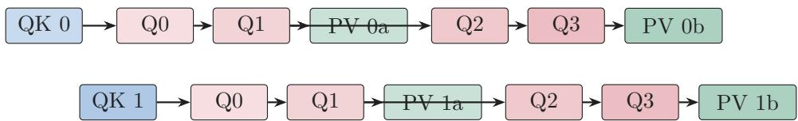  
Figure 2: Dependency sketch for the two query stages. Box width is not measured time. Each first PV half waits for two N32 producer quarters; work from the other stage covers part of that delay.

We inherit this outer pipeline, tensor-memory lifecycle, and publication protocol unchanged. They also expose the remaining problem: PV cannot begin until softmax has constructed, scaled, packed, and published two adjacent probability fragments. The next section separates this timing constraint from the numerical range constraint.

## 3 What Prevents a Full-FP4 Speedup?

HAO’s schedule already overlaps QK, softmax, and PV whenever their dependencies allow. Replacing its FP8 probability–value product with FP4 leaves two linked problems. The first is timing: constructing P delays the first useful PV instruction. The second is numerical: softmax probabilities span a range that is awkward for a 4-bit payload and its block scale.

## 3.1 Problem 1: P lies on the critical path

In tiled attention, P is produced inside the kernel rather than loaded as an input. For full FP4 attention, the first useful PV command therefore waits for

$$
S \to { \mathrm { m a x i m u m } } \to { \mathrm { s c a l e } } \to { \mathrm { p r o b a b i l i t y } } \to { \mathrm { E 2 M 1 ~ p a c k } } \to { \mathrm { p u b l i s h } } .\tag{9}
$$

Work removed after publication may not change latency. Work removed before the first legal P tile can.

FP4 accelerates QK and PV, but not score reduction, exponentiation, synchronization, or scale publication. It also requires P to be converted between the two products. Removing work before the first legal P tile can shorten the critical path; removing work after that publication may not change latency [8, 11].

## 3.2 Problem 2: P needs both range and cheap scales

NVFP4 and MXFP4 both use signed E2M1 payloads. Ignoring sign, their nonnegative magnitudes are

$$
\begin{array} { r } { \mathcal { F } _ { \mathrm { E 2 M 1 } } = \left\{ 0 , \frac { 1 } { 2 } , 1 , \frac { 3 } { 2 } , 2 , 3 , 4 , 6 \right\} . } \end{array}\tag{10}
$$

The formats difer in how they scale these payloads:

Table 2: Block-scaled FP4 formats used in this work.
<table><tr><td>Format</td><td>Block</td><td>Encoded scale</td><td>Main strength</td><td>Role in this work</td></tr><tr><td>NVFP4</td><td>16</td><td>E4M3, optional tensor scale</td><td>fine local placement</td><td>signed Q and K</td></tr><tr><td>MXFP4</td><td>32</td><td>E8M0 amplitude, power of two</td><td>wide exponent range</td><td>P and V operands</td></tr></table>

For an NVFP4 P block with maximum $a _ { B }$ and global encode factor G, the decoded block scale is approximately

$$
\widehat { s } _ { \mathrm { N V } } = \frac { Q _ { \mathrm { E 4 M 3 } } ( G a _ { B } / 6 ) } { G } .\tag{11}
$$

If the E4M3 scale rounds to zero, the entire block disappears. A row-level stabilizer fixes the range, but its scale and inverse correction add state to the online path. MXFP4 instead stores a power-of-two block amplitude near $a _ { B }$

$$
\alpha _ { B } \in \left\{ 2 ^ { \left\lfloor \log _ { 2 } a _ { B } \right\rfloor } , 2 ^ { \left\lceil \log _ { 2 } a _ { B } \right\rceil } \right\} , \qquad \delta _ { B } = \frac { \alpha _ { B } } { 6 } ,\tag{12}
$$

where $\alpha _ { B }$ is the E8M0 value written to the scale page and $\delta _ { B }$ is the efective reconstruction step. Since the largest E2M1 code is 6, our convention reconstructs one operand as $\alpha _ { B } q / 6$ and corrects an MXFP4 P/V product by 1/36. The amplitude folds naturally into a base-two score transform and matches one 32-column producer fragment (N32). The choice is a latency–range trade-of, not a claim that E8M0 is intrinsically more accurate than E4M3.

Table 3 isolates numerical range from kernel scheduling. It forms exact Gaussian softmax probabilities, quantizes matched N32 blocks, renormalizes the represented P, and multiplies by the same FP32 V. Stabilized NVFP4 is the high-fidelity control; unscaled NVFP4 exposes underflow.

Table 3: Probability-format range at D128. “Zero scales” is the fraction of blocks whose scale encodes as zero; “lost mass” is exact probability mass mapped to zero. This is a numerical diagnostic, not a kernel timing.
<table><tr><td>S</td><td>Format</td><td>Zero scales</td><td>Zero payload</td><td>Lost mass</td><td> $P$  rel.  $. L _ { 2 }$ </td><td> $P V$  cosine</td><td> $P V$  rel.  $. L _ { 2 }$ </td></tr><tr><td>1024</td><td>NVFP4 G=1</td><td>0.706299</td><td>0.831829</td><td>0.683773</td><td>1.715156</td><td>0.700819</td><td>1.685442</td></tr><tr><td>1024</td><td>NVFP4 G=448</td><td>0.000000</td><td>0.155418</td><td>0.029314</td><td>0.114408</td><td>0.993854</td><td>0.113687</td></tr><tr><td>1024</td><td>MXFP4</td><td>0.000000</td><td>0.188683</td><td>0.040178</td><td>0.146380</td><td>0.989846</td><td>0.144944</td></tr><tr><td>4096</td><td>NVFP4 G=1</td><td>0.996063</td><td>0.999438</td><td>0.994332</td><td>13.815642</td><td>0.217328</td><td>13.876892</td></tr><tr><td>4096</td><td>NVFP4 G=448</td><td>0.000000</td><td>0.156454</td><td>0.029760</td><td>0.114091</td><td>0.993747</td><td>0.114582</td></tr><tr><td>4096</td><td>MXFP4</td><td>0.000000</td><td>0.189755</td><td>0.040494</td><td>0.147209</td><td>0.989338</td><td>0.148716</td></tr><tr><td>8192</td><td>NVFP4 G=1</td><td>0.999634</td><td>0.999977</td><td>0.999284</td><td>12.467307</td><td>0.096774</td><td>12.389232</td></tr><tr><td>8192</td><td>NVFP4 G=448</td><td>0.000000</td><td>0.160613</td><td>0.030691</td><td>0.114725</td><td>0.993841</td><td>0.113660</td></tr><tr><td>8192</td><td>MXFP4</td><td>0.000000</td><td>0.194189</td><td>0.041630</td><td>0.147318</td><td>0.989660</td><td>0.146237</td></tr></table>

The alternatives therefore impose diferent costs. Stabilized NVFP4 ofers the best FP4 fidelity but needs a row-level range correction. FP8 avoids the 4-bit range problem but gives up the FP4 PV instruction. MXFP4 provides a power-of-two scale at the same N32 granularity as the producer fragment, but places probabilities more coarsely. Direct-P chooses MXFP4 and redesigns how that operand is produced and normalized.

## 4 Direct-P: Fixing the FP4 Probability Path

## 4.1 Design overview

The previous section identified one timing problem and one numerical problem. Direct-P addresses both within a narrow boundary: we preserve HAO’s outer schedule and change only the interval from a ready FP32 score fragment to a legal FP4 probability operand for PV. Table 4 separates the inherited machinery from our changes.

Table 4: Inherited structure and changes made in this work.
<table><tr><td>Component</td><td>Inherited from HAO</td><td>This work</td></tr><tr><td>CTA and TMEM</td><td>Two query stages, two score banks, two FP32 output banks, one ordered MMA issuer.</td><td>Retained.</td></tr><tr><td>P publication</td><td>N32 producer quarters, first-half and Retained; less work before each tail barriers, score/P overlay.</td><td>event.</td></tr><tr><td>Formats</td><td>Full-FP4 comparator: NVFP4 Q/K/P/V with stabilized P.</td><td>NVFP4 Q/K, MXFP4 P/V.</td></tr><tr><td>P arithmetic</td><td>Exponential evaluation followed by block-scale quantization.</td><td>Direct log-score-to-E2M1 map with selective hardware exponentials.</td></tr><tr><td>Normalization</td><td>Denominator accumulated from floating exponential values.</td><td>Denominator accumulated from the represented P consumed by PV.</td></tr></table>

Within the noncausal forward benchmark boundary, Q, K, and V are prequantized. QK uses NVFP4 with adjacent K64 $\mathrm { Q / K }$ scales folded ofline by a mean-squared-error (MSE) rule. For $\mathrm { P / V } ,$ , each N32 probability block uses one MXFP4 E8M0 scale. P payload and scale pages overwrite retired score addresses, exactly as required by the lifecycle in Algorithm 1.

Direct-P makes three linked choices. First, it maps normalized scores directly to the E2M1 payload consumed by PV, shortening the critical path. Second, it computes the normalizer from those same rounded payloads, so the numerator and denominator describe one approximate operator. Third, it adds a range guard only for model layers with extreme logits. The first choice addresses timing; the other two keep the cheaper representation numerically well defined.

## 4.2 Fix 1: map scores directly to E2M1 codes

The standard route computes a relatively accurate exponential and then rounds it to one of eight nonnegative E2M1 magnitudes. That intermediate precision does not reach PV. Direct-P instead treats probability construction as a code classification problem: determine which E2M1 bin each normalized score should occupy.

Let $m _ { i }$ be a row reference and $a _ { B } = \operatorname* { m a x } _ { j \in B } \exp ( z _ { i j } - m _ { i } )$ . For a nonzero N32 block, let $u _ { B }$ be the biased E8M0 byte, $e _ { B } = u _ { B } - 1 2 7$ its exponent, and $\alpha _ { B } = 2 ^ { e _ { B } }$ its stored amplitude. The efective E2M1 reconstruction step is $\delta _ { B } = \alpha _ { B } / 6$ , so Direct-P represents a probability as

$$
\begin{array} { r } { \widetilde { p } _ { i j } = \delta _ { B } q _ { i j } = \alpha _ { B } q _ { i j } / 6 , \qquad q _ { i j } \in \mathcal { F } _ { \mathrm { E 2 M 1 } } . } \end{array}\tag{13}
$$

Thus $u _ { B }$ encodes $\alpha _ { B } .$ not $\delta _ { B }$ . The scaled matrix instruction uses $\alpha _ { B } q _ { i j } $ ; its output epilogue applies

the fixed $1 / 3 6$ correction for MXFP4 P and V. The ideal converter input is

$$
x _ { i j } = ( z _ { i j } - m _ { i } ) \log _ { 2 } e - e _ { B } + \log _ { 2 } 6 ,\tag{14}
$$

$$
q _ { i j } = Q _ { \mathrm { E 2 M 1 } } ( 2 ^ { x _ { i j } } ) .\tag{15}
$$

Only the code $q _ { i j }$ reaches PV. Computing an accurate FP32 $2 ^ { x }$ and then discarding almost all of its precision is unnecessary.

Positive E2M1 changes value at seven rounding boundaries,

$$
\begin{array} { r } { \left\{ \frac { 1 } { 4 } , \frac { 3 } { 4 } , \frac { 5 } { 4 } , \frac { 7 } { 4 } , \frac { 5 } { 2 } , \frac { 7 } { 2 } , 5 \right\} . } \end{array}\tag{16}
$$

We therefore fit an afine classifier in value space,

$$
\widehat { u } ( x ) = \operatorname* { m a x } ( 0 , A x + B ) , \qquad \widehat { q } ( x ) = Q _ { \mathrm { E 2 M 1 } } ( \widehat { u } ( x ) ) ,\tag{17}
$$

to maximize E2M1 code agreement rather than real-valued exponential accuracy. The score transform, $e _ { B } .$ , and $\log _ { 2 } 6$ term are folded into the packed fused-multiply–add (FMA) coeficients. A packed two-lane FMA instruction (FFMA2) handles two scores, and a packed floating-point conversion instruction (F2FP) emits their E2M1 payloads. A selected pair may instead use native EX2, Blackwell’s base-two exponential instruction, when that improves the machine schedule.

```latex
Algorithm 2 Direct MXFP4 probability production for one N32 score fragment
1 Load 32 scores per row from the completed TMEM score tile and reduce the block maximum.
2 Select power-of-two amplitude $\alpha _ { B } = 2 ^ { e _ { B } }$ and biased E8M0 byte $u _ { B } = e _ { B } + 1 2 7$ from that maximum and
the row reference $m _ { i } ; u _ { B } = 0$ denotes a zero block.
3 For each packed score pair, form $x = ( z - m _ { i } ) \log _ { 2 } e - e _ { B } + \log _ { 2 } 6 .$
4 Evaluate either max(0, Ax + B) or selected native $2 ^ { x } .$ , then use packed conversion to emit E2M1 codes $q .$
5 Pack four payload words and decode their small represented sum $\begin{array} { r } { c _ { B } = \sum _ { j \in B } q _ { i j } } \end{array}$
6 Accumulate denominator contribution $d _ { i B } = \alpha _ { B } ( c _ { B } / 6 )$ , using the same amplitude and codes as PV.
7 Overlay P payload and the swizzled scale page onto retired score addresses. Publish after two adjacent
N32 fragments form one legal K64 operand.
```

The generic fast fit uses $A = 1 . 5 0 , B = 1 . 2 0$ . Wan activation evaluations select the equal-cost pair $A = 1 . 6 0 , B = 0 . 9 5$ . These constants move the seven decision boundaries,

$$
x _ { j } = ( t _ { j } - B ) / A ,\tag{18}
$$

where $t _ { j }$ is an E2M1 boundary. They are quantizer-calibration parameters, not changes to exact softmax. Layer-wise maps were tested but not retained: isolated substitutions on a BF16 teacher trajectory did not predict the composed all-FP4 trajectory (Appendix B.5).

Integer threshold trees, lookup tables (LUTs), and custom nibble packing generated more NVIDIA machine code (SASS) than packed FMA followed by Blackwell’s native converter. Quadratic and cubic fits improved real-function error but placed extra dependent FMA operations directly before publication.

## 4.3 Fix 2: normalize the represented probability

The numerator uses rounded FP4 probabilities, so an independently approximated floating-point denominator would describe a diferent operator. Direct-P instead builds the denominator from the exact codes and block scales consumed by PV.

For block B, the numerator and denominator actually consumed by the approximate operator are

$$
\widetilde { N } _ { i B } = \frac { \alpha _ { B } } { 6 } \sum _ { j \in B } q _ { i j } \widehat { V } _ { j } ,\tag{19}
$$

$$
\widetilde { L } _ { i B } = \frac { \alpha _ { B } } { 6 } \sum _ { j \in B } q _ { i j } .\tag{20}
$$

where $\widehat { V } _ { j }$ is the reconstructed MXFP4 value, including its own $1 / 6$ correction. The output is

$$
\tilde { O } _ { i } = \frac { \sum _ { B } \tilde { N } _ { i B } } { \sum _ { B } \tilde { L } _ { i B } } .\tag{21}
$$

This avoids normalizing an E2M1 numerator with an unrelated approximate FP32 exponential sum. Four packed payload words are reduced with byte permutations, carry-free byte addition, and one four-way integer dot-product-accumulate instruction (DP4A). Streaming each word or keeping pairwise partials is algebraically equivalent but slower because it extends live ranges and changes instruction interleaving.

FA4 routes some exponential work from special-function units (SFUs) to ordinary arithmetic pipelines [11]. We apply the same balancing principle to the code map. GB200 D128 fast is all-afine; accurate uses native EX2 on roughly one quarter of pair positions. B300 has stronger SFUs, but broad EX2 routing still loses. Its retained policy uses native EX2 only in the quarter and shape regimes where the measured dependency schedule benefits.

## 4.4 Fix 3: guard only extreme model logits

The fast shiftless path is finite on the synthetic grid and most model layers, but a few late Wan layers produce BF16 logits above 500 and sometimes 1000. Scanning or reloading every score would remove the speed advantage. We instead route only those layers through Algorithm 3. Before launch, 128 globally distributed $\mathrm { K } / \mathrm { V }$ rows are moved together into the first physical key tile. This permutation leaves exact attention unchanged.

```latex
Algorithm 3 Sampled QK guard and underflow-safe represented denominator
1 In the first key tile, reduce all four N32 quarters and set sampled anchor $a _ { i } = \operatorname* { m a x } _ { j \in \mathcal { A } } z _ { i j }$ , where $| { \mathcal { A } } | = 1 2 8 .$
2 Choose compile-time margin M and stored-scale shift L with $M + L \leq 1 2 6 ;$ use row reference $m _ { i } =$
$a _ { i } + M$ ln 2.
3 Follow Algorithm 2, but floor the working byte before forming x and q: ${ { \bar { u } } _ { B } } = \operatorname* { m a x } ( { { u } _ { B } } , L + 1 )$ and
$\bar { e } _ { B } = \bar { u } _ { B } - \quad$ 127. Publish $u _ { B } ^ { \prime } = \bar { u } _ { B } - L .$
4 Let $\alpha _ { B } ^ { \prime } = 2 ^ { u _ { B } ^ { \prime } - 1 2 7 }$ and $c _ { B } = \sum q _ { i j }$ . Evaluate the represented denominator as $\alpha _ { B } ^ { \prime } ( c _ { B } / 6 )$ in that order.
5 Never evaluate $( \alpha _ { B } ^ { \prime } / 6 ) c _ { B } \colon$ at $u _ { B } ^ { \prime } = 1$ , the first product is subnormal and may flush a valid block to zero.
```

The working floor preserves $\bar { u } _ { B } - u _ { B } ^ { \prime } = L$ across the byte range; flooring only the published byte would amplify blocks with $u _ { B } \leq L$ . The common $2 ^ { - L }$ factor cancels between numerator and denominator, and a saved log normalizer restores the corresponding exponent shift.

The 1.3-billion-parameter Wan model uses $\left( M , L \right) = \left( 1 1 0 , 1 6 \right)$ and the 14-billion-parameter model uses (112, 14), so both consume the full 126-step budget. The bound is enforced at compile time and translated E8M0 scales are floored at code 1. The reordered evaluation uses the same two multiplies as the failing expression. On the original layer-39 failure, the sampled anchor already equalled the exact row maximum; the failure was solely the subnormal intermediate. This correction fixes it without a second scan, new barrier, or stable-softmax fallback.

## 4.5 Two operating points

Table 5: Retained policies. Both use NVFP4 QK, MXFP4 $\mathrm { P / V } ,$ K64 PV issue, and the two-query HAO layout.
<table><tr><td>Policy</td><td>K/V stages</td><td>Anchor</td><td>Native EX2</td><td>Denominator</td><td>Goal</td></tr><tr><td>fast</td><td>12</td><td>none by default</td><td>0 on GB200</td><td>producer</td><td>minimum latency</td></tr><tr><td>accurate</td><td>13</td><td>32 fixed rows</td><td>about 25%</td><td>correction WG</td><td>higher fidelity</td></tr></table>

The Wan bundle can add the 128-row routed guard to either base policy. Anchor permutations and folded $\mathrm { Q / K }$ scale preparation are outside the timed attention kernel and should be fused into an upstream layout or quantization step in a deployment.

## 5 Experimental Setup

We keep the measurement boundaries separate. Kernel speed does not include projection or optimizer work, and a short fixed-token update does not establish training quality. Table 6 states what each comparison supports.

Table 6: Measurement boundaries used in the paper.
<table><tr><td>Boundary</td><td>Included work</td><td>Supported conclusion</td></tr><tr><td>Noncausal forward kernel</td><td>QK, online softmax, P publication, PV, and Forward latency and output output epilogue</td><td>error.</td></tr><tr><td>Causal backward kernel</td><td>Probability reconstruction and attention Backward latency and gradi- gradients; operands are prepared before tim- ent correctness.</td><td></td></tr><tr><td>tion</td><td>ing Projection-inclusive atten- QKV projection, rotary embedding, operand publication, attention, output projection, survives its immediate produc- and gradients</td><td>1 Whether the attention gain ers and consumers.</td></tr><tr><td>Single-GPU 8B update</td><td>Complete model forward, loss, backward, End-to-end step time at a and optimizer</td><td>fixed local batch.</td></tr><tr><td>Distributed trajectory</td><td>Data loading, communication, checkpoint- ing, and validation</td><td>Observed training stability, loss, and sustained through- put.</td></tr></table>

## 5.1 Metrics and comparison rules

Each principal row stores latency and numerical error from one deterministic case. Intentionally incomplete kernels and older runs with diferent seeds or timing windows are used only as diagnostics. For approximate output $\widehat { O }$ and BF16 reference O, we report

$$
\cos ( \widehat { O } , O ) = \frac { \langle \widehat { O } , O \rangle } { \| \widehat { O } \| _ { 2 } \| O \| _ { 2 } } ,\tag{22}
$$

$$
\operatorname { r e l } L _ { 2 } = \frac { \| \hat { O } - O \| _ { 2 } } { \| O \| _ { 2 } } ,\tag{23}
$$

$$
\mathrm { R M S E } = \sqrt { n ^ { - 1 } \sum _ { r } ( \widehat { O } _ { r } - O _ { r } ) ^ { 2 } } .\tag{24}
$$

Cosine can hide magnitude error and root-mean-square error (RMSE) depends on output scale, so relative- $L _ { 2 }$ is reported alongside both.

## 5.2 Operator benchmark suites

The primary GB200 suite reproduces the D128 shape grid in HAO’s FP4 FA4 README:

$$
\begin{array} { r l } & { ( B , S , H ) \in \{ ( 1 , 2 5 6 , 1 6 ) , ( 1 , 1 0 2 4 , 1 6 ) , ( 4 , 4 0 9 6 , 1 6 ) , } \\ & { ( 1 , 3 2 7 6 8 , 1 6 ) , ( 4 , 4 0 9 6 , 3 2 ) , ( 1 , 4 0 9 6 , 1 2 ) , ( 1 , 3 2 7 6 8 , 1 2 ) , } \\ & { ( 1 , 4 0 9 6 , 2 4 ) , ( 1 , 3 2 7 6 8 , 2 4 ) \} . } \end{array}\tag{25}
$$

Here B, S, and H are batch size, sequence length, and query-head count; $D _ { Q K }$ and D below are the inner dimensions of the two matrix products. We name routes by their QK/PV formats: NV/NV means NVFP4/NVFP4, NV/MX means NVFP4/MXFP4, and NV/FP8 means NVFP4/FP8. Every case is noncausal D128, uses HAO’s create\_nvfp4\_attention\_tensors factory and seed 20260814, and is timed with 300 ms warmup and a 3000 ms median window. ThunderKittens (TK) fast, TK accurate, native HAO NV/NV, and HAO’s generated CuTe domain-specific-language (DSL) BF16 kernel receive the same prepared $\mathrm { Q / K / V }$ . The two TK binaries run in separate processes, but both use the controls from one canonical manifest:

$$
\mathrm { s p e e d u p } ( k ) = t _ { \mathrm { H A O \ B F 1 6 } } / t _ { k } .\tag{26}
$$

Throughput follows HAO’s matrix-operation convention,

$$
\mathrm { o p s } = B H 2 S ^ { 2 } ( D _ { Q K } + D _ { V O } ) .\tag{27}
$$

A saturation suite adds S4096/H64 and S8192/H64 plus local HAO and TK NV/FP8 controls. Its six-order harness removes short-case provider-order bias. A separate D64 matrix is reported in Appendix A.6; D64 uses a diferent tile and ownership regime and is not part of the main comparison.

B300 D128 rows are the best stable records from the final SM103 tuning campaign, not a samebinary hardware $\mathrm { A } / \mathrm { B }$ . S4096 uses 300/3000 ms windows; S6144 and S32768 use repeated windows; S8192 and the wave-aligned S9472 case use five 2000-iteration windows and two correctness seeds. Published HAO B200 and GB300 values are labeled as cross-run context rather than local timings.

## 5.3 Timed scope and operand contract

Kernel time includes score loading, NVFP4 QK, online state, P approximation and packing, MX scale publication, MXFP4 PV, correction, and the output epilogue. It excludes dynamic Q/K/V quantization and optional K/V permutations, matching HAO’s attention-kernel scope rather than full layer latency.

The fast path requires adjacent NVFP4 Q/K scale blocks folded for K64 access. The fold is chosen ofline by reconstruction MSE. A production QKV projection should emit this layout directly. Pairing the binary with ordinary block-16 scales is an invalid operand contract even if its timing looks plausible.

The causal-training extension reports the learned-projection format separately from the attention format. The study crosses E4M3 and NVFP4 learned QKV/O projections with FP8 and MXFP4 attention P/V. The QKV projection epilogue publishes the Q/K/V layouts while its output fragments are live, avoiding separate quantization and transpose kernels. The current throughput arm uses NVFP4 learned projections; E4M3 is the projection-accuracy control. Historical tables retain their actual projection formats and cut-cross-entropy loss boundary. The retained route instead uses a dense language-model head and ordinary cross entropy, with compilation applied only to the loss. We do not transfer timing or loss values between these recipe generations.

## 5.4 Fixed-input model evaluations

Six fixed-input evaluations replace every eligible attention call in a Vision Transformer (ViT) and Bidirectional Encoder Representations from Transformers (BERT): ViT classification at S256, S1024, and S4096; BERT masked-language modeling (MLM) at S256 and S512; and Stanford Sentiment Treebank v2 (SST-2) classification at S256. All providers receive the same weights, examples, masks, prepared operands, and BF16 reference digest. We report attention-layer error, final logits or hidden-state error, prediction agreement, and task score. These are held-input inference comparisons, not training-stability claims.

The Vision Transformer masked-autoencoder (ViT-MAE) experiment replaces all 12 encoder selfattention layers for 100 Common Objects in Context (COCO) validation images with a fixed 75% patch mask [5, 7]. Its D64 model attention is padded to the existing S256/H16/D128 specialization and padded keys are masked. Paired masked-patch peak signal-to-noise ratio (PSNR), MSE, reconstruction cosine, and relative-L<sub>2</sub> are measured against the same BF16 decoder run.

Wan2.1 uses the native noncausal D128 topology at S7680: H12 across 30 layers for the 1.3-billionparameter model and H40 across 40 layers for the 14-billion-parameter model [10]. Every video self-attention call is replaced; cross-attention and the rest of the model remain BF16. The fast route uses the global A = 1.60, B = 0.95 map. The sampled guard in Algorithm 3 is routed only to layers 27–29 in the 1.3-billion-parameter model and 33–34/38–39 in the 14-billion-parameter model. One-, four-, and twenty-step outputs are paired against HAO CuTe-DSL BF16 with identical prompt, seed, guidance, and initial latent. A second 14-billion-parameter prompt/seed checks the 20-step fix. Kernel timing uses independently warmed five-second windows and weights guarded and unguarded latencies by their layer counts.

Layer-wise afine calibration is kept as a negative control, not part of the reported route. Isolated substitutions were scored on a BF16 teacher trajectory, then rejected because the composed all-FP4 route changed sign between calibration and held-out prompts. The full control is in Appendix B.5.

## 5.5 Reproducibility

Generated tables are built from JavaScript Object Notation (JSON) manifests rather than handtranscribed. Commands, policy manifests, compile-time constants, source identities, hardware metadata, and evidence checksums are collected in Appendix E, together with the public code release. Historical format paths and rejected timing experiments remain in the other appendices so they do not define the primary comparison.

## 6 Results

Throughput is reported in trillions or quadrillions of floating-point operations per second (TFLOP/s or $\mathrm { P F L O P / s } )$

## 6.1 Operator performance and accuracy

How much forward speed does Direct-P gain, and what accuracy does it trade for that speed? Table 7 places the same finite NV/MX route on our GB200 and B300 systems and adds HAO’s published GB300 NV/FP8 result where the shape matches. The complete local D128 grid underlies Figures 3 and 4; its generated table remains in the release artifacts. Unbounded shiftless NV/NV timings are excluded even when a particular input happens to be finite.

Table 7: Primary forward comparison across Blackwell systems. Bold marks independently confirmed B300 results above 3 $\mathrm { P F L O P } / \mathrm { s } .$ . Published HAO columns provide cross-run context. “ms $/ \textrm { T F } ^ { \dag }$ means milliseconds and $\mathrm { T F L O P } / \mathrm { s } ;$ TK error is cosine / relative-L<sub>2</sub> against BF16.
<table><tr><td>Shape</td><td>TK GB200 ms / TF</td><td>TK B300 ms TF</td><td>HAO GB300 NV/FP8 TF  $/ \cos .$ </td><td>B300 ∆t</td><td>TK B300 cosine / rel.-L2</td></tr><tr><td>D128/H24/S4096</td><td>0.092160 2237</td><td>0.087008 2369</td><td>2046 / 0.9898</td><td>-5.59%</td><td>0.9438 /0.3363</td></tr><tr><td>D128/H64/S4096</td><td>0.202752 2711</td><td>0.189536 2901</td><td></td><td>-6.52%</td><td>0.9440 /0.3355</td></tr><tr><td>D128/H64/S6144</td><td>0.452848 2731</td><td>0.418107 2958</td><td></td><td>-7.67%</td><td>0.9432 /0.3381</td></tr><tr><td>D128/H64/S8192</td><td>0.758336 2900</td><td>0.705684 3116</td><td></td><td>-6.94%</td><td>0.944063-0.944113 /0.334931-0.335152</td></tr><tr><td>D128/H64/S9472</td><td></td><td>0.930724 3159</td><td></td><td></td><td>0.943960-0.944056 0.335198-0.335473</td></tr><tr><td>D128/H24/S32768</td><td>4.400448 2998</td><td>4.480736 2945</td><td>2677  / 0.9899</td><td>+1.82%</td><td>0.9429 0.3389</td></tr></table>

Across the nine GB200 D128 rows, fast is 2.023× faster than HAO BF16 geometrically and peaks at 2998 TFL ${ \mathrm { . O P / s . } }$ . Accurate reaches 1.669× and 2416 $\mathrm { T F L O P / s }$ . At S32768/H24, fast takes 4.400448 ms (2998 $\mathrm { T F L O P / s } )$ , compared with HAO’s published 2018 TFLOP/s on B200 and 2677 TFLOP/s on GB300 for NV/FP8.

HAO NV/FP8 remains more accurate: its mean cosine is 0.9899, versus 0.943789 for fast and 0.951669 for accurate. The corresponding TK mean relative- $L _ { 2 }$ values are 0.336602 and 0.327225. HAO does not publish $\mathrm { r e l a t i v e } { - } L _ { 2 }$ for these rows. Appendix C measures the cost of matching its cosine with our exact NV/FP8 route; the local HAO NV/NV and full format matrix remain in Appendices A and D.

B300 improves D128 latency by 5.6–7.7% on the S4096–S8192 rows. The standard S8192/H64 case reaches 3116 TFLOP/s, and wave-aligned S9472/H64 reaches 3159 TFLOP/s. The exception is S32768/H24: B300 reaches $2 9 4 5 ~ { \mathrm { T F L O P / s } }$ versus 2998 on GB200. At HAO’s published D128 shapes, our B300 NV/MX reaches 2369 versus 2046 TFLOP/s at S4096/H24 and 2945 versus 2677 at S32768/H24. These are diferent implementations and harnesses, so they establish scale rather than causal timing diferences. The distinct D64 tile regime is reported in Appendix A.6.

## 6.2 Speed–accuracy behavior across shapes

Does the trade-of persist across attention shapes? Figure 3 shows the independent suite at B = 1, S = 4096, H = 24, and D = 128, including optimized local FP8-PV controls. Its six-order reference harness produces slightly diferent timings from Table 7, but all points share one BF16 value.

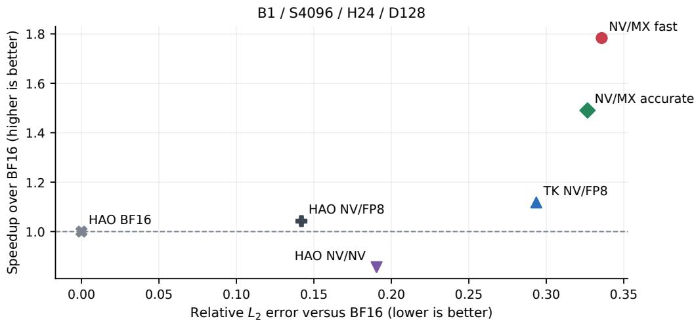  
Figure 3: Speed–error plane for the headline shape. Up and left are better. The fastest full-FP4 points accept more operator error than HAO NV/NV or FP8 PV.

FP8 PV avoids the E2M1 payload and block-scale page required by full FP4 and is more accurate. The local TK NV/FP8 control reaches only 1.118× BF16 in this suite, whereas NV/MX fast reaches 1.783×; HAO’s stronger published NV/FP8 result is therefore included in the primary table rather than inferred from this local control.

Figure 4 adds H64 cases. At S4096/H64, fast takes 0.202752 ms versus 0.370688 ms for BF16 (1.828×). At S8192/H64 it takes 0.758336 ms versus 1.611488 ms (2.125×). The two-query CTA is important here: the earlier one-query topology created twice as many jobs and could require an additional scheduling wave at high head count.

## 6.3 ViT and BERT fixed-input evaluations

How does operator error propagate through complete transformer models? Table 8 joins physical attention speed, mean layer error, and final task behavior. ViT uses 1,000 examples at S256 and 200 at S1024/S4096. BERT MLM uses 800 S256 blocks and 200 S512 blocks; SST-2 uses all 872 validation examples.

Both NV/MX policies remain finite. On ViT S4096, fast matches BF16 top-1 accuracy (88.5%) with 95.5% prediction agreement; accurate reaches 89.0% and 98.5%, while native HAO NV/NV reaches 88.0% and 98.0%. Fast improves from roughly 0.944 cosine in the Gaussian operator test to 0.9961 mean layer cosine on this model input. Residual paths, normalization, later mixing, and decision margins can attenuate operator error, so standalone relative-L<sub>2</sub> is informative but is not itself a task loss.

Across 2272 classification examples, fast changes 32 predictions, with 31 in the lowest quartile of BF16 top-two logit margins. All changes from accurate and HAO NV/NV also lie in that quartile.

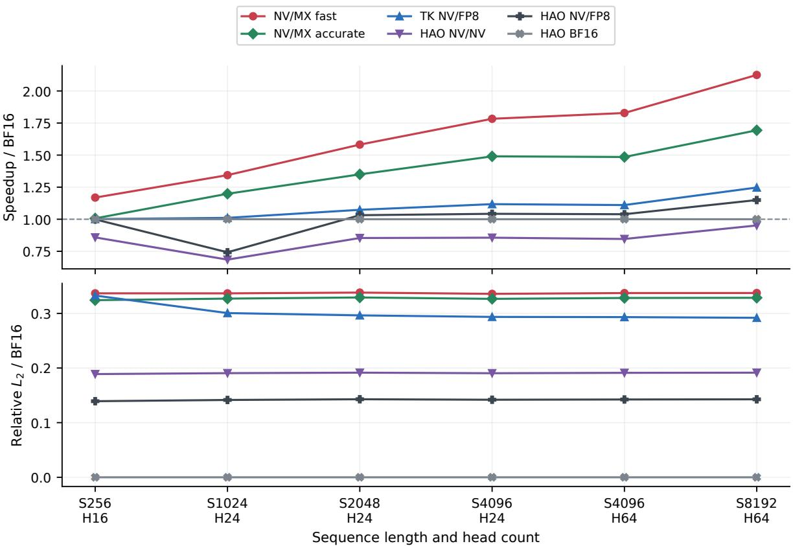  
Figure 4: BF16 speedup and relative- $L _ { 2 }$ from matched records across startup, transition, and saturated shapes.

Table 8: Downstream fixed-input trade-of. Task score is provider / BF16 accuracy; final error is cosine / relative- $. L _ { 2 }$ against BF16. Speedup belongs to the physical attention shape, not the complete model. HAO NV/NV is the identical-input control because no NV/FP8 task evaluation is published.
<table><tr><td>Task</td><td>Provider</td><td>Speedup</td><td>Task score / BF16 (%)</td><td>Final cos. / rel.-L2</td><td></td><td>∆MLM loss</td></tr><tr><td>ViT S256</td><td>TK NV/MX fast</td><td>1.169×</td><td>98.80 / 98.90</td><td>0.9987 / 0.0514</td><td></td><td></td></tr><tr><td>ViT S256</td><td>TK NV/MX accurate</td><td>1.007×</td><td>98.70 / 98.90</td><td>0.9990 / 0.0452</td><td></td><td></td></tr><tr><td>ViT S256</td><td>HAO NV/NV</td><td>0.858×</td><td>98.70 / 98.90</td><td>0.9997 / 0.0238</td><td></td><td></td></tr><tr><td>ViT S1024</td><td>TK NV/MX fast</td><td>1.344×</td><td>95.00 / 96.50</td><td>0.9971 / 0.0768</td><td></td><td></td></tr><tr><td>ViT S1024</td><td>TK NV/MX accurate</td><td>1.198×</td><td>97.00 / 96.50</td><td>0.9984 / 0.0564</td><td></td><td></td></tr><tr><td>ViT S1024</td><td>HAO NV/NV</td><td>0.685×</td><td>97.00 / 96.50</td><td>0.9995 / 0.0324</td><td></td><td></td></tr><tr><td>ViT S4096</td><td>TK NV/MX fast</td><td>1.783×</td><td>88.50 / 88.50</td><td>0.9887 / 0.1509</td><td></td><td></td></tr><tr><td>ViT S4096</td><td>TK NV/MX accurate</td><td>1.490×</td><td>89.00 / 88.50</td><td>0.9989 / 0.0479</td><td></td><td></td></tr><tr><td>ViT S4096</td><td>HAO NV/NV</td><td>0.856×</td><td>88.00 / 88.50</td><td>0.9992 / 0.0396</td><td></td><td></td></tr><tr><td>BERT SST-2 S256</td><td>TK NV/MX fast</td><td>1.169×</td><td>92.32 / 92.43</td><td>0.9963 / 0.0870</td><td></td><td></td></tr><tr><td>BERT SST-2 S256</td><td>TK NV/MX accurate</td><td>1.007×</td><td>92.09 / 92.43</td><td>0.9967 / 0.0815</td><td></td><td></td></tr><tr><td>BERT SST-2 S256</td><td>HAO NV/NV</td><td>0.858×</td><td>92.20 / 92.43</td><td>0.9991 / 0.0431</td><td></td><td></td></tr><tr><td>BERT MLM S256</td><td>TK NV/MX fast</td><td>1.169×</td><td>61.26  / 61.74</td><td>0.9968 / 0.0796</td><td></td><td>+0.035</td></tr><tr><td>BERT MLM S256</td><td>TK NV/MX accurate</td><td>1.007×</td><td>61.36  / 61.74</td><td>0.9971 / 0.0758</td><td></td><td>+0.028</td></tr><tr><td>BERT MLM S256</td><td>HAO NV/NV</td><td>0.858×</td><td>61.60 / 61.74</td><td></td><td>0.9983 / 0.0577</td><td>+0.016</td></tr><tr><td>BERT MLM S512</td><td>TK NV/MX fast</td><td>1.344×</td><td>61.10 / 61.79</td><td></td><td>0.9969 / 0.0782</td><td>+0.037</td></tr><tr><td>BERT MLM S512</td><td>TK NV/MX accurate</td><td>1.198×</td><td>61.36 / 61.79</td><td></td><td>0.9971 / 0.0761</td><td>+0.040</td></tr><tr><td>BERT MLM S512</td><td>HAO NV/NV</td><td>0.685×</td><td>61.28 / 61.79</td><td></td><td>0.9982 / 0.0604</td><td>+0.028</td></tr></table>

This supports a margin mechanism, but the suite is too small to establish universal inference or training safety.

## 6.4 Wan video difusion

Does Direct-P remain finite when attention error is composed across many difusion steps? Wan is a larger, native-shape test: all video self-attention calls run at S7680/D128, while text cross-attention and the rest of the model stay BF16. Table 9 compares every route with paired HAO CuTe-DSL BF16 outputs and warmed kernel timing.

Table 9: Wan2.1 quality and warmed GB200 kernel speed at S7680/D128. Speedup is relative to HAO CuTe-DSL BF16. Quality is cosine / relative- $L _ { 2 }$ of the final latent against the paired BF16 run.
<table><tr><td>Model</td><td>Method</td><td>Time (ms)</td><td>Speedup</td><td>1 step</td><td>4 steps</td><td></td><td>20 steps</td></tr><tr><td>Wan2.1-1.3B</td><td>HAO CuTe BF16</td><td>0.2888</td><td>1.00×</td><td>1.0000 / 0.0000</td><td>1.0000</td><td> / 0.0000</td><td>1.0000 / 0.0000</td></tr><tr><td>Wan2.1-1.3B</td><td>TK NV/MX fast</td><td>0.1653</td><td>1.75×</td><td>0.9870 / 0.1803</td><td>0.9671 / 0.2611</td><td></td><td>0.9136 / 0.4163</td></tr><tr><td>Wan2.1-1.3B</td><td>TK NV/MX accurate</td><td>0.1961</td><td>1.47×</td><td>0.9862 / 0.1721</td><td>0.9654 / 0.2637</td><td></td><td>0.9060 / 0.4323</td></tr><tr><td>Wan2.1-1.3B</td><td>HAO NV/NV</td><td>0.3466</td><td>0.83×</td><td>0.9878 / 0.1751</td><td>0.9711 / 0.2405</td><td>0.9389</td><td>/0.3463</td></tr><tr><td>Wan2.1-1.3B</td><td>HAO NV/FP8</td><td>0.2888</td><td>1.00×</td><td>0.9936 /0.1184</td><td>0.9767 / 0.2158</td><td>0.9530 /</td><td>/0.3066</td></tr><tr><td>Wan2.1-14B</td><td>HAO CuTe BF16</td><td>0.8882</td><td>1.00×</td><td>1.0000 / 0.0000</td><td>1.0000 / 0.0000</td><td></td><td>1.0000 / 0.0000</td></tr><tr><td>Wan2.1-14B</td><td>TK NV/MX fast</td><td>0.4250</td><td>2.09×</td><td>0.9938 / 0.1179</td><td>0.9338</td><td>/0.3589</td><td>0.8496 / 0.5337</td></tr><tr><td>Wan2.1-14B</td><td>TK NV/MX accurate</td><td>0.5072</td><td>1.75×</td><td>0.9879 / 0.1563</td><td>0.9243 / 0.3946</td><td></td><td>0.8447  / 0.5500</td></tr><tr><td>Wan2.1-14B</td><td>HAO NV/NV</td><td>0.9073</td><td>0.98×</td><td>0.9908 / 0.1358</td><td>0.9327 / 0.3640</td><td></td><td>0.9036  / 0.4435</td></tr><tr><td>Wan2.1-14B</td><td>HAO NV/FP8</td><td>0.7516</td><td>1.18×</td><td>0.9893 0.1464</td><td>0.9229</td><td>0.3877 0.8398</td><td>/0.5669</td></tr></table>

Fast is 1.75× faster than CuTe BF16 on the 1.3-billion-parameter model and 2.09× on the 14- billion-parameter model; accurate reaches 1.47× and 1.75×. HAO NV/FP8 is at parity for H12 and 1.18× faster for H40. On the 14-billion-parameter model at four steps, fast reaches 0.9338 / 0.3589, close to HAO NV/NV at 0.9327 / 0.3640. At twenty steps it reaches 0.8496 / 0.5337, versus 0.9036 / 0.4435 for HAO $\mathrm { N V / N V ; }$ a held-out prompt reaches 0.8235 / 0.5813. The route is finite but accumulates more drift.

The original layer-39 failure was not an anchor miss: the sampled and exact row maxima were equal. The expression $\left( { s / 6 } \right) \sum _ { i } c _ { i }$ formed a subnormal intermediate at E8M0 code 1 and flushed to zero. Algorithm 3 reassociates it as $s ( \sum _ { i } c _ { i } / 6 )$ . Both 14-billion-parameter twenty-step runs now complete all 1,600 attention calls without a scan or stable-softmax fallback.

Guarded layers are 21–23% slower individually, but they are only 3/30 layers in the 1.3-billionparameter model and 4/40 in the 14-billion-parameter model. Layer-weighted times are therefore 0.165309 ms and 0.424995 ms, 2.2–2.3% above the unguarded bases. The historical layer-wise afine map is omitted because its small gain reversed between prompts. These drop-in BF16-checkpoint results do not reproduce Attn-QAT’s trained quality; that requires its QAT checkpoint or training recipe [13].

## 6.5 Paired image reconstruction

Is the residual attention error visible in reconstructed images? Table 10 replaces all 12 ViT-MAE encoder attention layers for the same 100 images and masks. The S256 speedup is a physical kernel measurement, not end-to-end MAE speed.

Table 10: Paired ViT-MAE reconstruction. PSNR ∆ is FP4 minus BF16 with a paired 95% interval. Reconstruction and layer cells are cosine $/$ relative- $. L _ { 2 }$ against BF16.
<table><tr><td>Provider</td><td>S256 speedup</td><td>PSNR (dB)</td><td>PSNR ∆ (dB)</td><td>MSE ∆ (%)</td><td>Reconstruction</td><td>Mean layer</td></tr><tr><td>BF16</td><td>1.000×</td><td>23.917</td><td></td><td>+0.00</td><td>1.00000 / 0.0000</td><td>1.0000 / 0.0000</td></tr><tr><td>HAO NV/FP8</td><td>0.999×</td><td>23.910</td><td> $- 0 . 0 0 7 \pm 0 . 0 1 2$ </td><td>+0.16</td><td>0.99995 / 0.0089</td><td>0.9938 / 0.1046</td></tr><tr><td>HAO NV/NV</td><td>0.858×</td><td>23.906</td><td> $- 0 . 0 1 0 \pm 0 . 0 1 5$ </td><td>+0.07</td><td>0.99992 / 0.0113</td><td>0.9868 / 0.1589</td></tr><tr><td>TK NV/MX accurate</td><td>1.007×</td><td>23.893</td><td> $- 0 . 0 2 4 \pm 0 . 0 2 1$ </td><td>+0.25</td><td>0.99978 / 0.0184</td><td>0.9676 / 0.2616</td></tr><tr><td>TK NV/MX fast</td><td>1.169×</td><td>23.896</td><td> $- 0 . 0 2 0 \pm 0 . 0 2 6$ </td><td>+0.29</td><td>0.99973 / 0.0203</td><td>0.9600 / 0.2928</td></tr></table>

HAO NV/FP8 is closest to BF16 at −0.007 ± 0.012 dB. HAO NV/NV, accurate, and fast reach $- 0 . 0 1 0 \pm 0 . 0 1 5 , \ - 0 . 0 2 4 \pm 0 . 0 2 1$ , and $- 0 . 0 2 0 \pm 0 . 0 2 6 \ \mathrm { d B }$ . Fast has the largest reconstruction displacement, but its output remains 0.99973 cosine and 2.03% relative- $L _ { 2 }$ from BF16 after all twelve layers. Figure 5 makes the residual visible only after an 8× amplification.

The aggressive shiftless TK NV/NV control fails on the first sample of every task, whereas HAO’s stabilized NV/NV remains finite. Appendix A.7 shows that the distinction is stabilization, not the use of NVFP4 P itself.

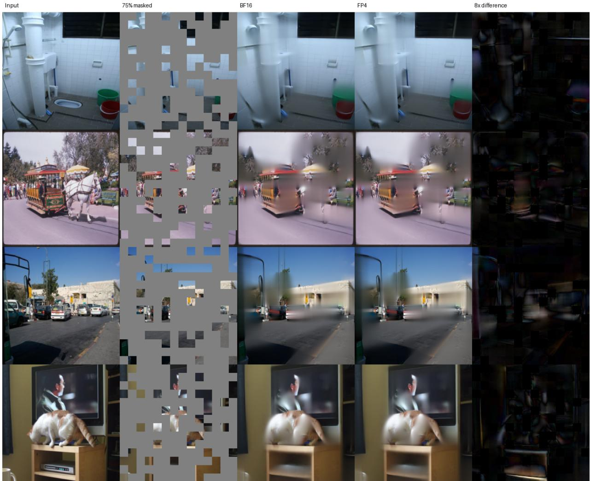  
Figure 5: Four paired ViT-MAE examples. The right column shows $8 | I _ { \mathrm { F P 4 } } - I _ { \mathrm { B F 1 6 } } |$ ; only encoder attention difers between the BF16 and fast runs.

## 7 Causal Training from Saved Quantized Operands

Training adds three constraints to the forward problem. Causal attention masks future tokens, grouped-query attention (GQA) lets several query heads share key/value heads, and backward must recover gradients without materializing the full $S \times S$ score or probability matrices. We first present the retained method, then measure isolated backward, projection-inclusive attention, a complete model update, and distributed training. Rejected designs remain in Appendix G.

## 7.1 Pass the forward quantization into backward

The forward pass saves the NVFP4 query/key payload bytes, their block scales, the per-head Q–K global factors, and each row’s log-sum-exp (LSE) normalizer. Backward recomputes $Q K ^ { \mathsf { T } }$ from those bytes and scales, then uses LSE to reconstruct the probabilities. Separately, the projection epilogue publishes row- or column-oriented FP8 views of Q, K, and V so each gradient matrix product receives its required physical layout without a standalone transpose or quantization launch. Thus “exact” below means exact with respect to the quantized forward payload, not to unquantized BF16 inputs. Row-oriented and column-oriented describe how the same represented values and scales are arranged for diferent matrix instructions; they do not introduce a second quantization rule.

The implementation dispatches the Llama-style 8-billion-parameter attention shape at local batch sizes $B \in \{ 1 , 2 , 4 \}$ , sequence length $S = 4 0 9 6$ , 32 query heads, eight key/value heads, and head dimension D = 128. The combined query/key/value (QKV) projection applies rotary positional embedding (RoPE) and publishes the layouts needed by forward and backward while its output fragments are still live. This avoids launching separate quantization and transpose kernels around every attention layer.

This is not pure-FP4 end-to-end training. Learned projections and attention are separate precision boundaries. We evaluate E4M3 projections as a numerical control and NVFP4 projections as the higher-throughput arm. Inside attention, the controlled format comparison selects FP8 rather than MXFP4 for P and V. The supporting ablations are collected in Appendix G.

We prefix a tensor with d to denote its gradient; dO is the gradient arriving from the output projection.

Table 11: Precision contract for causal training. Learned projections and attention operands are separate boundaries.
<table><tr><td>Part of the model</td><td>Representation</td><td>Reason</td></tr><tr><td>projections</td><td>throughput arm; FP32 accu- attention-format comparison. mulation</td><td>Learned QKV and output E4M3 control or NVFP4 Separates projection error from the</td></tr><tr><td>Forward score product</td><td>NVFP4 Q and K</td><td>Reuses two-dimensional scales over 16-value blocks along the inner dimension (row-by- K16).</td></tr><tr><td>Forward value product</td><td>FP8 P and V</td><td>Retained training route; the MXFP4 alter- native is faster in isolation but diverges in the observed distributed experiments.</td></tr><tr><td>in backward</td><td>and global scales, and LSE</td><td>Probability reconstruction Saved NVFP4 Q/K, block Reconstructs the same represented probabil- ity used by forward without storing an  $S \times S$  matrix.</td></tr><tr><td>ucts</td><td>Backward gradient prod- E4M3 Q/K/V/P/dS; E5M2 dO</td><td>E4M3 supplies precision; E5M2 supplies the range needed for the small output gradient dO.</td></tr><tr><td>Gradient outputs</td><td>FP32 accumulation, BF16 dQ/dK/dV</td><td>Keeps accumulation and optimizer-facing gradients stable.</td></tr></table>

## 7.2 How the backward pass works

We write dQ, dK, dV, dP, and dS for gradients of the corresponding attention tensors. The backward pass executes five tiled matrix products, beginning with $\boldsymbol { Q } \boldsymbol { K } ^ { \intercal }$ reconstructed from the saved quantized operands:

$$
d P = d O V ^ { \mathsf { T } } , \qquad d V = P ^ { \mathsf { T } } d O , \qquad d Q = d S K , \qquad d K = d S ^ { \mathsf { T } } Q .\tag{28}
$$

The softmax gradient is

$$
r _ { i } = \langle O _ { i } , d O _ { i } \rangle , \qquad d S = P \odot ( d P - r { \bf 1 ^ { \top } } ) ,\tag{29}
$$

so probability reconstruction and dP must both complete before dQ and dK can begin. Causal masking removes illegal tiles but also makes work ownership uneven.

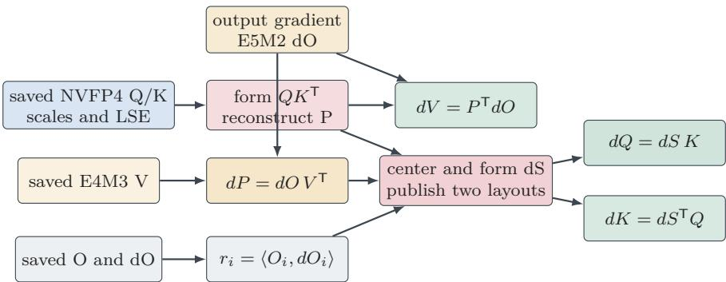  
Figure 6: Causal backward from saved quantized operands. The serial dependency runs from probability reconstruction and dP through dS to $\mathrm { d Q } / \mathrm { d K }$ . The dV branch also consumes P and dO, while the saved output and dO provide the row-centering statistic. The equations inside the output boxes name $\mathrm { Q / K }$ inputs that are not drawn as extra crossing arrows.

The implementation accelerates this graph in four ways:

1. reconstruct scores from the compact forward payload rather than creating a separate BF16 score path;

2. reuse the rounded P representation for dV and dS instead of decoding it twice;

3. publish both physical dS layouts from the producer fragment and release aliased tensor memory as soon as the next consumer owns it; and

4. publish dO directly as E5M2. E4M3 rounded roughly 97% of the observed dO values to zero in the failing checkpoint diagnostic, whereas E5M2 reduced the zero fraction to roughly 14% with less than 1% publisher overhead.

The D128 backward remains schedule-limited and allows only one CTA per streaming multiprocessor. Detailed occupancy and activity counters exist only for a predecessor schedule, so they are kept with that schedule’s timings in Appendix G rather than attributed to the retained binary.

## 7.3 Isolated backward

Does passing the saved quantization into backward make the kernel itself faster? We first time only causal attention backward at the production head dimension, D = 128, on one GB200. Both paths are prepared and bound before timing. The BF16 control decodes the same represented E4M3 Q, K, V, and E5M2 dO operands, whereas the quantized path uses the NVFP4 Q/K payload saved by forward. Projection, allocation, loss, and optimizer work are outside this boundary.

Table 12: Isolated D128 causal backward at B1/S4096. Latency is the median of warmed runs; speedup is BF16 latency divided by the latency in each row.
<table><tr><td>Route</td><td>Latency (ms)</td><td>Speedup</td></tr><tr><td>BF16 FA4 backward</td><td>0.501</td><td>1.000×</td></tr><tr><td>Saved-Q/K reconstruction core</td><td>0.356</td><td>1.405×</td></tr><tr><td>Core + E5M2 dO/statistics publisher</td><td>0.508</td><td>0.986×</td></tr></table>

The reconstruction core saves 29% of the BF16 backward time, but the training-safe E5M2 dO and row-statistic publisher consumes almost exactly that saving. This is why a fast backward kernel alone does not predict an end-to-end gain. The core passes the exact-zero-dO test, returns finite nonzero gradients for a nonzero dO, and passes its represented-operand reference gate. In the paired projection-inclusive check, output and input-gradient cosine against BF16 are 0.998 and 0.956; Q, K, V, and output-projection weight-gradient cosines range from 0.983 to 0.999. These are local operator checks, not a convergence result.

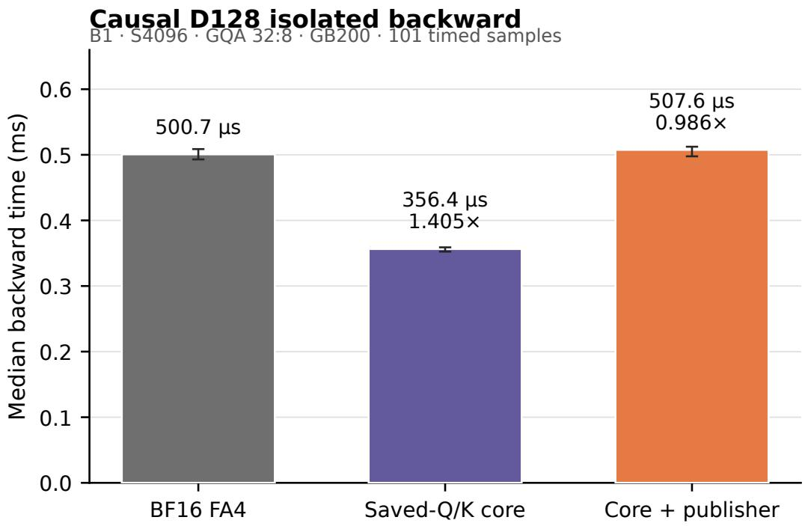  
The saved Q/K payload supplies score reconstruction; the final bar also publishes E5M2 dO and statistics.  
Figure 7: Isolated D128 causal-backward latency for BF16 and the path that reconstructs P from saved quantized Q/K at B1/S4096.

## 7.4 Combined forward and backward

Does that saving survive its producers and consumers? The second boundary is the complete attention sublayer: packed QKV projection, rotary positional embedding, scale and layout publication, causal attention, output projection, and their gradients. It includes the producer and handof costs hidden by the isolated kernel test. It excludes the surrounding root mean square normalization (RMSNorm), residual connection, language-model loss, and optimizer. The BF16 and quantized paths use identical projection weights and the same B1/S4096/D128 model shape.

Table 13: Projection-inclusive attention on one GB200. Backward-only runs the same prepared forward outside the timing interval; the second row times both forward and backward. Values are medians of warmed runs.
<table><tr><td>Boundary</td><td>BF16 (ms)</td><td>Quantized route (ms)</td><td>Speedup</td></tr><tr><td>Backward only</td><td>1.572</td><td>1.397</td><td>1.125×</td></tr><tr><td>Forward + backward</td><td>2.656</td><td>2.133</td><td>1.245×</td></tr></table>

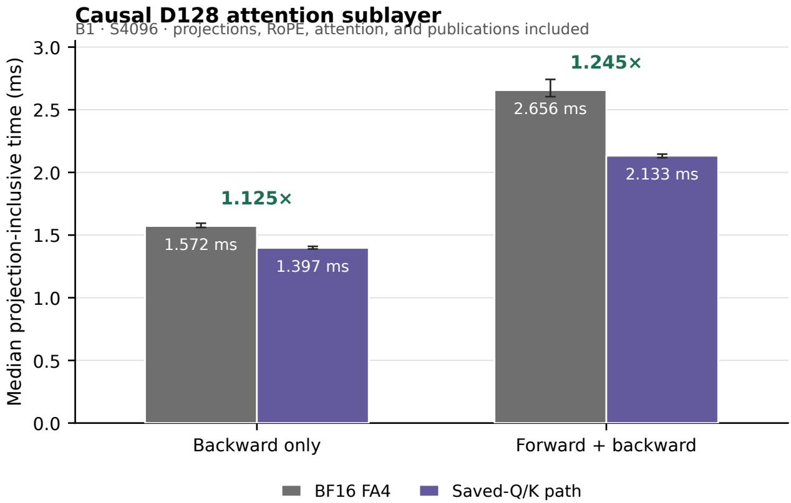  
Figure 8: Matched projection-inclusive attention forward and backward: BF16 FA4 versus the saved-quantization path at B1/S4096/D128.

## 7.5 Eight-billion-parameter end-to-end result

Does the attention gain remain visible in a complete model update? We measure a full update of a Llama-3.1-style 8.03-billion-parameter model with 32 layers, 32 query heads, eight key/value heads, and head dimension 128. We sweep local batch 1, 2, and 4 at sequence length 4096 on one GB200. Every arm uses the same fused AdamW optimizer and standard dense cross entropy compiled with torch.compile; cut cross entropy (CCE) is disabled. Each process is bound to the CPU and memory node local to its GPU. We report the median after 10 warmups and 21 measured updates over fixed synthetic tokens.

The quantized arms use NVFP4 QKV and output projections, row-by-K16 NVFP4 Q/K inside attention, and either FP8 or MXFP4 P/V. Their backward binary is identical at a given batch; their forward P/V implementations are format-specific. Each quantized measurement is paired with a freshly measured packed-QKV BF16 FA4 control.

Table 14: Complete 8B updates at S4096 on one GB200. Each $\mathrm { P / V }$ route has its own adjacent BF16 timing bracket. Times are medians in milliseconds.
<table><tr><td rowspan="3">Local batch</td><td colspan="3">FP8 P/V bracket</td><td colspan="3">MXFP4 P/V bracket</td></tr><tr><td>BF16</td><td>Low precision</td><td>Speedup</td><td>BF16</td><td>Low precision</td><td>Speedup</td></tr><tr><td>B1</td><td>260.313</td><td>239.985</td><td>1.085×</td><td>261.133</td><td>239.250</td><td>1.091×</td></tr><tr><td>B2</td><td>464.245</td><td>415.532</td><td>1.117×</td><td>463.814</td><td>415.408</td><td>1.117×</td></tr><tr><td>B4</td><td>854.516</td><td>751.722</td><td>1.137×</td><td>857.226</td><td>751.597</td><td>1.141×</td></tr></table>

The benefit grows as the GPU is better filled: approximately 1.09× at B1, 1.12× at B2, and 1.14× at B4. In the FP8 bracket, B4 throughput rises from 19,173 to 21,795 tokens/s per GPU and measured model FLOP utilization from 41.12% to 46.74%. The MXFP4 arm reaches 21,799 tokens/s and 46.75% utilization. FP8 and MXFP4 are therefore tied end to end: their quantized step times difer by at most 0.31%, no larger than variation between their separately measured BF16 anchors. MXFP4 is modestly faster in the timed forward portion, but that sub-millisecond diference is not a material complete-update win.

This matrix is deliberately performance-only. Initial-logit cosine against BF16 is 0.416–0.426 for FP8 P/V and 0.373–0.374 for MXFP4 P/V; relative- $L _ { 2 }$ is approximately 1.07 and 1.12. These short fixed-token updates do not establish training quality. The longer FP8 and MXFP4 trajectories in Appendix G are separate experiments; a fast finite timing bracket must not be read as a convergence result.

## 7.6 Training stability selects FP8 P/V

Which probability format remains stable in longer training? A historical four-arm diagnostic crossed E4M3 and NVFP4 learned projections with FP8 and MXFP4 P/V while holding the backward path fixed. Both FP8-P/V arms remain non-divergent and descend through their common observed horizon of 55.5 billion tokens. Both MXFP4-P/V arms separate from their FP8 controls near 0.1 billion tokens and later develop rising loss and very large pre-clipping gradient norms. A subsequent matched B4 launch shows the same failure for NVFP4 projections with MXFP4 P/V: it tracks FP8 through update 300, then its loss rises from 7.01 at update 325 to 16.25 at update 350. These experiments select FP8 P/V for the retained training route. The complete historical curves and failure analysis are in Appendix G.

## 7.7 Matched distributed training

How do the retained route and BF16 compare at the same training coordinates? The matched study uses 64 GPUs, local batch four, four gradient accumulation steps, and efective global batch 1024. Its BF16 and NVFP4-projection/FP8-PV arms share the model, optimizer, tokenizer, sample order, and token schedule. Both trajectories support exact checkpoint resume and complete the 100,000,595,968-token schedule. The terminal update saves the final checkpoint but is not a scheduled metric report. We therefore compare training at update 23,825 (99.93 billion tokens) and held-out validation at update 23,840 (99.99 billion tokens), the last common scheduled coordinates before the terminal update.

Llama 3.1 8B speedup grows with batch saturation S4096 · one GB200 · 10 warmups + 21 timed steps · median  
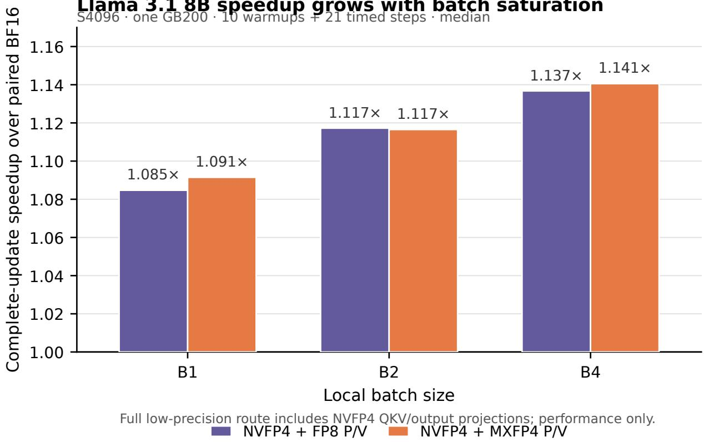  
Figure 9: Complete-update speedup for the two quantized routes as local batch increases. These full-route values include NVFP4 QKV/output projections and therefore are not attention-only or P/V-only speedups.

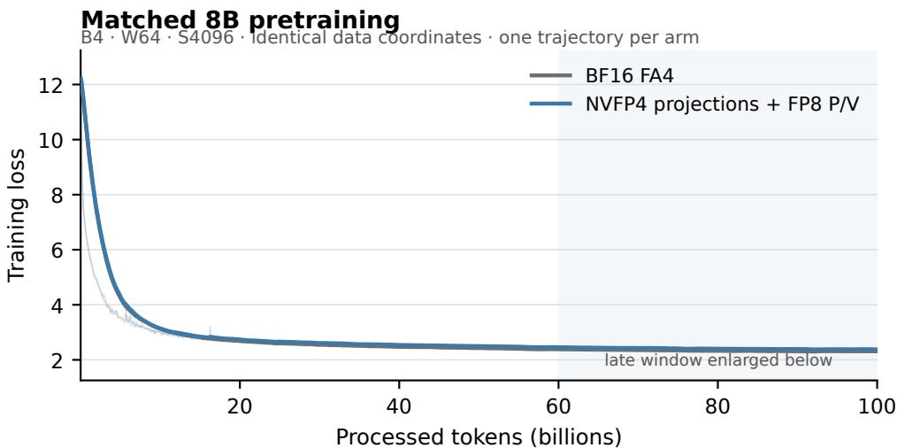

Late-stage validation zoom (expanded y-axis)  
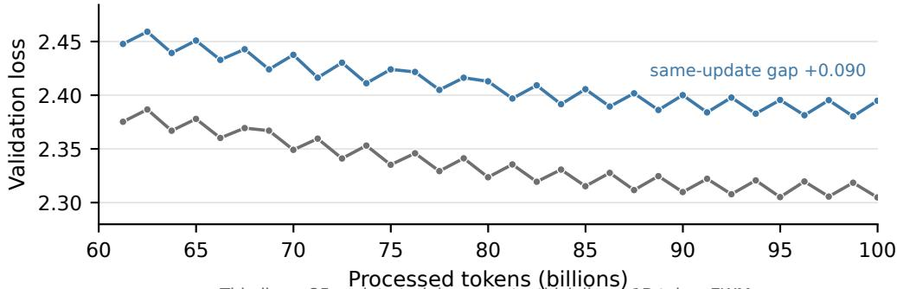  
Thin lines: 25-update training reports; thick lines: 1B-token EWM.  
Both arms completed the 100B-token schedule; validation is reported every 298 updates.

Figure 10: Token-aligned training and held-out validation for the matched B4 experiment over the completed 100-billion-token schedule. The panel compares the BF16 control with the retained FP8-P/V route; the lower panel magnifies same-update validation from 60 billion tokens onward with an expanded vertical axis. Each curve is one trajectory, so the plot provides no uncertainty estimate.

At the last scheduled training report, BF16 and the FP8 route report losses of 2.3095 and 2.3613 and pre-clipping gradient norms of 0.0549 and 0.0532, respectively. At the final same-update held-out validation report, the losses are 2.3048 and 2.3948, a gap of 0.0900. The FP8 trajectory is therefore stable and descending, but it is not numerically identical to BF16. Because the complete route changes both the learned projections and attention, this comparison does not attribute the gap to attention alone. Across all 874 common logged coordinates from the end of warmup through update 23,825, median throughput is 21,853 tokens/s/GPU for BF16 and 24,303 tokens/s/GPU for the FP8 route; the ratio of medians is 1.112×. The paired throughput ratio has a 10th–90th percentile range of 1.080–1.114×. This aggregation excludes no observations, including input stalls and checkpoint windows. This is one trajectory per route and therefore does not estimate run-to-run variability.

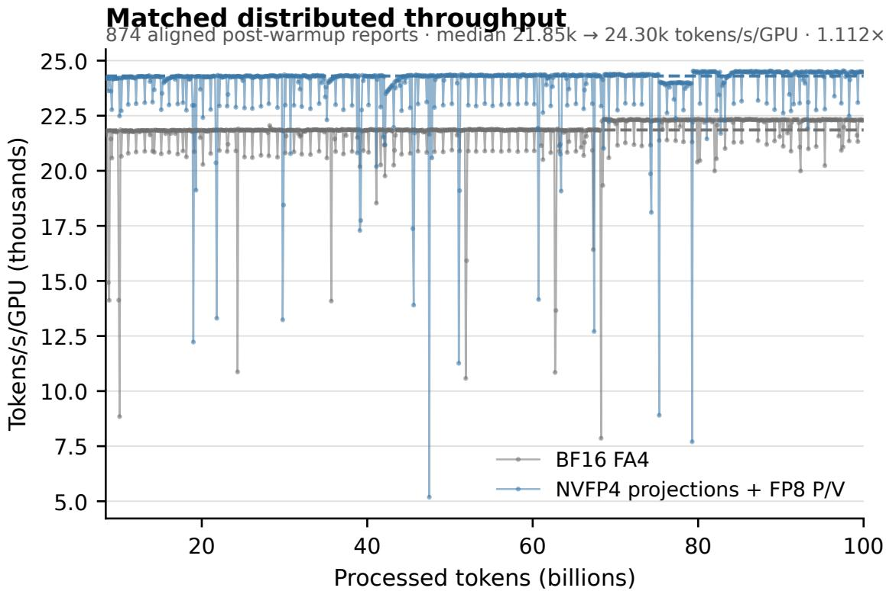  
Dashed lines are medians. Scheduled-save and input-stall windows are retained; no outliers are removed.  
Figure 11: Distributed throughput for the matched B4 experiment over all 874 common post-warmup observations. Input stalls and checkpoint windows remain in the distribution.

The three local boundaries establish isolated-backward, projection-inclusive, and full-update speed at D128. The distributed evidence establishes the FP8-versus-MXFP4 format choice and includes a same-recipe BF16 control with same-update validation. It supports comparisons over the completed 100-billion-token schedule, but not statistical-equivalence claims or run-to-run uncertainty estimates.

## 8 Discussion and Conclusion

The forward, backward, and training results point to three hardware takeaways. We state each takeaway first and then give the measurement that supports it; the rejected kernel variants remain

in the appendices.

Table 15: Hardware takeaways and the evidence that supports them.
<table><tr><td>Takeaway</td><td>Supporting evidence</td></tr><tr><td>its overlap</td><td>Tensor-memory ownership lim- Two FP32 score banks and two FP32 output accumulators use all 4× 128 = 512 tensor-memory columns; reducing shared-memory use did not increase CTA residency or reduce latency.</td></tr><tr><td>throughput unused</td><td>Readiness stalls leave matrix A matched diagnostic kept the same 98,304 tensor instructions but reached only 18.8% tensor-pipe activity with the real probability path.</td></tr><tr><td>longer the main gap</td><td>Probability arithmetic is no A fixed-P diagnostic that removes nearly all probability construction improved latency by only 5.23%.</td></tr></table>

## 8.1 Takeaway 1: TMEM capacity and ownership bound the overlap window

The two-query pipeline in Figure 2 already overlaps QK, softmax, and PV across query stages. The limitation is more specific: under the current D128 layout, the next QK cannot fully overlap the still-owned probability and tail-PV phase. Figure 1 shows why. Two 128-column score banks and two 128-column FP32 output accumulators occupy all 512 tensor-memory (TMEM) columns. A retired part of a score bank is reused for the quantized probability and scale pages. Until PV consumes that overlay, the next QK targeting that score bank and query stage has no legal score destination; the other query stage still provides partial overlap.

This is a storage-ownership dependency, not simply a shortage of barriers or shared memory. In a matched control, reducing dynamic shared memory from 209,920 to 163,840 bytes did not improve latency because the 512-column TMEM allocation still allowed only one CTA per streaming multiprocessor. More shared memory, or more raw on-chip bytes that cannot be allocated as another score bank, would not change this schedule.

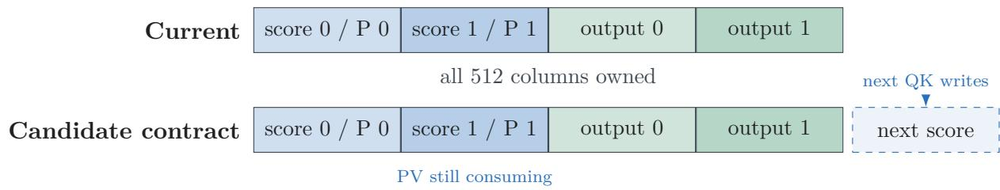  
Figure 12: Conceptual hardware implication. The useful addition is another allocatable score destination, together with legal issue and ownership semantics, so the next QK can proceed while PV still consumes the current overlay. The lower row is not a measured kernel or a claim that raw capacity alone is suficient.

## 8.2 Takeaway 2: low tensor activity is a readiness symptom

The scaled-FP4 PV instruction consumes a K64 inner dimension, so two adjacent 32-column probability fragments must be ready before useful PV work can start. Publishing the first fragment alone does not advance the matrix issuer. The score-to-probability path therefore creates paired rendezvous: Q0 and Q1 enable the first PV half, while Q2 and Q3 enable the tail. Attempting to issue the next QK between the first and tail PV operations violates the current sequence of two K64 tensor-core accumulations.

Table 16 shows a matched historical profiling checkpoint. The real and fixed-probability variants execute the same number of tensor instructions. Removing probability work shortens wall time and raises the fraction of cycles attributed to the tensor pipe, but it does not create more matrix work. Source sampling attributes 1,715 of 2,669 not-issued samples to dependency stalls categorized by NVIDIA’s profiler as long-scoreboard waits, chiefly final statistics, score readiness, and output publication. Tensor-core underutilization is therefore a symptom of operands not being ready, not a lack of nominal FP4 throughput.

Table 16: Matched historical profile with identical tensor work. This diagnostic predates the final Direct-P binary and is used only to identify the stall mechanism.
<table><tr><td>Probability path</td><td>Dynamic instructions</td><td>Tensor instructions</td><td>Tensor active</td></tr><tr><td>Real probability construction</td><td>54.6 million</td><td>98,304</td><td>18.8%</td></tr><tr><td>Fixed probability</td><td>11.9 million</td><td>98,304</td><td>26.6%</td></tr></table>

The final Direct-P path has already removed most exposed probability cost. At B1/S4096/H24/D128, the retained kernel measures 0.092448 ms and repeats at 0.092512 ms. Intentionally incorrect ceilings bound what remains:

Table 17: Final-kernel ceilings relative to the 0.092448-ms valid record. These rows deliberately remove required work and do not compute valid attention.
<table><tr><td>Diagnostic</td><td></td><td>Time (ms) Gap from 0.092448 ms</td></tr><tr><td>Simplified score packing</td><td>0.091168</td><td>1.280 µs (1.38%)</td></tr><tr><td>Keep row maximum, pack raw scores</td><td>0.090112</td><td>2.336 µs (2.53%)</td></tr><tr><td>Use a fixed probability tile</td><td>0.087616</td><td>4.832 µs (5.23%)</td></tr></table>

Even the fixed-P diagnostic that removes nearly all probability construction saves only 5.23%. The remaining gap to the four-times-BF16 matrix ratio includes score loads, K64 publication granularity, scale delivery, online correction, output accumulation, and the epilogue. This is also why fewer arithmetic instructions do not always help: independent arithmetic can occupy issue slots while the kernel is waiting for a dependency.

## 8.3 Takeaway 3: faster arithmetic does not scale the whole kernel

Blackwell Ultra increases dense NVFP4 throughput, doubles important special-function rates, and adds a fused TMEM load/reduction instruction [1, 8, 11]. Those improvements do not enlarge the score/output allocation, so the whole attention loop does not become 1.5× faster. The measurements are consistent with faster QK and PV making score reduction, scale publication, and correction more visible.

Launch shape matters as well. A persistent grid wider than the 148 visible B300 SMs creates a mostly empty second wave; recompiling for the device removes that tail. With the corrected geometry, S8192/H64 and the wave-aligned S9472/H64 cases sustain 3116 and 3159 TFLOP/s. At S32768/H24, however, B300 reaches 2945 TFLOP/s versus 2998 on GB200. Per-SM-clock normalization favors B300, but that normalization is an inference rather than an observed GPU-throughput win.

Table 18: Hardware properties relevant to the measured kernels. TMEM capacity does not increase from GB200 to the tested B300.
<table><tr><td>Property</td><td>GB200 / SM100</td><td>B300 / SM103</td></tr><tr><td>Visible SMs in this study</td><td>152</td><td>148</td></tr><tr><td>Maximum reported clock</td><td>2062 MHz</td><td>2032 MHz</td></tr><tr><td>TMEM per SM</td><td>256 KB</td><td>256 KB</td></tr><tr><td>Key exponential rate</td><td></td><td>16 ops/clock/SM 32 ops/clock/SM</td></tr><tr><td>Dense NVFP4 GPU class</td><td>1.0×</td><td>1.5×</td></tr><tr><td>Fused TMEM load and reduction</td><td>no</td><td>yes</td></tr></table>

Noncausal D64 measurements and unsafe-format controls are reported in Appendix A.6. Their diferent tile and ownership regime should not be inferred from the D128 hardware profile above.

## 8.4 Implications for hardware and kernels

The measured dependencies motivate these candidate changes:

Another allocatable score bank. Allow the next QK to write while PV still owns the current probability overlay. This must preserve two-query K/V reuse and provide legal issue semantics; a naive ping-pong prototype doubled the query jobs and was 52.8% slower.

K32 scaled-FP4 PV. Consume each 32-column probability completion immediately instead of waiting for a K64 pair.

Scales outside TMEM. Remove instruction-facing scale pages from the overlay by reading compact scales from shared memory or registers. Existing scale-footprint probes show that this alone neither creates a full 128-column score destination nor demonstrates a speedup.

Wider tiles with a compatible lifecycle. B300’s wider matrix instructions have high synthetic ceilings, but only if probability production, K/V reuse, and score storage can be scheduled together.

These are hypotheses motivated by measured dependencies, not measured wins. The resulting design implication is that, once Direct-P shortens probability construction, another polynomial approximation is likely less valuable than a larger usable overlap window.

## 8.5 Scope and limitations

The noncausal model experiments are fixed-input inference evaluations rather than finetuning or pretraining studies. The causal measurements establish operator, complete-sublayer, and full-update performance. The matched distributed comparison supports training and validation claims over the completed 100-billion-token schedule in Section 7; one trajectory per route does not estimate run-to-run variability. The longer historical controls establish the FP8-versus-MXFP4 P/V format choice, but their diferent recipe prevents a paired quality comparison with BF16. Learned projection precision is also a separate boundary: E4M3 is the numerical control and NVFP4 is the measured throughput arm.

The hardware conclusions are shape-specific. Head dimension 64 and other regimes require their own tile size, cooperative-thread-array ownership, and tensor-memory overlap strategy; they should not inherit the D128 schedule by analogy.

## 8.6 Conclusion

Direct-P makes full-FP4 forward attention useful by shortening the serial path between the score and value matrix products. It maps log-softmax scores directly to MXFP4 codes and normalizes with the same represented probabilities consumed by the value product. The result exceeds twice the BF16 forward throughput on favorable GB200 shapes. The FP8 probability route remains more accurate, while the fixed-input model evaluations identify cases in which the additional Direct-P error remains small at the model output.

For causal training, the forward pass supplies backward with its quantized Q/K payload, scales, and softmax normalizer. Projection and gradient epilogues also publish the row- and column-oriented FP8 views required by the gradient products. This path accelerates the complete projection-inclusive attention sublayer by 1.25× and a single-GPU 8B update by up to 1.14×. The distributed controls select FP8 P/V: every tested MXFP4 P/V trajectory diverges despite competitive short timing runs.

The retained training path therefore still makes a numerical concession to FP8 for P/V and backward. Unsigned E5M3 (UE5M3) block scales retain E2M1 payloads but provide substantially more scale range, and have enabled stable FP4 language model pretraining in separate work [6]. Applying that format to the P/V product and backward gradient products is a promising route to a fully FP4 attention training path, but it is not evaluated here and requires an eficient hardware implementation.

Faster matrix arithmetic alone is therefore insuficient. At head dimension 128, tensor-memory ownership and operand readiness limit how much QK, softmax, and PV can overlap. Low-precision attention needs a larger allocatable overlap window as much as it needs faster tensor cores.

## Generative-AI Disclosure

Generative-AI tools assisted with code development, experiment orchestration, data analysis, figure generation, and manuscript drafting and editing. The author reviewed the generated material, verified the reported measurements against the cited repository artifacts, and takes responsibility for the paper.

## References

[1] Kyle Aubrey and Nick Stam. Inside nvidia blackwell ultra: The chip powering the ai factory era. NVIDIA Technical Blog, August 2025. URL https://developer.nvidia.com/blog/ inside-nvidia-blackwell-ultra-the-chip-powering-the-ai-factory-era/.

[2] Tri Dao. Flashattention-2: Faster attention with better parallelism and work partitioning, 2023. URL https://arxiv.org/abs/2307.08691.

[3] Tri Dao, Daniel Y. Fu, Stefano Ermon, Atri Rudra, and Christopher Ré. Flashattention:

Fast and memory-eficient exact attention with io-awareness. Advances in Neural Information Processing Systems, 35, 2022. URL https://arxiv.org/abs/2205.14135.

[4] HAO AI Lab. Fp4 flash attention 4 on blackwell. GitHub repository, branch fp4, commit 9b0abef, 2026. URL https://github.com/hao-ai-lab/flash-attention-fp4/tree/fp4/ flash\_attn/cute.

[5] Kaiming He, Xinlei Chen, Saining Xie, Yanghao Li, Piotr Dollár, and Ross Girshick. Masked autoencoders are scalable vision learners. In Proceedings of the IEEE/CVF Conference on Computer Vision and Pattern Recognition, 2022. URL https://arxiv.org/abs/2111.06377.

[6] Robert Hu, Carlo Luschi, and Paul Balanca. UE5M3 FP4 Block Scaling for Stable Language Model Pretraining, 2026. URL https://arxiv.org/abs/2609.02846.

[7] Tsung-Yi Lin, Michael Maire, Serge Belongie, James Hays, Pietro Perona, Deva Ramanan, Piotr Dollár, and C. Lawrence Zitnick. Microsoft coco: Common objects in context. In European Conference on Computer Vision, 2014. URL https://arxiv.org/abs/1405.0312.

[8] NVIDIA Corporation. Parallel thread execution isa, version 8.8, 2026. URL https://docs. nvidia.com/cuda/parallel-thread-execution/.

[9] Jay Shah, Ganesh Bikshandi, Ying Zhang, Vijay Thakkar, Pradeep Ramani, and Tri Dao. Flashattention-3: Fast and accurate attention with asynchrony and low-precision, 2024. URL https://arxiv.org/abs/2407.08608.

[10] Wan Team. Wan: Open and advanced large-scale video generative models, 2025. URL https://arxiv.org/abs/2503.20314.

[11] Ted Zadouri, Markus Hoehnerbach, Jay Shah, Timmy Liu, Vijay Thakkar, and Tri Dao. Flashattention-4: Algorithm and kernel pipelining co-design for asymmetric hardware scaling, 2026. URL https://arxiv.org/abs/2603.05451.

[12] Jintao Zhang, Jia Wei, Haoxu Wang, Pengle Zhang, Xiaoming Xu, Haofeng Huang, Kai Jiang, Jianfei Chen, and Jun Zhu. Sageattention3: Microscaling fp4 attention for inference and an exploration of 8-bit training, 2025. URL https://arxiv.org/abs/2505.11594.

[13] Peiyuan Zhang, Matthew Noto, Wenxuan Tan, Chengquan Jiang, Will Lin, Wei Zhou, and Hao Zhang. Attn-qat: 4-bit attention with quantization-aware training, 2026. URL https: //arxiv.org/abs/2603.00040.

## A Historical NV/NV Investigation

This appendix preserves the NV/NV work that led to the retained design. It is intentionally separated from the principal result because those kernels use a diferent P scale format, approximation policy, and sometimes a diferent denominator. Their timings must not be mixed with the final NV/MX headroom.

## A.1 Initial stabilized path

The first numerically robust full-FP4 route followed the conventional order:

$$
z  m  e ^ { z - m }  a _ { B }  s _ { \mathrm { E 4 M 3 } }  \mathrm { E 2 M 1 } .\tag{30}
$$

It computed an exact online row maximum, produced floating probabilities, reduced an N32 block maximum, encoded an E4M3 scale, divided by that scale, and packed E2M1. This path remained finite on downstream inputs but measured about 0.1884 ms at S4096/H24. The sequence was numerically conservative and serial: scale selection could not start until floating probabilities existed.

For a global NV encode factor G, payload and scale can be expressed as

$$
S _ { B } ( G ) = Q _ { \mathrm { E 4 M 3 } } \biggl ( G \frac { a _ { B } } { 6 } \biggr ) ,\tag{31}
$$

$$
q _ { j } ( G ) = Q _ { \mathrm { E 2 M 1 } } \left( \frac { G p _ { j } } { S _ { B } ( G ) } \right) ,\tag{32}
$$

$$
{ \widehat { p } } _ { j } ( G ) = { \frac { S _ { B } ( G ) } { G } } q _ { j } ( G ) .\tag{33}
$$

If G multiplies both numerator and denominator consistently and no rounding boundary changes, it cancels. It is not a free accuracy knob once scale rounding, underflow, and saturation are considered. Sweeping G without changing the shiftless estimator produced little benefit; adding full stabilization to make the sweep meaningful restored the expensive path.

## A.2 Code-directed polynomial development

The key useful idea from NV/NV was to target E2M1 decisions directly. A cubic fit to the base-two locations of E2M1 thresholds was

$$
\begin{array} { r } { p ( x ) = 0 . 0 7 8 3 9 8 0 6 x ^ { 3 } + 0 . 2 8 6 2 5 0 4 9 x ^ { 2 } } \\ { + 0 . 6 3 1 4 5 2 0 5 x + 0 . 9 9 2 0 2 3 3 6 . } \end{array}\tag{34}
$$

After folding the score and block scale into its coeficients, two values could be evaluated with packed Horner operations:

$$
r _ { 1 } = { \mathrm { F M A 2 } } ( x , a , b ) ,\tag{35}
$$

$$
r _ { 2 } = { \mathrm { F M A 2 } } ( r _ { 1 } , x , c ) ,\tag{36}
$$

$$
y = \mathrm { F M A 2 } ( r _ { 2 } , x , d ) .\tag{37}
$$

This was faster than a full exponential and more accurate than early linear fits. It also established that the fitting target should be $Q _ { \mathrm { E 2 M 1 } } ( f ( x ) )$ , not f(x) itself.

An intermediate SFU/ALU hybrid issued four native EX2 pairs first and filled their latency with twelve cubic or afine pairs. The native samples also supplied an approximate denominator. This improved over pure-SFU and pure-ALU variants on that schedule, but it coupled numerator and denominator sampling to one distribution.

The later afine endpoint

$$
\ell ( x ) = \operatorname* { m a x } ( 0 , 1 . 6 2 3 3 0 0 3 4 x + 0 . 9 2 0 8 3 5 4 6 )\tag{38}
$$

reduced non-native work to one packed FMA per pair. That mechanism survives in the retained NV/MX path, with policy-specific coeficients and an exact represented denominator.

## A.3 Sampled denominator

The NV/NV throughput path sampled eight of 32 scalar probability values in each quarter. If $\mathcal { I } _ { q }$ is the rotated sample set, it estimated

$$
\widetilde L _ { B } = A _ { B } 4 \sum _ { j \in \mathcal { I } _ { q } } 2 ^ { x _ { j } } .\tag{39}
$$

The factor four compensates for sampling one quarter of the values. This saved a complete denominator pass but could miss a concentrated maximum or misestimate a nonuniform tail. Twoand three-word denominator reductions were faster diagnostics but failed downstream: in a 20-image ViT gate they gave respectively 0% and 75% top-1 agreement with BF16. The retained NV/MX path instead sums all represented E2M1 payload words.

## A.4 Policy ladder and distribution dependence

The NV/NV investigation exposed fast, universal, and hao-l2 style policies. Fast used the most aggressive shiftless approximation. Universal restored scale guards and a more reliable row reference. Hao-l2 retained full stabilization. Their rough latency hierarchy at S4096/H24 was approximately 0.10, 0.11–0.13, and 0.188 ms, respectively, depending on the exact generation of the kernel.

The important result was not one latency number. Fast NV/NV could have good cosine on Gaussian scores and still generate non-finite or highly distorted model outputs when its rowreference assumptions changed. Stabilization fixed those cases but consumed the desired speedup. Fixed-scale sweeps on the shiftless estimator did not reproduce the accuracy of the fully stabilized E4M3 control.

## A.5 Why NV/NV was not retained

NV/NV contributed three ideas that remain: code-directed approximation, early partial P publication, and the need to evaluate speed and downstream accuracy together. It was superseded for four reasons:

1. an E4M3 P scale without a robust global factor can round low-amplitude N32 blocks to zero; applying the factor correctly fixes the format-level underflow but restores work on the exposed P path;

2. independent block-16 scale work does not align as naturally with the N32 software producer;

3. the robust stabilized path was too slow, while the fastest shiftless path was distributionsensitive;

4. the HAO-derived 512-column layout and MXFP4 scale handof provided a cleaner way to retain small P blocks without adding another score bank.

The fixed-schedule format table remains in the main paper because it is a useful control: NV/NV can outperform NV/MX on a specific synthetic metric. The format-range and downstream experiments explain why that isolated result is not suficient to select the production route.

## A.6 B300 D64 sweep and range failure

The D64 specialization provides a wider test of this distinction. Its B300 NV/MX route combines fused TMEM load/reduction with eight native-EX2 pairs and eight afine pairs per score quarter. Every NV/MX output in the 24-shape matrix is finite. The raw shiftless NV/NV control is often locally more accurate because its E4M3 scale can fit a benign block more closely, but it is finite on only 23 of the 24 tested cases.

Table 19: Selected B300 D64 format diagnostics. NV/MX is the retained finite route. NV/NV timings are shown only to explain the rejected control and must not be treated as production performance when the status is non-finite.
<table><tr><td>H</td><td>S</td><td colspan="4">NV/MX</td><td colspan="3">raw NV/NV</td><td>Status</td></tr><tr><td></td><td></td><td>ms</td><td>TFLOP/s</td><td>Cosine</td><td>Rel.-L2</td><td>ms</td><td>Cosine</td><td>Rel.-L2</td><td></td></tr><tr><td>12</td><td>4096</td><td>0.066528</td><td>775</td><td>0.955818</td><td>0.295719</td><td>0.070464</td><td>0.962281</td><td>0.278304</td><td>finite</td></tr><tr><td>24</td><td>4096</td><td>0.093248</td><td>1105</td><td>0.955551</td><td>0.296653</td><td>0.099296</td><td>0.962063</td><td>0.279040</td><td>finite</td></tr><tr><td>24</td><td>32768</td><td>4.601808</td><td>1434</td><td>0.956089</td><td>0.295010</td><td>4.842496</td><td>0.962065</td><td>0.279155</td><td>finite</td></tr><tr><td>32</td><td>2048</td><td>0.039872</td><td>862</td><td>0.954553</td><td>0.299511</td><td>0.039968</td><td>0.961772</td><td>0.280428</td><td>finite</td></tr><tr><td>32</td><td>32768</td><td>6.115360</td><td>1438</td><td>0.957303</td><td>0.291325</td><td>6.465520</td><td></td><td></td><td>non-finite</td></tr><tr><td>64</td><td>1024</td><td>0.025568</td><td>672</td><td>0.952035</td><td>0.306387</td><td>0.025632</td><td>0.960558</td><td>0.286304</td><td>finite</td></tr><tr><td>64</td><td>4096</td><td>0.207840</td><td>1323</td><td>0.955838</td><td>0.295956</td><td>0.218176</td><td>0.962128</td><td>0.278683</td><td>finite</td></tr><tr><td>64</td><td>32768</td><td>12.223360</td><td>1439</td><td>0.957248</td><td>0.291501</td><td>12.919808</td><td>0.962800</td><td>0.276050</td><td>finite</td></tr></table>

Across S4096-and-longer rows, retained NV/MX is 1.124–1.284× faster than the matched B300 BF16 kernel. Density two wins or ties density one on 23 of 24 shapes. H32/S2048 and H64/S1024 need 136-CTA and 128-CTA grid caps, respectively, because their short logical job counts interact poorly with the full 148-worker persistent grid. Other shapes retain 148 CTAs. Every promoted build uses 128 registers, one barrier, and no local-memory spills.

The decisive failure occurs at H32/S32768. Seed 20260802 produces exactly 64 non-finite raw NV/NV outputs while BF16 and NV/MX remain finite; another seed passes. Saturating the E4M3 scale encoder repairs the failing distribution at 6.670336 ms and 1.186× BF16, with 0.962921 cosine and 0.275742 relative- $L _ { 2 }$ . This bounded mode costs roughly 2–3%. MXFP4’s E8M0 scale is not finer than E4M3, but its exponent range represents tiny probability blocks without a separately materialized row shift. Raw NV/NV can therefore win a local error metric when it remains in range; NV/MX is the retained low-latency route because it remains finite across the matrix.

## A.7 Measured downstream failure mechanism

The expanded provider matrix isolates the failure. Native HAO and the TK fixed-schedule control receive the same NVFP4-quantized Q, K, and V tensors. HAO first subtracts a row maximum. The TK control instead forms a shiftless block scale from

$$
s _ { B } ^ { \mathrm { s h i f t l e s s } } = \frac 1 6 \operatorname* { m a x } _ { j \in B } \exp ( z _ { j } ) ,\tag{40}
$$

then encodes it in E4M3. Model scores make this quantity exceed the finite E4M3 maximum of 448 in every tested workload. This control has no satfinite guard, so its out-of-range scale conversion contaminates the dependent P and denominator path and produces non-finite context rows.

With row-max stabilization,

$$
s _ { B } ^ { \mathrm { s t a b l e } } = \frac 1 6 \operatorname* { m a x } _ { j \in B } \exp ( z _ { j } - m ) , \qquad m = \operatorname* { m a x } _ { j } z _ { j } ,\tag{41}
$$

so $0 \leq s _ { B } ^ { \mathrm { s t a b l e } } \leq 1 / 6$ . Table 20 reports the first-sample diagnostic. The non-finite count is accumulated over all attention layers evaluated for that sample. Small stabilized blocks can still underflow, but they contain negligible probability mass relative to the row anchor; HAO remains finite on every full fixed-input evaluation.

Table 20: Shiftless TK NV/NV failure on model activations. Overflow is the fraction of N32 P scales above E4M3’s maximum before encoding.
<table><tr><td>Task</td><td>Failed sample</td><td>Non-finite rows</td><td>Shiftless overflow (%)</td><td>Shiftless max</td><td>Stable overflow (%)</td><td>Stable max</td></tr><tr><td>ViT S256</td><td>1</td><td>2,560</td><td>8.146</td><td>1.828e+37</td><td>0.000</td><td>0.166667</td></tr><tr><td>ViT S1024</td><td>1</td><td>127,950</td><td>8.137</td><td>5.332e+37</td><td>0.000</td><td>0.166667</td></tr><tr><td>ViT S4096</td><td>1</td><td>539,442</td><td>7.511</td><td>5.669e+37</td><td>0.000</td><td>0.166667</td></tr><tr><td>BERT MLM S256</td><td>1</td><td>167</td><td>1.721</td><td>5.279e+04</td><td>0.000</td><td>0.166667</td></tr><tr><td>BERT MLM S512</td><td>1</td><td>49,613</td><td>1.063</td><td>5.655e+04</td><td>0.000</td><td>0.166667</td></tr><tr><td>BERT SST-2 S256</td><td>1</td><td>21,717</td><td>1.465</td><td>4.493e+03</td><td>0.000</td><td>0.166667</td></tr></table>

## B Rejected Kernel Directions

## B.1 SM103 launch and EX2 controls

Table 21 records the initial B300 compatibility and native-EX2 density sweep. It is kept outside the main result table because it is a tuning control, not a set of promoted policies. The 152-worker binary creates a partial second wave on the tested 148-SM SKU; the corrected rows use 148 workers and vary EX2 density while holding the numerical contract fixed.

Table 21: Measured TK NV/MX tuning points on B300. Every row reports speed and error from the same output.
<table><tr><td>Variant</td><td>Grid</td><td>EX2 density</td><td>Time (ms)</td><td>TFLOP/s</td><td>Cosine</td><td>Rel.-L2</td><td>RMSE</td></tr><tr><td>B300 compatibility</td><td>152</td><td>0</td><td>0.123872</td><td>1664</td><td>0.943964</td><td>0.335825</td><td>0.008716</td></tr><tr><td>B300 density 0</td><td>148</td><td>0</td><td>0.093216</td><td>2212</td><td>0.943964</td><td>0.335825</td><td>0.008716</td></tr><tr><td>B300 density 1</td><td>148</td><td>1</td><td>0.097248</td><td>2120</td><td>0.947037</td><td>0.325258</td><td>0.008442</td></tr><tr><td>B300 density 2</td><td>148</td><td>2</td><td>0.097280</td><td>2119</td><td>0.950069</td><td>0.314812</td><td>0.008171</td></tr><tr><td>B300 density 4</td><td>148</td><td>4</td><td>0.111584</td><td>1848</td><td>0.956047</td><td>0.294037</td><td>0.007632</td></tr></table>

## B.2 Kernel directions

Table 22 condenses the major negative experiments. These results constrain the interpretation of the retained method; compile-time probes remain default-of.

The raw cases for the retired intermediate policy remain in the unified suite for provenance, but it is excluded from the published CSV, plots, and policy tables.

Table 22: Major rejected directions. A timing tie is not promoted when it adds synchronization, storage, or numerical risk.
<table><tr><td>Direction</td><td>Intended benefit</td><td>Observed failure mechanism</td></tr><tr><td>Half-tile QK/PV</td><td>Larger tensor work and easier overlap Delayed first publication and in-</td><td>creased live tensor-memory pressure; did not beat N32 production with K64 consumption.</td></tr><tr><td>scheduler</td><td>Deeper dynamic Exploit QK running one logical step Polls, proxy signals, and policy ahead</td><td>branches added control work without creating a legal score destination.</td></tr><tr><td>two-CTA</td><td>Full or QK-only Accelerate QK and increase occu- Cluster-wide readiness and scale life- pancy</td><td>time coordination overwhelmed QK savings; QK-only did not remove</td></tr><tr><td>offload WG</td><td>Extra barriers or Remove full-CTA rendezvous</td><td>single-CTA P/PV ownership. Duplicate score loads and handoff mailboxes cost more than the hidden work; concurrent TMEM writes pro-</td></tr><tr><td>layouts</td><td>Alternate TMEM Add a second useful score/P slot</td><td>duced invalid output. Two 128-column scores plus two 128- column outputs already consume 512 columns. Scale compression freed fragments, not another legal 128-</td></tr><tr><td>BF16/FP16 partial Halve output columns accumulator</td><td></td><td>column bank. Local scaled-FP4 tensor instructions accumulate into FP32 TMEM; cast- ing between issues did not change the accumulator contract.</td></tr><tr><td>jection path</td><td>Initial NVFP4 pro- Extend FP4 tensor throughput Isolated D128 attribution found across the learned attention projec- much larger projection error than tions</td><td>E4M3 around an otherwise faithful attention core. We dropped that im- plementation, not the format: later distributed experiments use NVFP4 projections as the higher-throughput</td></tr><tr><td>Raw FP4 or coarse Remove scale pages 2-D scales</td><td></td><td>NVFP4 Q/K inside attention. Raw E2M1 loses the four-times-class block-scaled primitive. A single 32×32 scale cannot be applied after a reduction whose block product scales</td></tr><tr><td>fier</td><td>Direct code classi- Eliminate packed conversion</td><td>vary with K. Threshold trees, integer conversion, LUT access, LOP3, and PRMT packing generated more SASS than packed FFMA2 plus native F2FP.</td></tr><tr><td>Intermediate NV/MX policy</td><td>Add an anchor without the correc- tion warpgroup</td><td>At S4096/H24 it measured 0.094560 ms, slower than fast, while its 0.356700 relative-  $L _ { 2 }$  was worse than both fast and accurate. Its long-ViT agreement only tied</td></tr><tr><td>Quadratic/cubic throughput path</td><td>Improve code fit</td><td>accurate, leaving no Pareto value. A Q0 quadratic raised static FFMA2 count from 128 to 160, measured 0.097888 ms, and reduced cosine on</td></tr><tr><td>nominator</td><td>Sampled max/de- Shorten P preparation</td><td>its test. Eight-of-32 samples saved less than 0.5 µs with substantial error; fewer samples were unstable.</td></tr><tr><td>PV</td><td>Structured sparse Increase tensor throughput</td><td>Blackwell's sparse FP4 path uses log- ical K128, losing the early K64 hand- off; value-aware selection added too many instructions.</td></tr><tr><td>Tail interleaving</td><td>Pull Q3 work under Q2/PV latency</td><td>Added 1.4–3.2 µs; the contiguous Q2- then-Q3 schedule was locally better.</td></tr><tr><td>nator</td><td>Streaming denomi- Hide exact denominator reduction</td><td>Preserved output exactly but slowed the clean fast build by 2.11% and 1.83%.</td></tr></table>

## B.3 Quarter-local speed-of-light experiment

On the historical 0.102400 ms $\mathrm { N V / N V }$ path, replacing selected quarter transforms with raw packing measured:
<table><tr><td>Transform removed</td><td>Time (ms)</td><td>Gain</td></tr><tr><td>Q0 only</td><td>0.104736</td><td>none</td></tr><tr><td>Q1 only</td><td>0.102400</td><td>none</td></tr><tr><td> $\mathrm { Q 0 + Q 1 }$ </td><td>0.099328</td><td> $4 . 0 6 4 \mu \mathrm { s }$ </td></tr><tr><td> $\mathrm { Q 2 + Q 3 }$ </td><td>0.096416</td><td> $7 . 0 0 8 \mu \mathrm { s }$ </td></tr><tr><td>all quarters</td><td>0.090112</td><td> $1 2 . 2 8 8 \mu \mathrm { s }$ </td></tr></table>

The pair behavior is the important finding: accelerating one N32 producer does not advance a K64 tensor command. The 12.288 $\mu \mathrm { s }$ total is not the current NV/MX ceiling; Section 8 reports the final 2.336 $\mu \mathrm { s }$ raw-score-pack gap.

## B.4 Scale-footprint experiments

Several probes attempted to reduce scale storage by sharing scales across 32×32 blocks, folding adjacent IDs, or moving source scales through shared memory. Compact source storage is useful, but tcgen05 still consumes an instruction-facing scale layout. A smaller source tensor therefore does not automatically create free tensor-memory columns. The retained folded K64 $\mathrm { Q / K }$ representation reduces loads and arithmetic; it does not claim a new 128-column score slot.

## B.5 Joint afine-route search

We also optimized the afine E2M1 coeficients across all non-guard layers at once. Exact, equal-cost binaries were screened with persistent model workers; the optimizer combined favorable single-layer changes and then sampled full categorical layer maps. This produced large apparent fixed-input gains, but fresh model processes rejected every proposed production change.

For Wan14B, the best regularized map changed four layers and reduced reused- worker mean relative- $L _ { 2 }$ from 0.398533 to 0.392793 over four prompts. On a fresh city run it instead increased relative- $. L _ { 2 }$ from 0.432932 to 0.453884. A fresh forest run also became non-finite in guarded layer 38, but that event was later traced to the E8M0 denominator-underflow bug described with the main Wan results; it is not evidence for or against the afine map. For Wan1.3B, a single layer-9 change reduced reused-worker mean relative- $L _ { 2 }$ from 0.299884 to 0.290924. Fresh coastal and snow runs both regressed: 0.247742 to 0.258156 and 0.230262 to 0.233996, respectively.

The route constants do not change kernel latency; the rejection is purely numerical. Reused-pipeline ordering can move the final difusion latent by more than the candidate margin and make a smal ranking unstable. A statistically sound joint optimizer would therefore need to score each route across several fresh model processes and held-out prompts. That cost is not justified here because it cannot improve throughput and the observed numerical margins are below process-to-process variation. We keep the joint optimizer as a diagnostic and require fresh-process, unseen-prompt validation for any future calibration change. The production manifest retains only the global (1.60, 0.95) pair. Full search and control artifacts are in results $/ \mathrm { f p 4 \_ f a 4 }$ \_wan\_joint\_20260806.

## C Accuracy-Matched FP8 Control

The principal NV/MX result is a speed–accuracy trade-of, so a separate control asks what happens when the TK route is required to match HAO’s reported NV/FP8 cosine. Table 24 uses the B1/S32768/H24/D128 B300 record. The HAO rows are reconstructed from published TFLOP/s and are cross-run context [4]; HAO does not publish relative- $L _ { 2 }$

Table 24: Accuracy-matched B300 control. Superscript p marks HAO-published cross-run values.
<table><tr><td>Provider</td><td>Time (ms)</td><td>TFLOP/s</td><td>Cosine</td><td>Relative  $. L _ { 2 }$ </td></tr><tr><td>TK NV/MX fast</td><td>4.481</td><td>2945</td><td>0.9429</td><td>0.3389</td></tr><tr><td>TK NV/FP8 optimized</td><td>7.584</td><td>1740</td><td>0.9573</td><td>0.2913</td></tr><tr><td>TK NV/FP8 exact</td><td>8.854</td><td>1490</td><td>0.9897</td><td>0.1433</td></tr><tr><td>HAO NV/FP8P</td><td>4.929</td><td>2677</td><td>0.9899</td><td>一</td></tr><tr><td>HAO BF16P</td><td>8.607</td><td>1533</td><td>1.0000</td><td>一</td></tr></table>

The exact TK NV/FP8 route reaches 0.9897 cosine, efectively matching HAO’s published 0.9899 at the displayed precision. It takes 8.854 ms and reaches 1490 TFLOP/s, compared with HAO’s 4.929 ms and 2677 TFLOP/s. It also slightly trails HAO’s published BF16 throughput. The intermediate optimized TK NV/FP8 route improves speed but reaches only 0.9573 cosine. This experiment separates two conclusions: the HAO-derived pipeline is structurally viable, while the large speed of our retained NV/MX mode comes from making the exposed P path cheaper and accepting lower operator fidelity. Matching HAO’s accuracy with the current exact TK FP8 path gives back that advantage.

## D Complete Fixed-Schedule Format Matrix

The main text reports the headline fixed-schedule control because the retained-policy frontier is the principal result. Table 25 provides the corresponding control at every unified shape. The four TK rows at each shape use one transform and scheduling budget while changing only the QK and P/V scale formats. Native HAO NV/NV and BF16 are included as external controls. Timing and all three error metrics come from the same deterministic shape record and use the same canonical BF16 reference as the main tables. This matrix concerns $\mathrm { Q / K / P / V }$ formats inside the forward-only attention kernel; it neither includes learned QKV/O projections nor implies a pure-FP4 end-to-end training route.

Table 25: Complete fixed-schedule format matrix. Each row reports latency and output error together; no timing is paired with accuracy from another run.
<table><tr><td rowspan=1 colspan=12>Shape           Provider                     Time (ms)  Speedup    Cosine Relative $. L _ { 2 }$     RMSE</td></tr><tr><td rowspan=1 colspan=12>B1/S256/H16   TK NV/NV fixed schedule    0.010560   1.165×  0.952388    0.320599 0.032716</td></tr><tr><td rowspan=1 colspan=8>TK MX/NV fixed schedule    0.010528   1.169×</td><td rowspan=1 colspan=4>0.948314    0.320161 0.032672</td></tr><tr><td rowspan=1 colspan=8>TK NV/MX fixed schedule    0.010880   1.131×</td><td rowspan=1 colspan=4>0.929613     0.373055 0.038069</td></tr><tr><td rowspan=1 colspan=8>TK MX/MX fixed schedule    0.010528   1.169×</td><td rowspan=1 colspan=3>0.924689     0.380760</td><td rowspan=1 colspan=1>0.038856</td></tr><tr><td rowspan=1 colspan=1></td><td rowspan=1 colspan=7>HAO NV/NV                  0.014336   0.858×</td><td rowspan=1 colspan=3>0.982173     0.188921</td><td rowspan=1 colspan=1>0.019279</td></tr><tr><td rowspan=1 colspan=1></td><td rowspan=1 colspan=7>HAO BF16                    0.012304   1.000×</td><td rowspan=1 colspan=3>1.000000     0.000000</td><td rowspan=1 colspan=1>0.000000</td></tr><tr><td rowspan=1 colspan=1>B1/S1024/H24</td><td rowspan=1 colspan=2>TK NV/NV fix</td><td rowspan=1 colspan=4>ed schedule     0.018240</td><td rowspan=1 colspan=1>1.245×</td><td rowspan=1 colspan=3>0.960499     0.285533</td><td rowspan=1 colspan=1>0.014735</td></tr><tr><td rowspan=1 colspan=1></td><td rowspan=1 colspan=2>TK MX/NV fix</td><td rowspan=1 colspan=4>ed schedule    0.018176</td><td rowspan=1 colspan=1>1.249×</td><td rowspan=1 colspan=1>0.953730</td><td rowspan=1 colspan=2>0.301114</td><td rowspan=1 colspan=1>0.015539</td></tr><tr><td rowspan=1 colspan=1></td><td rowspan=1 colspan=2>TK NV/MX fix</td><td rowspan=1 colspan=4>ed schedule    0.018432</td><td rowspan=1 colspan=1>1.232×</td><td rowspan=1 colspan=1>0.946337</td><td rowspan=1 colspan=1></td><td rowspan=1 colspan=1>0.323387</td><td rowspan=1 colspan=1>0.016688</td></tr><tr><td rowspan=1 colspan=1></td><td rowspan=1 colspan=6>TK MX/MX fixed schedule   0.018432</td><td rowspan=1 colspan=1>1.232×</td><td rowspan=1 colspan=1>0.937614</td><td rowspan=1 colspan=2>0.350956</td><td rowspan=1 colspan=1>0.018111</td></tr><tr><td rowspan=1 colspan=1></td><td rowspan=1 colspan=3>HAO NV/NV</td><td rowspan=1 colspan=3>0.033152</td><td rowspan=1 colspan=1>0.685×</td><td rowspan=1 colspan=1>0.981844</td><td rowspan=1 colspan=2>0.190610</td><td rowspan=1 colspan=1>0.009836</td></tr><tr><td rowspan=1 colspan=1></td><td rowspan=1 colspan=2>HAO BF16</td><td rowspan=1 colspan=1></td><td rowspan=1 colspan=3>0.022704</td><td rowspan=1 colspan=1>1.000×</td><td rowspan=1 colspan=1>1.000000</td><td rowspan=1 colspan=2>0.000000</td><td rowspan=1 colspan=1>0.000000</td></tr><tr><td rowspan=1 colspan=1>B1/S2048/H24</td><td rowspan=1 colspan=1>TK NV/NV</td><td rowspan=1 colspan=1>fix</td><td rowspan=1 colspan=1>ed schedule</td><td rowspan=1 colspan=3>0.041248</td><td rowspan=1 colspan=1>1.492×</td><td rowspan=1 colspan=1>0.961651</td><td rowspan=1 colspan=2>0.281034</td><td rowspan=1 colspan=1>0.010218</td></tr><tr><td rowspan=1 colspan=1></td><td rowspan=1 colspan=2>TK MX/NV fix</td><td rowspan=1 colspan=1>ed schedule</td><td rowspan=1 colspan=3>0.041632</td><td rowspan=1 colspan=1>1.478×</td><td rowspan=1 colspan=3>0.954486     0.298556</td><td rowspan=1 colspan=1>0.010855</td></tr><tr><td rowspan=1 colspan=1></td><td rowspan=1 colspan=2>TK NV/MX fix</td><td rowspan=1 colspan=1>ed schedule</td><td rowspan=1 colspan=2>0.042080</td><td rowspan=1 colspan=1></td><td rowspan=1 colspan=1>1.463×</td><td rowspan=1 colspan=2>0.948649</td><td rowspan=1 colspan=1>0.317135</td><td rowspan=1 colspan=1>0.011531</td></tr><tr><td rowspan=1 colspan=1></td><td rowspan=1 colspan=1>TK MX/MX</td><td rowspan=1 colspan=1>fix</td><td rowspan=1 colspan=1>ed schedule</td><td rowspan=1 colspan=1></td><td rowspan=1 colspan=1>0.041280</td><td rowspan=1 colspan=1></td><td rowspan=1 colspan=1>1.491×</td><td rowspan=1 colspan=1>0.939444</td><td rowspan=1 colspan=1></td><td rowspan=1 colspan=1>0.347612</td><td rowspan=1 colspan=1>0.012639</td></tr><tr><td rowspan=1 colspan=1></td><td rowspan=1 colspan=1>HAO NV</td><td rowspan=1 colspan=1>/N</td><td rowspan=1 colspan=1>V</td><td rowspan=1 colspan=1></td><td rowspan=1 colspan=1>0.072112</td><td rowspan=1 colspan=1></td><td rowspan=1 colspan=1>0.854×</td><td rowspan=1 colspan=1>0.981680</td><td rowspan=1 colspan=1></td><td rowspan=1 colspan=1>0.191501</td><td rowspan=1 colspan=1>0.006963</td></tr><tr><td rowspan=1 colspan=1></td><td rowspan=1 colspan=1>HAO BF1</td><td rowspan=1 colspan=1>6</td><td rowspan=1 colspan=1></td><td rowspan=1 colspan=1></td><td rowspan=1 colspan=1>0.061552</td><td rowspan=1 colspan=1></td><td rowspan=1 colspan=1>1.000×</td><td rowspan=1 colspan=1>1.000000</td><td rowspan=1 colspan=1></td><td rowspan=1 colspan=1>0.000000</td><td rowspan=1 colspan=1>0.000000</td></tr><tr><td rowspan=1 colspan=1>B1/S4096/H24</td><td rowspan=1 colspan=1>TK NV/NV</td><td rowspan=1 colspan=1>fix</td><td rowspan=1 colspan=1>ed schedule</td><td rowspan=1 colspan=1></td><td rowspan=1 colspan=1>0.104000</td><td rowspan=1 colspan=1></td><td rowspan=1 colspan=1>1.585×</td><td rowspan=1 colspan=1>0.962721</td><td rowspan=1 colspan=1></td><td rowspan=1 colspan=1>0.276316</td><td rowspan=1 colspan=1>0.007167</td></tr><tr><td rowspan=1 colspan=1></td><td rowspan=1 colspan=1>TK MX/NV</td><td rowspan=1 colspan=1>fix</td><td rowspan=1 colspan=1>ed schedule</td><td rowspan=1 colspan=1></td><td rowspan=1 colspan=1>0.102688</td><td rowspan=1 colspan=1></td><td rowspan=1 colspan=1>1.605×</td><td rowspan=1 colspan=1>0.955444</td><td rowspan=1 colspan=1></td><td rowspan=1 colspan=1>0.295344</td><td rowspan=1 colspan=1>0.007660</td></tr><tr><td rowspan=1 colspan=1></td><td rowspan=1 colspan=1>TK NV/MX</td><td rowspan=1 colspan=1>fix</td><td rowspan=1 colspan=1>ed schedule</td><td rowspan=1 colspan=1></td><td rowspan=1 colspan=1>0.104032</td><td rowspan=1 colspan=1></td><td rowspan=1 colspan=1>1.584×</td><td rowspan=1 colspan=1>0.950622</td><td rowspan=1 colspan=1></td><td rowspan=1 colspan=1>0.311853</td><td rowspan=1 colspan=1>0.008088</td></tr><tr><td rowspan=1 colspan=1></td><td rowspan=1 colspan=1>TK MX/MX</td><td rowspan=1 colspan=1>fix</td><td rowspan=1 colspan=1>ed schedule</td><td rowspan=1 colspan=1></td><td rowspan=1 colspan=1>0.102976</td><td rowspan=1 colspan=1></td><td rowspan=1 colspan=1>1.600×</td><td rowspan=1 colspan=1>0.941142</td><td rowspan=1 colspan=1></td><td rowspan=1 colspan=1>0.343985</td><td rowspan=1 colspan=1>0.008922</td></tr><tr><td rowspan=1 colspan=1></td><td rowspan=1 colspan=1>HAO NV</td><td rowspan=1 colspan=1>/N</td><td rowspan=1 colspan=1>V</td><td rowspan=1 colspan=1></td><td rowspan=1 colspan=1>0.192512</td><td rowspan=1 colspan=1></td><td rowspan=1 colspan=1>0.856×</td><td rowspan=1 colspan=1>0.981894</td><td rowspan=1 colspan=1></td><td rowspan=1 colspan=1>0.190474</td><td rowspan=1 colspan=1>0.004940</td></tr><tr><td rowspan=1 colspan=1></td><td rowspan=1 colspan=1>HAO BF1</td><td rowspan=1 colspan=1>6</td><td rowspan=1 colspan=1></td><td rowspan=1 colspan=1></td><td rowspan=1 colspan=1>0.164800</td><td rowspan=1 colspan=1></td><td rowspan=1 colspan=1>1.000×</td><td rowspan=1 colspan=1>1.000000</td><td rowspan=1 colspan=1></td><td rowspan=1 colspan=1>0.000000</td><td rowspan=1 colspan=1>0.000000</td></tr><tr><td rowspan=1 colspan=1>B1/S4096/H64</td><td rowspan=1 colspan=1>TK NV/NV</td><td rowspan=1 colspan=1>fix</td><td rowspan=1 colspan=1>ed schedule</td><td rowspan=1 colspan=1></td><td rowspan=1 colspan=1>0.227328</td><td rowspan=1 colspan=1></td><td rowspan=1 colspan=1>1.631×</td><td rowspan=1 colspan=1>0.962449</td><td rowspan=1 colspan=1></td><td rowspan=1 colspan=1>0.277441</td><td rowspan=1 colspan=1>0.007171</td></tr><tr><td rowspan=1 colspan=1></td><td rowspan=1 colspan=2>TK MX/NV fix</td><td rowspan=1 colspan=1>ed schedule</td><td rowspan=1 colspan=1></td><td rowspan=1 colspan=1>0.235616</td><td rowspan=1 colspan=1></td><td rowspan=1 colspan=1>1.573×</td><td rowspan=1 colspan=1>0.955133</td><td rowspan=1 colspan=1></td><td rowspan=1 colspan=1>0.296365</td><td rowspan=1 colspan=1>0.007660</td></tr><tr><td rowspan=1 colspan=1></td><td rowspan=1 colspan=2>TK NV/MX fix</td><td rowspan=1 colspan=1>ed schedule</td><td rowspan=1 colspan=1></td><td rowspan=1 colspan=1>0.232128</td><td rowspan=1 colspan=1></td><td rowspan=1 colspan=1>1.597×</td><td rowspan=1 colspan=1>0.950186</td><td rowspan=1 colspan=1></td><td rowspan=1 colspan=1>0.313010</td><td rowspan=1 colspan=1>0.008090</td></tr><tr><td rowspan=1 colspan=1></td><td rowspan=1 colspan=1>TK MX/MX</td><td rowspan=1 colspan=1>fix</td><td rowspan=1 colspan=1>ed schedule</td><td rowspan=1 colspan=1></td><td rowspan=1 colspan=1>0.234112</td><td rowspan=1 colspan=1></td><td rowspan=1 colspan=1>1.583×</td><td rowspan=1 colspan=1>0.940680</td><td rowspan=1 colspan=1></td><td rowspan=1 colspan=1>0.345061</td><td rowspan=1 colspan=1>0.008918</td></tr><tr><td rowspan=1 colspan=1></td><td rowspan=1 colspan=1>HAO NV</td><td rowspan=1 colspan=1>/N</td><td rowspan=1 colspan=1>V</td><td rowspan=1 colspan=1></td><td rowspan=1 colspan=1>0.438192</td><td rowspan=1 colspan=1></td><td rowspan=1 colspan=1>0.846×</td><td rowspan=1 colspan=1>0.981743</td><td rowspan=1 colspan=1></td><td rowspan=1 colspan=1>0.191187</td><td rowspan=1 colspan=1>0.004941</td></tr><tr><td rowspan=1 colspan=1></td><td rowspan=1 colspan=1>HAO BF1</td><td rowspan=1 colspan=1>6</td><td rowspan=1 colspan=1></td><td rowspan=1 colspan=1></td><td rowspan=1 colspan=1>0.370688</td><td rowspan=1 colspan=1></td><td rowspan=1 colspan=1>1.000×</td><td rowspan=1 colspan=1>1.000000</td><td rowspan=1 colspan=1></td><td rowspan=1 colspan=1>0.000000</td><td rowspan=1 colspan=1>0.000000</td></tr><tr><td rowspan=1 colspan=1>B1/S8192/H64</td><td rowspan=1 colspan=2>TK NV/NV fix</td><td rowspan=1 colspan=1>ed schedule</td><td rowspan=1 colspan=1></td><td rowspan=1 colspan=1>0.861792</td><td rowspan=1 colspan=1></td><td rowspan=1 colspan=1>1.870×</td><td rowspan=1 colspan=1>0.962801</td><td rowspan=1 colspan=1></td><td rowspan=1 colspan=1>0.276083</td><td rowspan=1 colspan=1>0.005045</td></tr><tr><td rowspan=1 colspan=1></td><td rowspan=1 colspan=3>TK MX/NV fixed schedule</td><td rowspan=1 colspan=1></td><td rowspan=1 colspan=1>0.905248</td><td rowspan=1 colspan=1></td><td rowspan=1 colspan=1>1.780×</td><td rowspan=1 colspan=1>0.955295</td><td rowspan=1 colspan=1></td><td rowspan=1 colspan=1>0.295814</td><td rowspan=1 colspan=1>0.005405</td></tr><tr><td rowspan=1 colspan=1></td><td rowspan=1 colspan=1>TK NV/MX</td><td rowspan=1 colspan=2>fixed schedule</td><td rowspan=1 colspan=1></td><td rowspan=1 colspan=1>0.888832</td><td rowspan=1 colspan=1></td><td rowspan=1 colspan=1>1.813×</td><td rowspan=1 colspan=1>0.950828</td><td rowspan=1 colspan=1></td><td rowspan=1 colspan=1>0.311299</td><td rowspan=1 colspan=1>0.005688</td></tr><tr><td rowspan=1 colspan=1></td><td rowspan=1 colspan=1>TK MX/MX</td><td rowspan=1 colspan=2>fixed schedule</td><td rowspan=1 colspan=1></td><td rowspan=1 colspan=1>0.903488</td><td rowspan=1 colspan=1></td><td rowspan=1 colspan=1>1.784×</td><td rowspan=1 colspan=1>0.941102</td><td rowspan=1 colspan=1></td><td rowspan=1 colspan=1>0.344364</td><td rowspan=1 colspan=1>0.006292</td></tr><tr><td rowspan=1 colspan=1></td><td rowspan=1 colspan=1>HAO NV</td><td rowspan=1 colspan=2>/NV</td><td rowspan=1 colspan=1></td><td rowspan=1 colspan=1>1.693696</td><td rowspan=1 colspan=1></td><td rowspan=1 colspan=1>0.951×</td><td rowspan=1 colspan=1>0.981700</td><td rowspan=1 colspan=1></td><td rowspan=1 colspan=1>0.191467</td><td rowspan=1 colspan=1>0.003499</td></tr><tr><td rowspan=1 colspan=8>HAO BF16                     1.611488   1.000×</td><td rowspan=1 colspan=3>1.000000     0.000000</td><td rowspan=1 colspan=1>0.000000</td></tr></table>

## E Reproduction and Compile-Time Contract

The public code release is available at github.com/MrHuff/fp4-fa4. It contains the TK forward and backward kernels, the CuTe-DSL comparison and prototype kernels, experiment configurations, committed evidence, and the scripts used to build this paper.

## E.1 Canonical command graph

The release verifier authenticates the committed source and historical snapshot bytes. Fresh measurements can be generated from the repository root with tools/plan\_fa4\_measurements.py. The planner selects the historical snapshot under reproduction/snapshots/forward\_cfc06dad for the noncausal study and the root causal source for the training study. It checks supplied causal artifacts and external assets, then emits a fresh build and run graph; it does not download data, run CUDA, or submit a job. Newly built extensions are checked against generated bundle manifests or recorded by content digest when the generated command executes.

List the complete graph with:

python3 t o o l s / plan\_ fa4\_measurements . py l i s t

For example, this validates and prints the noncausal forward graph:

python3 t o o l s / plan\_fa4\_measurements . py p r i n t \   
−−f a m i l y n o n c a u s a l −f o r w a r d \   
−−python / a b s o l u t e / path / python3 \   
output−r o o t / a b s o l u t e / path /new−r e s u l t s \   
−−noncausal−build −root / a b s o l u t e / path /new−b u i l d \   
−−cuda−home / a b s o l u t e / path /cuda −13.0 \   
−−c u t l a s s −dsl −root / a b s o l u t e / path / c u t l a s s −d s l

The output and build roots must be new or empty. A blocked node is printed as a comment and makes the planner exit with status 2; missing evidence is never replaced by a guessed command. The generated noncausal suite preallocates outputs, cycles provider order, and records every timing window.

## E.2 Fixed-input model evaluations

ViT, BERT masked-language-model, and SST-2 replacement measurements use the downstream family. Each generated process runs exactly one task with an explicit extension root and one authenticated model/dataset pair:

python3 t o o l s / plan\_ fa4\_measurements . py p r i n t \   
fami ly downstream \   
−−python / a b s o l u t e / path / python3 \   
output−r o o t / a b s o l u t e / path /new−r e s u l t s \   
−n o n c a u s a l −b u i l d −r o o t / a b s o l u t e / path /new−b u i l d \   
−−cuda−home / a b s o l u t e / path /cuda −13.0 \   
−−c u t l a s s −dsl −root / a b s o l u t e / path / c u t l a s s −d s l \   
−−e x t e r n a l −a s s e t s −m a n i f e s t / a b s o l u t e / path / a s s e t s . j s o n

The asset manifest binds immutable revisions and every local file by byte count and SHA256. These commands produce new, fully pinned measurements. The historical paper rows remain receipt-backed because their original external asset revisions were not recorded.

The vit-mae and wan families use the same asset contract. The ViT-MAE manifest must identify the recorded 100 COCO validation images. Wan keeps the logical model identifier separate from the authenticated local model snapshot and builds the fast and accurate policy bundles before evaluation. The paired HAO-BF16/TK comparison is available; HAO low-precision Wan controls remain blocked because their exact extension build identity was not preserved.

The committed Wan table is a historical artifact. Some calibration and provider JSON inputs needed to regenerate it are absent, so the release does not advertise build\_tables.py as a complete rebuild. The retained receipts support the reported values, while a fresh wan run produces replacement evidence under the current authenticated protocol.

## E.3 Ofline artifacts and external inputs

Tables, figures, and manuscript outputs supported by committed inputs are rebuilt without network access using:

python3 t o o l s / reproduce\_ fa4\_paper . py −−run −− o f f l i n e a l l

docs/fa4\_measurement\_reproduction.md defines the external-asset and artifact-manifest schemas. It also records which historical measurements are receipt-only and which can be replaced by a fully authenticated fresh run.

## E.4 B300 aggregate reconstruction

The source release contains the committed aggregate B300 summary used by the paper, but not the larger raw cluster-capture archive. Regenerate the LaTeX tables from that committed summary with:

python3 r e s u l t s / fp4\_ fa4\_b300\_tuning\_20260802 /\   
build\_summary . py −−from−summary

This route performs no network access and validates the summary schema before rendering. Recomputing the aggregate from raw captures remains blocked until a checksummed raw-capture bundle is published separately. Once available, restore it beneath the B300 result directory and run build\_summary.py without –from-summary. Cluster submission files, scheduler identifiers, private storage locations, and secret wiring are operational metadata rather than scientific inputs and are excluded from the public reproduction path.

## E.5 Required operand contract

Both retained policies require folded K64 Q/K scales selected by the MSE policy:

−−nv−qk−fold −k64−s c a l e s both \   
−−nv−qk−fold −s c a l e −select mse

Accurate also requires the same fixed 32-row permutation for K and V. Pairing a folded-scale binary with ordinary block-16 Q/K scales can produce plausible timing and invalid accuracy; the suite couples the binary and operand arguments.

## E.6 Retained compile-time policy

Fast uses a 12-stage K/V ring, all-afine mode 23, four-word represented denominators, paired scale reuse, wide three-input maxima, Q-scale preloading, early asynchronous P-scale handof, and a 200/208/56 register split. Accurate uses 13 K/V stages, native EX2 samples, a 32-row anchor, and correction-warpgroup normalization.

Historical NV/NV, intermediate NV/MX, sparse, sampled-denominator, direct-code, quadratic, two-CTA, alternate-owner, and interleaving probes remain compile-gated and default-of.

## F Terminology

Direct-P The retained forward-inference method: NVFP4 Q/K, MXFP4 P/V, direct log-score-to-E2M1 probability conversion, and normalization from the represented probability consumed by PV.

Quantized causal backward The retained training method: reconstruct P from the saved quantized Q/K payload, scales, and LSE, then use range-appropriate, matrix-oriented FP8 operands for gradient products.

BF16 / FP8 / FP4 Bfloat16 and 8-/4-bit floating-point families. ExMy denotes x exponent bits and y explicit fraction bits.

SM / CTA A streaming multiprocessor is one GPU compute unit; a cooperative thread array is a CUDA thread block scheduled on an SM.

TMEM / TMA Tensor memory is Blackwell’s on-chip matrix-accumulator scratchpad. The Tensor Memory Accelerator moves tiles between GPU memory spaces.

MMA A tensor-core matrix multiply–accumulate operation.

FMA / SFU / EX2 Fused multiply–add; special-function unit; and the hardware base-two exponential instruction.

GQA / RoPE / LSE Grouped-query attention; rotary positional embedding; and the per-row log-sum-exp softmax normalizer.

Quarter One N32 fragment read from an N128 score tile. Four producer quarters feed two K64 scaled-FP4 PV commands.

Score bank A 128-column FP32 TMEM region receiving QK and later hosting transient P/scale overlays.

Output bank A permanent 128-column FP32 PV accumulator for one query stage.

Represented denominator A normalizer summed from the E2M1 payload and decoded block scale actually consumed by PV.

Early publication Signaling a legal first K64 payload and scale pair before tail P construction completes.

Speed-of-light diagnostic An intentionally incorrect or semantically altered kernel that removes work to bound latency.

Full FP4 attention Q, K, P, and V inside the attention kernel use E2M1 payloads with block scales. NVFP4 QK plus FP8 PV is a control, not full FP4 attention. The term makes no claim about learned QKV/O projections or an end-to-end training recipe.

## G What We Tried in Causal Training—and Why We Did Not Keep It

The retained method in Section 7 is the end of a much larger search. This appendix gives the useful lessons without requiring the reader to follow the order in which kernels were written. Internal version names appear only here and in the provenance appendix.

## G.1 Projection precision and attention precision are diferent

The first important separation is between learned projection layers and the attention kernel. QKV and output projections multiply model activations by learned weights; attention then consumes the resulting Q, K, and V tensors. Using FP4 successfully inside attention does not imply that learned weights and activations can use the same format.

In an isolated 8B transformer block, E4M3 QKV projection had approximately 0.0375 relative- $L _ { 2 }$ error, compared with 0.1459 for NVFP4 QKV. When the decoded low-precision operands were passed through exact bfloat16 attention, the attention-output error was already 0.3614. The native attention kernel added only 0.0216 relative- $L _ { 2 }$ on those same represented operands. In other words, most error entered before the attention kernel. This is why the main experiments treat projection precision as a separate variable: E4M3 is the numerical control, while NVFP4 is the higher-throughput arm. This isolated block does not by itself choose a final projection format.

An earlier fixed-head scaling rule also failed immediately on the 8B shape. Replacing it with two-dimensional row-by-K16 Q/K scales reduced pre-clipping gradient norms from roughly 20,000 to 161–184 in the short gate and restored bfloat16-like behavior. This was a representation fix, not a change to the matrix schedule.

## G.2 Two independent backward scale failures

Backward initially produced finite tensors that were nevertheless wrong. Two independent factors of 256 were involved:

1. score reconstruction consumes a lifted statistic $\ell _ { i } = 8 - L _ { i } \log _ { 2 } ( e )$ , where $L _ { i }$ is the saved natural-log LSE. Omitting +8 reconstructs the probability at $1 / 2 5 6$ of its intended scale;

2. the gradient-output epilogue has its own 1/256 correction. It is a separate matrix-layout convention and must not be folded into the LSE fix.

After those corrections, a checkpoint diagnostic exposed a diferent problem: E4M3 rounded about 97.1% of dO values to zero. E5M2 has fewer fraction bits but a wider exponent range; publishing

dO in E5M2 reduced the observed zero fraction to about 14.4%. The E5M2 publisher was only 0.7–0.9% slower than the E4M3 publisher in the matched gate. This is why the final method uses two diferent FP8 formats rather than treating all 8-bit values as interchangeable.

## G.3 How the native backward schedule evolved

Table 26 maps internal development labels to the idea each one tested. The labels are not public method names.

Some measurements apply only to predecessor schedules. In the v501 B2 owner4 route, dK and dV had unique writers, so only dQ required clearing at the exact B2/S4096 shape. A bounded profile of that same predecessor measured 21% warp occupancy, 30% tensor activity, and 9% external-memory activity despite 95% SM activity. The retained v509 entry point always clears its outputs; no equivalent performance profile exists for that final binary. Reuse of rounded P, dual-layout dS publication, and early tensor-memory release remain useful design ideas, but predecessor counters are not evidence for final-route speed.

Table 26: Internal backward version map.
<table><tr><td>Label</td><td>Main purpose</td><td>Outcome</td></tr><tr><td>v416</td><td>D64 native owner schedule</td><td>Like-for-like parity with the generated native-exponential reference; used in early 1.2B integration.</td></tr><tr><td>v454/v482 D128</td><td>B1/B2 ownership, rounded-P reuse, and early tensor-memory release</td><td>1.21-1.24× faster than the matched generated reference.</td></tr><tr><td>v501</td><td>specific clearing, and repre- ical 8B bracket. sented E4M3 gradient operands</td><td>Corrected LSE lift, shape- Finite short-run systems prototype and basis of the histor-</td></tr><tr><td>v503</td><td>Common-row MXFP4 V ap- proximation in backward</td><td>Faster than the first MX attempt and tied end to end; the complete recipe failed its observed distributed numerical gate, but the consumer was not isolated as the cause.</td></tr><tr><td></td><td>v506/v507 Direct shared-MX producer and exact four-anchor consumer</td><td>Numerically useful controls, but too slow for the production gate.</td></tr><tr><td>v509</td><td>Exact forward NVFP4 score re- construction with E5M2 dO</td><td>Retained quantized causal-backward implementation; exact-batch B1/B2/B4 binaries are validated for the Llama- style D128 shape.</td></tr></table>

## G.4 Historical isolated backward timings

The longest matched bfloat16 sequence sweep used a generated CuTe kernel, not the retained implementation. It nevertheless records how that earlier low-precision path scaled from 512 to 16,384 tokens.

Table 27: Historical isolated D64 causal backward on GB200. The low-precision route is a generated CuTe kernel; both columns include required output clears.
<table><tr><td>Sequence</td><td>Exact BF16</td><td>Low precision</td><td>Speedup</td></tr><tr><td>512</td><td>111.456 µs</td><td>102.176 µs</td><td>1.091×</td></tr><tr><td>1024</td><td>149.504 µs</td><td>138.560 µs</td><td>1.079×</td></tr><tr><td>2048</td><td>203.808 µs</td><td>189.632 µs</td><td>1.075×</td></tr><tr><td>4096</td><td>347.104 μs</td><td>319.808 µs</td><td>1.085×</td></tr><tr><td>8192</td><td>879.168 μs</td><td>770.848 μs</td><td>1.141×</td></tr><tr><td>16384</td><td>2765.984 μs</td><td>2621.376 μs</td><td>1.055×</td></tr></table>

At D128, the optimized native predecessor was compared with a generated low-precision reference using the same represented operands. This isolates scheduling improvement; it is not a low-precision versus-BF16 comparison.

Table 28: Historical isolated D128 causal backward at S4096/Hq32/Hkv8 on GB200. The native column is the v454/v482 predecessor family.
<table><tr><td>Shape</td><td>Generated reference</td><td>Native schedule</td><td>Speedup</td></tr><tr><td>B1/D128</td><td>381.376 µs</td><td>315.360 µs</td><td>1.209×</td></tr><tr><td>B2/D128, rotation A</td><td>620.032 µs</td><td>514.272 µs</td><td>1.206×</td></tr><tr><td>B2/D128, rotation B</td><td>639.328 µs</td><td>515.040 µs</td><td>1.241×</td></tr></table>

## G.5 Why MXFP4 V in backward was not retained

MXFP4 P/V is attractive in forward because the isolated D128/B2 core measures 259.072 µs, compared with 295.008 µs for FP8 P/V. The full training step, however, also needs V in a layout and format suitable for dP. The first MX route therefore published an MXFP4 V for forward and a second E4M3 V for backward, consuming most of the isolated saving before backward began.

We tried to remove the second publication. A shared-tile producer quantized each D32-by-S32 V tile once and wrote both physical orientations. An exact four-anchor backward matched its represented oracle but took 581.632 µs, versus 485.376 µs for the E4M3-V control. The faster common-row consumer reduced time but changed dQ/dK: cosines were about 0.989 and relative-L<sub>2</sub> about 0.145 against the E4M3-V route. At whole-step scale, shared MX was only 0.194% faster at the median and 0.102% faster in sustained time—a tie, not a useful throughput result.

Small S256 stochastic-rounding tests decoded MX values into E4M3 and therefore served only as numerical proxies; they did not exercise a packed-MX kernel or measure end-to-end time. Those proxies and larger-batch checks did not change the final choice. The exact MX consumer was too slow, while the complete approximate-consumer recipe failed the observed distributed numerical gate; the failure was not isolated to that consumer. The retained training path therefore keeps E4M3 V views for backward and selects FP8 P/V in forward.

## G.6 Historical local speed brackets

The early end-to-end brackets were valuable engineering checks, but they used older learnedprojection formats and cut-cross-entropy (CCE), so they are not timings of the current dense-crossentropy recipe. Table 29 keeps them for context.

Table 29: Historical saturated single-GPU brackets. Each speedup is valid within its row group but must not be transferred to the final training recipe.
<table><tr><td>Model/shape</td><td>Attention route</td><td>Update time</td><td>Versus BF16</td></tr><tr><td>1.2B, B16/S4096</td><td>BF16 FA4</td><td>673.396 ms</td><td>1.000×</td></tr><tr><td></td><td>NVFP4-QK + FP8-PV</td><td>615.682 ms</td><td>1.094×</td></tr><tr><td></td><td>NVFP4-QK + MXFP4-PV</td><td>614.842 ms</td><td>1.095×</td></tr><tr><td>8B, B2/S4096</td><td>BF16 FA4</td><td>489.821 ms</td><td>1.000×</td></tr><tr><td></td><td>NVFP4-QK + FP8-PV</td><td>434.014 ms</td><td>1.129×</td></tr><tr><td></td><td>NVFP4-QK + dual-published MXFP4-PV</td><td>435.992 ms</td><td>1.124×</td></tr></table>

The 8B FP8 and dual-published MX routes used the same backward. Their backward medians difered by only 0.084 ms, while the complete MX update was 1.978 ms slower. This explains the apparent paradox: an isolated MX forward kernel can be materially faster even though its roughly one-millisecond saving per 32-layer model is small enough to be erased by publication and ordinary step-level variation.

## G.7 Historical training context

The September 1 snapshot contains two FP8-P/V trajectories that remain non-divergent through a common 55.5-billion-token horizon. Figure 13 includes an older bfloat16 causal-FA4 run as a sanity reference. At that horizon, the one-billion-token exponential moving-average losses are 2.534 for E4M3 projections with FP8 P/V, 2.542 for NVFP4 projections with FP8 P/V, and 2.756 for the historical bfloat16 run. These coordinates cannot be interpreted as relative model quality: the bfloat16 run used a diferent topology, global batch, sample order, and history-sampling density.

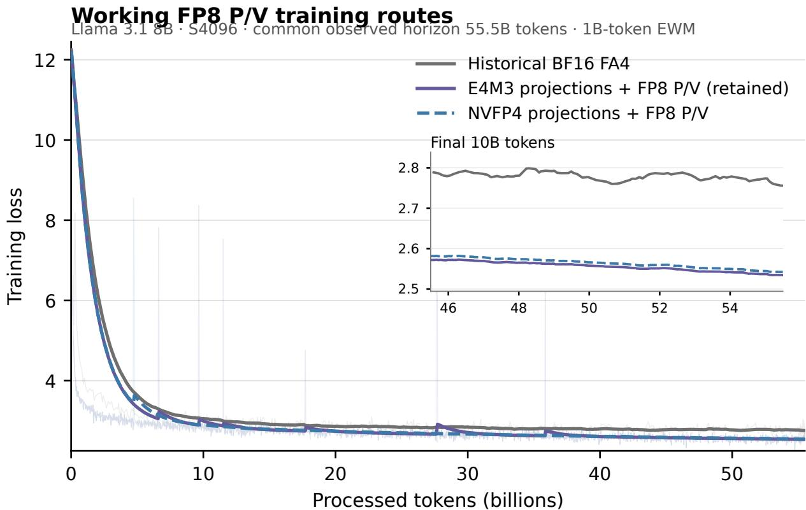  
Thin lines are downsampled raw loss; thick lines are causal token-domain EWMs. The BF16 run is a historical, non-paired reference.  
Figure 13: Historical 8-billion-parameter training context through the common 55.5-billion-token horizon. Thin lines show downsampled training loss and thick lines show a causal exponential moving average with a one-billion-token half-life. The FP8-P/V arms use 64-way replicated data parallelism with global batch 64. The bfloat16 reference uses 32-way fully sharded data parallelism with globa batch 32; it is not a paired control.

## G.8 What the distributed failures established

The first long distributed MX run combined learned NVFP4 projections, CCE, and the common-row MX backward, so its failure did not identify a single cause. At a matched checkpoint it had loss 7.0805 versus 6.5887 for FP8 and a pre-clipping gradient norm of 157,696 versus 6.41. It later exceeded 1.5 million despite gradient clipping.

The final four-arm diagnostic removed that ambiguity by crossing learned projection format with forward P/V format while holding the backward fixed. All four curves remain close through update 300 (78.6 million tokens). The MXFP4 arms visibly separate near update 400 (104.9 million tokens) and are unambiguously split by update 500 (131.1 million tokens): loss is 7.97 for both MXFP4 arms, compared with 5.41 for their FP8 controls. Both MX routes continue to fail under diferent learned-projection formats, whereas both FP8 routes remain non-divergent through the snapshot. Thus forward MXFP4 P/V, or the model state it induces, is the common separator. This is strong factorial evidence, but not a formal proof that one kernel instruction causes divergence.

Table 30: Initial frozen rolling-log cutof, retained for provenance. Jobs began at diferent times, so these are status observations rather than aligned loss or throughput comparisons.
<table><tr><td>Projections</td><td>Forward P/V</td><td>Update</td><td>Tokens</td><td>Loss</td><td>Grad norm</td><td>Status</td></tr><tr><td>E4M3</td><td>FP8</td><td>10,381</td><td>2.721B</td><td>2.9743</td><td>0.2197</td><td>working at cutoff</td></tr><tr><td>E4M3</td><td>MXFP4</td><td>10,075</td><td>2.641B</td><td>8.8265</td><td>358,400</td><td>diverged</td></tr><tr><td>NVFP4</td><td>FP8</td><td>10,884</td><td>2.853B</td><td>3.1637</td><td>0.2051</td><td>working at cutoff</td></tr><tr><td>NVFP4</td><td>MXFP4</td><td>11,061</td><td>2.900B</td><td>8.4801</td><td>3,915,776</td><td>diverged</td></tr></table>

The old rolling-log receipt first retained bad observations near update 4020 (1.054B tokens) for E4M3+MX and update 4722 (1.238B tokens) for NVFP4+MX. The complete histories in Figure 15 show that these were truncation markers, not onset estimates. At the common 55.5-billiontoken horizon, the one-billion-token moving-average losses are 8.94 and 8.18 for E4M3+MX and NVFP4+MX, compared with 2.53 and 2.54 for their FP8 controls; the MX gradient norms repeatedly reach the millions. The receipt hashes and scientific route identities are listed in Appendix H.

A later B4 campaign supported the same route selection at a larger efective batch. The NVFP4- projection/MXFP4-PV arm diverged shortly after its initially matched region. A second arm changed the learned projections to E4M3 while retaining MXFP4 P/V; it also developed repeated, finite gradient explosions and was cancelled at update 2550. Its last completed held-out validation was 7.4481 at update 2384. The matched bfloat16 and NVFP4-projection/FP8-PV trajectories remained stable. The two failed runs change projection precision but retain MXFP4 P/V, making the P/V representation the common factor. This does not prove that MXFP4 is fundamentally unsuitable or show whether forward quantization, the saved V payload, or its backward use is responsible. We therefore show the current B4 failure separately in Figure 14 rather than mixing it into the healthy matched-training plot.

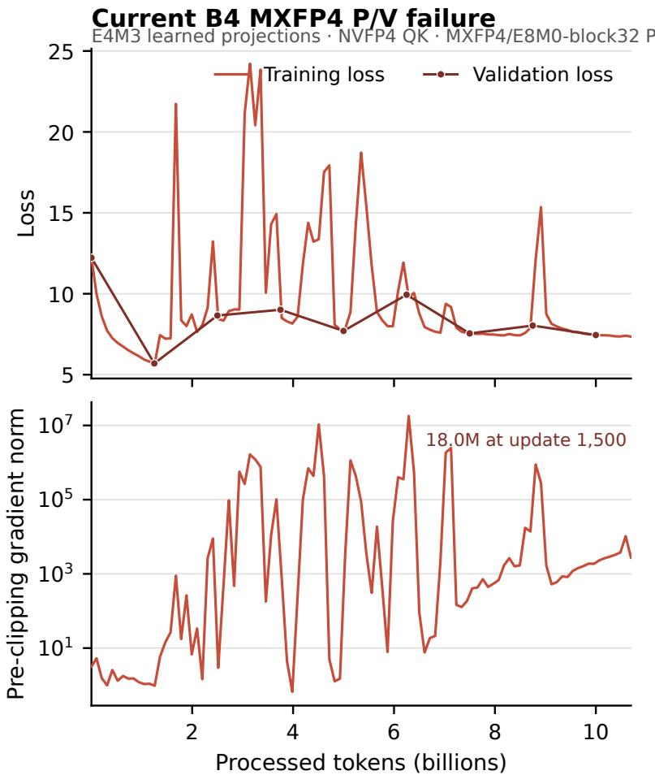  
The run was cancelled after update 2,550. This panel is a numerical-failure diagnostic, not a throughput comparison.

Figure 14: Matched B4 MXFP4-P/V failure diagnostic. This arm uses E4M3 learned projections, NVFP4 Q/K inside attention, and MXFP4 $\mathrm { P / V } .$ The top panel shows training and held-out validation loss; the lower panel shows the pre-clipping gradient norm. The run was cancelled after update 2550 and is excluded from the healthy-route throughput comparison.

MXFP4 P/V divergence diagnostic Four-arm projection × P/V control · common horizon 55.5B tokens  
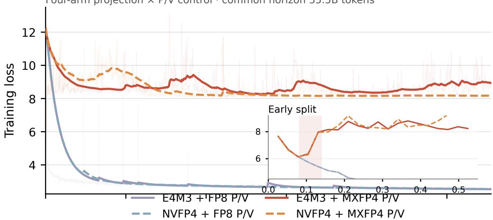

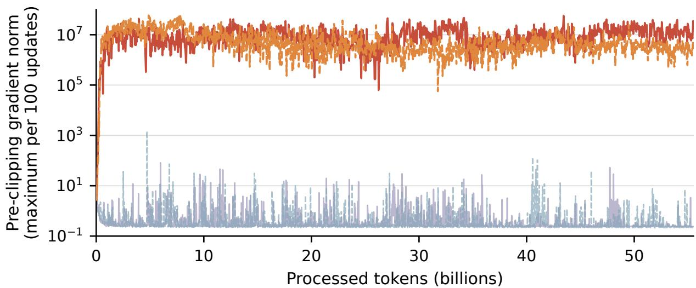  
Both MXFP4 arms fail under both tested learned-projection formats; the FP8 control arms remain non-divergent.  
Figure 15: Separated diagnostic for the two diverging MXFP4-P/V arms. The top panel shows loss; the lower panel shows the maximum pre-clipping gradient norm within each 100-update display bin on a logarithmic scale. The two FP8 control arms are muted and use the corresponding projection formats. The inset expands the first 0.55 billion tokens and qualitatively marks the interval between approximately 0.08 and 0.14 billion tokens in which the curves first separate.

## G.9 Evidence boundary

The local brackets measure the retained backward, the complete attention sublayer, and a full 8B update. The distributed histories show that the FP8 route remains non-divergent and continues descending over the observed window, while the MXFP4 route does not. The same-recipe B4 bfloat16 control provides same-update held-out validation and throughput over the completed 100-billion-token schedule. Because there is one trajectory per route, these data do not support run-to-run variability or statistical-equivalence claims. Input stalls and checkpoint windows remain in the reported throughput distribution.

## H Causal-Training Result Provenance

The causal extension uses durable repository receipts rather than values reconstructed from termina scrollback. The receipts below authenticate the native attention kernels, historical transformer-step recipes, final v509 runtime, the final local timing brackets, and the four distributed dense-crossentropy arms. The September 1 curves remain historical diagnostics. The completed September 3 receipt defines the healthy matched B4 comparison, while the September 2 snapshot retains the separate MXFP4-P/V failure diagnostic:

• results/native\_tk\_d64\_ptx\_adaptation\_20260829/README.md and v416\_llama12b\_ saturated\_receipt\_20260829.json record the D64 matched CuTe policies, production ABI, extension hashes, and saturated Llama-1.2B run.

• results/native\_tk\_d128\_gqa\_20260829/README.md records the matched v454 and v482 generated-CuTe matrices, numerical gates, resource envelopes, and selected-SASS identities.

• results/tk\_fa4\_d128\_v501\_corrected\_20260829/README.md records the corrected statistics ABI, isolated forward result, 8B matched bracket, v501 profile, and straight-MX v502/v503 experiments.

• results/tk\_fa4\_d128\_shared\_tile\_mx\_20260830/ records byte-level producer equivalence, the represented oracle, composed projection/backward timing, and the saturated A/control/B full-model gate.

• results/llama8b\_nvfp4\_qk\_backward\_reconstruction\_20260831/README.md records the B1 native-score reconstruction and E5M2-dO diagnosis that led to the retained path. The final exact-batch integration identities are recorded by the release manifest and the timing and matched-training receipts below. Large tensor captures used for layer-boundary diagnosis are not redistributed with the paper.

• receipts/causal\_d128\_report\_boundaries\_20260901.json contains every sample and summary used for the isolated-backward and projection-inclusive figures. Its SHA256 is 1dbdc271942826807a9cb8e1b93489d324689a77e74ad71b3deb7a85d0e47f7e; the authenticated raw receipt SHA256 is 0c94e8eec8bcec6768fb1e47032c5cfee531cf73dec27c31 56864ad3db8ba906. The benchmark source is tk\_fa4/lowp\_fa4\_bwd/benchmark\_v509\_ report\_boundaries.py.

• results/tk\_fa4\_8b\_batch\_scaling\_20260901/e2e\_batch\_scaling\_summary.json contains the B1/B2/B4 medians, numerical warning, compiled-extension identities, source commits, and hashes of the six authenticated raw timing receipts used by Figure 9 and Table 14. Its SHA256 is 1849d1aed501450a4b25a807dd6855f9962f59e76e91f836 848bb1a7053dab68. The raw sample arrays were ephemeral and are not retained in the repository; the committed summary therefore supports the reported medians, not a new confidence-interval analysis. All arms use standard cross entropy compiled by torch.compile; CCE is disabled. The older receipts/llama8b\_e2e\_b1\_v509\_20260901.json remains as a superseded B1-only bracket with every sample preserved.

• receipts/llama8b\_training\_curves\_20260901.json freezes the credential-free W&B histories used by both training figures at 2026-09-01 15:37:37 UTC. Its SHA256 is eecf78acd3cccd20f2cfae57cd8e4b9f6a79da12ecd3a4537e10f40b73591ca1. Every unique token coordinate recovered from each four-arm trajectory contributes to its causal tokendomain exponential moving average; only one row per 100 updates is retained for display. Duplicate coordinates created by resume are resolved by the final observation returned by the W&B history scan. The historical reference instead retains its sampled history and committed moving average inside the frozen receipt; it is not treated as a matched control for the B4 experiment.

• receipts/llama8b\_b4\_w64\_launch\_check\_20260902.json records the matched 64-GPU B4 recipe, all five aligned update-300–400 observations, the rejected NVFP4-projection MXFP4-P/V arm, source/runtime identities, and the update-239 distributed-checkpoint gate. This launch-window receipt is used for route validation; aggregate throughput comes from the matched receipt below. Its SHA256 is f652ea07c34048e9180629737dc00093 3e481e88856e7c64ee87f148eea21063.

• The completed matched B4 histories are frozen in receipts/llama8b\_b4\_completed\_ 20260903.json. The receipt selects one checkpoint lineage per arm and contains 954 aligned training reports, 81 aligned validation reports, and all 874 common post-warmup throughput observations. Terminal evidence records the update-23,842 checkpoint, completed remote sync, and successful node exit for both arms. This receipt supports Figures 10 and 11. Its SHA256 is 36272a35bd95c3138425e7330403f94d87e40ddd2109cdcb2bcf5e2b21c1c55e.

• receipts/llama8b\_b4\_matched\_snapshot\_20260902T1358Z.json retains the earlier matched B4 prefix together with the separate E4M3-projection/MXFP4-PV failure history. The completed receipt supersedes its healthy-route prefix; this snapshot remains the source for Figure 14. Its SHA256 is 0ed4b988db3a0805d520b0d41e241d224e0ad43e2258bf99 3625d85c1af2f0da.

The three local timing figures, two historical training figures, and three B4 figures are regenerated from those receipts by plot\_causal\_training.py. The timing receipts also bind the benchmarksource and compiled-runtime hashes, so the timing claims do not depend on an unversioned extension name or terminal output. fetch\_llama8b\_training\_curves.py performs a read-only W&B capture; it requires an API key in its process environment, requires an explicit new output path, and refuses to overwrite an existing receipt. It never writes the key, run configuration, or environment into the receipt. The fetcher validates W&B run IDs and names; source/runtime identities are inherited from the authenticated initial cutof receipt rather than revalidated from W&B. For the completed matched B4 receipt, fetch\_llama8b\_b4\_complete.py reads a private source map, stitches the selected checkpoint lineage, validates the exact token cadence, and cross-checks four-local-rank copies in independently downloaded worker logs. It omits service-side identifiers

from its output. The earlier MXFP4 diagnostic was frozen by export\_llama8b\_b4\_snapshot.py.   
Raw captures, the private source map, and authentication material are not committed.

The historical distributed rows are snapshots from an earlier FP8-PV and shared-MXFP4-PV pair. They are used only as route-selection diagnostics, not as checkpoint-aligned validation or aggregate throughput for the retained recipe. The snapshot deliberately records the matched loss gap and MX gradient explosion so a later edit cannot silently convert an operationally running job into a numerical-success claim. Both jobs used learned NVFP4 QKV/O and CCE; their values cannot be attached to the revised projection/loss contract. No credential-bearing configuration or environment data are included.

The initial redacted cutof values and first-retained-instability markers are frozen in receipts/ v509\_four\_arm\_cutoff\_20260831T2209Z.json, SHA256 b8e19765627e4f40d262578f9b59614f 61f7eff76b35a3467b9d82b5f2784fc2. All four arms authenticate the same source/runtime capsules and backward implementation and use a dense language-model head with standard cross entropy and loss-only compilation. Table 30 is the initial read-only rolling-log cutof from these live records. The complete materialized histories extend the four arms to 55.5–59.0 billion tokens and show that the old retained markers were not onset estimates. The two MX failures may be reported as a factorial numerical result; the instantaneous throughput values must not be converted into a matched speedup, the historical bfloat16 trace is not a paired control, and the FP8 arms support stability only through their stated common horizon.