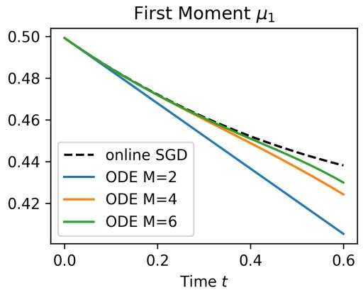
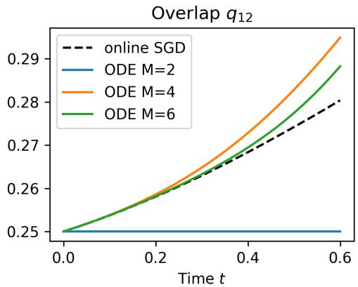
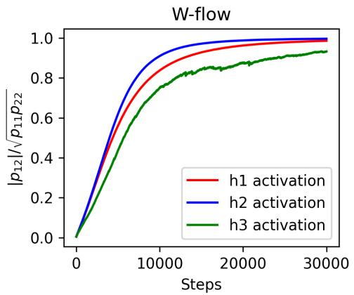
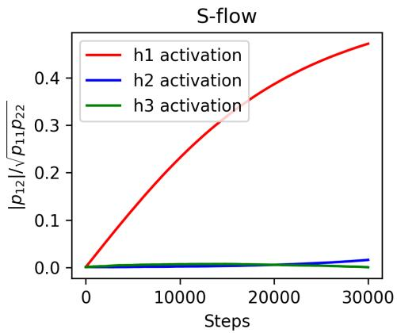
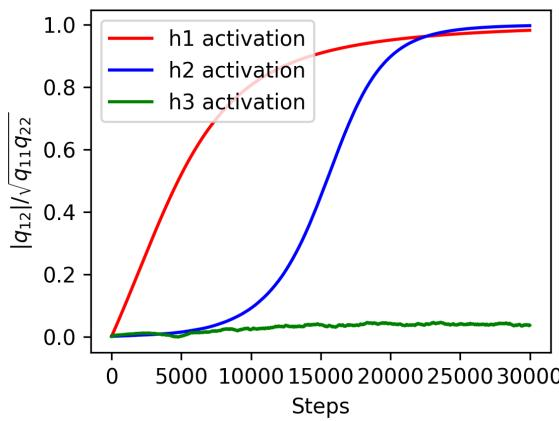
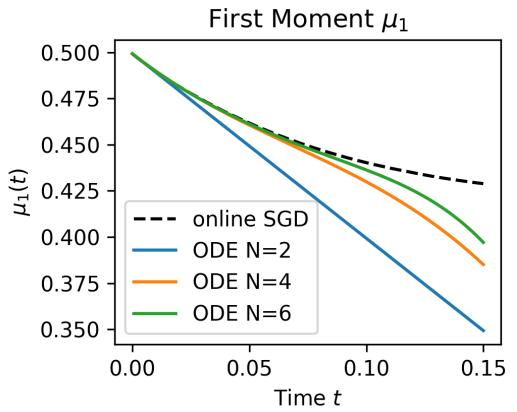
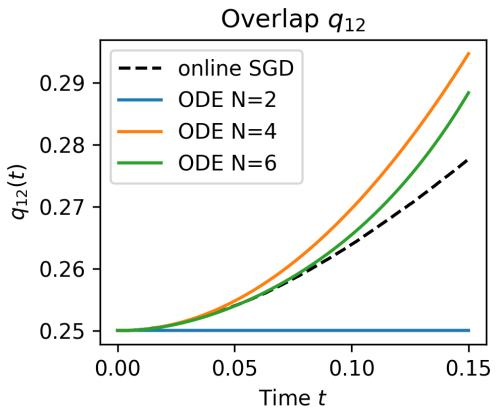

# High-Dimensional Learning Dynamics of Attention-Indexed Models

Yizhou Xu1,2, Margarita Sagitova2, Lenka Zdeborová2, and Florent Krzakala1

1Information, Learning and Physics Laboratory, École Polytechnique Fédérale de Lausanne (EPFL) 2Statistical Physics of Computation Laboratory, École Polytechnique Fédérale de Lausanne (EPFL)

## Abstract

Attention mechanisms are central to modern foundation models, yet their training dynamics remain poorly understood, especially when the attention matrices have extensive rank. In this work, we study attention-indexed models, a broad framework that can represent multi-layer and multi-head attention architectures. First, we show that, in a suitable high-dimensional limit, the population-loss landscape is characterized by a finite set of trace order parameters. In contrast, online stochastic gradient descent (SGD) is governed by an infinite hierarchy of matrix moments, which we show can be exponentially well-approximated by a finite truncated system. Second, this framework reveals that attention parameterization itself can act as an architectural implicit bias. Direct optimization of an attention matrix $S \in \mathbb { R } ^ { d \times d }$ can remain trapped in an uninformative state. Tied attention $( S = W W ^ { \top } )$ induces an automatic symmetry-breaking mechanism and yields weak recovery in $\Theta ( d ^ { 2 } \log d )$ samples. For untied attention, $S = U V ^ { \top }$ , we uncover a fast-slow mechanism: the pre-activation mean first evolves on a fast timescale, while the overlaps evolve on a slower one. Weak recovery on the Θ(d2 log d) scale occurs when the state selected by the fast dynamics breaks the initial symmetry.

## 1 Introduction

Attention mechanisms [36] are the central building blocks of modern foundation models, but their training dynamics remain poorly understood. This is particularly true in the high-dimensional feature-learning regime with extensive-rank attention matrices, whose ranks diverge as the embedding dimension grows. Understanding this regime raises two related but distinct questions. First, what is the correct macroscopic description of learning when the attention matrices have extensive rank? Second, once such a description is available, how does the parameterization of an attention matrix afect whether features can be learned?

Existing theoretical work has made substantial progress on several aspects of attention. One line studies the mechanisms of in-context learning [15, 30, 23], while another analyzes training from scratch in simplified transformer models [37, 14, 16]. For feature-learning dynamics, however, most existing analyses either do not take a high-dimensional limit [31, 32, 17, 22, 37] or focus on finite-rank attention matrices, corresponding to sequence-indexed models [9, 8, 34, 11, 18, 1]. Such low-rank descriptions do not capture the extensiverank regime naturally associated with attention matrices in practice, whose rank scales with the embedding dimension.

In this work, we study this regime through attention-indexed models, building on the formulation introduced in [7, 6]. The model class describes losses depending on collections of quadratic token interaction $\scriptstyle { \frac { 1 } { \sqrt { d } } } x _ { i } ^ { T } S _ { i j } x _ { k }$ with the attention matrix $S _ { i j } \in \mathbb { R } ^ { d \times d }$ of extensive rank. The formulation is broad: multi-layer and multi-head attention-only architectures can be expressed in terms of finitely many such quadratic forms; we give the construction in Section 2 and Appendix B. Previous analyses of attention-indexed models focused on static Bayes-optimal or empirical-risk-minimization [7, 6], with tractable analysis restricted to a single-layer, single-head tied setting. Dynamical analyses of extensive-rank matrices have so far been available mainly for substantially simpler quadratic models [20, 21, 38].

A first dificulty is that the static and dynamical descriptions have fundamentally diferent dimensionality. We prove that, as d → ∞, the population loss is determined by finitely many order parameters. At the level of the loss landscape, the original $\Theta ( d ^ { 2 } )$ -dimensional optimization problem therefore admits a finite-dimensional description. The training dynamics are richer. Unlike multi-indexed and sequence-indexed models whose dynamics can be tracked by a finite set of order parameters [13, 1, 4], for the tied and untied factorizations analyzed in this paper, online SGD generates an infinite hierarchy of joint matrix moments, and no fixed finite collection of moments is suficient in general to close the dynamics. We nevertheless show that this hierarchy is tractable: its empirical trajectory converges to a deterministic infinite-dimensional ODE, and finite-order truncations approximate the limiting dynamics with an error that decays exponentially with the truncation degree.

The second question is what this dynamical description reveals about parameterization. We compare three ways of representing an efective attention matrix: direct optimization of S, the tied factorization $S = W W ^ { \top }$ , and the untied factorization $S = U V ^ { \top }$ . Although these parameterizations can describe closely related predictors, they induce qualitatively diferent optimization geometries. This distinction becomes especially sharp when learning starts from an uninformative initialization. In high-dimensional inference, direct optimization can be bottlenecked by the information exponent [2]: when the first-order correlation vanishes, SGD over S can remain trapped on the $d ^ { 2 }$ log d sample scale. Our analysis shows that factorized attention can alter this conclusion, but through diferent mechanisms in the tied and untied cases.

For tied attention, $S ~ = ~ W W ^ { \top }$ , the positive-semidefinite (PSD) factorization provides an automatic symmetry-breaking mechanism. Under a mild non-degeneracy condition, this mechanism yields weak recovery in $\Theta ( d ^ { 2 } \log d )$ samples. The untied factorization $S = U V ^ { \top }$ behaves diferently. We find a fast–slow learning mechanism. The pre-activation means $\scriptstyle { \frac { 1 } { \sqrt { d } } } \operatorname { T r } ( U V ^ { \intercal } )$ evolve on a fast timescale, while the matrix moments evolve on a slower timescale. The subsequent weak-recovery behavior is therefore controlled by the state selected during the fast boundary layer. If this shift breaks the relevant symmetry, weak recovery occurs in $\Theta ( d ^ { 2 } \log d )$ samples; if the symmetry survives, the dynamics remains uninformative on this sample scale.

These results give two complementary messages. At the methodological level, extensive-rank attention requires a new macroscopic dynamical description: a finite-dimensional loss landscape coexists with an intrinsically infinite-dimensional training dynamics. At the learning level, the same framework shows that attention parameterization acts as an architectural implicit bias: tied and untied factorizations can overcome—or fail to overcome—uninformative symmetries through mechanisms that are absent from direct optimization of the attention matrix.

Our main contributions are therefore:

• A high-dimensional dynamical framework for extensive-rank attention. We formulate a broad class of attention-indexed models and show that their population loss admits a finite-dimensional characterization. For the tied and untied parameterizations, we derive high-dimensional limits for online SGD. The resulting dynamics involve an infinite hierarchy of matrix moments, for which we establish well-posedness, convergence, and exponentially accurate truncations.

• Tied attention induces automatic symmetry breaking and achieves weak recovery in $\Theta ( d ^ { 2 } \log d )$ samples. Untied attention learns through a fast–slow mechanism, which leads to a weak-recovery dichotomy: recovery on the $\Theta ( d ^ { 2 } \log d )$ scale occurs when the fast process breaks the relevant symmetry, whereas the dynamics stalls on this scale when it does not.

The remainder of the paper is organized as follows. Section 2 introduces attention-indexed models and establishes the finite-dimensional characterization of their population-loss landscape. Section 3 studies tied attention, derives its infinite-dimensional macroscopic dynamics and truncation theory, and identifies the symmetry-breaking mechanism responsible for weak recovery. Section 4 turns to untied attention and derives its two-timescale dynamics and associated weak-recovery dichotomy. The appendices contain the proofs, additional examples of attention-indexed models, and the analysis of direct optimization over the attention matrix S.

## 2 Attention-indexed models and their population loss landscape

The first goal of this paper is to identify a macroscopic description that remains tractable when the ranks of the attention matrices diverge with the embedding dimension. Before turning to training dynamics, we first ask a simpler static question: which quantities determine the population loss in the high-dimensional limit? We show in this section that, despite the high dimensionality of the underlying matrices, the answer is finite-dimensional. This finite-dimensional loss landscape will provide the potential that drives the dynamical equations in Sections 3 and 4.

Let $L = \Theta ( 1 )$ represent the sequence length (number of tokens), and $K = \Theta ( 1 )$ denote the number of indices, such as attention heads or layers (K = 2 in [6] with one student and one teacher index). Let the data vectors $x _ { 1 } , \ldots , x _ { L } \in \mathbb { R } ^ { d }$ be jointly Gaussian with zero mean and covariance given by $\mathbb { E } \left[ x _ { i a } x _ { j b } \right] = \mathcal { C } _ { i j } \delta _ { a b }$ , where $C \in \mathbb { R } ^ { L \times L }$ is a PSD matrix. Let $\boldsymbol { \tilde { S } } _ { i i } ^ { k } \in \mathbb { R } ^ { d \times d }$ for $i , j = 1 , \dots , L$ and $k = 1 , \ldots , K$ be a set of deterministic weight matrices. The assumption $\mathbb { E } [ x _ { i a } x _ { j b } ] = \mathcal { C } _ { i j } \delta _ { a b }$ is made without loss of generality, as any arbitrary covariance structure can be absorbed into the weight matrix S.

We consider losses of the form

$$
\mathcal { L } \left( \left\{ \frac { x _ { i } ^ { T } S _ { i j } ^ { k } x _ { j } } { \sqrt { d } } \right\} _ { i , j , k = 1 } ^ { L , L , K } \right) .
$$

under the following assumption.

Assumption 1. In the limit as d → ∞ with $K , L = \Theta ( 1 )$ , the following conditions hold for all $i , j , k , i ^ { \prime } , j ^ { \prime } , k ^ { \prime } .$

1. The matrices satisfy lim $\cdot d  \infty \ \frac { \| S _ { i j } ^ { k } \| _ { o p } } { \| S _ { i j } ^ { k } \| _ { F } } = 0$

2. The scaled traces have finite limits: lim $\begin{array} { r } { \mathsf { 1 } _ { d  \infty } \frac { 1 } { \sqrt { d } } \mathrm { T r } ( S _ { i j } ^ { k } ) = \mu _ { i j k } } \end{array}$ , li $\begin{array} { r } { \mathrm { \Sigma } _ { 1 d  \infty } \frac { 1 } { d } \mathrm { T r } \big ( S _ { i j } ^ { k } \big ( S _ { i ^ { \prime } j ^ { \prime } } ^ { k ^ { \prime } } \big ) ^ { T } \big ) = \Omega _ { i j k , i ^ { \prime } j ^ { \prime } k ^ { \prime } } } \end{array}$ and li $\begin{array} { r } { \Omega _ { d  \infty } \frac { 1 } { d } \mathrm { T r } ( S _ { i j } ^ { k } S _ { i ^ { \prime } j ^ { \prime } } ^ { k ^ { \prime } } ) = \Psi _ { i j k , i ^ { \prime } j ^ { \prime } k ^ { \prime } } } \end{array}$

3. The loss $\mathcal { L } : \mathbb { R } ^ { L \times L \times K }  \mathbb { R }$ is continuous with at most polynomial growth.

Remark. While Assumptions 1.2 and 1.3 are primarily regularity conditions, Assumption 1.1 identifies the extensive-rank regime of interest here. We argue that this assumption is highly relevant in practice. In standard multi-head attention, for example, the rank of an individual attention matrix can grow with the embedding dimension when the number of heads remains fixed. This marks a critical diference from existing literature on low-rank attention (sequence-indexed models) [9, 34, 1, 11].

In this section, we do not impose any structural assumptions on the attention matrices $S _ { i j } ^ { k }$ . We will specifically analyze both tied and untied attention mechanisms in subsequent sections. Remarkably, the attentionindexed model inherently covers standard multi-layer, multi-head attention networks (i.e., attention-only transformers).

Example (Multi-layer multi-head attention). Consider an M-layer, H-head attention network:

$$
X _ { m } = X _ { m - 1 } + \sum _ { h = 1 } ^ { H } s o f t m a x \bigl ( A _ { m } ^ { ( h ) } ( X _ { m - 1 } ) \bigr ) X _ { m - 1 } V _ { m - 1 } ^ { ( h ) } \in \mathbb { R } ^ { L \times d } , \quad m = 1 , \ldots , M\tag{1}
$$

where the pre-softmax attention matrix is given by:

$$
A _ { m } ^ { ( h ) } ( X _ { m - 1 } ) = \frac { 1 } { \sqrt { d } } X _ { m - 1 } K _ { m - 1 } ^ { ( h ) } ( Q _ { m - 1 } ^ { ( h ) } ) ^ { T } X _ { m - 1 } ^ { T } \in \mathbb { R } ^ { L \times L } .\tag{2}
$$

The matrices $K _ { m } ^ { ( h ) } , Q _ { m } ^ { ( h ) }$ , and $V _ { m } ^ { ( h ) }$ represent the key, query, and value weights of the m−th layer, respectively.   
The final output is $\begin{array} { r } { y = \sigma \left( \frac { 1 } { \sqrt { d } } X _ { M } K _ { M } Q _ { M } ^ { T } X _ { M } ^ { T } \right) } \end{array}$ for some activation function σ.

Consider a teacher-student setup with input data $X _ { 0 } \sim \mathcal { N } ( 0 , \mathcal { C } \otimes I _ { d } )$ and a loss function $\mathcal { L } ( y , \hat { y } )$ , where both teacher and student networks employ multi-layer multi-head architecture. This setup naturally falls within our general framework (see Appendix B for detailed derivations). Notably, we do not require the teacher weights to be Gaussian, rendering the existence of such a teacher model a relatively plausible assumption.

In Appendix B, we introduce several additional models that fit this framework, including auto-regressive sequence models, multiple-location regression models, multiple-step reasoning models and matrix denoising problems.

Although the matrices $S _ { i j } ^ { k }$ contain $\mathcal { O } ( d ^ { 2 } )$ degrees of freedom, the loss does not retain this full complexity in the high-dimensional limit. The reason is that, under the extensive-rank condition, the finite collection of quadratic forms entering the loss becomes jointly Gaussian. Its limiting distribution is therefore completely specified by the first- and second-order trace statistics in Assumption 1.

The following theorem makes this reduction precise.

Theorem 1. Under Assumption 1, the joint distribution of the quadratic forms converges weakly to a multivariate Gaussian, and expectations converge as follows:

$$
\operatorname* { l i m } _ { d  \infty } \mathbb { E } _ { x } [ \mathcal { L } ( \{ \frac { x _ { i } ^ { T } S _ { i j } ^ { k } x _ { j } } { \sqrt { d } } \} _ { i , j , k = 1 } ^ { L , L , K } ) ] = \mathbb { E } [ \mathcal { L } ( \{ G _ { i j k } \} _ { i , j , k = 1 } ^ { L , L , K } ) ] ,\tag{3}
$$

where $\{ G _ { i j k } \} _ { i , j , k = 1 } ^ { L , L , K }$ is a multivariate Gaussian vector whose mean and covariance are given by:

$$
\mathbb { E } \big [ G _ { i j k } \big ] = \mathcal { C } _ { i j } \mu _ { i j k } , ~ C o v \big ( G _ { i j k } , G _ { i ^ { \prime } j ^ { \prime } k ^ { \prime } } \big ) = \mathcal { C } _ { i i ^ { \prime } } \mathcal { C } _ { j j ^ { \prime } } \Omega _ { i j k , i ^ { \prime } j ^ { \prime } k ^ { \prime } } + \mathcal { C } _ { i j ^ { \prime } } \mathcal { C } _ { j i ^ { \prime } } \Psi _ { i j k , i ^ { \prime } j ^ { \prime } k ^ { \prime } } .\tag{4}
$$

Theorem 1 gives the basic reduction underlying the rest of the paper. In the high-dimensional limit, the population loss depends only on the finite collection of order parameters $\{ \mu , \Omega , \Psi \}$ . Thus, although the parameter space grows with d, the limiting loss landscape is finite-dimensional.

The Gaussian limit in Theorem 1 can be viewed as a consequence of the fourth-moment theorem for Wiener chaos [26]; for completeness, we provide a direct proof in Appendix C.1. A centered version needed for tied attention is given in Appendix C.2

Theorem 1 characterizes the loss at any fixed state. It also implies a stronger optimization-level statement: subject to an appropriate realizability condition, optimizing over the high-dimensional matrices is asymptotically equivalent to optimizing over their finite set of limiting order parameters.

Corollary 1. Let ${ \mathcal { K } } \subseteq \{ 1 , 2 , \ldots , K \}$ denote the index set of the learnable weights, while the remaining weights $\{ S _ { i j } ^ { k } \} _ { k \notin \mathcal K }$ are fixed and satisfy the condition lim ${ \bf \nabla } _ { \cdot d  \infty } \| S _ { i j } ^ { k } \| _ { o p } / \| S _ { i j } ^ { k } \| _ { F } = 0$ . Define the order parameter set $Q$ as

$$
Q : = \left\{ \left\{ \frac { 1 } { \sqrt { d } } \mathrm { T r } [ S _ { i j } ^ { k } ] \right\} _ { i , j , k } , \left\{ \frac { 1 } { d } \mathrm { T r } [ S _ { i j } ^ { k } S _ { i ^ { \prime } j ^ { \prime } } ^ { k ^ { \prime } } ] , \frac { 1 } { d } \mathrm { T r } [ S _ { i j } ^ { k } ( S _ { i ^ { \prime } j ^ { \prime } } ^ { k ^ { \prime } } ) ^ { T } ] \right\} _ { i , j , k , i ^ { \prime } , j ^ { \prime } , k ^ { \prime } } \right\} .\tag{5}
$$

Let Q denote the feasible domain of Q realizable by matrix sequences satisfying Assumption 1 in the limit $d \to \infty$ , subject to the constraints imposed by the fixed weights $\{ S _ { i j } ^ { k } \} _ { k \notin { \mathcal K } }$ . Let $\overset {  } { \mathcal { R } } ( Q ) : = \overset {  } { \mathbb { E } } _ { G } [ \mathcal { L } ( \{ G _ { i j k } \} _ { i , j , k = 1 } ^ { L , L , K } ) ]$ ∉Kdenote the expected population loss in Theorem 1 specified by Q and the covariance C.

Under the regularity assumption specified in Appendix C.3,

$$
\operatorname* { l i m } _ { d  \infty } \operatorname* { i n f } _ { \{ S _ { i j } ^ { k } \} _ { k \in \mathcal K } } \mathbb E _ { x } [ \mathcal { L } ( \{ \frac { x _ { i } ^ { T } S _ { i j } ^ { k } x _ { j } } { \sqrt { d } } \} _ { i , j , k = 1 } ^ { L , L , K } ) ] = \operatorname* { i n f } _ { Q \in \mathcal Q } \mathcal { R } ( Q ) .\tag{6}
$$

Corollary 1, proven in Appendix C.3, makes the finite-dimensional nature of the limiting landscape explicit: The optimal asymptotic population loss is determined by an optimization over the finite-dimensional feasible set Q.

Importantly, this does not imply that training can be described by gradient descent directly on $Q .$ Whether the order parameters form a closed dynamical system depends on how the attention matrices are parameterized. Direct optimization over S does close at the level of finitely many first- and second-order quantities (Appendix E), whereas the tied and untied factorizations studied in Sections 3 and 4 generate additional matrix moments. This distinction has important consequences for weak recovery.

## 3 Online SGD of tied attention

We now turn to a question that cannot be answered from the loss landscape alone: does the parameterization of the attention matrix change the way SGD learns features?

In this section, we first derive the macroscopic dynamics of tied attention and show that, despite the finite-dimensional population loss, the factorized flow requires an infinite hierarchy of matrix moments. We then use these dynamics to characterize weak recovery and contrast it with direct optimization over S.

## 3.1 Macroscopic dynamics

For tied attention, the trace of $S _ { k } = W _ { k } W _ { k } ^ { \top }$ is typically of order d. The pre-activation $d ^ { - 1 / 2 } x _ { i } ^ { \top } S _ { k } x _ { j }$ therefore contains a diverging contribution. Following the centered formulation of Appendix C.2, we consider the regularized loss

$$
\mathcal { L } \left( \left\{ \frac { \mathrm { T r } [ W _ { k } W _ { k } ^ { T } ( x _ { j } x _ { i } ^ { T } - \mathcal { C } _ { i j } I _ { d } ) ] } { \sqrt { d } } \right\} _ { i , j , k = 1 } ^ { L , L , K } \right) + \frac { \gamma } { 2 d } \sum _ { k = 1 } ^ { K } \| W _ { k } \| _ { F } ^ { 2 } ,
$$

where the input data $x _ { 1 } , \ldots , x _ { L } \sim { \mathcal { N } } ( 0 , { \mathcal { C } } \otimes I _ { d } )$ and $\gamma = \Theta ( 1 ) > 0$ denotes the weight decay strength.

For $k = 1 , \ldots , K$ , let $W _ { k } \in \mathbb { R } ^ { d \times d _ { k } }$ and $S _ { k } = W _ { k } W _ { k } ^ { \top } \succeq 0$ . As before, let ${ \mathcal { K } } \subseteq \{ 1 , \ldots , K \}$ denote the trainable indices. For $k \in \mathcal { K } , W _ { k }$ evolves during training, whereas for $k \notin \mathcal { K }$ it remains fixed and may, for example, represent a teacher matrix.

At iteration n, online SGD uses a fresh sample $\boldsymbol { x } ^ { ( n ) } \sim \mathcal { N } ( \boldsymbol { 0 } , \boldsymbol { C } \otimes \boldsymbol { I } _ { d } )$ and updates, for $k \in \mathcal { K } .$

$$
\boldsymbol { W } _ { k } ^ { ( n + 1 ) } = \boldsymbol { W } _ { k } ^ { ( n ) } - \alpha _ { d } \nabla _ { W _ { k } } \mathcal { L } ( \boldsymbol { G } ^ { ( n ) } ) - \frac { \alpha _ { d } \gamma } { d } \boldsymbol { W } _ { k } ^ { ( n ) } ,\tag{7}
$$

where we denote $\begin{array} { r } { G _ { i j k } ^ { ( n ) } : = \frac { 1 } { \sqrt { d } } \mathrm { T r } \big [ W _ { k } W _ { k } ^ { T } ( x _ { j } ^ { ( n ) } ( x _ { i } ^ { ( n ) } ) ^ { T } - \mathcal { C } _ { i j } I _ { d } ) \big ] } \end{array}$ and $\alpha _ { d }$ is the step size.

Define $S _ { k } ^ { ( n ) } = W _ { k } ^ { ( n ) } ( W _ { k } ^ { ( n ) } ) ^ { \intercal }$ and, for any multi-index $\alpha = ( k _ { 1 } , \ldots , k _ { w } )$

$$
\mu _ { \alpha } ^ { ( n ) } = \frac { 1 } { d } \mathrm { T r } \left[ S _ { k _ { 1 } } ^ { ( n ) } S _ { k _ { 2 } } ^ { ( n ) } { \cdots } S _ { k _ { w } } ^ { ( n ) } \right] .\tag{8}
$$

In particular, $q _ { k l } = \mu _ { ( k , l ) }$ denotes the second-order moment matrix. We introduce the continuous time $t = n \tau _ { d } .$ $\begin{array} { r } { \tau _ { d } = \frac { 4 \alpha _ { d } } { d } } \end{array}$ and let $\tilde { \mu } ^ { ( d ) } ( t )$ denote the piecewise-constant interpolation of these moments:

$$
\tilde { \mu } ^ { ( d ) } ( t ) = \mu ^ { ( n ) } , \quad \mathrm { f o r } t \in [ n \tau _ { d } , ( n + 1 ) \tau _ { d } ) .\tag{9}
$$

Define the potential as the limiting population loss in Theorem 1:

$$
\Phi ( q ) : = \mathbb { E } _ { G } [ \mathcal { L } ( G ) ] , \qquad q \in \mathbb { S } _ { + } ^ { K } ,\tag{10}
$$

where $G ~ \in ~ \mathbb { R } ^ { L \times L \times K }$ is a zero-mean Gaussian tensor with covariance Cov $( ( G ) _ { i j k } , ( G ) _ { i ^ { \prime } j ^ { \prime } l } ) \ = \ ( { \mathcal C } _ { i i ^ { \prime } } { \mathcal C } _ { j j ^ { \prime } }$ + $\mathcal { C } _ { i j ^ { \prime } } \mathcal { C } _ { j i ^ { \prime } } ) q _ { k l }$ . We define its matrix derivative as $\nabla \Phi ( q ) ^ { 1 }$ for $q \succeq 0$

Assumption 2. 1. The loss function $\mathcal { L } : \mathbb { R } ^ { L \times L \times K } $ R is four times continuously diferentiable. L and its derivatives up to the fourth order have at most polynomial growth.

2. At initialization, the weights ${ W } _ { k } ^ { ( 0 ) }$ satisfy $\| W _ { k } ^ { ( 0 ) } \| _ { F } = \Theta ( \sqrt { d } )$ . Additionally, there exists a constant $C _ { 0 } > 0$ independent of d such that $\begin{array} { r } { \operatorname* { s u p } _ { 1 \leq k \leq K } \| W _ { k } ^ { ( 0 ) } \| _ { o p } \leq C _ { 0 } } \end{array}$ almost surely.

3. lim $1 _ { d  \infty } | \tilde { \mu } _ { \alpha } ^ { ( d ) } ( 0 ) - \bar { \mu } _ { \alpha } ( 0 ) | = 0$ in probability for every multi-index α.

4. The regularization is suficiently large, i.e., $\gamma > \gamma _ { * } ( C _ { 0 } , \mathcal { C } , \mathcal { L } , K , L )$ for some γ independent of d.

Remark. Assumption 2.4 is used only to guarantee uniform spectral control and prevent finite-time blow-up. Equivalently, one may impose an a priori uniform bound on the operator norms of the weights; numerically, our trajectories remain bounded even without weight decay.

The key point is that the dimensionality of the loss and that of the dynamics are diferent. The potential Φ depends only on the finite-dimensional matrix q. However, the evolution of q is not closed: second moments depend on third moments, third moments on fourth moments, and so on. The tied factorization therefore converts a finite-dimensional loss landscape into an infinite-dimensional dynamical hierarchy. The following theorem shows that this hierarchy nevertheless has a deterministic and well-posed high-dimensional limit.

Theorem 2. Under Assumption ${ \mathit { 2 } } ,$ the online SGD trajectory is governed by an infinite-dimensional ODE driven by the gradients of Φ:

$$
\frac { d \bar { \mu } _ { ( k _ { 1 } , \ldots , k _ { w } ) } } { d t } = - \sum _ { \substack { k _ { i } \neq k } } ^ { w } [ \nabla \Phi ( \bar { q } ) ] _ { k _ { i } l } \left( \bar { \mu } _ { ( k _ { 1 } , \ldots , k _ { i - 1 } , l , k _ { i } , \ldots , k _ { w } ) } + \bar { \mu } _ { ( k _ { 1 } , \ldots , k _ { i } , l , k _ { i + 1 } , \ldots , k _ { w } ) } \right) - \frac { \gamma } { 2 } | \alpha | _ { K } \bar { \mu } _ { ( k _ { 1 } , \ldots , k _ { w } ) } ,\tag{11}
$$

where $| \alpha | _ { \mathcal { K } } \le w$ is the number of trainable indices in the multi-index α of length $\ w . \quad ( 1 1 )$ has a unique Kadmissible solution and the empirical trajectory uniformly converges to it in probability.

Specifically, if the width scales such that max $1 \leq k \leq K  d _ { k } \leq d ^ { c _ { w } }$ for some fixed $c _ { w } < + \infty$ and the learning rate scales such that $\alpha _ { d } \leq c _ { 0 } ( d \log d ) ^ { - 1 }$ and $\alpha _ { d } = \Omega ( d ^ { - \iota } )$ ≤for some constants $c _ { 0 } > 0$ small enough and $\iota > 0$ , then the empirical SGD trajectory satisfies:

$$
\operatorname* { l i m } _ { d \to \infty } \mathbb { P } \left( \operatorname* { s u p } _ { t \in [ 0 , T ] } \left| \tilde { \mu } _ { \alpha } ^ { ( d ) } ( t ) - \bar { \mu } _ { \alpha } ( t ) \right| > \epsilon \right) = 0 , \ \forall \epsilon > 0\tag{12}
$$

for every multi-index α and for any fixed $T > 0$

Remark. We regard (11) as an ODE on the moment space $\textstyle \bigcup _ { s > 0 } X _ { s } ^ { 0 }$ , where $\begin{array} { r } { X _ { s } ^ { 0 } : = \left\{ \mu : \operatorname* { l i m } _ { w \to \infty } \operatorname* { s u p } _ { | \alpha | = w } \frac { | \mu _ { \alpha } | } { s ^ { w } } = 0 \right\} } \end{array}$ A trajectory µ on $[ 0 , T ]$ is called an admissible solution if $q ( \mu ( t ) ) \geq 0$ for every $t \in [ 0 , T ]$ =and there exist $0 < s _ { T } < s _ { T } ^ { \prime } < \infty$ such that $\mu \in C ( [ 0 , T ] ; X _ { s _ { T } } ^ { 0 } )$ and $\begin{array} { r } { \mu ( t ) = \mu ( 0 ) + \int _ { 0 } ^ { t } V ( \mu ( r ) ) } \end{array}$ dr holds as an identity in $X _ { s _ { T } ^ { \prime } } ^ { 0 }$ where V refers to the right side of (11).

Theorem 2 gives the macroscopic dynamical counterpart of the static reduction in Section 2. The same finite-dimensional potential $\Phi ( q )$ determines the coeficients of the flow, but it does not determine a closed ODE for q. Instead, the geometry of the factorization $S = W W ^ { \top }$ propagates information through the entire hierarchy of joint moments.

This infinite-dimensionality is not merely an artifact of our choice of coordinates. Appendix D.3 gives an exactly solvable quadratic example. In that example, no finite-dimensional ODE with a continuous initialization map can reproduce all possible trajectories.

The proof, given in Appendix D.1, combines four ingredients: local well-posedness in a scale of weighted moment spaces, uniform spectral bounds obtained through a stopping-time argument and matrix Freedman inequalities, tightness and convergence of the empirical moment process, and global well-posedness of the resulting admissible infinite-dimensional trajectory.

The infinite hierarchy is required for an exact description, but this does not make the theory numerically intractable. Higher-order moments can be truncated with exponentially small error. For $M \geq 2$ , we define the degree-M truncated trajectory $\boldsymbol { \mu } ^ { ( M ) } ( t )$ by

$$
\frac { d } { d t } \mu _ { \alpha } ^ { ( M ) } ( t ) = [ V ( \mu ^ { ( M ) } ( t ) ) ] _ { \alpha } , \qquad | \alpha | \leq M ,\tag{13}
$$

with the initial condition $\mu _ { \alpha } ^ { ( M ) } ( 0 ) = \bar { \mu } _ { \alpha } ( 0 )$ for $| \alpha | \le M$ and the boundary condition $\mu _ { \alpha } ^ { ( M ) } ( t ) \equiv 0$ for $| \alpha | > M$ Here V denotes the right side of $( 1 1 ) ^ { 2 }$ . The following corollary guarantees that $\boldsymbol { \mu } ^ { ( M ) } ( t )$ can approximate the true dynamics $\bar { \mu } ( t )$ to arbitrary precision.

Corollary 2. Under the conditions of Theorem 2, there exist constants $s _ { 0 } > C _ { * } ^ { 2 }$ and $c < \infty$ independent of ∗M, α and T such that, for all suficiently large M, the truncated ODE (13) has a unique solution and for every multi-index α,

$$
\operatorname* { s u p } _ { t \in [ 0 , T ] } \left| \mu _ { \alpha } ^ { ( M ) } ( t ) - \bar { \mu } _ { \alpha } ( t ) \right| \leq c \left( \frac { C _ { * } ^ { 2 } } { s _ { 0 } } \right) ^ { M + 1 } s _ { 0 } ^ { | \alpha | } .\tag{14}
$$

  
Figure 1: Finite truncations accurately approximate the infinite moment dynamics. Comparison of online SGD with degree-M truncations of (13) for $L = 2 .$ , softmax activation, and MSE loss. Increasing M improves the agreement with the empirical trajectory. We use $d = 4 0 0$ , learning rate 0.01, batch size 512, and no weight decay.

Corollary 2 suggests that while the limiting trajectory is intrinsically infinite-dimensional, any fixed collection of low-order observables can be approximated to arbitrary accuracy by increasing the truncation degree. In the exactly solvable quadratic setting (quadratic networks [5, 20, 21]) of Appendix D.3, these finite-order systems coincide with the Taylor expansion of the exact matrix flow.

Corollary 2 is proven in Appendix D.2. As a side remark, Assumption 2.4 is used in its proof to obtain a uniform-in-time truncation error bound; without this condition, the constants in Corollary 2 would generally depend on T.

Figure 1 verifies the same phenomenon beyond the exactly solvable setting. For $L = 2$ , softmax activation, and MSE loss, increasing the truncation degree systematically improves agreement between the deterministic theory and online SGD.

## 3.2 Weak recovery and its sample complexity

We now use the macroscopic dynamics to address the main learning question of this section: can the tied factorization escape an initially uninformative state, and does its behavior difer from direct optimization over S?

The relevant notion of information is not the raw overlap ${ \textstyle \frac { 1 } { d } } \operatorname { T r } ( S _ { 1 } S _ { 2 } )$ . Because tied matrices have a nonzero trace, this quantity can be O(1) even when the student contains no information about the teacher. We therefore remove the isotropic components and measure learning through the overlap of the traceless parts.

For clarity, consider one trainable student $S _ { 1 } = W _ { 1 } W _ { 1 } ^ { T }$ and one fixed teacher $S _ { 2 }$ . Define $\begin{array} { r } { t _ { k } ^ { ( d ) } : = \frac { 1 } { d } \mathrm { T r } [ S _ { k } ] } \end{array}$ , $\mathring { S } _ { k } : = S _ { k } - t _ { k } ^ { ( d ) } I _ { d }$ and the structural overlaps

$$
p _ { k l } ^ { ( d ) } : = \frac { 1 } { d } \mathrm { T r } \big [ \mathring { S } _ { k } \mathring { S } _ { l } \big ] = q _ { k l } ^ { ( d ) } - t _ { k } ^ { ( d ) } t _ { l } ^ { ( d ) } .\tag{15}
$$

Their deterministic limits are denoted by $\bar { t } _ { k } , \bar { q } _ { k l }$ , and $\bar { p } _ { k l }$ . Thus $\bar { p } _ { 1 2 }$ , rather than $\bar { q } _ { 1 2 }$ , measures alignment between the student and teacher.

We impose the following uninformative initialization.

Assumption 3. As $d \to \infty$ , the initial student $S _ { 1 } ( 0 )$ and the teacher $S _ { 2 }$ satisfy

$$
\bar { p } _ { 1 2 } \big ( 0 \big ) = 0 , \qquad \operatorname* { l i m } _ { d \to \infty } \frac { 1 } { d } \mathrm { T r } \big [ \mathring { S } _ { 1 } ( 0 ) ^ { 2 } \mathring { S } _ { 2 } \big ] = 0 , \qquad \operatorname* { l i m } _ { d \to \infty } \frac { 1 } { d } \mathrm { T r } \big [ \mathring { S } _ { 1 } ( 0 ) \mathring { S } _ { 2 } ^ { 2 } \big ] = 0 .\tag{16}
$$

Moreover, we assume that $\bar { t } _ { 1 } ( 0 ) > 0$ and $\bar { p } _ { 2 2 } > 0$

Assumption 3 places the student on an uninformative manifold: its centered overlap with the teacher, as well as the mixed third-order centered moments vanish asymptotically at initialization. An independently initialized Gaussian $W _ { 1 } ( 0 )$ satisfies these conditions.

The tied parameterization nevertheless contains one additional macroscopic quantity that does not vanish: $\bar { t } _ { 1 } ( 0 ) > 0$ as a direct consequence of $S _ { 1 } = W _ { 1 } W _ { 1 } ^ { \top } \succeq 0$ . Evaluating the moment dynamics (11) at the uninformative initialization gives

$$
\left. \frac { d \bar { p } _ { 1 2 } } { d t } \right| _ { t = 0 } = - 2 [ \nabla \Phi ( \bar { q } ( 0 ) ) ] _ { 1 2 } \bar { t } _ { 1 } ( 0 ) \bar { p } _ { 2 2 } .\tag{17}
$$

Hence, whenever $[ \boldsymbol { \nabla } \Phi ( \bar { q } ( 0 ) ) ] _ { 1 2 }$ is nonzero, the uninformative state has a nonzero velocity in the informative direction. This is the symmetry-breaking efect of the tied factorization.

Corollary 3 turns this heuristic into a sample-complexity statement, proven in Appendix D.4. For a fixed recovery threshold $c > 0$ , define the weak-recovery sample complexity by

$$
N _ { \mathrm { w r } } ^ { ( d ) } ( c ) : = \operatorname* { i n f } \left\{ n \geq 0 : | p _ { 1 2 } ^ { ( d , n ) } | \geq c \right\} ,\tag{18}
$$

where $p _ { 1 2 } ^ { ( d , n ) }$ denotes the structural overlap after n steps of online SGD (7).

Corollary 3. Under Assumption 3 and the conditions of Theorem ${ \mathit { 2 } } ,$ suppose additionally that

$$
\big [ \nabla \Phi ( \bar { q } ( 0 ) ) \big ] _ { 1 2 } \neq 0 ,\tag{19}
$$

Then there exist constants $c > 0$ and $0 < T _ { - } < T _ { + } < \infty$ independent of d, such that

$$
\operatorname* { l i m } _ { d \to \infty } \mathbb { P } \left( \left\lfloor \frac { T _ { - } d } { 4 \alpha _ { d } } \right\rfloor < N _ { \mathrm { w r } } ^ { ( d ) } ( c ) \leq \left\lceil \frac { T _ { + } d } { 4 \alpha _ { d } } \right\rceil \right) = 1 .\tag{20}
$$

In particular, choosing the largest learning-rate scaling $\begin{array} { r } { \alpha _ { d } = \Theta \left( \frac { 1 } { d \log d } \right) } \end{array}$ covered by Theorem 2 gives the weak recovery sample complexity

$$
N _ { \mathrm { w r } } ^ { ( d ) } ( c ) = \Theta _ { \mathbb { P } } ( d ^ { 2 } \log d ) .\tag{21}
$$

Remark. The condition (19) is mild in a broad class of teacher-student losses. To see this, consider the MSE loss $\begin{array} { r } { \mathcal { L } ( G _ { 1 } , G _ { 2 } ) = \frac { 1 } { 2 } \| \dot { F } ( G _ { 1 } ) - F ( G _ { 2 } ) \| ^ { 2 } } \end{array}$ with the same activation F for student and teacher. Then

$$
\left[ \nabla \Phi ( \bar { q } ) \right] _ { 1 2 } = - \frac { 1 } { 2 } \mathbb { E } \left[ \left. \nabla F ( G _ { 1 } ) B ^ { 1 / 2 } , \nabla F ( G _ { 2 } ) B ^ { 1 / 2 } \right. _ { F } \right] ,\tag{22}
$$

where $B _ { ( i j ) , ( i ^ { \prime } j ^ { \prime } ) } = \mathcal { C } _ { i i ^ { \prime } } \mathcal { C } _ { j j ^ { \prime } } + \mathcal { C } _ { i j ^ { \prime } } \mathcal { C } _ { j i ^ { \prime } }$ . Suppose additionally that the initialization scale is chosen such that $q _ { 1 1 } ( 0 ) = q _ { 2 2 } > 0$ . A Gaussian Hermite expansion then gives

$$
- [ \nabla \Phi ( \bar { q } ( 0 ) ) ] _ { 1 2 } = \frac { 1 } { 2 } \sum _ { \nu } \rho ^ { | \nu | } \nu ! \| H _ { \nu } \| _ { F } ^ { 2 } ,\tag{23}
$$

where $\left\{ H _ { \nu } \right\}$ are the Hermite coeficients of $\nabla F ( \sqrt { q _ { 2 2 } } B ^ { 1 / 2 } z ) B ^ { 1 / 2 }$ and $\rho = \frac { \bar { t } _ { 1 } ( 0 ) \bar { t } _ { 2 } } { \sqrt { \bar { q } _ { 1 1 } ( 0 ) \bar { q } _ { 2 2 } } } > 0$ . Hence $[ \nabla \Phi ( \bar { q } ( 0 ) ) ] _ { 1 2 } <$ 0 whenever $\nabla F ( \sqrt { q _ { 2 2 } } B ^ { 1 / 2 } Z ) B ^ { 1 / 2 }$ is not constantly zero.

The significance of Corollary 3 is not only the $d ^ { 2 }$ log d sample scale, but the mechanism that produces it. The student begins with zero structural overlap with the teacher, yet the tied factorization makes this uninformative state non-invariant: the nonzero isotropic component $\bar { t } _ { 1 } ( 0 )$ couples to the teacher variance p¯22 through the cross-gradient of the population loss and immediately generates informative overlap.

This behavior should be contrasted with direct optimization over S. As shown in Appendix $\mathrm { E } ,$ the direct S-flow closes at the level of finitely many first- and second-order parameters. More importantly, when the relevant cross-gradients vanish throughout the uninformative manifold, that manifold is invariant under the limiting S-flow, and weak recovery does not occur on the $d ^ { 2 }$ log d sample scale. The tied factorization therefore acts as an architectural implicit bias: it changes the geometry of the gradient flow so that an initialization that is structurally uninformative can nevertheless have a nonzero escape direction.

Figure 2 illustrates this distinction. For a linear activation, both parameterizations can develop overlap. When we do online SGD directly over S on higher-order activations $( h _ { 2 } , h _ { 3 } )$ , however, it remains uninformative on the displayed sample scale, whereas the tied flow escapes and learns the teacher.

Corollary 3 identifies the mechanism governing weak recovery. Under an additional Polyak–Łojasiewicz condition, Appendix D.5 also gives a convergence rate for the subsequent strong-recovery phase.

  
Figure 2: The parameterization of the attention matrix qualitatively changes weak recovery. We compare online SGD on the tied factor W, with $S = W W ^ { \top }$ (Left), and direct online SGD on S (Right), starting from uninformative initializations in the same teacher–student setting. For the linear activation both parameterizations recover the teacher on the displayed scale, whereas for the higher-order activations the direct S-flow remains close to the uninformative state while the tied W-flow develops substantial overlap. We use $d = 4 0 0$ , learning rate 0.005, batch size 512, and no weight decay. The activations are chosen from: $h _ { 1 } ( x ) = x .$ $\textstyle h _ { 2 } ( x ) = { \frac { x ^ { 2 } - 1 } { \sqrt { 2 } } }$ and $\begin{array} { r } { h _ { 3 } ( x ) = \frac { x ^ { 3 } - 3 x } { \sqrt { 6 } } } \end{array}$ , respectively $\left( L = 1 \right)$ . The input data is $\mathcal { N } ( 0 , I _ { d } )$

## 4 Online SGD of untied attention

The symmetry breaking described in Section 3 relies crucially on the PSD geometry $S = W W ^ { \top }$ . This raises the natural next question: what remains of the mechanism when S is not PSD? This section answers this question for the untied parameterization $S = U V ^ { T }$

The mechanism is qualitatively diferent from the tied case. For untied attention, the pre-activation has a nontrivial mean $\begin{array} { r } { m _ { k } = \frac { 1 } { \sqrt { d } } \operatorname { T r } ( U _ { k } \mathbf { \bar { \it V } } _ { k } ^ { \top } ) } \end{array}$ , and this mean evolves faster than the matrix moments. As a result, training separates into two stages. On the fast timescale, the mean variables evolve while the moments remain asymptotically frozen. The fast flow drives the trainable means toward a critical manifold of the population loss. Only afterwards, on a slower timescale, do the matrix moments undergo O(1) evolution, with the means remaining asymptotically slaved to this manifold.

This separation has a direct consequence for feature learning. The fast phase does not itself create an $\mathcal { O } ( 1 )$ teacher overlap, since the overlaps remain frozen on that timescale. Instead, it selects the efective state from which slow feature learning begins. Weak recovery is therefore controlled by the loss gradients evaluated after the fast relaxation. The fast flow can break a student-side symmetry by shifting the preactivation mean and then the slow dynamics escapes the uninformative manifold. If the relevant symmetry survives the fast relaxation, this recovery mechanism is absent.

The remainder of this section makes this fast–slow picture rigorous. We first derive the two-timescale macroscopic limit and then use it to characterize a corresponding dichotomy for weak recovery.

## 4.1 Macroscopic dynamics

For each index $k = 1 , \ldots , K$ , let $U _ { k } , V _ { k } \in \mathbb { R } ^ { d \times d _ { k } }$ and define the associated matrices $M _ { k } : = U _ { k } V _ { k } ^ { \top } , A _ { k } : = U _ { k } U _ { k } ^ { \top }$ and $B _ { k } : = V _ { k } V _ { k } ^ { \top }$ . We consider the regularized loss

$$
\mathcal { L } \left( \left\{ \frac { 1 } { \sqrt { d } } x _ { i } ^ { T } U _ { k } V _ { k } ^ { T } x _ { j } \right\} _ { i , j , k = 1 } ^ { L , L , K } \right) + \frac { \gamma } { 2 d } \sum _ { k \in \mathcal { K } } \left( \Vert U _ { k } \Vert _ { F } ^ { 2 } + \Vert V _ { k } \Vert _ { F } ^ { 2 } \right) ,\tag{24}
$$

where $x _ { 1 } , \ldots , x _ { L } \sim { \mathcal { N } } ( 0 , { \mathcal { C } } \otimes I _ { d } )$ , and ${ \mathcal { K } } \subseteq \{ 1 , \ldots , K \}$ denotes the set of trainable indices.

At iteration n, a fresh sample $\boldsymbol { x } ^ { ( n ) } \sim \mathcal { N } ( 0 , \mathcal { C } \otimes I _ { d } )$ is drawn, and for $k \in \mathcal { K }$ the online SGD updates are

$$
\begin{array} { l } { { \displaystyle { \cal U } _ { k } ^ { ( n + 1 ) } = { \cal U } _ { k } ^ { ( n ) } - \alpha _ { d } \nabla _ { { \cal U } _ { k } } \mathcal { L } ( G ^ { ( n ) } ) - \frac { \alpha _ { d } \gamma } { d } { \cal U } _ { k } ^ { ( n ) } } , } \\ { { \displaystyle { \cal V } _ { k } ^ { ( n + 1 ) } = { \cal V } _ { k } ^ { ( n ) } - \alpha _ { d } \nabla _ { V _ { k } } \mathcal { L } ( G ^ { ( n ) } ) - \frac { \alpha _ { d } \gamma } { d } { \cal V } _ { k } ^ { ( n ) } } , } \end{array}\tag{25}
$$

where $\begin{array} { r } { G _ { i j k } ^ { ( n ) } : = \frac { 1 } { \sqrt { d } } ( x _ { i } ^ { ( n ) } ) ^ { T } U _ { k } ^ { ( n ) } ( V _ { k } ^ { ( n ) } ) ^ { T } x _ { j } ^ { ( n ) } } \end{array}$ and $\alpha _ { d }$ is the learning rate.

Order parameters. Unlike the centered tied model of Section 3, the untied pre-activations can have an $\mathcal { O } ( 1 )$ limiting mean. We therefore need to track separately $\begin{array} { r } { m _ { k } ^ { ( d ) } \mathrel { \mathop : } = \frac { 1 } { \sqrt { d } } \mathrm { T r } \left( M _ { k } \right) } \end{array}$

The remaining macroscopic state is described by normalized joint moments of the matrices $M _ { k } , M _ { k } ^ { \top } , A _ { k } , B _ { k }$ Introduce the alphabet $\mathcal { Z } : = \{ M _ { k } , M _ { k } ^ { T } , A _ { k } , B _ { k } : 1 \leq k \leq K \}$ and for a word $\alpha = \left( Z _ { 1 } , \ldots , Z _ { w } \right) \in \mathcal { Z } ^ { w }$ , define

$$
\mu _ { \alpha } ^ { ( d ) } : = \frac { 1 } { d } \mathrm { T r } [ Z _ { 1 } { \cdots } Z _ { w } ] .\tag{26}
$$

In particular, we define the traces $t _ { k } ^ { A } : = \mu _ { \left( A _ { k } \right) } , t _ { k } ^ { B } : = \mu _ { \left( B _ { k } \right) }$ and the overlaps $q _ { k l } ^ { ( 1 ) } : = \mu _ { ( M _ { k } , M _ { l } ^ { T } ) } , q _ { k l } ^ { ( 2 ) } : = \mu _ { ( M _ { k } , M _ { l } ) }$ The potential is defined as the limiting population loss in Theorem 1: $\Phi ( m , q ^ { ( 1 ) } , q ^ { ( 2 ) } ) : = \mathbb { E } \big [ \mathcal { L } ( G ) \big ]$ , where $G \in \mathbb { R } ^ { L \times L \times K }$ is Gaussian with $\mathbb { E } [ G _ { i j k } ] = \mathcal { C } _ { i j } m _ { k }$ and Cov $\left( G _ { i j k } , G _ { i ^ { \prime } j ^ { \prime } l } \right) = \mathcal { C } _ { i i ^ { \prime } } \mathcal { C } _ { j j ^ { \prime } } q _ { k l } ^ { \left( 1 \right) } + \mathcal { C } _ { i j ^ { \prime } } \mathcal { C } _ { j i ^ { \prime } } q _ { k l } ^ { \left( 2 \right) }$ . We denote by $\nabla _ { m } \Phi$ and $\nabla _ { q ( r ) } \Phi , r = 1 , 2$ , the vector and matrix gradients of the potential, respectively.

For later use, let $M _ { l } ^ { ( 1 ) } : = M _ { l }$ and $M _ { l } ^ { ( 2 ) } \mathrel { \mathop : } = M _ { l } ^ { T }$ for $\bar { 1 } : = 2 , \quad \bar { 2 } : = 1$ . Define

$$
\psi _ { k } ( m , \mu ) : = 2 \sum _ { l = 1 } ^ { K } \sum _ { r = 1 } ^ { 2 } \left[ \nabla _ { q ^ { ( r ) } } \Phi \big ( m , q ^ { ( 1 ) } , q ^ { ( 2 ) } \big ) \right] _ { k l } \left[ \mu _ { ( M _ { l } ^ { ( r ) } , B _ { k } ) } + \mu _ { ( A _ { k } , M _ { l } ^ { ( r ) } ) } \right] .\tag{27}
$$

The crucial new point is that m and $\mu$ evolve on diferent scales. A single SGD step changes m at order $\alpha _ { d } ,$ whereas the normalized moments change only at order $\alpha _ { d } / d .$ . This produces the two-timescale limit below.

Fast learning phase. On the fast timescale $t = n \alpha _ { d } ,$ the normalized moments remain asymptotically frozen, while the mean vector evolves at order one. Denoting the limiting fast trajectory by $\widetilde { m } ( t )$ , the trainable components satisfy

$$
\frac { d \tilde { m } _ { k } } { d t } = - \left( \bar { t } _ { k } ^ { A } ( 0 ) + \bar { t } _ { k } ^ { B } ( 0 ) \right) \frac { \partial \Phi } { \partial m _ { k } } \left( \tilde { m } ( t ) , \bar { q } ^ { ( 1 ) } ( 0 ) , \bar { q } ^ { ( 2 ) } ( 0 ) \right) , \qquad k \in { \cal K } .\tag{28}
$$

The non-trainable components remain fixed.

Thus, to leading order, the fast learning phase performs gradient flow in the mean variables while seeing the covariance structure as frozen. Under the local strong-convexity condition introduced below, this flow converges toward the unique critical point $m _ { K } ^ { \star } = m _ { K } ^ { \star } ( q ^ { ( 1 ) } , \stackrel { \sim } { q } ^ { ( 2 ) } )$ satisfying $\nabla _ { m _ { \kappa } } \Phi \left( m ^ { \star } ( q ^ { ( 1 ) } , q ^ { ( 2 ) } ) , q ^ { ( 1 ) } , q ^ { ( 2 ) } \right) =$ K K0. We denote the corresponding critical manifold by $\mathcal { M } _ { 0 } : = \left\{ \left( m , \mu \right) : \nabla _ { m _ { \kappa } } \Phi ( m , q ^ { ( 1 ) } , q ^ { ( 2 ) } ) = 0 \right\}$

Slow learning phase. We now introduce the slow timescale $\textstyle \tau = \frac { t } { d } = \frac { n \alpha _ { d } } { d }$ . After the initial boundary layer, the trainable means are asymptotically slaved to the critical manifold:

$$
\bar { m } _ { \mathcal { K } } ( \tau ) = m _ { \mathcal { K } } ^ { \star } \left( \bar { q } ^ { ( 1 ) } ( \tau ) , \bar { q } ^ { ( 2 ) } ( \tau ) \right) , \qquad ( \bar { m } ( \tau ) , \bar { \mu } ( \tau ) ) \in \mathcal { M } _ { 0 } .\tag{29}
$$

The small residual of the fast variables contributes during the slow timescale. This produces the efective bias

$$
\bar { \beta } _ { k } ( \bar { m } , \bar { \mu } ) : = - \frac { \psi _ { k } ( \bar { m } , \bar { \mu } ) } { \bar { t } _ { k } ^ { A } + \bar { t } _ { k } ^ { B } } .\tag{30}
$$

with $\psi _ { k }$ defined in $( 2 7 )$ .

For a word $\alpha = \left( Z _ { 1 } , \ldots , Z _ { w } \right)$ , let $k _ { i }$ denote the index carried by the letter $Z _ { i }$ . For each trainable position $i ,$ define the substitution operators

$$
\begin{array} { r } { T _ { i } ^ { \mathrm { b i a s } } ( \mu ) = \left\{ \begin{array} { l l } { \mu _ { ( \dots , A _ { k } + B _ { k } , \dots ) } , } & { Z _ { i } \in \{ M _ { k } , M _ { k } ^ { T } \} , } \\ { \mu _ { ( \dots , M _ { k } + M _ { k } ^ { T } , \dots ) } , } & { Z _ { i } \in \{ A _ { k } , B _ { k } \} , } \end{array} \right. \qquad T _ { i , l , r } ^ { \mathrm { d i f } } ( \mu ) = \left\{ \begin{array} { l l } { \mu _ { ( \dots , M _ { i } ^ { ( r ) } B _ { k } + A _ { k } M _ { l } ^ { ( r ) } , \dots ) } , } & { Z _ { i } = M _ { k } , } \\ { \mu _ { ( \dots , B _ { k } M _ { i } ^ { ( r ) } + M _ { k } ^ { ( r ) } A _ { k } , \dots ) } , } & { Z _ { i } = M _ { k } ^ { T } , } \\ { \mu _ { ( \dots , M _ { i } ^ { ( r ) } M _ { k } ^ { T } + M _ { k } M _ { l } ^ { ( r ) } , \dots ) } , } & { Z _ { i } = A _ { k } , } \\ { \mu _ { ( \dots , M _ { i } ^ { ( r ) } M _ { k } + M _ { k } ^ { T } M _ { l } ^ { ( r ) } , \dots ) } , } & { Z _ { i } = B _ { k } . } \end{array} \right. } \end{array}\tag{31}
$$

The notation is understood linearly; for example, $\mu _ { ( . . . , A _ { k } + B _ { k } , . . . ) } = \mu _ { ( . . . , A _ { k } , . . . ) } + \mu _ { ( . . . , B _ { k } , . . . ) } .$

+With these operators, the slow evolution of all normalized matrix moments closes as an infinite-dimensional hierarchy

$$
\frac { d \bar { \mu } _ { \alpha } } { d \tau } = - \sum _ { \stackrel { \bar { k } = 1 } { k _ { i } \epsilon \mathcal { K } } } ^ { w } \bar { \beta } _ { k _ { i } } ( \bar { m } , \bar { \mu } ) \mathcal { T } _ { i } ^ { \mathrm { b i a s } } ( \bar { \mu } ) - 2 \sum _ { \stackrel { \bar { k } = 1 } { k _ { i } \epsilon \mathcal { K } } } ^ { w } \sum _ { l = 1 } ^ { K } \sum _ { r = 1 } ^ { 2 } \frac { \partial \Phi } { \partial q _ { k _ { i } l } ^ { ( r ) } } \left( \bar { m } , \bar { q } ^ { ( 1 ) } , \bar { q } ^ { ( 2 ) } \right) \mathcal { T } _ { i , l , r } ^ { \mathrm { d i f f } } ( \bar { \mu } ) - 2 \gamma | \alpha | _ { \kappa \bar { \mu } \alpha } .\tag{32}
$$

for $0 \leq \tau \leq T$ . Together with (29), this determines the limiting trajectory in the slow learning phase.

Equations (28)–(32) summarize the fast–slow structure. The mean variables are no longer independent coordinates on the slow scale: they are determined by the current second moments through $m ^ { \star } ( q )$ . The remaining matrix moments evolve through an infinite hierarchy, as in the tied case, but with the additional efective bias inherited from the fast learning phase.

We now state conditions ensuring that this formal separation of timescales is valid and that both phases remain well posed.

## Assumption 4. The following conditions hold.

1. The loss $\mathcal { L } : \mathbb { R } ^ { L \times L \times K }  \mathbb { R }$ is six times continuously diferentiable, and $\mathcal { L }$ together with its derivatives up to sixth order has at most polynomial growth.

2. For every $k , \| U _ { k } ^ { ( 0 ) } \| _ { F } + \| V _ { k } ^ { ( 0 ) } \| _ { F } = \Theta ( \sqrt { d } )$ . There exists a constant $C _ { 0 } > 0$ , independent of $d ,$ such that max $k \left\{ \| U _ { k } ^ { ( 0 ) } \| _ { \mathrm { o p } } , \| V _ { k } ^ { ( 0 ) } \| _ { \mathrm { o p } } \right\} \le C _ { 0 }$ almost surely.

3. There exist deterministic limits $\tilde { m } _ { k } ( 0 )$ and $\bar { \mu } _ { \alpha } ( 0 )$ such that $m _ { k } ^ { ( d ) } ( 0 )  \tilde { m } _ { k } ( 0 )$ and $\mu _ { \alpha } ^ { ( d ) } ( 0 ) \to \bar { \mu } _ { \alpha } ( 0 )$ in probability for every k and every α.

4. For every trainable index $k \in \mathcal { K } , \bar { t } _ { k } ^ { A } ( 0 ) > 0 , \bar { t } _ { k } ^ { B } ( 0 ) > 0$ and $\left| \bar { t } _ { k } ^ { A } ( 0 ) - \bar { t } _ { k } ^ { B } ( 0 ) \right| \geq c _ { \mathrm { b a l } }$ for some $c _ { \mathrm { b a l } } > 0$

5. The regularization is suficiently large, i $\cdot e . , \gamma > \gamma _ { * } ( C _ { 0 } , \mathcal { C } , \mathcal { L } , K , L , T )$ for some γ independent of d.

Assumption 4.4 is a technical non-degeneracy condition used to control the denominator $t _ { k } ^ { A } + t _ { k } ^ { B }$ of (30) and obtain uniform bounds along the slow trajectory. It is satisfied, for example, by independent Gaussian initializations with slightly diferent variances for $U _ { k }$ and $V _ { k }$ . Assumption 4.5 plays the same spectral-control role as in the tied case.

Assumption 5 (Local strong convexity). Fix a time horizon $T > 0$ . Let $m _ { K }$ denote the trainable mean components, while $m _ { \setminus } \kappa$ is fixed at $m _ { \setminus } \kappa ( 0 )$ K. Assume that there exist an open convex set $\mathcal { M } \subset \mathbb { R } ^ { | \mathcal { K } | }$ , an open set $\textit { \textbf { Q } } o f$ ∖Kcovariance parameters $q = \bigl ( q ^ { ( 1 ) } , q ^ { ( 2 ) } \bigr )$ , and a constant $\lambda _ { 0 } > 0$ such that:

1. For every $( m _ { K } , q ) \in \mathcal { M } \times \mathcal { Q } , \ \nabla _ { m _ { K } } ^ { 2 } \Phi ( m , q ) \succeq \lambda _ { 0 } I .$

2. Writing $q _ { 0 } = \bigl ( \bar { q } ^ { ( 1 ) } ( 0 ) , \bar { q } ^ { ( 2 ) } ( 0 ) \bigr )$ , we have $\tilde { m } \kappa ( 0 ) \in \mathcal { M } , q _ { 0 } \in \mathcal { Q }$ , and

$$
\{ m _ { K } \in \mathcal { M } : \Phi ( m _ { K } , m _ { \setminus K } ( 0 ) , q _ { 0 } ) \leq \Phi ( \tilde { m } ( 0 ) , q _ { 0 } ) \} \Subset \mathcal { M } .\tag{33}
$$

3. For every $q \in \mathcal { Q } .$ , the equation $\nabla _ { m \kappa } \Phi ( m , q ) = 0$ has a solution $m _ { \mathcal { K } } ^ { \star } ( q ) \in \mathcal { M }$ . The solution $\left( m _ { K } ^ { \star } ( \bar { q } ( \tau ) ) , \bar { q } ( \tau ) \right)$ of (29)-(32) remains in a compact subset of $\mathcal { M } \times \mathcal { Q } \ f o r \ 0 \leq \tau \leq T ^ { 3 }$ Kand suficiently large γ.

Assumption 5 ensures that, for each nearby covariance state, the fast dynamics has a locally unique attracting critical point $m ^ { \star } ( q )$ . This property allows the fast mean variables to be eliminated on the slow timescale.

We now define the empirical interpolations. On the fast timescale,

$$
\tilde { m } ^ { ( d ) } ( t ) : = m ^ { ( n ) } , \qquad t \in [ n \alpha _ { d } , ( n + 1 ) \alpha _ { d } ) ,\tag{34}
$$

while on the slow timescale,

$$
\tilde { \mu } ^ { ( d ) } ( \tau ) = \mu ^ { ( n ) } , \quad \quad \tau \in \left[ \frac { n \alpha _ { d } } { d } , \frac { ( n + 1 ) \alpha _ { d } } { d } \right) .\tag{35}
$$

The following theorem rigorously justifies the separation into a fast boundary layer and a slow infinitedimensional flow.

Theorem 3. Suppose that Assumptions 4 and 5 hold for a fixed slow-time horizon $T > 0$ . Assume furthermore that max $1 \leq k \leq K  d _ { k } \leq d ^ { c _ { w } }$ for some fixed $c _ { w } < \infty$ , and that the learning rate satisfies $\begin{array} { r } { \alpha _ { d } \leq \frac { c _ { 0 } } { d \log d } } \end{array}$ and $\alpha _ { d } = \Omega ( d ^ { - \iota } )$ ≤ ≤for some constants $\iota > 0$ and suficiently small $c _ { 0 } > 0$ independent of d.

Then the online SGD trajectory exhibits the following two-timescale limit. Fix any $\epsilon > 0$ . For every finite fast-time horizon $\widetilde { T } > 0$

$$
\operatorname* { l i m } _ { d \to \infty } \mathbb { P } \left( \operatorname* { s u p } _ { t \in \left[ 0 , \widetilde { T } \right] } \left\| \tilde { m } ^ { ( d ) } ( t ) - \tilde { m } ( t ) \right\| _ { \infty } > \epsilon \right) = 0 ,\tag{36}
$$

where m˜ is the unique solution of (28).

On the slow timescale, let $( { \bar { m } } ( \tau ) , { \bar { \mu } } ( \tau ) )$ denote the unique admissible solution of (29)–(32). Then for every $0 < T _ { 1 } < T _ { 2 } \leq T$

$$
\operatorname* { l i m } _ { d \to \infty } \mathbb { P } \left( \operatorname* { s u p } _ { \tau \in \left[ T _ { 1 } , T _ { 2 } \right] } \left. \tilde { m } ^ { ( d ) } ( \tau d ) - \bar { m } ( \tau ) \right. _ { \infty } > \epsilon \right) = 0\tag{37}
$$

and, for every word $\alpha ,$

$$
\operatorname* { l i m } _ { d \to \infty } \mathbb { P } \left( \operatorname* { s u p } _ { \tau \in \left[ 0 , T _ { 2 } \right] } \left. \tilde { \mu } _ { \alpha } ^ { ( d ) } ( \tau ) - \bar { \mu } _ { \alpha } ( \tau ) \right. > \epsilon \right) = 0 .\tag{38}
$$

Theorem 3 shows that the untied factorization introduces a dynamical structure that has no analogue in the tied model. On the fast scale $t = n \alpha _ { d }$ , only the pre-activation means undergo $\mathcal { O } ( 1 )$ evolution. On the slow scale $\tau = n \alpha _ { d } / d .$ , these means have already equilibrated and follow the evolving covariance quasi-statically, while the matrix moments undergo their $\mathcal { O } ( 1 )$ evolution. This distinction will be essential for weak recovery.

The proof is given in Appendix F. Its main additional dificulty relative to the tied case is the singular separation of timescales. We first establish convergence of the fast mean dynamics while the normalized moments remain frozen. We then obtain a refined $\overset { \smile } { \mathcal { O } } ( d ^ { - 1 / 2 } )$ control of the residual mean gradient after the boundary layer; this residual accumulates into the efective bias $\beta _ { k }$ on the slow scale. Uniform spectral bounds, tightness of the moment process, and uniqueness then yield the limiting slow trajectory.

As in the tied case, the slow infinite-dimensional hierarchy admits finite-order approximations. Appendix F.2 proves an exponentially decaying truncation error.

## 4.2 Weak recovery and its sample complexity

We now ask what the fast–slow structure implies for feature learning. To make this mechanism explicit, consider one trainable student $M _ { 1 } = U _ { 1 } V _ { 1 } ^ { \top }$ and one fixed teacher $M _ { 2 }$ . Since ${ \textstyle \frac { 1 } { d } } \operatorname { T r } ( M _ { k } ) = { \frac { m _ { k } ^ { ( d ) } } { \sqrt { d } } } \to 0$ , feature learning is naturally measured through the matrix overlaps

$$
{ q } _ { 1 2 } ^ { ( 1 , d ) } : = \frac { 1 } { d } \mathrm { T r } [ { \cal M } _ { 1 } { \cal M } _ { 2 } ^ { T } ] , \qquad { q } _ { 1 2 } ^ { ( 2 , d ) } : = \frac { 1 } { d } \mathrm { T r } [ { \cal M } _ { 1 } { \cal M } _ { 2 } ] .\tag{39}
$$

We write

$$
{ \bf q } _ { 1 2 } ^ { ( d ) } : = \left( { q } _ { 1 2 } ^ { ( 1 , d ) } \right) , \qquad \bar { \bf q } _ { 1 2 } : = \left( { \bar { q } } _ { 1 2 } ^ { ( 1 ) } \right) .\tag{40}
$$

We impose the following uninformative initialization.

Assumption 6. At the initial time, the matrix algebra generated by $\{ M _ { 1 } , M _ { 1 } ^ { T } , A _ { 1 } , B _ { 1 } \}$ is asymptotically free from the algebra generated by $\{ M _ { 2 } , M _ { 2 } ^ { T } , A _ { 2 } , B _ { 2 } \}$

Assumption 6 is the untied analogue of an uninformative initialization. Asymptotic freeness removes not only the pairwise overlaps $q _ { 1 2 } ^ { ( 1 ) }$ and $\overset { \smile } { q _ { 1 2 } }$ , but also the mixed student–teacher moments.

Define the teacher covariance as $\mathsf Q _ { 2 } : = \left( \begin{array} { c c } { \bar { q } _ { 2 2 } ^ { ( 1 ) } } & { \bar { q } _ { 2 2 } ^ { ( 2 ) } } \\ { \bar { q } _ { 2 2 } ^ { ( 2 ) } } & { \bar { q } _ { 2 2 } ^ { ( 1 ) } } \end{array} \right)$ . For $c > 0$ , define the weak-recovery sample complexity by

$$
N _ { \mathrm { w r } } ^ { ( d ) } ( c ) : = \operatorname* { i n f } \left\{ n \geq 0 : \left\| \mathbf { q } _ { 1 2 } ^ { ( d , n ) } \right\| _ { \infty } \geq c \right\} .\tag{41}
$$

Let $D _ { 1 } ( 0 ) : = \bar { t } _ { 1 } ^ { A } ( 0 ) + \bar { t } _ { 1 } ^ { B } ( 0 ) > 0$ , and recall that the fast dynamics drive the trainable mean toward $\bar { m } _ { 1 } ^ { \star } : =$ $m _ { 1 } ^ { \star } \left( \bar { q } ^ { ( 1 ) } ( 0 ) , \bar { q } ^ { ( 2 ) } ( 0 ) \right)$ . Define the gradient at the slow-time initial state by $\begin{array} { r } { \boldsymbol { g _ { 1 2 } ^ { \star } } : = \left( \frac { \partial \Phi } { \partial \boldsymbol { q } _ { 1 2 } ^ { ( 1 ) } } , \frac { \partial \Phi } { \partial \boldsymbol { q } _ { 1 2 } ^ { ( 2 ) } } \right) ^ { T } } \end{array}$ evaluated at $\left( \bar { m } ^ { \star } , \bar { q } ^ { ( 1 ) } ( 0 ) , \bar { q } ^ { ( 2 ) } ( 0 ) \right)$

The role of the fast phase becomes transparent by evaluating the overlap dynamics at its initial state according to (32):

$$
\left. \frac { d \bar { q } _ { 1 2 } } { d \tau } \right| _ { \tau = 0 } = - 2 D _ { 1 } ( 0 ) Q _ { 2 } g _ { 1 2 } ^ { \star } .\tag{42}
$$

Thus the fast dynamics afects feature learning by changing the point at which the gradient $g _ { 1 2 } ^ { \star }$ is evaluated. If $Q _ { 2 } g _ { 1 2 } ^ { \star } \neq 0$ , the slow trajectory leaves the uninformative state with nonzero velocity. The following corollary formalizes this intuition, proven in Appendix F.3, and Appendix F.4 gives a convergence rate for the subsequent strong-recovery phase under an additional Polyak–Łojasiewicz condition.

Corollary 4. Suppose that Assumption 6 and the conditions of Theorem 3 hold.

(i) If

$$
\mathsf Q _ { 2 } g _ { 1 2 } ^ { \star } \neq 0 ,\tag{43}
$$

then there exist constants $c > 0$ and $0 < T _ { - } < T _ { + } < \infty$ , independent of $d ,$ such that

$$
\operatorname* { l i m } _ { d \to \infty } \mathbb { P } \left( \left\lfloor { \frac { T _ { - } d } { \alpha _ { d } } } \right\rfloor < N _ { \mathrm { w r } } ^ { ( d ) } ( c ) \leq \left\lceil { \frac { T _ { + } d } { \alpha _ { d } } } \right\rceil \right) = 1 .\tag{44}
$$

Consequently, choosing the largest learning-rate scaling $\begin{array} { r } { \alpha _ { d } = \Theta \left( \frac { 1 } { d \log d } \right) } \end{array}$ covered by Theorem 3 gives

$$
N _ { \mathrm { w r } } ^ { ( d ) } ( c ) = \Theta _ { \mathbb { P } } ( d ^ { 2 } \log d ) .\tag{45}
$$

(ii) Let $\mathcal { M } _ { \mathrm { f r e e } }$ denote the set of moment sequences $f o r$ which the algebra generated by $\{ M _ { 1 } , M _ { 1 } ^ { T } , A _ { 1 } , B _ { 1 } \}$ is free from the algebra generated by $\{ M _ { 2 } , M _ { 2 } ^ { T } , A _ { 2 } , B _ { 2 } \}$ . Suppose that throughout $\mathcal { M } _ { \mathrm { f r e e } }$

$$
\left[ \nabla _ { q ^ { ( r ) } } \Phi \left( m ^ { \star } ( q ) , q ^ { ( 1 ) } , q ^ { ( 2 ) } \right) \right] _ { 1 2 } = 0 , \qquad r = 1 , 2 .\tag{46}
$$

Then for every $c > 0$ and every fixed $T > 0$

$$
\operatorname* { l i m } _ { d  \infty } \mathbb { P } ( N _ { \mathrm { w r } } ^ { ( d ) } ( c ) \leq \lfloor \frac { T d } { \alpha _ { d } } \rfloor ) = 0 .\tag{47}
$$

Thus, for $\alpha _ { d } = \Theta ( ( d \log d ) ^ { - 1 } )$ , weak recovery does not occur on the $d ^ { 2 }$ log d sample scale.

Corollary 4 identifies a dichotomy. Part (i) states that if the state selected by the fast dynamics exposes a nonzero gradient, weak recovery occurs after $\Theta ( d ^ { 2 } \log d )$ samples. Part (ii) gives the complementary invariant-manifold mechanism: if the relevant cross-gradients vanish throughout the uninformative manifold, then weak recovery does not occur on the same sample scale.

The contrast with tied attention is therefore sharp. In the tied case, the PSD geometry itself generates a nonzero escape direction from the original initialization. In the untied case, the fast phase first selects a new mean state, and it is the geometry of the loss at this selected state that determines whether the subsequent slow dynamics can escape.

The mechanism is particularly transparent for $L = 1$ and the MSE loss $\begin{array} { r } { \mathcal { L } ( z _ { 1 } , z _ { 2 } ) = \frac { 1 } { 2 } \big ( \sigma ( z _ { 1 } ) - \sigma _ { \star } ( z _ { 2 } ) \big ) ^ { 2 } } \end{array}$ At an uninformative state $q _ { 1 2 } = 0$ , the student and teacher pre-activations $Z _ { 1 } \sim \mathcal { N } \left( \bar { m } _ { 1 } ^ { \star } , \bar { q } _ { 1 1 } ^ { ( 1 ) } + \bar { q } _ { 1 1 } ^ { ( 2 ) } \right)$ and $Z _ { 2 } \sim \mathcal { N } \left( \bar { m } _ { 2 } , \bar { q } _ { 2 2 } ^ { ( 1 ) } + \bar { q } _ { 2 2 } ^ { ( 2 ) } \right)$ are independent. Price’s theorem gives

$$
\frac { \partial \Phi } { \partial q _ { 1 2 } ^ { ( 1 ) } } = \frac { \partial \Phi } { \partial q _ { 1 2 } ^ { ( 2 ) } } = \mathbb { E } \left[ \frac { \partial ^ { 2 } \mathcal { L } } { \partial z _ { 1 } \partial z _ { 2 } } \right] = - \mathbb { E } \bigl [ \sigma ^ { \prime } ( Z _ { 1 } ) \bigr ] \mathbb { E } \bigl [ \sigma _ { * } ^ { \prime } ( Z _ { 2 } ) \bigr ] .\tag{48}
$$

Hence a suficient condition for weak recovery is

$$
\mathbb { E } [ \sigma ^ { \prime } ( Z _ { 1 } ) ] \mathbb { E } [ \sigma _ { * } ^ { \prime } ( Z _ { 2 } ) ] \neq 0 .\tag{49}
$$

The two factors play diferent roles. The teacher-side term $\mathbb { E } \big [ \sigma _ { \star } ^ { \prime } ( Z _ { 2 } ) \big ]$ determines whether a first-order ⋆teacher signal is available at all. The fast dynamics cannot change this factor because the teacher is fixed. By contrast, the student-side term $\mathbb { E } [ \sigma ^ { \prime } ( Z _ { 1 } ) ]$ is evaluated at the shifted mean $\bar { m } _ { 1 } ^ { \star }$ selected by the fast phase. The fast learning phase can therefore repair a student-side symmetry: even if $\mathbb { E } [ \sigma ^ { \prime } ( Z _ { 1 } ) ]$ ] vanishes initially, it may become nonzero after the mean shifts. When this occurs and the teacher-side first-order signal is nonzero, weak recovery takes $\Theta ( d / \alpha _ { d } )$ samples. If $\bar { m } _ { 1 } ^ { * }$ fails to break this symmetry, the network stalls.

A numerical illustration is presented in Figure 3, which verifies that when $\mathbb { E } _ { z _ { 2 } } \Big [ \sigma _ { * } ^ { \prime } \big ( Z _ { 2 } \big ) \Big ] = 0$ , weak recovery ∗takes substantially more samples. Figure 3 also suggests that the weak recovery time depends on the information exponent of the activation functions, which is left for the future work.

## 5 Conclusion and future work

This work has two outcomes. First, we develop a high-dimensional framework for attention-indexed models with extensive-rank matrices. In the large-d limit, the population-loss landscape is characterized by a finite collection of trace order parameters. The corresponding training dynamics are substantially richer: online SGD generates an infinite hierarchy of matrix moments. We derive deterministic limits for these dynamics and show that the infinite hierarchy can nevertheless be approximated by finite-order truncations with exponentially decaying error.

  
Figure 3: Weak recovery becomes delayed for higher-order activations. Evolution of the symmetric student–teacher overlap (the overlap between $M _ { 1 } + M _ { 1 } ^ { T }$ and $M _ { 2 } + M _ { 2 } ^ { T } )$ for untied attention in a single-token teacher–student model with MSE loss. The linear activation $h _ { 1 } ( x ) = x$ develops overlap rapidly, whereas the higher-order activations $\begin{array} { r } { \bar { h _ { 2 } } ( x ) = \frac { x ^ { 2 } - 1 } { \sqrt { 2 } } } \end{array}$ and $\begin{array} { r } { h _ { 3 } ( x ) = \frac { x ^ { 3 } - 3 x } { \sqrt { 6 } } } \end{array}$ exhibit increasingly slow escape from the uninformative state, whose precise sample complexity is left for future work. We use $d = 8 0 0$ , learning rate 0.01, batch size 4096, standard Gaussian initialization, and no weight decay. The input data is $\mathcal { N } ( 0 , I _ { d } )$

Second, this framework reveals that the parameterization of the attention matrix can qualitatively change feature learning. For tied attention $S = W W ^ { \top }$ , the PSD factorization provides an automatic symmetry-breaking mechanism, yielding weak recovery in $\Theta ( d ^ { 2 } \log d )$ samples under a mild condition. This behavior contrasts with direct optimization over S, for which the uninformative manifold can remain invariant. For untied attention $S = U V ^ { \top }$ , the mechanism is diferent. Training separates

into a fast and a slower learning phase. The fast phase selects the state from which feature learning begins, and weak recovery on the $\Theta ( d ^ { 2 } \log d )$ scale depends on whether this selected state breaks the relevant symmetry. Thus, tied and untied factorizations do not merely provide diferent coordinates for the same optimization problem; they induce diferent routes by which SGD can escape an uninformative state.

While the attention-indexed model class is broad enough to represent attention-only architectures, the detailed training dynamics established here, however, only concern tied and untied parameterizations. We do not derive the full dynamics of all query, key, and value matrices in a general deep transformer. Extending the present approach to such parameter dynamics is a natural next step.

A second open direction concerns learning on a longer timescale. Corollary 4 characterizes the $\Theta ( d ^ { 2 }$ log d) sample scale. However, the numerical results suggest that recovery can occur on longer scales controlled by the information exponents. Analyzing these regimes requires tracking finite-d corrections over polynomially long training horizons, since higher-order terms that vanish at Θ(1) time can accumulate over such scales. Developing such a theory would provide a more complete characterization of the parameterization-dependent sample complexity.

Several other extensions remain open. The present work studies online SGD, whereas empirical risk minimization, empirical gradient flow, and other finite-sample optimization procedures can exhibit additional correlations and require diferent dynamical tools; existing results cover only special cases of attentionindexed models [12, 6, 21]. It would also be interesting to seek alternative representations of the infinite moment hierarchy. In particular, a resolvent-based formulation [27] may provide a more direct connection between the training dynamics and the evolving spectral distributions [19, 10] of the attention matrices.

More broadly, the results suggest that the parameterization of attention should be regarded as part of the learning mechanism itself. The same loss landscape can support qualitatively diferent training trajectories depending on the parameterization. Understanding this interaction between architecture, parameterization, and high-dimensional learning dynamics is, in our view, an important step toward a theory of more realistic attention models.

## Acknowledgements

We acknowledge funding from the Swiss National Science Foundation grants SNSF SMArtNet (grant number 212049), OperaGOST (grant number 200021 200390), and DSGIANGO (grant number 225837). This work was supported by the Simons Collaboration on the Physics of Learning and Neural Computation via the Simons Foundation grant (#1257412 (FK) and #1257413 (LZ)). This work was also supported by the EPFL AI Center PhD Fellowship Program 2026 (YX).

## References

[1] Luca Arnaboldi, Bruno Loureiro, Ludovic Stephan, Florent Krzakala, and Lenka Zdeborova. Asymptotics of sgd in sequence-single index models and single-layer attention networks. In The Thirty-ninth Annual Conference on Neural Information Processing Systems, 2025.

[2] Gerard Ben Arous, Reza Gheissari, and Aukosh Jagannath. Online stochastic gradient descent on nonconvex losses from high-dimensional inference. Journal of Machine Learning Research, 22(106):1–51, 2021.

[3] Jean Barbier, Francesco Camilli, Justin Ko, and Koki Okajima. Phase diagram of extensive-rank symmetric matrix denoising beyond rotational invariance. Physical Review X, 15(2):021085, 2025.

[4] Dario Bocchi, Theotime Regimbeau, Carlo Lucibello, Luca Saglietti, and Chiara Cammarota. Escape dynamics and implicit bias of one-pass sgd in overparameterized quadratic networks. arXiv preprint arXiv:2604.03068, 2026.

[5] Antoine Bodin and Nicolas Macris. Gradient flow on extensive-rank positive semi-definite matrix denoising. In 2023 IEEE Information Theory Workshop (ITW), pages 365–370. IEEE, 2023.

[6] Fabrizio Boncoraglio, Vittorio Erba, Emanuele Troiani, Yizhou Xu, Florent Krzakala, and Lenka Zdeborová. Single-head attention in high dimensions: A theory of generalization, weights spectra, and scaling laws. In Workshop on Scientific Methods for Understanding Deep Learning, 2026. ICML.

[7] Fabrizio Boncoraglio, Emanuele Troiani, Vittorio Erba, and Lenka Zdeborova. Bayes optimal learning of attention-indexed models. In The Thirty-ninth Annual Conference on Neural Information Processing Systems, 2025.

[8] Hugo Cui. High-dimensional learning of narrow neural networks. Journal of Statistical Mechanics: Theory and Experiment, 2025(2):023402, 2025.

[9] Hugo Cui, Freya Behrens, Florent Krzakala, and Lenka Zdeborová. A phase transition between positional and semantic learning in a solvable model of dot-product attention. Advances in Neural Information Processing Systems, 37:36342–36389, 2024.

[10] Leonardo Defilippis, Yizhou Xu, Julius Girardin, Emanuele Troiani, Vittorio Erba, Lenka Zdeborová, Bruno Loureiro, and Florent Krzakala. Scaling laws and spectra of shallow neural networks in the feature learning regime. arXiv preprint arXiv:2509.24882, 2025.

[11] Odilon Duranthon, Pierre Marion, Claire Boyer, Bruno Loureiro, and Lenka Zdeborová. Statistical advantage of softmax attention: insights from single-location regression. arXiv preprint arXiv:2509.21936, 2025.

[12] Vittorio Erba, Emanuele Troiani, Lenka Zdeborová, and Florent Krzakala. The nuclear route: Sharp asymptotics of erm in overparameterized quadratic networks. In The Thirty-ninth Annual Conference on Neural Information Processing Systems, 2025.

[13] Sebastian Goldt, Madhu Advani, Andrew M Saxe, Florent Krzakala, and Lenka Zdeborová. Dynamics of stochastic gradient descent for two-layer neural networks in the teacher-student setup. Advances in neural information processing systems, 32, 2019.

[14] Ruiquan Huang, Yingbin Liang, and Jing Yang. How transformers learn regular language recognition: A theoretical study on training dynamics and implicit bias. In International Conference on Machine Learning, pages 25516–25549. PMLR, 2025.

[15] Juno Kim and Taiji Suzuki. Transformers learn nonlinear features in context: Nonconvex mean-field dynamics on the attention landscape. In Forty-first International Conference on Machine Learning, 2024.

[16] Daniel Kunin, Giovanni Luca Marchetti, Feng Chen, Dhruva Karkada, James B Simon, Michael R DeWeese, Surya Ganguli, and Nina Miolane. Alternating gradient flows: A theory of feature learning in two-layer neural networks. In The Thirty-ninth Annual Conference on Neural Information Processing Systems, 2025.

[17] Ashok V Makkuva, Marco Bondaschi, Chanakya Ekbote, Adway Girish, Alliot Nagle, Hyeji Kim, and Michael Gastpar. Local to global: Learning dynamics and efect of initialization for transformers. Advances in Neural Information Processing Systems, 37:86243–86308, 2024.

[18] Pierre Marion, Raphaël Berthier, Gérard Biau, and Claire Boyer. Attention layers provably solve singlelocation regression. In ICLR 2025-Thirteenth International Conference on Learning Representations, 2025.

[19] Charles H Martin and Michael W Mahoney. Implicit self-regularization in deep neural networks: Evidence from random matrix theory and implications for learning. Journal of Machine Learning Research, 22(165):1–73, 2021.

[20] Simon Martin, Francis Bach, and Giulio Biroli. On the impact of overparameterization on the training of a shallow neural network in high dimensions. In International Conference on Artificial Intelligence and Statistics, pages 3655–3663. PMLR, 2024.

[21] Simon Martin, Giulio Biroli, and Francis Bach. High-dimensional analysis of gradient flow for extensivewidth quadratic neural networks. arXiv preprint arXiv:2601.10483, 2026.

[22] Eshaan Nichani, Alex Damian, and Jason D Lee. How transformers learn causal structure with gradient descent. In Proceedings of the 41st International Conference on Machine Learning, pages 38018–38070, 2024.

[23] Naoki Nishikawa, Yujin Song, Kazusato Oko, Denny Wu, and Taiji Suzuki. Nonlinear transformers can perform inference-time feature learning. In Forty-second International Conference on Machine Learning, 2025.

[24] Salim Noreddine and Ivan Nourdin. On the gaussian approximation of vector-valued multiple integrals. Journal of multivariate analysis, 102(6):1008–1017, 2011.

[25] Ivan Nourdin, Giovanni Peccati, and Anthony Réveillac. Multivariate normal approximation using stein’s method and malliavin calculus. In Annales de l’IHP Probabilités et statistiques, volume 46, pages 45–58, 2010.

[26] David Nualart and Giovanni Peccati. Central limit theorems for sequences of multiple stochastic inte grals. The Annals of Probability, 33(1):177–193, 1 2005.

[27] Elliot Paquette, Courtney Paquette, Lechao Xiao, and Jefrey Pennington. 4+ 3 phases of computeoptimal neural scaling laws. Advances in Neural Information Processing Systems, 37:16459–16537, 2024.

[28] Farzad Pourkamali, Jean Barbier, and Nicolas Macris. Matrix inference in growing rank regimes. IEEE Transactions on Information Theory, 70(11):8133–8163, 2024.

[29] Farzad Pourkamali and Nicolas Macris. Rectangular rotational invariant estimator for high-rank matrix estimation. Information and Inference: A Journal of the IMA, 14(3):iaaf015, 2025.

[30] Chen Siyu, Sheen Heejune, Wang Tianhao, and Yang Zhuoran. Training dynamics of multi-head softmax attention for in-context learning: Emergence, convergence, and optimality. In The Thirty Seventh Annual Conference on Learning Theory, pages 4573–4573. PMLR, 2024.

[31] Bingqing Song, Boran Han, Shuai Zhang, Jie Ding, and Mingyi Hong. Unraveling the gradient descent dynamics of transformers. Advances in Neural Information Processing Systems, 37:92317–92351, 2024.

[32] Yuandong Tian, Yiping Wang, Beidi Chen, and Simon S Du. Scan and snap: Understanding training dynamics and token composition in 1-layer transformer. Advances in neural information processing systems, 36:71911–71947, 2023.

[33] Francois Treves. Ovsyannikov theorem and hyperdiferential operators. Notas de Matematica, 46, 1968.

[34] Emanuele Troiani, Hugo Cui, Yatin Dandi, Florent Krzakala, and Lenka Zdeborová. Fundamental limits of learning in sequence multi-index models and deep attention networks: High-dimensional asymptotics and sharp thresholds. In Forty-second International Conference on Machine Learning, 2025.

[35] Emanuele Troiani, Vittorio Erba, Florent Krzakala, Antoine Maillard, and Lenka Zdeborová. Optimal denoising of rotationally invariant rectangular matrices. In Mathematical and Scientific Machine Learning, pages 97–112. PMLR, 2022.

[36] Ashish Vaswani, Noam Shazeer, Niki Parmar, Jakob Uszkoreit, Llion Jones, Aidan N Gomez, Łukasz Kaiser, and Illia Polosukhin. Attention is all you need. Advances in neural information processing systems, 30, 2017.

[37] Hongru Yang, Bhavya Kailkhura, Zhangyang Wang, Yingbin Liang, et al. Training dynamics of transformers to recognize word co-occurrence via gradient flow analysis. Advances in Neural Information Processing Systems, 37:46047–46117, 2024.

[38] Liu Ziyin, Yizhou Xu, Tomaso Poggio, and Isaac Chuang. Neural quadratic forms: A unified minimal model for sudden learning and scaling laws. arXiv preprint arXiv:2608.13335, 2026.

## Contents

1 Introduction 1   
2 Attention-indexed models and their population loss landscape 2   
3 Online SGD of tied attention   
3.1 Macroscopic dynamics .   
3.2 Weak recovery and its sample complexity   
4 Online SGD of untied attention 9   
4.1 Macroscopic dynamics . 9   
4.2 Weak recovery and its sample complexity 12   
5 Conclusion and future work 14   
A Notation 19   
B Examples of attention-indexed models 19   
B.1 Example 1: Multi-layer multi-head attention 19   
B.2 Example 2: Autoregressive sequence model 20   
B.3 Example 3: Multiple-location regression 21   
B.4 Example 4: Multi-step reasoning 21   
B.5 Example 5: Extensive-rank matrix denoising 22   
C Theory in Section 2   
C.1 Proof of Theorem 1   
C.2 Tied attention .   
C.3 Proof of Corollary 1   
D Theory in Section 3 26   
D.1 Proof of Theorem 2   
D.1.1 Local well-posedness   
D.1.2 Uniform spectral bounds   
D.1.3 Moment expansion 34   
D.1.4 Compactness of the empirical trajectories . 39   
D.1.5 Global well-posedness 40   
D.1.6 Final proof of Theorem 2 44   
D.2 Proof of Corollary 2 45   
D.3 An exactly solvable example 47   
D.4 Proof of Corollary 3 48   
D.5 Convergence rate of strong recovery 50   
E Online SGD over S 52   
E.1 Proof of Theorem 4 54   
E.1.1 Uniform spectral bounds 54   
E.1.2 Moment expansion 57   
E.1.3 Final proof of Theorem 4 60   
E.2 Proof of Corollary 7 61   
F Theory in Section 4 64   
F.1 Proof of Theorem 3 64   
F.1.1 A stronger version of Theorem 1 64   
F.1.2 Local well-posedness 64   
F.1.3 Uniform spectral bounds . 65   
F.1.4 Fast-dynamics convergence 79   
F.1.5 Moment expansion 81   
F.1.6 Limiting slow dynamics 90   
F.1.7 Final proof of Theorem 3 96   
F.2 Truncation to finite orders 97   
F.3 Proof of Corollary 4 99   
F.4 Convergence rate of strong recovery . 100   
F.5 Proof of Lemma 10 . 102   
G Declaration of LLM usage 103

## A Notation

We write $[ K ] \mathrel { \mathop : } = \{ 1 , \dots , K \}$ and let $\kappa \subseteq [ K ]$ denote the set of trainable indices. For a multi-index or word $\alpha ,$ ∣α∣ denotes its length, while $| \alpha | _ { \mathcal { K } }$ denotes the number of positions whose associated index belongs to $\kappa .$ KThe underlying finite alphabet of α will be clear from context.

For matrices, $\| \cdot \| _ { \mathrm { o p } }$ and $\| \cdot \| _ { \mathrm { F } }$ denote the operator and Frobenius norms, respectively, and $\langle A , B \rangle _ { F } : =$ $\operatorname { T r } ( A ^ { \intercal } B )$ . We write $\mathbb { S } ^ { K }$ for the space of real symmetric $K \times K$ matrices and $\mathbb { S } _ { + } ^ { K }$ for the space of positivesemidefinite matrices. For symmetric matrices, $A \succeq B$ means that $A - B$ +is positive semidefinite. For finite-dimensional vectors, $\| \cdot \| _ { \infty }$ and ∥ ⋅ ∥ denote the $\ell _ { \infty }$ and Euclidean norms.

We write $\mathbf { 1 } _ { E }$ ∞for the indicator of an event E, $a \wedge b : = \operatorname* { m i n } \{ a , b \}$ , and $[ a ] _ { + } : = \operatorname* { m a x } \{ a , 0 \}$ . For sets $A \subseteq B$ the notation $A \Subset B$ means that A is a compact subset of B.

We use the standard asymptotic notation $O ( \cdot ) , o ( \cdot ) , \Omega ( \cdot )$ , and Θ(⋅) as $d \to \infty$ . For random variables, $X _ { d } = { \cal O } _ { \mathbb { P } } ( a _ { d } )$ means that $X _ { d } / a _ { d }$ is bounded in probability, $X _ { d } = o _ { \mathbb { P } } ( a _ { d } )$ means that $X _ { d } / a _ { d } \overset { \mathbb { P } } {  } 0 .$ , and $X _ { d } =$ $\Theta _ { \mathbb { P } } ( a _ { d } )$ means that both $X _ { d } = { \cal O } _ { \mathbb { P } } ( a _ { d } )$ and $a _ { d } = O _ { \mathbb { P } } \big ( X _ { d } \big )$ . We write $X _ { d } { \stackrel { \mathbb { P } } { \to } } X$ for convergence in probability. For $s > 0$ , let $X _ { s }$ denote the Banach space of moment sequences $\mu = ( \mu _ { \alpha } ) _ { | \alpha | \geq 1 }$ equipped with the norm $\begin{array} { r } { \| \mu \| _ { s } : = \operatorname* { s u p } _ { w \geq 1 } \operatorname* { s u p } _ { | \alpha | = w } { \frac { | \mu _ { \alpha } | } { s ^ { w } } } } \end{array}$ and define $\begin{array} { r } { X _ { s } ^ { 0 } : = \{ \mu \in X _ { s } : \operatorname* { l i m } _ { w  \infty } \operatorname* { s u p } _ { | \alpha | = w } \frac { | \mu _ { \alpha } | } { s ^ { w } } = 0 \} } \end{array}$ . Equipped with the norm ≥inherited from $X _ { s } , X _ { s } ^ { 0 }$ is a separable Banach space. $C ( [ 0 , T ] ; X _ { s } ^ { 0 } )$ =denotes the space of continuous functions from [0, T] to $X _ { s } ^ { 0 }$ $\mathsf { \bar { D } } ( [ 0 , T ] ; X _ { s } ^ { 0 } )$ represents the space of all right-continuous functions with left limits mapping from $[ 0 , T ]$ into $X _ { s } ^ { 0 }$ , equipped with the Skorokhod $J _ { 1 }$ topology.

Throughout the paper, a superscript (d) denotes a finite-dimensional quantity, a bar denotes its deterministic high-dimensional limit, and a tilde denotes a piecewise-constant time interpolation, unless specified otherwise.

## B Examples of attention-indexed models

## B.1 Example 1: Multi-layer multi-head attention

In this example, we demonstrate that the standard multi-layer multi-head attention network (attention-only transformer) falls within our general theoretical framework.

Let the input to the model be Gaussian $X _ { 0 } \sim { \mathcal { N } } ( 0 , { \mathcal { C } } \otimes I _ { d } )$ . For layer $m = 1 , \ldots , M$ with H attention heads, the pre-softmax attention matrix for the h-th head is given by

$$
A _ { m } ^ { ( h ) } ( X _ { m - 1 } ) = { \frac { 1 } { \sqrt { d } } } X _ { m - 1 } S _ { m - 1 } ^ { ( h ) } X _ { m - 1 } ^ { T } \in \mathbb { R } ^ { L \times L }\tag{50}
$$

where $S _ { m - 1 } ^ { ( h ) } : = K _ { m - 1 } ^ { ( h ) } ( Q _ { m - 1 } ^ { ( h ) } ) ^ { T } \in \mathbb { R } ^ { d \times d }$ is the combined key-query weight matrix. The intermediate represen-− − −tations follow the standard multi-head attention mechanism:

$$
X _ { m } = X _ { m - 1 } + \sum _ { h = 1 } ^ { H } \operatorname { s o f t m a x } \left( A _ { m } ^ { ( h ) } ( X _ { m - 1 } ) \right) X _ { m - 1 } V _ { m - 1 } ^ { ( h ) } \in \mathbb { R } ^ { L \times d } ,\tag{51}
$$

where $V _ { m - 1 } ^ { ( h ) } \in \mathbb { R } ^ { d \times d }$ represents the combined value and output projection matrix for head h. Unrolling the −recurrence relation reveals that this network can be expressed as a composite function of the quadratic forms $G _ { k } : = \frac { 1 } { \sqrt { d } } X _ { 0 } \tilde { S } _ { k } X _ { 0 } ^ { T }$

For the first layer $( m = 1 )$ , the pre-softmax matrix constitutes a bilinear form:

$$
A _ { 1 } ^ { ( h ) } ( X _ { 0 } ) = { \frac { 1 } { \sqrt d } } X _ { 0 } S _ { 0 } ^ { ( h ) } X _ { 0 } ^ { T } : = G _ { 0 } ^ { ( h ) } .\tag{52}
$$

The output of the first layer is thus $\begin{array} { r } { X _ { 1 } = X _ { 0 } + \sum _ { h = 1 } ^ { H } } \end{array}$ softmax $( G _ { 0 } ^ { ( h ) } ) X _ { 0 } V _ { 0 } ^ { ( h ) }$

For the second layer $( m = 2 )$ , substituting $X _ { 1 }$ =into the pre-softmax attention matrix $\begin{array} { r } { A _ { 2 } ^ { ( h ) } ( X _ { 1 } ) = \frac { 1 } { \sqrt { d } } X _ { 1 } S _ { 1 } ^ { ( h ) } X _ { 1 } ^ { T } } \end{array}$ yields a sum of four types of cross terms:

$$
\begin{array} { l } { { A _ { 2 } ^ { ( h ) } ( X _ { 1 } ) = \displaystyle \frac { 1 } { \sqrt { d } } X _ { 0 } S _ { 1 } ^ { ( h ) } X _ { 0 } ^ { T } + \displaystyle \sum _ { i = 1 } ^ { H } \mathrm { s o f t m a x } ( G _ { 0 } ^ { ( i ) } ) \left( \frac { 1 } { \sqrt { d } } X _ { 0 } \left( V _ { 0 } ^ { ( i ) } S _ { 1 } ^ { ( h ) } \right) X _ { 0 } ^ { T } \right) } } \\ { { \displaystyle \quad \quad \quad + \displaystyle \sum _ { j = 1 } ^ { H } \left( \frac { 1 } { \sqrt { d } } X _ { 0 } \left( S _ { 1 } ^ { ( h ) } V _ { 0 } ^ { ( j ) T } \right) X _ { 0 } ^ { T } \right) \mathrm { s o f t m a x } ( G _ { 0 } ^ { ( j ) } ) ^ { T } } } \\ { { \displaystyle \quad \quad \quad + \displaystyle \sum _ { i = 1 } ^ { H } \sum _ { j = 1 } ^ { H } \mathrm { s o f t m a x } ( G _ { 0 } ^ { ( i ) } ) \left( \frac { 1 } { \sqrt { d } } X _ { 0 } \left( V _ { 0 } ^ { ( i ) } S _ { 1 } ^ { ( h ) } V _ { 0 } ^ { ( j ) T } \right) X _ { 0 } ^ { T } \right) \sigma ( G _ { 0 } ^ { ( j ) } ) ^ { T } . } } \end{array}\tag{53}
$$

Every inner term encapsulated by parentheses in the expansion above takes the form $\textstyle { \frac { 1 } { \sqrt { d } } } X _ { 0 } { \tilde { S } } X _ { 0 } ^ { T }$ . For instance, the attention outputs cross term forms a new bilinear form defined by the efective weight matrix $\tilde { S } : = V _ { 0 } ^ { ( i ) } S _ { 1 } ^ { ( h ) } V _ { 0 } ^ { ( j ) T }$

By induction, any attention matrix $A _ { m }$ , and consequently the final output representation, can be written as a finite composite function of a set of base bilinear forms $\{ G _ { k } \} _ { k = 1 } ^ { K }$ generated by equivalent efective weight matrices $\tilde { S } _ { k }$ . These efective matrices $\tilde { S } _ { k }$ =are finite products of the original network weights $( S , V )$ , which falls within the scope of attention-indexed models.

Furthermore, because the softmax function is continuous and bounded, the composite function remains continuous and exhibits at most polynomial growth. Therefore, when we assume that both the teacher and the student models are the multi-layer multi-head attention architecture, the final loss satisfies Assumption 1. Note that we do not require the teacher weights to be Gaussian, making the existence of such a teacher model a weak assumption.

## B.2 Example 2: Autoregressive sequence model

This example considers the most fundamental pretraining task: next-token prediction. We aim to predict the next token $x _ { L }$ using the context $x _ { 1 } , \ldots , x _ { L - 1 }$ via a simplified single-layer multi-head attention model.

−The student is a standard attention block, defined as:

$$
\hat { x } _ { L } = \sum _ { h = 1 } ^ { H } \sum _ { j = 1 } ^ { L - 1 } \alpha _ { j , h } V _ { h } x _ { j } , \quad \mathrm { w h e r e ~ } \alpha _ { j , h } = \mathrm { S o f t m a x } _ { j } \left( \{ \frac { 1 } { \sqrt { d } } x _ { L - 1 } ^ { T } W ^ { h } x _ { k } \} _ { k = 1 } ^ { L - 1 } \right) .\tag{54}
$$

Here, we absorb the query-key matrices into a single weight matrix $W ^ { h }$

We assume the data is generated by a sparse contextual dependency process. The next token $x _ { L }$ is a composition of specific past tokens that satisfy a relevance criterion

$$
x _ { L } = \sum _ { h = 1 } ^ { H } \sum _ { j = 1 } ^ { L - 1 } a _ { j , h } V _ { h } ^ { * } x _ { j } ,\tag{55}
$$

where $a _ { j , h } \in \{ 0 , 1 \}$ is a gating variable determining if token $j$ is relevant for generating L under head $h \colon$

$$
a _ { j , h } \sim \mathrm { B e r n o u l l i } \left( g \left( \left\{ \frac { 1 } { \sqrt { d } } x _ { i } ^ { T } M ^ { h } x _ { j } \right\} _ { i , j = 1 } ^ { L - 1 } \right) \right) .\tag{56}
$$

This models a scenario where the ground truth dependency structure is latent and dynamic, determined by the interaction between tokens.

The MSE loss can be expanded as:

$$
\mathcal { L } : = \left. \hat { x } _ { L } - x _ { L } \right. ^ { 2 } = \sum _ { j , j ^ { \prime } } x _ { j } ^ { T } \Omega _ { j j ^ { \prime } } x _ { j ^ { \prime } } ,\tag{57}
$$

where $\begin{array} { r } { \Omega _ { j j ^ { \prime } } : = \sum _ { h , h ^ { \prime } } \bigl ( a _ { j , h } V _ { h } ^ { * } - \alpha _ { j , h } V _ { h } \bigr ) ^ { T } \bigl ( a _ { j ^ { \prime } , h ^ { \prime } } V _ { h ^ { \prime } } ^ { * } - \alpha _ { j ^ { \prime } , h ^ { \prime } } V _ { h ^ { \prime } } \bigr ) } \end{array}$ . It is thus an attention-indexed model.

We can similarly analyze the standard next-token prediction MSE loss

$$
\mathcal { L } : = \mathbb { E } _ { L , x _ { 1 } , \cdots , x _ { L } } \left. \hat { x } _ { L } - x _ { L } \right. ^ { 2 } = \mathbb { E } _ { L } \mathbb { E } _ { \mathcal { C } | L } \mathbb { E } _ { ( x _ { 1 } , \cdots , x _ { L - 1 } ) \sim \mathcal { N } ( 0 , \mathcal { C } ) } \sum _ { j , j ^ { \prime } } ^ { L - 1 } x _ { j } ^ { T } \Omega _ { j j ^ { \prime } } x _ { j ^ { \prime } } ,\tag{58}
$$

which fits the general framework.

## B.3 Example 3: Multiple-location regression

This example considers a classification task $( \mathrm { e . g . }$ , sentiment analysis), where the goal is to predict the label $y \in \{ + 1 , - 1 \}$ } based on the interaction between tokens (e.g., detecting negation or intensification). We model the student predictor as a one-layer attention:

$$
\hat { y } = \mathrm { s i g n } \left( \sum _ { i , j } \alpha _ { i j } \sigma \left( \{ x _ { i } ^ { T } W ^ { h } x _ { j } \} _ { i j } \right) \right) ,\tag{59}
$$

where the model learns $\alpha _ { i j }$ to weight diferent token pairs. Moreover, we assume that the true label is generated by a "bag-of-interactions" model:

$$
y = \mathrm { s i g n } \left( \sum _ { i , j } S _ { i j } \cdot \epsilon _ { i j } \right) ,\tag{60}
$$

where $S _ { i j } \in \{ + 1 , - 1 \}$ represents the inherent sentiment polarity of the word pair (i, j) (e.g., +1 for "very good", −1 for "not good"), and $\epsilon _ { i j }$ indicates whether a meaningful grammatical connection exists between them:

$$
\epsilon _ { i j } = \left\{ \begin{array} { l l } { 1 , } & { \mathrm { w . p . ~ } g ( \{ x _ { i } ^ { T } W ^ { * } x _ { j } \} _ { i j } ) } \\ { 0 , } & { \mathrm { o t h e r w i s e . } } \end{array} \right.\tag{61}
$$

In this setting, $\epsilon _ { i j }$ can be interpreted as the ground-truth dependency graph (e.g., i modifies $j )$ , which is activated probabilistically by the underlying semantic matching $W ^ { * }$

## B.4 Example 4: Multi-step reasoning

This example models complex tasks requiring multi-step reasoning, such as in-context retrieval and composition (e.g., "Context: A:1, B:2, C:3. Query: Calculate $\mathrm { A } { + } \mathrm { B } ^ { \prime \prime } )$ .

We model the ground truth y as a hierarchical interaction between two latent tokens. The teacher first identifies two relevant tokens from the context based on the query $x _ { L }$ , and then computes their quadratic interaction:

$$
y = x _ { \epsilon _ { 1 } } ^ { T } U ^ { * } x _ { \epsilon _ { 2 } } ,\tag{62}
$$

where the indices $\epsilon _ { 1 } , \epsilon _ { 2 } \in \{ 1 , . . . , L - 1 \}$ are latent pointers. These pointers follow a probabilistic selection mechanism (e.g., a "ground truth" attention):

$$
P ( \epsilon _ { h } = k ) \propto \exp \left( \frac { 1 } { \sqrt { d } } x _ { L } ^ { T } W _ { h } ^ { * } x _ { k } \right) , \quad \mathrm { f o r } \ h \in \{ 1 , 2 \} .\tag{63}
$$

This represents the "reasoning logic" where $W _ { h } ^ { * }$ retrieves the necessary operands and $U ^ { * }$ defines the operation performed on them.

To solve this, the student must implement a two-stage process: first filtering/aggregating the context into latent representations, and then combining them. We model the student as a two-head attention

structure followed by a bilinear composition layer. The student first generates two latent vectors $z _ { 1 }$ and $z _ { 2 }$ by aggregating the context tokens $\{ x _ { k } \}$ :

$$
z _ { h } = \sum _ { j = 1 } ^ { L - 1 } \alpha _ { j , h } x _ { j } , \quad \mathrm { w h e r e } ~ \alpha _ { j , h } = \mathrm { S o f t m a x } _ { j } \left( \left\{ \frac { 1 } { \sqrt { d } } x _ { L } ^ { T } W ^ { h } x _ { k } \right\} _ { k = 1 } ^ { L - 1 } \right) .\tag{64}
$$

Here, $z _ { h }$ serves as the "retrieved operand" for head h. The final prediction is computed as the interaction between these aggregated representations:

$$
\hat { y } = z _ { 1 } ^ { T } \tilde { W } z _ { 2 } ,\tag{65}
$$

which takes the form of an attention-indexed model.

## B.5 Example 5: Extensive-rank matrix denoising

Consider the observation model:

$$
\boldsymbol { Y } = \boldsymbol { S } ^ { * } + \boldsymbol { Z } \in \mathbb { R } ^ { d \times d } ,\tag{66}
$$

where $S ^ { * }$ is an unknown deterministic symmetric matrix with an extensive rank (i.e., lim $ | \boldsymbol { \mathbf { \rho } } | | _ { d  \infty } \| \boldsymbol { S } ^ { * } \| _ { \mathrm { o p } } / \| \boldsymbol { S } ^ { * } \| _ { F } =$ →∞0), and Z is the noise matrix drawn from the Gaussian Orthogonal Ensemble (GOE), satisfying $\mathbb { E } \big [ Z _ { a b } \big ] = 0$ and ${ \mathbb E } \bigl [ Z _ { a b } Z _ { c d } \bigr ] = \frac { 1 } { d } \bigl ( \delta _ { a c } \delta _ { b d } + \delta _ { a d } \delta _ { b c } \bigr )$ . While prior work has extensively studied rotationally invariant priors [35, 28, 29], the general extensive-rank setting remains largely open [3].

A standard approach for inferring $S ^ { * }$ from $Y$ is via:

$$
\operatorname* { m i n } _ { \cal { S } } { \mathcal { L } } \left( { \frac { 1 } { d } } \mathrm { T r } [ Y S ] \right) + \lambda f ( S ) ,
$$

where $\mathcal { L } : \mathbb { R }  \mathbb { R }$ is the loss function and $f ( S )$ represents a regularizer. The population loss can be expressed as an expectation over a standard scalar Gaussian variable $g \sim \mathcal { N } ( 0 , 1 )$ :

$$
\mathbb { E } _ { Z } \mathscr { L } \left( \frac { 1 } { d } \mathrm { T r } [ Y S ] \right) = \mathbb { E } _ { g \sim \mathcal { N } ( 0 , 1 ) } \left[ \mathscr { L } \left( \frac { 1 } { d } \mathrm { T r } [ S ^ { * } S ] + \frac { \sqrt { 2 } } { d ^ { 3 / 2 } } \| S \| _ { F } g \right) \right] ,\tag{67}
$$

which can be regarded as a single-token single-index attention-indexed model as a special case of Theorem 1 and Corollary 5.

## C Theory in Section 2

## C.1 Proof of Theorem 1

The proof relies on the method of joint cumulants. If all joint cumulants of order $m \geq 3$ for a set of random variables vanish in the limit, the variables converge in distribution to a multivariate Gaussian (satisfying Carleman’s condition).

Let $\begin{array} { r } { Z _ { i j k } = \frac { 1 } { \sqrt { d } } x _ { i } ^ { T } S _ { i j } ^ { k } x _ { j } } \end{array}$ . We concatenate all data vectors into a single vector $X = [ x _ { 1 } ^ { T } , x _ { 2 } ^ { T } , \ldots , x _ { L } ^ { T } ] ^ { T } \in \mathbb { R } ^ { d L }$ Given the covariance structure $\mathbb { E } [ x _ { i a } x _ { j b } ] = \mathcal { C } _ { i j } \delta _ { a b }$ , we have $X \sim { \mathcal { N } } ( 0 , \Sigma )$ ), where the covariance matrix is the Kronecker product $\Sigma = \mathcal { C } \otimes I _ { d }$ . We can rewrite $Z _ { i j k }$ as a quadratic form:

$$
Z _ { i j k } = X ^ { T } A ^ { \left( i j k \right) } X ,\tag{68}
$$

where $A ^ { ( i j k ) }$ is a dL×dL symmetric block matrix. Its $( i , j )$ -th block is $\textstyle { \frac { 1 } { 2 { \sqrt { d } } } } S _ { i j } ^ { k }$ , its (j, i)-th block is $\frac { 1 } { 2 \sqrt { d } } ( S _ { i j } ^ { k } ) ^ { T }$ ， and all other blocks are zero.

By the standard expectation of Gaussian quadratic forms, the first moment is:

$$
\mathbb { E } \big [ Z _ { i j k } \big ] = \mathrm { T r } \big ( A ^ { ( i j k ) } \Sigma \big ) = \frac { 1 } { \sqrt d } \sum _ { a = 1 } ^ { d } \mathbb { E } \big [ x _ { i a } x _ { j a } \big ] ( S _ { i j } ^ { k } ) _ { a a } = \frac { \mathscr C _ { i j } } { \sqrt d } \mathrm { T r } ( S _ { i j } ^ { k } ) .\tag{69}
$$

By Assumption 1.2, as $d \to \infty$ , this converges to $\mathbb { E } [ G _ { i j k } ] = \mathcal { C } _ { i j } \mu _ { i j k }$

To calculate the covariance, we use Wick’s Theorem:

$$
\mathrm { C o v } \big ( Z _ { i j k } , Z _ { i ^ { \prime } j ^ { \prime } k ^ { \prime } } \big ) = 2 \mathrm { T r } \big ( A ^ { ( i j k ) } \Sigma A ^ { ( i ^ { \prime } j ^ { \prime } k ^ { \prime } ) } \Sigma \big ) .\tag{70}
$$

Expanding this into block components yields:

$$
\begin{array} { r l } & { \mathrm { C o v } ( Z _ { i j k } , Z _ { i ^ { \prime } j ^ { \prime } k ^ { \prime } } ) = \displaystyle \frac { 1 } { d } \sum _ { a , b , c , e } ( S _ { i j } ^ { k } ) _ { a b } ( S _ { i ^ { \prime } j ^ { \prime } } ^ { k ^ { \prime } } ) _ { c e } ( \mathcal { C } _ { i i ^ { \prime } } \mathcal { C } _ { j j ^ { \prime } } \delta _ { a c } \delta _ { b e } + \mathcal { C } _ { i j ^ { \prime } } \mathcal { C } _ { j i ^ { \prime } } \delta _ { a e } \delta _ { b c } ) } \\ & { \quad \quad \quad \quad \quad \quad \quad \quad \quad \quad \quad \quad \quad \quad \quad \quad \quad \quad \quad \quad \quad \quad } \\ & { \quad \quad \quad \quad \quad \quad \quad \quad \quad \quad \quad \quad \quad \quad \quad \quad \quad \mathcal { C } _ { i i ^ { \prime } } \mathcal { C } _ { j j ^ { \prime } } \frac { \mathrm { T r } \big ( S _ { i j } ^ { k } ( S _ { i ^ { \prime } j ^ { \prime } } ^ { k ^ { \prime } } ) ^ { T } \big ) } { d } + \mathcal { C } _ { i j ^ { \prime } } \mathcal { C } _ { j i ^ { \prime } } \frac { \mathrm { T r } \big ( S _ { i j } ^ { k } S _ { i ^ { \prime } j ^ { \prime } } ^ { k ^ { \prime } } \big ) } { d } . } \end{array}\tag{71}
$$

By Assumption 1.2, as $d \to \infty$ , this converges to the finite constant $\mathcal { C } _ { i i ^ { \prime } } \mathcal { C } _ { j j ^ { \prime } } \Omega _ { i j k , i ^ { \prime } j ^ { \prime } k ^ { \prime } } + \mathcal { C } _ { i j ^ { \prime } } \mathcal { C } _ { j i ^ { \prime } } \Psi _ { i j k , i ^ { \prime } j ^ { \prime } k ^ { \prime } } .$ Now we calculate the joint cumulant $\kappa _ { m } : = \kappa ( Q _ { 1 } , \cdots , Q _ { m } )$ for $Q _ { r } \ = \ X ^ { T } A _ { r } X$ , where we denote $A _ { r } : =$ $A ^ { ( i _ { r } j _ { r } k _ { r } ) }$ for $r \in \{ 1 , \ldots , m \}$ . The joint cumulant generating function reads

$$
K { \big ( } t _ { 1 } , \dots , t _ { m } { \big ) } = \log \mathbb { E } \left[ \exp \left( \sum _ { r = 1 } ^ { m } t _ { r } Q _ { r } \right) \right] = \log \mathbb { E } \left[ \exp ( X ^ { T } { \tilde { A } } X ) \right] ,\tag{72}
$$

where $\begin{array} { r } { \tilde { A } = \sum _ { r = 1 } ^ { m } t _ { r } A _ { r } } \end{array}$ . Using the standard Gaussian integral for quadratic forms in the neighborhood of $\left( t _ { 1 } , \ldots , t _ { m } \right) = 0$ , the expectation can be calculated as

$$
K ( t _ { 1 } , \ldots , t _ { m } ) = - \frac 1 2 \log \operatorname * { d e t } ( I - 2 \Sigma \tilde { A } ) .\tag{73}
$$

Using the identity log de $\begin{array} { r } { \left( I - M \right) = - \sum _ { n = 1 } ^ { \infty } \frac { 1 } { n } \mathrm { T r } ( M ^ { n } ) } \end{array}$ , the right side can be expanded into a series of traces:

$$
K ( t _ { 1 } , \ldots , t _ { m } ) = \sum _ { n = 1 } ^ { \infty } { \frac { 2 ^ { n - 1 } } { n } } \mathrm { T r } \left( ( \Sigma \tilde { A } ) ^ { n } \right) = \sum _ { n = 1 } ^ { \infty } { \frac { 2 ^ { n - 1 } } { n } } \mathrm { T r } \left( \left( \sum _ { r = 1 } ^ { m } t _ { r } \Sigma A _ { r } \right) ^ { n } \right) .\tag{74}
$$

Then the joint cumulant is given by $\kappa _ { m } : = \left. { \frac { \partial ^ { m } K } { \partial t _ { 1 } \cdots \partial t _ { m } } } \right| _ { t _ { 1 } = \cdots = t _ { m } = 0 } .$ . The only term in the series that contributes to this cross-derivative is $n = m$ ⋯ =⋅⋅⋅= =. Therefore, after expanding the m-th power, $\kappa _ { m }$ is a linear combination of traces over all permutations π in the symmetric group $S _ { m } ;$

$$
\kappa _ { m } = c _ { m } \sum _ { \pi \in \mathcal { S } _ { m } } \mathrm { T r } \left( A _ { \pi ( 1 ) } \Sigma A _ { \pi ( 2 ) } \Sigma \dots A _ { \pi ( m ) } \Sigma \right) ,\tag{75}
$$

where $c _ { m }$ is a constant depending only on m. Since m is fixed, the sum consists of a finite number of terms. We can bound the absolute value of each individual trace in the sum using the matrix norm inequality $\begin{array} { r } { \big | \mathrm { T r } \big ( B _ { 1 } B _ { 2 } \ldots B _ { m } \big ) \big | \leq \left( \prod _ { r = 1 } ^ { m - 2 } \| B _ { r } \| _ { o p } \right) \| B _ { m - 1 } \| _ { F } \| B _ { m } \| _ { F } . } \end{array}$

Let $B _ { r } = A ^ { ( i _ { r } j _ { r } k _ { r } ) } \Sigma$ = −and let us analyze the asymptotic scales of these norms: $\| \Sigma \| _ { o p } = \lambda _ { \operatorname* { m a x } } ( \mathcal { C } \otimes I _ { d } ) =$ $\begin{array} { r } { \lambda _ { \operatorname* { m a x } } ( \mathcal { C } ) = \Theta ( 1 ) . ~ \| A ^ { ( i j k ) } \| _ { F } = \frac { 1 } { \sqrt { 2 d } } \| S _ { i j } ^ { k } \| _ { F } = \mathcal { O } ( 1 ) } \end{array}$ , based on Assumption 1.2. From Assumption 1.1, $\| S _ { i j } ^ { k } \| _ { o p } =$ $o ( \| S _ { i j } ^ { k } \| _ { F } ) = o ( \sqrt { d } )$ . Therefore, $\begin{array} { r } { \| A ^ { ( i j k ) } \| _ { o p } = \frac { 1 } { 2 \sqrt { d } } \| S _ { i j } ^ { k } \| _ { o p } = o ( 1 ) } \end{array}$

Thus, for $B _ { r }$ the spectral norm is bounded by $\begin{array} { r } { \| B _ { r } \| _ { o p } \leq \| A ^ { ( i _ { r } j _ { r } k _ { r } ) } \| _ { o p } \| \Sigma \| _ { o p } = o ( 1 ) \cdot { \mathcal { O } } ( 1 ) = o ( 1 ) } \end{array}$ , and the Frobenius norm is O(1). Applying this to the trace inequality for any $m \geq 3 { : }$

$$
\kappa _ { m } = O \left( [ o ( 1 ) ] ^ { m - 2 } \cdot O ( 1 ) \cdot O ( 1 ) \right) = o ( 1 ) .\tag{76}
$$

Therefore, all joint cumulants of order 3 and higher vanish as $d \to \infty$

Because all higher-order cumulants vanish while the first two cumulants converge to finite limits, the vector of quadratic forms $\left\{ Z _ { i j k } \right\} _ { i , j , k = 1 } ^ { L , L , K }$ converges weakly in distribution to the multivariate Gaussian vector $\left\{ \boldsymbol { G } _ { i j k } \right\} _ { i , j , k = 1 } ^ { L , L , K }$

=Finally, to pass the limit inside the expectation, we need to show that the sequence $\mathcal { L } ( \{ Z _ { i j k } \} _ { i , j , k = 1 } ^ { L , L , K } )$ =is uniformly integrable. By Assumption 1.3, L is a continuous function with at most polynomial growth, meaning there exist constants $c > 0$ and $p > 0$ such that $| { \mathcal { L } } ( Z ) | \leq c ( 1 + \| Z \| ^ { p } )$ . Therefore, it sufices to show that the random tensor $Z = \{ Z _ { i j k } \} _ { i , j , k = 1 } ^ { L , L , K }$ has bounded joint moments of all orders (up to p + 1) as $d \to \infty$

Recall that any joint moment of a set of random variables can be expressed as a finite polynomial of their joint cumulants. From our previous derivations, the joint cumulants $\kappa _ { m }$ converge to finite limits (specifically, bounded constants for $m \le 2$ and 0 for $m \geq 3 )$ . Because all joint cumulants of $Z$ are uniformly bounded with respect to $d ,$ it immediately follows that all joint moments of Z (up to $p + 1 )$ are also uniformly bounded.

This uniform boundedness of all moments guarantees that $\mathcal { L } ( \{ Z _ { i j k } \} _ { i , j , k = 1 } ^ { \bar { L } , L , K } )$ is uniformly integrable. Thus, we can exchange the limit and the expectation, yielding:

$$
\operatorname* { l i m } _ { d  \infty } \mathbb { E } _ { x } \big [ \mathcal { L } \big ( \{ Z _ { i j k } \} _ { i , j , k = 1 } ^ { L , L , K } \big ) \big ] = \mathbb { E } \big [ \mathcal { L } \big ( \{ G _ { i j k } \} _ { i , j , k = 1 } ^ { L , L , K } \big ) \big ] .\tag{77}
$$

This completes the proof.

## C.2 Tied attention

The assumption lim $\begin{array} { r } { \mathsf { \Omega } ^ { \mathsf { L } } d \to \infty \frac { 1 } { \sqrt { d } } \mathrm { T r } \bigl ( S _ { i j } ^ { k } \bigr ) = \mu _ { i j k } } \end{array}$ in Theorem 1 might not be satisfied for certain architectures, →∞particularly those with tied weights. For instance, if the attention mechanism uses symmetric tied weights $\mathsf { \bar { \Psi } } ( \mathrm { e . g . } , S = \dot { W } W ^ { T } )$ , its trace scales proportionally to the dimension $d ,$ causing the term $\scriptstyle { \frac { 1 } { \sqrt { d } } } \mathrm { T r } ( S )$ to diverge as $d \to \infty$ . To accommodate such cases, we introduce a centered variant of the attention-indexed model.

Corollary 5. Under the Assumption 1 except that the condition lim $\begin{array} { r } { \mathsf { \Omega } ^ { \mathsf { L } } d \to \infty \frac { 1 } { \sqrt { d } } \mathrm { T r } \bigl ( S _ { i j } ^ { k } \bigr ) = \mu _ { i j k } } \end{array}$ is dropped, we have

$$
\operatorname* { l i m } _ { d  \infty } \mathbb { E } _ { x } [ \mathcal { L } ( \{ \frac { \mathrm { T r } [ S _ { i j } ^ { k } ( x _ { j } x _ { i } ^ { T } - \mathcal { C } _ { i j } I _ { d } ) ] } { \sqrt { d } } \} _ { i , j , k = 1 } ^ { L , L , K } ) ] = \mathbb { E } [ \mathcal { L } ( \{ G _ { i j k } \} _ { i , j , k = 1 } ^ { L , L , K } ) ]\tag{78}
$$

where $\{ G _ { i j k } \} _ { i , j , k = 1 } ^ { L , L , K }$ is a multivariate Gaussian vector whose mean and covariance are given by:

$$
\begin{array} { r } { \mathbb { E } \big [ G _ { i j k } \big ] = 0 , \ C o v ( G _ { i j k } , G _ { i ^ { \prime } j ^ { \prime } k ^ { \prime } } ) = \mathcal { C } _ { i i ^ { \prime } } \mathcal { C } _ { j j ^ { \prime } } \Omega _ { i j k , i ^ { \prime } j ^ { \prime } k ^ { \prime } } + \mathcal { C } _ { i j ^ { \prime } } \mathcal { C } _ { j i ^ { \prime } } \Psi _ { i j k , i ^ { \prime } j ^ { \prime } k ^ { \prime } } . } \end{array}\tag{79}
$$

Proof. Let $\begin{array} { r } { Y _ { i j k } = \frac { 1 } { \sqrt { d } } \mathrm { T r } [ S _ { i j } ^ { k } ( x _ { j } x _ { i } ^ { T } - \mathcal { C } _ { i j } I _ { d } ) ] } \end{array}$ . We can rewrite this as a centered quadratic form:

$$
Y _ { i j k } = \frac { 1 } { \sqrt { d } } \big ( x _ { i } ^ { T } S _ { i j } ^ { k } x _ { j } - \mathcal { C } _ { i j } \mathrm { T r } \big ( S _ { i j } ^ { k } \big ) \big ) = Z _ { i j k } - \mathbb { E } \big [ Z _ { i j k } \big ] ,\tag{80}
$$

where $\begin{array} { r } { Z _ { i j k } = \frac { 1 } { \sqrt { d } } x _ { i } ^ { T } S _ { i j } ^ { k } x _ { j } } \end{array}$ as defined in the proof of Theorem 1.

By construction, the first moment of $Y _ { i j k }$ is zero for any $d \colon \mathbb { E } [ Y _ { i j k } ] = 0$ . Because $Y _ { i j k }$ is a deterministic shift of $Z _ { i j k }$ , all joint cumulants of order m $\geq 2$ are identical to those of $Z _ { i j k }$ . Specifically, the covariance structure remains:

$$
\operatorname* { l i m } _ { d \to \infty } \mathrm { C o v } ( Y _ { i j k } , Y _ { i ^ { \prime } j ^ { \prime } k ^ { \prime } } ) = \operatorname* { l i m } _ { d \to \infty } \mathrm { C o v } ( Z _ { i j k } , Z _ { i ^ { \prime } j ^ { \prime } k ^ { \prime } } ) = \mathcal { C } _ { i i ^ { \prime } } \mathcal { C } _ { j j ^ { \prime } } \Omega _ { i j k , i ^ { \prime } j ^ { \prime } k ^ { \prime } } + \mathcal { C } _ { i j ^ { \prime } } \mathcal { C } _ { j i ^ { \prime } } \Psi _ { i j k , i ^ { \prime } j ^ { \prime } k ^ { \prime } } .\tag{81}
$$

Furthermore, for any order $m \geq 3 .$ , the joint cumulants of $\{ Y _ { i j k } \}$ match those of $\{ Z _ { i j k } \}$ and thus vanish as $o ( 1 )$ , following Theorem 1.

Since the first two cumulants converge to finite limits and all higher-order cumulants vanish, the sequence of random vectors $\{ Y _ { i j k } \} _ { i , j , k = 1 } ^ { L , L , K }$ converges weakly in distribution to $\{ G _ { i j k } \} _ { i , j , k = 1 } ^ { L , L , K }$ , which is a multivariate = =Gaussian vector with mean zero and the asymptotic covariance structure derived above.

Because the loss function $\mathcal { L }$ is continuous with at most polynomial growth, and $\{ Y _ { i j k } \}$ has bounded moments (due to the bounds on the spectral and Frobenius norms of $S _ { i j } ^ { k }$ by Assumption 1), the sequence $\mathcal { L } ( \{ Y _ { i j k } \} _ { i , j , k = 1 } ^ { L , L , K } )$ is uniformly integrable. This allows us to pass the limit inside the expectation:

$$
\operatorname* { l i m } _ { d  \infty } \mathbb { E } _ { x } [ \mathcal { L } ( \{ Y _ { i j k } \} _ { i , j , k = 1 } ^ { L , L , K } ) ] = \mathbb { E } [ \mathcal { L } ( \{ G _ { i j k } \} _ { i , j , k = 1 } ^ { L , L , K } ) ] .\tag{82}
$$

This completes the proof.

## C.3 Proof of Corollary 1

Corollary 1 is proven under the following regularity assumption.

Assumption 7. For a given dimension $d ,$ let $\hat { S } ^ { ( d ) } = \{ \hat { S } _ { i j } ^ { k , ( d ) } \} _ { i , j = 1 , k \in \mathcal { K } } ^ { L , L }$ be a sequence of minimizers of the =population loss with respect to the learnable weights. Assume that as $d \to \infty$

1. The minimizers satisfy the spectral norm condition uniformly: lim ${ \bf \Phi } _ { \cdot d  \infty } \| \hat { S } _ { i j } ^ { k , ( d ) } \| _ { o p } / \| \hat { S } _ { i j } ^ { k , ( d ) } \| _ { F } = 0$ for all $k \in \mathcal { K }$

2. The order parameters associated with both the minimizers and the fixed weights, denoted as ${ \cal Q } ( \hat { S } ^ { ( d ) } )$ , converge to a valid point $\hat { Q } \in \mathcal { Q }$

Now we prove Corollary 1.

Let $S _ { K }$ denote the collection of learnable weights $\{ S _ { i j } ^ { k } \} _ { k \in \mathcal K }$ . Let the population loss in dimension d be Kdenoted by:

$$
F _ { d } ( S _ { \mathcal { K } } ) : = \mathbb { E } _ { x } \left[ \mathcal { L } \left( \left\{ \frac { x _ { i } ^ { T } S _ { i j } ^ { k } x _ { j } } { \sqrt { d } } \right\} _ { i , j , k = 1 } ^ { L , L , K } \right) \right] .\tag{83}
$$

We aim to prove that lim $\begin{array} { r } { { \bf \nabla } \cdot d  \infty \operatorname* { i n f } _ { S _ { \kappa } } F _ { d } ( S _ { \kappa } ) = \operatorname* { i n f } _ { Q \in { \mathcal { Q } } } \mathcal { R } ( Q ) } \end{array}$ by establishing matching upper and lower bounds. For any arbitrary $\epsilon > 0 .$ →∞ K ∈Q, by the definition of the infimum, there exists $Q _ { \epsilon } \in \mathcal { Q }$ such that:

$$
\mathcal { R } ( Q _ { \epsilon } ) \leq \operatorname* { i n f } _ { Q \in \mathcal { Q } } \mathcal { R } ( Q ) + \epsilon .\tag{84}
$$

Because $Q _ { \epsilon }$ lies within the feasible domain $\mathcal { Q } ,$ there exists a sequence of learnable matrices $\tilde { S } _ { \kappa } ^ { ( d ) }$ such that, combined with the fixed matrices, the joint order parameters satisfy lim $1 _ { d  \infty } Q ( { \tilde { S } } _ { \kappa } ^ { ( d ) } ) = Q _ { \epsilon }$ K, and the learnable matrices satisfy the norm condition lim ${ \bf \delta } _ { d  \infty } \| \tilde { S } _ { i j } ^ { k , ( d ) } \| _ { \mathrm { o p } } / \| \tilde { S } _ { i j } ^ { k , ( d ) } \| _ { F } = 0$

→∞Since the infimum over all possible learnable weights $S _ { K }$ must be less than or equal to the loss evaluated at this specific sequence $\tilde { S } _ { \kappa } ^ { ( d ) }$ , we have:

$$
\operatorname* { i n f } _ { S _ { \mathcal { K } } } F _ { d } ( S _ { \mathcal { K } } ) \leq F _ { d } ( \tilde { S } _ { \mathcal { K } } ^ { ( d ) } ) .\tag{85}
$$

Taking the limit superior as $d \to \infty$ on both sides, and noting that the complete set of matrices (both $\tilde { S } _ { \kappa } ^ { ( d ) }$ Kand the fixed matrices) satisfies all conditions of Theorem 1, we can apply Theorem 1 to the right-hand side:

$$
\operatorname* { l i m } _ { d \to \infty } \operatorname* { s u p } _ { S _ { \kappa } } \operatorname* { i n f } _ { { \cal F } _ { d } } { \cal F } _ { d } ( S _ { { \cal K } } ) \leq \operatorname* { l i m } _ { d \to \infty } { \cal F } _ { d } ( \tilde { S } _ { \kappa } ^ { ( d ) } ) = { \mathcal R } ( Q _ { \epsilon } ) \leq \operatorname* { i n f } _ { Q \epsilon \underline { { Q } } } { \mathcal R } ( Q ) + \epsilon .\tag{86}
$$

Taking the limit as $\epsilon \to 0$ yields the upper bound:

$$
\operatorname* { l i m } _ { d \to \infty } \operatorname* { s u p } _ { S _ { { \boldsymbol { \kappa } } } } F _ { d } ( S _ { { \boldsymbol { \kappa } } } ) \leq \operatorname* { i n f } _ { Q \in { \mathcal { Q } } } { \mathcal { R } } ( Q ) .\tag{87}
$$

Let $\hat { S } _ { \kappa } ^ { ( d ) }$ be the sequence of minimizers such that in $\mathrm { f } _ { S _ { K } } F _ { d } ( S _ { K } ) = F _ { d } ( \hat { S } _ { K } ^ { ( d ) } )$ . According to Assumption 7.1, Kthe sequence $\hat { S } _ { \kappa } ^ { ( d ) }$ K Kuniformly satisfies the norm ratio condition, and the combined order parameters converge to some state $\hat { Q } \in \mathcal { Q }$ . We can then apply Theorem 1 to this joint sequence of minimizers and fixed weights:

$$
\operatorname* { l i m } _ { d  \infty } F _ { d } ( \hat { S } _ { \kappa } ^ { ( d ) } ) = \mathcal { R } ( \hat { Q } ) .\tag{88}
$$

Furthermore, since $\hat { Q }$ is an element of the feasible domain Q, we have $\mathcal { R } ( \hat { Q } ) \geq \operatorname* { i n f } _ { Q \in \mathcal { Q } } \mathcal { R } ( Q )$ . Therefore, taking the limit inferior, we obtain:

$$
\operatorname* { l i m i n f } _ { d \to \infty } \operatorname* { i n f } _ { S _ { \kappa } } F _ { d } ( S _ { K } ) = \operatorname* { l i m } _ { d \to \infty } F _ { d } ( \hat { S } _ { K } ^ { ( d ) } ) = \mathcal { R } ( \hat { Q } ) \geq \operatorname* { i n f } _ { Q \in \mathcal { Q } } \mathcal { R } ( Q ) .\tag{89}
$$

Combining the upper bound (87) and the lower bound (89), we get:

$$
\operatorname* { l i m } _ { d \to \infty } \operatorname* { i n f } _ { S _ { \mathcal { K } } } F _ { d } ( S _ { \mathcal { K } } ) = \operatorname* { i n f } _ { Q \in \mathcal { Q } } \mathcal { R } ( Q ) .\tag{90}
$$

This concludes the proof.

## D Theory in Section 3

## D.1 Proof of Theorem 2

## D.1.1 Local well-posedness

We first define a scale of the Banach spaces $X _ { s }$ for $s > 0$ , consisting of infinite-dimensional moment sequences $\mu = ( \mu _ { \alpha } ) _ { | \alpha | \geq 1 }$ equipped with the norm $\begin{array} { r } { \| \mu \| _ { s } : = \operatorname* { s u p } _ { n \geq 1 } \operatorname* { s u p } _ { | \alpha | = n } | \mu _ { \alpha } | / s ^ { n } } \end{array}$

∣ ∣≥ ≥ ∣ ∣=By Price’s theorem, the matrix derivative of the potential can be written as $\nabla \Phi ( q ) = \Gamma _ { k l } ( q )$ with

$$
\Gamma _ { k l } ( q ) : = \frac { 1 } { 2 } \sum _ { i , j , i ^ { \prime } , j ^ { \prime } = 1 } ^ { L } ( \mathcal { C } _ { i i ^ { \prime } } \mathcal { C } _ { j j ^ { \prime } } + \mathcal { C } _ { i j ^ { \prime } } \mathcal { C } _ { j i ^ { \prime } } ) \mathbb { E } \left[ \partial _ { ( i j k ) , ( i ^ { \prime } j ^ { \prime } l ) } ^ { 2 } \mathcal { L } ( G ) \right] , \qquad 1 \le k , l \le K .\tag{91}
$$

See Lemma 2 for more detailed derivation. A technical issue is that the potential (10), and hence the gradient Γ (91), are well-defined only for $q \succeq 0 ,$ , whereas an arbitrary element of $X _ { s }$ need not have a PSD second-moment matrix. To use the Ovsyannikov argument, we extend Γ outside the PSD cone. Define

$$
\mathcal { P } ( q ) : = \Pi _ { \mathbb { S } _ { + } ^ { K } } \left( \frac { q + q ^ { T } } { 2 } \right) ,\tag{92}
$$

where $\Pi _ { \mathbb { S } _ { \pm } ^ { K } }$ denotes the orthogonal projection onto the closed convex cone of PSD matrices, and set

$$
\widetilde \Gamma ( q ) : = \Gamma ( \mathcal P ( q ) ) , \qquad q \in \mathbb { R } ^ { K \times K } .\tag{93}
$$

For $q \succeq 0$ , this extension agrees with the generalized gradient: $\widetilde \Gamma ( q ) = \Gamma ( q )$

Now we denote the flow as

$$
\frac { d } { d t } \bar { \mu } ( t ) = V ( \bar { \mu } ( t ) ) : = F ( \bar { \mu } ( t ) ) + G ( \bar { \mu } ( t ) ) ,\tag{94}
$$

where

$$
\big [ F ( \mu ) \big ] _ { ( k _ { 1 } , \dots , k _ { w } ) } : = - \sum _ { i = 1 } ^ { w } \sum _ { l = 1 } ^ { K } \widetilde \Gamma ( q ) _ { k _ { i } l } \left( \mu _ { ( k _ { 1 } , \dots , k _ { i - 1 } , l , k _ { i } , \dots , k _ { w } ) } + \mu _ { ( k _ { 1 } , \dots , k _ { i } , l , k _ { i + 1 } , \dots , k _ { w } ) } \right) .\tag{95}
$$

and

$$
[ G ( \bar { \mu } ) ] _ { \alpha } : = - \frac { \gamma } { 2 } | \alpha | \kappa \bar { \mu } _ { \alpha }\tag{96}
$$

are two unbounded operators in the Banach space $X _ { s }$

Lemma 1. Given an initial condition $\bar { \mu } ( 0 ) \in X _ { s _ { 0 } }$ for some $s _ { 0 } > 0$ , there exist $T _ { \mathrm { l o c a l } } > 0$ and a strictly increasing continuous function $s ( t )$ with $s ( 0 ) = s _ { 0 }$ such that (94) admits a unique solution $\bar { \mu } ( t ) \in X _ { s ( t ) }$ for $t \in [ 0 , T _ { \mathrm { l o c a l } } )$

Proof. For every bounded subset of $\mathbb { S } _ { + } ^ { K } , \Gamma ( q ) \in \mathbb { S } ^ { K }$ is bounded and Lipschitz continuous by definition (91) +and Assumption 2.1 (using Price’s theorem). Therefore, for every $R > 0$ there exist constants $C _ { \Gamma } ( R )$ and $L _ { \Gamma } ( R )$ such that

$$
\operatorname* { s u p } _ { q \geq 0 , \| q \| _ { F } \leq R } \| \Gamma ( q ) \| _ { F } \leq C _ { \Gamma } ( R ) ,\tag{97}
$$

and

$$
\Vert \Gamma ( q ) - \Gamma ( q ^ { \prime } ) \Vert _ { F } \leq L _ { \Gamma } ( R ) \Vert q - q ^ { \prime } \Vert _ { F }\tag{98}
$$

whenever $q , q ^ { \prime } \succeq 0$ and $\| q \| _ { F } , \| q ^ { \prime } \| _ { F } \leq R .$ Since the orthogonal projection onto the closed convex cone $\mathbb { S } _ { + } ^ { K }$ satisfies $\Vert \mathcal { P } ( q ) - \mathcal { P } ( q ^ { \prime } ) \Vert _ { F } \leq \Vert q - q ^ { \prime } \Vert _ { F } , \widetilde \Gamma ( q ) = \Gamma ( \mathcal { P } ( q ) )$ is locally bounded and locally Lipschitz on $\mathbb { R } ^ { K \times K }$

Now fix $0 < s < s ^ { \prime }$ and $R > 0 .$ , and let $B _ { R } ( X _ { s } ) : = \{ \mu \in X _ { s } : \| \mu \| _ { s } \leq R \}$ . For $\mu , \nu \in B _ { R } ( X _ { s } )$ ,

$$
\vert q _ { k l } ( \mu ) \vert \leq R s ^ { 2 } , \qquad \vert q _ { k l } ( \mu ) - q _ { k l } ( \nu ) \vert \leq s ^ { 2 } \Vert \mu - \nu \Vert _ { s } ,\tag{99}
$$

where we denote $q _ { k l } ( \mu ) = \mu _ { ( k , l ) }$ Hence, because K is fixed, we have

$$
\begin{array} { r } { | \widetilde \Gamma ( q ( \mu ) ) | _ { F } \le C _ { R , s } , } \end{array}\tag{100}
$$

and

$$
\| \widetilde \Gamma ( q ( \boldsymbol { \mu } ) ) - \widetilde \Gamma ( q ( \boldsymbol { \nu } ) ) \| _ { F } \leq L _ { R , s } \| \boldsymbol { \mu } - \boldsymbol { \nu } \| _ { s } .\tag{101}
$$

for constants $C _ { R , s }$ and $L _ { R , s }$

Now we prove that the vector field $V : X _ { s } \to X _ { s ^ { \prime } }$ is bounded and locally Lipschitz. For the linear term $G ,$ we have $\begin{array} { r } { | [ G ( \mu ) ] _ { \alpha } - [ G ( \nu ) ] _ { \alpha } | \leq \frac { \gamma } { 2 } w | \mu _ { \alpha } - \nu _ { \alpha } | } \end{array}$ , and thus

$$
\| G ( \mu ) - G ( \nu ) \| _ { s ^ { \prime } } = \operatorname* { s u p } _ { | \alpha | = w \geq 1 } \frac { \gamma w | \mu _ { \alpha } - \nu _ { \alpha } | } { 2 ( s ^ { \prime } ) ^ { w } } \leq \frac { \gamma } { 2 } \| \mu - \nu \| _ { s } \operatorname* { s u p } _ { w \geq 1 } \left[ w \left( \frac { s } { s ^ { \prime } } \right) ^ { w } \right] .\tag{102}
$$

Using the inequality $\begin{array} { r } { \operatorname* { s u p } _ { w \geq 1 } w x ^ { w } \leq \frac { 1 } { e | \log x | } \leq \frac { 1 } { 1 - x } } \end{array}$ for $x \in ( 0 , 1 )$ , we obtain:

$$
\operatorname* { s u p } _ { w \geq 1 } w \left( \frac { s } { s ^ { \prime } } \right) ^ { w } \leq \frac { s ^ { \prime } } { s ^ { \prime } - s } .\tag{103}
$$

Thus, $\begin{array} { r } { \| G ( \mu ) - G ( \nu ) \| _ { s ^ { \prime } } \leq \frac { \gamma s ^ { \prime } } { 2 ( s ^ { \prime } - s ) } \| \mu - \nu \| _ { s } . } \end{array}$

(For the non-linear term $F ( \mu )$ , the diference $[ F ( \mu ) ] _ { \alpha } - [ F ( \nu ) ] _ { }$ for a multi-index α of length w is bounded by

(104)

$$
\leq \sum _ { k _ { i } = 1 } ^ { w } \sum _ { k } \Bigg ( \left| \widetilde \Gamma ( q ( \mu ) ) _ { k _ { i } l } - \widetilde \Gamma ( q ( \nu ) ) _ { k _ { i } l } \right| \left| \mu _ { w + 1 } ^ { ( 1 ) } + \mu _ { w + 1 } ^ { ( 2 ) } \right| + \left| \widetilde \Gamma ( q ( \nu ) ) _ { k _ { i } l } \right| \left| \left( \mu _ { w + 1 } ^ { ( 1 ) } + \mu _ { w + 1 } ^ { ( 2 ) } \right) - \left( \nu _ { w + 1 } ^ { ( 1 ) } + \nu _ { w + 1 } ^ { ( 2 ) } \right) \right| \Bigg ) .\tag{105}
$$

Since the moments of length $w + 1$ are bounded by $\| \mu \| _ { s } s ^ { w + 1 } \leq R s ^ { w + 1 }$ and their diferences are bounded by $\| \mu - \nu \| _ { s } s ^ { w + 1 }$ , we can obtain:

$$
\left| [ F ( \mu ) ] _ { \alpha } - [ F ( \nu ) ] _ { \alpha } \right| \leq w K \left[ L _ { R , s } \| \mu - \nu \| _ { s } \left( 2 R s ^ { w + 1 } \right) + C _ { R , s } \left( 2 \| \mu - \nu \| _ { s } s ^ { w + 1 } \right) \right] .\tag{106}
$$

Computing the norm in $X _ { s ^ { \prime } }$ , we obtain:

$$
\| F ( \mu ) - F ( \nu ) \| _ { s ^ { \prime } } = \operatorname* { s u p } _ { | \alpha | = w \geq 1 } \frac { | [ F ( \mu ) ] _ { \alpha } - [ F ( \nu ) ] _ { \alpha } | } { ( s ^ { \prime } ) ^ { w } } \leq 2 K \left( R L _ { R , s } + C _ { R , s } \right) s \| \mu - \nu \| _ { s } \operatorname* { s u p } _ { w \geq 1 } \left[ w \left( \frac { s } { s ^ { \prime } } \right) ^ { w } \right] .\tag{107}
$$

Using the previously established inequality $\begin{array} { r } { \operatorname* { s u p } _ { w \geq 1 } w \left( \frac { s } { s ^ { \prime } } \right) ^ { w } \leq \frac { s ^ { \prime } } { s ^ { \prime } - s } } \end{array}$ , we consequently arrive at:

$$
\| F ( \mu ) - F ( \nu ) \| _ { s ^ { \prime } } \leq \frac { 2 K \left( R L _ { R , s } + C _ { R , s } \right) s s ^ { \prime } } { s ^ { \prime } - s } \| \mu - \nu \| _ { s } .\tag{108}
$$

Combining F and $G ,$ the vector field $V : X _ { s } \to X _ { s ^ { \prime } }$ is locally Lipschitz and bounded (using $V ( 0 ) = 0 )$ . Then Lemma 1 is proven by the Ovsyannikov theorem [33]. □

## D.1.2 Uniform spectral bounds

Let $\mathcal F _ { n } = \sigma ( x ^ { ( 0 ) } , x ^ { ( 1 ) } , \dots , x ^ { ( n - 1 ) } )$ be the filtration generated by the data samples up to step $n - 1$ . The weights $W _ { k } ^ { ( n ) }$ are ${ \mathcal { F } } _ { n }$ -measurable. In the online SGD, the update at step n relies on a fresh sample $x ^ { ( n ) }$ Consider the stochastic gradient:

$$
g _ { k } ^ { ( n ) } ( x ^ { ( n ) } , W ) : = \nabla _ { W _ { k } } \mathcal { L } ( G ^ { ( n ) } ( x ^ { ( n ) } , W ) ) ,\tag{109}
$$

and the expected gradient $\begin{array} { r } { \bar { g } _ { k } ^ { ( n ) } = \mathbb { E } _ { x } \left[ \sum _ { i , j = 1 } ^ { L } \partial _ { ( i , j , k ) } \mathcal { L } ( G ^ { ( n ) } ) X _ { i j } W _ { k } \right] } \end{array}$ conditioned on ${ \mathcal { F } } _ { n }$

Lemma 2. Fix a constant $C _ { * } > 0$ . Suppose that, at step n,

$$
\operatorname* { m a x } _ { 1 \leq l \leq K } \| W _ { l } ^ { ( n ) } \| _ { \mathrm { o p } } \leq C _ { * } .\tag{110}
$$

The conditional expected gradient $\bar { g } _ { k } ^ { ( n ) }$ satisfies $\begin{array} { r } { \hat { g } _ { k } ^ { ( n ) } = \frac { 1 } { d } H _ { k } ^ { ( n ) } W _ { k } ^ { ( n ) } + \mathcal { E } _ { \mathrm { S t e i n } , k } ^ { ( n ) } } \end{array}$ , where

$$
\| H _ { k } ^ { ( n ) } \| _ { \mathrm { o p } } \leq C _ { H } ( C _ { * } ) , \qquad \| \mathcal { E } _ { \mathrm { S t e i n } , k } ^ { ( n ) } \| _ { \mathrm { o p } } \leq C _ { E } ( C _ { * } ) d ^ { - 3 / 2 } ,\tag{111}
$$

for constants $C _ { H } ( C _ { * } )$ and $C _ { E } ( C _ { * } )$ independent of d and n.

Proof. Throughout the proof we condition on ${ \mathcal { F } } _ { n }$ and suppress the superscript (n) whenever no confusion can arise. Conditional on ${ \mathcal { F } } _ { n }$ , the matrices $\{ W _ { l } , S _ { l } \} _ { l = 1 } ^ { K }$ are deterministic, while $\boldsymbol { x } = \left( x _ { 1 } , \ldots , x _ { L } \right) \sim \mathcal { N } ( 0 , \mathcal { C } \otimes I _ { d } )$

Recall that

$$
G _ { i j k } : = \frac { 1 } { \sqrt { d } } \mathrm { T r } \big [ S _ { k } ( x _ { j } x _ { i } ^ { T } - \mathcal { C } _ { i j } I _ { d } ) \big ] .\tag{112}
$$

Since $S _ { k } = S _ { k } ^ { T }$ , we have $\nabla _ { W _ { k } } G _ { i j k } = X _ { i j } W _ { k }$ with $\begin{array} { r } { X _ { i j } : = \frac { 1 } { \sqrt { d } } \left( x _ { j } x _ { i } ^ { T } + x _ { i } x _ { j } ^ { T } - 2 \mathcal { C } _ { i j } I _ { d } \right) } \end{array}$ . Consequently,

$$
g _ { k } = \sum _ { i , j = 1 } ^ { L } f _ { i j k } ( x ) X _ { i j } W _ { k } , \qquad f _ { i j k } ( x ) : = \partial _ { ( i j k ) } { \mathcal { L } } ( G ( x ) ) ,\tag{113}
$$

and hence

$$
\bar { g } _ { k } = \sum _ { i , j = 1 } ^ { L } \mathbb { E } _ { x } \big [ f _ { i j k } ( x ) X _ { i j } \big ] W _ { k } .\tag{114}
$$

We evaluate $\mathbb { E } _ { x } [ f _ { i j k } ( x ) X _ { i j } ]$ using the second-order Stein identity. For any $f \in C ^ { 2 } ( \mathbb { R } ^ { d L } )$ whose derivatives up to second order have at most polynomial growth4, and for a centered Gaussian vector x with covariance matrix Σ,

$$
\mathbb { E } \big [ f ( \boldsymbol { x } ) ( \boldsymbol { x } \boldsymbol { x } ^ { T } - \Sigma ) \big ] = \Sigma \mathbb { E } \big [ \nabla _ { \boldsymbol { x } } ^ { 2 } f ( \boldsymbol { x } ) \big ] \Sigma .\tag{115}
$$

Taking the (j, i) block of this identity for $\Sigma = \mathcal { C } \otimes I _ { d }$ gives

$$
\mathbb { E } _ { x } \left[ f _ { i j k } ( x ) \left( x _ { j } x _ { i } ^ { T } - \mathcal { C } _ { j i } I _ { d } \right) \right] = \sum _ { u , v = 1 } ^ { L } \mathcal { C } _ { j u } \mathcal { C } _ { v i } \mathbb { E } _ { x } \left[ \nabla _ { x _ { u } } \nabla _ { x _ { v } } f _ { i j k } ( x ) \right] .\tag{116}
$$

Using the definition of $X _ { i j }$ :

$$
\mathbb { E } _ { x } \big [ f _ { i j k } ( x ) X _ { i j } \big ] = \frac { 1 } { \sqrt { d } } \sum _ { u , v = 1 } ^ { L } \left( \mathcal { C } _ { j u } \mathcal { C } _ { v i } + \mathcal { C } _ { i u } \mathcal { C } _ { v j } \right) \mathbb { E } _ { x } \left[ \nabla _ { x _ { u } } \nabla _ { x _ { v } } f _ { i j k } ( x ) \right] .\tag{117}
$$

We next compute the Hessian of $f _ { i j k }$ . Introduce the shorthand $a = \left( i , j , k \right)$ and let $\boldsymbol { b } = \left( i ^ { \prime } , j ^ { \prime } , l \right)$ and $c =$ $( i ^ { \prime \prime } , j ^ { \prime \prime } , m )$ as coordinates of the tensor G. By the chain rule,

$$
\nabla _ { x _ { u } } \nabla _ { x _ { v } } f _ { a } = \sum _ { b } \partial _ { a , b } ^ { 2 } \mathcal { L } ( G ) \nabla _ { x _ { u } } \nabla _ { x _ { v } } G _ { b } + R _ { u v , a } ,\tag{118}
$$

where

$$
R _ { u v , a } : = \sum _ { b , c } \partial _ { a , b , c } ^ { 3 } \mathcal { L } ( G ) \nabla _ { x _ { u } } G _ { b } \left( \nabla _ { x _ { v } } G _ { c } \right) ^ { T } .\tag{119}
$$

For $b = ( i ^ { \prime } , j ^ { \prime } , l )$

$$
\nabla _ { x _ { u } } G _ { i ^ { \prime } j ^ { \prime } l } = \frac { 1 } { \sqrt { d } } \left( \delta _ { u i ^ { \prime } } S _ { l } x _ { j ^ { \prime } } + \delta _ { u j ^ { \prime } } S _ { l } x _ { i ^ { \prime } } \right) ,\tag{120}
$$

and

$$
\nabla _ { x _ { u } } \nabla _ { x _ { v } } G _ { i ^ { \prime } j ^ { \prime } l } = \frac { 1 } { \sqrt { d } } S _ { l } \left( \delta _ { u i ^ { \prime } } \delta _ { v j ^ { \prime } } + \delta _ { u j ^ { \prime } } \delta _ { v i ^ { \prime } } \right) .\tag{121}
$$

Substituting the first term in (118) into (117), and then using (121), gives

$$
\begin{array} { r l } & { \frac { 1 } { \sqrt d } \displaystyle \sum _ { u , v = 1 } ^ { L } \left( \mathcal { C } _ { j u } \mathcal { C } _ { v i } + \mathcal { C } _ { i u } \mathcal { C } _ { v j } \right) \sum _ { i ^ { \prime } , j ^ { \prime } , l } \mathbb { E } _ { x } \left[ \partial _ { ( i j k ) , ( i ^ { \prime } j ^ { \prime } l ) } ^ { 2 } \mathcal { L } ( G ) \right] \nabla _ { x _ { u } } \nabla _ { x _ { v } } G _ { i ^ { \prime } j ^ { \prime } l } } \\ & { \quad \quad \quad = \displaystyle \frac { 2 } { d } \sum _ { i ^ { \prime } , j ^ { \prime } , l } \left( \mathcal { C } _ { i i ^ { \prime } } \mathcal { C } _ { j j ^ { \prime } } + \mathcal { C } _ { i j ^ { \prime } } \mathcal { C } _ { j i ^ { \prime } } \right) \mathbb { E } _ { x } \left[ \partial _ { ( i j k ) , ( i ^ { \prime } j ^ { \prime } l ) } ^ { 2 } \mathcal { L } ( G ) \right] S _ { l } . } \end{array}\tag{122}
$$

The factor 2 comes from the two Kronecker-delta contributions in (121).

It remains to control the remainder $R _ { u v , a }$ . Under the spectral bound maxl $\| W _ { l } \| _ { \mathrm { o p } } \leq C _ { * }$ , we have

$$
\| S _ { l } \| _ { \mathrm { o p } } \leq C _ { * } ^ { 2 } , \qquad \| S _ { l } \| _ { F } \leq \sqrt { d } C _ { * } ^ { 2 } .\tag{123}
$$

Consequently, each $G _ { i j k }$ satisfies

$$
\operatorname* { s u p } _ { d } \operatorname* { m a x } _ { i , j , k } \mathbb { E } _ { x } | G _ { i j k } | ^ { p } \leq C _ { p } ( C _ { * } )\tag{124}
$$

for every fixed $p < \infty$ . Since L and K are fixed, the same is true for any polynomial function of the finitedimensional tensor G. By Assumption 2.1, the third derivatives of $\mathcal { L }$ have at most polynomial growth. Hence, for every collection of indices,

$$
\mathbb { E } _ { x } \left| \partial _ { a , b , c } ^ { 3 } \mathcal { L } ( G ) \right| ^ { 2 } \leq C ( C _ { * } ) .\tag{125}
$$

Now fix arbitrary unit vectors $p , q \in \mathbb { R } ^ { d } .$ Using (119) and (120), every term in $p ^ { T } \mathbb { E } _ { x } [ R _ { u v , a } ] q$ is, up to constants depending only on $L , K$ , and C, bounded by $\begin{array} { r } { \frac { 1 } { d } \mathbb { E } _ { \boldsymbol { x } } \left[ \left| \partial _ { a , b , c } ^ { 3 } \mathcal { L } ( G ) \right| \left| p ^ { T } S _ { l } x _ { r } \right| \left| q ^ { T } \hat { S _ { m } } x _ { s } \right| \right] } \end{array}$ for some $r , s , l , m$ By Hölder’s inequali $\mathrm { \Delta t y , }$

$$
\begin{array} { r } { \mathbb { E } _ { x } [ | \partial _ { a , b , c } ^ { 3 } \mathcal { L } ( G ) | | p ^ { T } S _ { l } x _ { r } | | q ^ { T } S _ { m } x _ { s } | ] \leq ( \mathbb { E } _ { x } | \partial _ { a , b , c } ^ { 3 } \mathcal { L } ( G ) | ^ { 2 } ) ^ { 1 / 2 } ( \mathbb { E } _ { x } | p ^ { T } S _ { l } x _ { r } | ^ { 4 } ) ^ { 1 / 4 } ( \mathbb { E } _ { x } | q ^ { T } S _ { m } x _ { s } | ^ { 4 } ) ^ { 1 / 4 } . } \end{array}\tag{126}
$$

The first factor is bounded by (125). Since $x _ { r }$ and $x _ { s }$ are Gaussian and $\| S _ { l } \| _ { \mathrm { o p } } , \| S _ { m } \| _ { \mathrm { o p } } \leq C _ { * } ^ { 2 }$ , the remaining two factors are also uniformly bounded. Therefore,

$$
\left\| \mathbb { E } _ { x } [ R _ { u v , a } ] \right\| _ { \mathrm { o p } } \leq \frac { C ( C _ { * } ) } { d } .\tag{127}
$$

Combining (117), (122), and (127), we obtain

$$
\mathbb { E } _ { x } \left[ f _ { i j k } ( x ) X _ { i j } \right] = \frac { 2 } { d } \sum _ { i ^ { \prime } , j ^ { \prime } , l } \left( \mathcal { C } _ { i i ^ { \prime } } \mathcal { C } _ { j j ^ { \prime } } + \mathcal { C } _ { i j ^ { \prime } } \mathcal { C } _ { j i ^ { \prime } } \right) \mathbb { E } _ { x } \left[ \partial _ { ( i j k ) , ( i ^ { \prime } j ^ { \prime } l ) } ^ { 2 } \mathcal { L } ( G ) \right] S _ { l } + E _ { i j k } ,\tag{128}
$$

where, uniformly over (110),

$$
\begin{array} { r } { \| E _ { i j k } \| _ { \mathrm { o p } } \leq C ( C _ { * } ) d ^ { - 3 / 2 } . } \end{array}\tag{129}
$$

Substituting (128) into (114), and defining $H _ { k }$ as

$$
H _ { k } ^ { ( n ) } : = 2 \sum _ { \substack { i , j , i ^ { \prime } , j ^ { \prime } = 1 } } ^ { L } \sum _ { l = 1 } ^ { K } \left( \mathcal { C } _ { i i ^ { \prime } } \mathcal { C } _ { j j ^ { \prime } } + \mathcal { C } _ { i j ^ { \prime } } \mathcal { C } _ { j i ^ { \prime } } \right) \mathbb { E } _ { x } \left[ \partial _ { ( i j k ) , ( i ^ { \prime } j ^ { \prime } l ) } ^ { 2 } \mathcal { L } ( G ^ { ( n ) } ) \right] S _ { l } ^ { ( n ) } ,\tag{130}
$$

gives

$$
\bar { g } _ { k } = \frac { 1 } { d } H _ { k } W _ { k } + \mathcal { E } _ { \mathrm { S t e i n } , k } ,\tag{131}
$$

where $\begin{array} { r } { \mathcal { E } _ { \mathrm { S t e i n } , k } : = \sum _ { i , j = 1 } ^ { L } E _ { i j k } W _ { k } } \end{array}$ . By (110) and (129) we have

$$
\begin{array} { r } { \| \mathcal { E } _ { \mathrm { S t e i n } , k } \| _ { \mathrm { o p } } \leq C _ { E } ( C _ { * } ) d ^ { - 3 / 2 } . } \end{array}\tag{132}
$$

Finally, Assumption 2.1 and the uniform moment bound (124) imply

$$
\operatorname* { s u p } _ { i , j , k , i ^ { \prime } , j ^ { \prime } , l } \mathbb { E } _ { x } \left| \partial _ { ( i j k ) , ( i ^ { \prime } j ^ { \prime } l ) } ^ { 2 } \mathcal { L } ( G ) \right| \leq C ( C _ { * } ) .\tag{133}
$$

Using (123), together with the fact that K and L are fixed, we therefore obtain

$$
\| H _ { k } \| _ { \mathrm { o p } } \leq C _ { H } ( C _ { * } ) .\tag{134}
$$

Restoring the superscript (n) completes the proof.

To ensure the trajectory does not blow up, we must prove that the spectral norm of the weights remains uniformly bounded across all training steps.

Lemma 3. Under the conditions of Theorem ${ \mathit { 2 } } ,$ there exist constants $C _ { * } > C _ { 0 }$ independent of d and $T ,$ such that for every fixed $T > 0$

$$
\operatorname* { l i m } _ { d \to \infty } \mathbb { P } \left( \operatorname* { s u p } _ { 0 \leq n \leq N _ { T } } \operatorname* { m a x } _ { 1 \leq k \leq K } \| W _ { k } ^ { ( n ) } \| _ { \mathrm { o p } } \leq C _ { * } \right) = 1 ,\tag{135}
$$

where

$$
N _ { T } : = \left\lfloor { \frac { T } { \tau _ { d } } } \right\rfloor = \left\lfloor { \frac { T d } { 4 \alpha _ { d } } } \right\rfloor .\tag{136}
$$

Proof. The weights with $k \notin \mathcal { K }$ remain fixed throughout training and satisfy $\| W _ { k } ^ { ( n ) } \| _ { \mathrm { o p } } \leq C _ { 0 }$ . It therefore sufices to control $k \in \mathcal { K }$

Fix a constant $C _ { * } > C _ { 0 }$ , to be chosen later, and define the stopping time

$$
J : = \operatorname* { i n f } \left\{ n \geq 0 : \operatorname* { m a x } _ { 1 \leq k \leq K } \| W _ { k } ^ { ( n ) } \| _ { \mathrm { o p } } > C _ { * } \right\} .\tag{137}
$$

Since max $_ { \cdot k } \| W _ { k } ^ { ( 0 ) } \| _ { \mathrm { o p } } \leq C _ { 0 } < C _ { * }$ almost surely, $J \geq 1$ . On the event $\{ n < J \}$ ,

$$
\operatorname* { m a x } _ { k } \| W _ { k } ^ { ( n ) } \| _ { \mathrm { o p } } \leq C _ { * } , \qquad \operatorname* { m a x } _ { k } \| S _ { k } ^ { ( n ) } \| _ { \mathrm { o p } } \leq C _ { * } ^ { 2 } .\tag{138}
$$

Step 1: Truncation of the fresh samples. For every step n, define

$$
\mathcal { A } _ { n } : = \left\{ \| x ^ { ( n ) } \| ^ { 2 } \leq c _ { x } d \right\} \cap \left\{ \operatorname* { m a x } _ { i , j , k } | G _ { i j k } ^ { ( n ) } | \leq c _ { G } \log d \right\} ,\tag{139}
$$

where $c _ { x }$ and $c _ { G }$ are suficiently large constants independent of d and $n$

Conditional on ${ \mathcal { F } } _ { n } .$ the state $W ^ { ( n ) }$ is deterministic. On $\{ n \ < \ J \}$ , (138) holds. Standard Gaussian concentration gives

$$
\mathbf { 1 } _ { \{ n < J \} } \mathbb { P } ( \| x ^ { ( n ) } \| ^ { 2 } > c _ { x } d | \mathcal { F } _ { n } ) \leq e ^ { - c _ { 1 } d } .\tag{140}
$$

Moreover, conditional on ${ \mathcal { F } } _ { n } ,$ each $G _ { i j k } ^ { ( n ) }$ is a centered quadratic form of $x ^ { ( n ) }$ . To make it explicit, let $x ^ { ( n ) } = $ $( \mathcal { C } ^ { 1 / 2 } \otimes I _ { d } ) z ^ { ( n ) }$ , where $z ^ { ( n ) } \sim \mathcal { N } ( 0 , I _ { L d } )$ is independent of ${ \mathcal { F } } _ { n }$ . For $i , j \in \{ 1 , \ldots , L \}$ , define $\begin{array} { r } { B _ { i j } : = \frac { 1 } { 2 } \big ( e _ { i } e _ { j } ^ { T } + e _ { j } e _ { i } ^ { T } \big ) } \end{array}$ where $\{ e _ { i } \} _ { i = 1 } ^ { L }$ is the canonical basis of $\mathbb { R } ^ { L }$ . Then from (112) we can write

$$
\begin{array} { r } { G _ { i j k } ^ { ( n ) } = ( z ^ { ( n ) } ) ^ { T } A _ { i j k } ^ { ( n ) } z ^ { ( n ) } - \mathrm { T r } ( A _ { i j k } ^ { ( n ) } ) , } \end{array}\tag{141}
$$

where

$$
A _ { i j k } ^ { ( n ) } : = \frac { 1 } { \sqrt { d } } ( \mathcal { C } ^ { 1 / 2 } \otimes I _ { d } ) ( B _ { i j } \otimes S _ { k } ^ { ( n ) } ) ( \mathcal { C } ^ { 1 / 2 } \otimes I _ { d } ) .\tag{142}
$$

Notice that $A _ { i j k } ^ { ( n ) }$ is an $L d \times L d$ symmetric matrix. On the event $\{ n < J \}$ ，

$$
\| S _ { k } ^ { ( n ) } \| _ { \mathrm { o p } } \leq C _ { * } ^ { 2 } , \qquad \| S _ { k } ^ { ( n ) } \| _ { F } \leq \sqrt { d } C _ { * } ^ { 2 } .\tag{143}
$$

Since $L = \Theta ( 1 )$ and $\| B _ { i j } \| _ { \mathrm { o p } } \leq 1 , \| B _ { i j } \| _ { F } \leq 1$ , it follows that

$$
\| A _ { i j k } ^ { ( n ) } \| _ { \mathrm { o p } } \leq \frac { \| \mathcal { C } \| _ { \mathrm { o p } } } { \sqrt { d } } \| B _ { i j } \| _ { \mathrm { o p } } \| S _ { k } ^ { ( n ) } \| _ { \mathrm { o p } } \leq \frac { \| \mathcal { C } \| _ { \mathrm { o p } } C _ { * } ^ { 2 } } { \sqrt { d } } ,\tag{144}
$$

$$
\| A _ { i j k } ^ { ( n ) } \| _ { F } \leq \frac { \| \mathcal { C } \| _ { \mathrm { o p } } } { \sqrt { d } } \| B _ { i j } \otimes S _ { k } ^ { ( n ) } \| _ { F } = \frac { \| \mathcal { C } \| _ { \mathrm { o p } } } { \sqrt { d } } \| B _ { i j } \| _ { F } \| S _ { k } ^ { ( n ) } \| _ { F } \leq \| \mathcal { C } \| _ { \mathrm { o p } } C _ { * } ^ { 2 } .\tag{145}
$$

Therefore, uniformly on $\{ n < J \}$ ,

$$
\| A _ { i j k } ^ { ( n ) } \| _ { F } \leq C , \qquad \| A _ { i j k } ^ { ( n ) } \| _ { \mathrm { o p } } \leq \frac { C } { \sqrt { d } } ,\tag{146}
$$

where C depends only on $C _ { * }$ and $\mathcal { C } .$

Applying the Hanson–Wright inequality to (141), we obtain

$$
\mathbf { 1 } _ { \left\{ n < J \right\} } \mathbb { P } \left( | G _ { i j k } ^ { ( n ) } | > t \middle | \mathcal { F } _ { n } \right) \leq 2 \exp \left[ - c \operatorname* { m i n } \left\{ \frac { t ^ { 2 } } { \| A _ { i j k } ^ { ( n ) } \| _ { F } ^ { 2 } } , \frac { t } { \| A _ { i j k } ^ { ( n ) } \| _ { \mathrm { o p } } } \right\} \right] .\tag{147}
$$

Hence, taking $t = c _ { G }$ log d and using (146),

$$
\mathbf { 1 } _ { \{ n < J \} } \mathbb { P } \left( \left| G _ { i j k } ^ { ( n ) } \right| > c _ { G } \log d \Big | \mathcal { F } _ { n } \right) \leq 2 \exp \left[ - c \operatorname* { m i n } \left\{ ( \log d ) ^ { 2 } , \sqrt { d } \log d \right\} \right] \leq 2 e ^ { - c ^ { \prime } ( \log d ) ^ { 2 } } .\tag{148}
$$

Since K and L are fixed, a union bound over (i, j, k) gives

$$
\mathbf { 1 } _ { \left\{ n < J \right\} } \mathbb { P } \left( \operatorname* { m a x } _ { i , j , k } \big | G _ { i j k } ^ { ( n ) } \big | > c _ { G } \log d \bigg | \mathcal { F } _ { n } \right) \leq 2 L ^ { 2 } K e ^ { - c ^ { \prime } ( \log d ) ^ { 2 } } .\tag{149}
$$

Therefore there exists $p _ { d } \leq C \left( e ^ { - c _ { 1 } d } + e ^ { - c _ { 2 } \left( \log d \right) ^ { 2 } } \right)$ such that

$$
\mathbf { 1 } _ { \left\{ n < J \right\} } \mathbb { P } ( \mathcal { A } _ { n } ^ { c } \mid \mathcal { F } _ { n } ) \leq p _ { d } .\tag{150}
$$

Define the event that no truncation failure occurs before the stopping time,

$$
\mathcal { A } _ { \mathrm { d a t a } } : = \bigcap _ { n = 0 } ^ { N _ { T } - 1 } \left( \left\{ n \geq J \right\} \cup \mathcal { A } _ { n } \right) .\tag{151}
$$

Using (150),

$$
\mathbb { P } ( \mathcal { A } _ { \mathrm { d a t a } } ^ { c } ) \leq \sum _ { n = 0 } ^ { N _ { T } - 1 } \mathbb { E } \left[ \mathbf { 1 } _ { \left\{ n < J \right\} } \mathbb { P } ( \mathcal { A } _ { n } ^ { c } \mid \mathcal { F } _ { n } ) \right] \leq N _ { T } p _ { d } .\tag{152}
$$

Since $\alpha _ { d } = \Omega ( d ^ { - \iota } ) , N _ { T } \leq C _ { T } d ^ { 1 + \iota }$ , and hence

$$
\mathbb { P } ( \mathcal { A } _ { \mathrm { d a t a } } ^ { c } )  0 .\tag{153}
$$

Step 2: Stopped martingale decomposition and its bounds. For $k \in \mathcal { K }$ , define the stopped and truncated stochastic gradient

$$
\widehat { g } _ { k } ^ { ( n ) } : = \mathbf { 1 } _ { \{ n < J \} } g _ { k } ^ { ( n ) } \mathbf { 1 } _ { { \mathcal { A } } _ { n } } ,\tag{154}
$$

its conditional mean

$$
\widehat { \bar { g } } _ { k } ^ { ( n ) } : = \mathbb { E } [ \widehat { g } _ { k } ^ { ( n ) } \mid \mathcal { F } _ { n } ] ,\tag{155}
$$

and the martingale diference

$$
\widehat { \xi } _ { k } ^ { ( n ) } : = \widehat { g } _ { k } ^ { ( n ) } - \widehat { \bar { g } } _ { k } ^ { ( n ) } .\tag{156}
$$

Then $\mathbb { E } [ \widehat { \xi } _ { k } ^ { ( n ) } \mid \mathcal { F } _ { n } ] = 0 .$

Let

$$
\bar { g } _ { k } ^ { ( n ) } : = \mathbb { E } [ g _ { k } ^ { ( n ) } \mid \mathcal { F } _ { n } ] .\tag{157}
$$

Since $\{ n < J \} \in { \mathcal { F } } _ { n }$

$$
\widehat { \bar { g } } _ { k } ^ { ( n ) } = \mathbf { 1 } _ { \left\{ n < J \right\} } \left( \bar { g } _ { k } ^ { ( n ) } - \mathcal { T } _ { k } ^ { ( n ) } \right) ,\tag{158}
$$

where

$$
\mathcal { T } _ { k } ^ { \left( n \right) } : = \mathbb { E } \left[ g _ { k } ^ { \left( n \right) } \mathbf { 1 } _ { \mathcal { A } _ { n } ^ { c } } \Big | \mathcal { F } _ { n } \right] .\tag{159}
$$

We next record a uniform second-moment estimate for the stochastic gradient. On $\{ n < J \}$ ,

$$
\operatorname* { m a x } \Big \{ \Big \| \mathbb { E } [ g _ { k } ^ { ( n ) } ( g _ { k } ^ { ( n ) } ) ^ { T } | \mathcal { F } _ { n } ] \Big \| _ { \mathrm { o p } } , \Big \| \mathbb { E } [ ( g _ { k } ^ { ( n ) } ) ^ { T } g _ { k } ^ { ( n ) } | \mathcal { F } _ { n } ] \Big \| _ { \mathrm { o p } } \Big \} \leq C _ { g } ( C _ { * } ) .\tag{160}
$$

Indeed, for any unit vectors u ∈ $\mathbb { R } ^ { d }$ and v $\mathbf { \Psi } \in \mathbb { R } ^ { d _ { k } }$ , the two quadratic forms in (160) are respectively bounded by finite sums of expectations of the form

$$
\begin{array} { r } { \mathbb { E } \left[ | \partial _ { ( i j k ) } \mathcal { L } ( G ^ { ( n ) } ) | ^ { 2 } \| ( W _ { k } ^ { ( n ) } ) ^ { T } ( X _ { i j } ^ { ( n ) } ) ^ { T } u \| ^ { 2 } \Big | \mathcal { F } _ { n } \right] } \end{array}
$$

and

$$
\begin{array} { r } { \mathbb { E } \left[ | \partial _ { ( i j k ) } \mathcal { L } ( G ^ { ( n ) } ) | ^ { 2 } \| X _ { i j } ^ { ( n ) } W _ { k } ^ { ( n ) } v \| ^ { 2 } \Big | \mathcal { F } _ { n } \right] . } \end{array}
$$

Similarly to the estimates used in the proof of Lemma 2, Assumption 2.1 together with the spectral bound (138) implies uniform bounds on all fixed moments of $G ^ { ( n ) }$ and hence on the corresponding polynomially growing derivatives of ${ \mathcal { L } } .$ In particular, by Hölder’s inequality, for every unit vector $u \in \mathbb { R } ^ { d }$ ，

$$
\begin{array} { r l } & { \mathbb E \left[ | \partial _ { ( i j k ) } \mathcal L ( G ^ { ( n ) } ) | ^ { 2 } \| ( W _ { k } ^ { ( n ) } ) ^ { T } ( X _ { i j } ^ { ( n ) } ) ^ { T } u \| ^ { 2 } \Big | \mathcal F _ { n } \right] } \\ & { \qquad \leq \left( \mathbb E \left[ | \partial _ { ( i j k ) } \mathcal L ( G ^ { ( n ) } ) | ^ { 4 } \big | \mathcal F _ { n } \right] \right) ^ { 1 / 2 } \left( \mathbb E \left[ \| ( W _ { k } ^ { ( n ) } ) ^ { T } ( X _ { i j } ^ { ( n ) } ) ^ { T } u \| ^ { 4 } \Big | \mathcal F _ { n } \right] \right) ^ { 1 / 2 } = \mathcal O ( 1 ) , } \end{array}\tag{161}
$$

uniformly on $\{ n < J \}$ . The same argument applies to the other quadratic variation in (160).

Consequently,

$$
\operatorname* { m a x } \left\{ \left\| \mathbb { E } [ \widehat { \xi } _ { k } ^ { ( n ) } ( \widehat { \xi } _ { k } ^ { ( n ) } ) ^ { T } \mid \mathcal { F } _ { n } ] \right\| _ { \mathrm { o p } } , \left\| \mathbb { E } [ ( \widehat { \xi } _ { k } ^ { ( n ) } ) ^ { T } \widehat { \xi } _ { k } ^ { ( n ) } \mid \mathcal { F } _ { n } ] \right\| _ { \mathrm { o p } } \right\} \leq C _ { g } ( C _ { * } ) .\tag{162}
$$

On $\mathcal { A } _ { n } \cap \{ n < J \} , \| X _ { i j } ^ { ( n ) } \| _ { \mathrm { o p } } \leq C \sqrt { d } ,$ the first derivatives of $\mathcal { L }$ have polynomial growth and $\operatorname* { m a x } _ { i , j , k } | G _ { i j k } ^ { ( n ) } | \leq$ cG log d. Therefore, for some fixed integer $r ,$

$$
\| \widehat { g } _ { k } ^ { ( n ) } \| _ { \mathrm { o p } } \leq C \sqrt { d } \left( 1 + ( \log d ) ^ { r } \right) = : B _ { d } .\tag{163}
$$

The same bound holds for $\| \widehat { \bar { g } } _ { k } ^ { ( n ) } \| _ { \mathrm { o p } }$ , and hence

$$
\| \widehat { \xi } _ { k } ^ { ( n ) } \| _ { \mathrm { o p } } \leq 2 B _ { d } .\tag{164}
$$

Step 3: Uniform control of the martingale noise. Set

$$
a _ { d } : = 1 - \frac { \alpha _ { d } \gamma } { d } = 1 - \frac { \tau _ { d } \gamma } { 4 } .\tag{165}
$$

For suficiently large d, $a _ { d } \in ( 0 , 1 )$ . Define

$$
D _ { k , n } : = - \alpha _ { d } \widehat { \xi } _ { k } ^ { ( n ) } .\tag{166}
$$

For every terminal time $m \geq 1$ , consider the discounted martingale sum

$$
Y _ { k , m } : = \sum _ { n = 0 } ^ { m - 1 } a _ { d } ^ { m - 1 - n } D _ { k , n } .\tag{167}
$$

For each fixed $m _ { ; }$ , the summands in (167) form a rectangular matrix martingale diference sequence.

By (164),

$$
\| a _ { d } ^ { m - 1 - n } D _ { k , n } \| _ { \mathrm { o p } } \leq 2 \alpha _ { d } B _ { d } = : R _ { d } .\tag{168}
$$

Moreover, by (162), the predictable quadratic variation in both rectangular directions is bounded by

$$
\sigma _ { d } ^ { 2 } \leq C _ { g } \alpha _ { d } ^ { 2 } \sum _ { r = 0 } ^ { \infty } a _ { d } ^ { 2 r } = \frac { C _ { g } \alpha _ { d } ^ { 2 } } { 1 - a _ { d } ^ { 2 } } \leq C \frac { d \alpha _ { d } } { \gamma } .\tag{169}
$$

Under $\begin{array} { r } { \alpha _ { d } \leq \frac { c _ { 0 } } { d \log d } } \end{array}$ , we have

$$
\sigma _ { d } ^ { 2 } \leq \frac { C c _ { 0 } } { \gamma \log d } , \qquad R _ { d } = o \bigl ( ( \log d ) ^ { - 1 } \bigr ) .\tag{170}
$$

The Matrix Freedman inequality therefore gives for every fixed $\delta > 0$

$$
\mathbb { P } ( \| Y _ { k , m } \| _ { \mathrm { o p } } \geq \delta ) \leq \left( d + d _ { k } \right) \exp \left[ - \frac { \delta ^ { 2 } / 2 } { \sigma _ { d } ^ { 2 } + R _ { d } \delta / 3 } \right] .\tag{171}
$$

For suficiently large d, (170) implies

$$
\mathbb { P } \big ( \| Y _ { k , m } \| _ { \mathrm { o p } } \geq \delta \big ) \leq \big ( d + d _ { k } \big ) d ^ { - c \delta ^ { 2 } / c _ { 0 } }\tag{172}
$$

for some constant $c > 0$ independent of $m , T .$ , and d. Choose $\begin{array} { r } { \delta : = \frac { C _ { * } - C _ { 0 } } { 4 } > 0 } \end{array}$ and set $\beta : = \operatorname* { m a x } \{ 1 , c _ { w } \}$ . Since maxk $d _ { k } \leq d ^ { c _ { w } }$ , for all suficiently large d, $d + d _ { k } \leq 2 d ^ { \beta }$ . Moreover, since $\alpha _ { d } = \Omega ( d ^ { - \iota } )$ , we have $N _ { T } \leq C _ { T } d ^ { 1 + \iota }$ Therefore, by (172) and a union bound over $k \in \mathcal { K }$ and $1 \leq m \leq N _ { T }$ T,

$$
\mathbb { P } \left( \operatorname* { m a x } _ { k \in \mathcal { K } } \operatorname* { m a x } _ { 1 \le m \le N _ { T } } \| Y _ { k , m } \| _ { \mathrm { o p } } > \delta \right) \le 2 K C _ { T } d ^ { 1 + \iota + \beta - c \delta ^ { 2 } / c _ { 0 } } .\tag{173}
$$

Choose $c _ { 0 } > 0$ suficiently small so that

$$
\frac { c \delta ^ { 2 } } { c _ { 0 } } > 1 + \iota + \beta .\tag{174}
$$

Then the exponent in (173) is negative, and hence

$$
\mathbb { P } \left( \operatorname* { m a x } _ { k \in \mathcal { K } } \operatorname* { m a x } _ { 1 \le m \le N _ { T } } \| Y _ { k , m } \| _ { \mathrm { o p } } > \delta \right) \to 0 .\tag{175}
$$

Denote the complementary high-probability event by $A _ { \mathrm { n o i s e } }$

We also control the truncation tail (159). On $\{ n < J \}$ , the stochastic gradient $g _ { k } ^ { ( n ) }$ has at most polynomial growth in $x ^ { ( n ) }$ . Hence, for some finite constant q,

$$
\mathbb { E } \left[ \Vert g _ { k } ^ { ( n ) } \Vert _ { \mathrm { o p } } ^ { 2 } \middle | \mathcal { F } _ { n } \right] \leq d ^ { q } .\tag{176}
$$

Combining Cauchy–Schwarz with (150),

$$
\begin{array} { r } { \mathbf { 1 } _ { \{ n < J \} } \| \mathcal { T } _ { k } ^ { ( n ) } \| _ { \mathrm { o p } } \leq \mathbf { 1 } _ { \{ n < J \} } \left( \mathbb { E } [ \| g _ { k } ^ { ( n ) } \| _ { \mathrm { o p } } ^ { 2 } \mid \mathcal { F } _ { n } ] \right) ^ { 1 / 2 } \left( \mathbb { P } ( \mathcal { A } _ { n } ^ { c } \mid \mathcal { F } _ { n } ) \right) ^ { 1 / 2 } \leq r _ { d } , } \end{array}\tag{177}
$$

where

$$
r _ { d } \leq d ^ { q / 2 } p _ { d } ^ { 1 / 2 } = o ( d ^ { - M } )\tag{178}
$$

for every fixed $M > 0$

Step 4: Closing the stopping-time argument. On $\mathcal { A } _ { \mathrm { d a t a } }$ , for every $m \le J$ and every $n < m$ , we have $n < J$ and ${ \mathcal { A } } _ { n }$ occurs. Hence

$$
g _ { k } ^ { ( n ) } = \widehat { g } _ { k } ^ { ( n ) } = \bar { g } _ { k } ^ { ( n ) } - \mathcal { T } _ { k } ^ { ( n ) } + \widehat { \xi } _ { k } ^ { ( n ) } .\tag{179}
$$

The SGD (7) therefore gives, for $m \le J$

$$
W _ { k } ^ { ( m ) } = a _ { d } ^ { m } W _ { k } ^ { ( 0 ) } - \alpha _ { d } \sum _ { n = 0 } ^ { m - 1 } a _ { d } ^ { m - 1 - n } \bar { g } _ { k } ^ { ( n ) } + \alpha _ { d } \sum _ { n = 0 } ^ { m - 1 } a _ { d } ^ { m - 1 - n } \mathcal { T } _ { k } ^ { ( n ) } + Y _ { k , m } .\tag{180}
$$

By Lemma 2, uniformly on $\{ n < J \}$ ,

$$
\bar { g } _ { k } ^ { ( n ) } = \frac { 1 } { d } H _ { k } ^ { ( n ) } W _ { k } ^ { ( n ) } + \mathcal { E } _ { \mathrm { S t e i n } , k } ^ { ( n ) } ,\tag{181}
$$

with $\| H _ { k } ^ { ( n ) } \| _ { \mathrm { o p } } \leq C _ { H } ( C _ { * } )$ and $\| \mathcal { E } _ { \mathrm { S t e i n } , k } ^ { ( n ) } \| _ { \mathrm { o p } } \leq C _ { E } ( C _ { * } ) d ^ { - 3 / 2 }$ . Therefore,

$$
\| \bar { g } _ { k } ^ { ( n ) } \| _ { \mathrm { o p } } \leq \frac { C _ { H } ( C _ { * } ) C _ { * } } { d } + C _ { E } ( C _ { * } ) d ^ { - 3 / 2 } .\tag{182}
$$

Since $1 - a _ { d } = \frac { \alpha _ { d } \gamma } { d }$ , we have

$$
\alpha _ { d } \sum _ { r = 0 } ^ { \infty } a _ { d } ^ { r } = \frac { d } \gamma .\tag{183}
$$

Combining (180)–(183), on $\mathcal { A } _ { \mathrm { { d a t a } } } \cap \mathcal { A } _ { \mathrm { { n o i s e } } }$ and for every $m \leq J \land N _ { T }$ ，

$$
\| { \cal W } _ { k } ^ { ( m ) } \| _ { \mathrm { o p } } \leq \| { \cal W } _ { k } ^ { ( 0 ) } \| _ { \mathrm { o p } } + \frac { C _ { H } ( C _ { * } ) C _ { * } } { \gamma } + \frac { C _ { E } ( C _ { * } ) } { \gamma \sqrt { d } } + \frac { d r _ { d } } { \gamma } + \delta \leq C _ { 0 } + \frac { C _ { H } ( C _ { * } ) C _ { * } } { \gamma } + \delta + o ( 1 ) .\tag{184}
$$

We now fix $C _ { * } : = 2 C _ { 0 } + 1$ and choose γ suficiently large (by Assumption 2.4) so that

$$
\frac { C _ { H } ( C _ { * } ) C _ { * } } { \gamma } \leq \frac { C _ { * } - C _ { 0 } } { 4 } .\tag{185}
$$

For all suficiently large d, (184) then gives

$$
\operatorname* { m a x } _ { k } \| W _ { k } ^ { ( m ) } \| _ { \mathrm { o p } } < C _ { * } \qquad \mathrm { f o r ~ e v e r y ~ } m \leq J \wedge N _ { T }\tag{186}
$$

on $\mathcal { A } _ { \mathrm { { d a t a } } } \cap \mathcal { A } _ { \mathrm { { n o i s e } } }$ . Suppose, on this event, that $J \leq N _ { T }$ . Taking $m = J$ in (184) yields

$$
\operatorname* { m a x } _ { k } \| W _ { k } ^ { ( J ) } \| _ { \mathrm { o p } } < C _ { * } ,\tag{187}
$$

contradicting the definition (137). Therefore, $J > N _ { T }$ on $\mathcal { A } _ { \mathrm { { d a t a } } } \cap \mathcal { A } _ { \mathrm { { n o i s e } } }$ for all suficiently large d.

Finally,

$$
\mathbb { P } ( J \leq N _ { T } ) \leq \mathbb { P } ( \mathcal { A } _ { \mathrm { d a t a } } ^ { c } ) + \mathbb { P } ( \mathcal { A } _ { \mathrm { n o i s e } } ^ { c } )  0\tag{188}
$$

by (153) and (175). Hence

$$
\mathbb { P } \left( \operatorname* { s u p } _ { 0 \leq n \leq N _ { T } } \operatorname* { m a x } _ { k } \| W _ { k } ^ { ( n ) } \| _ { \mathrm { o p } } \leq C _ { * } \right) \longrightarrow 1 ,\tag{189}
$$

which proves the lemma.

## D.1.3 Moment expansion

Let C be the constant in Lemma 3, and fix $T > 0$ and $\rho > C _ { * } ^ { 2 }$ . Denote

$$
\mathcal E _ { d } ( T ) : = \left\{ \operatorname* { s u p } _ { 0 \leq n \leq N _ { T } } \operatorname* { m a x } _ { 1 \leq k \leq K } \| W _ { k } ^ { ( n ) } \| _ { \mathrm { o p } } \leq C _ { * } \right\} , \qquad N _ { T } : = \left\lfloor \frac { T } { \tau _ { d } } \right\rfloor .\tag{190}
$$

Then $\mathbb { P } ( \mathcal { E } _ { d } ( T ) )  1$ by Lemma 3.

For the compactness argument later on, it is convenient to introduce the separable closed subspace

$$
X _ { \rho } ^ { 0 } : = \left\{ \mu \in X _ { \rho } : \operatorname* { l i m } _ { w \to \infty } \operatorname* { s u p } _ { | \alpha | = w } \frac { | \mu _ { \alpha } | } { \rho ^ { w } } = 0 \right\} .\tag{191}
$$

Equipped with the norm inherited from $X _ { \rho } , X _ { \rho } ^ { 0 }$ is a separable Banach space.

Since the empirical moment sequence need not belong to $X _ { \rho } ^ { 0 }$ on the exceptional event $\mathcal { E } _ { d } ( T ) ^ { c }$ , we introduce an auxiliary spectrally bounded process. For the fixed time horizon T, define

$$
\check { W } _ { k } ^ { ( n ) } : = \left\{ \begin{array} { l l } { W _ { k } ^ { ( n ) } , } & { \mathrm { o n } ~ \mathcal { E } _ { d } ( T ) , } \\ { W _ { k } ^ { ( 0 ) } , } & { \mathrm { o n } ~ \mathcal { E } _ { d } ( T ) ^ { c } , } \end{array} \right. \qquad 0 \leq n \leq N _ { T } ,\tag{192}
$$

and let

$$
\check { S } _ { k } ^ { ( n ) } : = \check { W } _ { k } ^ { ( n ) } ( \check { W } _ { k } ^ { ( n ) } ) ^ { T } .\tag{193}
$$

For a multi-index $\alpha = ( k _ { 1 } , \dots , k _ { w } )$ , define

$$
\check { \mu } _ { \alpha } ^ { ( n ) } : = \frac { 1 } { d } \mathrm { T r } \left[ \check { S } _ { k _ { 1 } } ^ { ( n ) } { \cdots } \check { S } _ { k _ { w } } ^ { ( n ) } \right] ,\tag{194}
$$

and let $\check { \mu } ^ { ( d ) } ( t )$ denote its piecewise-constant interpolation,

$$
\breve { \mu } ^ { ( d ) } ( t ) = \breve { \mu } ^ { ( n ) } , \qquad t \in [ n \tau _ { d } , ( n + 1 ) \tau _ { d } ) .\tag{195}
$$

Since $C _ { * } > C _ { 0 }$ , we have almost surely

$$
\operatorname* { s u p } _ { 0 \leq n \leq N _ { T } } \operatorname* { m a x } _ { 1 \leq k \leq K } \| \check { W } _ { k } ^ { ( n ) } \| _ { \mathrm { o p } } \leq C _ { * } .\tag{196}
$$

Consequently, for every $| { \boldsymbol { \alpha } } | = w$

$$
| \check { \mu } _ { \alpha } ^ { ( d ) } ( t ) | \leq C _ { * } ^ { 2 w } , \qquad t \in [ 0 , T ] ,\tag{197}
$$

and hence, almost surely (w.r.t. the initialization),

$$
\breve { \mu } ^ { ( d ) } ( t ) \in X _ { \rho } ^ { 0 } \qquad \mathrm { f o r ~ a l l ~ } t \in [ 0 , T ] .\tag{198}
$$

Moreover,

$$
\mathbb { P } \left( \breve { \mu } ^ { ( d ) } ( t ) = \tilde { \mu } ^ { ( d ) } ( t ) \mathrm { ~ f o r ~ a l l ~ } t \in [ 0 , T ] \right) \geq \mathbb { P } ( \mathcal { E } _ { d } ( T ) ) \longrightarrow 1 .\tag{199}
$$

All compactness arguments below will be carried out for $\check { \mu } ^ { ( d ) }$ , and the resulting convergence will subsequently be transferred to the original empirical trajectory $\tilde { \mu } ^ { ( d ) }$ using (199).

We define empirical vector field $V _ { d } ( \tilde { \mu } ^ { ( d ) } ( t ) )$ as

$$
[ V _ { d } ( \tilde { \mu } ^ { ( d ) } ) ] _ { \alpha } = \frac { 1 } { d } \sum _ { \stackrel { r = 1 } { k _ { r } \in { \cal K } } } ^ { w } \mathrm { T r } \left[ S _ { k _ { 1 } } ^ { ( n ) } \cdot \cdot \cdot A _ { k _ { r } } ^ { ( n ) } \cdot \cdot \cdot S _ { k _ { w } } ^ { ( n ) } \right]\tag{200}
$$

where $\begin{array} { r } { A _ { k } ^ { ( n ) } : = - \frac { 1 } { 4 } \left( M _ { k } ^ { ( n ) } S _ { k } ^ { ( n ) } + S _ { k } ^ { ( n ) } ( M _ { k } ^ { ( n ) } ) ^ { T } \right) } \end{array}$ and $M _ { k } ^ { \left( n \right) } : = H _ { k } ^ { \left( n \right) } + \gamma I _ { d }$ with $H _ { k } ^ { ( n ) }$ defined in Lemma 2.

The following lemma establishes the integral equation for the empirical trajectory (9).

Lemma 4. For every $t \in [ 0 , T ]$ , the auxiliary process satisfies

$$
\check { \mu } ^ { ( d ) } ( t ) = \check { \mu } ^ { ( d ) } ( 0 ) + \mathbf { 1 } _ { \mathcal { E } _ { d } ( T ) } \int _ { 0 } ^ { t } V _ { d } \big ( \tilde { \mu } ^ { ( d ) } ( s ) \big ) d s + \check { E } _ { \mathrm { t o t a l } } ^ { ( d ) } ( t ) .\tag{201}
$$

For every $\rho > C _ { * } ^ { 2 }$ , all terms in (201) belong to $X _ { \rho } ^ { 0 }$ almost surely, and

$$
\operatorname* { s u p } _ { t \in [ 0 , T ] } \left. \check { E } _ { \mathrm { t o t a l } } ^ { ( d ) } ( t ) \right. _ { \rho } \xrightarrow { \mathbb { P } } 0 .\tag{202}
$$

Proof. Define

$$
J : = \operatorname* { i n f } \left\{ n \geq 0 : \operatorname* { m a x } _ { 1 \leq k \leq K } \| W _ { k } ^ { ( n ) } \| _ { \mathrm { o p } } > C _ { * } \right\} .\tag{203}
$$

By Lemma 3,

$$
\mathbb { P } ( J > N _ { T } )  1 .\tag{204}
$$

All estimates below are uniform on $\{ n < J \}$

Step 1: One-step expansion of the attention matrices. For $k \in \mathcal { K }$ , Lemma 2 gives

$$
\bar { g } _ { k } ^ { ( n ) } = \frac { 1 } { d } H _ { k } ^ { ( n ) } W _ { k } ^ { ( n ) } + \mathcal { E } _ { \mathrm { S t e i n } , k } ^ { ( n ) } ,\tag{205}
$$

where $\| H _ { k } ^ { ( n ) } \| _ { \mathrm { o p } } \leq C _ { H }$ and $\| \mathcal { E } _ { \mathrm { S t e i n } , k } ^ { ( n ) } \| _ { \mathrm { o p } } \leq C _ { E } d ^ { - 3 / 2 }$ , uniformly on $\{ n < J \}$ . Define

$$
\xi _ { k } ^ { ( n ) } : = g _ { k } ^ { ( n ) } - \bar { g } _ { k } ^ { ( n ) } , \qquad M _ { k } ^ { ( n ) } : = H _ { k } ^ { ( n ) } + \gamma I _ { d } .\tag{206}
$$

Then $\mathbb { E } [ \xi _ { k } ^ { ( n ) } \mid \mathcal { F } _ { n } ] = 0$ , and the SGD (7) can be written as

$$
W _ { k } ^ { ( n + 1 ) } = W _ { k } ^ { ( n ) } - \frac { \tau _ { d } } { 4 } M _ { k } ^ { ( n ) } W _ { k } ^ { ( n ) } - \alpha _ { d } \xi _ { k } ^ { ( n ) } - \alpha _ { d } \xi _ { \mathrm { S t e i n } , k } ^ { ( n ) } .\tag{207}
$$

For k ∉ K, $W _ { k } ^ { ( n + 1 ) } = W _ { k } ^ { ( n ) }$ . Let

$$
\delta W _ { k } ^ { ( n ) } : = W _ { k } ^ { ( n + 1 ) } - W _ { k } ^ { ( n ) } .\tag{208}
$$

Expanding $S _ { k } ^ { ( n + 1 ) } = \left( W _ { k } ^ { ( n ) } + \delta W _ { k } ^ { ( n ) } \right) \left( W _ { k } ^ { ( n ) } + \delta W _ { k } ^ { ( n ) } \right) ^ { T }$ gives

$$
S _ { k } ^ { ( n + 1 ) } = S _ { k } ^ { ( n ) } + \tau _ { d } A _ { k } ^ { ( n ) } + \alpha _ { d } B _ { k } ^ { ( n ) } + C _ { k } ^ { ( n ) } ,\tag{209}
$$

where, for $k \in \mathcal { K }$

$$
A _ { k } ^ { ( n ) } : = - \frac { 1 } { 4 } \left( M _ { k } ^ { ( n ) } S _ { k } ^ { ( n ) } + S _ { k } ^ { ( n ) } ( M _ { k } ^ { ( n ) } ) ^ { T } \right) ,\tag{210}
$$

$$
\boldsymbol { B } _ { k } ^ { ( n ) } : = - \left( \xi _ { k } ^ { ( n ) } ( \boldsymbol { W } _ { k } ^ { ( n ) } ) ^ { T } + \boldsymbol { W } _ { k } ^ { ( n ) } ( \xi _ { k } ^ { ( n ) } ) ^ { T } \right) ,\tag{211}
$$

and

$$
\boldsymbol { C } _ { k } ^ { ( n ) } : = - \alpha _ { d } \left( \mathcal { E } _ { \mathrm { S t e i n } , k } ^ { ( n ) } ( \boldsymbol { W } _ { k } ^ { ( n ) } ) ^ { T } + \boldsymbol { W } _ { k } ^ { ( n ) } ( \mathcal { E } _ { \mathrm { S t e i n } , k } ^ { ( n ) } ) ^ { T } \right) + \delta \boldsymbol { W } _ { k } ^ { ( n ) } ( \delta \boldsymbol { W } _ { k } ^ { ( n ) } ) ^ { T } .\tag{212}
$$

For $k \notin { \mathcal { K } } .$ , we set

$$
A _ { k } ^ { ( n ) } = B _ { k } ^ { ( n ) } = C _ { k } ^ { ( n ) } = 0 .\tag{213}
$$

On $\{ n < J \}$

$$
\| S _ { k } ^ { ( n ) } \| _ { \mathrm { o p } } \leq C _ { * } ^ { 2 } , \qquad \| M _ { k } ^ { ( n ) } \| _ { \mathrm { o p } } \leq C _ { M }\tag{214}
$$

for a constant $C _ { M }$ independent of d and n. In particular,

$$
\| A _ { k } ^ { ( n ) } \| _ { \mathrm { o p } } \leq C _ { A } .\tag{215}
$$

We shall also use moment bounds for the stochastic gradient noise. Similarly to the estimates in Lemma 3 we can write

$$
\begin{array} { r } { \mathbf { 1 } _ { \{ n < J \} } \mathbb { E } \left[ \| \xi _ { k } ^ { ( n ) } \| _ { F } ^ { p } \left| \mathcal { F } _ { n } \right. \right] \leq C _ { p } d ^ { p / 2 } . } \end{array}\tag{216}
$$

Fix a multi-index $\alpha = ( k _ { 1 } , \ldots , k _ { w } )$ . Using (209) in every factor of $\begin{array} { r } { \mu _ { \alpha } ^ { ( n + 1 ) } = \frac { 1 } { d } \mathrm { T r } \left[ S _ { k _ { 1 } } ^ { ( n + 1 ) } cdots S _ { k _ { w } } ^ { ( n + 1 ) } \right] } \end{array}$ , we separate the expansion into four classes.

The zeroth-order term is $\mu _ { \alpha } ^ { ( n ) }$ . The terms containing exactly one factor $\tau _ { d } A _ { k _ { r } } ^ { ( n ) }$ define the empirical drift

$$
[ V _ { d } ( \mu ^ { ( n ) } ) ] _ { \alpha } : = \sum _ { 1 \leq r \leq w \atop k _ { r } \in K } \frac { 1 } { d } \mathrm { T r } \left[ S _ { k _ { 1 } } ^ { ( n ) } . . . A _ { k _ { r } } ^ { ( n ) } . . . S _ { k _ { w } } ^ { ( n ) } \right] .\tag{217}
$$

The terms containing exactly one factor $\alpha _ { d } B _ { k _ { r } } ^ { ( n ) }$ define the martingale

$$
\eta _ { \alpha } ^ { ( n ) } : = \sum _ { \stackrel { 1 \leq r \leq w } { k _ { r } \in \mathcal { K } } } \frac { 1 } { d } \mathrm { T r } \left[ S _ { k _ { 1 } } ^ { ( n ) } . . . B _ { k _ { r } } ^ { ( n ) } . . . S _ { k _ { w } } ^ { ( n ) } \right] .\tag{218}
$$

Since all $S _ { k } ^ { ( n ) }$ are ${ \mathcal { F } } _ { n }$ -measurable and $B _ { k } ^ { ( n ) }$ is linear in $\xi _ { k } ^ { ( n ) } , \mathbb { E } [ \eta _ { \alpha } ^ { ( n ) } \mid \mathcal { F } _ { n } ] = 0$

Finally, let $R _ { \alpha } ^ { ( n ) }$ denote the sum of all remaining terms in the expansion. Thus $R _ { \alpha } ^ { ( n ) }$ contains, in particular,

• every term involving at least one $\boldsymbol { C } _ { k _ { r } } ^ { ( n ) }$

• every term involving at least two first-order increments chosen from $\{ \tau A _ { k _ { r } } ^ { ( n ) } , \alpha B _ { k _ { r } } ^ { ( n ) } \}$ .

With this definition we obtain the expansion:

$$
\mu _ { \alpha } ^ { ( n + 1 ) } - \mu _ { \alpha } ^ { ( n ) } = \tau _ { d } [ V _ { d } ( \mu ^ { ( n ) } ) ] _ { \alpha } + \alpha _ { d } \eta _ { \alpha } ^ { ( n ) } + R _ { \alpha } ^ { ( n ) } .\tag{219}
$$

Step 2: Vanishing of the remainder. We next bound the remainder. For every fixed multi-index $\alpha ,$ there exists a constant $C _ { \alpha } < \infty$ such that, uniformly on $\{ n < J \}$ ,

$$
\begin{array} { r } { \mathbb { E } \left[ | R _ { \alpha } ^ { ( n ) } | \big | \mathcal { F } _ { n } \right] \leq C _ { \alpha } \left( \alpha _ { d } ^ { 2 } + \alpha _ { d } \tau _ { d } + \tau _ { d } ^ { 2 } + \alpha _ { d } d ^ { - 3 / 2 } \right) . } \end{array}\tag{220}
$$

To see this, first bound terms containing at least two B-factors, let $P _ { 0 } , P _ { 1 } , \cdots$ denote arbitrary products of the remaining S- and A-matrices. On $\{ n < J \}$ , their operator norms are bounded by a constant depending only on α. We obtain, for fixed $r _ { B } \ge 2 .$

$$
\frac { 1 } { d } \mathbb { E } \left[ | \mathrm { T r } ( P _ { 0 } B _ { 1 } P _ { 1 } . . . B _ { r _ { B } } P _ { r _ { B } } ) | | \mathcal { F } _ { n } \right] \leq C _ { \alpha } d ^ { ( r _ { B } - 2 ) / 2 } .\tag{221}
$$

Hence the corresponding contribution is bounded by

$$
C _ { \alpha } \alpha _ { d } ^ { r _ { B } } \tau _ { d } ^ { r _ { A } } d ^ { ( r _ { B } - 2 ) / 2 } \le C _ { \alpha } \alpha _ { d } ^ { 2 }\tag{222}
$$

for all suficiently large d, because $\alpha _ { d } \sqrt { d } \to 0$ . A term containing exactly one $\alpha _ { d } B$ and at least one $\tau _ { d } A$ is bounded by $C _ { \alpha } \alpha _ { d } \tau _ { d }$ , while a term containing at least two $\tau _ { d } A$ factors is bounded by $C _ { \alpha } \tau _ { d } ^ { 2 }$

It remains to consider terms containing at least one C-factor. By (212), each $C _ { k } ^ { ( n ) }$ is a finite sum of terms of the following types:

$$
{ \cal O } _ { \mathrm { o p } } ( \alpha _ { d } d ^ { - 3 / 2 } ) , \qquad \tau _ { d } ^ { 2 } U _ { 1 } U _ { 2 } ^ { T } , \qquad \alpha _ { d } \tau _ { d } U _ { 1 } \xi _ { k } ^ { T } , \qquad \alpha _ { d } ^ { 2 } \xi _ { k } \xi _ { k } ^ { T } ,
$$

together with terms involving $\mathcal { E } _ { \mathrm { S t e i n } , k } ^ { ( n ) }$ that are of smaller order. Here the $U _ { i }$ have uniformly bounded operator norm and $\mathcal { O } ( \sqrt { d } )$ Frobenius norm. Applying the same trace inequalities, Hölder’s inequality, and (216), every product containing at least one C-factor is bounded in conditional expectation by $C _ { \alpha } \left( \stackrel { - } { \alpha } _ { d } ^ { 2 } + \stackrel { \cdot } { \alpha } _ { d } \tau _ { d } + \stackrel { \cdot } { \tau } _ { d } ^ { 2 } + \stackrel { \cdot } { \alpha } _ { d } d ^ { - 3 / 2 } \right)$ with any additional stochastic increment producing only an additional factor of order $\alpha _ { d } \sqrt { d } = o ( 1 )$ . This proves (220).

Define

$$
E _ { \mathrm { r e m } , \alpha } ^ { ( d ) } ( t ) : = \sum _ { n = 0 } ^ { \lfloor t / \tau \rfloor - 1 } R _ { \alpha } ^ { ( n ) } .\tag{223}
$$

Replace $R _ { \alpha } ^ { ( n ) }$ temporarily by $R _ { \alpha } ^ { ( n ) } { \bf 1 } _ { \{ n < J \} }$ . By (220),

$$
\mathbb { E } \left[ \sum _ { n = 0 } ^ { N _ { T } - 1 } \mathbf { 1 } _ { \left\{ n < J \right\} } \big | R _ { \alpha } ^ { ( n ) } \big | \right] \leq N _ { T } C _ { \alpha } \left( \alpha _ { d } ^ { 2 } + \alpha _ { d } \tau _ { d } + \tau _ { d } ^ { 2 } + \alpha _ { d } d ^ { - 3 / 2 } \right) \leq C _ { \alpha , T } \left( d \alpha _ { d } + \alpha _ { d } + \frac { \alpha _ { d } } { d } + d ^ { - 1 / 2 } \right) .\tag{224}
$$

Since $\begin{array} { r } { \alpha _ { d } \leq \frac { c _ { 0 } } { d \log d } . } \end{array}$ , the right-hand side tends to zero. Hence, by Markov’s inequality,

$$
\operatorname* { s u p } _ { t \in [ 0 , T ] } | E _ { \mathrm { r e m } , \alpha } ^ { ( d ) } ( t ) | \stackrel { \mathbb { P } } {  } 0\tag{225}
$$

on $\{ J > N _ { T } \}$ . Together with (204), this proves (225) for the original trajectory.

## Step 3: Vanishing of the first-order martingale noise. Define

$$
E _ { \mathrm { n o i s e } , \alpha } ^ { ( d ) } ( t ) : = \sum _ { n = 0 } ^ { \lfloor t / \tau _ { d } \rfloor - 1 } \alpha _ { d } \eta _ { \alpha } ^ { ( n ) } .\tag{226}
$$

We claim that, for every fixed $\alpha _ { \ast }$

$$
\mathbf { 1 } _ { \{ n < J \} } \mathbb { E } \left[ ( \eta _ { \alpha } ^ { ( n ) } ) ^ { 2 } \big | \mathcal { F } _ { n } \right] \leq \frac { C _ { \alpha } } { d ^ { 2 } } .\tag{227}
$$

Indeed, every constituent of (218) is a linear functional of $\xi _ { k } ^ { ( n ) }$ . Since $\xi _ { k } ^ { ( n ) } = g _ { k } ^ { ( n ) } - \mathbb { E } [ g _ { k } ^ { ( n ) } \mid \mathcal { F } _ { n } ]$ , it suffices to bound the second moment of the corresponding linear functional of $g _ { k } ^ { ( n ) }$ . After inserting $g _ { k } ^ { ( n ) } \ =$ $\begin{array} { r l } { \sum _ { i , j } \partial _ { ( i j k ) } \mathcal { L } ( G ^ { ( n ) } ) X _ { i j } ^ { ( n ) } W _ { k } ^ { ( n ) } } \end{array}$ , each term takes the form

$$
\partial _ { ( i j k ) } { \mathcal { L } } ( G ^ { ( n ) } ) Z _ { i j } ( A ) , \qquad Z _ { i j } ( A ) : = { \frac { 1 } { d } } { \mathrm { T r } } \left[ A X _ { i j } ^ { ( n ) } \right] ,\tag{228}
$$

where, for fixed $\alpha , \| A \| _ { \mathrm { o p } } \le C _ { \alpha }$ . Since $X _ { i j } ^ { ( n ) }$ is a centered Gaussian quadratic-form matrix, standard Gaussian moment estimates give

$$
\mathbb { E } \left[ | Z _ { i j } ( A ) | ^ { 4 } \big | \mathcal { F } _ { n } \right] \leq \frac { C _ { \alpha } } { d ^ { 4 } } .\tag{229}
$$

On the other hand, Assumption 2.1 and the uniform moment bounds for $G ^ { ( n ) }$ imply

$$
\begin{array} { r } { \mathbb { E } \left[ \left| \partial _ { ( i j k ) } \mathcal { L } ( G ^ { ( n ) } ) \right| ^ { 4 } \bigg | \mathcal { F } _ { n } \right] \leq C _ { \alpha } . } \end{array}\tag{230}
$$

Hence, by Cauchy–Schwarz,

$$
\mathbb { E } \left[ \left| \partial _ { ( i j k ) } \mathcal { L } ( G ^ { ( n ) } ) Z _ { i j } ( A ) \right| ^ { 2 } \bigg | \mathcal { F } _ { n } \right] \leq \frac { C _ { \alpha } } { d ^ { 2 } } .\tag{231}
$$

Since $K , L ,$ and the length of α are fixed, this proves (227).

Therefore the stopped process

$$
M _ { \alpha , m } : = \sum _ { n = 0 } ^ { m - 1 } \alpha _ { d } \eta _ { \alpha } ^ { ( n ) } \mathbf { 1 } _ { \left\{ n < J \right\} }\tag{232}
$$

=is a square-integrable martingale with predictable quadratic variation bounded by

$$
\mathbb { E } [ \langle M _ { \alpha } \rangle _ { N _ { T } } ] \le N _ { T } \alpha _ { d } ^ { 2 } \frac { C _ { \alpha } } { d ^ { 2 } } \le C _ { \alpha , T } \frac { \alpha _ { d } } { d } .\tag{233}
$$

Doob’s maximal inequality yields, for every $\varepsilon > 0$

$$
\mathbb { P } ( \operatorname* { m a x } _ { m \leq N _ { T } } | M _ { \alpha , m } | > \varepsilon ) \leq \frac { C _ { \alpha , T } \alpha _ { d } } { \varepsilon ^ { 2 } d }  0\tag{234}
$$

Using again $\mathbb { P } ( J > N _ { T } )  1$ , we conclude that

$$
\operatorname* { s u p } _ { t \in [ 0 , T ] } \left| E _ { \mathrm { n o i s e } , \alpha } ^ { ( d ) } ( t ) \right| \xrightarrow { \mathbb { P } } 0 .\tag{235}
$$

Step 4: From the discrete recursion to the integral equation. For $m ( t ) : = \left\lfloor { \frac { t } { \tau } } \right\rfloor$ , summing (219) from $n = 0$ to $m ( t ) - 1$ gives

$$
\tilde { \mu } _ { \alpha } ^ { ( d ) } ( t ) = \tilde { \mu } _ { \alpha } ^ { ( d ) } ( 0 ) + \tau _ { d } \sum _ { n = 0 } ^ { m ( t ) - 1 } [ V _ { d } ( \mu ^ { ( n ) } ) ] _ { \alpha } + E _ { \mathrm { n o i s e } , \alpha } ^ { ( d ) } ( t ) + E _ { \mathrm { r e m } , \alpha } ^ { ( d ) } ( t ) .\tag{236}
$$

Since the interpolation (9) is piecewise constant,

$$
\int _ { 0 } ^ { t } [ V _ { d } ( { \tilde { \mu } } ^ { ( d ) } ( s ) ) ] _ { \alpha } d s = \tau _ { d } \sum _ { n = 0 } ^ { m ( t ) - 1 } [ V _ { d } ( \mu ^ { ( n ) } ) ] _ { \alpha } + ( t - m ( t ) \tau _ { d } ) [ V _ { d } ( \mu ^ { ( m ( t ) ) } ) ] _ { \alpha } .\tag{237}
$$

Define the discretization error

$$
E _ { \mathrm { d i s c } , \alpha } ^ { ( d ) } ( t ) : = - ( t - m ( t ) \tau _ { d } ) [ V _ { d } ( \mu ^ { ( m ( t ) ) } ) ] _ { \alpha } .\tag{238}
$$

Thus we define $\check { E } _ { \mathrm { t o t a l } , \alpha } ^ { ( d ) } : = \mathbf { 1 } _ { \mathcal { E } _ { d } ( T ) } E _ { \mathrm { t o t a l } , \alpha } ^ { ( d ) }$ with

$$
E _ { \mathrm { t o t a l } , \alpha } ^ { ( d ) } = E _ { \mathrm { n o i s e } , \alpha } ^ { ( d ) } + E _ { \mathrm { r e m } , \alpha } ^ { ( d ) } + E _ { \mathrm { d i s c } , \alpha } ^ { ( d ) } ,\tag{239}
$$

and (201) follows coordinatewise.

On $\{ n < J \}$ , (215) implies that for $| { \boldsymbol { \alpha } } | = w$

$$
\big | [ V _ { d } ( \mu ^ { ( n ) } ) ] _ { \alpha } \big | \le B w C _ { * } ^ { 2 w }\tag{240}
$$

for a constant B independent of $d , n$ , and w. Consequently, for every fixed $\alpha ,$

$$
\operatorname* { s u p } _ { t \in [ 0 , T ] } | E _ { \mathrm { d i s c } , \alpha } ^ { ( d ) } ( t ) | \leq \tau B | \alpha | C _ { * } ^ { 2 | \alpha | }  0 .\tag{241}
$$

Combining this with (225) and (235), we have, for every fixed multi-index $\alpha _ { \mathrm { { ; } } }$

$$
\operatorname* { s u p } _ { t \in [ 0 , T ] } | E _ { \mathrm { t o t a l } , \alpha } ^ { ( d ) } ( t ) | \overset { \mathbb { P } } {  } 0 .\tag{242}
$$

Step 5: Convergence in $X _ { \rho } ^ { 0 } .$ . We now upgrade the coordinatewise convergence to convergence in $X _ { \rho } ^ { 0 }$ on $\mathcal { E } _ { d } ( T )$ . On $\mathcal { E } _ { d } ( T )$ ,

$$
\operatorname* { s u p } _ { t \in [ 0 , T ] } \operatorname* { s u p } _ { | \alpha | = w } | \tilde { \mu } _ { \alpha } ^ { ( d ) } ( t ) | \leq C _ { * } ^ { 2 w } .\tag{243}
$$

Together with (240) and

$$
E _ { \mathrm { t o t a l } } ^ { ( d ) } ( t ) = \tilde { \mu } ^ { ( d ) } ( t ) - \tilde { \mu } ^ { ( d ) } ( 0 ) - \int _ { 0 } ^ { t } V _ { d } ( \tilde { \mu } ^ { ( d ) } ( s ) ) d s ,\tag{244}
$$

this yields, on $\mathcal { E } _ { d } ( T )$ ，

$$
\operatorname* { s u p } _ { t \in [ 0 , T ] } \operatorname* { s u p } _ { | \alpha | = w } | E _ { \mathrm { t o t a l } , \alpha } ^ { ( d ) } ( t ) | \leq ( 2 + T B w ) C _ { * } ^ { 2 w } .\tag{245}
$$

Since $\rho > C _ { * } ^ { 2 }$

$$
( 2 + T B w ) ( \frac { C _ { * } ^ { 2 } } { \rho } ) ^ { w } \longrightarrow 0 \qquad \mathrm { a s } \ w  \infty .\tag{246}
$$

Fix $\varepsilon > 0$ . Choose w suficiently large that

$$
\operatorname* { s u p } _ { w > w _ { \star } } \left( 2 + T B w \right) \left( \frac { C _ { * } ^ { 2 } } { \rho } \right) ^ { w } < \frac { \varepsilon } { 2 } .\tag{247}
$$

For degrees $w \leq w _ { \star }$ , there are only finitely many multi-indices, since K is fixed. Hence (242) and a finite union bound imply

$$
\operatorname* { m a x } _ { | \alpha | \leq w _ { \star } } \operatorname* { s u p } _ { t \in [ 0 , T ] } \frac { | E _ { \mathrm { t o t a l } , \alpha } ^ { ( d ) } ( t ) | } { \rho ^ { | \alpha | } } \stackrel { \mathbb { P } } {  } 0\tag{248}
$$

on $\mathcal { E } _ { d } ( T )$

By $\begin{array} { r } { \check { E } _ { \mathrm { t o t a l } } ^ { ( d ) } ( t ) : = \mathbf { 1 } _ { \mathcal { E } _ { d } ( T ) } E _ { \mathrm { t o t a l } } ^ { ( d ) } ( t ) , \check { E } _ { \mathrm { t o t a l } } ^ { ( d ) } ( t ) = 0 } \end{array}$ on $\mathcal { E } _ { d } ( T ) ^ { c }$ . On $\mathcal { E } _ { d } ( T )$ , (245)–(247) show that $\check { E } _ { \mathrm { t o t a l } } ^ { ( d ) } ( t ) \in X _ { \rho } ^ { 0 }$ and that

$$
\operatorname* { s u p } _ { t \in [ 0 , T ] } \left. \check { E } _ { \mathrm { t o t a l } } ^ { ( d ) } ( t ) \right. _ { \rho } \xrightarrow { \mathbb { P } } 0 .\tag{249}
$$

Finally, on $\mathcal { E } _ { d } ( T )$ we have $\tilde { \mu } ^ { ( d ) } = \tilde { \mu } ^ { ( d ) }$ , and hence (244) gives

$$
\check { \mu } ^ { ( d ) } ( t ) = \check { \mu } ^ { ( d ) } ( 0 ) + \mathbf { 1 } _ { \mathcal { E } _ { d } ( T ) } \int _ { 0 } ^ { t } V _ { d } \big ( \tilde { \mu } ^ { ( d ) } ( s ) \big ) d s + \check { E } _ { \mathrm { t o t a l } } ^ { ( d ) } ( t ) .\tag{250}
$$

On $\mathcal { E } _ { d } ( T ) ^ { c }$ , both the integral term and $\check { E } _ { \mathrm { t o t a l } } ^ { ( d ) }$ vanish, while by definition $\check { \mu } ^ { ( d ) } ( t ) = \check { \mu } ^ { ( d ) } ( 0 )$ . Therefore the same identity holds almost surely on the whole probability space. This proves the lemma. □

## D.1.4 Compactness of the empirical trajectories

Lemma 5. Under the conditions of Theorem 2, for any finite $T > 0$ and any $\rho > C _ { * } ^ { 2 }$ , the sequence of auxiliary moment processes $\{ \check { \mu } ^ { ( d ) } ( \cdot ) \} _ { d \geq 1 }$ is C-tight in $D ( [ 0 , T ] ; X _ { \rho } ^ { 0 } ) ^ { 5 }$

Proof. Define the continuous approximation

$$
\hat { \mu } ^ { ( d ) } ( t ) : = \check { \mu } ^ { ( d ) } ( 0 ) + \mathbf { 1 } _ { \mathcal { E } _ { d } ( T ) } \int _ { 0 } ^ { t } V _ { d } \big ( \tilde { \mu } ^ { ( d ) } ( s ) \big ) d s .\tag{251}
$$

By Lemma 4,

$$
\check { \mu } ^ { ( d ) } ( t ) - \hat { \mu } ^ { ( d ) } ( t ) = \check { E } _ { \mathrm { t o t a l } } ^ { ( d ) } ( t ) ,\tag{252}
$$

and therefore

$$
\operatorname* { s u p } _ { t \in [ 0 , T ] } \| \check { \mu } ^ { ( d ) } ( t ) - \hat { \mu } ^ { ( d ) } ( t ) \| _ { \rho } \overset { \mathbb { P } } {  } 0 .\tag{253}
$$

We first establish compactness of the family $\{ \hat { \mu } ^ { ( d ) } \}$ . By (196) and (240), for every multi-index α of length w,

$$
\operatorname* { s u p } _ { t \in [ 0 , T ] } | \hat { \mu } _ { \alpha } ^ { ( d ) } ( t ) | \leq ( 1 + T B w ) C _ { * } ^ { 2 w } = : a _ { w } \qquad \mathrm { a l m o s t ~ s u r e l y } .\tag{254}
$$

Indeed, on $\mathcal { E } _ { d } ( T )$ this follows from Lemma 3, while on $\mathcal { E } _ { d } ( T ) ^ { c }$ the process $\hat { \mu } ^ { ( d ) }$ is constant.

Since

$$
\frac { a _ { w } } { \rho ^ { w } } = \left( 1 + T B w \right) \left( \frac { C _ { * } ^ { 2 } } { \rho } \right) ^ { w } \longrightarrow 0 ,\tag{255}
$$

the set

$$
{ \displaystyle \mathcal { K } _ { T , \rho } : = \left\{ \mu \in X _ { \rho } ^ { 0 } : \operatorname* { s u p } _ { \left| \alpha \right| = w } \left| \mu _ { \alpha } \right| \leq a _ { w } \mathrm { ~ f o r ~ e v e r y ~ } w \geq 1 \right\} }\tag{256}
$$

is compact in $X _ { \rho } ^ { 0 }$ . This is because for every $\varepsilon > 0$ , the coordinates of degree larger than a suficiently large M contribute at most ε uniformly over $\kappa _ { T , \rho } .$ whereas the coordinates of degree at most M form a bounded subset of a finite-dimensional space.

Moreover, for $0 \leq s < t \leq T$ and $| \alpha | = w$

$$
\lvert \hat { \mu } _ { \alpha } ^ { ( d ) } ( t ) - \hat { \mu } _ { \alpha } ^ { ( d ) } ( s ) \rvert \leq B \lvert t - s \rvert w C _ { * } ^ { 2 w } .\tag{257}
$$

Consequently,

$$
\left\| \hat { \mu } ^ { ( d ) } ( t ) - \hat { \mu } ^ { ( d ) } ( s ) \right\| _ { \rho } \leq B | t - s | \operatorname* { s u p } _ { w \geq 1 } w \left( \frac { C _ { * } ^ { 2 } } { \rho } \right) ^ { w } = : L _ { \rho } | t - s | ,\tag{258}
$$

where $L _ { \rho } < \infty$ is independent of $d .$

Thus the trajectories $\hat { \mu } ^ { ( d ) }$ take values almost surely in the compact set $\kappa _ { T , \rho }$ and are uniformly Lipschitz in $X _ { \rho } ^ { 0 }$ . By the Arzelà–Ascoli theorem, the family $\{ \hat { \mu } ^ { ( d ) } \}$ is tight in $C ( [ 0 , T ] ; \dot { X } _ { \rho } ^ { 0 } )$

Finally, (253) shows that $\check { \mu } ^ { ( d ) }$ is asymptotically equivalent to the tight family $\hat { \mu } ^ { ( d ) }$ in the uniform metric. It follows that $\{ \check { \mu } ^ { ( d ) } \} _ { d \geq 1 }$ is tight in $\dot { D ( [ 0 , T ] ; X _ { \rho } ^ { 0 } ) }$ , and every subsequential weak limit is supported on $C ( [ 0 , T ] ; X _ { \rho } ^ { 0 } )$ ≥. Hence the sequence is C-tight. □

## D.1.5 Global well-posedness

We show below that $V _ { d }$ converges uniformly to V under the spectral bounds in Lemma 3.

Lemma 6. Fix $C _ { * } > 0$ and $\rho > C _ { * } ^ { 2 }$ . Let

$$
\mathcal A _ { d } ( C _ { * } ) : = \left\{ ( S _ { 1 } , \ldots , S _ { K } ) : S _ { k } = W _ { k } W _ { k } ^ { T } , \ \underset { 1 \leq k \leq K } { \operatorname* { m a x } } \ \| W _ { k } \| _ { \mathrm { o p } } \leq C _ { * } \right\} .\tag{259}
$$

For $\mathbf { S } \in \mathcal { A } _ { d } ( C _ { * } )$ , let $\mu ( \mathbf { S } )$ denote its associated moment sequence. Then

$$
\operatorname* { s u p } _ { \mathbf { S } \in \mathcal { A } _ { d } ( C _ { * } ) } \| V _ { d } ( \mu ( \mathbf { S } ) ) - V ( \mu ( \mathbf { S } ) ) \| _ { \rho } \longrightarrow 0 \qquad a s d \to \infty .\tag{260}
$$

Consequently, on the spectral-bound event $\mathcal { E } _ { d } ( T )$ ,

$$
\operatorname* { s u p } _ { t \in [ 0 , T ] } \left. V _ { d } ( \tilde { \mu } ^ { ( d ) } ( t ) ) - V ( \tilde { \mu } ^ { ( d ) } ( t ) ) \right. _ { \rho } \xrightarrow [ ] { \mathbb { P } } 0 .\tag{261}
$$

Proof. Define

$$
\Gamma _ { k l } ^ { ( d ) } : = \frac { 1 } { 2 } \sum _ { i , j , i ^ { \prime } , j ^ { \prime } } ( \mathcal { C } _ { i i ^ { \prime } } \mathcal { C } _ { j j ^ { \prime } } + \mathcal { C } _ { i j ^ { \prime } } \mathcal { C } _ { j i ^ { \prime } } ) \mathbb { E } _ { x } \left[ \partial _ { ( i j k ) , ( i ^ { \prime } j ^ { \prime } l ) } ^ { 2 } \mathcal { L } ( G ^ { ( d ) } ) \right] .\tag{262}
$$

By the definition of $H _ { k }$

$$
{ \cal H } _ { k } = 4 \sum _ { l = 1 } ^ { K } \Gamma _ { k l } ^ { ( d ) } S _ { l } .\tag{263}
$$

Hence the empirical vector field (200) can be written as

$$
\left[ V _ { d } ( \mu ) \right] _ { \alpha } = - \sum _ { t = 1 } ^ { w } \sum _ { l = 1 } ^ { K } \Gamma _ { k _ { r } l } ^ { ( d ) } \left( \mu _ { \alpha ^ { r , l , - } } + \mu _ { \alpha ^ { r , l , + } } \right) - \frac { \gamma } { 2 } | \alpha | \kappa \mu _ { \alpha } ,\tag{264}
$$

where $\alpha ^ { r , l , - }$ and $\alpha ^ { r , l , + }$ denote the two multi-indices obtained by inserting l before and after $k _ { r } ,$ respectively. The limiting vector field has the same form with $\Gamma _ { k l } ^ { ( d ) }$ replaced by $\Gamma _ { k l } ( q )$ defined in (91). Therefore, defining

$$
\delta _ { d } ( C _ { * } ) : = \operatorname* { s u p } _ { \mathbf { S } \in \mathcal { A } _ { d } ( C _ { * } ) } \operatorname* { m a x } _ { k , l } \left| \Gamma _ { k l } ^ { ( d ) } - \Gamma _ { k l } ( q ( \mathbf { S } ) ) \right| ,\tag{265}
$$

we have, for every $| \alpha | = w$

$$
| [ V _ { d } ( \mu ) - V ( \mu ) ] _ { \alpha } | \leq 2 K w \delta _ { d } ( C _ { * } ) C _ { * } ^ { 2 ( w + 1 ) } .\tag{266}
$$

Thus,

$$
\| V _ { d } ( \mu ) - V ( \mu ) \| _ { \rho } \leq 2 K C _ { * } ^ { 2 } \delta _ { d } ( C _ { * } ) \operatorname* { s u p } _ { w \geq 1 } w \left( \frac { C _ { * } ^ { 2 } } { \rho } \right) ^ { w } .\tag{267}
$$

It remains to prove $\delta _ { d } ( C _ { \ast } ) \to 0$

∗Suppose otherwise. Then there exist $\epsilon > 0$ , a subsequence $d _ { m }$ , and $\mathbf { S } ^ { ( d _ { m } ) } \in \mathcal { A } _ { d _ { m } } ( C _ { * } )$ such that

$$
\operatorname* { m a x } _ { k , l } \left| \Gamma _ { k l } ^ { ( d _ { m } ) } - \Gamma _ { k l } \big ( q ^ { ( d _ { m } ) } \big ) \right| \geq \epsilon .\tag{268}
$$

Since K is fixed and $| q _ { k l } ^ { ( d _ { m } ) } | \leq C _ { * } ^ { 4 }$ , after taking a further subsequence we may assume $q ^ { ( d _ { m } ) } \to q ^ { * } \in \mathbb { S } _ { + } ^ { K }$

Define the active index set

$$
I : = \{ k \in \{ 1 , \ldots , K \} : q _ { k k } ^ { * } > 0 \} .\tag{269}
$$

For every k ∈ $I ,$

$$
\frac { 1 } { d _ { m } } \| S _ { k } ^ { ( d _ { m } ) } \| _ { F } ^ { 2 } = q _ { k k } ^ { ( d _ { m } ) } \longrightarrow q _ { k k } ^ { * } > 0 .\tag{270}
$$

Since $\| S _ { k } ^ { ( d _ { m } ) } \| _ { \mathrm { o p } } \leq C _ { * } ^ { 2 }$ , it follows that

$$
\frac { \| S _ { k } ^ { ( d _ { m } ) } \| _ { \mathrm { o p } } } { \| S _ { k } ^ { ( d _ { m } ) } \| _ { F } } \longrightarrow 0 .\tag{271}
$$

Hence Corollary 5 applies to $k \in { \cal I } .$ For $k \notin { I } .$ , we instead have $q _ { k k } ^ { ( d _ { m } ) } \to 0$ , which gives

$$
G _ { i j k } ^ { ( d _ { m } ) } \longrightarrow 0 \qquad \mathrm { i n } \ L ^ { 2 } .\tag{272}
$$

Moreover, all covariances involving an inactive index converge to zero. Combining them,

$$
G ^ { ( d _ { m } ) } \to G ^ { * } \sim \mathcal { N } ( 0 , \Sigma ( q ^ { * } ) )\tag{273}
$$

in distribution. Therefore, by Assumption 2.1 and uniform integrability,

$$
\begin{array} { r } { \mathbb { E } \left[ \partial _ { ( i j k ) , ( i ^ { \prime } j ^ { \prime } l ) } ^ { 2 } \mathcal { L } ( G ^ { ( d _ { m } ) } ) \right] \longrightarrow \mathbb { E } \left[ \partial _ { ( i j k ) , ( i ^ { \prime } j ^ { \prime } l ) } ^ { 2 } \mathcal { L } ( G ^ { \ast } ) \right] . } \end{array}\tag{274}
$$

Consequently, by the definitions of $\Gamma ^ { ( d _ { m } ) }$ and $\Gamma ( q ^ { * } )$ ,

$$
\Gamma _ { k l } ^ { ( d _ { m } ) } \longrightarrow \Gamma _ { k l } ( q ^ { * } ) \qquad \mathrm { f o r ~ e v e r y ~ } k , l .\tag{275}
$$

This contradicts (268), and hence

$$
\delta _ { d } ( C _ { * } ) \to 0 .\tag{276}
$$

The claimed convergence in $X _ { \rho }$ follows.

The next lemma establishes the global well-posedness of (11).

Lemma 7. Under the conditions of Theorem ${ \mathit { 2 } } ,$ let $C _ { * }$ be the uniform spectral bound in Lemma 3. For every finite $T > 0$ and every pair $C _ { * } ^ { 2 } < \rho _ { - } < \rho _ { + }$ ∗, there exists a unique admissible trajectory $\bar { \mu } \in C ( [ 0 , T ] ; X _ { \rho _ { - } } ^ { 0 } )$ such that

$$
\bar { \mu } ( t ) = \bar { \mu } ( 0 ) + \int _ { 0 } ^ { t } V ( \bar { \mu } ( s ) ) d s , \qquad t \in [ 0 , T ] ,\tag{277}
$$

where the identity is understood in $X _ { \rho _ { + } } ^ { 0 }$ . Moreover,

$$
q ( \bar { \mu } ( t ) ) \geq 0 , \qquad t \in [ 0 , T ] ,\tag{278}
$$

and $| \bar { \mu } _ { \alpha } ( t ) | \leq C _ { * } ^ { 2 | \alpha | }$ for every multi-index α.

Proof. Fix $T > 0$ and $C _ { * } ^ { 2 } < \rho _ { - } < \rho _ { + }$ . By Lemma $5 ,$ the sequence $\{ \check { \mu } ^ { ( d ) } \} _ { d \geq 1 }$ is C-tight in $D ( [ 0 , T ] ; X _ { \rho _ { - } } ^ { 0 } )$ . Hence, ∗ − + ≥from any subsequence we may extract a further subsequence, still indexed by $d ,$ such that

$$
\begin{array} { r } { \check { \mu } ^ { ( d ) } \to \mu ^ { * } \qquad \mathrm { i n } \ D ( [ 0 , T ] ; X _ { \rho _ { - } } ^ { 0 } ) , } \end{array}\tag{279}
$$

where $\mu ^ { * } \in C ( [ 0 , T ] ; X _ { \rho _ { - } } ^ { 0 } )$ almost surely.

We next rewrite the auxiliary equation in terms of the limiting vector field. By Lemma 4,

$$
\check { \mu } ^ { ( d ) } ( t ) = \check { \mu } ^ { ( d ) } ( 0 ) + \mathbf { 1 } _ { \mathcal { E } _ { d } ( T ) } \int _ { 0 } ^ { t } V _ { d } \big ( \tilde { \mu } ^ { ( d ) } ( s ) \big ) d s + \check { E } _ { \mathrm { t o t a l } } ^ { ( d ) } ( t ) ,\tag{280}
$$

with

$$
\operatorname* { s u p } _ { t \in [ 0 , T ] } \left. \check { E } _ { \mathrm { t o t a l } } ^ { ( d ) } ( t ) \right. _ { \rho _ { + } } \xrightarrow { \mathbb { P } } 0 .\tag{281}
$$

Define

$$
R _ { d } ( t ) : = \check { E } _ { \mathrm { t o t a l } } ^ { ( d ) } ( t ) + \int _ { 0 } ^ { t } \left[ \mathbf { 1 } _ { \mathcal { E } _ { d } ( T ) } V _ { d } \big ( \tilde { \mu } ^ { ( d ) } ( s ) \big ) - V \big ( \tilde { \mu } ^ { ( d ) } ( s ) \big ) \right] d s .\tag{282}
$$

Then

$$
\check { \mu } ^ { ( d ) } ( t ) = \check { \mu } ^ { ( d ) } ( 0 ) + \int _ { 0 } ^ { t } V ( \check { \mu } ^ { ( d ) } ( s ) ) d s + R _ { d } ( t ) .\tag{283}
$$

We claim that

$$
\operatorname* { s u p } _ { t \in [ 0 , T ] } \| R _ { d } ( t ) \| _ { \rho _ { + } } \overset { \mathbb { P } } {  } 0 .\tag{284}
$$

Indeed, on $\mathcal { E } _ { d } ( T )$ we have $\check { \mu } ^ { ( d ) } = \tilde { \mu } ^ { ( d ) }$ , and therefore

$$
\mathbf { 1 } _ { \mathcal { E } _ { d } ( T ) } \left. V _ { d } ( \tilde { \mu } ^ { ( d ) } ( s ) ) - V ( \check { \mu } ^ { ( d ) } ( s ) ) \right. _ { \rho _ { + } } = \mathbf { 1 } _ { \mathcal { E } _ { d } ( T ) } \left. V _ { d } ( \tilde { \mu } ^ { ( d ) } ( s ) ) - V ( \tilde { \mu } ^ { ( d ) } ( s ) ) \right. _ { \rho _ { + } } .\tag{285}
$$

Lemma 6 implies

$$
\mathbf { 1 } _ { \mathcal { E } _ { d } ( T ) } \operatorname* { s u p } _ { s \in [ 0 , T ] } \left. V _ { d } ( \tilde { \mu } ^ { ( d ) } ( s ) ) - V ( \tilde { \mu } ^ { ( d ) } ( s ) ) \right. _ { \rho _ { + } } \xrightarrow [ ] { \mathbb { P } } 0 .\tag{286}
$$

On the other hand, by (196), the auxiliary process always satisfies

$$
| \check { \mu } _ { \alpha } ^ { ( d ) } ( s ) | \leq C _ { * } ^ { 2 | \alpha | } .\tag{287}
$$

Since $\widetilde \Gamma$ is bounded on the corresponding bounded set of second moments, there exists a constant $C _ { V } =$ $C _ { V } ( C _ { * } , \rho _ { + } ) < \infty$ such that

$$
\operatorname* { s u p } _ { d \geq 1 } \operatorname* { s u p } _ { s \in [ 0 , T ] } \| V ( \check { \mu } ^ { ( d ) } ( s ) ) \| _ { \rho _ { + } } \leq C _ { V } \qquad \mathrm { a l m o s t ~ s u r e l y } .\tag{288}
$$

Consequently,

$$
{ \bf 1 } _ { \mathscr { E } _ { d } ( T ) ^ { c } } \operatorname* { s u p } _ { s \in [ 0 , T ] } \| V ( \check { \mu } ^ { ( d ) } ( s ) ) \| _ { \rho _ { + } } \overset { \mathbb { P } } {  } 0 ,\tag{289}
$$

because $\mathbb { P } ( \mathcal { E } _ { d } ( T ) ^ { c } ) \to 0$ . Together with (281) and (286), this proves (284).

We also have $\check { \mu } ^ { ( d ) } ( 0 ) = \tilde { \mu } ^ { ( d ) } ( 0 )$ . Assumption 2.3 gives convergence in probability of every coordinate, while Assumption 2.2 gives $| \check { \mu } _ { \alpha } ^ { ( d ) } ( 0 ) | \leq C _ { 0 } ^ { 2 | \alpha | }$ . Since $\rho _ { - } > C _ { * } ^ { 2 } > C _ { 0 } ^ { 2 }$ , the contribution of suficiently high degrees is uniformly exponentially small, which yields

$$
\breve { \mu } ^ { ( d ) } ( 0 ) \stackrel { \mathbb { P } } { \to } \bar { \mu } ( 0 ) \quad \quad \mathrm { i n ~ } X _ { \rho _ { - } } ^ { 0 } .\tag{290}
$$

Because $X _ { \rho _ { - } } ^ { 0 }$ is separable, we may apply the Skorokhod representation theorem to the joint laws of $\left( \check { \mu } ^ { ( d ) } , \check { \mu } ^ { ( d ) } ( 0 ) , \dot { R } _ { d } \right)$ . After passing to a further subsequence and realizing these random elements on a common probability space, we may assume that, almost surely,

$$
\begin{array} { r } { \check { \mu } ^ { ( d ) } \to \mu ^ { * } \qquad \mathrm { i n } \ D ( [ 0 , T ] ; X _ { \rho _ { - } } ^ { 0 } ) , } \end{array}\tag{291}
$$

$$
{ \check { \mu } } ^ { ( d ) } ( 0 ) \longrightarrow \bar { \mu } ( 0 ) \qquad \mathrm { i n ~ } X _ { \rho _ { - } } ^ { 0 } ,\tag{292}
$$

and

$$
\operatorname* { s u p } _ { t \in [ 0 , T ] } \Vert R _ { d } ( t ) \Vert _ { \rho _ { + } } \longrightarrow 0 .\tag{293}
$$

Since $\mu ^ { * }$ is continuous, convergence in the Skorokhod topology implies

$$
\operatorname* { s u p } _ { t \in [ 0 , T ] } \left\| \check { \mu } ^ { ( d ) } ( t ) - \mu ^ { \star } ( t ) \right\| _ { \rho _ { - } } \longrightarrow 0 \qquad \mathrm { a l m o s t ~ s u r e l y } .\tag{294}
$$

The vector field V satisfies the Cauchy estimate established in Lemma 1. Since the convergent trajectories remain in a bounded subset of $X _ { \rho _ { - } } ^ { 0 }$ , there exists $L < \infty$ such that

$$
\Vert V ( \mu ) - V ( \nu ) \Vert _ { \rho _ { + } } \leq \frac { L } { \rho _ { + } - \rho _ { - } } \Vert \mu - \nu \Vert _ { \rho _ { - } }\tag{295}
$$

for all states $\mu , \nu$ under consideration. Hence

$$
\operatorname* { s u p } _ { t \in [ 0 , T ] } \left\| \int _ { 0 } ^ { t } \left[ V ( \check { \mu } ^ { ( d ) } ( s ) ) - V ( \mu ^ { * } ( s ) ) \right] d s \right\| _ { \rho _ { + } } \leq \frac { L T } { \rho _ { + } - \rho _ { - } } \operatorname* { s u p } _ { s \in [ 0 , T ] } \left\| \check { \mu } ^ { ( d ) } ( s ) - \mu ^ { * } ( s ) \right\| _ { \rho _ { - } } \longrightarrow 0 .\tag{296}
$$

Passing to the limit in (283) yields

$$
\mu ^ { * } ( t ) = \bar { \mu } ( 0 ) + \int _ { 0 } ^ { t } V ( \mu ^ { * } ( s ) ) d s , \qquad t \in [ 0 , T ] ,\tag{297}
$$

as an identity in $X _ { \rho _ { + } } ^ { 0 }$

It remains to verify that the limiting trajectory is admissible. For every finite d and every $t \in [ 0 , T ]$

$$
q _ { k l } \big ( \check { \mu } ^ { ( d ) } ( t ) \big ) = \frac { 1 } { d } \mathrm { T r } \left[ \check { S } _ { k } ^ { ( d ) } ( t ) \check { S } _ { l } ^ { ( d ) } ( t ) \right] .\tag{298}
$$

Therefore

$$
q ( \check { \mu } ^ { ( d ) } ( t ) ) \geq 0 \qquad \mathrm { a l m o s t ~ s u r e l y ~ f o r ~ e v e r y ~ } d , t .\tag{299}
$$

Since the PSD cone is closed and convergence in $X _ { \rho _ { - } } ^ { 0 }$ implies convergence of second-order coordinates,

$$
q ( \mu ^ { * } ( t ) ) \geq 0 , \qquad t \in [ 0 , T ] .\tag{300}
$$

Thus

$$
\mathcal { P } ( q ( \mu ^ { * } ( t ) ) ) = q ( \mu ^ { * } ( t ) ) ,\tag{301}
$$

and consequently

$$
\widetilde \Gamma ( q ( \mu ^ { * } ( t ) ) ) = \Gamma ( q ( \mu ^ { * } ( t ) ) ) .\tag{302}
$$

Therefore $\mu ^ { * }$ satisfies the original equation (11). Moreover, by (197),

$$
| \tilde { \mu } _ { \alpha } ^ { ( d ) } ( t ) | \leq C _ { * } ^ { 2 | \alpha | } \qquad \mathrm { a l m o s t ~ s u r e l y ~ f o r ~ e v e r y ~ } d , t .\tag{303}
$$

Passing to the limit gives

$$
| \mu _ { \alpha } ^ { * } ( t ) | \leq C _ { * } ^ { 2 | \alpha | } , \qquad \alpha , \ t \in [ 0 , T ] .\tag{304}
$$

We finally establish uniqueness. Suppose that $\mu _ { 1 }$ and $\mu _ { 2 }$ are two admissible solutions of (11). Both are also solutions of (94). By Lemma 1, the solution of $( 9 4 )$ is locally unique in the Banach scale. Hence, if $\mu _ { 1 } ( t _ { 0 } ) = \mu _ { 2 } ( t _ { 0 } )$ at some $t _ { 0 } < T$ , the two solutions coincide on a finite interval to the right of $t _ { 0 }$ . Starting from $t _ { 0 } = 0$ and applying this local uniqueness with a contradiction argument shows that

$$
\mu _ { 1 } ( t ) = \mu _ { 2 } ( t ) , \qquad t \in [ 0 , T ] .\tag{305}
$$

Thus the admissible solution is unique.

Since the initial condition $\bar { \mu } ( 0 )$ is deterministic, uniqueness implies that the random limit $\mu ^ { * }$ is almost surely equal to a deterministic trajectory, which we denote by $\bar { \mu }$ as a unique admissible trajectory. □

## D.1.6 Final proof of Theorem 2

Fix an arbitrary finite horizon $T > 0$ , and choose

$$
C _ { * } ^ { 2 } < \rho _ { - } < \rho _ { + } .\tag{306}
$$

By Lemma $5 ,$ the auxiliary trajectories $\{ \check { \mu } ^ { ( d ) } \} _ { d \geq 1 }$ are C-tight in $D ( [ 0 , T ] ; X _ { \rho _ { - } } ^ { 0 } )$

By Lemma $^ { 7 , }$ ≥ every subsequential weak limit is the same deterministic path $\bar { \mu } ,$ and therefore

$$
\begin{array} { r l r } { \check { \mu } ^ { ( d ) } \to \bar { \mu } } & { { } } & { \mathrm { i n } D ( [ 0 , T ] ; X _ { \rho _ { - } } ^ { 0 } ) . } \end{array}\tag{307}
$$

Since $\bar { \mu }$ is deterministic, convergence in distribution to $\bar { \mu }$ is equivalent to convergence in probability:

$$
d _ { J _ { 1 } } ( \check { \mu } ^ { ( d ) } , \bar { \mu } ) \overset { \mathbb { P } } {  } 0 ,\tag{308}
$$

where $d _ { J _ { 1 } }$ denotes the Skorokhod $J _ { 1 }$ metric. Moreover, $\bar { \mu }$ is continuous. Convergence in the Skorokhod topology to a continuous limit implies convergence in the uniform topology. Hence

$$
\operatorname* { s u p } _ { t \in [ 0 , T ] } \| \check { \mu } ^ { ( d ) } ( t ) - \bar { \mu } ( t ) \| _ { \rho _ { - } } \overset { \mathbb { P } } {  } 0 .\tag{309}
$$

For every fixed multi-index $\alpha .$

$$
\operatorname* { s u p } _ { t \in [ 0 , T ] } \big | \check { \mu } _ { \alpha } ^ { ( d ) } ( t ) - \bar { \mu } _ { \alpha } ( t ) \big | \leq \rho _ { - } ^ { | \alpha | } \operatorname* { s u p } _ { t \in [ 0 , T ] } \big \| \check { \mu } ^ { ( d ) } ( t ) - \bar { \mu } ( t ) \big \| _ { \rho _ { - } } ,\tag{310}
$$

and therefore

$$
\operatorname* { s u p } _ { t \in [ 0 , T ] } | \check { \mu } _ { \alpha } ^ { ( d ) } ( t ) - \bar { \mu } _ { \alpha } ( t ) | \overset { \mathbb { P } } {  } 0 .\tag{311}
$$

It remains only to transfer this convergence from the auxiliary trajectory to the original trajectory. By (199), for every fixed multi-index α and every $\varepsilon > 0$

$$
\mathbb { P } \left( \operatorname* { s u p } _ { t \in [ 0 , T ] } \left. \tilde { \mu } _ { \alpha } ^ { ( d ) } ( t ) - \bar { \mu } _ { \alpha } ( t ) \right. > \varepsilon \right) \leq \mathbb { P } ( \mathcal { E } _ { d } ( T ) ^ { c } ) + \mathbb { P } \left( \operatorname* { s u p } _ { t \in [ 0 , T ] } \left. \tilde { \mu } _ { \alpha } ^ { ( d ) } ( t ) - \bar { \mu } _ { \alpha } ( t ) \right. > \varepsilon \right) .\tag{312}
$$

The first term tends to zero by Lemma $^ { 3 , }$ while the second tends to zero by (311). Consequently,

$$
\operatorname* { l i m } _ { d \to \infty } \mathbb { P } \left( \operatorname* { s u p } _ { t \in \left[ 0 , T \right] } \left| \tilde { \mu } _ { \alpha } ^ { ( d ) } ( t ) - \bar { \mu } _ { \alpha } ( t ) \right| > \varepsilon \right) = 0 .\tag{313}
$$

This proves Theorem 2.

## D.2 Proof of Corollary 2

We define a projection operator $\Pi _ { M } : X _ { s }  X _ { s }$ s for a $M \geq 2 ,$ such that for any multi-index α:

$$
[ \Pi _ { M } \mu ] _ { \alpha } = { \left\{ \begin{array} { l l } { \mu _ { \alpha } , } & { { \mathrm { i f ~ } } | \alpha | \leq M } \\ { 0 , } & { { \mathrm { i f ~ } } | \alpha | > M } \end{array} \right. } .\tag{314}
$$

Let $R : = C _ { * } ^ { 2 }$ . By Lemma $^ { 7 , }$

$$
| \bar { \mu } _ { \alpha } ( t ) | \leq R ^ { | \alpha | } , \qquad t \geq 0 .\tag{315}
$$

In particular, $\| \bar { q } ( t ) \| _ { F } \leq K R ^ { 2 }$

We first show that the finite-dimensional truncation is equivalently the restriction of the extended infinitedimensional ODE (94) to an invariant subspace. Indeed, define

$$
Y _ { M } : = \left\{ \mu : \mu _ { \alpha } = 0 \mathrm { ~ f o r ~ e v e r y ~ } | \alpha | > M \right\} .\tag{316}
$$

If $\mu \in Y _ { M }$ and $| \alpha | > M$ , then every moment appearing in $\left[ V ( \mu ) \right] _ { \mathfrak { c } }$ α has degree either ∣α∣ or ∣α∣ + 1, and hence vanishes. Therefore, $[ V ( \mu ) ] _ { \alpha } = 0$ for all $| { \boldsymbol { \alpha } } | > M$ . Thus $Y _ { M }$ is invariant under (94), and $\mu ^ { ( \dot { M } ) }$ is precisely the solution of

$$
\frac { d } { d t } \mu ^ { ( M ) } ( t ) = V ( \mu ^ { ( M ) } ( t ) ) , \qquad \mu ^ { ( M ) } ( 0 ) = \Pi _ { M } \bar { \mu } ( 0 ) .\tag{317}
$$

We next establish stability with respect to this truncation. Let

$$
\mathcal { U } : = \left\{ q \in \mathbb { R } ^ { K \times K } : \| q \| _ { F } \leq K R ^ { 2 } + 1 \right\} .\tag{318}
$$

Since $\widetilde \Gamma$ is locally bounded and locally Lipschitz (see Lemma 1), there exist finite constants $C _ { \Gamma } , L _ { \Gamma }$ such that

$$
\operatorname* { m a x } _ { k , l } | \widetilde \Gamma _ { k l } ( q ) | \leq C _ { \Gamma } , \qquad q \in \mathcal { U } ,\tag{319}
$$

and

$$
\operatorname* { m a x } _ { k , l } \left| \widetilde { \Gamma } _ { k l } ( q ) - \widetilde { \Gamma } _ { k l } ( q ^ { \prime } ) \right| \leq L _ { \Gamma } \Vert q - q ^ { \prime } \Vert _ { F } , \qquad q , q ^ { \prime } \in \mathcal { U } .\tag{320}
$$

Choose $s _ { 0 } > R$ and $\gamma$ suficiently large (Assumption 2.4) such that

$$
\kappa : = \frac { 4 K C _ { \Gamma } s _ { 0 } } { \gamma } + \frac { 4 K ^ { 2 } L _ { \Gamma } s _ { 0 } ^ { 2 } R } { \gamma } < 1 .\tag{321}
$$

Define the error

$$
e ^ { ( M ) } ( t ) : = \mu ^ { ( M ) } ( t ) - \bar { \mu } ( t )\tag{322}
$$

and

$$
E _ { M } ( t ) : = \| e ^ { ( M ) } ( t ) \| _ { s _ { 0 } } = \operatorname* { s u p } _ { \alpha } \frac { | e _ { \alpha } ^ { ( M ) } ( t ) | } { s _ { 0 } ^ { | \alpha | } } .\tag{323}
$$

Let $q ^ { ( M ) } ( t ) : = q ( \mu ^ { ( M ) } ( t ) )$ . As long as $q ^ { ( M ) } ( t ) \in \mathcal { U }$ , we have

$$
\| q ^ { ( M ) } ( t ) - \bar { q } ( t ) \| _ { F } \leq K s _ { 0 } ^ { 2 } E _ { M } ( t ) .\tag{324}
$$

For a multi-index $\alpha = \left( k _ { 1 } , \dots , k _ { w } \right)$ , denote

$$
r _ { \alpha } : = | \alpha | \kappa .\tag{325}
$$

Let $\alpha ^ { i , l , - }$ and $\alpha ^ { i , l , + }$ denote the multi-indices obtained by inserting l before and after $k _ { i } .$ , respectively. Subtracting the equations for $\mu ^ { ( M ) }$ and $\bar { \mu } ,$ and using $\widetilde \Gamma ( \bar { q } ) = \Gamma ( \bar { q } )$ , gives

$$
\frac { d } { d t } e _ { \alpha } ^ { ( M ) } = - \sum _ { 1 \le i \le w } \sum _ { l = 1 \atop k _ { i } \in \mathbb { K } } ^ { K } \widetilde \Gamma _ { k _ { i } l } ( q ^ { ( M ) } ) \left( e _ { \alpha ^ { i , l _ { i } } } ^ { ( M ) } + e _ { \alpha ^ { i , l _ { i } } } ^ { ( M ) } \right) - \sum _ { 1 \le i \le w } \sum _ { l = 1 \atop k _ { i } \le w } ^ { K } \left[ \widetilde \Gamma _ { k _ { i } l } ( q ^ { ( M ) } ) - \Gamma _ { k _ { i } l } ( \overline { { q } } ) \right] ( \bar { \mu } _ { \alpha ^ { i , l _ { i } } } + \bar { \mu } _ { \alpha ^ { i , l _ { i } } } ) - \frac { \gamma } { 2 } r _ { \alpha } e _ { \alpha } ^ { ( M ) } .\tag{326}
$$

If $r _ { \alpha } = 0$ , the right-hand side vanishes and hence

$$
e _ { \alpha } ^ { ( M ) } ( t ) = e _ { \alpha } ^ { ( M ) } ( 0 ) .\tag{327}
$$

Suppose now that $r _ { \alpha } \ge 1$ . Applying the variation-of-constants formula to (326) and using (319) gives

$$
\begin{array} { r l } & { \displaystyle \frac { \left| e _ { \alpha } ^ { ( M ) } ( t ) \right| } { s _ { 0 } ^ { w } } \leq \frac { \left| e _ { \alpha } ^ { ( M ) } ( 0 ) \right| } { s _ { 0 } ^ { w } } + 2 K C _ { \Gamma ^ { r } \alpha } s _ { 0 } \int _ { 0 } ^ { t } e ^ { - \frac { \gamma } { 2 } r _ { \alpha } ( t - u ) } E _ { M } ( u ) d u } \\ & { \qquad + \displaystyle \frac { 1 } { s _ { 0 } ^ { w } } \int _ { 0 } ^ { t } e ^ { - \frac { \gamma } { 2 } r _ { \alpha } ( t - u ) } \sum _ { i : k _ { i } \in K } \sum _ { l = 1 } ^ { K } \left| \widetilde { \Gamma } _ { k _ { i } l } ( q ^ { ( M ) } ( u ) ) - \Gamma _ { k _ { i } l } ( \bar { q } ( u ) ) \right| \times \left( | \bar { \mu } _ { \alpha ^ { i , l } - } ( u ) | + | \bar { \mu } _ { \alpha ^ { i , l } + } ( u ) | \right) d u . } \end{array}\tag{328}
$$

By (320), (324), and (315), the second integral is bounded by

$$
2 K ^ { 2 } L _ { \Gamma } s _ { 0 } ^ { 2 } R r _ { \alpha } \left( \frac { R } { s _ { 0 } } \right) ^ { w } \int _ { 0 } ^ { t } e ^ { - \frac { \gamma } { 2 } r _ { \alpha } \left( t - u \right) } E _ { M } ( u ) d u .\tag{329}
$$

Since

$$
r _ { \alpha } \int _ { 0 } ^ { t } e ^ { - \frac { \gamma } { 2 } r _ { \alpha } ( t - u ) } d u \leq \frac { 2 } { \gamma } ,\tag{330}
$$

and $R / s _ { 0 } < 1$ , we obtain

$$
\frac { | e _ { \alpha } ^ { ( M ) } ( t ) | } { s _ { 0 } ^ { w } } \leq \frac { | e _ { \alpha } ^ { ( M ) } ( 0 ) | } { s _ { 0 } ^ { w } } + \kappa \operatorname* { s u p } _ { 0 \leq u \leq t } E _ { M } ( u ) ,\tag{331}
$$

with κ defined in (321). The same inequality trivially holds when $r _ { \alpha } = 0$

Taking the supremum over α and over $0 \leq u \leq t ,$ we therefore obtain

$$
\operatorname* { s u p } _ { 0 \leq u \leq t } E _ { M } ( u ) \leq E _ { M } ( 0 ) + \kappa \operatorname* { s u p } _ { 0 \leq u \leq t } E _ { M } ( u ) .\tag{332}
$$

Since $\kappa < 1$

$$
\operatorname* { s u p } _ { 0 \leq u \leq t } E _ { M } ( u ) \leq \frac { 1 } { 1 - \kappa } E _ { M } ( 0 ) .\tag{333}
$$

It remains to estimate the initial truncation error. By definition,

$$
e _ { \alpha } ^ { ( M ) } ( 0 ) = \left\{ \begin{array} { l l } { { 0 , } } & { { | \alpha | \leq M , } } \\ { { - \bar { \mu } _ { \alpha } ( 0 ) , } } & { { | \alpha | > M . } } \end{array} \right.\tag{334}
$$

Using (315),

$$
E _ { M } ( 0 ) = \operatorname* { s u p } _ { w > M } \operatorname* { s u p } _ { | \alpha | = w } \frac { | \bar { \mu } _ { \alpha } ( 0 ) | } { s _ { 0 } ^ { w } } \leq \operatorname* { s u p } _ { w > M } \left( \frac { R } { s _ { 0 } } \right) ^ { w } = \left( \frac { R } { s _ { 0 } } \right) ^ { M + 1 } .\tag{335}
$$

Combining (333) and (335) gives

$$
\operatorname* { s u p } _ { 0 \leq t \leq T } \| \mu ^ { ( M ) } ( t ) - \bar { \mu } ( t ) \| _ { s _ { 0 } } \leq \frac { 1 } { 1 - \kappa } \left( \frac { R } { s _ { 0 } } \right) ^ { M + 1 } ,\tag{336}
$$

provided $q ^ { ( M ) } ( t ) \in \mathcal { U }$

We finally close this condition by a standard bootstrap argument. Since

$$
\Vert q ^ { ( M ) } ( t ) - \bar { q } ( t ) \Vert _ { F } \leq \frac { K s _ { 0 } ^ { 2 } } { 1 - \kappa } \left( \frac { R } { s _ { 0 } } \right) ^ { M + 1 } ,\tag{337}
$$

the right-hand side is smaller than 1 for all suficiently large M. Because $\| \bar { q } ( t ) \| _ { F } \leq K R ^ { 2 }$ , it follows that

$$
\| q ^ { ( M ) } ( t ) \| _ { F } < K R ^ { 2 } + 1 ,\tag{338}
$$

so $q ^ { ( M ) } ( t )$ cannot leave U. Moreover, (336) bounds every coordinate of (13), so its solution cannot undergo finite-time blow-up. Hence, for all suficiently large M, the solution of (13) exists on [0, T], and (336) holds throughout the interval. This finishes the proof.

## D.3 An exactly solvable example

Consider the squared loss ${ \mathcal { L } } ( G _ { 1 } , G _ { 2 } ) = ( G _ { 1 } - G _ { 2 } ) ^ { 2 }$ without weight decay $( \gamma = 0 )$ . It is a simplified setting where $L = 1$ and $K = 2$ . We assume only the first index is learnable $\left( \mathcal { K } = \{ 1 \} \right)$ . The potential evaluates to:

$$
\Phi ( q ) = \mathbb { E } _ { z _ { 1 } , z _ { 2 } } \lVert z _ { 1 } - z _ { 2 } \rVert ^ { 2 } = 2 q _ { 1 1 } + 2 q _ { 2 2 } - 4 q _ { 1 2 } .\tag{339}
$$

Because the partial derivatives of $\Phi ( q )$ are constant, the dynamics in (11) form an infinite-dimensional linear ODE hierarchy. Truncating this system at a finite degree N yields a closed linear ODE with polynomial solutions. At truncation degree $N = 1$ , the solution is static: $\bar { \mu } _ { 1 } ( t ) = \bar { \mu } _ { 1 } ( 0 )$ . At $N = 2 .$ , the dynamics activate:

$$
\begin{array} { r l } & { \bar { q } _ { 1 1 } ( t ) = \bar { q } _ { 1 1 } ( 0 ) , ~ \bar { q } _ { 1 2 } ( t ) = \bar { q } _ { 1 2 } ( 0 ) , } \\ & { \bar { \mu } _ { 1 } ( t ) = \bar { \mu } _ { 1 } ( 0 ) - 4 t \big [ \bar { q } _ { 1 1 } ( 0 ) - \bar { q } _ { 1 2 } ( 0 ) \big ] . } \end{array}\tag{340}
$$

Extending to $N = 3 ,$ the solution captures higher-order curvature:

$$
\begin{array} { r l } & { \bar { q } _ { 1 1 } ( t ) = \bar { q } _ { 1 1 } ( 0 ) - 8 t [ \bar { \mu } _ { 1 1 1 } ( 0 ) - \bar { \mu } _ { 1 1 2 } ( 0 ) ] , \ \bar { q } _ { 1 2 } ( t ) = \bar { q } _ { 1 2 } ( 0 ) - 4 t [ \bar { \mu } _ { 1 1 2 } ( 0 ) - \bar { \mu } _ { 1 2 2 } ( 0 ) ] , } \\ & { \bar { \mu } _ { 1 } ( t ) = \bar { \mu } _ { 1 } ( 0 ) - 4 t [ \bar { q } _ { 1 1 } ( 0 ) - q _ { 1 2 } ( 0 ) ] + 8 t ^ { 2 } [ 2 \bar { \mu } _ { 1 1 1 } ( 0 ) - 3 \bar { \mu } _ { 1 1 2 } ( 0 ) + \bar { \mu } _ { 1 2 2 } ( 0 ) ] . } \end{array}\tag{341}
$$

Remarkably, these truncated polynomial solutions match the Taylor expansion of the original matrix flow evaluated around $t = 0$ . To see this, note that the gradient flow for the student forms a matrix Riccati diferential equation:

$$
\frac { d } { d t } S _ { 1 } = 2 \big ( S _ { 1 } S _ { 2 } + S _ { 2 } S _ { 1 } \big ) - 4 S _ { 1 } ^ { 2 } .\tag{342}
$$

Assuming that $S _ { 1 } ( 0 )$ and $S _ { 2 }$ are invertible, (342) admits a closed-form solution:

$$
S _ { 1 } ( t ) = \left[ e ^ { - 2 S _ { 2 } t } S _ { 1 } ( 0 ) ^ { - 1 } e ^ { - 2 S _ { 2 } t } + S _ { 2 } ^ { - 1 } \left( I - e ^ { - 4 S _ { 2 } t } \right) \right] ^ { - 1 } ,\tag{343}
$$

Taking the first-order Taylor expansion of the inner inverse matrix around $t = 0$ yields:

$$
\begin{array} { r l } & { S _ { 1 } ( t ) ^ { - 1 } \approx ( I - 2 S _ { 2 } t ) S _ { 1 } ( 0 ) ^ { - 1 } ( I - 2 S _ { 2 } t ) + S _ { 2 } ^ { - 1 } ( 4 S _ { 2 } t ) } \\ & { ~ \quad \quad \quad \quad \approx S _ { 1 } ( 0 ) ^ { - 1 } + \left( 4 I - 2 S _ { 2 } S _ { 1 } ( 0 ) ^ { - 1 } - 2 S _ { 1 } ( 0 ) ^ { - 1 } S _ { 2 } \right) t . } \end{array}\tag{344}
$$

Using the matrix identity $( A + t B ) ^ { - 1 } \approx A ^ { - 1 } - A ^ { - 1 } B A ^ { - 1 } t$ , we recover the first-order expansion for $S _ { 1 } ( t )$

$$
S _ { 1 } ( t ) \approx S _ { 1 } ( 0 ) + ( 2 S _ { 1 } ( 0 ) S _ { 2 } + 2 S _ { 2 } S _ { 1 } ( 0 ) - 4 S _ { 1 } ( 0 ) ^ { 2 } ) t .\tag{345}
$$

Taking the normalized traces of this matrix expansion reproduces the linear terms of the truncated moments:

$$
\begin{array} { r l } & { { { \bar { q } } _ { 1 1 } } ( t ) = { { \bar { q } } _ { 1 1 } } ( 0 ) - 8 t [ \bar { \mu } _ { 1 1 1 } ( 0 ) - { { \bar { \mu } } _ { 1 1 2 } } ( 0 ) ] , { { \bar { q } } _ { 1 2 } } ( t ) = { { \bar { q } } _ { 1 2 } } ( 0 ) - 4 t [ { { \bar { \mu } } _ { 1 1 2 } } ( 0 ) - { { \bar { \mu } } _ { 1 2 2 } } ( 0 ) ] , } \\ & { { { \bar { \mu } } _ { 1 } } ( t ) = { { \bar { \mu } } _ { 1 } } ( 0 ) - 4 t [ { { \bar { q } } _ { 1 1 } } ( 0 ) - { { \bar { q } } _ { 1 2 } } ( 0 ) ] . } \end{array}\tag{346}
$$

Numerical results are shown in Figure 4.

The closed-form solution also provides a direct interpretation of why the moment dynamics is intrinsically infinite-dimensional. To see this, consider the special case $S _ { 2 } = c I _ { d }$ for some $c > 0$ . Then each eigenvalue $\lambda ( t )$ of $S _ { 1 } ( t )$ evolves independently according to $\dot { \lambda } ( t ) = 4 c \lambda ( t ) - 4 \lambda ( t ) ^ { 2 }$ , and hence

$$
\lambda ( t ) = \frac { c \lambda ( 0 ) } { \lambda ( 0 ) + ( c - \lambda ( 0 ) ) e ^ { - 4 c t } } .\tag{347}
$$

Therefore, $\operatorname { i f } \rho _ { 0 }$ denotes the limiting empirical spectral distribution of $S _ { 1 } ( 0 )$ , the first moment satisfies

$$
\mu _ { 1 } ( t ) = \int \frac { c \lambda } { \lambda + ( c - \lambda ) e ^ { - 4 c t } } d \rho _ { 0 } ( \lambda ) .\tag{348}
$$

Restricting $\rho _ { 0 }$ to finitely supported measures $\begin{array} { r } { \rho _ { 0 } ~ = ~ \sum _ { j = 0 } ^ { M } p _ { j } \delta _ { \lambda _ { j } } } \end{array}$ with distinct $\lambda _ { j } \ \ne \ c ,$ the functions $t \longmapsto$ $\frac { c \lambda _ { j } } { \lambda _ { j } + ( c - \lambda _ { j } ) e ^ { - 4 c t } }$ =are linearly independent. Consequently, the trajectory $\{ \mu _ { 1 } ( t ) : t \geq 0 \}$ uniquely determines the + −weights $( p _ { 0 } , \dotsc , p _ { M } )$

  
Figure 4: Comparison between online SGD and the theory at diferent truncation orders N for the linear activation, $L = 1$ and the MSE loss. As N grows larger, the theory is better aligned with the experiments. We choose $d = 4 0 0$ , learning rate 0.01, batch size 512 and no weight decay $( \gamma = 0 )$

Suppose, for contradiction, that these trajectories admitted a fixed r-dimensional ODE representation whose initial state depends continuously on the initial spectrum. For each $M .$ , the map from the interior of the M-dimensional simplex $( p _ { 0 } , \hdots , p _ { M } )$ to the ODE initial state must then be injective, since identical ODE initial states generate identical trajectories, while the trajectory uniquely determines the weights. For $M > r ,$ however, no continuous injective map from an M-dimensional open set into $\mathbb { R } ^ { r }$ exists (as a consequence of Brouwer’s invariance of domain theorem). Since M is arbitrary, no fixed finite-dimensional ODE with a continuous initialization map can reproduce this family of trajectories. This shows that the infinitedimensionality of (11) is intrinsic and cannot in general be removed by replacing the moment hierarchy with a fixed finite set of order parameters.

## D.4 Proof of Corollary 3

Let

$$
\bar { p } _ { 1 2 } ( t ) = \bar { q } _ { 1 2 } ( t ) - \bar { t } _ { 1 } ( t ) \bar { t } _ { 2 } ,\tag{349}
$$

where $\bar { t } _ { 2 }$ is constant because the teacher is fixed. We first derive its limiting dynamics from (11).

For the order parameter $\bar { q } _ { 1 2 } = \bar { \mu } _ { ( 1 , 2 ) }$ , only the student index 1 is trainable. Therefore, from (11) we have

$$
\frac { d } { d t } \bar { q } _ { 1 2 } = - 2 \Gamma _ { 1 1 } ( \bar { q } ) \bar { \mu } _ { ( 1 , 1 , 2 ) } - 2 \Gamma _ { 1 2 } ( \bar { q } ) \bar { \mu } _ { ( 1 , 2 , 2 ) } - \frac { \gamma } { 2 } \bar { q } _ { 1 2 } .\tag{350}
$$

Similarly, for $\bar { t } _ { 1 } = \bar { \mu } _ { ( 1 ) }$ ),

$$
\frac { d } { d t } \bar { t } _ { 1 } = - 2 \Gamma _ { 1 1 } \big ( \bar { q } \big ) \bar { q } _ { 1 1 } - 2 \Gamma _ { 1 2 } \big ( \bar { q } \big ) \bar { q } _ { 1 2 } - \frac { \gamma } { 2 } \bar { t } _ { 1 } .\tag{351}
$$

Subtracting $\bar { t } _ { 2 }$ times (351) from (350) gives

$$
\frac { d } { d t } \bar { p } _ { 1 2 } = - 2 \Gamma _ { 1 1 } \left( \bar { q } \right) \left( \bar { \mu } _ { ( 1 , 1 , 2 ) } - \bar { t } _ { 2 } \bar { q } _ { 1 1 } \right) - 2 \Gamma _ { 1 2 } \left( \bar { q } \right) \left( \bar { \mu } _ { ( 1 , 2 , 2 ) } - \bar { t } _ { 2 } \bar { q } _ { 1 2 } \right) - \frac { \gamma } { 2 } \bar { p } _ { 1 2 } .\tag{352}
$$

Define the centered third-order moments

$$
\bar { \bar { \mu } } _ { ( 1 , 1 , 2 ) } : = \operatorname * { l i m } _ { d  \infty } \frac { 1 } { d } \mathrm { T r } [ \mathring { S } _ { 1 } ^ { 2 } \mathring { S } _ { 2 } ] , \qquad \bar { \bar { \mu } } _ { ( 1 , 2 , 2 ) } : = \operatorname * { l i m } _ { d  \infty } \frac { 1 } { d } \mathrm { T r } [ \mathring { S } _ { 1 } \mathring { S } _ { 2 } ^ { 2 } ] .\tag{353}
$$

Expanding $S _ { k } = \mathring { S } _ { k } + \bar { t } _ { k } I$ yields

$$
\bar { \mu } _ { ( 1 , 1 , 2 ) } - \bar { t } _ { 2 } \bar { q } _ { 1 1 } = \bar { \tilde { \mu } } _ { ( 1 , 1 , 2 ) } + 2 \bar { t } _ { 1 } \bar { p } _ { 1 2 } ,\tag{354}
$$

and

$$
\bar { \mu } _ { ( 1 , 2 , 2 ) } - \bar { t } _ { 2 } \bar { q } _ { 1 2 } = \bar { \mathring { \mu } } _ { ( 1 , 2 , 2 ) } + \bar { t } _ { 2 } \bar { p } _ { 1 2 } + \bar { t } _ { 1 } \bar { p } _ { 2 2 } .\tag{355}
$$

Consequently,

$$
\frac { d } { d t } \bar { p } _ { 1 2 } = - 2 \Gamma _ { 1 1 } \big ( \bar { q } \big ) \Big ( \bar { \tilde { \mu } } _ { ( 1 , 1 , 2 ) } + 2 \bar { t } _ { 1 } \bar { p } _ { 1 2 } \Big ) - 2 \Gamma _ { 1 2 } \big ( \bar { q } \big ) \Big ( \bar { \tilde { \mu } } _ { ( 1 , 2 , 2 ) } + \bar { t } _ { 2 } \bar { p } _ { 1 2 } + \bar { t } _ { 1 } \bar { p } _ { 2 2 } \Big ) - \frac { \gamma } { 2 } \bar { p } _ { 1 2 } .\tag{356}
$$

At $t = 0$ , Assumption 3 gives

$$
\begin{array} { r } { \bar { p } _ { 1 2 } ( 0 ) = \bar { \bar { \mu } } _ { ( 1 , 1 , 2 ) } ( 0 ) = \bar { \bar { \mu } } _ { ( 1 , 2 , 2 ) } ( 0 ) = 0 . } \end{array}\tag{357}
$$

Hence (356) reduces to

$$
\left. \frac { d } { d t } \bar { p } _ { 1 2 } ( t ) \right| _ { t = 0 } = - 2 \Gamma _ { 1 2 } ( \bar { q } ( 0 ) ) \bar { t } _ { 1 } ( 0 ) \bar { p } _ { 2 2 } .\tag{358}
$$

By Assumption 3, this quantity is nonzero. Set

$$
v _ { 0 } : = \bigg | \frac { d } { d t } \bar { p } _ { 1 2 } ( t ) \bigg | _ { t = 0 } \bigg | = 2 \big | \Gamma _ { 1 2 } \big ( \bar { q } ( 0 ) \big ) \big | \bar { t } _ { 1 } ( 0 ) \bar { p } _ { 2 2 } > 0 .\tag{359}
$$

Since the limiting trajectory satisfies (11) and the relevant finite-order components of $V ( \bar { \mu } ( t ) )$ are continuous in $t , \bar { p } _ { 1 2 }$ is continuously diferentiable. By continuity there exists $T _ { 0 } > 0$ , independent of $d ,$ such that

$$
\left| \frac { d } { d t } \bar { p } _ { 1 2 } ( t ) \right| \le \frac { v _ { 0 } } { 2 } , \qquad 0 \le t \le T _ { 0 } .\tag{360}
$$

In particular, by continuity $\begin{array} { r } { \frac { d } { d t } \bar { p } _ { 1 2 } ( t ) } \end{array}$ has the same sign as $\begin{array} { r } { \frac { d } { d t } \bar { p } _ { 1 2 } ( 0 ) } \end{array}$ throughout $[ 0 , T _ { 0 } ]$ . Since $\bar { p } _ { 1 2 } ( 0 ) = 0$

$$
\left| \bar { p } _ { 1 2 } ( T _ { 0 } ) \right| \geq \frac { v _ { 0 } T _ { 0 } } { 2 } .\tag{361}
$$

Choose $\begin{array} { r } { c : = \frac { v _ { 0 } T _ { 0 } } { 4 } > 0 } \end{array}$ and $T _ { + } : = T _ { 0 }$ . Then

$$
\begin{array} { r } { | \bar { p } _ { 1 2 } ( T _ { + } ) | \geq 2 c . } \end{array}\tag{362}
$$

On the other hand, because $\bar { p } _ { 1 2 } ( 0 ) = 0$ and $\bar { p } _ { 1 2 }$ is continuous, there exists $T _ { - } \in \left( 0 , T _ { + } \right)$ such that

$$
\operatorname* { s u p } _ { 0 \leq t \leq T _ { - } } \left. \bar { p } _ { 1 2 } ( t ) \right. < \frac { c } { 2 } .\tag{363}
$$

Let $\tilde { p } _ { 1 2 } ^ { ( d ) } ( t )$ denote the piecewise-constant interpolation of the empirical structural overlap. Since

$$
\tilde { p } _ { 1 2 } ^ { ( d ) } = \tilde { q } _ { 1 2 } ^ { ( d ) } - \tilde { t } _ { 1 } ^ { ( d ) } \tilde { t } _ { 2 } ^ { ( d ) } ,\tag{364}
$$

Theorem 2 implies that, for every fixed finite $T$

$$
\operatorname* { s u p } _ { t \in [ 0 , T ] } | \tilde { p } _ { 1 2 } ^ { ( d ) } ( t ) - \bar { p } _ { 1 2 } ( t ) | \overset { \mathbb { P } } {  } 0 .\tag{365}
$$

Applying (365) on $[ 0 , T _ { + } ]$ and using (362), we obtain

$$
\mathbb { P } \left( | \tilde { p } _ { 1 2 } ^ { ( d ) } ( T _ { + } ) | \ge c \right) \longrightarrow 1 .\tag{366}
$$

Hence, with probability tending to one,

$$
N _ { \mathrm { w r } } ^ { ( d ) } ( c ) \leq \left\lceil \frac { T _ { + } } { \tau _ { d } } \right\rceil = \left\lceil \frac { T _ { + } d } { 4 \alpha _ { d } } \right\rceil .\tag{367}
$$

Likewise, by (363) and (365),

$$
\mathbb { P } \left( \operatorname* { s u p } _ { 0 \leq t \leq T _ { - } } | \tilde { p } _ { 1 2 } ^ { ( d ) } ( t ) | < c \right) \longrightarrow 1 .\tag{368}
$$

Therefore, with probability tending to one,

$$
N _ { \mathrm { w r } } ^ { ( d ) } ( c ) > \left\lfloor \frac { T _ { - } } { \tau _ { d } } \right\rfloor = \left\lfloor \frac { T _ { - } d } { 4 \alpha _ { d } } \right\rfloor .\tag{369}
$$

Combining (367) and (369) proves (20), and hence

$$
N _ { \mathrm { w r } } ^ { ( d ) } ( c ) = \Theta _ { \mathbb { P } } \left( \frac { d } { \alpha _ { d } } \right) .\tag{370}
$$

Finally, choosing

$$
\alpha _ { d } = \Theta \left( \frac { 1 } { d \log d } \right) ,\tag{371}
$$

which is the largest learning rate covered by Theorem 2, gives

$$
N _ { \mathrm { w r } } ^ { ( d ) } ( c ) = \Theta _ { \mathbb { P } } ( d ^ { 2 } \log d ) .\tag{372}
$$

This completes the proof.

## D.5 Convergence rate of strong recovery

In this section we study the convergence rate after weak recovery. Because the weight decay depends on the first moments of the matrices, it is convenient to introduce

$$
t _ { k } : = \mu _ { ( k ) } = \frac { 1 } { d } \mathrm { T r } [ S _ { k } ] , \qquad q _ { k l } : = \mu _ { ( k , l ) } = \frac { 1 } { d } \mathrm { T r } [ S _ { k } S _ { l } ] .\tag{373}
$$

The limiting regularized population loss is defined as

$$
\Psi ( t , q ) : = \Phi ( q ) + \frac { \gamma } { 2 } \sum _ { k \in \mathcal { K } } t _ { k } .\tag{374}
$$

Let $\mathcal { Q } _ { + } ^ { ( 1 , 2 ) }$ denote the asymptotically realizable domain of the pair $( t , q )$ , namely the closure of all limits +generated by sequences of PSD matrices $S _ { k } = W _ { k } W _ { k } ^ { T } \succeq 0$ , subject to the fixed teacher components when k ∉ K. We define

$$
\Psi ^ { * } : = \operatorname* { i n f } _ { ( t , q ) \in \mathcal { Q } _ { + } ^ { ( 1 , 2 ) } } \Psi \mathopen { } \mathclose \bgroup \left( t , q \aftergroup \egroup \right) .\tag{375}
$$

We refer to the convergence to the global minimizers of $\Psi$ as “strong recovery”.

Let $\bar { t } _ { k } ( t ) : = \bar { \mu } _ { ( k ) } ( t )$ and $\bar { q } _ { k l } ( t ) : = \bar { \mu } _ { ( k , l ) } ( t )$ denote the corresponding components of the admissible solution ( ) ( )of (11). We impose an efective Polyak–Łojasiewicz condition along the trajectory.

Assumption 8. There exist constants $T _ { 0 } < \infty$ and $c > 0$ such that, for every $t \geq T _ { 0 }$

$$
- \frac { d } { d t } \Psi ( \bar { t } ( t ) , \bar { q } ( t ) ) \geq 2 c \left( \Psi ( \bar { t } ( t ) , \bar { q } ( t ) \right) - \Psi ^ { * } ) .\tag{376}
$$

For a finite $d ,$ define the regularized population loss

$$
\Psi _ { d } ( W ) : = \mathbb { E } _ { x } \left[ \mathcal { L } \left( \left\{ \frac { 1 } { \sqrt { d } } \mathrm { T r } \left[ W _ { k } W _ { k } ^ { T } ( x _ { j } x _ { i } ^ { T } - \mathcal { C } _ { i j } I _ { d } ) \right] \right\} _ { i , j , k = 1 } ^ { L , L , K } \right) \right] + \frac { \gamma } { 2 d } \sum _ { k \in \mathcal { K } } \| W _ { k } \| _ { F } ^ { 2 } .\tag{377}
$$

Corollary 6. Suppose that the conditions of Theorem 2 and Assumption 8 hold. Let $\begin{array} { r } { n _ { 0 } : = \left\lceil \frac { T _ { 0 } d } { 4 \alpha _ { d } } \right\rceil } \end{array}$ . Then, for every fixed target accuracy $\epsilon > 0$ , there exists

$$
n _ { \epsilon } = n _ { 0 } + O \left( \frac { d } { \alpha _ { d } } \log _ { + } \frac { 1 } { \epsilon } \right) ,\tag{378}
$$

such that

$$
\operatorname* { l i m } _ { d  \infty } \mathbb { P } ( \Psi _ { d } ( W ^ { ( n _ { \epsilon } ) } ) - \Psi ^ { * } > \epsilon ) = 0 .\tag{379}
$$

where log $( x ) : = \operatorname* { m a x } \{ 0 , \log x \}$ . In particular, $i f T _ { 0 } = \Theta ( 1 )$ , reaching an ϵ-suboptimal population loss requires at most $\begin{array} { r } { O \left( \frac { d } { \alpha _ { d } } \log \frac { 1 } { \epsilon } \right) } \end{array}$ additional samples.

Proof. We first analyze the limiting trajectory in Theorem 2. Define

$$
\Delta ( t ) : = \Psi \big ( \bar { t } ( t ) , \bar { q } ( t ) \big ) - \Psi ^ { * } \geq 0 .\tag{380}
$$

By Assumption 8, for every $t \geq T _ { 0 }$ ，

$$
\frac { d } { d t } \Delta ( t ) \leq - 2 c \Delta ( t ) .\tag{381}
$$

Hence Grönwall’s inequality gives

$$
\Delta ( t ) \le \Delta ( T _ { 0 } ) e ^ { - 2 c ( t - T _ { 0 } ) } , \qquad t \ge T _ { 0 } .\tag{382}
$$

Let

$$
\Delta _ { 0 } : = \Psi \big ( \bar { t } ( T _ { 0 } ) , \bar { q } ( T _ { 0 } ) \big ) - \Psi ^ { * } .\tag{383}
$$

If $\Delta _ { 0 } = 0$ , there is nothing to prove. Otherwise, for any fixed $\epsilon > 0 ,$ define

$$
T _ { \epsilon } : = T _ { 0 } + \frac { 1 } { 2 c } \log _ { + } \left( \frac { 2 \Delta _ { 0 } } { \epsilon } \right) .\tag{384}
$$

Then

$$
\Psi \big ( \bar { t } ( T _ { \epsilon } ) , \bar { q } ( T _ { \epsilon } ) \big ) - \Psi ^ { * } \leq \frac { \epsilon } { 2 } .\tag{385}
$$

We next transfer this bound to the finite-dimensional population loss. Recall that the discrete steps and continuous times are related by $t = n \tau _ { d }$ with $\begin{array} { r } { \tau _ { d } = \frac { 4 \alpha _ { d } } { d } } \end{array}$ . For $t \geq 0$ , define $W ^ { ( d ) } ( t ) : = W ^ { ( \lfloor t / \tau _ { d } \rfloor ) }$ . For every fixed finite $T _ { : }$ , Theorem 2, together with the uniform spectral bound of Lemma 3, implies

$$
\operatorname* { s u p } _ { t \in [ 0 , T ] } | \Psi _ { d } ( W ^ { ( d ) } ( t ) ) - \Psi ( \bar { t } ( t ) , \bar { q } ( t ) ) | \overset { \mathbb { P } } {  } 0 .\tag{386}
$$

This is because on the spectral-bound event, the same argument used in Lemma 6, together with Corollary 5 and uniform integrability, gives uniformly over the spectrally bounded class

$$
\mathbb { E } _ { x } [ \mathcal { L } ( G ( x ; W ) ) ] - \Phi ( q ( W ) ) \longrightarrow 0 .\tag{387}
$$

The regularization term is exactly

$$
\frac { \gamma } { 2 d } \sum _ { k \in \mathcal { K } } \| W _ { k } \| _ { F } ^ { 2 } = \frac { \gamma } { 2 } \sum _ { k \in \mathcal { K } } t _ { k } .\tag{388}
$$

The convergence of the first- and second-order moments supplied by Theorem 2, together with the continuity of $\Phi ,$ therefore yields (386).

For the fixed accuracy $\epsilon > 0$ , the time $T _ { \epsilon }$ in (384) is finite and independent of d. Thus (386), evaluated on [0, Tϵ], implies

$$
\mathbb { P } \left( \left| \Psi _ { d } ( W ^ { ( d ) } ( T _ { \epsilon } ) ) - \Psi ( \bar { t } ( T _ { \epsilon } ) , \bar { q } ( T _ { \epsilon } ) ) \right| > \frac { \epsilon } { 2 } \right) \longrightarrow 0 .\tag{389}
$$

Set $\begin{array} { r } { n _ { \epsilon } : = \left\lceil \frac { T _ { \epsilon } d } { 4 \alpha _ { d } } \right\rceil } \end{array}$ . Therefore, using (385),

$$
\mathbb { P } \left( \Psi _ { d } ( W ^ { ( n _ { \epsilon } ) } ) - \Psi ^ { * } > \epsilon \right) \longrightarrow 0 .\tag{390}
$$

Finally, by (384) and the definition of $n _ { \epsilon } .$

$$
n _ { \epsilon } - n _ { 0 } = O \left( \frac { d } { \alpha _ { d } } \log _ { + } \frac { 1 } { \epsilon } \right) ,\tag{391}
$$

which proves the claimed sample complexity.

Example. Consider the setting $\gamma = 0$ and ${ \mathcal { L } } ( G _ { 1 } , G _ { 2 } ) = ( G _ { 1 } - G _ { 2 } ) ^ { 2 }$ with one learnable student $S _ { 1 } = W _ { 1 } W _ { 1 } ^ { T }$ and one fixed teacher $S _ { 2 }$ . Then

$$
\Phi ( q ) = 2 q _ { 1 1 } + 2 q _ { 2 2 } - 4 q _ { 1 2 } = 2 \operatorname * { l i m } _ { d  \infty } \frac { 1 } { d } \mathrm { T r } [ ( S _ { 1 } - S _ { 2 } ) ^ { 2 } ] .\tag{392}
$$

If the teacher is normalized by $q _ { 2 2 } = 1$ , the global minimum $\Phi ^ { * } = 0$ is attained at perfect recovery, $q _ { 1 1 } = q _ { 1 2 } = 1$ At finite d, up to the normalization induced by the time scaling, the corresponding population loss is proportional to ${ \textstyle \frac { 1 } { d } } \mathrm { { T r } } [ ( S _ { 1 } - S _ { 2 } ) ^ { 2 } ]$ . Its gradient with respect to $W _ { 1 }$ satisfies

$$
\| \nabla _ { W _ { 1 } } \mathcal { L } \| _ { F } ^ { 2 } \propto \frac { 1 } { d ^ { 2 } } \mathrm { T r } [ S _ { 1 } ( S _ { 1 } - S _ { 2 } ) ^ { 2 } ] .\tag{393}
$$

Hence the efective PL condition reduces, up to fixed normalization constants, to a bound of the form

$$
\mathrm { T r } [ S _ { 1 } ( S _ { 1 } - S _ { 2 } ) ^ { 2 } ] \ge c _ { 0 } \mathrm { T r } [ ( S _ { 1 } - S _ { 2 } ) ^ { 2 } ]\tag{394}
$$

for some $c _ { 0 } > 0$ . A suficient condition for (394) is $S _ { 1 } \succeq c _ { 0 } I _ { d }$ . More generally, it requires non-degeneracy only along the directions relevant to $S _ { 1 } - S _ { 2 }$

## E Online SGD over S

In this section, we study online SGD directly over the attention matrices $\{ S _ { k } \} _ { k = 1 } ^ { K }$ . At each step n, a fresh sample $\boldsymbol { x } ^ { ( n ) } \sim \mathcal { N } ( 0 , \mathcal { C } \otimes I _ { d } )$ is drawn, and for $k \in \{ 1 , \ldots , K \}$ =we consider the update

$$
S _ { k } ^ { ( n + 1 ) } = S _ { k } ^ { ( n ) } - \alpha _ { d } \chi _ { k } \left( \nabla _ { S _ { k } } \mathcal { L } ( G ^ { ( n ) } ( x ^ { ( n ) } ) ) + \frac { \gamma } { d } S _ { k } ^ { ( n ) } \right) ,\tag{395}
$$

where $\chi _ { \boldsymbol { k } } : = \mathbf { 1 } _ { \{ k \in \mathcal { K } \} }$ so that $S _ { k }$ remains fixed whenever $k \notin { \mathcal { K } }$ . The tensor G in (395) is defined as

$$
G _ { i j k } ^ { ( n ) } : = \frac { 1 } { \sqrt { d } } \mathrm { T r } \left[ S _ { k } ^ { ( n ) } \left( x _ { j } ^ { ( n ) } ( x _ { i } ^ { ( n ) } ) ^ { T } - { \mathcal C } _ { i j } I _ { d } \right) \right] .\tag{396}
$$

We introduce the time as $\textstyle \tau _ { d } : = { \frac { \alpha _ { d } } { d } }$ and $t : = n \tau _ { d }$

The order parameters are defined as:

$$
t _ { k } ^ { ( d ) } : = \frac { 1 } { d } \mathrm { T r } \bigl [ S _ { k } \bigr ] , \qquad \Psi _ { k l } ^ { ( d ) } : = \frac { 1 } { d } \mathrm { T r } \bigl [ S _ { k } S _ { l } \bigr ] , \qquad \Omega _ { k l } ^ { ( d ) } : = \frac { 1 } { d } \mathrm { T r } \bigl [ S _ { k } S _ { l } ^ { T } \bigr ] .\tag{397}
$$

Moreover, writing $\begin{array} { r } { S _ { k } ^ { + } : = \frac { S _ { k } + S _ { k } ^ { T } } { 2 } } \end{array}$ and $\begin{array} { r } { S _ { k } ^ { - } : = \frac { S _ { k } - S _ { k } ^ { T } } { 2 } } \end{array}$ , we have $\begin{array} { r } { \frac { \Omega _ { k l } + \Psi _ { k l } } { 2 } = \frac { 1 } { d } \big \langle S _ { k } ^ { + } , S _ { l } ^ { + } \big \rangle _ { F } } \end{array}$ and $\begin{array} { r } { \frac { \Omega _ { k l } - \Psi _ { k l } } { 2 } = \frac { 1 } { d } \big \langle S _ { k } ^ { - } , S _ { l } ^ { - } \big \rangle _ { \cal F } } \end{array}$ Consequently, the feasible domain of the order parameters is

$$
\mathcal { D } : = \left\{ \left( \Psi , \Omega \right) \in \mathbb { S } ^ { K } \times \mathbb { S } ^ { K } : \frac { \Omega + \Psi } { 2 } \geq 0 , \quad \frac { \Omega - \Psi } { 2 } \geq 0 \right\} .\tag{398}
$$

For $( \Psi , \Omega ) \in \mathcal { D }$ , define the potential

$$
\Phi ( \Psi , \Omega ) : = \mathbb { E } _ { G _ { \Psi , \Omega } } \left[ \mathcal { L } ( G _ { \Psi , \Omega } ) \right] ,\tag{399}
$$

where $G _ { \Psi , \Omega } \in \mathbb { R } ^ { L \times L \times K }$ is a centered Gaussian tensor with covariance Cov $\left( { { \left( { { G } _ { \Psi , \Omega } } \right) } _ { i j k } } , { { \left( { { G } _ { \Psi , \Omega } } \right) } _ { i ^ { \prime } j ^ { \prime } l } } \right) = { { C } _ { i i ^ { \prime } } } { { { C } _ { j j ^ { \prime } } } } \Omega _ { k l } +$ $\mathcal { C } _ { i j ^ { \prime } } \mathcal { C } _ { j i ^ { \prime } } \Psi _ { k l }$ . We denote by $\nabla \Psi ^ { \Phi }$ and $\nabla \Omega ^ { \Phi }$ the corresponding matrix derivatives w.r.t. Ψ and Ω.

Assumption 9. The following conditions hold.

1. The loss $\mathcal { L } : \mathbb { R } ^ { L \times L \times K }  \mathbb { R }$ is four times continuously diferentiable, and L together with its derivatives up to fourth order have at most polynomial growth.

2. There exists a constant $C _ { 0 } > 0$ , independent of d, such that ma $\because \rvert \le k \le K \ \lVert S _ { k } ^ { ( 0 ) } \rVert _ { \mathrm { o p } } \le C _ { 0 }$ almost surely.

3. The initial order parameters converge in probability to deterministic limits: $t _ { k } ^ { ( d ) } ( 0 )  t _ { k } ( 0 ) , \Psi _ { k l } ^ { ( d ) } ( 0 ) $ $\bar { \Psi } _ { k l } ( 0 )$ and $\Omega _ { k l } ^ { ( d ) } ( 0 ) \to \bar { \Omega } _ { k l } ( 0 )$ for every $k , l$

4. The regularization is suficiently large, i.e., $\gamma > \gamma _ { * } ( C _ { 0 } , \mathcal { C } , \mathcal { L } , K , L )$ for some γ independent of d.

Let $\tilde { S } _ { k } ^ { ( d ) } ( t )$ denote the piecewise-constant interpolation

$$
\tilde { S } _ { k } ^ { ( d ) } ( t ) = S _ { k } ^ { ( n ) } , \qquad t \in [ n \tau _ { d } , ( n + 1 ) \tau _ { d } ) ,\tag{400}
$$

and define $\tilde { t } ^ { ( d ) } , \tilde { \Psi } ^ { ( d ) }$ , and $\tilde { \Omega } ^ { ( d ) }$ in the same way according to (397).

The following theorem shows that, unlike Theorems 2 and 3, direct optimization over $S$ closes at the level of finitely many first- and second-order parameters.

Theorem 4. Under Assumption 9, suppose that the learning rate satisfies $\begin{array} { r } { \alpha _ { d } \le \frac { c _ { 0 } } { d \log d } } \end{array}$ and $\alpha _ { d } = \Omega ( d ^ { - \iota } )$ for some constants $\iota > 0$ and $c _ { 0 } > 0$ suficiently small. Then, for every finite $T > 0 ,$ , the empirical order parameters converge uniformly in probability to a deterministic trajectory $( \bar { t } ( t ) , \bar { \Psi } ( t ) , \bar { \Omega } ( t ) )$ . More precisely, for every $k , l$ and every $\epsilon > 0$

$$
\operatorname* { l i m } _ { d  \infty } \mathbb { P } ( \operatorname* { s u p } _ { t \in [ 0 , T ] } | \tilde { t } _ { k } ^ { ( d ) } ( t ) - \bar { t } _ { k } ( t ) | + | \tilde { \Psi } _ { k l } ^ { ( d ) } ( t ) - \bar { \Psi } _ { k l } ( t ) | + | \tilde { \Omega } _ { k l } ^ { ( d ) } ( t ) - \bar { \Omega } _ { k l } ( t ) | > \epsilon ) = 0 .\tag{401}
$$

The limiting trajectory is the unique solution of

$$
\frac { d } { d t } \bar { t } _ { k } = - 2 \chi _ { k } \sum _ { m = 1 } ^ { K } \left( \left[ \nabla _ { \Omega } \Phi \right] _ { k m } + \left[ \nabla _ { \Psi } \Phi \right] _ { k m } \right) \bar { t } _ { m } - \gamma \chi _ { k } \bar { t } _ { k } ,\tag{402}
$$

$$
\frac { d } { d t } \bar { \Psi } _ { k l } = - 2 \chi _ { k } \sum _ { m = 1 } ^ { K } \left( \left[ \nabla _ { \Omega } \Phi \right] _ { k m } \bar { \Psi } _ { m l } + \left[ \nabla _ { \Psi } \Phi \right] _ { k m } \bar { \Omega } _ { m l } \right) - 2 \chi _ { l } \sum _ { m = 1 } ^ { K } \left( \left[ \nabla _ { \Omega } \Phi \right] _ { l m } \bar { \Psi } _ { k m } + \left[ \nabla _ { \Psi } \Phi \right] _ { l m } \bar { \Omega } _ { k m } \right) - \gamma ( \chi _ { k } + \chi _ { l } ) \bar { \Psi } _ { k l } ,\tag{403}
$$

$$
\frac { d } { d t } \bar { \Omega } _ { k l } = - 2 \chi _ { k } \sum _ { m = 1 } ^ { K } \left( \left[ \nabla _ { \Omega } \Phi \right] _ { k m } \bar { \Omega } _ { m l } + \left[ \nabla _ { \Psi } \Phi \right] _ { k m } \bar { \Psi } _ { m l } \right) - 2 \chi _ { l } \sum _ { m = 1 } ^ { K } \left( \left[ \nabla _ { \Omega } \Phi \right] _ { l m } \bar { \Omega } _ { k m } + \left[ \nabla _ { \Psi } \Phi \right] _ { l m } \bar { \Psi } _ { k m } \right) - \gamma ( \chi _ { k } + \chi _ { l } ) \bar { \Omega } _ { k l } ,\tag{404}
$$

where the gradients of $\Phi$ are evaluated at $( \bar { \Psi } ( t ) , \bar { \Omega } ( t ) ) \in \mathcal { D }$ for $t \in [ 0 , T ]$

Building upon this uniform convergence, now we consider the weak recovery. First define the traceless parts

$$
\mathring { S } _ { k } : = S _ { k } - t _ { k } I _ { d } ,\tag{405}
$$

and the structural overlaps

$$
p _ { \Psi , k l } ^ { ( d ) } : = \frac { 1 } { d } \mathrm { T r } [ \mathring { S } _ { k } \mathring { S } _ { l } ] = \Psi _ { k l } ^ { ( d ) } - t _ { k } ^ { ( d ) } t _ { l } ^ { ( d ) } ,\tag{406}
$$

$$
p _ { \Omega , k l } ^ { ( d ) } : = \frac { 1 } { d } \mathrm { T r } \big [ \mathring { S } _ { k } \mathring { S } _ { l } ^ { T } \big ] = \Omega _ { k l } ^ { ( d ) } - t _ { k } ^ { ( d ) } t _ { l } ^ { ( d ) } .\tag{407}
$$

It is useful to resolve these overlaps into their symmetric and skew-symmetric channels:

$$
p _ { + , 1 2 } : = \frac { p _ { \Omega , 1 2 } + p _ { \Psi , 1 2 } } { 2 } , \qquad p _ { - , 1 2 } : = \frac { p _ { \Omega , 1 2 } - p _ { \Psi , 1 2 } } { 2 } .\tag{408}
$$

For the teacher, define the corresponding signal strengths

$$
a _ { + } : = \frac { p _ { \Omega , 2 2 } + p _ { \Psi , 2 2 } } { 2 } = \operatorname* { l i m } _ { d \to \infty } \frac { 1 } { d } \left\| \frac { \mathring { S } _ { 2 } + \mathring { S } _ { 2 } ^ { T } } { 2 } \right\| _ { F } ^ { 2 } ,\tag{409}
$$

and

$$
a _ { - } : = \frac { p _ { \Omega , 2 2 } - p _ { \Psi , 2 2 } } { 2 } = \operatorname* { l i m } _ { d \to \infty } \frac { 1 } { d } \left\| \frac { \mathring { S } _ { 2 } - \mathring { S } _ { 2 } ^ { T } } { 2 } \right\| _ { F } ^ { 2 } .\tag{410}
$$

Thus $a _ { + } , a _ { - } \geq 0$ . The following is the uninformative initialization and informative teacher assumption.

Assumption 10. As $d \to \infty$ , the initial student $S _ { 1 } ( 0 )$ and the fixed teacher $S _ { 2 }$ satisfy

$$
\bar { t } _ { 1 } ( 0 ) = 0 , \qquad \bar { p } _ { \Psi , 1 2 } ( 0 ) = 0 , \qquad \bar { p } _ { \Omega , 1 2 } ( 0 ) = 0 .\tag{411}
$$

Moreover, the teacher is informative in the sense that $a _ { + } + a _ { - } > 0$

For example, (411) is satisfied by the standard Gaussian initialization with centered i.i.d. entries of variance $\Theta ( d ^ { - 1 } )$

Define the efective gradients in the symmetric and skew-symmetric parts by

$$
\begin{array} { r l r l } { \small g _ { + } : = \left[ \nabla _ { \Omega } \Phi \right] _ { 1 2 } + \left[ \nabla _ { \Psi } \Phi \right] _ { 1 2 } , } & { { } \quad } & { \boldsymbol { g } _ { - } : = \left[ \nabla _ { \Omega } \Phi \right] _ { 1 2 } - \left[ \nabla _ { \Psi } \Phi \right] _ { 1 2 } . } \end{array}\tag{412}
$$

For a fixed $c > 0 .$ , define the weak-recovery sample complexity

$$
\begin{array} { r } { N _ { \mathrm { w r } , S } ^ { ( d ) } ( c ) : = \operatorname* { i n f } \left. n \geq 0 : \operatorname* { m a x } \left( | p _ { \Psi , 1 2 } ^ { ( d , n ) } | , | p _ { \Omega , 1 2 } ^ { ( d , n ) } | \right) \geq c \right. . } \end{array}\tag{413}
$$

The following corollary gives the weak recovery conditions.

Corollary 7. Consider (395) with $\kappa = \{ 1 \}$ , where $S _ { 1 }$ is the trainable student and $S _ { 2 }$ is a fixed teacher.   
Suppose the conditions of Theorem 4 and Assumption 10 hold.

1. If, at initialization,

$$
a _ { + } g _ { + } ( 0 ) \not = 0 \qquad o r \qquad a _ { - } g _ { - } ( 0 ) \not = 0 ,\tag{414}
$$

then there exist constants $c > 0$ and $0 < T _ { - } < T _ { + } < \infty$ , independent of $d ,$ such that

$$
\operatorname* { l i m } _ { d \to \infty } \mathbb { P } \left( \left\lfloor \frac { T - d } { \alpha _ { d } } \right\rfloor < N _ { \mathrm { w r } , S } ^ { ( d ) } ( c ) \leq \left\lceil \frac { T _ { + } d } { \alpha _ { d } } \right\rceil \right) = 1 .\tag{415}
$$

In particular, choosing the largest learning-rate scaling $\begin{array} { r } { \alpha _ { d } = \Theta \left( \frac { 1 } { d \log d } \right) } \end{array}$ covered by Theorem 4 gives the weak recovery sample complexity

$$
N _ { \mathrm { w r } , S } ^ { ( d ) } ( c ) = \Theta _ { \mathbb { P } } ( d ^ { 2 } \log d ) .\tag{416}
$$

2. Let the uninformative manifold be $\mathcal { U } : = \left\{ ( t , \Psi , \Omega ) : t _ { 1 } = 0 , \Psi _ { 1 2 } = 0 , \Omega _ { 1 2 } = 0 \right\}$ . Suppose that

$$
\big [ \nabla _ { \Omega } \Phi \big ( \Psi , \Omega \big ) \big ] _ { 1 2 } = \big [ \nabla _ { \Psi } \Phi \big ( \Psi , \Omega \big ) \big ] _ { 1 2 } = 0 \qquad f o r \ e v e r y \ s t a t e \ i n \ \mathcal { U } .\tag{417}
$$

Then for every fixed $T < \infty$ and every $\epsilon > 0$

$$
\operatorname* { l i m } _ { d \to \infty } \mathbb { P } \left( \operatorname* { s u p } _ { t \in [ 0 , T ] } \operatorname* { m a x } \left( | p _ { \Psi , 1 2 } ^ { ( d ) } ( t ) | , | p _ { \Omega , 1 2 } ^ { ( d ) } ( t ) | \right) > \epsilon \right) = 0 .\tag{418}
$$

In particular, for any learning-rates covered by Theorem $^ { 4 , }$ S-SGD cannot achieve weak recovery within $\mathcal { O } ( d ^ { 2 } \log d )$ samples.

## E.1 Proof of Theorem 4

The proof combines uniform spectral bounds based on the Matrix Freedman inequality with a martingale expansion of the empirical order parameters, and concludes by applying Grönwall’s inequality to the resulting approximate ODE.

## E.1.1 Uniform spectral bounds

Lemma 8. Under the conditions of Theorem $^ { 4 , }$ there exists a constant $C _ { * } > C _ { 0 }$ , independent of d and $T _ { i }$ such that for every fixed $T > 0$ ，

$$
\operatorname* { l i m } _ { d \to \infty } \mathbb { P } \left( \operatorname* { s u p } _ { 0 \leq n \leq N _ { T } } \operatorname* { m a x } _ { 1 \leq k \leq K } \| S _ { k } ^ { ( n ) } \| _ { \mathrm { o p } } \leq C _ { * } \right) = 1 ,\tag{419}
$$

where $\begin{array} { r } { N _ { T } : = \left\lfloor \frac { T } { \tau _ { d } } \right\rfloor = \left\lfloor \frac { T d } { \alpha _ { d } } \right\rfloor } \end{array}$

The proof follows essentially the same stopping-time and Matrix Freedman argument as Lemma 3. The main diference is that direct optimization over $S _ { k }$ yields an expected gradient of the form $d ^ { - 1 } H _ { k }$ rather than $d ^ { - 1 } H _ { k } W _ { k }$ (see Lemma 2); moreover, since $S _ { k }$ need not be symmetric, $H _ { k }$ contains both $S _ { l }$ and $S _ { l } ^ { T }$

Proof. The matrices with $k \notin { \mathcal { K } }$ remain fixed, and hence satisfy $\| S _ { k } ^ { ( n ) } \| _ { \mathrm { o p } } \leq C _ { 0 }$ . It therefore sufices to control the trainable indices $k \in \mathcal { K }$

Fix $C _ { * } > C _ { 0 }$ , to be chosen below, and define the stopping time

$$
J : = \operatorname* { i n f } \left\{ n \geq 0 : \operatorname* { m a x } _ { 1 \leq k \leq K } \| S _ { k } ^ { ( n ) } \| _ { \mathrm { o p } } > C _ { * } \right\} .\tag{420}
$$

On $\{ n < J \}$

$$
\operatorname* { m a x } _ { k } \| S _ { k } ^ { ( n ) } \| _ { \mathrm { o p } } \leq C _ { * } .\tag{421}
$$

Step 1: Truncation of the fresh sample. As in the proof of Lemma 3, define

$$
\mathcal { A } _ { n } : = \left\{ \| x ^ { ( n ) } \| ^ { 2 } \leq c _ { x } d \right\} \cap \left\{ \operatorname* { m a x } _ { i , j , k } | G _ { i j k } ^ { ( n ) } | \leq c _ { G } \log d \right\} ,\tag{422}
$$

where $c _ { x } , c _ { G } > 0$ are suficiently large constants. Similarly to Lemma $^ { 3 , }$ we have

$$
\mathbf { 1 } _ { \left\{ n < J \right\} } \mathbb { P } ( \mathcal { A } _ { n } ^ { c } \mid \mathcal { F } _ { n } ) \leq p _ { d } ,\tag{423}
$$

where $p _ { d } \leq C ( e ^ { - c _ { 1 } d } + e ^ { - c _ { 2 } ( \log d ) ^ { 2 } } )$ . Consequently, defining

$$
\mathcal { A } _ { \mathrm { d a t a } } : = \bigcap _ { n = 0 } ^ { N _ { T } - 1 } \left( \left\{ n \geq J \right\} \cup \mathcal { A } _ { n } \right) ,\tag{424}
$$

we have

$$
\mathbb { P } ( A _ { \mathrm { d a t a } } ^ { c } ) \leq N _ { T } p _ { d } \longrightarrow 0 ,\tag{425}
$$

because $\alpha _ { d } = \Omega ( d ^ { - \iota } )$

Step 2: Conditional drift and stopped martingale noise. For $k \in \mathcal { K }$ , define the gradient

$$
g _ { k } ^ { ( n ) } : = \nabla _ { S _ { k } } \mathcal { L } \big ( G ^ { ( n ) } \big ) = \sum _ { i , j = 1 } ^ { L } \partial _ { ( i j k ) } \mathcal { L } ( G ^ { ( n ) } ) X _ { i j } ^ { ( n ) } ,\tag{426}
$$

where $\begin{array} { r } { X _ { i j } ^ { ( n ) } : = \frac { 1 } { \sqrt { d } } \left( x _ { i } ^ { ( n ) } ( x _ { j } ^ { ( n ) } ) ^ { T } - \mathcal { C } _ { i j } I _ { d } \right) } \end{array}$ . Let $\bar { g } _ { k } ^ { ( n ) } : = \mathbb { E } [ g _ { k } ^ { ( n ) } \mid \mathcal { F } _ { n } ]$ . The same calculation as in Lemma 2 gives

$$
\bar { g } _ { k } ^ { ( n ) } = \frac { 1 } { d } H _ { k } ^ { ( n ) } + \mathcal { E } _ { \mathrm { S t e i n } , k } ^ { ( n ) } ,\tag{427}
$$

where

$$
H _ { k } ^ { ( n ) } : = \sum _ { \substack { i , j , i ^ { \prime } , j ^ { \prime } = 1 } } ^ { L } \sum _ { l = 1 } ^ { K } \mathbb { E } _ { x } \left[ \partial _ { ( i j k ) , ( i ^ { \prime } j ^ { \prime } l ) } ^ { 2 } \mathcal { L } ( G ^ { ( n ) } ) \right] \left( \mathcal { C } _ { i i ^ { \prime } } \mathcal { C } _ { j j ^ { \prime } } S _ { l } ^ { ( n ) } + \mathcal { C } _ { i j ^ { \prime } } \mathcal { C } _ { j i ^ { \prime } } ( S _ { l } ^ { ( n ) } ) ^ { T } \right) .\tag{428}
$$

Using Assumption 9.1 and the uniform moment bounds for $G ^ { ( n ) }$ under (421), the same estimates as in Lemma 2 yield

$$
\| H _ { k } ^ { ( n ) } \| _ { \mathrm { o p } } \leq C _ { H } ( C _ { * } ) , \qquad \| \mathcal { E } _ { \mathrm { S t e i n } , k } ^ { ( n ) } \| _ { \mathrm { o p } } \leq C _ { E } ( C _ { * } ) d ^ { - 3 / 2 } ,\tag{429}
$$

uniformly on $\{ n < J \}$

Define the stopped and truncated gradient

$$
\widehat { g } _ { k } ^ { ( n ) } : = \mathbf { 1 } _ { \{ n < J \} } g _ { k } ^ { ( n ) } \mathbf { 1 } _ { { \mathcal { A } } _ { n } } ,\tag{430}
$$

its conditional mean

$$
\widehat { \bar { g } } _ { k } ^ { ( n ) } : = \mathbb { E } [ \widehat { g } _ { k } ^ { ( n ) } \mid \mathcal { F } _ { n } ] ,\tag{431}
$$

and the martingale diference

$$
\widehat { \xi } _ { k } ^ { ( n ) } : = \widehat { g } _ { k } ^ { ( n ) } - \widehat { \bar { g } } _ { k } ^ { ( n ) } .\tag{432}
$$

Then

$$
\widehat { \overline { { g } } } _ { k } ^ { ( n ) } = \mathbf { 1 } _ { \left\{ n < J \right\} } \left( \bar { g } _ { k } ^ { ( n ) } - \mathcal { T } _ { k } ^ { ( n ) } \right) , \qquad \mathcal { T } _ { k } ^ { ( n ) } : = \mathbb { E } \left[ g _ { k } ^ { ( n ) } \mathbf { 1 } _ { { \cal A } _ { n } ^ { c } } \ \big | \mathcal { F } _ { n } \right] .\tag{433}
$$

As in the proof of Lemma 3, Hölder’s inequality and moment bounds give

$$
\begin{array} { r } { \mathbf { 1 } _ { \{ n < J \} } \operatorname* { m a x } \left\{ \left\| \mathbb { E } [ \widehat { \xi } _ { k } ^ { ( n ) } ( \widehat { \xi } _ { k } ^ { ( n ) } ) ^ { T } \mid \mathcal { F } _ { n } ] \right\| _ { \mathrm { o p } } , \left\| \mathbb { E } [ ( \widehat { \xi } _ { k } ^ { ( n ) } ) ^ { T } \widehat { \xi } _ { k } ^ { ( n ) } \mid \mathcal { F } _ { n } ] \right\| _ { \mathrm { o p } } \right\} \leq C _ { g } ( C _ { * } ) . } \end{array}\tag{434}
$$

On ${ \mathcal { A } } _ { n } \cap \{ n < J \}$ , we also have

$$
\| \widehat { g } _ { k } ^ { ( n ) } \| _ { \mathrm { o p } } \leq C \sqrt { d } \left( 1 + ( \log d ) ^ { r } \right) = : B _ { d }\tag{435}
$$

for some fixed integer r, and consequently

$$
\| \widehat { \xi } _ { k } ^ { ( n ) } \| _ { \mathrm { o p } } \leq 2 B _ { d } .\tag{436}
$$

Finally, by Cauchy–Schwarz and (423), the truncation error satisfies

$$
\mathbf { 1 } _ { \{ n < J \} } \Vert T _ { k } ^ { ( n ) } \Vert _ { \mathrm { o p } } \leq r _ { d } , \qquad r _ { d } = o ( d ^ { - M } )\tag{437}
$$

for every fixed $M > 0$

Step 3: Uniform control of the martingale noise. Set $\begin{array} { r } { a _ { d } : = 1 - \frac { \alpha _ { d } \gamma } { d } = 1 - \tau _ { d } \gamma } \end{array}$ . For suficiently large d, $a _ { d } \in ( 0 , 1 )$ . Define $D _ { k , n } : = - \alpha _ { d } \widehat { \xi } _ { k } ^ { ( n ) }$ and, for each terminal time $m \geq 1$ ，

$$
Y _ { k , m } : = \sum _ { n = 0 } ^ { m - 1 } a _ { d } ^ { m - 1 - n } D _ { k , n } .\tag{438}
$$

For each fixed $m ,$ the summands form a square matrix martingale diference sequence. By (436),

$$
\| a _ { d } ^ { m - 1 - n } D _ { k , n } \| _ { \mathrm { o p } } \leq 2 \alpha _ { d } B _ { d } = : R _ { d } ,\tag{439}
$$

where $R _ { d } = o ( ( \log d ) ^ { - 1 } )$ under $\alpha _ { d } \leq c _ { 0 } ( d \log d ) ^ { - 1 }$ . Moreover, by (434),

$$
\sigma _ { d } ^ { 2 } \leq C _ { g } \alpha _ { d } ^ { 2 } \sum _ { r = 0 } ^ { \infty } a _ { d } ^ { 2 r } = \frac { C _ { g } \alpha _ { d } ^ { 2 } } { 1 - a _ { d } ^ { 2 } } \leq C \frac { d \alpha _ { d } } { \gamma } \leq \frac { C c _ { 0 } } { \gamma \log d } .\tag{440}
$$

Hence the Matrix Freedman inequality gives, for every fixed $\delta > 0$

$$
\mathbb { P } \big ( \| Y _ { k , m } \| _ { \mathrm { o p } } \ge \delta \big ) \le 2 d \exp \left[ - \frac { \delta ^ { 2 } / 2 } { \sigma _ { d } ^ { 2 } + R _ { d } \delta / 3 } \right] \le 2 d ^ { 1 - c \delta ^ { 2 } / c _ { 0 } }\tag{441}
$$

for all suficiently large d. Since $N _ { T } \leq C _ { T } d ^ { 1 + \iota }$ and K is fixed, a union bound gives

$$
\mathbb { P } \left( \operatorname* { m a x } _ { k \in \mathcal { K } } \operatorname* { m a x } _ { 1 \le m \le N _ { T } } \| Y _ { k , m } \| _ { \mathrm { o p } } > \delta \right) \le C _ { T } d ^ { 2 + \iota - c \delta ^ { 2 } / c _ { 0 } } .\tag{442}
$$

Choosing $c _ { 0 } > 0$ suficiently small yields

$$
\mathbb { P } ( \mathcal { A } _ { \mathrm { n o i s e } } ^ { c } ) \longrightarrow 0 ,\tag{443}
$$

where

$$
\mathcal { A } _ { \mathrm { n o i s e } } : = \left\{ \operatorname* { m a x } _ { k \in \mathcal { K } } \operatorname* { m a x } _ { 1 \le m \le N _ { T } } \| Y _ { k , m } \| _ { \mathrm { o p } } \le \delta \right\} .\tag{444}
$$

Step 4: Closing the stopping-time argument. On $\mathcal { A } _ { \mathrm { d a t a } }$ , for every $m \le J$ and every $n < m$

$$
g _ { k } ^ { ( n ) } = { \bar { g } } _ { k } ^ { ( n ) } - { \mathcal { T } } _ { k } ^ { ( n ) } + { \widehat { \xi } } _ { k } ^ { ( n ) } .\tag{445}
$$

For $k \in \mathcal { K }$ , unrolling (395) therefore gives

$$
S _ { k } ^ { ( m ) } = a _ { d } ^ { m } S _ { k } ^ { ( 0 ) } - \alpha _ { d } \sum _ { n = 0 } ^ { m - 1 } a _ { d } ^ { m - 1 - n } \bar { g } _ { k } ^ { ( n ) } + \alpha _ { d } \sum _ { n = 0 } ^ { m - 1 } a _ { d } ^ { m - 1 - n } \mathcal { T } _ { k } ^ { ( n ) } + Y _ { k , m } .\tag{446}
$$

Since $\begin{array} { r } { \alpha _ { d } \sum _ { r = 0 } ^ { \infty } a _ { d } ^ { r } = \frac { d } { \gamma } } \end{array}$ , (429) and (437) imply that, on $\mathcal { A } _ { \mathrm { { d a t a } } } \cap \mathcal { A } _ { \mathrm { { n o i s e } } }$ and for $m \leq J \land N _ { T }$

$$
\| S _ { k } ^ { ( m ) } \| _ { \mathrm { o p } } \leq C _ { 0 } + \frac { C _ { H } ( C _ { * } ) } { \gamma } + \frac { C _ { E } ( C _ { * } ) } { \gamma \sqrt { d } } + \frac { d r _ { d } } { \gamma } + \delta = C _ { 0 } + \frac { C _ { H } ( C _ { * } ) } { \gamma } + \delta + o ( 1 ) .\tag{447}
$$

Fix, for instance, $C _ { * } : = 2 C _ { 0 } + 1$ and $\begin{array} { r } { \delta : = \frac { C _ { * } - C _ { 0 } } { 4 } } \end{array}$ . By Assumption 9.4, γ can be chosen suficiently large so that

$$
\frac { C _ { H } ( C _ { * } ) } { \gamma } \leq \frac { C _ { * } - C _ { 0 } } { 4 } .\tag{448}
$$

Then, for all suficiently large $d ,$

$$
\operatorname* { m a x } _ { k } \| S _ { k } ^ { ( m ) } \| _ { \mathrm { o p } } < C _ { * } \qquad \mathrm { f o r ~ e v e r y ~ } m \leq J \wedge N _ { T }\tag{449}
$$

on $\mathcal { A } _ { \mathrm { d a t a } } \cap \mathcal { A } _ { \mathrm { n o i s e } } .$

If $J \leq N _ { T }$ , taking $m = J$ gives ma $\mathfrak { c } _ { k } \| S _ { k } ^ { ( J ) } \| _ { \mathrm { o p } } < C _ { * }$ , contradicting the definition of J. Hence $J > N _ { T }$ on $\mathcal { A } _ { \mathrm { { d a t a } } } \cap \mathcal { A } _ { \mathrm { { n o i s e } } }$ for all suficiently large d.

Finally,

$$
\mathbb { P } \left( J \leq N _ { T } \right) \leq \mathbb { P } \left( \mathcal { A } _ { \mathrm { d a t a } } ^ { c } \right) + \mathbb { P } \left( \mathcal { A } _ { \mathrm { n o i s e } } ^ { c } \right) \longrightarrow 0\tag{450}
$$

by (425) and (443). This proves the lemma.

## E.1.2 Moment expansion

Let

$$
\mathbf { Q } ^ { ( d ) } ( t ) : = \big ( t ^ { ( d ) } ( t ) , \Psi ^ { ( d ) } ( t ) , \Omega ^ { ( d ) } ( t ) \big )\tag{451}
$$

denote the piecewise-constant interpolation of the empirical order parameters, and let $\boldsymbol { F } = \left( \boldsymbol { F } _ { t } , \boldsymbol { F } _ { \Psi } , \boldsymbol { F } _ { \Omega } \right)$ denote the finite-dimensional vector field on the right-hand sides of (402)–(404).

Lemma 9. Under the conditions of Theorem $^ { 4 , }$ for every fixed $T > 0$

$$
{ \bf Q } ^ { ( d ) } ( t ) = { \bf Q } ^ { ( d ) } ( 0 ) + \int _ { 0 } ^ { t } F ( { \bf Q } ^ { ( d ) } ( s ) ) d s + E _ { \mathrm { t o t a l } } ^ { ( d ) } ( t ) , \qquad t \in [ 0 , T ] ,\tag{452}
$$

where

$$
\operatorname* { s u p } _ { t \in [ 0 , T ] } \| E _ { \mathrm { t o t a l } } ^ { ( d ) } ( t ) \| _ { \infty } \overset { \mathbb { P } } {  } 0 .\tag{453}
$$

The proof follows the same martingale-decomposition and drift-convergence strategy as Lemma 4. The main simplification is that direct optimization over $S$ closes at the finite-dimensional level of (t, Ψ, Ω), so no higher-order moments or weighted moment-space estimates are required; the only additional feature is the simultaneous appearance of $S _ { l }$ and $S _ { l } ^ { T }$ due to the possible asymmetry of $S _ { l }$

Proof. Let $C _ { * }$ be the constant in Lemma 8, and define

$$
J : = \operatorname* { i n f } \left\{ n \geq 0 : \operatorname* { m a x } _ { 1 \leq k \leq K } \| S _ { k } ^ { ( n ) } \| _ { \mathrm { o p } } > C _ { * } \right\} .\tag{454}
$$

Then, for $\begin{array} { r } { N _ { T } : = \left\lfloor \frac { T } { \tau _ { d } } \right\rfloor = \left\lfloor \frac { T d } { \alpha _ { d } } \right\rfloor } \end{array}$ , Lemma 8 gives

$$
\mathbb { P } ( J > N _ { T } ) \longrightarrow 1 .\tag{455}
$$

All estimates below are uniform on $\{ n < J \}$

Step 1: Conditional drift. Recall from the proof of Lemma 8 that

$$
\bar { g } _ { k } ^ { ( n ) } = \frac { 1 } { d } H _ { k } ^ { ( n ) } + \mathcal { E } _ { \mathrm { S t e i n } , k } ^ { ( n ) } , \qquad \| \mathcal { E } _ { \mathrm { S t e i n } , k } ^ { ( n ) } \| _ { \mathrm { o p } } \leq C _ { E } d ^ { - 3 / 2 } ,\tag{456}
$$

where

$$
H _ { k } ^ { ( n ) } = \sum _ { i , j , i ^ { \prime } , j ^ { \prime } , m } \mathbb { E } _ { x } \left[ \partial _ { ( i j k ) , ( i ^ { \prime } j ^ { \prime } m ) } ^ { 2 } \mathcal { L } ( G ^ { ( n ) } ) \right] \left( \mathcal { C } _ { i i ^ { \prime } } \mathcal { C } _ { j j ^ { \prime } } S _ { m } ^ { ( n ) } + \mathcal { C } _ { i j ^ { \prime } } \mathcal { C } _ { j i ^ { \prime } } \big ( S _ { m } ^ { ( n ) } \big ) ^ { T } \right) .\tag{457}
$$

Define the finite-dimensional coeficients

$$
\Gamma _ { \Omega , k m } ^ { ( d ) } : = \frac { 1 } { 2 } \sum _ { i , j , i ^ { \prime } , j ^ { \prime } } \mathcal { C } _ { i i ^ { \prime } } \mathcal { C } _ { j j ^ { \prime } } \mathbb { E } _ { x } \left[ \partial _ { ( i j k ) , ( i ^ { \prime } j ^ { \prime } m ) } ^ { 2 } \mathcal { L } ( G ^ { ( n ) } ) \right] ,\tag{458}
$$

$$
\Gamma _ { \Psi , k m } ^ { ( d ) } : = \frac { 1 } { 2 } \sum _ { i , j , i ^ { \prime } , j ^ { \prime } } { \mathcal C } _ { i j ^ { \prime } } { \mathcal C } _ { j i ^ { \prime } } \mathbb { E } _ { x } \left[ \partial _ { ( i j k ) , ( i ^ { \prime } j ^ { \prime } m ) } ^ { 2 } { \mathcal L } ( G ^ { ( n ) } ) \right] .\tag{459}
$$

Then

$$
\boldsymbol { H } _ { k } ^ { ( n ) } = 2 \sum _ { m = 1 } ^ { K } \left( \boldsymbol { \Gamma } _ { \Omega , k m } ^ { ( d ) } \boldsymbol { S } _ { m } ^ { ( n ) } + \boldsymbol { \Gamma } _ { \Psi , k m } ^ { ( d ) } ( \boldsymbol { S } _ { m } ^ { ( n ) } ) ^ { T } \right) .\tag{460}
$$

We claim that, uniformly over the spectrally bounded class,

$$
\delta _ { d } ( C _ { \ * } ) : = \operatorname* { s u p } _ { \substack { \operatorname* { m a x } _ { m } \| S _ { m } \| _ { \infty } \leq C _ { * } } } \operatorname* { m a x } _ { k , m } \Big ( \left| \Gamma _ { \Omega , k m } ^ { ( d ) } - \left[ \nabla _ { \Omega } \Phi ( \Psi , \Omega ) \right] _ { k m } \right| + \left| \Gamma _ { \Psi , k m } ^ { ( d ) } - \left[ \nabla _ { \Psi } \Phi ( \Psi , \Omega ) \right] _ { k m } \right| \Big ) \longrightarrow 0 .\tag{461}
$$

The proof is the same subsequence argument as in Lemma 6.

Step 2: One-step expansion of the order parameters. Define

$$
\xi _ { k } ^ { ( n ) } : = g _ { k } ^ { ( n ) } - \bar { g } _ { k } ^ { ( n ) } .\tag{462}
$$

Using $\tau _ { d } = \alpha _ { d } / d$ , the SGD update can be written as

$$
\begin{array} { r } { \Delta S _ { k } ^ { ( n ) } : = S _ { k } ^ { ( n + 1 ) } - S _ { k } ^ { ( n ) } = - \tau _ { d } \chi _ { k } \left( H _ { k } ^ { ( n ) } + \gamma S _ { k } ^ { ( n ) } \right) - \alpha _ { d } \chi _ { k } \xi _ { k } ^ { ( n ) } - \alpha _ { d } \chi _ { k } \mathcal { E } _ { \mathrm { S t e i n } , k } ^ { ( n ) } . } \end{array}\tag{463}
$$

For the normalized trace,

$$
t _ { k } ^ { ( n + 1 ) } - t _ { k } ^ { ( n ) } = \frac { 1 } { d } \mathrm { T r } [ \Delta S _ { k } ^ { ( n ) } ] .\tag{464}
$$

For the two second-order overlaps,

$$
\Psi _ { k l } ^ { ( n + 1 ) } - \Psi _ { k l } ^ { ( n ) } = \frac { 1 } { d } \mathrm { T r } [ \Delta S _ { k } ^ { ( n ) } S _ { l } ^ { ( n ) } + S _ { k } ^ { ( n ) } \Delta S _ { l } ^ { ( n ) } ] + \frac { 1 } { d } \mathrm { T r } [ \Delta S _ { k } ^ { ( n ) } \Delta S _ { l } ^ { ( n ) } ] ,\tag{465}
$$

$$
\Omega _ { k l } ^ { ( n + 1 ) } - \Omega _ { k l } ^ { ( n ) } = \frac { 1 } { d } \mathrm { T r } [ \Delta S _ { k } ^ { ( n ) } ( S _ { l } ^ { ( n ) } ) ^ { T } + S _ { k } ^ { ( n ) } ( \Delta S _ { l } ^ { ( n ) } ) ^ { T } ] + \frac { 1 } { d } \mathrm { T r } [ \Delta S _ { k } ^ { ( n ) } ( \Delta S _ { l } ^ { ( n ) } ) ^ { T } ] .\tag{466}
$$

Substituting (460) gives, for example,

$$
\frac { 1 } { d } \mathrm { T r } [ H _ { k } ^ { ( n ) } ] = 2 \sum _ { m } \left( \Gamma _ { \Omega , k m } ^ { \left( d \right) } + \Gamma _ { \Psi , k m } ^ { \left( d \right) } \right) t _ { m } ^ { \left( n \right) } ,\tag{467}
$$

$$
\frac { 1 } { d } \mathrm { T r } [ H _ { k } ^ { ( n ) } S _ { l } ^ { ( n ) } ] = 2 \sum _ { m } \left( \Gamma _ { \Omega , k m } ^ { ( d ) } \Psi _ { m l } ^ { ( n ) } + \Gamma _ { \Psi , k m } ^ { ( d ) } \Omega _ { m l } ^ { ( n ) } \right) ,\tag{468}
$$

and

$$
\frac { 1 } { d } \mathrm { T r } [ H _ { k } ^ { ( n ) } ( S _ { l } ^ { ( n ) } ) ^ { T } ] = 2 \sum _ { m } \left( \Gamma _ { \Omega , k m } ^ { ( d ) } \Omega _ { m l } ^ { ( n ) } + \Gamma _ { \Psi , k m } ^ { ( d ) } \Psi _ { m l } ^ { ( n ) } \right) .\tag{469}
$$

Therefore the first-order terms coincide with $\tau _ { d } F ( \mathbf { Q } ^ { ( n ) } )$ , up to an error $\tau _ { d } \varepsilon _ { \mathrm { d r i f t } } ^ { ( n ) }$ satisfying

$$
\begin{array} { r } { \mathbf { 1 } _ { \{ n < J \} } \| \varepsilon _ { \mathrm { d r i f t } } ^ { ( n ) } \| _ { \infty } \leq C ( C _ { * } ) \delta _ { d } ( C _ { * } ) . } \end{array}\tag{470}
$$

The first-order martingale terms are

$$
\eta _ { t , k } ^ { ( n ) } : = - \frac { \chi _ { k } } { d } \mathrm { T r } [ \xi _ { k } ^ { ( n ) } ] ,\tag{471}
$$

$$
\eta _ { \Psi , k l } ^ { ( n ) } : = - \frac { 1 } { d } \mathrm { T r } \left[ \chi _ { k } \xi _ { k } ^ { ( n ) } S _ { l } ^ { ( n ) } + \chi _ { l } S _ { k } ^ { ( n ) } \xi _ { l } ^ { ( n ) } \right] ,\tag{472}
$$

$$
\eta _ { \Omega , k l } ^ { ( n ) } : = - \frac { 1 } { d } \mathrm { T r } \left[ \chi _ { k } \xi _ { k } ^ { ( n ) } ( S _ { l } ^ { ( n ) } ) ^ { T } + \chi _ { l } S _ { k } ^ { ( n ) } ( \xi _ { l } ^ { ( n ) } ) ^ { T } \right] .\tag{473}
$$

Collect them into $\eta ^ { ( n ) }$ . The remaining terms in (465)–(466), are denoted by ${ \cal R } ^ { ( n ) }$ . Hence

$$
\mathbf { Q } ^ { ( n + 1 ) } - \mathbf { Q } ^ { ( n ) } = \tau _ { d } F ( \mathbf { Q } ^ { ( n ) } ) + \alpha _ { d } \eta ^ { ( n ) } + R ^ { ( n ) } + \tau _ { d } \varepsilon _ { \mathrm { d r i f t } } ^ { ( n ) } .\tag{474}
$$

Step 3: Vanishing of the martingale noise. As in Step 3 of the proof of Lemma 4, every coordinate of $\eta ^ { ( n ) }$ is a finite sum of linear functionals of $\xi _ { k } ^ { ( n ) }$ . The same moment estimate therefore gives

$$
\mathbf { 1 } _ { \{ n < J \} } \mathbb { E } \left[ | \eta _ { a } ^ { ( n ) } | ^ { 2 } \big | \mathcal { F } _ { n } \right] \leq \frac { C } { d ^ { 2 } }\tag{475}
$$

for every coordinate a of (t, Ψ, Ω).

Thus the stopped process

$$
M _ { a } ^ { ( m ) } : = \sum _ { n = 0 } ^ { m - 1 } \alpha _ { d } \eta _ { a } ^ { ( n ) } \mathbf { 1 } _ { \left\{ n < J \right\} }\tag{476}
$$

is a square-integrable martingale with

$$
\mathbb { E } [ \langle M _ { a } \rangle _ { N _ { T } } ] \leq N _ { T } \alpha _ { d } ^ { 2 } \frac { C } { d ^ { 2 } } \leq C _ { T } \frac { \alpha _ { d } } { d } .\tag{477}
$$

By Doob’s maximal inequality,

$$
\operatorname* { m a x } _ { a } \operatorname* { s u p } _ { m \leq N _ { T } }  M _ { a } ^ { ( m ) }  \overset { \mathbb { P } } {  } 0 .\tag{478}
$$

Here the maximum is over only finitely many coordinates, since K is fixed.

Step 4: Vanishing of the higher-order residuals. On $\{ n < J \}$ , the same moment estimates as in Lemma 4 give

$$
\begin{array} { r } { \mathbb { E } \left[ \left\| R ^ { ( n ) } \right\| _ { \infty } \Big | \mathcal { F } _ { n } \right] \le C \left( \alpha _ { d } ^ { 2 } + \alpha _ { d } \tau _ { d } + \tau _ { d } ^ { 2 } + \alpha _ { d } d ^ { - 3 / 2 } \right) . } \end{array}\tag{479}
$$

The first three terms arise from the products of the drift and stochastic increments in (465)–(466), while the last term comes from the residual in (463).

Since $\begin{array} { r } { N _ { T } = O \left( \frac { d } { \alpha _ { d } } \right) } \end{array}$ and $\textstyle \tau _ { d } = \frac { \alpha _ { d } } { d }$ , we obtain

$$
\mathbb { E } \left[ \sum _ { n = 0 } ^ { N _ { T } - 1 } \mathbf { 1 } _ { \left\{ n < J \right\} } \| R ^ { ( n ) } \| _ { \infty } \right] \leq C _ { T } \left( d \alpha _ { d } + \alpha _ { d } + \frac { \alpha _ { d } } { d } + d ^ { - 1 / 2 } \right) \longrightarrow 0 ,\tag{480}
$$

because $\alpha _ { d } \leq c _ { 0 } ( d \log d ) ^ { - 1 }$ . Hence, by Markov’s inequality,

$$
\operatorname* { s u p } _ { m \leq N _ { T } } \| \sum _ { n = 0 } ^ { m - 1 } R ^ { ( n ) } \| _ { \infty } \stackrel { \mathbb { P } } {  } 0 .\tag{481}
$$

Likewise, by (470),

$$
\operatorname* { s u p } _ { m \leq N _ { T } } \left\| \tau _ { d } \sum _ { n = 0 } ^ { m - 1 } \varepsilon _ { \mathrm { d r i f t } } ^ { ( n ) } \right\| _ { \infty } \leq T C ( C _ { * } ) \delta _ { d } ( C _ { * } ) \longrightarrow 0 .\tag{482}
$$

Step 5: Integral equation. For $\begin{array} { r } { m ( t ) : = \left\lfloor \frac { t } { \tau _ { d } } \right\rfloor } \end{array}$ , summing (474) gives

$$
{ \bf Q } ^ { ( d ) } ( t ) = { \bf Q } ^ { ( d ) } ( 0 ) + \tau _ { d } \sum _ { n = 0 } ^ { m ( t ) - 1 } F ( { \bf Q } ^ { ( n ) } ) + E _ { \mathrm { n o i s e } } ^ { ( d ) } ( t ) + E _ { \mathrm { r e m } } ^ { ( d ) } ( t ) + E _ { \mathrm { d r i f t } } ^ { ( d ) } ( t ) ,\tag{483}
$$

where $\begin{array} { r } { E _ { \mathrm { n o i s e } } ^ { ( d ) } ( t ) : = \alpha _ { d } \sum _ { n = 0 } ^ { m ( t ) - 1 } \eta ^ { ( n ) } , E _ { \mathrm { r e m } } ^ { ( d ) } ( t ) : = \sum _ { n = 0 } ^ { m ( t ) - 1 } R ^ { ( n ) } \mathrm { ~ a n d ~ } E _ { \mathrm { d r i f t } } ^ { ( d ) } ( t ) : = \tau _ { d } \sum _ { n = 0 } ^ { m ( t ) - 1 } \varepsilon _ { \mathrm { d r i f t } } ^ { ( n ) } . } \end{array}$

Because $\mathbf { Q } ^ { ( d ) }$ =is piecewise constant,

$$
\int _ { 0 } ^ { t } F ( \mathbf { Q } ^ { ( d ) } ( s ) ) d s = \tau _ { d } \sum _ { n = 0 } ^ { m ( t ) - 1 } F ( \mathbf { Q } ^ { ( n ) } ) + ( t - m ( t ) \tau _ { d } ) F ( \mathbf { Q } ^ { ( m ( t ) ) } ) .\tag{484}
$$

On $\{ J > N _ { T } \}$ , the spectral bound implies that $\mathbf { Q } ^ { ( d ) } ( t )$ remains in a bounded subset, on which $F$ is bounded. Therefore the discretization error $E _ { \mathrm { d i s c } } ^ { ( d ) } ( t ) : = ( t - m ( t ) \tau _ { d } ) F ( \mathbf { Q } ^ { ( m ( t ) ) } )$ satisfies

$$
\operatorname* { s u p } _ { t \in [ 0 , T ] } \| E _ { \mathrm { d i s c } } ^ { ( d ) } ( t ) \| _ { \infty } \leq C \tau _ { d } \longrightarrow 0 .\tag{485}
$$

Combining (478), (481), (482), and (485), we conclude that $\begin{array} { r } { \operatorname* { s u p } _ { t \in [ 0 , T ] } \left. E _ { \mathrm { t o t a l } } ^ { ( d ) } ( t ) \right. _ { \infty } \stackrel { \mathbb { P } } { \to } 0 } \end{array}$ , where

$$
E _ { \mathrm { t o t a l } } ^ { ( d ) } = E _ { \mathrm { n o i s e } } ^ { ( d ) } + E _ { \mathrm { r e m } } ^ { ( d ) } + E _ { \mathrm { d r i f t } } ^ { ( d ) } + E _ { \mathrm { d i s c } } ^ { ( d ) } .\tag{486}
$$

This proves the lemma.

## E.1.3 Final proof of Theorem 4

Fix an arbitrary finite time horizon $T > 0 .$ , and let $C _ { * }$ be the constant in Lemma 8. Define

$$
\mathcal E _ { d } ( T ) : = \left\{ \operatorname* { s u p } _ { 0 \leq n \leq N _ { T } } \operatorname* { m a x } _ { 1 \leq k \leq K } \| S _ { k } ^ { ( n ) } \| _ { \mathrm { o p } } \leq C _ { * } \right\} , \qquad N _ { T } = \left\lfloor \frac { T d } { \alpha _ { d } } \right\rfloor .\tag{487}
$$

By Lemma $\mathrm { 8 , }$

$$
\mathbb { P } ( \mathcal { E } _ { d } ( T ) ) \longrightarrow 1 .\tag{488}
$$

On $\mathcal { E } _ { d } ( T )$ , the empirical order parameters satisfy

$$
\begin{array} { r } { | t _ { k } ^ { ( d ) } ( t ) | \leq C _ { * } , \qquad | \Psi _ { k l } ^ { ( d ) } ( t ) | \leq C _ { * } ^ { 2 } , \qquad | \Omega _ { k l } ^ { ( d ) } ( t ) | \leq C _ { * } ^ { 2 } , } \end{array}\tag{489}
$$

uniformly over $t \in [ 0 , T ]$

We first address the fact that the vector field $F$ is naturally defined only on the domain $\mathbb { R } ^ { K } \times \mathcal { D }$ . For $( \Psi , \Omega ) \in \mathbb { S } ^ { K } \times \mathbb { S } ^ { K }$ , write

$$
Q ^ { + } : = \frac { \Omega + \Psi } { 2 } , \qquad Q ^ { - } : = \frac { \Omega - \Psi } { 2 } ,\tag{490}
$$

and define

$$
\widehat { Q } ^ { \pm } : = \Pi _ { \mathbb { S } _ { \pm } ^ { K } } \bigl ( Q ^ { \pm } \bigr ) , \qquad \widehat { \Omega } : = \widehat { Q } ^ { + } + \widehat { Q } ^ { - } , \qquad \widehat { \Psi } : = \widehat { Q } ^ { + } - \widehat { Q } ^ { - } .\tag{491}
$$

Using $\nabla _ { \Psi } \Phi ( \widehat { \Psi } , \widehat { \Omega } )$ and $\nabla _ { \Omega } \Phi ( \widehat { \Psi } , \widehat { \Omega } )$ in (402)–(404) defines an extension $\widetilde { F }$ of $F$ to the finite-dimensional space $\mathcal { X } : = \bar { \mathbb { R } } ^ { K } \times \bar { \mathbb { S } } ^ { K } \times \bar { \mathbb { S } } ^ { K }$ . By Assumption 9.1, Price’s theorem, and the non-expansiveness of the PSD projection, $\widetilde { F }$ is locally Lipschitz on $\mathcal { X }$

Choose a fixed radius $R$ larger than the bound in (489). By composing $\widetilde { F }$ with the projection onto the closed ball $B _ { R } \subset { \mathcal { X } }$ , we obtain a globally Lipschitz vector field $\check { \widehat { F } }$ which agrees with $F$ on all states satisfying (489). Let $L _ { R } < \infty$ denote a global Lipschitz constant of $\widehat F$

Consider the globally well-posed ODE

$$
\frac { d } { d t } \bar { \bf Q } ( t ) = \widehat { F } ( \bar { \bf Q } ( t ) ) , \qquad \bar { \bf Q } ( 0 ) = \left( \bar { t } ( 0 ) , \bar { \Psi } ( 0 ) , \bar { \Omega } ( 0 ) \right) ,\tag{492}
$$

where $\bar { \bf Q } = ( \bar { t } , \bar { \Psi } , \bar { \Omega } )$

By Assumption 9.3 and the fact that K is fixed,

$$
\begin{array} { r } {  \mathbf { Q } ^ { ( d ) } ( 0 ) - \bar { \mathbf { Q } } ( 0 )  _ { \infty } \stackrel { \mathbb { P } } {  } 0 . } \end{array}\tag{493}
$$

On the other hand, Lemma 9 gives

$$
{ \bf Q } ^ { ( d ) } ( t ) = { \bf Q } ^ { ( d ) } ( 0 ) + \int _ { 0 } ^ { t } F ( { \bf Q } ^ { ( d ) } ( s ) ) d s + E _ { \mathrm { t o t a l } } ^ { ( d ) } ( t ) ,\tag{494}
$$

with

$$
\operatorname* { s u p } _ { t \in [ 0 , T ] } \| E _ { \mathrm { t o t a l } } ^ { ( d ) } ( t ) \| _ { \infty } \overset { \mathbb { P } } {  } 0 .\tag{495}
$$

On $\mathcal { E } _ { d } ( T )$ , every empirical state satisfies (489). Hence

$$
F ( \mathbf { Q } ^ { ( d ) } ( t ) ) = \widehat { F } ( \mathbf { Q } ^ { ( d ) } ( t ) ) , \qquad t \in [ 0 , T ] .\tag{496}
$$

Subtracting the integral form of (492) from (494), we obtain on $\mathcal { E } _ { d } ( T )$

$$
\big \| \mathbf { Q } ^ { ( d ) } ( t ) - \bar { \mathbf { Q } } ( t ) \big \| _ { \infty } \leq \big \| \mathbf { Q } ^ { ( d ) } ( 0 ) - \bar { \mathbf { Q } } ( 0 ) \big \| _ { \infty } + \operatorname* { s u p } _ { s \leq T } \big \| E _ { \mathrm { t o t a l } } ^ { ( d ) } ( s ) \big \| _ { \infty } + L _ { R } \int _ { 0 } ^ { t } \big \| \mathbf { Q } ^ { ( d ) } ( s ) - \bar { \mathbf { Q } } ( s ) \big \| _ { \infty } d s .\tag{497}
$$

Therefore, by Grönwall’s inequality,

$$
\operatorname* { s u p } _ { t \in [ 0 , T ] } \left\| \mathbf { Q } ^ { ( d ) } ( t ) - \bar { \mathbf { Q } } ( t ) \right\| _ { \infty } \leq e ^ { L _ { R } T } \left( \left\| \mathbf { Q } ^ { ( d ) } ( 0 ) - \bar { \mathbf { Q } } ( 0 ) \right\| _ { \infty } + \operatorname* { s u p } _ { t \in [ 0 , T ] } \left\| E _ { \mathrm { t o t a l } } ^ { ( d ) } ( t ) \right\| _ { \infty } \right)\tag{498}
$$

on $\mathcal { E } _ { d } ( T )$ . Combining (488), (493), and (495) yields

$$
\operatorname* { s u p } _ { t \in [ 0 , T ] } \| \mathbf { Q } ^ { ( d ) } ( t ) - \bar { \mathbf { Q } } ( t ) \| _ { \infty } \overset { \mathbb { P } } {  } 0 .\tag{499}
$$

It remains to show that $\bar { \mathbf { Q } }$ is a solution of the original ODE rather than merely a solution of its extension. For every finite d and every $t , \left( \Psi ^ { ( d ) } ( t ) , \Omega ^ { ( d ) } ( t ) \right) \in \bar { \mathcal { D } }$ . Since $\mathcal { D }$ is closed, (499) implies $\left( \bar { \Psi } ( t ) , \bar { \Omega } ( t ) \right) \in \mathcal { D }$ for $t \in [ 0 , T ]$ . Likewise, (489) and (499) imply that $\bar { \mathbf { Q } } ( t )$ remains inside the region where ${ \widehat { F } } = F$ . Consequently,

$$
\frac { d } { d t } \bar { \bf Q } ( t ) = F ( \bar { \bf Q } ( t ) ) , \qquad t \in [ 0 , T ] ,\tag{500}
$$

and hence $\bar { \mathbf { Q } }$ satisfies (402)–(404).

Finally, the locally Lipschitz extension $\widetilde { F }$ implies local uniqueness of the ODE. Thus the solution $\bar { \mathbf { Q } }$ is unique. This proves Theorem 4.

## E.2 Proof of Corollary 7

Recall that $S _ { 1 }$ is trainable and $S _ { 2 }$ is fixed. For brevity, write

$$
A _ { k l } ( t ) : = \big [ \nabla _ { \Omega } \Phi \big ( \bar { \Psi } ( t ) , \bar { \Omega } ( t ) \big ) \big ] _ { k l } , \qquad B _ { k l } ( t ) : = \big [ \nabla _ { \Psi } \Phi \big ( \bar { \Psi } ( t ) , \bar { \Omega } ( t ) \big ) \big ] _ { k l } .\tag{501}
$$

Since $S _ { 2 }$ is fixed, $\bar { t } _ { 2 } , p _ { \Psi , 2 2 } , p _ { \Omega , 2 2 } , a _ { + } , a _ { - }$ are constant in time.

\+ −We first derive the limiting dynamics of the structural overlaps. From (402), with $\chi _ { 1 } = 1$ and $\chi _ { 2 } = 0$

$$
\frac { d } { d t } \bar { t } _ { 1 } = - 2 ( A _ { 1 1 } + B _ { 1 1 } ) \bar { t } _ { 1 } - 2 ( A _ { 1 2 } + B _ { 1 2 } ) \bar { t } _ { 2 } - \gamma \bar { t } _ { 1 } .\tag{502}
$$

Similarly, (403) and (404) give

$$
\frac { d } { d t } \bar { \Psi } _ { 1 2 } = - 2 A _ { 1 1 } \bar { \Psi } _ { 1 2 } - 2 B _ { 1 1 } \bar { \Omega } _ { 1 2 } - 2 A _ { 1 2 } \bar { \Psi } _ { 2 2 } - 2 B _ { 1 2 } \bar { \Omega } _ { 2 2 } - \gamma \bar { \Psi } _ { 1 2 } ,\tag{503}
$$

$$
\frac { d } { d t } \bar { \Omega } _ { 1 2 } = - 2 A _ { 1 1 } \bar { \Omega } _ { 1 2 } - 2 B _ { 1 1 } \bar { \Psi } _ { 1 2 } - 2 A _ { 1 2 } \bar { \Omega } _ { 2 2 } - 2 B _ { 1 2 } \bar { \Psi } _ { 2 2 } - \gamma \bar { \Omega } _ { 1 2 } .\tag{504}
$$

Recall

$$
\bar { p } _ { \Psi , 1 2 } = \bar { \Psi } _ { 1 2 } - \bar { t } _ { 1 } \bar { t } _ { 2 } , \qquad \bar { p } _ { \Omega , 1 2 } = \bar { \Omega } _ { 1 2 } - \bar { t } _ { 1 } \bar { t } _ { 2 } .\tag{505}
$$

Subtracting $\bar { t } _ { 2 }$ times (502) from (503) and (504), respectively, we obtain

$$
\frac { d } { d t } \bar { p } _ { \Psi , 1 2 } = - 2 A _ { 1 1 } \bar { p } _ { \Psi , 1 2 } - 2 B _ { 1 1 } \bar { p } _ { \Omega , 1 2 } - 2 A _ { 1 2 } p _ { \Psi , 2 2 } - 2 B _ { 1 2 } p _ { \Omega , 2 2 } - \gamma \bar { p } _ { \Psi , 1 2 } ,\tag{506}
$$

$$
\frac { d } { d t } \bar { p } _ { \Omega , 1 2 } = - 2 A _ { 1 1 } \bar { p } _ { \Omega , 1 2 } - 2 B _ { 1 1 } \bar { p } _ { \Psi , 1 2 } - 2 A _ { 1 2 } p _ { \Omega , 2 2 } - 2 B _ { 1 2 } p _ { \Psi , 2 2 } - \gamma \bar { p } _ { \Omega , 1 2 } .\tag{507}
$$

It is convenient to use

$$
\bar { p } _ { + } : = \frac { \bar { p } _ { \Omega , 1 2 } + \bar { p } _ { \Psi , 1 2 } } { 2 } , \qquad \bar { p } _ { - } : = \frac { \bar { p } _ { \Omega , 1 2 } - \bar { p } _ { \Psi , 1 2 } } { 2 } .\tag{508}
$$

Define

$$
h _ { + } ( t ) : = A _ { 1 1 } ( t ) + B _ { 1 1 } ( t ) , \qquad h _ { - } ( t ) : = A _ { 1 1 } ( t ) - B _ { 1 1 } ( t ) ,\tag{509}
$$

and recall

$$
g _ { + } ( t ) : = A _ { 1 2 } ( t ) + B _ { 1 2 } ( t ) , \qquad g _ { - } ( t ) : = A _ { 1 2 } ( t ) - B _ { 1 2 } ( t ) .\tag{510}
$$

Adding and subtracting (506)–(507) yields the decoupled equations

$$
\frac { d } { d t } \bar { p } _ { + } = - \left( 2 h _ { + } ( t ) + \gamma \right) \bar { p } _ { + } - 2 a _ { + } g _ { + } ( t ) ,\tag{511}
$$

$$
\frac { d } { d t } \bar { p } _ { - } = - \left( 2 h _ { - } ( t ) + \gamma \right) \bar { p } _ { - } - 2 a _ { - } g _ { - } ( t ) .\tag{512}
$$

By Assumption 10, $\bar { p } _ { + } ( 0 ) = \bar { p } _ { - } ( 0 ) = 0$ . Consequently,

$$
\dot { \bar { p } } _ { + } ( 0 ) = - 2 a _ { + } g _ { + } ( 0 ) , \qquad \dot { \bar { p } } _ { - } ( 0 ) = - 2 a _ { - } g _ { - } ( 0 ) .\tag{513}
$$

We now prove the two claims separately.

Case 1. Suppose (414) holds. Then there exists $\sigma \in \{ + , - \}$ such that

$$
v _ { \sigma } : = \dot { \bar { p } } _ { \sigma } ( 0 ) \not = 0 .\tag{514}
$$

By Theorem 4, the limiting trajectory is continuously diferentiable, and hence $\dot { \bar { p } } _ { \sigma } ( t )$ is continuous. Therefore there exists $T _ { 0 } > 0$ , independent of $d ,$ such that

$$
| \dot { \bar { p } } _ { \sigma } ( t ) - v _ { \sigma } | \leq \frac { | v _ { \sigma } | } { 2 } , \qquad 0 \leq t \leq T _ { 0 } .\tag{515}
$$

In particular, $\dot { \bar { p _ { \sigma } } } ( t )$ has the same sign as $v _ { \sigma }$ throughout $[ 0 , T _ { 0 } ]$ and

$$
| \dot { \bar { p } } _ { \sigma } ( t ) | \geq \frac { | v _ { \sigma } | } { 2 } .\tag{516}
$$

Since $\bar { p } _ { \sigma } ( 0 ) = 0$ ，

$$
\lvert \bar { p } _ { \sigma } ( T _ { 0 } ) \rvert \geq \frac { \lvert v _ { \sigma } \rvert T _ { 0 } } { 2 } .\tag{517}
$$

Moreover,

$$
\begin{array} { r } { \operatorname* { m a x } \left( | \bar { p } _ { \Psi , 1 2 } | , | \bar { p } _ { \Omega , 1 2 } | \right) \geq \operatorname* { m a x } ( | \bar { p } _ { + } | , | \bar { p } _ { - } | ) . } \end{array}\tag{518}
$$

Set $\begin{array} { r } { c : = \frac { | v _ { \sigma } | T _ { 0 } } { 4 } } \end{array}$ and $T _ { + } : = T _ { 0 }$ . Then

$$
\operatorname* { m a x } \left( | \bar { p } _ { \Psi , 1 2 } ( T _ { + } ) | , | \bar { p } _ { \Omega , 1 2 } ( T _ { + } ) | \right) \geq 2 c .\tag{519}
$$

On the other hand, because both structural overlaps vanish at initialization and are continuous, there exists $T _ { - } \in \left( 0 , T _ { + } \right)$ such that

$$
\operatorname* { s u p } _ { 0 \leq t \leq T _ { - } } \operatorname* { m a x } \big ( | \bar { p } _ { \Psi , 1 2 } ( t ) | , | \bar { p } _ { \Omega , 1 2 } ( t ) | \big ) < \frac { c } { 2 } .\tag{520}
$$

Let $\tilde { p } _ { \Psi , 1 2 } ^ { ( d ) } ( t )$ and $\tilde { p } _ { \Omega , 1 2 } ^ { ( d ) } ( t )$ denote the corresponding empirical piecewise-constant interpolations. Since

$$
\tilde { p } _ { \Psi , 1 2 } ^ { ( d ) } = \tilde { \Psi } _ { 1 2 } ^ { ( d ) } - \tilde { t } _ { 1 } ^ { ( d ) } \tilde { t } _ { 2 } ^ { ( d ) } , \qquad \tilde { p } _ { \Omega , 1 2 } ^ { ( d ) } = \tilde { \Omega } _ { 1 2 } ^ { ( d ) } - \tilde { t } _ { 1 } ^ { ( d ) } \tilde { t } _ { 2 } ^ { ( d ) } ,\tag{521}
$$

Theorem 4 implies

$$
\operatorname* { s u p } _ { t \in [ 0 , T ] } \operatorname* { m a x } \left( \left| \tilde { p } _ { \Psi , 1 2 } ^ { ( d ) } ( t ) - \bar { p } _ { \Psi , 1 2 } ( t ) \right| , \left| \tilde { p } _ { \Omega , 1 2 } ^ { ( d ) } ( t ) - \bar { p } _ { \Omega , 1 2 } ( t ) \right| \right) \xrightarrow { \mathbb { P } } 0\tag{522}
$$

for every fixed $T < \infty$

Applying (522) on $[ 0 , T _ { + } ]$ and using (519), we obtain

$$
\mathbb { P } \left( \operatorname* { m a x } \left( | \tilde { p } _ { \Psi , 1 2 } ^ { ( d ) } ( T _ { + } ) | , | \tilde { p } _ { \Omega , 1 2 } ^ { ( d ) } ( T _ { + } ) | \right) \geq c \right) \longrightarrow 1 .\tag{523}
$$

Hence, with probability tending to one,

$$
N _ { \mathrm { w r } , S } ^ { ( d ) } ( c ) \leq \left\lceil \frac { T _ { + } } { \tau _ { d } } \right\rceil = \left\lceil \frac { T _ { + } d } { \alpha _ { d } } \right\rceil .\tag{524}
$$

Likewise, (520) and (522) imply

$$
\mathbb { P } \left( \operatorname* { s u p } _ { 0 \leq t \leq T _ { - } } \operatorname* { m a x } \left( | \tilde { p } _ { \Psi , 1 2 } ^ { ( d ) } ( t ) | , | \tilde { p } _ { \Omega , 1 2 } ^ { ( d ) } ( t ) | \right) < c \right) \longrightarrow 1 .\tag{525}
$$

Therefore, with probability tending to one,

$$
N _ { \mathrm { w r } , S } ^ { ( d ) } ( c ) > \left\lfloor { \frac { T _ { - } d } { \alpha _ { d } } } \right\rfloor .\tag{526}
$$

Combining (524) and (526) proves (415). In particular, $\begin{array} { r } { N _ { \mathrm { w r } , S } ^ { ( d ) } ( c ) = \Theta _ { \mathbb { P } } \left( \frac { d } { \alpha _ { d } } \right) } \end{array}$ . Choosing $\begin{array} { r } { \alpha _ { d } = \Theta \left( \frac { 1 } { d \log d } \right) } \end{array}$ gives

$$
N _ { \mathrm { w r } , S } ^ { ( d ) } ( c ) = \Theta _ { \mathbb { P } } ( d ^ { 2 } \log d ) .\tag{527}
$$

Case 2. Suppose now that (417) holds. Consider the uninformative manifold

$$
\mathcal { U } = \left\{ \left( t , \Psi , \Omega \right) : t _ { 1 } = 0 , \quad \Psi _ { 1 2 } = 0 , \quad \Omega _ { 1 2 } = 0 \right\} .\tag{528}
$$

On $u ,$ we have

$$
p _ { \Psi , 1 2 } = p _ { \Omega , 1 2 } = p _ { + } = p _ { - } = 0 .\tag{529}
$$

Moreover, by (417), $A _ { 1 2 } = B _ { 1 2 } = 0$ . Therefore (502) gives $\dot { \bar { t } } _ { 1 } = 0$ while (511)–(512) give $\dot { \bar { p } } _ { + } = \dot { \bar { p } } _ { - } = 0$ . Thus the limiting vector field is tangent to U.

By uniqueness of the solution established in Theorem 4, and since Assumption 10 places the initial state on $\mathcal { U } ,$ the limiting trajectory remains on this manifold:

$$
\bar { t } _ { 1 } ( t ) = 0 , \qquad \bar { \Psi } _ { 1 2 } ( t ) = \bar { \Omega } _ { 1 2 } ( t ) = 0 , \qquad t \geq 0 .\tag{530}
$$

Equivalently,

$$
\bar { p } _ { \Psi , 1 2 } ( t ) = \bar { p } _ { \Omega , 1 2 } ( t ) = 0 , \qquad t \geq 0 .\tag{531}
$$

Combining (531) with (522), for every fixed $T < \infty$ and every $\epsilon > 0$

$$
\mathbb { P } \left( \operatorname* { s u p } _ { t \in [ 0 , T ] } \operatorname* { m a x } \left( | \tilde { p } _ { \Psi , 1 2 } ^ { ( d ) } ( t ) | , | \tilde { p } _ { \Omega , 1 2 } ^ { ( d ) } ( t ) | \right) > \epsilon \right) \longrightarrow 0 ,\tag{532}
$$

which proves (418).

Finally, let $C > 0$ be arbitrary and consider $M _ { d } : = \left\lfloor C d ^ { 2 } \log d \right\rfloor$ SGD steps, satisfying

$$
M _ { d } \tau _ { d } = M _ { d } \frac { \alpha _ { d } } { d } \leq C d \log d \alpha _ { d } \leq C c _ { 0 }\tag{533}
$$

under the learning-rate condition of Theorem 4. Hence, for every fixed recovery threshold $c > 0 .$

$$
\begin{array} { r } { \mathbb { P } \left( N _ { \mathrm { w r } , S } ^ { ( d ) } ( c ) \leq C d ^ { 2 } \log d \right) \longrightarrow 0 . } \end{array}\tag{534}
$$

Since $C > 0$ is arbitrary, S-SGD cannot achieve weak recovery within $\mathcal { O } ( d ^ { 2 } \log d )$ samples.

This completes the proof.

## F Theory in Section 4

## F.1 Proof of Theorem 3

## F.1.1 A stronger version of Theorem 1

We first estimate the error scaling in Theorem 1. It is closely related to existing work on the multivariate Gaussian approximation [25, 24], and we present its independent proof in Appendix F.5 for completeness.

Lemma 10. Fix constants $C _ { * } , R _ { * } < \infty$ . Consider deterministic matrices $M _ { k } \in \mathbb { R } ^ { d \times d }$ satisfying max $_ { \tau _ { k } } \| M _ { k } \| _ { \mathrm { o p } } \leq$ $C _ { * }$ and maxk $\begin{array} { r } { \frac { 1 } { \sqrt { d } } | \mathrm { T r } ( M _ { k } ) | \leq R _ { * } } \end{array}$ ∗. Let $\begin{array} { r } { G _ { i j k } ^ { ( d ) } = \frac { 1 } { \sqrt { d } } x _ { i } ^ { T } M _ { k } x _ { j } } \end{array}$ , where $\mathscr { x } \sim \mathcal { N } ( 0 , \mathscr { C } \otimes I _ { d } )$ , and let $G _ { \mathrm { G } } ^ { ( d ) }$ be a Gaussian tensor having the same mean and covariance as $G ^ { ( d ) }$

Then for every $f \in C ^ { 3 } ( \mathbb { R } ^ { L \times L \times K } )$ whose derivatives up to third order have at most polynomial growth, there exists a constant $C = C ( C _ { * } , R _ { * } , \mathcal { C } , K , L , f )$ independent of d and of the matrices $M _ { k }$ , such that

$$
\left| \mathbb { E } f ( G ^ { ( d ) } ) - \mathbb { E } f ( G _ { \mathrm { G } } ^ { ( d ) } ) \right| \leq \frac { C } { \sqrt { d } } .\tag{535}
$$

## F.1.2 Local well-posedness

We first introduce an extension of the vector field in (32) outside the set of admissible covariance parameters. Define

$$
\begin{array} { r } { \Omega : = \left\{ \big ( q ^ { ( 1 ) } , q ^ { ( 2 ) } \big ) \in \mathbb S ^ { K } \times \mathbb S ^ { K } : q ^ { ( 1 ) } + q ^ { ( 2 ) } \geq 0 , \quad q ^ { ( 1 ) } - q ^ { ( 2 ) } \geq 0 \right\} . } \end{array}\tag{536}
$$

Let $\mathcal { P } : \mathbb { R } ^ { K \times K } \times \mathbb { R } ^ { K \times K } \longrightarrow \Omega$ denote the orthogonal projection onto the closed convex cone $\mathfrak { Q } .$ . In particular,

$$
\Vert \mathcal { P } ( q ) - \mathcal { P } ( q ^ { \prime } ) \Vert _ { F } \leq \Vert q - q ^ { \prime } \Vert _ { F } .\tag{537}
$$

We next define the extended ODE for (32). Let $q ( \mu ) : = { \big ( } q ^ { ( 1 ) } ( \mu ) , q ^ { ( 2 ) } ( \mu ) { \big ) }$ and $\widehat { q } ( \mu ) : = \mathcal { P } ( q ( \mu ) )$ . We set

$$
\widetilde { m } _ { \mathcal { K } } ^ { \star } ( \mu ) : = m _ { \mathcal { K } } ^ { \star } ( \widetilde { q } ( \mu ) ) ,\tag{538}
$$

with the non-trainable components fixed at $m _ { \setminus } \kappa ( 0 )$ , and define

$$
a _ { k l } ^ { ( r ) } ( \mu ) : = \left[ \nabla _ { q ^ { ( r ) } } \Phi \left( \widetilde { m } ^ { \star } ( \mu ) , \widehat { q } ( \mu ) \right) \right] _ { k l } , \qquad r = 1 , 2 .\tag{539}
$$

For $k \in { \mathcal { K } } .$ , let

$$
\psi _ { k } ^ { \mathrm { e x t } } ( \mu ) : = 2 \sum _ { l = 1 } ^ { K } \sum _ { r = 1 } ^ { 2 } a _ { k l } ^ { ( r ) } ( \mu ) \left[ \mu _ { ( M _ { l } ^ { ( r ) } , B _ { k } ) } + \mu _ { ( A _ { k } , M _ { l } ^ { ( r ) } ) } \right] ,\tag{540}
$$

and

$$
\beta _ { k } ^ { \mathrm { e x t } } ( \mu ) : = - \frac { \psi _ { k } ^ { \mathrm { e x t } } ( \mu ) } { t _ { k } ^ { A } ( \mu ) + t _ { k } ^ { B } ( \mu ) } .\tag{541}
$$

The extended vector field $V _ { \mathrm { e x t } }$ is defined by

$$
\big [ V _ { \mathrm { e x t } } ( \mu ) \big ] _ { \alpha } = - \sum _ { i = 1 } ^ { w } \beta _ { k _ { i } } ^ { \mathrm { e x t } } ( \mu ) \mathcal { T } _ { i } ^ { \mathrm { b i a s } } ( \mu ) - 2 \sum _ { i = 1 } ^ { w } \sum _ { l = 1 } ^ { K } \sum _ { r = 1 } ^ { 2 } a _ { k _ { i } l } ^ { ( r ) } ( \mu ) \mathcal { T } _ { i , l , r } ^ { \mathrm { d i f f } } ( \mu ) - 2 \gamma | \alpha | _ { \kappa \mu _ { \alpha } } .\tag{542}
$$

We refer to

$$
\frac { d \mu } { d \tau } = V _ { \mathrm { e x t } } ( \mu )\tag{543}
$$

as an extension of the original ODE (32).

Whenever $q ( \mu ) \in \bar { \mathfrak { Q } }$ , the projection acts trivially, ${ \widehat { q } } ( \mu ) = q ( \mu )$ . Hence, on the admissible covariance set, $\widetilde m _ { \mathcal K } ^ { \star } ( \mu ) = m _ { \mathcal K } ^ { \star } ( q ( \mu ) )$ , and (543) agrees with the original slow system (29)–(32).

For $s > 0 .$ , define the open subset

$$
\mathcal { U } _ { s } : = \left\{ \mu \in X _ { s } : \mathcal { P } ( q ( \mu ) ) \in \mathcal { Q } , \quad \operatorname* { m i n } _ { k \in \mathcal { K } } \bigl ( t _ { k } ^ { A } ( \mu ) + t _ { k } ^ { B } ( \mu ) \bigr ) > 0 \right\} .\tag{544}
$$

Lemma 11. Let $s _ { 0 } > 0$ and $\mu _ { 0 } \in \mathcal { U } _ { s _ { 0 } }$ . Under Assumptions $\it 4$ and ${ \it 5 , }$ there exist $T _ { \mathrm { l o c a l } } > 0$ and a strictly increasing continuous function $s : [ 0 , T _ { \mathrm { l o c a l } } ) ~  ~ ( s _ { 0 } , \infty )$ with $s ( 0 ) = s _ { 0 }$ such that (543) admits a unique solution $\mu ( \tau ) \in X _ { s ( \tau ) }$ for $0 \leq \tau < T _ { \mathrm { l o c a l } }$ satisfying $\mu ( \tau ) \in \mathcal { U } _ { s ( \tau ) }$

Proof. Fix $s _ { 0 } > 0$ and $\mu _ { 0 } \in \mathcal { U } _ { s _ { 0 } }$ , and write

$$
q _ { 0 } : = \mathcal { P } ( q ( \mu _ { 0 } ) ) , \qquad d _ { 0 } : = \operatorname* { m i n } _ { k \in \mathcal { K } } \big ( t _ { k } ^ { A } ( \mu _ { 0 } ) + t _ { k } ^ { B } ( \mu _ { 0 } ) \big ) > 0 .\tag{545}
$$

Since $q _ { 0 } \in \mathcal { Q }$ , we may choose a neighborhood $\mathcal { V } _ { q }$ of $q _ { 0 }$ in Q whose closure is contained in $\mathcal { Q } .$

We first prove the local regularity of the slaved mean $m _ { \kappa } ^ { \star } ( q )$ . By Assumption 5, for every $q \in \mathcal { V } _ { q }$ the map $m \kappa \mapsto \Phi ( m , q )$ K is uniformly strongly convex on M and admits a critical point $m _ { \kappa } ^ { \star } ( q ) \in { \mathcal { M } }$ , which is therefore Kunique. Moreover, on compact subsets of $\mathcal { M } \times \mathcal { V } _ { q }$ there exists $L _ { q } < \infty$ such that

$$
\begin{array} { r } { \| \nabla _ { m _ { K } } \Phi ( m , q ) - \nabla _ { m _ { K } } \Phi ( m , q ^ { \prime } ) \| \leq L _ { q } \| q - q ^ { \prime } \| _ { F } . } \end{array}\tag{546}
$$

Uniform strong convexity gives

$$
\begin{array} { r l } & { \big \langle \nabla _ { m _ { \mathcal { K } } } \Phi ( m , q ) - \nabla _ { m _ { \mathcal { K } } } \Phi ( m ^ { \prime } , q ) , m - m ^ { \prime } \big \rangle \geq \lambda _ { 0 } \| m - m ^ { \prime } \| ^ { 2 } . } \end{array}\tag{547}
$$

Applying (546) and (547) to $m = m ^ { \star } ( q )$ and $m ^ { \prime } = m ^ { \star } ( q ^ { \prime } )$ yields

$$
\| m _ { K } ^ { \star } ( q ) - m _ { K } ^ { \star } ( q ^ { \prime } ) \| \leq \frac { L _ { q } } { \lambda _ { 0 } } \| q - q ^ { \prime } \| _ { F } .\tag{548}
$$

Hence $m _ { \kappa } ^ { \star }$ is locally Lipschitz on $\gamma _ { q } .$

Since $\mathcal { P }$ is non-expansive and the finite-order coordinates of $\mu$ are continuous on $X _ { s } ,$ , there exists a neighborhood $\nu _ { \mu }$ of $\mu _ { 0 }$ in $X _ { s _ { 0 } }$ such that for every $\mu \in \mathcal { V } _ { \mu }$

$$
\mathcal { P } ( q ( \mu ) ) \in \mathcal { V } _ { q } , \qquad t _ { k } ^ { A } ( \mu ) + t _ { k } ^ { B } ( \mu ) \geq \frac { d _ { 0 } } { 2 } , \quad k \in \mathcal { K } .\tag{549}
$$

It follows from (548), Assumption 4.1, and the definition that $a _ { k l } ^ { ( r ) } ( \mu )$ is locally bounded and locally Lipschitz on $\nu _ { \mu }$ . The same is true for $\psi _ { k } ^ { \mathrm { e x t } } ( \mu )$ , and by the lower bound $\left( 5 4 9 \right)$ , for $\beta _ { k } ^ { \mathrm { e x t } } ( \mu )$

Then following Lemma 1, we can verify that $V _ { \mathrm { e x t } }$ is locally bounded and locally Lipschitz from $X _ { s }$ to $X _ { s ^ { \prime } }$ . The Ovsyannikov theorem therefore yields $T _ { \mathrm { l o c a l } } > 0$ and a strictly increasing continuous scale $s ( \tau )$ for which (543) has a unique solution $\mu ( \tau ) \in X _ { s ( \tau ) }$ on $[ 0 , T _ { \mathrm { l o c a l } } )$ ). □

## F.1.3 Uniform spectral bounds

Now we prove that the SGD trajectory does not blow up, i.e. the spectral norm of the weights remains uniformly bounded across the training steps.

## Step 1: A lower bound for the traces.

Lemma 12. Fix $T > 0$ , and let $\begin{array} { r } { N _ { T } : = \left\lfloor \frac { T d } { \alpha _ { d } } \right\rfloor } \end{array}$ . Let J be any stopping time such that, on $\{ n < J \}$

$$
\operatorname* { m a x } _ { 1 \leq k \leq K } \left\{ \| U _ { k } ^ { ( n ) } \| _ { \mathrm { o p } } , \| V _ { k } ^ { ( n ) } \| _ { \mathrm { o p } } \right\} \leq C _ { * } , \qquad \| m ^ { ( n ) } \| _ { \infty } \leq R _ { * }\tag{550}
$$

for some constants $C _ { * } , R _ { * } < \infty$ independent of $d , T , \gamma$ . Under the conditions of Theorem ${ \mathcal { B } } ,$ there exists $c _ { D } > 0$ ∗ ∗, independent of d, such that

$$
\operatorname* { l i m } _ { d  \infty } \mathbb { P } ( \operatorname* { i n f } _ { 0 \leq n < N _ { T } \wedge J } ( t _ { k } ^ { A , ( n ) } + t _ { k } ^ { B , ( n ) } ) \geq c _ { D } ) = 1 .\tag{551}
$$

Proof. Fix $k \in \mathcal { K }$ , and suppress the index k when there is no ambiguity. Let

$$
g _ { U } ^ { ( n ) } : = \nabla _ { U } \mathcal { L } ( G ^ { ( n ) } ) , \qquad g _ { V } ^ { ( n ) } : = \nabla _ { V } \mathcal { L } ( G ^ { ( n ) } )\tag{552}
$$

denote the stochastic gradients. The SGD updates can be written as

$$
U ^ { ( n + 1 ) } = a _ { d } U ^ { ( n ) } - \alpha _ { d } g _ { U } ^ { ( n ) } , \qquad V ^ { ( n + 1 ) } = a _ { d } V ^ { ( n ) } - \alpha _ { d } g _ { V } ^ { ( n ) } ,\tag{553}
$$

where $\begin{array} { r } { a _ { d } : = 1 - \frac { \alpha _ { d } \gamma } { d } } \end{array}$ . The key observation is that

$$
\left. g _ { U } ^ { ( n ) } , U ^ { ( n ) } \right. _ { F } = \sum _ { i , j = 1 } ^ { L } \partial _ { i j k } \mathcal { L } ( G ^ { ( n ) } ) G _ { i j k } ^ { ( n ) } = \left. g _ { V } ^ { ( n ) } , V ^ { ( n ) } \right. _ { F } .\tag{554}
$$

Therefore, defining $\delta _ { k } ^ { ( n ) } : = t _ { k } ^ { A , ( n ) } - t _ { k } ^ { B , ( n ) }$ , (553) gives the recursion

$$
\delta ^ { ( n + 1 ) } = a _ { d } ^ { 2 } \delta ^ { ( n ) } + r ^ { ( n ) } , \qquad r ^ { ( n ) } : = \frac { \alpha _ { d } ^ { 2 } } { d } \left( \| g _ { U } ^ { ( n ) } \| _ { F } ^ { 2 } - \| g _ { V } ^ { ( n ) } \| _ { F } ^ { 2 } \right) .\tag{555}
$$

On $\{ n < J \}$ , the bounds in (550) imply uniform bounds on all moments of $G ^ { ( n ) }$ . By Assumption 4.1, the same holds for the polynomially growing first derivatives of $\mathcal { L } .$ Since $\begin{array} { r } { \boldsymbol { g } _ { \boldsymbol { U } } ^ { ( n ) } = \frac { 1 } { \sqrt { d } } \sum _ { i , j = 1 } ^ { L } \partial _ { i j k } \mathcal { L } ( \boldsymbol { G } ^ { ( n ) } ) \boldsymbol { x } _ { i } ^ { ( n ) } ( \boldsymbol { x } _ { j } ^ { ( n ) } ) ^ { T } \boldsymbol { V } ^ { ( n ) } } \end{array}$ and similarly for $g _ { V } ^ { ( n ) }$ , the estimates in Lemma 2 give

$$
\begin{array} { r } { \mathbf { 1 } _ { \{ n < J \} } \mathbb { E } \left[ \Vert g _ { U } ^ { ( n ) } \Vert _ { F } ^ { 2 } + \Vert g _ { V } ^ { ( n ) } \Vert _ { F } ^ { 2 } \middle | \mathcal { F } _ { n } \right] \leq C d , } \end{array}\tag{556}
$$

where C depends on $C _ { * } , R _ { * } , \mathcal { C } , \mathcal { L } , K , L$ , but not on d or n.

∗ ∗Unrolling (555), for every $m < N _ { T } \land J$

$$
\delta ^ { ( m ) } - a _ { d } ^ { 2 m } \delta ^ { ( 0 ) } = \sum _ { n = 0 } ^ { m - 1 } a _ { d } ^ { 2 ( m - 1 - n ) } r ^ { ( n ) } .\tag{557}
$$

Hence

$$
\operatorname* { s u p } _ { m < N _ { T } \wedge J } \big | \delta ^ { ( m ) } - a _ { d } ^ { 2 m } \delta ^ { ( 0 ) } \big | \leq \sum _ { n = 0 } ^ { N _ { T } - 1 } \mathbf { 1 } _ { \{ n < J \} } \big | r ^ { ( n ) } \big | .\tag{558}
$$

Using (556),

$$
\mathbb { E } \left[ \sum _ { n = 0 } ^ { N _ { T } - 1 } \mathbf { 1 } _ { \left\{ n < J \right\} } | r ^ { ( n ) } | \right] \leq \frac { \alpha _ { d } ^ { 2 } } { d } \sum _ { n = 0 } ^ { N _ { T } - 1 } C d \leq C _ { T } d \alpha _ { d } \longrightarrow 0 ,\tag{559}
$$

because $\alpha _ { d } \leq c _ { 0 } ( d \log d ) ^ { - 1 }$ . Markov’s inequality proves

$$
\operatorname* { m a x } _ { k \in \mathcal { K } } \operatorname* { s u p } _ { 0 \leq n < N _ { T } \wedge J }  \delta _ { k } ^ { ( n ) } - a _ { d } ^ { 2 n } \delta _ { k } ^ { ( 0 ) }  \overset { \mathbb { P } } {  } 0 .\tag{560}
$$

Since $K = \Theta ( 1 )$ , the convergence holds simultaneously for all $k \in \mathcal { K }$

Finally, Assumptions 4.3–4.4 imply

$$
\mathbb { P } \left( \operatorname* { m i n } _ { k \in \mathcal { K } } | \delta _ { k } ^ { ( 0 ) } | \geq \frac { c _ { \mathrm { b a l } } } { 2 } \right) \longrightarrow 1 .\tag{561}
$$

Moreover, uniformly for $n \leq N _ { T }$

$$
a _ { d } ^ { 2 n } = \left( 1 - \frac { \alpha _ { d } \gamma } { d } \right) ^ { 2 n } \geq e ^ { - 3 \gamma T }\tag{562}
$$

for all suficiently large d. Combining this with (560), with probability tending to one,

$$
\operatorname* { i n f } _ { 0 \le n < N _ { T } \wedge J } | \delta _ { k } ^ { ( n ) } | \ge \frac { c _ { \mathrm { b a l } } } { 4 } e ^ { - 3 \gamma T } .\tag{563}
$$

Since

$$
t _ { k } ^ { A , ( n ) } + t _ { k } ^ { B , ( n ) } \geq | t _ { k } ^ { A , ( n ) } - t _ { k } ^ { B , ( n ) } | = | \delta _ { k } ^ { ( n ) } | ,\tag{564}
$$

we obtain (551), for example with $\begin{array} { r } { c _ { D } : = \frac { c _ { \mathrm { b a l } } } { 4 } e ^ { - 3 \gamma T } } \end{array}$

Step 2: Finite-dimensional Stein expansion.

Lemma 13. Fix a compact set $\mathfrak { D } \Subset \mathcal { M } \times \mathcal { Q }$ and a constant $C _ { * } < \infty$ . Let J be a stopping time such that, on $\{ n < J \}$ ,

$$
\left( m _ { \mathcal { K } } ^ { ( n ) } , q ^ { ( 1 , n ) } , q ^ { ( 2 , n ) } \right) \in \mathfrak { D } , \quad \operatorname* { m a x } _ { 1 \leq l \leq K } \left\{ \| U _ { l } ^ { ( n ) } \| _ { \mathrm { o p } } , \| V _ { l } ^ { ( n ) } \| _ { \mathrm { o p } } \right\} \leq C _ { \ast } .\tag{565}
$$

Write $\mathbb { E } _ { n } [ \cdot ] = \mathbb { E } [ \cdot \mid \mathcal { F } _ { n } ]$ , and define $\begin{array} { r } { b _ { k } ^ { ( n ) } : = \sum _ { i , j = 1 } ^ { L } \mathcal { C } _ { i j } \mathbb { E } _ { n } \left[ \partial _ { i j k } \mathcal { L } ( G ^ { ( n ) } ) \right] } \end{array}$ . For $r = 1 , 2$ , set $\mathcal { C } _ { i j , i ^ { \prime } j ^ { \prime } } ^ { ( 1 ) } : = \mathcal { C } _ { i i ^ { \prime } } \mathcal { C } _ { j j ^ { \prime } }$ and $\mathcal { C } _ { i j , i ^ { \prime } j ^ { \prime } } ^ { ( 2 ) } : = \mathcal { C } _ { i j ^ { \prime } } \mathcal { C } _ { j i ^ { \prime } }$ and define $\begin{array} { r } { \boldsymbol { a } _ { k l } ^ { ( r , d , n ) } : = \frac { 1 } { 2 } \sum _ { i , j , i ^ { \prime } , j ^ { \prime } = 1 } ^ { L } \boldsymbol { \mathcal { C } } _ { i j , i ^ { \prime } j ^ { \prime } } ^ { ( r ) } \mathbb { E } _ { n } \left[ \partial _ { ( i j k ) , ( i ^ { \prime } j ^ { \prime } l ) } ^ { 2 } \boldsymbol { \mathcal { L } } ( \boldsymbol { G } ^ { ( n ) } ) \right] } \end{array}$

Then, uniformly for $n < J$ and $k \in \mathcal { K }$

$$
\bar { g } _ { U , k } ^ { ( n ) } = \frac { b _ { k } ^ { ( n ) } } { \sqrt { d } } V _ { k } ^ { ( n ) } + \frac { 2 } { d } \sum _ { l = 1 } ^ { K } \sum _ { r = 1 } ^ { 2 } a _ { k l } ^ { ( r , d , n ) } M _ { l } ^ { ( r , n ) } V _ { k } ^ { ( n ) } + \mathcal { E } _ { U , k } ^ { ( n ) } ,\tag{566}
$$

$$
\bar { g } _ { V , k } ^ { ( n ) } = \frac { b _ { k } ^ { ( n ) } } { \sqrt { d } } U _ { k } ^ { ( n ) } + \frac { 2 } { d } \sum _ { l = 1 } ^ { K } \sum _ { r = 1 } ^ { 2 } a _ { k l } ^ { ( r , d , n ) } M _ { l } ^ { ( \bar { r } , n ) } U _ { k } ^ { ( n ) } + \mathcal { E } _ { V , k } ^ { ( n ) } .\tag{567}
$$

Moreover, there exists $C = C ( C _ { * } , \mathfrak { D } , \mathcal { C } , \mathcal { L } , K , L ) <$ ∞ such that max $_ { k , l , r } | a _ { k l } ^ { ( r , d , n ) } | + \operatorname* { m a x } _ { k } | b _ { k } ^ { ( n ) } | \leq C$ maxk $\begin{array} { r } { \left\{ \| \mathcal E _ { U , k } ^ { ( n ) } \| _ { \mathrm { o p } } , \| \mathcal E _ { V , k } ^ { ( n ) } \| _ { \mathrm { l o p } } \right\} \le C d ^ { - 3 / 2 } \ a n d \operatorname* { m a x } _ { 1 \le k \le K } \left| b _ { k } ^ { ( n ) } - \frac { \partial \Phi } { \partial m _ { k } } \left( m ^ { ( n ) } , q ^ { ( 1 , n ) } , q ^ { ( 2 , n ) } \right) \right| \le \frac { C } { \sqrt { d } } . } \end{array}$

Proof. Throughout the proof, we condition on ${ \mathcal { F } } _ { n }$ and suppress the superscript $( n )$ . Conditional on ${ \mathcal { F } } _ { n }$ , all weights are deterministic and $\boldsymbol { x } = \left( x _ { 1 } , \ldots , x _ { L } \right) \sim \mathcal { N } ( 0 , \mathcal { C } \otimes I _ { d } )$ . Write $f _ { i j k } ( x ) : = \partial _ { i j k } { \mathcal { L } } ( G ( x ) )$ .

The stochastic gradients are

$$
g _ { U , k } = \frac { 1 } { \sqrt { d } } \sum _ { i , j = 1 } ^ { L } f _ { i j k } ( x ) x _ { i } x _ { j } ^ { T } V _ { k } ,\tag{568}
$$

$$
g _ { V , k } = \frac { 1 } { \sqrt { d } } \sum _ { i , j = 1 } ^ { L } f _ { i j k } ( x ) x _ { j } x _ { i } ^ { T } U _ { k } .\tag{569}
$$

Similarly to the expansion used in Lemma 2, we can obtain

$$
\bar { g } _ { U , k } = \frac { 1 } { \sqrt { d } } \sum _ { i , j = 1 } ^ { L } \mathcal { C } _ { i j } \mathbb { E } [ f _ { i j k } ] V _ { k } + \frac { 1 } { d } \sum _ { \substack { i , j , j ^ { \prime } = 1 } } ^ { L , L , L , K } \mathbb { E } \left[ \partial _ { ( i j k ) , ( i ^ { \prime } j ^ { \prime } l ) } ^ { 2 } \mathcal { L } ( G ) \right] \left( \mathcal { C } _ { i i ^ { \prime } } \mathcal { C } _ { j j ^ { \prime } } M _ { l } + \mathcal { C } _ { i j ^ { \prime } } \mathcal { C } _ { j j ^ { \prime } } M _ { l } ^ { T } \right) V _ { k } + \mathcal { E } _ { U , k } . \mathrm { ~ }
$$

and similarly for $g _ { V , k }$ . This proves (566) and (567).

The remainders are controlled following Lemma 2, which gives $\| \mathcal { E } _ { U , k } \| _ { \mathrm { o p } } + \| \mathcal { E } _ { V , k } \| _ { \mathrm { o p } } \leq C d ^ { - 3 / 2 }$

We now identify the coeficients. Let $G _ { \mathrm { G } }$ be the Gaussian tensor having the same mean and covariance as $G .$ . Then we have

$$
\frac { \partial \Phi } { \partial m _ { k } } = \sum _ { i , j = 1 } ^ { L } \mathcal { C } _ { i j } \mathbb { E } \left[ \partial _ { i j k } \mathcal { L } ( G _ { \mathrm { G } } ) \right] .\tag{570}
$$

and

$$
\left[ \nabla _ { q ^ { ( 1 ) } } \Phi \right] _ { k l } = \frac { 1 } { 2 } \sum _ { i , j , i ^ { \prime } , j ^ { \prime } = 1 } ^ { L } \mathcal { C } _ { i i ^ { \prime } } \mathcal { C } _ { j j ^ { \prime } } \mathbb { E } \left[ \partial _ { ( i j k ) , ( i ^ { \prime } j ^ { \prime } l ) } ^ { 2 } \mathcal { L } ( G _ { \mathrm { G } } ) \right] ,\tag{571}
$$

$$
\left[ \nabla _ { q ^ { ( 2 ) } } \Phi \right] _ { k l } = \frac { 1 } { 2 } \sum _ { i , j , i ^ { \prime } , j ^ { \prime } = 1 } ^ { L } \mathcal { C } _ { i j ^ { \prime } } \mathcal { C } _ { j i ^ { \prime } } \mathbb { E } \left[ \partial _ { ( i j k ) , ( i ^ { \prime } j ^ { \prime } l ) } ^ { 2 } \mathcal { L } ( G _ { \mathrm { G } } ) \right] .\tag{572}
$$

by Price’s theorem. Applying Lemma 10 finishes the proof.

Step 3: One-step increment. For any process $Y ^ { ( n ) }$ , we define $\Delta Y ^ { ( n ) } : = Y ^ { ( n + 1 ) } - Y ^ { ( n ) }$

Lemma 14. Under the conditions of Theorem 3, let J be a stopping time satisfying (565). $S e t \ g ^ { ( n ) } : =$ $\nabla _ { m _ { \kappa } } \Phi \left( m ^ { ( n ) } , q ^ { ( 1 , n ) } , q ^ { ( 2 , n ) } \right)$ and $D ^ { ( n ) } : = \mathrm { { } } \mathrm { d i a g } \left( t _ { k } ^ { A , ( n ) } + t _ { k } ^ { B , ( n ) } \right) _ { k \in \mathcal { K } }$ , and $\vartheta ^ { ( n ) } : = \left( t ^ { A , ( n ) } , t ^ { B , ( n ) } , q ^ { ( 1 , n ) } , q ^ { ( 2 , n ) } \right)$ Then, uniformly on $\{ n < J \}$ ,

$$
\mathbb { E } _ { n } \left[ \Delta m _ { K } ^ { ( n ) } \right] = - \alpha _ { d } D ^ { ( n ) } \left( g ^ { ( n ) } + \frac { e ^ { ( n ) } } { \sqrt { d } } \right) + r _ { m } ^ { ( n ) } ,\tag{573}
$$

where $\| e ^ { ( n ) } \| \leq C$ and $\begin{array} { r } { \| r _ { m } ^ { ( n ) } \| \le C \left( \frac { ( 1 + \gamma ) \alpha _ { d } } { d } + \alpha _ { d } ^ { 2 } \right) } \end{array}$ . Moreover,

$$
\mathbb { E } _ { n } \left[ \left. \Delta m _ { K } ^ { ( n ) } - \mathbb { E } _ { n } [ \Delta m _ { K } ^ { ( n ) } ] \right. ^ { 2 } \right] \leq C \alpha _ { d } ^ { 2 } ,\tag{574}
$$

and

$$
\big \| \mathbb { E } _ { n } \big [ \Delta \vartheta ^ { ( n ) } \big ] \big \| \leq C \left( \frac { \alpha _ { d } } { \sqrt { d } } \| g ^ { ( n ) } \| + \frac { ( 1 + \gamma ) \alpha _ { d } } { d } \right) ,\tag{575}
$$

$$
\mathbb { E } _ { n } \left[ \| \Delta \vartheta ^ { ( n ) } \| ^ { 2 } \right] \leq C ( 1 + \gamma ) ^ { 2 } \frac { \alpha _ { d } ^ { 2 } } { d } .\tag{576}
$$

Here $C = C ( C _ { * } , \mathfrak { D } , \mathcal { C } , \mathcal { L } , K , L ) < \infty$ is independent of $d , n , T ,$ , and $\gamma$ .

Proof. Throughout the proof, we condition on ${ \mathcal { F } } _ { n }$ and suppress the superscript (n). Thus, for any state variable $Y ^ { ( n ) }$ , we write $\mathbf { \bar { \boldsymbol { Y } } } : = \mathbf { \boldsymbol { Y } } ^ { ( n ) } , \mathbf { \boldsymbol { Y } } ^ { + } : = \mathbf { \boldsymbol { Y } } ^ { ( n + 1 ) }$ and $\Delta Y : = Y ^ { + } - Y$ . We write $\begin{array} { r } { a _ { d } : = 1 - \frac { \alpha _ { d } \gamma } { d } } \end{array}$ . All constants below are uniform over the stopped class (565).

The spectral bounds (565) imply $\begin{array} { r } { \operatorname* { m a x } _ { 1 \leq l \leq K } \big \{ \| M _ { l } \| _ { \mathrm { o p } } , \| A _ { l } \| _ { \mathrm { o p } } , \| B _ { l } \| _ { \mathrm { o p } } \big \} \leq C _ { * } ^ { 2 } } \end{array}$ . Together with the compactness assumption on $( m \kappa , q )$ ≤ ≤ ∗, this gives uniform bounds on all fixed moments of G. Assumption 4.1 therefore gives Kuniform bounds on all fixed moments of the derivatives of $\mathcal { L } ( G )$

We shall repeatedly use the following elementary conditional Gaussian estimates. If $P$ is ${ \mathcal { F } } _ { n }$ -measurable and $\| P \| _ { \mathrm { o p } } \leq C$ , then, for every fixed polynomially growing function $F ( G )$ arising below,

$$
\mathbb { E } _ { n } \left[ \left| \frac { 1 } { d } F ( G ) x _ { i } ^ { T } P x _ { j } \right| ^ { 2 } \right] \leq C , \qquad \mathbb { E } _ { n } \left[ \left| \frac { 1 } { d ^ { 3 / 2 } } F ( G ) x _ { i } ^ { T } P x _ { j } \right| ^ { 2 } \right] \leq \frac { C } { d } ,\tag{577}
$$

and

$$
\mathbb { E } _ { n } \left| x _ { i } ^ { T } M _ { l } ^ { ( r ) } x _ { j } \right| ^ { p } \leq C _ { p } d ^ { p / 2 } , \qquad r = 1 , 2 ,\tag{578}
$$

which follows from $\| M _ { l } \| _ { \mathrm { o p } } = \mathcal { O } ( 1 ) , \| M _ { l } \| _ { F } = \mathcal { O } ( \sqrt { d } )$ , and ${ \mathrm { T r } } M _ { l } = { \mathcal { O } } ( { \sqrt { d } } )$ .

For $k \in \mathcal { K }$ , by definition we have

$$
\boldsymbol { M } _ { k } ^ { + } = \boldsymbol { a } _ { d } ^ { 2 } \boldsymbol { M } _ { k } - \alpha _ { d } \boldsymbol { a } _ { d } \left( \boldsymbol { g } _ { U , k } \boldsymbol { V } _ { k } ^ { T } + \boldsymbol { U } _ { k } \boldsymbol { g } _ { V , k } ^ { T } \right) + \alpha _ { d } ^ { 2 } \boldsymbol { g } _ { U , k } \boldsymbol { g } _ { V , k } ^ { T } .\tag{579}
$$

Consequently,

$$
{ \mathbb E } _ { n } \big [ \Delta m _ { k } \big ] = \big ( a _ { d } ^ { 2 } - 1 \big ) m _ { k } - \frac { \alpha _ { d } a _ { d } } { \sqrt { d } } \left[ \mathrm { T r } \big ( \bar { g } _ { U , k } V _ { k } ^ { T } \big ) + \mathrm { T r } \big ( U _ { k } \bar { g } _ { V , k } ^ { T } \big ) \right] + \frac { \alpha _ { d } ^ { 2 } } { \sqrt { d } } { \mathbb E } _ { n } \left[ \mathrm { T r } \big ( g _ { U , k } g _ { V , k } ^ { T } \big ) \right] ,\tag{580}
$$

where $\bar { g } _ { U , k } : = \mathbb { E } _ { n } \big [ g _ { U , k } \big ] , ~ \bar { g } _ { V , k } : = \mathbb { E } _ { n } \big [ g _ { V , k } \big ]$ . Let $b _ { k }$ and $a _ { k l } ^ { ( r , d ) }$ be the coeficients from Lemma 13, and define

$$
\psi _ { k } ^ { ( d ) } : = 2 \sum _ { l = 1 } ^ { K } \sum _ { r = 1 } ^ { 2 } a _ { k l } ^ { ( r , d ) } \left[ \mu _ { ( M _ { l } ^ { ( r ) } , B _ { k } ) } + \mu _ { ( A _ { k } , M _ { l } ^ { ( r ) } ) } \right] .\tag{581}
$$

Lemma 13 gives

$$
\frac { 1 } { \sqrt { d } } \left[ \mathrm { T r } ( \bar { g } _ { U , k } V _ { k } ^ { T } ) + \mathrm { T r } ( U _ { k } \bar { g } _ { V , k } ^ { T } ) \right] = D _ { k } b _ { k } + \frac { \psi _ { k } ^ { ( d ) } } { \sqrt { d } } + \rho _ { k } ,\tag{582}
$$

where $D _ { k } : = t _ { k } ^ { A } + t _ { k } ^ { B }$ and $\textstyle | \rho _ { k } | \leq { \frac { C } { d } }$ . Set

$$
\zeta _ { k } : = \sqrt { d } \left[ b _ { k } - \frac { \partial \Phi } { \partial m _ { k } } \left( m , q ^ { ( 1 ) } , q ^ { ( 2 ) } \right) \right] .\tag{583}
$$

Lemma 13 gives $| \zeta _ { k } | \le C$ . Moreover, since $A _ { k } , B _ { k } \succeq 0 .$

$$
\left| \mu _ { ( M _ { l } ^ { ( r ) } , B _ { k } ) } \right| \leq \left\| M _ { l } \right\| _ { \mathrm { o p } } t _ { k } ^ { B } , \quad \left| \mu _ { ( A _ { k } , M _ { l } ^ { ( r ) } ) } \right| \leq \left\| M _ { l } \right\| _ { \mathrm { o p } } t _ { k } ^ { A } .\tag{584}
$$

The coeficients $a _ { k l } ^ { ( r , d ) }$ are uniformly bounded (Lemma 13), and hence $| \psi _ { k } ^ { ( d ) } | \leq C D _ { k }$ . Define

$$
e _ { k } : = \zeta _ { k } + \frac { \psi _ { k } ^ { ( d ) } } { D _ { k } } ,\tag{585}
$$

where the ratio is set equal to zero when $D _ { k } = 0$ . Thus we have $| e _ { k } | \le C$ . Finally, define $\begin{array} { r } { \chi _ { k } : = \frac { 1 } { \sqrt { d } } \mathbb { E } _ { n } \left[ \operatorname { T r } ( g _ { U , k } g _ { V , k } ^ { T } ) \right] } \end{array}$ Expanding the two gradients and using (578) gives $| \chi _ { k } | \le C$

Substituting $\begin{array} { r } { b _ { k } = \frac { \partial \Phi } { \partial m _ { k } } + \frac { \zeta _ { k } } { \sqrt { d } } } \end{array}$ and (582) into (580), we obtain

$$
\mathbb { E } _ { n } [ \Delta m _ { k } ] = - \alpha _ { d } D _ { k } \left( \frac { \partial \Phi } { \partial m _ { k } } + \frac { e _ { k } } { \sqrt { d } } \right) + r _ { m , k } ,\tag{586}
$$

where

$$
r _ { m , k } = \big ( a _ { d } ^ { 2 } - 1 \big ) m _ { k } + \alpha _ { d } \big ( 1 - a _ { d } \big ) D _ { k } \left( \frac { \partial \Phi } { \partial m _ { k } } + \frac { e _ { k } } { \sqrt { d } } \right) - \alpha _ { d } a _ { d } \rho _ { k } + \alpha _ { d } ^ { 2 } \chi _ { k } .\tag{587}
$$

By $\begin{array} { r } { 1 - a _ { d } = \frac { \alpha _ { d } \gamma } { d } , \left| a _ { d } ^ { 2 } - 1 \right| \leq \frac { 2 \alpha _ { d } \gamma } { d } + \frac { \alpha _ { d } ^ { 2 } \gamma ^ { 2 } } { d ^ { 2 } } } \end{array}$ and (565),

$$
\left| r _ { m , k } \right| \leq C \left( \frac { ( 1 + \gamma ) \alpha _ { d } } { d } + \alpha _ { d } ^ { 2 } \right)\tag{588}
$$

for all suficiently large d. Summing over the finitely many trainable indices proves (573).

Now we define

$$
{ \cal L } _ { k } : = \frac { 1 } { \sqrt { d } } \left[ \mathrm { T r } ( g _ { U , k } V _ { k } ^ { T } ) + \mathrm { T r } ( U _ { k } g _ { V , k } ^ { T } ) \right] , \qquad Q _ { k } : = \frac { 1 } { \sqrt { d } } \mathrm { T r } ( g _ { U , k } g _ { V , k } ^ { T } ) .\tag{589}
$$

Thus

$$
\Delta m _ { k } = { \left( a _ { d } ^ { 2 } - 1 \right) } m _ { k } - \alpha _ { d } a _ { d } L _ { k } + \alpha _ { d } ^ { 2 } Q _ { k } .\tag{590}
$$

By (577), $\mathbb { E } _ { n } | L _ { k } | ^ { 2 } \le C$ . The argument used for $\chi$ also gives $\mathbb { E } _ { n } | Q _ { k } | ^ { 2 } \le C$ . Therefore, using $a _ { d } \leq 1$ for all suficiently large $d ,$

$$
\begin{array} { r } { \mathbb { E } _ { n } \left[ \left| \Delta m _ { k } - \mathbb { E } _ { n } [ \Delta m _ { k } ] \right| ^ { 2 } \right] \leq C \alpha _ { d } ^ { 2 } + C \alpha _ { d } ^ { 4 } \leq C \alpha _ { d } ^ { 2 } . } \end{array}\tag{591}
$$

Since $| \mathcal { K } | = \mathcal { O } ( 1 )$ , this proves (574).

Recall that for a trainable index k,

$$
\boldsymbol { M } _ { k } ^ { + } = \boldsymbol { a } _ { d } ^ { 2 } \boldsymbol { M } _ { k } - \alpha _ { d } \boldsymbol { a } _ { d } \left( \boldsymbol { g } _ { U , k } \boldsymbol { V } _ { k } ^ { T } + \boldsymbol { U } _ { k } \boldsymbol { g } _ { V , k } ^ { T } \right) + \alpha _ { d } ^ { 2 } \boldsymbol { g } _ { U , k } \boldsymbol { g } _ { V , k } ^ { T } ,\tag{592}
$$

$$
A _ { k } ^ { + } = a _ { d } ^ { 2 } A _ { k } - \alpha _ { d } a _ { d } \left( g _ { U , k } U _ { k } ^ { T } + U _ { k } g _ { U , k } ^ { T } \right) + \alpha _ { d } ^ { 2 } g _ { U , k } g _ { U , k } ^ { T } ,\tag{593}
$$

$$
\boldsymbol { B } _ { k } ^ { + } = \boldsymbol { a } _ { d } ^ { 2 } \boldsymbol { B } _ { k } - \alpha _ { d } \boldsymbol { a } _ { d } \left( \boldsymbol { g } _ { V , k } \boldsymbol { V } _ { k } ^ { T } + \boldsymbol { V } _ { k } \boldsymbol { g } _ { V , k } ^ { T } \right) + \alpha _ { d } ^ { 2 } \boldsymbol { g } _ { V , k } \boldsymbol { g } _ { V , k } ^ { T } .\tag{594}
$$

The preceding expansions imply, for every $Z _ { k } \in \{ M _ { k } , M _ { k } ^ { T } , A _ { k } , B _ { k } \}$ ,

$$
\left\| \mathbb { E } _ { n } [ \Delta Z _ { k } ] \right\| _ { \mathrm { o p } } \leq C \left( \frac { \alpha _ { d } } { \sqrt { d } } \| g \| + \frac { ( 1 + \gamma ) \alpha _ { d } } { d } + \alpha _ { d } ^ { 2 } \right) .\tag{595}
$$

They also give

$$
\begin{array} { r } { \mathbb { E } _ { n } \left[ \| \Delta Z _ { k } \| _ { F } ^ { 2 } \right] \leq C ( 1 + \gamma ) ^ { 2 } \alpha _ { d } ^ { 2 } d . } \end{array}\tag{596}
$$

Using (595), (596), and $\begin{array} { r } { \frac { 1 } { d } | \mathrm { T r } ( P Q ) | \leq \frac { 1 } { d } \| P \| _ { F } \| Q \| _ { F } } \end{array}$ , we obtain

$$
\left\| \mathbb { E } _ { n } [ \Delta \vartheta ] \right\| \leq C \left( \frac { \alpha _ { d } } { \sqrt { d } } \| g \| + \frac { \big ( 1 + \gamma \big ) \alpha _ { d } } { d } + \alpha _ { d } ^ { 2 } \right) .\tag{597}
$$

The learning-rate condition in Theorem 3 implies $\alpha _ { d } ^ { 2 } \leq C \alpha _ { d } / d$ for all suficiently large $d ,$ and hence proves (575).

It remains to estimate the second moments. Expanding (592)–(594) shows that

$$
\Delta \vartheta = \alpha _ { d } \Lambda + R _ { \vartheta } ,\tag{598}
$$

where each component of Λ is a finite sum of terms of the form $\begin{array} { r } { \frac { 1 } { d ^ { 3 / 2 } } \partial _ { i j k } \mathcal { L } ( G ) \ d x _ { i } ^ { T } P \ d x _ { j } } \end{array}$ for an ${ \mathcal { F } } _ { n }$ -measurable matrix P satisfying $\| P \| _ { \mathrm { o p } } \leq C$ . Thus (577) gives

$$
\mathbb { E } _ { n } \| \boldsymbol { \Lambda } \| ^ { 2 } \leq \frac { C } { d } .\tag{599}
$$

The remainder $R _ { \vartheta }$ consists of the weight-decay terms and terms containing at least two weight increments. Similarly we obtain

$$
\mathbb { E } _ { n } \left[ \| R _ { \vartheta } \| ^ { 2 } \right] \leq C ( 1 + \gamma ) ^ { 2 } \left( \frac { \alpha _ { d } ^ { 2 } } { d ^ { 2 } } + \alpha _ { d } ^ { 4 } \right) .\tag{600}
$$

Since $\alpha _ { d } ^ { 2 } \leq C / d$ for all suficiently large d, (598)–(600) give

$$
\mathbb { E } _ { n } \left[ \| \Delta \vartheta \| ^ { 2 } \right] \leq C ( 1 + \gamma ) ^ { 2 } \frac { \alpha _ { d } ^ { 2 } } { d } .\tag{601}
$$

This proves (576).

## Step 4: A bound for the mean variable.

Lemma 15. Under the conditions of Theorem ${ \mathcal { B } } ,$ let J be a stopping time satisfying (565). Write $q ^ { ( n ) } : =$ $\left( q ^ { ( 1 , n ) } , q ^ { ( 2 , n ) } \right)$ and $\begin{array} { r } { N _ { T } : = \left\lfloor \frac { T d } { \alpha _ { d } } \right\rfloor } \end{array}$ . Then there exist constants $C _ { \mathrm { l o c } } = C _ { \mathrm { l o c } } ( C _ { * } , \mathfrak { D } , \mathcal { C } , \mathcal { L } , K , L ) < \infty$ and $c _ { \mathrm { l o c } } ~ =$ $c _ { \mathrm { l o c } } ( T , \gamma , c _ { \mathrm { b a l } } , \lambda _ { 0 } ) > 0$ , independent of d, such that for any $\epsilon > 0$

$$
\operatorname* { l i m } _ { d  \infty } \mathbb { P } ( \operatorname* { s u p } _ { 0 \leq n < N _ { T } \wedge J } [ \| m _ { K } ^ { ( n ) } - m _ { K } ^ { \star } ( q ^ { ( n ) } ) \| - C _ { \mathrm { l o c } } e ^ { - c _ { \mathrm { l o c } } \alpha _ { d } n } ] _ { + } > \epsilon ) = 0 .\tag{602}
$$

Proof. Define the excess population loss

$$
\mathcal { E } ( m _ { K } , q ) : = \Phi ( m _ { K } , q ) - \Phi ( m _ { K } ^ { \star } ( q ) , q ) .\tag{603}
$$

Let ${ \mathfrak { D } } _ { q } \Subset { \mathcal { Q } }$ denote the projection of D onto the q-coordinates. By the implicit function theorem and the positive definiteness of $\nabla _ { m _ { K } } ^ { 2 } \Phi$ (Assumption 5), the map $q \longmapsto m _ { \mathcal { K } } ^ { \star } ( q )$ is continuously diferentiable on a neighborhood of ${ \mathfrak { D } } _ { q }$ . The envelope identity gives

$$
\nabla _ { m \kappa } \mathcal { E } ( m _ { K } , q ) = \nabla _ { m _ { K } } \Phi ( m , q ) ,\tag{604}
$$

$$
\nabla _ { q } \mathcal { E } \bigl ( m _ { K } , q \bigr ) = \nabla _ { q } \Phi \bigl ( m , q \bigr ) - \nabla _ { q } \Phi \bigl ( m ^ { \star } ( q ) , q \bigr ) .\tag{605}
$$

Assumption 4.1 implies $\mathcal { E } ^ { \mathcal { C } }$ has bounded second derivatives on a compact neighborhood of (565).

Strong convexity and compactness give constants $\Lambda < \infty$ and $C _ { \mathcal { E } } < \infty$ such that, uniformly over (565),

$$
\frac { \lambda _ { 0 } } 2 \left\| m _ { K } - m _ { K } ^ { \star } ( q ) \right\| ^ { 2 } \leq \mathcal { E } ( m _ { K } , q ) \leq \frac { \Lambda } { 2 } \left\| m _ { K } - m _ { K } ^ { \star } ( q ) \right\| ^ { 2 } ,\tag{606}
$$

$$
\begin{array} { r } { \left\| \nabla _ { m _ { \kappa } } \Phi ( m , q ) \right\| ^ { 2 } \geq 2 \lambda _ { 0 } \mathcal { E } ( m _ { \kappa } , q ) , } \end{array}\tag{607}
$$

$$
\| \nabla _ { q } \mathcal { E } ( m _ { K } , q ) \| \leq C _ { \mathcal { E } } \| m _ { K } - m _ { K } ^ { \star } ( q ) \| \leq \frac { C _ { \mathcal { E } } } { \lambda _ { 0 } } \left\| \nabla _ { m _ { K } } \Phi ( m , q ) \right\| .\tag{608}
$$

The last inequality follows from $\| \nabla _ { m _ { \mathcal { K } } } \Phi ( m , q ) \| \ge \lambda _ { 0 } \left\| m _ { \mathcal { K } } - m _ { \mathcal { K } } ^ { \star } ( q ) \right\|$

For $k \in { \mathcal { K } } .$ , let $D _ { k } ^ { ( n ) } : = t _ { k } ^ { A , ( n ) } + t _ { k } ^ { B , ( n ) }$ and $D ^ { ( n ) } : = \mathrm { d i a g } \left( D _ { k } ^ { ( n ) } \right) _ { k \in \mathcal { K } }$ . The spectral bound in (565) implies $0 \leq D _ { k } ^ { ( n ) } \leq 2 C _ { * } ^ { 2 }$ . By Lemma 12, there exists $c _ { D } = c _ { D } ( T , \gamma , c _ { \mathrm { b a l } } ) > 0$ ∈Ksuch that the event

$$
\mathcal { B } _ { d } : = \left\{ \operatorname* { i n f } _ { \substack { 0 \leq n < N _ { T } \wedge J } } \left( t _ { k } ^ { A , ( n ) } + t _ { k } ^ { B , ( n ) } \right) \geq c _ { D } \right\}\tag{609}
$$

satisfies $\mathbb { P } ( B _ { d } ) \longrightarrow 1$ . We work on $B _ { d }$ . Set $\mathcal { E } _ { n } : = \mathcal { E } \left( m _ { \mathcal { K } } ^ { ( n ) } , q ^ { ( n ) } \right)$ . For $n < J ,$ Taylor’s expansion and the boundedness of the second derivatives of $\mathcal { E } ^ { \mathcal { O } }$ K(according to Assumption 4.1) give

$$
\mathbb { E } _ { n } \big [ \mathcal { E } _ { n + 1 } - \mathcal { E } _ { n } \big ] = \left. g ^ { ( n ) } , \mathbb { E } _ { n } \big [ \Delta m _ { \mathcal { K } } ^ { ( n ) } \big ] \right. + \left. \nabla _ { q } \mathcal { E } \left( m _ { \mathcal { K } } ^ { ( n ) } , q ^ { ( n ) } \right) , \mathbb { E } _ { n } \big [ \Delta q ^ { ( n ) } \big ] \right. + R _ { \mathcal { E } } ^ { ( n ) } ,\tag{610}
$$

where

$$
\begin{array} { r } { \big \vert { R } _ { \mathcal { E } } ^ { ( n ) } \big \vert \leq C \mathbb { E } _ { n } \left[ \big \| \Delta { m } _ { K } ^ { ( n ) } \big \| ^ { 2 } + \big \| \Delta { q } ^ { ( n ) } \big \| ^ { 2 } \right] \leq C ( 1 + \gamma ) ^ { 2 } \alpha _ { d } ^ { 2 } . } \end{array}\tag{611}
$$

Here and below $\mathbb { E } _ { n } [ \cdot ] = \mathbb { E } [ \cdot \mid \mathcal { F } _ { n } ]$ . Using Lemma 14, $D _ { k } ^ { ( n ) } \leq 2 C _ { * } ^ { 2 }$ , and (608), we obtain

$$
\mathbb { E } _ { n } \big [ \mathcal { E } _ { n + 1 } - \mathcal { E } _ { n } \big ] \leq - \alpha _ { d } ( g ^ { ( n ) } ) ^ { T } D ^ { ( n ) } g ^ { ( n ) } + C \frac { \alpha _ { d } } { \sqrt { d } } \left( \| g ^ { ( n ) } \| + \| g ^ { ( n ) } \| ^ { 2 } \right) + C ( 1 + \gamma ) \frac { \alpha _ { d } } { d } + C ( 1 + \gamma ) ^ { 2 } \alpha _ { d } ^ { 2 } .\tag{612}
$$

All quantities appearing here are uniformly bounded over D. Since $D ^ { ( n ) } \geq c _ { D } I$ for $n < J ,$ the $d ^ { - 1 / 2 } .$ -terms to be absorbed into the leading term for all suficiently large d. Moreover, $\alpha _ { d } ^ { 2 } \leq \alpha _ { d } / d$ under the learning-rate assumption. Consequently, there exist $c _ { 1 } = c _ { 1 } ( T , \gamma , c _ { \mathrm { b a l } } , \lambda _ { 0 } ) > 0$ and $C _ { 1 } = \bar { C _ { 1 } } ( T , \gamma , C _ { * } , \mathfrak { D } ) < \infty$ such that

$$
\mathbb { E } _ { n } \big [ \mathcal { E } _ { n + 1 } - \mathcal { E } _ { n } \big ] \leq - \frac { c _ { D } \alpha _ { d } } { 2 } \| g ^ { ( n ) } \| ^ { 2 } + C _ { 1 } \frac { \alpha _ { d } } { d } \leq - c _ { 1 } \alpha _ { d } \mathcal { E } _ { n } + C _ { 1 } \frac { \alpha _ { d } } { d } ,\tag{613}
$$

for $n < J .$ , where the second inequality uses (607).

Define the stopped martingale diferences

$$
\begin{array} { r } { \boldsymbol { \xi } ^ { ( n + 1 ) } : = \mathbf { 1 } _ { \left\{ n < J \right\} } \left[ \boldsymbol { \mathcal { E } } _ { n + 1 } - \boldsymbol { \mathcal { E } } _ { n } - \mathbb { E } _ { n } \left[ \boldsymbol { \mathcal { E } } _ { n + 1 } - \boldsymbol { \mathcal { E } } _ { n } \right] \right] . } \end{array}\tag{614}
$$

Because $\mathcal { E } ^ { \mathcal { O } }$ has bounded gradient, Lemma 14 implies

$$
\mathbb { E } _ { n } \left[ | \xi ^ { ( n + 1 ) } | ^ { 2 } \right] \leq C \alpha _ { d } ^ { 2 } .\tag{615}
$$

Thus, with $\rho _ { d } : = 1 - c _ { 1 } \alpha _ { d } .$ , (613) gives, for $n < J .$ ，

$$
\mathcal { E } _ { n + 1 } \leq \rho _ { d } \mathcal { O } _ { n } + C _ { 1 } \frac { \alpha _ { d } } { d } + \xi ^ { ( n + 1 ) } .\tag{616}
$$

To control this recursion uniformly over $N _ { T } = \Theta ( d / \alpha _ { d } )$ steps, divide the time interval into blocks of length $\ell _ { d } : = \left\lceil \frac { 1 } { \alpha _ { d } } \right\rceil$ and define $\begin{array} { r } { B _ { d } : = \left\lceil \frac { N _ { T } } { \ell _ { d } } \right\rceil \leq C _ { T } d } \end{array}$ . For a block starting at $\begin{array} { r } { s = b \ell _ { d } . } \end{array}$ , set $\begin{array} { r } { S _ { b , r } : = \sum _ { j = s } ^ { s + r - 1 } \xi ^ { ( j + 1 ) } } \end{array}$ for $0 \leq r \leq \ell _ { d }$ =with the convention that increments after J are zero. Doob’s maximal inequality and (615) give

$$
\mathbb { P } \left( \operatorname* { m a x } _ { 0 \le b < B _ { d } } \operatorname* { m a x } _ { 0 \le r \le \ell _ { d } } | S _ { b , r } | > \varepsilon _ { d } \right) \le \frac { C B _ { d } \ell _ { d } \alpha _ { d } ^ { 2 } } { \varepsilon _ { d } ^ { 2 } } ,\tag{617}
$$

where we choose $\varepsilon _ { d } : = ( d \alpha _ { d } ) ^ { 1 / 4 }$ . Since $B _ { d } = \mathcal { O } ( d ) , \ell _ { d } = \mathcal { O } ( \alpha _ { d } ^ { - 1 } )$ , and $d \alpha _ { d }  0$

$$
\frac { B _ { d } \ell _ { d } \alpha _ { d } ^ { 2 } } { \varepsilon _ { d } ^ { 2 } } \leq C _ { T } ( d \alpha _ { d } ) ^ { 1 / 2 } \longrightarrow 0 .\tag{618}
$$

On the complementary high-probability event, Abel summation gives, for any $s < m$ in the same block,

$$
\left| \sum _ { j = s } ^ { m - 1 } \rho _ { d } ^ { m - 1 - j } \xi ^ { ( j + 1 ) } \right| \leq 2 \operatorname* { m a x } _ { 1 \leq r \leq m - s } | S _ { b , r } | \leq 2 \varepsilon _ { d } .\tag{619}
$$

Moreover, $\rho _ { d } ^ { \ell _ { d } } \leq e ^ { - c _ { 1 } \alpha _ { d } \ell _ { d } } \leq e ^ { - c _ { 1 } } < 1$ . Iterating (616) block by block, using (619) and $\begin{array} { r } { \frac { \alpha _ { d } } { d } \sum _ { r = 0 } ^ { \infty } \rho _ { d } ^ { r } = \frac { 1 } { c _ { 1 } d } } \end{array}$ , yields

$$
\mathcal { E } _ { n } \leq C _ { 0 } \rho _ { d } ^ { n } + C \left( \varepsilon _ { d } + \frac { 1 } { d } \right) , \qquad 0 \leq n < N _ { T } \wedge J ,\tag{620}
$$

where $C _ { 0 } : = \operatorname* { s u p } _ { ( m _ { \kappa } , q ) \in \mathfrak { D } } \mathcal { E } ( m _ { K } , q ) < \infty$ . Using (606) and $\rho _ { d } ^ { n } \le e ^ { - c _ { 1 } \alpha _ { d } n }$ , we conclude that, on an event whose ( )∈probability tends to one,

$$
\left\| m _ { K } ^ { \left( n \right) } - m _ { K } ^ { \star } ( q ^ { \left( n \right) } ) \right\| \leq C _ { \mathrm { l o c } } e ^ { - \frac { c _ { 1 } } { 2 } \alpha _ { d } n } + C \left[ ( d \alpha _ { d } ) ^ { 1 / 8 } + d ^ { - 1 / 2 } \right]\tag{621}
$$

uniformly for $0 \leq n < N _ { T } \land J$ . The term in square brackets tends to zero, which proves (602), with $c _ { \mathrm { l o c } } = c _ { \mathrm { 1 } } / 2 .$ Removing $\textstyle B _ { d }$ is legitimate because $\mathbb { P } ( B _ { d } ^ { c } )  0$ □

Step 5: A refined bound for the mean gradients. From Lemma 15, we can obtain the following bound for the mean gradients

$$
\operatorname* { l i m } _ { d \to \infty } \mathbb { P } \left( \operatorname* { s u p } _ { 0 \leq n < N _ { T } \wedge J } \left[ \| b _ { k } ^ { ( n ) } \| - C _ { \mathrm { l o c } } e ^ { - c _ { \mathrm { l o c } } \alpha _ { d } n } \right] _ { + } > \epsilon \right) = 0\tag{622}
$$

by the boundedness of the Hessian. However, we would require a refined bound given by the following lemma.

Lemma 16. Under the conditions of Theorem 3, fix $T > 0$ and let J be a stopping time satisfying (565). Set $\begin{array} { r } { N _ { T } : = \left\lfloor \frac { T d } { \alpha _ { d } } \right\rfloor } \end{array}$ and $b _ { \mathcal { K } } ^ { ( n ) } : = \left( b _ { k } ^ { ( n ) } \right) _ { k \in \mathcal { K } }$ , where $b _ { k } ^ { ( n ) }$ is defined in Lemma 13. Then there exist constants $G _ { \mathrm { t r } } = G _ { \mathrm { t r } } ( \vec { T } , \gamma , \tilde { C } _ { \bullet } , \mathfrak { D } ) < \infty , c _ { \mathrm { t r } } = c _ { \mathrm { t r } } ( \vec { T } , \gamma , C _ { \bullet } , \mathfrak { D } ) > 0 , C _ { b } = C _ { b } ( C _ { \bullet } , \mathfrak { D } , \mathcal { C } , \mathcal { L } , K , L ) < \infty , c _ { 0 } ^ { \ast } = c _ { 0 } ^ { \ast } ( T , \gamma , C _ { \bullet } , \mathfrak { D } ) > 0$ ∗such that, whenever $c _ { 0 } \leq c _ { 0 } ^ { \star }$

$$
\operatorname* { l i m } _ { d  \infty } \mathbb { P } ( \operatorname* { s u p } _ { 0 \leq n < N _ { T } \wedge J } [ \| b _ { K } ^ { ( n ) } \| - C _ { \mathrm { t r } } e ^ { - c _ { \mathrm { t r } } \alpha _ { d } n } ] _ { + } > \frac { C _ { b } } { \sqrt { d } } ) = 0 .\tag{623}
$$

Proof. Write $q ^ { ( n ) } : = \left( q ^ { ( 1 , n ) } , q ^ { ( 2 , n ) } \right)$ and $D ^ { ( n ) } : = \mathrm { d i a g } \left( t _ { k } ^ { A , ( n ) } + t _ { k } ^ { B , ( n ) } \right) _ { k \in \mathcal { K } }$ . All constants below are uniform over (565). By Lemma 12, there exists $c _ { D } = c _ { D } ( T , \gamma , c _ { \mathrm { b a l } } ) > 0$ such that the event $\begin{array} { r } { \mathcal { B } _ { d } : = \left\{ \operatorname* { i n f } _ { 0 \le n < N _ { T } \wedge J } \left( t _ { k } ^ { A , ( n ) } + t _ { k } ^ { B , ( n ) } \right) \ge c _ { D } \right\} } \end{array}$ satisfies $\mathbb { P } ( B _ { d } ) \longrightarrow 1$ . We work on $\textstyle B _ { d }$

Let $H _ { \star } ( q ) : = \nabla _ { m \kappa } ^ { 2 } \Phi \left( m ^ { \star } ( q ) , q \right)$ and $S ( q ) : = H _ { \star } ( q ) ^ { 1 / 2 }$ . By Assumption 5, the implicit function theorem, ⋆and Assumption 4.1, the maps $q \longmapsto m _ { K } ^ { \star } ( q ) , q \longmapsto H _ { \star } ( q ) , q \longmapsto S ( q )$ are $C ^ { 2 }$ on a neighborhood of the K ⋆projection of D onto the q-coordinates. In particular, on that neighborhood,

$$
\lambda _ { 0 } I \preceq H _ { \star } ( q ) \preceq \Lambda I , \qquad \| S ( q ) \| _ { \mathrm { o p } } + \| S ( q ) ^ { - 1 } \| _ { \mathrm { o p } } \leq C ,\tag{624}
$$

and $S , S ^ { - 1 }$ , and $m ^ { \star }$ are Lipschitz. Define

$$
x ^ { ( n ) } : = m _ { { \cal K } } ^ { ( n ) } - m _ { { \cal K } } ^ { \star } ( q ^ { ( n ) } ) , \qquad y ^ { ( n ) } : = { \cal S } ( q ^ { ( n ) } ) x ^ { ( n ) } .\tag{625}
$$

Taylor expansion gives

$$
g ^ { ( n ) } : = \nabla _ { m _ { K } } \Phi \left( m ^ { ( n ) } , q ^ { ( n ) } \right) = H _ { \star } \big ( q ^ { ( n ) } \big ) x ^ { ( n ) } + \rho _ { g } ^ { ( n ) } , \qquad \| \rho _ { g } ^ { ( n ) } \| \leq C \| x ^ { ( n ) } \| ^ { 2 } .\tag{626}
$$

Fix $r _ { 0 } > 0$ , to be chosen suficiently small below. For convenience, write

$$
S _ { n } : = S ( q ^ { ( n ) } ) , \qquad H _ { n } : = H _ { \star } ( q ^ { ( n ) } ) = S _ { n } ^ { 2 } , \qquad { \mathcal { D } } _ { n } : = D ^ { ( n ) } .\tag{627}
$$

Define

$$
A ^ { ( n ) } : = S _ { n } \mathcal { D } _ { n } S _ { n } , \qquad u ^ { ( n ) } : = S _ { n } ^ { - 1 } e ^ { ( n ) } ,\tag{628}
$$

where $e ^ { ( n ) }$ is the bounded vector appearing in Lemma 14. On the event $B _ { d } .$ , we have $c _ { D } I \leq \mathcal { D } _ { n } \preceq 2 C _ { * } ^ { 2 } I$ Together with (624), this yields

$$
a _ { - } I \preceq A ^ { ( n ) } \preceq a _ { + } I , \qquad a _ { - } : = \lambda _ { 0 } c _ { D } > 0 , \qquad a _ { + } : = 2 \Lambda C _ { * } ^ { 2 } .\tag{629}
$$

Moreover,

$$
\operatorname* { s u p } _ { n < J } \| u ^ { ( n ) } \| \leq \operatorname* { s u p } _ { q } \| S ( q ) ^ { - 1 } \| _ { \mathrm { o p } } \operatorname* { s u p } _ { n < J } \| e ^ { ( n ) } \| = : C _ { u } < \infty .\tag{630}
$$

We next derive the recursion for $y ^ { ( n ) }$ . Define

$$
F ( m        \kappa , q ) : = S ( q ) \left( m _ { K } - m _ { K } ^ { \star } ( q ) \right) ,\tag{631}
$$

so that

$$
y ^ { ( n ) } = F ( m _ { K } ^ { ( n ) } , q ^ { ( n ) } ) .\tag{632}
$$

By Lemma 14,

$$
\mathbb { E } _ { n } [ \Delta m _ { K } ^ { ( n ) } ] = - \alpha _ { d } \mathcal { D } _ { n } \left( g ^ { ( n ) } + \frac { e ^ { ( n ) } } { \sqrt { d } } \right) + r _ { m } ^ { ( n ) } ,\tag{633}
$$

where $\begin{array} { r } { \| r _ { m } ^ { ( n ) } \| \le C \left( \frac { ( 1 + \gamma ) \alpha _ { d } } { d } + \alpha _ { d } ^ { 2 } \right) } \end{array}$ . Furthermore,

$$
\left\| \mathbb { E } _ { n } [ \Delta q ^ { ( n ) } ] \right\| \leq C \left( \frac { \alpha _ { d } } { \sqrt { d } } \| g ^ { ( n ) } \| + \frac { ( 1 + \gamma ) \alpha _ { d } } { d } \right) ,\tag{634}
$$

and

$$
\mathbb { E } _ { n } \| \Delta q ^ { ( n ) } \| ^ { 2 } \leq C ( 1 + \gamma ) ^ { 2 } \frac { \alpha _ { d } ^ { 2 } } { d } .\tag{635}
$$

Also,

$$
\begin{array} { r } { \mathbb { E } _ { n } \| \Delta m _ { K } ^ { ( n ) } \| ^ { 2 } \leq C \alpha _ { d } ^ { 2 } . } \end{array}\tag{636}
$$

Since F is $C ^ { 2 }$ on a compact neighborhood before the stopping time, a second-order Taylor expansion gives

$$
\begin{array} { r } { \mathbb { E } _ { n } \big [ y ^ { ( n + 1 ) } - y ^ { ( n ) } \big ] = S _ { n } \mathbb { E } _ { n } \big [ \Delta m _ { K } ^ { ( n ) } \big ] + \partial _ { q } F \big ( m _ { K } ^ { ( n ) } , q ^ { ( n ) } \big ) \left[ \mathbb { E } _ { n } \big [ \Delta q ^ { ( n ) } \big ] \right] + \rho _ { F } ^ { ( n ) } , } \end{array}\tag{637}
$$

where, uniformly before the stopping time,

$$
\begin{array} { r } { \| \rho _ { F } ^ { ( n ) } \| \leq C \mathbb { E } _ { n } \left[ \| \Delta m _ { K } ^ { ( n ) } \| ^ { 2 } + \| \Delta q ^ { ( n ) } \| ^ { 2 } \right] \leq C ( 1 + \gamma ) ^ { 2 } \alpha _ { d } ^ { 2 } . } \end{array}\tag{638}
$$

Using (626),

$$
\boldsymbol { g } ^ { ( n ) } = H _ { n } \boldsymbol { x } ^ { ( n ) } + \boldsymbol { \rho } _ { g } ^ { ( n ) } , \qquad \| \boldsymbol { \rho } _ { g } ^ { ( n ) } \| \le C \| \boldsymbol { x } ^ { ( n ) } \| ^ { 2 } ,\tag{639}
$$

and the identities $S _ { n } \mathcal { D } _ { n } H _ { n } x ^ { ( n ) } = S _ { n } \mathcal { D } _ { n } S _ { n } y ^ { ( n ) } = A ^ { ( n ) } y ^ { ( n ) } , S _ { n } \mathcal { D } _ { n } e ^ { ( n ) } = A ^ { ( n ) } u ^ { ( n ) }$ , we obtain, whenever $n < J$ and $\left\| y ^ { ( n ) } \right\| \leq r _ { 0 }$ 2

$$
\mathbb { E } _ { n } \big [ y ^ { ( n + 1 ) } - y ^ { ( n ) } \big ] = - \alpha _ { d } A ^ { ( n ) } y ^ { ( n ) } - \frac { \alpha _ { d } } { \sqrt { d } } A ^ { ( n ) } u ^ { ( n ) } + r _ { y } ^ { ( n ) } ,\tag{640}
$$

where

$$
\| r _ { y } ^ { ( n ) } \| \leq C \left[ \alpha _ { d } \| y ^ { ( n ) } \| ^ { 2 } + \frac { \alpha _ { d } } { \sqrt { d } } \| y ^ { ( n ) } \| + \frac { ( 1 + \gamma ) \alpha _ { d } } { d } + ( 1 + \gamma ) ^ { 2 } \alpha _ { d } ^ { 2 } \right] .\tag{641}
$$

Here we used (624) and the fact that $\partial _ { q } F$ is uniformly bounded before the stopping time.

Define

$$
\begin{array} { r } { \xi ^ { ( n + 1 ) } : = y ^ { ( n + 1 ) } - \mathbb { E } _ { n } [ y ^ { ( n + 1 ) } ] . } \end{array}\tag{642}
$$

Then $\mathbb { E } _ { n } \big [ \xi ^ { ( n + 1 ) } \big ] = 0$ . Since F is Lipschitz before the stopping time, Lemma 14 and (636)– (635) imply

$$
\mathbb { E } _ { n } \| \xi ^ { ( n + 1 ) } \| ^ { 2 } \leq C \alpha _ { d } ^ { 2 } .\tag{643}
$$

Consequently,

$$
y ^ { ( n + 1 ) } = \left( I - \alpha _ { d } A ^ { ( n ) } \right) y ^ { ( n ) } - \frac { \alpha _ { d } } { \sqrt { d } } A ^ { ( n ) } u ^ { ( n ) } + \xi ^ { ( n + 1 ) } + r _ { y } ^ { ( n ) } .\tag{644}
$$

We first use Lemma 15 to enter the region in which (644) can be iterated. Let $C _ { S } : = \operatorname* { s u p } _ { q } \| S ( q ) \| _ { \mathrm { o p } } < \infty$ where the supremum is taken over a compact neighborhood of the q-projection of D. Choose $\mathsf { \bar { f } } _ { 0 } = t _ { 0 } ( T , \gamma , r _ { 0 } )$

suficiently large that $C _ { S } C _ { \mathrm { l o c } } e ^ { - c _ { \mathrm { l o c } } t _ { 0 } } < \frac { r _ { 0 } } { 8 }$ and set $\begin{array} { r } { n _ { 0 } : = \left\lceil \frac { t _ { 0 } } { \alpha _ { d } } \right\rceil } \end{array}$ . Applying Lemma 15 with $\epsilon = r _ { 0 } / ( 8 C _ { S } )$ , and using $\alpha _ { d } n _ { 0 } \geq t _ { 0 }$ , gives

$$
\mathbb { P } \left( \operatorname* { s u p } _ { n _ { 0 } \leq n < N _ { T } \wedge J } \| y ^ { ( n ) } \| > \frac { r _ { 0 } } { 4 } \right) \longrightarrow 0 .\tag{645}
$$

Here and below, the supremum over an empty index set is understood to be zero.

Starting from the entry time $n _ { 0 } .$ define the local exit time

$$
J _ { \mathrm { l o c } } : = \operatorname* { i n f } \left\{ n \geq n _ { 0 } : \left\| y ^ { ( n ) } \right\| > r _ { 0 } \right\} .\tag{646}
$$

All local estimates below are carried out up to $N _ { T } \land J \land J _ { \mathrm { l o c } }$ . We divide the time interval after $n _ { 0 }$ into blocks. Set

$$
\ell _ { d } : = \left\lceil \frac 1 { a _ { - } \alpha _ { d } } \right\rceil , \qquad s _ { b } : = n _ { 0 } + b \ell _ { d } ,\tag{647}
$$

and, whenever $s _ { b } < N _ { T } \land J \land J _ { \mathrm { l o c } }$ , let $I _ { b } : = \{ s _ { b } , \ldots$ , min $\left( s _ { b } + \ell _ { d } - 1 , N _ { T } \wedge J \wedge J _ { \mathrm { l o c } } - 1 \right) \}$ to be the b−th block. We next analyze the dynamics on each block. For a block $I _ { b } ,$ , set

$$
\bar { A } _ { b } : = A ^ { ( s _ { b } ) } , \qquad P _ { b } : = I - \alpha _ { d } \bar { A } _ { b } .\tag{648}
$$

By (629), for all suficiently large $d ,$

$$
0 \leq P _ { b } \leq \left( 1 - a _ { - } \alpha _ { d } \right) I , \qquad \| P _ { b } ^ { j } \| _ { \mathrm { o p } } \leq 1 , \quad j \geq 0 .\tag{649}
$$

For $n \in { \cal I } _ { b } .$ , rewrite (644) as

$$
y ^ { ( n + 1 ) } = P _ { b } y ^ { ( n ) } - \frac { \alpha _ { d } } { \sqrt { d } } \bar { A } _ { b } u ^ { ( n ) } + \xi ^ { ( n + 1 ) } + \rho _ { b } ^ { ( n ) } ,\tag{650}
$$

where

$$
\rho _ { b } ^ { ( n ) } : = - \alpha _ { d } \big ( { \cal A } ^ { ( n ) } - \bar { { \cal A } } _ { b } \big ) y ^ { ( n ) } - \frac { \alpha _ { d } } { \sqrt { d } } \big ( { \cal A } ^ { ( n ) } - \bar { { \cal A } } _ { b } \big ) u ^ { ( n ) } + r _ { y } ^ { ( n ) } .\tag{651}
$$

For $0 \leq r \leq | I _ { b } |$ , define

$$
R _ { b , r } : = \sum _ { j = 0 } ^ { r - 1 } P _ { b } ^ { r - 1 - j } \rho _ { b } ^ { ( s _ { b } + j ) }\tag{652}
$$

with $R _ { b , 0 } : = 0$ . Iterating (650) within the block gives

$$
y ^ { ( s _ { b } + r ) } = P _ { b } ^ { r } y ^ { ( s _ { b } ) } - \frac { 1 } { \sqrt { d } } \sum _ { j = 0 } ^ { r - 1 } P _ { b } ^ { r - 1 - j } \alpha _ { d } \bar { A } _ { b } u ^ { ( s _ { b } + j ) } + \sum _ { j = 0 } ^ { r - 1 } P _ { b } ^ { r - 1 - j } \xi ^ { ( s _ { b } + j + 1 ) } + R _ { b , r } .\tag{653}
$$

We first control the second term of (653). Diagonalize $\bar { A } _ { b } = Q _ { b } \mathrm { d i a g } ( \lambda _ { 1 } , \ldots , \lambda _ { p } ) Q _ { b } ^ { T }$ , where $p : = | { \cal { K } } |$ . By (629), $\lambda _ { i } \in [ a _ { - } , a _ { + } ]$ . For every coordinate $i ,$ using (630),

$$
\left| \sum _ { j = 0 } ^ { r - 1 } \bigl ( 1 - \alpha _ { d } \lambda _ { i } \bigr ) ^ { r - 1 - j } \alpha _ { d } \lambda _ { i } \left( Q _ { b } ^ { T } u ^ { ( s _ { b } + j ) } \right) _ { i } \right| \leq C _ { u } \sum _ { j = 0 } ^ { r - 1 } \bigl ( 1 - \alpha _ { d } \lambda _ { i } \bigr ) ^ { r - 1 - j } \alpha _ { d } \lambda _ { i } \leq C _ { u } .\tag{654}
$$

Consequently,

$$
\operatorname* { m a x } _ { 0 \leq r \leq | I _ { b } | } \left\| \sum _ { j = 0 } ^ { r - 1 } P _ { b } ^ { r - 1 - j } \alpha _ { d } \bar { A } _ { b } u ^ { ( s _ { b } + j ) } \right\| \leq \sqrt { p } C _ { u } .\tag{655}
$$

We next show that $A ^ { ( n ) }$ is approximately frozen on each block. Write

$$
\Delta \boldsymbol { \vartheta } ^ { ( n ) } = \mathbb { E } _ { n } \big [ \Delta \boldsymbol { \vartheta } ^ { ( n ) } \big ] + \boldsymbol { \zeta } ^ { ( n + 1 ) } , \qquad \mathbb { E } _ { n } \big [ \boldsymbol { \zeta } ^ { ( n + 1 ) } \big ] = 0 .\tag{656}
$$

By Lemma 14, uniformly before the stopping time,

$$
\left\| \mathbb { E } _ { n } [ \Delta \vartheta ^ { ( n ) } ] \right\| \leq C \left( \frac { \alpha _ { d } } { \sqrt { d } } + \frac { ( 1 + \gamma ) \alpha _ { d } } { d } \right) ,\tag{657}
$$

where we used the boundedness of $g ^ { ( n ) }$ on (565), while

$$
\mathbb { E } _ { n } \big \| \zeta ^ { ( n + 1 ) } \big \| ^ { 2 } \leq C \big ( 1 + \gamma \big ) ^ { 2 } \frac { \alpha _ { d } ^ { 2 } } { d } .\tag{658}
$$

Since $\begin{array} { r } { \ell _ { d } = \left\lceil \frac { 1 } { a _ { - } \alpha _ { d } } \right\rceil = O \big ( ( a _ { - } \alpha _ { d } ) ^ { - 1 } \big ) } \end{array}$ , the accumulated conditional drift over a single block is $o ( 1 )$ . Moreover, −Doob’s maximal inequality applied on each block, followed by a union bound over the $\mathcal O ( d )$ blocks, yields

$$
\operatorname* { m a x } _ { b } \operatorname* { s u p } _ { n \in I _ { b } } \| \vartheta ^ { ( n ) } - \vartheta ^ { ( s _ { b } ) } \| \overset { \mathbb { P } } {  } 0 .\tag{659}
$$

Since $A ( \vartheta ) = S ( q ) D ( \vartheta ) S ( q )$ is Lipschitz on the compact stopped region (565), it follows that

$$
\delta _ { A , d } : = \operatorname* { m a x } _ { b } \operatorname* { s u p } _ { n \in I _ { b } } \| A ^ { ( n ) } - { \bar { A } } _ { b } \| { \overset { \mathbb { P } } {  } } 0 .\tag{660}
$$

We now bound the block remainder $R _ { b , r }$ (the last term of (653)). Recall from (641) that, on the region $\left\| y ^ { ( n ) } \right\| \leq r _ { 0 }$

$$
\| r _ { y } ^ { ( n ) } \| \leq C \left[ \alpha _ { d } \| y ^ { ( n ) } \| ^ { 2 } + \frac { \alpha _ { d } } { \sqrt { d } } \| y ^ { ( n ) } \| + \frac { ( 1 + \gamma ) \alpha _ { d } } { d } + ( 1 + \gamma ) ^ { 2 } \alpha _ { d } ^ { 2 } \right] .\tag{661}
$$

Using (652), (649), (651), (630), and (661), we obtain, for every $0 \leq r \leq | I _ { b } |$

$$
\| R _ { b , r } \| \leq C r \alpha _ { d } \left( \delta _ { A , d } + r _ { 0 } + \frac { 1 } { \sqrt { d } } \right) \operatorname* { m a x } _ { 0 \leq j \leq r } \| y ^ { ( s _ { b } + j ) } \| + C r \alpha _ { d } \left[ \frac { \delta _ { A , d } } { \sqrt { d } } + \frac { 1 + \gamma } { d } + \left( 1 + \gamma \right) ^ { 2 } \alpha _ { d } \right] .\tag{662}
$$

Since $r \leq \left| I _ { b } \right| \leq \ell _ { d }$ and $\alpha _ { d } \ell _ { d } \leq C / a _ { - }$ , this implies

$$
\| R _ { b , r } \| \leq \frac { C } { a _ { - } } \left( r _ { 0 } + \delta _ { A , d } + \frac { 1 } { \sqrt { d } } \right) \operatorname* { m a x } _ { 0 \leq j \leq r } \| y ^ { ( s _ { b } + j ) } \| + \frac { C } { a _ { - } } \left[ \frac { \delta _ { A , d } } { \sqrt { d } } + \frac { 1 + \gamma } { d } + \left( 1 + \gamma \right) ^ { 2 } \alpha _ { d } \right] .\tag{663}
$$

Choose $r _ { 0 } = r _ { 0 } ( T , \gamma ) > 0$ suficiently small so that $\textstyle { \frac { C } { a _ { - } } } r _ { 0 } \leq { \frac { 1 } { 1 6 } }$ . By (660), $\delta _ { A , d } \overset { \mathbb { P } } {  } 0$ , and therefore

$$
\frac { C } { a _ { - } } \left( \delta _ { A , d } + \frac { 1 } { \sqrt { d } } \right) \leq \frac { 1 } { 1 6 }\tag{664}
$$

with probability tending to one. Furthermore, for fixed $T , \gamma$ , the learning-rate condition $\alpha _ { d } \leq c _ { 0 } ( d \log d ) ^ { - 1 }$ gives

$$
\frac { \delta _ { A , d } } { \sqrt { d } } + \frac { 1 + \gamma } { d } + ( 1 + \gamma ) ^ { 2 } \alpha _ { d } = \frac { o _ { \mathbb { P } } \left( 1 \right) } { \sqrt { d } } .\tag{665}
$$

Consequently, there exists a nonnegative random sequence $\varepsilon _ { d } \stackrel { \mathbb { P } } {  } 0$ such that, with probability tending to one,

$$
\| R _ { b , r } \| \leq \frac { 1 } { 8 } \operatorname* { m a x } _ { 0 \leq j \leq r } \| y ^ { ( s _ { b } + j ) } \| + \frac { \varepsilon _ { d } } { \sqrt { d } } , \qquad 0 \leq r \leq | I _ { b } | ,\tag{666}
$$

uniformly over all blocks b.

Finally, We control the martingale term (the third term of (653)). Truncate the fresh sample at step n by $\begin{array} { r } { A _ { n } = \left\{ \Vert x ^ { ( n ) } \Vert ^ { 2 } \leq c _ { x } d \right\} \cap \left\{ \operatorname* { m a x } _ { i , j , k } \left. G _ { i j k } ^ { ( n ) } \right. \leq c _ { G } \log d \right\} } \end{array}$ . The probability of any truncation failure before $N _ { T } \wedge J$ tends to zero. On the truncated event,

$$
\| \xi ^ { ( n + 1 ) } \| \le C \alpha _ { d } ( 1 + ( \log d ) ^ { r } )\tag{667}
$$

for some fixed $r < \infty$ . For each block, Freedman’s inequality applied to (653) gives

$$
\mathbb { P } \left( \left| \sum _ { j = 0 } ^ { r - 1 } ( 1 - \alpha _ { d } \lambda _ { i } ) ^ { r - 1 - j } \left( Q _ { b } ^ { T } \xi ^ { ( s _ { b } + j + 1 ) } \right) _ { i } \right| > \frac { \eta } { \sqrt { d } } \right) \leq 2 \exp \left[ - \frac { c \eta ^ { 2 } a _ { - } } { d \alpha _ { d } } \right]\tag{668}
$$

for every fixed $\eta > 0$ and all suficiently large d. Here we used

$$
\sum _ { j \ge 0 } ( 1 - \alpha _ { d } \lambda _ { i } ) ^ { 2 j } \mathbb { E } _ { s _ { b } + j } \left[ \left| \left( Q _ { b } ^ { T } \xi ^ { ( s _ { b } + j + 1 ) } \right) _ { i } \right| ^ { 2 } \right] \le C \frac { \alpha _ { d } } { a _ { - } } .\tag{669}
$$

We now make the estimate uniform over all blocks and all terminal times within each block. Let $\begin{array} { r } { \eta _ { 0 } : = \frac { 1 } { \sqrt { p } } } \end{array}$ and $p : = | { \cal { K } } |$ . The total number of pairs $( b , r )$ , with b ranging over the blocks and $0 \leq r \leq | I _ { b } |$ , is at most $N _ { T } + 1$ . Therefore, a union bound gives

$$
\mathbb { P } \Bigg ( \operatorname* { m a x } _ { b } \operatorname* { m a x } _ { 0 \le r \le | I _ { b } | 1 \le i \le p } \operatorname* { m a x } _ { j = 0 } \left| \sum _ { j = 0 } ^ { r - 1 } ( 1 - \alpha _ { d } \lambda _ { i } ) ^ { r - 1 - j } \left( Q _ { b } ^ { T } \xi ^ { ( s _ { b } + j + 1 ) } \right) _ { i } \right| > \frac { \eta _ { 0 } } { \sqrt { d } } \Bigg ) \le 2 p ( N _ { T } + 1 ) \exp \left[ - \frac { c \eta _ { 0 } ^ { 2 } a _ { - } } { d \alpha _ { d } } \right] .\tag{670}
$$

By the lower learning-rate bound $\alpha _ { d } = \Omega ( d ^ { - \iota } ) , N _ { T } \leq C _ { T } d ^ { 1 + \iota }$ , while $\frac { 1 } { d \alpha _ { d } } \geq \frac { \log d } { c _ { 0 } }$ by the upper learning-rate bound. Hence

$$
2 p ( N _ { T } + 1 ) \exp \left[ - \frac { c \eta _ { 0 } ^ { 2 } a _ { - } } { d \alpha _ { d } } \right] \leq C _ { T } d ^ { 1 + \iota - c \eta _ { 0 } ^ { 2 } a _ { - } / c _ { 0 } } .\tag{671}
$$

We may therefore choose $c _ { 0 } ^ { \star } = c _ { 0 } ^ { \star } ( T , \gamma , C _ { \ast } , \mathfrak { D } ) > 0$ suficiently small so that

$$
\frac { c \eta _ { 0 } ^ { 2 } a _ { - } } { c _ { 0 } ^ { \star } } > 1 + \iota .\tag{672}
$$

Whenever $c _ { 0 } \leq c _ { 0 } ^ { \star }$ , the right-hand side of (670) converges to zero. Let $\begin{array} { r } { \boldsymbol { v } _ { b , r } : = \sum _ { j = 0 } ^ { r - 1 } P _ { b } ^ { r - 1 - j } \boldsymbol { \xi } ^ { ( s _ { b } + j + 1 ) } } \end{array}$ . Since $P _ { b } = Q _ { b } \mathrm { d i a g } ( 1 - \alpha _ { d } \lambda _ { 1 } , \dots , 1 - \alpha _ { d } \lambda _ { p } ) Q _ { b } ^ { T }$ , we have

$$
\big ( Q _ { b } ^ { T } v _ { b , r } \big ) _ { i } = \sum _ { j = 0 } ^ { r - 1 } \bigl ( 1 - \alpha _ { d } \lambda _ { i } \bigr ) ^ { r - 1 - j } \big ( Q _ { b } ^ { T } \xi ^ { ( s _ { b } + j + 1 ) } \big ) _ { i } .\tag{673}
$$

Hence, on the high-probability event obtained by (670),

$$
\operatorname* { m a x } _ { b , r , i } | ( Q _ { b } ^ { T } v _ { b , r } ) _ { i } | \leq \frac { \eta _ { 0 } } { \sqrt { d } } .\tag{674}
$$

Choosing $\eta _ { 0 } = p ^ { - 1 / 2 }$ and using the orthogonality of $Q _ { b }$ ,

$$
\left. v _ { b , r } \right. = \left. Q _ { b } ^ { T } v _ { b , r } \right. \leq \sqrt { p } \operatorname* { m a x } _ { 1 \leq i \leq p } \vert ( Q _ { b } ^ { T } v _ { b , r } ) _ { i } \vert \leq \frac { 1 } { \sqrt { d } } .\tag{675}
$$

Therefore,

$$
\operatorname* { m a x } _ { b } \operatorname* { m a x } _ { 0 \le r \le | I _ { b } | } \left\| \sum _ { j = 0 } ^ { r - 1 } P _ { b } ^ { r - 1 - j } \xi ^ { ( s _ { b } + j + 1 ) } \right\| \le \frac { 1 } { \sqrt { d } }\tag{676}
$$

with probability tending to one.

Combining (666), (655), and (676), we obtain, on an event whose probability tends to one,

$$
\operatorname* { m a x } _ { 0 \leq r \leq \left| I _ { b } \right| } \| y ^ { ( s _ { b } + r ) } \| \leq 2 \| y ^ { ( s _ { b } ) } \| + \frac { C _ { y } } { \sqrt { d } } ,\tag{677}
$$

where $C _ { y } = C _ { y } ( C _ { * } , \mathfrak { D } , \mathcal { C } , \mathcal { L } , K , L )$ is independent of $\gamma$

∗Moreover, for a full block, i.e. whenever $s _ { b } + \ell _ { d } < N _ { T } \land J \land J _ { \mathrm { l o c } }$ , we additionally have $\begin{array} { r } { \| P _ { b } ^ { \ell _ { d } } \| _ { \mathrm { o p } } \leq ( 1 - a _ { - } \alpha _ { d } ) ^ { \ell _ { d } } \leq } \end{array}$ $e ^ { - 1 }$ . Evaluating (653) at the block endpoint and using (677) therefore $\mathrm { g i }$ ves

$$
\| y ^ { ( s _ { b } + \ell _ { d } ) } \| \leq \| P _ { b } ^ { \ell _ { d } } \| _ { \infty } \| y ^ { ( s _ { b } ) } \| + \frac { 1 } { 8 } \operatorname* { m a x } _ { 0 \leq j \leq \ell _ { d } } \| y ^ { ( s _ { b } + j ) } \| + \frac { C } { \sqrt { d } } \leq \theta \| y ^ { ( s _ { b } ) } \| + \frac { C } { \sqrt { d } } ,\tag{678}
$$

where we use (666) for the first inequality and choose $\theta : = e ^ { - 1 } + \textstyle \frac { 1 } { 4 } \in ( 0 , 1 )$ for the second inequality. Iteration gives

$$
\| y ^ { ( s _ { b } ) } \| \leq \theta ^ { b } \| y ^ { ( s _ { 0 } ) } \| + \frac { C _ { y } } { ( 1 - \theta ) \sqrt { d } } .\tag{679}
$$

We now close the local stopping-time argument. At the entry time, $\begin{array} { r } { \left\| y ^ { ( n _ { 0 } ) } \right\| \leq \frac { r _ { 0 } } { 4 } } \end{array}$ . By (677), for all suficiently large $d ,$ $\begin{array} { r } { \operatorname* { m a x } _ { 0 \le r \le | I _ { 0 } | } \| y ^ { ( n _ { 0 } + r ) } \| < r _ { 0 } } \end{array}$ . Moreover, by (679), the value at the next block endpoint is again at most $r _ { 0 } / 4$ ≤ ≤∣ ∣for all suficiently large d. Repeating the same argument block by block shows that $J _ { \mathrm { l o c } } > N _ { T } \land J$ with probability tending to one. Hence the local stopping time $J _ { \mathrm { l o c } }$ may be removed.

The number of blocks between $n _ { 0 }$ and n is bounded below by $a _ { - } \alpha _ { d } \big ( n - n _ { 0 } \big ) - 2$ . Hence (677)– (679) imply

$$
\| y ^ { ( n ) } \| \leq C _ { \mathrm { t r } } ^ { \prime } e ^ { - c _ { \mathrm { t r } } ^ { \prime } \alpha _ { d } n } + \frac { C _ { y } ^ { \prime } } { \sqrt { d } } , \qquad n _ { 0 } \leq n < N _ { T } \wedge J ,\tag{680}
$$

where $c _ { \mathrm { t r } } ^ { \prime } = - a _ { - } \log \theta > 0$ . The constants $C _ { \mathrm { t r } } ^ { \prime }$ and $c _ { \mathrm { t r } } ^ { \prime }$ may depend on $T , \gamma .$ , whereas $C _ { y } ^ { \prime }$ is independent of $\gamma .$ We finally convert the estimate on $y ^ { ( n ) }$ into the desired estimate on $b _ { \mathcal { K } } ^ { ( n ) }$ . By (626) and Lemma 13,

$$
\| b _ { K } ^ { ( n ) } \| \leq \| g ^ { ( n ) } \| + { \frac { C } { \sqrt { d } } } \leq C \| y ^ { ( n ) } \| + C \| y ^ { ( n ) } \| ^ { 2 } + { \frac { C } { \sqrt { d } } } .\tag{681}
$$

Combining this with (680), there exist constants $C _ { 1 } < \infty , \ : C _ { b } < \infty$ , and $c _ { \mathrm { t r } } : = c _ { \mathrm { t r } } ^ { \prime } > 0$ , such that, with probability tending to one,

$$
\| b _ { \mathcal { K } } ^ { ( n ) } \| \le C _ { 1 } e ^ { - c _ { \mathrm { t r } } \alpha _ { d } n } + \frac { C _ { b } } { \sqrt { d } } , \qquad n _ { 0 } \le n < N _ { T } \wedge J .\tag{682}
$$

Here $C _ { b }$ can be chosen independently of $\gamma$

It remains to cover the initial interval $0 \leq n < n _ { 0 } \land J$ . By Lemma 13, there exists $B _ { 0 } < \infty$ , independent of $d ,$ such that

$$
\operatorname* { s u p } _ { 0 \leq n < J } \| b _ { K } ^ { ( n ) } \| \leq B _ { 0 } .\tag{683}
$$

For all suficiently large $d , \alpha _ { d } \leq 1$ , and hence

$$
n < n _ { 0 } \quad \implies \quad \alpha _ { d } n < \alpha _ { d } n _ { 0 } \le t _ { 0 } + \alpha _ { d } \le t _ { 0 } + 1 .\tag{684}
$$

Choose $C _ { \mathrm { t r } } \geq$ max $\left\{ C _ { 1 } , B _ { 0 } e ^ { c _ { \mathrm { t r } } \left( t _ { 0 } + 1 \right) } \right\}$ . Then, for every $0 \leq n < n _ { 0 } \land J , B _ { 0 } \leq C _ { \mathrm { t r } } e ^ { - c _ { \mathrm { t r } } \alpha _ { d } n }$ . Combining this with (682) yields

$$
\| b _ { K } ^ { ( n ) } \| \le C _ { \mathrm { t r } } e ^ { - c _ { \mathrm { t r } } \alpha _ { d } n } + \frac { C _ { b } } { \sqrt { d } } , \qquad 0 \le n < N _ { T } \wedge J ,\tag{685}
$$

on an event whose probability tends to one. This proves (623). Removing $B _ { d }$ is legitimate because $\mathbb { P } ( B _ { d } ^ { c } ) $ 0. □

## Step 6: Final spectral bounds

Lemma 17. Fix $T > 0$ . Let $\mathfrak { D } \Subset \mathcal { M } \times \mathcal { Q }$ be a compact set containing the limiting trajectory, and define

$$
J _ { \mathrm { m a c } } : = \operatorname* { i n f } \left\{ n \geq 0 : \left( m _ { \kappa } ^ { ( n ) } , q ^ { ( 1 , n ) } , q ^ { ( 2 , n ) } \right) \notin \mathfrak { D } \right\} .\tag{686}
$$

Under the conditions of Theorem 3, there exists a constant $C _ { * } > C _ { 0 }$ , independent of $d ,$ such that

$$
\operatorname* { l i m } _ { d \to \infty } \mathbb { P } \left( \operatorname* { s u p } _ { 0 \leq n < N _ { T } \wedge J _ { \operatorname* { m a x } } } \operatorname* { m a x } _ { 1 \leq k \leq K } \Big \{ \| U _ { k } ^ { ( n ) } \| _ { \mathrm { o p } } , \| V _ { k } ^ { ( n ) } \| _ { \mathrm { o p } } \Big \} \leq C _ { * } \right) = 1 ,\tag{687}
$$

where $\begin{array} { r } { N _ { T } : = \left\lfloor \frac { T d } { \alpha _ { d } } \right\rfloor } \end{array}$

Proof. The weights with $k \notin \mathcal { K }$ remain fixed throughout training, so it sufices to consider $k \in \mathcal { K }$

Fix $C _ { * } > C _ { 0 }$ , to be chosen below, and define the spectral stopping time

$$
J _ { \mathrm { s p } } : = \operatorname* { i n f } \left\{ n \geq 0 : \operatorname* { m a x } _ { 1 \leq k \leq K } \left\{ \| U _ { k } ^ { ( n ) } \| _ { \mathrm { o p } } , \| V _ { k } ^ { ( n ) } \| _ { \mathrm { o p } } \right\} > C _ { * } \right\} ,\tag{688}
$$

and set $J : = J _ { \mathrm { s p } } \wedge J _ { \mathrm { m a c } }$ . All estimates below are uniform on $\{ n < J \}$

For $k \in { \cal K } .$ , denote the stochastic gradients by

$$
g _ { U , k } ^ { ( n ) } : = \nabla _ { U _ { k } } \mathcal { L } ( G ^ { ( n ) } ) , \qquad g _ { V , k } ^ { ( n ) } : = \nabla _ { V _ { k } } \mathcal { L } ( G ^ { ( n ) } ) ,\tag{689}
$$

and their conditional means by $\bar { g } _ { U , k } ^ { ( n ) } : = \mathbb { E } [ g _ { U , k } ^ { ( n ) } \vert \mathcal { F } _ { n } ]$ and $\bar { g } _ { V , k } ^ { ( n ) } : = \mathbb { E } [ g _ { V , k } ^ { ( n ) } \mid \mathcal { F } _ { n } ]$ . Lemma 13 gives

$$
\bar { g } _ { U , k } ^ { ( n ) } = \frac { b _ { k } ^ { ( n ) } } { \sqrt { d } } V _ { k } ^ { ( n ) } + \frac { 1 } { d } H _ { U , k } ^ { ( n ) } V _ { k } ^ { ( n ) } + { \mathcal E } _ { U , k } ^ { ( n ) } ,\tag{690}
$$

$$
\bar { g } _ { V , k } ^ { ( n ) } = \frac { b _ { k } ^ { ( n ) } } { \sqrt { d } } U _ { k } ^ { ( n ) } + \frac { 1 } { d } H _ { V , k } ^ { ( n ) } U _ { k } ^ { ( n ) } + \mathcal { E } _ { V , k } ^ { ( n ) }\tag{691}
$$

with maxk $\left\{ \| H _ { U , k } ^ { \left( n \right) } \| _ { \mathrm { o p } } , \| H _ { V , k } ^ { \left( n \right) } \| _ { \mathrm { o p } } \right\} \le C _ { H }$ and ma $\mathrm { x } _ { k \in \mathcal { K } } \left\{ \| \mathcal { E } _ { U , k } ^ { ( n ) } \| _ { \mathrm { o p } } , \| \mathcal { E } _ { V , k } ^ { ( n ) } \| _ { \mathrm { o p } } \right\} \le C _ { E } d ^ { - 3 / 2 }$ uniformly on $\{ n < J \}$ Here $C _ { H } , C _ { E }$ are constants independent of d and n.

By Lemma 16: there exist constants $C _ { \mathrm { t r } } ( T , \gamma ) , c _ { \mathrm { t r } } ( T , \gamma ) > 0$ and $C _ { b } ( T ) < \infty$ such that, with probability tending to one,

$$
\operatorname* { m a x } _ { k \in \mathcal K } | b _ { k } ^ { ( n ) } | \leq C _ { \mathrm { t r } } ( T , \gamma ) e ^ { - c _ { \mathrm { t r } } ( T , \gamma ) \alpha _ { d } n } + \frac { C _ { b } ( T ) } { \sqrt d } , \qquad 0 \leq n < N _ { T } \wedge J .\tag{692}
$$

Define

$$
\mathcal { A } _ { n } : = \left\{ \| x ^ { ( n ) } \| ^ { 2 } \leq c _ { x } d \right\} \cap \left\{ \operatorname* { m a x } _ { i , j , k } | G _ { i j k } ^ { ( n ) } | \leq c _ { G } \log d \right\} ,\tag{693}
$$

where $c _ { x } , c _ { G }$ are suficiently large constants. Thus we have

$$
\mathbb { P } \left( \exists n < N _ { T } \land J : \mathcal { A } _ { n } ^ { c } \right) \longrightarrow 0 .\tag{694}
$$

Denote the complementary high-probability event by $\mathcal { A } _ { \mathrm { d a t a } }$

Define the stopped and truncated gradients $\widehat { g } _ { U , k } ^ { ( n ) } : = \mathbf { 1 } _ { \left\{ n < J \right\} } g _ { U , k } ^ { ( n ) } \mathbf { 1 } _ { { \cal A } _ { n } } , \widehat { g } _ { V , k } ^ { ( n ) } : = \mathbf { 1 } _ { \left\{ n < J \right\} } g _ { V , k } ^ { ( n ) } \mathbf { 1 } _ { { \cal A } _ { n } }$ , their conditional means $\widehat { \bar { g } } _ { U , k } ^ { ( n ) } , \widehat { \bar { g } } _ { V , k } ^ { ( n ) }$ , and the martingale diferences $\widehat { \xi } _ { U , k } ^ { ( n ) } : = \widehat { g } _ { U , k } ^ { ( n ) } - \widehat { \overline { { g } } } _ { U , k } ^ { ( n ) } , \widehat { \xi } _ { V , k } ^ { ( n ) } : = \widehat { g } _ { V , k } ^ { ( n ) } - \widehat { \overline { { g } } } _ { V , k } ^ { ( n ) } ,$

Set $a _ { d } : = 1 - \frac { \alpha _ { d } \gamma } { d }$ . Define the discounted martingale sums

$$
Y _ { U , k , m } : = - \alpha _ { d } \sum _ { n = 0 } ^ { m - 1 } a _ { d } ^ { m - 1 - n } \widehat { \xi } _ { U , k } ^ { ( n ) } , \quad Y _ { V , k , m } : = - \alpha _ { d } \sum _ { n = 0 } ^ { m - 1 } a _ { d } ^ { m - 1 - n } \widehat { \xi } _ { V , k } ^ { ( n ) } .\tag{695}
$$

Similarly to Lemma 3 we have

$$
\mathbb { P } \left( \operatorname* { m a x } _ { 1 \leq i \leq K _ { T } } \operatorname* { m a x } _ { } \left\{ \| Y _ { U , k , m } \| _ { \mathrm { o p } } , \| Y _ { V , k , m } \| _ { \mathrm { o p } } \right\} > \delta \right) \longrightarrow 0 .\tag{696}
$$

Denote the complementary event by $A _ { \mathrm { n o i s e } }$ . Also the truncation-tail corrections are small:

$$
\mathbf { 1 } _ { \{ n < J \} } \operatorname* { m a x } \{ \| \mathbb { E } [ g _ { U , k } ^ { ( n ) } \mathbf { 1 } _ { { A } _ { n } ^ { c } }  \mathcal { F } _ { n } \| _ { \mathrm { o p } } , \| \mathbb { E } [ g _ { V , k } ^ { ( n ) } \mathbf { 1 } _ { { A } _ { n } ^ { c } }  \mathcal { F } _ { n } ] \| _ { \mathrm { o p } } \} \leq r _ { d } ,\tag{697}
$$

where $r _ { d } = o ( d ^ { - M } )$ for every fixed $M > 0$

On $\mathcal { A } _ { \mathrm { d a t a } } ,$ for every $m \le J$ and $n < m$ unrolling the SGD recursion gives

$$
U _ { k } ^ { ( m ) } = a _ { d } ^ { m } U _ { k } ^ { ( 0 ) } - \frac { \alpha _ { d } } { \sqrt { d } } \sum _ { n = 0 } ^ { m - 1 } a _ { d } ^ { m - 1 - n } b _ { k } ^ { ( n ) } V _ { k } ^ { ( n ) } - \frac { \alpha _ { d } } { d } \sum _ { n = 0 } ^ { m - 1 } a _ { d } ^ { m - 1 - n } H _ { U , k } ^ { ( n ) } V _ { k } ^ { ( n ) } + Y _ { U , k , m } + R _ { U , k , m } ,\tag{698}
$$

where, uniformly for $m \ \leq \ J \wedge N _ { T } , \ \| R _ { U , k , m } \| _ { \mathrm { o p } } \ \leq \ \alpha _ { d } \sum _ { n = 0 } ^ { m - 1 } a _ { d } ^ { m - 1 - n } \left( C _ { E } d ^ { - 3 / 2 } + r _ { d } \right) \ = \ o ( 1 )$ . The analogous expansion holds for $V _ { k } ^ { ( m ) }$

We now bound the second term of (698). On the high-probability event where (692) holds, the first term of (692) contributes as

$$
\frac { \alpha _ { d } } { \sqrt d } \sum _ { n = 0 } ^ { m - 1 } a _ { d } ^ { m - 1 - n } C _ { \mathrm { t r } } ( T , \gamma ) e ^ { - c _ { \mathrm { t r } } ( T , \gamma ) \alpha _ { d } n } \| V _ { k } ^ { ( n ) } \| _ { \mathrm { o p } } \leq \frac { C ( T , \gamma ) } { \sqrt d } = o ( 1 ) ,\tag{699}
$$

uniformly in $m \le J \land N _ { T }$ , where we use $\begin{array} { r } { \sum _ { n \geq 0 } e ^ { - c _ { \mathrm { t r } } ( T , \gamma ) \alpha _ { d } n } \leq C ( T , \gamma ) / \alpha _ { d } } \end{array}$ . Using $\begin{array} { r } { \alpha _ { d } \sum _ { r = 0 } ^ { \infty } a _ { d } ^ { r } = \frac { d } { \gamma } } \end{array}$ , the second term of (692) contributes as

$$
\frac { \alpha _ { d } } { \sqrt d } \sum _ { n = 0 } ^ { m - 1 } a _ { d } ^ { m - 1 - n } \frac { C _ { b } ( T ) } { \sqrt d } \| V _ { k } ^ { ( n ) } \| _ { \mathrm { o p } } \leq \frac { C _ { b } ( T ) C _ { * } } { \gamma } .\tag{700}
$$

The third term of (698) can be bounded as

$$
\frac { \alpha _ { d } } { d } \sum _ { n = 0 } ^ { m - 1 } a _ { d } ^ { m - 1 - n } \| H _ { U , k } ^ { ( n ) } V _ { k } ^ { ( n ) } \| _ { \mathrm { o p } } \leq \frac { C _ { H } C _ { * } } { \gamma } .\tag{701}
$$

Combining (698)– (701), on $\mathcal { A } _ { \mathrm { { d a t a } } } \cap \mathcal { A } _ { \mathrm { { n o i s e } } }$ and the high-probability event (692),

$$
\| U _ { k } ^ { ( m ) } \| _ { \mathrm { o p } } \leq C _ { 0 } + \frac { \big ( C _ { b } ( T ) + C _ { H } \big ) C _ { * } } { \gamma } + \delta + o ( 1 ) , \qquad m \leq J \wedge N _ { T } .\tag{702}
$$

The same estimate holds for $V _ { k } ^ { ( m ) }$

Choose $C _ { * } : = 2 C _ { 0 } + 1$ and $\begin{array} { r } { \delta : = \frac { C _ { * } - C _ { 0 } } { 4 } } \end{array}$ . By Assumption 4.5, choose $\gamma$ suficiently large (which might depend ∗on T) such that

$$
\frac { \big ( C _ { b } ( T ) + C _ { H } \big ) C _ { * } } { \gamma } \leq \frac { C _ { * } - C _ { 0 } } { 4 } .\tag{703}
$$

Therefore, for all suficiently large $d ,$

$$
\operatorname* { m a x } _ { k \in \mathcal { K } } \operatorname* { m a x } \left\{ \| U _ { k } ^ { ( m ) } \| _ { \mathrm { o p } } , \| V _ { k } ^ { ( m ) } \| _ { \mathrm { o p } } \right\} < C _ { * }\tag{704}
$$

for every $m \leq J \land N _ { T }$ on an event whose probability tends to one. Hence

$$
\mathbb { P } \left( J _ { \mathrm { s p } } \leq J _ { \mathrm { m a c } } \land N _ { T } \right) \longrightarrow 0 .\tag{705}
$$

This is precisely (687).

## F.1.4 Fast-dynamics convergence

We now prove the convergence on the fast timescale. Fix a finite fast-time horizon $\widetilde { T } > 0$ , and set $N _ { \widetilde { T } } ^ { \mathrm { f } } : = \left\lfloor \frac { \widetilde { T } } { \alpha _ { d } } \right\rfloor$ Let $D _ { 0 } : = \mathrm { d i a g } \left( \bar { t } _ { k } ^ { A } ( 0 ) + \bar { t } _ { k } ^ { B } ( 0 ) \right) _ { k \epsilon K } , q _ { 0 } : = \left( \bar { q } ^ { ( 1 ) } ( 0 ) , \bar { q } ^ { ( 2 ) } ( 0 ) \right)$ and let $\tilde { m } _ { K } ( t )$ be the solution of

$$
\frac { d \tilde { m } _ { K } } { d t } = - D _ { 0 } \nabla _ { m _ { K } } \Phi ( \tilde { m } ( t ) , q _ { 0 } ) , \qquad \tilde { m } _ { K } ( 0 ) = \operatorname * { l i m } _ { d  \infty } m _ { K } ^ { ( d ) } ( 0 ) ,\tag{706}
$$

with the non-trainable components fixed at their initial values.

By Assumption 5,

$$
\cfrac { d } { d t } \Phi ( \tilde { m } ( t ) , q _ { 0 } ) = - \nabla _ { m _ { K } } \Phi ( \tilde { m } ( t ) , q _ { 0 } ) ^ { T } D _ { 0 } \nabla _ { m _ { K } } \Phi ( \tilde { m } ( t ) , q _ { 0 } ) \leq 0 .\tag{707}
$$

Hence the trajectory $\{ \tilde { m } \kappa ( t ) : 0 \leq t \leq \widetilde { T } \}$ remains in a compact subset of M. Choose compact neighborhoods $\mathfrak { D } _ { \mathrm { f } } \Subset \mathcal { M } \times \mathcal { Q }$ and $C _ { * }$ Kin Lemma 17 such that the deterministic trajectory $( \tilde { m } _ { \mathcal { K } } ( t ) , q _ { 0 } ) , 0 \leq t \leq \widetilde { T }$ , lies in the interior of $\mathfrak { D } _ { \mathrm { f } }$ ∗. Define the stopping times

$$
J _ { \mathrm { f } } : = \operatorname* { i n f } \left\{ n \geq 0 : \left( m _ { \mathcal { K } } ^ { \left( n \right) } , q ^ { \left( 1 , n \right) } , q ^ { \left( 2 , n \right) } \right) \notin \mathfrak { D } _ { \mathrm { f } } \right\} ,\tag{708}
$$

$$
J _ { \mathrm { s } p } : = \operatorname* { i n f } \left\{ n \geq 0 : \operatorname* { m a x } _ { k } \left\{ \| U _ { k } ^ { ( n ) } \| _ { \mathrm { o p } } , \| V _ { k } ^ { ( n ) } \| _ { \mathrm { o p } } \right\} > C _ { * } \right\} ,\tag{709}
$$

and set $J : = J _ { \mathrm { f } } \wedge J _ { \mathrm { s } p }$ . The spectral estimate of Lemma 17 gives

$$
\mathbb { P } \left( J _ { \mathrm { s } p } \leq J _ { \mathrm { f } } \land N _ { \widetilde { T } } ^ { \mathrm { f } } \right) \longrightarrow 0 .\tag{710}
$$

We first show that all slow coordinates remain frozen on the fast timescale. Recall $\vartheta ^ { ( n ) } : = \left( t ^ { A , ( n ) } , t ^ { B , ( n ) } , q ^ { ( 1 , n ) } , q ^ { ( 2 , n ) } \right)$ Write

$$
\begin{array} { r } { \Delta \vartheta ^ { ( n ) } = \mathbb { E } _ { n } \big [ \Delta \vartheta ^ { ( n ) } \big ] + \zeta _ { \vartheta } ^ { ( n + 1 ) } , \qquad \mathbb { E } _ { n } \big [ \zeta _ { \vartheta } ^ { ( n + 1 ) } \big ] = 0 . } \end{array}\tag{711}
$$

On $\{ n < J \}$ , Lemma 14 and the boundedness of $\nabla _ { m _ { K } } \Phi$ on $\mathfrak { D } _ { \mathrm { f } }$ give

$$
\left\| \mathbb { E } _ { n } [ \Delta \vartheta ^ { ( n ) } ] \right\| \leq C \left( \frac { \alpha _ { d } } { \sqrt { d } } + \frac { ( 1 + \gamma ) \alpha _ { d } } { d } \right)\tag{712}
$$

and

$$
\mathbb { E } _ { n } \left[ \| \zeta _ { \vartheta } ^ { ( n + 1 ) } \| ^ { 2 } \right] \leq C ( 1 + \gamma ) ^ { 2 } \frac { \alpha _ { d } ^ { 2 } } { d } .\tag{713}
$$

Therefore the accumulated conditional drift over $N _ { \widetilde { T } } ^ { \mathrm { f } } = \mathcal { O } ( \alpha _ { d } ^ { - 1 } )$ steps satisfies

$$
\operatorname* { s u p } _ { m \leq N _ { \widetilde { \gamma } } ^ { \mathbf { f } } } \left\| \sum _ { n = 0 } ^ { m - 1 } \mathbf { 1 } _ { \left\{ n < J \right\} } \mathbb { E } _ { n } \big [ \Delta \vartheta ^ { ( n ) } \big ] \right\| \leq C _ { \widetilde { T } } \left( d ^ { - 1 / 2 } + \frac { 1 + \gamma } { d } \right) = o \big ( 1 \big ) .\tag{714}
$$

On the other hand, Doob’s maximal inequality and (713) imply

$$
\mathbb { E } \left[ \operatorname* { s u p } _ { m \leq N _ { \widetilde { T } } ^ { \epsilon } } \left. \sum _ { n = 0 } ^ { m - 1 } \mathbf { 1 } _ { \left\{ n < J \right\} } \zeta _ { \vartheta } ^ { ( n + 1 ) } \right. ^ { 2 } \right] \leq C N _ { \widetilde { T } } ^ { \mathrm { f } } \frac { \alpha _ { d } ^ { 2 } } { d } \leq C _ { \widetilde { T } } \frac { \alpha _ { d } } { d } \longrightarrow 0 .\tag{715}
$$

Consequently,

$$
\operatorname* { s u p } _ { 0 \leq n \leq N _ { \widetilde { T } } ^ { \mathrm { f } } \wedge J } \| \vartheta ^ { ( n ) } - \vartheta ^ { ( 0 ) } \| \overset { \mathbb { P } } {  } 0 .\tag{716}
$$

Together with Assumption 4.3, this yields

$$
\operatorname* { s u p } _ { 0 \leq n \leq N _ { \widetilde { T } } ^ { \mathrm { f } } \wedge J } \| \vartheta ^ { ( n ) } - \bar { \vartheta } ( 0 ) \| \overset { \mathbb { P } } {  } 0 .\tag{717}
$$

In particular,

$$
\operatorname* { s u p } _ { 0 \leq n \leq N _ { \widetilde { T } } ^ { \textrm { A } } } \left( \left\| D ^ { ( n ) } - D _ { 0 } \right\| + \left\| q ^ { ( n ) } - q _ { 0 } \right\| \right) \xrightarrow { \mathbb { P } } 0 .\tag{718}
$$

We next turn to the mean variables. Define

$$
F ( m ) : = - D _ { 0 } \nabla _ { m _ { \kappa } } \Phi ( m , q _ { 0 } ) .\tag{719}
$$

By Lemma 14, on $\{ n < J \}$ },

$$
\mathbb { E } _ { n } \big [ \Delta m _ { K } ^ { ( n ) } \big ] = \alpha _ { d } F ( m ^ { ( n ) } ) + \alpha _ { d } \rho _ { m } ^ { ( n ) } ,\tag{720}
$$

where, using (718), the local Lipschitz continuity of $\nabla _ { m \kappa } \Phi$ , and the bound $\| e ^ { ( n ) } \| \leq C$

$$
\operatorname* { s u p } _ { 0 \leq n < N _ { \widetilde { T } } ^ { \mathrm { f } } } \Vert \rho _ { m } ^ { ( n ) } \Vert \overset { \mathbb { P } } {  } 0 .\tag{721}
$$

This is because

$$
\| \rho _ { m } ^ { ( n ) } \| \leq C \| D ^ { ( n ) } - D _ { 0 } \| + C \| q ^ { ( n ) } - q _ { 0 } \| + \frac { C } { \sqrt { d } } + C \left( \frac { 1 + \gamma } { d } + \alpha _ { d } \right) .\tag{722}
$$

Let

$$
\zeta _ { m } ^ { ( n + 1 ) } : = \Delta m _ { \mathcal { K } } ^ { ( n ) } - \mathbb { E } _ { n } [ \Delta m _ { \mathcal { K } } ^ { ( n ) } ] .\tag{723}
$$

Again by Lemma 14, $\mathbb { E } _ { n } \left\lceil \left\| \zeta _ { m } ^ { ( n + 1 ) } \right\| ^ { 2 } \right\rceil \leq C \alpha _ { d } ^ { 2 }$ . Hence Doob’s maximal inequality gives

$$
\operatorname* { s u p } _ { m \leq N _ { \widetilde { T } } ^ { \mathrm { f } } } \| \sum _ { n = 0 } ^ { m - 1 } \mathbf { 1 } _ { \{ n < J \} } \zeta _ { m } ^ { ( n + 1 ) } \| \overset { \mathbb { P } } {  } 0 ,\tag{724}
$$

because its quadratic variation is bounded by $C N _ { \widetilde { T } } ^ { \mathrm { f } } \alpha _ { d } ^ { 2 } \leq C _ { \widetilde { T } } \alpha _ { d } \longrightarrow 0$

Summing (720), we therefore obtain, uniformly for $m \leq N _ { \widetilde { T } } ^ { \mathrm { f } } \land J .$

$$
m _ { \mathcal K } ^ { ( m ) } = m _ { \mathcal K } ^ { ( 0 ) } + \alpha _ { d } \sum _ { n = 0 } ^ { m - 1 } F \big ( m ^ { ( n ) } \big ) + o _ { \mathbb P } \big ( 1 \big ) ,\tag{725}
$$

where the error is uniform in m. Since $F$ is Lipschitz on the compact neighborhood ${ \mathfrak { D } } _ { \mathrm { f } } .$ , the standard discrete error estimate, together with Assumption 4.3 and the Grönwall inequality (see the proof of Theorem 4), gives

$$
\operatorname* { s u p } _ { 0 \leq n \leq N _ { \widetilde { T } } ^ { \mathrm { f } } \wedge J } \| m _ { \mathcal { K } } ^ { ( n ) } - \tilde { m } _ { \mathcal { K } } ( n \alpha _ { d } ) \| \overset { \mathbb { P } } {  } 0 .\tag{726}
$$

It remains to remove the stopping time. By construction, the deterministic trajectory $\{ ( \tilde { m } \kappa ( t ) , q _ { 0 } ) : 0 \leq$ $t \leq \widetilde T \}$ has positive distance from $\partial \mathfrak { D } _ { \mathrm { f } }$ . Equations (718) and (726) therefore imply

$$
\mathbb { P } \left( J _ { \mathrm { f } } \leq N _ { \widetilde { T } } ^ { \mathrm { f } } \land J _ { \mathrm { s } p } \right) \longrightarrow 0 .\tag{727}
$$

Combining (710) and (727), we conclude that

$$
\mathbb { P } \left( J \leq N _ { \widetilde { T } } ^ { \mathrm { f } } \right) \longrightarrow 0 .\tag{728}
$$

Hence the stopping may be removed from (726). Using the piecewise-constant interpolation (34), we obtain

$$
\operatorname* { s u p } _ { t \in [ 0 , \widetilde { T } ] } \| \tilde { m } ^ { ( d ) } ( t ) - \tilde { m } ( t ) \| _ { \infty } \overset { \mathbb { P } } {  } 0 ,\tag{729}
$$

which proves (36).

## F.1.5 Moment expansion

Step 1: One-step expansion For $k \in \mathcal { K } ,$ define the centered gradient noises $\xi _ { U , k } ^ { ( n ) } : = g _ { U , k } ^ { ( n ) } - \bar { g } _ { U , k } ^ { ( n ) } , \xi _ { V , k } ^ { ( n ) } : =$ $g _ { V , k } ^ { ( n ) } - \bar { g } _ { V , k } ^ { ( n ) }$ , where $\bar { g } _ { U , k } ^ { ( n ) } : = \mathbb { E } _ { n } [ g _ { U , k } ^ { ( n ) } ] , \bar { g } _ { V , k } ^ { ( n ) } = \mathbb { E } _ { n } [ g _ { V , k } ^ { ( n ) } ]$ . Let $\begin{array} { r } { a _ { d } : = 1 - \frac { \alpha _ { d } \gamma } { d } } \end{array}$ . For $Z _ { k } \in \{ M _ { k } , M _ { k } ^ { T } , A _ { k } , B _ { k } \}$ , define

$$
\begin{array} { r } { \mathcal { N } _ { k } ^ { ( n ) } ( Z _ { k } ) : = \left\{ \begin{array} { l l } { - a _ { d } \left( \xi _ { U , k } ^ { ( n ) } V _ { k } ^ { T } + U _ { k } ( \xi _ { V , k } ^ { ( n ) } ) ^ { T } \right) , } & { Z _ { k } = M _ { k } , } \\ { - a _ { d } \left( V _ { k } ( \xi _ { U , k } ^ { ( n ) } ) ^ { T } + \xi _ { V , k } ^ { ( n ) } U _ { k } ^ { T } \right) , } & { Z _ { k } = M _ { k } ^ { T } , } \\ { - a _ { d } \left( \xi _ { U , k } ^ { ( n ) } U _ { k } ^ { T } + U _ { k } ( \xi _ { U , k } ^ { ( n ) } ) ^ { T } \right) , } & { Z _ { k } = A _ { k } , } \\ { - a _ { d } \left( \xi _ { V , k } ^ { ( n ) } V _ { k } ^ { T } + V _ { k } ( \xi _ { V , k } ^ { ( n ) } ) ^ { T } \right) , } & { Z _ { k } = B _ { k } . } \end{array} \right. } \end{array}\tag{730}
$$

For k ∉ K, set $\mathcal { N } _ { k } ^ { ( n ) } ( Z _ { k } ) = 0$ . Define the finite-dimensional raw vector field as

$$
[ \mathcal { V } _ { \mathrm { r a w } } ^ { ( d , n ) } ] _ { \alpha } : = - \sum _ { i = 1 } ^ { w } \sqrt { d } b _ { k _ { i } } ^ { ( n ) } \mathcal { T } _ { i } ^ { \mathrm { b i a s } } ( \mu ^ { ( n ) } ) - 2 \sum _ { i = 1 } ^ { w } \sum _ { l = 1 } ^ { K } \sum _ { r = 1 } ^ { 2 } a _ { k _ { i } l } ^ { ( r , d , n ) } \mathcal { T } _ { i , l , r } ^ { \mathrm { d i f f } } ( \mu ^ { ( n ) } ) - 2 \gamma | \alpha | _ { K } \mu _ { \alpha } ^ { ( n ) } .\tag{731}
$$

Lemma 18. Under the conditions of Theorem ${ \mathcal { B } } ,$ let J be a stopping time satisfying (565). Fix a finite word $\alpha = \left( Z _ { 1 } , \ldots , Z _ { w } \right) \in \mathcal { Z } ^ { w }$ , and let $k _ { i }$ denote the index carried by the letter $Z _ { i }$ . Then, uniformly on $\{ n < J \}$

$$
\mu _ { \alpha } ^ { ( n + 1 ) } - \mu _ { \alpha } ^ { ( n ) } = \frac { \alpha _ { d } } { d } [ \gamma _ { \mathrm { r a w } } ^ { ( d , n ) } ] _ { \alpha } + \alpha _ { d } \eta _ { \alpha } ^ { ( n ) } + R _ { \alpha } ^ { ( n ) } ,\tag{732}
$$

where

$$
\eta _ { \alpha } ^ { ( n ) } : = \sum _ { i = 1 } ^ { w } \frac { 1 } { d } \mathrm { T r } \left[ Z _ { 1 } ^ { ( n ) } . . . Z _ { i - 1 } ^ { ( n ) } \mathcal { N } _ { k _ { i } } ^ { ( n ) } ( Z _ { i } ) Z _ { i + 1 } ^ { ( n ) } . . . Z _ { w } ^ { ( n ) } \right]\tag{733}
$$

is a martingale diference: $\mathbb { E } _ { n } [ \eta _ { \alpha } ^ { ( n ) } ] = 0$ . Moreover, for every fixed word $\alpha$ , there exists $C _ { \alpha } < \infty$ , independent of d and $n ,$ such that

$$
\mathbf { 1 } _ { \{ n < J \} } \mathbb { E } _ { n } \left[ | \eta _ { \alpha } ^ { ( n ) } | ^ { 2 } \right] \leq \frac { C _ { \alpha } } { d } ,\tag{734}
$$

and

$$
\mathbf { 1 } _ { \{ n < J \} } \mathbb { E } _ { n } \left[ | R _ { \alpha } ^ { ( n ) } | \right] \leq C _ { \alpha } \left[ ( 1 + \gamma ) ^ { 2 } \alpha _ { d } ^ { 2 } + \frac { \alpha _ { d } } { d ^ { 3 / 2 } } \right] .\tag{735}
$$

Proof. Throughout the proof we condition on ${ \mathcal { F } } _ { n }$ and suppress the superscript $( n )$ . Thus $U _ { k } , V _ { k } , M _ { k } , A _ { k } , B _ { k }$ are deterministic conditional on ${ \mathcal { F } } _ { n } .$ while the stochastic gradients depend on the fresh sample $x ^ { ( n ) }$ . All estimates below are uniform over (565).

For $k \in { \cal K } .$ , the SGD recursion can be written as $U _ { k } ^ { + } = a _ { d } U _ { k } - \alpha _ { d } g _ { U , k }$ and $V _ { k } ^ { + } = a _ { d } V _ { k } - \alpha _ { d } g _ { V , k }$ . Therefore

$$
\boldsymbol { M } _ { k } ^ { + } = \boldsymbol { a } _ { d } ^ { 2 } \boldsymbol { M } _ { k } - \alpha _ { d } \boldsymbol { a } _ { d } \left( \boldsymbol { g } _ { U , k } \boldsymbol { V } _ { k } ^ { T } + \boldsymbol { U } _ { k } \boldsymbol { g } _ { V , k } ^ { T } \right) + \alpha _ { d } ^ { 2 } \boldsymbol { g } _ { U , k } \boldsymbol { g } _ { V , k } ^ { T } ,\tag{736}
$$

$$
A _ { k } ^ { + } = a _ { d } ^ { 2 } A _ { k } - \alpha _ { d } a _ { d } \left( g _ { U , k } U _ { k } ^ { T } + U _ { k } g _ { U , k } ^ { T } \right) + \alpha _ { d } ^ { 2 } g _ { U , k } g _ { U , k } ^ { T } ,\tag{737}
$$

$$
\boldsymbol { B } _ { k } ^ { + } = \boldsymbol { a } _ { d } ^ { 2 } \boldsymbol { B } _ { k } - \alpha _ { d } \boldsymbol { a } _ { d } \left( \boldsymbol { g } _ { V , k } \boldsymbol { V } _ { k } ^ { T } + \boldsymbol { V } _ { k } \boldsymbol { g } _ { V , k } ^ { T } \right) + \alpha _ { d } ^ { 2 } \boldsymbol { g } _ { V , k } \boldsymbol { g } _ { V , k } ^ { T } .\tag{738}
$$

Write $g _ { U , k } = \bar { g } _ { U , k } + \xi _ { U , k }$ and $g _ { V , k } = \bar { g } _ { V , k } + \xi _ { V , k }$ . By Lemma 13,

$$
\bar { g } _ { U , k } = \frac { b _ { k } } { \sqrt { d } } V _ { k } + \frac { 2 } { d } \sum _ { l = 1 } ^ { K } \sum _ { r = 1 } ^ { 2 } a _ { k l } ^ { ( r , d ) } M _ { l } ^ { ( r ) } V _ { k } + { \mathcal E } _ { U , k } ,\tag{739}
$$

$$
\bar { g } _ { V , k } = \frac { b _ { k } } { \sqrt { d } } U _ { k } + \frac { 2 } { d } \sum _ { l = 1 } ^ { K } \sum _ { r = 1 } ^ { 2 } a _ { k l } ^ { ( r , d ) } M _ { l } ^ { ( \bar { r } ) } U _ { k } + { \mathcal E } _ { V , k } ,\tag{740}
$$

where

$$
\vert b _ { k } \vert + \operatorname* { m a x } _ { l , r } \vert a _ { k l } ^ { ( r , d ) } \vert \leq C , \qquad \Vert \mathscr { E } _ { U , k } \Vert _ { \mathrm { o p } } + \Vert \mathscr { E } _ { V , k } \Vert _ { \mathrm { o p } } \leq C d ^ { - 3 / 2 } .\tag{741}
$$

Substituting (739)–(740) into (736), using $( M _ { l } ^ { ( \bar { r } ) } ) ^ { T } = M _ { l } ^ { ( r ) }$ , we obtain

$$
\Delta M _ { k } = - \frac { \alpha _ { d } b _ { k } } { \sqrt { d } } \left( A _ { k } + B _ { k } \right) - \frac { 2 \alpha _ { d } } { d } \sum _ { l = 1 } ^ { K } \sum _ { r = 1 } ^ { 2 } a _ { k l } ^ { ( r , d ) } \left( M _ { l } ^ { ( r ) } B _ { k } + A _ { k } M _ { l } ^ { ( r ) } \right) - \frac { 2 \alpha _ { d } \gamma } { d } M _ { k } + \alpha _ { d } \mathcal { N } _ { k } ( M _ { k } ) + \mathcal { R } _ { k } ( M _ { k } ) .\tag{742}
$$

Taking the transpose gives

$$
\Delta M _ { k } ^ { T } = - \frac { \alpha _ { d } b _ { k } } { \sqrt { d } } \left( A _ { k } + B _ { k } \right) - \frac { 2 \alpha _ { d } } { d } \sum _ { l = 1 } ^ { K } \sum _ { r = 1 } ^ { 2 } a _ { k l } ^ { ( r , d ) } \left( B _ { k } M _ { l } ^ { ( r ) } + M _ { l } ^ { ( r ) } A _ { k } \right) - \frac { 2 \alpha _ { d } \gamma } { d } M _ { k } ^ { T } + \alpha _ { d } \mathcal { N } _ { k } \big ( M _ { k } ^ { T } \big ) + \mathcal { R } _ { k } \big ( M _ { k } ^ { T } \big ) .\tag{743}
$$

Likewise, substituting (739) into (737) gives

$$
\Delta A _ { k } = - \frac { \alpha _ { d } b _ { k } } { \sqrt { d } } \left( M _ { k } + M _ { k } ^ { T } \right) - \frac { 2 \alpha _ { d } } { d } \sum _ { l = 1 } ^ { K } \sum _ { r = 1 } ^ { 2 } a _ { k l } ^ { \left( r , d \right) } \left( M _ { l } ^ { \left( r \right) } M _ { k } ^ { T } + M _ { k } M _ { l } ^ { \left( \bar { r } \right) } \right) - \frac { 2 \alpha _ { d } \gamma } { d } A _ { k } + \alpha _ { d } \mathcal { N } _ { k } ( A _ { k } ) + \mathcal { R } _ { k } ( A _ { k } ) ,\tag{744}
$$

whereas (740) and (738) give

$$
\Delta B _ { k } = - \frac { \alpha _ { d } b _ { k } } { \sqrt { d } } \left( M _ { k } + M _ { k } ^ { T } \right) - \frac { 2 \alpha _ { d } } { d } \sum _ { l = 1 } ^ { K } \sum _ { r = 1 } ^ { 2 } a _ { k l } ^ { \left( r , d \right) } \left( M _ { l } ^ { \left( \tilde { r } \right) } M _ { k } + M _ { k } ^ { T } M _ { l } ^ { \left( r \right) } \right) - \frac { 2 \alpha _ { d } \gamma } { d } B _ { k } + \alpha _ { d } \mathcal { N } _ { k } ( B _ { k } ) + \mathcal { R } _ { k } ( B _ { k } ) .\tag{745}
$$

We next make the remainders $\mathcal { R } _ { k } ( Z _ { k } )$ explicit. For $Z _ { k } = M _ { k }$

$$
\begin{array} { r l r } {  { \mathcal { R } _ { k } ( M _ { k } ) = \alpha _ { d } \big ( 1 - a _ { d } \big ) \Bigg [ \frac { b _ { k } } { \sqrt { d } } \big ( A _ { k } + B _ { k } \big ) + \frac { 2 } { d } \displaystyle \sum _ { l = 1 } ^ { K } \sum _ { r = 1 } ^ { 2 } a _ { k l } ^ { ( r , d ) } ( M _ { l } ^ { ( r ) } B _ { k } + A _ { k } M _ { l } ^ { ( r ) } ) \Bigg ] } } \\ & { } & { \quad - \alpha _ { d } a _ { d } ( \mathcal { E } _ { U , k } V _ { k } ^ { T } + U _ { k } \mathcal { E } _ { V , k } ^ { T } ) + \frac { \alpha _ { d } ^ { 2 } \gamma ^ { 2 } } { d ^ { 2 } } M _ { k } + \alpha _ { d } ^ { 2 } g _ { U , k } g _ { V , k } ^ { T } , } \end{array}\tag{746}
$$

which follows directly from $\begin{array} { r } { a _ { d } ^ { 2 } - 1 = - \frac { 2 \alpha _ { d } \gamma } { d } + \frac { \alpha _ { d } ^ { 2 } \gamma ^ { 2 } } { d ^ { 2 } } \mathrm { ~ a n d ~ } 1 - a _ { d } = \frac { \alpha _ { d } \gamma } { d } } \end{array}$ . Moreover, $\mathcal { R } _ { k } ( M _ { k } ^ { T } ) = \mathcal { R } _ { k } ( M _ { k } ) ^ { T }$ . Similarly,

$$
\begin{array} { c } { { \displaystyle \mathcal { R } _ { k } \big ( A _ { k } \big ) = \alpha _ { d } \big ( 1 - a _ { d } \big ) \Bigg [ \frac { b _ { k } } { \sqrt { d } } \big ( M _ { k } + M _ { k } ^ { T } \big ) + \frac { 2 } { d } \sum _ { l = 1 } ^ { K } \sum _ { r = 1 } ^ { 2 } a _ { k l } ^ { ( r , d ) } \left( M _ { l } ^ { ( r ) } M _ { k } ^ { T } + M _ { k } M _ { l } ^ { ( \bar { r } ) } \right) \Bigg ] } } \\ { { - \alpha _ { d } a _ { d } \left( \mathcal { E } _ { U , k } U _ { k } ^ { T } + U _ { k } \mathcal { E } _ { U , k } ^ { T } \right) + \frac { \alpha _ { d } ^ { 2 } \gamma ^ { 2 } } { d ^ { 2 } } A _ { k } + \alpha _ { d } ^ { 2 } g _ { U , k } g _ { U , k } ^ { T } , } } \end{array}\tag{747}
$$

and

$$
\begin{array} { r l } & { \mathcal { R } _ { k } ( B _ { k } ) = \alpha _ { d } \bigl ( 1 - a _ { d } \bigr ) \Bigg [ \frac { b _ { k } } { \sqrt { d } } \bigl ( M _ { k } + M _ { k } ^ { T } \bigr ) + \frac { 2 } { d } \underset { l = 1 } { \overset { K } { \sum } } \underset { r = 1 } { \overset { 2 } { \sum } } a _ { k l } ^ { ( r , d ) } \left( M _ { l } ^ { ( \bar { r } ) } M _ { k } + M _ { k } ^ { T } M _ { l } ^ { ( r ) } \right) \Bigg ] } \\ & { \qquad - \alpha _ { d } a _ { d } \left( \mathcal { E } _ { V , k } V _ { k } ^ { T } + V _ { k } \mathcal { E } _ { V , k } ^ { T } \right) + \frac { \alpha _ { d } ^ { 2 } \gamma ^ { 2 } } { d ^ { 2 } } B _ { k } + \alpha _ { d } ^ { 2 } g _ { V , k } g _ { V , k } ^ { T } . } \end{array}\tag{748}
$$

We now estimate these remainders in the form needed for the moment expansion. Let $P$ be any ${ \mathcal { F } } _ { n ^ { - } }$ measurable $d \times d$ matrix satisfying $\| P \| _ { \mathrm { o p } } \leq C _ { P }$ . On the stopped (565), all letters satisfy

$$
\operatorname* { m a x } _ { 1 \leq l \leq K } \left\{ \| M _ { l } \| _ { \mathrm { o p } } , \| A _ { l } \| _ { \mathrm { o p } } , \| B _ { l } \| _ { \mathrm { o p } } \right\} \leq C _ { * } ^ { 2 } .\tag{749}
$$

Hence every fixed product of the letters appearing in (746)– (748) has uniformly bounded operator norm, i.e., $\begin{array} { r } { \frac 1 d | \mathrm { T r } ( \dot { P Q } ) | \leq \| \dot { P } \| _ { \mathrm { o p } } \| Q \| _ { \mathrm { o p } } \leq C } \end{array}$ for every such product Q.

Since $1 - a _ { d } = \frac { \alpha _ { d } \gamma } { d }$ , the terms are therefore bounded by

$$
\alpha _ { d } \bigl ( 1 - a _ { d } \bigr ) \left( \frac { C } { \sqrt { d } } + \frac { C } { d } \right) \leq C \alpha _ { d } ^ { 2 } \gamma \bigl ( d ^ { - 3 / 2 } + d ^ { - 2 } \bigr ) .\tag{750}
$$

Likewise,

$$
\frac { \alpha _ { d } ^ { 2 } \gamma ^ { 2 } } { d ^ { 2 } } \frac { 1 } { d } | \mathrm { T r } ( P Z _ { k } ) | \leq C \frac { \alpha _ { d } ^ { 2 } \gamma ^ { 2 } } { d ^ { 2 } } .\tag{751}
$$

For the remainders, Lemma 13 gives $\| \mathcal { E } _ { U , k } \| _ { \mathrm { o p } } + \| \mathcal { E } _ { V , k } \| _ { \mathrm { o p } } \leq C d ^ { - 3 / 2 }$ . Since $\| U _ { k } \| _ { \mathrm { o p } } , \| V _ { k } \| _ { \mathrm { o p } } \leq C _ { * }$ , we obtain, for example,

$$
\frac { 1 } { d } \big | \mathrm { T r } ( P \mathcal { E } _ { U , k } V _ { k } ^ { T } ) \big | \leq \| P \mathcal { E } _ { U , k } V _ { k } ^ { T } \| _ { \mathrm { o p } } \leq C _ { P } \| \mathcal { E } _ { U , k } \| _ { \mathrm { o p } } \| V _ { k } \| _ { \mathrm { o p } } \leq C d ^ { - 3 / 2 } .\tag{752}
$$

The same estimate applies to all the other Stein-remainder terms, and hence their total contribution is bounded by $C \alpha _ { d } d ^ { - 3 / 2 }$

Finally, consider the quadratic-gradient terms. For instance, by Cauchy–Schwarz and (556),

$$
\mathbb { E } _ { n } \left[ \frac { 1 } { d } \left| \mathrm { T r } \left[ P g _ { U , k } g _ { V , k } ^ { T } \right] \right| \right] \leq \frac { C _ { P } } { d } \left( \mathbb { E } _ { n } \left\| g _ { U , k } \right\| _ { F } ^ { 2 } \right) ^ { 1 / 2 } \left( \mathbb { E } _ { n } \left\| g _ { V , k } \right\| _ { F } ^ { 2 } \right) ^ { 1 / 2 } \leq C .\tag{753}
$$

The same argument gives

$$
\mathbb { E } _ { n } \left[ \frac { 1 } { d } \left| \mathrm { T r } \left[ P g _ { U , k } g _ { U , k } ^ { T } \right] \right| + \frac { 1 } { d } \left| \mathrm { T r } \left[ P g _ { V , k } g _ { V , k } ^ { T } \right] \right| \right] \leq C .\tag{754}
$$

Thus the quadratic-gradient part of the letter remainder contributes at most $C \alpha _ { d } ^ { 2 }$

Combining (750)– (753), we conclude that, uniformly on $\{ n < J \}$ 2

$$
\mathbb { E } _ { n } \left[ \left. \frac { 1 } { d } \mathrm { T r } \left[ P \mathcal { R } _ { k } ( Z _ { k } ) \right] \right. \right] \leq C _ { P } \left[ \left( 1 + \gamma \right) ^ { 2 } \alpha _ { d } ^ { 2 } + \frac { \alpha _ { d } } { d ^ { 3 / 2 } } \right] , \qquad Z _ { k } \in \{ M _ { k } , M _ { k } ^ { T } , A _ { k } , B _ { k } \} .\tag{755}
$$

Fix $\alpha = \left( Z _ { 1 } , \ldots , Z _ { w } \right)$ . Writing $Z _ { i } ^ { + } = Z _ { i } + \Delta Z _ { i }$ in $\textstyle \mu _ { \alpha } ^ { + } = { \frac { 1 } { d } } \operatorname { T r } [ Z _ { 1 } ^ { + } { \cdots } Z _ { w } ^ { + } ]$ and expanding the product gives

$$
\mu _ { \alpha } ^ { + } - \mu _ { \alpha } = \sum _ { i = 1 } ^ { w } { \frac { 1 } { d } } \mathrm { { T r } } \left[ Z _ { 1 } { \cdots } Z _ { i - 1 } \Delta Z _ { i } Z _ { i + 1 } { \cdots } Z _ { w } \right] + R _ { \alpha , \mathrm { { m u l t } } } ,\tag{756}
$$

where $R _ { \alpha , \mathrm { m u l t } }$ is the sum of all terms containing increments at two or more positions.

Insert (742)– (745) into the first-order sum in (756). By the definition (31), we obtain

$$
\mu _ { \alpha } ^ { + } - \mu _ { \alpha } = \frac { \alpha _ { d } } { d } [ \mathcal { V } _ { \mathrm { r a w } } ^ { ( d ) } ] _ { \alpha } + \alpha _ { d } \eta _ { \alpha } + R _ { \alpha } .\tag{757}
$$

$\eta _ { \alpha } ^ { ( n ) }$ is defined in (733). $\mathrm { B y } \ \mathbb { E } _ { n } \left[ \mathcal { N } _ { k _ { i } } ( Z _ { i } ) \right] = 0$ we immediately obtain $\mathbb { E } _ { n } \big [ \eta _ { \alpha } \big ] = 0 .$ . Moreover, on (565) all letters satisfy $\begin{array} { r } { \operatorname* { m a x } _ { Z \in \mathcal { X } } \| Z \| _ { \mathrm { o p } } \leq C _ { * } ^ { 2 } } \end{array}$ , which gives $\begin{array} { r } { \mathbb { E } _ { n } | \eta _ { \alpha } | ^ { 2 } \le \frac { C _ { \alpha } } { d } } \end{array}$ and proves (734). $R _ { \alpha }$ is the sum of the first-order ∈letter remainders and $R _ { \alpha , \mathrm { m u l t } }$

The final step is to control the first-order letter remainders and $R _ { \alpha , \mathrm { m u l t } }$ . By (755), the sum of all first-order letter remainders satisfies

$$
\mathbb { E } _ { n } \left. \sum _ { i = 1 \atop { k _ { i } \in \mathcal { K } } } ^ { w } \frac { 1 } { d } \mathrm { T r } \left[ Z _ { 1 } \cdots Z _ { i - 1 } \mathcal { R } _ { k _ { i } } ( Z _ { i } ) Z _ { i + 1 } . . . Z _ { w } \right] \right. \leq C _ { \alpha } \left[ \left( 1 + \gamma \right) ^ { 2 } \alpha _ { d } ^ { 2 } + \frac { \alpha _ { d } } { d ^ { 3 / 2 } } \right] .\tag{758}
$$

We next consider products containing at least two letter increments. The spectral bounds (565), polynomial growth of the derivatives of ${ \mathcal { L } } ,$ and Gaussian moment estimates imply, for every fixed $p < \infty$

$$
\begin{array} { r } { \mathbb { E } _ { n } \left[ \| \Delta Z _ { k } \| _ { F } ^ { p } \right] \leq C _ { p } ( 1 + \gamma ) ^ { p } \alpha _ { d } ^ { p } d ^ { p / 2 } , \qquad Z _ { k } \in \{ M _ { k } , M _ { k } ^ { T } , A _ { k } , B _ { k } \} . } \end{array}\tag{759}
$$

The same estimate holds with the Frobenius norm replaced by the operator norm, since $\| \cdot \| _ { \mathrm { o p } } \leq \| \cdot \| _ { F }$

Consider a term in $R _ { \alpha , \mathrm { m u l t } }$ containing $r \geq 2$ increments. Hölder’s inequality gives

$$
\frac 1 d \mathbb { E } _ { n } \left| \mathrm { T r } \left[ P _ { 0 } \Delta Z _ { i _ { 1 } } P _ { 1 } . . . \Delta Z _ { i _ { r } } P _ { r } \right] \right| \leq C _ { \alpha } \big ( 1 + \gamma \big ) ^ { r } \alpha _ { d } ^ { r } d ^ { ( r - 2 ) / 2 } ,\tag{760}
$$

where the $P _ { j } \mathrm { \ ' s }$ are products of unchanged letters. Since the length w is fixed and $\alpha _ { d } \sqrt { d } \longrightarrow 0$ , under the learning-rate condition of Theorem 3, for every $2 \leq r \leq w$

$$
\alpha _ { d } ^ { r } d ^ { ( r - 2 ) / 2 } = \alpha _ { d } ^ { 2 } ( \alpha _ { d } \sqrt { d } ) ^ { r - 2 } \le C \alpha _ { d } ^ { 2 }\tag{761}
$$

for all suficiently large d. Summing over the finitely many multi-increment terms therefore gives

$$
\begin{array} { r } { \mathbb { E } _ { n } \big | R _ { \alpha , \mathrm { m u l t } } \big | \le C _ { \alpha } \big ( 1 + \gamma \big ) ^ { 2 } \alpha _ { d } ^ { 2 } . } \end{array}\tag{762}
$$

Combining (758) and (762), and defining $R _ { \alpha } ^ { ( n ) }$ to be their sum, yields

$$
\mathbb { E } _ { n } \big | R _ { \alpha } ^ { ( n ) } \big | \leq C _ { \alpha } \left[ ( 1 + \gamma ) ^ { 2 } \alpha _ { d } ^ { 2 } + \frac { \alpha _ { d } } { d ^ { 3 / 2 } } \right] .\tag{763}
$$

This proves (735), and completes the proof.

Step 2: Vanishing errors For a fixed word α $\mathbf { \Psi } _ { \prime } \in \mathcal { Z } ^ { w }$ , define the stopped interpolation

$$
\tilde { \mu } _ { \alpha , J } ^ { ( d ) } ( \tau ) : = \mu _ { \alpha } ^ { ( m _ { d } ( \tau ) \wedge J ) } , \qquad m _ { d } ( \tau ) : = \left\lfloor \frac { \tau } { \tau _ { d } } \right\rfloor , \qquad 0 \leq \tau \leq T .\tag{764}
$$

Also define the piecewise-constant stopped finite-dimensional vector field by

$$
[ \widetilde { \mathcal { V } } _ { \mathrm { r a w } , J } ^ { ( d ) } ( \tau ) ] _ { \alpha } : = \mathbf { 1 } _ { \left\{ m _ { d } ( \tau ) < J \right\} } [ \mathcal { V } _ { \mathrm { r a w } } ^ { ( d , m _ { d } ( \tau ) ) } ] _ { \alpha } .\tag{765}
$$

The following lemma proves the integral equation for the interpolated moments, in the spirit of Lemma 4.

Lemma 19. Under the conditions of Theorem 3, let J be a stopping time satisfying (565). Fix $T > 0$ , and set $\begin{array} { r } { \tau _ { d } : = \frac { \alpha _ { d } } { d } , N _ { T } : = \left\lfloor \frac { T } { \tau _ { d } } \right\rfloor = \left\lfloor \frac { T d } { \alpha _ { d } } \right\rfloor } \end{array}$ . Then there exists $E _ { \alpha } ^ { ( d ) } : [ 0 , T ] \to \mathbb { R }$ such that

$$
\tilde { \mu } _ { \alpha , J } ^ { ( d ) } ( \tau ) = \mu _ { \alpha } ^ { ( 0 ) } + \int _ { 0 } ^ { \tau } [ \widetilde { \mathcal { V } } _ { \mathrm { r a w } , J } ^ { ( d ) } ( s ) ] _ { \alpha } d s + E _ { \alpha } ^ { ( d ) } ( \tau ) , \qquad 0 \le \tau \le T ,\tag{766}
$$

and $\begin{array} { r } { \operatorname* { s u p } _ { \tau \in [ 0 , T ] } | E _ { \alpha } ^ { ( d ) } ( \tau ) | \overset { \mathbb { P } } {  } 0 } \end{array}$

Proof. Fix a word

$$
\begin{array} { r } { \alpha = ( Z _ { 1 } , \ldots , Z _ { w } ) . } \end{array}
$$

Throughout the proof all estimates are uniform on (565). Recall from Lemma 18 that, on $\{ n < J \}$ ,

$$
\mu _ { \alpha } ^ { ( n + 1 ) } - \mu _ { \alpha } ^ { ( n ) } = \tau _ { d } \big [ \mathcal { V } _ { \mathrm { r a w } } ^ { ( d , n ) } \big ] _ { \alpha } + \alpha _ { d } \eta _ { \alpha } ^ { ( n ) } + R _ { \alpha } ^ { ( n ) } ,\tag{767}
$$

where

$$
\mathbb { E } _ { n } \big [ \eta _ { \alpha } ^ { ( n ) } \big ] = 0 , \qquad \mathbb { E } _ { n } \big | \eta _ { \alpha } ^ { ( n ) } \big | ^ { 2 } \leq \frac { C _ { \alpha } } { d } ,\tag{768}
$$

and

$$
\mathbb { E } _ { n } \big | R _ { \alpha } ^ { ( n ) } \big | \leq C _ { \alpha } \left[ ( 1 + \gamma ) ^ { 2 } \alpha _ { d } ^ { 2 } + \frac { \alpha _ { d } } { d ^ { 3 / 2 } } \right] .\tag{769}
$$

For $m \leq N _ { T }$ , the stopped process satisfies

$$
\mu _ { \alpha } ^ { ( m \wedge J ) } - \mu _ { \alpha } ^ { ( 0 ) } = \sum _ { n = 0 } ^ { m - 1 } { \bf 1 } _ { \left\{ n < J \right\} } \left( \mu _ { \alpha } ^ { ( n + 1 ) } - \mu _ { \alpha } ^ { ( n ) } \right) .\tag{770}
$$

Substituting (767) into (770) gives

$$
\mu _ { \alpha } ^ { ( m \wedge J ) } = \mu _ { \alpha } ^ { ( 0 ) } + \tau _ { d } \sum _ { n = 0 } ^ { m - 1 } \mathbf { 1 } _ { \{ n < J \} } [ \boldsymbol { \mathcal { V } } _ { \mathrm { r a w } } ^ { ( d , n ) } ] _ { \alpha } + \sum _ { n = 0 } ^ { m - 1 } \alpha _ { d } \mathbf { 1 } _ { \{ n < J \} } \boldsymbol { \eta } _ { \alpha } ^ { ( n ) } + \sum _ { n = 0 } ^ { m - 1 } \mathbf { 1 } _ { \{ n < J \} } R _ { \alpha } ^ { ( n ) } .\tag{771}
$$

Accordingly, define $\begin{array} { r } { E _ { \mathrm { n o i s e } , \alpha } ^ { ( d ) } ( \tau ) : = \sum _ { n = 0 } ^ { m _ { d } ( \tau ) - 1 } \alpha _ { d } \mathbf { 1 } _ { \left\{ n < J \right\} } \eta _ { \alpha } ^ { ( n ) } } \end{array}$ and $\begin{array} { r } { E _ { \mathrm { r e m } , \alpha } ^ { ( d ) } ( \tau ) : = \sum _ { n = 0 } ^ { m _ { d } ( \tau ) - 1 } \mathbf { 1 } _ { \left\{ n < J \right\} } R _ { \alpha } ^ { ( n ) } } \end{array}$

Since J is a stopping time, ${ \bf 1 } _ { \{ n < J \} }$ is ${ \mathcal { F } } _ { n }$ -measurable. Hence $\alpha _ { d } \mathbf { 1 } _ { \{ n < J \} } \eta _ { \alpha } ^ { ( n ) }$ is a martingale diference sequence. Let

$$
M _ { \alpha , m } ^ { ( d ) } : = \sum _ { n = 0 } ^ { m - 1 } \alpha _ { d } \mathbf { 1 } _ { \left\{ n < J \right\} } \eta _ { \alpha } ^ { ( n ) } , \qquad 0 \le m \le N _ { T } .\tag{772}
$$

Using (768), its predictable quadratic variation satisfies

$$
{  { \mathbb E } } \left[ \left. M _ { \alpha } ^ { ( d ) } \right. _ { N _ { T } } \right] \le \sum _ { n = 0 } ^ { N _ { T } - 1 } \alpha _ { d } ^ { 2 } {  { \mathbb E } } \left[ \mathbf { 1 } _ { \{ n < J \} } {  { \mathbb E } } _ { n } \big | \eta _ { \alpha } ^ { ( n ) } \big | ^ { 2 } \right] \le N _ { T } C _ { \alpha } \frac { \alpha _ { d } ^ { 2 } } { d } \le C _ { \alpha , T } \alpha _ { d } .\tag{773}
$$

Since $\alpha _ { d }  0$ , Doob’s maximal inequality gives, for every $\varepsilon > 0$

$$
\mathbb P \left( \operatorname* { s u p } _ { \tau \in [ 0 , T ] } | E _ { \mathrm { n o i s e } , \alpha } ^ { ( d ) } ( \tau ) | > \varepsilon \right) \leq \mathbb P \left( \operatorname* { m a x } _ { m \leq N _ { T } } | M _ { \alpha , m } ^ { ( d ) } | > \varepsilon \right) \leq \frac { C _ { \alpha , T } \alpha _ { d } } { \varepsilon ^ { 2 } } \longrightarrow 0 .\tag{774}
$$

Therefore

$$
\operatorname* { s u p } _ { \tau \in [ 0 , T ] } | E _ { \mathrm { n o i s e } , \alpha } ^ { ( d ) } ( \tau ) | \stackrel { \mathbb { P } } {  } 0 .\tag{775}
$$

By (769),

$$
\mathbb { E } \left[ \sum _ { n = 0 } ^ { N _ { T } - 1 } \mathbf { 1 } _ { \left\{ n < J \right\} } \big | R _ { \alpha } ^ { ( n ) } \big | \right] \leq N _ { T } C _ { \alpha } \left[ \left( 1 + \gamma \right) ^ { 2 } \alpha _ { d } ^ { 2 } + \frac { \alpha _ { d } } { d ^ { 3 / 2 } } \right] \leq C _ { \alpha , T } \left[ \left( 1 + \gamma \right) ^ { 2 } d \alpha _ { d } + d ^ { - 1 / 2 } \right] .\tag{776}
$$

For the fixed time horizon $T , \gamma$ is independent of d. Moreover, $\begin{array} { r } { d \alpha _ { d } \leq \frac { c _ { 0 } } { \log d } \longrightarrow 0 } \end{array}$ under the learning-rate assumption. Hence the right-hand side of (776) tends to zero.

Since $\begin{array} { r } { \operatorname* { s u p } _ { \tau \in [ 0 , T ] } | E _ { \mathrm { r e m } , \alpha } ^ { ( d ) } ( \tau ) | \leq \sum _ { n = 0 } ^ { N _ { T } - 1 } \mathbf { 1 } _ { \{ n < J \} } | R _ { \alpha } ^ { ( n ) } | } \end{array}$ , Markov’s inequality yields

$$
\operatorname* { s u p } _ { \tau \in [ 0 , T ] } | E _ { \mathrm { r e m } , \alpha } ^ { ( d ) } ( \tau ) | \overset { \mathbb { P } } {  } 0 .\tag{777}
$$

For $\tau \in [ 0 , T ]$ , write m $: = m _ { d } ( \tau )$ . By the definition (765),

$$
\int _ { 0 } ^ { \tau } [ \widetilde { \mathcal { V } } _ { \mathrm { r a w } , J } ^ { ( d ) } ( s ) ] _ { \alpha } d s = \tau _ { d } \sum _ { n = 0 } ^ { m - 1 } \mathbf { 1 } _ { \left\{ n < J \right\} } [ \mathcal { V } _ { \mathrm { r a w } } ^ { ( d , n ) } ] _ { \alpha } + \left( \tau - m \tau _ { d } \right) \mathbf { 1 } _ { \left\{ m < J \right\} } [ \mathcal { V } _ { \mathrm { r a w } } ^ { ( d , m ) } ] _ { \alpha } .\tag{778}
$$

We therefore define the discretization error

$$
E _ { \mathrm { d i s c } , \alpha } ^ { ( d ) } ( \tau ) : = - ( \tau - m \tau _ { d } ) \mathbf { 1 } _ { \{ m < J \} } [ \mathcal { V } _ { \mathrm { r a w } } ^ { ( d , m ) } ] _ { \alpha } .\tag{779}
$$

By (565), all letters satisfy max $\smash { z \in \mathcal { X } \| Z \| _ { \mathrm { o p } } \leq C _ { * } ^ { 2 } }$ . Consequently, for the fixed α, $T _ { i } ^ { \mathrm { b i a s } }$ and $T _ { i } ^ { \mathrm { d i f f } }$ in (731) are ∈ ∗uniformly bounded. In addition, Lemma 13 gives max $\begin{array} { r } { \phantom { } _ { k } | b _ { k } ^ { ( n ) } | + \operatorname* { m a x } _ { k , l , r } | a _ { k l } ^ { ( r , d , n ) } | \leq C } \end{array}$ uniformly on $\{ n < J \}$ Hence

$$
\begin{array} { r } { \mathbf { 1 } _ { \{ n < J \} } \left| [ \mathcal { V } _ { \mathrm { r a w } } ^ { ( d , n ) } ] _ { \alpha } \right| \leq C _ { \alpha } \left( \sqrt { d } + 1 + \gamma \right) . } \end{array}\tag{780}
$$

Since $\begin{array} { r } { 0 \leq \tau - m \tau _ { d } < \tau _ { d } = \frac { \alpha _ { d } } { d } } \end{array}$ , we obtain

$$
\operatorname* { s u p } _ { \tau \in [ 0 , T ] } | E _ { \mathrm { d i s c } , \alpha } ^ { ( d ) } ( \tau ) | \leq \frac { \alpha _ { d } } { d } C _ { \alpha } ( \sqrt { d } + 1 + \gamma ) \leq C _ { \alpha } \left( \frac { \alpha _ { d } } { \sqrt { d } } + \frac { ( 1 + \gamma ) \alpha _ { d } } { d } \right) \longrightarrow 0 .\tag{781}
$$

Finally, combining (771) and (778) gives

$$
\tilde { \mu } _ { \alpha , J } ^ { ( d ) } ( \tau ) = \mu _ { \alpha } ^ { ( 0 ) } + \int _ { 0 } ^ { \tau } [ \widetilde { \mathcal { V } } _ { \mathrm { r a w } , J } ^ { ( d ) } ( s ) ] _ { \alpha } d s + E _ { \mathrm { n o i s e } , \alpha } ^ { ( d ) } ( \tau ) + E _ { \mathrm { r e m } , \alpha } ^ { ( d ) } ( \tau ) + E _ { \mathrm { d i s c } , \alpha } ^ { ( d ) } ( \tau ) .\tag{782}
$$

Defining $E _ { \alpha } ^ { ( d ) } = E _ { \mathrm { n o i s e } , \alpha } ^ { ( d ) } + E _ { \mathrm { r e m } , \alpha } ^ { ( d ) } + E _ { \mathrm { d i s c } , \alpha } ^ { ( d ) }$ and using (775), (777), (781) finishes the proof.

Step 3: Efective bias of the fast flow For $k \in \mathcal { K }$ , define $D _ { k } ^ { ( n ) } : = t _ { k } ^ { A , ( n ) } + t _ { k } ^ { B , ( n ) }$ and

$$
\psi _ { k } ^ { ( d , n ) } : = 2 \sum _ { l = 1 } ^ { K } \sum _ { r = 1 } ^ { 2 } a _ { k l } ^ { ( r , d , n ) } \left[ \mu _ { ( M _ { l } ^ { ( r ) } , B _ { k } ) } ^ { ( n ) } + \mu _ { ( A _ { k } , M _ { l } ^ { ( r ) } ) } ^ { ( n ) } \right] .\tag{783}
$$

Define the finite-dimensional efective bias by

$$
\beta _ { k } ^ { ( d , n ) } : = - \frac { \psi _ { k } ^ { ( d , n ) } } { D _ { k } ^ { ( n ) } }\tag{784}
$$

whenever $D _ { k } ^ { ( n ) } > 0 ;$ , and set $\beta _ { k } ^ { ( d , n ) } : = 0$ when $D _ { k } ^ { ( n ) } = 0$ . The following lemma proves its convergence.

Lemma 20. Under the conditions of Theorem 3, let J be a stopping time satisfying (565), and fix $T > 0$ Set $\textstyle \tau _ { d } : = { \frac { \alpha _ { d } } { d } }$ and $\begin{array} { r } { N _ { T } : = \left\lfloor \frac { T d } { \alpha _ { d } } \right\rfloor } \end{array}$ . Then,

$$
\operatorname* { s u p } _ { 0 \leq \tau \leq T }  \tau _ { d } \sum _ { n = 0 } ^ { m _ { d } ( \tau ) - 1 } \mathbf { 1 } _ { \{ n < J \} } \sum _ { \stackrel { k = 1 } { k _ { i } \in K } } ^ { w } ( \sqrt { d } b _ { k _ { i } } ^ { ( n ) } - \beta _ { k _ { i } } ^ { ( d , n ) } ) \mathcal { T } _ { i } ^ { \mathrm { b i a s } } ( \mu ^ { ( n ) } )  \overset { \mathbb { P } } {  } 0 ,\tag{785}
$$

where $\begin{array} { r } { m _ { d } ( \tau ) : = \left\lfloor \frac { \tau d } { \alpha _ { d } } \right\rfloor } \end{array}$

Proof. Fix a trainable position i and write $k : = k _ { i } , H _ { n } : = H _ { \alpha , i } ^ { ( n ) } : = \mathcal { T } _ { i } ^ { \mathrm { b i a s } } ( \mu ^ { ( n ) } ) , D _ { n } : = D _ { k } ^ { ( n ) } , b _ { n } : = b _ { k } ^ { ( n ) }$ and $\beta _ { n } : = \beta _ { k } ^ { ( d , n ) }$ . All constants below may depend on the fixed word $\alpha ,$ but are independent of d and n.

Returning to the proof of Lemma 14, the expansion (582) gives

$$
\mathbb { E } _ { n } \big [ \Delta m _ { k } ^ { ( n ) } \big ] = - \alpha _ { d } \mathcal { D } _ { n } b _ { n } - \frac { \alpha _ { d } } { \sqrt { d } } \psi _ { k } ^ { ( d , n ) } + r _ { k } ^ { ( n ) } ,\tag{786}
$$

where, uniformly on $\{ n < J \}$ ,

$$
\big | r _ { k } ^ { ( n ) } \big | \leq C \left( \frac { ( 1 + \gamma ) \alpha _ { d } } { d } + \alpha _ { d } ^ { 2 } \right) .\tag{787}
$$

Using $\psi _ { k } ^ { ( d , n ) } = - D _ { n } \beta _ { n }$ , we may rewrite (786) as

$$
\mathbb { E } _ { n } [ \Delta m _ { k } ^ { ( n ) } ] = - \frac { \alpha _ { d } \mathcal { D } _ { n } } { \sqrt { d } } \left( \sqrt { d } b _ { n } - \beta _ { n } \right) + r _ { k } ^ { ( n ) } .\tag{788}
$$

Let $\zeta _ { m , k } ^ { ( n + 1 ) } : = \Delta m _ { k } ^ { ( n ) } - \mathbb { E } _ { n } [ \Delta m _ { k } ^ { ( n ) } ]$ . By Lemma 14,

$$
\mathbb { E } _ { n } \left[ | \zeta _ { m , k } ^ { ( n + 1 ) } | ^ { 2 } \right] \leq C \alpha _ { d } ^ { 2 } .\tag{789}
$$

Therefore (788) gives

$$
\tau _ { d } H _ { n } \left( \sqrt { d } b _ { n } - \beta _ { n } \right) = - \frac { 1 } { \sqrt { d } } \frac { H _ { n } } { D _ { n } } \Delta m _ { k } ^ { ( n ) } + \frac { 1 } { \sqrt { d } } \frac { H _ { n } } { D _ { n } } \zeta _ { m , k } ^ { ( n + 1 ) } + \frac { 1 } { \sqrt { d } } \frac { H _ { n } } { D _ { n } } r _ { k } ^ { ( n ) } .\tag{790}
$$

Thus it remains to show that the three terms on the right vanish after summation.

By Lemma 12, there exists $c _ { D } = c _ { D } ( T , \gamma , c _ { \mathrm { b a l } } ) > 0$ such that

$$
\mathbb { P } \left( \operatorname* { i n f } _ { 0 \le n < N _ { T } \wedge J } D _ { k } ^ { ( n ) } \ge c _ { D } \right) \longrightarrow 1 .\tag{791}
$$

Moreover, Lemma 16 gives constants $C _ { \mathrm { t r } } , c _ { \mathrm { t r } } , C _ { b } > 0$ such that

$$
\mathbb { P } \left( \operatorname* { s u p } _ { 0 \le n < N _ { T } \wedge J } \left[ \| b _ { K } ^ { ( n ) } \| - C _ { \mathrm { t r } } e ^ { - c _ { \mathrm { t r } } \alpha _ { d } n } \right] _ { + } > \frac { C _ { b } } { \sqrt { d } } \right) \longrightarrow 0 .\tag{792}
$$

Now define

$$
J _ { D } : = \operatorname* { i n f } \left\{ n \geq 0 : \operatorname* { m i n } _ { k \in { \mathcal K } } D _ { k } ^ { ( n ) } < c _ { D } \right\} ,\tag{793}
$$

$$
J _ { b } : = \operatorname* { i n f } \left\{ n \ge 0 : \| b _ { \kappa } ^ { ( n ) } \| > C _ { \mathrm { t r } } e ^ { - c _ { \mathrm { t r } } \alpha _ { d } n } + \frac { 2 C _ { b } } { \sqrt { d } } \right\} ,\tag{794}
$$

and set $\widehat { J } : = J \wedge J _ { D } \wedge J _ { b }$ . Equations (791) and (792) imply

$$
\mathbb { P } \left( \widehat { J } < N _ { T } \land J \right) \longrightarrow 0 .\tag{795}
$$

It therefore sufices to prove the desired convergence with J replaced by ${ \widehat { J } } .$ Before $\widehat { J } , D _ { n } \geq c _ { D } , | b _ { n } | \leq$ $C _ { \mathrm { t r } } e ^ { - c _ { \mathrm { t r } } \alpha _ { d } n } + \frac { 2 C _ { b } } { \sqrt { d } }$ , and also $\vert H _ { n } \vert \leq C _ { \alpha } , \vert m _ { k } ^ { ( n ) } \vert \leq C$ by (565).

Define $\begin{array} { r } { C _ { n } : = \frac { H _ { n } } { D _ { n } } } \end{array}$ satisfying $| C _ { n } | \leq C _ { \alpha }$ for $n < { \widehat { J } }$ . To control the second term of (790), consider

$$
M _ { m } : = \frac { 1 } { \sqrt { d } } \sum _ { n = 0 } ^ { m - 1 } \mathbf { 1 } _ { \left\{ n < \widehat { J } \right\} } C _ { n } \zeta _ { m , k } ^ { ( n + 1 ) } .\tag{796}
$$

Since $C _ { n } \mathbf { 1 } _ { \{ n < \widehat { J } \} }$ is ${ \mathcal { F } } _ { n }$ -measurable, $M _ { m }$ is a martingale. $\mathrm { B y }$ (789),

$$
\mathbb { E } [ \langle M \rangle _ { N _ { T } } ] \le \frac { C _ { \alpha } } { d } N _ { T } \alpha _ { d } ^ { 2 } \le C _ { \alpha , T } \alpha _ { d } .\tag{797}
$$

Hence Doob’s maximal inequality yields

$$
\operatorname* { m a x } _ { m \leq N _ { T } } \left| M _ { m } \right| \ { \overset { \mathbb { P } } { \to } } \ 0 .\tag{798}
$$

For the third term of (790), using (787),

$$
\frac { 1 } { \sqrt { d } } \sum _ { n = 0 } ^ { N _ { T } - 1 } \mathbf { 1 } _ { \left\{ n < \mathcal { T } \right\} } | C _ { n } r _ { k } ^ { ( n ) } | \leq \frac { C _ { \alpha } } { \sqrt { d } } N _ { T } \left( \frac { ( 1 + \gamma ) \alpha _ { d } } { d } + \alpha _ { d } ^ { 2 } \right) \leq C _ { \alpha , T } \left( \frac { 1 + \gamma } { \sqrt { d } } + \sqrt { d } \alpha _ { d } \right) \longrightarrow 0 ,\tag{799}
$$

because $\alpha _ { d } \leq c _ { 0 } ( d \log d ) ^ { - 1 }$

For the following we control the first term of (790). Since $H _ { n }$ is a finite linear combination of moments of the same degree, Lemma 18 applies to $H _ { n }$ . The same lemma applies to $D _ { n } = t _ { k } ^ { A , ( n ) } + t _ { k } ^ { B , ( n ) }$ . Using the smooth map $\begin{array} { r } { ( H , D ) \longmapsto \frac { H } { D } } \end{array}$ on the region $| H | \le C _ { \alpha } , D \ge c _ { D }$ , together with a first-order Taylor expansion, we obtain, for $n < { \widehat { J } } ,$

$$
C _ { n + 1 } - C _ { n } = A _ { C } ^ { ( n ) } + \zeta _ { C } ^ { ( n + 1 ) } + \rho _ { C } ^ { ( n ) } ,\tag{800}
$$

where ${ A } _ { C } ^ { ( n ) }$ is ${ \mathcal { F } } _ { n }$ -measurable, $\zeta _ { C } ^ { ( n + 1 ) }$ is a martingale diference, and

$$
| A _ { C } ^ { ( n ) } | \leq C _ { \alpha } \left[ \frac { \alpha _ { d } } { \sqrt { d } } \| b _ { K } ^ { ( n ) } \| + \frac { ( 1 + \gamma ) \alpha _ { d } } { d } + ( 1 + \gamma ) ^ { 2 } \alpha _ { d } ^ { 2 } \right] ,\tag{801}
$$

$$
\mathbb { E } _ { n } \left[ | \zeta _ { C } ^ { ( n + 1 ) } | ^ { 2 } \right] \leq C _ { \alpha } \frac { \alpha _ { d } ^ { 2 } } { d } ,\tag{802}
$$

$$
\mathbb { E } _ { n } \left[ \big | \rho _ { C } ^ { ( n ) } \big | \right] \leq C _ { \alpha } \left[ ( 1 + \gamma ) ^ { 2 } \alpha _ { d } ^ { 2 } + \frac { \alpha _ { d } } { d ^ { 3 / 2 } } \right] .\tag{803}
$$

The first term on the right-hand side of (801) comes from (731), while (802) and (803) follow from (734) and (735), together with the quadratic Taylor remainder of $H / D$

For $n < J _ { b }$ we have

$$
\sum _ { n = 0 } ^ { N _ { T } - 1 } \mathbf { 1 } _ { \left\{ n < \mathcal { T } \right\} } | A _ { C } ^ { ( n ) } | \le C _ { \alpha } \frac { \alpha _ { d } } { \sqrt { d } } \sum _ { n \ge 0 } \left( C _ { \mathrm { t r } } e ^ { - c _ { \mathrm { t r } } \alpha _ { d } n } + \frac { 2 C _ { b } } { \sqrt { d } } \right) + C _ { \alpha , T } \left( 1 + \gamma + d \alpha _ { d } \right) = \mathcal { O } ( 1 ) ,\tag{804}
$$

uniformly in d. Here we use $\begin{array} { r } { \alpha _ { d } \sum _ { n \geq 0 } e ^ { - c _ { \mathrm { t r } } \alpha _ { d } n } \leq C } \end{array}$ and $N _ { T } \frac { { \alpha } _ { d } } { d } = \mathcal { O } ( 1 )$ ， $N _ { T } \alpha _ { d } ^ { 2 } = \mathcal { O } ( d \alpha _ { d } ) = o ( 1 )$ . Moreover, (803) gives

$$
\sum _ { n = 0 } ^ { N _ { T } - 1 } \mathbf { 1 } _ { \{ n < \widehat { J } \} } | \rho _ { C } ^ { ( n ) } | \overset { \mathbb { P } } {  } 0 ,\tag{805}
$$

For every $m \leq N _ { T }$

$$
\sum _ { n = 0 } ^ { m - 1 } { { \bf 1 } } _ { \{ n < \hat { \cal J } \} } C _ { n } \Delta m _ { k } ^ { ( n ) } = C _ { m _ { * } - 1 } m _ { k } ^ { ( m _ { * } ) } - C _ { 0 } m _ { k } ^ { ( 0 ) } - \sum _ { n = 1 } ^ { m _ { * } - 1 } m _ { k } ^ { ( n ) } \left( C _ { n } - C _ { n - 1 } \right) ,\tag{806}
$$

where $m _ { * } : = m \wedge \widehat { J }$ with the first term interpreted as zero when $m _ { * } = 0$

∗ ∗The boundary terms in (806) are uniformly O(1), and hence become $o ( 1 )$ after multiplication by $d ^ { - 1 / 2 }$ For the $C _ { n } - C _ { n - 1 }$ term, using the boundedness of $m _ { k } ^ { ( n ) }$ and (804),

$$
\frac { 1 } { \sqrt { d } } \operatorname* { s u p } _ { m \leq N _ { T } } \left| \sum _ { n = 1 } ^ { m _ { * } - 1 } m _ { k } ^ { ( n ) } A _ { C } ^ { ( n - 1 ) } \right| \longrightarrow 0 .\tag{807}
$$

The contribution of $\rho _ { C } ^ { ( n ) }$ vanishes by (805).

It remains to treat the martingale part (the second term of (800)). Write $m _ { k } ^ { ( n ) } = m _ { k } ^ { ( n - 1 ) } + \Delta m _ { k } ^ { ( n - 1 ) }$ . Then

$$
\sum _ { n = 1 } ^ { m _ { * } - 1 } m _ { k } ^ { ( n ) } \zeta _ { C } ^ { ( n ) } = \sum _ { n = 1 } ^ { m _ { * } - 1 } m _ { k } ^ { ( n - 1 ) } \zeta _ { C } ^ { ( n ) } + \sum _ { n = 1 } ^ { m _ { * } - 1 } \Delta m _ { k } ^ { ( n - 1 ) } \zeta _ { C } ^ { ( n ) } .\tag{808}
$$

The first term of (808) is a martingale with predictable quadratic variation bounded by $C _ { \alpha , T } \alpha _ { d } .$ , because $m _ { k } ^ { ( n - 1 ) }$ is uniformly bounded. Hence it is upper bounded by $O _ { \mathbb { P } } \big ( \sqrt { \alpha _ { d } } \big )$ . For the second term of (808), Lemma 14 gives $\mathbb { E } _ { n - 1 } \left[ | \Delta m _ { k } ^ { ( n - 1 ) } | ^ { 2 } \right] \leq C \alpha _ { d } ^ { 2 }$ before the stopping time. Together with (802) and Cauchy–Schwarz,

$$
\mathbb { E } \left[ \sum _ { n = 1 } ^ { N _ { T } \wedge \widehat { J } - 1 } \left. \Delta m _ { k } ^ { ( n - 1 ) } \zeta _ { C } ^ { ( n ) } \right. \right] \leq C N _ { T } \frac { \alpha _ { d } ^ { 2 } } { \sqrt { d } } \leq C _ { T } \alpha _ { d } \sqrt { d } .\tag{809}
$$

Therefore

$$
\frac { 1 } { \sqrt { d } } \sum _ { n = 1 } ^ { N _ { T } \wedge \widehat { J } - 1 } \left| \Delta m _ { k } ^ { ( n - 1 ) } \zeta _ { C } ^ { ( n ) } \right| \stackrel { \mathbb { P } } { \to } 0 ,\tag{810}
$$

since $\alpha _ { d }  0$ . Combining these estimates with (806), we obtain

$$
\operatorname* { s u p } _ { m \leq N _ { T } }  \frac 1 { \sqrt { d } } \sum _ { n = 0 } ^ { m - 1 } \mathbf { 1 } _ { \{ n < \widehat { J } \} } C _ { n } \Delta m _ { k } ^ { ( n ) }  \stackrel { \mathbb { P } } {  } 0 .\tag{811}
$$

Summing (790) from $n = 0$ to $m _ { d } ( \tau ) - 1$ , and using (798), (799), and (811), gives

$$
\operatorname* { s u p } _ { 0 \leq \tau \leq T }  \tau _ { d } \sum _ { n = 0 } ^ { m _ { d } ( \tau ) - 1 } \mathbf { 1 } _ { \{ n < \widehat { J } \} } H _ { n } ( \sqrt { d } b _ { n } - \beta _ { n } )  \overset { \mathbb { P } } {  } 0 .\tag{812}
$$

Finally, (795) allows us to replace $\widehat { J }$ by $J .$ Summing over the trainable positions proves (785).

Step 4: Final results Finally we can write an approximate integral equation for the moments. For a word $\alpha = \left( Z _ { 1 } , \ldots , Z _ { w } \right) \in \mathcal { Z } ^ { w }$ , define the finite-dimensional efective vector field by

$$
[ \mathcal { V } _ { \mathrm { e f f } } ^ { ( d , n ) } ] _ { \alpha } : = - \sum _ { i = 1 } ^ { w } \beta _ { k _ { i } } ^ { ( d , n ) } \mathcal { T } _ { i } ^ { \mathrm { b i a s } } ( \mu ^ { ( n ) } ) - 2 \sum _ { i = 1 } ^ { w } \sum _ { l = 1 } ^ { K } \sum _ { r = 1 } ^ { 2 } a _ { k _ { i } l } ^ { ( r , d , n ) } \mathcal { T } _ { i , l , r } ^ { \mathrm { d i f f } } ( \mu ^ { ( n ) } ) - 2 \gamma | \alpha | _ { K } \mu _ { \alpha } ^ { ( n ) } .\tag{813}
$$

Let

$$
[ \widetilde { \mathcal { V } } _ { \mathrm { e f f } , J } ^ { ( d ) } ( \tau ) ] _ { \alpha } : = \mathbf { 1 } _ { \left\{ m _ { d } ( \tau ) < J \right\} } [ \mathcal { V } _ { \mathrm { e f f } } ^ { ( d , m _ { d } ( \tau ) ) } ] _ { \alpha }\tag{814}
$$

and $\begin{array} { r } { m _ { d } ( \tau ) : = \left\lfloor \frac { \tau d } { \alpha _ { d } } \right\rfloor } \end{array}$

Lemma 21. Under the conditions of Theorem ${ \mathcal { B } } ,$ let J be a stopping time satisfying (565), and fix $T > 0$ Set $\textstyle \tau _ { d } : = { \frac { \alpha _ { d } } { d } }$ and $\begin{array} { r } { N _ { T } : = \left\lfloor \frac { T d } { \alpha _ { d } } \right\rfloor } \end{array}$ . Then, for every α, there exists $\mathcal { E } _ { \alpha } ^ { ( d ) } : [ 0 , T ]  \mathbb { R }$ such that

$$
\tilde { \mu } _ { \alpha , J } ^ { ( d ) } ( \tau ) = \mu _ { \alpha } ^ { ( 0 ) } + \int _ { 0 } ^ { \tau } [ \widetilde { \mathcal { V } } _ { \mathrm { e f f } , J } ^ { ( d ) } ( s ) ] _ { \alpha } d s + \mathcal { E } _ { \alpha } ^ { ( d ) } ( \tau ) , \qquad 0 \le \tau \le T ,\tag{815}
$$

and $\begin{array} { r } { \operatorname* { s u p } _ { \tau \in [ 0 , T ] } | \mathcal { E } _ { \alpha } ^ { ( d ) } ( \tau ) | \overset { \mathbb { P } } {  } 0 } \end{array}$

Proof. By Lemma 19, for every fixed $\alpha .$

$$
\tilde { \mu } _ { \alpha , J } ^ { ( d ) } ( \tau ) = \mu _ { \alpha } ^ { ( 0 ) } + \int _ { 0 } ^ { \tau } [ \widetilde { \mathcal { V } } _ { \mathrm { r a w } , J } ^ { ( d ) } ( s ) ] _ { \alpha } d s + E _ { \alpha } ^ { ( d ) } ( \tau ) ,\tag{816}
$$

where $\begin{array} { r } { \operatorname* { s u p } _ { \tau \in [ 0 , T ] } | E _ { \alpha } ^ { ( d ) } ( \tau ) | \overset { \mathbb { P } } {  } 0 } \end{array}$ . It therefore sufices to prove

$$
\operatorname* { s u p } _ { \tau \in [ 0 , T ] }  \int _ { 0 } ^ { \tau } ( [ \widetilde { \mathcal { V } } _ { \mathrm { r a w } , J } ^ { ( d ) } ( s ) ] _ { \alpha } - [ \widetilde { \mathcal { V } } _ { \mathrm { e f f } , J } ^ { ( d ) } ( s ) ] _ { \alpha } ) d s  \overset { \mathbb { P } } {  } 0 .\tag{817}
$$

By the definitions (731) and (813), the two vector fields difer only in the bias term. Thus

$$
[ \mathcal { V } _ { \mathrm { r a w } } ^ { ( d , n ) } ] _ { \alpha } - [ \mathcal { V } _ { \mathrm { e f f } } ^ { ( d , n ) } ] _ { \alpha } = - \sum _ { i = 1 \atop k _ { i } \in K } ^ { w } \left( \sqrt { d } b _ { k _ { i } } ^ { ( n ) } - \beta _ { k _ { i } } ^ { ( d , n ) } \right) \mathcal { T } _ { i } ^ { \mathrm { b i a s } } ( \mu ^ { ( n ) } ) .\tag{818}
$$

Fix $\tau \in [ 0 , T ]$ and write $\begin{array} { r } { m : = m _ { d } ( \tau ) = \left\lfloor \frac { \tau } { \tau _ { d } } \right\rfloor . } \end{array}$ . Since both vector fields are piecewise constant,

$$
\int _ { 0 } ^ { \tau } \Big ( \big [ \widetilde { \mathcal { V } } _ { \mathrm { r a w } , J } ^ { ( d ) } ( s ) \big ] _ { \alpha } - [ \widetilde { \mathcal { V } } _ { \mathrm { e f f } , J } ^ { ( d ) } ( s ) ] _ { \alpha } \Big ) d s = - \tau _ { d } \sum _ { n = 0 } ^ { m - 1 } \mathbf { 1 } _ { \left\{ n < J \right\} } \sum _ { i = 1 } ^ { w } \Big ( \sqrt { d } b _ { k _ { i } } ^ { ( n ) } - \beta _ { k _ { i } } ^ { ( d , n ) } \Big ) \mathcal { T } _ { i } ^ { \mathrm { b i a s } } ( \mu ^ { ( n ) } ) + R _ { \mathrm { c e l l } , \alpha } ^ { ( d ) } ( \tau ) ,\tag{819}
$$

where the final term is

$$
R _ { \mathrm { c e l l } , \alpha } ^ { ( d ) } ( \tau ) : = - ( \tau - m \tau _ { d } ) \mathbf { 1 } _ { \left\{ m < J \right\} } \sum _ { i = 1 \atop k _ { i } \in { \mathcal K } } ^ { w } \left( \sqrt { d } b _ { k _ { i } } ^ { ( m ) } - \beta _ { k _ { i } } ^ { ( d , m ) } \right) \mathcal { T } _ { i } ^ { \mathrm { b i a s } } ( \mu ^ { ( m ) } ) .\tag{820}
$$

The first term in (819) converges to zero uniformly in $\tau$ in probability by Lemma 20. Hence it remains only to control $R _ { \mathrm { c e l l } , \alpha } ^ { ( d ) }$

Before the stopping time (565), all letters satisfy a uniform operator-norm bound. Therefore, for the fixed word $\alpha , \big | \mathcal { T } _ { i } ^ { \mathrm { b i a s } } ( \mu ^ { ( n ) } ) \big | \leq C _ { \alpha }$ uniformly for $n < J$ . Moreover, Lemma 13 gives $| b _ { k } ^ { ( n ) } | \leq C$ uniformly on $\{ n < J \}$ . We also have a uniform bound on $\beta _ { k } ^ { ( d , n ) }$ . Indeed, since $A _ { k } , B _ { k } \ge 0$

$$
\left. \mu _ { ( M _ { l } ^ { ( r ) } , B _ { k } ) } ^ { ( n ) } \right. \leq \left. M _ { l } ^ { ( r , n ) } \right. _ { \mathrm { o p } } t _ { k } ^ { B , ( n ) } ,\tag{821}
$$

$$
\left. \mu _ { ( A _ { k } , M _ { l } ^ { ( r ) } ) } ^ { ( n ) } \right. \leq \left. M _ { l } ^ { ( r , n ) } \right. _ { \mathrm { o p } } t _ { k } ^ { A , ( n ) } .\tag{822}
$$

The coeficients $a _ { k l } ^ { ( r , d , n ) }$ are uniformly bounded on (565), and hence

$$
\vert \psi _ { k } ^ { ( d , n ) } \vert \leq C \left( t _ { k } ^ { A , ( n ) } + t _ { k } ^ { B , ( n ) } \right) = C D _ { k } ^ { ( n ) } .\tag{823}
$$

Consequently, $\vert \beta _ { k } ^ { ( d , n ) } \vert \leq C$ whenever $D _ { k } ^ { ( n ) } > 0$ , while the same bound is trivial under our convention $\beta _ { k } ^ { ( d , n ) } = 0$ when $D _ { k } ^ { ( n ) } = 0$

Since $\begin{array} { r } { 0 \leq \tau - m \tau _ { d } < \tau _ { d } = \frac { \alpha _ { d } } { d } } \end{array}$ , the bounds above give

$$
\operatorname* { s u p } _ { \tau \in [ 0 , T ] } | R _ { \mathrm { c e l l } , \alpha } ^ { ( d ) } ( \tau ) | \leq C _ { \alpha } \frac { \alpha _ { d } } { d } ( \sqrt { d } + 1 ) \leq C _ { \alpha } \left( \frac { \alpha _ { d } } { \sqrt { d } } + \frac { \alpha _ { d } } { d } \right) \longrightarrow 0 .\tag{824}
$$

Combining this with Lemma 20 proves (817).

Finally, define

$$
\mathcal { E } _ { \alpha } ^ { ( d ) } ( \tau ) : = E _ { \alpha } ^ { ( d ) } ( \tau ) + \int _ { 0 } ^ { \tau } \left( [ \widetilde { \mathcal { V } } _ { \mathrm { r a w } , J } ^ { ( d ) } ( s ) ] _ { \alpha } - [ \widetilde { \mathcal { V } } _ { \mathrm { e f f } , J } ^ { ( d ) } ( s ) ] _ { \alpha } \right) d s .\tag{825}
$$

Then we finish the proof by (816) and (817).

## F.1.6 Limiting slow dynamics

We now pass from the finite-dimensional efective dynamics (815) to the limiting dynamics. We first establish compactness of the trajectories.

Step 1: Compactness Fix a compact set $\mathfrak { D } \Subset \mathcal { M } \times \mathcal { Q }$ , and recall $J _ { \mathrm { m a c } } : = \operatorname* { i n f } \left\{ n \geq 0 : \left( m _ { K } ^ { ( n ) } , q ^ { ( 1 , n ) } , q ^ { ( 2 , n ) } \right) \notin \mathfrak { D } \right\}$ Let $C _ { * }$ be the constant in Lemma 17, and define $\begin{array} { r } { J _ { \mathrm { s p } } : = \operatorname* { i n f } \left\{ n \geq 0 : \operatorname* { m a x } _ { 1 \leq k \leq K } \left\{ \| U _ { k } ^ { ( n ) } \| _ { \mathrm { o p } } , \| V _ { k } ^ { ( n ) } \| _ { \mathrm { o p } } \right\} > C _ { * } \right\} } \end{array}$ . For $\begin{array} { r } { N _ { T } : = \left\lfloor \frac { T d } { \alpha _ { d } } \right\rfloor } \end{array}$ , set

$$
\begin{array} { r } { \mathcal { E } _ { \mathrm { s p } } ^ { ( d ) } ( T ) : = \{ J _ { \mathrm { s p } } > J _ { \mathrm { m a c } } \land N _ { T } \} . } \end{array}\tag{826}
$$

By Lemma 17,

$$
\mathbb { P } \left( \mathcal { E } _ { \mathrm { s p } } ^ { ( d ) } ( T ) \right) \longrightarrow 1 .\tag{827}
$$

For $0 \leq n \leq N _ { T } .$ , define the auxiliary weights

$$
\breve { U } _ { k } ^ { ( n ) } : = \left\{ \begin{array} { l l } { U _ { k } ^ { ( n \wedge J _ { \operatorname* { m a c } } ) } , } & { \mathrm { o n ~ } \xi _ { \mathrm { s p } } ^ { ( d ) } ( T ) , } \\ { U _ { k } ^ { ( 0 ) } , } & { \mathrm { o n ~ } \xi _ { \mathrm { s p } } ^ { ( d ) } ( T ) ^ { c } , } \end{array} \right. \quad \breve { V } _ { k } ^ { ( n ) } : = \left\{ \begin{array} { l l } { V _ { k } ^ { ( n \wedge J _ { \operatorname* { m a c } } ) } , } & { \mathrm { o n ~ } \xi _ { \mathrm { s p } } ^ { ( d ) } ( T ) , } \\ { V _ { k } ^ { ( 0 ) } , } & { \mathrm { o n ~ } \xi _ { \mathrm { s p } } ^ { ( d ) } ( T ) ^ { c } . } \end{array} \right.\tag{828}
$$

Let $\check { M } _ { k } ^ { ( n ) } = \check { U } _ { k } ^ { ( n ) } ( \check { V } _ { k } ^ { ( n ) } ) ^ { T } , \check { A } _ { k } ^ { ( n ) } = \check { U } _ { k } ^ { ( n ) } ( \check { U } _ { k } ^ { ( n ) } ) ^ { T } , \check { B } _ { k } ^ { ( n ) } = \check { V } _ { k } ^ { ( n ) } ( \check { V } _ { k } ^ { ( n ) } ) ^ { T }$ , and define the corresponding auxiliary moments $\begin{array} { r } { \check { \mu } _ { \alpha } ^ { ( n ) } : = \frac { 1 } { d } \mathrm { T r } \left[ \check { Z } _ { 1 } ^ { ( n ) } . . . \check { Z } _ { w } ^ { ( n ) } \right] , \alpha = \left( Z _ { 1 } , . . . , Z _ { w } \right) \in \mathcal { L } ^ { w } } \end{array}$ . Their interpolation is denoted by

$$
\breve { \mu } ^ { ( d ) } ( \tau ) = \breve { \mu } ^ { ( n ) } , \qquad \tau \in \left[ \frac { n \alpha _ { d } } { d } , \frac { ( n + 1 ) \alpha _ { d } } { d } \right) .\tag{829}
$$

Lemma 22. Under the conditions of Theorem ${ \mathcal { B } } ,$ for every fixed $T > 0$ and every $\rho > C _ { * } ^ { 2 }$ , the sequence $\left\{ \check { \mu } ^ { ( d ) } ( \cdot ) \right\} _ { d > 1 }$ is C-tight in $D ( [ 0 , T ] ; X _ { \rho } ^ { 0 } )$ . Moreover, for every word α of length w, su $\begin{array} { r } { \operatorname { \partial } _ { \tau \in [ 0 , T ] } | \check { \mu } _ { \alpha } ^ { ( d ) } ( \tau ) | \leq C _ { * } ^ { 2 w } } \end{array}$ ≥almost surely, and the auxiliary process agrees with the empirical process stopped at $\bar { J _ { \mathrm { m a c } } }$ ] ∗with probability tending to one.

Proof. By construction and (826), almost surely

$$
\operatorname* { s u p } _ { 0 \leq n \leq N _ { T } } \operatorname* { m a x } _ { 1 \leq k \leq K } \left\{ \| \check { U } _ { k } ^ { ( n ) } \| _ { \mathrm { o p } } , \| \check { V } _ { k } ^ { ( n ) } \| _ { \mathrm { o p } } \right\} \leq C _ { * } .\tag{830}
$$

Hence every letter $\check { Z } _ { k } ^ { ( n ) } \in \Big \{ \check { M } _ { k } ^ { ( n ) } , ( \check { M } _ { k } ^ { ( n ) } ) ^ { T } , \check { A } _ { k } ^ { ( n ) } , \check { B } _ { k } ^ { ( n ) } \Big \}$ satisfies $\| \check { Z } _ { k } ^ { ( n ) } \| _ { \mathrm { o p } } \leq C _ { * } ^ { 2 }$ . Therefore, for every word $| \alpha | = w , | \check { \mu } _ { \alpha } ^ { ( d ) } ( \tau ) | \le C _ { * } ^ { 2 w }$ . In particular, $\check { \mu } ^ { ( d ) } ( \tau ) \in X _ { \rho } ^ { 0 }$ for $0 \leq \tau \leq T$ and every $\rho > C _ { * } ^ { 2 }$

∗ ∗We next record a uniform bound on the finite-d efective vector field. Before the stopping time, Lemma 13 gives max $\cdot _ { k , l , r } | a _ { k l } ^ { ( r , d , n ) } | \leq C$ . Moreover, $| \psi _ { k } ^ { ( d , n ) } | \leq C \left( t _ { k } ^ { A , ( n ) } + t _ { k } ^ { B , ( n ) } \right)$ , and hence, under the convention $\beta _ { k } ^ { ( d , n ) } = 0$ when $t _ { k } ^ { A , ( n ) } + t _ { k } ^ { B , ( n ) } = 0 , | \beta _ { k } ^ { ( d , n ) } | \le C$ . Consequently, there exists a constant $B < \infty$ , independent of $d , n , w ,$ such that

$$
\mathbf { 1 } _ { \{ n < J _ { \mathrm { s p } } \land J _ { \mathrm { m a c } } \} } \operatorname* { s u p } _ { | \alpha | = w } \left| [ \mathscr { V } _ { \mathrm { e f f } } ^ { ( d , n ) } ] _ { \alpha } \right| \le B w C _ { * } ^ { 2 w } .\tag{831}
$$

We now use Lemma 21. Set $J : = J _ { \mathrm { s p } } \wedge J _ { \mathrm { m a c } }$ . On $\mathcal { E } _ { \mathrm { s p } } ^ { ( d ) } ( T )$ , stopping at J agrees with stopping at $J _ { \mathrm { m a c } }$ throughout the time interval $[ 0 , T ]$ . Therefore, for every fixed word $\alpha ,$ the auxiliary process admits the representation

$$
\breve { \mu } _ { \alpha } ^ { ( d ) } ( \tau ) = \breve { \mu } _ { \alpha } ^ { ( d ) } ( 0 ) + \mathbf { 1 } _ { \mathcal { E } _ { \mathrm { s p } } ^ { ( d ) } ( T ) } \int _ { 0 } ^ { \tau } [ \widetilde { \mathcal { V } } _ { \mathrm { e f f } , \mathrm { J } } ^ { ( d ) } ( s ) ] _ { \alpha } d s + \breve { \mathcal { E } } _ { \alpha } ^ { ( d ) } ( \tau ) ,\tag{832}
$$

where

$$
\operatorname* { s u p } _ { \tau \in [ 0 , T ] } | \check { \mathcal { E } } _ { \alpha } ^ { ( d ) } ( \tau ) | \overset { \mathbb { P } } {  } 0\tag{833}
$$

for every fixed α. On $\mathcal { E } _ { \mathrm { s p } } ^ { ( d ) } ( T ) ^ { c }$ , we set $\check { \mathcal { E } } _ { \alpha } ^ { ( d ) } \equiv 0$

Define the continuous approximation

$$
\hat { \mu } ^ { ( d ) } ( \tau ) : = \check { \mu } ^ { ( d ) } ( 0 ) + \mathbf { 1 } _ { \mathcal { E } _ { \mathrm { s p } } ^ { ( d ) } ( T ) } \int _ { 0 } ^ { \tau } \widetilde { \mathcal { V } } _ { \mathrm { e f f , J } } ^ { ( d ) } ( s ) d s .\tag{834}
$$

The convergence in (833) can be upgraded to convergence in $X _ { \rho } ^ { 0 } { \mathrm { . } }$ , exactly as in the tied case (Lemma 4):

$$
\operatorname* { s u p } _ { \tau \in [ 0 , T ] }  \check { \mu } ^ { ( d ) } ( \tau ) - \hat { \mu } ^ { ( d ) } ( \tau )  _ { \rho } \overset { \mathbb { P } } {  } 0 .\tag{835}
$$

It remains to prove compactness of $\{ \hat { \mu } ^ { ( d ) } \}$ . By (831), for every $| \alpha | = w$

$$
\operatorname* { s u p } _ { \tau \in [ 0 , T ] } | \hat { \mu } _ { \alpha } ^ { ( d ) } ( \tau ) | \leq ( 1 + T B w ) C _ { * } ^ { 2 w } .\tag{836}
$$

Furthermore, for $0 \leq s < t \leq T$

$$
\left\| \hat { \mu } ^ { ( d ) } ( t ) - \hat { \mu } ^ { ( d ) } ( s ) \right\| _ { \rho } \leq B | t - s | \operatorname* { s u p } _ { w \geq 1 } w \left( \frac { C _ { * } ^ { 2 } } { \rho } \right) ^ { w } = : L _ { \rho } | t - s | ,\tag{837}
$$

where $L _ { \rho } < \infty$ is independent of d. The remainder of the argument is identical to the proof of Lemma 5 in the tied case. Namely, (836) defines a compact subset of $X _ { \rho } ^ { 0 }$ , because its tail decays exponentially, while (837) gives uniform equicontinuity. The Arzelà–Ascoli theorem therefore implies that $\{ \hat { \mu } ^ { ( d ) } \} _ { d \geq 1 }$ is tight in $\dot { C } ( [ 0 , T ] ; X _ { \rho } ^ { 0 } )$ . Together with (835), this proves that $\{ \check { \mu } ^ { ( d ) } \} _ { d \geq 1 }$ is C-tight in $D ( [ 0 , T ] ; X _ { \rho } ^ { 0 } )$

Finally, on $\mathcal { E } _ { \mathrm { s p } } ^ { ( d ) } ( T )$ , the auxiliary process is precisely the empirical moment process stopped at $J _ { \mathrm { m a c } } .$ Since $\mathbb { P } ( \mathcal { E } _ { \mathrm { s p } } ^ { ( d ) } ( T ) ) \to 1$ , the two processes are asymptotically equivalent on [0, T]. □

## Step 2: Convergence of the efective vector field

Lemma 23. Under the conditions of Theorem 3, fix $0 < T _ { 1 } < T _ { 2 } \leq T$ , and let J be a stopping time satisfying (565). Let C denote the corresponding spectral bound in Lemma 17 and fix $\rho > C _ { * } ^ { 2 }$ . Let $\mathcal { V } _ { \mathrm { e f f } } ^ { ( d , \bar { n } ) }$ be the finite-d ∗efective vector field defined in (813), and let $V _ { \mathrm { e x t } }$ ∗be the extended limiting vector field defined in (542). Then,

$$
\operatorname* { s u p } _ { \tau \in [ T _ { 1 } , T _ { 2 } ] } \mathbf { 1 } _ { \left\{ m _ { d } ( \tau ) < J \right\} } \left\| \mathcal { V } _ { \mathrm { e f f } } ^ { ( d , m _ { d } ( \tau ) ) } - V _ { \mathrm { e x t } } \big ( \mu ^ { ( m _ { d } ( \tau ) ) } \big ) \right\| _ { \rho } \xrightarrow [ ] { \mathbb { P } } 0 .\tag{838}
$$

Proof. Throughout the proof, all estimates are uniform on (565). Write $q ^ { ( n ) } : = \left( q ^ { ( 1 , n ) } , q ^ { ( 2 , n ) } \right)$ and $m _ { \star } ^ { ( n ) } : = $ $m ^ { \star } ( q ^ { ( n ) } )$ , where the non-trainable components of $m _ { \star } ^ { ( n ) }$ remain fixed at their initial values.

For notational convenience, define

$$
A _ { k l } ^ { ( r ) } ( \boldsymbol { m } , \boldsymbol { q } ) : = \left[ \nabla _ { \boldsymbol { q } ^ { ( r ) } } \Phi ( \boldsymbol { m } , \boldsymbol { q } ) \right] _ { k l } , \qquad r = 1 , 2 .\tag{839}
$$

An empirical state $q ^ { ( n ) } \in \hat { \Omega }$ . This is because for arbitrary $\boldsymbol { c } = \left( c _ { 1 } , \dots , c _ { K } \right)$ , we can write $\begin{array} { r } { M _ { c } : = \sum _ { k = 1 } ^ { K } c _ { k } M _ { k } } \end{array}$ and have

$$
c ^ { T } ( q ^ { ( 1 ) } + q ^ { ( 2 ) } ) c = \frac { 1 } { d } \left( \mathrm { T r } [ M _ { c } M _ { c } ^ { T } ] + \mathrm { T r } [ M _ { c } ^ { 2 } ] \right) = \frac { 2 } { d } \| \mathrm { S y m } M _ { c } \| _ { F } ^ { 2 } \geq 0 ,\tag{840}
$$

Similarly

$$
c ^ { T } ( q ^ { ( 1 ) } - q ^ { ( 2 ) } ) c = \frac { 2 } { d } \| \mathrm { S k e w } M _ { c } \| _ { F } ^ { 2 } \ge 0 ,\tag{841}
$$

where Sym $\begin{array} { r } { M _ { c } : = \frac { M _ { c } + M _ { c } ^ { T } } { 2 } } \end{array}$ and Skew $\begin{array} { r } { M _ { c } : = \frac { M _ { c } - M _ { c } ^ { T } } { 2 } } \end{array}$ . Hence the projection in $V _ { \mathrm { e x t } }$ (see Appendix F.1.2) acts trivially along the empirical trajectory:

$$
{ \widehat { q } } ( \mu ^ { ( n ) } ) = q ^ { ( n ) } .\tag{842}
$$

Recall

$$
a _ { k l } ^ { ( r , d , n ) } : = \frac { 1 } { 2 } \sum _ { i , j , i ^ { \prime } , j ^ { \prime } = 1 } ^ { L } \mathcal { C } _ { i j , i ^ { \prime } j ^ { \prime } } ^ { ( r ) } \mathbb { E } _ { n } \left[ \partial _ { ( i j k ) , ( i ^ { \prime } j ^ { \prime } l ) } ^ { 2 } \mathcal { L } ( G ^ { ( n ) } ) \right] .\tag{843}
$$

We first prove its convergence to $A _ { k l } ^ { ( r ) } ( m ^ { ( n ) } , q ^ { ( n ) } )$ .

Before the stopping time (565), maxk $\| M _ { k } ^ { ( n ) } \| _ { \mathrm { o p } } \leq C _ { * } ^ { 2 }$ , while compactness of D gives

$$
\operatorname* { m a x } _ { k } | m _ { k } ^ { ( n ) } | = \operatorname* { m a x } _ { k } { \frac { 1 } { \sqrt { d } } } | \mathrm { T r } M _ { k } ^ { ( n ) } | \leq R _ { * }\tag{844}
$$

for a constant $R _ { * } < \infty$ . Therefore Lemma 10 applies uniformly in $n < J$

∗For fixed indices $( i j k ) , ( i ^ { \prime } j ^ { \prime } l )$ , apply Lemma 10 to $\partial _ { ( i j k ) , ( i ^ { \prime } j ^ { \prime } l ) } ^ { 2 } { \mathcal { L } } ( G )$ . Assumption 4.1 guarantees the ( ) (required regularity and polynomial growth. By Price’s theorem,

$$
A _ { k l } ^ { ( r ) } ( m ^ { ( n ) } , q ^ { ( n ) } ) = \frac { 1 } { 2 } \sum _ { i , j , i ^ { \prime } , j ^ { \prime } } \mathcal { C } _ { i j , i ^ { \prime } j ^ { \prime } } ^ { ( r ) } \mathbb { E } \left[ \partial _ { ( i j k ) , ( i ^ { \prime } j ^ { \prime } l ) } ^ { 2 } \mathcal { L } ( G _ { \mathrm { G } } ^ { ( n ) } ) \right] ,\tag{845}
$$

where $G _ { \mathrm { G } } ^ { ( n ) }$ is Gaussian with the same mean and covariance as $G ^ { ( n ) }$ . Consequently,

$$
\operatorname* { s u p } _ { n < J } \operatorname* { m a x } _ { k , l , r } \Big | a _ { k l } ^ { ( r , d , n ) } - A _ { k l } ^ { ( r ) } ( m ^ { ( n ) } , q ^ { ( n ) } ) \Big | \leq \frac { C } { \sqrt { d } } .\tag{846}
$$

We next replace $m ^ { ( n ) }$ by $m _ { \star } ^ { ( n ) }$ . By Lemma 13,

$$
\left\| b _ { \mathcal { K } } ^ { ( n ) } - \nabla _ { m _ { \mathcal { K } } } \Phi ( m ^ { ( n ) } , q ^ { ( n ) } ) \right\| \leq \frac { C } { \sqrt { d } } .\tag{847}
$$

Lemma 16 gives, with probability tending to one,

$$
\| b _ { K } ^ { ( n ) } \| \leq C _ { \mathrm { t r } } e ^ { - c _ { \mathrm { t r } } \alpha _ { d } n } + \frac { C _ { b } } { \sqrt { d } } , \qquad 0 \leq n < N _ { T } \wedge J .\tag{848}
$$

Hence, uniformly for $\begin{array} { r } { n \geq \left\lceil \frac { T _ { 1 } d } { \alpha _ { d } } \right\rceil } \end{array}$ , we have $e ^ { - c _ { \mathrm { t r } } \alpha _ { d } n } \leq e ^ { - c _ { \mathrm { t r } } T _ { 1 } d }$ , and therefore

$$
\operatorname* { s u p } _ { \substack { \lceil T _ { 1 } d / \alpha _ { d } \rceil \leq n \leq \lfloor T _ { 2 } d / \alpha _ { d } \rfloor } } \left\| \nabla _ { m \kappa } \Phi ( m ^ { ( n ) } , q ^ { ( n ) } ) \right\| = O _ { \mathbb { P } } ( d ^ { - 1 / 2 } ) .\tag{849}
$$

Since $\nabla _ { m \kappa } \Phi ( m _ { \star } ^ { ( n ) } , q ^ { ( n ) } ) = 0$ , the uniform strong convexity in Assumption 5 implies

$$
\lambda _ { 0 } \left\| m _ { \mathcal { K } } ^ { ( n ) } - m _ { \mathcal { K } } ^ { \star } ( q ^ { ( n ) } ) \right\| \leq \left\| \nabla _ { m _ { \mathcal { K } } } \Phi ( m ^ { ( n ) } , q ^ { ( n ) } ) \right\| .\tag{850}
$$

Thus

$$
\operatorname* { s u p } _ { \lceil T _ { 1 } d / \alpha _ { d } \rceil \leq n \leq \lfloor T _ { 2 } d / \alpha _ { d } \rfloor } \left\| m ^ { ( n ) } - m _ { \star } ^ { ( n ) } \right\| = O _ { \mathbb { P } } ( d ^ { - 1 / 2 } ) .\tag{851}
$$

The map $( m , q ) \longmapsto \nabla _ { q ^ { ( r ) } } \Phi ( m , q )$ <is Lipschitz on a compact neighborhood of (565) and of $\{ ( m ^ { \star } ( q ) , q )$ ∶ $q \in \mathrm { p r o j } _ { q } \mathfrak { D } \}$ . Therefore,

$$
\operatorname* { s u p } _ { \substack { [ T _ { 1 } d / \alpha _ { d } ] \le n \le | T _ { 2 } d / \alpha _ { d } | } } \operatorname* { m a x } _ { k , l , r } | A _ { k l } ^ { ( r ) } ( m ^ { ( n ) } , q ^ { ( n ) } ) - A _ { k l } ^ { ( r ) } ( m _ { \star } ^ { ( n ) } , q ^ { ( n ) } ) | \overset { \mathbb { P } } {  } 0 .\tag{852}
$$

Combining (846) and (852), we conclude that

$$
\Delta _ { a , d } : = \operatorname* { s u p } _ { [ T _ { 1 } d / \alpha _ { d } ] \leq n \leq \lfloor T _ { 2 } d / \alpha _ { d } \rfloor } \operatorname* { m a x } _ { k , l , r } | a _ { k l } ^ { ( r , d , n ) } - A _ { k l } ^ { ( r ) } ( m _ { \star } ^ { ( n ) } , q ^ { ( n ) } ) | \overset { \mathbb { P } } {  } 0 .\tag{853}
$$

For $k \in \mathcal { K } ,$ recall $\begin{array} { r } { \psi _ { k } ^ { ( d , n ) } = 2 \sum _ { l = 1 } ^ { K } \sum _ { r = 1 } ^ { 2 } a _ { k l } ^ { ( r , d , n ) } \left[ \mu _ { ( M _ { l } ^ { ( r ) } , B _ { k } ) } ^ { ( n ) } + \mu _ { ( A _ { k } , M _ { l } ^ { ( r ) } ) } ^ { ( n ) } \right] \mathrm { a n d } \ \beta _ { k } ^ { ( d , n ) } = - \frac { \psi _ { k } ^ { ( d , n ) } } { D _ { k } ^ { ( n ) } } , D _ { k } ^ { ( n ) } : = t _ { k } ^ { A , ( n ) } + } \end{array}$ $t _ { k } ^ { B , ( n ) }$ . Now we prove the convergence of $\beta _ { k } ^ { ( d , n ) }$ to $\beta _ { k } ^ { \mathrm { e x t } }$ Along the empirical trajectory, (842) implies

$$
\left| \psi _ { k } ^ { ( d , n ) } - \psi _ { k } ^ { \mathrm { e x t } } ( \mu ^ { ( n ) } ) \right| \leq 2 \Delta _ { a , d } \sum _ { l = 1 } ^ { K } \sum _ { r = 1 } ^ { 2 } \left( \left| \mu _ { ( M _ { l } ^ { ( r ) } , B _ { k } ) } ^ { ( n ) } \right| + \left| \mu _ { ( A _ { k } , M _ { l } ^ { ( r ) } ) } ^ { ( n ) } \right| \right) .\tag{854}
$$

The spectral bound (565) gives $\| M _ { l } ^ { ( r , n ) } \| _ { \mathrm { o p } } \leq C _ { * } ^ { 2 }$ . Since $A _ { k } , B _ { k } \succeq 0$ , we have $\left| \mu _ { ( M _ { l } ^ { ( r ) } , B _ { k } ) } ^ { ( n ) } \right| \leq C _ { * } ^ { 2 } t _ { k } ^ { B , ( n ) }$ and $\left| \mu _ { \left( A _ { k } , M _ { l } ^ { ( r ) } \right) } ^ { ( n ) } \right| \leq C _ { * } ^ { 2 } t _ { k } ^ { A , ( n ) }$ . Therefore

$$
\begin{array} { r } { \left| \psi _ { k } ^ { \left( d , n \right) } - \psi _ { k } ^ { \mathrm { e x t } } ( \mu ^ { \left( n \right) } ) \right| \leq C \Delta _ { a , d } D _ { k } ^ { \left( n \right) } . } \end{array}\tag{855}
$$

Whenever $D _ { k } ^ { ( n ) } > 0$ , division by $D _ { k } ^ { ( n ) }$ yields

$$
\begin{array} { r } { \left| \beta _ { k } ^ { ( d , n ) } - \beta _ { k } ^ { \mathrm { e x t } } ( \mu ^ { ( n ) } ) \right| \leq C \Delta _ { a , d } . } \end{array}\tag{856}
$$

By Lemma 12, $D _ { k } ^ { ( n ) }$ is uniformly bounded away from zero before $^ { J , }$ for all $k \in \mathcal { K }$ , with probability tending to one. Hence (853) implies

$$
\Delta _ { \beta , d } : = \operatorname* { s u p } _ { \lceil T _ { 1 } d / \alpha _ { d } \rceil \leq n \leq \lfloor T _ { 2 } d / \alpha _ { d } \rfloor } \operatorname* { m a x } _ { k \in { \cal K } }  \beta _ { k } ^ { ( d , n ) } - \beta _ { k } ^ { \mathrm { e x t } } ( \mu ^ { ( n ) } )  \overset { \mathbb { P } } {  } 0 .\tag{857}
$$

Finally, fix $n < J$ and a word $\alpha = \left( Z _ { 1 } , \ldots , Z _ { w } \right)$ . The weight-decay terms in $\mathcal { V } _ { \mathrm { e f f } } ^ { ( d , n ) }$ and $V _ { \mathrm { e x t } } ( \mu ^ { ( n ) } )$ coincide exactly. Thus their diference contains only Tbias and $\scriptstyle { \mathcal { T } } ^ { \mathrm { d i f f } }$ terms. Under the spectral bounds (565), for every trainable position $i , \left| \mathcal { T } _ { i } ^ { \mathrm { b i a s } } ( \mu ^ { ( n ) } ) \right| \leq 2 C _ { * } ^ { 2 w }$ and $\left| \mathcal { T } _ { i , l , r } ^ { \mathrm { d i f f } } ( \mu ^ { ( n ) } ) \right| \le 2 C _ { * } ^ { 2 ( w + 1 ) }$ . Consequently,

$$
\begin{array} { r } { \left| \big [ \mathcal { V } _ { \mathrm { e f f } } ^ { ( d , n ) } - V _ { \mathrm { e x t } } ( \mu ^ { ( n ) } ) \big ] _ { \alpha } \right| \leq C w \left( \Delta _ { \beta , d } C _ { * } ^ { 2 w } + \Delta _ { a , d } C _ { * } ^ { 2 ( w + 1 ) } \right) , } \end{array}\tag{858}
$$

where $C$ depends only on K.

Dividing by $\rho ^ { w }$ and taking the supremum over all words of degree $w \ge 1$ gives

$$
\left\| \mathcal { V } _ { \mathrm { e f f } } ^ { ( d , n ) } - V _ { \mathrm { e x t } } ( \mu ^ { ( n ) } ) \right\| _ { \rho } \leq C \left( \Delta _ { \beta , d } + C _ { * } ^ { 2 } \Delta _ { a , d } \right) \operatorname* { s u p } _ { w \geq 1 } w \left( \frac { C _ { * } ^ { 2 } } { \rho } \right) ^ { w } .\tag{859}
$$

Because $\rho > C _ { * } ^ { 2 }$ and $\begin{array} { r } { \operatorname* { s u p } _ { w \geq 1 } w \left( \frac { C _ { * } ^ { 2 } } { \rho } \right) ^ { w } < \infty } \end{array}$ . Equations (853) and (857) therefore imply

$$
\operatorname* { s u p } _ { \lceil T _ { 1 } d / \alpha _ { d } \rceil \leq n \leq \lfloor T _ { 2 } d / \alpha _ { d } \rfloor } \| \mathcal { V } _ { \mathrm { e f f } } ^ { ( d , n ) } - V _ { \mathrm { e x t } } ( \mu ^ { ( n ) } ) \| _ { \rho } \overset { \mathbb { P } } {  } 0 . ,\tag{860}
$$

which proves (838).

Step 3: Global well-posedness We call a pair $( \bar { m } , \bar { \mu } )$ an admissible solution on [0, T] if there exist $0 < s _ { - } < s _ { + } <$ ∞ such that $\bar { \mu } \in C ( [ 0 , T ] ; X _ { s _ { - } } ^ { 0 } )$ ),

$$
\bar { \mu } ( \tau ) = \bar { \mu } ( 0 ) + \int _ { 0 } ^ { \tau } V _ { \mathrm { e x t } } ( \bar { \mu } ( s ) ) d s\tag{861}
$$

holds as an identity in $X _ { s _ { + } } ^ { 0 }$ , and, for every $\tau \in [ 0 , T ]$ ，

$$
q \big ( \bar { \mu } ( \tau ) \big ) \in \Omega , \qquad \operatorname* { m i n } _ { k \in { \cal K } } \big ( \bar { t } _ { k } ^ { A } ( \tau ) + \bar { t } _ { k } ^ { B } ( \tau ) \big ) > 0 ,\tag{862}
$$

with

$$
\bar { m } _ { K } ( \tau ) = m _ { K } ^ { \star } ( q ( \bar { \mu } ( \tau ) ) ) , \qquad \bar { m } _ { \setminus K } ( \tau ) = \bar { m } _ { \setminus K } ( 0 ) .\tag{863}
$$

Lemma 24. Under the conditions of Theorem ${ \mathcal { B } } ,$ the extended slow system (543), initialized at $\bar { \mu } ( 0 )$ , admits a unique admissible solution $\bar { \mu } \in C ( [ 0 , T ] ; X _ { \rho _ { - } } ^ { 0 } )$ for every pair $C _ { * } ^ { 2 } < \rho _ { - } < \rho _ { + }$ , where the integral equation (861) is understood in $X _ { \rho _ { + } } ^ { 0 }$ . Moreover, $\bar { \mu }$ ∗ − +also satisfies the original ODE (29)–(32).

Proof. Fix $C _ { * } ^ { 2 } < \rho _ { - } < \rho _ { + }$ . By Assumption 4.2, every initial letter satisfies $\| M _ { k } ^ { ( 0 ) } \| _ { \mathrm { o p } } , \| A _ { k } ^ { ( 0 ) } \| _ { \mathrm { o p } } , \| B _ { k } ^ { ( 0 ) } \| _ { \mathrm { o p } } \leq C _ { 0 } ^ { 2 }$ ∗ −Hence, for every word $| \alpha | = w , | \mu _ { \alpha } ^ { ( d ) } ( 0 ) | \le C _ { 0 } ^ { 2 w }$ . Together with Assumption 4.3 and $\rho _ { - } > C _ { 0 } ^ { 2 }$ , the same tail argument used in the tied case (Lemma 7) gives

$$
\mu ^ { ( d ) } ( 0 ) \stackrel { \mathbb { P } } { \to } \bar { \mu } ( 0 ) \quad \quad \mathrm { i n ~ } X _ { \rho _ { - } } ^ { 0 } .\tag{864}
$$

By Lemma 22, the auxiliary processes $\{ \check { \mu } ^ { ( d ) } \}$ are C-tight in $D ( [ 0 , T ] ; X _ { \rho _ { - } } ^ { 0 } )$ . Hence, from every subsequence, we may extract a further subsequence, still indexed by $d ,$ such that

$$
\begin{array} { r } { \check { \mu } ^ { ( d ) } \to \mu ^ { * } \qquad \mathrm { i n } \ D ( [ 0 , T ] ; X _ { \rho _ { - } } ^ { 0 } ) , } \end{array}\tag{865}
$$

where $\mu ^ { * } \in C ( [ 0 , T ] ; X _ { \rho _ { - } } ^ { 0 } )$ almost surely.

As in the proof of Lemma 7 for the tied model, by the Skorokhod representation theorem we may assume

$$
\operatorname* { s u p } _ { \tau \in [ 0 , T ] } \Vert \check { \mu } ^ { ( d ) } ( \tau ) - \mu ^ { * } ( \tau ) \Vert _ { \rho _ { - } } \longrightarrow 0 \qquad \mathrm { a l m o s t ~ s u r e l y } .\tag{866}
$$

Fix $0 < \varepsilon < t \leq T$ and first work before the stopping time (565). Lemma 21, together with Lemma 22, gives

$$
\begin{array} { r } { \check { \mu } ^ { ( d ) } ( t ) - \check { \mu } ^ { ( d ) } ( \varepsilon ) = \displaystyle \int _ { \varepsilon } ^ { t } \mathcal { V } _ { \mathrm { e f f } } ^ { ( d ) } ( s ) d s + R _ { d } ( \varepsilon , t ) , } \end{array}\tag{867}
$$

where

$$
\operatorname* { s u p } _ { \varepsilon \leq s \leq t } \| R _ { d } ( \varepsilon , s ) \| _ { \rho _ { + } } \overset { \mathbb { P } } {  } 0 .\tag{868}
$$

By Lemma 23,

$$
\operatorname* { s u p } _ { s \in [ \varepsilon , t ] } \left\| \mathcal V _ { \mathrm { e f f } } ^ { ( d ) } ( s ) - V _ { \mathrm { e x t } } \big ( \check { \mu } ^ { ( d ) } ( s ) \big ) \right\| _ { \rho _ { + } } \overset { \mathbb P } { \to } 0 .\tag{869}
$$

The local Lipschitz estimate from Lemma 11 implies, on every bounded subset,

$$
\Vert V _ { \mathrm { e x t } } ( \mu ) - V _ { \mathrm { e x t } } ( \nu ) \Vert _ { \rho _ { + } } \leq \frac { L } { \rho _ { + } - \rho _ { - } } \Vert \mu - \nu \Vert _ { \rho _ { - } } .\tag{870}
$$

Hence (866) gives

$$
\operatorname* { s u p } _ { s \in [ \varepsilon , t ] } \left\| V _ { \mathrm { e x t } } ( \check { \mu } ^ { ( d ) } ( s ) ) - V _ { \mathrm { e x t } } ( \mu ^ { * } ( s ) ) \right\| _ { \rho _ { + } } \longrightarrow 0 .\tag{871}
$$

Passing to the limit in (867) yields

$$
\mu ^ { * } ( t ) - \mu ^ { * } ( \varepsilon ) = \int _ { \varepsilon } ^ { t } V _ { \mathrm { e x t } } { \left( \mu ^ { * } ( s ) \right) } d s .\tag{872}
$$

The efective vector fields $\mathcal { V } _ { \mathrm { e f f } } ^ { ( d , n ) }$ are uniformly bounded in $X _ { \rho _ { + } } ^ { 0 }$ before the stopping time, as established in the proof of Lemma 22. Therefore, letting $\varepsilon \downarrow 0$ in (872) and using the continuity of $\mu ^ { * }$ gives

$$
\mu ^ { * } ( t ) = \bar { \mu } ( 0 ) + \int _ { 0 } ^ { t } V _ { \mathrm { e x t } } ( \mu ^ { * } ( s ) ) d s , \qquad 0 \le t \le T .\tag{873}
$$

For every finite d, the empirical covariance belongs to Q (see the proof of Lemma 23). Since Q is closed and convergence in $X _ { \rho _ { - } } ^ { 0 }$ implies convergence of the second-order coordinates,

$$
q ( \mu ^ { * } ( \tau ) ) \in \Omega , \qquad 0 \leq \tau \leq T .\tag{874}
$$

Next, Lemma 12 gives a constant $c _ { T } > 0$ such that, with probability tending to one, $t _ { k } ^ { A , ( n ) } + t _ { k } ^ { B , ( n ) } \geq c _ { T }$ for every trainable k before the stopping time. Passing to the limit gives

$$
t _ { k } ^ { A } \bigl ( \mu ^ { \ast } \bigl ( \tau \bigr ) \bigr ) + t _ { k } ^ { B } \bigl ( \mu ^ { \ast } \bigl ( \tau \bigr ) \bigr ) \geq c _ { T } , \qquad k \in \mathcal { K } , \quad 0 \leq \tau \leq T .\tag{875}
$$

Finally, Lemma 22 gives $| \check { \mu } _ { \alpha } ^ { ( d ) } ( \tau ) | \leq C _ { * } ^ { 2 | \alpha | }$ . Passing to the limit yields

$$
| \mu _ { \alpha } ^ { * } ( \tau ) | \leq C _ { * } ^ { 2 | \alpha | } .\tag{876}
$$

Thus every subsequential limit is admissible. In particular, $\mathcal { P } ( q ( \mu ^ { * } ( \tau ) ) ) = q ( \mu ^ { * } ( \tau ) )$ , so along the limiting trajectory $\widetilde { m } _ { \mathcal { K } } ^ { \star } ( \mu ^ { \ast } ( \tau ) ) = m _ { \mathcal { K } } ^ { \star } ( q ( \mu ^ { \ast } ( \tau ) ) )$ . Hence $\left( 8 7 3 \right)$ is precisely the original system (29)–(32).

K KWe now prove uniqueness. Suppose that $\mu _ { 1 }$ and $\mu _ { 2 }$ are two admissible solutions with the same initial condition. Both solve the extended ODE. By Lemma 11, if $\mu _ { 1 } ( \tau _ { 0 } ) = \mu _ { 2 } ( \tau _ { 0 } )$ , at some $\tau _ { 0 } < T$ , then the two trajectories agree on a nontrivial interval to the right of $\tau _ { 0 }$ . The standard contradiction argument shows that $\mu _ { 1 } ( \tau ) = \mu _ { 2 } ( \tau )$ for $0 \leq \tau \leq T$ . Thus the admissible solution is unique. We denote it by $\bar { \mu } .$

It remains to verify that the stopping time $J _ { \mathrm { m a c } }$ is asymptotically inactive. Recall that $\mathfrak { D } \Subset \mathcal { M } \times \mathcal { Q }$ is chosen to contain both the compact fast-time set $\mathcal { C } _ { \mathrm { f a s t } } : = \{ ( m _ { K } , q _ { 0 } ) : \Phi ( m _ { K } , m _ { \setminus K } ( 0 ) , q _ { 0 } ) \leq \Phi ( \widetilde { m } ( 0 ) , q _ { 0 } ) \}$ and the compact slow trajectory $\mathcal { C } _ { \mathrm { s l o w } } : = \{ ( m _ { K } ^ { \star } ( \bar { q } ( \tau ) ) , \bar { q } ( \tau ) ) : 0 \leq \tau \leq T \}$ K ∖Kin its interior. Hence $\delta : = \mathrm { d i s t } ( \mathcal { C } _ { \mathrm { f a s t } } \cup$ $\mathcal { C } _ { \mathrm { s l o w } } , \partial \mathfrak { D } ) > 0$

By C-tightness (Lemma 22) and uniqueness of the subsequential limit, the stopped moment trajectory converges uniformly in probability to ${ \bar { \mu } } .$ In particular,

$$
\operatorname* { s u p } _ { 0 \leq n \leq N _ { T } \wedge J _ { \operatorname* { m a c } } } \big \| q ^ { ( n ) } - \bar { q } ( n \alpha _ { d } / d ) \big \| \overset { \mathbb { P } } {  } 0 .\tag{877}
$$

Moreover, for every fixed $T _ { 1 } > 0$ , Lemma 16 and the strong convexity in Assumption 5 imply

$$
\operatorname* { s u p } _ { T _ { 1 } d / \alpha _ { d } \leq n \leq N _ { T } \wedge J _ { \operatorname* { m a c } } } \| m _ { \mathcal { K } } ^ { ( n ) } - m _ { \mathcal { K } } ^ { \star } ( q ^ { ( n ) } ) \| \stackrel { \mathbb { P } } {  } 0 .\tag{878}
$$

Since $q \mapsto m _ { \mathcal K } ^ { \star } ( q )$ is Lipschitz on the compact subset of $\mathcal { Q } ,$ it follows that

$$
\operatorname* { s u p } _ { T _ { 1 } d / \alpha _ { d } \leq n \leq N _ { T } \wedge J _ { \operatorname* { m a c } } } \| ( m _ { \mathcal { K } } ^ { ( n ) } , q ^ { ( n ) } ) - ( m _ { \mathcal { K } } ^ { \star } ( \bar { q } ( \tau _ { n } ) ) , \bar { q } ( \tau _ { n } ) ) \| \overset { \mathbb { P } } {  } 0 ,\tag{879}
$$

where $\textstyle \tau _ { n } = { \frac { n \alpha _ { d } } { d } }$ . Therefore, with probability tending to one, the trajectory stays at least $\delta / 2$ away from $\partial \mathfrak { D }$ for $T _ { 1 } d / \alpha _ { d } \leq n \leq N _ { T }$

It remains to control the initial regime and the intermediate regime. Choose a fixed fast-time horizon $t _ { \mathrm { f } } > 0$ suficiently large that $C _ { \mathrm { l o c } } e ^ { - c _ { \mathrm { l o c } } t _ { \mathrm { f } } } < \delta / 8$ , where $\mathit { C _ { \mathrm { l o c } } } , \mathit { c } _ { \mathrm { l o c } }$ are the constants in Lemma 15. On $0 \leq n \leq t _ { \mathrm { f } } / \alpha _ { d } .$ the fast-time convergence and the freezing of the slow coordinates proved in Appendix F.1.4 imply that the empirical trajectory remains uniformly close to the fast limiting trajectory. Since the latter stays in $\mathcal { C } _ { \mathrm { f a s t } }$ this part of the trajectory remains at least a $\delta / 4$ distance from ∂D with probability tending to one.

For $t _ { \mathrm { f } } / \alpha _ { d } \leq n \leq T _ { 1 } d / \alpha _ { d }$ , Lemma 15 yields

$$
\| m _ { K } ^ { ( n ) } - m _ { K } ^ { \star } ( q ^ { ( n ) } ) \| \le C _ { \mathrm { l o c } } e ^ { - c _ { \mathrm { l o c } } t _ { \mathrm { f } } } + o _ { \mathbb { P } } ( 1 )\tag{880}
$$

uniformly before $J _ { \mathrm { m a c } }$ . Together with the uniform convergence of $q ^ { ( n ) }$ to $\bar { q } ( n \alpha _ { d } / d )$ , this places the empirical state in a δ/4-neighborhood of $\mathcal { C } _ { \mathrm { s l o w } }$ throughout the intermediate regime. Combining the three time intervals gives

$$
\mathbb { P } ( J _ { \mathrm { m a c } } \leq N _ { T } ) \longrightarrow 0 .\tag{881}
$$

This completes the proof.

## F.1.7 Final proof of Theorem 3

The fast-time convergence (36) was established in Appendix F.1.4. It remains to prove the convergence on the slow time scale.

Fix $0 < T _ { 1 } < T _ { 2 } \leq T$ . Choose $C _ { * } ^ { 2 } < \rho _ { - } < \rho _ { + }$ , where $C _ { * }$ is the spectral constant appearing in Lemma 17.

∗ − +By Lemma 22, the auxiliary moment trajectories $\{ \check { \mu } ^ { ( d ) } \} _ { d \geq 1 }$ are C-tight in $D ( [ 0 , T _ { 2 } ] ; X _ { \rho _ { - } } ^ { 0 } )$ ). Lemma 24 ≥shows that every subsequential weak limit is almost surely equal to the same deterministic admissible solution $\bar { \mu } \in C ( [ 0 , T _ { 2 } ] ; X _ { \rho _ { - } } ^ { 0 } )$ of the slow system (29)–(32). Consequently,

$$
{ \breve { \mu } } ^ { ( d ) } \to \bar { \mu } \qquad \mathrm { i n } \ D ( [ 0 , T _ { 2 } ] ; X _ { \rho _ { - } } ^ { 0 } ) .\tag{882}
$$

Similarly to the tied case, this implies convergence in the uniform topology. Hence

$$
\operatorname* { s u p } _ { \tau \in [ 0 , T _ { 2 } ] } \| \check { \mu } ^ { ( d ) } ( \tau ) - \bar { \mu } ( \tau ) \| _ { \rho _ { - } } \overset { \mathbb { P } } {  } 0 .\tag{883}
$$

In particular, for every fixed word $\alpha ,$

$$
\operatorname* { s u p } _ { \tau \in [ 0 , T _ { 2 } ] } \left. \check { \mu } _ { \alpha } ^ { ( d ) } ( \tau ) - \bar { \mu } _ { \alpha } ( \tau ) \right. \leq \rho _ { - } ^ { \vert \alpha \vert } \operatorname* { s u p } _ { \tau \in [ 0 , T _ { 2 } ] } \left. \check { \mu } ^ { ( d ) } ( \tau ) - \bar { \mu } ( \tau ) \right. _ { \rho _ { - } } ,\tag{884}
$$

and therefore

$$
\operatorname* { s u p } _ { \tau \in [ 0 , T _ { 2 } ] }  \check { \mu } _ { \alpha } ^ { ( d ) } ( \tau ) - \bar { \mu } _ { \alpha } ( \tau )  \overset { \mathbb { P } } {  } 0 .\tag{885}
$$

We now transfer this convergence to the SGD trajectory. Lemma 24 gives $\mathbb { P } ( J _ { \mathrm { m a c } } \le N _ { T _ { 2 } } ) \longrightarrow 0$ , where $\begin{array} { r } { N _ { T _ { 2 } } : = \left\lfloor \frac { T _ { 2 } d } { \alpha _ { d } } \right\rfloor } \end{array}$ , while Lemma 17 gives P $( J _ { \mathrm { s p } } \leq J _ { \mathrm { m a c } } \land N _ { T _ { 2 } } ) \longrightarrow 0$ . Thus the event

$$
\mathcal { G } _ { d } : = \{ J _ { \mathrm { m a c } } > N _ { T _ { 2 } } , ~ J _ { \mathrm { s p } } > N _ { T _ { 2 } } \}\tag{886}
$$

satisfies $\mathbb { P } ( \mathcal { G } _ { d } ) \longrightarrow 1$ . On $\mathcal { G } _ { d } .$ , the auxiliary trajectory coincides with the original SGD trajectory throughout $[ 0 , T _ { 2 } ]$ . Hence, for every fixed α and every $\varepsilon > 0$

$$
\mathbb { P } \left( \operatorname* { s u p } _ { \tau \in [ 0 , T _ { 2 } ] } \left| \tilde { \mu } _ { \alpha } ^ { ( d ) } ( \tau ) - \bar { \mu } _ { \alpha } ( \tau ) \right| > \varepsilon \right) \leq \mathbb { P } ( \mathcal { G } _ { d } ^ { c } ) + \mathbb { P } \left( \operatorname* { s u p } _ { \tau \in [ 0 , T _ { 2 } ] } \left| \check { \mu } _ { \alpha } ^ { ( d ) } ( \tau ) - \bar { \mu } _ { \alpha } ( \tau ) \right| > \varepsilon \right) \longrightarrow 0 .\tag{887}
$$

This proves (38).

It remains to establish the convergence of the mean variables on $[ T _ { 1 } , T _ { 2 } ]$ . (38) implies

$$
\operatorname* { s u p } _ { \tau \in [ 0 , T _ { 2 } ] } \left( \Vert q ^ { ( 1 , d ) } ( \tau ) - \bar { q } ^ { ( 1 ) } ( \tau ) \Vert _ { F } + \Vert q ^ { ( 2 , d ) } ( \tau ) - \bar { q } ^ { ( 2 ) } ( \tau ) \Vert _ { F } \right) \xrightarrow { \mathbb { P } } 0 .\tag{888}
$$

On the other hand, recall that (see (878))

$$
\operatorname* { s u p } _ { \substack { [ T _ { 1 } d / \alpha _ { d } ] \leq n \leq [ T _ { 2 } d / \alpha _ { d } ] } } \| m _ { \mathcal K } ^ { ( n ) } - m _ { \mathcal K } ^ { \star } ( q ^ { ( n ) } ) \| \overset { \mathbb P } {  } 0 .\tag{889}
$$

By Assumption 5 and the implicit function theorem, the map $q \longmapsto m _ { K } ^ { \star } ( q )$ is Lipschitz on a compact Kneighborhood of the limiting covariance trajectory. Combining this with (888) gives

$$
\operatorname* { s u p } _ { \tau \in [ T _ { 1 } , T _ { 2 } ] } \| m _ { K } ^ { \star } ( q ^ { ( d ) } ( \tau ) ) - m _ { K } ^ { \star } ( \bar { q } ( \tau ) ) \| \overset { \mathbb { P } } {  } 0 .\tag{890}
$$

Since $\bar { m } \kappa ( \tau ) = m _ { \kappa } ^ { \star } ( \bar { q } ( \tau ) )$ , (889) and (890) imply

$$
\operatorname* { s u p } _ { \tau \in [ T _ { 1 } , T _ { 2 } ] }  \tilde { m } ^ { ( d ) } ( \tau d ) - \bar { m } ( \tau )  _ { \infty } \overset { \mathbb { P } } {  } 0 .\tag{891}
$$

This proves (37) and completes the proof of Theorem 3.

## F.2 Truncation to finite orders

We now show that the infinite-dimensional dynamics can be approximated by a finite-order truncation. A truncated moment sequence need not correspond to actual matrices, and in particular its covariance parameters need not belong to the admissible cone Q. For this reason, the truncated system is defined using the extended vector field $V _ { \mathrm { e x t } }$ introduced in (542).

For $M \geq 2$ , define the projection

$$
[ \Pi _ { M } \mu ] _ { \alpha } : = { \left\{ \begin{array} { l l } { \mu _ { \alpha } , } & { | \alpha | \leq M , } \\ { 0 , } & { | \alpha | > M . } \end{array} \right. }\tag{892}
$$

Let $Y _ { M } : = \{ \mu : \mu _ { \alpha } = 0$ for every $| \alpha | > M \}$ . Recall that $V _ { \mathrm { e x t } }$ is well defined on the open set

$$
\mathcal { U } _ { s } = \left\{ \mu \in X _ { s } : \mathcal { P } ( q ( \mu ) ) \in \mathcal { Q } , \quad \operatorname* { m i n } _ { k \in \mathcal { K } } \left( t _ { k } ^ { A } ( \mu ) + t _ { k } ^ { B } ( \mu ) \right) > 0 \right\} ,\tag{893}
$$

where $\mathcal { P }$ denotes the projection onto the covariance cone $\mathfrak { Q }$

We first prove a stability property of the extended slow flow (543).

Lemma 25. Let $\bar { \mu }$ be the admissible slow trajectory in Lemma ${ \it 2 4 } ,$ and fix $T > 0$ . Let $C _ { * }$ be the spectral constant in Lemma 17 and set $R : = C _ { * } ^ { 2 }$ . Then there exist constants $R < s _ { - } < s _ { + } < \infty , \varepsilon _ { T } > 0$ and $C _ { T } < \infty$ such that the following holds.

$f \nu _ { 0 } \in X _ { s _ { - } } ^ { 0 }$ satisfies

$$
\| \nu _ { 0 } - \bar { \mu } ( 0 ) \| _ { s _ { - } } \leq \varepsilon _ { T } ,\tag{894}
$$

then the extended ODE

$$
\frac { d \nu } { d \tau } = V _ { \mathrm { e x t } } ( \nu ) , \qquad \nu ( 0 ) = \nu _ { 0 } ,\tag{895}
$$

has a unique solution on $[ 0 , T ]$ , remains in $\mathcal { U } _ { s }$ , and satisfies

$$
\operatorname* { s u p } _ { 0 \leq \tau \leq T } \| \nu ( \tau ) - \bar { \mu } ( \tau ) \| _ { s _ { + } } \leq C _ { T } \| \nu _ { 0 } - \bar { \mu } ( 0 ) \| _ { s _ { - } } .\tag{896}
$$

Proof. By Lemma 24,

$$
| \bar { \mu } _ { \alpha } ( \tau ) | \leq R ^ { | \alpha | } , \qquad 0 \leq \tau \leq T .\tag{897}
$$

Moreover, admissibility and compactness of the time interval imply

$$
d _ { T } : = \operatorname* { m i n } _ { 0 \le \tau \le T } \left( \bar { t } _ { k } ^ { A } ( \tau ) + \bar { t } _ { k } ^ { B } ( \tau ) \right) > 0 .\tag{898}
$$

The covariance trajectory

$$
\mathcal { K } _ { q } : = \left\{ \bar { q } ( \tau ) : 0 \leq \tau \leq T \right\}\tag{899}
$$

is a compact subset of $\mathcal { Q } \cap \Omega$ . Since Q is open, there exists $\delta _ { T } > 0$ such that

$$
\{ q ^ { \prime } \in \Omega : \mathrm { d i s t } ( q ^ { \prime } , { \cal K } _ { q } ) \leq 2 \delta _ { T } \} \Subset \mathcal { Q } .\tag{900}
$$

Because $\mathcal { P }$ is non-expansive, whenever $\| q - \bar { q } ( \tau ) \| _ { F } < \delta _ { T }$ for some $\tau \in [ 0 , T ]$ , we also have

$$
\| \mathcal { P } ( q ) - \bar { q } ( \tau ) \| _ { F } < \delta _ { T } ,\tag{901}
$$

and hence $\mathscr { P } ( q ) \in \mathcal { Q }$

Choose any $s > R$ . By (897), the trajectory $\bar { \mu } ( [ 0 , T ] )$ is bounded in $X _ { s } ^ { 0 }$ . We may therefore choose an open neighborhood $\mathcal { N } _ { T }$ of this trajectory such that, for every $\mu \in \mathcal { N } _ { T }$

$$
\mathcal { P } ( q ( \mu ) ) \in \mathcal { Q } , \qquad \operatorname* { m i n } _ { k \in \mathcal { K } } \left( t _ { k } ^ { A } ( \mu ) + t _ { k } ^ { B } ( \mu ) \right) \geq \frac { d _ { T } } { 2 } .\tag{902}
$$

On $\mathcal { N } _ { T }$ , the maps

$$
\mu \longmapsto m _ { K } ^ { \star } ( \mathcal { P } ( q ( \mu ) ) ) , \qquad \mu \longmapsto a _ { k l } ^ { ( r ) } ( \mu ) , \qquad \mu \longmapsto \beta _ { k } ^ { \mathrm { e x t } } ( \mu )\tag{903}
$$

are uniformly bounded and locally Lipschitz. In particular, the denominator in $\beta _ { k } ^ { \mathrm { e x t } }$ is uniformly bounded below by $d _ { T } / 2$

The same estimates used in Lemma 11 therefore imply that for every bounded subset of $\mathcal { N } _ { T }$ and every $0 < s < s ^ { \prime }$ , there exists $L _ { T } < \infty$ such that

$$
\Vert V _ { \mathrm { e x t } } ( \mu ) - V _ { \mathrm { e x t } } ( \nu ) \Vert _ { s ^ { \prime } } \leq \frac { L _ { T } } { s ^ { \prime } - s } \Vert \mu - \nu \Vert _ { s } .\tag{904}
$$

The Ovsyannikov theorem, together with (904), gives local existence, uniqueness, and locally Lipschitz dependence on the initial condition in the Banach scale. Since $\bar { \mu } ( [ 0 , T ] )$ is compact and remains a positive distance from the boundary specified in (902), the interval [0, T] can be covered by finitely many such local existence intervals. Composing the corresponding local stability estimates yields constants $\varepsilon _ { T } > 0$ and $C _ { T } <$ ∞ such that (894) implies existence on the whole interval [0, T] and (896).

(896) guarantees that the perturbed trajectory remains inside $\mathcal { N } _ { T }$ . Hence it cannot leave the domain of $V _ { \mathrm { e x t } }$ , which closes the continuation argument. □

We now define the degree-M truncated slow dynamics by

$$
\frac { d } { d \tau } \mu _ { \alpha } ^ { ( M ) } ( \tau ) = [ V _ { \mathrm { e x t } } ( \mu ^ { ( M ) } ( \tau ) ) ] _ { \alpha } , \qquad | \alpha | \leq M ,\tag{905}
$$

with the boundary condition

$$
\mu _ { \alpha } ^ { ( M ) } ( \tau ) \equiv 0 , \qquad | \alpha | > M ,\tag{906}
$$

and initial condition

$$
\begin{array} { r } { \mu _ { \alpha } ^ { ( M ) } ( 0 ) = \biggr \{ \bar { \mu } _ { \alpha } ( 0 ) , \quad | \alpha | \leq M , } \\ { 0 , \qquad | \alpha | > M . } \end{array}\tag{907}
$$

Notice that $Y _ { M }$ is invariant under $V _ { \mathrm { e x t } }$ . Hence (905)–(907) is exactly the restriction of the extended infinitedimensional equation to the invariant finite-dimensional subspace $Y _ { M }$ . The following corollary proves that the truncated system can approximate the original system arbitrarily well.

Corollary 8. Under the conditions of Theorem 3, fix $T > 0$ . Let $R = C _ { * } ^ { 2 }$ , with $C ,$ the constant in Lemma 17. There exist constants $R < s _ { - } < s _ { + } < \infty$ $C _ { T } < \infty$ , and $M _ { 0 } ( T ) < \infty$ ∗ ∗, all independent of M, such that for every $M \geq M _ { 0 } ( T )$ − +, the truncated system (905)–(907) has a unique solution on [0, T]. Moreover, for every finite word $\alpha _ { : }$

$$
\operatorname* { s u p } _ { 0 \leq \tau \leq T } \left| \mu _ { \alpha } ^ { ( M ) } ( \tau ) - \bar { \mu } _ { \alpha } ( \tau ) \right| \leq C _ { T } \left( \frac { R } { s _ { - } } \right) ^ { M + 1 } s _ { + } ^ { | \alpha | } .\tag{908}
$$

Proof. For $M \geq 2$ , the projection $\Pi _ { M }$ leaves all first- and second-order moments unchanged: $q ( \Pi _ { M } \bar { \mu } ( 0 ) ) =$ $q ( \bar { \mu } ( 0 ) )$ and $t _ { k } ^ { A } ( \Pi _ { M } \bar { \mu } ( 0 ) ) + t _ { k } ^ { B } ( \Pi _ { M } \bar { \mu } ( 0 ) ) = \bar { t } _ { k } ^ { A } ( 0 ) + \bar { t } _ { k } ^ { B } ( 0 ) > 0$ . Hence $\Pi _ { M } \bar { \mu } ( 0 )$ belongs to $\mathcal { U } _ { s }$

$$
\left\| \Pi _ { M } \bar { \mu } ( 0 ) - \bar { \mu } ( 0 ) \right\| _ { s _ { - } } = \operatorname* { s u p } _ { w > M } \operatorname* { s u p } _ { | \alpha | = w } \frac { | \bar { \mu } _ { \alpha } ( 0 ) | } { s _ { - } ^ { w } } \leq \operatorname* { s u p } _ { w > M } \left( \frac { R } { s _ { - } } \right) ^ { w } = \left( \frac { R } { s _ { - } } \right) ^ { M + 1 } .\tag{909}
$$

Since $R < s _ { - }$ , the right-hand side converges exponentially to zero. Therefore, for all suficiently large M,

$$
\left. \Pi _ { M } \bar { \mu } ( 0 ) - \bar { \mu } ( 0 ) \right. _ { s _ { - } } \leq \varepsilon _ { T } ,\tag{910}
$$

where $\varepsilon _ { T }$ is defined in Lemma 25.

Apply Lemma 25 with $\nu _ { 0 } = \Pi _ { M } \bar { \mu } ( 0 )$ . The resulting solution of the extended ODE exists uniquely on $[ 0 , T ]$ , and

$$
\operatorname* { s u p } _ { 0 \leq \tau \leq T } \| \nu ( \tau ) - \bar { \mu } ( \tau ) \| _ { s _ { + } } \leq C _ { T } \left( \frac { R } { s _ { - } } \right) ^ { M + 1 } .\tag{911}
$$

Since $\nu _ { 0 } \in Y _ { M }$ and $Y _ { M }$ is invariant, we have $\nu ( \tau ) \in Y _ { M }$ for $0 \leq \tau \leq T$ . Consequently, ν is precisely the solution $\mu ^ { ( M ) }$ of the truncated system (905)–(907).

Finally, for every word $\alpha ,$

$$
\begin{array} { r } { \left| \mu _ { \alpha } ^ { ( M ) } ( \tau ) - \bar { \mu } _ { \alpha } ( \tau ) \right| \leq s _ { + } ^ { | \alpha | } \left\| \mu ^ { ( M ) } ( \tau ) - \bar { \mu } ( \tau ) \right\| _ { s _ { + } } . } \end{array}\tag{912}
$$

Combining this with (911) proves (908).

The slaved mean variables can be reconstructed from the truncated moments by

$$
\begin{array} { r } { m _ { \kappa } ^ { ( M ) } ( \tau ) : = m _ { \kappa } ^ { \star } \left( \mathcal { P } ( q ( \mu ^ { ( M ) } ( \tau ) ) ) \right) , \qquad m _ { \star \kappa } ^ { ( M ) } ( \tau ) = m _ { \star \kappa } ( 0 ) . } \end{array}\tag{913}
$$

Since $m _ { \kappa } ^ { \star }$ is Lipschitz on the compact covariance neighborhood in (900), and since $\mathcal { P }$ is non-expansive, (911) Kalso gives

$$
\operatorname* { s u p } _ { 0 \leq \tau \leq T } \left. m _ { \mathcal { K } } ^ { ( M ) } ( \tau ) - \bar { m } _ { \mathcal { K } } ( \tau ) \right. \leq C _ { T } ^ { \prime } \left( \frac { R } { s _ { - } } \right) ^ { M + 1 }\tag{914}
$$

for some $C _ { T } ^ { \prime } < \infty$

## F.3 Proof of Corollary 4

We first prove part (i). By Theorem 3, the fast dynamics move the mean variable to $m _ { 1 } ^ { \star } ( \bar { q } ^ { ( 1 ) } ( 0 ) , \bar { q } ^ { ( 2 ) } ( 0 ) )$ , while the normalized moments remain asymptotically frozen. The slow trajectory therefore starts from $\bar { \bf q } _ { 1 2 } ( 0 ) = 0$ with the mean variables $\bar { m } ^ { \star }$

Set $D _ { 1 } ( 0 ) : = \bar { t } _ { 1 } ^ { A } ( 0 ) + \bar { t } _ { 1 } ^ { B } ( 0 ) > 0$ and write

$$
a _ { 1 2 } ^ { ( r ) } : = \left[ \nabla _ { q ^ { ( r ) } } \Phi \left( \bar { m } ^ { \star } , \bar { q } ^ { ( 1 ) } ( 0 ) , \bar { q } ^ { ( 2 ) } ( 0 ) \right) \right] _ { 1 2 } , \qquad r = 1 , 2 .\tag{915}
$$

Thus $g _ { 1 2 } ^ { \star } = ( a _ { 1 2 } ^ { ( 1 ) } , a _ { 1 2 } ^ { ( 2 ) } ) ^ { T }$

Consider first $\bar { q } _ { 1 2 } ^ { ( 1 ) } = \bar { \mu } _ { ( M _ { 1 } , M _ { 2 } ^ { T } ) }$ . Since only the first index is trainable, the slow dynamics (32) gives

$$
\frac { d } { d \tau } \bar { q } _ { 1 2 } ^ { ( 1 ) } = - \bar { \beta } _ { 1 } \bar { \mu } _ { ( A _ { 1 } + B _ { 1 } , M _ { 2 } ^ { T } ) } - 2 \sum _ { l = 1 } ^ { 2 } \sum _ { r = 1 } ^ { 2 } a _ { 1 l } ^ { ( r ) } \bar { \mu } _ { \left( M _ { l } ^ { ( r ) } B _ { 1 } + A _ { 1 } M _ { l } ^ { ( r ) } , M _ { 2 } ^ { T } \right) } - 2 \gamma \bar { q } _ { 1 2 } ^ { ( 1 ) } .\tag{916}
$$

At $\tau = 0$ , Assumption 6 implies freeness of the student and teacher algebras. Moreover, lim $d {  } \infty \ { \textstyle { \frac { 1 } { d } } } \mathrm { T r } M _ { 2 } = 0$ Hence

$$
\bar { \mu } _ { ( A _ { 1 } + B _ { 1 } , M _ { 2 } ^ { T } ) } ( 0 ) = 0 ,\tag{917}
$$

and all the $l = 1$ terms in (916) vanish.

For the $l = 2$ terms, asymptotic freeness gives

$$
\bar { \mu } _ { ( M _ { 2 } B _ { 1 } + A _ { 1 } M _ { 2 } , M _ { 2 } ^ { T } ) } ( 0 ) = D _ { 1 } ( 0 ) \bar { q } _ { 2 2 } ^ { ( 1 ) } ,\tag{918}
$$

$$
\bar { \mu } _ { ( M _ { 2 } ^ { T } B _ { 1 } + A _ { 1 } M _ { 2 } ^ { T } , M _ { 2 } ^ { T } ) } ( 0 ) = D _ { 1 } ( 0 ) \bar { q } _ { 2 2 } ^ { ( 2 ) } .\tag{919}
$$

Therefore

$$
\left. \frac { d } { d \tau } \bar { q } _ { 1 2 } ^ { ( 1 ) } \right| _ { \tau = 0 } = - 2 D _ { 1 } ( 0 ) \left( a _ { 1 2 } ^ { ( 1 ) } \bar { q } _ { 2 2 } ^ { ( 1 ) } + a _ { 1 2 } ^ { ( 2 ) } \bar { q } _ { 2 2 } ^ { ( 2 ) } \right) .\tag{920}
$$

Similarly, applying (32) to $\bar { q } _ { 1 2 } ^ { ( 2 ) } = \bar { \mu } _ { ( M _ { 1 } , M _ { 2 } ) }$ gives

$$
\left. \frac { d } { d \tau } \bar { q } _ { 1 2 } ^ { ( 2 ) } \right| _ { \tau = 0 } = - 2 D _ { 1 } ( 0 ) \left( a _ { 1 2 } ^ { ( 1 ) } \bar { q } _ { 2 2 } ^ { ( 2 ) } + a _ { 1 2 } ^ { ( 2 ) } \bar { q } _ { 2 2 } ^ { ( 1 ) } \right) .\tag{921}
$$

Combining (920) and (921),

$$
\left. \frac { d } { d \tau } \bar { \bf q } _ { 1 2 } ( \tau ) \right| _ { \tau = 0 } = - 2 D _ { 1 } ( 0 ) { \sf Q } _ { 2 } g _ { 1 2 } ^ { \star } .\tag{922}
$$

By (43), the right-hand side is nonzero. Define

$$
v _ { 0 } : =  \frac { d } { d \tau } \bar { \mathbf { q } } _ { 1 2 } ( \tau )  _ { \tau = 0 }  _ { \infty } > 0 .\tag{923}
$$

The limiting slow trajectory is continuously diferentiable. Hence, there exists an index $r _ { 0 } \in \{ 1 , 2 \}$ and $T _ { 0 } > 0$ such that

$$
\left| \frac { d } { d \tau } \bar { q } _ { 1 2 } ^ { ( r _ { 0 } ) } ( \tau ) \right| \geq \frac { v _ { 0 } } { 2 } , \qquad 0 \leq \tau \leq T _ { 0 } .\tag{924}
$$

In particular, by continuity $\begin{array} { r } { \frac { d } { d \tau } \bar { q } _ { 1 2 } ^ { ( r _ { 0 } ) } ( \tau ) } \end{array}$ has the same sign as $\begin{array} { r } { \frac { d } { d \tau } \bar { q } _ { 1 2 } ^ { ( r _ { 0 } ) } ( 0 ) } \end{array}$ throughout $[ 0 , T _ { 0 } ]$ . Since $\bar { q } _ { 1 2 } ^ { ( r _ { 0 } ) } ( 0 ) = 0$

$$
\| \bar { \bf q } _ { 1 2 } ( T _ { 0 } ) \| _ { \infty } \geq \frac { v _ { 0 } T _ { 0 } } { 2 } .\tag{925}
$$

Set $\begin{array} { r } { c : = \frac { v _ { 0 } T _ { 0 } } { 4 } } \end{array}$ and $T _ { + } : = T _ { 0 }$ . Then

$$
\begin{array} { r } { \| \bar { \mathbf q } _ { 1 2 } ( T _ { + } ) \| _ { \infty } \geq 2 c . } \end{array}\tag{926}
$$

On the other hand, continuity and $\bar { \bf q } _ { 1 2 } ( 0 ) = 0$ imply that there exists $T _ { - } \in \left( 0 , T _ { + } \right)$ such that

$$
\operatorname* { s u p } _ { 0 \leq \tau \leq T _ { - } } \| \bar { \mathbf { q } } _ { 1 2 } ( \tau ) \| _ { \infty } < \frac { c } { 2 } .\tag{927}
$$

Let $\widetilde { \mathbf { q } } _ { 1 2 } ^ { ( d ) } ( \tau )$ denote the interpolation of the empirical overlap. Theorem 3 gives

$$
\operatorname* { s u p } _ { \tau \in [ 0 , T _ { + } ] }  \widetilde { \mathbf { q } } _ { 1 2 } ^ { ( d ) } ( \tau ) - \bar { \mathbf { q } } _ { 1 2 } ( \tau )  _ { \infty } \stackrel { \mathbb { P } } {  } 0 .\tag{928}
$$

Using (926) and (927), with probability tending to one,

$$
\left\lfloor { \frac { T _ { - } d } { \alpha _ { d } } } \right\rfloor < N _ { \mathrm { w r } } ^ { ( d ) } ( c ) \leq \left\lceil { \frac { T _ { + } d } { \alpha _ { d } } } \right\rceil .\tag{929}
$$

This proves part (i).

We next prove part (ii). Let $\bar { \mu } ( 0 ) \in \mathcal { M } _ { \mathrm { f r e e } }$ be the limiting initial moment sequence. Consider any state $\mu \in \mathcal { M } _ { \mathrm { f r e e } }$ . In the slow vector field (32), the only substitutions which explicitly insert a teacher letter into the evolution of a trainable student letter are $\mathcal { T } _ { i , 2 , r } ^ { \mathrm { d i f f } }$ . Their coeficients are $\left[ \nabla _ { q ^ { ( r ) } } \Phi \left( m ^ { \star } ( q ) , q ^ { ( 1 ) } , q ^ { ( 2 ) } \right) \right] _ { 1 2 }$ . By assumption (46), these coeficients vanish on $\mathcal { M } _ { \mathrm { f r e e } }$ . The same observation applies to the $l = 2$ contribution to $\psi _ { 1 }$ , and hence to the efective bias $\beta _ { 1 }$ . Consequently, when the state belongs to $M _ { \mathrm { f r e e } } .$ , the limiting slow dynamics do not generate mixed student–teacher moments. Thus, $\mathcal { M } _ { \mathrm { f r e e } }$ is invariant under the limiting slow flow. By uniqueness of the admissible solution in Theorem 3, $\bar { \mu } ( \tau ) \in \mathcal { M } _ { \mathrm { f r e e } }$ for $0 \leq \tau \leq T$ . In particular, $\bar { q } _ { 1 2 } ^ { ( 1 ) } ( \tau ) = \bar { q } _ { 1 2 } ^ { ( 2 ) } ( \tau ) = 0$ for $0 \leq \tau \leq T$

Applying again the uniform convergence in Theorem 3, for every fixed $T > 0$

$$
\operatorname* { s u p } _ { \tau \in [ 0 , T ] }  \widetilde { \mathbf { q } } _ { 1 2 } ^ { ( d ) } ( \tau )  _ { \infty } \overset { \mathbb { P } } {  } 0 .\tag{930}
$$

Hence, for every fixed $c > 0$

$$
\mathbb { P } \left( N _ { \mathrm { w r } } ^ { ( d ) } ( c ) \leq \left\lfloor \frac { T d } { \alpha _ { d } } \right\rfloor \right) \longrightarrow 0 .\tag{931}
$$

This finishes the proof.

## F.4 Convergence rate of strong recovery

We next study the convergence rate after weak recovery. Recall the first-order moments $\begin{array} { r } { t _ { k } ^ { A } : = \frac 1 d \mathrm { T r } [ A _ { k } ] , t _ { k } ^ { B } : = } \end{array}$ $\textstyle { \frac { 1 } { d } } \mathrm { { T r } } [ B _ { k } ]$ and the covariance parameters $\begin{array} { r } { q _ { k l } ^ { ( 1 ) } : = \frac { 1 } { d } \mathrm { T r } [ M _ { k } M _ { l } ^ { T } ] , q _ { k l } ^ { ( 2 ) } : = \frac { 1 } { d } \mathrm { T r } [ M _ { k } M _ { l } ] } \end{array}$ . The limiting regularized population loss is

$$
\Psi ( m , t ^ { A } , t ^ { B } , q ^ { ( 1 ) } , q ^ { ( 2 ) } ) : = \Phi ( m , q ^ { ( 1 ) } , q ^ { ( 2 ) } ) + \frac { \gamma } { 2 } \sum _ { k \in { \cal K } } \left( t _ { k } ^ { A } + t _ { k } ^ { B } \right) .\tag{932}
$$

Along the slow trajectory of Theorem 3, the mean variables are slaved to the covariance,

$$
\bar { m } \kappa ( \tau ) = m _ { \kappa } ^ { \star } \left( \bar { q } ^ { ( 1 ) } ( \tau ) , \bar { q } ^ { ( 2 ) } ( \tau ) \right) .\tag{933}
$$

Let $\mathcal { Q } _ { \mathrm { u n t i e d } }$ denote the asymptotically realizable domain of $\left( m , t ^ { A } , t ^ { B } , q ^ { ( 1 ) } , q ^ { ( 2 ) } \right)$ , namely the closure of all limiting order parameters generated by sequences of matrices $M _ { k } = U _ { k } V _ { k } ^ { T } , A _ { k } = U _ { k } U _ { k } ^ { T } , B _ { k } = V _ { k } V _ { k } ^ { T }$ subject to the fixed teacher components for $k \notin \mathcal { K }$ . Define

$$
\Psi ^ { \star } : = \operatorname* { i n f } _ { ( m , t ^ { A } , t ^ { B } , q ^ { ( 1 ) } , q ^ { ( 2 ) } ) \in \mathcal { Q } _ { \mathrm { u n t i e d } } } \Psi ( m , t ^ { A } , t ^ { B } , q ^ { ( 1 ) } , q ^ { ( 2 ) } ) .\tag{934}
$$

We refer to convergence to the global minimizers of $\Psi$ as strong recovery.

Let $\bar { \vartheta } ( \tau ) : = \big ( \bar { t } ^ { \bar { A } } ( \tau ) , \bar { t } ^ { B } ( \tau ) , \bar { q } ^ { \bar { ( 1 ) } } ( \tau ) , \bar { q } ^ { ( 2 ) } ( \tau ) \big )$ denote the corresponding components of the limiting slow trajectory. As in the tied setting, we impose an efective Polyak–Łojasiewicz condition along this trajectory.

Assumption 11. There exist constants $T _ { 0 } > 0$ and $c > 0$ such that, for every $\tau \geq T _ { 0 }$

$$
- \frac { d } { d \tau } \Psi \left( \bar { m } ( \tau ) , \bar { t } ^ { \mathrm { A } } ( \tau ) , \bar { t } ^ { \mathrm { B } } ( \tau ) , \bar { q } ^ { ( 1 ) } ( \tau ) , \bar { q } ^ { ( 2 ) } ( \tau ) \right) \geq 2 c \left[ \Psi \left( \bar { m } ( \tau ) , \bar { t } ^ { \mathrm { A } } ( \tau ) , \bar { t } ^ { \mathrm { B } } ( \tau ) , \bar { q } ^ { ( 1 ) } ( \tau ) , \bar { q } ^ { ( 2 ) } ( \tau ) \right) - \Psi ^ { \star } \right] .\tag{935}
$$

For finite $d ,$ define the regularized population loss

$$
\Psi _ { d } ( U , V ) : = \mathbb { E } _ { x } \left[ \mathcal { L } \left( \left\{ \frac { 1 } { \sqrt { d } } x _ { i } ^ { T } U _ { k } V _ { k } ^ { T } x _ { j } \right\} _ { i , j , k = 1 } ^ { L , L , K } \right) \right] + \frac { \gamma } { 2 d } \sum _ { k \in \mathcal { K } } \left( \| U _ { k } \| _ { F } ^ { 2 } + \| V _ { k } \| _ { F } ^ { 2 } \right) .\tag{936}
$$

Corollary 9. Suppose that the conditions of Theorem $\mathcal { B }$ and Assumption 11 hold. Let $\begin{array} { r } { n _ { 0 } : = \left\lceil \frac { T _ { 0 } d } { \alpha _ { d } } \right\rceil } \end{array}$ . Then, for every fixed target accuracy $\epsilon > 0$ , there exists

$$
n _ { \epsilon } = n _ { 0 } + O \left( \frac { d } { \alpha _ { d } } \log _ { + } \frac { 1 } { \epsilon } \right)\tag{937}
$$

such that

$$
\operatorname* { l i m } _ { d \to \infty } \mathbb { P } \left( \Psi _ { d } ( U ^ { ( n _ { \epsilon } ) } , V ^ { ( n _ { \epsilon } ) } ) - \Psi ^ { \star } > \epsilon \right) = 0 ,\tag{938}
$$

where $\log _ { + } ( x ) : = \operatorname* { m a x } \{ 0 , \log x \}$ . In particular, $i f T _ { 0 } = \Theta ( 1 )$ , reaching an ϵ-suboptimal population loss requires at most $\begin{array} { r } { O \left( \frac { d } { \alpha _ { d } } \log \frac { 1 } { \epsilon } \right) } \end{array}$ additional samples after entering the strong-recovery regime. For $\alpha _ { d } = \Theta ( ( d \log d ) ^ { - 1 } )$ , this becomes $O \left( d ^ { 2 } \log d \log \frac { 1 } { \epsilon } \right)$ .

Proof. Define the limiting excess regularized population loss

$$
\Delta ( \tau ) : = \Psi \left( \bar { m } ( \tau ) , { \bar { t } } ^ { A } ( \tau ) , { \bar { t } } ^ { B } ( \tau ) , { \bar { q } } ^ { ( 1 ) } ( \tau ) , { \bar { q } } ^ { ( 2 ) } ( \tau ) \right) - \Psi ^ { \star } \geq 0 .\tag{939}
$$

By Assumption 11, for every $\tau \geq T _ { 0 }$

$$
\frac { d } { d \tau } \Delta ( \tau ) \leq - 2 c \Delta ( \tau ) .\tag{940}
$$

Hence Grönwall’s inequality gives

$$
\Delta ( \tau ) \le \Delta ( T _ { 0 } ) e ^ { - 2 c ( \tau - T _ { 0 } ) } , \qquad \tau \ge T _ { 0 } .\tag{941}
$$

Set $\Delta _ { 0 } : = \Delta ( T _ { 0 } )$ . If $\Delta _ { 0 } = 0$ , there is nothing to prove. Otherwise, for a fixed $\epsilon > 0$ , define

$$
T _ { \epsilon } : = T _ { 0 } + \frac { 1 } { 2 c } \log _ { + } \left( \frac { 2 \Delta _ { 0 } } { \epsilon } \right) .\tag{942}
$$

Then

$$
\Psi \left( \bar { m } ( T _ { \epsilon } ) , \bar { t } ^ { A } ( T _ { \epsilon } ) , \bar { t } ^ { B } ( T _ { \epsilon } ) , \bar { q } ^ { ( 1 ) } ( T _ { \epsilon } ) , \bar { q } ^ { ( 2 ) } ( T _ { \epsilon } ) \right) - \Psi ^ { \star } \leq \frac { \epsilon } { 2 } .\tag{943}
$$

We next transfer this bound to the finite-dimensional population loss. $\mathrm { F o r } \tau \geq 0$ , define $U ^ { ( d ) } ( \tau ) : = U ^ { ( \lfloor \tau d / \alpha _ { d } \rfloor ) }$ and $V ^ { ( d ) } ( \tau ) : = V ^ { ( \lfloor \tau d / \alpha _ { d } \rfloor ) }$ . For every fixed $0 < T _ { 1 } < T _ { 2 } < \infty$ , Theorem 3, together with the uniform spectral bounds in Lemma 17, implies

$$
\operatorname* { s u p } _ { \tau \in [ T _ { 1 } , T _ { 2 } ] } | \Psi _ { d } ( \boldsymbol { U } ^ { ( d ) } ( \tau ) , \boldsymbol { V } ^ { ( d ) } ( \tau ) ) - \Psi ( \bar { m } ( \tau ) , \bar { t } ^ { A } ( \tau ) , \bar { t } ^ { B } ( \tau ) , \bar { q } ^ { ( 1 ) } ( \tau ) , \bar { q } ^ { ( 2 ) } ( \tau ) ) | \overset { \mathbb { P } } {  } 0 ,\tag{944}
$$

where we use Theorem 1.

Since $T _ { 0 } > 0$ and $T _ { \epsilon } < \infty$ , we may apply (944) on $[ T _ { 0 } , T _ { \epsilon } ]$ . Consequently,

$$
\mathbb { P } \Bigg ( \Big | \Psi _ { d } \big ( U ^ { ( d ) } ( T _ { \epsilon } ) , V ^ { ( d ) } ( T _ { \epsilon } ) \big ) - \Psi \left( \bar { m } ( T _ { \epsilon } ) , \bar { t } ^ { A } ( T _ { \epsilon } ) , \bar { t } ^ { B } ( T _ { \epsilon } ) , \bar { q } ^ { ( 1 ) } ( T _ { \epsilon } ) , \bar { q } ^ { ( 2 ) } ( T _ { \epsilon } ) \right) \Big | > \frac { \epsilon } { 2 } \Bigg ) \longrightarrow 0 .\tag{945}
$$

Set $\begin{array} { r } { n _ { \epsilon } : = \left\lceil \frac { T _ { \epsilon } d } { \alpha _ { d } } \right\rceil } \end{array}$ . Using (943) and (945), we obtain

$$
\begin{array} { r } { \mathbb { P } \left( \Psi _ { d } ( U ^ { ( n _ { \epsilon } ) } , V ^ { ( n _ { \epsilon } ) } ) - \Psi ^ { \star } > \epsilon \right) \longrightarrow 0 . } \end{array}\tag{946}
$$

Finally, by (942),

$$
n _ { \epsilon } - n _ { 0 } = O \left( \frac { d } { \alpha _ { d } } \log _ { + } \frac { 1 } { \epsilon } \right) ,\tag{947}
$$

which proves the claimed sample complexity.

## F.5 Proof of Lemma 10

We concatenate the indices $( i , j , k )$ into a single index $a \in \{ 1 , \ldots , P \}$ , where $P = L ^ { 2 } K = \Theta ( 1 )$ , and write $G ^ { ( d ) } = ( G _ { a } ^ { ( d ) } ) _ { a = 1 } ^ { P }$

=As in the proof of Theorem 1, concatenate the input vectors into $X = [ x _ { 1 } ^ { T } , \ldots , x _ { L } ^ { T } ] ^ { T } \sim { \mathcal { N } } ( 0 , \Sigma )$ , where $\Sigma = \mathcal { C } \otimes I _ { d }$ . For each $a = \left( i , j , k \right)$ , there exists a symmetric $L d \times L d$ matrix $A _ { a }$ such that $G _ { a } ^ { ( d ) } = X ^ { T } A _ { a } X$ Writing $X = \Sigma ^ { 1 / 2 } z$ , with $z \sim \mathcal { N } ( 0 , I _ { L d } )$ , and setting $\widetilde { A } _ { a } : = \Sigma ^ { 1 / 2 } A _ { a } \Sigma ^ { 1 / 2 }$ , we obtain a Gaussian quadratic form

$$
G _ { a } ^ { ( d ) } = z ^ { T } \widetilde { A } _ { a } z .\tag{948}
$$

By the same norm estimates as in the proof of Theorem 1, the assumptions $\| M _ { k } \| _ { \mathrm { o p } } \leq C ,$ imply, uniformly over a,

$$
\| \widetilde { A } _ { a } \| _ { \mathrm { o p } } \leq \frac { C } { \sqrt { d } } , \qquad \| \widetilde { A } _ { a } \| _ { F } \leq C ,\tag{949}
$$

where C depends only on $C _ { * } , \mathcal { C } , L , K$ . Moreover, maxk $\begin{array} { r } { \frac { 1 } { \sqrt { d } } | \mathrm { T r } ( M _ { k } ) | \leq R , } \end{array}$ implies that the means $\mu _ { a } ^ { ( d ) } : = \mathbf { \mu }$ $\mathbb { E } G _ { a } ^ { ( d ) } = \mathrm { T r } ( \widetilde { A } _ { a } )$ are uniformly bounded.

Let

$$
W _ { a } ^ { ( d ) } : = G _ { a } ^ { ( d ) } - \mu _ { a } ^ { ( d ) } = z ^ { T } \widetilde { A } _ { a } z - \mathrm { T r } ( \widetilde { A } _ { a } ) ,\tag{950}
$$

and let $Z ^ { ( d ) }$ be a centered Gaussian vector having the same covariance as $W ^ { ( d ) }$ . Thus $G _ { \mathrm { G } } ^ { ( d ) } = \mu ^ { ( d ) } + Z ^ { ( d ) }$ As in Theorem 1, Wick’s formula gives

$$
\Xi _ { a b } ^ { ( d ) } : = \mathrm { C o v } ( W _ { a } ^ { ( d ) } , W _ { b } ^ { ( d ) } ) = 2 \mathrm { T r } ( \widetilde { A } _ { a } \widetilde { A } _ { b } ) .\tag{951}
$$

In particular, $\Xi ^ { ( d ) }$ is uniformly bounded.

We now compare $W ^ { ( d ) }$ with $Z ^ { ( d ) }$ through Gaussian interpolation. Let $Z ^ { ( d ) }$ be independent of $z ,$ and define

$$
Y _ { t } : = \mu ^ { ( d ) } + \sqrt { t } W ^ { ( d ) } + \sqrt { 1 - t } Z ^ { ( d ) } , \qquad t \in [ 0 , 1 ] ,\tag{952}
$$

and $F ( t ) : = \mathbb { E } [ f ( Y _ { t } ) ]$ . Then $F ( 1 ) = \mathbb { E } [ f ( G ^ { ( d ) } ) ]$ and $F ( 0 ) = \mathbb { E } [ f ( G _ { \mathrm { G } } ^ { ( d ) } ) ]$

For the centered quadratic forms $W _ { a } ^ { ( d ) }$ , define $\Gamma _ { a b } : = 2 z ^ { T } \widetilde { A } _ { a } \widetilde { A } _ { b } z$ . The Gaussian integration by parts gives

$$
\mathbb { E } \left[ W _ { a } ^ { ( d ) } \partial _ { a } f ( Y _ { t } ) \right] = \sqrt { t } \sum _ { b = 1 } ^ { P } \mathbb { E } \left[ \Gamma _ { a b } \partial _ { a b } ^ { 2 } f ( Y _ { t } ) \right] .\tag{953}
$$

On the other hand, Gaussian integration by parts for $Z ^ { ( d ) }$ gives

$$
\mathbb { E } \left[ Z _ { a } ^ { ( d ) } \partial _ { a } f ( Y _ { t } ) \right] = \sqrt { 1 - t } \sum _ { b = 1 } ^ { P } \Xi _ { a b } ^ { ( d ) } \mathbb { E } \left[ \partial _ { a b } ^ { 2 } f ( Y _ { t } ) \right] .\tag{954}
$$

Diferentiating $F ( t )$ and combining (953)–(954) yields

$$
F ^ { \prime } ( t ) = \frac { 1 } { 2 } \sum _ { a , b = 1 } ^ { P } \mathbb { E } \left[ \left( \Gamma _ { a b } - \Xi _ { a b } ^ { ( d ) } \right) \partial _ { a b } ^ { 2 } f ( Y _ { t } ) \right] .\tag{955}
$$

It remains to control the fluctuation of $\Gamma _ { a b }$ . By (951), $\mathbb { E } \big [ \Gamma _ { a b } \big ] = \Xi _ { a b } ^ { ( d ) }$ . Since ${ \widetilde { A } } _ { a }$ and $\widetilde { A } _ { b }$ are symmetric, we have

$$
{  { \mathbb E } } \left| \Gamma _ { a b } - \Xi _ { a b } ^ { ( d ) } \right| ^ { 2 } \le C \| \widetilde A _ { a } \widetilde A _ { b } \| _ { F } ^ { 2 } \le C \| \widetilde A _ { a } \| _ { \mathrm { o p } } ^ { 2 } \| \widetilde A _ { b } \| _ { F } ^ { 2 } \le \frac { C } { d } ,\tag{956}
$$

where we used (949) in the last step.

As in the final part of the proof of Theorem 1, for every fixed $p < \infty$

$$
\operatorname* { s u p } _ { d } \mathbb { E } \| W ^ { ( d ) } \| ^ { p } < \infty .\tag{957}
$$

The Gaussian vector $Z ^ { ( d ) }$ has uniformly bounded covariance, so its moments are uniformly bounded as well. Since the means $\mu ^ { ( d ) }$ are uniformly bounded, it follows that

$$
\operatorname* { s u p } _ { d } \operatorname* { s u p } _ { t \in [ 0 , 1 ] } \mathbb { E } \| Y _ { t } \| ^ { p } < \infty\tag{958}
$$

for every fixed $p .$ Since the second derivatives of f grow polynomially, (958) therefore implies

$$
\operatorname* { s u p } _ { d } \operatorname* { s u p } _ { t \in [ 0 , 1 ] } \mathbb { E } \left| \partial _ { a b } ^ { 2 } f ( Y _ { t } ) \right| ^ { 2 } \leq C _ { f } .\tag{959}
$$

Applying Cauchy–Schwarz to (955), and using (956) and (959), gives

$$
| F ^ { \prime } ( t ) | \leq { \frac { C } { \sqrt { d } } } , \qquad t \in [ 0 , 1 ] ,\tag{960}
$$

uniformly over all admissible matrix collections.

Integrating from 0 to 1, we conclude that

$$
\left| \mathbb { E } [ f ( G ^ { ( d ) } ) ] - \mathbb { E } [ f ( G _ { \mathrm { G } } ^ { ( d ) } ) ] \right| = \left| F ( 1 ) - F ( 0 ) \right| \leq { \frac { C } { \sqrt { d } } } .\tag{961}
$$

This proves the lemma.

## G Declaration of LLM usage

We used LLMs in the following stages of the preparation of this work: editing (e.g., grammar, spelling, word choice), drafting sections of the paper, facilitating or running experiments, visualizing results for submission. All LLM-generated material used in this manuscript was manually verified by the authors to ensure that it performs as intended, in particular with regard to the proof and the numerical experiments.