# Inferred Generative-Process Diversity Predicts Correlated Failure Across Language Models

Ross Tieman Fenner School of Environment & Society Australian National University

Evan Markou∗ School of Computing Australian National University

{ross.tieman,evan.markou}@anu.edu.au

## Abstract

Diversity is a widely observed factor in the resilient function of collective systems, yet the type of diversity that matters depends on the properties and failure modes of the system. This distinction is important for systems composed of multiple language models. Different models may be treated as independent components even when their behaviour and failures remain strongly correlated. Assessments of languagemodel populations using semantic similarity demonstrate limited semantic diversity, but this captures only differences in the meaning of observed outputs. We argue that a more fundamental notion of model diversity is generative-process diversity, the differences between processes capable of generating the observed outputs. Drawing from Algorithmic Information Theory, we use Normalised Compression Distance between raw model outputs, residualised against a permutation control, as a measure of inferred generative-process diversity. Across 38 language models, this measure identifies population structure missed by semantic similarity and predicts cross-task variation in chance-corrected correlated failure among model pairs across ten disjoint benchmark families, beyond semantic similarity and modelpair capability. The cross-benchmark partial rank association is −0.216 with a 95% interval of [−0.309, −0.122], and the estimate is negative on all ten benchmarks. These results indicate that increased generative-process diversity is associated with reduced correlated failure in model pairs that is not attributable to semantic similarity or capability. Inferred generative-process diversity offers a novel and practical approach for investigating diversity of multi-model systems in safety relevant contexts.

## 1 Introduction

Language models are increasingly deployed as components of larger systems. Ensembles aggregate their predictions, oversight schemes assign models to critique one another, and multi-agent architectures distribute tasks across many model instances. Such systems are attractive because combining models can improve collective performance and reliability. Complementary capabilities can expand what the system can do, while redundant components can preserve function when one component fails [1, 2]. Neither benefit, however, follows from model count alone. If models share the same weaknesses and reproduce the same errors, an additional vote or reviewer adds nominal redundancy without adding another line of defence. What matters is whether the components differ in ways that are relevant to the function and failure modes of the system. In agentic systems, framing diversity at the level of the generative process [3] motivates comparison of the complete configuration—model, instructions, memory, tools, harness logic, and interaction history—rather than the model alone.

Research on ecological resilience and collective adaptation makes this distinction explicit. Functional diversity can broaden the capabilities available to a collective, whereas response diversity—variation in how components contributing to the same function respond to perturbation—is what enables redundancy to buffer collective function against failure [4–6]. Research on collective adaptation similarly shows that heterogeneous information and strategies can improve problem solving and preserve alternative responses as conditions change, whereas homogenisation can cause a collective to converge on the same locally effective behaviour [7, 8]. Observations and theory from these field provide intuition that can be applied to understanding properties required for the robust function of multi-agent systems. This motivates the question of which dimension of model variation is relevant to the failure mode that redundancy is intended to mitigate.

Contemporary language models differ in provider, architecture, size, training procedure, and interface, yet these attributes do not ensure behavioural independence. Models from different frontier labs select the same wrong answers more often than expected from their individual error distributions [9, 10]. Artificial Hivemind also demonstrates substantial semantic similarity among open-ended responses across model populations [11]. Semantic similarity captures whether outputs express similar meanings. It does not determine whether models share the same generative regularities or will make the same error on a separate task. Models can produce semantically similar answers through different processes, or semantically divergent answers despite shared process-level regularities.

We introduce generative-process diversity to distinguish these questions. A language model is a stochastic process that maps a prompt and context to a distribution over output sequences, which can be extended to action–observation sequences through addition to an agentic harness. Generativeprocess diversity concerns differences between processes capable of generating observed behaviour, rather than differences in one selected property of the resulting outputs. Because the internal mechanisms of proprietary models are generally unavailable, inferring process-level relations from their outputs offers a practical avenue for comparison. Neural computations cannot be reconstructed but it is possible to determine whether observable sequences contain comparative information about their generating processes missed by semantic similarity that generalise to a safety-relevant outcome.

Algorithmic Information Theory (AIT) motivates a feature-free comparison through shared description length. We approximate it using Normalised Compression Distance (NCD) on raw responses, allowing the compressor to exploit sequential regularities without first mapping outputs into a semantic representation [12, 13]. Because raw NCD also reflects marginal byte composition, we residualise against a matched permutation control that preserves byte frequencies while destroying order. The resulting measure captures sequential organisation beyond marginal output statistics and provides an estimate of inferred generative-process diversity.

We evaluate the measure using a task-transfer design. We focus on language-model input–output behaviour without additional agent scaffolding or tooling as an initial test of generative process diversity. This provides a controlled setting to evaluate the diversity measure before extending it to more complex agent configurations. Diversity is estimated from repeated responses by 38 language models to 100 open-ended prompts from the Infinity-Chat taxonomy [11]. We then test whether this independently derived population geometry predicts cross-task variation in correlated wrong answers among pairs in the same model population on ten disjoint closed-form benchmark families, controlling for semantic similarity and capability. The design tests whether process-level variation inferred from observable model behaviour identifies model pairs whose failures are more independent on different tasks, beyond a correlation between compression and embedding distances.

This work makes three contributions.

1. We define generative-process diversity relative to a system function and estimate it using permutation-control-residualised NCD.

2. We show that inferred generative-process diversity reveals population structure that is related to, but not redundant with, semantic similarity. The permutation control separates the order-specific component from marginal output composition, and those components have opposing relationships with correlated failure.

3. We demonstrate that inferred generative-process diversity predicts cross-task variation in correlated failure among evaluated model pairs beyond semantic similarity and capability. Under the cross-controlled specification, the association is negative on all ten benchmark families with a cross-benchmark mean of −0.216 and 95% interval of [−0.309, −0.122].

The empirical result is pairwise cross-task prediction within the evaluated model population. Its direction and consistency support generative-process diversity as a candidate source of effective redundancy that informs correlated failure potential of multi-model systems.

## 2 Related Work

Resilience research distinguishes functional from response diversity. Redundancy protects a system when components performing the same function respond differently to perturbation [4–6]. Applied to model populations, this view warns that organisational labels need not imply behavioural independence; models from different providers can still select the same wrong answers above pair-specific chance [9, 10]. The Artificial Hivemind motivates our semantic baseline, but semantic similarity measures shared meaning rather than shared generative organisation [11]. AIT offers a feature-free alternative. Normalised Information Distance defines the ideal shared-description relation, and NCD approximates it with compressed lengths [12, 13]. We test whether this structure predicts correlated failure beyond semantic distance and capability; Appendix E provides the extended discussion.

## 3 Measuring Generative-Process Diversity and Correlated Failure

## 3.1 Problem formulation and compression distance

Let $m _ { i } , i \in \{ 1 , \ldots , M \}$ , be a black-box deployed model configuration and $x _ { i q r }$ its r-th response to prompt $q .$ We seek a pairwise statistic $d ( i , j )$ that compares deployed configurations through strings generated under matched prompting conditions. Because finite observations do not identify a unique mechanism, “inferred generative-process diversity” denotes an output-derived relation among deployed configurations, not recovered neural computation. It can reflect persistent regularities introduced by model weights, post-training, prompting, decoding, or their interaction.

For compressed length $C ( \cdot )$ and concatenation xy, NCD is

$$
\mathrm { N C D } _ { C } ( x , y ) = \frac { C ( x y ) - \operatorname* { m i n } \{ C ( x ) , C ( y ) \} } { \operatorname* { m a x } \{ C ( x ) , C ( y ) \} } .\tag{1}
$$

This is the $p = \infty$ member of a family that combines the two directional compression increments. Let

$$
u _ { C } = C ( x y ) - C ( y ) , \qquad v _ { C } = C ( x y ) - C ( x ) , \qquad I _ { C } = C ( x ) + C ( y ) - C ( x y ) .
$$

For $p \in \{ 1 , 2 , \infty \}$ , define

$$
V _ { p } ^ { C } ( x , y ) = \frac { \| ( u _ { C } , v _ { C } ) \| _ { p } } { I _ { C } + \| ( u _ { C } , v _ { C } ) \| _ { p } } .\tag{2}
$$

Then $V _ { \infty } ^ { C }$ is NCD, $V _ { 1 } ^ { C }$ is the compression analogue of algorithmic Jaccard distance, and $V _ { 2 } ^ { C }$ lies between them. NCD retains the larger directional increment, whereas finite $p$ also retains the smaller one. This additional sensitivity may be useful when separation in both directions, rather than a large one-sided difference, is relevant to the outcome. We use NCD as the primary measure and $\bar { V _ { 1 } ^ { C } }$ and $V _ { 2 } ^ { C }$ to test whether the result depends on this aggregation choice; Appendix B gives the full construction and its theoretical properties.

Lower values indicate more shared compressible structure. Reported distances use PPMd variant I through pyppmd at library-default memory settings [14]. Responses are literal UTF-8 byte strings. No token clustering, language-model symbolisation, or other learned representation enters the compression path. For each prompt and unordered model pair, we average position-paired response distances over $K = \operatorname* { m i n } ( R _ { i } , R _ { j } , 5 0 )$ pairs, then average prompts with equal weight. The permutation residualisation below is applied separately to each member of the family.

## 3.2 Response corpus and permutation residual

We estimate the compression and semantic predictors from a fixed corpus of repeated responses to open-ended Infinity-Chats prompts, generated independently of the benchmark outcomes. Appendix A.1 gives the corpus composition, sampling settings, analysed text field, and filtering procedure.

Raw NCD responds to marginal byte frequencies as well as order. For every response, we generate $P = 2 0$ deterministic random byte permutations. Each surrogate preserves length and the exact byte multiset while destroying the original order; because UTF-8 is permuted bytewise, multi-byte characters are not preserved as units. Let $d _ { i j q } ^ { \mathrm { N C D } }$ denote the mean raw NCD for model pair $( i , j )$ on prompt $q ,$ and let $d _ { i j q } ^ { \mathrm { p e r m } }$ denote the corresponding mean after applying the same distance and aggregation procedure to the permuted responses. For each prompt, we regress the raw distances on their permutation controls across the $\binom { M } { 2 }$ unordered model pairs as follows.

$$
\begin{array} { l } { { \displaystyle \left( \widehat { \alpha } _ { q } , \widehat { \beta } _ { q } \right) = \arg \operatorname* { m i n } _ { a , b } \sum _ { 1 \leq i < j \leq M } \left( d _ { i j q } ^ { \mathrm { N C D } } - a - b d _ { i j q } ^ { \mathrm { p e r m } } \right) ^ { 2 } , } } \\ { { \displaystyle \left( \widehat { \alpha } _ { q } , \widehat { \beta } _ { q } \right) = d _ { i j q } ^ { \mathrm { N C D } } - \left( \widehat { \alpha } _ { q } + \widehat { \beta } _ { q } d _ { i j q } ^ { \mathrm { p e r m } } \right) , \qquad d _ { i j } ^ { \mathrm { I G P } } = \frac { 1 } { Q } \sum _ { q = 1 } ^ { Q } \widehat { \varepsilon } _ { i j q } . } } \end{array}\tag{3}
$$

Here, $\widehat { \alpha } _ { q }$ and ${ \widehat { \beta } } _ { q }$ are the prompt-specific least-squares intercept and slope fitted across the observed model pairs, and $\widehat { \varepsilon } _ { i j q }$ is the resulting residual for pair $( i , j )$ . Thus, the projection separates the raw distance into a component explained by the frequency-preserving control and an order-specific remainder; the final pairwise measure is the equally weighted average of these remainders across prompts. The residual does not remove every low-order statistic or isolate the mechanism underlying the association. Because $d ^ { \mathrm { I G P } }$ is signed and need not satisfy metric axioms, “distance” below is operational shorthand for pairwise separation.

## 3.3 Semantic baseline

Each response is embedded with all-MiniLM-L6-v2 and ℓ -normalised [15]. Semantic similarity is the mean cross-response cosine similarity for a model pair within a prompt, averaged over prompts; semantic distance is SemD = 1 − similarity. This follows the embedding-cosine construction used to study the Artificial Hivemind on the same prompt taxonomy [11]. The semantic representation is a comparator only and is never used to symbolise strings for NCD. To complete the comparison with the Artificial Hivemind analysis, Appendix B.6 also characterises variation among repeated responses from the same model under the common prompting and sampling policy.

## 3.4 Epoch-native correlated failure

The outcome panel comprises ten reporting keys: TruthfulQA, MMLU-Pro, WorldSense, BBEH-mini, GSM8K, AIME, MuSR, GPQA-Diamond, Humanity’s Last Exam, and AGIEval [16–24]. Each model answers every available item in five independently sampled epochs under the same generation policy. Multiple-choice letters and numeric answers are normalised by benchmark-specific evaluators; unparseable outputs are tracked separately.

For question $q ,$ let $c _ { i q } ( \boldsymbol { a } )$ count parsed epochs in which model i gives answer a, let $\begin{array} { r } { n _ { i q } = \sum _ { a } c _ { i q } ( a ) } \end{array}$ and let $y _ { q }$ be the reference answer. Pairwise correlated wrong-answer agreement pools epoch cross-products as follows.

$$
\mathrm { C W A } _ { i j } = \frac { \sum _ { q } \sum _ { a \neq y _ { q } } c _ { i q } ( a ) c _ { j q } ( a ) } { \sum _ { q } \left[ n _ { i q } n _ { j q } - c _ { i q } ( y _ { q } ) c _ { j q } ( y _ { q } ) \right] } .\tag{4}
$$

The numerator counts pairings in which both models are wrong with the same answer. The denominator counts every pairing in which at least one model is wrong; it excludes only both-correct pairings. CWA is therefore an outcome-relative measure of common-mode failure that integrates joint-error incidence with agreement on the selected wrong answer. Crossing five epochs per model yields up to 25 pairings per item and retains stochastic answer structure that modal aggregation discards (Figure 1).

Raw agreement depends on the answer space and on how strongly an item’s distractors attract the model population. The baseline used in the primary analysis is therefore estimated from the remaining $\bar { M } - 2$ models separately for each pair under test. $\operatorname { L e t } p _ { i }$ and $p _ { j }$ denote the pair’s respective wrong-answer rates, and let $\bar { h } _ { - i j }$ denote the mean question-specific probability that a pair of wrong epochs sampled from the remaining models select the same answer. The expected agreement under

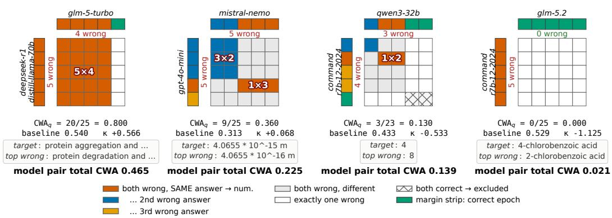  
Figure 1: Epoch-native correlated wrong-answer agreement on four GPQA-Diamond model pairs. Each grid crosses five sampled epochs from the row and column models. Coloured rectangles contribute to the numerator when both models are wrong with the same answer. Grey and one-wrong cells enter only the denominator and hatched both-correct cells are excluded. The item-level raw rate, per-question leave-pair-out baseline, and chance-corrected κ are shown below each grid. The examples span fixed quantiles of pooled pair-level CWA among 700 non-sibling pairs. They illustrate why raw agreement must be interpreted against item-specific distractor attraction. The first two item-level κ values are positive and the last two negative, while pooled pair-level CWA ranges from 0.465 to 0.021.

independence and its chance-corrected form are

$$
\mathrm { C W A } _ { i j } ^ { \mathrm { e x p } } = \frac { p _ { i } p _ { j } } { p _ { i } + p _ { j } - p _ { i } p _ { j } } \bar { h } _ { - i j } , \qquad \kappa _ { i j } = \frac { \mathrm { C W A } _ { i j } - \mathrm { C W A } _ { i j } ^ { \mathrm { e x p } } } { 1 - \mathrm { C W A } _ { i j } ^ { \mathrm { e x p } } } .\tag{5}
$$

The first factor in $\mathrm { C W A } _ { i j } ^ { \mathrm { e x p } }$ is the probability that both models are wrong conditional on at least one being wrong. Thus, the baseline combines pair-level error propensities with question-specific distractor attraction, while $\kappa _ { i j }$ scales the observed excess agreement by the maximum possible excess above chance. This per-question-to-pair procedure is used throughout, with a pair-empirical marginal baseline retained as a sensitivity analysis. Appendix C gives the full construction.

## 3.5 Association and uncertainty

For each benchmark, the primary statistic is the partial Spearman correlation between $d ^ { \mathrm { I G P } }$ and κ, controlling simultaneously for semantic distance, pair capability level $( a _ { i } + a _ { j } ) / 2$ , and capability gap $| a _ { i } - a _ { j } |$ . Rank-transforming before residualisation accommodates monotone capability relationships. The resulting estimand is the conditional association on ranks given this control set.

The 703 pairs form a complete dyadic network on 38 model nodes. Any two observations that share a model also share model-specific structure in their predictors, capabilities, and failure outcomes, so the effective sampling structure is organised around models rather than pair rows [25]. We therefore take the deployed model configuration as the resampling unit. In each of 2,000 node-bootstrap replicates, we sample 38 model slots with replacement, form all unordered pairs of distinct slots, and recompute the partial Spearman correlation on the induced dyads. Repeated model slots reproduce their full incidence pattern across pairs, while self-pairs are omitted. The 2.5th and 97.5th percentiles give the reported interval.

This procedure quantifies uncertainty with respect to the evaluated model population. It remains conditional on the sampled audit prompts, generations, benchmark questions, evaluation epochs, and chosen benchmark panel. Cross-benchmark summaries give each of the ten reporting keys one vote and use a t interval over benchmark estimates. The capability-plus-semantic partial Spearman correlation with model-node resampling defines the primary analysis; alternative interpolants and chance baselines are used in sensitivity analyses.

## 4 Experiments and Results

All compression and semantic predictors are estimated from open-ended responses; all failure outcomes use disjoint closed-form benchmark responses. This separates the measured texts, although the same models generate both and capability controls derive from benchmark correctness. We first compare the population geometries, then decompose compression distance against failure, and finally examine where in the observed distance range the relationship appears.

## 4.1 Semantic and compression-based population structure

Figure 2 compares semantic, raw-compression, and order-specific views of the same responses. Across all 703 off-diagonal pairs, semantic distance occupies [0.159, 0.388], a narrow band of high similarity, while raw NCD spans [0.484, 0.859]. The matrices agree on coarse population structure but not on many individual pairs (Spearman $\rho = 0 . 6 6 2$ , Pearson $r = 0 . 7 4 5 )$

The highlighted cells make the discrepancy concrete. The Granite–Hermes and GPT-5.6–Grok pairs have raw NCD values of 0.675 and 0.678, essentially indistinguishable relative to the observed range. Their order-specific residuals are −0.047 and +0.013. The first pair is closer, and the second further apart, than marginal byte composition predicts. Their excerpts likewise contrast two closely aligned one-line titles with responses that share meaning but differ substantially in elaboration. The GPT-4o-mini–Granite-4.1 pair provides a near-zero reference. Its responses use the same peanut-pun structure, while its residual indicates neither greater nor less order-specific separation than byte composition predicts.

Subsequent analyses use this residual. Positive values denote pairs further apart than their byte composition predicts and negative values denote pairs closer than predicted. Its rank association with semantic distance is stronger than that of raw NCD $( \rho = 0 . 7 8 9$ versus 0.662). Residualisation therefore cannot be interpreted as simply extracting what semantics misses. Its non-redundant value must be tested against failure with semantic distance held fixed.

## 4.2 Conditional associations with correlated failure

Figure 3 compares the order-specific residual with semantic distance under matched control sets. With capability fixed, compression diversity is associated with less correlated failure $( - 0 . 1 4 8$ $[ - 0 . 2 4 5 , - 0 . 0 \dot { 5 } 0 ] $ ), while semantic distance is unresolved $( - 0 . 0 1 9 , [ - 0 . 1 0 8 , + 0 . 0 7 0 ] )$ . Holding the rival measure fixed strengthens the compression estimate $\mathrm { t o - 0 . 2 1 6 \ [ - 0 . 3 0 9 , - 0 . 1 2 2 ] }$ ; the surviving component of semantic distance is $+ 0 . { \overset { \cdot } { 1 6 } } 0 \left[ + 0 . 0 7 4 , + 0 . 2 4 6 \right]$

Semantic distance and the order-specific compression residual are strongly collinear $( \rho = 0 . 7 8 9 )$ , and only about $37 \%$ of semantic rank variance remains after controlling for compression. The positive cross-controlled semantic estimate therefore describes this remaining component, not the standalone association of semantic distance with correlated failure. Under cross-control, the compression estimate is negative on all ten benchmarks and its model-node bootstrap interval excludes zero on four, with the largest effects on Humanity’s Last Exam (−0.452) and GPQA-Diamond (−0.340). The semantic estimate is positive on nine benchmarks. GSM8K is the exception at −0.060, with its interval spanning zero. The benchmark-paired difference between the two cross-controlled partial correlations has mean −0.375 and 95% t-interval $[ - 0 . 5 4 5 , - 0 . 2 0 6 ]$ ; Appendix D.3 gives its construction and benchmark-level estimates.

## 4.3 Correlated failure across empirical distance quantiles

Figure 4 bins pairs into fixed percentile bands within the evaluated model population. Semantic distance is effectively flat. Mean κ changes from 0.141 in the lowest band to 0.139 in the highest. The order-specific residual falls from 0.167 to 0.086, an observed 48% contrast between the endpoint bands, and remains downward-sloping in the 80–100th-percentile band. Capability-adjusted residuals show the same shape, declining 5.38 percentile points from the middle to the highest band.

The two other raw-byte $V _ { p }$ residuals reproduce the pattern. $V _ { 1 }$ changes from 0.162 to 0.084 and $V _ { 2 }$ from 0.163 to 0.085, also 48% endpoint contrasts. Thus the pattern across distance bands does not depend on one interpolant. Low residual-distance bands remain above the chance line, so low inferred process diversity corresponds to excess correlated failure rather than merely the absence of

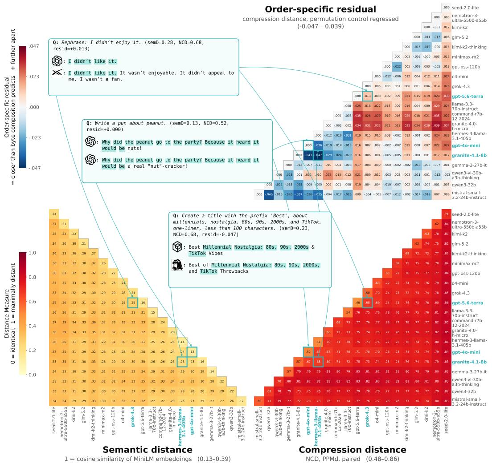  
Figure 2: Semantic, raw-compression, and order-specific views of the same responses. The lower matrices show semantic distance (left) and raw paired PPMd NCD (right). The upper-right matrix shows the order-specific compression distance obtained by residualising NCD against the within-prompt byte-permutation control and averaging across prompts. 20 of 38 models are displayed to simplify visualisation, reported matrix associations use the 703 off-diagonal pairs. Annotated boxes contain response excerpts and illustrate positive, near-zero, and negative residuals. Positive values indicate pairs further apart in sequential organisation than marginal byte composition predicts, and negative values indicate pairs closer than predicted.  
a benefit. The range is population-relative. Raw NCD covers only [0.48, 0.86] of its nominal [0, 1] interval, and the upper band is not an absolute maximum of generative-process diversity.

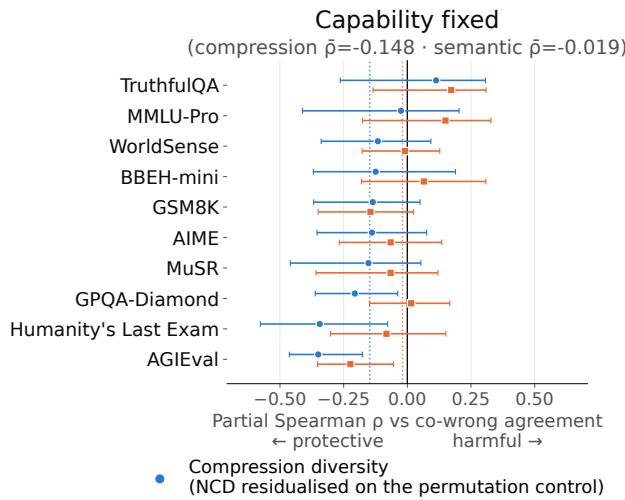

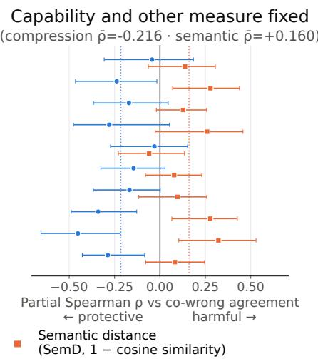

Figure 3: Dissociation between compression diversity and semantic distance. Left: each measure with capability level and gap fixed. Right: each measure with capability and its rival fixed. Compression diversity is the order-specific NCD residual. Bars are model-level bootstrap intervals; headings and dotted lines give cross-benchmark means. The relevant test is the paired within-benchmark contrast computed inside each node resample, not overlap of the two marginal intervals. The positive semantic coefficient on the right describes only the residual component of semantic distance surviving a strongly collinear control.  
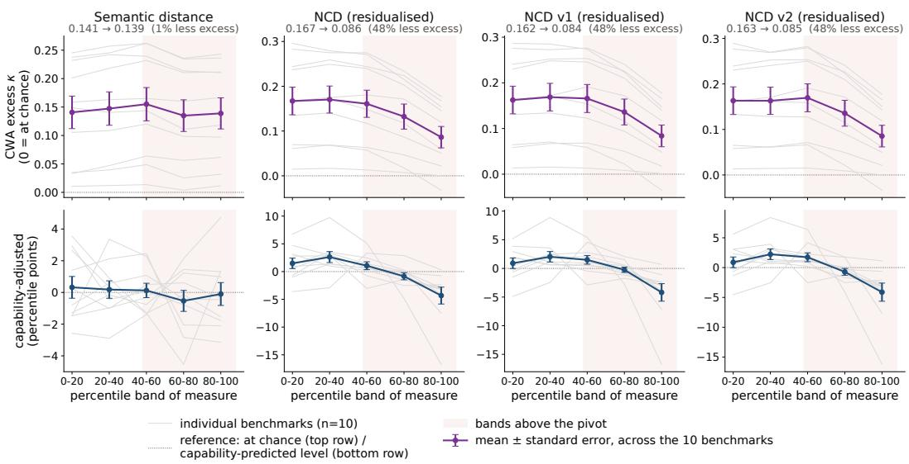  
Figure 4: Correlated failure across the range of each measure. Pairs are binned by semantic distance, the primary order-specific NCD residual, and the raw-byte $V _ { 1 }$ and $V _ { 2 }$ residuals. Top: mean chance-corrected CWA; bottom: deviation from the capability-predicted level. Heavy lines show means and standard errors across ten benchmarks; light lines show individual benchmarks. Semantic distance is flat, whereas all three compression residuals decline by 48% from the lowest to highest band and remain downward-sloping in the observed upper tail.

## 5 Discussion

The central conceptual claim of this paper is that model diversity should be defined relative to the system property it is expected to protect. Semantic similarity describes whether outputs convey similar meanings, but it does not establish that models provide independent responses under failure. Ecological response diversity motivates this distinction. Components contributing to the same function support resilience when they respond differently to perturbation [6]. Process philosophy makes a complementary shift from persistent objects to the processes and relations that produce them [3]. Together, these ideas motivate comparing language models through the processes capable of generating their observed behaviour. AIT provides an operational basis for doing so through shared description length.

The sign reversal produced by the permutation control is central to this interpretation. Raw NCD is mildly associated with more correlated failure, and the frequency-preserving component is more positive still. Only the order-specific residual is associated with less correlated failure. Figure 8 in Appendix B.5 presents this decomposition across benchmarks. The control therefore does more than remove noise. By separating distance explained by marginal byte composition from variation in sequential organisation, it identifies a more process-sensitive component of the observed outputs. This does not recover the latent computation of a model, but it shows why generic surface or compression distance cannot be assumed to measure effective diversity.

The most striking empirical result is that this signal transfers across tasks. Inferred generative-process diversity is estimated from ordinary open-ended responses to the Hivemind taxonomy, yet it predicts correlated wrong answers on ten disjoint benchmark families. The association remains negative on all ten benchmarks after controlling for capability and semantic distance. Because no benchmark response used to define failure enters the diversity measure, the result cannot be explained by overlap on the evaluated answers themselves. Semantic distance is unresolved when capability is fixed and becomes positive when compression diversity is also held fixed. Under the strong collinearity between the measures, this pattern is consistent with the failure-relevant information in semantic distance being the component it shares with compression diversity. It does not imply that semantic diversity is generally harmful; it shows that semantic similarity alone does not recover the variation associated with independent failure here.

The choice of outcome is also important. General agreement measures such as CAPA [9] count agreement whether models are correct or wrong, whereas the redundancy problem concerns what happens when failure occurs. CWA targets whether models fail together and converge on the same wrong answer. It therefore evaluates diversity against the common-mode failure that redundancy is intended to mitigate. CWA nevertheless combines joint-error incidence with agreement on the selected wrong answer. Separating these components would clarify whether inferred generativeprocess diversity captures shared blind spots, shared attraction to particular distractors, or both.

These results provide a black-box audit of effective redundancy without access to weights, activations, architecture, or training data. We demonstrate the method first at the model layer, measuring diversity in the input–output behaviour of the language models that drive agents once embedded in agentic harnesses. Harnesses introduce memory, tools, environmental feedback, and inter-agent communication that may amplify or suppress this diversity. Extending the measure to action– observation and tool-use traces is therefore an important next test. The evidence remains pairwise and observational, and whether selecting distant models improves ensemble performance or multi-agent resilience is left to future work. PPMd is well suited to sequential byte data and has precedent in compression-based clustering and phylogenetic assessment [12, 13]. Appendix B.1 reports a heavily subsampled cross-compressor diagnostic that supports its finite-length suitability for the data considered. Repeating the correlated-failure analysis under each compressor remains future work. At the model layer, observable input–output behaviour contains process-sensitive information that predicts whether nominally distinct models fail independently on other tasks.

## 6 Conclusion

Multi-model systems seek resilience through redundancy, but ecological resilience shows that diversity must be judged against the function and failure mode of the system. Semantic similarity does not establish whether models differ in ways that prevent common-mode failure. We introduce inferred generative-process diversity as an output-based way to compare the processes capable of producing observed model behaviour. We estimate it by applying PPMd NCD to raw response strings and removing the component explained by a matched byte-permutation control. Across 38 models, the resulting order-specific compression residual predicts correlated failure across ten disjoint benchmarks beyond semantic distance and capability. Permutation residualisation reverses the sign of the association indicating marginal byte composition and sequential organisation lead to opposite conclusions about effective diversity. Inferred generative process diversity estimated by permutation control residualised NCD offers a practical, safety-relevant approach for auditing multi-model systems for effective redundancy that protects against correlated failure.

## References

[1] Ludmila I. Kuncheva and Christopher J. Whitaker. Measures of diversity in classifier ensembles and their relationship with the ensemble accuracy. Machine Learning, 51(2):181–207, 2003. doi: 10.1023/A:1022859003006.

[2] Danny Wood, Tingting Mu, Andrew M. Webb, Henry W. J. Reeve, Mikel Luján, and Gavin Brown. A unified theory of diversity in ensemble learning. Journal ofMachine Learning Research, 24(359):1–49, 2023. URL https://www.jmlr.org/papers/v24/23-0041.html.

[3] Cédric Gaucherel. Why and how to use process philosophy in everyday ecology and biology? Acta Biotheoretica, 73:14, 2025. doi: 10.1007/s10441-025-09504-5. URL https://link. springer.com/article/10.1007/s10441-025-09504-5.

[4] C. S. Holling. Resilience and stability of ecological systems. Annual Review ofEcology and Systematics, 4:1–23, 1973. doi: 10.1146/annurev.es.04.110173.000245.

[5] Shigeo Yachi and Michel Loreau. Biodiversity and ecosystem productivity in a fluctuating environment: The insurance hypothesis. Proceedings ofthe National Academy ofSciences, 96 (4):1463–1468, 1999. doi: 10.1073/pnas.96.4.1463.

[6] Thomas Elmqvist, Carl Folke, Magnus Nyström, Garry Peterson, Jan Bengtsson, Brian Walker, and Jon Norberg. Response diversity, ecosystem change, and resilience. Frontiers in Ecology and the Environment, 1(9):488–494, 2003. ISSN 1540-9309. doi: 10.1890/1540-9295(2003) 001[0488:RDECAR]2.0.CO;2.

[7] Mirta Galesic, Daniel Barkoczi, Andrew M. Berdahl, Dora Biro, Giuseppe Carbone, Ilaria Giannoccaro, Robert L. Goldstone, Cleotilde Gonzalez, Anne Kandler, Albert B. Kao, Rachel Kendal, Michelle Kline, Eun Lee, Giovanni Francesco Massari, Alex Mesoudi, Henrik Olsson, Niccolo Pescetelli, Sabina J. Sloman, Paul E. Smaldino, and Daniel L. Stein. Beyond collective intelligence: Collective adaptation. Journal ofThe Royal Society Interface, 20(200):20220736, March 2023. doi: 10.1098/rsif.2022.0736. URL https://royalsocietypublishing.org/ doi/10.1098/rsif.2022.0736.

[8] Ross Tieman, Robert Ackland, Katherine Daniell, and Steven J. Lade. Landscape complexity shapes the role of network density and diversity in collective adaptation under disruption. Research Square preprint, 2025. doi: 10.21203/rs.3.rs-8115470/v1.

[9] Shashwat Goel, Joschka Strüber, Ilze Amanda Auzina, Karuna K. Chandra, Ponnurangam Kumaraguru, Douwe Kiela, Ameya Prabhu, Matthias Bethge, and Jonas Geiping. Great models think alike and this undermines AI oversight. In Proceedings of the 42nd International Conference on Machine Learning, volume 267 of Proceedings of Machine Learning Research, pages 19621–19678. PMLR, 2025. URL https://proceedings.mlr.press v267/goel25b.html.

[10] Elliot Myunghoon Kim, Avi Garg, Kenny Peng, and Nikhil Garg. Correlated errors in large language models. In Proceedings of the 42nd International Conference on Machine Learning, volume 267 of Proceedings ofMachine Learning Research, pages 30038–30066, 2025. URL https://proceedings.mlr.press/v267/kim25e.html.

[11] Liwei Jiang, Yuanjun Chai, Margaret Li, Mickel Liu, Raymond Fok, Nouha Dziri, Yulia Tsvetkov, Maarten Sap, and Yejin Choi. Artificial hivemind: The open-ended homogeneity of language models (and beyond). In Advances in Neural Information Processing Systems, volume 38. Curran Associates, Inc., 2025. doi: 10.52202/085713-2732. URL https://proceedings.neurips.cc/paper\_files/paper/2025/hash/ 754d5a526a5ee5a47220664a0eb92751-Abstract-Datasets\_and\_Benchmarks\_Track. html. Datasets and Benchmarks Track.

[12] Rudi Cilibrasi and Paul M. B. Vitányi. Clustering by compression. IEEE Transactions on Information Theory, 51(4):1523–1545, 2005. doi: 10.1109/TIT.2005.844059.

[13] Paul M. B. Vitányi, Frank J. Balbach, Rudi L. Cilibrasi, and Ming Li. Normalized Information Distance. In Frank Emmert-Streib and Matthias Dehmer, editors, Information Theory and Statistical Learning, pages 45–82. Springer US, Boston, MA, 2009. ISBN 978-0-387-84816-7. doi: 10.1007/978-0-387-84816-7\_3. URL https://doi.org/10.1007/978-0-387-84816-7\_ 3.

[14] Hiroshi Miura. miurahr/pyppmd, August 2026. URL https://github.com/miurahr/ pyppmd. original-date: 2021-04-13T23:42:33Z.

[15] Nils Reimers and Iryna Gurevych. Sentence-bert: Sentence embeddings using siamese bertnetworks. In Proceedings ofthe 2019 Conference on Empirical Methods in Natural Language Processing and the 9th International Joint Conference on Natural Language Processing, pages 3982–3992, 2019. doi: 10.18653/v1/D19-1410.

[16] Stephanie Lin, Jacob Hilton, and Owain Evans. Truthfulqa: Measuring how models mimic human falsehoods. In Proceedings ofthe 60th Annual Meeting ofthe Associationfor Computa tional Linguistics, pages 3214–3252, 2022. doi: 10.18653/v1/2022.acl-long.229.

[17] Karl Cobbe, Vineet Kosaraju, Mohammad Bavarian, Mark Chen, Heewoo Jun, Lukasz Kaiser, Matthias Plappert, Jerry Tworek, Jacob Hilton, Rei Nakano, Christopher Hesse, and John Schulman. Training verifiers to solve math word problems. arXiv preprint arXiv:2110.14168, 2021. URL https://arxiv.org/abs/2110.14168.

[18] David Rein, Betty Li Hou, Asa Cooper Stickland, Jackson Petty, Richard Yuanzhe Pang, Julien Dirani, Julian Michael, and Samuel R. Bowman. Gpqa: A graduate-level google-proof q&a benchmark. In Proceedings of the First Conference on Language Modeling, 2024. URL https://openreview.net/forum?id=Ti67584b98.

[19] Yubo Wang, Xueguang Ma, Ge Zhang, Yuansheng Ni, Abhranil Chandra, Shiguang Guo, Weiming Ren, Aaran Arulraj, Xuan He, Ziyan Jiang, Tianle Li, Max Ku, Kai Wang, Alex Zhuang, Rongqi Fan, Xiang Yue, and Wenhu Chen. Mmlu-pro: A more robust and challenging multi-task language understanding benchmark. In Advances in Neural Information Processing Systems, volume 37, pages 95266–95290. Curran Associates, Inc., 2024. doi: 10.52202/079017-3018. URL https://proceedings.neurips.cc/paper\_files/ paper/2024/hash/ad236edc564f3e3156e1b2feafb99a24-Abstract-Datasets\_and\_ Benchmarks\_Track.html.

[20] Zayne Rea Sprague, Xi Ye, Kaj Bostrom, Swarat Chaudhuri, and Greg Durrett. Musr: Testing the limits of chain-of-thought with multistep soft reasoning. In The Twelfth International Conference on Learning Representations, 2024. URL https://openreview.net/forum? id=jenyYQzue1.

[21] Wanjun Zhong, Ruixiang Cui, Yiduo Guo, Yaobo Liang, Shuai Lu, Yanlin Wang, Amin Saied, Weizhu Chen, and Nan Duan. AGIEval: A human-centric benchmark for evaluating foundation models. In Findings ofthe Associationfor Computational Linguistics: NAACL 2024, pages 2299– 2314, Mexico City, Mexico, 2024. Association for Computational Linguistics. doi: 10.18653/ v1/2024.findings-naacl.149. URL https://aclanthology.org/2024.findings-naacl. 149/.

[22] Center for AI Safety, Scale AI, and HLE Contributors Consortium. A benchmark of expert-level academic questions to assess AI capabilities. Nature, 649:1139–1146, 2026. doi: 10.1038/ s41586-025-09962-4. URL https://doi.org/10.1038/s41586-025-09962-4.

[23] Mehran Kazemi, Bahare Fatemi, Hritik Bansal, John Palowitch, Chrysovalantis Anastasiou, Sanket Vaibhav Mehta, Lalit K. Jain, Virginia Aglietti, Disha Jindal, Peter Chen, Nishanth Dikkala, Gladys Tyen, Xin Liu, Uri Shalit, Silvia Chiappa, Kate Olszewska, Yi Tay, Vinh Q. Tran, Quoc V. Le, and Orhan Firat. Big-bench extra hard. In Proceedings ofthe 63rd Annual Meeting of the Association for Computational Linguistics, pages 26473–26501, 2025. URL https://aclanthology.org/2025.acl-long.1285/.

[24] Youssef Benchekroun, Megi Dervishi, Mark Ibrahim, Jean-Baptiste Gaya, Xavier Martinet, Grégoire Mialon, Thomas Scialom, Emmanuel Dupoux, Dieuwke Hupkes, and Pascal Vincent. Worldsense: A synthetic benchmark for grounded reasoning in large language models. arXiv preprint arXiv:2311.15930, 2023. URL https://arxiv.org/abs/2311.15930.

[25] Peter M. Aronow, Cyrus Samii, and Valentina A. Assenova. Cluster-robust variance estimation for dyadic data. Political Analysis, 23(4):564–577, 2015. doi: 10.1093/pan/mpv018.

[26] UK AI Security Institute. Inspect AI: Framework for Large Language Model Evaluations, May 2024. URL https://github.com/UKGovernmentBEIS/inspect\_ai.

[27] Dmitry A. Shkarin. PPM: One step to practicality. In Proceedings of the Data Compression Conference, pages 202–211. IEEE Computer Society, 2002. doi: 10.1109/DCC.2002.999958.

[28] Frans M. J. Willems, Yuri M. Shtarkov, and Tjalling J. Tjalkens. The context-tree weighting method: Basic properties. IEEE Transactions on Information Theory, 41(3):653–664, 1995. doi: 10.1109/18.382012.

[29] Jacob Ziv and Abraham Lempel. A universal algorithm for sequential data compression. IEEE Transactions on Information Theory, 23(3):337–343, 1977. doi: 10.1109/TIT.1977.1055714.

[30] Paolo Ferragina and Giovanni Manzini. On compressing the textual web. In Proceedings ofthe Third ACM International Conference on Web Search and Data Mining, pages 391–400. ACM, 2010. doi: 10.1145/1718487.1718536.

[31] Manuel Cebrián, Manuel Alfonseca, and Alfonso Ortega. Common pitfalls using the normalized compression distance: What to watch out for in a compressor. Communications in Information and Systems, 5(4):367–384, 2005. doi: 10.4310/CIS.2005.v5.n4.a1.

[32] Paolo Ferragina, Raffaele Giancarlo, Valentina Greco, Giovanni Manzini, and Gabriel Valiente. Compression-based classification of biological sequences and structures via the universal similarity metric: Experimental assessment. BMC Bioinformatics, 8:252, 2007. doi: 10.1186/ 1471-2105-8-252.

[33] Amos Tversky. Features of similarity. Psychological Review, 84(4):327–352, 1977. doi: 10.1037/0033-295X.84.4.327.

[34] Bjørn Kjos-Hanssen. Interpolating between the Jaccard distance and an analogue of the normalized information distance. Journal ofLogic and Computation, 32(8):1611–1623, 2022. doi: 10.1093/logcom/exac069. URL https://doi.org/10.1093/logcom/exac069.

[35] Edward Raff and Charles Nicholas. An Alternative to NCD for Large Sequences, Lempel-Ziv Jaccard Distance. In Proceedings of the 23rd ACM SIGKDD International Conference on Knowledge Discovery and Data Mining, KDD ’17, pages 1007–1015, New York, NY, USA, August 2017. Association for Computing Machinery. ISBN 978-1-4503-4887-4. doi: 10.1145/3097983.3098111. URL https://dl.acm.org/doi/10.1145/3097983.3098111.

[36] Leonid A. Levin. Laws of information conservation (nongrowth) and aspects of the foundation of probability theory. Problems ofInformation Transmission, 10(3):206–210, 1974.

[37] Péter Gács. On the symmetry of algorithmic information. Soviet Mathematics Doklady, 15: 1477–1481, 1974.

[38] Ming Li, Xin Chen, Xin Li, Bin Ma, and Paul M. B. Vitányi. The similarity metric. IEEE Transactions on Information Theory, 50(12):3250–3264, 2004. doi: 10.1109/TIT.2004.838101.

[39] Charles Spearman. The proof and measurement of association between two things. The American Journal ofPsychology, 15(1):72–101, 1904. doi: 10.2307/1412159.

[40] Maurice G. Kendall and B. Babington Smith. The problem of m rankings. The Annals of Mathematical Statistics, 10(3):275–287, 1939. doi: 10.1214/aoms/1177732186.

[41] Milton Friedman. The use of ranks to avoid the assumption of normality implicit in the analysis of variance. Journal of the American Statistical Association, 32(200):675–701, 1937. doi: 10.1080/01621459.1937.10503522.

[42] Sture Holm. A simple sequentially rejective multiple test procedure. Scandinavian Journal of Statistics, 6(2):65–70, 1979. URL https://www.jstor.org/stable/4615733.

[43] Samuel R. P.-J. Ross, Owen L. Petchey, Takehiro Sasaki, and David W. Armitage. How to measure response diversity. Methods in Ecology and Evolution, 14(5):1150–1167, 2023. ISSN 2041-210X. doi: 10.1111/2041-210X.14087.

[44] Marten Scheffer, Stephen R. Carpenter, Timothy M. Lenton, Jordi Bascompte, William Brock, Vasilis Dakos, Johan van de Koppel, Ingrid A. van de Leemput, Simon A. Levin, Egbert H. van Nes, Mercedes Pascual, and John Vandermeer. Anticipating Critical Transitions. Science, 338 (6105):344–348, October 2012. doi: 10.1126/science.1225244. URL https://www.science. org/doi/10.1126/science.1225244.

[45] Lewis Hammond, Alan Chan, Jesse Clifton, Jason Hoelscher-Obermaier, Akbir Khan, Euan McLean, Chandler Smith, Wolfram Barfuss, Jakob Foerster, Tomáš Gavenciak, The Anh Han,ˇ Edward Hughes, Vojtech Kovaˇ ˇrík, Jan Kulveit, Joel Z. Leibo, Caspar Oesterheld, Christian Schroeder de Witt, Nisarg Shah, Michael Wellman, Paolo Bova, Theodor Cimpeanu, Carson Ezell, Quentin Feuillade-Montixi, Matija Franklin, Esben Kran, Igor Krawczuk, Max Lamparth, Niklas Lauffer, Alexander Meinke, Sumeet Motwani, Anka Reuel, Vincent Conitzer, Michael Dennis, Iason Gabriel, Adam Gleave, Gillian Hadfield, Nika Haghtalab, Atoosa Kasirzadeh, Sébastien Krier, Kate Larson, Joel Lehman, David C. Parkes, Georgios Piliouras, and Iyad Rahwan. Multi-Agent Risks from Advanced AI, February 2025. URL http://arxiv.org/ abs/2502.14143. arXiv:2502.14143 [cs.MA].

[46] Nenad Tomašev, Matija Franklin, Julian Jacobs, Sébastien Krier, and Simon Osindero. Distributional AGI Safety, May 2026. URL http://arxiv.org/abs/2512.16856. arXiv:2512.16856 [cs.AI].

[47] Matija Franklin, Nenad Tomašev, Julian Jacobs, Joel Z. Leibo, and Simon Osindero. AI Agent Traps, March 2026. URL https://papers.ssrn.com/abstract=6372438.

[48] Jon Kleinberg and Manish Raghavan. Algorithmic monoculture and social welfare. Proceedings of the National Academy of Sciences, 118(22):e2018340118, 2021. doi: 10.1073/pnas. 2018340118.

[49] Hector Zenil, Narsis A. Kiani, and Jesper Tegnér. Low-algorithmic-complexity entropydeceiving graphs. Physical Review E, 96(1):012308, July 2017. doi: 10.1103/PhysRevE. 96.012308. URL https://link.aps.org/doi/10.1103/PhysRevE.96.012308.

[50] Hector Zenil, Narsis A. Kiani, and Jesper Tegnér. Algorithmic Information Dynamics: A Computational Approach to Causality with Applications to Living Systems. In Algorithmic Information Dynamics: A Computational Approach to Causality with Applications to Living Systems, pages 310–321. Cambridge University Press, May 2023. doi: 10.1017/9781108596619. 021.

## A Data Generation

Across both the predictor corpus and benchmark evaluations, 29 of the 38 deployed model configurations were served through OpenRouter. Four configurations used the OpenAI API directly, four used the Anthropic API directly, and one used the Google API directly.

## A.1 Response corpus

The predictor corpus uses the 100 open-ended prompts from the Infinity-Chats taxonomy introduced for the Artificial Hivemind study [11]. For each prompt, we sampled 50 responses from each of 38 deployed model configurations, giving 190,000 generations. Sampling used temperature 1.0, top-p 0.9, no minimum-p, and a 32,768-token output budget. Compression and semantic analyses use only the stored visible assistant response. The prompt, request metadata, and separately recorded reasoning fields do not enter either representation. To prevent language choice from dominating the byte- and embedding-based comparisons, we excluded responses containing more than 20 CJK ideographs. This removed 75 generations (0.04%) and left 189,925 responses; per-prompt computations use the available responses in each model–prompt cell.

## A.2 Benchmark panel

Benchmark generation and logging used the UK AI Security Institute’s Inspect AI framework [26]. Each selected question was evaluated in five independently sampled epochs under the shared generation policy, and the resulting Inspect logs were converted to a common per-model record format while retaining all five responses.

We distinguish task execution, answer-space-specific analysis, and statistical reporting. At execution time, one benchmark family may comprise several Inspect tasks. AGIEval and WorldSense each expand to six tasks, while MuSR and AIME each expand to three. At analysis time, BBEH-mini is divided into multiple-choice, numeric, and other short-answer keys because these answer spaces require different equivalence rules. This gives 12 matrix keys for the ten benchmark families. For reporting, the sufficient counts from the three BBEH-mini keys are pooled before CWA and its baseline are calculated, yielding one BBEH-mini estimate and preventing that benchmark from receiving three votes in cross-benchmark summaries. The reporting panel therefore contains the ten benchmark families used in the main text. BBH is not included because BBEH was designed as its harder successor.

Question caps were applied per Inspect task for API cost reduction. They were 800 for GSM8K, 750 for MMLU-Pro, 300 for HLE-MC, 150 for each WorldSense task, 117 for each MuSR domain, and 100 for each AGIEval task. AIME, BBEH-mini, GPQA-Diamond, and TruthfulQA used their full configured datasets.

## A.3 Model population and estimability

The 38-model population gives ${ \binom { 3 8 } { 2 } } = 7 0 3$ candidate pairs. Under the requirement of at least 30 questions with a nonzero either-wrong denominator, 703 pairs are estimable on seven keys, 701 on WorldSense, 699 on GPQA-Diamond, and 562 on AIME. AIME is limited by its 90-question cap. Predictor and outcome texts are disjoint, but the same models generate both and capability controls come from the correctness matrices used for the outcome.

## B Compression Distance

## B.1 Compressor choice and robustness

All reported distances use PPMd variant I through pyppmd at library-default memory settings. PPMd is a sequential statistical compressor. It maintains variable-order byte contexts, updates its conditional next-byte distribution as the stream is read, and encodes the resulting predictions with a range coder [27]. Context Tree Weighting (CTW) is also sequential, recursively weighting bounded-memory tree sources [28]. By contrast, gzip and LZMA belong to the Lempel–Ziv dictionary family, whose reuse of information across a concatenation is expressed principally through references to matching phrases [29, 30]. Gzip additionally has a finite 32-kB history window, which can make NCD depend on object length once relevant content falls outside that window [31]. PPM compressors have performed consistently among the strongest compressors in compression-based classification, whereas gzip provides a faster but sometimes less discriminative alternative [32].

For an adaptive compressor, the information transferred across a concatenation is directional. After reading $x ,$ the incremental code length of $y$ is $C ( x y ) - C ( x )$ . We express its reduction relative to coding y alone as

$$
g _ { x  y } ^ { C } = 1 - \frac { C ( x y ) - C ( x ) } { C ( y ) } = \frac { C ( x ) + C ( y ) - C ( x y ) } { C ( y ) } , \qquad T _ { C } ( x , y ) = \frac { g _ { x  y } ^ { C } + g _ { y  x } ^ { C } } { 2 } ,\tag{6}
$$

where $g _ { y  x } ^ { C }$ is defined analogously from $C ( y x )$ . PPMd and CTW transfer an adaptive conditional context model from the first sequence to the second; the dictionary compressors transfer a phrase dictionary. Both mechanisms can therefore be directional, and $C ( \boldsymbol { x } \boldsymbol { y } )$ need not equal $C ( y x )$ . The symmetric gain $T _ { C }$ is used only for the diagnostic below; the reported NCD matrices retain the fixed orientation in Equation 1.

We first compared PPMd with byte-level CTW (alphabet size 256 and depth 12), LZMA, and gzip on raw model responses. Because CTW is costly on byte strings, this diagnostic uses a deliberately heavy subsample comprising 16 of the 38 models, 15 of the 100 prompts, and one response position per prompt shared across models. Responses are not truncated; four model–prompt responses above the 8-KiB CTW limit were excluded from every compressor. This leaves 1,746 pair–prompt observations and 120 model-pair means. Table 1 reports agreement with the PPMd ordering and finite-length saturation.

Table 1: Raw-response compressor robustness. Rank agreement is Spearman’s $\rho$ between the 120 model-pair mean distances under PPMd and each alternative compressor. The remaining columns use all 1,746 pair–prompt observations. Absolute NCD levels are compressor-specific and are not a common calibrated scale.
<table><tr><td>Compressor</td><td> $\rho$  with PPMd</td><td>Mean NCD</td><td> $\mathrm { N C D } \geq 0 . 9 5$ </td></tr><tr><td>PPMd</td><td></td><td>0.787</td><td>2.8%</td></tr><tr><td>CTW</td><td>0.884</td><td>0.932</td><td>38.1%</td></tr><tr><td>LZMA</td><td>0.918</td><td>0.672</td><td>0.0%</td></tr><tr><td>gzip</td><td>0.958</td><td>0.769</td><td>0.7%</td></tr></table>

The model-pair ordering is therefore broadly preserved under all three alternatives, most closely under gzip. The mean distance itself is not a quality score. LZMA’s lower mean, for example, reflects a different finite-length scale. Saturation is the relevant failure mode for discrimination. CTW places 38.1% of observations at or above 0.95, compared with 2.8% for PPMd, leaving much less variation among raw response pairs.

We next separated transfer of sequential statistics from reuse of literal substrings in a paired $2 \times 2$ factorial experiment. Each sequence pair either shared or did not share a first-order byte-transition law (shared context), and independently contained the same or disjoint randomly generated byte blocks (shared exact phrases). The two sequences were generated independently, and shared blocks were inserted at different positions and in different orders. Phrase lengths were 9 bytes at the shortest sequence length, 30 bytes at 245 bytes, and 32 bytes thereafter; phrase coverage was approximately 25%, except at the shortest length where the single block covered 12%. The six sequence lengths—73, 245, 664, 1,302, 2,579, and 4,000 bytes—are the 10th, 25th, 50th, 75th, 90th, and 95th percentiles of all 190,000 responses in the predictor corpus. We used 12 paired replicates at each length. A factorial main effect is the change in $T _ { C }$ when one factor is shared, averaged over the two levels of the other factor.

(a) Aggregate factorial effects  
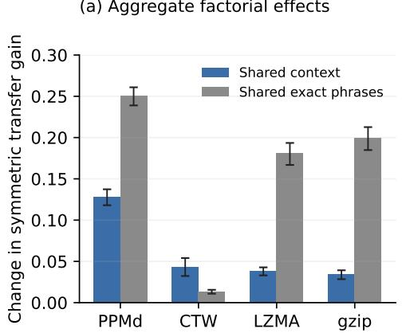

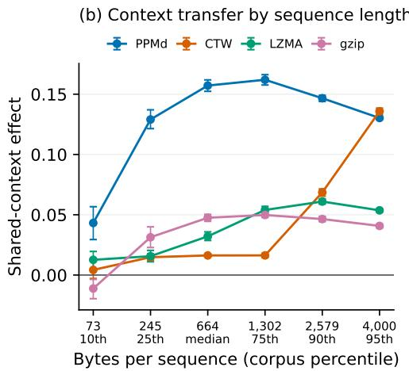  
Figure 5: Sequential-context and exact-phrase transfer. (a) Main effects of sharing a first-order transition law or exact byte blocks on the symmetric transfer gain in Equation 6. Bars are means over 72 paired units; intervals are 95% bootstrap intervals. (b) The shared-context effect at six sequence lengths drawn from the empirical response-length distribution. Each of x and $y$ has the displayed length, so the concatenation has approximately twice as many bytes. Intervals resample the 12 replicates at each length. PPMd transfers substantially more shared context over the central range of the corpus; CTW approaches it only near the 95th percentile.

PPMd’s aggregate shared-context effect is 0.128 (95% interval [0.118, 0.137]), compared with 0.043 for CTW, 0.038 for LZMA, and 0.034 for gzip; all three paired PPMd contrasts remain significant after Holm correction $( p = 1 . 5 \times 1 0 ^ { - 4 }$ ; Appendix D.4). PPMd also has the largest exact-phrase effect (0.250), so the result is not that PPMd ignores literal reuse. Rather, it combines phrase reuse with substantially stronger transfer of non-verbatim sequential statistics than the dictionary compressors. CTW exhibits the strongest context preference relative to its own phrase effect, but both effects are small at typical response lengths. At 1,302 bytes, CTW’s context effect is 0.016 against PPMd’s 0.162; at 2,579 bytes it is 0.069 against 0.147; only at 4,000 bytes does CTW reach 0.136 against PPMd’s 0.130. CTW can therefore detect the controlled transition structure, but requires substantially longer strings to do so under the byte-level configuration used here.

The compressor choice is also coupled to the aggregation protocol. We compress position-paired responses separately and average their distances, rather than concatenate all 50 responses in a model– prompt cell into one stream. The latter construction drove raw PPMd distances towards the upper boundary as cell length increased in our development diagnostics; response-level pairing retained substantially more variation and confines directional transfer to one response pair. Taken together, the preserved model-pair ordering, limited saturation, and finite-length context transfer support PPMd for the present response-level analysis. The comparison is nevertheless descriptive and heavily subsampled. It does not repeat the held-out correlated-failure models under every compressor, which remains future work.

## B.2 The $V _ { p }$ family on sets and sequences

The finite-set construction makes the relation among $V _ { 1 } , V _ { 2 } ,$ , and $V _ { \infty }$ exact. For finite sets A and B, let

$$
\Delta _ { p } ( A , B ) = ( \vert B \setminus A \vert ^ { p } + \vert A \setminus B \vert ^ { p } ) ^ { 1 / p } , \qquad V _ { p } ( A , B ) = \frac { \Delta _ { p } ( A , B ) } { \vert A \cap B \vert + \Delta _ { p } ( A , B ) } ,\tag{7}
$$

for $1 \leq p < \infty$ , with $\Delta _ { \infty } ( A , B ) = \operatorname* { m a x } \{ | B \setminus A | , | A \setminus B | \}$ and $V _ { p } ( \emptyset , \emptyset ) = 0$ . The endpoints are

$$
V _ { 1 } ( A , B ) = 1 - \frac { | A \cap B | } { | A \cup B | } , \qquad V _ { \infty } ( A , B ) = \frac { \operatorname* { m a x } \{ | B \setminus A | , | A \setminus B | \} } { \operatorname* { m a x } \{ | A | , | B | \} } .\tag{8}
$$

Thus $V _ { 1 }$ is the Jaccard distance, $V _ { \infty }$ is the set analogue of Normalised Information Distance (NID), and $V _ { 2 }$ uses the Euclidean norm of the two directional differences. In the symmetric Tversky family, these are the endpoints $V _ { 1 } = D _ { 1 / 2 , 2 }$ and $V _ { \infty } = D _ { 0 , 1 } \left[ 3 3 , 3 4 \right]$

Kjos-Hanssen proves that $V _ { p }$ is a metric for every $p \in \left[ 1 , \infty \right] \left[ 3 4 \right]$ . The main step can be seen directly. Set containment gives

$$
| B \setminus A | \leq | B \setminus C | + | C \setminus A | , \qquad | A \setminus B | \leq | A \setminus C | + | C \setminus B | .
$$

Applying Minkowski’s inequality to these two coordinates yields

$$
\Delta _ { p } ( A , B ) \leq \Delta _ { p } ( A , C ) + \Delta _ { p } ( C , B ) .
$$

The normalisation in Equation 7 also preserves the triangle inequality because $| B \setminus A | \leq \Delta _ { p } ( A , B )$ supplies the condition required by the ratio-normalisation lemma of Kjos-Hanssen [34]. Nonnegativity, symmetry, and identity follow from the two set differences. This proves the metric result without selecting a special value of $\mid p .$

The ordering follows from the standard ordering of norms on $\mathbb { R } ^ { 2 }$

$$
\Delta _ { \infty } \leq \Delta _ { 2 } \leq \Delta _ { 1 } \quad \Longrightarrow \quad V _ { \infty } \leq V _ { 2 } \leq V _ { 1 } .\tag{9}
$$

The implication holds because $t / ( | A \cap B | + t )$ is increasing in t. If one directional difference is zero, all three values coincide. If the differences are balanced at (t, t), their unnormalised values are $t , \sqrt { 2 } t$ , and 2t for $p = \infty , 2 , 1$ , respectively. The members therefore differ most when each object contains substantial information absent from the other.

The set result also suggests a direct route to sequence distances. One can map a sequence s to its Lempel– $- Z \mathrm { i v }$ phrase dictionary $F ( s ) = \operatorname { L Z S e t } ( s { \dot { ) } }$ and pull the set metric back as $V _ { p } ( \grave { F } ( s ) , F ( t ) )$ ; at $p = 1$ , this recovers the Lempel–Ziv Jaccard distance [34, 35]. The construction is exact but inherits the representation chosen by $F .$ The map is parser-specific and non-injective, so distinct sequences with the same phrase set receive distance zero. This limitation motivates an object-level interpolation that does not first reduce each sequence to an explicit feature set.

## B.3 Extension to strings and finite objects

For binary strings x and $y ,$ let $K ( x )$ be prefix Kolmogorov complexity, $K ( x , y )$ the complexity of a fixed effective pairing, and

$$
I _ { K } ( x ; y ) = K ( x ) + K ( y ) - K ( x , y ) .
$$

Using the directional conditional complexities $k _ { x \mid y } = K ( x \mid y )$ and $k _ { y \mid x } = K ( y \mid x )$ , define

$$
\Delta _ { p } ^ { K } ( x , y ) = \left( k _ { x | y } ^ { p } + k _ { y | x } ^ { p } \right) ^ { 1 / p } , \qquad V _ { p } ^ { K } ( x , y ) = \frac { \Delta _ { p } ^ { K } ( x , y ) } { I _ { K } ( x ; y ) + \Delta _ { p } ^ { K } ( x , y ) } .\tag{10}
$$

Let $N = K ( x , y , z ) + 2$ and $\lambda _ { N } = { \cal O } ( \log N )$ . Symmetry of information gives

$$
K ( x , y ) = K ( x ) + K ( y \mid x ) + O ( \lambda _ { N } ) = K ( y ) + K ( x \mid y ) + O ( \lambda _ { N } )
$$

[36, 37]. Substitution into Equation 10 gives the two endpoint identities

$$
V _ { 1 } ^ { K } ( x , y ) = 1 - \frac { I _ { K } ( x ; y ) } { K ( x , y ) } + { \cal O } \left( \frac { \lambda _ { N } } { K ( x , y ) } \right) ,\tag{11}
$$

$$
V _ { \infty } ^ { K } ( x , y ) = \frac { K ( x , y ) - \operatorname* { m i n } \{ K ( x ) , K ( y ) \} } { \operatorname* { m a x } \{ K ( x ) , K ( y ) \} } + O \biggl ( \frac { \lambda _ { N } } { \operatorname* { m a x } \{ K ( x ) , K ( y ) \} } \biggr ) .\tag{12}
$$

We refer to Equation 11 as the algorithmic Jaccard distance; Equation 12 is NID [38]. At the conditional-complexity level, $V _ { 1 } ^ { K } = D _ { 1 / 2 , 2 } ^ { K }$ and $V _ { \infty } ^ { K } = D _ { 0 , 1 } ^ { K }$ are exact. Only their reduction to the displayed joint-complexity forms incurs logarithmic slack.

Universality and the information retained at finite $p .$ Let

$$
M _ { K } = \operatorname * { m a x } \{ K ( x \mid y ) , K ( y \mid x ) \} , \qquad m _ { K } = \operatorname * { m i n } \{ K ( x \mid y ) , K ( y \mid x ) \} .
$$

Then $\Delta _ { \infty } ^ { K } = M _ { K }$ and, for finite $p , \Delta _ { p } ^ { K } = ( M _ { K } ^ { p } + m _ { K } ^ { p } ) ^ { 1 / p }$ . Norm equivalence in two dimensions gives

$$
\Delta _ { \infty } ^ { K } \leq \Delta _ { p } ^ { K } \leq 2 ^ { 1 / p } \Delta _ { \infty } ^ { K } .\tag{13}
$$

After absorbing the $O ( \lambda _ { N } )$ possible negativity of $I _ { K }$ into the symmetry-of-information slack, the same comparison holds after normalisation.

$$
V _ { \infty } ^ { K } ( x , y ) \leq V _ { p } ^ { K } ( x , y ) \leq 2 ^ { 1 / p } V _ { \infty } ^ { K } ( x , y ) + O \left( \frac { \lambda _ { N } } { H } \right) ,\tag{14}
$$

where $H$ is the denominator scale and $2 ^ { 1 / \infty } = 1$ . NID minorises every admissible uppersemicomputable normalised distance d satisfying the density condition [13, 38]. Equation 14 therefore implies

$$
V _ { p } ^ { K } ( x , y ) \leq 2 ^ { 1 / p } d ( x , y ) + O \left( \frac { \lambda _ { N } } { H } \right) .\tag{15}
$$

Thus $V _ { 2 } ^ { K }$ and $V _ { 1 } ^ { K }$ inherit NID’s minorisation property within factors $\sqrt { 2 }$ and 2, respectively, while only $V _ { \infty } ^ { \tilde { \kappa } }$ retains the sharp coefficient one. This is a difference in worst-case universality, not an ordering of usefulness for a particular outcome.

Finite $p$ remains sensitive to a quantity absent from NID. Up to logarithmic slack,

$$
V _ { \infty } ^ { K } = \frac { M _ { K } } { I _ { K } + M _ { K } } , \qquad V _ { 1 } ^ { K } = \frac { M _ { K } + m _ { K } } { I _ { K } + M _ { K } + m _ { K } } ,
$$

and hence

$$
V _ { 1 } ^ { K } - V _ { \infty } ^ { K } = \frac { I _ { K } m _ { K } } { ( I _ { K } + M _ { K } ) ( I _ { K } + M _ { K } + m _ { K } ) } + O \biggl ( \frac { \lambda _ { N } } { H } \biggr ) .\tag{16}
$$

At fixed shared information $I _ { K } > 0$ and larger directional cost $M _ { K }$ , every finite $- p$ member varies with the smaller cost $m _ { K }$ , whereas NID does not. The members agree when one directional cost vanishes and separate as the two costs become more balanced. Retaining this second direction may be useful when the target depends on reciprocal novelty—neither object can be described from the other by a short program—rather than on the larger one-sided difference alone. This does not imply that a finite-p member must predict correlated failure better. That question is outcome-specific and empirical. Moreover, the universality statements above concern the ideal K-level quantities; a real-compressor approximation, and especially its signed residual after projection, does not inherit them automatically.

The metric proof also transfers, with the same qualification. Conditional descriptions compose according to

$$
K ( x \mid y ) \leq K ( x \mid z ) + K ( z \mid y ) + O ( \lambda _ { N } ) ,
$$

and the analogous inequality holds in the opposite direction. Minkowski’s inequality therefore gives

$$
\begin{array} { r } { \Delta _ { p } ^ { K } ( x , y ) \leq \Delta _ { p } ^ { K } ( x , z ) + \Delta _ { p } ^ { K } ( z , y ) + O ( \lambda _ { N } ) . } \end{array}\tag{17}
$$

For the ratio normalisation, symmetry of information and the same composition inequality imply

$$
I _ { K } ( x ; z ) - I _ { K } ( x ; y ) \le K ( z \mid y ) + { \cal O } ( \lambda _ { N } ) \le \Delta _ { p } ^ { K } ( y , z ) + { \cal O } ( \lambda _ { N } ) .
$$

Applying the set-level ratio argument then yields the triangle inequality for $V _ { p } ^ { K }$ up to relative $O ( \lambda _ { N } / H )$ slack, where H is the scale of the denominators. Identity is approximate rather than literal. Even $K ( x \mid x )$ is $O ( 1 )$ , and distinct strings related by a fixed reversible procedure can have $K ( x \mid y ) , K ( y \mid x ) = O ( 1 )$ . More precisely, for a family of pairs $( x _ { n } , y _ { n } )$ , their mutual description lengths are uniformly bounded if there is one constant $c ,$ independent of $n ,$ such that

$$
\operatorname* { m a x } \{ K ( x _ { n } \mid y _ { n } ) , K ( y _ { n } \mid x _ { n } ) \} \leq c \quad { \mathrm { f o r ~ e v e r y ~ } } n .
$$

If the denominator scale $H _ { n }$ grows, then $V _ { p } ^ { K } ( x _ { n } , y _ { n } ) = { \cal O } ( 1 / H _ { n } )$ and tends to zero. Thus $V _ { p } ^ { K }$ separates growing algorithmic objects only up to uniformly bounded mutual description length; it is a logarithmic pseudometric rather than an exact metric on literal finite strings.

The same result applies to any finite object supplied with an effective self-delimiting encoding. A computable reversible change of encoding alters Kolmogorov complexity by at most an additive constant, which is absorbed by the logarithmic term. The object-level statement is therefore not tied to one byte representation, although any computable approximation using a real compressor remains representation-dependent.

## B.4 Compressed-length interpolation

Let $c _ { x } = C ( x ) , c _ { y } = C ( y )$ , and $c _ { x y } = C ( x y )$ , and define the estimated directional complexities

$$
u _ { C } = c _ { x y } - c _ { y } , \qquad v _ { C } = c _ { x y } - c _ { x } , \qquad I _ { C } = c _ { x } + c _ { y } - c _ { x y } .
$$

Replacing K by a normal compressor C in Equation 10 gives $\Delta _ { p } ^ { C } \ : = \ : \| ( u _ { C } , v _ { C } ) \| _ { p }$ and $V _ { p } ^ { C } =$ $\Delta _ { p } ^ { C } / ( I _ { C } + \Delta _ { p } ^ { C } )$ . The normal-compressor axioms—idempotence, monotonicity, symmetry, and distributivity up to $\varepsilon ( n ) = O ( \log n )$ —supply the compressor analogue of conditional composition,

$$
C ( x \mid z ) \leq C ( x \mid y ) + C ( y \mid z ) + \varepsilon ( n ) ,
$$

so the proof above carries through with $O ( \varepsilon ( n ) / H )$ relative slack [12]. When $u _ { C } , v _ { C } \ \geq 0 .$ , the endpoints simplify to

$$
V _ { 1 } ^ { C } = \frac { 2 c _ { x y } - c _ { x } - c _ { y } } { c _ { x y } } , \qquad V _ { \infty } ^ { C } = \frac { c _ { x y } - \operatorname* { m i n } \{ c _ { x } , c _ { y } \} } { \operatorname* { m a x } \{ c _ { x } , c _ { y } \} } ,\tag{18}
$$

so $V _ { 1 } ^ { C }$ is the computable algorithmic Jaccard distance and $V _ { \infty } ^ { C }$ is NCD. The middle member uses $\Delta _ { 2 } ^ { C } \stackrel { . } { = } ( u _ { C } ^ { 2 } + v _ { C } ^ { 2 } ) ^ { \bar { 1 } / 2 }$

A real compressor need not satisfy the normality axioms exactly. PPMd is left-to-right and $C ( x y )$ need not equal $C ( y x )$ ; the reported statistic uses the fixed orientation shown in Equation 1. We therefore treat all three members as empirical compression dissimilarities, not exact metrics. The implementation clips negative directional estimates to zero for $V _ { 2 }$ and clips all reported values to [0, 1]. Under compressor normality these adjustments are within the same ${ \bar { O ( } } \bar { \varepsilon } ( n ) / \bar { H ) }$ approximation.

## B.5 Residualisation as a within-prompt projection

For a prompt $q ,$ collect the $n = { \binom { M } { 2 } } = 7 0 3$ raw pair distances into the vector $y _ { q } \in \mathbb { R } ^ { n }$ and the corresponding permutation-control distances into $p _ { q } \in \mathbb { R } ^ { n }$ . Let $\iota _ { n } = ( 1 , \ldots , 1 ) ^ { \top }$ and

$$
X _ { q } = [ \iota _ { n } p _ { q } ] , \qquad P _ { q } = X _ { q } ( X _ { q } ^ { \top } X _ { q } ) ^ { - 1 } X _ { q } ^ { \top } .\tag{19}
$$

The fitted component and residual are

$$
\widehat { y } _ { q } = P _ { q } y _ { q } , \qquad r _ { q } = ( I _ { n } - P _ { q } ) y _ { q } , \qquad d ^ { \mathrm { I G P } } = \frac { 1 } { Q } \sum _ { q = 1 } ^ { Q } r _ { q } .\tag{20}
$$

The matrix $P _ { q }$ is symmetric and idempotent, $P _ { q } ^ { \top } = P _ { q }$ and $P _ { q } ^ { 2 } = P _ { q }$ , and therefore projects onto the span of the intercept and the prompt-specific control. The normal equations give

$$
X _ { q } ^ { \top } r _ { q } = 0 .\tag{21}
$$

The residuals consequently have mean zero and zero sample covariance with the permutation control within each prompt. Positive residuals are pairs whose observed distance is greater than predicted from their frequency-preserving controls for that prompt; negative residuals are closer than predicted. Zero is a fitted reference point, not the absence of diversity.

The regression is fitted separately for each prompt because pair comparisons are matched on prompt content and the scale of the control varies across prompts. Current slopes range from 1.03 to 7.65, with mean 3.13. Averaging $r _ { q }$ then gives every prompt equal weight. Orthogonality is a within-prompt property. It does not require the averaged residual vector to be exactly orthogonal to the averaged control vector, because cross-prompt products remain. Their pair-level Pearson correlation is −0.048 in the current matrices.

Figure 7 shows what the projection changes at the pair level. The point colour is fixed to raw NCD and the point size to semantic distance in all three panels. Raw NCD is strongly ordered by its own colour, as it must be. The permutation panel retains much of that ordering. After projection, the colours are rearranged vertically. At a fixed semantic distance, pairs with larger raw NCD need not have larger order-specific residuals. The partial Spearman association between raw NCD and the residual, controlling for semantic distance, is −0.409. This conditional reordering is distinct from the positive marginal association between the residual and semantic distance $( \rho _ { s } = 0 . 7 8 9 )$ .

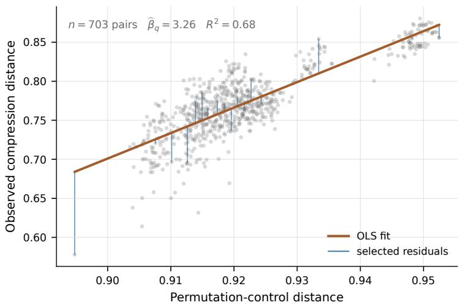  
Figure 6: Within-prompt residualisation. One representative current prompt with 703 model pairs. The line is the within-prompt OLS fit and the blue segments show a subset of retained residuals.

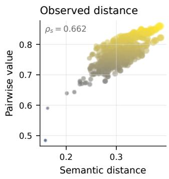

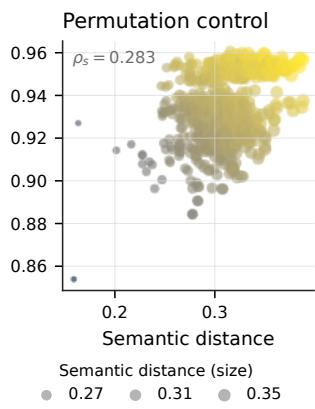

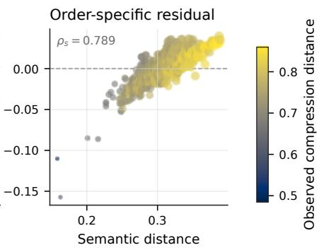  
Figure 7: Pairwise effect of residualisation. All 703 model pairs are plotted against semantic distance. Point colour records raw NCD and point size also records semantic distance; both encodings are held fixed across panels. The panels show raw NCD, its permutation control, and the retained order-specific residual. Rank associations with semantic distance are printed within each panel.

Figure 8 decomposes compression distance while holding capability level and gap fixed. The components differ in sign. Raw NCD is mildly associated with more correlated failure $( \bar { \rho } = + 0 . 1 0 1 )$ and the frequency-only permutation component is more positive (+0.150). Only the order-specific residual is associated with less correlated failure (−0.148). Raw compression distance therefore does not merely add noise. It suggests the opposite conclusion. We therefore define compression-derived diversity using the permutation residual. Only after removing the frequency-preserving component does the measure identify pairs with less correlated failure.

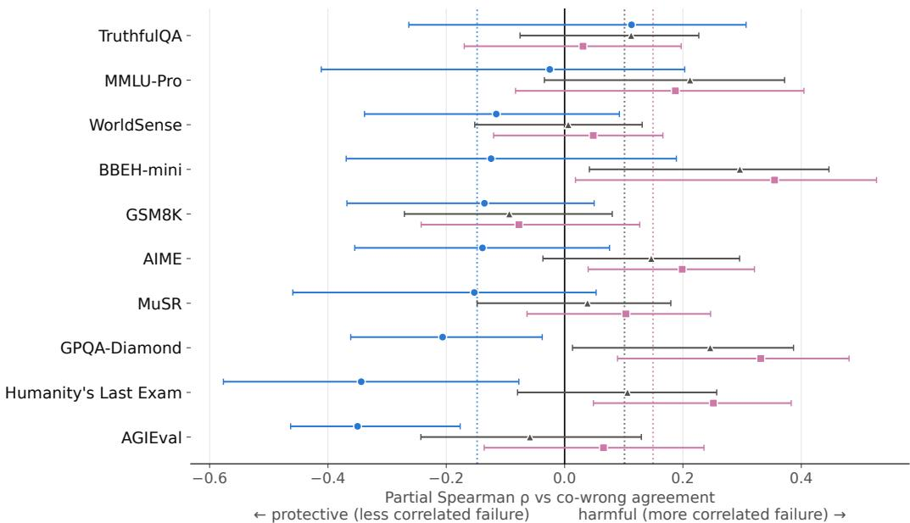  
Order-specific residual (NCD) (ρ̄ = -0.148) Frequency-only component (permutation control) $( \bar { \rho } = + 0 . 1 5 0 )$  
Raw compression distance (ρ̄ = +0.101)

Figure 8: Compression components against correlated failure. Points are benchmark-specific partial Spearman correlations with capability level and gap held fixed; bars are model-level bootstrap intervals and dotted lines are cross-benchmark means. Negative values denote less chance-corrected co-wrong agreement. Raw NCD $( \bar { \rho } = + 0 . 1 0 1 )$ ) and the frequency-only permutation component (+0.150) are associated with more correlated failure on average, whereas the order-specific residual is associated with less (−0.148).

## B.6 Within-model response variability

The Artificial Hivemind characterises open-ended homogeneity at two levels. These are intra-model repetition among responses repeatedly sampled from one model and inter-model similarity across models [11]. Our primary analysis extends the inter-model comparison. To complete the comparison on the same prompt taxonomy, we apply the corresponding within-model semantic construction to our 38-model response corpus and place it beside within-model compression variability. The construction is analogous rather than a numerical replication because we use MiniLM embeddings, but both analyses average pairwise embedding similarity among repeated responses to the same prompt.

This extension uses NCD at a second scale. Between models, NCD compares the sequential organisation expressed by different deployed configurations. Within a model and prompt, it compares repeated draws from the same conditional response distribution and therefore characterises realised stochastic response variability under the fixed decoding policy. It is not an estimator of an intrinsic entropy or randomness parameter. The measured variation includes the effects of the prompt, model, interface, and sampling procedure. Nor does it imply that a model changes its generative process across prompts. Each prompt conditions the same deployed configuration on a different input.

For model m and prompt $q ,$ within-model semantic distance $d _ { m q } ^ { \mathrm { s e m } }$ is one minus the mean cosine similarity over all distinct pairs among the 50 response embeddings. Within-model compression distance $\overline { { d _ { m q } ^ { \mathrm { N C D } } } }$ pairs response r with response $r + 2 5$ and averages the resulting 25 disjoint NCD values. The permutation control $d _ { m q } ^ { \mathrm { p e r m } }$ is computed from the same 25 response pairs. Because this is a separate estimand from the cross-model analysis, we fit new coefficients across the 38 within-model

observations for each prompt as follows.

$$
\begin{array} { r l r } & { } & { ( \widehat { \alpha } _ { q } ^ { \mathrm { i n t r a } } , \widehat { \beta } _ { q } ^ { \mathrm { i n t r a } } ) = \underset { a , b } { \arg \operatorname* { m i n } } \sum _ { m = 1 } ^ { M } \left( d _ { m q } ^ { \mathrm { N C D } } - a - b d _ { m q } ^ { \mathrm { p e r m } } \right) ^ { 2 } , } \\ & { } & { \widehat { \varepsilon } _ { m q } ^ { \mathrm { i n t r a } } = d _ { m q } ^ { \mathrm { N C D } } - \left( \widehat { \alpha } _ { q } ^ { \mathrm { i n t r a } } + \widehat { \beta } _ { q } ^ { \mathrm { i n t r a } } d _ { m q } ^ { \mathrm { p e r m } } \right) . \quad } \end{array}\tag{22}
$$

The resulting residual is relative to the model population for that prompt. Positive values denote greater within-model order-specific variation than predicted from byte composition, and negative values denote less. As in the pairwise construction, the residual is orthogonal to the permutation control within each prompt; it is not residualised against semantic distance.

Models differ under the shared policy. Mean semantic distance across all model–prompt cells is 0.197, with model means from 0.134 to $0 . 2 7 3 ;$ mean NCD is 0.614, with model means from 0.483 to 0.719. Treating prompt as a repeated-measures block, model effects are present for semantic distance (Kendall’s $\bar { W } = \mathrm { \bar { 0 } . 3 5 7 ) }$ , raw NCD $( W = 0 . 5 3 8 )$ , and the intra-model order-specific residual $( W = 0 . 4 2 2 )$ ; all three Friedman tests have $p < 1 0 ^ { - 2 5 0 }$ . Appendix D.4 defines the coefficient and test. These are differences in the degree of response variability, not evidence of broad semantic disagreement. Repeated responses remain close in the embedding space for every model.

The measures share substantial variation. Across the 38 model means, semantic distance and raw NCD have Pearson $r = 0 . 8 4 8$ , Spearman $\rho _ { s } ~ = ~ 0 . 8 7 5$ , and $R ^ { 2 } = 0 . 7 1 9$ under the linear fit in Figure 9. The order-specific residual follows the same broad pattern. Its association with semantic distance across model means is $r = 0 . 9 3 1$ and $\rho _ { s } = 0 . 9 1 7$ This does not indicate a failure of the projection. The permutation control is only weakly associated with semantic distance across model means $( r = 0 . 2 6 7 )$ , so removing the composition-predicted component leaves most of the semantic-associated sequential variation. At the prompt level, the mean Pearson association across models decreases from 0.732 for raw NCD to 0.702 for the residual; averaging over prompts exposes stable model-level differences that both measures track.

The association is strong but not exact. The linear semantic trend leaves 28.1% of between-model NCD variance unexplained, and rankings by the two model means disagree for 115 of the 703 pairwise model orderings. To show where the measures differ, Figure 9 defines $\delta _ { m } = \bar { d } _ { m } ^ { \mathrm { N C D } } - ( \widehat { a } + \widehat { b } \bar { d } _ { m } ^ { \mathrm { s e m } } )$ where $( \widehat { a } , \widehat { b } )$ is fitted across the 38 model means. DeepSeek-R1-Distill-Llama-70B, Qwen3-VL-Thinking, and Seed-1.6-Flash have more within-model NCD than their semantic distance predicts. Both GPT-5.6-Terra configurations and Mistral-Nemo have less. These departures are descriptive differences between the measures; they do not by themselves establish which component predicts a separate outcome.

(a) Semantic distance and compression distance  
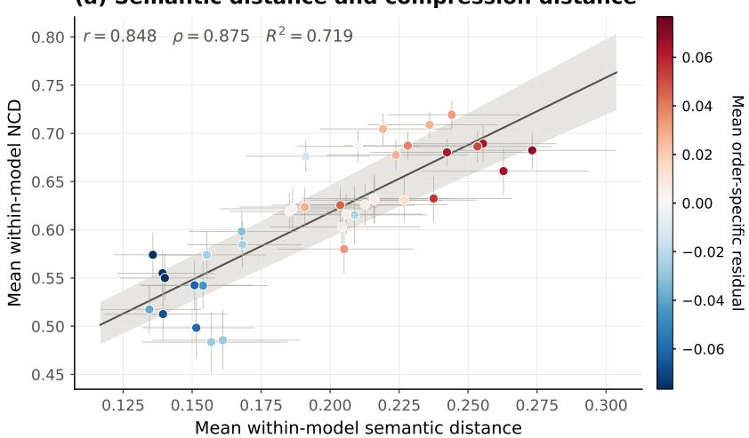

(b) NCD beyond the semantic trend  
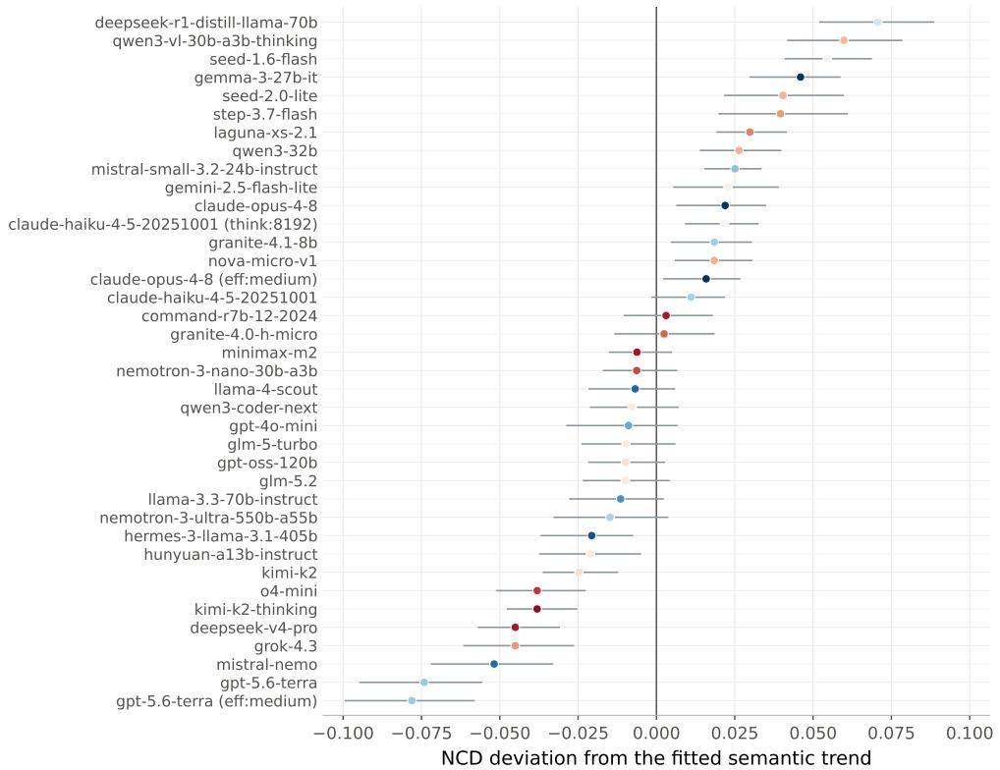  
Figure 9: Within-model semantic and compression variability. (a) Each point is one model, positioned by its mean semantic distance and mean raw NCD over 100 prompts. Horizontal and vertical bars are 95% prompt-bootstrap intervals. The line is the OLS fit across the 38 model means, the band refits that relationship in each prompt-bootstrap sample, and colour records the separately fitted mean intra-model order-specific residual from Equation 22. (b) Model-specific NCD deviation $\delta _ { m }$ from the fitted semantic trend. Intervals resample prompts jointly across models and refit the trend in every replicate. Positive values indicate more compression variability than semantic distance predicts; negative values indicate less. The figure therefore displays both the shared response-variability component and the model-specific departures from it.

The intra-model analysis therefore completes the comparison with the Artificial Hivemind while giv ing NCD a complementary interpretation. The same output-derived statistic characterises separation between deployed model configurations and stochastic response variability within a configuration. At the within-model scale, semantic and compression variability are related but not interchangeable. Semantic distance records changes in expressed meaning, whereas NCD also responds to how repeated draws vary in their sequential organisation. Accordingly, this analysis characterises how the two measures covary under repeated sampling, but does not independently establish that compression captures information beyond semantic distance. Evidence that compression carries outcome-relevant information beyond semantic distance comes instead from the held-out correlated-failure analysis, where semantic distance and capability are controlled directly. We hypothesise that NCD may capture non-trivial variation in stochastic response variability beyond semantic distance; testing this possibility requires a dedicated analysis and is left to future work.

## B.7 Permutation count and aggregation

Each response byte stream is permuted $P = 2 0$ times with deterministic seeds derived from the master seed, query identifier, and label. A permutation-count sensitivity analysis over $N \in \{ 5 , \ldots , 3 2 0 \}$ on 400 outputs found 2.5 bits of per-output drift between $N = 2 0$ and $N = 3 2 0$ , 0.4% of a typical 655.6-bit residual, with mean drift +0.15 bits. For a cell containing 50 outputs, the $N = 2 0$ control shifted the residual by 0.7 bits and added 0.01 bits of standard error. All tested permutation counts satisfied both adequacy criteria, so $N = 2 0$ is conservative.

Within a model-pair/query cell, $K = \mathrm { m i n } ( R _ { i } , R _ { j } , 5 0 )$ position-paired responses are averaged. Queries then receive equal weight, so a query contributing 25 response pairs counts as much as one contributing 50. Reconstruction from the per-query cache reproduces the stored matrices exactly.

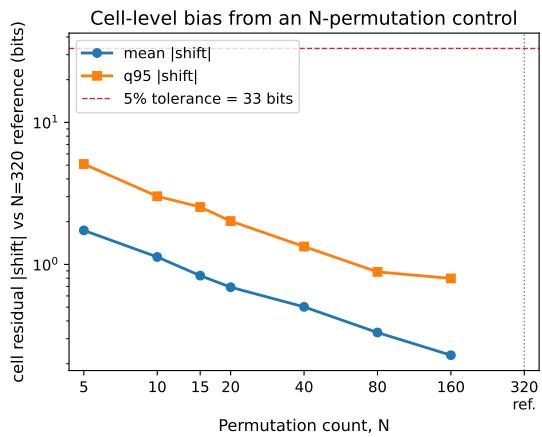

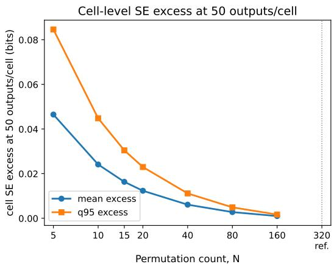  
Figure 10: Permutation-count sensitivity for 50-output cells. Left: mean and 95th-percentile absolute shifts in cell residuals at each tested permutation count relative to $N = 3 2 0 ;$ the dashed line is the 5% tolerance of 33 bits. Right: mean and 95th-percentile excess standard error for a 50-output cell relative to $N = 3 2 0$ . The $N \stackrel { - } { = } 3 2 0$ reference is marked on both axes but omitted as a data point because both quantities are zero by construction. At the chosen value $N = 2 0$ , the mean shift is 0.7 bits and the excess standard error is 0.01 bits.

## B.8 Robustness within the raw-byte family

The finite-p members test whether retaining the smaller directional compression increment changes the association with correlated failure. This sensitivity may be useful when process separation is reciprocal, but it does not make either member preferable to NCD in advance. Figure 11 shows that the result is stable across the family. Under the capability-plus-cross-control specification, the cross-benchmark means are −0.209 for residualised $\bar { V } _ { 1 } , - 0 . 2 \bar { 1 } 2$ for $V _ { 2 } .$ , and −0.216 for $V _ { \infty }$ . For every interpolant, the compression estimate is negative on all ten benchmarks, while the crosscontrolled semantic estimate is positive on nine of ten. The compression estimates have Spearman agreement 0.988 across interpolants and a mean absolute difference of 0.019, compared with a mean

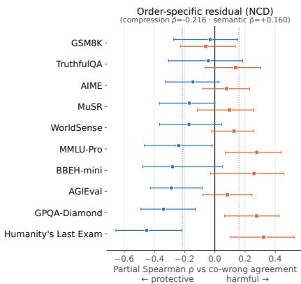

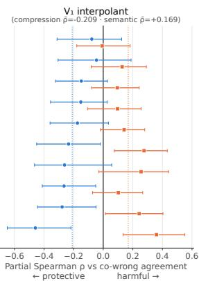

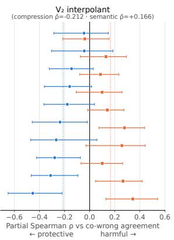  
Compression diversity, holding semantic distance + capability fixed Semantic distance (residual component), holding compression + capability fixed

Figure 11: The compression–failure association is stable across the $V _ { p }$ family. Panels show the primary residualised $V _ { \infty }$ measure (NCD), $V _ { 1 }$ , and $V _ { 2 }$ . Blue circles are partial Spearman correlations between compression diversity and chance-corrected CWA, holding semantic distance and capability fixed; orange squares reverse the cross-control, estimating semantic distance while holding compression diversity and capability fixed. Horizontal bars are 95% model-node-bootstrap intervals, solid vertical lines mark zero, and dotted lines mark the cross-benchmark means reported above each panel. Compression estimates are negative on all ten benchmarks for every interpolant and vary little across panels relative to their uncertainty; semantic estimates are positive on nine of ten.

node-bootstrap interval width of 0.149. The small shifts between panels therefore support robustness across the family.

## C Outcome Measures

## C.1 Epoch-native CWA

Equation 4 pools question-level numerator and denominator counts into a single model-pair rate. Exactly-one-wrong response pairs contribute to the denominator, while the numerator records shared wrong answers. The epoch cross-product preserves repeated attraction to the same wrong answer through the response counts $c _ { i } ( a ) c _ { j } ( a )$

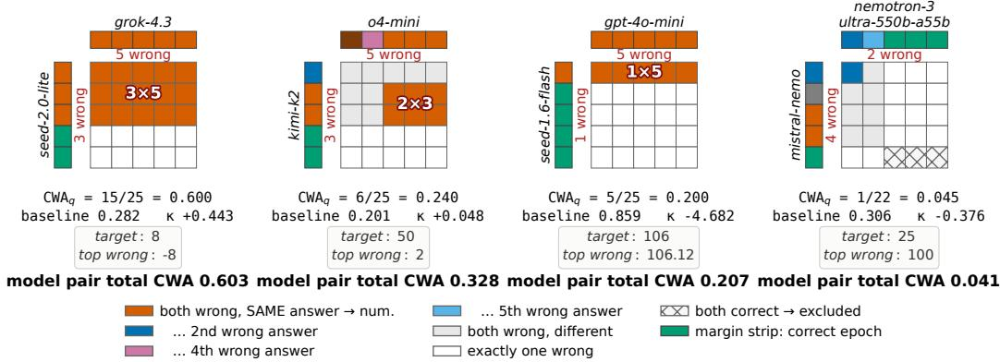  
Figure 12: Epoch-native CWA construction on GSM8K, complementing the GPQA-Diamond example in Figure 1.

## C.2 Chance baselines and relation to CAPA

Four baselines are computed. The per-question leave-pair-out baseline used in the primary analysis estimates each item’s wrong-answer collision rate from the remaining models and then aggregates these expectations to the model-pair level. Pair-independence and pair-empirical baselines are comparators; a pooled-population baseline is retained only as a negative control because it does not condition on the question. This per-question-to-pair construction is used throughout the CWA analysis. Difference-form excess and chance-corrected κ rank pairs almost identically (Spearman 0.988 over benchmark means); eight of ten chance-correction denominators, $1 - \mathrm { C } \mathrm { \dot { W } A } ^ { \mathrm { e \dot { x } p } }$ , lie in [0.90, 0.98], with HLE-MC and MuSR the exceptions.

For completeness, consider a held-out pair (i, j). Let $\begin{array} { r } { b _ { - i j , q } ( a ) = \sum _ { k \not \in \{ i , j \} } c _ { k q } ( a ) } \end{array}$ count wrong epochs from the remaining models that select $a \ne y _ { q }$ , and let $\begin{array} { r } { B _ { - i j , q } = \sum _ { a \neq y _ { a } } b _ { - i j , q } ( a ) } \end{array}$ . On questions for which both held-out models have a wrong epoch and $B _ { - i j , q } \ \geq \ 2$ , the collision probability is

$$
h _ { i j q } = \frac { \sum _ { a \neq y _ { q } } b _ { - i j , q } ( a ) [ b _ { - i j , q } ( a ) - 1 ] } { B _ { - i j , q } ( B _ { - i j , q } - 1 ) } , \qquad \bar { h } _ { - i j } = \frac { 1 } { | Q _ { i j } | } \sum _ { q \in \mathcal { Q } _ { i j } } h _ { i j q } .\tag{23}
$$

The baseline in Equation 5 multiplies $\bar { h } _ { - i j }$ by $p _ { i } p _ { j } / ( p _ { i } + p _ { j } - p _ { i } p _ { j } )$ , where each p is the fraction of parsed epochs that are wrong across questions with parsed responses from both models.

CAPA applies the same algebraic chance correction but targets overall prediction agreement, counting matches whether models are correct or wrong [9]. CWA instead conditions on at least one error and targets agreement on the same wrong answer. In this analysis, CAPA is computed from modal outputs using its uniform-distractor baseline, whereas CWA retains the epoch-native answer distribution and uses the question-specific leave-pair-out baseline. Figure 13 shows that the measures are related but not equivalent. Chance correction increases their rank agreement on seven of the eight fixed-option benchmarks, while HLE-MC moves in the opposite direction.

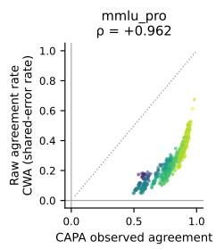

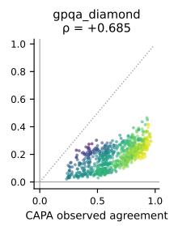

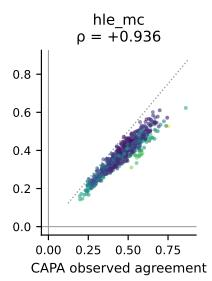

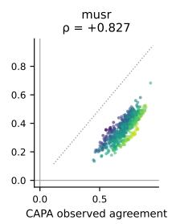

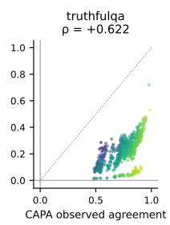

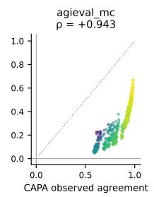

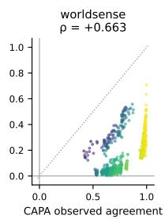

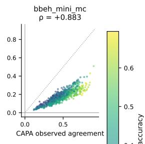

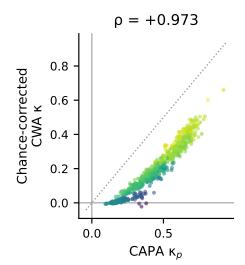

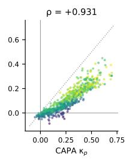

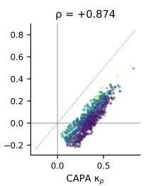

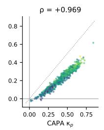

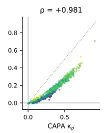

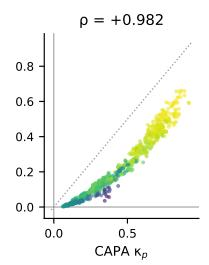

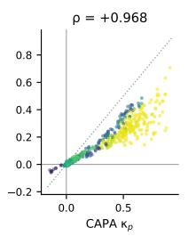

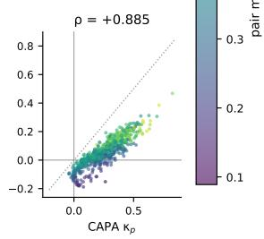  
Figure 1 3 : CWA and CAPA measure related but distinct forms of agreement. Each point is a model pair on one of eight fixed-option benchmarks ; numeric-answer benchmarks are omitted because CAPA is undefined. The top row compares raw CAPA agreement with CWA’ s shared-error rate, and the bottom row compares their chance-corrected forms . Points are coloured by pair mean accuracy dotted lines show y = x and panel headings report Spearman $\rho .$ Raw CWA generally lies below CAPA because it excludes both-correct agreement. Rank agreement spans 0 . 62–0 . 96 before correction and 0 . 87–0 . 98 after correction; HLE-MC is the exception, decreasing from 0 . 936 to 0 . 874

## D Statistical Methods

## D.1 Estimand and partial rank correlation

For paired vectors x and $y ,$ , Pearson’s correlation is the covariance standardised by their sample standard deviations,

$$
r ( x , y ) = \frac { \sum _ { i } ( x _ { i } - \bar { x } ) ( y _ { i } - \bar { y } ) } { \sqrt { \sum _ { i } ( x _ { i } - \bar { x } ) ^ { 2 } \sum _ { i } ( y _ { i } - \bar { y } ) ^ { 2 } } } .\tag{24}
$$

It measures linear association on the observed scale. Spearman’s $\rho _ { s }$ applies the same calculation to the componentwise midranks, $\rho _ { s } ( x , y ) = r \{ R ( x ) , R ( y ) \}$ , and therefore measures monotone association while being invariant to strictly increasing transformations [39]. We use Pearson correlations for explicitly linear-scale diagnostics and Spearman correlations when comparing pair or model orderings.

The primary estimand is the partial Spearman association between a pair’s compression residual and chance-corrected CWA, conditional on semantic distance, capability level, and capability gap. Let $\widetilde x = R ( x )$ and $\widetilde y = R ( y )$ , and let $\widetilde { Z }$ contain an intercept and the midranks of all controls. With $P _ { Z } = \widetilde { Z } ( \widetilde { Z } ^ { \mathsf { T } } \widetilde { Z } ) ^ { - 1 } \widetilde { Z } ^ { \mathsf { T } }$ , we compute

$$
\rho _ { s } ( x , y \mid Z ) = r \left\{ ( I - P _ { Z } ) \widetilde { x } , ( I - P _ { Z } ) \widetilde { y } \right\} .\tag{25}
$$

Thus, the ranked predictor and outcome are residualised separately against the same ranked controls and the two residual vectors are correlated. Simultaneous control matters. Holding capability gap alone gives −0.037, whereas holding level and gap gives −0.148. Rank partialling removes dependence linear in ranks and can absorb monotone nonlinear confounding, but can leave residue from confounding additive in raw values.

Capability level is $( a _ { i } + a _ { j } ) / 2$ and gap is $| a _ { i } - a _ { j } |$ . The gap enters as a pre-existing pair attribute. Because capability is estimated from the same benchmark correctness matrices, both terms function as analytic controls for pair-level performance. Measured estimates are −0.026 under raw-linear capability control, −0.110 under quadratic control, and −0.143 under rank control. The empirical relationship supports the rank specification used in the primary analysis.

## D.2 Dyadic dependence and model-node resampling

To make the dependence explicit, write a generic pair quantity as $x _ { i j } = \mu + a _ { i } + a _ { j } + e _ { i j }$ , where the independent node effects have variance $\mathrm { V a r } ( a _ { i } ) = \sigma _ { a } ^ { 2 }$ , the independent dyad residuals have variance $\mathrm { V a r } ( e _ { i j } ) = \sigma _ { e } ^ { 2 }$ , and x¯ averages all unordered pairs. Then

$$
\mathrm { V a r } ( \bar { x } ) = { \frac { 4 \sigma _ { a } ^ { 2 } } { M } } + { \frac { \sigma _ { e } ^ { 2 } } { \binom { M } { 2 } } } .\tag{26}
$$

The model component decreases with the number of nodes $M .$ , not with the number of dyads $\binom { M } { 2 }$ because each $a _ { i }$ is shared by the M − 1 pairs incident to model i. This component is material in the observed data. An incidence model attributes 58.6% of compression distance’s rank variance and 61–85% of outcome rank variance to model-level structure.

The bootstrap preserves this incidence structure directly. For each replicate, we draw M model slots with replacement, construct every unordered pair of distinct slots, map those induced dyads to the observed pair rows, and recompute the complete rank-partial statistic, including all controls. Selecting a model more than once repeats all of its incident dyads; self-pairs and non-estimable dyads are omitted. The interval is given by the 2.5th and 97.5th percentiles of the resulting statistic. A delete-one-model jackknife closely agrees with these intervals on every benchmark (mean width ratio 0.95, range 0.89–1.02). In 300 simulations in which the true association was zero, calibrated to the measured model-level variance shares, the node-bootstrap interval excluded zero in 3.0% of simulations at a nominal 5% level. The intervals remain conditional on prompts, generations, benchmark questions, evaluation epochs, and the composition of the evaluated model population.

## D.3 Paired comparison of conditional associations

The two cross-controlled partial correlations are estimated on the same model pairs and outcome within each benchmark. Let $Z _ { b }$ contain capability level and gap for benchmark $b ,$ and define

$$
\begin{array} { r l } & { \rho _ { b } ^ { \mathrm { I G P } } = \rho _ { s } ( d ^ { \mathrm { I G P } } , \kappa _ { b } \mid d ^ { \mathrm { s e m } } , Z _ { b } ) , } \\ & { \rho _ { b } ^ { \mathrm { s e m } } = \rho _ { s } ( d ^ { \mathrm { s e m } } , \kappa _ { b } \mid d ^ { \mathrm { I G P } } , Z _ { b } ) , \qquad \Delta _ { b } = \rho _ { b } ^ { \mathrm { I G P } } - \rho _ { b } ^ { \mathrm { s e m } } . } \end{array}\tag{27}
$$

Both coefficients are partial correlations on ranked variables and therefore lie in [−1, 1]. Their difference $\Delta _ { b }$ is expressed in correlation units but is not itself a correlation coefficient; its theoretical range is [−2, 2]. Negative values indicate that the order-specific compression residual has the more negative association with correlated failure.

The two coefficients are dependent because they share the same models, dyads, outcome, and control variables. We therefore compute both coefficients within each model-node bootstrap replicate and difference them within that replicate. The percentile interval for each benchmark consequently retains the sampling covariance between the two estimates. Comparing the overlap of their marginal intervals would not test $\Delta _ { b } = 0$ . Across benchmarks, we report the unweighted mean $\bar { \Delta } = 1 0 ^ { - 1 } \sum _ { b } \Delta _ { b }$ and its t-interval over the ten benchmark estimates. Figure 14 shows $\bar { \Delta } = - 0 . 3 7 5$ with 95% interval $[ - 0 . 5 4 5 , - 0 . 2 0 6 ]$

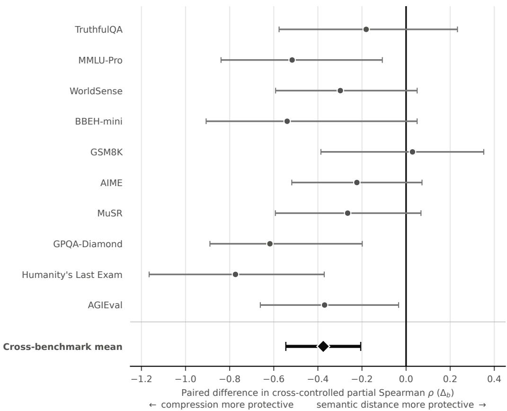  
Figure 14: Paired comparison of the cross-controlled partial correlations. Each benchmark row shows $\Delta _ { b } = \rho _ { b } ^ { \mathrm { I G P } ^ { \bullet } } - \rho _ { b } ^ { \mathrm { s e m } }$ , a difference in correlation units with theoretical range [−2, 2]. Circles are point estimates and horizontal bars are 95% model-node-bootstrap intervals obtained by differencing the two correlations within each resample. The diamond is the unweighted mean across ten benchmarks and its bar is the corresponding 95% t-interval. Negative values indicate that the order-specific compression residual has the more negative conditional association with correlated failure.

## D.4 Repeated-measures ranks and multiplicity

The within-model analysis compares $K = 3 8$ models repeatedly across $B = 1 0 0$ prompt blocks. Within each prompt, the models are ranked on the response-variability measure. Let $R _ { j }$ be the rank sum for model $j$ across prompts and $\bar { R } = B ( K + 1 ) / 2$ . In the absence of ties, Kendall’s coefficient of concordance is

$$
W = \frac { 1 2 \sum _ { j = 1 } ^ { K } ( R _ { j } - \bar { R } ) ^ { 2 } } { B ^ { 2 } ( K ^ { 3 } - K ) } , \qquad 0 \le W \le 1 ,\tag{28}
$$

with the standard tie correction used when ranks coincide [40]. Here, $W = 0$ indicates no stable model ordering across prompts and $W = 1$ indicates complete agreement among the prompt-specific rankings. It is an effect-size measure, not a test of any particular model pair.

The Friedman test uses the same blocked ranks to test the omnibus hypothesis that the models have no systematic differences in rank location across prompts [41]. Its tie-corrected statistic Q satisfies $Q \stackrel { \bullet } { = } B ( K - 1 ) W$ and is compared with a $\chi _ { K - 1 } ^ { 2 }$ reference distribution. Rejection establishes that at least one model differs in its repeated rank pattern; it neither identifies which models differ nor supplies pairwise comparisons. The W values in Appendix B.6 describe the magnitude of the stable ordering, while the associated Friedman tests assess whether that ordering is distinguishable from the equal-rank hypothesis.

The compressor analysis uses a different paired procedure. For each of the $U = 7 2$ matched length– replicate units, let $d _ { u }$ be PPMd’s shared-context effect minus that of one alternative compressor. The one-sided sign-flip test compares the observed $\bar { d }$ with 20,000 values $\begin{array} { r } { \bar { d } _ { b } ^ { * } = { U } ^ { - 1 } \sum _ { u } s _ { b u } \bar { d _ { u } } , } \end{array}$ where the signs $s _ { b u } \in \mathsf { \bar { \{ - 1 , + 1 \} } }$ are sampled independently with equal probability. Its Monte Carlo value is

$$
p = \frac { 1 + \# \{ b : \bar { d } _ { b } ^ { * } \geq \bar { d } \} } { 2 0 , 0 0 1 } ,\tag{29}
$$

so a reported value cannot be zero. The three PPMd-versus-compressor tests form one comparison family. If their ordered unadjusted values are $p _ { ( 1 ) } \leq \dots \leq p _ { ( m ) }$ , with $m = 3$ , the Holm-adjusted values are

$$
\widetilde { p } _ { ( i ) } = \operatorname* { m i n } \left\{ 1 , \operatorname* { m a x } _ { 1 \leq j \leq i } ( m - j + 1 ) p _ { ( j ) } \right\} .\tag{30}
$$

This step-down adjustment controls the family-wise probability of at least one false rejection while retaining more power than applying the same Bonferroni threshold to every test [42]. The value $1 . 5 \times 1 0 ^ { - 4 }$ reported in Appendix B.1 is the adjusted value for each of the three contrasts.

## E Extended Related Work

## E.1 Diversity and resilience in collective systems

Diversity can contribute to collective performance through several distinct mechanisms, including the buffering or insurance effects produced when components respond differently to fluctuating conditions [4, 5]. Functional diversity describes variation in the functions performed by system components. Response diversity describes variation in how components contributing to the same function respond to perturbation [6, 43]. The latter is particularly relevant to redundancy. Components are not interchangeable safeguards if they respond identically under the conditions that cause failure. Work on resilience and critical transitions also shows that the organisation of heterogeneity and coupling can determine whether local perturbations remain local or become system-wide [44]. Diversity i therefore multidimensional. Its effect depends on the system function and the disturbance unde study.

Collective-adaptation research reaches a related conclusion from a problem-solving perspective. Heterogeneous information and strategies can expand the set of solutions explored by a group. Rapid information sharing can improve diffusion, but it can also accelerate convergence on a common and potentially suboptimal solution [7, 8]. The arrangement of diversity matters as much as its amount because coupling determines whether differences remain available to the collective when conditions change. These findings motivate population-level analysis of AI systems, but they do not specify which representation of model diversity is appropriate. Our use of resilience theory is methodological rather than analogical. It determines the outcome-relative definition of diversity and the criterion used to validate its measure.

## E.2 Diversity and correlated failure in AI systems

Multi-agent safety work has begun to identify failure modes that are not reducible to the behaviour of an isolated model. Homogeneous agents can respond synchronously to common information, propagate shared errors through a network, or provide ineffective mutual oversight [45–47]. These risks extend concerns about algorithmic monoculture and are especially important for defence-indepth designs whose reliability assumes that separate components fail under different conditions [48].

Empirical evidence suggests that organisational and architectural labels are weak proxies for this independence. Language models from different providers select identical wrong answers at rates above pair-specific chance expectations [9, 10]. Provider count, parameter count, and model-family count may therefore overstate the effective diversity of a multi-model system. A useful audit must estimate behavioural relationships among the models themselves and validate those relationships against a relevant failure outcome.

The Artificial Hivemind measures one such relationship using embedding similarity among openended responses [11]. Its finding of high semantic similarity across the model population motivates our study and supplies the semantic baseline. Our objective differs in the property being estimated. Embedding similarity asks whether response meanings are similar. Inferred generative-process similarity asks whether observable sequences exhibit shared generative organisation. We evaluate whether this distinction explains variation in correlated failure that semantic similarity does not.

## E.3 AIT and generative structure

AIT characterises an object by the length of the shortest program that generates it. Kolmogorov complexity is uncomputable, but it motivates universal similarity measures based on shared algorithmic information. Normalised Information Distance compares the information needed to describe either object given the other. NCD approximates this relation by replacing program length with compressed length [12, 13]. NCD has the practical advantage of operating directly on discrete sequences and requiring neither task-specific features nor a learned representation.

AIT approaches have also been used to distinguish generative regularity from apparent statistical randomness [49, 50]. This perspective clarifies why generative and statistical descriptions need not coincide. An object may appear complex under one selected representation while retaining simple generative organisation. We make a narrower empirical claim than recovering a model’s generating program. A compressor does not identify a latent algorithm, and finite-sample NCD is compressor-dependent. We use NCD as a comparative statistic of shared sequential structure and test its validity through prediction of disjoint correlated-failure outcomes.