# It’s the Problem, Not the Path: Budget and Dificulty Confounds in LLM Reasoning Trajectories

Yigit Utku Bulut∗ Johannes Kepler University Linz yigit.utku.bulut@outlook.com k12350740@students.jku.at

September 4, 2026

## Abstract

Reasoning traces of large language models are widely read as containing “breakthrough” moments and early-legible fates. Both readings rest on measurements missing a counterfactual control at the level of the claim; we supply both controls. First, a restart-controlled truncation probe separates when a solution fits the continuation budget from when a prefix carries value that fresh computation cannot buy, comparing per-anchor continuation solve rates against from-scratch restart curves at matched total generated-token budget. Applied to 178 problem–model cells (89 MATH problems × two small open models, an outcome-blind but dificulty-targeted cohort), exactly 1 of 178 cells survives as prefix-limited; restart dose–response separates a compute-starved model from a capability-limited one; and wherever the matched budget lies inside the restart grid, continuing the model’s own prefix beats restarting (9 of 9) — predominantly compute compression rather than expanded reachability. Second, a pre-registered, dificulty-controlled test finds no detectable outcome information in early-window internal signals beyond a problem-dificulty baseline, and two generation-free analyses of public corpora show why this control is needed: a trace-blind dificulty proxy reaches AUROC 0.873 on 192K DeepSeek-R1 generations — inside the published probe range — and a closely matched reconstruction of the closest published early-window positive recovers a comparable pooled result (0.849) while within problem it is statistically indistinguishable from chance at all ten anchors (0.496 at t=4); a post-hoc withintargeted probe finds only a small average residual, concentrated in three low-failure problems. High pooled probe AUROCs cannot by themselves establish within-attempt information; a question-only baseline or within-problem evaluation is required.

## 1 Introduction

Two appealing beliefs circulate about the reasoning traces of large language models. The first is that traces contain breakthrough moments — points where accumulated reasoning suddenly unlocks a solution, popularized as “aha moments” in reinforcement-trained reasoners [10]. The second is that a run’s fate is legible early: probes on hidden states reportedly predict correctness with AUROC 0.79–0.95, sometimes from the first four tokens [9, 44, 45], and serving systems already allocate compute on such signals [11, 12]. Both beliefs, if true, would matter: the first for what test-time compute buys, the second for adaptive inference and interpretability.

Both beliefs rest on measurements with a missing control, and the two missing controls mirror each other: a claim about a trajectory requires a counterfactual control at the level of the claim — what this computation buys over fresh computation, what this attempt reveals beyond its problem. Breakthrough claims rest on truncate-and-resample probes: cut the trace at position t, sample continuations under a budget, and call the first high-solve-rate anchor a breakthrough. But a crossing of that kind conflates two events — the prefix accumulated value and the remaining work began to fit the budget. Distinguishing them requires a from-scratch restart control at matched total generated-token budget; we found no prior work combining per-anchor continuation estimates with a per-problem restart curve at matched budget (Section 5). Prediction claims rest on probes evaluated across problems, where a probe can score well by reading which problem it is — its dificulty — rather than how the attempt is going. Distinguishing those requires a question-only baseline and a within-problem evaluation, which the published positives do not report.

This paper supplies both controls and reports what they change. We build a restart-controlled, budget-indexed, censoring-aware truncation probe (Section 2): per-anchor continuation solve rates pˆ(t) are compared against restart curves $R ( C )$ at matched total generated-token budget, splitting the naive breakthrough time into a budget-fit time $T _ { F }$ and a prefix-value time $T _ { V }$ , with attempt-level noise hardened by replication and pooling. We apply it to 178 problem–model cells (89 MATH problems × two small open models, 16K-token instrumented traces), and we complement it with two analyses of public reasoning-model corpora at larger scale.

The instrument returns a consistent picture:

• Breakthroughs are mostly budget artifacts. Exactly 1 of 178 cells survives as prefixlimited (three cross the advantage margin; an in-grid restart already solves two); 98 cells collected after the rules were frozen contributed zero new cases (Section 3).

• Restart dose–response separates failure modes. One model’s unsolved problems dissolve as budget grows (0% → 79%, compute-starved); the other’s do not budge (capability-limited within the measured restart-budget range).

• Accumulated reasoning is predominantly compute compression. At matched total token budget the model’s own prefix beats restarting wherever the comparison is exactly matched (9/9, with 2 wins and 2 ties on boundary proxies), yet a larger restart budget reaches the same threshold in 11/13 and the prefix’s own rate in 9/13: within the measured budget range, long reasoning mostly buys the same successes cheaper rather than reaching otherwise unreachable ones.

• Solvability is not binary. A third of ambiguous intermediate states remain intermediate after eight attempts (success 0.3–0.6), a band reproduced in the independent second half of attempts.

• Early internal signals carry no detectable outcome information beyond dificulty. A pre-registered, single-shot test on a held-out split finds no detectable gain at the frozen forecast point, and a labeled post-hoc sweep finds none at any window from 128 to 2,048 tokens (Section 4); on public data, a trace-blind dificulty proxy reaches 0.873 on 192K DeepSeek-R1 generations — inside the published probe range — and a closely matched reconstruction of the closest published early-window positive recovers a comparable pooled result at t=4 (0.849) while within problem it is statistically indistinguishable from chance at all ten anchors (0.496 at t=4); a post-hoc within-targeted check finds only a small average residual, concentrated in three low-failure problems.

The claims are scoped deliberately. We study two small open-weight models (one an explicitly reasoning-tuned release, both run in thinking mode) plus public corpora from the R1 family; we do not claim internal states never carry within-attempt information — at intermediate-answer positions, in larger models, or in other domains the verdict may difer. What we do claim is that the two controls change conclusions wherever we have applied them, that they are cheap (our public data analyses required no generation at all), and that trajectory-level claims about reasoning should be reported with them. Every decision rule in this study was frozen in committed amendments before the outcomes it governs were observed, gate failures included (Section 2, App. A). Code, the frozen amendments, and all result artifacts are available at https://github.com/bulutyigit/ problem-not-path.

## 2 A Restart-Controlled Probe of Reasoning Value

## 2.1 Setup

We study two small open-weight models with distinct architectures and training pipelines — Gemma-4 E4B and Ministral-3 3B (an explicitly reasoning-tuned release)1 — run locally in thinking mode, in 4-bit MLX quantization, with full token-level instrumentation (per-token logits and final-layer hidden states). Problems come from the MATH benchmark [18]. Because breakthrough measurement is only informative on problems a model sometimes solves, cohorts were selected by outcome-blind intermediate-dificulty screens, frozen before any probe outcome existed: a development cohort (20 problems), a supplement cohort (20), and an expansion cohort (49) whose screen was repaired after a recorded gate failure $\left( \operatorname { A p p . ~ A } \right)$ . Together they yield 89 problems and $8 9 \times 2 = 1 7 8$ problem–model cells. Each cell has one instrumented base trajectory generated with a 16,384-token budget. Research splits (54 train / 18 validation / 17 test problems) were assigned before any outcome was observed; the test split is spent exactly once, in Section 4.

## 2.2 Truncation probe and the budget-fit time $T _ { F }$

The probe follows the truncation-and-resampling tradition [5, 23]: truncate the model’s own trajectory at an anchor t (log-spaced from 16 to 8,192 tokens), and sample $m = 4$ continuations from the truncated prefix under a fixed budget of $B = 1 , 0 2 4$ reasoning tokens plus a 512-token answer reserve, with deterministic per-branch seeds. The per-anchor solve rate $\hat { p } ( t ; B )$ estimates the value of the partial state. A breakthrough is the first anchor with $\hat { p } \ge \tau \ ( \tau = 0 . 7 5 )$ that remains above threshold at the next anchor; crossings are refined by bisection and recorded as intervals, and trajectories whose curve never crosses are right-censored at their final anchor. We call the resulting time $T _ { F } ( B )$ , the budget-fit time: the point at which a solution first fits the continuation budget. As Section 3 shows, $T _ { F }$ is what an uncontrolled probe reports as a breakthrough — and it conflates two very diferent things.

## 2.3 Restart control and the prefix-value time $T _ { V }$

To separate “the prefix carries value” from “the budget became suficient,” we measure each problem’s restart curve $R ( C )$ : the solve rate of from-scratch attempts (empty prefix, same prompt) at budgets $C \in \{ 1 , 0 2 4 , 2 , 0 4 8 , 4 , 0 9 6 , 8 , 1 9 2 \}$ , four attempts each, with $\hat { R }$ interpolated log-linearly between grid points. Budget matching throughout equates generated tokens; FLOPs, latency, and KV-cache reuse are not measured (Section 6). The advantage of a prefix at matched total generated-token budget is ad $\boldsymbol { \mathbf { \ell } } ( t ) = \boldsymbol { \hat { p } } ( t ; B ) - \boldsymbol { \hat { R } } ( t + B )$ , and the prefix-value time $T _ { V } ( \delta )$ is the earliest stable anchor with $\hat { p } \geq \tau$ and adv $\geq \delta$ (primary margin $\delta = 0 . 5 ; 0 . 2 5$ and 0.75 reported as sensitivity, along with a conservative variant that takes the upper envelope of the bracketing grid values of $\hat { R } )$ . Cells are then classified by frozen precedence: instant (event interval upper bound $\leq 1 6$ tokens), budget-limited $( { \hat { R } } ( 4 , 0 9 6 ) \geq \tau \colon$ a restart solves it), prefix-limited (a $\delta = 0 . 5$ crossing exists), no-crossing $( T _ { F }$ exists but no advantage crossing), terminal (a replicated event at the final anchor with no stability anchor; annotated, never promoted to $T _ { V } )$ , and unsolved.

## 2.4 Noise hardening

With $m = 4 ,$ , a $3 / 4$ crossing occurs with probability 0.31 under a true success rate of 0.5, so singleshot labels are optimistic. Two frozen rules harden them. First, threshold-censored trajectories (final-anchor rate $\geq \tau .$ , no stability anchor available) get four additional branches, and a terminal event is recorded only if the pooled rate reaches $\geq 6 / 8$ (under $p = 0 . 5$ this has probability 0.14). Second, every ambiguous cell (1–3 successes of 4) across the expansion cohort was enlarged to eight attempts before labels were derived (148 cells). Both rules cut in both directions in practice: replication confirmed 13 of 16 candidates for one model and rejected the other model’s single candidate, and pooling removed six events while adding one.

## 2.5 Pre-registration discipline

Every decision rule above was frozen in written, committed amendments before the outcomes it governs were observed; gate failures (two cohort gates and one pilot gate) are recorded as failures and resolved by amendment, never by relabeling. The confirmatory prediction protocol of Section 4 — endpoints, feature sets, model class, power gates, and success criterion — was committed before the single test-split evaluation, and every post-hoc analysis is labeled as such in the amendment that reports it. Appendix A gives the full timeline.

## 3 Results I: Breakthroughs Under Control

## 3.1 Most measured breakthroughs are budget artifacts

The restart control changes what the probe data mean. In the development cohort, Ministral-3 exhibited apparently clean mid-trajectory crossings — until a budget-sensitivity re-probe showed the same problems solved from 16-token prefixes once the continuation budget was raised to 4,096 tokens: the “breakthroughs” marked where solutions began to fit the budget, not where the prefix accumulated value. Applied to all 178 cells, the frozen taxonomy yields the map in Figure 1: for Ministral-3, 33 cells are budget-limited, 17 instant, 8 terminal, 2 no-crossing, and 29 unsolved; for Gemma-4, 26 instant, 4 budget-limited, 3 no-crossing, 55 unsolved — and exactly one prefix-limited cell in the entire dataset (a development problem with $T _ { V } = 8 9 6$ and advantage 0.75). Decomposed: the advantage crossing itself occurs in three cells at the primary margin; the frozen precedence classifies the other two as budget-limited because a 4,096-token restart already solves them, and four instant cells additionally show an advantage at their $\leq 1 6 \AA$ -token anchors. The 98 expansion cells, collected after the rules were frozen, contributed zero new prefix-limited cases. Loosening the margin to $\delta = 0 . 2 5$ adds four crossings, tightening to 0.75 keeps two, and the conservative $\hat { R }$ envelope agrees with the primary labels on all 178 cells. Genuine prefix-locked value, at this scale and in these models, is rare: 1 of 178 cells — a descriptive count in an outcome-blind but dificulty-targeted cohort with one base trajectory per cell (the 89 problems repeat across the two models, so cells are not independent and no population-prevalence interval is implied).

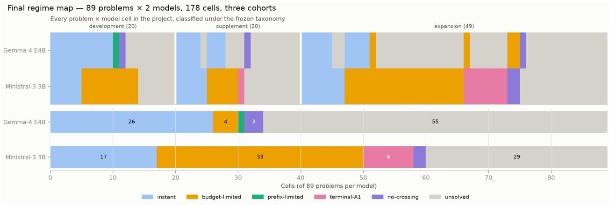  
Figure 1: The final regime map: 89 problems × 2 models classified under the frozen rules (top: per-cell strip grouped by cohort; bottom: per-model totals). One cell of 178 is prefix-limited.  
Restart dose-response on the expansion cohort — non-instant cells: Ministral climbs with budget, Gemma stays flat

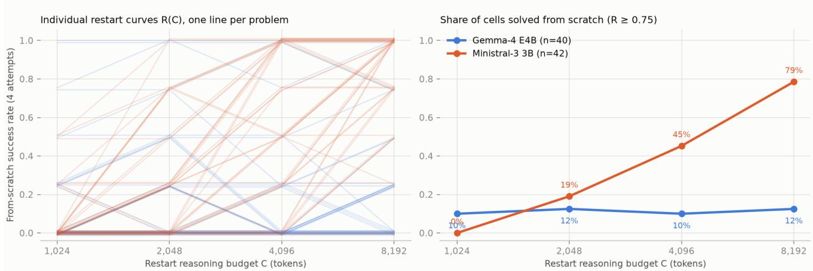  
Figure 2: Restart dose–response on non-instant expansion cells. Individual curves (left) and share solved from scratch (right): Ministral-3 climbs 0% → 79%; Gemma-4 stays flat.

## 3.2 Restart dose–response separates failure modes

The restart curves themselves carry the cleanest model-level finding (Figure 2). On expansion cells that are not instant, the share of problems Ministral-3 solves from scratch climbs with budget — $0 \%  1 9 \%  4 5 \%  7 9 \%$ across 1,024 → 8,192 tokens — while Gemma-4 stays flat at 10–12%. Individual four-attempt curves are noisy: 8 of Ministral-3’s 42 show at least one decrease between consecutive budgets (all of a single attempt, 0.25; two cells revert across the τ threshold), against 18 of Gemma-4’s 40, five with drops of at least 0.5 and one threshold reversal — larger-budget restarts losing solved problems, overthinking on natural problems that complements constructed-task inverse scaling [14]. One model’s failures are compute-starved; the other’s are capability-limited within the measured restart-budget range. The two models agree on a collapsed regime class for only 42 of 89 problems: small models do not share a single “small-model” failure mode, which also cautions against averaging such models in evaluations.

Matched-budget value of Ministral's long prefixes — 13 censored expansion-cohort cells

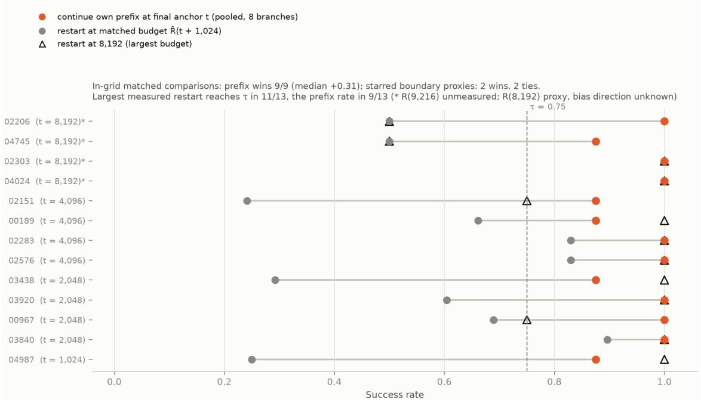  
Figure 3: Matched-budget value of long prefixes on 13 threshold-censored cells: the prefix wins all nine exactly matched comparisons (starred boundary proxies: two wins, two ties); the largest measured restart reaches τ in 11/13 and the prefix’s own rate in 9/13.

## 3.3 Accumulated reasoning is predominantly compute compression

The 13 threshold-censored Ministral-3 expansion cells — trajectories whose crossing was replicated only at the final anchor; under the frozen precedence seven carry the terminal label, five budgetlimited, and one no-crossing — allow the sharpest statement of what a long prefix is worth (Figure 3). In the nine cells whose matched budget t + B lies inside the restart grid, continuing the model’s own prefix beats restarting in all nine (median advantage +0.31). The four cells anchored at t = 8,192 require Rˆ(9,216), which was not measured; substituting Rˆ(8,192) makes them proxy comparisons whose bias direction is unknown — restart curves are not uniformly monotone — and on these proxies the prefix wins two and ties two. The largest measured restart reaches τ in 11 of 13 cells and matches the prefix’s own pooled success rate in 9 of 13. Accumulated reasoning is therefore predominantly consistent with compression — reaching the same success threshold with fewer total tokens — rather than with expanded reachability, within the measured budget range: in the two cells where no measured restart reaches τ the question stays open at larger budgets, and binary correctness compares success rates, not solution content. This instantiates, empirically and per problem, the no-benefit branch of the dichotomy of Wolf et al. [41] — absent self-reflection that reliably localizes early errors, conditioning on past attempts ofers no asymptotic benefit over independent restarts (their analysis concerns attempt-conditioned search; our truncated-prefix continuation is the analogous object) — and it gives the sequential-versus-parallel debate [15, 34, 37] a quantity it has lacked: the value of a partial trace expressed in fresh-token units.

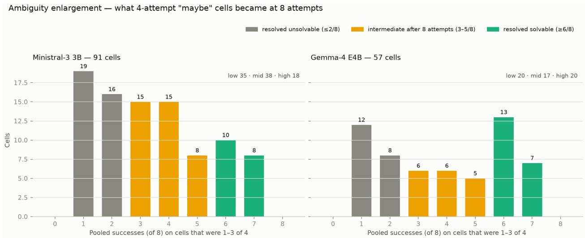  
Figure 4: What ambiguous 1–3/4 cells became at eight attempts: about a third remain intermediate, a pattern the independent second half of attempts reproduces.

## 3.4 A persistent band of intermediate solvability

Enlarging all 148 ambiguous cells to eight attempts resolved 55 as efectively unsolvable $( \leq 2 / 8 )$ and 38 as solvable $( \ge 6 / 8 )$ — and left 55 intermediate after eight attempts (3–5 of 8; Figure 4). Because these cells were selected on their first four attempts, pooled rates partly reflect selection; the independent second half of attempts, however, reproduces the band — 58% of enlarged cells land at 1–3 of 4 on branches never used for selection — so intermediate success probabilities are not a pure selection artifact, though eight-attempt intervals remain wide. A sizable band of intermediatesolvability states is the natural reading, which undermines the single-crossing, monotone-value picture implicit in binary-search process-labeling schemes [26] and in snowball-error accounts of monotone degradation [13], and which converges with trajectory-level evidence that recoverable and structural failures are distinct populations [20].

## 4 Results II: A Dificulty-Controlled Null for Early Signals

## 4.1 A pre-registered, dificulty-controlled null

Can the first tokens of a run predict its outcome beyond what the problem itself predicts? We froze the answer procedure before evaluating it: endpoints (primary: eventual success of the 16K run; secondary: scratch-solvability at 4,096, i.e. $\hat { R } ( 4 , 0 9 6 ) \geq \tau$ on non-instant cells), feature sets (a question-only baseline versus the same baseline plus fifteen frozen early-window dynamics summaries entropy, surprisal, successive divergences, hidden-state geometry, spectral summaries over the first 512 tokens; defined in Appendix B.1), a logistic model, problem-grouped cross-validation on train+validation, per-class power gates, and the success criterion: the paired ∆AUROC’s problemclustered 95% CI must exclude zero. The question-only baseline contains no signal from the run: the frozen dificulty columns are the benchmark’s human dificulty level, the topic category, and five surface statistics of the problem text (character count, whitespace-token count, and counts of numeric, operator, and equation tokens), plus the model’s identity — everything knowable before the first token is generated, at text level (a pre-generation activation probe would be a stronger baseline still [25]; see Limitations). The test split was then evaluated once.

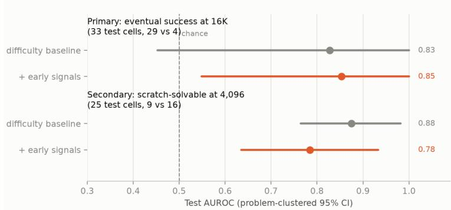

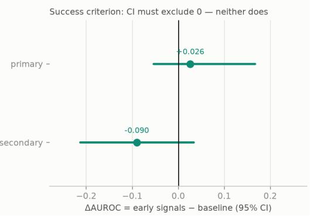

Figure 5: The confirmatory test: single evaluation on the held-out split. Neither endpoint’s ∆AUROC CI excludes zero.  
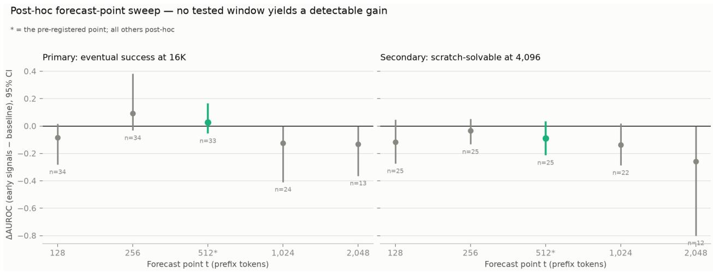  
Figure 6: Post-hoc forecast-point sweep: no tested window yields a detectable gain.

Neither endpoint met the criterion (Figure 5). Primary: baseline AUROC 0.83 versus 0.85 with early signals, $\Delta = + 0 . 0 2 6 ~ [ - 0 . 0 5 4 , + 0 . 1 6 7 ]$ . Secondary: baseline 0.88 versus 0.78, $\Delta = - 0 . 0 9 0$ $[ - 0 . 2 1 3 , + 0 . 0 3 3 ]$ — the point estimate is negative, consistent with uninformative added features. A level-free sensitivity variant agrees, and the within-trajectory timing endpoint remained below its power gate (four test-split interior events) and was not fit. A post-hoc sweep of the forecast point over $t \in \{ 1 2 8 , 2 5 6 , 1 , 0 2 4 , 2 , 0 4 8 \}$ labeled post-hoc in the amendment — found 8 of 10 point estimates negative and every CI straddling zero (Figure 6): no tested alternative window yields a detectable gain, though these post-hoc intervals are individually underpowered. These are absences of detected gain, not demonstrations of equivalence — the primary CI’s upper bound (+0.167) does not exclude moderate efects, and no equivalence margin was pre-registered anywhere; what tighter intervals can support is an explicit bound on efect size, as in the within-problem dissection below.

Why the null has this shape is visible in the per-model split: the dificulty baseline alone is near-perfect for Gemma-4 (test AUROC 1.0 on both endpoints, n=16 and 11) and mediocre for Ministral-3 (0.69–0.73). Descriptively, dificulty leaves little to explain for the capability-limited model, while the budget-elastic model’s outcomes carry residual stochastic variance — the band of Section 3 — that neither dificulty nor early dynamics explain.

## 4.2 Why pooled evaluation cannot see within-attempt information

The confound has a simple formal core. Fix a problem–model cell c and treat attempts as conditionally i.i.d. given the cell: attempt $j$ has outcome $Y _ { c , j } \in \{ 0 , 1 \}$ with $\operatorname* { P r } ( Y _ { c , j } = 1 \mid c ) = p _ { c }$ . Call a predictor question-only if its score depends on the cell alone, $S _ { c , j } = f ( c )$ ; the idealized case is $f ( c ) = p _ { c }$ Its feasible surrogate, the leave-one-out pass rate $\begin{array} { r } { \hat { d } _ { c , j } = \frac { 1 } { k _ { c } - 1 } \sum _ { i \neq j } Y _ { c , i } } \end{array}$ , estimates $p _ { c }$ without using attempt $j ^ { \prime } \mathrm { s }$ own outcome, but is not itself question-only — it varies across attempts within a cell, with the mechanical consequence recorded below. AUROC is a probability over discordant pairs, $\begin{array} { r } { \mathrm { A U R O C } ( S ) = \operatorname* { P r } ( S _ { a } > S _ { b } \mid Y _ { a } = 1 , Y _ { b } = 0 ) + \frac { 1 } { 2 } \operatorname* { P r } ( S _ { a } = S _ { b } \mid \cdot ) } \end{array}$ , and splitting the pairs by whether they share a cell gives

$$
\mathrm { A U R O C } _ { \mathrm { p o o l e d } } ( S ) = \lambda \mathrm { A U R O C } _ { \mathrm { w i t h i n } } ( S ) + ( 1 - \lambda ) \mathrm { A U R O C } _ { \mathrm { b e t w e e n } } ( S ) ,\tag{1}
$$

where λ is the fraction of discordant pairs drawn from the same cell. Two consequences follow. First, every question-only predictor has $\mathrm { A U R O C } _ { \mathrm { w i t h i n } } = \frac { 1 } { 2 }$ exactly (its score is constant within a cell, so all within-cell pairs are ties): within-cell evaluation isolates precisely the information that a dificulty measurement cannot carry. Second, in the standard design with one attempt per problem $( k _ { c } = 1 ) , \lambda = 0$ identically — a pooled AUROC then evaluates only between-cell ranking, a task for which ranking by $p _ { c }$ is optimal among question-only scores under conditional i.i.d. sampling, and therefore cannot, by itself, attribute its value to within-attempt information, however high it reads — dificulty alone can produce any of the reported numbers. The closest published early-window positive [9] is of this form (one trajectory per problem). The two designs in this section are the two escapes Eq. (1) allows: with $k _ { c } = 1$ the within component is inaccessible and the only recourse is incremental value over an explicit question-only baseline (our confirmatory test above); with $k _ { c } \gg 1$ the within component becomes directly estimable (the dissection below). One bookkeeping fact used there: within a cell with $\begin{array} { r } { S _ { c } = \sum _ { i } Y _ { c , i } } \end{array}$ successes, the LOO score takes exactly two values, $( S _ { c } - 1 ) / ( k _ { c } - 1 )$ for a correct attempt and $S _ { c } / ( k _ { c } - 1 )$ for an incorrect one, ranking every incorrect attempt above every correct one — its within-AUROC is mechanically 0, and the neutral reference for “no within-attempt information” is $\frac { 1 } { 2 }$

## 4.3 The ceiling exists in the literature’s own regime

Our cohort is small, so we asked the same question of public data at scale. On 192,315 DeepSeek-R1 generations over 91,573 problems [19], a trace-blind dificulty proxy — the leave-one-out pass rate of the problem’s other attempts, for 92% of problems a single binary observation, reading neither the trace nor the question — achieves AUROC 0.873 [0.870, 0.876] (problem-clustered bootstrap; estimator frozen before evaluation, and likely conservative, since dataset curation truncates the dificulty range). That places a predictor that never reads the trace squarely inside the 0.79–0.95 range that internal-state probe papers report [9, 38, 44, 45] — none of which report a question-only baseline (Figure $7 ;$ the partial exception, Lugoloobi et al. [25], baselines pre-generation probes against question-text features but never probes the reasoning window). Nor is the ceiling a mathematics artifact: on 16,384 public GPQA-diamond [31] samples (64 questions × 256 attempts, Llama-3.3-70B [36]), the same estimator reaches 0.917 [0.875, 0.938] — despite a four-way multiple-choice guessing floor that, under independent uniform guessing, attenuates rather than inflates it.

## 4.4 Dissecting a published probe positive in the reasoning-model regime

Finally, we reconstructed and then dissected the closest published early-window setup in a public reasoning-model regime, using public data and no generation: 128 MATH problems with 256 R1- Distill-Qwen-7B samples each [35] — a dump released by the first author of Singhi et al. [36] alongside that paper’s data, which the paper itself does not describe — re-scored by teacher-forcing the dump’s own tokens through the 4-bit model (top-1 fidelity 0.906; protocol frozen before extraction). The 256-per-problem design permits the control the published early-window positives do not report: evaluating the same probe within problem, where dificulty is held fixed by construction.

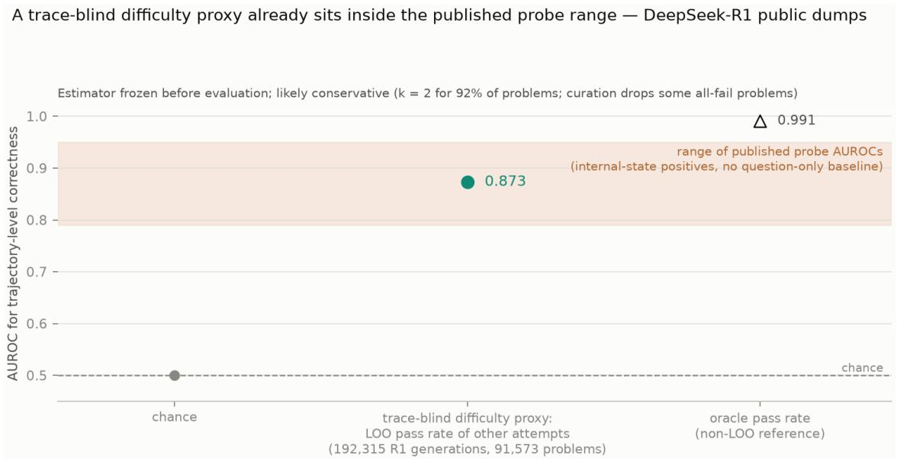  
Figure 7: A trace-blind dificulty proxy (the leave-one-out pass rate of the problem’s other attempts) reaches AUROC 0.873 on public DeepSeek-R1 generations — inside the published probe range.

The uncontrolled positive is recovered: a last-four-token hidden-state probe at t = 4 reaches pooled AUROC 0.849 [0.735, 0.919] on the 8-per-problem evaluation set (n=1,024), matching the 0.84 reported by David [9]. The pooled reconstruction and the within-problem analysis use diferent evaluation sets: the former uses the frozen 8-per-problem pooled subset, the latter all 256 samples of the 22 problems with suficient outcome variation — problems that hold 94% of the dump’s failures and 84% of its same-cell discordant pairs, the pairs on which any within-attempt signal must live. The same probe, evaluated within problem on those 22 problems (n=5,632) — the within component of Eq. (1), estimated under both discordant-pair and the pre-registered failure-count weighting (Appendix B) — sits at 0.496 [0.466, 0.527] under the pre-registered failure-count weighting and 0.515 [0.481, 0.562] under exact discordant-pair weighting — indistinguishable from chance under both — and remains so at every one of ten anchors from t = 4 to 512 (length attrition leaves 21 of the 22 problems with both outcome classes at t = 512; Figure 8); the upper confidence limits cap the failure-weighted and pair-weighted mean within-problem AUROC at t = 4 at 0.527 and 0.562 — bounds on these weighted-mean estimands, not on any single problem. The pooled positive is therefore predominantly between-problem information, far below the dump’s full leave-one-out dificulty ceiling: scoring each attempt by the pass rate of its problem’s 255 other attempts (the surrogate $\hat { d } _ { c , j }$ introduced with Eq. (1), computed from the full 32,768-sample verification table rather than the extracted subset) and evaluating on the same pooled set yields AUROC 0.981 [0.955, 0.991]. Moreover, with sample composition exactly fixed through t = 128 (mild length attrition only at later anchors; Appendix B), the pooled AUROC itself collapses — indistinguishable from chance by t = 16 (0.586, CI straddling 0.5) and ≈ 0.55 from t = 32 onward: the dificulty content readable from last-token states is a prompt echo that fades as generation proceeds. This reconciles three observations in the literature — declining probe signal at larger reasoning budgets [25], question-only probes that work before generation [29], and the practice of probing at special intermediate-answer positions rather than arbitrary early positions [45] — under a single reading: what a linear probe reads from last-token states is problem information that fades as generation proceeds, not the fate of the attempt.

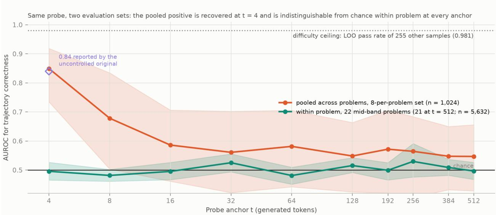  
Figure 8: Same probe, two evaluation sets, 6,480 public R1-Distill-7B trajectories: the pooled positive is recovered at t = 4 and is indistinguishable from chance within problem at every anchor.

Two post-hoc checks, run after all frozen endpoints were reported (Appendix B.7), ask whether within-attempt information could exist that a pooled-trained probe cannot see. A probe trained on problem-centered states (each problem’s mean removed, label-free) with problem-disjoint folds is at chance at t = 4 (mean within-problem AUROC 0.490 [0.464, 0.523]) and reaches only 0.556 [0.522, 0.588] at t = 32 and 0.52–0.54 thereafter; a per-problem oracle finds the signal concentrated in three of the 22 problems (AUROC 0.78–0.92 at t = 4, holding 84 of the 2,178 failures; above 0.74 at every anchor for two of the three, the third dipping to 0.60 at t = 256), in two of which the failing samples are four to six times shorter than the successes — an early answer-without-reasoning mode. Within-attempt information therefore exists but is small on average — a transferable component appears only from t ≈ 32 — and is concentrated where failures are rare, where it is visible from the first tokens; the published-style positive draws on none of it.

## 5 Related Work

Resampling probes of reasoning traces. Truncating a trace and sampling continuations has become the standard counterfactual tool for interpreting chain-of-thought. Lanham et al. [23] introduced early-answering truncation curves to measure how much the stated reasoning matters; Bogdan et al. [5] resample sentence-level alternatives to attribute outcome changes to individual steps; Bigelow et al. [3] resample at every token to locate “forking tokens” where the outcome distribution shifts abruptly, and Bigelow et al. [4] show that much apparent per-token volatility in such estimates is sampling noise. Closest in shape to our probe, Merrill and Srivastava [28] fix prefixes and resample continuations at scale to localize where a (deceptive) outcome “locks in,” and Ballon et al. [2] read answer distributions from truncated prefixes, finding that commitment rises steadily with prefix length; and Wang et al. [40], as motivation for training models to abandon bad prefixes, compare continuing truncated incorrect traces against re-solving from scratch — the nearest published continue-versus-restart comparison, without matched token budgets or per-anchor value curves. All of these estimate what a prefix leads to; none of them ask what the prefix is worth relative to not having it. Our contribution is the missing control: an empty-prefix restart baseline R(C) at matched total generated-token budget, which converts per-anchor solve rates into a value measurement and reveals that most apparent within-trace transitions are budget artifacts.

Rollout value estimates in process supervision. Our estimator — the fraction of budgeted continuations from a partial solution that reach the correct answer — is the workhorse of automatic process supervision: Math-Shepherd’s soft label [39] is exactly this quantity (its main experiments binarize it to whether any continuation succeeds), OmegaPRM [26] binary-searches it for the first error, Phi-4’s pivotal token search [1] mines sharp jumps in it for preference pairs, and Setlur et al. [33] formalize its increments as “progress” rewards. This literature treats the quantity as training signal and its unreliability as label noise to be cleaned [46]. We repurpose the same estimator as a measurement instrument — with anchors on the model’s own trace, interval censoring, attemptpooling, and the restart control — and treat its intermediate values as signal: roughly a third of ambiguous states remain intermediate after eight attempts (success 0.3–0.6), which undermines the single-crossing, monotone-value picture implicit in binary-search labeling schemes [26] and in snowball-error theories of monotone degradation [13].

Aha moments and their skeptics. The claim that reinforcement-trained reasoners exhibit emergent “aha moments” originates in DeepSeek-R1’s training anecdotes [10]. Skepticism so far has been correlational or lexical: reflection keywords exist before any RL [24], many reflection steps, self-verification among them, are causally inert [21, 47], and at trace scale, mid-reasoning strategy shifts are rare and associated with lower accuracy [8]. We supply the counterfactual, compute-matched version of this skepticism: rather than classifying shifts in observed traces, we measure whether any anchor of a trace carries value that fresh computation at equal total budget cannot reproduce, and find such anchors in 1 of 178 cells. Sharp within-trace transitions reported by entropy change-point analyses [42] and commitment-boundary probes [32] are consistent with our data — but our restart control shows that the states they mark are, almost always, reachable from scratch at the same total cost.

Sequential versus parallel test-time compute. Aggregate comparisons of long chains against independent samples are now common: revision models conditioned on complete prior answers [37], repeated-sampling coverage laws [6], budget forcing [30], and comparisons at matched token budgets [15, 34] or matched sample counts [17] finding either sequential [34] or parallel [15, 17] advantages, with context contamination as one proposed mechanism for failed retries [43] and reduced exploration when conditioning on prior answers [17]. These comparisons operate at benchmark level and condition on completed answers. Our instrument moves the comparison inside the trajectory — the model’s own truncated prefix against a fresh start at matched total tokens, per problem — and yields a quantity the aggregate view cannot express: a prefix’s value in fresh-token units. The answer, for our models, is predominantly compression rather than reachability (the prefix wins all nine exactly-matched comparisons, with two wins and two ties on boundary proxies; an 8,192-token restart reaches threshold in 11/13), which is empirical evidence for the no-benefit branch of the dichotomy of Wolf et al. [41]: when self-reflection fails to reliably localize early errors, conditioning on past attempts ofers no asymptotic benefit over independent restarts. Our per-problem restart dose–response curves also give the sequential-parallel debate a diagnostic reading: one model’s failures dissolve with budget (compute-starved), the other’s do not (capability-limited), echoing overthinking [7] and non-monotone thinking-length efects [48].

Predicting outcomes from internal signals. A rapidly growing line reports that hidden states predict reasoning outcomes: probes at intermediate-answer positions reach AUROC > 0.9 [45], first-step probes 0.79 [44], pre-generation probes beat question-text baselines [25], question-only probes predict success before generation [29], and confidence signals drive early exit and trace selection in systems work [11, 12]. With few exceptions these positives carry no problem-dificulty control, and the exceptions control only partially: Yuan et al. [44] run their within-problem analysis on full-trace probes (their early-window positive is uncontrolled, and their within-problem efect sizes fall as low as d=0.13 in their Table 3), while Lugoloobi et al. [25] probe strictly before generation and themselves conclude that activations encode model-specific dificulty. Our pre-registered, single-shot test supplies the missing control at the point where it bites: frozen summary features of the run’s internal dynamics add no detectable AUROC over a dificulty baseline on held-out problems at the pre-registered forecast point, and a labeled post-hoc sweep finds no rescuing window from 128 to 2,048 tokens — consistent with reports that correct and incorrect trajectories diverge late [38], that trajectory geometry remains systematically coupled to dificulty once length is residualized [16], and that dificulty-driven sample composition contaminates position-wise probe curves, as David [9] candidly note of their own later-window decline — their early-window positive carries no question-only control, and it is the result we recover in a closely matched reconstruction and then reduce to chance within problem (Section 4). Existing critiques of correctness probes attack two other axes: their signals resist causal use [44], and under contaminated prefixes they track coherence rather than grounded correctness [22]. The dificulty axis has remained open. Meanwhile, dificulty itself is directly decodable from hidden representations [27, 49], which is precisely the mechanism our dissection isolates.

## 6 Discussion and Limitations

What one cell in 178 means. We do not conclude that prefix-locked value is impossible — our single prefix-limited cell is an existence proof — but that it is rare enough in this regime that any account of reasoning built on frequent within-trace unlocks is measuring budget fit. The practical corollary of the compression finding is a reframing of restart policies: for a compute-starved model, abandoning a long prefix typically costs a budget multiple rather than access to the solution; for a capability-limited model, neither continuation nor restart helps. Which regime a deployment faces is measurable with a four-point restart curve.

What the prediction results do and do not show. Three layers — a pre-registered null on our cohort, a trace-blind dificulty ceiling inside the published range on 192K public R1 generations, and a reconstruct-then-dissect analysis at 256 samples per problem — support one conclusion: pooled probe AUROCs on reasoning outcomes should be read as dificulty measurements until a questiononly baseline or within-problem evaluation shows otherwise. The three layers carry unequal weight: the dissection’s bound on mean within-problem AUROC is the sharpest evidence; the pre-registered cohort null is supporting, its primary interval leaving moderate efects open (+0.167). This does not overturn any specific published number. Zhang et al. [45] probe intermediate-answer positions and their data contain within-trace label variance; our claim there is a falsifiable prediction: adding a question-only baseline and a within-problem evaluation will substantially shrink the reported gaps. It also does not make internal signals useless: within-problem trace selection [12] and pre-generation dificulty routing [25] are consistent with everything we find — both exploit exactly the dificulty signal we isolate. Nor is within-attempt information absent: a post-hoc within-targeted check (Appendix B.7) finds a component that is small on average and concentrated in a few low-failure problems — there the rare failures are legible from the first tokens; the common failures on hard problems are not — which is not the signal the pooled positives report. Together with the causal failures of probe signals [44] and their coherence confound under contaminated prefixes [22], the critique now stands on three independent legs: probe signals can be causally inert, coherence-driven, and dificulty-driven.

Limitations. Our instrumented cohort uses two small models in 4-bit quantization on one benchmark family, with m = 4–8 attempts per cell and one base seed; budget matching equates generated tokens, not FLOPs or latency (continuing a stored prefix amortizes its KV cache, a restart recomputes it, and attention cost grows with context — none measured); the confirmatory baseline is text-level (a pre-generation activation probe would be stronger [25]); the public-dump dissection re-scores full-precision generations through a 4-bit model (top-1 fidelity 0.906, reported) and inherits unknown sampling temperature; the probe dissection itself is mathematics-only (the dificulty ceiling generalizes of-math — GPQA-diamond, Section 4 — but a non-math dissection awaits a multi-sample dump from a locally runnable model); and the within-trajectory timing question — when does value arrive? — remained under-powered everywhere because genuine interior events are rare, which is itself a finding: at this scale, breakthroughs are either immediate or absent. No equivalence margin was pre-registered for the confirmatory endpoints, so their results are absences of detected gain rather than demonstrated equivalence; and positive existence claims (the one prefix-limited cell, the intermediate-solvability band) rest on modest counts and warrant replication.

Future work. The natural next experiment runs the same frozen instrument on a large RL-trained reasoner of the kind the aha-moment claims describe: interior events there would revive the timing question with the controls already in place, and their absence would extend the budget-artifact account to the regime that motivated it. A second direction treats the value curve pˆ(t) as the object of study — its shape (gradual versus stepped), not its crossings — for which the present data already sufice.

## Acknowledgements

The external analyses in this paper required no new generation, because others released their samples completely. We thank Nishad Singhi and co-authors [35, 36] for releasing per-problem solution dumps that keep every attempt — failures included — at 256 samples per problem; that design choice is what made the within-problem control of Section 4 possible. We likewise thank the Hugging Face Open-R1 team for releasing OpenR1-Math-220k [19] with per-generation correctness annotations rather than a correct-only filter. We encourage the practice: unfiltered, multi-sample rollout releases are reusable scientific instruments. This study also builds on the MATH [18] and GPQA [31] benchmarks and on open-weight models and tooling (MLX and the mlx-community quantizations, scikit-learn, Hugging Face datasets). AI assistance was used for coding and writing; all experimental decisions, protocol freezes, and final claims were reviewed by and are the responsibility of the author.

## References

[1] Marah Abdin, Jyoti Aneja, Harkirat Behl, et al. Phi-4 technical report. arXiv preprint arXiv:2412.08905, 2024.

[2] Marthe Ballon, Brecht Verbeken, Vincent Ginis, and Andres Algaba. Probing the trajectories of reasoning traces in large language models. arXiv preprint arXiv:2601.23163, 2026.

[3] Eric Bigelow, Ari Holtzman, Hidenori Tanaka, and Tomer Ullman. Forking paths in neural text generation. In International Conference on Learning Representations (ICLR), 2025. arXiv:2412.07961.

[4] Eric Bigelow, Amir Zur, Satchel Grant, et al. Forking fast: Eficiently estimating uncertainty dynamics in text generation. arXiv preprint arXiv:2608.19611, 2026.

[5] Paul C. Bogdan, Uzay Macar, Neel Nanda, and Arthur Conmy. Thought anchors: Which llm reasoning steps matter? arXiv preprint arXiv:2506.19143, 2025.

[6] Bradley Brown, Jordan Juravsky, Ryan Ehrlich, Ronald Clark, Quoc V. Le, Christopher R´e, and Azalia Mirhoseini. Large language monkeys: Scaling inference compute with repeated sampling. arXiv preprint arXiv:2407.21787, 2024.

[7] Xingyu Chen, Jiahao Xu, Tian Liang, Zhiwei He, et al. Do not think that much for 2+3=? on the overthinking of long reasoning models. In Proceedings of ICML, 2025. arXiv:2412.21187.

[8] Liv G. d’Aliberti and Manoel Horta Ribeiro. The illusion of insight in reasoning models. arXiv preprint arXiv:2601.00514, 2026.

[9] Joey David. Temporal predictors of outcome in reasoning language models. arXiv preprint arXiv:2511.14773, 2025.

[10] DeepSeek-AI, Daya Guo, et al. Deepseek-r1: Incentivizing reasoning capability in llms via reinforcement learning. arXiv preprint arXiv:2501.12948, 2025.

[11] Yichao Fu, Junda Chen, et al. Eficiently scaling llm reasoning with certaindex. arXiv preprint arXiv:2412.20993, 2025.

[12] Yichao Fu et al. Deep think with confidence. arXiv preprint arXiv:2508.15260, 2025.

[13] Zeyu Gan, Yun Liao, and Yong Liu. Rethinking external slow-thinking: From snowball errors to probability of correct reasoning. In International Conference on Machine Learning (ICML), 2025. arXiv:2501.15602.

[14] Aryo Pradipta Gema, Alexander H¨agele, Runjin Chen, Andy Arditi, et al. Inverse scaling in test-time compute. Transactions on Machine Learning Research, 2025. arXiv:2507.14417.

[15] Soumya Suvra Ghosal, Souradip Chakraborty, Avinash Reddy, et al. Does thinking more always help? mirage of test-time scaling in reasoning models. In Advances in Neural Information Processing Systems (NeurIPS), 2025. arXiv:2506.04210.

[16] Anders Gjølbye, Lars Kai Hansen, and Sanmi Koyejo. Reasoning models don’t just think longer, they move diferently. arXiv preprint arXiv:2605.15454, 2026.

[17] Xiangming Gu, Soham De, Larisa Markeeva, Petar Veliˇckovi´c, and Razvan Pascanu. Understanding performance gap between parallel and sequential sampling in large reasoning models. arXiv preprint arXiv:2604.05868, 2026.

[18] Dan Hendrycks, Collin Burns, Saurav Kadavath, Akul Arora, Steven Basart, Eric Tang, Dawn Song, and Jacob Steinhardt. Measuring mathematical problem solving with the MATH dataset. In NeurIPS Datasets and Benchmarks Track, 2021. arXiv:2103.03874.

[19] Hugging Face Open-R1 team. Openr1-math-220k. https://huggingface.co/datasets/ open-r1/OpenR1-Math-220k, 2025.

[20] Nizar Islah, Istabrak Abbes, Irina Rish, Sarath Chandar, and Eilif B. Muller. Failed reasoning traces tell you what is fixable (but not by reading them). arXiv preprint arXiv:2606.05145, 2026.

[21] Liwei Kang, Yue Deng, Yao Xiao, Zhanfeng Mo, Wee Sun Lee, and Lidong Bing. First try matters: Revisiting the role of reflection in reasoning models. arXiv preprint arXiv:2510.08308, 2025.

[22] Wonjoong Kim, Yeonjun In, Sangwu Park, Dongha Lee, and Chanyoung Park. PAIR: Prefixaware internal reward model for multi-turn agent optimization. arXiv preprint arXiv:2605.17877, 2026.

[23] Tamera Lanham, Anna Chen, Ansh Radhakrishnan, et al. Measuring faithfulness in chain-ofthought reasoning. arXiv preprint arXiv:2307.13702, 2023.

[24] Zichen Liu, Changyu Chen, Wenjun Li, Penghui Qi, Tianyu Pang, Chao Du, Wee Sun Lee, and Min Lin. Understanding r1-zero-like training: A critical perspective. In Conference on Language Modeling (COLM), 2025. arXiv:2503.20783.

[25] William Lugoloobi, Thomas Foster, William Bankes, and Chris Russell. LLMs encode their failures: Predicting success from pre-generation activations. In Conference on Language Modeling (COLM), 2026. arXiv:2602.09924.

[26] Liangchen Luo, Yinxiao Liu, Rosanne Liu, et al. Improve mathematical reasoning in language models by automated process supervision. arXiv preprint arXiv:2406.06592, 2024.

[27] Aria Masoomi, Mahsa Bazzaz, Adel Javanmard, and Vahab Mirrokni. Geometric signatures of reasoning: A spectral perspective on task hardness. arXiv preprint arXiv:2607.01571, 2026.

[28] Scott Merrill and Shashank Srivastava. The point of no return: Counterfactual localization of deceptive commitment in language-model reasoning. arXiv preprint arXiv:2605.17113, 2026.

[29] Iv´an Vicente Moreno Cencerrado, Arnau Padr´es Masdemont, Anton Gonzalvez Hawthorne, David Demitri Africa, and Lorenzo Pacchiardi. No answer needed: Predicting LLM answer accuracy from question-only linear probes. In ICLR 2026 Workshop on Principled Design for Trustworthy AI, 2026. arXiv:2509.10625.

[30] Niklas Muennighof, Zitong Yang, Weijia Shi, et al. s1: Simple test-time scaling. In Proceedings of EMNLP, 2025. arXiv:2501.19393.

[31] David Rein, Betty Li Hou, Asa Cooper Stickland, Jackson Petty, Richard Yuanzhe Pang, Julien Dirani, Julian Michael, and Samuel R. Bowman. GPQA: A graduate-level google-proof q&a benchmark. In Conference on Language Modeling (COLM), 2024. arXiv:2311.12022.

[32] Daniel Scalena, Sara Candussio, Luca Bortolussi, Elisabetta Fersini, Malvina Nissim, and Gabriele Sarti. Beyond the commitment boundary: Probing epiphenomenal chain-of-thought in large reasoning models. arXiv preprint arXiv:2606.13603, 2026.

[33] Amrith Setlur, Chirag Nagpal, Adam Fisch, et al. Rewarding progress: Scaling automated process verifiers for llm reasoning. In International Conference on Learning Representations (ICLR), 2025. arXiv:2410.08146.

[34] Aman Sharma and Paras Chopra. The sequential edge: Inverse-entropy voting beats parallel self-consistency at matched compute. arXiv preprint arXiv:2511.02309, 2025.

[35] Nishad Singhi. math128 r1-distill-qwen-7b solution dump: 128 MATH problems × 256 samples at a 32k-token budget. Hugging Face dataset, https://huggingface.co/datasets/ nishadsinghi/math128\_solutions\_r1\_distill\_qwen\_7b\_32K\_tokens, 2025. released alongside the data of Singhi et al. (COLM 2025); not described in that paper.

[36] Nishad Singhi, Hritik Bansal, Arian Hosseini, Aditya Grover, Kai-Wei Chang, Marcus Rohrbach, and Anna Rohrbach. When to solve, when to verify: Compute-optimal problem solving and generative verification for llm reasoning. In Conference on Language Modeling (COLM), 2025. arXiv:2504.01005; source of the GPQA-diamond sample dump analyzed in Section 4.3.

[37] Charlie Snell, Jaehoon Lee, Kelvin Xu, and Aviral Kumar. Scaling llm test-time compute optimally can be more efective than scaling model parameters. arXiv preprint arXiv:2408.03314, 2024.

[38] Lihao Sun, Hang Dong, Bo Qiao, Qingwei Lin, Dongmei Zhang, and Saravan Rajmohan. LLM reasoning as trajectories: Step-specific representation geometry and correctness signals. In Proceedings of the Annual Meeting of the Association for Computational Linguistics (ACL), 2026. arXiv:2604.05655.

[39] Peiyi Wang, Lei Li, Zhihong Shao, et al. Math-shepherd: Verify and reinforce llms step-by-step without human annotations. In Proceedings of ACL, 2024. arXiv:2312.08935.

[40] Pinzheng Wang, Shuli Xu, Juntao Li, Yu Luo, Dong Li, Jianye Hao, and Min Zhang. Re2: Unlocking LLM reasoning via reinforcement learning with re-solving. In International Conference on Learning Representations (ICLR), 2026. arXiv:2603.07197.

[41] Yotam Wolf, Noam Wies, and Amnon Shashua. When does in-context search help? a samplingcomplexity theory of reflection-driven reasoning. arXiv preprint arXiv:2607.06720, 2026.

[42] Ting Xu, Xu He, Yupu Lu, Jiankai Sun, Dong Li, Wai Lam, and Jianye Hao. Unveiling the entropy dynamics of chain-of-thought reasoning. In Proceedings of ICML, 2026. arXiv:2606.02020.

[43] Zhanfu Yang. Why retrying fails: Context contamination in llm agent pipelines. arXiv preprint arXiv:2605.08563, 2026.

[44] Aojie Yuan, Zhiyuan Julian Su, Haiyue Zhang, Yi Nian, and Yue Zhao. Hidden error awareness in chain-of-thought reasoning: The signal is diagnostic, not causal. In ICML 2026 Workshop on Mechanistic Interpretability, 2026. arXiv:2605.09502.

[45] Anqi Zhang, Yulin Chen, Jane Pan, Chen Zhao, Aurojit Panda, Jinyang Li, and He He. Reasoning models know when they’re right: Probing hidden states for self-verification. In Conference on Language Modeling (COLM), 2025. arXiv:2504.05419.

[46] Zhenru Zhang, Chujie Zheng, Yangzhen Wu, et al. The lessons of developing process reward models in mathematical reasoning. arXiv preprint arXiv:2501.07301, 2025.

[47] Jiachen Zhao, Yiyou Sun, Weiyan Shi, and Dawn Song. Can aha moments be fake? towards quantifying decorative and true thinking in chain-of-thought. arXiv preprint arXiv:2510.24941, 2025.

[48] Shu Zhou, Rui Ling, Junan Chen, Xin Wang, Tao Fan, and Hao Wang. When more thinking hurts: Overthinking in llm test-time compute scaling. arXiv preprint arXiv:2604.10739, 2026.

[49] Yubo Zhu, Dongrui Liu, Zecheng Lin, Wei Tong, Sheng Zhong, and Jing Shao. The LLM already knows: Estimating LLM-perceived question dificulty via hidden representations. arXiv preprint arXiv:2509.12886, 2025.

## A Protocol Amendments and Pre-Registration Timeline

Every decision rule in this study was frozen in a dated, committed amendment before the outcomes it governs were observed. The full, dated amendment documents ship with the code repository accompanying this paper (https://github.com/bulutyigit/problem-not-path); this appendix condenses them in chronological order and records how every gate resolved, including the failures.

Breakthrough forecasting protocol. Froze the base probe design on the development cohort: anchor grid, $m = 4$ continuations, budget $B = 1 , 0 2 4 + 5 1 2$ , threshold $\tau = 0 . 7 5$ with next-anchor stability, interval censoring, bisection refinement, the research splits (assigned before any outcome), and the within-trajectory forecasting target $P ( T _ { F } \leq t + k \ |$ features through t) whose power gate Section 4 later reports.

Probe sensitivity and supplement (A1–A3). Froze three responses to the development cohort’s censoring pattern: A1 terminal replication (threshold-censored cells gain four branches; a terminal event requires pooled $\geq 6 / 8 )$ ; A2 budget sensitivity (re-probing at a 4,096-token continuation budget with paired seeds); A3 a screened 20-problem supplement cohort. Resolution: A2 falsified the naive labels for Ministral-3 (16-token prefixes solve at the larger budget) and validated Gemma-4’s early crossings — the observation that forced the $T _ { F } / T _ { V }$ distinction.

Restart-controlled breakthrough (A5). Froze the restart curves $R ( C )$ , the advantage definition at matched total generated-token budget, $T _ { V } ( \delta )$ with primary $\delta = 0 . 5$ , the regime taxonomy and its precedence order, and the conservative-interpolation sensitivity. Pilot resolution: the pilot gate required $8 / 8$ agreement and scored $7 / 8 ;$ recorded as a failure by the frozen wording, with the single permitted enlargement resolving the borderline cell against the prior expectation.

Cohort expansion (waves and gates). The cohorts were collected in staged waves; the expansion cohort is wave 3, and released artifact files keep the wave-numbered names. Froze the staged expansion: outcome-blind screens, wave gates with numeric thresholds, and split assignment before generation. Gate resolutions: G1 (construct validity) failed for Ministral-3 per A2; G2 (wave-1 interior-event yield ≥ 6) failed at 4, with the diagnosis recorded — the screen selected on 16K terminal solvability while probes test 1,024-token continuations — and the wave-3 screen was repaired accordingly before any wave-3 outcome existed.

Ambiguity enlargement (A5.1). Froze the forward-looking rule that every 1–3/4 probe cell is enlarged to eight attempts before labels are derived, with thresholds applied to pooled rates. Outcome: labels were trimmed, not inflated (six events removed, one added, project-wide).

Confirmatory early-signal test. Froze endpoints, feature sets, model class, folds, power gates, and the success criterion; committed before the single test-split evaluation. The same document’s addendum labels the forecast-point sweep $( t \in \{ 1 2 8 , 2 5 6 , 1 , 0 2 4 , 2 , 0 4 8 \} )$ ) as openly post-hoc. Outcome: both endpoints failed the success criterion; the horizon endpoint stayed below its power gate and was not fit.

External re-analysis protocol (reconstruction). Froze a faithful reconstruction of the closest published early-window positive (model, data construction, probe recipe) plus the added controls. Superseded before execution by the public-dump design below, which dominates it (more data, no generation, and a within-problem control); the apparatus remains in the repository.

Public-dump probe dissection. Froze, after sample verification but before any state extraction: the trajectory selection (all 256 samples of the 22 mid-band problems plus 8 per problem elsewhere), the teacher-forcing extraction, the probe recipe, both evaluation metrics with their reference rows, and the reading key for either outcome. Outcome: recorded in the same document; reported in Section 4. A within-problem robustness check run after reporting is labeled post-hoc in the same document and in Appendix B.7.

## B Additional Figures and Sensitivity Analyses

## B.1 Early-window signal definitions

For each generated token t let $p _ { t }$ be the model’s next-token distribution over vocabulary V at the position that emits token $x _ { t } .$ , and $h _ { t } \in \mathbb { R } ^ { d }$ the final-layer hidden state at that position. The instrumented token-level series are:

$$
\tilde { H } _ { t } = - \frac { 1 } { \log | V | } \sum _ { v \in V } p _ { t } ( v ) \log p _ { t } ( v )
$$

normalized entropy

$$
u _ { t } = - \log p _ { t } ( x _ { t } )
$$

surprisal

$$
\mu _ { t } = p _ { t } ^ { ( 1 ) } - p _ { t } ^ { ( 2 ) }
$$

$$
\mathrm { K L } _ { t } = \mathrm { K L } \left( p _ { t } \Vert p _ { t - 1 } \right)
$$

top-1/top-2 probability margin

successive KL divergence

$$
\begin{array} { r } { \mathrm { J S } _ { t } = \frac 1 2 \mathrm { K L } \big ( p _ { t } \big | \big | m _ { t } \big ) + \frac 1 2 \mathrm { K L } \big ( p _ { t - 1 } \big | \big | m _ { t } \big ) , \quad m _ { t } = \frac 1 2 \big ( p _ { t } + p _ { t - 1 } \big ) } \end{array}
$$

successive JS divergence

$$
\nu _ { t } = \| h _ { t } \|
$$

hidden-state norm

$$
\rho _ { t } = \| h _ { t } - h _ { t - 1 } \| / \| h _ { t - 1 } \|
$$

$$
\gamma _ { t } = 1 - \cos \left( h _ { t } , h _ { t - 1 } \right)
$$

relative hidden step

cosine drift

Over the forecast window $( t \leq 5 1 2 )$ , each series is reduced by simple statistics: the mean and standard deviation; the robust slope, a Theil–Sen estimator (median of pairwise slopes, evaluated on at most 512 evenly spaced points for bounded cost); and for surprisal the maximum one-step rise $\operatorname* { m a x } _ { t } ( u _ { t + 1 } - u _ { t } )$ . Spectral summaries are computed on the $\mathrm { J S } _ { t }$ series: robust-standardize by median and median absolute deviation, resample to 256 points, apply a Hann window, take the real FFT power spectrum with the DC term removed, and normalize to $\pi _ { f } ;$ then

$$
\begin{array} { r } { \mathrm { S p e c E n t } = - \frac { 1 } { \log F } \sum _ { f } \pi _ { f } \log \pi _ { f } , \qquad \mathrm { C e n t r o i d } = \sum _ { f } f \pi _ { f } , \qquad \mathrm { L o w R a t i o } = \sum _ { f \leq 0 . 1 0 } \pi _ { f } \log \pi _ { f } . } \end{array}
$$

The fifteen frozen summaries of Section 4 are: $\mathrm { m e a n } ( \tilde { H } ) , \mathrm { s d } ( \tilde { H } ) , \mathrm { s l o p e } ( \tilde { H } )$ ; mean(u), max-rise(u); mean $( \mu ) ;$ ; mean(JS), sd(JS), slope(KL); mean(ρ), mean $( \gamma )$ , slope(ν); and SpecEnt, Centroid, LowRatio of JSt. The public-dump probes of Section 4 reuse the unnormalized entropy, $u _ { t } ,$ , and top-1 probability series from teacher-forced forwards (the normalization constant is fixed within a model and immaterial after standardization).

## B.2 The budget falsification that motivated the restart control

Figure 9 shows the A2 experiment behind Section 3: development-cohort cells re-probed at a 4,096-token continuation budget with paired seeds. Ministral-3’s apparent mid-trajectory crossings dissolve — 16-token prefixes solve at the larger budget — while Gemma-4’s early crossings remain pinned, validating them as genuine.

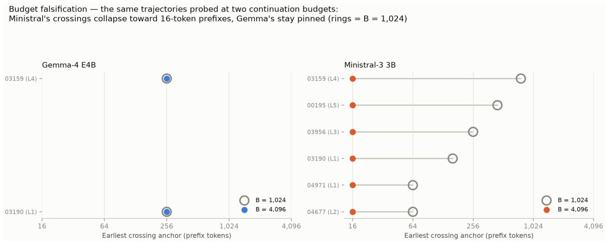  
Figure 9: Budget sensitivity (amendment A2, App. A): the same cells probed at $B = 1 , 0 2 4$ versus $B = 4 { , } 0 9 6$ . Ministral-3’s “breakthroughs” are budget artifacts; Gemma-4’s survive.

## B.3 Per-trajectory intervals and label hardening

Figure 10 shows what the noise-hardening rules changed; Figure 11 shows the breakthrough interva or censoring bound of every expansion-cohort trajectory. Terminal replication confirmed 13 of Ministral-3’s 16 threshold-censored candidates and rejected Gemma-4’s single candidate; pooling ambiguous cells to eight attempts moved labels on 7 + 6 of 49 + 49 trajectories, dominated by losses (six events removed, one added; Gemma-4’s changes were mostly interval shifts).

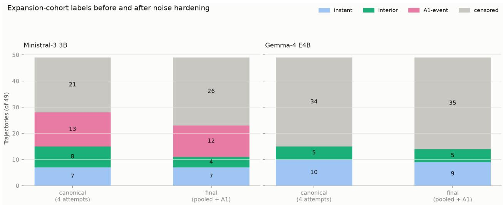  
Figure 10: Expansion-cohort labels before and after noise hardening (pooling + terminal replication): trimmed, not inflated.

## B.4 Sensitivity of $T _ { V }$ labels

Independent-half check for the intermediate band: on branches 4–7 alone — never used for selection — the 148 enlarged cells land at $0 / 1 / 2 / 3 / 4$ successes in $3 7 / 3 7 / 2 8 / 2 1 / 2 5$ cells; 58% fall in the intermediate 1–3 range, against the concentration at the extremes that a pure selection artifact would predict.

Across all 178 cells: δ = 0.5 yields 3 prefix-value events, δ = 0.25 yields 7 (the additions all sit inside budget-limited cells of the budget-elastic model), $\delta = 0 . 7 5$ keeps 2. The conservative variant of $\hat { R }$ (upper envelope of the bracketing grid values) agrees with the primary labels on 178 of 178 cells. Cross-model agreement on collapsed regime classes is 42 of 89 problems.

## B.5 Confirmatory test: level-free variants and per-model detail

<table><tr><td>Endpoint</td><td>Variant</td><td>Baseline</td><td>+Early signals</td><td>∆AUROC [95% CI]</td><td></td></tr><tr><td>Primary</td><td>main</td><td>0.828</td><td>0.853</td><td></td><td>+0.026 [−0.054, +0.167]</td></tr><tr><td>Primary</td><td>level-free</td><td>0.914</td><td>0.879</td><td></td><td>-0.035 [−0.156, +0.024]</td></tr><tr><td>Secondary</td><td>main</td><td>0.875</td><td>0.785</td><td>-0.090</td><td> $[ - 0 . 2 1 3 , + 0 . 0 3 3 ]$ </td></tr><tr><td>Secondary</td><td>level-free</td><td>0.840</td><td>0.771</td><td>-0.070</td><td> $[ - 0 . 1 7 4 , + 0 . 0 5 6 ]$ </td></tr></table>

Table 1: Held-out test AUROCs for both endpoints, with the dificulty level dropped from both feature sets (level-free). No variant meets the success criterion.

Per-model test-split descriptives (no per-model claims are made): on the primary endpoint the baseline scores 1.00 for Gemma-4 (n=16) and 0.69 for Ministral-3 (n=17, early signals 0.76); on the secondary endpoint 1.00 versus 0.73 (n=11, 14). The horizon endpoint’s power arithmetic: 21 interior events project-wide, 4 in the test split; the frozen gate (five problem groups per class per fold) was not met and no model was fit.

<table><tr><td>t</td><td>Pooled AUROC [95% CI]</td><td></td><td>Within (failure-w.) [95% CI]</td><td>Within (pair-w.) [95% CI]</td><td>rows</td></tr><tr><td>4</td><td>0.849 [0.735,0.919]</td><td></td><td>0.496 [0.466,0.527]</td><td>0.515 [0.481,0.562]</td><td>6,480</td></tr><tr><td>8</td><td>0.678 [0.503,0.835]</td><td></td><td>0.481 [0.461,0.502]</td><td>0.498 [0.480,0.515]</td><td>6,480</td></tr><tr><td>16</td><td>0.586 [0.461,0.706]</td><td></td><td>0.495 [0.467,0.526]</td><td>0.510 [0.478,0.552]</td><td>6,480</td></tr><tr><td>32</td><td>0.561 [0.422,0.702]</td><td></td><td>0.525 [0.494,0.555]</td><td>0.526 [0.490,0.568]</td><td>6,480</td></tr><tr><td>64</td><td>0.582 [0.442,0.706]</td><td></td><td>0.481 [0.451,0.510]</td><td>0.478 [0.452,0.508]</td><td>6,480</td></tr><tr><td>128</td><td>0.548 [0.425,0.664]</td><td></td><td>0.515 [0.491,0.542]</td><td>0.509 [0.485,0.538]</td><td>6,480</td></tr><tr><td>192</td><td>0.572 [0.421,0.706]</td><td></td><td>0.499 [0.466,0.525]</td><td>0.499 [0.475,0.527]</td><td>6,478</td></tr><tr><td>256</td><td>0.565 [0.406,0.684]</td><td></td><td>0.530 [0.476,0.591]</td><td>0.509 [0.483,0.543]</td><td>6,476</td></tr><tr><td>384</td><td>0.547 [0.432,0.650]</td><td></td><td>0.509 [0.482,0.537]</td><td>0.513 [0.494,0.536]</td><td>6,294</td></tr><tr><td>512</td><td>0.547 [0.428,0.656]</td><td></td><td>0.497 [0.468,0.526]</td><td>0.499 [0.477,0.521]</td><td>6,102</td></tr></table>

Table 2: Hidden-state probe on public R1-Distill-7B trajectories at every anchor. The rows column counts trajectories entering the problem-disjoint out-of-fold prediction; the pooled metric is evaluated on the 8-per-problem pooled subset $_ { ( n = 1 , 0 2 4 }$ at t=4, shrinking with window attrition) and the within metrics on the 22 mid-band problems $( n { = } 5 , 6 3 2 ;$ ; 2,178 failures; at t=512 attrition leaves 21 problems with both outcome classes and 2,114 failures), under the pre-registered failure-count weighting and the exact discordant-pair weighting of Eq. (1). References at t=4: full-dump LOO pass-rate pooled AUROC 0.981 [0.955,0.991] (255 other attempts per problem, evaluated on the same pooled set); stream-summary probe pooled 0.647, within 0.490. The within-AUROC of the LOO score itself is mechanically 0 (within a problem it takes two values, and the incorrect attempt’s is always higher), so the neutral reference for “no within-attempt information” is 0.5.

## B.6 Public-dump dissection: full anchor table

Numerical robustness: the float32 battery reproduces in float64 with zero NaN out-of-fold predictions;   
scikit-learn overflow warnings trace to near-constant standardized dimensions and are cosmetic.   
Teacher-forcing fidelity: mean top-1 agreement 0.906 (10th percentile 0.859).

## B.7 Post-hoc within-problem robustness checks

Run after all frozen endpoints were reported and labeled post-hoc in the amendment, these checks ask whether within-attempt information could exist that the pooled-trained probe of Section 4 cannot see. Both use the stored states of the 22-problem within set (n=5,632). A, problem-centered transfer: each problem’s mean state is subtracted (label-free) and the probe (standardization, $\mathrm { P C A } \leq 1 2 8$ , balanced logistic) is trained on problem-disjoint folds and scored within held-out problems. B, per-problem oracle: a separate probe (PCA 32) per problem with sample-disjoint folds — an upper bound on linearly decodable within-problem signal that requires no transfer. An uncentered re-run on the within set alone reproduces the frozen battery (0.515 [0.488, 0.547] at t=4 against 0.496 [0.466, 0.527], which trains on both sets). Table 3 reports failure-weighted means with problem-clustered bootstrap CIs.

The signal is heterogeneous. Three problems (ids 20, 22, and 13, with 18, 49, and 17 failures 84 of 2,178) are strongly separable at t=4 (oracle AUROC 0.92, 0.84, 0.78; centered transfer 0.93, 0.86, 0.33); across all ten anchors the oracle stays above 0.74 for problems 20 and 22, while problem 13 dips to 0.60 at t=256 and loses its failures to attrition by t=512; per-problem oracle AUROCs are consistent across anchors (Spearman 0.71 between t=32 and 64). In problems 20 and 22 the failing samples are four to six times shorter than the successes (median 2,364 versus 15,321 and 1,299 versus 5,168 characters): an early answer-without-reasoning mode, visible from the first tokens. In problem 13 lengths and re-scoring fidelity match — a genuine early content divergence.

The high-failure problems that dominate the failure-weighted mean (216 and 223 failures of 256, for instance) show no separability. Within-attempt information therefore exists but is small on average (a transferable component appears only from $t \approx 3 2 )$ and is concentrated where failures are rare, where it is visible from the first tokens — the opposite of the regime that produces the pooled positive.
<table><tr><td>t</td><td>A: centered transfer [95% CI]</td><td>B: per-problem oracle [95% CI]</td><td>B max</td><td> $\mathrm { B } > 0 . 6$ </td></tr><tr><td>4</td><td>0.490 [0.464,0.523]</td><td>0.476 [0.435,0.529]</td><td>0.924</td><td>3</td></tr><tr><td>8</td><td>0.526 [0.502,0.550]</td><td>0.479 [0.449,0.519]</td><td>0.873</td><td>3</td></tr><tr><td>16</td><td>0.486 [0.451,0.534]</td><td>0.481 [0.437,0.536]</td><td>0.908</td><td>4</td></tr><tr><td>32</td><td>0.556 [0.522,0.588]</td><td>0.519 [0.478,0.560]</td><td>0.894</td><td>5</td></tr><tr><td>64</td><td>0.532 [0.502,0.565]</td><td>0.558 [0.523,0.593]</td><td>0.868</td><td>7</td></tr><tr><td>128</td><td>0.524 [0.504,0.548]</td><td>0.519 [0.489,0.556]</td><td>0.824</td><td>4</td></tr><tr><td>192</td><td>0.526 [0.498,0.556]</td><td>0.491 [0.452,0.543]</td><td>0.900</td><td>5</td></tr><tr><td>256</td><td>0.536 [0.503,0.570]</td><td>0.531 [0.493,0.576]</td><td>0.935</td><td>5</td></tr><tr><td>384</td><td>0.529 [0.516,0.546]</td><td>0.532 [0.493,0.576]</td><td>0.939</td><td>6</td></tr><tr><td>512</td><td>0.521 [0.466,0.580]</td><td>0.507 [0.457,0.549]</td><td>0.932</td><td>3</td></tr></table>

Table 3: Post-hoc within-problem checks on the 22-problem within set: failure-weighted mean within-problem AUROC of a problem-centered transfer probe (A) and of per-problem oracles (B), the largest single-problem oracle AUROC, and the number of problems above 0.6. Within-problem label-permutation nulls (12 draws at $t \in \{ 4 , 3 2 , 6 4 , 1 2 8 \}$ ) span 0.47–0.54 for the A means, 0.44–0.54 for the B means, and 0.53–0.76 for the B maxima.

## B.8 Post-hoc forecast-point sweep: full table

Table 4 lists both endpoints at every forecast point.
<table><tr><td>t</td><td></td><td>Primary ∆ [95% CI]</td><td>n</td><td></td><td>Secondary ∆ [95% CI]</td><td>n</td></tr><tr><td>128</td><td>-0.083</td><td> $[ - 0 . 2 8 1 , + 0 . 0 1 6 ]$ </td><td>34</td><td>-0.118</td><td> $[ - 0 . 2 7 4 , + 0 . 0 4 8 ]$ </td><td>25</td></tr><tr><td>256</td><td>+0.092</td><td> $\left[ - 0 . 0 3 2 , + 0 . 3 8 4 \right]$ </td><td>34</td><td>-0.035</td><td> $[ - 0 . 1 3 3 , + 0 . 0 5 3 ]$ </td><td>25</td></tr><tr><td>512*</td><td>+0.026</td><td> $[ - 0 . 0 5 4 , + 0 . 1 6 7 ]$ </td><td>33</td><td>-0.090</td><td> $[ - 0 . 2 1 3 , + 0 . 0 3 3 ]$ </td><td>25</td></tr><tr><td>1,024</td><td>-0.125</td><td> $[ - 0 . 4 0 9 , 0 . 0 0 0 ]$ </td><td>24</td><td>-0.137</td><td> $[ - 0 . 2 8 7 , + 0 . 0 1 8 ]$ </td><td>22</td></tr><tr><td>2,048</td><td>-0.133</td><td> $[ - 0 . 3 6 4 , 0 . 0 0 0 ]$ </td><td>13</td><td></td><td>-0.259 [-0.800, 0.000]</td><td>12</td></tr></table>

Table 4: ∆AUROC (early signals − baseline) at every forecast point; \* marks the pre-registered evaluation, all others post-hoc. Larger prefixes also shrink and select the sample (only runs surviving to t enter).

## B.9 Reproducibility details

Generation. Both models sample at temperature 0.6, top-p 0.95, top-k 20 (no repetition or presence penalties), thinking mode enabled, prompt version v1 (a fixed task instruction requesting a final boxed answer), 16,384-token cap for base trajectories. Probe branches use deterministic seeds derived as sha256(run, anchor, branch); restart attempts hash the problem, model, budget, and branch. Model checkpoints are pinned to the revisions recorded in the released readiness manifests (mlx-community 4-bit conversions of the checkpoints named in Section 2).

Verification. A final answer is extracted from the generated text; extraction failure scores as incorrect. Extracted answers are compared to the reference by numeric equivalence first, then symbolic equivalence. GPQA answers compare the extracted option letter (“final answer is X”) against the key; unparseable samples (3.0%) score incorrect.

Cohort screens. Development and supplement problems were drawn from a 100-problem level-balanced pool by frozen outcome-blind rules; the expansion screen selected problems with 1–5 verified successes out of 6 fresh 3,072-token attempts (2 models × 3 seeds).

Classifiers. The instrumented-cohort analyses (confirmatory test and sweep) use $\ell _ { 2 }$ logistic regression with C = 0.1, liblinear, class-weight balanced, at most 5,000 iterations, on standardized features. The public-dump probe battery uses scikit-learn defaults (C = 1, lbfgs) with classweight balanced, at most 2,000 iterations, standardization, and PCA to at most 128 components — matching the probe recipes it reconstructs. Folds are StratifiedGroupKFold with problems as groups throughout. Confidence intervals are percentile bootstraps over 2,000 problem-clustered draws (1,000 for the post-hoc checks of Appendix B.7).

Exclusions. Fifteen of 178 cells whose base run ended before the 512-token forecast window (10 train, 4 validation, 1 test) are excluded from the confirmatory endpoints, per the frozen inclusion rule.

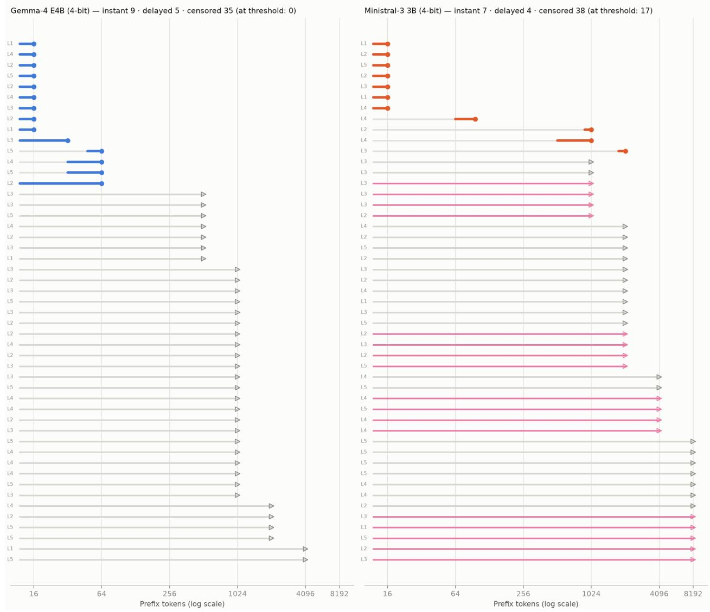  
Figure 11: Expansion cohort, one row per trajectory: breakthrough intervals (solid), censoring bounds (arrows), and threshold-censored replication candidates (highlighted).