# LEARNING INFORMATIVE PRIOR WITH INFINITE-DIMENSIONAL CONTINUOUS NORMALIZING FLOW FOR BAYESIAN INVERSE PROBLEM

YANG ZHAO<sup>∗</sup>, JUNXIONG JIA<sup>†</sup>, AND TAO ZHOU<sup>‡</sup>

Abstract. This paper addresses infinite-dimensional Bayesian inference for inverse problem of partial diferential equations with model parameters in infinite-dimensional Hilbert space. To efectively incorporate prior information, we propose a novel continuous normalizing flows based infinite-dimensional model. Specifically, by introducing a well-defined neural ordinary diferential equation in infinite-dimensional space, a simple reference measure can be transformed into a more complex measure which encodes the prior information. A corresponding theoretical framework is established to ensure the well-posedness of our proposed Bayesian prior in infinite-dimensional space. We also provide training methods of the prior for two distinct data settings, along with two sampling algorithms for the resulting Bayesian posterior. The proposed framework is applied to three representative inverse problems: the simple smooth inverse problem, inverse scattering problem, and the inverse heat conduction problem. Numerical experiments support the theoretical analysis and demonstrate the eficiency of the proposed algorithms.

Key word. functional continuous normalizing flow, inverse problems for partial diferential equation, infinite-dimensional Bayesian analysis, prior learning.

AMS subject classifications. 65L09, 49N45, 62F15

1. Introduction. Estimating infinite-dimensional parameters for inverse prob lems governed by partial diferential equations (PDEs) from measurement data is a fundamental problem in various scientific and engineering fields [24, 4]. In recent years, there has been growing emphasis on statistical approaches that not only provide approximate solutions but also quantify the associated uncertainties, a capability crucial for tasks such as artifact detection [44].

Unlike deterministic approaches, Bayesian inference ofers a unified framework to quantify uncertainty in inverse problems [5, 22, 13], originally developed in finitedimensional spaces [5, 22]. However, finite-dimensional methods often fail to characterize the continuous nature of inverse problems of PDEs. To retain the inherent infinite-dimensional structure of PDE-based inverse problems, defining Bayesian inference directly in infinite-dimensional spaces has been widely advocated [21, 11, 20, 37, 32, 33, 13]. This paper concerns infinite-dimensional Bayesian inversion [13, 36], whose core research consists of prior construction and eficient numerical algorithms, both essential for accurate and feasible inversion in infinite dimensions. In this work, we focus specifically on the construction of prior measures.

Efective priors are essential for algorithmic eficiency, as they act as regularizers and encode prior information about model parameters. A common strategy for constructing structured priors uses convergent series expansions with coeficients sampled from finite-dimensional distributions, yielding priors such as uniform and Gaussian priors [13, 36]. Another popular choice is the edge-preserving Besov prior [25], often employs Haar wavelet bases, which can impose restrictive assumptions [1]. As an alternative, Markkanen et al. proposed the Cauchy diference prior [29], which can better adapts to complex geometric structures in inverse problems. Although these priors characterize the smoothness of function-valued parameters, they often fail to fully capture the problem-specific structures and the historical information inherent in certain inverse problems.

To overcome the limitations of handcrafted priors, data-driven prior-learning schemes have been proposed, most of which demand explicit parameter samples in Euclidean settings. For example, Asim et al. employ normalizing flow based invertible networks as learned image priors to capture realistic signals and mitigate reconstruction bias for denoising, compressive sensing and inpainting [2]. Cai et al. propose NF-ULA, a normalizing flow-driven unadjusted Langevin algorithm that learns explicit image priors for stable Bayesian sampling with theoretical convergence guarantees [7]. These generative learning methods excel at modeling complex distributions and have become widely adopted replacements for traditional handcrafted priors. Nevertheless, these methods rely on an experimental setup where full training samples of underlying model parameters can be collected. This favorable data condition is sometimes hard to realize within practical PDE inverse problems: model parameters cannot be directly measured in some physical systems, and we can only acquire indirect observational outputs produced by forward mapping operators.

To tackle this problem, many studies have focused on indirect prior learning, which extracts shared prior knowledge from measurement data across related inverse problems governed by the same PDE [12, 18, 45]. For example, Akyildiz et al. [45] developed a scalable framework to learn priors from noisy indirect measurements. It leverages generative models and the sliced-Wasserstein distance for distribution matching, and employs neural operators to reduce the heavy computational cost of PDE simulations. Jia et al. [19] proposed a nonparametric Bayesian prior learning approach based on meta-learning and PAC-Bayesian theory. It constructs data-adaptive priors directly from observations and establishes generalization bounds for both linear and nonlinear PDE systems, leading to improved eficiency in posterior sampling and more reliable uncertainty quantification.

Beyond the design of training schemes with direct and indirect dataset, constructing well-posed prior distributions over infinite-dimensional spaces is another critical task. Since the Lebesgue measure is not well defined on infinite-dimensional spaces, conventional probability density functions–interpreted as the Radon–Nikodym (RN) derivative of a target measure with respect to Lebesgue measure–no longer exist in such settings. However, density functions are indispensable for both posterior sampling (e.g., Markov chain Monte Carlo (MCMC) algorithms) and prior learning (e.g., learning the prior via negative log-likelihood). This motivates us to seek a valid surrogate for Lebesgue-type densities on infinite-dimensional spaces. A standard approach is to introduce a common reference measure $\mu _ { 0 }$ , with respect to which our target $\mu$ is absolutely continuous, allowing $\mu$ to be formulated via the RN derivative [13]. Notably, infinite-dimensional measures frequently exhibit mutual singularity [6], breaking absolute continuity. Hence, constructing valid infinite-dimensional priors becomes challenging, as they must be absolutely continuous with respect to the reference measure.

In this paper, we propose a novel modeling framework: infinite-dimensional functional continuous normalizing flows (f-CNFs). This framework is naturally tailored to the construction of Bayesian priors. By learning from historical datasets of the PDE model, the generated prior (hereafter referred to as the f-CNF prior) enables the Bayesian framework to yield a more accurate posterior, particularly when the likelihood is uninformative. Our f-CNF architecture is rigorously constructed to transform a simple reference measure into a complex target measure (served as the prior) via a parameterized neural ordinary diferential equation (ODE). This construction preserves measure equivalence, allowing the resulting prior to be efectively characterized by the RN derivative. By optimizing the f-CNF parameters, we are able to incorporate historical information into the Bayesian prior.

In our numerical experiments, we design the learning of infinite-dimensional priors for two data types: direct parameter samples and indirect observational data. Learning from direct data constructs an infinite-dimensional generative model, which subsequently serves as a Bayesian prior. Consequently, unlike existing infinite-dimensional generative models [14, 31], we must guarantee absolute continuity and ensure that the corresponding RN derivative is analytically tractable; see Subsection 2.2 for details. For indirect-data training, we adopt a Wasserstein loss similar to [45]. While their work optimizes a limited set of parameters, we train the full f-CNF network to achieve improved flexibility. Upon completing the learning of the f-CNF prior, we combine it with the preconditioned Crank–Nicolson (pCN) [11] and the Sequential Monte Carlo with Gaussian Mixture (SMC-GM) [28] algorithms to construct dedicated posterior samplers. Three numerical experiments verify the eficacy of our prior-learning and sampling schemes.

In summary, this work mainly contains three contributions:

1. Extending our previous work [39], we introduce the first Neural ODE framework in infinite-dimensional spaces. The measure equivalence theorem from [39] is then generalized to a broader class of flow mappings, ensuring measure equivalence and yielding an explicit RN derivative for our f-CNF model. This establishes a rigorous foundation for using f-CNF as Bayesian priors in prior learning and posterior sampling.

2. We generalize the finite-dimensional log-likelihood loss [8, 7] to infinite dimensions by replacing the ill-defined Lebesgue measure with a reference measure, deriving a rigorous loss function via RN derivatives for direct data training. This novel loss function preserves the structure of infinite-dimensional function spaces, thereby ensuring the stability of the training process for the f-CNF model.

3. We verify the well-posedness of Bayes’ formula under the trained f-CNF priors. Furthermore, by integrating existing pCN and SMC-GM algorithms, we develop customized posterior sampling algorithms tailored to the proposed f-CNF priors. Numerical experiments on three typical PDE inverse problems—including simple smooth inversion, an inverse scattering problem, and an inverse heat conduction problem—demonstrate the efectiveness and generality of the proposed method.

The remainder of this paper is organized as follows. Section 2 introduces the f-CNF framework. Section 3 reviews the infinite-dimensional Bayesian inverse problem, specifies the f-CNF prior, constructs tailored samplers, and develops f-CNF training schemes. Section 4 analyzes posterior well-posedness with the f-CNF prior. Section 5 validates our algorithms via three canonical PDE inverse problems. Section 6 summarizes the work and outlines future research directions.

2. Functional Continuous Normalizing Flows. In this section, we establish the theoretical framework of f-CNF in infinite-dimensional space. To circumvent the obstacle posed by the singularity of measures in infinite-dimensional space, and enable the ‘density estimation’, we present a novel theoretical framework for the proposed f-CNF model and provide explicit computations of the corresponding RN derivative.

2.1. Basic Setting. The generative model for data $\mathbf { x } \in \mathbb { R } ^ { D }$ proposed by Chen et al., known as continuous normalizing flows [8], is formulated through continuoustime dynamics. The generative process begins by sampling $\mathbf { z } _ { 0 }$ from a base distribution $p _ { \mathbf { z } _ { 0 } } ( \mathbf { z } _ { 0 } )$ . This $\mathbf { z } _ { 0 }$ then serves as the initial value for an ODE defined by a parametric function $h ( \mathbf { z } ( t ) , t ; \theta )$ . By solving the initial value problem $\begin{array} { r l r } {  { \frac { \partial { \bf z } ( t ) } { \partial t } = h ( { \bf z } ( t ) , t ; \theta ) } } \end{array}$ with $\mathbf { z } ( t _ { 0 } ) = \mathbf { z } _ { 0 }$ over the interval $[ t _ { 0 } , t _ { 1 } ]$ , we obtain ${ \bf z } ( t _ { 1 } )$ , which represents the transformed data. This concept readily extends to infinite-dimensional spaces. We consider the following ODE in infinite-dimensional space [43]:

$$
\left\{ \begin{array} { l l } { \displaystyle \frac { d v ( t ) } { d t } = h ( v ( t ) , t ; \theta ) , } \\ { v ( 0 ) = u _ { 0 } } \end{array} \right.\tag{1}
$$

where $u _ { 0 }$ denotes an initial function sampled from a Gaussian measure $\mu _ { 0 } = \mathcal { N } ( 0 , \mathcal { C } _ { 0 } )$ on a separable Hilbert space $\mathcal { H } _ { u }$ , and h denotes a mapping from $\mathcal { H } _ { u } \ \times \ \mathbb { R }$ to $\mathcal { H } _ { u }$ equipped with parameter $\theta \in \Theta$ (here Θ denotes the space of all trainable neural network parameters). The ODE (1) then propagates the initial function $u _ { 0 } \in \mathcal { H } _ { u }$ forward in time, producing the terminal solution v $\mathbf { \Omega } ^ { \prime } ( T ) = u _ { T } \in \mathcal { H } _ { u }$ at time T.

For a fixed parameter $\theta \in \Theta$ , when function $h ( v , t ; \theta )$ of ODE (1) satisfies the global Lipschitz condition (i.e. $\Vert h ( u _ { 1 } , t ; \theta ) - h ( u _ { 2 } , t ; \theta ) \Vert _ { \mathcal { H } _ { u } } \leq L \Vert u _ { 1 } - u _ { 2 } \Vert _ { \mathcal { H } _ { u } }$ for $u _ { 1 } , u _ { 2 } \in$ $\mathcal { H } _ { u }$ , where L is a constant independent of $t )$ , and is bounded (i.e., $\| h ( v , t ; \theta ) \| _ { \mathcal { H } _ { u } } \le K$ for any $( v , t ) \in \mathcal { H } _ { u } \times \mathbb { R }$ , where $K$ is a constant independent of u and t), the ODE (1) admits a unique solution [43]. In this situation, the entire ODE propagates process, transforming $u _ { 0 }$ to $u _ { T } .$ , can be regard as a mapping, denoted $f _ { \theta } ,$ from the infinitedimensional Hilbert space $\mathcal { H } _ { u }$ to itself:

$$
f _ { \theta } ( u _ { 0 } ) = u _ { T } ,\tag{2}
$$

and u can be regard as a sample from the measure $\mu _ { f _ { \theta } } = f _ { \theta \# } \mu _ { 0 }$ . Here $f _ { \theta \# } \mu _ { 0 }$ denotes the pushforward measure $f _ { \theta }$ induced by $\mu _ { 0 } ~ [ 6 ]$ . For any Borel set $B ,$ the pushforward measure is rigorously defined as $( f _ { \theta \# } \mu _ { 0 } ) ( \dot { \mathcal { B } } ) \stackrel { \cdot } { : = } \mu _ { 0 } \big ( f _ { \theta } ^ { - 1 } ( \mathcal { B } ) \big )$ , where $f _ { \theta } ^ { - 1 } ( B ) = \left\{ u \right\}$ $f _ { \theta } ( u ) \in B \}$ stands for the preimage of $\boldsymbol { B }$ under $f _ { \theta }$ . Furthermore, $f _ { \theta }$ admits an inverse mapping governed by a backward ODE [43], defined via

$$
\left\{ \begin{array} { l l } { \displaystyle \frac { d v ( t ) } { d t } = h ( v ( t ) , t ; \theta ) , } \\ { v ( T ) = u _ { T } . } \end{array} \right.\tag{3}
$$

This backward flow maps u<sub>T</sub> to $u _ { 0 } = v ( 0 )$ , denoted $g _ { \theta } ( u _ { T } ) = u _ { 0 }$ . It is straightforward to verify that $g _ { \boldsymbol { \theta } }$ and $f _ { \theta }$ are mutual inverses, since the solutions of the ODEs (1) and (3) exist and are unique.

Via the mapping $f _ { \theta }$ on the infinite-dimensional Hilbert space $\mathcal { H } _ { u }$ , we construct a parameterized measure $\mu _ { f _ { \theta } }$ over $\mathcal { H } _ { u }$ . Varying $\theta \in \Theta$ endows $\mu _ { f _ { \theta } }$ with rich approximation capacity. Our core strategy is to embed historical information of PDE inverse problems into $\mu _ { f _ { \theta } }$ and employ $\mu _ { f _ { \theta } }$ as the Bayesian prior to enhance posterior accuracy. Before elaborating on this concept, we must first address a fundamental issue concerning infinite-dimensional spaces in the following subsection.

2.2. The Radon-Nikodym Derivative. Due to its infinite-dimensional nature, an infinite-dimensional Hilbert space does not admit a translation-invariant Lebesgue measure. Consequently, the Lebesgue density functions commonly utilized in Euclidean space do not exist in infinite-dimensional space $\mathcal { H } _ { u }$ . As a substitute,

RN derivative with respect to another common measure is frequently employed in place of the Lebesgue density function to characterize a measure within an infinitedimensional space [13]. Specifically, suppose we wish to characterize a target measure $\mu _ { \mathrm { t a r g e t } }$ . A common approach involves first identifying a reference measure $\mu _ { \mathrm { s i m p l e } } ,$ ensuring that $\mu _ { \mathrm { t a r g e t } }$ is absolutely continuous with respect to $\mu _ { \mathrm { s i m p l e } }$ (or satisfying the stronger condition that $\mu _ { \mathrm { t a r g e t } }$ and $\mu _ { \mathrm { s i m p l e } }$ are equivalent). Under these conditions, $\mu _ { \mathrm { t a r g e t } }$ can be described via the RN derivative $\frac { d \mu _ { \mathrm { t a r g e t } } } { d \mu _ { \mathrm { s i m p l e } } } ( u )$

It is noteworthy that the RN derivative is meaningful only if the measure $\mu _ { \mathrm { t a r g e t } }$ is absolutely continuous with respect to the measure $\mu _ { \mathrm { s i m p l e } }$ . Considering the pushforward measure $\mu _ { f _ { \theta } } = f _ { \theta \# } \mu _ { 0 }$ constructed in Subsection 2.1, characterizing it via the RN derivative requires identifying a reference measure with the absolutely continuous property. A natural candidate is the pre-transformed measure $\mu _ { 0 }$ of our f-CNF model $f _ { \theta }$ . Consequently, a pertinent question arises: can we design the ODE flow $f _ { \theta }$ such that $\mu _ { f _ { \theta } }$ is absolutely continuous with respect to $\mu _ { 0 } ?$

In contrast to measures in Euclidean spaces, measures in infinite-dimensional spaces are inherently prone to mutual singularity. For m $\not \in \mathcal { H } ( \mu _ { 0 } )$ (here $\mathcal { H } ( \mu _ { 0 } )$ denotes the Cameron-Martin space of $\mu _ { 0 } ~ [ 6 ] )$ , the shifted pushforward $\mu _ { m } = f _ { m \# } \mu _ { 0 }$ with $f _ { m } ( u ) = u + m$ is singular to $\mu _ { 0 }$ . Likewise, the scaled pushforward $\mu _ { 2 } = f _ { 2 \# } \mu _ { 0 }$ for $f _ { 2 } ( u ) = 2 u$ also yields a singular measure relative to $\mu _ { 0 }$ . These examples illustrate that shifts and scalings generally produce singular Gaussian measures on infinitedimensional spaces [6]. Although simple, the transformations $f _ { m }$ and $f _ { 2 }$ map $\mu _ { 0 }$ to singular measures, violating the absolute continuity required for the RN derivative. Consequently, constructing expressive flows that preserve absolute continuity is nontrivial. We resolve this issue with the general theorem below, which guarantees that $\mu _ { f _ { \theta } }$ is equivalent to $\mu _ { 0 }$

It is noteworthy that continuous normalizing flows can be regarded as the continuous time extension of discrete normalizing flows [8]. Consequently, our approach consists of first establishing the equivalence of normalizing flows in infinite-dimensional space and then extending the theory to continuous normalizing flows in infinitedimensional space by taking limits of the measures. The theoretical framework is divided into three parts. First, we develop the measure-equivalence theory for functional normalizing flows; while similar results appeared in our previous work [39], we provide a critical generalization here. Second, we establish a limit theorem for measures that enables the generalization of the equivalence theory from the discrete case (functional normalizing flows) to the continuous case (model f-CNF we proposed in this paper). Finally, we present the corresponding theory for continuous normalizing flows in infinite-dimensional space. All of the proofs are given in the supplemental materials.

First, we establish conditions ensuring the equivalence of measures before and after transformation for functional normalizing flows. This result refines our previous conclusions in [39], as detailed below.

Lemma 1. Let $\mathcal { H } _ { u }$ be a separable Hilbert space equipped with the Gaussian measure $\mu _ { 0 } = \mathcal { N } ( 0 , \mathcal { C } _ { 0 } )$ , and $\mathcal { H } = \mathcal { H } ( \mu _ { 0 } )$ be the Cameron-Martin space of the measure $\mu _ { 0 }$ For each $n = 1 , 2 , \ldots , N$ , let $f _ { \theta _ { n } } ^ { ( n ) } ( u ) = u + \mathcal { F } _ { \theta _ { n } } ^ { ( n ) } ( u )$ , where $\mathcal { F } _ { \theta _ { n } } ^ { ( n ) }$ is an operator from $\mathcal { H } _ { u }$ to $\mathcal { H } _ { u }$ . The composite transformation $f _ { \theta }$ is given by $f _ { \theta } ( u ) = \bar { f } _ { \theta _ { N } } ^ { ( N ) } \circ f _ { \theta _ { N - 1 } } ^ { ( N - 1 ) } \circ \cdot \cdot \cdot \circ f _ { \theta _ { 1 } } ^ { ( 1 ) } ( u )$ and $\mu _ { f _ { \theta } }$ denotes its corresponding push-forward measure by $\mu _ { f _ { \theta } } = f _ { \theta \# } \mu _ { 0 }$ . For any $\theta \in \Theta$ , assume that for all $n = 1 , 2 , \ldots , N$ the following conditions hold:

• The space $I m ( \mathcal { F } _ { \theta _ { n } } ^ { ( n ) } ) \subset \mathcal { H }$ , where $I m ( \mathcal { F } _ { \boldsymbol { \theta } _ { n } } ^ { ( n ) } )$ denotes the image of $\mathcal { F } _ { \boldsymbol { \theta } _ { n } } ^ { ( n ) }$

• For any $u \in \mathcal { H } _ { u } , D \mathcal { F } _ { \theta _ { n } } ^ { ( n ) } ( u )$ is a trace class operator.

• The operator $f _ { \theta _ { n } } ^ { ( n ) }$ is bijective.

• For any $u \in \mathcal { H } _ { u }$ , all point spectrum of $D \mathcal { F } _ { \theta _ { n } } ^ { ( n ) } ( u )$ are not in $( - \infty , - 1 ]$ Then $\mu _ { f _ { \theta } }$ is equivelent with $\mu _ { 0 }$ , and the RN derivative of $\mu _ { f _ { \theta } }$ with respect to $\mu _ { 0 }$ is given by:

$$
\frac { d \mu _ { f _ { \theta } } } { d \mu _ { 0 } } ( f _ { \theta } ( u ) ) = \prod _ { n = 1 } ^ { N } \left| \operatorname * { d e t } _ { 1 } ( D f _ { \theta _ { n } } ^ { ( n ) } ( u _ { n - 1 } ) ) \right| ^ { - 1 } \exp \left( \frac { 1 } { 2 } \langle \mathcal { T } _ { \theta } ( u ) , \mathcal { T } _ { \theta } ( u ) \rangle _ { \mathcal { H } } + \langle u , \mathcal { T } _ { \theta } ( u ) \rangle _ { \mathcal { H } } \right) ,
$$

where $u _ { n } = f _ { \theta _ { n } } ^ { ( n ) } \circ f _ { \theta _ { n - 1 } } ^ { ( n - 1 ) } \circ \cdot \cdot \cdot \circ f _ { \theta _ { 1 } } ^ { ( 1 ) } ( u )$ for each $n = 1 , 2 , \ldots , N , \mathcal { T } _ { \theta } ( u ) = f _ { \theta } ( u ) - u$ and $\operatorname* { d e t } _ { 1 } ( D f _ { \theta _ { n } } ^ { ( n ) } ( u _ { n - 1 } ) )$ is the Fredholm-Carleman determinant $[ \boldsymbol { 6 } ]$ of the linear operator $D f _ { \theta _ { n } } ^ { ( n ) } ( u _ { n - 1 } ) \ ( A$ rigorous definition can be found in supplemental materials).

The f-CNF represents the continuous-time limit of its discrete counterparts. Discretizing the ODE in (1) using an Euler scheme recovers a standard functional normalizing flow; allowing the step size to vanish refines this discrete flow into the f-CNF. Below, we develop the accompanying measure-theoretic limit theory, which guarantees that the desirable properties of normalizing flows in infinite-dimensional space persist throughout this limiting procedure.

Theorem 2. Let $\mu _ { 0 }$ be a Gaussian measure on a separable Hilbert space $\mathcal { H } _ { u }$ , and let $\{ f _ { N } \} _ { N \in \mathbb { N } ^ { + } }$ be a sequence of measurable mappings from $\mathcal { H } _ { u }$ to itself. Suppose the following conditions hold:

• There exists a mapping $f : \mathcal { H } _ { u } \to \mathcal { H } _ { u }$ such that $\operatorname* { l i m } _ { N \to \infty } \| f _ { N } ( u ) - f ( u ) \| _ { \mathcal { H } _ { u } } = 0$ for any $u \in \mathcal { H } _ { u }$

• The measure µ<sub>0</sub> is equivalent to f<sub>N</sub> <sub>#</sub>µ<sub>0</sub> for any $N \in \mathbb { N } ^ { + }$ , with RN derivative $\begin{array} { r } { \frac { d f _ { N \# } \mu _ { 0 } } { d \mu _ { 0 } } ( u ) = \mathcal { W } _ { N } ( u ) } \end{array}$

• There exists a µ<sub>0</sub>-integrable function g such that $| \mathcal { W } _ { N } ( u ) | \le g ( u )$ holds $\mu _ { 0 } \cdot$ almost surely for all N.

• The limit lim $_ { N  \infty } \mathcal { W } _ { N } ( u ) = \mathcal { W } ( u )$ exists µ<sub>0</sub>-almost surely, with the limiting function satisfying $\mathcal { W } ( u ) > 0$

Then $\mu _ { 0 }$ is equivalent to $f _ { \# } \mu _ { 0 }$ , with RN derivative given by

$$
\frac { d f _ { \# } \mu _ { 0 } } { d \mu _ { 0 } } ( u ) = \mathcal { W } ( u ) .
$$

Finally, combining Lemma 1 and Theorem 2, we derive conditions for continuous normalizing flows to preserve measure equivalence on infinite-dimensional spaces. The necessary function-space definitions are introduced prior to the main theorem.

Definition 3. (See [6] for detail) Let H be the Cameron-Martin space of $\mu _ { 0 }$ Denote by $\mathcal { H } \mathcal { C } ^ { 1 } ( \mu _ { 0 } , \dot { \mathcal { H } } )$ the class of all µ<sub>0</sub>-measurable mappings $\mathcal { F } : \mathcal { H } _ { u } \to \mathcal { H }$ such that for almost every $u \in \mathcal { H } _ { u }$ , the mapping $h \mapsto { \mathcal { F } } ( u + h )$ is Fr´echet diferentiable along H, and its derivative is a Hilbert–Schmidt operator such that the mapping $h \mapsto$ $D \mathcal { F } ( u + h ) , \mathcal { H } \to \mathcal { H } ^ { * }$ , is continuous. Here $D \mathcal { F } ( u )$ stands for the Fr´echet derivative of $\mathcal { F } ( u )$ at point u, and $\mathcal { H } ^ { \ast }$ denotes the dual space of H.

Definition 4. Let $\mu _ { 0 }$ be the Gaussian measure $\mathcal { N } ( 0 , \mathcal { C } _ { 0 } )$ on $\mathcal { H } _ { u }$ , and let H denote its Cameron–Martin space. We define $\mathcal { T } ( \mu _ { 0 } , [ 0 , T ] , \mathcal { H } )$ as the collection of functions $h ( u , t )$ mapping $\mathcal { H } _ { u } \times [ 0 , T ]$ into $\mathcal { H } _ { u }$ such that the following conditions hold:

• For each $t \in [ 0 , T ] , h ( \cdot , t ) \in \mathcal { H } \mathcal { C } ^ { 1 } ( \mu _ { 0 } , \mathcal { H } )$

sup C<sup>−1</sup><sub>0</sub> h(u, t) <sub>H</sub> ≤ M<sub>1</sub> < ∞; t∈[0,T], u∈H<sub>u</sub>

sup ∥Dh(u, t)∥ ≤ M<sub>2</sub> < ∞, where $| | \cdot | | _ { 1 } = \operatorname { t r } ( | \cdot | )$ t∈[0,T], u∈H<sub>u</sub>

• For each $t \in [ 0 , T ] , h ( \cdot , t )$ is Lipschitz continuous, i.e.,

$$
\begin{array} { r } { \| h ( u _ { 1 } , t ) - h ( u _ { 2 } , t ) \| _ { \mathcal { H } _ { u } } \leq L \| u _ { 1 } - u _ { 2 } \| _ { \mathcal { H } _ { u } } . } \end{array}
$$

Here, the constants $M _ { 1 } , M _ { 2 }$ , and L are independent of u and t, and $\operatorname { t r } ( | \cdot | )$ denote the trace norm $\left[ 3 4 \right]$

Subsequently, we present the measure equivalence theorem for the f-CNF model and derive the corresponding expression for the RN derivative.

Theorem 5. Consider the following ODE:

$$
\left\{ \begin{array} { l l } { \displaystyle { \frac { d v ( t ) } { d t } } = h ( v ( t ) , t ; \theta ) , } \\ { v ( 0 ) = u . } \end{array} \right.\tag{4}
$$

Suppose that $h ( u , t ; \theta ) \in \mathcal { T } ( \mu _ { 0 } , [ 0 , T ] , \mathcal { H } )$ for all $\theta \in \Theta$ , and let $f _ { \theta }$ denote the pushforward map defined analogously to (2). Then, $f _ { \theta \# } \mu _ { 0 }$ is equivalent to $\mu _ { 0 }$ . Letting ${ \mathcal T } _ { \theta } ( u ) = u - f _ { \theta } ( u )$ , the RN derivative is given by

$$
\begin{array} { l } { \displaystyle \frac { d f _ { \theta \# } \mu _ { 0 } } { d \mu _ { 0 } } ( f _ { \theta } ( u ) ) = \mathcal { W } _ { \theta } ( f _ { \theta } ( u ) ) } \\ { \displaystyle \ } \\ { \displaystyle \ = \exp \left( \frac { 1 } { 2 } \| \mathcal { T } _ { \theta } ( u ) \| _ { \mathcal { H } } ^ { 2 } + \langle u , \mathcal { T } _ { \theta } ( u ) \rangle _ { \mathcal { H } } - \int _ { 0 } ^ { T } \mathrm { T r } D h ( v ( t ) , t ; \theta ) d t \right) , } \end{array}
$$

where $v ( t )$ denotes the solution to (4) with initial condition $v ( 0 ) = u$

Under the conditions guaranteed by Theorem 5, provided that the ODE (4) is wellposed, the transformation $f _ { \theta }$ pushes the prior measure $\mu _ { 0 }$ forward to a new measure $\mu _ { f _ { \theta } } = f _ { \theta \# } \mu _ { 0 }$ that is equivalent to $\mu _ { 0 }$ . Moreover, the corresponding RN derivative can be computed explicitly. In the remainder of this paper, we demonstrate how the proposed f-CNF can be deployed across a variety of PDE inverse problems.

## 3. Inverse Problem and Bayesian Prior.

3.1. Bayesian Approach for Inverse Problem. For a large class of inverse problems involving PDEs, sparse measurement data are practically adopted $\left[ 1 0 , 3 0 \right]$ , as such data are more easily acquired. In this subsection, we introduce the foundational concepts of infinite-dimensional Bayesian inverse problems with finite-dimensional sparse data.

Let $\mathcal { H } _ { u }$ and $\mathcal { H } _ { w }$ be separable Hilbert spaces representing the parameter space and the solution space, respectively, and let $N _ { d }$ be a positive integer. Since the measurement is often perturbed by noise, we consider the observation model

$$
\pmb { d } = S \mathcal { G } ( u ) + \epsilon ,\tag{5}
$$

where d $\in \mathbb { R } ^ { N _ { d } }$ denotes the measurement data, u $\in \mathcal { H } _ { u }$ is the parameter of interest, G is the PDE solution operator from $\mathcal { H } _ { u }$ to $\mathcal { H } _ { w } , s$ is the measurement operator from $\mathcal { H } _ { w }$ to $\mathbb R ^ { N _ { d } }$ , and ϵ is Gaussian noise. Based on the framework of infinite-dimensional

Bayesian inference [38], we are able to preserve the fundamental Bayes’ formula for the inverse problem:

$$
\frac { d \mu } { d \mu _ { \mathrm { p r i o r } } } ( u ) = \frac { 1 } { Z _ { \mu } } \mathbb { L } ( \pmb { d } | \cdot ) ,\tag{6}
$$

where $\mathbb { L } ( \pmb { d } | \cdot ) : = \exp ( - \Phi ( \pmb { d } | \cdot ) ) : \mathcal { H } _ { u } $ R is the likelihood function, and $Z _ { \mu }$ is a positive finite constant given by $\begin{array} { r } { Z _ { \mu } = \int _ { \mathcal { H } _ { u } } \exp ( - \Phi ( d | u ) ) \mu _ { \mathrm { p r i o r } } ( d u ) } \end{array}$

The selection of an appropriate prior distribution $\mu _ { \mathbf { p r i o r } }$ is essential for obtaining an appropriate Bayesian posterior. In this section, we propose a prior based on the f-CNF model introduced in Subsection 2.1. This prior can incorporate information from historical data, enabling the Bayesian framework to yield a more accurate posterior, particularly when the likelihood function provides limited information.

3.2. Functional Continuous Normalizing Flows as Prior. In this subsection, we propose applying the pushforward measure from the f-CNF model as a suitable prior over infinite-dimensional spaces $( \mu _ { \mathbf { p r i o r } } = \mu _ { f _ { \theta } }$ , where $\mu _ { f _ { \theta } }$ is the transformed measure illustrated in Subsection 2.1). By training the f-CNF on the existing historical dataset, we can encode the historical information into the prior (we refer to it as the f-CNF prior in the remainder of this article). In this configuration, the Bayesian prior efectively encodes historical information, while the likelihood component $\mathbb { L } ( d | u )$ of the Bayes’ formula accounts for the measurement data from the inverse problem. Leveraging Theorem 5, we impose the RN estimation of the f-CNF prior: $\begin{array} { r } { \frac { d \mu _ { f _ { \theta } } } { d \mu _ { 0 } } ( u ) = \exp ( \mathcal { W } _ { \theta } ( u ) ) , } \end{array}$ . Under this choice, Bayes’ formula becomes

$$
\frac { d \mu } { d \mu _ { f _ { \theta } } } ( u ) = \frac { 1 } { Z _ { \mu } ^ { \theta } } \exp ( - \Phi ( d | u ) ) .\tag{7}
$$

where $Z _ { \mu } ^ { \theta }$ is a positive finite constant given by $\begin{array} { r } { Z _ { \mu } ^ { \theta } = \int _ { \mathcal { H } _ { u } } \exp ( - \Phi ( \pmb { d } | u ) ) \mu _ { f _ { \theta } } ( d u ) } \end{array}$

Recovering model parameters requires posterior inference from (7), routinely accomplished via MCMC sampling. However, since classical infinite-dimensional MCMC sampling algorithm $\left( \mathrm { e . g . , ~ p C N ~ [ 1 1 , ~ 1 3 ] } \right)$ are typically based on a Gaussian prior, it is necessary to express the Bayesian formulation (7) in terms of the pre-transformed Gaussian measure $\mu _ { 0 }$ of the f-CNF as

$$
\frac { d \mu } { d \mu _ { 0 } } ( u ) = \frac { 1 } { Z _ { \mu } ^ { \theta } } \exp \left( - \Phi ( { \pmb d } | u ) + \mathcal { W } _ { \theta } ( u ) \right) .\tag{8}
$$

It can be observed from formula (8) that, compared with directly applying measure $\mu _ { 0 }$ as the prior, formulation (8) yields a new prior distribution transformed from µ<sub>0</sub> via the trained f-CNF model $f _ { \theta }$ , where the transformation is implicitly reflected by the term $\mathcal { W } _ { \theta } ( u )$ . This term directly depends on $f _ { \theta }$ and can efectively incorporate useful information from the historical dataset.

Our f-CNF prior exhibits a framework similar to the TV-Gaussian prior [42]. The TV-Gaussian prior constructs its RN density using a handcrafted TV regularizer $\begin{array} { r } { \frac { d \mu _ { \mathrm { p r } } } { d \mu _ { 0 } } ( u ) \propto \exp \left( - \hat { \lambda } \| u \| _ { \mathrm { T V } } \right) } \end{array}$ , while our prior adopts $\mathcal { W } _ { \theta } ( u )$ coupled with the neural flow $f _ { \theta }$ for density characterization. Specifically, the TV-Gaussian prior focuses on accurately fitting functions with local jumps and sharp discontinuities, while our datadriven f-CNF prior is able to learn general prior knowledge from diverse historical dataset. Furthermore, when applying the pCN algorithm, similar to the splitting acceleration strategy widely used in the TV-Gaussian framework [42], our f-CNF based posterior can also be accelerated with the same technique, see supplemental materials for details.

Although the pCN algorithm delivers accurate posterior approximations given suficient samples [32, 33, 11] and is directly applicable via the Bayes’ formula (8), it sufers from an extremely long mixing time, especially when paired with expensive forward solvers. Therefore, motivated by [28], we adopt a tailored sequential Monte Carlo with Gaussian mixture (SMC-GM) algorithm for our f-CNF prior to accelerate sampling.

SMC-GM is an eficient sequential Monte Carlo algorithm for infinite-dimensional Bayesian inverse problems. It adopts Gaussian mixture mutations to replace standard MCMC updates, adjusts particle weights via potential functions, and conducts resampling to avoid particle degeneracy. With a tempering schedule that gradually incorporates measurement information, the algorithm iteratively transforms prior samples from $\mu _ { f _ { \theta } }$ into posterior samples. We refer readers to [28] for complete algorithmic extensions and theoretical analysis, and provide full implementation details of the pCN and SMC-GM algorithms in the supplemental materials.

3.3. Training with Direct Dataset. The previous section discusses posterior sampling with the f-CNF prior. This and subsequent subsections will present two f-CNF prior learning strategies tailored to diferent data scenarios. Specifically, this subsection focuses on the learning approach using direct dataset of the model parameters.

For example, consider a large historical dataset $\mathbb { D } _ { 1 } = \{ u _ { n } \} _ { n = 1 } ^ { N _ { \mathbf { t o t a l } } }$ defined on $\mathcal { H } _ { u } ,$ where each $u _ { n }$ is a sample drawn from the data-generating measure $\mu _ { \mathbf { d a t a } }$ of the model parameters. To construct a data-informed prior from these empirical samples, we adopt a generative flow model. Concretely, we train the f-CNF pushforward measure $\mu _ { f _ { \theta } }$ such that $\mathbb { D } _ { 1 }$ approximately follows $\mu _ { f _ { \theta } }$ . This embeds all information from D<sub>1</sub> into the learned prior $\mu _ { f _ { \theta } }$ , which can later serve as a valid Bayesian prior for newly observed data $\mathbf { \delta } d .$ The training procedure mirrors the standard setting of continuous normalizing flows for generative modeling on Euclidean spaces [8].

We take the infinite-dimensional negative log-likelihood with the RN derivative as the loss function:

$$
\mathcal { L } _ { 1 } ( \boldsymbol { \theta } ) = - \mathbb { E } _ { \mu _ { \mathbf { d a t a } } } \left( \ln \left( \frac { d \mu _ { f \boldsymbol { \theta } } } { d \mu _ { 0 } } \right) ( \boldsymbol { u } ) \right) \approx \widehat { \mathcal { L } } _ { 1 } ( \boldsymbol { \theta } ) = - \frac { 1 } { N _ { \mathbf { t o t a l } } } \sum _ { n = 1 } ^ { N _ { \mathbf { t o t a l } } } \ln \left( \frac { d \mu _ { f \boldsymbol { \theta } } } { d \mu _ { 0 } } \right) ( \boldsymbol { u } _ { n } ) .
$$

The specific training algorithm can be found in Algorithm 1.

Remark 6. Euclidean models $\hbar t \mu _ { \mathbf { d a t a } }$ via minimizing $- \mathbb { E } _ { \mu _ { \mathbf { d a t a } } } [ \ln p _ { \theta } ( x ) ]$ . By contrast, infinite-dimensional spaces admit no Lebesgue measure, so losses will employ the RN derivative with respect to a reference measure $\mu _ { 0 }$ , whose choice does not afect optimization. For any measure $\mu _ { 1 }$ equivalent to $\mu _ { 0 }$ , it holds that:

$$
- \mathbb { E } _ { \mu _ { d a t a } } \ln { \left( \frac { d \mu _ { f _ { \theta } } } { d \mu _ { 1 } } ( u ) \right) } = - \mathbb { E } _ { \mu _ { d a t a } } \left[ \ln { \left( \frac { d \mu _ { f _ { \theta } } } { d \mu _ { 0 } } ( u ) \right) } + \ln { \left( \frac { d \mu _ { 0 } } { d \mu _ { 1 } } ( u ) \right) } \right] ,\tag{9}
$$

where the term $\begin{array} { r l } { \mathbb { E } _ { \mu _ { d a t a } } \ln { \left( \frac { d \mu _ { 0 } } { d \mu _ { 1 } } ( u ) \right) } } & { { } } \end{array}$ is independent of θ and can be omitted during optimization.

3.4. Training with Indirect Dataset. In prior distribution learning, true model parameters are generally unobservable in practical applications. In most cases, available historical records are physical measurements from real world processes, rather than direct samples of the unknown parameters of interest. To address this issue, various indirect prior learning methods have been developed to infer a prior from observational measurements instead of explicit parameter samples. In this subsection, we adopt the framework and data construction strategy in [45] to develop a practical application of our f-CNF model.

Algorithm 1 f-CNF for Direct Data   
1: Initialize parameters $\theta  \theta _ { 0 }$ , batch size $N ,$ iteration number K, learning rate   
schedule $\alpha _ { k }$ , and set iteration counter $k  0 .$   
2: repeat   
3: Sample a mini-batch of N functions $\{ u _ { i } \} _ { i = 1 } ^ { N }$ from the full dataset $\begin{array} { r l } { \mathbb { D } _ { 1 } } & { { } = } \end{array}$   
$\{ u _ { n } \} _ { n = 1 } ^ { \boldsymbol { N } _ { \mathrm { t o t a l } } }$   
4: Update parameters via gradient descent:   
$\theta _ { k + 1 } = \theta _ { k } - \alpha _ { k } \nabla _ { \theta _ { k } } \widehat { \mathcal { L } } _ { 1 } ( \theta _ { k } ) .$   
Stochastic gradient-based optimizers, such as Adam [23], can be readily adopted   
in this step.   
5: Set $k \gets k + 1$   
6: until $k = K$   
7: Return the learned parameter $\theta = \theta _ { K } .$

The work in [19, 45] considers settings with abundant historical measurement data aggregated as $\mathbb { D } _ { 2 } \stackrel { \cdot } { = } \{ d _ { n } \} _ { n = 1 } ^ { N _ { \mathrm { t o t a l } } }$ . All measurements in $\mathbb { D } _ { 2 }$ are generated via the observation model $\pmb { d } = S _ { \mathbf { d a t a } } \mathcal { G } ( u ) + \epsilon _ { \mathbf { d a t a } }$ , where ${ \bf \epsilon } _ { { \bf d a t a } }$ denotes the observation noise and $S _ { \mathbf { d a t a } }$ represents the observation operator acting on the solution of the PDE. Specifically, there exists a latent set of model parameters $\mathbb { D } _ { \mathbf { h i d } } = \{ u _ { i } \} _ { i = 1 } ^ { N _ { \mathrm { t o t a l } } }$ such that: $\mathbb { D } _ { 2 } = \{ d _ { i } \mid d _ { i } =  { \mathcal { S } } _ { \mathbf { d a t a } }  { \mathcal { G } } ( u _ { i } ) + \epsilon _ { \mathbf { d a t a } } , u _ { i } \in \mathbb { D } _ { \mathbf { h i d } } \}$ . Evidently, all accessible information about $\mathbb { D } _ { \mathbf { h i d } }$ is contained within the observable dataset $\mathbb { D } _ { 2 }$ . Our objective is to train an f-CNF prior $\mu _ { f _ { \theta } }$ using the observational information from $\mathbb { D } _ { 2 }$ , such that $\mu _ { f _ { \theta } }$ can accurately approximate the latent dataset $\mathbb { D } _ { \mathbf { h i d } }$

In such scenarios, the f-CNF prior $\mu _ { f _ { \theta } }$ can no longer be trained using the negative log-likelihood loss. Here, similar to [45], our loss builds on the Sinkhorn distance, an entropy-regularized Wasserstein variant devised to bypass the original Wasserstein’s computational bottlenecks and provide eficient diferentiable loss for deep learning. The specific form of the loss function is as follows:

$$
\mathcal { L } _ { 2 } ( P , Q ) = W _ { \alpha } ^ { 2 } ( P , Q ) = \operatorname* { m i n } _ { \pi \in \Pi ( P , Q ) } \mathbb { E } _ { ( \pmb { x } , \pmb { y } ) \sim \pi } \left[ \| \pmb { x } - \pmb { y } \| _ { \mathbb { R } ^ { N _ { d } } } ^ { 2 } \right] + \alpha H ( \pi ) .
$$

Here, P and Q represent two distributions for which only samples are available, while their exact densities remain unknown. $H ( \pi )$ denotes the entropy of the transport plan π. For further details on this distance, please refer to [17].

Under assumptions of this subsection, historical parameter information is encoded via abundant measurements $\mathbb { D } _ { 2 } \ = \ \{ { \pmb d } _ { n } \} _ { n = 1 } ^ { N _ { \mathrm { t o t a l } } }$ . Let ν denote the law of $\{ d _ { n } \} _ { n = 1 } ^ { N _ { \mathrm { t o t a l } } }$ Suppose we have $\bar { d } _ { n } = S _ { \mathrm { d a t a } } \mathcal { G } ( u _ { n } ) + \epsilon _ { \mathrm { d a t a } }$ , where $\{ u _ { n } \} _ { n = 1 } ^ { N _ { \mathrm { t o t a l } } }$ are samples from $\mu _ { f _ { \theta } } ,$ and let ¯ν denote the law of $\{ \bar { d } _ { n } \} _ { n = 1 } ^ { { N } _ { \mathrm { t o t a l } } }$ . Our objective is to ensure that $\bar { \nu }$ is close to ν in some appropriate sense. It is worth noting that while the explicit forms of measures ν and ¯ν remain unknown, their associated samples are readily available. In practice, such measures are often represented by their empirical counterparts. To efectively and eficiently compare these empirical measures, we employ $\mathcal { L } _ { 2 }$ as the loss function for training.

Let ∗ denote the convolution of measures. By introducing a distance $\mathcal { L } _ { 2 }$ between probability measures in the measurement space, we define the loss function in this subsection as:

$$
\mathcal { I } ( \theta ) = \mathcal { L } _ { 2 } ( \nu , \bar { \nu } ) = \mathcal { L } _ { 2 } \Big ( \nu , \eta * ( S \mathcal { G } ) _ { \# } \mu _ { f _ { \theta } } \Big ) ,
$$

where η denotes the Gaussian distribution of the data noise $\mathbf { \epsilon } \mathbf { \mathbf { \epsilon } } \mathbf { \mathbf { \epsilon } } \mathbf { \mathbf { \epsilon } } \mathbf { \mathbf { \epsilon } } \mathbf { \mathbf { \epsilon } } \mathbf { \epsilon } \mathbf { \epsilon } \mathbf { \epsilon } \mathbf { \epsilon } = { \mathbf { \epsilon } } \mathbf { \epsilon } \mathbf { \tilde { \alpha } } \mathbf { \alpha } \mathbf { \mathbf { \beta } } \mathbf { \alpha } \mathbf { \tilde { \alpha } } \mathbf { \alpha } \mathbf { \beta } \mathbf { \tilde { \alpha } } \mathbf { \beta } \mathbf { \alpha } \mathbf { \beta } \mathbf { \tilde { \alpha } } \mathbf { \beta } \mathbf { \beta } \mathbf { \tilde { \alpha } } \mathbf { \beta } \mathbf { \beta } \mathbf { \tilde { \alpha } } \mathbf { \beta } \mathbf { \beta } \mathbf { \beta } \mathbf { \tilde { \alpha } } \mathbf { \beta }$ , i.e., $\mathbf { \epsilon } \mathbf { \mathbf { \epsilon } } \mathbf { \mathbf { { d a t a } } } \sim \eta .$ Detailed theoretical analysis of the loss function can be found in [45], and the specific training algorithm is presented in Algorithm 2.

Algorithm 2 f-CNF for Indirect Data   
1: Initialize parameters $\theta \  \ \theta _ { 0 }$ , batch size N, total iterations K, learning rate   
schedule $\left\{ \alpha _ { k } \right\}$ , and set iteration counter $k  0 .$   
2: repeat   
3: Draw N functions $\{ u _ { i } \} _ { i = 1 } ^ { N }$ from $\mu _ { f _ { \theta _ { k } } }$   
4: For $i = 1 , \ldots , N .$ , compute the simulated observations $\bar { \pmb { d } } _ { i } = \mathcal { S } \mathcal { G } ( \boldsymbol { u } _ { i } ) + \boldsymbol { \epsilon } .$   
5: Sample a mini-batch of N measurement data $\{ d _ { i } \} _ { i = 1 } ^ { N }$ from the full dataset   
$\{ d _ { i } \} _ { i = 1 } ^ { \mathrm { { \bar { N } _ { t o t a l } } } }$   
6: Compute the loss $\mathcal { I } ( \theta _ { k } ) = \mathcal { L } _ { 2 } ( \nu , \bar { \nu } )$ by approximating the exact expectations   
with the empirical means computed from $\{ d _ { i } \} _ { i = 1 } ^ { N }$ and $\{ \bar { d } _ { i } \} _ { i = 1 } ^ { N }$   
7: Update parameters via gradient descent:   
$\theta _ { k + 1 } = \theta _ { k } - \alpha _ { k } \nabla _ { \theta _ { k } } \mathcal { I } ( \theta _ { k } ) .$   
Stochastic gradient-based optimizers, such as Adam [23], can be readily adopted   
in this step.   
8: Set $k \gets k + 1$   
9: until $k = K$   
10: Return the learned parameters $\theta _ { K }$

It is noteworthy that, compared to training the f-CNF prior using extensive historical dataset of model parameter as discussed in Subsection 3.3, learning the prior from historical measurement data $\{ d _ { n } \} _ { n = 1 } ^ { N _ { \mathrm { t o t a l } } }$ is often considerably more challenging. Specifically, consider the forward problem $d = S _ { \mathrm { d a t a } } \mathcal { G } ( u ) + \epsilon _ { \mathrm { d a t a } }$ . When excessive in formation loss occurs in the forward PDE process (associated with G), the number of measurement points is insuficient (associated with $\boldsymbol { S _ { \mathbf { d a t a } } } )$ , or the measurement noise is excessively large (associated with $\mathbf { \epsilon _ { \mathbf { \mathbf { \mathbf { \mathbf { \mathbf { \mathbf { \mathbf { d a t a } } } } } } } } } )$ , the information about u contained in the dataset $\{ d _ { n } \} _ { n = 1 } ^ { N _ { \mathrm { t o t a l } } }$ diminishes, thereby introducing significant dificulties in training the parameters of the f-CNF.

3.5. Other Settings. In the previous two subsections, we present the applications of the proposed f-CNF model with either a large set of model parameters $\mathbb { D } _ { 1 } = \{ u _ { n } \} _ { n = 1 } ^ { N _ { \mathrm { t o t a l } } }$ or abundant measurement data $\mathbb { D } _ { 2 } = \{ d _ { n } \} _ { n = 1 } ^ { N _ { \mathrm { t o t a l } } }$ . In fact, the f-CNF prior is applicable to broader scenarios and can be combined with various existing methods. For example, it can be embedded into meta-learning paradigms. As studied in [19], an infinite-dimensional PAC-Bayesian framework is established to learn data-adaptive priors, which yields more task-specified priors and improves sampling eficiency. Nevertheless, their work only focuses on Gaussian priors. Substituting the Gaussian prior with our f-CNF prior in such a framework constitutes a valuable research direction for future investigation.

Our model also exhibits connections to difusion models, which we briefly discuss in what follows. Infinite-dimensional score based difusion models are well-established on infinite-dimensional spaces [31]. However, these models are constructed based on stochastic diferential equations (SDEs) without explicit density formulations, and hence cannot be directly used as standard prior distributions in Bayesian inference, consistent with the limitation of their finite-dimensional counterparts [35, 15].

A research for finite-dimensional difusion models [15] shows that the SDE of a difusion model can be reduced to a deterministic probability flow ODE. Interpreting this ODE as a continuous normalizing flow allows one to apply the change-of-variable theorem to compute the exact log-density, which enables difusion models to act as rigorous Bayesian priors. This approach provides a clear guideline for developing RN estimation for difusion models on infinite-dimensional spaces.

In the infinite-dimensional setting [31], the generative model is governed by a reverse SDE that maps a Gaussian distribution back to the data distribution:

$$
d u _ { t } = \frac { 1 } { 2 } u _ { t } d t + s _ { \theta } ( t , u _ { t } ) d t + d W _ { t } ^ { \mathcal { C } } ,\tag{10}
$$

where $s _ { \boldsymbol { \theta } } ( t , u )$ denotes the approximate score function, $W _ { t } ^ { \mathcal { C } }$ denote the C-Wiener processes, and $u _ { 0 } \sim \mathcal { N } ( 0 , \mathcal { C } )$ is the initial Gaussian measure. Analogous to [15], we hypothesize that the Brownian motion term $\mathrm { d } W _ { t } ^ { \mathcal { C } }$ can be eliminated while preserving marginal distributions. This yields the probability flow ODE associated with the infinite-dimensional forward process:

$$
\frac { \mathrm { d } u _ { t } } { \mathrm { d } t } = f _ { \theta } ( u _ { t } , t ) .\tag{11}
$$

The conjecture is established strictly following the framework in [15], and the explicit form of $f _ { \theta } ( u _ { t } , t )$ for the reverse SDE (10) requires further investigation. Such deterministic flow defines an f-CNF model. Even though Lebesgue densities are not well-defined in infinite-dimensional spaces, this model admits a rigorous RN derivative as the generalized density relative to the Gaussian reference measure $\mathcal N ( 0 , \mathcal C )$ whenever the ODE (11) satisfies the assumptions stated in Theorem $5 .$

In summary, the f-CNF model proposed here is not limited to the two prior construction methods presented in this paper. Its integration with prior learning approaches in broader contexts remains a subject for future research.

4. Well-Posedness of Bayesian Inverse Problems. In the Bayesian approach to inverse problems, the uncertain model parameter is represented as a random variable governed by a prior measure that encodes initial uncertainty. The observation of data constitutes an event upon which this prior is conditioned. The solution to the Bayesian inverse problem is the resulting posterior measure, defined as this conditional probability distribution. A key concern is whether small perturbations in observational data induce significant changes in the posterior measure, name ${ \mathrm { l y } } ,$ whether the posterior is stable with respect to data perturbations. Reference [26] has investigated this issue under various settings. Based on the results established in [26], we further analyze the well-posedness of the Bayesian inverse problem equipped with the newly proposed f-CNF prior. Consistent with the framework in [26], we introduce the following definitions.

Definition 7. Assume that all the probability measures on $\mathcal { H } _ { u }$ combines the set $\mathbb { P } ,$ and $\rho$ is a metric on P. The Bayesian inverse problem with respect to (6) is ρ-well-posed if

• The Bayes’ formula (6) has a unique posterior in $\mathbb { P }$ (existence and uniqueness).

• The posterior of (6) depends continuously on the data d, i.e., $( Y , \parallel \cdot \parallel _ { Y } ) \ni$ $\pmb { d }  \mu _ { d } \in ( \mathbb { P } , \rho )$ is a continuous function (stability).

It is noteworthy that the definition of well-posedness in Definition 7 concerns the continuity of the measures with respect to the observed data d. Consequently, by employing diferent metrics $\rho$ between probability measures, we can formulate distinct notions of well-posedness. Following the exposition in [26], we present several classical definitions of well-posedness below.

Definition 8. We classify $( \mathbb { P } , \rho )$ well-posedness according to the choice of the metric $\rho$ as follows:

• weak well-posedness, $i f \rho$ is the Prokhorov metric;

• total variation well-posedness, if ρ is the total variation distance;

• Hellinger well-posedness, if ρ is the Hellinger distance;

• Wasserstein(p) well-posedness, if ρ is the Wasserstein(p) distance.

For the Bayesian formulation associated with the f-CNF prior $\mu _ { f _ { \theta } }$ constructed herein, as given in formula (7), Bayesian well-posedness can be established provided that the likelihood function satisfies certain suitable conditions.

Theorem 9. Consider the Bayesian problem with f-CNF prior with the following assumptions hold:

• the ODE corresponding to f-CNF satisfised all the conditions of Theorem $\it 5 ;$

• The likelihood component $\mathbb { L } ( \cdot | u )$ is continuous;

• There exist a constant M independent of u and d with $0 < \mathbb { L } ( \boldsymbol { d } | \boldsymbol { u } ) \leq M ,$ then the Bayesian inverse problem is weakly, Hellinger, total variation, and Wasserstein(p) well-posed.

The detailed proof is provided in the supplementary material.

5. Numerical Experiments. In the study [35], finite-dimensional continuous planar flows were introduced as canonical continuous normalizing flows; this construction extends naturally to the infinite-dimensional setting of the present work:

$$
\left\{ \begin{array} { l } { \displaystyle \frac { d v ( t ) } { d t } = \sum _ { i = 1 } ^ { L } u _ { i } ( t ) \sigma ( \langle v ( t ) , w _ { i } ( t ) \rangle _ { \mathcal { H } _ { u } } + b _ { i } ( t ) ) , } \\ { v ( 0 ) = u _ { 0 } , } \end{array} \right.\tag{12}
$$

where, for any fixed $t \in [ 0 , T ]$ and $i \in \mathbb { N } ^ { + } , u _ { i } ( t ) , w _ { i } ( t ) \in \mathcal { H } _ { u } , b _ { i } ( t ) \in \mathbb { R } , \sigma ( x ) = \operatorname { t a n h } ( x )$ and the parameter set is given by $\theta = \{ u _ { i } ( t ) , w _ { i } ( t ) , b _ { i } ( t ) \} _ { i = 1 } ^ { L }$

Since the flow model parameters $u _ { i } ( t ) , w _ { i } ( t )$ , and $b _ { i } ( t )$ are functions, their eficient parameterization is essential for computational eficiency and for satisfying the conditions of Theorem 5. Let $\{ \phi _ { j } \} _ { j = 1 } ^ { M }$ be the first M eigenfunctions of the covariance operator associated with $\mu _ { 0 }$ in Theorem 5. We expand $u _ { i } ( t )$ and $w _ { i } ( t )$ as

$$
u _ { i } ( t ) = \sum _ { j = 1 } ^ { M } \alpha _ { i } ^ { ( j ) } ( t ) \phi _ { j } , \qquad w _ { i } ( t ) = \sum _ { j = 1 } ^ { M } \beta _ { i } ^ { ( j ) } ( t ) \phi _ { j } .\tag{13}
$$

For brevity, denote ${ \pmb { \alpha } } _ { i } ( t ) = ( { \alpha } _ { i } ^ { ( 1 ) } ( t ) , \dots , { \alpha } _ { i } ^ { ( M ) } ( t ) )$ and $\beta _ { i } ( t ) = ( \beta _ { i } ^ { ( 1 ) } ( t ) , \dots , \beta _ { i } ^ { ( M ) } ( t ) )$ Since $\pmb { \alpha } _ { i } , \beta _ { i } : \mathbb { R }  \mathbb { R } ^ { M }$ and $b _ { i } : \mathbb { R }  \mathbb { R }$ share the real-valued input $t \in \mathbb R$ and their combined output lies in $\mathbb { R } ^ { M \times L \times 2 + L }$ , these mappings can be jointly parameterized by a fully connected neural network. We verify that the network (12) constructed via the aforementioned approach satisfies the conditions of Theorem 5 (see the supplementary material for details).

In our experiment, unless noted otherwise, model (13) will employ a fully connected neural network with three hidden layers (12 neurons per layer), tanh(·) activation function, and fixed $M = 2 0 , L = 1 2$

The generic neural ODE (12) yields f-CNF priors for a wide range of PDE inverse problems. In addition to (12), Householder-type and other ODE-driven f-CNF architectures can also satisfy Theorem 5 and are provided in the supplement. We omit numerical validation for these alternatives owing to the great performance of (12) in our experiment. Moreover, although generic ODE architectures are efective in general settings, designing task-specific neural ODE structures for particular inverse problems may further improve model performance. Future work may therefore focus on developing specialized neural ODE architectures for complex inverse problems while ensuring that the constraints in Theorem 5 are satisfied.

In the following subsections, we evaluate the performance of the proposed f-CNF prior $\mu _ { f _ { \theta } }$ using historical datasets. The proposed method is validated on three canonical inverse problems: a simple smooth inverse problem, an inverse scattering problem, and an inverse heat conduction problem. For the simple smooth inverse problem, we use both direct and indirect datasets to illustrate the priors learned by diferent strategies. For the inverse scattering problem, the f-CNF prior is trained with a direct dataset, whereas for the inverse heat conduction problem, the prior is learned with an indirect dataset. The numerical experiments show that incorporating the learned f-CNF prior $\mu _ { f _ { \theta } }$ into the Bayesian formulation leads to significantly improved inversion results compared with directly applying the uninformed pre-transformed measure $\mu _ { 0 }$ as the prior.

5.1. Simple Smooth. Consider the inverse source problem studied in [37], gov erned by the following elliptic equation:

$$
\begin{array} { r c l } { - \alpha \Delta w + w = u , } & { \mathrm { i n } ~ \Omega , } \\ { \displaystyle \frac { \partial w } { \partial n } = 0 , } & { \mathrm { o n } ~ \partial \Omega , } \end{array}\tag{14}
$$

where $\Omega = ( 0 , 1 ) \subset \mathbb { R } , \alpha > 0$ is a positive constant, and n denotes the outward unit normal vector. The forward operator is defined by

$$
\mathcal { S G u } = ( w ( x ^ { 1 } ) , w ( x ^ { 2 } ) , \dots , w ( x ^ { N _ { d } } ) ) ^ { T } ,\tag{15}
$$

where G denotes the PDE solution operator from $\mathcal { H } _ { u } : = L ^ { 2 } ( \Omega )$ to $\mathcal { H } _ { w } : = H ^ { 2 } ( \Omega )$ , S denotes the measurement operator from $\mathcal { H } _ { w }$ to R $\mathbf { \Delta } ^ { N _ { d } } , u \in \mathcal { H } _ { u }$ is the source function, $w \in \mathcal { H } _ { w }$ is the solution to the elliptic equation (14), and $x ^ { i } \in \Omega$ for $i = 1 , 2 , \dots , N _ { d } .$ The data d are related to u through the forward model

$$
\pmb { d } = S \mathcal { G } u + \epsilon .\tag{16}
$$

In this subsection, the noise ϵ is taken to be $5 \%$ Gaussian random noise, i.e., $\epsilon \sim$ $\mathcal { N } ( 0 , \mathbf { T } _ { \mathrm { n o i s e } } )$ , where ${ \bf { r } } _ { \mathrm { { n o i s e } } } = \tau ^ { - 1 } { \bf { I } }$ and $\tau ^ { - 1 } = ( 0 . 0 5 \| S \mathcal { G } u \| _ { \infty } ) ^ { 2 }$

By applying the Bayesian framework introduced in Subsection 3.1, we reformulate the inverse problem under consideration as a posterior inference problem on infinitedimensional space. In this setting, an appropriate prior must be specified in the Bayes’ formula (6). A conventional choice is to employ a weakly informed Gaussian prior $\mu _ { 0 } = \mathcal { N } ( 0 , \mathcal { C } _ { 0 } )$ , as considered in [13, 36, 11]. However, such priors may fail to produce satisfactory inversion results when the measurement information contained in the likelihood function of (6) is limited. To address this issue, we employ the f-CNF model presented in Sections 2 and 3, where the weakly informed reference prior $\mu _ { 0 }$ is pushed forward through a trained f-CNF network $f _ { \theta }$ , yielding a problem-adapted prior $\mu _ { f _ { \theta } }$ that is better suited to the target inverse problem. Here, the covariance operator of the baseline Gaussian measure $\mu _ { 0 }$ is defined as $\mathcal { C } _ { 0 } = \left( \mathrm { I } - \alpha \Delta \right) ^ { - 2 }$ , where $\alpha = 0 . 0 5$ is a constant. The Laplace operator $\Delta$ is defined on the domain Ω and is equipped with homogeneous Neumann boundary conditions.

To train the f-CNF network, we construct direct dataset $\mathbb { D } _ { \mathbf { t r a i n } } ^ { 1 }$ and indirect dataset $\mathbb { D } _ { \mathbf { t r a i n } } ^ { 2 }$ similar to those in [27, 45], with the detailed definitions given below:

• Let $u = \cos ( 2 \pi x ) + \cos ( 4 \pi x ) + 0 . 3 \sum _ { k = 1 } ^ { 2 0 } \xi _ { k } \cos ( k \pi x ) / ( 1 + k )$ , where $\xi _ { k } \sim \mathcal { N } ( 0 , 1 )$

The direct training dataset of model parameters is then defined as $\mathbb { D } _ { \mathbf { t r a i n } } ^ { 1 } =$ $\{ u _ { i } \} _ { i = 1 } ^ { 5 0 0 0 }$ , where the samples are generated according to the above sampling strategy.

• Define the indirect training dataset by $\mathbb { D } _ { \mathbf { t r a i n } } ^ { 2 } = \{ d _ { i } \ | \ d _ { i } = { \mathcal { S } } _ { \mathbf { d a t a } } { \mathcal { G } } ( u _ { i } ) +$ ϵ<sub>data</sub>, $u _ { i } \in \mathbb { D } _ { \mathbf { t r a i n } } ^ { 1 } \}$ , where the measurement points of $\boldsymbol { S _ { \mathbf { d a t a } } }$ are specified as $\{ w ( x ^ { i } ) \mid i = 1 , 2 , \ldots , 1 0 \}$ with $x ^ { i } = i / 1 0$ , and ${ \bf \epsilon } _ { { \bf d a t a } }$ denotes Gaussian white noise with variance 0.01.

Subsequently, the ground truth $u ^ { \dagger }$ of the model (16) is generated using the same sampling strategy as that used for the training dataset $\mathbb { D } _ { \mathbf { t r a i n } } ^ { 1 }$ . To better illustrate the advantages of the learned f-CNF prior $\mu _ { f _ { \theta } }$ over $\mu _ { 0 }$ , the measurement points associated with the measurement operator S in (16) are chosen to be relatively sparse, namely, $\{ x ^ { i } \} _ { i = 1 } ^ { 5 }$ with $x ^ { i } = 0 . 1 + 0 . 2 ( i - 1 )$ . The corresponding measurement data are then generated by

$$
\pmb { d } ^ { \dagger } = \mathcal { S } \mathcal { G } ( \boldsymbol { u } ^ { \dagger } ) + \epsilon .
$$

We train the f-CNF prior $\mu _ { f _ { \theta } ^ { 1 } }$ on the direct dataset $\mathbb { D } _ { \mathrm { t r a i n } } ^ { 1 }$ via Algorithm 1. Likewise, $\mu _ { f _ { \theta } ^ { 2 } }$ is trained on the indirect dataset $\mathbb { D } _ { \mathrm { t r a i n } } ^ { 2 }$ using Algorithm 2. Samples are then drawn from these two learned priors and the baseline measure $\mu _ { 0 }$ for comparison against the ground truth $u ^ { \dagger }$ . The corresponding results are presented in Figure 1. It can be observed that samples drawn from $\mu _ { f _ { \theta } ^ { 1 } }$ and $\mu _ { f _ { \theta } ^ { 2 } }$ exhibit greater similarity to $u ^ { \dagger }$ than those generated from $\mu _ { 0 }$

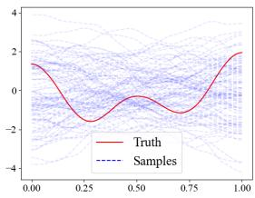  
(a) Samples from $\mu _ { 0 }$

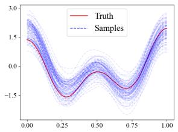  
(b) Samples from $\mu _ { f _ { \theta } ^ { 1 } }$ (direct)

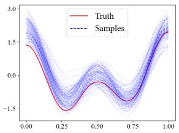  
(c) Samples from $\mu _ { f _ { \theta } ^ { 2 } }$ (indirect)

Figure 1: Samples from $\mu _ { 0 }$ and trained f-CNF priors $\mu _ { f _ { \theta } ^ { 1 } }$ and $\mu _ { f _ { \theta } ^ { 2 } }$ . The red solid line represent the background truth $u ^ { \dagger }$ . $( a ) .$ Samples from µ<sub>0</sub>. $( b ) .$ : Samples from $\mu _ { f _ { \theta } ^ { 1 } }$ trained with direct dataset. (c):Samples from $\mu _ { f _ { \theta } ^ { 2 } }$ trained with indirect dataset.

Subsequently, we adopt $\mu _ { 0 } , \ \mu _ { f _ { \theta } ^ { 1 } }$ , and $\mu _ { f _ { \theta } ^ { 2 } }$ as the prior measures in the Bayes’ formula (6). For this simple inverse problem, we generate posterior samples via the pCN algorithm. The step size is set to $\beta = 0 . 0 5$ for $\mu _ { 0 }$ , and $\beta = 0 . 0 2$ for $\mu _ { f _ { \theta } ^ { 1 } }$ and $\mu _ { f _ { \theta } ^ { 2 } }$ (note that the prior $\mu _ { 0 }$ admits a larger step size than $\mu _ { f _ { \theta } } ;$ the underlying reasons are elaborated in the supplementary material). For all three priors, we run $5 \times 1 0 ^ { 7 }$ iterations and discard the first $1 \times 1 0 ^ { 6 }$ samples as burn-in.

For clarity, we recall the definition of the covariance function. Let u be a random field defined on a domain Ω, with mean function ¯u and covariance function $c ( x , y )$ Here $c ( x , y )$ characterizes the covariance between $u ( x )$ and $u ( y )$ :

$$
c ( x , y ) = \mathbb { E } ( ( u ( x ) - \bar { u } ( x ) ) ( u ( y ) - \bar { u } ( y ) ) ) , \quad \mathrm { f o r ~ } x , y \in \Omega .
$$

The corresponding covariance operator C is defined by

$$
( { \mathcal { C } } \phi ^ { \prime } ) ( x ) = \int _ { \Omega } c ( x , y ) \phi ^ { \prime } ( y ) d y ,
$$

where $\phi ^ { \prime }$ is a suficiently regular function defined on Ω. To visualize the Bayesian posterior, we plot the posterior mean and credible region in Figures $2 ( \mathrm { a } ) - ( \mathrm { c } )$ . The posterior covariance functions, displayed in panels (d)–(f), further quantify the uncertainty of the inversion results. Additionally, we compute the $L ^ { 2 }$ error between the posterior mean and the background truth, with the results summarized in Table 1.

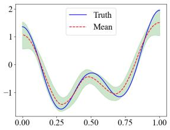  
(a) Posterior (µ<sub>0</sub> prior)

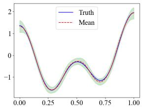  
(b) Posterior $( \mu _ { f _ { \theta } ^ { 1 } }$ prior)

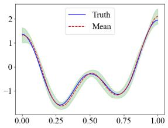  
(c) Posterior $( \mu _ { f _ { \theta } ^ { 2 } }$ prior)

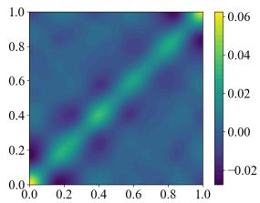  
(d) Posterior covariance (µ<sub>0</sub>)

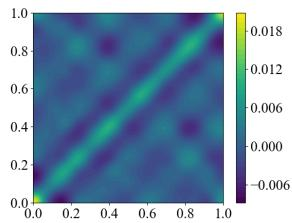  
(e) Posterior covariance $( \mu _ { f _ { \theta } ^ { 1 } } )$

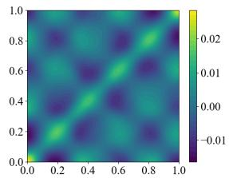  
(f) Posterior covariance $( \mu _ { f _ { \theta } ^ { 2 } } )$

Figure 2: The comparison of the Bayesian posteriors with µ<sub>0</sub>, $\mu _ { f _ { \theta } ^ { 1 } } , \ \mu _ { f _ { \theta } ^ { 2 } }$ priors. $( a ) ( b ) ( c )$ The corresponding Bayesian posteriors with µ<sub>0</sub>, µ<sub>f</sub>1, µ<sub>f</sub>2 priors. The blue solid line denotes the background truth $u ^ { \dagger }$ , the red dashed line represents the mean of the posterior, and the green shaded region indicates the 95% credible interval of the posteriors. $( d ) ( e ) ( f )$ : The covariance function of posteriors with µ<sub>0</sub>, $\mu _ { f _ { \theta } ^ { 1 } } , \mu _ { f _ { \theta } ^ { 2 } }$ priors.

Table 1: The relative errors between the background truth and the mean of posteriors.
<table><tr><td>Relative Error</td><td>posterior  $\left( \mu _ { 0 } \right)$ </td><td>posterior  $( \mu _ { f _ { \theta } ^ { 1 } } )$ </td><td>posterior  $\left( \mu _ { f _ { \theta } ^ { 2 } } \right)$ </td></tr><tr><td>Background Truth  $u ^ { \dagger }$ </td><td>0.03743</td><td>0.00363</td><td>0.00421</td></tr></table>

From the numerical results in Table 1 and the graphical illustrations in Figure $^ { 2 , }$ we observe that the posterior mean obtained by the Bayesian method with $\mu _ { 0 }$ as the prior exhibits a relatively large error compared with the background truth $u ^ { \dagger }$ . This indicates that the measurement information contained in the likelihood function is insuficient for accurately recovering the true source function $u ^ { \dagger }$ . In contrast, the proposed f-CNF priors $\mu _ { f _ { \theta } ^ { 1 } }$ and $\mu _ { f _ { \theta } ^ { 2 } }$ , trained using direct and indirect data, respectively, efectively mitigate this deficiency by incorporating additional prior information.

This phenomenon can be further understood by examining the covariance function of the Bayesian posterior. Subfigure (d) of Figure 2 shows that the covariance function of the posterior associated with the prior $\mu _ { 0 }$ remains relatively large, indicating that sparse measurements lead to high uncertainty in the inversion results. In comparison, Subfigures (e) and (f) of Figure 2 show the posterior covariance functions corresponding to the Bayesian formulations equipped with the priors $\mu _ { f _ { \theta } ^ { 1 } }$ and $\mu _ { f _ { \theta } ^ { 2 } }$ , respectively, where additional information is incorporated through the learned f-CNF priors. These learned priors enable the posterior distributions to produce narrower credible region and smaller covariance values. Moreover, since direct data inherently contain more information about the target parameter than indirect data, the prior $\mu _ { f _ { \theta } ^ { 1 } }$ yields better performance than $\mu _ { f _ { \theta } ^ { 2 } }$

5.2. Inverse Scattering Problem. In this subsection, we investigate the appli cation of the f-CNF prior to the inverse scattering problem [40, 41] using the available direct dataset $\mathbb { D } _ { \mathbf { t r a i n } }$ . We first briefly introduce the sound-soft inverse scattering problem considered here. Let Ω denote an obstacle, and assume that $\Omega \subset \mathbb { R } ^ { 2 }$ is a bounded, simply connected domain with $\mathrm { ~ a ~ } C ^ { 2 }$ smooth boundary ∂Ω. In $\mathbb { R } ^ { 2 }$ , define $\mathbb { S } ^ { 1 } = \{ \xi \in \mathbb { R } ^ { 2 } : | \dot { \xi } | = 1 \}$ . Consider the illumination of Ω by the following plane wave:

$$
w ^ { i } ( x ) : = e ^ { i k x \cdot \nu } , \quad x \in \mathbb { R } ^ { 2 } , \nu \in \mathbb { S } ^ { 1 } ,\tag{17}
$$

where $k > 0$ is the wavenumber and ν denotes the incident direction. Given the obstacle Ω and the incident direction $\nu ,$ the PDE solution operator determines the scattered field $w ^ { s }$ , or equivalently the total field $w = w ^ { i } + w ^ { s }$ , such that w satisfies

(18)

$$
\Delta w + k ^ { 2 } w = 0 , \quad \mathrm { i n ~ } \mathbb { R } ^ { 2 } \backslash \overline { { \Omega } } ,\tag{19}
$$

$$
w = 0 , \quad { \mathrm { o n ~ } } \partial \Omega ,\tag{20}
$$

$$
\operatorname* { l i m } _ { r \to \infty } \sqrt { r } \left( \frac { \partial w } { \partial r } - i k w \right) = 0 ,
$$

where (18) is the Helmholtz equation [40, 41, 9], (19) is the sound-soft boundary condition, and (20) is the Sommerfeld radiation condition.

Assume that the scatterer Ω is a star-shaped domain. The boundary Γ of the scatterer Ω can be parameterized as

$$
\Gamma : = r ( \theta ) ( \cos \theta , \sin \theta ) = \exp ( u ( \theta ) ) ( \cos \theta , \sin \theta ) , \quad \theta \in [ 0 , 2 \pi ) ,\tag{21}
$$

where $u ( \theta ) = \ln r ( \theta )$ and $r ( \theta ) > 0$ . For a fixed wavenumber $k = 5$ , the incident field is defined as $w ^ { i } ( x ) : = e ^ { i k x \cdot \nu }$

The forward problem is formulated by illuminating the obstacle with plane waves from eight distinct incident directions

$$
\nu \in \left\{ \big ( \cos \theta _ { i } , \sin \theta _ { i } \big ) \bigg | \theta _ { i } = \frac { ( i - 1 ) \pi } { 4 } , i = 1 , 2 , \ldots , 8 \right\} .
$$

For each incident direction, the corresponding scattered field is computed by solving the governing PDE that describes the interaction between the incident wave and the target obstacle.

For each incident direction, we collect phaseless noisy scattered-field measurements at three observation points $\{ ( 6 , 0 ) , ( 3 \sqrt { 3 } , 3 \sqrt { 3 } ) , ( 0 , 6 ) \}$ . Let $\mathcal { G } _ { i }$ denote the solution operator for the i-th incident wave, which maps $u \in \mathcal { H } _ { u }$ to the scattered field $w _ { i } \in { \mathcal { H } } _ { w } , { \mathrm { i . e . , ~ } } w _ { i } = { \mathcal { G } } _ { i } ( u )$ . Let $s$ stands for the measurement operator that extracts phaseless data of the total field at the three fixed points. The measurement model for the i-th incident wave is given by $\pmb { d } _ { i } = \pmb { S } \mathcal { G } _ { i } ( \boldsymbol { u } ) + \pmb { \epsilon } _ { i }$ , where $\epsilon _ { i }$ represents Gaussian noise. By collecting the solution operators corresponding to all incident waves, we define the combined solution operator $\mathcal { G }$ by $\mathcal { G } ( u ) = ( \mathcal { G } _ { 1 } ( u ) , \mathcal { G } _ { 2 } ( u ) , \ldots , \mathcal { G } _ { 8 } ( u ) )$ . The complete measurement vector can then be written as

$$
\pmb { d } = S \mathcal { G } ( u ) + \epsilon ,
$$

where d is a vector of length $3 \times 8 .$ . The potential function in Bayes’ formula (6) is defined as

$$
\Phi ( u ) : = \frac { 1 } { 2 } \left\| \mathcal { S } \mathcal { G } ( u ) - \pmb { d } \right\| _ { \Gamma _ { \mathrm { n o i s e } } } ^ { 2 } ,\tag{22}
$$

where $\mathbf { { { T } } _ { n o i s e } }$ denotes the covariance matrix of the noise. Our objective is to infer the possible values of u from the observation d within the Bayesian framework. To this end, we introduce the following basic assumptions in this subsection:

• Assume that Gaussian random noise $\epsilon \sim \mathcal { N } ( 0 , \Gamma _ { \mathrm { n o i s e } } )$ is added, where $\mathbf { T } _ { \mathrm { n o i s e } } =$ $\tau ^ { - 1 } \mathbf { I } \ \mathrm { a n d } \ \tau ^ { - 1 } = ( 0 . 0 5 \| \boldsymbol { S } \boldsymbol { \mathcal { G } } u \| _ { \infty } ) ^ { 2 }$

• Let $\mu _ { 0 } = N ( 0 , \mathcal { C } _ { 0 } )$ . The operator $\mathcal { C } _ { 0 }$ is given by $\mathcal { C } _ { 0 } = ( \mathrm { I } - \alpha \Delta ) ^ { - 2 }$ , where $\alpha =$ 0.5 is a fixed constant. Here, the Laplace operator is defined on $\Omega = [ 0 , 2 \pi ]$ with periodic boundary conditions.

We next select appropriate priors for the Bayes’ formula. In this numerical example, we consider two distinct priors: the reference prior $\mu _ { 0 }$ before the f-CNF transformation and the f-CNF measure $\mu _ { f _ { \theta } }$ obtained through direct data-driven training.

To train the f-CNF network, we construct a direct dataset $\mathbb { D } _ { \mathbf { t r a i n } } ^ { 1 }$ , similar to that in [27], with the detailed definition given below:

$$
u ( \theta ) = \ln \left( \frac { \sin ( 3 \theta ) + 5 } { 3 } \right) + \frac { \xi _ { 0 } } { 2 \sqrt { 2 \pi } } + \sum _ { k = 1 } ^ { 1 0 } \frac { \xi _ { k } } { 2 ( 1 + k ^ { 2 } ) } \big ( \sin ( k \theta ) + \cos ( k \theta ) \big ) ,
$$

where $\xi _ { k } \ ( k = 0 , 1 , \dots , 1 0 )$ are independent standard normal random variables, i.e., $\xi _ { i } \sim \mathcal { N } ( 0 , 1 )$ . We generate 2000 realizations by sampling $\{ \xi _ { k } \} _ { k = 0 } ^ { 1 0 }$ to construct the training set $\mathbb { D } _ { \mathrm { t r a i n } }$ . The ground truth $u ^ { \dagger }$ is generated using the same sampling procedure.

We employ Algorithm 1 to train the f-CNF prior $\mu _ { f _ { \theta } }$ on the training dataset $\mathbb { D } _ { \mathbf { t r a i n } }$ in infinite-dimensional space. Figure 3 presents the ground truth $u ^ { \dagger } .$ , together with samples drawn from the initial prior $\mu _ { 0 }$ and the learned prior $\mu _ { f _ { \theta } }$ . It can be observed that, compared with those from $\mu _ { 0 }$ , the samples from $\mu _ { f _ { \theta } }$ exhibit greater similarity to the background truth $u ^ { \dagger }$ . This indicates that $\mu _ { f _ { \theta } }$ provides more informative prior information for the posterior distribution.

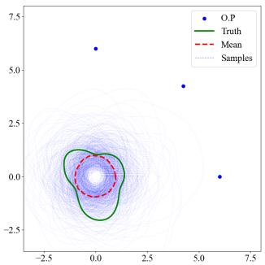  
(a) Samples from µ<sub>0</sub>

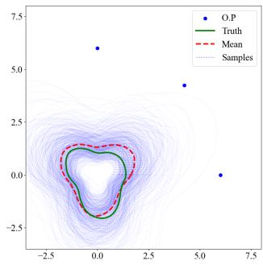  
(b) Samples from $\mu _ { f _ { \theta } }$  
Figure 3: Samples from $\mu _ { 0 }$ and trained f-CNF prior $\mu _ { f _ { \theta } }$ . The green solid line represent the background truth $u ^ { \dagger } .$ , and the red dashed line represent the mean of the priors. The blue discrete points represent the position of the observation points (O.P) of our inverse problem. (a): Samples from $\mu _ { 0 }$ . (b): Samples from f-CNF prior $\mu _ { f _ { \theta } }$

We then draw posterior samples via the SMC-GM method (introduced in Sub section 3.2) under both the Gaussian prior $\mu _ { 0 }$ and the trained prior $\mu _ { f _ { \theta } }$ . For both methods, we generate 20000 samples. Numerical results are shown in Figure 4. We also compute the $L ^ { 2 }$ error between the posterior mean and ground truth $u ^ { \dagger }$ for quantitative evaluation, as summarized in Table 2.

Table 2: The relative errors between the background truth and the mean of posteriors.
<table><tr><td>Relative Error</td><td>posterior  $( \mu _ { 0 } \ \mathrm { p r i o r } )$ </td><td>posterior  $( \mu _ { f _ { \theta } }$  prior)</td></tr><tr><td>Background Truth  $u ^ { \dagger }$ </td><td>0.12412</td><td>0.01179</td></tr></table>

From Table 2 and Figure 4, the posterior associated with $\mu _ { 0 }$ yields accurate reconstructions and tight credible region near the three upper-right observation points, where the likelihood is informative. By contrast, in the unobserved lower-left region with limited likelihood information, reconstructions degrade and posterior uncertainty rises. The posterior derived from the learned f-CNF prior $\mu _ { f _ { \theta } }$ alleviates this limitation to some extent, yielding higher predictive accuracy and reduced uncertainty compared with the posterior of $\mu _ { 0 }$

5.3. Inverse Heat Conduction Problem. For many scientific and engineering applications, inverse heat conduction problems have been studied for decades [3]. In such problems, the temperature or heat flux on an inaccessible boundary is inferred from temperature data measured inside a solid body [16]. This constitutes our final numerical example. In this numerical experiment, we consider the following heat

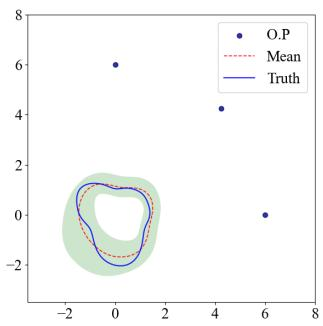  
(a) Posterior (µ<sub>0</sub> prior)

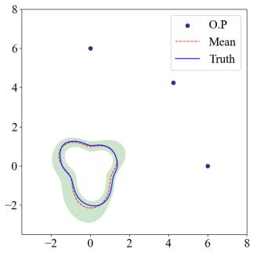  
(b) Posterior $( \mu _ { f _ { \theta } }$ prior)

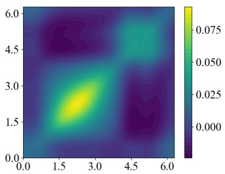  
(c) Posterior covariance $\left( \mu _ { 0 } \right)$

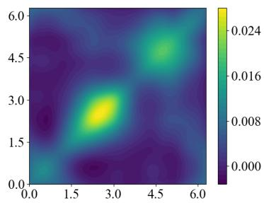  
(d) Posterior covariance $( \mu _ { f _ { \theta } } )$  
Figure 4: $T h e$ comparison of the Bayesian posteriors with µ<sub>0</sub>, $\mu _ { f _ { \theta } }$ priors. $( a ) ( b )$ : The corresponding Bayesian posteriors with $\mu _ { 0 }$ and $\mu f _ { \theta }$ priors. The blue solid line denotes the background truth $u ^ { \dagger }$ , the red dashed line represents the mean of the posteriors. The green shaded region represents the 95% credibility region of estimated posteriors, and the blue discrete points represent the position of the observation points $( O . P )$ $( c ) ( d )$ : The covariance function of posteriors with $\mu _ { 0 }$ and $\mu _ { f _ { \theta } }$ priors.

equation:

$$
\frac { \partial w } { \partial t } = \frac { \partial } { \partial x } \left( h ( x ) \frac { \partial w } { \partial x } \right)
$$

with initial condition $w ( x , 0 ) = 0$ . Here, x and t denote the spatial and temporal variables, respectively, $w ( x , t )$ is the temperature, $h ( x )$ is the thermal conductivity at each location, and L is the length of the medium. All variables are given in dimensionless units. In this numerical experiment, the thermal conductivity $h ( x )$ is defined as $\begin{array} { r } { h ( x ) = 0 . 5 + 0 . 1 5 \exp { \left( - \left( \frac { x - 0 . 5 } { 0 . 2 } \right) ^ { 2 } \right) } } \end{array}$

We assume that a heat flux is imposed on the left boundary $( x = 0 )$ for $t \in [ 0 , T _ { 1 } ]$ ， leading to the Neumann boundary condition: $\textstyle { \frac { \partial w } { \partial x } } ( 0 , t ) = u _ { \mathrm { a l l } } ( t )$ , where

$$
u _ { \mathbf { a l l } } ( t ) = { \left\{ \begin{array} { l l } { u ( t ) , } & { t \in [ 0 , T _ { 1 } ] , } \\ { 0 , } & { t > T _ { 1 } . } \end{array} \right. }
$$

Furthermore, we assume that the right end of the rod is insulated, which gives the boundary condition: $\begin{array} { r } { \frac { \partial w } { \partial x } ( L , t ) = 0 } \end{array}$

Suppose that a temperature sensor is placed at the right end of the medium, i.e., $x = L$ . The goal is to infer the heat flux $u ( t )$ for $t \in [ 0 , T _ { 1 } ]$ from the temperature measured by the sensor over the time interval $t \in [ 0 , T _ { 2 } ]$ . The corresponding PDE governing this process is given by

$$
\left\{ \begin{array} { l l } { \displaystyle \frac { \partial w } { \partial t } = \displaystyle \frac { \partial } { \partial x } \left( h ( x ) \frac { \partial w } { \partial x } \right) , } & { \mathrm { f o r } ~ x \in [ 0 , L ] , ~ t \in [ 0 , T _ { 2 } ] , } \\ { \displaystyle \frac { \partial w } { \partial x } ( 0 , t ) = u _ { \mathrm { a l l } } ( t ) , } & { \mathrm { f o r } ~ t \in [ 0 , T _ { 2 } ] , } \\ { \displaystyle \frac { \partial w } { \partial x } ( L , t ) = 0 , } & { \mathrm { f o r } ~ t \in [ 0 , T _ { 2 } ] . } \end{array} \right.
$$

We now summarize the formulation of the above inverse heat conduction problem. Let $u ( t )$ denote the model parameter, and let $\mathcal { G } : u ( \cdot ) \mapsto w ( L , \cdot )$ denote the solution operator of the heat equation. The measurement operator $s$ maps the solution $w ( L , t )$ to its temporal observations at discrete instants $t \in [ 0 , T _ { 2 } ]$ , namely

$$
\mathcal { S } : w ( L , t ) \mapsto ( w ( L , t _ { 1 } ) , w ( L , t _ { 2 } ) , \ldots , w ( L , t _ { P } ) ) ,
$$

where $t _ { 1 } , t _ { 2 } , \ldots , t _ { P } \in [ 0 , T _ { 2 } ]$ denote the measurement time instants. The noisy data vector d follows the forward mapping

$$
\pmb { d } = S \mathcal { G } ( u ) + \epsilon ,\tag{23}
$$

where ϵ corresponds to additive Gaussian measurement noise.

For the inverse problem (23), the heat flux $u ( t )$ takes time to propagate along the rod from left to right. Consequently, to accurately recover $u ( t )$ over the entire interval $[ 0 , T _ { 1 } ]$ , it is typically necessary to take $T _ { 2 } > T _ { 1 }$ and observe $w ( t )$ over the full interval $[ 0 , T _ { 2 } ]$ . Here, we choose $T _ { 1 } = 1$ and $T _ { 2 } = 1 . 2$ . Consistent with Subsections 5.1 and 5.2, we solve this problem within the Bayesian framework on infinite-dimensional spaces, using $\mu _ { 0 } = \mathcal { N } ( 0 , \mathcal { C } _ { 0 } )$ as the reference prior, where $\mathcal { C } _ { 0 } = ( \mathrm { I } - \alpha \Delta ) ^ { - 2 }$ and $\alpha = 0 . 0 5$ is a prescribed constant. The Laplace operator is defined on Ω with homogeneous Neumann boundary conditions.

In this numerical experiment, we assume access to a large indirect dataset. Our objective is to train an f-CNF prior $\mu _ { f _ { \theta } }$ suitable for the inverse problem using $\mathrm { A l - }$ gorithm 2, and to demonstrate the efectiveness of the proposed method through comparison with the baseline prior $\mu _ { 0 }$ . We construct the indirect training dataset $\mathbb { D } _ { \mathbf { t r a i n } } ^ { 2 }$ similar to [27, 45], with their detailed definitions given below.

• Sample the parameter functions according to

$$
u ( t ) = \cos ( 3 \pi t ) + 0 . 2 \sum _ { k = 1 } ^ { 2 0 } \frac { \xi _ { k } \cos ( k \pi t ) } { 1 + k } , \quad \xi _ { k } \sim \mathcal { N } ( 0 , 1 ) .
$$

The set $\{ u _ { i } \} _ { i = 1 } ^ { 1 0 0 0 0 }$ constitutes the parameter training dataset $\mathbb { D } ^ { 1 }$ generated by this sampling strategy.

• Define the indirect training dataset as $\mathbb { D } _ { \mathbf { t r a i n } } ^ { 2 } = \{ d _ { i } \ | \ d _ { i } = { \mathcal { S } } _ { \mathbf { d a t a } } { \mathcal { G } } ( u _ { i } ) +$ $\epsilon _ { \mathbf { d a t a } } , u _ { i } \in \mathbb { D } ^ { 1 } \}$ . The measurement points of the operator $S _ { \mathbf { d a t a } }$ are taken as $\{ w ( t _ { i } ) \mid i = 1 , 2 , \ldots , 2 0 \}$ with $\begin{array} { r } { t _ { i } = 0 . 1 + \frac { 1 1 } { 1 9 0 } ( i - 1 ) } \end{array}$ . Here, $\mathbf { \epsilon } \mathbf { \ d a t a }$ denotes Gaussian white noise with fixed variance $0 . 0 1 \cdot$

The background truth $u ^ { \dagger } ( t )$ is generated using the same sampling procedure as that used to construct $\mathbb { D } ^ { 1 }$

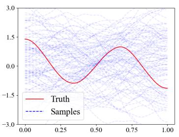  
(a) Samples from µ<sub>0</sub>

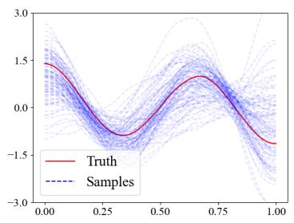  
(b) Samples from $\mu _ { f _ { \theta } }$  
Figure 5: Samples from $\mu _ { 0 }$ and trained f-CNF prior $\mu _ { f _ { \theta } }$ . The red solid line represent the background truth of our inverse problem. (a): Samples from $\mu _ { 0 }$ . (b): Samples from $f _ { - } C N F$ prior $\mu f _ { \theta }$

Using $\mathbb { D } _ { \mathbf { t r a i n } } ^ { 2 } ,$ we train an f-CNF prior $\mu _ { f _ { \theta } }$ via Algorithm 2. To visualize the learned prior, Figure 5 presents samples drawn from $\mu _ { 0 }$ and $\mu _ { f _ { \theta } }$ , together with their comparison against the background truth $u ^ { \dagger }$ . It can be observed that the samples from $\mu _ { f _ { \theta } }$ exhibit greater similarity to the background truth $u ^ { \dagger }$ than those from $\mu _ { 0 }$

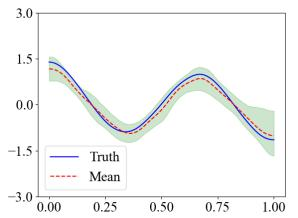

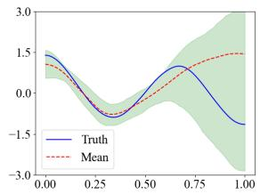

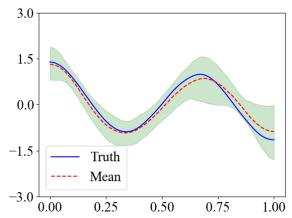  
(b) Posterior (µ<sub>0</sub> prior)  
(c) Posterior $( \mu _ { f _ { \theta } }$ prior)

(a) Full measurement posterior  
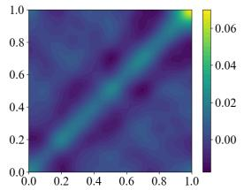  
(d) Posterior covariance (full)

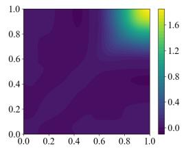  
(e) Posterior covariance (µ<sub>0</sub>)

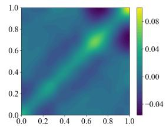  
(f) Posterior covariance $( \mu _ { f _ { \theta } } )$  
Figure 6: Comparison of Bayesian posteriors: full measurements with µ<sub>0</sub> $p r i o r ,$ sparse measurements with µ<sub>0</sub>, $\mu _ { f _ { \theta } }$ priors (a): The Bayesian posterior with full measurement and µ<sub>0</sub> prior. The blue solid line denotes the background truth $u ^ { \dagger } ,$ , the red dashed line represents the mean of the posteriors. The green shaded region represents the 95% credibility region of estimated posteriors. $( b ) ( c ) \colon$ The corresponding Bayesian posteriors of sparse measurements with µ<sub>0</sub>, $\mu _ { f _ { \theta } }$ priors. $( d ) ( e ) ( f ) .$ Posterior covariance functions under full measurements with µ<sub>0</sub> prior and sparse measurements with $\mu _ { 0 }$ and $\mu _ { f _ { \theta } }$ priors, respectively.

We next perform Bayesian inversion using both $\mu _ { 0 }$ and the learned f-CNF prior $\mu _ { f _ { \theta } }$ . To further demonstrate the efectiveness of the trained prior $\mu _ { f _ { \theta } }$ , we conduct three numerical experiments.

In the first numerical experiment, the measurement operator fully observes the solution $w ( L , t )$ for $t \in [ 0 , T _ { 2 } ]$ , denoted by $S _ { 1 } : w ( L , t ) \mapsto ( w ( L , t ^ { 1 } ) , \ldots , w ( L , t ^ { 2 0 } ) )$ where $\begin{array} { r } { t ^ { i } = 0 . 1 + \frac { 1 1 } { 1 9 0 } ( i - 1 ) } \end{array}$ for $i = 1 , 2 , \dots , 2 0$ . Meanwhile, we assume that the measurements are contaminated by 5% Gaussian random noise $\epsilon _ { \mathrm { 1 } } \sim \mathcal { N } ( 0 , \mathbf { { r } } _ { \mathrm { n o i s e } } ^ { 1 } )$ where ${ \bf { \Gamma } } _ { \mathrm { { n o i s e } } } ^ { 1 } = \tau ^ { - 1 } { \bf { I } }$ and $\tau ^ { - 1 } = ( 0 . \dot { 0 } 5 \| \mathcal { S } _ { 1 } \mathcal { G } u \| _ { \infty } ) ^ { 2 }$ . The measurement process is given by

$$
\begin{array} { r } { \pmb { d } = \pmb { \mathcal { S } } _ { 1 } \mathcal { G } ( u ) + \pmb { \epsilon } _ { 1 } . } \end{array}
$$

We choose $\mu _ { 0 }$ as the prior and solve the inverse problem using SMC-GM. In the SMC GM algorithm, 20,000 samples are generated, and the results are shown in Figure 6. It can be observed that, when suficient observational information is available, the prior $\mu _ { 0 }$ yields accurate inversion results.

In the second and third numerical experiments, we shorten the measurement time interval. Specifically, we assume that the measurement operator observes the solution $w ( L , t )$ only for $t \in [ 0 , T _ { 3 } ]$ , where $T _ { 3 } = 0 . 9$ . This implies that no observational information is available after $t = 0 . 9 .$ , and thus the values of $u ( t )$ for $t \in [ 0 . 9 , 1 ]$ cannot be accurately estimated from the measurements alone. We denote the corresponding measurement operator by $\mathcal S _ { 2 } : w ( L , t ) \mapsto \big ( w ( L , t ^ { 1 } ) , \dots , w ( L , t ^ { 2 0 } ) \big )$ where $\begin{array} { r } { t ^ { i } = 0 . 1 + \frac { 8 } { 1 9 0 } ( i - 1 ) } \end{array}$ . Meanwhile, we assume that the measurements are contaminated by 5% Gaussian random noise $\epsilon _ { \mathrm { 2 } } \sim \mathcal { N } ( 0 , \mathbf { { r } } _ { \mathrm { n o i s e } } ^ { 2 } )$ , where ${ \Gamma } _ { \mathrm { n o i s e } } ^ { 2 } = \tau ^ { - 1 } { \bf I }$ and $\tau ^ { - 1 } = ( 0 . 0 5 \| S _ { 2 } \mathcal { G } u \| _ { \infty } ) ^ { 2 }$

In the second and third numerical experiments, we use $\mu _ { 0 }$ and $\mu _ { f _ { \theta } }$ as the priors, respectively, and solve the inverse problem using SMC-GM algorithm. For both priors, 20,000 samples are generated, and the results are presented in Figure 6.

In addition to the graphical results, we also compute the $L ^ { 2 }$ errors between the posterior means obtained in the three experiments and the background truth $u ^ { \dagger }$ . The results are reported in Table 3. Combining the results in Table 3 and Figure 6, we

Table 3: The relative errors between the background truth and the mean of posteriors.
<table><tr><td>Relative Error</td><td>posterior (full)</td><td>posterior  $\left( \mu _ { 0 } \right)$ </td><td>posterior  $\left( \mu _ { f _ { \theta } } \right)$ </td></tr><tr><td>Background Truth  $u ^ { \dagger }$ </td><td>0.02734</td><td>0.23119</td><td>0.05285</td></tr></table>

observe that, in the time intervals not covered by the measurements, the posterior corresponding to the prior $\mu _ { 0 }$ exhibits extremely high uncertainty, and its posterior mean also deviates significantly from the background truth $u ^ { \dagger }$ . In contrast, the learned prior $\mu _ { f _ { \theta } }$ efectively compensates for this deficiency, thereby demonstrating the efectiveness of the proposed prior learning method.

6. Conclusion. In this work, we propose an f-CNF model defined on infinitedimensional spaces, thereby providing an efective tool for prior measure construction in infinite-dimensional Bayesian inverse problems. The model constructs a transformation that preserves measure equivalence while retaining substantial flexibility in the induced measure, which lays a rigorous theoretical foundation for computing the corresponding Radon–Nikodym derivative.

The proposed f-CNF model lends itself naturally to infinite-dimensional Bayesian inverse problems, where the choice of prior distribution occupies a central role. We verify its performance across three representative test setups: (1) a smooth linear inverse problem, (2) an inverse scattering problem, and (3) an inverse heat conduction problem. For test cases (1) and (2), f-CNF priors are trained using direct datasets of underlying model parameters; for cases (1) and (3), training proceeds with indirect observational measurements.

Nevertheless, training f-CNFs requires heavy ODE computations, which incur considerable computational overhead when dealing with sophisticated models. Our future research directions are threefold: (1) extending the f-CNF framework to broader real-world applications; (2) developing more expressive network architectures; and (3) studying measure equivalence within infinite-dimensional difusion models [14, 31] in the context of Bayesian inverse problems.

Acknowledgments. This research was partially funded by the National Natural Science Foundation of China (Grant Nos. 12322116 and 12271428).

## REFERENCES

[1] Simon Arridge, Peter Maass, Ozan Oktem, and Carola-Bibiane Sch¨onlieb, <sup>¨</sup> Solving inverse problems using data-driven models, Acta Numer. 28 (2019), 1–174.

[2] Muhammad Asim, Max Daniels, Oscar Leong, Ali Ahmed, and Paul Hand, Invertible generative models for inverse problems: mitigating representation error and dataset bias, International conference on machine learning, PMLR, 2020, pp. 399–409.

[3] James V Beck, Ben Blackwell, and Charles R St Clair, Inverse heat conduction: Ill-posed problems, James Beck, 1985.

[4] Martin Benning and Martin Burger, Modern regularization methods for inverse problems, Acta Numer. 27 (2018), 1–111.

[5] Christopher M. Bishop, Pattern Recognition and Machine Learning, Information Science and Statistics, Springer, New York, 2006.

[6] Vladimir I. Bogachev, Gaussian Measures, American Mathematical Society, Providence, RI, 1998.

[7] Ziruo Cai, Junqi Tang, Subhadip Mukherjee, Jinglai Li, Carola-Bibiane Sch¨onlieb, and Xiaoqun Zhang, NF-ULA: normalizing flow-based unadjusted Langevin algorithm for imaging inverse problems, SIAM J. Imaging Sci. 17 (2024), no. 2, 820–860.

[8] Ricky T. Q. Chen, Yulia Rubanova, Jesse Bettencourt, and David Duvenaud, Neural ordinary diferential equations, Adv. Neural Inf. Process. Syst. 31 (2018), 6571–6583.

[9] David Colton and Andreas Kirsch, A simple method for solving inverse scattering problems in the resonance region, Inverse problems 12 (1996), no. 4, 383–393.

[10] Simon L. Cotter, Masoumeh Dashti, James C. Robinson, and Andrew M. Stuart, Bayesian inverse problems for functions and applications to fluid mechanics, Inverse Problems 25 (2009), no. 11, 115008, 43.

[11] Simon L. Cotter, Gareth O. Roberts, Andrew M. Stuart, and David White, MCMC methods for functions: modifying old algorithms to make them faster, Statist. Sci. 28 (2013), no. 3, 424–446.

[12] Giannis Daras, Kulin Shah, Yuval Dagan, Aravind Gollakota, Alex Dimakis, and Adam Klivans, Ambient difusion: Learning clean distributions from corrupted data, Advances in Neural Information Processing Systems 36 (2023), 288–313.

[13] Masoumeh Dashti and Andrew M. Stuart, The Bayesian approach to inverse problems, Handbook of uncertainty quantification. Vol. 1, 2, 3, Springer, Cham, 2017, pp. 311–428.

[14] John Doe and Jane Smith, Infinite-dimensional difusion models for function spaces, J. Mach. Learn. Res. 2024 (2024), 1–25.

[15] Berthy T Feng, Jamie Smith, Michael Rubinstein, Huiwen Chang, Katherine L Bouman, and William T Freeman, Score-based difusion models as principled priors for inverse imaging, Proceedings of the IEEE/CVF international conference on computer vision, 2023, pp. 10520–10531.

[16] Zhe Feng and Jinglai Li, An adaptive independence sampler MCMC algorithm for Bayesian inferences of functions, SIAM J. Sci. Comput. 40 (2018), no. 3, A1301–A1321.

[17] Jean Feydy, Thibault S´ejourn´e, Fran¸cois-Xavier Vialard, Shun-ichi Amari, Alain Trouve, and

Gabriel Peyr´e, Interpolating between optimal transport and mmd using sinkhorn divergences, The 22nd International Conference on Artificial Intelligence and Statistics, 2019, pp. 2681–2690.

[18] Angela F Gao, Oscar Leong, He Sun, and Katherine L Bouman, Image reconstruction without explicit priors, ICASSP 2023-2023 IEEE International Conference on Acoustics, Speech and Signal Processing, IEEE, 2023, pp. 1–5.

[19] Junxiong Jia, Deyu Meng, Zongben Xu, and Fang Yao, Nonparametric prior learning in diferential equation modeling, Journal of the American Statistical Association (2026), no. justaccepted, 1–24.

[20] Junxiong Jia, Yanni Wu, Peijun Li, and Deyu Meng, Variational inverting network for statistical inverse problems of partial diferential equations, J. Mach. Learn. Res. 24 (2023), paper no. 201, 60.

[21] Junxiong Jia, Qian Zhao, Zongben Xu, Deyu Meng, and Yee Leung, Variational Bayes’ method for functions with applications to some inverse problems, SIAM J. Sci. Comput. 43 (2021), no. 1, A355–A383.

[22] Jari Kaipio and Erkki Somersalo, Statistical and Computational Inverse Problems, Applied Mathematical Sciences, Springer-Verlag, New York, 2005.

[23] Diederik Kinga, Jimmy Ba Adam, et al., A method for stochastic optimization, ICLR, vol. 5, 2015.

[24] Andreas Kirsch, An Introduction to the Mathematical Theory of Inverse Problems, second ed., Springer, New York, 2011.

[25] Matti Lassas, Eero Saksman, and Samuli Siltanen, Discretization-invariant Bayesian inversion and Besov space priors, Inverse Probl. Imaging 3 (2009), no. 1, 87–122.

[26] Jonas Latz, Bayesian inverse problems are usually well-posed, SIAM Rev. 65 (2023), no. 3, 831–865.

[27] Zongyi Li, Nikola Kovachki, Kamyar Azizzadenesheli, Burigede Liu, Kaushik Bhattacharya, Andrew M. Stuart, and Anima Anandkumar, Fourier neural operator for parametric partial diferential equations, ICLR, 2021.

[28] Haoyu Lu, Junxiong Jia, and Deyu Meng, Sequential monte carlo with gaussian mixture approximation for infinite-dimensional statistical inverse problems, arXiv preprint arXiv:2503.16028 (2025).

[29] Markku Markkanen, Lassi Roininen, Janne M. J. Huttunen, and Sari Lasanen, Cauchy difference priors for edge-preserving Bayesian inversion, Journal of Inverse and Ill-posed Problems 27 (2019), no. 2, 225–240.

[30] Richard Nickl, Bernstein–von mises theorems for statistical inverse problems I: Schr¨odinger equation, J. Eur. Math. Soc. 22 (2020), no. 8, 2697–2750.

[31] Jakiw Pidstrigach, Youssef Marzouk, Sebastian Reich, and Sven Wang, Infinite-dimensional difusion models, Journal of Machine Learning Research 25 (2024), no. 414, 1–52.

[32] Frederick J. Pinski, Geofrey Simpson, Andrew M. Stuart, and Harald Weber, Algorithms for Kullback-Leibler approximation of probability measures in infinite dimensions, SIAM J. Sci. Comput. 37 (2015), no. 6, A2733–A2757.

[33] Frederick J. Pinski, Geofrey Simpson, Andrew M. Stuart., and Harald Weber, Kullback-Leibler approximation for probability measures on infinite dimensional spaces, SIAM J. Math. Anal. 47 (2015), no. 6, 4091–4122.

[34] Michael C. Reed and Barry Simon, Methods of modern mathematical physics. I, second ed., Academic Press, Inc. [Harcourt Brace Jovanovich, Publishers], New York, 1980.

[35] Yang Song, Conor Durkan, Iain Murray, and Stefano Ermon, Maximum likelihood training of score-based difusion models, Advances in neural information processing systems 34 (2021), 1415–1428.

[36] Andrew M. Stuart, Inverse problems: a Bayesian perspective, Acta Numer. 19 (2010), 451–559.

[37] Jiaming Sui and Junxiong Jia, Non-centered parametric variational Bayes’ approach for hierarchical inverse problems of partial diferential equations, Math. Comp. 93 (2024), no. 348, 1715–1760.

[38] Arthur B. Weglein, Fernanda V. Ara´ujo, Paulo M. Carvalho, Robert H. Stolt, Kenneth H. Matson, Richard T. Coates, Dennis Corrigan, Douglas J. Foster, Simon A. Shaw, and Haiyan Zhang, Inverse scattering series and seismic exploration, Inverse Problems 19 (2003), no. 6, R27–R83.

[39] Zhao Yang, Lu Haoyu, Jia Junxiong, and Zhou Tao, Functional normalizing flow for statistical inverse problems of partial diferential equations, arXiv preprint arXiv:2411.13277 (2024), 1–52.

[40] Zhipeng Yang, Xinping Gui, Ju Ming, and Guanghui Hu, Bayesian approach to inverse timeharmonic acoustic scattering with phaseless far-field data, Inverse Problems 36 (2020),

065012.

[41] , Bayesian approach to inverse time-harmonic acoustic obstacle scattering with phaseless data generated by point source waves, Computer Methods in Applied Mechanics and Engineering 386 (2021), 114073.

[42] Zhewei Yao, Zixi Hu, and Jinglai Li, A TV-Gaussian prior for infinite-dimensional Bayesian inverse problems and its numerical implementations, Inverse Problems 32 (2016), no. 7, 075006, 19.

[43] Eberhard Zeidler, Nonlinear functional analysis and its applications, Springer Science & Business Media, 2013.

[44] Qingping Zhou, Tengchao Yu, Xiaoqun Zhang, and Jinglai Li, Bayesian inference and uncertainty quantification for medical image reconstruction with Poisson data, SIAM J. Imaging Sci. 13 (2020), no. 1, 29–52.

[45] Omer Deniz Akyildiz, Mark Girolami, Andrew M. Stuart, and Arnaud Vadeboncoeur,<sup>¨</sup> Eficient prior calibration from indirect data, SIAM J. Sci. Comput. 47 (2025), no. 4, C932–C958.

# SUPPLEMENTARY MATERIAL OF “LEARNING INFORMATIVE PRIOR WITH INFINITE-DIMENSIONAL CONTINUOUS NORMALIZING FLOW FOR BAYESIAN INVERSE PROBLEM”

YANG ZHAO, JUNXIONG JIA, AND TAO ZHOU

Abstract. This supplementary material provides full proofs for all lemmas and theorems in the main manuscript, as well as extra models and numerical experiments excluded from the main text. For ease of reference, we have categorized the supplementary material according to the sections of the main article.

## 1. supplementary of section 2

This section corresponds to the supplementary material for Section 2 of the main article, specifically including the definition of the Functional Determinant and the proofs of Lemma 1 and Theorems 2 and 5.

1.1. Definition of Functional Determinant. Let H be a separable Hilbert space and let $\mathcal { K } : \mathcal { H }  \mathcal { H }$ be a bounded linear perturbation operator. In this work, we denote by det<sub>1</sub> $( I + \kappa )$ the standard Fredholm–Carleman determinant of $I + { \cal K }$ , and by $\operatorname* { d e t } _ { 2 } ( I + \mathcal { K } )$ the corresponding regularized Fredholm–Carleman determinant.

Definition 1 (Fredholm–Carleman determinant) When K is a trace-class operator, de $\dot { \mathbf { \rho } } _ { 1 } ( I + \kappa )$ is well-defined as the absolutely convergent infinite product over all eigenvalues $\{ \lambda _ { n } \}$ of $\kappa$ (counted with algebraic multiplicity):

$$
\operatorname * { d e t } _ { { 1 } } ( I + \mathcal { K } ) = \prod _ { n = 1 } ^ { \infty } { { { \left( 1 + \lambda _ { n } \right) } } } .
$$

Definition 2 (Regularized Fredholm–Carleman determinant) Let $\kappa$ be $\mathrm { a }$ Hilbert–Schmidt operator on the Hilbert space H. Denote $\lambda _ { n }$ as the eigenvalues of $\kappa$ . The standard infinite product for $\operatorname* { d e t } _ { 1 } ( I + \mathcal { K } )$ diverges in this setting, so we define the regularized determinant by adding exponential convergence factors:

$$
\operatorname * { d e t } _ { 2 } ( I + \mathcal { K } ) = \prod _ { n = 1 } ^ { \infty } ( 1 + \lambda _ { n } ) e ^ { - \lambda _ { n } } .
$$

For comprehensive theoretical discussions and proofs, see Section 6.4 in [2].

## 1.2. Proof of Lemma 1.

Proof. Since the parameter θ does not play an explicit role in the discussion, we omit explicit reference to it. Accordingly, we adopt the following abbreviations:

• The operator $f _ { \boldsymbol { \theta } _ { n } } ^ { ( n ) }$ is abbreviated as $f ^ { ( n ) }$

• The operator $\mathcal { F } _ { \theta _ { n } } ^ { ( n ) }$ is abbreviated as ${ \mathcal { F } } ^ { ( n ) }$

• The operators $f _ { \theta }$ and $\mathcal { T } _ { \theta }$ are abbreviated as $f$ and $\tau _ { \cdot }$ , respectively.

The proof proceeds in three steps:

(1) Step 1: Decompose the composed map as $I + \mathcal { T }$ and show that $\operatorname { I m } ( { \mathcal { T } } ) \subset { \mathcal { H } }$

(2) Step 2: Prove that the Fr´echet derivative of $I + \mathcal { T }$ is injective, thereby obtaining $\mu \sim \mu _ { 0 }$

(3) Step 3: Derive the explicit Radon–Nikodym density.

Step 1. By definition $f ^ { ( n ) } = I + \mathcal { F } ^ { ( n ) }$ . Expanding the composition yields

$$
\begin{array} { r l } & { f ^ { ( N ) } \circ \cdots \circ f ^ { ( 1 ) } = \left( I + \mathcal { F } ^ { ( N ) } \right) \circ \left( I + \mathcal { F } ^ { ( N - 1 ) } \right) \circ \cdots \circ \left( I + \mathcal { F } ^ { ( 1 ) } \right) } \\ & { \qquad = \left( I + \mathcal { F } ^ { ( N - 1 ) } \right) \circ \cdots \circ \left( I + \mathcal { F } ^ { ( 1 ) } \right) + \mathcal { F } ^ { ( N ) } \circ \left( I + \mathcal { F } ^ { ( N - 1 ) } \right) \circ \cdots \circ \left( I + \mathcal { F } ^ { ( 1 ) } \right) } \\ & { \qquad = I + \mathcal { F } ^ { ( 1 ) } + \mathcal { F } ^ { ( 2 ) } \circ \left( I + \mathcal { F } ^ { ( 1 ) } \right) + \mathcal { F } ^ { ( 3 ) } \circ \left( I + \mathcal { F } ^ { ( 2 ) } \right) \circ \left( I + \mathcal { F } ^ { ( 1 ) } \right) + \cdots } \\ & { \qquad + \mathcal { F } ^ { ( N ) } \circ \left( I + \mathcal { F } ^ { ( N - 1 ) } \right) \circ \cdots \circ \left( I + \mathcal { F } ^ { ( 1 ) } \right) } \\ & { \qquad = I + \mathcal { T } , } \end{array}
$$

where we define

$$
T = \mathcal { F } ^ { ( 1 ) } + \mathcal { F } ^ { ( 2 ) } \circ \left( I + \mathcal { F } ^ { ( 1 ) } \right) + \mathcal { F } ^ { ( 3 ) } \circ \left( I + \mathcal { F } ^ { ( 2 ) } \right) \circ \left( I + \mathcal { F } ^ { ( 1 ) } \right) + \cdot \cdot \cdot + \mathcal { F } ^ { ( N ) } \circ \left( I + \mathcal { F } ^ { ( N - 1 ) } \right) \circ \cdot \cdot \cdot \circ \left( I + \mathcal { F } ^ { ( 1 ) } \right) .
$$

Since $\operatorname { I m } ( \mathcal { F } ^ { ( n ) } ) \subset \mathcal { H }$ for all n, we have $\operatorname { I m } ( { \mathcal { T } } ) \subset { \mathcal { H } }$

Step 2. The map $I + \mathcal { T }$ is Fr´echet diferentiable, and its derivative satisfies

$$
\begin{array} { r l } & { D ( I + \mathcal { T } ) ( u ) = D \big ( I + \mathcal { F } ^ { ( N ) } \big ) \circ \big ( I + \mathcal { F } ^ { ( N - 1 ) } \big ) \circ \cdot \cdot \cdot \circ \big ( I + \mathcal { F } ^ { ( 1 ) } \big ) ( u ) } \\ & { \qquad = \big ( I + D \mathcal { F } ^ { ( N ) } \big ) \big ( u ^ { N - 1 } \big ) \circ \big ( I + D \mathcal { F } ^ { ( N - 1 ) } \big ) ( u ^ { N - 2 } ) \circ \cdot \cdot \cdot \circ \big ( I + D \mathcal { F } ^ { ( 1 ) } \big ) ( u ) } \\ & { \qquad = \Gamma ^ { ( N ) } \circ \Gamma ^ { ( N - 1 ) } \circ \cdot \cdot \cdot \circ \Gamma ^ { ( 1 ) } , } \end{array}
$$

where we set

$$
\Gamma ^ { ( n ) } = \big ( I + D \mathcal { F } ^ { ( n ) } \big ) ( u ^ { n - 1 } ) , \quad u ^ { n - 1 } = \big ( I + \mathcal { F } ^ { ( n - 1 ) } \big ) \circ \cdot \cdot \cdot \circ \big ( I + \mathcal { F } ^ { ( 1 ) } \big ) ( u ) , \quad n = 1 , \dots , N .
$$

For every $u \in \mathcal { H } _ { u } .$ , the point spectrum of $D \mathcal { F } ^ { ( n ) } ( u )$ is disjoint from $( - \infty , - 1 ]$ , which implies that each $\Gamma ^ { ( n ) }$ is injective for all $n = 1 , \ldots , N$ . Consequently, $D ( I + \mathcal { T } ) ( u )$ is injective for all $u \in \mathcal { H } _ { u }$ as it is a composition of injective maps.

Combining the results of Steps 1 and 2 with Example 10.27 from [3], we establish the mutual absolute continuity $\mu \sim \mu _ { 0 }$ , where $\mu = \big ( f ^ { ( N ) } \circ f ^ { ( N - 1 ) } \circ \cdots \circ f ^ { ( 1 ) } \big ) _ { \# } \mu _ { 0 }$

Step 3. We divide the proof into two cases.

Case $N = 1$ . Let $\mathcal { F } ^ { ( 1 ) } = \mathcal { F }$ . By Theorems 5.8.3 and 6.6.7 together with Corollary 6.6.8 in [2], the Radon–Nikodym derivative is given by

$$
\frac { d \big ( ( I + \mathcal { F } ) _ { \# } \mu _ { 0 } \big ) } { d \mu _ { 0 } } \big ( ( I + \mathcal { F } ) ( u ) \big ) = \frac { 1 } { \Lambda _ { \mathcal { F } } \left( u \right) } ,
$$

where

$$
\begin{array} { l } { \Lambda _ { \mathcal { F } } ( u ) : = \left| \mathrm { d e t } _ { 2 } \big ( I + D \mathcal { F } ( u ) \big ) \big | \exp \left[ \delta \mathcal { F } ( u ) - \displaystyle \frac { 1 } { 2 } \| \mathcal { F } ( u ) \| _ { \mathcal { H } } ^ { 2 } \right] \right. } \\ { \displaystyle \qquad = \big | \mathrm { d e t } _ { 2 } \big ( I + D \mathcal { F } ( u ) \big ) \big | \exp \left[ \mathrm { t r } D \mathcal { F } ( u ) - \langle u , \mathcal { F } ( u ) \rangle _ { \mathcal { H } } - \displaystyle \frac { 1 } { 2 } \| \mathcal { F } ( u ) \| _ { \mathcal { H } } ^ { 2 } \right] } \\ { \displaystyle \qquad = \big | \mathrm { d e t } _ { 1 } \big ( I + D \mathcal { F } ( u ) \big ) \big | \exp \left[ - \langle u , \mathcal { F } ( u ) \rangle _ { \mathcal { H } } - \displaystyle \frac { 1 } { 2 } \| \mathcal { F } ( u ) \| _ { \mathcal { H } } ^ { 2 } \right] . } \end{array}
$$

Case $N > 1$ . Let $f = I + \mathcal { T }$ as defined in Subsection 2.3. The chain rule implies

$$
\begin{array} { r l } & { D f ( u ) = D ( f _ { N } \circ \cdot \cdot \cdot \circ f _ { 1 } ) ( u ) } \\ & { \qquad = D f _ { N } \big ( f _ { N - 1 } \circ \cdot \cdot \cdot \circ f _ { 1 } ( u ) \big ) \circ D f _ { N - 1 } \big ( f _ { N - 2 } \circ \cdot \cdot \cdot \circ f _ { 1 } ( u ) \big ) \cdot \cdot \cdot \circ D f _ { 1 } ( u ) . } \end{array}
$$

Since the determinant of a composition factorizes, we have

$$
\operatorname * { d e t } _ { 1 } \bigl ( D f ( u ) \bigr ) = \operatorname * { d e t } _ { 1 } \bigl ( D f _ { N } ( u _ { N - 1 } ) \bigr ) \cdot \operatorname * { d e t } _ { 1 } \bigl ( D f _ { N - 1 } ( u _ { N - 2 } ) \bigr ) \cdot \cdot \cdot \cdot \operatorname * { d e t } _ { 1 } \bigl ( D f _ { 1 } ( u ) \bigr ) ,
$$

where $u _ { k } = f _ { k } \circ \cdot \cdot \cdot \circ f _ { 1 } ( u )$ for $k = 1 , \ldots , N - 1$ . Recall that ${ \mathcal T } ( u ) = f ( u ) - u .$ applying Corollary 6.6.8 from [2] yields

$$
\begin{array} { l } { \displaystyle \frac { d \big ( f _ { \# } \mu _ { 0 } \big ) } { d \mu _ { 0 } } \big ( f ( u ) \big ) = \frac { 1 } { \Lambda _ { \mathcal { T } } ( u ) } = \frac { 1 } { \big | \operatorname* { d e t } _ { 1 } \big ( I + D \mathcal { T } ( u ) \big ) \big | } \exp \bigg [ \frac { 1 } { 2 } \| \mathcal { T } ( u ) \| _ { \mathcal { H } } ^ { 2 } + \langle u , \mathcal { T } ( u ) \rangle _ { \mathcal { H } } \bigg ] } \\ { \displaystyle \qquad = \prod _ { k = 1 } ^ { N } \big | \operatorname* { d e t } _ { 1 } ( D f _ { k } ( u _ { k - 1 } ) ) \big | ^ { - 1 } \exp \bigg [ \frac { 1 } { 2 } \| \mathcal { T } ( u ) \| _ { \mathcal { H } } ^ { 2 } + \langle u , \mathcal { T } ( u ) \rangle _ { \mathcal { H } } \bigg ] . } \end{array}
$$

This completes the proof of the theorem.

## 1.3. Proof of Theorem 2.

Proof. Let ν be the signed measure defined by

$$
\nu ( A ) = \int _ { A } \mathcal { W } ( u ) \mu _ { 0 } ( d u ) .
$$

By the definition of the Radon–Nikodym derivative,

$$
\frac { d \nu } { d \mu _ { 0 } } ( u ) = \mathcal { W } ( u ) .
$$

Since $\mathcal { W } ( u ) > 0$ pointwise, the measure ν is equivalent to $\mu _ { 0 }$

Let $\phi \in C _ { b } ( \mathcal { H } _ { u } )$ , we compute

$$
\begin{array} { l } { \displaystyle \operatorname* { l i m } _ { N \to \infty } \int _ { \mathcal { H } _ { u } } \phi ( u ) d f _ { N \# } \mu _ { 0 } = \displaystyle \operatorname* { l i m } _ { N \to \infty } \int _ { \mathcal { H } _ { u } } \phi ( f _ { N } ( u ) ) d \mu _ { 0 } } \\ { \displaystyle \quad \quad = \int _ { \mathcal { H } _ { u } } \displaystyle \operatorname* { l i m } _ { N \to \infty } \phi ( f _ { N } ( u ) ) d \mu _ { 0 } } \\ { \displaystyle \quad \quad = \int _ { \mathcal { H } _ { u } } \phi ( f ( u ) ) d \mu _ { 0 } } \\ { \displaystyle \quad \quad = \int _ { \mathcal { H } _ { u } } \phi ( u ) d f _ { \# } \mu _ { 0 } . } \end{array}
$$

The interchange of the limit and the integral is justified by the dominated convergence theorem. This implies that $f _ { N \# } \mu _ { 0 }$ converges weakly to $f _ { \# } \mu _ { 0 }$

Next, we rewrite the limit using the density:

$$
\begin{array} { l } { \displaystyle \operatorname* { l i m } _ { N \to \infty } \int _ { \mathcal { H } _ { n } } \phi ( u ) d J _ { N \# } \mu _ { 0 } = \displaystyle \operatorname* { l i m } _ { N \to \infty } \int _ { \mathcal { H } _ { n } } \phi ( u ) \frac { d ( f _ { N \# } \mu _ { 0 } ) } { d \mu _ { 0 } } ( u ) d \mu _ { 0 } } \\ { = \displaystyle \operatorname* { l i m } _ { N \to \infty } \int _ { \mathcal { H } _ { n } } \phi ( u ) \mathcal { W } _ { N } ( u ) d \mu _ { 0 } } \\ { = \displaystyle \int _ { \mathcal { H } _ { n } } \operatorname* { l i m } _ { N \to \infty } \left[ \phi ( u ) \mathcal { W } _ { N } ( u ) \right] d \mu _ { 0 } } \\ { = \displaystyle \int _ { \mathcal { H } _ { n } } \phi ( u ) \mathcal { W } ( u ) d \mu _ { 0 } } \\ { = \displaystyle \int _ { \mathcal { H } _ { n } } \phi ( u ) \mathcal { W } ( u ) d \mu _ { 0 } } \\ { = \displaystyle \int _ { \mathcal { H } _ { n } } \phi ( u ) d \nu . } \end{array}
$$

Again, the dominated convergence theorem allows us to exchange the limit and the integral. Hence, $f _ { N \# } \mu _ { 0 }$ converges weakly to $\nu .$

By the uniqueness of weak limits, we conclude that $f _ { \# } \mu _ { 0 } = \nu$

## 1.4. Proof of Theorems 5.

Proof. Let the forward flow map $f _ { \theta }$ map the initial state $u _ { 0 }$ to the terminal state u<sub>T</sub> at time $t = T$ , i.e., $f _ { \theta } ( u _ { 0 } ) = u _ { T }$ . This forward evolution satisfies the integral identity

$$
u _ { T } - u _ { 0 } = \int _ { 0 } ^ { T } h ( u ( t ) , t ; \theta ) d t .
$$

Discretizing the integral via a uniform partition of [0, T] yields

$$
\begin{array} { r } { u _ { T } - u _ { 0 } = \underset { N  \infty } { \operatorname* { l i m } } \underset { i = 1 } { \overset { N } { \sum } } h ( u ( \frac { ( i - 1 ) T } { N } ) , \frac { ( i - 1 ) T } { N } ; \theta ) \frac { T } { N } , } \end{array}\tag{1.1}
$$

with initial condition $u ( 0 ) = u _ { 0 }$ and discrete terminal state

$$
u _ { T } = u _ { 0 } + \operatorname* { l i m } _ { N \to \infty } \sum _ { i = 1 } ^ { N } h \left( u \left( \frac { ( i - 1 ) T } { N } \right) , \frac { ( i - 1 ) T } { N } ; \theta \right) \frac { T } { N } .\tag{1.2}
$$

Define the discrete forward map $f _ { \theta } ^ { N } : \mathcal { H } _ { u } \to \mathcal { H } _ { u }$ by

$$
u _ { T } ^ { N } = f _ { \theta } ^ { N } ( u _ { 0 } ) = u _ { 0 } + \sum _ { i = 1 } ^ { N } h \left( u \left( \frac { ( i - 1 ) T } { N } \right) , \frac { ( i - 1 ) T } { N } ; \theta \right) \frac { T } { N } .
$$

By construction, lim $\mathfrak { l } _ { N \to \infty } f _ { \theta } ^ { N } ( u ) = f _ { \theta } ( u )$ for all $u \in \mathcal { H } _ { u }$

The discrete map $f _ { \theta } ^ { N }$ decomposes into a composition of single-step updates. The first step maps u to $\begin{array} { r } { u _ { 0 } + h ( u ( 0 ) , 0 ; \theta ) \frac { T } { N } } \end{array}$ , which we write as $f _ { \theta } ^ { ( 0 ) } = I + \mathcal { F } _ { \theta } ^ { ( 0 ) }$ , where $\begin{array} { r } { \mathcal { F } _ { \theta } ^ { ( 0 ) } ( u _ { 0 } ) = h ( u _ { 0 } , 0 ; \theta ) \frac { T } { N } } \end{array}$ . As $N  \infty$ , the time step $\textstyle { \frac { T } { N } }$ becomes arbitrarily small, so the perturbation $\mathcal { F } _ { \theta } ^ { ( 0 ) }$ lies within the small-step regime of Lemma 1. This lemma then yields mutual absolute continuity between the original prior $\mu _ { 0 }$ and its pushforward $f _ { \theta \ \# } ^ { ( 0 ) } \mu _ { 0 }$ , i.e., the two measures are equivalent. Denote this pushforward by $\mu _ { 1 }$ , and set $u _ { 0 } ^ { 1 } = f _ { \theta } ^ { ( 0 ) } ( u _ { 0 } )$

The second step is given by $f _ { \theta } ^ { ( 1 ) } = I { + } \mathcal { F } _ { \theta } ^ { ( 1 ) }$ , which sends $u _ { 0 } ^ { 1 }$ to $\begin{array} { r } { u _ { 0 } ^ { 1 } + h ( u _ { 0 } ^ { 1 } , T / N ; \theta ) \frac { T } { N } } \end{array}$ Applying the same argument as in Lemma 1, we obtain $\mu _ { 1 } \sim f _ { \theta \ t } ^ { ( 1 ) } \mu _ { 1 } ;$ let $\mu _ { 2 } =$ $f _ { \theta \neq } ^ { ( 1 ) } \mu _ { 1 }$

Iterating this single-step construction, the full discrete flow factors as

$$
f _ { \theta } ^ { N } = \big ( I + \mathcal { F } _ { \theta } ^ { ( N - 1 ) } \big ) \circ \big ( I + \mathcal { F } _ { \theta } ^ { ( N - 2 ) } \big ) \circ \cdots \circ \big ( I + \mathcal { F } _ { \theta } ^ { ( 0 ) } \big ) .
$$

This composite map pushes $\mu _ { 0 }$ forward to $f _ { \theta } ^ { ( N ) } { } _ { \# } \mu _ { 0 }$ , and Lemma 1 guarantees the mutual absolute continuity of $\mu _ { 0 }$ and its pushforward under $f _ { \theta } ^ { N }$

We emphasize that $f _ { \theta } ^ { ( N ) } { } _ { \# } \mu _ { 0 }$ is the measure induced by the discrete approximation $f _ { \theta } ^ { N }$ , not by the limiting flow $f _ { \theta } = \operatorname* { l i m } _ { N \to \infty } f _ { \theta } ^ { N }$ . Our next goal is to establish the equivalence of $\mu _ { 0 }$ and $f _ { \theta \# } \mu _ { 0 }$

For simplicity, write $u _ { 0 } ^ { n } \ : = \ : u ( n T / N )$ and $\begin{array} { r } { f _ { \theta } ^ { ( n ) } ( u ) = u + \frac { T } { N } h ( u , n T / N ; \theta ) } \end{array}$ . The Fr´echet derivative of each single-step map satisfies

$$
\begin{array} { r } { D \big ( I + \mathcal { F } _ { \theta } ^ { ( n ) } \big ) ( u _ { 0 } ^ { n } ) = I + D h ( u _ { 0 } ^ { n } , \frac { n T } { N } ; \theta ) \frac { T } { N } . } \end{array}
$$

The Radon–Nikodym derivative of the discrete pushforward $f _ { \theta } ^ { N }$ takes the product form

$$
\begin{array} { l } { \displaystyle \frac { d f _ { \theta \# } ^ { N } \mu _ { 0 } } { d \mu _ { 0 } } ( u ) = \prod _ { n = 0 } ^ { N - 1 } \left| \operatorname* { d e t } _ { 1 } \bigl ( D f _ { \theta } ^ { ( n ) } ( u _ { 0 } ^ { n } ) \bigr ) \right| ^ { - 1 } \exp \bigl ( \frac { 1 } { 2 } \| \mathcal { T } _ { \theta } ^ { N } ( u ) \| _ { \mathcal { H } } ^ { 2 } + \langle u , \mathcal { T } _ { \theta } ^ { N } ( u ) \rangle _ { \mathcal { H } } \bigr ) } \\ { \displaystyle \qquad = \prod _ { n = 0 } ^ { N - 1 } \left| \operatorname* { d e t } _ { 1 } \bigl ( I + D h ( u _ { 0 } ^ { n } , \frac { n T } { N } ; \theta ) \frac { T } { N } \bigr ) \right| ^ { - 1 } \exp \bigl ( \frac { 1 } { 2 } \| \mathcal { T } _ { \theta } ^ { N } ( u ) \| _ { \mathcal { H } } ^ { 2 } + \langle u , \mathcal { T } _ { \theta } ^ { N } ( u ) \rangle _ { \mathcal { H } } \bigr ) , } \end{array}
$$

where $\mathcal { T } _ { \theta } ^ { N } ( u ) = f _ { \theta } ^ { N } ( u ) - u$ . Exponentiating the product yields

$$
\frac { d f _ { \theta \neq \theta } ^ { N } \mu _ { 0 } } { d \mu _ { 0 } } ( u ) = \exp \left( - \sum _ { n = 0 } ^ { N - 1 } \ln \Bigl ( \bigl | \operatorname * { d e t } _ { 1 } \bigl ( I + D h ( u _ { 0 } ^ { n } , \frac { n T } { N } ; \theta ) \frac { T } { N } \bigr ) \bigr | \Bigr ) + \frac 1 2 \| \mathcal { T } _ { \theta } ^ { N } ( u ) \| _ { \mathcal { H } } ^ { 2 } + \langle u , \mathcal { T } _ { \theta } ^ { N } ( u ) \rangle _ { \mathcal { H } } \right) .\tag{1.3}
$$

Define the weight function

$$
\mathcal { W } _ { N } ( u ) = \exp \Bigg ( - \sum _ { n = 0 } ^ { N - 1 } \ln \Big ( \big | \mathrm { d e t } _ { 1 } \big ( I + D h ( u _ { 0 } ^ { n } , \frac { n T } { N } ; \theta ) \frac { T } { N } \big ) \big | \Big ) + \frac { 1 } { 2 } \| \mathcal { T } _ { \theta } ^ { N } ( u ) \| _ { \mathcal { H } } ^ { 2 } + \langle u , \mathcal { T } _ { \theta } ^ { N } ( u ) \rangle _ { \mathcal { H } } \Bigg ) .\tag{1.4}
$$

For every u<sub>0</sub> $\in \mathcal { H } _ { u }$ , the discrete weight converges pointwise:

$$
\operatorname* { l i m } _ { N  \infty } \mathcal { W } _ { N } ( u _ { 0 } ) = \mathcal { W } ( u _ { 0 } ) ,
$$

with the limiting weight

$$
\mathcal { W } ( u _ { 0 } ) = \exp \left( - \int _ { 0 } ^ { T } \mathrm { T r } D h ( v ( t ) , t ; \theta ) d t + \frac { 1 } { 2 } \| \mathcal { T } _ { \theta } ( u _ { 0 } ) \| _ { \mathcal { H } } ^ { 2 } + \langle u _ { 0 } , \mathcal { T } _ { \theta } ( u _ { 0 } ) \rangle _ { \mathcal { H } } \right) .
$$

Here $v ( t )$ solves the forward ODE system

$$
\left\{ \begin{array} { l l } { \displaystyle \frac { d v ( t ) } { d t } = h ( v ( t ) , t ; \theta ) , } \\ { v ( 0 ) = u _ { 0 } , } \end{array} \right.
$$

and $\mathcal { T } _ { \theta } ( u ) = f _ { \theta } ( u ) - u$

We now construct an integrable dominating function g for $\{ \mathcal { W } _ { N } \} _ { N \in \mathbb { N } }$ . Since $\| \mathcal { C } _ { 0 } ^ { - 1 } h ( u , t ) \| _ { \mathcal { H } _ { u } } \leq M _ { 1 }$ , it follows that there exists a constant $M _ { 3 } > 0$ such that

$$
\| h ( u , t ) \| _ { \mathcal { H } } \leq M _ { 3 }
$$

uniformly in u and t. We first bound the norm of the discrete residual:

$$
\begin{array} { r l } {  { \| \mathcal { T } _ { \theta } ^ { N } ( u ) \| _ { \mathcal { H } } ^ { 2 } = \| \displaystyle \sum _ { n = 0 } ^ { N - 1 } \frac { T } { N } h ( u ^ { n } , \frac { n T } { N } ; \theta ) \| _ { \mathcal { H } } ^ { 2 } } } \\ & { \leq \displaystyle \sum _ { n = 0 } ^ { N - 1 } \frac { T } { N } \| h ( u ^ { n } , \frac { n T } { N } ; \theta ) \| _ { \mathcal { H } } ^ { 2 } } \\ & { \leq T M _ { 3 } . } \end{array}
$$

Next, we bound the inner product term:

$$
\begin{array} { r l } & { \langle \mathcal { T } _ { \theta } ^ { N } ( u ) , u \rangle _ { \mathcal { H } } = \displaystyle \sum _ { n = 0 } ^ { N - 1 } \left. \frac { T } { N } h \left( u ^ { n } , \frac { n T } { N } ; \theta \right) , u \right. _ { \mathcal { H } } } \\ & { \qquad \le \displaystyle \sum _ { n = 0 } ^ { N - 1 } \frac { T } { N } \left\| C _ { 0 } ^ { - 1 } h \left( u ^ { n } , \frac { n T } { N } ; \theta \right) \right\| _ { \mathcal { H } _ { u } } \| u \| _ { \mathcal { H } _ { u } } } \\ & { \qquad \le T M _ { 1 } \| u \| _ { \mathcal { H } _ { u } } . } \end{array}
$$

For suficiently large N, expanding the logarithmic Fredholm determinant term via the identity log $| \operatorname* { d e t } _ { 1 } ( I + A ) | = \operatorname { T r } A + O ( \| A \| _ { 1 } ^ { 2 } )$ for trace-class A:

$$
\begin{array} { r l } & { \left| - \displaystyle \sum _ { n = 0 } ^ { N - 1 } \ln \left( \left| \operatorname* { d e t } _ { 1 } \bigl ( I + D h \bigl ( u _ { 0 } ^ { n } , \frac { n T } { N } ; \theta \bigr ) \frac { T } { N } \bigr ) \right| \right) \right| = \left| - \displaystyle \sum _ { n = 0 } ^ { N - 1 } \left( \mathrm { T r } D h \bigl ( u _ { 0 } ^ { n } , \frac { n T } { N } ; \theta \bigr ) \frac { T } { N } + O \left( \frac { 1 } { N ^ { 2 } } \right) \right) \right| } \\ & { \qquad \leq \displaystyle \sum _ { n = 0 } ^ { N - 1 } \frac { T } { N } \left\| D h \bigl ( u _ { 0 } ^ { n } , \frac { n T } { N } ; \theta \bigr ) \right\| _ { 1 } + C _ { 1 } } \\ & { \qquad \leq T M _ { 2 } + C _ { 1 } . } \end{array}
$$

Combining all bounds yields the following estimate for $\mathcal { W } _ { N }$

$$
\begin{array} { l l l } { \displaystyle \mathcal { W } _ { N } ( u ) = \exp \left( - \sum _ { n = 0 } ^ { N - 1 } \ln \Bigl ( \bigl | \operatorname* { d e t } _ { 1 } \bigl ( I + D h ( u _ { 0 } ^ { n } , \frac { n T } { N } ; \theta ) \frac { T } { N } \bigr ) \bigr | \Bigr ) + \frac 1 2 \| T _ { \theta } ^ { N } ( u ) \| _ { \mathcal { H } } ^ { 2 } + \langle u , \mathcal { T } _ { \theta } ^ { N } ( u ) \rangle _ { \mathcal { H } } \right) } \\ { \displaystyle \qquad \leq \exp \bigl ( T M _ { 2 } + C _ { 1 } \bigr ) \exp \biggl ( \frac { T M _ { 3 } } { 2 } \biggr ) \exp \bigl ( T M _ { 1 } \| u \| _ { \mathcal { H } _ { u } } \bigr ) } \\ { \displaystyle \qquad = C _ { 2 } \exp \bigl ( C _ { 3 } \| u \| _ { \mathcal { H } _ { u } } \bigr ) , } \end{array}
$$

where $C _ { 2 } , C _ { 3 }$ are positive constants independent of N. Define $g ( u ) = C _ { 2 } \exp \bigl ( C _ { 3 } \| u \| _ { \mathcal { H } _ { u } } \bigr )$ The function g is integrable with respect to $\mu _ { 0 }$ . The desired measure equivalence then follows directly from Theorem 2. □

## 2. supplementary of section 3

This section presents supplementary material for Section 3 of the main article. Specifically, it details the integration of the pCN and SMC-GM algorithms with the f-CNF prior, optional acceleration methods for computing the RN derivative, and a splitting acceleration strategy analogous to the TV-Gaussian approach, which can be employed within the pCN algorithm equipped with the f-CNF prior.

2.1. pCN algorithm. Here, we briefly introduce the application of the pCN algorithm to Bayesian posterior inference with the f-CNF prior. For a comprehensive presentation of the pCN algorithm, we refer the reader to [4, 5].

Recall the original Bayesian formula associated with the f-CNF prior:

$$
\frac { d \mu } { d \mu _ { f _ { \theta } } } ( u ) = \frac { 1 } { Z _ { \mu } ^ { \theta } } \exp ( - \Phi ( d | u ) ) .\tag{2.1}
$$

Here, $Z _ { \mu } ^ { \theta }$ denotes a finite positive constant defined as

$$
Z _ { \mu } ^ { \theta } = \int _ { \mathcal { H } _ { u } } \exp ( - \Phi ( \pmb { d } | u ) ) \mu _ { f _ { \theta } } ( d u ) .
$$

Additionally, the Radon–Nikodym derivative of the measure $\mu _ { f _ { \theta } }$ with respect to the Gaussian measure $\mu _ { 0 }$ is given by

$$
\frac { d \mu _ { f _ { \theta } } } { d \mu _ { 0 } } ( u ) = \exp ( \mathcal { W } _ { \theta } ( u ) ) .
$$

Since the pCN algorithm requires the prior measure to be Gaussian, we reformulate the original Bayesian formula as

$$
\frac { d \mu } { d \mu _ { 0 } } ( u ) = \frac { 1 } { Z _ { \mu } ^ { \theta } } \exp \left( - \Phi ( { \pmb d } | u ) + \mathcal { W } _ { \theta } ( u ) \right) .\tag{2.2}
$$

Applying the pCN algorithm to this reformulated posterior measure yields Algorithm 1.

```latex
Algorithm 1 f-CNF pCN
Input: f-CNF prior $\mu _ { f _ { \theta } }$ (transformed from Gaussian $\mu _ { 0 } )$ , RN potential $\mathcal { W } ( u )$ with
$\begin{array} { r } { \frac { d \mu _ { f _ { \theta } } } { d \mu _ { 0 } } ( u ) = \exp \left( \mathcal { W } ( u ) \right) } \end{array}$ , likelihood potential $\Phi ( d | u )$ , initial state $u _ { 0 } ,$ , total sam
ples $K ,$ step size $\beta$
Output: Posterior samples $\{ u _ { k } \} _ { k = 1 } ^ { K } .$
1: Initialization: Set $k = 0 ,$ start from initial state $u _ { 0 }$
2: repeat
3: $k = k + 1$
4: Sample base noise: $v _ { 0 } \sim \mu _ { 0 }$ (Gaussian base measure)
5: Proposal generation: $v = \sqrt { 1 - \beta ^ { 2 } } u _ { k } + \beta v _ { 0 }$
6: Acceptance probability:
$a ( u _ { k } , v ) = \operatorname* { m i n } { \left\{ \exp \left( \Phi ( d | u _ { k } ) - \Phi ( d | v ) + \mathcal { W } ( u _ { k } ) - \mathcal { W } ( v ) \right) , 1 \right\} }$
$u _ { k + 1 } = { \left\{ \begin{array} { l l } { v } \\ { u _ { k } } \end{array} \right. }$ with probability $a ( u _ { k } , v )$
7: Sample update:
with probability $1 - a ( u _ { k } , v )$
8: until $k = K$
9: return $\{ u _ { k } \} _ { k = 1 } ^ { K }$
```

2.2. SMC-GM algorithm. The pCN algorithm eficiently samples from posterior distributions. However, when the observational data are highly informative and the posterior difers significantly from the prior, a small step size is required to maintain the algorithm’s acceptance rate. This leads to strong correlations between successive samples, making it challenging to obtain independent samples. To resolve this issue, the SMC-GM algorithm is proposed in [8]. The fundamental algorithmic principles are established in [8], and the complete implementation procedure for Bayesian posterior inference under the f-CNF prior is summarized in Algorithm 2.

Algorithm 2 f-CNF SMC-GM   
Input: f-CNF prior $\mu _ { f _ { \theta } }$ , number of particles $N ,$ step sizes $\{ h _ { j } \} _ { j = 1 } ^ { J }$ (sum to 1),   
potential function $\dot { \Phi } ( d | u )$   
Output: Particles $\{ u _ { J } ^ { ( i ) } \} _ { i = 1 } ^ { N }$ approximating the posterior $\mu$ of our Bayes formula   
[1].   
1: Initialization: Sample $u _ { 0 } ^ { ( i ) } \sim \mu _ { f _ { \theta } } ,$ set initial weights $W _ { 0 } ^ { ( i ) } = 1 / N , i = 1 , \dots , N$   
2: for $j = 0$ to $J - 1$ do   
3: Gaussian Mixture Fitting: Fit $\begin{array} { r } { \widehat { \mu } _ { j } = \sum _ { k = 1 } ^ { M } \pi _ { k } \mathcal { N } ( m _ { k } , \mathcal { C } _ { k } ) } \end{array}$ to $\{ u _ { j } ^ { ( i ) } \}$   
4: Mutation (GM Sampling): Sample $\widehat { u } ^ { ( i ) } \sim \widehat { \mu } _ { j }$   
5: Reweighting:   
$\widetilde { W } _ { j + 1 } ^ { ( i ) } = W _ { j } ^ { ( i ) } \exp { \left( - h _ { j + 1 } \Phi \left( \widehat { u } ^ { ( i ) } \right) \right) }$   
Normalize: $\begin{array} { r } { W _ { j + 1 } ^ { ( i ) } = \widetilde { W } _ { j + 1 } ^ { ( i ) } / \sum _ { l = 1 } ^ { N } \widetilde { W } _ { j + 1 } ^ { ( l ) } } \end{array}$   
6: Resampling: Resample $u _ { j + 1 } ^ { ( i ) }$ from $\{ \widehat { u } ^ { ( l ) } \}$ with weights $\{ W _ { j + 1 } ^ { ( l ) } \}$   
7: end for   
8: return $\{ u _ { J } ^ { ( i ) } \} _ { i = 1 } ^ { N }$

2.3. Accelerate. When evaluating the Radon–Nikodym derivative for a sample u, the required quantity in our algorithm is $\begin{array} { r } { \mathcal { W } _ { \theta } ( u ) = \frac { d \mu _ { f _ { \theta } } } { d \mu _ { 0 } } ( u ) } \end{array}$ . However, the direct formula from Theorem 5 evaluates this derivative at the forward-transformed state, yielding $\begin{array} { r } { \mathcal { W } _ { \theta } ( f _ { \theta } ( u ) ) = \frac { d \mu _ { f _ { \theta } } } { d \mu _ { 0 } } ( f _ { \theta } ( u ) ) } \end{array}$ rather than at u.

A conceptually straightforward but computationally ineficient approach to obtain $\mathcal { W } _ { \theta } ( u )$ using Theorem 5 is to first determine the pre-image of u under the flow map $f _ { \theta }$ . Let $v = f _ { \theta } ^ { - 1 } ( u )$ such that $f _ { \boldsymbol { \theta } } ( \boldsymbol { v } ) = \boldsymbol { u }$ . Applying Theorem 5 to this pre-image v then gives $\dot { \mathcal { W } } _ { \theta } ( f _ { \theta } ( v ) ) = \mathcal { W } _ { \theta } ( u )$ , which is the desired quantity.

Although mathematically valid, this two-step procedure is computationally prohibitive. Specifically, it requires solving the inverse ODE to obtain $v = f _ { \theta } ^ { - 1 } ( u )$ followed by solving the forward ODE to evaluate the trajectory needed for Theorem 5. This necessitates two complete ODE solutions per sample u. In the context of Markov chain Monte Carlo (MCMC) sampling, where such evaluations must be performed iteratively for numerous samples, this overhead results in significant computational ineficiency.

To address this bottleneck, we present Theorem 2.1. This theorem provides an alternative formulation that enables direct computation of $\mathcal { W } _ { \theta } ( u )$ , entirely avoiding the need for the inverse mapping $f _ { \theta } ^ { - 1 }$ and thus reducing the computational cost by half.

Theorem 2.1. Consider the forward mapping $f _ { \theta }$ as defined in Theorem 5. For any $u \in \mathcal { H } _ { u }$ , let v(t) denote the solution of the following ODE:

$$
\left\{ \begin{array} { l l } { \displaystyle \frac { d v ( t ) } { d t } = h ( v ( t ) , t ; \theta ) , } \\ { v ( T ) = u . } \end{array} \right.\tag{2.3}
$$

and define ${ \mathcal { T } } _ { \theta } ( u ) = u - f _ { \theta } ( u )$ . Then, the RN derivative of the pushforward measure $\mu _ { f _ { \theta } }$ with respect to $\mu _ { 0 }$ is given by:

$$
\frac { d \mu _ { f _ { \theta } } } { d \mu _ { 0 } } ( u ) = \exp \left( \frac { 1 } { 2 } \| \mathcal { T } _ { \theta } ( v ( 0 ) ) \| _ { \mathcal { H } } ^ { 2 } + \langle v ( 0 ) , \mathcal { T } _ { \theta } ( v ( 0 ) ) \rangle _ { \mathcal { H } } - \int _ { 0 } ^ { T } T r ( D h ( v ( t ) , t ; \theta ) ) d t \right) .
$$

## Proof of Theorem 2.1

Proof. Since the solution $v ( t )$ of the underlying ODE exists and is unique, it follows that

$$
f _ { \theta } ^ { - 1 } ( u ) = v ( 0 ) .
$$

Substituting this into the expression for the Radon–Nikodym derivative, we obtain

$$
\begin{array} { l } { \displaystyle \frac { d \mu _ { f \theta } } { d \mu _ { 0 } } ( u ) = \frac { d \mu _ { f \theta } } { d \mu _ { 0 } } ( f _ { \theta } ( f _ { \theta } ^ { - 1 } ( u ) ) ) } \\ { = \displaystyle \frac { d \mu _ { f \theta } } { d \mu _ { 0 } } ( f _ { \theta } ( v ( 0 ) ) ) } \\ { = \displaystyle \exp \left( \frac { 1 } { 2 } \| \mathcal { T } _ { \theta } ( v ( 0 ) ) \| _ { \mathcal { H } } ^ { 2 } + \langle v ( 0 ) , \mathcal { T } _ { \theta } ( v ( 0 ) ) \rangle _ { \mathcal { H } } - \int _ { 0 } ^ { T } \mathrm { T r } D h ( v ( t ) , t ; \theta ) d t \right) , } \end{array}
$$

where v(t) denotes the solution of the corresponding ODE (2.3).

It can be observed that computing $\mathcal { W } _ { \theta } ( u )$ according to the original Theorem 5 necessitates solving the following ODE system:

$$
\left\{ \begin{array} { l } { \displaystyle { \frac { d v ( t ) } { d t } = h ( v ( t ) , t ; \theta ) , } } \\ { v ( 0 ) = f _ { \theta } ^ { - 1 } ( u ) . } \end{array} \right.\tag{2.4}
$$

This approach requires solving an additional inverse ODE to obtain $f _ { \theta } ^ { - 1 } ( u )$ . In contrast, the proposed Theorem 2.1 only requires solving

$$
\left\{ \begin{array} { l l } { \displaystyle \frac { d v ( t ) } { d t } = h ( v ( t ) , t ; \theta ) , } \\ { v ( T ) = u . } \end{array} \right.\tag{2.5}
$$

This completely bypasses the need to compute $f _ { \theta } ^ { - 1 } ( u )$ . Consequently, only a single ODE solve for (2.5) is required during training, thereby significantly reducing the overall computational overhead.

2.4. Splitting acceleration strategy. Our proposed prior shares a similar structural form with the TV-Gaussian prior [10]. In general, both priors admit the unified representation

$$
\frac { d \mu _ { \mathrm { p r i o r } } } { d \mu _ { 0 } } ( u ) = \exp ( \mathcal { W } _ { \theta } ( u ) ) ,
$$

where $\mu _ { 0 }$ denotes the reference Gaussian measure, u is the unknown function to be estimated, and $\mathcal { W } _ { \theta } ( u )$ represents a specific energy functional. For the TV-Gaussian prior, the energy functional takes the form of a total-variation regularization $( \mathcal { W } _ { \theta } ( u ) = | | u | | _ { \mathrm { T V } } )$ . Compared with the TV-Gaussian prior, the f-CNF prior proposed in this work difers only in the explicit formulation of $\mathcal { W } _ { \theta } ( u )$

To understand the impact of this structural form on sampling, consider the Metropolis-Hastings acceptance probability in the pCN algorithm. When the reference measure $\mu _ { 0 }$ is used directly as the prior, the posterior is proportional to $\exp ( - \Phi ( u ) )$ ). In this scenario, the acceptance probability depends solely on the likelihood term $\Phi ( u )$ . In many inverse problems, the negative log-likelihood $\Phi ( u )$ is relatively smooth and insensitive to small local perturbations of u [10]. Consequently, standard $\mathrm { p C N }$ can employ relatively large proposal step sizes while maintaining a decent acceptance rate.

In contrast, when employing the proposed prior $\mu _ { \mathrm { p r i o r } } ,$ the posterior measure with respect to $\mu _ { 0 }$ is proportional to exp $( - \Phi ( u ) + \mathcal { W } _ { \theta } ( \bar { u } ) )$ . In this case, the acceptance probability is jointly governed by both the likelihood term $\Phi ( u )$ and the energy functional $\mathcal { W } _ { \theta } ( u )$ . Unlike the smooth likelihood, the energy functional $\mathcal { W } _ { \theta } ( u )$ is highly sensitive to local fluctuations and sharp jumps in u. If the proposal step size is large, the candidate sample may exhibit structural deviations from the current state, causing a drastic change in the value of $\mathcal { W } _ { \theta } ( u )$ This severe discrepancy heavily penalizes the acceptance probability, resulting in a high rejection rate. To sustain a reasonable acceptance rate, the algorithm is compelled to use significantly smaller step sizes, which inevitably degrades the mixing rate of the Markov chain and reduces the overall sampling eficiency.

Given this identical structural characteristic, both our proposed prior and the TV-Gaussian prior sufer from the aforementioned computational bottleneck. Consequently, the splitting acceleration strategy $( { \mathrm { S } } { \mathrm { - p C N } } )$ , initially developed for the $\mathrm { p C N }$ method with the TV-Gaussian prior, can be directly applied to accelerate Markov chain sampling for our proposed f-CNF prior.

## Detailed procedure of the splitting acceleration algorithm

Let $u _ { \mathrm { c u r r e n t } }$ denote the current state. The algorithm proceeds in two consecutive stages: “local updates” and a “global acceptance test”.

## Stage 1: Multiple local updates based on $\mathcal { W } _ { \theta } ( u )$

Initialize the intermediate state $v _ { 0 } = u _ { \mathrm { c u r r e n t } }$ , and perform k successive pCN updates as follows.

(1) Generate a proposal using the standard pCN proposal rule:

$$
v _ { \mathrm { p r o p } } = \sqrt { 1 - \beta ^ { 2 } } v _ { i - 1 } + \beta w ,
$$

where $w \sim \mu _ { 0 }$ is a reference Gaussian random variable and $\beta$ denotes the step-size parameter.

(2) Compute the acceptance probability based solely on the energy functional:

$$
\operatorname { a c c } _ { \mathcal { W } _ { \theta } } \left( v _ { \mathrm { p r o p } } , v _ { i - 1 } \right) = \operatorname* { m i n } \Big \{ 1 , \exp \left( \mathcal { W } _ { \theta } ( v _ { \mathrm { p r o p } } ) - \mathcal { W } _ { \theta } ( v _ { i - 1 } ) \right) \Big \} .
$$

(3) Update the intermediate state according to the computed acceptance probability to obtain the i-th iterate $v _ { i }$

After k iterations, we obtain the intermediate state $v _ { k }$ . This stage requires only evaluations of the low-cost energy functional $\mathcal { W } _ { \theta } ( u )$ , which permits a large number of local iterations k to be performed eficiently.

## Stage 2: Final global acceptance test

Treat $v _ { k }$ as the proposed state and compute the final acceptance probability using the data-fidelity term $\Phi ( u )$

$$
\operatorname { a c c } _ { \Phi } \big ( v _ { k } , u _ { \mathrm { c u r r e n t } } \big ) = \operatorname* { m i n } \Big \{ 1 , \exp \big ( - \Phi ( v _ { k } ) + \Phi ( u _ { \mathrm { c u r r e n t } } ) \big ) \Big \} .
$$

Perform the final accept–reject step using this probability to produce the updated sample $u _ { \mathrm { n e x t } }$

This splitting strategy decomposes each sampling iteration into the two stages described above. The first stage performs numerous low-cost local updates and accept–reject decisions relying entirely on the energy term $\mathcal { W } _ { \theta } ( u )$ . The second stage then performs a single global acceptance test that incorporates the datafidelity term $\Phi ( u )$ . The method mitigates the slow mixing induced by the small step-size constraint in standard $\mathrm { p C N }$ algorithms and improves overall sampling eficiency, all without introducing any approximation error.

## 3. supplementary of section 4

This section presents supplementary material for Section 4 of the main text, including the proof of Theorem 9.

## 3.1. Proof of Theorem 9.

Proof. Consider the corresponding Bayesian posterior distribution:

$$
\frac { d \mu } { d \mu _ { f _ { \theta } } } ( u ) = \frac { 1 } { Z _ { \theta } } \mathbb { L } ( d | u ) ,
$$

where

$$
\frac { d \mu _ { f _ { \theta } } } { d \mu _ { 0 } } ( u ) = \exp ( \mathcal { W } _ { \theta } ( u ) ) .
$$

By the chain rule, we have

$$
\frac { d \mu } { d \mu _ { 0 } } ( u ) = \frac { 1 } { Z _ { \theta } } \mathbb { L } ( d | u ) \exp ( \mathcal { W } _ { \theta } ( u ) ) .
$$

Based on the proof of Theorem $5 ,$ there exists a function $g ( u ) = C _ { 1 } \exp ( C _ { 2 } | | u | | _ { \mathcal { H } _ { u } } )$ such that

$$
\exp ( \mathcal { W } _ { \boldsymbol { \theta } } ( u ) ) \leq g ( u ) .
$$

Consequently, since the likelihood is bounded by a constant $M ,$ we have

$$
\int _ { { \mathcal { H } } _ { u } } | \mathbb { L } ( d | u ) \exp ( { \mathcal { W } } _ { \theta } ( u ) ) | \mu _ { 0 } ( d u ) \leq \int _ { { \mathcal { H } } _ { u } } M \times C _ { 1 } \exp ( C _ { 2 } | | u | | _ { { \mathcal { H } } _ { u } } ) \mu _ { 0 } ( d u ) < \infty ,\tag{3.1}
$$

which implies that $\mathbb { L } ( \pmb { d } | u ) \exp ( \mathcal { W } _ { \theta } ( u ) ) \in L ^ { 1 } ( \mathcal { H } _ { u } , \mu _ { 0 } )$ , and that there exists a function $M g ( u ) \in L ^ { 1 } ( \mathcal { H } _ { u } , \mu _ { 0 } )$ such that for any measurement data $^ { d , }$

$$
\begin{array} { r } { | \mathbb { L } ( \pmb { d } | \boldsymbol { u } ) \exp ( \mathcal { W } _ { \boldsymbol { \theta } } ( \boldsymbol { u } ) ) | \leq M g ( \boldsymbol { u } ) . } \end{array}
$$

Therefore, based on Theorem 3.6 of [6], we conclude that our Bayesian inverse problem is well-posed in the weak, Hellinger, and total variation metrics.

Next, observe that

$$
| | u | | _ { \mathcal { H } _ { u } } ^ { p } \mathbb { L } ( d | u ) \exp ( \mathcal { W } _ { \theta } ( u ) ) \leq | | u | | _ { \mathcal { H } _ { u } } ^ { p } C _ { 3 } \exp ( C _ { 2 } | | u | | _ { \mathcal { H } _ { u } } ) .
$$

For a suficiently small $\epsilon > 0$ , we have $\exp ( \epsilon | | u | | ^ { 2 } ) \in L ^ { 1 } ( \mathcal { H } _ { u } , \mu _ { 0 } )$ . Furthermore, for $| | u | | _ { \mathcal { H } _ { \iota } }$ suficiently large, the quadratic growth dominates, yielding

$$
| | u | | _ { \mathcal { H } _ { u } } ^ { p } C _ { 3 } \exp ( C _ { 2 } | | u | | _ { \mathcal { H } _ { u } } ) < \exp ( \epsilon | | u | | _ { \mathcal { H } _ { u } } ^ { 2 } ) .
$$

Consequently, one can construct a function $h \in L ^ { 1 } ( \mathcal { H } _ { u } , \mu _ { 0 } )$ such that

$$
\begin{array} { r } { \lvert | u \rvert | _ { \mathcal { H } _ { u } } ^ { p } \mathbb { L } ( \pmb { d } | u ) \exp ( \mathcal { W } _ { \theta } ( u ) ) \leq h ( u ) . } \end{array}
$$

Thus, based on Theorem 3.12 of [6], we conclude that our Bayesian inverse problem is well-posed with respect to the p-Wasserstein metric. □

## 4. supplementary of section 5

This section presents the supplementary material for Section 5 of the main article. Specifically, it contains the proof that the functional continuous planar flow constructed in the paper satisfies the conditions required by Theorem 2, as well as construction methods for other f-CNF models distinct from the functional continuous planar flow employed in our main article.

4.1. Proof of functional continuous planar flow. The functional continuous planar flow is defined by the following equation:

$$
\left\{ \begin{array} { l } { \displaystyle \frac { d v ( t ) } { d t } = \sum _ { i = 1 } ^ { L } u _ { i } ( t ) \sigma ( \langle v ( t ) , w _ { i } ( t ) \rangle _ { \mathcal { H } _ { u } } + b _ { i } ( t ) ) , } \\ { \displaystyle v ( 0 ) = u _ { 0 } . } \end{array} \right.\tag{4.1}
$$

Therefore, analogous to Theorem 5, we have

$$
h ( v ( t ) , w _ { i } ( t ) ; \theta ) = \sum _ { i = 1 } ^ { L } u _ { i } ( t ) \sigma ( \langle v ( t ) , w _ { i } ( t ) \rangle _ { \mathcal { H } _ { u } } + b _ { i } ( t ) ) .
$$

Our primary objective is to prove that $h ( u , t ; \theta ) \in \mathcal { T } ( \mu _ { 0 } , [ 0 , T ] , \mathcal { H } )$ . To this end, we divide the proof into four parts.

Part 1. First, we verify that $h ( \cdot , t ; \theta ) \in \mathcal { H C } ^ { 1 } ( \mu _ { 0 } , \mathcal { H } )$ . Note that we parameterize $u _ { i } ( t )$ as:

$$
u _ { i } ( t ) = \sum _ { j = 1 } ^ { M } \alpha _ { i } ^ { ( j ) } ( t ) \phi _ { j } ,\tag{4.2}
$$

where $\phi _ { j } \in \mathcal { H } ( \mu _ { 0 } )$ . Consequently, for any $t \in [ 0 , T ] , \theta \in \Theta$ , and $v \in \mathcal { H } _ { u }$ , we have $h ( v , t ; \theta ) \in \mathcal { H } ( \mu _ { 0 } )$

Next, for any $\boldsymbol { g } \in \mathcal { H } _ { u } ,$ , we can observe that

$$
\begin{array} { l } { \displaystyle { D h ( v , t ; \theta ) g = \sum _ { i = 1 } ^ { L } u _ { i } ( t ) D \sigma ( \langle v , w _ { i } ( t ) \rangle _ { \mathcal { H } _ { u } } + b _ { i } ( t ) ) g } } \\ { \displaystyle { \ } } \\ { \displaystyle { = \sum _ { i = 1 } ^ { L } \sigma ^ { \prime } ( \langle v , w _ { i } ( t ) \rangle _ { \mathcal { H } _ { u } } + b _ { i } ( t ) ) \langle g , w _ { i } ( t ) \rangle } } \\ { \displaystyle { \ } } \\ { \displaystyle { \ = \sum _ { i = 1 } ^ { L } \sigma ^ { \prime } ( \langle v , w _ { i } ( t ) \rangle _ { \mathcal { H } _ { u } } + b _ { i } ( t ) ) u _ { i } ( t ) \otimes w _ { i } ( t ) g . } } \end{array}
$$

Thus, $D h ( v , t ; \theta )$ is a finite-rank operator and is continuous with respect to $v .$ Therefore, for fixed $\theta \in \Theta$ and $t \in [ 0 , T ]$ , we conclude that $h ( \cdot , t ; \theta ) \in \mathcal { H C } ^ { 1 } ( \mu _ { 0 } , \mathcal { H } )$

Part 2. Second, we establish the boundedness condition. Note that

$$
\begin{array} { l } { \displaystyle \mathcal { C } _ { 0 } ^ { - 1 } h ( u , t ; \theta ) = \sum _ { i = 1 } ^ { L } \mathcal { C } _ { 0 } ^ { - 1 } u _ { i } ( t ) \sigma ( \langle v ( t ) , w _ { i } ( t ) \rangle _ { \mathcal { H } _ { u } } + b _ { i } ( t ) ) } \\ { = \sum _ { i = 1 } ^ { L } \displaystyle \sum _ { j = 1 } ^ { M } \alpha _ { i } ^ { ( j ) } ( t ) \mathcal { C } _ { 0 } ^ { - 1 } \phi _ { j } \sigma ( \langle v ( t ) , w _ { i } ( t ) \rangle _ { \mathcal { H } _ { u } } + b _ { i } ( t ) ) . } \end{array}
$$

Since $\alpha _ { i } ^ { ( j ) } ( t )$ is continuous with respect to t on $[ 0 , T ]$ (as we employ a fully connected neural network), there exist constants $M _ { i j }$ such that $M _ { i j } = \operatorname* { s u p } _ { t \in [ 0 , T ] } \alpha _ { i } ^ { ( j ) } ( t )$ . Let $C _ { 1 } = \operatorname* { s u p } _ { i , j } \{ M _ { i j } \}$ and $C _ { 2 } = \mathrm { s u p } _ { j } \| \mathcal { C } _ { 0 } ^ { - 1 } \phi _ { j } \| _ { \mathcal { H } _ { u } }$ . Then, we obtain

$$
\| \mathcal { C } _ { 0 } ^ { - 1 } h ( u , t ; \theta ) \| _ { \mathcal { H } _ { u } } \leq L M C _ { 1 } C _ { 2 } .\tag{4.3}
$$

Part 3. Third, we examine the trace norm of the derivative. Observe that

$$
D h ( v , t ; \theta ) = \sum _ { i = 1 } ^ { L } \sigma ^ { \prime } ( \langle v , w _ { i } ( t ) \rangle _ { \mathscr { H } _ { u } } + b _ { i } ( t ) ) u _ { i } ( t ) \otimes w _ { i } ( t ) .
$$

Since $D h ( v , t ; \theta )$ is expressed as a sum of rank-one operators, we analyze its individual components $A _ { i } = \sigma ^ { \prime } ( \langle v , w _ { i } ( t ) \rangle _ { \mathcal { H } _ { u } } + b _ { i } ( t ) ) u _ { i } ( t ) \otimes w _ { i } ( t )$ . Each $A _ { i }$ is a rank-one operator; hence,

$$
\begin{array} { r l } & { \| A _ { i } \| _ { 1 } = \sigma ^ { \prime } ( \langle v , w _ { i } ( t ) \rangle _ { \mathcal { H } _ { u } } + b _ { i } ( t ) ) \langle u _ { i } ( t ) , w _ { i } ( t ) \rangle _ { \mathcal { H } _ { u } } } \\ & { \qquad \leq \| u _ { i } ( t ) \| _ { \mathcal { H } _ { u } } \| w _ { i } ( t ) \| _ { \mathcal { H } _ { u } } . } \end{array}
$$

Since the norms $\| u _ { i } ( t ) \| _ { \mathcal { H } _ { u } }$ and $\| w _ { i } ( t ) \| _ { \mathcal { H } _ { u } }$ are continuous on the compact interval $[ 0 , T ]$ , they are bounded. Therefore, there exist constants $M _ { i }$ such that $\| A _ { i } \| _ { 1 } \leq M _ { i }$ Consequently,

$$
\| D h ( v , t ; \theta ) \| _ { 1 } \leq \sum _ { i = 1 } ^ { L } \| A _ { i } \| _ { 1 } \leq \sum _ { i = 1 } ^ { L } M _ { i } .\tag{4.4}
$$

Part 4. Finally, we verify the Lipschitz condition. From the preceding bound, we have

$$
\| D h ( u , t ; \theta ) \| _ { \mathcal { H } ^ { * } } \leq \| D h ( u , t ; \theta ) \| _ { 1 } \leq C .
$$

By the mean value theorem, for some $\tau \in [ 0 , 1 ]$ , we deduce that

$$
\begin{array} { r l } & { \| h ( u _ { 1 } , t ; \theta ) - h ( u _ { 2 } , t ; \theta ) \| _ { \mathcal { H } _ { u } } \leq \| D h ( \tau u _ { 1 } + ( 1 - \tau ) u _ { 2 } , t ; \theta ) ( u _ { 1 } - u _ { 2 } ) \| _ { \mathcal { H } _ { u } } } \\ & { \qquad \leq C \| u _ { 1 } - u _ { 2 } \| _ { \mathcal { H } _ { u } } . } \end{array}
$$

In summary, we have shown that $h ( u , t ; \theta ) \in \mathcal { T } ( \mu _ { 0 } , [ 0 , T ] , \mathcal { H } )$ . This completes the proof.

4.2. Other flow model. In our numerical experiments, we employ the functional continuous planar flow model. However, many other flow models may also satisfy the conditions of Theorem 5. Inspired by our previous work [9], we list these models below. Since the verification that these models satisfy Theorem 5 follows arguments analogous to those for the functional continuous planar flow model, we omit the detailed proofs.

Functional continuous Householder flow: $\mathrm { B y }$ extending the Householder flow in [7] and the functional Householder flow proposed in [9], we define the functional continuous Householder flow as follows.

$$
\left\{ \begin{array} { l } { \displaystyle \frac { d v ( t ) } { d t } = \sum _ { i = 1 } ^ { L } u _ { i } ( t ) ( \langle v ( t ) , w _ { i } ( t ) \rangle _ { \mathcal { H } _ { u } } + b _ { i } ( t ) ) , } \\ { v ( 0 ) = u _ { 0 } , } \end{array} \right.\tag{4.5}
$$

where, for any fixed $t \in [ 0 , T ]$ and $i \in \mathcal { N } ^ { + } , u _ { i } ( t ) , w _ { i } ( t ) \in \mathcal { H } _ { u } , b _ { i } ( t ) \in \mathbb { R }$ , and the parameter set is given by $\theta = \{ u _ { i } ( t ) , w _ { i } ( t ) , b _ { i } ( t ) \} _ { i = 1 } ^ { L }$

As a generalization of the functional Householder flow, the proposed model features a linear flow structure. Consequently, the transformed measure remains Gaussian, which inherently limits the representational capacity of the model.

Functional continuous projected transformation flow: $\mathrm { B y }$ generalizing the functional projected transformation flow proposed in [9], we define the functional continuous projected transformation flow as follows:

$$
\left\{ \begin{array} { l l } { \displaystyle \frac { d v ( t ) } { d t } = \mathcal { Q } R ( t ) ( \mathcal { P } u ( t ) + b ( t ) ) , } \\ { v ( 0 ) = u _ { 0 } , } \end{array} \right.\tag{4.6}
$$

Here, $R ( t )$ is a function mapping $t \in \mathbb { R }$ to the matrix space $R ( t ) \in \mathbb { R } ^ { L \times L }$ , and $b ( t )$ is a function mapping $t \in \mathbb { R }$ to $b ( t ) \in \mathbb { R }$ . The operators $\mathcal { P }$ and $\mathcal { Q }$ denote the projection and reconstruction operators, respectively. Specifically, these operators are constructed using the eigenfunctions of the covariance operator associated with the initial measure $\mu _ { 0 }$ . Let $\bar { \{ \phi _ { i } \} } _ { i = 1 } ^ { M }$ be the first $M$ eigenfunctions of this covariance operator. We define $\mathcal { P }$ and Q as follows:

(4.7)

$$
\mathcal { P } u = \left( \langle u , \phi _ { 1 } \rangle _ { \mathcal { H } _ { u } } , \langle u , \phi _ { 2 } \rangle _ { \mathcal { H } _ { u } } , \dots , \langle u , \phi _ { M } \rangle _ { \mathcal { H } _ { u } } \right) ^ { \mathrm { T } } ,\tag{4.8}
$$

$$
{ \mathcal { Q } } d = \sum _ { i = 1 } ^ { M } d _ { i } \phi _ { i } .
$$

The parameter set of the model is $\theta _ { n } = \{ R ( t ) , b ( t ) \}$ . Compared with the functional continuous Householder flow, this transformation is more sophisticated. Nevertheless, it remains a linear transformation, which results in a limited representational

capacity. Consequently, this model is not recommended for target distributions with multimodal or more complex structures.

Functional continuous Sylvester flow: Building upon the Sylvester flow in [1] and the functional Sylvester flow from [9], we define the functional continuous Sylvester flow as follows:

$$
\left\{ \begin{array} { l l } { \displaystyle \frac { d v ( t ) } { d t } = \mathcal { A } ( t ) h ( \mathcal { B } ( t ) u ( t ) + b ( t ) ) , } \\ { v ( 0 ) = u _ { 0 } , } \end{array} \right.\tag{4.9}
$$

where, for any fixed $t \in [ 0 , T ] , B ( t )$ is a bounded linear operator mapping $\mathcal { H } _ { u }$ to $\mathbb { R } ^ { M } , A ( t )$ is a bounded linear operator mapping $\mathbb { R } ^ { M }$ to $\mathcal { H } _ { u } , b ( t ) \in \mathbb { R } ^ { M } , h ( x ) =$ tanh(x), and the parameter set is given by $\theta _ { n } = \{ \mathcal { A } ( t ) , \mathcal { B } ( t ) , b ( t ) \}$ . As a nonlinear transformation, it approximates complex multimodal distributions more accurately than both the functional continuous Householder flow and the functional continuous projected transformation flow.

## References

[1] Rianne Van Den Berg, Leonard Hasenclever, Jakub M Tomczak, and Max Welling. Sylvester normalizing flows for variational inference. In 34th UAI, pages 393–402, 2018.

[2] Vladimir I. Bogachev. Gaussian Measures. American Mathematical Society, Providence, RI, 1998.

[3] Vladimir I. Bogachev. Diferentiable Measures and the Malliavin Calculus. American Mathematical Society, Providence, RI, 2010.

[4] Simon L. Cotter, Gareth O. Roberts, Andrew M. Stuart, and David White. MCMC methods for functions: modifying old algorithms to make them faster. Statist. Sci., 28(3):424–446, 2013.

[5] Masoumeh Dashti and Andrew M. Stuart. The Bayesian approach to inverse problems. In Handbook of uncertainty quantification. Vol. 1, 2, 3, pages 311–428. Springer, Cham, 2017.

[6] Jonas Latz. Bayesian inverse problems are usually well-posed. SIAM Rev., 65(3):831–865, 2023.

[7] GuoJun Liu, Yang Liu, MaoZu Guo, Peng Li, and MingYu Li. Variational inference with gaussian mixture model and householder flow. Neural Networks, 109:43–55, 2019.

[8] Haoyu Lu, Junxiong Jia, and Deyu Meng. Sequential monte carlo with gaussian mixture approximation for infinite-dimensional statistical inverse problems. arXiv preprint arXiv:2503.16028, 2025.

[9] Zhao Yang, Lu Haoyu, Jia Junxiong, and Zhou Tao. Functional normalizing flow for statistical inverse problems of partial diferential equations. arXiv preprint, arXiv:2411.13277:1–52, 2024.

[10] Zhewei Yao, Zixi Hu, and Jinglai Li. A TV-Gaussian prior for infinite-dimensional Bayesian inverse problems and its numerical implementations. Inverse Problems, 32(7):075006, 19, 2016.

School of Mathematics and Statistics<sub>,</sub> Xi’an Jiaotong University<sub>,</sub> Xi’an<sub>,</sub> 710049<sub>,</sub> China

Email address: zhaoyangxt@stu.xjtu.edu.cn

School of Mathematics and Statistics<sub>,</sub> Xi’an Jiaotong University<sub>,</sub> Xi’an<sub>,</sub> 710049<sub>,</sub> China

Email address: jjx323@xjtu.edu.cn

Academy of Mathematics and Systems Sciences<sub>,</sub> Chinese Academy of Sciences<sub>,</sub> Beijing<sub>,</sub> 100190<sub>,</sub> China<sub>;</sub>