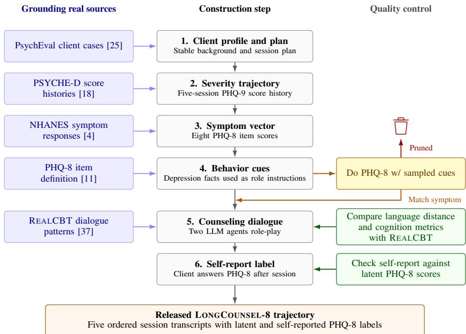
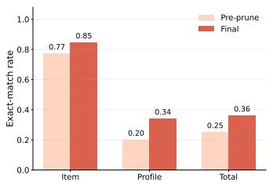
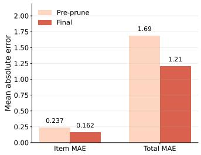
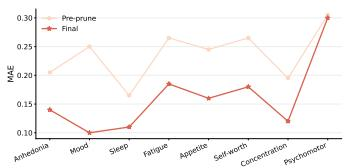
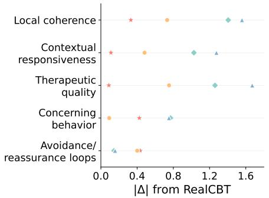
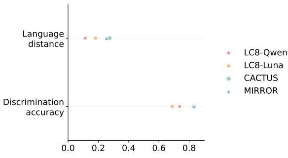
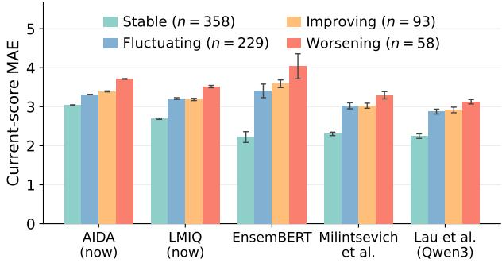
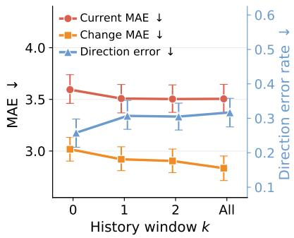

# LONGCOUNSEL-8: A Benchmark Suite for Longitudinal Depression Tracking from Multi-Session Counseling Dialogues

Jiayi Li, Zhaomin Wu∗, Bingsheng He Department of Computer Science National University of Singapore li.jiayi@u.nus.edu, zhaomin@nus.edu.sg, dcsheb@nus.edu.sg

## Abstract

Tracking depression from multi-session counseling dialogues requires estimating both current symptom severity and how it changes across sessions. Yet progress on this task is constrained by the scarcity of longitudinal counseling data with standardized session-level depression labels. Existing resources typically provide either multi-session conversations without depression labels or labeled interviews in a single session. Building such a benchmark poses three challenges: maintaining longitudinal consistency and diversity, grounding symptom progression in empirical patterns, and expressing controlled depression states naturally without exposing target labels. To address these challenges, we introduce LONGCOUNSEL-8, a benchmark suite of three independently generated datasets totaling 7,749 fivesession counseling trajectories, grounded in real-world client profiles, depression trajectories, symptom compositions, and counseling patterns. We combine profilegrounded simulation, empirically informed state construction, and indirect behavioral realization to address these challenges. Across the benchmark, simulated self-reports closely recover the controlled states, supporting label fidelity. Experiments on existing depression tracking methods reveal three key findings: (1) lower single-session score error does not guarantee accurate identification of trend, i.e., improvement or worsening; (2) existing methods are consistently less reliable on worsening trajectories; and (3) additional session history may reduce the accuracy of trend prediction. Together, these findings establish LONGCOUNSEL-8 as a foundation for advancing depression assessment from static, single-session prediction toward reliable longitudinal tracking of mental-health change.

## 1 Introduction

Machine learning provides a scalable way to infer depression-related states from behavioral and conversational signals, with prior work using smartphone behavior, social media, speech, and clinical interviews [5, 12, 23, 43]. A particularly important setting is longitudinal depression tracking from multi-session counseling dialogues, which arises naturally in text-based online counseling where clients may interact with counselors across repeated sessions. In this setting, models must estimate a client’s current depression status while also identifying meaningful changes over time. Longitudinal context is important because clinically relevant risks can accumulate over time and be missed by single-turn evaluation [38]; clients with similar current depression severity may also be following very different trajectories.

Existing resources are insufficient for evaluating longitudinal depression tracking from multi-session counseling dialogues, largely because the sensitivity of counseling conversations makes longitudina transcripts with standardized session-level labels difficult to collect and release at scale. Available resources instead cover three complementary but incomplete settings. First, existing counseling corpora span real, role-played, reconstructed, and LLM-generated conversations [25, 27, 28, 35], but generally lack standardized depression labels for every session. Second, longitudinal health studies provide questionnaire measurements across multiple time points [18, 26], but do not include aligned counseling dialogues. Third, DAIC-WOZ [3, 7] pairs dialogue with PHQ-8 supervision, but each participant contributes only a single semi-structured assessment interview rather than a multi-session counseling trajectory. Consequently, no existing public resource combines multi-session counseling dialogues with standardized session-level depression supervision.

Constructing such a benchmark is challenging for three reasons. (1) Longitudinal consistency and diversity: a simulated client must preserve a coherent identity and history across sessions while supporting varied trajectories, topics, and speaking styles. (2) Empirical grounding: longitudinal progression, session-level symptom composition, and counseling form and as many details as possible should reflect patterns observed in real populations and therapeutic conversations. (3) Controlled, natural state expression: the client must communicate each session’s intended depression condition through natural experiences and behavior while keeping questionnaire terminology and target scores outside the dialogue.

We address these challenges with three corresponding techniques. (1) Profile-grounded longitudinal simulation: case-derived PsychEval [25] profiles define each client’s background, presenting concern, and session plan, while REALCBT statistics guide dialogue form [37]. (2) Empirically informed state construction: PSYCHE-D [18] supplies five-visit depression trajectories, and NHANES [4], a large population health survey, supplies item-level symptom compositions for matching totals. We represent each session’s depression condition with the eight-item PHQ-8 questionnaire, whose item responses jointly define a standardized symptom state [11]. (3) Indirect behavioral realization and state recovery: symptom responses are translated into concrete behavioral cues that guide the client agent’s expression, and a post-session self-report checks recovery of the intended state. Together, these sources make the key construction components empirically informed.

The resulting benchmark suite contains three datasets that were independently generated by the same construction protocol but different dialogue-generation LLMs. Together, the suite contain 7,749 five-session trajectories and 38,745 counseling sessions. We validate the suite from three complementary angles: controlled-state fidelity tests whether post-session self-reports recover the states used to construct each session; counseling-language analyses assess linguistic, conversational, therapeutic, and safety-related properties; and benchmark-integrity audits examine profile, session, and implementation information for unintended shortcuts. These analyses support LONGCOUNSEL-8 as an empirically informed benchmark for longitudinal depression tracking. The main contributions of this paper can be summarized as follows:

• We introduce LONGCOUNSEL-8, a benchmark suite for longitudinal depression tracking from multi-session counseling dialogues, with session-level PHQ-8 states.

• We validate controlled-state fidelity, counseling-language plausibility and local safety, and benchmark integrity against profile, session, and implementation shortcuts.

• We evaluate transcript-based depression-assessment methods on current status, consecutive change, change direction, trajectory type, and history use. We find: (i) Lower average score error does not imply correct identification of whether depression is improving or worsening. (ii) Current methods are consistently less reliable on trajectories with worsening trend than other trends. (iii) Adding more historical context does not consistently improve performance and can even reduce change-direction accuracy.

## 2 Related Work

Counseling Dialogue Resources. Existing dialogue resources cover different subsets of the properties needed for longitudinal depression tracking: counseling interactions, repeated sessions, standardized session-level supervision, empirical grounding, and scale. Table 1 compares resources closely aligned with this task. DAIC-WOZ contributes PHQ-8-supervised dialogue through one semi-structured assessment interview per participant [3, 7]. REALCBT provides transcripts of public

CBT sessions that capture therapeutic language and interactional dynamics [37]. KokoroChat contributes human-authored role-play sessions, and PsyDial reconstructs counseling exchanges from real blueprints with masked client content [27, 28]. These counseling resources provide complementary forms of dialogue evidence, with session-level depression supervision concentrated in the single-interview DAIC-WOZ setting.

Table 1: Dialogue datasets closely related to longitudinal depression tracking.
<table><tr><td>Dataset</td><td>Counseling</td><td>Repeated sessions</td><td>Depression label</td><td>Empirical grounding</td><td>Sessions</td></tr><tr><td>DAIC-Woz [3, 7]</td><td>x</td><td>x</td><td>√</td><td>√</td><td>189</td></tr><tr><td>REALCBT [37]</td><td>√</td><td>x</td><td>x</td><td>√</td><td>76</td></tr><tr><td>KokoroChat [27]</td><td>√</td><td>x</td><td>x</td><td>x</td><td>6,589</td></tr><tr><td>PsyDial [28]</td><td>√</td><td>x</td><td>x</td><td>√</td><td>2,382</td></tr><tr><td>CACTUS [15]</td><td>√</td><td>x</td><td>x</td><td>x</td><td>31,577</td></tr><tr><td>MIRROR [10]</td><td>√</td><td>x</td><td>x</td><td>x</td><td>3,073</td></tr><tr><td>TheraPhase [22]</td><td>√</td><td>√</td><td>X</td><td>√</td><td>800</td></tr><tr><td>MusPsy [35]</td><td>√</td><td>√</td><td>X</td><td>√</td><td>~8,638</td></tr><tr><td>PsychEval [25]</td><td>√</td><td>√</td><td>x</td><td>√</td><td>2,798</td></tr><tr><td>LONGCOUNSEL-8</td><td>√</td><td>√</td><td>√</td><td>√</td><td>38,745</td></tr></table>

Generated counseling corpora expand scale and longitudinal structure. CACTUS [15] creates CBT sessions from synthetic personas, while MIRROR adds turn-aligned facial cues to resistance-aware cognitive-reframing dialogues [10]. TheraPhase, MusPsy, and PsychEval organize multiple sessions around treatment stages, evolving goals, memories, or case-derived client histories [22, 25, 35]. Among the resources compared in Table 1, LONGCOUNSEL-8 brings counseling dialogue, repeated sessions, standardized depression supervision, empirical grounding, and large-scale generation into one benchmark. This combination supports longitudinal depression tracking from ordered counseling sessions.

Empirical Sources for Depression-State Construction. Longitudinal studies show that prior depression states and temporal features are informative for later change [18, 26, 44]. PSYCHE-D follows 10,036 participants for one year with PHQ-9 measurements every three months and supplies the five-visit total-score trajectories used in LONGCOUNSEL-8 [18]. NHANES provides complete item-response vectors from a large population health survey [4]. Grouping these vectors by total score allows each trajectory visit to receive an empirically observed symptom composition; retaining the first eight responses yields the PHQ-8 state and its total. Together, these sources provide longitudinal and symptom-level structure for benchmark construction.

Transcript-Based Depression Assessment. Text-based depression assessment includes supervised encoders and symptom-oriented predictors [2, 13, 21, 31], as well as LLM-based methods that extract interpretable features, complete questionnaires, use in-context examples, or apply instruction tuning [14, 16, 20, 32, 41]. Our benchmark evaluation selects five methods with continuous severity outputs and reproducible text-processing pipelines. They span structured LLM feature extraction (AIDA), LLM questionnaire completion (LMIQ), symptom prediction (Milintsevich et al.), and supervised transcript encoders (Lau et al. and EnsemBERT) [13, 14, 21, 31, 32]. This coverage supports comparison across major text-based modeling strategies under the same current-state, change, direction, trajectory, and history-use protocol; Appendix D provides the reconstruction and implementation details.

## 3 Design and Construction

## 3.1 Overview

LONGCOUNSEL-8 combines several resources that play different roles in construction. Profile information defines the stable client context. The treatment plan organizes what each visit can cover. Longitudinal totals and symptom vectors define what changes at each visit. Behavior cues and turn-form constraints connect this hidden state to the visible dialogue. A post-session self-report provides the label available for training, while the hidden symptom vector remains the controlled evaluation target.

Figure 1 shows how these inputs meet in each session and where quality checks are applied. Detailed prompts, sampling settings, and filtering rules are in Appendix B.

  
Figure 1: LONGCOUNSEL-8 construction pipeline with grounding real sources and quality control.

## 3.2 Empirical grounding and state construction

Each trajectory follows one client for five visits. To define the client identity, we deterministically extract the biography, presenting concern, and beliefs of each client profile from PsychEval cases [25]. We then anchor the five-session course labels to PSYCHE-D [18], a longitudinal survey of depression change in which severity was measured using the PHQ-9. Each total score admits multiple combina tions of symptom severity. We therefore group complete NHANES DPQ responses [4], a large-scale PHQ-9 dataset with symptom-level details, by their nine-item total scores. For each session label, we sample a response vector from the group whose total score matches the corresponding PSYCHE-D PHQ-9 total. The ninth item of the PHQ-9 concerns self-harm and is highly sensitive, requiring extremely careful treatment. We therefore focus on the first eight responses, which form the latent PHQ-8 vector y(t), with their sum serving as the released latent PHQ-8 total.

## 3.3 From symptom scores to dialogue

assing a numeric score to the client would expose the label structure and invite questionnaire-like answers, so we translate each symptom–score cell into private behavior cues: short descriptions of lived experiences that a person at that severity could plausibly report. Each cue is typically 12–30 words long, carries one main signal, and mentions no PHQ item, response option, or numeric score. We validate whether a cue communicates its intended severity by giving the role-playing client its base profile and the cue, then asking it to complete the PHQ-8. A sleep cue for severity 2, for example, should lead the client to select 2 for the sleep item. We first test cues within their own symptom–score cells and then within complete sampled PHQ-8 profiles, retaining those whose questionnaire responses most closely match the target item and total scores. Each cell keeps ten validated cue candidates, from which five are sampled for each symptom during dialogue generation.

Table 2: Datasets generation and release specification.
<table><tr><td>Measure</td><td>LC8-QWEN</td><td>LC8-LUNA</td><td>LC8-GPT-5.4-MINI</td></tr><tr><td>Generator</td><td> $\mathrm { Q w e n } 3 . 5 { \cdot } 3 5 \mathrm { B } { \cdot } \mathrm { A } 3 \mathrm { B }$ </td><td>GPT-5.6 Luna</td><td>GPT-5.4-mini</td></tr><tr><td>Dialogue decoding</td><td> $T = 0 . 6 , \ p = 0 . 9 5 , \ k = 2 0$ </td><td>API default</td><td>API default</td></tr><tr><td>Turn token cap</td><td>512</td><td>1,536</td><td>1,536</td></tr><tr><td>Reasoning setting</td><td>4,096-token budget</td><td>low</td><td>low</td></tr><tr><td>Trajectories</td><td>3,690</td><td>3,690</td><td>369</td></tr><tr><td>Profiles</td><td>369</td><td>369</td><td>369</td></tr><tr><td>Words/session</td><td>826.1</td><td>988.5</td><td>927.5</td></tr><tr><td>Latent total, mean (SD)</td><td>6.13 (5.08)</td><td>6.09 (5.12)</td><td>6.24 (5.11)</td></tr><tr><td>Screen-positive rate</td><td>24.4%</td><td>23.7%</td><td>25.7%</td></tr><tr><td>Improving / worsening</td><td>491 / 281</td><td>478 / 311</td><td>65 / 27</td></tr><tr><td>Stable / fluctuating</td><td>1,843 / 1,075</td><td>1,841 / 1,060</td><td>179 / 98</td></tr><tr><td>Train / validation / test</td><td>2,583 / 369 / 738</td><td>2,583 / 369 / 738</td><td>258 / 37 / 74</td></tr></table>

The cues specify what experiences the client has, while REALCBT [37] guides how those experiences are expressed. Each generation also receives a turn-form card based on speaker- and stage-specific statistics, specifying sentence count, sentence length, question form, and an optional discourse opener.

The counselor receives public context, the session focus, a carryover note, retrieved memories, the targeted move, and its turn-form card. The client prompt additionally contains sampled private cues, a qualitative total-burden band, background information, and a disclosure beat. Both prompts omit numeric latent scores and PHQ symptom names, and the client expresses its state through partial disclosure, affect, and concrete experiences. Prompt guardrails discourage role reversal and premature closure; scripts enforce the required turn count and retry malformed, unusable, or excessively repeated outputs.

## 3.4 Self-report labels

For a real client, the underlying symptom state is latent and is commonly measured through selfreport questionnaires. These questionnaires provide an observable proxy for the underlying state. We reproduce this setting in LONGCOUNSEL-8. After each session, the client simulator completes the PHQ-8 while retaining the same profile and prompt, and memory of the session. We shuffle symptom and response-option order across five passes and average the resulting scores to obtain a simulated self-report label.

LONGCOUNSEL-8 additionally provides the controlled symptom state used to generate the client. This gives the self-report label two roles. First, its agreement with the controlled state measures whether the client simulator preserves and internally reflects the intended symptom severity; we analyze this agreement in §4. Second, the self-report provides the observable supervision signal available for training, while the controlled state supplies the evaluation target. We release both labels and recommend the following protocol: train on simulated self-report labels and evaluate against the controlled state.

## 3.5 Dataset composition and splits

The release contains three independently generated datasets summarized in Table 2. Each trajectory spans five visits with 20 turns of counselor-client interaction. Profile–trajectory assignments are dataset-specific, so cross-dataset comparisons use aggregate properties.

Latent totals cover the full PHQ-8 score 0–24 range. We classify the trajectories to four types: (a) improving trajectory where the final session score is at least five points less than starting session. (b) worsening where final session is at least five points higher than starting session. (c) fluctuating trajectory where its endpoints differ by less than five points but its internal range reaches five and (d) all others are stable. We use five points because it is the estimated minimal clinically important difference for longitudinal PHQ-9 monitoring, giving the direction metric a clinically interpretable large-change criterion [17]. Under the rule, LC8-QWEN contains 1,843 stable, 1,075 fluctuating, 491 improving, and 281 worsening trajectories.

Each dataset includes a trajectory-level split manifest with a 7:1:2 train/validation/test ratio. The full-dataset splits are not profile-disjoint because each profile is combined with several independently sampled severity courses. Section 4 tests whether profile overlap creates an observable shortcut.

These construction controls alone do not guarantee the quality of the generated output. We therefore evaluate controlled-state fidelity, counseling-language plausibility, local safety, and resistance to shortcuts in Section 4.

## 4 Dataset Validation

The first three steps in the construction pipeline introduced in Figure 1 are directly adapted from real-world data and therefore involve no manual components requiring audit, while the last three steps are based on human design. We seek to show that these designs are meaningful by auditing the effects of cue pruning, the validity of self-reports, and the distance between the generated counseling language and a real-world counseling dataset. We also assess whether the resulting datasets faithfully carry the information we claim by testing whether the transcripts help recover labels beyond what can be inferred from metadata alone.

Cue pruning. We compared client agent’s self-report error before and after cue pruning to show that the pruning successfully make the behavior cues more reliably reflect intended severity at both the symptom and profile levels. Across 200 trials with five cues per symptom the client are asked to simulate a PHQ-8 completion, which is compared with the target PHQ-8 profile before and after pruning. Result shows pruning raises item-level exact match from 0.77 to 0.85, full-profile exact match from 0.20 to 0.34, and total-score exact match from 0.25 to 0.36 (Figure 2). Item MAE falls from 0.237 to 0.162 and total MAE from 1.69 to 1.21, with improvements across all eight symptoms.

  
(a) Exact-match rates.

  
(b) Mean absolute error.

  
(c) Symptom-wise error.  
Figure 2: Comparison of how agent self-report PHQ-8 scores based on given cues before and after pruning.

Counseling-Language Plausibility. Across a corpus-level language-distance audit and two snippetlevel judge audits, the LC8 datasets are overall closer to REALCBT in language and behavior than CACTUS and MIRROR [10, 15, 37]. At the corpus level, we compute an utterance-level normalized quantile distance over seven language features separately for counselor and client and average the resulting 14 feature–role distances. Each corpus contributes 7,450 utterances after adjacent same-speaker turns are merge. The resulting distances are 0.114, 0.181, 0.274, and 0.254 for LC8-QWEN, LC8-LUNA, CACTUS, and MIRROR, respectively, where lower values indicate greater similarity to REALCBT. At the snippet level, a blinded GPT-5.4 judge scores matched fourand eight-utterance snippets using five dimensions adapted from SIM-VAIL [38]: local coherence, contextual responsiveness, therapeutic quality, concerning behavior, and avoidance or reassurance loops. The judge also performs source discrimination between REALCBT and each synthetic corpus. Figure 3(a) reports absolute differences from REALCBT in the five pooled mean ratings, while Figure 3(b) presents corpus-level language distance alongside snippet-level discrimination accuracy. Discrimination accuracy is 0.832 for CACTUS and 0.833 for MIRROR, compared with 0.737 for LC8-QWEN and 0.688 for LC8-LUNA, making the LC8 snippets more difficult for the judge to distinguish from REALCBT. Across the five rating dimensions and two realism audits, LC8 datasets are closer to the real world dataset on most of the metrics.

  
(a) SIM-VAIL rating differences.

  
(b) Language realism audits.  
Figure 3: Difference between RealCBT and four synthetic corpora.

Self-report label. The next audit corresponds to stage six in Figure 1 and its analysis shows that the released labels preserve both session-level severity and the longitudinal structure of the controlled trajectories. Agreement of self-report label with the controlled state is measured through total-score MAE, consecutive-change MAE, large-change direction agreement, and complete-trajectory type agreement. Across datasets, self-report total-score MAE ranges from 0.294 to 0.541, and consecutivechange MAE ranges from 0.311 to 0.626 (Table 3). For controlled changes of at least five points, self-report recovers the direction of change in 99.96%–100% of transitions, and 92.1%–95.4% of complete trajectories retain their improving, worsening, fluctuating, or stable pattern.

Table 3: Per-dataset label-fidelity results; brackets show 95% trajectory-bootstrap confidence intervals.
<table><tr><td>Metric</td><td>LC8-QWEN</td><td>LC8-LUNA</td><td>LC8-GPT-5.4-MINI</td></tr><tr><td>Self-report total MAE↓</td><td>0.521 [0.500, 0.543]</td><td>0.294 [0.284, 0.306]</td><td>0.541 [0.496, 0.589]</td></tr><tr><td>Change MAE↓</td><td>0.626 [0.603, 0.648]</td><td>0.311 [0.300, 0.322]</td><td>0.434 [0.401, 0.469]</td></tr><tr><td>Trend agreement ↑</td><td>0.921 [0.912, 0.929]</td><td>0.954 [0.947, 0.961]</td><td>0.946 [0.921, 0.967]</td></tr><tr><td>Severe-tail MAE↓</td><td>3.382 [3.305, 3.457]</td><td>1.331 [1.277, 1.388]</td><td>1.558 [1.359, 1.756]</td></tr></table>

Transcript-label matching. Finally, we compare metadata only methods with transcript based method results to show that the transcripts preserve aggregate severity information beyond metadata signals. To rule out that the effectiveness of the benchmark are provided by non-textual prior information such as client profile number and session position, we evaluated four metadata-only methods respectively using only the global label distribution, profile identity, profile-by-session statistics, and a regularized combination of profile and session signals. The best member of this prespecified control family was then compared with five published transcript-based methods mentioned in Section 2. None of the profile-conditioned controls improved on the global median, whereas every transcript-based method achieved lower current-score MAE; the best configuration reduced MAE from 3.903 to 2.594. Appendix C reports the control definitions, selection protocol, and complete results.

## 5 Depression Detection Methods Evaluation

We next use LONGCOUNSEL-8 to examine the latest methods in depression detection task.

## 5.1 Setup

LC8-QWEN provides the primary full-scale analysis. We measure current-score MAE, consecutivechange MAE across adjacent sessions, large-change (transitions with $| \Delta y | \ge 5 )$ direction accuracy, and current-score MAE stratified by trajectory type. LC8-LUNA is used in two complementary protocols that examine history use and robustness to unseen profiles. For the full-dataset history sweep, we use AIDA [14], an interpretable two-stage method that prompts an LLM to extract clinical, linguistic, and cognitive features from a transcript and then maps those features to a PHQ-8 total using linear regression; for each context window, we re-extract the features and refit the downstream regression while holding the split and evaluation set fixed. Within this sweep, every window is scored on second to last sessions, since session 1 has no earlier session and its input is the same under every window; the other protocols score current-score MAE on all test sessions. The unseen-profile replication instead samples 369 trajectories from LC8-LUNA and assigns all trajectories associated with the same source profile to a single split.

## 5.2 Change magnitude and direction

We compare method rankings under change MAE and large-change direction accuracy to examine whether average transition error reflects the ability to identify improvement and worsening.

On LC8-QWEN, EnsemBERT achieves the lowest transcript-based change MAE at 2.606 but a direction accuracy of 0.479, while Lau et al. with Qwen3 embeddings achieves the highest direction accuracy at 0.833 with a change MAE of 3.059 (Table 8). Change MAE averages the size of transition errors, whereas direction accuracy asks whether each large transition is assigned the correct sign. The rank reversal therefore shows that matching changes on average and identifying trajectory direction are distinct capabilities.

Table 4: Selected results for the 369-trajectory LC8-LUNA subset.
<table><tr><td>Method</td><td>Current MAE↓</td><td>Change MAE↓</td><td>Direction ↑</td></tr><tr><td>AIDA (1 session)</td><td>3.370 [2.956, 3.826]</td><td>2.991 [2.667, 3.329]</td><td>0.737 [0.596, 0.852]</td></tr><tr><td>AIDA (all session)</td><td>3.429 [2.980, 3.899]</td><td>2.631 [2.283, 3.026]</td><td>0.671 [0.546, 0.804]</td></tr><tr><td>LMIQ (1 session)</td><td>3.303 [2.916, 3.740]</td><td>2.847 [2.518, 3.187]</td><td>0.651 [0.529, 0.762]</td></tr><tr><td>LMIQ (all session)</td><td>3.059 [2.712, 3.421]</td><td>2.582 [2.250, 2.929]</td><td>0.667 [0.576, 0.766]</td></tr><tr><td>EnsemBERT</td><td>3.676 [3.142, 4.291]</td><td>2.480 [2.115, 2.869]</td><td>0.325 [0.235, 0.412]</td></tr><tr><td>Lau et al.</td><td>2.975 [2.646, 3.370]</td><td>3.069 [2.737, 3.430]</td><td>0.828 [0.717, 0.913]</td></tr><tr><td>Session-index mean</td><td>4.097 [3.488, 4.735]</td><td>2.404 [2.023, 2.806]</td><td>0.451 [0.305, 0.595]</td></tr></table>

The profile-disjoint LC8-LUNA replication yields the same reversal. EnsemBERT reaches 2.480 change MAE and 0.325 direction accuracy, while Lau et al. reaches 3.069 change MAE and 0.828 direction accuracy (Table 4). The shading makes the reversal visible, as the darkest cell for EnsemBERT is change MAE and its lightest is direction, while Lau et al. shows the opposite pattern. Reproducing the pattern under a different generator and profile-disjoint split establishes the same metric distinction in a complementary setting. Across both datasets, lower change MAE does not guarantee more accurate identification of improvement versus worsening. Longitudinal evaluation should therefore report magnitude and direction metrics together.

## 5.3 Unbalanced performance across trajectory types

Aggregate current-score MAE can conceal trajectory-specific behavior, so we stratify each representative method across improving, worsening, stable, and fluctuating trajectories.

  
(a) LC8-QWEN MAE per trajectory type.

  
(b) History-window sweep on LC8-LUNA.  
Figure 4: Fairness across trajectory types and the effect of dialogue history.

Every method shows the same ordering in Figure 4a. Current-score MAE is lowest on stable trajectories (2.22–3.04), higher on fluctuating and improving trajectories, and highest on worsening trajectories (3.13–4.04). The stable-to-worsening gap ranges from 0.67 to 1.82 points, whereas fluctuating and improving trajectories differ by at most 0.18 for any method. No evaluated method is therefore fair across trajectory types. The same model that tracks stable clients closely degrades most on worsening courses, and aggregate current-score MAE does not expose this imbalance.

## 5.4 Using earlier sessions

We examine whether earlier sessions improve tracking through a history-window sweep on full LC8-LUNA and current-only versus all-history comparisons in the profile-disjoint subset.

In the full-dataset AIDA sweep, adding one previous session reduces both current-score and change MAE. Current-score MAE then changes little, while change MAE continues to decrease to 2.834 with all available history (Figure 4b). Relative to the current session alone, all history reduces current-score MAE by 0.089 and change MAE by 0.183, while the large-change direction error rate rises from 0.258 to 0.317 (accuracy 0.742 to 0.683). The two MAE curves fall while the direction-error curve rises, so the three metrics do not move together as the window grows. Lower average errors therefore coexist with less accurate large-change direction decisions in the same method and evaluation set.

The comparison shows that the effect also varies by method. Complete history reduces LMIQ current-score MAE by 0.245 and change MAE by 0.265; for AIDA, it reduces change MAE by 0.359, while direction estimates remain interval-overlapping across context conditions (Table 4).

Taken together, the within-method trade-off and cross-method variation show that adding dialogue history alone does not provide a uniform longitudinal benefit; its effect depends on the method and evaluation metric. The five ordered sessions in LONGCOUNSEL-8 therefore support evaluation of temporal representations and mechanisms that select, retain, and use relevant prior evidence.

## 6 Discussion

The benchmark findings suggest three directions for longitudinal depression assessment.

Direction-aware tracking. The divergence between change MAE and direction accuracy shows that estimating the size of a score change and identifying its direction require different capabilities. Future methods can model the transition itself, for example by predicting signed score changes or classifying adjacent-session pairs as improving, stable, or worsening. Reporting current-state error, change MAE, and direction accuracy together will make the trade-offs among these capabilities visible. LONGCOUNSEL-8 provides controlled states at every session for testing these designs.

Fair methods across different trends. The uneven accuracy across trajectory types, with the largest errors on worsening courses, makes deterioration a distinct modeling target. Future work should consciously balance performance across different trends of trajectories during training, use separate representations or losses for improvement and deterioration, and report trajectory-stratified accuracy and calibration. The controlled trajectory labels in LONGCOUNSEL-8 make it possible to compare these choices under the same benchmark splits.

History usage needs more dedicated design. The mixed effects of adding earlier sessions show that useful longitudinal context depends on how a method selects and represents prior evidence. Future work can compare simple concatenation with session retrieval, learned memory, change-point representations, and explicit trajectory models, while testing which earlier sessions actually alter a prediction. The ordered five-session dialogues in LONGCOUNSEL-8 provide a controlled setting for these comparisons.

## 7 Conclusion

LONGCOUNSEL-8 provides 7,749 five-session counseling trajectories with controlled sessionlevel PHQ-8 states, bridging labeled single-session interviews and multi-session counseling corpora. Across three independently generated datasets, validation supports controlled-state fidelity, counseling-language plausibility, and benchmark integrity. Evaluations show that change magnitude and direction capture distinct capabilities, worsening trajectories remain a shared stress case, and the benefit of session history depends on how prior evidence is used. The suite therefore provides a controlled basis for direction-aware and worsening-sensitive modeling, as well as methods that select and reason over longitudinal context.

## References

[1] Mohammad Amin Abbasi, Farnaz Sadat Mirnezami, Ali Neshati, and Hassan Naderi. Hamraz: A culture based persian conversation dataset for person-centered therapy using llm agents. In Proceedings of the First on Natural Language Processing and Language Modelsfor Digital Humanities, pages 1–24, 2025.

[2] Navneet Agarwal, Kirill Milintsevich, Lucie Metivier, Maud Rotharmel, Gaël Dias, and Sonia Dollfus. Analyzing symptom-based depression level estimation through the prism of psychiatric expertise. In Proceedings of the 2024 Joint International Conference on Computational Linguistics, Language Resources and Evaluation (LREC-COLING 2024), pages 974–983. ELRA and ICCL, 2024. doi: 10.18653/v1/2024. lrec-main.87.

[3] Sergio Burdisso, Ernesto Reyes-Ramírez, Esaú Villatoro-Tello, Fernando Sánchez-Vega, Adrian Lopez Monroy, and Petr Motlicek. DAIC-WOZ: On the validity of using the therapist’s prompts in automatic depression detection from clinical interviews. In Proceedings of the 6th Clinical Natural Language Processing Workshop, pages 82–90. Association for Computational Linguistics, 2024. doi: 10.18653/v1/2024.clinicalnlp-1.8.

[4] Centers for Disease Control and Prevention, National Center for Health Statistics. National health and nutrition examination survey: Depression screener (DPQ\_L), August 2021–August 2023. National Center for Health Statistics data documentation, 2024. URL https://wwwn.cdc.gov/Nchs/Data/Nhanes/Public/ 2021/DataFiles/DPQ\_L.htm. Accessed 2026-08-27.

[5] Zhuang Chen, Jiawen Deng, Jinfeng Zhou, Jincenzi Wu, Tieyun Qian, and Minlie Huang. Depression detection in clinical interviews with LLM-empowered structural element graph. In Proceedings of the 2024 Conference of the North American Chapter of the Association for Computational Linguistics: Human Language Technologies (Volume 1: Long Papers), pages 8181–8194. Association for Computational Linguistics, 2024. doi: 10.18653/v1/2024.naacl-long.452.

[6] Cheryl R. Every-Wurtz. Counseling and psychotherapy transcripts, client narratives, and reference works. https://search.alexanderstreet.com/psyc, 2009. Commercial database, Alexander Street, part of Clarivate. Accessed 2026-04-02.

[7] Jonathan Gratch, Ron Artstein, Gale M. Lucas, Giota Stratou, Stefan Scherer, Angela Nazarian, Rachel Wood, Jill Boberg, David DeVault, Stacy Marsella, David Traum, Skip Rizzo, and Louis-Philippe Morency. The distress analysis interview corpus of human and computer interviews. In Proceedings of the Ninth International Conference on Language Resources and Evaluation (LREC’14), pages 3123–3128. European Language Resources Association, 2014. URL https://aclanthology.org/L14-1421/.

[8] Aylin Gunal, Bowen Yi, John Piette, Rada Mihalcea, and Ver’onica P’erez-Rosas. Examining spanish counseling with midas: a motivational interviewing dataset in spanish. ArXiv, abs/2502.08458, 2025.

[9] Hyunjong Kim, Suyeon Lee, Yeongjae Cho, Eunseo Ryu, Yohan Jo, Suran Seong, and Sungzoon Cho. Kmi: A dataset of korean motivational interviewing dialogues for psychotherapy. In Proceedings ofthe 2025 Conference ofthe Nations ofthe Americas Chapter ofthe Associationfor Computational Linguistics: Human Language Technologies (Volume 1: Long Papers), pages 10803–10828, 2025.

[10] Subin Kim, Hoonrae Kim, Jihyun Lee, Yejin Jeon, and Gary Lee. Mirror: Multimodal cognitive reframing therapy for rolling with resistance. In Proceedings of the 2025 Conference on Empirical Methods in Natural Language Processing, pages 14851–14880, 2025.

[11] Kurt Kroenke, Tara W. Strine, Robert L. Spitzer, Janet B. W. Williams, Joyce T. Berry, and Ali H. Mokdad. The PHQ-8 as a measure of current depression in the general population. Journal ofAffective Disorders, 114(1–3):163–173, 2009. doi: 10.1016/j.jad.2008.06.026.

[12] Xiaochong Lan, Zhiguang Han, Yiming Cheng, Li Sheng, Jie Feng, Chen Gao, and Yong Li. Depression detection on social media with large language models. In Proceedings of the 2025 Conference on Empirical Methods in Natural Language Processing: Industry Track, pages 2155–2171. Association for Computational Linguistics, 2025. doi: 10.18653/v1/2025.emnlp-industry.151.

[13] Clinton Lau, Xiaodan Zhu, and Wai-Yip Chan. Automatic depression severity assessment with deep learning using parameter-efficient tuning. Frontiers in Psychiatry, 14:1160291, 2023. doi: 10.3389/fpsyt. 2023.1160291.

[14] Jae-Joong Lee, Jihoon Han, and Choong-Wan Woo. Interpretable depression assessment using a large language model. PLOS Digital Health, 5(2):e0001205, 2026. doi: 10.1371/journal.pdig.0001205.

[15] Suyeon Lee, Sunghwan Kim, Minju Kim, Dongjin Kang, Dongil Yang, Harim Kim, Minseok Kang, Dayi Jung, Min Hee Kim, Seungbeen Lee, Kyong-Mee Chung, Youngjae Yu, Dongha Lee, and Jinyoung Yeo. Cactus: Towards psychological counseling conversations using cognitive behavioral theory. In Findings of the Association for Computational Linguistics: EMNLP 2024, pages 14245–14274. Association for Computational Linguistics, 2024. doi: 10.18653/v1/2024.findings-emnlp.832.

[16] June M. Liu, Mengxia Gao, Sahand Sabour, Zhuang Chen, Minlie Huang, and Tatia M. C. Lee. Enhanced large language models for effective screening of depression and anxiety. Communications Medicine, 5(1): 457, 2025. doi: 10.1038/s43856-025-01158-1.

[17] Bernd Löwe, Jürgen Unützer, Christopher M. Callahan, Anthony J. Perkins, and Kurt Kroenke. Monitoring depression treatment outcomes with the patient health questionnaire-9. Medical Care, 42(12):1194–1201, 2004. doi: 10.1097/00005650-200412000-00006.

[18] Mariko Makhmutova, Raghu Kainkaryam, Marta Ferreira, Jae Min, Martin Jaggi, and Ieuan Clay. Predict ing changes in depression severity using the PSYCHE-D (prediction of severity change–depression) model involving person-generated health data: Longitudinal case-control observational study. JMIR mHealth and uHealth, 10(3):e34148, 2022. doi: 10.2196/34148.

[19] Ganeshan Malhotra, Abdul Waheed, Aseem Srivastava, Md. Shad Akhtar, and Tanmoy Chakraborty. Speaker and time-aware joint contextual learning for dialogue-act classification in counselling conversations. Proceedings of the Fifteenth ACM International Conference on Web Search and Data Mining, 2021.

[20] Dhia Eddine Merzougui, Gaël Dias, Jeremie Pantin, and Fabrice Maurel. Evaluating large language models for depression symptom estimation. In Artificial Intelligence in Medicine: 23rd International Conference, AIME 2025, Proceedings, Part II, pages 272–276. Springer, 2025. doi: 10.1007/978-3-031-95841-0\_51.

[21] Kirill Milintsevich, Kairit Sirts, and Gaël Dias. Towards automatic text-based estimation of depression through symptom prediction. Brain Informatics, 10(1):4, 2023. doi: 10.1186/s40708-023-00185-9.

[22] Hongbin Na, Tao Shen, Shumao Yu, and Ling Chen. Multi-session client-centered treatment outcome evaluation in psychotherapy. In Proceedings ofthe Fifteenth Language Resources and Evaluation Conference, pages 2952–2968. ELRA Language Resource Association, 2026. doi: 10.63317/3am66kas7b32.

[23] Subigya Nepal, Arvind Pillai, Weichen Wang, Tess Griffin, Amanda C. Collins, Michael Heinz, Damien Lekkas, Shayan Mirjafari, Matthew Nemesure, George Price, Nicholas C. Jacobson, and Andrew T. Campbell. MoodCapture: Depression detection using in-the-wild smartphone images. In Proceedings of the 2024 CHI Conference on Human Factors in Computing Systems, pages 1–18. Association for Computing Machinery, 2024. doi: 10.1145/3613904.3642680.

[24] Kensuke Okada, Yui Furukawa, and Kyosuke Bunji. Quantifying and mitigating socially desirable responding in LLMs: A desirability-matched graded forced-choice psychometric study. In Proceedings of the 64th Annual Meeting of the Association for Computational Linguistics (Volume 1: Long Papers), pages 40148–40166. Association for Computational Linguistics, 2026. doi: 10.18653/v1/2026.acl-long.1865.

[25] Qianjun Pan, Junyi Wang, Jie Zhou, Yutao Yang, Junsong Li, Kaiyin Xu, Yougen Zhou, Yihan Li, JingYuan Zhao, Qin Chen, Ningning Zhou, Kai Chen, and Liang He. PsychEval: A multi-session and multi-therapy benchmark for high-realism AI psychological counselor. In Findings ofthe Associationfor Computational Linguistics: ACL 2026, pages 22192–22212. Association for Computational Linguistics, 2026. doi: 10.18653/v1/2026.findings-acl.1115.

[26] Paul N. Pfeiffer, Kipling M. Bohnert, Kara Zivin, Matheos Yosef, Marcia Valenstein, James E. Aikens, and John D. Piette. Mobile health monitoring to characterize depression symptom trajectories in primary care. Journal ofAffective Disorders, 174:281–286, 2015. doi: 10.1016/j.jad.2014.11.040.

[27] Zhiyang Qi, Takumasa Kaneko, Keiko Takamizo, Mariko Ukiyo, and Michimasa Inaba. KokoroChat: A Japanese psychological counseling dialogue dataset collected via role-playing by trained counselors. In Proceedings ofthe 63rd Annual Meeting ofthe Associationfor Computational Linguistics (Volume 1: Long Papers), pages 12424–12443. Association for Computational Linguistics, 2025. doi: 10.18653/v1/2025. acl-long.608.

[28] Huachuan Qiu and Zhenzhong Lan. PsyDial: A large-scale long-term conversational dataset for mental health support. In Proceedings ofthe 63rd Annual Meeting ofthe Associationfor Computational Linguistics (Volume 1: Long Papers), pages 21624–21655. Association for Computational Linguistics, 2025. doi: 10.18653/v1/2025.acl-long.1049.

[29] Qwen Team. Qwen3-Embedding-8B model card. Hugging Face, 2025. URL https://huggingface.co/Qwen/ Qwen3-Embedding-8B. Apache License 2.0; accessed 2026-08-28.

[30] Qwen Team. Qwen3.5-35B-A3B model card. Hugging Face, 2026. URL https://huggingface.co/Qwen/ Qwen3.5-35B-A3B. Apache License 2.0; accessed 2026-08-28.

[31] Federico Ravenda, Antonio Preti, Michele Poletti, Antonietta Mira, Fabio Crestani, and Andrea Raballo. Transforming social media text into predictive tools for depression through AI: A test-case study on the Beck Depression Inventory-II. PLOS Digital Health, 4(6):e0000848, 2025. doi: 10.1371/journal.pdig.0000848.

[32] Gony Rosenman, Talma Hendler, and Lior Wolf. LLM questionnaire completion for automatic psychiatric assessment. In Findings of the Association for Computational Linguistics: EMNLP 2024, pages 403–415. Association for Computational Linguistics, 2024. doi: 10.18653/v1/2024.findings-emnlp.23.

[33] Aseem Srivastava, Tharun Suresh, S. P. Lord, Md. Shad Akhtar, and Tanmoy Chakraborty. Counseling summarization using mental health knowledge guided utterance filtering. Proceedings ofthe 28th ACM SIGKDD Conference on Knowledge Discovery and Data Mining, 2022.

[34] BN Suhas, Andrew M Sherrill, Rosa I Arriaga, Christopher Wiese, and Saeed Abdullah. Thousand voices of trauma: A large-scale synthetic dataset for modeling prolonged exposure therapy conversations. In The Thirty-ninth Annual Conference on Neural Information Processing Systems Datasets and Benchmarks Track, 2025.

[35] Bichen Wang, Junzhe Wang, Yixin Sun, Xing Fu, Yanyan Zhao, and Bing Qin. Psychological counseling cannot be achieved overnight: Automated psychological counseling through multi-session conversations. In Findings of the Association for Computational Linguistics: ACL 2026, pages 16593–16609. Association for Computational Linguistics, 2026. doi: 10.18653/v1/2026.findings-acl.818.

[36] Ming Wang, Shuang Wu, Bixuan Wang, Lu Lin, Yuxin Chen, Xiaocui Yang, Daling Wang, Shi Feng, Yifei Zhang, and Yufan Sun. GenPT: Beyond self-report for reliable LLM psychometrics via generative projective testing. In Proceedings of the 64th Annual Meeting of the Association for Computational Linguistics (Volume 1: Long Papers), pages 40958–40974. Association for Computational Linguistics, 2026. doi: 10.18653/v1/2026.acl-long.1901.

[37] Xiaoyi Wang, Jiwei Zhang, Guangtao Zhang, and Honglei Guo. Feel the difference? a comparative analysis of emotional arcs in real and LLM-generated CBT sessions. In Findings of the Association for Computational Linguistics: EMNLP 2025, pages 19999–20017. Association for Computational Linguistics, 2025. doi: 10.18653/v1/2025.findings-emnlp.1089.

[38] Veith Weilnhammer, Kevin Y. C. Hou, Lennart Luettgau, Christopher Summerfield, Raymond Dolan, and Matthew M. Nour. A clinically validated framework for auditing AI chatbot behavior in mental health interactions. Nature Medicine, 2026. doi: 10.1038/s41591-026-04577-2.

[39] Zixiu "Alex" Wu, Simone Balloccu, Vivek Kumar (Ph.D), Rim Helaoui, Ehud Reiter, Diego Reforgiato Recupero, and Daniele Riboni. Anno-mi: A dataset of expert-annotated counselling dialogues. ICASSP 2022 - 2022 IEEE International Conference on Acoustics, Speech and Signal Processing (ICASSP), pages 6177–6181, 2022.

[40] Haojie Xie, Yirong Chen, Xiaofen Xing, Jingkai Lin, and Xiangmin Xu. Psydt: Using llms to construct the digital twin of psychological counselor with personalized counseling style for psychological counseling. In Proceedings ofthe 63rd Annual Meeting ofthe Associationfor Computational Linguistics (Volume 1: Long Papers), pages 1081–1115, 2025.

[41] Xuhai Xu, Bingsheng Yao, Yuanzhe Dong, Saadia Gabriel, Hong Yu, James A. Hendler, Marzyeh Ghassemi, Anind K. Dey, and Dakuo Wang. Mental-LLM: Leveraging large language models for mental health prediction via online text data. Proceedings ofthe ACM on Interactive, Mobile, Wearable and Ubiquitous Technologies, 8(1):31:1–31:32, 2024. doi: 10.1145/3643540.

[42] Chenhao Zhang, Renhao Li, Minghuan Tan, Min Yang, Jingwei Zhu, Di Yang, Jiahao Zhao, Guancheng Ye, Chengming Li, and Xiping Hu. Cpsycoun: A report-based multi-turn dialogue reconstruction and evaluation framework for chinese psychological counseling. In Findings of the Association for Computational Linguistics: ACL 2024, pages 13947–13966, 2024.

[43] Xiangyu Zhang, Hexin Liu, Kaishuai Xu, Qiquan Zhang, Daijiao Liu, Beena Ahmed, and Julien Epps. When LLMs meet acoustic landmarks: An efficient approach to integrate speech into large language models for depression detection. In Proceedings of the 2024 Conference on Empirical Methods in Natural Language Processing, pages 146–158. Association for Computational Linguistics, 2024. doi: 10.18653/v1/2024.emnlp-main.8.

[44] Rou Zhong, Nanxi Li, Le Xiao, Lei Feng, Yuan Feng, Gang Wang, and Xuequan Zhu. Contribution of longitudinal mobile health measures in the dynamic track of patients with major depressive disorder: Multiple centers, prospective cohort study using functional data analysis and machine learning. JMIR mHealth and uHealth, 14:e81397, 2026. doi: 10.2196/81397.

## Appendix

## Table of Contents

A Expanded Survey of Counseling Dialogue Resources 14   
B Datasets Construction Details 15   
B.1 Prompt templates 15   
B.2 Released data schema 16   
B.3 Sampling and decoding settings 17   
B.4 Filtering and split manifests . 17   
C Dataset Validation Details 18   
C.1 Metadata-only control family . 18   
C.2 Comparison with transcript-based methods 18   
D Experiment Settings 19   
E Limitations 21   
F Asset Licenses and Data Statement 21

## A Expanded Survey of Counseling Dialogue Resources

Table 5 complements the focused comparison in Table 1 with a broader inventory of counseling, psychotherapy, and motivational-interviewing dialogue resources. We retain corpora that contain full counselor–client exchanges or explicitly construct complete therapy sessions; general mental-health question answering, social-media prediction, and counselor-knowledge benchmarks fall outside this scope. To avoid conflating a long conversation with longitudinal care, we call a resource repeatedsession only when separately delimited encounters are linked to the same client or simulated persona. Likewise, session-level PHQ supervision requires a PHQ target aligned with each session, rather than a general depression topic, a dialogue-quality rating, or another outcome instrument.

Human-authored and source-derived dialogue. KokoroChat collects one-session role plays by trained counselors, whereas HOPE, MEMO, REALCBT, AnnoMI, and MIDAS transcribe or annotate counseling demonstrations from public media [8, 19, 27, 33, 37, 39]. The licensed Counseling and Psychotherapy Transcripts collection includes therapy material spanning multiple encounters [6]. These resources provide valuable human dialogue and interactional structure, but do not pair every encounter with standardized depression severity. DAIC-WOZ is the notable PHQ-supervised resource in this group, although each participant contributes one semi-structured assessment interview rather than a counseling trajectory [3, 7].

Generated and reconstructed dialogue. PsyDT, PsyDial, and CPsyCoun use source conversations, long-form counseling material, or case reports to reconstruct privacy-preserving multi-turn sessions [28, 40, 42]. CACTUS, HamRaz, MIRROR, KMI, and Thousand Voices of Trauma instead generate sessions around particular therapeutic frameworks, cultures, modalities, or disorders [1, 9, 10, 15, 34]. TheraPhase, MusPsy, and PsychEval explicitly organize records or generated conversations across treatment stages and repeated encounters [22, 25, 35]. Thus, multi-session counseling corpora now exist, but the expanded comparison preserves the narrower gap relevant to this benchmark: among the surveyed predecessors, repeated counseling sessions are not jointly aligned with standardized session-level PHQ targets. LONGCOUNSEL-8 is designed around that combination.

Table 5: Expanded inventory of counseling and motivational-interviewing dialogue resources. "Repeated sessions" requires separately delimited encounters linked to the same client or persona; a long multi-turn dialogue counts as one session. "PHQ-supervised" requires a PHQ target aligned with each session.
<table><tr><td>Dataset</td><td>Dialogue provenance</td><td>Lang.</td><td>Repeated sessions</td><td>PHQ- supervised</td></tr><tr><td colspan="2">Human-authored or human-source-derived dialogue</td><td></td><td></td><td></td></tr><tr><td>KokoroChat [27]</td><td>Human role-play</td><td>JA</td><td>x</td><td>X</td></tr><tr><td>HOPE [19]</td><td>Public video</td><td>EN</td><td>x</td><td>x</td></tr><tr><td>MEMO [33]</td><td>Public video</td><td>EN</td><td>x</td><td>x</td></tr><tr><td>Counseling and Psychotherapy Transcripts [6]</td><td>Licensed transcripts</td><td>EN</td><td>√</td><td>x</td></tr><tr><td>REALCBT [37]</td><td>Public video</td><td>EN</td><td>x</td><td>x</td></tr><tr><td>AnnoMI [39]</td><td>Public video</td><td>EN</td><td>x</td><td>x</td></tr><tr><td>MIDAS [8]</td><td>Public video</td><td>ES</td><td>x</td><td>x</td></tr><tr><td>DAIC-WOZ [3, 7]</td><td>Clinical interview</td><td>EN</td><td>x</td><td>√</td></tr><tr><td colspan="2">LLM-generated or LLM-reconstructed dialogue</td><td></td><td></td><td></td></tr><tr><td>PsyDT / PsyDTCorpus [40]</td><td>LLM reconstruction</td><td>ZH</td><td>x</td><td>x</td></tr><tr><td>PsyDial [28]</td><td>LLM reconstruction</td><td>ZH</td><td>x</td><td>x</td></tr><tr><td>CACTUS [15]</td><td>LLM generation</td><td>EN</td><td>x</td><td>x</td></tr><tr><td>CPsyCoun / Memo2Demo [42]</td><td>LLM reconstruction</td><td>ZH</td><td>x</td><td>x</td></tr><tr><td>HamRaz [1]</td><td>Hybrid LLM generation</td><td>FA</td><td>x</td><td>x</td></tr><tr><td>MIRROR [10]</td><td>LLM generation</td><td>EN</td><td>x</td><td>x</td></tr><tr><td>KMI [9]</td><td>LLM generation</td><td>KO</td><td>x</td><td>x</td></tr><tr><td>Thousand Voices of Trauma [34]</td><td>LLM generation</td><td>EN</td><td>x</td><td>x</td></tr><tr><td>TheraPhase [22]</td><td>Case-grounded generation</td><td>EN</td><td>√</td><td>x</td></tr><tr><td>MusPsy [35]</td><td>Case-grounded generation</td><td>ZH</td><td>√</td><td>x</td></tr><tr><td>PsychEval [25]</td><td>Case-grounded generation</td><td>ZH</td><td>√</td><td>x</td></tr><tr><td>LONGCOUNSEL-8 (ours)</td><td>Case-grounded generation</td><td>EN</td><td>√</td><td>√</td></tr></table>

## B Datasets Construction Details

This appendix provides implementation details summarized by Section 3: prompt contracts, the released data schema, generation settings, filtering, and split construction. The corresponding empirical audits appear in Section 4.

## B.1 Prompt templates

The templates below are schematic condensations rather than verbatim request logs. They preserve the inputs, priority rules, and output contracts in the runtime builders. The supplementary code includes those builders, parsers, and the available prompt templates; filled request records were retained only for selected counselor and client turns. Generation begins after profile and trajectory assignment, so the dialogue prompts do not choose a client, trajectory, or score. The headings below are not part of the prompts.

## Behavior-cue generation.

Given a target PHQ-8 item–score cell, write short candidate behavioral cues that could naturally shape a counseling client. Each cue must describe one lived-experience signal in one sentence of approximately 12–30 words. For a nonzero sleep, appetite, or psychomotor cell, use exactly one internally consistent subtype. Do not mention PHQ, questionnaires, scores, symptom names, response options, or measurement language. Do not write firstperson questionnaire answers or direct paraphrases of the PHQ symptom, and avoid cues that primarily express another PHQ-8 symptom.

## Counselor-turn generation.

You are the counselor. Given the public conversation so far, the session focus, a brief carryover note, relevant past-session memories, the current turn anchor, and the REALCBTderived turn form, write only the next counselor utterance in English. Follow the specified surface form, continue the session naturally, privately choose a counseling move that advances the exchange, avoid repetition and premature closure, and do not mention latent states, PHQ, scores, or hidden generation instructions. Return only the visible counselor message in the required structured form.

## Client-turn generation.

You are the client described by the private profile. Given the public conversation so far, the current disclosure beat, private cues from the session’s symptom–score cells, a qualitative total-burden band, stable background, carryover note, relevant memories, and the REALCBTderived turn form, write only the next client utterance in English. Preserve objective biographical facts, but when profile wording conflicts with the symptom cues, rewrite the client’s subjective feelings and interpretations to follow the cues. Prioritize the output contract, then the cues and turn form, then personality, and use the disclosure beat only as secondary pacing. Express the cues indirectly through ordinary speech, partial disclosure, hesitation, affect, or concrete examples. Do not name PHQ, scores, questionnaire symptoms, cue lists, or hidden instructions; do not speak like a counselor. Return the visible client message and a short emotion phrase in the required structured form.

## Self-report generation.

After the session, answer PHQ-8 as the same client using private cues sampled from the session’s symptom–score cells, the qualitative total-burden band, stable profile, carryover note, and completed transcript. Treat the cues as the highest-priority evidence and keep unsupported symptom domains at ordinary baseline rather than inferring them from nearby symptoms. For each shuffled symptom, choose exactly one of the provided shuffled option texts. Base the answer on what the client would endorse, not only on what was explicitly disclosed. Return only the required structured response, with no rationale, commentary, paraphrased options, or extra text.

Prompt enforcement. The counselor contract is a JSON object with one English message. The client contract adds an emotion string, although the parser permits a plain-text fallback and the released transcript stores only the message text. Each self-report must contain all eight item ids exactly once with verbatim option text. Validation rejects empty, non-English, numeric-only, labelleaking, or excessively repeated turns. The semantic generation limits are three counselor attempts, five client attempts, and three attempts per self-report sample. These are not total API-call limits: transport retries and JSON repair can add calls within a semantic attempt.

Summary, carryover, and memory. A session-summary call returns summary, key\_facts, goals, homework, and risk\_flags. Carryover is not generated by a separate prompt: the implementation deterministically truncates the summary and appends up to two clipped facts. Memories are stored and queried through EverMemOS rather than extracted by another LLM prompt. Retrieval searches event-log and episodic memories with top-k = 4, reciprocal-rank fusion, and threshold 0.12.

## B.2 Released data schema

The core release organizes each trajectory under its run\_id. There is no separate trajectory\_id field or formal JSON Schema; the contract is defined by the released writer and loader. Table 6 summarizes the three core files.

The transcript speakers are Counselor and Client; the visible utterance is stored in text. Benchmark loaders render only speaker-tagged visible text, excluding the repeated hidden-state fields from model input. The client-side emotion response is not written to the release transcript. Profile text, behavior cues, session focus, disclosure plan, summaries, memories, and carryover notes are runtime/internal artifacts rather than released trajectory fields. Dataset, generator, and split membership are supplied by external manifests. A complete trajectory contains five sessions and 200 transcript rows.

Table 6: Core files released for each trajectory. Runtime artifacts used during generation are excluded from this contract.
<table><tr><td>File</td><td>Contents</td></tr><tr><td>transcript.jsonl</td><td>One row per utterance: one-based session and exchange indices, speaker, visible text, unique message id, and repeated session-state/trend metadata. Each session has 20 counselor–client exchanges, or 40 rows.</td></tr><tr><td>ground_truth.json</td><td>Five session records containing the latent PHQ-8 item vector, total in [0, 24], and severity band. This is the authoritative evaluation target.</td></tr><tr><td>self_report.json</td><td>Five session records containing five raw questionnaire samples and their item-wise aggregate. Aggregate item scores and totals are numeric and need not be integers.</td></tr></table>

## B.3 Sampling and decoding settings

Dataset-specific dialogue settings are reported with corpus composition in Table 2. GPT-5.4-mini and GPT-5.6 Luna use the Responses API path, whose adapter omits temperature; both therefore use the API’s fixed/default sampling even when a YAML file contains a temperature value. All cohort assignments use seed 42; the local Qwen server additionally uses seed 0. These seeds make assignment and surface-card selection reproducible, but sampled text is not guaranteed to be identical across reruns.

For LC8-QWEN, session-summary and self-report calls set temperature 0. For LC8-GPT-5.4-MINI and LC8-LUNA, these calls omit temperature. Summary outputs are capped at 1024 tokens. Selfreport outputs are capped at 1024 tokens for LC8-QWEN and 1536 for the GPT-5 datasets. Each run contains five sessions, each targeting 20 counselor–client exchanges.

Turn-form cards are selected deterministically from REALCBT [37] statistics using speaker role, quarter-session stage, the preceding utterance form, the run seed, session, and turn. Each card specifies sentence count, per-sentence word count, an optional discourse opener, and statement-versus-question form. It constrains surface realization only; symptom content comes from the private cues.

## B.4 Filtering and split manifests

Filtering precedes split construction. Trajectory reconstruction uses the strict PSYCHE-D cohort with measurements at 0, 3, 6, 9, and 12 months. PHQ decomposition conditions on the target total and samples a compatible NHANES item composition; after dropping the ninth PHQ item, the resulting PHQ-8 vector supplies the latent session state. The canonical cue bank contains 32 symptom–score cells with ten cues per cell and no duplicates. Pruning is a statistical controller over composition tests rather than an LLM prompt. The retained artifacts verify the final bank, but do not preserve the final promotion/supplement step from the pruning work bank, so that last step cannot be reconstructed exactly from the snapshot alone.

A generated run is complete only when its transcript is nonempty and parseable and all expected sessions have ground truth and self-report samples. Incomplete bundles are resumed or regenerated rather than represented by a common null-valued failure record.

Each dataset has a seed-42 trajectory manifest. The regular LC8-QWEN and LC8-LUNA manifests contain 2,583/369/738 trajectories and permit profile overlap across train, validation, and test because each profile is combined with multiple trajectories. The LC8-GPT-5.4-MINI manifest contains 258/37/74 trajectories and is profile-disjoint because it contains one trajectory per profile. The manifests store each run\_id and split explicitly, so released partitions do not depend on filename order. The original generation sample map is retained for the GPT-5 datasets but was not recovered for LC8-QWEN; its final split manifest remains available.

## C Dataset Validation Details

This appendix expands the final validation argument in Section 4 by defining the metadata-only control family, its validation protocol, and its comparison with transcript-based methods.

## C.1 Metadata-only control family

Profile identity and session position are the available non-textual signals when dialogue content and prior PHQ labels are withheld. Four controls isolate the corresponding current-score priors. The overall label median represents the training-label distribution without profile or session information. The same-profile median tests whether a stable profile identity predicts severity, while the profileby-session median additionally tests whether that association changes with session position. A regularized profile-plus-session ridge model learns a joint combination of the two signals. Together, these controls cover direct lookup estimates for each available metadata source and a regularized combination of them.

All controls are fitted on training self-reports and selected on validation self-reports before evaluation against test controlled totals. The validation-best member is therefore the strongest prespecified metadata-only comparator for the corresponding metric. For current-score and change MAE, validation selects the global training median; for large-change direction accuracy, it selects the session-index training mean. The same protocol is applied to the frozen LC8-QWEN split used by the transcriptbased benchmark.

Table 7 reports the global median and two representative profile-conditioned controls. The profile-bysession median is omitted from the table because it performs worse than the same-profile median in both datasets with overlapping profiles. None of the profile-conditioned controls improves on the global median in LC8-QWEN or LC8-LUNA, and the naturally profile-disjoint LC8-GPT-5.4- MINI split shows the same pattern. Profile identity and session position therefore do not improve current-score recovery under the tested controls.

Table 7: Metadata-only current-score audit, reported as total MAE with 95% confidence intervals.
<table><tr><td>Metadata-only predictor</td><td>LC8-QWEN</td><td>LC8-LUNA</td><td>LC8-GPT-5.4-MINI</td></tr><tr><td>Overall label median</td><td>3.903 [3.703, 4.090]</td><td>3.950 [3.763, 4.152]</td><td>4.258 [3.714, 4.818]</td></tr><tr><td>Same-profile median</td><td>4.313 [4.076, 4.546]</td><td>4.420 [4.207, 4.642]</td><td></td></tr><tr><td>Same-profile-session median</td><td>4.468 [4.232, 4.702]</td><td>4.520 [4.321, 4.733]</td><td></td></tr><tr><td>Profile + session ridge</td><td>3.988 [3.834, 4.133]</td><td>4.255 [4.092, 4.426]</td><td>4.323 [3.817, 4.844]</td></tr></table>

## C.2 Comparison with transcript-based methods

The transcript comparison asks whether dialogue provides recoverable severity information beyond the priors represented by the metadata-only family. It uses the five methods selected in Section 2; Appendix D documents their reconstruction and hyperparameters.

All methods use the frozen LC8-QWEN split of 2,583/369/738 train, validation, and test trajectories. Learned methods are fitted and selected using simulated self-report labels and evaluated against test controlled states. The validation-selected metadata-only control uses the same training, validation, and evaluation protocol while receiving no dialogue. This comparison isolates the information contributed by transcript content under a shared target and split.

Every transcript-based method achieves lower current-score MAE than the validation-selected metadata-only control (Table 8). The best configuration, Lau et al. with Qwen3 embeddings, reduces MAE from 3.903 to 2.594, a 34% reduction. Combined with the metadata audit, this result shows that the transcripts preserve aggregate severity information beyond the tested profile and session signals.

Table 8: Depression-assessment results on LC8-QWEN. Brackets show 95% confidence intervals; bold marks the best transcript-based result in each column. Direction uses $| \Delta y | \geq 5 .$
<table><tr><td>Method</td><td>Current-score MAE↓</td><td>Change MAE↓</td><td>Direction accuracy ↑</td></tr><tr><td>AIDA (now) [14]</td><td>3.221 [3.108, 3.337]</td><td>3.220 [3.102, 3.330]</td><td>0.762 [0.724, 0.802]</td></tr><tr><td>AIDA (all) [14]</td><td>3.252 [3.136, 3.375]</td><td>2.826 [2.718, 2.933]</td><td>0.643 [0.602, 0.684]</td></tr><tr><td>LMIQ (now) [32]</td><td>2.979 [2.876, 3.088]</td><td>3.082 [2.964, 3.201]</td><td>0.779 [0.740, 0.815]</td></tr><tr><td>LMIQ (all) [32]</td><td>2.959 [2.840, 3.074]</td><td>2.708 [2.601, 2.819]</td><td>0.696 [0.659, 0.731]</td></tr><tr><td>Milintsevich et al. [21]</td><td>2.695 [2.605, 2.792]</td><td>3.252 [3.117, 3.396]</td><td>0.828 [0.797, 0.859]</td></tr><tr><td>EnsemBERT [31]</td><td>2.904 [2.786, 3.024]</td><td>2.606 [2.489, 2.722]</td><td>0.479 [0.443, 0.517]</td></tr><tr><td>EnsemBERT (Qwen3-Emb) [31]</td><td>2.827 [2.732, 2.926]</td><td>3.333 [3.201, 3.473]</td><td>0.736 [0.699, 0.772]</td></tr><tr><td>Lau et al. [13]</td><td>2.620 [2.534, 2.709]</td><td>3.078 [2.957, 3.194]</td><td>0.822 [0.790, 0.854]</td></tr><tr><td>Lau et al. (Qwen3-Emb) [13]</td><td>2.594 [2.509, 2.682]</td><td>3.059 [2.944, 3.176]</td><td>0.833 [0.801, 0.861]</td></tr><tr><td>metadata-only control</td><td>3.903 [3.700, 4.111]</td><td>2.478 [2.346, 2.607]</td><td>0.557 [0.519, 0.598]</td></tr></table>

## D Experiment Settings

Reconstruction environment and features. The reproducibility snapshot was captured on Linux with eight NVIDIA A100-SXM4-80GB GPUs, Python 3.12.13, PyTorch 2.10.0 with CUDA 12.8, and Transformers 5.5.1. This is a reconstruction environment recorded after the experiments, not a per-job historical environment capture. Utterance embeddings come from frozen Qwen3-Embedding-8B [29]; the Qwen replacement uses last-token pooling, maximum length 256, and bfloat16. AIDA clinical features are extracted by Qwen3.5-35B-A3B [30] using structured rubrics, and cached features are seed-matched with downstream training.

Splits and targets. The full LC8-QWEN comparison reports five training seeds, numbered 0–4. All learned methods fit and select models using simulated self-report labels; latent PHQ-8 is accessed only for test evaluation. Deterministic references are selected separately from trained methods rather than included in the seed average.

The profile-disjoint LC8-LUNA check samples 369 trajectories uniformly without replacement with seed 42, then uses a frozen seed-42 profile-group assignment for 258/37/74 train, validation, and test trajectories. The splits contain 166/27/51 profiles with zero cross-split overlap. Each configuration uses five training seeds. The test set contains 370 sessions, 296 adjacent transitions, and 51 large-change transitions. Point estimates average seed-level metrics rather than predictions.

Shared method inputs. We implement AIDA [14], LMIQ [32], Lau et al. [13], Milintsevich et al. [21], and EnsemBERT [31] from released algorithms or author code where available. A now input contains only the current speaker-tagged session. An all input concatenates sessions 1 through the current session, marks each with an explicit session header and the current session with an additional marker, and separates sessions by two newlines. No history condition receives a past PHQ label. Manifest validation rows, rather than the test set, determine model or checkpoint selection.

AIDA and LMIQ. AIDA extracts 23 structured features with Qwen3.5-35B-A3B, standardizes them, adds an intercept, and fits an ordinary least-squares linear head. Feature extraction uses a fixed inference seed, temperature 0, at most three parse attempts per question, and a transcript-hash cache. The history-window sweep re-extracts features and refits this head separately for k = 0, 1, 2, and all available previous sessions. With five sessions and evaluation on sessions 2–5, k=4 coincides with all available history for every evaluated session and k=3 differs from it only at session 5, so the sweep stops at k=2 before the all-history setting. Session 1 has no earlier session and receives identical input under every window, so within the sweep all three metrics are computed on sessions 2–5, where the change and direction metrics are also defined; the other protocols keep the definitions above and score current-score MAE on all test sessions. LMIQ applies its released question bank and fits a random forest. Validation MSE selects among 100, 200, or 300 trees and maximum depths 10, 20, or 30, with validation MAE and parameter order used for tie breaking.

Encoder-based methods. The standard Lau et al. dual encoder uses all-mpnet-base-v2 with mean pooling; its Qwen replacement uses Qwen3-Embedding-8B with last-token pooling. Both use the current session, batch size 2, learning rate $3 \times 1 0 ^ { - 4 }$ , weight decay 0.01, at most 200 epochs, patience 20, and validation-loss checkpoint selection. Milintsevich et al. uses the public-DAIC authorstyle adapter with the current session, 100 iterations, batch size 48, and patience 10. EnsemBERT uses client utterances, at most 30 posts with a two-word minimum, a 256-unit layer with two heads, learning rate $1 0 ^ { - 3 }$ , weight decay $\mathrm { i 0 ^ { - 4 } }$ , batch size 64, at most 50 epochs, and patience 8; output, soft, and metadata losses have equal weight, and the metadata head supplies the prediction. Its standard encoder is all-mpnet-base-v2; the reported Qwen variant uses the frozen replacement described above.

No-transcript selection. Appendix C defines the metadata-only control family and its validation protocol. Under that protocol, current-score and change MAE select the global training median, while large-change direction selects the session-index training mean.

Longitudinal metrics. Let $y _ { i , t }$ and $\hat { y } _ { i , t }$ denote the latent and predicted totals for trajectory i at session t. Current-score MAE averages $\lvert \hat { y } _ { i , t } - y _ { i , t } \rvert$ over all test sessions. Change MAE averages $| ( \hat { y } _ { i , t } - \hat { y } _ { i , t - 1 } ) - ( y _ { i , t } - y _ { i , t - 1 } ) |$ over the four adjacent transitions $t = 2 , \ldots , 5 .$ . Direction accuracy retains only transitions with $| y _ { i , t } - y _ { i , t - 1 } | \geq 5$ and compares the signs of the predicted and latent changes; a predicted tie has sign zero and is counted as incorrect. Predictions remain floating point and are not rounded or clipped before these metrics. Each seed is scored first and the five seed-level metrics are then averaged.

The trajectory-type rule is ordered: an endpoint change of at most −5 is improving, an endpoint change of at least 5 is worsening, otherwise an internal range of at least 5 is fluctuating, and all remaining trajectories are stable. This rule is used for true-trajectory stratification; the archived evaluation code does not implement a separate predicted-versus-true trajectory-type agreement metric.

The 369-trajectory LC8-LUNA structural prior predicts the training self-report mean separately at each session index. Its intervals use 2,000 complete-trajectory bootstrap samples with seed 20260828. The same trajectory draws are shared across methods and seeds, and paired intervals use withinreplicate differences. The full LC8-QWEN longitudinal analysis uses 2,000 trajectory resamples with seed 20260825. Cross-dataset intervals are unpaired because dataset assignments are independent.

Longitudinal label-fidelity audit. The label-fidelity artifacts compute item exact match, item MAE, total-score bias, latent–self-report correlation, severity-band summaries, and screening agreement at total ≥ 10. Their dataset-level 95% intervals use 2,000 trajectory resamples with seed 20260825. The stored severity analysis reports the 15–19 and 20–24 bands separately; the latent-total-≥ 15 values reported in Table 3 are pooled secondary summaries over those two bands rather than a separately logged named metric. Table 9 reports additional item- and screening-level diagnostics supported by the archived outputs.

Table 9: Detailed label-fidelity diagnostics. Bias is simulated self-report minus latent state.
<table><tr><td>Metric</td><td>LC8-QWEN</td><td>LC8-LUNA</td><td>LC8-GPT-5.4- MINI</td></tr><tr><td>Item exact match</td><td>0.826 [0.822, 0.830]</td><td>0.898 [0.895, 0.901]</td><td>0.836 [0.824, 0.848]</td></tr><tr><td>Item MAE</td><td>0.069 [0.066, 0.071]</td><td>0.037 [0.036, 0.038]</td><td>0.068 [0.063, 0.074]</td></tr><tr><td>Total-score bias</td><td>0.133 [0.108, 0.160]</td><td>0.293 [0.282, 0.304]</td><td>0.538 [0.491, 0.587]</td></tr><tr><td>Latent-self-report correlation</td><td>0.990 [0.990, 0.991]</td><td>0.997 [0.997, 0.997]</td><td>0.996 [0.995, 0.996]</td></tr></table>

Multidimensional snippet outcomes. Table 10 gives the pooled means and equivalence decisions underlying the therapeutic-quality and local-risk summary in Section 4. Continuous ratings use OLS with source-cluster-robust covariance and adjust for log token count, position, first speaker, and, in pooled models, snippet length. Effect sizes are small-sample-corrected Hedges g. Equivalence uses TOST with standardized margin $| d | < 0 . 3 0$ and Holm correction across the two synthetic comparisons within each outcome and scope. The separate source-identification task reports balanced accuracy with 2,000 cluster-bootstrap samples.

Table 10: Selected pooled outcomes from the multidimensional snippet audit. g is relative to REALCBT, and Eq marks TOST equivalence at the prespecified $| d | < 0 . 3 0$ margin.
<table><tr><td>Outcome</td><td>REALCBT mean</td><td>LC8-QWEN mean / g / Eq</td><td>LC8-LUNA mean / g / Eq</td></tr><tr><td>Therapeutic quality ↑</td><td>6.190</td><td>6.102 / −0.047 / Yes</td><td>6.943 / +0.575 / No</td></tr><tr><td>Concerning behavior ↓</td><td>1.856</td><td>2.281 / +0.420 / No</td><td>1.764 / -0.083 / Yes</td></tr><tr><td>Avoidance/reassurance loops ↓</td><td>1.185</td><td>1.620 / +0.515 / No</td><td>1.586 / +0.528 / No</td></tr></table>

## E Limitations

Scope of empirical grounding. The construction combines case-derived profiles and longitudinal PHQ-8 trajectories from separate empirical resources. This pairing supplies diverse client histories and controlled state progressions, with profile–state compatibility evaluated at the aggregate level. Behavior cues and post-session self-reports support recovery of intended severity, and the visibledialogue audits focus on aggregate severity and conversation-level plausibility. Jointly collected longitudinal counseling data or expert annotations can extend future evaluation to profile–state compatibility and item-level symptom expression.

Scope across generators and clinical settings. The three datasets characterize generator-dependent variation in language plausibility, and each audit reports its dataset coverage. Evaluation on natural longitudinal counseling remains an important next step. Counseling conversations follow therapeutic needs, so each session may express a subset of the PHQ-8 state [11]; the same sparsity appears in DAIC-WOZ, where psychiatrists could score appetite, concentration, and psychomotor symptoms from 47, 48, and 10 of 189 interviews, respectively [2, 7]. The present audits measure consistency between the controlled state and generated language. Future studies can connect this protocol to independently established clinical states.

Severe sessions self-reports tend to be worse in both severity and accuracy. Focusing on sessions with PHQ-8 label greater than 15, we found severe-range self-reports are less well calibrated and biased toward greater severity. For these sessions, self-report MAE is 3.382 for LC8-QWEN, 1.331 for LC8-LUNA, and 1.558 for LC8-GPT-5.4-MINI, significantly larger than all session average. In LC8-QWEN, this range contains 7.6% of sessions, and every error shifts the self-report toward greater severity. Similar directional shifts in LLM questionnaire responses have been reported under evaluative framing, with their magnitude and direction depending on the model and response format [24, 36]. We therefore release both labels and use the self-report as training supervision while reserving the controlled state for evaluation; Table 9 reports the detailed item-, threshold-, and severity-level diagnostics.

## F Asset Licenses and Data Statement

LONGCOUNSEL-8 is attached as supplementary material and will be released on HuggingFace under the Creative Commons Attribution-NonCommercial 4.0 International (CC BY-NC 4.0) license. This choice preserves the noncommercial condition stated by PSYCHE-D and PsychEval. All three datasets, both labels, the split manifests, and the generation configuration are included. Table 11 records the applicable licenses or access terms; third-party source material remains under its original terms and is not redistributed as a raw dataset.

Intended use and safeguards. The release will include license files, citation instructions, this data statement, and documentation of intended use and limitations. The following statement is responsibleuse guidance, not an additional restriction on the CC BY-NC 4.0 license. LONGCOUNSEL-8 is a research dataset and not a clinical product; predictions from models trained on it must not be used for diagnosis, autonomous triage, treatment decisions, or other decisions about a person’s care. Its synthetic records must not be treated as records of real individuals or used to support claims about them.

Table 11: Asset licenses and access terms.
<table><tr><td>Asset</td><td>Use</td><td>License/access terms</td></tr><tr><td>LONGCOUNSEL-8</td><td>Synthetic dataset for transcript-based PHQ-8 prediction and longitudinal tracking.</td><td>Authors&#x27; original contributions: CC BY-NC 4.0. Reuse must also comply with applicable upstream terms; the intended-use statement above is guidance rather than an additional license condition.</td></tr><tr><td>NHANES DPQ_L [4]</td><td>Symptom co-occurrence source for LONGCoUNSEL-8 construction.</td><td>CDC/NCHS public-use data under the NCHS Data User Agreement; no re-identification or identifiable-data linkage. https://www.cdc. gov/nchs/policy/data-user-agreement.html</td></tr><tr><td>PSYCHE-D [18]</td><td>Aggregate depression-change trajectory source.</td><td>CC BY-NC 4.0. Used for trajectory reconstruction; raw source files are not redistributed. https://zenodo.org/records/5085146</td></tr><tr><td>PsychEval [25]</td><td>Case/background and session-stage structures.</td><td>CC BY-NC 4.0. The source is cited and is not redistributed as a separate raw asset. https://github.com/ECNU-ICALK/ PsychEval/blob/main/LICENSE</td></tr><tr><td>RealCBT [37]</td><td>Dialogue-form calibration and similarity audit.</td><td>The public repository does not state a license and, as of August 4, 2026, no longer distributes raw transcripts. We cite the source and do not redistribute raw sessions. https: //gitlab.com/xiaoyi.wang/realcbt-dataset</td></tr><tr><td>Qwen models [29, 30]</td><td>Qwen3.5-35B-A3B for dialogue generation and feature extraction; Qwen3-Embedding-8B for embeddings.</td><td>Apache License 2.0 as listed on the model cards. https://huggingface.co/Qwen/ Qwen3-Embedding-8B; https: //huggingface.co/Qwen/Qwen3.5-35B-A3B</td></tr><tr><td>OpenAI models</td><td>GPT-5.4-mini and GPT-5.6 Luna for dialogue generation; GPT-5.4 for snippet judging.</td><td>Accessed through the OpenAI API under the OpenAI Services Agreement and Usage Policies; no model weights are redistributed. https: //openai.com/policies/services-agreement/;</td></tr><tr><td>Evaluated methods [13, 14,21,31,32]</td><td>Reimplemented or adapted comparisons.</td><td>https://openai.com/policies/usage-policies/ Original papers and repositories are cited; third-party source code is not redistributed.</td></tr></table>