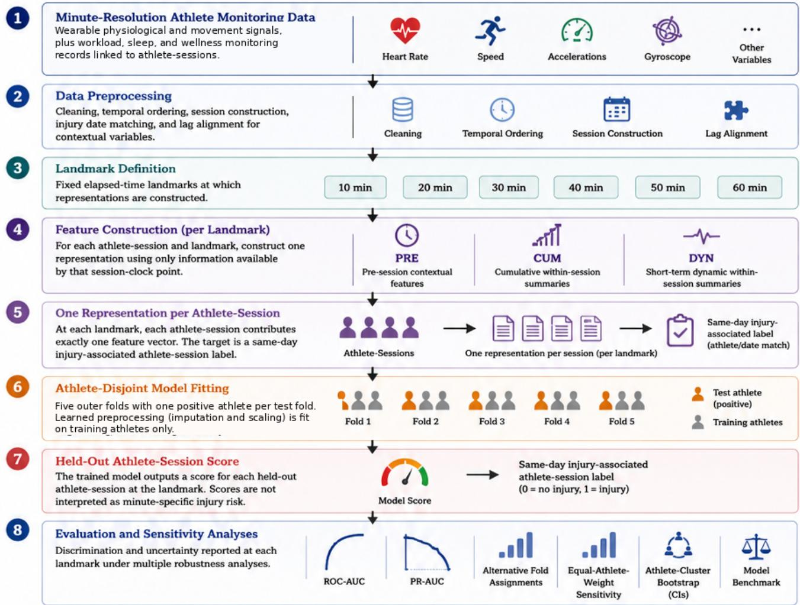
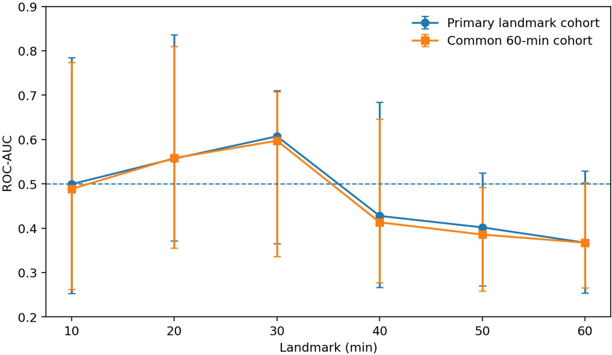
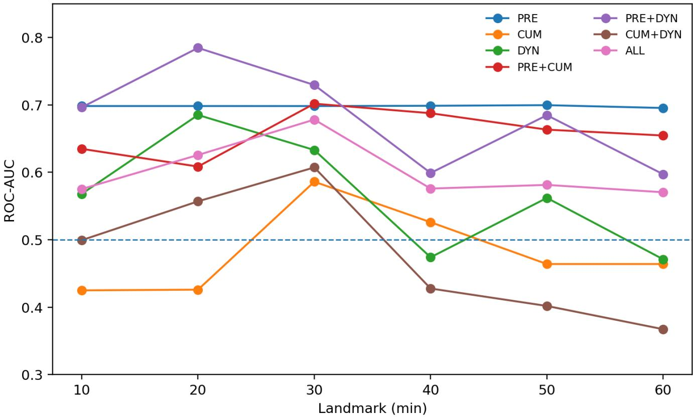

# Landmark-Based Discrimination of Injury-Associated Athlete-Sessions from Minute-Resolution Multimodal Football Monitoring Data

  
Figure 1: Overview of the landmark-based framework. At each fixed landmark, one representation is constructed per athlete-session using only information available by that session-clock point. The target remains a same-day injury-associated athlete-session label; no within-session injury-onset timestamp is assumed, and scores are not interpreted as minute-specific injury risk.

Evangelos Chatzidimitriou Konstantinos Tserpes National Technical University of Athens, Athens, Greece

## Abstract

Minute-resolution wearable monitoring can provide dense within-session information, while injury supervision may be available only at the athlete-session level and may not contain the within-session time of injury onset. In that setting, assigning the same injury label to every minute would imply temporal precision that the labels do not support.

We therefore study landmark-based athlete-session discrimination. At fixed elapsed-time landmarks (10, 20, 30, 40, 50, and 60 minutes), each evaluable athlete-session contributes one representation constructed only from information observed by that session-clock point. The target is a same-day injury-associated athlete-session indicator obtained by athlete/date matching. The study uses 2020 multimodal SoccerMon data from elite women’s football and evaluates pre-session (PRE), cumulative (CUM), dynamic (DYN), and combined representations under athlete-disjoint validation.

The reconstructed resource contains 3,743 athlete-sessions from 48 athletes. Twenty-two injury-associated athlete-sessions arise from five athletes and all occur in Team A; the modelling cohort therefore contains 2,259 Team-A athlete-sessions from 27 athletes. In the primary CUM+DYN logistic-regression analysis, pooled out-of-athlete discrimination varies across landmarks (ROC-AUC 0.367–0.607; PR-AUC 0.0080–0.0150), with wide athlete-cluster bootstrap intervals. The same qualitative temporal pattern persists when all landmarks are restricted to the identical 2,104-session cohort and across 100 alternative allocations of negative athletes to the five outer folds. Equal-athlete weighting changes several point estimates materially, showing that the magnitude of discrimination depends on the aggregation estimand when athletes contribute unequal numbers of sessions. PRE-containing analyses, computed after explicit day-month-year date parsing and one-day lag alignment, yield higher point estimates at several landmarks but remain uncertain and are interpreted as contextual sensitivity analyses.

To our knowledge, prior football injury-modelling work has not explicitly addressed the mismatch between minute-resolution within-session monitoring and session-level injury supervision using a fixed-landmark, onerepresentation-per-athlete-session formulation. The contribution is therefore not minute-level injury-onset prediction or operational injury-risk alerting, but a unit-aligned framework for studying what high-resolution within-session information can support under weak session-level injury supervision.

Keywords: athlete monitoring; wearable sensing; women’s football; landmark analysis; injury-associated sessions;   
weak supervision; machine learning.

## 1 Introduction

Injury prevention remains a major challenge in football because injury occurrence is multifactorial and athlete availability has sporting and operational consequences. Modern monitoring systems provide dense physiological and biomechanical measurements during training, while workload, sleep, and wellness measurements provide contextual information before or around exposure. These data have motivated machine-learning approaches to injury-related modelling across sports [5, 12, 13, 15]. Reviews nevertheless identify recurring methodological limitations, including small efective sample sizes, heterogeneous outcome definitions, incomplete validation, imbalance handling, and limited calibration or uncertainty reporting [12, 13, 15].

A distinct problem arises when predictors are recorded at minute resolution but injury supervision is available only at athlete-session level. High temporal resolution in the predictors does not create equally high temporal resolution in the target. If an injury report identifies the athlete and calendar date but not the within-session time of onset, a positive athlete-session cannot support claims about the minute at which injury occurred, a minute-specific probability of injury, or a prospective within-session alert trajectory.

We address this supervision mismatch by aligning the observational unit with the available label. At each predefined elapsed-time landmark, we construct exactly one representation per athlete-session using only information observed by that session-clock point, and ask whether that representation discriminates same-day injury-associated from non-injury athlete-sessions in athletes excluded from model fitting. Here, “temporally admissible” refers only to information available by the session-clock landmark. Because biological injury onset is unknown, it does not imply that every included observation necessarily precedes injury onset.

Landmarking is an established organizing principle for prediction with longitudinal information [10]. Our use difers from classical event-history landmarking because the target remains a session-level binary label rather than a time-to-event outcome. Related football work includes session-level injury-risk-factor modelling such as SoccerGuard [6] and longitudinal time-to-injury forecasting using DeepHit [7]. These studies address related but diferent targets and are therefore contextual comparators rather than direct leaderboard baselines.

To our knowledge, prior football injury-modelling work has not explicitly treated the combination of minuteresolution within-session monitoring, session-level injury labels without onset timestamps, and one-representation-persession landmark evaluation. The novelty of the present study lies in that formulation and in the way the evaluation protocol is matched to it, rather than in proposing a new learning algorithm.

The contributions are:

• a unit-aligned landmark formulation for session-level injury labels without within-session injury-onset timestamps;

• controlled comparison of PRE, CUM, DYN, and combined feature families at six landmarks;

• athlete-disjoint outer evaluation with one positive athlete held out per fold, training-only preprocessing, pooled out-of-athlete predictions, and athlete-cluster uncertainty;

• robustness analyses addressing landmark-specific cohort composition, allocation of negative athletes to folds, and unequal session contribution across athletes;

• matched comparison of logistic regression, Random Forest, and XGBoost under identical cohorts, features, landmarks, and outer folds;

• descriptive leave-one-positive-athlete-out analysis without causal, biomarker, or externally validated featureimportance claims.

## 2 Related Work

## 2.1 Training Load and Athlete Monitoring

Training-load monitoring combines internal and external load to characterize adaptation and fatigue [1, 4]. Subjective wellness measures and individualized responses may also contain useful contextual information [2, 3]. Wearable sensing extends monitoring to high-frequency physiological and locomotor signals; prior work has shown that conclusions about peak locomotor demand can depend on the observation epoch [8].

## 2.2 Machine Learning for Football Injury Modelling

Football injury modelling spans heterogeneous targets, predictors, and validation designs [12, 15]. SoccerGuard investi gates injury risk factors using routinely collected football monitoring data [6], whereas DeepHit-based work formulates the problem as longitudinal time-to-injury forecasting [7]. These studies are important contextual comparators but do not define the same prediction target as the present study. Raw metric comparisons would therefore mix diferent outcomes, temporal units, and validation settings.

## 2.3 Weak Session-Level Supervision

When exact injury-onset timestamps are unavailable, an athlete-session injury label identifies a session associated with an injury report but not a latent injury-onset minute. Multiple-instance learning is one possible formulation for bag-level labels with latent responsible instances [11]. Our design addresses a diferent question: at each landmark it constructs one representation per athlete-session and retains the athlete-session target. No within-session instance localization is attempted.

## 3 Methodology

## 3.1 Problem Formulation

Let athlete a participate in session s, with session-level label

$$
Y _ { a , s } \in \{ 0 , 1 \} .
$$

For landmark

$$
\ell \in \{ 1 0 , 2 0 , 3 0 , 4 0 , 5 0 , 6 0 \} \mathrm { ~ m i n u t e s } ,
$$

define

$$
z _ { a , s } ^ { ( \ell ) } = g \left( X _ { a , s , 1 : \ell } , C _ { a , s } ^ { p r e } \right) ,
$$

where $X _ { a , s , 1 : \ell }$ contains wearable information observed no later than landmark ℓ and $C _ { a , s } ^ { p r e }$ denotes contextual predictors assigned to the session according to the preprocessing rules below. A classifier produces

$$
\begin{array} { r } { \hat { p } _ { a , s } ^ { ( \ell ) } = f _ { \ell } \Big ( z _ { a , s } ^ { ( \ell ) } \Big ) . } \end{array}
$$

Each athlete-session contributes at most one observation to a landmark analysis. The output is interpreted only as a discrimination score for the derived same-day athlete-session label. It is not an estimate of injury onset at landmark ℓ, not a minute-specific prospective injury probability, and not an operational injury alert.

## 3.2 Dataset and Cohort Accounting

We use the 2020 season of the SoccerMon dataset [9], collected from teams competing in the Norwegian women’s elite football league. Minute-level records are organized into team-by-calendar-day exposure units. Within each team-day, observations are partitioned into temporal blocks using gaps between recorded minutes; a gap greater than 30 minutes defines a new block. To avoid ambiguous attribution when multiple distinct exposure blocks occur on the same team-day, only team-days containing a single temporal block are retained. A minimum exposure duration of 30 minutes is then required.

After preprocessing, the minute-level resource contains 380,193 rows from 251 retained team-date exposure units, corresponding to 3,743 athlete-sessions from 48 athletes. Injury labels are derived by matching an athlete’s recorded injury-report date to the retained team-date exposure unit. The available injury reports are athlete-submitted reports of injury location and severity rather than medical diagnoses [9]; no within-session injury-onset timestamp is available.

Table 1: Cohort accounting after preprocessing.
<table><tr><td>Quantity</td><td>Count</td></tr><tr><td>Minute-level observations Team-date exposure units</td><td>380,193</td></tr><tr><td>Athlete-sessions</td><td>251 3,743</td></tr><tr><td>Athletes</td><td>48</td></tr><tr><td>Injury-associated athlete-sessions</td><td>22</td></tr><tr><td>Non-injury athlete-sessions</td><td>3,721</td></tr><tr><td>Athletes with ≥ 1 positive session</td><td>5</td></tr><tr><td></td><td></td></tr><tr><td>Team A athlete-sessions Team B athlete-sessions</td><td>2,259 1,484</td></tr></table>

The resulting resource contains 22 injury-associated athlete-sessions and 3,721 non-injury athlete-sessions. The 22 positives arise from five athletes. Team A contributes 2,259 athlete-sessions from 27 athletes and contains all 22 positives, whereas Team B contributes 1,484 athlete-sessions from 21 athletes and contains no positive outcome. Because discrimination metrics require both outcome classes, landmark modelling is restricted to Team A.

At landmarks 10, 20, 30, 40, 50, and 60 minutes, respectively, 2,258, 2,258, 2,257, 2,250, 2,218, and 2,104 Team-A athlete-sessions remain evaluable. All 22 positive athlete-sessions are represented at every landmark; the decreasing denominator is due only to shorter negative sessions.

## 3.3 Temporal Availability and Feature Construction

Pre-session/contextual variables comprise seven workload variables (CTL28, CTL42, daily load, weekly load, acute-tochronic workload ratio, monotony, and strain), two sleep variables, and five wellness variables. Raw daily dates are parsed explicitly in day-month-year format (%d.%m.%Y). Workload variables are shifted forward by one calendar day before merging, so a value recorded on day d is used only for day d + 1. Fatigue, mood, readiness, soreness, and stress are likewise lagged by one day. Sleep duration and sleep quality are matched on the session calendar day and treated as descriptors of the preceding night’s sleep. The dataset does not provide a verified submission timestamp for these same-day sleep fields, so their operational pre-session availability cannot be established precisely.

Missingness indicators are created for data-quality auditing but are not used as modelling predictors. In the reconstructed master-session table, overall missingness is approximately 58.4% for the five wellness variables, 59.3% for the two sleep variables, and 70.5% for the seven workload variables. The seven lagged workload variables are constant within each athlete-session for which they are observed.

Within-session representations are constructed from ten sensor signals: mean speed, mean heart rate, mean horizontal acceleration, mean instantaneous acceleration impulse, accelerometer standard deviation on three axes, and gyroscope standard deviation on three axes. Cumulative features are expanding mean, maximum, and standarddeviation summaries from session start through the current minute. Dynamic features comprise first diferences, trailing five-observation rolling means and standard deviations, together with current-minute spread features for heart rate, speed, and acceleration impulse. All cumulative and dynamic operations are grouped by athlete-session and use no observations from another session or a later minute.

## 3.4 Feature Families

Three feature families are defined:

• PRE: 14 pre-session/contextual predictors;

• CUM: 30 cumulative sensor-derived predictors;

• DYN: 33 dynamic sensor-derived predictors.

Controlled configurations are PRE, CUM, DYN, PRE+CUM, PRE+DYN, CUM+DYN, and ALL, containing 14, 30, 33, 44, 47, 63, and 77 unique predictors, respectively. CUM+DYN is the primary representation because the primary analysis is defined to use sensor-derived within-session temporal features only, without relying on pre-session variables whose completeness and timing are less certain.

## 3.5 Athlete-Disjoint Evaluation

Evaluation uses a deterministic five-fold athlete-disjoint design. Team A contains five athletes with at least one positive athlete-session. The five positive athletes are sorted deterministically and exactly one is assigned to each outer test fold. Athletes with no positive session are sorted and distributed across the five test folds in approximately equal-sized chunks. Every Team-A athlete therefore appears in exactly one outer test fold, and no athlete contributes observations to both training and test data within a fold. Each landmark-specific training and test partition contains both outcome classes.

The primary classifier is an L2-regularized logistic-regression pipeline. Missing predictor values are median-imputed using estimates fitted only on outer-training data, after which predictors are standardized using outer-training estimates. Logistic regression uses C = 1.0, balanced class weights, the liblinear solver, a maximum of 2,000 iterations, and random seed 42. Hyperparameters are fixed rather than selected through data-dependent tuning. For each landmark and fold, the pipeline is refit on training athletes and used to generate probabilities only for held-out athletes. The five held-out prediction sets are pooled, so each evaluable athlete-session contributes exactly one out-of-athlete prediction at a landmark.

Performance is summarized with ROC-AUC and PR-AUC. Because positive prevalence is approximately 1%, PR-AUC is interpreted relative to the landmark-specific prevalence baseline [14]. Repeated sessions from the same athlete are dependent; therefore, 95% uncertainty intervals are estimated using 1,000 athlete-cluster bootstrap resamples of pooled out-of-fold predictions. Bootstrap samples containing only one outcome class are discarded.

The bootstrap resamples pooled out-of-fold predictions rather than refitting the full modelling pipeline. The reported intervals therefore quantify cluster-level sampling uncertainty conditional on the fitted cross-validation procedure; they do not capture every source of training-set or model-selection uncertainty.

Feature-configuration and model-family contrasts use paired athlete-cluster bootstrap resampling of matched athlete-session predictions. No multiplicity-adjusted confirmatory testing procedure was pre-specified; paired intervals are interpreted descriptively as sensitivity contrasts rather than isolated confirmatory discoveries.

## 3.6 Robustness and Sensitivity Analyses

Three additional analyses examine whether the primary landmark pattern depends on specific design choices.

Common-cohort landmark sensitivity. All six landmarks are re-evaluated on the fixed subset of 2,104 athletesessions that remain observable through 60 minutes. This separates changes in the representation from changes in the evaluable denominator.

Alternative negative-athlete fold assignments. The one-positive-athlete-per-test-fold rule is preserved while only the allocation of negative athletes across the five folds is varied over 100 reproducible random assignments. The same primary CUM+DYN logistic-regression pipeline is refit for every assignment and landmark.

Equal-athlete-weight sensitivity. The primary estimand weights athlete-sessions equally, so athletes with more evaluable sessions exert greater total influence. As a descriptive alternative, weighted ROC-AUC and PR-AUC are computed after assigning each athlete the same total weight at a landmark; a session from an athlete with $n _ { a }$ evaluable sessions receives weight $1 / n _ { a }$ . The corresponding weighted prevalence is used as the PR no-skill reference. This is a diferent estimand and does not replace the primary session-pooled analysis.

## 3.7 Model-Family Benchmark

The same CUM+DYN features, landmark datasets, outer folds, and held-out observations are used for logistic regression, Random Forest, and XGBoost. Random Forest uses 500 trees, unrestricted maximum depth, minimum leaf size 2, balanced class weights, and random seed 42. XGBoost uses 300 trees, maximum depth 3, learning rate 0.03, row and feature subsampling of 0.8, and log-loss evaluation. Within each outer fold, positive-class weight is set to the ratio of negative to positive training sessions. No hyperparameter search is performed.

Brier scores are reported descriptively but are not interpreted as evidence of calibrated clinical risk because model-specific imbalance weighting changes the fitted probability scale.

## 3.8 Positive-Athlete Sensitivity and Exploratory Features

Sensitivity to the small number of positive athletes is explored descriptively with leave-one-positive-athlete-out (LOAO) analysis. For each landmark and sensor-derived feature, positive-session values are expressed relative to each athlete’s

Table 2: Primary CUM+DYN logistic-regression performance.
<table><tr><td>Min</td><td>ROC-AUC</td><td>95% CI</td><td>PR-AUC</td><td>PR/base</td><td>95% CI</td></tr><tr><td>10</td><td>.499</td><td>[.253,.785]</td><td>.0107</td><td>1.10</td><td>[.0028,.0314]</td></tr><tr><td>20</td><td>.557</td><td>[.372,.836]</td><td>.0150</td><td>1.54</td><td>[.0024,.0445]</td></tr><tr><td>30</td><td>.607</td><td>[.365,.710]</td><td>.0129</td><td>1.32</td><td>[.0028,.0328]</td></tr><tr><td>40</td><td>.428</td><td>[.267,.685]</td><td>.0088</td><td>0.90</td><td>[.0019,.0219]</td></tr><tr><td>50</td><td>.402</td><td>[.270,.524]</td><td>.0079</td><td>0.80</td><td>[.0019,.0183]</td></tr><tr><td>60</td><td>.367</td><td>[.254,.529]</td><td>.0080</td><td>0.77</td><td>[.0023,.0182]</td></tr></table>

Table 3: Common-cohort sensitivity using the same 2,104 athlete-sessions at every landmark.
<table><tr><td>Min</td><td>ROC-AUC</td><td>95% CI</td><td>PR-AUC</td><td>95% CI</td></tr><tr><td>10</td><td>.489</td><td>[.262,.774]</td><td>.0110</td><td>[.0028,.0309]</td></tr><tr><td>20</td><td>.558</td><td>[.355,.810]</td><td>.0159</td><td>[.0040,.0495]</td></tr><tr><td>30</td><td>.597</td><td>[.336,.707]</td><td>.0133</td><td>[.0035,.0305]</td></tr><tr><td>40</td><td>.413</td><td>[.277,.646]</td><td>.0091</td><td>[.0023,.0212]</td></tr><tr><td>50</td><td>.386</td><td>[.258,.492]</td><td>.0081</td><td>[.0021,.0185]</td></tr><tr><td>60</td><td>.367</td><td>[.266,.503]</td><td>.0080</td><td>[.0020,.0173]</td></tr></table>

own negative-session mean and standard deviation. Athlete-level positive-session deviations are averaged after excluding each positive athlete in turn. This analysis is not part of the out-of-athlete predictive evaluation and is not interpreted as causal evidence, biomarker discovery, or externally validated feature importance.

## 4 Results

## 4.1 Primary Landmark Performance

Table 2 reports the primary CUM+DYN logistic-regression results. Discrimination is modest and varies by landmark. The largest ROC-AUC point estimate occurs at 30 minutes, but athlete-cluster intervals are wide and overlap chancelevel discrimination. PR-AUC is only modestly above its prevalence baseline at 10–30 minutes and falls below that baseline at 40–60 minutes. These results support landmark-dependent variation within this cohort, not an optimal within-session prediction time.

## 4.2 Common-Cohort Landmark Sensitivity

Restricting every landmark to the identical 2,104 athlete-sessions observable through 60 minutes preserves the qualitative pattern (Table 3; Fig. 2). ROC-AUC increases from .489 at 10 minutes to .597 at 30 minutes and then declines to .367 at 60 minutes. PR-AUC similarly remains above the common prevalence baseline at 10–30 minutes and below it at 40–60 minutes. Thus, the temporal variation in the primary analysis is not solely attributable to changes in landmark-specific cohort composition. Uncertainty remains substantial.

## 4.3 Alternative Fold-Assignment Sensitivity

Across 100 alternative allocations of negative athletes, with the five positive athletes kept fixed at one per test fold, the qualitative landmark pattern remains stable. Median ROC-AUC values are .498, .579, .609, .419, .409, and .351 at 10–60 minutes, respectively. The 2.5th–97.5th percentile ranges across alternative assignments are [.459,.525], [.546,.612], [.552,.652], [.374,.462], [.350,.456], and [.308,.395]. Median PR-AUC values are .0110, .0161, .0133, .0089, .0081, and .0079. The qualitative landmark pattern is therefore stable across the 100 tested alternative allocations of negative athletes.

## 4.4 Equal-Athlete-Weight Sensitivity

Equal-athlete weighting changes the magnitude of several point estimates (Table 4). Weighted ROC-AUC is .746 at 20 minutes and .618 at 40 minutes, compared with session-pooled values of .557 and .428. The corresponding

  
Figure 2: Primary and common-cohort ROC-AUC across landmarks. Error bars are 95% athlete-cluster bootstrap intervals; the dashed line denotes ROC-AUC = 0.5.

Table 4: Equal-athlete-weight descriptive sensitivity.
<table><tr><td>Min</td><td>W-ROC</td><td>95% CI</td><td>W-PR</td><td> $\mathrm { W - p r e v . }$ </td><td>PR/base</td></tr><tr><td>10</td><td>.606</td><td>[.238,.735]</td><td>.0321</td><td>.0216</td><td>1.49</td></tr><tr><td>20</td><td>.746</td><td>[.320,.868]</td><td>.0700</td><td>.0216</td><td>3.24</td></tr><tr><td>30</td><td>.685</td><td>[.274,.755]</td><td>.0387</td><td>.0216</td><td>1.80</td></tr><tr><td>40</td><td>.618</td><td>[.258,.733]</td><td>.0366</td><td>.0216</td><td>1.70</td></tr><tr><td>50</td><td>.446</td><td>[.229,.518]</td><td>.0208</td><td>.0216</td><td>0.96</td></tr><tr><td>60</td><td>.423</td><td>[.240,.495]</td><td>.0212</td><td>.0220</td><td>0.96</td></tr></table>

athlete-weighted PR baseline is approximately .0216 rather than approximately .01 because the estimand changes. Weighted PR-AUC remains above its weighted baseline at 10–40 minutes and approximately at baseline at 50–60 minutes.

The wide athlete-cluster intervals show that this alternative estimand is also highly uncertain. The session-pooled estimand therefore remains primary. The weighted analysis demonstrates that the magnitude of discrimination depends on whether sessions or athletes receive equal total influence; it does not represent an improved model.

## 4.5 Feature-Family Ablation

The PRE-containing results in Table 6 use explicit day-month-year parsing and the lag rules described above. PRE alone yields ROC-AUC point estimates near .70 across landmarks. PRE+DYN reaches its largest point estimate at 20 minutes (ROC-AUC .784; PR-AUC .0526), while PRE+CUM reaches ROC-AUC .702 at 30 minutes and .688 at 40 minutes. ALL reaches ROC-AUC .678 at 30 minutes.

These point estimates do not establish uniform superiority. Athlete-cluster intervals are wide, only five athletes contribute positive sessions, and paired PRE+DYN contrasts against the primary CUM+DYN representation include zero at every landmark for both ROC-AUC and PR-AUC. PRE-containing configurations are therefore interpreted as contextual sensitivity analyses rather than as evidence of deployable pre-session prediction.

Table 5: Paired athlete-cluster bootstrap contrasts for PRE+DYN versus the primary CUM+DYN representation. Positive values favor PRE+DYN. Intervals are descriptive sensitivity contrasts; no multiplicity-adjusted confirmatory testing was pre-specified.
<table><tr><td>Min</td><td>∆ROC</td><td>95% CI</td><td>∆PR</td><td>95% CI</td></tr><tr><td>10</td><td>.197</td><td>[-.030,.373]</td><td>.0082</td><td>[-.0046,.0212]</td></tr><tr><td>20</td><td>.227</td><td>[-.119,.358]</td><td>.0376</td><td>[-.0010,.0959]</td></tr><tr><td>30</td><td>.122</td><td>[-.081,.218]</td><td>.0149</td><td>[-.0018,.0471]</td></tr><tr><td>40</td><td>.171</td><td>[-.028,.255]</td><td>.0064</td><td>[-.0004,.0228]</td></tr><tr><td>50</td><td>.283</td><td>[-.038,.373]</td><td>.0130</td><td>[-.0002,.0357]</td></tr><tr><td>60</td><td>.230</td><td>[-.068,.363]</td><td>.0128</td><td>[-.0002,.0337]</td></tr></table>

  
Figure 3: ROC-AUC trajectories for the seven feature-family configurations. Relative ordering changes across landmarks; no representation is interpreted as uniformly superior.

## 4.6 Model-Family Benchmark

More complex models do not consistently outperform logistic regression. Random Forest achieves its largest ROC-AUC at 60 minutes (.669), whereas XGBoost reaches .640 at 40 minutes and .627 at 30 minutes. Model-family advantages are not consistent across landmarks. The benchmark is therefore interpreted as a robustness comparison under one fixed representation rather than as a model-selection leaderboard.

Brier scores range from .0508 to .0775 for logistic regression, .0102 to .0110 for Random Forest, and .0119 to .0144 for XGBoost. These are descriptive probability-error diagnostics only and are not interpreted as evidence of calibration.

## 4.7 Positive-Athlete Sensitivity and Exploratory Features

Five exploratory features preserve the same sign of the athlete-referenced deviation across all six landmarks and all five leave-one-positive-athlete-out exclusions: accl x std cum mean, gyro y std cum mean, gyro z std cum mean, heart rate mean cum std, and inst acc impulse mean cum mean. Four are consistently negative and cumulative heart-rate variability is consistently positive. Because the personal reference is computed descriptively from each athlete’s negative sessions, this is not held-out predictive feature importance. These patterns are reported only as within-dataset, hypothesis-generating observations.

Table 6: Feature-family ablation across within-session landmarks. Cohort, folds, preprocessing, and logistic-regression settings are fixed; only the feature representation changes.
<table><tr><td rowspan="4">Representation</td><td colspan="7">Landmark (min)</td></tr><tr><td>N</td><td>10</td><td>20</td><td>30</td><td>40</td><td>50</td><td>60</td></tr><tr><td>Panel A: ROC-AUC</td><td></td><td></td><td></td><td></td><td></td><td></td></tr><tr><td>PRE</td><td>.698</td><td>.698</td><td>.698</td><td>.699</td><td>.700</td><td>.695</td></tr><tr><td>CUM</td><td>14 30</td><td>.425</td><td>.426</td><td>.586</td><td>.526</td><td>.464</td><td>.464</td></tr><tr><td>DYN</td><td>33</td><td>.568</td><td>.685</td><td>.633</td><td>.474</td><td>.562</td><td>.471</td></tr><tr><td>PRE+CUM</td><td>44</td><td>.635</td><td>.608</td><td>.702</td><td>.688</td><td>.663</td><td>.655</td></tr><tr><td>PRE+DYN</td><td>47</td><td>.696</td><td>.784</td><td>.729</td><td>.599</td><td>.685</td><td>.597</td></tr><tr><td>CUM+DYN</td><td>63</td><td>.499</td><td>.557</td><td>.607</td><td>.428</td><td>.402</td><td>.367</td></tr><tr><td>ALL</td><td>77</td><td>.575</td><td>.626</td><td>.678</td><td>.576</td><td>.581</td><td>.570</td></tr><tr><td colspan="8">Panel B: PR-AUC</td></tr><tr><td>PRE</td><td>14</td><td>.0298</td><td>.0298</td><td>.0298</td><td>.0299</td><td>.0313</td><td>.0318</td></tr><tr><td>CUM</td><td>30</td><td>.0108</td><td>.0090</td><td>.0129</td><td>.0110</td><td>.0094</td><td>.0098</td></tr><tr><td>DYN</td><td>33</td><td>.0139</td><td>.0281</td><td>.0170</td><td>.0124</td><td>.0202</td><td>.0108</td></tr><tr><td>PRE+CUM</td><td>44</td><td>.0162</td><td>.0143</td><td>.0206</td><td>.0226</td><td>.0193</td><td>.0194</td></tr><tr><td>PRE+DYN</td><td>47</td><td>.0189</td><td>.0526</td><td>.0278</td><td>.0152</td><td>.0209</td><td>.0208</td></tr><tr><td>CUM+DYN</td><td>63</td><td>.0107</td><td>.0150</td><td>.0129</td><td>.0088</td><td>.0079</td><td>.0080</td></tr><tr><td>ALL</td><td>77</td><td>.0121</td><td>.0207</td><td>.0168</td><td>.0132</td><td>.0123</td><td>.0147</td></tr><tr><td></td><td></td><td></td><td></td><td></td><td></td><td></td><td></td></tr></table>

Table 7: Model-family benchmark for fixed CUM+DYN representation.
<table><tr><td>Model</td><td>10</td><td>20</td><td>30</td><td>40</td><td>50</td><td>60</td></tr><tr><td>ROC-AUC</td><td></td><td></td><td></td><td></td><td></td><td></td></tr><tr><td>Logistic regression</td><td>.499</td><td>.557</td><td>.607</td><td>.428</td><td>.402</td><td>.367</td></tr><tr><td>Random Forest</td><td>.571</td><td>.603</td><td>.628</td><td>.588</td><td>.516</td><td>.669</td></tr><tr><td>XGBoost</td><td>.426</td><td>.556</td><td>.627</td><td>.640</td><td>.435</td><td>.578</td></tr><tr><td>PR-AUC</td><td></td><td></td><td></td><td></td><td></td><td></td></tr><tr><td>Logistic regression</td><td>.0107</td><td>.0150</td><td>.0129</td><td>.0088</td><td>.0079</td><td>.0080</td></tr><tr><td>Random Forest</td><td>.0109</td><td>.0125</td><td>.0131</td><td>.0122</td><td>.0097</td><td>.0168</td></tr><tr><td>XGBoost</td><td>.0082</td><td>.0112</td><td>.0154</td><td>.0136</td><td>.0084</td><td>.0132</td></tr><tr><td>Prevalence baseline</td><td>.0097</td><td>.0097</td><td>.0097</td><td>.0098</td><td>.0099</td><td>.0105</td></tr></table>

## 5 Discussion

The principal contribution of this study is methodological and empirical rather than a claim of operational injury prediction. The landmark formulation aligns the observation unit with the available athlete-session supervision unit and avoids treating thousands of minute rows as independently labelled injury events. This makes the supported question explicit: whether information available by a fixed session-clock point discriminates same-day injury-associated from non-injury athlete-sessions in athletes excluded from model fitting.

The study has an important empirical limitation: only five athletes contribute positive sessions. This constrains precision, external validity, and the strength of any population-level conclusion. Rather than obscuring that limitation behind 380,193 minute rows, the analysis is structured around it. Athlete-disjoint outer evaluation, athlete-cluster uncertainty, common-cohort analysis, 100 alternative negative-athlete allocations, equal-athlete weighting, and LOAO sensitivity are used to expose rather than hide the consequences of the small efective positive sample. These analyses cannot create independent information that is absent from the cohort, but they reduce the risk that the reported findings are artifacts of row-level replication, one arbitrary fold allocation, changing denominators, or unequal session contribution.

Within those limits, three findings are supported. First, session-pooled discrimination is landmark-dependent and non-monotonic. The same qualitative pattern persists on the fixed 2,104-session common cohort and across alternative fold assignments, so the primary temporal pattern is not explained solely by landmark-specific cohort composition or one deterministic negative-athlete allocation.

Second, the magnitude of discrimination depends on the estimand. Equal-athlete weighting raises several intermediate-landmark point estimates substantially. This is not a better model; it is a diferent population weighting. The result shows why session-pooled performance should not be interpreted as though each athlete contributes equally.

Third, PRE-containing representations yield larger point estimates at several landmarks, but their uncertainty, substantial missingness, and incompletely verified same-day sleep timing prevent claims of uniform superiority or operational pre-session prediction. These analyses are useful because they show that contextual information may alter separability, not because they establish a clinically deployable risk score.

The model-family benchmark similarly argues against an algorithm-centric interpretation. Random Forest and XGBoost can outperform logistic regression at particular landmarks, especially late in the session, but neither dominates consistently. With only five positive athletes, more aggressive tuning or substantially more flexible architectures would add modelling degrees of freedom without adding independent positive information.

## 5.1 Scientific Value and Scope

The empirical evidence is limited in scale, but the study addresses a distinct methodological problem that arises when high-resolution predictors are paired with weak, coarse outcome supervision. Its value is therefore not that it demonstrates a high-performing clinical injury predictor. Its value is that it shows how such data can be analysed without falsely converting coarse session labels into minute-level injury labels, while making dependence, uncertainty, cohort composition, and estimand choice explicit.

Accordingly, the study does not claim more than the supervision supports. It provides a rigorous within-cohort characterization of what can and cannot be inferred from minute-resolution football monitoring when the available injury annotation is only session-level. That narrower scope is intentional and constitutes the core methodological contribution.

## 5.2 What the Study Supports

The study supports the following claims:

• the landmark formulation is aligned with the available session-level injury supervision and avoids unsupported minute-level target replication;

• within this cohort, out-of-athlete discrimination depends on landmark and feature representation;

• the primary temporal pattern is not solely explained by the changing evaluable denominator and is stable across the tested alternative negative-athlete fold allocations;

• the magnitude of discrimination depends on whether sessions or athletes receive equal total influence;

• correctly aligned pre-session/contextual variables can materially change point estimates, but their evidence remains uncertain and context-dependent.

## 5.3 What the Study Does Not Support

The study does not support:

• localization of injury-onset minute;

• prospective minute-specific injury-risk estimation or operational alerting;

• identification of a clinically optimal intervention landmark;

• causal interpretation of sensor or contextual features;

• biomarker claims from exploratory LOAO analysis;

• calibrated clinical risk probabilities;

• external generalization to other teams, leagues, sexes, or age groups;

• interpretation of the 22 positive athlete-sessions as 22 independent confirmed injury events.

## 5.4 Limitations

The principal limitation is the small efective positive sample: 22 injury-associated athlete-sessions arise from only five athletes. This limits precision and external validity regardless of the number of minute-level observations. The robustness analyses make that limitation explicit but cannot overcome it.

Second, exact injury-onset timestamps are unavailable and the outcome is derived from athlete-submitted injury reports rather than medical diagnoses. The study cannot determine whether a within-session observation occurred before or after biological injury onset, cannot localize onset, and cannot support prospective minute-specific injury-risk claims.

Third, all positive sessions occur in Team A. Team B contains no positive outcome and therefore cannot serve as an injury-positive external discrimination cohort. Generalization across teams, leagues, sexes, age groups, and competitive levels remains untested.

Fourth, PRE predictors exhibit substantial missingness: approximately 58.4% for wellness variables, 59.3% for sleep variables, and 70.5% for workload variables in the reconstructed master-session table. Although imputation is fitted on outer-training data only and missingness indicators are not used as predictors, PRE-containing results may remain sensitive to monitoring completeness. Same-day sleep fields are interpreted as preceding-night descriptors but lack a verified pre-session submission timestamp.

Fifth, the 22 positive athlete-sessions are date-matched injury-associated sessions, not 22 confirmed independent injury-onset events. Multiple positive dates within an athlete may represent distinct injuries, persistence of one injury episode, or repeated reporting. Athlete-level clustering addresses statistical dependence but cannot resolve this clinical ambiguity.

Sixth, session-pooled metrics weight athletes according to the number of evaluable sessions they contribute. Equal athlete weighting shows that point estimates can change materially under a diferent estimand. The two estimands answer diferent population-level questions.

Seventh, bootstrap intervals are computed by resampling pooled out-of-fold predictions rather than refitting the complete modelling pipeline inside each replicate. They quantify cluster-level sampling uncertainty conditional on the fitted cross-validation procedure and do not capture all sources of training-set uncertainty.

Finally, exploratory feature analyses are observational, and multiple descriptive comparisons increase the risk of over-interpreting isolated results.

## 6 Conclusion

We presented a landmark-based framework for studying injury-associated athlete-sessions from minute-resolution multimodal football monitoring when injury supervision is available only at session level. By constructing one session-clock-admissible representation per athlete-session at fixed landmarks, the design aligns the prediction unit with the target and avoids unsupported minute-level injury-onset interpretation.

Within this cohort, discrimination varies with temporal landmark and feature representation. The qualitative primary landmark pattern persists under a fixed common cohort and repeated reallocations of negative athletes across athlete-disjoint folds, while equal-athlete weighting shows that the magnitude of discrimination is also sensitive to the aggregation estimand. PRE-containing representations yield larger point estimates at several landmarks, but uncertainty, missingness, and timing limitations preclude claims of uniform superiority or operational pre-session prediction.

The empirical evidence is necessarily limited by five positive athletes and the absence of temporally precise injury labels. Nevertheless, the study provides a defensible methodological framework and a transparent within-cohort characterization of what minute-resolution monitoring data can support under weak session-level injury supervision. The study does not claim more than the supervision permits; its contribution is precisely to show how within-session modelling can be conducted and interpreted without doing so. Larger independent cohorts with more positive athletes, medically adjudicated outcomes, and precise injury-onset information are required before prospective injury-risk or deployment claims can be considered.

## References

[1] S. L. Halson. Monitoring training load to understand fatigue in athletes. Sports Medicine, 44(Suppl 2):S139–S147, 2014.

[2] A. E. Saw, L. C. Main, and P. B. Gastin. Monitoring the athlete training response: Subjective self-reported measures trump commonly used objective measures: A systematic review. British Journal of Sports Medicine, 50(5):281–291, 2016.

[3] J. D. Bartlett, F. O’Connor, N. Pitchford, L. Torres-Ronda, and S. Robertson. Relationships between internal and external training load in team-sport athletes: Evidence for an individualized approach. International Journal of Sports Physiology and Performance, 12(2):230–234, 2017.

[4] P. C. Bourdon et al. Monitoring athlete training loads: Consensus statement. International Journal of Sports Physiology and Performance, 12(Suppl 2):S2-161–S2-170, 2017.

[5] H. Van Eetvelde, L. D. Mendon¸ca, C. Ley, R. Seil, and T. Tischer. Machine learning methods in sport injury prediction and prevention: A systematic review. Journal of Experimental Orthopaedics, 8(1):27, 2021.

[6] F. Bartels, L. Xing, C. Midoglu, M. Boeker, T. Kirsten, and P. Halvorsen. SoccerGuard: Investigating injury risk factors for professional soccer players with machine learning. arXiv preprint arXiv:2411.08901, 2024.

[7] V. Catterall, C. Midoglu, and S. Lynch. Time-to-injury forecasting in elite female football: A DeepHit survival approach. arXiv preprint arXiv:2601.19479, 2026.

[8] I. Baptista, A. K. Winther, D. Johansen, and S. A. Pettersen. Analysis of peak locomotor demands in women’s football—the influence of diferent epoch lengths. PLOS ONE, 19(5):e0303759, 2024.

[9] C. Midoglu et al. A large-scale multivariate soccer athlete health, performance, and position monitoring dataset. Scientific Data, 11:553, 2024.

[10] H. C. van Houwelingen. Dynamic prediction by landmarking in event history analysis. Scandinavian Journal of Statistics, 34(1):70–85, 2007.

[11] T. G. Dietterich, R. H. Lathrop, and T. Lozano-P´erez. Solving the multiple instance problem with axis-paralle rectangles. Artificial Intelligence, 89(1–2):31–71, 1997.

[12] A. Majumdar, R. Bakirov, D. Hodges, S. Scott, and T. Rees. Machine learning for understanding and predicting injuries in football. Sports Medicine – Open, 8:73, 2022.

[13] G. S. Bullock, J. Mylott, T. Hughes, K. F. Nicholson, R. D. Riley, and G. S. Collins. Just how confident can we be in predicting sports injuries? A systematic review of the methodological conduct and performance of existing musculoskeletal injury prediction models in sport. Sports Medicine, 52(10):2469–2482, 2022.

[14] T. Saito and M. Rehmsmeier. The precision-recall plot is more informative than the ROC plot when evaluating binary classifiers on imbalanced datasets. PLOS ONE, 10(3):e0118432, 2015.

[15] M. Aslani, M. Zarei, Z. Yaghoubitajani, and A. Malekahmadi. Machine learning models for injury risk prediction in football players: A systematic review of predictors, performance, practical applications, and limitations. Journal of International Medical Research, 54(7):3000605261469442, 2026.