# Multi-step Proximal Policy Improvement in Offline Reinforcement Learning

Soohyun Choi\*1

Seonvin Cho\*1

Songnam Hong†1

1Department of Electronic Engineering, Hanyang University, Seoul, Republic of Korea, {petersun0221,seonbin0319,snhong}@hanyang.ac.kr, \*Equal contribution., †Corresponding author.

## Abstract

Offline reinforcement learning (RL) must reconcile two competing requirements: policy updates should stay near dataset-supported actions to keep value estimates reliable, yet meaningful gains often require moving beyond the behavior distribution. We develop a geometric view of offline actor updates by modeling policies as a probability manifold endowed with a chosen metric geometry. Under this lens, a broad class of offline actor objectives can be interpreted as a single proximal policy improvement step (SPI), i.e., an implicit discretization of a manifold gradient flow induced by a critic-defined energy. Building on this insight, we propose multi-step proximal policy improvement (MPI), a plug-in refinement mechanism that composes sequential re-centered proximal steps. MPI enables controlled policy improvement beyond dataset support while retaining proximal control at each refinement. The framework accommodates multiple policy geometries and admits practical instantiations for deterministic and diagonal-Gaussian policies. Experiments on D4RL benchmarks show that small numbers of MPI refinements improve strong offline baselines, including TD3+BC, ReBRAC, and IQL, on many tasks. Focused diagnostics further distinguish re-centered refinement from fixed-objective update scheduling and characterize limitations under critic error.

## 1 INTRODUCTION

Offline reinforcement learning (RL) aims to learn effective policies from a fixed dataset without further interaction with the environment. This setting is particularly appealing in domains where online exploration is costly, unsafe, or impractical, such as healthcare, robotics, and autonomous driving. A fundamental challenge, however, is distribution shift: when a learned policy places probability mass on actions (or state–action pairs) weakly supported by the dataset, value estimation must extrapolate beyond observed data, often leading to overestimation and unstable policy improvement [Fujimoto et al., 2019b]. Consequently, a dominant theme in offline RL is to constrain policy updates to remain close to dataset support.

A large body of practical algorithms addresses this issue by tempering policy improvement, spanning a spectrum from actor-side regularization to critic-side conservatism. On the actor side, advantage-weighted methods such as IQL [Kostrikov et al., 2021] and AWAC [Nair et al., 2020] moderate updates by reweighting dataset actions according to estimated value or advantage, thereby implicitly anchoring policy optimization to in-distribution behavior. Behavioranchored approaches, exemplified by TD3+BC [Fujimoto and Gu, 2021], impose an explicit behavior cloning term alongside value maximization to directly restrict policy deviation from the dataset. ReBRAC [Tarasov et al., 2023] extends TD3+BC by adding a critic penalty, coupling behavior anchoring with critic-side conservatism. On the critic side, conservative or uncertainty-aware methods such as CQL [Kumar et al., 2020] and EDAC [An et al., 2021] mitigate extrapolation by reshaping the value landscape itself to penalize or downweight unsupported actions.

Despite their methodological differences, these methods share a common structural principle: policy improvement is moderated—either through actor-level anchoring (implicit or explicit) or through critic-level conservatism—to prevent overly aggressive extrapolation beyond data support.

This stabilization mechanism, however, introduces a deeper challenge on the actor side. In offline RL, policy improvement must balance stability and exploration beyond the dataset: policy updates must remain sufficiently close to ensure reliable value estimation, yet must also move beyond the behavior distribution to achieve meaningful gains. Excessive anchoring can lead to under-improvement, whereas insufficient control results in instability under distribution shift.

This tension raises a natural question: can we design a principled policy update mechanism that preserves stability while enabling controlled improvement beyond the dataset support?

Our contributions. To address this tension, we develop a unifying geometric perspective on offline actor updates. We model the policy class as a statistical manifold M endowed with a chosen geometry, and show that a broad family of offline actor objectives can be interpreted as a single proximal policy improvement (SPI) step on M. In this view, SPI minimizes an energy functional (e.g., negative expected Q or advantage) regularized by a geometry-induced distance dM, corresponding to a single implicit gradient-flow step. This interpretation clarifies that many existing actor updates achieve stability via strong anchoring, yet can suffer from under-improvement.

Building on this insight, we propose multi-step proximal policy improvement (MPI), which composes multiple sequential, re-centered proximal steps under the same geometry within each iteration. From the gradient-flow viewpoint, MPI amounts to a finer implicit discretization of the underlying manifold flow, enabling controlled advancement beyond dataset support while retaining local displacement control. MPI is implemented as a modular plug-in refinement stage that preserves the baseline actor-critic update, making it compatible with a wide range of existing offline RL algorithms.

Empirically, small numbers of MPI refinements improve behavior-anchored baselines (e.g., TD3+BC [Fujimoto and Gu, 2021], ReBRAC [Tarasov et al., 2023], and IQL [Kostrikov et al., 2021]) on many standard D4RL tasks. We also characterize settings in which critic error limits these gains.

Our main contributions are summarized as follows:

• We provide a geometric interpretation of behavioranchored offline actor updates as an SPI on a statistical manifold, unifying diverse objectives under a common proximal framework.

• We propose MPI, a modular plug-in refinement mechanism that advances the same manifold gradient flow through re-centered implicit steps, enabling controlled improvement beyond dataset support.

• We demonstrate that MPI integrates seamlessly with existing offline RL algorithms and improves behavioranchored baselines on many D4RL tasks, while identifying limitations under critic error.

## 2 RELATED WORK

Statistical manifold in RL. A classical geometric viewpoint on policy optimization comes from information geometry: the Fisher information metric (Fisher–Rao) underlies the natural policy gradient [Kakade, 2001] and provides the local metric associated with KL-based trust-region formulations such as TRPO [Schulman et al., 2017]. Recent extensions further connect Fisher–Rao geometry to modern policy optimization and entropy-regularized MDPs [Lascu et al., 2025, Kerimkulov et al., 2025].

Another line of work leverages optimal transport (OT) geometry. Online policy updates have been formulated as gradient flows in Wasserstein space [Zhang et al., 2018], and Wasserstein Actor-Critic [Likmeta et al., 2023] leverages Wasserstein distances in the critic to propagate Q-posterior uncertainty and guide exploration through optimistic Q-value bounds. Trust-region methods have also been revisited under OT geometry, including OT-TRPO [Terpin et al., 2022] and metric-aware TRPO [Song et al., 2023], while Moskovitz et al. [2020] develop Wasserstein natural gradient methods for improved efficiency. In the offline setting, W-BRAC [Wu et al., 2019] employs the Wasserstein-1 distance as a behavior regularizer, and Asadulaev et al. [2024] reinterpret it as a partial OT objective that selectively matches high-value dataset regions.

These works demonstrate that manifold-based metrics can enrich policy optimization by imposing intrinsic geometric structure. However, most prior developments focus on online RL, where geometry primarily shapes exploration dynamics or trust regions under direct environment interaction. In offline RL, geometric constructions are typically introduced as regularization terms that constrain policy deviation from the dataset, rather than as mechanisms defining the improvement dynamic themselves. In contrast, we interpret offline actor updates as implicit proximal steps induced by gradient flows on statistical manifolds, providing a unified view across metric choices.

Offline RL algorithms. A central challenge in offline RL is distribution shift, which arises when learned policies deviate from dataset support. Existing methods address this issue either by anchoring policy updates to the dataset or by mitigating critic extrapolation error.

Behavior-anchored approaches include TD3+BC [Fujimoto and Gu, 2021] and ReBRAC [Tarasov et al., 2023], which regularize actor updates toward dataset actions. Related behavior-constrained methods enforce dataset support in different ways: BCQ [Fujimoto et al., 2019a] restricts policy improvement to actions sampled from a learned behavior model, BEAR [Kumar et al., 2019] constrains the policy via distribution matching, and BRAC [Wu et al., 2019] penalizes divergence from the behavior policy. Advantageweighted approaches such as IQL [Kostrikov et al., 2021] and AWAC [Nair et al., 2020] implicitly anchor updates through value-based weighting.

Complementary approaches focus on critic conservatism. CQL [Kumar et al., 2020] penalizes high values on outof-distribution actions, and ensemble-based methods such as SAC-N and EDAC [An et al., 2021] reduce overestimation via multiple critics. More expressive policy parameterizations have also been explored, including flowbased methods (FQL [Park et al., 2025], FlowQ [Alles et al., 2025]), diffusion-based updates (Diffusion Q-learning [Wang et al., 2023], QSM [Psenka et al., 2025], BDPO [Gao et al., 2025]), and TD-based generative optimization (QAM [Li and Levine, 2026]). Sequence-model approaches further extend offline RL beyond standard actor–critic forms, including QT [Hu et al., 2024] and Q-Transformer [Chebotar et al., 2023].

In contrast to approaches that enforce strong actor anchoring or increase critic-side conservatism and complexity, we resolve the stability–improvement tension through a geometric multi-step refinement that advances a manifold gradient flow on the actor side, without modifying the critic.

## 3 BACKGROUND

## 3.1 OFFLINE REINFORCEMENT LEARNING

A Markov decision process (MDP) is defined as $\langle S , \mathcal { A } , T , r , \gamma \rangle$ , where $s$ and A are Polish state and action spaces, $T : \mathcal { S } \times \mathcal { A }  \mathcal { P } ( \mathcal { S } )$ is the transition kernel with ${ \mathcal { P } } ( S )$ the set of probability measures on $s , r \ \mathrm { ~ i ~ }$ $s \times \mathcal { A } \to \mathbb { R }$ is the reward function, and $\gamma \in [ 0 , 1 )$ is the discount factor. A (stochastic) policy is a Markov kernel $\pi : { \mathcal { S } }  { \mathcal { P } } ( { \mathcal { A } } )$ assigning to each state $s \in \mathcal { S }$ a probability measure $\pi ( \cdot | s )$ over actions. The RL objective is to find a policy $\pi ^ { \star }$ that maximizes the expected discounted return $J ( \pi ) = \mathbb { E } _ { \pi } \left[ \sum _ { t = 0 } ^ { \infty } \gamma ^ { t } r ( s _ { t } , a _ { t } ) \right]$ , where the expectation is taken over trajectories generated from an initial state distribution under policy π.

In offline RL, the agent has access only to a fixed dataset $\mathcal { D } = \{ ( s _ { i } , a _ { i } , r _ { i } , s _ { i } ^ { \prime } ) \bar  \} _ { i = 1 } ^ { N }$ collected by one or more behavior policies [Sutton and Barto, 2018]. All value estimates and policy updates must be derived exclusively from D. This induces distribution shift between the dataset distribution and the occupancy measure of the learned policy [Fujimoto et al., 2019b], making it challenging to maximize $J ( \pi )$ without extrapolation error.

## 3.2 GRADIENT FLOWS ON POLICY MANIFOLDS

We interpret policy optimization as a gradient flow, where a policy evolves as a probability distribution following the steepest descent of an energy functional under a chosen geometry. Fix a state $s \in S$ and consider the state-conditioned policy $\pi = \pi ( \cdot \mid s )$ . When unambiguous, we omit the conditioning on s for simplicity. Let M denote a policy manifold equipped with a metric inducing a geodesic distance $d _ { \mathcal { M } }$ and the corresponding Riemannian gradient operator grad . Given an energy functional ${ \mathcal { E } } _ { s } [ \pi ]$ defined on $\mathcal { M } ,$ the gradient flow starting from $\pi _ { 0 }$ is the continuous-time dynamics:

$$
\frac { d \pi _ { t } } { d t } = - \mathrm { g r a d } _ { \pi } ~ \mathcal { E } _ { s } [ \pi _ { t } ] .\tag{1}
$$

Closed-form solutions to (1) are generally unavailable, so practical algorithms rely on time discretization. An explicit Euler step on M takes the form

$$
\pi _ { k + 1 } = R _ { \pi _ { k } } ( - \eta \mathrm { g r a d } _ { \pi } { \mathcal E } _ { s } [ \pi _ { k } ] ) ,\tag{2}
$$

where $\eta > 0$ is a step size and $R _ { \pi _ { k } }$ is a retraction at $\pi _ { k }$ [Hu et al., 2019]. This scheme typically requires sufficient smoothness of $\mathcal { E } _ { s }$ and may be sensitive to the choice of η.

An alternative is the implicit Euler (minimizing movement) discretization, known as the Jordan–Kinderlehrer– Otto (JKO) scheme in Wasserstein spaces. Given a current policy $\pi _ { k }$ , the next iterate $\pi _ { k + 1 }$ is defined as

$$
\pi _ { k + 1 } \in \underset { \pi \in \mathcal { M } } { \arg \operatorname* { m i n } } \operatorname { p r o x } _ { \mathcal { M } } ^ { \tau } ( \mathcal { E } _ { s } \mid \pi _ { k } ) ( \pi ) ,\tag{3}
$$

where the proximal energy functional is defined as

$$
\mathrm { p r o x } _ { \mathcal { M } } ^ { \tau } ( \mathcal { E } _ { s } \mid \pi _ { k } ) ( \pi ) : = \mathcal { E } _ { s } [ \pi ] + \frac { 1 } { 2 \tau } d _ { \mathcal { M } } ^ { 2 } ( \pi , \pi _ { k } ) .\tag{4}
$$

Here, $\tau > 0$ is the step size and $d _ { \mathcal { M } }$ is the geodesic distance induced by the chosen policy geometry.

In offline $\operatorname { R L } , { \mathcal { E } }$ is instantiated using learned function approximators (e.g., a neural network critic), yielding an estimated functional $\hat { \mathcal { E } } _ { \phi }$ . We use the shorthand $\mathcal { E } _ { s }$ when the dependence on the critic parameters $\phi$ is clear, and all proximal/gradient-flow interpretations above should be read with respect to this estimated energy.

This recursion produces a discrete sequence $\{ \pi _ { k } \} _ { k \ge 0 }$ . To relate it to the continuous-time flow, we define a piecewiseconstant interpolation $\hat { \pi } _ { t } ~ = ~ \pi _ { k }$ for $t \in ( ( k - 1 ) \tau , k \tau ]$ with $\hat { \pi } _ { 0 } = \pi _ { 0 }$ . Under standard assumptions, a minimizer exists for each $\tau > 0$ , the (estimated) energy decreases monotonically along the iterates, and differentiability of $\mathcal { E } _ { s }$ is not required [Ambrosio et al., 2005]. Moreover, as $\tau  0 .$ the interpolated trajectory converges to a solution of the continuous gradient flow in (1).

In the sequel, we leverage this discretized gradient-flow perspective to interpret offline policy updates as proximal steps on the manifold M, where the choice of distance $d _ { \mathcal { M } }$ determines the underlying policy geometry.

## 3.3 POLICY MANIFOLDS

We endow the policy manifold M with a geometry induced by a metric on probability measures. Different geometries define distinct notions of proximity and steepest descent on distributions, thereby leading to different proximal update rules. In this work, we focus on two representative geometries: Fisher–Rao geometry from information geometry and the Wasserstein geometry from OT.

Fisher–Rao geometry. Let Ω be a Polish space and let ${ \mathcal { P } } _ { + } ^ { \infty } ( \Omega )$ denote the set of smooth strictly positive probability densities on Ω. Equipped with the Fisher–Rao metric, this space forms an infinite-dimensional statistical manifold [Amari and Nagaoka, 2000, Pistone and Sempi, 1995, $\mathbf { A y }$ et al., 2007]. The induced Fisher–Rao distance admits the closed-form expression

$$
d _ { \mathrm { F R } } ( \rho _ { 0 } , \rho _ { 1 } ) = 2 \operatorname { a r c c o s } \left( \int _ { \Omega } \sqrt { \rho _ { 0 } ( x ) \rho _ { 1 } ( x ) } d x \right) ,\tag{5}
$$

where

$$
\operatorname { B C } ( \rho _ { 0 } , \rho _ { 1 } ) : = \int _ { \Omega } { \sqrt { \rho _ { 0 } ( x ) \rho _ { 1 } ( x ) } } d x
$$

denotes the Bhattacharyya coefficient.

Moreover, dFR is locally equivalent to the Kullback–Leibler divergence: $\mathrm { K L } ( \rho _ { 0 } \| \rho _ { 1 } )$ provides a second-order approximation to the squared Fisher–Rao distance. The detailed derivation is shown in Appendix A.2.

Wasserstein geometry. Let $\mathscr { P } _ { 2 } ( \Omega )$ denote the space of probability measures on Ω with finite second moments. The quadratic Wasserstein distance is defined as

$$
\mathcal { W } _ { 2 } ^ { 2 } ( \rho _ { 0 } , \rho _ { 1 } ) = \operatorname* { i n f } _ { \gamma \in \Gamma ( \rho _ { 0 } , \rho _ { 1 } ) } \int _ { \Omega \times \Omega } \| x - y \| _ { 2 } ^ { 2 } d \gamma ( x , y ) ,\tag{6}
$$

where $\Gamma ( \rho _ { 0 } , \rho _ { 1 } )$ is the set of couplings (i.e., joint distributions with prescribed marginals) of $\rho _ { 0 }$ and $\rho _ { 1 }$ . Under standard regularity conditions, optimal couplings exist [Villani, 2008, Thm. 4.1]. Through Otto calculus [Otto, 2001, Chen and Li, 2020], the space $\mathscr { P } _ { 2 } ( \Omega )$ admits a formal Riemannian structure.

$\mathcal { W } _ { 2 }$ is often approximated via entropic regularization, leading to a Sinkhorn distance

$$
\begin{array} { r } { \mathcal { W } _ { 2 } \ L _ { \varepsilon } ^ { 2 } ( \rho _ { 0 } , \rho _ { 1 } ) = \underset { \gamma \in \Gamma ( \rho _ { 0 } , \rho _ { 1 } ) } { \operatorname* { m i n } } \int _ { \Omega \times \Omega } \| x - y \| _ { 2 } ^ { 2 } d \gamma ( x , y ) } \\ { + \varepsilon \mathrm { K L } ( \gamma \| \rho _ { 0 } \otimes \rho _ { 1 } ) , } \end{array}\tag{7}
$$

which can be solved efficiently by Sinkhorn iterations for $\varepsilon > 0$ [Cuturi, 2013].

In what follows, we endow the policy family M with either Fisher–Rao or Wasserstein geometry, and use the associated geodesic distance as the proximal regularizer in the implicit update (3).

## 4 MULTI-STEP PROXIMAL POLICY IMPROVEMENT

Building on the implicit Euler discretization in (3), we formulate offline policy improvement as proximal updates on the policy manifold. Under this view, many behavioranchored actor objectives can be interpreted as an SPI. We then extend this perspective to MPI, which composes several re-centered proximal steps within each training iteration.

## 4.1 OFFLINE RL AS SINGLE-STEP PROXIMAL IMPROVEMENT

We interpret a broad class of behavior-anchored actor updates as instances of SPI on the policy manifold. Under the discretized gradient-flow perspective of Section 3.2, SPI corresponds to an implicit Euler step on $( \mathcal { M } , d _ { \mathcal { M } } )$ , updating the policy by minimizing an energy functional regularized by a geometry-induced proximity term. We formalize this update as the SPI operator in Algorithm 1.

Algorithm 1 SPI   
1: function $\mathrm { S P I } ( \mathcal { E } _ { s } , d _ { \mathcal { M } } , \pi _ { \xi } , \tau )$   
2: $\begin{array} { r } { \pi _ { \xi + 1 } \in \arg \operatorname* { m i n } _ { \pi \in \mathcal { M } } \mathrm { p r o x } _ { \mathcal { M } } ^ { \tau } ( \mathcal { E } _ { s } \mid \pi _ { \xi } ) \left( \pi \right) } \end{array}$   
3: return $\pi _ { \xi + 1 }$   
4: end function

We now instantiate SPI under representative choices of energy and geometry, showing that common offline actor updates arise as SPI in appropriate limits.

Lemma 1 (Deterministic operator identification). Let $\pi _ { \beta } ( \cdot |$ s) denote the behavior policy that induces the offline dataset D. Let π denote the actor obtained by the anchored policy update of TD3+BC (and similarly ReBRAC), with anchor weight $\lambda > 0 .$

Assume deterministic policies $\pi _ { \mathrm { T D 3 + B C } } ( a \mid s ) = \delta ( a -$ $\mu _ { \mathrm { T D 3 + B C } } ( s ) )$ and $\pi _ { \beta } ( a \mid s ) = \delta ( a - \mu _ { \beta } ( s ) )$ over $a \in \mathbb { R } ^ { d }$ Under Wasserstein–2 geometry on MW and the energy functional $\mathcal { E } _ { s } [ \pi ] : = \mathbb { E } _ { a \sim \pi ( \cdot | s ) } [ - Q ( s , a ) ]$ , the anchored actor update matches a single SPI step:

$$
\pi _ { \mathrm { T D 3 + B C } } \in \mathrm { S P I } ( \mathcal { E } _ { s } , \mathcal { W } _ { 2 } , \pi _ { \beta } , \frac { 1 } { 2 \lambda } ) ,
$$

up to multiplying the objective by a positive constant.

Proof. For deterministic policies $\pi ( a \mid s ) = \delta ( a - \mu ( s ) )$ , the energy reduces to ${ \mathcal E } _ { s } [ \pi ] ~ = ~ - Q ( s , \mu ( s ) )$ and the Wasserstein–2 proximity becomes

$$
\mathcal { W } _ { 2 } ^ { 2 } ( \pi , \pi _ { \beta } ) = \| \mu ( s ) - \mu _ { \beta } ( s ) \| _ { 2 } ^ { 2 } ~ ( \mathrm { A p p e n d i x ~ A . } 3 ) .
$$

Hence the SPI subproblem is equivalent to

$$
\operatorname* { m i n } _ { \mu } \ \left( - Q ( s , \mu ( s ) ) + \lambda \| \mu ( s ) - \mu _ { \beta } ( s ) \| _ { 2 } ^ { 2 } \right) ,
$$

which matches the TD3+BC/ReBRAC anchored actor objective up to a positive rescaling of the objective. □

Lemma 2 (Local stochastic operator identification). Let $\pi , \pi _ { \beta } \in \mathcal { P } _ { + } ^ { \infty } ( \Omega )$ satisfy $d _ { \mathrm { F R } } ( \pi , \pi _ { \beta } ) < \epsilon .$ . Under Fisher– Rao geometry, consider the energy functional $\mathcal { E } _ { s } [ \pi ] : =$ $\mathbb { E } _ { a \sim \pi ( \cdot | s ) } [ - A ( s , a ) ]$ . Then, under the local approximation, the corresponding proximal step yields an advantageweighted policy

$$
\pi ( a \mid s ) \propto \pi _ { \beta } ( a \mid s ) \exp { \bigl ( \tau A ( s , a ) \bigr ) } ,
$$

up to higher-order terms in ϵ, recovering IQL/AWAC-style extraction (with temperature absorbed by rescaling A or τ).

Proof. For π in a small Fisher–Rao neighborhood of $\pi _ { \beta }$

$$
d _ { \mathrm { F R } } ^ { 2 } ( \pi , \pi _ { \beta } ) = 2 \mathrm { K L } ( \pi \| \pi _ { \beta } ) + O ( \epsilon ^ { 3 } ) \qquad ( \mathrm { A p p e n d i x ~ A . } 2 ) .
$$

Therefore, up to higher-order terms, the Fisher–Rao proximal subproblem admits the KL-proxy form

$$
\begin{array} { r l } { \underset { \pi ( \cdot | s ) } { \operatorname* { m i n } } } & { - \mathbb { E } _ { a \sim \pi ( \cdot | s ) } [ A ( s , a ) ] } \\ & { + \frac { 1 } { \tau } \mathrm { K L } ( \pi ( \cdot \mid s ) \parallel \pi _ { \beta } ( \cdot \mid s ) ) . } \end{array}
$$

The optimizer of this KL-regularized expected-advantage objective is given by

$$
\pi ( a \mid s ) \propto \pi _ { \beta } ( a \mid s ) \exp ( \tau A ( s , a ) ) ,
$$

with temperature absorbed by rescaling A or τ, which recovers the advantage-weighted policy extraction used in IQL/AWAC-style methods. □

In summary, Lemmas 1 and 2 identify representative offline actor updates as SPI operators: TD3+BC/ReBRAC correspond to $\mathcal { E } _ { s } [ \pi ] = - \mathbb { E } _ { a \sim \pi ( \cdot | s ) } [ Q ( s , a ) ]$ with Wasserstein-2 proximity in the Dirac limit, while IQL/AWAC correspond locally to $\mathcal { E } _ { s } [ \pi ] = - \mathbb { E } _ { a \sim \pi ( \cdot | s ) } [ A ( s , a ) ]$ under Fisher–Rao geometry.

## 4.2 MULTI-STEP PROXIMAL IMPROVEMENT

The SPI interpretation reveals that many offline actor updates correspond to advancing a gradient flow by a single implicit step on $( \mathcal { M } , d _ { \mathcal { M } } )$ . In offline RL, this step is typically chosen conservatively to ensure stability under distribution shift, which may lead to under-improvement under a fixed critic. Simply enlarging the proximal region is not a principled solution, since it can expose the actor to outof-distribution actions where value (energy) estimates are unreliable.

Motivated by the implicit Euler viewpoint, we instead advance the same manifold dynamics over a longer effective horizon within each training iteration by composing multiple re-centered proximal steps. In addition to distribution-shift considerations, MPI faces two intrinsic sources of error: (i) approximation error from optimizing a critic-induced estimated energy, and (ii) discretization error from using finite proximal step sizes. Figure 1 illustrates these effects and how the discretization error increases with larger τ.

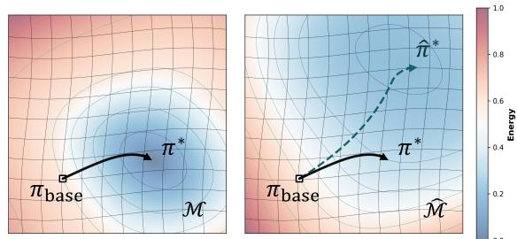

(a) Approximation (critic) error: gradient flow of the estimated energy differs from the true flow.  
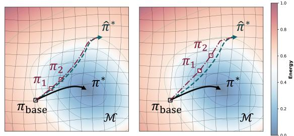  
(b) Approximation + discretization error in MPI: small τ (left) vs. large τ (right).

Figure 1: Visualization of MPI error sources. (a) Continuoustime gradient flow under the true energy (black solid) versus the critic-induced estimated energy (green dashed), illustrating approximation error. (b) Discretized proximal trajectories for the estimated energy (red dash-dotted) with different step sizes τ .

Definition 3 (MPI). Given a base policy $\pi _ { \mathrm { b a s e } } \in { \mathcal { M } }$ , an energy functional $\mathcal { E } _ { s } [ \cdot ]$ , a policy geometry $d _ { \mathcal { M } }$ , and step sizes $\pmb { \tau } = \left( \tau _ { 1 } , \dots , \tau _ { K } \right)$ with $\tau _ { i } > 0 ,$ , multi-step proximal policy improvement (MPI) generates a sequence $\{ \pi _ { i } \} _ { i = 0 } ^ { K }$ with $\pi _ { 0 } = \pi _ { \mathrm { b a s e } }$ and, $f o r i = 1 , \dots , K$

$$
\pi _ { i } \in \underset { \pi \in \mathcal { M } } { \arg \operatorname* { m i n } } \operatorname { p r o x } _ { \mathcal { M } } ^ { \tau _ { i } } ( \mathcal { E } _ { s } \mid \pi _ { i - 1 } ) ( \pi ) .\tag{8}
$$

Equivalently, MPI repeatedly applies SPI while updating the proximal center to the latest iterate:

$$
\pi _ { i } = \mathrm { S P I } ( { \mathcal E } _ { s } [ \cdot ] , d _ { { \mathcal M } } , \pi _ { i - 1 } , \tau _ { i } ) , \qquad i = 1 , \dots , K .\tag{9}
$$

In our offline RL setting, $\pi _ { \mathrm { b a s e } }$ denotes the actor produced by the base algorithm’s anchored update (i.e., a single SPItype update from the behavior policy). Algorithm 2 summarizes MPI.

Connection to implicit Euler discretization. Each update in (8) is an implicit Euler step of the gradient flow associated with $\mathcal { E } _ { s } [ \cdot ]$ under the geometry induced by $d _ { \mathcal { M } }$ Thus, MPI corresponds to a K-step implicit Euler discretization with step sizes $\{ \tau _ { i } \} _ { i = 1 } ^ { K }$ , and the total advancement in “flow time” is $\textstyle \sum _ { i = 1 } ^ { K } \tau _ { i }$ . For sufficiently small step sizes, the piecewise-constant interpolation of $\{ \pi _ { i } \}$ approximates the continuous-time gradient flow in Section 3.2, while retaining the stability properties of proximal updates.

<table><tr><td rowspan="2">Environment</td><td colspan="3">IQL</td><td colspan="3">ReBRAC</td><td colspan="3"> $\mathrm { T D } 3 { + } \mathrm { B C }$ </td></tr><tr><td> $\pi _ { \mathrm { b a s e } }$ </td><td> $\pi _ { 1 }$ </td><td>π2</td><td> $\pi _ { \mathrm { b a s e } }$ </td><td>π1</td><td> $\pi _ { 2 }$ </td><td> $\pi _ { \mathrm { b a s e } }$ </td><td>π1</td><td>π2</td></tr><tr><td>HalfCheetah-M</td><td> $4 8 . 4 2 \pm 0 . 1 9$ </td><td> $5 3 . 7 8 \pm 0 . 2 4$ </td><td> $5 5 . 9 4 \pm 0 . 6 7$ </td><td> $6 4 . 9 0 \pm 0 . 8 2 $ </td><td> $6 5 . 9 2 \pm 1 . 5 1$ </td><td> $6 6 . 0 0 \pm 1 . 5 8$ </td><td> $4 8 . 4 0 \pm 0 . 3 8$ </td><td> $5 4 . 4 6 \pm 0 . 3 6$ </td><td> $5 7 . 6 6 \pm 0 . 5 1$ </td></tr><tr><td>HalfCheetah-MR</td><td> $4 3 . 8 4 \pm 0 . 8 8$ </td><td> $4 9 . 8 0 \pm 0 . 5 0$ </td><td> $5 2 . 3 0 \pm 0 . 8 7$ </td><td> $5 0 . 6 2 \pm 2 . 2 6$ </td><td> $5 0 . 7 3 \pm 0 . 9 5$ </td><td> $4 9 . 9 8 \pm 0 . 4 9$ </td><td> $4 4 . 7 0 \pm 0 . 6 8$ </td><td> $4 9 . 7 6 \pm 0 . 8 3$ </td><td> $5 1 . 9 8 \pm 1 . 0 6$ </td></tr><tr><td>HalfCheetah-ME</td><td> $9 0 . 4 4 \pm 4 . 0 6$ </td><td> $9 1 . 0 2 \pm 3 . 7 2$ </td><td> $8 8 . 5 8 \pm 5 . 8 6$ </td><td> $1 0 3 . 0 0 \pm 4 . 7 6$ </td><td> $9 7 . 1 2 \pm 4 . 3 4$ </td><td> $9 7 . 0 8 \pm 2 . 0 4$ </td><td> $9 0 . 6 2 \pm 6 . 5 1$ </td><td> $8 9 . 8 8 \pm 3 . 7 2 $ </td><td> $7 4 . 4 2 \pm 8 . 5 2$ </td></tr><tr><td>Hopper-M</td><td> $6 0 . 4 4 \pm 6 . 1 7$ </td><td> $9 0 . 5 4 \pm 9 . 4 0$ </td><td> $1 0 1 . 4 0 \pm 3 . 5 1$ </td><td> $9 8 . 3 5 \pm 5 . 0 9$ </td><td> $1 0 1 . 0 5 \pm 1 . 4 9$ </td><td> $1 0 1 . 2 2 \pm 2 . 2 9$ </td><td> $5 9 . 1 8 \pm 3 . 5 6$ </td><td> $9 1 . 4 4 \pm 7 . 4 3$ </td><td> $1 0 0 . 6 0 \pm 1 . 5 4$ </td></tr><tr><td>Hopper-MR</td><td> $8 6 . 7 2 \pm 7 . 5 8$ </td><td> $1 0 0 . 5 0 \pm 3 . 3 6$ </td><td>103.04 ± 0.42</td><td> $9 0 . 2 8 \pm 2 0 . 1 2$ </td><td> $1 0 0 . 7 0 \pm 0 . 2 9$ </td><td> $9 9 . 5 3 \pm 1 . 5 4$ </td><td> $7 1 . 0 2 \pm 2 3 . 8 8$ </td><td> $9 9 . 3 2 \pm 1 . 4 9$ </td><td> $9 9 . 1 2 \pm 1 . 6 4$ </td></tr><tr><td>Hopper-ME</td><td> $1 0 2 . 2 0 \pm 2 1 . 4 1$ </td><td> $1 0 6 . 1 4 \pm 1 0 . 8 2$ </td><td> $1 0 7 . 3 8 \pm 1 0 . 8 4$ </td><td> $1 1 1 . 6 5 \pm 0 . 4 5$ </td><td> $1 0 9 . 6 5 \pm 2 . 7 3$ </td><td> $1 0 7 . 2 2 \pm 7 . 9 6$ </td><td> $9 4 . 6 2 \pm 9 . 4 8 $ </td><td> $9 6 . 8 2 \pm 1 2 . 3 2$ </td><td> $1 0 5 . 4 8 \pm 8 . 2 6$ </td></tr><tr><td>Walker2d-M</td><td> $8 0 . 5 4 \pm 3 . 5 7$ </td><td> $7 4 . 9 4 \pm 1 5 . 1 5$ </td><td> $8 5 . 2 6 \pm 3 . 3 4$ </td><td> $8 5 . 7 5 \pm 0 . 6 4$ </td><td>85.55 ± 1.05</td><td> $8 6 . 9 7 \pm 0 . 9 7$ </td><td> $8 3 . 7 8 \pm 2 . 7 7$ </td><td> $8 4 . 3 0 \pm 6 . 4 9$ </td><td> $8 9 . 4 4 \pm 2 . 1 0 $ </td></tr><tr><td>Walker2d-MR</td><td> $7 8 . 0 6 \pm 8 . 5 9$ </td><td> $8 1 . 8 2 \pm 3 . 3 9$ </td><td> $8 4 . 4 6 \pm 5 . 5 8$ </td><td> $7 9 . 5 5 \pm 5 . 4 0$ </td><td> $8 6 . 3 3 \pm 5 . 0 4$ </td><td> $8 8 . 3 5 \pm 3 . 7 3$ </td><td> $7 9 . 3 0 \pm 6 . 0 7$ </td><td> $8 5 . 6 6 \pm 2 . 5 5$ </td><td> $8 9 . 4 2 \pm 1 . 8 9$ </td></tr><tr><td>Walker2d-ME</td><td> $1 1 1 . 8 6 \pm 1 . 0 6$ </td><td> $1 1 2 . 6 2 \pm 0 . 7 7$ </td><td> $1 1 3 . 7 8 \pm 1 . 2 2$ </td><td>111.83 ± 0.28</td><td> $1 1 2 . 0 8 \pm 0 . 7 9$ </td><td> $1 1 3 . 3 8 \pm 0 . 2 4$ </td><td> $1 1 0 . 2 4 \pm 0 . 1 8$ </td><td> $1 1 2 . 2 0 \pm 0 . 6 4$ </td><td> $1 1 3 . 6 2 \pm 1 . 5 0$ </td></tr><tr><td>Locomotion avg</td><td>78.06</td><td>84.57</td><td>88.02</td><td>88.44</td><td>89.90</td><td>89.97</td><td>75.76</td><td>84.87</td><td>86.86</td></tr></table>

Table 1: $\pi _ { \mathrm { b a s e } }$ refers to the base policy trained with the original algorithm, and $\pi _ { 1 } / \pi _ { 2 }$ are obtained by policy extension with step size τ. D4RL score returns are mean±std over 5 seeds.

Algorithm 2 MPI   
1: function $\mathbf { M P I } ( \mathcal { E } _ { s } [ \cdot ] , d _ { \mathcal { M } } , \pi _ { \mathrm { b a s e } } , \tau , K )$   
2: $\pi _ { 0 }  \pi _ { \mathrm { b a } }$ se   
3: for $k = 1 , \ldots , K$ do   
4: $\pi _ { k } \gets \mathrm { S P I } ( \mathcal { E } _ { s } [ \cdot ] , d _ { \mathcal { M } } , \pi _ { k - 1 } , \tau _ { k } )$   
5: end for   
6: return $\{ \pi _ { k } \} _ { k = 1 } ^ { K }$   
7: end function

MPI as longer flow-time. Within each training iteration, MPI performs multiple implicit proximal steps with respect to the same estimated energy functional $\hat { \mathcal { E } } _ { s \phi }$ . Geometrically, MPI composes local trust-region moves: each step remains close to the previous iterate, while re-centering enables a larger net displacement along the discretized trajectory. This also clarifies the role of critic reliability: increasing $K$ can reduce under-improvement when $\hat { \mathcal { E } } _ { s \phi }$ is locally accurate, but may over-optimize critic artifacts when the estimate is unreliable.

Descent of the estimated energy. MPI inherits the standard descent property of exact proximal minimization. Since $\pi _ { i - 1 }$ is feasible in (8), the optimality of $\pi _ { i }$ yields

$$
\xi _ { s } [ \pi _ { i } ] + \frac { 1 } { 2 \tau _ { i } } d _ { \mathcal { M } } ^ { 2 } ( \pi _ { i } , \pi _ { i - 1 } ) \ \le \ \mathcal { E } _ { s } [ \pi _ { i - 1 } ] .\tag{10}
$$

Re-centering versus a single enlarged step. Because MPI updates the proximal center after every step, composing re-centered maps is generally different from weakening the regularizer in one fixed-anchor problem. For example, for the Euclidean energy $E ( \mu ) = \textstyle { \frac { 1 } { 2 } } { \bar { ( \mu _ { 1 } ^ { 2 } + 2 \mu _ { 2 } ^ { 2 } ) } }$ and $\mu _ { 0 } = ( 1 , 1 )$ two unit proximal steps reach $( { \bar { 1 } } / 4 , 1 / 9 )$ , whereas no single proximal step reaches the same point. Thus, MPI does not enlarge the policy class; it changes the endpoints reachable by sequential re-centered maps. Appendix B.1 formalizes this observation.

Hence, the estimated energy decreases along exact MPI iterates. When $\mathcal { E } _ { s } [ \cdot ]$ is instantiated as the negative of a criticdriven objective, this corresponds to successive actor-side improvement under a fixed critic, while each step remains controlled by a geometry-induced proximity term.

To state the effect of critic and optimization errors explicitly, let $\hat { F } _ { s } = - \hat { \mathcal { E } } _ { s }$ denote the estimated critic objective, let $F _ { s }$ be a reference local objective, and suppose that the ith proximal subproblem is solved up to error $\xi _ { i } \geq 0$ . For the visited neighborhood $B _ { K }$ , define $\begin{array} { r } { \epsilon _ { F } ( B _ { K } ) = \operatorname* { s u p } _ { \pi \in B _ { K } } | \hat { F } _ { s } ( \pi ) - } \end{array}$ $F _ { s } ( \pi ) |$ . Then

$$
\begin{array} { r l r } & { } & { F _ { s } ( \pi _ { K } ) - F _ { s } ( \pi _ { 0 } ) \ge \displaystyle \sum _ { i = 1 } ^ { K } \frac { 1 } { 2 \tau _ { i } } d _ { { \mathcal M } } ^ { 2 } ( \pi _ { i } , \pi _ { i - 1 } ) } \\ & { } & { \qquad - \left. 2 \epsilon _ { F } ( B _ { K } ) - \displaystyle \sum _ { i = 1 } ^ { K } \xi _ { i } . \right. } \end{array}\tag{11}
$$

This gives a conditional local explanation: refinement is beneficial when the accumulated proximal gain exceeds local critic uncertainty and optimization error. Appendix B.2 provides the corresponding estimated-objective bound and derivation.

## 4.3 PRACTICAL INSTANTIATION

MPI is implemented as a plug-in refinement stage that augments an existing offline RL algorithm without modifying its critic update. At each training iteration, we first run the base algorithm’s standard critic and actor updates to obtain a base policy, denoted by $\pi _ { 0 }$ . Using the current estimated energy $\hat { \mathcal { E } } [ \cdot ]$ induced by the critic and the chosen geometry $d _ { \mathcal { M } } ,$ we then apply MPI by repeatedly solving re-centered proximal subproblems, producing refined policies $\{ \pi _ { i } \} _ { i = 1 } ^ { K }$ from $\pi _ { 0 }$ . Algorithm 3 summarizes this per-iteration refinement procedure.

Algorithm 3 MPI-based Policy Extension   
Require: Base offline RL algorithm Algo, refinement   
steps K, step sizes $\tau ,$ geometry $d _ { \mathcal { M } }$   
1: for each gradient step do   
2: Algo.Updat $\mathtt { e C r i t i c ( ) }$   
3: Algo.UpdateActor()   
4: $\pi _ { 0 }  \mathtt { A l }$ go.Actor   
5: $\{ \pi _ { i } \} _ { i = 1 } ^ { K }  \mathrm { M P I } \Big ( \hat { \mathcal { E } } _ { s } [ \cdot ] , d _ { \mathcal { M } } , \pi _ { 0 } , \tau , K \Big )$   
6: end for   
7: Outputs $\{ \pi _ { i } \} _ { i = 0 } ^ { K }$

When the policy class is diagonal Gaussian or deterministic, we compute the geometry-induced distance $d _ { \mathcal { M } }$ in closed form following Appendix A.3. Otherwise, when M is endowed with Wasserstein geometry, we instantiate $d _ { \mathcal { M } }$ using Sinkhorn distance (7).

For advantage-weighted methods such as IQL, our SPI interpretation is most naturally expressed under Fisher–Rao geometry via its local connection to KL divergence $( \mathsf { A p } \cdot \mathsf { \Gamma }$ pendix A.2). Nevertheless, for practical refinement we use Wasserstein-2 geometry, motivated by the analysis in $\mathsf { A p - }$ pendix A.1 which explains why Fisher–Rao refinement can be unfavorable in near-deterministic continuous-control regimes; Fisher–Rao refinement results for IQL are reported in Appendix D.

## 5 EXPERIMENTS

We evaluate MPI-based policy extension on standard offline RL benchmarks from D4RL [Fu et al., 2020], including locomotion tasks and AntMaze tasks. We consider three representative offline RL methods: IQL, TD3+BC, and Re-BRAC. We report D4RL-normalized scores of the base policies $\pi _ { \mathrm { b a s e } }$ and their MPI extensions $\pi _ { 1 }$ and $\pi _ { 2 }$ averaged over five random seeds. All base algorithms and training hyperparameters follow the standard CORL offline RL benchmark configurations [Tarasov et al., 2022].

## 5.1 MPI-BASED POLICY EXTENSION

MPI introduces a single additional hyperparameter $\tau .$ For each environment, we sweep $\tau$ over a fixed grid [0.001, 0.005, 0.01, 0.05] and report the best-performing setting selected by the score of $\pi _ { 2 } .$ , as summarized in Table 1.

Comparing the score of $\pi _ { 1 }$ to that of $\pi _ { 2 }$ reveals that a second re-centered refinement step often provides additional gains beyond a single step (e.g., HalfCheetah-medium, Hopper-medium, Walker2d-medium-replay), but improvements are not strictly monotone across all tasks. In medium-expert tasks, where the base policy is already close to optimal, even small approximation errors in the critic can cause the refinement step to increase the true energy, leading to non-monotone behavior.

This behavior is less pronounced for ReBRAC. Because ReBRAC explicitly regularizes the critic with respect to the behavior distribution, the resulting value function is intended to be most reliable near dataset-supported actions and less prone to optimistic extrapolation. Accordingly, πbase is typically already optimized within the region where the critic is well-calibrated, so additional refinement steps offer limited room for improvement.

## 5.2 RE-CENTERING DIAGNOSTICS

MPI changes the proximal subproblem rather than only increasing the number of optimizer steps on a fixed actor objective. As focused diagnostics on Hopper-medium-replay-v2, re-centered refinement improves the policy under the original TD3+BC step size, whereas compute-matched optimization of the fixed-anchor objective does not reproduce the MPI result. Since these diagnostics cover one environment, we use them only to distinguish re-centered MPI from fixed-objective update scheduling. Full protocols and results are provided in $\mathbf { A } \mathbf { p } \cdot$ pendix B.3.

## 5.3 COMPARISON WITH AN EXPLICIT SCHEME

To isolate the effect of implicit proximal refinement, we compare against an explicit action-gradient update that performs a first-order Euler step on the critic in (2). When $d _ { \mathcal { M } } = \mathcal { W } _ { 2 }$ and $\mathcal { E } _ { s } [ \pi ] = - \mathbb { E } _ { a \sim \pi ( \cdot | s ) } [ Q ( s , a ) ]$ , the explicit update is given as

$$
\pi _ { k + 1 } ( s ) = \pi _ { k } ( s ) + \tau \left. \nabla _ { a } Q ( s , a ) \right| _ { a = \pi _ { k } ( s ) } .\tag{12}
$$

This update can be interpreted as a direct gradient ascent step in action space, and is a natural baseline when one views refinement as moving actions along $\nabla _ { a } Q$ . These experiments are conducted to study the numerical stability of the implicit update. As mentioned in Section $3 . 2 ,$ the explicit update is more sensitive to hyperparameter tuning and local curvature of the energy function. In particular, when the critic is imperfect, the estimated gradient field may deviate from the true flow, and large step sizes can amplify such approximation errors and lead to overshooting or unstable trajectories. Figure 2 visualizes these effects: as τ increases, the explicit trajectory can deviate substantially, whereas the implicit proximal refinement remains comparatively stable.

For a fair comparison, within each environment we use the same step size $\tau$ for both the implicit (MPI) and explicit updates.

Table 2 reports the percentage changes relative to $\pi _ { \mathrm { b a s e } } ,$ showing that implicit MPI generally yields larger and more reliable improvements than the explicit scheme. These results support the central motivation for MPI in offline RL: within the evaluated settings, an implicit proximal step behaves like a trust-region improvement operator and is empirically less sensitive to critic-induced errors than a naive explicit gradient step.

<table><tr><td rowspan="3"></td><td colspan="3">TD3+BC</td><td colspan="4">ReBRAC</td></tr><tr><td>Implicit</td><td></td><td>Explicit</td><td colspan="2">Implicit</td><td colspan="2">Explicit</td></tr><tr><td>π1</td><td>π2</td><td>π1</td><td>π2</td><td>π1</td><td>π2</td><td>π1 π2</td></tr><tr><td>HalfCheetah-M</td><td>|+12.6+19.1</td><td>+0.9</td><td>+2.6</td><td>+1.6</td><td>+1.7</td><td>+0.4</td><td>+0.8</td></tr><tr><td>HalfCheetah-MR</td><td>+11.4 +16.1</td><td></td><td>+3.0 +3.0</td><td>+1.8</td><td>+0.6</td><td></td><td>-21.8-25.9</td></tr><tr><td>HalfCheetah-ME</td><td>-2.9</td><td>-17.3</td><td>+0.9 -2.2</td><td>-5.7</td><td>-5.7</td><td>+1.9</td><td>+2.8</td></tr><tr><td>Hopper-M</td><td>+53.2+72.8</td><td></td><td>+26.5+50.6</td><td>-11.1</td><td>-2.1</td><td>+0.6</td><td>-5.0</td></tr><tr><td>Hopper-MR</td><td>+23.3+36.1</td><td></td><td>+15.3 +22.2</td><td>+1.6</td><td>+1.9</td><td>+8.2</td><td>+14.9</td></tr><tr><td>Hopper-ME</td><td>+6.6</td><td>+6.8</td><td>+19.8 +23.2</td><td>-2.2</td><td>-5.3</td><td>-4.7</td><td>-8.5</td></tr><tr><td>Walker2d-M</td><td>+3.6</td><td>+6.7</td><td>+5.8 +7.2</td><td>0.0</td><td>+1.3</td><td>+0.3</td><td>-2.1</td></tr><tr><td>Walker2d-MR</td><td>+9.7</td><td>+9.2</td><td>+11.4 +4.4</td><td>+5.7</td><td>+0.2</td><td>+9.8</td><td>+11.3</td></tr><tr><td>Walker2d-ME</td><td>+1.7</td><td>+3.1</td><td>+1.4 +2.4</td><td>+0.2</td><td>+1.2</td><td>+0.6</td><td></td></tr><tr><td></td><td></td><td></td><td></td><td></td><td></td><td></td><td>+0.9</td></tr></table>

<table><tr><td rowspan="2">Environment</td><td>Implicit</td><td>Explicit</td><td rowspan="2"></td></tr><tr><td>π1 π2</td><td>π1</td></tr><tr><td>Umaze</td><td>0.0 +2.0</td><td>-0.4-0.8</td><td></td></tr><tr><td>Umaze-Diverse</td><td>+15.0 +15.0</td><td></td><td>+0.9 +1.2</td></tr><tr><td>Medium-Play</td><td>+10.0 +15.0</td><td></td><td>-3.2 +0.5</td></tr><tr><td>Medium-Diverse</td><td>0.0 0.0</td><td></td><td>+0.7-4.3</td></tr><tr><td>Large-Play</td><td>+12.5 +50.0</td><td></td><td>-6.8-1.6</td></tr><tr><td>Large-Diverse</td><td>+14.3 +5.7</td><td></td><td>-2.4-1.2</td></tr></table>

(b) ReBRAC AntMaze

(a) Locomotion (TD3+BC, ReBRAC)  
Table 2: Comparison of implicit policy extension (MPI) and explicit policy extension. (a) TD3+BC & ReBRAC for Locomotion, (b) ReBRAC for AntMaze. Values indicate the percentage change relative to πbase.  
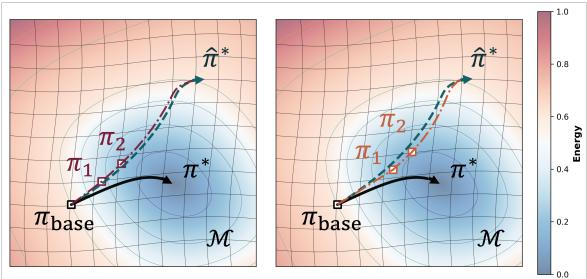

(a) Implicit (left) and explicit (right) gradient-flow trajectories with small τ.  
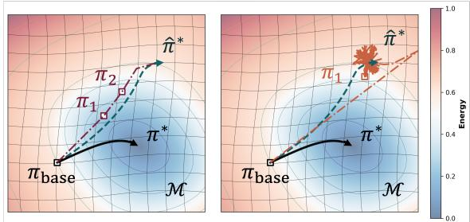  
(b) Implicit (left) and explicit (right) gradient-flow trajectories with large τ .  
Figure 2: Effect of the step size τ on the explicit scheme. Figure 2a shows that with small τ , implicit (red dash-dotted) and explicit (orange dash-dotted) updates yield similarly stable trajectories. In contrast, Figure 2b shows that for large τ , the implicit scheme remains stable while the explicit scheme becomes unstable and diverges.

## 6 CONCLUSION & FUTURE WORKS

We presented a geometric perspective on offline actor updates, showing that a broad class of behavior-anchored objectives can be interpreted as SPI on a statistical manifold. This viewpoint clarifies how strong anchoring stabilizes training but may induce under-improvement. Motivated by this insight, we proposed MPI, which composes sequential, re-centered proximal updates under a fixed geometry. From the gradient-flow perspective, MPI corresponds to a finer implicit discretization of the same manifold flow, enabling controlled policy advancement while retaining local displacement control. MPI is implemented as a modular plugin refinement stage that leaves the base actor–critic training unchanged. Empirically, small numbers of refinements improve behavior-anchored baselines on many standard D4RL tasks without introducing significant additional complexity. Our critic-error analysis also shows that refinement can saturate or degrade when the learned objective is insufficiently aligned with true return. Overall, our results suggest that carefully controlling the discretization of geometry-induced policy flows provides a useful path toward reducing underimprovement in offline reinforcement learning, provided that refinement remains local to a reliable critic region.

A promising direction is to extend MPI to generative policy classes (e.g., flow- or diffusion-based actors), where policy improvement is still often implemented as a conservative single-step update despite the expressive sampler (e.g. Diffusion Q-learning [Wang et al., 2023]). Incorporating MPI could enable multi-step, re-centered refinement directly in distribution space, but will require scalable proxies for geometry-induced distances and careful control of critic-induced artifacts under highly expressive policies.

Another direction is to incorporate predictor–corrector refinement, where an explicit predictor proposes a tentative improvement step and an implicit proximal corrector re-centers and stabilizes it [Diao et al., 2023]. Such schemes could reduce the cost of repeatedly solving proximal subproblems while retaining MPI’s robustness to critic approximation error. The main challenge is to design a critic-induced predictor that remains reliable off-support and a corrector that meaningfully contracts harmful extrapolation.

## Bibliography

Marvin Alles, Nutan Chen, Patrick van der Smagt, and Botond Cseke. Flowq: Energy-guided flow policies for offline reinforcement learning, 2025. URL https: //arxiv.org/abs/2505.14139.

S. Amari and H. Nagaoka. Methods of Information Geometry. Translations of mathematical monographs. American Mathematical Society, 2000. ISBN 9780821843024. URL https://books.google. co.kr/books?id=vc2FWSo7wLUC.

L. Ambrosio, N. Gigli, and G. Savare. Gradient Flows: In Metric Spaces and in the Space of Probability Measures. Lectures in Mathematics. ETH Zürich. Birkhäuser Basel, 2005. ISBN 9783764324285. URL https://books. google.co.kr/books?id=HZqhWIq1-jgC.

Gaon An, Seungyong Moon, Jang-Hyun Kim, and Hyun Oh Song. Uncertainty-based offline reinforcement learning with diversified q-ensemble, 2021. URL https: //arxiv.org/abs/2110.01548.

Arip Asadulaev, Rostislav Korst, Alexander Korotin, Vage Egiazarian, Andrey Filchenkov, and Evgeny Burnaev. Rethinking optimal transport in offline reinforcement learning, 2024. URL https://arxiv.org/abs/2410. 14069.

Nihat Ay, Jürgen Jost, Hông Vân Lê, and Lorenz Schwachhöfer. Information Geometry. Springer Cham, 2007. ISBN 978-3-319-56478- 4. URL https://link.springer.com/ book/10.1007/978-3-319-56478-4# bibliographic-information.

Yevgen Chebotar, Quan Vuong, Alex Irpan, Karol Hausman, Fei Xia, Yao Lu, Aviral Kumar, Tianhe Yu, Alexander Herzog, Karl Pertsch, Keerthana Gopalakrishnan, Julian Ibarz, Ofir Nachum, Sumedh Sontakke, Grecia Salazar, Huong T Tran, Jodilyn Peralta, Clayton Tan, Deeksha Manjunath, Jaspiar Singht, Brianna Zitkovich, Tomas Jackson, Kanishka Rao, Chelsea Finn, and Sergey Levine. Q-transformer: Scalable offline reinforcement learning

via autoregressive q-functions, 2023. URL https:// arxiv.org/abs/2309.10150.

Yifan Chen and Wuchen Li. Optimal transport natural gradient for statistical manifolds with continuous sample space, 2020. URL https://arxiv.org/abs/ 1805.08380.

Marco Cuturi. Sinkhorn distances: Lightspeed computation of optimal transportation distances, 2013. URL https: //arxiv.org/abs/1306.0895.

Michael Diao, Krishnakumar Balasubramanian, Sinho Chewi, and Adil Salim. Forward-backward gaussian variational inference via jko in the bures-wasserstein space, 2023. URL https://arxiv.org/abs/ 2304.05398.

Justin Fu, Aviral Kumar, Ofir Nachum, George Tucker, and Sergey Levine. D4rl: Datasets for deep data-driven reinforcement learning, 2020.

Scott Fujimoto and Shixiang Shane Gu. A minimalist approach to offline reinforcement learning. Advances in neural information processing systems, 34:20132–20145, 2021.

Scott Fujimoto, David Meger, and Doina Precup. Off-policy deep reinforcement learning without exploration, 2019a. URL https://arxiv.org/abs/1812.02900.

Scott Fujimoto, David Meger, and Doina Precup. Off-policy deep reinforcement learning without exploration, 2019b. URL https://arxiv.org/abs/1812.02900.

Chen-Xiao Gao, Chenyang Wu, Mingjun Cao, Chenjun Xiao, Yang Yu, and Zongzhang Zhang. Behaviorregularized diffusion policy optimization for offline reinforcement learning, 2025. URL https://arxiv. org/abs/2502.04778.

Jiang Hu, Xin Liu, Zaiwen Wen, and Yaxiang Yuan. A brief introduction to manifold optimization, 2019. URL https://arxiv.org/abs/1906.05450.

Shengchao Hu, Ziqing Fan, Chaoqin Huang, Li Shen, Ya Zhang, Yanfeng Wang, and Dacheng Tao. Q-value regularized transformer for offline reinforcement learning, 2024. URL https://arxiv.org/abs/2405. 17098.

Sham M. Kakade. A natural policy gradient. In NIPS, 2001.

Bekzhan Kerimkulov, James-Michael Leahy, David Siska, Lukasz Szpruch, and Yufei Zhang. A fisher–rao gradient flow for entropy-regularised markov decision processes in polish spaces: B. kerimkulov et al. Foundations of Computational Mathematics, pages 1–75, 2025.

Ilya Kostrikov, Ashvin Nair, and Sergey Levine. Offline reinforcement learning with implicit q-learning. arXiv preprint arXiv:2110.06169, 2021.

Aviral Kumar, Justin Fu, George Tucker, and Sergey Levine. Stabilizing off-policy q-learning via bootstrapping error reduction, 2019. URL https://arxiv.org/abs/ 1906.00949.

Aviral Kumar, Aurick Zhou, George Tucker, and Sergey Levine. Conservative q-learning for offline reinforcement learning. CoRR, abs/2006.04779, 2020. URL https: //arxiv.org/abs/2006.04779.

Razvan-Andrei Lascu, David Šiška, and Łukasz Szpruch. Ppo in the fisher-rao geometry, 2025. URL https:// arxiv.org/abs/2506.03757.

Qiyang Li and Sergey Levine. Q-learning with adjoint matching, 2026. URL https://arxiv.org/abs/ 2601.14234.

Amarildo Likmeta, Matteo Sacco, Alberto Maria Metelli, and Marcello Restelli. Wasserstein actor-critic: Directed exploration via optimism for continuous-actions control, 2023. URL https://arxiv.org/abs/2303. 02378.

Ted Moskovitz, Michael Arbel, Ferenc Huszar, and Arthur Gretton. Efficient wasserstein natural gradients for reinforcement learning. arXiv preprint arXiv:2010.05380, 2020.

Ashvin Nair, Murtaza Dalal, Abhishek Gupta, and Sergey Levine. Accelerating online reinforcement learning with offline datasets. CoRR, abs/2006.09359, 2020. URL https://arxiv.org/abs/2006.09359.

Felix Otto. The geometry of dissipative evolution equations: The porous medium equation. Communications in Partial Differential Equations, 26(1-2):101–174, 2001. doi: 10. 1081/PDE-100002243. URL https://doi.org/10. 1081/PDE-100002243.

Seohong Park, Qiyang Li, and Sergey Levine. Flow qlearning, 2025. URL https://arxiv.org/abs/ 2502.02538.

Giovanni Pistone and Carlo Sempi. An infinite-dimensional geometric structure on the space of all the probability measures equivalent to a given one. The annals ofstatistics, pages 1543–1561, 1995.

Michael Psenka, Alejandro Escontrela, Pieter Abbeel, and Yi Ma. Learning a diffusion model policy from rewards via q-score matching, 2025. URL https://arxiv. org/abs/2312.11752.

John Schulman, Sergey Levine, Philipp Moritz, Michael I. Jordan, and Pieter Abbeel. Trust region policy optimization, 2017. URL https://arxiv.org/abs/1502. 05477.

Jun Song, Niao He, Lijun Ding, and Chaoyue Zhao. Provably convergent policy optimization via metric-aware trust region methods, 2023. URL https://arxiv. org/abs/2306.14133.

Richard S. Sutton and Andrew G. Barto. Reinforcement Learning: An Introduction. The MIT Press, second edition, 2018. URL http://incompleteideas. net/book/the-book-2nd.html.

Denis Tarasov, Alexander Nikulin, Dmitry Akimov, Vladislav Kurenkov, and Sergey Kolesnikov. CORL: Research-oriented deep offline reinforcement learning library. In 3rd Offline RL Workshop: Offline RL as a ”Launchpad”, 2022. URL https://openreview. net/forum?id=SyAS49bBcv.

Denis Tarasov, Vladislav Kurenkov, Alexander Nikulin, and Sergey Kolesnikov. Revisiting the minimalist approach to offline reinforcement learning, 2023. URL https: //arxiv.org/abs/2305.09836.

Antonio Terpin, Nicolas Lanzetti, Batuhan Yardim, Florian Dörfler, and Giorgia Ramponi. Trust region policy optimization with optimal transport discrepancies: Duality and algorithm for continuous actions, 2022. URL https://arxiv.org/abs/2210.11137.

C. Villani. Optimal Transport: Old and New. Grundlehren der mathematischen Wissenschaften. Springer Berlin Heidelberg, 2008. ISBN 9783540710493. URL https://books.google.co.kr/books?id= NZXiNAEACAAJ.

Zhendong Wang, Jonathan J Hunt, and Mingyuan Zhou. Diffusion policies as an expressive policy class for offline reinforcement learning, 2023. URL https://arxiv. org/abs/2208.06193.

Yifan Wu, George Tucker, and Ofir Nachum. Behavior regularized offline reinforcement learning, 2019. URL https://arxiv.org/abs/1911.11361.

Ruiyi Zhang, Changyou Chen, Chunyuan Li, and Lawrence Carin. Policy optimization as wasserstein gradient flows. CoRR, abs/1808.03030, 2018. URL http://arxiv. org/abs/1808.03030.

# Multi-step Proximal Policy Improvement in Offline Reinforcement Learning (Supplementary Material)

Soohyun Choi\*1

Seonvin Cho\*1

Songnam Hong†1

1Department of Electronic Engineering, Hanyang University, Seoul, Republic of Korea, {petersun0221,seonbin0319,snhong}@hanyang.ac.kr,

\*Equal contribution., †Corresponding author.

## A PROOFS

## A.1 FIRST-ORDER ANALYSIS OF GAUSSIAN SPI

We derive the first-order approximation of one-step SPI updates for diagonal Gaussian policies under the Wasserstein and Fisher–Rao (FR) geometries. Fix a state s and expand $Q ( s , a )$ at $a = \mu _ { \mathrm { b a s e } } ( s )$ up to second order. For a local one-step analysis, we keep only terms that contribute at $O ( \tau )$ when initialized at $\pi _ { \mathrm { b a s e } }$ (the quadratic term in $\mu - \mu _ { \mathrm { b a s e } }$ affects the update only at $O ( \tau ^ { 2 } ) )$ . The resulting local approximation of the energy functional becomes

$$
\mathcal { E } _ { s } [ \pi ] = - \mathrm { G } ^ { \mathsf { T } } ( \mu - \mu _ { \mathrm { b a s e } } ) - \frac { 1 } { 2 } \mathrm { t r } ( \mathrm { H } \Sigma ) + \mathrm { c o n s t . } ,
$$

where $\mathrm { G } = \nabla _ { a } Q ( s , \cdot ) | _ { a = \mu _ { \mathrm { b a s } \epsilon } }$ and $\mathrm { H } = \nabla _ { a } ^ { 2 } Q ( s , \cdot ) | _ { a = \mu _ { \mathrm { b a s e } } }$ . Since Σ is diagonal, only the diagonal of H contributes through tr(HΣ); define

$$
\begin{array} { r } { \widetilde { \mathrm { H } } : = \mathrm { d i a g } ( \mathrm { d i a g } ( \mathrm { H } ) ) . } \end{array}
$$

Local proximal objectives. Let $\pi _ { \mathrm { b a s e } } = \mathcal { N } ( \mu _ { \mathrm { b a s e } } , \Sigma _ { \mathrm { b a s e } } )$ and $\pi = { \mathcal { N } } ( \mu , \Sigma )$ with $\Sigma = \mathrm { d i a g } ( \sigma ^ { 2 } )$ . (We use the closed-form $\mathcal { W } _ { 2 }$ distance for diagonal Gaussians; see Appendix A.3.) The local proximal objectives can be written as

Wasserstein:

$$
\operatorname { p r o x } _ { W _ { 2 } } ^ { \tau } ( \mathcal { E } _ { s } \mid \pi _ { \mathrm { b a s e } } ) \left( \pi \right) = - \mathbf { G } ^ { \mathsf { T } } ( \mu - \mu _ { \mathrm { b a s e } } ) - \frac { 1 } { 2 } \sum _ { i = 1 } ^ { d } \widetilde { \mathbf { H } } _ { i i } \sigma _ { i } ^ { 2 } + \frac { 1 } { 2 \tau } \mathcal { W } _ { 2 } ^ { 2 } ( \pi , \pi _ { \mathrm { b a s e } } ) + \mathrm { c o n s t . }
$$

Fisher–Rao:

$$
\operatorname { p r o x } _ { d _ { \mathrm { F R } } } ^ { \tau } ( \mathcal { E } _ { s } \mid \pi _ { \mathrm { b a s e } } ) \left( \pi \right) = - \mathbf { G } ^ { \mathsf { T } } ( \mu - \mu _ { \mathrm { b a s e } } ) - \frac { 1 } { 2 } \sum _ { i = 1 } ^ { d } \widetilde { \mathbf { H } } _ { i i } \sigma _ { i } ^ { 2 } + \frac { 1 } { 2 \tau } d _ { \mathrm { F R } } ^ { 2 } ( \pi , \pi _ { \mathrm { b a s e } } ) + \mathrm { c o n s t . }
$$

First-order one-step updates. Differentiating the proximal objectives and evaluating at $\pi = \pi _ { \mathrm { b a s e } }$ yields the following first-order expansions for the one-step SPI update $\pi _ { 1 } = \mathcal { N } ( \mu _ { 1 } , \Sigma _ { 1 } )$ as $\tau  0 \cdot$

Wasserstein:

$$
\begin{array} { r l } & { \mu _ { 1 } = \mu _ { \mathrm { b a s e } } + \tau \mathrm { G } + O ( \tau ^ { 2 } ) , } \\ & { \Sigma _ { 1 } = \Sigma _ { \mathrm { b a s e } } + 2 \tau \widetilde { \mathrm { H } } \Sigma _ { \mathrm { b a s e } } + O ( \tau ^ { 2 } ) . } \end{array}
$$

Fisher–Rao:

$$
\begin{array} { r } { \mu _ { 1 } = \mu _ { \mathrm { b a s e } } + \tau \Sigma _ { \mathrm { b a s e } } \mathrm { G } + O ( \tau ^ { 2 } ) , } \\ { \Sigma _ { 1 } = \Sigma _ { \mathrm { b a s e } } + \tau \widetilde { \mathrm { H } } \Sigma _ { \mathrm { b a s e } } ^ { 2 } + O ( \tau ^ { 2 } ) . } \end{array}
$$

These relations describe the first-order evolution of the mean and covariance (and thus the standard deviation) under each geometry for small step size τ.

Implication for Fisher–Rao refinement in near-deterministic regimes. The Fisher–Rao updates exhibit a structural limitation when the base actor is near-deterministic. In particular, the mean update is preconditioned by the current covariance, $\mu _ { 1 } - \mu _ { \mathrm { b a s e } } = O ( \tau \Sigma _ { \mathrm { b a s e } } \mathrm { G } )$ , so as $\Sigma _ { \mathrm { b a s e } }$ shrinks, the effective step size for the mean collapses and multi-step refinement becomes increasingly conservative.

The covariance update further clarifies how variance can contract. From the Fisher–Rao expansion,

$$
( \Sigma _ { 1 } ) _ { i i } = ( \Sigma _ { \mathrm { b a s e } } ) _ { i i } + \tau \mathrm { H } _ { i i } ( \Sigma _ { \mathrm { b a s e } } ) _ { i i } ^ { 2 } + O ( \tau ^ { 2 } ) .
$$

Hence, for coordinates where Q is locally concave around the base action $( \mathrm { i . e . , H } _ { i i } < 0 )$ , we have

$$
( \Sigma _ { 1 } ) _ { i i } < ( \Sigma _ { \mathrm { b a s e } } ) _ { i i } \qquad \mathrm { f o r ~ s u f f i c i e n t l y ~ s m a l l } ~ \tau ,
$$

so refinement can further concentrate the policy once it enters a small-variance regime (while the opposite trend occurs when $\mathrm { H } _ { i i } > 0 )$ . In implementations that realize Fisher–Rao refinement via local KL-based proxies (Appendix A.2), the proximity term introduces inverse-variance weighting and variance-ratio/log-determinant factors; as $\sigma _ { \mathrm { b a s e } , i } ~  ~ 0$ , the resulting objective can become ill-conditioned, leading to numerical instability and occasional optimization divergence. We empirically observe this variance-collapse/instability pattern in our Fisher–Rao refinement ablations on continuous-control benchmarks, motivating our use of Wasserstein-2 geometry for practical MPI refinement in near-deterministic regimes, where $\mathcal { W } _ { 2 }$ remains well-behaved in the vanishing-variance (Dirac) limit.

## A.2 KL DIVERGENCE APPROXIMATION OF THE FISHER–RAO DISTANCE

Let $\xi \in T _ { \pi ^ { \star } } \mathcal { P } _ { + } ^ { \infty } ( \Omega )$ and define

$$
\begin{array} { r } { \pi = \mathrm { E x p } _ { \pi ^ { \star } } ( \xi ) , \qquad \delta : = \| \xi \| _ { \mathrm { F R } , \pi ^ { \star } } . } \end{array}
$$

(Equivalently, $\delta = d _ { \mathrm { F R } } ( \pi , \pi ^ { \star } ) . )$ ) Set $F ( \pi ) : = 2 \mathrm { K L } ( \pi \| \pi ^ { \star } )$ . Then

$$
{ \cal F } ( \pi ^ { \star } ) = 0 , \qquad \nabla _ { \mathrm { F R } } F ( \pi ^ { \star } ) = 0 , \qquad \mathrm { H e s s } _ { \mathrm { F R } } F ( \pi ^ { \star } ) = 2 g _ { \mathrm { F R , } \pi ^ { \star } } .
$$

By Taylor’s theorem in Fisher–Rao normal coordinates (for π in a sufficiently small Fisher–Rao neighborhood of $\pi ^ { \star } )$ ,

$$
\begin{array} { r } { F ( \pi ) = F ( \pi ^ { \star } ) + \frac { 1 } { 2 } \operatorname { H e s s } _ { \mathrm { F R } } F ( \pi ^ { \star } ) [ \xi , \xi ] + R _ { 3 } = \delta ^ { 2 } + R _ { 3 } , \qquad | R _ { 3 } | \le C \delta ^ { 3 } . } \end{array}
$$

Hence,

$$
2 \mathrm { K L } ( \pi \| \pi ^ { \star } ) = d _ { \mathrm { F R } } ^ { 2 } ( \pi , \pi ^ { \star } ) + { \cal O } \big ( d _ { \mathrm { F R } } ^ { 3 } ( \pi , \pi ^ { \star } ) \big ) .
$$

Equivalently, writing $\varepsilon : = d _ { \mathrm { F R } } ^ { 2 } ( \pi , \pi ^ { \star } )$ gives

$$
2 \mathrm { K L } ( \pi \| \pi ^ { \star } ) = \varepsilon + O ( \varepsilon ^ { 3 / 2 } ) .
$$

## A.3 CLOSED-FORM DISTANCES FOR DIAGONAL GAUSSIAN POLICIES

We collect closed-form expressions for the Wasserstein-2 and Fisher–Rao distances used in our proximal objectives, specialized to diagonal Gaussian policies on $\mathbb { R } ^ { d }$ . Throughout, we write $\rho _ { i } = \mathcal { N } ( \mu _ { i } , \Sigma _ { i } )$ with $\Sigma _ { i } = \mathrm { d i a g } ( \sigma _ { i } ^ { 2 } )$ and $\sigma _ { i } \in \mathbb { R } _ { + } ^ { d }$

Wasserstein-2 distance. Let $\rho _ { 0 } = \mathcal { N } ( \mu _ { 0 } , \Sigma _ { 0 } )$ and $\rho _ { 1 } = \mathcal { N } ( \mu _ { 1 } , \Sigma _ { 1 } )$ be Gaussians with positive definite covariances. A standard formula gives

$$
\begin{array} { r } { \mathcal { W } _ { 2 } ^ { 2 } ( \rho _ { 0 } , \rho _ { 1 } ) = \| \mu _ { 0 } - \mu _ { 1 } \| _ { 2 } ^ { 2 } + \mathrm { t r } \Big ( \Sigma _ { 0 } + \Sigma _ { 1 } - 2 \big ( \Sigma _ { 1 } ^ { 1 / 2 } \Sigma _ { 0 } \Sigma _ { 1 } ^ { 1 / 2 } \big ) ^ { 1 / 2 } \Big ) . } \end{array}\tag{13}
$$

(Equivalently, one may use $( \Sigma _ { 0 } ^ { 1 / 2 } \Sigma _ { 1 } \Sigma _ { 0 } ^ { 1 / 2 } ) ^ { 1 / 2 }$ inside the trace; both yield the same value.)

For diagonal covariances $\Sigma _ { 0 } = \mathrm { d i a g } ( \sigma _ { 0 } ^ { 2 } )$ and $\Sigma _ { 1 } = \mathrm { d i a g } ( \sigma _ { 1 } ^ { 2 } )$ , this simplifies to

$$
\mathcal { W } _ { 2 } ^ { 2 } \big ( \mathcal { N } ( \mu _ { 0 } , \mathrm { d i a g } ( \sigma _ { 0 } ^ { 2 } ) ) , \mathcal { N } ( \mu _ { 1 } , \mathrm { d i a g } ( \sigma _ { 1 } ^ { 2 } ) ) \big ) = \| \mu _ { 0 } - \mu _ { 1 } \| _ { 2 } ^ { 2 } + \| \sigma _ { 0 } - \sigma _ { 1 } \| _ { 2 } ^ { 2 } .\tag{14}
$$

In particular, deterministic actors correspond to the Dirac limit $\sigma _ { 0 } , \sigma _ { 1 } \to 0$ , yielding

$$
\mathcal { W } _ { 2 } ^ { 2 } ( \delta ( \cdot - \mu _ { 0 } ) , \delta ( \cdot - \mu _ { 1 } ) ) = \| \mu _ { 0 } - \mu _ { 1 } \| _ { 2 } ^ { 2 } .\tag{15}
$$

Fisher–Rao distance. Let $\begin{array} { r } { \bar { \Sigma } : = \frac { 1 } { 2 } ( \Sigma _ { 0 } + \Sigma _ { 1 } ) } \end{array}$ . The Bhattacharyya coefficient between Gaussians admits

$$
\mathrm { B C } ( \rho _ { 0 } , \rho _ { 1 } ) = \frac { | \Sigma _ { 0 } | ^ { 1 / 4 } | \Sigma _ { 1 } | ^ { 1 / 4 } } { | \bar { \Sigma } | ^ { 1 / 2 } } \exp \bigl ( - \frac { 1 } { 8 } ( \mu _ { 0 } - \mu _ { 1 } ) ^ { \top } \bar { \Sigma } ^ { - 1 } ( \mu _ { 0 } - \mu _ { 1 } ) \bigr ) ,\tag{16}
$$

and the Fisher–Rao distance is

$$
\begin{array} { r } { d _ { \mathrm { F R } } \big ( \rho _ { 0 } , \rho _ { 1 } \big ) = 2 \operatorname { a r c c o s } \big ( \mathrm { B C } ( \rho _ { 0 } , \rho _ { 1 } ) \big ) . } \end{array}\tag{17}
$$

For diagonal covariances, $\bar { \Sigma } = \mathrm { d i a g } ( ( \sigma _ { 0 } ^ { 2 } + \sigma _ { 1 } ^ { 2 } ) / 2 )$ and the coefficient factorizes as

$$
\mathrm { B C } ( \rho _ { 0 } , \rho _ { 1 } ) = \prod _ { j = 1 } ^ { d } { \sqrt { { \frac { 2 \sigma _ { 0 , j } \sigma _ { 1 , j } } { \sigma _ { 0 , j } ^ { 2 } + \sigma _ { 1 , j } ^ { 2 } } } } } \exp \left( - { \frac { ( \mu _ { 0 , j } - \mu _ { 1 , j } ) ^ { 2 } } { 4 ( \sigma _ { 0 , j } ^ { 2 } + \sigma _ { 1 , j } ^ { 2 } ) } } \right) ,\tag{18}
$$

which can be substituted into (17) to obtain a closed-form $d _ { \mathrm { F R } }$ for diagonal Gaussian policies.

Remark (domain). Unlike $\mathcal { W } _ { 2 }$ , which is defined on $\mathcal { P } _ { 2 } ( \mathbb { R } ^ { d } )$ and naturally accommodates Dirac measures, $d _ { \mathrm { F R } }$ is typically defined on strictly positive densities $( \mathbf { e . g . } , \mathcal { P } _ { + } ^ { \infty } ( \Omega ) )$ . As a result, deterministic (Dirac) policies lie outside the Fisher–Rao manifold, even though one may consider limiting behavior as $\sigma  0$

## B RE-CENTERING AND CRITIC-ERROR ANALYSES

## B.1 REACHABLE SETS UNDER RE-CENTERED PROXIMAL MAPS

Let $T _ { \tau }$ denote the exact proximal map associated with a fixed energy and geometry. For a base policy $\pi _ { 0 } .$ , define the K-step reachable set as

$$
\mathcal { R } _ { K } ( \pi _ { 0 } ) = \left\{ T _ { \tau _ { K } } \circ \cdot \cdot \cdot \circ T _ { \tau _ { 1 } } ( \pi _ { 0 } ) : \tau _ { i } > 0 \right\} .\tag{19}
$$

Proposition 4 (Reachable-set nesting). Assume $T _ { \epsilon } ( \pi )  \pi a s \epsilon \downarrow 0$ for every policy in the reachable region. Then

$$
\overline { { \mathcal { R } } } _ { 0 } ( \pi _ { 0 } ) \subseteq \overline { { \mathcal { R } } } _ { 1 } ( \pi _ { 0 } ) \subseteq \overline { { \mathcal { R } } } _ { 2 } ( \pi _ { 0 } ) \subseteq \cdots .
$$

Moreover, the inclusion can be strict even for a quadratic energy in Euclidean space.

Proof. Take any $\pi _ { K } \in \mathcal { R } _ { K } ( \pi _ { 0 } )$ . Appending the proximal map $T _ { \epsilon }$ gives a point in $\mathcal { R } _ { K + 1 } ( \pi _ { 0 } )$ , and $T _ { \epsilon } ( \pi _ { K } ) \to \pi _ { K }$ as $\epsilon \downarrow 0$ Hence every point in $\mathcal { R } _ { K } ( \pi _ { 0 } )$ belongs to $\overline { { \mathcal { R } } } _ { K + 1 } ( \pi _ { 0 } )$ , which proves the nesting after taking closures.

For strictness, consider

$$
E ( \mu ) = \frac { 1 } { 2 } ( \mu _ { 1 } ^ { 2 } + 2 \mu _ { 2 } ^ { 2 } ) , \qquad \mu _ { 0 } = ( 1 , 1 ) .
$$

The Euclidean proximal map satisfies

$$
T _ { \tau } ( \mu _ { 0 } ) = \left( \frac { 1 } { 1 + \tau } , \frac { 1 } { 1 + 2 \tau } \right) .
$$

Two unit steps yield $T _ { 1 } \circ T _ { 1 } ( \mu _ { 0 } ) = ( 1 / 4 , 1 / 9 )$ . A single step would require $\tau = 3$ from the first coordinate and $\tau = 4$ from the second coordinate, which is impossible. The point is also not obtained as a boundary limit of the one-step curve. Therefore, sequential re-centering can reach an endpoint that no single enlarged step can reach. □

This argument concerns the set of endpoints induced by the proximal maps. It does not enlarge the policy parameterization or establish that every additional endpoint has higher true return.

## B.2 LOCAL CRITIC-OBJECTIVE SENSITIVITY

Suppose the approximately solved ith subproblem satisfies

$$
\hat { \mathcal { E } } _ { s } ( \pi _ { i } ) + \frac { 1 } { 2 \tau _ { i } } d _ { \mathcal { M } } ^ { 2 } ( \pi _ { i } , \pi _ { i - 1 } ) \le \hat { \mathcal { E } } _ { s } ( \pi _ { i - 1 } ) + \xi _ { i } .
$$

With $\hat { F } _ { s } = - \hat { \mathcal { E } } _ { s }$ , rearranging and summing over $i = 1 , \ldots , K$ gives

$$
\hat { F } _ { s } ( \pi _ { K } ) - \hat { F } _ { s } ( \pi _ { 0 } ) \geq \sum _ { i = 1 } ^ { K } \frac { 1 } { 2 \tau _ { i } } d _ { \mathcal { M } } ^ { 2 } ( \pi _ { i } , \pi _ { i - 1 } ) - \sum _ { i = 1 } ^ { K } \xi _ { i } .\tag{20}
$$

If $| \hat { F } _ { s } ( \pi ) - F _ { s } ( \pi ) | \le \epsilon _ { F } ( B _ { K } )$ throughout the visited neighborhood, the two endpoint discrepancies contribute at most $2 \epsilon _ { F } ( B _ { K } )$ , yielding (11).

The bound separates three quantities: the accumulated proximal displacement, local critic-objective error, and approximatesolve error. It is deliberately local and conditional; converting it to a true-return guarantee would require additional assumptions linking $F _ { s }$ to the environment return and controlling distribution shift along the full trajectory.

## B.3 PROTOCOLS FOR THE ADDITIONAL DIAGNOSTICS

Same-τ diagnostic. For deterministic TD3+BC under Wasserstein geometry, the actor regularization coefficient λ corresponds to $\tau = 1 / ( 2 \lambda )$ . We keep the original TD3+BC actor structure and the same λ on Hopper-medium-replay-v2, so no MPI-specific step-size sweep is used. This diagnostic isolates re-centering under a fixed nominal step size; it is not an exhaustive per-task comparison against an oracle one-step coefficient. Table 3 reports the final D4RL means.

<table><tr><td></td><td> $\pi _ { \mathrm { b a s e } }$ </td><td> $\pi _ { 1 }$ </td><td> $\pi _ { 2 }$ </td><td> $\pi _ { 3 }$ </td><td> $\pi _ { 4 }$ </td></tr><tr><td>Same τ</td><td>74.725</td><td>94.450</td><td>100.775</td><td>101.225</td><td>100.750</td></tr></table>

Table 3: Same-τ diagnostic on Hopper-medium-replay-v2.

Compute-matched actor updates. On Hopper-medium-replay-v2, we compare the base TD3+BC update, five actor updates per delayed actor-update slot under the original fixed-anchor objective, and TD3+BC-MPI with $K = 4$ (one base actor update followed by four re-centered refinements). The latter two use the same number of actor optimization stages, the same TD3+BC loss template, and the same hyperparameters. Table 4 reports the final mean D4RL scores over four seeds. The purpose of this experiment is to distinguish re-centered MPI from additional optimization of one fixed-anchor objective, not to claim universal dominance over update-scheduling methods.

<table><tr><td></td><td>Base</td><td>Fixed objective</td><td>MPI  $( K = 4 )$ </td></tr><tr><td>Score</td><td>62.97</td><td>53.71</td><td>100.75</td></tr></table>

Table 4: Compute-matched actor-update diagnostic on Hopper-medium-replay-v2.

Larger refinement depth. We extend the locomotion medium-replay evaluation from K = 2 to K = 4 while retaining fixed step sizes within each run. The averages in Table 5 show improvement, saturation, and degradation across different base algorithms. Since each proximal subproblem is solved approximately, larger $K$ can accumulate optimization error and imperfect centers. These results motivate the small-K interpretation used throughout the main text.

<table><tr><td>Algorithm</td><td> $\pi _ { \mathrm { b a s e } }$ </td><td> $\pi _ { 1 }$ </td><td> $\pi _ { 2 }$ </td><td> $\pi _ { 3 }$ </td><td> $\pi _ { 4 }$ </td></tr><tr><td>IQL</td><td>71.9</td><td>78.8</td><td>81.2</td><td>80.9</td><td>83.1</td></tr><tr><td>ReBRAC</td><td>71.2</td><td>75.5</td><td>73.1</td><td>73.1</td><td>61.9</td></tr><tr><td>TD3+BC</td><td>58.3</td><td>79.7</td><td>80.1</td><td>81.0</td><td>80.3</td></tr></table>

Table 5: Locomotion medium-replay averages for larger refinement depth.

## C ADDITIONAL EXPERIMENTS

<table><tr><td>Environment</td><td> $\pi _ { \mathrm { b a s e } }$ </td><td> $\pi _ { 1 }$ </td><td> $\pi _ { 2 }$ </td><td> $\tau$ </td></tr><tr><td>HalfCheetah-M</td><td> $4 8 . 5 4 \pm 0 . 0 9$ </td><td> $4 8 . 7 8 \pm 0 . 2 3$ </td><td> $4 8 . 7 4 \pm 0 . 1 8$ </td><td>0.05</td></tr><tr><td>HalfCheetah-MR</td><td> $4 2 . 9 4 \pm 1 . 4 4$ </td><td> $4 4 . 8 6 \pm 0 . 1 8$ </td><td> $4 5 . 3 4 \pm 0 . 7 0$ </td><td>0.05</td></tr><tr><td>HalfCheetah-ME</td><td> $9 4 . 4 4 \pm 0 . 3 2$ </td><td> $9 3 . 2 8 \pm 2 . 5 6$ </td><td> $9 0 . 3 0 \pm 3 . 6 2$ </td><td>0.001</td></tr><tr><td>Hopper-M</td><td> $5 8 . 7 0 \pm 5 . 5 0$ </td><td> $9 5 . 6 4 \pm 7 . 3 1$ </td><td> $9 3 . 8 6 \pm 1 0 . 3 7$ </td><td>0.05</td></tr><tr><td>Hopper-MR</td><td> $8 8 . 6 0 \pm 1 0 . 6 8$ </td><td> $1 0 2 . 0 4 \pm 2 . 4 0$ </td><td> $1 0 3 . 3 6 \pm 1 . 0 2$ </td><td>0.05</td></tr><tr><td>Hopper-ME</td><td> $1 1 1 . 3 0 \pm 1 . 4 7$ </td><td> $1 1 0 . 2 4 \pm 2 . 4 2$ </td><td> $1 0 8 . 6 8 \pm 4 . 9 5$ </td><td>0.001</td></tr><tr><td>Walker2d-M</td><td> $8 1 . 9 8 \pm 4 . 2 5$ </td><td> $8 1 . 9 0 \pm 5 . 5 9$ </td><td> $8 5 . 0 4 \pm 4 . 4 0$ </td><td>0.05</td></tr><tr><td>Walker2d-MR</td><td> $7 9 . 0 2 \pm 1 0 . 2 4$ </td><td> $8 5 . 8 4 \pm 3 . 6 7$ </td><td> $8 4 . 1 2 \pm 7 . 0 8$ </td><td>0.05</td></tr><tr><td>Walker2d-ME</td><td> $1 0 8 . 0 5 \pm 0 . 6 2$ </td><td> $- 0 . 3 6 \pm 0 . 0 3$ </td><td> $- 0 . 3 5 \pm 0 . 0 2$ </td><td>0.01</td></tr><tr><td>Environment</td><td> $\pi _ { \mathrm { b a s e } }$ </td><td> $\pi _ { 1 }$ </td><td> $\pi _ { 2 }$ </td><td>T</td></tr><tr><td rowspan="4">HalfCheetah-M</td><td rowspan="4"> $4 8 . 4 2 \pm 0 . 1 9$ </td><td> $4 8 . 5 4 \pm 0 . 2 2$ </td><td> $4 8 . 3 2 \pm 0 . 3 8$ </td><td>0.001</td></tr><tr><td> $4 9 . 4 0 \pm 0 . 2 9$ </td><td> $4 9 . 8 6 \pm 0 . 3 5$ </td><td>0.005</td></tr><tr><td> $5 0 . 2 2 \pm 0 . 3 6$ </td><td> $5 1 . 1 4 \pm 0 . 3 2$ </td><td>0.010</td></tr><tr><td> $5 3 . 7 8 \pm 0 . 2 4$ </td><td> $5 5 . 9 4 \pm 0 . 6 7$ </td><td>0.050</td></tr><tr><td rowspan="4">HalfCheetah-MR</td><td rowspan="4"> $4 3 . 8 4 \pm 0 . 8 8$ </td><td> $4 4 . 4 2 \pm 0 . 3 6$ </td><td> $4 4 . 5 6 \pm 0 . 5 4$ </td><td>0.001</td></tr><tr><td> $4 4 . 9 6 \pm 0 . 2 2$ </td><td> $4 5 . 2 6 \pm 0 . 2 9$ </td><td>0.005</td></tr><tr><td> $4 5 . 7 8 \pm 0 . 2 6$ </td><td> $4 6 . 7 6 \pm 0 . 4 3$ </td><td>0.010</td></tr><tr><td> $4 9 . 8 0 \pm 0 . 5 0$ </td><td> $5 2 . 3 0 \pm 0 . 8 7$ </td><td>0.050</td></tr><tr><td rowspan="4">HalfCheetah-ME</td><td rowspan="4"> $9 0 . 4 4 \pm 4 . 0 6$ </td><td> $9 1 . 0 2 \pm 3 . 7 2$ </td><td> $8 8 . 5 8 \pm 5 . 8 6$ </td><td>0.001</td></tr><tr><td> $8 3 . 2 6 \pm 1 1 . 3 2$ </td><td> $6 2 . 9 8 \pm 1 0 . 5 3$ </td><td>0.005</td></tr><tr><td> $6 3 . 2 6 \pm 6 . 7 5$ </td><td> $3 5 . 2 0 \pm 1 0 . 2 4$ </td><td>0.010</td></tr><tr><td> $1 5 . 6 2 \pm 6 . 0 5$ </td><td> $6 . 8 6 \pm 3 . 4 6$ </td><td>0.050</td></tr><tr><td rowspan="4">Hopper-M</td><td rowspan="4"> $6 0 . 4 4 \pm 6 . 1 7$ </td><td> $5 9 . 2 8 \pm 6 . 0 0$ </td><td> $5 8 . 6 0 \pm 6 . 0 5$ </td><td>0.001</td></tr><tr><td> $6 3 . 1 4 \pm 9 . 4 1$ </td><td> $6 1 . 6 6 \pm 1 0 . 2 5$ </td><td>0.005</td></tr><tr><td> $6 0 . 9 2 \pm 1 2 . 9 1$ </td><td> $7 0 . 6 0 \pm 1 0 . 6 2$ </td><td>0.010</td></tr><tr><td> $9 0 . 5 4 \pm 9 . 4 0$ </td><td> $1 0 1 . 4 0 \pm 3 . 5 1$ </td><td>0.050</td></tr><tr><td rowspan="4">Hopper-MR</td><td rowspan="4"> $8 6 . 7 2 \pm 7 . 5 8$ </td><td> $9 1 . 6 4 \pm 6 . 4 2$ </td><td> $9 8 . 2 4 \pm 6 . 4 3$ </td><td>0.001</td></tr><tr><td> $9 2 . 9 4 \pm 1 1 . 9 4$ </td><td> $9 1 . 5 2 \pm 9 . 8 4$ </td><td>0.005</td></tr><tr><td> $9 2 . 3 2 \pm 1 2 . 9 5$ </td><td> $1 0 0 . 6 4 \pm 2 . 7 1$ </td><td>0.010</td></tr><tr><td> $1 0 0 . 5 0 \pm 3 . 3 6$ </td><td> $1 0 3 . 0 4 \pm 0 . 4 2$ </td><td>0.050</td></tr><tr><td rowspan="4">Hopper-ME</td><td rowspan="4"> $1 0 2 . 2 0 \pm 2 1 . 4 1$ </td><td> $1 0 6 . 1 4 \pm 1 0 . 8 2$ </td><td> $1 0 7 . 3 8 \pm 1 0 . 8 4$ </td><td>0.001</td></tr><tr><td> $9 5 . 3 6 \pm 2 4 . 0 6$   $8 7 . 7 8 \pm 4 2 . 2 9$ </td><td> $9 3 . 8 2 \pm 1 6 . 3 2$ </td><td>0.005</td></tr><tr><td> $2 8 . 5 8 \pm 2 3 . 7 9$ </td><td> $6 9 . 3 6 \pm 5 6 . 3 9$ </td><td>0.010</td></tr><tr><td></td><td> $1 4 . 5 6 \pm 2 8 . 5 4$ </td><td>0.050</td></tr><tr><td rowspan="4">Walker2d-M</td><td rowspan="4"> $8 0 . 5 4 \pm 3 . 5 7$ </td><td> $8 2 . 3 8 \pm 3 . 5 6$ </td><td> $8 2 . 8 4 \pm 3 . 0 3$ </td><td>0.001 0.005</td></tr><tr><td> $7 4 . 9 4 \pm 1 5 . 1 5$   $8 6 . 6 8 \pm 0 . 7 9$ </td><td> $8 5 . 2 6 \pm 3 . 3 4$ </td><td>0.010</td></tr><tr><td></td><td> $7 6 . 2 2 \pm 2 2 . 9 4$ </td><td></td></tr><tr><td> $8 7 . 5 0 \pm 0 . 6 6$ </td><td> $8 4 . 7 2 \pm 5 . 4 8$ </td><td>0.050</td></tr><tr><td rowspan="4"> $\mathbf { W a l k e r } 2 \mathbf { d } { \mathbf { - } } \mathbf { M } \mathbf { R }$ </td><td rowspan="4"> $7 8 . 0 6 \pm 8 . 5 9$ </td><td> $7 9 . 9 8 \pm 4 . 2 6$   $8 1 . 8 2 \pm 3 . 3 9$ </td><td> $8 3 . 7 2 \pm 3 . 5 0$ </td><td>0.001 0.005</td></tr><tr><td> $8 1 . 8 0 \pm 6 . 1 6$ </td><td> $8 4 . 4 6 \pm 5 . 5 8$ </td><td>0.010</td></tr><tr><td> $8 8 . 5 2 \pm 3 . 9 8 $ </td><td> $8 4 . 4 0 \pm 6 . 9 6$ </td><td>0.050</td></tr><tr><td></td><td> $8 3 . 3 6 \pm 1 7 . 9 8$ </td><td></td></tr><tr><td rowspan="4">Walker2d-ME</td><td rowspan="4"> $1 1 1 . 8 6 \pm 1 . 0 6$ </td><td> $1 1 1 . 7 2 \pm 1 . 2 0$   $1 1 2 . 5 8 \pm 0 . 7 3$ </td><td> $1 1 2 . 1 0 \pm 0 . 6 7$ </td><td>0.001 0.005</td></tr><tr><td> $1 1 2 . 6 2 \pm 0 . 7 7$ </td><td> $1 1 2 . 5 6 \pm 1 . 0 4$ </td><td></td></tr><tr><td></td><td> $1 1 3 . 7 8 \pm 1 . 2 2$ </td><td>0.010</td></tr><tr><td> $1 1 5 . 3 6 \pm 0 . 6 5$ </td><td> $1 1 1 . 8 2 \pm 8 . 9 3$ </td><td>0.050</td></tr><tr><td rowspan="4">HalfCheetah-M</td><td rowspan="4"> $4 8 . 2 8 \pm 0 . 2 2$ </td><td> $4 8 . 0 6 \pm 0 . 4 2$ </td><td> $4 8 . 3 6 \pm 0 . 2 0$ </td><td>0.001</td></tr><tr><td> $4 8 . 9 5 \pm 0 . 4 3$ </td><td> $4 9 . 8 3 \pm 0 . 3 4$ </td><td>0.005</td></tr><tr><td> $4 9 . 8 0 \pm 0 . 5 5$ </td><td> $5 1 . 2 4 \pm 0 . 3 9$ </td><td>0.010</td></tr><tr><td> $5 4 . 3 6 \pm 0 . 2 9$ </td><td> $5 7 . 5 0 \pm 0 . 6 1$ </td><td>0.050</td></tr><tr><td rowspan="4">HalfCheetah-MR</td><td rowspan="4"> $4 4 . 7 7 \pm 0 . 8 3$ </td><td> $4 4 . 4 2 \pm 0 . 5 5$ </td><td> $4 4 . 1 3 \pm 0 . 7 2$ </td><td>0.001</td></tr><tr><td> $4 5 . 2 8 \pm 0 . 3 6$ </td><td> $4 5 . 5 1 \pm 0 . 5 6$ </td><td>0.005</td></tr><tr><td> $4 5 . 6 5 \pm 0 . 5 8$ </td><td> $4 6 . 7 7 \pm 0 . 5 2$ </td><td>0.010</td></tr><tr><td> $4 9 . 8 5 \pm 0 . 8 8$ </td><td> $5 1 . 9 9 \pm 1 . 1 1$ </td><td>0.050</td></tr><tr><td rowspan="4">HalfCheetah-ME</td><td rowspan="4"> $8 7 . 9 3 \pm 7 . 9 6$ </td><td> $8 5 . 3 4 \pm 7 . 5 7$ </td><td> $7 2 . 7 2 \pm 6 . 5 7$ </td><td>0.001</td></tr><tr><td> $7 7 . 4 5 \pm 4 . 9 0$ </td><td> $6 2 . 0 0 \pm 1 1 . 1 8$ </td><td>0.005</td></tr><tr><td> $6 9 . 0 3 \pm 1 1 . 8 4$ </td><td> $4 7 . 5 8 \pm 3 . 5 8$ </td><td>0.010</td></tr><tr><td> $4 8 . 8 3 \pm 1 0 . 2 8$ </td><td> $4 1 . 3 8 \pm 9 . 7 4$ </td><td>0.050</td></tr><tr><td rowspan="4">Hopper-M</td><td rowspan="4"> $5 8 . 6 3 \pm 2 . 3 8$ </td><td> $6 0 . 9 3 \pm 4 . 3 8$ </td><td> $6 0 . 5 6 \pm 3 . 0 0$ </td><td>0.001</td></tr><tr><td> $6 3 . 2 6 \pm 3 . 7 4$ </td><td> $6 2 . 4 9 \pm 3 . 1 8$ </td><td>0.005</td></tr><tr><td> $6 6 . 3 7 \pm 4 . 4 9$ </td><td> $7 0 . 4 0 \pm 6 . 9 6$ </td><td>0.010</td></tr><tr><td> $8 9 . 8 1 \pm 9 . 1 1 $ </td><td> $1 0 1 . 3 0 \pm 0 . 5 9$ </td><td>0.050</td></tr><tr><td rowspan="4">Hopper-MR</td><td rowspan="4"> $7 2 . 8 5 \pm 2 3 . 0 1$ </td><td> $7 6 . 4 0 \pm 1 4 . 3 6$ </td><td> $7 6 . 4 0 \pm 2 4 . 2 8$ </td><td>0.001</td></tr><tr><td> $8 4 . 3 3 \pm 1 4 . 0 3$ </td><td> $9 2 . 4 2 \pm 4 . 5 0$ </td><td>0.005</td></tr><tr><td> $8 9 . 8 4 \pm 1 2 . 8 7$ </td><td> $9 9 . 1 2 \pm 2 . 6 3$ </td><td>0.010</td></tr><tr><td> $9 9 . 2 4 \pm 1 . 5 3 $ </td><td> $9 9 . 0 7 \pm 1 . 6 2 $ </td><td>0.050</td></tr><tr><td rowspan="4">Hopper-ME</td><td rowspan="4"> $9 4 . 6 3 \pm 6 . 7 4$ </td><td> $9 0 . 1 7 \pm 3 . 8 9$ </td><td> $9 4 . 0 3 \pm 9 . 6 5$   $1 0 1 . 0 3 \pm 6 . 1 4$ </td><td>0.001 0.005</td></tr><tr><td> $1 0 0 . 8 5 \pm 4 . 7 1$   $9 7 . 0 6 \pm 9 . 4 5$ </td><td> $8 2 . 4 1 \pm 1 2 . 7 7$ </td><td>0.010</td></tr><tr><td> $6 0 . 1 1 \pm 3 2 . 3 7$ </td><td> $1 6 . 6 9 \pm 1 2 . 0 7$ </td><td>0.050</td></tr><tr><td></td><td></td><td></td></tr><tr><td rowspan="4">Walker2d-M</td><td rowspan="4"> $8 3 . 7 0 \pm 0 . 9 9$ </td><td> $8 3 . 0 1 \pm 2 . 2 0$ </td><td> $8 4 . 6 1 \pm 0 . 6 6$ </td><td>0.001 0.005</td></tr><tr><td> $8 4 . 4 9 \pm 0 . 7 1$   $8 4 . 9 5 \pm 1 . 0 9$ </td><td> $8 5 . 5 0 \pm 1 . 2 2$ </td><td>0.010</td></tr><tr><td></td><td> $8 5 . 5 0 \pm 0 . 8 1$ </td><td></td></tr><tr><td> $8 6 . 7 0 \pm 1 . 5 8$ </td><td> $8 9 . 3 2 \pm 2 . 1 9$ </td><td>0.050</td></tr><tr><td rowspan="4"> $\mathbf { W a l k e r } 2 \mathbf { d } { \mathbf { - } } \mathbf { M } \mathbf { R }$ </td><td rowspan="4"> $8 1 . 7 3 \pm 4 . 8 6$ </td><td> $8 0 . 5 0 \pm 5 . 6 6$ </td><td> $8 2 . 6 4 \pm 7 . 9 2$ </td><td>0.001</td></tr><tr><td> $8 2 . 7 1 \pm 4 . 4 8$ </td><td> $8 4 . 9 8 \pm 4 . 3 4$ </td><td>0.005</td></tr><tr><td> $8 5 . 1 7 \pm 1 . 9 9$ </td><td> $8 8 . 2 9 \pm 1 . 9 3 $ </td><td>0.010</td></tr><tr><td> $8 9 . 6 3 \pm 1 . 1 1 $ </td><td> $8 9 . 2 4 \pm 2 . 9 1 $ </td><td>0.050</td></tr><tr><td rowspan="4">Walker2d-ME</td><td rowspan="4"> $1 1 0 . 2 5 \pm 0 . 1 4$ </td><td> $1 1 0 . 2 1 \pm 0 . 6 2$ </td><td> $1 1 0 . 9 8 \pm 0 . 6 5$ </td><td>0.001</td></tr><tr><td> $1 1 0 . 4 6 \pm 0 . 4 4$   $1 1 0 . 9 2 \pm 0 . 4 1$ </td><td> $1 1 1 . 3 4 \pm 1 . 2 4$ </td><td>0.005</td></tr><tr><td></td><td> $1 1 1 . 8 0 \pm 1 . 0 4$ </td><td>0.010</td></tr><tr><td> $1 1 2 . 1 4 \pm 0 . 6 5$ </td><td> $1 1 3 . 6 5 \pm 1 . 4 0$ </td><td>0.050</td></tr><tr><td rowspan="4">HalfCheetah-M</td><td rowspan="4"> $4 8 . 1 9 2 0 . 1 7$ </td><td> $4 8 . 6 0 { \pm } 0 . 2 3 $ </td><td> $4 8 . 8 4 \pm 0 . 2 4$ </td><td>0.001</td></tr><tr><td> $4 9 . 5 9 { \pm } 0 . 3 4 $ </td><td> $5 0 . 2 7 { \scriptstyle \pm 0 . 4 2 }$ </td><td>0.005</td></tr><tr><td> $5 0 . 4 7 { \scriptstyle \pm 0 . 3 1 }$ </td><td> $5 1 . 7 0 { \scriptstyle \pm 0 . 3 4 }$ </td><td>0.010</td></tr><tr><td> $4 8 . 6 0 { \pm } 0 . 9 0 \ $ </td><td> $4 9 . 4 4 { \pm } 0 . 5 5 $ </td><td>0.050</td></tr><tr><td rowspan="4">HalfCheetah-MR</td><td rowspan="4"> $4 4 . 3 9 { \pm } 1 . 0 6 $ </td><td> $4 5 . 4 6 { \pm } 0 . 7 4 $ </td><td> $4 5 . 5 0 { \pm } 0 . 9 1 $ </td><td>0.001</td></tr><tr><td> $4 6 . 0 8 { \pm } 0 . 7 0 $ </td><td> $4 7 . 0 6 { \pm } 0 . 8 9$ </td><td>0.005</td></tr><tr><td> $4 6 . 8 1 { \scriptstyle \pm 0 . 9 0 }$ </td><td> $4 8 . 0 2 { \pm } 0 . 5 8 $ </td><td>0.010</td></tr><tr><td> $4 5 . 7 1 { \pm } 1 . 2 6 $ </td><td> $4 5 . 7 3 { \pm } 1 . 0 9 $ </td><td>0.050</td></tr><tr><td rowspan="4">HalfCheetah-ME</td><td rowspan="4">89.23±5.94</td><td> $9 0 . 0 3 { \pm } 3 . 6 9$ </td><td> $8 7 . 2 9 { \pm } 9 . 8 9$ </td><td>0.001</td></tr><tr><td> $8 2 . 2 2 { \pm } 9 . 8 8 $ </td><td> $6 9 . 2 7 { \scriptstyle \pm 1 3 . 6 7 }$ </td><td>0.005</td></tr><tr><td> $7 4 . 8 7 { \pm } 9 . 7 1 $ </td><td> $6 4 . 7 2 { \scriptstyle \pm 6 . 7 8 }$ </td><td>0.010</td></tr><tr><td> $2 8 . 4 3 { \pm } 4 . 9 3 $ </td><td> $2 6 . 2 7 { \scriptstyle \pm 7 . 2 6 }$ </td><td>0.050</td></tr><tr><td rowspan="4">Hopper-M</td><td rowspan="4"> $5 7 . 9 4 \pm 1 . 6 7$ </td><td> $5 9 . 8 1 \pm 3 . 8 5$ </td><td> $5 9 . 1 9 { \pm } 6 . 4 0 $ </td><td>0.001</td></tr><tr><td> $5 8 . 5 4 \pm 3 . 4 0 $ </td><td> $6 2 . 7 8 { \scriptstyle \pm 6 . 3 4 }$ </td><td>0.005</td></tr><tr><td> $6 6 . 3 2 { \pm } 3 . 9 7$ </td><td> $6 9 . 5 1 { \pm } 6 . 1 2 $ </td><td>0.010</td></tr><tr><td> $7 3 . 3 0 { \pm } 7 . 8 1 $ </td><td> $8 7 . 2 4 { \pm } 8 . 3 0 $ </td><td>0.050</td></tr><tr><td rowspan="4">Hopper-MR</td><td rowspan="4"> $7 3 . 4 7 { \pm } 2 3 . 6 2$ </td><td> $7 6 . 2 3 { \pm } 2 1 . 4 5$ </td><td> $7 6 . 1 3 { \pm } 2 0 . 8 7$ </td><td>0.001</td></tr><tr><td> $7 8 . 5 9 { \pm } 2 1 . 5 1 $ </td><td> $8 5 . 5 8 { \pm } 2 2 . 2 6 $ </td><td>0.005</td></tr><tr><td> $8 4 . 7 2 { \scriptstyle \pm 2 2 . 2 7 }$ </td><td> $8 9 . 8 3 { \pm } 1 8 . 6 0 $ </td><td>0.010</td></tr><tr><td> $9 7 . 3 4 \pm 3 . 9 1 $ </td><td> $9 9 . 2 0 { \scriptstyle \pm 0 . 7 7 }$ </td><td>0.050</td></tr><tr><td rowspan="4">Hopper-ME</td><td rowspan="4"> $8 9 . 7 1 { \scriptstyle \pm 1 4 . 3 4 }$ </td><td> $1 0 0 . 8 2 { \pm } 1 5 . 2 6 $ </td><td> $1 0 9 . 8 9 { \pm } 3 . 3 4 $ </td><td>0.001</td></tr><tr><td> $1 0 7 . 4 8 { \pm } 7 . 2 0 $ </td><td> $1 1 0 . 5 3 { \pm } 2 . 0 2 $ </td><td>0.005</td></tr><tr><td> $1 0 7 . 3 0 { \pm } 6 . 1 4 $ </td><td> $1 0 8 . 2 0 { \pm } 4 . 1 0 $ </td><td>0.010</td></tr><tr><td> $7 4 . 4 6 { \pm } 1 2 . 2 9$ </td><td> $3 6 . 4 1 { \pm } 1 4 . 8 5$ </td><td>0.050</td></tr><tr><td rowspan="4">Walker2d-M</td><td rowspan="4"> $8 3 . 0 7 { \pm } 2 . 9 5 $ </td><td> $8 3 . 6 5 { \pm } 2 . 9 4 $ </td><td> $8 5 . 6 1 { \pm } 1 . 4 8 $ </td><td>0.001</td></tr><tr><td> $8 5 . 0 0 { \pm } 2 . 4 6 $ </td><td> $8 5 . 1 5 { \pm } 3 . 3 1 $ </td><td>0.005</td></tr><tr><td> $8 4 . 5 6 { \pm } 3 . 1 3$ </td><td> $8 6 . 9 9 { \pm } 1 . 0 6 $ </td><td>0.010</td></tr><tr><td> $8 7 . 9 1 { \pm } 1 . 0 5 $ </td><td> $8 9 . 0 8 { \pm } 1 . 1 5 $ </td><td>0.050</td></tr><tr><td rowspan="4"> $\mathbf { W a l k e r } 2 \mathbf { d } { \mathbf { - } } \mathbf { M } \mathbf { R }$ </td><td rowspan="4"> $8 0 . 5 6 { \pm } 1 0 . 5 9$ </td><td> $8 5 . 5 4 { \pm } 2 . 7 8 $ </td><td> $8 1 . 2 1 { \pm } 6 . 5 8 $ </td><td>0.001</td></tr><tr><td> $8 5 . 1 4 \pm 3 . 6 0$ </td><td> $8 7 . 4 1 { \pm } 2 . 1 7 $ </td><td>0.005</td></tr><tr><td> $8 5 . 6 8 { \pm } 4 . 3 0 $ </td><td> $8 8 . 8 9 { \pm } 1 . 8 4 $ </td><td>0.010</td></tr><tr><td> $8 9 . 7 3 { \pm } 1 . 9 8$ </td><td> $8 4 . 1 0 { \pm } 8 . 3 6 $ </td><td>0.050</td></tr><tr><td rowspan="4"> $\mathbf { W a l k e r } 2 \mathbf { d - M E }$ </td><td rowspan="4"> $1 1 0 . 2 4 { \pm } 0 . 1 6$ </td><td> $1 1 0 . 2 6 { \pm } 0 . 1 7 $ </td><td> $1 1 0 . 3 4 { \pm } 0 . 2 6$ </td><td>0.001</td></tr><tr><td> $1 1 0 . 5 0 { \pm } 0 . 3 2 $ </td><td> $1 1 0 . 7 1 { \scriptstyle \pm 0 . 4 2 }$ </td><td>0.005</td></tr><tr><td> $1 1 0 . 7 2 { \scriptstyle \pm 0 . 4 3 }$ </td><td> $1 1 1 . 0 4 { \pm } 0 . 4 7$ </td><td>0.010</td></tr><tr><td> $1 1 1 . 8 0 { \scriptstyle \pm 0 . 4 4 }$ </td><td> $1 1 2 . 8 9 { \pm } 0 . 4 6 $ </td><td>0.050</td></tr><tr><td rowspan="4">HalfCheetah-M</td><td rowspan="4"> $6 4 . 5 8 \pm 1 . 0 1$ </td><td> $6 5 . 8 0 \pm 1 . 3 3$ </td><td> $6 5 . 5 2 \pm 1 . 7 4$ </td><td>0.001</td></tr><tr><td> $5 5 . 7 6 \pm 2 3 . 9 1$ </td><td> $5 1 . 9 8 \pm 2 9 . 5 1$ </td><td>0.005</td></tr><tr><td> $6 6 . 5 4 \pm 1 . 0 4$ </td><td> $6 5 . 1 4 \pm 1 . 3 8$ </td><td>0.010</td></tr><tr><td> $6 5 . 9 0 \pm 0 . 9 2$ </td><td> $6 5 . 0 2 \pm 1 . 1 4$ </td><td>0.050</td></tr><tr><td rowspan="4">HalfCheetah-MR</td><td rowspan="4"> $4 9 . 5 6 \pm 1 . 3 9$ </td><td> $5 0 . 2 6 \pm 1 . 0 9$ </td><td> $4 9 . 1 0 \pm 1 . 7 6$ </td><td>0.001</td></tr><tr><td> $5 0 . 1 8 \pm 0 . 9 8$ </td><td> $4 9 . 7 2 \pm 0 . 8 3$ </td><td>0.005</td></tr><tr><td> $4 9 . 8 2 \pm 0 . 7 9$ </td><td> $4 9 . 7 0 \pm 0 . 6 5$ </td><td>0.010</td></tr><tr><td> $5 0 . 4 4 \pm 1 . 0 4$ </td><td> $4 9 . 8 4 \pm 0 . 5 2$ </td><td>0.050</td></tr><tr><td rowspan="4">HalfCheetah-ME</td><td rowspan="4"> $1 0 3 . 4 4 \pm 4 . 2 4$ </td><td> $9 7 . 3 4 \pm 3 . 7 9$ </td><td> $9 5 . 3 8 \pm 4 . 1 8$ </td><td>0.001</td></tr><tr><td> $1 0 0 . 8 6 \pm 1 . 2 8 $ </td><td> $9 3 . 9 8 \pm 4 . 5 5$ </td><td>0.005</td></tr><tr><td> $9 8 . 0 6 \pm 5 . 2 8$ </td><td> $9 0 . 7 4 \pm 5 . 3 1$ </td><td>0.010</td></tr><tr><td> $9 8 . 8 6 \pm 4 . 9 8 $ </td><td> $9 1 . 4 0 \pm 7 . 2 3$ </td><td>0.050</td></tr><tr><td rowspan="4">Hopper-M</td><td rowspan="4"> $1 0 1 . 1 4 \pm 3 . 2 2$ </td><td> $1 0 2 . 4 4 \pm 0 . 2 9$ </td><td> $8 0 . 5 2 \pm 4 2 . 8 2$ </td><td>0.001</td></tr><tr><td> $1 0 0 . 2 4 \pm 2 . 8 1$ </td><td> $9 3 . 3 6 \pm 1 2 . 1 8$ </td><td>0.005</td></tr><tr><td> $9 9 . 7 2 \pm 3 . 2 4$ </td><td> $9 8 . 9 4 \pm 5 . 4 8 $ </td><td>0.010</td></tr><tr><td> $8 9 . 9 6 \pm 1 7 . 0 4$ </td><td> $9 9 . 0 6 \pm 4 . 6 2 $ </td><td>0.050</td></tr><tr><td rowspan="4">Hopper-MR</td><td rowspan="4"> $9 7 . 4 8 \pm 6 . 9 3$ </td><td> $1 0 0 . 6 4 \pm 1 . 0 1$ </td><td> $9 8 . 3 6 \pm 1 . 7 9$ </td><td>0.001</td></tr><tr><td> $1 0 0 . 5 0 \pm 0 . 5 1$ </td><td> $9 0 . 4 0 \pm 1 2 . 7 4$ </td><td>0.005 0.010</td></tr><tr><td> $9 9 . 0 4 \pm 2 . 7 6$ </td><td> $9 9 . 3 6 \pm 0 . 7 7$ </td><td></td></tr><tr><td> $9 7 . 2 6 \pm 7 . 7 0$ </td><td> $9 9 . 5 4 \pm 1 . 3 3 $ </td><td>0.050</td></tr><tr><td rowspan="4">Hopper-ME</td><td rowspan="4"> $1 1 0 . 6 2 \pm 1 . 6 0$ </td><td> $1 0 8 . 6 6 \pm 5 . 1 3$   $1 0 8 . 1 8 \pm 4 . 0 5$ </td><td> $1 0 2 . 3 8 \pm 8 . 6 4$   $1 0 4 . 7 6 \pm 8 . 8 3$ </td><td>0.001 0.005</td></tr><tr><td> $1 0 9 . 6 8 \pm 3 . 5 7$ </td><td> $1 0 3 . 8 6 \pm 9 . 5 0$ </td><td>0.010</td></tr><tr><td> $1 0 9 . 7 8 \pm 2 . 1 7$ </td><td> $9 9 . 5 4 \pm 1 2 . 9 7$ </td><td>0.050</td></tr><tr><td></td><td></td><td></td></tr><tr><td rowspan="4">Walker2d-M</td><td rowspan="4"> $8 5 . 6 8 \pm 0 . 5 8$ </td><td> $8 5 . 6 6 \pm 0 . 9 4$ </td><td> $8 6 . 7 6 \pm 0 . 9 7$   $8 5 . 2 0 \pm 1 . 5 8$ </td><td>0.001 0.005</td></tr><tr><td> $8 2 . 5 4 \pm 2 . 8 8$   $8 4 . 2 0 \pm 2 . 7 3$ </td><td></td><td>0.010</td></tr><tr><td> $8 1 . 8 2 \pm 4 . 3 3$ </td><td> $7 7 . 9 0 \pm 1 1 . 5 2$ </td><td></td></tr><tr><td></td><td> $8 4 . 1 2 \pm 3 . 5 1$ </td><td>0.050</td></tr><tr><td rowspan="4"> $\mathbf { W a l k e r } 2 \mathbf { d } { \mathbf { - } } \mathbf { M } \mathbf { R }$ </td><td rowspan="4"> $8 0 . 1 2 \pm 5 . 7 5$ </td><td> $8 7 . 1 4 \pm 4 . 6 3$ </td><td> $6 6 . 9 4 \pm 2 1 . 3 5$ </td><td>0.001 0.005</td></tr><tr><td> $7 8 . 4 8 \pm 1 0 . 5 8$   $8 4 . 6 8 \pm 5 . 7 1$ </td><td> $6 4 . 5 2 \pm 2 6 . 1 1$ </td><td>0.010</td></tr><tr><td> $7 8 . 0 8 \pm 1 0 . 9 1$ </td><td> $8 0 . 2 6 \pm 1 8 . 3 8$ </td><td>0.050</td></tr><tr><td></td><td> $7 0 . 1 6 \pm 2 3 . 5 2$ </td><td></td></tr><tr><td rowspan="4">Walker2d-ME</td><td rowspan="4"> $1 1 1 . 8 0 \pm 0 . 2 1$ </td><td> $1 1 2 . 0 6 \pm 0 . 6 4$   $1 1 2 . 0 0 \pm 0 . 7 1$ </td><td> $1 1 2 . 9 2 \pm 0 . 8 0$ </td><td>0.001</td></tr><tr><td> $1 1 2 . 0 6 \pm 0 . 7 1$ </td><td> $1 1 3 . 0 2 \pm 0 . 4 7$ </td><td>0.005</td></tr><tr><td></td><td> $1 1 3 . 1 4 \pm 0 . 3 2$ </td><td>0.010</td></tr><tr><td> $1 1 2 . 0 6 \pm 0 . 6 9$ </td><td> $1 1 3 . 1 6 \pm 0 . 5 2$ </td><td>0.050</td></tr><tr><td rowspan="4">Umaze</td><td> $1 0 0 . 0 0 \pm 0 . 0 0$ </td><td> $9 4 . 0 0 \pm 8 . 9 4$ </td><td> $9 6 . 0 0 \pm 8 . 9 4$ </td><td>0.001</td></tr><tr><td> $9 4 . 0 0 \pm 5 . 4 8 $ </td><td> $9 8 . 0 0 \pm 4 . 4 7$ </td><td> $9 8 . 0 0 \pm 4 . 4 7$ </td><td>0.005</td></tr><tr><td> $9 8 . 0 0 \pm 4 . 4 7$ </td><td> $9 8 . 0 0 \pm 4 . 4 7$ </td><td> $9 8 . 0 0 \pm 4 . 4 7$ </td><td>0.010</td></tr><tr><td> $9 8 . 0 0 \pm 4 . 4 7$ </td><td> $9 8 . 0 0 \pm 4 . 4 7$ </td><td> $1 0 0 . 0 0 \pm 0 . 0 0$ </td><td>0.050</td></tr><tr><td rowspan="4">Umaze-Diverse</td><td> $8 0 . 0 0 \pm 1 2 . 2 5$ </td><td> $8 8 . 0 0 \pm 8 . 3 7$ </td><td> $8 0 . 0 0 \pm 1 2 . 2 5$ </td><td>0.001</td></tr><tr><td> $8 0 . 0 0 \pm 2 3 . 4 5$ </td><td> $9 2 . 0 0 \pm 8 . 3 7$ </td><td> $8 8 . 0 0 \pm 1 6 . 4 3 $ </td><td>0.005</td></tr><tr><td> $9 2 . 0 0 \pm 4 . 4 7$ </td><td> $9 6 . 0 0 \pm 8 . 9 4$ </td><td> $9 2 . 0 0 \pm 4 . 4 7$ </td><td>0.010</td></tr><tr><td> $9 0 . 0 0 \pm 7 . 0 7$ </td><td> $8 6 . 0 0 \pm 1 6 . 7 3$ </td><td> $7 4 . 0 0 \pm 2 4 . 0 8$ </td><td>0.050</td></tr><tr><td rowspan="4">Medium-Play</td><td> $8 0 . 0 0 \pm 1 8 . 7 1$ </td><td> $9 0 . 0 0 \pm 1 0 . 0 0$ </td><td> $8 4 . 0 0 \pm 1 3 . 4 2 $ </td><td>0.001</td></tr><tr><td> $8 0 . 0 0 \pm 1 8 . 7 1$ </td><td> $8 6 . 0 0 \pm 5 . 4 8$ </td><td> $8 4 . 0 0 \pm 1 1 . 4 0 $ </td><td>0.005</td></tr><tr><td> $9 0 . 0 0 \pm 1 2 . 2 5$ </td><td> $9 0 . 0 0 \pm 1 2 . 2 5$ </td><td> $8 6 . 0 0 \pm 1 1 . 4 0$ </td><td>0.010</td></tr><tr><td> $8 0 . 0 0 \pm 1 8 . 7 1$ </td><td> $8 8 . 0 0 \pm 8 . 3 7$ </td><td> $9 2 . 0 0 \pm 8 . 3 7$ </td><td>0.050</td></tr><tr><td rowspan="4">Medium-Diverse</td><td> $8 4 . 0 0 \pm 3 0 . 5 0$ </td><td> $7 6 . 0 0 \pm 3 3 . 6 2$ </td><td> $7 4 . 0 0 \pm 3 6 . 4 7$ </td><td>0.001</td></tr><tr><td> $9 0 . 0 0 \pm 7 . 0 7$ </td><td> $8 8 . 0 0 \pm 1 3 . 0 4$ </td><td> $7 6 . 0 0 \pm 1 1 . 4 0$ </td><td>0.005</td></tr><tr><td> $7 6 . 0 0 \pm 2 3 . 0 2$ </td><td> $8 4 . 0 0 \pm 3 0 . 5 0$ </td><td> $8 4 . 0 0 \pm 3 0 . 5 0$ </td><td>0.010</td></tr><tr><td> $6 6 . 0 0 \pm 2 7 . 9 3$ </td><td> $8 4 . 0 0 \pm 1 5 . 1 7$ </td><td> $7 8 . 0 0 \pm 3 2 . 7 1$ </td><td>0.050</td></tr><tr><td rowspan="4">Large-Play</td><td> $4 8 . 0 0 \pm 2 3 . 8 7$ </td><td> $5 4 . 0 0 \pm 2 6 . 0 8$ </td><td> $7 2 . 0 0 \pm 8 . 3 7$ </td><td>0.001</td></tr><tr><td> $6 2 . 0 0 \pm 3 0 . 3 3$ </td><td> $5 2 . 0 0 \pm 3 0 . 3 3$ </td><td> $6 8 . 0 0 \pm 3 7 . 6 8$ </td><td>0.005</td></tr><tr><td> $7 2 . 0 0 \pm 2 3 . 8 7$ </td><td> $8 2 . 0 0 \pm 1 4 . 8 3$ </td><td> $6 8 . 0 0 \pm 3 4 . 9 3$ </td><td>0.010</td></tr><tr><td> $5 2 . 0 0 \pm 2 9 . 5 0$ </td><td> $6 2 . 0 0 \pm 3 1 . 1 4$ </td><td> $6 4 . 0 0 \pm 2 5 . 1 0$ </td><td>0.050</td></tr><tr><td rowspan="4">Large-Diverse</td><td> $7 0 . 0 0 \pm 1 0 . 0 0$ </td><td> $6 4 . 0 0 \pm 1 1 . 4 0 $ </td><td> $6 2 . 0 0 \pm 1 9 . 2 4$ </td><td>0.001</td></tr><tr><td> $7 4 . 0 0 \pm 1 8 . 1 7$ </td><td> $5 4 . 0 0 \pm 1 6 . 7 3$ </td><td> $5 8 . 0 0 \pm 2 1 . 6 8 $ </td><td>0.005</td></tr><tr><td> $5 0 . 0 0 \pm 1 4 . 1 4$ </td><td> $6 4 . 0 0 \pm 1 6 . 7 3$ </td><td> $5 6 . 0 0 \pm 2 0 . 7 4$ </td><td>0.010</td></tr><tr><td> $8 0 . 0 0 \pm 1 4 . 1 4$ </td><td> $6 4 . 0 0 \pm 1 5 . 1 7$ </td><td> $7 4 . 0 0 \pm 1 5 . 1 7$ </td><td>0.050</td></tr><tr><td>Environment</td><td> $\pi _ { \mathrm { b a s e } }$ </td><td>π1</td><td> $\pi _ { 2 }$ </td><td> $\tau / w$ </td></tr><tr><td rowspan="4">HalfCheetah-M</td><td rowspan="4"> $6 4 . 4 3 { \pm } 1 . 3 5 $ </td><td> $6 4 . 4 5 { \pm } 1 . 7 1 $ </td><td> $6 4 . 7 7 { \pm } 1 . 6 8$ </td><td>10</td></tr><tr><td> $6 4 . 6 2 { \pm } 1 . 0 3 $ </td><td> $6 4 . 9 1 { \scriptstyle \pm 0 . 9 7 }$ </td><td>50</td></tr><tr><td> $6 4 . 7 1 { \pm } 1 . 1 2 $ </td><td>64.95±1.14</td><td>100</td></tr><tr><td>64.88±2.82</td><td>65.05±2.85</td><td>500</td></tr><tr><td rowspan="4">HalfCheetah-ME</td><td rowspan="4">104.05±6.46</td><td>43.07±1.17</td><td>37.85±5.12</td><td>10</td></tr><tr><td>102.71±3.56</td><td>101.27±1.71</td><td>50</td></tr><tr><td> $1 0 4 . 2 6 { \pm } 4 . 3 2 $ </td><td>105.11±3.96</td><td>100</td></tr><tr><td> $1 0 5 . 2 6 { \pm } 2 . 3 7$ </td><td>104.92±4.19</td><td>500</td></tr><tr><td rowspan="4">HalfCheetah-MR</td><td rowspan="4">50.06±1.39</td><td>50.22±0.83</td><td>50.54±0.41</td><td>0.001</td></tr><tr><td> $5 0 . 2 2 { \scriptstyle \pm 0 . 9 3 }$ </td><td>50.68±0.51</td><td>0.005</td></tr><tr><td> $5 0 . 9 7 { \scriptstyle \pm 0 . 8 9 }$ </td><td>51.29±0.97</td><td>0.010</td></tr><tr><td> $3 9 . 1 4 \pm 3 . 4 2$ </td><td>37.09±5.06</td><td>0.050</td></tr><tr><td rowspan="4">Hopper-M</td><td rowspan="4">99.29±5.01</td><td> $1 0 1 . 7 4 { \pm } 1 . 3 0 $ </td><td>101.90±1.51</td><td>0.001</td></tr><tr><td> $1 0 2 . 0 8 { \pm } 1 . 1 3$ </td><td>102.36±0.66</td><td>0.005</td></tr><tr><td> $1 0 2 . 1 7 { \pm } 1 . 0 8 $ </td><td>101.81±1.91</td><td>0.010</td></tr><tr><td> $9 9 . 8 5 { \pm } 4 . 9 1 $ </td><td> $9 4 . 3 5 { \pm } 1 2 . 1 2$ </td><td>0.050</td></tr><tr><td rowspan="4">Hopper-ME</td><td rowspan="4"> $1 1 1 . 2 8 { \pm } 0 . 8 5 $ </td><td>110.49±1.47</td><td>108.19±3.55</td><td>0.001</td></tr><tr><td>106.04±7.16</td><td>101.83±15.08</td><td>0.005</td></tr><tr><td>90.50±12.40</td><td>88.73±13.92</td><td>0.010</td></tr><tr><td>60.50±17.50</td><td>56.14±22.58</td><td>0.050</td></tr><tr><td rowspan="4">Hopper-MR</td><td rowspan="4"> $8 7 . 8 2 { \pm } 1 8 . 5 4 $ </td><td>96.27±8.73</td><td>96.26±8.71</td><td>0.001</td></tr><tr><td>93.38±8.62</td><td>99.38±2.74</td><td>0.005</td></tr><tr><td> $9 5 . 0 6 { \pm } 1 2 . 0 6$ </td><td>100.89±0.46</td><td>0.010</td></tr><tr><td>100.85±0.49</td><td>101.25±0.48</td><td>0.050</td></tr><tr><td rowspan="4">Walker2d-M</td><td rowspan="4">85.54±0.44</td><td>85.78±0.59</td><td>83.77±1.58</td><td>0.001</td></tr><tr><td>85.68±0.43</td><td> $8 6 . 2 1 { \scriptstyle \pm 0 . 2 1 }$ </td><td>0.005</td></tr><tr><td>85.17±2.20</td><td>86.45±0.38</td><td>0.010</td></tr><tr><td>87.19±0.29</td><td> $8 5 . 1 8 { \pm } 6 . 2 3$ </td><td>0.050</td></tr><tr><td rowspan="4">Walker2d-ME</td><td rowspan="4"> $1 1 1 . 8 0 { \pm } 0 . 2 6 $ </td><td> $1 1 1 . 8 4 { \pm } 0 . 2 0 $ </td><td> $1 1 1 . 8 4 { \pm } 0 . 2 2 $ </td><td>0.001</td></tr><tr><td> $1 1 1 . 7 9 { \scriptstyle \pm 0 . 3 2 }$ </td><td> $1 1 1 . 8 3 { \pm } 0 . 3 0 $ </td><td>0.005</td></tr><tr><td> $1 1 1 . 9 0 { \scriptstyle \pm 0 . 2 6 }$ </td><td> $1 1 2 . 0 2 { \pm } 0 . 2 9$ </td><td>0.010</td></tr><tr><td> $1 1 2 . 4 5 { \pm } 0 . 4 0$ </td><td> $1 1 2 . 8 1 { \pm } 0 . 7 3 $ </td><td>0.050</td></tr><tr><td rowspan="4">Walker2d-MR</td><td rowspan="4"> $7 9 . 6 3 { \pm } 6 . 4 0 $ </td><td> $7 8 . 1 9 { \pm } 2 . 9 2$ </td><td> $8 1 . 6 2 { \pm } 8 . 4 6$ </td><td>0.001</td></tr><tr><td> $8 2 . 4 8 { \pm } 6 . 6 6$ </td><td> $8 4 . 5 2 { \pm } 1 2 . 3 5$ </td><td>0.005</td></tr><tr><td> $8 7 . 4 3 { \pm } 2 . 0 5$ </td><td> $8 8 . 6 6 { \pm } 2 . 6 4 $ </td><td>0.010</td></tr><tr><td> $8 9 . 5 0 { \pm } 1 . 7 9 $ </td><td> $8 7 . 5 3 { \pm } 7 . 2 3 $ </td><td>0.050</td></tr><tr><td>Environment</td><td> $\pi _ { \mathrm { b a s e } }$ </td><td> $\pi _ { 1 }$ </td><td> $\pi _ { 2 }$ </td><td>T</td></tr><tr><td rowspan="4">Umaze</td><td> $9 5 . 8 0 { \pm } 3 . 3 5 $ </td><td> $9 6 . 8 0 { \pm } 1 . 7 9$ </td><td> $9 7 . 2 0 { \scriptstyle \pm 0 . 8 4 }$ </td><td>0.001</td></tr><tr><td> $9 7 . 2 0 { \pm } 1 . 6 4 $ </td><td> $9 6 . 4 0 { \pm } 1 . 9 5 $ </td><td> $9 8 . 0 0 { \pm } 1 . 2 2 $ </td><td>0.005</td></tr><tr><td> $9 6 . 5 0 { \pm } 1 . 0 0 \ $ </td><td> $9 7 . 5 0 { \pm } 1 . 2 9 $ </td><td> $9 6 . 2 5 { \scriptstyle \pm 2 . 0 6 }$ </td><td>0.010</td></tr><tr><td> $9 7 . 4 0 { \pm } 0 . 5 5 $ </td><td> $9 7 . 0 0 { \pm } 2 . 4 5 $ </td><td> $9 6 . 6 0 { \pm } 1 . 5 2 $ </td><td>0.050</td></tr><tr><td rowspan="4">Umaze-Diverse</td><td> $8 2 . 6 0 { \pm } 7 . 0 2 $ </td><td> $8 3 . 6 0 { \pm } 7 . 3 7$ </td><td> $8 4 . 6 0 { \pm } 6 . 6 6$ </td><td>0.001</td></tr><tr><td> $8 7 . 0 0 { \pm } 7 . 9 7 $ </td><td> $8 4 . 6 0 { \pm } 7 . 3 3 $ </td><td> $8 4 . 8 0 { \pm } 8 . 6 4$ </td><td>0.005</td></tr><tr><td> $8 4 . 5 0 { \pm } 8 . 3 9$ </td><td> $8 5 . 2 5 { \pm } 9 . 0 0$ </td><td> $8 5 . 5 0 { \pm } 7 . 1 9 $ </td><td>0.010</td></tr><tr><td> $8 2 . 8 0 { \pm } 1 0 . 5 5 $ </td><td> $8 6 . 8 0 { \pm } 8 . 0 1 $ </td><td> $8 2 . 6 0 { \pm } 8 . 8 8 $ </td><td>0.050</td></tr><tr><td rowspan="4">Medium-Play</td><td> $8 3 . 2 0 { \scriptstyle \pm 6 . 6 1 }$ </td><td> $8 6 . 6 0 { \pm } 4 . 5 6 $ </td><td> $8 4 . 0 0 { \pm } 4 . 5 3 $ </td><td>0.001</td></tr><tr><td> $8 6 . 8 0 { \pm } 2 . 8 6$ </td><td> $8 7 . 8 0 { \pm } 4 . 9 7$ </td><td> $8 9 . 0 0 { \pm } 3 . 5 4 $ </td><td>0.005</td></tr><tr><td> $8 4 . 2 5 { \pm } 6 . 1 8$ </td><td> $8 9 . 2 5 { \pm } 1 . 7 1 $ </td><td> $8 6 . 2 5 { \pm } 4 . 5 7$ </td><td>0.010</td></tr><tr><td> $8 7 . 2 0 { \pm } 8 . 1 1 $ </td><td> $8 4 . 4 0 { \pm } 7 . 8 6 $ </td><td> $8 7 . 6 0 { \pm } 3 . 4 4 $ </td><td>0.050</td></tr><tr><td rowspan="4">Medium-Diverse</td><td> $8 1 . 2 0 { \pm } 2 1 . 3 8 $ </td><td> $8 0 . 2 0 { \scriptstyle \pm 1 9 . 8 0 }$ </td><td> $7 5 . 6 0 { \scriptstyle \pm 2 3 . 7 5 }$ </td><td>0.001</td></tr><tr><td> $8 8 . 2 0 { \pm } 4 . 7 6 $ </td><td> $8 5 . 0 0 { \pm } 6 . 6 3$ </td><td> $8 6 . 0 0 { \scriptstyle \pm 6 . 7 8 }$ </td><td>0.005</td></tr><tr><td> $7 6 . 2 5 { \pm } 1 8 . 9 6$ </td><td> $7 6 . 7 5 { \pm } 1 7 . 5 0$ </td><td> $7 3 . 0 0 { \pm } 2 1 . 1 5 $ </td><td>0.010</td></tr><tr><td> $7 7 . 2 0 { \pm } 2 0 . 3 8 $ </td><td> $7 7 . 2 0 { \pm } 1 5 . 4 5$ </td><td> $8 0 . 6 0 { \pm } 1 3 . 7 9 $ </td><td>0.050</td></tr><tr><td rowspan="4">Large-Play</td><td> $6 2 . 2 0 { \pm } 1 9 . 5 1 $ </td><td> $5 8 . 0 0 { \scriptstyle \pm 2 0 . 0 6 }$ </td><td> $6 1 . 2 0 { \pm } 1 8 . 8 5$ </td><td>0.001</td></tr><tr><td> $5 9 . 6 0 { \scriptstyle \pm 2 1 . 2 9 }$ </td><td> $5 9 . 8 0 { \pm } 2 0 . 6 8 $ </td><td> $6 1 . 2 0 { \pm } 2 2 . 4 5$ </td><td>0.005</td></tr><tr><td> $6 6 . 7 5 { \scriptstyle \pm 2 . 9 9 }$ </td><td> $7 0 . 5 0 { \scriptstyle \pm 2 . 0 8 }$ </td><td> $6 9 . 7 5 { \scriptstyle \pm 3 . 3 0 }$ </td><td>0.010</td></tr><tr><td> $5 6 . 8 0 { \pm } 1 9 . 5 2 $ </td><td> $5 5 . 8 0 { \pm } 1 8 . 4 7$ </td><td> $5 8 . 6 0 { \pm } 2 0 . 2 8 $ </td><td>0.050</td></tr><tr><td rowspan="4">Large-Diverse</td><td> $6 8 . 8 0 { \pm } 1 0 . 5 7 \ $ </td><td> $6 6 . 8 0 { \pm } 1 1 . 7 3$ </td><td> $6 8 . 8 0 { \pm } 8 . 9 0 $ </td><td>0.001</td></tr><tr><td> $6 4 . 6 0 { \pm } 1 0 . 3 6 \ $ </td><td> $6 7 . 2 0 { \pm } 1 0 . 0 6 $ </td><td> $7 0 . 4 0 { \scriptstyle \pm 9 . 5 6 }$ </td><td>0.005</td></tr><tr><td> $6 1 . 0 0 { \pm } 4 . 5 5 $ </td><td> $6 4 . 5 0 { \pm } 8 . 0 2 $ </td><td> $6 4 . 7 5 { \scriptstyle \pm 6 . 9 5 }$ </td><td>0.010</td></tr><tr><td> $6 7 . 0 0 { \scriptstyle \pm 9 . 8 2 }$ </td><td> $6 5 . 4 0 { \pm } 8 . 2 0 $ </td><td> $6 6 . 2 0 { \scriptstyle \pm 6 . 4 2 }$ </td><td>0.050</td></tr></table>

Table 6: IQL (Fisher–Rao) locomotion with MPI. D4RL-normalized scores are mean±std over 5 seeds.

Table 7: IQL (Wasserstein) locomotion sweep with MPI D4RL-normalized scores are mean±std over 5 seeds.

Table 8: TD3+BC (Wasserstein) locomotion sweep with MPI D4RL-normalized scores are mean±std over 5 seeds.

Table 9: TD3+BC (Wasserstein) locomotion explicit-update sweep D4RL-normalized scores are mean±std over 5 seeds.

Table 10: ReBRAC (Wasserstein) locomotion sweep with MPI D4RL-normalized scores are mean±std over 5 seeds.

Table 11: ReBRAC (Wasserstein) AntMaze sweep with MPI D4RL-normalized scores are mean±std over 5 seeds.

Table 12: ReBRAC (Wasserstein) locomotion explicit-update sweep. D4RL-normalized scores are mean±std over 5 seeds.

Table 13: ReBRAC (Wasserstein) AntMaze explicit-update sweep. D4RL-normalized scores are mean±std over 5 seeds.

## D TRAINING CURVES

We report D4RL-normalized scores versus time steps for the baseline algorithm, where (+) and (++) denote π1, and π2, respectively. Shaded regions indicate the standard deviation over seeds.

Figure 3: IQL (Wasserstein) training curves on D4RL locomotion.  
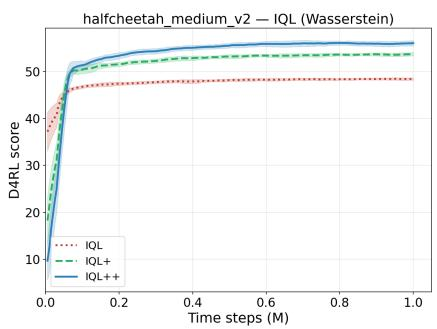  
(a) HalfCheetah-M

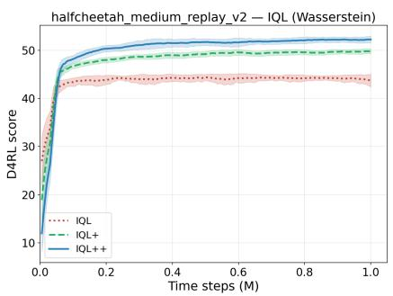  
(b) HalfCheetah-MR

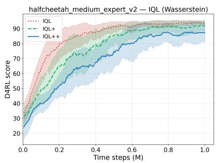  
(c) HalfCheetah-ME

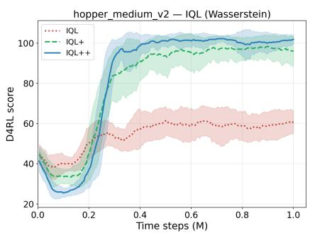  
(d) Hopper-M

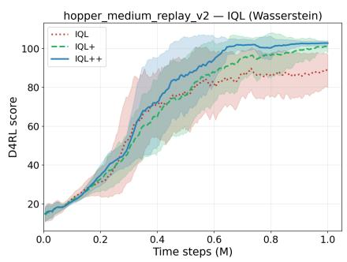  
(e) Hopper-MR

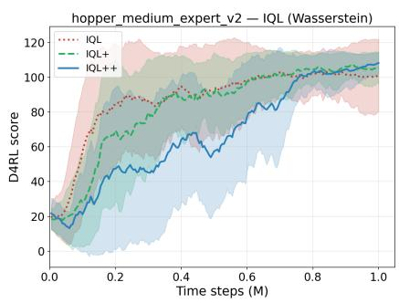  
(f) Hopper-ME

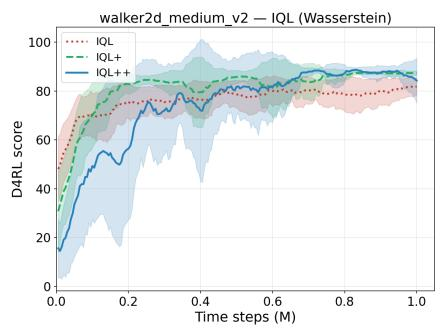  
(g) Walker2d-M

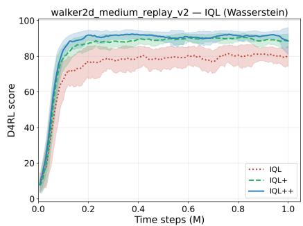  
(h) Walker2d-MR

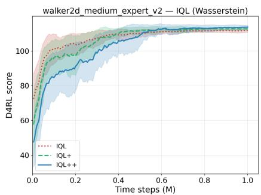  
(i) Walker2d-ME

Figure 4: IQL (Fisher-Rao) training curves on D4RL locomotion.  
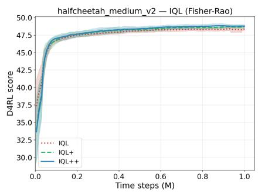  
(a) HalfCheetah-M

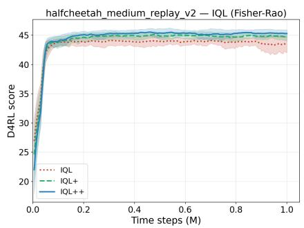  
(b) HalfCheetah-MR

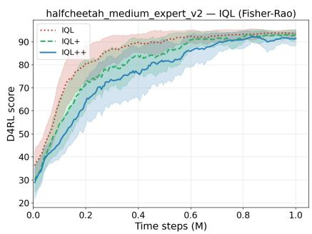  
(c) HalfCheetah-ME

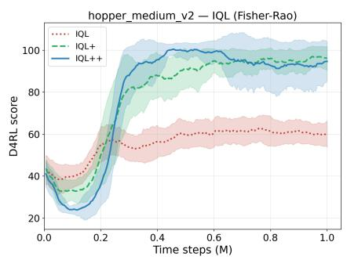  
(d) Hopper-M

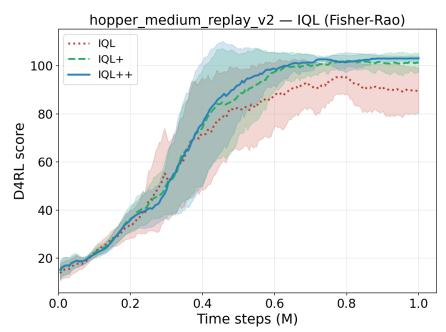  
(e) Hopper-MR

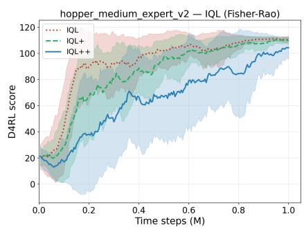  
(f) Hopper-ME

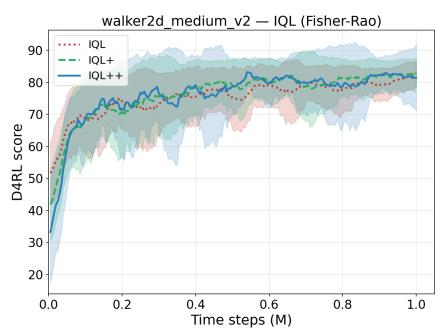  
(g) Walker2d-M

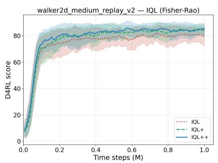  
(h) Walker2d-MR

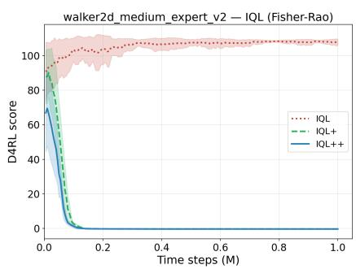  
(i) Walker2d-ME

Figure 5: TD3+BC (Wasserstein) training curves on D4RL locomotion.  
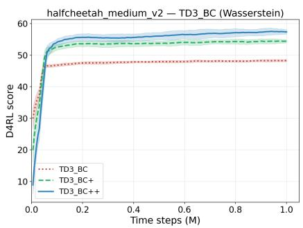  
(a) HalfCheetah-M

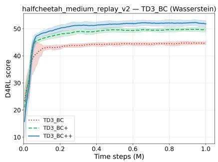  
(b) HalfCheetah-MR

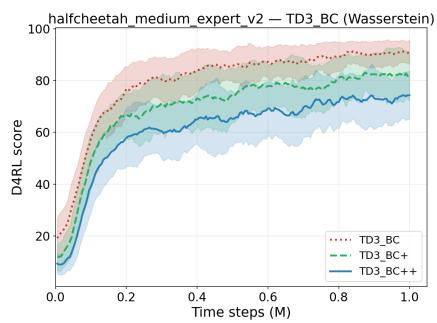  
(c) HalfCheetah-ME

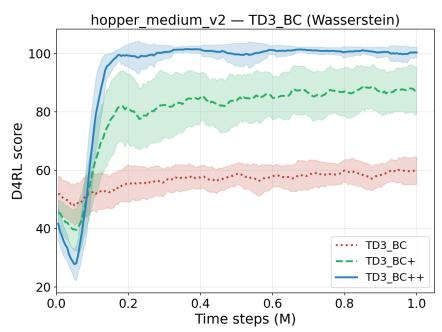  
(d) Hopper-M

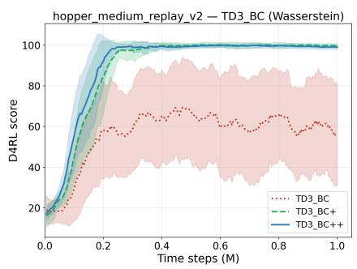  
(e) Hopper-MR

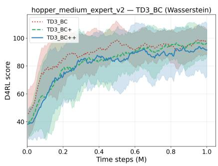  
(f) Hopper-ME

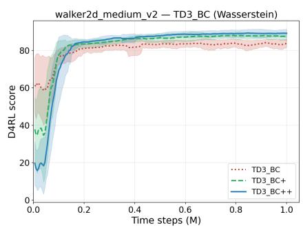  
(g) Walker2d-M

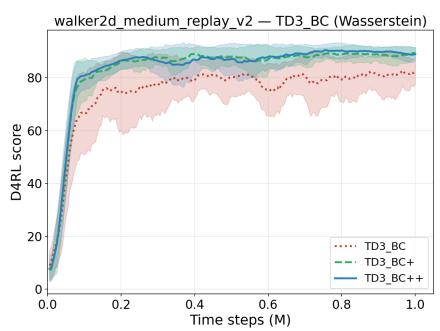  
(h) Walker2d-MR

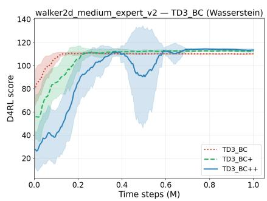  
(i) Walker2d-ME

Figure 6: ReBRAC (Wasserstein) training curves on D4RL locomotion.

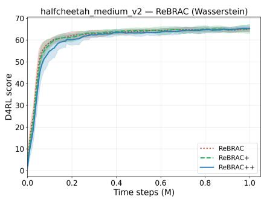  
(a) HalfCheetah-M

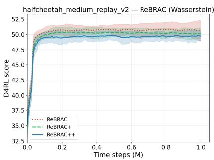  
(b) HalfCheetah-MR

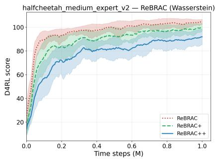  
(c) HalfCheetah-ME

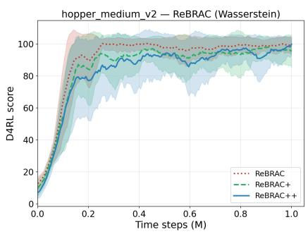  
(d) Hopper-M

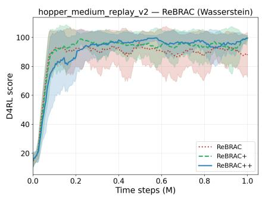  
(e) Hopper-MR

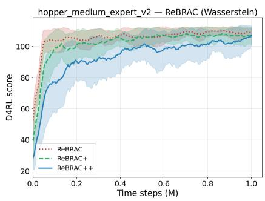  
(f) Hopper-ME

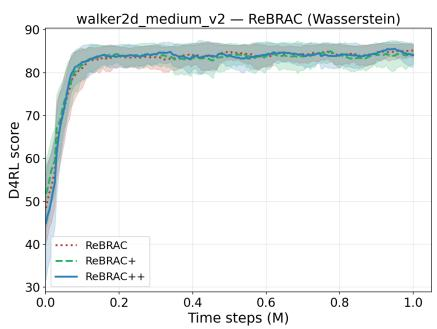  
(g) Walker2d-M

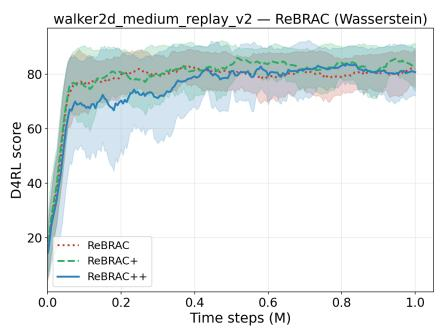  
(h) Walker2d-MR

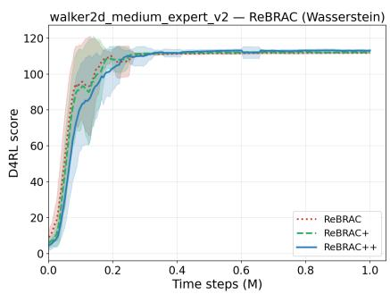  
(i) Walker2d-ME

Figure 7: ReBRAC (Wasserstein) training curves on D4RL AntMaze.  
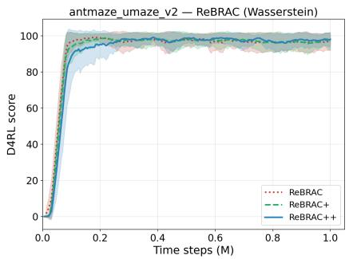  
(a) Umaze

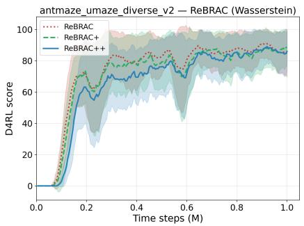  
(b) Umaze-Diverse

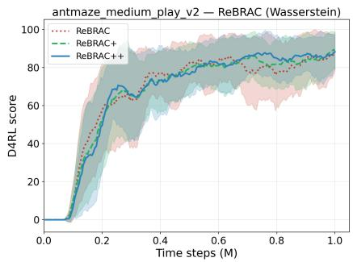  
(c) Medium-Play

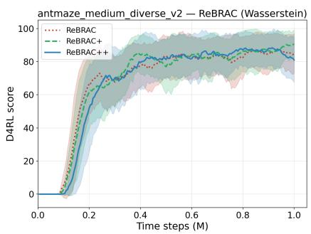  
(d) Medium-Diverse

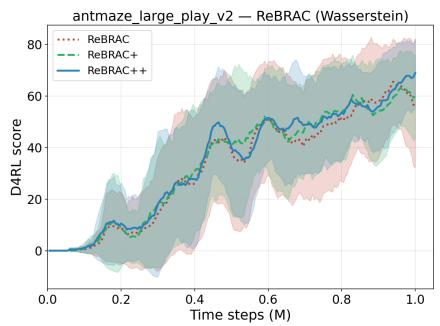  
(e) Large-Play

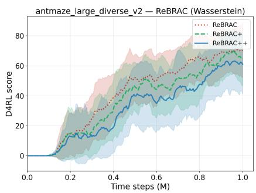  
(f) Large-Diverse