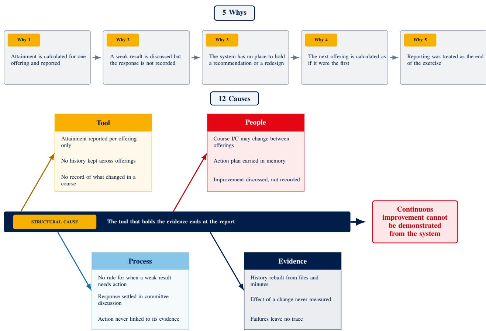
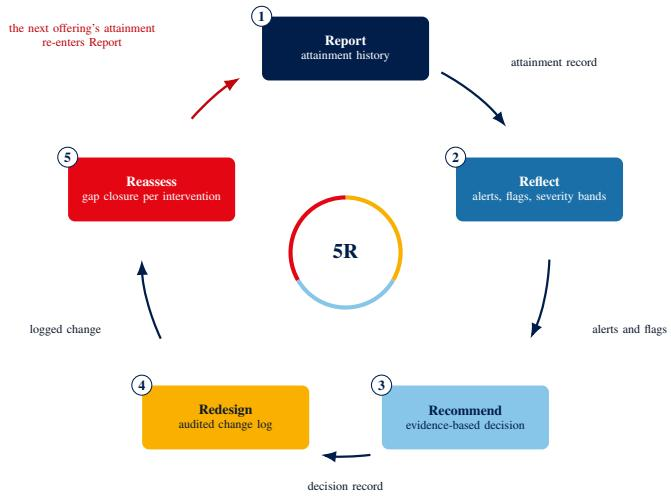
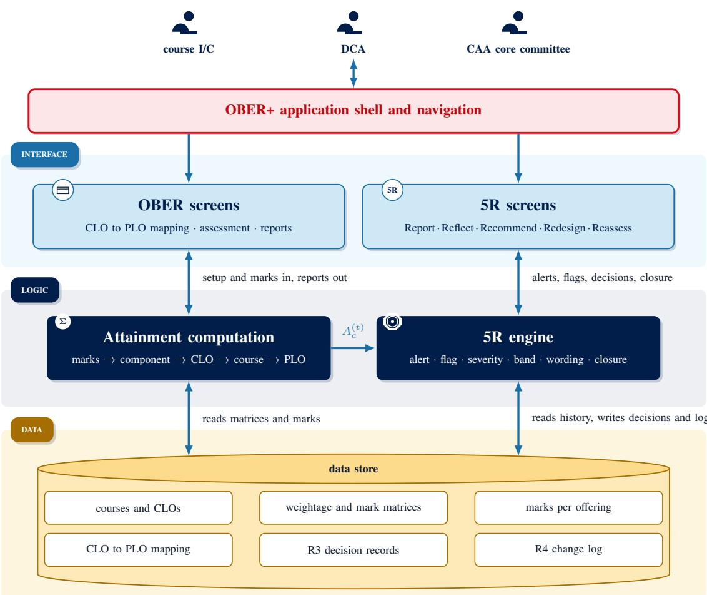
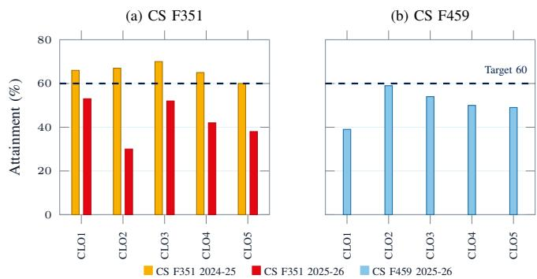
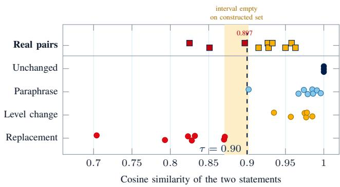
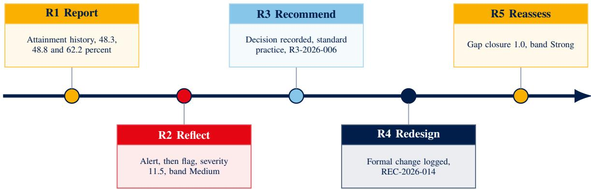

# OBER+: Continuity-Aware Reporting and Traceable Continuous Improvement in Outcome-Based Education

Elakkiya Rajasekar , Member, IEEE

Abstract—Institutions practising outcome-based education compute learning outcome attainment routinely, while reviews of curriculum analytics report an absence of evidence on how that computation informs decisions and on what those decisions achieve. This paper presents OBER+, an extension of a deployed institutional attainment platform that computes the step from a measured shortfall to an evaluated corrective action. Five connected stages accumulate attainment across deliveries of a course, signal a shortfall and a persistent shortfall, grade it on cutoffs the regulator already uses, record the decision taken against a catalogue of practices annotated with their evidence, log the resulting change, and quantify the subsequent movement in the earlier shortfall. A further rule compares successive statements of an outcome, so that attainment is never read as a series across a point at which the outcome itself changed. Applying the rules to the live record of two real courses produced three results. Every outcome of a core course was substantively redefined between consecutive deliveries, with subject matter moving between outcome numbers, so a naive reading would have reported a twenty-five point collapse between quantities that do not refer to the same learning. Recomputing the platform’s figures from its documented rule showed six of ten differing by more than rounding explains, in a pattern that identified a defect since reported to the institution. Across fifteen statement pairs from three transitions, five were identical character for character, and among the ten that were not, the outcome carrying a given number was nearest to a differently numbered earlier outcome in six, a result resting on an ordering of similarities and requiring no threshold and no labelling. The contribution is a computational design for outcome-based reporting, stated as rules that any platform computing attainment per delivery can implement, together with evidence of what those rules make visible in a live institutional record.

Index Terms—Curriculum analytics, learning analytics, accreditation, continuous improvement, educational technology, learning outcome attainment, natural language processing.

## I. INTRODUCTION

O UTCOME-BASED education organises a course aroundstatements of what a student should be able to do statements of what a student should be able to do on completing it. These statements are the course learning outcomes (CLOs), each linked to one or more programme learning outcomes (PLOs) that describe what a graduate of the whole programme should achieve. A CLO is assessed through the evaluation components of its course, among them quizzes, assignments, the midsemester examination and the comprehensive examination. The marks scored in those components are aggregated into a single figure per outcome, its attainment, which is then compared with a target percentage.

Computing that figure is a solved problem, automated at institutional scale by platforms that gather marks, apply the weightings and report attainment for every outcome of every course [18]–[20]. Acting on it is not. Criterion 4 of the Accreditation Board for Engineering and Technology (ABET) requires a documented process for evaluating attainment and for feeding the results into programme improvement [1]. The National Board of Accreditation (NBA) treats revision of outcomes as a normal corrective action while expecting programme outcomes to remain stable [2]. The Commission for Academic Accreditation (CAA) of the United Arab Emirates requires programmes to define outcomes, assess them and act on the results, and bands attainment on a four-band scale [3]. In published practice a committee discharges that obligation by reading reports and minutes, so the link between a weak result, the action taken and the later movement survives only in those documents [16], [17]. Fig. 1 gives the cause analysis carried out on the platform studied here, which traced five successive answers and twelve contributing causes to a single structural cause, namely that the tool holding the evidence ends at the report.

Curriculum analytics reaches the same boundary from the other side. Reviews of the field report that redesigns are made course by course, and that evidence on how analytics tools inform decisions and affect outcomes is lacking [24], [25]. Tools exist that gather evidence of competency attainment and that screen courses for review [22], [23], but in every case the decision and its consequence lie outside the tool, as Table I sets out system by system.

Underneath that boundary lies a question the literature does not ask. Reading attainment across deliveries of a course assumes that the outcome being measured stayed the same, and nothing in current practice tests the assumption. Outcome statements are revised between deliveries, most often when a course changes hands, and the revision leaves no trace in a record that goes on reporting figures against the same outcome numbers. Where the assumption fails, every later step fails with it, because a trend, a corrective action and any movement attributed to it all rest on comparing an outcome with itself.

OBER+ is a design that computes the step from a measured shortfall to an evaluated corrective action, and that tests the assumption as part of doing so. It extends a deployed institutional attainment platform [4] with five connected stages, named Report, Reflect, Recommend, Redesign and Reassess and referred to together as the 5R cycle, which run on the attainment the platform already computes. Stating the design as computational rules rather than as a workflow allows it to be implemented on any system that reports attainment for each delivery of a course. One rule compares successive statements of an outcome by sentence embedding and by the cognitive level of its leading verb, and classifies what changed.

Three research questions organise the work.

1) What computational rules turn a record of attainment across deliveries of a course into an improvement record in which a corrective action is bound to the evidence that prompted it and to the movement that follows it?

2) Can it be established automatically, and without labelled data, whether an attainment series spanning two deliveries refers to the same learning outcome?

3) What does applying the rules to a live institutional record make visible that reporting each delivery separately does not?

A design and a public implementation [5] answer the first. The second and third are answered on a sample of the live record of the institutional platform, two courses in one department for which the author is the course in-charge, one of them with two consecutive deliveries recorded.

The work contributes three things. The first is a computational traceability model that connects attainment evidence, the corrective decision taken against it, the change implemented and the movement observed afterwards. The second is an outcome continuity check that tests, without a threshold and without labelled data, whether an attainment series refers to comparable learning before that series is read as a trend. The third is an application to a live institutional record which exposes two failure modes that current practice leaves invisible, namely subject matter moving between outcome numbers, and disagreement between a platform’s documented and implemented attainment computation. Two of the three results were not anticipated when the design was written. Every outcome of the two-delivery course was substantively redefined between deliveries while attainment continued to be reported against unchanged outcome numbers. The platform’s published figures disagree with its own documented computation on most outcomes, in a pattern that identifies the cause. Across three transitions the outcome carrying a given number is frequently nearest to a differently numbered outcome of the previous delivery, so the numbering by which an attainment series is indexed does not track the subject matter that series reports.

Section II places the work against published systems and against the curriculum analytics literature. Sections III and IV give the design and its implementation. Section V describes the live record and the claims each part of the evaluation can support, Section VI reports the results, and Section VII discusses their reach and their limits.

## II. RELATED WORK

## A. Outcome-Based Education and Continuous Improvement

Outcome-based education designs a curriculum from its intended results, defining the outcomes first and then the teaching and the assessment that lead to them. The approach was formalised in the early 1990s [6] and adopted across professional education [7]. A review of the field found that although the approach spread widely, direct empirical evidence for its effectiveness remained limited [8]. That finding bears on the present work, since outcome-based practice requires evidence of what follows the actions its assessment results prompt. Two principles carry into the design. Constructive alignment requires outcomes, teaching and assessment to be designed as one system [9], [10]. Taxonomies supply the action verbs with which outcomes are written and levelled [11], later revised into a two-dimensional form [12], [13]. The move of accreditation to measured outcomes, its rationale and its effect on programmes are documented in [14], [15].

## B. Attainment Computation Systems

Recent systems automate the calculation and stop at the reported number. A digital framework for programme impact evaluation uses granular student outcome data for accreditation reporting [18]. A web-based system at an autonomous engineering college computes course, programme and educationalobjective attainment from direct and indirect assessment [19], and an information-system model computes programme outcome attainment from student scores [20]. Natural language processing has been applied to align course outcomes to programme outcomes automatically, so that the computation rests on accurate mappings [21]. None of these keeps the attainment of an outcome across deliveries, none raises a signal when an outcome falls or stays below target, none records the decision taken in response, and none tracks the movement that follows the resulting change.

Where a system does hold actions, the evaluation of those actions is still human. An institutional platform at a university in the United Arab Emirates stores outcome, action and key performance indicator data across assessment cycles, and evaluates the effectiveness of the actions in a manual annual meeting [16]. A published continuous improvement policy at a United States engineering department assigns recommendations to an annual committee review and states that no formal mechanism tracks whether an instructor acted on a recommendation or whether the action worked [17].

## C. Curriculum and Learning Analytics

The analytics literature reaches further and stops at the same boundary. Course screening by gap analysis and machine learning identifies which course needs attention without attributing the gap to any assessment component and without following any intervention that results [22]. Curriculum analytics tools help teachers gather richer evidence of competency attainment for programme improvement [23]. A review of learning analytics in learning design finds redesigns made course by course, with no standard way of attributing a later gain to a specific change [24]. A systematic review of curriculum analytics states that evidence on how such tools inform decisions and affect outcomes is lacking [25]. The design presented here responds to that finding. Binding a recorded decision to the evidence that prompted it, and computing the movement that followed, is what turns an analytics tool into a source of such evidence.

  
Fig. 1. Cause analysis of the improvement gap.

TABLE I  
PUBLISHED CONTINUOUS IMPROVEMENT SYSTEMS COMPARED WITH OBER+.
<table><tr><td rowspan=1 colspan=1>System</td><td rowspan=1 colspan=1>Attainment history</td><td rowspan=1 colspan=1>Automatic detection</td><td rowspan=1 colspan=1>Action bound toevidence</td><td rowspan=1 colspan=1>Post-action movementtracked</td><td rowspan=1 colspan=1>Outcome revisionclassified</td></tr><tr><td rowspan=1 colspan=1>Institutional platform, UnitedArab Emirates [16]</td><td rowspan=1 colspan=1>Yes, across cycles</td><td rowspan=1 colspan=1>Not reported</td><td rowspan=1 colspan=1>Actions stored, link notreported</td><td rowspan=1 colspan=1>No, manual annualmeeting</td><td rowspan=1 colspan=1>No</td></tr><tr><td rowspan=1 colspan=1>Attainment computationsystems [18]–[20]</td><td rowspan=1 colspan=1>Per offering only</td><td rowspan=1 colspan=1>No</td><td rowspan=1 colspan=1>No</td><td rowspan=1 colspan=1>No</td><td rowspan=1 colspan=1>No</td></tr><tr><td rowspan=1 colspan=1>Curriculum analyticstools [23], [25]</td><td rowspan=1 colspan=1>Yes, evidencecollection</td><td rowspan=1 colspan=1>Not at CLO level</td><td rowspan=1 colspan=1>No, actions outside thetool</td><td rowspan=1 colspan=1>No</td><td rowspan=1 colspan=1>No</td></tr><tr><td rowspan=1 colspan=1>Departmental improvementpolicy, United States [17]</td><td rowspan=1 colspan=1>Committee records</td><td rowspan=1 colspan=1>No</td><td rowspan=1 colspan=1>No, acting on adviceuntracked</td><td rowspan=1 colspan=1>No</td><td rowspan=1 colspan=1>No</td></tr><tr><td rowspan=1 colspan=1>Course-level gap screening [22]</td><td rowspan=1 colspan=1>Yes, across offerings</td><td rowspan=1 colspan=1>Course level only</td><td rowspan=1 colspan=1>No</td><td rowspan=1 colspan=1>No</td><td rowspan=1 colspan=1>No</td></tr><tr><td rowspan=1 colspan=1>Taxonomy-levelclassification [26]–[29]</td><td rowspan=1 colspan=1>No, one-time analysis</td><td rowspan=1 colspan=1>No</td><td rowspan=1 colspan=1>No</td><td rowspan=1 colspan=1>No</td><td rowspan=1 colspan=1>No, single statementonly</td></tr><tr><td rowspan=1 colspan=1>OBER+ (this work)</td><td rowspan=1 colspan=1>Yes, per CLO peroffering</td><td rowspan=1 colspan=1>Yes, alert per offeringand flag with severityband</td><td rowspan=1 colspan=1>Yes, by recordeddecision</td><td rowspan=1 colspan=1>Yes, gap closure perintervention</td><td rowspan=1 colspan=1>Yes, paraphrase, levelchange or replacement</td></tr></table>

## D. Classification of Outcome Statements

Automatic classification of learning outcomes onto taxonomy levels has reached practical accuracy. Transformer models classify learning objectives at scale on a corpus of more than twenty thousand objectives [26], and convolutional networks with pre-trained embeddings classify examination questions [27]. Generative language models now match or exceed those classifiers on course learning outcomes [28], and the task has been addressed for outcomes and examination questions together [29]. All of this work classifies a statement once, at a single point in time. No published application repeats the classification across deliveries of a course in order to detect that the wording of an outcome changed. Sentence embeddings compared by cosine similarity are the established means of judging whether two statements express the same thing and are trained and evaluated on that task directly [30]. The rule given in Section III combines that measure with the taxonomy level, so that a revision is not only detected but classified.

## E. Evidence Base for Improvement Practices

The premise of the improvement cycle is that assessment information raises achievement when it reaches a person who can act on it in a usable form. The formative assessment literature establishes that [33]–[35], and a recent systematic review confirms it for higher education while noting uneven evidence across disciplines [36]. That literature is written for the classroom and the programme review, and none of it addresses how an institution’s own attainment platform should deliver the information to the person responsible for a course.

The practices a platform can offer differ in how well they are supported, and the design recorded here grades them rather than presenting a flat list. Active learning, peer instruction, the flipped classroom, supplemental instruction and retrieval practice each carry meta-analytic or systematic review evidence [37]–[48], and worked examples and assessment redesign rest on cognitive load theory [49], [50]. Two options carry weaker evidence and are labelled as such. Industry-sourced assessment content rests on an authentic assessment blueprint with no quantified attainment effect [51], and remediation assisted by artificial intelligence reports feasibility and acceptance rather than measured learning [52]. How that grading enters the design is described in Section III.

Table I places the reviewed systems against the capabilities designed here. No reviewed system keeps an attainment record per outcome across deliveries, detects a shortfall automatically at outcome level, binds a corrective action to the evidence that prompted it, or tracks the movement that follows, and none classifies a revision of an outcome statement across deliveries. The comparison covers the systems reviewed above, selected as those that compute or report outcome attainment at institutional scale, those that store corrective actions, and those that classify outcome statements. It is not the product of a systematic search, so the claim it supports concerns the reviewed systems rather than the whole published literature.

## III. FRAMEWORK DESIGN

## A. Design Principles

The design is governed by three principles. It extends a deployed platform rather than replacing it, so every operational 5R rule reads the attainment the platform has already computed and no such rule recomputes or reweights it. It computes everything that can be computed and leaves exactly one thing to the person responsible for the course, called the course incharge (course I/C) on the campus studied here, which is the improvement decision itself. Every record it creates carries the identifiers needed to connect it to the records before and after it, so that the path from evidence to recorded movement is never broken.

They follow from the cause analysis of Fig. 1, since a structural cause calls for an extension of the tool rather than a process placed beside it. The five stages are shown in Fig. 2. Report keeps the attainment record, Reflect derives the signals from it, Recommend records the decision, Redesign logs the change, and Reassess computes the gap closure that follows the change. The subsections below are organised by what the rules do rather than by stage name, and each names the stage it belongs to.

  
Fig. 2. The 5R continuous improvement cycle.

## B. Attainment Model and Notation

One delivery of a course in one semester is called an offering. Notation is fixed here for one course. S is the set of enrolled students, K the set of evaluation components, C the set of CLOs and J the set of PLOs. The mark distribution matrix entry $M _ { c , k }$ is the number of marks component k allocates to CLO c. The weightage distribution matrix entry $w _ { c , k }$ is the weight in percent that component k carries in CLO c, and every CLO satisfies $\textstyle \sum _ { k \in K } w _ { c , k } = 1 0 0$ . The marks student s scored on the questions of component k that assess CLO c are $m _ { s , c , k }$ , bounded by $0 \leq m _ { s , c , k } \leq M _ { c , k }$ . Attainment is a chain of four means. The class mean for one CLO within one component is

$$
a _ { c , k } = \frac { \sum _ { s \in S } m _ { s , c , k } } { \left| S \right| M _ { c , k } } ,\tag{1}
$$

the CLO combines its components over its full weightage row,

$$
A _ { c } \ = \ { \frac { 1 } { 1 0 0 } } \sum _ { k \in K } w _ { c , k } a _ { c , k } ,\tag{2}
$$

the course attainment of (3) weights each CLO by its mark share $\begin{array} { r } { \mu _ { c } = \sum _ { k \in K } M _ { c , k } . } \end{array}$

$$
A _ { \mathrm { c o u r s e } } ~ = ~ { \frac { \sum _ { c \in C } \mu _ { c } A _ { c } } { \sum _ { c \in C } \mu _ { c } } } ,\tag{3}
$$

and each PLO is the plain mean of the CLOs mapped to it, with $\pi _ { c , j } = 1$ when CLO c is mapped to PLO j and 0 otherwise,

$$
P _ { j } = \frac { \sum _ { c \in C } \pi _ { c , j } A _ { c } } { \sum _ { c \in C } \pi _ { c , j } } , \pi _ { c , j } \in \{ 0 , 1 \} .\tag{4}
$$

Keeping the full weightage row in the denominator of (2) means that a component whose marks have not yet been uploaded contributes zero, so a partially assessed CLO is never overstated. As a concrete instance, the live First Semester

2025–26 offering of CS F351 Theory of Computation on the campus studied here had 238 enrolled students and six evaluation components carrying 200 marks in total. The quiz allocates 30 marks to CLO1 and the class mean on those questions is 18.07, so $a _ { \mathrm { C L O 1 , Q u i z } } = 0 . 6 0 2$ , and with weights 60, 20 and 20 over the quiz, the midsemester examination and the comprehensive examination, (2) gives $A _ { \mathrm { C L O 1 } } = 0 . 5 0 9$

Writing $A _ { c } ^ { ( t ) }$ for the attainment of item c in offering $t ,$ read as a percentage, and $T _ { c }$ for its target, everything that follows reads $A _ { c } ^ { ( t ) }$ and nothing else. This is the interface across which the design transfers, since any platform that reports attainment per offering supplies it. The target defaults to 60 percent and is editable per course, since neither the platform nor the accreditation frameworks fix a course-level target. That value is the threshold at which the CAA assessment quality indicator enters its Medium band [3].

## C. Minimum History Requirement

Report accumulates the attainment of every CLO, PLO and course into a record stored per course, per item and per offering. The record is counted in offerings rather than calendar years, because a course may be offered once or twice a year and the evidence lies in deliveries rather than dates. No trend judgement is made until three offerings exist. With $H _ { c }$ denoting the set of offerings in which item c has a recorded attainment, the rule is

$$
\mathrm { g a t e } ( c ) ~ = ~ \big [ | H _ { c } | ~ \geq ~ 3 \big ] ,\tag{5}
$$

and only when it holds are the last three offerings, written $W = \{ t - 2 , t - 1 , t \}$ , read for a trend. Neither ABET, NBA nor CAA states how many offerings of data justify reading a pattern as a trend, and neither do the reviewed systems, so this threshold is an explicit design decision rather than a requirement inherited from elsewhere. It governs the trend judgement alone and does not delay action, for the reason given next.

## D. Shortfall Detection and Severity Banding

Reflect turns the record into signals at two levels. An item below target in the current offering raises an alert,

$$
\mathrm { a l e r t } ( c , t ) = \big [ A _ { c } ^ { ( t ) } < T _ { c } \big ] ,\tag{6}
$$

so that the course I/C sees the shortfall in the offering in which it occurred and can record a decision on it at once. The second level is the trend judgement and requires the three offerings of (5). An item is flagged when it misses its target in at least two of the last three offerings,

$$
\begin{array} { r } { \mathtt { H a g } ( { \boldsymbol c } ) \ = \ \Big [ \big | \{ \tau \in { \boldsymbol W } : A _ { { \boldsymbol c } } ^ { ( \tau ) } < T _ { c } \} \big | \ \geq \ 2 \Big ] . } \end{array}\tag{7}
$$

Two levels are needed because a single mechanism cannot serve both purposes. A rule strict enough to justify the claim that a weakness persists is too slow to help the course I/C teaching now, and a rule fast enough to help immediately cannot support that claim. One weak offering therefore raises an alert but not a flag, and one good offering does not clear a real decline.

A flag alone does not say how bad the shortfall is. For a flagged item the severity is the average shortfall over the offerings that missed,

$$
\sigma _ { c } = \frac { 1 } { | W _ { c } ^ { - } | } \sum _ { \tau \in W _ { c } ^ { - } } \bigl ( T _ { c } - A _ { c } ^ { ( \tau ) } \bigr ) ,\tag{8}
$$

taken over $W _ { c } ^ { - } = \{ \tau \in W : A _ { c } ^ { ( \tau ) } < T _ { c } \}$ and expressed in percentage points, and the band is assigned on the attainmentto-target ratio

$$
\rho _ { c } = \frac { 1 0 0 } { | W _ { c } ^ { - } | } \sum _ { \tau \in W _ { c } ^ { - } } \frac { A _ { c } ^ { ( \tau ) } } { T _ { c } } ,\tag{9}
$$

by the four-band rule

$$
\begin{array} { r } { \mathrm { b a n d } ( \rho _ { c } ) = \left\{ \begin{array} { l l } { \mathrm { H i g h } } & { \rho _ { c } \geq 9 0 } \\ { \mathrm { M e d i u m } } & { 6 0 \leq \rho _ { c } < 9 0 } \\ { \mathrm { L o w } } & { 3 0 \leq \rho _ { c } < 6 0 } \\ { \mathrm { V e r y ~ L o w } } & { \rho _ { c } < 3 0 . } \end{array} \right. } \end{array}\tag{10}
$$

The cutoff spacing is that of the CAA rubric [3], so the severity vocabulary is one the regulator already uses rather than a new scale a reviewer would have to accept. An item that is not flagged has no shortfall to band and is reported as on target.

## E. Outcome Revision Detection

Attainment can be compared from one offering to the next only while the outcome being measured remains the same. Revision of an outcome statement between offerings is common when a course changes hands, and it is invisible in current practice, so an attainment series can span offerings that no longer measure the same thing. Reflect therefore compares the statement of each CLO across the offerings in W.

Each statement is represented as a sentence embedding. The embedding is the mean of the pretrained 300-dimensional word vectors of the $\mathsf { e n \_ c o r e \_ w e b } _ { - }$ \_md model of the spaCy library [31], which are distributional word vectors of the kind established for this purpose [32]. The statement recorded in an offering is compared with the statement recorded in the offering before it by cosine similarity,

$$
s _ { t } ~ = ~ { \frac { \mathbf { e } _ { t } \cdot \mathbf { e } _ { t - 1 } } { \left\| \mathbf { e } _ { t } \right\| \left\| \mathbf { e } _ { t - 1 } \right\| } } ,\tag{11}
$$

where $\mathbf { e } _ { t }$ is the embedding of the statement as it stood in offering t. Similarity alone cannot separate a rewording from a change of demand, because raising an outcome from applying to designing alters very few words. The leading action verb of each statement is therefore classified by a lookup on that verb against the Revised Bloom’s Taxonomy (RBT) action-verb list circulated on the campus, which follows [12]. That list assigns several verbs to more than one level, so the lookup returns a set of levels $B _ { t }$ rather than a single level, and a change of level is asserted only when the two sets are disjoint. The lookup is a deliberate simplification whose failure modes on real handouts are reported in Section VI. Writing $d _ { t }$ for the statement itself, the revision recorded at offering t is classified as

$$
\mathrm { R e v i s i o n } _ { t } = \left\{ \begin{array} { l l } { \mathrm { U n c h a n g e d } } & { d _ { t } = d _ { t - 1 } } \\ { \mathrm { R e p l a c e m e n t } } & { s _ { t } < \tau } \\ { \mathrm { L e v e l ~ c h a n g e } } & { s _ { t } \geq \tau , \ B _ { t } \cap B _ { t - 1 } = \emptyset } \\ { \mathrm { P a r a p h r a s e } } & { \mathrm { o t h e r w i s e } , } \end{array} \right.\tag{12}
$$

where the first case compares the statements up to case and spacing and $\tau = 0 . 9 0$ is a threshold whose setting is reported in Section V. Static word vectors and an explicit threshold are used in preference to a contextual encoder. A classification that enters an accreditation record has to be reproducible by an external reviewer and open to inspection, and it has to run within the resources of the deployed application. The classification annotates the record and never suppresses a flag, so no revision of wording can conceal a shortfall. Where the embedding model is unavailable the check reverts to the comparison of taxonomy levels alone.

Comparing only the statements that share an outcome number assumes that the numbering is stable between deliveries, and that assumption can fail even when every statement is a defensible revision of something. A second check therefore tests it directly. For outcome j of the current delivery, the nearest earlier statement is

$$
n ( j ) = \arg \operatorname* { m a x } _ { i \in C _ { t - 1 } } \frac { \mathbf { e } _ { t , j } \cdot \mathbf { e } _ { t - 1 , i } } { \| \mathbf { e } _ { t , j } \| \| \mathbf { e } _ { t - 1 , i } \| } ,\tag{13}
$$

and the numbering is reported as aligned for that outcome when $n ( j ) = j$ . Where it is not, the outcome now carrying number j is closer to a differently numbered outcome of the previous delivery, so an attainment series indexed by outcome number does not follow the same subject matter. This check requires no threshold and no taxonomy level, only the ordering of similarities, so it is independent of both parameters the classification rule depends on.

## F. Decision and Change Records

Recommend is the one stage that computes nothing and records everything. For any item that is alerted or flagged it places the evidence, namely the record, the shortfall and, for a flagged item, the band, beside a catalogue of improvement practices in three categories. The standard practices carry the meta-analytic and systematic review evidence of Section II. The innovative practices carry weaker or emerging evidence and are labelled as such. The third category is open ended, so that when neither list fits the situation the course I/C formulates the action in their own words and it is recorded on the same terms. Every decision is stored as

$$
r \ = \ ( \mathrm { i d } , \ c , \ a , \ \kappa , \ e , \ u , \ d ) ,\tag{14}
$$

with category $\kappa \in \mathsf { \Omega } ^ { \ast }$ {standard, innovative, open}, where c is the alerted or flagged item, a is the action with its supporting citation where one exists, e is the supporting evidence, u is the deciding course I/C and $d$ is the date. The catalogue grades its evidence rather than presenting a flat list. A catalogue that gives a meta-analysis and a feasibility study equal standing invites the weaker option to be adopted on the strength of the platform’s endorsement.

Redesign maintains a single log for everything that changes in a course, namely its CLOs, its evaluation components and its mappings. An entry enters the log in one of two ways. A formal entry is created when a recorded decision is implemented and carries that decision’s identifier. A detected entry is created by the rule of (12) when it reports a revision with no recorded decision behind it. Every entry is

$$
\ell = { \bigl ( } \operatorname { i d } , \ c , \ \chi , \ \operatorname { b e f o r e } , \ \operatorname { a f t e r } , \ u , \ d , \ q { \bigr ) } ,\tag{15}
$$

of kind $\chi \in \{ \mathrm { f o r m a l } , \mathrm { d e t e c t e d } \}$ , where before and after hold the full content of the item on either side of the change, u and d record the person and the date, and q carries the decision identifier for a formal entry and the classification for a detected one. Recording both kinds matters because informal change is precisely the change that current practice loses.

## G. Gap Closure

Reassess evaluates each logged change between the offerings immediately before and after it, which means a change is judged on one offering of evidence rather than on a fresh three-offering record. With the shortfall defined as $g ^ { ( \tau ) } =$ max $( 0 , T _ { c } - A _ { c } ^ { ( \tau ) } )$ , gap closure is

$$
\mathrm { C l o s u r e } \ = \ { \frac { g ^ { ( \mathrm { b e f o r e } ) } - g ^ { ( \mathrm { a f t e r } ) } } { g ^ { ( \mathrm { b e f o r e } ) } } } ,\tag{16}
$$

so that a value of 1 means the gap closed fully, 0 means no change and a negative value means regression. Closure is banded on the cutoffs of (10) read as a percentage, with the bands named Strong at 90 or above, Partial from 60, Limited from 30 and Very limited below 30, including any negative value. The result is attached to the redesign record whether it is a success or a failure, and when the next offering’s attainment arrives it enters the record and the cycle continues. Closure is deliberately a movement measure and not a causal estimate, and Section VII states the limits of what it can be read to mean.

## IV. SYSTEM IMPLEMENTATION

The rules are implemented in Python as a single web application built on the Streamlit framework, version-controlled in the public repository github.com/Elakkiya16/OBER\_Plus and deployed at oberplus.streamlit.app [5]. Every quantity in Section VI is therefore independently reproducible, either by opening the deployed application or by running the source.

Fig. 3 shows the three layers. The interface layer carries the reproduced reporting screens, covering CLO to PLO mapping, assessment and reports, beside five screens, one per stage. The logic layer holds the attainment computation of (1)–(4) and a rule engine that computes the alerts, the flags, the severity, the bands, the revision classification and the gap closure. The data layer stores the courses with their CLOs, the two distribution matrices, the marks per offering, the CLO to PLO mappings, the decision records and the change log.

A single interface joins the two logic modules, across which the computation supplies $A _ { c } ^ { ( t ) }$ and nothing else. That narrowness is what allows the rules to be adopted without the implementation, since any institution whose own platform reports attainment per offering can supply the same quantity.

## V. EVALUATION DESIGN

## A. Data Set

The platform is an institutional system rather than a departmental one. Every course in-charge of every programme on the campus enters outcomes, evaluation components, mappings and marks into it for each delivery, so its record spans the institution. The material used here is a sample of that record, two courses in the Department of Computer Science for which the author is the course in-charge and therefore able to report the full computation chain, the outcome statements as issued, and the figures behind them. What the sample bounds is the claims made here, not the contents of the platform.

CS F351 Theory of Computation is a third-year core course delivered once a year, with 222 students enrolled in 2024-25 and 238 in 2025-26. Its outcome statements are on record for three consecutive deliveries, from the First Semester of 2023-24 to the First Semester of 2025-26, each taken from the handout issued to students that year. Attainment is on record for two of them, 2024-25 and 2025-26. The platform was launched in the First Semester of 2025-26, so the 2024- 25 attainment is a historical record reconstructed from the departmental spreadsheet that preceded it, which is the ordinary position of any institution adopting such a platform. CS F459 Computer Vision is an elective of 32 students with statements on record for 2025-26 and 2026-27 and attainment for 2025-26. Cohort sizes therefore differ by roughly an order of magnitude between the two courses, which makes a class mean a noisier quantity in the elective than in the core course.

Each delivery contributes the outcome statements as issued in the handout and entered in the platform, the evaluation components with their weightage distribution matrix, the attainment reported for each outcome and for the course, and the component-level attainment behind that. Nothing finer grained than a class mean enters the analysis, so no personally identifiable student data was processed. The attainment target is 60 percent throughout. In total the record yields fifteen statement pairs across three consecutive-delivery transitions and fifteen outcome-level attainment figures across three deliveries, which is enough to exercise every rule that two deliveries can reach and to establish existence rather than frequency.

Three rules reach beyond two deliveries. The flag of (7) needs an outcome to be below target in at least two of its last three deliveries, the severity band of (10) applies only to a flagged item, and the gap closure of (16) needs a delivery on either side of a logged change. These are demonstrated on the constructed record of Section VI-D.

## B. Verification Procedure

Verification of the attainment computation compares two independently obtained figures for every outcome of both courses. The first is the figure the platform displays. The second applies the documented rule of (2) to the componentlevel attainment the platform publishes and to the weightage distribution matrix printed in the course handout. Component figures are published to two decimal places, giving a recomputed figure a rounding uncertainty near half a percentage point, so agreement is defined throughout as a difference below one percentage point. Where the two figures disagree, an alternative weighting drawn from the mark distribution matrix is tested against the reported figure, which identifies the rule the platform applies in place of the documented one.

## C. Revision Detection Procedure

The rule of (12) produces a judgement rather than an arithmetic result, and is examined on two bodies of material.

The first is a set of twenty-four pairs of outcome statements constructed from the outcomes of the two courses to cover the four classes of (12), each labelled before the rule was run. Because the threshold $\tau = 0 . 9 0$ was set on that same set, agreement on it is a measure of internal consistency and not an out-of-sample result.

The second is every pair of statements sharing an outcome number across three consecutive-delivery transitions, fifteen pairs drawn from the handouts issued for CS F351 in 2023-24, 2024-25 and 2025-26 and for CS F459 in 2025-26 and 2026- 27. Teaching teams wrote these statements in the ordinary course of revising a handout, and none was consulted while the threshold was set. None was labelled either, so the returns on this material are characterised by three properties that follow from the similarities alone, namely the position of the threshold within the observed distribution, the sensitivity of the classifications to that threshold, and the outcome of the alignment check of (13). No accuracy figure is reported on real data.

## VI. RESULTS

## A. Outcome Redefinition Across Deliveries

Table II gives the five outcomes of CS F351 as issued in each of two consecutive deliveries. They are not revisions of one another in any ordinary sense. The 2024-25 set runs from a foundational grasp of automata theory through closure properties and equivalences, parse trees and ambiguity, and Turing machines and undecidability, to the complexity classes P and NP. The 2025-26 set runs from alphabets, strings and proof techniques through finite automata and regular expressions, context-free grammars and pushdown automata, to Turing machines with decidability and complexity merged into one outcome.

Table III gives the classification of the five same-numbered pairs, which is the comparison an attainment series makes implicitly. None returns Unchanged. Two return Replacement and two a change of cognitive level, while the pair numbered two returns Paraphrase, for reasons Section VI-C sets out.

Comparing each 2025-26 statement against all five 2024- 25 statements, rather than against the one sharing its number, locates where the subject matter went. The 2025-26 outcome numbered five, on Turing machines, decidability and complexity, lies closest to the 2024-25 outcome numbered four, on Turing machines and undecidability, at similarity 0.955 against 0.933 for the outcome sharing its number. The 2025-26 outcome numbered four, on pushdown automata, reaches only 0.871 against any 2024-25 statement and has no counterpart in the earlier set. Subject matter moved between outcome numbers, and one outcome is new.

  
Fig. 3. Architecture of OBER+.

Table IV gives outcome attainment for both deliveries against the 60 percent target, plotted for both courses in Fig. 4. Read as a series, the course falls from 65.0 to 40.3 percent and every outcome falls, by 13, 37, 18, 23 and 22 percentage points. Read beside Table III, that series compares quantities which do not refer to the same learning, and the 23-point fall recorded against the fourth outcome sets attainment on Turing machines against attainment on pushdown automata. The evaluation scheme changed alongside the outcomes, from five components to six, and the mapping to programme outcomes changed with them, so three sources of incomparability coincide at a single boundary between consecutive deliveries of one core course. None of the three leaves any trace in the attainment record as current practice keeps it.

What survives the boundary is the alert of (6), which compares an outcome with its target inside one delivery. No outcome of CS F351 falls below target in 2024-25. All five do in 2025-26, as do all five of CS F459. Ten of the fifteen outcome figures in the live record lie below target, and each raises an alert in the delivery where it occurred.

## B. Attainment Computation Verification

Table V sets the attainment the platform reports for each outcome beside the figure its documented rule produces. Four of the ten agree within the half-point rounding uncertainty. Six do not, four of those by more than four percentage points, the widest being the fifth outcome of CS F351 at 38.0 percent reported against 46.6 percent computed.

Weighting each component by its share of the marks allocated to the outcome, which is the mark distribution matrix rather than the weightage distribution matrix, reproduces all five reported figures for CS F351 to within 0.53 of a percentage point, and reproduces the course figure at 40.13 percent against 40.28 reported, where the documented rule gives 41.59. The two matrices coincide only where a component’s share of an outcome’s marks equals its weightage, which is why four figures agree and six do not. The platform’s authors have been informed and a correction is scheduled.

Two consequences reach beyond this campus. The defect is invisible to users, since the figures are plausible, internally consistent, reported to two decimal places, and produced by screens that show no arithmetic. It surfaced only under an independent recomputation against a published matrix. The design presented here is unaffected, because every rule reads whatever attainment the platform reports and none recomputes it, so the rules ran correctly on figures the platform had wrong. That property is deliberate and was tested here for the first time. It is also a limitation, since a framework that reads a number without checking it will report a shortfall partly attributable to the reading. The general principle is that traceability is only as sound as the evidence entering the trace, so verification of the attainment value belongs ahead of the cycle rather than beside it.

## C. Outcome Revision Detection

Over the fifteen pairs the rule returns five Unchanged, five Paraphrase, three Replacement and two changes of cognitive level. The five Unchanged are pairs identical character for character, correct by construction and carrying no information about the rule, which leaves ten judgements. Since none was labelled, these returns are characterised below by three properties of the similarities of (11) rather than assessed for correctness.

1) Threshold Position: Similarities on the twenty-four constructed pairs separate into two groups with an interval of 0.031 between them, from 0.871 to 0.902, containing no pair, and the threshold sits inside it. The ten real non-identical pairs give no such separation. Their similarities, in ascending order, are 0.825, 0.851, 0.897, 0.915, 0.927, 0.928, 0.933, 0.950, 0.958 and 0.963, the widest gap anywhere in that sequence being 0.046 between 0.851 and 0.897. The value closest to the threshold from below, 0.897, falls inside the interval the constructed set left empty, and the nearest value above it, 0.915, lies just beyond that interval, as Fig. 5 shows for both distributions on one axis.

The consequence for the classifications is narrower than that continuum suggests. Moving the threshold by 0.005 changes none of the fifteen classifications when raised and one when lowered, moving it by 0.02 changes one in either direction, and moving it by 0.05 changes five or two according to direction. Within any plausible range the rule is therefore stable, although the pair at 0.897 is decided by three thousandths. What the constructed evaluation showed was a boundary standing clear of the data, and the real data does not reproduce that separation.

2) Numbering Alignment: The check of (13) requires neither the threshold nor the taxonomy level, asking only which outcome of the previous delivery each statement lies nearest to, and whether that is the outcome carrying the same number.

Table VI gives the answer for all fifteen pairs, nine of which have the same-numbered outcome as their nearest match. Alignment is trivially perfect in the transition whose statements are identical, so the informative figure covers the ten pairs that are not identical character for character, and there the numbering follows the subject matter in four cases and fails in six.

Several failures are wide rather than marginal. The fifth outcome of CS F351 in 2025-26 lies nearest to the fourth outcome of 2024-25 at 0.955 against 0.933 for the outcome sharing its number. The third outcome of CS F459 in 2026- 27 lies nearest to the fifth of 2025-26 at 0.910 against 0.851. The fourth outcome of CS F459 in 2026-27 lies nearest to the second of 2025-26 at 0.952 against 0.927. An attainment series indexed by outcome number sets two different subjects against each other in each case and reports the difference as movement.

The result rests on no threshold, no taxonomy level, no labelling and no judgement of what counts as a paraphrase. An ordering of cosine similarities says that in six of the ten outcomes whose wording changed at all, the number no longer attaches to the subject matter it carried in the previous delivery. Any institution reading outcome attainment as a series indexed by outcome number is exposed to that, and no system in Section II tests for it.

Two observations bear on where the rule understates change, and both are observations rather than findings, since no labelling was done. The five Paraphrase returns concentrate in one course, four of the five outcomes of CS F459 across the 2025-26 to 2026-27 transition, at similarities between 0.927 and 0.963. That same transition contains three of the six misalignments, which is not what a set of reworded statements would produce. The pair returned as a Paraphrase at 0.928 sets “Apply feature detection, description, and segmentation techniques for image representation and region analysis” against “Apply machine learning techniques for image classification, including linear classifiers, loss functions, optimization, and neural networks with backpropagation”, two statements written in the vocabulary of computer vision and both beginning with Apply, which is the configuration in which an averaged static word vector and a leading-verb lookup have least purchase.

The second observation concerns the levelling. The campus verb list, which follows [12], assigns Develop and Construct to both Applying and Creating and Explain to both Understanding and Evaluating, and all three lead outcomes in these handouts. Where level sets intersect no change of level can be asserted, so the rule falls back to Paraphrase whenever similarity exceeds the threshold, which is what happens in the pair just described. A levelling step reading only the first word cannot be deterministic against a list that is itself ambiguous, and an arbitrary choice between the two levels would make the classification depend on an undocumented tiebreak. A Paraphrase from this rule is therefore unconfirmed rather than a finding of no change, and establishing at what rate such returns are wrong requires the labelling described in Section VII-D.

## D. Framework Illustration on a Constructed Record

The flag, the severity band and the gap closure need three deliveries where the live record holds two, and are illustrated in Table VII on a small constructed record carrying no claim made in this paper. The illustration holds an outcome failing in two deliveries of three, flagged with an average shortfall of 11.5 points by (8) and a Medium band by (9), a decision recorded as (14) against that flag, a change logged as (15) implementing it, and a gap closure of 1.0 banded Strong in the delivery that follows. It also holds an intervention that did not work, at closure 0.11 banded Very limited, and an outcome flagged and left unaddressed, so that inaction and failure appear as plainly as success. Fig. 6 follows the first of those outcomes from detection to the delivery that follows the change. The illustration demonstrates that the rules compute and that the identifiers connect a shortfall to a decision, a change and the movement recorded afterwards, and it demonstrates nothing about courses.

  
Fig. 4. Outcome attainment in the live record.

  
Fig. 5. Real pairs against the constructed distribution.

## VII. DISCUSSION

## A. Interpretation

A framework built to read attainment across deliveries established, on the first record it was given, that those deliveries must not be compared. Every outcome of CS F351 was redefined between 2024-25 and 2025-26, subject matter moved between outcome numbers, one outcome was new, the evaluation scheme grew from five components to six and the mapping to programme outcomes changed as well. A record reporting the course as falling from 65.0 to 40.3 percent would have been read as a collapse in student attainment, and would have prompted corrective action against a decline the record cannot support.

Precision matters in stating that. Some part of a 25-point movement may well be real, and the design cannot decompose it. The claim is that the record cannot separate a fall in attainment from a redefinition of what was measured, and that no system in Section II would have registered the difference. A decision taken on such a record rests on a comparison that does not hold, which is a concrete instance of the failure the curriculum analytics reviews describe when they report an absence of evidence connecting tools to decisions and outcomes [24], [25].

Verification compounds the point. Six of ten outcome figures disagree with the platform’s own documented computation, and a different weighting reproduces the disagreement exactly, so the figures a course team would have acted on are not the figures the institution’s specification defines. Neither the redefinition nor the computation defect is visible on any screen the platform presents. Both surfaced because OBER+ subjected records the reporting system treats as settled to a further check, of continuity in the one case and of the computation itself in the other.

## B. Implications for Practice

A course in-charge gains a record in place of a memory. Courses change hands between deliveries, and what a predecessor tried, and whether it worked, currently travels by conversation. Under the design the attainment history, the signals raised on it, the decision taken and the measured movement all travel with the course. A department gains a basis for attention that does not rest on impression, since severity bands and the distribution of closures identify which courses carry the most severe flags, which flags carry no decision and which changes produced little movement. An institution gains the account that continuous improvement review asks for, held before the review rather than assembled for it, and gains it without a new committee and without moving the improvement decision away from the course incharge.

The results add an implication the design did not anticipate. An attainment series should not be published across a delivery boundary until the outcomes on either side have been compared, and that comparison has to be automatic, since no institution performs it by hand across every course every year. Institutions reporting attainment as a trend, which is most of those operating under the frameworks of Section II, may be reporting movements that partly reflect redefinition. Checking costs one comparison per outcome per delivery, and the check of (13) needs neither a threshold nor a label.

Transfer follows from the interface rather than from the code, because the rules read $A _ { c } ^ { ( t ) }$ and nothing else. Any platform reporting attainment per delivery supplies that quantity.

## C. Limitations

Nothing reported here is evidence about learning. The design neither teaches nor interacts with students, and no result bears on whether any student learned more.

The record is small, covering two courses and three deliveries in one department of one campus, which supports existence claims and no rate.

No real statement pair was labelled, so the returns of the classification rule are reported without any assessment of whether they are correct. A Paraphrase should be read as unconfirmed rather than as a finding of no change. The alignment result is unaffected, depending as it does on an ordering of similarities rather than on a classification.

Real similarities form a continuum across a threshold that was set on constructed pairs, which makes the rule an indicator that a comparison needs review rather than a settled classification.

TABLE II  
OUTCOME STATEMENTS OF CS F351 AS ISSUED IN EACH DELIVERY.
<table><tr><td rowspan=1 colspan=1></td><td rowspan=1 colspan=1>First Semester 2024-25</td><td rowspan=1 colspan=1>First Semester 2025-26</td></tr><tr><td rowspan=1 colspan=1>CLO1</td><td rowspan=1 colspan=1>Develop a foundational grasp of automata theory and formallanguages, including their practical implications in computerscience contexts.</td><td rowspan=1 colspan=1>Explain the fundamental concepts of alphabets, strings, languages,infinite sets, closure properties, and proof techniques.</td></tr><tr><td rowspan=1 colspan=1>CLO2</td><td rowspan=1 colspan=1>Apply closure properties to various language classes, exploreequivalences between different formal models, and evaluate theconsequences for language manipulation.</td><td rowspan=1 colspan=1>Construct finite automata and regular expressions for languagespecification, including closure properties and equivalence.</td></tr><tr><td rowspan=1 colspan=1>CLO3</td><td rowspan=1 colspan=1>Demonstrate skills in creating parse trees, resolving ambiguity incontext-free grammars, and utilizing parsing techniques foreffective language structure analysis.</td><td rowspan=1 colspan=1>Design context-free grammars by applying parsing strategies andaddressing ambiguity in language representation.</td></tr><tr><td rowspan=1 colspan=1>CLO4</td><td rowspan=1 colspan=1>Analyze Turing machines as abstract computational tools,differentiating solvable problems and exploring the concept ofundecidability, particularly in relation to the halting problem.</td><td rowspan=1 colspan=1>Develop pushdown automata models for context-free languagerecognition and analysis.</td></tr><tr><td rowspan=1 colspan=1>CLO5</td><td rowspan=1 colspan=1>Examine complexity classes P and NP, differentiate theirattributes, comprehend polynomial-time reductions, and appreciateNP-completeness&#x27; significance in computational complexity theory.</td><td rowspan=1 colspan=1>Develop Turing Machine models and analyze computationalproblems in terms of decidability and complexity, includingrecursive languages, the halting problem, and NP-completeness.</td></tr></table>

  
Fig. 6. One CLO traced from detection to the following delivery.

TABLE III  
CLASSIFICATION OF THE FIVE REAL REVISIONS OF CS F351.
<table><tr><td rowspan=1 colspan=1>Pair</td><td rowspan=1 colspan=1>st</td><td rowspan=1 colspan=1>Leading verb2024-25</td><td rowspan=1 colspan=1>Leading verb2025-26</td><td rowspan=1 colspan=1>Class</td></tr><tr><td rowspan=1 colspan=1>CLO1</td><td rowspan=1 colspan=1>0.897</td><td rowspan=1 colspan=1>DevelopApply or Create</td><td rowspan=1 colspan=1>ExplainUnderstand orEvaluate</td><td rowspan=1 colspan=1>Replacement</td></tr><tr><td rowspan=1 colspan=1>CLO2</td><td rowspan=1 colspan=1>0.915</td><td rowspan=1 colspan=1>ApplyApply</td><td rowspan=1 colspan=1>ConstructApply or Create</td><td rowspan=1 colspan=1>Paraphrase</td></tr><tr><td rowspan=1 colspan=1>CLO3</td><td rowspan=1 colspan=1>0.950</td><td rowspan=1 colspan=1>DemonstrateUnderstand</td><td rowspan=1 colspan=1>DesignCreate</td><td rowspan=1 colspan=1>Level change</td></tr><tr><td rowspan=1 colspan=1>CLO4</td><td rowspan=1 colspan=1>0.825</td><td rowspan=1 colspan=1>AnalyzeAnalyze</td><td rowspan=1 colspan=1>DevelopApply or Create</td><td rowspan=1 colspan=1>Replacement</td></tr><tr><td rowspan=1 colspan=1>CLO5</td><td rowspan=1 colspan=1>0.933</td><td rowspan=1 colspan=1>ExamineAnalyze</td><td rowspan=1 colspan=1>DevelopApply or Create</td><td rowspan=1 colspan=1>Level change</td></tr></table>

The flag, the severity band and the gap closure need three deliveries and were exercised only on the constructed record of Section VI-D.

The 2024-25 attainment predates the platform and was reconstructed from a departmental spreadsheet, so it was not produced by the computation that produced the 2025-26 figures, which is itself part of why the two deliveries are not comparable.

The design finally reads whatever attainment the platform reports and never recomputes it. That property kept the rules correct on defective figures, and it also means a shortfall the framework reports may be partly an artefact of the platform’s

TABLE IV  
OUTCOME ATTAINMENT IN THE LIVE RECORD, AGAINST A TARGET OF 60.
<table><tr><td rowspan=2 colspan=2>Outcome</td><td rowspan=1 colspan=6>CS F351</td><td rowspan=1 colspan=1>CS F459</td></tr><tr><td rowspan=1 colspan=2>2024-25</td><td rowspan=1 colspan=4>2025-26</td><td rowspan=1 colspan=1>2025-26</td></tr><tr><td rowspan=1 colspan=2>CLO1</td><td rowspan=1 colspan=2>66.0</td><td rowspan=1 colspan=4>53.0</td><td rowspan=2 colspan=1>39.059.0</td></tr><tr><td rowspan=1 colspan=2>CLO2</td><td rowspan=1 colspan=1></td><td rowspan=1 colspan=2>67.0</td><td rowspan=1 colspan=2>30</td><td rowspan=1 colspan=1>30.0</td></tr><tr><td rowspan=1 colspan=2>CLO3</td><td rowspan=1 colspan=1></td><td rowspan=1 colspan=2>70.0</td><td rowspan=1 colspan=3>52.0</td><td rowspan=1 colspan=1>0</td></tr><tr><td rowspan=1 colspan=2>CLO4CLO5</td><td rowspan=1 colspan=2>65.060.0</td><td rowspan=1 colspan=4>42.038.0</td><td></td></tr><tr><td rowspan=1 colspan=2>Course</td><td rowspan=1 colspan=2>65.0</td><td rowspan=1 colspan=4>40.3</td><td rowspan=1 colspan=1>50.6</td></tr><tr><td rowspan=1 colspan=2>Alerts raised</td><td rowspan=1 colspan=2>0 of 5</td><td rowspan=1 colspan=4>5 of 5</td><td rowspan=1 colspan=1>5of 5</td></tr><tr><td rowspan=1 colspan=2>Enrolled students</td><td rowspan=1 colspan=2>222</td><td rowspan=1 colspan=4>238</td><td rowspan=1 colspan=1>32</td></tr></table>

computation.

## D. Future Work

The comparison that licenses the improvement cycle now precedes it in priority, and the data for that comparison is already held. Since the platform records the outcome statements of every course of every programme for each delivery, the comparison run here on two courses can be run across the institution by extracting statements per course per delivery and applying the same rule. That would establish how often outcomes are redefined without trace, in what way, whether redefinition concentrates where a course changes hands, and whether it concentrates in particular programmes. It requires no new instrument and no new collection, only a query against a system already in operation, and it would convert an existence result into a rate.

TABLE V  
ATTAINMENT REPORTED BY THE PLATFORM AGAINST ITS DOCUMENTED COMPUTATION.
<table><tr><td>Course</td><td>Outcome</td><td>Reported by platform (%)</td><td>Documented rule (2) (%)</td><td>Difference (pts)</td><td>Agrees within rounding</td><td>Weighting by mark share (%)</td></tr><tr><td rowspan="5">CS F351</td><td>CLO1</td><td>53.0</td><td>50.2</td><td>+2.8</td><td>No</td><td>52.5</td></tr><tr><td>CLO2</td><td>30.0</td><td>28.2</td><td>+1.8</td><td>No</td><td>29.9</td></tr><tr><td>CLO3</td><td>52.0</td><td>59.2</td><td>-7.2</td><td>No</td><td>51.9</td></tr><tr><td>CLO4</td><td>42.0</td><td>42.8</td><td>-0.8</td><td>Yes</td><td>42.5</td></tr><tr><td>CLO5</td><td>38.0</td><td>46.6</td><td>-8.6</td><td>No</td><td>37.6</td></tr><tr><td rowspan="5">CS F459</td><td>Course</td><td>40.28</td><td>41.59</td><td>-1.31</td><td>No</td><td>40.13</td></tr><tr><td>CLO1</td><td>39.0</td><td>39.5</td><td>-0.5</td><td>Yes</td><td>not available</td></tr><tr><td>CLO2 CLO3</td><td>59.0</td><td>63.0 54.0</td><td>-4.0</td><td>No</td><td>not available</td></tr><tr><td>CLO4</td><td>54.0</td><td>55.2</td><td>±0.0</td><td>Yes</td><td>not available</td></tr><tr><td>CLO5</td><td>50.0 49.0</td><td>49.6</td><td>-5.2 -0.6</td><td>No Yes</td><td>not available not available</td></tr></table>

TABLE VI  
NEAREST EARLIER OUTCOME FOR EACH OUTCOME OF EACH DELIVERY.
<table><tr><td rowspan=2 colspan=1>Delivery andoutcome</td><td rowspan=1 colspan=1>Same</td><td rowspan=1 colspan=1>Nearest</td><td rowspan=2 colspan=1>Itsvalue</td><td rowspan=2 colspan=1>Aligned</td></tr><tr><td rowspan=1 colspan=1>number</td><td rowspan=1 colspan=1>number</td></tr><tr><td rowspan=1 colspan=1>CS F351, 2023-2</td><td rowspan=1 colspan=1>4 to 2024-2</td><td rowspan=1 colspan=1>5</td><td rowspan=1 colspan=1></td><td rowspan=1 colspan=1></td></tr><tr><td rowspan=1 colspan=1>CLO1</td><td rowspan=1 colspan=1>1.000</td><td rowspan=1 colspan=1>CLO1</td><td rowspan=1 colspan=1>1.000</td><td rowspan=5 colspan=1>YesYesYesYesYes</td></tr><tr><td rowspan=1 colspan=1>CLO2</td><td rowspan=1 colspan=1>1.000</td><td rowspan=1 colspan=1>CLO2</td><td rowspan=1 colspan=1>1.000</td></tr><tr><td rowspan=1 colspan=1>CLO3</td><td rowspan=1 colspan=1>1.000</td><td rowspan=1 colspan=1>CLO3</td><td rowspan=1 colspan=1>1.000</td></tr><tr><td rowspan=1 colspan=1>CLO4</td><td rowspan=1 colspan=1>1.000</td><td rowspan=1 colspan=1>CLO4</td><td rowspan=1 colspan=1>1.000</td></tr><tr><td rowspan=1 colspan=1>CLO5</td><td rowspan=1 colspan=1>1.000</td><td rowspan=1 colspan=1>CLO5</td><td rowspan=1 colspan=1>1.000</td></tr><tr><td rowspan=1 colspan=1>CS F351, 2024-2</td><td rowspan=1 colspan=1>5 to 2025-2</td><td rowspan=1 colspan=1>6</td><td rowspan=1 colspan=1></td><td rowspan=1 colspan=1></td></tr><tr><td rowspan=1 colspan=1>CLO1</td><td rowspan=1 colspan=1>0.897</td><td rowspan=1 colspan=1>CLO2</td><td rowspan=1 colspan=1>0.913</td><td rowspan=5 colspan=1>NoYesYesNoNo</td></tr><tr><td rowspan=1 colspan=1>CLO2</td><td rowspan=1 colspan=1>0.915</td><td rowspan=1 colspan=1>CLO2</td><td rowspan=1 colspan=1>0.915</td></tr><tr><td rowspan=1 colspan=1>CLO3</td><td rowspan=1 colspan=1>0.950</td><td rowspan=1 colspan=1>CLO3</td><td rowspan=1 colspan=1>0.950</td></tr><tr><td rowspan=1 colspan=1>CLO4</td><td rowspan=1 colspan=1>0.825</td><td rowspan=1 colspan=1>CLO1</td><td rowspan=1 colspan=1>0.871</td></tr><tr><td rowspan=1 colspan=1>CLO5</td><td rowspan=1 colspan=1>0.933</td><td rowspan=1 colspan=1>CLO4</td><td rowspan=1 colspan=1>0.955</td></tr><tr><td rowspan=1 colspan=1>CS F459, 2025-2</td><td rowspan=1 colspan=1>6 to 2026-2</td><td rowspan=1 colspan=1>7</td><td rowspan=1 colspan=1></td><td rowspan=1 colspan=1></td></tr><tr><td rowspan=1 colspan=1>CLO1</td><td rowspan=1 colspan=1>0.958</td><td rowspan=1 colspan=1>CLO2</td><td rowspan=1 colspan=1>0.970</td><td rowspan=1 colspan=1>No</td></tr><tr><td rowspan=1 colspan=1>CLO2</td><td rowspan=1 colspan=1>0.928</td><td rowspan=1 colspan=1>CLO2</td><td rowspan=1 colspan=1>0.928</td><td rowspan=1 colspan=1>Yes</td></tr><tr><td rowspan=1 colspan=1>CLO3</td><td rowspan=1 colspan=1>0.851</td><td rowspan=1 colspan=1>CLO5</td><td rowspan=1 colspan=1>0.910</td><td rowspan=2 colspan=1>NoNo</td></tr><tr><td rowspan=1 colspan=1>CLO4</td><td rowspan=1 colspan=1>0.927</td><td rowspan=1 colspan=1>CLO2</td><td rowspan=1 colspan=1>0.952</td></tr><tr><td rowspan=1 colspan=1>CLO5</td><td rowspan=1 colspan=1>0.963</td><td rowspan=1 colspan=1>CLO5</td><td rowspan=1 colspan=1>0.963</td><td rowspan=1 colspan=1>Yes</td></tr></table>

Evaluating the classification rule properly requires that material. Labelling by at least two raters who taught the courses, with inter-rater agreement reported and the threshold fixed on data disjoint from the evaluation, would replace the observation reported here with a measurement. A contextual encoder should be compared against the static vectors used here under the same reproducibility constraint. The levelling step needs replacing rather than tuning, since a classifier trained on outcome statements [26]–[28] levels a whole statement and is therefore not defeated by a verb that the institutional list places at two levels, which is the failure that produced the single missed redefinition reported above. Whether such a classifier can be made reproducible enough for an accreditation record is the open question, and it should be evaluated on that criterion alongside accuracy.

The next stage is to evaluate the improvement cycle itself on the live record rather than on a constructed one. A third delivery of CS F351 will allow the flag, the severity band and the gap closure to run on live data for the first time. Whether the mechanism produces the benefit it is designed to produce would be established by a study capable of supporting causal inference, whether through staggered adoption across comparable deliveries or through the comparison of courses that act upon a flag with those that defer a response.

## VIII. CONCLUSION

Institutions compute learning outcome attainment routinely and leave the step from a weak result to an evaluated corrective action to committees, which is why curriculum analytics reviews report an absence of evidence about what such decisions achieve. This paper set out a design that computes that step, as rules reading only the attainment a local platform already reports, together with a rule that detects and classifies revision of an outcome statement so that a series is never compared across a redefinition. Applying it to the live record of two real courses produced three results.

Every outcome of a core course was substantively redefined between consecutive deliveries, subject matter moved between outcome numbers and one outcome was new, while attainment continued to be reported against unchanged numbers, so a record showing the course falling from 65.0 to 40.3 percent compares quantities that do not refer to the same learning. Recomputing the platform’s figures from its documented rule showed six of ten differing by more than rounding explains, and weighting components by their share of marks reproduced the pattern exactly, which identified a defect since reported and scheduled for correction. Across fifteen statement pairs from three consecutive-delivery transitions, the outcome carrying a given number was nearest to a differently numbered earlier outcome in six of the ten pairs that were not identical character for character, which establishes without threshold, taxonomy level or labelling that an attainment series indexed by outcome number does not follow the subject matter it reports.

Two of those three run against the design’s own account of itself, which is why they most need reporting. What the work establishes is that attainment recorded across deliveries cannot be read as a series until the outcomes on either side have been compared, that the comparison is computable, and that an institution omitting it may act on a movement it has not measured. Because that comparison can now be verified, an institution can ask whether the corrective actions it takes improve what its students learn, on figures that support the question. Answering it is the next stage. The implementation is public and the rules read a single quantity, so any institution computing attainment for each delivery of a course can run the same comparison on its own record.

TABLE VII  
ILLUSTRATION OF THE THREE RULES THE LIVE RECORD CANNOT REACH.
<table><tr><td rowspan=1 colspan=1>Item</td><td rowspan=1 colspan=1>Attainment over threedeliveries (%)</td><td rowspan=1 colspan=1>Flag andband</td><td rowspan=1 colspan=1>Decision recorded</td><td rowspan=1 colspan=1>Change logged</td><td rowspan=1 colspan=1>Gap closure</td></tr><tr><td rowspan=1 colspan=1>Course A,CLO4</td><td rowspan=1 colspan=1>48.3, 48.8, 62.2</td><td rowspan=1 colspan=1>Yes,shortfall11.5,Medium</td><td rowspan=1 colspan=1>R3-2026-006, standard practice,worked examples</td><td rowspan=1 colspan=1>REC-2026-014, formal,implements R3-2026-006</td><td rowspan=1 colspan=1>1.0, Strong</td></tr><tr><td rowspan=1 colspan=1>Course A,CLO3</td><td rowspan=1 colspan=1>62.3, 57.0, 60.6</td><td rowspan=1 colspan=1>No</td><td rowspan=1 colspan=1>None</td><td rowspan=1 colspan=1>REC-2026-015, detected bythe wording rule at a changeof course I/C</td><td rowspan=1 colspan=1>1.0, Strong</td></tr><tr><td rowspan=1 colspan=1>Course B,CLO4</td><td rowspan=1 colspan=1>below target throughout</td><td rowspan=1 colspan=1>Yes,shortfall41.4, Low</td><td rowspan=1 colspan=1>R3-2026-011, innovative practice,industry-sourced content</td><td rowspan=1 colspan=1>REC-2026-021, formal,implements R3-2026-011</td><td rowspan=1 colspan=1>0.11, Very limited</td></tr><tr><td rowspan=1 colspan=1>Course B,CLO3</td><td rowspan=1 colspan=1>below target throughout</td><td rowspan=1 colspan=1>Yes,Medium</td><td rowspan=1 colspan=1>None</td><td rowspan=1 colspan=1>None</td><td rowspan=1 colspan=1>Not evaluable</td></tr></table>

## ACKNOWLEDGMENT

This work was developed under the LEAD Academics programme of BITS Pilani, Leadership in Education, Advocacy and Policy-Development, and the author thanks the programme for the structure within which it was carried out.

## REFERENCES

[1] ABET Engineering Accreditation Commission, Criteria for Accrediting Engineering Programs, 2025–2026, Criterion 4, Continuous Improvement. Baltimore, MD, USA, 2025.

[2] National Board of Accreditation, Graduate Attributes and Professional Competencies (GAPC), version 4.0, New Delhi, India, Oct. 2023.

[3] Commission for Academic Accreditation, UAE Ministry of Higher Education and Scientific Research, University Guidebook for Outcome-Based Evaluation Framework, version 11.5, Abu Dhabi, UAE, Mar. 2026.

[4] E. Rajasekar, “OBER, outcome-based education report tool,” institutional web application, BITS Pilani, Dubai Campus, UAE, 2025. [Online]. Available: https://ober.bits-dubai.ac.ae (campus intranet).

[5] E. Rajasekar, “OBER+, outcome-based education report plus,” software, 2026. Deployed at https://oberplus.streamlit.app. Source code at https: //github.com/Elakkiya16/OBER Plus

[6] W. G. Spady, Outcome-Based Education, Critical Issues and Answers. Arlington, VA, USA: American Association of School Administrators, 1994.

[7] R. M. Harden, J. R. Crosby, and M. H. Davis, “AMEE Guide No. 14, outcome-based education, Part 1, an introduction to outcome-based education,” Med. Teach., vol. 21, no. 1, pp. 7–14, 1999.

[8] A. M. Morcke, T. Dornan, and B. Eika, “Outcome (competency) based education, an exploration of its origins, theoretical basis, and empirical evidence,” Adv. Health Sci. Educ., vol. 18, no. 4, pp. 851–863, 2013.

[9] J. Biggs, “Enhancing teaching through constructive alignment,” High. Educ., vol. 32, no. 3, pp. 347–364, 1996.

[10] J. Biggs and C. Tang, Teaching for Quality Learning at University, 4th ed. Maidenhead, U.K.: Open Univ. Press, 2011.

[11] B. S. Bloom, Ed., Taxonomy of Educational Objectives, Handbook I, Cognitive Domain. New York, NY, USA: David McKay, 1956.

[12] L. W. Anderson and D. R. Krathwohl, A Taxonomy for Learning, Teaching, and Assessing. New York, NY, USA: Longman, 2001.

[13] D. R. Krathwohl, “A revision of Bloom’s taxonomy, an overview,” Theory Into Pract., vol. 41, no. 4, pp. 212–218, 2002.

[14] J. W. Prados, G. D. Peterson, and L. R. Lattuca, “Quality assurance of engineering education through accreditation, the impact of Engineering Criteria 2000 and its global influence,” J. Eng. Educ., vol. 94, no. 1, pp. 165–184, 2005.

[15] M. Besterfield-Sacre et al., “Defining the outcomes, a framework for EC-2000,” IEEE Trans. Educ., vol. 43, no. 2, pp. 100–110, May 2000.

[16] A. Z. Abualkishik et al., “Outcomes-based assessment and lessons learned in ABET-CAC accreditation, a case study of the American University in the Emirates,” Mobile Inf. Syst., vol. 2022, art. 1595126, 2022.

[17] Univ. of Colorado Boulder, Dept. of Chemical and Biological Engineering, Continuous Improvement Policy. Boulder, CO, USA, accessed 2026.

[18] W. Hussain, W. G. Spady, S. Z. Khan, B. A. Khawaja, T. Naqash, and L. Conner, “Impact evaluations of engineering programs using ABET student outcomes,” IEEE Access, vol. 9, pp. 46166–46190, 2021.

[19] S. Amirtharaj, G. Chandrasekaran, K. Thirumoorthy, and K. Muneeswaran, “A systematic approach for assessment of attainment in outcome-based education,” High. Educ. Future, vol. 9, no. 1, pp. 8–29, 2022.

[20] A. Naim, M. M. Alnfiai, and N. S. Almalki, “Information systems based model for the assessment of program learning outcomes in measuring the quality in higher education,” Humanit. Soc. Sci. Commun., vol. 12, art. 1975, 2025.

[21] N. Zaki, S. Turaev, K. Shuaib, A. Krishnan, and E. Mohamed, “Automating the mapping of course learning outcomes to program learning outcomes using natural language processing for accurate educational program evaluation,” Educ. Inf. Technol., vol. 28, no. 12, pp. 16723– 16742, 2023.

[22] K. Joseph, W. C. Calvert, O. Keys, and S. M. McCrocklin, “Identifying courses for targeted review using gap analysis and machine learning,” Educ. Sci., vol. 16, no. 5, art. 806, 2026.

[23] I. Hilliger, C. Aguirre, C. Miranda, S. Celis, and M. Perez-Sanagust ´ ´ın, “Lessons learned from designing a curriculum analytics tool for improving student learning and program quality,” J. Comput. High. Educ., vol. 34, no. 3, pp. 633–657, 2022.

[24] E. Drugova, I. Zhuravleva, U. Zakharova, and A. Latipov, “Learning analytics driven improvements in learning design in higher education, a systematic literature review,” J. Comput. Assist. Learn., vol. 40, no. 2, pp. 510–524, 2024.

[25] L. M. H. De Silva, M. J. Rodr´ıguez-Triana, I.-A. Chounta, and G. Pishtari, “Curriculum analytics in higher education institutions, a systematic literature review,” J. Comput. High. Educ., vol. 37, no. 3, pp. 898–944, 2025.

[26] Y. Li, M. Rakovic, B. X. Poh, D. Ga´ seviˇ c, and G. Chen, “Automatic´ classification of learning objectives based on Bloom’s taxonomy,” in Proc. 15th Int. Conf. Educ. Data Mining, Durham, U.K., 2022, pp. 530– 537.

[27] M. O. Gani, R. K. Ayyasamy, A. Sangodiah, and Y. T. Fui, “Bloom’s taxonomy-based exam question classification, the outcome of CNN and optimal pre-trained word embedding technique,” Educ. Inf. Technol., vol. 28, no. 12, pp. 15893–15914, 2023.

[28] O. Almatrafi and A. Johri, “Leveraging generative AI for course learning outcome categorization using Bloom’s taxonomy,” Comput. Educ. Artif. Intell., vol. 8, art. 100404, 2025.

[29] R. Kumar, D. Gulwani, and S. Singh, “Automated analysis of learning outcomes and exam questions based on Bloom’s taxonomy,” 2025, arXiv:2511.10903.

[30] N. Reimers and I. Gurevych, “Sentence-BERT, sentence embeddings using Siamese BERT-networks,” in Proc. Conf. Empirical Methods Natural Lang. Process., Hong Kong, 2019, pp. 3982–3992.

[31] M. Honnibal, I. Montani, S. Van Landeghem, and A. Boyd, “spaCy, industrial-strength natural language processing in Python,” software, version 3.8, Explosion AI, 2020.

[32] T. Mikolov, K. Chen, G. Corrado, and J. Dean, “Efficient estimation of word representations in vector space,” in Proc. Int. Conf. Learn. Represent. Workshop Track, 2013.

[33] P. Black and D. Wiliam, “Inside the black box, raising standards through classroom assessment,” Phi Delta Kappan, vol. 80, no. 2, pp. 139–148, 1998.

[34] D. J. Nicol and D. Macfarlane-Dick, “Formative assessment and selfregulated learning, a model and seven principles of good feedback practice,” Stud. High. Educ., vol. 31, no. 2, pp. 199–218, 2006.

[35] J. Hattie and H. Timperley, “The power of feedback,” Rev. Educ. Res., vol. 77, no. 1, pp. 81–112, 2007.

[36] R. Morris, T. Perry, and L. Wardle, “Formative assessment and feedback for learning in higher education, a systematic review,” Rev. Educ., vol. 9, no. 3, art. e3292, 2021.

[37] S. Freeman et al., “Active learning increases student performance in science, engineering, and mathematics,” Proc. Nat. Acad. Sci., vol. 111, no. 23, pp. 8410–8415, 2014.

[38] E. J. Theobald et al., “Active learning narrows achievement gaps for underrepresented students in undergraduate science, technology, engineering, and math,” Proc. Nat. Acad. Sci., vol. 117, no. 12, pp. 6476– 6483, 2020.

[39] M. Prince, “Does active learning work? A review of the research,” J. Eng. Educ., vol. 93, no. 3, pp. 223–231, 2004.

[40] S. Xu et al., “The impact of active learning on student course performance in STEM varies by type and intensity, a meta-analysis,” Educ Sci., vol. 16, no. 7, art. 1044, 2026.

[41] C. H. Crouch and E. Mazur, “Peer instruction, ten years of experience and results,” Amer. J. Phys., vol. 69, no. 9, pp. 970–977, 2001.

[42] E. Oz, “Effects of peer instruction on academic achievement, a meta-¨ analysis,” Pedagogies, vol. 19, no. 4, pp. 505–522, 2024.

[43] C. K. Lo and K. F. Hew, “The impact of flipped classrooms on student achievement in engineering education, a meta-analysis of 10 years of research,” J. Eng. Educ., vol. 108, no. 4, pp. 523–546, 2019.

[44] C. A. Bredow, P. V. Roehling, A. J. Knorp, and A. M. Sweet, “To flip or not to flip? A meta-analysis of the efficacy of flipped learning in higher education,” Rev. Educ. Res., vol. 91, no. 6, pp. 878–918, 2021.

[45] P. Dawson, J. van der Meer, J. Skalicky, and K. Cowley, “On the effectiveness of supplemental instruction, a systematic review,” Rev. Educ. Res., vol. 84, no. 4, pp. 609–639, 2014.

[46] H. L. Roediger and J. D. Karpicke, “Test-enhanced learning, taking memory tests improves long-term retention,” Psychol. Sci., vol. 17, no. 3, pp. 249–255, 2006.

[47] J. Dunlosky, K. A. Rawson, E. J. Marsh, M. J. Nathan, and D. T. Willingham, “Improving students’ learning with effective learning techniques,” Psychol. Sci. Public Interest, vol. 14, no. 1, pp. 4–58, 2013.

[48] C. Yang, L. Luo, M. A. Vadillo, R. Yu, and D. R. Shanks, “Testing (quizzing) boosts classroom learning, a systematic and meta-analytic review,” Psychol. Bull., vol. 147, no. 4, pp. 399–435, 2021.

[49] J. Sweller, “Cognitive load during problem solving, effects on learning,” Cogn. Sci., vol. 12, no. 2, pp. 257–285, 1988.

[50] F. Paas and J. J. G. van Merrienboer, “Cognitive-load theory, methods¨ to manage working memory load in the learning of complex tasks,” Current Directions Psychol. Sci., vol. 29, no. 4, pp. 394–398, 2020.

[51] V. Villarroel, S. Bloxham, D. Bruna, C. Bruna, and C. Herrera-Seda, “Authentic assessment, creating a blueprint for course design,” Assess. Eval. High. Educ., vol. 43, no. 5, pp. 840–854, 2018.

[52] Y. K. H. Al Foori and S. S. Oyelere, “AI-integrated interactive learning system for enhancing cybersecurity education,” Front. Comput. Sci., vol. 8, art. 1826732, 2026.

Elakkiya Rajasekar received the B.E. degree in Computer Science and Engineering, the M.E. degree in Software Engineering, and the Ph.D. degree, all from Anna University, Chennai, India, in 2010, 2012, and 2018, respectively. She is currently an Associate Professor with the Department of Computer Science, Birla Institute of Technology and Science, Pilani, Dubai Campus, Dubai International Academic City, Dubai, UAE, and serves as Associate Head of the Anuradha and Prashanth Palakurthi Centre for Artificial Intelligence Research (APPCAIR).

She has published more than 95 research articles in IEEE Transactions, Elsevier, and Springer venues, holds 6 patents, and has authored 12 books and 12 book chapters. She has been recognised among the Top 2% World Scientists by the Stanford–Elsevier global rankings (2024–25 and 2025–26). She serves as Chair of the ACM-W Asia Pacific Chapters, Chair of the ACM-W Professional Dubai Chapter and Vice Chair of the ACM Dubai Professional Chapter. Her research interests include edge AI security, machine learning, adversarial robustness, and sign language recognition.