# OUT-OF-DISTRIBUTION GENERALISATION WITH SE-QUENCE MODELS IN OFFLINE MULTI-AGENT REIN-FORCEMENT LEARNING

Oussama Hidaoui1,2∗ Omer Ebead1,2∗ Ulrich Mbou Sob1∗ Siddarth Singh1∗ Claude   
Formanek1∗ Felix Chalumeau1 Omayma Mahjoub1 Sasha Abramowitz1 Ruan John de Kock1   
Wiem Khlifi1 Louay Ben Nessir1 Simon Verster Du Toit1 Daniel Rajaonarivonivelomanantsoa1,3 Asim Awad Osman1,2 Arnol Manuel Fokam1 Refiloe Shabe1 Arnu Pretorius1

1 InstaDeep 2 AIMS 3 Stellenbosch University ∗ Equal contribution Corresponding author: u.mbousob@instadeep.com

## ABSTRACT

Generalising to unseen tasks remains a fundamental challenge in offline multi-agent reinforcement learning (MARL). In this work, we present a principled analysis of zero-shot task generalisation in the offline setting and conduct an extensive empirical investigation into the scaling behaviour governing task diversity, dataset size, and network capacity. To facilitate this study, we extend offline sequence modelling architectures to handle multi-task observation and action spaces alongside variable agent counts across tasks. Our primary finding is that scaling task diversity—rather than sheer dataset size—is the dominant factor in achieving robust zero-shot transfer. Through large-scale experiments across four challenging environments (Connector, RWARE, SMAX, and LBF), we demonstrate that our multi-task approach achieves a mean improvement of 3.2x on held-out test tasks compared to single-task models and consistently outperforms strong behaviour cloning baselines. These results suggest that the development of generalisable MARL agents should prioritise the diversity of the training distribution with varying numbers of agents, providing a roadmap for scaling offline MARL effectively.

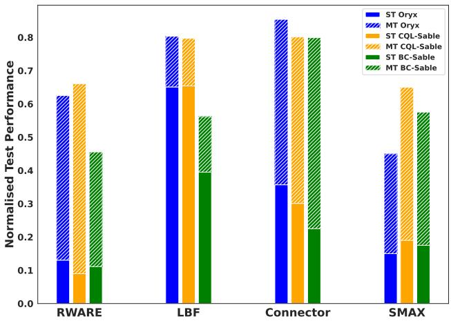  
Figure 1: Test task performance difference between single-task and multi-task sequence models. Three multi-agent sequence models—CQL-Sable, BC-Sable and Oryx (Formanek et al., 2025)— were trained using either a single task (ST) or a set of multiple training tasks (MT). Average zero-shot performance was measured across a held-out set of test tasks. The upper bar represents the performance gap between ST and MT sequence models on unseen test tasks. Averaged across all three algorithms, we observe a test performance increase of approximately 5.4x on RWARE, 1.3x on LBF, 2.9x on Connector and 3.2x on SMAX.

## 1 INTRODUCTION

Building agents that generalise to tasks beyond those present in their training data is a central challenge in reinforcement learning (RL), and a prerequisite for deploying agents in the real world (Kirk et al., 2023). In many domains, collecting fresh data online by interacting with a live system is costly or risky, so practitioners turn to offline RL from logged trajectories (Levine et al., 2020). While single-agent work has studied the train–test generalisation gap (Mediratta et al., 2024), the multi-agent case remains under-explored. Despite recent progress in offline multi-agent reinforcement learning (MARL) (Yang et al., 2021b; Shao et al., 2023; Meng et al., 2023; Li et al., 2025; Formanek et al., 2025), prior work have largely been restricted to training and evaluating on the same task, without examining generalisation to unseen tasks.

In this work, we study the generalisation of single-task models, and then introduce a challenging multitask benchmark for offline MARL, which builds on widely adopted MARL environments including Level Based Foraging (LBF), Multi-Robot Warehouse (RWARE) (Papoudakis et al., 2021), Connector (Bonnet et al., 2024) and SMAX (Rutherford et al., 2024). Using this benchmark, we evaluate three state-of-the-art offline multi-agent sequence models, namely Oryx (Formanek et al., 2025), and two offline versions of Sable (Mahjoub et al., 2025) (CQL-Sable and BC-Sable). Across all four environments, we show that these models exhibit poor generalisation when trained only on a dataset from a single task. However, when trained simultaneously on a dataset consisting of a diverse set of multiple tasks, their ability to zero-shot transfer to unseen tasks significantly improves. Furthermore, we verify that similar results cannot be obtained by simply increasing the size of the dataset for a fixed number of tasks, but rather that the key driver is increasing dataset diversity by adding more tasks, which consistently leads to improved test performance. Finally, we find that for a fixed data budget, increasing the model’s capacity has a positive impact on generalisation for challenging tasks.

Our findings show that offline MARL sequence models trained on diverse multi-task datasets exhibit promising generalisation to unseen tasks compared to single-task alternatives. In contrast to the findings of Mediratta et al. (2024), we observe that offline sequence models consistently outperform behaviour cloning, which remains a surprisingly strong baseline. Finally, our work provides the first promising evidence of performance scaling (Hilton et al., 2023) with increasing model capacity for offline MARL on challenging unseen tasks.

In summary, our main contributions are as follows:

• We develop a challenging multi-task offline MARL evaluation suite, which includes 28 large training sets and 34 test sets across four diverse environments, including LBF, Connector, RWARE and SMAX.

• We conduct an in-depth empirical analysis of out-of-distribution generalisation as a function of task diversity, data and model size, showing that zero-shot generalisation of sequence models scales significantly (3.2x on average) as the number of tasks in the training data increases, that sheer dataset size is not the main driver of test performance, and that for difficult tasks, model scaling positively affects generalisation.

• We provide a theoretical analysis of generalisation in offline multi-task MARL, establishing task coverage to be a key driver of out-of-distribution performance gains, formally grounding our empirical findings on the roles of task diversity and model capacity.

• All of our (anonymised) code is available for download.1 We will make all of our code and datasets publicly available upon publication.

## 2 MULTI-TASK SEQUENCE MODELLING FOR OFFLINE MARL

## 2.1 PRELIMINARIES

Problem formulation. We formalise a cooperative MARL task as a Decentralised Partially Observable Markov Decision Process (Dec-POMDP) (Kaelbling et al., 1998), defined by the tuple $\mathcal { M } _ { \dagger } = \langle \mathcal { N } , \mathcal { S } , \mathcal { A } , P , R , \{ \Omega ^ { i } \} _ { i \in \mathcal { N } } , \{ E _ { i } \} _ { i \in \mathcal { N } } , \gamma \rangle$ , where † denotes the particular task selected from an environment. For example, in a simulated robotic warehouse environment, a task corresponds to a specific warehouse layout and the number of robotic workers collecting and depositing requested shelf items. At each timestep t within a task, the environment is in state $s _ { t } \in S$ . Each agent $i \in \mathcal N$ selects an action $a _ { t } ^ { i } \in \mathcal { A } ^ { i }$ based on its local action-observation history $\tau _ { t } ^ { i } = ( o _ { 0 } ^ { i } , a _ { 0 } ^ { i } , \ldots , o _ { t } ^ { i } )$ . The agents’ actions form a joint action $\begin{array} { r } { \pmb { a } _ { t } \in \pmb { \mathcal { A } } = \prod _ { i \in \mathcal { N } } \pmb { \mathcal { A } } ^ { i } } \end{array}$ , which, when executed, yields a shared reward $r _ { t } = R ( s _ { t } , { \pmb a } _ { t } )$ , transitions the environment to $s _ { t + 1 } \sim P ( \cdot | s _ { t } , \mathbf { a } _ { t } )$ , and provides each agent i with a new observation $o _ { t + 1 } ^ { i } \sim E _ { i } ( \cdot | s _ { t + 1 } , \mathbf { a } _ { t } )$ . The agent then updates its history as $\tau _ { t + 1 } ^ { i } = ( \bar { \tau } _ { t } ^ { i } , a _ { t } ^ { i } , o _ { t + 1 } ^ { i } )$ The task-specific objective is to learn a joint policy $\pi ( \boldsymbol { a } | \tau )$ that maximises the expected discounted return over a horizon of timesteps H: $\begin{array} { r } { J _ { \dagger } ( \pmb { \pi } ) = \mathbb { E } _ { \pmb { \pi } } \left[ \sum _ { t = 0 } ^ { H } \gamma ^ { t } r _ { t } \right] } \end{array}$

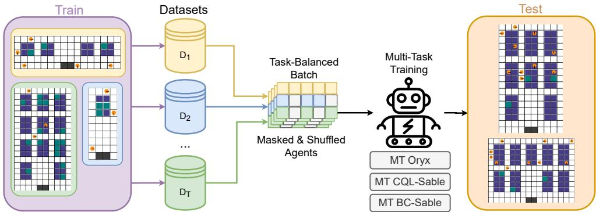  
Figure 2: Our offline multi-task multi-agent training and testing setup. In this setup, there is a set of training tasks, each with a static dataset of pre-collected trajectories that together form a diverse multi-task dataset. This dataset is then used for training, without any additional online interactions with either the training tasks or the testing tasks. At evaluation time, the trained model is evaluated on each of the held-out test tasks, and the average test performance is calculated. In this illustration, we used RWARE tasks in the train and test sets.

To create our train-test evaluation setup, we consider offline datasets ${ \mathcal { D } } _ { \operatorname { t r a i n } } = \{ { \mathcal { D } } _ { \dagger } : \dagger \in { \mathcal { T } } _ { \operatorname { t r a i n } } \}$ collected from a set of training tasks $\mathcal { T } _ { \mathrm { t r a i n } }$ . Our objective is to learn a single joint policy $\pi _ { \mathrm { t r a i n } }$ , using only the fixed multi-task training data (i.e. without any additional online interaction), to maximise the expected zero-shot performance on a set of unseen test tasks $\mathcal { T } _ { \mathrm { t e s t } }$ , given as

$$
J ( \pi ) = \mathbb { E } _ { \mathsf { f } \sim \mathcal { T } _ { \mathrm { t e s t } } } [ J _ { \dagger } ( \pi ) | \pi = \pi _ { \mathrm { t r a i n } } ] .
$$

By optimising the above objective, we are minimising the generalisation gap between training and test tasks. A simplified visual representation of the problem setting is depicted in Figure 2.

Multi-Agent Sequence Models. Centralised control, where a single policy outputs the joint action, is theoretically optimal but scales poorly due to an exponential growth of the action space (de Kock et al., 2025). However, autoregressive factorisation is an efficient way to parametrise the joint policy, by expressing the joint distribution over n agents as a product of conditional distributions:

$$
\pi ( { \pmb a } | { \pmb \tau } ) = \prod _ { k = 1 } ^ { n } \pi ^ { i _ { k } } \left( a ^ { i _ { k } } \enspace | \enspace { \pmb \tau } , a ^ { i _ { 1 } } , \dots , a ^ { i _ { k - 1 } } \right) .
$$

Here $i _ { k }$ denotes an agent index from an ordered set $\{ i _ { 1 } , \ldots , i _ { n } \} \ \in \ S _ { n }$ , where $S _ { n }$ is the set of permutations of $\left\{ 1 , . . . , n \right\}$ . This factorisation decomposes joint decision-making into a sequence of conditional actions, enabling scalable coordination, efficient parallel training and, in certain cases, providing desirable convergence properties (Zhong et al., 2024b). Sequence models provide a natural parameterisation of such policies, closely mirroring the autoregressive next token prediction process in text and image generation, and have been demonstrated to work well on a large range of MARL settings (Wen et al., 2022; Mahjoub et al., 2025; Daniel et al., 2024; Formanek et al., 2025).

## 2.2 MULTI-TASK SEQUENCE MODELS FOR OFFLINE MARL

Building on existing multi-agent sequence models for offline MARL (Formanek et al., 2025), we propose a few simple yet essential modifications that enable training on multiple tasks with varying numbers of agents simultaneously, while allowing seamless zero-shot transfer. By design, our multi-task sequence models do not receive explicit task IDs or have task-specific output heads, since this would limit their zero-shot transferability to new tasks. Instead, our models have to infer task information from observations, agent counts, and environment dynamics.

Dynamic agent padding, shuffling and masking. In order to dynamically handle variable numbers of agents across tasks, we zero-pad the inputs for absent agents and mask their contributions in the loss. Moreover, we randomise the ordering of both active and inactive agents at each training update, which encourages the model to share representations and transfer knowledge across agents.

Multi-task training loss. Given a set of training tasks $\mathcal { T } _ { \mathrm { t r a i n } } = \{ \dagger _ { 1 } , \hdots , \dagger _ { M } \}$ , with offline buffers $\{ \mathcal { D } _ { \dagger } \} _ { \tau \in \mathcal { T } _ { \mathrm { u a i n } } }$ , we train a multi-task sequence model by minimising the average per-task loss

$$
\operatorname* { m i n } _ { \theta } \ \frac { 1 } { M } \sum _ { \dagger \in \mathcal { T } _ { \mathrm { t r a i n } } } \Big [ \mathcal { L } ( \theta ; \mathcal { D } _ { \dagger } ) \Big ] .
$$

The loss $\mathcal { L }$ changes depending on the algorithm used, which in our case includes autoregressive versions of behaviour cloning (BC) (Pomerleau, 1988; Bain & Sammut, 1995), Conservative Qlearning (CQL) (Kumar et al., 2020) and Implicit Constraint Q-learning (ICQ) (Yang et al., 2021b; Formanek et al., 2025).

Task-balanced batching. For each training update, we build a single unified mini-batch by evenly sampling across different tasks. Given a batch size B, we compute $q ~ = ~ \lfloor ~ B ~ / ~ \lvert \mathcal { T } _ { \mathrm { t r a i n } } \rvert ~ \rfloor$ and $r = B - q | \mathcal { T } _ { \mathrm { t r a i n } } |$ . Each task $\dag \in \mathcal { T } _ { \mathrm { t r a i n } } ,$ contributes q samples; the remaining r samples are assigned by round-robin across tasks up to the value r. This yields stochastic gradients that are unbiased over a uniform mixture of tasks (each task equally weighted), rather than a size-weighted mixture. The resulting task-balanced batching also mitigates “head-task” dominance seen with dataset-proportional sampling, a known issue in domain generalisation from long-tailed datasets (Cui et al., 2019).

Value function learning via classification. To mitigate gradient interference from varying reward scales across tasks, we replace scalar TD regression with a classification objective. Specifically, we use HL-Gauss (Imani & White, 2018; Farebrother et al., 2024), which projects each scalar TD target onto a discrete support by smoothing with a Gaussian distribution, and trains the value function with categorical cross-entropy over the resulting histogram. This choice, consistent with prior multi-task training architectures (Kumar et al., 2022a), improves stability and reduces loss-scale sensitivity compared to mean squared error.

We provide ablation studies validating these specific design choices in Appendix J.

## 3 EMPIRICAL ANALYSIS

## 3.1 EXPERIMENTAL DESIGN

Tasks. We considered four challenging MARL environments, LBF, RWARE (Papoudakis et al., 2021), Connector (Bonnet et al., 2024) and SMAX (Rutherford et al., 2024). These are all widely used MARL benchmarks, with RWARE also proposed as a suitable multi-task benchmark in previous work (Schäfer, 2022) and Connector being of particular interest due to its agent scaling properties (see Formanek et al. (2025)). For each environment, we selected several different level configurations to serve as distinct tasks. These tasks were then partitioned into train and test sets (see Appendix H), taking care to ensure that the test tasks were different in meaningful ways to the training tasks, as shown in Figure 3.

Datasets. For each task, we construct an offline dataset $\mathcal { D } _ { \dagger }$ by recording a set of rollouts at fixed intervals from an online training run of SABLE (Mahjoub et al., 2025), a state-of-the-art MARL sequence model. This yields a mixed dataset with the same number of rollouts per task but not necessarily the same number of transitions, since episode lengths differ across tasks, hence the necessity for task-balanced batching. Observations and actions are standardised per environment. For sequence modeling, we sample fixed-length trajectory chunks (context length reported with other hyperparameters in Appendix I). Rewards are left unclipped during training and for comparability across tasks, we report normalised returns, where each task’s episode return is normalised by the final episode return achieved by the online system on that task. Further details on the datasets can be found in Appendix K.

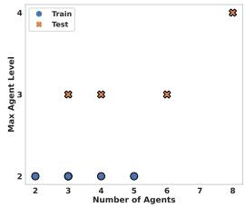  
(a) LBF

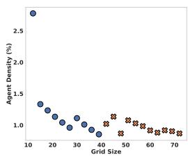  
(b) Connector

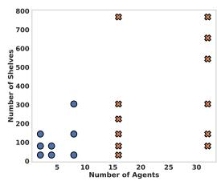  
(c) RWARE

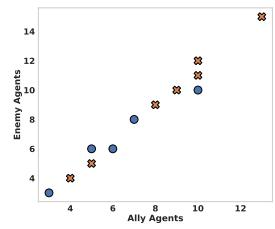  
(d) SMAX  
Figure 3: Distributional shift between train and test tasks. Each point represents a task, with key task properties plotted to illustrate distributional differences. In LBF, we plot the number of agents against the maximum agent level; in Connector, grid size against agent density; in RWARE, the number of agents against the number of shelves; and in SMAX, the number of ally agents against the number of enemy agents. While these dimensions are important for distinguishing tasks, additional parameters vary across tasks but are not shown here (e.g., the layout of shelves in RWARE tasks).

Algorithms. The first algorithm we consider is an adapted version of Oryx (Formanek et al., 2025), which we modify for multi-task training. As described in section 2, these modifications include (i) dynamic padding, masking, and agent shuffling, (ii) task-balanced batching, and (iii) value learning using HL-Gauss (Farebrother et al., 2024). We refer to this variant as Multi-Task (MT) Oryx.

The second algorithm, MT BC-Sable, is an offline variant of Sable that uses behaviour cloning to train an autoregressive policy, together with dynamic padding and masking of agents and task-balanced batching. The third algorithm, MT CQL-Sable, is another offline variant of Sable that employs an autoregressive version of the CQL loss (Kumar et al., 2020), while incorporating the same multi-task enhancements as MT Oryx.

All three algorithms share the same Sable network backbone; thus, the primary distinction between them lies in the choice of loss function L. We select CQL due to its demonstrated generalisation and scaling capabilities in the single-agent setting (Kumar et al., 2022a; Chebotar et al., 2023), and behaviour cloning for its strong and competitive generalisation performance reported in prior work (Mediratta et al., 2024). Hyperparameter details for all three algorithms are provided in Appendix I, and the computational requirements are described in Appendix G.

Evaluation protocol. In our experiments, we evaluate the expected zero-shot performance of trained models on held-out test tasks. To this end, we compute the absolute episode return (Gorsane et al., 2022) by evaluating the best-performing checkpoint during training over 320 independent episodes and averaging the resulting returns for each test task.

To enable comparisons across tasks and environments with potentially different reward scales, we normalise the absolute episode return by dividing it by the maximum expected episode return achieved for the corresponding task during online data collection. Each experimental configuration is repeated over three random seeds, and we report the mean and standard deviation across runs.

## 3.2 MULTI-TASK TRAINING IMPROVES GENERALISATION

Experiment. We vary the number of tasks in the training set while keeping the test set fixed. Multi-task sequence models are trained on different subsets of the available training data, and their performance is evaluated on both the corresponding training tasks and the held-out test tasks.

For LBF, we consider a total of 5 training tasks; for Connector, 10; for RWARE, 8; and for SMAX, 5. For each environment, we incrementally increase the number of training tasks from 1 to the maximum available. Performance as a function of training task count, evaluated on both training and test tasks, is shown in Figure 4.

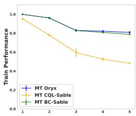

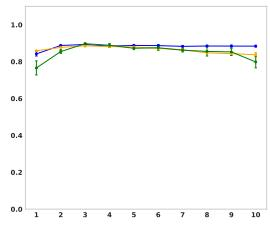

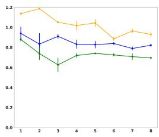

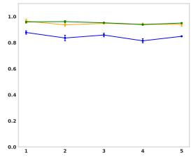

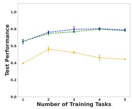  
(a) LBF

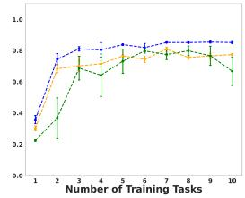  
(b) Connector

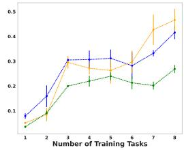  
(c) RWARE

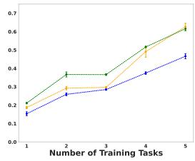  
(d) SMAX  
Figure 4: The effect of increasing task diversity on performance. Top: training tasks. Bottom: held-out test tasks. When training on a single task, performance is high on the training task but generalisation to held-out tasks is poor. As the number of training tasks increases, test-task performance steadily improves across all environments.

Discussion. We observe that performance on the training tasks remains relatively high across all environments, even as the number of tasks increases. This indicates that the model can successfully learn across multiple tasks simultaneously. Qualitatively, we further observe that the model success fully learns very different multi-agent strategies across distinct tasks, such as switching between exploration and congestion avoidance (see Appendix F). However, in RWARE we note a progressive decline in training performance as the number of training tasks grows. We attribute this to the higher complexity of RWARE tasks and the need to scale model capacity with task diversity to maintain performance. Interestingly, even as train task performance degrades, test task performance improves nearly monotonically as the number of training tasks increases, highlighting the importance of diverse multi-task data for generalisation. On LBF, we observe that MT CQL-Sable’s performance decreases. We hypothesise that this is due to the high proportion of expert trajectories in the LBF dataset, as the data collection policy quickly converges to the optimal behaviour. Prior work has shown that CQL is particularly sensitive to overly narrow or high-quality datasets, and benefits from mixed quality datasets (Schweighofer et al., 2022). To further examine this, we include an ablation on trajectories quality in Appendix D. Additionally, we find that the offline MARL models generalise better than the behaviour cloning model, especially in settings with mixed-quality multi-task data (see Appendix C).

Across all algorithms and environments, performance tends to plateau after a certain number of training tasks. We attribute this saturation to the limits of the current model capacity, pointing to the necessity of scaling up the model size to obtain maximum performance on highly diverse multi-task datasets (see subsection 3.3). To summarise the overall effect of multi-task training with a fixed model size, we measure and report the maximum performance gain on test tasks in Figure 1. Averaged across all three algorithms, test performance improves by 5.4x on RWARE, 1.3x on LBF, 2.9x on Connector, and 3.2x on SMAX. These results validate the effectiveness of multi-task training as a means of unlocking substantial performance gains on unseen test tasks.

## 3.3 CAN WE FURTHER IMPROVE GENERALISATION BY INCREASING THE SIZE OF THE DATASETS AND MODELS?

A natural question that arises is, what is the optimal dataset size and model size for generalisation? Can we improve the generalisation capabilities by simply increasing the size of the dataset for a given set of training tasks? Similarly, can we improve generalisation by increasing the size of the model? To test this, we design two experiments.

Experiment (a). To determine whether increasing the size of the datasets (in terms of number of transitions rather than number of tasks) helps performance, we conducted a sweep over dataset sizes for several multi-task datasets on RWARE. The results of the sweep are presented in Figure 5a. Similar to the results by Mediratta et al. (2024), we find that there is little evidence that scaling up the number of transitions helps generalisation nearly as much as adding more tasks.

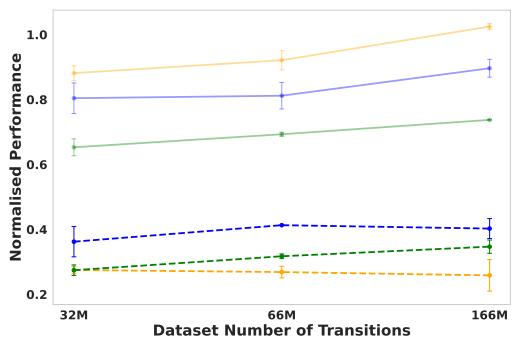  
(a) Dataset size scaling.

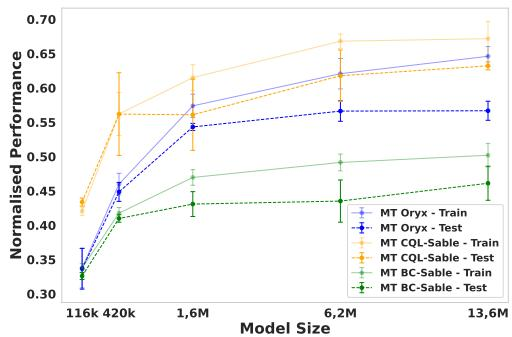  
(b) Model size scaling.  
Figure 5: The impact ofscaling up dataset (left) and model size (right). Fixing the number of RWARE tasks while increasing the number of transitions in the dataset leads to improved training performance, though test performance plateaus. Conversely, fixing the dataset size and varying the model size reveals a clear scaling trend, both training and test performance improve as the model grows.

Experiment (b). To study the effect of model size, we train various models with different numbers of parameters, ranging from 116k to 13M, using the RWARE dataset. For simplicity, we mainly vary the embedding dimension of the model’s encoder-decoder network from 64 (116k parameters) to 768 (13M parameters). We report the average episode return, normalised by the online performance, on both the training and test tasks in Figure 5b. We show in Appendix E similar results for LBF, Connector and SMAX.

Discussion. The results in Figure 5a indicate that simply increasing the number of transitions in the training dataset improves train task performance but does not lead to better generalisation on held-out test tasks, highlighting the importance of task diversity in multi-task datasets, since from Figure 4 we can conclude that adding additional tasks has a greater benefit. In contrast, scaling model capacity (Figure 5b)—from an embedding dimension of 64 (116k parameters) to 512 (6.2M parameters)—consistently improved both training and test performance. This finding is particularly encouraging: it suggests that large, diverse multi-task datasets may be the missing ingredient needed to make ever-larger and more general offline MARL models viable. Notably, this result contrasts with the single-task setting reported by (Formanek et al., 2025), where the optimal embedding dimension was just 64, underscoring the unique potential of multi-task data for enabling scale.

## 4 WHY DOES MULTI-TASK TRAINING HELP MARL SEQUENCE MODELS TO GENERALISE?

We provide a theoretical analysis of the empirical scaling behaviour presented in section 3. Our main result (Theorem 4.4) bounds the generalisation gap of a multi-task offline MARL policy in terms of three quantities: a training error, a coverage radius on the task space, and a Lipschitz constant of the value function with respect to a task metric. The bound captures both qualitative trends observed in our experiments: more diverse training tasks shrink the coverage radius, while a larger, better-fit policy class shrinks the training error.

Setup. Each task $z \in { \mathcal { Z } }$ indexes a Dec-POMDP M with shared discount $\gamma \in [ 0 , 1 )$ and rewards bounded in $[ 0 , R _ { \mathrm { m a x } } ]$ . We assume tasks are embedded into a common state-action space $( S , A )$ via the zero-padding and masking procedure presented in subsection 2.2, so that any (history-dependent) policy defined on $( S , A )$ can be evaluated on every $\mathcal { M } _ { z }$ . Let Π be the class of such history-dependent policies. For $\pi \in \Pi$ , let $\begin{array} { r } { J _ { z } ( \pi ) = \mathbb { E } _ { \pi , P _ { z } , \rho _ { z } } \big [ \sum _ { t = 0 } ^ { \infty } \gamma ^ { t } R _ { z } ( s _ { t } , a _ { t } ) \big ] } \end{array}$ , and let $\pi _ { z } ^ { \ast } \in$ arg maxπ∈Π $J _ { z } ( \pi )$ denote a Π-optimal policy on task z (assumed to exist). We train a single multi-task policy $\pi _ { \boldsymbol { \theta } } \in \dot { \Pi }$ on a finite training set $\dot { \mathcal { T } _ { \mathrm { t r a i n } } } = \{ z _ { 1 } , \hdots , z _ { N } \} \subset \mathcal { Z }$ using a fixed offline dataset $\mathcal { D } _ { \mathrm { t r a i n } } = \{ \mathcal { D } _ { z _ { i } } \} _ { i = 1 } ^ { N } ,$ and measure generalisation by the zero-shot regret on a held-out task:

$$
\begin{array} { r } { \mathcal { R } ( z _ { \mathrm { t e s t } } ) : = J _ { z _ { \mathrm { t e s t } } } ( \pi _ { z _ { \mathrm { t e s t } } } ^ { * } ) - J _ { z _ { \mathrm { t e s t } } } ( \pi _ { \theta } ) . } \end{array}
$$

Task metric. We assume $\mathcal { Z }$ is equipped with a pseudometric d. A natural choice is a transitionreward distance,

$$
\begin{array} { r } { d ( z , z ^ { \prime } ) : = \underset { ( s , a ) } { \operatorname* { s u p } } \Big \lbrace \left| R _ { z } ( s , a ) - R _ { z ^ { \prime } } ( s , a ) \right| + \frac { \gamma R _ { \mathrm { m a x } } } { 1 - \gamma } D _ { T V } ( P _ { z } ( \cdot | s , a ) , P _ { z ^ { \prime } } ( \cdot | s , a ) ) \Big \rbrace , } \end{array}
$$

defined on the common embedded space; we also assume $\rho _ { z } ~ = ~ \rho _ { z ^ { \prime } }$ across tasks (or absorb $D _ { T V } \big ( \rho _ { z } , \rho _ { z ^ { \prime } } \big )$ into d).

## 4.1 MAIN GENERALISATION BOUND

Assumption 4.1 (Common embedded space). All tasks $z \in { \mathcal { Z } }$ share a common state-action space $( S , A )$ and a common initial distribution $\rho ,$ so that every history-dependent policy $\pi \in \Pi$ can be evaluated on every $\mathcal { M } _ { z }$

Assumption 4.2 (Smoothness on Π). There exists $L \geq 0$ such that for every policy $\pi \in \Pi$ and all $z , z ^ { \prime } \in \mathcal { \bar { Z } } , | J _ { z } ( \pi ) - J _ { z ^ { \prime } } ( \pi ) | \leq L d ( z , z ^ { \prime } )$

Assumption 4.3 (Bounded training error). There exists $\varepsilon _ { \mathrm { t r a i n } } \geq 0$ such that $J _ { z _ { i } } ( \pi _ { z _ { i } } ^ { * } ) { - } J _ { z _ { i } } ( \pi _ { \theta } ) \leq \varepsilon _ { \mathrm { t r a i n } }$ for every $z _ { i } \in \mathcal { T } _ { \operatorname { t r a i n } }$

Assumption 4.1 is by construction in our setting. Assumption 4.2 is a substantive structural assumption on the task family: it can be derived from Lipschitz continuity of the reward and transition kernels in the metric d via a simulation lemma (Lemma A.1 in Appendix A), but it is not automatic for arbitrary task families and may fail for combinatorial task families with abrupt structural changes between tasks.

Theorem 4.4 (Coverage–smoothness regret bound). Under Assumptions 4. $I { \ - } { \mathcal { A } } . { \mathcal { B } } ,$ , for any $z _ { t e s t } \in \mathcal { Z } ,$

$$
\mathcal { R } ( z _ { t e s t } ) ~ \leq ~ \varepsilon _ { t r a i n } ~ + ~ 2 L \cdot \operatorname* { m i n } _ { z _ { i } \in \mathcal { T } _ { t r a i n } } d ( z _ { i } , z _ { t e s t } ) .
$$

The bound formally captures the two empirical findings of section 3:

• Task diversity reduces the coverage radius. The bound decreases as minz $d ( z _ { i } , z _ { \mathrm { t e s t } } )$ shrinks, which is achieved by adding training tasks that are close in d to plausible test tasks. This is consistent with the monotonic test-performance gains observed in Figure 4.

• Model capacity reduces $\underline { { \varepsilon } } _ { \mathrm { t r a i n } } .$ Within the bound, scaling model size acts exclusively through $\varepsilon _ { \mathrm { t r a i n } } ,$ leaving the coverage term fixed for a given training task set. This is consistent with the monotonic improvement in test performance observed in Figure 5b.

## 4.2 FINITE-TASK COVERAGE COROLLARY

In our experimental setting Z is the finite set of tasks in a benchmark suite. We record the simple deterministic consequence.

Corollary 4.5 (Finite-set coverage). Under Assumptions 4.1–4.3, $i f z _ { t e s t } \in \mathcal { T } _ { t r a i n }$ then $\mathcal { R } ( z _ { t e s t } ) \leq$ εtrain. More generally, if every test task lies within d-distance r of some training task, then $\begin{array} { r } { \operatorname* { s u p } _ { z _ { t e s t } \in \mathcal { Z } _ { t e s t } } \mathcal { R } ( z _ { t e s t } ) \leq \varepsilon _ { t r a i n } + 2 L r } \end{array}$

Corollary 4.5 makes precise the qualitative claim that, for finite task suites, generalisation is controlled by how thoroughly the training set covers the test set in the chosen metric.

## 4.3 PROXY COVERAGE: AN EMPIRICAL SURROGATE

Since the theoretical coverage term min $\iota _ { z _ { i } } d \big ( z _ { i } , z _ { \mathrm { t e s t } } \big )$ is not directly computable, we construct an empirical surrogate. For each environment, we represent each task z by a hand-crafted descriptor zˆ capturing key task properties (detailed in $\mathbf { A . } 4 )$ , and define the proxy coverage as

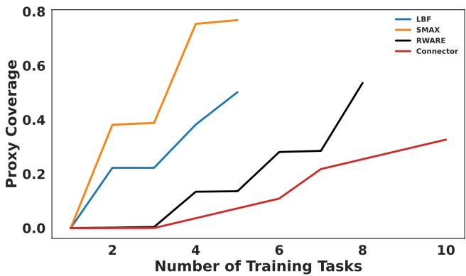  
Figure 6: Proxy coverage metric for each environment’s test set. This proxy metric, based on the similarity between test and training tasks, provides insight into how performance is likely to improve as additional training tasks are included.

$$
\mathrm { P C } \ = \ 1 - \operatorname* { m i n } _ { \hat { z } _ { i } \in { \mathcal { T } } _ { \mathrm { t r a i n } } } \lVert \hat { z } _ { i } - \hat { z } _ { \mathrm { t e s t } } \rVert ,
$$

so that higher values indicate better coverage of the test task by the training set. Figure 6 plots PC as the number of training tasks grows. Consistent with the bound in Theorem 4.4, PC increases monotonically in all environments, though at rates that reflect each environment’s task diversity: SMAX and LBF show the steepest gains, while Connector’s training and test tasks are already similar with few tasks, leading to early saturation.

## 5 RELATED WORK

Offline MARL. Most prior work in offline MARL uses single-task training and evaluation, while focusing on finding solutions to key challenges particular to offline multi-agent learning. Seminal early papers include Jiang & Lu (2021) and Yang et al. (2021a), who introduced multi-agent methods for constrained Q-value estimation. Since then, numerous additional works have aimed to tackle challenges such as extrapolation error (Shao et al., 2023; Eldeeb et al., 2024), coordination (Barde et al., 2024; Tilbury et al., 2024; Zhou et al., 2025), offline training stability (Pan et al., 2022; Wang et al., 2023; Matsunaga et al., 2023; Wu et al., 2023a; Bui et al., 2025; Liu et al., 2024b; Li et al., 2025), opponent modeling (Jing et al., 2024), offline-to-online transfer (Zhong et al., 2024a; Formanek et al., 2023) and theoretical understanding (Cui & Du, 2022b;a; Zhong et al., 2022; Zhang et al., 2023b; Xiong et al., 2023; Wu et al., 2023a).

Sequence Models for RL. Formulating RL as a sequence modelling problem has gained significant attention. Chen et al. (2021) introduced the Decision Transformer (DT), later extended in various ways (Zheng et al., 2022; Yamagata et al., 2023; Wu et al., 2023b). Lee et al. (2022) trained a multi-task DT that learned across tasks and could be quickly fine-tuned. Meng et al. (2023) introduced MADT, an extension of the DT to the multi-agent setting. The Multi-Agent Transformer (MAT) (Wen et al., 2022) addressed the online setting with auto-regressive action selection, and Mahjoub et al. (2025) improved on MAT with Sable, which replaces the Transformer with a Retentive Network (Sun et al., 2023) and adds temporal memory, achieving state-of-the-art results. Building on this line, Formanek et al. (2025) proposed Oryx, an offline MARL sequence model derived from an autoregressive version of Implicit Constraint Q-Learning (ICQ) (Yang et al., 2021b) and offline-specific modifications to Sable, also achieving state-of-the-art performance.

Multi-Task RL. Multi-task training has most prominently been investigated in single-agent continuous-control and robotics problems with a focus on representation and transfer learning (Xu et al., 2020; Kalashnikov et al., 2021; Kumar et al., 2022b; Cheng et al., 2022). Although shown to be useful in most cases, Yu et al. (2021) find that naively adding more multi-task data to an offline RL training dataset can sometimes lead to a decrease in performance on downstream tasks, particularly when the distributional shift between tasks is large. In terms of generalisation, Kumar et al. (2022a)

and He et al. (2023) highlight the potential for high-capacity models trained on large and diverse multi-task datasets to produce agents that can generalise more broadly when fine-tuned on previously unseen tasks. Most closely related to our work is that of Mediratta et al. (2024), who evaluate the zero-shot generalisation capabilities of several offline single-agent RL methods by training them on a set of training tasks and testing them on a set of holdout tasks. They find that current offline RL methods do not generalise well and are typically outperformed by simple behaviour cloning.

Multi-Task MARL. Multi-task MARL faces both architectural and evaluation challenges when agents must generalise beyond single-task training, motivating formal definitions and benchmarks for task generalisation(Schäfer, 2022). Rosen et al. (2024) give a formal, goal-oriented theory that proves how a learned world value function can enable provably optimal zero-shot task generalisation in goal-based multi-agent settings. MaskMA (Liu et al., 2024a) introduces a mask-based framework that adapts to varying agent- and action-spaces and shows strong zero-shot transfer on unseen SMAC (Samvelyan et al., 2019b) maps. Unlike our approach, their work builds on MADT (Meng et al., 2023), while we focus on sequence model architectures related to Oryx (Formanek et al., 2025), which have been shown to outperform MADT. The offline coordination-skill discovery method ODIS (Zhang et al., 2023a) extracts task-invariant coordination primitives from multi-task trajectories and shows that this can be used to deploy coordination policies to unseen SMAC tasks without additional online interaction. Related work, HiSSD (Liu et al., 2025) proposes a hierarchical separation between common cooperative (temporal) skills and task-specific controllers. None of the above studies investigates the effect of task diversity on test performance, instead keeping the number of training tasks fixed.

## 6 CONCLUSION

In this work, we studied the generalisation of offline MARL sequence models. Both our empirical results from large sets of experiments and insights from theoretical analysis showed that task diversity is a key driver for reducing the train–test generalisation gap. Additionally, we showed that significant improvements in zero-shot out-of-distribution performance can be achieved via model scaling, and that this is consistent across various sequence model objective functions. Our findings suggest that future progress in offline MARL should prioritise (i) constructing large and diverse multi-task datasets, and (ii) carefully tuning model capacity for a given data budget to maximise zero-shot generalisation. We release code, datasets, task splits, and training scripts to encourage reproducibility and to establish stronger benchmarks for evaluating generalisation in offline MARL.

Limitations and future work. Our work is limited to centralised sequence model architectures, and although these represent a powerful and performant model class, promising future work could include extending our analysis to decentralised and CTDE algorithms. Additional areas of interest include studying the limits of transfer across environments (not only tasks), and investigating accelerating fine-tuning in safety-critical and data-scarce real-world domains.

## ACKNOWLEDGMENTS

## REFERENCES

Michael Bain and Claude Sammut. A framework for behavioural cloning. In Machine intelligence 15, pp. 103–129, 1995.

Paul Barde, Jakob Foerster, Derek Nowrouzezahrai, and Amy Zhang. A model-based solution to the offline multi-agent reinforcement learning coordination problem. In International Conference on Autonomous Agents and Multiagent Systems, 2024.

Clément Bonnet, Daniel Luo, Donal John Byrne, Shikha Surana, Sasha Abramowitz, Paul Duckworth, Vincent Coyette, Laurence Illing Midgley, Elshadai Tegegn, Tristan Kalloniatis, et al. Jumanji: a diverse suite of scalable reinforcement learning environments in jax. In The Twelfth International Conference on Learning Representations, 2024.

The Viet Bui, Thanh Hong Nguyen, and Tien Mai. Comadice: Offline cooperative multi-agent reinforcement learning with stationary distribution shift regularization. In International Conference on Learning Representations, 2025.

Yevgen Chebotar, Quan Vuong, Karol Hausman, Fei Xia, Yao Lu, Alex Irpan, Aviral Kumar, Tianhe Yu, Alexander Herzog, Karl Pertsch, et al. Q-transformer: Scalable offline reinforcement learning via autoregressive q-functions. In Conference on Robot Learning, pp. 3909–3928. PMLR, 2023.

Lili Chen, Kevin Lu, Aravind Rajeswaran, Kimin Lee, Aditya Grover, Misha Laskin, Pieter Abbeel, Aravind Srinivas, and Igor Mordatch. Decision transformer: Reinforcement learning via sequence modeling. Advances in neural information processing systems, 34:15084–15097, 2021.

Yuan Cheng, Songtao Feng, Jing Yang, Hong Zhang, and Yingbin Liang. Provable benefit of multitask representation learning in reinforcement learning. Advances in Neural Information Processing Systems, 35:31741–31754, 2022.

Qiwen Cui and Simon S Du. When are offline two-player zero-sum markov games solvable? In S. Koyejo, S. Mohamed, A. Agarwal, D. Belgrave, K. Cho, and A. Oh (eds.), Advances in Neural Information Processing Systems, volume 35. Curran Associates, Inc., 2022a.

Qiwen Cui and Simon S Du. Provably efficient offline multi-agent reinforcement learning via strategy-wise bonus. In S. Koyejo, S. Mohamed, A. Agarwal, D. Belgrave, K. Cho, and A. Oh (eds.), Advances in Neural Information Processing Systems, volume 35. Curran Associates, Inc., 2022b.

Yin Cui, Menglin Jia, Tsung-Yi Lin, Yang Song, and Serge Belongie. Class-balanced loss based on effective number of samples. In Proceedings of the IEEE/CVF conference on computer vision and pattern recognition, pp. 9268–9277, 2019.

Jemma Daniel, Ruan de Kock, Louay Ben Nessir, Sasha Abramowitz, Omayma Mahjoub, Wiem Khlifi, Claude Formanek, and Arnu Pretorius. Multi-agent reinforcement learning with selective state-space models. arXiv preprint arXiv:2410.19382, 2024.

Ruan de Kock, Arnu Pretorius, and Jonathan Shock. Is an exponentially growing action space really that bad? validating a core assumption for using multi-agent rl. In Proceedings of the 24th International Conference on Autonomous Agents and Multiagent Systems, pp. 2490–2492, 2025.

Eslam Eldeeb, Houssem Sifaou, Osvaldo Simeone, Mohammad Shehab, and Hirley Alves. Conservative and risk-aware offline multi-agent reinforcement learning. IEEE Transactions on Cognitive Communications and Networking, pp. 1–1, 2024. ISSN 2372-2045. doi: 10.1109/tccn.2024. 3499357. URL http://dx.doi.org/10.1109/TCCN.2024.3499357.

Jesse Farebrother, Jordi Orbay, Quan Vuong, Adrien Ali Taïga, Yevgen Chebotar, Ted Xiao, Alex Irpan, Sergey Levine, Pablo Samuel Castro, Aleksandra Faust, et al. Stop regressing: training value functions via classification for scalable deep rl. In Proceedings of the 41st International Conference on Machine Learning, pp. 13049–13071, 2024.

Claude Formanek, Omayma Mahjoub, Louay Ben Nessir, Sasha Abramowitz, Ruan de Kock, Wiem Khlifi, Simon Du Toit, Felix Chalumeau, Daniel Rajaonarivonivelomanantsoa, Arnol Fokam, et al. Oryx: a performant and scalable algorithm for many-agent coordination in offline marl. Advances in neural information processing systems, 2025.

Juan Claude Formanek, Callum Rhys Tilbury, Jonathan Phillip Shock, Kale ab Tessera, and Arnu Pretorius. Reduce, reuse, recycle: Selective reincarnation in multi-agent reinforcement learning. In Workshop on Reincarnating Reinforcement Learning at ICLR 2023, 2023. URL https: //openreview.net/forum?id=\_Nz9lt2qQfV.

Rihab Gorsane, Omayma Mahjoub, Ruan John de Kock, Roland Dubb, Siddarth Singh, and Arnu Pretorius. Towards a standardised performance evaluation protocol for cooperative marl. Advances in Neural Information Processing Systems, 35:5510–5521, 2022.

Haoran He, Chenjia Bai, Kang Xu, Zhuoran Yang, Weinan Zhang, Dong Wang, Bin Zhao, and Xuelong Li. Diffusion model is an effective planner and data synthesizer for multi-task reinforcement learning. Advances in neural information processing systems, 36:64896–64917, 2023.

Jacob Hilton, Jie Tang, and John Schulman. Scaling laws for single-agent reinforcement learning, 2023. URL https://arxiv.org/abs/2301.13442.

Ehsan Imani and Martha White. Improving regression performance with distributional losses. In International conference on machine learning, pp. 2157–2166. PMLR, 2018.

Jiechuan Jiang and Zongqing Lu. Offline decentralized multi-agent reinforcement learning, 2021. URL https://arxiv.org/abs/2108.01832.

Yuheng Jing, Kai Li, Bingyun Liu, Yifan Zang, Haobo Fu, QIANG FU, Junliang Xing, and Jian Cheng. Towards offline opponent modeling with in-context learning. In The Twelfth International Conference on Learning Representations, 2024.

Leslie Pack Kaelbling, Michael L Littman, and Anthony R Cassandra. Planning and acting in partially observable stochastic domains. Artificial intelligence, 1998.

Dmitry Kalashnikov, Jake Varley, Yevgen Chebotar, Benjamin Swanson, Rico Jonschkowski, Chelsea Finn, Sergey Levine, and Karol Hausman. Scaling up multi-task robotic reinforcement learning. In 5th Annual Conference on Robot Learning, 2021.

Robert Kirk, Amy Zhang, Edward Grefenstette, and Tim Rocktäschel. A survey of zero-shot generalisation in deep reinforcement learning. Journal of Artificial Intelligence Research, 76: 201–264, 2023.

Aviral Kumar, Aurick Zhou, George Tucker, and Sergey Levine. Conservative q-learning for offline reinforcement learning. Advances in neural information processing systems, 33:1179–1191, 2020.

Aviral Kumar, Rishabh Agarwal, Xinyang Geng, George Tucker, and Sergey Levine. Offline qlearning on diverse multi-task data both scales and generalizes. In Deep Reinforcement Learning Workshop NeurIPS 2022, 2022a.

Aviral Kumar, Anikait Singh, Frederik Ebert, Mitsuhiko Nakamoto, Yanlai Yang, Chelsea Finn, and Sergey Levine. Pre-training for robots: Offline rl enables learning new tasks from a handful of trials. arXiv preprint arXiv:2210.05178, 2022b.

Kuang-Huei Lee, Ofir Nachum, Mengjiao Sherry Yang, Lisa Lee, Daniel Freeman, Sergio Guadarrama, Ian Fischer, Winnie Xu, Eric Jang, Henryk Michalewski, et al. Multi-game decision transformers. Advances in neural information processing systems, 35:27921–27936, 2022.

Sergey Levine, Aviral Kumar, George Tucker, and Justin Fu. Offline reinforcement learning: Tutorial, review, and perspectives on open problems. arXiv preprint arXiv:2005.01643, 2020.

Chao Li, Ziwei Deng, Chenxing Lin, Wenqi Chen, Yongquan Fu, Weiquan Liu, Chenglu Wen, Cheng Wang, and Siqi Shen. Dof: A diffusion factorization framework for offline multi-agent reinforcement learning. In The Thirteenth International Conference on Learning Representations, 2025.

Jie Liu, Yinmin Zhang, Chuming Li, Zhiyuan You, Zhanhui Zhou, Chao Yang, Yaodong Yang, Yu Liu, and Wanli Ouyang. Maskma: Towards zero-shot multi-agent decision making with mask-based collaborative learning. Transactions on Machine Learning Research, 2024a.

Sicong Liu, Yang Shu, Chenjuan Guo, and Bin Yang. Learning generalizable skills from offline multitask data for multi-agent cooperation. In The Thirteenth International Conference on Learning Representations, 2025.

Zongkai Liu, Qian Lin, Chao Yu, Xiawei Wu, Yile Liang, Donghui Li, and Xuetao Ding. Offline multi-agent reinforcement learning via in-sample sequential policy optimization, 2024b. URL https://arxiv.org/abs/2412.07639.

Omayma Mahjoub, Sasha Abramowitz, Ruan John de Kock, Wiem Khlifi, Simon Verster Du Toit, Jemma Daniel, Louay Ben Nessir, Louise Beyers, Juan Claude Formanek, Liam Clark, et al. Sable: a performant, efficient and scalable sequence model for marl. In Forty-second International Conference on Machine Learning, 2025.

Daiki E. Matsunaga, Jongmin Lee, Jaeseok Yoon, Stefanos Leonardos, Pieter Abbeel, and Kee-Eung Kim. Alberdice: Addressing out-of-distribution joint actions in offline multi-agent rl via alternating stationary distribution correction estimation, 2023. URL https://arxiv.org/abs/2311. 02194.

Ishita Mediratta, Qingfei You, Minqi Jiang, and Roberta Raileanu. The generalization gap in offline reinforcement learning. In The Twelfth International Conference on Learning Representations, 2024.

Linghui Meng, Muning Wen, Chenyang Le, Xiyun Li, Dengpeng Xing, Weinan Zhang, Ying Wen, Haifeng Zhang, Jun Wang, Yaodong Yang, et al. Offline pre-trained multi-agent decision transformer. Machine Intelligence Research, 20(2):233–248, 2023.

Ling Pan, Longbo Huang, Tengyu Ma, and Huazhe Xu. Plan better amid conservatism: Offline multi-agent reinforcement learning with actor rectification, 2022. URL https://arxiv.org/ abs/2111.11188.

Georgios Papoudakis, Filippos Christianos, Lukas Schäfer, and Stefano V Albrecht. Benchmarking multi-agent deep reinforcement learning algorithms in cooperative tasks. In Thirty-fifth Conference on Neural Information Processing Systems Datasets and Benchmarks Track, 2021.

Dean A Pomerleau. Alvinn: An autonomous land vehicle in a neural network. Advances in neural information processing systems, 1, 1988.

Simon Rosen, Abdel Mfougouon Njupoun, Geraud Nangue Tasse, Steven James, and Benjamin Rosman. Optimal task generalisation in multi-agent reinforcement learning. In Coordination and Cooperation for Multi-Agent Reinforcement Learning Methods Workshop, 2024.

Alexander Rutherford, Benjamin Ellis, Matteo Gallici, Jonathan Cook, Andrei Lupu, Garðar Ingvarsson, Timon Willi, Ravi Hammond, Akbir Khan, Christian Schroeder de Witt, Alexandra Souly, Saptarashmi Bandyopadhyay, Mikayel Samvelyan, Minqi Jiang, Robert Lange, Shimon Whiteson, Bruno Lacerda, Nick Hawes, Tim Rocktäschel, Chris Lu, and Jakob Foerster. Jaxmarl: Multi-agent rl environments and algorithms in jax. In A. Globerson, L. Mackey, D. Belgrave, A. Fan, U. Paquet, J. Tomczak, and C. Zhang (eds.), Advances in Neural Information Processing Systems, volume 37, pp. 50925–50951. Curran Associates, Inc., 2024.

Mikayel Samvelyan, Tabish Rashid, Christian Schroeder de Witt, Gregory Farquhar, Nantas Nardelli, Tim G. J. Rudner, Chia-Man Hung, Philip H. S. Torr, Jakob Foerster, and Shimon Whiteson. The starcraft multi-agent challenge, 2019a.

Mikayel Samvelyan, Tabish Rashid, Christian Schroeder de Witt, Gregory Farquhar, Nantas Nardelli, Tim G. J. Rudner, Chia-Man Hung, Philiph H. S. Torr, Jakob Foerster, and Shimon Whiteson. The StarCraft Multi-Agent Challenge. CoRR, abs/1902.04043, 2019b.

Lukas Schäfer. Task generalisation in multi-agent reinforcement learning. In Proceedings of the 21st International Conference on Autonomous Agents and Multiagent Systems, AAMAS ’22, pp. 1863–1865. International Foundation for Autonomous Agents and Multiagent Systems, 2022.

Kajetan Schweighofer, Marius-constantin Dinu, Andreas Radler, Markus Hofmarcher, Vihang Prakash Patil, Angela Bitto-Nemling, Hamid Eghbal-Zadeh, and Sepp Hochreiter. A dataset perspective on offline reinforcement learning. In Conference on Lifelong Learning Agents, pp. 470–517. PMLR, 2022.

Jianzhun Shao, Yun Qu, Chen Chen, Hongchang Zhang, and Xiangyang Ji. Counterfactual conservative q learning for offline multi-agent reinforcement learning. Advances in Neural Information Processing Systems, 36:77290–77312, 2023.

Yutao Sun, Li Dong, Shaohan Huang, Shuming Ma, Yuqing Xia, Jilong Xue, Jianyong Wang, and Furu Wei. Retentive network: A successor to transformer for large language models. arXiv preprint arXiv:2307.08621, 2023.

Callum Rhys Tilbury, Juan Claude Formanek, Louise Beyers, Jonathan Phillip Shock, and Arnu Pretorius. Coordination failure in cooperative offline MARL. In ICML 2024 Workshop: Aligning Reinforcement Learning Experimentalists and Theorists, 2024.

Xiangsen Wang, Haoran Xu, Yinan Zheng, and Xianyuan Zhan. Offline multi-agent reinforcement learning with implicit global-to-local value regularization. In A. Oh, T. Naumann, A. Globerson, K. Saenko, M. Hardt, and S. Levine (eds.), Advances in Neural Information Processing Systems, volume 36, pp. 52413–52429. Curran Associates, Inc., 2023.

Muning Wen, Jakub Kuba, Runji Lin, Weinan Zhang, Ying Wen, Jun Wang, and Yaodong Yang. Multiagent reinforcement learning is a sequence modeling problem. Advances in Neural Information Processing Systems, 35:16509–16521, 2022.

Chengjie Wu, Pingzhong Tang, Jun Yang, Yujing Hu, Tangjie Lv, Changjie Fan, and Chongjie Zhang. Conservative offline policy adaptation in multi-agent games. In Thirty-seventh Conference on Neural Information Processing Systems, 2023a. URL https://openreview.net/forum? id=C8pvL8Qbfa.

Yueh-Hua Wu, Xiaolong Wang, and Masashi Hamaya. Elastic decision transformer. Advances in neural information processing systems, 36:18532–18550, 2023b.

Wei Xiong, Han Zhong, Chengshuai Shi, Cong Shen, Liwei Wang, and Tong Zhang. Nearly minimax optimal offline reinforcement learning with linear function approximation: Single-agent mdp and markov game, 2023. URL https://arxiv.org/abs/2205.15512.

Zhiyuan Xu, Kun Wu, Zhengping Che, Jian Tang, and Jieping Ye. Knowledge transfer in multi-task deep reinforcement learning for continuous control. Advances in Neural Information Processing Systems, 33:15146–15155, 2020.

Taku Yamagata, Ahmed Khalil, and Raul Santos-Rodriguez. Q-learning decision transformer: Leveraging dynamic programming for conditional sequence modelling in offline rl. In International Conference on Machine Learning, pp. 38989–39007. PMLR, 2023.

Yiqin Yang, Xiaoteng Ma, Chenghao Li, Zewu Zheng, Qiyuan Zhang, Gao Huang, Jun Yang, and Qianchuan Zhao. Believe what you see: Implicit constraint approach for offline multi-agent reinforcement learning, 2021a. URL https://arxiv.org/abs/2106.03400.

Yiqin Yang, Xiaoteng Ma, Chenghao Li, Zewu Zheng, Qiyuan Zhang, Gao Huang, Jun Yang, and Qianchuan Zhao. Believe what you see: Implicit constraint approach for offline multi-agent reinforcement learning. Advances in Neural Information Processing Systems, 34:10299–10312, 2021b.

Tianhe Yu, Aviral Kumar, Yevgen Chebotar, Karol Hausman, Sergey Levine, and Chelsea Finn. Conservative data sharing for multi-task offline reinforcement learning. Advances in Neural Information Processing Systems, 34:11501–11516, 2021.

Fuxiang Zhang, Chengxing Jia, Yi-Chen Li, Lei Yuan, Yang Yu, and Zongzhang Zhang. Discovering generalizable multi-agent coordination skills from multi-task offline data. In The Eleventh International Conference on Learning Representations, 2023a. URL https://openreview. net/forum?id=53FyUAdP7d.

Yuheng Zhang, Yu Bai, and Nan Jiang. Offline learning in markov games with general function approximation, 2023b. URL https://arxiv.org/abs/2302.02571.

Qinqing Zheng, Amy Zhang, and Aditya Grover. Online decision transformer. In international conference on machine learning, pp. 27042–27059. PMLR, 2022.

Hai Zhong, Xun Wang, Zhuoran Li, and Longbo Huang. Offline-to-online multi-agent reinforcement learning with offline value function memory and sequential exploration, 2024a. URL https: //arxiv.org/abs/2410.19450.

Han Zhong, Wei Xiong, Jiyuan Tan, Liwei Wang, Tong Zhang, Zhaoran Wang, and Zhuoran Yang. Pessimistic minimax value iteration: Provably efficient equilibrium learning from offline datasets, 2022. URL https://arxiv.org/abs/2202.07511.

Yifan Zhong, Jakub Grudzien Kuba, Xidong Feng, Siyi Hu, Jiaming Ji, and Yaodong Yang. Heterogeneous-agent reinforcement learning. Journal of Machine Learning Research, 25(32): 1–67, 2024b.

Yihe Zhou, Yuxuan Zheng, Yue Hu, Kaixuan Chen, Tongya Zheng, Jie Song, Mingli Song, and Shunyu Liu. Cooperative policy agreement: Learning diverse policy for offline marl. Proceedings of the AAAI Conference on Artificial Intelligence, 39(21):23018–23026, Apr. 2025. doi: 10. 1609/aaai.v39i21.34465. URL https://ojs.aaai.org/index.php/AAAI/article/ view/34465.

## A PROOFS AND AUXILIARY RESULTS

## A.1 PROOF OF THEOREM 4.4

Proof. Let $z _ { N N } = \arg \operatorname* { m i n } _ { z \in { \mathcal { T } } _ { \mathrm { t r a i n } } } d ( z , z _ { \mathrm { t e s t } } )$ and write $r : = d ( z _ { N N } , z _ { \mathrm { t e s t } } )$ . By Assumption 4.1, $\pi _ { z _ { \mathrm { t e s t } } } ^ { * } , \pi _ { z _ { N N } } ^ { * } , \pi _ { \theta } \in \Pi$ are all evaluable on both $\mathcal { M } _ { z _ { N N } }$ and $\mathcal { M } _ { z _ { \mathrm { t e s t } } }$ . Applying Assumption 4.2 to $\pi _ { z _ { \mathrm { t e s t } } } ^ { * }$ and to πθ separately, and using the symmetry of d,

$$
\begin{array} { r l } & { J _ { z _ { \mathrm { t e s t } } } ( \pi _ { z _ { \mathrm { t e s t } } } ^ { * } ) - J _ { z _ { \mathrm { t e s t } } } ( \pi _ { \theta } ) = \left[ J _ { z _ { \mathrm { t e s t } } } ( \pi _ { z _ { \mathrm { t e s t } } } ^ { * } ) - J _ { z _ { N N } } ( \pi _ { z _ { \mathrm { t e s t } } } ^ { * } ) \right] } \\ & { \phantom { J _ { z _ { \mathrm { t e s t } } } } + \left[ J _ { z _ { N N } } ( \pi _ { z _ { \mathrm { t e s t } } } ^ { * } ) - J _ { z _ { N N } } ( \pi _ { \theta } ) \right] } \\ & { \phantom { J _ { z _ { \mathrm { t e s t } } } } + \left[ J _ { z _ { N N } } ( \pi _ { \theta } ) - J _ { z _ { \mathrm { t e s t } } } ( \pi _ { \theta } ) \right] } \\ & { \phantom { J _ { z _ { \mathrm { t e s t } } } } \leq L r + \left[ J _ { z _ { N N } } ( \pi _ { z _ { \mathrm { t e s t } } } ^ { * } ) - J _ { z _ { N N } } ( \pi _ { \theta } ) \right] + L r . } \end{array}
$$

Since $\pi _ { z _ { \mathrm { t e s t } } } ^ { * } \in \Pi$ and $\pi _ { z _ { N N } } ^ { * }$ is Π-optimal on $z _ { N N }$ , we have $J _ { z _ { N N } } ( \pi _ { z _ { \mathrm { t e s t } } } ^ { * } ) \le J _ { z _ { N N } } ( \pi _ { z _ { N N } } ^ { * } )$ , so

$$
J _ { z _ { N N } } ( \pi _ { z _ { \mathrm { t s t } } } ^ { * } ) - J _ { z _ { N N } } ( \pi _ { \theta } ) \le J _ { z _ { N N } } ( \pi _ { z _ { N N } } ^ { * } ) - J _ { z _ { N N } } ( \pi _ { \theta } ) \le \varepsilon _ { \mathrm { t r a i n } } ,
$$

by Assumption 4.3. Combining gives ${ \mathcal { R } } ( z _ { \mathrm { t e s t } } ) \leq \varepsilon _ { \mathrm { t r a i n } } + 2 L r$

## A.2 PROOF OF COROLLARY 4.5

Proof. $\mathrm { I f } ~ z _ { \mathrm { t e s t } } \in \mathcal { T } _ { \mathrm { t r a i n } }$ then mini $d ( z _ { i } , z _ { \mathrm { t e s t } } ) = 0$ and Theorem 4.4 gives $\mathcal { R } ( z _ { \mathrm { t e s t } } ) \leq \varepsilon _ { \mathrm { t r a i n } } .$ . The general case follows by taking a supremum over $z _ { \mathrm { t e s t } } \in \mathcal { Z } _ { \mathrm { t e s t } }$ in Theorem 4.4. □

## A.3 SUFFICIENT CONDITIONS FOR ASSUMPTION 4.2

Lemma A.1 (Simulation lemma for the task metric). Suppose Assumption 4.1 holds, rewards lie in $[ 0 , R _ { \mathrm { m a x } } ] ;$ , and there exist $L _ { R } , L _ { P } \geq 0$ such thatfor all $( s , a )$ and all $z , z ^ { \prime } \in { \mathcal { Z } }$

$$
I . | R _ { z } ( s , a ) - R _ { z ^ { \prime } } ( s , a ) | \leq L _ { R } d ( z , z ^ { \prime } ) ,
$$

$$
2 . \ D _ { T V } ( P _ { z } ( \cdot | s , a ) , P _ { z ^ { \prime } } ( \cdot | s , a ) ) \leq L _ { P } \ d ( z , z ^ { \prime } ) .
$$

Then for every history-dependent policy $\pi \in \Pi$ and all $z , z ^ { \prime } \in { \mathcal { Z } } ,$

$$
| J _ { z } ( \pi ) - J _ { z ^ { \prime } } ( \pi ) | \ \leq \ L d ( z , z ^ { \prime } ) , \qquad L : = \frac { L _ { R } } { 1 - \gamma } + \frac { \gamma L _ { P } R _ { \operatorname* { m a x } } } { ( 1 - \gamma ) ^ { 2 } } .
$$

Proof. Fix $\pi \in \Pi$ and $z , z ^ { \prime } \in { \mathcal { Z } }$ . Write $\begin{array} { r } { V _ { z } ^ { \pi } ( s ) : = \mathbb { E } _ { \pi , P _ { z } } \big [ \sum _ { t > 0 } \gamma ^ { t } R _ { z } ( s _ { t } , a _ { t } ) \mid s _ { 0 } = s \big ] } \end{array}$ and similarly $V _ { z ^ { \prime } } ^ { \pi }$ . Since rewards lie in $[ 0 , R _ { \mathrm { m a x } } ] , V _ { z ^ { \prime } } ^ { \pi }$ takes values in $[ 0 , R _ { \mathrm { m a x } } ^ { - } / ( 1 - \gamma ) ]$ , and in particular

$$
\operatorname { o s c } ( V _ { z ^ { \prime } } ^ { \pi } ) : = \operatorname* { s u p } V _ { z ^ { \prime } } ^ { \pi } - \operatorname* { i n f } V _ { z ^ { \prime } } ^ { \pi } \leq \frac { R _ { \operatorname* { m a x } } } { 1 - \gamma } .\tag{∗}
$$

For history-dependent π, we work with the random history $h _ { t } ~ = ~ ( s _ { 0 } , a _ { 0 } , . . . , s _ { t } )$ and define $\begin{array} { r } { V _ { z } ^ { \pi } ( h _ { t } ) : = \mathbb { E } _ { \pi , P _ { z } } \big [ \sum _ { k > 0 } \gamma ^ { k } R _ { z } ( s _ { t + k } , a _ { t + k } ) \mid h _ { t } \big ] } \end{array}$ ; the argument below carries through verbatim with s replaced by $h _ { t } ,$ since the transition kernels $P _ { z } , P _ { z ^ { \prime } }$ ′ depend only on $\left( { { s _ { t } } , { a _ { t } } } \right)$ and the policy $\pi ( \cdot | h _ { t } )$ is the same on both tasks. We write s for readability.

By the Bellman equation,

$$
\begin{array} { r l } & { V _ { z } ^ { \pi } ( s ) - V _ { z ^ { \prime } } ^ { \pi } ( s ) = \mathbb { E } _ { a \sim \pi ( \cdot \vert s ) } \Big [ ( R _ { z } ( s , a ) - R _ { z ^ { \prime } } ( s , a ) ) } \\ & { \qquad + \left. \gamma \big ( \mathbb { E } _ { P _ { z } ( \cdot \vert s , a ) } [ V _ { z } ^ { \pi } ( s ^ { \prime } ) ] - \mathbb { E } _ { P _ { z ^ { \prime } } ( \cdot \vert s , a ) } [ V _ { z ^ { \prime } } ^ { \pi } ( s ^ { \prime } ) ] \big ) \right] . } \end{array}
$$

Adding and subtracting $\gamma \mathbb { E } _ { P _ { z } ( \cdot | s , a ) } [ V _ { z ^ { \prime } } ^ { \pi } ( s ^ { \prime } ) ]$

$$
\begin{array} { r } { \mathbb { E } _ { P _ { z } } [ V _ { z } ^ { \pi } ] - \mathbb { E } _ { P _ { z ^ { \prime } } } [ V _ { z ^ { \prime } } ^ { \pi } ] = \mathbb { E } _ { P _ { z } } [ V _ { z } ^ { \pi } - V _ { z ^ { \prime } } ^ { \pi } ] + \left( \mathbb { E } _ { P _ { z } } [ V _ { z ^ { \prime } } ^ { \pi } ] - \mathbb { E } _ { P _ { z ^ { \prime } } } [ V _ { z ^ { \prime } } ^ { \pi } ] \right) . } \end{array}
$$

Using $| \mathbb { E } _ { p } [ f ] - \mathbb { E } _ { q } [ f ] | \leq \infty \alpha ( f ) D _ { T V } ( p , q )$ together with (∗) and hypothesis (2),

$$
\big | \mathbb { E } _ { P _ { z } } [ V _ { z ^ { \prime } } ^ { \pi } ] - \mathbb { E } _ { P _ { z ^ { \prime } } } [ V _ { z ^ { \prime } } ^ { \pi } ] \big | \ \leq \ \frac { R _ { \operatorname* { m a x } } } { 1 - \gamma } \cdot L _ { P } d ( z , z ^ { \prime } ) .
$$

Combining with hypothesis (1),

$$
\left| V _ { z } ^ { \pi } ( s ) - V _ { z ^ { \prime } } ^ { \pi } ( s ) \right| \le L _ { R } d ( z , z ^ { \prime } ) + \gamma \mathbb { E } _ { P _ { z } } \left| V _ { z } ^ { \pi } ( s ^ { \prime } ) - V _ { z ^ { \prime } } ^ { \pi } ( s ^ { \prime } ) \right| + \frac { \gamma L _ { P } R _ { \operatorname* { m a x } } } { 1 - \gamma } d ( z , z ^ { \prime } ) .
$$

Taking the sup over s and writing $\begin{array} { r } { u : = \| V _ { z } ^ { \pi } - V _ { z ^ { \prime } } ^ { \pi } \| _ { \infty } , c : = \big ( L _ { R } + \frac { \gamma L _ { P } R _ { \operatorname* { m a x } } } { 1 - \gamma } \big ) d ( z , z ^ { \prime } ) } \end{array}$ , this gives $u \leq c + \gamma u$ , hence

$$
u \le \frac { c } { 1 - \gamma } = \left( \frac { L _ { R } } { 1 - \gamma } + \frac { \gamma L _ { P } R _ { \mathrm { m a x } } } { ( 1 - \gamma ) ^ { 2 } } \right) d ( z , z ^ { \prime } ) = L d ( z , z ^ { \prime } ) .
$$

Finally, $| J _ { z } ( \pi ) - J _ { z ^ { \prime } } ( \pi ) | = | \mathbb { E } _ { \rho } [ V _ { z } ^ { \pi } - V _ { z ^ { \prime } } ^ { \pi } ] | \leq \| V _ { z } ^ { \pi } - V _ { z ^ { \prime } } ^ { \pi } \| _ { \infty } \leq L d ( z , z ^ { \prime } )$ , using the common initial distribution from Assumption 4.1. □

Lemma A.1 provides one set of sufficient conditions under which Assumption 4.2 holds; Theorem 4.4 only requires Assumption 4.2 itself, irrespective of how it is justified.

## A.4 PROXY COVERAGE: COMPUTATION DETAILS

For each environment, we represent each task z by a hand-crafted descriptor $\hat { z } \in \mathbb { R } ^ { k }$ built from key task properties, listed in Table 1.

<table><tr><td>Environment</td><td>Descriptor components</td></tr><tr><td>LBF</td><td>Maximum agent level, number of agents</td></tr><tr><td>SMAX</td><td>Number of ally agents, number of enemy agents</td></tr><tr><td>RWARE</td><td>Number of shelves, number of agents</td></tr><tr><td>Connector</td><td>Agent density, grid size</td></tr></table>

Table 1: Task descriptors zˆ used to compute the proxy coverage.

Given a test task $z _ { \mathrm { t e s t } }$ and a training set $\mathcal { T } _ { \mathrm { t r a i n } } = \{ z _ { 1 } , . . . , z _ { N } \}$ , the proxy coverage error is the distance from the test descriptor to its nearest training neighbour,

$$
\mathrm { P C E } ( z _ { \mathrm { t e s t } } ) ~ = ~ \operatorname* { m i n } _ { z _ { i } \in \mathcal { T } _ { \mathrm { u n i n } } } \| \hat { z } _ { i } - \hat { z } _ { \mathrm { t e s t } } \| _ { 2 } ,
$$

and the proxy coverage is $\mathrm { P C } = 1 - \mathrm { P C E }$ , so that higher values indicate better coverage. To allow comparison across environments with descriptors of different scales, all descriptor components are normalised to [0, 1] using the range observed across the union of training and test tasks. The PC values reported in Figure 6 are further normalised per environment by their value at $N = 1$ , so that curves start at the same reference point and differences in slope reflect task diversity rather than descriptor scale.

## B ENVIRONMENT DETAILS

## B.1 LBF

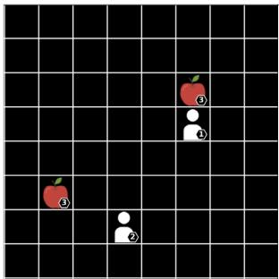  
(a) $8 \times 8 - 2 \mathsf { p } - 2 \mathsf { f }$

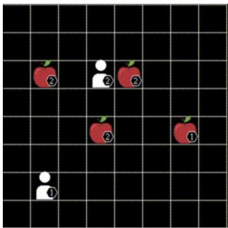  
(b) $8 \times 8 - 2 \mathsf { p } - 4 \mathsf { f }$  
Figure 7: LBF

In the Level-Based Foraging (LBF) environment, which is a JAX-based implementation from the Jumanji suite (Bonnet et al., 2024) of the original framework by Papoudakis et al. (2021), agents with assigned levels navigate a grid world to collect food items that can only be consumed if the sum of adjacent agent levels exceeds the food’s level. These tasks are defined by the naming convention <x size>x<y size>-<n $\mathtt { a g e n t s > p - < f o o d > f }$ , specifying the grid dimensions, agent and food counts. Agents observe a limited $5 \times 5$ square grid centered on their location which reveals the positions and levels of nearby items. Operating via a discrete action space of six options that includes no-operation, loading food, and movement in the four cardinal directions, agents receive rewards calculated as the sum of collected food levels divided by the level of the contributing agents.

## B.2 CONNECTOR

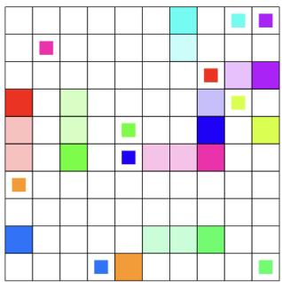  
(a) con-10x10-10a

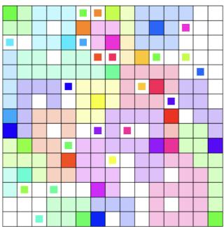  
(b) con-15x15-23a  
Figure 8: Connector

In the Connector (Bonnet et al., 2024) environment, multiple agents are randomly initialized within a grid world to connect assigned start and end points in the minimum number of steps, a task complicated by the fact that movement creates permanent, impassable trails which necessitate cooperation to avoid blocking teammates. These tasks follow the naming convention con-<x-size>x<y-size>-<num\_agents>a to specify grid dimensions and agent count. Agents operate within this system by observing an $n \times n$ local view centered on their location that reveals trails and all target locations, while also accessing the global $( x , y )$ coordinates of their current position and specific destination. Acting through a discrete space of five options including up, down, left, right, and stop, agents are guided by a reward function that yields +1 at the moment of connection and a penalty of −0.03 for every other step until completion.

## B.3 RWARE

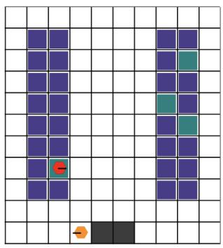  
(a) tiny-2ag

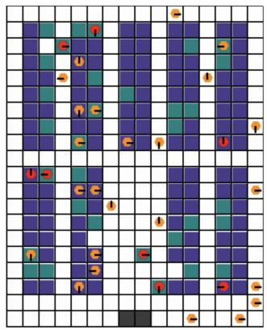  
(b) medium-32ag  
Figure 9: RWARE

The Robot Warehouse (RWARE) environment simulates a logistics scenario where a team of autonomous robots must fetch requested goods from shelves and deliver them to workstations to maximize throughput. We utilize the JAX-based implementation from the Jumanji suite (Bonnet et al., 2024) based on the original work by Papoudakis et al. (2021), which notably terminates episodes immediately upon agent collision rather than attempting to resolve the conflict. Tasks follow the convention <size>-<num agents>ag, where the size determines the shelf layout. Agents operate under partial observability within a $3 \times 3$ view centered on their position that reveals self and peer states alongside shelf status, using a discrete action space of five commands for navigation and loading to achieve a sparse reward of +1 granted solely for successful deliveries.

## B.4 SMAX

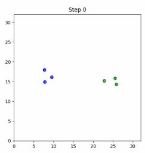  
(a) 3m

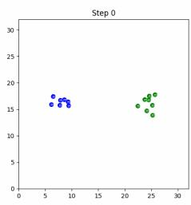  
(b) 7m vs 8m  
Figure 10: SMAX

SMAX is a simplified StarCraft micromanagement environment from the JaxMARL suite (Rutherford et al., 2024), inspired by the popular SMAC benchmark (Samvelyan et al., 2019a). In SMAX, teams of allied units must coordinate to defeat enemy units controlled by a heuristic AI. While SMAX supports a variety of unit types and team compositions, we focus on marine-only scenarios for this work. Tasks follow the convention <N>m for symmetric scenarios with N marines on each side, or <N>m\_vs\_<M>m for asymmetric scenarios where N allied marines face M enemies. Agents operate under partial observability with a limited sight range, observing ally and enemy positions, health, and unit types within their field of view. The discrete action space includes movement in four cardinal directions, stopping, and attacking visible enemies. Agents receive a team reward of +1 for winning the battle, with optional shaped rewards for dealing damage and eliminating enemy units. Episodes terminate when all units on one side are eliminated or after a maximum of 100 timesteps.

## C MULTI-TASK OFFLINE MARL CAN GENERALISE BETTER THAN BEHAVIOUR CLONING

The findings from Mediratta et al. (2024) paint a bleak outlook for the generalisation capabilities of Offline RL algorithms compared to simple behaviour cloning. To establish if we observe a similar trend, we aggregate the normalised episode returns across all test tasks from LBF, RWARE, Connector and SMAX when trained using the full training set, to compare the three algorithms. In Table 2, we show the mean and standard error for each algorithm.

We investigate which offline training objective: behaviour cloning (BC), conservative Q-learning (CQL), or the autoregressive ICQ (Oryx) achieves the strongest generalisation to held-out test tasks. On LBF and Connector, Oryx performs best, followed by BC, with CQL performing worst. In contrast, on RWARE, CQL achieves the strongest generalisation, followed by ICQ and then BC. Finally, on SMAX, CQL again performs best, closely followed by BC, with Oryx performing the worse.

We hypothesize that these findings differ from those of Mediratta et al. (2024) due to differences in dataset composition. While their study relies on purely Expert data, we train on mixed replay datasets. Expert data is well suited to behaviour cloning, whereas many offline RL methods such as CQL (Schweighofer et al., 2022) benefit from datasets with diverse behaviour quality. Indeed, the LBF and Connector datasets are heavily skewed towards Expert trajectories due to the relative simplicity of these tasks, which likely explains the weaker performance of CQL in these environments. In contrast, the RWARE datasets exhibit the greatest diversity in data quality, aligning with CQL’s superior performance.

Overall, our results suggest that in settings with mixed data quality, offline MARL methods exhibit stronger zero-shot generalisation than behaviour cloning.

Table 2: Comparison of test task performance of all three models.The mean and standard error of the performance across all test tasks on RWARE, LBF, Connector and SMAX for each of the multi-task algorithms (largest mean highlighted with bold). In the final column the combined mean across all tasks from the four environments is computed. In contrast to the findings by Mediratta et al. (2024), we find that on each environment the best performing algorithm is an Offline RL method (MT CQL-Sable or MT Oryx), rather than the BC model. When aggregated across all the test tasks combined, MT Oryx performs the best.
<table><tr><td></td><td>Algorithm</td><td>RWARE</td><td>LBF</td><td>Connector</td><td>SMAX</td><td>Combined</td></tr><tr><td>1</td><td>MT Oryx</td><td> $0 . 5 8 7 \pm 0 . 0 5 4$ </td><td> $\mathbf { 0 . 8 0 3 \pm 0 . 0 2 6 }$ </td><td> $\mathbf { 0 . 8 5 2 \pm 0 . 0 0 2 }$ </td><td> $0 . 7 3 \pm 0 . 0 1 2$ </td><td> $\mathbf { 0 . 7 5 2 \pm 0 . 0 2 3 }$ </td></tr><tr><td></td><td>MT CQL-Sable</td><td> $\mathbf { 0 . 6 2 0 \pm 0 . 0 6 6 }$ </td><td> $0 . 5 6 2 \pm 0 . 0 2 9$ </td><td> $0 . 6 6 8 \pm 0 . 0 1 8$ </td><td> ${ \bf 0 . 8 9 \pm 0 . 0 2 7 }$ </td><td> $0 . 6 9 7 \pm 0 . 0 2 4$ </td></tr><tr><td>•</td><td> $\mathbf { M T B C - S a b l e }$ </td><td> $0 . 4 1 5 \pm 0 . 0 5 0$ </td><td> $0 . 7 9 7 \pm 0 . 0 3 0$ </td><td> $0 . 7 7 5 \pm 0 . 0 0 4$ </td><td> $0 . 8 8 \pm 0 . 0 1$ </td><td> $0 . 7 1 8 \pm 0 . 0 2 7$ </td></tr></table>

## D DATASET QUALITY ABLATION

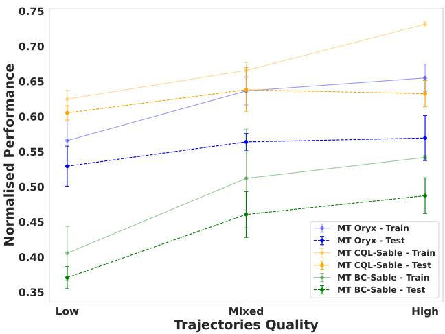  
Figure 11: Performance ofMT-Oryx, MT-CQL-Sable, and MT-BC-Sable on RWARE with different trajectory subsets. High-quality trajectories improve training performance, particularly for MT-CQL-Sable, but these gains do not transfer to the test tasks. Low-quality trajectories consistently yield the worst results.

Do higher quality trajectories improve generalisation? As observed in subsection 3.3, increasing dataset size does not lead to significant improvements in generalization to unseen tasks. A natural follow-up question is: how does the quality of trajectories in the dataset affect training and test performance? To investigate this, we conduct an experiment where training is performed with trajectories sampled from specific subsets of our dataset. Low-quality trajectories are those collected during the first two-thirds of the online training phase, while High-quality trajectories are those from the final third. Results on RWARE are shown in Figure 11. For all algorithms, training performance improves with High-quality trajectories, though the gains on test tasks remain marginal. Across all three algorithms, training with Low-quality trajectories consistently yields the worst results on both training and test tasks. These results suggest that the most effective strategy is to prioritize High-quality trajectories while retaining a small fraction of Low-quality ones as negative examples.

## E SCALING ANALYSIS ON LBF AND CO N N E C T O R

In this section, we complement the experiments presented in subsection 3.3. We verify whether the model-size scaling trends observed in RWARE also extends to LBF, SMAX, and Connector. As shown in Figure 12, we observe similar behavior: performance improves with model size up to a critical point. However, All LBF, Connector, and SMAX are considerably easier than RWARE, and therefore their performance saturates at much smaller model sizes. Furthermore, although there is a large performance gap between BC-Sable and the other algorithms on LBF, the overall scaling trend remains visible, albeit more marginal.

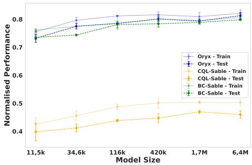  
(a) LBF

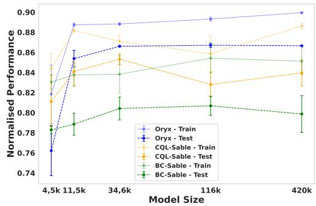

(b) Connector  
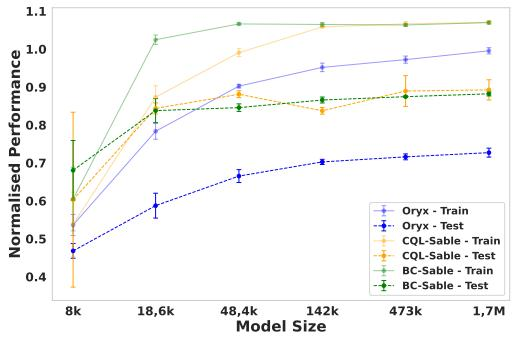  
(c) SMAX  
Figure 12: Performance of MT-Oryx, MT-CQL-Sable, and MT-BC-Sable on LBF, Connector, and SMAX with different model sizes. Both train and test performance of all algorithms improve with increasing model size up to a critical threshold, beyond which performance plateaus.

## F VISUALISATION OF MULTI-TASK POLICY

In order to qualitativly validate that the MT models have learn multiple team strategies which are quite distinct across tasks we visually inspected roll-outs across tasks. Here we visualise the learn strategy on two very distinct tasks medium-2ag and medium-32ag2. The main challenge in the first task is the sparsity of the warehouse. Accordingly the model learnt a strategy whereby the two agents rapidly traverse the warehouse to explore efficiently and find the shelf to be collected. In contrast, the central challenge on the second task is that the warehouse is very congested. If the agents collide the episode ends. Accordingly the model learnt a smart strategy of moving completed agents out of the way by sending them to the bottom right-hand corner. Importantly, a single MT model learn both of these different multi-agent strategies simultaneously.

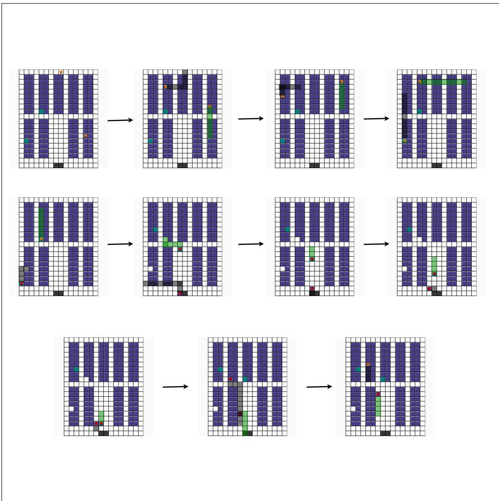  
Figure 13: Visualisation of team strategy on medium-2ag. Frames should be read left to right, top to bottom.

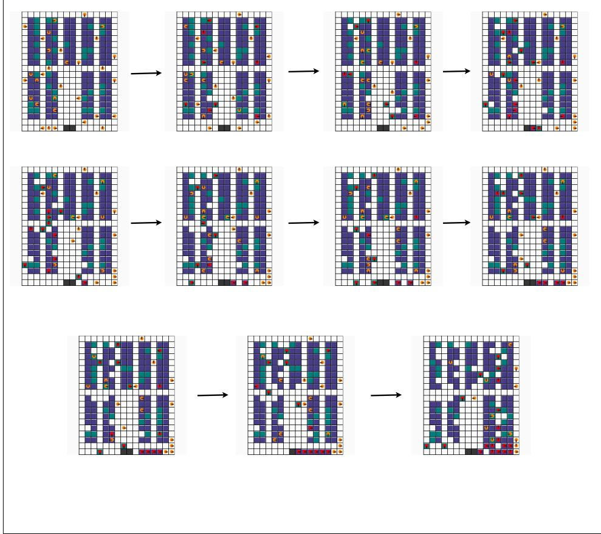  
Figure 14: Visualisation of team strategy on medium-32ag. Frames should be read left to right, top to bottom.

## G COMPUTATIONAL REQUIREMENTS

All experiments were conducted on a high-performance computing cluster utilizing the Jobset operator for orchestration. Each experimental run was allocated a single worker node equipped with one NVIDIA A100-SXM4 GPU (80 GB VRAM) and 24 logical cores of an AMD EPYC 7742 processor.

The maximum wall-clock time for individual experiments was approximately 18 hours. We observed that computational resource usage remained consistent across all baselines, primarily because our setup avoids the use of task-specific heads. Furthermore, the retentive architecture inherent to the SABLE backbone—and by extension, Oryx—enables efficient scaling with respect to the number of agents. Consequently, our multi-task variants retain this computational efficiency even as environment complexity increases.

## H PRIMARY TASK SPLITS

To evaluate the generalization capabilities of our approach, we curated distinct sets of training and testing scenarios for each environment. The specific scenarios comprising each train/test split are detailed in Table 3.

Table 3: Train/Test Task Splits for All Environments. We list the specific scenarios used for training and out-of-distribution generalization testing.
<table><tr><td>Environment</td><td>Split</td><td># of Tasks</td><td>Scenarios</td></tr><tr><td rowspan="3">LBF</td><td>Train</td><td>5</td><td>{8x8-2p-2f, 10x10-3p-3f, 15x15-3p-5f, 15x15-4p-5f, 16x16-5p-6f}</td></tr><tr><td>Test</td><td>4</td><td>{12x12-4p-5f, 14x14-3p-3f,</td></tr><tr><td>Train</td><td>8</td><td>17x17-6p-8f, 17x17-8p-10f} {tiny-2ag, tiny-4ag, tiny-8ag,</td></tr><tr><td rowspan="6"></td><td></td><td></td><td>small-2ag, small-4ag, medium-2ag,</td></tr><tr><td rowspan="4">Test</td><td rowspan="4">12</td><td>medium-8ag, xlarge-8ag}</td></tr><tr><td></td></tr><tr><td>{tiny-16ag, small-16ag, small-32ag,</td></tr><tr><td>medium-16ag, medium-32ag, large-16ag,</td></tr><tr><td></td><td>xlarge-16ag, xlarge-32ag, giant-32ag, colossal-32ag, titanic-16ag, titanic-32ag}</td></tr><tr><td rowspan="4">SMAX</td><td>Train</td><td>5</td><td>{3m, 6m, 5m vs 6m, 10m, 7m vs 8m}</td></tr><tr><td>Test</td><td>7</td><td>{4m, 5m , 9m vs 10m, 8m vs 9m, 10m vs</td></tr><tr><td></td><td></td><td>11m, 10m vs 12m, 13m vs 15m}</td></tr><tr><td>Train</td><td></td><td></td></tr><tr><td rowspan="6">Connector</td><td rowspan="6"></td><td rowspan="6">10</td><td>{12x12x4a, 15x15x3a, 18x18x4a,</td></tr><tr><td></td></tr><tr><td>21x21x5a, 24x24x6a, 27x27x7a,</td></tr><tr><td>30x30x10a, 33x33x11a, 36x36x12a,</td></tr><tr><td>39x39x13a}</td></tr><tr><td>{42x42x18a, 45x45x23a, 48x48x20a,</td></tr><tr><td rowspan="4">Test</td><td rowspan="4">11</td><td></td></tr><tr><td></td><td>51x51x28a, 54x54x30a, 57x57x32a,</td></tr><tr><td></td><td>60x60x33a, 63x63x35a, 66x66x40a,</td></tr><tr><td>69x69x43a, 72x72x45a}</td><td></td></tr></table>

## I HYPERPARAMETERS

This section details the hyperparameters used for our experiments.

Table 4: Default network settings for each environment.
<table><tr><td>Parameter</td><td>LBF</td><td>Connector</td><td>RWARE</td><td>SMAX</td></tr><tr><td>Model embedding dimension</td><td>512</td><td>512</td><td>512</td><td>512</td></tr><tr><td>Number of transformer heads</td><td>4</td><td>4</td><td>4</td><td>4</td></tr><tr><td>Number of transformer blocks</td><td>1</td><td>1</td><td>1</td><td>1</td></tr><tr><td>HL-Gauss value support</td><td>[-1, 1]</td><td>[-1, 1]</td><td>[-20, 20]</td><td>[-0.5, 2.5]</td></tr><tr><td>HL-Gauss number of bins</td><td>51</td><td>51</td><td>51</td><td>51</td></tr><tr><td>Sable&#x27;s decay scaling factor</td><td>0.8</td><td>0.8</td><td>0.8</td><td>0.8</td></tr></table>

Table 5: Default training settings.
<table><tr><td>Hyperparameter</td><td>Value</td></tr><tr><td>Number of training updates</td><td>60 000</td></tr><tr><td>Number of evaluations</td><td>600</td></tr><tr><td>Number of evaluation episodes Number of absolute evaluation episodes</td><td>32</td></tr><tr><td></td><td>320</td></tr><tr><td>Learning rate</td><td>1 × 10 -3</td></tr><tr><td>Discount (γ)</td><td>0.99</td></tr><tr><td>Polyak averaging coefficient (τ)</td><td>0.005</td></tr><tr><td>Maximum gradient norm</td><td>10</td></tr><tr><td>Sample sequence length</td><td>20</td></tr><tr><td>Sample batch size</td><td>480</td></tr><tr><td>Value temperature</td><td>1000</td></tr><tr><td>Policy temperature</td><td>0.1</td></tr><tr><td>Critic loss coefficient</td><td>1</td></tr></table>

Table 6: MT-Oryx specific settings.
<table><tr><td>Hyperparameter</td><td>Value</td></tr><tr><td>Value temperature</td><td>1000</td></tr><tr><td>Policy temperature</td><td>0.1</td></tr><tr><td>Critic loss coefficient</td><td>1</td></tr><tr><td>HL-Gauss smoothing ratio</td><td>0.75</td></tr></table>

Table 7: MT-CQL-Sable specific settings.
<table><tr><td>Hyperparameter</td><td>Value</td></tr><tr><td>CQL loss coefficient</td><td>10</td></tr><tr><td>HL-Gauss smoothing ratio</td><td>0.75</td></tr></table>

## J ARCHITECTURE DESIGN ABLATIONS

HL-Gauss. To test the effect of using HL-Gauss (Farebrother et al., 2024) for multi-task learning, we conduct an ablation on the full set of RWARE training tasks where we run MT Oryx and MT CQL-Sable with and without HL-Gauss for value function learning (e.g. standard TD mean-squared-error). We compare the algorithms on multi-task RWARE since the task-to-task variance in episode returns is significant and therefore more challenging to accurately learn a multi-task value function. As shown in Figure 15a, using HL-Gauss leads to slightly better performance (≈ 8% improvement) on test tasks for MT Oryx, while the effect on MT CQL-Sable is marginal.

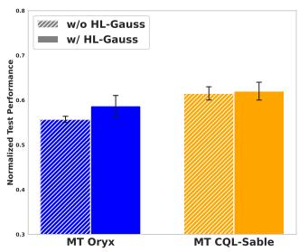  
(a) HL-Gauss

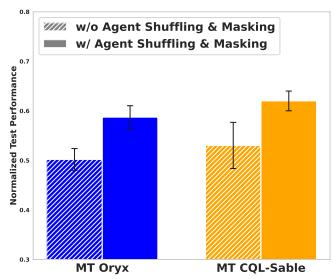  
(b) Agent Masking & Shuffling

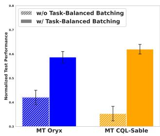  
(c) Task-Balanced Batching  
Figure 15: Ablation studies. Left: Using HL-Gauss improves test performance for MT Oryx by ≈8%, while the effect on MT CQL-Sable is marginal. Middle: Disabling agent masking and shuffling reduces test performance by ≈16% on average for both algorithms. Right: Removing task-balanced batching has the highest impact with ≈ 37% drop in test performance on average for both MT Oryx and MT CQL-Sable.

Agent shuffling and masking. To test the impact of not masking and shuffling agents we conduct a similar ablation to above on RWARE. We observe decrease in performance of ≈ 16% on average for both algorithms on the test tasks, when we do not mask and shuffle agents (see Figure 15b).

Task-balanced batching. Finally, we conducted an ablation on how we sample data from the multitask dataset. In the first case we use our proposed task-balanced batching method, which includes a fair mix of samples from each task in every batch. In the alternative approach we choose a random task at each update step and sample a full batch from the chose single task. The results in Figure 15c shows a 37% decrease in test performance on average for both MT Oryx and MT CQL-Sable without task-balanced batching.

## K DATASETS

## K.1 DATASET RELEASE PLAN

To guarantee the long-term reproducibility of this project, we will upload all of our datasets to a public HuggingFace repository3. This will be done upon publication of this work.

## K.2 DATASET STATISTICS

The following sections detail the statistics of the offline datasets for the RWARE, Connector, SMAX, and LBF environments used in our experiments. Datasets were generated by recording rollouts from an online Sable (Mahjoub et al., 2025) agent at different intervals during its training. All data is collected from fixed intervals over training using an evaluation policy to vary the amount of data collected while maintaining a standard set of policies to sample from. For RWARE, we also create multiple datasets of different sizes by varying the number of evaluations sampled in order to perform our data-scaling experiments.

## K.2.1 RWARE

For our data-scaling experiments in the RWARE environment, we generated three offline datasets of varying sizes. The datasets were constructed by collecting 122, 244, and 610 evaluation rollouts from a pre-trained online Sable agent (Mahjoub et al., 2025). Table 8 provides detailed statistics for each dataset size across all RWARE scenarios, illustrating how the number of episodes and transitions scales with the number of collected rollouts.

## K.2.2 CONNECTOR

For the Connector environment, we generated 10 distinct offline datasets, one for each training scenario. Each dataset contains approximately 10 million transitions. The data collection process involved recording evaluation rollouts at 50 different checkpoints during the training of an online Sable agent. At each checkpoint, we generated 160 rollouts of 1280 timesteps each, resulting in a total of 50 × 160 × 1280 ≈ 10.24 million transitions per scenario. The ten scenarios used to create these datasets are listed in Table 9.

## K.2.3 SMAX

For the SMAX environment, we generated five distinct offline datasets corresponding to each training scenario, with each dataset comprising approximately 50 million transitions. We collected this data by recording evaluation rollouts from a Sable agent during online training.

## K.2.4 LBF

For LBF we collected all the the training data from an online Sable run for each LBF scenario.

Table 8: RWARE dataset statistics across different data collection checkpoints. We report the total number of episodes and timesteps (transitions) for each scenario, corresponding to datasets created from 122, 244, and 610 evaluation rollouts.
<table><tr><td></td><td colspan="2">122 Rollouts</td><td colspan="2">244 Rollouts</td><td colspan="2">610 Rollouts</td></tr><tr><td>Scenario Name</td><td>Episodes</td><td>Timesteps</td><td>Episodes</td><td>Timesteps</td><td>Episodes</td><td>Timesteps</td></tr><tr><td> $\mathtt { t i n y - } 2 \mathtt { a g }$ </td><td>15,616</td><td>7,493,913</td><td>31,232</td><td>14,934,862</td><td>78,080</td><td>37,382,071</td></tr><tr><td> $\tan y - 4 a g$ </td><td>15,616</td><td>6,492,381</td><td>31,232</td><td>13,208,433</td><td>78,080</td><td>33,110,502</td></tr><tr><td> $\tan y - 8 \mathsf { a g }$ </td><td>15,616</td><td>4,704,862</td><td>31,232</td><td>9,748,756</td><td>78,080</td><td>24,647,669</td></tr><tr><td>sma  $\mathtt { 1 1 - 2 a g }$ </td><td>15,616</td><td>7,511,771</td><td>31,232</td><td>15,091,627</td><td>78,080</td><td>37,504,501</td></tr><tr><td> $\mathtt { s m a l l - 4 a g }$ </td><td>15,616</td><td>6,611,283</td><td>31,232</td><td>13,496,720</td><td>78,080</td><td>33,733,571</td></tr><tr><td>medium-2ag</td><td>15,616</td><td>7,320,030</td><td>31,232</td><td>15,062,621</td><td>78,080</td><td>37,700,791</td></tr><tr><td>med:  $\mathtt { i u m - 8 a g }$ </td><td>15,616</td><td>2,502,476</td><td>31,232</td><td>5,148,947</td><td>78,080</td><td>12,747,091</td></tr><tr><td> $\mathbf { \delta x } \mathbf { l } \mathsf { a r g e } - 8 \mathsf { a g }$ </td><td>15,616</td><td>5,816,385</td><td>31,232</td><td>11,008,538</td><td>78,080</td><td>29,167,762</td></tr></table>

Table 9: Connector dataset statistics. We generated a separate dataset of approximately 10.24 million transitions for each of the ten training scenarios.
<table><tr><td>Scenario Name</td><td>Total Timesteps</td></tr><tr><td> $1 2 \times 1 2 \times 4 a$ </td><td> $\approx 1 0 . 2 4 \times 1 0 ^ { 6 }$ </td></tr><tr><td> $1 5 \mathrm { x } 1 5 \mathrm { x } 3 \mathrm { a }$ </td><td> $\approx 1 0 . 2 4 \times 1 0 ^ { 6 }$ </td></tr><tr><td> $1 8 \times 1 8 \times 4 a$ </td><td> $\approx 1 0 . 2 4 \times 1 0 ^ { 6 }$ </td></tr><tr><td> $2 1 \mathrm { x } 2 1 \mathrm { x } 5 \mathrm { a }$ </td><td> $\approx 1 0 . 2 4 \times 1 0 ^ { 6 }$ </td></tr><tr><td> $2 4 \mathrm { x } 2 4 \mathrm { x } 6 \mathrm { a }$ </td><td> $\approx 1 0 . 2 4 \times 1 0 ^ { 6 }$ </td></tr><tr><td> $2 7 { \times } 2 7 { \times } 7 a$ </td><td> $\approx 1 0 . 2 4 \times 1 0 ^ { 6 }$ </td></tr><tr><td> $3 0 { \bf x } 3 0 { \bf x } 1 0 \mathrm { a }$ </td><td> $\approx 1 0 . 2 4 \times 1 0 ^ { 6 }$ </td></tr><tr><td> $3 3 { \bf x } 3 3 { \bf x } 1 1 a$ </td><td> $\approx 1 0 . 2 4 \times 1 0 ^ { 6 }$ </td></tr><tr><td> $3 6 { \times } 3 6 { \times } 1 2 { \mathrm { a } }$ </td><td> $\approx 1 0 . 2 4 \times 1 0 ^ { 6 }$ </td></tr><tr><td> $3 9 { \times } 3 9 { \times } 1 3 a$ </td><td> $\approx 1 0 . 2 4 \times 1 0 ^ { 6 }$ </td></tr></table>

Table 10: SMAX dataset statistics. We generated a separate dataset of approximately 49.5 million timesteps for each of the five training scenarios.
<table><tr><td>Scenario Name Total Timesteps</td><td></td></tr><tr><td>3m</td><td> $\approx 4 9 . 5 \times 1 0 ^ { 6 }$ </td></tr><tr><td>6m</td><td> $\approx 4 9 . 5 \times 1 0 ^ { 6 }$ </td></tr><tr><td>5m vs 6m</td><td> $\approx 4 9 . 5 \times 1 0 ^ { 6 }$ </td></tr><tr><td>10m</td><td> $\approx 4 9 . 5 \times 1 0 ^ { 6 }$ </td></tr><tr><td>7m vs 8m</td><td> $\approx 4 9 . 5 \times 1 0 ^ { 6 }$ </td></tr></table>

We observe that performance on the training tasks remains high across all environments, even as the number of tasks increases

Table 11: LBF dataset statistics. We generated a separate dataset of approximately 4 million transitions for each of the 5 training scenarios.
<table><tr><td>Scenario Name Total Timesteps</td><td></td></tr><tr><td> $8 \mathrm { x } 8 - 2 \mathrm { p } - 2 \mathrm { f }$ </td><td> $\approx 3 . 9 9 \times 1 0 ^ { 6 }$ </td></tr><tr><td> $1 0 { \times } 1 0 { - } 3 { \mathrm { p } } { - } 3 { \mathrm { f } }$ </td><td> $\approx 3 . 9 9 \times 1 0 ^ { 6 }$ </td></tr><tr><td> $1 5 { \times } 1 5 { - } 3 { \mathrm { p } } { - } 3 { \mathrm { f } }$ </td><td> $\approx 3 . 9 9 \times 1 0 ^ { 6 }$ </td></tr><tr><td> $1 5 { \times } 1 5 \substack { - } 4 \mathrm { p } \ t { } - 5 \mathrm { f }$ </td><td> $\approx 3 . 9 9 \times 1 0 ^ { 6 }$ </td></tr><tr><td> $1 6 { \times } 1 6 { - } 5 { \mathrm { p } } { - } 6 { \mathrm { f } }$ </td><td> $\approx 3 . 9 9 \times 1 0 ^ { 6 }$ </td></tr></table>