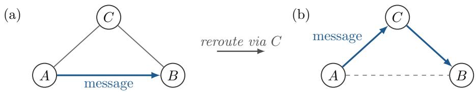
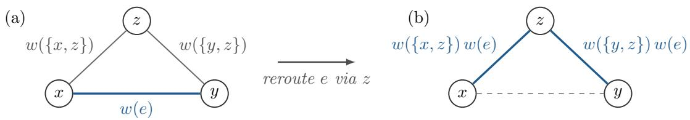
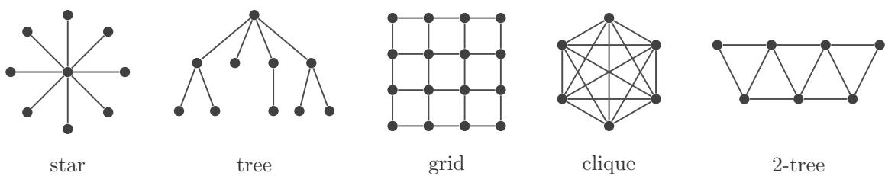
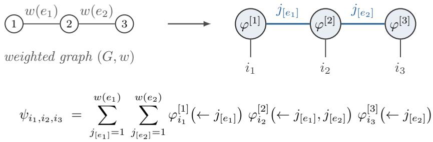
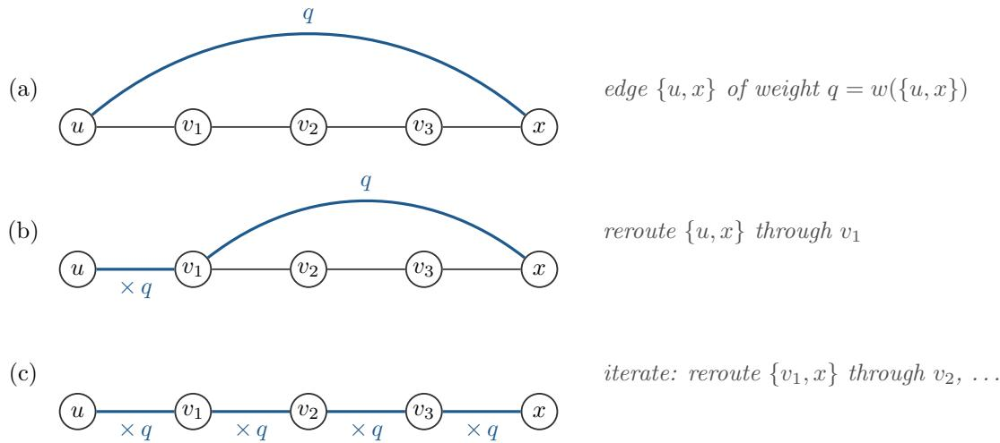
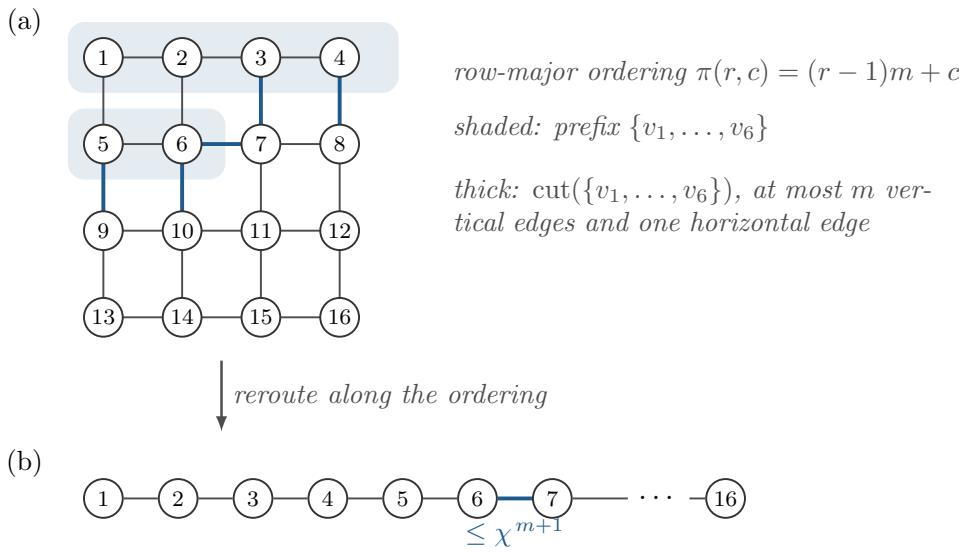

# Parameterised graph theory for tensor networks: entanglement rerouting, structural simplification, and agnostic tomography

Matthias C. Caro<sup>∗1</sup>, Natalie McHugh<sup>†1</sup>, and Sergii Strelchuk<sup>‡2</sup>

<sup>1</sup>Department of Computer Science, University of Warwick, Coventry, UK <sup>2</sup>Department of Computer Science, University of Oxford, Oxford, UK

## Abstract

Parameterised graph theory studies how the complexity of graph-theoretic problems depends on structural parameters of the input graph. This perspective has proved useful in analysing tensor-network simulation [MS08]. Its implications for tensornetwork representations and tomography are less well understood. In particular, which graph parameters determine whether a tensor-network state (TNS) admits a tractable matrix product state (MPS) or tree tensor network (TTN) representation, and which control the complexity of learning the state?

We address these questions using parameterised graph theory. First, we show that cutwidth and tree-cutwidth bound the bond dimension overhead required to represent a TNS as an MPS or TTN. In the TTN case, tree-cutwidth also bounds the local dimension of the grouped subsystems. The proofs are based on entanglement rerouting, a tensor-network analogue of rerouting information in a classical network. Second, we derive graph-dependent upper bounds on the sample and computational complexity of realisable TNS tomography, with exponents that depend on cutwidth, tree-cutwidth, and a new graph parameter, learning complexity, which we bound in terms of degree and treewidth. We obtain these results by extending the disentangling MPS learner of [Cra+10], as analysed further in [Bak+25, LCH25], to TTNs and to tensor networks on arbitrary known graphs. Finally, we extend the framework beyond the realisable setting. For an arbitrary input state, our agnostic learner outputs a pure state whose fidelity is within additive error ϵ of the optimum over tensor-network states on the given graph with a given bond dimension, with explicit graph-dependent bounds on sample and computational complexity.

## Contents

1 Introduction 3   
1.1 Overview of results 4   
1.2 Technical overview 7   
1.3 Related work 9   
1.4 Discussion and outlook . 10   
2 Definitions and notation 13   
2.1 Graph theory and graph parameters 13   
2.2 Tensor network notation 17   
3 Entanglement rerouting for TN representations 20   
3.1 Rerouting single edges in a TN 20   
3.2 Rerouting to an MPS 23   
3.3 Rerouting to a TTN 25   
4 Tensor network state tomography 30   
4.1 Auxiliary lemmas on subnormalised tomography 31   
4.2 MPS tomography via iterated disentangling 35   
4.3 TTN state tomography via iterated disentangling 44   
4.4 TNS tomography of general graphs via entanglement rerouting 50   
4.5 Direct TNS tomography for graphs . 53   
4.5.1 Learning sequences 53   
4.5.2 Tomography using a learning sequence 55   
4.5.3 Constructing learning sequences from contraction sequences 61   
4.6 Agnostic TNS tomography . 64   
4.6.1 Projection estimates for agnostic learning 64   
4.6.2 The agnostic sequence learner 67   
4.6.3 Correctness 69   
4.6.4 Applications 72   
References 76

## 1 Introduction

Tensor networks (TNs) provide a unifying language for quantum computation and quantum information by expressing large linear maps and quantum states as compositions of small tensors wired according to an underlying graph. In this framework, vertices represent individual tensors containing local physical degrees of freedom, while edges correspond to shared indices that are contracted to form the composite object. The topology of this graph encodes the entanglement structure of the physical state, efectively mapping quantum correlations to geometric connectivity. This representation is useful for two closely related reasons. First, a wide range of objects arising in quantum computation, such as quantum circuits, measurement patterns, or decoders for quantum error correcting codes, can be written as TNs whose contraction yields an output amplitude or probability [BSV14, Vid03, SDV06, GE07, PCR24]. Second, a TN representation often exposes which structural aspects of a quantum computation are responsible for classical hardness (e.g., entanglement growth), thereby suggesting tractable subclasses and principled approximation schemes. One of the first results in this direction was obtained by Markov and Shi [MS08], showing that quantum circuits with small underlying graph treewidth can be simulated eficiently by contracting the associated TN. Currently, TN contraction methods are among the most competitive approaches to the classical simulation and benchmarking of quantum computations, and they underpin large simulation eforts for random circuit sampling for quantum advantage [ZSW20, GK21, Ayr+23]. Conversely, tensor-network contraction can encode general quantum computation: additive approximation of a tensor-network contraction is complete for BQP [AL10].

Whereas TN representations with bounded bond dimension and controlled graph parameters admit eficient algorithms for contraction [OGo19], optimization [Sch11], and verification [HM13, SW22], TN representations that require large bond dimension or induce large intermediate tensors lead to exponential computational overhead [SDV06, Or´u14]. Therefore, characterizing states that admit tractable TN representations as well as transforming between diferent TN representations become essential for determining the algorithmic feasibility of problems in quantum computation and quantum information.

In addition to eficient contractions and simulability, understanding the learnability of tensor networks is equally important, since it determines when quantum states or processes can be eficiently reconstructed or verified from limited data. The learnability of TN states (TNSs) has been studied primarily under strong structural assumptions. For matrix product states (MPSs) [RO07 <sup>¨</sup> , Wei+09], eficient learning and tomography are possible due to the existence of small separators: cutting a single internal edge separates the system, allowing the global state to be reconstructed from local reduced density matrices with polynomial sample and computational complexity [LLP10, Cra+10, Bak+25, LCH25]. As we show, these ideas extend to tree tensor networks (TTNs) [SDV06] when the tree structure is known, although additional challenges arise in learning the network topology itself [Has+21]. In contrast, for higher-dimensional TNs and for TNs with loops, such as PEPS [VC04], separators grow with system size, leading to both information-theoretic and computational obstacles to eficient learning, and no general eficient learning algorithms are known in this setting [Sch+07, WS23].

  
Figure 1: Rerouting classical information. A message from A to B can be sent over a direct link, panel (a), or mediated by C, panel (b). Entanglement rerouting, Theorem 1.1, is the tensor network analogue of this operation.

## 1.1 Overview of results

In this work, we use parameterised graph theory to study properties of TN representations beyond simulability. We show how to transform a TN representation of a general graph to an MPS or TTN representation with bond dimension bounded in terms of suitable graph parameters. We also give upper bounds on the sample complexity of TNS learning for general graphs in terms of graph parameters.

To formulate our results, let $G = ( [ n ] , E )$ denote the unweighted tensor-network topology. For a weight function $w : E \to \mathbb { N }$ , we write ${ \cal { S } } _ { d } ( G , w )$ for the pure n-qudit states admitting a TN representation with virtual dimension w(e) on each edge e. We write ${ \cal S } _ { d } ( G , \chi )$ for the class in which only a common upper bound $\chi$ on the virtual dimensions is specified. Equivalently,

$$
{ S _ { d } } ( G , \chi ) = \bigcup _ { w : E \to [ \chi ] }  { S _ { d } } ( G , w ) .\tag{1.1}
$$

See Section 2.2 for the formal definition. The convention $w ( f ) = 1$ for $f \notin E$ does not add $f$ to the edge set. For a fixed weight function w, removing an edge $e \in E$ with $w ( e ) = 1$ does not change the represented state class. Graph parameters for ${ \cal S } _ { d } ( G , \chi )$ are evaluated on the given graph G. We use three standard graph parameters: cutwidth $\big ( \mathrm { c w } \big )$ , tree-cutwidth (tcw), and treewidth (tw). This overview gives only their intuitive meaning. Precise definitions and the properties used below appear in Section 2.1.

Entanglement rerouting. Our first result is a local rerouting rule suggested by classical communication. A direct link from Alice to Bob can be replaced by a route through Charlie when both Alice and Bob are linked to Charlie, without changing the transmitted message. See Figure 1 for an illustration. We prove an analogous operation for virtual indices, which we call entanglement rerouting:

Theorem 1.1 (Entanglement rerouting). Let $G = ( [ n ] , E )$ be a graph, let $w : E \to \mathbb { N } ,$ and let $| \psi \rangle \in S _ { d } ( G , w )$ . Choose an edge $e = \{ x , y \} \in E$ and a vertex $z \in [ n ] \setminus \{ x , y \}$ . Let

$$
E ^ { \prime } = ( E \setminus \{ e \} ) \cup \{ \{ x , z \} , \{ y , z \} \} ,\tag{1.2}
$$

and extend w $b y$ the convention $w ( f ) = 1$ for $f \notin E$ . Define w<sup>′</sup> : $E ^ { \prime } $ N by

$$
w ^ { \prime } ( f ) = \left\{ \begin{array} { l l } { w ( f ) w ( e ) , } & { f \in \{ \{ x , z \} , \{ y , z \} \} , } \\ { w ( f ) , } & { o t h e r w i s e . } \end{array} \right.\tag{1.3}
$$

Then, for $G ^ { \prime } = ( [ n ] , E ^ { \prime } )$ ,

$$
| \psi \rangle \in S _ { d } ( G ^ { \prime } , w ^ { \prime } ) .\tag{1.4}
$$

Since $G ^ { \prime }$ and $w ^ { \prime }$ depend only on $G , w , e _ { i }$ , and z, the same construction applies to every state in ${ \cal { S } } _ { d } ( G , w )$ ; thus, $S _ { d } ( G , w ) \subseteq S _ { d } ( G ^ { \prime } , w ^ { \prime } )$ . In particular, $i f$ every original edge dimension is at most $\chi ,$ then the rerouted representation has maximum bond dimension at most $\chi ^ { 2 }$

Theorem 1.1 (proved formally as Theorem 3.1 below) shows that a virtual index can be routed through an intermediate vertex by enlarging the two edges on the new route.

Tensor network representations from graph parameters. Repeated applications of entanglement rerouting transform a TN on a general graph into one on a chosen target graph. This may increase the bond dimension. Our next two results bound this increase for paths and trees using cutwidth and tree-cutwidth.

Theorem 1.2 (Transforming to MPS (informal)). A tensor network state on n qudits with graph G, physical dimension d, and maximum bond dimension $\chi$ can be represented as an MPS on n qudits with physical dimension d and maximum bond dimension $\chi ^ { \mathrm { c w } ( G ) }$ Here, the cutwidth cw(G) is the smallest number c such that the vertices of G can be arranged on a line with at most c edges crossing between any prefix of the arrangement and the rest. An ordering achieving the cutwidth can be computed in time $2 ^ { O ( \mathrm { c w } ( G ) ^ { 2 } ) } n$

Theorem 1.3 (Transforming to TTN (informal)). A tensor network state on n qudits with graph G, physical dimension d, and maximum bond dimension $\chi$ can be represented as a TTN on at most n grouped subsystems with physical dimension at most $d ^ { 2 }$ tcw(G) and maximum bond dimension at most $\chi ^ { 2 \operatorname { t c w } ( G ) }$ . Here, the tree-cutwidth tcw(G) is the analogue of cutwidth in which the vertices are organised into a tree of small groups rather than along a line. A tree-cut decomposition certifying these bounds can be computed in time $2 ^ { O ( \mathrm { t c w } ( G ) ^ { 2 } \log \mathrm { t c w } ( G ) ) } n ^ { 2 }$

Every quantum state admits an MPS or TTN representation at suficiently large bond dimension. Theorems 1.2 and 1.3, proved as Theorems 3.3 and 3.6, give explicit bounds on the bond dimension required when the starting point is a TN on a general weighted graph.

Learning tensor network states. We next use these representation results to study TNS tomography. Throughout, “learning a $\mathrm { s t a t e } ^ { \prime }$ means performing tomography of that state, and we use the two terms interchangeably. Given a TNS on a complicated graph, we may first obtain a representation on a simpler graph and then apply a learner tailored to that representation.

We begin by proving eficient tomography of TTNs with known topology.

Theorem 1.4 (TTN state tomography (informal)). We can perform tomography of an unknown n-qudit TTN state with bond dimension $\chi$ (and with a known tree structure) from

$$
O \left( \frac { n ^ { 3 } } { \varepsilon ^ { 4 } } \left( ( d \chi ) ^ { \operatorname* { m a x } \{ 2 , \Delta \} } + \log ( n / \delta ) \right) \right)\tag{1.5}
$$

many copies, where $\Delta = \Delta ( T )$ is the maximum degree of the underlying tree $T , \varepsilon i s$ the desired accuracy in trace norm, and $1 - \delta$ is the desired success probability. The runtime of the tomography procedure is polynomial in n, $( d \chi ) ^ { \mathrm { m a x } \{ 2 , \Delta \} } , \bar { 1 } / \varepsilon$ , and log(1/δ).

Theorem 1.4, proved as Theorem 4.17, extends eficient MPS tomography [Cra+10, LLP10] to TTNs. For constant d and χ, the algorithm is both sample eficient and computationally eficient for TTNs of maximum degree $O ( \log n )$ . For paths, it recovers the known MPS bounds.

This gives two tractable target representations for learning, namely MPSs and TTNs. Combining the representation transformations with the corresponding tomography algorithms yields the following result for general TNSs:

Theorem 1.5 (Parameterised complexity of black-box TNS tomography (informal)). We can perform tomography of an unknown TN state on n qudits with (known) graph G, physical dimension d, and maximum bond dimension χ from

$$
O \left( \frac { n ^ { 3 } } { \varepsilon ^ { 4 } } \left( \operatorname* { m i n } \left\{ d ^ { 2 } \chi ^ { 2 \mathrm { c w } ( G ) } , \ ( d \chi ) ^ { 2 \mathrm { t c w } ( G ) \mathrm { m a x } \{ 2 , \Delta ( \hat { T } ) \} } \right\} + \log ( n / \delta ) \right) \right)\tag{1.6}
$$

many copies, where $\Delta ( \hat { \mathcal { T } } )$ is the maximum degree of the decomposition tree obtained from the computed tree-cut decomposition, ε is the desired accuracy in trace norm, and $1 - \delta$ is the desired success probability. The learner runs in time polynomial in n, the quantity inside the minimum, $1 / \varepsilon _ { i }$ , and $\log ( 1 / \delta )$ , after computing an optimal cutwidth ordering in time $2 ^ { O ( \mathrm { c w } ( G ) ^ { 2 } ) } n$ or an approximate tree-cut decomposition in time $2 ^ { O ( \mathrm { t c w } ( G ) ^ { 2 } \mathrm { l o g t c w } ( \breve { G } ) ) } n ^ { 2 }$

The proof of Theorem 1.5, given in Theorems 4.20 and 4.22, first uses cutwidth or tree-cutwidth to obtain a structured representation and then applies the corresponding tomography algorithm. The graph parameters bound the increase in bond dimension and thereby the overall learning complexity.

The approach to general-graph TNS tomography in Theorem 1.5 uses the transformations of Theorems 1.2 and 1.3 as black boxes (see also the discussion in Section 1.2 below). The preceding construction is modular, but treating the representation transformations as black boxes can yield weaker bounds. Our next result works directly with cuts of the original graph along a chosen sequence of subsets, and its cost is described by a finer graph parameter.

Theorem 1.6 (Parameterised complexity of direct TNS tomography (informal)). We can perform tomography of an unknown TNS on n qudits with (known) graph G, physical dimension d, and maximum bond dimension χ from

$$
O \left( \frac { n ^ { 3 } } { \varepsilon ^ { 4 } } \left( d ^ { \mathrm { l c } _ { d , \chi } ( G ) } + \log ( n / \delta ) \right) \right)\tag{1.7}
$$

many copies, where ε is the desired accuracy in trace norm, and 1−δ is the desired success probability. Here, $\mathrm { l c } _ { d , \chi } ( G )$ is a graph parameter that we call learning complexity. It is the minimum over learning sequences of the largest combined size of an active subsystem and its retained residual register. We show that

$$
\begin{array} { r } { \mathrm { l c } _ { d , \chi } ( G ) \leq \operatorname* { m i n } \left\{ n , 3 \operatorname* { m a x } \{ 1 , \lceil \mathrm { c c } ( G ) \log _ { d } \chi \rceil \} \right\} . } \end{array}\tag{1.8}
$$

In particular, $\mathrm { l c } _ { d , \chi } ( G ) = O \left( \Delta \mathrm { t w } ( G ) \mathrm { m a x } \{ 1 , \lceil \log _ { d } \chi \rceil \} \right)$ when G is connected and has at least two vertices. Here, cc(G) is the contraction complexity of Markov and Shi [MS08], $\Delta = \Delta ( G )$ is the maximum degree of G, and the treewidth tw(G) measures how well the vertices of G can be organised into a tree of small overlapping bags. The learner runs in time polynomial in n, $d ^ { \mathrm { l c } _ { d , \chi } ( G ) } , 1 / \varepsilon$ , and log(1/δ) once a learning sequence achieving the bound is supplied. A learning sequence attaining the upper bound can be constructed from an optimal contraction sequence in time $2 ^ { O ( \operatorname { c c } ( G ) ^ { 2 } ) } \mathsf { p o l y } ( n )$

The formal version of Theorem 1.6 is Theorem 4.32, while Corollary 4.35 gives the displayed estimate in terms of contraction complexity. The direct approach does not choose an MPS or TTN target in advance. Its exponent depends on the cuts encountered along the chosen learning sequence.

The precise learning-sequence bound contains the path and tree schedules used by the black-box algorithms as special cases. Optimising over learning sequences can only improve on these choices. The contraction-complexity estimate is a more general bound obtained from a particular learning sequence and can be less sharp on some graph families.

Finally, we extend the direct approach to agnostic tomography. The input may lie outside ${ \cal S } _ { d } ( G , \chi )$ , and the algorithm outputs a pure state whose fidelity is within additive error ϵ of the optimum over that class. The output is represented by the circuit produced by the algorithm and need not lie in ${ \cal S } _ { d } ( G , \chi )$ . That is, it need not admit a representation on $G$ with bond dimension at most $\chi .$

Theorem 1.7 (Agnostic TNS tomography (informal)). Let $\rho$ be an arbitrary n-qudit state, and let a graph $G ,$ a bond dimension bound $\chi ,$ and a learning sequence for G be known. Suppose further that

$$
{ \mathrm { O P T } } _ { G , \chi } ( \rho ) : = \operatorname* { s u p } _ { | \phi \rangle \in S _ { d } ( G , \chi ) } \langle \phi | \rho | \phi \rangle \geq \vartheta\tag{1.9}
$$

for a known $\vartheta > 0$ . There is an algorithm that outputs a pure state $| \hat { \psi } \rangle$ such that

$$
\langle \hat { \psi } | \rho | \hat { \psi } \rangle \geq \mathrm { O P T } _ { G , \chi } ( \rho ) - \epsilon\tag{1.10}
$$

with probability at least $1 - \delta$ . Its copy and computational complexity are polynomial in the length of the learning sequence, $1 / \vartheta , 1 /$ min $\{ \epsilon , \vartheta \}$ , and $\log ( 1 / \delta )$ , and exponential only in the largest active register induced by the sequence.

The formal statement of Theorem 1.7 and its specialisations to contraction sequences and TTNs are given in Theorem 4.45 and Corollaries 4.47 and 4.48.

## 1.2 Technical overview

Entanglement rerouting. Suppose that an edge $e = \{ x , y \}$ in a TNS with weighted graph $( G , w )$ is to be rerouted through a vertex $z \neq x , y ,$ , as shown in Figure 2. Multiply the dimensions of $\{ x , z \}$ and $\{ y , z \}$ by $w ( e )$ and delete e. View the two enlarged indices as pairs $( i , j )$ and $( k , \ell )$ , where $j , \ell \in [ w ( e ) ]$ . The new tensor at z retains the old tensor entries when $j = \ell$ and is zero otherwise. This enforces equality of the two components carrying the rerouted index, so summing over the enlarged indices reproduces the original contraction.

Tensor network representations from graph parameters. We describe the MPS construction first. The TTN construction is analogous, with a tree-cut decomposition replacing the linear ordering. Fix an ordering $v _ { 1 } , \ldots , v _ { n }$ and take $v _ { 1 } - v _ { 2 } - \cdot \cdot \cdot - v _ { n }$ as the target path. Every original edge $\{ v _ { a } , v _ { b } \}$ with $a < b - 1$ is routed along the segment from $v _ { a }$ to $v _ { b }$ . Its weight is multiplied into every path edge on that segment. The final bond dimension on $\{ v _ { i } , v _ { i + 1 } \}$ is the product of the weights of the original edges crossing the corresponding prefix cut. If at most c edges cross any prefix cut and every original weight is at most $\chi ,$ this bond dimension is at most $\chi ^ { c } .$ The maximum prefix-cut size is the cutwidth of the ordering, and minimising over orderings gives $\operatorname { c w } ( G )$

  
new tensor at z: read each enlarged index as a pair, keep the old value when the two components carrying the e-index agree, and set it to 0 otherwise  
Figure 2: Entanglement rerouting. The edge $e = \{ x , y \}$ of a weighted tensor network graph, panel (a), is deleted and its virtual dimension is routed through z by multiplying the weights of the two rerouting edges by $w ( e )$ , panel (b). The tensor at z is updated so that the overall contraction is unchanged, see Theorem 1.1.

For the TTN construction, the bags of a tree-cut decomposition become grouped physical subsystems. Each original edge is routed along the unique path between the bags containing its endpoints. Adhesion sizes bound the resulting bond dimensions, while torso sizes bound the dimensions of the grouped physical systems.

Learning tree tensor network states. Our starting point is the MPS tomography algorithm of [Cra+10], which proceeds from left to right along the known path, unitarily disentangling one qudit at a time. At each step, a single virtual edge separates the active block from the unprocessed sufix, so its reduced state has rank at most $\chi .$ . This rank bound allows the disentangling unitary to be learned from few copies.

We extend the same strategy to trees by processing vertices from the leaves towards the root. At a vertex u, the active subsystem consists of u and the residual registers retained by its child subtrees. A single tree edge separates this subsystem from the remainder of the tree, so its reduced-state rank is again at most $\chi .$ The degree $\Delta$ enters through the active-subsystem size rather than the cut size: there is one fresh qudit and at most $\Delta - 1$ residual registers, each containing approximately $\log _ { d } \chi$ qudits.

Learning general tensor network states. One approach to learning a general TNS is first to use entanglement rerouting to obtain an MPS or TTN representation, then apply the corresponding learner. This construction gives Theorem 1.5.

The direct approach behind Theorem 1.6 does not choose a fixed target representation. It processes the graph according to a learning sequence, a rooted schedule in which subsets of vertices are assembled into the full vertex set. At step i, the learner acts on the fresh vertices introduced at that step and the residual registers retained by its children. It then compresses this active subsystem to a residual register of approximately $| \operatorname { c u t } _ { G } ( S _ { i } ) | \log _ { d } \chi $ qudits. The standard rank bound across a TN cut gives reduced-state rank at most $\hat { \chi } ^ { | \mathrm { c u t } _ { G } ( S _ { i } ) | }$ . The analysis uses only this rank bound and imposes no further structure on either side of the cut.

The learning complexity $\mathrm { l c } _ { d , \chi } ( G )$ records the largest combined size of an active subsystem and its retained residual register, minimised over learning sequences. Lemma 4.33 shows that every contraction sequence induces a learning sequence, yielding the upper bound in Theorem 1.6.

## 1.3 Related work

Parameterised complexity for tensor networks. Markov and Shi initiated the parameterised analysis of TN contraction by relating classical simulation costs to the treewidth of the associated graph [MS08]. Arad and Landau showed that additive TN evaluation is BQP-complete [AL10]. Together, these results motivate the study of structural restrictions that make TN problems tractable.

O’Gorman [OGo19] formulated TN contraction explicitly within parameterised complexity and analysed alternative width parameters. Jakes-Schauer, Anekstein, and Wocjan [JAW19] gave empirical evidence that carving-width is a useful measure of the memory required to contract planar tensor networks. Dudek, Due˜nas-Osorio, and Vardi [DDV20] related optimal contraction orders to carving decompositions and used tree-decomposition heuristics to apply TN methods to weighted model counting.

Graph parameters have also been used extensively in practical contraction-ordering methods, including benchmarks of treewidth-based strategies [Dum+18] and the exact and approximate contraction methods of Gray and collaborators [GK21, GC24]. Cheng et al. [Che+25] showed that decision-diagram representations can outperform purely treewidth-based contraction on some circuit families, suggesting that parameters beyond treewidth may describe simulability more accurately.

Learning simple tensor network states. The earliest results on eficient tomography for structured TN states are due to Landon-Cardinal, Liu, and Poulin [LLP10] and Cramer et al. [Cra+10]. They use local reduced states and local disentangling operations to reconstruct an MPS with constant bond dimension and known ordering from polynomially many copies. Cramer et al. give both a scheme based on local unitaries and a scheme based only on local measurements with more involved classical postprocessing. These results rely on the path topology of the underlying graph: cutting a single virtual edge separates the system into two parts, allowing the global state to be reconstructed from local information. Fewer results are known beyond MPS: For higher-dimensional TNs and TNs with loops, separators grow with system size, and no eficient learning algorithm is known. Existing computational hardness results suggest that none exists in general [Sch+07, WS23]. Recent work has extended these results for MPS. Bakshi et al. [Bak+25] give a proper closest-product-state learner and an improper closest-MPS learner (in Appendix B). Their analysis also gives bounds for propagating subspace errors, of which we use a sharper version in our agnostic analysis (see Lemma 4.40). Lin, Chia, and Hung [LCH25] improve the system-size dependence of MPS tomography from quintic to cubic via a clever parallelisation of the iterative disentangling. Our reduction to MPS learning invokes our sequential learner by default and their parallel learner when circuit depth matters (see Theorem 4.20 and the accompanying remark). In the agnostic setting, where the input state need not lie in the promised class, guarantees were known for the closest product state [Bak+25] and for the closest MPS [Bak+25, LCH25]. Our results extend agnostic tomography to tensor network states on trees and on general graphs (see Remark 4.49). Regarding structure learning, Hashemizadeh et al. [Has+21] propose an adaptive heuristic for learning TN topologies from data, but without provable guarantees on sample or computational complexity. To our knowledge, no prior work exhibited an eficient tomography algorithm with explicit guarantees for TTN states beyond the MPS special case. Also, the dependence of learning complexity on graph parameters of the underlying entanglement graph had not been previously investigated.

## 1.4 Discussion and outlook

Our work develops the interface between graph theory and tensor networks beyond classical simulation. Prior work [MS08, Che+25] showed that parameterised complexity can provide useful structural descriptions of TN simulation. We show that the same perspective also gives a systematic way to analyse the eficiency of TN representations and the sample and computational complexity of learning them. We next describe several open questions within this setting.

TNS structure learning. All our TNS learning results assume that the underlying graph is known. This assumption already appears for MPS: the learners of [LLP10, Cra+10] require a known ordering of the subsystems and use that ordering in the iterative-disentangling procedure. Recent work has studied structure learning for classical graphical models, quantum channels, and quantum Hamiltonians [Bre15, Vuf+16, KM17, RF23, BCO26, Bak+24, Zha25, Hu+25, LTW26]. This motivates the corresponding problem for TNSs: given only that an unknown state admits a representation on some graph with tractable structure, recover a suitable graph from copies of the state.

Learning versus simulation. Eficient quantum learnability often seems to coincide with eficient classical simulability, such as for TNS classes with tractable structure as discussed in this work [Vid03, MS08, Cra+10], for Cliford circuits [Got98, AG04, Low09] and stabilizer states [AG08, Mon17, Roc18], for Cliford+T circuits with few T-gates [BG16, LC22] and their output states [Gre+25, LOH24], for non-interactingfermion states [Val01, TD02, AG23, Bit+25a], for Gaussian bosonic unitaries [Fan+25] and states [Bit+25c, Mel+25, Bit+25b], and for bosonic or fermionic operations with few non-Gaussian gates [ROK24, DK24a, DK24b, CS24, CS25, Iye25] and their output states [MH25]. While these separate results can be viewed as evidence for a connection between learnability and simulability, whether such a connection can be established in general remains an important open question in quantum learning theory [Yog19] and quantum machine learning [Cer+25]. Our results strongly hint at the potential of parameterised complexity in investigating such a connection for TNSs by considering which graph parameters govern the complexities of learning and simulations of TNs, respectively. Our results relate the two upper bounds through contraction complexity. This parameter determines the cost of classical simulation through the treewidth relation of [MS08] and, by Corollary 4.35, bounds the exponent of our direct learner. It remains open to determine the optimal graph-dependent exponents for both tasks, to prove corresponding lower bounds for learning, and to identify graph families that are eficiently learnable but hard to simulate, or vice versa.

Learning and contraction complexity. Lemma 4.33 shows that every contraction sequence induces a learning sequence, and thus

$$
\begin{array} { r } { \mathrm { l c } _ { d , \chi } ( G ) \leq 3 \operatorname* { m a x } \left\{ 1 , \lceil \mathrm { c c } ( G ) \log _ { d } \chi \right\rceil \} . } \end{array}\tag{1.11}
$$

A learning sequence consisting of a single step with $S _ { 1 } = F _ { 1 } = V$ and $I _ { 1 } = \emptyset$ gives

$$
\operatorname { l c } _ { d , \chi } ( G ) \leq n .\tag{1.12}
$$

Combining these bounds yields

$$
\begin{array} { r } { \mathrm { l c } _ { d , \chi } ( G ) \leq \operatorname* { m i n } \{ n , 3 \operatorname* { m a x } \{ 1 , \lceil \mathrm { c c } ( G ) \log _ { d } \chi \rceil \} \} . } \end{array}\tag{1.13}
$$

The contraction-complexity bound is not always tight. Consider $G \ = \ K _ { n }$ with $d = \chi = 2$ . The one-step learning sequence gives $\operatorname { l c } _ { 2 , 2 } ( K _ { n } ) \leq n$ . Conversely, let i be a leaf of the dependency tree of an arbitrary learning sequence, and write $s = | S _ { i } |$ . Then $I _ { i } = \emptyset$ , and we have $S _ { i } = F _ { i }$ . Moreover, | cut $\boldsymbol { \kappa } _ { n } ( S _ { i } ) | = s ( n - s )$ , so this step contributes

$$
s + s ( n - s ) = n + ( s - 1 ) ( n - s ) \geq n\tag{1.14}
$$

to the learning complexity of the sequence. It follows that

$$
\operatorname { l c } _ { 2 , 2 } ( K _ { n } ) = n .\tag{1.15}
$$

On the other hand, c $\operatorname { \mathrm { \dot { \alpha } c } } ( K _ { n } ) = \Theta ( n ^ { 2 } )$ . Indeed, a current vertex corresponding to a set $S \subseteq V$ has degree $| S | ( n - | S | )$ . For $n \geq 4 ,$ consider the first set of size at least $n / 3$ created by a contraction. Its two constituent sets have size less than $n / 3 .$ , so its size is less than $2 n / 3$ . The corresponding current vertex therefore has degree $\Omega ( n ^ { 2 } )$ , while $| S | ( n - | S | ) \leq n ^ { 2 } / 4$ for every $S \subseteq V$ . Hence $\csc ( K _ { n } ) = \Theta ( n ^ { 2 } )$

This separation reflects the diferent operations allowed by the two notions. A contraction sequence uses pairwise contractions and may pay for many edges between partially assembled parts of a dense region. A learning sequence may introduce the entire region in one step, paying instead for the fresh vertices and the cuts connecting the assembled sets to the rest of the graph. Contraction sequences provide a general construction of learning sequences, but not always an optimal one. Given this, we ask:

Question 1.8 (Tightness of the contraction-complexity bound). For which graph families and parameter regimes do we have

$$
\mathrm { l c } _ { d , \chi } ( G ) = \Theta ( \operatorname* { m a x } \{ 1 , \lceil \mathrm { c c } ( G ) \log _ { d } \chi \rceil \} ) ?\tag{1.16}
$$

More generally, how large can the gap be between optimal learning complexity and the upper bound based on contraction, and which graph properties determine it?

The exact relation between learning complexity and the optimal copy complexity beyond the bound in Theorem 1.6 also remains open.

Question 1.9 (Optimal graph-dependent complexity of TNS tomography). What is the optimal copy complexity of TNS tomography as a function of the underlying graph? In particular:

1. Is there a family of graphs $G _ { n }$ and states in $\mathcal { S } _ { d } ( G _ { n } , \chi )$ for which every tomography algorithm requires $\bar { d } ^ { \Omega ( \mathrm { l c } _ { d , x } ( G _ { n } ) ) }$ copies?

2. Can an adaptive learner, which re-optimises the remaining learning sequence after each step using the information obtained so far, achieve copy complexity below $d ^ { \mathrm { l c } _ { d , \chi } ( G ) }$ for some graph family or some inputs?

TNS testing. There has been a recent surge in interest in property testing of quantum states (e.g., [OW15b, MW16, BOW19, GNW21, Gre+24, HH25, AD25, BDH25, IL25, Bec+25, Gir+25, FO24, Ali+25, CNS25]), unitaries $( \mathrm { e . g . , [ L o w 0 9 , C N Y ] ) }$ , Hamiltonians (e.g., [ACQ22, LW22, BCO26, KL25, Gao+25, ST25, Blu+25, LS25]), and channels (e.g., [BY25]). In particular, MPS and TTN testers have recently been developed that extend the product testing algorithm of Harrow and Montanaro [HM13, SW22, LL24].

Can these testing algorithms be extended to achieve testing for more general TN graph structures, with complexities governed by suitable graph parameters? We note that, while our results (Theorems 1.2 and 1.3) on transforming to MPS or TTN representations are immediately useful to learning, they unfortunately cannot be straight forwardly applied to lift MPS or TTN testers to general graphs, since one cannot in general reduce testing a property P to testing a “super-”property Q with ${ \mathcal { P } } \subseteq { \mathcal { Q } } .$ They do, however, transfer in a relaxed form. By Theorem 3.6, any tester for a TTN class accepts every state of ${ \cal S } _ { d } ( G , \chi )$ , with certainty for testers of perfect completeness such as that of [LL24], while its soundness guarantee refers only to the larger class $\hat { S } _ { d ^ { 2 \mathrm { t c w } ( G ) } } ( \hat { T } , \chi ^ { 2 \mathrm { t c w } ( G ) } )$ . The obstruction to full soundness comes from the underlying structure: grouping the vertices in a bag hides the internal edge structure that a tester for ${ \cal S } _ { d } ( G , \chi )$ would need to verify.

Question 1.10 (Testing tensor network structure). Is there a tester for membership in ${ \cal S } _ { d } ( G , \chi )$ , with two-sided error and copy complexity polynomial in n and $\chi ^ { \mathrm { t c w } ( G ) }$ , or in n and $\chi ^ { \mathrm { c w } ( G ) } \ ?$

Further questions arise from this parameterised perspective. Can one test graph parameters such as cutwidth, treewidth, or tree-cutwidth of a general-graph TNS under a bond-dimension promise? For a fixed graph, or a fixed graph class, and a fixed bond dimension, what is the complexity of testing whether a state belongs to the corresponding TNS class?

Graph-theoretic insights for TN heuristics. Graph-theoretic ideas already appear, often implicitly, in numerical TN heuristics. In DMRG for quantum chemistry [Sch11], for example, the optimisation cost depends strongly on the orbital ordering. Existing heuristics use the Fiedler vector of a mutual-information or exchange matrix [Wou+15], matrix bandwidth [RNW06], or block entropies [LS03] to keep strongly correlated orbitals close.

Theorem 1.2 gives a rigorous explanation for this practice: the MPS bond-dimension overhead is bounded by the cutwidth of the graph in the chosen ordering. Existing orbital-ordering heuristics can be interpreted as approximate cutwidth minimisers. Parameterised cutwidth algorithms [TSB05a, TSB05b] provide an alternative to greedy methods on graphs of small cutwidth.

A similar opportunity arises for TTN methods such as $\mathrm { T ^ { 3 } N S }$ [Gun+18] and hierarchical Tucker decompositions [Gra10]. Tree topologies are currently chosen largely through physical intuition or clustering heuristics. Theorem 1.3 identifies tree-cutwidth as a relevant parameter and approximate tree-cut decompositions [Kim+18] as a natural starting point.

Modern TN contraction methods [Dum+18, ZSW20, GK21, Ayr+23, GC24] use heuristic searches for contraction orderings that approximate treewidth or contraction complexity. Our results show that related graph parameters also control representation transformations and learning.

This opens the possibility of a unified approach in which a single decomposition, guided by graph parameters, is reused across simulation, compression to a simpler representation (by Theorem 1.1), and tomographic reconstruction. While our exact theorems do not by themselves replace numerical heuristics (we think truncation will remain essential in practice), they identify the structural quantities that those heuristics implicitly optimise. We expect that integrating parameterised algorithms for cutwidth, treewidth, and tree-cutwidth into existing TN optimisation approaches will both improve the analysis of current methods and suggest concrete pathways for further practical improvements.

## 2 Definitions and notation

## 2.1 Graph theory and graph parameters

We recall the graph-theoretic notions and parameters used throughout the paper. For more details on graph theory and parameterised complexity, we refer the reader to textbooks such as $[ \mathrm { J u n } 0 8 , \mathrm { C y g } + 1 5 ]$

Graph theory basics. A graph $G = ( V , E )$ consists of a finite vertex set $V$ and an edge set $E \subseteq \left\{ \{ u , v \} \mid u , v \in V , \ u \neq v \right\}$ . We usually take $V = [ n ]$ , and we write $V ( G )$ and $E ( G )$ when the graph in question needs to be named explicitly. In figures, we draw each vertex as a circle, or as a filled dot when vertex names are irrelevant, and each edge as a line joining its two endpoints, as in Figure 3 below.

The degree of a vertex $v \in V$ is $\deg ( v ) ~ = ~ \left| \{ u ~ \mid ~ \{ u , v \} ~ \in ~ E \} \right|$ , and $\Delta ( G ) =$ $\operatorname* { m a x } _ { v \in V } \deg ( v )$ is the maximum degree of G. We suppress the argument and simply write $\Delta$ whenever the graph is clear from context.

We will also work with weighted graphs, in which every edge carries a positive integer weight.

Definition 2.1. A weighted graph is a pair $( G , w )$ , where $G = ( V , E )$ is a graph and $w : E \to [ M ]$ is a positive integer weight function $f o r$ some $M \in \mathbb { N }$ . When $G$ is clear from context, we refer simply to the weight function w.

For convenience, we extend w to all unordered pairs of vertices by setting

$$
w ( \{ u , v \} ) = 1\tag{2.1}
$$

whenever $\{ u , v \} \not \in E$ . Edges of weight one may also be present explicitly. We ignore edges of weight 1 for calculating parameters, even when explicitly present, as they are equivalent to non-existent edges for our purposes. Unless stated otherwise, we will work with simple graphs. Parallel edges can be combined as described in Remark 2.16.

A path from u to v consists of distinct vertices

$$
x _ { 1 } = u , x _ { 2 } , \ldots , x _ { k } = v\tag{2.2}
$$

and edges $\{ x _ { i } , x _ { i + 1 } \}$ for $i \in [ k - 1 ]$ ]. We denote it by $P ,$ , or by $P _ { u , v }$ when the endpoints matter. Adding the edge $\{ u , v \}$ to a path on at least three vertices produces a cycle, and a graph is acyclic if it contains no cycle. We allow disconnected graphs and isolated vertices. Statements involving contraction sequences assume connectedness explicitly and apply separately to the nontrivial connected components.

A tree is a connected acyclic graph. Equivalently, a tree is a graph in which any two vertices are joined by a unique path, and a tree on k vertices has exactly $k - 1$ edges. We usually denote trees by $T .$ , and we note that every path is a tree. Designating one vertex $r \in V$ as the root turns $T$ into a rooted tree. When no root is specified, we choose one as convenient. For a vertex u other than the root, the parent of u is the unique neighbour of u on the path $P _ { u , r }$ , and u is a child of its parent. The root has no parent. We write ch(u) for the set of children of $u ,$ and a vertex without children is called a leaf. The depth of a vertex v, denoted depth(v), is the number of edges on the path $P _ { r , v }$ , with $\mathrm { d e p t h } ( r ) = 0$ , and the height of T is $h = \mathrm { m a x } _ { v \in V } \mathrm { d e p t h } ( v ) + 1$ Finally, the subtree rooted at u, denoted $T _ { u }$ , is the induced subgraph on the vertex set $V ( T _ { u } ) = \{ v \in V ( T ) \mid u \in V ( P _ { v , r } ) \}$ , that is, on all vertices whose path to the root passes through u.

Next, we recall the notion of a cut.

Definition 2.2. Let $G = ( V , E )$ be a graph and let $A , B \subseteq V$ be disjoint. We define

$$
\operatorname { c u t } _ { G } ( A , B ) = \{ \{ x , y \} \in E \mid x \in A , \ y \in B \} , \qquad \operatorname { c u t } _ { G } ( A ) = \operatorname { c u t } _ { G } ( A , V \setminus A ) .\tag{2.3}
$$

When the graph is clear from context, we write cut $( A , B )$ and cut(A).

Deleting the edge between a vertex v $\neq r$ and its parent separates $V ( T _ { v } )$ from the rest of the tree, so $| \operatorname { c u t } ( V ( T _ { v } ) ) | = 1$ for every $v \neq r$ , while cut $( V ( T _ { r } ) ) = \emptyset$

We next introduce treewidth, contraction complexity, cutwidth, and tree-cutwidth, using the graphs in Figure 3 as recurring examples.

  
Figure 3: Recurring example graphs. From left to right: a star, a tree, a square grid, a clique, and a 2-tree (in fact, the example graph shown is a 2-path). These families reappear throughout the paper to illustrate graph parameters (Table 1) and tensor network classes.

Treewidth and contraction complexity. Treewidth measures how closely a graph resembles a tree. Its definition uses a tree decomposition, which partitions the vertices into overlapping bags indexed by a tree. We use T for a decomposition tree whose vertices index bags, and T for a tree that is itself used as a tensor-network graph.

Definition 2.3 (Tree decomposition [RS86]). A tree decomposition of a graph $G =$ $( V , E )$ is a tree T , together with a mapping $t \mapsto B _ { t }$ from vertices $t \in V ( \mathcal { T } )$ to subsets $B _ { t } \subseteq V ( G )$ , called bags, such that the following conditions hold:

$\textstyle \bigcup _ { t \in V ( T ) } B _ { t } = V ( G )$ , that is, each vertex appears in at least one bag.

• For every edge $\{ u , v \} \in E ( G )$ , there is a vertex $t \in V ( \mathcal { T } )$ such that $\{ u , v \} \subseteq B _ { t }$ 2 that is, at least one bag contains both endpoints of every edge.

• For every $u \in V ( G )$ , the set $\{ t \in V ( \mathcal { T } ) \mid u \in B _ { t } \}$ forms a connected subtree of T .

The width of a tree decomposition is $\mathrm { m a x } _ { t \in V ( \mathcal { T } ) } \left| B _ { t } \right| - 1$ . The treewidth of G is the minimum width over all tree decompositions,

$$
\mathrm { t w } ( G ) = \operatorname* { m i n } _ { \mathcal { T } } \left( \operatorname* { m a x } _ { t \in V ( \mathcal { T } ) } | B _ { t } | - 1 \right) .\tag{2.4}
$$

Finding an optimal tree decomposition of G can be done in time $2 ^ { O ( \mathrm { t w } ^ { 2 } ) } n ^ { O ( 1 ) }$ , as shown in [KL23].

Example 2.4. We now illustrate this definition with some simple examples (see Figure 3):

1. The treewidth of a tree with at least two vertices is equal to 1, independently of its size. In particular, the treewidth of the star is 1.

2. The treewidth of the clique $K _ { n }$ is $n - 1$

3. The treewidth of a square lattice with $n ^ { 2 }$ vertices is n. Note that such a graph is the entanglement graph of a Projected Entangled Pair State (PEPS).

We next introduce contraction complexity, a graph parameter used to analyse the cost of tensor network contraction [MS08]. It is closely related to treewidth.

Definition 2.5 (Contraction complexity [MS08, Definition 4.1]). A contraction sequence starts from G and repeatedly chooses a non-loop edge of the current multigraph and identifies its endpoints, until every connected component of G has been contracted to a single vertex. Parallel edges are retained and counted with multiplicity, while loops created by an identification are deleted. The complexity of the sequence is the maximum degree, counted with multiplicity, of any vertex created by a contraction. Thus the degrees of the initial vertices are not included unless a vertex later appears as the result of a contraction. The contraction complexity of G, denoted by $\mathsf { c c } ( G )$ , is the minimum of this quantity over all contraction sequences. If no contraction is required, we set $\mathsf { c c } ( G ) = 0$

We can bound ${ \mathsf { c c } } ( G )$ using maximum degree and treewidth.

Theorem 2.6 (Bounds on contraction complexity [MS08, Theorem 4.5]). For any graph G with maximum degree $\Delta = \Delta ( G )$ , we have

$$
( \operatorname { t w } ( G ) - 1 ) / 2 \leq \operatorname { c c } ( G ) \leq \Delta ( \operatorname { t w } ( G ) + 1 ) - 1 .\tag{2.5}
$$

Markov and Shi also prove the exact identity $\mathsf { c c } ( G ) \ = \ \mathrm { t w } ( L ( G ) )$ and show how to construct a contraction sequence of the same width from a tree decomposition of $L ( G )$ [MS08]. Combined with the exact treewidth algorithm of [KL23], this gives an optimal contraction sequence in time $2 ^ { O ( \mathsf { c c } ( G ) ^ { 2 } ) } | E | ^ { O ( 1 ) }$

Cutwidth and tree-cutwidth. Cutwidth [Chu85] is the minimum, over linear orderings of the vertices, of the largest edge cut between a prefix and the remaining vertices.

Definition 2.7 (Cutwidth). The cutwidth of a bijection $\pi : V \to [ n ]$ is defined as

$$
\operatorname { c w } ( \pi ) = \operatorname* { m a x } _ { i \in [ n ] } | \operatorname { c u t } ( \{ v \in V \mid \pi ( v ) \leq i \} ) | .\tag{2.6}
$$

The cutwidth of $G = ( V , E )$ is defined as cw $( G ) = \operatorname* { m i n } _ { \pi } \operatorname { c w } ( \pi )$

We often call π a linear ordering. Finding an optimal ordering can be done in time $2 ^ { O ( \mathrm { { c w } ^ { 2 } ) } } n$ , as shown in [TSB05a, TSB05b].

Tree-cutwidth [Wol15] is a tree-structured analogue of cutwidth. Its definition uses a near partition.

Definition 2.8. A near partition of X is a pairwise disjoint family $X _ { 1 } , \ldots , X _ { k } \subseteq X$ whose union is X, allowing for the possibility of $X _ { i }$ to be empty.

We next define a tree-cut decomposition of a graph $G .$

Definition 2.9 (Tree-cut decomposition). A tree-cut decomposition of G is a pair $( \tau , \chi )$ where $\tau$ is a rooted tree, with root r, and ${ \mathcal { X } } = \{ X _ { t } \subseteq V ( G ) : t \in V ( { \mathcal { T } } ) \}$ is a near partition of $V ( G )$ . The sets $X _ { t }$ are called bags.

Tree-cutwidth is now defined using two terms, adhesion and torso size. These in turn are defined with respect to a tree-cut decomposition $( \tau , \chi )$

Definition 2.10 (Adhesion). Let $( \tau , \chi )$ be a tree-cut decomposition of G. Let $t \neq r$ have parent u, and let $e = \{ u , t \}$ . Deleting e separates T into components $\tau _ { u }$ and T<sub>t</sub> containing u and t, respectively. The adhesion adh(t) is the number of edges of G joining vertices in bags on opposite sides of this separation:

$$
\mathrm { a d h } ( t ) = \left| \mathrm { c u t } \left( \bigcup _ { b \in V ( T _ { u } ) } X _ { b } , \bigcup _ { b \in V ( T _ { t } ) } X _ { b } \right) \right| .\tag{2.7}
$$

For the root $^ { r , }$ which has no parent, we set $\mathrm { a d h } ( r ) = 0$

Definition 2.11 (Torso size). Let $( \tau , \chi )$ be a tree-cut decomposition of a graph $G ,$ where $\mathcal { X } = \{ X _ { t } : t \in V ( \mathcal { T } ) \}$ . Fix $t \in V ( \tau )$ , and let $T _ { 1 } , \dots , T _ { \ell }$ be the connected components of $\tau - t$

The torso of $( \tau , \chi )$ at t, denoted $H _ { t } ,$ , is the multigraph obtained from $G$ as follows: For every $i \in [ \ell ]$ , contract the vertex set

$$
\bigcup _ { s \in V ( T _ { i } ) } X _ { s }\tag{2.8}
$$

to a single vertex $z _ { i ; }$ , preserving parallel edges and deleting loops. The vertices in $X _ { t }$ are called the core vertices of $H _ { t }$ , and the vertices $z _ { 1 } , \ldots , z _ { \ell }$ are called the peripheral vertices of $H _ { t }$

The 3-centre of $H _ { t } ,$ denoted $\widetilde { H } _ { t }$ , is obtained from $H _ { t }$ by repeatedly suppressing peripheral vertices of degree at most 2, while never suppressing core vertices. More precisely, while there exists a peripheral vertex $z \not \in X _ { \imath }$ <sub>t</sub> with $\deg ( z ) \leq 2$ , perform one of the following operations:

• If deg(z) = 0 or deg(z) = 1, delete z and all edges incident to z.

• If $\deg ( z ) = 2$ , with incident neighbours a and b, delete z and its incident edges and, $i f a \ne b$ , add an edge $\{ a , b \}$ , preserving multiplicity.

The torso size of t is

$$
\mathrm { t o r } ( t ) = | V ( \widetilde { H } _ { t } ) | .\tag{2.9}
$$

The tree-cutwidth is then defined as follows:

Definition 2.12 (Tree-cutwidth). Let $( \tau , \chi )$ be a tree-cut decomposition of G. The width of such a tree-cut decomposition is m $\operatorname { a x } _ { t \in V ( \mathcal { T } ) } \{ \operatorname { a d h } ( t ) , \operatorname { t o r } ( t ) \}$ . The tree-cutwidth $o f G ,$ , denoted tcw(G), is the minimum width of all tree-cut decompositions of $G .$

A tree-cut decomposition of G of width at most 2 tcw(G) can be computed in time $2 ^ { O ( \mathrm { t c w ^ { 2 } l o g t c w ) } } n ^ { 2 }$ , as shown in [Kim+18].

Remark 2.13. The vertices in the central bag $X _ { t }$ are never suppressed when forming the 3-centre $\widetilde { H } _ { t } , \mathrm { s o } | X _ { t } | \leq \mathrm { t o r } ( t )$ for every $t \in V ( \tau )$ . In particular, every bag in a width-k tree-cut decomposition has size at most k.

Table 1 summarises the scaling of these parameters on the recurring graph families.
<table><tr><td>Parameter</td><td>Small examples</td><td>Large examples</td></tr><tr><td>maximum degree</td><td>paths, grids, binary trees</td><td>stars, cliques</td></tr><tr><td>treewidth</td><td>paths, trees, cycles, k-trees (k constant)</td><td>grids, cliques</td></tr><tr><td>cutwidth</td><td>paths, cycles, bounded-degree trees</td><td>stars, cliques, grids</td></tr><tr><td>tree-cutwidth</td><td>paths, trees, cycles</td><td>grids, cliques</td></tr></table>

Table 1: Scaling of graph parameters on example families. A family is listed as small if the parameter is constant or logarithmic in the number of vertices, and as large otherwise. The families are drawn in Figure 3.

## 2.2 Tensor network notation

A pure n-qudit state $\vert \psi \rangle \in ( \mathbb { C } ^ { d } ) ^ { \otimes n }$ can be described by a tensor $( \psi _ { i _ { 1 } , . . . , i _ { n } } ) _ { i _ { 1 } , . . . , i _ { n } = 1 } ^ { d }$ of complex computational basis amplitudes via $\begin{array} { r } { | \psi \rangle = \sum _ { i _ { 1 } , \dots , i _ { n } = 1 } ^ { d } \psi _ { i _ { 1 } , \dots , i _ { n } } \left| i _ { 1 } , \dots , i _ { n } \right. } \end{array}$ . As this representation uses a tensor with $d ^ { n }$ complex numbers, constrained only by the normalisation condition $\langle \psi | \psi \rangle = 1$ , its size is exponential in the system size n. However, for many physically relevant states, the tensor $( \psi _ { i _ { 1 } , . . . , i _ { n } } ) _ { i _ { 1 } , . . . , i _ { n } = 1 } ^ { d }$ admits a more eficient representation.

We will consider tensor networks [Cir+21] as follows. Let $G = ( [ n ] , E )$ be a graph and let $w : E \to \mathbb { N }$ be a positive integer weight function. We say that a tensor $( \psi _ { i _ { 1 } , \dots , i _ { n } } ) _ { i _ { 1 } , \dots , i _ { n } = 1 } ^ { d }$ is compatible with (G, w) if, for every vertex $v \in [ n ]$ with neighbourhood $\tilde { N ( v ) } = \{ u \in [ n ] \mid \{ u , v \} \in E \} = \{ u _ { 1 } , \ldots , u _ { \deg ( v ) } \}$ , there exists a tensor $\varphi ^ { [ v ] } = { \binom { j _ { 1 } ^ { [ v ] } , \ldots , j _ { \deg ( v ) } ^ { [ v ] } } { \varphi _ { i _ { v } } } }$ with indices $j _ { k } ^ { [ v ] } \in [ w ( \{ u _ { k } , v \} ) ]$ and $i _ { v } \in [ d ]$ , such that the following holds. If $E = \{ e _ { 1 } , \ldots , e _ { m } \}$ , where $m = | E |$ , then for all $i _ { 1 } , \ldots , i _ { n } \in [ d ]$

$$
\psi _ { i _ { 1 } , \ldots , i _ { n } } = \sum _ { j _ { [ e _ { 1 } ] } = 1 } ^ { w ( e _ { 1 } ) } \cdots \sum _ { j _ { [ e _ { m } ] } = 1 } ^ { w ( e _ { m } ) } \varphi _ { i _ { 1 } } ^ { [ 1 ] } (  j _ { [ e _ { 1 } ] } , \ldots , j _ { [ e _ { m } ] } ) \ldots \varphi _ { i _ { n } } ^ { [ n ] } (  j _ { [ e _ { 1 } ] } , \ldots , j _ { [ e _ { m } ] } ) .\tag{2.10}
$$

Here, we use the notation $\varphi ^ { [ v ] } (  j _ { [ e _ { 1 } ] } , \dots , j _ { [ e _ { m } ] } )$ for the version of $\varphi ^ { [ v ] }$ in which every index $j _ { k } ^ { [ v ] }$ is set to $j _ { [ e ] }$ for $\boldsymbol { e } \ = \ \{ u _ { k } , v \}$ . To express Equation (2.10) in words, we say that our amplitude tensor is obtained by contracting the tensor network: every edge carries one shared summation index of range equal to its weight, every vertex tensor is evaluated with its virtual slots set to the indices of its incident edges, and the amplitude is the sum over all virtual indices. Figure 4 illustrates the contraction for the smallest nontrivial example.

A pure n-qudit state $| \psi \rangle$ admits a TN representation on $( G , w )$ if its amplitude tensor in the computational basis is compatible with $( G , w )$ . We define the bond dimension of this representation by

$$
\chi ( w ) : = \operatorname* { m a x } \left( \{ 1 \} \cup \{ w ( e ) : e \in E \} \right) ,\tag{2.11}
$$



Figure 4: Contracting a tensor network. Left: a weighted path graph G on three vertices with edges $e _ { 1 } = \{ 1 , 2 \}$ and $e _ { 2 } = \{ 2 , 3 \}$ . Right: compatible tensors $\varphi ^ { [ v ] }$ , one per vertex, with a shared virtual index $j _ { [ e ] }$ of range $w ( e )$ for each edge e and one physical index $i _ { v }$ per vertex. The amplitude $\psi _ { i _ { 1 } , i _ { 2 } , i _ { 3 } }$ is obtained by summing over all virtual indices, as in the displayed instance of Equation (2.10).

so an edgeless representation has bond dimension 1.

Definition 2.14 (Tensor-network state classes). Let $G = ( [ n ] , E )$ be a graph and let $w : E \to \mathbb { N }$ be a positive integer weight function. We define ${ \cal { S } } _ { d } ( G , w )$ to be the class of pure n-qudit states that admit a TN representation whose virtual index on each edge e has dimension $w ( e )$ . For $\chi \in \mathbb { N }$ , we define the class of TNSs on G with bond dimension at most $\chi$ by

$$
\mathcal S _ { d } ( G , \chi ) : = \bigcup _ { w : E \to [ \chi ] } \mathcal S _ { d } ( G , w ) .\tag{2.12}
$$

For $E = \emptyset$ , the union contains the unique empty weight function.

For a fixed weight function w, removing an edge $e \in E$ with $w ( e ) = 1$ does not change the represented state class. When graph parameters are associated with a fixed weighted representation $( G , w )$ , we evaluate them after removing all edges of weight one. For the class ${ \cal S } _ { d } ( G , \chi )$ , the graph $G$ remains fixed, since the edge dimensions vary over the weight functions in (2.12). For the class ${ \cal S } _ { d } ( G , \chi )$ , the graph G remains part of the class definition because the edge dimensions are not fixed.

The notation ${ \cal S } _ { d } ( G , w )$ specifies the individual edge dimensions, while ${ \cal S } _ { d } ( G , \chi )$ specifies only an upper bound. A state in ${ \cal S } _ { d } ( G , w )$ may use a smaller efective dimension on some edges, since unused virtual levels can be padded with zero tensor entries.

Example 2.15. For the recurring graphs of Figure 3, if G is a path, then ${ \cal S } _ { d } ( G , \chi )$ is the class of matrix product states with physical dimension d and bond dimension at most $\chi .$ . If G is a tree, then ${ \cal S } _ { d } ( G , \chi )$ is the corresponding class of tree tensor network states. If G is the square grid, then ${ \cal S } _ { d } ( G , \chi )$ is the class of PEPS with open boundary conditions and bond dimension at most χ.

For the clique $K _ { n }$ with $n \geq 2$ , already $\chi = d$ sufices to represent every pure n-qudit state. To see this, choose vertex 1 as a centre. The edge {1, k} carries the physical index of qudit k to the centre, the tensor at vertex $k > 1$ enforces equality between its physical index and this virtual index, and the tensor at vertex 1 stores the full amplitude tensor $\psi _ { i _ { 1 } , \dots , i _ { n } }$ . All clique edges not incident to vertex 1 are fixed to one distinguished virtual value. The resulting contraction equals $\psi _ { i _ { 1 } , \dots , i _ { n } }$ and uses edge dimension at most d. The same construction works for a star on $n \geq 2$ vertices.

Remark 2.16 (Multi-edges and grouping). One could allow parallel virtual edges between the same pair of vertices. Any family of parallel edges can be grouped into a single edge whose weight is the product of their weights, without changing the represented class of states, since a tuple of virtual indices can be encoded as one index of the product range [BC17]. We work with simple weighted graphs throughout. Grouping is used implicitly whenever rerouting creates an edge parallel to an existing one (Section 3) and when parallel edges are counted during contractions (Section 4.5.3).

We will repeatedly use the following standard rank bound across a TN cut.

Claim 2.17 (Rank bound across a TN cut). Let $G = ( [ n ] , E )$ be a graph, let $w : E \to \mathbb { N }$ and $l e t \ | \psi \rangle \in S _ { d } ( G , w )$ . For every subset $S \subseteq [ n ]$ , we have

$$
\operatorname { r a n k } \left( \operatorname { t r } _ { [ n ] \setminus S } \left[ | \psi \rangle \langle \psi | \right] \right) \leq \prod _ { e \in \operatorname { c u t } _ { G } ( S ) } w ( e ) .\tag{2.13}
$$

Here and throughout, the empty product is 1. In particular, if $w ( e ) \leq \chi$ for every edge, then

$$
\mathrm { r a n k } \left( \mathrm { t r } _ { [ n ] \setminus S } \left[ | \psi \rangle \langle \psi | \right] \right) \leq \chi ^ { | \mathrm { c u t } _ { G } ( S ) | } .\tag{2.14}
$$

Proof. Let

$$
\operatorname { c u t } _ { G } ( S ) = \{ e _ { 1 } , \dots , e _ { m } \} .\tag{2.15}
$$

Contract all tensors whose physical legs lie in S, leaving open the virtual indices corresponding to edges in $\operatorname { c u t } _ { G } ( S )$ . This gives vectors

$$
| \Phi _ { \alpha _ { 1 } , \dots , \alpha _ { m } } \rangle _ { S }\tag{2.16}
$$

on the Hilbert space of S, where

$$
\alpha _ { j } \in [ w ( e _ { j } ) ]\tag{2.17}
$$

for every $j \in [ m ]$ . Similarly, contracting all tensors whose physical legs lie in $[ n ] \mid S$ gives vectors

$$
| \Gamma _ { \alpha _ { 1 } , \dots , \alpha _ { m } } \rangle _ { [ n ] \backslash S }\tag{2.18}
$$

on the complementary Hilbert space. Thus the global state can be written as

$$
| \psi \rangle = \sum _ { \alpha _ { 1 } = 1 } ^ { w ( e _ { 1 } ) } \cdots \sum _ { \alpha _ { m } = 1 } ^ { w ( e _ { m } ) } | \Phi _ { \alpha _ { 1 } , \dots , \alpha _ { m } } \rangle _ { S } \otimes | \Gamma _ { \alpha _ { 1 } , \dots , \alpha _ { m } } \rangle _ { [ n ] \backslash S } .\tag{2.19}
$$

The Schmidt rank of $| \psi \rangle$ across the bipartition $S \mid [ n ] \setminus S$ is at most

$$
\prod _ { e \in \operatorname { c u t } _ { G } ( S ) } w ( e ) .\tag{2.20}
$$

The rank of the reduced state on $S$ is equal to this Schmidt rank, which proves the first claim. The second claim follows immediately from $w ( e ) \leq \chi$ □

## 3 Entanglement rerouting for TN representations

We now show how the underlying graph of a TN representation can be modified while preserving the class of states that can be represented. The basic operation is local: an edge $\{ x , y \}$ can be removed and its virtual index can be routed through a third vertex z, at the cost of increasing the virtual dimensions of the two edges $\{ x , z \}$ and $\{ y , z \}$ We call this operation entanglement rerouting.

We first prove the rerouting move for a single edge in Theorem 3.1. The rest of the section then applies this move iteratively. In Section 3.2, we reroute all edges of a general graph onto a path, obtaining an MPS representation whose bond dimension is controlled by cutwidth. In Section 3.3, we reroute all edges onto a tree, obtaining TTN representations with bounds in terms of tree-cutwidth. Thus, the local operation in Theorem 3.1 is the basic mechanism behind all representation transformations in this section.

Throughout this section, we use the convention from Section 2.2 that an absent edge is equivalent to an edge of virtual dimension 1. Thus, when we write $w ( \{ u , v \} ) = 1$ for a pair $\{ u , v \} \not \in E$ , this simply means that we may add a formal virtual leg of dimension one without changing the represented state.

## 3.1 Rerouting single edges in a TN

We begin with the basic local move. Suppose a TN representation contains an edge $\{ x , y \}$ of virtual dimension q. If z is any other vertex, enlarge the virtual legs connecting x to z and y to z so that each also carries the value of the virtual index on $\{ x , y \}$ . The tensor at z is then defined to enforce equality between these two components. This removes the direct edge $\{ x , y \}$ , and multiplies the virtual dimensions of $\{ x , z \}$ and $\{ y , z \}$ by q. In this way, the represented physical state is unchanged. The following theorem states this precisely. We call it a total rerouting statement: the entire virtual index on $\{ x , y \}$ is moved through z. We do not need partial rerouting (where only some of the virtual dimension q of the edge $\{ x , y \}$ is rerouted through a third vertex z) in the sequel, so we formulate only the total version.

Theorem 3.1 (Total entanglement rerouting: Formal statement of Theorem 1.1). Let $G = ( [ n ] , E )$ be a graph, let $w : E \to \mathbb { N }$ , and extend w to all unordered pairs of distinct vertices by setting $w ( f ) = 1$ whenever $f \notin E$ . Let $| \psi \rangle \in S _ { d } ( G , w )$ and let $e = \{ x , y \} \in E$ Assume that there is a vertex $z \in [ n ] \setminus \{ x , y \}$ , and set

$$
q : = w ( e ) .\tag{3.1}
$$

Define

$$
E ^ { \prime } : = ( E \setminus \{ \{ x , y \} \} ) \cup \{ \{ x , z \} , \{ y , z \} \} ,\tag{3.2}
$$

and a weight function $w ^ { \prime } : E ^ { \prime } \to \mathbb { N }$ by

$$
w ^ { \prime } ( f ) = \left\{ { \begin{array} { l l } { q w ( \{ x , z \} ) , } & { i f f = \{ x , z \} , } \\ { q w ( \{ y , z \} ) , } & { i f f = \{ y , z \} , } \\ { w ( f ) , } & { o t h e r w i s e . } \end{array} } \right.\tag{3.3}
$$

Let $G ^ { \prime } = ( [ n ] , E ^ { \prime } )$ . Then

$$
| \psi \rangle \in S _ { d } ( G ^ { \prime } , w ^ { \prime } ) .\tag{3.4}
$$

Moreover, the dimension of the largest edge in the new representation is

$$
\chi ^ { \prime } : = \operatorname* { m a x } \left( \{ 1 \} \cup \{ w ^ { \prime } ( f ) : f \in E ^ { \prime } \} \right) .\tag{3.5}
$$

Equivalently, the edge $\{ x , y \}$ can be removed and its virtual index routed through z by multiplying the dimensions of $\{ x , z \}$ and $\{ y , z \}$ by $w ( \{ x , y \} )$ .

Proof. Fix a tensor network representation of $| \psi \rangle$ with underlying weighted graph $( G , w )$ Let

$$
\begin{array} { r } { q = w ( \{ x , y \} ) , \qquad a = w ( \{ x , z \} ) , \qquad b = w ( \{ y , z \} ) , } \end{array}\tag{3.6}
$$

where $a = 1$ or $b = 1$ if the corresponding edge is absent from G. We write the tensors at $x , y , z$ as $A _ { \mathbf { r } _ { x } , \alpha , \gamma } ^ { i _ { x } } , B _ { \mathbf { r } _ { y } , \beta , \gamma } ^ { i _ { y } } , M _ { \mathbf { r } _ { z } , \alpha , \beta } ^ { i _ { z } }$ , where $\alpha \in [ a ] , \beta \in [ b ] , \gamma \in [ q ]$ . Here, γ is the virtual index on the edge $\{ x , y \}$ , α is the virtual index on $\{ x , z \} , ~ \beta$ is the virtual index on $\{ y , z \}$ , and the multi-indices $\mathbf { r } _ { x } , \mathbf { r } _ { y } , \mathbf { r } _ { z }$ collect all other virtual legs incident to $x , y , z ,$ respectively. If $\{ x , z \}$ or $\{ y , z \}$ is absent, the corresponding index has dimension 1.

We now define new tensors $\widetilde { A } , \widetilde { B } , \widetilde { M }$ . The new edge $\{ x , z \}$ has dimension aq, and we write its index as a pair $( \alpha , \gamma _ { x } ) \in [ a ] \times [ q ]$ . Similarly, the new edge $\{ y , z \}$ has dimension $b q .$ , and we write its index as a pair $( \beta , \gamma _ { y } ) \in [ b ] \times [ q ]$ . Define

$$
\begin{array} { r l } & { \widetilde { A } _ { \mathbf { r } _ { x } , ( \alpha , \gamma _ { x } ) } ^ { i _ { x } } : = A _ { \mathbf { r } _ { x } , \alpha , \gamma _ { x } } ^ { i _ { x } } , } \\ & { \widetilde { B } _ { \mathbf { r } _ { y } , ( \beta , \gamma _ { y } ) } ^ { i _ { y } } : = B _ { \mathbf { r } _ { y } , \beta , \gamma _ { y } } ^ { i _ { y } } , } \\ & { \widetilde { M } _ { \mathbf { r } _ { z } , ( \alpha , \gamma _ { x } ) , ( \beta , \gamma _ { y } ) } ^ { i _ { z } } : = \mathbf { 1 } _ { \gamma _ { x } = \gamma _ { y } } M _ { \mathbf { r } _ { z } , \alpha , \beta } ^ { i _ { z } } . } \end{array}
$$

All other tensors in the network are unchanged.

It remains to check that the overall contraction (and thus the state) is unchanged. Contract all tensors other than those at $x , y , z ,$ and denote the resulting tensor by $R _ { \mathbf { r } _ { x } , \mathbf { r } _ { y } , \mathbf { r } _ { z } } ^ { \mathbf { i } _ { \mathrm { r e s t } } }$ . The original tensor amplitudes can be written as

$$
\psi _ { \bf i } = \sum _ { { \bf r } _ { x } , { \bf r } _ { y } , { \bf r } _ { z } } \sum _ { \alpha = 1 } ^ { a } \sum _ { \beta = 1 } ^ { b } \sum _ { \gamma = 1 } ^ { q } A _ { { \bf r } _ { x } , \alpha , \gamma } ^ { i _ { x } } B _ { { \bf r } _ { y } , \beta , \gamma } ^ { i _ { y } } M _ { { \bf r } _ { z } , \alpha , \beta } ^ { i _ { z } } R _ { { \bf r } _ { x } , { \bf r } _ { y } , { \bf r } _ { z } } ^ { { \bf i } _ { \mathrm { r e s t } } } .
$$

The amplitudes of the modified network are

$$
\widetilde { \psi } _ { \mathbf { i } } = \sum _ { \mathbf { r } _ { x } , \mathbf { r } _ { y } , \mathbf { r } _ { z } } \sum _ { \alpha = 1 } ^ { a } \sum _ { \gamma _ { x } = 1 } ^ { q } \sum _ { \beta = 1 } ^ { b } \sum _ { \gamma _ { y } = 1 } ^ { q } \widetilde { A } _ { \mathbf { r } _ { x } , ( \alpha , \gamma _ { x } ) } ^ { i _ { x } } \widetilde { B } _ { \mathbf { r } _ { y } , ( \beta , \gamma _ { y } ) } ^ { i _ { y } } \widetilde { M } _ { \mathbf { r } _ { z } , ( \alpha , \gamma _ { x } ) , ( \beta , \gamma _ { y } ) } ^ { i _ { z } } R _ { \mathbf { r } _ { x } , \mathbf { r } _ { y } , \mathbf { r } _ { z } } ^ { \mathbf { i } _ { \mathrm { r e s t } } } .
$$

Substituting the definitions of the modified tensors gives

$$
\begin{array} { l } { { \displaystyle \widetilde { \psi } _ { \mathbf i } = \sum _ { { \bf r } _ { x } , { \bf r } _ { y } , { \bf r } _ { z } } \sum _ { \alpha = 1 } ^ { a } \sum _ { \gamma _ { x } = 1 } ^ { q } \sum _ { \beta = 1 } ^ { b } \sum _ { \gamma _ { y } = 1 } ^ { q } A _ { { \bf r } _ { x } , \alpha , \gamma _ { x } } ^ { i _ { x } } B _ { { \bf r } _ { y } , \beta , \gamma _ { y } } ^ { i _ { y } } { \bf 1 } _ { \gamma _ { x } = \gamma _ { y } } M _ { { \bf r } _ { z } , \alpha , \beta } ^ { i _ { z } } R _ { { \bf r } _ { x } , { \bf r } _ { y } , { \bf r } _ { z } } ^ { \mathrm { i _ { r e s t } } } } } \\ { { \displaystyle = \sum _ { { \bf r } _ { x } , { \bf r } _ { y } , { \bf r } _ { z } } \sum _ { \alpha = 1 } ^ { a } \sum _ { \beta = 1 } ^ { b } \sum _ { \gamma = 1 } ^ { q } A _ { { \bf r } _ { x } , \alpha , \gamma } ^ { i _ { x } } B _ { { \bf r } _ { y } , \beta , \gamma } ^ { i _ { y } } M _ { { \bf r } _ { z } , \alpha , \beta } ^ { i _ { z } } R _ { { \bf r } _ { x } , { \bf r } _ { y } , { \bf r } _ { z } } ^ { \mathrm { i _ { r e s t } } } = \psi _ { \mathbf i } } , }  \end{array}
$$

The indicator $\mathbf { 1 } _ { \gamma _ { x } = \gamma _ { y } }$ enforces $\gamma _ { x } = \gamma _ { y } , \mathrm { s o } \ \widetilde { \psi } _ { \bf i } = \psi _ { \bf i }$ . Thus the modified tensor network represents the same state and has weighted graph $( G ^ { \prime } , w ^ { \prime } )$ . The expression for $\chi ^ { \prime }$ follows from the definition of the maximum bond dimension. □

  
Figure 5: Rerouting along a path. An edge $\{ u , x \}$ can be rerouted through successive intermediate vertices. The example shows three such vertices. Each step removes the current long edge and multiplies the weights of the two carrying edges by $q .$

Although Theorem 3.1 reroutes an edge through a single intermediate vertex, it can be applied repeatedly to reroute an edge along a path, as illustrated in Figure 5. For example, suppose we want to remove an edge $\{ u , x \}$ and route it along the path $u - v _ { 1 } - v _ { 2 } - \cdot \cdot \cdot - v _ { j } - x$ . We first reroute $\{ u , x \}$ through $v _ { 1 }$ . This removes $\{ u , x \}$ and creates, or increases the weights of, $\{ u , v _ { 1 } \}$ and $\{ v _ { 1 } , x \}$ . We then reroute $\{ v _ { 1 } , x \}$ through $v _ { 2 } .$ , and continue in this way until the virtual index has been routed along the whole path. Thus, a direct virtual edge can be replaced by a chain of virtual edges, with the original virtual dimension multiplied into every edge of the chosen route.

This path-rerouting perspective is what we use in the next subsections. To transform a general TN graph into a target graph, such as a path or a tree, we route each edge that is not present in the target graph along an appropriate path in the target graph. The resulting bond dimension is controlled by the maximum number of original edges whose indices are routed through any one target edge.

We use the following direct consequence of Theorem 3.1.

Corollary 3.2. Let $G = ( [ n ] , E )$ be a graph, let $w : E \to \mathbb { N } _ { }$ , let $e \ = \ \{ x , y \} \ \in \ E$ and let $z \in [ n ] \setminus \{ x , y \}$ . Let $( G ^ { \prime } , w ^ { \prime } )$ be obtained by totally rerouting $e \ t h r o u g h \ z \ a s$ in Theorem 3.1. Then

$$
S _ { d } ( G , w ) \subseteq S _ { d } ( G ^ { \prime } , w ^ { \prime } ) .\tag{3.7}
$$

If only the uniform bound $w ( f ) \le \chi$ is known, then every new edge weight is at most $\chi ^ { 2 }$ , and hence

$$
S _ { d } ( G , \chi ) \subseteq S _ { d } ( G ^ { \prime } , \chi ^ { 2 } ) .\tag{3.8}
$$

Since a single rerouting step gives an inclusion of TNS classes, any finite sequence of rerouting steps gives an inclusion from the original TNS class into the TNS class associated with the final weighted graph. In particular, if we can reroute a general graph onto a path, we obtain an MPS representation. If we can reroute it onto a tree, we obtain a TTN representation. The price paid for simplifying the graph is an increase in the virtual dimensions of the edges that carry rerouted indices.

## 3.2 Rerouting to an MPS

We now iteratively apply the single-edge rerouting move from Theorem 3.1 to transform an arbitrary TN graph into a path, and hence into an MPS representation. The only choice involved is a linear ordering of the vertices. Once an ordering $\pi : V \to [ n ]$ has been fixed, we write $\begin{array} { r } { v _ { i } = \pi ^ { - 1 } ( i ) } \end{array}$ and use the path $v _ { 1 } - v _ { 2 } - \cdot \cdot \cdot - v _ { n }$ as the target MPS graph.

The construction is conceptually simple. If an original edge $\{ v _ { a } , v _ { b } \}$ has $a < b - 1$ we reroute its virtual index along the path $v _ { a } - v _ { a + 1 } - \cdot \cdot \cdot - v _ { b }$ . This edge contributes a multiplicative factor $w ( \{ v _ { a } , v _ { b } \} )$ to each path edge $\left\{ { { v } _ { i } } , { { v } _ { i + 1 } } \right\}$ with $a \leq i < i + 1 \leq b$ Thus, the bond dimension on the path edge $\left\{ { { v } _ { i } } , { { v } _ { i + 1 } } \right\}$ is controlled by the number of original edges crossing the cut $\{ v _ { 1 } , \ldots , v _ { i } \} \mid \{ v _ { i + 1 } , \ldots , v _ { n } \}$ . We call these cuts the prefix cuts of the ordering. The maximum size of a prefix cut is the cutwidth of the ordering. Minimising this maximum over all orderings gives cw(G).

Theorem 3.3 (Rerouting to an MPS). Let $G = ( V , E )$ be a graph with $V = [ n ]$ , let $w : E \to \mathbb { N }$ , and let $\pi : V \to [ n ]$ be a linear ordering. Write $\begin{array} { r } { v _ { i } = \pi ^ { - 1 } ( i ) } \end{array}$ for $i \in [ n ]$ , and let $P _ { n } ^ { \pi }$ be the labelled path on vertices $v _ { 1 } , \ldots , v _ { n }$ . Define its edge weights by

$$
w _ { P } ( \{ v _ { i } , v _ { i + 1 } \} ) = \prod _ { e \in \operatorname { c u t } _ { G } ( \{ v _ { 1 } , \ldots , v _ { i } \} ) } w ( e ) , \qquad i \in [ n - 1 ] ,\tag{3.9}
$$

where the empty product is 1. Then

$$
S _ { d } ( G , w ) \subseteq S _ { d } ( P _ { n } ^ { \pi } , w _ { P } ) .\tag{3.10}
$$

Consequently, if only the uniform bound $w ( e ) \leq \chi$ is specified, then

$$
S _ { d } ( G , \chi ) \subseteq S _ { d } ( P _ { n } ^ { \pi } , \chi ^ { \mathrm { C u t - W i d t h } ( \pi ) } ) .\tag{3.11}
$$

In particular, for an ordering $\pi ^ { \star }$ of minimum cutwidth,

$$
S _ { d } ( G , \chi ) \subseteq S _ { d } ( P _ { n } ^ { \pi ^ { \star } } , \chi ^ { \mathrm { C u t - W i d t h } ( G ) } ) .\tag{3.12}
$$

Moreover, for a fixed ordering π, this transformation can be implemented using at most

$$
\sum _ { i = 1 } ^ { n - 1 } | { \mathrm { c u t } } _ { G } ( \{ v _ { 1 } , \ldots , v _ { i } \} ) | \leq ( n - 1 ) { \mathrm { C u t } } - { \mathrm { W i d t h } } ( \pi )\tag{3.13}
$$

single-edge rerouting steps. If no ordering is given, we can first compute an optimal cutwidth ordering in time $2 ^ { O ( \mathrm { { \bar { C } u t . } W i d t h } ( G ) ^ { 2 } ) } n$

Proof. Fix a linear ordering π and write $v _ { i } = \pi ^ { - 1 } ( i )$ We first describe the rerouting procedure. Consider an original edge $e = \{ v _ { a } , v _ { b } \} \in E$ with $a < b$ . If $b = a + 1$ , then e is already an edge of the target path and no rerouting is needed. If $b > a + 1$ , we reroute e through $v _ { a + 1 }$ . This removes $\{ v _ { a } , v _ { b } \}$ and creates, or increases the weights of, the two edges $\{ v _ { a } , v _ { a + 1 } \}$ and $\{ v _ { a + 1 } , v _ { b } \}$ . We then reroute $\{ v _ { a + 1 } , v _ { b } \}$ through $v _ { a + 2 }$ , and continue in this way until the virtual index has been routed along the full path

$$
v _ { a } - v _ { a + 1 } - \cdot \cdot \cdot - v _ { b } .\tag{3.14}
$$

Thus the original edge e contributes its weight $w ( e )$ to every path edge $\left\{ { { v } _ { i } } , { { v } _ { i + 1 } } \right\}$ with $a \leq i < b$

After all original edges have been processed, every nontrivial virtual edge lies on the target path. Each rerouting preserves the represented state by Theorem 3.1, so every state in ${ \cal S } _ { d } ( G , w )$ is represented on $( P _ { n } ^ { \pi } , w _ { P } )$

It remains to bound the final path weights. Fix $i \in [ n - 1 ]$ . By the construction above, an original edge $e = \{ v _ { a } , v _ { b } \}$ with $a < b$ contributes to the final edge $\{ v _ { i } , v _ { i + 1 } \}$ if and only if $a \leq i < b$ . This is precisely the condition that e crosses the cut $\{ v _ { 1 } , \ldots , v _ { i } \}$ | $\{ v _ { i + 1 } , \ldots , v _ { n } \}$ in the original graph. Hence

$$
w _ { P } ( \{ v _ { i } , v _ { i + 1 } \} ) = \prod _ { e \in \operatorname { c u t } _ { G } ( \{ v _ { 1 } , \ldots , v _ { i } \} ) } w ( e ) .\tag{3.15}
$$

Equation (3.10) now follows from the expression for w<sub>P</sub>. Suppose next that $| \psi \rangle \in$ ${ \cal S } _ { d } ( G , \chi )$ . By definition, there exists a weight function $w _ { \psi } : E  [ \chi ]$ such that $| \psi \rangle \in$ ${ \cal S } _ { d } ( G , w _ { \psi } )$ . Hence

$$
w _ { P } ( \{ v _ { i } , v _ { i + 1 } \} ) \leq \chi ^ { | \mathrm { c u t } _ { G } ( \{ v _ { 1 } , . . . , v _ { i } \} ) | }\tag{3.16}
$$

$$
\leq \chi ^ { \mathrm { C u t - W i d t h } ( \pi ) } .\tag{3.17}
$$

This proves

$$
S _ { d } ( G , \chi ) \subseteq S _ { d } \left( P _ { n } ^ { \pi } , \chi ^ { \mathrm { C u t - W i d t h } ( \pi ) } \right) .\tag{3.18}
$$

Optimising over $\pi$ gives the bound in terms of Cut-Width(G).

Finally, we bound the number of rerouting steps. An original edge $e = \{ v _ { a } , v _ { b } \}$ with $a < b$ requires at most $b - a - 1 \leq b - a$ rerouting steps. The total number of rerouting steps is at most

$$
\sum _ { \{ v _ { a } , v _ { b } \} \in E , \ a < b } ( b - a ) = \sum _ { i = 1 } ^ { n - 1 } | \mathrm { c u t } _ { G } ( \{ v _ { 1 } , \dots , v _ { i } \} ) |\tag{3.19}
$$

$$
\leq ( n - 1 ) \mathrm { C u t } \mathrm { - W i d t h } ( \pi ) .\tag{3.20}
$$

If $\pi$ is not supplied, we first compute an optimal cutwidth ordering using the standard algorithm. This takes time $2 ^ { O ( \mathrm { C u t - W i d t h } ( G ) ^ { 2 } ) } n$ (see Section 2.1), after which the above rerouting procedure is applied. □

Algorithm 1 describes the corresponding transformation of the weighted graph. Given a tensor network representation, each rerouting step is implemented by the tensor update in Theorem 3.1. The algorithm may group several virtual indices into a single weighted edge whenever they have the same endpoints. This is equivalent to keeping parallel virtual legs and then combining their dimensions by multiplication.

Example 3.4 (Square-grid PEPS to MPS rerouting). Let $G _ { m , m }$ be the open-boundary $m \times m$ square grid, which has $m ^ { 2 }$ vertices. Consider a PEPS-like tensor network state with underlying graph $G _ { m , m }$ , physical dimension $d ,$ and bond dimension $\chi .$

Order the vertices row by row as illustrated in Figure 6, i.e., label the vertex in row r and column c by $( r , c )$ and set

$$
\pi ( r , c ) = ( r - 1 ) m + c .\tag{3.21}
$$

For every prefix cut in this ordering, at most m vertical grid edges cross the cut, and at most one horizontal grid edge crosses the cut. Hence,

$$
\mathrm { C u t - W i d t h } ( \pi ) \leq m + 1 .\tag{3.22}
$$

Algorithm 1 Reroute to an MPS   
Input: A graph $\overline { { G = ( V , E ) } }$ with $V = [ n ]$ , an edge-dimension function $w : E \to \mathbb { N } ,$ and   
optionally a linear ordering $\pi : V \to [ n ]$   
Output: A weighted labelled path $P _ { n } ^ { \pi }$ and a sequence of rerouting steps transforming   
G into $P _ { n } ^ { \pi }$   
1: if π is not provided then   
2: Compute an optimal cutwidth ordering $\pi$ of $G .$   
3: end if   
4: Let $v _ { i }  \pi ^ { - 1 } ( i )$ for every $i \in [ n ]$   
5: $G ^ { \prime }  G .$   
6: for $i = 1$ to $n - 2$ do   
7: for $j = i + 2$ to n do   
8: if $\{ v _ { i } , v _ { j } \} \in E ( G ^ { \prime } )$ then   
9: Reroute the edge $\{ v _ { i } , v _ { j } \}$ through $v _ { i + 1 }$ using Theorem 3.1, and update $G ^ { \prime } .$   
10: end if   
11: end for   
12: end for   
13: Retain every target path edge formally, assigning weight 1 to a trivial virtual leg.   
14: return the weighted path $P _ { n } ^ { \pi }$ and the recorded rerouting sequence.

By Theorem 3.3, we obtain

$$
\begin{array} { r } { S _ { d } ( G _ { m , m } , \chi ) \subseteq S _ { d } ( P _ { m ^ { 2 } } ^ { \pi } , \chi ^ { m + 1 } ) . } \end{array}\tag{3.23}
$$

Thus an $m \times m$ PEPS with physical dimension d and bond dimension $\chi$ can be represented as an MPS on the same $m ^ { 2 }$ qudits, with the same physical dimension $d ,$ and with MPS bond dimension at most $\chi ^ { m + 1 }$

This should be distinguished from blocking each row into a single supersite. Row blocking would produce an MPS on only m sites, but with physical dimension $d ^ { m }$ . The rerouting construction above does not block physical systems. It preserves the original $m ^ { 2 }$ local physical subsystems, and the local physical dimension remains $d .$ The change in representation afects only the bond dimension of the MPS.

## 3.3 Rerouting to a TTN

We next construct a TTN representation. Unlike the MPS construction of Theorem 3.3, this construction groups physical systems according to the bags of a tree-cut decomposition.

Let $( \tau , \chi )$ be a tree-cut decomposition of $G ,$ where $\mathcal { X } = \{ X _ { t } : t \in V ( \mathcal { T } ) \}$ . We group the qudits in each bag $X _ { t }$ into one physical subsystem, whose local dimension is $d ^ { | X _ { t } | }$ and use $\tau$ as the target TTN graph. Each original edge whose endpoints lie in diferent bags is routed along the unique path between those bags in T . A tree edge then carries the virtual indices of the original edges crossing the associated cut.

Tree-cutwidth bounds two quantities. The torso sizes bound the bag sizes and hence the local dimensions of the grouped subsystems. The adhesions bound the number of virtual indices routed through each tree edge and hence the resulting bond dimensions.

Since tree-cut decompositions are defined using near partitions, some bags may be empty. Empty bags do not correspond to physical subsystems. Before constructing the

  
Figure 6: Rerouting a square grid to a path, shown for $m = 4$ . Panel $\mathrm { ( a ) }$ : the row-major ordering $\pi ( r , c ) = ( r - 1 ) m + c$ of the m × m grid, with the prefix $\{ v _ { 1 } , \ldots , v _ { 6 } \}$ shaded and its prefix cut highlighted, consisting of m vertical edges and one horizontal edge. Panel (b): the resulting path on $m ^ { 2 }$ vertices. Each MPS bond carries the product of the virtual dimensions of the grid edges crossing the corresponding prefix cut, here at most $\chi ^ { m + 1 }$ on the bond $\{ v _ { 6 } , v _ { 7 } \}$

TTN, we remove them by contracting them into neighbouring bags, as formalised in the next lemma.

Lemma 3.5 (Removing empty bags). Let $( \tau , \chi )$ be a tree-cut decomposition of a graph $G$ of width k, where $\mathcal { X } = \{ X _ { t } : t \in V ( \mathcal { T } ) \}$ is a near partition of $V ( G )$ . Then one can obtain a tree $\hat { \mathcal T }$ and a partition $\hat { \mathcal { X } } = \{ \hat { X } _ { t } : t \in V ( \hat { \mathcal { T } } ) \}$ of $V ( G )$ into nonempty bags such that:

1. Every bag $\hat { X } _ { t }$ is one of the nonempty bags of the original decomposition.

2. For every edge $f \in E ( { \hat { T } } )$ , the cut of $V ( G )$ induced by $\hat { \mathcal { T } } - f$ is equal to the cut induced by some edge of T .

3. Every bag has size at most k, and every cut induced as in 2. has size at most k.

Removing empty bags can increase torso sizes and hence the width of the resulting decomposition. The lemma shows, however, that it preserves the original bounds on bag sizes and on cuts induced by decomposition-tree edges.

Proof. Starting from $( \tau , \chi )$ , repeatedly choose a vertex $t \in V ( \mathcal { T } )$ with $X _ { t } ~ = ~ \varnothing$ and contract a tree edge incident to t. If the chosen edge is $\{ s , t \}$ , the new bag assigned to the contracted vertex is $X _ { s } \cup X _ { t } = X _ { s }$ . Thus, contracting an empty bag does not change any nonempty bag.

We claim that this operation does not increase any relevant adhesion. Indeed, every tree edge that remains after the contraction corresponds to an edge of the previous tree. The two connected components obtained by deleting that edge may have changed by the presence or absence of the empty bag, but the union of the original graph vertices on each side is unchanged because $X _ { t } = \varnothing$ . Hence the induced cut in G is the same as before. Iterating this argument proves that every edge of the final tree $\hat { \tau }$ induces a cut that already appeared as an adhesion cut in the original tree-cut decomposition.

After all empty bags have been removed, the remaining bags form a partition of $V ( G )$ into nonempty sets. Since the original decomposition has width $k ,$ all adhesion cuts have size at most k. Moreover, using the standard convention for tree-cut torsos that the vertices of the central bag are retained in the torso, we have

$$
| X _ { t } | \leq \mathrm { t o r } ( t ) \leq k\tag{3.24}
$$

for every original nonempty bag $X _ { t }$ . Every final bag also has size at most k.

The proof of Theorem 3.1 does not require equal local physical dimensions, so it applies after grouping the systems in each bag. Parallel virtual legs between grouped tensors are combined as in Remark 2.16.

Theorem 3.6 (Rerouting to a TTN). Let $G = ( [ n ] , E )$ be a graph, let w : $E \to \mathbb { N }$ , and let $| \psi \rangle \in { \cal S } _ { d } ( G , w )$ . Let $( \tau , \chi )$ be a tree-cut decomposition of G of width $k \geq 1$ . Let $( \hat { \mathcal { T } } , \hat { \mathcal { X } } )$ be the tree-indexed partition obtained from $( \tau , \chi )$ by removing empty bags as in Lemma 3.5. Write $m = | V ( \hat { T } ) |$ |.

Then, after grouping all qudits in the same bag of $\hat { \mathcal X }$ into one physical subsystem, $| \psi \rangle$ has a TTN representation on the weighted tree $( \tilde { T } , w _ { \hat { T } } )$ . More explicitly, for every edge $f \in E ( { \hat { T } } )$ , let $A _ { f } \subseteq [ n ]$ be the union of the bags on one side of the cut $\hat { \mathcal { T } } - f$ and define

$$
w _ { \hat { \mathcal { T } } } ( f ) = \prod _ { e \in \operatorname { c u t } _ { G } ( A _ { f } ) } w ( e ) ,\tag{3.25}
$$

where the empty product is 1. Under the canonical identification

$$
\bigotimes _ { v \in [ n ] } \mathbb { C } ^ { d } \cong \bigotimes _ { t \in V ( \hat { T } ) } ( \mathbb { C } ^ { d } ) ^ { \otimes | \hat { X } _ { t } | } ,\tag{3.26}
$$

and after padding the grouped local Hilbert spaces to dimension $d ^ { k }$ if needed, we obtain

$$
| \psi \rangle _ { \hat { \mathcal { X } } } \in S _ { d ^ { k } } ( \hat { T } , w _ { \hat { T } } ) .\tag{3.27}
$$

If $w ( e ) \leq \chi$ for every original edge, then

$$
w _ { \hat { \mathcal { T } } } ( f ) \leq \chi ^ { k }\tag{3.28}
$$

for every $f \in E ( { \hat { T } } )$ . Hence, after the same grouping and padding, every state in ${ \cal S } _ { d } ( G , \chi )$ has a representation in $\boldsymbol { \mathcal { S } } _ { d ^ { k } } ( \hat { \boldsymbol { T } } , \chi ^ { k } )$ . Moreover,

$$
\left\lceil { \frac { n } { k } } \right\rceil \leq m \leq n .\tag{3.29}
$$

In particular, if $( \tau , \chi )$ is an optimal tree-cut decomposition, then one may take $k = { \mathrm { T r e e - C u t - W i d t h } } ( G )$

If no decomposition is supplied, one may first compute a tree-cut decomposition of width at most 2 Tree-Cut-Width(G) in time $\operatorname { \dot { 2 } } O ( \operatorname { T r e e - C u } \operatorname { \dot { t } - W i d t h } ( G ) ^ { 2 }$ log Tree-Cut-Width $( G ) _ { n ^ { 2 } }$ and the same statement holds with $k = 2 \operatorname { T r e e - C u t - W i d t h } ( G )$

Proof. Let $( \hat { \mathcal { T } } , \hat { \mathcal { X } } )$ be obtained from $( \tau , \chi )$ by Lemma 3.5. By that lemma, the bags of $\hat { \mathcal X }$ form a partition of [n] into nonempty sets, each of size at most $k ,$ and every cut of $G$ induced by an edge of $\hat { \mathcal { T } }$ has size at most $k .$

We first group the physical systems according to the bags. For each $t \in V ( { \hat { T } } )$ , we contract the subnetwork induced by ${ \hat { X } } _ { t } ,$ , including every virtual edge whose endpoints both lie in $\hat { X } _ { t }$ . The resulting tensor has one physical index of dimension $d ^ { | \hat { X } _ { t } | }$ and one virtual leg for each original edge leaving the bag. Since $| \hat { X } _ { t } | \le k$ , we embed every grouped physical space into a space of dimension $d ^ { k }$ . We combine parallel virtual legs as in Remark 2.16 and then apply Theorem 3.1. Grouping and padding preserve the represented state under the canonical Hilbert-space identification above.

It remains to transform the virtual graph between the grouped tensors into the tree $\hat { \tau }$ . Consider an original edge $e = \{ u , v \} \in E$ . Let $s , t \in V ( \hat { T } )$ be the unique bag labels such that $u \in \hat { X } _ { s }$ and $v \in \hat { X } _ { t } . \mathrm { ~ I f ~ } s = t .$ , then e was already absorbed into the local tensor at s. If $s \neq t ,$ , let

$$
x _ { 1 } = s , x _ { 2 } , \ldots , x _ { \ell } = t\tag{3.30}
$$

be the unique path from s to t in $\hat { \tau }$ . If $\ell = 2$ , the edge already lies on $\hat { \tau }$ and no rerouting is required. If $\ell \geq 3$ , we route the virtual index of $e$ along this path by repeated applications of Theorem 3.1. First reroute the edge from $x _ { 1 }$ to $x _ { \ell }$ through $x _ { 2 }$ then reroute the remaining edge from x<sub>2</sub> to $x _ { \ell }$ through $x _ { 3 }$ , and continue through the intermediate vertices $x _ { 2 } , \ldots , x _ { \ell - 1 }$ . Each step preserves the represented state.

After performing this procedure for every original inter-bag edge, all nontrivial virtual legs lie on edges of $\hat { \tau }$ . The formal tree edges are retained even when their final virtual dimension is one. Fix a tree edge $f \in E ( { \hat { T } } )$ , and let $A _ { f }$ be the union of the bags on one side of $\hat { \mathcal { T } } - f$ . An original edge contributes its virtual dimension to $f$ exactly when its endpoints lie on opposite sides of this cut. The final weight of $f$ is

$$
w _ { \hat { \mathcal { T } } } ( f ) = \prod _ { e \in \operatorname { c u t } _ { G } ( A _ { f } ) } w ( e ) .\tag{3.31}
$$

By Lemma 3.5, the cut $\operatorname { c u t } _ { G } ( A _ { f } )$ has size at most k. Since every original edge weight is at most $\chi ,$ we obtain

$$
w _ { \hat { \mathcal { T } } } ( f ) \leq \chi ^ { | \operatorname { c u t } _ { G } ( A _ { f } ) | } \leq \chi ^ { k } .\tag{3.32}
$$

Thus the resulting TTN has bond dimension at most $\chi ^ { k }$

Finally, since the bags form a partition of [n] into nonempty sets and every bag has size at most $k ,$ the number m of bags satisfies

$$
\left\lceil { \frac { n } { k } } \right\rceil \leq m \leq n .\tag{3.33}
$$

This proves the required representation. The algorithmic statement follows by using the standard approximation algorithm for tree-cut decompositions, see Section 2.1. □

Algorithm 2 computes the final tree weights without updating the tensors after each rerouting step. An original edge contributes exactly to the tree edges on the path between the bags containing its endpoints. Parallel virtual legs are combined as in Remark 2.16.

Remark 3.7 (Using the representation in tomography). The resulting TTN has $m =$ $| V ( \hat { \mathcal { T } } ) | \leq n$ grouped physical subsystems. After padding, each local physical space has dimension $d ^ { k }$ , and the bond dimension is at most $\chi ^ { k }$ . When this representation is used for tomography, the relevant tree degree is $\Delta ( \hat { \mathcal { T } } )$ .

Algorithm 2 Reroute to a TTN   
Input: A graph $\overline { { G = ( [ n ] , E ) } }$ , an edge-dimension function $w : E \to \mathbb { N } ,$ and optionally a   
tree-cut decomposition $( \tau , \chi )$ of $G .$   
Output: A tree ${ \hat { \tau } } ,$ a partition $\hat { \mathcal { X } } = \{ \hat { X } _ { t } : t \in V ( \hat { T } ) \}$ of $[ n ]$ , edge weights $w _ { \hat { \tau } }$ on $\hat { \tau } _ { ; }$ and   
a sequence of rerouting steps realising the corresponding TTN representation.   
1: if $( \tau , \chi )$ is not provided then   
2: Compute a tree-cut decomposition $( \tau , \chi )$ of width $\leq 2$ Tree-Cut-Width(G).   
3: end if   
4: while there exists $t \in V ( \tau )$ with $X _ { t } = \varnothing$ do   
5: Choose a neighbour s of t in $\tau .$   
6: Contract the tree edge $\{ s , t \}$ in $\tau .$   
7: Assign the bag $X _ { s } \cup X _ { t }$ to the new contracted vertex.   
8: end while   
9: Let $( \hat { \mathcal { T } } , \hat { \mathcal { X } } )$ be the resulting tree-indexed partition.   
10: Set $w _ { \hat { T } } ( f ) \gets 1$ for every $f \in E ( { \hat { T } } )$   
11: for all $t \in V ( { \hat { T } } )$ do   
12: Group all physical systems in $\hat { X } _ { t }$ into one physical subsystem.   
13: Absorb all original edges with both endpoints in $\hat { X } _ { t }$ into the local tensor at t.   
14: end for   
15: for all $e = \{ u , v \} \in E ( G )$ do   
16: Let $s , t \in V ( \hat { T } )$ be the unique vertices such that $u \in \hat { X } _ { s }$ and $\boldsymbol { v } \in \hat { X } _ { t }$   
17: if $s \neq t$ then   
18: Let $x _ { 1 } = s , x _ { 2 } , \ldots , x _ { k } = t$ be the unique path from s to t in $\hat { \tau } .$   
19: for $j = 1$ to $k - 1$ do   
20: $w _ { \hat { \mathcal { T } } } ( \{ x _ { j } , x _ { j + 1 } \} )  w _ { \hat { \mathcal { T } } } ( \{ x _ { j } , x _ { j + 1 } \} ) w ( e ) .$   
21: end for   
22: if $k \geq 3$ then   
23: Record the rerouting sequence through $x _ { 2 } , \ldots , x _ { k - 1 }$ using Theorem 3.1.   
24: end if   
25: end if   
26: end for   
27: Retain every edge of $\hat { \tau }$ formally, including edges of weight one.   
28: return $( \hat { \mathcal { T } } , \hat { \mathcal { X } } , w _ { \hat { \mathcal { T } } } )$ and the recorded rerouting sequence.

## 4 Tensor network state tomography

We now turn from representation questions to tomography. Throughout this section, learning a state means producing a classical description $\hat { \rho }$ of an unknown state $\rho$ such that $\| \rho - \hat { \rho } \| _ { 1 }$ is small. We call this quantity the trace norm error. An ϵ-accurate reconstruction satisfies $\| \rho - \hat { \rho } \| _ { 1 } \leq \epsilon$ . The corresponding trace distance is $D ( \rho , { \hat { \rho } } ) : =$ $\frac { 1 } { 2 } \| \rho - \hat { \rho } \| _ { 1 }$

The tensor network states considered in this paper are pure states. However, the tomography procedures below repeatedly learn reduced states of subsystems, and these reduced states are generally mixed. We now formulate the basic tomography task for arbitrary density operators.

Definition 4.1 (State tomography). Let S be a known set of n-qudit states. The state tomography problem for S with accuracy parameter ϵ and confidence parameter $\delta$ is the following task: given i.i.d. copies of an unknown state $\rho \in { \mathcal { S } }$ , output a classical description of a state $\hat { \rho }$ such that

$$
\| \rho - \hat { \rho } \| _ { 1 } \leq \epsilon\tag{4.1}
$$

with probability at least $1 - \delta$ . If we additionally require $\hat { \rho } \in \mathcal S$ , then we call the task proper state tomography for S.

We aim to minimise the number of copies of $\rho$ used by a tomography procedure. We also aim for computational eficiency, although in several places we separate the statistical and computational aspects of the analysis.

When S is the set of all states of rank at most r on a Hilbert space of dimension D, we call the task rank-r state tomography. If $D = d ^ { m }$ is the dimension of an m-qudit subsystem, then sample-optimal rank-r tomography in trace norm has copy complexity

$$
O \left( \frac { r d ^ { m } + \log ( 1 / \delta ) } { \epsilon ^ { 2 } } \right) ,\tag{4.2}
$$

and this scaling is optimal up to constants [OW15a, Haa+17, SSW25, PSW25, Pel+25].

Remark 4.2 (Choice of tomography routine). Sample-optimal tomography generally requires collective measurements across many copies [Che+23, CLL24]. When such measurements are unavailable, one may instead use a single-copy tomography procedure, at the cost of a larger copy complexity. Every subsequent call to subnormalised tomography may be replaced by another routine with the same input-output guarantee. The resulting copy bounds are obtained by substituting the copy complexity of the chosen routine into Lemma 4.4.

The algorithms below use iterative disentangling. At each stage, they learn a small reduced state, apply a unitary that approximately disentangles part of the system, project that subsystem onto |0⟩, and continue with the successful branch. Each subsequent tomography call uses fresh copies after applying the unitaries and projections learned in the preceding steps.

The next subsection develops tomography for the subnormalised states produced by known postselection maps. The map changes from one step to the next but is known once the preceding tomography outcomes have been fixed.

The rest of this section is organised as follows. In Section 4.1, we show how ordinary tomography implies tomography for subnormalised postselected states. In Section 4.2, we recall the iterated-disentangling learner for MPS. In Section 4.3, we extend this strategy to TTN states. In Section 4.4, we combine these learners with the rerouting results of Section 3 to obtain black-box tomography for general-graph TNSs. In Section 4.5, we give a direct learner whose cost depends on the cuts of the original graph. In Section 4.6, we extend the direct learner to the agnostic setting.

## 4.1 Auxiliary lemmas on subnormalised tomography

A subnormalised state is a positive semidefinite operator with trace at most one. The subnormalised states that arise in our algorithms are produced by postselection. We use the following notation to describe them.

A known postselection procedure is a two-outcome physical operation whose successful branch is represented by a known linear map $K : \mathcal { H } \to \mathcal { H }$ satisfying

$$
K ^ { \dagger } K \leq I .\tag{4.3}
$$

On success, the input state is mapped to

$$
\rho \mapsto K \rho K ^ { \dagger } .\tag{4.4}
$$

In our applications, K is a composition of known unitaries and computational-basis projections.

Let ρ be a state on $\mathcal { H } = ( \mathbb { C } ^ { d } ) ^ { \otimes n }$ . For a known postselection operation with measured Kraus operator K and for a subsystem $L \subseteq [ n ]$ , we define the subnormalised postselected reduced state

$$
\sigma _ { K , L } ( \rho ) : = \mathrm { t r } _ { [ n ] \backslash L } \left[ K \rho K ^ { \dagger } \right] .\tag{4.5}
$$

The success probability of the postselection operation is

$$
\mu _ { K } ( \rho ) : = \mathrm { t r } \left[ K \rho K ^ { \dagger } \right] .\tag{4.6}
$$

When $\mu _ { K } ( \rho ) > 0$ , the corresponding normalised postselected reduced state is

$$
\rho _ { K , L } : = \frac { \sigma _ { K , L } ( \rho ) } { \mu _ { K } ( \rho ) } .\tag{4.7}
$$

With this notation established, we can now introduced the task of subnormalised tomography.

Definition 4.3 (Subnormalised tomography). Let S be a known set of n-qudit states. Let K describe the success branch of a known postselection procedure, and let $L \subseteq [ n ]$ be a subsystem. The subnormalised tomography problem for S, K, and L, with accuracy parameter ϵ and confidence parameter δ, is the following task: given i.i.d. copies of an unknown state $\boldsymbol { \rho } \in \boldsymbol { S }$ , output a classical description of a subnormalised state $\hat { \sigma } _ { L }$ on L such that

$$
\| \sigma _ { K , L } ( \rho ) - \hat { \sigma } _ { L } \| _ { 1 } \leq \epsilon\tag{4.8}
$$

with probability at least $1 - \delta$

The simplest instance of a known postselection procedure is a computational-basis projection, for example

$$
K = | 0 ^ { i } \rangle \langle 0 ^ { i } | \otimes I _ { d } ^ { \otimes ( n - i ) } .\tag{4.9}
$$

This describes the postselection in the original MPS learner of [Cra+10] after each disentangling unitary has been absorbed into a change of basis. In our formulation the unitaries are kept explicit: after i steps of Algorithm $^ { 3 , }$ the relevant operator is $K _ { i } = P _ { i } U _ { i } \cdot \cdot \cdot P _ { 1 } U _ { 1 }$ , a composition of computational-basis projections with previously learned disentangling unitaries. This is the general form allowed by the definition above.

We first consider the case in which the success probability $\mu _ { K } ( \rho )$ is known.

Lemma 4.4 (Subnormalised tomography with known success probability). Let $s$ be a known set of n-qudit states, let K be the measured Kraus operator of a known postselection operation, and let $L \subseteq [ n ]$ . Suppose that, for every $\boldsymbol { \rho } \in \boldsymbol { S }$ with $\mu _ { K } ( { \boldsymbol \rho } ) > 0$ , the normalised postselected reduced state ρ<sub>K,L</sub> has rank at most r. Let

$$
D _ { L } = d ^ { | L | } ,\tag{4.10}
$$

and let A be a tomography algorithm for rank-r states on L which, when run with accuracy parameter $\alpha \in ( 0 , 1 ]$ and confidence parameter $\beta \in ( 0 , 1 )$ , uses

$$
m _ { A } ( r , D _ { L } , \alpha , \beta )\tag{4.11}
$$

copies. Assume that

$$
\mu = \mu _ { K } ( \rho )\tag{4.12}
$$

is known. Then there is a subnormalised tomography algorithm for $\sigma _ { K , L } ( \rho )$ with the following sample complexity: If $\mu \leq \epsilon _ { : }$ , the algorithm uses no samples and outputs the zero operator. If $\mu > \epsilon ,$ it sufices to use

$$
m _ { B } = \left\lceil \frac { 2 m _ { A } ( r , D _ { L } , \epsilon / \mu , \delta / 2 ) } { \mu } + \frac { 8 } { \mu } \log \left( \frac { 2 } { \delta } \right) \right\rceil\tag{4.13}
$$

copies of $\rho .$

In particular, if A is a sample-optimal rank-r tomography procedure, then for $\mu > \epsilon$ the sample complexity is

$$
O \left( \frac { \mu ( r D _ { L } + \log ( 1 / \delta ) ) } { \epsilon ^ { 2 } } + \frac { \log ( 1 / \delta ) } { \mu } \right) .\tag{4.14}
$$

Proof. If $\mu \leq \epsilon$ , then

$$
\begin{array} { r } { \| \sigma _ { K , L } ( \rho ) \| _ { 1 } = \operatorname { t r } \left[ \sigma _ { K , L } ( \rho ) \right] = \mu \leq \epsilon , } \end{array}\tag{4.15}
$$

and we already have an ϵ-accurate estimate.

It remains to consider $\mu > \epsilon$ . Apply the postselection operation independently to m copies of $\rho ,$ and let M be the number of successful outcomes. Then

$$
M \sim { \mathrm { B i n o m i a l } } ( m , \mu ) .\tag{4.16}
$$

Let

$$
N = m _ { A } ( r , D _ { L } , \epsilon / \mu , \delta / 2 ) .\tag{4.17}
$$

The choice of $m = m _ { B }$ ensures that

$$
m \mu \geq 2 N + 8 \log \left( { \frac { 2 } { \delta } } \right) .\tag{4.18}
$$

In particular, $N \leq m \mu / 2$ . By the multiplicative Chernof bound,

$$
\operatorname* { P r } [ M < N ] \leq \operatorname* { P r } [ M < m \mu / 2 ] \leq \exp ( - m \mu / 8 ) \leq \delta / 2 .\tag{4.19}
$$

Thus, with probability at least $1 - \delta / 2$ , we obtain at least N successful postselected copies.

Conditioned on success, the reduced state on $L$ is ${ \rho } _ { K , L }$ . Therefore, on the event $M \geq N$ , we run $A$ on N successful postselected copies and obtain an estimate $\hat { \rho } _ { K , L }$ satisfying

$$
\| \rho _ { K , L } - \hat { \rho } _ { K , L } \| _ { 1 } \leq \epsilon / \mu\tag{4.20}
$$

with probability at least $1 - \delta / 2$ . The algorithm outputs

$$
\hat { \sigma } _ { L } = \mu \hat { \rho } _ { K , L } .\tag{4.21}
$$

A union bound over the postselection and tomography events gives an overall success probability of at least $1 - \delta$ , and on this event

$$
\begin{array} { r l } & { \left\| \sigma _ { K , L } ( \rho ) - \hat { \sigma } _ { L } \right\| _ { 1 } = \| \mu \rho _ { K , L } - \mu \hat { \rho } _ { K , L } \| _ { 1 } } \\ & { \qquad = \mu \left\| \rho _ { K , L } - \hat { \rho } _ { K , L } \right\| _ { 1 } } \\ & { \qquad \leq \epsilon . } \end{array}\tag{4.22}
$$

(4.23)

(4.24)

This proves the claim.

In the algorithms below, the exact success probability is usually not known. Instead, the analysis provides upper and lower bounds on it. We thus provide a suitable version of subnormalised tomography for when only bounds on the success probability of the postselection are known.

Corollary 4.5 (Subnormalised tomography from bounds on success probability). Let $\mathcal { S } , K , L , r , D _ { L }$ , and A be as in Lemma $4 . 4 \cdot$ . Suppose that the success probability

$$
\mu = \mu _ { K } ( \rho )\tag{4.25}
$$

is unknown, but that known bounds

$$
0 < \mu _ { \ell } \leq \mu \leq \mu _ { u } \leq 1\tag{4.26}
$$

are available. If $\mu _ { u } \leq \epsilon ,$ then the zero operator is an ϵ-accurate estimate. Otherwise, there is a subnormalised tomography algorithm with sample complexity

$$
m _ { B } = \left\lceil \frac { 2 m _ { A } ( r , D _ { L } , \epsilon / ( 2 \mu _ { u } ) , \delta / 3 ) } { \mu _ { \ell } } + \frac { 8 } { \mu _ { \ell } } \log \left( \frac { 3 } { \delta } \right) + \frac { 2 } { \epsilon ^ { 2 } } \log \left( \frac { 6 } { \delta } \right) \right\rceil .\tag{4.27}
$$

If A is a sample-optimal rank-r tomography procedure, this becomes

$$
O \left( \frac { \mu _ { u } ^ { 2 } ( r D _ { L } + \log ( 1 / \delta ) ) } { \mu _ { \ell } \epsilon ^ { 2 } } + \frac { \log ( 1 / \delta ) } { \mu _ { \ell } } + \frac { \log ( 1 / \delta ) } { \epsilon ^ { 2 } } \right) .\tag{4.28}
$$

Proof. If $\mu _ { u } \leq \epsilon .$ , then

$$
\begin{array} { r } { \left. \sigma _ { K , L } ( \rho ) \right. _ { 1 } = \mu \le \mu _ { u } \le \epsilon , } \end{array}\tag{4.29}
$$

so the zero operator sufices as an ϵ-accurate estimate.

Assume now that $\mu _ { u } \mathrm { ~ } > \mathrm { ~ } \epsilon$ . Apply the postselection operation independently to m copies of $\rho ,$ let M be the number of successful outcomes, and set

$$
\hat { \mu } = \frac { M } { m } .\tag{4.30}
$$

Let

$$
N = m _ { A } ( r , D _ { L } , \epsilon / ( 2 \mu _ { u } ) , \delta / 3 ) .\tag{4.31}
$$

The first two terms in the definition of m<sub>B</sub> imply

$$
m \mu \geq m \mu _ { \ell } \geq 2 N + 8 \log \left( \frac { 3 } { \delta } \right) .\tag{4.32}
$$

As in the proof of Lemma 4.4, a Chernof bound gives

$$
\operatorname* { P r } [ M < N ] \leq \delta / 3 .\tag{4.33}
$$

The final term in the definition of $m _ { B }$ gives, by Hoefding’s inequality,

$$
\operatorname* { P r } \left[ | | \hat { \mu } - \mu | > \epsilon / 2 \right] \leq 2 \exp \left( - m \epsilon ^ { 2 } / 2 \right) \leq \delta / 3 .\tag{4.34}
$$

On the event $M \geq N$ , we run A on $N$ successful postselected copies. With probability at least $1 - \delta / 3$ , it outputs $\hat { \rho } _ { K , L }$ satisfying

$$
\| \rho _ { K , L } - \hat { \rho } _ { K , L } \| _ { 1 } \leq \frac { \epsilon } { 2 \mu _ { u } } .\tag{4.35}
$$

The algorithm outputs

$$
\hat { \sigma } _ { L } = \hat { \mu } \hat { \rho } _ { K , L } .\tag{4.36}
$$

$\mathrm { B y }$ a union bound, all three good events occur with probability at least $1 - \delta .$ . On this event,

$$
\| \sigma _ { K , L } ( \rho ) - \hat { \sigma } _ { L } \| _ { 1 } = \| \mu \rho _ { K , L } - \hat { \mu } \hat { \rho } _ { K , L } \| _ { 1 }\tag{4.37}
$$

$$
\leq \mu \left. \rho _ { K , L } - \hat { \rho } _ { K , L } \right. _ { 1 } + \left. \mu - \hat { \mu } \right. \left. \hat { \rho } _ { K , L } \right. _ { 1 }
$$

$$
\leq \mu _ { u } \frac { \epsilon } { 2 \mu _ { u } } + \epsilon / 2\tag{4.38}
$$

(4.39)

$$
= \epsilon .\tag{4.40}
$$

This proves the claim.

In the remainder of the paper, we write Sub-Tomography(K, $L , r , \epsilon , \delta , [ \mu _ { \ell } , \mu _ { u } ] )$ for the procedure of Corollary 4.5 run with postselection operator K, subsystem $L$ , rank parameter $r ,$ accuracy ϵ, confidence δ, and success probability bounds $\mu _ { \ell } \le \mu _ { K } ( \rho ) \le \mu _ { u }$ This is the calling convention used by all algorithms below. The singleton interval $[ \mu , \mu ]$ recovers the setting of Lemma 4.4, and the rank parameter may be set to the full dimension $D _ { L }$ when no rank promise is available, as in Algorithm 6.

Renormalisation. The procedure returns a subnormalised estimate. At several points we require the corresponding normalised state. The following estimate bounds the error introduced by normalisation.

Let σ be a subnormalised state with

$$
\operatorname { t r } ( \sigma ) = \mu \geq \mu _ { \ell } > 0 ,\tag{4.41}
$$

and suppose that $\hat { \sigma }$ is a positive semidefinite estimate satisfying

$$
\| \sigma - \hat { \sigma } \| _ { 1 } \leq \eta < \mu _ { \ell } .\tag{4.42}
$$

Let

$$
\hat { \mu } = \operatorname { t r } ( \hat { \sigma } ) .\tag{4.43}
$$

Then $| { \hat { \mu } } - \mu | \leq \eta , { \hat { \mu } } > 0$ , and

$$
\left. \frac { \sigma } { \mu } - \frac { \hat { \sigma } } { \hat { \mu } } \right. _ { 1 } \leq \frac { 2 \eta } { \mu _ { \ell } } .\tag{4.44}
$$

Indeed,

$$
\left\| { \frac { \sigma } { \mu } } - { \frac { \hat { \sigma } } { \hat { \mu } } } \right\| _ { 1 } \leq { \frac { \| \sigma - { \hat { \sigma } } \| _ { 1 } } { \mu } } + \left| { \frac { 1 } { \mu } } - { \frac { 1 } { \hat { \mu } } } \right| \operatorname { t r } ( { \hat { \sigma } } )\tag{4.45}
$$

$$
= { \frac { \| { \boldsymbol { \sigma } } - { \hat { \boldsymbol { \sigma } } } \| _ { 1 } } { \mu } } + { \frac { | { \boldsymbol { \mu } } - { \hat { \boldsymbol { \mu } } } | } { \mu } }\tag{4.46}
$$

$$
\leq \frac { 2 \eta } { \mu _ { \ell } } .\tag{4.47}
$$

Normalising a subnormalised estimate introduces an error factor proportional to the inverse success probability. The algorithms below work with subnormalised branches and normalise only in the final step.

## 4.2 MPS tomography via iterated disentangling

We now recall the iterated-disentangling approach to MPS tomography, originally due to [Cra+10]. We present the original, sequential version because it is the conceptual starting point for the TTN and general TNS algorithms we develop later. The more recent parallel learner of [LCH25] achieves logarithmic circuit depth and improves the systemsize dependence of the original analysis of [Cra+10]. We compare the two guarantees at the end of this subsection.

Let $S \subseteq [ n ]$ , and let $A \subseteq S$ . For a positive semidefinite operator $\rho$ on n qudits, we say that a unitary $U$ supported on $S$ disentangles the subsystem A for $\rho$ if

$$
U \rho U ^ { \dagger } = | 0 ^ { | A | } \rangle \langle 0 ^ { | A | } | _ { A } \otimes \sigma _ { [ n ] \backslash A }\tag{4.48}
$$

for some positive semidefinite operator $\sigma _ { [ n ] \setminus A }$ . We allow $\rho$ and $\sigma _ { [ n ] \setminus A }$ to be subnormalised. When $| { \cal A } | = 1$ , we also say that $\dot { U }$ disentangles the corresponding qudit.

For an MPS on the path $1 - 2 -- n .$ , the basic observation is that, after the first $i - 1$ qudits have been disentangled and projected onto |0⟩, the next active block

$$
S _ { i } = \{ i , i + 1 , . . . , i + \kappa \} , \qquad \kappa = \operatorname* { m a x } \{ 1 , \lceil \log _ { d } \chi \rceil \} ,\tag{4.49}
$$

has reduced-state rank at most $\chi .$ Since $d ^ { \kappa } \geq \chi .$ , a unitary supported on $S _ { i }$ can map the relevant χ-dimensional support into the subspace in which qudit i is fixed to |0⟩. Repeating this from left to right reduces the state to a state on the final κ qudits, which can then be learned directly.

The following algorithm is written making use of the subnormalised tomography primitive from Section 4.1. At each stage, the cumulative postselection operation is described by a known linear map $K _ { i }$ . Operationally, a call to Sub-Tomography with input $K _ { i }$ means that we apply the known postselection procedure described by $K _ { i }$ to fresh copies of the original state and keep the successful branch (as in Lemma 4.4 and Corollary 4.5).

The required unitary exists because dim $( W _ { i } ) \leq \chi \leq d ^ { \kappa }$ , while the target subspace has dimension $d ^ { \kappa }$ . Choose an orthonormal basis of $W _ { i }$ , map it isometrically into the target subspace, and extend the isometry to a unitary on $S _ { i }$

```latex
Algorithm 3 LearnMPS
Input: Path $P _ { n }$ , bond dimension $\chi ,$ physical dimension $d ,$ copies of $\overline { { | \psi \rangle \in \mathcal { S } _ { d } ( P _ { n } , \chi ) } }$
accuracy parameter $\epsilon ,$ confidence parameter $\delta .$
Output: $\mathrm { A }$ classical description of a pure state $| \hat { \psi } \rangle$
1: $\kappa $ max{1, ⌈log<sub>d</sub> χ⌉}.
2: $m \gets \operatorname* { m a x } \{ n - \kappa , 0 \}$
3: $\eta  \epsilon ^ { 2 } / ( 1 2 8 n )$
4: $K _ { 0 } \gets I$ and $\widetilde { \mu } _ { 0 }  1 .$
5: for $i = 1$ to m do
6: $S _ { i } \gets \{ i , i + 1 , . . . , i + \kappa \} ,$ ▷ Active block.
7: σˆ<sub>i</sub> ← Sub-Tomography $( K _ { i - 1 } , S _ { i } , \chi , \eta , \delta / ( 2 n ) , [ \widetilde { \mu } _ { i - 1 } , 1 ] )$
8: Let $W _ { i }$ be the span of the eigenvectors associated with the $\chi$ largest eigenvalues
of ${ \hat { \sigma } } _ { i } .$
9: Compute a unitary ${ \widetilde { U } } _ { i }$ supported on $S _ { i }$ such that
$\widetilde { U } _ { i } W _ { i } \subseteq | 0 \rangle _ { i } \otimes \left( \mathbb { C } ^ { d } \right) ^ { \otimes \kappa }$ (4.50)
10: Let $U _ { i } = \widetilde { U } _ { i } \otimes I _ { [ n ] \backslash S _ { i } }$
11: Let
$P _ { i } = | 0 \rangle \langle 0 | _ { i } \otimes I _ { [ n ] \backslash \{ i \} } .$ (4.51)
12: $K _ { i } \gets P _ { i } U _ { i } K _ { i - 1 } .$
13: $\widetilde { \mu } _ { i }  \widetilde { \mu } _ { i - 1 } - 2 \eta .$
14: end for
15: $R \gets \{ m + 1 , m + 2 , \ldots , n \}$
16: τˆ ← Sub-Tomography $( K _ { m } , R , 1 , \eta , \delta / ( 2 n ) , [ \widetilde { \mu } _ { m } , 1 ] )$
17: Let $| \hat { \varphi } \rangle$ be a top eigenvector of $\hat { \tau } .$
18: return
$\vert \hat { \psi } \rangle = U _ { 1 } ^ { \dagger } U _ { 2 } ^ { \dagger } \cdot \cdot \cdot U _ { m } ^ { \dagger } \left( \vert 0 ^ { m } \rangle \otimes \vert \hat { \varphi } \rangle \right)$ (4.52)
```

We next establish the results used to analyse Algorithm 3. The first gives an exact disentangler from a rank bound.

Claim 4.6 (Exact disentangling from a rank bound). Let $\rho = | \psi \rangle \langle \psi |$ be a pure n-qudit state, let $S \subseteq [ n ]$ , and suppose that

$$
\operatorname { r a n k } ( \rho _ { S } ) = R .\tag{4.53}
$$

Then, for every integer

$$
0 \leq a \leq | S | - \lceil \log _ { d } R \rceil ,\tag{4.54}
$$

there exists a unitary supported on S that disentangles some chosen a qudits in $S$ for $\rho .$ In particular, one can disentangle

$$
\operatorname* { m a x } \{ | S | - \lceil \log _ { d } R \rceil , 0 \}\tag{4.55}
$$

qudits in $S .$

Proof. Let $a \leq | S | - \lceil \log _ { d } R \rceil$ . After relabelling the qudits in $S _ { i }$ , we may assume that the a qudits to be disentangled are the first a qudits of S. Since

$$
d ^ { | S | - a } \geq R ,\tag{4.56}
$$

there is an isometry from the support of $\rho _ { S }$ into the subspace

$$
\left| 0 ^ { a } \right. \otimes \left( \mathbb { C } ^ { d } \right) ^ { \otimes ( | S | - a ) } .\tag{4.57}
$$

Extend this isometry to a unitary U on the Hilbert space of the qudits in S. Taking a Schmidt decomposition of |ψ⟩ across the bipartition $S \mid [ n ] \setminus S$ , the Schmidt vectors on $S$ span the support of $\rho _ { S }$ . Hence, applying U maps all Schmidt vectors on S into the subspace in which the first a qudits are fixed to $\left| 0 ^ { a } \right.$ . Therefore,

$$
( U \otimes I _ { [ n ] \backslash S } ) | \psi \rangle = | 0 ^ { a } \rangle \otimes | \nu \rangle\tag{4.58}
$$

for some state $| \nu \rangle$ on the remaining $n - a$ qudits. This proves the claim.

Combining this claim with the rank bound from Claim 2.17 gives the following disentangling corollary for tensor network states.

Corollary 4.7 (Disentangling from a TN cut). Let $G = ( [ n ] , E )$ , let $w : E \to \mathbb { N }$ , let $| \psi \rangle \in S _ { d } ( G , w )$ , and let $S \subseteq [ n ]$ . Then one can construct a unitary supported on $S$ that disentangles at least

$$
\operatorname* { m a x } \left\{ | S | - \left\lceil \sum _ { e \in \mathrm { c u t } _ { G } ( S ) } \log _ { d } w ( e ) \right\rceil , 0 \right\}\tag{4.59}
$$

qudits in $S \ f o r \ | \psi \rangle$ . In particular, for every state in ${ \cal S } _ { d } ( G , \chi )$ , one can disentangle at least

$$
\operatorname* { m a x } \left\{ | S | - \lceil | \mathrm { c u t } _ { G } ( S ) | \log _ { d } \chi \rceil , 0 \right\}\tag{4.60}
$$

qudits in $S .$

Proof. By Claim 2.17,

$$
\operatorname { r a n k } ( \rho _ { S } ) \leq \prod _ { e \in \operatorname { c u t } _ { G } ( S ) } w ( e ) .\tag{4.61}
$$

Therefore,

$$
\lceil \log _ { d } \mathrm { r a n k } ( \rho _ { S } ) \rceil \leq \left\lceil \sum _ { e \in \mathrm { c u t } ( S ) } \log _ { d } w ( e ) \right\rceil .\tag{4.62}
$$

The result follows from Claim 4.6.

The next lemma is the perturbation statement that we use for approximate disentanglers. It is a subnormalised version of the top-eigenspace argument used in [LCH25, Lemma B.1].

Lemma 4.8 (Approximate top-eigenspace overlap). Let $\tau$ and $\hat { \tau }$ be positive semidefinite operators on a finite-dimensional Hilbert space. Suppose that

$$
\operatorname { r a n k } ( \tau ) \leq r \qquad a n d \qquad \| \tau - \hat { \tau } \| _ { 1 } \leq \eta .\tag{4.63}
$$

Let W be the span of the eigenvectors associated with the $r$ largest eigenvalues of ${ \hat { \tau } } ,$ and let $\Pi _ { W }$ be the orthogonal projector onto $W$ . Then

$$
\mathrm { t r } \left[ ( I - \Pi _ { W } ) \tau \right] \leq 2 \eta .\tag{4.64}
$$

Proof. If $r$ is at least the Hilbert-space dimension, the claim is trivial. Otherwise, let $\hat { \tau } _ { ( r ) }$ be the truncation of $\hat { \tau }$ to the eigenspaces associated with its $r$ largest eigenvalues, i.e.,

$$
\hat { \tau } _ { ( r ) } = \Pi _ { W } \hat { \tau } \Pi _ { W } .\tag{4.65}
$$

Since Π<sub>W</sub> is a spectral projector of ${ \hat { \tau } } _ { : }$ we have $\hat { \tau } - \hat { \tau } _ { ( r ) } = ( I - \Pi _ { W } ) \hat { \tau } ( I - \Pi _ { W } ) \succeq 0$ and hence $\mathrm { t r } [ ( I - \Pi _ { W } ) \hat { \tau } ] = \| \hat { \tau } - \hat { \tau } _ { ( r ) } \| _ { 1 }$ . By the Eckart–Young–Mirsky theorem, $\hat { \tau } _ { ( r ) }$ is a best rank-r approximation to $\hat { \tau }$ in trace norm. Since $\tau$ has rank at most $r ,$

$$
\| \hat { \tau } - \hat { \tau } _ { ( r ) } \| _ { 1 } \leq \| \hat { \tau } - \tau \| _ { 1 } \leq \eta .\tag{4.66}
$$

Now,

$$
\mathrm { t r } \left[ ( I - \Pi _ { W } ) \tau \right] = \mathrm { t r } \left[ ( I - \Pi _ { W } ) ( \tau - \hat { \tau } ) \right] + \mathrm { t r } \left[ ( I - \Pi _ { W } ) \hat { \tau } \right]
$$

$$
\leq \| \tau - \hat { \tau } \| _ { 1 } + \| \hat { \tau } - \hat { \tau } _ { ( r ) } \| _ { 1 }\tag{4.67}
$$

(4.68)

$$
\leq 2 \eta .\tag{4.69}
$$

This proves the lemma.

The next corollary gives the form of Lemma 4.8 used in the iterative algorithms. It shows that a unitary which maps the top r-dimensional eigenspace of the estimate into the subspace where the state on subsystem A is fixed to $\stackrel { \smile } { | 0 ^ { | A | } } \rangle$ can be followed by postselection with a loss of at most $2 \eta$ in squared branch norm.

Corollary 4.9 (Approximate disentangling of a subnormalised branch). Let $| \Psi \rangle \in { \mathcal { H } } _ { S } \otimes$ $\mathcal { H } _ { B }$ be a subnormalised pure state, and write

$$
\mu = \langle \Psi | \Psi \rangle , \qquad \tau _ { S } = \mathrm { t r } _ { B } \left[ | \Psi \rangle \langle \Psi | \right] .\tag{4.70}
$$

Assume that

$$
\mu > 0 , \qquad \mathrm { r a n k } ( \tau _ { S } ) \leq r ,\tag{4.71}
$$

and let $\hat { \tau } _ { S } \geq 0$ satisfy

$$
\| \tau _ { S } - \hat { \tau } _ { S } \| _ { 1 } \leq \eta .\tag{4.72}
$$

Let W be the span of the eigenvectors associated with the r largest eigenvalues of $\hat { \tau } _ { S }$ Let $A \subseteq S$ satisfy

$$
\displaystyle d ^ { | S | - | A | } \geq r ,\tag{4.73}
$$

and let U be a unitary on $\mathcal { H } _ { S }$ such that

$$
U W \subseteq | 0 ^ { | A | } \rangle _ { A } \otimes \left( \mathbb { C } ^ { d } \right) ^ { \otimes ( | S | - | A | ) } .\tag{4.74}
$$

Define

$$
P _ { A } = | 0 ^ { | A | } \rangle \langle 0 ^ { | A | } | _ { A } \otimes I _ { S \backslash A } .\tag{4.75}
$$

Then

$$
\begin{array} { r } { \| ( P _ { A } U \otimes I _ { B } ) | \Psi \rangle \| ^ { 2 } \geq \mu - 2 \eta . } \end{array}\tag{4.76}
$$

For the normalised state

$$
| \psi \rangle = \frac { | \Psi \rangle } { \sqrt { \mu } } ,\tag{4.77}
$$

let

$$
p = \left\| ( P _ { A } U \otimes I _ { B } ) \vert \psi \rangle \right\| ^ { 2 } .\tag{4.78}
$$

Then

$$
p \ge 1 - \frac { 2 \eta } { \mu } .\tag{4.79}
$$

If $\eta < \mu / 2$ , the normalised postselected state

$$
| \psi ^ { \prime } \rangle = { \frac { ( P _ { A } U \otimes I _ { B } ) | \psi \rangle } { \sqrt { p } } }\tag{4.80}
$$

satisfies

$$
\left\| ( U \otimes I _ { B } ) | \psi \rangle \langle \psi | ( U ^ { \dagger } \otimes I _ { B } ) - | \psi ^ { \prime } \rangle \langle \psi ^ { \prime } | \right\| _ { 1 } \leq 2 \sqrt { \frac { 2 \eta } { \mu } } .\tag{4.81}
$$

Proof. Let $\Pi _ { W }$ be the orthogonal projector onto $W$ , and define

$$
\Pi = U ^ { \dagger } P _ { A } U .\tag{4.82}
$$

Since UW lies in the range of $P _ { A }$ , the range of Π contains W. It follows that

$$
I - \Pi \leq I - \Pi _ { W } .\tag{4.83}
$$

Using Lemma 4.8, we obtain

$$
\| ( P _ { A } U \otimes I _ { B } ) | \Psi \rangle \| ^ { 2 } = \operatorname { t r } \left[ \Pi \tau _ { S } \right]\tag{4.84}
$$

$$
= \mu - \operatorname { t r } \left[ ( I - \Pi ) \tau _ { S } \right]\tag{4.85}
$$

$$
\ge \mu - \mathrm { t r } \left[ ( I - \Pi _ { W } ) \tau _ { S } \right]\tag{4.86}
$$

$$
\geq \mu - 2 \eta .\tag{4.87}
$$

Dividing by $\mu$ gives the lower bound on $p .$

If $\eta < \mu / 2$ , then $p > 0$ . Since $P _ { A }$ is an orthogonal projector,

$$
\begin{array} { r } { \left| \langle \psi ^ { \prime } | ( U \otimes I _ { B } ) | \psi \rangle \right| ^ { 2 } = p . } \end{array}\tag{4.88}
$$

The trace norm identity for pure states now $\mathrm { g i }$ ves

$$
\left\| ( U \otimes I _ { B } ) | \psi \rangle \langle \psi | ( U ^ { \dagger } \otimes I _ { B } ) - | \psi ^ { \prime } \rangle \langle \psi ^ { \prime } | \right\| _ { 1 } = 2 \sqrt { 1 - p }\tag{4.89}
$$

$$
\leq 2 { \sqrt { \frac { 2 \eta } { \mu } } } .\tag{4.90}
$$

Equation (4.76) is the estimate used in the iterative learners. Each disentangling step removes at most 2η from the squared norm of the current branch.

We also need the following rank bound for the active blocks in the MPS learner.

Lemma 4.10 (Rank bound for active MPS blocks). Let $| \psi \rangle \in { \cal S } _ { d } ( P _ { n } , \chi )$ , and let $\kappa =$ max $\{ 1 , \lceil \log _ { d } \chi \rceil \}$ . Consider the first $i - 1$ iterations of Algorithm ${ \mathcal { B } } ,$ and let

$$
K _ { i - 1 } = P _ { i - 1 } U _ { i - 1 } \cdot \cdot \cdot P _ { 1 } U _ { 1 }\tag{4.91}
$$

be the resulting cumulative postselection operation. Let

$$
S _ { i } = \{ i , i + 1 , \ldots , i + \kappa \} .\tag{4.92}
$$

Then the subnormalised reduced state

$$
\sigma _ { i } = \operatorname { t r } _ { [ n ] \setminus S _ { i } } \left[ K _ { i - 1 } | \psi \rangle \langle \psi | K _ { i - 1 } ^ { \dagger } \right]\tag{4.93}
$$

has rank at most $\chi .$

Proof. All unitaries and projections appearing in $K _ { i }$ <sub>−1</sub> are supported on qudits contained in the prefix

$$
\{ 1 , 2 , \ldots , i + \kappa - 1 \} .\tag{4.94}
$$

If $i + \kappa < n$ , then $K _ { i - 1 }$ acts only on the left side of the MPS cut between qudits $i + \kappa$ and $i + \kappa + 1$ . The Schmidt rank across this cut is at most $\chi$ for the original MPS, and local operations on one side of a bipartition cannot increase Schmidt rank. After the first $i - 1$ successful projections, the qudits $1 , \ldots , i - 1$ are fixed to $| 0 ^ { i - 1 } \rangle$ . Projecting onto a fixed product state and then discarding those projected qudits cannot increase the rank of the reduced state on the remaining active block. Hence the reduced state on $S _ { i }$ has rank at most $\chi$

If $i + \kappa = n$ , then $S _ { i }$ contains every qudit that has not already been projected. Conditioned on the previous successful projections, the global postselected state is pure and factors as $\left| 0 ^ { i - 1 } \right. \otimes \left| \varphi \right. _ { S _ { i } }$ . Thus the reduced state on $S _ { i }$ has rank $1 \leq \chi$ □

We first prove correctness conditioned on every call to subnormalised tomography succeeding.

Proposition 4.11 (Correctness of the sequential MPS learner). Assume that every call to Sub-Tomography in Algorithm 3 succeeds with trace-norm error at most η. $I f$

$$
\eta \leq { \frac { 1 } { 8 n } } ,\tag{4.95}
$$

then the state $| \hat { \psi } \rangle$ output by Algorithm 3 satisfies

$$
\begin{array} { r } { \left\| | \psi \rangle \langle \psi | - | \hat { \psi } \rangle \langle \hat { \psi } | \right\| _ { 1 } \leq 2 \sqrt { 2 n \eta } + 4 \sqrt { \eta } . } \end{array}\tag{4.96}
$$

In particular, the choice

$$
\eta = \frac { \epsilon ^ { 2 } } { 1 2 8 n }\tag{4.97}
$$

is suficient to make the final trace norm error at most ϵ for every $\epsilon \in ( 0 , 1 ]$

Proof. Let

$$
\mu _ { i } = \lVert K _ { i } | \psi \rangle \rVert ^ { 2 }\tag{4.98}
$$

be the true cumulative success probability after the first i disentangling steps. We prove by induction that

$$
\mu _ { i } \geq 1 - 2 i \eta .\tag{4.99}
$$

The case $i = 0$ is immediate because the initial state is normalised. Assume the claim holds for i − 1. By Lemma 4.10, the active reduced state at step i has rank at most $\chi .$ Since the tomography call has trace norm error at most $\eta ,$ Equation (4.76) shows that the next projection decreases the squared branch norm by at most $2 \eta$ . Hence

$$
\mu _ { i } \geq \mu _ { i - 1 } - 2 \eta \geq 1 - 2 i \eta .\tag{4.100}
$$

This completes the induction.

Thus, for $m \leq n$

$$
\mu _ { m } \geq 1 - 2 m \eta \geq \frac { 1 } { 2 } ,\tag{4.101}
$$

where we used $\eta \leq 1 / 8 n$

Let

$$
U _ { \leq m } = U _ { m } U _ { m - 1 } \cdot \cdot \cdot U _ { 1 } \qquad { \mathrm { a n d } } \qquad P _ { \leq m } = P _ { m } P _ { m - 1 } \cdot \cdot \cdot P _ { 1 } .\tag{4.102}
$$

Since $U _ { j }$ is supported on $\{ j , j + 1 , \ldots , j + \kappa \}$ , it does not act on qudit i when $j > i .$ Hence $P _ { i }$ commutes with every subsequent unitary $U _ { j }$ , and

$$
K _ { m } = P _ { \leq m } U _ { \leq m } .\tag{4.103}
$$

Define the exact postselected reconstruction state as

$$
\vert \psi ^ { \star } \rangle = U _ { \leq m } ^ { \dagger } \frac { P _ { \leq m } U _ { \leq m } \vert \psi \rangle } { \sqrt { \mu _ { m } } } .\tag{4.104}
$$

Then

$$
| \langle \psi | \psi ^ { \star } \rangle | ^ { 2 } = \mu _ { m } ,\tag{4.105}
$$

and hence

$$
\| | \psi \rangle \langle \psi | - | \psi ^ { \star } \rangle \langle \psi ^ { \star } | \| _ { 1 } = 2 \sqrt { 1 - \mu _ { m } } \leq 2 \sqrt { 2 m \eta } \leq 2 \sqrt { 2 n \eta } .\tag{4.106}
$$

It remains to account for the final tomography step on the residual system. Since the branch after m projections lies in the subspace where the first m qudits are equal to $| 0 ^ { m } \rangle$ , there exists a pure residual state $| \varphi \rangle$ on R such that

$$
\frac { P _ { \leq m } U _ { \leq m } | \psi \rangle } { \sqrt { \mu _ { m } } } = | 0 ^ { m } \rangle \otimes | \varphi \rangle .\tag{4.107}
$$

The ideal subnormalised residual state is

$$
\tau = \mu _ { m } | \varphi \rangle \langle \varphi | .\tag{4.108}
$$

The final tomography call outputs $\hat { \tau }$ with

$$
\| \tau - \hat { \tau } \| _ { 1 } \leq \eta .\tag{4.109}
$$

Let $| \hat { \varphi } \rangle$ be a top eigenvector of ˆτ . By the variational characterisation of the largest eigenvalue,

$$
\langle \hat { \varphi } | \tau | \hat { \varphi } \rangle \geq \langle \hat { \varphi } | \hat { \tau } | \hat { \varphi } \rangle - \eta\tag{4.110}
$$

$$
\geq \langle \varphi | \hat { \tau } | \varphi \rangle - \eta\tag{4.111}
$$

$$
\geq \langle \varphi | \tau | \varphi \rangle - 2 \eta\tag{4.112}
$$

$$
= \mu _ { m } - 2 \eta .\tag{4.113}
$$

Since $\tau = \mu _ { m } | \varphi \rangle \langle \varphi |$ , this gives

$$
| \langle \hat { \varphi } | \varphi \rangle | ^ { 2 } \geq 1 - \frac { 2 \eta } { \mu _ { m } } \geq 1 - 4 \eta .\tag{4.114}
$$

Thus

$$
\| | \varphi \rangle \langle \varphi | - | \hat { \varphi } \rangle \langle \hat { \varphi } | \| _ { 1 } \leq 4 \sqrt { \eta } .\tag{4.115}
$$

Tensoring with a fixed state and applying the unitary $U _ { \leq m } ^ { \dagger }$ both preserve trace norm, so the same bound holds between $\left| \psi ^ { \star } \right. = U _ { < m } ^ { \dagger } ( \left| 0 ^ { m } \right. \otimes \left| \varphi \right. )$ and the actual output $| \hat { \psi } \rangle =$ $U _ { \leq m } ^ { \dagger } ( \vert 0 ^ { m } \rangle \otimes \vert \hat { \varphi } \rangle )$ . The triangle inequality gives

$$
\begin{array} { r } { \left\| | \psi \rangle \langle \psi | - | \hat { \psi } \rangle \langle \hat { \psi } | \right\| _ { 1 } \leq 2 \sqrt { 2 n \eta } + 4 \sqrt { \eta } . } \end{array}\tag{4.116}
$$

The choice $\eta = \epsilon ^ { 2 } / ( 1 2 8 n )$ makes the right-hand side at most ϵ.

The sample complexity follows from this correctness guarantee.

Theorem 4.12 (Sample complexity of the sequential MPS learner). Suppose that Algorithm 3 uses the sample-optimal rank-constrained subnormalised tomography primitive from Section $4 . 1 .$ . Then an unknown state $| \psi \rangle \in { \cal S } _ { d } ( P _ { n } , \chi )$ can be learned to trace norm error at most ϵ with success probability at least $1 - \delta$ using

$$
O \left( \frac { n ^ { 3 } } { \epsilon ^ { 4 } } \left( \chi d ^ { \kappa + 1 } + \log ( n / \delta ) \right) \right)\tag{4.117}
$$

copies, where

$$
\kappa = \operatorname* { m a x } \{ 1 , \lceil \log _ { d } \chi \rceil \} .\tag{4.118}
$$

In particular, since $d ^ { \kappa } \leq d \chi$ , this is at most

$$
O \left( \frac { n ^ { 3 } } { \epsilon ^ { 4 } } \left( d ^ { 2 } \chi ^ { 2 } + \log ( n / \delta ) \right) \right) .\tag{4.119}
$$

The runtime is polynomial in n, $d ^ { \kappa + 1 } , \chi , 1 / \epsilon .$ , and $\log ( 1 / \delta )$ , assuming the tomography primitive and the eigendecompositions on the active blocks are implemented in polynomial time in the respective dimension.

Proof. There are at most n calls to Sub-Tomography: at most $n - 1$ local calls and one final residual call. Allocate failure probability $\delta / ( 2 n )$ to each call. By Proposition 4.11, it sufices to take

$$
\eta = \frac { \epsilon ^ { 2 } } { 1 2 8 n } .\tag{4.120}
$$

The lower bounds $\widetilde { \mu } _ { i }$ used in the algorithm satisfy

$$
\widetilde { \mu } _ { i } \geq \frac { 1 } { 2 }\tag{4.121}
$$

for this choice of $\eta .$ . Hence the dependence on success probability in Corollary 4.5 contributes only a constant factor.

For each local disentangling step, the active subsystem has dimension $d ^ { \kappa + 1 }$ and rank at most $\chi .$ . One local call uses

$$
O \left( \frac { \chi d ^ { \kappa + 1 } + \log ( n / \delta ) } { \eta ^ { 2 } } \right)\tag{4.122}
$$

copies. Multiplying by at most n such calls and substituting the value of $\eta$ gives

$$
O \left( \frac { n ^ { 3 } } { \epsilon ^ { 4 } } \left( \chi d ^ { \kappa + 1 } + \log ( n / \delta ) \right) \right) .\tag{4.123}
$$

The final residual tomography call is lower order, since the residual system has dimension $d ^ { \kappa } \leq d ^ { \kappa + 1 }$ . The runtime statement follows from the fact that all classical linear-algebra operations are performed on matrices of dimension at most $d ^ { \kappa + 1 }$ □

Sections 4.3 and 4.5 generalise this procedure to trees and to arbitrary graphs, and the path case is recovered in Remarks 4.18 and 4.39.

Remark 4.13 (Comparison with the logarithmic-depth learner of [LCH25]). The guarantee of [LCH25] is stated in infidelity. Writing α for their target infidelity, their algorithm outputs $| \hat { \psi } \rangle$ with $| \langle \psi | \hat { \psi } \rangle | ^ { 2 } \geq 1 - \alpha$ using

$$
N _ { \mathrm { L C H } } ( \alpha , \delta ) = O \left( \frac { \chi ^ { 6 } d ^ { 4 } n ^ { 3 } \log ( n / \delta ) } { \operatorname* { m a x } \{ 1 , \log _ { d } \chi \} ^ { 3 } \alpha ^ { 4 } } \right)\tag{4.124}
$$

copies and a reconstruction circuit of depth O(log n). For pure states,

$$
\begin{array} { r } { \left\| | \psi \rangle \langle \psi | - | \hat { \psi } \rangle \langle \hat { \psi } | \right\| _ { 1 } = 2 \sqrt { 1 - | \langle \psi | \hat { \psi } \rangle | ^ { 2 } } . } \end{array}\tag{4.125}
$$

Thus trace norm error ϵ corresponds to $\alpha = \epsilon ^ { 2 } / 4$ , under which their bound reads $O ( \chi ^ { 6 } d ^ { 4 } n ^ { 3 } \log ( n / \delta ) / ( \operatorname* { m a x } \{ 1 , \log _ { d } \chi \} ^ { 3 } \epsilon ^ { 8 } ) )$ . Conversely, Theorem 4.12 in the infidelity convention reads $\begin{array} { r } { O \big ( \frac { n ^ { 3 } } { \alpha ^ { 2 } } ( \chi d ^ { \kappa + 1 } + \log ( n / \delta ) ) \big ) } \end{array}$

The two bounds give diferent tradeofs, and neither uniformly dominates the other. The sequential bound has better dependence on χ and on the target accuracy for two reasons. First, every block learned by the sequential procedure is separated from the unprocessed sufix by one virtual edge, so its rank is at most $\chi$ and one call costs at most $\chi d ^ { \kappa + 1 } \leq d ^ { 2 } \chi ^ { 2 }$ . A middle block in the parallel schedule can be separated by two virtual edges and can have rank as large as $\chi ^ { 2 }$ . Second, the sequential analysis tracks the subnormalised branch directly. Each step removes at most ${ \cal { O } } ( \eta )$ probability mass, the losses add, and the square root relating this loss to trace norm error is taken only at the end.

The sequential reconstruction has depth linear in $n ,$ while the learner of [LCH25] has depth $O ( \log n )$ . We use the latter in Theorem 4.20 when logarithmic depth is required.

## 4.3 TTN state tomography via iterated disentangling

We extend the sequential disentangling method from MPSs to TTNs of known topology. Algorithm 4 processes the rooted tree from leaves to root. After processing a subtree, it retains only a small residual subsystem. The parent step acts on the parent vertex and the residual subsystems of its children.

For a rooted tree $T ,$ let $\operatorname { c h } ( u )$ denote the set of children of $u ,$ and let $T _ { u }$ be the subtree rooted at u, with vertex set $V _ { u }$ . For $S \subseteq [ n ]$ , write

$$
\mathcal { H } _ { S } = ( \mathbb { C } ^ { d } ) ^ { \otimes | S | } , \qquad | 0 \rangle _ { S } = | 0 \rangle ^ { \otimes | S | } .\tag{4.126}
$$

Throughout this subsection we set

$$
\kappa = \operatorname* { m a x } \{ 1 , \lceil \log _ { d } \chi \rceil \} .\tag{4.127}
$$

Thus $d ^ { \kappa } ~ \geq \chi$ . The residual subsystem left after processing $T _ { u }$ will be denoted by $R _ { u } \subseteq V _ { u }$ , and it will always satisfy $| R _ { u } | \le \kappa$

The required unitary exists because dim $( W _ { u } ) \leq \chi \leq d ^ { \kappa } = \dim ( \mathcal { H } _ { R _ { u } } )$ . Choose an orthonormal basis of $W _ { u }$ , map it isometrically into $| 0 ^ { | Q _ { u } | } \rangle _ { Q _ { u } } \otimes \mathcal { H } _ { R _ { u } }$ , and extend the isometry to a unitary on $\mathcal { H } _ { S _ { u } }$

We next establish the invariants used to analyse Algorithm 4.

Lemma 4.14 (Residual-subsystem invariant). During Algorithm $^ { 4 , }$ after a vertex u has been processed, the following hold:

1. $R _ { u } \subseteq V _ { u }$ and $| R _ { u } | \le \kappa .$

2. Every qudit in $V _ { u } \backslash R _ { u }$ has been projected onto |0⟩ in the current postselected branch.

3. The sets $Q _ { u }$ introduced at diferent nontrivial disentangling steps are pairwise disjoint.

Moreover, there are at most $n - 1$ nontrivial disentangling steps. Consequently, if

$$
b = \operatorname* { m a x } _ { u \in V ( T ) } | \operatorname { c h } ( u ) |\tag{4.131}
$$

denotes the maximum number of children in the chosen rooting, then every subsystem $S _ { u }$ on which Algorithm 4 performs tomography satisfies

$$
\begin{array} { r } { | S _ { u } | \le 1 + b \kappa . } \end{array}\tag{4.132}
$$

Finally, with the rooting used in the algorithm, $b \leq 1 ~ f o r ~ n \leq 2$ , and $b \leq \Delta ( T ) - 1$ for $n \geq 3$

Proof. We prove the first two claims by induction over the traversal from leaves to root. If u has no children, then $S _ { u } = \{ u \}$ . Since $\kappa \geq 1$ , the algorithm sets ${ { R } _ { u } } = \left\{ u \right\}$ and no projection is applied, so the claims are immediate.

Now suppose that all children of u have already been processed. By the induction hypothesis, for each child $v ,$ every qudit in $V _ { v } \ \backslash R _ { v }$ has already been projected onto |0⟩. Hence, immediately before processing u, the qudits in $V _ { u }$ that have not yet been projected onto |0⟩ are

$$
S _ { u } = \{ u \} \cup \bigcup _ { v \in \mathrm { c h } ( u ) } R _ { v } .\tag{4.133}
$$

```latex
Algorithm 4 LearnTTN
Input: Tree $T$ on vertex set $\overline { { [ n ] } }$ , bond dimension $\chi ,$ physical dimension $d \geq 2 ,$ copies of
$| \psi \rangle \in { \cal S } _ { d } ( T , \chi )$ , accuracy parameter $\epsilon \in ( 0 , 1 ]$ , confidence parameter $\delta \in ( 0 , 1 )$
Output: $\mathrm { A }$ classical description of $\mathrm { a }$ pure state $| \hat { \psi } \rangle$
1: If $n = 1$ , root $T$ at its only vertex. If $n \geq 2 ,$ choose a vertex $r$ with $\deg _ { T } ( r ) = 1$ and
root $T$ at $^ { r } \cdot$
2: Let $h$ be the height of the rooted tree.
3: $\kappa \gets \operatorname* { m a x } \{ 1 , \lceil \log _ { d } \chi \rceil \}$ and $\eta  \epsilon ^ { 2 } / ( 1 2 8 n )$
4: $K _ { 0 }  I , \widetilde { \mu } _ { 0 }  1 , Q _ { 0 }  \emptyset ,$ and $c  0 .$
5: for $i = h - 1$ down to 0 do
6: for all $u \in V ( T )$ with dept $\mathrm { h } ( u ) = i$ do
7: $\begin{array} { r } { S _ { u } \gets \{ u \} \cup \bigcup _ { v \in \mathrm { c h } ( u ) } R _ { v } . } \end{array}$
8: if $| S _ { u } | \le \kappa$ then
9: $R _ { u } \gets S _ { u } .$
10: else
11: Choose $R _ { u } \subseteq S _ { u }$ such that $u \in R _ { u }$ and $| R _ { u } | = \kappa .$
12: $Q _ { u }  S _ { u } \backslash R _ { u } .$
13: $\hat { \sigma } _ { u } \gets$ Sub-Tomography $( K _ { c } , S _ { u } , \chi , \eta , \delta / ( 2 n ) , [ \widetilde { \mu } _ { c } , 1 ] )$
14: Let $W _ { u }$ be the span of the eigenvectors associated with the $\chi$ largest
eigenvalues of $\hat { \sigma } _ { u } .$
15: Compute a unitary $\widetilde { U } _ { u }$ supported on $S _ { u }$ such that
$\widetilde { U } _ { u } W _ { u } \subseteq | 0 ^ { | Q _ { u } | } \rangle _ { Q _ { u } } \otimes \mathcal { H } _ { R _ { u } } .$ (4.128)
16: Let $U _ { c + 1 } = \widetilde { U } _ { u } \otimes I _ { [ n ] \backslash S _ { u } }$
17: Let
$P _ { c + 1 } = | 0 ^ { | Q _ { u } | } \rangle \langle 0 ^ { | Q _ { u } | } | _ { Q _ { u } } \otimes I _ { [ n ] \backslash Q _ { u } } .$ (4.129)
18: $K _ { c + 1 } \gets P _ { c + 1 } U _ { c + 1 } K _ { c } .$
19: $\widetilde { \mu } _ { c + 1 }  \widetilde { \mu } _ { c } - 2 \eta .$
20: $Q _ { c + 1 } \gets Q _ { c } \cup Q _ { u }$ and $c  c + 1 .$
21: end if
22: end for
23: end for
24: τˆ ← Sub-Tomography $( K _ { c } , R _ { r } , 1 , \eta , \delta / ( 2 n ) , [ \widetilde { \mu } _ { c } , 1 ] )$
25: Let $| \hat { \varphi } \rangle$ be a top eigenvector of $\hat { \tau } .$
26: return
$| \hat { \psi } \rangle = { \cal U } _ { 1 } ^ { \dagger } { \cal U } _ { 2 } ^ { \dagger } \cdots { \cal U } _ { c } ^ { \dagger } \left( | 0 ^ { | Q _ { c } | } \rangle _ { Q _ { c } } \otimes | \hat { \varphi } \rangle _ { R _ { r } } \right)$ ， (4.130)
where the tensor product is interpreted according to the canonical ordering of the
qudits.
```

If $| S _ { u } | \le \kappa ,$ the algorithm sets $R _ { u } = S _ { u }$ , and the invariant follows. If $| S _ { u } | > \kappa$ , the algorithm chooses $R _ { u } \subseteq S _ { u }$ with $| R _ { u } | = \kappa$ and projects $Q _ { u } = S _ { u } \setminus R _ { u }$ onto |0⟩. After this step, the only qudits that have not already been projected in $V _ { u }$ are those in $R _ { u }$

At each nontrivial step, $Q _ { u }$ is chosen from qudits that have not yet been projected onto |0⟩. Hence $Q _ { u }$ is disjoint from all sets projected at earlier steps, which proves pairwise disjointness. Each nontrivial step has $Q _ { u } \ne \emptyset$ , and after the root has been processed the residual set $R _ { r }$ is nonempty. Since the projected sets are pairwise disjoint, at most $n - 1$ nontrivial disentangling steps can occur.

The size bound follows from $| R _ { v } | \le \kappa$ for every child v:

$$
| S _ { u } | \le 1 + | \mathrm { c h } ( u ) | \kappa \le 1 + b \kappa\tag{4.134}
$$

by (4.133). If $n = 1$ , then $b = 0 . { \mathrm { ~ I f ~ } } n = 2$ , the chosen root has one child and the other vertex has none, so $b = 1$ . If $n \geq 3$ , the root has one child because it was chosen to have degree one, and every non-root vertex has at most $\Delta ( T ) - 1$ children. Since $\Delta ( T ) \geq 2$ in this case, $b \leq \Delta ( T ) - 1$ □

Lemma 4.15 (Rank bound for TTN residual subsystems). Let $| \psi \rangle \in { \cal S } _ { d } ( T , \chi )$ , and consider Algorithm $\it 4 .$ . Immediately before a vertex u is processed, let $K _ { < u }$ be the cumulative postselection map constructed so far, and define

$$
\sigma _ { u } = \mathrm { t r } _ { [ n ] \setminus S _ { u } } \left[ K _ { < u } | \psi \rangle \langle \psi | K _ { < u } ^ { \dagger } \right] .\tag{4.135}
$$

Then

$$
\operatorname { r a n k } ( \sigma _ { u } ) \leq \chi .\tag{4.136}
$$

Proof. The cut between $V _ { u }$ and $[ n ] \setminus V _ { u }$ in the tree $T$ contains at most one edge: it contains the edge from u to its parent if u is not the root, and it is empty if u is the root. By Claim 2.17, the Schmidt rank of $| \psi \rangle$ across the bipartition $V _ { u } \mid [ n ] \setminus V _ { u }$ is at most $\chi .$

All operations appearing in $K _ { < u }$ are supported either entirely inside $V _ { u }$ or entirely outside $V _ { u }$ . Indeed, operations associated with descendants of u are supported in $V _ { u }$ while any previously processed vertex that is not a descendant of u lies in a rooted subtree disjoint from $V _ { u }$ . No ancestor of u has been processed yet. Thus $K _ { < u }$ is local with respect to the bipartition $V _ { u } \mid [ n ] \setminus V _ { u }$ . Local linear maps cannot increase Schmidt rank, so the subnormalised reduced state on $V _ { u }$ after applying $K _ { < u }$ has rank at most $\chi .$

By the second item of Lemma 4.14, all qudits in $V _ { u } \setminus S _ { u }$ have already been projected onto the product state $| 0 \rangle _ { V _ { u } \backslash S _ { u } }$ . Removing a fixed product factor cannot increase rank. Hence the reduced state on $S _ { u }$ has rank at most $\chi$ □

Proposition 4.16 (Correctness of TTN learner). Assume that every Sub-Tomography call in Algorithm 4 succeeds with trace-norm error at most η. If

$$
\eta \leq { \frac { 1 } { 8 n } } ,\tag{4.137}
$$

then the state $| \hat { \psi } \rangle$ output by Algorithm 4 satisfies

$$
\begin{array} { r } { \left\| | \psi \rangle \langle \psi | - | \hat { \psi } \rangle \langle \hat { \psi } | \right\| _ { 1 } \leq 2 \sqrt { 2 n \eta } + 4 \sqrt { \eta } . } \end{array}\tag{4.138}
$$

In particular, the choice $\eta = \epsilon ^ { 2 } / ( 1 2 8 n )$ is suficient to make the final trace norm error at most ϵ for every $\epsilon \in ( 0 , 1 ]$

Proof. Index the nontrivial disentangling steps by $t = 1 , \ldots , c$ in the order in which they are performed, and let

$$
\mu _ { t } = \lVert K _ { t } \rVert \psi \rangle \rVert ^ { 2 }\tag{4.139}
$$

be the true cumulative success probability after the first t such steps. We first show that

$$
\mu _ { t } \geq 1 - 2 t \eta\tag{4.140}
$$

for all t. The claim is trivial for $t = 0$ . Suppose it holds before the next disentangling step, which processes some vertex u. By Lemma 4.15, the ideal subnormalised reduced state on $S _ { u }$ has rank at most $\chi .$ Since the corresponding tomography call succeeds to trace-norm error at most $\eta ,$ Corollary 4.9 implies that the projection chosen by the algorithm decreases the branch weight by at most 2η. Hence

$$
\mu _ { t + 1 } \geq \mu _ { t } - 2 \eta \geq 1 - 2 ( t + 1 ) \eta .\tag{4.141}
$$

There are at most $n - 1$ nontrivial disentangling steps, so

$$
\mu _ { c } \geq 1 - 2 n \eta \geq \frac { 1 } { 2 } .\tag{4.142}
$$

Let

$$
U _ { \leq c } = U _ { c } U _ { c - 1 } \cdot \cdot \cdot U _ { 1 } .\tag{4.143}
$$

Once a qudit has been projected, it is never included in any subsequent residual subsystem. Hence a unitary applied at a subsequent step acts trivially on every previously projected qudit, so each projection commutes with all unitaries that follow it. Thus

$$
K _ { c } = P _ { Q _ { c } } U _ { \leq c } , \qquad P _ { Q _ { c } } = | 0 ^ { | Q _ { c } | } \rangle \langle 0 ^ { | Q _ { c } | } | _ { Q _ { c } } \otimes I _ { R _ { r } } ,\tag{4.144}
$$

where $Q _ { c }$ is the final value of the projected set maintained by Algorithm 4. Define the exact postselected reconstruction

$$
| \psi ^ { \star } \rangle = U _ { \leq c } ^ { \dagger } \frac { P _ { Q _ { c } } U _ { \leq c } | \psi \rangle } { \sqrt { \mu _ { c } } } .\tag{4.145}
$$

Then

$$
| \langle \psi | \psi ^ { \star } \rangle | ^ { 2 } = \mu _ { c } ,\tag{4.146}
$$

and

$$
\| | \psi \rangle \langle \psi | - | \psi ^ { \star } \rangle \langle \psi ^ { \star } | \| _ { 1 } = 2 \sqrt { 1 - \mu _ { c } } \leq 2 \sqrt { 2 n \eta } .\tag{4.147}
$$

By the second item of Lemma 4.14, applied at the root, every qudit in $V _ { r } \setminus R _ { r } =$ $[ n ] \backslash R _ { r }$ has been projected onto |0⟩ and hence lies in $\textit { Q } _ { c } ,$ , so that $[ n ] \backslash R _ { r } \subseteq Q _ { c }$ . Conversely, once a qudit has been projected, it cannot belong to $R _ { r }$ . Hence $Q _ { c } \cap R _ { r } = \emptyset , Q _ { c } \cup R _ { r } = [ n ]$ Hence, the normalised postselected state has the form

$$
\frac { P _ { Q _ { c } } U _ { \leq c } | \psi \rangle } { \sqrt { \mu _ { c } } } = | 0 ^ { | Q _ { c } | } \rangle _ { Q _ { c } } \otimes | \varphi \rangle _ { R _ { r } }\tag{4.148}
$$

for some pure state $| \varphi \rangle$ on $R _ { r }$ . The ideal final subnormalised residual state is

$$
\tau = \mathrm { t r } _ { [ n ] \backslash R _ { r } } \left[ K _ { c } | \psi \rangle \langle \psi | K _ { c } ^ { \dagger } \right] = \mu _ { c } | \varphi \rangle \langle \varphi | .\tag{4.149}
$$

The final tomography call outputs ˆτ with

$$
\| \tau - \hat { \tau } \| _ { 1 } \leq \eta .\tag{4.150}
$$

Let $| \hat { \varphi } \rangle$ be a top eigenvector of ${ \hat { \tau } } .$ . By the variational characterisation of the largest eigenvalue,

$$
\langle \hat { \varphi } | \tau | \hat { \varphi } \rangle \geq \langle \hat { \varphi } | \hat { \tau } | \hat { \varphi } \rangle - \eta\tag{4.151}
$$

$$
\geq \langle \varphi | \hat { \tau } | \varphi \rangle - \eta\tag{4.152}
$$

$$
\geq \langle \varphi | \tau | \varphi \rangle - 2 \eta\tag{4.153}
$$

$$
= \mu _ { c } - 2 \eta .\tag{4.154}
$$

Since $\tau = \mu _ { c } | \varphi \rangle \langle \varphi |$ , this implies

$$
| \langle \hat { \varphi } | \varphi \rangle | ^ { 2 } \geq 1 - \frac { 2 \eta } { \mu _ { c } } \geq 1 - 4 \eta .\tag{4.155}
$$

Therefore,

$$
\| | \varphi \rangle \langle \varphi | - | \hat { \varphi } \rangle \langle \hat { \varphi } | \| _ { 1 } \leq 4 \sqrt { \eta } .\tag{4.156}
$$

Tensoring with a fixed state and applying the unitary $U _ { < c } ^ { \dagger }$ preserves trace norm, so the same bound holds between $| \psi ^ { \star } \rangle$ and the output $| \hat { \psi } \rangle$ . The triangle inequality gives

$$
\begin{array} { r } { \left\| | \psi \rangle \langle \psi | - | \hat { \psi } \rangle \langle \hat { \psi } | \right\| _ { 1 } \leq 2 \sqrt { 2 n \eta } + 4 \sqrt { \eta } . } \end{array}\tag{4.157}
$$

Finally, substituting $\eta = \epsilon ^ { 2 } / ( 1 2 8 n )$ gives a bound at most ϵ for $\epsilon \in ( 0 , 1 ]$

The same argument gives the sample complexity of TTN state tomography.

Theorem 4.17 (TTN state tomography). Let T be a tree on $n \geq 1$ vertices with maximum degree $\Delta = \Delta ( T )$ , and let $| \psi \rangle \in { \cal S } _ { d } ( T , \chi )$ be unknown, where d $\geq 2$ . Given $T ,$ $d ,$ and $\chi ,$ and implementing Sub-Tomography with the sample-optimal rank-constrained primitive from Section $4 . 1 ,$ Algorithm 4 learns $| \psi \rangle$ to trace norm error at most ϵ with success probability at least $1 - \delta$ using

$$
O \left( \frac { n ^ { 3 } } { \epsilon ^ { 4 } } \left( \chi d ^ { 1 + b \kappa } + \log ( n / \delta ) \right) \right)\tag{4.158}
$$

copies, where $\kappa = \operatorname* { m a x } \{ 1 , \lceil \log _ { d } \chi \rceil \}$ and $b = \operatorname* { m a x } _ { u \in V ( T ) } | \operatorname { c h } ( u ) |$ is computed after the rooting chosen in the algorithm. In particular,

$$
\begin{array} { r } { \chi d ^ { 1 + b \kappa } \leq ( d \chi ) ^ { \operatorname* { m a x } \{ 2 , \Delta \} } , } \end{array}\tag{4.159}
$$

and, for $n \geq 3 ,$

$$
\chi d ^ { 1 + b \kappa } \leq ( d \chi ) ^ { \Delta } .\tag{4.160}
$$

Thus, for $n \geq 3$ , the copy complexity is

$$
O \left( \frac { n ^ { 3 } } { \epsilon ^ { 4 } } \left( ( d \chi ) ^ { \Delta } + \log ( n / \delta ) \right) \right) .\tag{4.161}
$$

The classical runtime is polynomial in $n , d ^ { 1 + b \kappa } , \chi , 1 / \epsilon$ , and $\log ( 1 / \delta )$ , assuming the rank constrained tomography procedure and the relevant eigendecompositions are implemented in time polynomial in their input dimension.

Proof. By Proposition 4.16, it sufices to take

$$
\eta = \frac { \epsilon ^ { 2 } } { 1 2 8 n } .\tag{4.162}
$$

There are at most $n - 1$ nontrivial disentangling calls and one final residual tomography call, hence at most n calls to Sub-Tomography in total. Since each call is assigned failure probability $\delta / ( 2 n )$ , a union bound gives total failure probability at most $\delta / 2 \le \delta$

For this choice of $\eta ,$ all lower estimates on success probability used by the algorithm satisfy

$$
\widetilde { \mu } _ { t } = 1 - 2 t \eta \geq \frac { 1 } { 2 }\tag{4.163}
$$

for every $t \leq n$ . The dependence on the lower bound on success probability in Corollary 4.5 thus contributes only a constant factor. Each tomography call used to construct a disentangling unitary acts on a subsystem $S _ { u }$ satisfying

$$
| S _ { u } | \le 1 + b \kappa\tag{4.164}
$$

by Lemma 4.14. The corresponding reduced state has rank at most $\chi$ by Lemma 4.15. Hence one such call uses

$$
O \left( \frac { \chi d ^ { 1 + b \kappa } + \log ( n / \delta ) } { \eta ^ { 2 } } \right)\tag{4.165}
$$

copies. Multiplying by at most n calls and substituting the value of $\eta$ yields

$$
O \left( \frac { n ^ { 3 } } { \epsilon ^ { 4 } } \left( \chi d ^ { 1 + b \kappa } + \log ( n / \delta ) \right) \right) .\tag{4.166}
$$

The final residual tomography call has rank one and acts on $| R _ { r } | \leq \kappa$ qudits. If $n = 1$ then $\boldsymbol { R _ { r } } = \{ r \}$ , so this call has dimension d and is bounded by the above expression because $\chi \geq 1$ . If $n \geq 2$ , then $b \geq 1$ and $d ^ { \kappa } \leq \chi d ^ { 1 + b \kappa }$ , so the final call is again no larger than the bound.

It remains to simplify the degree dependence. Since $d ^ { \kappa } \leq d \chi$ , we have

$$
\chi d ^ { 1 + b \kappa } \leq \chi d ( d \chi ) ^ { b } = ( d \chi ) ^ { b + 1 } .\tag{4.167}
$$

By Lemma 4.14, $b + 1 \leq \operatorname* { m a x } \{ 2 , \Delta \}$ for all $n \geq 1$ , and $b + 1 \leq \Delta$ for $n \geq 3$ . This proves the simplified bounds. The runtime statement follows because all linear-algebra operations are performed on matrices of dimension at most $d ^ { 1 + b \kappa }$ , up to polynomial overhead in the number of vertices and the accuracy parameters. □

Remark 4.18 (Relation to the MPS learner). If $T$ is a path and $n \geq 3 .$ , the rooting chosen by Algorithm 4 is an endpoint rooting, so $b = 1$ . Every tomography call is on a subsystem of size at most $\kappa + 1$ , and the copy bound becomes

$$
O \left( \frac { n ^ { 3 } } { \epsilon ^ { 4 } } \left( \chi d ^ { \kappa + 1 } + \log ( n / \delta ) \right) \right) ,\tag{4.168}
$$

matching the sequential MPS bound in Theorem 4.12. Thus Algorithm 4 is the tree analogue of Algorithm 3, with the path order replaced by the traversal from leaves to root.

Remark 4.19. Vertices at the same depth have disjoint rooted subtrees, and thus the operations on the corresponding disjoint sets of qudits commute. This means that parts of Algorithm 4 can be parallellised. Algorithm 4 is nevertheless stated sequentially, because this makes the cumulative postselection map $K _ { c }$ and the estimates of the success probability identical to the MPS analysis in Section 4.2.

## 4.4 TNS tomography of general graphs via entanglement rerouting

We now combine the representation results of Section 3 with the MPS and TTN learners. Rerouting shows that a state in ${ \cal S } _ { d } ( G , \chi )$ also belongs to a simpler TNS class, with larger bond or local physical dimension. We then apply the learner for that class. The input consists only of $G , \chi .$ , and the promise that such a representation exists. An explicit TN description of the unknown state is not required.

Tomography via reduction to an MPS.

Theorem 4.20 (Black-box tomography via an MPS representation). Let $G = ( [ n ] , E )$ be a graph, and let $\pi : [ n ] \to [ n ]$ be a linear ordering of the vertices. Set

$$
c = \operatorname { c w } ( \pi ) , \qquad \kappa _ { c } = \operatorname * { m a x } \left\{ 1 , \left\lceil \log _ { d } ( \chi ^ { c } ) \right\rceil \right\} .\tag{4.169}
$$

Then an unknown state $| \psi \rangle \in { \cal S } _ { d } ( G , \chi )$ can be learned to trace norm error at most ϵ with success probability at least $1 - \delta$ using

$$
O \left( \frac { n ^ { 3 } } { \epsilon ^ { 4 } } \left( \chi ^ { c } d ^ { \kappa _ { c } + 1 } + \log ( n / \delta ) \right) \right)\tag{4.170}
$$

copies. In particular, if π is chosen to have optimal cutwidth, then

$$
O \left( \frac { n ^ { 3 } } { \epsilon ^ { 4 } } \left( d ^ { 2 } \chi ^ { 2 \mathrm { c w } ( G ) } + \log ( n / \delta ) \right) \right)\tag{4.171}
$$

copies sufice.

If the ordering π is not supplied, an optimal cutwidth ordering can first be computed in time $2 ^ { O ( \mathrm { c w } ( G ) ^ { \breve { 2 } } ) } n$ . Apart from this graph preprocessing step, the classical postprocessing time of the sequential learner is polynomial in $n , d ^ { \kappa _ { c } + 1 } , \chi ^ { c } , 1 / \epsilon$ , and $\log ( 1 / \delta )$ assuming the local rank-constrained tomography primitive and eigendecompositions are implemented in time polynomial in their input dimension.

Proof. By Theorem 3.3, the ordering π gives a path $P _ { n } ^ { \pi }$ such that

$$
| \psi \rangle \in { \cal S } _ { d } ( G , \chi ) \quad \Longrightarrow \quad | \psi \rangle \in { \cal S } _ { d } ( P _ { n } ^ { \pi } , \chi ^ { c } ) .\tag{4.172}
$$

After relabelling the qudits according to π, the conditions of the MPS learner are satisfied with path $P _ { n } ^ { \pi }$ and bond dimension $\chi ^ { c }$ . Applying Theorem 4.12 with bond dimension $\chi ^ { c }$ gives a suficient number of

$$
O \left( \frac { n ^ { 3 } } { \epsilon ^ { 4 } } \left( \chi ^ { c } d ^ { \kappa _ { c } + 1 } + \log ( n / \delta ) \right) \right)\tag{4.173}
$$

copies. Since $d ^ { \kappa _ { c } } \leq d \chi ^ { c }$ , we have

$$
\chi ^ { c } d ^ { \kappa _ { c } + 1 } \leq d ^ { 2 } \chi ^ { 2 c } .\tag{4.174}
$$

Choosing $c = \operatorname { c w } ( G )$ proves (4.171). The runtime statement follows from the runtime of the cutwidth ordering algorithm in Theorem 3.3 and the runtime statement in Theorem 4.12. The output is finally relabelled back to the original ordering of the qudits.

Remark 4.21 (Logarithmic-depth variant). The reduction in Theorem 4.20 is modular in the choice of MPS learner. If circuit depth is a concern, one may instead invoke the logarithmic-depth MPS learner of [LCH25] (see Remark 4.13) with bond dimension $\chi ^ { c }$ . This yields a reconstruction circuit of depth $O ( \log n )$ , at the cost of a worse copy complexity of

$$
O \left( \frac { d ^ { 4 } \chi ^ { 6 c } n ^ { 3 } \log ( n / \delta ) } { \operatorname* { m a x } \{ 1 , c \log _ { d } \chi \} ^ { 3 } \epsilon ^ { 8 } } \right) .\tag{4.175}
$$

Tomography via reduction to a TTN.

Theorem 4.22 (Black-box tomography via a tree-cut decomposition). Let $G = ( [ n ] , E )$ be a graph, and let $( \tau , \chi )$ be a tree-cut decomposition of G of width $k \ \geq \ 1 . \quad L e t$ $( \hat { \mathcal { T } } , \hat { \mathcal { X } } )$ be the tree-indexed partition obtained from $( \tau , \chi )$ after removing empty bags as in Lemma $3 . 5 ,$ and write

$$
m = | V ( { \hat { T } } ) | .\tag{4.176}
$$

Root $\hat { \tau }$ as in Algorithm $^ { 4 , }$ and let

$$
b _ { \hat { \mathcal { T } } } = \operatorname* { m a x } _ { u \in V ( \hat { \mathcal { T } } ) } | \operatorname { c h } ( u ) |\tag{4.177}
$$

be the maximum number of children in this rooting. Set

$$
\kappa = \operatorname* { m a x } \{ 1 , \lceil \log _ { d } \chi \rceil \} .\tag{4.178}
$$

Then an unknown state $| \psi \rangle \in { \cal S } _ { d } ( G , \chi )$ can be learned to trace norm error at most ϵ with success probability at least $1 - \delta$ using

$$
O \left( \frac { m ^ { 3 } } { \epsilon ^ { 4 } } \left( \chi ^ { k } d ^ { k ( 1 + b _ { \hat { \tau } } \kappa ) } + \log ( m / \delta ) \right) \right)\tag{4.179}
$$

copies. Consequently,

$$
O \left( \frac { n ^ { 3 } } { \epsilon ^ { 4 } } \left( ( d \chi ) ^ { k \operatorname* { m a x } \{ 2 , \Delta ( \hat { T } ) \} } + \log ( n / \delta ) \right) \right)\tag{4.180}
$$

copies sufice. If $m \geq 3$ , this simplifies further to

$$
O \left( \frac { n ^ { 3 } } { \epsilon ^ { 4 } } \left( ( d \chi ) ^ { k \Delta ( \hat { \mathcal { T } } ) } + \log ( n / \delta ) \right) \right) .\tag{4.181}
$$

If no tree-cut decomposition is supplied, one may first compute a decomposition of width $k \leq 2 \mathrm { t c w } ( G )$ in time $2 ^ { O ( \mathrm { t c w } ( G ) ^ { 2 } }$ log tcw ${ ( G ) } _ { n ^ { 2 } }$ . For the tree $\hat { \tau }$ obtained from this computed decomposition, (4.180) becomes

$$
O \left( \frac { n ^ { 3 } } { \epsilon ^ { 4 } } \left( ( d \chi ) ^ { 2 \mathrm { t c w } ( G ) \operatorname* { m a x } \{ 2 , \Delta ( \hat { T } ) \} } + \log ( n / \delta ) \right) \right) .\tag{4.182}
$$

The classical postprocessing time, after the tree-cut decomposition has been chosen, is polynomial in m, $d ^ { k ( 1 + b _ { \hat { \tau } } \kappa ) } , \chi ^ { k } , 1 / \epsilon$ , and log $( 1 / \delta )$ , assuming the local tomography primitive and eigendecompositions are implemented in time polynomial in their input dimension.

Proof. By Theorem 3.6, grouping the qudits according to the nonempty bags of $\hat { \mathcal X }$ gives a TTN representation on the tree $\hat { \tau }$ with local physical dimension at most

$$
d ^ { \prime } = d ^ { k }\tag{4.183}
$$

and bond dimension at most

$$
\chi ^ { \prime } = \chi ^ { k } .\tag{4.184}
$$

The number of grouped physical subsystems is $m \leq n$ . Two points ensure that the TTN learner below applies to the grouped state. First, grouping is merely a reinterpretation of the tensor factors under the canonical identification $\bigotimes _ { v \in \lbrack n \rbrack } \mathbb { C } ^ { d } \cong \bigotimes _ { t \in V ( \hat { \mathcal { T } } ) } ( \mathbb { C } ^ { d } ) ^ { \otimes | \hat { X } _ { t } | }$ so the represented state is unchanged. Second, bags of size smaller than k give local dimensions smaller than $d ^ { k }$ . Padding each local Hilbert space to dimension exactly $d ^ { k }$ by tensoring with unused ancilla directions does not afect the state and lets us apply Theorem 4.17 with a uniform local dimension $d ^ { \prime } = d ^ { k }$

Apply Theorem 4.17 to this grouped TTN. The residual-size parameter for local dimension $d ^ { \prime }$ and bond dimension $\chi ^ { \prime }$ is

$$
\operatorname* { m a x } \{ 1 , \lceil \log _ { d ^ { \prime } } \chi ^ { \prime } \rceil \} = \operatorname* { m a x } \{ 1 , \lceil \log _ { d ^ { k } } \chi ^ { k } \rceil \} = \operatorname* { m a x } \{ 1 , \lceil \log _ { d } \chi \rceil \} = \kappa .\tag{4.185}
$$

The TTN tomography bound from Theorem 4.17 gives

$$
O \left( \frac { m ^ { 3 } } { \epsilon ^ { 4 } } \left( \chi ^ { \prime } ( d ^ { \prime } ) ^ { 1 + b } \hat { r } ^ { \kappa } + \log ( m / \delta ) \right) \right) = O \left( \frac { m ^ { 3 } } { \epsilon ^ { 4 } } \left( \chi ^ { k } d ^ { k ( 1 + b } \hat { r } ^ { \kappa ) } + \log ( m / \delta ) \right) \right) .\tag{4.186}
$$

This proves the first displayed bound.

For the simplified bound, use $d ^ { \kappa } \leq d \chi$ to obtain

$$
\chi ^ { k } d ^ { k ( 1 + b _ { \hat { \tau } } \kappa ) } \leq \chi ^ { k } d ^ { k } ( d \chi ) ^ { k b _ { \hat { \tau } } } = ( d \chi ) ^ { k ( b _ { \hat { \tau } } + 1 ) } .\tag{4.187}
$$

$\mathrm { B y }$ the rooting convention in Algorithm 4,

$$
b _ { \hat { \mathcal { T } } } + 1 \leq \operatorname* { m a x } \{ 2 , \Delta ( \hat { \mathcal { T } } ) \} ,\tag{4.188}
$$

and, if $m \geq 3$ , then $b _ { \hat { T } } + 1 \leq \Delta ( \hat { \mathcal { T } } )$ . Since $m \leq n$ , this proves (4.180) and (4.181). The statement for a computed approximate tree-cut decomposition follows from the approximation guarantee quoted in Theorem 3.6. Finally, the output of the TTN learner on the grouped systems is interpreted as an n-qudit state by undoing the canonical grouping of the physical indices. □

Remark 4.23 (Choosing the better black-box reduction). If both an ordering $\pi$ and a tree-cut decomposition are available, one can simply run the cheaper of the two black-box reductions. Using the simplified sequential bounds, this gives the combined guarantee

$$
O \left( \frac { n ^ { 3 } } { \epsilon ^ { 4 } } \left( \operatorname* { m i n } \left\{ d ^ { 2 } \chi ^ { 2 \mathrm { c w } ( \pi ) } , ( d \chi ) ^ { k \operatorname* { m a x } \{ 2 , \Delta ( \hat { \cal T } ) \} } \right\} + \log ( n / \delta ) \right) \right) ,\tag{4.189}
$$

with $\operatorname { c w } ( \pi )$ replaced by $\operatorname { c w } ( G )$ if an optimal ordering is used. If the tree $\hat { \tau }$ obtained after removing empty bags has at least three vertices, i.e., $m \geq 3$ , the second term in the minimum can be replaced by $( d \chi ) ^ { k \Delta ( \hat { T } ) }$

Remark 4.24 (Degree of the tree-cut decomposition). The dependence on $\Delta ( \hat { \mathcal { T } } )$ is intentionally left explicit. Tree-cutwidth controls the size of the bags and the adhesions of the decomposition, but it does not by itself bound the maximum degree of the decomposition tree, so $\Delta ( \hat { \mathcal { T } } )$ has to be treated as a property of the chosen decomposition rather than of G. Whenever a decomposition of width k with $\Delta ( { \hat { \mathcal { T } } } ) \leq f ( G )$ can be constructed for some graph parameter $f ,$ (4.180) immediately improves by replacing $\Delta ( \hat { \mathcal { T } } )$ with $f ( G )$

We note that both black-box reductions above rely only on the realisable learners from Sections 4.2 and 4.3. No agnostic learning machinery is needed under the promise $| \psi \rangle \in { \cal S } _ { d } ( G , \chi )$

## 4.5 Direct TNS tomography for graphs

The black-box procedures first replace the tensor-network graph by a path or tree and then apply the corresponding MPS or TTN learner. This can lose useful information because the learning cost is estimated using the chosen target representation. We instead choose the active subsystems directly from the original graph while retaining the same iterative-disentangling mechanism.

The learner uses a sequence of subsets describing how the full vertex set is assembled. After processing a subset, it retains only a small residual subsystem. A larger subset is processed using its fresh vertices and the residual subsystems retained by its children. The rank of the resulting active state is bounded by the cut of the larger subset in the original graph.

The input to the learner is a sequence of subsets that describes how the vertex set is assembled. After a subset has been processed, all but a small residual subsystem of that subset have been disentangled and projected onto |0⟩. When a larger subset is processed, the learner only sees the fresh vertices introduced at that step together with the residual subsystems left by its children. The rank of the corresponding reduced state is determined by the cut of the larger subset in the original graph.

## 4.5.1 Learning sequences

We begin by introducing learning sequences, the combinatorial objects used by our direct learner. A learning sequence records an order in which subsets of the vertex set are assembled into the full vertex set. Beyond the subsets $S _ { i }$ themselves, a learning sequence specifies which previously assembled subsets are combined at each step, through the child sets $I _ { i } ,$ and which vertices are introduced for the first time, through the fresh sets $F _ { i }$ This determines which residual subsystems are combined at each step of the tomography algorithm in Algorithm 5.

Definition 4.25 (Learning sequence). Let $G = ( V , E )$ be a graph. A learning sequence for G is a finite family

$$
\mathcal { L } = ( S _ { i } , I _ { i } , F _ { i } ) _ { i = 1 } ^ { L }\tag{4.190}
$$

with the following properties:

1. $S _ { i } \subseteq V$ is nonempty, $I _ { i } \subseteq [ i - 1 ]$ , and $F _ { i } \subseteq V$ for every $i \in [ L ]$

2. For every $i \in [ L ]$

$$
S _ { i } = F _ { i } \sqcup _ { j \in I _ { i } } S _ { j } ,\tag{4.191}
$$

where ⊔ indicates that the union is disjoint.

3. The sets $F _ { 1 } , \ldots , F _ { L }$ are pairwise disjoint.

4. The directed graph on vertex set $[ L ]$ with an edge $i  j$ whenever $j \in I _ { i }$ is a rooted tree with root L.

5. $S _ { L } = V$

The elements of $I _ { i }$ are indices of earlier steps, not vertices of G. They are the children of i in the dependency tree. The set $F _ { i }$ contains the vertices first introduced at step i. We call L the length of the learning sequence.

Remark 4.26 (Analogy with contraction sequences). Learning sequences are the tomography analogue of the contraction sequences of Markov and Shi [MS08]. A contraction sequence records how tensor-network components are merged during simulation. $\mathrm { A }$ learning sequence records how subsystems are assembled and disentangled during tomography. Lemma 4.33 constructs a learning sequence from any contraction sequence.

The condition that the dependency graph in Definition 4.25 is a rooted tree implies that the sets $S _ { 1 } , \ldots , S _ { L }$ form a laminar family, a standard notion from combinatorial optimisation [Sch03]: any two sets in the family are either disjoint or nested.

Lemma 4.27 (Laminarity of learning sequences). Let ${ \mathcal { L } } = ( S _ { i } , I _ { i } , F _ { i } ) _ { i = 1 } ^ { L }$ be a learning sequence. For any two indices $i , j \in [ L ]$ , the sets $S _ { i }$ and $S _ { j }$ are either disjoint, or one contains the other. In particular, $i f j < i$ , then either $S _ { j } \subseteq S _ { i } o r S _ { j } \cap S _ { i } = \varnothing$

Proof. Let $D ( i )$ be the set containing i and all descendants of i in the rooted tree on $[ L ]$ from Definition 4.25. We claim that

$$
S _ { i } = \bigcup _ { \ell \in D ( i ) } F _ { \ell } .\tag{4.192}
$$

This follows by induction from the defining identity $S _ { i } = F _ { i } \sqcup \sqcup _ { j \in I _ { i } } S _ { j }$ . Since the dependency graph is a rooted tree, for any two indices i and $j ,$ , the descendant sets $D ( i )$ and $D ( j )$ are either disjoint, or one is contained in the other. In the nested case, say $D ( j ) \subseteq D ( i )$ , the union representation directly gives $\begin{array} { r } { S _ { j } = \bigcup _ { \ell \in D ( j ) } F _ { \ell } \subseteq \bigcup _ { \ell \in D ( i ) } F _ { \ell } = S _ { i } } \end{array}$ In the disjoint case, $D ( i ) \cap D ( j ) = \emptyset$ , the two unions run over disjoint index sets, and since the sets $F _ { 1 } , \ldots , F _ { L }$ are pairwise disjoint, no vertex can appear in both unions, so $S _ { i } \cap S _ { j } = \emptyset$ . If $j < i ,$ then $j$ cannot be an ancestor of $i ,$ because edges always point from a larger index to a smaller index. Hence either $j$ is a descendant of $i ,$ giving $S _ { j } \subseteq S _ { i }$ , or the two sets are disjoint. □

Laminarity ensures that every earlier postselection map is local with respect to the cut used at the current step.

For a learning sequence L, define

$$
r _ { i } : = \prod _ { e \in \mathrm { c u t } _ { G } ( S _ { i } ) } w ( e ) , \qquad q _ { i } : = \lceil \log _ { d } r _ { i } \rceil .\tag{4.193}
$$

Here the empty product is equal to 1. The quantity $r _ { i }$ is the rank bound from Claim 2.17. The quantity $q _ { i }$ is the number of qudits needed for a residual subsystem that can support a state of rank at most $r _ { i } .$ , as follows from Corollary 4.7. In particular, $q _ { i } = 0$ when $r _ { i } = 1$ , in which case the residual register may be empty. We also define

$$
a _ { i } : = | F _ { i } | + \sum _ { j \in I _ { i } } q _ { j } ,\tag{4.194}
$$

and the weighted learning complexity of $\mathcal { L }$ by

$$
\operatorname { l c } _ { d , w } ( \mathcal { L } ) : = \operatorname* { m a x } _ { i \in [ L ] } ( a _ { i } + q _ { i } ) .\tag{4.195}
$$

Thus $a _ { i }$ bounds the size of the active subsystem at step $i ,$ while $q _ { i }$ is the size of the residual subsystem retained after that step.

If one only wants to use the uniform bond dimension bound $w ( e ) \leq \chi$ , then one may replace $r _ { i }$ and $q _ { i }$ by

$$
\bar { r } _ { i } = \chi ^ { | \operatorname { c u t } _ { G } ( S _ { i } ) | } , \qquad \bar { q } _ { i } = \lceil | \operatorname { c u t } _ { G } ( S _ { i } ) | \log _ { d } \chi | , \qquad \bar { a } _ { i } : = | F _ { i } | + \sum _ { j \in I _ { i } } \bar { q } _ { j } .\tag{4.196}
$$

and define

$$
\mathrm { l c } _ { d , \chi } ( \mathcal { L } ) : = \operatorname* { m a x } _ { i \in \left[ L \right] } \left( \bar { a } _ { i } + \bar { q } _ { i } \right) .\tag{4.197}
$$

Then $\mathrm { l c } _ { d , w } ( \mathcal { L } ) \leq \mathrm { l c } _ { d , \chi } ( \mathcal { L } )$ . Finally, define

$$
\operatorname { l c } _ { d , \chi } ( G ) : = \operatorname* { m i n } _ { \mathcal { L } } \operatorname { l c } _ { d , \chi } ( \mathcal { L } ) ,\tag{4.198}
$$

where the minimum is over all learning sequences for G. Such a sequence always exists: for instance, take $L = 1 , S _ { 1 } = F _ { 1 } = V$ , and $I _ { 1 } = \emptyset$

Remark 4.28 (Normalising learning sequences). The proof of Lemma 4.27 gives

$$
S _ { i } = \bigsqcup _ { \ell \in D ( i ) } F _ { \ell } .\tag{4.199}
$$

Applying this identity at $i = L$ shows that the fresh sets partition the vertex set, so that $\begin{array} { r } { \sum _ { i = 1 } ^ { L } | F _ { i } | = n } \end{array}$ . Moreover, we may assume without loss of generality that every step satisfies $F _ { i } \neq \emptyset$ or $| I _ { i } | \geq 2$ Indeed, a step with $F _ { i } = \emptyset$ and $I _ { i } = \{ j \}$ satisfies $S _ { i } = S _ { i }$ . Deleting this step, while replacing i by j in the child set of the parent of i (or making $j$ the root if $i = L )$ , yields a learning sequence for G with the same sets. Since $\operatorname { c u t } _ { G } ( S _ { i } ) = \operatorname { c u t } _ { G } ( S _ { j } )$ , this deletion leaves every remaining quantity $r _ { k } , \ q _ { k } .$ and $a _ { k }$ unchanged and removes the term $a _ { i } + q _ { i }$ from the maximum in (4.195), so it does not increase the learning complexity. Under this normalisation, every step either introduces a fresh vertex or has at least two children. There are at most n steps of the first kind, because the fresh sets are nonempty and pairwise disjoint. There are at most $n - 1$ steps of the second kind, because every leaf of the dependency tree has $I _ { i } = \emptyset$ and hence $F _ { i } = S _ { i } \neq \emptyset$ , so the tree has at most n leaves, and a rooted tree with at most n leaves has at most $n - 1$ vertices with two or more children. Hence $L \leq 2 n - 1$

## 4.5.2 Tomography using a learning sequence

Algorithm 5 applies the iterative disentangling procedure according to a supplied learning sequence. For each processed set $S _ { i }$ , it stores a residual subsystem $R _ { i } \subseteq S _ { i }$ with $| R _ { i } | \leq q _ { i }$ . When processing $S _ { i }$ , the subsystem to be learned is

$$
M _ { i } : = F _ { i } \cup \bigcup _ { j \in I _ { i } } R _ { j } .\tag{4.200}
$$

If $M _ { i }$ already has size at most $q _ { i } .$ , no tomography is needed at that step and we set $R _ { i } = M _ { i }$ . Otherwise we learn the reduced state on $M _ { i }$ , map the learned rank-r<sub>i</sub> support into a subspace supported on $q _ { i }$ qudits, and project the remaining qudits onto |0⟩.

When only G and an upper bound $\chi$ on the bond dimension are known, Algorithm 5 uses $\bar { r _ { i } }$ and ${ \bar { q } } _ { i }$ in place of $r _ { i }$ and $q _ { i }$ . The individual edge dimensions $w ( e )$ need not be known.

The unitary in Algorithm 5 exists because dim $( W _ { i } ) \leq r _ { i } \leq d ^ { q _ { i } }$ and $\mathrm { d i m } ( \mathcal { H } _ { R _ { i } } ) = d ^ { q _ { i } }$ whenever the nontrivial branch $| M _ { i } | > q _ { i }$ is entered. As before, one constructs it by

Algorithm 5 LearnTNSFromSequence   
Input: graph $\overline { { G = \left( \left[ n \right] , E \right) } }$ , edge-dimension function $\begin{array} { r } { \overline { { w : E \to \mathbb { N } } } , } \end{array}$ , physical dimension   
$d \geq 2 ,$ learning sequence $\begin{array} { r } { \mathcal { L } = ( S _ { i } , I _ { i } , F _ { i } ) _ { i = 1 } ^ { L } , } \end{array}$ copies of $| \psi \rangle \in { \mathcal { S } } _ { d } ( G , w )$ , accuracy   
parameter $\epsilon \in ( 0 , 1 ] ,$ confidence parameter $\delta \in ( 0 , 1 )$   
Output: Classical description of a pure state $| \hat { \psi } \rangle$   
1: For every $i \in [ L ]$ , compute $r _ { i }$ and $q _ { i }$ as in Equation (4.193).   
2: $\eta  \epsilon ^ { 2 } / ( 1 2 8 L )$   
3: $K _ { 0 } \gets I , \widetilde { \mu } _ { 0 } \gets 1 , Q \gets \emptyset .$ and $c  0 .$   
4: for $i = 1$ to $L$ do   
5: $\begin{array} { r } { M _ { i } \gets F _ { i } \cup \bigcup _ { j \in I _ { i } } R _ { j } . } \end{array}$   
6: if $| M _ { i } | \le q _ { i }$ then   
7: $R _ { i }  M _ { i } .$   
8: else   
9: Choose $R _ { i } \subseteq M _ { i }$ with $| R _ { i } | = q _ { i }$   
10: $Q _ { i }  M _ { i } \backslash R _ { i } .$   
11: $\hat { \sigma } _ { i } \gets$ Sub-Tomography $( K _ { c } , M _ { i } , r _ { i } , \eta , \delta / ( 2 L ) , [ \widetilde { \mu } _ { c } , 1 ] )$   
12: Let $W _ { i }$ be the span of the eigenvectors associated with the $r _ { i }$ largest eigen  
values of $\hat { \sigma } _ { i } ^ { \phantom { \dagger } }$   
13: Compute a unitary $\widetilde { U } _ { i }$ supported on $M _ { i }$ such that   
$\widetilde { U } _ { i } W _ { i } \subseteq | 0 ^ { | Q _ { i } | } \rangle _ { Q _ { i } } \otimes \mathcal { H } _ { R _ { i } } .$   
14: Let $U _ { c + 1 }$ be $\widetilde { U } _ { i }$ tensored with the identity outside M<sub>i</sub>, $U _ { c + 1 } = \widetilde { U } _ { i } \otimes I _ { M _ { i } ^ { c } }$   
15: Let   
$P _ { c + 1 } = | 0 ^ { | Q _ { i } | } \rangle \langle 0 ^ { | Q _ { i } | } | _ { Q _ { i } } \otimes I _ { [ n ] \backslash Q _ { i } } .$   
16: $K _ { c + 1 } \gets P _ { c + 1 } U _ { c + 1 } K _ { c } .$   
17: $\widetilde { \mu } _ { c + 1 }  \widetilde { \mu } _ { c } - 2 \eta .$   
18: $Q  Q \cup Q _ { i }$ and $c  c + 1$   
19: end if   
20: end for   
21: τˆ ← Sub-Tomography $( K _ { c } , R _ { L } , 1 , \eta , \delta / ( 2 L ) , [ \widetilde { \mu } _ { c } , 1 ] )$   
22: Let $| \hat { \varphi } \rangle$ be a top eigenvector of ˆτ.   
23: return   
$\left| \hat { \psi } \right. = U _ { 1 } ^ { \dagger } U _ { 2 } ^ { \dagger } \cdot \cdot \cdot U _ { c } ^ { \dagger } \left( | 0 ^ { | Q | } \rangle _ { Q } \otimes | \hat { \varphi } \rangle _ { R _ { L } } \right)$   
where the tensor product is interpreted according to the canonical ordering of the   
qudits.

choosing an orthonormal basis of $W _ { i }$ , mapping this basis isometrically into $\big | 0 ^ { | Q _ { i } | } \big \rangle _ { Q _ { i } } \otimes$ $\mathcal { H } _ { R _ { i } }$ , and extending the isometry to a unitary on $\mathcal { H } _ { M _ { i } }$ . When only the bound $\chi$ is known, the same argument uses dim $( W _ { i } ) \leq { \bar { r } } _ { i } \leq d ^ { \bar { q } _ { i } }$

We next establish correctness and sample complexity.

Lemma 4.29 (Residual invariant). During Algorithm 5, after step i has been processed, the following hold:

1. $R _ { i } \subseteq S _ { i }$ and $| R _ { i } | \le q _ { i }$

2. Every qudit in $S _ { i } \backslash R _ { i }$ has been projected onto |0⟩ in the current postselected branch.

3. The sets projected at diferent nontrivial steps are pairwise disjoint.

Moreover, for every $i \in [ L ]$

$$
| M _ { i } | \leq a _ { i } = | F _ { i } | + \sum _ { j \in I _ { i } } q _ { j } .\tag{4.201}
$$

Proof. We prove the first two claims by induction over i. If $I _ { i } = \emptyset$ , then $M _ { i } = F _ { i } = S _ { i }$ $\mathrm { I f } \ | M _ { i } | \ \leq \ q _ { i }$ , the algorithm sets $R _ { i } = M _ { i } = S _ { i } .$ , and there is nothing to project. If $| M _ { i } | > q _ { i }$ , it chooses $R _ { i } \subseteq M _ { i }$ and projects $Q _ { i } = M _ { i } \backslash R _ { i }$ onto |0⟩, so the invariant holds. Now suppose $I _ { i } \neq \emptyset$ and that the invariant has been proved for all children $j \in I _ { i }$ By Equation (4.191),

$$
S _ { i } = F _ { i } \sqcup _ { j \in I _ { i } } S _ { j } .\tag{4.202}
$$

For each child $j ,$ the only qudits in $S _ { j }$ not already projected are those in $R _ { j }$ . Hence, immediately before processing i, the qudits in $S _ { i }$ that have not yet been projected onto |0⟩ are precisely

$$
M _ { i } = F _ { i } \cup \bigcup _ { j \in I _ { i } } R _ { j } .\tag{4.203}
$$

If $| M _ { i } | \le q _ { i }$ , the algorithm sets $R _ { i } = M _ { i } . \mathrm { ~ I f ~ } | M _ { i } | > q _ { i }$ , it projects $M _ { i } \setminus R _ { i }$ and leaves only $R _ { i }$ . This proves the first two claims for i.

At a nontrivial step, the projected set is chosen from qudits that have not yet been projected onto |0⟩. Hence it is disjoint from every set projected earlier. This proves pairwise disjointness. Finally, the size bound for $M _ { i }$ follows from $| R _ { j } | \le q _ { j }$ for all $j \in I _ { i }$ □

Lemma 4.30 (Rank bound for subsystems). Let $| \psi \rangle \in { \cal S } _ { d } ( G , w )$ , and consider Algorithm 5. Immediately before step i is processed, let $K _ { < i }$ be the cumulative postselection map constructed so far, i.e., the map $K _ { c } ~ f o r$ the value of the counter c at that moment. (Note that $K _ { < i } \neq K _ { i - 1 }$ in general, since trivial steps with $| M _ { j } | \le q _ { j }$ do not increment c.) Define

$$
\sigma _ { i } = \mathrm { t r } _ { [ n ] \backslash M _ { i } } \left[ K _ { < i } | \psi \rangle \langle \psi | K _ { < i } ^ { \dagger } \right] .\tag{4.204}
$$

Then

$$
\operatorname { r a n k } ( \sigma _ { i } ) \leq r _ { i } .\tag{4.205}
$$

Proof. $\mathrm { B y }$ Claim 2.17, the Schmidt rank of |ψ⟩ across the bipartition

$$
S _ { i } \mid [ n ] \setminus S _ { i }\tag{4.206}
$$

is at most

$$
r _ { i } = \prod _ { e \in \operatorname { c u t } _ { G } ( S _ { i } ) } w ( e ) .\tag{4.207}
$$

We claim that all operations appearing in $K _ { < i }$ are supported either entirely inside $S _ { i }$ or entirely outside $S _ { i }$ . Indeed, by Lemma 4.27, for every earlier index $j < i$ we have either $S _ { j } \subseteq S _ { i }$ or $S _ { j } \cap S _ { i } = \emptyset$ . The operation associated with step $j ,$ , if nontrivial, is supported on $M _ { j } \subseteq S _ { j }$ . Hence it is local with respect to the bipartition $S _ { i } \mid [ n ] \setminus S _ { i }$ . Local linear maps cannot increase Schmidt rank across this bipartition. The subnormalised reduced state on $S _ { i }$ after applying $K _ { < i }$ has rank at most $r _ { i }$

By Lemma 4.29, all qudits in $S _ { i } \setminus M _ { i }$ have already been projected onto the product state $| 0 \rangle _ { S _ { i } \backslash M _ { i } }$ . Removing a fixed product factor cannot increase rank. Thus the reduced state on $M _ { i }$ has rank at most $r _ { i }$ □

Proposition 4.31 (Correctness). Assume that every call to Sub-Tomography in Algorithm 5 succeeds with trace-norm error at most η. If

$$
\eta \leq \frac { 1 } { 8 L } ,\tag{4.208}
$$

then the output state $| \hat { \psi } \rangle$ satisfies

$$
\begin{array} { r } { \left\| | \psi \rangle \langle \psi | - | \hat { \psi } \rangle \langle \hat { \psi } | \right\| _ { 1 } \leq 2 \sqrt { 2 L \eta } + 4 \sqrt { \eta } . } \end{array}\tag{4.209}
$$

In particular, the choice $\eta = \epsilon ^ { 2 } / ( 1 2 8 L )$ is suficient to make the final trace norm error at most ϵ for every $\epsilon \in ( 0 , 1 ]$

Proof. Index the nontrivial disentangling steps by $t = 1 , \ldots , c$ in the order in which they are performed, and let

$$
\mu _ { t } = \lVert K _ { t } | \psi \rangle \rVert ^ { 2 }\tag{4.210}
$$

be the true cumulative success probability after the first t such steps. We prove by induction that

$$
\mu _ { t } \geq 1 - 2 t \eta .\tag{4.211}
$$

The claim is immediate for $t = 0$ . Suppose it holds before the next nontrivial step, which processes some index i. By Lemma 4.30, the ideal subnormalised reduced state on $M _ { i }$ has rank at most $r _ { i } .$ Since the tomography call succeeds to trace-norm error at most $\eta ,$ Corollary 4.9 implies that the projection chosen by the algorithm decreases the branch weight by at most $2 \eta$ . Hence

$$
\mu _ { t + 1 } \geq \mu _ { t } - 2 \eta \geq 1 - 2 ( t + 1 ) \eta .\tag{4.212}
$$

Since there is at most one nontrivial disentangling step per index, $c \leq L$ . Therefore

$$
\mu _ { c } \geq 1 - 2 L \eta \geq \frac { 1 } { 2 } .\tag{4.213}
$$

Let

$$
U _ { \leq c } = U _ { c } U _ { c - 1 } \cdot \cdot \cdot U _ { 1 } .\tag{4.214}
$$

Once a qudit has been projected, it is excluded from every residual subsystem. Hence no subsequent unitary acts on that qudit, so each projection commutes with all unitaries applied after it, and

$$
K _ { c } = P _ { Q } U _ { \leq c } , P _ { Q } = | 0 ^ { | Q | } \rangle \langle 0 ^ { | Q | } | _ { Q } \otimes I _ { R _ { L } } ,\tag{4.215}
$$

where $\begin{array} { r } { Q = \bigcup _ { i : | M _ { i } | > q _ { i } } Q _ { i } } \end{array}$ is the final value of the projected set maintained by Algorithm 5. Define the exact postselected reconstruction

$$
| \psi ^ { \star } \rangle = U _ { \leq c } ^ { \dagger } \frac { P _ { Q } U _ { \leq c } | \psi \rangle } { \sqrt { \mu _ { c } } } .\tag{4.216}
$$

Then $| \langle \psi | \psi ^ { \star } \rangle | ^ { 2 } = \mu _ { c ; }$ , and hence

$$
\begin{array} { r } { \| | \psi \rangle \langle \psi | - | \psi ^ { \star } \rangle \langle \psi ^ { \star } | \| _ { 1 } = 2 \sqrt { 1 - \mu _ { c } } \leq 2 \sqrt { 2 L \eta } . } \end{array}\tag{4.217}
$$

By Lemma 4.29 applied to the final set $S _ { L } = V$ , we have $Q \cup R _ { L } = [ n ]$ and $Q \cap R _ { L } = \emptyset$ Hence the normalised postselected state has the form

$$
\frac { P _ { Q } U _ { \le c } | \psi \rangle } { \sqrt { \mu _ { c } } } = | 0 ^ { | Q | } \rangle _ { Q } \otimes | \varphi \rangle _ { R _ { L } }\tag{4.218}
$$

for some pure state $| \varphi \rangle$ on $R _ { L }$ . The ideal final subnormalised residual state is

$$
\tau = \mathrm { t r } _ { [ n ] \backslash R _ { L } } \left[ K _ { c } | \psi \rangle \langle \psi | K _ { c } ^ { \dagger } \right] = \mu _ { c } | \varphi \rangle \langle \varphi | .\tag{4.219}
$$

The final tomography call outputs $\hat { \tau }$ with $\| \tau - \hat { \tau } \| _ { 1 } \leq \eta$ . If |φˆ⟩ is a top eigenvector of $\hat { \tau } .$ the same variational argument as in Propositions 4.11 and 4.16 gives

$$
| \langle \hat { \varphi } | \varphi \rangle | ^ { 2 } \geq 1 - \frac { 2 \eta } { \mu _ { c } } \geq 1 - 4 \eta .\tag{4.220}
$$

Thus

$$
\| | \varphi \rangle \langle \varphi | - | \hat { \varphi } \rangle \langle \hat { \varphi } | \| _ { 1 } \leq 4 \sqrt { \eta } .\tag{4.221}
$$

Applying $U _ { \leq c } ^ { \dagger }$ preserves trace norm, and the triangle inequality proves the bound. Substituting $\eta = \epsilon ^ { 2 } / ( 1 2 8 L )$ gives a bound at most ϵ for $\epsilon \in ( 0 , 1 ]$ □

Theorem 4.32 (Tomography using a learning sequence). Let $G = ( [ n ] , E )$ be a graph, let $w : E \to \mathbb { N }$ , and let $\mathcal { L } = ( S _ { i } , I _ { i } , F _ { i } ) _ { i = 1 } ^ { L }$ be a learning sequence for G. Given G, w, d, and ${ \mathcal { L } } ,$ Algorithm 5 learns any unknown $| \psi \rangle \in  { S } _ { d } ( G , w )$ to trace norm error at most ϵ with success probability at least $1 - \delta$ using

$$
O \left( \frac { L ^ { 3 } } { \epsilon ^ { 4 } } \left( \operatorname* { m a x } _ { i \in [ L ] } r _ { i } d ^ { a _ { i } } + \log ( L / \delta ) \right) \right)\tag{4.222}
$$

copies, where $r _ { i }$ and $a _ { i }$ are defined in Equations (4.193) and (4.194). In particular,

$$
O \left( \frac { L ^ { 3 } } { \epsilon ^ { 4 } } \left( d ^ { \mathrm { l c } _ { d , w } ( \mathcal { L } ) } + \mathrm { l o g } ( L / \delta ) \right) \right)\tag{4.223}
$$

copies sufice.

If the input is only promised to lie in ${ \cal S } _ { d } ( G , \chi )$ , the algorithm instead uses $\bar { r } _ { i } , \bar { q } _ { i }$ , and $\bar { a } _ { i }$ from Equation (4.196). It uses

$$
O \left( \frac { L ^ { 3 } } { \epsilon ^ { 4 } } \left( \operatorname* { m a x } _ { i \in [ L ] } \bar { r } _ { i } d ^ { \bar { a } _ { i } } + \log ( L / \delta ) \right) \right)\tag{4.224}
$$

copies. In particular,

$$
O \left( \frac { L ^ { 3 } } { \epsilon ^ { 4 } } \left( d ^ { \mathrm { l c } _ { d , \chi } ( \mathcal { L } ) } + \log ( L / \delta ) \right) \right)\tag{4.225}
$$

copies $s u f f i c e$

The classical postprocessing time is polynomial in L, the largest local Hilbert-space dimension, the largest rank parameter, $1 / \epsilon ,$ , and $\log ( 1 / \delta )$ , assuming that the rankconstrained tomography primitive and the relevant eigendecompositions are implemented in time polynomial in their input dimension.

Proof. By Proposition 4.31, it sufices to set

$$
\eta = \frac { \epsilon ^ { 2 } } { 1 2 8 L } .\tag{4.226}
$$

There are at most L nontrivial disentangling calls and one final residual tomography call. Since each call is assigned failure probability $\delta / ( 2 L )$ , a union bound gives total failure probability at most $\delta .$

For this choice of $\eta ,$ all lower estimates for success probability used by the algorithm satisfy

$$
\widetilde { \mu } _ { t } = 1 - 2 t \eta \geq \frac { 1 } { 2 }\tag{4.227}
$$

for all $t \leq L$ . Hence the dependence on the success probability in Corollary 4.5 contributes only a constant factor.

For a nontrivial disentangling call at step i, Lemma 4.30 gives rank at most $r _ { i } ,$ and Lemma 4.29 gives $| M _ { i } | \le a _ { i }$ . Thus this call uses

$$
O \left( \frac { r _ { i } d ^ { a _ { i } } + \log ( L / \delta ) } { \eta ^ { 2 } } \right)\tag{4.228}
$$

copies. The final residual tomography call has rank one and acts on $| R _ { L } | \leq q _ { L }$ qudits. It is bounded by the same maximum because $R _ { L } \subseteq M _ { L }$ if no final disentangling occurs, while $| R _ { L } | = q _ { L } \leq a _ { L }$ whenever a final disentangling occurs. Multiplying by at most $L + 1$ calls and substituting the value of η gives (4.222).

Since $r _ { i } \le d ^ { q _ { i } }$ , we have

$$
r _ { i } d ^ { a _ { i } } \leq d ^ { a _ { i } + q _ { i } } \leq d ^ { \mathrm { l c } _ { d , w } ( \mathcal { L } ) } .\tag{4.229}
$$

This proves (4.223).

Now suppose that $| \psi \rangle \in { \cal S } _ { d } ( G , \chi )$ . By definition, there exists a weight function $w _ { \psi } : E  [ \chi ]$ such that $| \psi \rangle \in  { \mathcal { S } } _ { d } ( G , w _ { \psi } )$ . For every $i \in [ L ]$ 2

$$
\prod _ { e \in \operatorname { c u t } _ { G } ( S _ { i } ) } w _ { \psi } ( e ) \leq \chi ^ { | \operatorname { c u t } _ { G } ( S _ { i } ) | } = { \bar { r } } _ { i } .\tag{4.230}
$$

Hence the rank bound used at step i is at most $\bar { r _ { i } }$ , a residual register of size ${ \bar { q } } _ { i }$ sufices, and the active subsystem has size at most $\bar { a } _ { i }$ . Repeating the preceding argument with these parameters proves (4.224). Since $\bar { r } _ { i } \le d ^ { \bar { q } _ { i } }$ , we also have

$$
\bar { r } _ { i } d ^ { \bar { a } _ { i } } \leq d ^ { \bar { a } _ { i } + \bar { q } _ { i } } \leq d ^ { \mathrm { l c } _ { d , \chi } ( \mathcal { L } ) } ,\tag{4.231}
$$

which proves (4.225). The runtime statement follows because all linear-algebra operations are performed on matrices whose dimension and rank are bounded by the corresponding parameters defined from the individual edge dimensions or from the common bound $\chi ,$ up to polynomial overhead in L and the accuracy parameters. □

## 4.5.3 Constructing learning sequences from contraction sequences

Learning sequences can be supplied directly, but they can also be obtained from graph contraction sequences. We use the following standard interpretation of a contraction sequence: during the contraction process, every current vertex represents a subset of the original vertex set, and the degree of a current vertex counts incident edges with multiplicity. With this convention, the degree of the current vertex representing a set $S \subseteq V { \mathrm { ~ i s ~ } } | \operatorname { c u t } _ { G } ( S ) |$

Lemma 4.33 (From contraction sequences to learning sequences). Let $G = ( V , E )$ be a connected graph with $n \geq 2$ , and let π be a contraction sequence of contraction complexity C. Then π induces a learning sequence $\mathcal { L } _ { \pi } = ( S _ { i } , I _ { i } , F _ { i } ) _ { i = 1 } ^ { L }$ for G with

$$
L \leq n - 1\tag{4.232}
$$

and

$$
| \operatorname { c u t } _ { G } ( S _ { i } ) | \leq C \qquad f o r \ e v e r y \ i \in [ L ] .\tag{4.233}
$$

Moreover, the sequence can be constructed from π in polynomial time.

Proof. Run the contraction process described by π. At every moment, each current vertex corresponds to the subset of original vertices that have been merged into it. We build the learning sequence alongside this process. When the next contraction merges two distinct current vertices corresponding to disjoint sets A and $B ,$ create a new index i. If A was created by an earlier contraction, include its corresponding index in $I _ { i } .$ Otherwise, A is a singleton original vertex and we include that vertex in $F _ { i }$ . Do the same for B. Finally set

$$
S _ { i } = A \cup B .\tag{4.234}
$$

Because each nontrivial contraction reduces the number of current vertices by one, a connected n-vertex graph has at most $n - 1$ such contractions, and the final set is V. Each earlier constructed set is used once, namely when its current vertex is merged into a larger current vertex. The fresh vertices are introduced when their singleton current vertices are first merged. Hence the data $( S _ { i } , I _ { i } , F _ { i } ) _ { i = 1 } ^ { L }$ satisfy the conditions of Definition 4.25.

Immediately after the contraction creating $S _ { i }$ , the incident edges of the new current vertex are precisely the original edges crossing the cut $\mathrm { c u t } _ { G } ( S _ { i } )$ , counted with multiplicity. Since π has contraction complexity $C ,$ this degree is at most C. The construction only requires maintaining the current partition of V and the index associated with each current part, so it is polynomial-time in the length of $\pi$ and the size of $G .$ □

Remark 4.34 (Disconnected graphs). The tomography theorem for a fixed learning sequence (Theorem 4.32) applies to arbitrary graphs. For a disconnected graph, one may construct a learning sequence for each connected component, introduce isolated vertices as fresh systems, and combine the component sequences in a final step. We state the contraction-complexity corollaries below for connected graphs to keep the bounds and notation simple.

The conversion of Lemma 4.33 also yields an upper bound on the learning complexity in terms of contraction complexity, and hence, via Theorem 2.6, in terms of degree and treewidth.

Corollary 4.35 (Learning complexity from contraction complexity). Let G be a connected graph with $n \geq 2$ vertices, and let $C = \csc ( G )$ be its contraction complexity. Then

$$
\begin{array} { r } { \mathrm { l c } _ { d , \chi } ( G ) \leq \operatorname* { m i n } \big \{ n , 3 \operatorname* { m a x } \{ 1 , \lceil C \log _ { d } \chi \rceil \} \} \leq 3 \Delta ( G ) ( \mathrm { t w } ( G ) + 1 ) \operatorname* { m a x } \{ 1 , \lceil \log _ { d } \chi \rceil \} . } \end{array}\tag{4.235}
$$

Proof. Let $\pi$ be an optimal contraction sequence, and let ${ \mathcal { L } } _ { \pi }$ be the learning sequence induced by Lemma 4.33. Every set of ${ \mathcal { L } } _ { \pi }$ satisfies $| \mathrm { c u t } _ { G } ( S _ { i } ) | \leq C$ , so

$$
\bar { q } _ { i } \leq Q : = \operatorname* { m a x } \{ 1 , \lceil C \log _ { d } \chi \rceil \}\tag{4.236}
$$

for every i. Each step of ${ \mathcal { L } } _ { \pi }$ combines the two endpoints of a contraction, and each endpoint contributes either one fresh vertex or the residual register of an earlier set, so

$$
| F _ { i } | + \sum _ { j \in I _ { i } } \bar { q } _ { j } \le 2 Q ,\tag{4.237}
$$

using $Q \geq 1$ . Together with $\bar { q } _ { i } \leq Q$ , this gives $\mathrm { l c } _ { d , \chi } ( { \mathcal L } _ { \pi } ) \le 3 Q$ . The one-step learning sequence with $S _ { 1 } = F _ { 1 } = V$ and $I _ { 1 } = \emptyset$ has $\bar { q } _ { 1 } = 0$ and ${ \bar { a } } _ { 1 } = n ,$ and hence $\operatorname { l c } _ { d , \chi } ( G ) \leq n$ Combining these two bounds proves the first inequality. For the second inequality, $\lceil a b \rceil \leq a \lceil b \rceil$ for $a \in \mathbb { N }$ gives $Q \leq$ max $\{ 1 , C \lceil \log _ { d } \chi \rceil \} \ \leq$ max $\{ 1 , C \}$ max $\{ 1 , \lceil \log _ { d } \chi \rceil \}$ Since $G$ is connected and has at least two vertices, $\Delta ( G ) \geq 1$ and tw $\left( G \right) \geq 1$ . Hence

$$
\operatorname* { m a x } \{ 1 , C \} \leq \Delta ( G ) ( \operatorname { t w } ( G ) + 1 ) - 1\tag{4.238}
$$

by Theorem 2.6.

Combining this construction with the sequence learner gives sample complexity bounds for TNS tomography in terms of contraction complexity.

Corollary 4.36 (Direct tomography from contraction complexity). Let $G = ( [ n ] , E )$ be a connected graph with bond dimension bound $\chi$ , and let $C = \operatorname { c c } ( G )$ be its contraction complexity. Then an unknown state $| \psi \rangle \in { \cal S } _ { d } ( G , \chi )$ can be learned to trace norm error at most ϵ with success probability at least $1 - \delta$ using

$$
O \left( \frac { n ^ { 3 } } { \epsilon ^ { 4 } } \left( d ^ { 2 } \chi ^ { 3 C } + \log ( n / \delta ) \right) \right)\tag{4.239}
$$

copies, given a contraction sequence of complexity C. If no such sequence is supplied, one may first compute an optimal contraction sequence using the algorithm described after Theorem 2.6.

Proof. If $n = 1$ , the claim is immediate from ordinary tomography on one qudit. Assume $n \geq 2$ . Apply Lemma 4.33 to a contraction sequence of complexity $C _ { i }$ obtaining a learning sequence $\mathcal { L }$ of length $L = n - 1$ with | cut $_ { G } ( S _ { i } ) | \leq C$ for every i. Hence

$$
\bar { r } _ { i } = \chi ^ { | \mathrm { c u t } _ { G } ( S _ { i } ) | } \leq \chi ^ { C } .\tag{4.240}
$$

At a contraction step, the subsystem $M _ { i }$ is built from the two current contraction endpoints. Each endpoint is either a fresh original vertex, contributing dimension $d ,$ or the residual subsystem of a previously created set $S _ { j }$ , contributing dimension at most

$$
d ^ { \bar { q } _ { j } } \leq d \bar { r } _ { j } \leq d \chi ^ { C } .\tag{4.241}
$$

Since $\chi ^ { C } \geq 1$ , each endpoint contributes dimension at most $d \chi ^ { C }$ . Therefore

$$
d ^ { \bar { a } _ { i } } \leq d ^ { 2 } \chi ^ { 2 C }\tag{4.242}
$$

for every $i ,$ and so

$$
\operatorname* { m a x } _ { i \in [ L ] } \bar { r } _ { i } d ^ { \bar { a } _ { i } } \leq d ^ { 2 } \chi ^ { 3 C } .\tag{4.243}
$$

The stated sample complexity follows from (4.224), using $L \leq n$

Since contraction complexity can be bounded in terms of treewidth and degree, these parameters also give sample complexity bounds for TNS tomography.

Corollary 4.37 $\mathrm { ( A }$ treewidth and degree bound). Let $G = ( [ n ] , E )$ be a connected graph with bond dimension bound $\chi _ { \mathrm { { i } } }$ , and let $\Delta = \Delta ( G )$ be its maximum degree. Then an unknown state $| \psi \rangle \in { \cal S } _ { d } ( G , \chi )$ can be learned to trace norm error at most ϵ with success probability at least $1 - \delta$ using

$$
O \left( \frac { n ^ { 3 } } { \epsilon ^ { 4 } } \left( d ^ { 2 } \chi ^ { 3 ( \Delta ( \mathrm { t w } ( G ) + 1 ) - 1 ) } + \log ( n / \delta ) \right) \right)\tag{4.244}
$$

copies. $A$ contraction sequence with the stated width bound is computed first. Equivalently, the exponential dependence is

$$
d ^ { 2 } \chi ^ { O ( \Delta \mathrm { t w } ( G ) ) } .\tag{4.245}
$$

Proof. This follows from Corollary 4.36 and the bound

$$
\operatorname { c c } ( G ) \leq \Delta ( G ) ( \operatorname { t w } ( G ) + 1 ) - 1\tag{4.246}
$$

from Theorem 2.6.

Remark 4.38 (Relation to the black-box reductions). The learning sequence approach includes the schedules used by the two black-box reductions. For a linear ordering $\pi$ with $c = \operatorname { c w } ( \pi )$ , take $S _ { i } = \{ v _ { 1 } , \ldots , v _ { i } \} , F _ { i } = \{ v _ { i } \}$ , with $I _ { 1 } = \emptyset$ and $I _ { i } = \{ i - 1 \}$ for $i \geq 2$ Then

$$
\bar { r } _ { i } \leq \chi ^ { c } , \qquad \bar { q } _ { i } \leq \kappa _ { c } : = \operatorname* { m a x } \left. 1 , \left\lceil c \log _ { d } \chi \right\rceil \right. ,\tag{4.247}
$$

and hence

$$
\bar { a } _ { i } \leq 1 + \kappa _ { c } .\tag{4.248}
$$

The precise bound in Theorem 4.32 then gives the same dependence

$$
\chi ^ { c } d ^ { \kappa _ { c } + 1 }\tag{4.249}
$$

as Theorem 4.20. Likewise, root the tree obtained from a tree-cut decomposition of width $k ,$ and let $S _ { i }$ be the union of the bags in a rooted subtree, with $F _ { i }$ equal to the bag at its root. If b is the maximum number of children, then

$$
\bar { r } _ { i } \leq \chi ^ { k } , \qquad \bar { q } _ { i } \leq k \operatorname* { m a x } \left\{ 1 , \lceil \log _ { d } \chi \right\rceil \} ,\tag{4.250}
$$

and

$$
\bar { a } _ { i } \leq k \left( 1 + b \operatorname* { m a x } \left\{ 1 , \left\lceil \log _ { d } \chi \right\rceil \right\} \right) .\tag{4.251}
$$

This recovers the dependence in Theorem 4.22.

Thus the precise learning sequence bound can reproduce the two black-box estimates and may improve them for other choices of learning sequence. The bounds obtained from contraction complexity in Corollaries 4.36 and 4.37 use a particular learning sequence and replace its individual cuts by a common upper bound. These estimates can be less sharp than the specialised path or tree bounds.

Remark 4.39 (Relation to the TTN learner). When G is itself a tree $T$ and the learning sequence is chosen from a rooted traversal of subtrees, the sets $S _ { i }$ are the rooted subtrees of $T$ . For the step associated with a vertex $u ,$ the fresh set $F _ { i }$ consists of u itself, and the child set $I _ { i }$ collects the indices of the steps associated with the children of u in $T$ , so that children in the dependency tree correspond exactly to children in $T .$ Then $M _ { i } = F _ { i } \cup \bigcup _ { j \in I _ { i } } R _ { j }$ is the vertex u together with the residual subsystems left by the subtrees below it. Thus the learner above yields the residual-subsystem formulation of Algorithm 4 as a special case. The separate TTN theorem in Section 4.3 keeps the tree degree explicit and gives the sharper bound for that special case.

## 4.6 Agnostic TNS tomography

The previous subsections considered the realisable setting: the input state was promised to be a pure tensor network state in the relevant class. We now consider the agnostic setting. Here, the input is an arbitrary density operator $\rho$ on $( \mathbb { C } ^ { d } ) ^ { \otimes n }$ , and the goal is to output a pure state whose overlap with $\rho$ is nearly as large as the best overlap achieved by a tensor network state in the target class. This is the natural TN analogue of closest-product-state and closest-MPS learning [Bak+25, LCH25].

For a graph $G = ( [ n ] , E )$ and a bond dimension bound $\chi ,$ , define

$$
{ \mathrm { O P T } } _ { G , \chi } ( \rho ) : = \operatorname* { s u p } _ { | \phi \rangle \in S _ { d } ( G , \chi ) } \langle \phi | \rho | \phi \rangle .\tag{4.252}
$$

An agnostic learner with accuracy ϵ must, with high success probability, output a pure state $| \hat { \psi } \rangle$ such that

$$
\langle \hat { \psi } | \rho | \hat { \psi } \rangle \geq \mathrm { O P T } _ { G , \chi } ( \rho ) - \epsilon .\tag{4.253}
$$

The output need not belong to ${ \cal S } _ { d } ( G , \chi )$ , so we allow the learner to be improper: it may return a state from a larger eficiently described family. For pure states, trace norm and overlap are related by

$$
\| | \psi \rangle \langle \psi | - | \phi \rangle \langle \phi | \| _ { 1 } = 2 \sqrt { 1 - | \langle \psi | \phi \rangle | ^ { 2 } } .\tag{4.254}
$$

In the agnostic setting, error is measured by the additive loss in overlap in (4.253), following [Bak+25, LCH25]. When the input is pure, (4.254) relates this overlap to trace norm error.

The main diference from the realisable setting is that the reduced states of $\rho$ may have full rank. We retain a larger residual subsystem and show that each learned projection approximately preserves overlap with every reference TNS satisfying the relevant Schmidt-rank bound. The rank restriction is imposed on the reference state (and not on the input).

## 4.6.1 Projection estimates for agnostic learning

We first prove the projection estimate used throughout the agnostic analysis. Compared with [Bak+25, Lemma B.12], it improves the rank dependence from $r$ to $\sqrt { r }$ by applying Cauchy–Schwarz to the positive semidefinite form induced by $\rho .$

Lemma 4.40 (Agnostic projection bound). Let $\mathcal { H } _ { A }$ and $\mathcal { H } _ { B }$ be finite-dimensional Hilbert spaces, and let $\rho \geq 0$ be a subnormalised state on $\mathcal { H } _ { A } \otimes \mathcal { H } _ { B }$ , with $\operatorname { t r } ( \rho ) \leq 1$ Let $| \phi \rangle \in { \mathcal { H } } _ { A } \otimes { \mathcal { H } } _ { B }$ be a vector with $\| \phi \| \leq 1$ and Schmidt rank at most r across the

bipartition $A \mid B$ . Let $W \subseteq \mathcal { H } _ { A }$ , let Π<sub>W</sub> be the orthogonal projector onto $W _ { i }$ , and set $Q = I _ { A } - \Pi _ { W } . ~ I f$

$$
\| Q \ \mathrm { t r } _ { B } ( \rho ) Q \| _ { \infty } \leq \eta ,\tag{4.255}
$$

then

$$
| \langle \phi | ( \Pi _ { W } \otimes I _ { B } ) \rho ( \Pi _ { W } \otimes I _ { B } ) | \phi \rangle - \langle \phi | \rho | \phi \rangle | \leq 2 { \sqrt { r \eta } } .\tag{4.256}
$$

More generally, the same conclusion holds with $\Pi _ { W }$ replaced by any orthogonal projector Π on $\mathcal { H } _ { A }$ whose range contains $W , i . e .$ , with $\Pi \otimes I _ { B }$ in place of $\Pi _ { W } \otimes I _ { B }$

Proof. We first prove the claim for $P = \Pi _ { W } \otimes I _ { B }$ . Put

$$
R = Q \otimes I _ { B } , \qquad | \zeta \rangle = R | \phi \rangle , \qquad a = \langle \zeta | \rho | \zeta \rangle .\tag{4.257}
$$

We claim that $a \leq r \eta$ . If $| \zeta \rangle = 0$ , this is immediate. Otherwise, let $| \widetilde { \zeta } \rangle = | \zeta \rangle / \| \zeta \|$ , and write a Schmidt decomposition

$$
| \widetilde { \zeta } \rangle = \sum _ { j = 1 } ^ { s } \sqrt { \lambda _ { j } } | a _ { j } \rangle | b _ { j } \rangle , \qquad s \leq r ,\tag{4.258}
$$

where the vectors $\left| a _ { j } \right.$ lie in the range of $Q$ . Define

$$
M _ { i j } = \langle a _ { i } , b _ { i } | \rho | a _ { j } , b _ { j } \rangle .\tag{4.259}
$$

The matrix M is positive semidefinite, being the Gram matrix of the vectors $| a _ { j } , b _ { j } \rangle$ with respect to the positive semidefinite sesquilinear form $( x , y ) \mapsto \langle x | \rho | y \rangle$ : for every $v \in \mathbb { C } ^ { s }$ we have $v ^ { \dagger } M v = \langle w | \rho | w \rangle \geq 0$ with $\begin{array} { r } { | w \rangle = \sum _ { j = 1 } ^ { s } v _ { j } | a _ { j } , b _ { j } \rangle } \end{array}$ . Hence $| M _ { i j } | \le \sqrt { M _ { i i } M _ { j j } }$ Therefore

$$
\langle \widetilde { \zeta } | \rho | \widetilde { \zeta } \rangle \leq \left( \sum _ { j = 1 } ^ { s } \sqrt { \lambda _ { j } M _ { j j } } \right) ^ { 2 } \leq \sum _ { j = 1 } ^ { s } M _ { j j } \leq \sum _ { j = 1 } ^ { s } \langle a _ { j } | Q \mathrm { \ t r } _ { B } ( \rho ) Q | a _ { j } \rangle \leq s \eta \leq r \eta .\tag{4.260}
$$

Since $\| \zeta \| \leq \| \phi \| \leq 1$ , this gives $a \leq r \eta$

Now use Cauchy–Schwarz for the positive semidefinite sesquilinear form $( x , y ) \mapsto$ $\langle x | \rho | y \rangle$ . Since $P + R = I$

$$
\langle \phi | \rho | \phi \rangle - \langle \phi | P \rho P | \phi \rangle = \langle \phi | \rho R | \phi \rangle + \langle R \phi | \rho P | \phi \rangle .\tag{4.261}
$$

Thus

$$
| \langle \phi | \rho | \phi \rangle - \langle \phi | P \rho P | \phi \rangle | \leq { \sqrt { \langle \phi | \rho | \phi \rangle a } } + { \sqrt { a \left. P \phi | \rho | P \phi \right. } }\tag{4.262}
$$

$$
\leq 2 { \sqrt { a } } \leq 2 { \sqrt { r \eta } } ,\tag{4.263}
$$

because tr $( \rho ) \leq 1$ and $\| \phi \| \leq 1$

If Π is any projector on $\mathcal { H } _ { A }$ whose range contains $W$ , then $I _ { A } - \Pi \leq Q$ in PSD order. Hence

$$
\begin{array} { r } { \| ( I _ { A } - \Pi ) \ \mathrm { t r } _ { B } ( \rho ) \left( I _ { A } - \Pi \right) \| _ { \infty } \leq \eta . } \end{array}\tag{4.264}
$$

Repeating the same argument as above with $I _ { A } - \Pi$ in place of $Q$ gives the claimed generalisation. □

The next lemma derives the operator-norm condition in Lemma 4.40 from a tomography estimate. It is the agnostic counterpart of the top-eigenspace result used in the realisable analysis.

Lemma 4.41 (Top subspace from an approximate state). Let $\sigma \geq 0$ be a subnormalised state on a D-dimensional Hilbert space, and let $\hat { \sigma } \geq 0$ satisfy

$$
\| { \boldsymbol { \sigma } } - { \hat { \boldsymbol { \sigma } } } \| _ { \infty } \leq \gamma .\tag{4.265}
$$

Let $1 \le \Lambda < D$ , let W be the span of the eigenvectors associated with the Λ largest eigenvalues of σˆ, and let $Q = I - \Pi _ { W }$ . Then

$$
\| Q \sigma Q \| _ { \infty } \le \frac { \mathrm { t r } ( \sigma ) } { \Lambda + 1 } + 2 \gamma \le \frac { 1 } { \Lambda + 1 } + 2 \gamma .\tag{4.266}
$$

If $\Lambda \geq D$ , then $Q = 0$ and the left-hand side is zero.

Proof. Assume $\Lambda < D$ . By Weyl’s inequality,

$$
\lambda _ { \Lambda + 1 } ( \hat { \sigma } ) \leq \lambda _ { \Lambda + 1 } ( \sigma ) + \gamma .\tag{4.267}
$$

Since $\sigma \geq 0 .$

$$
\lambda _ { \Lambda + 1 } ( \sigma ) \leq { \frac { \operatorname { t r } ( \sigma ) } { \Lambda + 1 } } .\tag{4.268}
$$

For every unit vector $| x \rangle \in W ^ { \perp }$ , the variational characterisation of $\lambda _ { \Lambda + 1 } ( \hat { \sigma } )$ gives

$$
\langle x | \hat { \sigma } | x \rangle \leq \lambda _ { \Lambda + 1 } ( \hat { \sigma } ) .\tag{4.269}
$$

Therefore

$$
\langle x | \sigma | x \rangle \leq \langle x | \hat { \sigma } | x \rangle + \| \sigma - \hat { \sigma } \| _ { \infty } \leq \frac { \mathrm { t r } ( \sigma ) } { \Lambda + 1 } + 2 \gamma .\tag{4.270}
$$

Taking the supremum over unit vectors in $W ^ { \perp }$ proves the claim.

Combining the two lemmas gives the one-step agnostic disentangling estimate used by the algorithm.

Corollary 4.42 (One-step agnostic disentangling). Let $\rho \geq 0$ be a subnormalised state on $\mathcal { H } _ { A } \otimes \mathcal { H } _ { B }$ , with $\operatorname { t r } ( \rho ) \leq 1$ , and $l e t \left| \phi \right.$ be a vector of norm at most one and Schmidt rank at most r across $A \mid B$ . Let

$$
\sigma _ { A } = \mathrm { t r } _ { B } ( \rho ) ,\tag{4.271}
$$

and suppose $\hat { \sigma } _ { A } \geq 0$ satisfies

$$
\| \sigma _ { A } - \hat { \sigma } _ { A } \| _ { 1 } \leq \gamma .\tag{4.272}
$$

Let W be the span of the eigenvectors associated with the Λ largest eigenvalues of ${ \hat { \sigma } } _ { A }$ Let Π be any orthogonal projector on $\mathcal { H } _ { A }$ whose range contains W. Then

$$
\vert \langle \phi \vert ( \Pi \otimes I _ { B } ) \rho ( \Pi \otimes I _ { B } ) \vert \phi \rangle - \langle \phi \vert \rho \vert \phi \rangle \vert \leq 2 { \sqrt { r \left( { \frac { 1 } { \Lambda + 1 } } + 2 \gamma \right) } } .\tag{4.273}
$$

Proof. The trace-norm estimate implies $\| \sigma _ { A } - \hat { \sigma } _ { A } \| _ { \infty } \leq \gamma$ . Apply Lemma 4.41 to bound the discarded operator norm, and then apply Lemma 4.40. □

## 4.6.2 The agnostic sequence learner

We now adapt the sequence algorithm from Section 4.5 to the agnostic setting. Let ${ \mathcal { L } } = ( S _ { i } , I _ { i } , F _ { i } ) _ { i = 1 } ^ { L }$ be a learning sequence for G. Set

$$
r _ { i } = \chi ^ { | \mathrm { c u t } _ { G } ( S _ { i } ) | } .\tag{4.274}
$$

By Claim 2.17, every state in ${ \cal S } _ { d } ( G , \chi )$ has Schmidt rank at most $r _ { i }$ across $S _ { i } \mid [ n ] \setminus S _ { i }$ When a weight function w is known and the reference class is restricted to ${ \cal { S } } _ { d } ( G , w )$ one may instead use

$$
r _ { i } = \prod _ { e \in \operatorname { c u t } _ { G } ( S _ { i } ) } w ( e ) .\tag{4.275}
$$

This may give a smaller value of $r _ { i }$

The agnostic learner retains a larger residual subsystem than the realisable learner. Fix an overlap lower bound $\vartheta \in ( 0 , 1 ]$ , and assume that

$$
\mathrm { O P T } _ { G , \chi } ( \rho ) \geq \vartheta .\tag{4.276}
$$

For $\epsilon \in ( 0 , 1 ]$ , define

$$
\alpha : = \frac { \operatorname* { m i n } \{ \epsilon , \vartheta \} } { 4 L } , \qquad \Lambda _ { i } : = \left\lceil \frac { 6 4 r _ { i } } { \alpha ^ { 2 } } \right\rceil , \qquad p _ { i } : = \operatorname* { m a x } \{ 1 , \lceil \log _ { d } \Lambda _ { i } \rceil \} , \qquad \gamma _ { i } : = \frac { \alpha ^ { 2 } } { 1 2 8 r _ { i } } .\tag{4.277}
$$

The number $\Lambda _ { i }$ is the dimension of the learned top subspace, $p _ { i }$ is the number of qudits retained after processing $S _ { i }$ , and $\gamma _ { i }$ is the trace-norm accuracy of the corresponding subnormalised tomography call. Define also

$$
a _ { i } ^ { \mathrm { a g n } } : = | F _ { i } | + \sum _ { j \in I _ { i } } p _ { j } , \qquad a _ { \operatorname* { m a x } } ^ { \mathrm { a g n } } : = \operatorname* { m a x } _ { i \in [ L ] } a _ { i } ^ { \mathrm { a g n } } , \qquad r _ { \operatorname* { m a x } } : = \operatorname* { m a x } _ { i \in [ L ] } r _ { i } .\tag{4.278}
$$

The unitary in Algorithm 6 exists because $\Lambda _ { i } \leq d ^ { p _ { i } } = \dim ( \mathcal { H } _ { R _ { i } } )$ . It is constructed by mapping an orthonormal basis of $W _ { i }$ isometrically into $\vert 0 ^ { \vert Q _ { i } \vert } \rangle _ { Q _ { i } } \hat { \otimes } \mathcal { H } _ { R _ { i } }$ and extending the isometry to a unitary on $\mathcal { H } _ { M _ { i } }$

The residual-subsystem invariant from Lemma 4.29 continues to hold with $q _ { i }$ replaced by $p _ { i } \mathbf { : }$ : after step i, the only qudits in $S _ { i }$ that have not been projected onto |0⟩ are those in $R _ { i }$ , and $| R _ { i } | \le p _ { i }$ . Consequently

$$
| M _ { i } | \leq a _ { i } ^ { \mathrm { a g n } } = | F _ { i } | + \sum _ { j \in I _ { i } } p _ { j } .\tag{4.279}
$$

The proof is identical to the proof of Lemma 4.29.

We also require a rank invariant for each reference TNS.

Lemma 4.43 (Rank invariant for reference TNSs). Let $| \phi \rangle \in { \cal S } _ { d } ( G , \chi )$ . Consider Algorithm $\delta ,$ and suppose step i is about to be processed. Let $K _ { < i }$ be the cumulative postselection map constructed so far, i.e., the map $K _ { c }$ for the value of the counter c at that moment. (As in Lemma 4.30, $K _ { < i } \neq K _ { i - 1 }$ in general, since trivial steps with $| M _ { j } | \le p _ { j }$ do not increment $c . )$ Then the vector $K _ { < i } | \phi \rangle$ , viewed across the bipartition

$$
M _ { i } \mid [ n ] \setminus M _ { i } ,\tag{4.280}
$$

has Schmidt rank at most $r _ { i }$ .

Algorithm 6 AgnosticLearnTNSFromSequence   
Input: graph $\overline { { G = ( [ n ] , E ) } }$ , bond dimension bound $\chi ,$ physical dimension $d \geq 2 ,$ learning   
sequence $\mathcal { L } ~ = ~ ( S _ { i } , I _ { i } , F _ { i } ) _ { i = 1 } ^ { L }$ , copies of an arbitrary state $\rho ,$ accuracy parameter   
$\epsilon \in ( 0 , 1 ]$ , confidence parameter $\delta \in ( 0 , 1 )$ , and lower-overlap parameter $\vartheta \in ( 0 , 1 ]$   
Output: Classical description of a pure state $| \hat { \psi } \rangle$   
1: Compute $r _ { i } , \Lambda _ { i } , p _ { i } , \gamma _ { i }$ as in Equations (4.274) and (4.277).   
2: $K _ { 0 } \gets I , Q \gets \emptyset$ , and $c  0 .$   
3: for $i = 1$ to $L$ do   
4: $\begin{array} { r } { M _ { i } \gets F _ { i } \cup \bigcup _ { j \in I _ { i } } R _ { j } . } \end{array}$   
5: if $| M _ { i } | \le p _ { i }$ then   
6: $R _ { i }  M _ { i } .$   
7: else   
8: Choose $R _ { i } \subseteq M _ { i }$ with $| R _ { i } | = p _ { i }$   
9: $Q _ { i }  M _ { i } \backslash R _ { i } .$   
10: $\hat { \sigma } _ { i } \gets$ Sub-Tomography $\left( K _ { c } , M _ { i } , d ^ { | M _ { i } | } , \gamma _ { i } , \delta / ( 2 L + 2 ) , [ \vartheta / 2 , 1 ] \right)$   
11: Let $W _ { i }$ be the span of the eigenvectors associated with the $\Lambda _ { i }$ largest eigen  
values of $\hat { \sigma } _ { i } ^ { \phantom { \dagger } }$   
12: Compute a unitary $\widetilde { U } _ { i }$ supported on $M _ { i }$ such that   
$\widetilde { U } _ { i } W _ { i } \subseteq | 0 ^ { | Q _ { i } | } \rangle _ { Q _ { i } } \otimes \mathcal { H } _ { R _ { i } } .$   
13: Let $U _ { c + 1 }$ be $\widetilde { U } _ { i }$ tensored with the identity outside M<sub>i</sub>, $U _ { c + 1 } = \widetilde { U } _ { i } \otimes I _ { M _ { i } ^ { c } }$   
14: Let   
$P _ { c + 1 } = | 0 ^ { | Q _ { i } | } \rangle \langle 0 ^ { | Q _ { i } | } | _ { Q _ { i } } \otimes I _ { [ n ] \backslash Q _ { i } } .$   
15: $K _ { c + 1 } \gets P _ { c + 1 } U _ { c + 1 } K _ { c } .$   
16: $Q  Q \cup Q _ { i }$ and $c  c + 1 .$   
17: end if   
18: end for   
19: $\gamma _ { \mathrm { f i n } }  \epsilon / 8 .$   
20: τˆ ← Sub-Tomography $\left( K _ { c } , R _ { L } , d ^ { | R _ { L } | } , \gamma _ { \mathrm { f i n } } , \delta / ( 2 L + 2 ) , [ \vartheta / 2 , 1 ] \right)$   
21: Let $| \hat { \varphi } \rangle$ be a top eigenvector of $\hat { \tau } .$   
22: return   
$\left| \hat { \psi } \right. = U _ { 1 } ^ { \dagger } U _ { 2 } ^ { \dagger } \cdot \cdot \cdot U _ { c } ^ { \dagger } \left( | 0 ^ { | Q | } \rangle _ { Q } \otimes | \hat { \varphi } \rangle _ { R _ { L } } \right)$   
with the tensor product interpreted according to the canonical ordering of the qudits.

Proof. Since $| \phi \rangle \in { \cal S } _ { d } ( G , \chi )$ , there exists a weight function $w _ { \phi } : E  [ \chi ]$ such that $| \phi \rangle \in  { \mathcal { S } } _ { d } ( G , w _ { \phi } )$ . By Claim 2.17, the Schmidt rank of $| \phi \rangle$ across $S _ { i } \mid [ n ] \setminus S _ { i }$ is at most

$$
\prod _ { e \in \operatorname { c u t } _ { G } ( S _ { i } ) } w _ { \phi } ( e ) \leq \chi ^ { | \operatorname { c u t } _ { G } ( S _ { i } ) | } = r _ { i } .\tag{4.281}
$$

By Lemma 4.27, every earlier set $S _ { j }$ , with $j < i ,$ is either contained in $S _ { i }$ or disjoint from $S _ { i }$ . The operation associated with step $j$ is supported on a subset of $S _ { j }$ . Hence every operation in $K _ { < i }$ is local with respect to the bipartition $S _ { i } ~ | ~ [ n ] ~ \backslash ~ S _ { i }$ , and local linear maps cannot increase Schmidt rank across this bipartition.

Finally, by the residual-subsystem invariant, the qudits in $S _ { i } \ \backslash \ M _ { i }$ have already been projected onto the product state $ { \vert 0 \rangle } _ { S _ { i } \backslash M _ { i } }$ . Removing this fixed product factor cannot increase the Schmidt rank. Therefore $K _ { < i } | \phi \rangle$ has Schmidt rank at most $r _ { i }$ across $M _ { i } \mid [ n ] \setminus M _ { i }$ □

## 4.6.3 Correctness

We first prove a deterministic statement conditioned on all tomography calls succeeding.

Proposition 4.44 (Correctness of the agnostic sequence learner). Let $\rho$ be an arbitrary n-qudit state, and suppose that

$$
\mathrm { O P T } _ { G , \chi } ( \rho ) \geq \vartheta .\tag{4.282}
$$

Assume that every call to Sub-Tomography in Algorithm 6 succeeds with its stated tracenorm accuracy. Then the output state $| \hat { \psi } \rangle$ satisfies

$$
\langle \hat { \psi } | \rho | \hat { \psi } \rangle \geq \mathrm { O P T } _ { G , \chi } ( \rho ) - \epsilon .\tag{4.283}
$$

Moreover, each postselection map used by the algorithm has success probability at least $\vartheta / 2$

Proof. Set

$$
\beta : = L \alpha = \frac { \operatorname* { m i n } \{ \epsilon , \vartheta \} } { 4 } .\tag{4.284}
$$

Fix a reference state $| \phi \rangle \in { \cal S } _ { d } ( G , \chi )$ satisfying

$$
\langle \phi | \rho | \phi \rangle \geq \operatorname { O P T } _ { G , \chi } ( \rho ) - \beta .\tag{4.285}
$$

Such a reference state exists by the definition of the supremum in (4.252).

Index the nontrivial disentangling steps by $t = 1 , \ldots , c .$ . Let $K _ { t }$ be the cumulative postselection map after the first t such steps, and define

$$
B _ { t } : = \langle \phi | K _ { t } ^ { \dagger } K _ { t } \rho K _ { t } ^ { \dagger } K _ { t } | \phi \rangle , \qquad B _ { 0 } = \langle \phi | \rho | \phi \rangle .\tag{4.286}
$$

We now prove that

$$
B _ { t } \geq B _ { 0 } - t \alpha\tag{4.287}
$$

for all t.

Suppose the next nontrivial disentangling step processes the index i. Put

$$
\rho _ { t } = K _ { t } \rho K _ { t } ^ { \dagger } , \qquad | \phi _ { t } \rangle = K _ { t } | \phi \rangle .\tag{4.288}
$$

The reduced state learned by the algorithm is

$$
\sigma _ { i } = \mathrm { t r } _ { [ n ] \backslash M _ { i } } ( \rho _ { t } ) .\tag{4.289}
$$

By assumption, the tomography estimate satisfies

$$
\| \sigma _ { i } - \hat { \sigma } _ { i } \| _ { 1 } \leq \gamma _ { i } .\tag{4.290}
$$

By Lemma 4.43, the vector $| \phi _ { t } \rangle$ has Schmidt rank at most $r _ { i }$ across the bipartition $M _ { i } \mid [ n ] \setminus M _ { i }$ . In the coordinates before applying $\widetilde { U } _ { i }$ , the projection used at the current step is

$$
\Pi _ { i } : = \widetilde { U } _ { i } ^ { \dagger } \left( | 0 ^ { | Q _ { i } | } \rangle \langle 0 ^ { | Q _ { i } | } | _ { Q _ { i } } \otimes I _ { R _ { i } } \right) \widetilde { U } _ { i }\tag{4.291}
$$

on $M _ { i }$ , tensored with the identity outside $M _ { i }$ . Its range on $M _ { i }$ contains $W _ { i }$ by definition of $\widetilde { U } _ { i }$ . Corollary 4.42 now gives

$$
| B _ { t + 1 } - B _ { t } | \leq 2 \sqrt { r _ { i } \left( \frac { 1 } { \Lambda _ { i } + 1 } + 2 \gamma _ { i } \right) } .\tag{4.292}
$$

Using the parameter choices in Equation (4.277),

$$
\frac { 1 } { \Lambda _ { i } + 1 } \leq \frac { \alpha ^ { 2 } } { 6 4 r _ { i } } , \qquad 2 \gamma _ { i } = \frac { \alpha ^ { 2 } } { 6 4 r _ { i } } ,\tag{4.293}
$$

and hence

$$
| B _ { t + 1 } - B _ { t } | \leq 2 \sqrt { \frac { \alpha ^ { 2 } } { 3 2 } } < \alpha .\tag{4.294}
$$

This proves (4.287) by induction. Since $c \leq L$

$$
B _ { c } \geq B _ { 0 } - L \alpha = B _ { 0 } - \beta .\tag{4.295}
$$

The same bound also implies the claimed lower bound on success probability. Indeed,

$$
\mathrm { t r } \Big ( K _ { t } \rho K _ { t } ^ { \dagger } \Big ) \geq B _ { t } \geq B _ { 0 } - L \alpha \geq \mathrm { O P T } _ { G , \chi } ( \rho ) - 2 \beta \geq \vartheta / 2 ,\tag{4.296}
$$

for every postselection map encountered by the algorithm. This justifies the success probability interval $[ \vartheta / 2 , 1 ]$ used in the tomography calls. We note that this is the only place in the correctness argument where ϑ enters: the last inequality requires $2 \beta \le \vartheta / 2$ and this is precisely why the parameter $\alpha =$ min $\{ \epsilon , \vartheta \} / ( 4 L )$ carries the minimum with $\vartheta _ { ; }$ whereas the accuracy guarantee below uses only $\beta \leq \epsilon / 4$

It remains to analyse the final residual step. As in the realisable learners, the residual-subsystem invariant implies that

$$
K _ { c } = P _ { Q } U _ { \leq c } , \qquad U _ { \leq c } = U _ { c } U _ { c - 1 } \cdot \cdot \cdot U _ { 1 } , \qquad P _ { Q } = | 0 ^ { | Q | } \rangle \langle 0 ^ { | Q | } | _ { Q } \otimes I _ { R _ { L } } ,\tag{4.297}
$$

where $\begin{array} { r } { Q = \bigcup _ { i : | M _ { i } | > p _ { i } } Q _ { i } } \end{array}$ is the final value of the projected set maintained by Algorithm 6. Let

$$
\tau = \mathrm { t r } _ { [ n ] \backslash R _ { L } } \left[ K _ { c } \rho K _ { c } ^ { \dagger } \right]\tag{4.298}
$$

be the ideal final residual state. Since $P _ { Q }$ is an orthogonal projector and $U _ { \leq c }$ is unitary,

$$
K _ { c } ^ { \dagger } K _ { c } = U _ { \leq c } ^ { \dagger } P _ { Q } U _ { \leq c }\tag{4.299}
$$

is an orthogonal projector. As $P _ { Q }$ projects the qubits in $[ n ] \setminus R _ { L }$ into the all-zero state, $K _ { c } \rho K _ { c } ^ { \dagger } = \left. 0 ^ { \vert Q \vert } \right. \left. 0 ^ { \vert Q \vert } \right. _ { Q } \otimes \tau _ { R _ { L } }$ , so the largest eigenvalue of τ equals the largest eigenvalue

of $K _ { c } \rho K _ { c } ^ { \dagger }$ , which is the maximum of $\langle \xi | \rho | \xi \rangle$ over normalised states |ξ⟩ in the range of the projection $K _ { c } ^ { \dagger } K _ { c } .$ Moreover,

$$
B _ { c } = \langle \phi | K _ { c } ^ { \dagger } K _ { c } \rho K _ { c } ^ { \dagger } K _ { c } | \phi \rangle .\tag{4.300}
$$

Normalising the subnormalised vector $K _ { c } ^ { \dagger } K _ { c } | \phi \rangle$ , if it is nonzero, shows that

$$
\lambda _ { \operatorname* { m a x } } ( \tau ) \geq B _ { c } / \| K _ { c } ^ { \dagger } K _ { c } | \phi \rangle \| ^ { 2 } \geq B _ { c } .\tag{4.301}
$$

The final tomography call gives $\Vert \tau - \hat { \tau } \Vert _ { 1 } \leq \gamma _ { \mathrm { f i n } }$ , where $\gamma _ { \mathrm { f i n } } ~ = ~ \epsilon / 8$ . If $| \hat { \varphi } \rangle$ is a top eigenvector of $\hat { \tau } _ { ; }$ , then the variational principle gives

$$
\begin{array} { r } { \langle \hat { \varphi } | \tau | \hat { \varphi } \rangle \geq \lambda _ { \operatorname* { m a x } } ( \tau ) - 2 \gamma _ { \mathrm { f i n } } . } \end{array}\tag{4.302}
$$

The state returned by the algorithm is

$$
\vert \hat { \psi } \rangle = { \cal U } _ { \leq c } ^ { \dagger } \left( \vert 0 ^ { \vert Q \vert } \rangle _ { Q } \otimes \vert \hat { \varphi } \rangle _ { R _ { L } } \right) ,\tag{4.303}
$$

and

$$
\langle \hat { \psi } | \rho | \hat { \psi } \rangle = \langle \hat { \varphi } | \tau | \hat { \varphi } \rangle .\tag{4.304}
$$

Combining Equations (4.285), (4.295), (4.301), (4.302), and (4.304), we obtain

$$
\langle \hat { \psi } | \rho | \hat { \psi } \rangle \geq \mathrm { O P T } _ { G , \chi } ( \rho ) - 2 \beta - 2 \gamma _ { \mathrm { f i n } } \geq \mathrm { O P T } _ { G , \chi } ( \rho ) - \epsilon ,\tag{4.305}
$$

because $2 \beta \le \epsilon / 2$ and $2 \gamma _ { \mathrm { f i n } } = \epsilon / 4$ . This proves the proposition.

Theorem 4.45 (Agnostic tomography from a learning sequence). Let $G = ( [ n ] , E )$ be a graph with bond dimension bound $\chi$ , and let $\mathscr { L } = ( S _ { i } , I _ { i } , F _ { i } ) _ { i = 1 } ^ { L }$ be a learning sequence for G. Let $\rho$ be an arbitrary n-qudit state satisfying

$$
\mathrm { O P T } _ { G , \chi } ( \rho ) \geq \vartheta\tag{4.306}
$$

for a known $\vartheta \in ( 0 , 1 ]$ . Then Algorithm 6 outputs a pure state $| \hat { \psi } \rangle$ satisfying

$$
\langle \hat { \psi } | \rho | \hat { \psi } \rangle \geq \mathrm { O P T } _ { G , \chi } ( \rho ) - \epsilon\tag{4.307}
$$

with probability at least $1 - \delta$ , using

$$
O \left( \frac { L ^ { 5 } r _ { \mathrm { m a x } } ^ { 2 } } { \vartheta \ : \mathrm { m i n } \{ \epsilon , \vartheta \} ^ { 4 } } \left( d ^ { 2 a _ { \mathrm { m a x } } ^ { \mathrm { a g n } } } + \log ( L / \delta ) \right) \right)\tag{4.308}
$$

copies, where $r _ { \mathrm { m a x } }$ and $a _ { \mathrm { m a x } } ^ { \mathrm { a g n } }$ are defined in Equation (4.278). The classical postprocessing time is polynomial in L, $d ^ { a _ { \mathrm { m a x } } ^ { \mathrm { a g n } } }$ , max $_ { i } \Lambda _ { i } , 1 / \epsilon , 1 / \vartheta$ , and $\log ( 1 / \delta )$ , assuming the full-rank tomography primitive and the relevant eigendecompositions are implemented in time polynomial in their input dimension.

Proof. The lower bound on success probability used in each call is valid inductively: conditioned on all previous tomography calls succeeding, the proof of Proposition 4.44 up to the current step gives $\mathrm { t r } \Big ( K _ { c } \rho K _ { c } ^ { \dagger } \Big ) \geq \vartheta / 2$ . Thus each subnormalised tomography call has the advertised guarantee. There are at most $L$ nontrivial disentangling calls and one final residual call. Each call is assigned failure probability $\delta / ( 2 L + 2 )$ , so a union bound gives total failure probability at most δ. Conditioned on this event, Proposition 4.44 gives the claimed overlap guarantee.

It remains to count copies. At a disentangling step i, the state being learned is an arbitrary subnormalised state on $| M _ { i } |$ qudits. This allows us to invoke the full-rank case of the subnormalised tomography primitive from Section 4.1, with rank parameter $d ^ { \vert M _ { i } \vert }$ and Hilbert space dimension $d ^ { | { M _ { i } } | }$ . Since the success probability is lower bounded by $\vartheta / 2$ , Corollary 4.5 gives copy complexity

$$
O \left( \frac { d ^ { 2 | M _ { i } | } + \log ( L / \delta ) } { \vartheta \gamma _ { i } ^ { 2 } } \right)\tag{4.309}
$$

for this call. By (4.279), $\lvert M _ { i } \rvert \leq a _ { \mathrm { m a x } } ^ { \mathrm { a g n } }$ , and by (4.277),

$$
\frac { 1 } { \gamma _ { i } ^ { 2 } } = \frac { ( 1 2 8 r _ { i } ) ^ { 2 } } { \alpha ^ { 4 } } \leq O \left( \frac { r _ { \operatorname* { m a x } } ^ { 2 } L ^ { 4 } } { \operatorname* { m i n } \{ \epsilon , \vartheta \} ^ { 4 } } \right) .\tag{4.310}
$$

Multiplying by at most L disentangling calls gives the stated bound. The final residual tomography call acts on at most $a _ { \mathrm { m a x } } ^ { \mathrm { a g n } }$ qudits and has accuracy $\epsilon / 8$ . Its cost is absorbed into (4.308) for $L \ge 1 , r _ { \operatorname* { m a x } } \ge 1$ , and $\epsilon , \vartheta \leq 1$ . The runtime statement follows from the dimensions of the matrices on which tomography and eigendecomposition are performed.

Remark 4.46. The theorem assumes a known lower bound $\vartheta \le \mathrm { O P T } _ { G , \chi } ( \rho )$ . This parameter is used only to lower-bound the success probabilities of the postselected branches. If no such bound is known, one can run the algorithm over a geometric grid of candidate values for $\vartheta$ and validate the final candidates by estimating $\langle \hat { \psi } | \rho | \hat { \psi } \rangle$ This adds only logarithmic overhead in the grid size, but we keep $\vartheta$ explicit in the theorem statements.

## 4.6.4 Applications

We first specialise the agnostic theorem to learning sequences obtained from contraction sequences.

Corollary 4.47 (Agnostic tomography from contraction complexity). Let $G = ( [ n ] , E )$ be a connected graph with bond dimension bound $\chi$ , and let $C = \operatorname { c c } ( G )$ be its contraction complexity. Suppose $\rho$ is an arbitrary n-qudit state satisfying $\mathrm { O P T } _ { G , \chi } ( \rho ) \geq \vartheta$ . Given a contraction sequence of complexity $C ,$ one can output $| \hat { \psi } \rangle$ such that

$$
\langle \hat { \psi } | \rho | \hat { \psi } \rangle \geq \mathrm { O P T } _ { G , \chi } ( \rho ) - \epsilon\tag{4.311}
$$

with probability at least $1 - \delta$ , using

$$
O \left( \frac { n ^ { 5 } \chi ^ { 2 C } } { \vartheta \operatorname* { m i n } \{ \epsilon , \vartheta \} ^ { 4 } } \left( d ^ { 4 p _ { C } } + \log ( n / \delta ) \right) \right)\tag{4.312}
$$

copies, where

$$
p _ { C } : = \operatorname* { m a x } \left\{ 1 , \left\lceil \log _ { d } \left( \frac { 2 0 4 8 n ^ { 2 } \chi ^ { C } } { \operatorname* { m i n } \{ \epsilon , \vartheta \} ^ { 2 } } \right) \right\rceil \right\} .\tag{4.313}
$$

Using Theorem ${ \it 2 . 6 } ,$ , one may take

$$
C \leq \Delta ( G ) ( \mathrm { t w } ( G ) + 1 ) - 1 ,\tag{4.314}
$$

after computing a contraction sequence with this width bound.

Proof. By Lemma 4.33, a contraction sequence of complexity C induces a learning sequence of length $L \leq n - 1$ satisfying $| \mathrm { c u t } _ { G } ( S _ { i } ) | \leq C$ for every i. Hence $r _ { i } \leq \chi ^ { C }$ and $r _ { \mathrm { m a x } } \leq \chi ^ { C }$ . Since

$$
\alpha = \frac { \operatorname* { m i n } \{ \epsilon , \vartheta \} } { 4 L } \geq \frac { \operatorname* { m i n } \{ \epsilon , \vartheta \} } { 4 n } ,\tag{4.315}
$$

we have

$$
\Lambda _ { i } = \left\lceil \frac { 6 4 r _ { i } } { \alpha ^ { 2 } } \right\rceil \leq \frac { 1 0 2 4 r _ { i } n ^ { 2 } } { \operatorname* { m i n } \{ \epsilon , \vartheta \} ^ { 2 } } + 1 \leq \frac { 2 0 4 8 r _ { i } n ^ { 2 } } { \operatorname* { m i n } \{ \epsilon , \vartheta \} ^ { 2 } } ,\tag{4.316}
$$

and hence, using $r _ { i } \leq \chi ^ { C }$ , we get $p _ { i } \leq p _ { C }$ for all i. Each contraction step combines two current vertices. Each current vertex contributes either one fresh physical qudit or one residual subsystem of size at most $p _ { C }$ . Since $p _ { C } \geq 1$ , every step has

$$
a _ { i } ^ { \mathrm { a g n } } \leq 2 p _ { C } .\tag{4.317}
$$

Substituting $L \leq n , r _ { \mathrm { m a x } } \leq \chi ^ { C }$ , and $a _ { \mathrm { m a x } } ^ { \mathrm { a g n } } \leq 2 p _ { C }$ into Theorem 4.45 proves (4.312). The statement in terms of treewidth and degree follows from Theorem 2.6. □

Agnostic TTN state tomography is obtained as a special case by using the learning sequence built from rooted subtrees that is implicit in Section 4.3.

Corollary 4.48 (Agnostic TTN tomography). Let T be a tree on n vertices with maximum degree $\Delta = \Delta ( T )$ , and let ρ be an arbitrary n-qudit state satisfying

$$
\mathrm { O P T } _ { T , \chi } ( \rho ) : = \operatorname* { s u p } _ { | \phi \rangle \in S _ { d } ( T , \chi ) } \langle \phi | \rho | \phi \rangle \geq \vartheta .\tag{4.318}
$$

Then one can output $| \hat { \psi } \rangle$ satisfying

$$
\langle \hat { \psi } | \rho | \hat { \psi } \rangle \geq \mathrm { O P T } _ { T , \chi } ( \rho ) - \epsilon\tag{4.319}
$$

with probability at least $1 - \delta$ , using

$$
O \left( \frac { n ^ { 5 } \chi ^ { 2 } } { \vartheta \ : \mathrm { m i n } \{ \epsilon , \vartheta \} ^ { 4 } } \left( d ^ { 2 ( 1 + b p _ { T } ) } + \log ( n / \delta ) \right) \right)\tag{4.320}
$$

copies, where b is the maximum number of children after rooting T at a leaf and

$$
p _ { T } : = \operatorname* { m a x } \left\{ 1 , \left\lceil \log _ { d } \left( \frac { 2 0 4 8 n ^ { 2 } \chi } { \operatorname* { m i n } \{ \epsilon , \vartheta \} ^ { 2 } } \right) \right\rceil \right\} .\tag{4.321}
$$

For $n \geq 3$ , one may take $b \leq \Delta - 1$

Proof. Use the learning sequence whose sets are the rooted subtrees of $T ,$ ordered from leaves to root. Every set in this sequence other than the final one is a rooted subtree $T _ { u }$ with u $\neq r$ and is separated from its complement by the single edge joining u to its parent, so $r _ { i } \leq \chi$ for these sets. The final set is all of V, whose cut is empty, so $r _ { L } = 1$ The length is at most n. Since $\alpha \ge \operatorname* { m i n } \{ \epsilon , \vartheta \} / ( 4 n )$ and $r _ { i } \le \chi$ , the estimate from the proof of Corollary 4.47 gives $\Lambda _ { i } \leq 2 0 4 8 \chi n ^ { 2 } / \operatorname* { m i n } \{ \epsilon , \vartheta \} ^ { 2 }$ and hence $p _ { i } \leq p _ { T }$ for all i. At any step, the learner acts on the parent vertex together with the residual subsystems of its children, so

$$
a _ { i } ^ { \mathrm { a g n } } \leq 1 + b p _ { T } .\tag{4.322}
$$

Substituting $L \leq n , r _ { \mathrm { m a x } } \leq \chi .$ , and $a _ { \mathrm { m a x } } ^ { \mathrm { a g n } } \leq 1 + b p _ { T }$ into Theorem 4.45 proves the stated bound. The degree statement follows from the rooting convention used in Algorithm 4.

Remark 4.49 (Comparison with closest product state and closest MPS learning). Bakshi et al. [Bak+25] give a proper closest-product-state learner and, in Appendix B, an improper closest-MPS learner. Their MPS guarantee uses MPSs of a given bond dimension as the reference class, while the output may have larger bond dimension. Lin, Chia, and Hung [LCH25] also give an improper closest-MPS learner, with better dependence on the system size and logarithmic reconstruction depth.

Theorem 4.45 allows an arbitrary known graph, while Corollary 4.48 gives the tree case. Our result extends the available graph families from edgeless graphs and paths to trees and arbitrary known graphs.

The closest-product-state learner of [Bak+25] is proper. Their MPS extension, the MPS learner of [LCH25], and our general-graph learner may return states outside the corresponding reference class and are improper. All these results use an overlap guarantee of the form (4.253).

The path case gives a diferent tradeof from [LCH25]. Specialising Corollary 4.48 to a path gives at most

$$
{ \tilde { O } } \left( { \frac { d ^ { 4 } \chi ^ { 4 } n ^ { 9 } } { \vartheta \operatorname* { m i n } \{ \epsilon , \vartheta \} ^ { 8 } } } \right)\tag{4.323}
$$

copies and a reconstruction circuit of depth linear in n. The closest-MPS learner of [LCH25] uses ${ \widetilde O } ( n ^ { 7 } D ^ { 1 2 } / \epsilon ^ { 1 2 } )$ copies and has logarithmic depth, improving the dependence on n at the cost of a worse dependence on the bond dimension and accuracy. Thus our path specialisation does not improve the system-size dependence or circuit depth, but neither bound uniformly dominates the other. The diference has three sources: the retained dimension $\Lambda _ { i }$ is of order $r _ { i } / \alpha ^ { 2 }$ rather than $r _ { i }$ because no rank is assumed on the input, the sequential schedule forces $\alpha = \mathrm { m i n } \{ \epsilon , \vartheta \} / ( 4 L )$ with $L \leq n$ , and every tomography call runs at the full-rank rate $d ^ { 2 | M _ { i } | }$

Compared with [Bak+25], our result covers a broader family of reference TNSs and uses a sharper projection estimate. Lemma 4.40 improves [Bak+25, Lemma B.12] from $2 r _ { \sqrt { \eta } }$ to $2 \sqrt { r \eta }$ . The two estimates agree for product states, where $r = 1$ . For general graphs, the sharper estimate saves a factor of $r _ { i }$ in the retained dimension. The weaker estimate would require $\Lambda _ { i }$ of order $r _ { i } ^ { 2 } / \alpha ^ { 2 }$ , doubling the exponent of $\chi$ arising from $| \operatorname { c u t } _ { G } ( S _ { i } ) |$ in every residual register.

## Acknowledgements

We thank V´aclav Blaˇzej for collating information on graph parameters through the HOPS project [Bc], and V´aclav Blaˇzej and Ramanujan Sridharan for helpful discussions of parameterised complexity. We also thank Nikhil Bansil, Neha Rino, Jedrzej Olkowski, Peter Strulo, Rafid Ameer Mahmud and Hirak Ghosh for helpful discussions. NM acknowledges support from the EPSRC DTP 2224 University of Warwick (Grant number EP/W524645/1). SS acknowledges support from the Wellcome Leap as part of the Q4Bio Program and the Royal Society University Research Fellowship. No AI tools were used in writing this paper.

## References

[ACQ22] Dorit Aharonov, Jordan Cotler, and Xiao-Liang Qi. “Quantum algorithmic measurement”. In: Nature Communications 13.1 (2022), pp. 1–9. doi: 10. 1038/s41467-021-27922-0 (cited on p. 11).

[AD25] Srinivasan Arunachalam and Arkopal Dutt. “Polynomial-Time Tolerant Testing Stabilizer States”. In: Proceedings of the 57th Annual ACM Symposium on Theory of Computing. STOC ’25. Prague, Czechia: Association for Computing Machinery, 2025, pp. 1234–1241. isbn: 9798400715105. doi: 10.1145/3717823.3718277. url: https://doi.org/10.1145/3717823. 3718277 (cited on p. 11).

[AG04] Scott Aaronson and Daniel Gottesman. “Improved simulation of stabilizer circuits”. In: Physical Review A—Atomic, Molecular, and Optical Physics 70.5 (2004), p. 052328. doi: 10 . 1103 / PhysRevA . 70 . 052328 (cited on p. 10).

[AG08] Scott Aaronson and Daniel Gottesman. Identifying Stabilizer States. en. PIRSA:08080052 see, https://pirsa.org. Aug. 2008. doi: 10.48660/ 08080052. url: https://pirsa.org/08080052 (cited on p. 10).

[AG23] Scott Aaronson and Sabee Grewal. “Eficient Tomography of Non-Interacting-Fermion States”. In: 18th Conference on the Theory of Quantum Computation, Communication and Cryptography (TQC 2023). Ed. by Omar Fawzi and Michael Walter. Vol. 266. Leibniz International Proceedings in Informatics (LIPIcs). Dagstuhl, Germany: Schloss Dagstuhl – Leibniz-Zentrum f¨ur Informatik, 2023, 12:1–12:18. isbn: 978-3-95977-283-9. doi: 10.4230/LIPIcs.TQC.2023.12. url: https://drops.dagstuhl.de/ entities/document/10.4230/LIPIcs.TQC.2023.12 (cited on p. 10).

[AL10] Itai Arad and Zeph Landau. “Quantum computation and the evaluation of tensor networks”. In: SIAM Journal on Computing 39.7 (2010), pp. 3089– 3121. doi: 10.1137/080739379 (cited on pp. 3, 9).

[Ali+25] Maryam Aliakbarpour, Vladimir Braverman, Nai-Hui Chia, and Yuhan Liu. Adversarially robust quantum state learning and testing. 2025. arXiv: 2508. 13959 [quant-ph]. url: https://arxiv.org/abs/2508.13959 (cited on p. 11).

[Ayr+23] Thomas Ayral, Thibaud Louvet, Yiqing Zhou, Cyprien Lambert, E Miles Stoudenmire, and Xavier Waintal. “Density-matrix renormalization group algorithm for simulating quantum circuits with a finite fidelity”. In: PRX Quantum 4.2 (2023), p. 020304. doi: 10 . 1103 / PRXQuantum . 4 . 020304 (cited on pp. 3, 12).

[Bak+24] Ainesh Bakshi, Allen Liu, Ankur Moitra, and Ewin Tang. “Structure Learning of Hamiltonians from Real-Time Evolution”. In: 2024 IEEE 65th Annual Symposium on Foundations of Computer Science (FOCS). 2024, pp. 1037– 1050. doi: 10.1109/FOCS61266.2024.00069 (cited on p. 10).

[Bak+25] Ainesh Bakshi, John Bostanci, William Kretschmer, Zeph Landau, Jerry Li, Allen Liu, Ryan O’Donnell, and Ewin Tang. “Learning the Closest Product State”. In: Proceedings of the 57th Annual ACM Symposium on Theory of Computing. STOC ’25. Prague, Czechia: Association for Computing Machinery, 2025, pp. 1212–1221. isbn: 9798400715105. doi: 10.1145/ 3717823.3718207. url: https://doi.org/10.1145/3717823.3718207 (cited on pp. 1, 3, 9, 64, 74).

[Bc] V´aclav Blaˇzej and contributors. Hierarchy of Parameters (HOPS). https: //vaclavblazej.github.io/parameters/ (cited on p. 75).

[BC17] Jacob C. Bridgeman and Christopher T. Chubb. “Hand-waving and interpretive dance: an introductory course on tensor networks”. In: Journal of Physics A: Mathematical and Theoretical 50.22 (2017), p. 223001. doi: 10.1088/1751-8121/aa6dc3 (cited on p. 19).

[BCO26] Andreas Bluhm, Matthias C. Caro, and Aadil Oufkir. Hamiltonian Property Testing. 2026. arXiv: 2403.02968 [quant-ph]. url: https://arxiv.org/ abs/2403.02968 (cited on pp. 10, 11).

[BDH25] Zongbo Bao, Philippe van Dordrecht, and Jonas Helsen. Tolerant testing of stabilizer states with a polynomial gap via a generalized uncertainty relation. 2025. arXiv: 2410.21811 [quant-ph]. url: https://arxiv.org/abs/ 2410.21811 (cited on p. 11).

[Bec+25] Jacob Beckey, Luke Cofman, Ariel Shlosberg, Louis Schatzki, and Felix Leditzky. Product testing with single-copy measurements. 2025. arXiv: 2510.07820 [quant-ph]. url: https://arxiv.org/abs/2510.07820 (cited on p. 11).

[BG16] Sergey Bravyi and David Gosset. “Improved classical simulation of quantum circuits dominated by Cliford gates”. In: Physical review letters 116.25 (2016), p. 250501. doi: 10 . 1103 / PhysRevLett . 116 . 250501 (cited on p. 10).

[Bit+25a] Lennart Bittel, Antonio Anna Mele, Jens Eisert, and Lorenzo Leone. “Optimal Trace-Distance Bounds for Free-Fermionic States: Testing and Improved Tomography”. In: PRX Quantum 6 (3 Sept. 2025), p. 030341. doi: 10.1103/pzx6-nkfb. url: https://link.aps.org/doi/10.1103/pzx6- nkfb (cited on p. 10).

[Bit+25b] Lennart Bittel, Francesco A. Mele, Jens Eisert, and Antonio A. Mele. Energy-independent tomography of Gaussian states. 2025. arXiv: 2508 . 14979 [quant-ph]. url: https : / / arxiv . org / abs / 2508 . 14979 (cited on p. 10).

[Bit+25c] Lennart Bittel, Francesco Anna Mele, Antonio Anna Mele, Salvatore Tirone, and Ludovico Lami. “Optimal estimates of trace distance between bosonic Gaussian states and applications to learning”. In: Quantum 9 (June 2025), p. 1769. issn: 2521-327X. doi: 10.22331/q-2025-06-12-1769. url: https://doi.org/10.22331/q-2025-06-12-1769 (cited on p. 10).

[Blu+25] Andreas Bluhm, Matthias C. Caro, Francisco Escudero Guti´errez, Aadil Oufkir, and Cambyse Rouz´e. Certifying and learning quantum Ising Hamiltonians. 2025. arXiv: 2509.10239 [quant-ph]. url: https://arxiv.org/ abs/2509.10239 (cited on p. 11).

[BOW19] Costin B˘adescu, Ryan O’Donnell, and John Wright. “Quantum state certification”. In: Proceedings of the 51st Annual ACM SIGACT Symposium on Theory of Computing. STOC 2019. Phoenix, AZ, USA: Association for Computing Machinery, 2019, pp. 503–514. isbn: 9781450367059. doi: 10.1145/3313276.3316344. url: https://doi.org/10.1145/3313276. 3316344 (cited on p. 11).

[Bre15] Guy Bresler. “Eficiently Learning Ising Models on Arbitrary Graphs”. In: Proceedings of the Forty-Seventh Annual ACM Symposium on Theory of Computing. STOC ’15. Portland, Oregon, USA: Association for Computing Machinery, 2015, pp. 771–782. isbn: 9781450335362. doi: 10.1145/ 2746539.2746631. url: https://doi.org/10.1145/2746539.2746631 (cited on p. 10).

[BSV14] Sergey Bravyi, Martin Suchara, and Alexander Vargo. “Eficient algorithms for maximum likelihood decoding in the surface code”. In: Physical Review A 90.3 (2014), p. 032326. doi: 10.1103/PhysRevA.90.032326 (cited on p. 3).

[BY25] Zongbo Bao and Penghui Yao. “On Testing and Learning Quantum Junta Channels”. In: IEEE Transactions on Pattern Analysis and Machine Intelligence 47.4 (2025), pp. 2991–3002. doi: 10.1109/TPAMI.2025.3528648 (cited on p. 11).

[Cer+25] Marco Cerezo, Martin Larocca, Diego Garc´ıa-Mart´ın, Nelson L Diaz, Paolo Braccia, Enrico Fontana, Manuel S Rudolph, Pablo Bermejo, Aroosa Ijaz, Supanut Thanasilp, et al. “Does provable absence of barren plateaus imply classical simulability?” In: Nature Communications 16.1 (2025), p. 7907. doi: 10.1038/s41467-025-63099-6 (cited on p. 10).

[Che+23] Sitan Chen, Brice Huang, Jerry Li, Allen Liu, and Mark Sellke. “When Does Adaptivity Help for Quantum State Learning?” In: 2023 IEEE 64th Annual Symposium on Foundations of Computer Science (FOCS). 2023, pp. 391–404. doi: 10.1109/FOCS57990.2023.00029 (cited on p. 30).

[Che+25] Bin Cheng, Ziyuan Wang, Ruixuan Deng, Jianxin Chen, and Zhengfeng Ji. Breaking the Treewidth Barrier in Quantum Circuit Simulation with Decision Diagrams. 2025. arXiv: 2510 . 06775 [quant-ph]. url: https : //arxiv.org/abs/2510.06775 (cited on pp. 9, 10).

[Chu85] Fan R. K. Chung. “On the Cutwidth and the Topological Bandwidth of a Tree”. In: SIAM Journal on Algebraic Discrete Methods 6.2 (1985), pp. 268– 277. doi: 10.1137/0606026. eprint: https://doi.org/10.1137/0606026. url: https://doi.org/10.1137/0606026 (cited on p. 15).

[Cir+21] J. Ignacio Cirac, David P´erez-Garc´ıa, Norbert Schuch, and Frank Verstraete. “Matrix product states and projected entangled pair states: Concepts, symmetries, theorems”. In: Reviews of Modern Physics 93.4 (Dec. 2021). issn: 1539-0756. doi: 10.1103/revmodphys.93.045003. url: http: //dx.doi.org/10.1103/RevModPhys.93.045003 (cited on p. 17).

[CLL24] Sitan Chen, Jerry Li, and Allen Liu. “An Optimal Tradeof between Entanglement and Copy Complexity for State Tomography”. In: Proceedings of the 56th Annual ACM Symposium on Theory of Computing. STOC 2024. Vancouver, BC, Canada: Association for Computing Machinery, 2024,

pp. 1331–1342. isbn: 9798400703836. doi: 10 . 1145 / 3618260 . 3649704. url: https://doi.org/10.1145/3618260.3649704 (cited on p. 30).

[CNS25] Matthias C. Caro, Preksha Naik, and Joseph Slote. Testing classical properties from quantum data. 2025. arXiv: 2411.12730 [quant-ph]. url: https: //arxiv.org/abs/2411.12730 (cited on p. 11).

[CNY] Thomas Chen, Shivam Nadimpalli, and Henry Yuen. “Testing and Learning Quantum Juntas Nearly Optimally”. In: Proceedings of the 2023 Annual ACM-SIAM Symposium on Discrete Algorithms (SODA), pp. 1163–1185. doi: 10.1137/1.9781611977554.ch43. eprint: https://epubs.siam.org/ doi/pdf/10.1137/1.9781611977554.ch43. url: https://epubs.siam. org/doi/abs/10.1137/1.9781611977554.ch43 (cited on p. 11).

[Cra+10] Marcus Cramer, Martin B. Plenio, Steven T. Flammia, Rolando Somma, David Gross, Stephen D. Bartlett, Olivier Landon-Cardinal, David Poulin, and Yi-Kai Liu. “Eficient quantum state tomography”. In: Nature Communications 1.1 (Dec. 2010). issn: 2041-1723. doi: 10.1038/ncomms1147. url: http://dx.doi.org/10.1038/ncomms1147 (cited on pp. 1, 3, 6, 8–10, 32, 35).

[CS24] Josh Cudby and Sergii Strelchuk. “Learning Gaussian Operations and the Matchgate Hierarchy”. In: 2024 IEEE International Conference on Quantum Computing and Engineering (QCE). Vol. 01. 2024, pp. 141–149. doi: 10.1109/QCE60285.2024.00026 (cited on p. 10).

[CS25] Joshua Cudby and Sergii Strelchuk. Gaussian decomposition of magic states for matchgate computations. 2025. arXiv: 2307.12654 [quant-ph]. url: https://arxiv.org/abs/2307.12654 (cited on p. 10).

[Cyg+15] Marek Cygan, Fedor V Fomin, Lukasz Kowalik, Daniel Lokshtanov, D´aniel Marx, Marcin Pilipczuk, Micha l Pilipczuk, and Saket Saurabh. Parameterized algorithms. Vol. 5. 4. Springer, 2015. doi: 10.1007/978-3-319- 21275-3 (cited on p. 13).

[DDV20] Jefrey M. Dudek, Leonardo Due˜nas-Osorio, and Moshe Y. Vardi. Eficient Contraction of Large Tensor Networks for Weighted Model Counting through Graph Decompositions. 2020. arXiv: 1908 . 04381 [cs.DS]. url: https://arxiv.org/abs/1908.04381 (cited on p. 9).

[DK24a] Beatriz Dias and Robert Koenig. “Classical simulation of non-Gaussian fermionic circuits”. In: Quantum 8 (May 2024), p. 1350. issn: 2521-327X. doi: 10.22331/q-2024-05-21-1350. url: https://doi.org/10.22331/ q-2024-05-21-1350 (cited on p. 10).

[DK24b] Beatriz Dias and Robert K¨onig. “Classical simulation of non-Gaussian bosonic circuits”. In: Physical Review A 110.4 (2024), p. 042402. doi: 10. 1103/PhysRevA.110.042402 (cited on p. 10).

[Dum+18] Eugene F Dumitrescu, Allison L Fisher, Timothy D Goodrich, Travis S Humble, Blair D Sullivan, and Andrew L Wright. “Benchmarking treewidth as a practical component of tensor network simulations”. In: PloS one 13.12 (2018), e0207827. doi: 10.1371/journal.pone.0207827 (cited on pp. 9, 12).

[Fan+25] Marco Fanizza, Vishnu Iyer, Junseo Lee, Antonio A. Mele, and Francesco A. Mele. Eficient learning of bosonic Gaussian unitaries. 2025. arXiv: 2510. 05531 [quant-ph]. url: https://arxiv.org/abs/2510.05531 (cited on p. 10).

[FO24] Steven T. Flammia and Ryan O’Donnell. “Quantum chi-squared tomography and mutual information testing”. In: Quantum 8 (June 2024), p. 1381. issn: 2521-327X. doi: 10 . 22331 / q - 2024 - 06 - 20 - 1381. url: https : //doi.org/10.22331/q-2024-06-20-1381 (cited on p. 11).

[Gao+25] Minbo Gao, Zhengfeng Ji, Qisheng Wang, Wenjun Yu, and Qi Zhao. Quantum Hamiltonian Certification. 2025. arXiv: 2505.13217 [quant-ph]. url: https://arxiv.org/abs/2505.13217 (cited on p. 11).

[GC24] Johnnie Gray and Garnet Kin-Lic Chan. “Hyperoptimized approximate contraction of tensor networks with arbitrary geometry”. In: Physical Review X 14.1 (2024), p. 011009. doi: 10.1103/PhysRevX.14.011009 (cited on pp. 9, 12).

[GE07] David Gross and Jens Eisert. “Novel schemes for measurement-based quantum computation”. In: Physical review letters 98.22 (2007), p. 220503. doi: 10.1103/PhysRevLett.98.220503 (cited on p. 3).

[Gir+25] Filippo Girardi, Freek Witteveen, Francesco Anna Mele, Lennart Bittel, Salvatore F. E. Oliviero, David Gross, and Michael Walter. Is it Gaussian? Testing bosonic quantum states. 2025. arXiv: 2510.07305 [quant-ph]. url: https://arxiv.org/abs/2510.07305 (cited on p. 11).

[GK21] Johnnie Gray and Stefanos Kourtis. “Hyper-optimized tensor network contraction”. In: Quantum 5 (2021), p. 410. doi: 10.22331/q-2021-03-15- 410 (cited on pp. 3, 9, 12).

[GNW21] David Gross, Sepehr Nezami, and Michael Walter. “Schur–Weyl duality for the Cliford group with applications: Property testing, a robust Hudson theorem, and de Finetti representations”. In: Communications in Mathematical Physics 385.3 (2021), pp. 1325–1393. doi: 10.1007/s00220-021-04118-7 (cited on p. 11).

[Got98] Daniel Gottesman. The Heisenberg Representation of Quantum Computers. 1998. arXiv: quant-ph/9807006 [quant-ph]. url: https://arxiv.org/ abs/quant-ph/9807006 (cited on p. 10).

[Gra10] Lars Grasedyck. “Hierarchical singular value decomposition of tensors”. In: SIAM journal on matrix analysis and applications 31.4 (2010), pp. 2029– 2054. doi: 10.1137/090764189 (cited on p. 12).

[Gre+24] Sabee Grewal, Vishnu Iyer, William Kretschmer, and Daniel Liang. “Improved Stabilizer Estimation via Bell Diference Sampling”. In: Proceedings of the 56th Annual ACM Symposium on Theory of Computing. STOC 2024. Vancouver, BC, Canada: Association for Computing Machinery, 2024, pp. 1352–1363. isbn: 9798400703836. doi: 10 . 1145 / 3618260 . 3649738. url: https://doi.org/10.1145/3618260.3649738 (cited on p. 11).

[Gre+25] Sabee Grewal, Vishnu Iyer, William Kretschmer, and Daniel Liang. “Eficient Learning of Quantum States Prepared With Few Non-Cliford Gates”. In: Quantum 9 (Nov. 2025), p. 1907. issn: 2521-327X. doi: 10.22331/q-2025-11-06-1907. url: https://doi.org/10.22331/q-2025-11-06- 1907 (cited on p. 10).

[Gun+18] Klaas Gunst, Frank Verstraete, Sebastian Wouters, Ors Legeza, and Dimitri Van Neck. “T3NS: Three-legged tree tensor network states”. In: Journal of chemical theory and computation 14.4 (2018), pp. 2026–2033. doi: 10.1021/ acs.jctc.8b00098 (cited on p. 12).

[Haa+17] Jeongwan Haah, Aram W. Harrow, Zhengfeng Ji, Xiaodi Wu, and Nengkun Yu. “Sample-optimal tomography of quantum states”. In: IEEE Transactions on Information Theory (2017), pp. 1–1. issn: 1557-9654. doi: 10 . 1109/tit.2017.2719044. url: http://dx.doi.org/10.1109/TIT.2017. 2719044 (cited on p. 30).

[Has+21] Meraj Hashemizadeh, Michelle Liu, Jacob Miller, and Guillaume Rabusseau. Adaptive Learning of Tensor Network Structures. 2021. arXiv: 2008.05437 [cs.LG]. url: https://arxiv.org/abs/2008.05437 (cited on pp. 3, 9).

[HH25] Marcel Hinsche and Jonas Helsen. “Single-Copy Stabilizer Testing”. In: Proceedings of the 57th Annual ACM Symposium on Theory of Computing. STOC ’25. Prague, Czechia: Association for Computing Machinery, 2025, pp. 439–450. isbn: 9798400715105. doi: 10.1145/3717823.3718169. url: https://doi.org/10.1145/3717823.3718169 (cited on p. 11).

[HM13] Aram W. Harrow and Ashley Montanaro. “Testing Product States, Quantum Merlin-Arthur Games and Tensor Optimization”. In: J. ACM 60.1 (Feb. 2013). issn: 0004-5411. doi: 10.1145/2432622.2432625. url: https: //doi.org/10.1145/2432622.2432625 (cited on pp. 3, 11).

[Hu+25] Hong-Ye Hu, Muzhou Ma, Weiyuan Gong, Qi Ye, Yu Tong, Steven T. Flammia, and Susanne F. Yelin. “Ansatz-Free Hamiltonian Learning with Heisenberg-Limited Scaling”. In: PRX Quantum 6 (4 Oct. 2025), p. 040315. doi: 10.1103/j7b8-pb77. url: https://link.aps.org/doi/10.1103/ j7b8-pb77 (cited on p. 10).

[IL25] Vishnu Iyer and Daniel Liang. Tolerant Testing of Stabilizer States with Mixed State Inputs. 2025. arXiv: 2411.08765 [quant-ph]. url: https: //arxiv.org/abs/2411.08765 (cited on p. 11).

[Iye25] Vishnu Iyer. Mildly-Interacting Fermionic Unitaries are Eficiently Learnable. 2025. arXiv: 2504.11318 [quant-ph]. url: https://arxiv.org/ abs/2504.11318 (cited on p. 10).

[JAW19] J. Jakes-Schauer, D. Anekstein, and P. Wocjan. Carving-width and contraction trees for tensor networks. 2019. arXiv: 1908.11034 [cs.DM]. url: https://arxiv.org/abs/1908.11034 (cited on p. 9).

[Jun08] Dieter Jungnickel. Graphs, networks and algorithms. Springer, 2008. doi: 10.1007/978-3-642-32278-5 (cited on p. 13).

[Kim+18] Eun Jung Kim, Sang-il Oum, Christophe Paul, Ignasi Sau, and Dimitrios M. Thilikos. “An FPT 2-Approximation for Tree-Cut Decomposition”. In: Algorithmica 80.1 (Jan. 2018), pp. 116–135. issn: 1432-0541. doi: 10.1007/ s00453- 016- 0245- 5. url: https://doi.org/10.1007/s00453- 016- 0245-5 (cited on pp. 12, 17).

[KL23] Tuukka Korhonen and Daniel Lokshtanov. An Improved Parameterized Algorithm for Treewidth. 2023. arXiv: 2211 . 07154 [cs.DS]. url: https : //arxiv.org/abs/2211.07154 (cited on p. 15).

[KL25] John Kallaugher and Daniel Liang. “Hamiltonian Locality Testing via Trotterized Postselection”. In: 20th Conference on the Theory of Quantum Computation, Communication and Cryptography (TQC 2025). Ed. by Bill Feferman. Vol. 350. Leibniz International Proceedings in Informatics (LIPIcs). Dagstuhl, Germany: Schloss Dagstuhl – Leibniz-Zentrum f¨ur Informatik, 2025, 10:1–10:20. isbn: 978-3-95977-392-8. doi: 10 . 4230 / LIPIcs . TQC . 2025.10. url: https://drops.dagstuhl.de/entities/document/10. 4230/LIPIcs.TQC.2025.10 (cited on p. 11).

[KM17] Adam Klivans and Raghu Meka. “Learning Graphical Models Using Multiplicative Weights”. In: 2017 IEEE 58th Annual Symposium on Foundations of Computer Science (FOCS). 2017, pp. 343–354. doi: 10.1109/FOCS. 2017.39 (cited on p. 10).

[LC22] Ching-Yi Lai and Hao-Chung Cheng. “Learning Quantum Circuits of Some T Gates”. In: IEEE Transactions on Information Theory 68.6 (2022), pp. 3951–3964. doi: 10.1109/TIT.2022.3151760 (cited on p. 10).

[LCH25] Chia-Ying Lin, Nai-Hui Chia, and Shih-Han Hung. Eficient Closest Matrix Product State Learning in Logarithmic Depth. 2025. arXiv: 2510 . 07798 [quant-ph]. url: https://arxiv.org/abs/2510.07798 (cited on pp. 1, 3, 9, 35, 38, 43, 50, 64, 74).

[LL24] Benjamin Lovitz and Angus Lowe. Nearly tight bounds for testing tree tensor network states. 2024. arXiv: 2410.21417 [quant-ph]. url: https://arxi v.org/abs/2410.21417 (cited on pp. 11, 12).

[LLP10] Olivier Landon-Cardinal, Yi-Kai Liu, and David Poulin. Eficient Direct Tomography for Matrix Product States. 2010. arXiv: 1002.4632 [quant-ph]. url: https://arxiv.org/abs/1002.4632 (cited on pp. 3, 6, 9, 10).

[LOH24] Lorenzo Leone, Salvatore F. E. Oliviero, and Alioscia Hamma. “Learning t-doped stabilizer states”. In: Quantum 8 (May 2024), p. 1361. issn: 2521- 327X. doi: 10.22331/q-2024-05-27-1361. url: https://doi.org/10. 22331/q-2024-05-27-1361 (cited on p. 10).

[Low09] Richard A Low. “Learning and testing algorithms for the Cliford group”. In: Physical Review A—Atomic, Molecular, and Optical Physics 80.5 (2009), p. 052314. doi: 10.1103/PhysRevA.80.052314 (cited on pp. 10, 11).

[LS03] Ors Legeza and Jeno S´olyom. “Optimizing the density-matrix renormal- <sup>¨</sup> ization group method using quantum information entropy”. In: Physical Review B 68.19 (2003), p. 195116. doi: 10.1103/PhysRevB.68.195116 (cited on p. 12).

[LS25] Junseo Lee and Myeongjin Shin. Optimal certification of constant-local Hamiltonians. 2025. arXiv: 2512.09778 [quant-ph]. url: https://arxiv. org/abs/2512.09778 (cited on p. 11).

[LTW26] Laura Lewis, Ewin Tang, and John Wright. Learning the structure of open quantum systems. 2026. arXiv: 2606.30358 [quant-ph]. url: https:// arxiv.org/abs/2606.30358 (cited on p. 10).

[LW22] Margarite L LaBorde and Mark M Wilde. “Quantum algorithms for testing Hamiltonian symmetry”. In: Physical Review Letters 129.16 (2022), p. 160503. doi: 10.1103/PhysRevLett.129.160503 (cited on p. 11).

[Mel+25] Francesco A Mele, Antonio A Mele, Lennart Bittel, Jens Eisert, Vittorio Giovannetti, Ludovico Lami, Lorenzo Leone, and Salvatore FE Oliviero. “Learning quantum states of continuous-variable systems”. In: Nature Physics (2025), pp. 1–7. doi: 10.1038/s41567- 025- 03086- 2 (cited on p. 10).

[MH25] Antonio Anna Mele and Yaroslav Herasymenko. “Eficient learning of quantum states prepared with few fermionic non-Gaussian gates”. In: PRX Quantum 6.1 (2025), p. 010319. doi: 10 . 1103 / PRXQuantum . 6 . 010319 (cited on p. 10).

[Mon17] Ashley Montanaro. Learning stabilizer states by Bell sampling. 2017. arXiv: 1707 . 04012 [quant-ph]. url: https : / / arxiv . org / abs / 1707 . 04012 (cited on p. 10).

[MS08] Igor L. Markov and Yaoyun Shi. “Simulating Quantum Computation by Contracting Tensor Networks”. In: SIAM Journal on Computing 38.3 (Jan. 2008), pp. 963–981. issn: 1095-7111. doi: 10.1137/050644756. url: http: //dx.doi.org/10.1137/050644756 (cited on pp. 1, 3, 6, 9, 10, 15, 54).

[MW16] Ashley Montanaro and Ronald de Wolf. A Survey of Quantum Property Testing. Graduate Surveys 7. Theory of Computing Library, 2016, pp. 1– 81. doi: 10.4086/toc.gs.2016.007 (cited on p. 11).

[OGo19] Bryan O’Gorman. “Parameterization of Tensor Network Contraction”. In: 14th Conference on the Theory of Quantum Computation, Communication and Cryptography (TQC 2019). Ed. by Wim van Dam and Laura Manˇcinska. Vol. 135. Leibniz International Proceedings in Informatics (LIPIcs). Dagstuhl, Germany: Schloss Dagstuhl – Leibniz-Zentrum f¨ur Informatik, 2019, 10:1–10:19. isbn: 978-3-95977-112-2. doi: 10.4230/LIPIcs. TQC.2019.10. url: https://drops.dagstuhl.de/entities/document/ 10.4230/LIPIcs.TQC.2019.10 (cited on pp. 3, 9).

[Or´u14] Rom´an Or´us. “A practical introduction to tensor networks: Matrix product states and projected entangled pair states”. In: Annals of physics 349 (2014), pp. 117–158. doi: 10.1016/j.aop.2014.06.013 (cited on p. 3).

[OW15a] Ryan O’Donnell and John Wright. Eficient quantum tomography. 2015. arXiv: 1508.01907 [quant-ph]. url: https://arxiv.org/abs/1508. 01907 (cited on p. 30).

[OW15b] Ryan O’Donnell and John Wright. “Quantum Spectrum Testing”. In: Proceedings of the Forty-Seventh Annual ACM Symposium on Theory of Computing. STOC ’15. Portland, Oregon, USA: Association for Computing Machinery, 2015, pp. 529–538. isbn: 9781450335362. doi: 10.1145/2746539. 2746582. url: https://doi.org/10.1145/2746539.2746582 (cited on p. 11).

[PCR24] Christophe Piveteau, Christopher T Chubb, and Joseph M Renes. “Tensornetwork decoding beyond 2d”. In: PRX Quantum 5.4 (2024), p. 040303. doi: 10.1103/PRXQuantum.5.040303 (cited on p. 3).

[Pel+25] Angelos Pelecanos, Jack Spilecki, Ewin Tang, and John Wright. Mixed state tomography reduces to pure state tomography. 2025. arXiv: 2511 . 15806 [quant-ph]. url: https://arxiv.org/abs/2511.15806 (cited on p. 30).

[PSW25] Angelos Pelecanos, Jack Spilecki, and John Wright. The debiased Keyl’s algorithm: a new unbiased estimator for full state tomography. 2025. arXiv: 2510.07788 [quant-ph]. url: https://arxiv.org/abs/2510.07788 (cited on p. 30).

[RF23] Cambyse Rouz´e and Daniel Stilck Fran¸ca. Eficient learning of the structure and parameters of local Pauli noise channels. 2023. arXiv: 2307 . 02959 [quant-ph]. url: https://arxiv.org/abs/2307.02959 (cited on p. 10).

[RNW06] J¨org Rissler, Reinhard M Noack, and Steven R White. “Measuring orbital interaction using quantum information theory”. In: Chemical Physics 323.2- 3 (2006), pp. 519–531. doi: 10.1016/j.chemphys.2005.10.018 (cited on p. 12).

[RO07] <sup>¨</sup> Stefan Rommer and Stellan Ostlund. “Thermodynamic limit and matrix-<sup>¨</sup> product states”. In: Density-Matrix Renormalization: A New Numerical Method in Physics Lectures of a Seminar and Workshop Held at the Max-Planck-Institut f¨ur Physik komplexer Systeme Dresden, Germany, August 24th to September 18th, 1998. Springer. 2007, pp. 67–89. doi: 10.1007/ BFb0106065 (cited on p. 3).

[Roc18] Andrea Rocchetto. “Stabiliser states are eficiently PAC-learnable”. In: Quantum Info. Comput. 18.7–8 (June 2018), pp. 541–552. issn: 1533-7146. doi: 10.26421/QIC18.7-8-1 (cited on p. 10).

[ROK24] Oliver Reardon-Smith, Micha l Oszmaniec, and Kamil Korzekwa. “Improved simulation of quantum circuits dominated by free fermionic operations”. In: Quantum 8 (Dec. 2024), p. 1549. issn: 2521-327X. doi: 10.22331/q-2024- 12-04-1549. url: https://doi.org/10.22331/q-2024-12-04-1549 (cited on p. 10).

[RS86] Neil Robertson and Paul D. Seymour. “Graph minors. II. Algorithmic aspects of tree-width”. In: Journal of Algorithms 7 (3 Sept. 1986), pp. 309– 322. doi: 10.1016/0196-6774(86)90023-4 (cited on p. 14).

[Sch+07] Norbert Schuch, Michael M Wolf, Frank Verstraete, and J Ignacio Cirac. “Computational complexity of projected entangled pair states”. In: Physical review letters 98.14 (2007), p. 140506. doi: 10.1103/PhysRevLett.98. 140506 (cited on pp. 3, 9).

[Sch03] Alexander Schrijver. Combinatorial Optimization: Polyhedra and Eficiency. Berlin: Springer, 2003. url: https://link.springer.com/book/ 9783540443896 (cited on p. 54).

[Sch11] Ulrich Schollw¨ock. “The density-matrix renormalization group in the age of matrix product states”. In: Annals of physics 326.1 (2011), pp. 96–192. doi: 10.1016/j.aop.2010.09.012 (cited on pp. 3, 12).

[SDV06] Y-Y Shi, L-M Duan, and Guifre Vidal. “Classical simulation of quantum many-body systems with a tree tensor network”. In: Physical Review A—Atomic, Molecular, and Optical Physics 74.2 (2006), p. 022320. doi: 10.1103/PhysRevA.74.022320 (cited on p. 3).

[SSW25] Thilo Scharnhorst, Jack Spilecki, and John Wright. Optimal lower bounds for quantum state tomography. 2025. arXiv: 2510.07699 [quant-ph]. url: https://arxiv.org/abs/2510.07699 (cited on p. 30).

[ST25] Savar D. Sinha and Yu Tong. Improved Hamiltonian learning and sparsity testing through Bell sampling. 2025. arXiv: 2509.07937 [quant-ph]. url: https://arxiv.org/abs/2509.07937 (cited on p. 11).

[SW22] Mehdi Soleimanifar and John Wright. “Testing matrix product states”. In: Proceedings of the 2022 Annual ACM-SIAM Symposium on Discrete Algorithms (SODA). SIAM. 2022, pp. 1679–1701. doi: 10 . 1137 / 1 . 9781611977073.68 (cited on pp. 3, 11).

[TD02] Barbara M Terhal and David P DiVincenzo. “Classical simulation of noninteracting-fermion quantum circuits”. In: Physical Review A 65.3 (2002), p. 032325. doi: 10.1103/PhysRevA.65.032325 (cited on p. 10).

[TSB05a] Dimitrios M. Thilikos, Maria Serna, and Hans L. Bodlaender. “Cutwidth I: A linear time fixed parameter algorithm”. In: Journal of Algorithms 56.1 (2005), pp. 1–24. issn: 0196-6774. doi: https://doi.org/10.1016/j. jalgor.2004.12.001. url: https://www.sciencedirect.com/science/ article/pii/S0196677405000167 (cited on pp. 12, 15).

[TSB05b] Dimitrios M. Thilikos, Maria Serna, and Hans L. Bodlaender. “Cutwidth II: Algorithms for partial w-trees of bounded degree”. In: Journal ofAlgorithms 56.1 (2005), pp. 25–49. issn: 0196-6774. doi: https://doi.org/10.1016/ j.jalgor.2004.12.003. url: https://www.sciencedirect.com/scienc e/article/pii/S0196677405000179 (cited on pp. 12, 15).

[Val01] Leslie G. Valiant. “Quantum computers that can be simulated classically in polynomial time”. In: Proceedings of the Thirty-Third Annual ACM Symposium on Theory of Computing. STOC ’01. Hersonissos, Greece: Association for Computing Machinery, 2001, pp. 114–123. isbn: 1581133499. doi: 10. 1145/380752.380785. url: https://doi.org/10.1145/380752.380785 (cited on p. 10).

[VC04] F. Verstraete and J. I. Cirac. Renormalization algorithms for Quantum-Many Body Systems in two and higher dimensions. 2004. arXiv: cond - mat/0407066 [cond-mat.str-el]. url: https://arxiv.org/abs/condmat/0407066 (cited on p. 3).

[Vid03] Guifr´e Vidal. “Eficient classical simulation of slightly entangled quantum computations”. In: Physical review letters 91.14 (2003), p. 147902. doi: 10.1103/PhysRevLett.91.147902 (cited on pp. 3, 10).

[Vuf+16] Marc Vufray, Sidhant Misra, Andrey Lokhov, and Michael Chertkov. “Interaction Screening: Eficient and Sample-Optimal Learning of Ising Models”. In: Advances in Neural Information Processing Systems. Ed. by D. Lee, M. Sugiyama, U. Luxburg, I. Guyon, and R. Garnett. Vol. 29. Curran Associates, Inc., 2016. url: https : / / proceedings . neurips . cc / paper\_files/paper/2016/file/861dc9bd7f4e7dd3cccd534d0ae2a2e9- Paper.pdf (cited on p. 10).

[Wei+09] Andreas Weichselbaum, Frank Verstraete, Ulrich Schollw¨ock, J Ignacio Cirac, and Jan von Delft. “Variational matrix-product-state approach to quantum impurity models”. In: Physical Review B—Condensed Matter and Materials Physics 80.16 (2009), p. 165117. doi: 10.1103/PhysRevB.80. 165117 (cited on p. 3).

[Wol15] Paul Wollan. “The structure of graphs not admitting a fixed immersion”. In: Journal of Combinatorial Theory, Series B 110 (2015), pp. 47–66. issn: 0095-8956. doi: https://doi.org/10.1016/j.jctb.2014.07. 003. url: https://www.sciencedirect.com/science/article/pii/ S0095895614000914 (cited on p. 15).

[Wou+15] Sebastian Wouters, Ward Poelmans, Stijn De Baerdemacker, Paul W Ayers, and Dimitri Van Neck. “CheMPS2: Improved DMRG-SCF routine and correlation functions”. In: Computer Physics Communications 191 (2015), pp. 235–237. doi: 10.1016/j.cpc.2015.01.007 (cited on p. 12).

[WS23] Thorsten B Wahl and Sergii Strelchuk. “Simulating quantum circuits using eficient tensor network contraction algorithms with subexponential upper bound”. In: Physical Review Letters 131.18 (2023), p. 180601. doi: 10 . 1103/PhysRevLett.131.180601 (cited on pp. 3, 9).

[Yog19] Mithuna Yoganathan. A condition under which classical simulability implies eficient state learnability. 2019. arXiv: 1907.08163 [quant-ph]. url: htt ps://arxiv.org/abs/1907.08163 (cited on p. 10).

[Zha25] Andrew Zhao. “Learning the Structure of Any Hamiltonian from Minimal Assumptions”. In: Proceedings of the 57th Annual ACM Symposium on Theory of Computing. STOC ’25. Prague, Czechia: Association for Computing Machinery, 2025, pp. 1201–1211. isbn: 9798400715105. doi: 10.1145/ 3717823.3718115. url: https://doi.org/10.1145/3717823.3718115 (cited on p. 10).

[ZSW20] Yiqing Zhou, E Miles Stoudenmire, and Xavier Waintal. “What limits the simulation of quantum computers?” In: Physical Review X 10.4 (2020), p. 041038. doi: 10.1103/PhysRevX.10.041038 (cited on pp. 3, 12).