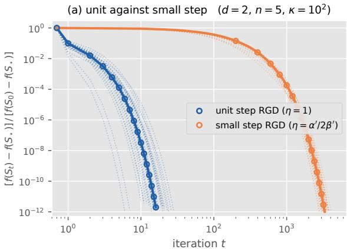
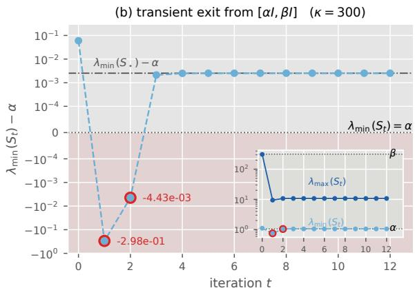
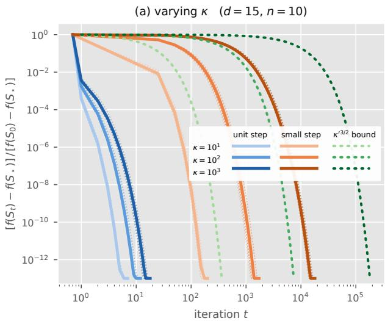
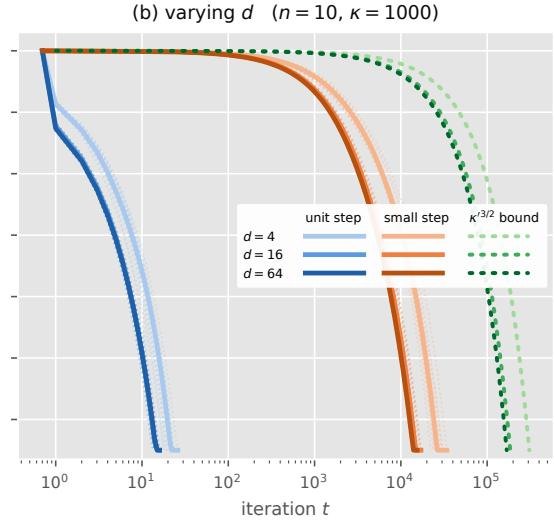
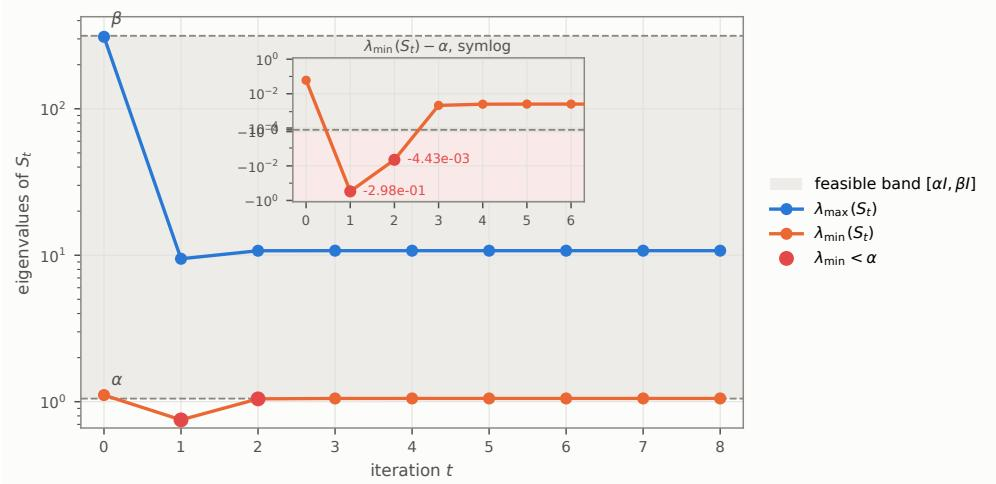

# Projected Riemannian Gradient Descent for the Bures–Wasserstein Barycenter: Dimension-Independent Linear Convergence at Unit Step Size

A. Afham<sup>∗</sup>

Centre for Quantum Technologies, National University of Singapore, Singapore

## Abstract

The computation of the Bures–Wasserstein (BW) barycenter of an ensemble of positive definite matrices arises throughout machine learning, optimal transport, and quantum information. Riemannian gradient descent (RGD) at unit step size—the fixed-point iteration used in practice—converges rapidly, yet existing analyses present a dichotomy: unit-step guarantees carry worst-case exponential dependence on the dimension, while dimension-independent guarantees require small step sizes that forfeit the empirical speed. We resolve this dichotomy, not by improving the guarantees for unit-step RGD, but by proposing a Projected RGD algorithm that achieves dimension-independent linear convergence at unit step size. The achieved rate, $\left( 1 - \kappa ^ { - 3 / 2 } \right)$ , where κ is the condition ( )number of the ensemble, also polynomially improves on the best small-step guarantee $( \kappa ^ { 3 / 2 }$ versus $\kappa ^ { 5 / 2 }$ iteration complexity). The crux is a novel Projection Lemma: clipping the eigenvalues of a positive matrix to an interval $[ \alpha , \beta ]$ is the closed-form, non-expansive (1-Lipschitz) BW-metric projection onto the set $\left\{ S : \alpha I \le S \le \beta I \right\} - \mathrm { a }$ statement which, { ≤ ≤ }unlike its known one-sided counterpart, does not follow from convexity. The projection is moreover free: it reuses an eigendecomposition the next iteration must perform in any case, so the projected and unprojected iterations cost the same per step. The same analysis covers the invariant matrix projection problem of Brahmachari et al. (2025), whose fixed-point algorithm we identify as unit-step RGD on a totally geodesic submanifold, thereby extending the dimension-independent guarantee to that setting verbatim.

## 1 Introduction

We consider two optimization problems on the Bures–Wasserstein (BW) manifold of positive definite matrices. The first is the computation of the BW barycenter of a probability distribution supported on the positive definite cone [AC11]. The problem is prevalent in machine learning and optimal transport—averaging covariance matrices, interpolating Gaussian distributions, and processing positive-definite features in computer vision [AC11; CNR25; CMRS20; BJL19]—and features in quantum information through Bayesian quantum tomography [AKF22], quantum cryptography & Shannon theory [KRS09; Tom15; Bei13; GW15], and quantum resource theories [WY16; Liu+17; WG03]. We first define the squared BW distance between positive semidefinite matrices $P , Q \in \mathrm { P S D } ( d )$

$$
\begin{array} { r } { \mathrm { B } ( P , Q ) \equiv \mathrm { d } _ { \mathrm { B W } } ^ { 2 } ( P , Q ) : = \mathrm { T r } [ P + Q ] - 2 \mathrm { F } ( P , Q ) , \quad \mathrm { F } ( P , Q ) : = \mathrm { T r } \bigg [ \sqrt { P ^ { \frac { 1 } { 2 } } Q P ^ { \frac { 1 } { 2 } } } \bigg ] = \left\| P ^ { \frac { 1 } { 2 } } Q ^ { \frac { 1 } { 2 } } \right\| _ { 1 } , } \end{array}\tag{1}
$$

where $\mathrm { F } ( P , Q )$ is the quantum fidelity [Uhl76; Joz94] between $P$ and $Q ,$ and $\Vert A \Vert _ { 1 } : =$ $\mathrm { T r } \big [ \sqrt { A ^ { \dagger } A } \big ]$ )is the trace norm; see Section 2 for notation and preliminaries.



  
Figure 1: (a) Unit-step against small-step RGD on 30 instances of the pinned family at $d = 2 , n = 5 , \kappa = 1 0 0$ (every member with spectrum $\{ \alpha , \beta \}$ in a Haar-random eigenbasis), from the initialization $\begin{array} { r } { S _ { 0 } = \frac { \alpha + \beta } { 2 } I \colon } \end{array}$ the relative optimality gap per iteration, translucent per instance with the medians opaque. At the median, the unit step converges to machine precision in 16 iterations, the small step $\eta = \alpha ^ { \prime } / ( 2 \beta ^ { \prime } )$ of [ACGS21] (marked every 200th iterate) in about 3300. (b) The transient exit of Example 13 $\left( \kappa = 3 0 0 \right)$ : the signed deviation $\lambda _ { \operatorname* { m i n } } ( S _ { t } ) - \alpha$ of the unprojected unit-step iterates, on a symmetric log scale. The iterates at $t = 1 , 2$ (circled) fall below the floor α (dotted), by $2 . 9 8 \times 1 0 ^ { - 1 }$ and $4 . 4 3 \times 1 0 ^ { - 3 }$ , before re-entering at $t = 3$ and converging to the strictly interior limit $\lambda _ { \mathrm { m i n } } ( S _ { \star } ) - \alpha \approx 2 . 5 2 \times 1 0 ^ { - 3 }$ (dash-dotted). The inset shows the full trajectory of both eigenvalues against the well-conditioned band $\left[ \alpha I , \dot { \beta } I \right] : = \left\{ S : \alpha \dot { I } \le S \le \beta I \right\}$

Problem 1. Let $( R _ { i } ) _ { i \in [ n ] } \subseteq \operatorname { P D } ( d )$ be a collection of $d \times d$ positive definite matrices and $w : = \left( w _ { 1 } , \ldots , w _ { n } \right)$ ( ) ∈ ⊆ ( )an associated probability vector. Compute the BW barycenter of the = (distribution $( R _ { i } , w _ { i } ) _ { i \in [ n ] } \colon$

$$
S _ { \star } : = \operatorname * { a r g m i n } _ { S \in \mathrm { P D } ( d ) } \frac { 1 } { 2 } \sum _ { i = 1 } ^ { n } w _ { i } \mathrm { B } \bigl ( R _ { i } , S \bigr ) \equiv \operatorname * { a r g m i n } _ { S \in \mathrm { P D } ( d ) } f _ { 1 } ( S ) .\tag{2}
$$

Throughout, the ensemble is contained in a spectral interval: $\alpha I \le R _ { i } \le \beta I$ for all $i \in [ n ]$ for some $0 < \alpha \le \beta < \infty$ , and the ratio $\kappa : = \beta / \alpha$ ≤ ≤ ∈ [ ]is the ensemble’s condition number. For a < ≤ <finite ensemble one may take $\begin{array} { r } { \alpha = \operatorname* { m i n } _ { i \in [ n ] } \lambda _ { \operatorname* { m i n } } ( R _ { i } ) } \end{array}$ and $\beta = \operatorname* { m a x } _ { i \in [ n ] } \lambda _ { \operatorname* { m a x } } ( R _ { i } )$ , and the same = ∈[ ] ( )containment covers distributions of infinite support.

No closed form for the solution is known outside special cases (e.g., pairwise commuting $R _ { i } )$ , but the optimum satisfies the fixed-point equation $\begin{array} { r } { S _ { \star } = \sum _ { i = 1 } ^ { n } w _ { i } \sqrt { S _ { \star } ^ { \frac { 1 } { 2 } } R _ { i } S _ { \star } ^ { \frac { 1 } { 2 } } } } \end{array}$ [AC11; BJL19].

An algorithm and a dichotomy. The standard method for Problem 1 is the fixed-point (FP) iteration of [ÁDCM16],

$$
S _ { t + 1 } : = S _ { t } ^ { - \frac { 1 } { 2 } } \left[ \sum _ { i } w _ { i } \sqrt { S _ { t } ^ { \frac { 1 } { 2 } } R _ { i } S _ { t } ^ { \frac { 1 } { 2 } } } \right] ^ { 2 } S _ { t } ^ { - \frac { 1 } { 2 } } , \qquad S _ { 0 } : = I ,\tag{3}
$$

which coincides with Riemannian gradient descent (RGD) on the BW manifold at unit step size [ZP19]: $S _ { t + 1 } = \mathrm { E x p } _ { S _ { t } } ^ { \mathrm { B W } } [ - \overline { { \nabla } } f ( S _ { t } ) ]$ , where $\overline { { \nabla } } f$ is the Riemannian gradient and $\mathrm { E x p } ^ { \mathrm { B W } }$ is = [ ( )]the Riemannian exponential map on the BW manifold. Empirically, the unit-step algorithm converges rapidly, requires no tuning, and outperforms Euclidean gradient methods, SDP solvers, and RGD with smaller step sizes [ACGS21; BRT25]. Current theory does not match this behavior; instead, it ofers a dichotomy. Analyses of the unit-step algorithm carry an iteration complexity that grows as $\kappa ^ { d }$ in the worst case [CMRS20]. Dimension-free guarantees exist, but only at the small step sizes $\eta = O ( 1 / \kappa ) ~ [ \mathrm { A C G S 2 1 } ] , ^ { 1 }$ which on typical instances cost = ( / )two to three orders of magnitude more iterations (Fig. 1(a)). One may thus have the practical step size or the dimension-free guarantee, but not both; Section 1.1 details both lines. This article side-steps this dichotomy by presenting a Projected BW Gradient Descent algorithm which achieves a dimension-independent linear convergence rate at unit step size: each step of the practical algorithm is composed with an exact, non-expansive projection, and the composition retains the empirical speed of the unit step while admitting the dimension-free guarantee.

The dimension-free analysis of [ACGS21] requires the iterates to remain in the wellconditioned set $\left[ \alpha I , \beta I \right] : = \{ S : \alpha I \leq S \leq \beta I \}$ determined by the ensemble. The unit-step [iterates cannot escape $[ \alpha I , \beta I ]$ ≤ ≤ }through the ceiling:2 $S \le \beta I \Rightarrow \mathrm { E x p } _ { S } ^ { \mathrm { B W } } [ - \eta \overline { { \nabla } } f ( S ) ] \le \beta I$ for any $\eta \in [ 0 , 1 ]$ [ ], a consequence of the convexity of $S \mapsto { \sqrt { \lambda _ { \operatorname* { m a x } } ( S ) } }$ [ ( )] ≤along the generalized ∈ [ ] ( )geodesics traced by the gradient step [CMRS20; ACGS21; BRT25]. However, the floor enjoys no such protection: $S \mapsto { \sqrt { \lambda _ { \operatorname* { m i n } } ( S ) } }$ fails to be concave along generalized geodesics— ( )in contrast to its concavity along barycenters [ACGS21, Thm. 6, Rem. 3]—so no step-sizeindependent lower eigenvalue bound is available. Example 13 (Appendix A) gives an instance $( d = 2 , n = 3 , \kappa = 3 0 0 )$ in which the ensemble, the current iterate, and the barycenter all = = =lie in the interior of $[ \alpha I , \beta I ]$ , yet the next two unit-step iterates have minimal eigenvalue strictly below $\alpha .$ [ ]Thus at unit step size, the arguments underpinning existing dimensionfree rates fail. The exit is transient as the ultimate convergence of unit-step RGD to the barycenter is known. In the aforementioned example, the iterate permanently returned to the well-conditioned set after two steps, converging to a limit that lies strictly above the floor α (see Fig. 1(b)). Moreover, such instances had to be adversarially constructed; on random

Such transient exits are avoided in the analysis of [ACGS21] by choosing suficiently small step sizes $\left( \eta = O ( \kappa ^ { - 1 } ) \right)$ ). The cost of the small step sizes is demonstrated in Fig. 1(a) on the = ( )smallest instructive case, $d = 2 \cdot$ : unit-step RGD gains nearly a decimal digit of accuracy per =iteration and reaches the double-precision floor within 16 iterations at the median, whereas the small step $\eta = \alpha ^ { \prime } / ( 2 \beta ^ { \prime } )$ associated with the dimension-free analysis of $\mathrm { [ A C G S 2 1 ] ^ { 4 } }$ needs = /( )about 3300 iterations for the same accuracy. The factor between the two is essentially independent of the target accuracy and across 30 random instances of this family its median is 202 (range 141 to 399).

A step of RGD at any step size evaluates the same map—n transport maps $S _ { t } ^ { - 1 } \# R _ { i }$ , each an eigendecomposition—and the step size only scales the resulting displacement, so a unit step and a small step cost the same to compute. An iteration count is therefore a wall-clock count, and the practitioner who chooses $\eta = 1$ saves two to three orders of magnitude of =computation, on every instance. This is why the unit step is the algorithm used in practice, and why a guarantee for it is highly desired. As elaborated upon later, we supply this guarantee through a remedy that is standard in constrained optimization: if the iterates do not natively stay in the region of interest, enforce membership by projection—provided the projection is cheap and does not undo the progress of the gradient step. We show that both requirements are met on the BW manifold, at essentially zero additional cost. The projection is constructed in Section 3.2, the full algorithm is stated as Algorithm 1 in Section 3.3, and its convergence is proved in Section 4.

The second problem we consider is the invariant matrix projection problem of [BRT25], which generalizes Problem 1 and unifies certain problems of interest in quantum information [BRT25, Sec. 7].

Problem 2. Given a projective unitary representation $\mathcal { U } : = \{ U _ { i } \} _ { i \in [ n ] } \subseteq \operatorname { U } ( d )$ and $R \in \operatorname { P D } ( d )$

$$
\operatorname* { m i n } _ { S \in \mathcal { P } } \frac { 1 } { 2 } \mathrm { B } ( R , S ) \equiv \operatorname* { m i n } _ { S \in \mathcal { P } } f _ { 2 } ( S ) ,\tag{4}
$$

where ${ \mathcal { P } } : = \{ P \in \operatorname { P D } ( d ) : [ P , U _ { i } ] = 0$ for all $U _ { i } \in \mathcal { U } \}$ is the set of invariant positive matrices.

Brahmachari, Rubboli, and Tomamichel [BRT25] introduced a modified fixed-point iteration to solve the above problem:

$$
S _ { t + 1 } : = S _ { t } ^ { - \frac { 1 } { 2 } } \left[ \Phi \left( \sqrt { S _ { t } ^ { \frac { 1 } { 2 } } R S _ { t } ^ { \frac { 1 } { 2 } } } \right) \right] ^ { 2 } S _ { t } ^ { - \frac { 1 } { 2 } } , \qquad S _ { 0 } = I ,\tag{5}
$$

where $\begin{array} { r } { \Phi ( X ) : = \frac { 1 } { n } \sum _ { i } U _ { i } X U _ { i } ^ { \dagger } } \end{array}$ is the twirling map associated with . In [Afh25], the au-( ) = ∑thor showed that this update is unit-step BW gradient descent for the modified objective ${ \scriptstyle { \frac { 1 } { 2 } } \mathrm { B } } ( R , \Phi ( S ) )$ over the full positive definite manifold; Appendix E gives an arguably more ( ( ))elegant interpretation as unit-step BW gradient descent on the submanifold of invariant matrices, which we prove is totally geodesic. Brahmachari, Rubboli, and Tomamichel [BRT25] proved linear convergence of their algorithm, but—echoing the barycenter situation—with a worst-case dependence on the dimension.

Remark 3. The invariant matrix projection problem generalizes the BW barycenter problem [BRT25]. We nonetheless analyze the two separately: the barycenter is the more widely used of the two problems, and treating it on its own keeps the constants and the notation simpler.

Projection is all you need. In this article we present a Projected Bures–Wasserstein Gradient Descent (Projected BW-GD) algorithm: unit-step BW gradient descent composed, at each iteration, with an exact BW-metric projection onto the well-conditioned set $[ \alpha I , \beta I ]$ We prove that this algorithm converges linearly at rate $( 1 - \kappa ^ { - 3 / 2 } )$ [ ]for both Problems 1 ( )and 2, with no dependence on the dimension. To our knowledge this is the first dimensionfree guarantee for any unit-step method on these problems; moreover, the iteration complexity $\kappa ^ { 3 / 2 } \log ( 1 / \epsilon )$ improves polynomially on the best known dimension-free guarantee, $O ( \kappa ^ { 5 / 2 } \log ( 1 / \epsilon ) )$ ( / )at step size $1 / ( 2 \kappa )$ [ACGS21]. Note that we do not claim to show the ( ( / )) /( )dimension-independent convergence of the FP algorithm. What we guarantee is that by merely incorporating an eigenvalue-clipping operation at every iteration, we can construct a Projected RGD algorithm, which reduces to the standard FP algorithm whenever the iterates land in $[ \alpha I , \beta I ]$ , and converges at a dimension-independent rate to the barycenter $S _ { \star }$ [ ](see Theorem 10 for a precise statement). Note that the guarantee comes at no additional cost: clipping reuses an eigendecomposition the following iteration must perform in any case, so the projected and unprojected iterations cost essentially the same per step, except for an $O ( d )$ diference (see Section 3.3) which is dominated by the $O ( d ^ { 3 } )$ cost of the ( )eigendecompositions.

## 1.1 Related Works

The Bures–Wasserstein barycenter and Riemannian gradient descent. The BW barycenter has been extensively studied for its role in optimal transport, statistics, and machine learning [AC11; CNR25; KSS21]; see also the references therein. Existence and consistency go back to [AC11; LL17]; statistical properties of empirical barycenters are studied in [PZ19; KSS21; LPRS22]. The FP algorithm of Álvarez-Esteban et al. [ÁDCM16], who also established its asymptotic convergence, was identified by Zemel and Panaretos [ZP19] as unit-step RGD on the BW manifold, with an independent convergence proof. Its non-asymptotic analysis has developed along two lines. Chewi et al. [CMRS20] gave the first linear rate at unit step size via a Polyak–Łojasiewicz (PL) inequality, with constants governed by the conditioning of the iterates; absent control of the smallest eigenvalue, these degrade as $\kappa ^ { d }$ in the worst case. Altschuler et al. [ACGS21] then proved a dimension-free rate by establishing eigenvalue control along the trajectory, at the cost of the step-size restriction $\eta \leq 1 / ( 2 \kappa )$ and iteration complexity $O ( \kappa ^ { 5 / 2 } \log ( 1 / \epsilon ) )$ . No step-size-independent eigenvalue ≤ /( )control is possible as $\{ S > 0 : \lambda _ { \operatorname* { m i n } } ( S ) \geq \alpha \}$ ( / ))is not closed under generalized geodesics [ACGS21, { > ( ) ≥ }Rem. 3], and Example 13 realizes the failure inside the feasible set, for two consecutive iterations. Recent work accelerates the same fixed-point iteration by Riemannian Anderson mixing [AEO26], with convergence established locally—on suitable BW balls around the solution—which leaves the global, unit-step regime of the practical algorithm without a guarantee. Our work is best read against this backdrop: rather than seeking finer control of the unprojected dynamics, we restore the invariance of the well-conditioned set by an exact, non-expansive projection.

Invariant Matrix Projection. Brahmachari, Rubboli, and Tomamichel [BRT25] introduced the invariant matrix projection problem and a generalized fixed-point algorithm for it, which corresponds to unprojected unit-step RGD on the invariant submanifold (Appendix E). The framework encompasses, among others, the fidelity of asymmetry and of coherence in quantum resource theories, the max-conditional entropy and the order-1 2 sandwiched Rényi /mutual information in quantum Shannon theory, and the geometric measure of entanglement of maximally correlated states [BRT25, Sec. 7]. Their linear convergence rate likewise carries a worst-case dependence on the dimension.

Projected and safeguarded methods on the BW manifold. Projection steps with respect to the BW distance have appeared in two roles. As a constraint mechanism, Fan et al. [Fan+24] analyze projected BW-GD over a BW ball $B ( Q ; r ) : = \{ S : \mathrm { B } ( S , Q ) \leq r ^ { 2 } \}$ . Their ( ) = { ( ) ≤ }setting difers from ours in both the feasible set and the role it plays: their BW ball encodes an external constraint imposed on the problem. Our feasible set is instead a spectral interval chosen for the analysis, and it enjoys three properties their ball does not: it provably contains the unconstrained optimum, projection onto it is closed-form eigenvalue clipping, and the projection is non-expansive. It is this combination that yields unit-step, dimension-free rates, which are unavailable in their setting. As a safeguard, one-sided eigenvalue clipping has been used to control iterates in BW-space analyses: Altschuler et al. [ACGS21, Prop. 3] prove that clipping from above is a BW contraction, and Lambert et al. [Lam+22] employ the same device in variational inference. Our Projection Lemma extends this in two ways: two-sided clipping to α, β is non-expansive, and it is the exact BW-metric projection onto $[ \alpha I , \beta I ]$ [ ] [ ]As explained later, the extension requires a new argument.5 On the structural side, closedform BW projections onto sets of interest in quantum information—such as sets of bipartite matrices with a given marginal—were recently derived in [AT26].

<table><tr><td></td><td>Step size</td><td>Iteration complexity</td><td>Dimension-free</td></tr><tr><td>Chewi et al. [CMRS20]</td><td> $\eta = 1$ </td><td> $\kappa ^ { d } { \mathrm { - d e p e n d e n t ~ ( w o r s t ~ c a s e ) } }$ </td><td>X</td></tr><tr><td>Altschuler et al. [ACGS21]</td><td> $\begin{array} { r } { \eta = \frac { 1 } { 2 \kappa ^ { \prime } } } \end{array}$ </td><td> $\begin{array} { r } { O ( \kappa ^ { \prime 5 / 2 } \log \frac { 1 } { \epsilon } ) } \end{array}$ </td><td>√</td></tr><tr><td>Brahmachari et al. [BRT25]†</td><td> $\eta = 1$ </td><td> $d \mathrm { - d e p e n d e n t } \ ( \mathrm { w o r s t \ c a s e } )$ </td><td>X</td></tr><tr><td>This work†</td><td> $\eta = 1$ </td><td> $\kappa ^ { \prime 3 / 2 } \log { \frac { 1 } { \epsilon } }$ </td><td>√</td></tr></table>

Table 1: Linear convergence guarantees for first-order methods for the BW barycenter (and, where indicated, the invariant matrix projection problem). Iteration complexity is the number of iterations to reach $f ( S _ { t } ) -$ $f ( S _ { \star } ) \leq \epsilon ( f ( S _ { 0 } ) - f ( S _ { \star } ) )$ ), up to absolute constants; d is the matrix dimension. Two condition numbers appear: $\kappa = \beta / \alpha$ from the spectral bounds of the individual inputs, and the refined $\kappa ^ { \prime } = \beta ^ { \prime } / \alpha ^ { \prime } \le \kappa$ from the ensemble-average quantities of Eq. (7). The refined constant of [ACGS21] is $\begin{array} { r } { \sum _ { i = 1 } ^ { n } w _ { i } \lambda _ { \operatorname* { m a x } } \dot { ( } R _ { i } ) / \alpha ^ { \prime } \ge \kappa ^ { \prime } . } \end{array}$ , so writing their row in $\kappa ^ { \prime }$ is conservative in their favor. κ and $\kappa ^ { \prime }$ coincide in the worst case over ensembles.

<sup>†</sup>Also covers the invariant matrix projection problem.

## 1.2 Our contributions

The central object of our study is Projected BW-GD: unit-step RGD composed, at every iteration, with the BW projection onto $[ \alpha I , \beta I ]$ , where $\alpha , \beta$ are read of the inputs $( \alpha = \mathrm { m i n } _ { i } \lambda _ { \mathrm { m i n } } ( R _ { i } ) , \beta = \mathrm { m a x } _ { i } \lambda _ { \mathrm { m a x } } ( R _ { i } )$ [ ]for the barycenter; $\alpha = \lambda _ { \operatorname* { m i n } } ( R ) , \beta = \lambda _ { \operatorname* { m a x } } ( R )$ for = ( ) = ( ) = ( ) = ( )the invariant projection) and are known to contain the optimum, S αI, βI [ACGS21; BRT25]. Our contributions are as follows.

1. A negative result: the well-conditioned set is not invariant at unit step size. Example 13 certifies that the well-conditioned set is not invariant under the unit step, and the construction extends to every $n \geq 3$ and $d \geq 2$ . This sharpens the geodesic-convexity ≥ ≥failure of [ACGS21, Rem. 3], whose configuration starts outside the well-conditioned set, into a statement about the algorithm itself. It pinpoints the quantity a fix must control— the spectral floor.

2. The Projection Lemma. We prove (Lemma 6) that for any positive definite P, clipping the eigenvalues of P to $[ \alpha , \beta ]$ is the unique minimizer of $\operatorname { B } ( P , \cdot )$ over $[ \alpha I , \beta I ]$ , and that [ ] ( ) [ ]this projection is non-expansive in the BW distance. The known one-sided result [ACGS21, Prop. 3] appeals to convexity of the spectral-norm ball and the 1-Lipschitz property of Euclidean projection; the two-sided result (specifically, clipping from below) does not follow from such an argument, and is supplied instead by the Alberti–Uhlmann variational formula [Alb83; Wat18], operator monotonicity of the matrix geometric mean [Bha09], and a pinching argument [Tom15]. We are not aware of another closed-form BW projection identified as such, and we expect it to serve as a constrained-optimization primitive on this manifold.

3. Dimension-free linear convergence at unit step size, with improved κ- dependence. Because the projection is exact and non-expansive, composing it with the unit gradient step (a) confines all iterates to $[ \alpha I , \beta I ]$ , on which strong convexity and a [ ]PL inequality hold with dimension-free constants, and (b) preserves monotone descent. The result, stated as the unified theorem below and proved as Theorem 10, is the rate $\left( 1 - \kappa ^ { - 3 / 2 } \right)$ for both problems at unit step size; Table 1 situates it among existing guarantees. ( )An a posteriori certificate (Corollary 12) bounds the optimality gap of any iterate by $\scriptstyle \frac { \kappa ^ { 3 / 2 } } { 2 } \mathrm { B } ( S _ { t } , \mathrm { K } ( S _ { t } ) )$ , a quantity the iteration has already computed, allowing termination on (the fly.

4. A unified square-root-manifold analysis, with structural by-products. We identify BW-GD on PD d with Euclidean GD on the square-root manifold GL d (Burer– ( )Monteiro factored GD [BM03]). Euclidean strong convexity of f on $[ \alpha I , \beta I ]$ ( )then lifts to a PL inequality for $g = f \circ \pi$ with dimension-free constant $\kappa ^ { - 3 / 2 }$ [ ], and the descent lemma and =the projection combine in three lines to give the rate (Section 4). This bypasses generalized geodesics and convexity along them, which earlier analyses required [AGS08; CMRS20; ACGS21]: their role is played by straight chords of the flat square-root space. Two byproducts follow. First, the fixed-point algorithm of Brahmachari, Rubboli, and Tomamichel [BRT25] is exactly unit-step RGD on the submanifold of invariant matrices, which we prove is totally geodesic (Appendix E). Second, the projected iteration is singular-value-clipped Euclidean GD upstairs (Appendix D), under which the barycenter update is an averaging of Procrustes-aligned square roots—the form in which the unit-step descent lemma is a variance identity (Appendix B).

The following theorem summarizes our main convergence guarantee.

Theorem 4 (Unified Linear Convergence of Projected BW-GD). Let $f \in \{ f _ { 1 } , f _ { 2 } \}$ be the objective function with unique optimum $S _ { \star } \in [ \alpha I , \beta I ]$ and $\kappa = \beta / \alpha$ ∈ { }. For any feasible initial point $S _ { 0 } \in [ \alpha I , \beta I ]$ (additionally invariant, $S _ { 0 } \in \mathcal { P }$ ], when $f = f _ { 2 } )$ , the iterates $\{ S _ { t } \} _ { t \ge 0 }$ of ∈ [ ]Projected BW-GD with unit step size satisfy

$$
f ( S _ { t } ) - f ( S _ { \star } ) \leq \left( 1 - \frac { 1 } { \kappa ^ { 3 / 2 } } \right) ^ { t } ( f ( S _ { 0 } ) - f ( S _ { \star } ) ) .\tag{6}
$$

For the barycenter this improves to $\left( 1 - \kappa ^ { \prime - 3 / 2 } \right)$ on the refined interval (Remark 11).

Proof. See Section 4.

Refined constants. For the barycenter the condition number can be sharpened. Define

$$
\alpha ^ { \prime } : = \Big [ \sum _ { i = 1 } ^ { n } w _ { i } \sqrt { \lambda _ { \operatorname* { m i n } } ( R _ { i } ) } \Big ] ^ { 2 } \quad \mathrm { a n d } \quad \beta ^ { \prime } : = \lambda _ { \operatorname* { m a x } } \Big ( \sum _ { i = 1 } ^ { n } w _ { i } R _ { i } \Big ) ,\tag{7}
$$

which satisfy $\alpha \leq \alpha ^ { \prime } \leq \beta ^ { \prime } \leq \beta$ and still enclose the optimum, $S _ { \star } \in \left[ \alpha ^ { \prime } I , \beta ^ { \prime } I \right]$ (floor by [ACGS21, ≤ ≤ ≤Thm. 6], ceiling by [BJL19, Thm. 9]). Projecting onto $[ \alpha ^ { \prime } I , \beta ^ { \prime } I ]$ [ ]yields the identical guarantee with $\kappa ^ { \prime } : = \beta ^ { \prime } / \alpha ^ { \prime } \le \kappa$ [ ](Remark 11, proved in Appendix C); this requires additional ingredients, =since the $R _ { i }$ ≤need not lie in the refined interval. Since $\beta ^ { \prime } \leq \textstyle \sum _ { i = 1 } ^ { n } w _ { i } \lambda _ { \operatorname* { m a x } } ( R _ { i } )$ , our $\kappa ^ { \prime }$ is ≤ ∑ = ( )no larger than the refined condition number of [ACGS21, Thm. 3], so the rates compare favorably instance-wise. We work with $[ \alpha I , \beta I ]$ in the main text, which is simpler and matches the conventions of the literature.

Techniques. The analysis splits into an RGD part and a projection part. For the RGD part, the ingredients—the unit-step descent inequality [BJL19; BRT25] and the passage from Euclidean strong convexity to a PL inequality [CMRS20; Fan+24]—are available in the literature; we route them through the total-manifold identification, under which the Riemannian algorithm becomes a Euclidean gradient method, and the classical PL mechanism [Pol63; KNS16] drives the proof. The PL inequality must come from Euclidean strong convexity, for the non-negative curvature of the BW manifold renders the objective geodesically nonconvex [ACGS21, App. B.2]; the descent at the full unit step, by contrast, comes from that same curvature, expressed as a variance inequality on the square-root manifold (Proposition 14). Curvature thus takes away geodesic convexity with one hand and returns unit-step descent with the other. For the projection part, the one-sided argument of [ACGS21, Prop. 3] rests on convexity, which fails for the floor; we establish the two-sided statement with tools from quantum information (Lemma 6). Since the objective is built from squared BW distances to references inside $[ \alpha I , \beta I ] { \mathrm { - e a c h } }$ fixed by the projection—non-expansiveness ensures [ ]the projection does not undo the progress of the RGD step, while confining the iterate to the set on which the PL inequality holds.

Organization. Section 2 collects preliminaries. Section 3 develops the algorithm: the square-root-manifold identification (Section 3.1), the Projection Lemma (Section 3.2), and the algorithm itself (Section 3.3). Section 4 proves the convergence theorem and the a posteriori certificate, and Section 5 presents numerical experiments. The appendices contain the exit instance $( { \mathrm { A p p e n d i x } } { \mathrm { A } } )$ , the variance-inequality proof of the descent lemma (Appendix B), the refined-interval guarantee (Appendix C), the total-manifold implementation (Appendix D), and the identification of the algorithm of Brahmachari, Rubboli, and Tomamichel [BRT25] as BW-GD on the totally geodesic invariant submanifold (Appendix E).

## 2 Mathematical Preliminaries

For a positive integer $n , [ n ] : = \{ 1 , \ldots , n \}$ . For $d \geq 2 , \operatorname { L } ( d )$ denotes the d d complex matrices and $\operatorname { G L } ( d )$ [ ] = { } ≥ ( )the invertible ones. We equip L d with the (real) Hilbert–Schmidt (HS, a.k.a. ( )Frobenius) inner product $\langle A , B \rangle : = \Re \mathrm { T r } [ A ^ { \dagger } B ]$ ), where $A ^ { \dagger }$ is the conjugate transpose.<sup>6</sup> The ⟨ ⟩ = [real vector space of Hermitian matrices is $\operatorname { H r } ( d ) : = \{ A \in \operatorname { L } ( d ) : A = A ^ { \dagger } \}$ ; within $\mathrm { H r } ( d )$ lies the closed cone $\mathrm { P S D } ( d )$ ( ) = { ∈ ( ) = }of positive semidefinite matrices, and its open subset $\operatorname { P D } ( d )$ ( )of positive definite matrices

$$
\operatorname { P S D } ( d ) = \{ P \in \operatorname { H r } ( d ) : \lambda _ { i } ( P ) \geq 0 \} , \quad { \mathrm { a n d } } \quad \operatorname { P D } ( d ) = \{ P \in \operatorname { H r } ( d ) : \lambda _ { i } ( P ) > 0 \} ,\tag{8}
$$

where $\lambda _ { \operatorname* { m i n } } ( P ) \equiv \lambda _ { 1 } ( P ) \leq \ldots \leq \lambda _ { d } ( P ) \equiv \lambda _ { \operatorname* { m a x } } ( P )$ are the eigenvalues of P ordered non-(decreasingly. $\operatorname { U } ( d ) : = \{ U \in \operatorname { L } ( d ) : U ^ { \dagger } U = U U ^ { \dagger } = I _ { d } \}$ denotes the unitary matrices, where $I _ { d } \equiv I$ ( ) = { ∈ ( ) =denotes the d d identity matrix. For $A , B \in \operatorname { H r } ( d )$ we write $A > B \ ( A \geq B )$ when $A - B$ is positive (semi)definite. For $A , B \in \operatorname { P D } ( d )$ ∈ ( ) > ≥, define the matrix geometric mean as

$$
A \# B : = A ^ { \frac { 1 } { 2 } } \left( A ^ { - \frac { 1 } { 2 } } B A ^ { - \frac { 1 } { 2 } } \right) ^ { \frac { 1 } { 2 } } A ^ { \frac { 1 } { 2 } } ,\tag{9}
$$

equivalently the unique $T \in \operatorname { P D } ( d )$ solving the Riccati equation $T A ^ { - 1 } T = B ;$ ; it is symmetric, $A \# B = B \# A$ ∈ ( ) =, operator monotone in each argument [Bha09], and satisfies $A \# ( c I ) = { \sqrt { c } } A ^ { \frac { 1 } { 2 } }$ for $c > 0$

The Bures–Wasserstein manifold. $\operatorname { P D } ( d )$ is an open subset of the real vector space $\mathrm { H r } ( d )$ ( )and hence a smooth manifold, with tangent space $\mathrm { T } _ { P } \mathrm { P d } ( d ) \cong \mathrm { H r } ( d )$ at every P. We ( )equip each tangent space with the BW metric tensor

$$
{ \mathfrak { g } } _ { P } ^ { \mathrm { B W } } ( X , Y ) \equiv \langle X , Y \rangle _ { P } ^ { \mathrm { B W } } = { \frac { 1 } { 2 } } \mathrm { T r } [ X \mathrm { L } _ { P } ( Y ) ] = { \frac { 1 } { 2 } } \mathrm { T r } [ \mathrm { L } _ { P } ( X ) Y ] ,\tag{10}
$$

where $\mathrm { L } _ { P } ( X )$ is the unique Hermitian solution of the Lyapunov equation $X = \operatorname { L } _ { P } ( X ) P +$ $P \mathrm { L } _ { P } ( X )$ ( )[BJL19; Bha09]. This metric induces the squared BW distance $\mathrm { { B } } ( P , Q )$ ( ) +defined in

the introduction; we refer to [BJL19; MMP18] for proofs of the facts collected here. The Riemannian exponential map is

$$
\displaystyle \mathrm { E x p } _ { P } ^ { \mathrm { B W } } [ X ] : = \left[ I + \mathrm { L } _ { P } ( X ) \right] P \left[ I + \mathrm { L } _ { P } ( X ) \right] ; \quad \mathrm { d o m } ( \mathrm { E x p } _ { P } ^ { \mathrm { B W } } ) = \{ X : I + \mathrm { L } _ { P } ( X ) \in \mathrm { P D } ( d ) \} .\tag{}(11}
$$

A more illustrative construction of the BW manifold realizes it as a quotient of the manifold of invertible matrices. Being an open subset of $\operatorname { L } ( d )$ , the set $\operatorname { G L } ( d )$ is a smooth manifold, ( )which we equip with the Frobenius inner product and distance $\Vert A - B \Vert _ { \mathrm { F } }$ . Consider on $\operatorname { G L } ( d )$ the unitary equivalence $A \sim B \iff A = B U$ for some $U \in \operatorname { U } ( d )$ ∥ ( ), together with the square map

$$
\pi : \operatorname { G L } ( d ) \to \operatorname { P D } ( d ) , \qquad \pi ( A ) : = A A ^ { \dagger } ,\tag{12}
$$

which satisfies $\pi ( A ) = \pi ( B )$ if and only if $A \sim B ;$ thus $\mathrm { P D } ( d ) \equiv \mathrm { G L } ( d ) / \mathrm { U } ( d )$ . The equivalence class of $P \in \operatorname { P D } ( d )$ ) =, its $\mathit { f i b r e } ,$ ∼is its set of square roots

$$
\pi ^ { - 1 } [ P ] = \{ A \in \operatorname { G L } ( d ) : A A ^ { \dagger } = P \} = \{ P ^ { \frac { 1 } { 2 } } U : U \in \operatorname { U } ( d ) \} ,\tag{13}
$$

with $P ^ { \frac { 1 } { 2 } }$ the principal square root.<sup>7</sup> We extend the above notation to sets as well: for ${ \mathcal { S } } \subseteq \operatorname { P D } ( d )$ , we define $\pi ^ { - 1 } [ S ] : = \{ A : \pi [ A ] \in { \mathcal { S } } \} \subseteq { \mathrm { G L } } ( d )$ . We call $\operatorname { G L } ( d )$ the total (or ⊆ ( )square-root) manifold and $\operatorname { P D } ( d )$ { [ ] ∈ } ⊆ ( ) ( )the base manifold. Since right multiplication by a unitary ( )preserves the Frobenius distance, the distance between fibres is well defined, and it is precisely the BW distance:

$$
\mathrm { B } ( P , Q ) = \operatorname* { m i n } _ { \substack { A \in \pi ^ { - 1 } [ P ] , B \in \pi ^ { - 1 } [ Q ] } } \Vert A - B \Vert _ { \mathrm { F } } ^ { 2 } = \operatorname* { m i n } _ { U \in \mathrm { U } ( d ) } \Vert P ^ { \frac { 1 } { 2 } } U - Q ^ { \frac { 1 } { 2 } } \Vert _ { \mathrm { F } } ^ { 2 } ;\tag{14}
$$

a pair $( A , B )$ attaining the minimum is an optimal pairing for $( P , Q )$ . Expanding the ( )right-hand side and using max $U \in \operatorname { U } ( d ) \operatorname { R e T r } [ M U ] = \| M \| _ { 1 }$ ( )recovers the closed form $\mathrm { B } ( P , Q ) =$ $\mathrm { T r } [ P + Q ] - \mathrm { 2 F } ( P , Q )$ ∈ [ ] = ∥ ∥ ( ) =. The construction also recovers the BW metric: it is (up to scal-[ ] ( )ing) the unique metric on $\operatorname { P D } ( d )$ compatible with the Frobenius metric on $\operatorname { G L } ( d )$ under π [BJL19]. For full-rank $P , Q$ ( ) ( )(always the case in this work), the optimal unitary in Eq. (14) is $U = { \mathrm { P o l } } ( P ^ { \frac { 1 } { 2 } } Q ^ { \frac { 1 } { 2 } } )$ , the unitary polar factor (see [BJL19], or [AF25, Lem. C.1]); moreover $( P ^ { \frac { 1 } { 2 } } U , Q ^ { \frac { 1 } { 2 } } )$ ( and $( P ^ { \frac { 1 } { 2 } } , Q ^ { \frac { 1 } { 2 } } U ^ { \dagger } )$ are optimal pairings for $( P , Q )$

Further properties of the BW distance. Write $\mathrm { B } _ { R } ( \cdot ) \equiv \mathrm { B } ( R , \cdot )$ for the squared BW distance to a fixed $R \in \operatorname { P D } ( d )$ . Its Euclidean gradient over $\operatorname { P D } ( d )$ (is

$$
\nabla \mathrm { B } _ { R } ( S ) = I - S ^ { - 1 } \# R ,\tag{15}
$$

so the gradient of the barycenter functional is $\begin{array} { r } { \nabla f _ { 1 } ( S ) = \frac { 1 } { 2 } ( I - \sum _ { i = 1 } ^ { n } w _ { i } [ S ^ { - 1 } \# R _ { i } ] ) } \end{array}$ [ACGS21; ( )BJL19]. The squared BW distance is strongly convex $\mathrm { ( S C ) }$ ∑ = [ ]), and in a form that does not require the reference and the argument to share an interval: for every $\begin{array} { r } { b > 0 , \mathrm { B } _ { R } \mathrm { i s } \frac { \sqrt { \lambda _ { \operatorname* { m i n } } ( R ) } } { 2 b ^ { 3 / 2 } } . } \end{array}$ SC on $\{ S \in \operatorname { P D } ( d ) : S \leq b I \}$ [BJL18; BRT25], that is,

$$
\mathrm { B } _ { R } ( Q ) \geq \mathrm { B } _ { R } ( S ) + \left. \nabla \mathrm { B } _ { R } ( S ) , Q - S \right. + \frac { 1 } { 2 } \frac { \sqrt { \lambda _ { \operatorname* { m i n } } ( R ) } } { 2 b ^ { 3 / 2 } } \| Q - S \| _ { \mathrm { F } } ^ { 2 }\tag{16}
$$

for all $Q , S \leq b I$ (Lemma 16 records the Hessian form we use in Appendix C). Specializing to $R \in [ \alpha I , \beta I ]$ and $b = \beta$ gives $\lambda _ { \operatorname* { m i n } } ( R ) \geq \alpha$ , so both $f _ { 1 }$ and $f _ { 2 }$ are $\mu { - } \mathrm { S C }$ on the corresponding $[ \alpha I , \beta I ]$ ] = ( ) ≥, where we set once and for all

$$
\mu : = \frac { 1 } { 2 } \left( \frac { \alpha ^ { \frac { 1 } { 2 } } } { 2 \beta ^ { 3 / 2 } } \right) = \frac { \alpha ^ { \frac { 1 } { 2 } } } { 4 \beta ^ { 3 / 2 } } , \qquad \mathrm { s o ~ t h a t } \qquad 4 \mu \alpha = \kappa ^ { - 3 / 2 } .\tag{17}
$$

The BW distance satisfies the data processing inequality (DPI) [Uhl11; Wat18]: for any quantum channel (completely positive trace-preserving map) Λ,

$$
\mathrm { B } ( P , Q ) \geq \mathrm { B } ( \Lambda ( P ) , \Lambda ( Q ) ) .\tag{18}
$$

We will use the DPI for pinching channels [Tom13]: given mutually orthogonal projectors $\mathcal { E } : = \{ E _ { k } \} _ { k \in [ m ] }$ with $E _ { k } E _ { l } = \delta _ { k l } E _ { k }$ and $\textstyle \sum _ { k } E _ { k } = I _ { d }$ , the associated pinching channel is $\Lambda _ { \mathcal { E } } ( X ) : =$ $\begin{array} { r } { \sum _ { k \in [ m ] } E _ { k } X E _ { k } } \end{array}$

Preliminaries for the invariant matrix projection problem. Let $\mathcal { U } = \{ U _ { i } \} _ { i = 1 } ^ { n }$ be a = {projective unitary representation. Its commutant is the unital subalgebra comm $( \mathcal { U } ) : = \{ X \in$ $\operatorname { L } ( d ) : \left[ X , U _ { i } \right] = 0$ for all $i \} \ [ \mathrm { W a t 1 8 } ]$ , a vector subspace of $\operatorname { L } ( d )$ ( ) = { ∈. Define the invariant sets $\mathcal { P } : = \mathrm { P D } ( d )$ ] = comm , $\mathcal { H } : = \mathrm { H r } ( d )$ comm , and ${ \mathcal { G } } : = { \mathrm { G L } } ( d )$ comm . The twirl $\begin{array} { r } { \Phi ( X ) : = \frac { 1 } { n } \sum _ { i = 1 } ^ { n } U _ { i } X U _ { i } ^ { \dagger } } \end{array}$ ) = ( ) ( ) = ( ) ( )is a unital quantum channel and is the Hilbert–Schmidt orthogonal ( ) = =projection onto comm :

$$
\Phi ( X ) \in \mathrm { c o m m } ( { \mathcal { U } } ) \quad { \mathrm { a n d } } \quad \left. \Phi ( X ) , X - \Phi ( X ) \right. = 0 \quad { \mathrm { f o r ~ a l l ~ } } X \in \mathrm { L } ( d ) .\tag{19}
$$

An important geometric distinction: for invariant $P ~ \in ~ \mathcal { P }$ , the tangent space to the full manifold remains all of $\mathrm { H r } ( d )$ ∈, whereas the tangent space to the invariant submanifold is exactly :

$$
\mathrm { T } _ { \mathit { P } } \mathrm { P D } ( d ) \cong \mathrm { H r } ( d ) \quad \mathrm { a n d } \quad \mathrm { T } _ { \mathit { P } } \mathcal { P } \cong \mathcal { H } \qquad \mathrm { f o r ~ a l l ~ } \ : \boldsymbol { P } \in \mathcal { P } .\tag{20}
$$

## 3 The Algorithm: Projected Bures–Wasserstein Gradient Descent

This section develops the two components of the algorithm and assembles them. Section 3.1 recalls BW gradient descent and its identification with Euclidean GD on the square-root manifold; Section 3.2 proves the Projection Lemma; Section 3.3 states the algorithms.

## 3.1 BW gradient descent and the square-root manifold

Let $f : \mathrm { P D } ( d ) \to$ R be diferentiable with Euclidean gradient $\nabla f ( P ) \in \operatorname { H r } ( d )$ , defined by $\operatorname { D } f ( P ) [ X ] = { \big \langle } \nabla f ( P ) , X \rangle$ . The BW (Riemannian) gradient ${ \overline { { \nabla } } } f ( P )$ ∈ ( )is the dual of the ( )[ ] = ⟨ ( ) ⟩derivative with respect to the BW metric, $\langle { \overline { { \nabla } } } f ( P ) , X \rangle _ { P } ^ { \mathrm { B W } } = \mathrm { D } f ( P ) [ X ] = \left. \nabla f ( P ) , X \right.$ for all $X \in \mathrm { T } _ { P } \mathrm { P d } ( d )$ ⟨ ( ) ⟩ = ( )[ ] = ⟨ ( ). A comparison readily yields a relation between the two gradients:

$$
\nabla f ( P ) = { \frac { 1 } { 2 } } \mathrm { L } _ { P } \left( \overline { { \nabla } } f ( P ) \right) \quad \mathrm { a n d } \quad \overline { { \nabla } } f ( P ) = 2 \mathrm { L } _ { P } ^ { - 1 } ( \nabla f ( P ) ) = 2 \left( P \nabla f ( P ) + \nabla f ( P ) P \right) ,\tag{21}
$$

using $\mathrm { L } _ { P } ^ { - 1 } ( X ) = X P + P X$ . Riemannian gradient descent with step size $\eta > 0$ is therefore

$$
P \mapsto \mathrm { E x p } _ { P } ^ { \mathrm { B W } } \left[ - \eta \overline { { \nabla } } f ( P ) \right] = \left[ I - 2 \eta \nabla f ( P ) \right] P \left[ I - 2 \eta \nabla f ( P ) \right] ,\tag{22}
$$

defined whenever the step lies in the domain of the exponential map, i.e.

$$
I - 2 \eta \nabla f ( P ) > 0 .\tag{23}
$$

For both of our objectives (with twirled gradient for $f _ { 2 } )$ the unit step $\eta = 1$ always satisfies this: $\begin{array} { r } { I - 2 \nabla f _ { 1 } ( S ) = \sum _ { i = 1 } ^ { n } w _ { i } \big [ S ^ { - 1 } \# R _ { i } \big ] } \end{array}$ and $I - 2 \Phi ( \nabla f _ { 2 } ( S ) ) = \Phi ( S ^ { - 1 } \# R )$ =are positive definite, ( ) = = [ ] ( ( )) = ( )being a weighted sum, respectively a twirl, of geometric means of positive definite matrices.

It is instructive to view this update in the square-root manifold. Let $g : = f \circ \pi$ denote the lifted function, with dom $( g ) = \operatorname { G L } ( d )$ ; by the chain rule $\nabla g ( A ) = 2 \nabla f ( A A ^ { \dagger } ) A$ . For any $A \in \pi ^ { - 1 } [ P ]$ ( ) = ( ), a Euclidean GD step of g satisfies

$$
A \mapsto A - \eta \nabla g ( A ) = ( I - 2 \eta \nabla f ( P ) ) A ,\tag{24}
$$

whose image under π is exactly the RGD update above. Thus BW gradient descent on PD d is Euclidean gradient descent on $\operatorname { G L } ( d )$ ( ), equivalently Burer–Monteiro factored GD [BM03; ( )BM05]; this observation appears in [ZHVZ25, Corollary 5.2] and [MLR23], and we exploit it throughout. The next result expresses the BW length of a gradient step through the lifted gradient; the underlying reason it is a one-line computation is that the fibres of π are orbits of an isometry group, so a straight line upstairs that starts at a well-chosen square root remains optimally paired with its starting fibre. For a more formal version of the above statement, see [BJL19, Theorems 3 and 4].

Lemma 5 (Step length via the lifted gradient). Let $S \in \operatorname { P D } ( d )$ and $A \in \pi ^ { - 1 } [ S ]$ For any $X \in \operatorname { H r } ( d )$ with $M : = I - X > 0$ , define $A ^ { \prime } { : = } M A$ and $S ^ { \prime } : = \pi ( A ^ { \prime } ) = M S M$ [ ]. Then

$$
\mathrm { B } ( S , S ^ { \prime } ) = \| A - A ^ { \prime } \| _ { \mathrm { F } } ^ { 2 } = \mathrm { T r } [ X ^ { 2 } S ] ,\tag{25}
$$

independently of the choice of $A \in \pi ^ { - 1 } [ S ]$ . In particular, let $f : \mathrm { P D } ( d ) $ R be diferentiable, $g : = f \circ \pi$ , and let $\eta > 0$ ∈ [ ]satisfy Eq. (23) at S. Taking $X = 2 \eta \nabla f ( S )$ ) → gives $A ^ { \prime } = A - \eta \nabla g ( A )$ ∶=and $S ^ { \prime } = \mathrm { E x p } _ { S } ^ { \mathrm { B W } } [ - \eta \overline { { \nabla } } f ( S ) ]$ , whence

$$
\mathrm { B } ( \boldsymbol { S } , \boldsymbol { S } ^ { \prime } ) = \| \boldsymbol { A } - \boldsymbol { A } ^ { \prime } \| _ { \mathrm { F } } ^ { 2 } = \eta ^ { 2 } \| \nabla g ( \boldsymbol { A } ) \| _ { \mathrm { F } } ^ { 2 } .\tag{26}
$$

Proof. Since $A - A ^ { \prime } = X A$ , we have $\| A - A ^ { \prime } \| _ { \mathrm { F } } ^ { 2 } = \operatorname { T r } [ A ^ { \dagger } X ^ { 2 } A ] = \operatorname { T r } [ X ^ { 2 } S ]$ , independent of the =choice of A. Moreover $\Vert A - A ^ { \prime } \Vert _ { \mathrm { F } } ^ { 2 } = \mathrm { T r } [ S + S ^ { \prime } ] - 2 \Re \langle A , A ^ { \prime } \rangle$ ] =, using $S = A A ^ { \dagger }$ and $S ^ { \prime } = A ^ { \prime } A ^ { \prime \dagger }$ , so it sufices to show $\Re \langle A , A ^ { \prime } \rangle = \mathrm { F } \bar { ( } S , S ^ { \prime } )$ [ ], i.e. that $( A , A ^ { \prime } )$ ⟩ = =is an optimal pairing. Indeed,

$$
\langle A , A ^ { \prime } \rangle = \operatorname { T r } [ A ^ { \dagger } M A ] = \operatorname { T r } [ M S ] = \operatorname { F } ( S , S ^ { \prime } ) ,\tag{27}
$$

since $M = S ^ { - 1 } \# S ^ { \prime }$ (via the matrix Riccati equation [Bha09]) and $\operatorname { F } ( P , Q ) = \operatorname { T r } [ P \cdot ( P ^ { - 1 } \# Q ) ]$ for $P , Q \in \operatorname { P D } ( d )$ (. For the particular case, the chain rule gives $\nabla g ( A ) \ : = \ : 2 \nabla f ( S ) A .$ )], so $A ^ { \prime } = M A = A - \eta \nabla g ( A )$ with $M = I - 2 \eta \nabla f ( S ) > 0$ ( ) = ( )by Eq. (23). Consequently, $S ^ { \prime } =$ $M S M = \mathrm { E x p } _ { S } ^ { \mathrm { B W } } [ - \eta \overline { { { \nabla } } } f ( S ) ]$ , and $\mathrm { T r } [ X ^ { 2 } S ] = 4 \eta ^ { 2 } \mathrm { T r } [ \nabla f ( S ) ^ { 2 } S ] = \eta ^ { 2 } \| \nabla g ( A ) \| _ { \mathrm { F } } ^ { 2 }$ =, again by the =chain rule. □

Thus the BW distance between consecutive BW-GD iterates equals the Euclidean length of the lifted gradient for any square root. This lets us monitor progress and certify output purely through gradient norms (Corollary 12).

## 3.2 Eigenvalue clipping is the non-expansive BW projection

We now prove our central technical contribution—the Projection Lemma: clipping the eigenvalues of a positive definite matrix to $[ \alpha , \beta ]$ yields the closed-form BW-metric projection onto the compact set $[ \alpha I , \beta I ]$ [ ], and this projection is non-expansive (1-Lipschitz). The feasible [ ]set here is a spectral one—constraining the whole spectrum to an interval, rather than the trace, the norm, or a distance to a reference—and it is this kind of constraint that arises whenever the conditioning of an iterate must be controlled. We begin by formally defining the eigenvalue-clipping operation. Throughout $0 < \alpha \le \beta < \infty$ , so that clipping maps PD d into itself. We define $\mathrm { c l i p } _ { \alpha , \beta } : \mathbb { R } \to [ \alpha , \beta ]$ as $\mathrm { c l i p } _ { \alpha , \beta } ( x ) : = \operatorname* { m i n } \{ \operatorname* { m a x } \{ \alpha , x \} , \beta \}$ , extended to Hermitian matrices spectrally:

$$
\mathrm { c l i p } _ { \alpha , \beta } ( H ) : = \sum _ { i = 1 } ^ { d } \mathrm { c l i p } _ { \alpha , \beta } ( \lambda _ { i } ) v _ { i } v _ { i } ^ { \dagger } ,\tag{28}
$$

where $\begin{array} { r } { H = \sum _ { i = 1 } ^ { d } \lambda _ { i } v _ { i } v _ { i } ^ { \dagger } } \end{array}$ is the eigendecomposition of $H \in \operatorname { H r } ( d )$ . For non-normal matrices we = = ∈ ( )extend the operation through the singular value decomposition, denoted $\mathrm { c l i p } _ { \alpha , \beta } ^ { \mathrm { s v } } .$

Before the formal proof, it is worth seeing why the first statement should be true. Aligning toward the eigenbasis of $P$ can only help: pinching in that basis fixes $P ,$ preserves $[ \alpha I , \beta I ]$ , and never increases BW distances, so the minimizer may as well commute with [ ]P—and once it does, the matrix problem degenerates into d independent scalar problems, each solved by clipping. The formalization of the above statement into a proof is done by using the data processing inequality and strict convexity of the squared BW distance. For the non-expansive property, we use the Alberti–Uhlmann characterization of BW distance and operator monotonicity of the matrix geometric mean.

Lemma 6 (Projection Lemma). For any positive definite matrix $P ,$ , the unique BW projection onto the geodesically convex set $[ \alpha I , \beta I ]$ (for $0 < \alpha \leq \beta < \infty )$ is given by eigenvalueclipping:

$$
\mathrm { c l i p } _ { \alpha , \beta } ( P ) = \mathrm { a r g m i n ~ B } ( P , Q ) .\tag{29}
$$

Moreover, the projection $\mathrm { c l i p } _ { \alpha , \beta }$ is non-expansive (1-Lipschitz) with respect to the BW distance. For all $P , Q \in \operatorname { P D } ( d )$ ，

$$
\begin{array} { r } { \mathrm { B } ( \mathrm { c l i p } _ { \alpha , \beta } ( P ) , \mathrm { c l i p } _ { \alpha , \beta } ( Q ) ) \leq \mathrm { B } ( P , Q ) . } \end{array}\tag{30}
$$

Proof. We first prove that the projection is given by clipping. To this end, observe that the squared BW distance $\operatorname { B } ( P , \cdot )$ is strictly convex over positive definite matrices [BJL18], and $[ \alpha I , \beta I ]$ ( )is convex and compact, so the projection exists and is unique. We claim the [projection $Q _ { \ i }$ commutes with $P .$ Let Λ be the pinching channel defined by the eigenprojectors of $P _ { \mathrm { : } }$ , so $\Lambda ( P ) = P$ . For any $Q \in \left[ \alpha I , \beta I \right]$ we have $\Lambda ( Q ) \in \left[ \alpha I , \beta I \right] ( \Lambda$ is positive and unital, ( ) = ∈ [ ]hence order-preserving), and the DPI gives $\mathrm { B } ( P , \Lambda ( Q ) ) = \mathrm { B } ( \Lambda ( P ) , \Lambda ( Q ) ) \leq \mathrm { B } ( P , Q )$ . Applied to $Q _ { \star }$ , this shows $\Lambda ( Q _ { \star } )$ ( ( )) = ( (is also a minimizer; uniqueness forces $\Lambda ( Q _ { \star } ) = Q _ { \star } , \mathrm { i . e . } [ Q _ { \star } , P ] = 0$ ( ) ( ) =The problem therefore reduces, in a common eigenbasis, to the scalar problem

$$
\operatorname* { m i n } _ { Q \in [ \alpha I , \beta I ] , [ Q , P ] = 0 } \mathrm { B } ( P , Q ) = \operatorname* { m i n } _ { \omega _ { i } \in [ \alpha , \beta ] } \sum _ { i = 1 } ^ { d } \left( \lambda _ { i } ^ { \frac { 1 } { 2 } } - \omega _ { i } ^ { \frac { 1 } { 2 } } \right) ^ { 2 } ,\tag{31}
$$

with $( \lambda _ { i } ) _ { i \in [ d ] }$ the eigenvalues of $P .$ , which is minimized by clipping each $\lambda _ { i } \mathrm { t o } \left[ \alpha , \beta \right]$ , resulting in $\mathrm { c l i p } _ { \alpha , \beta } ( \grave { P } )$

( )We now prove the projection is 1-Lipschitz. Begin with the Alberti–Uhlmann variational characterization [Alb83; BJL19]: for $P , Q > 0$ 2

$$
\mathrm { B } ( P , Q ) = \operatorname* { m a x } _ { X > 0 } \left( \mathrm { T r } { \left[ P + Q \right] } - \mathrm { T r } { \left[ P X \right] } - \mathrm { T r } { \left[ Q X ^ { - 1 } \right] } \right) = \operatorname* { m a x } _ { X > 0 } \left( \langle P , I - X \rangle + \langle Q , I - X ^ { - 1 } \rangle \right) .\tag{32}
$$

with optimizer $X = P ^ { - 1 } \# Q$ . Write ${ \hat { P } } \equiv \mathrm { c l i p } _ { \alpha , \beta } ( P ) , { \hat { Q } } \equiv \mathrm { c l i p } _ { \alpha , \beta } ( Q )$ , and let $Y : = { \hat { P } } ^ { - 1 } \# { \hat { Q } }$ =be the optimizer for the pair $( \hat { P } , \hat { Q } )$ ≡. Since $Y > 0$ ) ≡ ( )is a feasible point, we have ${ \mathrm { T r } } [ P + Q ] -$ $\mathrm { T r } [ P Y ] - \mathrm { T r } [ Q Y ^ { - 1 } ] \leq \mathrm { B } ( P , Q )$ ( ) >. It therefore sufices to prove the following:

$$
\mathrm { B } \big ( \hat { P } , \hat { Q } \big ) = \langle \hat { P } , I - Y \rangle + \langle \hat { Q } , I - Y ^ { - 1 } \rangle \overset { ? } { \leq } \langle P , I - Y \rangle + \langle Q , I - Y ^ { - 1 } \rangle \leq \mathrm { B } ( P , Q ) ,\tag{33}
$$

or equivalently we want to show that $\langle \hat { P } - P , Y - I \rangle + \langle \hat { Q } - Q , Y ^ { - 1 } - I \rangle \overset { ? } { \geq } 0$ . Via the spectral decomposition $\begin{array} { r } { P = \sum _ { i } \lambda _ { i } v _ { i } v _ { i } ^ { \dagger } } \end{array}$ ⟨ ⟩, define the gap matrices

$$
\Delta _ { P } ^ { \alpha } = \sum _ { \lambda _ { i } < \alpha } ( \alpha - \lambda _ { i } ) v _ { i } v _ { i } ^ { \dagger } \ge 0 , \quad \Delta _ { P } ^ { \beta } = \sum _ { \lambda _ { i } > \beta } ( \lambda _ { i } - \beta ) v _ { i } v _ { i } ^ { \dagger } \ge 0 ,\tag{34}
$$

so that $\hat { P } - P = \Delta _ { P } ^ { \alpha } - \Delta _ { P } ^ { \beta }$ , and define $\Delta _ { Q } ^ { \alpha } , \Delta _ { Q } ^ { \beta }$ analogously. Then the inequality in question =(of Eq. (33)) becomes

$$
\mathrm { T r } \big [ \Delta _ { P } ^ { \alpha } \big ( Y - I \big ) \big ] + \mathrm { T r } \big [ \Delta _ { P } ^ { \beta } \big ( I - Y \big ) \big ] + \mathrm { T r } \big [ \Delta _ { Q } ^ { \alpha } \big ( Y ^ { - 1 } - I \big ) \big ] + \mathrm { T r } \big [ \Delta _ { Q } ^ { \beta } \big ( I - Y ^ { - 1 } \big ) \big ] \stackrel { ? } { \geq } 0 .\tag{35}
$$

We now show each term is nonnegative via operator monotonicity of the geometric mean: $R _ { 1 } \ \ge \ S _ { 1 }$ and $R _ { 2 } \ \geq \ S _ { 2 } \ \Rightarrow \ R _ { 1 } \# R _ { 2 } \ \geq \ S _ { 1 } \# S _ { 2 }$ [Bha09]. For the first term: $\hat { Q } \ge \alpha I$ implies $Y = \hat { P } ^ { - 1 } \# \hat { Q } \geq \hat { P } ^ { - 1 } \# ( \alpha I ) = \alpha ^ { \frac { 1 } { 2 } } \hat { P } ^ { - \frac { 1 } { 2 } }$ ≥. If $v _ { i }$ is an eigenvector of $P$ ≥with eigenvalue $\lambda _ { i } \leq \alpha$ , then $v _ { i }$ = ≥ (is an eigenvector of $\hat { P }$ =with eigenvalue $\alpha .$ , whence

$$
\begin{array} { r } { \big \langle v _ { i } , \big ( Y - I \big ) v _ { i } \big \rangle \ge \alpha ^ { \frac { 1 } { 2 } } \big \langle v _ { i } , \hat { P } ^ { - \frac { 1 } { 2 } } v _ { i } \big \rangle - 1 = \sqrt { \alpha / \alpha } - 1 = 0 , } \end{array}\tag{36}
$$

and therefore $\textstyle \operatorname { T r } [ \Delta _ { P } ^ { \alpha } ( Y - I ) ] = \sum _ { i : \lambda _ { i } < \alpha } ( \alpha - \lambda _ { i } ) \langle v _ { i } , ( Y - I ) v _ { i } \rangle \geq 0 $ . The second term is non-[ ( )] = < ( )negative by the same argument starting from $\hat { Q } \le \beta I$ ) ⟩ ≥. For the last two, observe $Y ^ { - 1 } =$ $( \stackrel { \sim } { P ^ { - 1 } } \# \hat { Q } ) ^ { - 1 } = \hat { P } \# \hat { Q } ^ { - 1 }$ ≤, and apply the same argument with the roles of $( P , Q )$ =exchanged.

The same operation lifts into the exact Frobenius projection in the total manifold:

$$
\mathrm { c l i p } _ { \sqrt { \alpha } , \sqrt { \beta } } ^ { \mathrm { s v } } [ A ] = \operatorname * { a r g m i n } _ { B \in \pi ^ { - 1 } [ [ \alpha I , \beta I ] ] } \| A - B \| _ { \mathrm { F } } ,\tag{37}
$$

see Corollary 18 in Appendix D. Unlike its analog in the base BW manifold, the totalmanifold Frobenius projection—whose feasible set $\pi ^ { - 1 } [ [ \alpha I , \beta I ] ]$ is non-convex—can be expansive (see Remark 19).

Remark 7 (Extension to semidefinite matrices). Lemma 6 is stated for positive definite matrices; both assertions extend to all $P , Q \in \mathrm { P S D } ( d )$ by continuity. The map $\mathrm { c l i p } _ { \alpha , \beta }$ and ∈ ( )the squared BW distance are jointly continuous, so the non-expansiveness inequality passes to the limit directly. For the projection property, take $P _ { \varepsilon } : = P + \varepsilon I$ for $\varepsilon \ \searrow \ 0 ;$ minimality of $\mathrm { c l i p } _ { \alpha , \beta } ( P _ { \varepsilon } )$ , i.e. $\mathrm { B } ( P _ { \varepsilon } , \mathrm { c l i p } _ { \alpha , \beta } ( P _ { \varepsilon } ) ) \leq \mathrm { B } ( P _ { \varepsilon } , Q )$ for every $Q \in [ \alpha I , \beta I ]$ , survives the limit $\varepsilon \searrow 0$ (, so cli ${ } _ { ) _ { \alpha , \beta } ( P ) - }$ ( )) ≤ ( ) ∈ [ ]which lifts the zero eigenvalues of P to α—remains a BW projection of $P$ onto $[ \alpha I , \beta I ]$ ). We caution that strict convexity of $\operatorname { B } ( P , \cdot )$ can fail for singular $P$ along [ ] ( )directions supported on ker P, so uniqueness of the projection can fail in the semidefinite case; we never need it, as the algorithm only projects positive definite iterates.

## 3.3 Projected Bures–Wasserstein gradient descent

A single iteration of Projected BW-GD composes the unconstrained gradient step with the projection. Throughout we take $\eta \ : = \ : 1 \vdots$ ; the unconstrained unit step is then exactly the =fixed-point map of [ÁDCM16] (respectively [BRT25]), which we denote by K:

$$
\begin{array} { r } { S _ { t + 1 } : = \mathrm { c l i p } _ { \alpha , \beta } [ \mathrm { K } ( S _ { t } ) ] , \qquad \mathrm { K } ( S _ { t } ) : = \mathrm { E x p } _ { S _ { t } } ^ { \mathrm { B W } } [ - \overline { { \nabla } } f ( S _ { t } ) ] = \left[ I - 2 \nabla f ( S _ { t } ) \right] S _ { t } \left[ I - 2 \nabla f ( S _ { t } ) \right] . } \end{array}\tag{38}
$$

Both instantiations are collected in Algorithm 1; the descent and trapping properties that make the composition work are established in Section 4.

```latex
Algorithm 1 Projected BW Gradient Descent (barycenter and invariant matrix projection)
Require: Barycenter $\left( f = f _ { 1 } \right)$ : ensemble $\mathscr { R } = ( R _ { i } ) _ { i = 1 } ^ { n }$ and weight vector w; invariant pro
jection $( f \ = \ f _ { 2 } ) \colon \ R \in \mathrm { P D } ( d )$ = ( ) =and unitary representation $\mathcal { U } = \{ U _ { i } \} _ { i = 1 } ^ { n } ;$ iteration count
$T .$
$( \alpha . \beta )  \Big \{ \big ( \operatorname* { m i n } _ { i } \lambda _ { \operatorname* { m i n } } ( R _ { i } ) , \operatorname* { m a x } _ { i } \lambda _ { \operatorname* { m a x } } ( R _ { i } ) \big ) \ : f = f _ { 1 }$
1: α, β
⎪⎪<sub>⎨</sub>( ( )λ<sub>min</sub> R , λ<sub>max</sub> R $: f = f _ { 2 }$
2: Initialize $S _ { 0 } \in \left[ \alpha I , \beta I \right]$ ( ), additionally $S _ { 0 } \in \mathcal { P }$ when $\begin{array} { r } { f = f _ { 2 } ~ ( \mathrm { e . g . , } ~ S _ { 0 } \gets \frac { \alpha + \beta } { 2 } I ) } \end{array}$
3: for $t = 0 , 1 , \ldots , T - 1$ ]do
$\begin{array} { r l } { ( S _ { t } ^ { - \frac { 1 } { 2 } } ( \sum _ { i = 1 } ^ { n } w _ { i } \sqrt { S _ { t } ^ { \frac { 1 } { 2 } } R _ { i } S _ { t } ^ { \frac { 1 } { 2 } } } ) ^ { 2 } S _ { t } ^ { - \frac { 1 } { 2 } } } & { : f = f _ { 1 } } \end{array}$
4: $\mathrm { K } ( S _ { t } ) \gets \left\{ \quad \atop { S _ { t } ^ { - \frac { 1 } { 2 } } \left( \Phi \left( \sqrt { S _ { t } ^ { \frac { 1 } { 2 } } R S _ { t } ^ { \frac { 1 } { 2 } } } \right) \right) ^ { 2 } S _ { t } ^ { - \frac { 1 } { 2 } } }  \right.$ Step 1: Unit-sized BW-GD
$f = f _ { 2 }$
Step.
5: $S _ { t + 1 } \gets \mathrm { c l i p } _ { \alpha , \beta } [ \mathrm { K } ( S _ { t } ) ]$ Step 2: Projection onto $[ \alpha I , \beta I ]$ via Clipping.
6: end for
7: return $S _ { T }$
```

Section 4 says how large the iteration count $T$ must be, and Corollary 12 gives an a posteriori stopping rule that dispenses with fixing T in advance.

The projection is free. We note that the projection, via eigenvalue clipping, is essentially free for both problems—it requires nothing more than what the unprojected variant already computes. Indeed the clipping operation, which constructs $S _ { t + 1 }$ from $\mathrm { K } ( S _ { t } )$ , requires an eigendecomposition of $\mathrm { K } ( S _ { t } )$ ( ). However, the very next iteration opens by forming $S _ { t + 1 } ^ { \pm 1 / 2 }$ in order to evaluate $\mathrm { K } ( S _ { t + 1 } )$ , which also requires the eigendecomposition of $S _ { t + 1 }$ +. Since $S _ { t + 1 } = \mathrm { c l i p } _ { \alpha , \beta } [ \mathrm { K } ( S _ { t } ) ]$ ( )is obtained from $\mathrm { K } ( S _ { t } )$ by acting on its eigenvalues alone, the two share = [ ( )] ( )an eigenbasis, and the single decomposition serves both: the projection merely does, one step early, what the unprojected iteration would perform at the start of the very next step. The clip itself then costs $O ( d )$ , a comparison per eigenvalue. Counting spectral decompositions, each of cost $O ( d ^ { 3 } )$ : an iteration performs n of them for the geometric means $\sqrt { S _ { t } ^ { 1 / 2 } R _ { i } S _ { t } ^ { 1 / 2 } }$ ( )and one for the new iterate, whether or not it is projected—so both variants cost $n + 1$ per step, and the clip contributes only the $O ( d )$ comparisons. Hence the iteration counts ( )reported in Section 5 may be read as running times. For clarity of exposition, Algorithm 1 is stated without this reuse; the implementation accompanying the article realizes it.

The iteration on the total manifold. The base–total equivalence also lets the whole iteration run upstairs: from any A<sub>0</sub> $\epsilon \pi ^ { - 1 } [ S _ { 0 } ]$ , singular-value-clipped Euclidean GD of g ∈ [ ]reproduces the projected iteration exactly, returning to $\operatorname { P D } ( d )$ only upon convergence $( \mathrm { A p - }$ ( )pendix D). We record this not for its computational content but for its structure: upstairs, the update is an averaging of Procrustes-aligned square roots—the form in which the unitstep descent lemma is a variance identity and Euclidean strong convexity becomes the PL inequality that drives Section 4.

## 4 Dimension-Independent Linear Convergence at Unit Step-Size

We may now prove the unified convergence theorem, and to this end, we clarify the notation. Throughout this section, $f \in \{ f _ { 1 } , f _ { 2 } \}$ , with $( \alpha , \beta )$ read of the inputs as in Algorithm 1 and

$$
{ \hat { \nabla } } g : = { \left\{ \begin{array} { l l } { \nabla g } & { : f = f _ { 1 } } \\ { \Phi \circ \nabla g } & { : f = f _ { 2 } . } \end{array} \right. }\tag{39}
$$

Moreover, the domain of interest is $[ \alpha I , \beta I ] ( \mathrm { a n d } \pi ^ { - 1 } [ [ \alpha I , \beta I ] ] )$ when $f = f _ { 1 }$ and $[ \alpha I , \beta I ] \cap \mathcal { P }$ (and $\pi ^ { - 1 } [ [ \alpha I , \beta I ] ] \cap { \mathcal { G } } )$ when $f = f _ { 2 }$ [ ] [. In both cases, f is $\mu { - } \mathrm { S C }$ ]]on $[ \alpha I , \beta I ]$ =with $\mu$ [ ]as in Eq. (17). [[ ]] = [ ]The optimum S exists, is unique, and lies in the corresponding domain of interest: existence and uniqueness are classical for the barycenter $\left[ \mathrm { A C 1 1 } \right]$ and follow from strong convexity on the compact feasible region for the invariant projection, while the spectral inclusion $S _ { \star } \in [ \alpha I , \beta I ]$ is established in [ACGS21; BRT25].

The first ingredient is a PL inequality, obtained by transferring strong convexity through the lift of Section 3.1, a fact previously noted in $\mathrm { [ F a n + 2 4 }$ , Lemma $3 . 4 ] ;$ ; we state it in a form covering both of our problems at once, with the twirl Φ taken to be the identity map for the barycenter problem $\left( \mathcal { U } = \left\{ I \right\} \right)$ , so comm $( \mathcal { U } ) = \mathrm { L } ( d ) , \mathcal { P } = \mathrm { P D } ( d )$ , and ${ \mathcal { G } } = \operatorname { G L } ( d ) )$ .

Lemma 8 (PL inequality for the lifted problem). Let $0 < a \le b < \infty$ ,  be a projective < ≤ <unitary representation with twirl Φ, and f be µ0-strongly convex on $[ a I , b I ]$ with $S _ { \star } \ =$ $\mathrm { a r g m i n } _ { S \in { \mathscr P } \cap [ a I , b I ] } f ( S )$ . Then $g : = f \circ \pi$ satisfies, for every $A \in \pi ^ { - 1 } \bigl [ [ a I , b \bar { I } ] \bigr ] \cap \mathcal { G }$

$$
g ( A ) - g ( A _ { \star } ) \leq { \frac { 1 } { 2 ( 4 \mu _ { 0 } a ) } } \| \Phi ( \nabla g ( A ) ) \| _ { \mathrm { F } } ^ { 2 } ,\tag{40}
$$

where $A _ { \star } \in \pi ^ { - 1 } [ S _ { \star } ] \cap { \mathcal { G } }$ . In particular, for the barycenter functional $f _ { 1 }$ the twirl is trivial $\left( \mathcal { U } = \{ I \} \right)$ ∈, and $g _ { 1 } : = f _ { 1 } \circ \pi$ satisfies $\begin{array} { r } { g _ { 1 } ( A ) - g _ { 1 } ( A _ { \star } ) \leq \frac { 1 } { 2 ( 4 \mu _ { 0 } a ) } \| \nabla g _ { 1 } ( A ) \| _ { \mathrm { F } } ^ { 2 } } \end{array}$ on $\pi ^ { - 1 } [ [ a I , b I ] ]$

Proof. Let $S : = \pi ( A ) \in { \mathcal { P } } \cap [ a I , b I ]$ . For any $P \in \mathcal { P } \cap [ a I , b I ]$ , strong convexity gives

$$
f ( P ) \geq f ( S ) + \left. \nabla f ( S ) , P - S \right. + { \frac { \mu _ { 0 } } { 2 } } \| P - S \| _ { \mathrm { F } } ^ { 2 } .\tag{41}
$$

Since $P - S \in { \mathcal { H } }$ and Φ is the self-adjoint idempotent HS-projection onto comm $( \mathcal { U } )$ , we may replace $\nabla f ( S )$ H by $G : = \Phi ( \nabla f ( S ) )$ in the inner product. Writing $Z : = P - S$ ( )and completing the square,

$$
\left. G , Z \right. + \frac { \mu _ { 0 } } { 2 } \bigl \| Z \bigr \| _ { \mathrm { F } } ^ { 2 } = \frac { \mu _ { 0 } } { 2 } \biggl \| Z + \frac { G } { \mu _ { 0 } } \biggr \| _ { \mathrm { F } } ^ { 2 } - \frac { 1 } { 2 \mu _ { 0 } } \bigl \| G \bigr \| _ { \mathrm { F } } ^ { 2 } \geq - \frac { 1 } { 2 \mu _ { 0 } } \bigl \| G \bigr \| _ { \mathrm { F } } ^ { 2 } .\tag{42}
$$

Substituting into Eq. (41) and choosing $P = S _ { \mathrm { \# } }$ ,

$$
f ( S ) - f ( S _ { \star } ) \leq { \frac { 1 } { 2 \mu _ { 0 } } } \| \Phi ( \nabla f ( S ) ) \| _ { \mathrm { F } } ^ { 2 } .\tag{43}
$$

To lift, note $\Phi \big ( \nabla g ( A ) \big ) = 2 \Phi \big ( \nabla f ( S ) \big ) A$ , using $\Phi ( X A ) = \Phi ( X ) A$ for $A \in { \mathcal { G } } ;$ hence

$$
\begin{array} { r } { \| \Phi \big ( \nabla g ( A ) \big ) \| _ { \mathrm { F } } ^ { 2 } = 4 \mathrm { T r } \Big ( \Phi \big ( \nabla f ( S ) \big ) ^ { 2 } S \Big ) \geq 4 a \| \Phi \big ( \nabla f ( S ) \big ) \| _ { \mathrm { F } } ^ { 2 } , } \end{array}\tag{44}
$$

since $S \geq a I$ . Combining with $\operatorname { E q . }$ (43) and $g ( A ) = f ( S ) , g ( A _ { \star } ) = f ( S _ { \star } )$ gives the claim.

The special case of Lemma 8 for $f = f _ { 2 }$ appears in [BRT25, Eq. 58]. We broadly follow the =proof idea used there and in [KNS16]. The lemma as stated is strictly more general: it covers both problems at once and applies to any strongly convex $f ,$ with the setting of [BRT25] recovered on choosing $f = f _ { 2 }$ . In Appendix E we explain that the twirled gradient, rather than =the gradient, appears because (i) in the base-manifold perspective, it is the BW-orthogonal projection of $\nabla f _ { 2 } ( { \boldsymbol { P } } )$ onto the invariant tangent subspace $\mathcal { H } \equiv \mathrm { T } _ { P } \mathcal { P } \subseteq \mathrm { T } _ { P } \mathrm { P d } ( d )$ and (ii) ( ) ≡ ⊆ ( )in the total-manifold perspective, it is the (Hilbert–Schmidt) orthogonal projection of the gradient $\nabla g ( A )$ to the invariant subspace comm (of L d ).

( ) ( ) ( )The second ingredient is the descent half of the argument, supplied by the following proposition; combined with the PL inequality above, it yields the linear rate.

Proposition 9 (Projected descent lemma). Let $f \in \{ f _ { 1 } , f _ { 2 } \}$ and $g : = f \circ \pi$ be the lifted functional. Let the current square-root iterate be

$$
A _ { t } \in \left\{ \begin{array} { l l } { \pi ^ { - 1 } [ [ \alpha I , \beta I ] ] } & { : f = f _ { 1 } } \\ { \pi ^ { - 1 } [ [ \alpha I , \beta I ] ] \cap { \mathscr G } } & { : f = f _ { 2 } } \end{array} \right. ,\tag{45}
$$

$S _ { t } = \pi ( A _ { t } )$ , and set $A _ { t + 1 } = \mathrm { c l i p } _ { \sqrt { \alpha } , \sqrt { \beta } } ^ { \mathrm { s v } } [ A _ { t } - \hat { \nabla } g ( A _ { t } ) ]$ and $S _ { t + 1 } = \pi ( A _ { t + 1 } ) = \mathrm { c l i p } _ { \alpha , \beta } [ \mathrm { K } ( S _ { t } ) ] ,$ =Then:

(i) (Feasibility.) $S _ { t + 1 } \in [ \alpha I , \beta I ]$ and $A _ { t + 1 } \in \pi ^ { - 1 } [ [ \alpha I , \beta I ] ]$ ; when $f \ = \ f _ { 2 }$ , additionally $S _ { t + 1 } \in \mathcal { P }$ and $A _ { t + 1 } \in \mathcal G$

(ii) (Descent.) $\begin{array} { r } { f ( S _ { t + 1 } ) \leq f ( S _ { t } ) - \frac { 1 } { 2 } \mathrm { B } ( S _ { t } , \mathrm { K } ( S _ { t } ) ) } \end{array}$ , equivalently, upstairs,

$$
g ( A _ { t + 1 } ) \leq g ( A _ { t } ) - { \frac { 1 } { 2 } } \| { \hat { \nabla } } g ( A _ { t } ) \| _ { \mathrm { F } } ^ { 2 } .\tag{46}
$$

Proof. Assume $A _ { t }$ satisfies Eq. (45) and $S _ { t } : = \pi ( A _ { t } )$ . We first verify that feasibility is preserved. Membership $S _ { t + 1 } \in [ \alpha I , \beta I ]$ = ( )holds by construction of the clipping map. For $f _ { 2 }$ ∈ [invariance is also preserved. Upstairs,

$$
A _ { t } \in { \mathcal { G } } \Longrightarrow A _ { t } - \Phi { \bigl ( } \nabla g _ { 2 } ( A _ { t } ) { \bigr ) } \in { \mathcal { G } } .\tag{47}
$$

Recall that $\mathcal { G } : = \mathrm { c o m m } ( \mathcal { U } ) \cap \mathrm { G L } ( d )$ . The inclusion (of the unclipped next iterate) in comm = ( ) ( ) ( )follows since both terms lie in comm (Φ maps into comm ) and comm is a vector subspace of $\operatorname { L } ( d )$ ( ). For invertibility, note that $\Phi \big ( \nabla g _ { 2 } ( A _ { t } ) \big ) = 2 \Phi \big ( \nabla f _ { 2 } ( S _ { t } ) \big ) A _ { t }$ ( ), using $\Phi ( X A ) =$ $\Phi ( X ) A$ for $A \in { \mathcal { G } }$ ; hence $A _ { t } - \Phi \big ( \nabla g _ { 2 } ( A _ { t } ) \big ) = \big [ I - 2 \Phi \big ( \nabla f _ { 2 } ( S _ { t } ) \big ) \big ] A _ { t } , \mathrm { a n d } I - 2 \Phi \big ( \nabla f _ { 2 } ( S _ { t } ) \big ) =$ $\Phi ( S _ { t } ^ { - 1 } \# R ) > 0$ ( ( )) = [(see Eqs. (96) and (97)) while $A _ { t }$ ( ( ))] ( ( )) =is invertible by assumption. On the base ( ) >manifold, the unconstrained step $\operatorname { K } ( S _ { t } ) = \Phi ( S _ { t } ^ { - 1 } \# R ) S _ { t } \Phi ( S _ { t } ^ { - 1 } \# R )$ is a product of elements ( ) = (of comm , and comm is an algebra; hence $\operatorname { K } ( S _ { t } ) \in \mathcal { P }$ ). Since $\mathrm { c l i p } _ { \alpha , \beta }$ acts spectrally, we conclude $S _ { t + 1 } \in \left[ \alpha I , \beta I \right] \cap \mathcal { P }$ . Finally, to see that $A _ { t + 1 } \in \mathcal { G }$ , write $A _ { t } ^ { \prime } : = \dot { A } _ { t } - \Phi \big ( \nabla g _ { 2 } ( A _ { t } ) \big ) \in \mathcal { G }$ ∈ [ ] ∈ = ( ( )) ∈and note that singular value clipping preserves the polar factor (it modifies only the singular values), so that

$$
\begin{array} { r l } & { A _ { t + 1 } = \operatorname { P o l } ( A _ { t } ^ { \prime } ) \cdot \operatorname { c l i p } _ { \sqrt { \alpha } , \sqrt { \beta } } ( | A _ { t } ^ { \prime } | ) } \\ & { \qquad = \big ( A _ { t } ^ { \prime } | A _ { t } ^ { \prime } | ^ { - 1 } \big ) \cdot \operatorname { c l i p } _ { \sqrt { \alpha } , \sqrt { \beta } } ( | A _ { t } ^ { \prime } | ) \in \mathrm { c o m m } ( \mathcal { U } ) , } \end{array}\tag{48}
$$

where the last inclusion follows from the facts that every factor in the product is an element of comm —for $A _ { t } ^ { \prime }$ by the previous step; for $\left| A _ { t } ^ { \prime } \right| = \left( A _ { t } ^ { \prime \dagger } A _ { t } ^ { \prime } \right) ^ { \frac { 1 } { 2 } }$ and its clipped version ( ) ∣ ∣ = ( )because, for Hermitian Z  comm and any function h applied spectrally, $U _ { i } h ( Z ) U _ { i } ^ { \dagger } =$ $h ( U _ { i } Z U _ { i } ^ { \dagger } ) = h ( Z )$ , so $h ( Z ) \in$ ( )comm ; and for $| A _ { t } ^ { \prime } | ^ { - 1 }$ ( ) =since the inverse of an invertible ele-( ) = ( ) ( ) ∈ ( ) ∣ ∣ment of comm lies in comm —and that comm is an algebra and hence it is closed under products. As the clipped singular values lie in $[ \sqrt { \alpha } , \sqrt { \beta } ] , A _ { t + 1 }$ is invertible; hence $A _ { t + 1 }$ comm $( \mathcal { U } ) \cap \mathrm { G L } ( d ) = \mathcal { G }$

∈ ( ) ( ) =Because the reference matrices—the ensemble $( R _ { i } ) _ { i \in [ n ] }$ for $f _ { 1 }$ , the target R for $f _ { 2 } -$ lie in $[ \alpha I , \beta I ]$ and are fixed by cli $\mathrm { p } _ { \alpha , \beta }$ ( ) ∈, the non-expansiveness of the BW projection guarantees [ ]that the objective does not increase upon projecting the unconstrained step $\mathrm { K } ( S _ { t } )$ :

$$
f ( S _ { t + 1 } ) = f ( \mathrm { c l i p } _ { \alpha , \beta } [ \mathrm { K } ( S _ { t } ) ] ) \leq f ( \mathrm { K } ( S _ { t } ) ) .\tag{49}
$$

Furthermore, the objective value at the unconstrained step satisfies the descent inequality $f ( \mathrm { K } ( S _ { t } ) ) \leq f ( S _ { t } ) - \frac { 1 } { 2 } \mathrm { B } ( S _ { t } , \mathrm { K } ( S _ { t } ) )$ , established for $f _ { 1 }$ in [BJL19, Theorem 10] (an alternative ( ( )) ≤ ( ) ( ( ))proof of which is provided as Proposition 14 in the Appendix) and for $f _ { 2 }$ in [BRT25, Eq. 37]. Combining these two inequalities yields the descent lemma for the projected sequence in the base manifold:

$$
f ( S _ { t + 1 } ) \leq f ( S _ { t } ) - { \frac { 1 } { 2 } } \mathrm { B } ( S _ { t } , \mathrm { K } ( S _ { t } ) ) .\tag{50}
$$

To establish the equivalence in the square-root manifold, recall that $f \circ \pi = g ,$ yielding $f ( S _ { t } ) = g ( A _ { t } )$ =; moreover, since eigenvalue clipping on the base manifold is equivalent ( ) = ( )to singular value clipping on the square-root manifold, π  cl $\begin{array} { r } { \operatorname { i p } _ { \sqrt { \alpha } , \sqrt { \beta } } ^ { \mathrm { s v } } = \exp _ { \alpha , \beta } \circ \pi } \end{array}$ (Corollary 18), we have $\pi ( A _ { t + 1 } ) = S _ { t + 1 }$ and hence $f ( S _ { t + 1 } ) = g ( A _ { t + 1 } )$ =. It remains to establish that $\mathrm { B } ( S _ { t } , \mathrm { K } ( S _ { t } ) ) = \| \hat { \nabla } g ( A _ { t } ) \| _ { \mathrm { F } } ^ { 2 }$ = ( ) = ( ), which follows on applying Lemma 5 with

$$
X = { \hat { \nabla } } g ( A _ { t } ) A _ { t } ^ { - 1 } = { \left\{ \begin{array} { l l } { 2 \nabla f _ { 1 } ( S _ { t } ) } & { : f = f _ { 1 } } \\ { 2 \Phi ( \nabla f _ { 2 } ( S _ { t } ) ) } & { : f = f _ { 2 } } \end{array} \right. } .\tag{51}
$$

The choice of X is admissible for Lemma 5: it is Hermitian, and

$$
I - X = { \left\{ \begin{array} { l l } { \sum _ { i = 1 } ^ { n } w _ { i } \left[ S _ { t } ^ { - 1 } \# R _ { i } \right] } & { : f = f _ { 1 } } \\ { \Phi ( S _ { t } ^ { - 1 } \# R ) } & { : f = f _ { 2 } } \end{array} \right. }\tag{52}
$$

is positive definite in both cases, being a weighted sum (respectively, the twirl) of geometric means of positive definite matrices. Since $\hat { \nabla } g ( A _ { t } ) = \boldsymbol X \boldsymbol A _ { t } .$ , the unconstrained Euclidean step satisfies $A _ { t } - \hat { \nabla } g ( A _ { t } ) = ( I - X ) A _ { t } \in \pi ^ { - 1 } [ \operatorname { K } ( S _ { t } ) ]$ ( ) =, and Eq. (25) yields

$$
\mathrm { B } ( S _ { t } , \mathrm { K } ( S _ { t } ) ) = \| X A _ { t } \| _ { \mathrm { F } } ^ { 2 } = \| \hat { \nabla } g ( A _ { t } ) \| _ { \mathrm { F } } ^ { 2 } .\tag{53}
$$

Combining the above, the descent inequality is equivalently expressed as $g ( A _ { t + 1 } ) \leq g ( A _ { t } ) -$ $\textstyle { \frac { 1 } { 2 } } \| { \hat { \nabla } } g ( A _ { t } ) \| _ { \mathrm { F } } ^ { 2 }$ . This concludes the proof. □

We now prove that the projected BW-GD algorithm achieves dimension-independent linear convergence at unit step-size.

Theorem 10 (Dimension-independent linear convergence). Let $f ~ \in ~ \{ f _ { 1 } , f _ { 2 } \}$ and $S _ { 0 } \in$ $[ \alpha I , \beta I ]$ (additionally, $S _ { 0 } \in \mathcal { P } \mathrm { ~ i f ~ } f = f _ { 2 } )$ ∈ {. The iterates of Algorithm 1 satisfy

$$
f ( S _ { t } ) - f ( S _ { \star } ) \leq \left( 1 - \frac { 1 } { \kappa ^ { 3 / 2 } } \right) ^ { t } ( f ( S _ { 0 } ) - f ( S _ { \star } ) ) .\tag{54}
$$

Proof. The proof is obtained through a combination of Proposition 9 (the projected descent lemma) and Lemma 8 (PL inequality from strong convexity). Both are available at every step, as we now check by induction. Feasibility propagates along the iteration by Proposition 9(i):

$$
\begin{array} { r } { A _ { t } \in \pi ^ { - 1 } [ S _ { t } ] \mathrm { ~ a n d ~ } S _ { t } \in [ \alpha I , \beta I ] \quad \Rightarrow \quad A _ { t + 1 } \in \pi ^ { - 1 } [ S _ { t + 1 } ] \mathrm { ~ a n d ~ } S _ { t + 1 } \in [ \alpha I , \beta I ] , } \end{array}\tag{55}
$$

and, when $f \ = \ f _ { 2 } ,$ , so does invariance: $A _ { t } , S _ { t } \in$ comm $( \mathcal { U } ) \Rightarrow A _ { t + 1 } , S _ { t + 1 } \in$ comm . The =hypotheses hold at $t = 0$ , since $S _ { 0 } \in [ \alpha I , \beta I ]$ ∈and $A _ { 0 } \in \pi ^ { - 1 } [ S _ { 0 } ]$ ∈ ( )by assumption; and for $f = f _ { 2 }$ we may take $A _ { 0 } = S _ { 0 } ^ { \frac { 1 } { 2 } }$ = ∈ ∈, which lies in comm because $S _ { 0 } \in \mathcal { P }$ and comm $( \mathcal { U } )$ =is closed under = ( ) ∈ ( )the functional calculus of its elements (see the proof of Proposition 9). Induction therefore gives $S _ { t } \in [ \alpha I , \beta I ]$ and $A _ { t } \in \pi ^ { - 1 } [ [ \alpha I , \beta I ] ]$ for every $t \geq 0$ , together with $A _ { t } , S _ { t }$ comm when $f = f _ { 2 }$ ] ∈ [[ ]] ≥ ∈ ( ). Thus we may invoke both the projected descent lemma and the PL inequality =at every step. The descent lemma gives

$$
g ( A _ { t + 1 } ) \leq g ( A _ { t } ) - { \frac { 1 } { 2 } } \| { \hat { \nabla } } g ( A _ { t } ) \| _ { \mathrm { F } } ^ { 2 } \quad \Longleftrightarrow \quad \varepsilon _ { t + 1 } \leq \varepsilon _ { t } - { \frac { 1 } { 2 } } \| { \hat { \nabla } } g ( A _ { t } ) \| _ { \mathrm { F } } ^ { 2 } ,\tag{56}
$$

where the equivalence is obtained by subtracting $g ( A _ { \star } ) = f ( S _ { \star } )$ from both sides and defining $\varepsilon _ { t } : = g ( A _ { t } ) - g ( A _ { \star } )$ . Since $f$ is $\mu { - } \mathrm { S C }$ over $[ \alpha I , \beta I ]$ ( ) = ( ), we invoke the PL inequality (Lemma $^ { 8 , }$ =with $[ a I , b I ] = [ \alpha I , \beta I ] , \mu _ { 0 } = \mu$ and $a = \alpha )$

$$
4 \mu \alpha \varepsilon _ { t } \leq { \frac { 1 } { 2 } } \| { \hat { \nabla } } g ( A _ { t } ) \| _ { \mathrm { F } } ^ { 2 } .\tag{57}
$$

Combining the above two expressions, and using the relation $4 \mu \alpha = \left( \frac { \alpha } { \beta } \right) ^ { 3 / 2 } = \kappa ^ { - 3 / 2 }$ , yields $\varepsilon _ { t + 1 } \leq ( 1 - \kappa ^ { - 3 / 2 } ) \varepsilon _ { t }$ =. Unrolling the inequality over t iterations we get $\varepsilon _ { t } \le ( 1 - \kappa ^ { - 3 / 2 } ) ^ { t } \varepsilon _ { 0 }$ ≤ (Substituting $\varepsilon _ { t } = f { \big ( } S _ { t } { \big ) } - f { \big ( } S _ { \star } { \big ) }$ and $\varepsilon _ { 0 } = f ( S _ { 0 } ) - f ( S _ { \star } )$ ≤ ( ), we get the required result, which is = ( ) ( )manifestly dimension-independent:

$$
f ( S _ { t } ) - f ( S _ { \star } ) \leq \left( 1 - \frac { 1 } { \kappa ^ { \frac { 3 } { 2 } } } \right) ^ { t } ( f ( S _ { 0 } ) - f ( S _ { \star } ) ) .\tag{58}
$$

This concludes the proof.

Remark 11 (Sharper constants on the refined interval). For the barycenter problem the constants can be tightened: projecting onto $[ \alpha ^ { \prime } I , \beta ^ { \prime } I ]$ —the refined bounds of $\mathrm { E q . ~ } ( 7 )$ , which [ ]also enclose the optimum [ACGS21; BJL19]—yields the verbatim analogue of Theorem 10 in the refined condition number, improving the rate to $( 1 - \kappa ^ { \prime - 3 / 2 } )$ with $\kappa ^ { \prime } : = \beta ^ { \prime } / \alpha ^ { \prime } \le \kappa$ and the iteration count of Eq. (59) to $\kappa ^ { \prime 3 / 2 } \log ( 1 / \epsilon )$

The proof of convergence with projection onto the refined interval does not carry over automatically for the following reasons. The projection step of Proposition 9 relied on each $R _ { i }$ being contained in $[ \alpha I , \beta I ]$ , which fails on the refined interval $[ \alpha ^ { \prime } I , \beta ^ { \prime } I ]$ . What is [ ]needed instead is that clipping to the refined interval does not increase $f _ { 1 }$ ], which we prove as Proposition 15. We nonetheless state our results on $[ \alpha I , \beta I ]$ , whose constants are read [ ]of the individual inputs and match the conventions of the literature (the two coincide in the worst case); since our $\kappa ^ { \prime }$ is no larger than the refined condition number of [ACGS21], the improvement in Table 1 is meaningful instance-wise: $\kappa ^ { \prime 3 / 2 }$ against ${ \cal O } ( \kappa ^ { \prime 5 / 2 } )$ . The analysis of the refined bounds is deferred to Appendix C.

## 4.1 Choosing the iteration count

From $f ( S _ { t } ) - f ( S _ { \star } ) \leq ( 1 - \kappa ^ { - 3 / 2 } ) ^ { t } ( f ( S _ { 0 } ) - f ( S _ { \star } ) ) \leq e ^ { - t \kappa ^ { - 3 / 2 } } ( f ( S _ { 0 } ) - f ( S _ { \star } ) )$ , it sufices to take

$$
T \geq \kappa ^ { 3 / 2 } \log ( 1 / \epsilon )\tag{59}
$$

to reach relative ϵ accuracy in function value, $f ( S _ { T } ) - f ( S _ { \star } ) \leq \epsilon \left( f ( S _ { 0 } ) - f ( S _ { \star } ) \right)$ , matching ( ) ( ) ≤ ( ( ) ( ))the convention of Table 1. This a priori count is conservative in practice; the following a posteriori alternative is sharper.

Corollary 12 (A posteriori certificate). Let $f ~ \in ~ \{ f _ { 1 } , f _ { 2 } \}$ and let $( S _ { t } ) _ { t \geq 0 }$ be generated by Algorithm 1 from $S _ { 0 } \in \left[ \alpha I , \beta I \right]$ (additionally $S _ { 0 } \in \mathcal { P }$ }when $f = f _ { 2 } )$ ( ) ≥. For every $t \geq 0$

$$
f ( S _ { t } ) - f ( S _ { \star } ) \leq \frac { \kappa ^ { 3 / 2 } } { 2 } \mathrm { B } \left( S _ { t } , \mathrm { K } ( S _ { t } ) \right) .\tag{60}
$$

Consequently, for an absolute tolerance $\delta > 0$ one may terminate once $\mathrm { B } ( S _ { t } , \mathrm { K } ( S _ { t } ) ) \ \leq$ $2 \kappa ^ { - 3 / 2 } \delta$ , at which point $f ( S _ { t } ) - f ( S _ { \star } ) \leq \delta ;$ >; taking $\delta = \epsilon \left( f ( S _ { 0 } ) - f ( S _ { \star } ) \right)$ ( ( )) ≤ recovers the relative accuracy of Eq. (59).

Proof. Substitute the step-length identity $\mathrm { B } ( S _ { t } , \mathrm { K } ( S _ { t } ) ) = \| \hat { \nabla } g ( A _ { t } ) \| _ { \mathrm { F } } ^ { 2 }$ of Proposition 9 into the PL inequality of Lemma 8 and use $4 \mu \alpha = \kappa ^ { - 3 / 2 }$ □

The certificate quantity is the (squared) length of the step the iteration has just computed; in practice the resulting count is far smaller than Eq. (59).<sup>8</sup>

## 5 Numerical Experiments



  
Figure 2: Unit-step (blue) against small-step (orange) RGD on pinned ensembles (every $R _ { i }$ of condition number exactly κ), 12 instances per band (translucent) with opaque medians; darker shades for larger parameter values, gaps normalized by their initial value. (a) Varying κ at $d = 1 5 \colon$ median iterations to the numerical floor range over 6 to 16 for the unit step, against 175 to 16288 for the small step. (b) Varying d at $\kappa = 1 0 ^ { 3 }$ the unit-step counts are essentially flat over a sixteenfold increase in $d ,$ as Theorem 10 asserts; the small-step counts track the conditioning $\kappa ^ { \prime } ,$ not the dimension (see text). Dotted curves show the a priori guarantee of Corollary 17 at each setting’s median $\kappa ^ { \prime } ;$ the clip never activates, so the projected and unprojected unit steps coincide. Note the logarithmic iteration axis.

We now discuss the numerical experiments accompanying our theoretical results. The scripts and notebook that generate every figure and number reported here are available at the accompanying repository [Afh26]. First, we compare our Projected RGD algorithm against the standard (unprojected) RGD algorithm and the small-step RGD algorithm of [ACGS21], run at the step size $\eta = \alpha ^ { \prime } / ( 2 \beta ^ { \prime } )$ , no smaller than its prescription ${ \alpha } ^ { \prime } / ( 2 \sum _ { i = 1 } ^ { n } { w _ { i } \lambda _ { \operatorname* { m a x } } ( R _ { i } ) } )$ and hence conservative in its favor. On the instance of Example 13 (shown in Fig. 1(b)), we ran projected against unprojected RGD: the projection is active on exactly the two exit steps, and the two trajectories are indistinguishable in convergence rate thereafter. On the same instance the small step, $\eta = \alpha ^ { \prime } / ( 2 \beta ^ { \prime } ) = 1 . 3 3 \times 1 0 ^ { - 2 }$ , remains feasible throughout but needs 544 iterations to reach a $1 0 ^ { - 6 }$ /( ) =relative gap and 1108 to reach $1 0 ^ { - 1 2 }$ , over a window in which the unit step converges to machine precision. Unit-step RGD reaches the same relative gaps of $1 0 ^ { - 6 }$ and $1 0 ^ { - 1 2 }$ at iterations 3 and 6 respectively (projected and unprojected alike), a factor of about 180 fewer iterations. Numerics also suggest that unless the ensemble and the initial iterate are adversarially designed, all iterates remain in $[ \alpha I , \beta I ]$ : in every subsequent [ ](non-adversarial) experiment the clipping never activates, so the projected and unprojected unit-step RGDs coincide, and the projection acts as a dormant safeguard that converts the numerically observed dimension-independent linear convergence into a guarantee.

The primary comparison, in terms of performance, is then between the (projected) unitstep and the small-step RGD. We demonstrate this in $\mathrm { F i g . 2 ( a ) }$ , which shows RGD exhibits a far superior performance at unit step than at small step: at $\kappa = 1 0 ^ { 3 }$ the unit step reaches the =numerical floor in 16 iterations against 16288 for the small step, three orders of magnitude apart. This empirical superiority has been observed previously [ACGS21; BRT25], but a theoretical backing was lacking. Our key contribution is to ground this empirical performance in theory, at the cost of a projection that is (i) essentially free and (ii) almost never needed in practice. We then empirically study the rate of convergence for RGD at unit- and smallstep sizes. As seen in $\mathrm { F i g . 2 ( a ) }$ , the observed contraction per iteration is far faster than the guaranteed rate $\left( 1 - \kappa ^ { - 3 / 2 } \right)$ and remains so under the refined rate $( 1 - \kappa ^ { \prime - 3 / 2 } )$ of Remark 11— ( )so the iteration counts fall well short of the a priori count $\kappa ^ { 3 / 2 } \log ( \hat { 1 / \epsilon } )$ )of Eq. (59), suggesting room for improvement in the constants of Theorem 10.

Fixing κ and grading instead by the dimension, Fig. 2(b) isolates the dimensionindependence of the guarantee. For the sweep to be meaningful the efective dificulty must not itself vary with d: with i.i.d. spectra, min $; \lambda _ { \operatorname* { m i n } } ( R _ { i } )$ is a minimum of d draws and ( )collapses onto α as d grows, so the refined constants—and with them the small-step size and the sharpened bound—would drift for reasons unrelated to the rate; the pinned ensembles of Fig. 2 remove this drift, leaving only a mild, saturating decrease of $\beta ^ { \prime }$ as the eigenbases decorrelate. The unit-step bands for $d \in \{ 4 , 1 6 , 6 4 \}$ then nearly coincide, as do the small-step ∈ { }bands and the sharpened bounds, the residual spread of all three tracking $\kappa ^ { \prime }$ rather than d: the iteration count is governed by the conditioning, not the dimension, as Theorem 10 asserts.

## 6 Conclusion

We introduced and analyzed Projected BW-GD: unit-step RGD composed, at every iteration, with the BW projection onto the well-conditioned set, which we showed is eigenvalue clipping (Lemma 6). For both the BW barycenter and the invariant matrix projection problem, the algorithm converges linearly at the dimension-independent rate $( 1 - \kappa ^ { - 3 / 2 } )$ —the first such ( )guarantee at the unit step size used in practice, and a polynomial improvement, from $O ( \kappa ^ { \prime 5 / 2 } )$ to $\kappa ^ { \prime 3 / 2 }$ ( ), in the iteration complexity of the best dimension-free guarantee—with an a posteriori certificate permitting termination on the fly. We do not establish the rate for the unprojected fixed-point algorithm; rather, an eigenvalue clip of negligible cost converts it into an algorithm with a worst-case guarantee, while coinciding with it on typical inputs. The analysis runs on the flat square-root manifold, where Euclidean strong convexity becomes a PL inequality and the unit-step descent lemma is a variance identity. This perspective greatly simplifies the technical analysis by avoiding notions such as convexity along generalized geodesics. Both ingredients require well-conditioned iterates—a requirement that Example 13 shows can genuinely fail for the unprojected iteration—and the projection enforces it without undoing the progress of the gradient step. The invariant matrix projection problem inherits this picture in full, since the invariant submanifold is totally geodesic and closed under the clip (Appendix E); the rate thereby extends to the quantum-information problems that the formulation unifies [BRT25, Sec. 7].

Two directions are suggested by the experiments. First, from $\begin{array} { r } { S _ { 0 } = \frac { \alpha + \beta } { 2 } I } \end{array}$ the unprojected trajectory remained in $[ \alpha I , \beta I ]$ =in all our numerics, and the exits of Example 13 required [ ]an adversarial initial point; proving that unprojected unit-step RGD preserves $[ \alpha I , \beta I ]$ from [this canonical initialization would render the projection unnecessary for a default $S _ { 0 }$ ]. Second, the observed rates are far faster than the bound, even after the sharpening of Appendix C: the improvement from $\kappa ^ { 5 / 2 }$ to $\kappa ^ { 3 / 2 }$ is an improvement of the guarantee, and both guarantees are loose against what the iteration actually does. Whether the generic-case rate admits a sharper exponent, or the worst case is attained only on rare instances, remains open.

## Acknowledgments

The author thanks Marco Tomamichel and Roberto Rubboli for helpful discussions. This project is supported by the NRF Investigatorship award (NRF-NRFI10-2024-0006) and the CQT Young Researcher Career Development Grant.

## Use of Large Language Models

The author acknowledges the use of Large Language Models (LLMs) in the preparation of this article. This includes standard usage such as proofreading, restructuring, basic questions, and coding. In terms of meaningful contribution, the latter half of Lemma 6 was proven using Google Gemini 3.1 Pro. The key prompt, paraphrased, was “Show that (two-sided) clipping of eigenvalues to an interval is a contraction with respect to the BW distance”, which was inspired by the existing result [ACGS21, Prop. 3], which showed that clipping eigenvalues from above is a BW contraction. As mentioned in the main text of the article, this is important as existing proof methods were unable to guarantee dimension-independent convergence (at unit step-size) because the iterates could dip below αI, which can now be remedied by clipping since it acts as a contraction. The LLM-generated proof was then reworked into the current form for improved presentation. Given the proof for contraction, it was then straightforward to show that eigenvalue-clipping constituted a BW-projection onto αI, βI (former half of Lemma 6). Other technical results obtained with the help of [ ]LLMs (primarily Claude Fable) include Proposition 15, which proved that clipping onto the refined interval $[ \alpha ^ { \prime } I , \beta ^ { \prime } I ]$ does not increase the objective value, Corollary 18, which showed [ ]that singular-value clipping corresponds to Frobenius projection onto the set of square-roots of the well-conditioned interval, and the counterexample instance of Example 13.<sup>9</sup>

## References

[Afh25] A Afham. “Optimizing and Generalizing Quantum Fidelities”. Thesis. 2025. url: https://opus.lib.uts.edu.au/handle/10453/190570.

[Afh26] A. Afham. Companion code for “Projected Riemannian Gradient Descent for the Bures–Wasserstein Barycenter”. 2026. url: https://github.com/afhamash/ projected-rgd.

[AF25] A. Afham and Chris Ferrie. “Riemannian-Geometric Generalizations of Quantum Fidelities and Bures-Wasserstein Distance”. In: Journal of Mathematical Physics 66.8 (2025).

[AKF22] A. Afham, Richard Kueng, and Chris Ferrie. Quantum Mean States Are Nicer than You Think: Fast Algorithms to Compute States Maximizing Average Fidelity. June 2022. arXiv: 2206.08183 [quant-ph]. url: https://arxiv.org/ abs/2206.08183.

[AT26] A. Afham and Marco Tomamichel. Projections with Respect to Bures Distance and Fidelity: Closed-Forms and Applications. 2026. arXiv: 2602.14732 [quant-ph]. url: https://arxiv.org/abs/2602.14732.

[AC11] Martial Agueh and Guillaume Carlier. “Barycenters in the Wasserstein Space”. In: SIAM Journal on Mathematical Analysis 43.2 (2011), pp. 904–924.

[AEO26] Vitalii Aksenov, Martin Eigel, and Mathias Oster. “Anderson Mixing in Bures Wasserstein Space of Gaussian Measures”. In: arXiv preprint arXiv:2601.22038 (2026).

[Alb83] Peter M Alberti. “A note on the transition probability over C\*-algebras”. In: Letters in Mathematical Physics 7.1 (1983), pp. 25–32.

[ACGS21] Jason Altschuler, Sinho Chewi, Patrik R Gerber, and Austin Stromme. “Averaging on the Bures-Wasserstein Manifold: Dimension-Free Convergence of Gradient Descent”. In: Advances in Neural Information Processing Systems 34 (2021), pp. 22132–22145.

[ÁDCM16] Pedro C Álvarez-Esteban, E Del Barrio, JA Cuesta-Albertos, and C Matrán. “A Fixed-Point Approach to Barycenters in Wasserstein Space”. In: Journal of Mathematical Analysis and Applications 441.2 (2016), pp. 744–762.

[AGS08] Luigi Ambrosio, Nicola Gigli, and Giuseppe Savaré. Gradient Flows: In Metric Spaces and in the Space of Probability Measures. Springer Science & Business Media, 2008.

[Bei13] Salman Beigi. “Sandwiched Rényi divergence satisfies data processing inequality”. In: Journal of Mathematical Physics 54.12 (2013).

[Bha09] Rajendra Bhatia. “Positive Definite Matrices”. In: Positive Definite Matrices. Princeton university press, 2009. doi: 10.1515/9781400827787.

[BJL19] Rajendra Bhatia, Tanvi Jain, and Yongdo Lim. “On the Bures–Wasserstein Distance between Positive Definite Matrices”. In: Expositiones Mathematicae 37.2 (2019), pp. 165–191.

[BJL18] Rajendra Bhatia, Tanvi Jain, and Yongdo Lim. “Strong Convexity of Sandwiched Entropies and Related Optimization Problems”. In: Reviews in Mathematical Physics 30.09 (2018), p. 1850014.

[BRT25] Shrigyan Brahmachari, Roberto Rubboli, and Marco Tomamichel. “A fixedpoint algorithm for matrix projections with applications in quantum information: S. Brahmachari et al.” In: Mathematical Programming (2025), pp. 1–31.

[BM03] Samuel Burer and Renato DC Monteiro. “A nonlinear programming algorithm for solving semidefinite programs via low-rank factorization”. In: Mathematical programming 95.2 (2003), pp. 329–357.

[BM05] Samuel Burer and Renato DC Monteiro. “Local minima and convergence in lowrank semidefinite programming”. In: Mathematical programming 103.3 (2005), pp. 427–444.

[CMRS20] Sinho Chewi, Tyler Maunu, Philippe Rigollet, and Austin J Stromme. “Gradient Descent Algorithms for Bures-Wasserstein Barycenters”. In: Conference on Learning Theory. PMLR, 2020, pp. 1276–1304.

[CNR25] Sinho Chewi, Jonathan Niles-Weed, and Philippe Rigollet. Statistical optimal transport. Springer, 2025.

[Fan+24] Junyi Fan et al. “On the Convergence of Projected Bures-Wasserstein Gradient Descent under Euclidean Strong Convexity”. In: Proceedings of the 41st International Conference on Machine Learning. Vol. 235. Proceedings of Machine Learning Research. PMLR, 21–27 Jul 2024, pp. 12832–12857. url: https: //proceedings.mlr.press/v235/fan24b.html.

[GW15] Manish K Gupta and Mark M Wilde. “Multiplicativity of completely bounded p-norms implies a strong converse for entanglement-assisted capacity”. In: Communications in Mathematical Physics 334.2 (2015), pp. 867–887.

[Joz94] Richard Jozsa. “Fidelity for Mixed Quantum States”. In: Journal of modern optics 41.12 (1994), pp. 2315–2323.

[KNS16] Hamed Karimi, Julie Nutini, and Mark Schmidt. “Linear convergence of gradient and proximal-gradient methods under the polyak-łojasiewicz condition”. In: Joint European conference on machine learning and knowledge discovery in databases. Springer. 2016, pp. 795–811.

[KRS09] Robert Konig, Renato Renner, and Christian Schafner. “The Operational Meaning of Min- and Max-Entropy”. In: IEEE Transactions on Information Theory 55.9 (2009), pp. 4337–4347. doi: 10.1109/tit.2009.2025545. url: https://doi.org/10.1109%5C%2Ftit.2009.2025545.

[KSS21] Alexey Kroshnin, Vladimir Spokoiny, and Alexandra Suvorikova. “Statistical Inference for Bures–Wasserstein Barycenters”. In: The Annals of Applied Probability 31.3 (2021), pp. 1264–1298.

[Lam+22] Marc Lambert et al. “Variational inference via Wasserstein gradient flows”. In: Advances in Neural Information Processing Systems 35 (2022), pp. 14434– 14447.

[LL17] Thibaut Le Gouic and Jean-Michel Loubes. “Existence and consistency of Wasserstein barycenters”. In: Probability Theory and Related Fields 168.3 (2017), pp. 901–917.

[LPRS22] Thibaut Le Gouic, Quentin Paris, Philippe Rigollet, and Austin J Stromme. “Fast convergence of empirical barycenters in Alexandrov spaces and the Wasserstein space”. In: Journal of the European Mathematical Society 25.6 (2022), pp. 2229–2250.

[LM08] Adrian S Lewis and Jérôme Malick. “Alternating projections on manifolds”. In: Mathematics of Operations Research 33.1 (2008), pp. 216–234.

[Liu+17] CL Liu et al. “A new coherence measure based on fidelity”. In: Quantum Information Processing 16.8 (2017), p. 198.

[MMP18] Luigi Malago, Luigi Montrucchio, and Giovanni Pistone. “Wasserstein Riemannian Geometry of Positive Definite Matrices”. In: arXiv preprint arXiv:1801.09269 (2018). arXiv: 1801.09269.

[MLR23] Tyler Maunu, Thibaut Le Gouic, and Philippe Rigollet. “Bures-wasserstein barycenters and low-rank matrix recovery”. In: International Conference on Artificial Intelligence and Statistics. PMLR. 2023, pp. 8183–8210.

[ONe66] Barrett O’Neill. “The fundamental equations of a submersion.” In: Michigan Mathematical Journal 13.4 (1966), pp. 459–469.

[PZ19] Victor M Panaretos and Yoav Zemel. “Statistical Aspects of Wasserstein Distances”. In: Annual review of statistics and its application 6.1 (2019), pp. 405– 431.

[Pol63] Boris Teodorovich Polyak. “Gradient methods for minimizing functionals”. In: Zhurnal vychislitel’noi matematiki i matematicheskoi fiziki 3.4 (1963), pp. 643– 653.

[Tom13] Marco Tomamichel. A Framework for Non-Asymptotic Quantum Information Theory. 2013. arXiv: 1203.2142 [quant-ph]. url: https://arxiv.org/abs/ 1203.2142.

[Tom15] Marco Tomamichel. Quantum Information Processing with Finite Resources: Mathematical Foundations. Vol. 5. Springer, 2015.

[Uhl76] Armin Uhlmann. “The “Transition Probability” in the State Space of a Star-Algebra”. In: Reports on Mathematical Physics 9.2 (1976), pp. 273–279.

[Uhl11] Armin Uhlmann. “Transition Probability (Fidelity) and Its Relatives”. In: Foundations of physics 41.3 (2011), pp. 288–298.

[Wat18] John Watrous. The Theory of Quantum Information. Cambridge: Cambridge University Press, 2018. isbn: 978-1-107-18056-7. doi: 10.1017/9781316848142.

[WG03] Tzu-Chieh Wei and Paul M Goldbart. “Geometric measure of entanglement and applications to bipartite and multipartite quantum states”. In: Physical Review A 68.4 (2003), p. 042307.

[WY16] Andreas Winter and Dong Yang. “Operational resource theory of coherence”. In: Physical review letters 116.12 (2016), p. 120404.

[ZP19] Yoav Zemel and Victor M. Panaretos. “Fréchet Means and Procrustes Analysis in Wasserstein Space”. In: Bernoulli. Oficial Journal of the Bernoulli Society for Mathematical Statistics and Probability 25.2 (2019), pp. 932–976. doi: 10. 3150/17-BEJ1009. url: https://doi.org/10.3150/17-BEJ1009.

[ZHVZ25] Shixin Zheng, Wen Huang, Bart Vandereycken, and Xiangxiong Zhang. “Riemannian optimization using three diferent metrics for Hermitian PSD fixedrank constraints: S. Zheng et al.” In: Computational Optimization and Applications 91.3 (2025), pp. 1135–1184.

## A Unit-Step RGD Exits the Well-Conditioned Set

We now discuss a barycenter instance, where all the matrices involved—the elements of the ensemble, the initial point, and the barycenter—lie strictly in the interior of a compact interval αI, βI , yet the trajectory exits the interval (transiently). Fig. 3 displays the trajectory [ ]and the formal statement follows. This is the same instance, and the same trajectory, as panel (b) of the headline Fig. 1; here it is shown in the complementary view—the full twoeigenvalue picture in the main panel, the signed deviation in the inset—alongside the formal statement.

Example 13 (Transient exit of Unit-step RGD). Let $d = 2 , Q _ { \theta } : = { \binom { \cos ( \theta ) } { - \sin ( \theta ) } } \quad \sin ( \theta ) { \Big ) }$ be ( ) ( )the rotation matrix by angle θ, and consider the barycenter instance with weights $\begin{array} { r l } { w } & { { } = } \end{array}$

  
Figure 3: The trajectory of Example 13. Main panel: both eigenvalues of the unprojected unit-step RGD iterates (log scale), with the feasible band $[ \alpha I , \beta I ]$ shaded and the infeasible iterates marked. Inset: the signed deviation $\lambda _ { \operatorname* { m i n } } ( S _ { t } ) - \alpha$ on a symmetric-log scale, resolving the two undershoots $\left( - 2 . 9 8 \times 1 0 ^ { - 1 } \right.$ and $- 4 . 4 3 \times 1 0 ^ { - 3 } )$ against the limit $\lambda _ { \mathrm { m i n } } ( S _ { \star } ) - \alpha \approx + 2 . 5 2 \times 1 0 ^ { - 3 }$ : the iterate exits $[ \alpha I , \beta I ]$ at $t = 1$ , is still outside at $t = 2 ,$ , and re-enters at $t = 3$

0.12, 0.827, 0.053 and ensemble elements

$$
\begin{array} { r } { R _ { 1 } = Q _ { \theta _ { 1 } } \left( \begin{array} { c c } { 1 . 0 5 } & { 0 } \\ { 0 } & { 3 1 5 } \end{array} \right) Q _ { \theta _ { 1 } } ^ { \intercal } , ~ R _ { 2 } = Q _ { \theta _ { 2 } } \left( \begin{array} { c c } { 1 . 0 5 0 1 } & { 0 } \\ { 0 } & { 1 . 5 7 5 } \end{array} \right) Q _ { \theta _ { 2 } } ^ { \intercal } , ~ R _ { 3 } = Q _ { \theta _ { 3 } } \left( \begin{array} { c c } { 1 . 0 5 0 2 } & { 0 } \\ { 0 } & { 4 . 4 1 } \end{array} \right) Q _ { \theta _ { 3 } } ^ { \intercal } , } \end{array}\tag{61}
$$

where the angles are $( \theta _ { 1 } , \theta _ { 2 } , \theta _ { 3 } ) \ : = \ : ( 0 . 2 4 6 , 0 . 3 3 8 , 0 . 2 5 3 )$ . We choose $\alpha = 1 . 0 5$ and $\beta = 3 1 5$ $\left( \kappa = 3 0 0 \right)$ ( ) = ( ), together with the strictly interior initialization

$$
S _ { 0 } = Q _ { \theta _ { 0 } } \left( \begin{array} { c c } { { 1 . 1 1 } } & { { 0 } } \\ { { 0 } } & { { 3 1 0 } } \end{array} \right) Q _ { \theta _ { 0 } } ^ { \intercal } \in \mathrm { i n t e r i o r } [ \alpha I , \beta I ] ; \qquad \theta _ { 0 } = 1 . 4 7 3 .\tag{62}
$$

Although the barycenter admits no closed form, its location is certified by the eigenvalue bounds of [ACGS21, Thm. $6 ]$ :

$$
\lambda _ { \operatorname* { m i n } } ( S _ { \star } ) \geq \Big ( \sum _ { i = 1 } ^ { n } w _ { i } \sqrt { \lambda _ { \operatorname* { m i n } } ( R _ { i } ) } \Big ) ^ { 2 } = : \alpha ^ { \prime } , \quad \lambda _ { \operatorname* { m a x } } ( S _ { \star } ) \leq \left( \sum _ { i = 1 } ^ { n } w _ { i } \sqrt { \lambda _ { \operatorname* { m a x } } ( R _ { i } ) } \right) ^ { 2 } = 1 0 . 7 5 ,\tag{63}
$$

where $\alpha ^ { \prime } = \alpha + 9 . 3 3 \times 1 0 ^ { - 5 }$ , so S lies strictly in the interior of $[ \alpha I , \beta I ]$ . Running the unpro-=jected unit-step RGD iteration from $S _ { 0 }$ [yields, in double precision,

$$
\lambda _ { \operatorname* { m i n } } ( S _ { t } ) - \alpha = \left\{ { \begin{array} { r l } { - 2 . 9 8 4 \times 1 0 ^ { - 1 } } & { t = 1 , } \\ { - 4 . 4 3 4 \times 1 0 ^ { - 3 } } & { t = 2 , } \\ { + 2 . 1 1 7 \times 1 0 ^ { - 3 } } & { t = 3 . } \end{array} } \right.\tag{64}
$$

The trajectory therefore exits $[ \alpha I , \beta I ]$ at $t = 1$ and remains outside for two consecutive itera-[ ] =tions—indeed, both excursion iterates lie below even the certified floor $\alpha ^ { \prime }$ of the optimum, so the excursion cannot be attributed to the iterates approaching a near-boundary optimum— before re-entering at $t = 3$ and converging (numerically, $\lambda _ { \operatorname* { m i n } } ( S _ { t } )  \alpha + 2 . 5 2 \times 1 0 ^ { - 3 } )$

We choose $n \ : = \ : 3$ deliberately as for $n \ : = \ : 2$ the barycenter is a point on the geodesic = =joining the targets and admits a closed form. The example extends to every problem size: to any $n \geq 3$ by splitting $R _ { 3 }$ into identical copies whose weights sum to $w _ { 3 }$ , which leaves the iteration unchanged, and to any $d \ge 2$ by padding all matrices with a block $c I _ { d - 2 }$ $c \in [ \alpha , \beta ]$ ≥, under which the dynamics act block-diagonally and the violations are unchanged. ∈ [ ]The instance was found using an LLM-driven search (Claude Fable): a randomized sweep over small configurations $( d = 2 , n = 3 )$ first located rare single-step exits, and an adversarial = =refinement of the angles, spectra, and weights then deepened these into the two-consecutivestep excursion above, while keeping the ensemble, the initial point, and the certified location of the optimum strictly interior.

## B A Variance Inequality Proof of the Descent Lemma

The descent lemma used in Section 4 is [BJL19, Theorem 10], proved there with tools from optimal transport. We give a self-contained proof of the same result, phrased in the squareroot manifold, where it reduces to the variance identity for a mean in a Euclidean space.

Proposition 14. Let $( R _ { i } , w _ { i } ) _ { i \in [ n ] }$ be a weighted ensemble and $g _ { 1 } : = f _ { 1 } \circ \pi$ For any $S \in$ PD d ,

$$
g _ { 1 } \big ( S ^ { \frac { 1 } { 2 } } \big ) \geq g _ { 1 } \big ( A ^ { \prime } \big ) + \frac { 1 } { 2 } \| \nabla g _ { 1 } \big ( S ^ { \frac { 1 } { 2 } } \big ) \| _ { \mathrm { F } } ^ { 2 } ,\tag{65}
$$

where $A ^ { \prime } = S ^ { \frac { 1 } { 2 } } - \nabla g _ { 1 } ( S ^ { \frac { 1 } { 2 } } )$ ; consequently

$$
f _ { 1 } ( S ) \geq f _ { 1 } ( \mathrm { K } ( S ) ) + \frac { 1 } { 2 } \mathrm { B } ( S , \mathrm { K } ( S ) ) .\tag{66}
$$

Proof. For any $( Y _ { i } ) _ { i \in [ n ] } \subseteq \operatorname { L } ( d )$ with mean $\begin{array} { r } { \overline { { Y } } : = \sum _ { i = 1 } ^ { n } w _ { i } Y _ { i } } \end{array}$ and any $X \in \operatorname { L } ( d )$ , expanding both ( ) ∈[ ] ⊆ ( )sides verifies the variance identity

$$
\sum _ { i = 1 } ^ { n } w _ { i } \left\| X - Y _ { i } \right\| _ { \mathrm { F } } ^ { 2 } = \sum _ { i = 1 } ^ { n } w _ { i } \left\| { \overline { { Y } } } - Y _ { i } \right\| _ { \mathrm { F } } ^ { 2 } + \left\| X - { \overline { { Y } } } \right\| _ { \mathrm { F } } ^ { 2 } .\tag{67}
$$

Apply this with $X \equiv S ^ { \frac { 1 } { 2 } }$ and $Y _ { i } \equiv R _ { i } ^ { \frac { 1 } { 2 } } V _ { i } ^ { \dagger }$ , where $V _ { i } = \mathrm { P o l } ( S ^ { \frac { 1 } { 2 } } R _ { i } ^ { \frac { 1 } { 2 } } )$ , so that each $( S ^ { \frac { 1 } { 2 } } , R _ { i } ^ { \frac { 1 } { 2 } } V _ { i } ^ { \dagger } )$ is an optimal pairing: $\Vert S ^ { \frac { 1 } { 2 } } - R _ { i } ^ { \frac { 1 } { 2 } } V _ { i } ^ { \dag } \Vert _ { \mathrm { F } } ^ { 2 } = \mathrm { B } ( R _ { i } , S )$ =<sub>.</sub> <sub>The</sub> <sub>left-hand</sub> <sub>side</sub> <sub>of</sub> <sub>Eq.</sub> <sub>(67)</sub> <sub>is</sub> <sub>then</sub> $2 f _ { 1 } ( S ) = 2 g _ { 1 } ( S ^ { \frac { 1 } { 2 } } )$ . The chain rule $\begin{array} { r } { \nabla g _ { 1 } \big ( S ^ { \frac { 1 } { 2 } } \big ) = 2 \nabla f _ { 1 } \big ( S \big ) S ^ { \frac { 1 } { 2 } } = \sum _ { i = 1 } ^ { n } w _ { i } \big [ S ^ { \frac { 1 } { 2 } } - R _ { i } ^ { \frac { 1 } { 2 } } V _ { i } ^ { \dagger } \big ] } \end{array}$ (the second ( ) = ( ) ( ) = ( ) = =equality is Proposition 21 applied termwise) can be rearranged as

$$
\overline { { { Y } } } = \sum _ { i = 1 } ^ { n } w _ { i } R _ { i } ^ { \frac { 1 } { 2 } } V _ { i } ^ { \dag } = S ^ { \frac { 1 } { 2 } } - \nabla g _ { 1 } \big ( S ^ { \frac { 1 } { 2 } } \big ) = A ^ { \prime } ,\tag{68}
$$

so $\| X - \overline { { Y } } \| _ { \mathrm { F } } ^ { 2 } = \| \nabla g _ { 1 } ( S ^ { \frac { 1 } { 2 } } ) \| _ { \mathrm { F } } ^ { 2 }$ . Finally, $\overline { { Y } } = A ^ { \prime } \in \pi ^ { - 1 } [ \operatorname { K } ( S ) ]$ and $Y _ { i } \in \pi ^ { - 1 } [ R _ { i } ]$ , so the variational ∥ − ∥ = ∥∇ ( )∥ =characterization of the BW distance gives $\| \overline { { Y } } - Y _ { i } \| _ { \mathrm { F } } ^ { 2 } \geq \mathrm { B } ( { \cal R } _ { i } , \mathrm { K } ( S ) )$ [ ], whence $\begin{array} { r } { \sum _ { i = 1 } ^ { n } w _ { i } \| \overline { { Y } } - Y _ { i } \| _ { \mathrm { F } } ^ { 2 } \geq } \end{array}$ $2 f _ { 1 } ( \mathrm { K } ( S ) ) = 2 g _ { 1 } ( A ^ { \prime } )$ ∥ ∥ ≥ ( ( )) ∑ = ∥ ∥ ≥. Substituting the three expressions into Eq. (67) and dividing by two ( ( )) = ( )gives the first claim; the second follows since $\| \nabla g _ { 1 } \big ( S ^ { \frac { 1 } { 2 } } \big ) \| _ { \mathrm { F } } ^ { 2 } = \| S ^ { \frac { 1 } { 2 } } - A ^ { \prime } \| _ { \mathrm { F } } ^ { 2 } \geq \mathrm { B } ( S , \mathrm { K } ( S ) )$ □

We now see where the non-negative curvature of the manifold yields the descent lemma. The total manifold—equipped with the Frobenius metric—is flat, and there the statement is the Euclidean variance identity for the mean of the optimally paired square-roots. The inequality arises from descending to the base manifold, where the natural (BW) distance is obtained by minimizing the Frobenius distance over the fibres (Eq. (14)). Consequently, the quotient map contracts distances. By O’Neill’s formula for Riemannian submersions, sectional curvature can only increase under the quotient [ONe66], so the BW manifold inherits non-negative curvature from the flat total space; on Wasserstein space at large, the non-negative curvature holds in the Alexandrov sense [AGS08, Thm. 7.3.2]. In the proof, the contraction enters with the favorable sign: the averaged square roots project (down to the base manifold via $\pi )$ to precisely the next RGD iterate, which is at least as close to each reference as the flat identity accounts for, so the gradient-norm term survives as a genuine per-step decrease. This is an instance of a general phenomenon: non-negative curvature yields geodesic smoothness of the barycenter functional, and with it unit-step descent, on the whole Wasserstein space [CMRS20, Thm. 7].

## C Descent under Projection onto the Refined Interval

Throughout this appendix, $f _ { 1 }$ is the barycenter functional and $\begin{array} { r } { \alpha ^ { \prime } = \left\lceil \sum _ { i = 1 } ^ { n } w _ { i } \sqrt { \lambda _ { \operatorname* { m i n } } ( R _ { i } ) } \right\rceil ^ { 2 } } \end{array}$ $\begin{array} { r } { \beta ^ { \prime } : = \lambda _ { \operatorname* { m a x } } \left( \sum _ { i = 1 } ^ { n } w _ { i } R _ { i } \right) } \end{array}$ = =are the refined spectral bounds of Eq. (7); they satisfy $\alpha \leq \alpha ^ { \prime } \leq \beta ^ { \prime } \leq \bar { \beta }$ = ( = )enclose the optimum $\begin{array} { r } { ( \alpha ^ { \prime } I \le S _ { \star } \le \beta ^ { \prime } I ; } \end{array}$ ≤ ≤ ≤; floor by [ACGS21, Thm. 6], ceiling by [BJL19, Thm. 9]), and satisfy $\beta ^ { \prime } \leq \textstyle \sum _ { i = 1 } ^ { n } w _ { i } \lambda _ { \operatorname* { m a x } } ( R _ { i } )$ , so $\kappa ^ { \prime }$ is no larger than the refined condition ≤ = ( )number in which the small-step guarantee of [ACGS21, Thm. 3] is stated. Thus it is natural to ask if clipping onto the tighter interval $[ \alpha ^ { \prime } I , \beta ^ { \prime } I ]$ will still lead to convergence of [ ]the Projected BW-GD algorithm, which does not follow from the arguments used in Section 4. This is because the descent argument of Proposition 9 relied on the fact that each ensemble element $R _ { i }$ lies in αI, βI and is hence a fixed point of $\mathrm { c l i p } _ { \alpha , \beta }$ , which is what forced $\begin{array} { r } { f _ { 1 } ( \mathrm { c l i p } _ { \alpha , \beta } [ \mathrm { K } ( S ) ] ) \le f _ { 1 } ( \mathrm { K } ( S ) ) } \end{array}$ ]. The refined interval does not contain the ensemble— (individual $R _ { i }$ [ ( )]) ≤ ( ( ))may have eigenvalues on either side of $[ \alpha ^ { \prime } , \beta ^ { \prime } ] { \mathrm { - } } \mathrm { s o }$ the fixed-point argument is [ ]unavailable. By working with the objective function directly, we can show that clipping to this refined interval decreases the objective value, which allows us to use it in Algorithm 1.

Proposition 15 (Refined clipping does not increase the objective). For every $S \in \operatorname { P D } ( d )$ it holds that

$$
f _ { 1 } \left( \mathrm { c l i p } _ { \alpha ^ { \prime } , \beta ^ { \prime } } ( S ) \right) \leq f _ { 1 } ( S ) .\tag{69}
$$

Proof. Let $\hat { S } : = \mathrm { c l i p } _ { \alpha ^ { \prime } , \beta ^ { \prime } } ( S )$ , and let $\begin{array} { r } { S = \sum _ { j = 1 } ^ { d } \lambda _ { j } v _ { j } v _ { j } ^ { \dag } } \end{array}$ be the eigendecomposition; then $\hat { S } =$ $\begin{array} { r l } { \sum _ { j } \mathrm { c l i p } _ { \alpha ^ { \prime } , \beta ^ { \prime } } ( \lambda _ { j } ) v _ { j } v _ { j } ^ { \dagger } } & { { } } \end{array}$ ( ) = =shares the eigenbasis, and

$$
\Delta \equiv S - \hat { S } = \sum _ { j = 1 } ^ { d } \delta _ { j } v _ { j } v _ { j } ^ { \dagger } , \qquad \delta _ { j } : = \lambda _ { j } - \mathrm { c l i p } _ { \alpha ^ { \prime } , \beta ^ { \prime } } ( \lambda _ { j } ) .\tag{70}
$$

The convexity of $f _ { 1 }$ on PD d implies the following first-order convexity condition:

$$
f _ { 1 } ( S ) \geq f _ { 1 } ( \hat { S } ) + \langle \nabla f _ { 1 } ( \hat { S } ) , S - \hat { S } \rangle .\tag{71}
$$

Thus it sufices to show $\langle \nabla f _ { 1 } ( \hat { S } ) , S - \hat { S } \rangle \geq 0$ . By Eq. (15), $\nabla f _ { 1 } \big ( \widehat { S } \big ) \ : = \ : \frac { 1 } { 2 } \big ( I - \overline { { T } } \big )$ with $\overline { { T } } : =$ $\scriptstyle \sum _ { i = 1 } ^ { n } w _ { i } T _ { i }$ and $T _ { i } : = \hat { S } ^ { - 1 } \# R _ { i }$ ( ) ⟩ where each $T _ { i }$ ( ) = ( ) =is the unique positive definite solution of the =Riccati equation $T _ { i } \hat { S } T _ { i } = R _ { i }$ [Bha09]. Expanding in the shared eigenbasis,

$$
\langle \nabla f _ { 1 } ( \hat { S } ) , S - \hat { S } \rangle = \frac { 1 } { 2 } \sum _ { j = 1 } ^ { d } \delta _ { j } \big ( 1 - \langle v _ { j } , \overline { { T } } v _ { j } \rangle \big ) .\tag{72}
$$

We will show that each summand is non-negative. Since $\lambda _ { j } \in \left[ { \alpha ^ { \prime } , \beta ^ { \prime } } \right] \Rightarrow \delta _ { j } = 0$ , we can restrict our attention to the ceiling case: $\lambda _ { j } \geq \beta ^ { \prime } .$ ∈ [, and the floor case: $\lambda _ { j } \leq \alpha ^ { \prime }$ =. Let us first consider the ceiling case. For j such that $\delta _ { j } = \lambda _ { j } - \beta ^ { \prime } > 0$ , we have $\hat { S } v _ { j } = \beta ^ { \prime } v _ { j }$ . For each $i ,$ inserting

$\hat { S } ^ { \frac { 1 } { 2 } } \hat { S } ^ { - \frac { 1 } { 2 } }$ and applying Cauchy–Schwarz,

$$
\begin{array} { r l } & { \langle v _ { j } , T _ { i } v _ { j } \rangle = \langle \hat { S } ^ { \frac { 1 } { 2 } } T _ { i } v _ { j } , \hat { S } ^ { - \frac { 1 } { 2 } } v _ { j } \rangle \leq \left. \hat { S } ^ { \frac { 1 } { 2 } } T _ { i } v _ { j } \right. \left. \hat { S } ^ { - \frac { 1 } { 2 } } v _ { j } \right. = \sqrt { \langle v _ { j } , T _ { i } \hat { S } T _ { i } v _ { j } \rangle } \cdot \sqrt { \langle v _ { j } , \hat { S } ^ { - 1 } v _ { j } \rangle } } \\ & { \qquad = \sqrt { \frac { \langle v _ { j } , R _ { i } v _ { j } \rangle } { \beta ^ { \prime } } } , } \end{array}\tag{73}
$$

where we used $T _ { i } \hat { S } T _ { i } = R _ { i }$ and ${ \hat { S } } ^ { - 1 } v _ { j } = v _ { j } / \beta ^ { \prime }$ . Averaging and using concavity of the square root,

$$
\left. v _ { j } , \overline { { T } } v _ { j } \right. = \sum _ { i = 1 } ^ { n } w _ { i } \langle v _ { j } , T _ { i } v _ { j } \rangle \leq \frac { 1 } { \sqrt { \beta ^ { \prime } } } \sum _ { i = 1 } ^ { n } w _ { i } \sqrt { \left. v _ { j } , R _ { i } v _ { j } \right. } \leq \sqrt { \frac { \left. v _ { j } , \left( \sum _ { i = 1 } ^ { n } w _ { i } R _ { i } \right) v _ { j } \right. } { \beta ^ { \prime } } }\tag{74}
$$

the final equality by the definition of $\beta ^ { \prime } ;$ hence $\delta _ { j } \big ( 1 - v _ { i } ^ { \dagger } \overline { { T } } v _ { j } \big ) \geq 0$ as required.

We now consider the floor case. For $j$ (such that $\delta _ { j } = \lambda _ { j } - \alpha ^ { \prime } < 0 .$ we have $\hat { S } v _ { j } = \alpha ^ { \prime } v _ { j }$ . Here = < =the required result follows from operator monotonicity of the geometric mean alone. Since $R _ { i } \geq \lambda _ { \operatorname* { m i n } } ( R _ { i } ) I$ , operator monotonicity of the geometric mean gives the operator inequality

$$
T _ { i } = \hat { S } ^ { - 1 } \# R _ { i } \geq \hat { S } ^ { - 1 } \# \left( \lambda _ { \operatorname* { m i n } } ( R _ { i } ) I \right) = \sqrt { \lambda _ { \operatorname* { m i n } } ( R _ { i } ) } \hat { S } ^ { - \frac { 1 } { 2 } } .\tag{75}
$$

Evaluating the quadratic form at $v _ { j }$ , where $\hat { S } ^ { - \frac { 1 } { 2 } } v _ { j } = v _ { j } / \sqrt { \alpha ^ { \prime } }$ , and averaging,

$$
\langle v _ { j } , \overline { { T } } v _ { j } \rangle = \sum _ { i = 1 } ^ { n } w _ { i } \langle v _ { j } , T _ { i } v _ { j } \rangle \geq \frac { 1 } { \sqrt { \alpha ^ { \prime } } } \sum _ { i = 1 } ^ { n } w _ { i } \sqrt { \lambda _ { \operatorname* { m i n } } ( R _ { i } ) } = \frac { \sqrt { \alpha ^ { \prime } } } { \sqrt { \alpha ^ { \prime } } } = 1 ,\tag{76}
$$

the final equality by the definition of $\alpha ^ { \prime } ;$ hence $\delta _ { j } ( 1 - \langle v _ { j } , \overline { { T } } v _ { j } \rangle ) \geq 0$ in this case as well. Every term of Eq. (72) is non-negative, so $\langle \nabla f _ { 1 } ( { \hat { S } } ) , S - { \hat { S } } \rangle \geq 0$ ⟩) ≥, completing the proof. □

The second ingredient of the analysis of Section 4 is the strong-convexity modulus feeding the PL inequality, and on the refined interval it cannot be borrowed as stated: the modulus of Eq. (17) is derived for references and iterates sharing the interval $[ \alpha I , \beta I ]$ , whereas here the iterates live in $[ \alpha ^ { \prime } I , \beta ^ { \prime } I ]$ while individual $R _ { i }$ [ ]may lie outside it. However, no new work [ ]is needed because the strong convexity of Eq. (16) is already mixed: its constant couples $\lambda _ { \operatorname* { m i n } } ( R )$ of the reference with an upper bound b on the argument alone, with no common ( )interval required. The following lemma records the specialization to $f _ { 1 }$ and $b = \beta ^ { \prime }$ , producing the modulus $\mu ^ { \prime }$ whose combination with the PL inequality yields the $\kappa ^ { \prime } { \mathrm { - r a t e } }$

Lemma 16 (specialization of Eq. (16); see [BJL18, proof of Thm. 1]). The barycenter functional $f _ { 1 }$ is $\mu { } ^ { \prime } { \cdot } \mathrm { { S C } }$ on $\{ S \in \operatorname { P D } ( d ) : S \leq \beta ^ { \prime } I \}$ , where

$$
\mu ^ { \prime } : = \frac { \sqrt { \alpha ^ { \prime } } } { 4 \beta ^ { \prime 3 / 2 } } , \qquad \mathrm { s o ~ t h a t } \qquad 4 \mu ^ { \prime } \alpha ^ { \prime } = \left( \frac { \alpha ^ { \prime } } { \beta ^ { \prime } } \right) ^ { 3 / 2 } = \kappa ^ { \prime - 3 / 2 } , \qquad \kappa ^ { \prime } : = \frac { \beta ^ { \prime } } { \alpha ^ { \prime } } \le \kappa .\tag{77}
$$

Proof. Let $S \le \beta ^ { \prime } I$ . Applying Eq. (16) to each $\mathrm { B } _ { R _ { i } }$ with $b = \beta ^ { \prime }$

$$
\nabla ^ { 2 } f _ { 1 } ( S ) = \frac { 1 } { 2 } \sum _ { i = 1 } ^ { n } w _ { i } \nabla ^ { 2 } \mathrm { B } _ { R _ { i } } ( S ) \geq \frac { 1 } { 4 \beta ^ { \prime 3 / 2 } } \sum _ { i = 1 } ^ { n } w _ { i } \sqrt { \lambda _ { \operatorname* { m i n } } ( R _ { i } ) } \cdot \mathrm { I d } = \frac { \sqrt { \alpha ^ { \prime } } } { 4 \beta ^ { \prime 3 / 2 } } \mathrm { I d } \equiv \mu ^ { \prime } \cdot \mathrm { I d } ,\tag{78}
$$

where $\operatorname { I d } : \operatorname { L } ( d ) \to \operatorname { L } ( d )$ is the identity map on the matrix space and the last equality by the (definition of $\alpha ^ { \prime }$ □

With the two ingredients in place, the analysis of Section 4 runs on the refined interval verbatim.

Corollary 17 (Convergence on the refined interval). Let $S _ { 0 } \in \left[ \alpha ^ { \prime } I , \beta ^ { \prime } I \right]$ and let the it-∈ [ ]erates be generated by unit-step BW-GD projected onto the refined interval, $S _ { t + 1 } : =$ $\mathrm { c l i p } _ { \alpha ^ { \prime } , \beta ^ { \prime } } [ \mathrm { K } ( S _ { t } ) ]$ . Then

$$
f _ { 1 } ( S _ { t } ) - f _ { 1 } ( S _ { \star } ) \leq \left( 1 - \frac { 1 } { \kappa ^ { \prime 3 / 2 } } \right) ^ { t } \left( f _ { 1 } ( S _ { 0 } ) - f _ { 1 } ( S _ { \star } ) \right) ,\tag{79}
$$

the verbatim analogue of Theorem 10 in the refined constants, and the iteration count of Eq. (59) improves accordingly to $\kappa ^ { \prime 3 / 2 } \log ( 1 / \epsilon )$

Proof. Write $\varepsilon _ { t } : = f _ { 1 } ( S _ { t } ) - f _ { 1 } ( S _ { \star } )$ and fix $A _ { t } \in \pi ^ { - 1 } [ S _ { t } ]$ ; all iterates (by construction of the = ( )clipping step) and S lie in $[ \alpha ^ { \prime } I , \beta ^ { \prime } I ]$ ∈ [ ]. Chaining the unit-step descent inequality (Proposi-[ ]tion 14) with Proposition 15, and using the step-length identity $\mathrm { B } ( S _ { t } , \mathrm { K } ( S _ { t } ) ) = \| \nabla g _ { 1 } ( A _ { t } ) \| _ { \mathrm { F } } ^ { 2 }$ (Lemma 5), gives $\begin{array} { r } { \varepsilon _ { t + 1 } \leq \varepsilon _ { t } - \frac { 1 } { 2 } \| \nabla g _ { 1 } ( A _ { t } ) \| _ { \mathrm { F } } ^ { 2 } } \end{array}$ . By Lemma 16, f<sub>1</sub> is $\mu { } ^ { \prime } { \cdot } \mathrm { { S C } }$ )) on $\{ S \in \mathrm { P D } ( d ) \ \backslash$ $S \le \beta ^ { \prime } I \} \supseteq [ \alpha ^ { \prime } I , \beta ^ { \prime } I ]$ ≤ ∥ ( )∥, so Lemma 8 (applied with $\left[ a I , b I \right] = \left[ \alpha ^ { \prime } I , \beta ^ { \prime } I \right]$ and $\mu _ { 0 } = \mu ^ { \prime } )$ ( ) gives $\begin{array} { r } { \kappa ^ { \prime - 3 / 2 } \varepsilon _ { t } = 4 \bar { \mu ^ { \prime } } \alpha ^ { \prime } \varepsilon _ { t } \leq \bar { \frac { 1 } { 2 } } \| \nabla g _ { 1 } ( A _ { t } ) \| _ { \mathrm { F } } ^ { 2 } } \end{array}$ [ ] = [ ] =. Combining the two and unrolling yields the rate; the = ≤ ∥ ( )∥iteration count follows as in Section 4.1. □

The canonical initialization ${ \frac { \alpha { + } \beta } { 2 } } I$ of Algorithm 1 may lie outside the refined interval; one clips it onto $[ \alpha ^ { \prime } I , \beta ^ { \prime } I ]$ first, or initializes at ${ \frac { \alpha ^ { \prime } { + } \beta ^ { \prime } } { 2 } } I .$ . We note that the statement is specific [ ]to the barycenter problem: for the invariant projection problem (a single reference R), the refined constants reduce to $\alpha ^ { \prime } = \lambda _ { \mathrm { m i n } } ( R ) = \alpha$ and $\beta ^ { \prime } = \lambda _ { \mathrm { m a x } } ( R ) = \beta$ , and nothing is gained. = ( ) =Moreover, in the worst case over ensembles, $\alpha ^ { \prime } = \alpha$ =and $\beta ^ { \prime } = \beta$ ) =are attained, so the refinement = =improves the constants on favorable instances while leaving the worst-case rate of Theorem 10 unchanged; on every instance, the count $\kappa ^ { \prime 3 / 2 } \log ( 1 / \epsilon )$ is expressed in a condition number no larger than that of the $O ( \kappa ^ { \prime 5 / 2 } \log ( 1 / \epsilon ) )$ ( / )small-step guarantee of $\mathrm { [ A C G S 2 1 ] }$ , which it therefore dominates.

## D The Projected Iteration on the Total Manifold

The base–total equivalence yields a closed-form implementation of both algorithms of Section 3.3, which we now describe, beginning by transporting the entire iteration—projection included—to the total manifold.

Corollary 18 (Singular-value clipping is Frobenius projection). For every $A \in \operatorname { G L } ( d )$ singular-value clipping $\mathrm { c l i p } _ { \sqrt { \alpha } , \sqrt { \beta } } ^ { \mathrm { s v } }$ ∈ ( )is the unique Frobenius projection onto the square-roots of the well-conditioned set:

$$
\mathrm { c l i p } _ { \sqrt { \alpha } , \sqrt { \beta } } ^ { \mathrm { s v } } ( A ) = \operatorname * { a r g m i n } _ { B \in \pi ^ { - 1 } [ [ \alpha I , \beta I ] ] } \| A - B \| _ { \mathrm { F } } .\tag{80}
$$

Moreover, the two projections are intertwined by the quotient map:

$$
\begin{array} { r } { \pi \circ \mathrm { c l i p } _ { \sqrt { \alpha } , \sqrt { \beta } } ^ { \mathrm { s v } } = \mathrm { c l i p } _ { \alpha , \beta } \circ \pi . } \end{array}\tag{81}
$$

Proof. Results of this type are well known for spectral sets: the Frobenius projection onto a set defined by symmetric constraints on the eigenvalues or singular values reduces to projecting the spectrum itself onto the corresponding set of scalars [LM08]. Rather than specializing the general theory, we give a short proof, deriving uniqueness from the Projection Lemma through the quotient structure. Recall that $\lambda _ { i } ( B B ^ { \dagger } ) = \sigma _ { i } ( B ) ^ { 2 }$ for any $B \in \operatorname { L } ( d )$ Fix a singular value decomposition $A = U \Sigma V ^ { \dagger }$ with $\sigma _ { 1 } ( A ) \geq \cdots \geq \sigma _ { d } ( A ) > 0$ ∈ ( ), and write $\hat { A } \equiv \mathrm { c l i p } _ { \sqrt { \alpha } , \sqrt { \beta } } ^ { \mathrm { s v } } ( A ) = U \mathrm { c l i p } _ { \sqrt { \alpha } , \sqrt { \beta } } ( \Sigma ) V ^ { \dagger }$ =, which is feasible.

=We appeal to the fibre geometry of the total manifold. Let $S : = \pi ( A )$ and ${ \hat { S } } : = \pi ( { \hat { A } } ) =$ $\begin{array} { r } { U \exp _ { \sqrt { \alpha } , \sqrt { \beta } } ( \Sigma ) ^ { 2 } U ^ { \dag } = \mathrm { c l i p } _ { \alpha , \beta } ( S ) } \end{array}$ = ( ) = ( ) =—which is precisely the claimed intertwining identity. Moreover, $( A , { \hat { A } } )$ =is an optimal pairing for $( S , { \hat { S } } )$ : the two commute, so $\mathrm { F } ( S , \hat { S } ) = \mathrm { T r } [ S ^ { \frac { 1 } { 2 } } \hat { S } ^ { \frac { 1 } { 2 } } ] =$ $\begin{array} { r } { \sum _ { i = 1 } ^ { d } \sigma _ { i } ( A ) \exp _ { \sqrt { \alpha } , \sqrt { \beta } } ( \sigma _ { i } ( A ) ) = \Re \langle A , \hat { A } \rangle } \end{array}$ ( ), whence $\Vert A - \hat { A } \Vert _ { \mathrm { F } } ^ { 2 } = \mathrm { B } ( S , \hat { S } )$ ( ) = [ ] =. Now let B be any = ( )feasible point, with $Q : = \pi ( B ) \in [ \alpha I , \beta I ]$ . Then

$$
\| A - B \| _ { \mathrm { F } } ^ { 2 } \geq \operatorname* { m i n } _ { B ^ { \prime } \in \pi ^ { - 1 } [ Q ] } \| A - B ^ { \prime } \| _ { \mathrm { F } } ^ { 2 } = \mathrm { B } ( S , Q ) \geq \mathrm { B } ( S , \hat { S } ) = \| A - \hat { A } \| _ { \mathrm { F } } ^ { 2 } .\tag{82}
$$

The first inequality holds simply because B lies in the fibre of $Q .$ . The equality that follows is the quotient formula Eq. (14): the Frobenius distance is invariant under right multiplication by unitaries, so the minimum over both fibres is attained already from the fixed representative A. The second inequality is the Projection Lemma (Lemma 6), as $\hat { S } = \mathrm { c l i p } _ { \alpha , \beta } ( S )$ ; the final equality is the optimal pairing established above. In particular, since $\hat { A }$ ( )is feasible, the chain shows that it is a minimizer. If B is a minimizer, then $\| A - B \| _ { \mathrm { F } } ^ { 2 } = \| A - { \hat { A } } \| _ { \mathrm { F } } ^ { 2 }$ , so every step ∥ ∥ = ∥ ∥in Eq. (82) holds with equality. Equality in the Projection Lemma step forces $Q = { \hat { S } }$ , since the BW projection is unique (Lemma $6 ) ;$ thus B lies in the fibre $\pi ^ { - 1 } [ \hat { S } ]$ =, and equality in the first step says B is a nearest point of this fibre to $A .$ [ ]. But the nearest point of a fibre to a full-rank A is unique—it is ${ \hat { S } } ^ { \frac { 1 } { 2 } } \operatorname { P o l } ( { \hat { S } } ^ { \frac { 1 } { 2 } } A )$ , from the optimal unitary of Eq. (14) (see also Proposition 21 below)—and $\hat { A }$ ( )is one such point; hence $B = { \hat { A } }$ □

Remark 19 (Projection on the total manifold can be expansive). Unlike with BW projection in the base manifold, the Frobenius projection of Corollary 18 is not non-expansive: already for $d = 1$ and $\sqrt { \alpha } = 1$ , the points ε project to 1, an expansion by the factor $1 / \varepsilon$ . The = =culprit is the floor— $- \{ B : \sigma _ { \operatorname* { m i n } } ( B ) \geq \sqrt { \alpha } \}$ /excludes a neighborhood of the singular cone and { ( ) ≥ }is non-convex, whereas the ceiling alone is the operator-norm ball, whose projection (the upper clip) is non-expansive by convexity. This does not contradict Lemma 6: the expansion occurs along the fibre direction ( ε lie in the same fibre), which the quotient metric collapses. Moving to the BW distance is precisely what restores non-expansiveness.

Theorem 20 (Projected BW-GD is projected Euclidean GD). Let $f : \mathrm { P D } ( d ) \to \mathbb { R }$ be diferentiable, $g : = f \circ \pi$ and $( \eta _ { t } ) _ { t \geq 0 }$ a sequence of step sizes. Let $( S _ { t } ) _ { t \geq 0 }$ ( )be generated by =Projected BW-GD from $S _ { 0 } \in [ \alpha I , \beta I ]$ ，

$$
\begin{array} { r } { S _ { t + 1 } = \mathrm { c l i p } _ { \alpha , \beta } \Big [ \left[ I - 2 \eta _ { t } \nabla f ( S _ { t } ) \right] S _ { t } \left[ I - 2 \eta _ { t } \nabla f ( S _ { t } ) \right] \Big ] , } \end{array}\tag{83}
$$

and $( A _ { t } ) _ { t \geq 0 }$ by singular-value clipped Euclidean GD from any $A _ { 0 } \in \pi ^ { - 1 } [ S _ { 0 } ]$

$$
A _ { t + 1 } = \mathrm { c l i p } _ { \sqrt { \alpha } , \sqrt { \beta } } ^ { \mathrm { s v } } \left[ A _ { t } - \eta _ { t } \nabla g ( A _ { t } ) \right] .\tag{84}
$$

Then π $\left[ \boldsymbol { A } _ { t } \right] = \boldsymbol { S } _ { t }$ for every $t \geq 0$ . Consequently one may propagate $( A _ { t } ) _ { t \geq 0 }$ alone, for $f \in \{ f _ { 1 } , f _ { 2 } \}$ ] =, halting once $\Vert \hat { \nabla } g ( A _ { t } ) \Vert _ { \mathrm { F } } ^ { 2 } \leq 2 \kappa ^ { - \bar { 3 } / 2 } \delta$ certifies $f ( S _ { t } ) - f ( S _ { \star } ) \leq \delta$ ) ≥(Corollary 12), ∈ { }and return $S _ { t } = \pi ( A _ { t } )$ ∥ ( )∥ ≤only upon termination.

Proof. Induct on $t ;$ the case $t = 0$ holds by choice of $A _ { 0 }$ . Suppose π $\left[ A _ { t } \right] = S _ { t }$ . By Lemma 5 the unprojected step $A _ { t } ^ { \prime } : = A _ { t } - \eta _ { t } \nabla g ( A _ { t } )$ satisfies $\pi [ A _ { t } ^ { \prime } ] = [ I - 2 \eta _ { t } \nabla f ( S _ { t } ) ] S _ { t } [ I - 2 \eta _ { t } \nabla f ( S _ { t } ) ]$ = ( ) [ ] = [ ( )] [ ( )]the argument of the clip in Eq. (83). Singular-value clipping upstairs implements eigenvalue clipping downstairs by the intertwining identity $\begin{array} { r } { \pi \circ \mathrm { c l i p } _ { \sqrt { \alpha } , \sqrt { \beta } } ^ { \mathrm { s v } } = \mathrm { c l i p } _ { \alpha , \beta } \circ \pi } \end{array}$ of Corollary 18. Hence $\pi [ A _ { t + 1 } ] = S _ { t + 1 }$ □

For the invariant projection problem $\left( f = f _ { 2 } \right)$ , both recursions are run with the twirled gradients— $\Phi ( \nabla f _ { 2 } )$ in place of $\nabla f$ =in Eq. (83) and $\hat { \nabla } g$ in place of $\nabla g$ in Eq. (84)—and the ( )theorem holds verbatim: the proof uses only that the step has the form covered by Lemma 5, which accepts any Hermitian $X$ , and that clipping intertwines with $\pi _  \}$ neither of which is afected by the twirl.

This perspective does not lead to a computational advantage: evaluating $\nabla g { \left( A _ { t } \right) } \ =$ $2 \nabla f ( S _ { t } ) A _ { t }$ still passes through $S _ { t } ~ = ~ A _ { t } A _ { t } ^ { \dagger }$ ( ) =and its square roots. Its value is structural, ( ) =in two respects. First, Theorem 20 exhibits the algorithm as projected Euclidean gradient descent over the non-convex spectral set π $^ { - 1 } [ [ \alpha I , \beta I ] ]$ , the flat-space description under [[ ]]which the PL machinery of Section 4 applies. Second, the gradient step acquires a closed form with a geometric meaning—it replaces the current square root by the weighted average of the optimally paired square roots of the references—which is exactly the form in which the unit-step descent lemma becomes the variance identity of Appendix B; the following proposition formalizes it. Write Pol X for the unitary polar factor of an invertible $X ,$ , so $X = \operatorname { P o l } ( X ) \left| X \right|$ with $\left| X \right| \equiv ( X ^ { \dagger } X ) ^ { \frac { 1 } { 2 } }$

Proposition 21. Let $\begin{array} { r } { R \in \mathrm { P D } ( d ) , f _ { 2 } = \frac { 1 } { 2 } \mathrm { B } ( R , \cdot ) } \end{array}$ , and $g _ { 2 } = f _ { 2 } \circ \pi$ . For every $A \in \operatorname { G L } ( d )$ ,

$$
A - \nabla g _ { 2 } ( A ) = R ^ { \frac { 1 } { 2 } } U = \operatorname * { a r g m i n } _ { B \in \pi ^ { - 1 } [ R ] } \| A - B \| _ { \mathrm { F } } ^ { 2 } ; \qquad U \equiv \mathrm { P o l } ( R ^ { \frac { 1 } { 2 } } A ) .\tag{85}
$$

Proof. We first establish the second equality. It sufices to show $( A , R ^ { \frac { 1 } { 2 } } U )$ is an optimal pairing for $( S , R ) , S \equiv A A ^ { \dagger }$ , i.e. $\langle R ^ { \frac { 1 } { 2 } } U , A \rangle = \mathrm { F } ( R , S )$ . From $U = \mathrm { P o l } ( R ^ { \frac { 1 } { 2 } } A )$

$$
R ^ { \frac 1 2 } A = U | R ^ { \frac 1 2 } A | \Rightarrow U ^ { \dagger } R ^ { \frac 1 2 } A = { \sqrt { A ^ { \dagger } R A } } \Rightarrow \langle R ^ { \frac { 1 } { 2 } } U , A \rangle = { \mathrm { T r } } [ U ^ { \dagger } R ^ { \frac { 1 } { 2 } } A ] = { \mathrm { T r } } \left[ { \sqrt { A ^ { \dagger } R A } } \right] = \mathrm { F } ( S , R ) .\tag{)(86}
$$

Now consider the first equality. We claim

$$
\nabla g _ { 2 } ( A ) = 2 \nabla f _ { 2 } ( S ) A = [ I - R \# S ^ { - 1 } ] A = A - R ^ { \frac { 1 } { 2 } } U ,\tag{87}
$$

for which we verify the identity $R t \mathrm { \Delta } S ^ { - 1 } = R ^ { \frac { 1 } { 2 } } V S ^ { - \frac { 1 } { 2 } }$ with $V ~ \equiv ~ \mathrm { P o l } ( R ^ { \frac { 1 } { 2 } } S ^ { \frac { 1 } { 2 } } )$ Since $( R ^ { \frac { 1 } { 2 } } S ^ { \frac { 1 } { 2 } } ) ^ { \dag } ( R ^ { \frac { 1 } { 2 } } S ^ { \frac { 1 } { 2 } } ) \ = \ S ^ { \frac { 1 } { 2 } } R S ^ { \frac { 1 } { 2 } }$ =, the polar decomposition reads $R ^ { \frac { 1 } { 2 } } S ^ { \frac { 1 } { 2 } } \ = \ V ( S ^ { \frac { 1 } { 2 } } R S ^ { \frac { 1 } { 2 } } ) ^ { \frac { 1 } { 2 } }$ , so $( S ^ { \frac { 1 } { 2 } } R S ^ { \frac { 1 } { 2 } } ) ^ { \frac { 1 } { 2 } } = V ^ { \dagger } R ^ { \frac { 1 } { 2 } } S ^ { \frac { 1 } { 2 } }$ and

$$
S ^ { - 1 } \# R = S ^ { - \frac { 1 } { 2 } } \bigl ( S ^ { \frac { 1 } { 2 } } R S ^ { \frac { 1 } { 2 } } \bigr ) ^ { \frac { 1 } { 2 } } S ^ { - \frac { 1 } { 2 } } = S ^ { - \frac { 1 } { 2 } } V ^ { \dagger } R ^ { \frac { 1 } { 2 } } ,\tag{88}
$$

which equals its adjoint $R ^ { \frac { 1 } { 2 } } V S ^ { - \frac { 1 } { 2 } }$ (as it is Hermitian). Writing $A = S ^ { \frac { 1 } { 2 } } { \tilde { U } }$ and using $\mathrm { P o l } ( X { \tilde { U } } ) =$ $\mathrm { P o l } ( X ) \tilde { U }$ 2

$$
\begin{array} { r } { ( R \# S ^ { - 1 } ) A = R ^ { \frac { 1 } { 2 } } V S ^ { - \frac { 1 } { 2 } } S ^ { \frac { 1 } { 2 } } \tilde { U } = R ^ { \frac { 1 } { 2 } } \operatorname { P o l } ( R ^ { \frac { 1 } { 2 } } S ^ { \frac { 1 } { 2 } } \tilde { U } ) = R ^ { \frac { 1 } { 2 } } \operatorname { P o l } ( R ^ { \frac { 1 } { 2 } } A ) = R ^ { \frac { 1 } { 2 } } U . } \end{array}\tag{89}
$$

The proposition makes the total-manifold iteration fully explicit, and with it the reading promised in Section 3.3: the update averages optimally paired square roots of the ensemble elements. Applying Proposition 21 termwise to $f _ { 1 }$ , and composing with the twirl in the invariant case, the algorithms become

$$
\begin{array} { l } { { \displaystyle { \cal A } _ { t + 1 } = \mathrm { c l i p } _ { \sqrt { \alpha } , \sqrt { \beta } } ^ { \mathrm { s v } } \Big [ \sum _ { i = 1 } ^ { n } w _ { i } R _ { i } ^ { \frac { 1 } { 2 } } \mathrm { P o l } \left( R _ { i } ^ { \frac { 1 } { 2 } } { \cal A } _ { t } \right) \Big ] } , }  \\ { { \displaystyle { \cal A } _ { t + 1 } = \mathrm { c l i p } _ { \sqrt { \alpha } , \sqrt { \beta } } ^ { \mathrm { s v } } \Big [ \Phi \Big ( R ^ { \frac { 1 } { 2 } } \mathrm { P o l } \left( R ^ { \frac { 1 } { 2 } } { \cal A } _ { t } \right) \Big ) \Big ] , } } \end{array}\tag{90}
$$

for the barycenter and invariant problems respectively, the latter initialized at some $A _ { 0 } \in { \mathcal { G } }$ ∈The barycenter iteration thus averages the square roots of the ensemble elements that form an optimal pairing with the current iterate. Writing $A _ { t } ^ { \prime } \equiv A _ { t } - \hat { \nabla } g ( A _ { t } )$ for the argument of ≡ ( )the clip—the unprojected step—the stopping rule of Theorem 20 reads $\Vert A _ { t } - A _ { t } ^ { \prime } \Vert _ { \mathrm { F } } ^ { 2 } \leq 2 \delta \kappa ^ { - 3 / 2 }$ 2 which is equivalent to requiring the step-length be short.

## E The BRT Fixed-Point Algorithm as BW Gradient Descent on the Invariant Submanifold

In this appendix, we show that the fixed-point algorithm of Brahmachari, Rubboli, and Tomamichel [BRT25] is Bures–Wasserstein gradient descent restricted to the invariant submanifold, contextualizing it within Riemannian optimization. Beyond the contextualization, the payof is in showing that the algorithm navigates the flat geometry of the invariant square-root subspace, which enables the seamless application of PL inequalities in Section 4.

The optimization problem and unconstrained gradient. Given a unitary group and a non-invariant $R \in \operatorname { P D } ( d )$ , the objective is to Bures-project R onto $\mathcal { P } \equiv \mathrm { c o m m } ( \mathcal { U } ) \cap$ $\operatorname { P D } ( d )$ :

$$
f _ { 2 } ( S ) = \frac { 1 } { 2 } \mathrm { B } ( R , S ) \quad \mathrm { a n d } \quad \nabla f _ { 2 } ( S ) = \frac { 1 } { 2 } ( I - S ^ { - 1 } \# R ) .\tag{91}
$$

In general the Riemannian gradient $\overline { { \nabla } } f _ { 2 } ( S ) \notin \mathrm { T } _ { S } \mathcal { P } \cong \mathcal { H } ;$ to remain on the invariant sub-( ) ∉ ≅manifold, it must be orthogonally projected, with respect to the BW metric, onto . The following lemma shows this projection is the twirl.

Lemma 22 (Twirling is Projection). For all $P \in \mathcal { P }$ and $X \in \mathrm { T } _ { P } \mathrm { P D } ( d ) \cong \mathrm { H r } ( d )$ , the twirl $\Phi ( X )$ is the orthogonal projection of X onto $\mathrm { T } _ { P } \mathcal { P }$ ∈with respect to $\langle \cdot , \cdot \rangle _ { P } ^ { \mathrm { B W } }$

$$
\Phi ( X ) \in \mathrm { T } _ { P } { \mathcal { P } } \cong { \mathcal { H } } \quad { \mathrm { a n d } } \quad \langle \Phi ( X ) , X - \Phi ( X ) \rangle _ { P } ^ { \mathrm { B W } } = 0 .\tag{92}
$$

Proof. $\Phi ( X ) \in { \mathcal { H } }$ by definition. Applying $\Phi$ to the Lyapunov equation $X \ = \ P \mathrm { L } _ { P } ( X ) +$ $\mathrm { L } _ { P } ( X ) P$ ( ) ∈, and using that $P$ commutes with every element of $u ,$ yields $\Phi ( X ) = P \Phi ( \operatorname { L } _ { P } ( X ) ) +$ $\Phi ( \mathrm { L } _ { P } ( X ) ) P$ , hence $\Phi ( \operatorname { L } _ { P } ( X ) ) = \operatorname { L } _ { P } ( \Phi ( X ) )$ . Consequently

$$
\langle \Phi ( X ) , X - \Phi ( X ) \rangle _ { P } ^ { \mathrm { B W } } = { \frac { 1 } { 2 } } \mathrm { T r } [ \mathrm { L } _ { P } ( \Phi ( X ) ) ( X - \Phi ( X ) ) ] = { \frac { 1 } { 2 } } \mathrm { T r } [ \Phi ( \mathrm { L } _ { P } ( X ) ) ( X - \Phi ( X ) ) ] = 0 ,\tag{93}
$$

since $\Phi$ is idempotent and self-adjoint with respect to the HS inner product.

The invariant submanifold is totally geodesic. Lemma 22 identifies the Riemannian gradient of $f _ { 2 }$ restricted to $\mathcal { P }$ as the twirled gradient, but RGD on the submanifold requires the exponential map of $\mathcal { P }$ with the induced metric. It turns out one may simply use $\mathrm { E x p } _ { S } ^ { \mathrm { B W } }$ because $\mathcal { P }$ is a totally geodesic submanifold. Note that it does not sufice to verify that the endpoint of the step lies in $\mathcal { P } \mathrm { : }$ a curve may leave the submanifold and return to it, in which case it would not be a genuine geodesic of the submanifold. Recall that a Riemannian submanifold ${ \mathcal { N } } \subseteq { \mathcal { M } }$ is totally geodesic if every geodesic of  starting tangent to $\mathcal { N }$ remains in $\mathcal { N }$ ⊆throughout its interval of existence.

Lemma 23 (The invariant submanifold is totally geodesic). $\mathcal { P }$ is a totally geodesic submanifold of the BW manifold; consequently

$$
\mathrm { E x p } _ { P } ^ { \mathcal { P } } = \mathrm { E x p } _ { P } ^ { \mathrm { B W } } \big | _ { { \mathrm { T } } _ { P } \mathcal { P } } , \qquad \mathrm { f o r ~ a l l ~ } P \in \mathcal { P } ,\tag{94}
$$

wherever either side is defined.

Proof. Let $P \in \mathcal { P }$ and $X \in \mathcal { H } \cap$ dom $( \mathrm { E x p } _ { P } ^ { \mathrm { B W } } )$ ; recall X dom $( \mathrm { E x p } _ { P } ^ { \mathrm { B W } } )$ if and only if $I +$ $\operatorname { L } _ { P } ( X ) > 0  \} { \mathrm { ~ ( E q . ~ ( 1 1 ) ) } }$ ∈. For any t with $I + t \mathrm { L } _ { P } ( X ) > 0$ ∈ ((in particular all $t \in [ 0 , 1 ]$ , since there $I + t \mathrm { L } _ { P } ( X ) = ( 1 - t ) I + t \lbrack I + \mathrm { L } _ { P } ( X ) \rbrack > 0 )$ ( ) we have

$$
\begin{array} { r l } & { \gamma ( t ) \equiv \mathrm { E x p } _ { P } ^ { \mathrm { B W } } \big [ t X \big ] = \pi \left[ \left( I + t \mathrm { L } _ { P } ( X ) \right) P ^ { \frac { 1 } { 2 } } \right] = \pi \left[ \left( I + t \mathrm { L } _ { P } ( \Phi ( X ) ) \right) P ^ { \frac { 1 } { 2 } } \right] } \\ & { \qquad = \pi \left[ \left( I + t \Phi \big ( \mathrm { L } _ { P } ( X ) \big ) \right) P ^ { \frac { 1 } { 2 } } \right] = \pi \left[ \left[ \Phi \big ( I + t \mathrm { L } _ { P } ( X ) \big ) \right] P ^ { \frac { 1 } { 2 } } \right] } \end{array}\tag{95}
$$

where we used, in order: $\Phi ( X ) = X$ for invariant $X ; \Phi \circ \mathrm { L } _ { P } = \mathrm { L } _ { P }$ Φ for invariant $P$ (proof ( ) = =of Lemma 22); unitality of Φ; and closure of the subalgebra comm under products. Combined with the domain characterization, $\gamma ( t ) \in \mathrm { P D } ( d )$ comm $( \mathcal { U } ) = \mathcal { P }$ for every t in the ( ) ∈ (interval of existence, which is precisely the statement that $\mathcal { P }$ ( ) =is totally geodesic. Consequently the exponential maps agree on $\mathrm { T } _ { P } \mathcal { P }$ □

Deriving the submanifold update rule. By Lemmas 22 and 23, RGD on $\mathcal { P }$ with step size η is

$$
S \mapsto [ I - 2 \eta \Phi ( \nabla f _ { 2 } ( S ) ) ] S [ I - 2 \eta \Phi ( \nabla f _ { 2 } ( S ) ) ] ,\tag{96}
$$

with projected gradient $\Phi \big ( \nabla f _ { 2 } ( S ) \big ) = \textstyle \frac { 1 } { 2 } \big ( I - \Phi \big ( S ^ { - 1 } \# R \big ) \big )$ . Indeed, the step along the projected Riemannian gradient is $\mathrm { E x p } _ { S } ^ { \mathrm { B W } } [ - \eta \Phi \big ( \overline { { \nabla } } f _ { 2 } \big ( S \big ) \big ) ] = \eta \left[ \left[ I - \eta \mathrm { L } _ { P } \big ( \Phi \big ( \overline { { \nabla } } f _ { 2 } \big ( S \big ) \big ) \big ) \right] S ^ { \frac { 1 } { 2 } } \right]$ , and since $\mathrm { L } _ { P } \circ \Phi = \Phi \circ \mathrm { L } _ { P }$ [ ( ( ))] = [ (for invariant S (proof of Lemma 22) while $\nabla f _ { 2 } = \frac { 1 } { 2 } \mathrm { L } _ { P } \big ( \overline { { \nabla } } \bar { f _ { 2 } } \big )$ , we have $\operatorname { L } _ { P } ( \Phi ( { \overline { { \nabla } } } f _ { 2 } ( S ) ) ) = \Phi ( \operatorname { L } _ { P } ( { \overline { { \nabla } } } f _ { 2 } ( S ) ) ) = 2 \Phi ( \nabla f _ { 2 } ( S ) )$ = ( ), which yields the displayed update. At $\eta = 1$ ( ( ))) = ( ( (the inner factor becomes $\Phi ( S ^ { - 1 } \# R )$ ( )), recovering the fixed-point map of Brahmachari, = (Rubboli, and Tomamichel [BRT25]:

$$
S \mapsto \Phi ( S ^ { - 1 } \# R ) S \Phi ( S ^ { - 1 } \# R ) \equiv \mathrm { K } ( S ) .\tag{97}
$$

Equivalence in the square-root manifold. The update gains further intuition upstairs: it is projected Euclidean GD on the invariant subspace $\mathcal { G } = \mathrm { G L } ( d ) \cap \mathrm { c o m m } ( \mathcal { U } )$ . Initializing at an invariant square root $S ^ { \frac { 1 } { 2 } } \in { \mathcal { G } }$ =, the twirled lifted gradient is $\Phi \big ( \nabla g _ { 2 } ( S ^ { \frac { 1 } { 2 } } ) \big ) = 2 \Phi \big ( \nabla f _ { 2 } ( S ) \big ) S ^ { \frac { 1 } { 2 } }$ (as $S ^ { \frac { 1 } { 2 } }$ commutes with $\mathcal { U } )$ ∈, and the projected Euclidean step

$$
A ^ { \prime } = S ^ { \frac { 1 } { 2 } } - \eta \Phi \bigl ( \nabla g _ { 2 } \bigl ( S ^ { \frac { 1 } { 2 } } \bigr ) \bigr ) = \bigl [ I - 2 \eta \Phi \bigl ( \nabla f _ { 2 } ( S ) \bigr ) \bigr ] S ^ { \frac { 1 } { 2 } }\tag{98}
$$

maps under π exactly to Eq. (96).