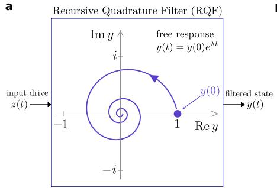
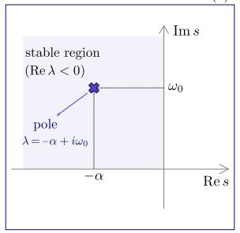
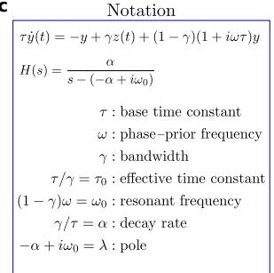
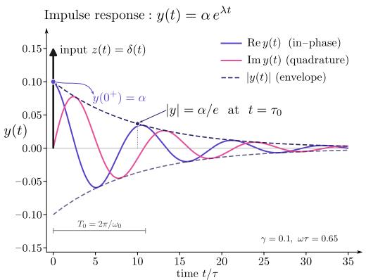
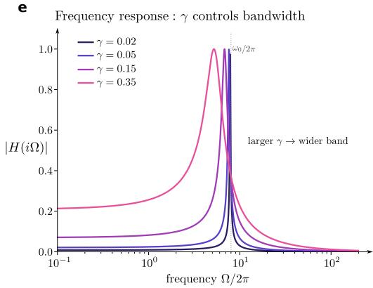
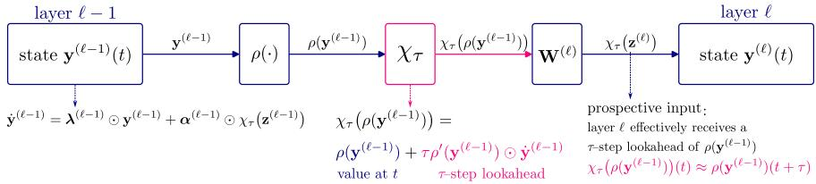
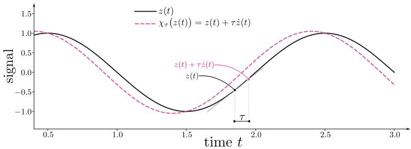

# Prospective Coding Improves Learning in Deep Continuous-Time Recurrent Networks

Shivang Rawat1,∗ Mirko Morello1 Flaviano Morone1,2 David J. Heeger1,2

1 Telepath 2 New York University

shivang@telepath.com

## Abstract

Temporal integration gives continuous-time recurrent networks memory, but in deep stacks it also delays bottom-up signals and attenuates top-down errors. We develop Recursive Quadrature Filters (RQFs), biologically motivated complex-valued temporal filters that are a special case of diagonal state-space models (SSMs), and ask whether this failure mode can be addressed by making each layer’s bottom-up input prospective. Starting from an energy model, we derive the RQF dynamics and show that each RQF is a band-pass filter whose learnable parameters control its tuning frequency and bandwidth. We then make each layer’s bottom-up input prospective using a parameter-free two-tap update that leaves the recurrent transition and parallel scan unchanged. We extend this correction to general diagonal SSMs and show that it mitigates depth-dependent gradient attenuation when temporal gradients are truncated, i.e., spatial-only backpropagation. We evaluate the intervention in RQFs, S5, and ORGaNICs (a nonlinear gated RNN) trained using full backpropagation through time (BPTT) and spatial-only backpropagation. Under full BPTT, prospective variants match or outperform their non-prospective controls in every model and configuration. A non-residual width-32 six-layer RQF reaches 96.09 ± 0.23% accuracy on raw-audio Speech Commands with 31.9k parameters; a width-64 sixlayer RQF reaches 83.56 ± 2.11% on the 16,384-step Path-X task. These results identify RQFs as a parameter-efficient recurrent substrate and prospective-input coding as an input-side correction for deep continuous-time recurrent networks.

## 1 Introduction

Biological neural circuits face a fundamental trade-off between memory and reactivity. A biological neuron is well-modeled as a leaky integrator whose membrane time constant τ confers temporal context but also delays and attenuates fast input changes [1]. When stacked into an L-layer feedforward circuit, this filter cascades, so the effective relaxation time grows roughly as Lτ [2]. The same trade-off is built into recurrent theories of cortical function [3], in which slow recurrent dynamics let the network settle into a representation that combines feedforward drive with prior expectation. This lag also creates a learning problem: when a top-down teaching signal arrives at the output, the activity it should instruct in early layers is already roughly Lτ out of date. Signals that vary on timescales comparable to τ are therefore poorly served by the standard leaky cascade.

This paper contributes a recurrent substrate and an input-side correction. The substrate is the Recursive Quadrature Filter (RQF), a linear dynamical system inspired by neuroscience that is a special case of a diagonal state-space model, so it trains on sequences of tens of thousands of steps with standard machine-learning machinery. The correction drives each layer with a prospective rather than an instantaneous bottom-up signal; it adds no parameters and applies to existing diagonal SSMs as readily as to RQFs.

The biological motivation for this correction comes from prospective firing: under sinusoidally modulated somatic current injection, cortical pyramidal cells can fire at a phase that leads their input, and biophysical models explain this as a firing-rate advance relative to membrane voltage [4, 5]. Apical dendritic stimulation can likewise modulate the soma with little integration lag through dendritic resonance mechanisms [6, 5]. Related prospective responses have been documented in retinal ganglion-cell populations, cerebellar Purkinje cells, and human muscle-spindle afferents [7– 9]. Such phase-leading behavior can be modeled by applying the prospective (or look-ahead) operator [2, 10, 11]

$$
\chi _ { \tau } \equiv 1 + \tau \frac { \mathrm { d } } { \mathrm { d } t }\tag{1}
$$

to the underlying voltage or firing rate. For a first-order membrane filter, $\chi _ { \tau }$ is its exact differential inverse, so applying it cancels the filter’s lag. When interpreted as a time-advance operator, however, it is accurate only to first order: expanding the unit time-shift in τ gives $u ( t + \tau ) \ : = \ : u ( t ) + \tau \dot { u } ( t ) +$ ${ \cal O } ( \tau ^ { 2 } ) = \chi _ { \tau } ( \bar { u ( t ) } ) + { \cal O } ( \tau ^ { 2 } )$ . Thus, $\chi _ { \tau }$ advances a smooth signal by one membrane time constant to first order in τ.

We apply this prospective operator in networks of RQFs, a class of biologically motivated complexvalued temporal filters [12]. We derive RQFs from an energy-based theory of cortical function [3], in which a state parameter tunes a compromise between feedforward sensory drive and an internally generated prior. Taking the prior to be the prospective image of the state under a phase-rotation model collapses the resulting dynamics into a scalar complex-valued band-pass filter with a learnable phase-prior frequency ω and a learnable bandwidth parameter $\gamma$ (Section 2).

It has been suggested that the brain relies on a set of canonical neural microcircuits, across brain regions and modalities, implementing hierarchies of spatial band-pass filtering, output nonlinearities, and spatial pooling that extract and combine features [13–19], much as convolutional neural networks do. RQFs extend this paradigm to extract and combine features over time. Temporal band-pass filters like RQFs have been used to model temporal-frequency selectivity and direction selectivity of neurons in primary visual cortex [12]. The encoding of sound in the cochlea and the auditory nerve can likewise be modeled as a bank of band-pass filters [20].

We prove that scalar RQFs are a special case of single-channel diagonal complex state-space models (SSMs), so an RQF layer is a constrained diagonal SSM with biologically interpretable poles and inherits the parallel-scan and FFT-convolutional training algorithms used for SSMs [21, 22]. This distinguishes RQFs from recent prospective-coding cortical models: Neuronal least-action [10] (NLA) and latent equilibrium [2] use prospective signals for local biological learning, while generalized latent equilibrium [11] (GLE) uses prospective and retrospective operators for online credit assignment in a feedforward architecture. RQFs instead provide a recurrent temporal-filtering primitive compatible with long-sequence SSM training.

We show, both theoretically and empirically, that deep RQF networks improve when each layer’s bottom-up input drive is prospective. Prospective and instantaneous-input RQFs share the same prospective phase-rotation prior via recurrence; they differ only in whether the bottom-up drive is look-ahead-coded. This input-side change is local to each layer, leaves the RQF parameters and state transition unchanged, admits a two-tap discretization applicable to diagonal SSMs (Section 3), and directly affects credit assignment under spatial-only backpropagation. Spatial-only backpropagation treats every earlier recurrent state as a stop-gradient variable and differentiates only through the within-step spatial chain across layers. Under this regime, instantaneous inputs introduce an explicit $( h / \tau ) ^ { L - \ell }$ attenuation (where h is the discretization timestep), while prospective-input coding changes the discretization prefactor of each spatial hop from $O ( h / \tau )$ to $O ( \bar { 1 } )$ as $h / \tau  0$

## Contributions.

• Architecture (machine learning). We introduce RQFs; although motivated by neuroscience, here we develop them for machine-learning applications. We prove that RQFs are a special case of diagonal SSMs (Section 2), making RQF layers compatible with the parallel-scan and FFT-convolution algorithms used for diagonal SSMs and bringing tasks such as the 16,384-step Path-X within reach.

• Prospective input (machine learning). We replace each layer’s instantaneous bottom-up drive with a prospective one and derive the corresponding discretization for any diagonal SSM (Section 3). The implementation adds no parameters, leaves the state transition and parallel scan untouched, and costs only a second input tap; under full BPTT, it yields higher mean test accuracy than the matched control in every configuration.

• Theory (computational neuroscience and machine learning). We prove that under spatialonly backpropagation, instantaneous bottom-up inputs incur a geometric discretizationinduced depth attenuation that prospective-input coding removes (Section 3 and $\mathsf { A p - }$ pendix C).

• Experiments (machine learning). We evaluate prospective input on Speech Commands and Path-X with RQF stacks, S5, and the nonlinear ORGaNICs substrate [23], under full BPTT and spatial-only backpropagation (Section 4).

Scope of contributions. The RQF substrate and the input-side correction are evaluated as machinelearning contributions under standard BPTT; the cortical theory provides their motivation. The third contribution concerns spatial-only backpropagation, in which the recurrence is never differentiated through time. We adopt that regime because it is the one described by our derivation and isolates the effect of the input drive; it is a diagnostic, neither a prerequisite for the machine-learning contribution nor a recommended training procedure. Spatial-only backpropagation is temporally local, but exact error propagation across layers still uses conjugate-transposed forward weights and therefore retains the weight-transport problem. We consequently describe RQFs as a biologically motivated circuit abstraction but do not suggest that the complete training procedure is biologically plausible.

## 2 Recursive Quadrature Filters (RQFs)

The substrate for RQFs is a leaky integrator whose state relaxes toward a convex mixture of the external input and an internally predicted recurrent state:

$$
\tau \dot { y } = - y + \left[ \gamma z + \left( 1 - \gamma \right) \widehat { y } \right] ,\tag{2}
$$

where $y ( t ) \in \mathbb { C }$ is the filter state; $z ( t ) \in \mathbb { C }$ is the input drive; $\tau > 0$ is the base time constant; $\widehat { y }$ is the recurrent prediction; and $\gamma \in ( 0 , 1 )$ controls the balance between input tracking and recurrence. This convex blend mirrors the cortical energy model of Heeger [3]; Appendix A.1 derives Eq. (2) from that energy functional, with $\gamma$ as the state parameter and $\widehat { y }$ as the prior drive.

The recurrent prediction $\widehat { y }$ in Eq. (2) requires a model of how y evolves locally. We take this model to be a phase-rotation prior: the undamped complex oscillator ${ \dot { y } } = \iota \omega y$ , the minimal generator on $\mathbb { C }$ of a single phase-prior frequency $\omega$ . This choice follows the internal-model principle: a system that prospectively tracks a structured signal should contain a model of that signal’s dynamics [24]. Applying the prospective operator $\chi _ { \tau }$ from Eq. (1) to this prior gives

$$
\widehat { y } \triangleq \chi _ { \tau } ( y ) \big | _ { \dot { y } = \iota \omega y } = ( 1 + \iota \omega \tau ) y ,\tag{3}
$$

where $\chi _ { \tau } ( \boldsymbol { y } ( t ) )$ is causal because it uses only the instantaneous activity and its local time derivative. Substituting Eq. (3) into Eq. (2) yields the Recursive Quadrature Filter (RQF), a scalar complexvalued temporal filter governed by

$$
\begin{array} { r } { \tau \dot { y } = - y + \gamma z + \left( 1 - \gamma \right) \left( 1 + \iota \omega \tau \right) y , } \end{array}\tag{4}
$$

where $\omega > 0$ is the learnable phase-prior frequency and $\gamma$ is the learnable bandwidth parameter. The state is complex-valued even when z is real, with its real and imaginary parts forming an inphase/quadrature pair. Defining $\alpha \triangleq \gamma / \tau , \omega _ { 0 } \triangleq ( 1 - \gamma ) \omega$ , and $\lambda \triangleq - \alpha + \iota \omega _ { 0 }$ collapses Eq. (4) into the compact scalar recurrence $\dot { y } = \lambda y + \alpha z ,$ , so the RQF is a stable single-pole complex filter for any $\gamma \in ( 0 , \bar { 1 } ) ( \mathrm { F i g . 1 } )$ . The prospective factor $( 1 + \iota \omega \tau ) y$ sets the local recurrent prediction, whereas the homogeneous state evolves as $y ( t + \Delta ) = e ^ { \lambda \Delta } y ( t )$ when $z = 0$ . Appendix $\mathrm { A } . 2$ derives the transfer function (revealing the band-pass property), quality factor, damped-oscillator form, and the effect of cascading RQFs for fine-tuning the bandwidth.

Multi-layer architecture. A layer of an RQF network bundles $n _ { \ell }$ scalar filters operating in parallel, each with its own phase-prior frequency $\omega _ { i } ^ { ( \ell ) }$ and bandwidth $\gamma _ { i } ^ { ( \ell ) }$ but sharing a common time constant τ. Collecting the parameters into vectors $\boldsymbol { \omega } ^ { ( \ell ) } , \boldsymbol { \gamma } ^ { ( \ell ) } \in \mathbb { R } ^ { n _ { \ell } }$ and writing the layer state as $\mathbf { y } ^ { ( \ell ) } \in \mathbb { C } ^ { n _ { \ell } }$ the layer dynamics are the element-wise vectorization of Eq. (4):

c  

  
d

  
Figure 1: The Recursive Quadrature Filter (RQF): pole, impulse response, and frequency response. An RQF is a scalar complex-valued temporal filter with learnable phase-prior frequency ω and bandwidth parameter γ at a fixed base time constant τ, governed by Eq. (4). The derived quantities are the decay rate $\alpha = \gamma / \tau$ , resonant frequency $\omega _ { 0 } = ( 1 - \gamma ) \omega$ , effective time constant $\tau _ { 0 } = \tau / \gamma$ , and pole $\lambda = - \alpha + \iota \omega _ { 0 }$ . (a) Free response of y in the complex plane, $y ( t ) = y ( 0 ) e ^ { \lambda t }$ (b) The pole lies in the stable region $\mathrm { R e } ( \lambda ) < 0$ for any $\gamma \in ( 0 , 1 )$ . (c) Notation used throughout the paper. (d) Impulse response $y ( t ) = \alpha e ^ { \lambda t }$ to a Dirac drive $z ( t ) = \delta ( t )$ , with in-phase and quadrature components oscillating inside the envelope $| y ( t ) | = \alpha e ^ { - t / \tau _ { 0 } } \left( \gamma = 0 . 1 , \omega \tau = 0 . 6 5 \right)$ . (e) Magnitude response for several values of $\gamma _ { : }$ , showing the transition from sharp resonance to broad integration.

$$
\tau \dot { \mathbf { y } } ^ { ( \ell ) } = - \mathbf { y } ^ { ( \ell ) } + \boldsymbol { \gamma } ^ { ( \ell ) } \odot \mathbf { z } ^ { ( \ell ) } + ( \mathbf { 1 } - \boldsymbol { \gamma } ^ { ( \ell ) } ) \odot ( \mathbf { 1 } + \iota \tau \boldsymbol { \omega } ^ { ( \ell ) } ) \odot \mathbf { y } ^ { ( \ell ) } ,\tag{5}
$$

where $\mathbf { z } ^ { ( \ell ) } \in \mathbb { C } ^ { n _ { \ell } }$ is the bottom-up input drive to the layer; ⊙ denotes the element-wise product; and $\mathbf { 1 } \in \mathbb { R } ^ { n _ { \ell } }$ is the all-ones vector. Defining $\pmb { \alpha } ^ { ( \ell ) } \triangleq \gamma ^ { ( \ell ) } / \tau$ and $\pmb { \lambda } ^ { ( \ell ) } \triangleq - \pmb { \alpha } ^ { ( \ell ) } + \iota ( \mathbf { 1 } - \bar { \gamma } ^ { ( \ell ) } ) \odot \pmb { \omega } ^ { ( \ell ) }$ Eq. (5) collapses to the compact diagonal complex ODE

$$
\dot { \mathbf { y } } ^ { ( \ell ) } = \lambda ^ { ( \ell ) } \odot \mathbf { y } ^ { ( \ell ) } + \pmb { \alpha } ^ { ( \ell ) } \odot \mathbf { z } ^ { ( \ell ) } .\tag{6}
$$

To build a deep network, we stack L layers. The input drive to layer ℓ is

$$
\begin{array} { r } { { \bf z } ^ { ( \ell ) } = { \bf W } ^ { ( \ell ) } { \bf x } ^ { ( \ell ) } , \qquad { \bf x } ^ { ( \ell ) } = \rho \left( { \bf y } ^ { ( \ell - 1 ) } \right) , } \end{array}\tag{7}
$$

where $\rho : \mathbb { C } ^ { n _ { \ell - 1 } } \to \mathbb { C } ^ { n _ { \ell - 1 } }$ is an activation function (also called an output nonlinearity); $\mathbf { x } ^ { ( \ell ) } \in \mathbb { C } ^ { n _ { \ell - 1 } }$ is the layer input to layer $\ell ,$ with the boundary $\mathbf { x } ^ { ( 1 ) } \triangleq \mathbf { r } _ { \mathrm { i n } } ; \mathbf { W } ^ { ( \ell ) } \in \mathbb { C } ^ { \bar { n _ { \ell } } \times n _ { \ell - 1 } }$ is a complex inter-layer weight matrix; and $\mathbf { z } ^ { ( \bar { \ell } ) } \in \mathbb { C } ^ { n _ { \ell } }$ is the post-weight bottom-up input drive. The activation function $\rho$ is not required to be holomorphic: nothing in the layer dynamics or in the discretization of Section 3 relies on complex differentiability, and Wirtinger calculus supplies gradients for any real-differentiable map of (Re(y), Im(y)). The default is the pointwise family $[ \rho ( \mathbf { \bar { y } } ) ] _ { i } = \rho _ { 0 } ( y _ { i } )$ , with the canonical choice being the split-ReLU

$$
\rho _ { 0 } ( y ) = \mathrm { m a x } \{ 0 , \mathrm { R e } ( y ) \} + \iota \mathrm { m a x } \{ 0 , \mathrm { I m } ( y ) \} ,\tag{8}
$$

a Prospective input between layers  
  
b The prospective operator χτ

  
Figure 2: Prospective-input coding in multi-layer RQFs. The prospective-input variant replaces the bottom-up post-nonlinearity signal entering layer ℓ with its τ-step look-ahead $\chi _ { \tau } ( \rho ( \mathbf { y } ^ { ( \ell - 1 ) } ) )$ defined in Eq. (15); the instantaneous-input baseline feeds $\rho ( \mathbf { y } ^ { ( \ell - 1 ) } )$ directly into $\mathbf { W } ^ { ( \ell ) }$ . (a) The state $\mathbf { y } ^ { ( \ell - 1 ) }$ is passed through the activation $\rho ,$ advanced by the prospective operator $\chi _ { \tau }$ , and mixed by the inter-layer weight $\mathbf { W } ^ { \left( \ell \right) }$ to form the bottom-up drive $\mathbf { z } ^ { ( \ell ) }$ . (b) Action of $\chi _ { \tau }$ on a sinusoidal signal $z ( t )$ (black). The look-ahead $\chi _ { \tau } ( z ( t ) ) = z ( t ) + \tau \dot { z } ( t )$ (pink, dashed) advances z by approximately τ by extrapolating along the local tangent.

which applies a real-valued rectifier independently to the in-phase and quadrature components and is non-holomorphic by construction. The RQF experiments use no normalization, although layer normalization, filter normalization or other pointwise or channel-coupling nonlinearities are admissible.

Discretization. For the implementation, we discretize the continuous-time layer dynamics in Eq. (6) with a zero-order hold (ZOH) on the bottom-up drive $\mathbf { z } ^ { ( \ell ) }$ . ZOH treats $\mathbf { z } ^ { ( \ell ) }$ as piecewise constant on each integration interval $[ t _ { n } , t _ { n + 1 } ]$ , with the constant value denoted by $\mathbf { z } _ { n + 1 } ^ { ( \ell ) }$ , and integrates the resulting forced linear ODE in closed form. It is the default discretization for diagonal SSMs, adopted by DSS, S4D, S5, and Mamba [22, 21, 25, 26], because it (i) is unconditionally stable for any pole in the open left half-plane, meaning that high-Q neurons impose no extra step-size constraint; (ii) integrates the linear part exactly, retaining the full $e ^ { \lambda h }$ response at finite $h ;$ and (iii) agrees with forward Euler to first order in $\dot { h } / \tau$ , with an ${ \cal O } ( ( h / \tau ) ^ { 2 } )$ difference. ZOH discretization of Eq. (6) yields the diagonal complex affine recurrence

$$
\begin{array} { r } { \mathbf { y } _ { n + 1 } ^ { ( \ell ) } = \bar { \mathbf { A } } _ { h } ^ { ( \ell ) } \odot \mathbf { y } _ { n } ^ { ( \ell ) } + \bar { \mathbf { B } } _ { h } ^ { ( \ell ) } \odot \mathbf { z } _ { n + 1 } ^ { ( \ell ) } , } \end{array}\tag{9}
$$

where

$$
\bar { \mathbf { A } } _ { h } ^ { ( \ell ) } \triangleq e ^ { \mathbf { A } ^ { ( \ell ) } h } , \qquad \bar { \mathbf { B } } _ { h } ^ { ( \ell ) } \triangleq \frac { \boldsymbol { \alpha } ^ { ( \ell ) } } { \mathbf { \lambda } ^ { ( \ell ) } } \odot \left( \bar { \mathbf { A } } _ { h } ^ { ( \ell ) } - \mathbf { 1 } \right) ,\tag{10}
$$

and where $\mathbf { z } _ { n + 1 } ^ { ( \ell ) } = \mathbf { W } ^ { ( \ell ) } \rho ( \mathbf { y } _ { n + 1 } ^ { ( \ell - 1 ) } )$ samples the bottom-up input drive in $\mathrm { E q . ~ } ( 7 )$ at $t _ { n + 1 }$ . The coefficients $\bar { \mathbf { A } } _ { h } ^ { ( \ell ) }$ and $\bar { \mathbf B } _ { h } ^ { ( \ell ) }$ depend only on the parameters $( \gamma ^ { ( \ell ) } , \omega ^ { ( \ell ) } )$ , the base time constant $\tau _ { : }$ , and the step size $h ,$ and can be precomputed once per parameter update and reused across all time steps. The full derivation is given in Appendix B.1.

RQFs are a special case of diagonal state-space models. $\mathbf { A }$ continuous-time linear state-space model (SSM) maps an input signal $\mathbf { x } ( t ) \in \dot { \mathbb { R } } ^ { U }$ through a latent state $\mathbf { y } ( t ) \in \mathbb { R } ^ { P }$ to an output • $\mathbf { \boldsymbol { \mathsf { p } } } ( t ) \in \dot { \mathbb { R } } ^ { M }$ via

$$
\dot { \mathbf { y } } ( t ) = \mathbf { A } \mathbf { y } ( t ) + \mathbf { B } \mathbf { x } ( t ) , \qquad \mathbf { o } ( t ) = \mathbf { C } \mathbf { y } ( t ) + \mathbf { D } \mathbf { x } ( t ) ,\tag{11}
$$

with state matrix $\mathbf { A } \in \mathbb { R } ^ { P \times P }$ , input matrix $\mathbf { B } \in \mathbb { R } ^ { P \times U }$ , output matrix $\mathbf { C } \in \mathbb { R } ^ { M \times P }$ , and feedthrough $\mathbf { D } \in \mathbb { R } ^ { M \times U } \ [ 2 7 , 2 5 ]$ . All SSMs share this template but differ in how the recurrent core is parameterized and how the feature channels are coupled. S4 applies a bank of single-input single-output (SISO)

SSMs across feature channels [27]; DSS and S4D replace S4’s structured state matrix with diagonal variants [22, 21]; S5 uses one multi-input multi-output (MIMO) SSM whose effective recurrent matrix is complex-valued and diagonal [25]; the LRU uses a discrete diagonal linear recurrence with dense input and output projections [28]; and Mamba retains a diagonal state transition while making the discretized parameters input-dependent [26]. In the fixed-parameter diagonal case, the recurrent core can be written directly in a complex diagonal form,

$$
\dot {  { \widetilde { \mathbf { y } } } } ( t ) = \mathbf { A }  { \widetilde { \mathbf { y } } } ( t ) + \mathbf { B }  { \mathbf { x } } ( t ) , \qquad \mathbf { o } ( t ) = \mathbf { C }  { \widetilde { \mathbf { y } } } ( t ) + \mathbf { D }  { \mathbf { x } } ( t ) ,\tag{12}
$$

with $\pmb { \Lambda } \in \mathbb { C } ^ { P \times P }$ diagonal, $\mathbf { B } \in \mathbb { C } ^ { P \times U }$ , and $\mathbf { C } \in \mathbb { C } ^ { M \times P }$ . ZOH discretization at step h gives $\widetilde { \mathbf { y } } _ { k + 1 } = \bar { \mathbf { A } } _ { h } \widetilde { \mathbf { y } } _ { k } + \bar { \mathbf { B } } _ { h } \mathbf { x } _ { k + 1 }$ , with

$$
\bar { \bf A } _ { h } \ \triangleq \ e ^ { \pmb { \Lambda } h } , \qquad \bar { \bf B } _ { h } \ \triangleq \ \{ \pmb { \Lambda } ^ { - 1 } \big ( \bar { \bf A } _ { h } - { \bf I } \big ) { \bf B } .\tag{13}
$$

The temporal modes are controlled by the entries of $\mathbf { \Lambda } \Lambda \colon$ an eigenvalue $\lambda _ { p } \in \mathbb { C }$ in the open left half-plane produces a damped oscillation at angular frequency $\mathrm { I } \bar { \mathrm { m } } ( \lambda _ { p } )$ with decay rate $| \mathrm { R e } ( \bar { \lambda } _ { p } ) |$

The RQF layer is the following constrained special case of Eq. (12), obtained by substituting the layer drive from Eq. (7) into Eq. (6):

$$
\dot { \mathbf { y } } ^ { ( \ell ) } = \mathrm { d i a g } ( \mathbf { \lambda } ^ { ( \ell ) } ) \mathbf { y } ^ { ( \ell ) } + \mathrm { d i a g } ( \pmb { \alpha } ^ { ( \ell ) } ) \mathbf { W } ^ { ( \ell ) } \mathbf { x } ^ { ( \ell ) } .\tag{14}
$$

Thus, the SSM input x(t) corresponds to the RQF layer input $\mathbf { x } ^ { ( \ell ) }$ , and the dense input projection is the inter-layer weight $\mathbf { W } ^ { ( \ell ) }$ . In the canonical SSM notation of Eq. (12), the full continuous-time input matrix is $\mathbf { B } = \mathrm { d i a g } ( \pmb { \alpha } ^ { ( \ell ) } ) \mathbf { W } ^ { ( \ell ) }$ ; the diagonal factor is not an extra SSM parameter but the RQF input gain already present in Eq. (6). The RQF-specific constraint is that $\pmb { \alpha } ^ { ( \ell ) } = \pmb { \gamma } ^ { ( \ell ) } / \tau$ and $\pmb { \lambda } ^ { ( \ell ) } = - \pmb { \alpha } ^ { ( \ell ) } + \iota \big ( \mathbf { 1 } - \pmb { \gamma } ^ { ( \ell ) } \big ) \odot \pmb { \omega } ^ { ( \ell ) }$ , which identifies the channel input gain with the inverse decay timescale $1 / \tau _ { 0 } ^ { ( \ell ) }$ . The inclusion is one-way: a general diagonal SSM need not satisfy this pole–input-gain coupling and therefore need not be an RQF. The remaining SSM machinery transfers without modification: any output projection $\mathbf { C } \in \mathbb { C } ^ { M \times n _ { \ell } }$ and feedthrough $\mathbf { D } \in \mathbb { C } ^ { M \times \mathbf { \breve { U } } }$ may be appended to read out from $\mathbf { y } ^ { ( \ell ) }$ , and the per-block residual connections used in S4, S5, and Mamba stacks are admissible at the layer level. Unless stated otherwise, we set $\mathbf { C } = \mathbf { I }$ and $\mathbf { D = 0 }$ throughout, so each layer’s output is its own complex state $\mathbf { y } ^ { ( \ell ) }$ and inter-layer mixing is delegated to $\bar { \mathbf { W } ^ { ( \ell + 1 ) } }$ residual connections are treated as an explicit configuration choice in our experiments (Section 4).

## 3 Prospective-input coding in multi-layer RQFs

We use the terms instantaneous-input and prospective-input to refer only to the bottom-up input drive from layer $\ell - 1$ to layer ℓ. Both variants retain the RQF recurrent prediction $\widehat { y } = ( 1 + \overset { \cdot } { \iota } \omega \bar { \tau } ) y$ from Section $^ { 2 ; }$ the comparison changes the input path, not the RQF dynamics. With the notation of Eq. (7), the instantaneous choice uses $\mathbf { x } ^ { ( \ell ) } = \rho ( \mathbf { \bar { y } } ^ { ( \ell - 1 ) } )$ , while the prospective-input alternative applies the look-ahead operator before the inter-layer weights act (Fig. 2b):

$$
\widetilde \mathbf { x } ^ { ( \ell ) } \triangleq \chi _ { \tau } \Big ( \mathbf { x } ^ { ( \ell ) } \Big ) = \rho \Big ( \mathbf { y } ^ { ( \ell - 1 ) } \Big ) + \tau \dot { \rho } \Big ( \mathbf { y } ^ { ( \ell - 1 ) } \Big ) , \qquad \mathbf { z } _ { \boldsymbol { x } } ^ { ( \ell ) } = \mathbf { W } ^ { ( \ell ) } \widetilde \mathbf { x } ^ { ( \ell ) } ,\tag{15}
$$

where the dot denotes the time derivative. Since $\mathbf { W } ^ { ( \ell ) }$ is fixed over the integration interval, applying $\chi _ { \tau } \cos \mathbf { x } ^ { ( \ell ) }$ and then multiplying by $\mathbf { W } ^ { ( \ell ) }$ is equivalent in the forward pass to applying $\chi _ { \tau } \mathfrak { t o } \mathbf { z } ^ { ( \ell ) }$ ; the discretization below uses this compact input drive notation.

Discretization. Applying the ZOH update to the prospective input drive $\chi _ { \boldsymbol { \tau } } \left( \mathbf { z } ^ { ( \ell ) } \right)$ gives the following recurrence; Appendix B.2 provides the derivation:

$$
\begin{array} { r } { \begin{array} { r } { \mathbf { y } _ { n + 1 } ^ { ( \ell ) } = \bar { \mathbf { A } } _ { h } ^ { ( \ell ) } \odot \mathbf { y } _ { n } ^ { ( \ell ) } + \left\lceil \bar { \mathbf { B } } _ { h } ^ { ( \ell ) } + \gamma ^ { ( \ell ) } \odot \bar { \mathbf { A } } _ { h } ^ { ( \ell ) } \right\rceil \odot \mathbf { z } _ { n + 1 } ^ { ( \ell ) } - \gamma ^ { ( \ell ) } \odot \bar { \mathbf { A } } _ { h } ^ { ( \ell ) } \odot \mathbf { z } _ { n } ^ { ( \ell ) } , } \end{array} } \end{array}\tag{16}
$$

where $\mathbf { z } _ { k } ^ { ( \ell ) } = \mathbf { W } ^ { ( \ell ) } \mathbf { x } _ { k } ^ { ( \ell ) }$ and $\mathbf { x } _ { k } ^ { ( \ell ) } = \rho ( \mathbf { y } _ { k } ^ { ( \ell - 1 ) } )$ . In standard signal-processing terms, Eq. (16) is a first-order IIRfilter with a two-tapfeedforward path: the recurrence on $\mathbf { y } ^ { ( \ell ) }$ has a single feedback pole $\bar { \mathbf { A } } _ { h } ^ { ( \ell ) }$ , while the compact drive enters through weighted taps at $\mathbf { z } _ { n + 1 } ^ { ( \ell ) }$ 1 and $\mathbf { z } _ { n } ^ { ( \ell ) }$

This form permits a concrete comparison with the exponential-trapezoidal rule of Mamba-3 [29]. Writing $\mathbf { v } _ { t } = \mathbf { B } _ { t } \mathbf { x } _ { t }$ , that rule uses

$$
\mathbf { h } _ { t } = \alpha _ { t } \odot \mathbf { h } _ { t - 1 } + ( 1 - \lambda _ { t } ) \Delta _ { t } \alpha _ { t } \odot \mathbf { v } _ { t - 1 } + \lambda _ { t } \Delta _ { t } \mathbf { v } _ { t } , \qquad \lambda _ { t } \in [ 0 , 1 ] ,\tag{17}
$$

Table 1: RQF on Speech Commands. Test accuracy for non-residual width-64 stacks trained with (a) full BPTT and (b) spatial-only backpropagation.
<table><tr><td colspan="4">Raw audio</td><td colspan="3">MFCC</td></tr><tr><td></td><td>Depth Params</td><td>Prospective</td><td>Non-pros.</td><td>Params</td><td>Prospective</td><td>Non-pros.</td></tr><tr><td colspan="7">(a) Full BPTT</td></tr><tr><td>2</td><td>52.3k</td><td> $9 4 . 9 4 { \pm } 0 . 1 0 $ </td><td> $9 4 . 4 0 { \pm } 0 . 1 7 \ $ </td><td>53.5k</td><td> $9 6 . 4 2 { \pm } 0 . 2 6 $ </td><td> $9 6 . 3 0 { \pm } 0 . 3 3$ </td></tr><tr><td>4</td><td>68.9k</td><td> $9 6 . 2 7 { \pm } 0 . 1 6$ </td><td> $9 5 . 7 7 { \scriptstyle \pm 0 . 2 2 }$ </td><td>70.2k</td><td> $9 6 . 6 5 { \pm } 0 . 2 4 $ </td><td> $9 6 . 4 1 { \pm } 0 . 1 4$ </td></tr><tr><td>6</td><td>85.6k</td><td> $9 6 . 3 5 { \pm } 0 . 2 0 $ </td><td> $9 6 . 1 3 { \pm } 0 . 1 2$ </td><td>86.8k</td><td> $9 6 . 7 0 { \pm } 0 . 1 9$ </td><td> $9 6 . 4 9 { \pm } 0 . 0 7$ </td></tr><tr><td colspan="7">(b) Spatial-only backpropagation</td></tr><tr><td>2</td><td>N/A</td><td> $\bar { \mathrm { N } } / \mathrm { A }$ </td><td> $\mathrm { N } / \mathrm { A }$ </td><td>53.5k</td><td> $9 4 . 8 9 { \pm } 0 . 2 0 $ </td><td> $9 4 . 2 0 { \pm } 0 . 2 8 $ </td></tr><tr><td>4</td><td>68.9k</td><td> $8 4 . 7 0 { \pm } 3 . 1 7$ </td><td> $8 1 . 7 0 { \pm } 1 . 9 6$ </td><td>70.2k</td><td> $9 2 . 6 3 { \pm } 0 . 8 5 $ </td><td> $8 9 . 0 4 { \pm } 0 . 8 3 $ </td></tr><tr><td>6</td><td>85.6k</td><td> $8 2 . 9 2 { \pm } 5 . 4 2$ </td><td> $7 5 . 3 4 \pm 1 . 1 8$ </td><td>86.8k</td><td> $9 1 . 5 5 { \pm } 0 . 7 6 $ </td><td> $7 6 . 3 8 { \pm } 1 . 5 7$ </td></tr></table>

so its endpoint weights form a convex blend. Prospective coding instead discretizes $\mathbf { B } [ \mathbf { x } ( t ) + \tau \dot { \mathbf { x } } ( t ) ]$ and gives the signed previous-input tap $- \tau \bar { \mathbf { A } } _ { h } \mathbf { B } \mathbf { x } _ { n }$ (Appendix B.3). For a matched scalar real LTI system with $\Delta _ { t } = h ,$ , matching even this previous-input coefficient in Eq. (17) would require $\lambda _ { t } = 1 + \tau / h > 1$ . The constructions therefore share a two-tap form but are not equivalent, and prospective input is not a special case of Mamba-3’s admissible interpolation.

Prospective input adds no trainable parameters to an RQF layer and leaves its diagonal state transition and associative scan unchanged. For a sequence of length T, layer ℓ maps $n _ { \ell - 1 }$ inputs to $n _ { \ell }$ RQF channels and computes the dense drive $\mathbf { z } _ { t } ^ { ( \ell ) } = \mathbf { W } ^ { ( \ell ) } \mathbf { x } _ { t } ^ { ( \ell ) }$ in $O ( T n _ { \ell } n _ { \ell - 1 } )$ work under either input rule. Prospective-input coding adds $O ( T n _ { \ell } )$ element-wise computation and one lagged read of the already materialized drive, but no additional full-sequence activation storage; streaming execution needs only an $O ( n _ { \ell } )$ rolling buffer for the previous drive. The diagonal RQF scan remains $O ( T n _ { \ell } )$ with ${ \cal O } ( \log T )$ parallel depth. Thus, the asymptotic complexity of both inference and full BPTT is unchanged, although the second tap adds a small lower-order operation.

Why prospective-input coding improves the spatial gradient path. Spatial-only backpropagation freezes the temporal recurrence at the previous step and leaves only the within-step chain through depth. An instantaneous-input Euler step sends each inter-layer error through $\mathbf { g } _ { \mathrm { n p } } = ( h / \tau ) \boldsymbol { \gamma }$ , whereas prospective input uses ${ \bf g } _ { + } = ( 1 + h / \tau ) \gamma$ . Therefore, as $h / \tau  0$ at fixed depth and fixed parameters, the discretization prefactor multiplying each spatial hop changes from $\dot { O } ( h / \tau )$ to ${ \cal O } ( 1 )$ and the explicit $( h / \tau ) ^ { L - \ell }$ factor disappears. This statement concerns that prefactor only: the common product of activation slopes, weight norms, and damping gains may still attenuate with depth, and the upper bounds in Appendix C do not guarantee an O(1) complete gradient. The implemented ZOH update has the same small-h leading-order coefficients. Spatial-only backpropagation is local in time but still uses $\mathbf { W } ^ { \dagger }$ to propagate exact adjacent-layer errors, so it retains the weight-transport problem and is used here only to isolate the analyzed path.

## 4 Experiments1

RQFs are band-pass filters by construction (Appendix A.2), so speech provides a natural first test of whether prospective-input coding improves learning through the RQF cascade. We use the 10-class subset of Google Speech Commands v0.02 [30], comprising one-second utterances of the keywords yes, no, up, down, left, right, on, off, stop, and go. We consider two representations of each utterance: the raw waveform, supplied as a sequence of 16,000 scalar samples, and 20 Mel-frequency cepstral coefficients (MFCCs), supplied as a sequence of 161 frames. Thus, the two representations pose the same classification problem at very different sequence lengths and levels of temporal abstraction.

We contrast two regimes for assigning gradient credit through the recurrence. Full backpropagation through time (BPTT) differentiates through the complete recurrent trajectory. Spatial-only backpropagation instead detaches every previous recurrent state and retains only the within-step chain through depth. We use the latter as a mechanistic diagnostic, rather than as the recommended optimizer, because it removes temporal gradient credit and directly exposes the spatial attenuation analyzed in Section 3.

Table 2: αP-S5 versus native S5, full BPTT. Test accuracy on Speech Commands for residual S5 blocks with 64 units per layer.
<table><tr><td rowspan="2"></td><td colspan="3">Raw audio</td><td colspan="3">MFCC</td></tr><tr><td>Depth Params</td><td>αP-S5</td><td>Native S5</td><td>Params</td><td> $\alpha { \mathrm { P } } { \cdot } { \mathrm { S } } 5$ </td><td>Native S5</td></tr><tr><td>2</td><td>48.9k</td><td> $9 5 . 5 5 { \pm } 0 . 3 9 $ </td><td> $9 4 . 9 4 { \pm } 0 . 4 2 $ </td><td>50.1k</td><td> $9 6 . 5 2 { \pm } 0 . 2 0 $ </td><td> $9 5 . 8 9 { \pm } 0 . 3 8 $ </td></tr><tr><td>4</td><td>74.2k</td><td> $9 6 . 0 6 { \pm } 0 . 3 5 $ </td><td> $9 5 . 9 6 \pm 0 . 2 7$ </td><td>75.4k</td><td> $9 6 . 4 0 { \pm } 0 . 1 7 \ $ </td><td> $9 6 . 3 1 { \pm } 0 . 2 5 $ </td></tr><tr><td>6</td><td>99.5k</td><td> $9 6 . 3 7 { \pm } 0 . 3 1 $ </td><td> $9 6 . 2 1 { \pm } 0 . 2 3 $ </td><td>100.7k</td><td> $9 6 . 4 1 { \pm } 0 . 2 0 $ </td><td> $9 6 . 3 6 { \pm } 0 . 1 4$ </td></tr></table>

Table 3: Discrete ORGaNICs on MFCC Speech Commands. Residual width-64 models.
<table><tr><td></td><td></td><td colspan="2">Full BPTT</td><td colspan="2">Spatial-only</td></tr><tr><td></td><td>Depth Params</td><td>Prospective</td><td> $\mathrm { { N o n - p r o s . } }$ </td><td>Prospective</td><td>Non-pros.</td></tr><tr><td>2</td><td>58.3k</td><td> $9 3 . 2 8 { \pm } 0 . 3 7 $ </td><td> $9 2 . 1 0 { \pm } 0 . 2 1 $ </td><td> $7 9 . 8 8 \pm 1 . 2 8 $ </td><td> $8 1 . 4 9 { \pm } 1 . 4 6 $ </td></tr><tr><td>4</td><td>124.3k</td><td> $9 3 . 2 1 { \pm } 0 . 5 9$ </td><td> $9 1 . 9 1 { \pm } 0 . 5 3 $ </td><td> $8 2 . 6 1 { \pm } 1 . 2 1 $ </td><td> $8 1 . 6 7 { \pm } 0 . 8 8 $ </td></tr><tr><td>6</td><td>190.3k</td><td> $9 1 . 9 2 { \pm } 0 . 1 9$ </td><td> $9 1 . 9 2 { \pm } 0 . 1 1 $ </td><td> $8 3 . 4 3 { \pm } 1 . 7 3 $ </td><td> $8 0 . 5 6 { \pm } 1 . 4 1 $ </td></tr></table>

The cleanest test of this analysis is the RQF stack itself. We therefore begin with non-residual RQF models of depth $L \in \{ 2 , 4 , 6 \}$ and width $n \in \{ 3 2 , 6 4 \}$ , using split-ReLU between layers and no normalization or gating. Avoiding residual connections leaves no bypass around the recurrent substrate, so changes in spatial credit flow are attributed to the input drive. Within every RQF comparison, the prospective and non-prospective variants match in architecture, optimizer, schedule, seeds, and parameter count; the look-ahead scale and base time constant are both $\tau = 5 h$ . All tables report test accuracy as the mean ± sample standard deviation over five seeds, and Appendix E gives the complete parameterization and training protocol.

Under full BPTT, prospective-input coding raises mean test accuracy in all matched depth, width, and feature comparisons (Tables 1 and 5). The smallest raw-audio models reach $9 4 . 5 \bar { 9 } \pm 0 . 2 8 \%$ 95.66 ± 0.23%, and 96.09 ± 0.23% at two, four, and six layers, respectively, while using only 23.5k–31.9k parameters (Table 5). The spatial-only runs reveal the predicted depth dependence more clearly (Table 1): on MFCC inputs, the prospective advantage grows from 0.69 to 3.59 to 15.17 points as depth increases.

The direct gradient measurements connect this behavioral result to the analysis. Under spatial-only backpropagation, prospective inputs produce larger spatial per-hop gains and early-layer weightgradient norms than instantaneous inputs. Thus, the advantage of prospective input is evident when learning depends on the spatial path isolated by the theory (Appendix D.2; Tables 7 and 8).

We next test whether the prospective construction transfers to a conventional residual SSM by comparing αP-S5 with native S5 [25]. We define αP-S5 by scaling each row of the learned S5 input matrix with the corresponding native-clock pole decay rate $\alpha _ { p } = - \mathrm { R e } ( \lambda _ { p } ) , \mathrm { i . e . , } \mathbf { B } _ { c } = \mathrm { d i a g } ( \alpha ) \widetilde { \mathbf { B } }$ Prospective input uses the shared physical look-ahead horizon $\tau = 5 h$ , matching the RQF models. Appendix E.3 and Eq. (E.11) give the complete architecture and discretization. The mean test accuracy of αP-S5 is higher at every tested depth, width, and input type (Tables 2 and 6); because αP-S5 also rescales the input matrix, this comparison tests the complete construction rather than the second tap alone. These experiments also place the minimal RQF architecture in context. At width 32, the RQF is more accurate than αP-S5 at every raw-audio depth while using fewer parameters; at six layers, it reaches $9 6 . 0 9 \pm 0 . 2 3 \%$ with 31.9k parameters, compared with $\bar { 9 5 . 0 6 } \pm \bar { 0 . 9 9 \% }$ with 40.9k for αP-S5 (Tables 5 and 6).

To determine whether the effect depends on a linear RQF or SSM recurrence, we also apply the input correction to discrete residual ORGaNICs, a nonlinear recurrent substrate with dynamic, recurrent normalization [23, 31]. Prospective-input coding improves the full BPTT mean at two and four layers and ties at six layers. Under spatial-only backpropagation, the prospective model improves at four and six layers (Table 3). The correction therefore transfers beyond the linear RQF core.

Speech is well matched to a bank of temporal band-pass filters, but it does not establish whether the same minimal RQF architecture can learn structure that is neither acoustic nor naturally localized in frequency. We therefore turn to Path-X from Long Range Arena [32], a binary classification task formed by flattening

Table 4: LRA Path-X, full BPTT. Width-64 RQFs on the 16,384-step task (chance: 50%).
<table><tr><td></td><td>Depth Prospective Non-pros.</td><td></td></tr><tr><td>4</td><td> $8 2 . 1 9 { \pm } 0 . 8 8 $ </td><td> $8 1 . 1 4 { \pm } 1 . 0 0 $ </td></tr><tr><td>6</td><td> $8 3 . 5 6 { \pm } 2 . 1 1 $ </td><td> $8 1 . 6 3 { \pm } 0 . 8 0$ </td></tr></table>

a 128 × 128 image into a 16,384-step sequence whose relevant endpoints can be separated across the full input. We retain the forward-only, non-residual RQF model, set the width to 64, and train with full BPTT using a Path-X-specific optimization schedule (Appendix E.4). The four-layer prospective and non-prospective models reach 82.19 ± 0.88% and 81.14 ± 1.00%, respectively; at six layers, they reach 83.56 ± 2.11% and 81.63 ± 0.80% (Table 4). Therefore, without bidirectionality, normalization, gating, or an expanded state, the minimal RQF stack learns a fully non-local 16,384-step task more than 30 points above chance. Making the input prospective leads to a more accurate model.

## 5 Related work

Prospective coding in recurrent neural circuits. Prospective coding has been used to address timing mismatch and credit assignment in biologically motivated learning rules. Latent equilibrium uses the look-ahead variable u + τu˙ to recover fast feedforward computation and local error propagation [2]. Neuronal least-action formulates a least-action principle over future-discounted voltages, yielding prospective firing rates and prospective somato-dendritic mismatch errors [10]. Generalized latent equilibrium separates retrospective membrane integration from prospective output dynamics, yielding local spatio-temporal credit assignment [11]. Recent work has also identified cellular mechanisms for prospective and retrospective firing [5] and framed prospective neurons as a solution to teaching-signal synchronization [33]. Our work complements these circuit theories by showing that prospectivity can also serve as an input-side architectural addition for deep recurrent networks.

Normalization, ORGaNICs, and quadrature dynamics. The RQF construction also belongs to a line of recurrent cortical circuit models in which dynamics, prediction, and normalization are coupled. Heeger [3] modeled neural activity as a compromise between feedforward drive, feedback drive, and prior drive, with prediction over time implemented by recursive quadrature pairs. ORGaNICs extend this idea to gated recurrent neural integrator circuits with dynamic normalization [23], a canonical neural computation [18]. Most prior ORGaNICs work has focused on stability and normalization [31, 34, 35]; RQFs were also combined with ORGaNICs to model temporal-frequency selectivity and direction selectivity of neurons in primary visual cortex [12]. The RQF is the corresponding single-channel complex primitive, whose complex state carries the quadrature pair.

Credit assignment and trainability. The trainability problem we study is related to, but distinct from, the classical vanishing-gradient problem in RNNs, which arises from products of recurrent Jacobians through time [36]. Online alternatives such as RTRL avoid reverse-time unrolling but introduce large sensitivity states [37]; recent work makes this more tractable by exploiting independent recurrent modules across layers [38]. Equilibrium propagation, Lagrangian extensions, and Hamiltonian echo methods instead recover gradient information from the response or time reversal of physical dynamical systems [39–42]. Our learning mode of spatial-only backpropagation removes reverse-time temporal credit but does not solve the separate weight-transport problem across layers.

State-space models and discretization upgrades. SSMs have made diagonal recurrent substrates practical for long sequences. S4 introduced efficient structured state-space layers [27], while DSS and S4D showed that complex diagonal state matrices can retain much of this performance with simpler implementations [22, 21]. S5 and LRU refine this family through MIMO scans and carefully parameterized linear recurrences [25, 28]. Mamba addresses a different limitation by making discretized parameters input-dependent [26]. We deliberately keep the parameters input-independent so that the prospective-input intervention and its gradient scaling can be isolated. Mamba-3 also uses two input taps, but its convex endpoint interpolation is analytically distinct from the signed prospective difference (Section 3) [29].

## 6 Discussion

Takeaways for machine learning. Prospective-input coding is a two-tap change to a diagonal SSM’s input path that adds no parameters and preserves the parallel scan. Prospective RQFs yield higher mean test accuracy than their matched controls in all configurations trained with full BPTT; the prospective $\alpha { \mathrm { P } } { \cdot } { \mathrm { S } } 5$ construction likewise exceeds native S5 in all comparisons. Separately, RQFs are a special case of diagonal SSMs with clear advantages: a stack of these biologically motivated filters, carrying no normalization, no gating, and no residual path, is more accurate than S5 at every depth on raw audio while using fewer parameters.

Takeaways for computational neuroscience. Prospective firing has been measured in biological neurons, and the look-ahead operator that models it exactly inverts a first-order membrane low-pass filter. Our results give that inverse a specific role: carrying a teaching signal through a deep cascade of leaky integrators. The evidence is mechanistic rather than only behavioral. Under spatial-only backpropagation in a deep recurrent network, we measure the error gain surviving each backward hop across layers, and a prospective drive preserves several times more of it than an instantaneous one. The consequence is that temporally local learning reaches a new scale: a six-layer stack that never differentiates its recurrence through time reaches 83% on 16,000-step raw audio, far longer than the sequences on which the local rules of NLA and GLE have been demonstrated.

Limitations. The prospective-input correction is not directly applicable to discrete-time gated RNNs such as LSTMs and GRUs [43, 44]. The operator $\chi _ { \tau } = 1 + \tau \mathrm { d } / \mathrm { d } t$ is defined on a continuous-time trajectory and uses τ as an intrinsic integration timescale, whereas standard LSTMs and GRUs are specified by per-step algebraic update equations. A discrete architecture can be embedded in many possible continuous flows, but without such a substrate, there is no canonical derivative or effective time constant to invert. Our proof isolates the linear RQF substrate under spatial-only backpropagation. Nonlinear activations, residual connections, normalization layers, input-dependent parameters, and imperfect choices of the look-ahead scale can all change the size of the empirical gain. Finally, we did not attempt to maximize performance in this paper; future work should learn or adapt the effective time constants, use multi-timescale look-ahead operators, optimize the pole initialization, and test residual and normalization choices.

Selective RQFs and future work. Mamba makes state-space parameters input-dependent, whereas the present controlled setting uses fixed γ and ω. A selective extension could use

$$
\begin{array} { r l } & { \gamma _ { t } = \gamma _ { \operatorname* { m i n } } + ( \gamma _ { \operatorname* { m a x } } - \gamma _ { \operatorname* { m i n } } ) \ \mathrm { s i g m o i d } ( g _ { \gamma } ( \mathbf { x } _ { t } ) ) , } \\ & { \omega _ { t } = \omega _ { \operatorname* { m i n } } + ( \omega _ { \operatorname* { m a x } } - \omega _ { \operatorname* { m i n } } ) \ \mathrm { s i g m o i d } ( g _ { \omega } ( \mathbf { x } _ { t } ) ) , } \end{array}\tag{18}
$$

while retaining a selective associative scan. Associative recall, state tracking, and language modeling would test whether prospective input complements selectivity.

Spatial-only backpropagation isolates within-step spatial credit assignment but deliberately discards credit through recurrent time. Extending the prospective-input mechanism to local learning rules that retain useful temporal credit is therefore an open problem. Temporal credit assignment in RNNs is difficult because gradients propagated through time can vanish or explode [36]; deriving local alternatives has consequently been a long-standing goal [37, 38, 10, 11]. Biological synapses do not receive gradients produced by unrolling an entire recurrent computation, yet the brain learns from temporally extended experience. The goal is to use neuroscience principles to identify recurrent dynamical models whose learning rules use only local information (local errors and activity) while retaining useful credit assignment through time.

## Acknowledgments and Disclosure of Funding

We thank Stefano Martiniani, Jenny Listman, Kyle Stratis, Ruben Coen-Cagli, and Wayne Mackey for helpful discussions.

## References

[1] Wulfram Gerstner, Werner M Kistler, Richard Naud, and Liam Paninski. Neuronal dynamics: From single neurons to networks and models ofcognition. Cambridge University Press, 2014.

[2] Paul Haider, Benjamin Ellenberger, Laura Kriener, Jakob Jordan, Walter Senn, and Mihai A Petrovici. Latent equilibrium: a unified learning theory for arbitrarily fast computation with arbitrarily slow neurons. Advances in neural information processing systems, 34:17839–17851, 2021.

[3] David J Heeger. Theory of cortical function. Proceedings ofthe National Academy ofSciences, 114(8):1773–1782, 2017.

[4] Harold Köndgen, Caroline Geisler, Stefano Fusi, Xiao-Jing Wang, Hans-Rudolf Lüscher, and Michele Giugliano. The dynamical response properties of neocortical neurons to temporally modulated noisy inputs in vitro. Cerebral cortex, 18(9):2086–2097, 2008.

[5] Simon Brandt, Mihai Alexandru Petrovici, Walter Senn, Katharina Anna Wilmes, and Federico Benitez. Prospective and retrospective coding in cortical neurons. arXiv preprint arXiv:2405.14810, 2024.

[6] Daniel Ulrich. Dendritic resonance in rat neocortical pyramidal cells. Journal ofneurophysiology, 87(6):2753–2759, 2002.

[7] Stephanie E Palmer, Olivier Marre, Michael J Berry, and William Bialek. Predictive information in a sensory population. Proceedings ofthe National Academy ofSciences, 112(22):6908–6913, 2015.

[8] Srdjan Ostojic, Germán Szapiro, Eric Schwartz, Boris Barbour, Nicolas Brunel, and Vincent Hakim. Neuronal morphology generates high-frequency firing resonance. Journal of Neuroscience, 35(18):7056–7068, 2015.

[9] Michael Dimitriou and Benoni B Edin. Human muscle spindles act as forward sensory models. Current Biology, 20(19):1763–1767, 2010.

[10] Walter Senn, Dominik Dold, Akos F Kungl, Benjamin Ellenberger, Jakob Jordan, Yoshua Bengio, João Sacramento, and Mihai A Petrovici. A neuronal least-action principle for real-time learning in cortical circuits. ELife, 12:RP89674, 2024.

[11] Benjamin Ellenberger, Paul Haider, Federico Benitez, Jakob Jordan, Kevin Max, Ismael Jaras, Laura Kriener, and Mihai A Petrovici. Backpropagation through space, time and the brain. Nature Communications, 17(1):66, 2026. doi: 10.1038/s41467-025-66666-z.

[12] David J Heeger and Klavdia O Zemlianova. A recurrent circuit implements normalization, simulating the dynamics of v1 activity. Proceedings ofthe National Academy ofSciences, 117 (36):22494–22505, 2020.

[13] Rodney J Douglas, Christof Koch, Misha Mahowald, Kevan AC Martin, and Humbert H Suarez. Recurrent excitation in neocortical circuits. Science, 269(5226):981–985, 1995.

[14] David J Heeger, Eero P Simoncelli, and J Anthony Movshon. Computational models of cortical visual processing. Proceedings ofthe National Academy ofSciences, 93(2):623–627, 1996.

[15] Eero P Simoncelli and David J Heeger. A model of neuronal responses in visual area mt. Vision research, 38(5):743–761, 1998.

[16] Maximilian Riesenhuber and Tomaso Poggio. Hierarchical models of object recognition in cortex. Nature neuroscience, 2(11):1019–1025, 1999.

[17] Maximilian Riesenhuber and Tomaso Poggio. Neural mechanisms of object recognition. Current opinion in neurobiology, 12(2):162–168, 2002.

[18] Matteo Carandini and David J Heeger. Normalization as a canonical neural computation. Nature reviews neuroscience, 13(1):51–62, 2012.

[19] Timothy D Oleskiw, Justin D Lieber, Eero P Simoncelli, and J Anthony Movshon. Foundations of visual form selectivity for neurons in macaque areas v1 and v2. bioRxiv, 2024. doi: 10.1101/2024.03.04.583307.

[20] Georg Von Békésy. Experiments in hearing. McGraw Hill, 1960.

[21] Albert Gu, Karan Goel, Ankit Gupta, and Christopher Ré. On the parameterization and initialization of diagonal state space models. Advances in neural information processing systems, 35:35971–35983, 2022.

[22] Ankit Gupta, Albert Gu, and Jonathan Berant. Diagonal state spaces are as effective as structured state spaces. Advances in neural information processing systems, 35:22982–22994, 2022.

[23] David J Heeger and Wayne E Mackey. Oscillatory recurrent gated neural integrator circuits (organics), a unifying theoretical framework for neural dynamics. Proceedings ofthe National Academy ofSciences, 116(45):22783–22794, 2019.

[24] Bruce A Francis and Walter Murray Wonham. The internal model principle of control theory. Automatica, 12(5):457–465, 1976.

[25] Jimmy TH Smith, Andrew Warrington, and Scott W Linderman. Simplified state space layers for sequence modeling. arXiv preprint arXiv:2208.04933, 2022.

[26] Albert Gu and Tri Dao. Mamba: Linear-time sequence modeling with selective state spaces. arXiv preprint arXiv:2312.00752, 2023.

[27] Albert Gu, Karan Goel, and Christopher Ré. Efficiently modeling long sequences with structured state spaces. arXiv preprint arXiv:2111.00396, 2021.

[28] Antonio Orvieto, Samuel L Smith, Albert Gu, Anushan Fernando, Caglar Gulcehre, Razvan Pascanu, and Soham De. Resurrecting recurrent neural networks for long sequences. In International conference on machine learning, pages 26670–26698. PMLR, 2023.

[29] Aakash Lahoti, Kevin Y Li, Berlin Chen, Caitlin Wang, Aviv Bick, J Zico Kolter, Tri Dao, and Albert Gu. Mamba-3: Improved sequence modeling using state space principles. arXiv preprint arXiv:2603.15569, 2026.

[30] Pete Warden. Speech commands: A dataset for limited-vocabulary speech recognition. arXiv preprint arXiv:1804.03209, 2018.

[31] Shivang Rawat, David J Heeger, and Stefano Martiniani. Unconditional stability of a recurrent neural circuit implementing divisive normalization. Advances in Neural Information Processing Systems, 37:14712–14750, 2024.

[32] Yi Tay, Mostafa Dehghani, Samira Abnar, Yikang Shen, Dara Bahri, Philip Pham, Jinfeng Rao, Liu Yang, Sebastian Ruder, and Donald Metzler. Long range arena: A benchmark for efficient transformers. arXiv preprint arXiv:2011.04006, 2020.

[33] Nicolas Zucchet, Qianqian Feng, Axel Laborieux, Friedemann Zenke, Walter Senn, and João Sacramento. Teaching signal synchronization in deep neural networks with prospective neurons. arXiv preprint arXiv:2511.14917, 2025.

[34] Flaviano Morone, Shivang Rawat, David J Heeger, and Stefano Martiniani. Stabilization of recurrent neural networks through divisive normalization. Proceedings of the National Academy ofSciences, 123(30):e2601841123, 2026. doi: 10.1073/pnas.2601841123.

[35] Asit Pal, Shivang Rawat, David J Heeger, and Stefano Martiniani. Hierarchical neural circuit theory of normalization and inter-areal communication. eLife, Aug 2026. doi: 10.7554/eLife. 111297.1.

[36] Razvan Pascanu, Tomas Mikolov, and Yoshua Bengio. On the difficulty of training recurrent neural networks. In International conference on machine learning, pages 1310–1318. Pmlr, 2013.

[37] Ronald J Williams and David Zipser. A learning algorithm for continually running fully recurrent neural networks. Neural computation, 1(2):270–280, 1989.

[38] Nicolas Zucchet, Robert Meier, Simon Schug, Asier Mujika, and Joao Sacramento. Online learning of long-range dependencies. Advances in Neural Information Processing Systems, 36: 10477–10493, 2023.

[39] Benjamin Scellier and Yoshua Bengio. Equilibrium propagation: Bridging the gap between energy-based models and backpropagation. Frontiers in computational neuroscience, 11:24, 2017.

[40] Serge Massar. Equilibrium propagation for learning in lagrangian dynamical systems. Physical Review E, 112(3):035304, 2025.

[41] Victor Lopez-Pastor and Florian Marquardt. Self-learning machines based on hamiltonian echo backpropagation. Physical Review X, 13(3):031020, 2023.

[42] Guillaume Pourcel and Maxence Ernoult. Learning long range dependencies through time reversal symmetry breaking. arXiv preprint arXiv:2506.05259, 2025.

[43] Sepp Hochreiter and Jürgen Schmidhuber. Long short-term memory. Neural computation, 9(8): 1735–1780, 1997.

[44] Junyoung Chung, Caglar Gulcehre, KyungHyun Cho, and Yoshua Bengio. Empirical evaluation of gated recurrent neural networks on sequence modeling. arXiv preprint arXiv:1412.3555, 2014.

## A Details on Recursive Quadrature Filters (RQFs)

This appendix collects the technical material supporting the construction in Section 2. We first recover the leaky-integrator substrate of Eq. (2) by modeling y as a dynamical process that minimizes a single-channel slice of the cortical energy function of Heeger [3] over time, and then collect the elementary linear-dynamical-systems facts that motivate the band-pass interpretation, the special-case relationship to SSMs, and the equivalence to a damped harmonic oscillator.

## A.1 Energy-based derivation of RQFs

The starting point is Eq. 1 of Heeger [3], which includes a feedforward residual and a prior residual at every layer:

$$
E _ { H } = \sum _ { i } \alpha _ { H } ^ { ( i ) } \left[ \lambda _ { H } ^ { ( i ) } \sum _ { j } \bigl ( y _ { j } ^ { ( i ) } - z _ { j } ^ { ( i ) } \bigr ) ^ { 2 } + \bigl ( 1 - \lambda _ { H } ^ { ( i ) } \bigr ) \sum _ { j } \bigl ( y _ { j } ^ { ( i ) } - \widehat { y } _ { j } ^ { ( i ) } \bigr ) ^ { 2 } \right] .\tag{A.1}
$$

We select one response coordinate, omit the terms contributed by the next layer, and condition on the supplied feedforward target z and prior target yb. We extend this scalar compromise to two real quadrature coordinates with shared parameters and encode them as $y = y _ { 1 } + \iota y _ { 2 }$ (and likewise for z and yb). The sum of the paired real squared residuals is then a complex modulus. Although Heeger’s $\alpha _ { H } ( t )$ and $\lambda _ { H } ( t )$ may vary, the $\mathrm { R Q F }$ construction holds them fixed during relaxation, takes $\alpha _ { H }$ to be common to a quadrature pair, and identifies a learned per-channel $\gamma = \lambda _ { H }$ (the subscript distinguishes Heeger’s symbols from the RQF decay rate α and pole λ used elsewhere). A channel-dependent αH would instead induce channel-dependent effective base time constants.

Let $\tau _ { H }$ denote Heeger’s relaxation time. Gradient descent on the selected quadrature pair gives

$$
\tau _ { H } \dot { y } = - 2 \alpha _ { H } \left[ \gamma ( y - z ) + ( 1 - \gamma ) ( y - \widehat { y } ) \right] .\tag{A.2}
$$

Defining $\tau \triangleq \tau _ { H } / ( 2 \alpha _ { H } )$ absorbs the common scale. Equivalently, the normalized pair energy is

$$
E = \gamma | y - z | ^ { 2 } + ( 1 - \gamma ) | y - \widehat { y } | ^ { 2 } , \qquad \frac { \partial E } { \partial y ^ { \dagger } } = \gamma ( y - z ) + ( 1 - \gamma ) ( y - \widehat { y } ) ,\tag{A.3}
$$

and, with z and $\widehat { y }$ held fixed, its Wirtinger-gradient dynamics $\tau \dot { y } = - \partial E / \partial y ^ { \dagger }$ are

$$
\tau \dot { y } = - y + \gamma z + ( 1 - \gamma ) \widehat { y } .\tag{A.4}
$$

Along this flow,

$$
\frac { d E } { d t } = \frac { \partial E } { \partial y } \dot { y } + \frac { \partial E } { \partial y ^ { \dagger } } \dot { y } ^ { \dagger } = - \frac { 2 } { \tau } \left| \frac { \partial E } { \partial y ^ { \dagger } } \right| ^ { 2 } \leq 0 .
$$

Thus, the energy is nonincreasing and decreases strictly away from stationary points, while the dynamics recover Eq. (2).

The recurrent prior $\textcircled{ y}$ comes from the quadrature predictor in Eq. 3 of Heeger [3]. For angular frequency Ω, its real-coordinate form is

$$
\left[ \begin{array} { c } { \widehat { y } _ { 1 } ( t ) } \\ { \widehat { y } _ { 2 } ( t ) } \end{array} \right] = \left[ \begin{array} { c c } { \cos ( \Omega \Delta t ) } & { - \sin ( \Omega \Delta t ) } \\ { \sin ( \Omega \Delta t ) } & { \cos ( \Omega \Delta t ) } \end{array} \right] \left[ \begin{array} { c } { y _ { 1 } ( t - \Delta t ) } \\ { y _ { 2 } ( t - \Delta t ) } \end{array} \right] ,\tag{A.5}
$$

or $\widehat { y } ( t ) = e ^ { \iota \Omega \Delta t } y ( t - \Delta t )$ : the state sampled $\Delta t$ earlier is rotated forward to predict the present. The RQF applies the same rotation to the present state to predict one look-ahead horizon ahead, ${ \widehat { y } } = e ^ { \iota \omega \tau } y$ with $\omega = \Omega$ and $\Delta t = \tau _ { \mathrm { { ; } } }$ , and keeps the first-order term

$$
e ^ { \iota \omega \tau } y = \left[ 1 + \iota \omega \tau + O \big ( ( \omega \tau ) ^ { 2 } \big ) \right] y , \qquad \widehat { y } \triangleq \chi _ { \tau } ( y ) | _ { \dot { y } = \iota \omega y } = ( 1 + \iota \omega \tau ) y .\tag{A.6}
$$

Substitution into Eq. (A.4) yields

$$
\begin{array} { r } { \tau \dot { y } = - y + \gamma z + ( 1 - \gamma ) ( 1 + \iota \omega \tau ) y , } \end{array}
$$

which recovers the RQF in Eq. (4).

## A.2 State-space form, oscillator equivalence, and cascade bandwidth

Two-dimensional real state-space form. We write the scalar complex-valued equation in Eq. (4) as a real two-dimensional coupled dynamical system to expose an equivalence that is invisible in the complex form: the RQF is a damped harmonic oscillator. Decomposing the complex state $y = u + \iota v$ and the input $z = z _ { R } + \iota z _ { I }$ into their real and imaginary parts, Eq. (4) is equivalent to the two-dimensional real linear system

$$
\dot { u } \ = \ - \alpha u - \omega _ { 0 } v + \alpha z _ { R } , \qquad \dot { v } \ = \ \omega _ { 0 } u - \alpha v + \alpha z _ { I } ,\tag{A.7}
$$

or, in matrix form, $\dot { \mathbf { x } } = \mathbf { A } \mathbf { x } + \mathbf { B } \mathbf { z }$ with $\mathbf { x } = ( u , v ) ^ { \top } , \mathbf { z } = ( z _ { R } , z _ { I } ) ^ { \top } , \mathbf { A } = - \alpha \mathbf { I } + \omega _ { 0 } \mathbf { J } , \mathbf { B } = \alpha \mathbf { I }$ , and $\mathbf { J } = \left[ { \begin{array} { l l } { 0 - 1 } \\ { 1 } & { 0 } \end{array} } \right]$ , the standard planar rotation generator. The matrix A therefore implements an isotropic exponential decay at rate α combined with a planar rotation at angular velocity $\omega _ { 0 }$ . The eigenvalues follow from det $( \mathbf { \dot { A } } - \lambda \mathbf { I } ) = ( \lambda + \alpha ) ^ { 2 } + \omega _ { 0 } ^ { 2 } = { \dot { 0 } }$ , giving the complex conjugate pair $\lambda _ { 1 , 2 } = - \alpha \pm \iota \omega _ { 0 } ;$ both lie strictly in the open left half-plane for any $\gamma \in ( 0 , 1 )$ , so the filter is unconditionally stable. The free response is ${ \bf x } ( t ) = e ^ { - \alpha t } { \bf R } ( \omega _ { 0 } t ) { \bf x } ( 0 )$ with $\mathbf { R } ( \theta )$ a planar rotation, and the impulse response of the scalar complex form is the damped complex exponential $h ( t ) = \alpha e ^ { - \alpha t } ( \cos ( \omega _ { 0 } t \bar { ) } + \iota \sin ( \bar { \omega } _ { 0 } t ) )$ for $t \geq 0$ , the same primitive that diagonal complex SSMs convolve with their input sequence.

Frequency response and quality factor. The band-pass interpretation follows directly from the scalar form $\dot { y } = \lambda y + \alpha z .$ . With a zero initial condition, the transfer function from z to y is $H ( s ) = \alpha / ( s - \lambda ) = \alpha / ( s + \alpha - \iota \omega _ { 0 } )$ , so its magnitude on the imaginary axis is

$$
| H ( \iota \Omega ) | = \frac { \alpha } { \sqrt { \alpha ^ { 2 } + ( \Omega - \omega _ { 0 } ) ^ { 2 } } } ,\tag{A.8}
$$

which is a Lorentzian peaked at unity gain when $\Omega \ : = \ : \omega _ { 0 }$ and has full half-power bandwidth $\Delta \Omega _ { \mathrm { 3 d B } } = 2 \alpha$ . The two learnable parameters set the two axes of this response: ω sets the phase-prior frequency and, through $\omega _ { 0 } = ( 1 - \gamma ) \omega ,$ the resonance location, while $\gamma$ sets the bandwidth through $\alpha = \gamma / \tau$ . Combining them gives the band-pass quality factor

$$
Q \ = \ { \frac { \omega _ { 0 } } { 2 \alpha } } \ = \ { \frac { ( 1 - \gamma ) \omega \tau } { 2 \gamma } } .\tag{A.9}
$$

Small $\gamma$ therefore yields a narrow band-pass filter centered near the phase-prior frequency ω, whereas large γ broadens the gain toward first-order low-pass integration.

Equivalence with a damped harmonic oscillator. A scalar damped harmonic oscillator with natural (undamped) frequency $\omega _ { n }$ and damping ratio ζ obeys the standard second-order equation

$$
\Ddot { x } \ + \ 2 \zeta \omega _ { n } \dot { x } \ + \ \omega _ { n } ^ { 2 } x \ = \ F ( t ) ,\tag{A.10}
$$

where $F ( t )$ is an external forcing; the damping ratio ζ controls the qualitative regime, with the system being undamped when $\zeta = 0$ , underdamped when $0 < \zeta < 1$ (the impulse response is a decaying sinusoid), critically damped when $\zeta = 1$ , and overdamped when $\zeta > 1$ . To put the RQF in this form, we differentiate the first equation in Eq. (A.7), substitute v˙ from the second, and eliminate the residual v using the first equation again. The result is a single second-order ODE in u,

$$
\ddot { u } \ : + \ : 2 \alpha \dot { u } \ : + \ : ( \alpha ^ { 2 } + \omega _ { 0 } ^ { 2 } ) u = \alpha \big ( \dot { z } _ { R } + \alpha z _ { R } \big ) \ : - \ : \alpha \omega _ { 0 } z _ { I } ,\tag{A.11}
$$

which has exactly the form of Eq. (A.10) with the external forcing

$$
{ \cal F } ( t ) = \alpha \big ( { \dot { z } } _ { R } ( t ) + \alpha z _ { R } ( t ) \big ) - \alpha \omega _ { 0 } z _ { I } ( t ) ,\tag{A.12}
$$

built from the in-phase and quadrature components of z: a proportional-plus-derivative response $\alpha ( \dot { z } _ { R } + \alpha z _ { R } )$ to the real part, plus a static coupling $- \alpha \omega _ { 0 } z _ { I }$ to the imaginary part. Factoring α out of the real-part term and introducing the effective time constant $\tau _ { 0 } \equiv 1 / \alpha = \tau / \gamma$ exhibits the in-phase drive as a prospective signal on the timescale τ0: $\alpha ( \dot { z } _ { R } + \alpha z _ { R } ) = \alpha ^ { 2 } ( z _ { R } + \tau _ { 0 } \dot { z } _ { R } ) = \alpha ^ { 2 } \chi _ { \tau _ { 0 } } ( z _ { R } )$ The forcing can therefore be written compactly as

$$
F ( t ) = \alpha ^ { 2 } \chi _ { \tau _ { 0 } } ( z _ { R } ( t ) ) \ : - \ : \alpha \omega _ { 0 } \ : z _ { I } ( t ) .\tag{A.13}
$$

Matching coefficients between Eqs. (A.10) and (A.11) reads off the oscillator parameters as

$$
\omega _ { n } = \sqrt { \alpha ^ { 2 } + \omega _ { 0 } ^ { 2 } } = | \lambda | , \zeta = \frac { \alpha } { \sqrt { \alpha ^ { 2 } + \omega _ { 0 } ^ { 2 } } } = \frac { \alpha } { | \lambda | } ,\tag{A.14}
$$

and substituting the RQF parameterization $\alpha = \gamma / \tau$ and $\omega _ { 0 } = ( 1 - \gamma ) \omega$ gives the closed-form map from the learnable parameters $( \omega , \gamma , \tau )$ to the oscillator parameters,

$$
\omega _ { n } = \frac { 1 } { \tau } \sqrt { \gamma ^ { 2 } + ( 1 - \gamma ) ^ { 2 } \omega ^ { 2 } \tau ^ { 2 } } , \qquad \zeta = \frac { \gamma } { \sqrt { \gamma ^ { 2 } + ( 1 - \gamma ) ^ { 2 } \omega ^ { 2 } \tau ^ { 2 } } } .\tag{A.15}
$$

For any $\gamma \in ( 0 , 1 )$ and $\omega \tau > 0$ , the inequality $\zeta < 1$ holds strictly, so an RQF is always underdamped: its impulse response is a sinusoid at the damped oscillation frequency $\omega _ { 0 } = \omega _ { n } \sqrt { 1 - \zeta ^ { 2 } }$ contained in an $e ^ { - \bar { \alpha } t }$ envelope, and its magnitude response is the Lorentzian in Eq. (A.8). The standard oscillator quality factor $\dot { Q } _ { \mathrm { o s c } } = 1 / ( 2 \bar { \zeta } ) = \omega _ { n } / \bar { ( 2 \alpha ) }$ and the band-pass quality factor $Q = \omega _ { 0 } / ( 2 \alpha )$ from Eq. (A.9) therefore differ by the factor $\omega _ { n } / \omega _ { 0 } = 1 / \sqrt { 1 - \zeta ^ { 2 } }$ , which approaches unity in the high-Q (low-ζ) regime, and the two coincide as $\zeta \to 0$

Cascade bandwidth. Here, we summarize the effect of cascading RQFs, which could be an architectural knob for adjusting per-channel selectivity. A single RQF has a Lorentzian magnitude response with full half-power bandwidth $\mathrm { B W _ { 1 } } = 2 \alpha$ set by Eq. (A.8). Sharper per-channel selectivity at fixed α can be obtained by cascading N identical RQFs within a layer, i.e. in series with no nonlinearity between them. With N identical RQFs in series, the transfer function is $H _ { N } ( s ) =$ $H ( s ) ^ { N }$ , so by Eq. (A.8) the cascade magnitude squared is

$$
| H _ { N } ( \iota \Omega ) | ^ { 2 } = \frac { \alpha ^ { 2 N } } { \left( \alpha ^ { 2 } + ( \Omega - \omega _ { 0 } ) ^ { 2 } \right) ^ { N } } ,\tag{A.16}
$$

which peaks at unity at $\Omega = \omega _ { 0 }$ for every $N .$ , since stacking unity-gain filters preserves unity gain at resonance. Setting $\dot { | } { \cal H } _ { N } ( \iota \Omega ) | ^ { 2 } = 1 / 2$ and solving for the frequency offset,

$$
\left( \alpha ^ { 2 } + ( \Omega - \omega _ { 0 } ) ^ { 2 } \right) ^ { N } = 2 \alpha ^ { 2 N } \Longleftrightarrow ( \Omega - \omega _ { 0 } ) ^ { 2 } = \left( 2 ^ { 1 / N } - 1 \right) \alpha ^ { 2 } ,\tag{A.17}
$$

gives the full half-power bandwidth BW $\mathbf { \Phi } _ { N } = 2 \alpha \sqrt { 2 ^ { 1 / N } - 1 }$ and therefore the cascade bandwidth ratio

$$
\frac { \mathrm { B W } _ { N } } { \mathrm { B W } _ { 1 } } = \sqrt { 2 ^ { 1 / N } - 1 } ~ \frac { \sqrt { \mathrm { B } 2 } } { N \to \infty } ~ \sqrt { \frac { \ln 2 } { N } } \approx \frac { 0 . 8 3 3 } { \sqrt { N } } ,\tag{A.18}
$$

where the asymptotic form follows from $2 ^ { 1 / N } = 1 + ( \ln 2 ) / N + O ( 1 / N ^ { 2 } )$ . A four-fold within-layer cascade, for example, would narrow the per-channel bandwidth to $\sqrt { 2 ^ { 1 / 4 } - 1 } \approx 0 . 4 3 5$ of a singlestage filter at fixed α while requiring $N \times$ the computation on the linear path and no extra learnable parameters (the cascade shares the channel’s $( \omega _ { 0 } , \alpha ) _ { \prime } ^ { \prime }$ ). We do not exploit this knob in the present work; every layer uses $N = 1$ , but it remains an inexpensive design choice.

## B Discretization

This appendix gives the full derivations of the ZOH discrete update in Eq. (9), stated in Section 2, and the impulse-ZOH update for prospective-input coding that produces the two-tap input path referenced in Section 3. As in the main text, $\mathbf { z } ^ { ( \ell ) }$ denotes the compact post-weight drive used for forward discretization; Appendix C expands $\mathbf { z } ^ { ( \ell ) } = \mathbf { W } ^ { ( \ell ) } \mathbf { x } ^ { ( \ell ) }$ when deriving learning rules.

## B.1 Instantaneous input

Starting from the per-layer ODE $\dot { \mathbf { y } } ^ { ( \ell ) } = \lambda ^ { ( \ell ) } \odot \mathbf { y } ^ { ( \ell ) } + \pmb { \alpha } ^ { ( \ell ) } \odot \mathbf { z } ^ { ( \ell ) }$ in Eq. (6), the element-wise decoupling reduces the vector ODE to $n _ { \ell }$ independent scalar problems, each admitting the variationof-constants solution over $[ t _ { n } , t _ { n } + h ] ;$

$$
\mathbf { y } ^ { ( \ell ) } ( t _ { n } + h ) \ = \ e ^ { \lambda ^ { ( \ell ) } h } \odot \mathbf { y } ^ { ( \ell ) } ( t _ { n } ) \ + \ \pmb { \alpha } ^ { ( \ell ) } \odot \int _ { 0 } ^ { h } e ^ { \lambda ^ { ( \ell ) } ( h - s ) } \odot \mathbf { z } ^ { ( \ell ) } ( t _ { n } + s ) \mathrm { d } s ,\tag{B.1}
$$

where the exponential is evaluated element-wise because $\lambda ^ { ( \ell ) }$ is a vector. The zero-order hold scheme replaces $\mathbf { z } ^ { ( \ell ) } ( t _ { n } + s )$ on (0, h] by the right-endpoint sample $\begin{array} { r } { \mathbf { z } _ { n + 1 } ^ { ( \ell ) } = \mathbf { W } ^ { ( \ell ) } \rho ( \mathbf { y } _ { n + 1 } ^ { ( \ell - 1 ) } , } \end{array}$ ), pulls it out of the integral, and evaluates the remaining kernel integral via $u = h - s \colon$

$$
\int _ { 0 } ^ { h } e ^ { \lambda ^ { ( \ell ) } ( h - s ) } \mathrm { d } s = \int _ { 0 } ^ { h } e ^ { \lambda ^ { ( \ell ) } u } \mathrm { d } u = \frac { e ^ { \lambda ^ { ( \ell ) } h } - 1 } { \lambda ^ { ( \ell ) } } ,\tag{B.2}
$$

with division taken element-wise (well-defined because $\mathrm { R e } ( \lambda _ { i } ^ { ( \ell ) } ) = - \alpha _ { i } ^ { ( \ell ) } < 0 )$ . Substituting the coefficients $\bar { \mathbf { A } } _ { h } ^ { ( \ell ) } \triangleq e ^ { \lambda ^ { ( \ell ) } h }$ and $\bar { \mathbf { B } } _ { h } ^ { ( \ell ) } \triangleq ( \alpha ^ { ( \ell ) } / \lambda ^ { ( \ell ) } ) \odot ( \bar { \mathbf { A } } _ { h } ^ { ( \ell ) } - \bar { \mathbf { 1 } } )$ from Eq. (10) yields the diagonal complex affine recurrence of $\operatorname { E q . } \left( 9 \right)$ . Both coefficients depend only on the per-neuron parameters $( \gamma ^ { ( \ell ) } , \omega ^ { ( \ell ) } )$ ), the base time constant τ, and the step size $h ,$ and can therefore be precomputed once per parameter update and reused across all time steps. The homogeneous recurrence is unconditionally stable, since $| e ^ { \lambda h } | = e ^ { - \alpha h } < 1$ for any $\alpha > 0$ , and the ZOH update differs from forward Euler by ${ \cal O } ( ( h / \tau ) ^ { 2 } )$ for $h \ll \tau$

## B.2 Prospective input

For the prospective-input variant, applying $\chi _ { \tau }$ to the layer input $\mathbf { x } ^ { ( \ell ) }$ before $\mathbf { W } ^ { ( \ell ) }$ is equivalent in the forward pass to driving Eq. (6) by $\chi _ { \tau } \big ( \mathbf { \bar { z } } ^ { ( \ell ) } \big ) = \mathbf { z } ^ { ( \ell ) } + \tau \dot { \mathbf { z } } ^ { ( \ell ) }$ in place of $\mathbf { z } ^ { ( \ell ) }$ . The variation-of-constants integral of Eq. (B.1) therefore picks up an additional $\tau \dot { { \mathbf z } } ^ { ( \ell ) }$ contribution. We model $\mathbf { z } ^ { ( \ell ) }$ on $[ t _ { n } , t _ { n } + h ]$ as a right-continuous piecewise-constant signal that holds value $\mathbf { z } _ { n + 1 } ^ { ( \ell ) }$ throughout the interval and that jumps from $\mathbf { z } _ { n } ^ { ( \ell ) }$ to $\mathbf { z } _ { n + 1 } ^ { ( \ell ) }$ at the left endpoint $s = 0 ;$ this is the same hold convention used for the instantaneous-input ZOH update of Appendix B.1, made explicit at the boundary because the prospective term involves $\dot { \mathbf { z } } ^ { ( \ell ) }$ . Under this convention, $\dot { \mathbf { z } } ^ { ( \ell ) }$ is a Dirac impulse at $s = 0$ of magnitude equal to the jump,

$$
\dot { \bf z } ^ { ( \ell ) } ( t _ { n } + s ) = \left( { \bf z } _ { n + 1 } ^ { ( \ell ) } - { \bf z } _ { n } ^ { ( \ell ) } \right) \delta ( s ) ,\tag{B.3}
$$

and the look-ahead $\chi _ { \boldsymbol { \tau } } ( \mathbf { z } ^ { ( \ell ) } )$ splits additively into a constant part $\mathbf { z } _ { n + 1 } ^ { ( \ell ) }$ on [0, h] and an impulsive part $\tau ( \mathbf { z } _ { n + 1 } ^ { ( \ell ) } - \mathbf { z } _ { n } ^ { ( \ell ) } ) \delta ( s )$ at $s = 0$ . Each part contributes in closed form to the integral of Eq. (B.1). The constant part reproduces the calculation of Appendix B.1 and contributes $\bar { \mathbf { B } } _ { h } ^ { ( \ell ) } \odot \mathbf { z } _ { n + 1 } ^ { ( \ell ) }$ . The impulsive part is sampled by the kernel at $s = 0$ , where $e ^ { \pmb { \lambda } ^ { ( \ell ) } ( h - s ) } = e ^ { \pmb { \lambda } ^ { ( \ell ) } h } = \bar { \bf { A } } _ { h } ^ { ( \ell ) }$ (we use the standard convention that the boundary impulse at $s = 0$ is included in $\textstyle \int _ { 0 } ^ { h } )$ . Multiplying the impulse strength by this kernel value and by the prefactor $\pmb { \alpha } ^ { ( \ell ) }$ from Eq. (B.1) gives

$$
\begin{array} { r } { \pmb { \alpha } ^ { ( \ell ) } \tau \odot \bar { \mathbf { A } } _ { h } ^ { ( \ell ) } \odot \left( \mathbf { z } _ { n + 1 } ^ { ( \ell ) } - \mathbf { z } _ { n } ^ { ( \ell ) } \right) = \gamma ^ { ( \ell ) } \odot \bar { \mathbf { A } } _ { h } ^ { ( \ell ) } \odot \left( \mathbf { z } _ { n + 1 } ^ { ( \ell ) } - \mathbf { z } _ { n } ^ { ( \ell ) } \right) , } \end{array}\tag{B.4}
$$

where the second equality uses $\pmb { \alpha } ^ { ( \ell ) } \tau = \gamma ^ { ( \ell ) }$ from $\pmb { \alpha } ^ { ( \ell ) } = \gamma ^ { ( \ell ) } / \tau$ . Summing the two contributions and grouping by input sample yields the impulse-ZOH update of Eq. (16) in the main text. No finite-difference approximation has been introduced: the update is exact under the right-continuous piecewise-constant model of $\mathbf { z } ^ { ( \ell ) }$

## B.3 Two-tap form for diagonal SSMs

The preceding derivation does not rely on the RQF parameterization. To transfer the prospective-input correction to the diagonal SSM core of Eq. (12), we keep the SSM parameters fixed and replace the input signal entering the continuous-time state equation by its look-ahead:

$$
\dot { \tilde { \mathbf { y } } } ( t ) = \Lambda \tilde { \mathbf { y } } ( t ) + \mathbf { B } \chi _ { \tau } ( \mathbf { x } ( t ) ) = \Lambda \tilde { \mathbf { y } } ( t ) + \mathbf { B } [ \mathbf { x } ( t ) + \tau \dot { \mathbf { x } } ( t ) ] , \quad \mathbf { o } ( t ) = \mathbf { C } \tilde { \mathbf { y } } ( t ) + \mathbf { D } \mathbf { x } ( t ) ,\tag{B.5}
$$

where τ is the look-ahead scale in $\chi _ { \tau }$ and $( \mathbf { \Lambda } \mathbf { \Lambda } , \mathbf { B } , \mathbf { C } , \mathbf { D } )$ are exactly the SSM parameters from Eq. (12). Thus, the intervention is not a reparameterization of the SSM input matrix: B remains the continuous-time input matrix, and the only change is that the state receives $\chi _ { \tau } ( \mathbf { x } )$ instead of $\mathbf { x } .$ . The feedthrough path is written with ${ \bf x } ( t )$ because the prospective-input correction concerns the recurrent state input; applying the same look-ahead to the direct path would be a separate architectural choice.

Under the same right-continuous hold convention used in Appendix $\mathbf { B } . 2 , \mathbf { x } ( t _ { n } + s )$ takes value $\mathbf x _ { n + 1 }$ on $( 0 , h ]$ and has a jump from ${ \bf x } _ { n } { \mathrm { ~ t o ~ } } { \bf x } _ { n + 1 } { \mathrm { ~ a t ~ } } s = 0$ . Therefore, $\begin{array} { r } { \dot { \mathbf { x } } ( t _ { n } + s ) = ( \mathbf { x } _ { n + 1 } - \mathbf { x } _ { n } ) \delta ( s ) } \end{array}$ , and the variation-of-constants formula gives

$$
\begin{array} { r } { \widetilde { \mathbf { y } } _ { n + 1 } = \bar { \mathbf { A } } _ { h } \widetilde { \mathbf { y } } _ { n } + \bar { \mathbf { B } } _ { h } \mathbf { x } _ { n + 1 } + \tau \bar { \mathbf { A } } _ { h } \mathbf { B } ( \mathbf { x } _ { n + 1 } - \mathbf { x } _ { n } ) , } \end{array}\tag{B.6}
$$

where $\bar { \mathbf { A } } _ { h } = e ^ { \mathbf { \Lambda } \Lambda h }$ and $\bar { \mathbf { B } } _ { h } = \mathbf { A } ^ { - 1 } ( \bar { \mathbf { A } } _ { h } - \mathbf { I } ) \mathbf { B }$ are the standard ZOH coefficients from Eq. (13). Grouping terms by input sample yields the two-tap input path

$$
\begin{array} { r } { \tilde { \mathbf { y } } _ { n + 1 } = \tilde { \mathbf { A } } _ { h } \tilde { \mathbf { y } } _ { n } + \bar { \mathbf { B } } _ { + } \mathbf { x } _ { n + 1 } + \bar { \mathbf { B } } _ { - } \mathbf { x } _ { n } , \qquad \bar { \mathbf { B } } _ { + } \triangleq \bar { \mathbf { B } } _ { h } + \tau \bar { \mathbf { A } } _ { h } \mathbf { B } , \qquad \bar { \mathbf { B } } _ { - } \triangleq - \tau \bar { \mathbf { A } } _ { h } \mathbf { B } . } \end{array}\tag{B.7}
$$

Eq. (B.7) is the direct SSM analogue of Eq. (16). The recurrent dynamics are unchanged: the state is advanced by the same diagonal transition $\bar { \mathbf { A } } _ { h }$ , while the input enters through a two-tap feedforward path on the current and previous samples. For S4D, this amounts to replacing the one-tap ZOH input coefficient $\bar { \mathbf { B } } _ { h }$ by the pair $( \bar { \bf B } _ { + } , \bar { \bf B } _ { - } )$ , whose values are determined by the original continuous-time input matrix B, the transition $\bar { \mathbf { A } } _ { h }$ , and the look-ahead scale τ; the pole parameterization, state transition, output projection, and feedthrough term are otherwise unchanged. The same coefficient replacement applies to any diagonal state-space model whose continuous-time core has the form of Eq. (12).

## C Spatial-only backpropagation gradient derivation: full proof

This appendix gives the gradient calculation supporting Section 3. We consider an arbitrary realvalued loss local in time,

$$
\mathcal { L } _ { k + 1 } = \Phi _ { k + 1 } \Big ( \mathbf { y } _ { k + 1 } ^ { ( L ) } , \mathbf { y } _ { k + 1 } ^ { ( L ) \dagger } \Big ) ,\tag{C.1}
$$

where $\Phi _ { k + 1 }$ may include labels, readouts, or other quantities sampled at the same time step but does not backpropagate through earlier recurrent states. Spatial-only backpropagation freezes $\mathbf { y } _ { k } ^ { ( \ell ) }$ for every layer ℓ and differentiates only through the within-step spatial chain $\mathbf { y } _ { k + 1 } ^ { ( 0 ) } \to \cdot \cdot \cdot \to \mathbf { y } _ { k + 1 } ^ { ( L ) }$ Unlike the forward-discretization derivation, we expand the compact drive as $\mathbf { z } ^ { ( \ell ) } = \mathbf { W } ^ { ( \ell ) } \mathbf { x } ^ { ( \ell ) }$ because the gradients must pass through $\mathbf { W } ^ { ( \ell ) }$ . We write $\mathbf { x } _ { k + 1 } ^ { ( \ell ) } = \bar { \rho } ( \mathbf { y } _ { k + 1 } ^ { ( \ell - 1 ) } )$ ) and $\mathbf { x } _ { k } ^ { ( \ell ) } = \rho ( \mathbf { y } _ { k } ^ { ( \ell - 1 ) } )$ , with $\mathbf { x } ^ { ( 1 ) }$ supplied by the external input.

Because ρ may be non-holomorphic, the exact chain rule is most transparent in real coordinates. For a complex vector and matrix, respectively, define

$$
\begin{array} { r } { { \mathcal { R } } ( { \mathbf v } ) \triangleq \left[ \mathrm { R e } ( { \mathbf v } ) \right] , \qquad { \mathcal { R } } ( { \mathbf W } ) \triangleq \left[ \mathrm { R e } ( { \mathbf W } ) \quad \overline { { - \mathrm { I m } ( { \mathbf W } ) } } \right] , } \end{array}\tag{C.2}
$$

so that $\mathcal { R } ( \mathbf { W } \mathbf { v } ) = \mathcal { R } ( \mathbf { W } ) \mathcal { R } ( \mathbf { v } )$ . For a real vector g, let ${ \mathcal { D } } ( \mathbf { g } ) \triangleq { \mathcal { R } } ( \mathrm { d i a g } ( \mathbf { g } ) )$ , and define the real activation Jacobian and layer error by

$$
{ \bf J } _ { \rho } ( { \bf y } ) \triangleq \frac { \partial \mathcal { R } ( \rho ( { \bf y } ) ) } { \partial \mathcal { R } ( { \bf y } ) } , \qquad \delta _ { \mathbb { R } , k + 1 } ^ { ( \ell ) } \triangleq \nabla _ { \mathcal { R } ( { \bf y } _ { k + 1 } ^ { ( \ell ) } ) } \mathcal { L } _ { k + 1 } .\tag{C.3}
$$

For split-ReLU, $\mathbf { J } _ { \rho }$ is diagonal, with the real and imaginary activity masks on its two diagonal blocks, and $\| \mathbf { J } _ { \rho } \| _ { 2 } \leq 1$ (using any standard subgradient at zero). Moreover, $\lVert \mathcal { R } ( \mathbf { W } ) \rVert _ { 2 } = \lVert \mathbf { W } \rVert _ { 2 } ^ { - }$ and $\| { \mathcal { D } } ( \mathbf { g } ) \| _ { 2 } = \mathbf { \ddot { \| } } { \dot { \mathbf { g } } } \| _ { \infty } .$ For clarity, we use forward Euler in the derivation because it exposes the factor of $h / \tau$ directly. The ZOH implementation has the same leading-order spatial gradient coefficients in the small-step limit: $\bar { \mathbf { A } } _ { h } ^ { ( \ell ) } = \mathbf { 1 } + \lambda ^ { ( \ell ) } h + O ( h ^ { 2 } )$ and $\bar { \mathbf { B } } _ { h } ^ { ( \ell ) } = ( h / \tau ) \gamma ^ { ( \ell ) } + O ( h ^ { 2 } )$ , while the impulse-ZOH prospective coefficients satisfy $\bar { \mathbf { B } } _ { h } ^ { ( \ell ) } + \gamma ^ { ( \ell ) } \odot \bar { \mathbf { A } } _ { h } ^ { ( \ell ) } = \gamma ^ { ( \ell ) } + O ( h ) \mathrm { a n d } - \gamma ^ { ( \ell ) } \odot \bar { \mathbf { A } } _ { h } ^ { ( \ell ) } = - \gamma ^ { ( \ell ) } + O ( h )$ Thus, the Euler calculation below proves the leading-order ZOH scaling as $h / \tau { \stackrel {  } { \to } } 0$

## C.1 Spatial-only backward pass, instantaneous input

Forward Euler discretization of the instantaneous-input RQF layer is

$$
\mathbf { y } _ { k + 1 } ^ { ( \ell ) } = \mathbf { A } ^ { ( \ell ) } \odot \mathbf { y } _ { k } ^ { ( \ell ) } + \mathbf { g } _ { \mathrm { n p } } ^ { ( \ell ) } \odot \left( \mathbf { W } ^ { ( \ell ) } \mathbf { x } _ { k + 1 } ^ { ( \ell ) } \right) , \qquad \mathbf { g } _ { \mathrm { n p } } ^ { ( \ell ) } \triangleq \frac { h } { \tau } \boldsymbol { \gamma } ^ { ( \ell ) } ,\tag{C.4}
$$

where $\mathbf { A } ^ { ( \ell ) } = \mathbf { 1 } + h \lambda ^ { ( \ell ) }$ . Since $\mathbf { y } _ { k } ^ { ( \ell ) }$ is frozen, the only live path from layer ℓ to layer $\ell + 1$ runs through $\mathbf { x } _ { k + 1 } ^ { ( \ell + 1 ) } = \rho ( \mathbf { y } _ { k + 1 } ^ { ( \ell ) } )$ and then through the matrix $\mathbf { W } ^ { ( \ell + 1 ) }$ . Applying the chain rule gives, for $\ell < \bar { L } .$

$$
\begin{array} { r } { \pmb { \delta } _ { \mathbb { R } , k + 1 } ^ { ( \ell ) } = \mathbf { J } _ { \rho } \Big ( \mathbf { y } _ { k + 1 } ^ { ( \ell ) } \Big ) ^ { \top } \mathcal { R } \Big ( \mathbf { W } ^ { ( \ell + 1 ) } \Big ) ^ { \top } \mathcal { D } \Big ( \mathbf { g } _ { \mathrm { n p } } ^ { ( \ell + 1 ) } \Big ) ^ { \top } \pmb { \delta } _ { \mathbb { R } , k + 1 } ^ { ( \ell + 1 ) } . } \end{array}\tag{C.5}
$$

Consequently, in the Euclidean norm,

$$
\left\| \delta _ { \mathbb { R } , k + 1 } ^ { ( \ell ) } \right\| _ { 2 } \leq \prod _ { m = \ell + 1 } ^ { L } \left( \left\| \mathbf { J } _ { \rho } \Big ( \mathbf { y } _ { k + 1 } ^ { ( m - 1 ) } \Big ) \right\| _ { 2 } \left\| \mathbf { W } ^ { ( m ) } \right\| _ { 2 } \left\| \mathbf { g } _ { \mathrm { n p } } ^ { ( m ) } \right\| _ { \infty } \right) \left\| \delta _ { \mathbb { R } , k + 1 } ^ { ( L ) } \right\| _ { 2 } .\tag{C.6}
$$

When the weight norms, activation-Jacobian norms, and entries of $\gamma ^ { ( m ) }$ are $O ( 1 )$ , Eq. (C.6) contains the explicit factor $( h / \tau ) ^ { L - \ell }$ . This is the discretization-induced depth attenuation: it is separate from any ordinary conditioning effects caused by the weights or nonlinearities. To state the parameter gradient without ambiguity about Wirtinger factors, let C invert vector realification, $\begin{array} { r } { \mathcal { C } ( [ \mathbf { u } ^ { \top } , \mathbf { v } ^ { \top } ] ^ { \top } ) = } \end{array}$ $\mathbf { u } + \iota \mathbf { v }$ , and set $\delta _ { \mathbb { C } , k + 1 } ^ { ( \ell ) } = \mathcal { C } ( \delta _ { \mathbb { R } , k + 1 } ^ { ( \ell ) } )$ . Define the packed complex gradient

$$
\nabla _ { \mathbf { W } } ^ { \mathrm { p a c k } } \mathcal { L } \triangleq \nabla _ { \mathrm { R e } ( \mathbf { W } ) } \mathcal { L } + \iota \nabla _ { \mathrm { I m } ( \mathbf { W } ) } \mathcal { L } \Leftarrow \frac { \partial \mathcal { L } } { \partial \mathbf { W } ^ { * } } .\tag{C.7}
$$

The corresponding local gradient contribution has the outer-product form

$$
\nabla _ { \mathbf { W } ^ { ( \ell ) } } ^ { \mathrm { p a c k } } \mathcal { L } _ { k + 1 } = \left( \mathbf { g } _ { \mathrm { n p } } ^ { ( \ell ) } \odot \delta _ { \mathbb { C } , k + 1 } ^ { ( \ell ) } \right) \mathbf { x } _ { k + 1 } ^ { ( \ell ) \dagger } .\tag{C.8}
$$

## C.2 Spatial-only backward pass, prospective

For the prospective case, the look-ahead is applied to the layer input $\mathbf { x } ^ { ( \ell ) }$ before multiplication by $\mathbf { W } ^ { ( \ell ) }$ . Using a backward difference at $t _ { k + 1 }$ gives

$$
\widetilde { \mathbf { x } } _ { k + 1 } ^ { ( \ell ) } = \mathbf { x } _ { k + 1 } ^ { ( \ell ) } + \tau \frac { \mathbf { x } _ { k + 1 } ^ { ( \ell ) } - \mathbf { x } _ { k } ^ { ( \ell ) } } { h } = \frac { h + \tau } { h } \mathbf { x } _ { k + 1 } ^ { ( \ell ) } - \frac { \tau } { h } \mathbf { x } _ { k } ^ { ( \ell ) } .\tag{C.9}
$$

The forward Euler step is therefore

$$
\begin{array} { r } { \mathbf { y } _ { k + 1 } ^ { \left( \ell \right) } = \mathbf { A } ^ { \left( \ell \right) } \odot \mathbf { y } _ { k } ^ { \left( \ell \right) } + \mathbf { g } _ { + } ^ { \left( \ell \right) } \odot \left( \mathbf { W } ^ { \left( \ell \right) } \mathbf { x } _ { k + 1 } ^ { \left( \ell \right) } \right) + \mathbf { g } _ { - } ^ { \left( \ell \right) } \odot \left( \mathbf { W } ^ { \left( \ell \right) } \mathbf { x } _ { k } ^ { \left( \ell \right) } \right) , } \end{array}\tag{C.10}
$$

with

$$
\mathbf { g } _ { + } ^ { ( \ell ) } \triangleq \frac { h + \tau } { \tau } \gamma ^ { ( \ell ) } , \qquad \mathbf { g } _ { - } ^ { ( \ell ) } \triangleq - \gamma ^ { ( \ell ) } .\tag{C.11}
$$

The previous input $\mathbf { x } _ { k } ^ { ( \ell ) }$ is frozen as a state variable for spatial error propagation, so it does not create a live path from $\mathbf { y } _ { k + 1 } ^ { ( \ell - 1 ) }$ to $\mathbf { y } _ { k + 1 } ^ { ( \ell ) }$ . The current weight matrix multiplying that frozen input is still trainable. For the inter-layer error recursion, only the current-input coefficient $\mathbf { g } _ { + } ^ { ( \ell + 1 ) }$ appears:

$$
\begin{array} { r } { \pmb { \delta } _ { \mathbb { R } , k + 1 } ^ { ( \ell ) } = \mathbf { J } _ { \rho } \Big ( \mathbf { y } _ { k + 1 } ^ { ( \ell ) } \Big ) ^ { \top } \mathcal { R } \Big ( \mathbf { W } ^ { ( \ell + 1 ) } \Big ) ^ { \top } \mathcal { D } \Big ( \mathbf { g } _ { + } ^ { ( \ell + 1 ) } \Big ) ^ { \top } \pmb { \delta } _ { \mathbb { R } , k + 1 } ^ { ( \ell + 1 ) } . } \end{array}\tag{C.12}
$$

The corresponding norm bound is

$$
\left\| \delta _ { \mathbb { R } , k + 1 } ^ { ( \ell ) } \right\| _ { 2 } \leq \prod _ { m = \ell + 1 } ^ { L } \left( \left\| \mathbf { J } _ { \rho } \Big ( \mathbf { y } _ { k + 1 } ^ { ( m - 1 ) } \Big ) \right\| _ { 2 } \left\| \mathbf { W } ^ { ( m ) } \right\| _ { 2 } \left\| \mathbf { g } _ { + } ^ { ( m ) } \right\| _ { \infty } \right) \left\| \delta _ { \mathbb { R } , k + 1 } ^ { ( L ) } \right\| _ { 2 } .\tag{C.13}
$$

Since $\| \mathbf { g } _ { + } ^ { ( m ) } \| _ { \infty } = ( 1 + h / \tau ) \| \gamma ^ { ( m ) } \| _ { \infty }$ , the explicit small factor $( h / \tau ) ^ { L - \ell }$ is absent. More precisely, at fixed depth and fixed parameters, the discretization prefactor on each hop is $O ( 1 )$ rather than $O ( h / \tau )$ as $h / \tau \to 0$ . The bounds in Eqs. (C.6) and (C.13) are upper bounds and provide no lower bound: the remaining product of activation-Jacobian norms, weight norms, and $\gamma$ can still attenuate with depth. We therefore make no claim that the complete prospective gradient is $O ( 1 )$ or depth-independent. The local weight gradient contains both input taps:

$$
\begin{array} { r } { \nabla _ { \mathbf { W } ^ { ( \ell ) } } ^ { \mathrm { p a c k } } \mathcal { L } _ { k + 1 } = \left( \mathbf { g } _ { + } ^ { ( \ell ) } \odot \delta _ { \mathbb { C } , k + 1 } ^ { ( \ell ) } \right) \mathbf { x } _ { k + 1 } ^ { ( \ell ) \dagger } + \left( \mathbf { g } _ { - } ^ { ( \ell ) } \odot \delta _ { \mathbb { C } , k + 1 } ^ { ( \ell ) } \right) \mathbf { x } _ { k } ^ { ( \ell ) \dagger } . } \end{array}\tag{C.14}
$$

Eq. (C.14) is local in time up to the one-step input memory introduced by the two-tap path, and local in space once the adjacent real-coordinate error $\delta _ { \mathbb { R } , k + 1 } ^ { ( \ell ) }$ is available. Exact spatial backpropagation supplies that error through $\mathcal { R } ( \mathbf { W } ^ { ( \ell + 1 ) } ) ^ { \top }$ and the activation Jacobian in Eqs. (C.5) and (C.12).

## D Experimental results

## D.1 Full BPTT results with 32 filters per layer

Tables 5 and 6 report the width-32 results for RQF and αP-S5, respectively.

Table 5: RQF, full BPTT. Non-residual stacks with 32 filters per layer on Speech Commands.
<table><tr><td></td><td colspan="3">Raw audio</td><td colspan="3">MFCC</td></tr><tr><td></td><td></td><td>Depth Params Prospective</td><td>Non-pros.</td><td>Params</td><td>Prospective</td><td>Non-pros.</td></tr><tr><td>2</td><td>23.5k</td><td> $9 4 . 5 9 { \pm } 0 . 2 8 $ </td><td> $9 3 . 9 6 { \pm } 0 . 2 8 $ </td><td>24.1k</td><td> $9 6 . 3 8 { \pm } 0 . 1 3$ </td><td> $9 6 . 1 7 { \scriptstyle \pm 0 . 2 2 }$ </td></tr><tr><td>4</td><td>27.7k</td><td> $9 5 . 6 6 \pm 0 . 2 3$ </td><td> $9 5 . 2 9 { \pm } 0 . 2 2$ </td><td>28.3k</td><td> $9 6 . 3 3 { \pm } 0 . 2 3 $ </td><td> $9 6 . 1 2 { \pm } 0 . 3 1$ </td></tr><tr><td>6</td><td>31.9k</td><td> $9 6 . 0 9 { \pm } 0 . 2 3 $ </td><td> $9 5 . 2 7 { \pm } 0 . 2 2$ </td><td>32.5k</td><td> $9 6 . 3 5 { \pm } 0 . 1 7 $ </td><td> $9 5 . 7 3 { \pm } 0 . 2 7 $ </td></tr></table>

Table 6: αP-S5 versus native S5, full BPTT. Residual S5 blocks with 32 units per layer on Speech Commands; the complete αP construction changes the continuous-time input gain, adds the second tap, and uses the pole clipping described in Appendix E.3.
<table><tr><td rowspan="2">Depth</td><td colspan="3">Raw audio</td><td colspan="3">MFCC</td></tr><tr><td>h Params</td><td>αP-S5</td><td> $_ { \mathrm { N a t i v e S 5 } }$ </td><td>Params</td><td>αP-S5</td><td>Native S5</td></tr><tr><td>2</td><td>27.9k</td><td> $9 3 . 4 6 { \pm } 0 . 9 3 $ </td><td> $9 2 . 3 4 { \pm } 0 . 5 0 $ </td><td>28.6k</td><td> $9 6 . 0 4 \pm 0 . 3 2$ </td><td> $9 5 . 3 6 { \pm } 0 . 2 4 $ </td></tr><tr><td>4</td><td>34.4k</td><td> $9 4 . 7 4 { \pm } 0 . 5 9$ </td><td> $9 3 . 3 1 { \pm } 1 . 0 9 $ </td><td>35.1k</td><td> $9 6 . 3 1 { \pm } 0 . 3 2 $ </td><td> $9 5 . 8 4 \pm 0 . 3 2 $ </td></tr><tr><td>6</td><td>40.9k</td><td> $9 5 . 0 6 { \pm } 0 . 9 9$ </td><td> $9 4 . 6 9 { \pm } 0 . 6 6 $ </td><td>41.5k</td><td> $9 6 . 4 4 \pm 0 . 2 8$ </td><td> $9 5 . 8 4 \pm 0 . 1 8$ </td></tr></table>

## D.2 Direct measurements of the spatial gradient path

These measurements test how much of the error signal survives as it propagates backward through the layers. We use a six-layer, 64-channel raw-audio RQF under spatial-only backpropagation at the paper’s operating point, $\bar { h / \tau } = 0 . 2$ . Table 7 reports the weight-gradient norms: the two gradients are similar at layer 6, which is closest to the loss, but the instantaneous gradient decays much faster toward earlier layers. At layer 1, the prospective gradient is 10,290× larger.

Table 7: Direct weight-gradient norms. Frobenius norms $\lVert \nabla _ { \mathbf { W } ^ { ( \ell ) } } ^ { \mathrm { p a c k } } \mathcal { L } \rVert _ { F }$ at $h / \tau = 0 . 2$
<table><tr><td>Layer l</td><td>Prospective</td><td>Instantaneous</td><td>Ratio</td></tr><tr><td>1</td><td> $7 . 6 9 \times 1 0 ^ { - 7 }$ </td><td> $7 . 4 7 \times 1 0 ^ { - 1 1 }$ </td><td> $1 0 { , } 2 9 0 \times$ </td></tr><tr><td>2</td><td> $5 . 7 1 \times 1 0 ^ { - 6 }$ </td><td> $6 . 0 1 \times 1 0 ^ { - 9 }$ </td><td>950×</td></tr><tr><td>3</td><td> $1 . 0 3 \times 1 0 ^ { - 5 }$ </td><td> $5 . 6 1 \times 1 0 ^ { - 8 }$ </td><td>185×</td></tr><tr><td>4</td><td> $1 . 9 0 \times 1 0 ^ { - 5 }$ </td><td> $5 . 6 2 \times 1 0 ^ { - 7 }$ </td><td>34×</td></tr><tr><td>5</td><td> $3 . 0 8 \times 1 0 ^ { - 5 }$ </td><td> $5 . 0 4 \times 1 0 ^ { - 6 }$ </td><td> $6 . 1 \times$ </td></tr><tr><td>6</td><td> $5 . 4 2 \times 1 0 ^ { - 5 }$ </td><td> $4 . 8 7 \times 1 0 ^ { - 5 }$ </td><td>1.1×</td></tr></table>

Table 8 sweeps the step size. We measure the per-hop error gain $g$ as follows: with $q \ell$ the RMS norm of $\partial \mathcal { L } / \partial \mathbf { x } ^ { ( \ell ) }$ , we fit $g = ( q _ { 2 } / q _ { 6 } ) ^ { 1 / 4 }$ over the four hops from layer 6 to layer 2. The table compares the ratio $g _ { \mathrm { p r o s } } / g _ { \mathrm { i n s t } }$ with the exact-ZOH current-tap prediction $| \bar { \mathbf { B } } _ { h } + \dot { \gamma } \odot \bar { \mathbf { A } } _ { h } | / | \bar { \mathbf { B } } _ { h } |$ for the same filter bank. As $h / \tau$ decreases, $g _ { \mathrm { p r o s } }$ remains between 0.585 and 0.624, whereas $g _ { \mathrm { i n s t } }$ falls approximately in proportion to $h / \tau$ . The measured ratio follows the predicted increase across the sweep.

Table 8: Per-hop error gain versus step size. $g _ { \mathrm { p r o s } }$ and $g _ { \mathrm { i n s t } }$ are the measured per-hop error gains for prospective and instantaneous input; prediction and measurement use the same six-layer, 64-channel filter bank.
<table><tr><td> $h / \tau$ </td><td>Predicted ratio</td><td> $g _ { \mathrm { p r o s } }$ </td><td> $g _ { \mathrm { i n s t } }$ </td><td>Measured ratio</td></tr><tr><td>1.00</td><td>1.96</td><td>0.619</td><td>0.361</td><td>1.72</td></tr><tr><td>0.50</td><td>2.95</td><td>0.594</td><td>0.220</td><td>2.70</td></tr><tr><td>0.20</td><td>5.93</td><td>0.585</td><td>0.104</td><td>5.65</td></tr><tr><td>0.10</td><td>10.91</td><td>0.598</td><td>0.0565</td><td>10.59</td></tr><tr><td>0.05</td><td>20.89</td><td>0.624</td><td>0.0305</td><td>20.43</td></tr></table>

## E Architecture and hyperparameter details

## E.1 RQF architecture

A bias-free real projection maps the input dimension $d _ { \mathrm { i n } } \in \{ 1 , 2 0 \}$ to width $n \in \{ 3 2 , 6 4 \}$ . This is followed by $\bar { L } \in \{ 2 , 4 , 6 \}$ square complex RQF layers of width n, with split-ReLU between layers and no normalization, gating, dropout, bidirectionality, or residual connections. At every step, the classifier concatenates the real and imaginary parts of the final state and applies a real MLP $2 n  2 5 6  1 0$ with ReLU. Predictions use logits averaged across time. Parameter counts refer to real-valued trainable degrees of freedom, so a complex parameter counts twice. With $C = 1 0$ classes, the count is

$$
N _ { \mathrm { p a r a m s } } = d _ { \mathrm { i n } } n + 2 L n ^ { 2 } + 2 L n + 5 1 2 n + 2 8 2 6 .\tag{E.1}
$$

Raw waveforms have shape $( 1 6 , 0 0 0 , 1 )$ and use $h = 1 / 1 6 { , } 0 0 0$ with fixed $\tau = 5 h = 3 . 1 2 5 \times 1 0 ^ { - 4 }$ MFCC inputs have shape (161, 20) and use their effective 160 Hz frame clock, $h = 1 / 1 6 0$ and $\tau = 5 h = 0 . 0 3 1 2 5$ . Path-X uses $h \stackrel { \cdot } { = } 1 / 1 6 { , } 3 8 4$ and $\tau = 5 h$ . No separate look-ahead scale is learned. Each RQF channel has complex state $s _ { i }$ , dimensionless frequency $\theta _ { i } = \tau \omega _ { i }$ , bandwidth parameter $\gamma _ { i }$ and continuous-time dynamics

$$
\frac { \mathrm { d } s _ { i } } { \mathrm { d } t } \ = \ \lambda _ { i } s _ { i } + \frac { \gamma _ { i } } { \tau } u _ { i } ( t ) , \qquad \lambda _ { i } \ = \ - \frac { \gamma _ { i } } { \tau } + \iota \omega _ { i } ( 1 - \gamma _ { i } ) ,\tag{E.2}
$$

where $u _ { i } ( t )$ is the post-weight drive; $s _ { i }$ and $u _ { i }$ are the per-channel entries of $\mathbf { y } ^ { ( \ell ) }$ and $\mathbf { z } ^ { ( \ell ) }$ in the main text. All runs use the ZOH recurrence in Eq. (E.3); prospective input replaces its single input coefficient with the two-tap coefficients in Eq. (E.4), with the delayed input initialized to zero.

The scalar instantaneous recurrence is

$$
s _ { i , n + 1 } = \bar { A } _ { h , i } s _ { i , n } + \bar { B } _ { h , i } u _ { i , n + 1 } , \qquad \bar { A } _ { h , i } = e ^ { \lambda _ { i } h } , \qquad \bar { B } _ { h , i } = \frac { \gamma _ { i } } { \tau \lambda _ { i } } \left( \bar { A } _ { h , i } - 1 \right) .\tag{E.3}
$$

The prospective-input recurrence keeps the same state coefficient and replaces the input contribution by the two-tap drive

$$
s _ { i , n + 1 } = \bar { A } _ { h , i } s _ { i , n } + \left( \bar { B } _ { h , i } + \gamma _ { i } \bar { A } _ { h , i } \right) u _ { i , n + 1 } - \gamma _ { i } \bar { A } _ { h , i } u _ { i , n } ,\tag{E.4}
$$

with the previous input buffer initialized to zero. This is the scalar-channel version of Eq. (16).

RQF parameterization and initialization. The learned leaves are log $\theta _ { i }$ and log γi:

$$
\theta _ { i } = \tau \omega _ { i } = e ^ { \log \theta _ { i } } , \qquad \gamma _ { i } = e ^ { \log \gamma _ { i } } .\tag{E.5}
$$

For a sequence with model-coordinate duration $T _ { \mathrm { s e q } }$ , initialization is

$$
\log \theta _ { i } \sim \mathcal { U } ( \log \theta _ { \operatorname* { m i n } } , \log \theta _ { \operatorname* { m a x } } ) , \quad \theta _ { \operatorname* { m i n } } = \frac { 2 \pi \tau } { T _ { \mathrm { s e q } } } , \quad \theta _ { \operatorname* { m a x } } = 2 \pi F , \quad \gamma _ { i } = \frac { \theta _ { i } } { 1 + \theta _ { i } } .\tag{E.6}
$$

All runs use $F = 1$ . Speech Commands uses $T _ { \mathrm { s e q } } = 1$ in the model clock for each input representation, while Path-X uses $T _ { \mathrm { s e q } } = 2 \pi$ . After every optimizer step, $\theta _ { i }$ is clamped to $[ \theta _ { \mathrm { m i n } } ^ { \top } , 2 \bar { \pi } ]$ and $\gamma _ { i }$ to $[ 1 0 ^ { - 6 } , 1 - 1 0 ^ { - 6 } ]$

Weight and readout initialization. Let $n _ { \mathrm { i n } }$ be the complex fan-in, $G _ { f } = 1 / 2$ the nominal RQF filter power gain, and $G _ { \rho }$ the input activation’s second-moment gain. Each real and imaginary component of a complex weight is sampled independently as follows:

$$
\mathrm { R e } ( W _ { i j } ) , \mathrm { I m } ( W _ { i j } ) \sim { \mathcal N } ( 0 , \sigma _ { W } ^ { 2 } ) , \qquad \sigma _ { W } = ( 2 n _ { \mathrm { i n } } G _ { f } G _ { \rho } ) ^ { - 1 / 2 } .\tag{E.7}
$$

Thus, $G _ { \rho } = 1$ for a direct standardized input and $G _ { \rho } = 1 / 2$ after split-ReLU, giving $\sigma _ { W } = 1 / \sqrt { n _ { \mathrm { i n } } }$ and $\sqrt { 2 / n _ { \mathrm { i n } } }$ , respectively. The separate real input projection retains the default $\mathrm { P y }$ Torch linear initialization, uniform on $[ - 1 / \sqrt { d _ { \mathrm { i n } } } , 1 / \sqrt { d _ { \mathrm { i n } } } ]$ , and its bias is removed. The first classifier layer likewise retains its default initialization, with weights and biases uniform on $[ - 1 / \sqrt { 2 n } , 1 / \sqrt { 2 n } ]$ The $2 5 6  C$ logit weights are normal with standard deviation $1 0 ^ { - 3 }$ and zero bias. The reference implementation evaluates the recurrence in complex64 with autocasting disabled; optimized scan kernels preserve the same coefficients.

## E.2 ORGaNICs architecture

The discrete ORGaNICs control follows the sequential model of Rawat et al. [31]. We fix the recurrent matrix in every layer to ${ \mathbf W } _ { r } = { \mathbf I }$ , learn the intrinsic time constants, retain the gain and normalization dynamics, and stack $L \in \{ 2 , 4 , 6 \}$ layers of width 64. The reported parameter counts include the learned intrinsic time constants. Shape-matched layers use identity residual additions; the first $2 0  6 4$ MFCC layer cannot use one. Layer normalization is disabled.

For layer ℓ, let $\mathbf { x } ^ { ( \ell ) } ( t ) \in \mathbb { R } ^ { d _ { \ell } }$ denote its input, with $\mathbf { x } ^ { ( 1 ) }$ equal to the 20-dimensional MFCC sequence. Each layer has 64-dimensional excitatory state $\mathbf { y } ^ { ( \ell ) }$ , inhibitory normalization state $\mathbf { a } ^ { ( \ell ) }$ , input gain $\mathbf { b } ^ { ( \ell ) }$ , and semisaturation gain ${ \bf b } _ { 0 } ^ { ( \ell ) }$ . We use the rectified-input variant, defining $\mathbf { \Pi } [ \mathbf { u } ] _ { + } = \operatorname* { m a x } ( \mathbf { u } , \mathbf { 0 } )$ element-wise and

$$
\begin{array} { r } { \mathbf { z } ^ { ( \ell ) } ( t ) \ = \ \left[ \mathbf { W } _ { z x } ^ { ( \ell ) } \mathbf { x } ^ { ( \ell ) } ( t ) \right] _ { + } , \qquad \mathbf { z } _ { \chi } ^ { ( \ell ) } ( t ) \ = \ \mathbf { z } ^ { ( \ell ) } ( t ) + \delta _ { \chi } \boldsymbol { \tau } _ { y } ^ { ( \ell ) } \odot \dot { \mathbf { z } } ^ { ( \ell ) } ( t ) . } \end{array}\tag{E.8}
$$

Here, ${ \bf z } ^ { ( \ell ) } ( t )$ is the input drive and ${ \bf z } _ { \chi } ^ { ( \ell ) } ( t )$ is the drive passed to the ORGaNICs input-gain pathway. The binary variable $\delta _ { \chi }$ selects the input-drive condition: $\delta _ { \chi } = 0$ gives the instantaneous-input baseline, whereas $\delta _ { \chi } = 1$ gives the prospective-input variant $\chi _ { \tau } ( \mathbf { z } ^ { ( \ell ) } ( t ) )$ with look-ahead scale $\tau _ { y } ^ { ( \ell ) }$ The gain modulators evolve dynamically toward the following instantaneous targets:

$$
\mathbf { B } ^ { ( \ell ) } ( t ) = \sigma _ { \mathrm { s i g } } \Big ( \mathbf { W } _ { x b } ^ { ( \ell ) } \mathbf { x } ^ { ( \ell ) } ( t ) + \mathbf { W } _ { y b } ^ { ( \ell ) } \mathbf { y } ^ { ( \ell ) } ( t ) + \mathbf { W } _ { a b } ^ { ( \ell ) } \mathbf { a } ^ { ( \ell ) } ( t ) \Big ) ,\tag{E.9}
$$

$$
\mathbf { B } _ { 0 } ^ { ( \ell ) } ( t ) = \sigma _ { \mathrm { s i g } } \Big ( \mathbf { W } _ { x 0 } ^ { ( \ell ) } \mathbf { x } ^ { ( \ell ) } ( t ) + \mathbf { W } _ { y 0 } ^ { ( \ell ) } \mathbf { y } ^ { ( \ell ) } ( t ) + \mathbf { W } _ { a 0 } ^ { ( \ell ) } \mathbf { a } ^ { ( \ell ) } ( t ) \Big ) ,
$$

where $\sigma _ { \mathrm { s i g } }$ is the logistic sigmoid; $\mathbf { B } ^ { ( \ell ) }$ is the target for the input gain $\mathbf { b } ^ { ( \ell ) }$ ; and $\mathbf { B } _ { 0 } ^ { ( \ell ) }$ is the target for the semisaturation gain $\mathbf { b } _ { 0 } ^ { ( \ell ) }$

For the rectified-recurrence variant, define the recurrent prediction $\widehat { \mathbf { y } } ^ { ( \ell ) } = [ \mathbf { W } _ { r } \mathbf { y } ^ { ( \ell ) } ] _ { + } = [ \mathbf { y } ^ { ( \ell ) } ] _ { + }$ The continuous-time ORGaNICs layer is then described by

$$
\pmb { \tau } _ { y } ^ { ( \ell ) } \odot \dot { \mathbf { y } } ^ { ( \ell ) } = - \mathbf { y } ^ { ( \ell ) } + \mathbf { b } ^ { ( \ell ) } \odot \mathbf { z } _ { \chi } ^ { ( \ell ) } + \left( \mathbf { 1 } - \sqrt { \left[ \mathbf { a } ^ { ( \ell ) } \right] _ { + } } \right) \odot \widehat { \mathbf { y } } ^ { ( \ell ) } ,
$$

$$
\boldsymbol { \tau } _ { a } ^ { ( \ell ) } \odot \dot { \mathbf { a } } ^ { ( \ell ) } = - \mathbf { a } ^ { ( \ell ) } + \sigma _ { 0 } ^ { 2 } \left( \mathbf { b } _ { 0 } ^ { ( \ell ) } \right) ^ { 2 } + \mathbf { W } _ { a y } ^ { ( \ell ) } \left( \left[ \mathbf { y } ^ { ( \ell ) } \right] _ { + } ^ { 2 } \odot \left[ \mathbf { a } ^ { ( \ell ) } \right] _ { + } \right) ,
$$

$$
\pmb { \tau } _ { b } ^ { ( \ell ) } \odot \dot { \mathbf { b } } ^ { ( \ell ) } = - \mathbf { b } ^ { ( \ell ) } + \mathbf { B } ^ { ( \ell ) } ,\tag{E.10}
$$

$$
\tau _ { b 0 } ^ { ( \ell ) } \odot \dot { \mathbf { b } } _ { 0 } ^ { ( \ell ) } = - \mathbf { b } _ { 0 } ^ { ( \ell ) } + \mathbf { B } _ { 0 } ^ { ( \ell ) } .
$$

All products, powers, divisions by time constants, and square roots in Eq. (E.10) are element-wise except for multiplication by learned matrices. In the implementation, Eq. (E.10) is integrated with an ordered forward-Euler step: the gain states are updated first, and those updated gains enter the principal and normalization updates. Approximating z˙ by a backward difference, the Euler step multiplies the prospective term b ⊙ $\tau _ { y } \odot ( \mathbf { z } _ { t } - \mathbf { z } _ { t - 1 } ) / \Delta t \mathrm { b y } \ : \eta _ { y } = \Delta t / \tau _ { y }$ , so the two-tap prospective correction reduces to b ⊙ $\left( \mathbf { z } _ { t } - \mathbf { z } _ { t - 1 } \right)$ in addition to the ordinary Euler drive, with the previous input-drive buffer initialized as $\mathbf { z } _ { - 1 } ^ { ( \ell ) } = \mathbf { 0 }$ . The gain dynamics for ${ \bf b } _ { 0 }$ and b are otherwise identical in the prospective and instantaneous variants.

The normalization matrix $\mathbf { W } _ { a y } ^ { ( \ell ) }$ is a learned full-rank positive matrix represented in log space; its initialization is 50% sparse off-diagonal with unit diagonal. $\mathbf { W } _ { z x }$ and the six gain-target matrices in Eq. (E.9) use Kaiming-uniform initialization with $a = { \sqrt { 5 } }$ . The semisaturation parameter is fixed to $\sigma _ { 0 } = 1$ . The four time-constant vectors are learned through bounded positive sigmoid maps; their unconstrained leaves are standard normal at initialization, with $0 < \bar { \Delta t } / \tau _ { y } , \bar { \Delta t } / \tau _ { a } < 0 . \bar { 0 5 }$ and $0 < \Delta t / \tau _ { b } , \Delta t / \tau _ { b 0 } < 0 . 1$ . The principal state $\mathbf { y } ^ { ( \ell ) } ( 0 )$ is a normalized random positive vector; $\mathbf { a } ^ { ( \ell ) } ( 0 ) \sim \mathcal { U } ( 0 , 1 )$ is not normalized, $\mathbf { b } _ { 0 } ^ { ( \ell ) } ( 0 ) = \mathbf { 1 }$ , and ${ \bf b } ^ { ( \ell ) } ( 0 ) \sim \mathcal { U } ( 0 , 1 )$ . A learned linear $6 4  1 0$ readout produces per-step logits, which are averaged for evaluation. The input correction is the only difference between the members of each prospective/non-prospective pair.

## E.3 αP-S5 architecture and parameterization

The S5 controls use the native forward-only residual S5 architecture [25]. A real input projection maps $d _ { \mathrm { i n } } \in \{ 1 , 2 0 \}$ to $n \in \{ 3 2 , 6 4 \}$ units per layer. The $L \in \{ 2 , 4 , 6 \}$ pre-normalized residual blocks use this value of $n ,$ conjugate symmetry, eight HiPPO blocks, ZOH discretization, and a half-GLU pointwise map. The readout normalizes the final n-dimensional block state and projects it to 64 dimensions; that representation is mean-pooled and classified by $\mathrm { a 6 4 }  2 5 6  1 0$ GELU MLP with dropout 0.1. The reported runs use batch pre-normalization and are unidirectional.

Let λ collect the diagonal poles in $S 5 \mathrm { ^ \circ s }$ native clock, let $\pmb { \Lambda } = \mathrm { d i a g } ( \pmb { \lambda } )$ , and let ∆ collect the learned per-mode steps. For a physical input interval $h ,$ mode p has effective continuous-time pole $\lambda _ { \mathrm { e f f } , p } = ( \Delta _ { p } / h ) \lambda _ { p }$ . We define $\alpha _ { p } = - \mathrm { R e } ( \lambda _ { p } ) > 0$ and set $\mathbf { B } _ { c } = \mathrm { d i a g } ( \pmb { \alpha } ) \widetilde { \mathbf { B } }$ in the native clock. The corresponding physical input row is $\mathbf { B } _ { \mathrm { e f f } , p ; } = ( \Delta _ { p } / h ) \mathbf { B } _ { c , p ; } = - \mathrm { R e } ( \lambda _ { \mathrm { e f f } , p } ) \widetilde { \mathbf { B } } _ { p ; }$ , so the α gain remains tied to the physical pole decay rate and is not learned separately.

Prospective input uses the same shared physical horizon as the RQF experiments, $\tau = 5 h$ . Substituting $\mathbf { B } _ { \mathrm { e f f } , p : } = ( \Delta _ { p } / h ) \mathbf { B } _ { c , p : }$ into the impulse-ZOH correction of Eq. (B.6) gives $\tau \bar { A } _ { p } \mathbf { B } _ { \mathrm { e f f } , p \colon } =$ $5 \Delta _ { p } \bar { A } _ { p } \mathbf { B } _ { c , p ; }$ . Thus, the factor h cancels when the update is expressed in S5’s native clock, and the implementation computes the following coefficients:

$$
\begin{array} { r l } & { \bar { \bf A } = \mathrm { d i a g } \big ( e ^ { \lambda \odot \Delta } \big ) , } \\ & { \bar { \bf B } = { \bf A } ^ { - 1 } ( \bar { \bf A } - { \bf I } ) { \bf B } _ { c } , } \\ & { \bar { \bf B } _ { + } = \bar { \bf B } + 5 \mathrm { d i a g } ( \Delta ) \bar { \bf A } { \bf B } _ { c } , } \\ & { \bar { \bf B } _ { - } = - 5 \mathrm { d i a g } ( { \bf A } ) \bar { \bf A } { \bf B } _ { c } . } \end{array}\tag{E.11}
$$

It then advances $\mathbf { h } _ { t + 1 } = \bar { \mathbf { A } } \mathbf { h } _ { t } + \bar { \mathbf { B } } _ { + } \mathbf { x } _ { t + 1 } + \bar { \mathbf { B } } _ { - } \mathbf { x } _ { t }$ . The two taps span adjacent input samples; $5 \Delta _ { p }$ is the native-clock impulse coefficient produced by the shared 5h horizon, not a learned or modedependent physical look-ahead. The delayed input starts at zero, and the direct $\mathbf { D } \odot \mathbf { x } _ { t }$ feedthrough remains instantaneous. Within αP-S5, the two-tap operation adds no trainable parameters and leaves the recurrent transition, residual path, output projection, and scan structure unchanged.

The poles and basis transformation use the standard HiPPO-DPLR initialization. Before transformation, entries of $\widetilde { \bf B }$ and $\widetilde { \mathbf { C } }$ are LeCun-normal with standard deviation $1 / { \sqrt { P _ { \mathrm { l o c a l } } } } .$ , and $D _ { i } \sim \mathcal { N } ( 0 , 1 )$ Log steps are initialized uniformly so that $\Delta _ { p } \in [ 1 0 ^ { - 3 } , 1 0 ^ { - 1 } ]$ . In the reference αP-S5 configuration, real pole parts are clipped to at most $- 1 0 ^ { - 4 }$ before forming $_ { \alpha , \ l }$ whereas the native one-tap S5 configuration does not apply this clipping and uses the unscaled learned input matrix. Tables 2 and 6 therefore compare the complete αP-S5 construction with native S5; they do not isolate the second tap while holding the continuous-time input map and pole clipping fixed.

## E.4 Optimizer and training

All Speech Commands runs use the 10-word subset of v0.02 with a stratified $7 0 / 1 5 /$ 15 split (split seed 0) and feature-wise standardization from the training split. MFCC extraction uses 20 coefficients, a 200-sample FFT window, 64 mel bands, and a 100-sample hop, producing 161 frames. A checkpoint is saved each epoch, and test accuracy is read from the checkpoint with the highest validation accuracy. Prospective/non-prospective pairs use identical training settings and seeds. Neither Speech Commands nor Path-X uses data augmentation. The Speech Commands v0.02 archive includes a CC BY 4.0 license. Path-X was obtained from the official LRA release; the accompanying code repository is Apache 2.0, but the downloaded data archive does not include separate dataset-license terms.

RQF. RQF Speech Commands models use AdamW with a batch size of 32; the reported runs use seeds 42–46. Complex mixing weights, the input projection, and the readout use a learning rate of $1 0 ^ { - 3 }$ and weight decay $1 0 ^ { - 4 } ; \mathsf { R Q F }$ pole parameters use a learning rate of $1 0 ^ { - 4 }$ and zero weight decay. The global gradient norm is clipped at 1.0. Training runs for at most 300 epochs with cosine annealing to $1 0 ^ { - 6 }$ and stops after 20 epochs without improved validation accuracy. Full BPTT retains the complete temporal graph and applies cross entropy with label smoothing 0.1 to the mean-pooled logits. Spatial-only backpropagation detaches the recurrent state after every step and applies the same smoothed cross entropy per time step; validation and test predictions average logits across time.

ORGaNICs. ORGaNICs uses AdamW with a learning rate of $1 0 ^ { - 3 }$ and weight decay $1 0 ^ { - 4 }$ , cross entropy with label smoothing 0.1, and gradient clipping at 1.0. The learning rate follows cosine annealing to $1 0 ^ { - 6 }$ over a maximum of 300 epochs, with early stopping after 20 epochs without improved validation accuracy. Full BPTT runs use the mean-pooled prediction loss; spatial-only backpropagation detaches every recurrent state after each step and applies the loss at each time step.

αP-S5. S5 uses the same AdamW optimizer, base batch size, label smoothing, clipping, cosine schedule, early stopping, and checkpoint selection as the RQF Speech Commands runs; the reported runs use seeds 0–4. All S5 parameters, including Λ, Be , Ce , and the log steps, use the base $1 0 ^ { - 3 }$ learning rate and $1 0 ^ { - 4 }$ weight decay. The native-clock gain ${ \pmb { \alpha } } = - \mathrm { R e } ( \mathrm { d i a g } ( \pmb { \Lambda } ) )$ introduces no optimizer state because it is derived from the poles.

Path-X. We use the 200,000-example pathfinder128/curv\_contour\_length\_14 task with a seeded $8 0 / 1 0 / 1 0$ split (split seed 42). Pixels are divided by 255 and standardized by the training-split scalar mean and standard deviation. The four- and six-layer width-64 RQFs use Adam with $\epsilon = 1 0 ^ { - 4 }$ zero weight decay, a learning rate of $3 \times 1 0 ^ { - 3 }$ for all parameter groups, a batch size of 64, cross entropy at each time step, and gradient clipping at 1.0. Training runs for 300 epochs with cosine annealing to zero; evaluation averages logits over time and reports the test result at the best-validation epoch. The five runs use seeds 0–4 for initialization and data-shuffling order while retaining the same data split. These runs execute the complex recurrence as a real-pair scan in bfloat16 rather than through the complex64 Speech reference path. Path-X uses the same recurrence, log-space parameterization, split-ReLU, and real–imaginary MLP readout as the Speech model, but its first complex matrix maps the scalar pixel input directly to width 64; it does not use the separate real input projection used by the Speech model. The optimizer schedule and the initialization duration $\bar { T _ { \mathrm { s e q } } }$ were chosen for Path-X rather than carried over from the Speech Commands runs.