# Pushing the (Decision) Boundaries: Dynamically Calibrating Diferentially Private Noise to Explainability in Federated Learning

Michael Khavkin School of Industrial & Intelligent Systems Engineering, Tel Aviv University

Kichang Lee School of Integrated Technology, Yonsei University

JeongGil Ko School of Integrated Technology, Yonsei University

Jaeho Jin School of Integrated Technology, Yonsei University

Eran Toch School of Industrial & Intelligent Systems Engineering, Tel Aviv University

## Abstract

Federated Learning (FL) with Diferential Privacy (DP) is increasingly adopted to preserve data confidentiality in distributed ma- chine learning. However, DP noise distorts learned representations and degrades explanation fidelity, limiting diferentially private FL where trustworthy explanations are required, such as assistive clinical diagnosis. Prior work adapted DP noise with static feature- importance signals, restricting explainability to post hoc analysis and precluding noise calibration to explanation quality during training. We propose XCal-FL, a closed-loop, explainability-driven local training algorithm for image classification in cross-silo FL that dynamically calibrates DP noise from three complementary sig- nals: (1) prediction logit variations, measuring causal influence on model confidence, (2) counterfactual margins, capturing decisionboundary sensitivity, and (3) saliency concentration, quantifying spatial coherence of model attention, while enforcing formal DP guarantees via adaptive privacy accounting. Experiments on three medical imaging datasets across varying FL configurations show that XCal-FL ields more accurate and inter retable lobal models, improving predictive performance by over 10% and explanation fidelity by up to 5× over static-noise FL, and outperforming state-of-the-art adaptive DP methods in fidelity. XCal-FL also achieves higher privacy-budget eficiency, turning each unit of cumulative privacy loss into larger gains in both accuracy and explanation fidelity. Our analysis further reveals that, unlike predictive perfor- mance, which scales roughly linearly with privacy loss, explanation fidelity exhibits non-linear dynamics. These findings suggest ex- plainability is a distinct dimension of the privacy trade-of that cannot be inferred from utility alone, with implications for training and privacy-budget allocation in decision-critical applications.

## Keywords

Federated Learning, Explainable AI, Diferential Privacy, Privacy- Utility Tradeof, Explanation Fidelity, Medical Imaging

## 1 Introduction

Machine learning (ML) models are increasingly deployed in domains that require learning from distributed and sensitive data, motivating the adoption of privacy-preserving training paradigms, most notabl Federated Learnin (FL) [33]. FL enables collaborative model training across multiple parties without centralizing raw data, helping organizations comply with privacy regulations such as GDPR [9] and HIPAA [43]. Particularly, in healthcare ap- plications, ML models for processing medical images provide rich diagnostic information that supports early disease detection and personalized treatment planning, while reducing the burden on clinicians through automated analysis [5, 29].

Despite its privacy advantages, FL alone does not fully prevent information leakage, as shared model updates can still be exploited through inference and reconstruction attacks [18, 53]. To address this risk, Diferential Privacy (DP) [13] has emerged as the gold standard for privacy protection in FL [49], typically implemented via gradient perturbation mechanisms such as DP-SGD [1]. DP provides formal guarantees against information leakage by bounding the sensitive information that can be inferred about the input data or its subjects from model outputs and measured by the privacy loss budget �. However, injecting DP noise during FL training introduces trade-ofs that extend beyond the privacy-utility trade-of [3]. In particular, stochastic noise can distort learned representations, weakening the relationship between input features and model pre- dictions and degrading the fidelity of model explanations, which are critical for understanding why a model produced a given output. Moreover, while predictive performance degrades approximately monotonically with increasing noise, the relationship between DP and explanation fidelity is less understood, suggesting that explain- ability may require dedicated treatment beyond standard privacy utility analysis. This is because gradient-based attributions depend on the fine-grained spatial coherence of the learned gradient field, a quantity that is more sensitive to the directional corruption intro- duced by DP-SGD [10] than the coarse class-level output on which predictive accuracy relies [48]. This creates a tension between privacy and explainability, limiting the applicability of diferentially private FL in settings where transparent and trustworthy explanations are required. For example, in multi-hospital collaborations for radiological decision-support systems, a model that achieves high sensitivity but provides unreliable explanations may fail in-stitutional review requirements or undermine clinician confidence in automated findings, limiting real-world adoption regardless of predictive accuracy.

Current diferentially private FL methods apply uniform noise to all gradient features. This leads to two complementary problems: im- portant features that carry discriminative signal are over-perturbed, degrading both predictive accuracy and explanation fidelity, while less informative features receive more noise than necessary, wasting privacy budget without meaningful protection gain. Alternative approaches adjust noise using feature-importance signals [30], but rely on a fixed noise magnitude that does not adapt to training dynamics. Moreover, recent empirical studies provide growing evidence of a privacy-explainability trade-of under DP [40]. In both cases, noise is applied in an open-loop fashion: it does not condition on whether the model’s current attributions are actually faithful to its predictions. As a result, noise calibration cannot respond to shifts in explanation quality during training, and the joint trade-ofs among privacy, predictive performance, and explainability remain insuficiently explored in FL. This gap is further underscored by re-cent surveys highlighting the lack of evaluation methodologies for explainability under DP [32]. This leads to an important question: (RQ1) Can explainability-aware noise calibration during FL training improve both predictive performance and explanation fidelity while preserving formal DP guarantees?

Beyond the established privacy-utility paradigm, recent work demonstrates that multiple model objectives interact non-trivially under DP [20]. For example, techniques designed to improve predictive performance under strict privacy budgets can inadvertently amplify model bias, revealing a complex tension between privacy, utility, and fairness [22]. Yet, while static evaluations confirm that DP noise inherently degrades explanation fidelity [15, 40], the dynamics of this degradation and how explanation quality evolves as training progresses remain unexplored. This leads to two additional open questions. First, (RQ2) can adaptive DP noise calibration translate cumulative privacy loss into larger gains in accuracy and explanation fidelity than static noise allocation? Second, if so, (RQ3) does explainability follow the same trajectory as predictive performance under cumulative privacy loss, or does it constitute a fundamentally diferent dimension of the privacy-utility trade-of? Beyond improving accuracy and explanation fidelity as isolated metrics, understand- ing how explanation quality evolves during training has a direct operational consequence: if explainability peaks earlier than predictive performance under cumulative privacy loss, practitioners can terminate training at the point of maximum explanation gain rather than waiting for performance to plateau, thereby utilizing less cumulative privacy loss budget. This makes the dynamics of explainability under DP a practically actionable quantity, rather than being merely a post-hoc diagnostic.

In this work, we address the aforementioned questions by inte- grating privacy-aware explainability into the local training process of clients in FL. Following prior work that improves FL by adapting training dynamics [26, 31], we propose XCal-FL, an explainability driven FL framework for cross-silo FL environments that dynamically calibrates the magnitude of DP noise during local training using a composite signal. Specifically, our approach dynamically regulates noise injection during training by monitoring three signals: (1) class logit variations induced by salient-region masking (capturing the causal influence of highlighted regions on the prediction); (2) counterfactual margins (capturing decision-boundary sensitivity to the removal of explanatory evidence); and (3) influential region concentration (capturing the spatial coherence of the model’s attention). By integrating explainability and decision-related feedback directly into training in a closed-loop manner, XCal-FL reduces unnecessary perturbation of informative model representations while fully preserving DP guarantees, as the cumulative privacy cost of the adaptively scaled noise is tracked at every training step to enforce the target (�, �)-DP budget.

We evaluated our approach on three medical imaging tasks, covering blood cell type classification, pneumonia detection from X-ray scans and melanoma detection from dermatologic scans. Ex- periments span varying cross-silo FL configurations with diferent numbers ofclients (� = 3, 10, 50) and data heterogeneity conditions, measuring both predictive performance and explanation fidelity using the Remove and Debias (ROAD) metric [38]. Across datasets and privacy budgets, XCal-FL consistently improved both predictive performance and explanation fidelity over static DP-FL and the state-of-the-art adaptive method AGP [30], while achieving higher privacy–utility and privacy–explainability eficiency, i.e., translating cumulative privacy loss into larger gains in accuracy and explanation fidelity. Importantly, our empirical analysis reveals an asymmetry: while predictive performance scales approximately linearly with cumulative privacy expenditure, explanation fidelity exhibits non-linear dynamics. This suggests that standard privacy- utility analyses are insuficient to capture the full impact of DP on model behavior, and that explainability requires dedicated evalua- tion and optimization as a distinct dimension of the privacy-utility trade-of.

Our main contributions are summarized as follows:

• Closed-loop noise calibration: We proposed XCal-FL, a cross-silo FL training approach that dynamically calibrates DP noise magnitude based on explainability- and decision-related signals, while preserving formal (�, �)-DP guarantees through adaptive privacy accounting.

• Empirical evaluation on medical imaging: Across three medical image classification datasets and varying FL con-figurations, XCal-FL improves F1-score by over 10% and ROAD explanation fidelity by up to 5× over static DP-FL, while outperforming AGP [30] by over 10% in F1-score and over 75% in explanation fidelity, on average.

• Privacy-budget eficiency analysis: We proposed a quantitative evaluation of privacy-budget eficiency, defined as the gain in F1-score or ROAD per unit of cumulative privacy loss. XCal-FL improves privacy-utility eficiency by up to 25% and privacy-explainability eficiency by threefold over training with static DP noise.

• Privacy-explainability dynamics: Our empirical analysis reveals that, while predictive performance scales approximately linearly with cumulative privacy loss, explanation fidelity exhibits non-linear dynamics, with ROAD scores potentially increasing early in training before the privacy budget is fully consumed.

Taken together, these contributions advance the practical viabil- ity of diferentially private FL for safety-critical clinical decisionsupport applications, where regulatory and institutional requirements increasingly demand that automated diagnostic outputs be accompanied by faithful and interpretable justifications.

## 2 Related Work

Recent work demonstrates that DP interacts non-trivially with model properties beyond utility: DP-driven generalization can am-plify bias [22], post hoc privacy analysis can reclaim budget without sacrificing formal guarantees [20], and alternative federated optimization formulations leverage synthetic samples alongside gradients to improve privacy-utility trade-ofs [44]. However, DP noise systematically degrades prediction performance and explanation fidelity [15, 40], with gradient-based attributions [41] proving particularly sensitive to perturbations [52]. Prior DP-FL applications in healthcare rely on post hoc explainability [2, 7, 25] or static noise schedules [11]. Moreover, recent surveys highlight the lack of consistent evaluation frameworks for explainability under DP-FL [32]. These findings motivate training-time approaches that explicitly account for explainability, rather than relying on post hoc analysis.

As summarized in Table 1, existing adaptive DP-FL methods adjust clipping bounds, noise scales, or budget allocations, but typically do not integrate explainability during training. For instance, standard adaptive clipping methods [4] dynamically tune the clipping threshold � using privatized quantiles of client update norm distributions. However, they focus strictly on update-scale optimization and remain entirely agnostic to model explainability. Among explainability-aware approaches, the most closely related is Adaptive Gradient Protection (AGP) [30], an open-loop method that uses Grad-CAM channel importance weights to decide where noise lands spatially via binary channel masking while keeping per round noise magnitude fixed. In contrast, XCal-FL is a closed-loop method that dynamically regulates how much noise (via the noise multiplier �) to inject at each step based on a composite signal that (i) causally tests whether the saliency map is decision-relevant via logit drop under masking, (ii) measures decision-boundary geom etry via counterfactual margin, and (iii) tracks spatial attention coherence. Thus, because $\operatorname { A G P }$ controls spatial noise distribution while XCal-FL dynamically scales temporal noise magnitude, the two strategies operate on orthogonal axes and are complementary. Furthermore, XCal-FL’s closed-loop formulation enables analyzing how cumulative privacy budget translates into joint gains in accuracy and explanation fidelity, a dimension underexplored in prior work.

## 3 Background

## 3.1 Diferentially Private Federated Learning

Federated Learning (FL) [33] is a distributed learning paradigm in which multiple clients, such as hospitals or banks, collabora- tively train a shared model while keeping raw data decentralized. Formally, at communication round �, each participating client � initializes its local model parameters $\mathbf { w } _ { i }$ with the global parameters $\mathbf { w } ^ { ( t ) }$ . The client minimizes a local loss function $\bar { \mathcal { L } }$ using stochastic gradient descent. For a given mini-batch $( x _ { k } , y _ { k } ) _ { k = 1 } ^ { B }$ , the per-sample gradient is computed with respect to the current local model as:

$$
g _ { k } = \nabla _ { \mathbf { w } _ { i } } \mathcal { L } ( \mathbf { w } _ { i } ; x _ { k } , y _ { k } ) .\tag{1}
$$

In standard (non-private) FL, the batch gradient $g$ is simply the average of these per-sample gradients, and the parameters are updated iteratively over � local epochs according to $\mathbf { w } _ { i } \gets \mathbf { w } _ { i } -$ ��, where � denotes the learning rate. After completing its local training steps, the resulting parameters form client �’s updated model, denoted as $\mathbf { w } _ { i } ^ { ( t + 1 ) }$ . The server then aggregates these models to form the new global model:

$$
\mathbf { w } ^ { ( t + 1 ) } = \sum _ { i = 1 } ^ { N } \frac { n _ { i } } { \sum _ { j = 1 } ^ { N } n _ { j } } \mathbf { w } _ { i } ^ { ( t + 1 ) } ,\tag{2}
$$

where � is the number of participating clients and $n _ { i }$ is the local dataset size of client �.

To provide formal privacy guarantees, FL is commonly combined with Diferential Privacy (DP), which bounds the information that can be inferred about any single individual from the training process. A randomized mechanism M is $( \varepsilon , \delta ) \mathrm { - d i f f e r e n t i a l l y }$ private if, for any neighboring datasets $D$ and $D ^ { \prime }$ difering in one record, and for any output set ${ \bar { \boldsymbol { s } } } ,$

$$
\operatorname* { P r } [ M ( D ) \in S ] \leq e ^ { \varepsilon } \operatorname* { P r } [ M ( D ^ { \prime } ) \in S ] + \delta ,\tag{3}
$$

where � controls the privacy loss budget and � denotes the probabil- ity that this guarantee may not hold. DP can be enforced at diferent points in the FL pipeline, often yielding diferent levels of privacy granularity. Server-side approaches such as DP-FedAvg [34] provide user-level privacy by clipping individual client updates and adding noise to their aggregation on the server. While this protects against external observers, it requires trust in the server itself to handle raw client updates securely. Diferentially Private client- side DP-SGD [1] instead enforces record-level privacy locally: each client clips the per-sample gradients to a fixed norm � and adds calibrated Gaussian noise during local training. Specifically, instead of using the raw per-sample gradient $g _ { k }$ , the gradient is clipped as:

$$
\bar { g } _ { k } = \frac { g _ { k } } { \operatorname* { m a x } \left( 1 , \ \lVert g _ { k } \rVert _ { 2 } / C \right) } ,\tag{4}
$$

and the noisy aggregated gradient for the batch is computed as:

$$
\tilde { g } = \frac { 1 } { B } \left( \sum _ { k = 1 } ^ { B } \bar { g } _ { k } + N ( 0 , \sigma ^ { 2 } C ^ { 2 } { \bf I } ) \right) ,\tag{5}
$$

The local parameter update step is then performed using this private gradient: $\mathbf { w } _ { i }  \mathbf { w } _ { i } - \eta \tilde { g }$ . Here, the noise multiplier � is calibrated such that the cumulative privacy loss across all local training steps satisfies a target $( \varepsilon , \delta )$ privacy budget. Client-side DP-SGD provides a stronger trust model than standard server-side approaches, as the resulting model updates $\mathbf { w } _ { i } ^ { ( t + 1 ) }$ are diferentially private before they ever leave the client device, protecting each client’s individual records even against a curious server. A summary of our notations is given in Table 2.

## 3.2 Model Explainability

Grad-CAM [41] is a widely used local attribution method that highlights image regions most influential to a model’s prediction, with explanation quality commonly assessed by the confidence drop when these regions are masked. The Remove And Debias (ROAD)

Table 1: Comparison between adaptive DP-FL methods. Adapted quantity: clipping bound $C ,$ noise magnitude $\sigma ,$ budget allocation � ( adapted, placement only, fixed). Feedback: closed = conditioned on a measured model response; open = fixed schedule or one-shot read of model state. †Signal privatized and charged to the budget.
<table><tr><td></td><td colspan="3">Adapted Quantity</td><td></td><td></td><td colspan="3">Adapted At</td><td></td></tr><tr><td>Method</td><td> $C$ </td><td>σ</td><td>ε</td><td>Adaptation Signal</td><td>Feedback</td><td>Side</td><td>Freq.</td><td>DP Granularity</td><td>Expl.-Aware</td></tr><tr><td>Adaptive clipping [4]</td><td>●</td><td>O</td><td>O</td><td>Private quantile of update norms†</td><td>Closed</td><td>Server</td><td>Round</td><td>User-level</td><td>No</td></tr><tr><td>Adap DP-FL [17]</td><td>●</td><td>●</td><td>O</td><td>Grad-norm heterogeneity + round index</td><td>Open</td><td>Client</td><td>Round</td><td>Record-level</td><td>No</td></tr><tr><td>Budget alloc. [21]</td><td>O</td><td>O</td><td>●</td><td>Mechanism output</td><td>Post hoc</td><td></td><td></td><td></td><td>No</td></tr><tr><td>AGP [30]</td><td>O</td><td>0</td><td>O</td><td>Grad-CAM channel importance</td><td>Open</td><td>Client</td><td>Round</td><td>Record-level</td><td>Yes</td></tr><tr><td>XCal-FL (ours)</td><td>O</td><td>●</td><td>O</td><td>Composite Grad-CAM signal†</td><td>Closed</td><td>Client</td><td>Batch</td><td>Record-level</td><td>Yes</td></tr></table>

framework [38] extends this idea into a systematic evaluation of explanation fidelity, i.e., how accurately a saliency map reflects the model’s true decision process. The ROAD score serves as a proxy for model explainability because it provides a computationally ef- ficient and consistent evaluation of saliency-based explanations, such as those provided by Grad-CAMs. ROAD evaluates explana- tion fidelity by progressively removing either the most (MoRF) or least (LeRF) relevant pixels first, imputing them with local averages, and measuring the resulting change in the model’s output. Hence, larger performance changes indicate higher explanation fidelity, which is an indication for a higher model explainability.

Formally, let �(�) denote the model’s confidence for input image �, and let $x _ { s } ^ { ( k ) }$ denote the input obtained by perturbing the top �% most (���� scheme) and least (���� scheme) salient pixels. For each removal level $k ,$ consider the absolute confidence diference for either the MoRF or the LeRF scheme � as

$$
\Delta _ { s } ( k ) = f \Big ( x _ { s } ^ { ( k ) } \Big ) - f ( x ) ,\tag{6}
$$

where $\Delta _ { M o R F } ( k )$ corresponds to the model’s confidence change af- ter removing the most salient features and $\Delta _ { L e R F } ( k )$ to the change after removing the least salient ones. We follow an approach that progressively removes features across multiple thresholds and aver- ages the resulting confidence changes to produce a single combined ROAD score [19], as follows:

$$
\mathrm { R O A D } = \frac { 1 } { 2 | K | } \sum _ { k \in K } \big ( \Delta _ { \mathrm { L e R F } } ( k ) - \Delta _ { \mathrm { M o R F } } ( k ) \big ) ,\tag{7}
$$

where the set $K$ consists of thresholds corresponding to the top 20%, 40%, 60%, or 80% relevant pixels.

## 3.3 Threat Model

3.3.1 Entity Assumptions. We consider a cross-silo FL deploy ment executed over � communication rounds by two types of participants:

• Clients $i \in \{ 1 , . . . . , N \}$ , i.e., institutions such as hospitals, each holding a private dataset $\mathcal { D } _ { i }$ of medical images and labels in which a single patient may contribute several im-ages. Clients have suficient compute for local training and follow the protocol faithfully. Each client observes only its own data and local model, together with the global mod- els it receives. The attribution maps and the explainability signal derived from them (Section 4) are computed and consumed locally and are never transmitted.

• Aggregation server, which broadcasts $\mathbf { w } ^ { t - 1 }$ , collects the locally trained parameters $\mathbf { w } _ { i } ^ { t }$ and aggregates them (Eq. 2). It holds no training data and never observes raw samples, per-sample gradients or attribution maps.

3.3.2 Communication channels. Clients communicate exclu-sively with the server and never with each other, so no client ob- serves another client’s individual update. All client-server links are assumed to be confidential, integrity protected and mutually authenticated (e.g., TLS with client certificates), as is common in cross-silo federations governed by institutional agreements. An outside observer can therefore neither read nor modify updates in transit, nor impersonate a participant, and its knowledge is limited to the released global model. We assume no secure aggregation primitive, because our guarantee is enforced locally before any parameter leaves the client.

3.3.3 Adversary model. The primary adversary is an honestbut-curious server that follows the protocol but attempts to infer information about individual training records from the messages it legitimately receives. It is the strongest passive adversary in our setting, since it observes each client’s update $\mathbf { w } _ { i } ^ { t }$ before aggregation and accumulates these observations across rounds. Its concrete capability is gradient-based reconstruction [18, 53], which exploits model updates to recover individual training samples such as chest X-ray scans, exposing patient-identifiable diagnostic information. An honest-but-curious client, or any party obtaining the released model, sees only aggregated parameters and is therefore strictly weaker, so by the post-processing property of DP [14] the guarantee established against the server covers it as well.

The unit of protection is a single training record, i.e., neighboring datasets $\mathcal { D } _ { i }$ and $\mathcal { D } _ { i } ^ { \prime }$ difer in one record, yielding a record- level $( \varepsilon , \delta ) \mathrm { - D P }$ guarantee. Clients’ defense against reconstruction attempts is client-side DP-SGD, which clips per-sample gradients and injects calibrated Gaussian noise before any parameter leaves the client, with cumulative loss tracked by RDP accounting [46]. Be-cause our method varies the noise multiplier � across mini-batches (Section 4), two properties bound what the variation itself reveals. First, the multiplier never falls below the value that standard, non- adaptive DP-SGD would require for the share of the budget allo- cated to gradient perturbation, for any input including adversarial or out-of-distribution ones, since the signal driving it is bounded by clipping. Second, the multiplier is a deterministic function of a privatized signal and of public constants, so any inference the server draws from the noise scale is bounded by the budget share we reserve for releasing that signal, keeping the total within the target (�, �) guarantee (Section 4.3 and Appendix B).

3.3.4 Limitations. Under stronger adversaries, an active server that deviates from the protocol, for instance by sending crafted models to isolate a target client, can degrade utility and the correct- ness of aggregation, but not the record-level DP guarantee, which holds per release for any input model and composes adaptively [47]. Malicious clients can corrupt the global model through poisoning, for which robust aggregation is a complementary defense, and a client that inflates its explainability score through crafted inputs can at most lower its noise multiplier to the lower end of the per- mitted range, which leaves the target guarantee intact and does not afect other clients. Collusion, whether among clients or with the server, adds nothing beyond what the server already observes. Finally, the privacy guarantee of our method is record-level, so a patient contributing several images is covered only through group privacy, whose � degrades linearly in the number of contributed records [14].

## 4 XCal-FL: Explainability-driven FL Training with Diferentially Private Noise Calibration

Current research gaps highlight the need for a FL approach that not only enhances the explainability of model predictions, but also improves how eficiently incurred privacy loss is translated into gains in both performance and explainability. Hence, we propose a training methodology designed to balance these factors while remaining broadly applicable across diverse imaging tasks. Our implementation code is available at https://osf.io/xr9nt/overview? view\_only=b0fd7b2b88a94578abd06dacb5d19fad.

## 4.1 Main Idea

We extend the standard FL training (see server-side Algorithm 2 in Appendix A) with an explainability-driven client training procedure (Algorithm 1) that improves the faithfulness of model explanations while preserving predictive performance and providing DP (Fig ure 1). The key idea is to adapt the amount of DP noise injected into each mini-batch update based on an explainability signal reflected by the model’s predictions. This signal integrates three complemen tary components, summarized below:

❶ Logit change (Δℓ). measures the decrease in the predicted-class logit after masking the top-� region of the Grad-CAM heatmap, defined as:

$$
\Delta \ell = \operatorname* { m a x } \bigl ( 0 , \ell _ { \hat { y } } ( x ) - \ell _ { \hat { y } } ( x ^ { ( q ) } ) \bigr ) ,\tag{8}
$$

where $x ^ { ( q ) }$ denotes the input masked by the top-� saliency region and $\hat { y }$ is the highest-scoring predicted class. A large logit drop indi cates that the masked region is highly influential for the prediction, reflecting stronger explanation faithfulness.

❷ Counterfactual margin $( m _ { \mathrm { c f } } ) .$ . quantifies the diference between the highest counterfactual class logit and the masked predicted- class logit:

$$
m _ { \mathrm { c f } } = \operatorname* { m a x } \bigl ( 0 , \ell _ { \hat { y } _ { \mathrm { c f } } } ( x ^ { ( q ) } ) - \ell _ { \hat { y } } ( x ^ { ( q ) } ) \bigr ) ,\tag{9}
$$

where $\hat { y } _ { \mathrm { c f } }$ is the highest-scoring counterfactual class. A larger mar- gin indicates that the salient region plays a critical role in separating

the true class from competing classes, encouraging the model to form sharper and more semantically meaningful decision bound- aries.

❸ Saliency concentration (�). measures the fraction of the total saliency sum contained within the top-� region, defined as

$$
c = \frac { \sum _ { u } S _ { u } M _ { u } ^ { ( q ) } } { \sum _ { u } S _ { u } } ,\tag{10}
$$

where $S _ { u }$ denotes the saliency value at spatial location � and $M _ { u } ^ { \left( q \right) }$ ∈ {0, 1} is the binary mask induced by retaining the top-� fraction of pixels ranked by saliency (averaged over the mini-batch). Higher concentration indicates that the model’s attention is spatially fo- cused rather than difuse, yielding more localized and interpretable explanations.

We combine the three components into a composite score

$$
s = ( \alpha \Delta \ell + \beta m _ { \mathrm { c f } } ) c ^ { Y } ,\tag{11}
$$

where � and $\beta$ weight the decision-level terms Δℓ and $m _ { \mathrm { c f } } ,$ and $\gamma$ scales the influence of the saliency concentration �.

Each component captures a distinct and complementary aspect of explanation quality: Δℓ measures causal influence (whether the salient region afects the prediction), �cf measures class discriminativeness (whether masking the salient region shifts the decision toward a competing class), and � measures spatial specificity (whether saliency is concentrated rather than difuse). Importantly, no single component is suficient on its own. For example, a high Δℓ with low saliency concentration � indicates that the prediction depends on a broad, unstructured set of features rather than on a compact, interpretable region. Reducing noise in this case would reinforce difuse attention patterns. Similarly, a high saliency concentration � with low Δℓ means that the model attends to a focused but causally irrelevant region, producing a misleading explanation. The multi-plicative role of $c ^ { \gamma }$ in $\operatorname { E q } .$ . (11) ensures that noise is reduced only when causal influence and class discriminativeness are supported by spatially coherent saliency, preventing the reinforcement of any single favorable indicator in isolation. We note that the explainability signal � is not part of the training objective: the model is trained using the standard cross-entropy loss, and no gradient flows through � back to the model parameters. This prevents the risks of over-optimization, because the signal � only modulates the noise level applied to the gradient, meaning the model cannot directly optimize for a higher score, without improving its reasoning.

## 4.2 XCal-FL Training Procedure

Our training procedure is detailed in Algorithm 1. To satisfy the overall target $( \varepsilon , \delta ) \mathrm { - D P }$ guarantee, the total privacy budget is partitioned into two components: a fixed fraction $\rho$ is allocated to the explainability signal mechanism, $\varepsilon _ { s } = \rho \varepsilon$ , from which the signal noise scale $\sigma _ { s }$ is calibrated across all training steps, and the remain- der is allocated to the gradient perturbations, $\varepsilon _ { g } = \left( 1 - \rho \right) \varepsilon$ (line 3). Given $\varepsilon _ { g }$ and a failure probability $\delta _ { g } ,$ , we compute a reference noise multiplier $\sigma _ { r e f }$ via the RDP accountant as the exact value required to achieve $( \varepsilon _ { g } , \delta _ { g } ) \mathrm { - D P }$ under standard DP-SGD with a constant multiplier over all training steps. To allow dynamic noise scaling in both directions around this reference, we define a symmetric noise band $\left[ \sigma _ { m i n } , \sigma _ { m a x } \right] = \left[ \left( 1 - b \right) \sigma _ { r e f } , ( 1 + b ) \sigma _ { r e f } \right]$ , where $0 \leq b \leq 1$ (line

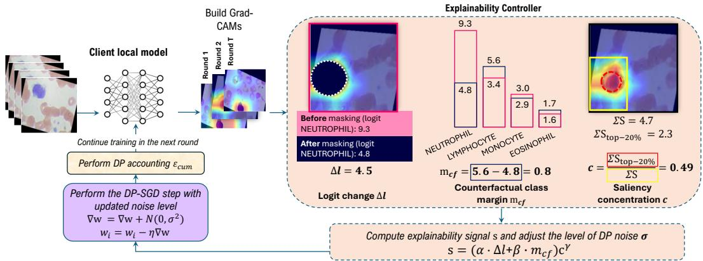  
Figure 1: Overview of FL client’s training procedure. The adaptive training process repeats for � iterations for each client.

4). Each mini-batch update begins by estimating an explanation map using Grad-CAM to identify the regions that most strongly influence the model’s current prediction (lines 5–11). Concretely, given a Grad-CAM heatmap, we threshold the CAM at the �-th largest value and select all pixels with saliency at least this cut- of, with $\boldsymbol { k } = \lceil q H W \rceil$ , where $H \times W$ denotes the CAM resolution. Saliency concentration then measures what fraction of the total saliency contained within this selected region, indicating whether the model’s attention is tightly focused or difused.

Table 2: Main hyper-parameters and notations
<table><tr><td>Notation</td><td>Description</td><td>Values</td></tr><tr><td> $N$ </td><td>Number of FL clients</td><td>3,10,50</td></tr><tr><td>B</td><td>Mini-batch size</td><td>32</td></tr><tr><td> $T$ </td><td>Number of training rounds</td><td>30</td></tr><tr><td> $\eta$ </td><td>Learning rate</td><td> $1 0 ^ { - 3 }$ </td></tr><tr><td> $C$ </td><td>Gradient clipping norm</td><td>1.0</td></tr><tr><td> $\mathbf { w ^ { t } }$ </td><td>Global model weights at iteration t</td><td></td></tr><tr><td> $\mathbf { w _ { i } ^ { t } }$ </td><td>Client&#x27;s i model weights at iteration t</td><td></td></tr><tr><td> $^ { b }$ </td><td>Noise band expansion factor  $( 0 \leq b \leq 1 )$ </td><td>0.2</td></tr><tr><td> $\rho$ </td><td>Fraction of ε allocated to composite signal</td><td>0.1</td></tr><tr><td> $\sigma _ { r e f }$ </td><td>Reference DP noise multiplier</td><td></td></tr><tr><td> $\sigma _ { m i n }$ </td><td>Lower band limit</td><td></td></tr><tr><td> $\sigma _ { m a x }$ </td><td>Upper band limit</td><td></td></tr><tr><td> $\sigma _ { s t e p }$ </td><td>DP noise multiplier at a batch step</td><td></td></tr><tr><td> $\delta$ </td><td>DP failure probability</td><td> $1 0 ^ { - 5 }$ </td></tr><tr><td> $q$ </td><td>Fraction of most salient pixels to mask</td><td>0.2</td></tr><tr><td> $\tau$ </td><td>Smoothing coefficient</td><td>0.2</td></tr><tr><td> $\Delta \ell$ </td><td>Logit change</td><td></td></tr><tr><td> $m _ { c f }$ </td><td>Counterfactual margin</td><td></td></tr><tr><td> $^ { c }$ </td><td>Saliency concentration</td><td></td></tr><tr><td> $\alpha$ </td><td>Weight of Logit change ∆f</td><td></td></tr><tr><td> $\beta$ </td><td>Weight of Counterfactual margin  $m _ { \mathrm { c f } }$ </td><td></td></tr><tr><td> $\gamma$ </td><td>Weight of Saliency concentration c</td><td></td></tr></table>

Next, we evaluate how important this salient region is by performing both a forward and a masked-forward pass. From these runs, we compute three explainability indicators: (i) prediction logit change (line 9), (ii) counterfactual class margin (line 10), and (iii) saliency concentration (line 11). Together, these components quantify how much the model depends on meaningful, well-localized fea- tures. These three indicators are combined into a unified weighted ex lainabilit score $s _ { \mathrm { r a w } }$ (lines 12–13). Because this raw score is derived directly from the private mini-batch, it must be privatized before it can be used to modulate the training process. We explic- itly bound its sensitivity to 1 via clipping and apply the Gaussian mechanism by adding noise scaled by a constant $\sigma _ { s }$ to obtain the diferentially private signal $\tilde { s } _ { \mathrm { r a w } }$ (line 14). The privatized signal is then smoothed to yield the final explainability score � (line 15), which securely modulates the noise multiplier $\sigma _ { \mathrm { s t e p } }$ applied in the model’s parameter update for the current mini-batch (line 16). Before the noisy update is applied, the candidate $\sigma _ { s t e p }$ is projected onto the budget-feasible portion of the band (line 17): a multiplier $\sigma$ is feasible if the cumulative RDP cost after one additional step at � still converts to at most $( \varepsilon _ { g } , \delta _ { g } )$ . Since the per-step RDP cost decreases monotonically in $\sigma ,$ this projection either leaves $\sigma _ { s t e p }$ unchanged, raises it to the smallest feasible value, or, when even $\sigma _ { m a x }$ is infeasible, halts noisy updates for the remainder of training (lines 18–19). The realized cost of the admitted step is then added to the accountant state before the update is applied (line 21). During each update, we apply standard DP-SGD, where gradients are clipped to limit the influence of any individual sample, and Gauss- ian noise, scaled according to the clipping norm and the adaptively chosen $\sigma _ { \mathrm { s t e p } } ,$ is added before updating the client’s model parameters (lines 22–25). This ensures that every mini-batch contributes only a controlled and privacy-preserving amount of information to the training process.

The cumulative privacy cost of the gradient updates is tracked by the RDP accountant [35, 46]1 at every training step, immediately before the noisy update is applied, and the privacy filter described above guarantees that it never exceeds $( \varepsilon _ { g } , \delta _ { g } )$ . Therefore, the com- posed cost of both mechanisms therefore adheres to the global budget (Appendix B).

Algorithm 1: XCal-Client: Explainability-driven FL   
Training with Diferentially Private Noise Calibration   
Input: Client � training data $\mathcal { D } _ { i } = \{ X _ { i } , Y _ { i } \} , \mathbf { w } ^ { t - 1 } ;$ Training   
parameters: $\eta , B ; \mathrm { D P }$ parameters: $C , \sigma _ { r e f } , b , \delta , \rho ;$   
Explainability parameters: $q , \alpha , \beta , \gamma , \tau$   
Output: Round � client model parameters   
1 Initialize local model $\mathbf { w } _ { i } ^ { t }  \mathbf { w } ^ { t - 1 } ;$   
2 Initialize ex lainabilit si nal $s \gets 0 ;$   
3 Initialize RDP accountant with tar et bud et $( \varepsilon _ { g } , \delta _ { g } ) ;$   
4 $\sigma _ { m i n } \gets ( 1 - b ) \sigma _ { r e f } ; \sigma _ { m a x } \gets ( 1 + b ) \sigma _ { r e f } ;$   
5 for each mini-batch $( \mathbf { x } , \mathbf { y } )$ ofsize � sampledfrom $\mathcal { D } _ { i }$ do   
// Compute the explainability controls:   
6 Compute model prediction �˜ for x;   
7 Compute Grad-CAM S for $( \mathbf { x } , \tilde { y } )$ under $\mathbf { w } _ { i } ^ { t } ;$   
8 Construct top-� mask from S;   
9 Compute logit change Δℓ (before and after masking);   
10 Compute counterfactual margin $m _ { \mathrm { c f } } ;$   
11 Compute saliency concentration �;   
// Compose the explainability signal:   
12 $s _ { \mathrm { r a w } } \gets \left( \alpha \cdot \Delta \ell + \beta \cdot m _ { \mathrm { c f } } \right) c ^ { \gamma } ;$   
13 $s _ { \mathrm { r a w } } \gets \mathrm { C } _ { \mathrm { L I P } } ( s _ { \mathrm { r a w } } , 0 , 1 ) ;$   
// Privatize the explainability signal:   
14 $\tilde { s } _ { \mathrm { r a w } } \gets \mathrm { C L I P } \big ( s _ { \mathrm { r a w } } + N ( 0 , \sigma _ { s } ^ { 2 } ) , 0 , 1 \big ) ;$   
// Smooth the explainability signal:   
15 $s \gets ( 1 - \tau ) s + \tau \tilde { s } _ { \mathrm { r a w } } ;$   
// Adjust DP noise based on Xpl. signal:   
16 $\sigma _ { \mathrm { s t e p } } \gets \sigma _ { \mathrm { m a x } } - s ( \sigma _ { \mathrm { m a x } } - \sigma _ { \mathrm { m i n } } ) ;$   
// Privacy filter:   
17 $\sigma _ { \mathrm { s t e p } } $ smallest admissible $\sigma \in [ \sigma _ { \mathrm { s t e p } } , \sigma _ { \mathrm { m a x } } ] ;$   
18 if no such � exists then   
19 return $( \mathbf { w } _ { i } ^ { t } )$ ; // Budget exhausted   
20 end   
// DP Accounting:   
21 Charge the accountant with a step at $\sigma _ { \mathrm { { s t e p } } } ;$   
// DP-SGD update for this mini-batch:   
22 $g _ { k } \gets \nabla _ { \mathrm w } \mathcal { L } ( \mathbf w _ { i } ^ { t } ; x _ { k } , y _ { k } )$ for $k = 1 , \ldots , B ;$   
23 $g _ { k } \gets \frac { g _ { k } } { \operatorname* { m a x } \bigl ( 1 , \ : \| g _ { k } \| _ { 2 } / C \bigr ) }$ for all � ; // Clipping to �   
24 $\begin{array} { r } { \tilde { g } \gets \frac { 1 } { B } \Big ( \sum _ { k = 1 } ^ { B } g _ { k } + N ( 0 , \sigma _ { \mathrm { s t e p } } ^ { 2 } C ^ { 2 } \mathbf { I } ) \Big ) ; } \end{array}$   
25 $\mathbf { w } _ { i } ^ { t }  \dot { \mathbf { w } } _ { i } ^ { t } - \eta \tilde { g } ;$   
26 Update cumulative privacy loss $\varepsilon _ { \mathrm { c u m } , i } ;$   
27 end   
28 return $\mathbf { w } _ { i } ^ { ( t ) }$

## 4.3 Noise Calibration as Signal-Dependent Regularization

Beyond enforcing the privacy budget, the adaptive calculation of $\sigma _ { \mathrm { s t e p } }$ (line 15 in Algorithm 1) admits a learning-theoretic interpretation: it implements a form ofsignal-dependent regularization on the DP-SGD gradient update, modulating the noise term ${ \cal N } ( 0 , \sigma ^ { 2 } C ^ { 2 } \mathbf { I } )$ according to the current quality of the model’s explanations. Under DP-SGD, the noise added to clipped gradients controls the trade-of between privacy and learning fidelity, while inherently acting as a regularizer against overfitting [1, 12, 36]. Our adaptive mecha-nism draws on this insight: when � is high, the model grounds its predictions in coherent evidence, so reducing $\sigma _ { \mathrm { s t e p } }$ preserves informative gradient components. Conversely, when � is low, the gradient signal is unreliable, and higher noise acts as regularization that prevents the model from overfitting to spurious patterns. Viewed through the privacy budget, this regularization corresponds to a redistribution of privacy expenditure over training: steps with high explanation quality receive less noise and consume budget faster, while steps with low explanation quality receive more noise and conserve budget. XCal-FL therefore spends the same total pri- vacy budget as the static baseline, but allocates it to the training steps where the gradient signal is most informative, dynamically adjusting the per-step privacy cost while the total privacy loss remains strictly upper-bounded by the formal (�, �)-DP guarantee (Appendix B).

An important consequence of this interaction is that predictive performance and explanation fidelity may respond diferently to cumulative privacy loss. While classification depends only on producing the correct output ranking and can tolerate moderate gradient directional corruption [10], explanation fidelity relies on fine-grained spatial coherence, which is highly sensitive to perturbations and inherently unstable [48, 51, 52]. Since DP-SGD amplifies this stochasticity through per-step noise injection, the relation-ship between cumulative privacy loss and explanation fidelity need not follow the approximately linear trajectory typically observed for predictive performance. This asymmetry has a direct practical implication: because the gradient components most relevant to explanation quality may converge at a diferent rate than those driving predictive accuracy, a single noise schedule optimized for one objective is unlikely to be simultaneously optimal for the other. XCal-FL addresses this by allowing the noise multiplier to track explanation quality dynamically, efectively decoupling the opti mization trajectories of the two objectives within the same privacy budget. We examine this hypothesis empirically in Section 6.3.

## 5 Empirical Evaluation on Medical Imaging

We evaluated our method on public medical imaging datasets (Table 6 in Appendix C), including blood cell classification, pneumonia detection using chest X-rays, and melanoma detection using dermoscopic images, providing a diverse testbed to assess the efects of adaptive DP on performance and explainability. We used a federated learning setup to train two types of Convolutional Neural Networks (CNNs) with diferent architectures: EficientNet-B0 [42] with 5.3� parameters and ResNet-18 [23] with 11.7� parameters. We assume a cross-silo environment [50] comprising a small number of clients (e.g., organizations such as hospitals) with robust and reliable computational resources. This assumption aligns with practical cross-silo FL settings, particularly in the medical domain, where clinical image data is primarily held by large organizations, such as hospitals, rather than on edge devices. Hence, we varied the number of clients participating in the training, with a default of � = 3 clients, where each client stored the same amount of data (sampled with replacement from our dataset when the dataset size was too small for a large number of clients). To simulate a non-IID environment, we performed the data splitting among clients while creating both a class label shift and feature shift (covariate shift). Covariate shift was simulated by applying a linearly varying bright-ness perturbation across clients, so that each client observes images under systematically diferent illumination conditions while the underlying label structure is preserved. We trained each model over � = 30 communication rounds (Table 2).

Table 3: F1-score across datasets for our adaptive training (XCal-FL), compared with FL+DP (static DP noise) and AGP [30]. Each privacy setting is defined by a target � and its corresponding adaptive noise range $[ \sigma _ { \mathrm { m i n } } , \sigma _ { \mathrm { m a x } } ]$ . Results are shown for a FL setting comprised of $N = 3$ clients, training an EficientNet-B0 model with a balanced XCal-FL configuration $( \alpha = \beta = \gamma = 1 )$
<table><tr><td rowspan="2">Dataset</td><td colspan="2">No DP</td><td colspan="3"> $\varepsilon = 0 . 0 5 \left( \ 1 9 . 6 8 \leq \sigma \leq 2 9 . 5 2 \right)$ </td><td colspan="3"> $\varepsilon = 0 . 5 \left( { 2 . 7 7 \leq \sigma \leq 4 . 1 6 } \right)$ </td><td colspan="3"> $\varepsilon = 5 . 0 \left( { 0 . 7 2 \leq \sigma \leq 1 . 0 8 } \right)$ </td><td colspan="3">ε = 50.0 ( 0.23 ≤ σ ≤ 0.35)</td></tr><tr><td>Centr.</td><td>FL</td><td>FL+DP</td><td>AGP</td><td>XCal-FL</td><td>FL+DP</td><td>AGP</td><td>XCal-FL</td><td>FL+DP</td><td>AGP</td><td>XCal-FL</td><td>FL+DP</td><td>AGP</td><td>XCal-FL</td></tr><tr><td>Blood Cells</td><td>0.862</td><td>0.844</td><td>0.235</td><td>0.285</td><td>0.290</td><td>0.654</td><td>0.663</td><td>0.716</td><td>0.811</td><td>0.807</td><td>0.834</td><td>0.840</td><td>0.849</td><td>0.856</td></tr><tr><td>Chest X-rays</td><td>0.680</td><td>0.669</td><td>0.478</td><td>0.465</td><td>0.492</td><td>0.529</td><td>0.542</td><td>0.600</td><td>0.599</td><td>0.569</td><td>0.623</td><td>0.658</td><td>0.596</td><td>0.629</td></tr><tr><td>Melanoma</td><td>0.896</td><td>0.777</td><td>0.511</td><td>0.464</td><td>0.530</td><td>0.693</td><td>0.709</td><td>0.712</td><td>0.745</td><td>0.759</td><td>0.761</td><td>0.777</td><td>0.855</td><td>0.886</td></tr></table>

Models were trained under diferent configurations of explain- ability components described in Section 4.2, with gradient privacy controlled via an adaptive noise multiplier $\sigma _ { \mathrm { s t e p } }$ and an overall � fixed to $1 0 ^ { - 5 } .$ . We set the fraction of the budget dedicated to the explainability signal to $\rho = 0 . 1 0$ , meaning $\varepsilon _ { s } = 0 . 1 0 \varepsilon$ and $\varepsilon _ { g } = 0 . 9 0 \varepsilon .$ The noise band half-width factor is set to $\mathbf { b } = 0 . 2$ in our experiments, yielding a symmetric band $\sigma _ { s t e p } \in [ 0 . 8 \sigma _ { r e f } , 1 . 2 \sigma _ { r e f } ]$ . We set the saliency-based mask fraction to $q = 0 . 2 .$ . We compare our approach against centralized (non-FL) training, standard FL without DP and AGP [30]. For fair comparison, we ran AGP under our FL setup with a representative Gaussian noise scale averaged over the range for each target �. We then fixed the fraction of important channels to $r = 0 . 2$ to match our setting $( q = 0 . 2 )$ . For each target �, the static FL+DP baseline uses the constant multiplier that exactly exhausts � over � rounds, so that all comparisons between XCal-FL and the baselines are made at matched total privacy expenditure.

After training each FL model, we evaluated predictive perfor-mance on the test set using the F1-score, alongside the cumulative privacy loss incurred during training. The F1-score captures both sensitivity and precision, making it well suited to medical classifi cation tasks that often involve imbalanced class or feature distribu- tions. Then, we evaluated explainability under adaptive DP noise through quantitative and qualitative analyses. Quantitatively, we report the relative percentage change in ROAD scores on our test set [38]. Qualitatively, we generate Grad-CAMs for each model’s predicted class and overlay them on test images to examine how increasing noise shifts attention from diagnostic regions to difuse patterns. Finally, we quantitatively evaluate the trade-of between privacy, predictive performance and explainability.

## 6 Results

## 6.1 Privacy-Utility Trade-of

The adaptive training procedure consistently improved global FL model performance across diferent DP configurations compared to static noise training (Table 3), addressing the performance aspect of RQ1. For example, in blood cell type classification, adaptive training achieved an F1-score of 0.716 under a noise range of $2 . 7 7 \leq \sigma \leq 4 . 1 6$ 6 (around an � = 0.5 guarantee), compared to 0.654 with static noise. Nevertheless, both adaptive and static DP-trained models remained less accurate than the centralized model and the corresponding non-DP FL model, which achieved F1-scores of 0.86 and 0.84, respectively. As expected, we observed an increasing trend in the model’s performance as the DP guarantee weakened (lower noise multiplier � leading to higher �), i.e., for a noise setting of $0 . 2 3 \leq \sigma \leq 0 . 3 5$ , the performance of all models approached that of their corresponding non-DP FL counterparts. Our adaptive method consistently outperformed AGP in F1 across most datasets and privacy settings. Equally weighting all three signal components (logit change, counterfactual margin, and saliency concentration with $\alpha = \beta = \gamma = 1 )$ yielded higher utility than using any component in isolation. An ablation study (Section 7 and Appendix E) confirmed that this configuration provides strong performance and explainability across all settings.

To further assess the robustness of XCal-FL, we examined how the number of participating clients and the degree of data hetero- geneity afect model performance (Figure 2a). Under IID partitioning, both EficientNet-B0 and ResNet-18 improved steadily as the number of clients increased from �=3 to �=50. A similar trend appeared under label shift, a non-IID setting in which class proportions vary across clients: ResNet-18 recovered from 0.70 at �=3 to 0.86 at $N { = } 5 0 .$ , suggesting that aggregating updates from a larger, more label-diverse client pool helps compensate for local class im- balances. Covariate shift, a more severe non-IID setting in which image features themselves difer across clients, proved consider- ably more challenging: EficientNet-B0 plateaued around 0.53 and ResNet-18 around 0.67 at �=50, indicating that when clients difer in their input distributions rather than merely in class proportions, increasing the number of participants yields diminishing returns. Overall, ResNet-18 benefited more from scaling the client set than EficientNet-B0 across all heterogeneity conditions, consistently achieving a smaller gap to its centralized upper bound (additional results for all datasets are provided in Appendix D).

## 6.2 Model Explainability

Our adaptive FL training procedure led to a larger average drop in model confidence compared to static training, addressing the explainability aspect of RQ1. A higher drop indicates that masking a small set of salient regions causes a stronger reduction in predicted confidence, reflecting more causal and informative saliency. Using the ROAD metric averaged across multiple relevance percentiles, we observed a steady increase over our dynamic training, reaching final scores of 80.57%, 7.23% and 42.66% for the blood cell type, pneumonia detection and melanoma classification tasks, respectively (for noise multiplier $2 . 7 7 \leq \sigma \leq 4 . 1 6 )$ . In particular, the blood cell model exhibited a confidence reduction of over 80% when the most salient regions were removed, indicating a strong causal dependence of its predictions on the identified explanatory features. In contrast, the static training model showed much lower sensitivity with only a 15.56%, 5.74% and 31.27% confidence drops under the same noise setting for the blood cell type, pneumonia detection and melanoma classification tasks, respectively. This sug- gests that the predictions ofstatic training models were only weakly afected by the removal of salient evidence and thus less depen- dent on meaningful explanatory regions. These results show that explainability-driven training strengthens the model’s reliance on meaningful salient regions, because perturbing these areas leads to a larger and more systematic change in the model’s predictions. Similarly to predictive performance, equally weighting all three signal components $( \alpha = \beta = \gamma = 1 )$ yielded stronger explainability than using any component in isolation (section 7 and Appendix E). For the Chest X-ray pneumonia task, AGP achieved a higher average ROAD score than our method, which we attribute to its explicit suppression of noise on highly salient channels that better preserves gradient-based explanations in this more challenging setting (which is trained on grayscale images).

Table 4: ROAD score (explanation fidelity), averaged over relevance thresholds (top 20%, 40%, 60%, and 80% pixels), for global models across datasets using XCal-FL, compared with FL+DP (static DP noise) and AGP [30]. Each privacy setting is defined by a target � and its corresponding adaptive noise range $[ \sigma _ { \mathrm { m i n } } , \sigma _ { \mathrm { m a x } } ]$ . Results are shown for a FL setting comprised of � = 3 clients, training an EficientNet-B0 model with a balanced $\mathbf { X C a l - F L }$ configuration $( \alpha = \beta = \gamma = 1 )$
<table><tr><td rowspan="2">Dataset</td><td colspan="2">No DP</td><td colspan="3"> $\varepsilon = 0 . 0 5 \left( \ 1 9 . 6 8 \leq \sigma \leq 2 9 . 5 2 \right)$ </td><td colspan="3">ε = 0.5 ( 2.77 ≤ σ ≤ 4.16)</td><td colspan="3"> $\varepsilon = 5 . 0 \left( { 0 . 7 2 \leq \sigma \leq 1 . 0 8 } \right)$ </td><td colspan="3">ε = 50.0 (0.23 ≤ σ ≤ 0.35)</td></tr><tr><td>Centr.</td><td>FL</td><td>FL+DP</td><td>AGP</td><td>XCal-FL</td><td>FL+DP</td><td>AGP</td><td>XCal-FL</td><td>FL+DP</td><td>AGP</td><td>XCal-FL</td><td>FL+DP</td><td>AGP</td><td>XCal-FL</td></tr><tr><td>Blood Cells</td><td>202.955</td><td>283.255</td><td>25.938</td><td>17.564</td><td>35.626</td><td>15.561</td><td>13.456</td><td>80.568</td><td>86.346</td><td>116.614</td><td>93.803</td><td>113.193</td><td>139.758</td><td>264.896</td></tr><tr><td>Chest X-rays</td><td>407.588</td><td>187.114</td><td>3.427</td><td>3.536</td><td>5.758</td><td>5.742</td><td>9.206</td><td>7.229</td><td>9.206</td><td>12.093</td><td>13.925</td><td>4.913</td><td>25.439</td><td>9.130</td></tr><tr><td>Melanoma</td><td>64.819</td><td>24.921</td><td>0.474</td><td>2.296</td><td>8.012</td><td>31.272</td><td>32.610</td><td>42.661</td><td>54.056</td><td>61.072</td><td>63.220</td><td>81.462</td><td>101.739</td><td>113.956</td></tr></table>

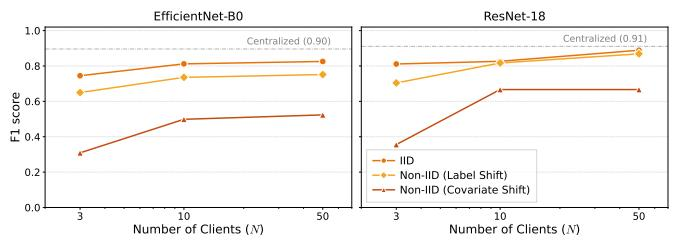

(a) Performance (F1 score)  
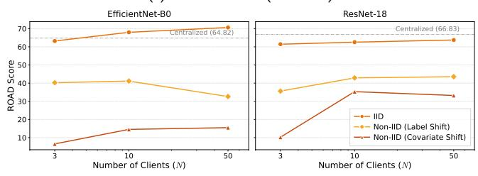  
(b) Explainability (ROAD score)  
Figure 2: F1 and ROAD scores of the global models trained on the Melanoma dataset under our adaptive DP method (XCal-FL) as a function of the number of federated clients under IID and non-IID data distribution settings (� = 5).

Furthermore, we observed a clear relationship between the level of DP noise and model explainability, measured by the ROAD metric (Table 4). As the level of noise increases, gradient directions become less stable and saliency maps less coherent, leading to lower ROAD scores as the model’s attention becomes more dispersed across the image. Conversely, as the DP guarantee weakens (less noise is injected to the model’s gradients), saliency maps become sharper and the ROAD metric improves. This is visually illustrated in Fig. 3, which compares the CAMs of a single test positive image (positive to the existence of a medical issue) in each of our evaluated datasets across varying DP levels, compared to the two baselines. From visual inspection of the highlighted CAMs, we observed that our adaptive approach produced more concentrated regions, providing a clearer and more focused explanation. This efect was most pronounced in blood cell classification, where the CAM became smaller and more focused as the amount of injected noise decreased (increasing �).

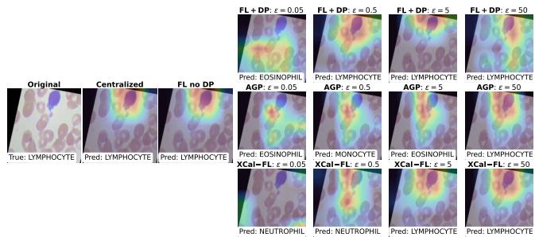

(a) Blood cell type detection (class: Lymphocyte)  
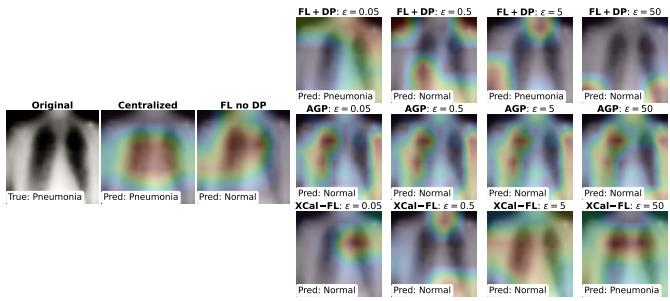

(b) Pneumonia detection using Chest X-Rays (class: Pneumonia)  
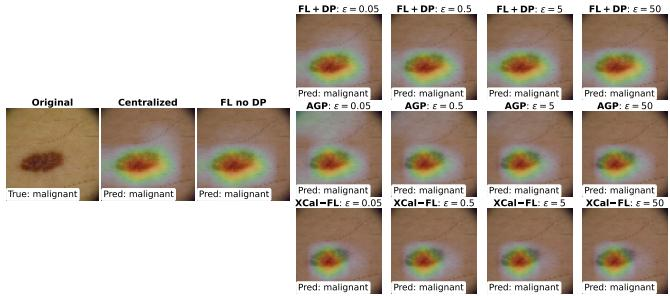  
(c) Melanoma detection using skin scans (class: Malignant)  
Figure 3: Qualitative analysis of model explainability using Grad-CAM visualizations for representative test samples across datasets and DP guarantees $( \alpha = \beta = \gamma = 1 )$ . CAMs are generated from the final convolutional layer of the global FL model for the predicted class, with red regions indicating stronger influence.

In terms of the efect of the FL client set size and their data heterogeneity, as shown in Figure 2b, ROAD explainability scores followed a consistent hierarchy across both models: IID yielded the highest scores, followed by label shift, with covariate shift produc ing the lowest. Increasing the number of clients had a small positive efect under IID and label shift, consistent with the regularizing benefit of aggregating diverse client updates. Notably, ResNet-18 exhibited a smaller gap between distribution types, with its ROAD score under covariate shift reaching approximately 35% compared to under 15% for EficientNet-B0, suggesting greater robustness to visual perturbations in non-IID conditions.

## 6.3 Trade-of Analysis Between Privacy, Predictive Performance and Explainability

In the following sections, we addressed RQ2 and RQ3 by measuring the privacy-utility and privacy-explainability eficiency as the gain in performance or explanation fidelity (�1 or ����) per unit increase in normalized cumulative privacy loss (�).

6.3.1 Privacy-UtilityEficiency. Figure 4 summarizes how well each model configuration converts privacy expenditure into predictive gains. Across all datasets, the adaptive noise injection strategy consistently produced more favorable eficiency trends compared to the static baseline. For example, in the blood cell classification task (Fig. 4a), the adaptive model achieved a substantially larger utility gain, increasing the F1-score from 0.20 to 0.72 by the last training round. This corresponds to a utility-to-privacy-loss ratio (Δ�1/Δ�) of 0.223 for the adaptive configuration compared with 0.178 for the static one, confirming the higher privacy-utility eficiency achieved under adaptive noise calibration. While both ratios are below 1, this is expected in FL with DP, where cumulative privacy loss typically grows faster than performance gains.

The skin melanoma classification task (Fig. 4c) exhibited the strongest eficiency improvement with our adaptive model, achieving nearly double the eficiency of the static baseline by boosting F1 early in training, when privacy loss is still low (Δ�1/Δ� ratio of 0.209 and 0.106 for the adaptive and static training strategies, respectively). Moreover, while the blood cell task showed a roughly linear eficiency trend, the pneumonia detection task did not fol- low a clear linear pattern, suggesting dataset-dependent dynamics in how privacy and performance interact. Overall, these results demonstrate that adaptive noise injection can translate privacy loss into larger performance gains than static training.

6.3.2 Privacy-Explainability Eficiency. We observed a similar pat tern when evaluating explainability eficiency (Fig. 5). Note that while the trend is not strictly monotonic across training rounds, the adaptive approach consistently achieved higher eficiency across all three tasks. For example, in the blood cell classification task (Fig. 5a), the adaptive model reached a local maximum ROAD score after using only 20% of its normalized privacy budget, demonstrating that strong explanation quality can be achieved at relatively low privacy cost. In contrast, the static baseline peaked only after consuming roughly 80% of its privacy budget. Numerically, this yielded a Δ����/Δ� ratio of 82.12 for the adaptive configuration, com-pared with only 10.57 for the static one. For pneumonia detection (Fig. 5b), the static model reached its maximum ROAD score early in training and showed no further improvement. In contrast, the adaptive model continued to increase explanation fidelity through- out training, resulting in a higher privacy-explainability ratio of $\Delta R O A D / \Delta \varepsilon = 6 . 6 0 .$ A similar pattern was observed in melanoma de- tection (Fig. 5c), where the adaptive model achieved a steeper early rise in the ROAD score and higher eficiency (ΔROAD/Δ� = 33.35), while the static model peaked after greater privacy expenditure (ratio of 26.51).

The magnitude of the eficiency improvement varied across datasets. The blood cell classification task exhibited the largest privacy-explainability eficiency gain (approximately eightfold), which we attribute to the spatially compact and well-localized na- ture of blood cell features. In contrast, the melanoma task showed a more modest gain (1.3×), consistent with the observation that dermoscopic features are more distributed across the image, leading to lower saliency concentration scores and a more conservative noise reduction. The chest X-ray task showed an intermediate gain of 3.3× over static DP training, lower than the blood cell task, which we attribute to the fact that grayscale images produce less discriminative Grad-CAM maps, limiting the composite signal’s dynamic range. These dataset-dependent patterns suggest that the eficiency gains of adaptive noise calibration are strongest when the task admits spatially concentrated explanatory features.

6.3.3 Comparing Performance and Explainability Dynamics. A closer examination of the temporal dynamics in Figures 4 and 5 reveals a structural diference between performance and explainability tra- jectories. In the blood cell task (Fig. 5a), the adaptive model reached a peak ROAD score after consuming approximately 20% of its nor-malized privacy budget, after which explanation fidelity plateaued. In contrast, the corresponding F1-score in Figure 4a continued to increase steadily throughout training. This decoupling suggests that the gradient components most relevant to explanation quality converge earlier than those driving predictive accuracy. For the pneumonia detection task (Fig. 5b), the static model’s ROAD score peaked within the first 30% of training and then stagnated, whereas the adaptive model sustained steady improvement throughout, in- dicating that explainability-aware noise calibration prevents the early saturation of explanation quality observed under static noise. These patterns were consistent across datasets, with the timing of the ROAD peak varying by task but always preceding the point at which F1-score stabilized.

Taken together, the eficiency results reveal a fundamental asym- metry in how privacy loss afects predictive performance and explanation fidelity. The F1-score curves in Figure 4 follow approximately monotonic, near-linear trajectories across all three datasets, consistent with the standard assumption in privacy-utility analyses that more privacy budget expenditure yields proportionally more utility. The ROAD curves in Figure 5, however, exhibit qualitatively nonmonotonic trajectories that reflect unstable behavior. This asymmetry implies that the privacy-explainability trade-of cannot be inferred from the privacy-utility trade-of alone, and that optimiz- ing one does not guarantee optimization of the other. This temporal asymmetry also has a practical implication for privacy-sensitive deployments: if explanation fidelity is a primary objective, training can be terminated earlier than would be optimal for predictive per- formance alone, thereby saving privacy budget. This demonstrates empirically that performance and explainability follow fundamen- tally diferent dynamics under cumulative diferential privacy loss in FL, motivating the need for dedicated privacy-explainability evaluation frameworks.

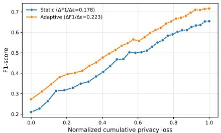  
(a) Blood cells

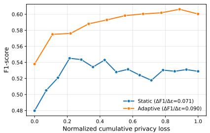  
(b) Chest X-rays

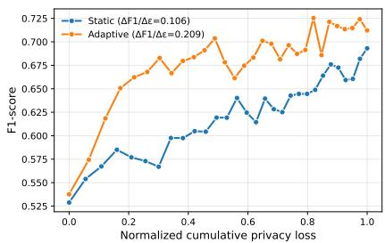  
(c) Melanoma

Figure 4: Privacy-utility eficiency of global FL models across datasets, comparing FL+DP training with static DP noise and our adaptive XCal-FL training (� = 0.5 with $\alpha = \beta = \gamma = 1 )$ . Eficiency is defined as the ratio of F1 score to the cumulative privacy loss.  
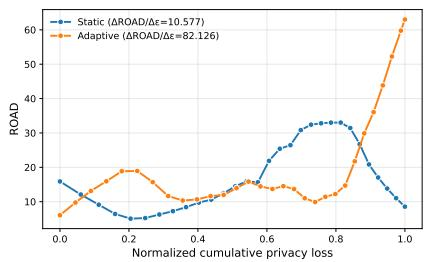  
(a) Blood cells

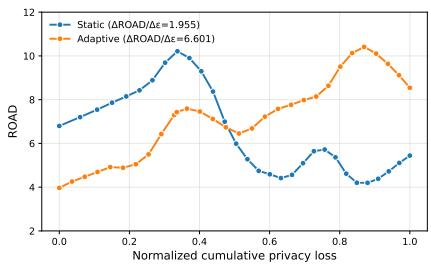  
(b) Chest X-rays

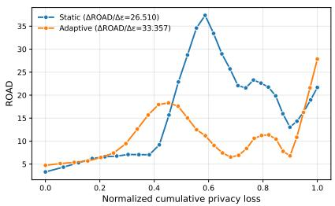  
(c) Melanoma  
Figure 5: Privacy-explainability eficiency for global FL models across datasets, comparing FL+DP training with static DP noise and our adaptive XCal-FL training $( \varepsilon = 0 . 5$ with $\alpha = \beta = \gamma = 1 )$ . ROAD curves were smoothed using LOWESS smoothing. Eficiency is defined as the ratio of ROAD score to the cumulative privacy loss.

## 7 Ablation Study: Explainability Signal Weights

To assess the individual and combined contributions of the three components within our explainability-guided noise calibration sig- nal, we conducted an ablation study using seven diferent weight configurations. These configurations, summarized in Table 5, con- sist of isolated component tests (where one of the components is active during training, while the others are ignored), balanced baselines (where all components are activated), relative importance comparisons, and concentration scaling variations. For each configuration, we report predictive performance (macro F1 score) and explainability quality (ROAD score) across all datasets.

## 7.1 Predictive Performance

Figure 6b presents the F1 scores across all configurations and noise levels for the Melanoma dataset. All configurations con- verged to comparable F1 scores (0.75–0.88) at relaxed privacy levels $( \varepsilon \geq 5 ) _ { : }$ , indicating robustness to moderate variations in component weights. Under stricter privacy $\left( \varepsilon \le 0 . 5 \right)$ , the Balanced configuration $( \alpha = \beta = \gamma = 1 )$ demonstrated the strongest performance, while the Amplified Saliency Concentration variant $( \gamma = 2 )$ showed degraded performance at $\varepsilon = 0 . 0 5$ , suggesting that overly aggres- sive concentration scaling may be detrimental under high-noise conditions. We attribute the robustness of the Balanced configuration to the complementary nature of the three signal components, which together provide a comprehensive characterization of each sample’s explainability quality, enabling finer-grained noise calibration that preserves predictive performance even under strict privacy constraints. Hence, relying on a single component, by contrast, captures only a partial view of the model’s reasoning, leading to suboptimal noise allocation and reduced utility. Results for the remaining datasets, which exhibit consistent trends, are provided in Figure 7 in Appendix E.

Table 5: Configurations of explainability signal component weights used in the ablation study. The weights $\alpha , \beta ,$ and� correspond to the logit change, counterfactual margin, and saliency concentration components, respectively.
<table><tr><td>Configuration</td><td>α</td><td>γ</td><td></td><td>Description</td></tr><tr><td>Isolated Components</td><td></td><td></td><td></td><td></td></tr><tr><td>Pure Logit Change</td><td>1.0</td><td>0.0</td><td>0.0</td><td>Only the logit change component is active</td></tr><tr><td>Pure Counterfactual Margin</td><td>0.0</td><td>1.0</td><td>0.0</td><td>Only the counterfactual margin component is active</td></tr><tr><td>Balanced Baseline</td><td></td><td></td><td></td><td></td></tr><tr><td>Balanced</td><td>1.0</td><td>1.0</td><td>1.0</td><td>All components equally weighted</td></tr><tr><td>Relative Importance</td><td></td><td></td><td></td><td></td></tr><tr><td>Logit Change-dominant</td><td>2.0</td><td>1.0</td><td>1.0</td><td>Logit change weighted twice as much as counterfactual margin</td></tr><tr><td>Counterfactual Margin-dominant</td><td>1.0</td><td>2.0</td><td>1.0</td><td>Counterfactual margin weighted twice as much as logit change</td></tr><tr><td>Concentration Scaling</td><td></td><td></td><td></td><td></td></tr><tr><td>Dampened Saliency Conc.</td><td>1.0</td><td>1.0</td><td>0.5</td><td>Balanced components with square-root saliency concentration</td></tr><tr><td>Amplified Saliency Conc.</td><td>1.0</td><td>1.0</td><td>2.0</td><td>Balanced components with squared saliency concentration</td></tr></table>

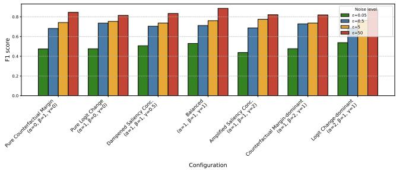

(a) Performance (F1 score)  
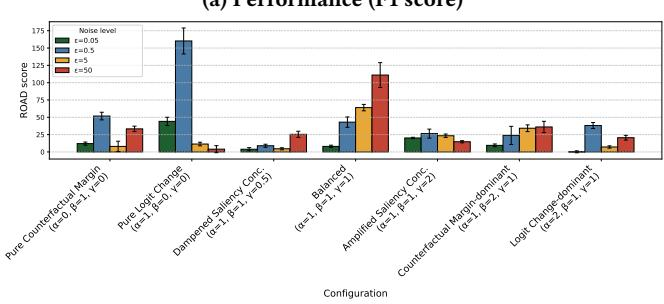  
(b) Explainability (ROAD score)  
Figure 6: Ablation analysis of the efect of signal component weights on predictive performance (F1 score) and explainability (ROAD score) across privacy guarantee levels (�) for the Melanoma dataset. Each configuration varies the weights of the logit change (�), counterfactual margin (�), and saliency concentration (�) components.

## 7.2 Explainability

Figure 6a presents the ROAD scores across configurations and noise levels for the Melanoma dataset. Explainability diferences across configurations were more pronounced than for predictive perfor- mance, highlighting the importance of component selection for explainability quality. The Balanced configuration achieved the highest ROAD scores at most noise levels, with particularly strong explainability at $\varepsilon = 5 0$ (ROAD change of 110%). Interestingly, the Pure Logit Change configuration $( \alpha = 1 , \beta = 0 , \gamma = 0 )$ ) showed com-petitive explainability at $\varepsilon = 0 . 5 ,$ , but this did not generalize across other noise levels. The concentration scaling variants show intermediate performance, while the Counterfactual Margin-dominant configuration $( \alpha = 1 , \beta = 2 , \gamma = 1 )$ exhibited lower and more vari- able ROAD scores. These findings support our design choice of incorporating all three components (Δℓ, $m _ { \mathrm { c f } } ,$ and �) rather than relying on a single signal. We note that the optimal configuration in terms of its efect on explanation fidelity can be dataset-dependent, as discussed in Appendix E.

## 8 Execution Runtime Complexity Analysis

We analyzed the execution runtime complexity of XCal-FL with respect to our used hardware (a machine with a 64GB of RAM and a NVIDIA’s RTX 2080 Ti GPU) across all three datasets and our two evaluated model architectures. A standard DP-SGD training step costs approximately $3 { \cal F } { + } { \cal O } ( { \cal P } )$ per mini-batch, where � is the cost of a single training-mode forward pass and � is the total number of pa- rameters [1, 24]. XCal-FL introduces a modest overhead by adding an explainability-driven signal computation per mini-batch, which consists of two inference-mode forward passes (one on the original input and one on the masked input) and subsequent saliency mask operations. The privacy filter adds one RDP accountant query per mini-batch, whose cost is negligible relative to the forward passes. Empirically, across our evaluated architectures and datasets, this translates to a small absolute per-round increase in wall-clock time for each client compared to standard DP-SGD (typically 1–3 seconds). Crucially, this computational overhead is purely local and does not increase the payload size or communication costs, which remain the primary bottleneck in cross-silo FL environments. Given the simultaneous gains in accuracy and explainability, this mod-erate computational overhead represents a favorable trade-of for privacy-sensitive applications, such as clinical imaging. A more detailed wall-clock benchmarks across all configurations are provided in Appendix F.

## 9 Discussion and Limitations

This work introduced XCal-FL, an adaptive noise control mech-anism for DP-FL that calibrates noise using a composite signal combining explainability- and decision-related measures. The three signal components ofer complementary contributions: the logit change preserves learning from informative salient regions, the counterfactual margin sharpens decision boundaries, and the saliency concentration favors compact attention patterns. Together, these components enable finer-grained noise calibration than any single component alone, as confirmed by our ablation study (Section 7), where the balanced configuration $( \alpha = \beta = \gamma = 1 )$ ) consistently achieved the strongest or most robust results across datasets and privacy levels. This approach is motivated by prior findings that DP mechanisms with similar nominal privacy guarantees can yield diferent downstream behavior [15, 27], and extends recent work on explainability-aware adaptive noise allocation in FL [30].

In terms of privacy preservation, the calculated noise multiplier $\sigma _ { \mathrm { s t e p } }$ in our proposed method is always bounded within the symmet- ric band $[ \sigma _ { \mathrm { m i n } } , \sigma _ { \mathrm { m a x } } ]$ , and the formal (�, �)-DP guarantee is enforced by a Rényi accountant [46] that charges the accountant the realized cost of every step and prevents any update that would exceed the allocated budget (Appendix B). XCal-FL therefore provides exactly the same formal guarantee as standard DP-SGD calibrated to the same (�, �), while redistributing the privacy expenditure across training steps. Our adaptive noise calibration redistributes noise across training steps more eficiently than in previous methods, such as the AGP [30], translating a given privacy budget into larger gains in both utility and explainability (Figures 4 and 5). These results align with prior findings that careful noise handling can im- prove the privacy-utility trade-of in DP-FL [28], and extend them to the privacy-explainability dimension. XCal-FL also consistently outperformed AGP [30], yielding over 10% higher predictive perfor-mance and more than 75% improvements in explanation fidelity on average, demonstrating that dynamic noise magnitude calibration provides advantages beyond static channel-level noise suppression. Our empirical results further validate the signal-dependent regular- ization interpretation introduced in Section 4.3: when the explainability signal is high, reduced noise preserves informative gradient components that reinforce causally meaningful representations, i.e., when the signal is low, higher noise acts as regularization that prevents overfitting to spurious or difuse patterns. This mechanism functions as an automatic mechanism that tightens regularization on poorly explained samples and loosens it on well-explained ones.

We further observed that while predictive performance improved approximately monotonically with increasing privacy loss, explainability exhibited non-linear dynamics, with ROAD scores peaking early in training before stabilizing (Fig. 5) for some configurations. This behavior is consistent with the known sensitivity of gradientbased attributions to perturbations [52] and with theoretical findings that gradient-based saliency maps are inherently unstable under training stochasticity [51], an efect that DP-SGD amplifies through its per-step noise injection. This finding carries broader implications: standard privacy-utility analyses are insuficient to capture the full impact of DP on model behavior, and explainability requires dedicated evaluation as a distinct dimension of the privacy trade-of.

Applicability Limitations. XCal-FL is designed for image classification and is applicable to privacy-sensitive computer vision settings beyond clinical imaging, such as autonomous driving, wherever Grad-CAM-based attribution is applicable. However, the ex-plainability signal is tied to Grad-CAM specifically, so substituting a diferent attribution method may alter the signal characteristics and require re-tuning the composite score. More broadly, testing applicability to non-vision domains, where gradient-based saliency maps are not directly available, remains a future research direction.

Beyond the task domain, our cross-silo evaluations across � = 3, 10, 50 clients (Figure 2) show moderate and sometimes inconsistent scaling gains, particularly under covariate shift, suggesting the method is best suited to cross-silo deployments and may require adaptation for large-scale cross-device settings. Moreover, the two additional inference-mode forward passes per mini-batch incur up to 80% overhead relative to standard DP-SGD (Section 8), which, while acceptable in cross-silo settings with suficient compute, may be challenging for resource-constrained clients. In terms of pri- vac ranularit , our mechanism rovides record-level $( \varepsilon , \delta ) \mathrm { - D P }$ protecting individual training images. Since a single patient may contribute multiple images, however, the cumulative information leakage across a patient’s records is not formally bounded at the patient level. Providing user-level DP guarantees would require additional mechanisms such as per-patient gradient grouping and is left as future work. In addition, while the balanced weight configura- tion generalizes well across our evaluated datasets, optimal weights can be dataset-dependent (e.g., dampened saliency concentration proved superior for Chest X-rays), requiring empirical tuning during real-world deployment. Finally, a further consequence of the filter-based design [16] is that a client may exhaust its gradient budget before completing all � rounds if the signal keeps the noise persistently below $\sigma _ { r e f }$ , leading to an early halt of noisy updates. This behavior makes the total privacy expenditure identical to the static baseline by construction, at the cost of a possibly shorter efective training horizon. An investigation of other DP accountant is left to future work.

## 10 Conclusion

This paper introduced XCal-FL, an explainability-driven training approach with adaptive Diferential Privacy for Federated Learning that calibrates noise based on explanation signals to balance privacy, utility, and explanation fidelity. Experiments on medical imaging tasks show that XCal-FL consistently outperforms fixednoise DP-SGD, achieving over 10% higher performance and more than 75% higher fidelity of attribution-based explanations than state-of-the-art methods for adaptive DP in FL. In addition, our ap- proach achieves up to 25% higher privacy-utility eficiency and up to threefold higher privacy-explainability eficiency, allowing trained FL models to translate the incurred privacy loss into larger gains in both predictive performance and explanation fidelity than standard DP-SGD training with static DP noise. This supports interpretable and trustworthy decision-making in safety-critical decision-support applications.

## Acknowledgments

## Ethical Considerations

This research relies exclusively on publicly available datasets ob- tained from oficial data releases [8, 39, 45]. Although these datasets originate from the medical domain, they were released in anonymized form by their respective providers, and no re-identification was attempted in our experimental setting. No personally identifiable information was collected, processed, or stored at any stage of this work. We have complied with the terms of use specified by each data provider (CC-BY-NC for the ISIC Melanoma dataset [39]; MIT license for the Blood Cells dataset [8]; CC0 1.0 Universal license for the NIH Chest X-ray dataset [45]). The research poses minimal risk, as it involves only secondary analysis of existing public data and does not involve human participants, or interaction with vulnerable populations. Therefore, ethical approval from an IRB was not required.

## Open Science

An anonymous repository containing our code is available at https:// osf.io/xr9nt/overview?view\_only=b0fd7b2b88a94578abd06dacb5d19fad. The repository includes the implementation of the proposed XCal-FL training procedure, covering both client-side training (implementing explainability-driven FL training with diferentially private noise calibration) and server-side aggregation, the two evaluated model architectures, and configuration files for reproducing the reported experiments. The datasets used in this work are publicly available from their respective providers and are therefore not re- distributed in the repository.

## AI Use

We used generative AI-based tools to revise the text, improve flow, and correct typos, grammatical errors, and awkward phrasing. We have manually verified the text and are responsible for the accuracy, originality, and integrity of it.

## References

[1] Martin Abadi, Andy Chu, Ian Goodfellow, H. Brendan McMahan, Ilya Mironov, Kunal Talwar, and Li Zhang. 2016. Deep Learning with Diferential Privacy. In Proceedings ofthe 2016 ACMSIGSACConference on ComputerandCommunications Security (Vienna, Austria) (CCS ’16). Association for Computing Machinery, New York, NY, USA, 308–318. https://doi.org/10.1145/2976749.2978318

[2] Mohammed Adnan, Shivam Kalra, Jesse C Cresswell, Graham W Taylor, and Hamid R Tizhoosh. 2022. Federated learning and diferential privacy for medical image analysis. Scientific reports 12, 1 (2022), 1953. https://doi.org/10.1038/s41598- 022-05539-7

[3] Mário S Alvim, Miguel E Andrés, Konstantinos Chatzikokolakis, Pierpaolo Degano, and Catuscia Palamidessi. 2012. Diferential privacy: on the trade of between utility and information leakage. In Formal Aspects ofSecurity and Trust: 8th International Workshop, FAST 2011, Leuven, Belgium, September 12-14, 2011. Revised Selected Papers 8. Springer, 39–54. https://doi.org/10.1007/978-3- 642-29420-4\_3

[4] Galen Andrew, Om Thakkar, Brendan McMahan, and Swaroop Ramaswamy. 2021. Diferentially Private Learning with Adaptive Clipping. In Advances in Neural Information Processing Systems, M. Ranzato, A. Beygelzimer, Y. Dauphin, P.S. Liang, and J. Wortman Vaughan (Eds.), Vol. 34. Curran Associates, Inc., 17455–17466. https://proceedings.neurips.cc/paper\_files/paper/2021/file/ 91cf01af640a24e7f9f7a5ab407889f-Paper.pdf

[5] Chioma Virginia Anikwe, Henry Friday Nweke, Anayo Chukwu Ikegwu, Chuk-wunonso Adolphus Egwuonwu, Fergus Uchenna Onu, Uzoma Rita Alo, and Ying Wah Teh. 2022. Mobile and wearable sensors for data-driven health moni toring system: State-of-the-art and future prospect. Expert Systems with Applications 202 (2022), 117362. https://www.sciencedirect.com/science/article/pii S095741742200714X

[6] Gustav A Baumgart, Jaemin Shin, Ali Payani, Myungjin Lee, and Ramana Rao Kompella. 2024. Not all federated learning algorithms are created equal: A erformance evaluation stud . arXiv preprint arXiv:2403.17287 (2024).

[7] Eleni Briola, Christos Chrysanthos Nikolaidis, Vasileios Perifanis, Nikolaos Pavlidis, and Pavlos Efraimidis. 2024. A federated explainable AI model for breast cancer classification. In Proceedings of the 2024 European Interdisciplinary Cybersecurity Conference (Xanthi, Greece) (EICC ’24). 194–201. https: //doi.org/10.1145/3655693.3660255

[8] Shenggan Cheng and Nicolas Chen. 2018. BCCD: Blood Cell Count and Detection. https://github.com/Shenggan/BCCD\_Dataset

[9] Council of the European Union. 2016. General Data Protection Regulation (GDPR). https://gdpr-info.eu/ Accessed: October 18, 2025.

[10] Jiawei Duan, Haibo Hu, Qingqing Ye, and Xinyue Sun. 2025. Analyzing and optimizing perturbation of dp-sgd geometrically. In 2025 IEEE 41st International Conference on Data Engineering (ICDE). IEEE, 3439–3452.

[11] Sivan Durga, Esther Daniel, Surleese Seetha, Vijaya Kumar Reshma, and Vasily Sachnev. 2025. FLEM-XAI: Federated Learnin based real time Ensemble Model with explainable AI framework for an eficient diagnosis of Lung Diseases. Frontiers in Computer Science 7 (2025), 1633916. https://doi.org/10.3389/fcomp.2025. 1633916

[12] Cynthia Dwork, Vitaly Feldman, Moritz Hardt, Toni Pitassi, Omer Reingold, and Aaron Roth. 2015. Generalization in Adaptive Data Analysis and Hold- out Reuse. In Advances in Neural Information Processing Systems, C. Cortes, N. Lawrence, D. Lee, M. Su i ama, and R. Garnett (Eds.), Vol. 28. Curran Associates, Inc. htt s:// roceedin s.neuri s.cc/ a er\_files/ a er/2015/file/ bad5f33780c42f2588878a9d07405083-Pa er. df

[13] Cynthia Dwork, Frank McSherry, Kobbi Nissim, and Adam Smith. 2006. Calibrating noise to sensitivity in private data analysis. In Theory of cryptography conference. Springer, 265–284. https://doi.org/10.1007/11681878\_14

[14] Cynthia Dwork, Aaron Roth, et al. 2014. The algorithmic foundations of diferential privacy. Foundations and trends® in theoretical computer science 9, 3–4 (2014), 211–407.

[15] Fatima Ezzeddine, Mirna Saad, Omran Ayoub, Davide Andreoletti, Martin Gjoreski, Ihab Sbeity, Marc Langheinrich, and Silvia Giordano. 2024. Difer-ential Privacy for Anomaly Detection: Analyzing the Trade-Of Between Privacy and Explainability. In Explainable Artificial Intelligence. Springer, Springer Nature Switzerland, Cham, 294–318. https://doi.org/10.1007/978-3-031-63800-8\_15

[16] Vitaly Feldman and Tijana Zrnic. 2021. Individual Privacy Accounting via a Rényi Filter. In Advances in Neural Information Processing Systems, M. Ranzato, A. Beygelzimer, Y. Dauphin, P.S. Liang, and J. Wortman Vaughan (Eds.), Vol. 34. Curran Associates, Inc., 28080–28091. https://proceedings.neurips.cc/paper\_ files/paper/2021/file/ec7f346604f518906d35ef0492709f78-Paper.pdf

[17] Jie Fu, Zhili Chen, and Xiao Han. 2022. Adap DP-FL: Diferentially Private Federated Learning with Adaptive Noise. In 2022 IEEE International Conference on Trust, Security and Privacy in Computing and Communications (TrustCom). 656–663. doi:10.1109/TrustCom56396.2022.00094

[18] Jonas Geiping, Hartmut Bauermeister, Hannah Dröge, and Michael Moeller. 2020. Inverting gradients-how easy is it to break privacy in federated learning? Advances in neural information processing systems 33 (2020), 16937–16947. https://proceedings.neurips.cc/paper\_files/paper/2020/file/ c4ede56bbd98819ae6112b20ac6bf145-Pa er. df

[19] Jacob Gildenblat and contributors. 2021. PyTorch library for CAM methods. https://github.com/jacobgil/pytorch-grad-cam

[20] Valentin Hartmann, Vincent Bindschaedler, Alexander Bentkamp, and Robert West. 2022. Privacy accounting �conomics: Improving diferential privacy composition via a posteriori bounds. Proceedings on Privacy Enhancing Technologies 2022, 3 (2022), 222–246. doi:10.56553/popets-2022-0070

[21] Valentin Hartmann, Vincent Bindschaedler, Alexander Bentkamp, and Robert West. 2022. Privacy accounting �conomics: Improving diferential privacy composition via a posteriori bounds. Proceedings on Privacy Enhancing Technologies 2022, 3 (2022), 222–246. doi:10.56553/popets-2022-0070

[22] Ahmad Hassanpour, Amir Zarei, Khawla Mallat, Anderson Santana de Oliveira, and Bian Yang. 2025. The Impact of Generalization Techniques on the Interplay Among Privacy, Utility, and Fairness in Image Classification. Proceedings on Privacy Enhancing Technologies 2025, 2 (2025), 226–242. doi:10.56553/popets-2025-0059

[23] Kaiming He, Xiangyu Zhang, Shaoqing Ren, and Jian Sun. 2016. Deep Resid ual Learning for Image Recognition. In Proceedings ofthe IEEE Conference on Computer Vision and Pattern Recognition (CVPR).

[24] Marius Hobbhahn and Jaime Sevilla. 2021. Whatś the backward-forward FLOP ratio for neural networks? https://epoch.ai/blog/backward-forward-FLOP-ratio Accessed: 2026-03-30

[25] Meirui Jiang, Yuan Zhong, Anjie Le, Xiaoxiao Li, and Qi Dou. 2023. Client-level diferential privacy via adaptive intermediary in federated medical imaging. In International Conference on Medical Image Computing and Computer-Assisted Intervention. Springer, Springer, Cham, 500–510. https://doi.org/10.1007/978-3- 031-43895-0\_47

[26] Jiayin Jin, Jiaxiang Ren, Yang Zhou, Lingjuan Lyu, Ji Liu, and Dejing Dou. 2022. Accelerated Federated Learning with Decoupled Adaptive Optimization. In Proceedings of the 39th International Conference on Machine Learning (Proceedings of Machine Learning Research, Vol. 162). PMLR, 10298–10322. https://proceedings.mlr.press/v162/jin22e.html

[27] Georgios Kaissis, Stefan Kolek, Borja Balle, Jamie Hayes, and Daniel Rueckert. 2024. Beyond the Calibration Point: Mechanism Comparison in Diferential Privacy. In Proceedings ofthe 41st International Conference on Machine Learning (Proceedings of Machine Learning Research, Vol. 235). PMLR, 22840–22860. https: //proceedings.mlr.press/v235/kaissis24a.html

[28] Yuecheng Li, Lele Fu, Tong Wang, Jian Lou, Bin Chen, Lei Yang, Jian Shen, Zibin Zheng, and Chuan Chen. 2025. Clients Collaborate: Flexible Diferentially Private Federated Learning with Guaranteed Improvement of Utility- Privacy Trade-of. In Proceedings ofthe 42nd International Conference on Machine Learning (Proceedings ofMachine Learning Research, Vol. 267), Aarti Singh Maryam Fazel, Daniel Hsu, Simon Lacoste-Julien, Felix Berkenkamp, Tegan Maharaj, Kiri Wagstaf, and Jerry Zhu (Eds.). PMLR, 34333–34354. https: //proceedings.mlr.press/v267/li25n.html

[29] Yifan Li, Yuechen He, Yufei Fu, and Sizhe Shan. 2023. Privacy preserved federated learning for skin cancer diagnosis. In 2023 IEEE 3rd International Conference on Power, Electronics and Computer Applications (ICPECA). IEEE, 27–33. https: //doi.org/10.1109/ICPECA56706.2023.10075862

[30] Zhe Li, Honglong Chen, Zhichen Ni, Yudong Gao, and Wei Lou. 2024. Towards Ada tive Privac Protection for Inter retable Federated Learnin . IEEE Transactions on Mobile Computing 23, 12 (2024), 14471–14483. https://doi.org/10.1109/ TMC.2024.3443862

[31] Zexi Li, Tao Lin, Xinyi Shang, and Chao Wu. 2023. Revisiting Weighted Aggregation in Federated Learning with Neural Networks. In Proceedings ofthe 40th International Conference on Machine Learning (Proceedings ofMachine Learning Research, Vol. 202). PMLR, 19767–19788. https://proceedings.mlr.press/v202/ li23s.html

[32] Luis M Lopez-Ramos, Florian Leiser, Aditya Rastogi, Steven Hicks, Inga Strümke, Vince I Madai, Tobias Budig, Ali Sunyaev, and Adam Hilbert. 2024. Interplay between Federated Learning and Explainable Artificial Intelligence: a Scoping Review. arXiv preprint arXiv:2411.05874 (2024). https://doi.org/10.48550/arXiv. 2411.05874

[33] Brendan McMahan, Eider Moore, Daniel Ramage, Seth Hampson, and Blaise Aguera y Arcas. 2017. Communication-eficient learning of deep networks from decentralized data. In Artificial intelligence and statistics (Proceedings of Machine Learning Research). PMLR, PMLR, 1273–1282. https://proceedings. mlr.press/v54/mcmahan17a.html

[34] H Brendan McMahan, Daniel Ramage, Kunal Talwar, and Li Zhang. 2018. Learning Diferentially Private Recurrent Language Models. International Conference on Learning Representations (ICLR) (2018). https://openreview.net/forum?id= BJ0hF1Z0b

[35] Ilya Mironov. 2017. Rényi diferential privacy. In 2017 IEEE 30th computer security foundations symposium (CSF). IEEE, 263–275.

[36] Nicolas Papernot and Abhradeep Guha Thakurta. 2021. How to deploy machine learning with Diferential Privacy. https://www.nist.gov/blogs/cybersecurity- insights/how-deploy-machine-learning-diferential-privacy

[37] Natalia Ponomareva, Hussein Hazimeh, Alex Kurakin, Zheng Xu, Carson Deni-son, H Brendan McMahan, Sergei Vassilvitskii, Steve Chien, and Abhradeep Guha Thakurta. 2023. How to dp-fy ml: A practical guide to machine learning with diferential privacy. Journal ofArtificial Intelligence Research 77 (2023), 1113–1201. https://doi.org/10.1613/jair.1.14649

[38] Yao Rong, Tobias Leemann, Vadim Borisov, Gjergji Kasneci, and Enkelejda Kasneci. 2022. A Consistent and Eficient Evaluation Strategy for Attribution Methods. In Proceedings ofthe 39th International Conference on Machine Learning (Proceedings ofMachine Learning Research, Vol. 162). PMLR, 18770–18795. https://proceedings.mlr.press/v162/rong22a.html

[39] Veronica Rotemberg, Nicholas Kurtansky, Brigid Betz-Stablein, Liam Cafery, Emmanouil Chousakos, Noel Codella, Marc Combalia, Stephen Dusza, Pascale Guitera, David Gutman, et al. 2021. A patient-centric dataset of images and metadata for identifying melanomas using clinical context. Scientific data 8, 1 (2021), 34. doi:10.1038/s41597-021-00815-z

[40] Saifullah Saifullah, Dominique Mercier, Adriano Lucieri, Andreas Dengel, and Sheraz Ahmed. 2024. The privacy-explainability trade-of: unraveling the impacts of diferential privacy and federated learning on attribution methods. Frontiers in Artificial Intelligence 7 (2024), 1236947. https://doi.org/10.3389/frai.2024.1236947

[41] Ramprasaath R Selvaraju, Michael Cogswell, Abhishek Das, Ramakrishna Vedantam, Devi Parikh, and Dhruv Batra. 2017. Grad-CAM: Vi-sual Explanations From Deep Networks via Gradient-Based Localization. In Proceedings of the IEEE International Conference on Computer Vision (ICCV). https://openaccess.thecvf.com/content\_iccv\_2017/html/Selvaraju\_Grad-CAM\_Visual\_Explanations\_ICCV\_2017\_paper.html

[42] Mingxing Tan and Quoc Le. 2019. EficientNet: Rethinking Model Scaling for Convolutional Neural Networks. In Proceedings of the 36th International Conference on Machine Learning (Proceedings ofMachine Learning Research, Vol. 97).

PMLR, 6105–6114. https://proceedings.mlr.press/v97/tan19a.html

[43] United States Congress. 1996. Health Insurance Portability and Accountability Act of 1996. https://aspe.hhs.gov/reports/health-insurance-portability- accountability-act-1996 Accessed: October 18, 2025.

[44] Hui-Po Wang, Dingfan Chen, Raouf Kerkouche, and Mario Fritz. 2024. FedLAP-DP: Federated Learning by Sharing Diferentially Private Loss Approximations. Proceedings on Privacy Enhancing Technologies 2024, 3 (2024), 372–390. doi:10. 56553/popets-2024-0083

[45] Xiaosong Wang, Yifan Peng, Le Lu, Zhiyong Lu, Mohammadhadi Bagheri, and Ronald M Summers. 2017. ChestX-ray8: Hospital-Scale Chest X-Ray Database and Benchmarks on Weakly-Supervised Classification and Localization of Common Thorax Diseases. In Proceedings of the IEEE Conference on Computer Vision and Pattern Recognition (CVPR). 2097– 2106. https://openaccess.thecvf.com/content\_cvpr\_2017/html/Wang\_ChestXray8\_Hospital-Scale\_Chest\_CVPR\_2017\_paper.html

[46] Yu-Xiang Wang, Borja Balle, and Shiva Prasad Kasiviswanathan. 2019. Subsampled Rényi diferential privacy and analytical moments accountant. In Proceedings ofthe Twenty-Second International Conference on Artificial Intelligence and Statistics (Proceedings ofMachine Learning Research, Vol. 89). PMLR, PMLR, 1226–1235. https://proceedings.mlr.press/v89/wang19b.html

[47] Justin Whitehouse, Aaditya Ramdas, Ryan Rogers, and Steven Wu. 2023. Fully- Adaptive Composition in Diferential Privacy. In Proceedings of the 40th International Conference on Machine Learning (Proceedings of Machine Learning Research, Vol. 202), Andreas Krause, Emma Brunskill, K un h un Cho, Barbara En elhardt, Sivan Sabato, and Jonathan Scarlett (Eds.). PMLR, 36990–37007. https://proceedings.mlr.press/v202/whitehouse23a.html

[48] Ann-Christin Woerl, Jan Disselhof, and Michael Wand. 2023. Initialization noise in image gradients and saliency maps. In Proceedings ofthe IEEE/CVF conference on computer vision and pattern recognition. 1766–1775.

[49] Zheng Xu and Yanxiang Zhang. 2024. Advances in private training for production on-device language models. https://research.google/blog/advances-in-privatetraining-for-production-on-device-language-models/ Accessed: April 13, 2025.

[50] Qiang Yang, Yang Liu, Tianjian Chen, and Yongxin Tong. 2019. Federated Machine Learning: Concept and Applications. ACM Trans. Intell. Syst. Technol. 10, 2, Article 12 (2019), 19 pages. doi:10.1145/3298981

[51] Zhuorui Ye and Farzan Farnia. 2025. Gaussian Smoothing in Saliency Maps: The Stability-Fidelity Trade-Of in Neural Network Interpretability. In Proceedings of The 28th International Conference on Artificial Intelligence and Statistics (Proceedings ofMachine Learning Research, Vol. 258), Yingzhen Li, Stephan Mandt, Shipra Agrawal, and Emtiyaz Khan (Eds.). PMLR, 2125–2133. https: //proceedings.mlr.press/v258/ye25a.html

[52] Eslam Zaher, Maciej Trzaskowski, Quan Nguyen, and Fred Roosta. 2024. Manifold Integrated Gradients: Riemannian Geometry for Feature Attribution. In Proceedings ofthe 41st International Conference on Machine Learning (Proceedings of Machine Learning Research, Vol. 235). PMLR, 58090–58104. https: //proceedings.mlr.press/v235/zaher24a.html

[53] Ligeng Zhu, Zhijian Liu, and Song Han. 2019. Deep Leakage from Gradients. In Advances in Neural Information Processing Systems, Vol. 32. Curran Associates, Inc. https://proceedings.neurips.cc/paper\_files/paper/2019/file 60a6c4002cc7b29142def8871531281a-Paper.pdf

## Appendix

## A FL with Adaptive Explainability-Driven Client Training (Server Side)

Algorithm 2 outlines the server-side procedure ofour explainability- driven DP-FL framework, utilizing the notation defined in Table 2, building upon the standard Federated Averaging (FedAvg) protocol [33]. The server is parameterized by three types of parameters, as follows.

• FL parameters including the number of global rounds � and the client set M with $| { \cal M } | = N$

• Local training parameters $\Phi _ { \mathrm { t r } }$ , including the client mod- els’ learning rate � and the batch size �.

• Explainability parameters $\Phi _ { \mathrm { e x p l } }$ , defined by the proposed method in Section 4.1.

• Diferential Privacy parameters $\Phi _ { \mathrm { d p } } .$ , consisting of the clipping norm �, the reference multiplier $\sigma _ { r e f }$ and the band factor � defining the noise range $[ \sigma _ { \mathrm { m i n } } , \sigma _ { \mathrm { m a x } } ]$ and the failure probability �, which quantifies the relaxation of �-DP and is fixed to a small constant in accordance with standard DP practice [37].

At each round �, the server samples a subset of� clients $S _ { t } \subset { \mathcal { M } }$ and distributes the current global model $\mathbf { w } ^ { t - 1 }$ to sampled clients. Upon receiving the model, each client $i \in S _ { t }$ executes the adaptive explainability-driven training locally (based on DP-SGD algorithm [33]) described in Section 4. We collect the locally trained (and diferentially private) model parameters $\mathbf { w } _ { i } ^ { t } ,$ and the client’s cumu- lative privacy loss $\varepsilon _ { \mathrm { c u m } }$ for privacy accounting. The server then performs standard weighted aggregation to derive the aggregated model parameters $\mathbf { w } ^ { t }$ and broadcasts this updated global model to all clients for the subsequent round.

Algorithm 2: FL with Adaptive Explainability-Driven   
Client Training (Server Side)   
Input: FL parameters: global rounds $T ;$ client set $\mathcal { M } ;$   
Training parameters $\Phi _ { \mathrm { t r } } = ( \eta ,$ �); DP parameters   
$\Phi _ { \mathrm { d p } } = ( C , \sigma _ { r e f } , b , \delta , \rho ) ;$ ; Explainability parameters   
$\Phi _ { \mathrm { e x p l } } = \left( q , \ : \alpha , \ : \beta , \ : \gamma , \ : \tau \right)$   
Output: $\mathbf { w } ^ { T }$ final global model parameters   
1 Initialize global model $\mathbf { w } ^ { 0 } ;$   
2 for $t = 1  T$ do   
3 Sam le a subset of clients $S _ { t } \subset { \cal M } ( | S _ { t } | = m ) ;$   
4 forall client $i \in S _ { t }$ with �� samples do   
5 $\mathbf { w } _ { i } ^ { t } \gets \mathrm { X C A L - C L I E N T } \big ( \mathbf { w } ^ { t - 1 } , \mathcal { D } _ { i } , \Phi _ { \mathrm { t r } } , \Phi _ { \mathrm { e x p l } } , \Phi _ { \mathrm { d p } } \big ) ;$   
6 end   
7 $\begin{array} { r } { \mathbf { w } ^ { t }  \frac { 1 } { \sum _ { i \in S _ { t } } n _ { i } } \sum _ { i \in S _ { t } } n _ { i } \mathbf { w } _ { i } ^ { t } } \end{array}$ $/ /$ Aggregation   
8 Broadcast $\mathbf { w } ^ { t }$ to all clients;   
9 end

## B Privacy Guarantee Under Adaptive Noise Calibration

We demonstrate that XCal-FL satisfies the target (�, �)-DP guarantee under fully adaptive composition [47], using a privacy filter [16] to enforce the gradient budget. The overall budget is partitioned into two components: a budget of $( \varepsilon _ { s } , \delta _ { s } )$ allocated to the computation of the explainability signals across all rounds, and a budget of $( \varepsilon _ { g } , \delta _ { g } )$ allocated to the gradient perturbations, so that $( \varepsilon , \delta ) = ( \varepsilon _ { s } + \varepsilon _ { g } , \delta _ { s } + \delta _ { g } )$

The reference multiplier $\sigma _ { \mathrm { r e f } }$ is computed via binary search over the Rényi Diferential Privacy (RDP) accountant [35, 46] as the constant value that exactly satisfies $( \varepsilon _ { g } , \delta _ { g } ) \mathrm { - D P }$ over � training steps at batch size $B ,$ and the adaptive multiplier is selected from the symmetric band $\left[ \sigma _ { \mathrm { m i n } } , \sigma _ { \mathrm { m a x } } \right] = \left[ \left( 1 - b \right) \sigma _ { \mathrm { r e f } } , \left( 1 + b \right) \sigma _ { \mathrm { r e f } } \right]$ with $0 \textless b \textless 1$ . Because $\sigma _ { \mathrm { s t e p } }$ may fall below $\sigma _ { \mathrm { r e f } } .$ , adherence to the gradient budget is not implied by the band itself. Instead, each client runs a privacy filter: before each noisy update, the accountant computes the cumulative privacy cost of all gradient releases so far, including one additional step at the candidate $\sigma _ { \mathrm { s t e p } }$ , and the step is admitted only if this cost remains within $( \varepsilon _ { g } , \delta _ { g } )$ ; otherwise, $\sigma _ { \mathrm { s t e p } }$ is clamped upward to the smallest admissible value in $[ \sigma _ { \mathrm { s t e p } } , \sigma _ { \mathrm { m a x } } ] _ { : }$ and if no value in the band is admissible, the client halts noisy updates for the remainder of training. Throughout, privacy costs are tracked under the subsampling assumption discussed in Section 4.2, which applies identically to XCal-FL and to the static baseline and is orthogonal to the adaptive calibration analyzed here [37].

We establish the guarantee with respect to the adversary’s view of the client’s training process, namely the full sequence of released outputs: the privatized explainability signals and the noisy gradient updates. Any quantity available to a party in our threat model, including the local parameters $\mathbf { w } _ { i } ^ { t }$ received by the server and the re- alized multipliers $\sigma _ { \mathrm { s t e p } }$ at iteration $t ,$ is obtained by post-processing this sequence, so by the post-processing property of DP [14] the guarantee extends to all of them.

Proposition B.1. Let the sequence of explainability signals �˜ be computed via an $( \varepsilon _ { s } , \delta _ { s } )$ )-DP mechanism, and let the gradient noise multipliers� $\mathsf { \tau } _ { \mathsf { s t e p } } \in [ \sigma _ { \mathrm { m i n } } , \sigma _ { \mathrm { m a x } } ]$ be selected as a post-processing of �˜, subject to the privacy filter with budget $( \varepsilon _ { g } , \delta _ { g } )$ . Then XCal-FL satisfies an overall $( \varepsilon _ { s } + \varepsilon _ { g } , \delta _ { s } + \delta _ { g } ) \ – D P$ guarantee.

Proof. Step 1 (Signal Privacy). The raw explainability signal $s _ { \mathrm { r a w } }$ is clipped to [0, 1], which bounds its sensitivity to any sin-gle training record by 1. The mechanism $M _ { 1 }$ adds Gaussian noise $N ( 0 , \sigma _ { s } ^ { 2 } )$ to the clipped signal. With $\sigma _ { s }$ calibrated by the accoun- tant to the composition of all � signal releases, the sequence of privatized signals �˜ satisfies the allocated $( \varepsilon _ { s } , \delta _ { s } )$ -DP budget.

Step 2 (Post-Processing and Adaptivity). The step-specific multiplier $\sigma _ { \mathrm { s t e p } }$ is a deterministic function of the privatized signal �˜, the public band $[ \sigma _ { \mathrm { m i n } } , \sigma _ { \mathrm { m a x } } ]$ , and the state of the privacy filter, which is itself a function of previously released private outputs. By the post-processing property of DP [14], computing $\sigma _ { \mathrm { s t e p } }$ incurs no additional privacy loss. Moreover,since $\sigma _ { \mathrm { s t e p } }$ depends on the training data only through previously released diferentially private outputs, its use as the noise parameter of the subsequent gradient mechanism is admissible under adaptive composition [16, 47].

Step 3 (Filter Enforcement of the Gradient Budget). Let �2 denote the gradient-release mechanism, namely the composition of all noisy gradient updates $\tilde { g } _ { t }$ produced during training, where the �-th update is computed with the adaptively chosen multiplier $\sigma _ { \mathrm { s t e p } , t } .$ . Conditioned on all previously released outputs, each admit- ted update of $M _ { 2 }$ is a standard DP-SGD step, i.e., a subsampled Gaussian mechanism with a known multiplier $\sigma _ { \mathrm { s t e p } }$ , whose privacy cost is computed by the accountant [1, 35]. Because the multipliers are chosen adaptively, composition theorems for parameters fixed in advance do not directly apply. The theory of privacy filters [16] establishes that enforcing a fixed budget through the admission, clamping, and halting rule described above yields a valid privacy guarantee for $M _ { 2 } { \mathrm { : } }$ by construction, the realized cumulative privacy cost of all gradient releases never exceeds $\varepsilon _ { g }$ at failure probability $\delta _ { g }$ . Such filters have been instantiated for DP-SGD with adaptively chosen noise [16], and this enforcement incurs no loss relative to composition with parameters fixed in advance [47]. Note that the guarantee does not depend on the lower band limit $\sigma _ { \mathrm { m i n } } \colon$ the band $[ \sigma _ { \mathrm { m i n } } , \sigma _ { \mathrm { m a x } } ]$ is a design parameter governing the calibration range, while the budget is enforced solely by the filter. In particular, a client whose signal keeps the noise persistently below $\sigma _ { \mathrm { r e f } }$ may exhaust its gradient budget before completing all � steps, at which point noisy updates halt; the total privacy expenditure therefore never exceeds that of the static baseline, while the efective training horizon may be shorter.

Step 4 (Sequential Composition). By the sequential composition property of DP [14], composing the $( \varepsilon _ { s } , \delta _ { s } ) \ – \mathrm { D P }$ signal mech- anism �1 with the filtered, adaptively scaled $( \varepsilon _ { g } , \delta _ { g } ) \mathrm { - D P }$ gradient mechanism � yields a total privacy loss bounded by $( \varepsilon _ { s } + \varepsilon _ { g } , \delta _ { s } + \delta _ { g } )$ Hence, XCal-FL satisfies the target (�, �)-DP guarantee. □

## C Description of Medical Imaging Datasets

Table 6 lists the datasets that were used for evaluation ofour method. The datasets are representative of medical imaging tasks prevalent in real-world clinical use-cases, such as pneumonia detection using chest X-ray scans or melanoma detection using skin lesions scans.

Table 6: Evaluation datasets from the healthcare domain
<table><tr><td>Dataset</td><td>Image size</td><td>Train size</td><td>Test size</td><td>Classes</td></tr><tr><td>Blood cells [8]</td><td>3×150×150</td><td>9,996</td><td>2,487</td><td>Eosinophil; Lymphocyte; Monocyte;</td></tr><tr><td>NIH Chest X-ray [45]</td><td>3×128×128 78,468</td><td></td><td>22,433</td><td>Neutrophil Normal; Pneumonia</td></tr><tr><td>ISIC Melanoma [39]</td><td>3×64×64</td><td>9,605</td><td>1,000</td><td>Benign; Malignant</td></tr></table>

## D Additional Results: Performance and Explainability Across Datasets

Tables 7 and 8 present the F1 scores and ROAD explanation fidelity scores, respectively, for all evaluated configurations across three medical imaging datasets, two model architectures, and varying numbers of FL clients under IID and non-IID data distributions.

## E Ablation Study: Additional Results

The signal score � is computed as $s = ( \alpha \Delta \ell + \beta m _ { \mathrm { c f } } ) c ^ { \gamma }$ , where Δℓ measures the logit change after masking salient regions, � f quantifies the counterfactual margin, and � represents the saliency concen- tration (see section 4.1). To assess the individual and combined contributions of the three components in our explainability-guided noise calibration signal, we conducted an ablation study across seven configurations of the component weights $( \alpha , \beta , \gamma ) ;$ , where � weights the logit change, � weights the counterfactual margin, and � scales the saliency concentration. These configurations, summarized in Table 5, consist of isolated component tests (where one of the components is active during training, while the others are ignored), balanced baselines (where all components are activated), relative importance comparisons, and concentration scaling variations. For each configuration, we report predictive performance (macro F1 score) and explainability quality (ROAD score) across all datasets.

## E.1 Predictive Performance

Figure 7 presents the F1 scores across all configurations and noise levels for the Blood Cells and Chest X-ray datasets, respectively. For the Blood Cells dataset (Figure 7a), F1 scores were consistent across configurations, particularly at higher privacy budgets $( \varepsilon \geq 5 )$ , where all configurations achieved F1 scores between 0.80 and 0.85. Dif- ferences become more apparent under stricter privacy constraints $( \varepsilon ~ \leq ~ 0 . 5 )$ , where the balanced configuration $( \alpha = \beta = \gamma = 1 )$ achieved the highest F1 score at $\varepsilon ~ = ~ 0 . 5 ~ ( 0 . 7 2 )$ , outperforming both isolated component configurations and the concentration scal- ing variants. The Counterfactual Margin-dominant configuration $( \beta = 2 , \alpha = \gamma = 1 )$ showed slightly reduced performance at moder- ate noise levels compared to the Balanced baseline.

For the Chest X-ray dataset (Figure 7b), F1 scores followed a similar pattern, with all configurations achieving comparable performance at relaxed privacy levels $( \varepsilon \geq 5 )$ , ranging between 0.55 and 0.63. The Balanced configuration achieved the highest F1 scores across most noise levels, reaching a score above 0.61 at both $\varepsilon = 5$ and $\varepsilon = 5 0$ . Under stricter privacy $\left( \varepsilon = 0 . 0 5 \right)$ , the Balanced configuration maintained competitive performance (0.49), while the Logit Change-dominant configuration $( \alpha = 2 , \beta = \gamma = 1 )$ showed the low- est F1 score (0.43), suggesting that overweighting the logit change component may harm predictive performance under high-noise conditions for this dataset.

These results indicate that predictive performance is robust to moderate variations in component weights across all three datasets, with the Balanced configuration consistently performing well across all noise levels. We attribute this robustness to the complementary nature of the three signal components: the logit change captures how much the model’s prediction depends on salient regions, the counterfactual margin quantifies the decision boundary proximity, and the saliency concentration measures how focused the model’s attention is. When combined, these components provide a more comprehensive characterization of each sample’s explainability quality, enabling finer-grained noise calibration that preserves predictive performance even under strict privacy constraints. Relying on a single component, by contrast, captures only a partial view of the model’s reasoning, leading to suboptimal noise allocation and reduced utility.

## E.2 Explainability

As shown in Figure 8, explainability across configurations reveals more pronounced diferences than predictive performance, high- lighting the importance of component selection for explainability quality. For the Blood Cells dataset (Figure 8a), the Balanced and Logit Change-dominant configurations $( \alpha = 2 , \beta = \gamma = 1 )$ achieved the highest ROAD scores, particularly at relaxed privacy levels $( \varepsilon \geq 5 ) _ { : }$ , reaching a change in the model’s confidence above 250%. In contrast, the isolated component configurations (Pure Logit Change with $\alpha = 1 , \beta = 0 , \gamma = 0$ , and Pure Counterfactual Margin with $\alpha = 0 , \beta = 1 , \gamma = 0 )$ yielded substantially lower ROAD scores across all noise levels, indicating that combining both components is beneficial for explainability.

For the Chest X-ray dataset (Figure 8b), the explainability results exhibited a diferent pattern compared to the other datasets. The Dampened Saliency Concentration configuration $( \alpha = \beta = 1 , \gamma = 0 . 5 )$ achieved the highest ROAD scores across all noise levels, reaching approximately 29% at $\varepsilon = 5 0$ and 20% at $\varepsilon = 5 .$ . In contrast, the Balanced configuration yielded lower ROAD scores (ranging from 6% to 14%), underperforming several other configurations including the isolated component variants. This suggests that for the Chest X-ray dataset, dampening the saliency concentration scaling allows the model to develop more difuse but causally relevant attention patterns, which may be better suited to the grayscale nature and larger relevant regions characteristic of chest scans. The Amplified Saliency Concentration configuration $( \alpha = \beta = 1 , \gamma = 2 )$ performed poorly, achieving the lowest ROAD scores across most noise levels, further indicating that aggressive concentration penalties are detrimental for this dataset.

Table 7: F1 scores of global models (�=0.5) across three medical imaging datasets for varying FL client numbers, model architectures and client data distribution patterns. XCal-FL models were trained with a balanced XCal-FL configuration $( \alpha = \beta = \gamma = 1 )$ . Bold marks the higher (better) score between the two DP methods (FL+DP and XCal-FL) per configuration. Centralized (non-FL) upper bounds — Melanoma: EficientNet-B0 = .896, ResNet-18 = .911; BloodCells: EficientNet-B0 = .862, ResNet-18 = .855; Chest X-rays: EficientNet-B0 = .680, ResNet-18 = .647.
<table><tr><td></td><td></td><td></td><td colspan="3">Melanoma</td><td colspan="3">BloodCells</td><td colspan="3">ChestXray</td></tr><tr><td>Setting</td><td>Model</td><td>N</td><td>FL</td><td>FL+DP</td><td>XCal-FL</td><td>FL</td><td>FL+DP</td><td>XCal-FL</td><td>FL</td><td>FL+DP</td><td>XCal-FL</td></tr><tr><td rowspan="6">IID</td><td>EfficientNet-B0</td><td>3</td><td>.777</td><td>.693</td><td>.712</td><td>.844</td><td>.654</td><td>.716</td><td>.669</td><td>.529</td><td>.600</td></tr><tr><td>EfficientNet-B0</td><td>10</td><td>.830</td><td>.720</td><td>.809</td><td>.876</td><td>.745</td><td>.815</td><td>.634</td><td>.535</td><td>.689</td></tr><tr><td>EfficientNet-B0</td><td>50</td><td>.818</td><td>.670</td><td>.822</td><td>.840</td><td>.689</td><td>.756</td><td>.618</td><td>.502</td><td>.662</td></tr><tr><td>ResNet-18</td><td>3</td><td>.862</td><td>.667</td><td>.811</td><td>.861</td><td>.740</td><td>.809</td><td>.639</td><td>.541</td><td>.555</td></tr><tr><td>ResNet-18</td><td>10</td><td>.870</td><td>.847</td><td>.818</td><td>.862</td><td>.733</td><td>.802</td><td>.631</td><td>.529</td><td>.583</td></tr><tr><td>ResNet-18</td><td>50</td><td>.872</td><td>.849</td><td>.889</td><td>.835</td><td>.685</td><td>.751</td><td>.612</td><td>.496</td><td>.597</td></tr><tr><td rowspan="6">Label Shift</td><td>EfficientNet-B0</td><td>3</td><td>.783</td><td>.741</td><td>.650</td><td>.864</td><td>.685</td><td>.811</td><td>.638</td><td>.538</td><td>.545</td></tr><tr><td>EfficientNet-B0</td><td>10</td><td>.796</td><td>.685</td><td>.736</td><td>.882</td><td>.679</td><td>.811</td><td>.625</td><td>.519</td><td>.574</td></tr><tr><td>EfficientNet-B0</td><td>50</td><td>.809</td><td>.667</td><td>.752</td><td>.845</td><td>.625</td><td>.752</td><td>.601</td><td>.487</td><td>.593</td></tr><tr><td>ResNet-18</td><td>3</td><td>.886</td><td>.832</td><td>.705</td><td>.841</td><td>.664</td><td>.732</td><td>.633</td><td>.531</td><td>.538</td></tr><tr><td>ResNet-18</td><td>10</td><td>.872</td><td>.774</td><td>.807</td><td>.843</td><td>.658</td><td>.784</td><td>.619</td><td>.512</td><td>.568</td></tr><tr><td>ResNet-18</td><td>50</td><td>.855</td><td>.667</td><td>.879</td><td>.822</td><td>.616</td><td>.791</td><td>.595</td><td>.479</td><td>.586</td></tr><tr><td rowspan="6">Cov. Shift</td><td>EfficientNet-B0</td><td>3</td><td>.285</td><td>.335</td><td>.319</td><td>.876</td><td>.733</td><td>.750</td><td>.596</td><td>.481</td><td>.492</td></tr><tr><td>EfficientNet-B0</td><td>10</td><td>.655</td><td>.520</td><td>.507</td><td>.883</td><td>.724</td><td>.804</td><td>.578</td><td>.458</td><td>.521</td></tr><tr><td>EfficientNet-B0</td><td>50</td><td>.510</td><td>.251</td><td>.537</td><td>.852</td><td>.673</td><td>.809</td><td>.553</td><td>.427</td><td>.543</td></tr><tr><td>ResNet-18</td><td>3</td><td>.668</td><td>.661</td><td>.351</td><td>.838</td><td>.718</td><td>.737</td><td>.589</td><td>.474</td><td>.485</td></tr><tr><td>ResNet-18</td><td>10</td><td>.672</td><td>.667</td><td>.667</td><td>.857</td><td>.703</td><td>.780</td><td>.571</td><td>.451</td><td>.514</td></tr><tr><td>ResNet-18</td><td>50</td><td>.670</td><td>.667</td><td>.667</td><td>.855</td><td>.654</td><td>.796</td><td>.546</td><td>.421</td><td>.526</td></tr></table>

Table 8: ROAD scores (explanation fidelity) of global models (�=0.5) across three medical imaging datasets for varying FL client numbers, model architectures and client data distribution patterns. XCal-FL models were trained with a balanced XCal-FL configuration $( \alpha = \beta = \gamma = 1 )$ . Bold marks the higher (better) score between the two DP methods (FL+DP and XCal-FL) per configuration. Centralized (non-FL) upper bounds — Melanoma: EficientNet-B0 = 64.819, ResNet-18 = 66.830; BloodCells: EficientNet-B0 = 202.955, ResNet-18 = 200.200; Chest X-rays: EficientNet-B0 = 407.588, ResNet-18 = 266.563.
<table><tr><td></td><td></td><td></td><td colspan="3">Melanoma</td><td colspan="3">BloodCells</td><td colspan="3">ChestXray</td></tr><tr><td>Setting</td><td>Model</td><td>N</td><td>FL</td><td>FL+DP</td><td>XCal-FL</td><td>FL</td><td>FL+DP</td><td>XCal-FL</td><td>FL</td><td>FL+DP</td><td>XCal-FL</td></tr><tr><td rowspan="6">IID</td><td>EfficientNet-B0</td><td>3</td><td>24.921</td><td>31.272</td><td>42.661</td><td>283.255</td><td>15.561</td><td>80.568</td><td>187.114</td><td>5.742</td><td>7.229</td></tr><tr><td>EfficientNet-B0</td><td>10</td><td>26.148</td><td>63.584</td><td>67.215</td><td>271.842</td><td>18.274</td><td>75.218</td><td>192.418</td><td>6.184</td><td>6.842</td></tr><tr><td>EfficientNet-B0</td><td>50</td><td>23.572</td><td>69.813</td><td>70.011</td><td>258.415</td><td>12.584</td><td>82.415</td><td>178.215</td><td>4.518</td><td>7.584</td></tr><tr><td>ResNet-18</td><td>3</td><td>27.835</td><td>64.192</td><td>61.883</td><td>268.418</td><td>17.842</td><td>88.215</td><td>168.842</td><td>6.415</td><td>8.218</td></tr><tr><td>ResNet-18</td><td>10</td><td>25.416</td><td>62.748</td><td>62.215</td><td>279.584</td><td>14.218</td><td>78.842</td><td>175.218</td><td>5.218</td><td>7.842</td></tr><tr><td>ResNet-18</td><td>50</td><td>28.192</td><td>60.584</td><td>63.673</td><td>254.218</td><td>19.584</td><td>85.418</td><td>162.584</td><td>6.842</td><td>6.518</td></tr><tr><td rowspan="6">Label Shift</td><td>EfficientNet-B0</td><td>3</td><td>19.284</td><td>24.715</td><td>40.143</td><td>248.572</td><td>11.284</td><td>62.415</td><td>155.218</td><td>4.218</td><td>5.842</td></tr><tr><td>EfficientNet-B0</td><td>10</td><td>21.538</td><td>26.192</td><td>41.427</td><td>255.218</td><td>13.842</td><td>58.842</td><td>162.842</td><td>3.518</td><td>6.215</td></tr><tr><td>EfficientNet-B0</td><td>50</td><td>18.415</td><td>22.874</td><td>33.218</td><td>238.415</td><td>9.518</td><td>65.218</td><td>148.415</td><td>4.842</td><td>4.518</td></tr><tr><td>ResNet-18</td><td>3</td><td>23.142</td><td>29.458</td><td>36.675</td><td>242.184</td><td>13.518</td><td>72.842</td><td>148.584</td><td>5.218</td><td>6.518</td></tr><tr><td>ResNet-18</td><td>10</td><td>20.875</td><td>27.318</td><td>42.284</td><td>258.415</td><td>10.842</td><td>68.215</td><td>155.215</td><td>4.415</td><td>5.842</td></tr><tr><td>ResNet-18</td><td>50</td><td>22.418</td><td>25.192</td><td>37.548</td><td>235.842</td><td>14.218</td><td>64.518</td><td>142.842</td><td>5.518</td><td>5.218</td></tr><tr><td rowspan="6">Cov. Shift</td><td>EfficientNet-B0</td><td>3</td><td>14.582</td><td>8.274</td><td>6.375</td><td>215.842</td><td>8.418</td><td>48.572</td><td>118.584</td><td>2.842</td><td>4.518</td></tr><tr><td>EfficientNet-B0</td><td>10</td><td>15.218</td><td>19.842</td><td>15.138</td><td>228.415</td><td>10.215</td><td>52.184</td><td>125.218</td><td>3.218</td><td>3.842</td></tr><tr><td>EfficientNet-B0</td><td>50</td><td>12.874</td><td>16.528</td><td>17.842</td><td>198.584</td><td>7.218</td><td>44.815</td><td>108.415</td><td>2.218</td><td>4.215</td></tr><tr><td>ResNet-18</td><td>3</td><td>18.415</td><td>22.584</td><td>10.218</td><td>222.518</td><td>9.842</td><td>55.218</td><td>128.215</td><td>3.415</td><td>3.518</td></tr><tr><td>ResNet-18</td><td>10</td><td>16.842</td><td>24.128</td><td>35.584</td><td>218.184</td><td>11.518</td><td>48.842</td><td>122.842</td><td>2.842</td><td>4.584</td></tr><tr><td>ResNet-18</td><td>50</td><td>17.218</td><td>20.415</td><td>31.472</td><td>208.415</td><td>8.184</td><td>52.415</td><td>115.518</td><td>3.842</td><td>5.218</td></tr></table>

The explainability results reveal that the optimal configuration may be dataset-dependent. For the Blood Cells dataset, the Balanced configuration provided the most consistent explainability improvements, as the three components ofer complementary sig nals: logit change preserves learning from informative salient re-gions, counterfactual margin sharpens decision boundaries, and saliency concentration acts as a regularizer, favoring compact and interpretable attention patterns. For the Chest X-ray dataset, however, dampened concentration scaling (� = 0.5) yielded superior explainability, likely because pneumonia-related features are more spatially distributed than the localized features in dermoscopic im ages. Across all datasets, lower noise levels yielded more confident and focused models with stronger explainability fidelity.

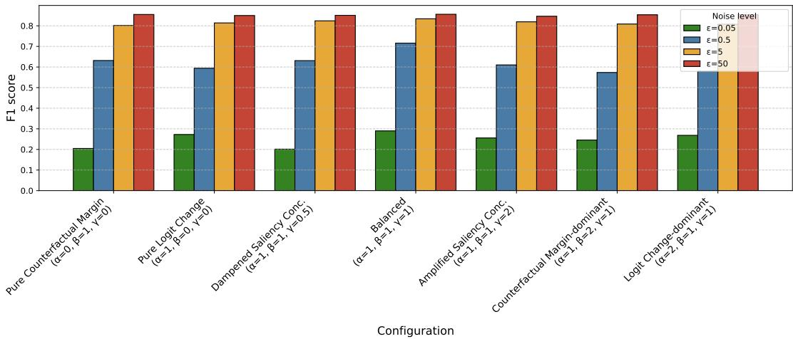

(a) Blood cells  
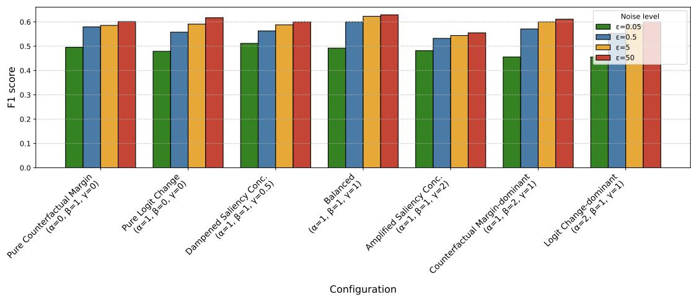  
(b) Chest X-rays  
Figure 7: Ablation analysis of signal component weights on predictive performance (F1 score) across noise levels (�). Each configuration (Table 5) varies the weights of the logit change (�), counterfactual margin (�), and saliency concentration (�) components.

## F Detailed Complexity Analysis

We performed an execution runtime complexity analysis with respect to our used hardware (a machine with a 64GB of RAM and a NVIDIA’s RTX 2080 Ti GPU) across all three datasets and our two evaluated model architectures. Specifically, we measured both the wall-clock duration of a single client training round and the incurred overhead relative to the standard client-level DP-SGD training (with static DP noise).

A standard DP-SGD training step costs approximately $3 { \cal F } + { \cal O } ( { \cal P } )$ per mini-batch, where � is the cost of a single training-mode for-ward pass through the model and � is the total number of model parameters: one forward pass contributes � , one backward pass contributes ≈ 2� , and batch-level gradient clipping with noise injection adds O(�) [1, 24]. XCal-FL adds an explainability-driven signal computation per mini-batch, consisting of two inferencemode forward passes (one on the original input and one on the masked input), followed by saliency mask operations on the last convolutional feature map. An inference-mode forward pass, $F _ { \mathrm { i n f : } }$ costs approximately $0 . 5 – 0 . 7 \times F$ since no computation graph is constructed and no intermediate activations are stored. The perstep cost of XCal-FL is therefore $3 F + 2 \cdot F _ { \mathrm { i n f } } + O ( P )$ . Notably, no additional backward pass is required for the explainability signal. This yields a theoretical overhead o $\mathrm { f } 2 \cdot F _ { \mathrm { i n f } } / ( 3 F + O ( P ) )$ .

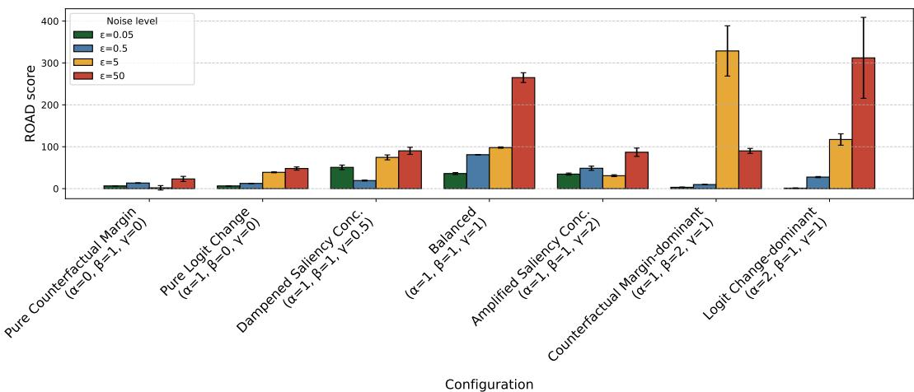

(a) Blood cells  
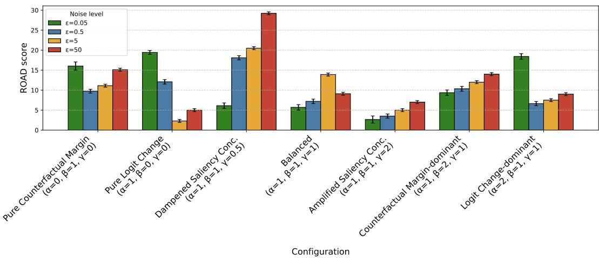  
(b) Chest X-rays  
Figure 8: Ablation analysis ofsignal component weights on explainability (ROAD score) across noise levels (�). Each configuration (Table 5) varies the weights of the logit change (�), counterfactual margin (�), and saliency concentration (�) components. Higher ROAD scores indicate stronger explainability fidelity.

Figure 9 reports the measured overhead across all configurations. XCal-FL incurs up to 80% overhead over static DP-SGD depending on dataset and architecture, which falls within the range of the theoretical overhead bound and is consistent with previous evalua- tion studies with FL [6]. AGP [30], which computes channel-level importance masks via GradCAM (requiring one additional forward and backward pass per mini-batch), exhibits comparable overhead in most configurations. The absolute per-round diference between XCal-FL and AGP is small, typically 1–3 seconds per client, while XCal-FL yields measurably higher model utility and interpretability fidelity (Sections 6.1 and 6.2). Practically, this overhead is purely local and does not increase communication cost, which remains the dominant bottleneck in cross-silo federated settings where model transmission over communication links typically requires seconds to minutes per round. Given the simultaneous gains in accuracy and explainability, this moderate computational overhead repre- sents a favorable trade-of for privacy-sensitive applications, such as clinical imaging.

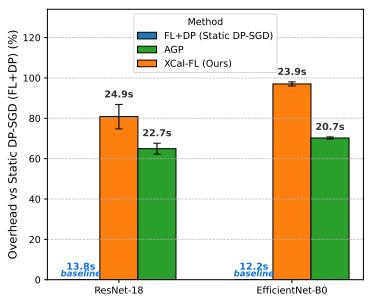  
(a) Blood cells

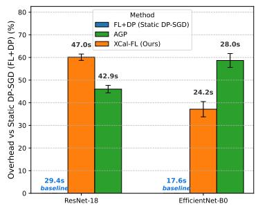  
(b) Chest X-rays

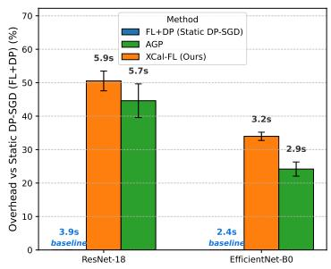  
(c) Melanoma  
Figure 9: Per-client training overhead (%) relative to standard static DP-SGD, measured across three medical imaging datasets and two model architectures: ResNet-18 (�=11.7M) and EficientNet-B0 (�=5.3M). Experiments were conducted on a NVIDIA’s RTX 2080 Ti GPU machine. Wall-clock per-client times (seconds), averaged over three runs, are annotated above each bar; error bars denote the standard deviation across rounds.