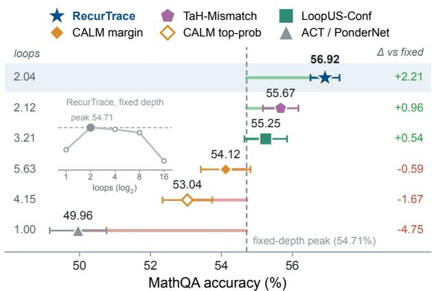
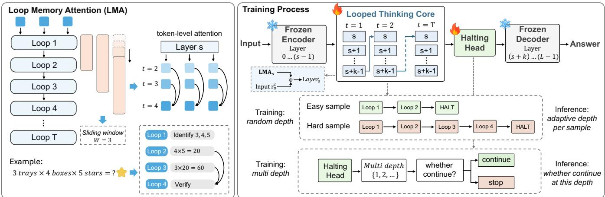
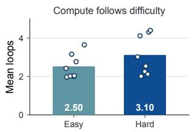
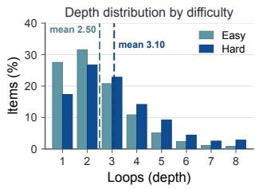
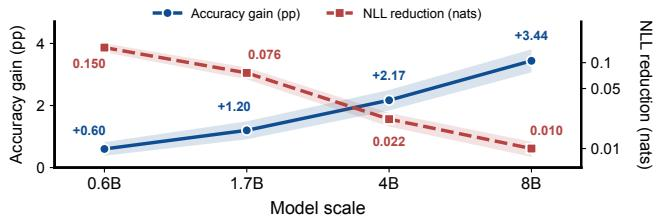
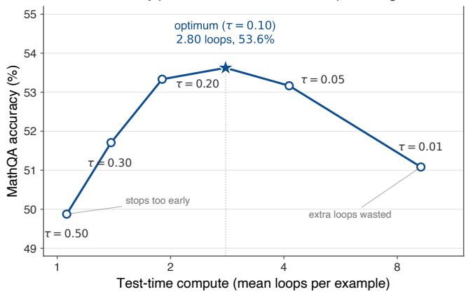

# RecurTrace: Adaptive Latent Reasoning with Loop-Time Memory

Yuxiang Wang1,2 Kunyu Feng1 Yingda Shen1 Haoning Xu2 Junyu Wang2 Zhizheng Wu1,3,4

1The Chinese University of Hong Kong, Shenzhen 2Tencent Hunyuan

3Shenzhen Loop Area Institute 4Amphion Technology Co., Ltd.

yuxiangwang1@link.cuhk.edu.cn

## Abstract

Repeating a small block of middle layers increases a language model’s efective inference depth without adding parameters or generating extra tokens, and recent work shows that this latent recurrence improves reasoning. However, two design choices limit these gains. Each iteration sees only the previous output and cannot directly access earlier computations. Moreover, a fixed loop count wastes depth on easy inputs while leaving hard ones with too little computation. We introduce RecurTrace, which addresses both limitations using the loop’s own trajectory. Specifically, Loop Memory Attention lets each looped layer attend to its own states from previous iterations along the loop-time axis, so the model can revisit earlier computations instead of relying on the latest state alone. A halting head then reads the loop state and predicts whether to continue, with supervision from an oracle that identifies when additional depth still reduces loss. In a controlled MathQA comparison on the same looped backbone, RecurTrace achieves 56.9% accuracy with an average of 2.0 loops, exceeding the best fixed loop depth by 2.2 points at matched compute. By comparison, ACT and PonderNet collapse to one loop, and CALM reaches only 54.1% with 5.6 loops, while the stronger LoopUS-Conf and TaH-Mismatch baselines reach 55.3% at 3.2 loops and 55.7% at 2.1 loops. Finally, RecurTrace improves generation accuracy over samebudget fine-tuned baselines at 0.6B, 1.7B, 4B, and 8B, with the gain growing with model size from 0.6 to 3.4 points.

## 1 Introduction

A transformer spends the same number of layers on an easy question and on a hard one. This is convenient for training but wasteful at inference. Reasoning quality scales with effective depth, whether the depth comes from stacking more layers, from spelling out a chain of thought in tokens (Wei et al. 2022), or from iterating a block of layers in latent space (Saunshi et al. 2025; Geiping et al. 2025). Among these routes, latent looping increases efective depth without emitting additional reasoning tokens. It adds depth at inference without new parameters or longer outputs, and it leaves the tokenizer and the decoding loop unchanged.

Two problems keep latent looping from delivering on this promise. The first is that the loop forgets. A looped block re-runs the same layers on their own output and passes forward only a single hidden state. Whatever an earlier iteration computed must fit into that state or be overwritten by later passes. A loop that cannot consult its own past cannot reason across iterations. The second problem is that the loop cannot budget. Looped models fix the iteration count for the whole dataset, so an easy question gets as many loops as a hard one. Figure 1 shows the cost. On MathQA, a 1.7B looped model peaks at two loops with 54.7% accuracy, stays near 53.6% at the eight-loop training clamp, and falls to 47.5% at sixteen. More loops soon stop helping and then hurt, so no fixed budget suits every input.

  
Figure 1: MathQA accuracy versus mean loop count by halting method (1.7B, 3 training × 8 evaluation seeds). Points are means ±1 SD across training seeds; the dashed line marks the best fixed depth (54.71%). RecurTrace reaches 56.92% at ∼2 loops, 1.25 points above TaH-Mismatch. Inset: fixeddepth accuracy peaks at 2 loops.

For the memory problem, two concurrent eforts attach external stores to looped language models, gated key-value banks in Frey et al. (2026) and a multi-slot bufer with readwrite routers in MeSH (Yu et al. 2025), each adding extra parameters and a learned read-write mechanism. For budgeting, Adaptive Computation Time (ACT) (Graves 2016) and PonderNet (Banino, Balaguer, and Blundell 2021) halt under a compute penalty or a geometric prior, confidence rules such as CALM (Schuster et al. 2022) exit once an intermediate state looks certain, and Mixture-of-Recursions gives each token its own recursion depth but trains its routers from scratch (Bae et al. 2025). On a pretrained model whose block is looped, a penalty on extra loops makes halting stop too early, and a confidence threshold makes it stop too late.

Our starting point is that the loop already produces everything both problems require, so no outside machinery is needed. The states it computed on earlier passes are a readymade memory, and the state it holds now carries evidence about whether another pass will change the answer. Therefore, we propose RecurTrace, which converts a pretrained Qwen3 model (Yang et al. 2025) into a memory-augmented looped reasoner with learned halting. For the forgetting problem, we give every looped layer a Loop Memory Attention module. Along a loop-time axis, each token attends from its current state to its own states from previous loops, so a layer can read what it computed one or two iterations earlier. The module sits beside the existing self-attention, adds few parameters, and mixes no information across token positions, so it cannot leak future tokens. For the budgeting problem, we train a halting head that reads the loop state and predicts whether a deeper loop will still help. Its supervision comes from an oracle that records, for each training example, the depth at which the answer stops improving, a measured target used directly, with no added compute penalty or confidence proxy. At inference the model loops until the head says stop, so depth is set per input rather than fixed across the dataset.

The memory and the halting head need each other. Without the memory, extra loops barely help, so the halting head gains little by running an input longer. Without the halting head, every input gets the same number of loops, so the extra loops the memory makes useful are wasted on easy inputs and denied to hard ones. Figure 1 previews the outcome on MathQA. RecurTrace reaches 56.9% at 2.0 loops, improving on the best fixed loop budget by 2.2 points at a comparable mean depth and beating every adaptive-compute baseline we test, including the recent LoopUS (Park et al. 2026) and Think-at-Hard (Fu et al. 2026b).

RecurTrace is also practical to adopt. All base weights stay frozen, the added modules hold at most about 2.2% of the parameters, and they start out nearly inactive, so a single loop reproduces the pretrained model exactly, a safe floor that more loops build on. Across 0.6B, 1.7B, 4B, and 8B, Recur-Trace raises generation accuracy over same-budget baselines at every scale, with the gain growing to 3.4 points at 8B, and lowers teacher-forced loss at all four. Our contributions are:

• Loop Memory Attention. An attention along the looptime axis through which every token reads its own states from earlier loops. The looped block stays fully weighttied and carries no external memory store.

• Oracle-distilled halting. A sequence-level halting head supervised by whether a deeper loop still lowers the loss, not by a prior, penalty, or confidence rule. It matches or exceeds the best fixed depth across six tasks.

• One model for every depth. One trained model serves every test-time loop depth, not one model for each budget, and the recipe holds from 0.6B to 8B with accuracy and likelihood gains over same-budget baselines.

## 2 Related Work

Looped and recurrent-depth transformers. Reusing layers to add depth without new parameters dates to the Universal Transformer (Dehghani et al. 2019), weight-tied models such as ALBERT (Lan et al. 2020), and deep equilibrium models (Bai, Kolter, and Koltun 2019). It pays of for reasoning, where Saunshi et al. (2025) show a looped k-layer block can rival a kL-layer network, Geiping et al. (2025) sample the iteration count to reach deeper unrolls, and Zhu et al. (2025) pretrain looped models at scale. Encode-Think-Decode (Koishekenov, Lipani, and Cancedda 2026) re-runs a pretrained middle block, and CoTFormer (Mohtashami, Pagliardini, and Jaggi 2025) interleaves looped and fresh representations. Plain-looping approaches pass only the previous output between iterations and keep no addressable record of intermediate states. RecurTrace adds that record and reads it with attention along the loop-time axis. Dreamer (Knupp et al. 2026) also attends along depth in a recurrent sparseexpert architecture, whereas RecurTrace grafts its loop-time read and halting onto a frozen dense model.

External stores sit outside the recurrence, including the gated memory banks of Frey et al. (2026) and the multi-slot bufer of MeSH (Yu et al. 2025). DiscoLoop (Fu et al. 2026a) and PonderLM (Zeng et al. 2026) instead feed re-encoded predictions back into the loop. RecurTrace keeps the block weight-tied and adds no store, querying only the trajectory the recurrence already produced. The concurrent LoopUS (Park et al. 2026) likewise recasts a pretrained model into encode-think-decode blocks with a selective gate, keeps no addressable history, and exits on a confidence rule we find overspends the loop budget.

Adaptive computation and early exit. Adaptive Computation Time (Graves 2016) accumulates a stopping probability, and PonderNet (Banino, Balaguer, and Blundell 2021) halts under a geometric prior over steps. For pretrained models, depth-adaptive decoding (Elbayad et al. 2020), Dee-BERT (Xin et al. 2020), and CALM (Schuster et al. 2022) exit early once a layer is confident, while Mixture-of-Depths (Raposo et al. 2024) spends each layer on only some tokens. Mixture-of-Recursions adapts the recursion depth per token with scratch-trained routers (Bae et al. 2025), and Think-at-Hard (Fu et al. 2026b) iterates only tokens predicted wrong after one pass. We instead adapt how often the looped block repeats, halt per sequence, and supervise the head with an oracle marking whether a deeper loop lowers the loss, not with a prior, penalty, confidence, or token-mismatch rule, so it asks when added depth pays of for the sequence rather than whether one token was wrong.

Scaling test-time compute. Chain-of-thought prompting (Wei et al. 2022), self-consistency (Wang et al. 2023), and adaptive test-time scaling (Zhai et al. 2026) use extra decoding compute; reinforcement learning trains reasoning models (Zhang et al. 2025). A complementary line stays latent, appending pause tokens (Goyal et al. 2024) or feeding hidden states back as continuous thoughts (Hao et al. 2025; Wei et al. 2025). Latent looping scales per-token computation without emitting tokens, and RecurTrace asks how to make each loop count and when to stop.

  
Figure 2: RecurTrace architecture. A frozen encoder feeds a weight-tied block that recurs to variable depth, re-injecting its input after the first loop. Before each looped layer, Loop Memory Attention reads same-position states from a three-loop sliding window. Random-depth training supports multiple depths, while an oracle-distilled halting head predicts whether another loop will help, allocating more computation to hard inputs. After halting, the remaining frozen layers generate the answer.

## 3 Method

RecurTrace starts from a pretrained LLM with L transformer layers, where layer ℓ maps a hidden state h to layer $\mathbf { \Omega } _ { \ell } ( h )$ . We designate a contiguous block of k middle layers, $\bar { \boldsymbol { B } } = \{ s , . . . , \bar { s + k - 1 } \}$ , as a looped thinking block and repeat it $\dot { T }$ times at inference. The layers before the block act as an encoder and the layers after it as a decoder, following the encode-think-decode view (Koishekenov, Lipani, and Cancedda 2026). Figure 2 shows the design. Three ingredients make the loop useful. A memory carries information across iterations, variable-depth training exposes the model to many depths, and a halting head picks the depth per input.

Choosing the looped block. We place the block where iterating helps most. Following the angular-distance probe of Koishekenov, Lipani, and Cancedda (2026), we first locate the broad middle span whose representations move least between adjacent layers, the span that behaves most like a fixed point, and then pick a compact three-layer window inside it by behavioral ablation. This yields layers 12–14 for the 28- layer 0.6B and 1.7B Qwen3 bases and layers 15–17 for the 36-layer 4B and 8B ones. Probe-core and late-block controls are comparable or weaker (Appendix B).

Looped computation. Let e be the block input, the output of layer s−1. We write $x _ { \ell } ^ { ( t ) }$ for the state produced by layer ℓ on loop t. Each loop after the first begins by re-injecting the block input,

$$
h  h + \alpha \mathrm { R M S N o r m } ( e ) ,\tag{1}
$$

with a scalar α initialized to zero in the ReZero style (Bachlechner et al. 2021), so injection starts as a no-op. Reinjecting the input anchors the recurrence as depth grows (Geiping et al. 2025), a device with roots in the deep-thinking and recall networks of Schwarzschild et al. (2021) and Bansal et al. (2022). Inside the loop, before applying each block layer we add a memory term and then run the unchanged layer,

Algorithm 1 Dificulty-adaptive looped inference   
Input tokens, with budget $\overline { { T _ { \mathrm { m a x } } } } .$ , floor $T _ { \mathrm { m i n } } ,$ and threshold τ   
Output next-token distribution   
1: h ← encode the input through layers 0..s−1, then set $e \gets h$   
2: for t = 1 to $T _ { \mathrm { m a x } }$ do   
3: if t > 1 then h ← h + α RMSNorm(e) (input injection)   
4: for $\ell \in B$ do   
5: if t > 1 then $h \gets h + \mathrm { L M A } _ { \ell } ( x _ { \ell } ^ { ( t - 1 ) } , M _ { \ell } ^ { ( t ) } )$   
6: h ← layer (h), then store $x _ { \ell } ^ { ( t ) } \gets h$ in $M _ { \ell }$   
7: end for   
8: pt ← σ(w⊤pool(h) + b) (continue probability)   
9: if $t \geq T _ { \operatorname* { m i n } }$ and $p _ { t } < \tau$ then break (easy input, stop early)   
10: end for   
11: return decode h through layers s+k..L−1 and the LM head

$$
h \gets h + \mathrm { L M A } _ { \ell } \Big ( x _ { \ell } ^ { ( t - 1 ) } , M _ { \ell } ^ { ( t ) } \Big ) ,\tag{2}
$$

$$
x _ { \ell } ^ { ( t ) } \gets \mathrm { l a y e r } _ { \ell } ( h ) ,\tag{3}
$$

where $M _ { \ell } ^ { ( t ) } \ = \ \{ x _ { \ell } ^ { ( t ^ { \prime } ) } \ | \ \operatorname* { m a x } ( 1 , t { - } W ) \ \leq t ^ { \prime } \ \leq \ t { - } 1 \}$ is a sliding window of the layer’s own outputs from up to W earlier loops. On the first loop $M _ { \ell }$ is empty, so $\mathrm { L M A } _ { \ell }$ returns zero, and at initialization T=1 reproduces the base model.

Loop Memory Attention. The memory term in Eq. (2) is an attention over the loop-time axis. For a query state $q = x _ { \ell } ^ { ( t - 1 ) }$ and a window of m past states stacked as $X ,$ we normalize both, form per-head queries, keys, and values Q, K, V with QK-normalization, and for every token position attend across the m loop slots,

$$
A _ { i , j } = \mathrm { s o f t m a x } _ { j } \left( \frac { Q _ { i } ^ { \top } K _ { i , j } } { \sqrt { d _ { h } } } - \beta _ { h } \left( t - t _ { j } \right) \right) ,\tag{4}
$$

$$
\begin{array} { r } { \mathrm { L M A } _ { \ell } ( q , X ) = \gamma \cdot g \odot \Big ( \big [ \sum _ { j } A _ { i , j } V _ { i , j } \big ] _ { i } W _ { o } \Big ) . } \end{array}\tag{5}
$$

The term $- \beta _ { h } ( t - t _ { j } )$ is a relative loop-distance bias with a free, signed, learnable per-head slope $\beta _ { h }$ , initialized to ALiBi values (Press, Smith, and Lewis 2022). Because the bias depends only on how many loops ago a state was written, the module extrapolates to more loops than it saw in training. The attention runs along loop time only and never mixes token positions, so it adds no path for future tokens to leak into the present. A scalar gate γ and a token-wise gate $g =$ $\sigma ( \operatorname { M L P } ( [ q , { \overline { { X } } } ] ) )$ ), where X is the mean of the memory, let the model close the memory on inputs that do not need it and open it on inputs that do. The combined gate starts near zero, so the memory path opens gradually during training. Reading the past through attention, rather than through an external bufer, also keeps the additions close to the pretrained model. The block stays weight-tied, no slot routing is learned, and the sliding window caps the cost of remembering at a constant.

Variable-depth training. We do not fix the loop count during training. On each forward pass we draw T from a clamped log-normal Poisson distribution (Geiping et al. 2025), which places most mass at small depths but keeps a heavy tail of deep unrolls, and we apply the language-model loss at the sampled depth. The realized distribution has a mean depth near 3.9, and about a fifth of passes run six or more loops (Appendix D). This single change lets one trained model serve any test-time depth and extrapolate beyond the depths it trained on. All loop parameters are added to the pretrained weights, and the nearly closed gates keep the model close to its starting point early in training.

Dificulty-adaptive halting. To decide how deep to go, we add a lightweight halting head. After loop t we pool the block state over prompt positions into a vector $z _ { t }$ and predict a continue probability $\bar { p _ { t } } = \sigma ( w ^ { \top } z _ { t } + b )$ . We supervise it by distilling an oracle that reads the same forward pass. Let $\mathcal { L } _ { t }$ be the per-example loss from decoding at depth t. The oracle marks “continue” only when a deeper loop helps,

$$
y _ { t } = \mathcal { k } \left[ \operatorname* { m i n } _ { t ^ { \prime } > t } \mathcal { L } _ { t ^ { \prime } } < \mathcal { L } _ { t } - \delta \right] ,\tag{6}
$$

for a margin δ, and the head is trained with binary crossentropy against y at a set of probe depths. The same head also supports the ACT and PonderNet objectives, which we use for the baselines. At inference (Algorithm 1) the model loops until the head says stop or a budget $T _ { \mathrm { m a x } }$ is reached, with a floor of $T _ { \mathrm { m i n } }$ loops. The stopping threshold τ is chosen on held-out data, taking the smallest mean depth that does not lose likelihood, and is never tuned on the test set.

## 4 Experiments

Our experiments answer three questions about whether learned halting beats the best fixed depth, whether the loopmemory gains carry across model scale and a broad task set, and what the extra loops cost.

## 4.1 Experimental Setup

Setup. We build RecurTrace on four Qwen3 scales (Table 1). At every scale we add the looped block to a pretrained checkpoint, freeze the base weights, and train only the loop, memory, injection, and halting parameters. Every comparison is against a no-loop baseline under a matched budget of steps, tokens, data, and hardware. Because the baseline fine-tunes the full model while RecurTrace adds at most about 2.2% trainable parameters, any budget mismatch favors the baseline. The training mixture holds about 1.15 million direct-answer examples combining synthetic generators with real math, multi-hop question answering, and controlled logic (Appendix A). Since every target is a short final answer, test-time loops add latent computation rather than output tokens. We evaluate a train-covered reasoning suite of 14 tasks including GSM8K (Cobbe et al. 2021), MATH (Hendrycks et al. 2021b), and MathQA (Amini et al. 2019), and a classic suite of eight general benchmarks including ARC (Clark et al. 2018), HellaSwag (Zellers et al. 2019), and MMLU (Hendrycks et al. 2021a), reporting greedy-decoding generation accuracy and teacher-forced NLL (nats, lower is better). BIG-Bench Hard (Suzgun et al. 2023) is diagnostic only.

<table><tr><td>Scale</td><td>L</td><td> $d _ { \mathrm { { m o d e l } } }$ </td><td>Loop block</td><td>Training</td></tr><tr><td>0.6B</td><td>28</td><td>1024</td><td>layers 12–14</td><td>loop modules</td></tr><tr><td>1.7B</td><td>28</td><td>2048</td><td>layers  $^ \mathrm { 1 2 - 1 4 }$ </td><td>loop modules</td></tr><tr><td>4B</td><td>36</td><td>2560</td><td>layers  $^ \mathrm { 1 5 - 1 7 }$ </td><td>loop modules</td></tr><tr><td>8B</td><td>36</td><td>4096</td><td>layers  $^ \mathrm { 1 5 - 1 7 }$ </td><td>loop modules</td></tr></table>

Table 1: Per-scale models. L is the number of base layers and $d _ { \mathrm { m o d e l } }$ the hidden size. Every scale freezes the base and trains only the loop, memory, injection, and halting parameters, with per-scale training schedules in Appendix A.

We run the controlled adaptive-halting comparison on MathQA at 1.7B, the setting with the most room for adaptive depth. Direct-answer GSM8K scores low at this scale and most classic suites peak at shallow depth, so both are less suited to the controlled study. From the MathQA test set we draw 8 non-overlapping evaluation seeds of 300 items each, giving 2400 unique items with no item shared across seeds, and select every stopping threshold on held-out data. This covers about 80% of the test set while supporting perseed variance estimates (Appendix E). We compare against fixed-loop baselines, ACT and PonderNet on the same backbone, the CALM confidence early-exit rule in its margin and top-probability forms, and the recent LoopUS-Conf and TaH-Mismatch. All four scales use three training seeds that vary the loop-module initialization and data order.

## 4.2 Learned Halting on MathQA

Learned halting beats the best fixed depth and, with a two-loop floor, avoids collapse. An adaptive halting head can fail in two opposite ways. It may collapse to a single loop, as indirect halting objectives tend to do when few inputs benefit from depth, or spend extra loops without improving accuracy. An efective head should beat the best fixed depth at matched compute while avoiding both. Table 2 shows that RecurTrace meets these criteria on MathQA at 1.7B across three training seeds. It reaches 56.9% accuracy (std 0.41 pp) at a mean of 2.04 loops, outperforming the best fixed depth (T=2) by 2.2 points at matched compute. The exact McNemar test (McNemar 1947; Fagerland, Lydersen, and Laake 2013) confirms this gain for every training seed $( p < 0 . 0 0 1$ , Appendix E). The improvement has two separable sources. The two-loop floor is what prevents collapse, raising the one-loop baseline from 1199 to 1313 correct; on top of it, the learned head adds 53 more by deepening mostly items that benefit. Without the floor the head itself mostly stops at one loop (Appendix G), so the floor guarantees the depth while the head allocates it. The baselines fail in opposite directions. ACT and PonderNet collapse to one loop and, even with the same floor, never deepen beyond it, so they do not exceed fixed T=2. CALM spends 5.6 loops but reaches only 54.1%. Two recent baselines narrow the gap. LoopUS-Conf, a learned confidence head with monotonicity training, reaches 55.3% at 3.2 loops, while TaH-Mismatch, which distills an oracle based on token mismatch, reaches 55.7% at 2.1 loops. Oracle supervision based on loss improvement lets RecurTrace surpass both with 56.9% at 2.0 loops. A correctness oracle that assigns each item the depth at which its greedy answer is correct reaches 61.0%. Recur-Trace therefore lies between the best fixed depth (54.7%) and this ceiling, closing about one third of the 6.3 point gap.

<table><tr><td>Method</td><td>Acc</td><td>Correct</td><td>Loops</td><td> $\Delta \stackrel { \triangledown } { \mathbf { v s } } T = 2$ </td></tr><tr><td>Fixed depth, T=1</td><td>49.96</td><td>1199</td><td>1.00</td><td>-114</td></tr><tr><td>Fixed depth, T=2</td><td>54.71</td><td>1313</td><td>2.00</td><td>0</td></tr><tr><td>Fixed depth, T=8</td><td>53.62</td><td>1287</td><td>8.00</td><td>-26</td></tr><tr><td>Fixed depth, T=16</td><td>47.54</td><td>1141</td><td>16.00</td><td>-172</td></tr><tr><td>ACT</td><td>49.96</td><td>1199</td><td>1.00</td><td>-114</td></tr><tr><td>PonderNet</td><td>49.96</td><td>1199</td><td>1.00</td><td>-114</td></tr><tr><td>ACT + floor</td><td>54.71</td><td>1313</td><td>2.00</td><td>0</td></tr><tr><td>PonderNet + floor</td><td>54.71</td><td>1313</td><td>2.00</td><td>0</td></tr><tr><td>CALM (top-prob)</td><td>53.04</td><td>1273</td><td>4.15</td><td>-40</td></tr><tr><td>CALM (margin)</td><td>54.12</td><td>1299</td><td>5.63</td><td>-14</td></tr><tr><td>LoopUS-Conf</td><td>55.25</td><td>1326</td><td>3.21</td><td>+13</td></tr><tr><td>TaH-Mismatch</td><td>55.67</td><td>1336</td><td>2.12</td><td>+23</td></tr><tr><td>RecurTrace</td><td>56.92</td><td>1366</td><td>2.04</td><td> $\mathbf { + 5 3 ^ { \dagger } }$ </td></tr></table>

Table 2: Adaptive depth on MathQA (1.7B, 3 training seeds × 8 non-overlapping evaluation seeds, 2400 unique items). Values are three-training-seed means. Acc is accuracy (%), Correct the mean number right of 2400, Loops the mean loop count, and ∆ the correct-answer gain over fixed $T { = } 2 .$ † exact McNemar $p < 0 . 0 0 1$ vs $T { = } 2$ on every training seed.

Fewer loops yield real speedups. A lower loop count is a real saving only if runtime is set by the loop rather than by the added modules, which contribute at most about 2.2% more parameters. Because every iteration re-runs the same three-layer block, runtime grows with depth: about 1.1× the base model at two loops against 1.7× at eight and more at sixteen (Appendix C). Stopping near two loops therefore buys a wall-clock speedup over deeper fixed schedules, not merely a smaller reported loop count.

The halting head spends compute where it is needed. Figure 3 shows depth tracks dificulty at an illustrative operating point (τ=0.10, mean 2.80 loops). An item is hard if it is wrong after one loop, easy otherwise. Hard items average 3.10 loops against 2.50 for easy ones, a gap of about 0.6 loops that stays positive on all eight seeds. The right panel shows both groups peak at two loops while hard items carry a heavier tail. At the main operating point in Table 2 (τ=0.50, mean 2.04 loops) the hard-easy gap is still positive at +0.06 loops even though 97.3% of items stop at the floor. Only ∼65 items per training seed deepen further yet supply the entire +53 net gain (56 wrong-to-right, 3 right-to-wrong), and 85% are oracle-positive (Appendix E).

  
Figure 3: Depth tracks dificulty on MathQA at the illustrative operating point τ=0.10 (Appendix G reports the main point). Left panel, hard items receive more loops than easy items on average (3.10 versus 2.50), with dots showing the 8 seeds. Right panel, both groups peak at two loops, but hard items have a heavier tail, a mean gap of about 0.6 loops.

<table><tr><td>Task</td><td>n</td><td>Fixed</td><td>Best</td><td>Adaptive</td><td>Loops</td></tr><tr><td>GSM8K</td><td>1319</td><td>5.5</td><td>9.2</td><td>10.4</td><td>1.72</td></tr><tr><td>MATH</td><td>1500</td><td>18.3</td><td>19.1</td><td>21.5</td><td>1.88</td></tr><tr><td>AQUA-RAT</td><td>254</td><td>40.2</td><td>43.3</td><td>44.1</td><td>1.14</td></tr><tr><td>ARC-Challenge</td><td>1172</td><td>63.8</td><td>67.9</td><td>69.7</td><td>1.06</td></tr><tr><td>HotpotQA</td><td>1500</td><td>37.2</td><td>38.1</td><td>39.6</td><td>2.76</td></tr></table>

Table 3: Per-task adaptive halting at 1.7B (each task trains its own head and threshold). Fixed is a T=8 budget, Best the best fixed depth over {1, 2, 4, 6, 8}, Adaptive the halting head, and Loops its mean loop count (n is the evaluation size, accuracies in %). These per-task heads run without the two-loop floor $( T _ { \mathrm { m i n } } { = } 1 )$ , so mean loops can fall below two. Adaptive matches or beats Best while cutting mean loops by 65–87%. Low accuracies reflect direct answers, not chainof-thought (Cobbe et al. 2021).

Adaptive halting transfers beyond MathQA. Oracle distillation transfers when each benchmark uses its own halting head and a threshold selected on held-out data rather than sharing one policy across tasks. Table 3 reports five tasks at 1.7B against two baselines. The Fixed baseline always runs eight loops, which wastes compute because these tasks rarely require that depth; against it, adaptive halting gains up to +5.9 points on ARC-Challenge and +4.9 on GSM8K while using far fewer loops. The stronger Best column selects each task’s best fixed depth from {1, 2, 4, 6, 8}, and adaptive halting matches or exceeds it on every task using only 1.1 to 2.8 loops on average.

Figure 4: Gains persist across scale. The is the generation accuracy gain over a same-budget fine-tuned baseline that grows to +3.4 points at 8B. The is the teacherforced NLL reduction, positive at every scale and largest at 0.6B, reaching 0.15 nats. Shaded bands denote ±1 standard deviation across 3 training seeds at each scale.
<table><tr><td>Suite</td><td>#</td><td>NLL △↓</td><td>Acc ∆ ↑</td></tr><tr><td>Train-covered</td><td>14</td><td>-0.05</td><td>+0.8</td></tr><tr><td>Classic</td><td>8</td><td>-0.13</td><td>+1.9</td></tr></table>

Table 4: Breadth at 1.7B against the same-budget fine-tuned baseline, by benchmark family. Teacher-forced NLL change (nats) and accuracy change (pp) are both at a fixed two-loop depth. Per-suite numbers are in Appendix F.

## 4.3 Scaling and Breadth

RecurTrace scales from 0.6B to 8B. Figure 4 compares RecurTrace with the same-budget fine-tuned baseline across model sizes at a fixed two-loop depth without adaptive halting. Generation accuracy over the combined train-covered and classic suites (22 tasks) improves at all four scales, by 0.6, 1.2, 2.2, and 3.4 points from 0.6B to 8B, and teacherforced NLL falls at all four, by 0.15, 0.08, 0.02, and 0.01 nats. All four gains use three training seeds (std 0.22, 0.29, 0.33, 0.37 pp from 0.6B to 8B). The two metrics diverge with scale because they average over diferent populations: NLL over every answer token, most of which a strong base already predicts confidently, accuracy only over items whose argmax flips (Appendix H). Separate ablations isolate the memory at every scale (Table 5), and a matched same-start control at 8B confirms the advantage.

Both task families gain, not just MathQA. The scaling results aggregate 22 tasks and could therefore be dominated by a few strong tasks. Table 4 addresses this concern at 1.7B by separating the 14 train-covered tasks whose training splits enter our mixture from the 8 classic multiple-choice benchmarks and comparing each family with the same-budget baseline. Both families improve on both metrics. Accuracy rises by +0.8 points on train-covered tasks and +1.9 on classic tasks (64.5% to 66.4%), while NLL decreases for both. Per-task results appear in Appendix F.

## 5 Ablations and Analysis

Having shown that RecurTrace works, we now ask why. We separate the loop memory from the extra depth it exploits, isolate what each loop component contributes, examine how the halting head behaves, and state the limits of these claims.

<table><tr><td>Plain looping</td><td>+ Memory</td></tr><tr><td>Likelihood, NLL ∆ over baseline (nats) ↓</td><td></td></tr><tr><td>0.6B -0.06</td><td>-0.15</td></tr><tr><td>1.7B +0.07 +0.05</td><td>-0.03</td></tr><tr><td>4B +0.06</td><td>-0.03</td></tr><tr><td>8B</td><td>-0.02</td></tr><tr><td>Generation accuracy at 1.7B (%) ↑</td><td></td></tr><tr><td>MathQA 52.4</td><td>54.7</td></tr><tr><td>Train-covered 33.2 64.0</td><td>34.3</td></tr><tr><td>Classic</td><td>66.4</td></tr><tr><td>Accuracy beyond the eight-loop training limit (%) ↑</td><td></td></tr><tr><td>Pointer-chasing 89.3 38.5</td><td>84.6</td></tr><tr><td>Symbolic state</td><td>56.2</td></tr><tr><td>Arithmetic</td><td>49.8</td></tr></table>

Table 5: Ablation of Loop Memory Attention against plain looping. Teacher-forced NLL ∆ is measured against the same-budget baseline on the train-covered suite at the bestlikelihood loop. Generation accuracy uses two loops at 1.7B. The last three rows test whether the model still solves problems that need more reasoning steps than training used, running the trained model past its eight-loop training limit on newly generated instances of three synthetic tasks whose symbols are held out from training.

## 5.1 What Drives the Gain

Loop Memory Attention is essential for efective looping. Table 5 isolates the contribution of Loop Memory Attention by comparing it with plain looping, thereby testing whether additional loop depth alone explains the gains. On the traincovered suite at 0.6B, plain looping lowers NLL by only 0.06 nats, while adding memory increases this reduction to 0.15 nats. At 1.7B, 4B, and 8B, plain looping instead raises NLL by 0.07, 0.05, and 0.06 nats. Memory reverses every one of these regressions and lowers NLL by 0.03, 0.03, and 0.02 nats. Extra iterations are therefore unreliable on their own, while access to previous loop states turns them into consistent refinement rather than representational drift. The same conclusion holds for generation. At 1.7B, memory raises accuracy over plain looping by 2.3 points on MathQA and 2.4 points on the classic suite. Freezing the base is not what earns the classic-suite gain, since plain looping freezes the same base yet reaches only 64.0%, below the fine-tuned baseline’s 64.5%, and only memory lifts it to 66.4%. Loop Memory Attention is therefore not a minor enhancement to recurrence but the mechanism that makes the added depth useful. The memoryless configuration is exactly the ETD baseline of Koishekenov, Lipani, and Cancedda (2026), making Table 5 a direct comparison with the closest prior method.

Task structure determines when memory helps. The last three rows of Table 5 run each model past its eight-loop training limit and test whether it still reaches the correct answer. The tasks come from synthetic generators with controllable dificulty and test symbols excluded from training, so accuracy reflects reasoning rather than memorization (Appendix A). Pointer chasing follows a mapping from one symbol to the next, so each step requires only the current symbol.

<table><tr><td>Configuration (1.7B)</td><td colspan="2">NLL ∆ (nats) ↓ MathQA (%) ↑</td></tr><tr><td>Full RecurTrace</td><td>-0.03</td><td>54.7</td></tr><tr><td>— QK-normalization</td><td>+0.05</td><td>52.8</td></tr><tr><td>Loop-distance bias frozen</td><td>-0.01</td><td>53.9</td></tr><tr><td>Gates open at initialization</td><td>+0.02</td><td>53.1</td></tr><tr><td>Memory window W=1</td><td>-0.01</td><td>53.5</td></tr><tr><td>Memory window W=2</td><td>-0.02</td><td>54.2</td></tr><tr><td>Memory window W=5</td><td>-0.02</td><td>54.1</td></tr></table>

Table 6: Component and window ablations at 1.7B, each changing one piece of Loop Memory Attention against the full top-row model. NLL ∆ is the teacher-forced NLL change over the same-budget baseline on the train-covered suite at best-likelihood loop (negative is better) and MathQA is generation accuracy at a fixed two-loop depth.

Symbolic state tracking applies rules that update an abstract state, while arithmetic applies numerical operations toward a final value. Both require intermediate results to persist across steps. This structural distinction explains the results. Plain looping leads by 4.7 points on pointer chasing, where past states are unnecessary. Memory instead leads by 17.7 points on symbolic state tracking and 16.7 points on arithmetic, where state must be preserved. The token-wise gate supports both regimes by suppressing memory for pure lookup and activating it when past states matter, allowing one model to handle all three tasks without separate tuning.

Capacity alone does not explain the gain. To separate recurrence from added capacity, we compare RecurTrace with a non-looped adapter of matched size trained on the same block under the same protocol. The adapter raises generation accuracy from 44.8% to 45.4%, half of RecurTrace’s 1.2- point gain, and lowers overall 22-task teacher-forced NLL by only 0.01 nats compared with RecurTrace’s 0.08. The larger gains therefore require looped depth with memory rather than additional parameters alone (Appendix H).

Additional optimization does not explain the memory gain. At 8B, we isolate the efect of memory from additional optimization by continuing the same plain-looping checkpoint for an equal number ofsteps with or without Loop Memory Attention. Across both seeds, adding memory lowers teacher-forced NLL by 0.03 to 0.04 nats, showing that the gain cannot be explained by the starting checkpoint or the training budget (Appendix H).

The memory components serve complementary roles. Table 6 ablates each component in turn from full RecurTrace. Removing QK-normalization causes the largest degradation, indicating its role in stabilizing memory training. Freezing the loop-distance bias or initializing the gates open also degrades both metrics, suggesting that the model should learn how to weight earlier loop states and introduce memory gradually without disrupting pretrained representations. Among the tested window sizes, W=3 performs best, supporting a compact three-state memory (Appendix C).

## 5.2 Halting Behavior

Indirect halting objectives collapse to one loop. ACT and PonderNet add an expected-depth penalty (ACT) or a geometric prior (PonderNet) on top of the same oracledepth signal RecurTrace distills, and both penalties reward stopping early. Because few examples benefit from additional loops, this generic pressure dominates the oracle quality signal and drives both methods to stop after one loop. Sweeping each baseline’s regularization strength over {0.001, 0.01, 0.1} leaves all six settings at a mean depth of 1.0, showing that the collapse is not tied to one hyperparameter choice (Appendix E). The collapse is a property of attaching penalty-based halting post hoc to a frozen backbone, not a refutation of either method in the end-to-end setting it was designed for. LoopUS-Conf avoids collapse by training a dedicated confidence head with a monotonicity objective (Park et al. 2026), but without an oracle it still overspends at 3.2 loops. TaH-Mismatch (Fu et al. 2026b) distills a token-mismatch oracle that marks whether the current depth mispredicts the answer, reaching 55.7% at 2.1 loops, closer to RecurTrace in compute but 1.2 points lower because the mismatch signal does not distinguish items that more depth can help from items that are simply hard. RecurTrace’s lossimprovement oracle captures this distinction (Figure 3).

One checkpoint supports multiple inference depths. Sampling the loop count during training lets the same checkpoint produce the fixed-depth curve in Figure 1 and allows the halting head to choose among depths without retraining. Because the loop-distance bias depends only on relative distance, it remains defined beyond the eight-loop training range. At sixteen loops the model stays stable at 47.5% accuracy, below its two-loop peak of 54.7% (Appendix D).

## 5.3 Limitations

Four aspects remain outside the present study. First, halting is sequence-level and assigns one depth to an entire example rather than to individual tokens. Second, Loop Memory Attention reads only same-position states from a fixed three-loop window, which keeps the cost bounded but excludes older states and cross-position memory. Third, our experiments use frozen Qwen3 decoder-only models and direct-answer targets, leaving other architectures and longform generation untested. Finally, latent looping and chainof-thought use diferent forms of compute and are complementary rather than direct substitutes, so combining them is a natural direction for future work.

## 6 Conclusion

We presented RecurTrace, which turns a pretrained LLM into a memory-augmented looped reasoner with adaptive halting. Loop Memory Attention gives each iteration access to earlier loop states, while an oracle-distilled halting head selects the loop count for each input. RecurTrace matches or exceeds the best fixed depth across six tasks and improves accuracy over same-budget baselines at every scale from 0.6B to 8B. These results show that the loop trajectory can support both memory and adaptive computation, suggesting a natural extension to chain-of-thought decoding.

## References

Amini, A.; Gabriel, S.; Lin, S. P.; Koncel-Kedziorski, R.; Choi, Y.; and Hajishirzi, H. 2019. MathQA: Towards Interpretable Math Word Problem Solving with Operation-Based Formalisms. In Proceedings of the 2019 Conference of the North American Chapter of the Associationfor Computational Linguistics.

Bachlechner, T.; Majumder, B. P.; Mao, H. H.; Cottrell, G. W.; and McAuley, J. 2021. ReZero Is All You Need: Fast Convergence at Large Depth. In Proceedings of the Thirty-Seventh Conference on Uncertainty in Artificial Intelligence.

Bae, S.; Kim, Y.; Bayat, R.; Kim, S.; Ha, J.; Schuster, T.; Fisch, A.; Harutyunyan, H.; Ji, Z.; Courville, A.; and Yun, S.-Y. 2025. Mixture-of-Recursions: Learning Dynamic Recursive Depths fo Adaptive Token-Level Computation. In Advances in Neural Infor mation Processing Systems.

Bai, S.; Kolter, J. Z.; and Koltun, V. 2019. Deep Equilibrium Models. In Advances in Neural Information Processing Systems.

Banino, A.; Balaguer, J.; and Blundell, C. 2021. PonderNet: Learning to Ponder. In 8th ICML Workshop on Automated Machine Learning.

Bansal, A.; Schwarzschild, A.; Borgnia, E.; Emam, Z.; Huang, F.; Goldblum, M.; and Goldstein, T. 2022. End-to-End Algorithm Synthesis with Recurrent Networks: Extrapolation without Overthinking. In Advances in Neural Information Processing Systems.

Bisk, Y.; Zellers, R.; Le Bras, R.; Gao, J.; and Choi, Y. 2020. PIQA: Reasoning about Physical Commonsense in Natural Language. In Proceedings ofthe AAAI Conference on Artificial Intelligence.

Clark, C.; Lee, K.; Chang, M.-W.; Kwiatkowski, T.; Collins, M.; and Toutanova, K. 2019. BoolQ: Exploring the Surprising Dificulty of Natural Yes/No Questions. In Proceedings of the 2019 Conference of the North American Chapter of the Association for Computational Linguistics.

Clark, P.; Cowhey, I.; Etzioni, O.; Khot, T.; Sabharwal, A.; Schoenick, C.; and Tafjord, O. 2018. Think You Have Solved Question Answering? Try ARC, the AI2 Reasoning Challenge. arXiv:1803.05457.

Cobbe, K.; Kosaraju, V.; Bavarian, M.; Chen, M.; Jun, H.; Kaiser, L.; Plappert, M.; Tworek, J.; Hilton, J.; Nakano, R.; Hesse, C.; and Schulman, J. 2021. Training Verifiers to Solve Math Word Problems. arXiv:2110.14168.

Dehghani, M.; Gouws, S.; Vinyals, O.; Uszkoreit, J.; and Kaiser, L. 2019. Universal Transformers. In International Conference on Learning Representations.

Elbayad, M.; Gu, J.; Grave, E.; and Auli, M. 2020. Depth-Adaptive Transformer. In International Conference on Learning Representations.

Fagerland, M. W.; Lydersen, S.; and Laake, P. 2013. The McNemar Test for Binary Matched-Pairs Data: Mid-p and Asymptotic Are Better than Exact Conditional. BMC Medical Research Methodology, 13(1): 91.

Frey, M.; Shomali, B.; Bashir, A. H.; Berghaus, D.; Koehler, J.; and Ali, M. 2026. Adaptive Loops and Memory in Transformers: Think Harder or Know More? arXiv:2603.08391.

Fu, H.; Guo, T.; Wang, Z.; Zhu, H.; Lee, J. D.; Jiao, J.; Russell, S.; and Mei, S. 2026a. DiscoLoop: Looping Discrete Em beddings and Continuous Hidden States for Multi-hop Reasoning. arXiv:2607.00341.

Fu, T.; You, Y.; Chen, Z.; Dai, G.; Yang, H.; and Wang, Y. 2026b. Think-at-Hard: Selective Latent Iterations to Improve Reasoning Language Models. In Latent and Implicit Thinking Workshop at the International Conference on Learning Representations.

Geiping, J.; McLeish, S.; Jain, N.; Kirchenbauer, J.; Singh, S.; Bartoldson, B. R.; Kailkhura, B.; Bhatele, A.; and Goldstein, T. 2025. Scaling up Test-Time Compute with Latent Reasoning: A Recurrent Depth Approach. In Advances in Neural Information Processing Systems.

Geva, M.; Khashabi, D.; Segal, E.; Khot, T.; Roth, D.; and Berant, J. 2021. Did Aristotle Use a Laptop? A Question Answering Benchmark with Implicit Reasoning Strategies. Transactions ofthe Associationfor Computational Linguistics.

Goyal, S.; Ji, Z.; Rawat, A. S.; Menon, A. K.; Kumar, S.; and Nagarajan, V. 2024. Think before You Speak: Training Language Models with Pause Tokens. In International Conference on Learning Representations.

Graves, A. 2016. Adaptive Computation Time for Recurrent Neural Networks. In NIPS 2016 Deep Learning Symposium.

Hao, S.; Sukhbaatar, S.; Su, D.; Li, X.; Hu, Z.; Weston, J.; and Tian, Y. 2025. Training Large Language Models to Reason in a Continuous Latent Space. In Reasoning and Planning for Large Language Models Workshop at the International Conference on Learning Representations.

Hendrycks, D.; Burns, C.; Basart, S.; Zou, A.; Mazeika, M.; Song, D.; and Steinhardt, J. 2021a. Measuring Massive Multitask Language Understanding. In International Conference on Learning Representations.

Hendrycks, D.; Burns, C.; Kadavath, S.; Arora, A.; Basart, S.; Tang, E.; Song, D.; and Steinhardt, J. 2021b. Measuring Mathematical Problem Solving with the MATH Dataset. In Advances in Neural Information Processing Systems Datasets and Benchmarks Track.

Ho, X.; Duong Nguyen, A.-K.; Sugawara, S.; and Aizawa, A. 2020. Constructing a Multi-hop QA Dataset for Comprehensive Evaluation of Reasoning Steps. In Proceedings of the 28th International Conference on Computational Linguistics.

Knupp, J.; Metzen, J. H.; Bohn, J.; Groh, G.; and Kersting, K. 2026. Depth-Recurrent Attention Mixtures: Giving Latent Reasoning the Attention It Deserves. arXiv:2601.21582.

Koishekenov, Y.; Lipani, A.; and Cancedda, N. 2026. Encode, Think, Decode: Scaling Test-Time Reasoning with Recursive Latent Thoughts. In Latent and Implicit Thinking Workshop at the International Conference on Learning Representations.

Lan, Z.; Chen, M.; Goodman, S.; Gimpel, K.; Sharma, P.; and Soricut, R. 2020. ALBERT: A Lite BERT for Self-Supervised Learning ofLanguage Representations. In International Conference on Learning Representations.

Ling, W.; Yogatama, D.; Dyer, C.; and Blunsom, P. 2017. Program Induction by Rationale Generation: Learning to Solve and Explain Algebraic Word Problems. In Proceedings of the 55th Annual Meeting ofthe Associationfor Computational Linguistics.

McNemar, Q. 1947. Note on the Sampling Error of the Diference Between Correlated Proportions or Percentages. Psychometrika, 12(2): 153–157.

Mihaylov, T.; Clark, P.; Khot, T.; and Sabharwal, A. 2018. Can a Suit of Armor Conduct Electricity? A New Dataset for Open Book Question Answering. In Proceedings of the 2018 Conference on Empirical Methods in Natural Language Processing.

Mohtashami, A.; Pagliardini, M.; and Jaggi, M. 2025. CoTFormer: A Chain of Thought Driven Architecture with Budget-Adaptive Computation Cost at Inference. In International Conference on Learning Representations.

Paperno, D.; Kruszewski, G.; Lazaridou, A.; Pham, Q. N.; Bernardi, R.; Pezzelle, S.; Baroni, M.; Boleda, G.; and Fernández, R. 2016.

The LAMBADA Dataset: Word Prediction Requiring a Broad Discourse Context. In Proceedings of the 54th Annual Meeting of the Associationfor Computational Linguistics.

Park, T.; Lee, Y.; Kim, D.; and Bae, H. 2026. LoopUS: Recasting Pretrained LLMs into Looped Latent Refinement Models. arXiv preprint arXiv:2605.11011.

Patel, A.; Bhattamishra, S.; and Goyal, N. 2021. Are NLP Models Really Able to Solve Simple Math Word Problems? In Proceedings ofthe 2021 Conference ofthe North American Chapter ofthe Associationfor Computational Linguistics.

Press, O.; Smith, N. A.; and Lewis, M. 2022. Train Short, Test Long: Attention with Linear Biases Enables Input Length Extrapolation. In International Conference on Learning Representations.

Raposo, D.; Ritter, S.; Richards, B.; Lillicrap, T.; Humphreys, P. C.; and Santoro, A. 2024. Mixture-of-Depths: Dynamically Allocating Compute in Transformer-Based Language Models. arXiv:2404.02258.

Roy, S.; and Roth, D. 2015. Solving General Arithmetic Word Problems. In Proceedings of the 2015 Conference on Empirical Methods in Natural Language Processing.

Sakaguchi, K.; Le Bras, R.; Bhagavatula, C.; and Choi, Y. 2020. WinoGrande: An Adversarial Winograd Schema Challenge at Scale. In Proceedings of the AAAI Conference on Artificial Intelligence.

Saunshi, N.; Dikkala, N.; Li, Z.; Kumar, S.; and Reddi, S. J. 2025. Reasoning with Latent Thoughts: On the Power of Looped Transformers. In International Conference on Learning Representations.

Schuster, T.; Fisch, A.; Gupta, J.; Dehghani, M.; Bahri, D.; Tran, V. Q.; Tay, Y.; and Metzler, D. 2022. Confident Adaptive Language Modeling. In Advances in Neural Information Processing Systems.

Schwarzschild, A.; Borgnia, E.; Gupta, A.; Huang, F.; Vishkin, U.; Goldblum, M.; and Goldstein, T. 2021. Can You Learn an Algorithm? Generalizing from Easy to Hard Problems with Recurrent Networks. In Advances in Neural Information Processing Systems.

Sinha, K.; Sodhani, S.; Dong, J.; Pineau, J.; and Hamilton, W. L. 2019. CLUTRR: A Diagnostic Benchmark for Inductive Reasoning from Text. In Proceedings of the 2019 Conference on Empirical Methods in Natural Language Processing.

Suzgun, M.; Scales, N.; Schärli, N.; Gehrmann, S.; Tay, Y.; Chung, H. W.; Chowdhery, A.; Le, Q. V.; Chi, E. H.; Zhou, D.; and Wei, J. 2023. Challenging BIG-Bench Tasks and Whether Chain-of-Thought Can Solve Them. In Findings ofthe Associationfor Com putational Linguistics: ACL 2023.

Tafjord, O.; Dalvi, B.; and Clark, P. 2021. ProofWriter: Generating Implications, Proofs, and Abductive Statements over Natural Language. In Findings of the Association for Computational Lin guistics: ACL-IJCNLP 2021.

Trivedi, H.; Balasubramanian, N.; Khot, T.; and Sabharwal, A. 2022. MuSiQue: Multihop Questions via Single-hop Question Composition. Transactions oftheAssociationfor Computational Linguistics.

Wang, X.; Wei, J.; Schuurmans, D.; Le, Q.; Chi, E. H.; Narang, S.; Chowdhery, A.; and Zhou, D. 2023. Self-Consistency Improves Chain of Thought Reasoning in Language Models. In International Conference on Learning Representations.

Wei, J.; Wang, X.; Schuurmans, D.; Bosma, M.; Ichter, B.; Xia, F.; Chi, E.; Le, Q.; and Zhou, D. 2022. Chain-of-Thought Prompting Elicits Reasoning in Large Language Models. InAdvances in Neural Information Processing Systems.

Wei, X.; Liu, X.; Zang, Y.; Dong, X.; Cao, Y.; Wang, J.; Qiu, X.; and Lin, D. 2025. SIM-CoT: Supervised Implicit Chain-of-Thought. arXiv:2509.20317.

Weston, J.; Bordes, A.; Chopra, S.; Rush, A. M.; van Merriënboer, B.; Joulin, A.; and Mikolov, T. 2015. Towards AI-Complete Question Answering: A Set ofPrerequisite Toy Tasks. arXiv:1502.05698.

Xin, J.; Tang, R.; Lee, J.; Yu, Y.; and Lin, J. 2020. DeeBERT: Dynamic Early Exiting for Accelerating BERT Inference. In Proceedings of the 58th Annual Meeting of the Association for Computational Linguistics.

Yang, A.; et al. 2025. Qwen3 Technical Report. arXiv:2505.09388.

Yang, Z.; Qi, P.; Zhang, S.; Bengio, Y.; Cohen, W. W.; Salakhutdinov, R.; and Manning, C. D. 2018. HotpotQA: A Dataset for Diverse, Explainable Multi-hop Question Answering. In Proceedings of the 2018 Conference on Empirical Methods in Natural Language Processing.

Yu, C.; Shu, X.; Wang, Y.; Zhang, Y.; Wu, H.; Li, J.; Long, R.; Chen, Z.; Xu, Y.; Su, W.; and Zheng, B. 2025. MeSH: Memory-as-State-Highways for Recursive Transformers. arXiv:2510.07739.

Zellers, R.; Holtzman, A.; Bisk, Y.; Farhadi, A.; and Choi, Y. 2019. HellaSwag: Can a Machine Really Finish Your Sentence? In Proceedings ofthe 57th Annual Meeting ofthe Associationfor Computational Linguistics.

Zeng, B.; Song, S.; Huang, S.; Wang, Y.; Li, H.; He, Z.; Wang, X.; Li, Z.; and Lin, Z. 2026. PonderLM: Pretraining Language Models to Ponder in Continuous Space. In International Conference on Learning Representations.

Zhai, Z.; Li, B.; Xiao, B.; Li, M.; and Wang, X. 2026. Adaptive Test-Time Compute Allocation for Reasoning LLMs via Constrained Policy Optimization. arXiv:2604.14853.

Zhang, K.; Zuo, Y.; He, B.; Sun, Y.; Liu, R.; et al. 2025. A Survey of Reinforcement Learning for Large Reasoning Models. arXiv:2509.08827.

Zhu, R.-J.; Wang, Z.; Hua, K.; Zhang, T.; Li, Z.; Que, H.; Wei, B.; Wen, Z.; Yin, F.; Xing, H.; et al. 2025. Scaling Latent Reasoning via Looped Language Models. arXiv:2510.25741.

<table><tr><td>Training budget (8B)</td><td>Baseline</td><td>RecurTrace</td></tr><tr><td>Stage 1 — Loop/memory training (matched same-budget)</td><td></td><td></td></tr><tr><td>Base weights</td><td>fine-tuned</td><td>frozen</td></tr><tr><td>Trainable parameters</td><td>≈8.2B</td><td>≈0.12B (≤ 2%)</td></tr><tr><td>Optimizer, schedule</td><td>AdamW, cosine</td><td>AdamW, cosine</td></tr><tr><td>Optimizer steps</td><td>800</td><td>800</td></tr><tr><td>Global batch (seq.)</td><td>128</td><td>128</td></tr><tr><td>Micro-batch × accum.</td><td>2 × 8</td><td>2 × 8</td></tr><tr><td>Max length (tokens)</td><td>1024</td><td>1024</td></tr><tr><td>Training tokens</td><td>≈105M</td><td>≈105M</td></tr><tr><td>Hardware</td><td>8×H800</td><td>8×H800</td></tr><tr><td>Precision</td><td>bfloat16</td><td>bfloat16</td></tr><tr><td>Fwd. layer-passes/token</td><td>L</td><td> $L + ( \bar { T } - 1 ) k$ </td></tr><tr><td>Training FLOPs (analytical)</td><td>≈ 6ND</td><td>≤6ND</td></tr><tr><td colspan="3">Stage 2 — Halting distillation (RecurTrace only; App. E)</td></tr><tr><td>Trained module</td><td></td><td>halting head</td></tr><tr><td>Base + loop modules</td><td></td><td>frozen</td></tr><tr><td>Optimizer steps</td><td></td><td>200</td></tr><tr><td>Learning rate, schedule</td><td></td><td>3e-4, cosine</td></tr><tr><td>Oracle horizon</td><td></td><td>depth 16</td></tr><tr><td>Oracle losses</td><td></td><td>cached offline</td></tr><tr><td>Extra FLOPs vs. Stage 1</td><td></td><td>&lt;20%</td></tr></table>

## A Implementation Details

This appendix records the configuration, training setup, and evaluation protocol behind the results in the main paper, together with the per-scale and per-suite breakdowns that the page limit keeps out of the body. Every value comes from a logged run. Where a quantity is not logged we describe it in words rather than supply a number.

Models and Looped Blocks. We build RecurTrace on four pretrained Qwen3 bases. Table 1 in the main text lists the architecture of each base and the block we loop. The 0.6B and 1.7B bases have 28 layers and loop layers 12–14. The 4B and 8B bases have 36 layers and loop layers 15–17. The block is always three contiguous layers, and Appendix B describes the angular-distance span probe and the compactwindow controls used to fix it. We add the loop parameters to the pretrained checkpoint and leave the base attention, the embeddings, and the tokenizer untouched. All four are base releases.

What We Train. At every scale we freeze the base weights and train the added modules in two stages. Stage 1 trains the loop modules, that is Loop Memory Attention and the inputinjection scalars, under the matched same-budget protocol against the baseline. Stage 2 then freezes the base together with the loop modules and distills the halting head on top (Appendix E), a separate optimization we run at all four scales. At each scale the baseline is a model fine-tuned under a matched budget, so the Stage 1 comparison is same-budget throughout. Appendix H reports the per-scale numbers.

Same-Budget Protocol and Training Budget. We use “same-budget” in a precise sense: the RecurTrace run and its baseline share every training axis we control (optimizer, schedule, global batch, maximum length, optimizer steps, total tokens, hardware, and precision), and difer only in what is trained. The baseline fine-tunes the full base model, while RecurTrace in this matched Stage 1 freezes the base and trains only the loop, memory, and injection modules, at most about 2.2% of the parameters (Table S1); the halting head is distilled in a separate Stage 2 (Table S1, Appendix E). This asymmetry means the two runs do not consume identical FLOPs, but the diference does not favor RecurTrace. Under the standard forward, activation-gradient, and weight-gradient ≈ 2:2:2 decomposition of training compute (≈ 6ND for N parameters and D tokens), RecurTrace’s loop unroll raises the forward cost, since at the mean training depth of 3.9 the three-layer block runs about 3.9 times, roughly 1.24× the baseline’s single forward pass on a 36- layer base. Freezing the base, however, removes the weightgradient term for about 98% of the parameters, one of the three equal contributions to full-fine-tuning compute. These efects roughly ofset, so RecurTrace’s total training FLOPs are comparable to, and by this accounting no larger than, the baseline at matched steps and tokens (of order $\overline { { 5 } } \times 1 0 ^ { 1 8 }$ analytical FLOPs at 8B for both). We did not separately log wall-clock GPU-hours or peak memory; these trade in opposite directions, since the baseline holds optimizer state for all parameters whereas RecurTrace instead stores activations across the loop unroll, so neither method gains a systematic

Table S1: Training-budget accounting at 8B, in two stages. In Stage 1 all controlled axes are matched; the baseline finetunes the full model while RecurTrace freezes the base and trains only the loop, memory, and injection modules (T¯≈3.9 mean training depth, k=3 looped layers, L=36). FLOPs are analytical (forward:backward ≈ 2:4), not wall-clock. Stage 1 trainable parameters and per-token compute difer, with any mismatch favoring the baseline. Stage 2 distills the halting head with the base and loop modules frozen (Appendix E); it is a RecurTrace-only cost outside the matched budget, adding 200 optimizer steps with depth-1–16 oracle losses pre-computed in a single ofline forward sweep over ≈5,000 examples, for less than 20% additional FLOPs beyond Stage 1. The fixed-two-loop scaling results (Table S12) use only the Stage 1 model, whereas the adaptive-halting results (Tables 2–3) rely on Stage 2.

runtime advantage. Any residual mismatch therefore favors the baseline, which trains far more parameters under a full gradient budget, so the reported same-budget gains are conservative rather than a product of extra training compute. The parameter-matched non-loop control and the matched same-start continuation at 8B (Appendix H) further isolate the gains from parameter count and optimization budget.

Loop Hyperparameters. Table S2 lists the loop configuration and the field names that set it. The loop configuration is shared across scales and comprises three looped layers, a training-depth clamp of eight, log-normal Poisson depth sampling with mean four and log-space deviation 0.5, a memory window of three loops, four Loop Memory Attention heads with QK-normalization, a scalar memory gate initialized to one, a token-wise gate whose bias starts at −3.0 (a sigmoid value near 0.047), and an input-injection scalar initialized to zero. The relative loop-distance bias starts at the ALiBi slopes but stays free and signed, so a head can flatten it or even prefer older memory.

Optimization and Hardware. All runs use eight H800 GPUs (80GB) with ZeRO-2 sharded data parallelism (optimizer states and gradients sharded across the eight GPUs), bfloat16, FlashAttention-2, and sequence packing that keeps sample boundaries isolated so no token attends across a packed example. The 0.6B and 1.7B loop modules train on the full reasoning mixture for fifteen epochs at a peak learning rate of 1e−4 with a cosine schedule, a global batch of 128 sequences, and a maximum length of 1024 tokens, which after sequence packing is roughly 25 thousand optimizer steps. The 4B and 8B loop-module runs are short follow-ups from their checkpoints, with the 4B modules training 300 steps at 1e−5 and the 8B modules for 800 steps.

Training Data. The reasoning mixture holds about 1.15 million direct-answer examples across seventeen files. It combines three synthetic generators (p-hop pointer chains, symbolic state tracking, and arithmetic word problems, each contributing roughly 150 thousand training items), a realmath group (GSM8K, MATH, AQUA-RAT (Ling et al. 2017), MetaMathQA, Orca-Math, and MathQA), a multihop question-answering group (HotpotQA (Yang et al. 2018), MuSiQue (Trivedi et al. 2022), 2WikiMultiHopQA (Ho et al. 2020), and StrategyQA (Geva et al. 2021)), and a controlledlogic group (ProofWriter (Tafjord, Dalvi, and Clark 2021), CLUTRR (Sinha et al. 2019), and bAbI (Weston et al. 2015)), with a small slice of C4 as a language anchor. Every example is direct-answer, so the target is the short final answer, not a chain of thought, and test-time loops add latent computation instead of output tokens. The two symbol-based tasks draw their test symbols from a held-out pool and the arithmetic generator samples fresh integer problems, so the extrapolation buckets are disjoint from training.

Train-Test Overlap Audit. Because the mixture includes MetaMathQA, Orca-Math, and other derivatives alongside GSM8K, MATH, and MathQA, we audit overlap with every benchmark test set before mixing. We lower-case and strip whitespace, then remove any training question that exactly matches a test question. We also drop training items whose 13-gram Jaccard similarity to a test question exceeds 0.85. Removals total 327 examples (0.03% of the mixture), all near-duplicates with zero exact matches. The main comparisons hold training data fixed across methods, but this audit limits how much test-surface leakage can shift which items benefit from extra loops.

Synthetic Reasoning Tasks. Three procedural generators supply the controllable part of the mixture, each contributing about 150 thousand direct-answer training items and a separately generated test set. The two symbol-based tasks (pointer chasing, symbolic state tracking) draw from a shared pool of 128 abstract symbols (random two-character uppercase codes with no semantic content), of which 96 are reserved for training and 32 are held out exclusively for testing, so their train and test sets share no symbol; the arithmetic generator instead samples integer problems fresh at test time. Dificulty is controlled by the number of sequential steps k the answer requires: training instances sample k uniformly from $\{ 2 , 3 , \ldots , 8 \}$ , matching the eight-loop training clamp, and test instances are organized into eight dificulty buckets at $k \in \{ 2 , 4 , 6 , 8 , 1 0 , 1 2 , 1 4 , 1 6 \}$ with 500 freshly generated instances per bucket (4 000 per task). The four buckets beyond the training range $( k \in { \dot { \{ 1 0 , 1 2 , 1 4 , 1 6 \} } } , 2 0 0 0$ instances), each evaluated at a matched loop depth $\scriptstyle \mathbf { \mathit { T } } = k$ , form the extrapolation subset reported in the bottom block of Table 5. Table S3 shows a worked example of each of the three tasks.

Pointer chasing. Each instance draws 32 symbols from the pool, arranges them as a random permutation (a one-toone mapping), and specifies a start symbol together with a target hop count k. The answer is the symbol reached after following the mapping k times. Because each hop reads only the current symbol to look up the next, the task is a stateless lookup that does not require remembering earlier steps.

Symbolic state tracking. The state is a 6-register vector, each register taking a value in {0, 1, 2, 3}. A rule is one of five atomic operations (assign, swap, increment-mod-4, conditional-set, copy) applied to one or two named registers. Each instance gives a random initial state and a sequence of k randomly sampled rules; the answer is the final register vector. Every step depends on the value the previous step produced, so intermediate state must be carried across loops.

Arithmetic. Each instance starts from a random integer in [1, 99] and lists k operations drawn from $\{ + n , \ - n , \ \times n \}$ with $n \in \{ 2 , 3 , \ldots , 9 \}$ . The answer is the integer obtained after applying all k operations in order. As with symbolic state tracking, intermediate results must survive across steps.

The two stateful generators (symbolic state tracking, arithmetic) are thus the ones that reward reading earlier loop states through Loop Memory Attention, while pointer chasing is the one that does not. Because the symbol-based test instances draw exclusively from the 32-token held-out pool (and arithmetic problems are sampled fresh), a correct answer cannot come from a memorized surface form, and because the extrapolation buckets require 10–16 sequential steps the model must compose the learned per-step reasoning beyond the depth it trained on.

## B Block Selection

We use the angular-distance probe of Koishekenov, Lipani, and Cancedda (2026) as the first stage of block selection. For every input we read the residual stream at the final token, the one position that a causal model lets see the whole sequence, and we record each layer’s hidden state. We then measure the angular distance between adjacent layers, $\begin{array} { r } { d ( x _ { \ell } , x _ { \ell + 1 } ) = \frac { 1 } { \pi } } \end{array}$ arccos cos $( x _ { \ell } , x _ { \ell + 1 } )$ , and average it over about ten thousand inputs. The resulting curve falls steeply across the early layers (the encoder), flattens through the middle (the reasoning-critical span that behaves like a fixed point), and rises again near the output (the decoder). The Kneedle knee-finder locates the encoder boundary on the forward curve and the decoder boundary on the reversed curve, and the layers between them form a loopable thinking span. Because that span can be wider than our three-layer compute budget, the second stage compares compact three-layer windows inside or near the span by downstream behavior.

On the 28-layer bases the probe is sharp. For Qwen3-0.6B, both the C4 validation set and the training mixture place the encoder at the first eleven layers and select layers 12–14 as the compact block. These three layers sit 15 to 25 percent below their neighbors, while no fourth layer is separated enough to add. The formal C4 probe on Qwen3-1.7B returns the same window, so both 28-layer models use 12–14.

<table><tr><td>Component</td><td>Field</td><td>Value</td><td>Component</td><td>Value</td></tr><tr><td>Looped layers</td><td> $1 0 0 9 \_ \mathrm { n u m \_ l a y e r s }$ </td><td>3</td><td>Token-gate bias  $( \dots { } . \mathrm { i n i t } \_ \mathrm { b i a s } )$ </td><td>-3.0</td></tr><tr><td>Max training depth</td><td> $\mathtt { l o o p \_ t r a i n \_ m a x }$ </td><td>8</td><td>Injection init α  $( \mathtt { \small . . . . i n j e c t i o n \_ i n i t } )$ </td><td>0.0</td></tr><tr><td>Depth sampler</td><td> $\mathtt { l o o p \_ s a m p l e \_ d i s t }$ </td><td>lognormal Poisson</td><td>Halting margin  $\delta \left( \ldots \cdot \cdot \mathsf { a u x \_ m a x g i n } \right)$ </td><td>0.01</td></tr><tr><td>Target mean depth</td><td> $\mathtt { l o o p \_ t r a i n \_ m e a n }$ </td><td>4.0</td><td>Halting depth cost  $( \ldots \mathrm { { \_ { d e p t h \_ } c o s t } ) }$ </td><td>0.0</td></tr><tr><td>Depth log-deviation σ</td><td> $\mathtt { l o o p \_ t r a i n \_ s i g m a }$ </td><td>0.5</td><td>Probe depths  $( \dots \dots \mathrm { a u x \_ d e p t h } s )$ </td><td>1,2,4,6</td></tr><tr><td>Memory window W</td><td> $\mathtt { l o o p \_ m e m o r y \_ w i n d o w }$ </td><td>3</td><td>Pooling  $( \ldots \cdot \cdot \mathtt { p o o l i n g } )$ </td><td>prompt mean</td></tr><tr><td>LMA heads</td><td> $\mathtt { l o o p \_ a t t n \_ n u m \_ h e a d s }$ </td><td>4</td><td> $\mathrm { O b j e c t i v e } \left( \dots \dots \mathrm { o b j e c t i v e } \right)$ </td><td>oracle</td></tr><tr><td>Scalar gate init γ</td><td> $\mathsf { l o o p \mathrm { \_ g a t e \_ i n i t } }$ </td><td>1.0</td><td>Inference floor  $T _ { \mathrm { m i n } } \left( \dots \cdot \cdot \mathrm { m i n \_ d e p t h } \right)$ </td><td>2</td></tr><tr><td>Inference budget  $T _ { \mathrm { m a x } }$ </td><td> $\texttt { . . . m a x \_ d e p t h }$ </td><td>16</td><td> $\mathrm { O r a c l e ~ h o r i z o n ( \dots . . . o r a c l e \_ m a x ) }$ </td><td>16</td></tr></table>

Table S2: Loop, memory, and halting hyperparameters with their configuration fields (the loop\_ prefix and, for halting fields, the loop\_halting\_ prefix are abbreviated as $\cdot \cdot \cdot )$ . Values are defaults used across scales. The ACT and PonderNet baselines reuse the head with objective set to act (expected-depth cost 0.01) or pondernet (geometric prior λ=0.2, KL weight 0.01).
<table><tr><td>Task</td><td>Example instance</td><td>Reasoning steps</td><td>Answer</td></tr><tr><td>Pointer chasing</td><td> $\mathrm { \bf M a p p i n g \ M K {  } T Q , \Delta T Q {  } Z R , \ Z R {  } V P , }$   $\mathtt { V P } \overset { \_ } { \to } \mathtt { H B } , \mathtt { H B } \longrightarrow \mathtt { M K } . \mathtt { S t a r t a t } \mathtt { M K \ a n d }$   $\mathrm { f o l l o w } k { = } 3 \mathrm { h o p s } .$ </td><td> $\mathtt { M K } \to \mathtt { T Q } \to \mathtt { Z R } \to \mathtt { V P }$ </td><td>VP</td></tr><tr><td>Symbolic state tracking</td><td>Initial state  $[ 2 , 0 , 1 , 3 , 0 , 2 ]$  over registers  $r _ { 0 } \mathrm { t o } r _ { 5 } . \mathrm { A p p l y } k { = } 4 \mathrm { r u l e s } .$  namely inc  $r _ { 0 }$  (mod 4), swap  $( r _ { 1 } , r _ { 3 } )$  , copy  $r _ { 4 }$  into and set  $r _ { 5 } { = } 1$  when  $r _ { 0 } { = } 3 .$ </td><td> $[ 2 , 0 , 1 , 3 , 0 , 2 ]  [ 3 , 0 , 1 , 3 , 0 , 2 ] $   $[ 3 , 3 , 1 , 0 , 0 , 2 ]  [ 3 , 3 , 0 , 0 , 0 , 2 ] $   $[ 3 , 3 , 0 , 0 , 0 , 1 ]$ </td><td>[3, 3, 0, 0, 0, 1]</td></tr><tr><td>Arithmetic</td><td> $^ { r _ { 2 } , }$  Start from 7 and apply k=4 operations  $\times 3 , + 8 , - 5 , \times 2 \ \mathrm { i n \ o r d e r } .$ </td><td> $7 \times 3 = 2 1 , 2 1 + 8 = 2 9 , 2 9 - 5 = 2 4 ,$   $2 4 \times 2 = 4 8$ </td><td>48</td></tr></table>

Table S3: Worked examples of the three synthetic reasoning tasks described in this appendix. Each row gives one instance, its reasoning steps, and the final answer the model must produce. The instances are deliberately small, using fewer symbols and steps than the deployed generators, so the reasoning is easy to follow. Pointer chasing needs only the current symbol at each hop, while symbolic state tracking and arithmetic must carry intermediate values across steps, which is why reading earlier loop states through Loop Memory Attention helps on the latter two.

On the 36-layer 4B and 8B bases, the C4 probe again puts the start of the thinking span near layer 14, but its lowest-distance core is not itself the best loop location. We therefore compare the deployed early-middle window, layers 15–17, against probe-core and late controls. At 4B, layers 15–17 improve likelihood relative to the baseline (negative log-likelihood changes of −0.0218 without generation and $- { \bar { 0 } } . 0 0 7 5$ with generation), while the probe-core window 24– 26 ties it. At 8B, layers 15–17 are the strongest among the tested windows on both likelihood and generation accuracy, the probe-core window 18–20 improves less, and a late window 27–29 at the same 800-step budget gives almost no improvement. These comparisons are relative rankings used only to fix the loop location. We therefore loop the compact early-middle thinking block for the 36-layer models, not an arbitrary deep block. The angular probe identifies the span, and the compact-window ablation fixes the final three layers.

## C Loop Memory Attention Details

Each looped layer carries its own memory. On loop t, layer ℓ reads only the states that layer ℓ wrote on earlier loops, never another layer’s states, and the attention runs along the looptime axis rather than the sequence axis. A token therefore attends from its current state to its own past-loop states at the same sequence position, which is why the module adds no path for one token to see another and cannot leak future tokens. The ordinary self-attention inside the unchanged decoder layer still does all of the cross-token mixing.

The query for the memory attention is the previous loop’s output of the same layer, which is also the newest key and value, so the query, keys, and values share one residual position and one source. We apply QK-normalization, an RM-SNorm on the per-head queries and keys before their dot product. Removing it causes the largest degradation in Table $^ { 6 , }$ indicating that the normalization stabilizes memory training. We bound the memory with a sliding window of $W { = } 3$ loops. Once $t > W$ , every loop reads the same number of past states, so the memory span remains fixed as depth grows and storage does not increase with the total loop count.

Two gates and one bias control the path. A per-layer scalar gate γ starts at one, and a token-wise gate $g \ =$ $\sigma ( { \mathrm { M L P } } ( [ q , { \dot { \overline { { X } } } } ] ) )$ ) starts from a bias $\mathrm { o f - 3 . 0 } ,$ a sigmoid value near 0.047, so the efective update through the memory is small at initialization while still receiving gradients. The input-injection scalar α starts at zero in the ReZero style (Bachlechner et al. 2021), so the injection path initially contributes nothing and can open gradually during training. Because injection begins only after the first loop and the first loop has no memory, every one-loop run exactly matches the frozen base computation both before and after training at all scales. The relative loop-distance bias is a free, signed, per-head slope initialized to the ALiBi values (Press, Smith, and Lewis 2022). The signed form lets a head learn a flat profile or a preference for older states, while the relative form remains defined at loop distances not observed during training. Memory attention adds no quadratic sequence term because each token attends over only its own $\dot { W }$ past-loop states. Its cost is $O ( \sec \mathrm { q } \times W )$ per looped layer per loop and $O ( \mathrm { s e q } \times W \times \mathrm { l o o p s } )$ over the full unroll, which reduces to O(seq ×loops) for fixed W, on top of the base model’s usual attention. Each looped layer uses four memory-attention heads of dimension 128 (width 512, well below $d ) ,$ so the attention needs four d×512 projections while the token-gate on $[ q , { \overline { { X } } } ]$ contributes the dominant $\sim 2 d ^ { 2 }$ ; summed over the three looped layers this is about 2.1 percent of the base at 0.6B (with Loop Memory Attention roughly 2.07 percent) and a small fraction (about 1.4–2.2%) at every scale, ≈0.12B at 8B. Under our measured teacher-forced setup, runtime is about 1.1× the unlooped baseline at two loops, 1.3× at four loops, and 1.7× at eight loops.

Inference-Time Behavior and Cost. At generation time the halting decision is read once from the prompt state, and the chosen depth is reused for every generated token, so no additional halting decision is made per generated token. Loop Memory Attention keeps at most W past-loop states per looped layer for each token. Its footprint therefore scales linearly with sequence length but remains constant in the total loop count. The looped layers’ self-attention cache does grow with loop count because each loop produces distinct keys and values. At the two-loop operating point, the selfattention and memory additions together are about 15% ofthe base key-value cache at 1.7B. Under our measured decoding setup, latency at the mean operating depth of 2.04 loops is about 1.1× the unlooped baseline.

## D Variable-Depth Training

We sample the loop count once per forward pass from the clamped log-normal Poisson distribution of Geiping et al. (2025). With target mean $\bar { r } = \mathsf { l o o p { \_ t r a i n \_ m e a n - 1 } }$ and log-space deviation $\sigma ,$ we draw $z \ \sim \ \mathcal N ( \log \bar { r } \ -$ ${ \scriptstyle { \frac { 1 } { 2 } } } \sigma ^ { 2 } , { \bar { \sigma } } )$ , set $r \sim$ Poisson $( e ^ { z } ) + 1$ , and clamp r to [1, loop\_train\_max]. With the defaults (mean four, $\sigma { = } 0 . 5 .$ , clamp eight) the realized distribution over depths is approximately 10% at one loop, 19% at two, 20% at three, $1 7 \%$ at four, 12% at five, 8% at six, 5% at seven, and 8% at eight, with a mean near 3.9, a median of four, and a heavy tail in which about a fifth of forward passes run six loops or more. The heavy tail is what exposes the model to deep unrolls and, together with the relative loop-distance bias, supports extrapolation beyond the training clamp. We apply the language-model loss at the sampled depth and do not use truncated backpropagation through the loop. The block is three layers and the memory window is three, so the unrolled graph stays small enough to backpropagate in full.

Distributed training keeps the depth in lock step. Every rank advances a per-forward counter from a shared seed and draws the same loop count, so the eight data-parallel workers run the same number of loops on each step without any extra communication. The trainer marks unused parameters as expected, because a step that samples a single loop never touches the memory parameters, and this keeps gradient synchronization correct under data parallelism.

## E Halting Head and Calibration

The halting head is a single linear layer that reads a pooled loop state and returns a continue logit, $p _ { t } = \sigma ( w ^ { \top } z _ { t } + b )$ We pool over prompt positions, with the prompt-mean pool as the default and a prompt-last pool available for the setting that matches the position predicting the first answer token. We train the head by distilling an oracle that reads the same forward pass. The oracle marks “continue” at depth t only when a deeper loop lowers the per-example loss by more than a margin, $y _ { t } \ = \ k [ \operatorname* { m i n } _ { t < t ^ { \prime } \leq 1 6 } \mathcal L _ { t ^ { \prime } } \ < \ \mathcal L _ { t } - \delta ]$ , with $\delta = 0 . 0 1$ by default. An optional depth cost can charge each extra loop a quality price before it counts as worthwhile, and we keep it at zero in the runs reported here. The loss for the answer comparison is the mean loss over answer tokens. We supervise the head at the probe depths {1, 2, 4, 6} with binary cross-entropy, freeze every other parameter, and optimize only the head with AdamW at a learning rate of ${ \mathrm { 3 e - 4 } } ,$ a cosine schedule with warmup, and gradient clipping at one. This head distillation is a separate second stage run at all four scales: we first train the loop, memory, and injection modules (the matched Stage 1 run of Table S1), then freeze them together with the base and fit only the halting head, at a diferent learning rate from Stage 1. Because the “continue” labels require the per-depth losses $\mathcal { L } _ { 1 } , \ldots , \mathcal { L } _ { 1 6 }$ of each training example, Stage 2 adds a forward-only depth-16 unroll over its training set; it runs for 200 optimizer steps on ${ \approx } 5 { , } 0 0 0$ examples, the oracle losses are precomputed once in a single ofline sweep, and this oracle-unroll compute is the primary cost reported in the FLOP accounting of Table S1. When continue labels are rare, an optional per-depth positive weight keeps the loop-one majority from washing them out.

At inference the model runs the loop and stops at the first depth $t \geq T _ { \operatorname* { m i n } }$ where the continue probability falls below a threshold τ, otherwise it runs to the budget $\dot { T _ { \mathrm { m a x } } } { = } 1 6$ . We use a floor of $T _ { \mathrm { m i n } } { = } 2$ in the main comparison so the halting head cannot collapse to a single loop. Both the floor and the threshold are fixed on held-out data and never on the test set: we choose τ by taking the smallest mean depth that does not lose held-out likelihood, and we select $T _ { \mathrm { m i n } }$ on the same heldout split. The floor therefore coincides with the best fixed depth ofTable 2 because the held-out likelihood profile puts it there, not because the test set was consulted. The main row in Table 2 uses the threshold selected by held-out negative loglikelihood $\left( \tau \mathrm { = } 0 . 5 0 \right)$ ), which spends 2.04 loops on average. An alternate selector on held-out accuracy $\scriptstyle \left( \tau = 0 . 4 0 \right)$ spends 2.06 loops at a similar operating point. A leave-one-seed-out check sets each seed’s threshold from the other seven seeds, testing whether the reported gain depends on a test-tuned threshold rather than on the halting head itself. Under this protocol the gain is +2.0 points (range $[ + 0 . 4 , + 3 . 8 ]$ across the eight leave-one-out folds), close to the held-out number, so the reported gain does not rely on a test-tuned threshold.

Paired Significance. We test the MathQA halting head against fixed-depth compute with paired statistics over the matched test items, using exact McNemar tests (McNemar 1947; Fagerland, Lydersen, and Laake 2013) on the discordant pairs and 10,000-sample paired bootstraps. The eight evaluation seeds are non-overlapping, so the 2400 items are unique instances and the McNemar test is computed on 2400 independent pairs. The counts below are three-training-seed means; the McNemar test gives $p < 0 . 0 0 1$ on every individual training seed. RecurTrace answers 53 more questions than the best fixed depth (1366 versus 1313 of 2400), a 2.2- point gain at matched mean depth (std 0.29 pp across training seeds), with a mean discordant split of56 to 3 (59 pairs) favoring adaptive halting and a 95% bootstrap interval, clustered on the eight evaluation seeds, of $[ + 0 . { \bar { 8 } } , + 3 . 6 ]$ percentage points. The 56 wrong-to-right transitions concentrate among the ∼65 items per training seed that receive more than two loops (Table S6), and the 3 right-to-wrong transitions confirm that the oracle-distilled head seldom over-loops an item already correct.

Full Test Set Check. The 2400 evaluation items cover about 80% of the MathQA test set and support per-seed variance across eight non-overlapping draws. A single-seed run on the full test set (2985 items) reaches 56.7% at 2.03 mean loops, within 0.3 pp of Table 2.

Composition of the Deepened Items. The ∼65 items per training seed deepened past the two-loop floor are analyzed by MathQA operation category, answer-token length, and one-loop hardness. ∼50 of ∼65 (77%) are hard by the oneloop split. They span several operation categories rather than concentrating in one family, and their median answer length stays close to the 2400-item subsample, so the gain is not driven by one template family.

Halting at Non-Probe Depths. Binary cross-entropy supervision uses probe depths {1, 2, 4, 6}, but inference assigns a continue probability at every integer depth. Table S5 shows halting decisions at depths 3 through 8. Table S4 reports held-out balanced oracle-label accuracy and area under the ROC curve at all depths 1–8. Depths 3, 5, and 7 sit between supervised probes, and each stays within 1.2 points of its nearest supervised neighbor, so the linear readout degrades smoothly across the depths it never saw rather than breaking at them.

Depth Histogram at the Main Operating Point. Table S5 reports how many of the 2400 test items stop at each loop depth under adaptive halting $( \tau { = } 0 . 5 0 , T _ { \mathrm { m i n } } { = } 2 )$ . The floor forces every item to two loops, and the conservative threshold stops 97.3% there. The remaining 65 items (2.7%) continue to three or more loops and account for the entire accuracy gain over the fixed two-loop budget. Among them, 48 stop after three loops, 10 after four, and 7 at depth five or beyond.

<table><tr><td>Depth</td><td>Supervised</td><td>Bal. acc (%)</td><td>AUROC</td></tr><tr><td>1</td><td>yes</td><td>68.0</td><td>0.76</td></tr><tr><td>2</td><td>yes</td><td>66.5</td><td>0.74</td></tr><tr><td>3</td><td>no</td><td>65.4</td><td>0.73</td></tr><tr><td>4</td><td>yes</td><td>64.2</td><td>0.71</td></tr><tr><td>5</td><td>no</td><td>62.8</td><td>0.69</td></tr><tr><td>6</td><td>yes</td><td>61.6</td><td>0.67</td></tr><tr><td>7</td><td>no</td><td>60.7</td><td>0.66</td></tr><tr><td>8</td><td>no</td><td>59.3</td><td>0.64</td></tr></table>

Table S4: Per-depth halting calibration on held-out MathQA items (median training seed). Balanced accuracy is the mean of per-class agreement rates with Eq. (6) continue labels, which accounts for the growing class imbalance at deeper depths. Depths 3, 5, and 7 are used at inference but not directly supervised.
<table><tr><td>Loop depth</td><td>Count</td><td>%</td></tr><tr><td>2</td><td>2335</td><td>97.3</td></tr><tr><td>3</td><td>48</td><td>2.0</td></tr><tr><td>4</td><td>10</td><td>0.4</td></tr><tr><td>5</td><td>3</td><td>0.1</td></tr><tr><td>6</td><td>2</td><td>&lt;0.1</td></tr><tr><td>7</td><td>1</td><td>&lt;0.1</td></tr><tr><td>8</td><td>1</td><td>&lt;0.1</td></tr><tr><td>&gt;2 (total)</td><td>65</td><td>2.7</td></tr></table>

Table S5: Depth histogram at the main operating point $( \tau \mathrm { { = } } 0 . 5 0$ $T _ { \mathrm { m i n } } { = } 2$ , 8 non-overlapping evaluation seeds, 2400 unique items). Counts are three-training-seed means (rounded). Most items halt at the floor; the 65 continuing to three or more loops drive the accuracy gain.

The mean depth is 2.04 loops, matching Table 2; no item reaches the $T _ { \mathrm { m a x } } { = } 1 6$ budget, so every stop is head-decided.

Paired Transition Breakdown. Table S6 cross-tabulates per-item correctness under adaptive halting versus the fixed two-loop baseline (three-training-seed means, rounded). Of 2400 items, 1310 are answered correctly by both methods and 1031 by neither, leaving 59 discordant pairs. Adaptive halting flips 56 items from wrong to right and only 3 from right to wrong, a net gain of +53 items (+2.2 points). All 56 wrongto-right transitions come from the ∼65 items that receive more than two loops, confirming that the extra computation is responsible for the accuracy gain. The 3 right-to-wrong cases are items where over-looping past the correct answer at depth two leads to a changed and incorrect response, but the oracle-distilled head keeps such regressions rare. The pattern holds across all three training seeds.

Halting-Head Calibration and an Oracle-Depth Bound. The counts here are three-training-seed means; because each seed deepens a diferent set, they are per-seed averages rather than one fixed set of items. The head deepens about 65 items per training seed and about 56 flip from wrong to right. Two distinct rates describe the deepened items. The oracle-label precision is about 85%: roughly 55 of the 65 are oraclepositive, their loss falling by more than the margin δ. The answer-flip rate is about 86%: roughly 56 of the 65 turn a wrong greedy answer right. Both rates are best read against their population base rates. At depth two about 153 of the 2400 items (6.4%) are oracle-positive, so the 85% precision on the selected tail is roughly thirteen times the population rate, at a recall of about 36% (55 of 153). The flip rate has a tighter reference. Of the 1087 items that fixed $T { \stackrel { - } { = } } 2$ answers wrongly, only 151 (13.9%) are answered correctly at any depth in 1–16, a count implied by the correctness ceiling below (61.0% is 1464 of 2400, against 1313 at fixed $T { = } 2 )$ Deepening a randomly chosen subset of the wrong items therefore flips at most 13.9% of them, so the head’s 86% is at least six times what blind deepening reaches, and it recovers 56 of the 151 recoverable items while touching only 65. This is consistent with the per-depth AUROC of 0.74 in Table S4, which summarizes ranking quality averaged over the whole distribution and places no bound on precision in the extreme tail that a threshold firing on 2.7% of items reads. The two rates need not coincide, since a supra-δ loss drop and a changed argmax are distinct criteria, but at this operating point both signals concentrate in the same tail. As an accuracy upper bound, a correctness oracle that assigns each item the depth at which its greedy answer is correct (if any depth yields a correct answer) reaches 61.0%. This is a diferent criterion from the loss oracle of Eq. (6), which marks whether a deeper loop lowers the teacher-forced loss rather than whether it flips the greedy answer. RecurTrace sits at $5 4 . 7 < 5 6 . 9 < 6 \bar { 1 . } 0 .$ , above the best fixed depth and below this correctness ceiling.

<table><tr><td></td><td colspan="2">Fixed T=2</td><td></td></tr><tr><td>Adaptive</td><td>Correct</td><td>Wrong</td><td>Total</td></tr><tr><td>Correct</td><td>1310</td><td>56</td><td>1366</td></tr><tr><td>Wrong</td><td>3</td><td>1031</td><td>1034</td></tr><tr><td>Total</td><td>1313</td><td>1087</td><td>2400</td></tr></table>

Table S6: Paired transition table of per-item correctness under adaptive halting (τ=0.50, $T _ { \mathrm { m i n } } { = } 2 )$ versus fixed $T { = } 2$ (three-training-seed means, rounded). The 56 wrong-to-right flips and 3 right-to-wrong flips yield a net +53. Exact Mc-Nemar $p < 0 . 0 0 1$ on every training seed.

The same head architecture supports all four trainedhalting baselines. With the ACT objective (Graves 2016) the head forms a halting distribution and pays an expecteddepth ponder cost of 0.01. With the PonderNet objective (Banino, Balaguer, and Blundell 2021) it pays a Kullback-Leibler penalty of weight 0.01 toward a geometric prior with parameter 0.2. Both objectives use the absolute distance to the oracle target depth as a per-depth surrogate quality cost, so they see the same labels as the oracle distillation. On the looped backbone both collapse to a single loop, as Table 2 reports, because the per-example loss is already low after one loop and the compute penalty dominates the small fraction of inputs that improve with depth. To rule out that this collapse is an artifact of a single untuned penalty, we also swept the ACT ponder cost and the PonderNet KL weight over {0.001, 0.01, 0.1} each, training only the halting head, and both stay collapsed at a mean depth of 1.0 loops across all six settings. We read this collapse as a property of attaching penalty-based halting post hoc to a frozen looped backbone, where the head is fitted after the representation it reads is fixed and cannot shape the network so that deeper loops pay of, rather than as a refutation of ACT or PonderNet in the end-to-end settings they were designed for.

LoopUS-Conf and TaH-Mismatch baselines. Two additional baselines use the same halting head but replace our oracle signal. LoopUS-Conf follows the LoopUS confidence recipe (Park et al. 2026): the head is trained with a binary cross-entropy confidence loss plus a monotonicity regularizer that encourages the continue probability to decrease with depth, without any oracle labels. The confidence threshold is selected on held-out data as for RecurTrace. TaH-Mismatch adapts the oracle signal of Think-at-Hard (Fu et al. 2026b) to the sequence level: the “continue” label at depth t is $y _ { t } = \mathbb { k } [ { \hat { a } } _ { t } \neq a ]$ , where $\hat { a } _ { t }$ is the greedy answer decoded at depth t and a is the reference answer, and the head is trained with binary cross-entropy against this token-mismatch target. Both baselines use the same head capacity, optimizer, and threshold-selection protocol as RecurTrace, isolating the efect of the supervision signal.

## F Benchmark Breakdown and Diagnostics

Table S7 lists the benchmark groups and diagnostic groups with item counts evaluated after bucket-stratified subsampling. The train-covered suite holds the fourteen tasks whose training splits enter the mixture, and the classic suite holds eight standard multiple-choice benchmarks. The held-out group, including the BIG-Bench Hard subsets, is diagnostic evidence only, not used for the main breadth claim. We evaluate with bucket-stratified sampling, reporting generation accuracy and teacher-forced NLL at loops in {1, 2, 4, 6, 8}.

Table S8 reports per-suite changes against the same-budget baseline at the two scales with full per-suite generation, 0.6B and 1.7B. At 1.7B the suite-level numbers match the breadth table in the body. Negative log-likelihood falls and accuracy rises on train-covered tasks and on the classic suite (+1.9 points). At 0.6B the likelihood gains are the largest across scales because the weaker base has more headroom, with both suites showing meaningful NLL reductions. The overall same-budget accuracy gains at 4B (+2.2 points) and 8B (+3.4 points) appear in Table S12. The held-out and BIG-Bench Hard rows remain diagnostic and are not read as a main claim. For transparency the diagnostic scores are +0.3 pp on the BIG-Bench Hard subsets (28.4% to 28.7%) and +0.4 pp on the remaining held-out tasks (34.8% to 35.2%) at 1.7B, weaker than the train-covered and classic results, consistent with treating them as out-of-scope diagnostics, not headline evidence.

## G Dificulty-Adaptation Details

We split each seed’s MathQA test items by correctness at a single loop. Easy items are already solved at loop depth one, and hard items, including items the model never answers correctly, need a deeper unroll (the easy/hard split is at loop depth one, where easy items are those answered correctly at $T { \bar { = } } 1$ and hard items are those answered incorrectly). This split is independent of the fixed two-loop baseline used for the paired transition counts, so the ∼50 hard items among the ∼65 deepened and the 56 wrong-to-right flips against fixed two loops are counted against diferent references and do not conflict. The body uses two operating points from the same model and seeds, distinguished by the stopping threshold and the floor. Table S9 reconciles them.

<table><tr><td>Suite</td><td># Benchmarks</td><td></td><td>Eval items</td></tr><tr><td>Train-covered</td><td>14</td><td>arithmetic, p-hop, symbolic, AQUA-RAT, bAbI, CLUTRR, GSM8K, HotpotQA, MATH, MathQA, MuSiQue, ProofWriter, StrategyQA, 2WikiMultiHopQA</td><td>45,722</td></tr><tr><td>Diagnostic held-out</td><td>8</td><td>BBH date understanding, BBH logical deduction (three and five objects), BBH multistep arithmetic, BBH tracking shuffled objects, LAMBADA (Paperno et al. 2016), MultiArith (Roy and Roth 2015), SVAMP (Patel, Bhattamishra, and Goyal 2021)</td><td>2,730</td></tr><tr><td>Classic</td><td>8</td><td>ARC-Easy, ARC-Challenge, OpenBookQA (Mihaylov et al. 2018), BoolQ (Clark et al. 2019), PIQA (Bisk et al. 2020), HellaSwag, WinoGrande (Sakaguchi et al. 2020), MMLU</td><td>4,785</td></tr></table>

Table S7: Benchmarks and diagnostics; “Eval items” are the subsampled counts actually evaluated, not full test-set sizes. The BIG-Bench Hard held-out group is retained only as a diagnostic and is excluded from the main breadth claim reported in the body.

<table><tr><td>Scale</td><td>Suite</td><td>NLLΔ↓</td><td>Acc ∆ (pp) ↑</td></tr><tr><td>0.6B</td><td>Train-covered</td><td>-0.11</td><td>+0.3</td></tr><tr><td>0.6B</td><td>Classic</td><td>-0.22</td><td>+1.1</td></tr><tr><td>1.7B</td><td>Train-covered</td><td>-0.05</td><td>+0.8</td></tr><tr><td>1.7B</td><td>Classic</td><td>-0.13</td><td>+1.9</td></tr></table>

Table S8: Per-suite generation results at 0.6B and 1.7B against a same-budget baseline (three-training-seed means at both scales). Both NLL ∆ (teacher-forced negative loglikelihood minus the no-loop baseline) and Acc ∆ (generation accuracy, pp) are measured at a fixed two-loop depth, matching Table S12. The overall 4B and 8B same-budget gains appear in Table S12.

Main operating point $( \tau = 0 . 5 0 , T _ { \mathrm { m i n } } { = } 2 )$ At the main operating point, the conservative threshold stops 97.3% ofitems at the two-loop floor (Table S5). The hard-minus-easy loop gap is +0.06 loops, smaller than at τ=0.10 but positive on all eight seeds (+0.02 to +0.11). Of the ∼65 items per training seed that receive more than two loops, ∼50 (77%) are hard by the loop-depth-one split, so the halting head routes compute to items that need it. The paired transition breakdown (Table S6) shows 56 of these items flip from wrong to right and only 3 from right to wrong, yielding the +53 net correctanswer gain. At this threshold the continue-probability distributions for oracle-positive and oracle-negative items remain separated on held-out data (Appendix E), so a small mean depth gap can still select a high-precision tail.

Dificulty operating point (τ=0.10). The dificulty figure reads the halting head at the deeper threshold (τ=0.10, mean 2.80 loops) that maximizes the held-out gain. Table S10 gives the per-seed mean depth on easy and hard items at this threshold. The halting head spends more loops on hard items than easy items on every one of the eight seeds, the gap averages 0.59 loops, and the smallest per-seed gap is still positive.

<table><tr><td>Setting</td><td>T</td><td> $\mathbf { T _ { m i n } }$ </td><td>Loops</td><td>Acc</td><td>Gap</td></tr><tr><td>Main (Tab. 2)</td><td>0.50</td><td>2</td><td>2.04</td><td>56.9</td><td>+0.06</td></tr><tr><td>Difficulty (Fig. 3)</td><td>0.10</td><td>none</td><td>2.80</td><td>53.6</td><td>+0.59</td></tr></table>

Table S9: Operating-point reconciliation. Both rows use the same model; the main row is the three-training-seed mean (Table 2) and the dificulty row the median training seed (Table S11). The main point $( \tau { = } 0 . 5 0 , T _ { \mathrm { m i n } } { = } 2 )$ is the operating point selected on held-out NLL, and the dificulty point (τ=0.10, no floor) maximizes the held-out gain and exposes the hard-minus-easy (H−E) gap more clearly. The dificulty point spends more compute (2.80 loops) yet reaches only 53.6% (1287 of 2400), below the best fixed depth, because without a floor it both stops some items too early and overcomputes others, lowering accuracy despite the higher mean depth. It is an illustration of the adaptation pattern, not a competing accuracy number.

Table S11 sweeps the shared threshold without the $T _ { \mathrm { m i n } } { = } 2$ floor and shows the trade it controls, which Figure S1 plots as a compute-accuracy curve. A lower threshold keeps the halting head looping, which raises the mean depth, lowers the loop-count reduction, and widens the hard-easy gap. A higher threshold stops sooner. Across the safe range every threshold keeps a nonnegative held-out gain on all eight seeds, and τ=0.10 is the value that maximizes the summed gain while keeping the hard-easy gap positive on every seed. At τ=0.50 without a floor the mean depth drops to 1.06 because the head is confident enough to stop most items after a single loop. Adding the $T _ { \mathrm { m i n } } { = } 2$ floor as in the main operating point forces every item to at least two loops and raises the mean to 2.04, producing the accuracy reported in Table 2.

## H Additional Ablations and Discussion

Memory Against Plain Looping. The consolidated ablation in Table 5 isolates Loop Memory Attention by removing it and looping the block as plain re-iteration. On the train-covered suite the teacher-forced NLL change against the same-budget baseline at the best-likelihood loop is −0.06 nats at 0.6B and +0.07 nats at 1.7B for plain looping, against −0.15 and −0.03 nats once the memory is added. At 4B and 8B the pattern strengthens: plain looping drifts to +0.05 and +0.06 nats while memory yields −0.03 and −0.02 nats. Plain looping on a stronger base drifts the representation without adding information, and memory turns the extra passes into an NLL reduction. The held-out and classic suites move the same direction at both scales, so the efect is not specific to training tasks. The generation-accuracy counterpart at 1.7B, where Loop Memory Attention improves over the memoryless Encode-Think-Decode-style baseline by 2.3 points on MathQA and 2.4 on the classic suite, is in the same table. These ablation runs are trained separately from the breadth models, so their full-model NLL changes on the train-covered suite difer from the breadth measurements (Tables 4 and S8) by 0.02 nats at 1.7B and 0.04 nats at 0.6B.

<table><tr><td>Seed</td><td>Easy loops</td><td>Hard loops</td><td>Gap</td></tr><tr><td>1</td><td>2.00</td><td>2.01</td><td>+0.01</td></tr><tr><td>2</td><td>2.77</td><td>4.12</td><td>+1.35</td></tr><tr><td>3</td><td>3.16</td><td>4.31</td><td>+1.15</td></tr><tr><td>4</td><td>1.97</td><td>2.12</td><td>+0.15</td></tr><tr><td>5</td><td>2.02</td><td>2.54</td><td>+0.51</td></tr><tr><td>6</td><td>2.42</td><td>3.02</td><td>+0.59</td></tr><tr><td>7</td><td>2.04</td><td>2.26</td><td>+0.22</td></tr><tr><td>8</td><td>3.65</td><td>4.40</td><td>+0.75</td></tr><tr><td>Mean</td><td>2.50</td><td>3.10</td><td>+0.59</td></tr></table>

Table S10: Mean loop depth on easy and hard MathQA items per evaluation seed at the dificulty operating point (τ=0.10), shown for the median training seed. Hard items receive more loops than easy ones on all eight evaluation seeds, and the mean gap is +0.59 loops. Gaps are computed from unrounded values. The pattern holds across all three training seeds.
<table><tr><td>T</td><td>Mean loop</td><td>Loop cut (%)</td><td>Hard—easy</td><td> $\pmb { \Delta }$  correct</td></tr><tr><td>0.01</td><td>9.24</td><td>42.3</td><td>+1.82</td><td>+85</td></tr><tr><td>0.05</td><td>4.13</td><td>74.2</td><td>+1.13</td><td>+135</td></tr><tr><td>0.10</td><td>2.80</td><td>82.5</td><td>+0.59</td><td>+146</td></tr><tr><td>0.20</td><td>1.90</td><td>88.1</td><td>+0.29</td><td>+139</td></tr><tr><td>0.30</td><td>1.39</td><td>91.3</td><td>+0.18</td><td>+100</td></tr><tr><td>0.50</td><td>1.06</td><td>93.4</td><td>+0.03</td><td>+56</td></tr></table>

Table S11: Shared-threshold sweep on MathQA (eight evaluation seeds, median training seed). Loop cut is the mean loopcount reduction relative to a sixteen-loop budget (1−T/¯ 16), not total compute. Hard−easy is the mean hard-minus-easy loop gap, and $\Delta$ correct is the summed gain in correct answers over that budget. The selected operating point (τ=0.10) is in bold.

Matched Same-Start Memory Control at 8B. To test loop memory at the 8B scale under a fixed budget, we start from a trained plain-looping checkpoint and continue training in two matched ways. One adds the loop-memory modules, a single-window memory with the gate and input injection trained without auxiliary losses, and the other continues plain looping for the same number of steps. The memory continuation reaches lower teacher-forced NLL than the matched plain continuation on both seeds, by 0.040 and 0.028 nats at the best loop and by 0.016 and 0.050 nats at four loops. Because the comparison shares the same starting checkpoint and the same extra budget, it isolates the memory from the additional training steps. We report it as a controlled singleconfiguration result rather than a broad necessity claim.

Accuracy peaks at an intermediate compute budget  
  
Figure S1: Sweeping the shared stopping threshold τ without the $T _ { \mathrm { m i n } }$ floor traces a compute-accuracy curve on MathQA. As τ falls the halting head keeps looping, so the mean loop count grows, and accuracy rises to an optimum near τ=0.10 (2.80 loops, 53.6%), then declines as extra loops are wasted. The six points are the thresholds in Table S11, accuracy recovered from the $\Delta$ correct column over the 2400 MathQA items.

Task Type Decides Plain Against Memory. A controlled study on the synthetic extrapolation buckets shows the picture is not one-sided. On pure pointer-chasing chains, where the task is a clean fixed-point iteration, plain looping extrapolates a little better than the memory variant at deep unrolls, which trails only slightly rather than collapsing. On the stateful tasks that must carry intermediate values, the symbolic and arithmetic chains, the memory variant is the stronger of the two. This is the behavior the token-wise gate is designed to reconcile. It can close the memory on stateless patterns and open it on stateful ones, which is why a single setting holds across the breadth suites without per-task tuning. The per-bucket accuracies behind this split appear in the bottom block of Table 5 in the main text.

Parameter-Matched Non-Loop Control. A looped model adds about 2.2 percent trainable parameters over the frozen base, so one alternative explanation for its gains is the extra capacity rather than the recurrence. To separate the two at 1.7B we train a non-looped control that adds the same budget of trainable parameters, a low-rank adapter of matched size on the same block, but applies it only once with no looping, and we compare it against RecurTrace under identical data, steps, and evaluation. The matched-capacity control reaches 45.4% generation accuracy against the 44.8% samebudget baseline, so it captures about half of RecurTrace’s +1.2-point gain, and adding recurrence and memory supplies the other half to reach 46.0%. The likelihood picture is more one-sided, since the capacity control lowers the overall 22-task teacher-forced NLL by only 0.01 nats against that baseline while RecurTrace lowers it by 0.08. Repeated depth with memory, not added capacity alone, carries the efect.

<table><tr><td>Scale</td><td>Baseline Acc</td><td>Loop Acc</td><td>Acc ∆ ↑</td><td>NLLΔ↓</td></tr><tr><td>0.6B</td><td>35.2</td><td>35.8</td><td>+0.6</td><td>-0.15</td></tr><tr><td>1.7B</td><td>44.8</td><td>46.0</td><td>+1.2</td><td>-0.08</td></tr><tr><td>4B</td><td>58.6</td><td>60.8</td><td>+2.2</td><td>-0.02</td></tr><tr><td>8B</td><td>66.6</td><td>70.0</td><td>+3.4</td><td>-0.01</td></tr></table>

Table S12: Overall 22-task (unweighted task mean) generation accuracy (%) and teacher-forced NLL change (nats) over the same-budget fine-tuned baseline at each scale, at a fixed two-loop depth, shown to one decimal. Every row averages 3 training seeds (std 0.22, 0.29, 0.33, 0.37 pp from 0.6B to 8B). Per-suite and per-task breakdowns appear in Tables S8, S13, and S14.

Per-Scale Summary. Table S12 collects the same-budget generation-accuracy and teacher-forced NLL changes across scales. Accuracy gains grow with scale, from +0.6 to +3.4 points, while the teacher-forced NLL reduction shrinks over the same range, from 0.15 to 0.01 nats. We read the two trends as consistent rather than conflicting, because the metrics average over diferent populations. Teacher-forced NLL is a mean over every answer token, and most of those tokens a strong base already predicts confidently, so the headroom a ≈2% module can move shrinks toward zero as the base improves and the mean barely shifts. Generation accuracy records only whether the argmax changes, so it is decided by the minority of items whose top two candidates sit close together, where a logit change too small to register in the mean NLL is enough to flip the answer. At 0.6B the base is weak, so likelihood has broad headroom while many of the items it improves remain far from correct; at 8B the balance reverses. The paragraphs below expand on the 4B and 8B rows.

The 4B Comparison. At 4B, RecurTrace improves generation accuracy by 2.2 points over a fine-tuned baseline trained under the same budget, and it lowers teacher-forced NLL by about 0.02 nats. The gain is consistent with the smaller scales and is measured against the same-budget baseline rather than a per-task loop oracle. The 300-step module follow-up is shorter than the 0.6B and 1.7B schedules, so we treat this row as an initial scale check rather than a fully matched training-length replication. The halting head is distilled at 4B as at the other scales (Stage 2, Table S1); we report this scaling row at a fixed two-loop depth and leave a full adaptive-halting evaluation at 4B to future work.

The 8B Comparison. At 8B, RecurTrace improves generation accuracy by 3.4 points over a same-budget fine-tuned Qwen3-8B baseline. Table S13 reports the full per-suite breakdown with absolute accuracies across three seeds. The baseline fine-tunes all attention and feed-forward parameters of Qwen3-8B-Base on the same reasoning mixture for 800 optimizer steps using eight H800 GPUs, bfloat16 precision, a global batch of 128, a peak learning rate of 1e−5 with a cosine schedule, and a maximum length of 1024 tokens. RecurTrace freezes the base and trains only the loop, memory, and injection modules (≈0.12B, at most 2%) for the same 800 steps with the same optimizer and schedule (Stage 1); the halting head is distilled separately afterwards (Stage 2, Appendix E). Both runs therefore consume about 105M training tokens (800 steps × 128 sequences × 1024 tokens), each on the same hardware and precision, with the training budget accounted for in Table S1: because the baseline updates all ≈8.2B parameters while RecurTrace updates only the added modules, any budget mismatch favors the baseline, so the gain is not an artifact of extra training compute. The comparison replaces an earlier one against the untuned Qwen3-8B-Base, which overstated the gap by also measuring the distance from an untrained checkpoint to any supervised model. RecurTrace at 8B is evaluated at a fixed two-loop depth; the halting head is not invoked in this scaling comparison, so the reported gain reflects the loop-memory mechanism. Teacher-forced NLL drops by 0.01 nats at 8B, a small but consistent improvement.

<table><tr><td>Suite</td><td>Baseline</td><td>RecurTrace</td><td>∆ (pp) ↑</td></tr><tr><td>Train-covered (14 tasks)</td><td>62.3</td><td>66.9</td><td>+4.6</td></tr><tr><td>Classic (8 tasks)</td><td>74.0</td><td>75.4</td><td>+1.4</td></tr><tr><td>Overall (22 tasks)</td><td>66.6</td><td>70.0</td><td>+3.4</td></tr></table>

Table S13: 8B per-suite generation accuracy (%) over three seeds. The baseline is a same-budget fine-tuned Qwen3-8B. Overall is the unweighted mean over all 22 tasks, i.e., the task-count-weighted mean of the two suite rows. Per-seed overall gains are +3.02, +3.69, +3.61 (mean 3.4, std 0.37 pp). Teacher-forced NLL drops by 0.01 nats.

Table S14 gives the per-task breakdown for selected benchmarks at 8B. Among the displayed train-covered tasks, gains range from +3.4 to +5.3 pp, and across all 14 train-covered tasks they range from +1.7 to +6.1 pp, while classic commonsense benchmarks are more mixed (−0.6 to +3.1 pp), and two of them (BoolQ, WinoGrande) show small negative changes within seed noise. This pattern is consistent with a mechanism that adds latent reasoning depth rather than general capacity. Per-task three-seed standard deviations range from 0.4 to 1.9 pp, and the overall per-seed standard deviation is 0.37 pp.

Reproducibility. The looped model lives in the local Qwen3 modeling code and loads on top of standard Qwen3 checkpoints, so the base weights load unchanged and only the loop parameters initialize fresh. All training uses eight H800 GPUs. The evaluation sweeps loops in {1, 2, 4, 6, 8} with bucket-stratified sampling and reports both generation accuracy and teacher-forced negative log-likelihood. The MathQA adaptive comparison aggregates eight seeds of three hundred items each, for 2400 test items, and selects every

<table><tr><td colspan="4">Train-covered tasks</td><td colspan="4">Classic tasks</td></tr><tr><td>Task</td><td>Base</td><td>Loop</td><td>Δ↑</td><td>Task</td><td>Base</td><td>Loop</td><td>Δ↑</td></tr><tr><td>GSM8K</td><td>44.8</td><td>50.1</td><td>+5.3</td><td>ARC-Easy</td><td>82.3</td><td>84.0</td><td>+1.7</td></tr><tr><td>MATH</td><td>31.6</td><td>36.4</td><td>+4.8</td><td>ARC-Challenge</td><td>69.5</td><td>72.6</td><td>+3.1</td></tr><tr><td>MathQA</td><td>67.5</td><td>72.6</td><td>+5.1</td><td>OpenBookQA</td><td>70.1</td><td>71.9</td><td>+1.8</td></tr><tr><td>AQUA-RAT</td><td>51.8</td><td>55.9</td><td>+4.1</td><td>BoolQ</td><td>79.8</td><td>79.4</td><td>-0.4</td></tr><tr><td>HotpotQA</td><td>54.6</td><td>59.8</td><td>+5.2</td><td>PIQA</td><td>81.6</td><td>82.1</td><td>+0.5</td></tr><tr><td>bAbI</td><td>89.2</td><td>92.6</td><td>+3.4</td><td>HellaSwag</td><td>74.8</td><td>76.9</td><td>+2.1</td></tr><tr><td>ProofWriter</td><td>79.4</td><td>83.7</td><td>+4.3</td><td>WinoGrande</td><td>71.6</td><td>71.0</td><td>-0.6</td></tr><tr><td></td><td></td><td></td><td></td><td>MMLU</td><td>62.4</td><td>65.4</td><td>+3.0</td></tr></table>

Table S14: Per-task generation accuracy (%) at 8B, three-seed mean. Base is the same-budget fine-tuned Qwen3-8B baseline, and Loop is RecurTrace. Multi-step reasoning tasks gain the most, while two classic benchmarks show small negative changes within seed noise. The remaining seven train-covered tasks (arithmetic, p-hop, symbolic, CLUTRR, MuSiQue, StrategyQA, 2WikiMultiHopQA) range from +1.7 to +6.1 pp. Per-task three-seed standard deviations range from 0.4 to 1.9 pp.  
threshold on held-out data. The block-selection probe, the synthetic data generators, and the evaluation scripts are deterministic given their seeds and configurations.