# Risk and Anomaly Identification for Distribution Network Optimal Operation Based on Reinforcement Learning and Uncertainty Quantification

Ziqi Zhang, Member, IEEE

Abstract—Reliable operation of modern distribution networks requires timely identification of operational risks and anomalous events under pervasive uncertainty. In practice, operators must identify risks that are inherent in stochastic yet in-distribution conditions, and anomalies that correspond to out-of-distribution behaviors such as unusual load patterns, extreme weather or cyber-physical attacks. This paper addresses this joint risk and anomaly identification problem for optimal distribution network operation and proposes a deep reinforcement learning framework that is explicitly uncertainty aware. We integrate distributional and Bayesian deep reinforcement learning to realize a secondorder uncertainty quantification scheme that decomposes total uncertainty into aleatoric and epistemic components, which are respectively used to characterize inherent risk and out-ofdistribution anomalies. The resulting epistemic estimates drive both exploration during training and out-of-distribution detection with fallback control during deployment, whereas aleatoric estimates are used to characterize intrinsic operational risk. Simulation results demonstrate the performance of our DRL agent and the effectiveness of the uncertainty quantification.

Index Terms—Anomaly detection, deep reinforcement learning, distribution network operation, energy management systems, uncertainty quantification.

## I. INTRODUCTION

M ODERN distribution network (DN) operation is in-creasingly shaped by renewable energy sources (RES) creasingly shaped by renewable energy sources (RES) such as solar photovoltaics (PV), distributed energy storage systems (ESS) and distributed diesel generators (DGs). These factors make operation stochastic, high-dimensional, and timecoupled. Model-free deep reinforcement learning (DRL) [1] gives real-time policy for nonlinear DNs. However, despite DRL’s advantages, vanilla DRL techniques face trustworthiness issues when applied to real-world DNs, namely lacking the ability of uncertainty quantification (UQ). In the realm of UQ, uncertainties are generally classified into two categories: (1) epistemic uncertainty (EU) arising from a lack of knowledge or information about the current situation; (2) aleatoric uncertainty (AU) inherent to the environment and cannot be reduced by gathering more information. The combination of the two is termed as total uncertainty.

For a DRL agent, high EU may be caused by out-ofdistribution (OOD) scenarios, where the operational environment deviates significantly from training data, contrasting to in-distribution (InD) scenarios where the operational environment remains close to training data. Such distributional shifts may arise from various DN anomalies, encompassing: (1) atypical load profiles, such as variable charging patterns of electric vehicles, air conditioning demand surge due to heatwaves and cold snaps, or spikes because of unplanned public events, all of which introduce complex and non-stationary patterns that are challenging to detect; (2) unexpected RES behaviors, such as storm-induced damage, inverter malfunctions, or irregular cloud shading over PV systems, where spatiotemporal dynamics of cloud movements create a combinatorial explosion of non-uniform shading patterns on distributed PV arrays [2]; (3) the deterioration of infrastructures, such as slow degradation of transformer insulation, corrosion of conductors and connectors, and increased impedance in aging cables, which collectively result in small but cumulative shifts in the whole system’s physical parameters, often indistinguishable from random noises.

In these OOD scenarios with conditions not seen during training, DRL agents based on neural networks (NNs) might fail to generalize robustly [3]. This can result in confident yet suboptimal or unsafe actions, such as improper voltage regulation, excessive reactive power compensation or inefficient diesel generator dispatch. These actions can lead to inefficient energy management, branch overloading, violation of nodal voltage limits, severe load imbalances, potentially causing increased operational costs, widespread power outages, or even physical damage to critical grid components.

The situation can be exacerbated by limited availability of the training data, especially in DNs due to privacy concerns (e.g., smart meters and electric vehicles’ privacy) or infrastructure constraints (e.g., sparse monitoring devices). What is worse, the combination of the time-series data and the large number of DN buses contributes to the high dimensionality of the scenario, bringing the curse-of-dimensionality phenomenon that most points tend to have similar distances among them [4]. Such phenomenon, along with the complex interpolation and extrapolation of NNs, may render traditional OOD detection approaches such as those based on metrics or density estimation [5] less effective. A related challenge to the OOD problem is the presence of adversarial examples [6]. These examples are much closer to the training data distribution, with their differences from certain training samples often resembling small perturbations. Despite these subtle differences, adversarial examples can still lead to incorrect classifications by neural networks [6], [7]. In the context of power systems, such perturbations can be deliberately injected by malicious attackers into grid cyber-physical system through false data injection attacks (FDIA) [8], [9], which can evade conventional anomaly detection in the SCADA system. The difficulties mentioned necessitate the quest for advanced EU estimation methods.

In the realm of DN, AU represents the irreducible stochasticity of the grid, including fluctuations in RES [10], electricity prices or load behaviors, that cannot be reduced through further data collection. AU-aware methods model a whole distribution of returns, not just the scalar expectation [11]. Effectively capturing such inherent stochasticity is helpful because it enables the system to avoid high-risk actions that might otherwise appear optimal based on expected returns but could lead to detrimental worst-case outcomes.

By juxtaposing the characteristics of AU and EU, it becomes evident that the two types of uncertainty require distinct handling strategies. However, most previous methods concentrate on reducing the probability of constraint violations [12], [13], or mainly estimate the combined total uncertainty without differentiating between its sources. Existing studies address only part of the uncertainty-aware control problem. Constrained and safe DRL methods improve feasibility in DN operation, but mainly under in-distribution stochasticity and without identifying when the learned controller becomes epistemically unreliable [14], [15]. Risk-sensitive and distributional RL methods capture return variability and tail risk, yet they do not explicitly distinguish irreducible environmental randomness from model uncertainty [16], [17]. Bayesian DRL and probabilistic OPF approaches introduce predictive uncertainty into decision making, but generally treat uncertainty as an aggregated quantity rather than decomposing it into AU and EU with different operational roles [18], [19]. Bayesian UQ has also been used for power-system forecasting and risk assessment, but mostly in offline prediction or assessment settings rather than in closed-loop DRL control with OODtriggered fallback [20], [21].

The lack of UQ in naive DRL poses a barrier to its deployment in real-world safety-critical DN operations. To close the gaps mentioned, we aim to develop an uncertaintyaware framework to handle OOD cases and manage risks, subsuming previous distributional DRL and Bayesian DRL methods as submodules. The main contributions are summarized as follows:

(1) We formulate risk and anomaly identification in distribution-network operation as a return-law uncertainty quantification problem. Previous methods consider only a single type of uncertainty, whereas our approach allows the total uncertainty to be further split into AU and EU. Specifically, we adopt a second-order UQ method to distinctly characterize risks and anomalies.

(2) We develop a critic-side return-space instantiation of distance-based second-order UQ, beyond the original finite-label categorical instantiation. By using onedimensional quantile representations and the Wasserstein barycenter, we convert the original distance-based definitions into tractable forms for critic-side AU and EU. We establish the equivalence of these forms to the original definitions and prove the Monte Carlo consistency of their empirical estimators.

(3) We propose an epistemic-reliability gated deployment scheme that turns critic-side EU into an online fallback indicator. When the actor’s action becomes epistemically unreliable, control is switched from fast DRL inference to a conservative MISOCP-based OPF controller. Thus, EU is not used as a passive anomaly score, but as an operational switching signal that couples data-driven control in familiar regimes with optimization-based recovery under distribution shift.

The rest of this paper is organized as follows. Section II rigorously formulates the DN operation problem. Section III proposes the main framework. Section IV conducts numerical simulations to demonstrate effectiveness of the proposed method. Section V presents the conclusions, and the Appendix provides detailed proofs.

## II. OPTIMAL DN OPERATION FORMULATION

We first cast the DN operation problem into a constrained Markov decision process (CMDP), then specify the physical model and operational constraints of the DN.

## A. Preliminaries on CMDP

We consider a discounted constrained Markov decision process (CMDP) $\langle S , A , P , R , C , \gamma \rangle$ , where S is the state space, $\mathcal { A }$ is the action space, $P : \mathcal { S } \times \mathcal { A } \times \mathcal { S } \  \ [ 0 , 1 ]$ is the transition kernel, $R : S \times A \to \mathbb { R }$ is the reward function, $C : S \times \mathcal { A }  \mathbb { R } ^ { m }$ is a vector of constraint costs, and $\gamma \in [ 0 , 1 )$ is the discount factor. A stationary policy $\pi : S  \Delta ( { \mathcal { A } } )$ maps each state to a distribution $\pi ( \cdot \mid s )$ over actions (in practice we often use deterministic policies, written as $a _ { t } = \pi ( s _ { t } ) )$ ). For an initial state $s _ { 0 } ,$ the discounted return and constraint returns of policy $\pi$ are

$$
J _ { R } ^ { \pi } ( s _ { 0 } ) = \mathbb { E } ^ { \pi } \left[ \sum _ { t = 0 } ^ { \infty } \gamma ^ { t } R ( s _ { t } , a _ { t } ) \right] ,\tag{1}
$$

$$
J _ { C _ { i } } ^ { \pi } ( s _ { 0 } ) = \mathbb { E } ^ { \pi } \left[ \sum _ { t = 0 } ^ { \infty } \gamma ^ { t } C _ { i } ( s _ { t } , a _ { t } ) \right] , \quad i = 1 , \ldots , m .\tag{2}
$$

The CMDP objective is

$$
\operatorname* { m a x } _ { \pi } \quad J _ { R } ^ { \pi } ( s _ { 0 } ) ,\tag{3}
$$

$$
\begin{array} { r } { \mathrm { s . t . } \quad J _ { C _ { i } } ^ { \pi } ( s _ { 0 } ) \leq d _ { i } , \quad i = 1 , \ldots , m . } \end{array}\tag{4}
$$

We employ Lagrangian relaxation to address the constrained optimization. Instead of maintaining separate multipliers for each constraint, we aggregate all operational limits into a unified scalar cost $C ( s , a )$ associated with a single multiplier $\lambda \ \geq \ 0 .$ , and formulate the Lagrangian objective as: ${ \cal L } ( \pi , \lambda ) = J _ { R } ^ { \pi } \big ( s _ { 0 } \big ) - \lambda \big ( J _ { C } ^ { \pi } \big ( s _ { 0 } \big ) - d \big )$ , where $J _ { C } ^ { \pi } ( s _ { 0 } )$ denotes the expected discounted cumulative aggregated cost and $d$ is the tolerance limit. This yields the saddle point problem: ma $\mathrm { x } _ { \pi } \operatorname* { m i n } _ { \lambda \geq 0 } L ( \pi , \lambda )$ , which we solve by primal–dual updates. At iteration $k ,$ given policy $\pi _ { k } .$ , we update the Lagrange multiplier (LM) by projected gradient ascent on the dual: $\lambda _ { k + 1 } = \Pi _ { \mathbb { R } _ { + } } ( \lambda _ { k } + \eta _ { \lambda } ( J _ { C } ^ { \pi _ { k } } ( s _ { 0 } ) - d ) )$ , where $\eta _ { \lambda } ~ > ~ 0$ is a stepsize and $\Pi _ { \mathbb { R } _ { + } } ( x ) \ = \ \operatorname* { m a x } \{ 0 , x \}$ enforces $\lambda \geq 0$ . For a fixed $\lambda ,$ this is equivalent to solving an unconstrained MDP with the Lagrangian reward:

$$
R _ { \lambda } ( s , a ) = R ( s , a ) - \lambda C ( s , a ) .\tag{5}
$$

The corresponding state–action value function is

$$
Q _ { \lambda } ^ { \pi } ( s , a ) = \mathbb { E } ^ { \pi } \left[ \sum _ { t = 0 } ^ { \infty } \gamma ^ { t } R _ { \lambda } ( s _ { t } , a _ { t } ) \Big \vert s _ { 0 } = s , a _ { 0 } = a \right] ,\tag{6}
$$

satisfying the Bellman equation:

$$
\begin{array} { r } { Q _ { \lambda } ^ { \pi } ( s , a ) = R _ { \lambda } ( s , a ) + \gamma \mathbb { E } _ { s ^ { \prime } \sim P ( \cdot \vert s , a ) } \bigl [ Q _ { \lambda } ^ { \pi } ( s ^ { \prime } , \pi ( s ^ { \prime } ) ) \bigr ] . } \end{array}\tag{7}
$$

Instead of the scalar value $Q _ { \lambda } ^ { \pi } ( s , a )$ , distributional reinforcement learning models the full return distribution. Let $Z ^ { \pi } ( s , a )$ denote a random variable with the same distribution as the discounted return under $R _ { \lambda }$ starting from $( s , a )$ . It satisfies the distributional Bellman equation:

$$
Z ^ { \pi } ( s , a ) \ { \stackrel { d } { = } } \ { \cal R } _ { \lambda } ( s , a ) + \gamma Z ^ { \pi } ( s ^ { \prime } , a ^ { \prime } ) ,\tag{8}
$$

where $\circeq$ denotes equality in distribution, $s ^ { \prime } \sim P ( \cdot \mid s , a )$ and $a ^ { \prime } \sim \pi ( \cdot \mid s ^ { \prime } )$

## B. Physical model and operational constraints

We instantiate the CMDP tuple by a radial DN model that determines the state and action spaces, the transition kernel, the operating cost, and the operational constraints. The physical model specifies how the state evolves under control actions, the economic objective defines the reward, and the engineering limits induce the CMDP constraints in (1)–(4).

1) States and actions: Consider a radial DN with bus set ${ \mathcal { N } } ,$ line set ${ \mathcal { L } } ,$ distributed generators (DGs) G, energy storage systems (ESSs) $\mathcal { E } ^ { \mathrm { E S S } }$ , and shunt capacitor banks (SCBs) C, operated in discrete time $t = 0 , 1 , \ldots$ with step length $\Delta t .$ All power quantities are defined positive when injected into the DN, and reactive power $Q > 0$ (resp. $Q \ : < \ : 0 )$ denotes inductive (resp. capacitive) injection. The state $s _ { t } \in S$ collects bus voltage magnitudes $V _ { i , t }$ and angles $\theta _ { i , t }$ for $i \in \mathcal N .$ DG outputs, ESS states of charge (SOC), tap positions of on-load tap changers (OLTCs), SCB statuses, and relevant exogenous information such as load and renewable forecasts. The action $a _ { t } ~ \in ~ { \mathcal { A } }$ aggregates DG active and reactive setpoints $\{ P _ { i , t } ^ { \mathrm { D G } } , Q _ { i , t } ^ { \mathrm { D G } } \} _ { i \in \mathcal { G } } ,$ , ESS charging and discharging powers $\{ P _ { k , t } ^ { \mathrm { c h } } , P _ { k , t } ^ { \mathrm { d i s } } \} _ { k \in \mathcal { E } ^ { \mathrm { E S S } } }$ , SCB switching commands and OLTC tap positions.

2) Operating cost and CMDP reward: The economic objective is encoded directly in the CMDP stage reward. For each state–action pair $\left( { { s _ { t } } , { a _ { t } } } \right)$ , the reward is defined as the negative total operating cost, including energy purchase from the upstream grid, local generation costs, and network losses,

$$
\begin{array} { r l r } { R ( s _ { t } , a _ { t } ) = - \Big ( P _ { t } ^ { \mathrm { g r i d } } \mathcal { P } _ { t } + \displaystyle \sum _ { i \in \mathcal { G } } \big ( a _ { i } ( P _ { i , t } ^ { \mathrm { D G } } ) ^ { 2 } + b _ { i } P _ { i , t } ^ { \mathrm { D G } } + c _ { i } \big ) } & { } & \\ { + \alpha _ { \mathrm { l o s s } } \displaystyle \sum _ { ( i , j ) \in \mathcal { L } } P _ { i j , t } ^ { \mathrm { l o s s } } \Big ) , } & { } & { \mathrm { ( \mathcal { G } } } \end{array}\tag{}
$$

where $\mathcal { P } _ { t }$ is the electricity price, $a _ { i } , b _ { i } , c _ { i }$ are DG cost coefficients, $P _ { i j , t } ^ { \mathrm { l o s s } }$ is the active loss on line $( i , j )$ , and $\alpha _ { \mathrm { l o s s } } > 0$ converts losses into monetary units.

3) Operational constraints: Operational security limits and device ratings are modeled as inequality constraints that define the feasible set of $\left( { { s _ { t } } , { a _ { t } } } \right)$ . These inequalities are encoded in the CMDP through the constraint functions $C _ { i }$ and bounds $d _ { i }$ in $( 2 ) - ( 4 )$ . Voltage magnitude limits and line thermal limits are enforced as $V _ { i } ^ { \operatorname* { m i n } } \ \leq \ V _ { i , t } \ \leq \ V _ { i } ^ { \operatorname* { m a x } } , i \ \in \ \mathcal { N } .$ $| I _ { i j , t } | ~ \le ~ I _ { i j } ^ { \operatorname* { m a x } } , ( i , j ) ~ \in ~ \mathcal { L }$ , where $V _ { i } ^ { \mathrm { m i n } } , V _ { i } ^ { \mathrm { m a x } }$ and $I _ { i j } ^ { \operatorname* { m a x } }$ are voltage and current limits. Each ESS $k ~ \in ~ \mathcal { E } ^ { \mathrm { E S S } }$ with rated energy $E _ { k _ { \mathrm { . } } } ^ { \mathrm { E S S } }$ satisfies the SOC dynamics $\mathrm { S O C } _ { k , t + 1 } =$ $\begin{array} { r } { \mathrm { S O C } _ { k , t } + \frac { \Delta t } { E _ { k } ^ { \mathrm { E S S } } } \left( \eta _ { k } ^ { \mathrm { c h } } P _ { k , t } ^ { \mathrm { c h } } - \frac { 1 } { \eta _ { k } ^ { \mathrm { d i s } } } P _ { k , t } ^ { \mathrm { d i s } } \right) } \end{array}$ , together with SOC and power bounds $\mathrm { S O C } _ { k } ^ { \mathrm { m i n } } \le  { \mathrm { S O C } } _ { k , t } \le  { \mathrm { S O C } } _ { k } ^ { \mathrm { m a x } } , 0 \le P _ { k , t } ^ { \mathrm { c h } } \le$ $P _ { k } ^ { \mathrm { c h , m a x } } , 0 \leq P _ { k , t } ^ { \mathrm { d i s } } \leq P _ { k } ^ { \mathrm { d i s , m a x } }$ , where $\eta _ { k } ^ { \mathrm { c h } } , \eta _ { k } ^ { \mathrm { d i s } } \in ( 0 , 1 ]$ are charging and discharging efficiencies. Device-level constraints for each $\mathrm { D G } \ i \in \mathcal G$ are $0 \leq P _ { i , t } ^ { \mathrm { D G } } \leq P _ { i } ^ { \mathrm { D G , m a x } } , \left( P _ { i , t } ^ { \mathrm { D G } } \right) ^ { 2 } +$ $\left( Q _ { i , t } ^ { \mathrm { D G } } \right) ^ { 2 } \leq \left( S _ { i } ^ { \mathrm { D G , m a x } } \right) ^ { 2 }$ , cos $\begin{array} { r } { \phi _ { i } ^ { \operatorname* { m i n } } \ \leq \ \frac { P _ { i , t } ^ { \mathrm { D G } } } { \sqrt { \left( P _ { i , t } ^ { \mathrm { D G } } \right) ^ { 2 } + \left( Q _ { i , t } ^ { \mathrm { D G } } \right) ^ { 2 } } } \ \leq } \end{array}$ cos $\phi _ { i } ^ { \operatorname* { m a x } }$ , where $P _ { i } ^ { \mathrm { D G , m a x } } , S _ { i } ^ { \mathrm { D G , m a x } }$ and cos $\phi _ { i } ^ { \operatorname* { m i n } }$ denote the corresponding ratings. Each SCB $c \in { \mathcal { C } }$ has $n _ { c } ^ { \mathrm { m a x } }$ identical steps. Let $n _ { c , t } \in \{ 0 , \dots , n _ { c } ^ { \mathrm { m a x } } \}$ be the number of energized steps and $\boldsymbol { Q } _ { c } ^ { \mathrm { s t e p } }$ the reactive power per step. Then $Q _ { c , t } ^ { \mathrm { S C } \mathbf { \bar { B } } } = n _ { c , t } \mathbf { \bar { Q } } _ { c } ^ { \mathrm { s t e p } } , 0 \leq n _ { c , t } \leq n _ { c } ^ { \operatorname* { m a x } }$ . OLTC tap positions are likewise restricted to discrete sets.

4) Network constraints and AC powerflow: Let $G _ { i j } + j B _ { i j }$ be the $( i , j )$ th admittance matrix entry and ${ \mathcal { N } } _ { i }$ the set of buses connected to bus i. The nodal injections satisfy the AC power flow equations $\begin{array} { r } { P _ { i , t } ^ { \mathrm { i n j } } = V _ { i , t } \sum _ { j \in \mathcal { N } _ { i } } V _ { j , t } \ \big \vert G _ { i j } \cos ( \theta _ { i , t } - \theta _ { j , t } ) + } \end{array}$ $\begin{array} { r } { B _ { i j } \sin ( \theta _ { i , t } - \theta _ { j , t } ) \Big ] , \ Q _ { i , t } ^ { \mathrm { i n j } } \ = \ V _ { i , t } \sum _ { j \in { \mathcal N } _ { i } } V _ { j , t } \Big [ G _ { i j } \sin ( \theta _ { i , t } - \theta _ { j , t } ) \Big ] } \end{array}$ $\theta _ { j , t } ) - B _ { i j } \cos ( \theta _ { i , t } - \theta _ { j , t } ) \big |$ . For each non-slack bus i, $P _ { i , t } ^ { \mathrm { i n j } } =$ $P _ { i , t } ^ { \mathrm { D G } } + P _ { i , t } ^ { \mathrm { d i s } } - P _ { i , t } ^ { \mathrm { c h } } - P _ { i , t } ^ { \mathrm { l o a d } } , Q _ { i , t } ^ { \mathrm { i n j } } = Q _ { i , t } ^ { \mathrm { D G } } + Q _ { i , t } ^ { \mathrm { S C B } } - Q _ { i , t } ^ { \mathrm { l o a d } }$ , while the slack bus injection includes the imported power $P _ { t } ^ { \mathrm { g r i d } }$ . For notational compactness, bus-indexed device variables such as $P _ { i , t } ^ { \mathrm { D G } } , Q _ { i , t } ^ { \mathrm { D G } } , P _ { i , t } ^ { \mathrm { c h } } , P _ { i , t } ^ { \mathrm { d i s } } , Q _ { i , t } ^ { \mathrm { S C B } }$ are understood as the aggregated injections of all corresponding devices connected to bus i at time t, and are defined to be zero if bus i hosts no such device.

5) Scalar constraint cost: The operational limits of DGs, ESSs, SCBs, and OLTCs are handled by feasible action parameterization, action clipping, and device operating bounds. Accordingly, the scalar constraint cost $C ( s _ { t } , a _ { t } )$ used in the primal–dual update is constructed from the residual network-security terms evaluated after the AC powerflow calculation, including voltage violations, line or transformer overloading, and power-flow non-convergence. Let $V _ { i , t }$ denote the voltage magnitude at bus i, and let $\ell _ { e , t }$ denote the loading percentage of line or transformer e. The aggregate voltage violation is defined as $\nu _ { V } ( s _ { t } , a _ { t } ) \ =$ $\begin{array} { r l } { \sum _ { i \in \mathcal { N } } \bar { \left( [ V _ { i } ^ { \operatorname* { m i n } } - V _ { i , t } ] _ { + } + [ V _ { i , t } - V _ { i } ^ { \operatorname* { m a x } } ] _ { + } \right) } } & { { } } \end{array}$ and the aggregate thermal-loading violation is defined as $\nu _ { L } ( s _ { t } , a _ { t } ) ~ =$ $\begin{array} { r } { \sum _ { e \in \mathcal { L } \cup \mathcal { T } } [ \ell _ { e , t } - 1 0 0 ] _ { + } } \end{array}$ . Here, $\nu _ { V }$ is measured in p.u., whereas $\nu _ { L }$ is measured in percentage points. To combine these residual terms into a scalar constraint cost, normalization is absorbed into the penalty coefficients. The resulting constraint cost is $C ( s _ { t } , a _ { t } ) = w _ { V } \nu _ { V } ( s _ { t } , a _ { t } ) + w _ { L } \nu _ { L } ( s _ { t } , a _ { t } ) + w _ { \mathrm { p f } } I _ { \mathrm { p f } , t }$ , where wV, $w _ { L }$ , and $w _ { \mathrm { p f } }$ are penalty weights, and $I _ { \mathrm { p f } , t } \in \{ 0 , 1 \}$ indicates whether the AC power flow fails to converge.

## III. UNCERTAINTY-AWARE DRL FRAMEWORK

## A. Framework Overview

Building on the CMDP formulation in Section II, we construct an uncertainty-aware DRL framework with three components: a distributional actor–critic backbone, a secondorder UQ module, and an uncertainty-aware training and deployment scheme. The backbone is a deterministic actor–critic architecture with an implicit quantile network (IQN)-based critic [22] that approximates the return distribution under the Lagrangian reward $R _ { \lambda }$ , so that both performance and CMDP constraints are handled in a unified way.

To quantify uncertainty, the critic produces multiple stochastic approximations of the return distribution for each state–action pair, using Monte Carlo dropout [23] or deep ensembles [24]. These predictive distributions are aggregated to obtain total predictive uncertainty and then processed by a distance-based second-order scheme to decompose it into aleatoric and epistemic components. The resulting AU captures irreducible stochasticity from RES, loads, and prices, while EU reflects model uncertainty due to limited data or distributional shift, including OOD conditions and cyber-physical attacks.

During training, EU serves as a curiosity signal to encourage exploration of unseen scenarios, while AU quantifies the inherent environmental risk. During deployment, EU functions as a reliability indicator: if the EU associated with the actor’s action exceeds a threshold, the actor is treated as epistemically unreliable and control is handed over to a conservative mathematical programming-based fallback strategy.

The overall procedure is shown in Algorithm 1.

## B. Distributional Actor–Critic Backbone

We adopt a distributional actor–critic architecture as the decision-making backbone. It operates on the Lagrangian MDP induced by the CMDP in Section II, with scalar constraint cost $C ( s , a )$ and Lagrangian reward $R _ { \lambda } ( s , a )$ defined in (5). The policy is parameterized by a deterministic actor $\pi _ { \phi } : { \mathcal { S } }  A .$ , and the value function is represented by a distributional critic that approximates the return distribution $Z ^ { \pi }$ in (8). The critic follows the IQN formulation [22]. Given a state–action pair $( s , a )$ and a sampled quantile fraction $\tau \in \mathsf { \Gamma } ( 0 , 1 )$ , the critic $Z _ { \psi } ( s , a , \tau )$ outputs an approximation of the corresponding quantile of the discounted return under $R _ { \lambda }$ . Let $( s _ { t } , a _ { t } , r _ { t } ^ { \lambda } , s _ { t + 1 } )$ be a transition sampled from the replay buffer, where $r _ { t } ^ { \lambda } = R _ { \lambda } ( s _ { t } , a _ { t } )$ , and let $\tau , \tau ^ { \prime } \sim \mathcal { U } ( 0 , 1 )$ be independent quantile samples. The distributional Bellman target is

$$
\hat { z } _ { t } = r _ { t } ^ { \lambda } + \gamma Z _ { \bar { \psi } } \big ( s _ { t + 1 } , \pi _ { \bar { \phi } } \big ( s _ { t + 1 } \big ) , \tau ^ { \prime } \big ) ,\tag{10}
$$

where $\bar { \psi }$ and $\bar { \phi }$ denote target-network parameters. The critic is trained by minimizing the expected quantile Huber loss

$$
\mathcal { L } _ { \mathrm { c r i t } } = \mathbb { E } \Big [ \rho _ { \tau } ^ { \kappa } \big ( \hat { z } _ { t } - Z _ { \psi } ( s _ { t } , a _ { t } , \tau ) \big ) \Big ] ,\tag{11}
$$

Algorithm 1 Lagrangian Distributional Actor–Critic With   
Second-Order UQ and Fallback   
1: Input: replay buffer D, discount factor $\gamma _ { \mathrm { : } }$ , LM stepsize   
$\eta _ { \lambda } ,$ , tolerance $d ,$ ensemble size M, dropout samples K,   
missed-detection tolerance ϵmiss.   
2: Initialize actor $\pi _ { \phi } ,$ target actor $\pi _ { \bar { \phi } } ,$ , Bayesian distribu  
tional critics $\{ Z _ { \psi _ { m } } \} _ { m = 1 } ^ { M } ,$ target critics $\{ Z _ { \bar { \psi } _ { m } } \} _ { m = 1 } ^ { M }$ , and   
Lagrange multiplier $\lambda \geq 0 .$   
3: for each training episode do   
4: Observe initial state $s _ { 0 } .$   
5: for $t = 0 , 1 , \dots , T - 1$ do   
6: Construct the candidate action set $\boldsymbol { A } _ { \mathrm { c a n d } } ( \boldsymbol { s } _ { t } )$   
7: For each $a \ \in \ A _ { \mathrm { c a n d } } ( s _ { t } )$ , estimate the critic mean   
return and $\mathrm { E U } _ { \mathrm { c r i t } } ( s _ { t } , a )$ using (29)–(31).   
8: Select the exploratory action $a _ { t }$ according to (33).   
9: Execute ${ { a } _ { t } } ,$ observe $s _ { t + 1 } , R ( s _ { t } , a _ { t } )$ , and $C ( s _ { t } , a _ { t } )$   
10: Compute $r _ { t } ^ { \lambda }$ by (5) and store the transition in $\mathcal { D } .$   
11: Sample a mini-batch B from $\mathcal { D } .$   
12: Update the Bayesian distributional critics by mini  
mizing (19).   
13: Update the actor by maximizing (14).   
14: Update the Lagrange multiplier.   
15: Update target networks.   
16: end for   
17: end for   
18: Offline threshold calibration:   
19: Construct $\mathcal { D } _ { \mathrm { c a l } } \subset \mathcal { D } _ { \mathrm { h o l d } }$   
20: Form $\mathcal { D } _ { \mathrm { c a l } } ^ { \mathrm { c r i t } }$ by retaining states with $\Delta C ( s ) ~ > ~ \eta _ { C }$ or   
$\Delta R ( s ) > \eta _ { R } .$   
21: Compute $\mathrm { E U } _ { \mathrm { c r i t } } ( s , \pi _ { \phi } ( s ) )$ for all $s \in \mathcal { D } _ { \mathrm { c a l } } ^ { \mathrm { c r i t } }$   
22: Select $\tau _ { \mathrm { f b } }$ by the calibration rule in (36).   
23: Online deployment:   
24: for each deployment state $s _ { t }$ do   
25: Compute $a _ { \mathrm { a c t o r } } = \pi _ { \phi } ( s _ { t } )$ and $\mathrm { E U } _ { \mathrm { c r i t } } ( s _ { t } , a _ { \mathrm { a c t o r } } ) .$   
26: Select the final control action by the fallback rule in   
(37).   
27: end for

where $\kappa > 0$ is the Huber threshold and

$$
\rho _ { \tau } ^ { \kappa } ( u ) = \left| \tau - \mathbf { 1 } _ { \{ u < 0 \} } \middle | L _ { \kappa } ( u ) , \right.\tag{12}
$$

$$
L _ { \kappa } ( u ) = \left\{ \begin{array} { l l } { \frac { 1 } { 2 } u ^ { 2 } , } & { | u | \leq \kappa , } \\ { \kappa \big ( | u | - \frac { 1 } { 2 } \kappa \big ) , } & { | u | > \kappa , } \end{array} \right.\tag{13}
$$

is the standard smoothed asymmetric quantile regression loss. The actor is updated by maximizing the expected Lagrangian return estimated by the distributional critic,

$$
J _ { \mathrm { a c t } } ( \phi ) = \mathbb { E } _ { s \sim \mathcal { D } } \Big [ \mathbb { E } _ { \tau } \big [ Z _ { \psi } \big ( s , \pi _ { \phi } ( s ) , \tau \big ) \big ] \Big ] ,\tag{14}
$$

where D is the state distribution induced by the replay buffer. The policy parameters $\phi$ are updated by gradient ascent on $J _ { \mathrm { a c t } } ( \phi )$ , while the Lagrange multiplier λ is updated online using stochastic gradient ascent on the dual objective based on sampled constraint costs $C ( s _ { t } , a _ { t } )$ . Even without the UQ introduced below, this backbone already yields a standard constrained distributional RL scheme for DN operation under the CMDP model in Section II.

## C. Bayesian Distributional Critic

Starting from the deterministic distributional actor–critic backbone in Section III, we now endow the distributional critic with Bayesian structure. We treat the critic networks as approximate Bayesian neural networks and obtain stochastic predictions via a combination of Monte Carlo dropout [23] and deep ensembles [24]. Monte Carlo dropout perturbs a single network and yields an essentially unimodal approximate posterior around one mode, whereas deep ensembles maintain multiple independently trained networks and thus approximate a multi-modal posterior over value and policy functions. More specifically, we maintain an ensemble of M IQN-based distributional critics $\{ Z _ { \psi _ { m } } \} _ { m = 1 } ^ { M }$ with parameters $\psi _ { m }$ . Each critic approximates the quantile function of the Lagrangian return distribution under the current policy. Given a state–action pair $( s , a )$ , a quantile fraction $\tau \in ( 0 , 1 )$ , and a dropout mask $\xi _ { m , k }$ the stochastic critic output is

$$
\begin{array} { c } { { z _ { m , k } ( s , a , \tau ) = Z _ { \psi _ { m } } \bigl ( s , a , \tau ; \xi _ { m , k } \bigr ) , } } \\ { { m = 1 , \ldots , M , \ k = 1 , \ldots , K , } } \end{array}\tag{15}
$$

where dropout masks $\xi _ { m , k }$ are sampled i.i.d. as in [23]. For fixed $( s , a )$ and critic member $m ,$ the mapping $\tau \mapsto$ $z _ { m , k } ( s , a , \tau )$ defines a stochastic approximation of the return quantile function under the k-th dropout realization.

Each critic member is trained with the IQN loss (11), using the actor action $a ( s _ { t + 1 } )$ as input to the target network. Specifically, for a transition $( s _ { t } , a _ { t } , r _ { t } ^ { \lambda } , s _ { t + 1 } )$ in the replay buffer, the Bellman target for critic m under dropout mask $\xi _ { m , k }$ is

$$
\hat { z } _ { t , m , k } = r _ { t } ^ { \lambda } + \gamma Z _ { \bar { \psi } _ { m } } \bigl ( s _ { t + 1 } , \bar { a } ( s _ { t + 1 } ) , \tau ^ { \prime } ; \xi _ { m , k } \bigr ) ,\tag{16}
$$

where $\hat { \psi } _ { m }$ denotes the target parameters of critic m and $\tau ^ { \prime } \sim$ $\mathcal { U } ( 0 , 1 )$ . The critic loss for member m on a mini-batch B is

$$
\begin{array} { r l } & { \mathcal { L } _ { \mathrm { c r i t } } ^ { ( m ) } = \mathbb { E } _ { ( s _ { t } , a _ { t } , r _ { t } ^ { \lambda } , s _ { t + 1 } ) \in B } \mathbb { E } _ { \tau , \tau ^ { \prime } } \mathbb { E } _ { k } \Big [ \rho _ { \tau } ^ { \kappa } \big ( \hat { z } _ { t , m , k } - } \\ & { \qquad Z _ { \psi _ { m } } ( s _ { t } , a _ { t } , \tau ; \xi _ { m , k } ) \big ) \Big ] , } \end{array}\tag{17}
$$

where the expectations over $\tau , \tau ^ { \prime }$ are with respect to the uniform distribution on $( 0 , 1 )$ , and the expectation over k averages over dropout realizations. To prevent ensemble collapse and encourage meaningful epistemic spread, we use a repulsive diversity regularizer based on their mean return estimates $\mu _ { m } ( s , a ) = \mathbb { E } _ { \tau } [ Z _ { \psi _ { m } } ( s , a , \tau ) ]$

$$
\mathcal { L } _ { \mathrm { d i v } } = \mathbb { E } _ { ( s , a ) \in B } \left[ \frac { 2 } { M ( M - 1 ) } \sum _ { m < m ^ { \prime } } \left( \mu _ { m } ( s , a ) - \mu _ { m ^ { \prime } } ( s , a ) \right) ^ { 2 } \right] ,\tag{18}
$$

$$
\mathcal { L } _ { \mathrm { B a y e s } } = \frac { 1 } { M } \sum _ { m = 1 } ^ { M } \mathcal { L } _ { \mathrm { c r i t } } ^ { ( m ) } - \beta _ { \mathrm { d i v } } \mathcal { L } _ { \mathrm { d i v } } .\tag{19}
$$

The Bayesian critic module therefore produces $B = M K$ stochastic return quantile functions, which are flattened into the return-law samples $\{ P _ { b } \} _ { b = 1 } ^ { B }$ used in Section III-D2.

## D. Distance-based Second-order UQ

1) General distance-based second-order UQ framework: We adopt the distance-based second-order UQ framework of [25]. Let Y be an outcome space equipped with its Borel σ-algebra. A first-order predictive distribution is a probability measure $p \in { \mathcal { P } } ( Y )$ . Higher-order uncertainty about the predictive distribution itself is modeled by a second-order distribution $Q \in \mathcal { O } ( Y ) : = \mathcal { P } ( \mathcal { P } ( Y ) )$ , namely a distribution over $p \in { \mathcal { P } } ( Y )$ . To compare second-order distributions, we first equip the first-order space ${ \mathcal { P } } ( Y )$ with a metric $d _ { 1 } : \ d s :$ $\mathcal { P } ( Y ) \times \mathcal { P } ( Y )  [ 0 , \infty )$ . Given $d _ { 1 }$ , we measure distances on the second-order space $\mathcal { O } ( Y )$ by the Wasserstein–p metric induced by $d _ { 1 }$ , with $p \geq 1 { : }$ for $Q , Q ^ { \prime } \in { \mathcal { O } } ( Y )$

$$
W _ { p } ( Q , Q ^ { \prime } ) = \operatorname* { i n f } _ { \gamma \in \Gamma ( Q , Q ^ { \prime } ) } \left( \int _ { \mathcal { P } ( Y ) \times \mathcal { P } ( Y ) } d _ { 1 } ^ { p } ( p , \tilde { p } ) \mathrm { d } \gamma ( p , \tilde { p } ) \right) ^ { 1 / }\tag{p}
$$

(20)

where $\Gamma ( Q , Q ^ { \prime } )$ is the set of all couplings between $Q$ and $Q ^ { \prime } .$ Intuitively, $W _ { p } ( Q , Q ^ { \prime } )$ is the minimal transport cost needed to move mass from $Q$ to $Q ^ { \prime }$ when transporting one unit of mass from $p$ to $\tilde { p }$ costs $d _ { 1 } ( p , \tilde { p } )$ . The distance-based construction in [25] quantifies total, aleatoric, and epistemic uncertainty by measuring the distance of a given $Q \in { \mathcal { O } } ( Y )$ to three canonical reference families. Crucially, these families are chosen to represent least-uncertain states for the corresponding uncertainty type.

Reference family for total uncertainty: Total certainty corresponds to knowing both the outcome and the predictive distribution exactly. This is represented by second-order Dirac masses at first-order Dirac measures:

$$
S _ { \mathrm { t o t } } = \left\{ \delta _ { \delta _ { y } } : y \in Y \right\} \subset { \mathcal { O } } ( Y ) ,\tag{21}
$$

where $\delta _ { y } \in \mathcal { P } ( \boldsymbol { Y } )$ is the Dirac measure at $y ,$ and $\delta _ { \delta _ { y } } \in \mathcal { O } ( Y )$ is the Dirac mass at $\delta _ { y } .$ Elements of $S _ { \mathrm { t o t } }$ carry neither firstorder nor second-order uncertainty.

Reference family for aleatoric uncertainty (zero-aleatoric states): To isolate aleatoric uncertainty, [25] uses as reference the set of second-order distributions supported on deterministic predictors (first-order Dirac measures). Concretely, for any m $\in { \mathcal { P } } ( Y )$ , define

$$
\delta _ { m } = \int _ { Y } \delta _ { \delta _ { y } } \mathrm { d } m ( y ) ,\tag{22}
$$

and set

$$
S _ { \mathrm { a l } } = \left\{ \delta _ { m } : m \in \mathcal { P } ( Y ) \right\} \subset \mathcal { O } ( Y ) .\tag{23}
$$

Every $Q ^ { \prime } \in S _ { \mathrm { a l } }$ assigns probability one to first-order Dirac measures, hence it has no aleatoric (first-order) uncertainty. Measuring the distance of a general Q to $S _ { \mathrm { a l } }$ therefore quantifies how far $Q$ is from having deterministic first-order predictors.

Reference family for epistemic uncertainty (zeroepistemic states): To remove epistemic uncertainty, the reference family is the set of second-order Dirac measures on arbitrary first-order distributions:

$$
\begin{array} { r } { S _ { \mathrm { e p } } = \left\{ \delta _ { p } : p \in \mathcal { P } ( Y ) \right\} \subset \mathcal { O } ( Y ) . } \end{array}\tag{24}
$$

An element $\delta _ { p }$ fixes the predictive distribution p and thus eliminates second-order randomness, meaning it has no epistemic (second-order) uncertainty, while $p$ itself may remain diffuse.

Given these reference families, the distance-based indices are defined as

$$
U _ { \mathrm { t o t } } ( Q ) = \operatorname* { i n f } _ { Q ^ { \prime } \in S _ { \mathrm { t o t } } } W _ { p } \mathopen { } \mathclose \bgroup \left( Q , Q ^ { \prime } \aftergroup \egroup \right) ,\tag{25}
$$

$$
U _ { \mathrm { a l } } ( Q ) = \operatorname* { i n f } _ { Q ^ { \prime } \in S _ { \mathrm { a l } } } W _ { p } \bigl ( Q , Q ^ { \prime } \bigr ) ,\tag{26}
$$

$$
U _ { \mathrm { e p } } ( Q ) = \operatorname* { i n f } _ { Q ^ { \prime } \in S _ { \mathrm { e p } } } W _ { p } \bigl ( Q , Q ^ { \prime } \bigr ) .\tag{27}
$$

Thus, $U _ { \mathrm { t o t } } ( Q )$ measures the distance to complete certainty, $U _ { \mathrm { a l } } ( Q )$ measures the distance to the family of zero-aleatoric reference states, and $U _ { \mathrm { e p } } ( Q )$ measures the distance to the family of zero-epistemic reference states. For suitable choices of $d _ { 1 }$ , these indices satisfy the axioms proposed in [25], including invariance and a consistent separation of first-order (aleatoric) and second-order (epistemic) effects.

2) Return-based second-order UQ for the critic: We now instantiate the distance-based framework of Section III-D1 on the one-dimensional return space and use it to quantify secondorder uncertainty for the critic.

Outcome space and metrics on return laws: Let $Y \subset \mathbb { R }$ denote the return space, and let ${ \mathcal { P } } ( Y )$ be the corresponding space of return laws. We use $W _ { 2 }$ for the 2-Wasserstein distance between return laws, induced by the squared Euclidean cost on $Y ;$ the induced second-order construction is detailed in Appendix A. In the one-dimensional setting, the squared firstorder 2-Wasserstein distance on ${ \mathcal { P } } ( Y )$ admits the quantile representation

$$
\bigl ( W _ { 2 } ( p , \tilde { p } ) \bigr ) ^ { 2 } = \int _ { 0 } ^ { 1 } \bigl [ Q _ { p } ( \tau ) - Q _ { \tilde { p } } ( \tau ) \bigr ] ^ { 2 } \mathrm { d } \tau ,\tag{28}
$$

where $Q _ { p }$ and $Q _ { \tilde { p } }$ are the quantile functions of $p , \tilde { p } \in \mathcal { P } ( { \cal Y } )$ , see Lemma 2 in Appendix A. The IQN critic provides direct access to approximate quantiles, which makes (28) convenient for numerical evaluation. In what follows, we work with the squared first-order Wasserstein cost $W _ { 2 } ^ { 2 } ;$ since the mapping $r \mapsto r ^ { 2 }$ is monotone on $[ 0 , \infty )$ , this corresponds to a monotone transformation of the indices in (25)–(27) without changing their ordering. Detailed derivations are given in Appendix A.

Second-order UQ for the distributional critic: For each state–action pair $( s , a )$ , the Bayesian distributional critic (with ensembles and Monte Carlo dropout) yields B stochastic predictive return laws. For compactness, we write $P _ { b } : =$ $\mathbf { \widehat { \rho } } _ { p _ { \mathrm { c r i t } } } ^ { ( b ) } ( \cdot | s , a ) , b = 1 , \cdot \cdot \cdot , B$ , and $P _ { \star } : = p _ { \mathrm { c r i t } } ^ { \star } ( \cdot | s , a )$ , omitting the dependence on $( s , a )$ when no ambiguity arises. Here, B is the total number of stochastic forward passes. These draws induce the empirical second-order measure

$$
\widehat { Q } _ { B } ( s , a ) = \frac { 1 } { B } \sum _ { b = 1 } ^ { B } \delta _ { P _ { b } } ,\tag{29}
$$

which summarizes higher-order uncertainty over return distributions at $( s , a )$ . For interpretation, we may view $\{ P _ { b } \} _ { b = 1 } ^ { B }$ as i.i.d. samples from an underlying population law $Q _ { \mathrm { c r i t } } ( s , a )$ We choose the ground metric on ${ \mathcal { P } } ( Y )$ as $d _ { 1 } = W _ { 2 }$ . Under this choice, critic epistemic uncertainty corresponds to the Frechet´ dispersion of $\widehat { Q } _ { B } ( s , a )$ in $( \mathcal { P } ( Y ) , W _ { 2 } )$ . Let

$$
P _ { \star } \in \underset { p \in \mathcal { P } ( Y ) } { \arg \operatorname* { m i n } } \frac { 1 } { B } \sum _ { b = 1 } ^ { B } \bigl ( W _ { 2 } ( P _ { b } , p ) \bigr ) ^ { 2 } .\tag{30}
$$

be a Wasserstein barycenter of the B return laws. In one dimension it has a closed form via quantile averaging: if $F _ { b } ^ { - 1 } ( \tau \mid s , a )$ is the generalized quantile of $P _ { b } ,$ , then $F _ { \star } ^ { - 1 } ( \tau \mid$ $\begin{array} { r } {  { s } , a ) ~ = ~ \frac { 1 } { B } \sum _ { b = 1 } ^ { B } F _ { b } ^ { - 1 } ( \tau ~ \vert ~ s , a ) } \end{array}$ for all $\tau \in \mathsf { \Gamma } ( 0 , 1 ) ;$ see Lemma 3 in Appendix A. We then define the critic epistemic and aleatoric indices as

$$
\mathrm { E U } _ { \mathrm { c r i t } } ( s , a ) : = \frac { 1 } { B } \sum _ { b = 1 } ^ { B } \bigl ( W _ { 2 } ( P _ { b } , P _ { \star } ) \bigr ) ^ { 2 } ,\tag{31}
$$

$$
\operatorname { A U } _ { \mathrm { c r i t } } ( s , a ) : = \frac { 1 } { B } \sum _ { b = 1 } ^ { B } \operatorname { V a r } _ { Y \sim P _ { b } } ( Y ) ,\tag{32}
$$

where $\mathrm { E U } _ { \mathrm { c r i t } }$ measures disagreement across stochastic return laws around their barycenter, and $\mathrm { { A U } _ { \mathrm { { c r i t } } } }$ averages the intrinsic variance within each return law. Appendix A shows that (30)–(32) match the general distance-based definitions of Section III-D1 under the chosen metrics, and Appendix B establishes almost-sure consistency of the Monte Carlo estimators in (31)–(32).

## E. Uncertainty-aware Exploration

We now describe how EU is used during training. At each training state $s _ { t }$ , we form a finite feasible candidate action set $\boldsymbol { A } _ { \mathrm { c a n d } } ( \boldsymbol { s } _ { t } )$ by assigning admissible discrete choices to individual discrete devices and sampling bounded local perturbations around the actor output for continuous controls. The unperturbed actor action is also included in $\boldsymbol { A } _ { \mathrm { c a n d } } ( \boldsymbol { s } _ { t } )$ For each candidate action $a \in \mathcal { A } _ { \mathrm { c a n d } } ( s _ { t } )$ , we evaluate both the critic mean return and the critic-side epistemic uncertainty. The exploratory behavior action is selected according to the upper confidence rule

$$
a _ { t } ^ { \mathrm { e x p l } } \in \operatorname * { a r g m a x } _ { a \in \mathcal { A } _ { \mathrm { c a n d } } ( s _ { t } ) } \mathbb { E } _ { \tau } \left[ Z _ { \psi } ( s _ { t } , a , \tau ) \right] + \alpha _ { \mathrm { e x p l } } \mathrm { E U } _ { \mathrm { c r i t } } ( s _ { t } , a ) ,\tag{33}
$$

where $\alpha _ { \mathrm { e x p l } } > 0$ controls the relative strength of the epistemic bonus. To balance exploitation and uncertainty-driven exploration, $\alpha _ { \mathrm { e x p l } }$ is adapted according to the running magnitudes of the two terms in (33). Specifically, during training we maintain exponential moving estimates of the absolute critic-return term and the raw EU term over sampled candidate actions, and update $\alpha _ { \mathrm { e x p l } }$ so that the averaged bonus $\alpha _ { \mathrm { e x p l } } \mathrm { E U } _ { \mathrm { c r i t } } ( s _ { t } , a )$ occupies a prescribed fraction of the critic-return magnitude. This target fraction is gradually reduced as training proceeds, encouraging broader exploration in the early stage and more exploitation-oriented behavior after the critic ensemble becomes better calibrated. The epistemic term therefore acts as an intrinsic bonus [26] that directs exploration toward insufficiently learned state-action regions.

## F. Uncertainty-guided fallback control

To safeguard deployment under distributional shift, we equip the agent with an uncertainty-guided fallback mechanism. The fallback controller is a single-step mixed-integer second-order cone programming (MISOCP)-based optimal power flow, which solves a convex relaxation of the one-period DN operation problem with the same network and device constraints as in Section II, $\mathrm { e . g }$ . based on the branch-flow model and its convexification [27]. The DG constraints are handled by keeping the capability limit as a second-order cone and rewriting the power-factor bound into linear inequalities $- \kappa _ { i } P _ { i , t } ^ { \mathrm { D G } } \leq \bar { Q } _ { i , t } ^ { \mathrm { D G } ^ { - } } \leq \kappa _ { i } P _ { i , t } ^ { \mathrm { D G } }$ , where $\kappa _ { i } = \tan ( \phi _ { i } ^ { \operatorname* { m a x } } )$ (and similarly for the lower bound via $\phi _ { i } ^ { \operatorname* { m i n } }$ when asymmetric limits are imposed). Given the current state s, this MISOCP returns a feasible action $a ^ { \mathrm { M I S O C P } } ( s )$ that minimizes the instantaneous operating cost while enforcing the modeled single-step constraints. It serves as a conservative yet reliable baseline when the RL policy is deemed epistemically unreliable.

Offline calibration of epistemic thresholds: We calibrate the epistemic threshold on a separate hold-out set $\mathcal { D } _ { \mathrm { h o l d } }$ that is not used for training the deployed policy. On this hold-out environment, we fix a reference optimal policy $\pi ^ { \star }$ and use it to define state-wise performance benchmarks. For any state s and policy π, let $J _ { R } ^ { \pi } ( s )$ and $J _ { C } ^ { \pi } ( s )$ denote the discounted return and aggregated constraint return starting from $s ,$ as in $( 1 ) ‐ ( 2 )$ with $s _ { 0 } = s$ and $C$ the scalar constraint cost in Section II. For the deployed policy π and the reference policy $\pi ^ { \star }$ , we define the long-horizon constraint and reward gaps as

$$
\Delta C ( s ) = \mathrm { m a x } ( 0 , J _ { C } ^ { \pi } ( s ) - J _ { C } ^ { \star } ( s ) ) ,\tag{34}
$$

$$
\Delta R ( s ) = \operatorname* { m a x } ( 0 , J _ { R } ^ { \star } ( s ) - J _ { R } ^ { \pi } ( s ) ) .\tag{35}
$$

Thus, $\Delta C ( s ) \ > \ 0$ means that the deployed policy incurs higher cumulative constraint cost than the reference policy, while $\Delta R ( s ) \ > \ 0$ means that it obtains lower cumulative reward. Given $\eta _ { C } , \eta _ { R } \ \geq \ 0$ , let $\mathcal { D } _ { \mathrm { c a l } } ^ { \mathrm { c r i t } }$ collect the hold-out calibration states with $\Delta C ( s ) ~ > ~ \eta _ { C }$ or $\Delta R ( s ) \ > \ \eta _ { R } .$ This set is separate from the training data and the final evaluation episodes. For each $s \in \mathcal { D } _ { \mathrm { c a l } } ^ { \mathrm { c r i t } }$ , we compute $e _ { s } =$ $\mathrm { E U } _ { \mathrm { c r i t } } ( s , \pi _ { \phi } ( s ) )$ ). The fallback threshold is chosen as the empirical $\epsilon _ { \mathrm { m i s s } } \cdot$ -lower quantile:

$$
\tau _ { \mathrm { f b } } = \widehat { Q } _ { \epsilon _ { \mathrm { m i s s } } } \left( \{ e _ { s } : s \in \mathcal { D } _ { \mathrm { c a l } } ^ { \mathrm { c r i t } } \} \right) .\tag{36}
$$

This rule directly controls the fraction of critical calibration states that are covered by fallback.

Online decision rule: At deployment time, given the current state $s _ { t } ,$ the agent first computes the actor action $\begin{array} { r c l } { { a _ { \mathrm { a c t o r } } } } & { { = } } & { { \pi _ { \phi } ( s _ { t } ) } } \end{array}$ and the corresponding epistemic score $\mathrm { E U } _ { \mathrm { c r i t } } ( s _ { t } , a _ { \mathrm { a c t o r } } )$ . The final control action is selected by

$$
a _ { t } = \left\{ \begin{array} { l l } { a ^ { \mathrm { M I S O C P } } ( s _ { t } ) , } & { \mathrm { E U _ { c r i t } } ( s _ { t } , a _ { \mathrm { a c t o r } } ) \geq \tau _ { \mathrm { f b } } , } \\ { a _ { \mathrm { a c t o r } } , } & { \mathrm { E U _ { c r i t } } ( s _ { t } , a _ { \mathrm { a c t o r } } ) < \tau _ { \mathrm { f b } } . } \end{array} \right.\tag{37}
$$

States with $\begin{array} { r c l } { \mathrm { E U } _ { \mathrm { c r i t } } ( s _ { t } , a _ { \mathrm { a c t o r } } ) } & { \geq } & { \tau _ { \mathrm { f b } } } \end{array}$ are treated as epistemically unreliable and handed over to the MISOCP-based fallback controller.

## IV. SIMULATION RESULTS

## A. Experimental Protocol and OOD Scenario Construction

1) Test Cases and Network Adaptation: We organize the numerical study around two test cases. Test Case I is based on the MV Oberrhein network in pandapower [28], a realistic 20 kV medium-voltage distribution network supplied by two substations. The original static profiles are converted into a 24-hour operation task by using UCI load curves [29] while preserving the original load power factors, and Kaggle PV generation curves [30] for renewable injections. The electricity price during 8:00–21:00 is set to 1.558 times the off-peak price. We add 10 SCBs, each with four 0.12 MVAR steps, and 10 ESSs, each with 2 MWh capacity and 0.5 MW maximum charging/discharging power. Among the 153 static generators in the original network, one third are treated as PV units and the rest as diesel DGs with a minimum power factor of 0.7. Bus voltages are constrained within 0.95–1.05 p.u., and the two OLTC transformers are modeled with tap positions from $^ { - 9 }$ to 9 and a 1.5% tap step. Test Case II is adapted from the IEEE European low-voltage network in pandapower [28]. The original benchmark is a 0.416 kV radial feeder with 907 buses and 905 lines. We convert this benchmark into a balanced three-phase operation case by assigning equal per-phase load and generation profiles at each active bus. We extend the transformer to a controllable tap-changing transformer. We add 51 PV units. The action space includes 102 dispatchable $\mathrm { D G s } ,$ 13 ESSs, 10 SCBs, and 1 OLTC transformer. These devices form a 286-dimensional action space.

To check whether the constraint-compliance behavior of the proposed method is sensitive to the scalarization of networksecurity violations, we conduct a penalty-ratio ablation in Test Case II. The default setting uses $w _ { V } : w _ { L } = 1 : 1$ with $w _ { V } = w _ { L } = 1 0 ^ { 3 }$ , while power-flow non-convergence is treated as a hard failure and assigned a much larger penalty, $w _ { \mathrm { p f } } = 1 0 ^ { 6 }$ . For the ablation, the voltage/loading penalties are kept at the same overall scale and only their relative ratio is varied, namely $w _ { V } : w _ { L } \in \{ 0 . 7 5 : 1 , 1 : 1 , 2 : 1 \}$

TABLE I  
SENSITIVITY TO THE RELATIVE VOLTAGE/LOADING PENALTY WEIGHTS.
<table><tr><td>wV : WL</td><td>Reward</td><td>Voltage viol.</td><td>Loading viol.</td></tr><tr><td> $0 . 7 5 : 1$ </td><td> $- 1 7 . 2 4 \pm 0 . 3 9$ </td><td> $( 7 . 1 \pm 3 . 8 ) \times 1 0 ^ { - 3 }$ </td><td> $3 . 2 \pm 2 . 8$ </td></tr><tr><td> $1 : 1$ </td><td> $1 7 . 5 8 \pm 0 . 3 3$ </td><td> $( 4 . 6 \pm 2 . 7 ) \times 1 0 ^ { - 3 }$ </td><td> $5 . 6 \pm 4 . 2$ </td></tr><tr><td>2:1</td><td> $- 1 7 . 8 2 \pm 0 . 2 7$ </td><td> $( 2 . 3 \pm 1 . 5 ) \times 1 0 ^ { - 3 }$ </td><td> $9 . 1 \pm 7 . 6$ </td></tr></table>

Table I shows the expected tradeoff: larger wV reduces voltage violations, whereas relatively larger loading penalties reduce thermal violations and yield a slightly higher reward. Across all ratios, both violation terms remain small, indicating that the safety behavior of the proposed method is not tied to a narrowly tuned penalty ratio.

2) OOD Scenario Construction: The OOD scenarios include four complementary families. First, observation-level OOD cases perturb the agent input while keeping the physical exogenous trajectories unchanged. This family includes additive Gaussian observation noise and FDIA-style adversarial sensor manipulation. For Gaussian observation noise, the deployed policy observes $\tilde { o } _ { t } = o _ { t } + \epsilon _ { t }$ , where $\epsilon _ { t } \sim \mathcal { N } ( 0 , \sigma ^ { 2 } I )$ and $\sigma \in \{ 0 . 5 , 1 . 0 \}$ . For FDIA-style attacks, only measurementrelated state components are perturbed, including bus voltages, device telemetry, branch loading, and grid exchange. The attacked observation is written as $\tilde { o } _ { t } = o _ { t } + m \odot \delta _ { t }$ , where m is a binary mask selecting the measurement-related components and $\| \delta _ { t } \| _ { \infty } ~ \leq ~ \varepsilon .$ We consider both white-box and blackbox attack variants. In the white-box case, the attacker has access to the learned model and uses projected gradient steps against the critic objective, with $\begin{array} { r } { \delta _ { t } ^ { \bar { k + 1 } ^ { - } } = \bar { \Pi _ { \parallel \delta \parallel _ { \infty } \leq \varepsilon } } ( \delta _ { t } ^ { k ^ { - } } + } \end{array}$ $\eta _ { \mathrm { a t t } } \mathrm { s i g n } \bigl ( \nabla _ { o _ { t } } J _ { \mathrm { a t t } } \bigl ( o _ { t } + m \odot \delta _ { t } ^ { k } \bigr ) \bigr ) \bigr )$ , where $J _ { \mathrm { { a t t } } }$ is chosen to decrease the critic-estimated return, increase the critic-estimated cost, or combine the two objectives. In the black-box case, the attacker has no access to the model parameters and only queries the deployed agent. The scalar query objective is defined as $f ( \tilde { o } _ { t } ) \ : = \ - \mathbb { E } _ { \tau } [ Z _ { \psi } ( \tilde { o } _ { t } , \pi ( \tilde { o } _ { t } ) , \tau ) ]$ , and the attack direction is estimated by the symmetric finite-difference estimator $\begin{array} { r } { \hat { g } _ { t } = \frac { 1 } { K _ { a } } \sum _ { k = 1 } ^ { K _ { q } } \frac { \pmb { \check { f } } ( \tilde { o } _ { t } + \zeta \pmb { \check { u } } _ { k } ) - \pmb { f } ( \tilde { o } _ { t } - \zeta { \pmb { u } } _ { k } ) } { 2 \zeta } u _ { k } } \end{array}$ , where $u _ { k } \sim$ $\mathcal { N } ( 0 , I ) , K _ { q }$ is the number of query probes, and $\zeta > 0$ is the probing scale. The black-box perturbation is then updated by $\bar { \delta } _ { t } ^ { k + 1 } \ \stackrel {  } { = } \ \Pi _ { \| \delta \| _ { \infty } \leq \varepsilon } ( \delta _ { t } ^ { k } + \eta _ { \mathrm { a t t } } \bar { \mathrm { s i g n } } ( m \odot \hat { g } _ { t } ) )$ The default FDIA budget is $\varepsilon = 0 . 1$ , with projected steps of size 0.025. Second, synthetic profile-shift scenarios impose structured deviations on the daily exogenous trajectories, including load surges, PV dropouts, price spikes, low-renewable high-load periods, evening net-load ramps, renewable overgeneration, and cloud-ramp PV attenuation. These cases emulate operationally meaningful stress events with randomized affected windows and stress magnitudes. Third, frequency-domain OOD cases perturb the spectral components of the load and PV trajectories and then reconstruct the time-domain profiles. This changes the temporal shape of the exogenous curves while keeping their daily scale comparable to the original profiles. Fourth, data-driven OOD cases are built from hold-out or external real-world datasets that are not used during training, including unseen UCI load profiles [29], London smart-meter household consumption data [31], hold-out Kaggle PV curves [30], and NSRDB irradiance and temperature records [32]. For external load scenarios, the London smart-meter readings are first aggregated to hourly resolution to match the 24-step scheduling horizon. The aggregated profile is converted into a unit-mean temporal multiplier $\begin{array} { r } { r _ { t } ^ { \mathrm { e x t } } { } ^ { - } = L _ { t } ^ { \mathrm { e x t } } / ( \frac { 1 } { T } \sum _ { \tau = 1 } ^ { T } L _ { \tau } ^ { \mathrm { e x t } } ) } \end{array}$ and then applied to the original bus-level nominal active loads as $P _ { i , t } ^ { \mathrm { { \dot { l o a d } } , e x t } } ~ = ~ \alpha _ { d } P _ { i } ^ { \mathrm { { l o a d } , 0 } } r _ { t } ^ { \mathrm { { e x t } } }$ , where $P _ { i } ^ { \mathrm { l o a d } , 0 }$ is the nominal active load at bus i, and $\alpha _ { d }$ rescales the daily energy to the same operating range as the in-distribution cases. The reactive load is reconstructed using the original bus power factor, $Q _ { i , t } ^ { \mathrm { l o a d , e x t } } ~ = ~ P _ { i , t } ^ { \mathrm { l o a d , e x t } } \tan ( \mathrm { a r c c o s ( p \bar { f } _ { \it i } ^ { 0 } ) } )$ Therefore, the feeder-specific spatial allocation and powerfactor structure are inherited from the target network, while the external data only alter the temporal demand shape. For NSRDB-based PV scenarios, the irradiance and temperature records are used to construct a bounded PV availability factor rather than a detailed inverter model. Specifically, $\rho _ { t } ^ { \mathrm { { N S R D B } } } =$ min $\lbrace 1 , \mathrm { m a x } \lbrace 0 , ( \mathrm { G H I } _ { t } / 1 0 0 0 ) [ 1 { + } \beta _ { \mathrm { p v } } ( T _ { t } { - } 2 5 ) ] \rbrace \rbrace$ , where GHIt is the hourly global horizontal irradiance, $T _ { t }$ is the ambient temperature, and $\beta _ { \mathrm { { p v } } } = - 0 . 0 0 4 ~ ^ { \circ } \mathrm { { C } ^ { - 1 } }$ . The PV active power at bus b is then $P _ { b , t } ^ { \mathrm { { P V , e x t } } } = P _ { b , \mathrm { { r a t e d } } } ^ { \mathrm { { P V } } } \rho _ { t } ^ { \mathrm { { N S R D B } } }$ . This construction preserves the installed PV capacities and the network-side operational constraints of the target feeder, while introducing real meteorological temporal patterns. Finally, we include VAE-generated near-OOD trajectories [33], which are decoded from a latent model trained on in-distribution profiles and therefore represent milder distribution shifts.

B. Test Case I: Qualitative Demonstration on the Original System

For Test Case I, the proposed agent uses $M = 5$ Bayesian distributional critics, $K = 4$ Monte Carlo dropout samples, and dropout rate $\rho = 0 . 0 5$ . Training uses $\gamma = 0 . 9 5$ , learning rate $1 0 ^ { - 4 }$ , buffer size 2000, warm-up length 1000, $\alpha _ { \mathrm { e x p l } } =$ 0.2, and Lagrange multiplier stepsize $1 0 ^ { - 3 }$

1) AU Evaluation: Fig. 1 shows the AU estimates in Test Case I under different environmental noise scales. The estimated AU generally increases as the noise scale grows.

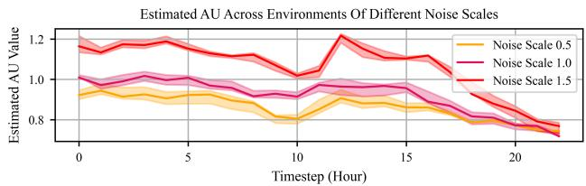  
Fig. 1. Estimated AU under different environmental noise scales in Test Case I. Solid curves show the mean and shaded areas denote one standard deviation. This confirms that the proposed AU estimate is sensitive to irreducible environmental stochasticity.

2) EU Evaluation: Fig. 2 reports the estimated EU in Test Case I under different OOD settings. Compared with the InD baseline, all OOD cases produce clearly higher EU values. Fig. 3 reports the EU response to FDIA-style sensor manipulation in Test Case I. As the attack steps increase, EU generally rises across the 24-hour horizon, especially under the white-box setting. Black-box attacks also produce increasing EU in several timesteps, although with a different temporal pattern.

## C. Test Case II: Quantitative Benchmark Study

1) AU Evaluation: To evaluate AU estimation in Test Case II, we use the same set of trained critic parameters and change only the AU estimation method. Specifically, the evaluation uses five independently trained models, each with six ensemble members. The proposed AU estimator is compared with an IQN-style member estimator, where each ensemble member is treated as an independent IQN critic and its return variance is used as AU. As shown in Fig. 4, both estimators increase monotonically with the environmental noise scale. This confirms that the proposed AU can track the increase of irreducible environmental stochasticity. Fig. 5 further evaluates the estimator variance of AU, rather than the AU magnitude itself. For each environmental noise scale $\sigma _ { \mathrm { a u } }$ , we first compute one episode-level AU estimate for each rollout, denoted by $\widehat { \mathrm { A U } _ { e } } ( \sigma _ { \mathrm { a u } } )$ . We then report $\mathrm { V a r } _ { e : \sigma _ { e } = \sigma _ { \mathrm { a u } } } [ \widehat { \mathrm { A U } } _ { e } ( \sigma _ { \mathrm { a u } } ) ]$ , where the variance is taken over all episode-level AU estimates collected under the same environmental noise scale. Therefore, a smaller value in Fig. 5 indicates lower fluctuation of the AU estimator across repeated rollouts, not smaller AU of the environment. The proposed AU estimator consistently shows a lower estimator variance than the IQN-style baseline. The advantage comes from coupling ensemble prediction with the second-order AU definition. The ensemble members are used as Monte Carlo samples of the second-order predictive distribution. The proposed AU then suppresses memberspecific fluctuation while retaining sensitivity to environmental stochasticity. In contrast, the IQN-style baseline directly uses each member’s raw return variance as an AU estimate, making it more sensitive to calibration differences, quantile-spread fluctuations, and training randomness.

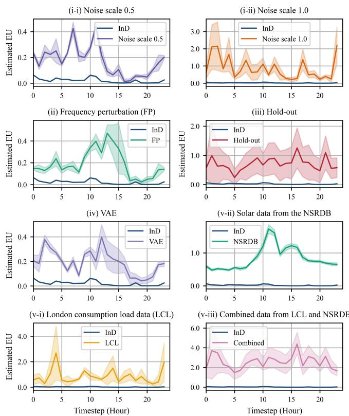  
Fig. 2. Estimated EU under different OOD scenarios in Test Case I. The InD curve is shown as the reference baseline. Solid curves show the mean and shaded areas denote one standard deviation. The increase is mild for near-OOD VAE samples and frequency perturbations, but becomes much stronger under larger observation noise, real-world LCL load data, NSRDB solar data, and their combined shift. This shows that the proposed EU estimate can distinguish unfamiliar operating conditions from normal InD operation.

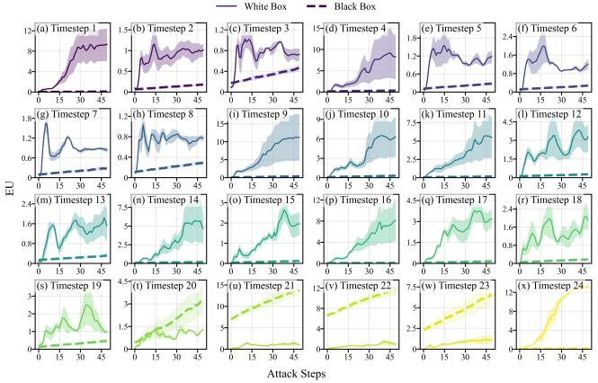  
Fig. 3. EU response to FDIA-style sensor attacks in Test Case I. This shows that critic-side EU can serve as a sensitivity indicator for adversarial observation shifts. Solid curves denote white-box attacks, dashed curves denote black-box attacks, and shaded areas denote one standard deviation.

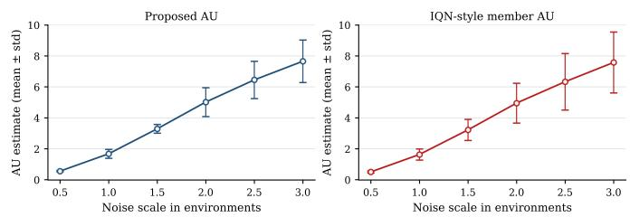  
Fig. 4. AU evaluation under different environmental noise scales. Both methods successfully track the increase of intrinsic stochasticity.

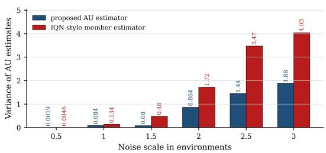  
Fig. 5. Estimator variance of AU under different environmental noise scales. The variance is computed over episode-level AU estimates under the same noise scale. The proposed AU estimator shows lower estimator variance than the IQN-style baseline.

2) EU Evaluation via Training Performance: We first evaluate whether the proposed EU estimate is useful during training. Fig. 6 reports the evaluation reward, raw constraint cost, and log-scale constraint cost in Test Case II. The algorithm comparison includes TD3 [34], PPO [35], PPO-GAE [35], [36], CPO-BDQN [37], [38], Thompson-sampling DQN [39], and IQN [22]. Among these learning-based baselines, the proposed method achieves the best final reward and the lowest long-term constraint cost. This indicates that the performance gain is not only from distributional value learning, but also from using critic-side EU as an exploration signal. For the hyperparameter ablations, we adopt a two-stage protocol. First, a full grid search is conducted in a reduced action space. This stage is used to select the default setting $\alpha _ { \mathrm { { e x p l } } } = 0 . 3 .$ ensemble size $M = 6 ,$ , and dropout rate $\rho = 0 . 0 8$ . After fixing this setting, we return to the full action space and conduct single-factor sensitivity tests by varying one hyperparameter at a time. The exploration-bonus ablation shows that too small $\alpha _ { \mathrm { e x p l } }$ gives insufficient epistemic exploration, whereas too large $\alpha _ { \mathrm { e x p l } }$ overemphasizes uncertain actions and slows exploitation. The intermediate value $\alpha _ { \mathrm { e x p l } } ~ = ~ 0 . 3$ gives the best balance between reward improvement and cost reduction. The ensemble-size and dropout-rate ablations show similar robustness. Moderate changes around $M = 6$ and $\rho = 0 . 0 8$ lead to comparable convergence trends, while the selected setting gives a favorable tradeoff between final reward, learning stability, and constraint-cost suppression.

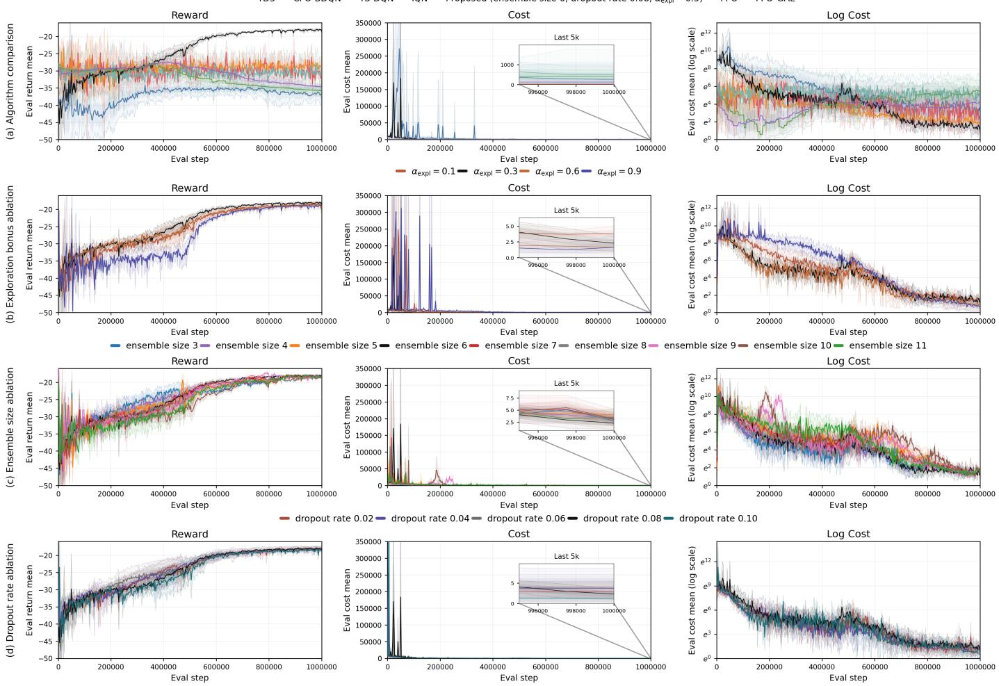  
Fig. 6. EU evaluation via training performance in Test Case II. Each row reports the evaluation reward, raw constraint cost, and log-scale constraint cost. Row (a) compares the proposed method with representative baselines. Rows (b)–(d) report full action-space sensitivity tests on the exploration bonus coefficient, ensemble size, and dropout rate, respectively. The offline MPC reference in Test Case II remains fully feasible, with zero constraint cost across the evaluated episodes, and yields an average reward of −16.53 with low variance $( 3 . 0 3 \times 1 0 ^ { - 2 } )$

To examine EU exploration itself, we map each visited state during training to a coarse bin. The number of unique bins measures the coverage of distinct reachable operating regions. A bin is counted as useful only when the associated transition is feasible, with converged AC power flow and without voltage or loading violation. The useful ratio is then the fraction of useful unique bins among all unique bins. As shown in Fig. 7, the proposed UQ exploration achieves both the largest number of unique bins and the highest useful ratio. Compared with fixed Gaussian exploration noise, the proposed strategy produces broader coverage with a higher useful-bin ratio.

3) EU Evaluation via OOD Detection and Degradation Correlation: We next evaluate whether the proposed EU can detect OOD states and whether its magnitude is correlated with the resulting operational degradation. Table II compares the proposed EU score with classical OOD detection baselines. For the proposed method, the episode-level EU is directly used as the detection score. For the baselines, we train conventional feature-space detectors using actor features extracted from the raw observation. The compared baselines include KDE, KNN $( k = 5 )$ , GMM (4 components), and Mahalanobis-distance detectors [40]. We report both AUROC and FPR95, where larger AUROC and smaller FPR95 indicate better OOD separation. As the ensemble size decreases, the detection performance degrades mildly but remains competitive with the feature-space with the severity of operational degradation. We compare EU with the episode-level reward gap $\Delta R$ and constraintcost gap $\Delta C$ defined in Section III-F. As shown in Fig. 8, each point corresponds to one held-out episode. Larger EU is generally associated with larger $\Delta R$ and ∆C. Fig. 9 further

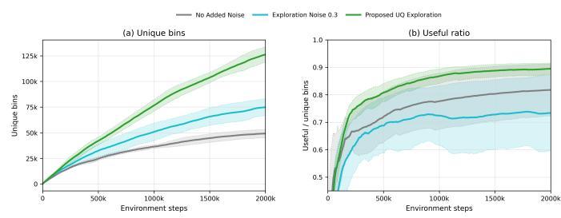  
Fig. 7. State-space coverage and useful-region ratio under different exploration strategies in Test Case II. Panel (a) reports the cumulative number of unique bins visited during training. Panel (b) reports the ratio of useful unique bins to all unique bins. Solid curves show the mean over repeated runs, and shaded areas denote one standard deviation. The proposed UQ exploration expands the explored operating region while maintaining a higher proportion of feasible and useful states.

TABLE II  
OOD DETECTION PERFORMANCE IN TEST CASE II.
<table><tr><td>Group</td><td>Method</td><td>AUROC</td><td>FPR95</td></tr><tr><td>Ours</td><td>Ensemble size 11</td><td> $\overline { { 0 . 9 8 5 6 \pm 0 . 0 0 3 1 } }$ </td><td> $\overline { { 0 . 0 5 8 0 \pm 0 . 0 1 0 5 } }$ </td></tr><tr><td>Ours</td><td>Ensemble size 9</td><td> $0 . 9 8 0 8 \pm 0 . 0 0 8 6$ </td><td> $0 . 0 5 8 6 \pm 0 . 0 1 6 1$ </td></tr><tr><td>Ours</td><td>Ensemble size 7</td><td> $0 . 9 7 0 9 \pm 0 . 0 1 5 9$ </td><td> $0 . 0 6 0 7 \pm 0 . 0 2 7 7$ </td></tr><tr><td>Ours</td><td>Ensemble size 5</td><td> $0 . 9 7 8 5 \pm 0 . 0 0 6 6$ </td><td> $0 . 0 7 8 3 \pm 0 . 0 1 4 9$ </td></tr><tr><td>Baseline</td><td>KDE</td><td> $\overline { { 0 . 9 7 7 0 \pm 0 . 0 0 3 0 } }$ </td><td> $\overline { { 0 . 0 5 9 4 \pm 0 . 0 1 2 1 } }$ </td></tr><tr><td>Baseline</td><td>KNN</td><td> $0 . 9 7 6 1 \pm 0 . 0 0 2 7$ </td><td> $0 . 0 5 9 5 \pm 0 . 0 1 1 9$ </td></tr><tr><td>Baseline</td><td>GMM</td><td> $0 . 9 7 3 1 \pm 0 . 0 0 2 7$ </td><td> $0 . 0 6 4 1 \pm 0 . 0 0 8 0$ </td></tr><tr><td>Baseline</td><td>Mahal.</td><td> $0 . 9 6 7 0 \pm 0 . 0 0 5 8$ </td><td> $0 . 0 8 4 2 \pm 0 . 0 1 0 1$ </td></tr></table>

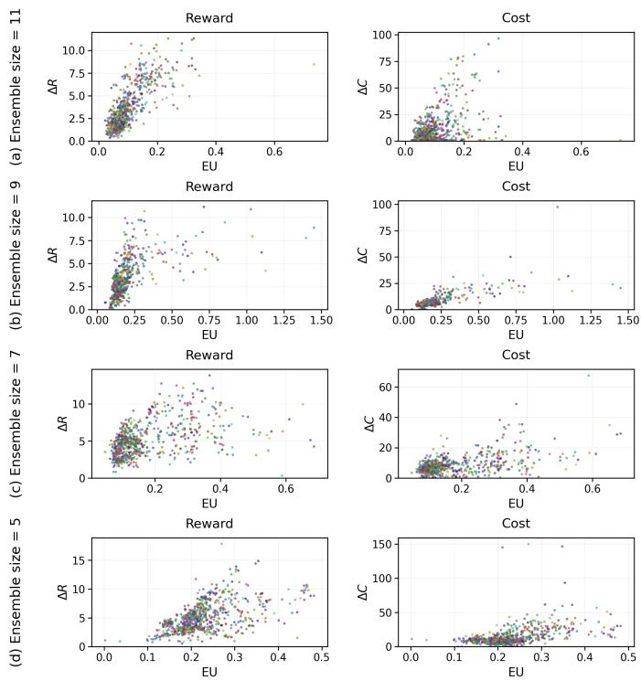  
Fig. 8. EU evaluation via degradation correlation. Each point corresponds to one held-out episode. The horizontal axis is episode-level EU. The vertical axes report the episode-level reward gap ∆R and constraint-cost gap ∆C. Larger EU is associated with larger operational degradation, which supports its use as an epistemic reliability score for quantifying harmful distribution shifts.

examines how the EU score changes as degradation severity increases. Since raw EU magnitudes are model-dependent, we convert EU values into within-model relative percentiles before pooling the selected models. The resulting distributions show a clear upward shift with both reward degradation and cost degradation, indicating that larger OOD performance deterioration is associated with higher EU.

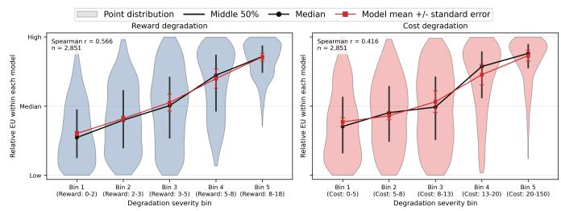  
Fig. 9. Relative EU distributions across degradation severity bins. Raw EU values are normalized to within-model percentiles before pooling selected models. Reward and cost degradation are binned into five data-driven severity levels. Violin plots show point-level distributions; black markers show medians and interquartile ranges; red markers show model means with standard errors.

Table III evaluates whether each score ranks harmful OOD episodes. The actor-feature baselines are unsupervised InDfitted novelty scores: GMM/KDE use feature-density ${ \mathrm { N L L } } ,$ Mahal. uses Mahalanobis distance, and kNN uses nearestneighbor distance. Like our EU score, these baselines are computed without degradation labels. For fairness, all scores are computed per trained model and converted to within-model quantile ranks before reporting Spearman correlations with $\Delta R , \Delta C$ and P@20 for the top-20% degraded episodes.

TABLE III  
DEGRADATION-RANKING COMPARISON.
<table><tr><td>Score</td><td>Spearman ∆R Spearman ∆C P@20 ∆R P@20 ∆C</td><td></td><td></td><td></td></tr><tr><td>Ours EU</td><td> $0 . 6 1 \pm 0 . 0 9$ </td><td> $0 . 4 6 \pm 0 . 1 2$ </td><td> $0 . 6 3 \pm 0 . 1 3$ </td><td> $0 . 5 8 \pm 0 . 1 1$ </td></tr><tr><td>GMM</td><td> $- 0 . 2 2 \pm 0 . 1 9$ </td><td> $0 . 0 4 \pm 0 . 3 6$ </td><td> $0 . 2 8 \pm 0 . 1 6$ </td><td> $0 . 3 2 \pm 0 . 2 1$ </td></tr><tr><td>KDE</td><td> $- 0 . 1 7 \pm 0 . 2 1$ </td><td> $0 . 1 1 \pm 0 . 3 0$ </td><td> $0 . 2 8 \pm 0 . 1 7$ </td><td> $0 . 3 5 \pm 0 . 1 9$ </td></tr><tr><td>Mahal.</td><td> $- 0 . 1 6 \pm 0 . 2 1$ </td><td> $0 . 0 8 \pm 0 . 3 5$ </td><td> $0 . 2 9 \pm 0 . 1 7$ </td><td> $0 . 3 6 \pm 0 . 2 0$ </td></tr><tr><td>kNN</td><td> $- 0 . 1 7 \pm 0 . 2 1$ </td><td> $0 . 0 9 \pm 0 . 3 4$ </td><td> $0 . 2 9 \pm 0 . 1 6$ </td><td> $0 . 3 6 \pm 0 . 2 1$ </td></tr></table>

4) Closed-Loop Evaluation With EU-Triggered Fallback: Finally, we evaluate the deployment rule in (37). We instantiate $\mathcal { D } _ { \mathrm { c a l } } ^ { \mathrm { c r i t } }$ using critical calibration states selected from the synthetic profile-shift scenarios described above, including their combinations, which perturb daily load, PV, price, and netload trajectories and are disjoint from the held-out deployment episodes. A state is included in this calibration set when its $\Delta R$ and $\Delta C$ gap exceeds the acceptable-state tolerance by a factor of three. For each deployed model, the fallback threshold $\tau _ { \mathrm { f b } }$ is calibrated from the lower $\epsilon _ { \mathrm { m i s s } ^ { - } }$ quantile of the critical-state EU scores in this calibration set, following (36). The calibration is performed per model because raw EU scales are not comparable across independently trained ensembles.

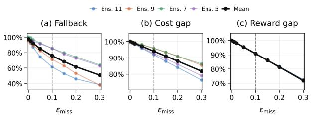  
Fig. 10. Closed-loop fallback ablation over $\epsilon _ { \mathrm { m i s s } } .$ Panel (a) reports fallback invocation; panels (b) and (c) report the critical-state $\Delta C$ and $\Delta R$ gaps removed by fallback. Colors indicate ensemble size; black denotes the mean.

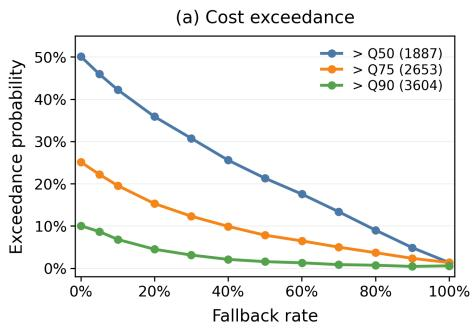

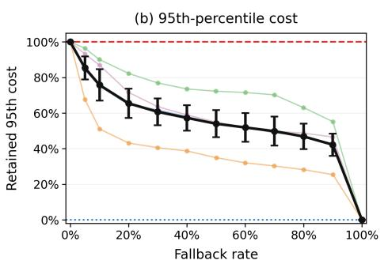

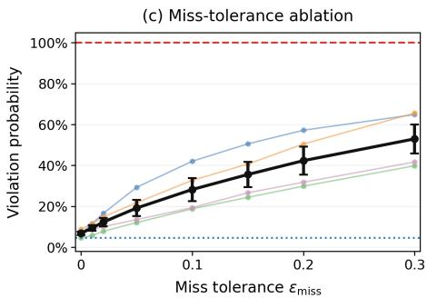  
Fig. 11. Empirical safety–intervention tradeoff of EU-triggered fallback. Panels (a) and (b) use a threshold-free evaluation: OOD episodes are ranked by EU and the fallback rate is swept by assigning the highest-EU fraction of episodes to the MISOCP controller while leaving the remaining episodes controlled by the RL policy. Panel (a) reports the probability that the resulting episode constraint cost exceeds reference quantiles of the RL-only cost distribution. The numbers in parentheses are the corresponding RL-only constraint-cost quantile values; for example, $> Q 5 0 ( 1 8 8 7 )$ means that the deployed controller has episode constraint cost larger than the RL-only median cost of 1887. Thus, lower curves indicate that EU-guided fallback preferentially removes episodes from the high-cost tail. Panel (b) reports the retained 95th-percentile constraint cost, normalized by the RL-only 95th-percentile cost. Panel (c) reports the $\epsilon _ { \mathrm { m i s s } }$ -based calibration ablation. Colored thin curves denote individual selected models, and black curves denote the model mean.

Fig. 10 summarizes the fallback-rate/gap-removal tradeoff as $\epsilon _ { \mathrm { m i s s } }$ varies. At $\epsilon _ { \mathrm { m i s s } } ~ = ~ 0 . 1 0$ , fallback is invoked for 75.8% of held-out episodes and removes 94.0% of the critical constraint-cost gap and 90.7% of the reward gap. At $\epsilon _ { \mathrm { m i s s } } = 0 . 2 0$ , fallback use drops to 61.5% while constraintcost gap removal remains 88.0%, showing that EU-triggered fallback can reduce closed-loop cost with targeted MISOCP handoffs. To avoid relying solely on a fixed severe-OOD calibration threshold, we also evaluate a threshold-free safety– intervention tradeoff in Fig. 11. OOD episodes are ranked by EU, and the fallback rate is swept by assigning the highest-EU fraction to the MISOCP controller. Increasing fallback coverage consistently reduces both cost exceedance probability and the 95th-percentile constraint cost, indicating that EU prioritizes episodes with larger empirical safety risk.

## V. CONCLUSION

We proposed an uncertainty-aware DRL framework for safe distribution-network operation by coupling distributional RL with UQ. The resulting second-order UQ decomposes predictive uncertainty into aleatoric and epistemic OOD uncertainty, enabling EU-triggered fallback control with improved constraint compliance in diverse operating conditions.

## REFERENCES

[1] X. Chen, G. Qu, Y. Tang, S. Low, and N. Li, “Reinforcement learning for selective key applications in power systems: Recent advances and future challenges,” IEEE Trans. Smart Grid, vol. 13, no. 4, pp. 2935– 2958, July 2022.

[2] K. Lappalainen and S. Valkealahti, “Analysis of shading periods caused by moving clouds,” Solar Energy, vol. 135, pp. 188–196, 2016.

[3] K. Zhou, Z. Liu, Y. Qiao, T. Xiang, and C. C. Loy, “Domain generalization: A survey,” IEEE Trans. Pattern Anal. Mach. Intell., vol. 45, no. 4, pp. 4396–4415, Apr. 2023.

[4] D. L. Donoho, “High-dimensional data analysis: The curses and blessings of dimensionality,” AMS Math. Challenges Lecture, 2000.

[5] V. Chandola, A. Banerjee, and V. Kumar, “Anomaly detection: A survey,” ACM Comput. Surv., vol. 41, no. 3, pp. 1–58, 2009.

[6] J. Zhang and C. Li, “Adversarial examples: Opportunities and challenges,” IEEE Trans. Neural Netw. Learn. Syst., vol. 31, no. 7, pp. 2578–2593, July 2020.

[7] J. Tian, B. Wang, Z. Wang, K. Cao, J. Li, and M. Ozay, “Joint adversarial example and false data injection attacks for state estimation in power systems,” IEEE Trans. Cybern., vol. 52, no. 12, pp. 13699–13713, Dec. 2022.

[8] Z. Zhou, G. Liu, W. Guo, and M. Zhou, “Adversarial attacks on multiagent deep reinforcement learning models in continuous action space,” IEEE Trans. Syst. Man Cybern. Syst., vol. 54, no. 12, pp. 7633– 7646, Dec. 2024.

[9] H. Zhang, Z. Chen, C. Yu, D. Yue, X. Xie, and G. P. Hancke, “Eventtrigger-based resilient distributed energy management against FDI and DoS attack of cyber–physical system of smart grid,” IEEE Trans. Syst. Man Cybern. Syst., vol. 54, no. 5, pp. 3220–3230, May 2024.

[10] X. Yang, H. He, J. Li, and Y. Zhang, “Toward optimal risk-averse configuration for HESS with CGANs-based PV scenario generation,” IEEE Trans. Syst. Man Cybern. Syst., vol. 51, no. 3, pp. 1779–1793, Mar. 2021.

[11] A. Mavor-Parker, K. Young, C. Barry, and L. Griffin, “How to stay curious while avoiding noisy TVs using aleatoric uncertainty estimation,” in Proc. 39th Int. Conf. Mach. Learn. (ICML), Proc. Mach. Learn. Res., vol. 162, pp. 15220–15240, 2022.

[12] Y. Ding, T. Morstyn, and M. D. McCulloch, “Distributionally robust joint chance-constrained optimization for networked microgrids considering contingencies and renewable uncertainty,” IEEE Trans. Smart Grid, vol. 13, no. 3, pp. 2467–2478, May 2022.

[13] M. Rayati, M. Bozorg, R. Cherkaoui, and M. Carpita, “Distributionally robust chance constrained optimization for providing flexibility in an active distribution network,” IEEE Trans. Smart Grid, vol. 13, no. 4, pp. 2920–2934, July 2022.

[14] W. Wang, N. Yu, Y. Gao, and J. Shi, “Safe off-policy deep reinforcement learning algorithm for Volt-VAR control in power distribution systems,” IEEE Trans. Smart Grid, vol. 11, no. 4, pp. 3008–3018, July 2020.

[15] P. Wu, C. Chen, D. Lai, J. Zhong, and Z. Bie, “Real-time optimal power flow method via safe deep reinforcement learning based on primal-dual and prior knowledge guidance,” IEEE Trans. Power Syst., vol. 40, no. 1, pp. 597–611, Jan. 2025.

[16] J. Xie and W. Sun, “Distributional deep reinforcement learning-based emergency frequency control,” IEEE Trans. Power Syst., vol. 37, no. 4, pp. 2720–2730, July 2022.

[17] Z. Wang, F. Teng, Y. Zhou, Q. Guo, and H. Sun, “Uncertainty-aware transient stability-constrained preventive redispatch: A distributional reinforcement learning approach,” IEEE Trans. Power Syst., vol. 40, no. 2, pp. 1295–1308, Mar. 2025.

[18] T. Zhang, M. Sun, D. Qiu, X. Zhang, G. Strbac, and C. Kang, “A Bayesian deep reinforcement learning-based resilient control for multienergy micro-grid,” IEEE Trans. Power Syst., vol. 38, no. 6, pp. 5057– 5072, Nov. 2023.

[19] P. Pareek and H. D. Nguyen, “Gaussian process learning-based probabilistic optimal power flow,” IEEE Trans. Power Syst., vol. 36, no. 1, pp. 541–544, Jan. 2021.

[20] X. Liu, J. Liu, Y. Zhao, T. Ding, X. Liu, and J. Liu, “A Bayesian deep learning-based probabilistic risk assessment and early-warning model

for power systems considering meteorological conditions,” IEEE Trans. Ind. Informat., vol. 20, no. 2, pp. 1516–1527, Feb. 2024.

[21] Y. Yang, W. Li, T. A. Gulliver, and S. Li, “Bayesian deep learningbased probabilistic load forecasting in smart grids,” IEEE Trans. Ind. Informat., vol. 16, no. 7, pp. 4703–4713, July 2020.

[22] W. Dabney, G. Ostrovski, D. Silver, and R. Munos, “Implicit quantile networks for distributional reinforcement learning,” in Proc. 35th Int. Conf. Mach. Learn. (ICML), Proc. Mach. Learn. Res., vol. 80, pp. 1096– 1105, 2018.

[23] Y. Gal and Z. Ghahramani, “Dropout as a Bayesian approximation: Representing model uncertainty in deep learning,” in Proc. 33rd Int. Conf. Mach. Learn. (ICML), Proc. Mach. Learn. Res., vol. 48, pp. 1050– 1059, 2016.

[24] B. Lakshminarayanan, A. Pritzel, and C. Blundell, “Simple and scalable predictive uncertainty estimation using deep ensembles,” in Adv. Neural Inf. Process. Syst., Long Beach, CA, USA, 2017.

[25] Y. Sale, V. Bengs, M. Caprio, and E. Hullermeier, “Second-order¨ uncertainty quantification: A distance-based approach,” in Proc. 41st Int. Conf. Mach. Learn. (ICML), Proc. Mach. Learn. Res., vol. 235, pp. 43060–43076, 2024.

[26] H. Hu, S. Song, and G. Huang, “Self-attention-based temporary curiosity in reinforcement learning exploration,” IEEE Trans. Syst. Man Cybern. Syst., vol. 51, no. 9, pp. 5773–5784, Sept. 2021.

[27] M. Farivar and S. H. Low, “Branch flow model: Relaxations and convexification—Part I,” IEEE Trans. Power Syst., vol. 28, no. 3, pp. 2554–2564, Aug. 2013.

[28] L. Thurner, A. Scheidler, F. Schafer, J. Menke, J. Dollichon, F. Meier, S.¨ Meinecke, and M. Braun, “pandapower—An Open-Source Python Tool for Convenient Modeling, Analysis, and Optimization of Electric Power Systems,” IEEE Trans. Power Syst., vol. 33, no. 6, pp. 6510–6521, Nov. 2018.

[29] A. Trindade, “Electricity Load Diagrams 2011-2014”, UCI Machine Learning Repository, 2015. [Online]. Available: https://doi.org/10. 24432/C58C86

[30] A. Kannal, “Solar Power Generation Data,” Kaggle, data set. [Online]. Available: https://www.kaggle.com/datasets/anikannal/ solar-power-generation-data

[31] UK Power Networks, “Smart meter energy consumption data in London households,” London Datastore. [Online]. Available: https://data.london.gov.uk/dataset/ smartmeter-energy-consumption-data-in-london-households-vqm0d

[32] National Renewable Energy Laboratory (NREL), “National Solar Radiation Database (NSRDB),” data set. [Online]. Available: https://nsrdb. nrel.gov

[33] D. P. Kingma and M. Welling, “Auto-Encoding Variational Bayes,” in Proc. Int. Conf. Learn. Representations (ICLR), Banff, AB, Canada, Apr. 2014.

[34] S. Fujimoto, H. van Hoof, and D. Meger, “Addressing function approximation error in actor-critic methods,” in Proc. 35th Int. Conf. Mach. Learn. (ICML), vol. 80, Jul. 2018, pp. 1587–1596.

[35] J. Schulman, F. Wolski, P. Dhariwal, A. Radford, and O. Klimov, “Proximal policy optimization algorithms,” arXiv preprint arXiv:1707.06347, 2017.

[36] J. Schulman, P. Moritz, S. Levine, M. I. Jordan, and P. Abbeel, “Highdimensional continuous control using generalized advantage estimation,” in Proc. 4th Int. Conf. Learn. Representations (ICLR), 2016.

[37] J. Achiam, D. Held, A. Tamar, and P. Abbeel, “Constrained policy optimization,” in Proc. 34th Int. Conf. Mach. Learn. (ICML), ser. Proc. Mach. Learn. Res., vol. 70, 2017, pp. 22–31.

[38] I. Osband, C. Blundell, A. Pritzel, and B. Van Roy, “Deep exploration via bootstrapped DQN,” in Adv. Neural Inf. Process. Syst., vol. 29, 2016, pp. 4026–4034.

[39] I. Osband, B. Van Roy, D. J. Russo, and Z. Wen, “Deep exploration via randomized value functions,” J. Mach. Learn. Res., vol. 20, no. 124, pp. 1–62, 2019.

[40] L. Ruff, J. R. Kauffmann, R. A. Vandermeulen, G. Montavon, W. Samek, M. Kloft, T. G. Dietterich, and K.-R. Muller, “A unifying review of deep¨ and shallow anomaly detection,” Proc. IEEE, vol. 109, no. 5, pp. 756– 795, May 2021.

[41] G. Peyre and M. Cuturi, “Computational optimal transport: With appli-´ cations to data science,” Found. Trends Mach. Learn., vol. 11, nos. 5–6, pp. 355–607, 2019.

[42] V. M. Panaretos and Y. Zemel, An Invitation to Statistics in Wasserstein Space. Cham, Switzerland: Springer, 2020.

[43] M. Agueh and G. Carlier, “Barycenters in the Wasserstein space,” SIAM J. Math. Anal., vol. 43, no. 2, pp. 904–924, 2011.

[44] T. Le Gouic and J.-M. Loubes, “Existence and consistency of Wasserstein barycenters,” Probab. Theory Relat. Fields, vol. 168, no. 3–4, pp. 901–917, Aug. 2017.

## APPENDIX A

## PROOFS FOR SECOND-ORDER UQ CONSTRUCTIONS

We adopt the same setting and notation as in Section III-D2. In particular, the return space is one-dimensional. On ${ \mathcal { P } } ( Y )$ we use the first-order 2-Wasserstein distance $W _ { 2 } ^ { ( 1 ) }$ (induced by the squared Euclidean cost on Y), and on $\mathcal { O } ( Y ) = \mathcal { P } ( \mathcal { P } ( Y ) )$ we use the induced second-order 2-Wasserstein distance $\dot { W } _ { 2 } ^ { ( 2 ) }$ with ground metric $d _ { 1 } = W _ { 2 } ^ { ( 1 ) }$

A. Auxiliary Results on Wasserstein Distance in One Dimension

We first record several standard lemmas on Wasserstein distances and barycenters in one dimension [41], [42].

Lemma 1 (Dirac second-order measures and couplings): For any $\begin{array} { r l r } { Q } & { { } \in } & { { \mathcal { O } } ( Y ) } \end{array}$ and $\begin{array} { r l r } { p } & { { } \in } & { { \mathcal { P } } ( Y ) } \end{array}$ such that $\begin{array} { r l r } { \mathbb { E } _ { P \sim Q } \big [ \big ( W _ { 2 } ^ { ( 1 ) } ( P , p ) \big ) ^ { 2 } \big ] } & { { } < } & { \infty } \end{array}$ $\begin{array} { r l } { \bar { \bf \Phi } ( W _ { 2 } ^ { ( 2 ) } ( Q , \dot { \delta } _ { p } ) ) ^ { 2 } } & { { } = } \end{array}$ $\mathbb { E } _ { P \sim Q } [ ( W _ { 2 } ^ { ( \bar { 1 } ) } ( P , p ) ) ^ { 2 } ]$ , where $\delta _ { p }$ denotes the Dirac mass at p in $\bar { \mathcal { O } } ( \bar { Y } )$ . This follows from [25].

Lemma 2 (Quantile representation of ${ W } _ { 2 } ^ { ( 1 ) }$ in one dimension $I 4 I J .$ Let $Y \subset \mathbb { R } .$ , and let $p , \tilde { p } \in \mathcal { P } ( { \cal Y } )$ with quantile functions $Q _ { p } , Q _ { \tilde { p } } \ : \ ( 0 , 1 ) \  \ \mathbb { R }$ . Then $\left( \dot { W } _ { 2 } ^ { ( 1 ) } ( p , \bar { p } ) \right) ^ { 2 } \ =$ $\begin{array} { r } { \int _ { 0 } ^ { 1 } \left[ Q _ { p } ( \tau ) - Q _ { \tilde { p } } ( \tau ) \right] ^ { 2 } \mathrm { d } \tau . } \end{array}$

Lemma 3 (One-dimensional Wasserstein barycenter $I 4 I J ,$ [43]): Let $p _ { 1 } , \dotsc , p _ { R } \in { \mathcal { P } } ( Y )$ with quantile functions $Q _ { p _ { r } }$ Consider $p ^ { \star } \in$ arg minp∈P(Y) $\begin{array} { r } { \frac { 1 } { R } \sum _ { r = 1 } ^ { R } \bigl ( W _ { 2 } ^ { ( 1 ) } ( p _ { r } , p ) \bigr ) ^ { 2 } } \end{array}$ . Then a minimiser exists and any minimiser has quantile function $\begin{array} { r } { Q _ { p ^ { \star } } ( \tau ) = \frac { 1 } { R } \sum _ { r = 1 } ^ { R } Q _ { p _ { r } } ( \tau ) } \end{array}$ for $\tau \in ( 0 , 1 )$

Lemma 4 (Projection onto Dirac measures and variance $I 4 2 l ) { : }$ Let $\begin{array} { r l r } { p } & { { } \in } & { { \mathcal { P } } ( Y ) } \end{array}$ have finite second moment and mean $\mu ( p )$ . Then in $\begin{array} { r l } { \mathrm { f } _ { y \in Y } \left( W _ { 2 } ^ { ( 1 ) } ( p , \delta _ { y } ) \right) ^ { 2 } } & { { } = } \end{array}$ $\bigl ( W _ { 2 } ^ { ( 1 ) } ( p , \delta _ { \mu ( p ) } ) \bigr ) ^ { 2 } = \mathrm { V a r } _ { Y \sim p } ( Y )$ , where $\delta _ { y }$ is the Dirac mass at y.

## B. Return-based Critic

We now derive the critic indices in Section III-D2 from the general distance-based definitions (25)–(27), using the onedimensional results in Section A.

1) Epistemic component as Wasserstein Frechet vari-´ ance: We start from the epistemic index $U _ { \mathrm { e p } } ( Q )$ in (27) with the choices $d _ { 1 } ~ = ~ W _ { 2 } ^ { ( 1 ) }$ on ${ \mathcal { P } } ( Y )$ and the induced second-order metric $W _ { 2 } ^ { ( 2 ) }$ on $\mathcal { O } ( Y )$ . For any $Q \in { \mathcal { O } } ( Y )$ $\begin{array} { r } { U _ { \mathrm { e p } } ( Q ) = \operatorname* { i n f } _ { \delta _ { p } \in S _ { \mathrm { e p } } } W _ { 2 } ^ { \top 2 } \big ( Q , \delta _ { p } \big ) = \operatorname* { i n f } _ { p \in \mathcal { P } ( Y ) } W _ { 2 } ^ { ( 2 ) } \big ( Q , \delta _ { p } \big ) } \end{array}$ By Lemma 1, $\big ( \dot { W _ { 2 } } ^ { ( 2 ) } ( Q , \delta _ { p } ) \big ) ^ { 2 } \ = \ \mathbb { E } _ { P \sim Q } \big [ \big ( W _ { 2 } ^ { ( 1 ) } ( P , p ) \big ) ^ { 2 } \big ]$ Thus, up to a square root, the epistemic index is given by the Frechet functional on´ $( { \bar { \mathcal { P } } } ( Y ) , W _ { 2 } ^ { ( 1 ) } ) \colon U _ { \mathrm { e p } } ^ { 2 } ( Q ) ~ : =$ $\begin{array} { r } { \operatorname* { i n f } _ { p \in \mathcal { P } ( Y ) } \mathbb { E } _ { P \sim Q } \big [ \big ( W _ { 2 } ^ { ( 1 ) } ( P , p ) \big ) ^ { 2 } \big ] } \end{array}$ . We use $U _ { \mathrm { e p } } ^ { 2 } ( Q )$ as the basic epistemic quantity; it is a monotone function of $U _ { \mathrm { e p } } ( Q )$ and preserves the ordering of epistemic uncertainty levels. Specializing $U _ { \mathrm { e p } } ^ { 2 } ( Q )$ to the empirical law $\widehat { Q } _ { B } ( s , a )$ in (29) implies that any minimizer is a $W _ { 2 } ^ { ( 1 ) }$ -barycenter of $\{ P _ { b } \} _ { b = 1 } ^ { B }$ , which in one dimension admits the closed-form quantile averaging in Lemma 3; hence the resulting empirical Frechet variance´ coincides with $\mathrm { E U } _ { \mathrm { c r i t } } ( s , a )$ in (31).

2) Aleatoric component as expected intrinsic variance: Starting from the aleatoric definition (26) with the reference family $S _ { \mathrm { a l } }$ , we quantify the distance of Q to mixtures of Dirac predictors. For the derivations below, we work with the squared 2-Wasserstein distance on $\mathcal { O } ( Y )$ . In the onedimensional setting of Section III-D2, this projection admits an exact characterization through pointwise projection of each first-order draw $P \sim Q$ onto Dirac measures. The resulting expression reduces the aleatoric index to the expected intrinsic variance of the first-order distributions, which leads directly to the closed-form estimator used in (32).

Lemma 5 (Exact expression via projection to Dirac predictors): Let $Q \in { \mathcal { O } } ( Y )$ be any second-order distribution. Define $\begin{array} { r } { \widetilde { U } _ { \mathrm { a l } } ^ { 2 } ( Q ) \ = \ \mathbf { \widetilde { E } } _ { P \sim Q } \Big [ \mathrm { i n f } _ { y \in Y } \big ( \mathbf { \widetilde { W } } _ { 2 } ^ { ( 1 ) } ( P , \delta _ { y } ) \big ) ^ { 2 } \Big ] } \end{array}$ . Then $U _ { \mathrm { a l } } ^ { 2 } ( Q ) : =$ in $\mathrm { f } _ { \delta _ { m } \in S _ { \mathrm { a l } } } \bigl ( W _ { 2 } ^ { ( 2 ) } ( \overleftarrow { Q } , \delta _ { m } ) \bigr ) ^ { 2 } = \widetilde { U } _ { \mathrm { a l } } ^ { 2 } ( Q )$

Proof: We prove the two inequalities.

Step 1: We show that $\begin{array} { r l r } { \dot { U } _ { \mathrm { a l } } ^ { 2 } ( Q ) } & { { } \le } & { \widetilde { U } _ { \mathrm { a l } } ^ { 2 } ( Q ) } \end{array}$ . For each $\begin{array} { r l r } { P } & { { } \in } & { { \mathcal { P } } ( Y ) } \end{array}$ with finite second moment, take $\begin{array} { r l r } { y ^ { \star } ( P ) } & { { } : = } & { \mu ( P ) } \end{array}$ , the mean of P. By Lemma 4, $y ^ { \star } ( P )$ is an optimizer of $\mathrm { i n f } _ { y \in Y } \big ( W _ { 2 } ^ { ( 1 ) } \big ( P , \delta _ { y } ) \big ) ^ { 2 }$ , and in $\begin{array} { r l r } { \ell _ { y \in Y } \left( W _ { 2 } ^ { ( 1 ) } ( P , \delta _ { y } ) \right) ^ { 2 } } & { { } = } & { \left( W _ { 2 } ^ { ( 1 ) } ( { \dot { P } } , \delta _ { \mu ( P ) } ) \right) ^ { 2 } } \end{array}$ . Define the pushforward measure $\begin{array} { r c l } { m } & { : = } & { ( y ^ { \star } ) _ { \# } Q \quad \in \quad \mathcal { P } ( Y ) } \end{array}$ and consider $\delta _ { m } \in \ S _ { \mathrm { a l } }$ . Define $T \ : \ { \mathcal { P } } ( Y ) \ \to \ { \mathcal { P } } ( Y )$ by $\begin{array} { r l r l r } { T ( P ) } & { { } : = } & { \delta _ { y ^ { \star } ( P ) } } & { { } = } & { \delta _ { \mu ( P ) } } \end{array}$ , and construct the coupling $\gamma \quad : = \quad ( \mathrm { I d } , T ) _ { \# } Q \quad \in \quad \Gamma ( Q , \delta _ { m } )$ . Then, by the definition of the second-order distance $W _ { 2 } ^ { ( 2 ) }$ on O(Y ) with ground metric $W _ { 2 } ^ { ( 1 ) }$ on P(Y ), $\begin{array} { r l r } { \left( W _ { 2 } ^ { ( 2 ) } ( Q , \delta _ { m } ) \right) ^ { 2 } } & { { } \le } & { \bar { \int } _ { \mathcal P ( Y ) \times \mathcal P ( Y ) } \left( W _ { 2 } ^ { ( 1 ) } ( P , \bar { P } ) \right) ^ { 2 } { \mathrm d } \gamma ( P , \tilde { P } ) \ = } \end{array}$ $\mathbb { E } _ { P \sim Q } \Big [ \big ( W _ { 2 } ^ { ( 1 ) } ( P , T ( P ) ) \big ) ^ { 2 } \Big ]$ Thus, $\left( W _ { 2 } ^ { ( 2 ) } ( Q , \delta _ { m } ) \right) ^ { 2 } \quad \leq$ $\mathbb { E } _ { P \sim Q } \Big [ \big ( W _ { 2 } ^ { ( 1 ) } ( P , \delta _ { \mu ( P ) } ) \big ) ^ { 2 } \Big ] = \widetilde { U } _ { \mathrm { a l } } ^ { 2 } ( Q )$ . Taking the infimum over $\delta _ { m } \in S _ { \mathrm { a l } }$ yields $U _ { \mathrm { a l } } ^ { 2 } ( \mathbf { \bar { Q } } ) \leq \widetilde { U } _ { \mathrm { a l } } ^ { 2 } ( Q )$ .

Step 2: We show that $U _ { \mathrm { a l } } ^ { 2 } ( Q ) ~ \geq ~ \widetilde { U } _ { \mathrm { a l } } ^ { 2 } ( Q )$ . Fix any $\begin{array} { r } { m \in \mathcal { P } ( { \cal Y } ) } \end{array}$ and any coupling $\gamma \in \Gamma ( Q , \delta _ { m } )$ . Since $\delta _ { m }$ is supported on Dirac predictors $\delta _ { y } .$ , we have $\begin{array} { r l } { \tilde { P } } & { { } = } \end{array}$ $\delta _ { y }$ γ-almost surely for some $\begin{array} { r l r } { y } & { { } \in } & { Y } \end{array}$ . Hence, for $\gamma -$ almost every $( P , \tilde { \tilde { P } } ) , \ : \left( W _ { 2 } ^ { ( 1 ) } ( P , \tilde { \tilde { P } } ) \right) ^ { 2 } \ : = \ : \left( W _ { 2 } ^ { ( 1 ) } ( P , \delta _ { y } ) \right) ^ { 2 } \ : \geq$ in $\boldsymbol { \mathfrak { c } } _ { y ^ { \prime } \in Y } \big ( W _ { 2 } ^ { ( 1 ) } ( P , \delta _ { y ^ { \prime } } ) \big ) ^ { 2 }$ . Integrating both sides with respect to γ and using that the first marginal of $\gamma$ is Q, we obtain $\begin{array} { r l } { \int _ { \mathcal { P } ( Y ) \times \mathcal { P } ( Y ) } \left( W _ { 2 } ^ { ( 1 ) } ( P , \tilde { P } ) \right) ^ { 2 } \mathrm { d } \gamma ( P , \tilde { P } ) } & { { } \geq } \end{array}$ $\begin{array} { r l r } { \mathbb { E } _ { P \sim Q } \left[ \operatorname* { i n f } _ { y ^ { \prime } \in Y } \left( W _ { 2 } ^ { ( 1 ) } ( P , \delta _ { y ^ { \prime } } ) \right) ^ { 2 } \right] } & { { } = } & { \widetilde { U } _ { \mathrm { a l } } ^ { 2 } ( Q ) } \end{array}$ . Taking the infimum over all couplings $\gamma \in \Gamma ( Q , \delta _ { m } )$ yields $\left( W _ { 2 } ^ { ( 2 ) } ( Q , \delta _ { m } ) \right) ^ { 2 } \geq \widetilde { U } _ { \mathrm { a l } } ^ { 2 } ( \hat { Q } )$ . Finally, taking the infimum over $\delta _ { m } \in S _ { \mathrm { a l } }$ gives $U _ { \mathrm { a l } } ^ { 2 } ( Q ) \geq \widetilde { U } _ { \mathrm { a l } } ^ { 2 } ( Q )$

Combining Step 1 and Step 2 concludes that $U _ { \mathrm { a l } } ^ { 2 } ( Q ) =$ $\widetilde { U } _ { \mathrm { a l } } ^ { 2 } ( Q )$ 厂

Combining Lemma 5 with Lemma 4 yields an explicit expression for $\widetilde { U } _ { \mathrm { a l } } ^ { 2 } ( Q )$ in terms of intrinsic variances.

Corollary 1 (Expected intrinsic variance): Let $Q \in { \mathcal { O } } ( Y )$ and let $P \sim Q$ have finite second moments almost surely. Then $\widetilde { U } _ { \mathrm { a l } } ^ { 2 } ( Q ) = \mathbb { E } _ { P \sim Q } \left[ \operatorname { V a r } _ { Y \sim P } ( Y ) \right]$

We take $\widetilde { U } _ { \mathrm { a l } } ^ { 2 } ( Q )$ as the basic aleatoric quantity; by Lemma 5 it equals $U _ { \mathrm { a l } } ^ { 2 } ( Q )$ and thus is consistent with the distancebased interpretation. Applying Corollary 1 to $\widehat { Q } _ { B } ( s , a )$ in (29) gives $\begin{array} { r } { \dot { U } _ { \mathrm { a l } } ^ { 2 } \big ( \widehat { Q } _ { B } ( s , a ) \big ) \dot { = } \frac { 1 } { B } \sum _ { b = 1 } ^ { B } \operatorname { V a r } _ { Y \sim P _ { b } } ( Y ) } \end{array}$ , which is exactly $\mathrm { A U } _ { \mathrm { c r i t } } ( s , a )$ in (32).

## APPENDIX B

## CONSISTENCY OF SECOND-ORDER UQ ESTIMATORS

In implementation, each draw $P _ { b }$ is obtained by independently sampling an ensemble member and a dropout mask (and the IQN quantile fractions), which yields i.i.d. draws from $Q _ { \mathrm { c r i t } } ( s , a )$ . The corresponding empirical second-order measure is $\widehat { Q } _ { B } ( s , a )$ in (29).

Theorem 1 (Consistency of Monte-Carlo EU/AU estimators):

Define the population indices by $\begin{array} { r l } { \mathrm { E U } _ { \mathrm { c r i t } } ^ { \star } ( s , a ) } & { { } : = } \end{array}$ $\mathbb { E } \Big [ ( W _ { 2 } ^ { ( 1 ) } ( P , p ^ { \star } ) ) ^ { 2 } \Big ] , \mathrm { A U } _ { \mathrm { c r i t } } ^ { \star } ( s , a ) : = \mathbb { E } [ \mathrm { V a r } _ { Y \sim P } ( Y ) ]$ . Then, L 1 as $B \to \infty , \widehat { \mathrm { E U } } _ { \mathrm { c r i t } , B } ( s , a ) \xrightarrow [ ] { \mathrm { a l m o s t s u r e l y } } \mathrm { E U } _ { \mathrm { c r i t } } ^ { \star } ( s , a )$ $\widehat { \mathrm { A U } } _ { \mathrm { c r i t } , B } ( s , a ) \xrightarrow [ ] { \mathrm { a l m o s t } \mathrm { s u r e l y } } \mathrm { A U } _ { \mathrm { c r i t } } ^ { \star } ( s , a ) .$

Proof: Let $\{ P _ { b } \} _ { b = 1 } ^ { B }$ be i.i.d. from $Q _ { \mathrm { c r i t } } ( s , a )$ and let $\widehat { p } _ { B }$ be an empirical barycenter as in (30). By the existence and strong consistency of empirical Wasserstein barycenters on $\mathcal { P } _ { 2 } ( Y ) ~ [ 4 4 ]$ , we have $W _ { 2 } ^ { ( 1 ) } ( \widehat { p } _ { B } , p ^ { \star } )  ($ 0 almost surely. For the AU part, from (32), $\begin{array} { r } { \widehat { \mathrm { A U } } _ { \mathrm { c r i t } , B } ( s , a ) = \frac { 1 } { B } \sum _ { b = 1 } ^ { B } \operatorname { V a r } _ { Y \sim P _ { b } } ( Y ) } \end{array}$ Since $P \in \mathcal { P } _ { 2 } ( Y )$ almost surely, $\mathrm { V a r } _ { Y \sim P } ^ { - } ( Y ) < \infty$ almost surely and is integrable; thus by the strong law of large numbers, $\widehat { \mathrm { A U } } _ { \mathrm { c r i t } , B } \bar { ( } s , a ) \to \mathbb { E } [ \bar { \mathrm { V a r } } _ { Y \sim P } ( Y ) ] \stackrel { \cdot } { = } \mathrm { A U } _ { \mathrm { c r i t } } ^ { \star } ( s , \bar { a } )$ almost surely. For the EU part, by (31), $\bar { \mathrm { E U } } _ { \mathrm { c r i t } , B } ( s , a ) \ =$ $\begin{array} { r } { \frac { 1 } { B } \sum _ { b = 1 } ^ { B } ( W _ { 2 } ^ { \widehat { ( 1 ) } } ( P _ { b } , \widehat { p } _ { B } ) ) ^ { 2 } } \end{array}$ . Add and subtract the population barycenter:

$$
\begin{array} { r l } & { \begin{array} { r l } & { \widehat { \mathrm { E U } } _ { \mathrm { c r i t } , B } ( s , a ) - \mathrm { E U } _ { \mathrm { c r i t } } ^ { * } ( s , a ) } \\ & { \quad = \underbrace { \left( \frac { 1 } { B } \displaystyle \sum _ { b = 1 } ^ { B } ( W _ { 2 } ^ { ( 1 ) } ( P _ { b } , p ^ { \star } ) ) ^ { 2 } - \mathbb { E } [ ( W _ { 2 } ^ { ( 1 ) } ( P , p ^ { \star } ) ) ^ { 2 } ] \right) } _ { ( I ) } } \\ & { \qquad + \underbrace { \frac { 1 } { B } \displaystyle \sum _ { b = 1 } ^ { B } \left( ( W _ { 2 } ^ { ( 1 ) } ( P _ { b } , \widehat { p } _ { B } ) ) ^ { 2 } - ( W _ { 2 } ^ { ( 1 ) } ( P _ { b } , p ^ { \star } ) ) ^ { 2 } \right) } _ { ( I I ) } } \end{array} } \end{array}\tag{38}
$$

Term $( I ) \quad \to \quad 0$ almost surely by the strong law since $( W _ { 2 } ^ { ( 1 ) } ( \dot { P } , p ^ { \star } ) ) ^ { 2 }$ is integrable under $P \in \mathcal { P } _ { 2 } ( Y )$ . For $( I I )$ using $| x ^ { 2 } - y ^ { 2 } | \leq ( x + y ) | x - y |$ with $x = W _ { 2 } ^ { ( 1 ) } ( P _ { b } , \widehat { p } _ { B } )$ and $y = W _ { 2 } ^ { ( 1 ) } ( P _ { b } , p ^ { \star } )$ , then the triangle inequality gives

$$
\begin{array} { r l } & { \big | ( W _ { 2 } ^ { ( 1 ) } ( P _ { b } , \widehat { p } _ { B } ) ) ^ { 2 } - ( W _ { 2 } ^ { ( 1 ) } ( P _ { b } , p ^ { \star } ) ) ^ { 2 } \big | } \\ & { \quad \leq \left( 2 W _ { 2 } ^ { ( 1 ) } ( P _ { b } , p ^ { \star } ) + W _ { 2 } ^ { ( 1 ) } ( \widehat { p } _ { B } , p ^ { \star } ) \right) W _ { 2 } ^ { ( 1 ) } ( \widehat { p } _ { B } , p ^ { \star } ) . } \end{array}\tag{39}
$$

Averaging (39) over b yields

$$
| ( I I ) | \leq \left( 2 \cdot { \textstyle { \frac { 1 } { B } } } \sum _ { b = 1 } ^ { B } W _ { 2 } ^ { ( 1 ) } ( P _ { b } , p ^ { \star } ) { + } W _ { 2 } ^ { ( 1 ) } ( { \widehat p } _ { B } , p ^ { \star } ) \right) W _ { 2 } ^ { ( 1 ) } ( { \widehat p } _ { B } , p ^ { \star } ) .\tag{40}
$$

Moreover, $P \in { \mathcal { P } } _ { 2 } ( Y )$ implies $\mathbb { E } [ W _ { 2 } ^ { ( 1 ) } ( P , p ^ { \star } ) ] < \infty .$ , hence by the strong law $\begin{array} { r } { \frac { 1 } { B } \sum _ { b = 1 } ^ { B } W _ { 2 } ^ { ( 1 ) } ( \overline { { P _ { b } , } } p ^ { \star } ) \\to \mathbb { E } [ W _ { 2 } ^ { ( 1 ) } ( P , p ^ { \star } ) ] } \end{array}$ almost surely, while $W _ { 2 } ^ { ( 1 ) } ( \widehat { p } _ { B } , p ^ { \star } ) \to 0$ almost surely. Therefore the right-hand side of (40) converges to 0 almost surely, so $( I I )  0$ almost surely. Combining (I) and (II) in (38) proves $\widehat { \mathrm { E U } } _ { \mathrm { c r i t } , B } ( s , a ) \to \mathrm { E U } _ { \mathrm { c r i t } } ^ { \star } ( s , a )$ almost surely.