# Robust PAC Learning of Concurrent Stochastic Games

Angel Y. He Department of Engineering Science University of Oxford angelyhe@robots.ox.ac.uk

David Parker Department of Computer Science University of Oxford david.parker@cs.ox.ac.uk

## Abstract

We introduce the first Probably Approximately Correct (PAC) learning framework for general-sum concurrent stochastic games (CSGs) with transition uncertainty, while addressing the challenge of Nash equilibrium (NE) existence. Our algorithm maintains data-driven L1 confidence sets over transition kernels and solves a robust CSG to compute a social-welfare optimal ε-NE, using a robust MDP-based exploration mechanism to drive joint state–action coverage. Crucially, we introduce a Nash margin characterisation that enables principled reasoning about equilibrium existence: the framework either returns an ε-approximate NE whose social-welfare value is ε-close to optimal, or provides a sound certificate that no exact NE exists. Under a minimum reachability condition $p _ { \mathrm { r e a c h } } > 0$ over relevant state–action pairs, the algorithm terminates after a polynomial number of trajectory samples, with sample complexity $\widetilde { \mathcal { O } } \big ( R _ { \mathrm { m a x } } ^ { 2 } H ^ { 4 } | S | ^ { 2 } | A | / ( p _ { \mathrm { r e a c h } } \varepsilon ^ { 2 } ) \big )$ . Empirical results on benchmark CSGs demonstrate near-optimal performance, correct handling of equilibrium (non-)existence, and sample complexity consistent with theory.

## 1 Introduction

Learning to act optimally in multi-agent stochastic environments is fundamentally harder when the transition dynamics are unknown: even small estimation errors can destabilise equilibria or make a nominally near-optimal strategy far from equilibrium under the true model. Concurrent stochastic games (CSGs) [39], where players choose actions simultaneously without observing one another, are the canonical model for such settings — yet most existing approaches to equilibrium computation assume that transition probabilities are precisely known. This paper asks: how many environment interactions suffice to compute an approximately optimal equilibrium with high probability, and what happens when no exact equilibrium exists?

Uncertainty in stochastic decision-making has been studied from two complementary angles. On the robust-planning side, robust MDPs (RMDPs) [21, 35, 48] including interval MDPs [17], and their stochastic-game extensions [4, 9] optimise worst-case performance over a prescribed uncertainty set. Recent work has extended this line to robust CSGs (RCSGs) [18] and distributionally robust Markov games (DRMGs) [30, 38, 40, 51]. On the learning side, Probably Approximately Correct (PAC) [44] algorithms provide sample-complexity guarantees for MDPs [2, 7, 22, 24, 42] and turnbased stochastic games [3, 32, 50]. However, these two lines of work have remained largely separate in the concurrent general-sum setting: robust methods typically assume availability of the uncertainty set or a generative model [21, 30, 35, 40, 51], while PAC methods do not address robust equilibrium computation or equilibrium existence under unknown dynamics. Work at their intersection on robust PAC learning remains largely restricted to the single-agent setting [36, 37, 46, 49, 52].

Combining robust equilibrium computation with PAC learning in concurrent games poses two challenges absent from prior work: 1) Equilibrium existence under uncertainty. While ε-NE exist for any ε > 0 [13], exact stationary (i.e., memoryless and time-independent) NE may fail to exist in CSGs [6]. The issue is not merely pathological: in multi-agent systems, an NE represents a stable operating point in which no agent has unilateral incentive to deviate. When no such equilibrium exists, any deployed strategy may be inherently unstable, potentially inducing unpredictable or undesirable system behaviour, as observed in domains such as traffic coordination, network routing, and competitive markets [19, 23]. Moreover, even when an exact NE exists in the true game, an uncertainty set around the true transition kernel may not have a robust equilibrium [18]. A PAC framework for CSGs should therefore support both approximate equilibrium computation and principled handling of non-existence. 2) Global coverage from stochastic trajectories. Obtaining sufficient joint state–action coverage from online trajectories is challenging in our setting because no individual player controls the joint action and the transition kernel is uncertain. Under centralised exploration, we address this by coordinating joint actions and constructing an auxiliary exploration RMDP on which we compute joint profiles to robustly reach under-visited state–action pairs. This yields a per-episode lower bound on visiting insufficiently explored pairs in the true game. Because the set of under-visited pairs and the exploration policy adapt to the observed history, these episode-level events are dependent; we therefore use a martingale concentration argument based on Freedman’s inequality [16] to aggregate the conditional lower bound into a high-probability global coverage and sample-complexity guarantee.

Contributions. We introduce PAC-CSG, the first PAC-learning framework for two-player generalsum CSGs under transition uncertainty with sound detection of stationary equilibrium non-existence. When an exact NE exists, the algorithm returns an ε-NE (i.e., stable up to ε under unilateral deviations) whose social-welfare value is ε-close to optimal; otherwise, it may return a sound certificate of nonexistence. We consider finite- and infinite-horizon probabilistic and reward reachability objectives, which are standard in verification and planning [27, 28], unlike the discounted reward objectives common in reinforcement learning (RL) [2, 42]. To realise this framework, we design an algorithm that maintains $L ^ { 1 }$ confidence sets over transition kernels and combines robust equilibrium computation with an auxiliary RMDP-based exploration mechanism that formulates joint state–action coverage as a robust reachability problem. Under a graph reachability condition, the algorithm terminates after $\widetilde { \mathcal { O } } \big ( R _ { \mathrm { m a x } } ^ { 2 } H ^ { 4 } | S | ^ { 2 } | A | / ( p _ { \mathrm { r e a c h } } \varepsilon ^ { 2 } ) \big )$ trajectory samples and outputs either an ε-optimal ε-NE or a sound non-existence certificate, where $p _ { \mathrm { r e a c h } }$ is the minimum reachability probability over all relevant state–action pairs. Finally, we evaluate the approach on six CSG benchmarks, demonstrating near-optimality, correct handling of equilibrium (non-)existence, and sample complexity scaling consistent with the theoretical bounds.

Related work. Robust planning in stochastic games addresses decision-making under a prescribed model uncertainty set. In the single-agent setting, this includes robust MDPs [21, 35, 48] and interval MDPs [17], which optimise worst-case performance over admissible transition kernels. Multi-agent extensions are more recent: robust turn-based stochastic games [9] and qualitative objectives [4] have been studied, and He and Parker [18]’s robust CSG framework introduces robust equilibrium notions for general-sum concurrent games. These approaches assume that the uncertainty set is specified a priori and focus on computing robust policies or equilibria, rather than learning them from data.

PAC learning methods are well developed for MDPs via $\mathrm { E ^ { 3 } }$ [24], R-MAX [7], and related PAC-MDP analyses [42]. Closely related exploration guarantees include regret-minimisation methods such as UCRL2 [22] and UCBVI [2]. These results have been extended to turn-based stochastic games in both zero-sum self-play [3, 32] and general-sum settings [50]. However, they do not address the concurrent setting, where no single agent controls state–action visitation, nor do they incorporate robustness to transition uncertainty or equilibrium existence considerations.

Robust RL considers learning under model uncertainty from data. In the single-agent setting, both model-based and model-free approaches provide sample complexity guarantees [36, 37, 46, 49, 52]. In multi-agent settings, recent work studies distributionally robust Markov games (DRMGs), primarily in zero-sum settings [30, 38, 40, 51], including sample-efficient algorithms under generative-model assumptions that largely remove the need for exploration. Other work considers alternative solution concepts, e.g., robust correlated equilibria [33]. Closest to our setting is Farhat et al. [15], who study online robust multi-agent RL under similar uncertainty sets. However, they optimise regret rather than providing PAC guarantees, and do not address equilibrium existence in general-sum concurrent games. In contrast, we provide a high-confidence output guarantee: either an ε-NE when one exists, or a sound certificate of non-existence. This distinction is fundamental in our concurrent general-sum setting: PAC learning targets the quality of a single output equilibrium, whereas regret minimisation controls performance over the entire learning trajectory.

## 2 Preliminaries

We denote by ${ \mathcal { D } } ( X )$ the set of discrete probability distributions over a finite set X, and let $\mathbb { 1 } [ A ]$ be the indicator function that equals 1 if A holds and 0 otherwise.

Definition 1 (Concurrent stochastic game). A (reward-augmented) concurrent stochastic game (CSG) is a tuple $\mathcal { G } = ( N , S , \bar { s } , A , \Gamma , P , r )$ where: $N = \{ 1 , \ldots , \bar { n } \}$ is afinite set ofplayers; S is afinite set of states with initial state $\bar { s } \in { S ; A = \times _ { i \in N } ( A _ { i } \cup \{ \bot \} ) }$ is the set ofjoint actions, where each $A _ { i }$ is afinite action set and $\perp$ is a distinguished idle action; $\Gamma : S  2 ^ { \cup _ { i } A _ { i } }$ i assigns available actions; $P : S \times A  D ( S )$ is a transition kernel; and $r = ( r _ { 1 } , \ldots , r _ { n } )$ with rewards $r _ { i } : S \times A \to \mathbb { R }$

At each state $s ,$ each player $i \in N$ simultaneously selects an action $a _ { i } \in A _ { i } ( s )$ , where $A _ { i } ( s ) =$ $\Gamma ( s ) \cap A _ { i } { \mathrm { ~ i f ~ } } \Gamma ( s ) \cap { \hat { A } } _ { i } { \mathrm { ~ \neq ~ } } \varnothing$ and $A _ { i } ( s ) = \{ \bot \}$ otherwise. The joint action $a = ( a _ { 1 } , \ldots , a _ { n } ) \in$ $\begin{array} { r } { A ( s ) : = \bigvee _ { i \in N } \dot { A } _ { i } ( s ) } \end{array}$ induces a transition to state $s ^ { \prime }$ according to $P _ { s a } : = P ( s , a )$ . Henceforth let $\mathcal { X } : = \{ ( s , a ) : s \in S , a \in A ( s ) \}$ denote the set of all admissible state–action pairs $( \mathrm { o r } \ ^ {  } \mathrm { s l o t s } ^ { \prime \prime } )$

A strategy for player i is a function $\sigma _ { i }$ mapping finite histories to distributions over actions. A stationary (or memoryless) strategy depends only on the current state, i.e., $\sigma _ { i } ( \pi ) = \sigma _ { i } ( s )$ for all histories π ending in state s. We focus on this class of strategies throughout this work. A strategy profile (or just profile) is a tuple of strategies, one for each player, denoted $\sigma = ( \sigma _ { 1 } , \ldots , \sigma _ { n } ) \in \Sigma : =$ $\mathsf { X } _ { i \in N } \Sigma _ { i }$ . For a profile σ and a unilateral deviation $\sigma _ { i } ^ { \prime } \in \Sigma _ { i } ^ { \bar { } }$ , we write $\sigma _ { - i } [ \sigma _ { i } ^ { \prime } ]$ for the profile obtained by replacing player i’s strategy $\sigma _ { i }$ with $\boldsymbol { \sigma } _ { i } ^ { \prime } .$

Each player i is associated with an objective $X _ { i }$ mapping infinite paths to R. For a profile $\sigma ,$ kernel $P ,$ and state $s ,$ we define players’ total expected utility, i.e., the social welfare, as $u ( \sigma , P \mid s ) : =$ $\textstyle \sum _ { i \in N } u _ { i } ( \sigma , P \mid s )$ , where $u _ { i } \mathsf { \bar { ( } } \sigma , P \mid s ) : = \mathsf { \bar { E } } _ { s } ^ { \sigma , P } [ X _ { i } ]$ is player $i \ ' s$ expected utility. For the value in the initial state s¯, we write $u ( \sigma , P ) : = u ( \sigma , P \mid \bar { s } )$

Robust CSGs (RCSGs) [18] add transition uncertainty to CSGs. Formally, an RCSG is a tuple $\mathcal { G } = ( N , S , \bar { s } , A , \Gamma , \mathcal { P } , r )$ , where $\mathcal { P } : S \times A \stackrel { } {  } 2 ^ { D ( S ) }$ is an uncertain transition kernel, and all other components are as in Definition 1. Fixing a $P \in \mathcal { P }$ in an RCSG induces a CSG, which we denote $\mathcal { G } _ { P }$ . We focus on $( s , a )$ -rectangular uncertainty, where the global uncertainty set factorises as $\begin{array} { r } { \mathcal { P } = \prod _ { ( s , a ) \in \mathcal { X } } \mathcal { P } ( s , a ) } \end{array}$ , so transition uncertainty at each slot can be resolved independently. For a profile σ, we denote its robust and optimistic values over $\mathcal { P } _ { \cdot }$ , respectively, as

$$
\underline { { { u } } } _ { \mathcal { P } } ( \sigma ) : = \operatorname* { i n f } _ { P \in \mathcal { P } } u ( \sigma , P ) , \qquad \bar { u } _ { \mathcal { P } } ( \sigma ) : = \operatorname* { s u p } _ { P \in \mathcal { P } } u ( \sigma , P ) .
$$

Objectives. Following He and Parker [18], Kwiatkowska et al. [27], we focus on four objectives (two finite-horizon, two infinite-horizon). Let $S _ { T } \subseteq S$ be a set of target states, and $\mathcal { X } _ { \mathrm { n t } } : = \{ ( s , a ) \in \mathcal { X } : s \notin S _ { T } \}$ the set of non-target slots. For finite-horizon objectives fix $H \in \mathbb { N } ;$ (1) Bounded probabilistic reachability: $X ( \pi ) = \bar { \mathbb { I } } [ \exists j \leq H . \pi ( j ) \in S _ { T } ]$ ; (2) Bounded cumulative reward: $\begin{array} { r } { X ( \pi ) = \sum _ { i = 0 } ^ { H - 1 } r ( \pi ( i ) , \pi [ i ] ) ; ( 3 ) } \end{array}$ Probabilistic reachability: $X ( \pi ) = \mathbb { 1 } [ \exists j \in \mathbb { N } . \pi ( j ) \in S _ { T } ] ,$ and (4) Reachability reward (or stochastic shortest paths): $\begin{array} { r } { X ( \pi ) ~ = ~ \sum _ { i = 0 } ^ { \tau _ { T } - 1 } r ( \pi ( i ) , \pi [ i ] ) } \end{array}$ if $\exists j \in \mathbb { N } . \pi ( j ) \in S _ { T }$ and $X ( \pi ) = \infty$ otherwise, where $\tau _ { T } =$ min $\{ j \in \mathbb { N } \mid \pi ( j ) { \overset { } { \in } } S _ { T } \}$

For the reachability objectives, transitions after entering $S _ { T }$ do not affect the objective, so we only need to resolve uncertainty over ${ \mathcal { X } } _ { \mathrm { n t } }$ . Thus, henceforth we consider $\begin{array} { r } { \mathcal { P } = \prod _ { ( s , a ) \in \mathcal { X } _ { \mathrm { n t } } } \mathcal { P } ( s , a ) } \end{array}$ . For the bounded cumulative reward objective, $S _ { T } = \emptyset \ : \mathrm { s o } \ : \mathcal { X } _ { \mathrm { n t } } = \mathcal { X }$

Solution concepts. A Nash equilibrium (NE) in a CSG is a profile $\sigma$ such that, for all players i, states s and deviations $\sigma _ { i } ^ { \prime } , u _ { i } ( \sigma , \mathbf { \bar { \textit { P } } } | s ) \geq u _ { i } ( \sigma _ { - i } [ \sigma _ { i } ^ { \prime } ] , P \mid s )$ . A social-welfare optimal NE (SWNE) is an NE maximising $u ( \sigma , P \mid s )$ . We require these equilibrium conditions to hold from every state, yielding a subgame-perfect equilibrium.

For an RCSG, we further require the same equilibrium requirement to hold robustly, i.e., across every $P \in \mathcal { P }$ . In addition, since exact stationary NE may not exist [6] but ε-NE exists for any $\varepsilon > 0$ , we use approximate robust equilibria:

Definition $\pmb { 2 } \left( \varepsilon \mathrm { - } \mathbf { R } \mathbf { N } \mathbf { E } \right)$ . A profile σ is a robust ε-Nash equilibrium (ε-RNE) iff for all players $i ,$ states $s ,$ and deviations $\boldsymbol { \sigma } _ { i } ^ { \prime } ,$ , in $\overset { \cdot } { \underset { \ b { P } \in \mathcal { P } } { \left[ u _ { i } ( \sigma , P \mid s ) - u _ { i } ( \sigma _ { - i } [ \sigma _ { i } ^ { \prime } ] , P \mid s ) \right] \geq - \varepsilon } }$ . The corresponding ε-RNE value is defined as $\begin{array} { r } { \underline { { u } } _ { \mathcal { P } } ( \sigma ) : = \operatorname* { i n f } _ { P \in \mathcal { P } } u ( \sigma , P ) } \end{array}$

The case $\varepsilon = 0$ yields a robust NE (RNE). Following this definition, a robust social-welfare optimal $\varepsilon { \mathrm { - } } N E \left( \varepsilon { \mathrm { - } } { \mathrm { R S W N E } } \right)$ is just an ε-RNE σ that maximises $\underline { { u } } _ { \mathcal { P } } ( \sigma )$ , the robust total utility of the players. Henceforth we write $\begin{array} { r } { \dot { \Sigma } _ { \varepsilon - \mathrm { R N E } } ( \mathcal { P } ) } \end{array}$ for the set of all ε-RNE under $\mathcal { P } , \Sigma _ { \mathrm { R N E } } ( \mathcal { P } )$ for the set of RNE, and similarly $\Sigma _ { \varepsilon - \mathrm { N E } } ( P )$ and $\Sigma _ { \mathrm { N E } } ( \boldsymbol { P } )$ for the set of ε-NE and NE, respectively, under kernel $P .$

## 3 PAC-CSG

Game setting. We model the true environment as a finite two-player general-sum CSG $\mathcal { G } ^ { \star } =$ $( N = \{ 1 , 2 \} , S , \bar { s } , A , \Gamma , P ^ { \star } , r )$ , where $P ^ { \star }$ is unknown but the state space, action availability, rewards, and transition support of $\mathcal G ^ { \star }$ are known. When it exists, denote the SWNE value of $\grave { \mathcal { G } } ^ { \star }$ by $\begin{array} { r } { V ^ { \star } : = \operatorname* { s u p } _ { \sigma \in \Sigma _ { \mathrm { N E } } ( P ^ { \star } ) } u ( \bar { \sigma } , P ^ { \star } ) = u ( \sigma ^ { \star } , P ^ { \star } ) } \end{array}$ , with $\sigma ^ { \star }$ being the corresponding profile. We assume bounded rewards: $| r _ { i } ( s , a ) | \leq R _ { \operatorname* { m a x } }$ . We also enforce the standard graph preservation constraint [10, 34], requiring all $P \in \mathcal { P }$ to share the same support. This ensures the tractability of robust dynamic programming [21, 35] over $( s , a )$ -rectangular uncertainty models.

Learning. Throughout, we assume a centralised learner that jointly controls both players. Learning proceeds episodically: quantities derived from data up to episode t are indexed by t, and $T$ denotes the total number of episodes before termination. At episode t, the learner maintains an uncertainty set $\mathcal { P } _ { t }$ around an empirical kernel $\widehat { P } _ { t }$ . This set is defined via per-slot $L ^ { 1 }$ confidence balls: for each $\begin{array} { r } { ( s , a ) \in \mathcal { X } _ { \mathrm { n t } } , \| P _ { s a } - \widehat { P } _ { s a , t } \| _ { 1 } \leq \alpha _ { t } ( s , a ) : = \sqrt { \frac { 2 } { n } } \ln \big ( ( 2 ^ { | S | } - 2 ) / \delta _ { s a , n } ^ { \mathrm { c o n t } } \big ) } \end{array}$ , where $n : = N _ { t } ( s , a )$ is the visit count of $( s , a )$ up to episode t and $\delta _ { s a , n } ^ { \mathrm { c o n t } }$ is a suitable failure probability defined in Corollary 10, App. B. The radius $\alpha _ { t } ( s , a )$ follows from Weissman’s $L ^ { 1 }$ concentration inequality [47] and is derived in Lemma $9 , \mathrm { A p p . ~ B . ~ } \mathcal { P } _ { t }$ contains all transition kernels consistent with the observed data so far with high probability, and induces an empirical $L ^ { 1 } \mathrm { - } C  { \mathrm { S G } } \mathcal { G } _ { t } = ( N , S , \bar { s } , A , \Gamma , \mathcal { P } _ { t } , r )$ . Further, the learner selects an exploration profile $\sigma _ { t } ^ { e }$ by solving an exploration RMDP e (see Definition 5) induced by the same uncertainty set $\mathcal { P } _ { t }$ , executes it in $\mathcal G ^ { \star }$ , and uses the resulting trajectories to update $\mathcal { G } _ { t }$

## 3.1 PAC-CSG

Unlike single-agent or zero-sum settings, exact stationary NE need not exist in our setting.

Remark 1 (NE existence). For any finite CSG, $\Sigma _ { \varepsilon - N E } ( P ) \neq \emptyset$ for all $\varepsilon > 0 \ [ 6 , \ : I 3 ]$ . However, exact stationary $N E \left( \varepsilon = 0 \right)$ mayfail to exist in CSGs. Forfinite-horizon CSGs, backward induction generally yields time-dependent equilibrium strategies. In the infinite-horizon setting, Bouyer et al. [6] illustrate non-existence via two-player concurrent terminal-reward games with no NE at all (and hence no stationary NE), including the Hide-or-run game used in our experiments; see Sec. 5. Finally, for an RCSG , even ifevery induced $C S G \mathcal { G } _ { P }$ admits an (ε-)NE, an (ε-)RNE need not exist in $\mathcal { G } \ : I I 8 ]$ as it must satisfy equilibrium conditions simultaneouslyfor all admissible kernels $P .$

To reason about equilibrium existence quantitatively, we introduce the notion of Nash margin.

Definition 3 (Nash margin). For a CSG with kernel P and profile space Σ, define the Nash margin of a profile $\begin{array} { r } { \sigma \in \Sigma a s \mu ( \sigma , \mathsf { \bar { P } } ) : = \operatorname* { m i n } _ { i \in N } \operatorname* { m i n } _ { s \in S } \operatorname* { i n f } _ { \sigma _ { i } ^ { \prime } \in \Sigma _ { i } } \left[ \hat { u _ { i } } ( \bar { \sigma } , P \mid \hat { s } ) - u _ { i } ( \bar { \sigma } _ { - i } [ \sigma _ { i } ^ { \prime } ] , P \mid s ) \right] } \end{array}$ ]. Further define the global Nash margin $\bar { \mu }$ in $\mathcal G ^ { \star }$ as $\bar { \mu } : = \operatorname* { m a x } _ { \sigma \in \Sigma } \mu ( \sigma , P ^ { \star } )$ ; and, $i f \bar { \mu } \geq 0 ,$ , define the socialwelfare optimal Nash margin as $\mu ^ { \star } : = \mu ( \sigma ^ { \star } , P ^ { \star } )$

Thus, $\mu ( \sigma , P )$ measures how close a profile is to being an NE, while $\bar { \mu }$ captures how close $\mathcal G ^ { \star }$ is to admitting an equilibrium overall. In particular, $\mu ( \sigma , P ) \geq 0$ iff $\sigma \in \Sigma _ { \mathrm { N E } } ( P )$ , and $\bar { \mu } \geq 0$ iff $\Sigma _ { \mathrm { N E } } ( P ^ { \star } ) \neq \emptyset$ . Since an ε-NE exists in any finite CSG for all $\varepsilon > 0$ , the global margin satisfies $\bar { \mu } \geq - \varepsilon$ for arbitrarily small $\varepsilon .$ The use of max (rather than sup) in the definition of $\bar { \mu }$ ensures that this margin is well-defined only when the maximum is attained by some profile. Finally, $V ^ { \star }$ is well-defined iff $\mu ^ { \star } \geq 0$ , which holds precisely when $\bar { \mu } \geq 0 , \mathrm { i . e . , } \bar { \mathcal { G } } ^ { \star }$ admits an exact NE. We formalise this relationship in Proposition 8, App. A.

This characterises our PAC formulation in Definition 4, which conditions on whether $\bar { \mu } \geq 0$ . We present a concrete realisation of this framework in Alg. 1.

Definition 4 (PAC-CSG). An algorithm for a finite CSG is PAC if, for any $\varepsilon , \delta \in ( 0 , 1 )$ , with probability at least $1 - \delta ,$ , after a number of interactions polynomial in $| S | , | A | , 1 / \varepsilon , \log ( 1 / \delta )$ and problem constants, it outputs one of the following:

(a) (Approximate equilibrium) An ε-NE profile σˆ such that, $i f \bar { \mu } \geq 0 ,$ , then $V ^ { \star } - u ( \hat { \sigma } , P ^ { \star } ) \leq \varepsilon ,$ i.e., σˆ is ε-optimal; in this case, the algorithm always terminates in this branch.

(b) (Near-non-existence certificate) A sound declaration that $\bar { \mu }$ is not well-defined or $\bar { \mu } < 0 _ { ; }$ i.e., no exact NE exists in $\mathcal G ^ { \star }$

Importantly, here ε-NE and ε-optimality are distinct requirements: the former bounds unilateral incentives to deviate, while the latter bounds the social-welfare loss relative to the optimal NE.

The existence branch (a) certifies that the true game admits a well-separated (SW)NE and returns a corresponding profile, while the non-existence branch (b) certifies that no exact NE exists based on the (well-definedness) and value of ${ \bar { \mu } } .$ Branch (b), however, provides a sound but incomplete certificate: if the algorithm outputs $\bar { \mu } < 0$ , then $\mathcal G ^ { \star }$ admits no exact NE. The converse need not hold: even when $\bar { \mu } < 0$ , the algorithm may still terminate via branch (a), since ε-NE always exist. Intuitively, non-existence is detected only with sufficiently strong evidence (i.e., enough samples). We develop this condition in the next section.

Algorithm 1 PAC learning of 2-player CSGs   
Input: $\delta , \varepsilon , H , R _ { \mathrm { m a x } } , ( S , A , \Gamma , r ) , \mathrm { S u p p } ( P ^ { \star } )$   
1: $\delta ^ { \mathrm { c o n t } } , \delta ^ { \mathrm { c o v } } \gets \delta / 2 ; \ : \ : \ : t \gets 1$   
2: N, K, P , n b min, preach ← INITIALISE(S, A, Γ, Rmax, H, Supp(P⋆)) ▷ see Alg. 2, App. J   
3: while true do   
4: CONSTRUCTUNCERTAINKERNEL(N, δcont, S, A, Γ, Supp(P⋆)) ▷ see Alg. 3, App. J   
5: $\mathcal { G } \gets \mathbf { B U I L D } L ^ { 1 } \mathbf { C S G } ( S , A , \Gamma , \mathcal { P } , r )$   
6: $\begin{array} { r } { \Delta \gets \frac { 1 } { 2 } R _ { \mathrm { m a x } } H ^ { 2 } \operatorname* { m a x } _ { ( s , a ) \in \mathcal { X } _ { \mathrm { n t } } } \operatorname* { s u p } _ { p \in \mathcal { P } ( s , a ) } \| p - \widehat { P } _ { s a } \| _ { 1 } } \end{array}$   
7: if $\Delta \le \varepsilon / 4$ then   
8: $\hat { \sigma } , \hat { V } ,$ found $ \mathrm { S o L V E } L ^ { \mathrm { 1 } } \mathrm { C S G } ( \mathcal { G } , \varepsilon )$   
9: if found = false then return “NOT\_FOUND: $\bar { \mu }$ undefined or $\bar { \mu } < 0 ^ { \circ }$ else return σ,ˆ $\hat { V }$   
10: end if   
11: end if   
12: $\mathcal { G } ^ { e } $ BUILDEXPLORATIONRMDP(S, A, Γ, , r, ) ▷ following Def. 5   
13: $\bar { \sigma } ^ { e } \gets \mathsf { S o L V E } L ^ { 1 } \mathbf { M D P } ( \mathcal { G } ^ { e } )$   
14: $\delta _ { t } ^ { \mathrm { c o v } } \longleftarrow \delta ^ { \mathrm { c o v } } / ( t ( t + 1 ) ) ; \ N ^ { \pi } \gets \lceil - ( 1 / p _ { \mathrm { r e a c h } } ) \log \delta _ { t } ^ { \mathrm { c o v } } \rceil$   
15: π SAMPLETRAJECTORIES $( \sigma ^ { \dot { e } } , \dot { H } , \dot { N } ^ { \pi } )$ ▷ execute $\sigma ^ { e }$ in $\mathcal { G } ^ { \star }$   
16: $N , K \gets \mathrm { { U P D A T E } } ( N , K , \pi , n _ { \operatorname* { m i n } } , S , \dot { A } , \Gamma ) ; ~ t \gets t + 1$ ▷ see Alg. 4, App. J   
17: end while

## 4 PAC-CSG guarantees

We begin with finite-horizon objectives and extend the analysis to the infinite-horizon setting in Sec. 4.3. Our approach follows a three-step pipeline: 1) In Sec. 4.1, we relate statistical uncertainty in the transition kernel to value estimation error via a sensitivity lemma (Lemma 2), showing that solving a robust equilibrium in $\mathcal { P } _ { t }$ yields an approximate NE in the true game once $\Delta _ { t } \leq \varepsilon / 4 . \stackrel { \textstyle ^ { - } } { 2 } )$ In Sec. 4.2, we construct an exploration RMDP and show that, under Assumption 1, every relevant (s, a)-pair is reachable, ensuring that targeted exploration drives $\Delta _ { t }$ below the required threshold. 3) Finally, in Sec. 4.3, we combine these results and use a Freedman martingale argument to lift stochastic per-episode visitation into a high-probability bound on the number of episodes, yielding the overall sample complexity. Throughout, we condition on the high-probability event $\dot { \mathcal E } ^ { \mathrm { c o n t } }$ that $P ^ { \star } \in { \mathcal { P } } _ { t }$ for all episodes $t \geq 1$ , as established in Corollary 10, App. B.

## 4.1 Estimation Error and Value Stability

Our analysis begins by relating uncertainty in the transition kernel to errors in value estimates. Suppose $\mathbf { \dot { \mathcal { E } } ^ { c o n t } }$ holds, i.e., $P ^ { \star } \in \bar { \mathcal { P } } _ { t }$ . We show that this uncertainty induces a controlled deviation in the value of any fixed strategy profile.1

Lemma 2 (Sensitivity). Define $\begin{array} { r } { \Delta _ { t } : = \frac { 1 } { 2 } R _ { \operatorname* { m a x } } H ^ { 2 } { \Delta _ { t } ^ { L } } ^ { 1 } } \end{array}$ , where $\begin{array} { r } { \Delta _ { t } ^ { L ^ { 1 } } : = \operatorname* { m a x } _ { ( s , a ) \in \mathcal { X } _ { \mathrm { n t } } } \| P _ { s a } ^ { \star } - \widehat { P } _ { s a } \| _ { 1 } } \end{array}$ Then for any $P \in \mathcal { P } _ { t } ,$ , profile σ, player $i \in N ,$ , and state $s _ { 0 } \in S , | u _ { i } ( \sigma , P \mid s _ { 0 } ) - u _ { i } ( \sigma , \widehat { P } \mid s _ { 0 } ) | \leq \Delta _ { t } .$

Proofsketch. We track how a per- $( s , a ) L ^ { 1 }$ perturbation of size $\Delta _ { t } ^ { L ^ { 1 } }$ propagates through the trajectory distribution. At step h, the deviation between state marginals satisfies $\| \mu _ { h } - \hat { \mu } _ { h } \| _ { 1 } \leq h \Delta _ { t } ^ { L ^ { 1 } }$ (Proposition 11, App. B). Summing the induced reward difference $R _ { \operatorname* { m a x } } \| \mu _ { h } - \hat { \mu } _ { h } \| .$ 1 over $h =$ $0 , \ldots , H - 1$ and using $\textstyle \sum _ { h = 0 } ^ { H - 1 } h \leq ^ { } - H ^ { 2 } / 2$ yields the bound. Full proof in App. C. □

Thus, on ${ \mathcal { E } } ^ { \mathrm { c o n t } }$ , for any fixed profile ${ \hat { \sigma } } ,$ its value in the true game $\mathcal G ^ { \star }$ is close to its robust value over $\mathcal { P } _ { t }$ up to an error of order $\Delta _ { t } ,$ which vanishes as the confidence radius shrinks with additional data. The following lemma further lets us reason about NE existence in $\mathcal G ^ { \star }$ by solving for a robust equilibrium over $\mathcal { P } _ { t }$ (using a black-box RCSG solver; see Assumption $2 , \mathrm { A p p . \ D } )$ : it shows that any true NE induces an approximate RNE in $\mathcal { P } _ { t } .$ , with quality degrading proportionally in $\Delta _ { t }$ . Consequently, solver failure to find an $\boldsymbol { \varepsilon } { - } \mathbf { R } \mathbf { N } \mathbf { E }$ implies that no NE in $\mathcal G ^ { \overline { { \star } } }$ has sufficiently large margin, $\mathrm { i . e . , } \geq 4 \Delta _ { t } - \varepsilon$ Lemma ${ \bf 3 _ { \ell } ( N E } ( { \cal P } ^ { \star } ) \Rightarrow$ approximate $\mathrm { R N E } ( \mathcal { P } _ { t } ) )$ $I f \sigma$ is an (exact) NE under $P ^ { \star }$ achieving Nash margin $\mu : = \mu ( \sigma , P ^ { \star } ) \geq 0$ , then it is also an $( 4 \Delta _ { t } - \mu ) – R N E$ under $\mathcal { P } _ { t }$

Proofsketch. For any player $i \in \{ 1 , 2 \}$ and unilateral deviation $\sigma _ { i } ^ { \prime } ,$ Lemma 2 bounds the difference in deviation gains under $P ^ { \star }$ and any $P \in \mathcal { P } _ { t }$ by $4 \Delta _ { t }$ . Since σ has Nash margin $\mu$ under $P ^ { \star }$ , its deviation gain there is at most $- \mu$ . Thus, under every $P \in \mathcal { P } _ { t }$ , the deviation gain is at most $4 \Delta _ { t } - \mu$ implying that σ is an $( 4 \Delta _ { t } - \mu ) – \mathrm { R N E }$ . Full proof in App. D. □

Proposition 4 (Solver guarantees for equilibrium computation). On the event ${ \mathcal { E } } ^ { c o n t }$ :

(1) (Equilibrium transfer) Ifthe solver returns an ε-RSWNE σˆ of $\mathcal { P } _ { t }$ , then $\hat { \sigma }$ is an ε-NE of $\mathcal G ^ { \star }$

(2) (Failure implies near non-existence) If the solver returns NOT\_FOUND, then either $\mu ^ { \star }$ is undefined or $\mu ^ { \star } < 4 \Delta _ { t } - \varepsilon$

Proofsketch. (1) Any ε-RSWNE under $\mathcal { P } _ { t }$ is, by definition, an ε-RNE under $\mathcal { P } _ { t }$ , and hence an $\varepsilon { \mathrm { - N E } }$ for every $P \in \mathcal { P } _ { t }$ , including $P ^ { \star }$ (on ${ \mathcal { E } } ^ { \mathrm { c o n t } } )$ . (2) If the solver returns NOT\_FOUND, then by Assumption 2 no ε-RNE exists under $\mathcal { P } _ { t }$ . We then distinguish two cases. If no NE exists under $P ^ { \star }$ , then the SWNE does not exist and $\mu ^ { \star }$ is undefined. Otherwise, the SWNE exists, and if $\mu ^ { \star } \geq 4 \Delta _ { t } - \varepsilon$ , the NE–RNE transfer lemma (Lemma 3) would imply that the SWNE is an ε-RNE under $\mathcal { P } _ { t }$ , contradicting the solver’s failure. Full proof in App. D. □

Together, these results link equilibrium computation in the empirical model to the true game: when $\mu ^ { \star } \geq 4 \Delta _ { t } - \varepsilon$ , the solver returns an approximate NE; when $\mu ^ { \star } < 4 \Delta _ { t } - \varepsilon$ , solver failure yields a sound certificate of non-existence once uncertainty is sufficiently small. Combined with the value stability results, this yields the following per-episode guarantee.

Corollary $^ { 5 }$ (Per-episode value gap). $I f \mu ^ { \star } \geq 4 \Delta _ { t } - \varepsilon ,$ , then ${ V ^ { \star } } - u ( \hat { \sigma } _ { t } , P ^ { \star } ) \leq 4 \Delta _ { t }$ . [Proof in App. E]

It therefore remains to ensure that $\Delta _ { t }$ falls below $\varepsilon / 4$ in a finite number of samples. Since $\Delta _ { t }$ scales with the maximum $\mathrm { p e r } { - } ( s , a )$ confidence radius, this requires sufficient coverage of all relevant slots. We tackle this using a targeted, RMDP-based exploration scheme presented in the next section.

## 4.2 Exploration

A key challenge in PAC learning of concurrent games is obtaining sufficient joint state–action coverage from stochastic trajectories under transition uncertainty. To isolate this statistical challenge, we assume centralised exploration, allowing the learner to coordinate the players’ joint actions. To this end, we construct an auxiliary exploration RMDP that casts coverage of under-visited $( s , a )$ -pairs as a robust reachability problem. For each $( s , a )$ , we maintain a boolean flag indicating whether the slot is known, i.e., whether it has been visited sufficiently many times; this threshold is precisely defined in Lemma 20, App. F. Let $\mathcal { U } _ { t }$ and $\textstyle { \mathcal { K } } _ { t }$ denote the sets of unknown and known (non-target) slots at the beginning of episode $t ,$ respectively (so $\mathcal { U } _ { 1 } = \mathcal { X } _ { \mathrm { n t } } ;$ see formal definition in App. F).

Exploration RMDP. At each episode $t ,$ we construct an exploration $R M D P \mathcal G _ { t } ^ { e }$ that coincides with the empirical RCSG $\mathcal { G } _ { t }$ on all known slots. On each unknown slot $( s , a ) \in \mathcal { U } _ { t }$ , the model instead transitions deterministically to an auxiliary absorbing state $z ,$ with a nonzero reward accrued upon this transition. Note that this absorbing construction is used for analysis only (see App. F). The learner’s objective is to maximise expected reward, which is equivalent to maximising the probability of reaching unknown slots under this construction.

Definition 5 (Exploration RMDP). The exploration RMDP at episode t is an $L ^ { 1 } \ – M D P \ \mathcal { G } _ { t } ^ { e } \ =$ $( S ^ { e } , s , A ^ { e } , \mathcal { P } _ { t } ^ { e } , r _ { t } ^ { e } )$ where $S ^ { e } : = S \cup \{ z \}$ and $\mathbf { \bar { \boldsymbol { A } } } ^ { e } : = \boldsymbol { A } _ { 1 } \times \boldsymbol { A } _ { 2 }$ . For each $( s , a ) \in S ^ { e } \times A ^ { e } : i f ( s , \check { a } ) \in$ $\mathcal { U } _ { t } \vee s = z \vee s \in S _ { T }$ then $\mathcal { P } _ { t } ^ { e } ( s , a ) = \bar { \{ \delta _ { z } \} }$ , where $\delta _ { z }$ is the Dirac distribution that assigns probability 1 to z and 0 to all others; else $\mathcal { P } _ { t } ^ { e } ( s , a ) \overset { \_ } { = } \mathcal { P } _ { t } ( s , a ) ; r _ { t } ^ { e }$ is such that $r _ { t } ^ { e } ( s , a ) : = \mathbb { 1 } [ ( s , \bar { a } ) \in \mathcal { U } _ { t } ]$

Next, let $p _ { t } ^ { e } ( P ) : = \mathbb { P } ^ { \sigma _ { t } ^ { e } , P } \left[ \operatorname { r e a c h } \mathcal { U } _ { t } \right]$ , i.e., the probability of reaching any unknown $( s , a )$ -pair during episode t. Define the exploration profile as

$$
\sigma _ { t } ^ { e } \in \arg \operatorname* { m a x } _ { \sigma \in \Sigma } \underline { { u } } _ { \mathcal { P } _ { t } ^ { e } } ( \sigma ) = \arg \operatorname* { m a x } _ { \sigma \in \Sigma } \operatorname* { i n f } _ { P \in \mathcal { P } _ { t } ^ { e } } p _ { t } ^ { e } ( P ) .\tag{1}
$$

This pessimistic (robust) objective is essential for the high-probability global coverage guarantee (Lemma 19, App. G) used to prove Theorem $7 { : }$ a best-case visitation probability under $\bar { \boldsymbol { P } } \bar { \in } \mathcal { P } _ { t }$ need not lower-bound the visitation probability under the true kernel $P ^ { \star }$

Assumption 1 (Graph reachability). Let ${ \mathcal { P } } _ { \mathrm { S u p p } } : = \{ P : \operatorname { S u p p } ( P ) = \operatorname { S u p p } ( P ^ { \star } ) \}$ . The game graph $o f { \mathcal { G } } ^ { \star }$ is such that every $( s , a ) \in \mathcal { X } _ { \mathrm { n t } }$ is reachable from s¯ under some profile, i.e.,

$$
p _ { \mathrm { r e a c h } } : = \operatorname* { m i n } _ { ( s , a ) \in \mathcal { X } _ { \mathrm { n t } } } \operatorname* { m a x } _ { \sigma \in \Sigma } \operatorname* { i n f } _ { P \in \mathcal { P } _ { \mathrm { S u p p } } } \mathbb { P } ^ { \sigma , P } [ \mathrm { r e a c h } \left( s , a \right) \mathrm { b e f o r e ~ e n t e r i n g ~ } S _ { T } ] > 0 .\tag{2}
$$

Reachability conditions like Assumption 1 are standard in prior work [1, 7, 22]. Since the transition support of $\mathbf { \dot { \boldsymbol { P } } ^ { \star } \dot { \mathbf { \boldsymbol { 1 } } } s }$ known as input to Alg. $1 , p _ { \mathrm { r e a c h } }$ can be precomputed by solving a corresponding reachability RMDP over the known game graph (see $\mathrm { A p p }$ . J for details). Together with the exploration RMDP construction, this yields the following result; the full proof is in $\mathrm { A p p . F }$

Lemma 6 (Exploration probability). For all episodes $t \geq 1$ with $\mathcal { U } _ { t } \neq \emptyset , p _ { t } ^ { e } ( P ^ { \star } ) \geq p _ { \mathrm { r e a c h } }$

We execute $\sigma _ { t } ^ { e }$ in $\mathcal G ^ { \star }$ to sample trajectories. By collecting multiple samples per episode (with the number specified in Proposition $1 7 , \mathrm { A p p . F ) }$ , each episode visits an unknown slot with nontrivial prob ability. Repeating this across episodes yields high-probability coverage of all relevant slots, ensuring that each is visited sufficiently often. The precise sample and episode counts are derived in Lemma 19 and Corollary 21 (App. F), and are used to establish the sample complexity bound in the next section.

## 4.3 PAC-CSG

We now combine the previous results to obtain the PAC guarantee, in line with Definition 4.

Theorem 7 (PAC guarantee for finite-horizon objectives). Set $n _ { \mathrm { m i n } } = \widetilde { \mathcal { O } } \big ( R _ { \mathrm { m a x } } ^ { 2 } H ^ { 4 } | S | / \varepsilon ^ { 2 } \big )$ . Then with probability at least $1 - \delta , A l g . \ I$ terminates after at most

$$
\tilde { \mathcal { O } } \left( \frac { R _ { \mathrm { m a x } } ^ { 2 } H ^ { 4 } | S | ^ { 2 } | A | } { \varepsilon ^ { 2 } p _ { \mathrm { r e a c h } } } \right)\tag{3}
$$

trajectory samples, where $\widetilde { \mathcal { O } } ( \cdot )$ suppresses logarithmic factors in the problem parameters. Upon termination, the algorithm’s output satisfies the PAC-CSG guarantee ofDefinition 4.

Proofsketch. We split the failure budget as $\delta ^ { \mathrm { c o n t } } = \delta ^ { \mathrm { c o v } } = \delta / 2$ and condition on $\mathcal { E } : = \mathcal { E } ^ { \mathrm { c o n t } } \cap \mathcal { E } ^ { \mathrm { c o v } }$ which holds with probability $\ge 1 - \bar { \delta } .$ . On ${ \mathcal { E } } ^ { \mathrm { c o n t } }$ , Corollary 5 reduces near-optimality to ensuring $\Delta _ { t } \ \leq \ \varepsilon / 4$ , which holds once every $( s , a ) \in \mathcal { X } _ { \mathrm { n t } }$ is visited at least $n _ { \mathrm { m i n } } = \widetilde { \mathcal { O } } \big ( R _ { \mathrm { m a x } } ^ { 2 } H ^ { 4 } | S | / \varepsilon ^ { 2 } \big )$ times (Lemma 20). Under Assumption 1, Lemma 19 shows that this coverage is achieved after $\widetilde { \mathcal { O } } ( n _ { \operatorname* { m i n } } | S | | A | )$ episodes: for each episode, let $X _ { t }$ indicate whether at least one sampled trajectory reaches an unknown slot. Since these indicators are history-dependent, we apply Freedman’s inequality to their martingale differences, using the lower bound $p _ { \mathrm { r e a c h } }$ from Lemma $^ { 6 , }$ to obtain a high-probability bound on the number of episodes needed until all relevant slots are sufficiently visited. Moreover, Proposition 17 yields $\widetilde { \mathcal { O } } ( \log t / p _ { \mathrm { r e a c h } } )$ trajectories per episode $t ,$ giving the stated sample complexity. Finally, Proposition 4 yields the output branching. Full details are in App. G.

Infinite-horizon extension. We further assume almost-sure reachability of $S _ { T } , \mathrm { i } . \mathrm { e } . , S _ { T }$ is reached with probability 1 from every state under every $P \in \mathcal { P } _ { \operatorname { S u p p } }$ by some profile (Assumption 3), following prior work [5, 18, 27]. This ensures value iteration convergence but not the existence of stationary NE. Under this assumption, the process admits an effective horizon $H _ { \mathrm { e f f } }$ which upper bounds the stopping time, with $\bar { H _ { \mathrm { e f f } } } \leq | S | / \bar { p _ { T } }$ (see Lemma 24). Here, $p _ { T }$ is the minimum worst-case probability of reaching $S _ { T }$ within S steps from any state. Replacing H with $H _ { \mathrm { e f f } }$ yields the corresponding infinite-horizon guarantees, with constants adjusted accordingly. Full details are in App. H.

## 5 Experimentation

We evaluate our method on a suite of benchmark CSGs to validate our theoretical guarantees.

Experimental setup. We implement Alg. 1 in Java and evaluate it in the PRISM-games model checker [26]. Unless otherwise stated, we set $\delta = 0 . 0 5 , \varepsilon = 0 . 2$ and $R _ { \mathrm { m a x } } = 1$ . For RQ1, we instead use $\varepsilon = 0 . 1$ . Results are averaged over 10 random seeds for trajectory sampling. For the learning-dynamics experiments in Appendix K.2, we additionally evaluate the empirical model and strategy against the known ground-truth CSG; these quantities are used only for evaluation and are not available to the learner. Experiments ran on a 3.2 GHz Apple M1 CPU, 16 GB RAM. Our implementation, including the models and property specifications, is available at https://github. com/7angel4/prism-games/tree/csg-learning. We compare our learners’ output against the PRISM-games CSG solver as ground truth.

Benchmarks. We evaluate on six small, interpretable CSGs, chosen to enable repeated exact NE computation and comparison against exact solutions. These are illustrated in Fig. 2, App. K. Each benchmark is paired with a set of finite- and infinite-horizon properties expressed in probabilistic alternating-time temporal logic with rewards (rPATL) [11, 27], designed to isolate a distinct challenge: 1) Cyclic Preferences has no exact stationary NE for infinite-horizon reachability reward, testing detection of non-existence; 2) Delayed Coordination isolates hard exploration under sparse, delayed rewards; 3) Hide-or-Run adapted from De Alfaro et al. [13] has no stationary NE profiles; its value is only achieved in the limit via mixed strategies converging to “hide w.p. $1 ^ { \circ }$ for the zero-sum objective of player 1 eventually reaching $s _ { 1 } ; 4 )$ Mixed NE requires a mixed equilibrium; 5) Safe vs. Risky contrasts actions with differing sensitivity to transition probabilities; and 6) Traffic Merge evaluates safety-critical multi-step coordination. Together, they cover all objective types in our framework.

We aim to address the following research questions:

RQ1: Correctness. (a) Near-optimality. When $\mathcal G ^ { \star }$ admits an NE, does the algorithm output an ε-optimal ε-NE? (b) Equilibrium existence detection. When no exact stationary NE exists, when does the algorithm return a sound non-existence certificate, and when does incompleteness arise?

RQ2: Exploration strategy. How does the robust exploration RMDP compare with simpler or optimistic exploration rules under an otherwise identical PAC loop and stopping condition? We compare against: (i) uniform-random joint-action exploration; (ii) round-robin exploration targeting the least-visited unknown slot under the point-estimate model; and (iii) optimistic exploration, which maximises best-case rather than worst-case reachability (see Eq. (1)) over the current uncertainty set. We define each explorer in detail in Appendix K.1.

RQ3: Empirical sample-complexity scaling. How does the number of sampled trajectories until convergence scale with the number of states S , joint actions $| A |$ , horizon H and precision $\varepsilon ?$ We use parametrised variants of Safe vs. Risky that vary one problem dimension at a time while preserving the underlying equilibrium structure. Specifically, we test $| S | \in \{ 4 , 8 , 1 2 , 2 0 , 3 6 , 6 0 \}$ ${ \bf \dot { \vert } } A \vert \in \{ 4 , \bf \bar { 9 }  , 1 6 , 2 5 , 3 6 , 4 \bar { 9 } , 6 4 \}$ $H \in \{ 1 , 2 , 3 , 5 , 7 , 9 , \dot { 1 } 1 , 1 5 \}$ and $\varepsilon \in \{ 0 . 0 5 , 0 . 1 , 0 . 1 5 , 0 . 2 , 0 . 3 , 0 . 4 \}$ For each scaling experiment, all parameters other than the varied dimension are held at the default values $| S | = 4 , | A | = 4$ (as in Fig. 2e), with $H = 3 , \varepsilon = 0 . 2 $ , and the same property used throughout.

## 5.1 Results and Discussion

RQ1(a) Near-optimality. For all case studies in Table 1 that admit an exact NE $( \mathrm { i } . \mathrm { e } . , \bar { \mu } \geq 0 )$ , the learned profile σˆ attains the same true-game value as the oracle up to ties between indifferent actions.

Table 1: Comparison of our algorithm’s output with the CSG-solver oracle across benchmarks. All cases use $\varepsilon = 0 . 1$ . The returned profile attains the oracle’s true-game value whenever a stationary NE exists. For Cyclic Preferences and the first Hide-or-Run case, no stationary NE exists; the algorithm returns NOT\_FOUND in the former and an ε-NE approaching the limiting equilibrium value in the latter. For the second Safe vs. Risky case, the NE value is , which our algorithm also recovers. The final column reports the robust-value estimate gap $V ^ { \star } - \hat { V } .$ . Full results are in Table 3, App. K.3.
<table><tr><td>Case study</td><td>Property</td><td>ε-NE found? NE exists?</td><td></td><td> $V ^ { \star } - \hat { V } ( \times 1 0 ^ { - 3 } )$ </td></tr><tr><td>Cyclic Prefs.</td><td> $\langle \langle p _ { 1 } : p _ { 2 } \rangle \rangle _ { \operatorname* { m a x } = \gamma } \left( \mathbb { R } _ { r _ { 1 } } \left[ \mathsf { F } s _ { 3 } \right] + \mathbb { R } _ { r _ { 2 } } \left[ \mathsf { F } s _ { 3 } \right] \right)$ </td><td>x</td><td>x</td><td></td></tr><tr><td>Delayed Coord.</td><td> $\langle \langle p _ { 1 } : p _ { 2 } \rangle \rangle _ { \mathrm { m a x } _ { , } = \gamma } \left( \mathsf { R } _ { r _ { 1 } } [ { \mathsf { C } } ^ { \leq 5 } ] + \mathsf { R } _ { r _ { 2 } } [ { \mathsf { C } } ^ { \leq 5 } ] \right)$ </td><td>√</td><td>√</td><td> $1 . 5 7 3 \pm 0 . 0 6 9$ </td></tr><tr><td>Hide-or-run</td><td> $\langle \langle p _ { 1 } \rangle \rangle \mathsf { P } _ { \mathrm { m a x } = ? } \left[ \mathsf { F } s _ { 1 } \right]$ </td><td>√</td><td>x</td><td> $0 . 0 0 0 \pm 0 . 0 0 0$ </td></tr><tr><td>Hide-or-run</td><td> $\langle \langle p _ { 1 } \rangle \rangle { \sf P } _ { \mathrm { m a x } = ? } \left\lceil \sf F ^ { \leq 5 } s _ { 1 } \right\rceil$ </td><td>√</td><td>√</td><td> $0 . 0 0 0 \pm 0 . 0 0 0$ </td></tr><tr><td>Mixed NE</td><td> $\langle \langle p _ { 1 } : p _ { 2 } \rangle \rangle _ { \mathrm { m a x } = ? } \left( \mathbb { P } [ \bar { \mathsf { F } } \ : s _ { 1 } ] + \mathbb { P } [ \mathsf { F } \ : s _ { 2 } ] \right)$ </td><td>√</td><td>√</td><td> $3 . 0 8 3 \pm 0 . 0 0 0$ </td></tr><tr><td>Safe vs. Risky</td><td> $\langle \langle p _ { 1 } : p _ { 2 } \rangle \rangle _ { \mathrm { m a x } = ? } \left( { \sf P } \big [ { \sf F } s _ { 1 } \big ] + { \sf P } \big [ { \sf F } s _ { 2 } \big ] \right)$ </td><td>√</td><td>√</td><td> $1 . 7 4 3 \pm 0 . 0 0 0$ </td></tr><tr><td>Safe vs. Risky</td><td> $\langle \langle p _ { 1 } : p _ { 2 } \rangle \rangle _ { \operatorname* { m a x } = \gamma } ( \mathsf { R } _ { r _ { 1 } } [ \mathsf { F } \bar { s } _ { 1 } ] + \mathsf { R } _ { r _ { 2 } } [ \mathsf { F } s _ { 2 } ] )$ </td><td>√</td><td> $\checkmark ( \infty )$ </td><td></td></tr><tr><td>Traffic Merge</td><td> $\langle \langle p _ { 1 } \rangle \rangle _ { \mathrm { { { m a x } = ? } } } [ \mathsf { F } ^ { \le 5 } s _ { 4 } ]$ </td><td>√</td><td>√</td><td> $0 . 0 0 0 \pm 0 . 0 0 0$ </td></tr></table>

Table 2: Samples to convergence (millions) and value gap $V ^ { \star } - \hat { V }$ for our robust exploration RMDP and the optimistic, round-robin, and uniform-random baselines. Values are reported as mean standard deviation; the lowest value gap and sample count for each benchmark are shown in bold.
<table><tr><td rowspan="3">Explorer</td><td colspan="2">Safe vs. Risky</td><td colspan="2">Traffic Merge</td><td colspan="2">Cyclic Prefs.</td><td colspan="2">Delayed Coord.</td></tr><tr><td colspan="2"> $\begin{array} { r } { \langle \langle p _ { 1 } : p _ { 2 } \rangle \rangle _ { \operatorname* { m a x } = ? } \left( \mathbb { P } \big [ \mathbb { F } ^ { \le 3 } s _ { 1 } \big ] ^ { * } + \mathbb { P } \big [ \mathbb { F } ^ { \le 3 } s _ { 2 } \big ] \right) } \end{array}$ </td><td colspan="2"> $\langle \langle p _ { 1 } \rangle \rangle { \sf P } _ { \mathrm { m a x } = ? } \left[ \sf F ^ { \leq 5 } s _ { 4 } \right]$ </td><td colspan="2"> $\langle \langle p _ { 1 } : p _ { 2 } \rangle \rangle _ { \operatorname* { m a x } = 7 } \stackrel {  } { ( } \mathtt { R } _ { r _ { 1 } } [ \mathtt { F } s _ { 3 } ] + \mathtt { R } _ { r _ { 2 } } [ \mathtt { F } s _ { 3 } ] )$ </td><td colspan="2"> $\langle \langle p _ { 1 } : p _ { 2 } \rangle \rangle _ { \mathrm { m a x } = ? } \left( \mathbb { P } \big [ \mathbb { F } s _ { 3 } \big ] + \mathbb { P } \big [ \mathbb { F } s _ { 3 } \big ] \right)$ </td></tr><tr><td>Samples</td><td> $V ^ { \star } - \hat { V }$ </td><td>Samples</td><td> $V ^ { \star } - \hat { V }$ </td><td>Samples</td><td> $V ^ { \star } - \hat { V }$ </td><td>Samples</td><td> $V ^ { \star } - \hat { V }$ </td></tr><tr><td>Robust (ours)</td><td> ${ \bf 5 . 9 0 \pm 0 . 0 0 }$ </td><td> $\mathbf { 0 . 0 0 5 \pm 0 . 0 0 0 }$ </td><td> ${ \bf 6 . 9 0 \pm 0 . 0 0 }$ </td><td> $\mathbf { 0 . 0 0 0 \pm 0 . 0 0 0 }$ </td><td> ${ \bf 1 8 . 4 1 \pm 0 . 0 1 }$ </td><td>I</td><td> ${ \bf 4 2 . 9 5 \pm 0 . 0 0 }$ </td><td> $\mathbf { 0 . 0 0 0 \pm 0 . 0 0 0 }$ </td></tr><tr><td>Optimistic</td><td> ${ \bf 5 . 9 0 \pm 0 . 0 0 }$ </td><td> $\mathbf { 0 . 0 0 5 \pm 0 . 0 0 0 }$ </td><td> ${ \bf 6 . 9 0 \pm 0 . 0 0 }$ </td><td> $\mathbf { 0 . 0 0 0 \pm 0 . 0 0 0 }$ </td><td> ${ \bf 1 8 . 4 1 \pm 0 . 0 1 }$ </td><td>一</td><td> $4 3 . 1 5 \pm 0 . 8 7$ </td><td> $0 . 0 6 0 \pm 0 . 0 9 7$ </td></tr><tr><td>Round-robin</td><td> $6 . 0 9 \pm 0 . 0 9$ </td><td> $0 . 0 0 5 \pm 0 . 0 0 0$ </td><td> $1 6 . 2 2 \pm 0 . 0 0$ </td><td> $\mathbf { 0 . 0 0 0 \pm 0 . 0 0 0 }$ </td><td> $1 9 . 0 7 \pm 0 . 0 1$ </td><td>一</td><td> $4 4 . 9 2 \pm 0 . 8 3$ </td><td> $0 . 0 6 0 \pm 0 . 0 9 7$ </td></tr><tr><td>Uniform</td><td> $1 1 . 6 1 \pm 0 . 0 1$ </td><td> $0 . 0 0 5 \pm 0 . 0 0 0$ </td><td> $7 . 0 2 \pm 0 . 0 0$ </td><td> $\mathbf { 0 . 0 0 0 \pm 0 . 0 0 0 }$ </td><td> $4 6 . 8 4 \pm 0 . 0 2$ </td><td></td><td> $7 3 0 . 0 9 \pm 0 . 2 8$ </td><td> $0 . 1 8 0 \pm 0 . 0 6 3$ </td></tr></table>

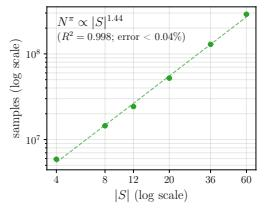  
(a) $| S | .$ 1-scaling

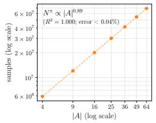  
1(b) |A|-scaling

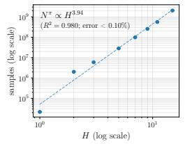  
1(c) H-scaling

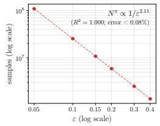  
1(d) ε-scaling  
Figure 1: Scaling of sample complexity (log–log scale) in the Safe vs. Risky game, following the setup in RQ3, with respect to (a) S , (b) A , (c) H, and (d) ε. Error bars show standard deviation over 10 runs; all are plotted but negligible (< 0.10% of the mean) and thus not visible.

For the finite-valued cases, this yields a value gap $V ^ { \star } - u ( \hat { \sigma } , P ^ { \star } ) = 0 \ll \varepsilon$ . The robust value estimate $\hat { V }$ can, however, differ slightly from $V ^ { \star }$ . Nevertheless, the estimation gap $V ^ { \star } - \hat { V }$ consistently remains below $4 \Delta _ { t } \ \leq \ \varepsilon ,$ , as guaranteed by Lemma 14 (App. E). This empirically validates the stopping condition $\Delta _ { t } \leq \varepsilon / 4 .$ , which ensures near-optimality of the output profile via Corollary 5: once $\Delta _ { t }$ falls below this threshold, the robust solution computed on $\mathcal { P } _ { t }$ transfers to the true model with error at most $4 \Delta _ { t } \leq \varepsilon .$ . Further, the second Safe vs. Risky property exhibits a degenerate case in which the SWNE value is unbounded: since both $s _ { 1 }$ and $s _ { 2 }$ are absorbing self-loops, once either is reached the game loops indefinitely, allowing the corresponding player to accumulate unbounded reward (while the reachability objective is effectively zero-sum); see Fig. 2, App. K. The algorithm correctly returns $V ^ { \star } = \infty$ together with a profile that attains it, demonstrating that our implementation handles unbounded total reward despite assuming bounded per-step rewards in the analysis.

RQ1(b) Equilibrium existence detection. Two benchmarks specifically consider the NE existence problem. 1) Cyclic Preferences provides a clean non-existence case. The game does not exhibit a fixed-point solution and possesses no exact NE. Our solver correctly returns NOT\_FOUND in 10/10 runs, yielding a sound certificate that no exact stationary NE exists. This is consistent with Proposition 4 which stipulates that solver failure implies $\mu ^ { \star } < 4 \Delta _ { t } - \varepsilon .$ , which is $\leq 0$ at termination; and thus $\bar { \mu } \leq 0$ by Proposition 8, App. A. 2) Hide-or-Run illustrates incompleteness of the non-existence certificate.

The game has no optimal stationary profile, but only an NE value in the limit $( \mathrm { i . e . }$ , approached by a sequence of mixed strategies). In all runs, our finite-sample learner returns an ε-NE approaching the limiting equilibrium (hide w.p. 0.999 at $s _ { 0 } )$ rather than NOT\_FOUND. This does not violate soundness, however: the non-existence certificate is required to be correct when emitted, but need not be emitted for every game lacking an exact stationary NE.

RQ2 Exploration strategy. Table 2 compares all explorers under the same PAC loop and stopping criterion. Uniform exploration is consistently less sample-efficient, requiring 2.0 more trajectories on Safe vs. Risky, 2.5 on Cyclic Preferences, and 17 on Delayed Coordination. Round-robin performs similarly to the robust explorer on the shallow benchmarks but requires 2.3 more trajectories on Traffic Merge. Optimistic exploration has similar sample consumption to robust exploration on most benchmarks, but uses slightly more samples on Delayed Coordination, where it also gives less stable and less accurate robust-value estimates: its estimated value differs from the true value by 0.06, whereas our robust explorer gives a near-perfect estimate. These results suggest that targeted exploration matters most when useful state-action pairs are difficult to reach, while pessimistic or robust planning provides more reliable coverage under transition uncertainty. We further analyse the learning dynamics of our robust explorer in Appendix K.2, including the evolution of uncertainty, known-slot coverage, confidence-radius imbalance, and per-episode sample consumption.

RQ3 Sample complexity scaling. Fig. 1 shows the dependence of total sample consumption on different problem parameters. Log–log fits give empirical exponents of 1.44 for S , 0.89 for $| A |$ 3.94 for H and 2.11 for $1 / \varepsilon$ . These are consistent with the worst-case bound of $| { \cal S } | ^ { 2 } | { \cal A } | { \cal H } ^ { 4 } / \varepsilon ^ { 2 }$ in Theorem 7. In particular, the horizon exponent closely tracks the theoretical dependence over the tested range, while state and action space growth is milder than the upper bound. These experiments do not establish tight asymptotic rates, but show that the observed scaling is consistent with the theorem over the tested instances.

## 6 Conclusion

We introduced PAC-CSG, the first PAC learning framework for general-sum concurrent stochastic games under transition uncertainty that handles stationary NE (non-)existence. The algorithm combines $L ^ { 1 }$ uncertainty sets with a new RMDP formulation that casts joint state–action coverage as a robust reachability problem, and uses a black-box RCSG solver to compute ε-RSWNEs. Under a graph reachability condition, it terminates after $\widetilde { \mathcal { O } } \big ( R _ { \mathrm { m a x } } ^ { 2 } H ^ { 4 } | S | ^ { 2 } | A | / ( \varepsilon ^ { 2 } p _ { \mathrm { r e a c h } } ) \big )$  trajectory samples and outputs either an ε-social-welfare-optimal ε-NE or a sound certificate of NE non-existence. Beyond these guarantees, our results highlight two key insights: 1) robust equilibrium computation in the empirical model transfers to the true game; and 2) equilibrium non-existence can be detected in a sound, data-driven manner. Empirically, our framework achieves near-optimality, sound nonexistence detection, and sample complexity consistent with theory. Future work includes relaxing the standard assumptions of centralised exploration, known transition support, and reachability, as well as improving scalability in S and A , e.g., through value-aware exploration; see App. L for further discussion.

## Acknowledgments and Disclosure of Funding

This work is supported by the EPSRC Centre for Doctoral Training no. EP/Y035070/1 and the UKRI AI Hub on Mathematical Foundations of AI.

## References

[1] A. Al-Marjani, A. Tirinzoni, and E. Kaufmann. Active coverage for pac reinforcement learning. In G. Neu and L. Rosasco, editors, Proceedings ofThirty Sixth Conference on Learning Theory, volume 195 of Proceedings of Machine Learning Research, pages 5044–5109. PMLR, 2023. URL https://proceedings.mlr.press/v195/al-marjani23a.html.

[2] M. G. Azar, I. Osband, and R. Munos. Minimax regret bounds for reinforcement learning. In Proceedings of the 34th International Conference on Machine Learning - Volume 70, ICML’17, page 263–272. JMLR.org, 2017.

[3] Y. Bai and C. Jin. Provable self-play algorithms for competitive reinforcement learning. In Proceedings of the 37th International Conference on Machine Learning, ICML’20. JMLR.org, 2020.

[4] R. Berthon, J.-P. Katoen, M. Mittelmann, and A. Murano. Robust strategies for stochastic multi agent systems. In Proceedings of the 24th International Conference on Autonomous Agents and Multiagent Systems, AAMAS ’25, page 2437–2439, Richland, SC, 2025. International Foundation for Autonomous Agents and Multiagent Systems. ISBN 9798400714269.

[5] D. P. Bertsekas and J. N. Tsitsiklis. An analysis of stochastic shortest path problems. Mathematics ofOperations Research, 16(3):580–595, 1991.

[6] P. Bouyer, N. Markey, and D. Stan. Mixed nash equilibria in concurrent terminal-reward games. In FSTTCS 2014, 2014.

[7] R. I. Brafman and M. Tennenholtz. R-max-a general polynomial time algorithm for near-optimal reinforcement learning. Journal ofMachine Learning Research, 3(Oct):213–231, 2002.

[8] T. Brihaye, V. Bruyère, A. Goeminne, J.-F. Raskin, and M. Van den Bogaard. The complexity of subgame perfect equilibria in quantitative reachability games. Logical Methods in Computer Science, 16, 2020.

[9] P. F. Castro and P. D’Argenio. Polytopal stochastic games. In Principles of Verification: Cycling the Probabilistic Landscape: Essays Dedicated to Joost-Pieter Katoen on the Occasion ofHis 60th Birthday, pages 99—-117. Springer, 2024.

[10] K. Chatterjee, K. Sen, and T. A. Henzinger. Model-checking ω-regular properties of interval Markov chains. In International Conference on Foundations of Software Science and Computational Structures, pages 302–317. Springer, 2008.

[11] T. Chen, V. Forejt, M. Kwiatkowska, D. Parker, and A. Simaitis. Automatic verification of competitive stochastic systems. In C. Flanagan and B. König, editors, Tools and Algorithmsfor the Construction and Analysis of Systems, pages 315–330, Berlin, Heidelberg, 2012. Springer Berlin Heidelberg. ISBN 978-3-642-28756-5.

[12] L. De Alfaro and T. A. Henzinger. Concurrent omega-regular games. In Proceedings Fifteenth Annual IEEE Symposium on Logic in Computer Science (Cat. No. 99CB36332), pages 141–154. IEEE, 2000.

[13] L. De Alfaro, T. A. Henzinger, and O. Kupferman. Concurrent reachability games. Theoretical computer science, 386(3):188–217, 2007.

[14] L. Euler. De serie lambertina plurimisque eius insignibus proprietatibus. Acta Academiae scientiarum imperialis petropolitanae, pages 29–51, 1783.

[15] Z. U. Farhat, D. Ghosh, G. K. Atia, and Y. Wang. Sample-efficient distributionally robust multi-agent reinforcement learning via online interaction, 2026. URL https://arxiv.org/ abs/2508.02948.

[16] D. A. Freedman. On tail probabilities for martingales. the Annals of Probability, pages 100–118, 1975.

[17] R. Givan, S. Leach, and T. Dean. Bounded-parameter Markov decision processes. Artificial Intelligence, 122(1-2):71–109, 2000.

[18] A. Y. He and D. Parker. Robust verification of concurrent stochastic games. In Proc. 32nd International Conference on Tools and Algorithms for the Construction and Analysis of Systems (TACAS’26), LNCS. Springer, 2026.

[19] C. A. Holt and A. E. Roth. The nash equilibrium: A perspective. Proceedings of the National Academy of Sciences, 101(12):3999–4002, 2004. doi: 10.1073/pnas.0308738101. URL https: //www.pnas.org/doi/abs/10.1073/pnas.0308738101.

[20] J. Hu and M. P. Wellman. Nash q-learning for general-sum stochastic games. J. Mach. Learn. Res., 4(null):1039–1069, Dec. 2003. ISSN 1532-4435.

[21] G. N. Iyengar. Robust dynamic programming. Mathematics of Operations Research, 30(2): 257–280, 2005.

[22] T. Jaksch, R. Ortner, and P. Auer. Near-optimal regret bounds for reinforcement learning. J. Mach. Learn. Res., 11:1563–1600, Aug. 2010. ISSN 1532-4435.

[23] X. Jin, M. Dan, N. Zhang, W. Yu, X. Fu, and S. K. Das. Chapter 2 - game theory for infrastructure security: The power of intent-based adversary models11part of the results included in this chapter was presented in [1], [2]. In Handbook on Securing Cyber-Physical Critical Infrastructure, pages 31–53. Morgan Kaufmann, Boston, 2012. ISBN 978-0-12-415815-3. doi: https://doi.org/10.1016/B978-0-12-415815-3.00002-9. URL https://www.sciencedirect. com/science/article/pii/B9780124158153000029.

[24] M. Kearns and S. Singh. Near-optimal reinforcement learning in polynomial time. Machine Learning, 49(2):209–232, 2002. ISSN 1573-0565. doi: 10.1023/A:1017984413808. URL https://doi.org/10.1023/A:1017984413808.

[25] M. Kwiatkowska, G. Norman, and D. Parker. PRISM model checker. https://www. prismmodelchecker.org/, 2013–2026.

[26] M. Kwiatkowska, G. Norman, D. Parker, and G. Santos. PRISM-games 3.0: Stochastic game verification with concurrency, equilibria and time. In Proc. 32nd International Conference on Computer Aided Verification (CAV’20), volume 12225 of LNCS, pages 475–487. Springer, 2020.

[27] M. Kwiatkowska, G. Norman, D. Parker, and G. Santos. Automatic verification of concurrent stochastic systems. Formal Methods in System Design, 58(1):188–250, 2021.

[28] M. Kwiatkowska, G. Norman, D. Parker, and G. Santos. Correlated equilibria and fairness in concurrent stochastic games. In International Conference on Tools and Algorithmsfor the Construction and Analysis ofSystems, pages 60–78. Springer, 2022.

[29] J. H. Lambert. Observationes variae in mathesin puram. Acta Helvetica, 3(1):128–168, 1758.

[30] G. Li, Y. Chi, Y. Wei, and Y. Chen. Minimax-optimal multi-agent rl in markov games with a generative model. Advances in Neural Information Processing Systems, 35:15353–15367, 2022.

[31] M. L. Littman. Markov games as a framework for multi-agent reinforcement learning. In W. W. Cohen and H. Hirsh, editors, Machine Learning Proceedings 1994, pages 157–163. Morgan Kaufmann, San Francisco (CA), 1994. ISBN 978-1-55860-335-6. doi: https://doi.org/10. 1016/B978-1-55860-335-6.50027-1. URL https://www.sciencedirect.com/science/ article/pii/B9781558603356500271.

[32] Q. Liu, T. Yu, Y. Bai, and C. Jin. A sharp analysis of model-based reinforcement learning with self-play. In M. Meila and T. Zhang, editors, Proceedings of the 38th International Conference on Machine Learning, volume 139 of Proceedings of Machine Learning Research, pages 7001–7010. PMLR, 2021. URL https://proceedings.mlr.press/v139/liu21z.html.

[33] S. Ma, Z. Chen, S. Zou, and Y. Zhou. Decentralized robust v-learning for solving markov games with model uncertainty. J. Mach. Learn. Res., 24(1), Jan. 2023. ISSN 1532-4435.

[34] T. Meggendorfer, M. Weininger, and P. Wienhöft. Solving robust Markov decision processes: Generic, reliable, efficient. In Proceedings of the AAAI Conference on Artificial Intelligence, volume 39(25), pages 26631–26641, 2025.

[35] A. Nilim and L. El Ghaoui. Robust control of Markov decision processes with uncertain transition matrices. Operations Research, 53(5):780–798, 2005.

[36] K. Panaganti and D. Kalathil. Sample complexity of robust reinforcement learning with a generative model. In G. Camps-Valls, F. J. R. Ruiz, and I. Valera, editors, Proceedings of The 25th International Conference on Artificial Intelligence and Statistics, volume 151 of Proceedings of Machine Learning Research, pages 9582–9602. PMLR, 28–30 Mar 2022. URL https://proceedings.mlr.press/v151/panaganti22a.html.

[37] K. Panaganti, Z. Xu, D. Kalathil, and M. Ghavamzadeh. Robust reinforcement learning using offline data. In Proceedings of the 36th International Conference on Neural Information Processing Systems, NIPS ’22, Red Hook, NY, USA, 2022. Curran Associates Inc. ISBN 9781713871088.

[38] Z. Roch and Y. Wang. Distributionally robust Markov games with average reward, 2025. URL https://arxiv.org/abs/2508.03136.

[39] L. S. Shapley. Stochastic games. Proceedings of the national academy of sciences, 39(10): 1095–1100, 1953.

[40] L. Shi, E. Mazumdar, Y. Chi, and A. Wierman. Sample-efficient robust multi-agent reinforcement learning in the face of environmental uncertainty. In Proceedings ofthe 41st International Conference on Machine Learning, ICML’24. JMLR.org, 2024.

[41] J. Stirling. Methodus differentialis: sive tractatus de summatione et interpolatione serierum infinitarum. 1730.

[42] A. L. Strehl, L. Li, and M. L. Littman. Reinforcement learning in finite mdps: Pac analysis. Journal ofMachine Learning Research, 10(84):2413–2444, 2009. URL http://jmlr.org/ papers/v10/strehl09a.html.

[43] M. Suilen, T. Badings, E. M. Bovy, D. Parker, and N. Jansen. Robust Markov decision processes: A place where AI and formal methods meet. In Principles of Verification: Cycling the Probabilistic Landscape: Essays Dedicated to Joost-Pieter Katoen on the Occasion of His 60th Birthday, pages 126–154. Springer, 2024.

[44] L. G. Valiant. A theory of the learnable. Communications of the ACM, 27(11):1134–1142, 1984.

[45] J. Von Neumann and O. Morgenstern. Theory of games and economic behavior, princeton, 1944.

[46] S. Wang, N. Si, J. Blanchet, and Z. Zhou. A finite sample complexity bound for distributionally robust q-learning. In F. Ruiz, J. Dy, and J.-W. van de Meent, editors, Proceedings of The 26th International Conference on Artificial Intelligence and Statistics, volume 206 of Proceedings of Machine Learning Research, pages 3370–3398. PMLR, 2023. URL https://proceedings. mlr.press/v206/wang23b.html.

[47] T. Weissman, E. Ordentlich, G. Seroussi, S. Verdu, and M. J. Weinberger. Inequalities for the l1 deviation of the empirical distribution. Hewlett-Packard Labs, Tech. Rep, page 125, 2003.

[48] W. Wiesemann, D. Kuhn, and B. Rustem. Robust Markov decision processes. Mathematics of Operations Research, 38(1):153–183, 2013.

[49] W. Yang, L. Zhang, and Z. Zhang. Towards theoretical understandings of robust markov decision processes: Sample complexity and asymptotics. The Annals of Statistics, 50(6):3223–3248, 2022.

[50] A. Zehfroosh and H. G. Tanner. Pac reinforcement learning algorithm for general-sum markov games. IEEE Transactions on Automatic Control, 68(5):2821–2831, 2023. doi: 10.1109/TAC. 2022.3219340.

[51] K. Zhang, S. M. Kakade, T. Ba¸sar, and L. F. Yang. Model-based multi-agent rl in zero-sum markov games with near-optimal sample complexity. J. Mach. Learn. Res., 24(1), Jan. 2023. ISSN 1532-4435.

[52] Z. Zhou, Z. Zhou, Q. Bai, L. Qiu, J. Blanchet, and P. Glynn. Finite-sample regret bound for distributionally robust offline tabular reinforcement learning. In A. Banerjee and K. Fukumizu, editors, Proceedings of The 24th International Conference on Artificial Intelligence and Statistics, volume 130 of Proceedings of Machine Learning Research, pages 3331–3339. PMLR, 2021. URL https://proceedings.mlr.press/v130/zhou21d.html.

## A Proof for Nash margin property (Definition 3)

Proposition 8. $\bar { \mu } \geq 0 i f f \mu ^ { \star } \geq 0 .$

Proof. We prove both directions.

( ) Suppose $\bar { \mu } \geq 0 .$ . By definition of $\bar { \mu } ,$ , there exists a profile $\sigma$ with Nash margin at least 0, i.e., an NE profile. Therefore, the set of NE profiles is non-empty. By definition, an SWNE is an NE that maximises social welfare among all NE profiles. Since the set of NE profiles is non-empty, such a profile exists. As every SWNE is an $\mathrm { N E , }$ it must also have non-negative Nash margin, and hence $\mu ^ { \star } \geq 0 .$

( ) Since $\bar { \mu }$ is the maximum achievable Nash margin, by definition $\bar { \mu } \geq \mu ^ { \star } \geq 0$

## B Concentration bounds and confidence radii

In this section, we establish the Weissman concentration result (Lemma 9) and the containment event ${ \mathcal { E } } ^ { \mathrm { c o n t } }$ (via Corollary 10) used in Sec. 4.1.

We begin by analysing the concentration of empirical transition probabilities, which are used to construct the per-slot $\breve { L } ^ { 1 }$ uncertainty sets $\textstyle { \mathcal { P } } _ { t } ( s , a )$ for each episode $t \geq 1$ in $\mathrm { A l g . 1 }$

For a state–action pair $( s , a ) \in \mathcal { X } _ { \mathrm { n t } }$ t, let $N _ { s a } \geq 0$ denote the number of independent samples drawn from the true transition distribution $P _ { s a } ^ { \star } ( \cdot )$ , and let $N _ { s a s ^ { \prime } }$ denote the number of observed transition to state $s ^ { \prime } .$

Further let

$$
\operatorname { S u c c } ( s , a ) : = \{ s ^ { \prime } \mid ( s , a , s ^ { \prime } ) \in \operatorname { S u p p } ( P ^ { \star } ) \} ,
$$

and define the support-preserving simplex

$$
\Delta _ { + } ( \operatorname { S u c c } ( s , a ) ) : = \{ p \in \Delta ( \operatorname { S u c c } ( s , a ) ) : \operatorname { S u p p } ( p ) = \operatorname { S u c c } ( s , a ) \} .
$$

Equivalently, $\Delta _ { + } ( \operatorname { S u c c } ( s , a ) )$ contains exactly those transition distributions whose support equals the known successor support of that slot. In the theoretical analysis, we use this support-preserving class; in implementation, we replace it with the corresponding closed simplex by imposing a $1 0 ^ { - 5 }$ lower bound on probabilities within the support. This ensures graph preservation.

If $N _ { s a } = 0$ , we define the empirical uncertainty set $\mathcal { P } _ { t } ( s , a ) = \Delta _ { + } ( \operatorname { S u c c } ( s , a ) )$ and set the point estimate $\widehat { P } _ { s a }$ to be the uniform distribution over this support.

If $N _ { s a } > 0$ , we define the empirical estimate as $\widehat { P } _ { s a } ( s ^ { \prime } ) = N _ { s a s ^ { \prime } } / N _ { s a }$ , and construct the corresponding $L ^ { 1 }$ uncertainty set as described below.

Lemma 9 (Per-slot concentration). Consider a given state–action pair $( s , a )$ with $n \geq 1 \ i . i . d .$ draws from $P _ { s a } ^ { \star } ( \cdot )$ , andfix afailure probability $\delta ^ { s a } \in ( 0 , 1 )$ . Define the Weissman $L ^ { 1 }$ confidence radius

$$
\alpha _ { s a } ( n ; \delta ^ { s a } ) : = \sqrt { \frac { 2 } { n } \ln \frac { 2 ^ { \left| S \right| } - 2 } { \delta ^ { s a } } } .
$$

Then

$$
\operatorname* { P r } \Big ( \| P _ { s a } ^ { \star } ( \cdot ) - \widehat { P } _ { s a } ( \cdot ) \| _ { 1 } \leq \alpha _ { s a } ( n ) \Big ) \geq 1 - \delta ^ { s a } .\tag{[↑ main]}
$$

Proof. We apply the Weissman inequality [47], which states that for any $\varepsilon > 0 .$

$$
\operatorname* { P r } \left( \| \widehat { P } _ { s a } - P _ { s a } ^ { \star } \| _ { 1 } \geq \varepsilon \right) \leq ( 2 ^ { | S | } - 2 ) \exp \left( - \frac { n \varepsilon ^ { 2 } } { 2 } \right) .
$$

Setting the right-hand side equal to $\delta ^ { s a }$ and solving for $\varepsilon \cdot$

$$
( 2 ^ { | S | } - 2 ) \exp \left( - \frac { n \varepsilon ^ { 2 } } 2 \right) = \delta ^ { s a } \Longrightarrow \varepsilon = \sqrt { \frac 2 n } \ln \frac { 2 ^ { | S | } - 2 } { \delta ^ { s a } } = : \alpha _ { s a } ( n ; \delta _ { s a } ) .
$$

Corollary 10 (Containment of $P ^ { \star }$ in $\mathcal { P } _ { t } ) _ { \mathsf { \Omega } }$ . Fix $\delta ^ { c o n t } \in ( 0 , 1 )$ . For brevity, write $n : = N _ { t } ( s , a )$ and define $\delta _ { s a , n } ^ { c o n t } : = \delta ^ { c o n t } / ( | S | | A | n ( n + 1 ) )$ . For each episode $t \geq 1$ , define the slot-wise uncertainty set

$$
\mathcal { P } _ { t } ( s , a ) : = \left\{ p \in \Delta _ { + } ( \mathrm { S u c c } ( s , a ) ) : \| p - \widehat { P } _ { s a , n } \| _ { 1 } \leq \alpha _ { s a } \big ( n ; \delta _ { s a , n } ^ { c o n t } \big ) \right\} ,
$$

and the global uncertainty set

$$
\mathcal { P } _ { t } : = \prod _ { ( s , a ) \in \mathcal { X } _ { \mathrm { n t } } } \mathcal { P } _ { t } ( s , a ) ,
$$

where $\alpha _ { s a } \big ( n ; \delta _ { s a , n } ^ { c o n t } \big )$ is the Weissman radiusfrom Lemma 9, instantiated a $\delta ^ { s a } : = \delta _ { s a , n } ^ { c o n t }$ . Then, with probability at least $1 - \delta ^ { c o n t }$

$$
P ^ { \star } \in \mathcal { P } _ { t } \qquad f o r a l l t \ge 1 .
$$

Proof. For each $( s , a )$ and $n \geq 1$ , define the event

$$
\mathcal { E } _ { s a , n } ^ { \mathrm { c o n t } } : = \left\{ \| P _ { s a } ^ { \star } - \widehat { P } _ { s a , n } \| _ { 1 } > \alpha _ { s a } \big ( n ; \delta _ { s a , n } ^ { \mathrm { c o n t } } \big ) \cdot \right\}
$$

By Lemma 9,

$$
\operatorname* { P r } ( \mathcal { E } _ { s a , n } ^ { \mathrm { c o n t } } ) \leq \delta _ { s a , n } ^ { \mathrm { c o n t } } = \frac { \delta ^ { \mathrm { c o n t } } } { | S | | A | n ( n + 1 ) } .
$$

Taking a union bound over all $( s , a ) \in \mathcal { X } _ { \mathrm { n t } }$ and all possible sample counts $n \geq 1$

$$
\operatorname* { P r } \left( \bigcup _ { ( s , a ) } \bigcup _ { n \geq 1 } \mathcal { E } _ { s a , n } ^ { \mathrm { c o n t } } \right) \leq \sum _ { ( s , a ) } \sum _ { n \geq 1 } \operatorname* { P r } ( \mathcal { E } _ { s a , n } ^ { \mathrm { c o n t } } ) = \delta ^ { \mathrm { c o n t } } \sum _ { n = 1 } ^ { \infty } \frac { 1 } { n ( n + 1 ) } = \delta ^ { \mathrm { c o n t } } ,
$$

Hence with probability at least $1 - \delta ^ { \mathrm { c o n t } }$ , no such failure occurs for any $( s , a )$ and any $^ { n , }$ which implies $P ^ { \star } \in \mathcal { P } _ { t }$ for all episodes $t \geq 1$ □

Conditioning on containment of the true kernel. Define the per-episode and all-episode containment event:

$$
\mathcal { E } _ { t } ^ { \mathrm { c o n t } } : = \{ P ^ { \star } \in \mathcal { P } _ { t } \} , \qquad \mathcal { E } ^ { \mathrm { c o n t } } : = \bigwedge _ { t \geq 1 } \mathcal { E } _ { t } ^ { \mathrm { c o n t } } .
$$

Following Corollary 10, we use the summable failure schedule $\delta _ { n } ^ { \mathrm { c o n t } } = \delta ^ { \mathrm { c o n t } } / ( n ( n + 1 ) )$ to ensure that

$$
\operatorname* { P r } ( { \mathcal { E } } ^ { \mathrm { c o n t } } ) \geq 1 - \delta ^ { \mathrm { c o n t } } .
$$

In the remainder of the analysis we condition on ${ \mathcal { E } } ^ { \mathrm { c o n t } }$

## C Proofs for value sensitivity (Lemma 2)

We continue to derive the results in Sec. 4.1 of the main paper, focusing on the sensitivity lemma (Lemma 2) and presenting several useful corollaries. In the following, consider a fixed episode $t \geq 1$ and a given strategy profile $\sigma \in \Sigma$

Proposition 11 (One-step error propagation). Let $\mu _ { h } , \widehat { \mu } _ { h }$ denote the stopped state marginals at time-step $h$ under $P$ and $\widehat { P }$ respectively, following $\sigma ,$ , started from the same initial state $s _ { 0 } \in S .$ Define

$$
{ \Delta _ { t } ^ { L } } ^ { 1 } : = \operatorname* { m a x } _ { ( s , a ) \in \mathcal { X } _ { \mathrm { n t } } } \alpha _ { t } ( s , a ) .
$$

Then for all $h \geq 1$

$$
\| \mu _ { h } - \widehat { \mu } _ { h } \| _ { 1 } \leq h \Delta _ { t } ^ { L ^ { 1 } } .
$$

Proof. We prove the recursive bound

$$
\| \mu _ { h + 1 } - \widehat { \mu } _ { h + 1 } \| _ { 1 } \leq \| \mu _ { h } - \widehat { \mu } _ { h } \| _ { 1 } + \Delta _ { t } ^ { L ^ { 1 } } ,\tag{4}
$$

from which the result follows by induction using $\mu _ { 0 } = \widehat { \mu } _ { 0 } = \delta _ { s _ { 0 } }$ , i.e., the Dirac distribution that assigns probability 1 to state $s _ { 0 }$ and 0 to all others.

For $s \notin S _ { T }$ , define the mixed one-step kernels

$$
K _ { s } : = \sum _ { a } \sigma ( a | s ) P ( \cdot | s , a ) , \qquad \widehat { K } _ { s } : = \sum _ { a } \sigma ( a | s ) \widehat { P } ( \cdot | s , a ) .
$$

Then

$$
\mu _ { h + 1 } = \sum _ { s \notin S _ { T } } \mu _ { h } ( s ) K _ { s } , \qquad \widehat { \mu } _ { h + 1 } = \sum _ { s \notin S _ { T } } \widehat { \mu } _ { h } ( s ) \widehat { K } _ { s } ,
$$

and hence

$$
\mu _ { h + 1 } - \widehat { \mu } _ { h + 1 } = \sum _ { s \notin S _ { T } } ( \mu _ { h } ( s ) - \widehat { \mu } _ { h } ( s ) ) K _ { s } + \sum _ { s \notin S _ { T } } \widehat { \mu } _ { h } ( s ) ( K _ { s } - \widehat { K } _ { s } ) .
$$

Taking $L ^ { 1 }$ norms and applying the triangle inequality:

$$
\| \mu _ { h + 1 } - \widehat { \mu } _ { h + 1 } \| _ { 1 } \leq \Big \| \sum _ { s \notin S _ { T } } ( \mu _ { h } ( s ) - \widehat { \mu } _ { h } ( s ) ) K _ { s } \Big \| _ { 1 } + \Big \| \sum _ { s \notin S _ { T } } \widehat { \mu } _ { h } ( s ) ( K _ { s } - \widehat { K } _ { s } ) \Big \| _ { 1 } .\tag{5}
$$

First term. Let $c _ { s } : = \mu _ { h } ( s ) - \widehat { \mu } _ { h } ( s )$ . Since each $K _ { s }$ is a probability distribution,

$$
\sum _ { s ^ { \prime } } \left| \sum _ { s \notin S _ { T } } c _ { s } K _ { s } ( s ^ { \prime } ) \right| \leq \sum _ { s \notin S _ { T } } | c _ { s } | \sum _ { s ^ { \prime } } K _ { s } ( s ^ { \prime } ) = \sum _ { s \notin S _ { T } } | c _ { s } | ,
$$

hence

$$
\Big \| \sum _ { s \notin S _ { T } } ( \mu _ { h } ( s ) - \widehat { \mu } _ { h } ( s ) ) K _ { s } \Big \| _ { 1 } \leq \| \mu _ { h } - \widehat { \mu } _ { h } \| _ { 1 } .
$$

Second term. By convexity,

$$
\left\| \sum _ { s \notin S _ { T } } \widehat { \mu } _ { h } ( s ) ( K _ { s } - \widehat { K } _ { s } ) \right\| _ { 1 } \leq \sum _ { s \notin S _ { T } } \widehat { \mu } _ { h } ( s ) \| K _ { s } - \widehat { K } _ { s } \| _ { 1 } \leq \operatorname* { m a x } _ { s \notin S _ { T } } \| K _ { s } - \widehat { K } _ { s } \| _ { 1 } .
$$

For each $s \notin S _ { T }$

$$
\begin{array} { r l r } {  { \| K _ { s } - \widehat { K } _ { s } \| _ { 1 } \leq \sum _ { a } \sigma ( a | s ) \| P _ { s a } - \widehat { P } _ { s a } \| _ { 1 } \leq \operatorname* { m a x } _ { a } \| P _ { s a } - \widehat { P } _ { s a } \| _ { 1 } } } \\ & { } & { = \operatorname* { m a x } _ { a } \sum _ { s ^ { \prime } } | P _ { s a } ( s ^ { \prime } ) - \widehat { P } _ { s a } ( s ^ { \prime } ) | \leq \operatorname* { m a x } _ { a } \alpha _ { t } ( s , a ) = \Delta _ { t } ^ { L ^ { 1 } } . } \end{array}
$$

where the last inequality follows from the construction of $\mathcal { P } _ { t }$ (see Corollary 10).

Substituting into (5) gives

$$
\| \mu _ { h + 1 } - \widehat { \mu } _ { h + 1 } \| _ { 1 } \leq \| \mu _ { h } - \widehat { \mu } _ { h } \| _ { 1 } + { \Delta _ { t } ^ { L } } ^ { 1 } .
$$

Unrolling the recursion yields

$$
\| \mu _ { h } - \widehat { \mu } _ { h } \| _ { 1 } \leq h \Delta _ { t } ^ { L ^ { 1 } } .
$$

Lemma 2 (Sensitivity). Define $\begin{array} { r } { \Delta _ { t } : = \frac { 1 } { 2 } R _ { \mathrm { m a x } } H ^ { 2 } { \Delta _ { t } ^ { L } } ^ { 1 } } \end{array}$ , where $\begin{array} { r } { \Delta _ { t } ^ { L ^ { 1 } } : = \operatorname* { m a x } _ { ( s , a ) \in \mathcal { X } _ { \mathrm { n t } } } \| P _ { s a } ^ { \star } - \widehat { P } _ { s a } \| _ { 1 } } \end{array}$ . Then for any $P \in \mathcal { P } _ { t }$ , profile σ, player i $\in N$ , and state $s _ { 0 } \in S , | u _ { i } ( \sigma , P \mid s _ { 0 } ) - u _ { i } ( \sigma , \widehat { P } \mid s _ { 0 } ) | \le \Delta _ { t }$ [↑ main]

Proof. The left-hand side could be rewritten as:

$$
\begin{array} { l } { \displaystyle \left| u _ { i } ( \sigma , P \mid s _ { 0 } ) - u _ { i } ( \sigma , \widehat { P } \mid s _ { 0 } ) \right| = \left| \mathbb { E } ^ { \sigma , P } \left[ \sum _ { h = 0 } ^ { H - 1 } r _ { i } ( s _ { h } , a _ { h } ) \right] - \mathbb { E } ^ { \sigma , \widehat { P } } \left[ \sum _ { h = 0 } ^ { H - 1 } r _ { i } ( s _ { h } , a _ { h } ) \right] \right| } \\ { \displaystyle \qquad = \left| \sum _ { h = 0 } ^ { H - 1 } \left[ \mathbb { E } ^ { \sigma , P } [ r _ { i } ( s _ { h } , a _ { h } ) ] - \mathbb { E } ^ { \sigma , \widehat { P } } [ r _ { i } ( s _ { h } , a _ { h } ) ] \right] \right| . } \end{array}
$$

Note that for bounded probabilistic reachability, we use the equivalent finite-horizon terminal-reward encoding, so the same argument applies. Moreover,

$$
\begin{array} { l } { { \mathbb { E } ^ { \sigma , P } [ r _ { i } ( s _ { h } , a _ { h } ) ] = \displaystyle \sum _ { s } \sum _ { a } \mathbb { P } ^ { \sigma , P } ( s _ { h } = s ) \sigma ( a \mid s ) \cdot r _ { i } ( s , a ) \ ~ } } \\ { { \displaystyle = \sum _ { s } \mu _ { h } ( s ) \sum _ { a } \sigma ( a \mid s ) r _ { i } ( s , a ) = \sum _ { s } \mu _ { h } ( s ) r _ { i } ^ { \sigma } ( s ) , } } \end{array}
$$

where $r _ { i } ^ { \sigma } ( s ) : = \mathbb { E } _ { a \sim \sigma ( s ) } [ r _ { i } ( s , a ) ]$ . By assumption, $| r _ { i } ^ { \sigma } ( s ) | \le R _ { \mathrm { m a x } }$ . Thus,

$$
\begin{array} { r l } & { L H S = \displaystyle \left| \sum _ { h = 0 } ^ { H - 1 } \sum _ { s } r _ { i } ^ { \sigma } ( s ) \big ( \mu _ { h } ( s ) - \widehat { \mu } _ { h } ( s ) \big ) \right| } \\ & { \qquad \leq \displaystyle \sum _ { h = 0 } ^ { H - 1 } \displaystyle \operatorname* { m a x } _ { s } \left| r _ { i } ^ { \sigma } ( s ) \right| \cdot \displaystyle \sum _ { s } \left| \mu _ { h } ( s ) - \widehat { \mu } _ { h } ( s ) \right| \leq R _ { \operatorname* { m a x } } \displaystyle \sum _ { h = 0 } ^ { H - 1 } \| \mu _ { h } - \widehat { \mu } _ { h } \| _ { 1 } } \\ & { \qquad \leq R _ { \operatorname* { m a x } } \Delta _ { t } ^ { L ^ { 1 } } \displaystyle \sum _ { h = 0 } ^ { H - 1 } h = R _ { \operatorname* { m a x } } \Delta _ { t } ^ { L ^ { 1 } } \displaystyle \frac { H ( H - 1 ) } { 2 } } \\ & { \qquad \leq \frac { 1 } { 2 } H ^ { 2 } R _ { \operatorname* { m a x } } \Delta _ { t } ^ { L ^ { 1 } } = : \Delta _ { t } . } \end{array}
$$

(by Proposition 11)

Henceforth, we define

$$
\Delta _ { t } : = \textstyle { \frac { 1 } { 2 } } R _ { \mathrm { m a x } } H ^ { 2 } \Delta _ { t } ^ { L ^ { 1 } } , \quad \mathrm { w h e r e } \quad \Delta _ { t } ^ { L ^ { 1 } } : = \operatorname* { m a x } _ { ( s , a ) \in \mathcal { X } _ { \mathrm { n t } } } \| P _ { s a } ^ { \star } - \widehat { P } _ { s a } \| _ { 1 } .
$$

Corollary 12. For any $P , P ^ { \prime } \in \mathcal { P } _ { t }$ , any strategy profile σ, and each player $i \in N$

$$
| u _ { i } ( \sigma , P ) - u _ { i } ( \sigma , P ^ { \prime } ) | \leq 2 \Delta _ { t } .
$$

Proof. By the triangle inequality and Lemma 2 (applied twice),

$$
\left| u _ { i } ( \sigma , P ) - u _ { i } ( \sigma , P ^ { \prime } ) \right| \le \left| u _ { i } ( \sigma , P ) - u _ { i } ( \sigma , \widehat { P } ) \right| + \left| u _ { i } ( \sigma , \widehat { P } ) - u _ { i } ( \sigma , P ^ { \prime } ) \right| = 2 \Delta _ { t } .
$$

Corollary 13 (Social-welfare sensitivity). For any $P \in \mathcal { P } _ { t }$ and any strategy profile σ:

$$
\left| u ( \sigma , P ) - u ( \sigma , \widehat { P } ) \right| \leq 2 \Delta _ { t } .
$$

Consequently, for any $P , P ^ { \prime } \in \mathcal { P } _ { t }$

$$
| u ( \sigma , P ) - u ( \sigma , P ^ { \prime } ) | \leq 4 \Delta _ { t } .
$$

Proof. Apply Lemma 2 to each player $i \in N$ and sum up:

$$
\left| u ( \sigma , P ) - u ( \sigma , \widehat { P } ) \right| \leq \sum _ { i \in N } \left| u _ { i } ( \sigma , P ) - u _ { i } ( \sigma , \widehat { P } ) \right| \leq \sum _ { i \in N } \Delta _ { t } = 2 \Delta _ { t } .
$$

The pairwise bound follows identically from Corollary 12.

## D Proofs for equilibrium existence (Proposition 4)

This section establishes the key properties of the solver oracle (Proposition 4) that link robust equilibrium computation in the empirical model to equilibrium existence in the true game. We first formalise the solver oracle (Assumption 2), then show that any exact NE of the true game induces an approximate RNE in the empirical model (Lemma 3), and use this to derive the solver guarantees (Proposition 4).

Henceforth, we assume access to a black-box $( L ^ { 1 } \mathrm { - } ) \mathrm { R C S G }$ solver SOLVEL1CSG with tolerance $\varepsilon \geq 0 .$ which computes an $\varepsilon { \mathrm { - } } \mathbf { R } \mathbf { S } \mathbf { W } \mathbf { N } \mathbf { E }$ of the empirical RCSG $\mathcal { G } _ { t }$ . Below we use the notation of Alg. 1.

Assumption 2 (SOLVE $L ^ { 1 } \mathrm { C S G }$ oracle). Consider an $( L ^ { 1 _ { - } } ) R C S G \mathcal { G }$ with uncertainty set $\mathcal { P } .$ . Given tolerance $\varepsilon \geq 0 ,$ , the solver returns $( \hat { \sigma } , \hat { V }$ , found) = SOLVE $L ^ { 1 } \mathbf { C } \mathbf { S } \mathbf { G } ( \mathcal { G } , \varepsilon )$ such that found = true $i f f$ σˆ is an ${ \varepsilon } { - } R S W N E$ of , in which case $\hat { V } = \underline { { u } } _ { \mathcal { P } } ( \hat { \sigma } )$ . Equivalently, found = false $i f f \Sigma _ { \varepsilon - R N E } ( \mathcal { P } ) = \emptyset$

Note that $\begin{array} { r } { \hat { \sigma } \in \sum _ { \varepsilon - \mathrm { R N E } } ( \mathcal { P } ) } \end{array}$ implies $\begin{array} { r } { \sum _ { \varepsilon - \mathrm { R N E } } ( \mathcal { P } ) \neq \emptyset } \end{array}$ , so the failure condition is equivalently stated as $\begin{array} { r } { \sum _ { \varepsilon - \mathrm { R N E } } ( \mathcal { P } ) = \emptyset } \end{array}$

Assumption 2 abstracts equilibrium computation as an oracle, yielding an information-theoretic PAC guarantee that is decoupled from the solver’s computational complexity. Practical solvers for general-sum $L ^ { 1 } { \mathrm { - } }  { \mathrm { R C S G s } }$ under our objectives do exist $( \mathrm { e . g . }$ ., in PRISM-games [18]), although polynomial-time implementations are currently known only in certain settings (e.g., the zero-sum case [18]). We defer a detailed discussion of computational aspects to App. L.

At each episode t, the solver either succeeds or fails to find an ε-RSWNE of $\mathcal { P } _ { t }$ . The following result characterises how each outcome relates to equilibrium properties of the true game $\mathcal G ^ { \star }$

Lemma ${ \bf 3 _ { \ell } ( N E } ( { \cal P } ^ { \star } ) \Rightarrow$ approximate $\mathrm { R N E } ( \mathcal { P } _ { t } ) )$ . If σ is an (exact) NE under $P ^ { \star }$ achieving Nash margin $\mu : = \mu ( \sigma , P ^ { \star } ) \geq 0 ;$ , then it is also an $( 4 \Delta _ { t } - \mu )$ -RNE under $\mathcal { P } _ { t }$ [↑ main]

Proof. Let σ be an NE under $P ^ { \star }$ with Nash margin $\mu \geq 0$ . By the triangle inequality, for any $P \in \mathcal { P } _ { t }$ and player $i \in N$ , we have:

$$
u _ { i } ( \sigma _ { - i } [ \sigma _ { i } ^ { \prime } ] , P ) - u _ { i } ( \sigma , P ) \leq [ u _ { i } ( \sigma _ { - i } [ \sigma _ { i } ^ { \prime } ] , P ) - u _ { i } ( \sigma _ { - i } [ \sigma _ { i } ^ { \prime } ] , P ^ { \star } ) ] + [ u _ { i } ( \sigma _ { - i } [ \sigma _ { i } ^ { \prime } ] , P ^ { \star } ) - u _ { i } ( \sigma , P ^ { \star } ) ]
$$

$$
+ \left[ u _ { i } ( \sigma , P ^ { \star } ) - u _ { i } ( \sigma , P ) \right]
$$

$$
\le 2 \Delta _ { t } - \mu + 2 \Delta _ { t } = 4 \Delta _ { t } - \mu
$$

where the last inequality follows from Corollary 12 and the definition of $\mu$ (Definition 3). Since the bound holds for every $P \in { \mathcal { P } } _ { t }$ t, taking inf preserves the inequality, giving

$$
\operatorname* { i n f } _ { P \in \mathcal { P } _ { t } } \left[ u _ { i } ( \sigma _ { - i } [ \sigma _ { i } ^ { \prime } ] , P ) - u _ { i } ( \sigma , P ) \right] \leq 4 \Delta _ { t } - \mu \qquad \forall i \in N .
$$

Hence σ is an $( 4 \Delta _ { t } - \mu ) – \mathrm { R N E }$ under $\mathcal { P } _ { t }$ .

Proposition 4 (Solver guarantees for equilibrium computation). On the event ${ { \mathcal { E } } ^ { c o n t } } .$ :

(1) (Equilibrium transfer) If the solver returns an $\varepsilon { - } R S W N E ~ { \hat { \sigma } }$ of $\mathcal { P } _ { t }$ , then $\hat { \sigma }$ is an ε-NE of $\mathcal G ^ { \star }$

(2) (Failure implies near non-existence) If the solver returns NOT\_FOUND, then either $\mu ^ { \star }$ is undefined or $\mu ^ { \star } < 4 \Delta _ { t } - \varepsilon$

[↑ main]

## Proof. We prove each part individually.

1. Conditioning on ${ \mathcal { E } } ^ { \mathrm { c o n t } }$ we have $P ^ { \star } \in { \mathcal { P } } _ { t }$ . By definition of an ε-RSWNE (see after Definition $2 )$ , every ε-RSWNE under $\mathcal { P } _ { t }$ is also an ε-RNE under $\mathcal { P } _ { t } .$ , and every ε-RNE under $\mathcal { P } _ { t }$ is an ε-NE of every $P \in \mathcal { P } _ { t }$ including $P ^ { \star }$ . Therefore, if the solver returns an ε-RSWNE σˆ under $\mathcal { P } _ { t } .$ , then σˆ is an $\boldsymbol { \varepsilon } { - } \mathbf { N E }$ of $P ^ { \star }$ (the transition kernel of $\mathcal G ^ { \star } )$

2. Suppose the solver returns NOT\_FOUND. By Assumption 2, this means that $\begin{array} { r } { \sum _ { \varepsilon - \mathrm { R N E } } ( \mathcal { P } _ { t } ) = \emptyset } \end{array}$ i.e., no ε-RNE exists under $\mathcal { P } _ { t }$ . We now distinguish two cases according to the sign of $\bar { \mu } : = \operatorname* { m a x } _ { \sigma \in \Sigma } \mu ( \sigma , P ^ { \star } )$ (defined in Definition 3).

(a) If $\bar { \mu } < 0 .$ , then no exact NE, and hence no SWNE (i.e., the NE that achieves the highest social welfare) exists under $P ^ { \star }$ . However, the social-welfare optimal Nash margin $\mu ^ { \star } : = \mu ( \sigma ^ { \star } , P ^ { \star } )$ (Definition 3) is well-defined only when the SWNE $\sigma ^ { \star }$ exists, therefore trivially $\mu ^ { \star }$ is undefined.

(b) If $\bar { \mu } \geq 0$ , then $\Sigma _ { \mathrm { N E } } ( P ^ { \star } ) \neq \emptyset$ , so the SWNE $\sigma ^ { \star }$ exists and $\mu ^ { \star } = \mu ( \sigma ^ { \star } , P ^ { \star } )$ is welldefined. Now suppose, for contradiction, that $\mu ^ { \star } \geq 4 \Delta _ { t } - \varepsilon$ . Then Lemma 3 implies that $\sigma ^ { \star }$ is also a $( 4 \Delta _ { t } - \mu ^ { \star } )$ -RNE under $\mathcal { P } _ { t }$ . Since

$$
4 \Delta _ { t } - \mu ^ { \star } \leq 4 \Delta _ { t } - ( 4 \Delta _ { t } - \varepsilon ) = \varepsilon ,
$$

$\sigma ^ { \star }$ is also an ε-RNE under $\mathcal { P } _ { t } .$ . Hence $\begin{array} { r } { \sum _ { \varepsilon - \mathrm { R N E } } ( \mathcal { P } _ { t } ) \neq \emptyset . } \end{array}$ , and Assumption 2 guarantees that the solver would return FOUND with an $\varepsilon { \mathrm { - } } \mathbf { R } \mathbf { S } \mathbf { W } \mathbf { N } \mathbf { E }$ under $\mathcal { P } _ { t } ,$ , contradicting the assumption that the solver returned NOT\_FOUND.

## E Proofs for anytime guarantees (Corollary 5)

We now derive anytime guarantees on the robust estimation error $V ^ { \star } - \underline { { u } } _ { \mathcal { P } _ { t } } ( \hat { \sigma } )$ (Lemma 14) and the value gap $V ^ { \star } - u ( \hat { \sigma } , P ^ { \star } )$ (Corollary 5, Sec. 4.1). In this section we assume $\bar { \mu } \geq 0$ so that $\Sigma _ { \mathrm { N E } } ( P ^ { \star } ) \ \mp \ \emptyset$ and hence $V ^ { \star }$ is well-defined. Also recall that σˆ is an $\varepsilon { \mathrm { - } } \mathbf { R } \mathbf { S } \mathbf { W } \mathbf { N } \mathbf { E }$ under $\mathcal { P } _ { t }$ by Assumption 2.

Lemma 14 (Anytime upper bound for V⋆). $I f \mu ^ { \star } \geq 4 \Delta _ { t } - \varepsilon ,$ , then $\begin{array} { r } { V ^ { \star } - \underline { { u } } _ { \mathcal { P } _ { t } } ( \hat { \sigma } _ { t } ) \leq 4 \Delta _ { t } } \end{array}$ .

Proof. Since $\mu ^ { \star } \geq 4 \Delta _ { t } - \varepsilon$ , Lemma 3 implies that $\sigma ^ { \star } \in \Sigma _ { \varepsilon - \mathrm { R N E } } ( \mathcal { P } _ { t } ) \neq \emptyset$ . By Corollary 13 applied to $\sigma ^ { \star }$ , for every $\boldsymbol { P } \in \mathcal { P } _ { t } ;$

$$
u ( \sigma ^ { \star } , P ) \geq u ( \sigma ^ { \star } , P ^ { \star } ) - 4 \Delta _ { t } = V ^ { \star } - 4 \Delta _ { t } .
$$

Taking inf over $\boldsymbol { P } \in \mathcal { P } _ { t } ;$

$$
\operatorname* { i n f } _ { P \in \mathcal { P } _ { t } } u ( \sigma ^ { \star } , P ) = \underline { { u } } _ { \mathcal { P } _ { t } } ( \sigma ^ { \star } ) \geq V ^ { \star } - 4 \Delta _ { t } .
$$

Since $\hat { \sigma } _ { t }$ maximises the robust value over $\begin{array} { r } { \sum _ { \varepsilon - \mathrm { R N E } } ( \mathcal { P } _ { t } ) } \end{array}$ and $\sigma ^ { \star } \in \Sigma _ { \varepsilon - \mathrm { R N E } } ( \mathcal { P } _ { t } )$

$$
\begin{array} { r } { \underline { { u } } _ { \mathcal { P } _ { t } } ( \hat { \sigma } _ { t } ) = \underset { \sigma \in \Sigma _ { \leq \operatorname { s } \operatorname { s a r g m } } ( \mathcal { P } _ { t } ) } { \operatorname* { s u p } } \underline { { u } } _ { \mathcal { P } _ { t } } ( \sigma ) \geq \underline { { u } } _ { \mathcal { P } _ { t } } ( \sigma ^ { \star } ) \geq V ^ { \star } - 4 \Delta _ { t } \quad \implies \quad V ^ { \star } - \underline { { u _ { \mathcal { P } _ { t } } ( \hat { \sigma } _ { t } ) } } \leq 4 \Delta _ { t } . } \end{array}
$$

Corollary 5 (Per-episode value gap). $H f \mu ^ { \star } \geq 4 \Delta _ { t } - \varepsilon ,$ , then $V ^ { \star } - u ( \hat { \sigma } _ { t } , P ^ { \star } ) \leq 4 \Delta _ { t }$ [↑ main]

Proof. Immediate from Lemma 14 since $u ( \hat { \sigma } _ { t } , P ^ { \star } ) \geq \underline { { u } } _ { \mathcal { P } _ { t } } ( \hat { \sigma } _ { t } )$ conditioning on ${ \mathcal { E } } ^ { \mathrm { c o n t } }$

## F Supplementary details and proofs for exploration principles (Sec. 4.2)

This section provides the technical results underlying Sec. 4.2. We first show that the confidence allocation $\delta _ { t } ^ { \mathrm { c o v } }$ sums to $\delta ^ { \mathrm { c o v } }$ (Proposition 18), then bound the number of trajectories per episode required to discover an unknown slot with probability at least $1 - \delta _ { t } ^ { \mathrm { c o v } }$ (Proposition 17), and finally establish the exploration probability lower bound (Lemma 6).

Recall the following notation for the exploration analysis. A non-target slot $( s , a )$ is known if it has been visited at least $n _ { \mathrm { m i n } }$ times (defined in Lemma 20, App. G), and unknown otherwise. Let

$$
\mathcal { U } _ { t } = \{ ( s , a ) \in \mathcal { X } _ { \mathrm { n t } } : N _ { t } ( s , a ) < n _ { \mathrm { m i n } } \} , \qquad \mathcal { K } _ { t } = \mathcal { X } _ { \mathrm { n t } } \setminus \mathcal { U } _ { t }
$$

denote the sets of unknown and known slots, respectively, at the beginning of episode t. Here, $N _ { t } ( s , a )$ is the visit count of $( s , a )$ by episode t. Further define $N _ { \mathrm { t o t } } : = | \mathcal { X } _ { \mathrm { n t } } | n _ { \mathrm { m i n } } \stackrel { \cdot } { \ } \leq | S | | A | n _ { \mathrm { m i n } }$ the total number of visits required across all relevant slots.

Interpreting the exploration RMDP construction. Consider Definition 5 of the exploration RMDP. The absorbing construction is used purely for analysis: in the implementation, trajectories are not terminated upon visiting $\mathcal { U } _ { t }$ or $S _ { T }$ . This does not affect the guarantee, since visiting some $( s , a ) \in \mathcal { U } _ { t }$ depends only on the trajectory prefix up to the first such visit. Continuing the trajectory can only increase the probability of this event, so the lower bound in Lemma 6 remains valid. The state z ensures that expected reward coincides with visitation probability (each trajectory contributes at most once); without it, the objective would instead reflect expected visit counts. Finally, the exploration RMDP remains unchanged as long as $\mathcal { U } _ { t }$ does not change. This allows an implementation optimisation: $\mathcal { G } _ { t } ^ { e }$ need only be re-solved when new $( s , a )$ pairs become known, instead of doing so at every episode.

$$
p _ { \mathrm { r e a c h } }
$$

$$
p _ { t } ^ { e } ( P ^ { \star } )
$$

Lemma 6 (Exploration probability). For all episodes $t \geq 1$ with $\mathcal { U } _ { t } \neq \emptyset , p _ { t } ^ { e } ( P ^ { \star } ) \geq p _ { \mathrm { r e a c h } }$ . [↑ main]

Proof. Fix episode t with ${ { \mathcal { U } } _ { t } \ne \emptyset }$ and any $( s ^ { \dagger } , a ^ { \dagger } ) \in \mathcal { U } _ { t }$

By Assumption 1, there exists a policy $\sigma _ { \mathrm { r e a c h } } \in \Sigma$ such that

$$
\operatorname* { i n f } _ { P : \operatorname { S u p p } ( P ) = \operatorname { S u p p } ( P ^ { \star } ) } \mathbb { P } ^ { \sigma _ { \mathrm { r e a c h } } , P } [ \operatorname { r e a c h } { ( s ^ { \dagger } , a ^ { \dagger } ) } \operatorname { b e f o r e } S _ { T } ] \geq p _ { \mathrm { r e a c h } } .
$$

By definition of $\sigma _ { t } ^ { e } \left( 1 \right)$ as a maximiser of the robust value under $\boldsymbol { r } _ { t } ^ { e }$ , for any comparator $\sigma ^ { \prime } \in \Sigma$

$$
\operatorname* { i n f } _ { P \in \mathcal { P } _ { t } ^ { e } } \mathbb { E } ^ { \sigma _ { t } ^ { e } , P } \left[ \sum _ { h = 0 } ^ { H - 1 } r _ { t } ^ { e } ( s _ { h } , a _ { h } ) \right] = \underline { { u _ { \mathcal { P } ^ { e } } ( \sigma _ { t } ^ { e } ) } } \geq \underline { { u _ { \mathcal { P } _ { t } ^ { e } } ( \sigma ^ { \prime } ) } } = \operatorname* { i n f } _ { P \in \mathcal { P } _ { t } ^ { e } } \mathbb { E } ^ { \sigma ^ { \prime } , P } \left[ \sum _ { h = 0 } ^ { H - 1 } r _ { t } ^ { e } ( s _ { h } , a _ { h } ) \right] .
$$

Due to the absorbing construction of $\mathcal { G } _ { t } ^ { e }$ , any trajectory visits $\mathcal { U } _ { t }$ at most once. Hence for any policy σ and kernel $P _ { \mathrm { { : } } }$

$$
\sum _ { h = 0 } ^ { H - 1 } r _ { t } ^ { e } ( s _ { h } , a _ { h } ) = \mathbb { 1 } [ \operatorname { r e a c h } \mathcal { U } _ { t } ] ,
$$

and hence maximising expected cumulative reward is equivalent to maximising P[reach ${ { \mathcal { U } } _ { t } } ]$

Therefore, by optimality of $\sigma _ { t } ^ { e }$ and taking $\sigma ^ { \prime } = \sigma _ { \mathrm { r e a c h } }$

$$
\begin{array} { r l } & { \underset { P \in \mathcal { P } _ { t } ^ { e } } { \operatorname* { i n f } } \mathbb { P } ^ { \sigma _ { t } ^ { e } , P } [ \operatorname { r e a c h } \mathcal { U } _ { t } ] \geq \underset { P \in \mathcal { P } _ { t } ^ { e } } { \operatorname* { i n f } } \mathbb { P } ^ { \sigma _ { \mathrm { r e a c h } } , P } [ \operatorname { r e a c h } \mathcal { U } _ { t } ] } \\ & { \qquad \geq \underset { P \in \mathcal { P } _ { t } ^ { e } } { \operatorname* { i n f } } \mathbb { P } ^ { \sigma _ { \mathrm { r e a c h } } , P } [ \operatorname { r e a c h } \left( \boldsymbol { s } ^ { \dagger } , \boldsymbol { a } ^ { \dagger } \right) \mathrm { b e f o r e } S _ { T } ] \geq p _ { \mathrm { r e a c h } } } \end{array}\tag{6}
$$

where the last inequality follows from the definition of $p _ { \mathrm { r e a c h } } \left( 2 \right)$

Now, since $( s ^ { \dagger } , a ^ { \dagger } ) \in \mathcal { U } _ { t }$ , the event reach $( s ^ { \dagger } , a ^ { \dagger } ) \}$ depends only on the trajectory prefix before the first visit to $\mathcal { U } _ { t } . \ \mathrm { ~ B y ~ }$ construction of $\mathcal { G } _ { t } ^ { e }$ (Definition $5 ) .$ , any unknown slot $( s , a ) \in \mathcal { U } _ { t }$ transitions deterministically to the absorbing state $z ,$ so a trajectory reaching $( s ^ { \dagger } , a ^ { \dagger } )$ must avoid all other unknown slots beforehand. Consequently, the trajectory up to the hitting time of $\mathcal { U } _ { t }$ depends only on transitions over $\textstyle { \mathcal { K } } _ { t }$

Finally, to relate this bound to the true kernel, define $P ^ { e , \star } \in \mathcal { P } _ { t } ^ { e }$ to coincide with $P ^ { \star } \in { \mathcal { P } } _ { t }$ (conditioning on ${ \mathcal { E } } ^ { \mathrm { c o n t } } )$ on $\textstyle { \mathcal { K } } _ { t }$ and use the absorbing transitions on $\mathcal { U } _ { t } \cup S _ { T }$ . Since the event reach ${ { \mathcal { U } } _ { t } } \dag \}$ depends only on transitions prior to the first visit to $\mathcal { U } _ { t } .$ , and these transitions lie entirely within $\boldsymbol { \kappa } _ { t }$ , we have

$$
p _ { t } ^ { e } ( P ^ { \star } ) = \mathbb { P } ^ { \sigma _ { t } ^ { e } , P ^ { \star } } [ \mathrm { r e a c h } \mathcal { U } _ { t } ] \ge \mathbb { P } ^ { \sigma _ { t } ^ { e } , P ^ { e , \star } } [ \mathrm { r e a c h } \mathcal { U } _ { t } ] \ge \operatorname* { i n f } _ { P \in \mathcal { P } _ { \epsilon } ^ { \epsilon } } \mathbb { P } ^ { \sigma _ { t } ^ { e } , P } [ \mathrm { r e a c h } \mathcal { U } _ { t } ] \overset { ( 6 ) } { \ge } p _ { \mathrm { r e a c h } } .
$$

Multi-trajectory exploration. Let $( \mathcal { F } _ { t } ) _ { t \geq 0 }$ be the filtration generated by the interaction history up to the end of episode $t ,$ and let $\mathcal { F } _ { t - 1 }$ denote the history available at the start of episode t. At each episode t, we draw $N _ { t } ^ { \pi }$ (conditionally) independent trajectories under $\sigma _ { t } ^ { e }$

For $i \in \{ 1 , \ldots , N _ { t } ^ { \pi } \}$ , define

$$
X _ { t , i } : = \mathbb { 1 } \left[ { \mathrm { t r a j e c t o r y ~ } } i { \mathrm { ~ v i s i t s ~ s o m e ~ } } ( s , a ) \in \mathcal { U } _ { t } \right] ,
$$

and let

$$
X _ { t } : = \mathbb { 1 } [ \exists i \leq N _ { t } ^ { \pi } : X _ { t , i } = 1 ] .
$$

Proposition 15. Conditioned on $\mathcal { F } _ { t - 1 }$ , the variables $X _ { t , 1 } , \ldots , X _ { t , N _ { t } ^ { \pi } }$ are independent and satisfy

$$
\operatorname* { P r } ( X _ { t , i } = 1 \mid { \mathcal { F } } _ { t - 1 } ) \geq p _ { t } ^ { e } ( P ^ { \star } ) \qquad f o r a l l i \in \{ 1 , \ldots , N _ { t } ^ { \pi } \} .
$$

Consequently,

$$
\operatorname* { P r } ( X _ { t } = 0 \mid { \mathcal { F } } _ { t - 1 } ) \leq \left( 1 - p _ { t } ^ { e } ( P ^ { \star } ) \right) ^ { N _ { t } ^ { \pi } } .
$$

Proof. Immediate from conditional independence of trajectories given $\mathcal { F } _ { t - 1 }$ and the definition of $p _ { t } ^ { e } ( \dot { P } ^ { \star } )$ (see Sec. 4.2). □

Corollary 16 (Per-episode exploration probability).

$$
\mathbb { P } ( X _ { t } = 0 \mid \mathcal { F } _ { t - 1 } ) \le \exp ( - p _ { \mathrm { r e a c h } } N _ { t } ^ { \pi } ) ,
$$

Proof. Combining Lemma 6 and Proposition 15 we have

$$
\begin{array} { r } { \mathbb { P } \big ( X _ { t } = 0 \mid \mathcal { F } _ { t - 1 } \big ) = \big ( 1 - p _ { t } ^ { e } ( P ^ { \star } ) \big ) ^ { N _ { t } ^ { \pi } } \leq ( 1 - p _ { \mathrm { r e a c h } } ) ^ { N _ { t } ^ { \pi } } \leq \exp ( - p _ { \mathrm { r e a c h } } N _ { t } ^ { \pi } ) , } \end{array}
$$

where the last inequality follows from the fact that $1 - x \leq e ^ { - x }$ for $x \in ( 0 , 1 )$

Proposition 17 (Number of samples per-episode). Consider a given failure probability $\delta _ { t } ^ { c o \nu } > 0 .$ . If

$$
N _ { t } ^ { \pi } : = \left\lceil \frac { 1 } { p _ { \mathrm { r e a c h } } } \log \frac { 1 } { \delta _ { t } ^ { c o \nu } } \right\rceil
$$

then

$$
\mathbb { P } ( X _ { t } = 0 \mid \mathcal { F } _ { t - 1 } ) \le \delta _ { t } ^ { c o \nu } .
$$

Proof. Substituting the given definition of $N _ { t } ^ { \pi }$ into the upper bound from Corollary 16 yields

$$
\begin{array} { r } { \exp \bigl ( - p _ { \mathrm { r e a c h } } N _ { t } ^ { \pi } \bigr ) \leq \exp \left( - p _ { \mathrm { r e a c h } } \cdot \frac { 1 } { p _ { \mathrm { r e a c h } } } \log \frac { 1 } { \delta _ { t } ^ { \mathrm { c o v } } } \right) = \exp \left( - \log \frac { 1 } { \delta _ { t } ^ { \mathrm { c o v } } } \right) = \delta _ { t } ^ { \mathrm { c o v } } . } \end{array}
$$

Hence $\mathbb { P } ( X _ { t } = 0 \mid \mathcal { F } _ { t - 1 } ) \le \delta _ { t } ^ { \mathrm { c o v } }$ as required.

Proposition 18 (Coverage confidence allocation). Let

$$
\delta _ { t } ^ { c o \nu } : = \frac { \delta ^ { c o \nu } } { t ( t + 1 ) } .\tag{7}
$$

Then, for every episode $t \geq 1$ with ${ { \mathcal { U } } _ { t } \ne { \emptyset } , }$ , the probability of visiting some unknown $( s , a )$ is at least $1 - \delta ^ { \check { c } o \nu }$

Proof. Using the telescoping identity

$$
\sum _ { t \geq 1 } { \frac { 1 } { t ( t + 1 ) } } = \sum _ { t \geq 1 } \left( { \frac { 1 } { t } } - { \frac { 1 } { t + 1 } } \right) = 1 ,
$$

we obtain

$$
\sum _ { t \geq 1 } \delta _ { t } ^ { \mathrm { c o v } } = \delta ^ { \mathrm { c o v } } .
$$

By Proposition 17, each episode satisfies

$$
\mathbb { P } ( X _ { t } = 0 \mid \mathcal { F } _ { t - 1 } ) \le \delta _ { t } ^ { \mathrm { c o v } } .
$$

Applying a union bound over all episodes (with $\boldsymbol { \mathcal { U } } _ { t } \neq \boldsymbol { \emptyset } )$ yields

$$
\mathbb { P } ( \exists t \geq 1 : X _ { t } = 0 ) \leq \sum _ { t \geq 1 } \delta _ { t } ^ { \mathrm { c o v } } = \delta ^ { \mathrm { c o v } } ,
$$

so with probability at least $1 - \delta ^ { \mathrm { c o v } }$ , every episode visits some unknown $( s , a )$

Together, Propositions 17 and 18 give the multi-trajectory exploration strategy used in Alg. 1: drawing $N _ { t } ^ { \bar { \pi } } = \lceil ( 1 / \bar { p _ { \mathrm { r e a c h } } } ) \log ( 1 / \delta _ { t } ^ { \mathrm { c o v } } ) \rceil$ trajectories per episode guarantees that each episode is exploratory with probability at least $\mathrm { i } - \delta _ { t } ^ { \mathrm { c o v } }$

## G Proofs for PAC-CSG (Theorem 7)

In this section we prove the main PAC guarantee, Theorem 7, by combining the three components developed in the previous Appendix items (B–F). The proof proceeds in four steps:

(1) Confidence split: we set $\delta ^ { \mathrm { c o n t } } = \delta ^ { \mathrm { c o v } } = \delta / 2$ and condition on $\mathcal { E } : = \mathcal { E } ^ { \mathrm { c o n t } } \cap \mathcal { E } ^ { \mathrm { c o v } }$ , which holds with probability $\geq 1 - \delta$

(2) Episode count: Lemma 19 bounds the number of episodes until all relevant slots are known at $T ^ { \star } = \widetilde { \mathcal { O } } \big ( R _ { \mathrm { m a x } } ^ { 2 } H ^ { 4 } | S | ^ { 2 } | A | / \varepsilon ^ { 2 } \big )$

(3) Sample count: at each episode t, Proposition 17 (App. F) requires $N _ { t } ^ { \pi } = \mathcal { O } ( \log t / p _ { \mathrm { r e a c h } } )$ sample trajectories, so the total number of samples required is $\begin{array} { r } { \sum _ { t < T ^ { \star } } N _ { t } ^ { \pi } = \widetilde { \mathcal { O } } ( T ^ { \star } / p _ { \mathrm { r e a c h } } ) } \end{array}$

(4) Correctness: at termination, Corollary 22 applies, yielding either an ε-approximate equilibrium in $\mathcal G ^ { \star }$ or the non-existence certificate.

Henceforth we fix the target accuracy $\varepsilon \in ( 0 , 1 )$ and confidence $\delta \in ( 0 , 1 )$ . Following Corollary 5, to attain the near-optimality guarantee, we aim for

$$
4 \Delta _ { t } \leq \varepsilon \quad \implies \quad \Delta _ { t } \leq \frac { \varepsilon } { 4 } ,
$$

and under this scheme the non-existence margin threshold in Proposition 4(2) becomes $4 \Delta _ { t } - \varepsilon = 0$ For the confidence parameter $\delta ,$ we distribute it as $\delta ^ { \mathrm { c o n t } } = \delta ^ { \mathrm { c o v } } : = \delta / 2$

Lemma 19 (Counting episodes). Fix a confidence parameter $\delta ^ { c o \nu } \in ( 0 , 1 )$ . With probability at least $1 - \delta ^ { c o \nu }$ , the total number ofepisodes executed by the algorithm until all relevant slots are known is at most

$$
T ^ { \star } : = 2 N _ { \mathrm { t o t } } + \frac 8 3 \ln ( 1 / \delta ^ { c o \nu } ) .\tag{8}
$$

Proof. Let $T$ be a fixed number of episodes before all relevant slots are known. For $t = 1 , \dots , T$ recall the definitions of $X _ { t , i } , X _ { t }$ , and $\mathcal { F } _ { t - 1 }$ from App. F. Further define

$$
\mu _ { t } : = \mathbb { E } [ X _ { t } \mid { \mathcal { F } } _ { t - 1 } ] , \qquad N ^ { e } : = \sum _ { t = 1 } ^ { T } X _ { t } \leq T .
$$

So $N ^ { e }$ is the number of exploratory episodes.

Define martingale differences $Y _ { t } : = X _ { t } - \mu _ { t }$ and $Z _ { t } : = - Y _ { t }$ . Then $Z _ { t }$ are martingale differences with respect to the filtration $\mathcal { F } _ { t - 1 }$ . Thus

$$
M _ { T } : = \sum _ { t = 1 } ^ { T } Z _ { t } = \sum _ { t = 1 } ^ { T } \mu _ { t } - N ^ { e } .
$$

We have $\mathbb { E } [ Z _ { t } \mid \mathcal { F } _ { t - 1 } ] = 0$ and $| Z _ { t } | \le 1$ . The predictable variance is

$$
v : = \sum _ { t = 1 } ^ { T } \mathbb { E } [ Z _ { t } ^ { 2 } \mid \mathcal { F } _ { t - 1 } ] = \sum _ { t = 1 } ^ { T } \mu _ { t } ( 1 - \mu _ { t } ) \leq \sum _ { t = 1 } ^ { T } \mu _ { t } \leq T ,\tag{9}
$$

where the last inequality uses $\mu _ { t } \leq 1$

We aim to ensure with high probability that $N ^ { e } \geq N _ { \mathrm { t o t } }$ , the total number of visits required across all relevant slots. That is,

$$
\mathrm { P r } \left( N ^ { e } \leq N _ { \mathrm { t o t } } \right) \leq \delta ^ { \mathrm { c o v } } .\tag{10}
$$

By Proposition 17, $\mathbb { P } ( X _ { t } = 0 \mid \mathcal { F } _ { t - 1 } ) \le \delta _ { t } ^ { \mathrm { c o v } }$ . Therefore $\mu _ { t } = \mathbb { P } ( X _ { t } = 1 \mid { \mathcal { F } } _ { t - 1 } ) \geq 1 - \delta _ { t } ^ { \operatorname { c o v } }$ and

$$
\sum _ { t = 1 } ^ { T } \mu _ { t } \geq \sum _ { t = 1 } ^ { T } ( 1 - \delta _ { t } ^ { \mathrm { c o v } } ) = T - \sum _ { t = 1 } ^ { T } \delta _ { t } ^ { \mathrm { c o v } } \overset { ( 7 ) } { \geq } T - \delta ^ { \mathrm { c o v } } .
$$

Therefore, on the event $\{ N ^ { e } \leq N _ { \mathrm { t o t } } \}$ we have

$$
M _ { T } = \sum _ { t = 1 } ^ { T } \mu _ { t } - N ^ { e } \geq T - \delta ^ { \mathrm { c o v } } - N _ { \mathrm { t o t } } = : a .\tag{11}
$$

Thus,

$$
\mathrm { P r } ( N ^ { e } \leq N _ { \mathrm { t o t } } ) \leq \mathrm { P r } ( M _ { T } \geq a ) .\tag{12}
$$

Applying Freedman’s inequality [16], and using the bound on the variance $v \leq T \left( 9 \right)$ , we obtain

$$
\operatorname* { P r } ( M _ { T } \geq a ) \leq \exp \left( - { \frac { a ^ { 2 } } { 2 ( v + a / 3 ) } } \right) \leq \exp \left( - { \frac { a ^ { 2 } } { 2 ( T + a / 3 ) } } \right)\tag{13}
$$

We now choose

$$
T = 2 N _ { \mathrm { t o t } } + C L , \quad L : = \ln ( 1 / \delta ^ { \mathrm { c o v } } ) ,\tag{14}
$$

for a constant $C > 0$ to be determined. Then

$$
a = T - N _ { \mathrm { t o t } } - \delta ^ { \mathrm { c o v } } = N _ { \mathrm { t o t } } + C L - \delta ^ { \mathrm { c o v } } .
$$

Substituting into the exponent in (13), to achieve (10) it suffices to ensure

$$
\frac { ( N _ { \mathrm { t o t } } + C L ) ^ { 2 } } { 2 ( T + a / 3 ) } \geq \frac { ( N _ { \mathrm { t o t } } + C L - \delta ^ { \mathrm { c o v } } ) ^ { 2 } } { 2 ( T + a / 3 ) } \geq L ,
$$

since $\delta ^ { \mathrm { c o v } } > 0$ . Further,

$$
T + \frac { a } { 3 } = 2 N _ { \mathrm { { t o t } } } + C L + \frac { 1 } { 3 } \big ( N _ { \mathrm { { t o t } } } + C L - \delta ^ { \mathrm { { c o v } } } \big ) \leq 2 N _ { \mathrm { { t o t } } } + C L + \frac { 1 } { 3 } \big ( N _ { \mathrm { { t o t } } } + C L \big ) = \frac { 1 } { 3 } \big ( 7 N _ { \mathrm { { t o t } } } + 4 C L \big )
$$

Therefore, it suffices to ensure

$$
\frac { 3 ( N _ { \mathrm { t o t } } + C L ) ^ { 2 } } { 2 \left( 7 N _ { \mathrm { t o t } } + 4 C L \right) } \ge L .\tag{15}
$$

We find that $C = 8 / 3$ is the minimal constant ensuring that (15) holds; we defer the case analysis establishing this to the end (see Solving for C).

With this choice of C, (13) yields

$$
\operatorname* { P r } ( M _ { T } \geq a ) \leq \exp ( - L ) = \delta ^ { \operatorname { c o v } } .
$$

By (12), this implies

$$
\Pr ( N ^ { e } \leq N _ { \mathrm { t o t } } ) \leq \operatorname* { P r } ( M _ { T } \geq a ) \leq \delta ^ { \mathrm { c o v } } .
$$

Thus, with probability at least $1 - \delta ^ { \mathrm { c o v } }$ , we have $N ^ { e } \geq N _ { \mathrm { t o t } }$

Since each exploratory episode discovers at least one previously unknown slot, a standard counting argument implies that after at most $N _ { \mathrm { t o t } }$ such episodes all relevant slots are known. Hence, with probability at least $1 - \delta ^ { \mathrm { c o t } }$ , all relevant slots become known within $T$ episodes.

Finally, substituting $C = 8 / 3$ into (14) yields

$$
\begin{array} { r } { T ^ { \star } = 2 N _ { \mathrm { t o t } } + \frac { 8 } { 3 } \ln ( 1 / \delta ^ { \mathrm { c o v } } ) . } \end{array}
$$

Solving for C. We now return to $( 1 5 )$ and solve for the smallest constant $C$ that ensures the inequality holds. Introduce $x : = N _ { \mathrm { t o t } } / L \geq 0 ( \mathrm { s o } N _ { \mathrm { t o t } } = x L )$ . Then

$$
\begin{array} { c l c r } { { } } & { { \displaystyle \frac { 3 L ^ { 2 } ( x + C ) ^ { 2 } } { 2 L ( 7 x + 4 C ) } = \frac { 3 L ( x + C ) ^ { 2 } } { 2 ( 7 x + 4 C ) } \geq L } } \\ { { } } & { { } } \\ { { } } & { { \displaystyle \Longleftrightarrow \frac { 3 ( x + C ) ^ { 2 } } { 2 ( 7 x + 4 C ) } \geq 1 } } \\ { { } } & { { } } & { { \displaystyle \Longleftrightarrow 3 ( x + C ) ^ { 2 } \geq 1 4 x + 8 C } } \\ { { } } & { { } } & { { \displaystyle \Longleftrightarrow h ( x ) : = 3 ( x + C ) ^ { 2 } - 1 4 x - 8 C = 3 x ^ { 2 } + ( 6 C - 1 4 ) x + ( 3 C ^ { 2 } - 8 C ) \geq 0 . } } \end{array}\tag{16}
$$

We require $h ( x ) \geq 0$ for all $x \geq 0$ . Since h is convex, its minimum occurs at

$$
x ^ { \star } = \frac { 7 } { 3 } - C .
$$

We distinguish two cases.

Case $\mathbf { A } { : } x ^ { \star } \geq 0 \left( \mathbf { i . e . , } C \leq 7 / 3 \right)$ . The minimum of h on $[ 0 , \infty )$ occurs at $x ^ { \star }$ , yielding

$$
h ( x ^ { \star } ) = 6 C - \frac { 4 9 } { 3 } .
$$

Requiring $h ( x ^ { \star } ) \geq 0$ gives $C \geq 4 9 / 1 8$ , contradicting $C \leq 7 / 3$ . Hence no feasible C exists in this regime.

Case B: $x ^ { \star } < 0 \left( { \bf i . e . , } C > 7 / 3 \right)$ . In this case, the minimum of h on $\lbrack 0 , \infty )$ occurs at the boundary $x = 0$ , giving

$$
h ( 0 ) = C ( 3 C - 8 ) .
$$

Requiring $h ( 0 ) \geq 0$ yields $C \geq 8 / 3 .$

Therefore, the smallest constant $C$ such that (16) holds for all $x \geq 0$ is

$$
\boxed { C = \frac { 8 } { 3 } } .
$$

Lemma 20 (Counting per-slot visits). Define $\delta _ { s a , n } ^ { c o n t } : = \delta ^ { c o n t } / ( | S | | A | n ( n + 1 ) )$ . If a slot $( s , a ) \in \mathcal { X } _ { \mathrm { n t } }$ is visited

$$
n _ { \mathrm { m i n } } : = \left[ - \frac { 1 6 R _ { \mathrm { m a x } } ^ { 2 } H ^ { 4 } } { \varepsilon ^ { 2 } } W _ { - 1 } \left( - \frac { \varepsilon ^ { 2 } } { 1 6 R _ { \mathrm { m a x } } ^ { 2 } H ^ { 4 } } \sqrt { \frac { \delta ^ { c o n t } } { 2 ( 2 ^ { | S | } - 2 ) | S | | A | } } \right) \right] = \widetilde { \mathcal { O } } \left( \frac { R _ { \mathrm { m a x } } ^ { 2 } H ^ { 4 } | S | } { \varepsilon ^ { 2 } } \right)
$$

times, then

$$
\alpha _ { s a } ( n ; \delta _ { s a , n } ^ { c o n t } ) \le \varepsilon / ( 2 R _ { \operatorname* { m a x } } H ^ { 2 } ) .
$$

Proof. Applying Lemma 9, we require

$$
\sqrt { \frac { 2 } { n } \ln \frac { ( 2 ^ { \vert S \vert } - 2 ) } { \delta _ { s a , n } ^ { \mathrm { c o n t } } } } = \sqrt { \frac { 2 } { n } \ln \frac { ( 2 ^ { \vert S \vert } - 2 ) \vert S \vert \vert A \vert n ( n + 1 ) } { \delta ^ { \mathrm { c o n t } } } } \le \frac { \varepsilon } { 2 R _ { \mathrm { m a x } } H ^ { 2 } } .
$$

Solving for n. Squaring both sides and rearranging gives

$$
\frac { 2 } { n } \ln \frac { ( 2 ^ { \vert S \vert } - 2 ) \vert S \vert \vert A \vert n ( n + 1 ) } { \delta ^ { \mathrm { c o n t } } } \le \frac { \varepsilon ^ { 2 } } { 4 R _ { \mathrm { m a x } } ^ { 2 } H ^ { 4 } } \quad \Longrightarrow \quad \ln \frac { ( 2 ^ { \vert S \vert } - 2 ) \vert S \vert \vert A \vert n ( n + 1 ) } { \delta ^ { \mathrm { c o n t } } } \le \frac { \varepsilon ^ { 2 } } { 8 R _ { \mathrm { m a x } } ^ { 2 } H ^ { 4 } } n .
$$

Let

Then we need

$$
C : = \frac { ( 2 ^ { | S | } - 2 ) | S | | A | } { \delta ^ { \mathrm { c o n t } } } , \qquad \beta : = \frac { \varepsilon ^ { 2 } } { 8 R _ { \mathrm { m a x } } ^ { 2 } H ^ { 4 } } .
$$

$$
\ln { \bigl ( } C n ( n + 1 ) { \bigr ) } \leq \beta n .
$$

Since $n ( n + 1 ) \leq 2 n ^ { 2 }$ for all $n \geq 1$ , it is enough to require

$$
\ln { \left( 2 C n ^ { 2 } \right) } \leq \beta n .
$$

Solving the corresponding equality gives

$$
n = - \frac { 2 } { \beta } W _ { - 1 } \biggl ( - \frac { \beta } { 2 \sqrt { 2 C } } \biggr ) ,\tag{17}
$$

where $W$ is the Lambert W function [14, 29] defined by $W ( x ) e ^ { W ( x ) } = x$ , and $W _ { - 1 }$ is the lower real branch of W mapping $x \in [ - 1 / e , 0 ) ^ { 2 } \mathrm { t o } \bar { W _ { - 1 } } ( x ) \leq \bar { - 1 }$

Therefore a sufficient condition is

$$
n \ge \left\lceil - \frac { 1 6 R _ { \mathrm { m a x } } ^ { 2 } H ^ { 4 } } { \varepsilon ^ { 2 } } W _ { - 1 } \left( - \frac { \varepsilon ^ { 2 } } { 1 6 R _ { \mathrm { m a x } } ^ { 2 } H ^ { 4 } } \sqrt { \frac { \delta ^ { \mathrm { c o n t } } } { 2 ( 2 ^ { \vert S \vert } - 2 ) \vert S \vert \vert A \vert } } \right) \right\rceil = : n _ { \mathrm { m i n } }
$$

Asymptotically,

$$
n _ { \mathrm { m i n } } = { \mathcal O } \bigg ( \frac { R _ { \mathrm { m a x } } ^ { 2 } H ^ { 4 } } { \varepsilon ^ { 2 } } \log \frac { ( 2 ^ { \vert S \vert } - 2 ) \vert S \vert \vert A \vert } { \delta ^ { \mathrm { c o n t } } } \bigg ) = \widetilde { \mathcal O } \bigg ( \frac { R _ { \mathrm { m a x } } ^ { 2 } H ^ { 4 } \vert S \vert } { \varepsilon ^ { 2 } } \bigg ) .\tag{18}
$$

Henceforth we define $n _ { \mathrm { m i n } }$ as in Lemma 20.

Corollary 21. If every $( s , a ) \in \mathcal { X } _ { \mathrm { n t } }$ is visited at least $n _ { \mathrm { m i n } }$ times, then $\Delta _ { t } \leq \varepsilon / 4 .$

Proof. By Lemma 20, if every $( s , a ) \in \mathcal { X } _ { \mathrm { n t } }$ is visited at least $n _ { \mathrm { m i n } }$ times, then on ${ \mathcal { E } } ^ { \mathrm { c o n t } }$ we have:

$$
\| \widehat { P } _ { s a } - P _ { s a } ^ { \star } \| _ { 1 } \leq \alpha _ { s a } \bigl ( n _ { \operatorname* { m i n } } ; \delta _ { s a , n _ { \operatorname* { m i n } } } ^ { \mathrm { c o n t } } \bigr ) \leq \frac { \varepsilon } { 2 R _ { \operatorname* { m a x } } H ^ { 2 } } \qquad \forall ( s , a ) \in \mathcal { X } _ { \mathrm { n t } } .
$$

Therefore, by definition of $\Delta _ { t }$

$$
\Delta _ { t } = \frac { 1 } { 2 } R _ { \operatorname* { m a x } } H ^ { 2 } \operatorname* { m a x } _ { ( s , a ) \in \mathcal { X } _ { \mathrm { n t } } } \Vert \widehat { P } _ { s a } - P _ { s a } ^ { \star } \Vert _ { 1 } \leq \frac { 1 } { 2 } R _ { \operatorname* { m a x } } H ^ { 2 } \cdot \frac { \varepsilon } { 2 R _ { \operatorname* { m a x } } H ^ { 2 } } = \frac { \varepsilon } { 4 } .
$$

Corollary 22. Consider the SOLVEL1CSG oracle from Assumption 2 with tolerance ε. Suppose $\Delta _ { t } \leq \varepsilon / 4$ . Then:

(a) $I f \bar { \mu } \geq 0 ,$ , the solver returns FOUND, and the output profile σˆ is an ${ \varepsilon } { - } N E$ under $P ^ { \star }$ , satisfying

$$
V ^ { \star } - u ( \hat { \sigma } , P ^ { \star } ) \leq \varepsilon .
$$

(b) $I f \bar { \mu } < 0 ,$ , then:

(i) if the solver returns FOUND, the output profile σˆ is still an ε-NE under $P ^ { \star }$ ;

(ii) if the solver returns NOT\_FOUND, this provides a sound certificate that $\bar { \mu }$ is not welldefined or $\bar { \mu } < 0 .$

Proof. Suppose $\Delta _ { t } \leq \varepsilon / 4$ . Then $4 \Delta _ { t } - \varepsilon \leq 0$ . We now proceed by a case analysis on the sign of $\bar { \mu } .$

(a) Suppose $\bar { \mu } \geq 0$ . By Proposition $^ { 8 , }$ , this is equivalent to $\mu ^ { \star } \geq 0$ . Since $\mu ^ { \star } \geq 0 \geq 4 \Delta _ { t } - \varepsilon ,$ the contrapositive of Proposition $4 ( 2 )$ implies that the solver returns FOUND. Now by Assumption $^ { 2 , }$ , returning FOUND means that the output profile $\hat { \sigma }$ is an ε-RSWNE under $\mathcal { P } _ { t }$ Then condition on ${ \mathcal { E } } ^ { \mathrm { c o n t } }$ , Proposition $4 ( 1 )$ implies that $\hat { \sigma }$ is also an $\boldsymbol { \varepsilon } { - } \mathbf { N E }$ of $P ^ { \star } \in { \mathcal { P } } _ { t }$

Furthermore, since $\mu ^ { \star } \geq 4 \Delta _ { t } - \varepsilon .$ , we may apply Corollary 5, which gives

$$
V ^ { \star } - u ( \hat { \sigma } , P ^ { \star } ) \leq 4 \Delta _ { t } \leq \varepsilon .
$$

(b) Now suppose $\bar { \mu } < 0$

(i) If the solver returns FOUND, outputting an $\boldsymbol { \varepsilon } { - } \mathbf { R } \mathbf { S } \mathbf { W } \mathbf { N } \mathbf { E } \ \hat { \sigma }$ of $\mathcal { P } _ { t }$ , then Proposition 4(1) implies that σˆ is also an $\boldsymbol { \varepsilon } { - } \mathbf { N E }$ of $P ^ { \star }$

(ii) If the solver returns NOT\_FOUND, then by Proposition $4 ( 2 )$ , either $\mu ^ { \star }$ is undefined or $\mu ^ { \star } < 4 \Delta _ { t } - \varepsilon \leq 0$ . Therefore, by Proposition $8 , \bar { \mu }$ is either undefined or satisfies $\bar { \mu } < 0$

Theorem 7 (PAC guarantee for finite-horizon objectives). Set $n _ { \mathrm { m i n } } = \widetilde { \mathcal { O } } \big ( R _ { \mathrm { m a x } } ^ { 2 } H ^ { 4 } | S | / \varepsilon ^ { 2 } \big )$ . Then with probability at least $1 - \delta , A l g . \ I$ terminates after at most

$$
\tilde { \mathcal { O } } \left( \frac { R _ { \mathrm { m a x } } ^ { 2 } H ^ { 4 } | S | ^ { 2 } | A | } { \varepsilon ^ { 2 } p _ { \mathrm { r e a c h } } } \right)\tag{3}
$$

trajectory samples, where $\widetilde { \mathcal { O } } ( \cdot )$ suppresses logarithmic factors in the problem parameters. Upon termination, the algorithm’s output satisfies the PAC-CSG guarantee ofDefinition 4. [↑ main]

Proof. Recall the containment and coverage events

$$
\mathcal { E } ^ { \mathrm { c o n t } } : = \bigcap _ { t > 1 } \{ P ^ { \star } \in \mathcal { P } _ { t } \} , \qquad \mathcal { E } ^ { \mathrm { c o v } } : = \{ \mathrm { a l l } ~ ( s , a ) \in \mathcal { X } _ { \mathrm { n t } } \mathrm { ~ a r e ~ v i s i t e d ~ a t ~ l e a s t } n _ { \mathrm { m i n } } \mathrm { ~ t i m e s } \} .
$$

By Corollary 10 and Lemma 19,

$$
\operatorname* { P r } ( \mathcal { E } ^ { \mathrm { c o n t } } ) \geq 1 - \delta ^ { \mathrm { c o n t } } , \qquad \operatorname* { P r } ( \mathcal { E } ^ { \mathrm { c o v } } ) \geq 1 - \delta ^ { \mathrm { c o v } } .
$$

Setting $\delta ^ { \mathrm { c o n t } } = \delta ^ { \mathrm { c o v } } = \delta / 2$ and defining $\mathcal { E } : = \mathcal { E } ^ { \mathrm { c o n t } } \cap \mathcal { E } ^ { \mathrm { c o v } }$ , we have $\operatorname* { P r } ( { \mathcal { E } } ) \geq 1 - \delta$

Sample complexity. Let

$$
T : = \operatorname* { i n f } \{ t : \Delta _ { t } \leq \varepsilon / 4 \} .
$$

For any $t < T$ , the stopping condition is false, in particular $\Delta _ { t } > \varepsilon / 4$

Substituting $n _ { \mathrm { m i n } }$ from Corollary 21 into the episode bound $T ^ { \star }$ from Lemma 19 yields

$$
T ^ { \star } = 2 | S | | A | n _ { \operatorname* { m i n } } + \frac { 8 } { 3 } \ln \biggl ( \frac { 1 } { \delta ^ { \mathrm { c o v } } } \biggr ) = \mathcal { O } \biggl ( \frac { R _ { \mathrm { m a x } } ^ { 2 } H ^ { 4 } | S | ^ { 2 } | A | } { \varepsilon ^ { 2 } } \biggr ) .
$$

By Proposition 17, each episode requires

$$
\left\lceil \frac { 1 } { p _ { \mathrm { r e a c h } } } \log \frac { 1 } { \delta _ { t } ^ { \mathrm { c o v } } } \right\rceil = \mathcal { O } \left( \frac { 1 } { p _ { \mathrm { r e a c h } } } \log \frac { t } { \delta ^ { \mathrm { c o v } } } \right)
$$

trajectories. Summing over episodes,

$$
\begin{array} { r l } & { \displaystyle \sum _ { t = 1 } ^ { T ^ { \star } } \frac { 1 } { p _ { \mathrm { r e a c h } } } \log \frac { t } { \delta ^ { \mathrm { c o v } } } = \frac { 1 } { p _ { \mathrm { r e a c h } } } \left( \sum _ { t = 1 } ^ { T ^ { \star } } \log t - T ^ { \star } \log \delta ^ { \mathrm { c o v } } \right) } \\ & { \quad \quad \quad \quad = \frac { 1 } { p _ { \mathrm { r e a c h } } } \left( \log ( T ^ { \star } ! ) - T ^ { \star } \log \delta ^ { \mathrm { c o v } } \right) } \\ & { \quad \quad \quad \quad = \mathcal { O } \left( \frac { T ^ { \star } } { p _ { \mathrm { r e a c h } } } \log \frac { T ^ { \star } } { \delta ^ { \mathrm { c o v } } } \right) = \widetilde { \mathcal { O } } \left( \frac { T ^ { \star } } { p _ { \mathrm { r e a c h } } } \right) , } \end{array}
$$

where we use Stirling’s approximation [41] $\log ( T ! ) = \mathcal { O } ( T \log T )$

Termination. Let $T ^ { \mathrm { c o v } }$ denote the first episode at which ${ \mathcal { E } } ^ { \mathrm { c o v } }$ holds. On ${ \mathcal { E } } ^ { \mathrm { c o v } }$ , Lemma 19 gives

$$
T ^ { \mathrm { c o v } } \leq T ^ { \star } .
$$

By Corollary 21, on ${ \mathcal { E } } ^ { \mathrm { c o n t } }$ , once ${ \mathcal { E } } ^ { \mathrm { c o v } }$ holds we have

$$
\Delta _ { T ^ { \mathrm { c o v } } } \leq \varepsilon / 4 .
$$

Hence, on $\mathcal { E } ,$ the stopping condition is satisfied by episode $T ^ { \mathrm { c o v } }$ , and the algorithm terminates no later than $T ^ { \star }$

Correctness of the output. On $\mathcal { E } ,$ , we have both $P ^ { \star } \in \mathcal { P } _ { t }$ for all t and $\Delta _ { T } \leq \varepsilon / 4$ . Therefore, Corollary 22 applies at termination, yielding the required output guarantee and completing the proof. □

## H Supplementary details and proofs for infinite-horizon objectives

In this section, we extend the PAC-CSG framework to infinite-horizon objectives (unbounded probabilistic reachability and reachability reward / SSP). Following standard SSP formulations [5, 18, 27], we assume the existence of at least one proper profile and restrict attention to this class throughout the analysis. Let

$$
\tau _ { T } : = \operatorname* { i n f } \{ h \geq 0 : s _ { h } \in S _ { T } \}
$$

denote the hitting time of the target set $S _ { T }$ . Further let $\Sigma ^ { \mathrm { p r o p } } \subseteq \Sigma$ be the set of proper profiles, under which $\tau _ { T } < \infty$ almost surely and all values are well-defined and that the underlying SOLVEL1CSG oracle converges. The assumption can be verified via standard graph-based reachability analyses under the known support structure induced by graph preservation [12].

Assumption 3 (Existence of a proper profile). There exists a proper profile $\sigma \in \Sigma ^ { \mathrm { p r o p } }$ , i.e., one that reaches the target set $S _ { T }$ almost surelyfrom all states under all support-preserving kernels:

$$
\mathbb { P } _ { s } ^ { \sigma , P } ( \tau _ { T } < \infty ) = 1 \quad \forall s \in S , \forall P : \operatorname { S u p p } ( P ) = \operatorname { S u p p } ( P ^ { \star } ) .
$$

Additionally, the stopping probability is uniformly bounded awayfrom zero:

$$
p _ { T } : = \operatorname* { m i n } _ { s \in S } ~ \operatorname* { i n f } _ { \sigma \in \Sigma ^ { \mathrm { p r o p } } } ~ \operatorname* { i n f } _ { P : \mathrm { S u p p } ( P ) = \mathrm { S u p p } ( P ^ { \star } ) } \mathbb { P } ^ { \sigma , P } [ \tau _ { T } \leq | S | \mid s _ { 0 } = s ] > 0 .
$$

This condition strengthens properness by requiring a uniform lower bound on finite-time reachability. It is analogous to standard reachability and diameter assumptions in PAC and reinforcement learning analyses [2, 7, 22, 24], and to the properness conditions used in SSP formulations [5]. It is required to obtain the geometric tail bound in Proposition 23 and the finite effective horizon in Lemma 24. We discuss this assumption and its practical implications further in App. L.

Next, we establish a geometric tail bound on the stopping time in terms of $p _ { T }$

Proposition 23. Under Assumption 3,for all $\sigma \in \Sigma ^ { \mathrm { p r o p } }$ and all support-preserving $P \colon$

$$
\begin{array} { r } { \mathbb { P } ^ { \sigma , P } [ \tau _ { T } > k | S | ] \le ( 1 - p _ { T } ) ^ { k } \qquad \forall k \ge 0 . } \end{array}
$$

Proof. We proceed by induction on k. The base case $k = 0$ is immediate.

For the inductive step, suppose $\mathbb { P } ^ { \sigma , P } [ \tau _ { T } > k | S | ] \le ( 1 - p _ { T } ) ^ { k }$ . Conditioned on $\left\{ \tau _ { T } > k | S | \right\}$ we have $s _ { k | S | } \notin S _ { T }$

By the Markov property, the probability of reaching $S _ { T }$ within the next S steps depends only on the current state $s _ { k | S | \cdot } \mathrm { B y }$ Assumption 3, from any such state the probability of reaching $S _ { T }$ within the next S steps is at least $p _ { T }$ , uniformly over the realised state $s _ { k | S | }$

$$
\begin{array} { r } { \mathbb { P } ^ { \sigma , P } [ \tau _ { T } \leq ( k + 1 ) | S | \mid \tau _ { T } > k | S | , s _ { k | S | } ] \geq p _ { T } . } \end{array}
$$

Hence,

$$
\begin{array} { r } { \mathbb { P } ^ { \sigma , P } [ \tau _ { T } > ( k + 1 ) | S | \mid \tau _ { T } > k | S | ] \le 1 - p _ { T } . } \end{array}
$$

Therefore,

$$
\begin{array} { r } { { \mathbb { P } } ^ { \sigma , P } [ \tau _ { T } > ( k + 1 ) | S | ] = { \mathbb { P } } ^ { \sigma , P } [ \tau _ { T } > ( k + 1 ) | S | \mid \tau _ { T } > k | S | ] \cdot { \mathbb { P } } ^ { \sigma , P } [ \tau _ { T } > k | S | ] \leq ( 1 - p _ { T } ) ^ { k + 1 } , } \end{array}
$$

where the final inequality uses the inductive hypothesis.

Under Assumption 3, we have $\tau _ { T } < \infty$ almost surely under all proper policies and support-preserving kernels, so the reachability reward is finite. Moreover, the assumption provides a uniform lower bound $p _ { T } > 0$ on the probability of reaching $S _ { T }$ within S steps from any state; this quantity can be computed by solving a reachability RMDP for $S _ { T }$ . This induces an effective horizon.

Effective horizon. Define the effective horizon as

$$
H _ { \mathrm { e f f } } : = \operatorname* { s u p } _ { \sigma \in \Sigma ^ { \mathrm { p r o p } } P : \mathrm { S u p p } ( P ) = \mathrm { S u p p } ( P ^ { \star } ) } \mathbb { E } ^ { \sigma , P } [ \tau _ { T } ] .
$$

The following result shows that $H _ { \mathrm { e f f } }$ is finite and admits the bound $H _ { \mathrm { e f f } } \leq | S | / p _ { T }$ Lemma 24 (Effective horizon).

$$
H _ { \mathrm { e f f } } \leq \frac { | S | } { p _ { T } } < \infty .
$$

Proof. For any $\sigma \in \Sigma ^ { \mathrm { p r o p } }$ and support-preserving $P _ { \mathrm { : } }$

$$
\begin{array} { r l } & { \displaystyle \mathbb { E } ^ { \sigma , P } [ \tau _ { T } ] = \sum _ { n = 0 } ^ { \infty } \mathbb { P } ^ { \sigma , P } [ \tau _ { T } > n ] = \sum _ { k = 0 } ^ { \infty } \sum _ { j = 0 } ^ { | S | - 1 } \mathbb { P } ^ { \sigma , P } [ \tau _ { T } > k | S | + j ] } \\ & { \displaystyle \qquad \leq \sum _ { k = 0 } ^ { \infty } \sum _ { j = 0 } ^ { | S | - 1 } \mathbb { P } ^ { \sigma , P } [ \tau _ { T } > k | S | ] \leq | S | \sum _ { k = 0 } ^ { \infty } \mathbb { P } ^ { \sigma , P } [ \tau _ { T } > k | S | ] } \\ & { \displaystyle \qquad \leq | S | \sum _ { k = 0 } ^ { \infty } ( 1 - p _ { T } ) ^ { k } = \frac { | S | } { p _ { T } } , } \end{array}
$$

where the last inequality follows from Proposition 23.

Hence, $H _ { \mathrm { e f f } }$ can be conservatively bounded by $| S | / p _ { T }$ when unknown. In the following, we extend the sensitivity lemma (Lemma $\dot { 2 ) }$ to the infinite-horizon setting by replacing H with $H _ { \mathrm { e f f } }$ , which induces only a constant-factor change in $\Delta _ { t }$

We first prove the stopped analogue of Proposition 11 from the finite-horizon setting $( \mathrm { A p p . ~ C } )$ following the same proof structure.

Proposition 25 (Stopped one-step error propagation). Let $\mu _ { h } , \widehat { \mu } _ { h }$ denote the stopped marginals at time-step h under $P$ and $\widehat { P }$ respectively,following a proper profile σ from initial state $s _ { 0 } \in S .$

$$
\mu _ { h } ( s ) : = \mathbb { P } ^ { \sigma , P } [ s _ { h } = s , ~ h < \tau _ { T } ] , \quad \widehat { \mu } _ { h } ( s ) : = \mathbb { P } ^ { \sigma , \widehat { P } } [ s _ { h } = s , ~ h < \tau _ { T } ] .
$$

Define

$$
{ \Delta _ { t } ^ { L } } ^ { 1 } : = \operatorname* { m a x } _ { ( s , a ) \in \mathcal { X } _ { \mathrm { n t } } } \| P _ { s a } - \widehat { P } _ { s a } \| _ { 1 } .
$$

Then for all $h \geq 1$

$$
\| \mu _ { h } - \widehat { \mu } _ { h } \| _ { 1 } \leq h \Delta _ { t } ^ { L ^ { 1 } } .
$$

Proof. We prove the recursive bound

$$
\| \mu _ { h + 1 } - \widehat { \mu } _ { h + 1 } \| _ { 1 } \leq \| \mu _ { h } - \widehat { \mu } _ { h } \| _ { 1 } + { \Delta _ { t } ^ { L } } ^ { 1 } ,
$$

from which the result follows by induction using $\mu _ { 0 } = \widehat { \mu } _ { 0 } = \delta _ { s _ { 0 } }$

Define the stopped one-step kernels, for $s \notin S _ { T }$

$$
K _ { s } : = \mathbb { 1 } [ \cdot \notin S _ { T } ] \sum _ { a } \sigma ( a | s ) P ( \cdot | s , a ) , \qquad { \widehat K } _ { s } : = \mathbb { 1 } [ \cdot \notin S _ { T } ] \sum _ { a } \sigma ( a | s ) { \widehat P } ( \cdot | s , a ) .
$$

These are substochastic, i.e., $\textstyle \sum _ { s ^ { \prime } } K _ { s } ( s ^ { \prime } ) \leq 1$

Then

$$
\mu _ { h + 1 } = \sum _ { s } \mu _ { h } ( s ) K _ { s } , \qquad \widehat { \mu } _ { h + 1 } = \sum _ { s } \widehat { \mu } _ { h } ( s ) \widehat { K } _ { s } ,
$$

so

$$
\mu _ { h + 1 } - \widehat { \mu } _ { h + 1 } = \sum _ { s } ( \mu _ { h } ( s ) - \widehat { \mu } _ { h } ( s ) ) K _ { s } + \sum _ { s } \widehat { \mu } _ { h } ( s ) ( K _ { s } - \widehat { K } _ { s } ) .
$$

Taking $L ^ { 1 }$ norms and applying the triangle inequality:

$$
\| \mu _ { h + 1 } - \widehat { \mu } _ { h + 1 } \| _ { 1 } \leq \Big \| \sum _ { s } ( \mu _ { h } - \widehat { \mu } _ { h } ) K _ { s } \Big \| _ { 1 } + \Big \| \sum _ { s } \widehat { \mu } _ { h } ( s ) ( K _ { s } - \widehat { K } _ { s } ) \Big \| _ { 1 } .
$$

First term. Substochasticity implies

$$
\Big \| \sum _ { s } ( \mu _ { h } - \widehat { \mu } _ { h } ) K _ { s } \Big \| _ { 1 } \leq \| \mu _ { h } - \widehat { \mu } _ { h } \| _ { 1 } .
$$

Second term. By convexity,

$$
\Big \| \sum _ { s } \widehat { \mu } _ { h } ( s ) ( K _ { s } - \widehat { K } _ { s } ) \Big \| _ { 1 } \leq \operatorname* { m a x } _ { s \notin S _ { T } } \| K _ { s } - \widehat { K } _ { s } \| _ { 1 } .
$$

For each $s \notin S _ { T }$

$$
\| K _ { s } - \widehat K _ { s } \| _ { 1 } \le \sum _ { a } \sigma ( a | s ) \| P _ { s a } - \widehat P _ { s a } \| _ { 1 } \le \Delta _ { t } ^ { L ^ { 1 } } .
$$

Substituting gives

$$
\| \mu _ { h + 1 } - \widehat { \mu } _ { h + 1 } \| _ { 1 } \leq \| \mu _ { h } - \widehat { \mu } _ { h } \| _ { 1 } + \Delta _ { t } ^ { L ^ { 1 } } .
$$

Unrolling yields

$$
\| \mu _ { h } - \widehat { \mu } _ { h } \| _ { 1 } \leq h \Delta _ { t } ^ { L ^ { 1 } } .
$$

We now lift Proposition 25 to derive the infinite-horizon counterpart of the sensitivity lemma (Lemma 2).

Lemma 26 (Infinite-horizon sensitivity). Under Assumption 3, define

$$
\Delta _ { t } : = R _ { \mathrm { m a x } } H _ { \mathrm { e f f } } ^ { 2 } \Delta _ { t } ^ { L ^ { 1 } } , \qquad H _ { \mathrm { e f f } } : = \left\lceil \frac { | S | } { p _ { T } } \right\rceil .
$$

Then for any $P \in \mathcal { P } _ { t }$ , profile $\sigma \in \Sigma ^ { \mathrm { p r o p } }$ , player $i \in N$ and state $s _ { 0 } \in S _ { : }$

$$
\left| u _ { i } ( \sigma , P \mid s _ { 0 } ) - u _ { i } ( \sigma , \widehat { P } \mid s _ { 0 } ) \right| \leq \Delta _ { t } .
$$

Proof. Let $V _ { P } ( s ) : = u _ { i } ( \sigma , P \mid s )$ and ${ \widehat { V } } ( s ) : = u _ { i } ( \sigma , { \widehat { P } } \mid s )$ , with $V _ { P } ( s ) = \widehat { V } ( s ) = 0 \mathrm { f o r } s \in S _ { T }$ For $s \notin S _ { T }$ , let

$$
P _ { s } ^ { \sigma } : = \sum _ { a } \sigma ( a \mid s ) P ( \cdot \mid s , a ) , \qquad \widehat { P } _ { s } ^ { \sigma } : = \sum _ { a } \sigma ( a \mid s ) \widehat { P } ( \cdot \mid s , a ) .
$$

Then

$$
V _ { P } ( s ) = r _ { i } ^ { \sigma } ( s ) + \sum _ { s ^ { \prime } } P _ { s } ^ { \sigma } ( s ^ { \prime } ) V _ { P } ( s ^ { \prime } ) ,
$$

and analogously for $\widehat { V }$ . Since $| \tau _ { T } |$ has expectation at most $H _ { \mathrm { e f f } }$ under Assumption 3,

$$
\| V _ { P } \| _ { \infty } , \| \widehat { V } \| _ { \infty } \leq R _ { \operatorname* { m a x } } H _ { \mathrm { e f f } } .
$$

Moreover, for every s $\notin S _ { T }$

$$
\| P _ { s } ^ { \sigma } - \widehat { P } _ { s } ^ { \sigma } \| _ { 1 } \leq \sum _ { a } \sigma ( a \mid s ) \| P _ { s a } - \widehat { P } _ { s a } \| _ { 1 } \leq \Delta _ { t } ^ { L ^ { 1 } } .
$$

Hence, for $s \notin S _ { T }$

$$
| V _ { P } ( s ) - \widehat { V } ( s ) | \leq R _ { \mathrm { m a x } } H _ { \mathrm { e f f } } \Delta _ { t } ^ { L ^ { 1 } } + \sum _ { s ^ { \prime } } P _ { s } ^ { \sigma } ( s ^ { \prime } ) | V _ { P } ( s ^ { \prime } ) - \widehat { V } ( s ^ { \prime } ) | .
$$

Unrolling this inequality until $\tau _ { T }$ gives

$$
\begin{array} { r } { \vert V _ { P } ( s _ { 0 } ) - \widehat { V } ( s _ { 0 } ) \vert \leq R _ { \operatorname* { m a x } } H _ { \mathrm { e f f } } \Delta _ { t } ^ { L ^ { 1 } } \mathbb { E } _ { s _ { 0 } } ^ { \sigma , P } [ \tau _ { T } ] \leq R _ { \operatorname* { m a x } } H _ { \mathrm { e f f } } ^ { 2 } \Delta _ { t } ^ { L ^ { 1 } } = \Delta _ { t } . } \end{array}
$$

Lemma $2 6$ recovers Lemma 2 (up to constant factors) with the substitution $H  H _ { \mathrm { e f f } }$ . All intermediate results in the finite-horizon case carry over with $H  H _ { \mathrm { e f f } }$ and $n _ { \mathrm { m i n } }$ as stated in Theorem 27 below.

Theorem 27 (PAC guarantee for infinite-horizon objectives). $A l g . \ I$ with

$$
n _ { \mathrm { m i n } } = \left[ - \frac { 6 4 R _ { \mathrm { m a x } } ^ { 2 } | S | ^ { 4 } } { \varepsilon ^ { 2 } p _ { T } ^ { 4 } } W _ { - 1 } \left( - \frac { \varepsilon ^ { 2 } p _ { T } ^ { 4 } } { 6 4 R _ { \mathrm { m a x } } ^ { 2 } | S | ^ { 4 } } \sqrt { \frac { \delta ^ { c o n t } } { 2 ( 2 ^ { | S | } - 2 ) | S | | A | } } \right) \right] = \widetilde { \mathcal { O } } \left( \frac { R _ { \mathrm { m a x } } ^ { 2 } | S | ^ { 5 } } { \varepsilon ^ { 2 } p _ { T } ^ { 4 } } \right) ,
$$

satisfies the $P A C { \mathrm { - } } C S G$ guarantee ofDefinition 4 under the unbounded probabilistic reachability and reachability reward objectives, with sample complexity

$$
T ^ { \star } = \widetilde { \mathcal { O } } \biggl ( \frac { R _ { \mathrm { m a x } } ^ { 2 } | S | ^ { 6 } | A | } { \varepsilon ^ { 2 } p _ { T } ^ { 4 } p _ { \mathrm { r e a c h } } } \biggr ) .
$$

## I Extension: Learning zero-sum CSGs

We now specialise the framework to two-player zero-sum CSGs. Since the players have directly opposing objectives, $\mathbf { i . e . , } X _ { 1 } = - X _ { 2 }$ , we write $X : = X _ { 1 }$ , so that $X _ { 2 } = - \bar { X }$ . Accordingly, we consider a single utility and reward function, writing $u : = u _ { 1 } = - u _ { 2 }$ and $r : = r _ { 1 } = - r _ { 2 }$

In a zero-sum CSG , the (minimax) value of $\mathcal { G }$ with respect to X is defined whenever the game is determined, i.e., when

$$
\operatorname* { s u p } _ { \sigma _ { 1 } \in \Sigma _ { 1 } } \operatorname* { i n f } _ { \sigma _ { 2 } \in \Sigma _ { 2 } } u ( \sigma _ { 1 } , \sigma _ { 2 } ) = \operatorname* { i n f } _ { \sigma _ { 2 } \in \Sigma _ { 2 } } \operatorname* { s u p } _ { \sigma _ { 1 } \in \Sigma _ { 1 } } u ( \sigma _ { 1 } , \sigma _ { 2 } ) .
$$

In this case, the value is unique, and the corresponding optimal strategies form the set of Nash equilibria of [45].

Extending to robust CSGs, let $\mathcal { G }$ be an RCSG with uncertainty set . We say the game is robustly determined if determinacy holds under worst-case transition uncertainty, i.e., with respect to $\underline { { u } } _ { \mathcal { P } } ( \sigma ) =$ $\operatorname* { i n f } _ { P \in { \mathcal { P } } } u ( \sigma , P )$ . The resulting robust value of $\mathcal { G }$ is

$$
\underline { { V } } : = \operatorname* { s u p } _ { \sigma _ { 1 } } \operatorname* { i n f } _ { \sigma _ { 2 } } \operatorname* { i n f } _ { P \in \mathcal { P } } u ( \sigma , P ) ,
$$

which coincides with the value of the induced CSG under an adversarial kernel (cf. [18, Definition 6]). The corresponding robust optimal strategies guarantee a value of at least V for all $P \in \mathcal { P }$

For our objectives of interest, zero-sum CSGs are always determined in the finite-horizon setting, and optimal strategies exist due to the finite game tree. In contrast, in the infinite-horizon setting, a value exists $( \mathrm { e . g . }$ , in the limit-sure sense for reachability objectives), but optimal strategies need not exist [13].

Simplifications relative to the general-sum case. Since only a single utility function u is involved, the sensitivity (Lemma 2) and per-episode value gap (Corollary 5) from the general-sum case apply without the factor-of-2 loss incurred when summing over players. Consequently, the stopping threshold on $\Delta _ { t }$ improves from $\varepsilon / 4$ to $\varepsilon / 2$ (line 9 in Alg. 1), and the constant in $n _ { \mathrm { m i n } }$ improves accordingly:

$$
n _ { \mathrm { m i n } } = \left[ - \frac { 4 R _ { \mathrm { m a x } } ^ { 2 } H ^ { 4 } } { \varepsilon ^ { 2 } } W _ { - 1 } \left( - \frac { \varepsilon ^ { 2 } } { 4 R _ { \mathrm { m a x } } ^ { 2 } H ^ { 4 } } \sqrt { \frac { \delta ^ { \mathrm { c o n t } } } { 2 ( 2 ^ { | S | } - 2 ) | S | | A | } } \right) \right] = \widetilde { \mathcal O } \left( \frac { R _ { \mathrm { m a x } } ^ { 2 } H ^ { 4 } | S | } { \varepsilon ^ { 2 } } \right) .
$$

All other bounds remain unchanged. Moreover, the RCSG solver SOLVEL1CSG reduces to a minimax $L ^ { 1 } { \mathrm { - } } { \mathrm { C S G } }$ solver, which is equivalent to solving an RMDP and admits a polynomial-time solution [35, 37, 43, 48].

## J Helper functions for Algorithm 1

The helper routines, Algs. 2 to 4, are called by Alg. 1 but omitted from the main paper for brevity. Note that in $\mathrm { A l g . } 2 , p _ { \mathrm { r e a c h } }$ is computed by solving a reachability problem on an RMDP with the same support as $P ^ { \star }$ , full-simplex transition uncertainty over that support, and $S _ { T }$ as the terminal set; this does not require knowing the transition probabilities. In implementation, we instantiate the support-preserving simplex with a $1 0 ^ { - 5 }$ lower bound on probabilities within the support, which ensures graph preservation and yields a strictly positive $p _ { \mathrm { r e a c h } }$ consistent with Assumption 1.

Algorithm 2 Initialise   
Input: $S , A , \Gamma , R _ { \mathrm { m a x } } , H , \mathrm { S u p p } ( P ^ { \star } )$   
1: preach min $( s , a ) \in \mathcal { X } _ { \mathrm { n t } }$ maxσ Σ inf $\mathbf { \Sigma } _ { P \in \mathcal { P } _ { \mathrm { S u p p } } } ^ { \cdot } \mathbb { P } ^ { \sigma , P }$ [reach $( s , a )$ before entering $S _ { T } ]$ ▷ Eq. (2)   
2: for $( s , a ) \in \mathcal { X } _ { \mathrm { n t } }$ do   
3: $\dot { N } ( s , a ) \gets 0 , N ( s , a , s ^ { \prime } ) \gets 0 \forall s ^ { \prime }$   
4: ${ \cal K } ( s , a ) \gets f a l s e$   
5: $\widehat { P } ( \cdot \mid s , a )  \mid$ Uniform   
6: end for   
7: $c \gets - 1 6 R _ { \mathrm { m a x } } ^ { 2 } H ^ { 4 } / \varepsilon ^ { 2 } ; \quad n _ { \mathrm { m i n } } \gets \left[ c \cdot W _ { - 1 } \Big ( \sqrt { \delta ^ { \mathrm { c o n t } } / ( 2 ( 2 ^ { | S | } - 2 ) | S | | A | ) } / c \Big ) \right]$ ▷ by Cor. 21   
8: return $N , \kappa , \widehat { P } , p _ { \mathrm { r e a c h } }$

## K Additional experimental details

## K.1 Exploration Baselines

We give precise definitions of the four exploration strategies compared in RQ2 (Table 2). In each case, the resulting sampling policy replaces $\sigma _ { t } ^ { e }$ in Alg. 1; only the choice of exploration policy differs, with the PAC loop, stopping condition $\Delta _ { t } \leq ^ { \cdot } \varepsilon / 4$ , and all other components held fixed.

Algorithm 3 Construct uncertain transition set $\mathcal { P } ( s , a )$   
Input: $N , \delta ^ { \mathrm { c o n t } } , S , A , \Gamma , \mathrm { S u p p } ( P ^ { \star } )$   
1: for $( s , a ) \in \mathcal { X } _ { \mathrm { n t } }$ do   
2: if $N ( s , a ) = 0$ then   
3: $\widehat { P } _ { s a } \gets \mathrm { U n i f o r m } ( \operatorname { S u c c } ( s , a ) )$   
4: $\mathcal { P } ( s , a )  \Delta _ { + } ( \operatorname { S u c c } ( s , a ) )$   
5: else   
6: $\widehat { P } _ { s a } ( s ^ { \prime } ) \gets N ( s , a , s ^ { \prime } ) / N ( s , a ) \quad \forall s ^ { \prime } \in \Omega$ Succ $( s , a )$   
7: $\delta _ { s a } ^ { \mathrm { c o n t } } \gets \delta ^ { \mathrm { c o n t } } / \left[ | S | | A | \cdot N ( s , a ) ( N ( s , a ) + 1 ) \right]$   
8: $\alpha  \sqrt { ( 2 / N ( s , a ) ) \ln { [ ( 2 ^ { \vert S \vert } - 2 ) / \delta _ { s a } ^ { \mathrm { c o n t } } ] } }$ ▷ by Lem. 9   
9: $\mathcal { P } ( s , a )  \{ p \in \Delta _ { + } ( \operatorname { S u c c } ( s , a ) ) : \ \| p - \widehat { P } _ { s a } \| _ { 1 } \leq \alpha \}$   
10: end if   
11: end for   
12: return $\mathcal { P }$

Algorithm 4 Update   
Input: $N , K , \pi = ( \pi _ { 1 } , \ldots , \pi _ { N ^ { \pi } } ) , n _ { \operatorname* { m i n } } , S , A , \Gamma$   
1: for $( s , a ) \in \mathcal { X } _ { \mathrm { n t } }$ do   
2: for $i \gets 1$ to $N ^ { \pi }$ do   
3: $N ( s , a )  N ( s , a ) + \# ( s , a )$ in $\pi _ { i }$   
4: for $s ^ { \prime } \in S$ do   
5: $N ( s , a , s ^ { \prime } ) \gets N ( s , a , s ^ { \prime } ) + \# ( s , a , s ^ { \prime } )$ in $\pi _ { i }$   
6: end for   
7: end for   
8: $\mathcal { K } ( s , a )  ( N ( s , a ) \geq n _ { \operatorname* { m i n } } )$   
9: end for   
10: return $N , \kappa$

(i) Robust (ours). Solves the exploration ${ \mathrm { R M D P } } \mathcal { G } _ { t } ^ { e }$ (Definition 5) pessimistically, i.e., $\sigma _ { t } ^ { e } \in$ $\begin{array} { r } { \arg \operatorname* { m a x } _ { \sigma \in \Sigma } \operatorname* { i n f } _ { P \in \mathcal { P } _ { t } ^ { e } } \mathbb { E } ^ { \sigma ^ { e } , P } [ \cdot ] } \end{array}$ , maximising worst-case reachability of unknown $( s , a )$ -pairs over the current uncertainty set (see Eq. (1)). This is the exploration rule used by Alg. 1 and underlies our sample-complexity guarantee (Theorem 7).

(ii) Optimistic. Solves the same exploration RMDP $\mathcal { G } _ { t } ^ { e }$ , but with the inner minimisation over $\mathcal { P } _ { t } ^ { e }$ replaced by a maximisation, i.e. $\sigma _ { t } ^ { e } \in$ arg ma $\begin{array} { r } { \mathrm { i } _ { \sigma \in \Sigma } \operatorname* { s u p } _ { P \in { \mathcal { P } _ { t } ^ { e } } } \mathbb { E } ^ { \sigma ^ { e } , P } [ \cdot ] } \end{array}$ , targeting best-case rather than worst-case reachability. This corresponds to the optimism-in-theface-of-uncertainty principle common in PAC-MDP exploration, but is not covered by our analysis (Sec. 4.2): an optimistic $\sigma _ { t } ^ { e }$ need not lower-bound the true visitation probability under $P ^ { \star }$ , so the coverage guarantee of Lemma 6 need not hold.

(iii) Round-robin. Maintains a single target slot: the unknown $( s , a )$ -pair with the fewest samples so far, ties broken by index. Rather than solving the exploration RMDP, it computes a policy on the point-estimate MDP $\widehat { P } _ { t } \ ( \mathrm { i . e . }$ ., the empirical kernel treated as exact, with zero confidence radius) that maximises the probability of reaching the target slot within the horizon, and re-solves only when the target slot changes $( \mathrm { i . e . }$ , becomes known).

(iv) Uniform-random. No exploration policy is solved; at each state, each player samples independently and uniformly at random from their available actions.

All four share the same per-episode sample count $N _ { t } ^ { \pi }$ (Proposition 17) and stopping condition; only the trajectories collected within each episode differ.

## K.2 Learning Dynamics

We complement the main experimental evaluation (Sec. 5) with a finer-grained analysis of the learning dynamics induced by our exploration procedure. We ask: how closely does the model-error proxy $\Delta _ { t }$ reflect actual model and decision quality during learning, and how does the uncertainty and sampling effort evolve over episodes?

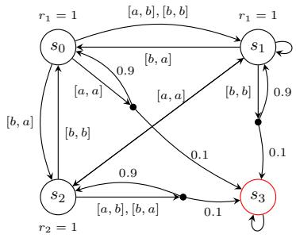  
(a) Cyclic Preferences

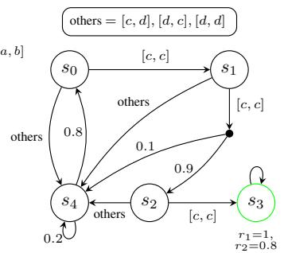  
(b) Delayed Coordination

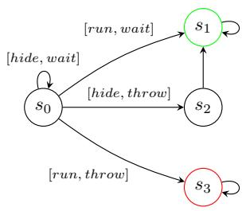  
(c) Hide-or-run

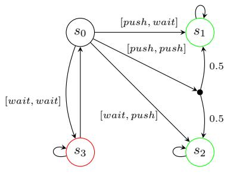  
(d) Mixed NE

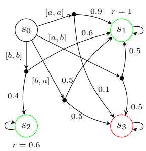  
(e) Safe vs. Risky

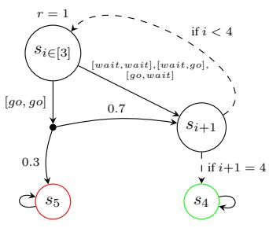  
(f) Traffic Merge

Figure 2: Six benchmark CSGs $( \bar { s } = s _ { 0 } )$ illustrating distinct challenges for robust PAC learning, including coordination, mixed-strategy equilibria, equilibrium non-existence, and sparse-reward exploration (see Sec. 5). Green states denote target states of the players, while red states denote absorbing trap states.  
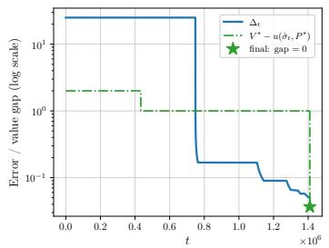  
(a) $\Delta _ { t }$ 1and true value gap

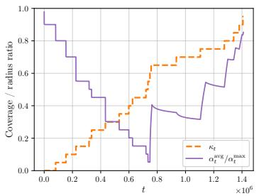  
(b) $\kappa _ { t }$ 1 and radius ratio

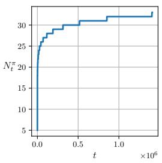  
1(c) Samples per episode  
Figure 3: Learning dynamics over episodes in a representative run of the Delayed Coordination game for $\langle \langle p _ { 1 } : p _ { 2 } \rangle \rangle _ { \operatorname* { m a x } = ? } \bar { \big ( } \mathrm { P } \big [ \mathrm { F } s _ { 3 } \big ] + \mathrm { P } \big [ \mathrm { F } \bar { s } _ { 3 } \big ] \big )$ : (a) evolution of $\Delta _ { t }$ and the true value gap $V ^ { \star } - u ( \hat { \sigma } _ { t } , \bar { P } ^ { \star } )$ with $\hat { \sigma } _ { t }$ re-computed every 200 episodes and the final value gap at termination marked by a star; (b) evolution of $\kappa _ { t }$ and the average-to-maximum confidence-radius ratio; and (c) number of sampled trajectories per episode.

We measure: (i) the model error proxy $\begin{array} { r } { \Delta _ { t } : = \frac { 1 } { 2 } H ^ { 2 } \operatorname* { m a x } _ { ( s , a ) \in \mathcal { X } _ { \mathrm { n t } } } \| \widehat { P } _ { t , s a } - P _ { s a } ^ { \star } \| _ { 1 } ( R _ { \operatorname* { m a x } } = 1 ) ; } \end{array}$ (ii) the fraction $\kappa _ { t } : = | \mathcal { K } _ { t } | / | \mathcal { U } _ { 1 } |$ of known $( s , a )$ pairs by episode t; and (iii) the true value gap $V ^ { \star } { - } u ( \hat { \sigma } _ { t } , P ^ { \star } )$ where $\hat { \sigma } _ { t }$ is obtained by periodically solving the empirical game every 200 episodes. Together, these quantities allow us to assess how conservative the sufficient stopping condition $\Delta _ { t } \leq \varepsilon / 4$ is in practice. We illustrate these dynamics on a representative run of the sparse-reward exploration benchmark, Delayed Coordination, for the infinite-horizon property $\langle \langle p _ { 1 } : p _ { 2 } \rangle \rangle _ { \mathrm { m a x } = ? } ( { \sf P } \left[ { \sf F } s _ { 3 } \right] + { \sf P } \left[ { \sf F } s _ { 3 } \right] )$ : the evolution of $\Delta _ { t }$ and the true value gap is shown in Fig. 3a, the evolution of $\kappa _ { t }$ alongside the distribution of confidence radii in Fig. 3b, and the number of sampled trajectories per episode in Fig. 3c.

Fig. 3a shows that convergence is not smooth or gradual, especially for the model error $\Delta _ { t }$ and the true value gap $V ^ { \star } - u ( \hat { \sigma } _ { t } , P ^ { \star } )$ . Rather than decreasing smoothly, $\Delta _ { t }$ stays pinned at its worst-case value while a single hard-to-reach $( s , a )$ -pair remains almost entirely unsampled. Since $\Delta _ { t }$ is governed by the largest per-slot confidence radius rather than the average (Lemma 2), it drops sharply once that slot accumulates enough samples, then follows a staircase pattern as the remaining slots are resolved. Convergence of the extracted strategy is similarly abrupt: $\hat { \sigma } _ { t }$ achieves value 0 (versus the true value $V ^ { \star } = \bar { 2 } )$ for roughly the first third of training, then rises to and remains at exactly 1 — the value attained by the non-robust point-estimate strategy on most seeds — until the last periodic checkpoint (200 iterations) before $\bar { \Delta } _ { t }$ crosses $\varepsilon / 4$ . Only in the final handful of episodes does $\hat { \sigma } _ { t }$ resolve to the fully cooperative equilibrium, which Delayed Coordination requires at every one of the three consecutive states $( s _ { 0 } , s _ { 1 } , s _ { 2 } )$ to reach the goal $s _ { 3 }$ at all (see Fig. 2b). Note that this does not violate Corollary 5’s guarantee $V ^ { \star } - u ( \hat { \sigma } _ { t } , P ^ { \star } ) \leq 4 \Delta _ { t } \colon$ the bound requires $\mu ^ { \star } \geq 4 \Delta _ { t } - \varepsilon .$ , and here $\mu ^ { \star } = 0$ , since all four joint actions at the indifferent state $s _ { 4 }$ induce the same transition distribution, so deviating there costs either player nothing and attains the infimum in Definition 3 at 0. Thus, the precondition reduces exactly to $\Delta _ { t } \leq \varepsilon / 4$ , the algorithm’s own stopping condition, so the bound is not expected to hold before the run actually stops, i.e., the regime shown here.

Fig. 3b shows that $\kappa _ { t }$ increases step-wise but much more smoothly than $\Delta _ { t } ,$ with no comparably large jump around episode 700–800K, suggesting that the other $( s , a )$ -pairs become known relatively steadily throughout training. $\kappa _ { t }$ stops at 0.95 (19 of the $2 0 ( s , a ) – \mathrm { p a i r s } )$ , indicating that termination is governed by the statistical stopping condition $\Delta _ { t } \leq \varepsilon / 4$ , which can occur before full coverage (Corollary 22). In contrast, the average-to-maximum confidence-radius ratio $\alpha _ { t } ^ { \mathrm { a v g } } / \alpha _ { t } ^ { \mathrm { m a x } }$ decreases for roughly the first half of training as most slots are resolved while the single hardest-to-reach slot keeps $\alpha _ { t } ^ { \mathrm { { m a x } } }$ near its initial value, then rises back towards 1 once that slot is sampled and the remaining radii converge. Together, these trends imply that learning is bottlenecked by a single difficult-to-sample slot: its large confidence radius dominates $\Delta _ { t }$ , which reflects the worst-case rather than the average uncertainty across $( s , a )$ -pairs (Lemma 2).

On the other hand, Fig. 3c shows that the number of trajectories sampled per episode, $N _ { t } ^ { \pi }$ , grows logarithmically with the episode index t, matching the adaptive sampling rule $\bar { N _ { t } ^ { \omega } } \propto \log ( \bar { 1 / \delta _ { t } ^ { \mathrm { c o v } } } ) =$ (log t) from Proposition 17 and App. F. This reflects the algorithm’s increasingly conservative per-episode coverage requirement. Specifically, as the confidence budget is distributed across an increasing number of episodes, the allowed per-episode failure probability $\delta _ { t } ^ { \mathrm { c o v } }$ decreases as $\delta _ { t } ^ { \mathrm { c o v } } = { \delta ^ { \mathrm { c o v } } } / { ( t + 1 ) } ) ,$ (Proposition 18), so later episodes require more trajectories to maintain their high-probability coverage guarantee, while keeping the total failure probability from coverage at most $\bar { \delta } ^ { \mathrm { c o v } }$

Overall, these results show that learning is primarily bottlenecked by a small number of hard-toexplore $( s , a )$ pairs: $\Delta _ { t }$ and strategy quality improve only once these pairs receive sufficient samples, even when most pairs are already well resolved. The stopping condition $\Delta _ { t } \ \leq \varepsilon / 4$ is therefore conservative in the sense that it is driven by the single worst-case confidence radius rather than decision-relevant uncertainty. To resolve bottlenecks earlier, future improvements could target high impact, poorly explored regions more directly, e.g., by designing rewards proportional to confidence radii and/or inversely proportional to visitation probabilities.

## K.3 Full experimental results

We present the complete set of experimental results in Table 3, in response to RQ1 outlined in Sec. 5 of the main paper.

Licenses for external tools. Our implementation builds on the PRISM-games model checker, which is distributed under the GNU General Public License (GPL), version 2. We adhere to its licensing terms. Additional dependencies and their licenses are documented at [25].

Table 3: Full experimental results (mean std over 10 runs). All cases use $\varepsilon = 0 . 1$ , except Delayed Coordination’s unbounded-reachability property, which uses $\varepsilon = 0 . 2$ to keep runtime within a reasonable budget. For every case with a stationary NE returned by the CSG solver, our algorithm achieves the same true-game value, with differences only on action-indifferent states (only $s _ { 4 }$ in Delayed Coordination). Hide-or-Run is a limit-equilibrium case in which the optimal value is approached in the limit but is not attained by any stationary profile. For the third Safe vs. Risky property, our learner outputs $\hat { V } = \infty$ in all runs.
<table><tr><td>Case study</td><td>Property</td><td>No. of episodes (×106)</td><td>Total no. of samples (× 107)</td><td> $V ^ { \star }$ </td><td> $V ^ { \star } - \hat { V }$ </td></tr><tr><td rowspan="2">Cyclic Prefs.</td><td> $\langle \langle p _ { 1 } : p _ { 2 } \rangle \rangle _ { \operatorname* { m a x } = 7 } \left( \mathbb { R } _ { r _ { 1 } } [ \mathbb { F } s _ { 3 } ] + \mathbb { R } _ { r _ { 2 } } [ \mathbb { F } s _ { 3 } ] \right)$ </td><td> $2 . 6 2 3 7 \pm 0 . 0 0 0 3$ </td><td> $8 . 3 3 1 7 \pm 0 . 0 0 1 0$ </td><td>一</td><td></td></tr><tr><td> $\begin{array} { r } { \langle \langle p _ { 1 } : p _ { 2 } \rangle \rangle _ { \operatorname* { m a x } = ? } \left( \mathbb { P } [ \tilde { \mathbf { F } } ^ { \leq 3 } s _ { 3 } ] + \mathbb { P } [ \tilde { \mathbf { F } } ^ { \leq 4 } s _ { 3 } ] \right) } \end{array}$ </td><td> $2 . 4 9 9 7 \pm 0 . 0 0 0 2$ </td><td> $7 . 9 1 0 1 \pm 0 . 0 0 0 7$ </td><td>0.615</td><td> $0 . 0 0 2 1 \pm 0 . 0 0 0 1$ </td></tr><tr><td rowspan="2">Delayed Coord.</td><td> $\langle \langle p _ { 1 } : p _ { 2 } \rangle \rangle _ { \operatorname* { m a x } = 7 } \left( \mathbb { P } \big [ \mathbb { F } s _ { 3 } \big ] _ { . } + \mathbb { P } \big [ \mathbb { F } s _ { 3 } \big ] \right)$ </td><td> $1 . 4 0 9 8 \pm 0 . 0 0 0 0$ </td><td> $4 . 2 9 5 3 \pm 0 . 0 0 0 2$ </td><td>2.000</td><td> $0 . 0 0 0 0 \pm 0 . 0 0 0 0$ </td></tr><tr><td> $\langle \langle p _ { 1 } : p _ { 2 } \rangle \rangle _ { \mathrm { m a x } = 7 } \left( \mathsf { R } _ { r _ { 1 } } [ { \mathsf { C } } ^ { \leq 5 } ] + \mathsf { R } _ { r _ { 2 } } [ { \mathsf { C } } ^ { \leq 5 } ] \right)$ </td><td> $5 . 5 2 4 1 \pm 0 . 0 0 0 0$ </td><td> $1 8 . 3 6 3 8 \pm 0 . 0 0 0 2$ </td><td>3.240</td><td> $0 . 0 0 1 6 \pm 0 . 0 0 0 1$ </td></tr><tr><td rowspan="2">Hide-or-run</td><td> $\begin{array} { r l } & { \langle \langle p _ { 1 } \rangle \rangle { \sf P } _ { \mathrm { m a x } = ? } \left[ \sf F _ { \sf } { s } _ { 1 } \right] } \\ & { \langle \langle p _ { 1 } \rangle \rangle { \sf P } _ { \mathrm { m a x } = ? } \left[ \sf F _ { \sf } { s } ^ { \leq } { s } _ { 1 } \right] } \end{array}$ </td><td> $\begin{array} { c } { 0 . 4 6 7 1 \pm 0 . 0 0 0 0 } \\ { 1 . 0 6 2 5 \pm 0 . 0 0 0 0 } \end{array}$ </td><td> $1 . 3 2 1 6 \pm 0 . 0 0 0 0$ </td><td>0.999</td><td> $0 . 0 0 0 0 \pm 0 . 0 0 0 0$ </td></tr><tr><td></td><td></td><td> $3 . 1 8 3 4 \pm 0 . 0 0 0 0$ </td><td>0.800</td><td> $0 . 0 0 0 0 \pm 0 . 0 0 0 0$ </td></tr><tr><td rowspan="2">Mixed NE</td><td> $\begin{array} { r } { \langle \langle p _ { 1 } : p _ { 2 } \rangle \rangle _ { \operatorname* { m a x } = 7 } \left( \mathbb { P } \big [ \mathbb { F } s _ { 1 } \big ] + \mathbb { P } \big [ \mathbb { F } s _ { 2 } \big ] \right) _ { , } } \end{array}$ </td><td> $1 . 4 1 3 6 \pm 0 . 0 0 0 0$ </td><td> $4 . 3 0 7 7 \pm 0 . 0 0 0 0$ </td><td>1.000</td><td> $0 . 0 0 3 1 \pm 0 . 0 0 0 0$ </td></tr><tr><td> $\begin{array} { r } { \langle \langle p _ { 1 } : p _ { 2 } \rangle \rangle _ { \operatorname* { m a x } = ? } \left( \mathbb { P } \big [ \mathbb { F } ^ { \leq 4 } s _ { 1 } \big ] + \mathbb { P } \big [ \mathbb { F } ^ { \leq 2 } s _ { 2 } \big ] \right) } \end{array}$ </td><td> $1 . 4 1 3 6 \pm 0 . 0 0 0 0$ </td><td> $4 . 3 0 7 7 \pm 0 . 0 0 0 0$ </td><td>1.000</td><td> $0 . 0 0 3 1 \pm 0 . 0 0 0 0$ </td></tr><tr><td rowspan="3">Safe vs. Risky</td><td> $\begin{array} { r } { \langle \langle p _ { 1 } : p _ { 2 } \rangle \rangle _ { \operatorname* { m a x } = 7 } \left( \mathbb { P } \left[ \mathbb { F } s _ { 1 } \right] + \mathbb { P } \left[ \mathbb { F } s _ { 2 } \right] \right) } \end{array}$ </td><td> $0 . 3 3 2 1 \pm 0 . 0 4 1 1$ </td><td> $5 . 8 7 1 0 \pm 0 . 0 0 0 7$ </td><td>1.000</td><td> $0 . 0 0 1 7 \pm 0 . 0 0 0 0$ </td></tr><tr><td> $\begin{array} { r } { \langle \langle p _ { 1 } : p _ { 2 } \rangle \rangle _ { \operatorname* { m a x } = ? } \left( \mathbb { P } \big [ \mathbb { F } _ { - } ^ { \le 3 } s _ { 1 } \big ] + \mathbb { P } \big [ \mathbb { F } _ { - } ^ { \le 3 } s _ { 2 } \big ] \right) } \end{array}$ </td><td> $0 . 1 7 1 1 \pm 0 . 0 0 6 6$ </td><td> $2 . 5 4 6 0 \pm 0 . 0 0 0 8$ </td><td>1.000</td><td> $0 . 0 0 2 6 \pm 0 . 0 0 0 0$ </td></tr><tr><td> $\begin{array} { r } { \langle \bar { \langle p _ { 1 } : p _ { 2 } \rangle \rangle } _ { \operatorname* { m a x } = 7 } \left. \bar { \mathsf { R } } _ { r _ { 1 } } [ \mathsf { F } s _ { 1 } ] ^ { - } + \bar { \mathsf { R } } _ { r _ { 2 } } [ \mathsf { F } s _ { 2 } ] \right. ^ { * } , } \end{array}$ </td><td> $0 . 3 3 2 1 \pm 0 . 0 4 1 1$ </td><td> $5 . 8 7 1 0 \pm 0 . 0 0 0 7$ </td><td>∞</td><td>一</td></tr><tr><td rowspan="2">Traffic Merge</td><td> $\begin{array} { r } { \langle \langle p _ { 1 } : p _ { 2 } \rangle \rangle _ { \operatorname* { m i n } _ { \tau } \tau } \left( \mathbb { R } _ { t _ { 1 } } [ \mathbb { F } s _ { 4 } ] + \mathbb { R } _ { t _ { 2 } } [ \mathbb { F } s _ { 4 } ] \right) } \end{array}$ </td><td> $0 . 6 7 1 2 \pm 0 . 0 0 0 0$ </td><td> $2 4 . 3 7 8 4 \pm 0 . 0 0 0 3$ </td><td>8.000</td><td> $0 . 0 0 0 0 \pm 0 . 0 0 0 0$ </td></tr><tr><td> $\langle \langle p _ { 1 } \rangle \rangle { \sf P } _ { \mathrm { m a x } = 7 } \left[ \sf F ^ { \le 5 } s _ { 4 } \right]$ </td><td> $0 . 2 1 7 1 \pm 0 . 0 0 0 1$ </td><td> $3 . 1 0 9 8 \pm 0 . 0 0 0 5$ </td><td>1.000</td><td> $0 . 0 0 0 0 \pm 0 . 0 0 0 0$ </td></tr></table>

## L Limitations

We first summarise the assumptions that underpin our analyses, all of which are common in the PAC learning and robust stochastic games literature.

(A1) Centralised exploration. We assume that the players perform centralised play during exploration. This assumption is standard in PAC analyses of multi-agent systems, including turn-based stochastic games [7, 42] and Markov games [20, 31], where a centralised learner simplifies the exploration problem. However, it does not capture decentralised or competitive settings where agents act independently or have limited information sharing. We remark that the equilibrium-transfer results in Sec. 4.1 would remain applicable if comparable confidence sets could be obtained under decentralised learning, but the joint-coverage and termination analysis in Secs. 4.2 and 4.3 would require a different exploration mechanism. Developing such a mechanism for decentralised settings remains an important open direction.

(A2) Reachability. Our guarantees rely on a reachability condition (Assumption 1) ensuring that every relevant (non-target) $( s , a )$ -pair is reachable under some profile with positive probability at least $p _ { \mathrm { r e a c h } }$ . This excludes degenerate cases where reachability probabilities vanish and is analogous to standard communicating or reachability assumptions in PAC-MDP analyses [2, 22], adapted to our robust setting. Without such a condition, PAC termination under online trajectories cannot be guaranteed in general, as illustrated by standard lower-bound constructions (e.g., chain-game instances). Relaxing it typically requires additional capabilities such as access to a generative model or structured exploration mechanisms [24], which allow coverage to be enforced explicitly.

For infinite-horizon reachability reward (stochastic shortest path) objectives, we assume almost-sure target reachability (Assumption 3), ensuring $\tau _ { T } < \infty$ almost surely and that value functions are well-defined and finite [5, 27]. We additionally impose a uniform lower bound $p _ { T } > 0$ on the probability of reaching $S _ { T }$ within S steps under a proper policy, which yields a geometric tail bound (Proposition 23) and induces a finite effective horizon (Lemma 24). This assumption is consistent with standard reachability and properness conditions in SSP and PAC analyses [2, 7, 22, 24].

In practice, we precompute the set of reachable state–action pairs via standard reachability analysis over the known support graph when solving the game, following established model checking techniques [27]. This allows us to restrict attention to $( s , a )$ -pairs that are reachable under some profile, eliminating vacuous cases where exploration or reaching is impossible. Both probability lower bounds, $p _ { \mathrm { r e a c h } }$ and $p _ { T } ,$ , can be computed (or conservatively approximated) by solving associated reachability RMDPs over the known support graph.

(A3) Graph preservation. We assume the standard graph preservation condition, whereby all transition kernels in the uncertainty set share the same support. This assumption is common in robust MDP and RCSG formulations [18, 21, 34, 35, 43], and is necessary for tractable robust dynamic programming. However, it excludes settings with support mismatch (e.g., rare or unseen transitions), which may arise in practice when data is sparse.

(A4) Bounded rewards. We assume that the magnitude of rewards is bounded by a known constant $R _ { \mathrm { m a x } }$ , which is standard in PAC analyses of reinforcement learning [7, 42]. This assumption ensures well-defined concentration bounds and finite value estimates. In practice, this can typically be satisfied via normalisation.

## L.1 Intrinsic limitations

Beyond these assumptions, several intrinsic limitations arise from the problem setting.

Computational complexity. Our approach depends on a black-box RCSG solver, instantiated in practice via PRISM-games [18]. The complexity of solving general-sum CSGs is well known to be high: for nonzero-sum reachability objectives, computing subgame-perfect Nash equilibria is PSPACE-complete [8], and practical solvers such as [18] can require exponential time in the model size. These complexity results reflect fundamental barriers in equilibrium computation rather than artefacts of our learning framework. Nevertheless, implementation-level optimisations (e.g., parallelised sampling) and increased computational resources can partially mitigate these costs in practice.

Sample complexity dependence. The sample complexity scales polynomially with problem parameters, with a leading $H ^ { 4 }$ dependence arising from compounding transition uncertainty over trajectories. It may be possible to improve this dependence to ${ \dot { H } } ^ { 3 }$ using empirical-Bernstein or stagewise concentration techniques [15], but such approaches typically require stronger assumptions, such as finer control over variance across timesteps (e.g., martingale-style concentration over trajectories or stage-dependent confidence bounds that exploit variance information at each timestep), and lead to a more technically involved analysis.

Non-existence detection. While our framework supports both equilibrium computation and nonexistence detection, the non-existence certificate is sound but not complete: when no exact NE exists, the algorithm may still return an ε-NE rather than certifying non-existence. This limitation is inherent to the problem: while ε-NE exist for any $\varepsilon > 0 .$ , this implies that approximate equilibria persist arbitrarily close to the boundary of equilibrium existence, making it fundamentally difficult to distinguish exact equilibrium existence from arbitrarily small Nash margins [6].

Other extensions. Natural extensions include handling more than two players and non-stationary environments. Both introduce additional challenges: the former increases equilibrium complexity and joint-action scaling, while the latter requires adapting to evolving transition kernels and equilibrium structure over time.

## M Broader Impacts

This work contributes to the theoretical foundations of learning in multi-agent stochastic systems under uncertainty. Potential positive impacts include improving the robustness and reliability of autonomous systems, such as multi-robot coordination, distributed control, and decision-making in uncertain environments.

At the same time, advances in multi-agent learning and equilibrium computation may have unintended applications in competitive or adversarial settings, such as automated negotiation, financial markets, or strategic resource allocation, where robustness could be exploited to gain advantage. While our work is primarily theoretical and does not target specific deployments, we encourage carefu consideration of such downstream uses.