# RobustSeiz: An Open-Source Framework for Benchmarking the Robustness of EEG Seizure Detection Models

Mohammad Mohammadi, MSc∗1 and Alireza Zarei, PhD1

1Department of Mathematical Sciences, Sharif University of Technology, Tehran, Iran

## Abstract

Objective: Despite strong predictive performance on held-out electroencephalography (EEG) data, seizure detectors may fail under real-world acquisition variability, artifacts, and adversarial inputs. We introduce RobustSeiz, an open-source, model-agnostic framework whose main contribution is a standardized, reproducible protocol for stress-testing and comparing seizure detectors under controlled, clinically motivated distribution shifts before deployment.

Materials and Methods: We standardize four public scalp-EEG corpora (CHB-MIT, TUSZ, Siena, and SeizeIT1) into Brain Imaging Data Structure for EEG (BIDS-EEG) trees with 10-20 recordings at 256 Hz and evaluate subject-independent detectors on held-out splits. Environment, noise, and adversarial transforms model instrumentation and clinical variability and are swept over predefined hyperparameter grids. Each run reports sample- and event-level sensitivity, precision, F1, false positives per 24 h, Lead and Lag onset timing, and Monte Carlo dropout predictive agreement.

Results: RobustSeiz provides a Dockerized graphics processing unit (GPU) pipeline, experiment registry, and full-evaluation and research-subset operating modes. We demonstrate the framework with a contemporary seizure detector on TUSZ across the complete implemented shift grid. A representative additive white Gaussian noise (AWGN) analysis shows how perturbation severity changes detection quality, onset timing, and predictive agreement; complete per-perturbation results are provided in the Supplementary Appendix.

Discussion: Held-out accuracy alone does not establish deployment readiness. Domain-guided robustness reporting can expose clinically consequential failure modes, including missed seizures and alarm flooding.

Conclusion: RobustSeiz contributes a shared benchmarking standard for evaluating seizure-detector robustness under realistic clinical stressors, extending pre-deployment assessment from clean-data accuracy toward reproducible, multidimensional robustness characterization.

Keywords: electroencephalography; epilepsy; seizure detection; robustness; adversarial attacks

## Lay Summary

Seizure-detection software is increasingly used to watch EEG recordings in hospitals and at home. Even when a model looks accurate on clean research data, real recordings can be noisy, incomplete, or altered by equipment problems. In RobustSeiz we provide an open-source framework for benchmarking model robustness that deliberately recreates those real-world problems, so researchers and clinicians can see whether a detector remains trustworthy before it is used for patient care.

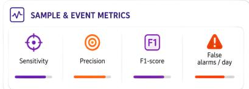

## Robustness Evaluation Methodology

DATA PREPARATION

Leave-subjects-out setup

## SUBJECT-

INDEPENDENT   
MODEL   
EVALUATION   
Evaluate the same   
model on both   
branches

TRAINING DATA All available training time-series

## TEST DATA & PREDICTION LANES

Parallel evaluation on clean and perturbed data

## ROBUSTNESS COMPUTATION

## SUBJECT-INDEPENDENT MODEL

Quantify robustness   
under this   
perturbation   
Model trained to generalize   
across subjects

CLEAN TEST DATA Held-out clean signals

PERTURBED TEST DATA Same test data under perturbation

## ROBUSTNESS UNDER THAT PERTURBATION

Quantify performance degradation for this perturbation

Leave --+ subjects --+ out (test)

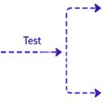

BASELINE Clean test data from held-out subjects

COMPARE PREDICTIONS Pairwise comparison of baseline and perturbed outputs

## BASELINE MODEL

Evaluate on clean test data

PERTURBED MODEL   
Same architecture evaluated   
under perturbation

BASELINE PREDICTION Predictions from baseline branch

PERTURBED PREDICTION Predictions from perturbed branch

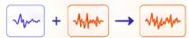

COMPUTE ROBUSTNESS METRICS

## PERTURBED

Examples: δF1, δFP/day

Held-out test data with synthetic perturbation

## COMPARE COMPARE

Compare baseline vs perturbed performance

## ROBUSTNESS SCORE

Summary robustness score under that perturbation

## Data Format

## BIDS BRAIN IMAGING DATA STRUCTURE

dataset

sub-01

sub-01\_rec-01.edf

sub-01\_rec-01.tsv

## EDF

• 256 Hz

• unipolar

• 10-20 electrodes

## TSV

• start, duration

• score seizure types

• channels

## ML Task

Input Data: 10-20 Scalp EEG

Task: Segment Seizures

Output: onset, duration

## Model:

Subject-independent dataset ☑ Different MCD inits

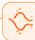

##

Input Data: 10-20 Scalp EEG

Perturbation Scenario: Input data + Shift

Task: Segment Seizures

Output: onset, duration

## Datasets

<table><tr><td rowspan=2 colspan=1></td><td rowspan=2 colspan=1></td><td rowspan=2 colspan=1></td><td rowspan=2 colspan=1></td></tr><tr></tr><tr><td rowspan=1 colspan=1>∴ CHB-MIT Scalp EEG</td><td rowspan=1 colspan=1>23</td><td rowspan=1 colspan=1>198</td><td rowspan=1 colspan=1>982 h</td></tr><tr><td rowspan=1 colspan=1> $\because \sqrt { m }$ TUH EEG Sz Corpus</td><td rowspan=1 colspan=1>675</td><td rowspan=1 colspan=1>4029</td><td rowspan=1 colspan=1>1476 h</td></tr><tr><td rowspan=1 colspan=1> $\because \sqrt { u }$ Sienna Scalp EEG</td><td rowspan=1 colspan=1>14</td><td rowspan=1 colspan=1>47</td><td rowspan=1 colspan=1>128 h</td></tr><tr><td rowspan=1 colspan=1> $\because \sqrt { m }$ SeizelT1</td><td rowspan=1 colspan=1>42</td><td rowspan=1 colspan=1>182</td><td rowspan=1 colspan=1>4211h</td></tr></table>

## Reporting

## Controlled, domain-guided perturbations robustness metrics

MODEL CARD

Model Details

<> Software Doc

Results & Metrics

  
ROBUSTNESS ANALYSIS

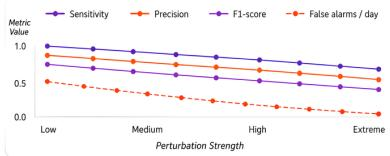

## Background and Significance

Scalp electroencephalography (EEG) remains central to diagnosing epilepsy and monitoring seizures in epilepsy monitoring units (EMUs), home-based video-EEG, and emerging ultra long-term ambulatory settings 1–4. Automated seizure detection can support timely intervention, reduce expert reading burden, and improve seizure counts relative to patient recall 5–7. Large public EEG corpora and deep learning have accelerated detector development 8–12, yet there are increasing examples of healthcare machine learning (ML) systems that fail under real-world deployment, partly because of dataset or distribution shifts 13–16. The most common evaluation practice remains held-out task performance on clean research splits. That practice does not reflect the unique challenges of clinical EEG: models must remain reliable under varying noise characteristics, diverse acquisition protocols, and multiple sites and populations 17–20. Without additional assessments of resilience before deployment, the practical value of many EEG detectors remains unclear 13,21.

Clinical EEG is not a laboratory signal. Electrode impedance varies, channels disconnect, sampling and filter settings difer across devices, power-line interference and impulsive artifacts are common, and recordings may be exported or re-referenced inconsistently. In a high-stakes medical context, these shifts can turn a detector that looks accurate on held-out clean data into a system that misses seizures or floods caregivers with false alarms 22,23. A related threat is intentional or worst-case perturbation: adversarial machine learning has shown that small, carefully crafted input changes can cause large prediction errors in medical artificial intelligence (AI) 14,24,25. Even when literal cyber-attack is not the primary concern, adversarial stress tests expose brittle decision boundaries that ordinary noise may not reveal26.

Until recently, the strongest open methodology for assessing EEG seizure detectors before clinical deployment focused almost exclusively on accuracy under standardized clean evaluation. The Seizure Community Open-source Research Evaluation (SzCORE) framework crystallized that state of the art: shared public corpora, common file conventions, recommended cross-validation practices, and clinically oriented sample- and event-based detection scores 27–30. That contribution remains valuable for comparable accuracy reporting, but accuracy-only protocols are blind to realistic deployment flaws: they neither define shared acquisition mismatches, sensor failures, physiological or electrical artifacts, and adversarial stressors, nor prescribe how to apply such stressors while keeping reference annotations fixed.

A complementary line of work models instrumentation-related EEG distribution shifts and inspects encoder latent spaces together with predictive uncertainty under those transforms 31. That approach shows how domainguided shifts and uncertainty diagnostics can anticipate degradation during model development, yet it primarily analyzes latent representations of feature encoders and concentrates on noise and acquisition transforms rather than end-to-end clinical seizure detectors under the full spectrum of deployment stressors. In particular, it does not deliver a realistic, event-level assessment of detectors in clinical monitoring workflows, nor does it systematically stress models across environment, noise, and adversarial axes while reporting onset timing and stratified uncertainty in one protocol. We address that gap in RobustSeiz: we apply controlled, domain-guided perturbations outside the detector, score clinically meaningful sample- and event-level accuracy, and produce a complete multi-stage analytical report (detection quality, Lead and Lag onset timing, and Monte Carlo dropout (MCD) agreement) so that pre-deployment assessment asks not only “how accurate?” but “how stable under conditions that matter in care?”

For demonstration, we generate RobustSeiz reports on one contemporary state-of-the-art EEG seizure detection model on TUSZ under full mode (all shifts with detection quality and Lead and Lag) and research-subset mode (all shifts with Lead and Lag and MCD). We present a representative robustness profile in the main text to demonstrate how the framework jointly characterizes detection quality, onset timing, and predictive agreement, while complete numerical results across the perturbation grid are provided in the Supplementary Appendix.

## Objective

Our objective is to design and release a reproducible framework that measures how EEG seizure detectors behave under realistic acquisition, artifact, and adversarial conditions, so that clinical and research communities can evaluate model stability, not only peak accuracy, before deployment. We present RobustSeiz, an open-source framework for benchmarking the robustness of EEG seizure detection models. In it we:

1. standardize four public scalp-EEG seizure corpora into a common Brain Imaging Data Structure for EEG (BIDS-EEG) layout and define a subject-independent evaluation setting on held-out evaluation splits;

2. define a domain-guided taxonomy of environment, noise, and adversarial perturbations that model real-world acquisition and operational variability outside detector implementations, and conduct a full sensitivity analysis over each perturbation’s control hyperparameters;

3. profile each detector through three complementary analysis stages (controlled shifts and drifts with accuracy scoring, Lead and Lag onset timing, and MCD with agreement index ϕ) under two operating modes (full evaluation and research subset);

4. ship a reproducible Dockerized pipeline and experiment registry so any pluggable detector can be stress-tested under identical conditions.

## Materials and Methods

## Study overview

We separate four concerns: (i) standardized EEG and annotations, (ii) controlled perturbations, (iii) model inference, and (iv) evaluation and logging (Figure 1). Perturbations are applied in memory at inference time; reference datasets remain read-only. A single experiment orchestrator configures the shift and its hyperparameter setting, launches Dockerized graphics processing unit (GPU) inference, scores predictions against reference annotations, and appends one row to a master results registry. Figure 2 details the end-to-end runtime path from

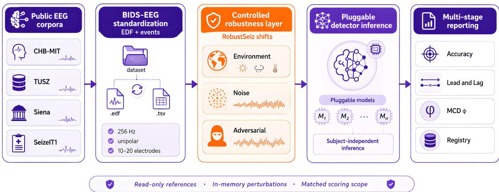  
Figure 1. RobustSeiz overview. We standardize public EEG corpora (CHB-MIT, TUSZ, Siena, SeizeIT1) to BIDS-EEG (256 Hz unipolar 10-20 montage; EDF and events). In RobustSeiz we apply environment, noise, and adversarial shifts in memory at inference time. Pluggable subject-independent detectors $( M _ { 1 } , \ldots , M _ { n } )$ then produce multi-stage reports: accuracy, Lead and Lag onset timing, Monte Carlo dropout agreement index ϕ, and an experiment registry. Reference datasets remain read-only; perturbations and scoring share a matched inference scope.

read-only evaluation data through in-memory shifts, detector inference (including MCD), evaluation metrics, and registry logging. Implementation details and usage documentation are maintained in the project’s Git repository.

## Datasets

Public and freely available corpora are required for reproducible external validation of seizure detectors. We therefore center four large public scalp-EEG datasets of people with epilepsy: PhysioNet CHB-MIT 32,33, the Temple University Hospital EEG Seizure Corpus (TUSZ) 9,34, PhysioNet Siena35, and SeizeIT136 (Table 1)37.

To make algorithms operable across sites and corpora, we require a common data organization and recording content. We organize raw signals, recording metadata, seizure annotations, and participant details according to BIDS-EEG38,39, storing continuous recordings as European Data Format (EDF) files 40 and events as humanreadable tab-separated tables. Supplementary Appendix A details the file layout, annotation schema, and recording content. Annotation content follows Standardized Computer-based Organized Reporting of EEG (SCORE), endorsed in clinical neurophysiology practice 41,42, with International League Against Epilepsy (ILAE)- oriented seizure typing supported through hierarchical event descriptors 43,44. Conversion of the public corpora into this common layout uses community epilepsy2bids tooling, yielding BIDS-EEG trees that we consume as read-only evaluation inputs.

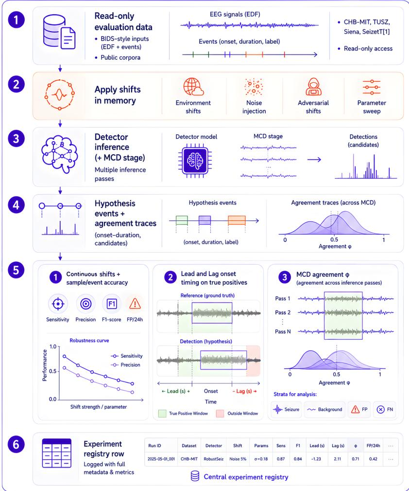  
Figure 2. Experiment pipeline. We apply environment, noise, and adversarial shifts in memory to read-only BIDS-EEG evaluation data; a pluggable detector (optionally with Monte Carlo dropout) produces hypothesis events and agreement traces. We then report sample- and event-level accuracy with robustness curves, Lead and Lag onset timing, and stratified agreement ϕ, and each run appends a row to the central experiment registry.

Recording content is chosen to be consistent with International Federation of Clinical Neurophysiology (IFCN) and ILAE minimum standards recommended for clinical EEG 45–48. Concretely, we resample signals to 256 Hz (with original acquisition at least 256 Hz when available); rename and rereference channels to the 19 electrodes of the international 10-20 system in a unipolar common-average montage; and store channels in a fixed order so detectors can assume a stable spatial layout. Common-average computation uses the 19 standard electrodes; auxiliary channels, when present, are not used to form the average. CHB-MIT is an intentional exception: it provides bipolar channels for which conversion to the proposed unipolar montage is not feasible, so that corpus is analyzed in its original bipolar montage 32. Where TUSZ-style recordings lack some of the 19 electrodes, missing channels are zero-filled so that array shape remains consistent across files. Only unipolar montages are accepted by the default inference path outside the CHB-MIT exception.

## Evaluation setting

Seizure detection is treated as a segmentation problem: identify the start and end of each seizure event on continuous EEG. We assume subject-independent detectors, that is, models evaluated on subjects who were never seen during training, because patient-specific tuning is rarely available before deployment. We do not retrain models; we evaluate a provided pretrained detector under controlled input shifts on standardized evaluation data, and reference annotations are never modified.

Table 1. Publicly available scalp EEG datasets of people with epilepsy.
<table><tr><td></td><td colspan="3">Overview</td><td colspan="2">Recordings</td><td colspan="2">Data</td></tr><tr><td>Dataset</td><td># subjects</td><td>duration</td><td># seizures</td><td># files</td><td>avg. duration</td><td>fs [Hz]</td><td># channels</td></tr><tr><td>CHB-MIT</td><td>23</td><td>982 h</td><td>198</td><td>686</td><td>60 min</td><td>256</td><td>22-38</td></tr><tr><td>TUH</td><td>675</td><td>1476 h</td><td>4029</td><td>7377</td><td>10 min</td><td>[250-1000]</td><td>17-128</td></tr><tr><td>Siena</td><td>14</td><td>128 h</td><td>47</td><td>41</td><td>150 min</td><td>512</td><td>35-45</td></tr><tr><td>SeizeIT1</td><td>42</td><td>4211 h</td><td>182</td><td>458</td><td>612 min</td><td>250</td><td>26</td></tr></table>

We assess robustness on the held-out, subject-disjoint evaluation split of a standardized corpus (Figure 2). Robustness is characterized by the change in performance from the unperturbed baseline under each perturbation, rather than by the absolute accuracy under that perturbation alone. Importantly, the environment and noise shifts we apply are themselves designed to simulate and capture the efects that arise when a detector trained on one corpus is applied under diferent acquisition conditions: distribution shift, artifact and sensor mismatch, protocol and hardware variation, and other deployment-time discrepancies that commonly accompany transfer across sites or corpora. Because these stressors are applied inside the evaluation pipeline over a controlled hyperparameter grid, a held-out within-corpus run already probes the same family of cross-site and deployment mismatches, and does so more thoroughly than relying on a single natural corpus diference alone. An explicit across-corpus evaluation setting is therefore unnecessary for the core assessment: how well model performance holds under realistic changes.

## Controlled perturbations

A multi-pronged robustness assessment requires models of realistic data shifts during development itself, without assuming access to external deployment labels 13. Real-world EEG variability may arise from behavioral state during acquisition, the number and montage of sensors, the reference used, noise during acquisition, analog-to digital conversion, hardware filter settings, and electrode impedance 17,18,49. Training-time augmentations such as amplitude scaling or simple band-stop filtering can increase data diversity 50, but they do not meet the complexity of deployment-time acquisition and operational variability. We therefore define domain-guided transforms that act on multichannel EEG at inference time, organized into environment, noise, and adversarial families (Figure 3a; Table 2). Composition order is fixed and documented in the repository: environment, then noise, then model preprocessing, then adversarial perturbation when configured, then model postprocessing. Environment and noise operate on microvolt arrays before the detector runs; adversarial attacks operate on model input windows using the Fast Gradient Sign Method (FGSM) and Projected Gradient Descent (PGD) 24,25. Each perturbation is not evaluated at a single fixed severity alone. Instead, we sweep the control hyperparameters of that transform (for example SNR, dropout rate, quantization bit depth, mains amplitude, impulse density, or adversarial ϵ) over a documented grid and record matched metrics at every setting. The resulting robustness curve shows both whether the detector withstands the stressor and how sensitive its performance is as the hyperparameter intensifies, so we support per-perturbation analysis and a full sensitivity analysis around every environment, noise, and adversarial attack in the library.

Environment transforms capture instrumentation and montage efects that difer across manufacturers and sites. Band-pass profile changes reflect hardware-level filters that restrict spectral content with manufacturer-dependent cut-ofs. ADC and amplitude quantization emulate resource-constrained digitization of analog EEG. Impedance-like low-frequency structured noise models poor sensor contact or dry versus wet electrodes, which can appear as narrow-band low-frequency contamination 49. Additional environment shifts include common-average rereferencing, round-trip sampling-rate mismatch, named or random channel dropout, and baseline drift (sinusoidal, band-limited, random-walk, or piecewise modes).

Table 2. Realistic EEG data shifts represented as transformations in RobustSeiz. We sweep each transform over the listed parameter settings to yield a robustness curve. Category prefixes in the EEG Shift column: Env., environment; Noise; Adv., adversarial.
<table><tr><td>EEG Shift</td><td>Definition</td><td>Parameters</td><td>Clinical motivation</td></tr><tr><td>Env. Common- average reference</td><td> $\begin{array} { r } { t _ { \mathrm { C A R } } : = x _ { c , t } - \frac { 1 } { C } \sum _ { c ^ { \prime } = 1 } ^ { C } x _ { c ^ { \prime } , t } } \end{array}$ </td><td>No free parameters (C: channel count)</td><td>Site-to-site referencing / montage differences.</td></tr><tr><td>Env. Sampling- rate mismatch</td><td> $t _ { \mathrm { F S } } : = R _ { f _ { t }  f _ { s } } ( R _ { f _ { s }  f _ { t } } ( x ) )$ </td><td> $\begin{array} { r l } & { f _ { t } \in \{ 5 0 , 1 0 0 , 2 0 0 , 2 3 0 \} \mathrm { H z } ; } \\ & { f _ { s } { = } 2 5 6 \mathrm { H z } } \end{array}$ </td><td>Device or export sampling-rate differences across sites.</td></tr><tr><td>Env. Named channel dropout</td><td> $t _ { \mathrm { D r o p } } : = \mathrm { Z e r o } ( x , \mathcal { C } )$ </td><td> $\mathcal { C } \in \{ \{ \mathrm { O 1 , O 2 } \} , \{ \mathrm { T 7 } , \mathrm { T 8 } \} \}$ </td><td>Electrode loss, disconnect, or unavailable named sensors.</td></tr><tr><td>Env. Random channel dropout</td><td> $t _ { \mathrm { R D r o p } } : = \mathrm { Z e r o } ( x , n )$ </td><td> $n \in \{ 1 , 2 , \ldots \}$  randomly selected channels</td><td>Unpredictable sensor failure during monitoring.</td></tr><tr><td>Env. ADC quantization</td><td> $t _ { \mathrm { A D C } } : = Q _ { b } ( x ; V _ { \mathrm { F S } } )$ </td><td> $b \in \{ 5 , 1 0 , 1 2 \}$  bits; optional  $V _ { \mathrm { F S } } { = } 1 0 0 \mu \mathrm { V }$ </td><td>Limited ADC bit-depth / dynamic range on acquisition hardware.</td></tr><tr><td>Env. Band-pass filter</td><td> $t _ { \mathrm { B P } } : = \Psi ( x , f _ { L } , f _ { H } )$ </td><td> $( f _ { L } , f _ { H } ) \in$   $\{ ( 0 . 5 , 4 0 ) , ( 1 , 4 0 ) , ( 1 , 3 0 ) , ( 0 . 5 , 2 5 ) \}$ </td><td>Manufacturer hardware filter Hz profiles that restrict EEG bandwidth.</td></tr><tr><td>Env. Impedance noise</td><td> $t _ { \mathrm { I N } } : = x + \epsilon ; \epsilon = \Psi ( z _ { \sigma } , B )$ </td><td>Bands  $B \colon 0 { \mathrm { - 1 } } , 0 . 0 5 { \mathrm { - 0 . 5 } } , 0 . 1 { \mathrm { - 1 } } \mathrm { H z } ;$  amp. 25–200 µV or ratio 0.25</td><td>Poor scalp contact / dry-wet electrode impedance (low-frequency contamination).</td></tr><tr><td>Env. Baseline drift</td><td> $t _ { \mathrm { D R } } : = x + d ( t )$ </td><td>Modes: sin, sin-band, random-walk, piecewise; amp. ratio or µV; optional intermittency</td><td>Baseline wander from contact, impedance, or movement.</td></tr><tr><td>Noise Additive white Gaussian noise</td><td> $t _ { \mathrm { A W G N } } : = x + \epsilon ; \epsilon \sim \mathcal { N } ( 0 , \sigma _ { \mathrm { S N R } } )$ </td><td> $\mathrm { S N R } \in \{ 0 , 2 , 5 , 2 0 , 5 0 , 1 0 0 \} \mathrm { d B }$ </td><td>Broadband sensor and electronics noise.</td></tr><tr><td>Noise Mains hum</td><td> $t _ { \mathrm { M H } } : = x + a \mathrm { R M S } ( x ) \sin ( 2 \pi f t + \phi )$ </td><td> $f { = } 6 0 \operatorname { H z } ; a \in \{ 0 . 1 , 0 . 5 , 0 . 8 , 1 . 0 \}$ </td><td>50/60 Hz power-line interference in clinical rooms.</td></tr><tr><td>Noise Impulse noise</td><td> $t _ { \mathrm { I M P } } : = x + { \mathrm { S p i k e } } ( \rho , A )$ </td><td> $\rho \in \{ 5 { \times } 1 0 ^ { - 4 } , \ldots , 1 0 ^ { - 2 } \} ;$   $A \in \{ 2 , 4 \} \times \mathrm { R M S }$ </td><td>Movement-related spike-like / salt-and-pepper artifacts.</td></tr><tr><td>Noise Notch filter</td><td> $t _ { \mathrm { N } } : = \mathrm { N o t c h } ( x ; f _ { n } )$  or mains then notch</td><td>Profiles: off, 50, 60, 50+100, 60+120 Hz; mismatch of mains vs notch</td><td>Filtering errors relative to local line frequency; deliberate notch/mains mismatch.</td></tr><tr><td>Adv. FGSM attack</td><td> $t _ { \mathrm { F G S M } } : = x + \varepsilon \mathrm { s i g n } ( \nabla _ { x } \mathcal { L } )$ </td><td> $\varepsilon \in \{ 0 . 0 1 , 0 . 0 5 , 0 . 1 , 0 . 5 , 0 . 8 , 1 . 0 \} ;$  modes increase / decrease / flip</td><td>Worst-case decision-boundary stress; security / brittleness probe for medical ML.</td></tr><tr><td>Adv. PGD attack</td><td>Iterated projected FGSM: step α, bound ε</td><td>Same ε and modes as FGSM; α=0.01; 10 steps</td><td>Stronger iterative white-box stress of seizure vs non-seizure decisions.</td></tr></table>

Noise transforms capture acquisition and environmental contamination beyond fixed hardware settings. Signalto-noise ratio (SNR)-controlled additive white Gaussian noise models broadband sensor and electronics noise. Mains hum and impulsive artifacts represent power-line interference and sparse movement-related spikes. Notch filtering, including deliberate mains/notch mismatch, probes filtering errors relative to local line frequency 17,19.

Adversarial transforms implement FGSM and PGD with attack modes that push predictions toward seizure (increase), non-seizure (decrease), or the opposite of the current decision (flip). Perturbation magnitude ϵ, PGD step size α, and iteration count are configurable; post-attack eventization uses the same morphological defaults as clean inference. Together, the three families extend beyond noise-only instrumentation shifts to a broader clinical stress surface that includes montage and reference mismatch, sensor failure, and worst-case decision-boundary probes. Because every family exposes tunable controls, the same taxonomy is the unit of sensitivity analysis: comparing metrics across the hyperparameter grid yields a robustness curve for each attack or artifact model rather than a binary robust/not-robust label.

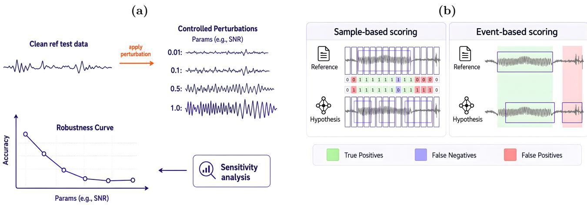  
Figure 3. (a) Controlled perturbations. Domain-guided environment, noise, and adversarial transforms are applied in memory at inference time and swept over control hyperparameters to produce robustness curves. (b) Performance metrics. Sample- and event-based sensitivity, precision, F1, and false positives per 24 h quantify seizure-detection accuracy under clean and perturbed evaluation.

## Model interface

Detectors are packaged as interchangeable adapters selected by an active-model setting at build and run time. Each adapter exposes a detection function that maps EEG to a sample-wise mask, together with an agreement function that the Monte Carlo dropout stage calls for repeated stochastic forward passes. Shifts are never implemented inside detector packages, so swapping models does not fork the perturbation library. Hypothesis annotations are written as mirrored BIDS event tables, and the dropout stage stores per-sample agreement traces alongside those predictions.

## Evaluation

We profile a detector through three complementary analysis stages that run sequentially or in parallel within a single experiment pipeline (Figure 2; Table 3):

1. Controlled environment, noise, and adversarial shifts and drifts applied at inference time over each perturbation’s hyperparameter grid, with sample- and event-level detection quality scored against fixed reference annotations to produce per-perturbation robustness and sensitivity curves.

2. Lead and Lag onset timing on event-level true positives, characterizing whether detections arrive early or late relative to annotated seizure onset.

3. MCD predictive uncertainty via agreement index ϕ, quantifying per-sample decision stability across repeated stochastic forward passes of the same recording.

Detection quality under shifts uses sample- and event-based accuracy metrics as formalized in the SzCORE evaluation methodology27, which we adopt as an accuracy-metric layer: at 256 Hz, timescoring yields sensitivity, precision, F1, and false positives per 24 h (FP/24h) at both granularities (Figure 3b). Because each registry row stores the active shift identity together with its hyperparameter values, aggregating rows for one family reconstructs a full sensitivity analysis: the curve of those metrics as severity changes, not only a single operating point. Sample-based scoring captures fine-grained agreement and integrates with common machine-learning training schemes; event-based scoring answers clinical questions that sample scores alone cannot, namely how many seizures were detected or missed, and how many false alarms occur per day 27,51.

Lead and Lag are reported on event-level true positives (timesteps at 256 Hz): early detections contribute to Lead (higher = earlier), late detections to Lag (higher = later), and exact zero-delay true positives are counted as ontime (Figure 4a).

Accurate communication of predictive uncertainty is critical for fail-safety in healthcare ML, because it lets human experts ignore the model selectively when confidence is low 52,53. We therefore examine per-sample variability in predictions with an MCD strategy 54 (Figure 4b). In the Bayesian setting, the predictive distribution of a model f with parameters θ for an input x and output $\hat { y }$ is

$$
p ( \boldsymbol { \hat { y } } \mid \boldsymbol { x } , \mathcal { D } ) = \int p ( \boldsymbol { \hat { y } } \mid \boldsymbol { x } , \boldsymbol { \theta } ) p ( \boldsymbol { \theta } \mid \mathcal { D } ) d \boldsymbol { \theta } ,\tag{1}
$$

where D denotes training data. Exact computation is intractable, so approximate inference is performed with a variational distribution. Training neural networks with Bernoulli dropout is equivalent to approximate posterior inference over model parameters 54. With T independent Bernoulli realizations $\{ \theta _ { t } \} _ { t = 1 } ^ { T }$ , the Monte Carlo estimate of the mean prediction and its variance are

$$
\mathbb { E } [ \hat { y } \mid x ] \approx \frac { 1 } { T } \sum _ { t = 1 } ^ { T } f ( x , \theta _ { t } ) ,\tag{2}
$$

$$
\operatorname { V a r } ( \hat { y } \mid x ) \approx \frac { 1 } { T } \sum _ { t = 1 } ^ { T } \bigl ( f ( x , \theta _ { t } ) - \mathbb { E } [ \hat { y } \mid x ] \bigr ) ^ { 2 } .\tag{3}
$$

Each adapter keeps non-dropout layers in evaluation mode while enabling Bernoulli dropout for $T$ stochastic forward passes of the same recording. Soft outputs are thresholded at a decision threshold τ to obtain binary seizure decisions. For classification-style seizure detection, we summarize predictive uncertainty with the agreement index

$$
\phi = \frac { 1 } { T } \sum _ { t = 1 } ^ { T } \mathbf { 1 } \{ f ( x , \theta _ { t } ) \geq \tau \} ,\tag{4}
$$

which is the fraction of Monte Carlo runs that label the sample as seizure after thresholding. Values of $\phi$ near 0 or 1 indicate stable decisions; intermediate values indicate disagreement across dropout samples and therefore higher predictive uncertainty.

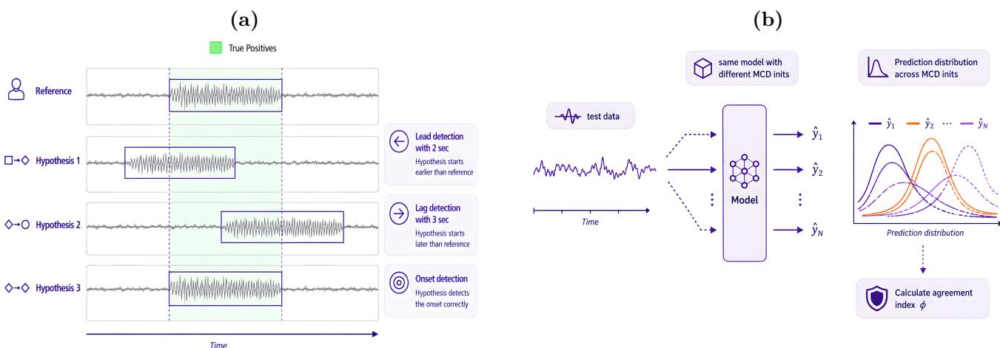  
Figure 4. (a) Lead and Lag onset timing. For event-level true positives, Lead measures early detection relative to annotated onset, Lag measures late detection, and ontime counts exact zero-delay matches. (b) Model uncertainty with Monte Carlo dropout. Agreement index $\phi$ summarizes per-sample decision stability across stochastic forward passes; values near 0 or 1 indicate stable decisions.

We report ϕ stratified by reference seizure, background, false-positive, and false-negative samples, so uncertainty can be interpreted jointly with detection errors under each shift. Default research-subset settings use T=5 and τ=0.8; both parameters are recorded in the experiment registry. Accuracy, Lead and Lag, and ϕ are scored over the same inference scope, so all three stages remain directly comparable within one run.

The same three stages are available under two operating modes that difer only in evaluation scope, not in shift definitions or scoring rules. Full mode runs inference and scoring over the complete evaluation split and is intended for comprehensive pre-deployment reporting. Research-subset mode restricts inference and matched scoring to a smaller, deterministic slice of the evaluation split, by default the first N subjects in lexicographic subject-folder order including all sessions, and records the stage parameters (T and τ) in the experiment registry. We designed research-subset mode so that a case study on a contemporary detector remains tractable, and so that developers can obtain rapid robustness feedback while iterating models, without paying the cost of a full-split run at every design step. Without such a lighter path, the burden of always evaluating on the entire evaluation split can discourage robustness assessment during development; models may then reach clinical settings without stress testing, which is a high-stakes risk when missed seizures or alarm flooding afect patient care. Full mode remains the recommended setting for final, publishable robustness profiles once a design has stabilized.

Table 3. Analysis stages we produce for each experiment.
<table><tr><td>Stage</td><td>Quantities</td></tr><tr><td>Shifts and accuracy</td><td>Sample and event sensitivity, precision, F1, FP/24h; robustness curves over each shift&#x27;s hyperparameter grid</td></tr><tr><td>Lead and Lag</td><td>Mean, median, p90, extremes; true-positive (TP) and ontime counts</td></tr><tr><td>MCD agreement</td><td>Stratified mean φ; contributing file counts</td></tr></table>

## Software

Table 4 lists primary software modules; Figure 5 summarizes the package layout and data flow. A Dockerized GPU service mounts evaluation data read-only and writes predictions and scores to an output tree, applying shift parameters through a controlled configuration interface. Reproduction recipes, installation steps, and experiment commands are maintained in the project’s Git repository rather than in the main manuscript text.

Table 4. Core software modules in the RobustSeiz repository.
<table><tr><td>Module</td><td>Role</td></tr><tr><td>Model adapters</td><td>Pluggable detectors and active-model selection</td></tr><tr><td>Experiments utilities</td><td>Shifts, configuration, Docker runner, MCD helpers</td></tr><tr><td>Evaluation</td><td>Accuracy scoring, Lead and Lag, agreement index, registry</td></tr><tr><td>Data and results trees</td><td>Read-only evaluation inputs; writable hypotheses</td></tr><tr><td>Experiment orchestrator</td><td>End-to-end configuration, inference, and logging</td></tr></table>

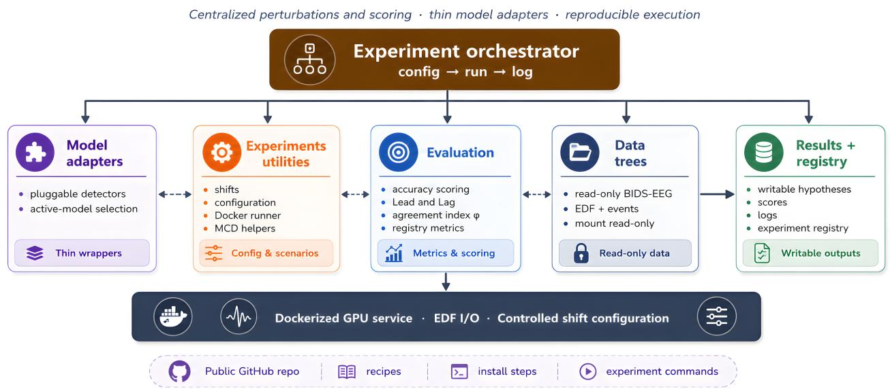  
Figure 5. Software architecture. Perturbations and scoring are centralized; model packages remain thin adapters, enabling fair comparison across detectors under identical stressors.

## Results

We provide a complete robustness evaluation stack rather than a single leaderboard number. On the software side, the release includes: (i) a shift library covering environment, noise, and adversarial families with explicit clinical motivations (Table 2) and documented hyperparameter grids for full sensitivity analysis of each perturbation; (ii) a model-agnostic inference contract and Dockerized runner; (iii) the three analysis stages of controlled shifts with accuracy scoring, Lead and Lag onset timing, and MCD agreement, available under full and research-subset operating modes; and (iv) a machine-readable experiment registry that stores parameters alongside metrics for auditability and for reconstructing robustness curves.

Full mode supports comprehensive reporting over the complete evaluation split. Research-subset mode uses a fixed default of the first 10 subjects in lexicographic order (all sessions), with MCD settings T=5 and τ=0.8. Both modes share the same shift definitions, analysis stages, and scoring rules; only the evaluation scope changes. This duality lets developers iterate quickly in research-subset mode and reserve full mode for final pre-deployment profiles.

To verify end-to-end operability, we generated RobustSeiz reports on one contemporary state-of-the-art EEG seizure detection model 55 on the Temple University Hospital EEG Seizure Corpus (TUSZ), the largest corpus in the release. Under full mode, we ran the complete implemented shift grid with detection-quality scoring and Lead and Lag onset timing on the full TUSZ evaluation split. Under research-subset mode on the same corpus, we ran all shifts together with Lead and Lag and the Monte Carlo dropout (MCD) stage. Complete numerical outcomes across the perturbation grid are provided in Supplementary Appendix B. In the main text, we use AWGN as a representative worked example to demonstrate how the framework jointly characterizes detection quality, onset timing, and predictive agreement.

## Representative robustness profile

To showcase RobustSeiz across the range of shifts and perturbation experiments evaluated by the framework, we selected additive white Gaussian noise (AWGN) as a representative example. We examined AWGN across a signal-to-noise ratio (SNR) grid (Figure 6). At 0 dB, severe noise reduced sensitivity to 0.36 and F1 to 0.52,

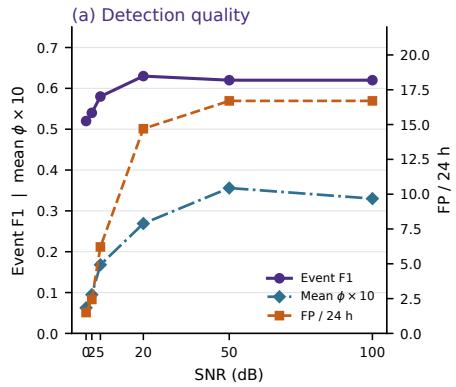

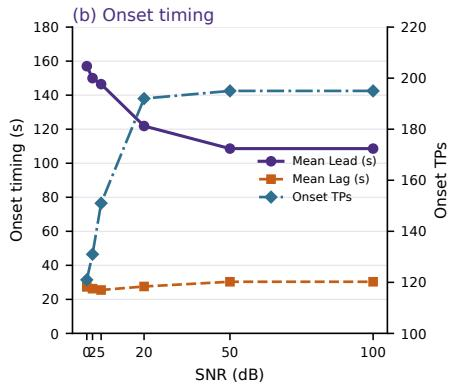

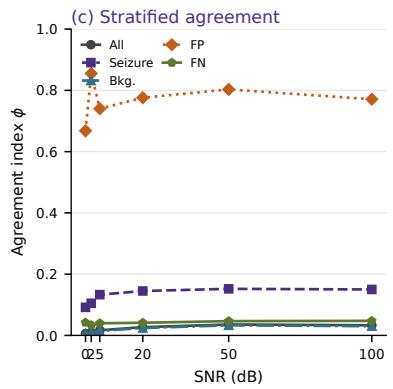  
Figure 6. (a) Event F1 and mean ϕ × 10 (left axis) with false positives per 24 h (right axis) versus AWGN SNR (full-mode event scores; research-subset mean ϕ). (b) Mean Lead and mean Lag among event-level true positives (left axis, seconds at 256 Hz) and onset true-positive count (right axis). (c) Agreement index ϕ versus SNR on the research subset (T=5), stratified by all samples, reference seizure, background, false-positive, and false-negative samples.

but increased precision to 0.94 and reduced false positives to 1.5 per 24 h. As noise weakened, sensitivity and F1 recovered to 0.57 and approximately 0.62–0.63, while precision decreased to 0.69 and false positives increased to 16.7 per 24 h. Event-level true positives increased from 121 to 195, indicating that severe noise made the detector more conservative.

Mean Lead decreased from approximately 157 s to 109 s, whereas mean Lag remained relatively stable, increasing from approximately 27 s to 30 s. Thus, AWGN afected both detection performance and onset timing.

The agreement index $\phi ,$ defined as the fraction of Monte Carlo dropout runs classifying a sample as seizure, provided a complementary view of predictive stability. Values near 0 or 1 indicate agreement, whereas values near 0.5 indicate greater disagreement. Mean ϕ increased from 0.0063 at 0 dB to 0.0356 at 50 dB and remained 0.0330 at 100 dB, representing a more than five-fold relative movement away from the non-seizure agreement boundary and toward the maximum-disagreement region. Although the absolute values remained close to 0, this indicates a substantial relative increase in the uncertainty signal as noise weakened. Seizure and background strata showed similar overall movements toward 0.5. False-positive samples remained above 0.5 $( \phi = 0 . 6 6 8 – 0 . 8 5 5 )$ without a monotonic SNR trend, indicating seizure-dominant stochastic predictions for false alarms. In contrast, false-negative samples remained close to 0 $( \phi = 0 . 0 3 4  – 0 . 0 4 8 )$ ), indicating strong agreement on the incorrect non-seizure decision for many missed seizure samples.

Overall, weaker noise improved seizure detection but increased false alarms. Complete results are provided in Supplementary Appendix B.

## Discussion

Comparable accuracy reporting on public EEG corpora was an important step toward fair algorithm comparison, yet even a fairly measured score on clean evaluation data does not certify stability under the acquisition and artifact conditions of real EMU or ambulatory monitoring 17,18,56,57. Prior EEG robustness diagnostics that inspect encoder latent spaces under instrumentation transforms are useful during development 31, but they do not replace end-to-end, event-level stress testing of clinical seizure detectors across environment, noise, and adversarial conditions. In high-stakes epilepsy care, two failure modes are particularly consequential: missed seizures (false negatives) and alarm flooding (excess false positives per day). Environment and noise shifts probe risks arising from ordinary clinical operations; adversarial increase and decrease modes systematically stress both missed-detection and over-detection regimes 14. We therefore treat robustness profiling as a first-class pre-deployment requirement.

Keeping shifts outside detector packages ensures that robustness comparisons attribute diferences to the model rather than to duplicated preprocessing forks. Domain-guided transforms are chosen to reflect acquisition hardware and clinical operations (filters, quantization, impedance, broadband and line noise, montage and sensor failure), while adversarial probes expose brittle boundaries that noise alone may miss. Sweeping each transform over its control hyperparameters is deliberate: a single severity setting can understate or overstate risk, whereas the resulting robustness curve reveals where performance remains stable and where it collapses as the stressor intensifies. Standardizing BIDS-EEG inputs and the subject-independent held-out evaluation task maximizes interoperability across public corpora while adding a deployment-oriented stress layer whose controlled shifts already simulate the acquisition and operational mismatches that typically accompany transfer to a new site. Lead and Lag metrics acknowledge that when a seizure is marked can matter as much as whether it is marked. Making MCD a standing stage means every profile carries an uncertainty reading: agreement index ϕ exposes instability that point predictions hide, supporting selective human override when predictions disagree across dropout samples 52,54. Research-subset mode lowers the barrier during development, while full mode remains available before clinical consideration.

For informatics and clinical AI practice, we encourage reporting a robustness profile alongside clean accuracy: which stressors preserve event F1 and FP/24h, which induce missed events, and which inflate alarms, together with how those outcomes change along each perturbation’s severity curve. Such profiles are more actionable for deployment decisions than a single clean-split score. Supplementary Appendix C supplies a Model Card, a Reproducibility Checklist, and instructions for submitting experiments\_results.csv so that those profiles can be compared across groups27–29.

## Limitations

The present manuscript emphasizes framework design; large-scale, multi-model, multi-site robustness leaderboards remain a topic for future work. Adversarial perturbations are white-box with respect to the active adapter and use normalized-window ϵ rather than a calibrated microvolt clinical scale. The MCD stage requires adapters that expose stochastic forward passes, so fully deterministic architectures can only be profiled on the first two stages. Some shifts (e.g., extreme channel dropout) can become degenerate for models with strict montage requirements and should be interpreted as configuration stress tests. Training orchestration is out of scope; we evaluate provided models on converted held-out evaluation trees, so the training corpus remains the user’s responsibility.

## Conclusion

We introduced RobustSeiz, an open-source framework for benchmarking the robustness of EEG seizure detection models. In it we standardize public corpora, apply clinically motivated environment, noise, and adversarial shifts with full sensitivity analysis over each perturbation’s hyperparameters, and profile detectors through accuracy metrics, Lead and Lag onset timing, and Monte Carlo dropout agreement. We target whether modern models remain trustworthy under realistic clinical conditions. We release the software pipeline and registry protocol in the project’s Git repository to support reproducible, comparable robustness studies across future detectors.

## Author contributions

M.M. conceived the study, implemented the software, and drafted the manuscript. A.Z. supervised the work and revised the manuscript. Both authors approved the final version.

## Acknowledgments

We thank the epilepsy EEG community for open public datasets, BIDS-oriented tooling, and shared evaluation libraries that enable reproducible external validation. Large language model assistance was used to help organize and refine manuscript prose; all scientific claims, software design, and experimental protocols were defined and verified by the authors against the implementation.

## Funding

No funding or sponsorship of any kind was used in this research.

## Conflicts of interest

The authors have no competing interests to declare.

## Data availability

Public EEG corpora are accessed through their original distributors (PhysioNet / TUH / SeizeIT1) and converted to BIDS-EEG with epilepsy2bids. The RobustSeiz source code, Docker recipe, experiment registry, and usage documentation are available at

https://github.com/iMohammad97/RobustSeiz. Demonstration registry excerpts appear in Supplementary Appendix B. Reporting templates appear in Supplementary Appendix C.

## References

1. Ryvlin P, et al. Beyond the limits of the traditional long-term video-EEG monitoring. Epilepsia. 2018.

2. Casson AJ. Wearable EEG and beyond. Biomedical Engineering Letters. 2019;9:53-71.

3. Viana PF, Duun-Henriksen J, Glasstetter M, et al. 230 days of ultra long-term subcutaneous EEG: seizure cycle analysis and comparison to patient diary. Annals of Clinical and Translational Neurology. 2021;8(1):43-55.

4. Guekht A, Brodie M, Secco M, Li S, Volkers N, Wiebe S. The road to a World Health Organization global action plan on epilepsy and other neurological disorders. Epilepsia. 2021;62(5):1057-63.

5. Baumgartner C, Koren JP. Seizure detection using scalp-eeg. Epilepsia. 2018;59(S1):14-22.

6. Beniczky S, Wiebe S, Jeppesen J, et al. Automated seizure detection using wearable devices: a clinical practice guideline of the International League Against Epilepsy and the International Federation of Clinical Neurophysiology. Epilepsia. 2021;62(5):1173-87.

7. Koren J, Hafner S, Feigl M, Baumgartner C. Systematic analysis and comparison of commercial seizuredetection software. Epilepsia. 2021;62(2):426-38.

8. Schirrmeister RT, Springenberg JT, Fiederer LDJ, et al. Deep learning with convolutional neural networks for EEG decoding and visualization. Human Brain Mapping. 2017;38(11):5391-420.

9. Shah V, von Weltin E, Lopez S, et al. The Temple University Hospital Seizure Detection Corpus. Frontiers in Neuroinformatics. 2018;12:83.

10. Lawhern VJ, Solon AJ, Waytowich NR, Gordon SM, Hung CP, Lance BJ. EEGNet: a compact convolutiona neural network for EEG-based brain–computer interfaces. Journal of Neural Engineering. 2018;15(5):056013.

11. Roy Y, Banville H, Albuquerque I, Gramfort A, Falk TH, Faubert J. Deep learning-based electroencephalography analysis: a systematic review. Journal of Neural Engineering. 2019;16(5):051001.

12. Craik A, He Y, Contreras-Vidal JL. Deep learning for electroencephalogram (EEG) classification tasks: a review. Journal of Neural Engineering. 2019;16(3):031001.

13. Zhang H, Dullerud N, Seyyed-Kalantari L, Morris Q, Joshi S, Ghassemi M. An empirical framework for domain generalization in clinical settings. Proceedings of the Conference on Health, Inference, and Learning. 2021:279-90.

14. Finlayson SG, Bowers JD, Ito J, Zittrain JL, Beam AL, Kohane IS. Adversarial attacks on medical machine learning. Science. 2019;363(6433):1287-9.

15. Kelly CJ, Karthikesalingam A, Suleyman M, Corrado G, King D. Key challenges for delivering clinical impact with artificial intelligence. BMC Medicine. 2019;17:195.

16. Wiens J, Saria S, Sendak M, et al. Do no harm: a roadmap for responsible machine learning for health care. Nature Medicine. 2019;25:1337-40.

17. Urigüen JA, Garcia-Zapirain B. EEG artifact removal—state-of-the-art and guidelines. Journal of Neural Engineering. 2015;12(3):031001.

18. Tatum WO, Rubboli G, Kaplan PW, et al. Artifact and recording concepts in EEG. Journal of Clinical Neurophysiology. 2018.

19. Acharya UR, Vinitha Sree S, Swapna G, Martis RJ, Suri JS. Automated EEG analysis of epilepsy: a review. Knowledge-Based Systems. 2013;45:147-65.

20. Halford JJ, Shiau D, Desrochers JA, et al. Inter-rater agreement on identification of electrographic seizures and periodic discharges in ICU EEG recordings. Clinical Neurophysiology. 2015;126(9):1661-9.

21. Sendak MP, Gao M, Brajer N, Balu S. Presenting machine learning model information to clinical end users with model facts labels. npj Digital Medicine. 2020;3:41.

22. Oakden-Rayner L, Dunnmon J, Carneiro G, Ré C. Hidden stratification causes clinically meaningful failures in machine learning for medical imaging. Proceedings of the ACM Conference on Health, Inference, and Learning. 2020:151-9.

23. Elger CE, Hoppe C. Wearable devices for detecting and preventing epileptic seizures. Nature Reviews Neurology. 2018;14:195-203.

24. Goodfellow IJ, Shlens J, Szegedy C. Explaining and harnessing adversarial examples. In: International Conference on Learning Representations (ICLR); 2015. .

25. Madry A, Makelov A, Schmidt L, Tsipras D, Vladu A. Towards deep learning models resistant to adversaria attacks. In: International Conference on Learning Representations (ICLR); 2018. .

26. Geirhos R, Jacobsen JH, Michaelis C, et al. Shortcut learning in deep neural networks. Nature Machine Intelligence. 2020;2:665-73.

27. Dan J, Pale U, Amirshahi A, Cappelletti W, Ingolfsson TM, Wang X, et al. SzCORE: Seizure Community Open-Source Research Evaluation framework for the validation of electroencephalography-based automated seizure detection algorithms. Epilepsia. 2025;66(Suppl. 3):14-24.

28. Pineau J, Vincent-Lamarre P, Sinha K, et al. Improving reproducibility in machine learning research (a report from the NeurIPS 2019 Reproducibility Program). Journal of Machine Learning Research. 2021;22:1-20.

29. Mitchell M, Wu S, Zaldivar A, et al. Model Cards for Model Reporting. In: Proceedings of the Conference on Fairness, Accountability, and Transparency; 2019. p. 220-9.

30. Varoquaux G. Cross-validation failure: small sample sizes lead to large error bars. NeuroImage. 2018;180:68-77.

31. Wagh N, Wei J, Rawal S, Berry B, Varatharajah Y. Evaluating Latent Space Robustness and Uncertainty of EEG-ML Models under Realistic Distribution Shifts. In: Advances in Neural Information Processing Systems; 2022. .

32. Shoeb AH. Application of machine learning to epileptic seizure onset detection and treatment. PhD thesis, Massachusetts Institute of Technology. 2009. CHB-MIT Scalp EEG Database available from PhysioNet; DOI: 10.13026/C2K01R.

33. Goldberger AL, Amaral LA, Glass L, et al.. PhysioBank, PhysioToolkit, and PhysioNet: components of a new research resource for complex physiologic signals; 2000. Circulation.

34. Obeid I, Picone J. The Temple University Hospital EEG data corpus. Frontiers in Neuroscience. 2016;10:196.

35. Detti P. Siena scalp EEG database. PhysioNet. 2020. DOI: 10.13026/5d4a-j060.

36. Chatzichristos C, Bhagubai MC. SeizeIT1; 2023. DOI: 10.48804/P5Q0OJ. KU Leuven RDR.

37. Wong S, Simmons A, Rivera-Villicana J, et al. EEG datasets for seizure detection and prediction—A review. Epilepsia Open. 2023;8(2):252-67.

38. Gorgolewski KJ, Auer T, Calhoun VD, et al. The brain imaging data structure, a format for organizing and describing outputs of neuroimaging experiments. Scientific Data. 2016;3:160044.

39. Pernet CR, Appelhof S, Gorgolewski KJ, et al. EEG-BIDS, an extension to the brain imaging data structure for electroencephalography. Scientific Data. 2019;6:103.

40. Kemp B, Olivan J. European data format ‘plus’ (EDF+), an EDF alike standard format for the exchange of physiological data. Clinical Neurophysiology. 2003;114(9):1755-61.

41. Beniczky S, Aurlien H, Brøgger JC, et al. Standardized computer-based organized reporting of EEG: SCORE. Epilepsia. 2013;54(6):1112-24.

42. Beniczky S, Aurlien H, Brøgger JC, et al. Standardized computer-based organized reporting of EEG: SCORE Second version. Clinical Neurophysiology. 2017;128(11):2334-46.

43. Schefer IE, Berkovic S, Capovilla G, et al. ILAE classification of the epilepsies: Position paper of the ILAE Commission for Classification and Terminology. Epilepsia. 2017;58(4):512-21.

44. Hermes D, Pal Attia T, Beniczky S, Bosch-Bayard J, Delorme A, Lundstrom BN, et al. Hierarchical Event Descriptor library schema for EEG data annotation. Scientific Data. 2025;12:1448.

45. Peltola ME, Leitinger M, Halford JJ, et al. Routine and sleep EEG: Minimum recording standards of the International Federation of Clinical Neurophysiology and the International League Against Epilepsy. Epilepsia. 2023;64(3):602-18.

46. Halford JJ, et al. IFCN standards for digital recording of clinical EEG. Clinical Neurophysiology. 2010.

47. Jasper HH. The ten-twenty electrode system of the International Federation. Electroencephalography and Clinical Neurophysiology. 1958;10:371-5.

48. Fisher RS, Acevedo C, Arzimanoglou A, et al. ILAE oficial report: a practical clinical definition of epilepsy. Epilepsia. 2014;55(4):475-82.

49. Kappenman ES, Luck SJ. The efects of electrode impedance on data quality and statistical significance in ERP recordings. Psychophysiology. 2010;47(5):888-904.

50. Lashgari E, Liang D, Maoz U. Data augmentation for deep-learning-based electroencephalography. Journal of Neuroscience Methods. 2020;346:108885.

51. Shah V, von Weltin E, Lopez S, et al. Objective Evaluation Metrics for Automatic Classification of EEG Events. In: Biomedical Signal Processing. Springer; 2021. p. 223-55.

52. Ovadia Y, Fertig E, Ren J, Nado Z, Sculley D, Nowozin S, et al. Can you trust your model’s uncertainty? Evaluating predictive uncertainty under dataset shift. In: Advances in Neural Information Processing Systems. vol. 32; 2019. .

53. Hendrycks D, Lee K, Mazeika M. Using pre-training can improve model robustness and uncertainty. In: International Conference on Machine Learning. PMLR; 2019. p. 2712-21.

54. Gal Y, Ghahramani Z. Dropout as a Bayesian approximation: representing model uncertainty in deep learning. In: Proceedings of the 33rd International Conference on Machine Learning; 2016. .

55. Wu K, Zhao Z, Yener B. SeizureTransformer: Scaling U-Net with Transformer for Simultaneous Time-Step Level Seizure Detection from Long EEG Recordings. arXiv preprint arXiv:250400336. 2025.

56. Siddiqui MK, Morales-Menendez R, Huang X, Hussain N. A review of epileptic seizure detection using machine learning classifiers. Brain Informatics. 2020;7:5.

57. Maimaiti B, Meng H, Lv Y, et al. An overview of EEG-based machine learning methods in seizure prediction and opportunities for neurologists in this field. Neuroscience. 2022;481:197-218.

58. Fisher RS, Cross JH, French JA, et al. Operational classification of seizure types by the International League Against Epilepsy: Position Paper of the ILAE Commission for Classification and Terminology. Epilepsia. 2017;58(4):522-30.

59. Pale U, Amirshahi A, Cappelletti W, Dan J. CHB-MIT Scalp EEG Database converted to BIDS-EEG; 2023. Zenodo. Available from: https://zenodo.org/records/10259996.

60. Trinka E, Cock H, Hesdorfer D, et al. A definition and classification of status epilepticus – Report of the ILAE Task Force on Classification of Status Epilepticus. Epilepsia. 2015;56(10):1515-23.

61. Ronneberger O, Fischer P, Brox T. U-Net: Convolutional networks for biomedical image segmentation. Medical Image Computing and Computer-Assisted Intervention (MICCAI). 2015:234-41.

62. Vaswani A, Shazeer N, Parmar N, Uszkoreit J, Jones L, Gomez AN, et al. Attention is all you need. In: Advances in Neural Information Processing Systems. vol. 30; 2017. .

## Supplementary Material

## A Data format

A shared on-disk contract is a prerequisite for comparing detectors across corpora. We therefore consume evaluation trees that follow BIDS-EEG 38,39 and a SCORE / HED-SCORE annotation schema 41,42,44,58. Reference annotations and detector hypothesis files share that relative subject–session–run layout, so scoring never depends on a model-specific export format27. A community conversion of CHB-MIT into this layout is available as a public reference tree 59.

## A.1 BIDS-EEG compliant dataset

Each corpus is stored as a self-contained BIDS-EEG folder. The TUSZ evaluation split used here lives at Data/ConvertedTUSZEval/ (Figure 7a) and carries dataset-level metadata (README, dataset\_description.json, participants.json, participants.tsv, events.json) together with one folder per subject. Subject folders contain session and EEG subfolders whose paired files are the recording (\*\_eeg.edf), sidecar metadata (\*\_eeg.json), and the matched reference event table (\*\_events.tsv). An optional full-corpus tree may sit beside the eval split at Data/ConvertedTUSZ/. Detector outputs are written under Results/<Category>/<Experiment>/ (Figure 7b), mirroring the same sub-\*/ses-\*/eeg/ identity as the source EDF so a hypothesis \*\_events.tsv can be joined to its recording without renaming. Each experiment folder also stores evaluation summaries (results.csv, results.txt, and onset.csv/onset.txt when Lead and Lag are computed). The evaluation tree is mounted read-only during inference: perturbations are applied in memory and never rewrite the standardized files 28,40.

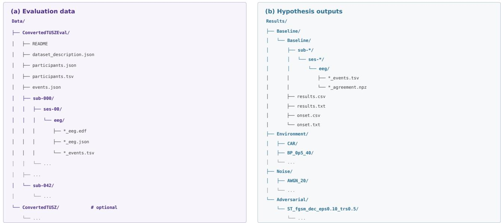  
Figure 7. On-disk layout we consume. (a) BIDS-EEG evaluation tree Data/ConvertedTUSZEval/ with dataset metadata and truncated subject/session folders; recordings use \*\_eeg.edf with sidecar \*\_eeg.json and reference \*\_events.tsv. (b) Results/<Category>/<Experiment>/ stores detector hypotheses that reuse the same relative path, plus per-experiment score files. Ellipses and \* globs omit repeated subjects, sessions, and runs; \*\_agreement.npz is written only when Monte Carlo dropout is enabled.

## A.2 Annotation format

Annotations are tab-separated tables, one file per recording, designed to represent both expert reference labels and algorithm outputs (Figure 8). Each row is one event and uses the following fields 27,44:

• onset: start of the event in seconds from the beginning of the recording;

• duration: event length in seconds;

• event: event type, primarily a seizure code;

• confidence: optional label confidence in [0, 1] (detector outputs; n/a if unused);

• channels: electrodes to which the event applies, or all;

• dateTime: recording start in POSIX $\% \mathrm { Y - \% m - \% d \ \% H : \% M : \% S ; }$

• recordingDuration: total file duration in seconds.

<table><tr><td rowspan=1 colspan=1>onset</td><td rowspan=1 colspan=1>duration</td><td rowspan=1 colspan=1>event</td><td rowspan=1 colspan=1>confidence</td><td rowspan=1 colspan=1>channels</td><td rowspan=1 colspan=1>dateTime</td><td rowspan=1 colspan=1>recordingDuration</td></tr><tr><td rowspan=1 colspan=1>296.0</td><td rowspan=1 colspan=1>40.0</td><td rowspan=1 colspan=1>SZ</td><td rowspan=1 colspan=1>n/a</td><td rowspan=1 colspan=1>all</td><td rowspan=1 colspan=1>2016-11-06 13:43:04</td><td rowspan=1 colspan=1>3600.00</td></tr><tr><td rowspan=1 colspan=1>453.0</td><td rowspan=1 colspan=1>12.0</td><td rowspan=1 colspan=1>sz-foc</td><td rowspan=1 colspan=1>n/a</td><td rowspan=1 colspan=1>T7,T8</td><td rowspan=1 colspan=1>2016-11-06 13:43:04</td><td rowspan=1 colspan=1>3600.00</td></tr><tr><td rowspan=1 colspan=1>0.0</td><td rowspan=1 colspan=1>3600.0</td><td rowspan=1 colspan=1>bckg</td><td rowspan=1 colspan=1>n/a</td><td rowspan=1 colspan=1>all</td><td rowspan=1 colspan=1>2016-11-06 14:50:00</td><td rowspan=1 colspan=1>3600.00</td></tr></table>

Figure 8. events.tsv annotation schema. One row per event; the same columns serve reference labels and detector hypotheses. Onset and duration are in seconds; event uses SCORE/HED-SCORE codes (sz, sz-foc, sz-gen, bckg); confidence is for detector outputs; channels list afected electrodes or all.

Seizure codes follow the hierarchical ILAE 2017 classification 43,58: the top-level token is sz, with optional onset tags sz-foc, sz-gen, or sz-uon, and deeper awareness / motor / symptom codes when available (Figure 9a).

A recording without seizures uses bckg with duration equal to the file length. Status epilepticus and related prolonged events remain clinically important edge cases 60; when present they are stored with the same onset– duration schema rather than a separate file type. Reference annotations are never modified by shifts; only the EEG array seen by the detector changes.

## A.3 Recording content and montage

Recording content is chosen to be consistent with IFCN / ILAE minimum clinical EEG standards 45–47. Signals are stored as EDF at 256 Hz in a unipolar common-average montage of the 19 international 10-20 electrodes, in a fixed channel order (Figure 9b). The common average is formed from those 19 electrodes only; auxiliary channels, if present, are appended after the 10-20 set and are not used to compute the average. CHB-MIT is the documented exception: conversion from its native bipolar montage is not feasible, so that corpus is analyzed in the original bipolar layout 32,59. Where a TUSZ-style recording lacks some of the 19 electrodes, missing channels are zero-filled so that array shape remains consistent across files 9,34.

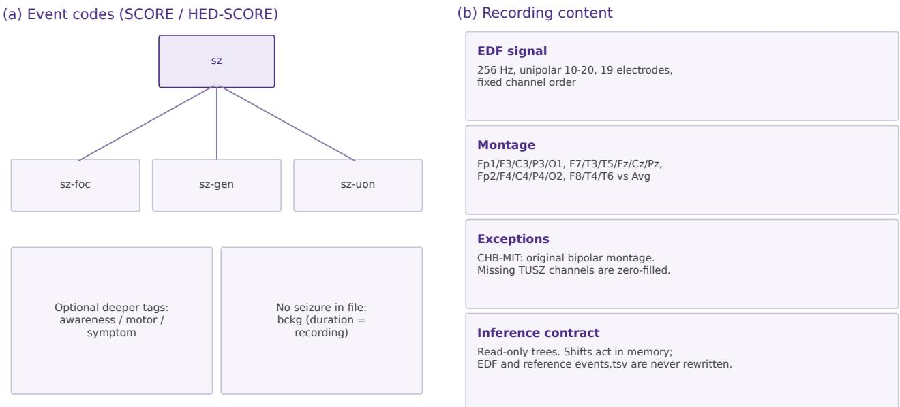  
Figure 9. Annotation codes and recording content. (a) Hierarchical seizure event codes used in the event field, after the ILAE 2017 classification and HED-SCORE short codes 44,58. (b) Recording content we use: 256 Hz EDF, unipolar 10-20 montage, documented exceptions, and a read-only inference contract.

## A.4 Hypothesis outputs

After inference, each run writes a hypothesis \*\_events.tsv that mirrors the reference relative path inside Results/<Category>/<Experiment>/. Optional Monte Carlo dropout traces are stored alongside those events as per-sample agreement arrays (\*\_agreement.npz). Scoring then compares hypothesis events with the untouched reference table under Data/ConvertedTUSZEval/ using the same sample- and event-level rules at both operating modes 27,51.

## B RobustSeiz Benchmark

This appendix is an end-to-end usage check of the released pipeline, not a multi-model leaderboard. All demonstration runs use TUSZ, the largest and most widely used public scalp-EEG seizure corpus in the release 9,34,37. Numerical outcomes illustrate the structure of a robustness profile and are not used to claim state-of-the-art robustness in the main article.

## B.1 Algorithm

The demonstration detector is SeizureTransformer, a contemporary subject-independent scalp-EEG seizure detector 55. The architecture is a U-Net-style sequence-to-sequence model 61: a 1D convolutional encoder extracts local temporal features from long multichannel EEG; a residual CNN stack together with a Transformer encoder 62 embeds those features with global context; and a streamlined decoder emits a seizure probability at every time step, avoiding window-level post-hoc stitching. Residual skip connections between encoder and decoder layers stabilize training on long recordings. The authors released pretrained open weights; we use those predefined weights through a thin adapter and do not retrain the network. This choice isolates the benchmark to inference-time robustness: the same frozen detector is scored on clean TUSZ evaluation data and on every controlled shift.

For demonstration we run two matched protocols on TUSZ only:

1. Full mode: complete evaluation split; all implemented environment, noise, and adversarial shifts; detection quality plus Lead and Lag.

2. Research-subset mode: first 10 subjects in lexicographic order, all sessions; the same shift grid; detection quality, Lead and Lag, and Monte Carlo dropout with T=5 and τ=0.8, summarized by agreement index ϕ.

Table 5 recalls the published SeizureTransformer accuracy on the TUSZ predefined testing set (sample- and event-based F1, sensitivity, and precision) as reported by the model authors. Those values are author-reported only. Our operational baseline is obtained by running the same predefined weights in our pipeline on the TUSZ evaluation split; the resulting clean scores difer slightly from Table 5, and that measured baseline is what we then stress-test under the shift grid.

Table 5. Published SeizureTransformer performance on the TUSZ predefined testing set (author-reported clean accuracy).
<table><tr><td></td><td colspan="3">Sample-based</td><td colspan="3">Event-based</td></tr><tr><td>Model</td><td>F-1</td><td>Sens.</td><td>Prec.</td><td>F-1</td><td>Sens.</td><td>Prec.</td></tr><tr><td>SeizureTransformer</td><td>0.5803</td><td>0.4710</td><td>0.7556</td><td>0.6752</td><td>0.7110</td><td>0.6427</td></tr></table>

## B.2 Results

Table 6 summarizes event-level detection and onset timing in full mode by shift family.

Table 6. Family-level summary of full-mode TUSZ event detection under each shift family. Sens, Prec, F1, and FP/24h are event-level scores on the complete held-out split (no Monte Carlo dropout). Lead µ and Lag µ are mean Lead and mean Lag among event-level true positives, in samples at 256 Hz; TP is the onset true-positive count. A single number is the observed value when all settings in the family agreed; a range is the minimum–maximum across that family’s hyperparameter grid (not a mean of the family).
<table><tr><td>Experiment</td><td>Cat.</td><td>Sens</td><td>Prec</td><td>F1</td><td>FP/24h</td><td>Lead µ</td><td>Lag µ</td><td>TP</td></tr><tr><td>Baseline</td><td>base</td><td>0.57</td><td>0.69</td><td>0.62</td><td>16.7</td><td>2.78e4</td><td>7.77e3</td><td>195</td></tr><tr><td>Adversarial</td><td></td><td></td><td></td><td></td><td></td><td></td><td></td><td></td></tr><tr><td>FGSM dec ε 0.01–1.00</td><td>adv</td><td>0.95-1.00</td><td>0.20</td><td>0.33-0.34</td><td>241-254</td><td>3.85-4.44e4</td><td>2.71-4.32e3</td><td>322-339</td></tr><tr><td>FGSM inc ε 0.01–1.00</td><td>adv</td><td>0.54-0.71</td><td>0.59-0.19</td><td>0.56-0.30</td><td>23.5-192</td><td>2.36-3.07e4</td><td>8.32-14.5e3</td><td>183-242</td></tr><tr><td>PGD dec ε 0.01–1.00</td><td>adv</td><td>0.98-1.00</td><td>0.18-0.20</td><td>0.31-0.34</td><td>247-286</td><td>4.12-4.31e4</td><td>560-3.60e3</td><td>333-340</td></tr><tr><td>PGD inc ε 0.01–1.00</td><td>adv</td><td>0.49-0.39</td><td>0.59-0.74</td><td>0.53-0.51</td><td>21.6-8.65</td><td>2.69-3.17e4</td><td>8.84-10.0e3</td><td>166-131</td></tr><tr><td>Environment</td><td></td><td></td><td></td><td></td><td></td><td></td><td></td><td></td></tr><tr><td>Band-pass (4 profiles)</td><td>env</td><td>0.574</td><td>0.687</td><td>0.625</td><td>16.7</td><td>2.78e4</td><td>7.77e3</td><td>195</td></tr><tr><td>CAR</td><td>env</td><td>0.57</td><td>0.69</td><td>0.62</td><td>16.7</td><td>2.78e4</td><td>7.77e3</td><td>195</td></tr><tr><td>Drift (16 modes)</td><td>env</td><td>0.574</td><td>0.684</td><td>0.624</td><td>16.9</td><td>2.78e4</td><td>7.77e3</td><td>195</td></tr><tr><td>Drop O1/O2 or T7/T8</td><td>env</td><td>0</td><td></td><td></td><td>0</td><td></td><td></td><td>0</td></tr><tr><td>FS mismatch 50–230 Hz</td><td>env</td><td>0.57-0.60</td><td>0.62-0.69</td><td>0.61-0.62</td><td>16.7-24.1</td><td>2.73-2.94e4</td><td>7.64-7.78e3</td><td>195-205</td></tr><tr><td>Impedance (15 settings)</td><td>env</td><td>0.574</td><td>0.687</td><td>0.625</td><td>16.7</td><td>2.78e4</td><td>7.77e3</td><td>195</td></tr><tr><td>ADC b=5/10/12</td><td>env</td><td>0.54-0.61</td><td>0.69-0.71</td><td>0.61-0.65</td><td>13.7-18.1</td><td>2.79-3.08e4</td><td>6.97-7.78e3</td><td>182-209</td></tr><tr><td>Noise</td><td></td><td></td><td></td><td></td><td></td><td></td><td></td><td></td></tr><tr><td>AWGNSNR 0 / 2 / 5 / 20 / 50 / 100</td><td>noise</td><td>0.36-0.57</td><td>0.94-0.69</td><td>0.52-0.62</td><td>1.5-16.7</td><td>4.02–2.78e4</td><td>7.00-7.77e3</td><td>121-195</td></tr><tr><td>Impulse  $\rho { = } 5 { \times } 1 0 ^ { - 4 } { - } 1 0 ^ { - 2 }$ </td><td>noise</td><td>0.49-0.57</td><td>0.69-0.79</td><td>0.60-0.63</td><td>8.27-16.2</td><td>2.71-3.36e4</td><td>7.01-7.88e3</td><td>166-195</td></tr><tr><td>Mains 60 Hz a=0.1-1.0</td><td>noise</td><td>0.57-0.59</td><td>0.68-0.75</td><td>0.62-0.66</td><td>16.9-12.8</td><td>2.74–2.78e4</td><td>7.68-8.76e3</td><td>194-199</td></tr><tr><td>Notch / mismatch (10 settings)</td><td>noise</td><td>0.574-0.579</td><td>0.677-0.687</td><td>0.621-0.628</td><td>16.7-17.5</td><td>2.78–2.89e4</td><td>7.68-8.13e3</td><td>195-197</td></tr></table>

Table 7 summarizes Monte Carlo dropout agreement on the research subset.

Table 7. Family-level Monte Carlo dropout agreement on the TUSZ research subset (first 10 subjects, T=5 stochastic forwards, τ=0.8). Entries are recording-averaged agreement index ϕ (the fraction of forwards that label a sample as seizure), stratified by all samples, reference seizure, background, false-positive, and false-negative samples. A single number is the observed mean for that family; a range is the minimum–maximum of those means across the family’s hyperparameter settings (not a pooled mean).
<table><tr><td>Experiment family</td><td>Meanφ</td><td>Seiz. φ</td><td>Bkg. φ</td><td>FPφ</td><td>FN φ</td></tr><tr><td>Baseline</td><td>0.0312</td><td>0.152</td><td>0.0284</td><td>0.764</td><td>0.0375</td></tr><tr><td>FGSM decrease (ε 0.01–1.00)</td><td>0.031-0.035</td><td>0.142-0.152</td><td>0.028-0.032</td><td>0.038-0.052</td><td>0.002-0.048</td></tr><tr><td>FGSM increase (ε 0.01–1.00)</td><td>0.029-0.035</td><td>0.143-0.151</td><td>0.026-0.032</td><td>0.493-0.090</td><td>0.020-0.104</td></tr><tr><td>PGD decrease (ε 0.01–1.00)</td><td>0.030-0.038</td><td>0.146-0.157</td><td>0.027-0.035</td><td>0.029-0.050</td><td>0-0.003</td></tr><tr><td>PGD increase (ε 0.01–1.00)</td><td>0.031-0.035</td><td>0.142-0.156</td><td>0.028-0.032</td><td>0.477-0.683</td><td>0.032-0.095</td></tr><tr><td>Band-pass</td><td>0.058-0.125</td><td>0.211-0.286</td><td>0.054-0.120</td><td>0.763-0.801</td><td>0.061-0.092</td></tr><tr><td>CAR / drift / impedance / drop</td><td>0.030-0.037</td><td>0.140-0.158</td><td>0.027-0.034</td><td>0.727-0.853</td><td>0.033-0.057</td></tr><tr><td>FS mismatch</td><td>0.032-0.035</td><td>0.149-0.171</td><td>0.029-0.033</td><td>0.753-0.830</td><td>0.035-0.048</td></tr><tr><td>ADC quantization</td><td>0.029-0.033</td><td>0.133-0.220</td><td>0.027-0.029</td><td>0.779-0.830</td><td>0.042-0.061</td></tr><tr><td>AWGN SNR 0–100 dB</td><td>0.006-0.036</td><td>0.092-0.152</td><td>0.005-0.033</td><td>0.668-0.855</td><td>0.034-0.048</td></tr><tr><td>Impulse / mains / notch</td><td>0.022-0.038</td><td>0.138-0.160</td><td>0.020-0.035</td><td>0.702-0.840</td><td>0.031-0.053</td></tr></table>

Per-setting rows for the same two protocols appear in Tables 8 and 9.

As a worked example, we follow additive white Gaussian noise (AWGN) across its SNR grid, because that family produces a graded curve rather than a near-baseline plateau (Figure 10).

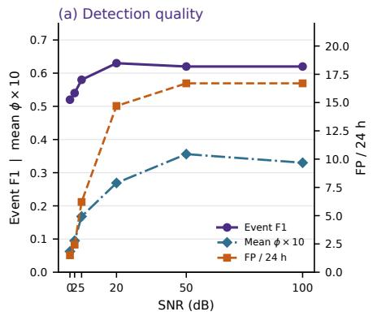

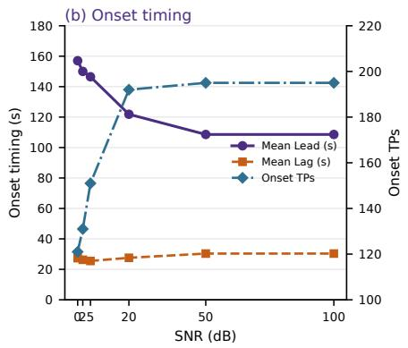

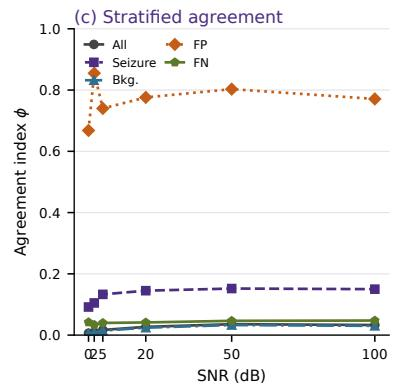  
Figure 10. AWGN on TUSZ. (a) Event F1 and mean ϕ × 10 (left axis) with false positives per 24 h (right axis) versus SNR (full-mode event scores; research-subset mean ϕ). (b) Mean Lead and mean Lag among event-level true positives (left axis, seconds at 256 Hz) and onset true-positive count (right axis). (c) Agreement index ϕ versus SNR on the research subset (T=5), stratified by all samples, reference seizure, background, false-positive, and false-negative samples.

We read the three panels of Figure 10 together while noting that panels (a) and (b) use full-mode detection and onset results, whereas the ϕ traces in panels (a) and (c) are obtained from the matched SNR settings on the research subset. The two operating modes therefore provide complementary trends across perturbation severity rather than pointwise measurements from exactly the same evaluation scope. Lower SNR represents stronger AWGN.

Figure 10a reveals a clear transition in detector operating behavior as noise weakens. At the strongest perturbation, 0 dB, event sensitivity is 0.36 and only 121 event-level true positives are detected. False positives are correspondingly rare at 1.5 per 24 h, producing a high precision of 0.94 but an event F1 of only 0.52. At 2 and 5 dB, sensitivity increases to 0.39 and 0.44, event F1 rises to 0.54 and 0.58, and false positives increase to 2.44 and 6.21 per 24 h. The largest behavioral transition occurs between 5 and 20 dB: sensitivity rises from 0.44 to 0.56, true positives from 151 to 192, and event F1 reaches its maximum observed value of 0.63. This recovery is accompanied by an increase in false positives to 14.7 per 24 h and a decrease in precision to 0.71. At 50 and 100 dB, performance essentially plateaus at sensitivity 0.57, event F1 0.62, 195 true-positive events, and 16.7 false positives per 24 h, closely matching the unperturbed operating point. Thus, severe AWGN does not simply add false alarms; instead, it suppresses positive detections overall and shifts the detector toward a conservative, predominantly non-seizure regime. As the signal becomes cleaner, seizure detection is restored, together with the detector’s usual false-alarm burden.

Figure 10b shows that the composition and timing of detected events also change across the same SNR grid. Mean Lead decreases monotonically from approximately 157.0 s at 0 dB to 150.0 s at 2 dB, 146.5 s at 5 dB, 121.9 s at 20 dB, and 108.6 s at 50–100 dB. At the same time, the number of onset true positives increases from 121 to 195. These quantities should be interpreted together: the large Lead observed under severe noise is calculated only from the smaller subset of seizures that remain detectable under that condition. Consequently, the decrease in mean Lead as SNR increases does not establish that the same seizures are progressively detected later; rather, the population of true-positive events expands as previously missed seizures are recovered, changing the distribution of onset timing among detected events. Mean Lag is considerably more stable, ranging only from approximately 25.5 to 30.4 s. It decreases slightly from 27.3 s at 0 dB to 25.5 s at 5 dB before increasing to approximately 30.4 s at 50–100 dB. The principal timing efect of the AWGN sweep is therefore the substantial change in the Lead distribution and detected-event count, rather than a large systematic change in Lag.

Figure 10c provides the corresponding stochastic-prediction profile. For an individual sample, ϕ is the fraction of Monte Carlo dropout realizations voting seizure: values near 0 or 1 represent agreement on non-seizure or seizure, respectively, whereas values near 0.5 represent maximal disagreement. The overall mean ϕ increases from 0.0063 at 0 dB to 0.0095, 0.0168, 0.0269, and 0.0356 as SNR increases to 50 dB, before decreasing slightly to 0.0330 at 100 dB. This is more than a five-fold relative movement away from the non-seizure agreement boundary toward the maximum-disagreement region, although the absolute mean remains much closer to 0 than to 0.5. Reference-seizure samples show a similar pattern, increasing from $\phi = 0 . 0 9 1 7$ to approximately 0.15, while background samples increase from 0.0049 to approximately 0.03. The close correspondence between the all-sample and background curves is expected because background samples constitute the majority of continuous EEG recordings.

The error strata reveal a diferent and clinically relevant behavior. False-positive samples have mean $\phi > 0 . 5$ at every SNR, ranging from 0.668 to 0.855. Their trajectory is non-monotonic: it rises sharply to 0.855 at 2 dB, falls to 0.740 at 5 dB, and subsequently varies between 0.771 and 0.803. Thus, the data do not support a claim that false-positive confidence increases steadily as noise weakens. Instead, they show that when false alarms occur, Monte Carlo realizations generally favor the seizure class, and these erroneous positive decisions can remain strongly supported even when overall false-positive frequency is low. False-negative samples show the opposite pattern. Their mean ϕ remains close to 0 across the complete SNR range (0.0335–0.0475), indicating strong agreement on the non-seizure class despite the reference label being seizure. These missed events are therefore often associated with stable incorrect non-seizure decisions rather than with stochastic outputs clustered near the 0.5 uncertainty boundary.

Taken together, the three panels identify a coherent change in detector behavior. Severe AWGN primarily suppresses seizure-positive decisions, yielding fewer true detections and very few false alarms, with high precision but poor sensitivity. The largest recovery occurs between 5 and 20 dB, after which event-level detection largely saturates. Onset statistics change concurrently because the set of detected seizures expands, whereas Lag remains comparatively stable. The MCD analysis further shows that aggregate seizure-vote tendency increases as noise weakens, while false positives and false negatives exhibit diferent stability patterns: false alarms are generally supported by seizure-dominant stochastic votes, whereas missed seizures are generally supported by strongly non seizure-dominant votes. RobustSeiz therefore exposes not only whether performance changes under a perturbation, but also how the detector’s operating regime, onset behavior, and stochastic decision stability change with perturbation severity 27,52,54.

## C Reports

Comparable robustness claims require a shared reporting contract, not only a shared scoring library. We therefore provide a Model Card and a reproducibility checklist so that studies using this protocol document the detector, the evaluation setting, and the robustness profile in a form that can be compared across groups 28,29.

## C.1 Model Card

A Model Card is a short, structured summary of who built a detector, how it is run, and how it performed, intended to travel with the model rather than remain buried in supplementary methods 29. Figure 11 is our template: it contains contact details, model details, and a standardized presentation of performance results. Authors should complete one card per detector (or per substantially diferent weight set), stating the evaluation corpus, operating mode (full evaluation versus research subset), shift families and hyperparameter grids, and the reporting stages used: detection quality, Lead and Lag, and Monte Carlo dropout agreement when applicable. The baseline block records clean held-out sample- and event-based sensitivity, precision, F1, and false positives per $2 4 \mathrm { h } ^ { 2 7 }$ on each public corpus and on a pooled setting in which the model is trained and tested on all corpora together. The results block then reports, for each shift category, an average range per metric. Every experiment in a category is a hyperparameter sweep and therefore a curve: for example, AWGN event F1 might take the values 0.20, 0.37, 0.59, 0.81, so that experiment’s minimum is 0.20 and its maximum is 0.81. For the Noise category, average those minima across all noise experiments and average those maxima, and enter the pair as the category range (avg min – avg max). The same range is required for event F1, event false positives per 24 h, event accuracy, event sensitivity, Lead, Lag, onset counts, and mean agreement ϕ. The figure is the canonical field list; copyable templates matching it are provided in the software release.

## C.2 RobustSeiz Reproducibility Checklist

Figure 12 is a checklist for authors who report results under this protocol. The checklist is based on The Machine Learning Reproducibility Checklist 28 and asks authors to document models, datasets, shared code, and experimental results, including the items that accuracy-only papers omit: in-memory shift application on a read-only BIDS-EEG tree, full hyperparameter grids, matched scoring scope, Lead and Lag, stratified Monte Carlo dropout, Docker/active\_model identity, and submission of experiments\_results.csv. The checklist is a reporting aid, not a substitute for releasing code and data.

## C.3 Robustness reports

Each run\_experiment.py invocation appends one row to the repository-root file experiments\_results.csv (override with –results-registry). That file is the machine-readable robustness report: it is tracked in the release, it is the source of the demonstration tables in Appendix B, and it is what authors should submit with a paper or as supplementary material alongside the Model Card. Do not hand-edit metric columns; re-run scoring or the provided backfill scripts if a cell is missing. Per-recording hypothesis trees under Results/ remain useful for audit but are not the comparative artifact; the registry is.

Figure 13 shows the column layout. Identity columns (timestamp\_utc, experiment\_name, category, shift) name the run. data\_dir and output\_dir locate the read-only evaluation tree and the hypothesis folder. params\_json stores shift hyperparameters as a JSON object (for example SNR, ε, impedance band), so a row remains interpretable without the original command line. Sample- and event-based sensitivity, precision, F1, and false positives per day occupy the next eight columns. Onset columns report Lead and Lag summaries in samples at 256 Hz among event-level true positives, plus ontime and true-positive counts. Monte Carlo dropout columns (mcd\_\* agreement and file counts) are written only when MCD is enabled; otherwise they are left empty. Submit the CSV covering every experiment mentioned in the paper; a partial registry is not a complete robustness report.

Table 8. Full-mode TUSZ evaluation of SeizureTransformer, one row per shift. Event-level Sens, Prec, F1, and FP/24h on the held-out split; Lead/Lag µ among onset true positives (samples at 256 Hz); TP is the onset true-positive count.
<table><tr><td rowspan=1 colspan=23></td><td rowspan=1 colspan=1>TP</td></tr><tr><td rowspan=1 colspan=1>ST</td><td rowspan=1 colspan=17></td><td rowspan=2 colspan=5>3850+04 432e+03</td><td rowspan=1 colspan=1>32</td></tr><tr><td></td><td rowspan=2 colspan=7>gsm_deceps0.50 rs00.5</td><td></td><td></td><td></td><td></td><td></td><td></td><td></td><td></td><td></td><td></td><td></td></tr><tr><td></td><td></td><td></td><td></td><td></td><td></td><td></td><td></td><td></td><td></td><td></td><td rowspan=1 colspan=3>4.38e+04</td><td rowspan=1 colspan=2>2.71e+03</td><td rowspan=1 colspan=1>339</td></tr><tr><td></td><td rowspan=2 colspan=7>gsmdeces1.80trs0.5</td><td rowspan=2 colspan=3>adve</td><td></td><td></td><td></td><td></td><td></td><td></td><td></td><td></td><td></td><td></td><td></td><td></td><td></td></tr><tr><td></td><td></td><td rowspan=1 colspan=6></td><td rowspan=1 colspan=3>4.44e+04</td><td rowspan=1 colspan=2>2.83e+03</td><td rowspan=1 colspan=1>339</td></tr><tr><td rowspan=1 colspan=1>ST</td><td rowspan=1 colspan=6></td><td></td><td></td><td></td><td></td><td></td><td></td><td></td><td></td><td></td><td></td><td></td><td></td><td></td><td></td><td></td><td></td><td rowspan=1 colspan=1>1893</td></tr><tr><td rowspan=1 colspan=1>ST</td><td rowspan=1 colspan=5></td><td rowspan=1 colspan=2></td><td rowspan=1 colspan=3>adve0.5</td><td></td><td rowspan=1 colspan=6></td><td rowspan=1 colspan=3>3.07e+04</td><td rowspan=1 colspan=2>1.1e+04</td><td rowspan=1 colspan=1>198</td></tr><tr><td></td><td rowspan=3 colspan=7>gsm inc es0.80 trs0.5</td><td rowspan=3 colspan=3>adve 0.6</td><td></td><td rowspan=3 colspan=6>0.20.31177</td><td></td><td></td><td></td><td></td><td></td><td></td></tr><tr><td></td><td></td><td rowspan=2 colspan=1>2.58e</td><td></td><td></td><td></td><td></td><td></td></tr><tr><td></td><td></td><td rowspan=1 colspan=3>257e+04</td><td rowspan=1 colspan=2>1.35e+04</td><td rowspan=1 colspan=1>234</td></tr><tr><td></td><td rowspan=1 colspan=7></td><td rowspan=1 colspan=2>adve</td><td rowspan=1 colspan=1>0.9</td><td></td><td rowspan=1 colspan=6></td><td rowspan=1 colspan=2>4.12e+04</td><td rowspan=1 colspan=1>4</td><td rowspan=1 colspan=2>3.6e+03</td><td rowspan=1 colspan=1>333</td></tr><tr><td rowspan=1 colspan=1>ST</td><td rowspan=1 colspan=7></td><td></td><td></td><td></td><td></td><td></td><td></td><td></td><td></td><td></td><td></td><td></td><td></td><td></td><td></td><td></td><td></td></tr><tr><td></td><td></td><td></td><td rowspan=2 colspan=5></td><td rowspan=2 colspan=2>adve</td><td rowspan=2 colspan=1></td><td></td><td rowspan=2 colspan=1></td><td rowspan=2 colspan=5></td><td rowspan=2 colspan=3>4.3e+04</td><td></td><td></td><td></td></tr><tr><td></td><td></td><td></td><td></td><td rowspan=1 colspan=2></td><td rowspan=1 colspan=1>340</td></tr><tr><td rowspan=1 colspan=1>ST</td><td rowspan=1 colspan=1>ogc</td><td rowspan=1 colspan=1>dec eps0.80 alp0.0</td><td rowspan=1 colspan=5></td><td></td><td></td><td rowspan=1 colspan=1></td><td></td><td rowspan=1 colspan=1></td><td rowspan=1 colspan=2>0.19</td><td rowspan=1 colspan=1>0.31</td><td></td><td></td><td></td><td></td><td></td><td></td><td></td><td></td></tr><tr><td></td><td></td><td rowspan=1 colspan=1>inc eps0.01 alp0.0</td><td rowspan=1 colspan=5>stp10trs0.5</td><td rowspan=1 colspan=2>adve</td><td rowspan=1 colspan=1>0.4</td><td></td><td rowspan=1 colspan=1>9</td><td rowspan=1 colspan=2>0.59</td><td rowspan=1 colspan=1>0.53</td><td rowspan=1 colspan=2>21.6</td><td rowspan=1 colspan=3>2.95e+04</td><td rowspan=1 colspan=2>8.94e+03</td><td rowspan=1 colspan=1></td><td rowspan=1 colspan=1>166</td></tr><tr><td rowspan=1 colspan=1>ST</td><td rowspan=1 colspan=1>pgd</td><td rowspan=1 colspan=1>inceps0.50alp0.0</td><td rowspan=1 colspan=5>stp10trs0.5</td><td rowspan=1 colspan=2>adve</td><td rowspan=1 colspan=1>0.45</td><td></td><td rowspan=1 colspan=1></td><td rowspan=1 colspan=2>0.65</td><td rowspan=1 colspan=1>0.53</td><td rowspan=1 colspan=1></td><td rowspan=1 colspan=1>15.2</td><td rowspan=1 colspan=3>3.17e+04</td><td rowspan=1 colspan=1>8.84e+03</td><td rowspan=1 colspan=1></td><td rowspan=1 colspan=1>152</td></tr><tr><td></td><td></td><td></td><td></td><td></td><td></td><td></td><td></td><td></td><td></td><td rowspan=1 colspan=1>0.</td><td></td><td></td><td></td><td></td><td></td><td></td><td></td><td></td><td></td><td></td><td></td><td></td><td></td></tr><tr><td rowspan=3 colspan=1>BP</td><td rowspan=3 colspan=1>0p5</td><td></td><td></td><td></td><td></td><td></td><td></td><td></td><td></td><td></td><td></td><td></td><td></td><td></td><td></td><td></td><td></td><td></td><td></td><td></td><td></td><td></td><td></td></tr><tr><td rowspan=2 colspan=1>25</td><td rowspan=2 colspan=4></td><td rowspan=2 colspan=1></td><td></td><td></td><td></td><td></td><td></td><td></td><td></td><td></td><td></td><td></td><td></td><td></td><td></td><td></td><td></td><td></td></tr><tr><td rowspan=1 colspan=2>envi</td><td rowspan=1 colspan=1>0.57</td><td></td><td rowspan=1 colspan=1>4</td><td rowspan=1 colspan=2>0.687</td><td rowspan=1 colspan=1>0.625</td><td rowspan=1 colspan=1>1</td><td rowspan=1 colspan=1>6.7</td><td rowspan=1 colspan=3>2.78e+04</td><td rowspan=1 colspan=1>7.77e+03</td><td rowspan=1 colspan=1></td><td rowspan=1 colspan=1>195</td></tr><tr><td></td><td></td><td rowspan=1 colspan=1>40</td><td rowspan=1 colspan=4></td><td rowspan=1 colspan=1></td><td rowspan=1 colspan=2>envienvi</td><td rowspan=1 colspan=1>0.5</td><td></td><td rowspan=1 colspan=1>4</td><td rowspan=1 colspan=2>0.6870.687</td><td rowspan=1 colspan=1>0.6250.625</td><td rowspan=1 colspan=1></td><td rowspan=1 colspan=1>16.716.7</td><td rowspan=1 colspan=3>2.78e+042.78e+04</td><td rowspan=1 colspan=1>7.77e+037.77e+03</td><td rowspan=1 colspan=1></td><td rowspan=1 colspan=1>195195</td></tr><tr><td rowspan=1 colspan=3>BP   40CAR</td><td rowspan=1 colspan=4></td><td rowspan=1 colspan=1></td><td rowspan=1 colspan=2>envienvi</td><td rowspan=1 colspan=3>0.5740.57</td><td rowspan=1 colspan=2>0.6870.69</td><td rowspan=1 colspan=1>0.6250.62</td><td rowspan=1 colspan=2>16.716.7</td><td rowspan=1 colspan=3>2.78e+042.78e+04</td><td rowspan=1 colspan=2>7.77e+037.77e+03</td><td rowspan=1 colspan=1>195195</td></tr><tr><td rowspan=1 colspan=3>DRIFT piecewise 0p050p5</td><td rowspan=1 colspan=5>ratio0.10all</td><td rowspan=1 colspan=2>envi</td><td rowspan=1 colspan=2>0.574</td><td rowspan=1 colspan=1></td><td rowspan=1 colspan=2>0.684</td><td rowspan=1 colspan=1>0.624</td><td rowspan=1 colspan=1></td><td rowspan=1 colspan=1>16.9</td><td rowspan=1 colspan=3>2.78e+042.78e+04</td><td rowspan=1 colspan=2>7.77e+03</td><td rowspan=1 colspan=1>195</td></tr><tr><td rowspan=1 colspan=3>DRIFT random walk 0p05</td><td rowspan=1 colspan=5>0p5ratio0.10 allinter</td><td rowspan=1 colspan=2>envi</td><td rowspan=1 colspan=2>0.574</td><td rowspan=1 colspan=1></td><td rowspan=1 colspan=2>0.684</td><td rowspan=1 colspan=1>0.624</td><td rowspan=1 colspan=2>16.9</td><td rowspan=1 colspan=3>2.78e+04</td><td rowspan=1 colspan=2>7.77e+03</td><td rowspan=1 colspan=1>195</td></tr><tr><td rowspan=1 colspan=3>DRIFTrandomwalk0p1</td><td rowspan=1 colspan=5>ratio0.10_all</td><td></td><td></td><td></td><td></td><td></td><td></td><td></td><td></td><td></td><td></td><td></td><td></td><td></td><td></td><td></td><td></td></tr><tr><td rowspan=1 colspan=3>DRIF  sin 0p2hzratio0.03</td><td rowspan=1 colspan=4>all</td><td rowspan=1 colspan=1></td><td rowspan=1 colspan=2>envi</td><td rowspan=1 colspan=2>0.574</td><td rowspan=1 colspan=1></td><td rowspan=1 colspan=2>0.684</td><td rowspan=1 colspan=1>0.624</td><td rowspan=1 colspan=2>16.9</td><td rowspan=1 colspan=3>2.78e+04</td><td rowspan=1 colspan=2>7.77e+03</td><td rowspan=1 colspan=1>195</td></tr><tr><td rowspan=1 colspan=7>DRIFTsin band 0p1   ratio0.10allDRIFT sin band         uv100allinter</td><td rowspan=1 colspan=1></td><td rowspan=1 colspan=2>envienvi</td><td rowspan=1 colspan=2>0.5740.574</td><td rowspan=1 colspan=1></td><td rowspan=1 colspan=2>0.6840.684</td><td rowspan=1 colspan=1>0.6240.624</td><td rowspan=1 colspan=1></td><td rowspan=1 colspan=1>16.916.9</td><td rowspan=1 colspan=3>2.78e+042.78e+04</td><td rowspan=1 colspan=1>7.77e+037.77e+03</td><td rowspan=1 colspan=1></td><td rowspan=1 colspan=1>195195</td></tr><tr><td rowspan=1 colspan=7>DRIFT sinband0p1    uv50allDROP</td><td rowspan=1 colspan=1></td><td rowspan=1 colspan=2>envi</td><td rowspan=1 colspan=2>0.574</td><td rowspan=1 colspan=1></td><td rowspan=1 colspan=2>0.684</td><td rowspan=1 colspan=1>0.624</td><td rowspan=1 colspan=1></td><td rowspan=1 colspan=1>16.90</td><td rowspan=1 colspan=3>2.78e+04</td><td rowspan=1 colspan=1>7.77e+03</td><td rowspan=1 colspan=1></td><td rowspan=1 colspan=1>1950</td></tr><tr><td rowspan=1 colspan=7>DROP T7T8</td><td rowspan=2 colspan=1></td><td rowspan=1 colspan=2>envienvi</td><td rowspan=1 colspan=2>0</td><td rowspan=1 colspan=1></td><td rowspan=1 colspan=2></td><td rowspan=1 colspan=1></td><td rowspan=1 colspan=1></td><td rowspan=1 colspan=1>0</td><td rowspan=1 colspan=3></td><td rowspan=1 colspan=1></td><td rowspan=1 colspan=1></td><td rowspan=1 colspan=1>0</td></tr><tr><td rowspan=1 colspan=3>FS MissMatch 100</td><td></td><td></td><td></td><td></td><td rowspan=1 colspan=2>envi</td><td rowspan=1 colspan=2>0.6</td><td rowspan=1 colspan=1></td><td rowspan=1 colspan=2>0.65</td><td rowspan=1 colspan=1>0.62</td><td rowspan=1 colspan=1></td><td rowspan=1 colspan=1>20.7</td><td rowspan=1 colspan=3>2.88e+04</td><td rowspan=1 colspan=1>7.73e+03</td><td rowspan=1 colspan=1></td><td rowspan=1 colspan=1>204</td></tr><tr><td rowspan=3 colspan=7>FS MissMatch 2000ESMissMatch 230MissMatch50IMP     ratio0.25_all</td><td rowspan=2 colspan=1></td><td rowspan=1 colspan=1>envi</td><td rowspan=1 colspan=1></td><td rowspan=1 colspan=2>0.57</td><td rowspan=1 colspan=1></td><td></td><td></td><td></td><td></td><td></td><td rowspan=1 colspan=3>2.73e+04</td><td rowspan=1 colspan=1>7.77e+03</td><td></td><td></td></tr><tr><td rowspan=1 colspan=1>envienvi</td><td rowspan=1 colspan=1></td><td rowspan=1 colspan=2>0.570.6</td><td rowspan=1 colspan=1></td><td rowspan=1 colspan=2>0.690.62</td><td rowspan=1 colspan=1>0.620.61</td><td rowspan=1 colspan=1></td><td rowspan=1 colspan=1>16.724.1</td><td rowspan=1 colspan=3>2.8e+042.94e+04</td><td rowspan=1 colspan=1>7.78e+037.64e+03</td><td rowspan=1 colspan=1></td><td></td></tr><tr><td rowspan=1 colspan=1></td><td rowspan=1 colspan=1></td><td rowspan=1 colspan=1>envi</td><td rowspan=1 colspan=1></td><td rowspan=1 colspan=2>0.574</td><td rowspan=1 colspan=1></td><td rowspan=1 colspan=2>0.687</td><td rowspan=1 colspan=1>0.625</td><td rowspan=1 colspan=1></td><td rowspan=1 colspan=1>16.7</td><td rowspan=1 colspan=3>2.78e+04</td><td rowspan=1 colspan=1>7.77e+03</td><td rowspan=1 colspan=1></td><td rowspan=1 colspan=1>195</td></tr><tr><td></td><td></td><td></td><td></td><td></td><td rowspan=1 colspan=2></td><td rowspan=1 colspan=1></td><td rowspan=1 colspan=1></td><td rowspan=1 colspan=1>envienvi</td><td rowspan=1 colspan=1></td><td rowspan=1 colspan=2>0.5740.574</td><td rowspan=1 colspan=1></td><td rowspan=1 colspan=2>0.6870.687</td><td rowspan=1 colspan=1>0.6250.625</td><td rowspan=1 colspan=1></td><td rowspan=1 colspan=1>16.716.7</td><td rowspan=1 colspan=3>2.78e+042.78e+04</td><td rowspan=1 colspan=1>7.77e+037.77e+03</td><td rowspan=1 colspan=1></td><td rowspan=1 colspan=1>195195</td></tr><tr><td></td><td></td><td rowspan=1 colspan=3>uv200alluv25all</td><td></td><td></td><td rowspan=1 colspan=1></td><td rowspan=1 colspan=1>envi</td><td rowspan=1 colspan=1></td><td rowspan=1 colspan=2>0.574</td><td rowspan=1 colspan=1></td><td rowspan=1 colspan=2>0.687</td><td rowspan=1 colspan=1>0.625</td><td rowspan=1 colspan=1></td><td rowspan=1 colspan=1>16.7</td><td rowspan=1 colspan=3>2.78e+04</td><td rowspan=1 colspan=1>7.77e+03</td><td rowspan=1 colspan=1></td><td rowspan=1 colspan=1>195</td></tr><tr><td rowspan=1 colspan=2>IMP C</td><td rowspan=1 colspan=3>uv50 all</td><td rowspan=1 colspan=1></td><td rowspan=1 colspan=1></td><td rowspan=1 colspan=1></td><td rowspan=1 colspan=1>envi</td><td rowspan=1 colspan=1></td><td rowspan=1 colspan=2>0.574</td><td rowspan=1 colspan=1></td><td rowspan=1 colspan=2>0.687</td><td rowspan=1 colspan=1>0.625</td><td></td><td></td><td></td><td></td><td></td><td></td><td></td><td></td></tr><tr><td></td><td></td><td></td><td></td><td></td><td></td><td></td><td></td><td></td><td></td><td></td><td></td><td></td><td></td><td></td><td></td><td></td><td></td><td></td><td></td><td></td><td></td><td rowspan=1 colspan=1></td><td rowspan=1 colspan=1>195</td></tr><tr><td></td><td></td><td></td><td></td><td></td><td></td><td></td><td></td><td></td><td></td><td></td><td></td><td></td><td></td><td></td><td></td><td></td><td></td><td rowspan=1 colspan=3>2.78e+04</td><td rowspan=1 colspan=1>7.77e+03</td><td rowspan=1 colspan=1></td><td rowspan=1 colspan=1>195</td></tr><tr><td rowspan=1 colspan=6>IMP 0p050p5 uv200allIMP 0p050p5uv25all</td><td rowspan=1 colspan=1></td><td rowspan=1 colspan=1></td><td rowspan=1 colspan=1>envienvi</td><td rowspan=1 colspan=1></td><td rowspan=1 colspan=3>0.5740.574</td><td rowspan=1 colspan=2>0.6870.687</td><td rowspan=1 colspan=1>0.6250.625</td><td rowspan=1 colspan=1></td><td rowspan=1 colspan=1>16.716.7</td><td rowspan=1 colspan=3>2.78e+042.78e+04</td><td rowspan=1 colspan=1>7.77e+037.77e+03</td><td rowspan=1 colspan=1></td><td rowspan=1 colspan=1>195195</td></tr><tr><td rowspan=1 colspan=7>IMP 0p05 0p5 uv50all</td><td rowspan=1 colspan=1></td><td rowspan=1 colspan=3></td><td rowspan=1 colspan=2>envi</td><td rowspan=1 colspan=1></td><td rowspan=1 colspan=2>0.574</td><td rowspan=1 colspan=2>0.687</td><td rowspan=1 colspan=2>0.625</td><td rowspan=1 colspan=1></td><td rowspan=1 colspan=1>16.7</td><td rowspan=1 colspan=2>2.78e+04</td></tr><tr><td rowspan=1 colspan=7>IMP 0p1   ratio0.25allIMP 0p1    uv100all</td><td rowspan=1 colspan=1></td><td rowspan=1 colspan=3></td><td rowspan=1 colspan=2>envienvi</td><td rowspan=1 colspan=1></td><td rowspan=1 colspan=2>0.5740.574</td><td rowspan=1 colspan=2>0.6870.687</td><td rowspan=1 colspan=2>0.6250.625</td><td rowspan=1 colspan=1></td><td rowspan=1 colspan=1>16.716.7</td><td rowspan=1 colspan=2>2.78e+042.78e+04</td></tr><tr><td rowspan=1 colspan=7>IMP0p1    uv200allIMP 0p1    uv25all</td><td rowspan=1 colspan=1></td><td rowspan=1 colspan=1>envienvi</td><td rowspan=1 colspan=1></td><td rowspan=1 colspan=3>0.5740.574</td><td rowspan=1 colspan=2>0.6870.687</td><td rowspan=1 colspan=1>0.6250.625</td><td rowspan=1 colspan=1></td><td rowspan=1 colspan=1>16.716.7</td><td rowspan=1 colspan=3>2.78e+042.78e+04</td><td rowspan=1 colspan=2>7.77e+037.77e+03</td><td rowspan=1 colspan=1>195195</td></tr><tr><td rowspan=3 colspan=7>IMP0p1    uv50allQUANT ADCb10uv100QUANT ADO b12</td><td rowspan=3 colspan=1></td><td rowspan=1 colspan=1>envi</td><td rowspan=1 colspan=1></td><td rowspan=1 colspan=3>0.574</td><td></td><td></td><td></td><td></td><td></td><td rowspan=1 colspan=3>2.78e+04</td><td></td><td></td><td></td></tr><tr><td rowspan=2 colspan=1>envienvi</td><td rowspan=2 colspan=4>0.610.57</td><td rowspan=2 colspan=2>0.690.69</td><td rowspan=2 colspan=1>0.650.62</td><td rowspan=2 colspan=1></td><td rowspan=2 colspan=1>18.116.7</td><td rowspan=2 colspan=3>3.08e+042.79e+04</td><td></td><td></td><td></td></tr><tr><td rowspan=1 colspan=2>7.77e+036.97e+037.78e+03</td><td rowspan=1 colspan=1>195209195</td></tr><tr><td rowspan=1 colspan=7>QUANT ADO b5AWGN</td><td rowspan=1 colspan=1></td><td rowspan=1 colspan=1>envi</td><td rowspan=1 colspan=4>0.54</td><td rowspan=1 colspan=2>0.710.94</td><td rowspan=1 colspan=1>0.610.52</td><td rowspan=1 colspan=1></td><td rowspan=1 colspan=1>13.7</td><td rowspan=1 colspan=3>2.91e+044.02e+04</td><td rowspan=1 colspan=2>7.3e+03</td><td rowspan=1 colspan=1>182121</td></tr><tr><td rowspan=2 colspan=7>AWGN 100AWGN</td><td rowspan=2 colspan=1></td><td rowspan=2 colspan=1>noisnois</td><td rowspan=2 colspan=4>0.57</td><td rowspan=1 colspan=2>0.69</td><td rowspan=1 colspan=1>0.62</td><td></td><td></td><td></td><td></td><td></td><td></td><td></td><td></td></tr><tr><td></td><td></td><td></td><td rowspan=1 colspan=1></td><td rowspan=1 colspan=1>16.7</td><td rowspan=1 colspan=3>2.78e+04</td><td rowspan=1 colspan=2>7e+037.77e+03</td><td rowspan=1 colspan=1>195</td></tr><tr><td rowspan=1 colspan=4>AWGN 20</td><td rowspan=1 colspan=3></td><td rowspan=1 colspan=1></td><td rowspan=1 colspan=1>nois</td><td rowspan=1 colspan=4>0.56</td><td rowspan=1 colspan=1>0.71</td><td rowspan=1 colspan=1></td><td rowspan=1 colspan=1>0.63</td><td rowspan=1 colspan=1></td><td rowspan=1 colspan=1>14.7</td><td rowspan=1 colspan=3>3.12e+04</td><td rowspan=1 colspan=1>7.06e+03</td><td rowspan=1 colspan=1></td><td rowspan=1 colspan=1>192</td></tr><tr><td rowspan=3 colspan=4>AWGN 5AWGN50</td><td rowspan=3 colspan=3></td><td rowspan=3 colspan=1></td><td rowspan=3 colspan=1>noisnois</td><td rowspan=3 colspan=4>0.440.57</td><td></td><td></td><td></td><td></td><td rowspan=1 colspan=1>6.21</td><td rowspan=1 colspan=3>3.75e+04</td><td rowspan=1 colspan=1>6.53e+03</td><td rowspan=1 colspan=1></td><td></td></tr><tr><td rowspan=2 colspan=1>0.69</td><td rowspan=2 colspan=1></td><td rowspan=2 colspan=1>0.62</td><td></td><td></td><td></td><td></td><td></td><td></td><td></td><td></td></tr><tr><td></td><td></td><td></td><td></td><td></td><td></td><td></td><td rowspan=1 colspan=1>151195</td></tr><tr><td></td><td></td><td></td><td></td><td></td><td></td><td></td><td></td><td></td><td></td><td></td><td></td><td></td><td></td><td></td><td></td><td></td><td></td><td></td><td></td><td></td><td rowspan=1 colspan=1>7.48e+037.38e+03</td><td></td><td></td></tr><tr><td></td><td></td><td></td><td></td><td></td><td></td><td></td><td></td><td></td><td></td><td></td><td></td><td></td><td></td><td></td><td rowspan=1 colspan=1>0.62</td><td rowspan=1 colspan=1></td><td rowspan=1 colspan=1>15</td><td rowspan=1 colspan=3>2.71e+04</td><td rowspan=1 colspan=1>7.51e+03</td><td rowspan=1 colspan=1></td><td rowspan=1 colspan=1>189</td></tr><tr><td rowspan=1 colspan=4>impulseden0.008 amp2.0 burst1</td><td rowspan=1 colspan=3>sym1</td><td rowspan=1 colspan=1></td><td rowspan=1 colspan=1>nois</td><td rowspan=1 colspan=4>0.55</td><td rowspan=1 colspan=1>0.73</td><td></td><td rowspan=1 colspan=1>0.63</td><td rowspan=1 colspan=1></td><td rowspan=1 colspan=1>12.8</td><td rowspan=1 colspan=3>3.13e+04</td><td rowspan=1 colspan=1>7.27e+03</td><td rowspan=1 colspan=1></td><td rowspan=1 colspan=1>186</td></tr><tr><td rowspan=1 colspan=4>impulse den0.01 amp4.0 burst1</td><td rowspan=1 colspan=3>sym1</td><td rowspan=1 colspan=1></td><td rowspan=1 colspan=1>nois</td><td rowspan=1 colspan=4>0.49</td><td rowspan=1 colspan=1>0.79</td><td></td><td rowspan=1 colspan=1>0.6</td><td rowspan=1 colspan=1></td><td rowspan=1 colspan=1>8.27</td><td rowspan=1 colspan=3>3.36e+04</td><td rowspan=1 colspan=1>7.01e+03</td><td rowspan=1 colspan=1></td><td rowspan=1 colspan=1>166</td></tr><tr><td rowspan=3 colspan=4>MAINS60hzamp0.10MAINS60hzamp0.50</td><td rowspan=3 colspan=3></td><td rowspan=3 colspan=1></td><td rowspan=3 colspan=1>noisnoisnois</td><td rowspan=3 colspan=4>0.570.570.58</td><td rowspan=3 colspan=1>0.680.710.72</td><td></td><td rowspan=3 colspan=1>0.620.630.64</td><td rowspan=3 colspan=1></td><td></td><td></td><td></td><td></td><td></td><td></td><td></td></tr><tr><td></td><td rowspan=2 colspan=1>14.914.5</td><td rowspan=2 colspan=3>2.74e+042.78e+04</td><td rowspan=2 colspan=1>7.68e+038.29e+03</td><td></td><td></td></tr><tr><td></td><td rowspan=1 colspan=1></td><td rowspan=1 colspan=1>195194196</td></tr><tr><td rowspan=4 colspan=4>MAINS60hzamp1.00NOTCH50NOTCH50100NOTCH60</td><td rowspan=4 colspan=3></td><td rowspan=1 colspan=1></td><td rowspan=1 colspan=1>nois</td><td rowspan=1 colspan=4>0.59</td><td rowspan=1 colspan=1>0.75</td><td></td><td rowspan=1 colspan=1>0.66</td><td rowspan=1 colspan=1></td><td rowspan=1 colspan=1>12.8</td><td rowspan=1 colspan=3>2.75e+04</td><td rowspan=1 colspan=1>8.76e+03</td><td rowspan=1 colspan=1></td><td rowspan=1 colspan=1>199</td></tr><tr><td rowspan=3 colspan=1></td><td rowspan=3 colspan=1>noisnoisnois</td><td rowspan=2 colspan=4>0.5740.574</td><td rowspan=1 colspan=1>0.687</td><td></td><td rowspan=1 colspan=1>0.625</td><td rowspan=1 colspan=1></td><td rowspan=1 colspan=1>16.7</td><td rowspan=1 colspan=3>2.78e+04</td><td rowspan=1 colspan=1>7.77e+03</td><td></td><td></td></tr><tr><td></td><td></td><td></td><td></td><td></td><td></td><td></td><td></td><td rowspan=1 colspan=1>7.77e+03</td><td></td><td></td></tr><tr><td></td><td></td><td></td><td></td><td></td><td></td><td></td><td></td><td></td><td></td><td></td><td></td><td></td><td rowspan=1 colspan=1></td><td rowspan=1 colspan=1>195195195</td></tr><tr><td rowspan=4 colspan=4>NOTCHmismatch mains50 notch60</td><td rowspan=4 colspan=3>120amp</td><td></td><td></td><td></td><td></td><td></td><td></td><td></td><td></td><td></td><td></td><td></td><td></td><td></td><td></td><td></td><td></td><td></td></tr><tr><td rowspan=3 colspan=1>0.05</td><td rowspan=3 colspan=1>noisnois</td><td rowspan=3 colspan=4>0.5740.574</td><td rowspan=3 colspan=1>0.6870.682</td><td></td><td rowspan=3 colspan=1></td><td></td><td></td><td></td><td></td><td></td><td></td><td></td><td></td></tr><tr><td></td><td rowspan=2 colspan=1>0.623</td><td></td><td></td><td></td><td></td><td></td><td></td><td></td><td></td></tr><tr><td></td><td rowspan=1 colspan=1></td><td rowspan=1 colspan=1>16.717.1</td><td></td><td></td><td></td><td></td><td></td><td></td></tr><tr><td></td><td></td><td></td><td></td><td></td><td></td><td></td><td></td><td></td><td></td><td></td><td></td><td></td><td></td><td></td><td></td><td></td><td></td><td></td><td></td><td></td><td></td><td></td><td rowspan=1 colspan=1>195197</td></tr><tr><td rowspan=1 colspan=4>NOTCHmismatchmains60notch50</td><td rowspan=1 colspan=3>100_am</td><td rowspan=1 colspan=1>p0.05</td><td rowspan=1 colspan=1>nois</td><td rowspan=1 colspan=4>0.574</td><td></td><td></td><td></td><td></td><td></td><td></td><td></td><td></td><td></td><td></td><td></td></tr><tr><td rowspan=4 colspan=4>NOTCH mismatch mains60 notch50NOTCH</td><td rowspan=4 colspan=3>amp</td><td rowspan=4 colspan=1>0.03</td><td rowspan=4 colspan=1>nois</td><td rowspan=4 colspan=4>0.574</td><td rowspan=4 colspan=3>0.677</td><td></td><td></td><td></td><td></td><td></td><td></td><td></td><td></td></tr><tr><td rowspan=3 colspan=2>0.6210.621</td><td rowspan=3 colspan=1>17.517.5</td><td></td><td></td><td></td><td></td><td></td><td></td></tr><tr><td rowspan=2 colspan=3>2.79e+042.79e+04</td><td rowspan=2 colspan=1>7.77e+037.75e+03</td><td></td><td></td></tr><tr><td rowspan=1 colspan=1></td><td rowspan=1 colspan=1>195195</td></tr><tr><td rowspan=1 colspan=9>notch50amp0.10NOTCHoff                                            nois</td><td rowspan=1 colspan=4>0.574</td><td rowspan=1 colspan=4>0.687   0.625</td><td rowspan=1 colspan=1>16.7</td><td rowspan=1 colspan=4>2.78e+04   7.77e+03</td><td rowspan=1 colspan=1></td><td rowspan=1 colspan=1>195</td></tr></table>

Table 9. Research-subset MCD profile of SeizureTransformer on TUSZ (n=10 subjects, T=5, τ=0.8), one row per shift. n is contributing recordings; mean ϕ is recording-averaged agreement, also stratified by seizure, background, FP, and FN samples.
<table><tr><td></td><td></td><td></td><td></td><td></td><td></td><td></td></tr><tr><td></td><td></td><td></td><td></td><td></td><td></td><td></td></tr><tr><td></td><td></td><td></td><td></td><td></td><td></td><td></td></tr><tr><td></td><td></td><td></td><td></td><td></td><td></td><td></td></tr><tr><td></td><td></td><td></td><td></td><td></td><td></td><td></td></tr><tr><td></td><td></td><td></td><td></td><td></td><td></td><td></td></tr><tr><td></td><td></td><td></td><td></td><td></td><td></td><td>0.02</td></tr><tr><td>fgsm inc eps0.01 trs0.5</td><td>159</td><td>0.0306</td><td>0.148</td><td>0.0279</td><td>0.493</td><td>0.0454</td></tr><tr><td>fgsm inc eps0.05 trs0.5</td><td>159</td><td>0.0288</td><td>0.151</td><td>0.026</td><td>0.181</td><td>0.0662</td></tr><tr><td>ST fgsm inc eps0. trs0.5</td><td>159</td><td>0.0352</td><td>0.151</td><td>0.0323</td><td>0.156</td><td>0.0967 0.0978</td></tr><tr><td>fgsm inc eps0.50 trs0.5</td><td>159</td><td>0.0342</td><td>0.15</td><td>0.0313</td><td>0.105</td><td></td></tr><tr><td>fgsm inc eps0.80 trs0.5 fgsm inc eps1.00 trs0.5</td><td>159 159</td><td>0.0294 0.0311</td><td>0.146 0.143</td><td>0.0266 0.0283</td><td>0.0947 0.0901</td><td>0.104</td></tr><tr><td>pgd dec eps0.01 alp0.01 stp10 trs0.5</td><td>159</td><td>0.0334</td><td>0.149</td><td>0.0306</td><td>0.0501</td><td>0.00258</td></tr><tr><td>dec eps0.05 alp0.01 stp10 trs0.5</td><td></td><td></td><td>0.148</td><td>0.0308</td><td>0.0327</td><td>0</td></tr><tr><td>pgd pgd dec eps0.1 alp0.01 stp10 trs0.5</td><td>159 159</td><td>0.0336 0.0333</td><td>0.146</td><td>0.0305</td><td>0.032</td><td>00</td></tr><tr><td>pgd dec eps0. 50 alp0.0 stp10 trs0.5</td><td>159</td><td>0.0347</td><td>0.148</td><td>0.0319</td><td>0.0338</td><td></td></tr><tr><td>pgd dec eps0.80 alp0.01 stp10 trs0.5</td><td>159</td><td>0.0299</td><td>0.157</td><td>0.027</td><td>0.0293</td><td>0.000104</td></tr><tr><td>pgd dec eps1.00 alp0.01 stp10 trs0.5</td><td>159</td><td>0.0383</td><td>0.156</td><td>0.0352</td><td>0.0385</td><td>0.000278 0.0325</td></tr><tr><td>pgd inc eps0.01 alp0.01 stp10 trs0.5</td><td>159</td><td>0.0305</td><td>0.142</td><td>0.0277</td><td>0.477</td><td>0.0524</td></tr><tr><td>ST pgd inc eps0.05 alp0.01 stp10 trs0.5</td><td>159</td><td>0.0347</td><td>0.148</td><td>0.0319</td><td>0.513</td><td>0.0599</td></tr><tr><td>ST pgd inc eps0. alp0.01 stp10 trs0.5 inc eps0.50 alp0.01 stp10 trs0.5</td><td>159</td><td>0.0323</td><td>0.155</td><td>0.0292</td><td>0.491</td><td></td></tr><tr><td>ST pgd pgd inc eps0.80 alp0.01 stp10 trs0.5</td><td>159</td><td>0.0346</td><td>0.144</td><td>0.0318</td><td>0.65</td><td>0.0341</td></tr><tr><td>ST pgd inc eps1.00 alp0.01 stp10 trs0.5</td><td>159</td><td>0.0343</td><td>0.147</td><td>0.0315 0.0311</td><td>0.641</td><td>0.038 0.0951</td></tr><tr><td>Baseline</td><td>159</td><td>0.0341</td><td>0.156 0.152</td><td>0.0284</td><td>0.683 0.764</td><td>0.0375 0.0914</td></tr><tr><td>BP 0p5 25</td><td>159</td><td>0.0312</td><td>0.229</td><td>0.0541</td><td>0.763</td><td></td></tr><tr><td>BP 0p5 40</td><td>159</td><td>0.058</td><td>0.211</td><td>0.0562</td><td>0.769</td><td></td></tr><tr><td>BP 30</td><td>159 159</td><td>0.0599 0.125</td><td>0.261</td><td>0.12</td><td>0.801</td><td>0.0614 0.0655</td></tr><tr><td>BP 40</td><td>159</td><td>0.122</td><td>0.286</td><td>0.116</td><td>0.797</td><td>0.092 0.0381</td></tr><tr><td>CAR</td><td>159</td><td>0.0334</td><td>0.151</td><td>0.0307</td><td>0.756</td><td>0.0328</td></tr><tr><td>DRIFT piecewise 0p05 0p5 ratio0.10 all DRIF random walk 0 ratio0.10 all</td><td>159</td><td>0.0308</td><td>0.141</td><td>0.0281</td><td>0.798</td><td>0.0464 0.0473</td></tr><tr><td>DRIF random walk 0p05 0p5 ratio0.10 all</td><td>159</td><td>0.0341</td><td>0.15 0.153</td><td>0.0312 0.0286</td><td>0.802</td><td></td></tr><tr><td>DRIFT random walk 0p05 0p5 ratio0.10 all</td><td>159 159</td><td>0.0314 0.0316</td><td>0.146</td><td>0.0289</td><td>0.757 0.74</td><td>0.0383</td></tr><tr><td>DRIFT random walk 0p05 0p5 ratio0.10 one</td><td>159</td><td>0.0353</td><td>0.149</td><td>0.0325</td><td>0.817</td><td>0.0443</td></tr><tr><td>DRIFT random walk 0p1 ratio0.10_all</td><td>159</td><td>0.0332</td><td>0.145</td><td>0.0303</td><td>0.799</td><td>0.0438 0.0441</td></tr><tr><td>DRIFT sin 0p2hz ratio0.03 all</td><td>159</td><td>0.0298</td><td>0.154</td><td>0.0269 0.0308</td><td>0.809 0.807</td><td>0.0453</td></tr><tr><td>DRIF sin 0p2hz uv50 all DRIF sin band 0 ratio0.10 all</td><td>159</td><td>0.0336</td><td>0.151</td><td>0.0275</td><td>0.779</td><td></td></tr><tr><td>DRIF sin band 0 uv50 all</td><td>159 159</td><td>0.0303 0.032</td><td>0.151 0.159</td><td>0.029</td><td>0.81</td><td>0.0477 0.0572</td></tr><tr><td>DRIFT sin band 0 uv50 subset2</td><td>159</td><td>0.0318</td><td>0.152</td><td>0.0289</td><td>0.786</td><td>0.0499</td></tr><tr><td>DRIFT sin band 0p05 0p5 ratio0.10 all</td><td>159</td><td>0.0354</td><td>0.153</td><td>0.0325</td><td>0.758</td><td>0.0431 0.0385</td></tr><tr><td>DRIFT sin band 0p05 0p5 uv50 all</td><td>159</td><td>0.0336</td><td>0.146</td><td>0.0308</td><td>0.809</td><td>0.0482 0.0426</td></tr><tr><td>DRIF sin band 0p1 ratio0.10_all DRIF sin band 0p1 uv100 all inter</td><td>159</td><td>0.0339</td><td>0.153</td><td>0.031 0.0298</td><td>0.8 0.789</td><td></td></tr><tr><td>DRIFT sin band 0p1 uv50 all</td><td>159</td><td>0.0327</td><td>0.147 0.147</td><td>0.0278</td><td>0.827</td><td></td></tr><tr><td>DROP O1O2</td><td>159 159</td><td>0.0305 0.0325</td><td>0.158</td><td>0.0294</td><td>0.793</td><td>0.0375 0.0502</td></tr><tr><td>DROP T7T8</td><td>159</td><td>0.0369</td><td>0.148</td><td>0.0341</td><td>0.793</td><td>0.0421 0.0483</td></tr><tr><td>FS MissMatch 100</td><td>159</td><td>0.0344</td><td>0.158</td><td>0.0314</td><td>0.83 0.789</td><td>0.0353</td></tr><tr><td>FS MissMatch 200 FS MissMatch 230</td><td>159</td><td>0.0347</td><td>0.149 0.15</td><td>0.0319 0.0325</td><td>0.792</td><td>0.0386 0.0477</td></tr><tr><td>FS MissMatch 50</td><td>159 159</td><td>0.0354 0.032</td><td>0.171</td><td>0.029</td><td>0.753</td><td></td></tr><tr><td>IMP 0 ratio0.25 all</td><td>159</td><td>0.0311</td><td>0.149</td><td>0.0282</td><td>0.727</td><td>0.0371</td></tr><tr><td>IMP 0 uv100 all</td><td>159</td><td>0.0315</td><td>0.146</td><td>0.0288</td><td>0.819</td><td>0.0387</td></tr><tr><td>IMP 0 uv200 _all</td><td>159</td><td>0.034</td><td>0.152</td><td>0.0312</td><td>0.853</td><td>0.0453 0.0456</td></tr><tr><td>IMP 0 uv25 all IMP</td><td>159</td><td>0.0318</td><td>0.149</td><td>0.0289 0.0301</td><td>0.778 0.822</td><td>0.0328 0.0356</td></tr><tr><td>n uv50 all IMP 0p05 0p5 ratio0.25 all</td><td>159 159</td><td>0.0327</td><td>0.14 0.142</td><td>0.0332</td><td>0.8</td><td></td></tr><tr><td>IMP 0p05 0p5 uv100 all</td><td>159</td><td>0.0358 0.0324</td><td>0.148</td><td>0.0296</td><td>0.826</td><td>0.0433</td></tr><tr><td>IMP 0p05 0p5 uv200 all</td><td>159</td><td>0.0352</td><td>0.151</td><td>0.0324</td><td>0.825</td><td>0.0463 0.0406</td></tr><tr><td>IMP 0p05 0p5 uv25 all</td><td>159</td><td>0.0306</td><td>0.147</td><td>0.0279</td><td>0.812 0.801</td><td>0.0436 0.0534 0.0425</td></tr><tr><td>IMP 0p05 0p5 uv50 all IMP 0p1 ratio0.25 all</td><td>159 159</td><td>0.032 0.0309</td><td>0.151 0.155</td><td>0.0292 0.0281 0.028</td></table>

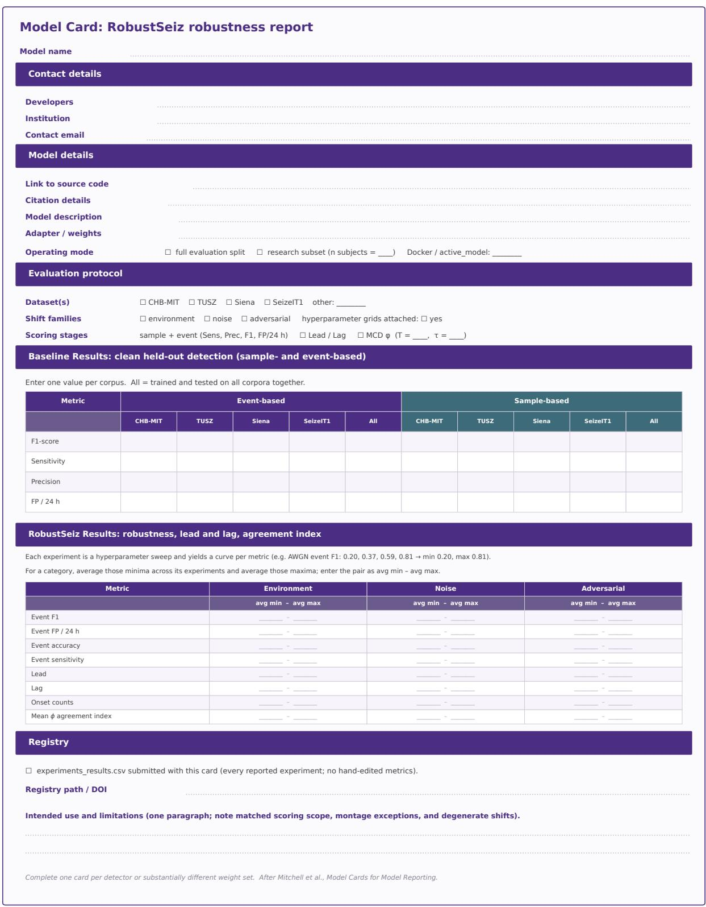  
Figure 11. Model Card: RobustSeiz robustness report. Baseline scores are entered per corpus (CHB-MIT, TUSZ, Siena, SeizeIT1) and for a pooled train-and-test setting. Each robustness cell is a category-level average range: the mean of per-experiment minima to the mean of per-experiment maxima, for event F1, event false positives per 24 h, event accuracy, event sensitivity, Lead, Lag, onset counts, and mean agreement ϕ 27,29.

  
Figure 12. RobustSeiz Reproducibility Checklist. Items required for models, datasets, shared code, and experimental results, based on The Machine Learning Reproducibility Checklist and refined for controlled shifts, matched scoring scope, Lead and Lag, Monte Carlo dropout, and the experiment registry 28.

experiments\_results.csv  
one row appended per run\_experiment.py cal  
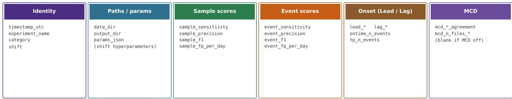  
Example excerpt (columns truncated with …)

<table><tr><td rowspan=1 colspan=1>timestamp_utc</td><td rowspan=1 colspan=1>experiment_name</td><td rowspan=1 colspan=1>shift</td><td rowspan=1 colspan=1>params_json</td><td rowspan=1 colspan=1>event_f1</td><td rowspan=1 colspan=1>event_fp_per_day</td><td rowspan=1 colspan=1>lead_mean_steps</td><td rowspan=1 colspan=1>mcd_meanagreement</td></tr><tr><td rowspan=1 colspan=1>2026-06-01T06:36:58Z</td><td rowspan=1 colspan=1>Baseline</td><td rowspan=1 colspan=1>none</td><td rowspan=1 colspan=1>0}</td><td rowspan=1 colspan=1>0.62</td><td rowspan=1 colspan=1>16.7</td><td rowspan=1 colspan=1>2.78e4</td><td rowspan=1 colspan=1></td></tr><tr><td rowspan=1 colspan=1>2026-06-01T08:12:11Z</td><td rowspan=1 colspan=1>AWGN_snr20</td><td rowspan=1 colspan=1>awgn</td><td rowspan=1 colspan=1>{&quot;snr_db&quot;: 20}</td><td rowspan=1 colspan=1>0.63</td><td rowspan=1 colspan=1>14.7</td><td rowspan=1 colspan=1>3.12e4</td><td rowspan=1 colspan=1>0.027</td></tr></table>

Submit the CSV with the Model Card. Metric columns are written by the pipeline; leave MCD cells empty when dropout is of.

Figure 13. Structure of experiments\_results.csv. One row per experiment; column groups are identity, paths and params\_json, sample and event scores, Lead/Lag onset summaries, and optional Monte Carlo dropout fields (blank when MCD is of). The excerpt is demonstrative.