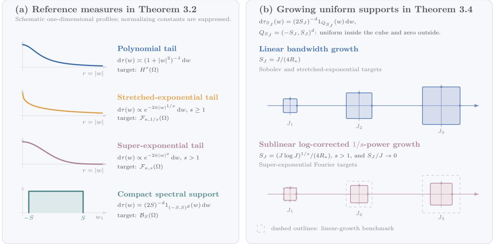

# SPECTRAL CONVERGENCE OF RANDOM FEATURE METHOD IN MULTIPLE DIMENSIONS

PINGBING MING AND HAO YU

Abstract. We first prove spectral convergence of the random feature method (RFM) for multidimensional targets in Sobolev, Gevrey, ultra-analytic, and bandlimited classes. The analysis establishes general high-probability approximation estimates in the interpolation scale generated by a kernel integral operator. On a single event determined only by the sampled features, one random space approximates every target in a prescribed source ball; moreover, for each target, a single coeficient vector defines an approximant that attains spectral accuracy simultaneously in all admissible error norms. For both regularity-adapted frequency distributions and uniform distributions on growing frequency windows, the resulting rates range from super-exponential to algebraic, depending on the regularity of the target. Second, we establish abstract error estimates for strong- and weak-form RFM discretizations, thereby converting the preceding approximation bounds into convergence estimates for multidimensional secondorder elliptic boundary value and eigenvalue problems. Finally, for random feature matrices (RFMtxs), we prove super-exponential singular-value decay with Fourier features and exponential decay with tanh features, together with corresponding condition-number lower bounds. The analysis identifies a common mechanism: the same spectral approximation that yields high accuracy also drives severe ill-conditioning.

## 1. Introduction

Recently, learning-based methods have emerged as an active paradigm for solving partial diferential equations (PDEs). Inherently meshfree, these methods enjoy the flexibility to handle complex geometries and high-dimensional problems, facilitating the integration of experimental data. However, current learning-based PDE solvers still face significant challenges, such as high computational costs and a lack of strategies to consistently improve accuracy.

A parallel line of work analyzes learning-based and data-driven discretizations through the classical numerical-analysis concepts of approximation, stability, and conditioning. Random features (RFs) provide a particularly transparent setting for this program. Their hidden parameters are sampled from a prescribed distribution and only the output coeficients are optimized, so training reduces to a linear least-squares problem. Introduced as scalable approximations of kernel machines [63], RFs now form a useful interface between kernel approximation, randomized numerical linear algebra, and shallow neural networks. These developments lead to a unified question: once the trial space and sampling mechanism are specified, what are the approximation rate, the stability of the residual map, and the conditioning of the resulting algebraic system?

Against this background, recent eforts have sought to bridge traditional numerical solvers with machine learning through extreme learning machines, the random feature method (RFM), and related randomized neural networks. The core idea is to approximate the solution by a neural network with prescribed inner-layer weights, thereby reducing training to a linear least-squares problem for the outer-layer weights. Representative examples include RFM discretizations for stationary and time-dependent prob lems [8, 9] and dimension-robust solvers for Kolmogorov equations [29]. A hallmark of these approaches is the spectral or near-spectral accuracy observed even on complicated geometries [8, 15, 69].

A critical issue, however, is the severe ill-conditioning of the random feature matrix (RFMtx) in high-accuracy computations [10]. Moreover, a multidimensional convergence theory must answer three questions simultaneously: how the sampling law should reflect the regularity of the target, whether one sampled space works uniformly over an entire target class, and whether the same reconstruction controls the several derivative norms required by PDE stability estimates. Standard fixed-target or fixed-norm bounds do not provide this combination, nor do they explain spectral approximation and rapid singularvalue decay within a common framework.

Our analysis is built on concentration of the empirical feature operator around its population counterpart, an approach developed for kernel quadrature and RF regression [3, 65]. The central new ingredient is an abstract estimate on the interpolation scale of the kernel integral operator that preserves the quantifiers needed for simultaneous approximation. Combined with an efective-dimension bound, this estimate yields a single high-probability event, independent of the target, on which every target admits one reconstruction that works simultaneously across all admissible error norms. The resulting approximation theory also supplies the decisive low-dimensional approximation mechanism in our analysis of singular-value decay.

## 1.1. Our contributions. The main results can be summarized as follows.

(1) Simultaneous, target-uniform spectral approximation. Theorem 2.3 supplies the abstract approximation principle which, combined with the efective-dimension estimates in Section 3, yields the following twofold uniformity. With probability at least $1 - \delta ,$ a single sampled space contains a spectrally accurate approximant for every target in a source ball, and each target admits a single coeficient vector, independent of the error norm, whose associated approximant attains spectral accuracy simultaneously in all admissible error norms. This error-norm simultaneity is enabled by formulating the ridge problem in $\mathcal { H } ^ { \theta }$ ; when $\theta > 0 .$ , this regression norm is stronger than $L ^ { 2 } = \mathcal { H } ^ { 0 }$ . In particular, $\operatorname { i f } p \leq \theta$ , the same $\mathcal { H } ^ { \theta } \mathrm { - r i d g e }$ reconstruction and the same target-independent event control the entire admissible weaker-norm scale. With $\bar { p } = \operatorname* { m a x } \{ p , 2 \theta - 1 \}$ , the rate is governed by $s - \bar { p }$ and saturates below $p = 2 \theta - 1$ . If $p \geq \theta ,$ the stronger error norm retains the unsaturated rate $\lambda ^ { ( s - p ) / ( 2 ( 1 - \theta ) ) }$ , but the sampling condition depends on $p$ through $\gamma = 1 - p$ . This distinction identifies when one feature sample controls a full norm scale and when stronger derivative estimates require a stronger sampling condition, which is essential for the subsequent PDE analysis.

(2) Multidimensional spectral rates for random Fourier features. Theorems 3.2 and 3.4 establish multidimensional rates for both regularity-adapted reference measures and uniform measures on explicitly growing frequency windows. The latter is a particularly simple sampling strategy widely used in practice. The resulting rates and the corresponding sampling strategies are summarized in Table 1. Importantly, the error estimates are not restricted to the conventional $L ^ { 2 }$ norm; they hold simultaneously in the general Sobolev norms $W ^ { t , p } ( \Omega ) , 1 \leq p \leq \infty$

Table 1. Sample-size convergence rates and reference frequency measures in Theorems 3.2 and 3.4. For fixed $\delta ,$ set $L _ { N } : = N / \log ( N / \delta )$ and $J : = \lfloor c _ { 0 } L _ { N } ^ { 1 / d } \rfloor$ , where $c _ { 0 } ~ = ~ c _ { 0 } ( d ) ~ > ~ 0$ is suficiently small. The uniform reference measure is $\mathrm { d } \tau _ { S _ { J } } ( w ) =$ $( 2 S _ { J } ) ^ { - d } 1 _ { Q _ { S _ { J } } } ( w ) \mathrm { d } w ;$ the last column records only the bandwidth $S _ { J }$
<table><tr><td>Target class</td><td>Convergence rate</td><td>Reference measure in Theorem 3.2</td><td>Bandwidth in Theorem 3.4</td></tr><tr><td>Sobolev.</td><td> $L _ { N } ^ { - ( s - t ) / d }$ </td><td> $\mathrm { d } \tau ( w ) \propto ( 1 + | w | ^ { 2 } ) ^ { - \bar { s } } \mathrm { d } w$ </td><td> $S _ { J } = J / ( 4 R _ { * } )$ </td></tr><tr><td>Stretched exponential  $( s \ge 1 )$ </td><td> $\exp ( - c L _ { N } ^ { 1 / ( s d ) } )$ </td><td> $\mathrm { d } \tau ( w ) \propto \exp ( - 2 \bar { \kappa } | w | ^ { 1 / s } ) \mathrm { d } w$ </td><td> $S _ { J } = J / ( 4 R _ { * } )$ </td></tr><tr><td>Super-exponential  $( s > 1 ) .$ </td><td> $\exp ( - c L _ { N } ^ { 1 / d } \log L _ { N } )$ </td><td> $\mathrm { d } \tau ( w ) \propto \exp ( - 2 \bar { \kappa } | w | ^ { s } ) \mathrm { d } w$ </td><td> $S _ { J } = \frac { ( J \log J ) ^ { 1 / s } } { 4 R _ { * } }$ </td></tr><tr><td>Bandlimited.</td><td> $\exp ( - c L _ { N } ^ { 1 / d } \log L _ { N } )$ </td><td> $\mathrm { d } \tau _ { S } ( w ) \propto 1 _ { Q _ { S } } ( w ) \mathrm { d } w$ </td><td> $S _ { J } = S$ </td></tr></table>

The parameter M in Theorem 3.2 is an auxiliary complexity scale. For fixed $\delta$ and suficiently large $N .$ , the sampling condition permits $M \asymp L _ { N }$ , where $L _ { N } : = N / \log ( N / \delta )$ , which gives the sample-size rates in Table 1. The Sobolev case is algebraic, whereas the Gevrey case has the stretched-exponential rate $\exp ( - c L _ { N } ^ { 1 / ( s d ) } )$ , with the exponential endpoint $s = d = 1$ . The ultra-analytic and bandlimited cases have rate $\exp ( - c L _ { N } ^ { 1 / d } \log L _ { N } )$ , which is super-exponential in the linear resolution scale $L _ { N } ^ { 1 / d }$

(3) Consequences for PDE and eigenvalue solvers. Combining the approximation estimates with elliptic regularity, a strong-form stability estimate, C´ea’s lemma, and compact-operator spectral approximation, we obtain error estimates for strong- and weak-form RFM discretizations of elliptic boundary value problems and for the associated eigenspaces and eigenvalues.

(4) Rapid singular-value decay and ill-conditioning of random feature matrices. For collocation matrices generated by Fourier and tanh features, we prove, respectively, super-exponential and exponential decay of high-index singular values, together with corresponding lower bounds on their condition numbers. These results give a quantitative explanation for the severe ill-conditioning observed in high-accuracy RFM computations.

Compared with our one-dimensional predecessor [47], the present paper is not merely a tensor-product extension. The earlier work uses a direct one-dimensional construction to derive expectation bounds in prescribed $W ^ { \sigma , p }$ norms and relates one-dimensional spectral approximation to matrix ill-conditioning. Here we instead develop an operator-theoretic framework on multidimensional bounded domains, based on kernel interpolation scales, efective dimension, and empirical-operator concentration. This framework yields target-independent high-probability events and norm-independent reconstructions, covers both regularity-adapted sampling and uniform sampling on growing frequency windows, transfers the estimates to multidimensional elliptic boundary value and eigenvalue problems, and proves multidimensional singular-value decay for Fourier and tanh features. Thus the spatial setting, the probabilistic quantifiers, and the simultaneous norm control are all strengthened.

A principal distinction of the first two contributions is their twofold uniformity. For each regularity class and feature representation $\varrho ,$ the high-probability event depends only on the sampled features, so the single space span $\{ \phi _ { \varrho } ( \cdot , v _ { j } ^ { \varrho } ) : 1 \le j \le N \}$ works for every target in the class. For each target $u ,$ a single coeficient vector $\alpha ^ { \varrho } ( u )$ defines an approximant $u _ { N } ^ { \varrho }$ that simultaneously attains the corresponding spectral convergence rate in every admissible error norm. Thus the random event is uniform over the target class, while the reconstruction is uniform over the error norms. To the best of our knowledge, this combination of target-uniform high-probability control, norm-independent reconstruction, and simultaneous spectral convergence throughout an admissible Sobolev/interpolation scale has not previously been established for RF approximation.

1.2. Related work. For learning-based PDE solvers, random-weight approaches include RFM discretizations for stationary and time-dependent problems [8, 9] and dimension-robust methods for Kolmogorov equations [29]. Recent extensions address discontinuous interface problems [68], structure-adaptive approximation of high-dimensional elliptic equations [37], and nonlinear evolution equations [81]. Our analysis is complementary to these algorithmic developments: it isolates the approximation, PDE stability, and conditioning mechanisms needed to explain the accuracy and numerical behavior of the resulting linear least-squares discretizations.

Theoretical foundations of RFM approximation. RFMs belong to the broader class of randomized neural architectures, including extreme learning machines and deep randomized networks [31, 34]. Their approximation theory includes universal and activation-specific results [32, 70], uniform randomfeature approximation [63, 64], and inverse approximation theory [19]. At infinite width, these models are related to Gaussian processes [50, 79].

Within the kernel framework, Rudi and Rosasco [65] show that RFs can attain kernel-learning rates with substantially fewer features than data, while Bach [3] obtains kernel-quadrature bounds uniform over an RKHS unit ball in a prescribed $L ^ { 2 }$ error norm. Leverage-score and adaptive sampling further reduce feature complexity [14, 35, 38, 61]. RF architectures have also been analyzed for high-dimensional PDEs and dynamical systems [17, 28, 29, 54], and extended to operator learning between infinite-dimensional spaces [52, 53].

Spectral approximation of Gevrey targets is classical for hp-finite elements [23, 25, 26, 43]. Related neural-network results establish geometric or exponential rates for smooth, analytic, and generalized bandlimited functions [16, 20, 44, 48]. For randomized models, spectral convergence in a fixed $L ^ { 2 } \mathrm { - t y p e }$ best-approximation problem was proved by Fabiani [21], while our one-dimensional predecessor gives spectral RFM estimates in prescribed $W ^ { \sigma , p }$ norms, in expectation [47]. Fu and Wang construct a sampledependent operator that is uniform over a Sobolev ball and simultaneous in integer $H ^ { m }$ norms, but with algebraic rates [24]. In contrast, our leverage-score analysis combines target-uniform high-probability control, one norm-independent reconstruction, and spectral convergence across the full admissible norm scale.

Simultaneous approximation of a function and its derivatives is classical [18, 46] and has been used to construct common approximants in Lebesgue and Sobolev norms [22]. Such control is natural in PDE discretization, where the same trial function enters interior, boundary, and derivative-dependent estimates. The point specific to the present RF result is the conjunction of a target-uniform random event, a single reconstruction for each target, an entire admissible norm scale, and spectral rather than algebraic convergence.

Conditioning of RFMtxs. Conditioning has been studied in probabilistic high-dimensional regimes [12, 13]; for structured Fourier matrices, exponential ill-conditioning is known even for contiguous submatrices [4]. Numerical work has documented the resulting dificulties in high-accuracy RFM computations [10] and motivated preconditioning strategies [74]. Our analysis instead derives multidimensional decay rates directly from low-dimensional approximation of bounded smooth features, thereby placing spectral convergence and severe ill-conditioning within the same approximation-theoretic mechanism.

The remainder of the paper is organized as follows. Section 2 develops the abstract interpolationspace estimate. Section 3 specializes it to random Fourier features and relates Fourier decay to spatial regularity. Section 4 transfers the estimates to elliptic boundary value and eigenvalue problems, and Section 5 studies singular values and condition numbers. Section 6 summarizes the main results. The appendices contain the proofs and technical estimates.

1.3. Notation. We denote by N the set of nonnegative integers and by $\mathbb { N } _ { + }$ the set of positive integers. For a finite set I, |I| denotes its cardinality. For a vector $\alpha , \ | \alpha | _ { p }$ denotes its $\ell ^ { p } { \mathrm { - n o r m } } .$ and $| { \boldsymbol { \alpha } } | : = | { \boldsymbol { \alpha } } | _ { 2 }$ Throughout the paper, d denotes the ambient dimension. Unless stated otherwise, $\Omega \subset \mathbb { R } ^ { d }$ denotes a bounded Lipschitz domain.

Let $( \mathcal { X } , \rho )$ be a measure space. For $1 \leq p \leq \infty , L ^ { p } ( \mathcal { X } , \rho )$ denotes the corresponding Lebesgue space. When $\rho$ is the Lebesgue measure on Ω, we write $L ^ { p } ( \Omega )$ . In the complex case, the inner product on $\begin{array} { r } { L ^ { 2 } ( \mathcal { X } , \rho ) \mathrm { ~ i s ~ } \langle f , g \rangle _ { \rho } = \int _ { \mathcal { X } } f ( x ) \overline { { g ( x ) } } \mathrm { d } \rho ( x ) . \mathrm { ~ } H ^ { s } ( \Omega ) } \end{array}$ and $W ^ { s , p } ( \Omega )$ denote the standard Sobolev spaces[1].

Hilbert-space statements are understood over $\mathbb { R } { \mathrm { ~ o r ~ } } \mathbb { C }$ as appropriate. In the complex case, inner products are linear in the first argument and conjugate-linear in the second. For a Hilbert space $\mathcal { H } .$ $\langle \cdot , \cdot \rangle _ { \mathscr { H } }$ and $\| \cdot \| _ { \mathcal { H } }$ denote its inner product and norm. ∥ · ∥ denotes the operator norm when the domain and range are clear. Let $\mathcal { H } _ { 1 } , ~ \mathcal { H } _ { 2 }$ be two Hilbert spaces, and $v \in \mathcal { H } _ { 1 } , u \in \mathcal { H } _ { 2 }$ . The rank-one operator u ⊗ $v : \mathcal { H } _ { 1 } \to \mathcal { H } _ { 2 }$ is defined as $( u \otimes v ) x = \langle x , v \rangle _ { \mathcal { H } _ { 1 } } u$ for $x \in \mathcal { H } _ { 1 }$ . For self-adjoint operators A and B on the same Hilbert space, $A \preceq B$ means that $B - A$ is positive semidefinite, and $A \succeq B$ means $B \preceq A$ . For a positive self-adjoint operator A, fractional powers $A ^ { \alpha }$ are defined by spectral calculus; negative powers are understood on the positive spectral subspace. We write $\operatorname { t r } ( A )$ for the trace of a trace-class operator A.

For a multi-index $\eta = ( \eta _ { 1 } , \dots , \eta _ { d } ) \in \mathbb { N } ^ { d } , \ \mathrm { s e t } \ | \eta | : = \eta _ { 1 } + \cdot \cdot \cdot + \eta _ { d } , \ \eta ! : = \eta _ { 1 } ! \cdot \cdot \cdot \eta _ { d } ! , \ \partial ^ { \eta } : = \partial _ { 1 } ^ { \eta _ { 1 } } \cdot \cdot \cdot \partial _ { d } ^ { \eta _ { d } }$ , and $w ^ { \eta } : = w _ { 1 } ^ { \eta _ { 1 } } \cdot \cdot \cdot w _ { d } ^ { \eta _ { d } }$ for $w \in \mathbb { R } ^ { d }$ . The Fourier transform of $f$ in the sense of distributions is denoted by $\hat { f } .$

In particular, for any $f \in L ^ { 1 } ( \mathbb { R } ^ { d } )$ , the Fourier transform $\hat { f }$ is defined as

$$
\hat { f } ( \xi ) = \frac { 1 } { ( 2 \pi ) ^ { d / 2 } } \int _ { \mathbb { R } ^ { d } } f ( x ) e ^ { - i x \cdot \xi } \mathrm { d } x .
$$

The notation $a \lesssim b$ means $a \leq C b$ for some constant C independent of b. An unsubscripted $\lesssim$ implies that $C$ is universal, while subscripts indicate its dependence on specific parameters. We write $a \simeq b$ if both $a \lesssim b$ and $b \lesssim a$ hold. Finally, $a \propto b$ denotes equality up to a positive normalization constant.

## 2. Approximation in kernel interpolation spaces

This section proves an abstract approximation estimate for RFs in the interpolation scale generated by the kernel integral operator. The estimate accommodates independent choices of source regularity $s ,$ regression norm $\theta ,$ and error norm $p$ within their admissible ranges, thereby providing a unified route from kernel efective-dimension bounds to approximation rates across a broad class of target norms.

2.1. RKHS, interpolation spaces and feature representation. Let $( \mathcal { X } , \rho )$ be a measure space. A kernel $k : \mathcal { X } \times \mathcal { X } \to \mathbb { C }$ is called Hermitian positive definite if $k ( x , y ) = { \overline { { k ( y , x ) } } }$ and, for all $n \in \mathbb { N } _ { + }$ and $\{ x _ { i } \} _ { i = 1 } ^ { n } \subset { \mathcal { X } }$ , the matrix $( k ( x _ { i } , x _ { j } ) ) _ { 1 \leq i , j \leq n }$ is positive semidefinite. Given such a kernel $k ,$ there is a unique Hilbert space $\mathcal { H } _ { k }$ such that $k ( \cdot , x ) \in \mathcal { H } _ { k }$ for all $x \in \mathcal { X }$ , and $f ( x ) = \langle f , k ( \cdot , x ) \rangle _ { \mathcal { H } }$ for all $f \in \mathcal { H } _ { k }$ and $x \in \mathcal { X }$ . The second property is known as the reproducing property and $\mathcal { H } _ { k }$ is referred to as the RKHS [6, 60] associated with k. We abbreviate $\mathcal { H } _ { k }$ as H when no confusion arises.

Assume that k is measurable and satisfies the trace condition $\textstyle \int _ { \mathcal { X } } k ( x , x ) \mathrm { d } \rho ( x ) < \infty$ . We also assume that the canonical embedding $I _ { \rho } : \mathcal { H } _ { k } \to L ^ { 2 } ( \mathcal { X } , \rho ) , I _ { \rho } f = [ f ] _ { \rho } ,$ is injective, so that functions in $\mathcal { H } _ { k }$ are identified unambiguously with their $L ^ { 2 } ( \rho )$ equivalence classes. The associated integral operator $\Sigma : L ^ { 2 } ( \mathcal { X } , \rho ) \to L ^ { 2 } ( \mathcal { X } , \rho )$ is defined by

$$
( \Sigma f ) ( x ) = \int _ { \mathcal { X } } k ( x , y ) f ( y ) \mathrm { d } \rho ( y ) .
$$

Under these assumptions, Σ is self-adjoint, positive, and trace class [72]. Let $\{ ( \lambda _ { j } , e _ { j } ) \} _ { j \geq 1 }$ be the positive eigenpairs of $\Sigma ,$ with the eigenvalues arranged in decreasing order and the eigenfunctions orthonormal in $L ^ { 2 } ( \mathcal { X } , \rho )$ . Then, the spectral decomposition $\begin{array} { r } { \Sigma = \sum _ { j = 1 } ^ { \infty } \lambda _ { j } e _ { j } \otimes e _ { j } } \end{array}$ holds. Without loss of generality, we assume that $\{ e _ { j } \} _ { j = 1 } ^ { \infty }$ forms a complete basis of $L ^ { 2 } ( \mathcal { X } , \rho )$ , otherwise we work on the closed positive spectral subspace of $\Sigma .$ namely $\overline { { \mathrm { s p a n } } } \{ e _ { j } : \lambda _ { j } > 0 \}$ . All spectral powers below are taken on this positive spectral subspace.

Following [42, 73], for $a \in \mathbb { R }$ define

$$
\begin{array} { r l } & { \mathcal { D } ( { \Sigma } ^ { a } ) : = \left\{ f = \displaystyle \sum _ { j = 1 } ^ { \infty } f _ { j } e _ { j } \in L ^ { 2 } ( \mathcal { X } , \rho ) : \sum _ { j = 1 } ^ { \infty } \lambda _ { j } ^ { 2 a } | f _ { j } | ^ { 2 } < \infty \right\} , } \\ & { \Sigma ^ { a } f : = \displaystyle \sum _ { j = 1 } ^ { \infty } \lambda _ { j } ^ { a } f _ { j } e _ { j } , \qquad f \in \mathcal { D } ( { \Sigma } ^ { a } ) . } \end{array}
$$

Thus $\Sigma ^ { a }$ is bounded on $L ^ { 2 }$ for $a \geq 0$ and is generally unbounded for $a < 0$ . For every $a \in \mathbb { R }$ , let ${ \mathcal { H } } ^ { a }$ be the completion of span $\{ e _ { j } : j \ge 1 \}$ under

$$
\left\| \sum _ { j = 1 } ^ { \infty } f _ { j } e _ { j } \right\| _ { \mathcal { H } ^ { a } } ^ { 2 } : = \sum _ { j = 1 } ^ { \infty } \lambda _ { j } ^ { - a } | f _ { j } | ^ { 2 } .
$$

For $a \geq 0$ , this space is identified with $\begin{array} { r } { \{ f \in L ^ { 2 } : \sum _ { j } \lambda _ { j } ^ { - a } | f _ { j } | ^ { 2 } < \infty \} } \end{array}$ , and the displayed norm equals $\| \Sigma ^ { - a / 2 } f \| _ { L ^ { 2 } }$ . For $a < 0$ , Ha is equivalently the completion of $L ^ { 2 }$ in this norm, or the anti-dual of $\varkappa ^ { - a }$ with $L ^ { 2 }$ as pivot. $\mathrm { B y \ [ 7 3 , }$ , Theorem $2 . 1 1 ] , \Sigma ^ { \frac { 1 } { 2 } }$ is an isometry from $L ^ { 2 } ( \mathcal { X } , \rho )$ to H and $\mathcal { H } ^ { 1 } = \mathcal { H }$ . Additionally, $\mathcal { H } ^ { 0 } = L ^ { 2 } ( \mathcal { X } , \rho )$ and $\mathcal { H } ^ { a } \hookrightarrow \mathcal { H } ^ { b }$ for $a \geq b$ . The following interpolation identity is used later to connect the spectral scale with Sobolev spaces.

Proposition 2.1 ([73, Theorem 4.6]). For $a \in ( 0 , 1 ) , \mathcal { H } ^ { a } = ( L ^ { 2 } ( \mathcal { X } , \rho ) , \mathcal { H } ) _ { a , 2 }$

Let $( \mathcal { V } , \tau )$ be a measurable parameter space equipped with a probability measure $\tau .$ . Consider a parametric feature function $\phi \in L ^ { 2 } ( \mathcal { X } \times \mathcal { V } , \rho \otimes \tau ; \mathbb { C } )$ , where X and V denote the input and weight domains, respectively. We assume that k admits an RF representation of the form

$$
k ( x , y ) = \int _ { \mathcal { V } } \phi ( x , v ) \overline { { \phi ( y , v ) } } \mathrm { d } \tau ( v ) .\tag{2.1}
$$

The corresponding feature operator $\mathcal { T } : L ^ { 2 } ( \mathcal { V } , \mathrm { d } \tau ) \to L ^ { 2 } ( \mathcal { X } , \mathrm { d } \rho )$ and its adjoint operator $\mathcal { T } ^ { * }$ are

$$
( { \mathcal { T } } g ) ( x ) : = \int _ { \mathcal { V } } g ( v ) \phi ( x , v ) \mathrm { d } \tau ( v ) , \quad ( { \mathcal { T } } ^ { * } f ) ( v ) = \int _ { \mathcal { X } } f ( x ) { \overline { { \phi ( x , v ) } } } \mathrm { d } \rho ( x ) .
$$

It follows from Fubini’s theorem that $\Sigma = \tau \tau ^ { }$ , or equivalently,

$$
\Sigma = \int _ { \mathcal { V } } \phi ( \cdot , v ) \otimes \phi ( \cdot , v ) \mathrm { d } \tau ( v ) .\tag{2.2}
$$

Furthermore, the RKHS admits the feature-space characterization [60, Theorem 11.3]

$$
\mathcal { H } _ { k } = \mathrm { R a n } ( \mathcal { T } ) , \qquad \| f \| _ { \mathcal { H } _ { k } } = \operatorname* { i n f } \left\{ \| g \| _ { L ^ { 2 } ( \mathcal { V } , \mathrm { d } \tau ) } : \mathcal { T } g = f \right\} .\tag{2.3}
$$

2.2. Ridge approximation in $\mathcal { H } ^ { \theta }$ . We now formulate the ridge approximation problem in the interpolation space introduced above. Specifically, let $N \in  { \mathbb { N } } _ { + }$ and draw $v _ { 1 } , \ldots , v _ { N }$ independently from qdτ , where q is a probability density with respect to τ satisfying the support condition specified below. Define the RF operator $\Phi : \mathbb { C } ^ { N } \to L ^ { 2 } ( \mathcal { X } , \mathrm { d } \rho )$ by

$$
( \Phi \beta ) ( x ) = \sum _ { j = 1 } ^ { N } \beta _ { j } q ( v _ { j } ) ^ { - \frac { 1 } { 2 } } \phi ( x , v _ { j } ) .
$$

Assume the target function $u \in \mathcal H ^ { s }$ with $s \geq 0$ , which is the source condition. For $\theta \leq s ,$ we consider the minimization problem

$$
\beta ^ { * } = \underset { \beta \in \mathbb { C } ^ { N } } { \arg \operatorname* { m i n } } \left\| u - \Phi \beta \right\| _ { \mathcal { H } ^ { \theta } } ^ { 2 } + \lambda N | \beta | ^ { 2 } ,\tag{2.4}
$$

where $\lambda > 0$ is a regularization parameter. Then, for $p \leq s .$ , we measure the error of the RF solution as

$$
\mathcal { E } ( N , s , \theta , p ) : = \operatorname* { s u p } _ { \| u \| _ { \mathcal { H } ^ { s } } \leq 1 } \| u - \Phi \beta ^ { * } \| _ { \mathcal { H } ^ { p } } .
$$

We aim to prove upper bounds for $\mathcal { E } ( N , s , \theta , p )$ and $| \beta ^ { * } |$ in this part. As for Problem (2.4), although practically implementing ${ \mathcal { H } } ^ { \theta } { \mathrm { - n o r m } }$ is more dificult than $L ^ { 2 } { \mathrm { - n o r m } } \left( \theta = 0 \right)$ in general cases, it demonstrates the possibility of solving problems by RFs under a norm stronger than $L ^ { 2 } \mathrm { - n o r m }$ . In particular, with the relation clarified in Proposition B.8, it has implications for solving PDEs in Sobolev spaces.

Inspired by [42], we refined the concepts of maximum RF dimension and the efective dimension of the kernel integral operator. For $\theta < 1 , \lambda > 0 ,$ , and $\gamma > 0 .$ , denote

$$
r ( x ) = \left( x ^ { 1 - \theta } + \lambda \right) ^ { - { \frac { \gamma } { 2 ( 1 - \theta ) } } } x ^ { \frac { \gamma - 1 } { 2 } } , \quad { \mathrm { f o r ~ } } x \geq 0 .\tag{2.5}
$$

Set

$$
\ell _ { \lambda } ( v ; \theta , \gamma ) : = \| r ( \Sigma ) \phi ( \cdot , v ) \| _ { L ^ { 2 } ( \mathcal { X } , \rho ) } ^ { 2 } .
$$

Let $q$ be a probability density with respect to $\tau$ such that $q > 0$ τ -almost everywhere on $\{ \ell _ { \lambda } > 0 \}$ . The quotient $\ell _ { \lambda } / q$ is understood τ-almost everywhere and is set to zero on $\{ \ell _ { \lambda } = q = 0 \}$ . We define

$$
\begin{array} { r l } & { d _ { \operatorname* { m a x } } ( q , \lambda ; \theta , \gamma ) : = \tau - \mathrm { e s s } \operatorname* { s u p } _ { v \in \mathcal { V } } \frac { \ell _ { \lambda } ( v ; \theta , \gamma ) } { q ( v ) } , } \\ & { d ( \lambda ; \theta , \gamma ) : = \mathrm { t r } \left( \Sigma r ^ { 2 } ( \Sigma ) \right) . } \end{array}
$$

By (2.2),

$$
\begin{array} { l } { \displaystyle d ( \lambda ; \theta , \gamma ) = \int _ { \mathcal { V } } \ell _ { \lambda } ( v ; \theta , \gamma ) \mathrm { d } \tau ( v ) } \\ { \displaystyle \quad = \int _ { \mathcal { V } } \frac { \ell _ { \lambda } ( v ; \theta , \gamma ) } { q ( v ) } q ( v ) \mathrm { d } \tau ( v ) \le d _ { \operatorname* { m a x } } ( q , \lambda ; \theta , \gamma ) . } \end{array}
$$

Equality is attained by the normalized leverage-score density defined below.

Definition 2.2 (Leverage score sampling). Assume $0 < d ( \lambda ; \theta , \gamma ) < \infty$ . The normalized leverage-score density with respect to τ is

$$
q _ { \lambda } ^ { \ast } ( v ; \theta , \gamma ) = \frac { \ell _ { \lambda } ( v ; \theta , \gamma ) } { d ( \lambda ; \theta , \gamma ) } .\tag{2.6}
$$

Sampling features from $q _ { \lambda } ^ { * } \mathrm { d } \tau$ is referred to as leverage-score sampling $[ 3 , ~ 1 4 , ~ 3 5 , ~ 3 8 { - 4 0 } , ~ 6 1 ] .$

For a fixed penalty level $\lambda > 0$ , we call λ admissible for $( N , \delta , q , \theta , \gamma )$ if

$$
N \ge 3 d _ { \operatorname* { m a x } } ( q , \lambda ; \theta , \gamma ) \operatorname* { m a x } \left\{ \ln ( 1 4 d ( \lambda ; \theta , \gamma ) / \delta ) , 1 \right\} .\tag{2.7}
$$

This admissibility condition is the sampling threshold used in the empirical-operator concentration estimate below. Conversely, for $N \in  { \mathbb { N } } _ { + }$ , the associated critical penalty level is defined by

$$
\varsigma _ { N } ( \delta , q , \theta , \gamma ) = \operatorname* { i n f } \left\{ \lambda > 0 : ( 2 . 7 ) \mathrm { h o l d s } \right\} ,
$$

analogously to the construction in [42]. For fixed $q , \theta , \gamma$ , the functions $d _ { \operatorname* { m a x } } ( q , \lambda ; \theta , \gamma )$ and $d ( \lambda ; \theta , \gamma )$ are nonincreasing in $\lambda ,$ so every penalty level strictly above $\varsigma _ { N } ( \delta , q , \theta , \gamma )$ is admissible.

2.3. Main abstract estimate and its interpretation. The following theorem is the central estimate of this section. It controls both the approximation error and the Euclidean norm of the associated ridgeregression coeficient vector. It applies to the real or complex Hilbert-space setting described above. The high-probability event in the theorem depends only on the sampled features and is therefore uniform over the unit ball of $\mathcal { H } ^ { s }$

Theorem 2.3. Let $N ~ \in ~ \mathbb { N } _ { + } , ~ 0 ~ \le ~ \theta ~ \le ~ s ~ \le ~ 1 , ~ p ~ \le ~ s$ , max $\left( \theta , p \right) \ < \ 1$ , and $0 ~ < ~ \delta ~ < ~ 1$ . Assume $\begin{array} { r } { \sum _ { j = 1 } ^ { \infty } \lambda _ { j } ^ { 1 - \operatorname* { m a x } ( \theta , p ) } < \infty . ~ ( \operatorname { \mathcal { I } } ) ~ I f p \leq \theta , } \end{array}$ denote $\bar { p } = \operatorname* { m a x } ( p , 2 \theta - 1 )$ . For any $\lambda > 0 ,$ with probability at least $1 - \delta$

$$
\begin{array} { r } { \mathcal { E } ( N , s , \theta , p ) \leq 1 6 \operatorname* { m a x } ( \lambda , \varsigma _ { N } ) ^ { \frac { s - p } { 2 ( 1 - \theta ) } } \left\| \sum \right\| ^ { \frac { \bar { p } - p } { 2 } } , } \end{array}
$$

$$
| \beta ^ { * } | \le 1 6 N ^ { - \frac { 1 } { 2 } } \lambda ^ { \frac { s - 1 } { 2 ( 1 - \theta ) } } \operatorname* { m a x } ( 1 , \varsigma _ { N } / \lambda ) ^ { \frac { s - \theta } { 2 ( 1 - \theta ) } } ,
$$

where $\varsigma _ { N } = \varsigma _ { N } ( \delta , q , \theta , 1 - \theta ) . ~ ( \mathcal { Q } ) ~ I f p \geq \theta ,$ for any $\lambda > 0$ satisfying (2.7) with $\gamma = 1 - p$ , with probability at least $1 - \delta$

$$
{ \mathcal E } ( N , s , \theta , p ) \le 1 6 \lambda ^ { \frac { s - p } { 2 ( 1 - \theta ) } } , \quad a n d \quad | \beta ^ { * } | \le 1 6 N ^ { - \frac 1 2 \lambda ^ { \frac { s - 1 } { 2 ( 1 - \theta ) } } } .
$$

In particular, this holds for every $\lambda > \varsigma _ { N } ( \delta , q , \theta , 1 - p )$

The proof is given in Appendix A. It first reduces the ridge error to operator norms involving the empirical resolvent $( \widetilde { \Sigma } + \lambda I ) ^ { - 1 }$ , and then bounds these norms on a high-probability concentration event.

Remark. Theorem 2.3 has the following interpretation. If $\dot { p } \leq \theta _ { \mathrm { i } }$ , the regression norm is stronger than the error norm, and the same sampling event with $\varsigma _ { N } ( \delta , q , \theta , 1 - \theta )$ controls the error simultaneously for all admissible p in this range. In particular, for $2 \theta - 1 \leq p \leq \theta ,$ choosing $\lambda \lesssim \varsigma _ { N }$ yields the spectral rate predicted by the source smoothness. The threshold $\bar { p } = \operatorname* { m a x } ( p , 2 \theta - 1 )$ records a saturation in weaker norms: when $p < 2 \theta - 1$ , lowering the error norm does not further improve the rate because the coeficient estimate is limited by the concentration of $\tilde { \Sigma }$ $I f p \geq \theta _ { \mathrm { { \varepsilon } } }$ , the error norm is stronger than the regression norm, and the admissible penalty depends on $1 - p ;$ thus larger p requires a correspondingly stronger regularization condition. Finally, the coeficient bound shows that $| \beta ^ { * } |$ increases as $\lambda \to 0 ^ { + }$ , while $s = 1$ and $\lambda \gtrsim \varsigma _ { N }$ give the scale $| \beta ^ { * } | \lesssim N ^ { - \frac { 1 } { 2 } }$

## 3. Uniform approximation of regularity classes by random Fourier features

3.1. Two equivalent forms of random Fourier features. We introduce two real implementations of random Fourier features [63] generated by the same frequency measure $\mathrm { d } \tau ( w )$ . They are distinguished at the level of the finite-dimensional trial space, but they induce the same population kernel.

Randomly shifted cosine features. Consider the parameter space $\mathcal { V } _ { \mathrm { p h } } = \mathbb { R } ^ { d } \times [ 0 , \pi ]$ equipped with the probability measure $\mathrm { d } \mu _ { \tau } ^ { \mathrm { p h } } ( w , b ) = \pi ^ { - 1 } \mathrm { d } \tau ( w ) \mathrm { d } b$ . For $v = ( w , b ) \in \mathcal { V } _ { \mathrm { p h } }$ , the feature function is defined by $\phi _ { \mathrm { p h } } ( x , ( w , b ) ) = \sqrt { 2 } \cos ( w ^ { \top } x + b )$ . The corresponding finite expansion is

$$
u _ { N } ^ { \mathrm { p h } } ( x ) = \sum _ { j = 1 } ^ { N } \alpha _ { j } \sqrt { 2 } \cos \left( w _ { j } ^ { \top } x + b _ { j } \right) .\tag{3.1}
$$

According to (2.1), the corresponding kernel is

$$
\begin{array} { r l } & { k ( x , y ) = \displaystyle \frac { 2 } { \pi } \int _ { \mathbb R ^ { d } } \int _ { 0 } ^ { \pi } \cos ( w ^ { \top } x + b ) \cos ( w ^ { \top } y + b ) \mathrm { d } b \mathrm { d } \tau ( w ) } \\ & { \quad \quad \quad = \displaystyle \frac { 1 } { \pi } \int _ { \mathbb R ^ { d } } \int _ { 0 } ^ { \pi } \cos ( w ^ { \top } ( x - y ) ) \mathrm { d } b \mathrm { d } \tau ( w ) } \\ & { \quad \quad \quad = \displaystyle \int _ { \mathbb R ^ { d } } \cos ( w ^ { \top } ( x - y ) ) \mathrm { d } \tau ( w ) . } \end{array}\tag{3.2}
$$

Cosine-sine features from the complex exponential representation. Alternatively, consider $\nu _ { \mathrm { c x } }$ = $\mathbb { R } ^ { d }$ equipped with $\mathrm { d } \mu _ { \tau } ^ { \mathrm { c x } } ( w ) = \mathrm { d } \tau ( w )$ and use the complex Fourier feature $\phi _ { \mathrm { c x } } ( x , w ) = e ^ { \mathrm { i } w ^ { \top } x }$ . According to (2.1), if $\tau ( A ) = \tau ( - A )$ for every Borel set $A \subset  { \mathbb { R } } ^ { d }$ , this feature induces

$$
k _ { \mathrm { c x } } ( x , y ) = \int _ { \mathbb { R } ^ { d } } e ^ { \mathrm { i } w ^ { \top } ( x - y ) } \mathrm { d } \tau ( w ) = \int _ { \mathbb { R } ^ { d } } \cos ( w ^ { \top } ( x - y ) ) \mathrm { d } \tau ( w ) .
$$

This kernel is identical to the one in (3.2), and therefore induces the same real RKHS and associated integral operator Σ. Writing $\gamma _ { j } = a _ { j } - \mathrm { i } b _ { j }$ gives the equivalent real-valued expansion

$$
u _ { N } ^ { \mathrm { c s } } ( x ) : = \mathrm { R e } \sum _ { j = 1 } ^ { N } \gamma _ { j } e ^ { \mathrm { i } w _ { j } ^ { \top } x } = \sum _ { j = 1 } ^ { N } \left[ a _ { j } \cos ( w _ { j } ^ { \top } x ) + b _ { j } \sin ( w _ { j } ^ { \top } x ) \right] .\tag{3.3}
$$

Thus each sampled frequency contributes the two real components $\psi _ { \mathrm { c s } } ( x , w ) = \left( \cos ( w ^ { \top } x ) , \sin ( w ^ { \top } x ) \right)$ . We use $\varrho \in \{ \mathrm { p h } , \mathrm { c x } \}$ to index the two representations and write $( \gamma _ { \varrho } , \mu _ { \tau } ^ { \varrho } , \phi _ { \varrho } )$ for the corresponding parameter space, sampling measure, and feature map.

To apply the spectral framework above on the whole space $L ^ { 2 } ( \Omega )$ , we need the associated kernel integral operators to be injective. All frequency measures considered below have symmetrized support with nonempty interior. The following lemma therefore implies that every such operator is injective and that its positive spectral subspace $( \ker \Sigma ) ^ { \perp }$ coincides with $L ^ { 2 } ( \Omega )$

Lemma 3.1 (Injectivity of translation-invariant kernel integral operators). Let $\Omega \subset \mathbb { R } ^ { d }$ be a bounded domain, let $\tau$ be a finite nonnegative Borel measure on $\mathbb { R } ^ { d }$ , and let Σ be the integral operator on $L ^ { 2 } ( \Omega )$ induced by the kernel (3.2). Denote the symmetrization of τ by $\tau _ { s } ( A ) : = [ \tau ( A ) + \tau ( - A ) ] / 2$ for Borel sets $A \subset  { \mathbb { R } } ^ { d }$ . If supp $\tau _ { s }$ has nonempty interior, then ker $\Sigma = \{ 0 \}$ ; hence every eigenvalue of Σ is strictly positive.

Remark. The support assumption on $\tau _ { s }$ is essential. Without it, injectivity of Σ may fail. For example, if τ is a finite discrete measure, then the associated Fourier kernel has finite rank, and hence the corresponding integral operator has a nontrivial null space on the infinite dimensional space $L ^ { 2 } ( \Omega )$

The proof is given in Appendix B.

3.2. Approximation with regularity-adapted reference measures. We now derive convergence rates uniformly over several target classes. For $\kappa , a > 0$ , define

$$
\mathcal F _ { \kappa , a } ( \Omega ) : = \{ \boldsymbol u : \lVert \boldsymbol u \rVert _ { \boldsymbol \kappa , a } < \infty \} , \qquad \lVert \boldsymbol u \rVert _ { \boldsymbol \kappa , a } : = \operatorname* { i n f } _ { \boldsymbol U \rvert _ { \Omega } = \boldsymbol u } \left. e ^ { \kappa | \cdot | ^ { a } } \widehat { \boldsymbol U } \right. _ { L ^ { 2 } ( \mathbb R ^ { d } ) } ,
$$

where the infimum is taken over all $U \in L ^ { 2 } ( \mathbb { R } ^ { d } )$ whose restriction to $\Omega$ is u and whose weighted Fourier norm is finite. For $S > 0$ , let $B _ { S } ( \Omega )$ be the space of restrictions to Ω of functions in $L ^ { 2 } ( \mathbb { R } ^ { d } )$ bandlimited to $[ - S , S ] ^ { d }$ , equipped with the norm

$$
\begin{array} { r } { \| u \| _ { \mathcal { B } _ { S } ( \Omega ) } : = \operatorname* { i n f } \{ \| U \| _ { L ^ { 2 } ( \mathbb { R } ^ { d } ) } : U | _ { \Omega } = u , \ \mathrm { s u p p } \widehat { U } \subset [ - S , S ] ^ { d } \} . } \end{array}
$$

For any normed space X, denote its closed unit ball by $\mathbb { B } _ { X } : = \{ u \in X : \| u \| _ { X } \leq 1 \}$

Theorem 3.2 is the first result in this paper that establishes spectral convergence for random Fourier feature approximation. It combines regularity-adapted reference measures with optimal leverage-score sampling and controls both the approximation error and the coeficient norm. The theorem applies separately to the two feature representations introduced in Subsection 3.1. We use $\varrho \in \{ \mathrm { p h } , \mathrm { c x } \}$ to denote the phase and complex representations, respectively, and write $u _ { N } ^ { \varrho }$ and $\alpha ^ { \varrho } ( u )$ for the corresponding approximant and coeficient vector, where N is the number of sampled frequencies. For real-valued targets, the complex representation is realized by the cosine–sine expansion (3.3).

For $\rho > 0 .$ , write $\begin{array} { r } { Q _ { \rho } : = ( - \rho , \rho ) ^ { d } . } \end{array}$ . Suppose that Ω is contained, after a translation, in $Q _ { R }$ , and let $\widetilde \Omega$ be a translated copy of $Q _ { R }$ containing Ω. For each case in Theorem 3.2, choose dτ and λ as specified there. For each representation $\varrho ,$ let $q _ { \lambda , \varrho } ^ { * }$ be the leverage-score density with respect to $\mu _ { \tau } ^ { \varrho }$ for the kernel integral operator on Ω in case (1) and on Ω in cases (2)–(4). Drawe $\{ v _ { j } ^ { \varrho } \} _ { j = 1 } ^ { N }$ independently from $q _ { \lambda , \varrho } ^ { * } \mathrm { d } \mu _ { \tau } ^ { \varrho }$ . For a density $q$ on $\nu _ { \varrho }$ and points $v _ { j } \in \mathcal { V } _ { \varrho }$ , define $\begin{array} { r } { | \alpha | _ { \ell ^ { 2 } ( q ) } : = ( \sum _ { j = 1 } ^ { N } q ( v _ { j } ) | \alpha _ { j } | ^ { 2 } ) ^ { 1 / 2 } } \end{array}$ for $\alpha \in \mathbb { C } ^ { N }$

Theorem 3.2 (Regularity-adapted reference measures). Let Ω, R, and $\widetilde \Omega$ be as above. Let $\nu \geq 0$ and $0 < \delta < 1$ . Let $M > 0$ and $N \in  { \mathbb { N } } _ { + }$ satisfy $M \ge e \delta / 1 4$ and $N \ge 3 M \ln ( 1 4 M / \delta )$ . In (2)–(4), assume additionally that M is suficiently large in terms of the fixed parameters. In (2) and (3), let $0 < \kappa \leq \bar { \kappa }$

For each case and representation ϱ, with probability at least $1 - \delta$ , every admissible target u admits coeficients $\alpha ^ { \varrho } ( u )$ such that $u _ { N } ^ { \varrho }$ satisfies the stated bounds for all admissible error indices. The event depends only on the corresponding sampled features.

(1) Sobolev ball. Let $\nu + d / 2 < s \leq \bar { s }$ and $\mathrm { d } \tau \simeq ( 1 + | w | ^ { 2 } ) ^ { - \bar { s } } \mathrm { d } w$ . There is a constant $c _ { 1 } = c _ { 1 } ( d , \bar { s } , \nu , \Omega ) >$ 0. Set $\lambda = c _ { 1 } M ^ { - 2 ( \bar { s } - \nu ) / d }$ . Then, for all $u \in \mathbb { B } _ { H ^ { s } ( \Omega ) }$ and max $\{ 0 , 2 \nu - \bar { s } \} \leq t \leq \nu _ { ; }$

$$
\lVert u - u _ { N } ^ { \varrho } \rVert _ { H ^ { t } ( \Omega ) } \lesssim _ { d , \bar { s } , s , \nu , t , \Omega } M ^ { - ( s - t ) / d } ,
$$

$$
| \alpha ^ { \varrho } ( u ) | _ { \ell ^ { 2 } ( q _ { \lambda , \varrho } ^ { * } ) } \lesssim _ { d , \bar { s } , s , \nu , \Omega } N ^ { - 1 / 2 } M ^ { ( \bar { s } - s ) / d } .
$$

(2) Stretched-exponential Fourier ball. Let $s \geq 1$ and $\mathrm { d } \tau \propto e ^ { - 2 \bar { \kappa } | w | ^ { 1 / s } } \mathrm { d } w$ . There exist constants $c _ { \lambda } , a _ { \lambda } , a _ { \mathrm { e } } > 0$ and $a _ { \mathrm { c } } \geq 0$ , depending only on $\kappa , \bar { \kappa } , d , s , R$ . Set $\lambda = c _ { \lambda } \exp \bigl ( - a _ { \lambda } M ^ { 1 / ( s d ) } \bigr )$ . Then, for all $u \in \mathbb { B } _ { \mathcal { F } _ { \kappa , 1 / s } ( \Omega ) } , t \geq 0$ , and $1 \le p \le \infty$

$$
\begin{array} { r l } & { \| u - u _ { N } ^ { \varrho } \| _ { W ^ { t , p } ( \Omega ) } \lesssim _ { \kappa , \bar { \kappa } , d , s , t , p , R } \exp ( - a _ { \mathrm { e } } M ^ { 1 / ( s d ) } ) , } \\ & { | \alpha ^ { \varrho } ( u ) | _ { \ell ^ { 2 } ( q _ { \lambda , \varrho } ^ { * } ) } \lesssim _ { \kappa , \bar { \kappa } , d , s , R } N ^ { - 1 / 2 } \exp ( a _ { \mathrm { c } } M ^ { 1 / ( s d ) } ) . } \end{array}
$$

(3) Super-exponential Fourier ball. Let $s > 1$ and dτ $\propto e ^ { - 2 \bar { \kappa } | w | ^ { s } } \mathrm { d } w$ . There exist constants $c _ { \lambda } , a _ { \lambda } , a _ { \mathrm { e } } > 0$ and $a _ { \mathrm { c } } \geq 0$ , depending only on $\kappa , \bar { \kappa } , d , s , R$ . Set $\lambda = c _ { \lambda } \exp ( - a _ { \lambda } M ^ { 1 / d }$ ln M). Then, for all $u \in \mathbb { B } _ { \mathcal { F } _ { \kappa , s } ( \Omega ) }$ $t \geq 0$ , and $1 \le p \le \infty$

$$
\lVert \boldsymbol { u } - \boldsymbol { u } _ { N } ^ { \varrho } \rVert _ { W ^ { t , p } ( \Omega ) } \lesssim _ { \kappa , \bar { \kappa } , d , s , t , p , R } \exp ( - a _ { \mathrm { e } } M ^ { 1 / d } \ln M ) ,
$$

$$
| \alpha ^ { \varrho } ( u ) | _ { \ell ^ { 2 } ( q _ { \lambda , \varrho } ^ { * } ) } \lesssim _ { \kappa , \bar { \kappa } , d , s , R } N ^ { - 1 / 2 } \exp ( a _ { \mathrm { c } } M ^ { 1 / d } \ln M ) .
$$

(4) Bandlimited ball. Let $S > 0$ and $\mathrm { d } \tau = ( 2 S ) ^ { - d } 1 _ { ( - S , S ) ^ { d } } ( w ) \mathrm { d } w$ . There exist positive constants $c _ { \lambda } , a _ { \lambda }$ and $a _ { \mathrm { e } } ,$ , depending only on d, S, R. Set $\lambda = c _ { \lambda } \exp ( - a _ { \lambda } M ^ { 1 / d } \ln M )$ . Then, for all $u \in \mathbb { B } _ { B _ { S } ( \Omega ) } , t \geq 0$ , and $1 \leq p \leq \infty$

$$
\lVert u - u _ { N } ^ { \varrho } \rVert _ { W ^ { t , p } ( \Omega ) } \lesssim _ { d , t , p , S , R } \exp ( - a _ { \mathrm { e } } M ^ { 1 / d } \ln M ) \mathrm { , }
$$

$$
| \alpha ^ { \varrho } ( u ) | _ { \ell ^ { 2 } ( q _ { \lambda , \varrho } ^ { * } ) } \lesssim _ { d , S , R } N ^ { - 1 / 2 } .
$$

All constants are independent of $M , N , \delta _ { ; }$ , and $u ;$ they may depend on the fixed domain and the displayed regularity and kernel parameters.

One admissible explicit choice of the rate constants in cases $( 2 ) - ( 4 )$ is listed in Table 2. Put $\sigma : = \kappa / \bar { \kappa }$ and $\xi _ { s } : = 1 - 1 / s$ . In case (2), let $b _ { 2 }$ denote the right-hand side of (B.2) with $\theta = \sigma / 2$ and the decay parameter there replaced by ¯κ. For case (3), set

$$
b _ { 3 } : = \frac { 2 ^ { - 1 / d } } { e \left( \xi _ { s } ^ { - 1 } ( 1 - \sigma / 2 ) ^ { - 1 } + 3 / 2 \right) } .
$$

Table 2. Explicit admissible rate constants in Theorem 3.2.
<table><tr><td>Case</td><td> $a _ { \lambda }$ </td><td> $a _ { \mathrm { e } }$ </td><td> $a _ { \mathrm { c } }$ </td></tr><tr><td>(2)</td><td> $b _ { 2 } / 2$ </td><td> ${ \frac { 3 \sigma } { 4 ( 2 - \sigma ) } } a _ { \lambda }$ </td><td> $\frac { 1 - \sigma } { 2 - \sigma } a _ { \lambda }$ </td></tr><tr><td>(3)</td><td> $\frac { 1 } { 2 } ( 1 - \sigma / 2 ) \xi _ { s } b _ { 3 }$ </td><td> ${ \frac { \sec } { 4 ( 2 - \sigma ) } } a \lambda$ </td><td> ${ \frac { \mathbf { 1 } \mathbf { \sigma } } { 2 \mathbf { \sigma } - \sigma } } a _ { \lambda }$ </td></tr><tr><td></td><td> $2 ^ { 1 - 1 / d }$ </td><td></td><td></td></tr><tr><td>(4)</td><td> $\overline { { 2 8 e } }$ </td><td> $3 a _ { \lambda } / 4$ </td><td>0</td></tr></table>

In case (1), s specifies the Sobolev regularity of the target class, ¯s determines the polynomial decay of the reference frequency measure and hence the kernel smoothness scale, and ν is the highest Sobolev order controlled by the approximation estimate. In cases (2) and (3), κ and ¯κ play the corresponding target and reference roles: κ quantifies the Fourier decay of the target class, whereas ¯κ determines the reference frequency distribution and hence the kernel interpolation scale.

The parameter M is an auxiliary complexity scale. For fixed δ and suficiently large N, the sampling condition permits $M \asymp L _ { N }$ , where $L _ { N } : = N / \log ( N / \delta )$ , which gives the sample-size rates reported in Table 1. Case (1) gives the algebraic rate $L _ { N } ^ { - ( s - t ) / d }$ , whereas case (2) gives the stretched-exponential rate $\exp ( - c L _ { N } ^ { 1 / ( s d ) } )$ , with the exponential endpoint $s = d = 1$ . Cases (3) and (4) yield $\exp ( - c L _ { N } ^ { 1 / d } \log L _ { N } )$ which is super-exponential in the linear resolution scale $L _ { N } ^ { 1 / d }$

A key strength of Theorem 3.2 is its twofold uniformity. With probability at least $1 - \delta .$ , the single sampled space span $\{ \phi _ { \varrho } ( \cdot , v _ { j } ^ { \varrho } ) : 1 \le j \le N \}$ contains an approximant attaining the asserted convergence rate for every target u in the prescribed class. For each such u, one can choose a single coeficient vector $\alpha ^ { \varrho } ( u )$ so that the corresponding approximant $u _ { N } ^ { \varrho }$ satisfies all admissible error estimates simultaneously, indexed by t in case (1) and by $( t , p )$ in cases $( 2 ) - ( 4 )$ . Thus the high-probability event is uniform over the target class, while the selected approximant is uniform over the error norms. Both uniformities follow from the abstract error estimate in Theorem 2.3: the high-probability event is independent of the target, and the resulting error bounds hold simultaneously throughout the admissible interpolation scale.

The proof is given in Appendix B.3.

3.3. Approximation with growing-bandwidth uniform reference measures. This subsection establishes spectral convergence for a simple, broadly applicable reference-measure design: a uniform distribution on a frequency cube whose support expands at an explicit rate. The bandwidth growth law adapts this readily implementable construction to diferent target regularities, and the features are sampled from the associated leverage-score distribution. All results below apply separately to each fixed representation $\varrho \in \{ \mathrm { p h } , \mathrm { c x } \}$ . Since $\tau _ { S }$ is symmetric, the two representations induce the same kernel integral operator and hence the same efective dimension, while their leverage-score densities and sampled features are representation dependent. We therefore use $q _ { \lambda , \varrho } ^ { * }$ and $\mu _ { \tau _ { S } } ^ { \varrho }$ for the corresponding density and parameter measure. For real-valued targets in the complex representation, taking the real part gives the cosine– sine realization (3.3); the error bounds are preserved by contractivity, and $| \gamma _ { j } | ^ { 2 } = a _ { j } ^ { 2 } + b _ { j } ^ { 2 }$ preserves the weighted coeficient norm.

Figure 1 summarizes the fixed and growing reference measures used below.

Proposition 3.3 (Leverage approximation of a growing-bandwidth target). Suppose that Ω is contained, after a translation, in $Q _ { R }$ . Let $0 < a , \delta < 1$ and $N \in  { \mathbb { N } } _ { + }$ . Suppose that $U \in L ^ { 2 } ( \mathbb { R } ^ { d } )$ and supp $\widehat { U } \subset \overline { { Q _ { S } } }$ Let $J \ge \operatorname* { m a x } \{ 2 S R , 2 \}$ be an integer. For the constant $C _ { a , d } \geq 1$ supplied by Lemma B.9, set

$$
\lambda _ { J , S } = C _ { a , d } \left( \frac { \pi } { S } \right) ^ { d a } J ^ { - 1 } ( 1 + S R ) ^ { a } \left( \frac { S R } { J } \right) ^ { 2 a J } ,\tag{3.4}
$$

and assume

$$
N \geq 6 J ^ { d } \log ( 2 8 J ^ { d } / \delta ) .\tag{3.5}
$$

  
Figure 1. Reference frequency measures underlying Theorems 3.2 and 3.4. Panel (a) compares schematic one-dimensional profiles of the four reference measures. Panel (b) illustrates the two bandwidth growth laws for the cube-supported uniform reference measure.

Fix $\varrho \in \{ \mathrm { p h } , \mathrm { c x } \}$ and draw $\{ v _ { j } ^ { \varrho } \} _ { j = 1 } ^ { N }$ independently from $q _ { \lambda _ { J , S } , \varrho } ^ { * } \big ( \cdot ; 1 - a , a \big ) \mathrm { d } \mu _ { \tau _ { S } } ^ { \varrho }$ . Then, with probability at least $1 - \delta$ , Problem $\it 2 . 4$ has an RF solution $u _ { N , S } ^ { \varrho }$ satisfying, for all $t \geq 0$ and $1 \leq p \leq \infty$

$$
\| U - u _ { N , S } ^ { \varrho } \| _ { W ^ { t , p } ( \Omega ) } \leq C _ { d , t , p , a , R } ( 1 + d S ^ { 2 } ) ^ { ( 2 t + d + 1 ) / 4 } J ^ { - 1 / 2 } ( 1 + S R ) ^ { a / 2 } ( S R / J ) ^ { a J } \| U \| _ { L ^ { 2 } ( \mathbb { R } ^ { d } ) } .\tag{3.6}
$$

The coeficients satisfy

$$
\begin{array} { r } { | \alpha ^ { \varrho } | _ { \ell ^ { 2 } ( q _ { \lambda _ { J , S } , \varrho } ^ { * } ( \cdot ; 1 - a , a ) ) } \leq 1 6 N ^ { - 1 / 2 } ( S / \pi ) ^ { d / 2 } \| U \| _ { L ^ { 2 } ( \mathbb { R } ^ { d } ) } . } \end{array}\tag{3.7}
$$

The proof is given in Appendix B.5.

Theorem 3.4 (Growing uniform reference measures). Let Ω and R be as in Proposition 3.3, let $0 < \delta < 1$ and $N \in \mathbb { N } _ { + }$ , and put $R _ { * } = \operatorname* { m a x } \{ R , 1 \}$ . Let J be a suficiently large integer satisfying (3.5). For each case and each fixed $\varrho \in \{ \mathrm { p h } , \mathrm { c x } \}$ , sample as in Proposition 3.3 with $a = 1 / 2$ and $S = S _ { J }$ . Then, with probability at least $1 - \delta _ { \cdot }$ , every admissible target admits an approximation $u _ { N , J } ^ { \varrho }$ satisfying the corresponding bounds simultaneously for all admissible t and p. The constants are independent of $J , N , \delta ,$ and the target.

(1) Sobolev ball. Let $s > 0 , 1 \leq p \leq \infty ,$ , and $u \in \mathbb { B } _ { W ^ { s , p } ( \Omega ) }$ . Take $S _ { J } = J / ( 4 R _ { * } )$ . Then, for all $0 \leq t \leq s$

$$
\lVert u - u _ { N , J } ^ { \varrho } \rVert _ { W ^ { t , p } ( \Omega ) } \leq C J ^ { - ( s - t ) } .\tag{3.8}
$$

(2) Stretched-exponential Fourier ball. Let $s \geq 1 , \kappa _ { 0 } > 0 _ { \mathrm { { ; } } }$ , and $u \in \mathbb { B } _ { \mathcal { F } _ { \kappa _ { 0 } , 1 / s } ( \Omega ) }$ . Take $S _ { J } = J / ( 4 R _ { * } )$ Then, for all $t \geq 0$ and $1 \leq p \leq \infty$

$$
\lVert u - u _ { N , J } ^ { \varrho } \rVert _ { W ^ { t , p } ( \Omega ) } \leq C \exp \left( - c J ^ { 1 / s } \right) .\tag{3.9}
$$

The endpoint $s = 1$ is the analytic case.

(3) Super-exponential Fourier ball. Let $s > 1$ and $\kappa _ { 0 } ~ > ~ 0$ . Assume $u \in \mathbb { B } _ { \mathcal { F } _ { \kappa _ { 0 } , s } ( \Omega ) }$ , and take $S _ { J } =$ $( J \log J ) ^ { 1 / s } / ( 4 R _ { * } )$ . Then, for all $t \geq 0$ and $1 \le p \le \infty$

$$
\lVert u - u _ { N , J } ^ { \varrho } \rVert _ { W ^ { t , p } ( \Omega ) } \leq C \exp \left( - c J \log J \right) .\tag{3.10}
$$

The fixed-bandwidth bandlimited case is already covered by Theorem $\it 3 . 2 ( 4 )$

For all suficiently large N, choose $J = \left| c _ { 0 } \big ( N / \log ( N / \delta ) \big ) ^ { 1 / d } \right|$ , where $c _ { 0 } = c _ { 0 } ( d ) > 0$ is suficiently small, and put $L _ { N , \delta } : = N / \log ( N / \delta )$ . Then $( \breve { 3 } . 5 )$ holds, and the three rates are, respectively,

$$
L _ { N , \delta } ^ { - ( s - t ) / d } , \qquad \exp ( - c L _ { N , \delta } ^ { 1 / ( s d ) } ) , \qquad \exp ( - c L _ { N , \delta } ^ { 1 / d } \log L _ { N , \delta } ) .\tag{3.11}
$$

Thus (3.11) agrees with the sample-size orders in Theorem ${ \it 3 . 2 ; }$ the conversion uses $J ^ { d } \asymp N / \log ( N / \delta )$

The proof is given in Appendix B.6.

Besides matching the regularity-dependent rates of Theorem 3.2, Theorem 3.4 preserves its twofold uniformity: the sampling event is target-uniform, while for each target one reconstruction attains the estimates simultaneously in all admissible $W ^ { t , p }$ norms. It also replaces the regularity-adapted reference measures by a particularly simple one: the uniform measure on $Q _ { S _ { J } }$ , with the features drawn from its associated leverage-score distribution. For both Sobolev and stretched-exponential Fourier classes, the regularity-independent bandwidth $S _ { J } = J / ( 4 R _ { * } )$ , where $J \asymp L _ { N , \delta } ^ { 1 / d } .$ yields the corresponding algebraic and spectral rates without prior knowledge of the target regularity; equivalently, the frequency-cube side length grows as $N ^ { 1 / d }$ up to logarithmic factors. For the higher, super-exponential Fourier regularity, the faster rate is obtained by the slower bandwidth growth $S _ { J } = ( J \log J ) ^ { 1 / s } / ( 4 R _ { * } ) = o ( J )$ , which concentrates the reference measure on a narrower frequency window.

3.4. Spatial interpretation of the regularity conditions. Theorems 3.2 and 3.4 are formulated in Sobolev spaces and in the weighted Fourier classes $\mathcal { F } _ { \kappa , a } ( \Omega )$ . The latter classes make the approximation rates transparent, whereas the following conditions relate them to standard smoothness assumptions in the physical variable x.

For completeness, we recall the Gevrey classes used below [62]. For $s \geq 1$ , a function $f \in C ^ { \infty } ( \Omega )$ belongs to $G ^ { s } ( \Omega )$ if, for every compact subset $K \subset \Omega$ , there exist positive constants $M , C ,$ independent of $\beta$ and $x \in K$ , such that

$$
| \partial ^ { \beta } f ( x ) | \leq M C ^ { | \beta | _ { 1 } } ( \beta ! ) ^ { s } \qquad ( \beta \in \mathbb { N } _ { 0 } ^ { d } , \ x \in K ) .
$$

For $s > 1$ , let $G _ { 0 } ^ { s } ( \Omega )$ denote the subspace of functions in $G ^ { s } ( \Omega )$ with compact support in Ω. The classes are nested: $G ^ { s } ( \Omega ) \subset G ^ { t } ( \Omega )$ whenever $1 \leq s \leq t$ , and $G ^ { 1 } ( \Omega )$ is the space of analytic functions on Ω. Moreover, both inclusions

$$
G ^ { 1 } ( \Omega ) \subset \bigcap _ { s > 1 } G ^ { s } ( \Omega ) , \qquad \bigcup _ { s \geq 1 } G ^ { s } ( \Omega ) \subset C ^ { \infty } ( \Omega )
$$

are strict.

Assumption 3.5 (Spatial regularity conditions).

(a) Sobolev regularity. $u \in H ^ { s } ( \Omega )$ with $s > d / 2 + \nu .$

(b) Gevrey regularity. For some $s > 1$ , there exists a bounded open set $\Omega ^ { \prime }$ with $\overline { { \Omega } } \Subset \Omega ^ { \prime }$ such that u extends to a function in $G ^ { s } ( \Omega ^ { \prime } )$

(c) Analytic regularity. For some $\rho > 0$ , u admits an analytic continuation to $\{ \zeta \in \mathbb { C } ^ { d } : | \operatorname { I m } \zeta | < \rho \}$ . Moreover, $u ( \cdot + \mathrm { i } y ) \in L ^ { 2 } ( \mathbb R ^ { d } )$ for $| y | < \rho ;$ and

$$
\operatorname* { s u p } _ { | y | \le \kappa } \| u ( \cdot + \mathrm { i } y ) \| _ { L ^ { 2 } ( \mathbb { R } ^ { d } ) } < \infty \qquad f o r \ e v e r y \ 0 < \kappa < \rho .
$$

(d) Super-exponential Fourier decay. For some $s \ > \ 1$ and $\kappa > 0$ , u has an extension U to $\mathbb { R } ^ { d }$ satisfying $e ^ { \kappa | \cdot | ^ { s } } \widehat { U } \in L ^ { 2 } ( \mathbb R ^ { d } )$

(e) Bandlimited regularity. For some $S > 0$ , u has an extension $U \in L ^ { 2 } ( \mathbb { R } ^ { d } )$ satisfying supp $\widehat { U } \subset$ $[ - S , S ] ^ { d }$

Lemma 3.6. Under Assumption 3.5, the following statements hold.

(i) If (b) holds, then there exists $\kappa > 0$ such that $\| u \| _ { \kappa , 1 / s } < \infty$

(ii) If (c) holds, then $\| u \| _ { \kappa , 1 } < \infty$ for every $0 < \kappa < \rho .$

The proof is given in Appendix B. More generally, if $u \in \mathcal { F } _ { \kappa , a } ( \Omega )$ , then Fourier multiplication and Plancherel’s identity give

$$
\| \partial ^ { \beta } u \| _ { L ^ { 2 } ( \Omega ) } \leq C _ { \kappa , a } ^ { | \beta | + 1 } ( | \beta | ! ) ^ { 1 / a } \| u \| _ { \kappa , a } \qquad ( \beta \in  { \mathbb { N } } _ { 0 } ^ { d } ) .
$$

Thus $a = 1 / s < 1$ yields the derivative growth of a Gevrey class of order $s > 1$ , the endpoint $a =$ 1 corresponds to analytic regularity, and $a \mathrm { ~ > ~ } 1$ imposes an ultra-analytic derivative bound stronger than analyticity. Bandlimited functions satisfy every exponential Fourier weight and obey the Bernstein estimate $\| \partial ^ { \beta } U \| _ { 2 } \leq ( { \sqrt { d } } S ) ^ { | \beta | } \| U \| _ { 2 }$

Gelfand–Shilov interpretation of super-exponential decay. To make the physical-space content of Assumption 3.5(d) precise, we recall the Roumieu Gelfand–Shilov classes. For $\alpha , \beta > 0$ , the space $S _ { \alpha } ^ { \beta } ( \mathbb { R } ^ { d } )$ consists of all $f \in C ^ { \infty } (  { \mathbb { R } } ^ { d } )$ for which there exist $C , h > 0$ such that

$$
\operatorname* { s u p } _ { x \in \mathbb { R } ^ { d } } | x ^ { \mu } \partial ^ { \nu } f ( x ) | \leq C h ^ { | \mu | + | \nu | } ( \mu ! ) ^ { \alpha } ( \nu ! ) ^ { \beta } , \qquad \mu , \nu \in \mathbb { N } _ { 0 } ^ { d } .\tag{3.12}
$$

With this convention, the lower index controls decay in the physical variable and the upper index controls derivative growth; the Fourier transform interchanges the two indices. The Roumieu space is nontrivial exactly when $\alpha + \beta \geq 1$ . On the critical line $\alpha + \beta = 1$ , the existential quantifier in h is essential: the corresponding Beurling space, defined by requiring (3.12) for every $h > 0$ with a constant depending on $h ,$ is trivial [51, Chapter 6].

The reciprocal indices associated with Assumption 3.5(d) admit the following equivalent characterizations; see, for example, [51, Definition 6.1.1, Theorem 6.1.6, and Proposition 6.1.7].

Proposition 3.7 (Gelfand–Shilov characterization). Let $s > 1$ , set $q = s / ( s - 1 ) , \alpha = 1 - 1 / s = 1 / q$ and $\beta = 1 / s$ , and let $f \in L ^ { 2 } (  { \mathbb { R } } ^ { d } )$ . Then the following assertions are equivalent.

(i) $f \in S _ { 1 - 1 / s } ^ { 1 / s } (  { \mathbb { R } } ^ { d } )$

(ii) There exist $a , \kappa > 0$ such that

$$
e ^ { a | x | ^ { s / ( s - 1 ) } } f \in L ^ { 2 } ( \mathbb { R } ^ { d } ) , \qquad e ^ { \kappa | \xi | ^ { s } } \widehat { f } \in L ^ { 2 } ( \mathbb { R } ^ { d } ) .
$$

(iii) The function f has a $C ^ { \infty }$ representative, and there exist $C , A , a > 0$ such that

$$
| \partial ^ { \nu } f ( x ) | \leq C A ^ { | \nu | } ( \nu ! ) ^ { 1 / s } e ^ { - a | x | ^ { s / ( s - 1 ) } } , \qquad x \in \mathbb { R } ^ { d } , \quad \nu \in \mathbb { N } _ { 0 } ^ { d } .
$$

(iv) The function f has its canonical Schwartz representative, and there exist $C , a , b > 0$ such that

$$
| f ( x ) | \leq C e ^ { - a | x | ^ { s / ( s - 1 ) } } , \qquad | { \widehat { f } } ( \xi ) | \leq C e ^ { - b | \xi | ^ { s } } , \qquad x , \xi \in \mathbb { R } ^ { d } .
$$

The constants in the diferent assertions need not coincide. In particular, when a pointwise estimate is converted into a weighted $L ^ { 2 }$ estimate, the weight exponent must in general be chosen strictly smaller than the exponent in the pointwise bound.

Applied to the extension U in Assumption $3 . 5 ( \mathrm { d } )$ , Proposition 3.7 shows that the Fourier condition in (d), supplemented by $e ^ { a | { \boldsymbol { x } } | ^ { s / ( s - 1 ) } } U \in L ^ { 2 } ( \mathbb { R } ^ { d } )$ for some $a > 0$ , is equivalent to $U \in S _ { 1 - 1 / s } ^ { 1 / s } ( \mathbb R ^ { d } )$ . Thus condition (d) supplies the frequency-side requirement of the Gelfand–Shilov characterization, while the additional weighted condition records the matching physical-space decay.

Together with Lemma 3.6, this characterization connects Assumption 3.5 to the rate regimes in Theorems 3.2 and 3.4. Condition (a) gives the Sobolev case of the former theorem, conditions (b) and (c) yield its stretched-exponential case, and conditions (d) and (e) give the super-exponential and bandlim ited cases. The latter theorem follows the same correspondence, with $W ^ { s , p } ( \Omega )$ in its Sobolev case. At the Fourier level, increasingly rapid decay, from polynomial through stretched-exponential, exponential, and super-exponential decay to compact spectral support, yields the corresponding hierarchy of approximation rates.

## 4. RFM discretizations of PDE and eigenvalue problems

This section establishes abstract error estimates for RFM discretizations. These bounds are independent of the particular RF realization and rely only on the stability of the underlying PDEs and the approximation capacity of the trial space. Throughout, $V _ { \mathrm { R F } }$ denotes a random linear trial space generated by finite RF expansions. Typical examples are the randomly shifted cosine space in (3.1) and the equivalent cosine–sine space in (3.3); more generally, $V _ { \mathrm { R F } }$ is the range of the feature operator Φ introduced in Section 2.2. Here, n denotes the unit outward normal vector on ∂Ω.

4.1. Strong-form RFM. Consider the boundary value problem of a general second order linear diferential operator

$$
\left\{ \begin{array} { l l } { \displaystyle L u : = \sum _ { k , l = 1 } ^ { d } a _ { k l } \partial _ { k l } u + \sum _ { k = 1 } ^ { d } b _ { k } \partial _ { k } u + c u = f , } & { x \in \Omega , } \\ { \displaystyle B u : = g _ { 1 } \frac { \partial u } { \partial \mathbf { n } } + g _ { 2 } u = g , } & { x \in \partial \Omega . } \end{array} \right.\tag{4.1}
$$

where $f \in L ^ { 2 } ( \Omega )$ and $g \in L ^ { 2 } ( \partial \Omega )$ . The operator B accommodates general boundary conditions. If a Dirichlet condition is imposed on $\partial \Omega _ { D } ~ \subset ~ \partial \Omega$ and a Neumann or Robin condition is imposed on $\partial \Omega _ { N } = \partial \Omega \ \backslash \ \partial \Omega _ { D }$ , then $g _ { 1 } = \tilde { g } _ { 1 } { \bf 1 } _ { \partial \Omega _ { N } }$ and $g _ { 2 } = { \bf 1 } _ { \partial \Omega _ { D } } + \tilde { g } _ { 2 } { \bf 1 } _ { \partial \Omega _ { N } }$ We impose the following assumptions on the coeficients of the operators L and B.

Assumption 4.1. Let $A = ( a _ { k l } ) _ { d \times d }$ be a symmetric matrix and $\boldsymbol { b } = ( b _ { 1 } , \ldots , b _ { d } ) ^ { \top }$ . There exist positive constants $\{ \Lambda _ { i } \} _ { i = 1 } ^ { 5 }$ such that for a.e. $x \in \Omega , \| A ( x ) \| _ { 2 } \leq \Lambda _ { 1 } , | b ( x ) | \leq \Lambda _ { 2 } , | c ( x ) | \leq \Lambda _ { 3 }$ , and $\| g _ { 1 } \| _ { L ^ { \infty } ( \partial \Omega ) } \leq$ $\Lambda _ { 4 } , \| g _ { 2 } \| _ { L ^ { \infty } ( \partial \Omega ) } \leq \Lambda _ { 5 }$

The strong-form loss function associated with Problem (4.1) is defined as

$$
\mathcal { L } ( u ) = \left. L u - f \right. _ { L ^ { 2 } ( \Omega ) } ^ { 2 } + \gamma \left. B u - g \right. _ { H ^ { s } ( \partial \Omega ) } ^ { 2 } ,\tag{4.2}
$$

where $\gamma > 0$ is the boundary penalty parameter, $s \geq 0$ , and we assume $g ~ \in ~ H ^ { s } ( \partial \Omega )$ . We evaluate the boundary residual in the general $H ^ { s } ( \partial \Omega )$ norm, as recent studies [36, 49, 80] demonstrate that such stronger trace-space control may enhance the stability and accuracy of the PDE approximations. The RFM solution is then obtained by

$$
u _ { \mathrm { R F } } \in \underset { u \in V _ { \mathrm { R F } } } { \arg \operatorname* { m i n } } \mathcal { L } ( u ) .
$$

Under certain conditions, the error of uRF can be bounded by the approximation error of u by $V _ { \mathrm { R F } }$ as established in the following theorem.

Theorem 4.2 (Strong-form RFM). Assume that ∂Ω is smooth, L is properly elliptic, and the coeficients of L and B are in $C ^ { \infty } ( { \bar { \Omega } } )$ . Let B be a normal boundary operator of order l covering L, where $l = 0$ for a Dirichlet boundary condition and $l = 1 f o r \ \cdot$ a Neumann or Robin boundary condition. Let $0 \leq s \leq 3 / 2 - l _ { \cdot }$ assume that ${ \cal V } _ { \mathrm { R F } } \subset H ^ { 2 } ( \Omega )$ , and let $u \in H ^ { 2 } ( \Omega )$ be a solution to Problem (4.1). Then there exists a constant $C > 0$ , independent of u and $u _ { \mathrm { R F } }$ , such that

$$
\operatorname* { i n f } _ { v \in V } \| u - u _ { \mathrm { R F } } - v \| _ { H ^ { s + l + 1 / 2 } ( \Omega ) } \leq C \operatorname* { i n f } _ { w \in V _ { \mathrm { R F } } } \| u - w \| _ { H ^ { 2 } ( \Omega ) } ,
$$

where $V = \{ v \in C ^ { \infty } ( \bar { \Omega } ) : L v = 0 \ i n \ \Omega , B v = 0 \ o n \ \partial \Omega \}$ is the null space. In particular, if the problem admits a unique solution, the estimate simplifies to $\lVert u - u _ { \mathrm { R F } } \rVert _ { H ^ { s + l + 1 / 2 } ( \Omega ) } \leq C \operatorname* { i n f } _ { w \in V _ { \mathrm { R F } } } \lVert u - w \rVert _ { H ^ { 2 } ( \Omega ) }$

This result accommodates various boundary conditions and problems with a nontrivial null space, such as the Laplace equation with a Neumann boundary condition. In certain cases, the regularity assumptions on the coeficients and the domain boundary can be further relaxed [27, 30]; this issue is beyond the scope of the present paper.

The proof is given in Appendix D.1.

4.2. Weak-form RFM. Let V be a Hilbert space with norm ∥ · ∥ $\| \cdot \| _ { V }$ . Consider the variational problem: find $u ^ { * } \in V$ such that

$$
a ( u ^ { * } , v ) = F ( v ) , \qquad \forall v \in V ,\tag{4.3}
$$

where a : $V \times V \to \mathbb { R }$ is a bilinear form and $F : V $ R is a bounded linear functional. Assume that a is continuous and coercive, i.e., there exist constants $M , \alpha > 0$ such that

$$
| a ( w , v ) | \leq M \| w \| _ { V } \| v \| _ { V } , \qquad a ( v , v ) \geq \alpha \| v \| _ { V } ^ { 2 } , \qquad \forall w , v \in V .\tag{4.4}
$$

By the Lax–Milgram theorem, Problem (4.3) admits a unique solution. Let $V _ { \mathrm { R F } } \subset V$ be the $\mathrm { R F }$ trial space. The weak-form RFM solution $u _ { \mathrm { R F } } \in V _ { \mathrm { R F } }$ is defined by

$$
a ( u _ { \mathrm { R F } } , v ) = F ( v ) , \qquad \forall v \in V _ { \mathrm { R F } } .
$$

A direct application of C´ea’s lemma [7] gives

Theorem 4.3 (Weak-form RFM). Under Assumption (4.4), it holds that

$$
\Vert u ^ { * } - u _ { \mathrm { R F } } \Vert _ { V } \leq \frac { M } { \alpha } \operatorname* { i n f } _ { w \in V _ { \mathrm { R F } } } \Vert u ^ { * } - w \Vert _ { V } .
$$

We now give a concrete example. Consider the Neumann boundary value problem

$$
\left\{ \begin{array} { l l } { - \nabla \cdot ( A ( x ) \nabla u ) + c u = f , } & { x \in \Omega , } \\ { A ( x ) \nabla u \cdot \mathbf { n } = g , } & { x \in \partial \Omega , } \end{array} \right.\tag{4.5}
$$

where $f \in L ^ { 2 } ( \Omega )$ and $g \in H ^ { - 1 / 2 } ( \partial \Omega )$ . We make the following assumption on A and c.

Assumption 4.4. Let $A \in L ^ { \infty } ( \Omega ; \mathbb { R } ^ { d \times d } )$ be symmetric and let $c \in L ^ { \infty } ( \Omega )$ . There exist positive constants $\Lambda _ { 1 } , \underline { { a } } , \Lambda _ { 3 }$ and c such that $\underline { { a } } | \xi | ^ { 2 } \leq \xi ^ { \top } A ( x ) \xi \leq \Lambda _ { 1 } | \xi | ^ { 2 }$ and $\underline { { c } } \le c ( x ) \le \Lambda _ { 3 }$ for a.e. $x \in \Omega$ and all $\xi \in \mathbb { R } ^ { d }$

The weak formulation of Problem (4.5) fits the abstract form (4.3) with $V = H ^ { 1 } ( \Omega )$ . More precisely,

$$
\begin{array} { c l c r } { \displaystyle { a \big ( \boldsymbol { u } , \boldsymbol { v } \big ) = \int _ { \Omega } \big ( A ( \boldsymbol { x } ) \nabla \boldsymbol { u } \cdot \nabla \boldsymbol { v } + c \boldsymbol { u } \boldsymbol { v } \big ) \mathrm { d } \boldsymbol { x } , } } \\ { \displaystyle { F \big ( \boldsymbol { v } \big ) = \int _ { \Omega } f \boldsymbol { v } \mathrm { d } \boldsymbol { x } + \langle \boldsymbol { g } , \boldsymbol { v } \rangle _ { \partial \Omega } . } } \end{array}\tag{4.6}
$$

Here $\langle g , v \rangle _ { \partial \Omega }$ denotes the duality pairing between $H ^ { - 1 / 2 } ( \partial \Omega )$ and $H ^ { 1 / 2 } ( \partial \Omega )$ through the trace of $v ;$ if $g \in L ^ { 2 } ( \partial \Omega )$ , it reduces to $\begin{array} { r l } { \int _ { \partial \Omega } g v \mathrm { d } s } \end{array}$ . Under Assumption 4.4, the bilinear form a is continuous and coercive on $H ^ { 1 } ( \Omega )$ with $M = \operatorname* { m a x } \{ \Lambda _ { 1 } , \Lambda _ { 3 } \}$ and $\alpha = \operatorname* { m i n } \{ \underline { { a } } , \underline { { c } } \}$

4.3. RFM for Eigenvalue Problems. We now consider the RFM approximation for elliptic eigenvalue problems. Let $a ( \cdot , \cdot )$ be a symmetric, continuous and coercive bilinear form as in the weak formulation, and let $m ( \cdot , \cdot )$ be a symmetric, continuous and nonnegative bilinear form on $V \times V$ . Assume that the solution operator $T : V  V$ defined by $a ( T f , v ) = m ( f , v )$ for all $v \in V$ is compact. The continuous eigenvalue problem is to find $( \lambda , u ) \in \mathbb { R } \times V , u \neq 0$ , such that

$$
a ( u , v ) = \lambda m ( u , v ) , \qquad \forall v \in V .\tag{4.7}
$$

The RFM eigenvalue approximation is to find $( \lambda _ { \mathrm { R F } } , u _ { \mathrm { R F } } ) \in \mathbb { R } \times V _ { \mathrm { R F } } , u _ { \mathrm { R F } } \neq 0$ , such that

$$
a ( u _ { \mathrm { R F } } , v _ { \mathrm { R F } } ) = \lambda _ { \mathrm { R F } } m ( u _ { \mathrm { R F } } , v _ { \mathrm { R F } } ) , \quad \forall v _ { \mathrm { R F } } \in V _ { \mathrm { R F } } .\tag{4.8}
$$

Let λ be an eigenvalue of (4.7) with multiplicity $q ,$ and let E be the corresponding eigenspace. Define the best approximation error of E in $V _ { \mathrm { R F } }$ by

$$
\eta _ { \mathrm { R F } } ( E ) : = \operatorname* { s u p } _ { \substack { u \in E , \| u \| _ { V } = 1 } } \operatorname* { i n f } _ { \substack { w _ { \mathrm { R F } } \in V _ { \mathrm { R F } } } } \| u - w _ { \mathrm { R F } } \| _ { V } .
$$

The following theorem is a direct consequence of [5, Theorems 9.12 and 9.13].

Theorem 4.5 (RFM for eigenvalue problems). Under the above assumptions, for $V _ { \mathrm { R F } }$ suficiently rich, the discrete problem (4.8) has exactly q eigenvalues $\{ \lambda _ { \mathrm { R F } , j } \} _ { j = 1 } ^ { q }$ converging to $\lambda ,$ counted with multiplicity. Let $E _ { \mathrm { R F } }$ be the space spanned by the corresponding discrete eigenfunctions. Then, there exists a constant $C > 0$ , independent of $V _ { \mathrm { R F } }$ , such that

$$
\begin{array} { r l r } & { } & { \underset { u \in E , \parallel u \parallel _ { V } = 1 } { \operatorname* { i n f } } \underset { v \in E _ { \mathrm { R F } } } { \parallel u - v \parallel _ { V } \le C \eta _ { \mathrm { R F } } ( E ) , } } \\ & { } & { \underset { 1 \le j \le q } { \operatorname* { m a x } } \left| \lambda - \lambda _ { \mathrm { R F } , j } \right| \le C \eta _ { \mathrm { R F } } ^ { 2 } ( E ) . \quad } \end{array}
$$

Theorem 4.5 indicates that the convergence rate of the eigenspace matches the best approximation error, whereas the eigenvalues converge at twice this rate.

We now give a concrete example. Consider the elliptic eigenvalue problem with a Neumann boundary condition

$$
\left\{ \begin{array} { l l } { - \nabla \cdot ( A ( x ) \nabla u ) + c u = \lambda u , } & { x \in \Omega , } \\ { A ( x ) \nabla u \cdot \mathbf { n } = 0 , } & { x \in \partial \Omega . } \end{array} \right.
$$

Under Assumption 4.4, this problem fits the abstract formulation (4.7) with $V = H ^ { 1 } ( \Omega )$ , a defined as in (4.6), and $m ( u , v ) = \langle u , v \rangle _ { L ^ { 2 } ( \Omega ) }$ . Since a is symmetric, continuous and coercive on $H ^ { 1 } ( \Omega )$ , and the embedding $H ^ { 1 } ( \Omega ) \hookrightarrow L ^ { 2 } ( \Omega )$ is compact, the associated solution operator is compact.

## 5. Singular values and exponential ill-conditioning of RFMtxs

In this part, we analyze the exponential ill-conditioning of RFMtxs. In practical calculations, collocation points $\{ x _ { i } \} _ { i = 1 } ^ { n _ { 1 } } \subset \Omega , \{ x _ { i } \} _ { i = n _ { 1 } + 1 } ^ { n _ { 1 } + n _ { 2 } } \subset \partial \Omega$ , are selected for numerical integration to approximate the loss $\mathcal { L } ( \alpha )$ . Denote the total number of collocation points by $n = n _ { 1 } + n _ { 2 }$ . Without loss of generality, in this part we set $\gamma = 1$ and $n > 2 N$ . Assume $\Omega \subset ( - 1 , 1 ) ^ { d }$ . Otherwise, a scaling argument can be applied. Define the operator $\widetilde { L }$ by $\widetilde { L } = L$ in Ω and $\widetilde { L } = B$ on ∂Ω. The vector α of trainable parameters can be obtained by solving the least squares problem $\boldsymbol { \Psi } \alpha = \boldsymbol { \mathbf { F } } ,$ where $\Psi = ( \Psi _ { i j } ) \in \mathbb { R } ^ { n \times 2 N }$ is the RFMtx with $\Psi _ { i j } = \widetilde { L } \psi _ { j } ( x _ { i } )$ , and $\mathbf { F } = ( f ( x _ { 1 } ) , \ldots , f ( x _ { n _ { 1 } } ) , g ( x _ { n _ { 1 } + 1 } ) , \ldots , g ( x _ { n _ { 1 } + n _ { 2 } } ) ) ^ { \top }$ . Each column of Ψ corresponds to a feature and each row corresponds to a collocation point. For Fourier features, $\psi _ { j } = \cos ( k _ { j } ^ { \intercal } \cdot )$ and $\psi _ { j + N } = \sin ( k _ { i } ^ { \top } \cdot )$ for $1 \leq j \leq N$ . For tanh features, $\psi _ { j } = \operatorname { t a n h } ( k _ { j } ^ { \top } \cdot + v _ { j } )$ for $1 \le j \le 2 N$ Let $\{ \sigma _ { m } ( \Psi ) \} _ { m = 1 } ^ { 2 N }$ be the singular values of Ψ in descending order. The following theorem estimates the decay rate of $\sigma _ { m }$ and shows that the condition number of Ψ may be extremely large.

Theorem 5.1 (Fast decay of singular values). Let $M > 0$ be suficiently large in terms of d and $S _ { i }$ , and let $m \in \mathbb { N } \ s a t i s f y \ 3 M \ln ( 1 5 M ) + 1 \leq m \leq 2 N$

(1) If Ψ is generated by Fourier features with $k _ { j } \in [ - S , S ] ^ { d } , 1 \leq j \leq N$ , then

$$
\sigma _ { m } \lesssim _ { \Omega , d , \{ \Lambda _ { i } \} _ { i = 1 } ^ { 5 } , S } \sqrt { n N } \exp \bigl ( { - a _ { \mathrm { F } } M ^ { 1 / d } \ln M } \bigr ) ,\tag{5.1}
$$

where one may take $a _ { \mathrm { F } } : = 3 \cdot 2 ^ { 1 - 1 / d } / ( 1 1 2 e )$

(2) If Ψ is generated by tanh features with $k _ { j } \in [ - S , S ] ^ { d } , 1 \le j \le 2 N$ , then

$$
\begin{array} { r } { \sigma _ { m } \lesssim _ { \Omega , d , \{ \Lambda _ { i } \} _ { i = 1 } ^ { 5 } , S } \sqrt { n N } \exp \bigl ( - a _ { \mathrm { T } } M ^ { 1 / d } \bigr ) , } \end{array}\tag{5.2}
$$

where $a _ { \mathrm { T } } = a _ { \mathrm { T } } ( d , S ) > 0$ can be chosen explicitly in terms of d and S.

Theorem 5.2 (Lower bounds for condition number). Suppose that there is a constant $\underline { { a } } > 0$ such that $- \xi ^ { \top } A ( x ) \xi \geq \underline { { a } } | \xi | ^ { 2 }$ and $c ( x ) \geq 0$ for all $x \in \Omega$ and $\xi \in \mathbb { R } ^ { d }$ . Let $M > 0$ be suficiently large in terms of d and S, and assume $2 N - 1 \ge 3 M \ln ( 1 5 M )$ . Let aF and aT be as in Theorem 5.1. Use the convention $\sigma _ { 1 } / \sigma _ { 2 N } = \infty$ when $\sigma _ { 2 N } = 0$

(1) Fourier features. Let $k _ { j } \in [ - S , S ] ^ { d }$ . Define $C , G \geq 0$ by $\begin{array} { r } { C ^ { 2 } : = n _ { 1 } ^ { - 1 } \sum _ { i = 1 } ^ { n _ { 1 } } c ^ { 2 } ( x _ { i } ) } \end{array}$ and $G ^ { 2 } : =$ $\scriptstyle n _ { 2 } ^ { - 1 } \sum _ { i = n _ { 1 } + 1 } ^ { n } g _ { 2 } ^ { 2 } ( x _ { i } )$ . Then

$$
\frac { \sigma _ { 1 } } { \sigma _ { 2 N } } \gtrsim _ { \Omega , d , \{ \Lambda _ { i } \} _ { i = 1 } ^ { 5 } , { \cal S } } \frac { \sqrt { n _ { 1 } } ( \underline { { { a } } } + { \cal C } ) + \sqrt { n _ { 2 } } { \cal G } } { \sqrt { n N } } \exp \bigl ( a _ { \mathrm { F } } M ^ { 1 / d } \ln M \bigr ) .
$$

(2) Tanh features. Let $k _ { j } \in [ - S , S ] ^ { d }$ and $| v _ { j } | \le d S$ . Assume $b \equiv 0$ and that, for some $r _ { 0 } > 0$ independent of M and N, the interior collocation points satisfy

$$
\operatorname* { i n f } _ { \theta \in \mathbb S ^ { d - 1 } } \left( \operatorname* { m a x } _ { 1 \leq i \leq n _ { 1 } } \theta ^ { \top } x _ { i } - \operatorname* { m i n } _ { 1 \leq i \leq n _ { 1 } } \theta ^ { \top } x _ { i } \right) \geq 2 r _ { 0 } .\tag{5.3}
$$

Then, setting $\widetilde { a } _ { \mathrm { T } } : = \operatorname* { m i n } \{ a _ { \mathrm { T } } , d \ln 2 / ( 4 e ) \}$ , we have

$$
\frac { \sigma _ { 1 } } { \sigma _ { 2 N } } \stackrel { > _ { \Omega , d , \{ \Lambda _ { i } \} _ { i = 1 } ^ { 5 } , S , r _ { 0 } } } { \sim } \frac { \underline { { a } } } { \sqrt { n N } } \exp \bigl ( \widetilde { a } _ { \mathrm { T } } M ^ { 1 / d } \bigr ) .\tag{5.4}
$$

Remark. Assumption (5.3) is a quantitative full-dimensionality condition on the interior point cloud. It follows, in particular, if there exists $\boldsymbol { x } _ { \circ } \in \mathbb { R } ^ { d }$ such that

$$
{ \overline { { B } } } ( x _ { \circ } , r _ { 0 } ) \subset \mathrm { c o n v } \{ x _ { i } : 1 \leq i \leq n _ { 1 } \} .
$$

Indeed, maximizing and minimizing a linear functional over the convex hull and then over the enclosed ball give a directional width of at least $2 r _ { 0 }$

The auxiliary estimates and the proofs of Theorems 5.1 and 5.2 are given in Appendix E. Their common key step is to approximate all feature columns simultaneously in a common low-dimensional trial space and then invoke the min–max characterization of singular values; the spectral-accuracy estimates of Section 3 make the resulting residual exponentially or super-exponentially small. Accordingly, within the regularity hierarchy covered by Theorem 3.2, greater smoothness of the activation, as expressed by stronger Fourier regularity of the associated weighted feature family, leads to faster singular-value decay. This reveals an intrinsic tradeof: the spectral approximation power of RFM is accompanied by severe exponential ill-conditioning, which presents a major obstacle to stable high-precision solution of the resulting least-squares systems.

Numerical experiments further suggest that singular values may decay more slowly as the dimension d increases, with rank deficiency most pronounced in one dimension and partially mitigated in higher dimensions [10]. This trend is qualitatively consistent with our bounds, whose decay exponents scale with $M ^ { 1 / d } ;$ for fixed M, this scale decreases as d grows.

Localization by a partition of unity or a compatible domain decomposition can mitigate rapid singularvalue decay: [47, Theorem 3.7] gives two-sided global-to-local singular-value bounds in one dimension, while numerical evidence supports the benefit of localization and local feature filtering [10, 75]. Complementary remedies include overlapping Schwarz preconditioners and randomized sketching-based righ preconditioners, both supported by analysis and numerical experiments [71, 74].

## 6. Conclusion

We establish a multidimensional approximation theory for RFM in the interpolation scale of the associated kernel integral operator and apply it to general second-order elliptic PDEs and eigenvalue problems. We prove high-probability convergence rates ranging from super-exponential to algebraic, depending on the regularity of the target, under both regularity-adapted sampling and uniform sampling on growing frequency windows. On a single target-independent event, one sampled space approximates an entire source ball and, for each target, one norm-independent coeficient vector defines an approximant that attains spectral accuracy simultaneously in all admissible error norms. The abstract RFM solver estimates then transfer these approximation bounds to convergence estimates for strong- and weak-form RFM discretizations. Additionally, we demonstrate super-exponential singular-value decay for RFMtxs generated by Fourier features and exponential decay for those generated by tanh features, together with corresponding condition-number lower bounds. The analysis identifies spectral approximation as the common mechanism behind high accuracy and severe ill-conditioning, and extends the one-dimensional Fourier analysis of [47] to a multidimensional, operator-theoretic framework.

A standard RF expansion employs basis functions of the form $h _ { j } ( x ) \ = \ \eta ( w _ { j } ^ { \top } x + b _ { j } )$ . While the explicit approximation results in Section 3 focus on trigonometric functions, the abstract estimate in Section 2 applies to any feature representation for which the kernel interpolation spaces, source conditions, and efective dimensions can be controlled. Extending spectral convergence to other activation families therefore reduces to establishing these three ingredients. The singular-value analysis in Section 5 treats each feature column as a target to be approximated in a common low-dimensional space. Hence, the same mechanism extends to bounded feature families whose derivatives required by the PDE operator admit uniform spectral approximation; the result for bounded tanh features provides one concrete analytic example.

## References

[1] Adams, R.A., Fournier, J.J.F.: Sobolev Spaces, 2nd edn. Pure and Applied Mathematics, vol. 140, p. 305. Academic Press, Amsterdam (2003)

[2] Artin, E.: The Gamma Function. Athena Series: Selected Topics in Mathematics, p. 39. Holt, Rinehart and Winston, New York (1964)

[3] Bach, F.: On the equivalence between kernel quadrature rules and random feature expansions. J. Mach. Learn. Res. 18(21), 1–38 (2017)

[4] Barnett, A.H.: How exponentially ill-conditioned are contiguous submatrices of the Fourier matrix? SIAM Rev. 64(1), 105–131 (2022)

[5] Bofi, D.: Finite element approximation of eigenvalue problems. Acta Numer. 19, 1–120 (2010)

[6] Berlinet, A., Thomas-Agnan, C.: Reproducing Kernel Hilbert Spaces in Probability and Statistics. Springer, New York, NY (2004)

[7] C´ea, J.: Approximation variationnelle des probl\`emes aux limites. Ann. Inst. Fourier (Grenoble) 14(2), 345– 444 (1964)

[8] Chen, J., Chi, X., E, W., Yang, Z.: Bridging traditional and machine learning-based algorithms for solving PDEs: The random feature method. J. Mach. Learn. 1(3), 268–298 (2022)

[9] Chen, J., E, W., Luo, Y.: The random feature method for time-dependent problems. East Asian J. Appl. Math. 13(3), 435–463 (2023)

[10] Chen, J., E, W., Sun, Y.: Optimization of random feature method in the high-precision regime. Commun. Appl. Math. Comput. 6(2), 1490–1517 (2024)

[11] Cordes, H.O.: Spectral Theory of Linear Diferential Operators and Comparison Algebras. London Mathematical Society Lecture Note Series. Cambridge University Press, Cambridge (1987)

[12] Chen, Z., Schaefer, H.: Conditioning of random Fourier feature matrices: Double descent and generalization error. Inf. Inference 13(2), 054 (2024)

[13] Chen, Z., Schaefer, H., Ward, R.: Concentration of random feature matrices in high-dimensions. In: Proceedings of Mathematical and Scientific Machine Learning. Proceedings of Machine Learning Research, vol. 190, pp. 287–302. PMLR, Beijing, China (2022)

[14] Chen, Y., Yang, Y.: Fast statistical leverage score approximation in kernel ridge regression. In: Proceedings of The 24th International Conference on Artificial Intelligence and Statistics. Proceedings of Machine Learning Research, vol. 130, pp. 2935–2943. PMLR, Virtual (2021)

[15] Dong, S., Li, Z.: Local extreme learning machines and domain decomposition for solving linear and nonlinear partial diferential equations. Comput. Methods Appl. Mech. Engrg. 387, 114129 (2021)

[16] De Ryck, T., Lanthaler, S., Mishra, S.: On the approximation of functions by tanh neural networks. Neural Netw. 143, 732–750 (2021)

[17] De Ryck, T., Mishra, S., Shang, Y., Wang, F.: Approximation Theory and Applications of Randomized Neural Networks for Solving High-Dimensional PDEs. arXiv:2501.12145 (2025)

[18] Dai, F., Xu, Y.: Polynomial approximation in Sobolev spaces on the unit sphere and the unit ball. J. Approx. Theory 163(10), 1400–1418 (2011)

[19] E, W., Ma, C., Wu, L., Wojtowytsch, S.: Towards a mathematical understanding of neural network-based machine learning: What we know and what we don’t. CSIAM Trans. Appl. Math. 1(4), 561–615 (2020)

[20] E, W., Wang, Q.: Exponential convergence of the deep neural network approximation for analytic functions. Sci. China Math. 61(10), 1733–1740 (2018)

[21] Fabiani, G.: Random projection neural networks of best approximation: Convergence theory and practical applications. SIAM J. Math. Data Sci. 7(2), 385–409 (2025)

[22] Feferman, C.L., Hajduk, K.W., Robinson, J.C.: Simultaneous approximation in Lebesgue and Sobolev norms via eigenspaces. Proc. Lond. Math. Soc. 125(4), 759–777 (2022)

[23] Feischl, M., Schwab, C.: Exponential convergence in H1 of hp-FEM for Gevrey regularity with isotropic singularities. Numer. Math. 144(2), 323–346 (2020)

[24] Fu, Z., Wang, Y.: Optimal Sobolev Approximation by Deterministic and Random Shallow Sigmoidal Networks. arXiv:2608.19797v2 (2026)

[25] Gui, W., Babuˇska, I.: The h, p and h-p versions of the finite element method in one dimension. part ii: The error analysis of the h- and h-p versions. Numer. Math. 49(6), 613–657 (1986)

[26] Guo, B., Babuˇska, I.: The h-p version of the finite element method. part 1: The basic approximation results. Comput. Mech. 1(1), 21–41 (1986)

[27] Geymonat, G.: Sui problemi ai limiti per i sistemi lineari ellittici. Ann. Mat. Pura Appl. 69(1), 207–284 (1965)

[28] Gonon, L., Grigoryeva, L., Ortega, J.-P.: Approximation bounds for random neural networks and reservoir systems. Ann. Appl. Probab. 33(1), 28–69 (2023)

[29] Gonon, L.: Random feature neural networks learn Black-Scholes type PDEs without curse of dimensionality. J. Mach. Learn. Res. 24(189), 1–51 (2023)

[30] Grisvard, P.: Elliptic Problems in Nonsmooth Domains. Classics in Applied Mathematics, vol. 69, p. 410. Society for Industrial and Applied Mathematics, Philadelphia, PA (2011)

[31] Gallicchio, C., Scardapane, S.: Deep randomized neural networks. In: Oneto, L., Navarin, N., Sperduti, A., Anguita, D. (eds.) Recent Trends in Learning From Data. Studies in Computational Intelligence, vol. 896, pp. 43–68. Springer, Cham (2020)

[32] Huang, G.-B., Chen, L., Siew, C.-K.: Universal approximation using incremental constructive feedforward networks with random hidden nodes. IEEE Trans. Neural Netw. 17(4), 879–892 (2006)

[33] H¨ormander, L.: The Analysis of Linear Partial Diferential Operators I: Distribution Theory and Fourier Analysis, 2nd edn. Classics in Mathematics. Springer, Berlin, Heidelberg (2003)

[34] Huang, G.-B., Zhu, Q.-Y., Siew, C.-K.: Extreme learning machine: Theory and applications. Neurocomputing 70(1–3), 489–501 (2006)

[35] Kammonen, A., Kiessling, J., Plech´aˇc, P., Sandberg, M., Szepessy, A.: Adaptive random Fourier features with Metropolis sampling. Found. Data Sci. 2(3), 309–332 (2020)

[36] Kim, D., Song, J.: Trace Regularity PINNs: Enforcing H 12 (∂Ω) for Boundary Data. arXiv:2510.16817 (2025)

[37] Linghu, J., Dong, H., Wang, Y.: A Structure-Adaptive Random Feature Method for High-Dimensional Elliptic PDEs. arXiv:2607.19786 (2026)

[38] Liu, F., Huang, X., Chen, Y., Yang, J., Suykens, J.A.K.: Random Fourier features via fast surrogate leverage weighted sampling. In: Proceedings of the AAAI Conference on Artificial Intelligence, vol. 34, pp. 4844–4851 (2020)

[39] Li, Z.: On the properties of random feature methods. DPhil thesis, University of Oxford (2020)

[40] Liu, Y., Liu, J., Wang, S.: Efective distributed learning with random features: Improved bounds and algorithms. In: International Conference on Learning Representations (2021)

[41] Lions, J.-L., Magenes, E.: Non-Homogeneous Boundary Value Problems and Applications. Grundlehren der mathematischen Wissenschaften, vol. 1, p. 360. Springer, Berlin, Heidelberg (1972)

[42] Long, J., Peng, X., Wu, L.: Optimal Rates and Saturation for Noiseless Kernel Ridge Regression. arXiv:2402.15718v2 (2024)

[43] Melenk, J.M.: hp-Finite Element Methods for Singular Perturbations. Lecture Notes in Mathematics, vol. 1796. Springer, Berlin (2002)

[44] Mhaskar, H.N.: Neural networks for optimal approximation of smooth and analytic functions. Neural Comput. 8(1), 164–177 (1996)

[45] Minsker, S.: On some extensions of Bernstein’s inequality for self-adjoint operators. Stat. Probab. Lett. 127, 111–119 (2017)

[46] Meir, A., Sharma, A.: Simultaneous approximation of a function and its derivatives. SIAM J. Numer. Anal. 3(4), 553–563 (1966)

[47] Ming, P., Yu, H.: Spectral Convergence of Random Feature Method in One Dimension. arXiv:2507.07371v2 (2025)

[48] Montanelli, H., Yang, H., Du, Q.: Deep ReLU networks overcome the curse of dimensionality for generalized bandlimited functions. J. Comput. Math. 39(6), 801–815 (2021)

[49] M¨uller, J., Zeinhofer, M.: Notes on exact boundary values in residual minimisation. In: Proceedings of Mathematical and Scientific Machine Learning. Proceedings of Machine Learning Research, vol. 190, pp. 231–240. PMLR, Beijing, China (2022)

[50] Neal, R.M.: Priors for infinite networks. In: Bayesian Learning for Neural Networks. Lecture Notes in Statistics, vol. 118, pp. 29–53. Springer, New York (1996)

[51] Nicola, F., Rodino, L.: Global Pseudo-Diferential Calculus on Euclidean Spaces. Pseudo-Diferential Operators: Theory and Applications, vol. 4. Birkh¨auser, Basel (2010)

[52] Nelsen, N.H., Stuart, A.M.: The random feature model for input-output maps between Banach spaces. SIAM J. Sci. Comput. 43(5), 3212–3243 (2021)

[53] Nelsen, N.H., Stuart, A.M.: Operator learning using random features: A tool for scientific computing. SIAM Rev. 66(3), 535–571 (2024)

[54] Neufeld, A., Schmocker, P., Wu, S.: Full error analysis of the random deep splitting method for nonlinear parabolic PDEs and PIDEs. Commun. Nonlinear Sci. Numer. Simul. 143, 108556 (2025)

[55] Ogawa, H.: An operator pseudo-inversion lemma. SIAM J. Appl. Math. 48(6), 1527–1531 (1988)

[56] Osipov, A., Rokhlin, V., Xiao, H.: Prolate Spheroidal Wave Functions of Order Zero: Mathematical Tools for Bandlimited Approximation. Applied Mathematical Sciences, vol. 187. Springer, New York (2013)

[57] Osipov, A.: Certain inequalities involving prolate spheroidal wave functions and associated quantities. Appl. Comput. Harmon. Anal. 35(3), 359–393 (2013)

[58] Osipov, A.: Certain upper bounds on the eigenvalues associated with prolate spheroidal wave functions. Appl. Comput. Harmon. Anal. 35(2), 309–340 (2013)

[59] Peetre, J.: On an interpolation theorem of Foia¸s and Lions. Acta Sci. Math. (Szeged) 25(3–4), 255–261 (1964)

[60] Paulsen, V.I., Raghupathi, M.: An Introduction to the Theory of Reproducing Kernel Hilbert Spaces. Cambridge Studies in Advanced Mathematics, vol. 152. Cambridge University Press, Cambridge (2016)

[61] Rudi, A., Calandriello, D., Carratino, L., Rosasco, L.: On fast leverage score sampling and optimal learning. In: Advances in Neural Information Processing Systems, vol. 31, pp. 5677–5687. Curran Associates, Inc., Montr´eal, Canada (2018)

[62] Rodino, L.: Linear Partial Diferential Operators in Gevrey Spaces. World Scientific, Singapore (1993)

[63] Rahimi, A., Recht, B.: Random features for large-scale kernel machines. In: Advances in Neural Information Processing Systems, vol. 20, pp. 1177–1184 (2007)

[64] Rahimi, A., Recht, B.: Uniform approximation of functions with random bases. In: 2008 46th Annual Allerton Conference on Communication, Control, and Computing, pp. 555–561 (2008)

[65] Rudi, A., Rosasco, L.: Generalization properties of learning with random features. In: Advances in Neural Information Processing Systems, vol. 30, pp. 3215–3225 (2017)

[66] Reed, M., Simon, B.: II: Fourier Analysis, Self-Adjointness. Methods of Modern Mathematical Physics, vol. 2. Academic Press, New York (1975)

[67] Rychkov, V.S.: On restrictions and extensions of the Besov and Triebel–Lizorkin spaces with respect to Lipschitz domains. J. Lond. Math. Soc. 60(1), 237–257 (1999)

[68] Song, W., Chi, X., Yang, Z., Cheng, W., Chen, J.: Discontinuity-capturing random feature method for interface problems. Comput. Methods Appl. Mech. Engrg. 453, 118841 (2026)

[69] Sun, J., Dong, S., Wang, F.: Local randomized neural networks with discontinuous Galerkin methods for partial diferential equations. J. Comput. Appl. Math. 445, 115830 (2024)

[70] Sun, Y., Gilbert, A., Tewari, A.: On the Approximation Properties of Random ReLU Features. arXiv:1810.04374v3 (2019)

[71] Shang, Y., Heinlein, A., Mishra, S., Wang, F.: Overlapping Schwarz preconditioners for randomized neural networks with domain decomposition. Comput. Methods Appl. Mech. Engrg. 442, 118011 (2025)

[72] Simon, B.: Trace Ideals and Their Applications vol. 120. American Mathematical Society, Providence, RI (2005)

[73] Steinwart, I., Scovel, C.: Mercer’s theorem on general domains: on the interaction between measures, kernels, and RKHSs. Constr. Approx. 35(3), 363–417 (2012)

[74] Tan, L., Chen, J.: High-precision randomized preconditioned iterative methods for the random feature method. J. Comput. Appl. Math. 481, 117255 (2026)

[75] van Beek, J.W., Dolean, V., Moseley, B.: Local feature filtering for scalable and well-conditioned domaindecomposed random feature methods. Comput. Methods Appl. Mech. Engrg. 449, 118583 (2026)

[76] Wendland, H.: Scattered Data Approximation. Cambridge Monographs on Applied and Computational Mathematics, vol. 17, p. 336. Cambridge University Press, Cambridge (2004)

[77] Widom, H.: Asymptotic behavior of the eigenvalues of certain integral equations. Trans. Amer. Math. Soc. 109, 278–295 (1963)

[78] Widom, H.: Asymptotic behavior of the eigenvalues of certain integral equations. II. Arch. Rational Mech. Anal. 17, 215–229 (1964)

[79] Williams, C.K.I.: Computing with infinite networks. In: Advances in Neural Information Processing Systems, vol. 9, pp. 295–301. MIT Press, Cambridge, MA (1996)

[80] Zhou, Q., Chen, C., Luo, T., Xiang, Y.: SSBE-PINN: A Sobolev Boundary Scheme Boosting Stability and Accuracy in Elliptic/Parabolic PDE Learning. Accepted for publication in Communications in Computational Physics; arXiv:2508.10322v2 (2025)

[81] Zhou, H., Fu, Z., Wang, Y., Feng, X.: A Discrete-Time Random Feature Method for Nonlinear Evolution Equations with Implicit–Explicit Runge–Kutta Time Stepping. arXiv:2604.25502 (2026)

## Appendix A. Proofs for approximation in interpolation spaces

This appendix proves the abstract estimate in Section 2. We first transform the control of $\mathcal { E } ( N , s , \theta , p )$ and $| \beta ^ { * } |$ into bounding the norms of certain random operators. Denote $\tilde { \Phi } = \Sigma ^ { - \frac { \theta } { 2 } } \Phi$ and $\tilde { \Phi } ^ { * } = \Phi ^ { * } \Sigma ^ { - \frac { \theta } { 2 } }$ where the adjoint operator $\Phi ^ { * } : L ^ { 2 } ( \mathcal { X } , \mathrm { d } \rho ) \to \mathbb { C } ^ { N }$

$$
\begin{array} { r } { \big ( \Phi ^ { * } f \big ) _ { j } = q ( v _ { j } ) ^ { - 1 / 2 } \langle f , \phi ( \cdot , v _ { j } ) \rangle _ { L ^ { 2 } ( \mathcal { X } , \mathrm { d } \rho ) } , \quad 1 \leq j \leq N . } \end{array}
$$

Since $\left\| u - \Phi \beta \right\| _ { \mathcal { H } ^ { \theta } } = \left\| \Sigma ^ { - \frac { \theta } { 2 } } ( u - \Phi \beta ) \right\| _ { I ^ { 2 } } , ( 2 . 4 )$ has a unique solution from the usual normal equations and the matrix inversion lemma for operators[55]

$$
\beta ^ { * } = \left( \tilde { \Phi } ^ { * } \tilde { \Phi } + \lambda N I \right) ^ { - 1 } \tilde { \Phi } ^ { * } \Sigma ^ { - \frac { \theta } { 2 } } u = N ^ { - 1 } \tilde { \Phi } ^ { * } \left( N ^ { - 1 } \tilde { \Phi } \tilde { \Phi } ^ { * } + \lambda I \right) ^ { - 1 } \Sigma ^ { - \frac { \theta } { 2 } } u .\tag{A.1}
$$

Denote the empirical integral operator $\hat { \Sigma } = N ^ { - 1 } \Phi \Phi ^ { * }$ , which is characterized by

$$
\hat { \Sigma } = \frac { 1 } { N } \sum _ { j = 1 } ^ { N } q ( v _ { j } ) ^ { - 1 } \phi ( \cdot , v _ { j } ) \otimes _ { L ^ { 2 } } \phi ( \cdot , v _ { j } ) .
$$

Recall the expectation representation (2.2) for $\Sigma$ , which indicates $\Sigma = \mathbb { E } ( \hat { \Sigma } )$ Similarly, denote the empirical operator $\tilde { \Sigma } = N ^ { - 1 } \tilde { \Phi } \tilde { \Phi } ^ { * } = \Sigma ^ { - \frac { \theta } { 2 } } \hat { \Sigma } \Sigma ^ { - \frac { \theta } { 2 } }$

Lemma A.1 (Resolvent reduction for ridge error and coeficient norm). The uniform approximation error $\mathcal { E }$ and the solution vector $\beta ^ { * }$ satisfy

$$
\begin{array} { r l } & { \mathcal { E } ( N , s , \theta , p ) \leq \lambda \left\| \Sigma ^ { \frac { \theta - p } { 2 } } ( \tilde { \Sigma } + \lambda I ) ^ { - 1 } \Sigma ^ { \frac { s - \theta } { 2 } } \right\| , } \\ & { | \beta ^ { * } | \leq N ^ { - \frac { 1 } { 2 } } \left\| ( \tilde { \Sigma } + \lambda I ) ^ { - \frac { 1 } { 2 } } \Sigma ^ { \frac { s - \theta } { 2 } } \right\| . } \end{array}
$$

Proof of Lemma A.1. With the solution (A.1), we have

$$
\Phi \beta ^ { * } = \Sigma ^ { \frac { \theta } { 2 } } \tilde { \Sigma } ( \tilde { \Sigma } + \lambda I ) ^ { - 1 } \Sigma ^ { - { \frac { \theta } { 2 } } } u .
$$

Since $u \in \mathcal H ^ { s }$ and $s \geq \theta ,$ , we have $\begin{array} { r } { u = \Sigma ^ { \frac { \theta } { 2 } } \Sigma ^ { - \frac { \theta } { 2 } } u } \end{array}$ . Hence,

$$
\begin{array} { c } { { \Phi \beta ^ { * } - u = \Sigma ^ { \frac \theta 2 } \left[ \tilde { \Sigma } ( \tilde { \Sigma } + \lambda I ) ^ { - 1 } - I \right] \Sigma ^ { - \frac \theta 2 } u } } \\ { { = - \lambda \Sigma ^ { \frac \theta 2 } ( \tilde { \Sigma } + \lambda I ) ^ { - 1 } \Sigma ^ { - \frac \theta 2 } u . } } \end{array}
$$

Taking the $\mathcal { H } ^ { p . }$ -norm gives

$$
\begin{array} { r } { \| u - \Phi \beta ^ { * } \| _ { \mathcal H ^ { p } } \leq \lambda \left\| \Sigma ^ { \frac { \theta - p } { 2 } } ( \widetilde { \Sigma } + \lambda I ) ^ { - 1 } \Sigma ^ { \frac { s - \theta } { 2 } } \right\| \left\| \Sigma ^ { - \frac { s } { 2 } } u \right\| _ { L ^ { 2 } } . } \end{array}
$$

This gives the first estimate since $\left\| \Sigma ^ { - \frac { s } { 2 } } u \right\| _ { L ^ { 2 } } = \| u \| _ { \mathcal { H } ^ { s } } \leq 1$

For the coeficient vector, we compute

$$
\begin{array} { r l } & { | \beta ^ { * } | ^ { 2 } = N ^ { - 1 } \left. \tilde { \Sigma } ( \tilde { \Sigma } + \lambda I ) ^ { - 1 } \Sigma ^ { - \frac { \theta } { 2 } } u , ( \tilde { \Sigma } + \lambda I ) ^ { - 1 } \Sigma ^ { - \frac { \theta } { 2 } } u \right. } \\ & { \qquad \leq N ^ { - 1 } \left( \left\| \tilde { \Sigma } ^ { \frac { 1 } { 2 } } ( \tilde { \Sigma } + \lambda I ) ^ { - \frac { 1 } { 2 } } \right\| \left\| ( \tilde { \Sigma } + \lambda I ) ^ { - \frac { 1 } { 2 } } \Sigma ^ { \frac { s - \theta } { 2 } } \right\| \left\| \Sigma ^ { - \frac { s } { 2 } } u \right\| _ { L ^ { 2 } } \right) ^ { 2 } . } \end{array}
$$

The second estimate follows from $\left\| \tilde { \Sigma } ^ { \frac { 1 } { 2 } } ( \tilde { \Sigma } + \lambda I ) ^ { - \frac { 1 } { 2 } } \right\| \leq 1$ and $\| u \| _ { \mathcal { H } ^ { s } } \leq 1$ , which completes the proof. □

Next, we study the concentration properties of the empirical operators and prepare tools for the subsequent control of the operator norms in Lemma A.1.

Lemma A.2 (Preconditioned empirical concentration and resolvent comparison). Let $N \in \mathbb { N } _ { + } , 0 < \gamma \leq$ $1 - \theta \leq 1$ , and $0 < \delta < 1$ . If the admissibility condition (2.7) holds, then

$$
\left\| r ( \Sigma ) ( \hat { \Sigma } - \Sigma ) r ( \Sigma ) \right\| \leq \frac { 1 5 } { 1 6 } .\tag{A.2}
$$

with probability at least $1 - \delta$ . On the same event, for every $a \in [ 0 , 1 / 2 ]$

$$
\left\| ( \Sigma ^ { 1 - \theta } + \lambda I ) ^ { a } ( \tilde { \Sigma } + \lambda I ) ^ { - a } \right\| \leq 1 6 ^ { a } .
$$

To prove Lemma ${ \mathrm { A . 2 } } .$ , we use the Cordes inequality [11] and Minsker’s Bernstein inequality for selfadjoint operators [45]. Cordes’ inequality yields the fractional resolvent comparison, whereas Minsker’s inequality provides an intrinsic-dimension tail bound for $r ( \Sigma ) ( \hat { \Sigma } - \Sigma ) r ( \Sigma )$ , with the ambient dimension replaced by the efective rank of the variance operator.

Lemma A.3 (Cordes inequality [11]). Given two bounded, self-adjoint and positive operators A and $B ,$ we have $\| A ^ { r } B ^ { r } \| \leq \| A B \| ^ { r }$ for all $r \in [ 0 , 1 ]$

Proposition A.4 (Bernstein inequality for self-adjoint operators [45, Theorem 3.1 and Section 3.2]). Let H be a separable Hilbert space, and let $\{ X _ { i } \} _ { i = } ^ { n }$ be independent self-adjoint Hilbert–Schmidt random operators on H such that E $X _ { i } = 0$ for $1 \leq i \leq n$ and $\begin{array} { r } { \left. \sum _ { i = 1 } ^ { n } \mathbb { E } X _ { i } ^ { 2 } \right. \leq \sigma ^ { 2 } } \end{array}$ . Assume that $\| X _ { i } \| \leq U$ almost surely for all $1 \leq i \leq n$ and some positive $U \in \mathbb { R }$ . Then, for any $\begin{array} { r } { t \geq \frac { 1 } { 6 } \left( U + \sqrt { U ^ { 2 } + 3 6 \sigma ^ { 2 } } \right) } \end{array}$

$$
\mathbb { P } \left( \left. \sum _ { i = 1 } ^ { n } X _ { i } \right. > t \right) \leq 1 4 \frac { \operatorname { t r } \left( \sum _ { i = 1 } ^ { n } \mathbb { E } X _ { i } ^ { 2 } \right) } { \sigma ^ { 2 } } \exp \left( - \frac { t ^ { 2 } / 2 } { \sigma ^ { 2 } + t U / 3 } \right)
$$

Proof of Lemma A.2. First, we write $r ( \Sigma ) ( \hat { \Sigma } - \Sigma ) r ( \Sigma )$ as the sum of independent random self-adjoint operators. Denote $\phi _ { j } = r ( \Sigma ) \phi ( \cdot , v _ { j } )$ and

$$
X _ { j } = \frac { 1 } { N q ( v _ { j } ) } \phi _ { j } \otimes \phi _ { j } - \frac { 1 } { N } \Sigma r ^ { 2 } ( \Sigma ) .
$$

Then, $\begin{array} { r } { r ( \Sigma ) ( \hat { \Sigma } - \Sigma ) r ( \Sigma ) = \sum _ { i = 1 } ^ { N } X _ { j } , \mathbb { E } X _ { j } = 0 } \end{array}$ and

$$
\| X _ { j } \| \leq \frac { 1 } { N } \operatorname* { m a x } \left( \tau - \mathrm { e s s } \operatorname* { s u p } _ { v \in \mathcal { V } } \frac { \ell _ { \lambda } ( v ; \theta , \gamma ) } { q ( v ) } , \| \Sigma r ^ { 2 } ( \Sigma ) \| \right) = \frac { d _ { \operatorname* { m a x } } ( q , \lambda ) } { N } ,
$$

where we used $\| \Sigma r ^ { 2 } ( \Sigma ) \| \le \mathrm { t r } \left( \Sigma r ^ { 2 } ( \Sigma ) \right) \le d _ { \mathrm { m a x } } ( q , \lambda )$ in the equality. To control $\mathbb { E } X _ { j } ^ { 2 }$ , we observe

$$
\begin{array} { r l r } {  { \mathbb { E } X _ { j } ^ { 2 } \preceq \frac { 1 } { N ^ { 2 } } \mathbb { E } [ \frac { 1 } { q ( v _ { j } ) ^ { 2 } } \lVert \phi _ { j } \rVert _ { L ^ { 2 } } ^ { 2 } \phi _ { j } \otimes \phi _ { j } ] } } \\ & { } & { \preceq \frac { d _ { \operatorname* { m a x } } ( q , \lambda ) } { N ^ { 2 } } \mathbb { E } [ \frac { 1 } { q ( v _ { j } ) } \phi _ { j } \otimes \phi _ { j } ] = \frac { d _ { \operatorname* { m a x } } ( q , \lambda ) } { N ^ { 2 } } \Sigma r ^ { 2 } ( \Sigma ) . } \end{array}
$$

Using $0 \preceq \Sigma r ^ { 2 } ( \Sigma ) \preceq I$ , we obtain

$$
\left\| \sum _ { j = 1 } ^ { N } \mathbb { E } X _ { j } ^ { 2 } \right\| \leq \frac { d _ { \operatorname* { m a x } } ( q , \lambda ) } { N } \| \Sigma r ^ { 2 } ( \Sigma ) \| \leq \frac { d _ { \operatorname* { m a x } } ( q , \lambda ) } { N } ,
$$

$$
\mathrm { t r } \left( \sum _ { j = 1 } ^ { N } \mathbb { E } X _ { j } ^ { 2 } \right) \leq \frac { d _ { \operatorname* { m a x } } ( q , \lambda ) } { N } \mathrm { t r } ( \Sigma r ^ { 2 } ( \Sigma ) ) \leq \frac { d _ { \operatorname* { m a x } } ( q , \lambda ) d ( \lambda ) } { N } .
$$

To apply Proposition A.4, we set $t = 1 5 / 1 6$ and check

$$
\frac { 1 } { 6 } \left( \frac { d _ { \operatorname* { m a x } } ( q , \lambda ) } { N } + \sqrt { \frac { d _ { \operatorname* { m a x } } ^ { 2 } ( q , \lambda ) } { N ^ { 2 } } + 3 6 \frac { d _ { \operatorname* { m a x } } ( q , \lambda ) } { N } } \right) < \frac { 2 } { 3 } \leq t ,
$$

where we used $d _ { \operatorname* { m a x } } ( q , \lambda ) / N \leq 1 / 3$ . Then, by Proposition A.4,

$$
\mathbb { P } \left( \left\| r ( \Sigma ) ( \hat { \Sigma } - \Sigma ) r ( \Sigma ) \right\| > \frac { 1 5 } { 1 6 } \right) \le 1 4 d ( \lambda ) \exp \left( - \frac { 7 5 N } { 2 2 4 d _ { \operatorname* { m a x } } ( q , \lambda ) } \right) \le \delta ,
$$

which gives the estimate (A.2). For the second estimate, since (A.2) implies $\Sigma - \hat { \Sigma } \preceq \frac { 1 5 } { 1 6 } r ( \Sigma ) ^ { - 2 }$ , we have

$$
\begin{array} { l } { { \displaystyle \hat { \Sigma } + \lambda \Sigma ^ { \theta } \succeq \frac { 1 } { 1 6 } \left( \Sigma + \lambda \Sigma ^ { \theta } \right) + \frac { 1 5 } { 1 6 } \left[ \Sigma + \lambda \Sigma ^ { \theta } - r ( \Sigma ) ^ { - 2 } \right] } } \\ { { \displaystyle \qquad \succeq \frac { 1 } { 1 6 } \left( \Sigma + \lambda \Sigma ^ { \theta } \right) , } } \end{array}
$$

where the last line follows from the fact that, for all $x \geq 0 .$

$$
\left( x ^ { 1 - \theta } + \lambda \right) ^ { \frac { \gamma } { 1 - \theta } } x ^ { 1 - \gamma } \leq \left( x ^ { 1 - \theta } + \lambda \right) x ^ { \theta } ,
$$

and $x + \lambda x ^ { \theta } - r ( x ) ^ { - 2 } \geq 0$ . Hence, $\tilde { \Sigma } + \lambda I \succeq ( \Sigma ^ { 1 - \theta } + \lambda I ) / 1 6$ and

$$
\begin{array} { r } { \Big \| ( \Sigma ^ { 1 - \theta } + \lambda I ) ^ { \frac { 1 } { 2 } } ( \tilde { \Sigma } + \lambda I ) ^ { - \frac { 1 } { 2 } } \Big \| ^ { 2 } = \Big \| ( \tilde { \Sigma } + \lambda I ) ^ { - \frac { 1 } { 2 } } ( \Sigma ^ { 1 - \theta } + \lambda I ) ( \tilde { \Sigma } + \lambda I ) ^ { - \frac { 1 } { 2 } } \Big \| \leq 1 6 . } \end{array}
$$

Therefore, we have proved the second estimate for $a = 1 / 2$ . Applying Lemma A.3 with $A = ( \Sigma ^ { 1 - \theta } + \lambda I ) ^ { \frac { 1 } { 2 } }$ $B = ( \tilde { \Sigma } + \lambda I ) ^ { - \frac { 1 } { 2 } }$ and $r = 2 a$ , we obtain

$$
\begin{array} { r } { \left\| ( \Sigma ^ { 1 - \theta } + \lambda I ) ^ { a } ( \tilde { \Sigma } + \lambda I ) ^ { - a } \right\| \leq \left\| ( \Sigma ^ { 1 - \theta } + \lambda I ) ^ { \frac { 1 } { 2 } } ( \tilde { \Sigma } + \lambda I ) ^ { - \frac { 1 } { 2 } } \right\| ^ { 2 a } \leq 1 6 ^ { a } } \end{array}
$$

for every $a \in [ 0 , 1 / 2 ]$ , which proves the second estimate and completes the proof.

Now, we are ready to prove Theorem 2.3.

Proof of Theorem 2.3. The concentration estimate is applied below at an arbitrary admissible penalty level $\eta > 0$ satisfying (2.7) with $\lambda = \eta$ . The quantity $\varsigma _ { N }$ is used only as the associated critical penalty level. When the infimum defining $\varsigma _ { N }$ is not attained, estimates involving $\varsigma _ { N }$ are obtained by applying the argument at admissible levels above $\varsigma _ { N }$ and passing to the limit.

(1) By Lemma $\mathrm { A . 1 }$ , since $\tilde { \Sigma }$ is a positive self-adjoint operator and $s - \bar { p } \leq 1 - ( 2 \theta - 1 )$ , we decompose

$$
\begin{array} { r l } & { \mathcal { E } ( N , s , \theta , p ) \leq \lambda \left\| { \Sigma ^ { \frac { \bar { p } - p } { 2 } } } \right\| \left\| { \Sigma ^ { \frac { \theta - \bar { p } } { 2 } } } ( \tilde { \Sigma } + \lambda I ) ^ { - \frac { \theta - \bar { p } } { 2 ( 1 - \theta ) } } \right\| \left\| { ( \tilde { \Sigma } + \lambda I ) ^ { - 1 + \frac { s - \bar { p } } { 2 ( 1 - \theta ) } } } \right\| \left\| { ( \tilde { \Sigma } + \lambda I ) ^ { - \frac { s - \theta } { 2 ( 1 - \theta ) } } } \Sigma ^ { \frac { s - \theta } { 2 } } \right\| } \\ & { \qquad \leq \lambda ^ { \frac { s - \bar { p } } { 2 ( 1 - \theta ) } } \left\| { \Sigma } \right\| ^ { \frac { \bar { p } - p } { 2 } } \left\| { \Sigma ^ { \frac { \theta - \bar { p } } { 2 } } } ( \tilde { \Sigma } + \lambda I ) ^ { - \frac { \theta - \bar { p } } { 2 ( 1 - \theta ) } } \right\| \left\| { ( \tilde { \Sigma } + \lambda I ) ^ { - \frac { s - \theta } { 2 ( 1 - \theta ) } } } \Sigma ^ { \frac { s - \theta } { 2 } } \right\| . } \end{array}\tag{A.3}
$$

Note that $\bar { p } \leq \theta \leq s$ . Since $\theta < 1$ , the choice $\gamma = 1 - \theta$ is positive. Thus, for any admissible penalty level $\eta$ for $( N , \delta , q , \theta , 1 - \theta )$ , Lemma $\mathrm { A . 2 }$ with $\gamma = 1 - \theta$ and $a = 1 / 2$ gives, with probability at least $1 - \delta$

$$
\begin{array} { r } { \left\| { \Sigma ^ { \frac { 1 - \theta } { 2 } } ( \tilde { \Sigma } + \lambda I ) ^ { - \frac { 1 } { 2 } } } \right\| \leq \left\| { \Sigma ^ { \frac { 1 - \theta } { 2 } } ( \Sigma ^ { 1 - \theta } + \eta I ) ^ { - \frac { 1 } { 2 } } } \right\| \left\| { ( \Sigma ^ { 1 - \theta } + \eta I ) ^ { \frac { 1 } { 2 } } ( \tilde { \Sigma } + \eta I ) ^ { - \frac { 1 } { 2 } } } \right\| \left\| { ( \tilde { \Sigma } + \eta I ) ^ { \frac { 1 } { 2 } } ( \tilde { \Sigma } + \lambda I ) ^ { - \frac { 1 } { 2 } } } \right\| } \end{array}
$$

Similarly, we obtain $\left\| ( \widetilde { \Sigma } + \lambda I ) ^ { - \frac { 1 } { 2 } } \Sigma ^ { \frac { 1 - \theta } { 2 } } \right\| \leq$ 4 max $( 1 , \sqrt { \eta / \lambda } )$ . It then follows from Lemma $\mathrm { A . 3 }$ that

$$
\begin{array} { r l } & { \left\| \sum ^ { \frac { \theta - \bar { p } } { 2 } } ( \tilde { \Sigma } + \lambda I ) ^ { - \frac { \theta - \bar { p } } { 2 ( 1 - \theta ) } } \right\| \leq ( 1 6 \operatorname* { m a x } ( 1 , \eta / \lambda ) ) ^ { \frac { \theta - \bar { p } } { 2 ( 1 - \theta ) } } , } \\ & { \left\| ( \tilde { \Sigma } + \lambda I ) ^ { - \frac { s - \theta } { 2 ( 1 - \theta ) } } \sum ^ { \frac { s - \theta } { 2 } } \right\| \leq ( 1 6 \operatorname* { m a x } ( 1 , \eta / \lambda ) ) ^ { \frac { s - \theta } { 2 ( 1 - \theta ) } } . } \end{array}
$$

Substituting the above bounds into (A.3) yields the estimate for E in (1) with $\varsigma _ { N }$ replaced by $\eta .$ For every $\varepsilon > 0 .$ , choose an admissible $\eta \leq \varsigma _ { N } + \varepsilon$ . Since the right-hand side is continuous and nondecreasing in $\eta ,$ the same estimate holds with $\varsigma _ { N } + \varepsilon$ in place of $\eta$ with probability at least $1 - \delta .$ . Letting $\varepsilon \downarrow 0$ and using continuity of probability from above gives the stated estimate. Additionally, by Lemma A.1 and the second inequality above,

$$
\begin{array} { r l } & { | \beta ^ { * } | \leq N ^ { - \frac { 1 } { 2 } } \left\| ( \tilde { \Sigma } + \lambda I ) ^ { \frac { s - 1 } { 2 ( 1 - \theta ) } } \right\| \left\| ( \tilde { \Sigma } + \lambda I ) ^ { - \frac { s - \theta } { 2 ( 1 - \theta ) } } \sum ^ { \frac { s - \theta } { 2 } } \right\| } \\ & { \qquad \leq N ^ { - \frac { 1 } { 2 } } \lambda ^ { \frac { s - 1 } { 2 ( 1 - \theta ) } } ( 1 6 \operatorname* { m a x } ( 1 , \eta / \lambda ) ) ^ { \frac { s - \theta } { 2 ( 1 - \theta ) } } , } \end{array}
$$

The same limiting argument with $\eta \le \varsigma _ { N } + \varepsilon$ proves the estimate for $| \beta ^ { * } |$ . (2) By Lemma $\mathrm { A . 1 }$ and $A ^ { - 1 } - B ^ { - 1 } = A ^ { - 1 } ( B - A ) B ^ { - 1 }$ , we obtain

$$
\begin{array} { r } { \mathcal { E } ( N , s , \theta , p ) \leq \lambda \left\| \Sigma ^ { \frac { \theta - p } { 2 } } ( \Sigma ^ { 1 - \theta } + \lambda I ) ^ { - 1 } \Sigma ^ { \frac { s - \theta } { 2 } } \right\| + \lambda \left\| \Sigma ^ { \frac { \theta - p } { 2 } } \left[ ( \Sigma ^ { 1 - \theta } + \lambda I ) ^ { - 1 } - ( \tilde { \Sigma } + \lambda I ) ^ { - 1 } \right] \Sigma ^ { \frac { s - \theta } { 2 } } \right\| } \\ { ) \qquad \leq \lambda \left\| \Sigma ^ { \frac { \theta - p } { 2 } } ( \Sigma ^ { 1 - \theta } + \lambda I ) ^ { - 1 } \right\| + \lambda \left\| \Sigma ^ { \frac { \theta - p } { 2 } } ( \Sigma ^ { 1 - \theta } + \lambda I ) ^ { - 1 } ( \tilde { \Sigma } - \Sigma ^ { 1 - \theta } ) ( \tilde { \Sigma } + \lambda I ) ^ { - 1 } \Sigma ^ { \frac { s - \theta } { 2 } } \right\| , } \end{array}\tag{A.4}
$$

where the first term is bounded by

$$
\begin{array} { r } { \lambda \left\| \Sigma ^ { \frac { s - p } { 2 } } ( \Sigma ^ { 1 - \theta } + \lambda I ) ^ { - \frac { s - p } { 2 ( 1 - \theta ) } } \right\| \left\| ( \Sigma ^ { 1 - \theta } + \lambda I ) ^ { - 1 + \frac { s - p } { 2 ( 1 - \theta ) } } \right\| \leq \lambda ^ { \frac { s - p } { 2 ( 1 - \theta ) } } . } \end{array}
$$

Since $\theta \leq p < 1$ , we have $0 < 1 - p \leq 1 - \theta _ { : }$ so the concentration estimate applies with $\gamma = 1 - p$ . Let $r ( x )$ be defined in (2.5) with this choice of $\gamma$ . Then, the second term in (A.4) is bounded by

$$
\begin{array} { r l } & { \lambda \left\| ( \Sigma ^ { 1 - \theta } + \lambda I ) ^ { \frac { 2 \theta - p - 1 } { 2 ( 1 - \theta ) } } \right\| \left\| r ( \Sigma ) ( \hat { \Sigma } - \Sigma ) r ( \Sigma ) \right\| \left\| \sum ^ { \frac { p - \theta } { 2 } } ( \Sigma ^ { 1 - \theta } + \lambda I ) ^ { \frac { 1 - p } { 2 ( 1 - \theta ) } } ( \tilde { \Sigma } + \lambda I ) ^ { - 1 } \Sigma ^ { \frac { s - \theta } { 2 } } \right\| } \\ & { \leq \frac { 1 5 } { 1 6 } \lambda ^ { \frac { 1 - p } { 2 ( 1 - \theta ) } } \left\| \Sigma ^ { \frac { p - \theta } { 2 } } ( \Sigma ^ { 1 - \theta } + \lambda I ) ^ { \frac { \theta - p } { 2 ( 1 - \theta ) } } \right\| \left\| ( \Sigma ^ { 1 - \theta } + \lambda I ) ^ { \frac { 1 } { 2 } } ( \tilde { \Sigma } + \lambda I ) ^ { - 1 } \Sigma ^ { \frac { s - \theta } { 2 } } \right\| } \\ & { \leq \frac { 1 5 } { 1 6 } \lambda ^ { \frac { 1 - p } { 2 ( 1 - \theta ) } } \left\| ( \Sigma ^ { 1 - \theta } + \lambda I ) ^ { \frac { 1 } { 2 } } ( \tilde { \Sigma } + \lambda I ) ^ { - \frac { 1 } { 2 } } \right\| \left\| ( \tilde { \Sigma } + \lambda I ) ^ { \frac { s - 1 } { 2 ( 1 - \theta ) } } \right\| \left\| ( \tilde { \Sigma } + \lambda I ) ^ { \frac { \theta - p } { 2 ( 1 - \theta ) } } ( \Sigma ^ { 1 - \theta } + \lambda I ) ^ { \frac { s - \theta } { 2 ( 1 - \theta ) } } \right\| } \end{array}
$$

where we used the first claim of Lemma $\mathrm { A . 2 }$ in the first inequality and the second claim of Lemma A.2 in the last inequality. The bound for $| \beta ^ { * } |$ follows in the same way as in (1), using the admissibility of λ with $\gamma = 1 - p$ . This completes the proof. □

## Appendix B. Proofs for uniform approximation by random Fourier features

This appendix supplies the Fourier-specific ingredients used to derive the uniform approximation results in Section 3. The argument has three layers. We first show that the relevant kernel integral operators are injective, so the positive spectral subspace is all of $L ^ { 2 } ( \Omega )$ . Subsection B.1 then bounds the efective dimension in the four frequency-decay regimes, while Subsection B.2 identifies the target and error spaces with the appropriate kernel interpolation spaces. These ingredients are assembled in Subsection B.3 to prove the regularity-adapted approximation theorem. The remaining subsections adapt the same strategy to growing uniform frequency supports and prove Proposition 3.3 and Theorem 3.4.

Injectivity of the kernel integral operator. The following proof justifies working on the full space $L ^ { 2 } ( \Omega )$ for all frequency measures used in Section 3.

Proof of Lemma 3.1. Since $\tau _ { s }$ is the symmetrized measure of $\tau ,$ the kernels defined by (3.2) using $\tau$ and $\tau _ { s }$ coincide. Consequently, we have

$$
k ( x , y ) = \int _ { \mathbb { R } ^ { d } } e ^ { \mathrm { i } w ^ { \top } ( x - y ) } \mathrm { d } \tau _ { s } ( w ) .
$$

For any $f \in L ^ { 2 } ( \Omega )$ , let ${ \cal F } : = f { \bf 1 } _ { \Omega }$ denote its zero extension outside Ω. The boundedness of Ω ensures that $F \in L ^ { 1 } ( \mathbb { R } ^ { d } ) \cap L ^ { 2 } ( \mathbb { R } ^ { d } )$ . Applying Fubini’s theorem yields

$$
\begin{array} { r l } & { \langle \Sigma f , f \rangle _ { L ^ { 2 } ( \Omega ) } = \displaystyle \int _ { \Omega } \int _ { \Omega } k ( x , y ) f ( y ) \overline { { f ( x ) } } \mathrm { d } y \mathrm { d } x } \\ & { \qquad = \displaystyle \int _ { \mathbb R ^ { d } } \left( \int _ { \Omega } f ( y ) e ^ { - i w ^ { \top } y } \mathrm { d } y \right) \overline { { \left( \int _ { \Omega } f ( x ) e ^ { - i w ^ { \top } x } \mathrm { d } x \right) } } \mathrm { d } { \tau _ { s } ( w ) } } \\ & { \qquad = \displaystyle \int _ { \mathbb R ^ { d } } \left| \int _ { \Omega } f ( x ) e ^ { - i w ^ { \top } x } \mathrm { d } x \right| ^ { 2 } \mathrm { d } { \tau _ { s } ( w ) } . } \end{array}
$$

Now assume $\Sigma f = 0$ . Then $\langle \Sigma f , f \rangle _ { L ^ { 2 } ( \Omega ) } = 0$ , and hence

$$
\int _ { \Omega } f ( x ) e ^ { - i w ^ { \top } x } \mathrm { d } x = 0 , \quad { \mathrm { f o r ~ } } \tau _ { s } { \mathrm { - a . e . ~ } } w .
$$

The function $\begin{array} { r } { w \mapsto \int _ { \Omega } f ( x ) e ^ { - i w ^ { \top } x } } \end{array}$ dx is continuous on $\mathbb { R } ^ { d }$ . Therefore it vanishes on supp $\tau _ { s } .$ . Since supp $\tau _ { s }$ contains a nonempty open set, the Fourier transform of $F$ vanishes on a nonempty open subset of $\mathbb { R } ^ { d }$

Since F has compact support, the Paley–Wiener–Schwartz theorem [33, Theorem 7.3.1] implies that its Fourier transform extends to an entire function on $\mathbb { C } ^ { d }$ $\mathrm { B y }$ the identity theorem for real-analytic functions, the Fourier transform of $F$ vanishes identically on $\mathbb { R } ^ { d }$ . The injectivity of the Fourier transform then implies $F = 0$ almost everywhere. Hence $f = 0$ in $L ^ { 2 } ( \Omega )$ . Thus ker $\Sigma = \{ 0 \}$ , which completes the proof. □

With the spectral subspace identified, we next estimate its efective dimension and then relate the resulting interpolation scale to the target and error spaces.

B.1. Efective-dimension estimates for translation-invariant kernels. This subsection proves the spectral estimates used in Proposition B.2 and hence in Theorem 3.2. We first state a Fourier-multiplier comparison lemma and the resulting four-regime efective-dimension bound. We then prove the comparison lemma and apply it, together with the eigenvalue asymptotics of [77, 78], in each decay regime.

We use the complete elliptic integral of the first kind

$$
K ( r ) : = \int _ { 0 } ^ { \pi / 2 } \big ( 1 - r ^ { 2 } \sin ^ { 2 } \theta \big ) ^ { - 1 / 2 } \mathrm { d } \theta , \qquad 0 \leq r < 1 ,
$$

and set $\Upsilon ( x ) : = x ^ { x }$ for $x > 0$

Comparison and efective-dimension statements. To formulate the operator comparisons used below, consider an integral operator

$$
T f ( x ) = \int _ { \mathbb { R } ^ { d } } 1 _ { \Omega } ( x ) k ( x - y ) 1 _ { \Omega } ( y ) f ( y ) \mathrm { d } y ,\tag{B.1}
$$

where $k \in L ^ { 1 } (  { \mathbb { R } } ^ { d } )$ has a nonnegative Fourier transform

$$
K ( \xi ) = \int _ { \mathbb { R } ^ { d } } k ( x ) e ^ { - \iota \xi ^ { \top } x } \mathrm { d } x .
$$

The following monotonicity lemma allows us to compare the eigenvalues of translation-invariant integral operators through their Fourier multipliers.

Lemma B.1. Let $\{ T _ { j } \} _ { j = 1 } ^ { 2 }$ be integral operators of the form (B.1) with kernels $\{ k _ { j } \} _ { j = 1 } ^ { 2 }$ . Assume that

$$
\begin{array} { r } { k _ { j } ( x ) = ( 2 \pi ) ^ { - d } \int _ { \mathbb { R } ^ { d } } K _ { j } ( \xi ) e ^ { \imath \xi ^ { \top } x } \mathrm { d } \xi , } \end{array}
$$

and that $0 \le K _ { 2 } ( \xi ) \le K _ { 1 } ( \xi )$ almost everywhere. Then $0 \preceq T _ { 2 } \preceq T _ { 1 }$

Proposition B.2. Let Σ be the integral operator on $L ^ { 2 } ( \Omega )$ associated with the translation-invariant kernel in (3.2). Let $0 < \lambda , 0 < \gamma \leq 1 - \theta \leq 1$ , and

$$
d ( \lambda ; \theta , \gamma ) : = \mathrm { t r } \left[ \left( \Sigma ^ { 1 - \theta } + \lambda I \right) ^ { - \frac { \gamma } { 1 - \theta } } \Sigma ^ { \gamma } \right] .
$$

(1) Let $s \gamma > d / 2$ and suppose that, for some $0 < c _ { \tau } \le C _ { \tau } < \infty$

$$
c _ { \tau } ( 1 + | w | ^ { 2 } ) ^ { - s } \leq \frac { \mathrm { d } \tau } { \mathrm { d } w } ( w ) \leq C _ { \tau } ( 1 + | w | ^ { 2 } ) ^ { - s } \quad f o r \ a . e . \ w \in \mathbb { R } ^ { d } .
$$

Then, there exist constants $c _ { 1 } > 0$ and $M _ { 0 } ~ > ~ 0$ , depending on $d , s , \theta , \gamma , \Omega , c _ { \tau }$ , and $C _ { \tau }$ , such that for $\lambda = c _ { 1 } ( | \Omega | / M ) ^ { 2 s ( 1 - \theta ) / d } , d ( \lambda ) \leq M$ whenever $M \geq M _ { 0 }$

(2) Let $R , \kappa > 0 , s \geq 1 , \Omega = ( - R , R ) ^ { d }$ and dτ $\propto e ^ { - 2 \kappa | w | ^ { 1 / s } } \mathrm { d } w$ . Then, for any

$$
0 < \kappa _ { s } < \left\{ \begin{array} { l l } { \frac { ( 1 - \theta ) \kappa } { 2 ^ { 2 / ( s d ) } s d ^ { 2 - 1 / ( 2 s ) } R ^ { 1 / s } } , } & { \ f o r \ s > 1 , } \\ { \frac { ( 1 - \theta ) { \cal K } ( \mathrm { s e c h } \pi R \sqrt { d } \kappa ^ { - 1 } ) } { 2 ^ { 1 / d } d { \cal K } ( \operatorname { t a n h } \pi R \sqrt { d } \kappa ^ { - 1 } ) } , } & { \ f o r \ s = 1 , } \end{array} \right.\tag{B.2}
$$

there exists a constant $c _ { 2 }$ depending on $\kappa , d , s , \gamma , R$ such that, for

$$
\lambda = c _ { 2 } \exp \bigl ( - \kappa _ { s } M ^ { 1 / ( s d ) } \bigr ) ,
$$

one has $d ( \lambda ) \leq M$ for all suficiently large M.

(3) Let $R , \kappa > 0 , s > 1 , \Omega = ( - R , R ) ^ { d }$ , and dτ $\propto e ^ { - 2 \kappa | w | ^ { s } } \mathrm { d } w$ . For any $0 < \bar { \kappa } ( s ) < 2 - 2 / s$ , there exists a constant $c _ { 3 }$ depending on $\kappa , \bar { \kappa } , d , s , \gamma , R$ such that, for

$$
\lambda = c _ { 3 } \Upsilon \left[ \frac { ( M / 2 ) ^ { 1 / d } } { e ( \bar { \kappa } ^ { - 1 } \gamma ^ { - 1 } + 3 / 2 ) } \right] ^ { - ( 1 - \theta ) \bar { \kappa } d } ,
$$

one has $d ( \lambda ) \leq M$ for all suficiently large M.

(4) Let $R , S > 0 , \Omega = ( - R , R ) ^ { d }$ , and dτ $\propto 1 _ { ( - S , S ) ^ { d } } ( w ) \mathrm { d } w$ . For any $0 < \bar { \kappa } < 2$ , there exists a constant $C _ { \mathrm { B a n } }$ depending only on SR such that, for

$$
\lambda = ( \pi / S ) ^ { ( 1 - \theta ) d } C _ { \mathrm { B a n } } ^ { 1 - \theta } \Upsilon \left[ \frac { ( M / 2 ) ^ { 1 / d } } { e ( \bar { \kappa } ^ { - 1 } \gamma ^ { - 1 } + 3 / 2 ) } \right] ^ { - ( 1 - \theta ) \bar { \kappa } d } ,
$$

one has $d ( \lambda ) \leq M$ for all suficiently large M.

Proofs of the spectral estimates. If $\{ \lambda _ { j } \} _ { j \ge 1 }$ are the positive eigenvalues of $\Sigma ,$ then

$$
d ( \lambda ; \theta , \gamma ) = \operatorname { t r } \left[ \left( \Sigma ^ { 1 - \theta } + \lambda I \right) ^ { - \frac { \gamma } { 1 - \theta } } \Sigma ^ { \gamma } \right] = \sum _ { j = 1 } ^ { \infty } \frac { \lambda _ { j } ^ { \gamma } } { \left( \lambda _ { j } ^ { 1 - \theta } + \lambda \right) ^ { \frac { \gamma } { 1 - \theta } } } .
$$

The eigenvalue decay estimates below are based on $[ 7 7 , 7 8 ]$

Proof of Lemma B.1. For every $f \in L ^ { 2 } (  { \mathbb { R } } ^ { d } )$ , a direct calculation gives

$$
\begin{array} { r l } & { \langle T _ { j } f , f \rangle _ { L ^ { 2 } ( \mathbb { R } ^ { d } ) } = \displaystyle \int _ { \mathbb { R } ^ { d } } \displaystyle \int _ { \mathbb { R } ^ { d } } 1 _ { \Omega } ( x ) k _ { j } ( x - y ) 1 _ { \Omega } ( y ) f ( y ) \overline { { f ( x ) } } \mathrm { d } y \mathrm { d } x } \\ & { \qquad = ( 2 \pi ) ^ { - d } \displaystyle \int _ { \mathbb { R } ^ { d } } K _ { j } ( \xi ) \left| \displaystyle \int _ { \mathbb { R } ^ { d } } 1 _ { \Omega } ( x ) f ( x ) e ^ { - \imath \xi ^ { \top } x } \mathrm { d } x \right| ^ { 2 } \mathrm { d } \xi . } \end{array}
$$

Hence $0 \leq \langle T _ { 2 } f , f \rangle _ { L ^ { 2 } ( \mathbb { R } ^ { d } ) } \leq \langle T _ { 1 } f , f \rangle _ { L ^ { 2 } ( \mathbb { R } ^ { d } ) }$ for every $f \in L ^ { 2 } (  { \mathbb { R } } ^ { d } )$ , which proves the claim and completes the proof. □

Proof of Proposition B.2. The inequality $( a ^ { t } + b ^ { t } ) / 2 \leq ( a + b ) ^ { t } \leq a ^ { t } + b ^ { t }$ for $a , b > 0$ and $0 \leq t \leq 1$ gives

$$
\sum _ { j = 1 } ^ { \infty } \frac { \lambda _ { j } ^ { \gamma } } { \lambda _ { j } ^ { \gamma } + \lambda ^ { \frac { \gamma } { 1 - \theta } } } \leq d ( \lambda ; \theta , \gamma ) \leq \sum _ { j = 1 } ^ { \infty } \frac { 2 \lambda _ { j } ^ { \gamma } } { \lambda _ { j } ^ { \gamma } + \lambda ^ { \frac { \gamma } { 1 - \theta } } } .\tag{B.3}
$$

It remains to estimate the eigenvalues and the resulting series in the four cases of the proposition.

Case $( 1 ) \colon$ polynomial decay. Let $\Sigma _ { s }$ be the integral operator corresponding to the Fourier multiplier $( 1 + | w | ^ { 2 } ) ^ { - s }$ . The upper comparison assumption on dτ and Lemma B.1 give

$$
0 \preceq \Sigma \preceq C _ { \tau } \Sigma _ { s } , \qquad \lambda _ { j } ( \Sigma ) \leq C _ { \tau } \lambda _ { j } ( \Sigma _ { s } ) .
$$

By $[ 7 7 ,$ Theorem II], the nonincreasing function equimeasurable with $1 _ { \Omega } ( x ) ( 1 + | w | ^ { 2 } ) ^ { - s } \mathrm { o n } \mathbb { R } ^ { d } \times \mathbb { R } ^ { d }$ is

$$
\phi _ { 0 } ( t ) = \left[ \left( \frac { t } { | \Omega | | B _ { 1 } ( 0 ) | } \right) ^ { 2 / d } + 1 \right] ^ { - s } ,
$$

and hence $\lambda _ { j } ( \Sigma _ { s } ) \precsim _ { d , s , \Omega } j$ −2s/d for all suficiently large $j .$ Enlarging the constant to cover the finitely many remaining eigenvalues yields

$$
\lambda _ { j } ( \Sigma ) \lesssim _ { d , s , \Omega , C _ { \tau } } j ^ { - 2 s / d } \qquad ( j \in \mathbb { N } _ { + } ) .
$$

Substituting this estimate into (B.3) and applying Lemma C.1 yield

$$
d ( \lambda ) \lesssim _ { d , s , \theta , \gamma , \Omega , C _ { \tau } } \lambda ^ { - \frac { d } { 2 s ( 1 - \theta ) } } ,
$$

which implies the desired bound after choosing $c _ { 1 }$ and $M _ { 0 }$ suficiently large in terms of the parameters specified in the proposition.

Case $( 2 ) \colon$ subexponential and exponential decay. For any $R > 0 .$ , the eigenvalues of the operator in (B.1) are unchanged if $1 _ { \Omega } ( \cdot )$ is replaced by $1 _ { \Omega } ( R \cdot )$ and $k ( \cdot )$ by $R ^ { d } k ( R \cdot )$ . We only need to consider the operator in (B.1) with $\Omega = ( - 1 , 1 ) ^ { d }$ and kernel

$$
\tilde { k } ( \boldsymbol { x } ) = C _ { \kappa , d , s } ^ { - 1 } \int _ { \mathbb R ^ { d } } e ^ { - 2 \kappa R ^ { - 1 / s } | \boldsymbol { w } | ^ { 1 / s } + \iota w ^ { \top } \boldsymbol { x } } \mathrm { d } w .
$$

It follows from H¨older’s inequality that

$$
d ^ { 1 / ( 2 s ) - 1 } \sum _ { p = 1 } ^ { d } | w _ { p } | ^ { 1 / s } \leq | w | ^ { 1 / s } .
$$

To control $\lambda _ { j } ( \Sigma )$ , Lemma B.1 reduces the problem to the operator $T _ { \mathrm { G e v } }$ of the form (B.1) with $\Omega =$ $( - 1 , 1 ) ^ { d }$ and kernel

$$
k _ { \mathrm { G e v } } ( x ) = C _ { \kappa , d , s } ^ { - 1 } \prod _ { p = 1 } ^ { d } \int _ { \mathbb R } \exp \left( - \kappa R ^ { - 1 / s } d ^ { 1 / ( 2 s ) - 1 } | w _ { p } | ^ { 1 / s } + \imath w _ { p } x _ { p } \right) \mathrm { d } w _ { p } .
$$

Denote by $T _ { \mathrm { G e v } } ^ { ( p ) }$ the one-dimensional integral operators of the form (B.1) on (−1, 1) with kernel

$$
k _ { \mathrm { G e v } } ^ { ( p ) } ( x _ { p } ) : = \int _ { \mathbb { R } } \exp \left( - \kappa R ^ { - 1 / s } d ^ { 1 / ( 2 s ) - 1 } | w _ { p } | ^ { 1 / s } + \imath w _ { p } x _ { p } \right) \mathrm { d } w _ { p } .
$$

Then, the eigenvalues of $T _ { \mathrm { G e v } }$ are [6]

$$
C _ { \kappa , d , s } ^ { - 1 } \prod _ { p = 1 } ^ { d } \lambda _ { j _ { p } } ( T _ { \mathrm { G e v } } ^ { ( p ) } ) , \qquad j _ { 1 } , j _ { 2 } , \ldots , j _ { d } \in \mathbb { N } _ { + } .
$$

For $s > 1$ , [78, Theorem I] gives

$$
\operatorname* { l i m } _ { j \to \infty } \frac { \lambda _ { j } ( T _ { \mathrm { G e v } } ^ { ( p ) } ) } { 2 \pi \exp \left( - \kappa R ^ { - 1 / s } d ^ { 1 / ( 2 s ) - 1 } [ \pi j / 2 + o ( j ) ] ^ { 1 / s } \right) } = 1 .
$$

Thus, for

$$
\tilde { \kappa } < { \frac { \kappa } { d } } \left( { \frac { \pi \sqrt { d } } { 2 R } } \right) ^ { 1 / s } ,
$$

there exists a constant $C _ { \mathrm { G e v } }$ such that $\lambda _ { j } ( T _ { \mathrm { G e v } } ^ { ( p ) } ) \leq C _ { \mathrm { G e v } } ^ { 1 / d } e ^ { - \tilde { \kappa } j ^ { 1 / s } }$ for all j. For $s = 1$ , [78, Theorem II] gives

$$
\operatorname * { l i m } _ { j  \infty } \frac { \ln \lambda _ { j } ( T _ { \mathrm { G e v } } ^ { ( p ) } ) } { j \pi } = - \frac { K ( \sinh \pi R \sqrt { d } \kappa ^ { - 1 } ) } { K ( \operatorname { t a n h } \pi R \sqrt { d } \kappa ^ { - 1 } ) } .
$$

Hence, for

$$
\tilde { \kappa } < \pi \frac { K ( \mathrm { s e c h } \pi R \sqrt { d } \kappa ^ { - 1 } ) } { K ( \operatorname { t a n h } \pi R \sqrt { d } \kappa ^ { - 1 } ) } ,
$$

there exists a constant $C _ { \mathrm { G e v } }$ such that $\lambda _ { j } ( T _ { \mathrm { G e v } } ^ { ( p ) } ) \leq C _ { \mathrm { G e v } } ^ { 1 / d } e ^ { - \tilde { \kappa } j }$ for all j. By (B.3),

$$
\begin{array} { r l } & { d ( \lambda ; \theta , \gamma ) \le \displaystyle \sum _ { j \in \mathbb { N } _ { + } ^ { d } } \frac { 2 C _ { \kappa , d , s } ^ { - \gamma } C _ { \mathrm { G e v } } ^ { \gamma } e ^ { - \tilde { \kappa } \gamma \sum _ { p = 1 } ^ { d } j _ { p } ^ { 1 / s } } } { C _ { \kappa , d , s } ^ { - \gamma } C _ { \mathrm { G e v } } ^ { \gamma } e ^ { - \tilde { \kappa } \gamma \sum _ { p = 1 } ^ { d } j _ { p } ^ { 1 / s } } + \lambda ^ { \frac { \gamma } { 1 - \theta } } } } \\ & { \le \displaystyle \sum _ { j \in \mathbb { N } _ { + } ^ { d } } \frac { 2 e ^ { - \tilde { \kappa } \gamma | j | _ { 1 } ^ { 1 / s } } } { e ^ { - \tilde { \kappa } \gamma | j | _ { 1 } ^ { 1 / s } } + C _ { \kappa , d , s } ^ { \gamma } C _ { \mathrm { G e v } } ^ { - \gamma } \lambda ^ { \frac { \gamma } { 1 - \theta } } } , } \end{array}
$$

where we used $\begin{array} { r } { \sum _ { p = 1 } ^ { d } j _ { p } ^ { 1 / s } \ge | j | _ { 1 } ^ { 1 / s } } \end{array}$ . Lemma C.2 yields

$$
d ( \lambda ; \theta , \gamma ) \leq 2 ( 2 + 1 _ { \{ d = 1 \} } ) \left[ s d \tilde { \kappa } ^ { - 1 } \ln ( C _ { \kappa , d , s } ^ { - 1 } C _ { \mathrm { G e v } } \lambda ^ { - \frac 1 { 1 - \theta } } ) \right] ^ { s d } .
$$

Consequently, $d ( \lambda ) \leq M$ is guaranteed by

$$
\lambda = C _ { \kappa , d , s } ^ { \theta - 1 } C _ { \mathrm { G e v } } ^ { 1 - \theta } \exp \left( - \frac { ( 1 - \theta ) \tilde { \kappa } M ^ { 1 / ( s d ) } } { \left[ 2 ( 2 + 1 _ { \{ d = 1 \} } ) \right] ^ { 1 / ( s d ) } s d } \right) ,
$$

which implies the desired bound in (2).

Case $( 3 ) \colon$ super-exponential decay. As in Case (2), scaling reduces the problem to (B.1) on $( - 1 , 1 ) ^ { d }$ with kernel

$$
\tilde { k } ( \boldsymbol { x } ) = C _ { \kappa , d , s } ^ { - 1 } \int _ { \mathbb R ^ { d } } e ^ { - 2 \kappa R ^ { - s } | \boldsymbol { w } | ^ { s } + \iota w ^ { \top } \boldsymbol { x } } \mathrm { d } w .
$$

H¨older’s inequality gives

$$
\operatorname* { m i n } ( 1 , d ^ { s / 2 - 1 } ) \sum _ { p = 1 } ^ { d } | w _ { p } | ^ { s } \leq | w | ^ { s } .
$$

Lemma B.1 reduces the estimate to $T _ { \mathrm { S u p } }$ with kernel

$$
k _ { \mathrm { S u p } } ( x ) = C _ { \kappa , d , s } ^ { - 1 } \prod _ { p = 1 } ^ { d } \int _ { \mathbb R } \exp \left( - \kappa \operatorname* { m i n } ( 1 , d ^ { s / 2 - 1 } ) R ^ { - s } | w _ { p } | ^ { s } + i w _ { p } x _ { p } \right) \mathrm { d } w _ { p } .
$$

Let $T _ { \mathrm { S u p } } ^ { ( p ) }$ be the corresponding one-dimensional operator. The eigenvalues of $T _ { \mathrm { S u p } }$ are [6]

$$
C _ { \kappa , d , s } ^ { - 1 } \prod _ { p = 1 } ^ { d } \lambda _ { j _ { p } } ( T _ { \mathrm { S u p } } ^ { ( p ) } ) , \qquad j _ { 1 } , j _ { 2 } , \ldots , j _ { d } \in \mathbb { N } _ { + } .
$$

By [78, Corollary 1],

$$
\operatorname* { l i m } _ { j \to \infty } \frac { \ln \lambda _ { j } ( T _ { \mathrm { S u p } } ^ { ( p ) } ) } { j \ln j } = - ( 2 - 2 / s ) .
$$

Thus, for any $0 < \bar { \kappa } ( s ) < 2 - 2 / s$ , there exists a constant $C _ { \mathrm { S u p } } = C _ { \mathrm { S u p } } ( \kappa , \bar { \kappa } , d , s , R )$ such that

$$
\lambda _ { j } ( T _ { \mathrm { S u p } } ^ { ( p ) } ) \leq C _ { \mathrm { S u p } } ^ { 1 / d } e ^ { - \bar { \kappa } j \ln j }
$$

for all $j \in \mathbb { N } _ { + }$ . It follows from (B.3) that

$$
\begin{array} { r } { d ( \lambda ; \theta , \gamma ) \le \displaystyle \sum _ { j \in \mathbb { N } _ { + } ^ { d } } \frac { 2 C _ { \kappa , d , s } ^ { - \gamma } C _ { \mathrm { S u p } } ^ { \gamma } e ^ { - \bar { \kappa } \gamma \sum _ { p = 1 } ^ { d } j _ { p } \ln j _ { p } } } { C _ { \kappa , d , s } ^ { - \gamma } C _ { \mathrm { S u p } } ^ { \gamma } e ^ { - \bar { \kappa } \gamma \sum _ { p = 1 } ^ { d } j _ { p } \ln j _ { p } } + \lambda ^ { \frac { \gamma } { 1 - \theta } } } } \\ { \le \displaystyle \sum _ { j \in \mathbb { N } _ { + } ^ { d } } \frac { 2 e ^ { - \bar { \kappa } \gamma \sum _ { p = 1 } ^ { d } j _ { p } \ln j _ { p } } } { e ^ { - \bar { \kappa } \gamma \sum _ { p = 1 } ^ { d } j _ { p } \ln j _ { p } } + C _ { \kappa , d , s } ^ { \gamma } C _ { \mathrm { S u p } } ^ { - \gamma } \lambda ^ { \frac { \gamma } { 1 - \theta } } } . } \end{array}
$$

By Lemma C.3, let $\tilde { M } \geq d$ satisfy

$$
C _ { \kappa , d , s } ^ { \gamma } C _ { \mathrm { S u p } } ^ { - \gamma } \lambda ^ { \frac { \gamma } { 1 - \theta } } = \Big ( \tilde { M } / d \Big ) ^ { - \bar { \kappa } \gamma \tilde { M } } .
$$

Then

$$
d ( \lambda ) \leq 2 ( \bar { \kappa } ^ { - 1 } \gamma ^ { - 1 } + 3 / 2 ) ^ { d } \left( e \tilde { M } / d \right) ^ { d } .
$$

Consequently,

$$
\lambda = C _ { \kappa , d , s } ^ { \theta - 1 } C _ { \mathrm { S u p } } ^ { 1 - \theta } \Upsilon \left[ e ^ { - 1 } ( \bar { \kappa } ^ { - 1 } \gamma ^ { - 1 } + 3 / 2 ) ^ { - 1 } ( M / 2 ) ^ { 1 / d } \right] ^ { - ( 1 - \theta ) \bar { \kappa } d }\tag{B.4}
$$

guarantees $d ( \lambda ) \leq M$

Case $( 4 ) { \mathrm { : } }$ bandlimited features. Scaling reduces the problem to (B.1) on $( - 1 , 1 ) ^ { d }$ with kernel

$$
\tilde { k } _ { \eta } ( \boldsymbol { x } ) = ( 2 S ) ^ { - d } \int _ { ( - S R , S R ) ^ { d } } e ^ { \iota \boldsymbol { w } ^ { \top } \boldsymbol { x } } \mathrm { d } \boldsymbol { w } .
$$

The comparison operator $T _ { \mathrm { B a n } }$ has the same kernel. As in [78], let $\lambda _ { j } ( \gamma )$ be the eigenvalues of the one-dimensional operators on (−1, 1) with kernel

$$
( 2 \pi ) ^ { - 1 } \int _ { ( - \gamma , \gamma ) } e ^ { i w x } \mathrm { d } w = { \frac { \sin ( \gamma x ) } { \pi x } } .
$$

The eigenvalues of $T _ { \mathrm { B a n } }$ are [6]

$$
\pi ^ { d } S ^ { - d } \prod _ { p = 1 } ^ { d } \lambda _ { j _ { p } } ( S R ) , \qquad j _ { 1 } , j _ { 2 } , \ldots , j _ { d } \in \mathbb { N } _ { + } .
$$

For fixed SR, [78, Corollary 2] gives

$$
\operatorname * { l i m } _ { j  \infty } \frac { \ln \lambda _ { j } ( S R ) } { j \ln j } = - 2 .
$$

Thus, for every $0 < \bar { \kappa } < 2$ , there exists $C _ { \mathrm { B a n } }$ such that

$$
\lambda _ { j } ( S R ) \le C _ { \mathrm { B a n } } ^ { 1 / d } e ^ { - \bar { \kappa } j \ln j }
$$

for all $j \in \mathbb { N } _ { + }$ . By (B.3),

$$
\begin{array} { r } { d ( \lambda ; \theta , \gamma ) \le \displaystyle \sum _ { j \in \mathbb { N } _ { + } ^ { d } } \frac { 2 ( \pi / S ) ^ { d \gamma } C _ { \mathrm { B a n } } ^ { \gamma } e ^ { - \bar { \kappa } \gamma \sum _ { p = 1 } ^ { d } j _ { p } \ln j _ { p } } } { ( \pi / S ) ^ { d \gamma } C _ { \mathrm { B a n } } ^ { \gamma } e ^ { - \bar { \kappa } \gamma \sum _ { p = 1 } ^ { d } j _ { p } \ln j _ { p } } + \lambda ^ { \frac { \gamma } { 1 - \theta } } } } \\ { \le \displaystyle \sum _ { j \in \mathbb { N } _ { + } ^ { d } } \frac { 2 e ^ { - \bar { \kappa } \gamma \sum _ { p = 1 } ^ { d } j _ { p } \ln j _ { p } } } { e ^ { - \bar { \kappa } \gamma \sum _ { p = 1 } ^ { d } j _ { p } \ln j _ { p } } + ( S / \pi ) ^ { d \gamma } C _ { \mathrm { B a n } } ^ { - \gamma } \lambda ^ { \frac { \gamma } { 1 - \theta } } } . } \end{array}
$$

Let $\tilde { M } \geq d$ satisfy

$$
( S / \pi ) ^ { d \gamma } C _ { \mathrm { B a n } } ^ { - \gamma } \lambda ^ { \frac { \gamma } { 1 - \theta } } = \left( \tilde { M } / d \right) ^ { - \bar { \kappa } \gamma \tilde { M } } .
$$

Lemma C.3 gives

$$
d ( \lambda ) \leq 2 ( \bar { \kappa } ^ { - 1 } \gamma ^ { - 1 } + 3 / 2 ) ^ { d } ( e \tilde { M } / d ) ^ { d } .
$$

Therefore,

$$
\lambda = ( \pi / S ) ^ { ( 1 - \theta ) d } C _ { \mathrm { B a n } } ^ { 1 - \theta } \Upsilon \left[ e ^ { - 1 } ( \bar { \kappa } ^ { - 1 } \gamma ^ { - 1 } + 3 / 2 ) ^ { - 1 } ( M / 2 ) ^ { 1 / d } \right] ^ { - ( 1 - \theta ) \bar { \kappa } d }
$$

guarantees $d ( \lambda ) \leq M$ , which completes the proof.

The efective-dimension bounds determine admissible penalty scales. To apply the abstract estimate, it remains to place the target classes in the source interpolation spaces and to embed the error interpolation spaces into the norms appearing in Theorem 3.2.

B.2. Fourier descriptions and interpolation-space embeddings. This subsection provides the two deterministic space identifications needed by the uniform approximation theorem. We first recall the whole-space Fourier description of translation-invariant RKHSs and the corresponding weighted $L ^ { 2 }$ interpolation identity. These facts yield the embedding of the weighted Fourier target classes into the kernel interpolation scale. We then identify or embed that scale into the Sobolev norms used to measure the approximation error. The subsection closes by connecting the weighted Fourier assumptions to the spatial Gevrey and analytic conditions in Assumption 3.5.

Whole-space Fourier descriptions. Let w be a positive measurable weight function. Define weighted space $L _ { w } ^ { 2 } ( \mathbb { R } ^ { d } )$ as the space of all measurable functions for which $\| f \| _ { L _ { w } ^ { 2 } ( \mathbb { R } ^ { d } ) } = \| w f \| _ { L ^ { 2 } ( \mathbb { R } ^ { d } ) } < \infty$ . The following proposition shows that the RKHS associated with certain translation invariant kernels on $\mathbb { R } ^ { d }$ may be characterized as weighted $L ^ { 2 }$ spaces in Fourier space.

Proposition B.3 ([76, Theorem 10.12]). Suppose that $k \in C (  { \mathbb { R } } ^ { d } ) \cap L ^ { 1 } (  { \mathbb { R } } ^ { d } )$ is a real-valued positive definite function. Define

$$
\mathcal { G } : = \Big \{ f \in L ^ { 2 } ( \mathbb { R } ^ { d } ) \cap C ( \mathbb { R } ^ { d } ) : \widehat { f } / \sqrt { \widehat { k } } \in L ^ { 2 } ( \mathbb { R } ^ { d } ) \Big \}
$$

and equip this space with the bilinear form

$$
\langle f , g \rangle _ { \mathcal { G } } : = ( 2 \pi ) ^ { - d / 2 } \langle \widehat { f } / \sqrt { \widehat { k } } , \widehat { g } / \sqrt { \widehat { k } } \rangle _ { L ^ { 2 } ( \mathbb { R } ^ { d } ) } = ( 2 \pi ) ^ { - d / 2 } \int _ { \mathbb { R } ^ { d } } \frac { \widehat { f } ( w ) \overline { { \widehat { g } ( w ) } } } { \widehat { k } ( w ) } d w
$$

. Then $\mathcal { G }$ is a real Hilbert space with inner product $\langle \cdot , \cdot \rangle _ { \mathscr { G } }$ and reproducing kernel $k ( \cdot - \cdot )$ . Hence $\mathcal { G }$ is the RKHS associated with k on $\mathbb { R } ^ { d }$ , i.e., $\mathcal { G } = \mathcal { H } _ { k } ( \mathbb { R } ^ { d } )$ , and both inner products coincide. In particular, every $f \in \mathcal { H } _ { k } ( \mathbb { R } ^ { d } )$ can be recovered from its Fourier transform $\widehat { f } \in L ^ { 1 } ( \mathbb R ^ { d } ) \cap L ^ { 2 } ( \mathbb R ^ { d } )$

Proposition B.4 (Bandlimited RKHS characterization). Let $Q _ { S } = ( - S , S ) ^ { d }$ , and let $k _ { S }$ be defined by

$$
\widehat { k _ { S } } = ( 2 \pi ) ^ { - d / 2 } b _ { S } 1 _ { Q s } , \qquad S , b _ { S } > 0 .
$$

Then

$$
\mathcal H _ { k _ { S } } ( \mathbb R ^ { d } ) = P W _ { S } : = \{ F \in L ^ { 2 } ( \mathbb R ^ { d } ) : \operatorname { s u p p } \widehat { F } \subset \overline { { Q _ { S } } } \} , \qquad \| F \| _ { \mathcal H _ { k _ { S } } ( \mathbb R ^ { d } ) } = b _ { S } ^ { - 1 / 2 } \| F \| _ { L ^ { 2 } ( \mathbb R ^ { d } ) } .
$$

Proof. Equip $P W _ { S }$ with the inner product $\langle F , G \rangle _ { P W _ { S } } = b _ { S } ^ { - 1 } \langle F , G \rangle _ { L ^ { 2 } }$ . Since ${ \widehat { F } } \in L ^ { 1 } ( Q _ { S } )$ , Fourier inversion and Plancherel’s identity give, for every $F \in P W _ { S }$

$$
\langle F , k _ { S } ( \cdot - x ) \rangle _ { P W _ { S } } = ( 2 \pi ) ^ { - d / 2 } \int _ { Q _ { S } } \widehat { F } ( w ) e ^ { \imath w ^ { \top } x } \mathrm { d } w = F ( x ) .
$$

Thus $P W _ { S }$ is an RKHS with reproducing kernel $k _ { S } ( \cdot - \cdot )$ . The uniqueness of the RKHS proves the claim. □

We recall a result from [59] stating the interpolation relationship between weighted $L ^ { 2 }$ spaces.

Proposition B.5. Let w1, w2 be positive measurable functions. Then, for $0 < \theta < 1$

$$
\begin{array} { r } { ( L _ { w _ { 1 } } ^ { 2 } ( \mathbb { R } ^ { d } ) , L _ { w _ { 2 } } ^ { 2 } ( \mathbb { R } ^ { d } ) ) _ { \theta , 2 } = L _ { w } ^ { 2 } ( \mathbb { R } ^ { d } ) , \qquad w = w _ { 1 } ^ { 1 - \theta } w _ { 2 } ^ { \theta } . } \end{array}
$$

We recall extension and restriction theorems for RKHSs associated with the same kernel.

Proposition B.6 ([76, Theorem 10.46 and Theorem 10.47]). Let $\Omega _ { 1 } \subseteq \Omega _ { 2 } \subseteq \mathbb { R } ^ { d }$ and k be a positive definite kernel on Ω2. Then,

(1) Each function $f \in \mathcal { H } _ { k } ( \Omega _ { 1 } )$ has a natural extension to a function $E f \in \mathcal { H } _ { k } ( \Omega _ { 2 } )$ . Furthermore, $\lVert E f \rVert _ { \mathcal { H } _ { k } ( \Omega _ { 2 } ) } = \lVert f \rVert _ { \mathcal { H } _ { k } ( \Omega _ { 1 } ) }$

(2) The restriction f|Ω of any function $f \in \mathcal { H } _ { k } ( \Omega _ { 2 } )$ is contained in $\mathcal { H } _ { k } ( \Omega _ { 1 } )$ with $\| f | _ { \Omega _ { 1 } } \| _ { \mathcal { H } _ { k } ( \Omega _ { 1 } ) } \ \leq$ $\| f \| _ { \mathcal { H } _ { k } ( \Omega _ { 2 } ) }$

Target classes in the kernel interpolation scale.

Proposition B.7 (Fourier source classes in the kernel interpolation scale). Let $R > 0 , x _ { 0 } \in \mathbb { R } ^ { d } , Q _ { R } =$ $x _ { 0 } + ( - R , R ) ^ { d } , a > 0 , 0 < \kappa \leq \bar { \kappa }$ , and $\sigma = \kappa / \bar { \kappa }$ . Let $k _ { \bar { \kappa } , a }$ be the kernel induced by

$$
\mathrm { d } \tau _ { \bar { \kappa } , a } ( w ) \propto e ^ { - 2 \bar { \kappa } | w | ^ { a } } \mathrm { d } w .
$$

Then

$$
\begin{array} { r } { \mathcal { F } _ { \kappa , a } ( Q _ { R } ) \hookrightarrow \mathcal { H } _ { k _ { \bar { \kappa } } , a } ^ { \sigma } ( Q _ { R } ) , \qquad \| u \| _ { \mathcal { H } _ { k _ { \bar { \kappa } } , a } ^ { \sigma } ( Q _ { R } ) } \lesssim _ { \kappa , \bar { \kappa } , d , a } \| u \| _ { \kappa , a } . } \end{array}
$$

Proof. Let $\mathcal { R } _ { Q _ { R } }$ denote restriction from $\mathbb { R } ^ { d }$ to $Q _ { R }$ . By Proposition B.3, the whole-space RKHS of $k _ { \bar { \kappa } , a }$ has Fourier norm equivalent to

$$
\left\| e ^ { \bar { \kappa } | \cdot | ^ { a } } \widehat { U } \right\| _ { L ^ { 2 } ( \mathbb { R } ^ { d } ) } .
$$

If $0 < \sigma < 1$ , the weighted $L ^ { 2 }$ interpolation identity above gives

$$
\begin{array} { r } { \big ( L ^ { 2 } ( \mathbb { R } ^ { d } ) , \mathcal { H } _ { k _ { \bar { \kappa } , a } } ( \mathbb { R } ^ { d } ) \big ) _ { \sigma , 2 } = \left\{ U : e ^ { \kappa | \cdot | ^ { a } } \widehat { U } \in L ^ { 2 } ( \mathbb { R } ^ { d } ) \right\} , } \end{array}
$$

with equivalent norms. The map $\mathcal { R } _ { Q _ { R } }$ is contractive from $L ^ { 2 } ( \mathbb { R } ^ { d } )$ to $L ^ { 2 } ( Q _ { R } )$ and, by Proposition B.6, from $\mathcal { H } _ { k _ { \bar { \kappa } , a } } ( \mathbb { R } ^ { d } )$ to $\mathcal { H } _ { k _ { \bar { \kappa } , a } } \left( Q _ { R } \right)$ . Interpolating these two restriction estimates and using Proposition 2.1 yields

$$
\begin{array} { r } { \left. \mathcal { R } _ { Q _ { R } } U \right. _ { \mathcal { H } _ { k _ { \bar { \kappa } } , a } ^ { \sigma } ( Q _ { R } ) } \lesssim _ { \kappa , \bar { \kappa } , d , a } \left. e ^ { \kappa \left. \cdot \right. ^ { a } } \widehat { U } \right. _ { L ^ { 2 } ( \mathbb { R } ^ { d } ) } . } \end{array}
$$

Taking the infimum over all admissible whole-space extensions U of u proves the claim when $0 < \sigma < 1$ If $\sigma = 1$ , then $\kappa = \bar { \kappa }$ and $\mathcal { H } _ { k _ { \bar { \kappa } , a } } ^ { \sigma } = \mathcal { H } _ { k _ { \bar { \kappa } , a } }$ . The Fourier characterization and the contractive restriction in Proposition B.6 give

$$
\begin{array} { r } { \left. \mathcal { R } _ { Q _ { R } } U \right. _ { \mathcal { H } _ { k _ { \bar { \kappa } , a } } ^ { 1 } ( Q _ { R } ) } \lesssim _ { \bar { \kappa } , d , a } \left. e ^ { \bar { \kappa } \left. \cdot \right. ^ { a } } \widehat { U } \right. _ { L ^ { 2 } ( \mathbb { R } ^ { d } ) } . } \end{array}
$$

Taking the infimum over admissible extensions proves the endpoint and completes the proof. □

Kernel interpolation spaces and error norms. The following proposition relates kernel interpolation spaces to Sobolev spaces on bounded domains.

Proposition B.8. (1) Suppose $k \in L ^ { 1 } (  { \mathbb { R } } ^ { d } )$ and $\widehat { k } \simeq ( 1 + | \cdot | ^ { 2 } ) ^ { - s }$ with $s > d / 2$ . Then, for $0 \leq \nu \leq s$ $\mathcal { H } _ { k } ^ { \nu / s } ( \Omega ) = H ^ { \nu } ( \Omega )$ with $\lVert \cdot \rVert _ { \mathcal { H } _ { k } ^ { \nu / s } ( \Omega ) } \simeq _ { d , s , \Omega } \lVert \cdot \rVert _ { H ^ { \nu } ( \Omega ) }$

(2) Suppose $k \in L ^ { 1 } (  { \mathbb { R } } ^ { d } )$ and $\widehat { k } \simeq e ^ { - 2 \kappa | \cdot | ^ { s } }$ with $\kappa , s > 0$ . Let $t \ge 0 , 1 \le p \le \infty$ , and $0 < \theta \leq 1$ . Fix $\ell \geq t$ i $f p = 2 \AA$ , and fix any $\ell > t + d / 2$ otherwise. Then every $f \in \mathcal { H } _ { k } ^ { \theta } ( \Omega )$ is smooth and

$$
\lVert f \rVert _ { W ^ { t , p } ( \Omega ) } \lesssim _ { d , \kappa , s , t , p , \ell , \theta , \Omega } \lVert f \rVert _ { \mathcal { H } _ { k } ^ { \theta } ( \Omega ) } \mathrm { . }
$$

(3) Let $k = k _ { S }$ be the bandlimited kernel in Proposition $B . 4 .$ Let $t , p , \theta _ { ; }$ and ℓ be as in (2). Then every $f \in \mathcal { H } _ { k } ^ { \theta } ( \Omega )$ is smooth and

$$
\lVert f \rVert _ { W ^ { t , p } ( \Omega ) } \lesssim _ { d , t , p , \ell , \theta , \Omega } b _ { S } ^ { \theta / 2 } ( 1 + d S ^ { 2 } ) ^ { \ell / 2 } \lVert f \rVert _ { \mathcal { H } _ { k } ^ { \theta } ( \Omega ) } .
$$

Proof. (1) The case $\nu = 0$ is immediate. The case $\nu = s$ follows as in [76, Corollary 10.48]. We extend the argument to fractional Sobolev spaces. By Proposition B.6 and Proposition B.3, every $f \in \mathcal { H } _ { k } ( \Omega )$ has an extension $E f \in \mathcal { H } _ { k } ( \mathbb { R } ^ { d } ) = H ^ { s } ( \mathbb { R } ^ { d } )$ and

$$
\begin{array} { r } { \| \boldsymbol { f } \| _ { H ^ { s } ( \Omega ) } \leq \| E \boldsymbol { f } \| _ { H ^ { s } ( \mathbb { R } ^ { d } ) } \lesssim _ { d , s } \| E \boldsymbol { f } \| _ { \mathcal { H } _ { k } ( \mathbb { R } ^ { d } ) } \lesssim _ { d , s } \| \boldsymbol { f } \| _ { \mathcal { H } _ { k } ( \Omega ) } . } \end{array}\tag{B.5}
$$

On the other hand, by [67], every $f \in H ^ { s } ( \Omega )$ has an extension $\tilde { E } f \in H ^ { s } ( \mathbb R ^ { d } ) = \mathcal { H } _ { k } ( \mathbb R ^ { d } )$ satisfying $\lVert \tilde { E } f \rVert _ { H ^ { s } ( \mathbb { R } ^ { d } ) } \lesssim _ { d , s , \Omega } \lVert f \rVert _ { H ^ { s } ( \Omega ) }$ . Thus, $\tilde { E } f \in \mathcal { H } _ { k } ( \mathbb { R } ^ { d } )$ and

$$
\lVert f \rVert _ { \mathcal { H } _ { k } ( \Omega ) } \leq \lVert \tilde { E } f \rVert _ { \mathcal { H } _ { k } ( \mathbb { R } ^ { d } ) } \lesssim _ { d , s } \lVert \tilde { E } f \rVert _ { H ^ { s } ( \mathbb { R } ^ { d } ) } \lesssim _ { d , s , \Omega } \lVert f \rVert _ { H ^ { s } ( \Omega ) } .\tag{B.6}
$$

For $0 < \nu < s$ , Proposition 2.1 gives

$$
\mathcal { H } _ { k } ^ { \nu / s } ( \Omega ) = ( L ^ { 2 } ( \Omega ) , \mathcal { H } _ { k } ( \Omega ) ) _ { \nu / s , 2 } .
$$

Moreover, $H ^ { \nu } ( \Omega ) \ = \ ( L ^ { 2 } ( \Omega ) , H ^ { s } ( \Omega ) ) _ { \nu / s , 2 }$ with equivalent norms. The real interpolation theorem for bounded linear operators, together with (B.5) and (B.6), yields the desired estimate.

(2) Fix $t , p , \theta ,$ , and ℓ as in the statement. Propositions B.6 and B.3 give, for every $f \in \mathcal { H } _ { k } ( \Omega )$

$$
\lVert f \rVert _ { H ^ { \ell / \theta } ( \Omega ) } \lesssim _ { d , \kappa , s , \ell , \theta } \lVert f \rVert _ { \mathcal { H } _ { k } ( \Omega ) } ,
$$

because the exponential Fourier weight dominates $( 1 + | \cdot | ^ { 2 } ) ^ { \ell / ( 2 \theta ) }$ . For $0 < \theta < 1$ , Proposition 2.1, the identity $H ^ { \ell } = ( L ^ { 2 } , H ^ { \ell / \theta } ) _ { \theta , 2 }$ on Ω, and the real interpolation theorem imply

$$
\lVert f \rVert _ { H ^ { \ell } ( \Omega ) } \lesssim _ { d , \kappa , s , \ell , \theta , \Omega } \lVert f \rVert _ { \mathcal { H } _ { k } ^ { \theta } ( \Omega ) } .
$$

The same estimate follows directly from the endpoint bound when $\theta = 1$ . Finally, $H ^ { \ell } ( \Omega ) \hookrightarrow W ^ { t , p } ( \Omega )$ by the choice of ℓ. Since t is arbitrary, every $f \in \mathcal { H } _ { k } ^ { \theta } ( \Omega )$ is smooth. This proves (2).

(3) The argument is the same, but Proposition B.4 gives

$$
\| E f \| _ { L ^ { 2 } ( \mathbb { R } ^ { d } ) } = b _ { S } ^ { 1 / 2 } \| E f \| _ { \mathcal { H } _ { k } ( \mathbb { R } ^ { d } ) }
$$

for the minimum-norm bandlimited extension $E f$ . Hence

$$
\| f \| _ { H ^ { \ell / \theta } ( \Omega ) } \leq b _ { S } ^ { 1 / 2 } ( 1 + d S ^ { 2 } ) ^ { \ell / ( 2 \theta ) } \| f \| _ { \mathcal H _ { k } ( \Omega ) } .
$$

Interpolating as in (2) yields

$$
\begin{array} { r } { \lVert f \rVert _ { H ^ { \ell } ( \Omega ) } \lesssim _ { d , \ell , \theta , \Omega } b _ { S } ^ { \theta / 2 } ( 1 + d S ^ { 2 } ) ^ { \ell / 2 } \lVert f \rVert _ { \mathcal { H } _ { k } ^ { \theta } ( \Omega ) } . } \end{array}
$$

The Sobolev embedding $H ^ { \ell } ( \Omega ) \hookrightarrow W ^ { t , p } ( \Omega )$ proves (3), including smoothness, and completes the proof. □

Spatial regularity and Fourier decay. We finally verify the implications used to interpret the Fourier source conditions in terms of standard smoothness classes.

Proof of Lemma 3.6. Suppose first that Assumption 3.5(b) holds, and let $\widetilde { u } \in G ^ { s } ( \Omega ^ { \prime } )$ be an extension of u. Choose $\chi \in G _ { 0 } ^ { s } ( \Omega ^ { \prime } )$ such that $\chi = 1$ on a neighborhood of ${ \overline { { \Omega } } } ,$ and extend $U : = \chi \widetilde u$ by zero to $\mathbb { R } ^ { d }$ . Then $U \in G _ { 0 } ^ { s } ( \mathbb { R } ^ { d } )$ and $U | _ { \Omega } = u$ . By the Fourier characterization of compactly supported Gevrey functions [62, Theorem 1.6.1], there exist $C , c > 0$ such that

$$
| \widehat { U } ( w ) | \leq C \exp ( - c | w | ^ { 1 / s } ) , \qquad w \in \mathbb { R } ^ { d } .
$$

Consequently, for every $0 < \kappa < c , e ^ { \kappa | \cdot | ^ { 1 / s } } \widehat { U } \in L ^ { 2 } ( \mathbb R ^ { d } )$ , and hence $\| u \| _ { \kappa , 1 / s } < \infty$

If Assumption 3.5(c) holds, the Paley–Wiener type result [66, Theorem IX.13] gives

$$
e ^ { \kappa | \cdot | } \widehat { u } \in L ^ { 2 } ( \mathbb R ^ { d } ) \qquad \mathrm { f o r ~ e v e r y ~ } 0 < \kappa < \rho .
$$

Taking $U = u$ in the definition of $\| u \| _ { \kappa , 1 }$ proves $\| u \| _ { \kappa , 1 } < \infty$ and completes the proof.

## B.3. Proof of the uniform approximation theorem.

Proof of Theorem 3.2. We first prove a probabilistic implication which will be used repeatedly. Fix $\varrho \in \{ \mathrm { p h } , \mathrm { c x } \}$ and $0 \leq \theta < 1$ , set $\gamma = 1 - \theta$ , and assume that the chosen value of λ satisfies

$$
d ( \lambda ; \theta , \gamma ) \leq M .\tag{B.7}
$$

Both feature representations induce the same kernel integral operator Σ and hence the same efective dimension $d ( \lambda ; \theta , \gamma )$ . By Definition 2.2 and (2.6), the optimal density $q _ { \lambda , \varrho } ^ { * } = q _ { \lambda , \varrho } ^ { * } ( \cdot ; \theta , \gamma )$ associated with the chosen representation satisfies $d _ { \operatorname* { m a x } } ( q _ { \lambda , \rho } ^ { * } , \lambda ; \theta , \gamma ) = d ( \lambda ; \theta , \gamma ) \leq M$ . Since $M \geq e \delta / 1 4$ , one has $1 4 M / \delta \geq e$ and therefore ln $( 1 4 M / \delta ) \ge 1$ . Moreover, (B.7) implies

$$
\ln \frac { 1 4 d ( \lambda ; \theta , \gamma ) } { \delta } \leq \ln \frac { 1 4 M } { \delta } .
$$

Consequently,

$$
 \geq 3 d _ { \operatorname* { m a x } } ( q _ { \lambda , \varrho } ^ { * } , \lambda ; \theta , \gamma ) \operatorname* { m a x } \{ \ln \frac { 1 4 d ( \lambda ; \theta , \gamma ) } { \delta } , 1 \} .
$$

Thus the suficient sampling condition (2.7) holds at this value of λ. By the definition of the critical penalty $\varsigma _ { N } ( \delta , q _ { \lambda , \rho } ^ { * } , \theta , \gamma )$ , this gives

$$
\begin{array} { r } { \varsigma _ { N } ( \delta , q _ { \lambda , \varrho } ^ { * } , \theta , 1 - \theta ) \leq \lambda . } \end{array}\tag{B.8}
$$

The event supplied by Theorem 2.3 has probability at least $1 - \delta$ , depends only on the sampled features, and is uniform over the unit ball of $\mathcal { H } _ { k } ^ { \sigma }$ . On this event, let $f \in \mathcal { H } _ { k } ^ { \sigma } , \theta \leq \sigma \leq 1$ , and let $\zeta$ satisfy $0 \leq \zeta \leq \theta$ and $2 \theta - 1 \leq \zeta$ . Then $\bar { p } = \operatorname* { m a x } \{ \zeta , 2 \theta - 1 \} = \zeta$ in Theorem 2.3(1). Combining that theorem with (B.8) and using homogeneity gives, simultaneously for all $f \in \mathcal { H } _ { k } ^ { \sigma }$

$$
\begin{array} { r l } & { \left\| \boldsymbol { f } - \Phi _ { \varrho } \beta ^ { * } \right\| _ { \mathcal { H } _ { k } ^ { \zeta } } \leq 1 6 \lambda ^ { \frac { \sigma - \zeta } { 2 ( 1 - \theta ) } } \| \boldsymbol { f } \| _ { \mathcal { H } _ { k } ^ { \sigma } } , } \\ & { \qquad | \beta ^ { * } | \leq 1 6 N ^ { - 1 / 2 } \lambda ^ { \frac { \sigma - 1 } { 2 ( 1 - \theta ) } } \| \boldsymbol { f } \| _ { \mathcal { H } _ { k } ^ { \sigma } } . } \end{array}\tag{B.9}
$$

The RF function produced by $\beta ^ { * }$ has the representation-independent form

$$
\Phi _ { \varrho } \beta ^ { * } ( x ) = \sum _ { j = 1 } ^ { N } \beta _ { j } ^ { * } q _ { \lambda , \varrho } ^ { * } ( v _ { j } ^ { \varrho } ) ^ { - 1 / 2 } \phi _ { \varrho } ( x , v _ { j } ^ { \varrho } ) .
$$

Set $\alpha _ { j } ^ { \varrho } = q _ { \lambda , \varrho } ^ { * } ( v _ { j } ^ { \varrho } ) ^ { - 1 / 2 } \beta _ { j } ^ { * } , 1 \le j \le N$ . Therefore

$$
| \alpha ^ { \varrho } | _ { \ell ^ { 2 } ( q _ { \lambda , \varrho } ^ { * } ) } ^ { 2 } = \sum _ { j = 1 } ^ { N } q _ { \lambda , \varrho } ^ { * } ( v _ { j } ^ { \varrho } ) | \alpha _ { j } ^ { \varrho } | ^ { 2 } = \sum _ { j = 1 } ^ { N } | \beta _ { j } ^ { * } | ^ { 2 } = | \beta ^ { * } | ^ { 2 } .\tag{B.10}
$$

For the complex-exponential representation and a real-valued target, taking the real part gives (3.3). Since the real-part map is contractive and $| \alpha _ { j } ^ { \mathrm { c x } } | ^ { 2 } = | a _ { j } | ^ { 2 } + | b _ { j } | ^ { 2 }$ , both estimates in (B.9) and the coeficient identity above remain valid for this real cosine–sine realization.

We now prove the four cases. For a fixed target u and representation $\varrho ,$ abbreviate $u _ { N } ^ { \varrho }$ and $\alpha ^ { \varrho } ( u )$ by $u _ { N }$ and $\alpha ,$ respectively.

Proof of (1). For $\mathrm { d } \tau \simeq ( 1 + | w | ^ { 2 } ) ^ { - \bar { s } } \mathrm { d } w$ , the kernel in (3.2) satisfies $\widehat { k } \pi ( 1 + | \cdot | ^ { 2 } ) ^ { - \bar { s } }$ . Put

$$
\theta = \frac { \nu } { \bar { s } } , \qquad \gamma = 1 - \frac { \nu } { \bar { s } } , \qquad \sigma = \frac { s } { \bar { s } } , \qquad \zeta = \frac { t } { \bar { s } } .
$$

The assumptions imply $0 \leq \theta \leq \sigma \leq 1 , 0 \leq \zeta \leq \theta , 2 \theta - 1 \leq \zeta .$ and $\bar { s } ( 1 - \theta ) = \bar { s } - \nu > d / 2$ . Proposition $\mathrm { B . 2 ( 1 ) }$ therefore gives (B.7) for $\lambda = c _ { 1 } M ^ { - 2 ( \bar { s } - \nu ) / d }$ , after the fixed factor involving |Ω| is absorbed into $c _ { 1 }$ By Proposition B.8(1),

$$
\lVert f \rVert _ { \mathcal { H } _ { k } ^ { r / \bar { s } } ( \Omega ) } \simeq _ { d , \bar { s } , r , \Omega } \lVert f \rVert _ { H ^ { r } ( \Omega ) } , \qquad 0 \leq r \leq \bar { s } .
$$

Applying (B.9) and this equivalence at $r = s$ and $r = t$ yields

$$
\lVert \boldsymbol { u } - \boldsymbol { u } _ { N } \rVert _ { H ^ { t } ( \Omega ) } \lesssim _ { d , \bar { s } , s , \nu , t , \Omega } M ^ { - ( s - t ) / d } \lVert \boldsymbol { u } \rVert _ { H ^ { s } ( \Omega ) } .
$$

Similarly, (B.10) and the coeficient estimate in (B.9) give

$$
| \alpha | _ { \ell ^ { 2 } ( q _ { \lambda , \varrho } ^ { * } ) } \lesssim _ { d , \bar { s } , s , \nu , \Omega } N ^ { - 1 / 2 } M ^ { ( \bar { s } - s ) / d } \| u \| _ { H ^ { s } ( \Omega ) } .
$$

Taking the supremum over $\mathbb { B } _ { H ^ { s } ( \Omega ) }$ proves (1).

Common preparation for $( 2 ) - ( 4 )$ . Since $\Omega \subset \widetilde { \Omega }$

$$
\lVert g \rVert _ { W ^ { t , p } ( \Omega ) } \leq \lVert g \rVert _ { W ^ { t , p } ( \widetilde { \Omega } ) } , \qquad t \geq 0 , \quad 1 \leq p \leq \infty .\tag{B.11}
$$

Translation invariance shows that the kernel integral operator on $\widetilde \Omega$ is unitarily equivalent to the corresponding operator on $( - R , R ) ^ { d }$ . Hence Proposition B.2 applies on $\widetilde \Omega .$ For every $0 < \zeta \leq 1$ , Proposition B.8(2) gives, for the exponential kernels in (2) and (3),

$$
\left. g \right. _ { W ^ { t , p } ( \widetilde { \Omega } ) } \lesssim _ { d , t , p , \zeta , R } \left. g \right. _ { \mathcal { H } _ { k } ^ { \zeta } ( \widetilde { \Omega } ) } , \qquad t \geq 0 , \quad 1 \leq p \leq \infty .\tag{B.12}
$$

For the bandlimited kernel in (4), part (3) of the same proposition gives

$$
\| g \| _ { W ^ { t , p } ( \widetilde { \Omega } ) } \lesssim _ { d , t , p , \zeta , R } \Big ( \frac { \pi } { S } \Big ) ^ { d \zeta / 2 } ( 1 + d S ^ { 2 } ) ^ { ( 2 t + d + 1 ) / 4 } \| g \| _ { \mathcal { H } _ { k } ^ { \zeta } ( \widetilde { \Omega } ) } .\tag{B.13}
$$

The sampling event, the coeficients, and $u _ { N }$ in (B.9) are independent of t and $p .$ Since (B.11)– (B.13) are deterministic, the estimates below hold simultaneously for all $t \geq 0$ and $1 \leq p \leq \infty$

Proof of (2). Put $\sigma = \kappa / \bar { \kappa }$ and set

$$
\theta = \frac { \sigma } { 2 } , \qquad \gamma = 1 - \frac { \sigma } { 2 } , \qquad \zeta = \frac { \sigma } { 4 } .
$$

Then $0 < \zeta \leq \theta < \sigma \leq 1$ and $2 \theta - 1 < \zeta$ . Choose an admissible whole-space extension U of u such that

$$
\| e ^ { \kappa | \cdot | ^ { 1 / s } } \widehat { U } \| _ { L ^ { 2 } ( \mathbb { R } ^ { d } ) } \leq 2 \| u \| _ { \kappa , 1 / s } ,
$$

and put $f : = U | _ { \widetilde { \Omega } }$ . Proposition B.7 gives

$$
\lVert f \rVert _ { \mathcal { H } _ { k } ^ { \sigma } ( \widetilde { \Omega } ) } \lesssim _ { \kappa , \bar { \kappa } , d , s } \lVert u \rVert _ { \kappa , 1 / s } .\tag{B.14}
$$

Let $b _ { 2 }$ be the right-hand side of (B.2) with $\theta \ : = \ : \sigma / 2$ and decay parameter ¯κ, and set $a _ { \lambda } : = ~ b _ { 2 } / 2$ Proposition B.2(2) then gives (B.7) for $\lambda = c _ { \lambda } \exp \bigl ( - a _ { \lambda } M ^ { 1 / ( s d ) } \bigr )$ and all suficiently large M.

Applying (B.9) to $f ,$ followed by (B.11), (B.12), and (B.14), we obtain

$$
\lVert \boldsymbol { u } - \boldsymbol { u } _ { N } \rVert _ { W ^ { t , p } ( \Omega ) } \lesssim _ { \kappa , \bar { \kappa } , d , s , t , p , R } \lVert \boldsymbol { u } \rVert _ { \kappa , 1 / s } \exp ( - a _ { \mathrm { e } } M ^ { 1 / ( s d ) } ) ,
$$

where $a _ { \mathrm { e } } : = ( \sigma - \zeta ) a _ { \lambda } / [ 2 ( 1 - \theta ) ] > 0$ . The coeficient estimate and (B.10) similarly give

$$
| \alpha | _ { \ell ^ { 2 } ( q _ { \lambda , \varrho } ^ { * } ) } \lesssim _ { \kappa , \bar { \kappa } , d , s , R } \| u \| _ { \kappa , 1 / s } N ^ { - 1 / 2 } \exp ( a _ { \mathrm { c } } M ^ { 1 / ( s d ) } ) ,
$$

where $a _ { \mathrm { c } } : = ( 1 - \sigma ) a _ { \lambda } / [ 2 ( 1 - \theta ) ] \geq 0$ . Taking the supremum over $\mathbb { B } _ { \mathcal { F } _ { \kappa , 1 / s } ( \Omega ) }$ proves (2).

Proof of (3). Keep the indices $\sigma , \theta , \gamma , \zeta$ from (2). Choose an admissible extension U satisfying

$$
\| e ^ { \kappa | \cdot | ^ { s } } \widehat { U } \| _ { L ^ { 2 } ( \mathbb { R } ^ { d } ) } \leq 2 \| u \| _ { \kappa , s } ,
$$

and set $f : = U | _ { \widetilde { \Omega } }$ . Proposition B.7 implies

$$
\lVert f \rVert _ { \mathcal { H } _ { k } ^ { \sigma } ( \widetilde { \Omega } ) } \lesssim _ { \kappa , \bar { \kappa } , d , s } \lVert u \rVert _ { \kappa , s } .\tag{B.15}
$$

Fix $\xi _ { s } : = 1 - 1 / s \in ( 0 , 2 - 2 / s )$ and put

$$
A _ { M } : = \frac { ( M / 2 ) ^ { 1 / d } } { e ( \xi _ { s } ^ { - 1 } \gamma ^ { - 1 } + 3 / 2 ) } .
$$

Proposition B.2(3) provides $c _ { 3 } > 0$ such that

$$
\lambda _ { 0 } : = c _ { 3 } \Upsilon ( A _ { M } ) ^ { - ( 1 - \theta ) \xi _ { s } d } \quad \mathrm { s a t i s f i e s } \quad d ( \lambda _ { 0 } ; \theta , \gamma ) \leq M
$$

for all suficiently large M. Set

$$
b _ { 3 } : = \frac { 2 ^ { - 1 / d } } { e \big ( \xi _ { s } ^ { - 1 } \gamma ^ { - 1 } + 3 / 2 \big ) } , \qquad a _ { \lambda } : = \frac 1 2 \gamma \xi _ { s } b _ { 3 } .
$$

Then $A _ { M } = b _ { 3 } M ^ { 1 / d }$ and

$$
( 1 - \theta ) \xi _ { s } d A _ { M } \ln A _ { M } = \gamma \xi _ { s } b _ { 3 } M ^ { 1 / d } \big ( \ln M + d \ln b _ { 3 } \big ) \geq a _ { \lambda } M ^ { 1 / d } \ln M
$$

for all suficiently large M. Consequently,

$$
\lambda : = c _ { 3 } \exp ( - a _ { \lambda } M ^ { 1 / d } \ln M ) \geq \lambda _ { 0 }
$$

for all suficiently large M. The efective dimension is nonincreasing in $\lambda ,$ so (B.7) holds for this value of λ.

The same restriction and embedding argument as in (2) yields

$$
\begin{array} { r } { \| u - u _ { N } \| _ { W ^ { t , p } ( \Omega ) } \lesssim _ { \kappa , \bar { \kappa } , d , s , t , p , R } \| u \| _ { \kappa , s } \exp ( - a _ { \mathrm { e } } M ^ { 1 / d } \ln M ) , } \end{array}
$$

where $a _ { \mathrm { e } } : = ( \sigma - \zeta ) a _ { \lambda } / [ 2 ( 1 - \theta ) ] > 0$ . Moreover,

$$
| \alpha | _ { \ell ^ { 2 } ( q _ { \lambda , o } ^ { * } ) } \lesssim _ { \kappa , \bar { \kappa } , d , s , R } \| u \| _ { \kappa , s } N ^ { - 1 / 2 } \exp ( a _ { \mathrm { c } } M ^ { 1 / d } \ln M ) ,
$$

where $a _ { \mathrm { c } } : = ( 1 - \sigma ) a _ { \lambda } / [ 2 ( 1 - \theta ) ] \geq 0$ . Taking the supremum over $\mathbb { B } _ { \mathcal { F } _ { \kappa , s } ( \Omega ) }$ proves (3).

Proof $o f \left( 4 \right)$ . Choose $U \in L ^ { 2 } ( \mathbb { R } ^ { d } )$ such that $U | _ { \Omega } = u , \operatorname { s u p p } \widehat { U } \subset [ - S , S ] ^ { d }$ , and $\| U \| _ { L ^ { 2 } ( \mathbb { R } ^ { d } ) } \leq 2 \| u \| _ { \mathcal { B } _ { S } ( \Omega ) }$ Put $f : = U | _ { \widetilde { \Omega } }$ . The Fourier characterization of the bandlimited RKHS gives

$$
\lVert f \rVert _ { \mathcal { H } _ { k } ( \widetilde { \Omega } ) } \lesssim _ { d , S } \lVert U \rVert _ { L ^ { 2 } ( \mathbb { R } ^ { d } ) } .\tag{B.16}
$$

Set $\theta = \gamma = 1 / 2 , \sigma = 1$ , and $\zeta = 1 / 4$ . Fix $\xi = 1$ and put

$$
A _ { M } : = \frac { ( M / 2 ) ^ { 1 / d } } { e ( \xi ^ { - 1 } \gamma ^ { - 1 } + 3 / 2 ) } .
$$

Proposition B.2(4) provides a constant $c _ { 4 } > 0$ such that $\lambda _ { 0 } : = c _ { 4 } \Upsilon ( A _ { M } ) ^ { - ( 1 - \theta ) \xi d }$ satisfies $d ( \lambda _ { 0 } ; \theta , \gamma ) \le M$ for all suficiently large M. Here

$$
A _ { M } = b _ { 4 } M ^ { 1 / d } , \qquad b _ { 4 } : = \frac { 2 ^ { - 1 / d } } { e ( 2 + 3 / 2 ) } = \frac { 2 ^ { 1 - 1 / d } } { 7 e } .
$$

Set $a _ { \lambda } : = b _ { 4 } / 4 = 2 ^ { 1 - 1 / d } / ( 2 8 e )$ . Since

$$
( 1 - \theta ) \xi d A _ { M } \ln A _ { M } = \frac { b _ { 4 } } { 2 } M ^ { 1 / d } \bigl ( \ln M + d \ln b _ { 4 } \bigr ) \geq a _ { \lambda } M ^ { 1 / d } \ln M
$$

for all suficiently large M. Thus $\lambda : = c _ { 4 } \exp ( - a _ { \lambda } M ^ { 1 / d } \ln M ) \geq \lambda _ { 0 }$ , and (B.7) holds.

Using (B.9), (B.11), (B.13), and (B.16), we obtain

$$
\| u - u _ { N } \| _ { W ^ { t , p } ( \Omega ) } \lesssim _ { d , t , p , S , R } \| u \| _ { { \mathcal { B } _ { S } ( \Omega ) } } \exp ( - a _ { \mathrm { e } } M ^ { 1 / d } \ln M ) , \qquad a _ { \mathrm { e } } : = \frac { 3 } { 4 } a _ { \lambda } .
$$

Since $\sigma = 1$ , the coeficient estimate contains no power of λ:

$$
| \alpha | _ { \ell ^ { 2 } ( q _ { \lambda , \varrho } ^ { * } ) } \lesssim _ { d , S , R } \| u \| _ { \mathcal { B } _ { S } ( \Omega ) } N ^ { - 1 / 2 } .
$$

Taking the supremum over $\mathbb { B } _ { B _ { S } ( \Omega ) }$ proves (4) and completes the proof.

## B.4. Efective dimension for growing uniform supports.

Lemma B.9 (A non-asymptotic efective-dimension bound for growing bandwidth). Let $0 < a < 1$ and $R , S > 0$ , put $c = S R ,$ , and define $\mathrm { d } \tau _ { S } ( w ) = ( 2 S ) ^ { - d } 1 _ { Q _ { S } } ( w ) \mathrm { d } w$ . Let $\Sigma _ { S }$ be the integral operator on $L ^ { 2 } ( Q _ { R } )$ generated by the kernel associated with τ . There is a constant $C _ { a , d } \geq 1$ , independent of S, R, and J, with the following property: for every integer $J \ge \operatorname* { m a x } \{ 2 c , 2 \}$ , the parameter $\lambda _ { J , S }$ defined by (3.4) satisfies $d ( \lambda _ { J , S } ; 1 - a , a ) \leq 2 J ^ { d }$

Proof. Let $\mu _ { n } ( c ) , n \geq 0$ , be the decreasing eigenvalues of the one-dimensional time-frequency concentration operator

$$
( Q _ { c } f ) ( x ) = \int _ { - 1 } ^ { 1 } \frac { \sin ( c ( x - y ) ) } { \pi ( x - y ) } f ( y ) \mathrm { d } y .
$$

If $\lambda _ { n } ( c )$ is the corresponding eigenvalue of the finite Fourier transform, then $\begin{array} { r } { \mu _ { n } ( c ) = \frac { c } { 2 \pi } | \lambda _ { n } ( c ) | ^ { 2 } } \end{array}$ . This relation is recorded in [57, Equation (9)]. The explicit prolate spheroidal wave-function estimate in [58, Theorem $^ { 4 ] } { \mathrm { : } }$ , also stated in [56, Theorem 3.20], is

$$
| \lambda _ { n } ( c ) | \leq \frac { \sqrt { \pi } c ^ { n } ( n ! ) ^ { 2 } } { ( 2 n ) ! \Gamma ( n + 3 / 2 ) } .
$$

For $n \geq 1$

$$
\Gamma ( n + 3 / 2 ) = \frac { \sqrt { \pi } } { 2 } \prod _ { k = 1 } ^ { n } \left( k + \frac 1 2 \right) \geq \frac { \sqrt { \pi } } { 2 } n ! , \qquad ( 2 n ) ! = n ! \prod _ { k = 1 } ^ { n } ( n + k ) \geq ( n ! ) n ^ { n } .
$$

Consequently,

$$
| \lambda _ { n } ( c ) | \leq 2 \left( { \frac { c } { n } } \right) ^ { n } , \qquad \mu _ { n } ( c ) \leq { \frac { 2 c } { \pi } } \left( { \frac { c } { n } } \right) ^ { 2 n } .\tag{B.17}
$$

Let $q = c / J \leq 1 / 2$ . From (B.17), for $n \geq J , \mu _ { n } ( c ) ^ { a } \leq C _ { a } ( 1 + c ) ^ { a } q ^ { 2 a n }$ . Therefore

$$
T _ { J } : = \sum _ { n = J } ^ { \infty } \mu _ { n } ( c ) ^ { a } \leq C _ { a } ( 1 + c ) ^ { a } q ^ { 2 a J } .\tag{B.18}
$$

Since $0 < \mu _ { n } ( c ) < 1$ and the second term below is controlled by (B.18),

$$
A _ { c } : = \sum _ { n = 0 } ^ { \infty } \mu _ { n } ( c ) ^ { a } \leq J + T _ { J } \leq C _ { a } J .\tag{B.19}
$$

By the product-kernel construction [6, Theorem $1 3 ] , \Sigma _ { S }$ is the d-fold tensor product of the corresponding one-dimensional integral operator. Hence, its eigenvalues are

$$
\Lambda _ { n } = \left( \frac { \pi } { S } \right) ^ { d } \prod _ { \ell = 1 } ^ { d } \mu _ { n _ { \ell } } ( c ) , \qquad n \in \mathbb { N } _ { 0 } ^ { d } .
$$

Let $\mathcal { T } _ { J } = \{ 0 , \ldots , J - 1 \} ^ { d }$ . A union bound together with (B.18) and (B.19) gives

$$
\sum _ { n \not \in { \mathcal Z } _ { J } } \prod _ { \ell = 1 } ^ { d } \mu _ { n _ { \ell } } ( c ) ^ { a } \leq d T _ { J } A _ { c } ^ { d - 1 } \leq C _ { a , d } ^ { \prime } J ^ { d - 1 } ( 1 + c ) ^ { a } q ^ { 2 a J } .
$$

Since $x / ( x + \lambda ) \leq \operatorname* { m i n } \{ 1 , x / \lambda \}$ ，

$$
\begin{array} { l } { \displaystyle d ( \lambda _ { J , S } ; 1 - a , a ) = \sum _ { n \in \mathbb { N } _ { 0 } ^ { d } } \frac { \Lambda _ { n } ^ { a } } { \Lambda _ { n } ^ { a } + \lambda _ { J , S } } } \\ { \leq J ^ { d } + \Big ( \frac { \pi } { S } \Big ) ^ { d a } \lambda _ { J , S } ^ { - 1 } \sum _ { n \not \in \mathcal { Z } _ { J } } \prod _ { \ell = 1 } ^ { d } \mu _ { n _ { \ell } } ( c ) ^ { a } \leq 2 J ^ { d } . } \end{array}
$$

Choosing $C _ { a , d } \geq C _ { a , d } ^ { \prime }$ in (3.4) completes the proof.

## B.5. Proof of the growing-bandwidth leverage estimate.

Proof of Proposition 3.3. Applying (2.3) with $\tau = \tau _ { S }$ gives

$$
\| U | _ { Q _ { R } } \| _ { \mathcal { H } _ { k _ { S } } ( Q _ { R } ) } \le ( S / \pi ) ^ { d / 2 } \| U \| _ { L ^ { 2 } ( \mathbb { R } ^ { d } ) } .
$$

Since ${ \widehat k } _ { S } = ( 2 \pi ) ^ { - d / 2 } ( \pi / S ) ^ { d } 1 _ { ( - S , S ) ^ { d } }$ , Proposition $\mathrm { B . 8 ( 3 ) }$ , applied on $Q _ { R }$ with $b _ { S } = ( \pi / S ) ^ { d }$ and then restricted to Ω, using the Sobolev order $t + ( d + 1 ) / 2$ , gives

$$
\| f | _ { \Omega } \| _ { W ^ { t , p } ( \Omega ) } \leq C _ { d , t , p , a , R } ( \pi / S ) ^ { d ( 1 - a ) / 2 } ( 1 + d S ^ { 2 } ) ^ { ( 2 t + d + 1 ) / 4 } \| f \| _ { \mathcal H _ { k _ { S } } ^ { 1 - a } ( Q _ { R } ) } .\tag{B.20}
$$

Lemma B.9 gives $d ( \lambda _ { J , S } ; 1 - a , a ) \leq 2 J ^ { d }$ . Leverage-score sampling gives $d _ { \operatorname* { m a x } } \big ( q _ { \lambda _ { J , S } , \varrho } ^ { * } \big ( \cdot ; 1 { - } a , a \big ) , \lambda _ { J , S } ; 1 -$ $a , a ) = d ( \lambda _ { J , S } ; 1 - a , a )$ . Hence $\left( 3 . 5 \right)$ makes $\lambda _ { J , S }$ admissible in the sense of (2.7); hence the associated critical penalty satisfies $\varsigma _ { N } \leq \lambda _ { J , S }$ . Applying Theorem 2.3(1) with source index 1 and regression and error indices $1 - a ,$ and then using homogeneity, gives

$$
\lVert U - u _ { N , S } ^ { \varrho } \rVert _ { \mathcal { H } _ { k _ { S } } ^ { 1 - a } ( Q _ { R } ) } \leq 1 6 \lambda _ { J , S } ^ { 1 / 2 } \lVert U \rVert _ { Q _ { R } } \lVert _ { \mathcal { H } _ { k _ { S } } ( Q _ { R } ) } \mathrm { . }
$$

Combining this estimate with (B.20) and using $a + ( 1 - a ) = 1$ cancels all powers $( \pi / S ) ^ { d a / 2 } , ( \pi / S ) ^ { d ( 1 - a ) / 2 }$ and $( S / \pi ) ^ { d / 2 }$ . This proves (3.6). For each fixed $\varrho ,$ the sampling event and $u _ { N , S } ^ { \varrho }$ are independent of t and $p ,$ so the estimate holds simultaneously for all the stated error norms. The coeficient bound follows from the coeficient estimate in the same theorem and $\left| \alpha ^ { \varrho } \vert _ { \ell ^ { 2 } ( q _ { \lambda _ { J , S } , \varrho } ^ { * } ( \cdot ; 1 - a , a ) ) } = \vert \beta ^ { * } \vert ; \right.$ the power of $\lambda _ { J , S }$ is zero because the source index is $s = 1$ . This completes the proof. □

## B.6. Proof of the growing uniform reference measure theorem.

Proof of Theorem $\ 3 . 4 \cdot$ Representation-wise sampling event. Fix $\varrho \in \{ \mathrm { p h } , \mathrm { c x } \}$ throughout the proof. Fix $a = 1 / 2$ in Lemma B.9 and Proposition 3.3. For each case, set $S = S _ { J }$ . In (1) and (2), $S _ { J } R / J \leq 1 / 4$ . In (3),

$$
\frac { S _ { J } R } { J } \leq \frac { 1 } { 4 } J ^ { - ( s - 1 ) / s } ( \log J ) ^ { 1 / s } \longrightarrow 0 .
$$

Thus $J \ge \operatorname* { m a x } \{ 2 S _ { J } R , 2 \}$ for all suficiently large $^ { J , }$ and Proposition 3.3 applies. Let $\mathcal { A } _ { J } ^ { \varrho }$ be its sampling event. By the uniformity in Theorem 2.3 and homogeneity, $\mathcal { A } _ { J } ^ { \varrho }$ depends only on the sampled features, and (3.6) holds on $\mathcal { A } _ { J } ^ { \varrho }$ for every $V \in L ^ { 2 } (  { \mathbb { R } } ^ { d } )$ satisfying supp ${ \widehat { V } } \subset { \overline { { Q _ { S _ { J } } } } }$ . In each case, $u _ { N , J } ^ { \varrho }$ is obtained by applying that proposition to the bandlimited target constructed below.

Sobolev targets. Apply [47, Theorem D.1] on Ω with $\varepsilon = S _ { J } ^ { - 1 }$ . Using the fixed construction in its proof, choose a single approximant $V _ { J }$ , independent of t and $p .$ For $S _ { J } ~ \geq ~ 1$ , that theorem gives supp $\widehat { V } _ { J } \subset B _ { S _ { J } } \subset \overline { { Q _ { S _ { J } } } }$ and, with $\beta _ { p } : = d ( 1 / p - 1 / 2 ) _ { + }$

$$
\begin{array} { r l } & { \| u - V _ { J } \| _ { W ^ { t , p } ( \Omega ) } \leq C S _ { J } ^ { - ( s - t ) } \| u \| _ { W ^ { s , p } ( \Omega ) } , } \\ & { \qquad \| V _ { J } \| _ { L ^ { 2 } ( \mathbb { R } ^ { d } ) } \leq C S _ { J } ^ { \beta _ { p } } \| u \| _ { W ^ { s , p } ( \Omega ) } , } \end{array}\tag{B.21}
$$

for all $1 \leq p \leq \infty$ such that $u \in W ^ { s , p } ( \Omega )$ and $0 \leq t \leq s$ . Since $S _ { J } = J / ( 4 R _ { * } )$ and $S _ { J } R / J \le 1 / 4$ Proposition 3.3 and (B.21) imply

$$
\begin{array} { r l } & { \| u - u _ { N , J } ^ { \varrho } \| _ { W ^ { t , p } ( \Omega ) } \leq \| u - V _ { J } \| _ { W ^ { t , p } ( \Omega ) } + \| V _ { J } - u _ { N , J } ^ { \varrho } \| _ { W ^ { t , p } ( \Omega ) } } \\ & { \qquad \leq C \| u \| _ { W ^ { s , p } ( \Omega ) } \left[ J ^ { - ( s - t ) } + J ^ { t + d / 2 + \beta _ { p } + a / 2 } 4 ^ { - a J } \right] . } \end{array}
$$

The quantity $J ^ { s + d / 2 + \beta _ { p } + a / 2 } 4 ^ { - a J }$ is bounded for $J \geq 1 ;$ hence the second term is bounded by a constant times $J ^ { - ( s - t ) }$ . Since $u \in \mathbb { B } _ { W ^ { s , p } ( \Omega ) }$ , this proves (1).

Fourier-regular targets. Put $q = 1 / s$ in (2) and $q = s$ in (3). By the definition of the quotient norm, choose an extension $U \in L ^ { 2 } ( \mathbb { R } ^ { d } )$ , independent of $t , p ,$ , such that

$$
U | _ { \Omega } = u , \qquad \| e ^ { \kappa _ { 0 } | \cdot | ^ { q } } \widehat { U } \| _ { 2 } \leq 2 \| u \| _ { \kappa _ { 0 } , q } .
$$

For $S > 0 ;$ , define $\widehat { U } _ { S } = 1 _ { Q _ { S } } \widehat { U }$ . With $\ell = t + ( d + 1 ) / 2$ and $\kappa = \kappa _ { 0 } / 2$ , Sobolev embedding, Plancherel’s identity, and the definition of $U _ { S }$ give

$$
\begin{array} { r l } & { \| u - U _ { S } \| _ { W ^ { t , p } ( \Omega ) } \leq C \| U - U _ { S } \| _ { H ^ { \ell } ( \mathbb { R } ^ { d } ) } } \\ & { \qquad \leq C \underset { w \notin Q _ { S } } { \operatorname* { s u p } } ( 1 + | w | ^ { 2 } ) ^ { \ell / 2 } e ^ { - \kappa _ { 0 } | w | ^ { q } } \| e ^ { \kappa _ { 0 } | \cdot | ^ { q } } \widehat { U } \| _ { 2 } } \\ & { \qquad \leq C \| u \| _ { \kappa _ { 0 } , q } e ^ { - \kappa S ^ { q } } . } \end{array}\tag{B.22}
$$

The last inequality follows because $( 1 + | w | ^ { 2 } ) ^ { \ell / 2 } e ^ { - ( \kappa _ { 0 } - \kappa ) | w | ^ { q } }$ is bounded and $| w | \geq S$ outside $Q _ { S }$ . Moreover,

$$
\| U _ { S } \| _ { L ^ { 2 } ( \mathbb { R } ^ { d } ) } \leq \| U \| _ { L ^ { 2 } ( \mathbb { R } ^ { d } ) } \leq 2 \| u \| _ { \kappa _ { 0 } , q } .
$$

We apply Proposition 3.3 to $U _ { S _ { J } }$ and use

$$
\lVert u - u _ { N , J } ^ { \varrho } \rVert _ { W ^ { t , p } ( \Omega ) } \leq \lVert u - U _ { S _ { J } } \rVert _ { W ^ { t , p } ( \Omega ) } + \lVert U _ { S _ { J } } - u _ { N , J } ^ { \varrho } \rVert _ { W ^ { t , p } ( \Omega ) } .
$$

In (2), $S _ { J } = J / ( 4 R _ { * } )$ . Equation (B.22) and (3.6) give, respectively,

$$
C \| u \| _ { \kappa _ { 0 } , 1 / s } e ^ { - c J ^ { 1 / s } } \quad \mathrm { a n d } \quad C \| u \| _ { \kappa _ { 0 } , 1 / s } J ^ { A } 4 ^ { - a J } ,
$$

for some $A = A ( d , t , p , a ) \geq 0$ . Since $J ^ { A } 4 ^ { - a J } \le C e ^ { - c J ^ { 1 / s } }$ for $s \geq 1$ and $u \in \mathbb { B } _ { \mathcal { F } _ { \kappa _ { 0 } , 1 / s } ( \Omega ) }$ , assertion (2) follows, including the endpoint $s = 1$

In (3), $S _ { J } = ( J \log J ) ^ { 1 / s } / ( 4 R _ { * } )$ , and (B.22) is bounded by $C \| u \| _ { \kappa _ { 0 } , s } e ^ { - c J \log J }$ . Furthermore,

$$
\log \left( { \frac { J } { S _ { J } R } } \right) \geq \log 4 + { \frac { s - 1 } { s } } \log J - { \frac { 1 } { s } } \log \log J \geq { \frac { s - 1 } { 2 s } } \log J
$$

for all suficiently large J. Therefore,

$$
\left( \frac { S _ { J } R } { J } \right) ^ { a J } \leq \exp \left( - \frac { a ( s - 1 ) } { 2 s } J \log J \right) .
$$

The other factors in (3.6) grow at most algebraically in J and log J and are absorbed by reducing the exponential constant. Since $u \in \mathbb { B } _ { \mathcal { F } _ { \kappa _ { 0 } , s } ( \Omega ) }$ , this proves (3). The extension $U ,$ its truncations, $\mathcal { A } _ { J } ^ { \varrho }$ , and $u _ { N , J } ^ { \varrho }$ are independent of $t , p ,$ , which proves the stated simultaneity in (2) and (3).

Conversion to N. To justify the stated sample-size choice, set $L = N / \log ( N / \delta )$ and choose ${ \boldsymbol { J } } =$ $\lfloor c _ { 0 } L ^ { 1 / d } \rfloor$ , where $c _ { 0 } ^ { d } \leq 1 / 1 2$ . For all suficiently large $N _ { ; }$ , one has

$$
\log ( 2 8 J ^ { d } / \delta ) \leq 2 \log ( N / \delta ) ,
$$

because $J ^ { d } \leq N$ and $N / \delta \geq 2 8$ in this regime, and hence

$$
6 J ^ { d } \log ( 2 8 J ^ { d } / \delta ) \leq 1 2 c _ { 0 } ^ { d } N \leq N .
$$

Thus (3.5) holds. Also, once $c _ { 0 } L ^ { 1 / d } \geq 2 , ( c _ { 0 } / 2 ) L ^ { 1 / d } \leq J \leq c _ { 0 } L ^ { 1 / d }$ . Hence $J \asymp L ^ { 1 / d }$ and log $J \asymp$ log $L _ { : }$ and substitution in the three J-rates gives (3.11), which completes the proof. □

## Appendix C. Technical Lemmas

We prove the following technical lemma to control the summation series.

Lemma C.1. For arbitrary $C , \lambda > 0 , s > 1$ , it holds

$$
\sum _ { j = 1 } ^ { \infty } \frac { C j ^ { - s } } { C j ^ { - s } + \lambda } \leq \frac { 2 s - 1 } { s - 1 } ( C / \lambda ) ^ { 1 / s } .
$$

Proof. Note that

$$
\frac { C j ^ { - s } } { C j ^ { - s } + \lambda } \leq \operatorname* { m i n } ( 1 , C j ^ { - s } / \lambda )
$$

. For $\lambda \leq C .$ , a direct calculation yields

$$
\begin{array} { l } { \displaystyle \sum _ { j = 1 } ^ { \infty } \frac { C j ^ { - s } } { C j ^ { - s } + \lambda } \leq \left\lceil ( C / \lambda ) ^ { 1 / s } \right\rceil + \displaystyle \frac { C } { \lambda } \displaystyle \int _ { ( C / \lambda ) ^ { 1 / s } } ^ { \infty } t ^ { - s } d t } \\ { = \left\lceil ( C / \lambda ) ^ { 1 / s } \right\rceil + \displaystyle \frac { 1 } { s - 1 } ( C / \lambda ) ^ { 1 / s } } \\ { \leq \displaystyle \frac { 2 s - 1 } { s - 1 } ( C / \lambda ) ^ { 1 / s } . } \end{array}
$$

For $\lambda > C$ 2

$$
\sum _ { j = 1 } ^ { \infty } \frac { C j ^ { - s } } { C j ^ { - s } + \lambda } \leq \frac { C } { \lambda } \sum _ { j = 1 } ^ { \infty } j ^ { - s } \leq \frac { s C } { ( s - 1 ) \lambda } ,
$$

which completes the proof.

We prove the following technical lemma to control the summation series.

Lemma C.2. For any $\tilde { \kappa } > 0 , s \geq 1$ and $0 < \lambda \leq e ^ { - \operatorname* { m a x } ( \tilde { \kappa } , 1 ) }$ , it holds

$$
\sum _ { j \in \mathbb { N } _ { + } ^ { d } } \frac { e ^ { - \tilde { \kappa } | j | _ { 1 } ^ { 1 / s } } } { e ^ { - \tilde { \kappa } | j | _ { 1 } ^ { 1 / s } } + \lambda } \leq ( 2 + 1 _ { \{ d = 1 \} } ) \left[ s d \tilde { \kappa } ^ { - 1 } \ln ( 1 / \lambda ) \right] ^ { s d } .
$$

Proof. First, we denote $r = \tilde { \kappa } ^ { - s } \ln ^ { s } ( 1 / \lambda ) \geq 1$ and divide the summation into two parts

$$
\mathrm { I } = \sum _ { | j | _ { 1 } \le r + 1 } \frac { e ^ { - \tilde { \kappa } | j | _ { 1 } ^ { 1 / s } } } { e ^ { - \tilde { \kappa } | j | _ { 1 } ^ { 1 / s } } + \lambda } , \qquad \mathrm { I I } = \sum _ { | j | _ { 1 } > r + 1 } \frac { e ^ { - \tilde { \kappa } | j | _ { 1 } ^ { 1 / s } } } { e ^ { - \tilde { \kappa } | j | _ { 1 } ^ { 1 / s } } + \lambda } .
$$

Since each summand is less than 1, we have

$$
\begin{array} { r } { \mathrm { I } \leq \left( \overset { \lfloor r \rfloor + 1 } { d } \right) \leq ( 1 + 1 _ { \{ d \leq 2 \} } ) \Gamma ( d + 1 ) ^ { - 1 } r ^ { d } . } \end{array}\tag{C.1}
$$

To bound II, note that the number of $j \in \mathbb { N } _ { + } ^ { d }$ for which $| j | _ { 1 } = T$ is

$$
{ \binom { T - 1 } { d - 1 } } \leq \Gamma ( d ) ^ { - 1 } ( T - 1 ) ^ { d - 1 } .
$$

Then, with the above estimate, II is bounded by

$$
\lambda ^ { - 1 } \sum _ { T = \lfloor r \rfloor + 2 } ^ { \infty } \sum _ { | j | _ { 1 } = T } e ^ { - \tilde { \kappa } | j | _ { 1 } ^ { 1 / s } } \leq \lambda ^ { - 1 } \Gamma ( d ) ^ { - 1 } \sum _ { T = \lfloor r \rfloor + 2 } ^ { \infty } T ^ { d - 1 } e ^ { - \tilde { \kappa } T ^ { 1 / s } } .
$$

Denote $h ( T ) : = T ^ { d - 1 } e ^ { - \tilde { \kappa } T ^ { 1 / s } }$ for $T > 0$ . We shall use the integral of h to control the above summation. For $d = 1$ , since $h ( T )$ is a positive decreasing function of T,

$$
\sum _ { T = \lfloor r \rfloor + 2 } ^ { \infty } h ( T ) \leq \int _ { r } ^ { \infty } h ( T ) \mathrm { d } T .\tag{C.2}
$$

For $d \geq 2$ , as T increases, $h ( T )$ increases and then decreases, attaining its maximum at $T ^ { * } = [ s ( d - 1 ) / \tilde { \kappa } ] ^ { s }$ $\operatorname { I f } \tilde { \kappa } \geq s ( d - 1 )$ , then $T ^ { * } \leq 1$ and (C.2) holds. Otherwise, $\begin{array} { r } { \tilde { \kappa } < s ( d - 1 ) , h ( T ) \leq \int _ { T } ^ { T + 1 } } \end{array}$ h(t)dt for $T \leq T ^ { * } - 1$ and $\begin{array} { r } { h ( T ) \leq \int _ { T - 1 } ^ { T } h ( t ) \mathrm { d } t } \end{array}$ for $T \geq T ^ { * } + 1$ . There are one or two integers in $( T ^ { * } - 1 , T ^ { * } + 1 )$ . If there is one, its function value does not exceed $h ( T ^ { * } )$ . If there are two, denoted by $T _ { 1 } < T _ { 2 }$ , then

$$
\operatorname* { m i n } ( h ( T _ { 1 } ) , h ( T _ { 2 } ) ) \leq \int _ { T _ { 1 } } ^ { T _ { 2 } } h ( t ) \mathrm { d } t , \qquad \operatorname* { m a x } ( h ( T _ { 1 } ) , h ( T _ { 2 } ) ) \leq h ( T ^ { * } )
$$

. Therefore,

$$
\sum _ { T = \lfloor r \rfloor + 2 } ^ { \infty } h ( T ) \leq \int _ { r } ^ { \infty } h ( T ) \mathrm { d } T + h ( T ^ { * } ) 1 _ { \{ \lfloor r \rfloor + 1 \leq T ^ { * } \} } .\tag{C.3}
$$

The second term on the right-hand side above vanishes unless $r < T ^ { * }$ . To control it with the first term, we employ the concavity of h. In fact,

$$
h ^ { \prime \prime } ( T ) = \left[ \left( \frac { \tilde { \kappa } } { s } T ^ { 1 / s } \right) ^ { 2 } - \left( 2 d - 3 + \frac { 1 } { s } \right) \frac { \tilde { \kappa } } { s } T ^ { 1 / s } + ( d - 1 ) ( d - 2 ) \right] T ^ { d - 3 } e ^ { - \tilde { \kappa } T ^ { 1 / s } } ,
$$

and $h ( T )$ is concave on $[ T ^ { * } , T _ { c } ]$ , where $T _ { c }$ satisfies

$$
\frac { \tilde { \kappa } } { s } T _ { c } ^ { 1 / s } = \frac { 1 } { 2 } \left[ \left( 2 d - 3 + \frac { 1 } { s } \right) + \sqrt { \left( 2 d - 3 + \frac { 1 } { s } \right) ^ { 2 } - 4 ( d - 1 ) ( d - 2 ) } \right]
$$

$$
\geq d - 1 + { \frac { 1 } { s } } .
$$

Denote $T _ { a } = ( s / \tilde { \kappa } ) ^ { s } ( d - 1 + 1 / s ) ^ { s }$ with $T _ { a } \in ( T ^ { * } , T _ { c } ]$ . Since $s \geq 1$ and $\tilde { \kappa } < s ( d - 1 )$ , the length of $[ T ^ { * } , T _ { a } ]$ is at least

$$
\left( \frac { s } { \tilde { \kappa } } \right) ^ { s } \left[ \left( d - 1 + \frac { 1 } { s } \right) ^ { s } - ( d - 1 ) ^ { s } \right] \geq \left( \frac { s } { \tilde { \kappa } } \right) ^ { s } ( d - 1 ) ^ { s - 1 } \geq \frac { s } { \tilde { \kappa } } ,
$$

and $h ( T _ { a } ) \geq h ( T ^ { * } ) / e .$ . Then, the concavity of h on $[ T ^ { * } , T _ { c } ]$ ensures

$$
\frac { 1 } { 2 } ( T _ { a } - T ^ { * } ) \left( h ( T ^ { * } ) + h ( T _ { a } ) \right) \leq \int _ { T ^ { * } } ^ { T _ { a } } h ( T ) \mathrm { d } T ,
$$

which gives that for $r \leq T ^ { * }$

$$
\begin{array} { r } { h ( T ^ { * } ) \leq \displaystyle \frac { 2 e \tilde { \kappa } } { ( e + 1 ) s } \int _ { T ^ { * } } ^ { T _ { a } } h ( T ) \mathrm { d } T } \\ { \leq \displaystyle \frac { 2 e \tilde { \kappa } } { ( e + 1 ) s } \int _ { r } ^ { \infty } h ( T ) \mathrm { d } T . } \end{array}\tag{C.4}
$$

It remains to estimate the integral of h. For $a \geq 1$ , the substitution $t = u + a$ gives

$$
\begin{array} { r l r } {  { \int _ { a } ^ { \infty } t ^ { b - 1 } e ^ { - t } \mathrm { d } t \le e ^ { - a } \int _ { 0 } ^ { \infty } [ a ^ { b - 1 } + ( b - 1 ) a ^ { b - 2 } u ] e ^ { - u } \mathrm { d } u } } \\ & { } & \\ & { \qquad \le b e ^ { - a } a ^ { b - 1 } , } & { 1 \le b \le 2 , } \\ & { } & \\ { \int _ { a } ^ { \infty } t ^ { b - 1 } e ^ { - t } \mathrm { d } t \le 2 ^ { b - 2 } e ^ { - a } \int _ { 0 } ^ { \infty } ( u ^ { b - 1 } + a ^ { b - 1 } ) e ^ { - u } \mathrm { d } u } \\ & { } & \\ { \le 2 ^ { b - 2 } e ^ { - a } ( \Gamma ( b ) + 1 ) a ^ { b - 1 } , } & { b \ge 2 . } \end{array}
$$

With the above facts and the variable substitution $t = \tilde { \kappa } T ^ { 1 / s }$ , we obtain

$$
\begin{array} { r l r } {  { \int _ { r } ^ { \infty } h ( T ) \mathrm { d } T \le s \tilde { \kappa } ^ { - s d } \int _ { \tilde { \kappa } r ^ { 1 / s } } ^ { \infty } t ^ { s d - 1 } e ^ { - t } \mathrm { d } t , } } \\ & { } & { \le [ s 1 _ { \{ s d < 2 \} } + 2 ^ { s d - 2 } ( \Gamma ( s d ) + 1 ) 1 _ { \{ s d \ge 2 \} } ] s \lambda \tilde { \kappa } ^ { - 1 } r ^ { d - 1 / s } , } \end{array}\tag{C.5}
$$

where $\tilde { \kappa } r ^ { 1 / s } = \ln ( 1 / \lambda ) \geq 1$ . Plugging this into (C.2) yields for $d = 1$

$$
\mathrm { I I } \leq [ s 1 _ { \{ s < 2 \} } + 2 ^ { s - 2 } ( \Gamma ( s ) + 1 ) 1 _ { \{ s \geq 2 \} } ] s r ,
$$

and then a combination with (C.1) gives

$$
\sum _ { j \in \mathbb { N } _ { + } ^ { d } } \frac { e ^ { - \tilde { \kappa } | j | _ { 1 } ^ { 1 / s } } } { e ^ { - \tilde { \kappa } | j | _ { 1 } ^ { 1 / s } } + \lambda } \leq [ 2 + s ^ { 2 } 1 _ { \{ s < 2 \} } + 2 ^ { s - 2 } s ( \Gamma ( s ) + 1 ) 1 _ { \{ s \geq 2 \} } ] r \leq 3 s ^ { s } r ,
$$

where we used elementary facts $2 + s ^ { 2 } \leq 3 s ^ { s }$ and for $s \geq 2$

$$
2 ^ { s - 2 } s ( \Gamma ( s ) + 1 ) + 2 \leq 2 ^ { s - 3 / 2 } { \sqrt { \pi } } s ^ { s + 1 / 2 } e ^ { - s + 1 / 2 4 } + ( 2 ^ { s - 2 } s + 2 ) \leq 3 s ^ { s }
$$

where the last inequality follows from (C.6). Similarly, for $d \geq 2$ , a combination of (C.3), (C.4) and (C.5) yields

$$
\begin{array} { l } { \displaystyle \sum _ { T = [ r ] + 2 } ^ { \infty } h ( T ) \le \left[ 1 + \frac { 2 e \tilde { \kappa } } { ( e + 1 ) s } \right] \int _ { r } ^ { \infty } h ( T ) \mathrm { d } T } \\ { \displaystyle \qquad \le \left[ 1 + \frac { 2 e \tilde { \kappa } } { ( e + 1 ) s } \right] 2 ^ { s d - 2 } ( \Gamma ( s d ) + 1 ) s \lambda \tilde { \kappa } ^ { - 1 } r ^ { d - 1 / s } } \\ { \displaystyle \qquad \le 2 ^ { s d - 2 } \left( s + \frac { 2 e } { e + 1 } \right) ( \Gamma ( s d ) + 1 ) \lambda r ^ { d } } \\ { \displaystyle \qquad \le 2 ^ { s d - 2 } \left( s + \frac 3 2 \right) ( \Gamma ( s d ) + 1 ) \lambda r ^ { d } , } \end{array}
$$

and then with (C.1), we get

$$
\sum _ { j \in \mathbb { N } _ { + } ^ { d } } \frac { e ^ { - \tilde { \kappa } | j | _ { 1 } ^ { 1 / s } } } { e ^ { - \tilde { \kappa } | j | _ { 1 } ^ { 1 / s } } + \lambda } \leq \left[ 2 ^ { s d - 2 } \left( s + \frac { 3 } { 2 } \right) \frac { \Gamma ( s d ) + 1 } { \Gamma ( d ) } + \frac { 1 } { \Gamma ( d ) } \right] r ^ { d } .
$$

Note that $\Gamma ( s d ) + 1 \geq 2$ . To simplify the prefactor before $r ^ { d } .$ , we employ the fact

$$
\sqrt { 2 \pi } x ^ { x - 1 / 2 } e ^ { - x } \leq \Gamma ( x ) \leq \sqrt { 2 \pi } x ^ { x - 1 / 2 } e ^ { - x + 1 / ( 1 2 x ) }\tag{C.6}
$$

from [2, Chapter 3] and calculate

$$
\begin{array} { l } { \displaystyle 2 ^ { s d - 1 } ( s + 2 ) \frac { \Gamma ( s d ) } { \Gamma ( d ) } \leq 2 ^ { s d - 1 } ( s + 2 ) \frac { ( s d ) ^ { s d - 1 / 2 } e ^ { - s d + 1 / 2 4 } } { d ^ { d - 1 / 2 } e ^ { - d } } } \\ { \displaystyle \leq \frac { e ^ { 1 / 2 4 } ( s + 2 ) } { 2 \sqrt { s } } \left( \frac { 2 s d } { e } \right) ^ { s d } \left( \frac { e } { d } \right) ^ { d } } \\ { \displaystyle \leq 2 \sqrt { s } ( 2 / e ) ^ { 2 ( s - 1 ) } ( s d ) ^ { s d } \leq 2 ( s d ) ^ { s d } . } \end{array}
$$

Recalling that $r = \tilde { \kappa } ^ { - s } \ln ^ { s } ( 1 / \lambda )$ gives the claimed estimate and completes the proof.

We prove the following technical lemma to control the summation series.

Lemma C.3. Let $0 < \tilde { \kappa } < 2$ and $0 < \lambda \leq 1$ . Choose $M \geq d$ such that $\lambda = ( M / d ) ^ { - \tilde { \kappa } M }$ . Then,

$$
\sum _ { j \in \mathbb { N } _ { + } ^ { d } } \frac { e ^ { - \tilde { \kappa } \sum _ { p = 1 } ^ { d } j _ { p } \ln j _ { p } } } { e ^ { - \tilde { \kappa } \sum _ { p = 1 } ^ { d } j _ { p } \ln j _ { p } } + \lambda } \leq \left( \frac { 1 } { \tilde { \kappa } } + \frac { 3 } { 2 } \right) ^ { d } \left( \frac { e M } { d } \right) ^ { d } .
$$

Proof. Since x ln x is convex, Jensen’s inequality gives

$$
{ \frac { 1 } { d } } \sum _ { p = 1 } ^ { d } j _ { p } \ln j _ { p } \geq { \frac { | j | _ { 1 } } { d } } \ln { \frac { | j | _ { 1 } } { d } }
$$

, which implies

$$
\sum _ { j \in \mathbb { N } _ { + } ^ { d } } \frac { e ^ { - \tilde { \kappa } \sum _ { p = 1 } ^ { d } j _ { p } \ln j _ { p } } } { e ^ { - \tilde { \kappa } \sum _ { p = 1 } ^ { d } j _ { p } \ln j _ { p } } + \lambda } \le \sum _ { j \in \mathbb { N } _ { + } ^ { d } } \frac { e ^ { - \tilde { \kappa } | j | _ { 1 } \ln ( | j | _ { 1 } / d ) } } { e ^ { - \tilde { \kappa } | j | _ { 1 } \ln ( | j | _ { 1 } / d ) } + \lambda } .
$$

Similar as in the proof of Lemma C.2, we divide the summation into two parts

$$
\mathrm { I } : = \sum _ { | j | _ { 1 } \leq M } { \frac { e ^ { - { \tilde { \kappa } } | j | _ { 1 } \ln ( | j | _ { 1 } / d ) } } { e ^ { - { \tilde { \kappa } } | j | _ { 1 } \ln ( | j | _ { 1 } / d ) } + \lambda } } \leq \left( { \overset { \lfloor M \rfloor } { d } } \right) ,
$$

$$
\mathrm { I I } : = \sum _ { | j | _ { 1 } > M } \frac { e ^ { - \tilde { \kappa } | j | _ { 1 } \ln ( | j | _ { 1 } / d ) } } { e ^ { - \tilde { \kappa } | j | _ { 1 } \ln ( | j | _ { 1 } / d ) } + \lambda } \leq \frac { 1 } { \lambda } \sum _ { T = \lfloor M \rfloor + 1 } ^ { \infty } \binom { T - 1 } { d - 1 } \left( \frac { T } { d } \right) ^ { - \tilde { \kappa } T } .
$$

Using $\Gamma ( d + 1 ) = d \Gamma ( d )$ and (C.6), we bound I by M for $d = 1$ and for $d \geq 2 .$

$$
\mathrm { I } \leq { \frac { \left( M - ( d - 1 ) / 2 \right) ^ { d } } { { \sqrt { 2 \pi } } d ^ { d + 1 / 2 } e ^ { - d } } } \leq { \frac { 1 } { \sqrt { 2 \pi d } } } \left( { \frac { e M } { d } } \right) ^ { d } .\tag{C.7}
$$

Since $( M / d ) ^ { \tilde { \kappa } M }$ is an increasing function of M when $M \geq d ,$ we bound II for $d = 1$ by

$$
\mathrm { I I } \le \sum _ { T = 0 } ^ { \infty } \left( T + \lfloor M \rfloor + 1 \right) ^ { - \tilde { \kappa } ( T + \lfloor M \rfloor + 1 ) } M ^ { \tilde { \kappa } M }
$$

$$
\leq \sum _ { T = 0 } ^ { \infty } \left( T + \lfloor M \rfloor + 1 \right) ^ { - \tilde { \kappa } T } \leq \left( 1 - 2 ^ { - \tilde { \kappa } } \right) ^ { - 1 } .
$$

Then, applying Lemma C.4, we get $\mathrm { I I } \le 2 \operatorname* { m a x } ( \tilde { \kappa } ^ { - 1 } , 2 )$ and

$$
\sum _ { j \in \mathbb { N } _ { + } ^ { d } } \frac { e ^ { - \tilde { \kappa } \sum _ { p = 1 } ^ { d } j _ { p } \ln j _ { p } } } { e ^ { - \tilde { \kappa } \sum _ { p = 1 } ^ { d } j _ { p } \ln j _ { p } } + \lambda } \le \left[ 1 + 2 \operatorname* { m a x } ( \tilde { \kappa } ^ { - 1 } , 2 ) \right] M ,
$$

which implies the desired bound for $d = 1$ . For $d \geq 2 .$ , we employ (C.6) to lower-bound the factorial in the binomial coeficient and obtain

$$
\mathrm { I I } \leq \frac { 1 } { \lambda } \sum _ { T = 0 } ^ { \infty } \frac { ( T + \lfloor M \rfloor ) ^ { d - 1 } } { \sqrt { 2 \pi } d ^ { d - 1 / 2 } e ^ { - d } } \left( \frac { T + \lfloor M \rfloor + 1 } { d } \right) ^ { - \tilde { \kappa } ( T + \lfloor M \rfloor + 1 ) }
$$

$$
\leq \frac { e ^ { d } } { \sqrt { 2 \pi d } } \sum _ { T = 0 } ^ { \infty } \left( \frac { T + \lfloor M \rfloor + 1 } { d } \right) ^ { d - 1 - \tilde { \kappa } T } .
$$

According to $T < ( d - 1 ) / \tilde { \kappa } \mathrm { o r } T \geq ( d - 1 ) / \tilde { \kappa }$ , we decompose the above sum into two parts and control each with an arithmetic sequence

$$
\begin{array} { l } { \displaystyle \Pi \le \frac { e ^ { d } } { \sqrt { 2 \pi d } } \left[ \sum _ { { \cal T } < ( d - 1 ) / \tilde { \kappa } } \left( \frac { d - 1 } { \tilde { \kappa } d } + \frac { \left\lfloor M \right\rfloor + 1 } { d } \right) ^ { d - 1 - \tilde { \kappa } T } + \sum _ { { \cal T } \ge ( d - 1 ) / \tilde { \kappa } } \left( \frac { d - 1 } { \tilde { \kappa } d } + \frac { \left\lfloor M \right\rfloor + 1 } { d } \right) ^ { d - 1 - \tilde { \kappa } T } \right] } \\ { \displaystyle \le \frac { e ^ { d } } { \sqrt { 2 \pi d } } \left( \frac 1 { \tilde { \kappa } } + \frac { 3 M } { 2 d } \right) ^ { d - 1 } \left[ 1 - \left( \frac 1 { 2 \tilde { \kappa } } + 1 \right) ^ { - \tilde { \kappa } } \right] ^ { - 1 } , } \end{array}
$$

where we used $d \leq M < | M | + 1 \leq 3 M / 2$ in the second inequality. Then, applying Lemma $\mathrm { C . 4 }$ , we get

$$
\mathrm { I I } \leq \frac { 2 e ^ { d } } { \sqrt { 2 \pi d } } \left( \frac { 1 } { \tilde { \kappa } } + \frac { 3 M } { 2 d } \right) ^ { d - 1 } \operatorname* { m a x } ( \tilde { \kappa } ^ { - 1 } , 2 ) \leq \frac { 1 } { \sqrt { \pi } } \left( \frac { 1 } { \tilde { \kappa } } + \frac { 3 } { 2 } \right) ^ { d } \left( \frac { e M } { d } \right) ^ { d } .
$$

Since $d \ge 2$ implies $( 2 \pi d ) ^ { - 1 / 2 } + \pi ^ { - 1 / 2 } < 1$ , combining the above estimate with (C.7) completes the proof. □

Lemma C.4. For all $\tilde { \kappa } > 0$ , it holds that $\left( 1 - 2 ^ { - \tilde { \kappa } } \right) ^ { - 1 } \leq 2 \operatorname* { m a x } ( \tilde { \kappa } ^ { - 1 } , 2 )$ and

$$
\left[ 1 - \left( \frac { 1 } { 2 \tilde { \kappa } } + 1 \right) ^ { - \tilde { \kappa } } \right] ^ { - 1 } \leq 2 \operatorname* { m a x } ( \tilde { \kappa } ^ { - 1 } , 2 ) .\tag{C.8}
$$

Proof. Note that $\left( 1 - 2 ^ { - \tilde { \kappa } } \right) ^ { - 1 }$ is monotonically decreasing, which implies $\left( 1 - 2 ^ { - \tilde { \kappa } } \right) ^ { - 1 } \leq 4$ for $\tilde { \kappa } \geq 1 / 2$ Then, the first inequality follows from $\tilde { \kappa } / 2 \leq 1 - 2 ^ { - \tilde { \kappa } }$ for $\tilde { \kappa } < 1 / 2$ . For (C.8), the left-hand side is monotonically decreasing with respect to ˜κ because

$$
\left[ \left( \frac { 1 } { 2 \tilde { \kappa } } + 1 \right) ^ { - \tilde { \kappa } } \right] ^ { \prime } = \left( \frac { 2 \tilde { \kappa } } { 2 \tilde { \kappa } + 1 } \right) ^ { \tilde { \kappa } } \left[ \ln \frac { 2 \tilde { \kappa } } { 2 \tilde { \kappa } + 1 } + 1 - \frac { 2 \tilde { \kappa } } { 2 \tilde { \kappa } + 1 } \right] \le 0 .
$$

Thus, for all $\tilde { \kappa } \geq 1 / 2$ , the left-hand side is no more than $\left( 1 - 2 ^ { - 1 / 2 } \right) ^ { - 1 } < 4$ . Then, it remains to prove

$$
\tilde { \kappa } ^ { - 1 } \left[ 1 - \left( \frac { 1 } { 2 \tilde { \kappa } } + 1 \right) ^ { - \tilde { \kappa } } \right] \geq 2 \left( 1 - 2 ^ { - 1 / 2 } \right) \geq \frac 1 2 , \quad \mathrm { f o r ~ } 0 < \tilde { \kappa } \leq 1 / 2 .
$$

The above inequality holds because the left-hand side is a decreasing function with derivative

$$
\frac { 1 } { \tilde { \kappa } ^ { 2 } } \left( \frac { 2 \tilde { \kappa } } { 2 \tilde { \kappa } + 1 } \right) ^ { \tilde { \kappa } } \left[ - \tilde { \kappa } \ln \left( \frac { 2 \tilde { \kappa } } { 2 \tilde { \kappa } + 1 } \right) - \left( \frac { 2 \tilde { \kappa } } { 2 \tilde { \kappa } + 1 } \right) ^ { - \tilde { \kappa } } + \frac { \tilde { \kappa } + 1 } { 2 \tilde { \kappa } + 1 } \right] \leq - \frac { 1 } { \tilde { \kappa } ( 2 \tilde { \kappa } + 1 ) } \left( \frac { 2 \tilde { \kappa } } { 2 \tilde { \kappa } + 1 } \right) ^ { \tilde { \kappa } } < 0 ,
$$

which completes the proof.

## Appendix D. Proofs for RFM solvers

D.1. Proof of the strong-form error estimate. The proof of Theorem 4.2 uses the following stability and continuity estimates.

Proposition D.1. Under the assumptions of Theorem $4 \cdot 2 ,$ there exists a constant $C > 0$ , independent of u and $u _ { N }$ , such that

$$
\operatorname* { i n f } _ { v \in V } \| u - u _ { N } - v \| _ { H ^ { s + l + 1 / 2 } ( \Omega ) } \leq C \sqrt { \mathscr { L } ( u _ { N } ) } \qquad f o r \ a l l \ u _ { N } \in H ^ { 2 } ( \Omega ) .
$$

Proof. By [41, Chapter 2, Theorems 5.4 and $7 . 4 ]$ , the boundary value operator $w \mapsto ( L w , B w )$ satisfies, for every $0 < r \leq 2$

$$
\operatorname* { i n f } _ { z \in V } \| w - z \| _ { H ^ { r } ( \Omega ) } \leq C _ { r } \left( \| L w \| _ { \Xi ^ { r - 2 } ( \Omega ) } + \| B w \| _ { H ^ { r - l - 1 / 2 } ( \partial \Omega ) } \right) ,\tag{D.1}
$$

where $C _ { r }$ is independent of w and $\Xi ^ { r - 2 } ( \Omega )$ denotes the interior data space in the notation of Lions– Magenes. For $0 < r \leq 2$ , the continuous embedding $L ^ { 2 } ( \Omega ) \hookrightarrow \Xi ^ { r - 2 } ( \Omega )$ follows from [41, Chapter 2, equations (6.20) and (6.22)]. Taking $r = s + l + 1 / 2$ and $w = u - u _ { N }$ in (D.1) gives the result and completes the proof. □

Lemma D.2. The following estimates hold.

(1) Under the assumptions of Theorem $4 . 2 ,$

$$
\sqrt { \mathscr { L } ( v ) } \lesssim _ { \Omega , L , B , \gamma } \| u - v \| _ { H ^ { 2 } ( \Omega ) } \qquad f o r \ a l l \ v \in H ^ { 2 } ( \Omega ) .
$$

(2) Under Assumption $4 . 1 ,$

$$
\begin{array} { r } { \| L v \| _ { L ^ { \infty } ( \Omega ) } + \| B v \| _ { L ^ { \infty } ( \partial \Omega ) } \lesssim _ { \Omega , d , \{ \Lambda _ { i } \} _ { i = 1 } ^ { 5 } } \| v \| _ { W ^ { 2 , \infty } ( \Omega ) } \qquad f o r \ a l l \ v \in W ^ { 2 , \infty } ( \Omega ) . } \end{array}
$$

The first estimate follows from the definitions of $\mathcal { L } , L$ , and B, together with the trace theorem. The second follows directly from the coeficient bounds in Assumption 4.1.

Proof of Theorem 4.2. For any $w \in V _ { \mathrm { R F } }$ , the minimality of $u _ { \mathrm { R F } }$ gives $\mathcal { L } ( u _ { \mathrm { R F } } ) \leq \mathcal { L } ( w )$ . Proposition D.1 and Lemma D.2(1) therefore yield

$$
\operatorname* { i n f } _ { v \in V } \| u - u _ { \mathrm { R F } } - v \| _ { H ^ { s + l + 1 / 2 } ( \Omega ) } \leq C \sqrt { \mathscr { L } ( w ) } \leq C \| u - w \| _ { H ^ { 2 } ( \Omega ) } .
$$

Taking the infimum over $w \in V _ { \mathrm { R F } }$ proves the theorem and completes the proof.

Appendix E. Proofs for singular-value estimates and condition-number lower bounds

This appendix collects the auxiliary estimates and the proofs of Theorems 5.1 and 5.2.

Auxiliary lemmas.

Lemma E.1. Let $s \in \mathbb { N } _ { + } , 1 \le p \le \infty$ and $\Omega = ( - 1 , 1 ) ^ { d }$ . Denote

$$
\varsigma _ { 1 } ( x ) = \prod _ { i = 1 } ^ { d } \frac { 2 } { \pi x _ { i } } \sin \left( \frac { \pi x _ { i } } { 2 } \right) , \quad a n d \quad \varsigma _ { 2 } ( x ) = e ^ { - | x | ^ { 2 } / 4 }
$$

. Then, ∥v∥Ws,p(Ω) ≲d,s ∥ςjv∥Ws,p(Ω) for all $v \in W ^ { s , p } ( \Omega )$ and $j = 1 , 2$

Proof. Since sin $( z ) / z$ and $z / \sin ( z )$ are analytic on $\{ z \in \mathbb { C } : | z | \le 3 \pi / 4 \}$ , we have $\varsigma _ { 1 } , 1 / \varsigma _ { 1 } \in C ^ { \infty } ( \Omega )$ . For $\zeta _ { 2 } .$ , it also holds that $e ^ { - | x | ^ { 2 } / 4 } , e ^ { | x | ^ { 2 } / 4 } \in C ^ { \infty } ( \Omega )$ . Denote $w ( x ) = \varsigma _ { j } ( x ) v ( x )$ . Then $w \in W ^ { s , p } ( \Omega )$ because

$$
\lVert w \rVert _ { W ^ { s , p } ( \Omega ) } \lesssim _ { d , s } \lVert \varsigma _ { j } \rVert _ { W ^ { s , \infty } ( \Omega ) } \lVert v \rVert _ { W ^ { s , p } ( \Omega ) }
$$

. Since Ω is bounded, $1 / \varsigma _ { j } \in W ^ { s , \infty } ( \Omega )$ and

$$
\lVert \boldsymbol { v } \rVert _ { W ^ { s , p } ( \Omega ) } = \lVert \boldsymbol { w } / \varsigma _ { j } \rVert _ { W ^ { s , p } ( \Omega ) } \lesssim _ { d , s } \lVert 1 / \varsigma _ { j } \rVert _ { W ^ { s , \infty } ( \Omega ) } \lVert \boldsymbol { w } \rVert _ { W ^ { s , p } ( \Omega ) }
$$

, which completes the proof.

Lemma E.2. Let $\varsigma _ { 2 } ( x ) = e ^ { - | x | ^ { 2 } / 4 } , S > 0 \ a n d \ \kappa = \mathrm { m i n } ( 1 , 1 1 \pi / ( 9 6 \sqrt { d } S ) )$ . Then,

$$
\| \varsigma _ { 2 } \operatorname { t a n h } ( k ^ { \top } \cdot + v ) \| _ { \kappa , 1 } \lesssim _ { d } 1 + S ^ { d } , \quad f o r \ k \in [ - S , S ] ^ { d } \ a n d \ v \in \mathbb { R } .
$$

Proof. Denote $u : = \varsigma _ { 2 } \operatorname { t a n h } ( k ^ { \top } \cdot + v )$ . The case $k = 0$ follows directly from the Gaussian Fourier transform, so we assume $k \neq 0$ below. The function u has an analytic continuation to the set $\{ \zeta \in \mathbb { C } ^ { d } : | k ^ { \top } \operatorname { I m } \zeta | <$ $\pi / 2 \}$ as

$$
u ( \lambda + i \eta ) = \left[ 1 - \frac { 2 } { e ^ { 2 ( k ^ { \top } \lambda + v + i k ^ { \top } \eta ) } + 1 } \right] e ^ { - \left( | \lambda | ^ { 2 } - | \eta | ^ { 2 } + 2 i \lambda ^ { \top } \eta \right) / 4 } ,
$$

for $\lambda , \eta \in \mathbb { R } ^ { d }$ and $| k ^ { \top } \eta | < \pi / 2$ . For each such $\eta , u ( \lambda + i \eta )$ is in ${ \mathcal { S } } ^ { \prime } ( \mathbb { R } ^ { d } )$ as a function of λ. By Cauchy’s theorem, we can shift the region of integration in Fourier transform so that

$$
\widehat { \boldsymbol { u } } ( \xi ) = ( 2 \pi ) ^ { - d / 2 } \int _ { \mathbb { R } ^ { d } } \boldsymbol { u } ( \lambda + i \eta ) e ^ { - i \boldsymbol { \xi } ^ { \top } ( \lambda + i \eta ) } d \lambda .\tag{E.1}
$$

For $| k ^ { \top } \eta | \leq 1 1 \pi / 2 4$ , note that

$$
\begin{array} { r l } & { \left| \operatorname { t a n h } ( k ^ { \top } \lambda + v + i k ^ { \top } \eta ) \right| = \left| \frac { e ^ { 4 ( k ^ { \top } \lambda + v ) } - 1 + 2 i e ^ { 2 ( k ^ { \top } \lambda + v ) } \sin ( 2 k ^ { \top } \eta ) } { e ^ { 4 ( k ^ { \top } \lambda + v ) } + 1 + 2 e ^ { 2 ( k ^ { \top } \lambda + v ) } \cos ( 2 k ^ { \top } \eta ) } \right| } \\ & { \qquad \leq \frac { e ^ { 4 ( k ^ { \top } \lambda + v ) } + 1 } { e ^ { 4 ( k ^ { \top } \lambda + v ) } + 1 + 2 e ^ { 2 ( k ^ { \top } \lambda + v ) } \cos ( 2 k ^ { \top } \eta ) } } \\ & { \qquad \leq 1 - \frac { \cos ( 1 1 \pi / 1 2 ) } { 1 + \cos ( 1 1 \pi / 1 2 ) } \leq 3 0 . } \end{array}
$$

Then, we take $\eta = - 2 \xi$ for $\begin{array} { r } { | \xi | \le \frac { 1 1 \pi } { 4 8 | k | } } \end{array}$ and $\begin{array} { r } { \eta = - \frac { 1 1 \pi \xi } { 2 4 | k | | \xi | } } \end{array}$ otherwise in (E.1), which gives

$$
\begin{array} { r } { | \widehat { u } ( \xi ) | \leq 3 0 \cdot 2 ^ { d / 2 } \left\{ \begin{array} { l l } { e ^ { - | \xi | ^ { 2 } } , } & { | \xi | \leq \frac { 1 1 \pi } { 4 8 | k | } , } \\ { e ^ { \left( \frac { 1 1 \pi } { 4 8 | k | } \right) ^ { 2 } - \frac { 1 1 \pi | \xi | } { 2 4 | k | } } , } & { | \xi | \geq \frac { 1 1 \pi } { 4 8 | k | } . } \end{array} \right. } \end{array}
$$

Since $\kappa = \operatorname* { m i n } ( 1 , 1 1 \pi / ( 9 6 \sqrt { d } S ) )$ , we have $\kappa \leq 1 1 \pi / ( 9 6 | k | )$ . By direct calculation,

$$
\begin{array} { l } { { \displaystyle \| u \| _ { \kappa , 1 } ^ { 2 } \lesssim d \int _ { 0 } ^ { \frac { 1 1 \pi } { 4 8 | \kappa | } } r ^ { d - 1 } e ^ { - 2 r ^ { 2 } + 2 \kappa r } \mathrm { d } r + \int _ { \frac { 1 1 \pi } { 4 8 | \kappa | } } ^ { \infty } r ^ { d - 1 } e ^ { 2 \left( \frac { 1 1 \pi } { 4 8 | \kappa | } \right) ^ { 2 } - \frac { 1 1 \pi r } { 1 2 | \kappa | } + 2 \kappa r } \mathrm { d } r } } \\ { { \displaystyle \qquad \lesssim _ { d } \int _ { 0 } ^ { \infty } e ^ { - 2 r ^ { 2 } + ( 2 \kappa + 1 ) r } \mathrm { d } r + e ^ { - \left( \frac { 1 1 \pi } { 4 8 | \kappa | } \right) ^ { 2 } } \int _ { 0 } ^ { \infty } \left( r + \frac { 1 1 \pi } { 4 8 | k | } \right) ^ { d - 1 } e ^ { - \frac { 1 1 \pi } { 1 6 | \kappa | } r } \mathrm { d } r } } \\ { { \displaystyle \qquad \lesssim _ { d } e ^ { ( 2 \kappa + 1 ) ^ { 2 } / 8 } + 1 + | k | ^ { d } , } } \end{array}
$$

which completes the proof.

Lemma E.3 (Low-frequency Taylor approximation for Fourier features). For every $T \geq 2$ and $0 < | \boldsymbol { k } | <$ $( 2 \sqrt { d } ) ^ { - 1 }$ , the polynomial

$$
P _ { T } ( k , x ) : = \sum _ { \ell = 0 } ^ { T } \frac { ( \imath k ^ { \top } x ) ^ { \ell } } { \ell ! }
$$

satisfies

$$
\left\| e ^ { \iota k ^ { \top } ( \cdot ) } - P _ { T } ( k , \cdot ) \right\| _ { W ^ { 2 , \infty } ( [ - 1 , 1 ] ^ { d } ) } \lesssim _ { d } | k | ^ { 2 } \frac { 2 ^ { - ( T - 1 ) } } { ( T - 1 ) ! } .
$$

The same estimate holds for the real and imaginary parts.

Proof. Let α be a multi-index with $r : = | \alpha | \leq 2 .$ Since $\partial ^ { \alpha } P _ { T } ( k , x ) = ( \imath k ) ^ { \alpha } P _ { T - r } ( k , x )$ , the exponentialseries remainder gives

$$
\Big | \partial ^ { \alpha } \big ( e ^ { \imath k ^ { \top } x } - P _ { T } ( k , x ) \big ) \Big | \leq | k | ^ { r } e ^ { | k ^ { \top } x | } \frac { | k ^ { \top } x | ^ { T - r + 1 } } { ( T - r + 1 ) ! } .
$$

For $x \in [ - 1 , 1 ] ^ { d }$ and $| k | < ( 2 { \sqrt { d } } ) ^ { - 1 }$ , one has $| k ^ { \top } x | \leq \sqrt { d } | k | < 1 / 2$ . Consequently,

$$
| k | ^ { r } e ^ { | k ^ { \top } x | } \frac { | k ^ { \top } x | ^ { T - r + 1 } } { ( T - r + 1 ) ! } \leq d ^ { ( 2 - r ) / 2 } e ^ { 1 / 2 } | k | ^ { 2 } \frac { ( \sqrt { d } | k | ) ^ { T - 1 } } { ( T - 1 ) ! } \lesssim _ { d } | k | ^ { 2 } \frac { 2 ^ { - ( T - 1 ) } } { ( T - 1 ) ! } .
$$

Taking the maximum over $| \alpha | \le 2$ proves the asserted bound. Taking real or imaginary parts cannot increase the norm, which completes the proof. □

Lemma E.4 (Low-frequency Taylor approximation for tanh features). Set $\rho _ { \mathrm { T } } : = 4 / ( 7 \sqrt { d } ) \in ( 0 , 1 )$ . For every $T \geq 2 , 0 < | k | < \rho _ { \mathrm { T } }$ , and $| v | \leq d S$ , the polynomial

$$
P _ { T , k , v } ( x ) : = \sum _ { \ell = 0 } ^ { T } \frac { \operatorname { t a n h } ^ { ( \ell ) } ( v ) } { \ell ! } ( k ^ { \top } x ) ^ { \ell }
$$

satisfies

$$
\big \| \operatorname { t a n h } ( k ^ { \top } \cdot + v ) - P _ { T , k , v } \big \| _ { W ^ { 2 , \infty } ( [ - 1 , 1 ] ^ { d } ) } \lesssim _ { d , S } | k | ^ { 2 } \left( \frac { | k | } { 2 \rho _ { \mathrm { T } } } \right) ^ { T - 1 } .\tag{E.2}
$$

Proof. For $v \in [ - d S , d S ]$ , the function $w \mapsto \operatorname { t a n h } ( v + w )$ is analytic in $| w | < \pi / 2$ . Cauchy’s estimate on the circle $| w | = 4 / 3$ gives

$$
\frac { | \operatorname { t a n h } ^ { ( \ell ) } ( v ) | } { \ell ! } \lesssim _ { d , S } \left( \frac { 3 } { 4 } \right) ^ { \ell } .
$$

Since $\mathrm { s u p } _ { \ell \geq 0 } ( 1 + \ell ) ^ { 2 } ( 6 / 7 ) ^ { \ell } < \infty$ , we have

$$
\frac { | \operatorname { t a n h } ^ { ( \ell ) } ( v ) | } { \ell ! } \ell ^ { r } \lesssim _ { d , S } \left( \frac { 7 } { 8 } \right) ^ { \ell } , \qquad \ell \geq r , \quad 0 \leq r \leq 2 .
$$

Let α be a multi-index with $r : = | \alpha | \leq 2$ and put $s : = 7 \sqrt { d } | k | / 8 = | k | / ( 2 \rho _ { \mathrm { T } } ) < 1 / 2$ . Termwise diferentiation of the Taylor series and $| \boldsymbol { k } ^ { \top } \boldsymbol { x } | \leq \sqrt { d } \left| \boldsymbol { k } \right|$ yield, uniformly for $x \in [ - 1 , 1 ] ^ { d }$

$$
\begin{array} { r } { \left| \partial ^ { \boldsymbol { \alpha } } \big ( \operatorname { t a n h } ( k ^ { \top } \boldsymbol { x } + \boldsymbol { v } ) - P _ { T , k , \boldsymbol { v } } ( \boldsymbol { x } ) \big ) \right| \lesssim _ { d , S } | k | ^ { r } \displaystyle \sum _ { \ell = T + 1 } ^ { \infty } s ^ { \ell - r } } \\ { \lesssim _ { d , S } | k | ^ { r } s ^ { T + 1 - r } } \\ { \lesssim _ { d , S } | k | ^ { 2 } s ^ { T - 1 } . \qquad } \end{array}
$$

The implicit constant in the last step is uniform for $0 \leq r \leq 2$ because $s / | k | = ( 2 \rho _ { \mathrm { T } } ) ^ { - 1 }$ . Taking the maximum over $| \alpha | \le 2$ proves (E.2) and completes the proof. □

Proof of Theorem 5.1.

Proof. Put $K : = m - 1$ . The hypothesis on m gives $K \ge 3 M \ln ( 1 5 M )$ . Note that $\sigma _ { m } ( \Psi ) \leq \| \Psi \| _ { F } / \sqrt { m }$ always holds for any matrix and $m$ . We shall prove the upper bound on $\sigma _ { m }$ for $m \geq 3$ . By the minimax principle,

$$
\sigma _ { m } = \operatorname* { m i n } _ { \substack { \mathrm { d i m } H = 2 N - m + 1 \beta \in H } } \operatorname* { m a x } _ { | \beta | } \mathopen { } \mathclose \bgroup \left| \Psi \beta \aftergroup \egroup \right| ,
$$

where H is a linear subspace of $ { \mathbb { R } } ^ { 2 N }$ . To control $\sigma _ { m }$ , it sufices to find a $( 2 N - m + 1 )$ )-dimensional linear subspace on which $| \Psi \beta |$ is small relative to |β|. We reduce this problem to mutual approximation of the features $\psi _ { j }$ in $W ^ { 2 , \infty } ( \Omega )$ , thereby minimizing the dependence on the collocation points, domain, and diferential equation.

By Lemma D.2 and the trace theorem, we obtain

$$
\begin{array} { r l r } {  {  \Psi \beta  ^ { 2 } \leq n _ { 1 }   _ { j = 1 } ^ { 2 N } \beta _ { j } L \psi _ { j }   _ { L ^ { \infty } ( \Omega ) } ^ { 2 } + n _ { 2 }   _ { j = 1 } ^ { 2 N } \beta _ { j } B \psi _ { j }   _ { L ^ { \infty } ( \partial \Omega ) } ^ { 2 } } } \\ & { } & { \lesssim _ { \Omega , d , \{ \Lambda _ { i } \} _ { i = 1 } ^ { 5 } = 1 } n _ { 1 }   _ { j = 1 } ^ { 2 N } \beta _ { j } \psi _ { j }   _ { W ^ { 2 , \infty } ( \Omega ) } ^ { 2 } + n _ { 2 }   \sum _ { j = 1 } ^ { 2 N } \beta _ { j } \psi _ { j }   _ { W ^ { 1 , \infty } ( \partial \Omega ) } ^ { 2 } } \\ & { } & { \lesssim _ { \Omega , d , \{ \Lambda _ { i } \} _ { i = 1 } ^ { 5 } = 1 } n   \sum _ { j = 1 } ^ { 2 N } \beta _ { j } \psi _ { j }   _ { W ^ { 2 , \infty } ( \Omega ) } ^ { 2 } . } \end{array}
$$

Denote $\widetilde { \Omega } = ( - 1 , 1 ) ^ { d }$ . Then, it follows from $\Omega \subset \widetilde { \Omega }$ and Lemma E.1 that

$$
| \Psi \beta | \lesssim _ { \Omega , d , \{ \Lambda _ { i } \} _ { i = 1 } ^ { 5 } } \sqrt { n } \left\| \sum _ { j = 1 } ^ { 2 N } \beta _ { j } \varsigma \psi _ { j } \right\| _ { W ^ { 2 , \infty } ( \widetilde { \Omega } ) } ,
$$

where $\varsigma$ can be $1 , \varsigma _ { 1 } \ \mathrm { o r } \ \varsigma _ { 2 }$ as in Lemma E.1. For each $j ,$ suppose $\varphi _ { j }$ is an approximation of $\varsigma \psi _ { j }$ in some linear subspace of dimension at most $m - 1$ . Then there exists a $( 2 N - m + 1 )$ -dimensional subspace $H \subset \mathbb { R } ^ { 2 N }$ such that

$$
\sum _ { j = 1 } ^ { 2 N } \beta _ { j } \varphi _ { j } ( x ) = 0 , \quad \mathrm { f o r ~ a n y ~ } \beta \in H .
$$

Using the above relation, the triangle inequality, and the Cauchy–Schwarz inequality, we obtain

$$
\begin{array} { r l r } {  { \| \sum _ { j = 1 } ^ { 2 N } \beta _ { j } \varsigma \psi _ { j } \| _ { W ^ { 2 , \infty } ( \widetilde { \Omega } ) } = \| \sum _ { j = 1 } ^ { 2 N } \beta _ { j } ( \varsigma \psi _ { j } - \varphi _ { j } ) \| _ { W ^ { 2 , \infty } ( \widetilde { \Omega } ) } } } \\ & { } & { \leq | \beta | ( \displaystyle \sum _ { j = 1 } ^ { 2 N } \| \varsigma \psi _ { j } - \varphi _ { j } \| _ { W ^ { 2 , \infty } ( \widetilde { \Omega } ) } ^ { 2 } ) ^ { 1 / 2 } , } \end{array}
$$

and therefore

$$
\sigma _ { m } \lesssim _ { \Omega , d , \{ \Lambda _ { i } \} _ { i = 1 } ^ { 5 } } \sqrt { n } \left( \sum _ { j = 1 } ^ { 2 N } \left. \varsigma \psi _ { j } - \varphi _ { j } \right. _ { W ^ { 2 , \infty } ( \widetilde { \Omega } ) } ^ { 2 } \right) ^ { 1 / 2 } .\tag{E.3}
$$

So far, we have reduced bounding $\sigma _ { m }$ to the approximation to $\varsigma \psi _ { j } \mathrm { \ b y \ } \varphi _ { j }$ . We shall choose appropriate ς and $\varphi _ { j }$ in each case.

It remains to construct the approximants $\varphi _ { j }$ . Fix $\delta _ { 0 } \in ( 1 4 / 1 5 , 1 )$ . Since $1 4 / \delta _ { 0 } < 1 5 $ , the assumed lower bound on K implies the sampling condition in Theorem 3.2 with $N = K$ and $\delta = \delta _ { 0 }$

For Fourier features, take $\varsigma = \varsigma _ { 1 }$ and set $S _ { \mathrm { F } } : = S + \pi / 2$ . Direct calculation gives

$$
\left( \varsigma _ { 1 } \cos ( k ^ { \top } \cdot ) \right) ^ { \wedge } ( \xi ) = \frac { ( 2 / \pi ) ^ { d / 2 } } { 2 } \left( 1 _ { | \xi + k | _ { \infty } < \frac { \pi } { 2 } } + 1 _ { | \xi - k | _ { \infty } < \frac { \pi } { 2 } } \right) ,
$$

$$
\left( \varsigma _ { 1 } \sin ( k ^ { \top } \cdot ) \right) ^ { \wedge } ( \xi ) = \frac { ( 2 / \pi ) ^ { d / 2 } } { 2 i } \left( 1 _ { | \xi + k | _ { \infty } < \frac { \pi } { 2 } } - 1 _ { | \xi - k | _ { \infty } < \frac { \pi } { 2 } } \right) .
$$

Hence both functions are supported in $\overline { { Q _ { S _ { \mathrm { F } } } } }$ in frequency and have $L ^ { 2 } ( \mathbb { R } ^ { d } )$ norms bounded by a constant depending only on d. Put

$$
a _ { \lambda , { \mathrm { F } } } : = { \frac { 2 ^ { 1 - 1 / d } } { 2 8 e } } , \qquad a _ { \mathrm { F } } : = { \frac { 3 } { 4 } } a _ { \lambda , { \mathrm { F } } } = { \frac { 3 \cdot 2 ^ { 1 - 1 / d } } { 1 1 2 e } } .
$$

Apply Theorem 3.2(4) on $\widetilde \Omega$ using the randomly shifted cosine representation and taking $t = 2$ and $p = \infty$ With $\lambda _ { \mathrm { F } } = c _ { \lambda , \mathrm { F } } \exp \left( - a _ { \lambda , \mathrm { F } } M ^ { 1 / d } \ln { M } \right)$ , the theorem supplies one set of K sampled frequency–phase pairs and, simultaneously for all 2N target functions, approximants $\varphi _ { j }$ in the resulting K-dimensional real trial space such that

$$
\begin{array} { r } { \big \| \varsigma _ { 1 } \psi _ { j } - \varphi _ { j } \big \| _ { W ^ { 2 , \infty } ( \widetilde { \Omega } ) } \lesssim _ { d , S } \exp \bigl ( { - a _ { \mathrm { F } } M ^ { 1 / d } \ln M } \bigr ) , \qquad 1 \leq j \leq 2 N . } \end{array}
$$

The event has probability at least $1 - \delta _ { 0 } > 0$ and is uniform over the target ball. Since the features and targets are real, taking the real parts of the coeficients does not increase either the approximation error or the coeficient norm. We therefore fix one realization for which these estimates hold. Since $K = m - 1$ substituting these estimates into (E.3) proves (5.1).

For tanh features, take $\varsigma = \varsigma _ { 2 }$ and put

$$
\kappa _ { \mathrm { T } } : = \operatorname* { m i n } \left\{ 1 , \frac { 1 1 \pi } { 9 6 \sqrt { d } S } \right\} .
$$

Lemma E.2 yields, uniformly for $k _ { j } \in [ - S , S ] ^ { d }$ and $v _ { j } \in \mathbb { R } , \| \varsigma _ { 2 } \psi _ { j } \| _ { \kappa _ { \mathrm { T } } , 1 } \lesssim _ { d } 1 + S ^ { d }$ . Apply Theorem 3.2(2) with the randomly shifted cosine representation, $s = 1$ , and $\kappa = \bar { \kappa } = \kappa _ { \mathrm { T } }$ , taking $t = 2$ and $p = \infty$ . Thus $\sigma = 1$ and $\theta = 1 / 2$ . Since $\kappa _ { \mathrm { T } }$ depends only on d and S, and since the application domain $\widetilde { \Omega } = ( - 1 , 1 ) ^ { d }$ is fixed, the theorem yields a constant $a _ { \mathrm { T } } = a _ { \mathrm { T } } ( d , S ) > 0$ . The same uniform-event argument supplies approximants in a common K-dimensional real trial space satisfying

$$
\begin{array} { r } { \| | \varsigma _ { 2 } \psi _ { j } - \varphi _ { j } | \| _ { W ^ { 2 , \infty } ( \widetilde { \Omega } ) } \lesssim _ { d , S } \exp \bigl ( - a _ { \mathrm { T } } M ^ { 1 / d } \bigr ) , \qquad 1 \leq j \leq 2 N . } \end{array}
$$

Substitution into (E.3) proves (5.2) and completes the proof.

## Proof of Theorem 5.2.

Proof. If $\sigma _ { 2 N } = 0$ , the conclusion follows from the stated convention. Assume henceforth that $\sigma _ { 2 N } > 0$ Theorem 5.1 applies with $m = 2 N$ because $2 N - 1 \ge 3 M \ln ( 1 5 M )$ . Thus (5.1) and (5.2), with $m = 2 N$ apply in the Fourier and tanh cases, respectively.

We first prove part (1). For $1 \leq i \leq n _ { 1 }$ , ellipticity gives $- k _ { j } ^ { \top } A ( x _ { i } ) k _ { j } \geq \underline { { a } } | k _ { j } | ^ { 2 }$ . Direct diferentiation and cancellation of the cross terms in each cosine–sine pair give

$$
| L \cos ( k _ { j } ^ { \top } \cdot ) ( x _ { i } ) | ^ { 2 } + | L \sin ( k _ { j } ^ { \top } \cdot ) ( x _ { i } ) | ^ { 2 } = \left( - k _ { j } ^ { \top } A ( x _ { i } ) k _ { j } + c ( x _ { i } ) \right) ^ { 2 } + \left( b ( x _ { i } ) ^ { \top } k _ { j } \right) ^ { 2 } , \qquad 1 \leq i \leq n _ { 1 } ,\tag{E.4}
$$

$$
| B \cos ( k _ { j } ^ { \top } \cdot ) ( x _ { i } ) | ^ { 2 } + | B \sin ( k _ { j } ^ { \top } \cdot ) ( x _ { i } ) | ^ { 2 } = g _ { 1 } ^ { 2 } ( x _ { i } ) \big ( \mathbf { n } ( x _ { i } ) ^ { \top } k _ { j } \big ) ^ { 2 } + g _ { 2 } ^ { 2 } ( x _ { i } ) , \quad n _ { 1 } < i \leq n .
$$

Set $\mathcal { H } : = \{ j : | k _ { j } | \geq ( 2 \sqrt { d } ) ^ { - 1 } \}$ and $\mathcal { L } : = \{ j : | k _ { j } | < ( 2 \sqrt { d } ) ^ { - 1 } \}$

Suppose first that $| \mathcal { H } | \geq N / 2$ . Summing the two identities in (E.4) and using $c \geq 0$ yields

$$
\begin{array} { c } { { \| \Psi \| _ { \mathrm { F } } ^ { 2 } \geq \frac { | \mathcal { H } | | n _ { 1 } a ^ { 2 } } { 1 6 d ^ { 2 } } + N n _ { 1 } C ^ { 2 } + N n _ { 2 } G ^ { 2 } } } \\ { { \gtrsim _ { d } N \big ( n _ { 1 } \underline { { { a } } } ^ { 2 } + n _ { 1 } C ^ { 2 } + n _ { 2 } G ^ { 2 } \big ) . } } \end{array}
$$

Since $\sigma _ { 1 } \geq \Vert \Psi \Vert _ { \mathrm { F } } / \sqrt { 2 N }$

$$
\sigma _ { 1 } \stackrel { > } { \sim } { d } \sqrt { n _ { 1 } } \underline { { a } } + \sqrt { n _ { 1 } } C + \sqrt { n _ { 2 } } G .
$$

Combining this estimate with (5.1) proves part (1) in this case.

It remains to consider $| { \mathcal { L } } | > N / 2$ . If $k _ { j } = 0$ for some $j \in { \mathcal { L } } ,$ the associated sine column is zero, contrary to $\sigma _ { 2 N } > 0$ . Hence every low frequency is nonzero. Put

$$
\rho _ { * } : = \operatorname* { m a x } _ { j \in \mathcal { L } } | k _ { j } | \in \big ( 0 , ( 2 \sqrt { d } ) ^ { - 1 } \big )
$$

and choose $j _ { * }$ attaining the maximum. By (E.4),

$$
\| \Psi _ { \cdot , j _ { * } } \| _ { 2 } ^ { 2 } + \| \Psi _ { \cdot , j _ { * } + N } \| _ { 2 } ^ { 2 } \geq n _ { 1 } \underline { { a } } ^ { 2 } \rho _ { * } ^ { 4 } + n _ { 1 } C ^ { 2 } + n _ { 2 } G ^ { 2 } .
$$

Thus at least one of these columns has norm at least the square root of the right-hand side divided by $\sqrt { 2 }$ , and therefore

$$
\sigma _ { 1 } \overset > \sim \sqrt { n _ { 1 } } \underline { { a } } \rho _ { * } ^ { 2 } + \sqrt { n _ { 1 } } C + \sqrt { n _ { 2 } } G .\tag{E.5}
$$

We next construct a vector that provides an upper bound for $\sigma _ { 2 N }$ . Let

$$
T : = \left\lfloor { \frac { d } { 4 e } } M ^ { 1 / d } \right\rfloor , \qquad D _ { T } : = \dim { \mathcal { P } } _ { T } ( \mathbb { R } ^ { d } ) = { \binom { T + d } { d } } ,\tag{E.6}
$$

where ${ \mathcal { P } } _ { T } ( \mathbb { R } ^ { d } )$ is the space of real polynomials of total degree at most T. For all suficiently large $M ,$ one has $d \leq d M ^ { 1 / d } / ( 4 e )$ , and hence $D _ { T } \leq ( e ( T + d ) / d ) ^ { d } \leq 2 ^ { - d } M \leq M < N < 2 | \mathcal { L } |$ . The coeficient bounds and the trace estimate used in the proof of Theorem 5.1 give, for every $f \in W ^ { 2 , \infty } ( ( - 1 , 1 ) ^ { d } )$ ，

$$
\left| \left( \widetilde L f ( x _ { i } ) \right) _ { i = 1 } ^ { n } \right| \lesssim _ { \Omega , d , \{ \Lambda _ { i } \} _ { i = 1 } ^ { 5 } } \sqrt { n } \| f \| _ { W ^ { 2 , \infty } ( ( - 1 , 1 ) ^ { d } ) } .\tag{E.7}
$$

For $j \in { \mathcal { L } } ,$ set

$$
p _ { j , c } : = | k _ { j } | ^ { - 2 } \mathrm { R e } P _ { T } ( k _ { j } , \cdot ) , \qquad p _ { j , s } : = | k _ { j } | ^ { - 2 } \mathrm { I m } P _ { T } ( k _ { j } , \cdot ) .
$$

The $2 | \mathcal { L } |$ vectors $( \widetilde { L } p _ { j , c } ( x _ { i } ) ) _ { i = 1 } ^ { n }$ and $( \widetilde L p _ { j , s } ( x _ { i } ) ) _ { i = 1 } ^ { n }$ span a subspace of $\mathbb { R } ^ { n }$ of dimension at most $D _ { T } < 2 | \mathcal { L } |$ Hence there exists $\gamma = ( \gamma _ { j , c } , \gamma _ { j , s } ) _ { j \in \mathcal { L } } \in \mathbb { R } ^ { 2 | \mathcal { L } | }$ with $| \gamma | = 1$ such that

$$
\sum _ { j \in \mathcal { L } } \left[ \gamma _ { j , c } ( \widetilde { L } p _ { j , c } ( x _ { i } ) ) _ { i = 1 } ^ { n } + \gamma _ { j , s } ( \widetilde { L } p _ { j , s } ( x _ { i } ) ) _ { i = 1 } ^ { n } \right] = 0 .\tag{E.8}
$$

Define $\beta \in  { \mathbb { R } } ^ { 2 N }$ by $\beta _ { j } : = \gamma _ { j , c } / | k _ { j } | ^ { 2 }$ and $\beta _ { j + N } : = \gamma _ { j , s } / | k _ { j } | ^ { 2 }$ for $j \in { \mathcal { L } }$ , and set all remaining components equal to zero. Then

$$
| \beta | ^ { 2 } = \sum _ { j \in \mathcal { L } } \frac { | \gamma _ { j , c } | ^ { 2 } + | \gamma _ { j , s } | ^ { 2 } } { | k _ { j } | ^ { 4 } } \geq \rho _ { * } ^ { - 4 } .\tag{E.9}
$$

Using (E.8), Lemma E.3, (E.7), and Cauchy–Schwarz, we obtain

$$
\begin{array} { l } { | \Psi \beta | = \displaystyle \left| \left( \tilde { L } \left\{ \sum _ { j \in \mathcal { L } } \left[ \gamma _ { j , c } \frac { \cos ( k _ { j } ^ { \top } \cdot ) - \operatorname { R e } P _ { T } ( k _ { j } , \cdot ) } { | k _ { j } | ^ { 2 } } + \gamma _ { j , s } \frac { \sin ( k _ { j } ^ { \top } \cdot ) - \operatorname { I m } P _ { T } ( k _ { j } , \cdot ) } { | k _ { j } | ^ { 2 } } \right] \right\} ( x _ { i } ) \right) _ { i = 1 } ^ { n } \right| } \\ { \lesssim _ { \Omega , d , \{ \Lambda _ { i } \} _ { i = 1 } ^ { 5 } } \sqrt { n } \frac { 2 ^ { - ( T - 1 ) } } { ( T - 1 ) ! } \displaystyle \sum _ { j \in \mathcal { L } } ( | \gamma _ { j , c } | + | \gamma _ { j , s } | ) } \\ { \lesssim _ { \Omega , d , \{ \Lambda _ { i } \} _ { i = 1 } ^ { 5 } } \sqrt { n N } \frac { 2 ^ { - ( T - 1 ) } } { ( T - 1 ) ! } . } \end{array}
$$

Together with (E.9), this gives

$$
\sigma _ { ^ { 2 N } } \leq { \frac { | \Psi \beta | } { | \beta | } } \lesssim _ { \Omega , d , \{ \Lambda _ { i } \} _ { i = 1 } ^ { 5 } } \rho _ { * } ^ { 2 } { \sqrt { n N } } { \frac { 2 ^ { - ( T - 1 ) } } { ( T - 1 ) ! } } .\tag{E.10}
$$

Combining (E.5) and (E.10), and using $\rho _ { * } < 1$ , yields

$$
\frac { \sigma _ { 1 } } { \sigma _ { 2 N } } \stackrel { > } { \sim } \Omega , d , \{ \Lambda _ { i } \} _ { i = 1 } ^ { 5 } \frac { \sqrt { n _ { 1 } } \underline { { a } } + \sqrt { n _ { 1 } } C + \sqrt { n _ { 2 } } G } { \sqrt { n N } } 2 ^ { T - 1 } ( T - 1 ) ! .\tag{E.11}
$$

It remains to compare the factorial decay with the explicit rate constant $a _ { \mathrm { F } }$ . The elementary bound $( T - 1 ) ! \geq ( ( T - 1 ) / e ) ^ { T - 1 }$ gives

$$
\ln \bigl ( 2 ^ { T - 1 } ( T - 1 ) ! \bigr ) \geq ( T - 1 ) \ln \left( \frac { 2 ( T - 1 ) } { e } \right) .
$$

For all suficiently large M, one has

$$
T - 1 \geq \frac { 3 d } { 1 6 e } M ^ { 1 / d } , \qquad \ln \left( \frac { 2 ( T - 1 ) } { e } \right) \geq \frac { 3 } { 4 d } \ln M .
$$

It follows that

$$
\ln \bigl ( 2 ^ { T - 1 } ( T - 1 ) ! \bigr ) \geq \frac { 9 } { 6 4 e } M ^ { 1 / d } \ln M .
$$

Since

$$
a _ { \mathrm { { F } } } = { \frac { 3 \cdot 2 ^ { 1 - 1 / d } } { 1 1 2 e } } \leq { \frac { 3 } { 5 6 e } } < { \frac { 9 } { 6 4 e } } ,
$$

we have $2 ^ { T - 1 } ( T - 1 ) ! \ge \exp ( a _ { \mathrm { F } } M ^ { 1 / d } \ln M )$ for all suficiently large M. Substitution into (E.11) proves part (1) in the low-frequency case.

We now prove part (2). The argument first converts Assumption (5.3) into a lower bound for individual columns. For any $k \neq 0$ and $v \in \mathbb { R }$ , the choice $\theta = k / | k |$ gives

$$
\begin{array} { r l } & { \underset { 1 \leq i \leq n _ { 1 } } { \operatorname* { m a x } } \vert k ^ { \top } x _ { i } + v \vert \geq \frac { 1 } { 2 } \left( \underset { 1 \leq i \leq n _ { 1 } } { \operatorname* { m a x } } ( k ^ { \top } x _ { i } + v ) - \underset { 1 \leq i \leq n _ { 1 } } { \operatorname* { m i n } } ( k ^ { \top } x _ { i } + v ) \right) } \\ & { \qquad \geq r _ { 0 } \vert k \vert . } \end{array}\tag{E.12}
$$

Since $k _ { j } \in [ - S , S ] ^ { d } , | v _ { j } | \leq d S$ , and $x _ { i } \in ( - 1 , 1 ) ^ { d }$ , all preactivations $z _ { i j } : = k _ { j } ^ { \top } x _ { i } + v _ { j }$ satisfy $| z _ { i j } | \leq 2 d S$ The function $\vert \operatorname { t a n h } ^ { \prime \prime } z \vert / \vert z \vert$ , initially defined for $z \neq 0$ , extends continuously to $z = 0$ with value 2 and is positive on $[ - 2 d S , 2 d S ]$ . Consequently,

$$
\mu _ { \mathrm { T } } : = \operatorname* { m i n } _ { | z | \leq 2 d S } { \frac { | \operatorname { t a n h } ^ { \prime \prime } z | } { | z | } } > 0 ,
$$

where the quotient at the origin is understood by continuity.

Put $q _ { i j } : = - k _ { j } ^ { \top } A ( x _ { i } ) k _ { j } \geq \underline { { a } } | k _ { j } | ^ { 2 }$ . Because $b \equiv 0$ and tan $\mathrm { { 1 ^ { \prime \prime } } } z = - 2$ tanh z sech2 z,

$$
L \psi _ { j } ( x _ { i } ) = \left( 2 q _ { i j } \operatorname { s e c h } ^ { 2 } z _ { i j } + c ( x _ { i } ) \right) \operatorname { t a n h } z _ { i j } .
$$

The two terms on the right have the same sign. Hence

$$
| L \psi _ { j } ( x _ { i } ) | \geq q _ { i j } | \operatorname { t a n h } ^ { \prime \prime } z _ { i j } | \geq \underline { { a } } | k _ { j } | ^ { 2 } | \operatorname { t a n h } ^ { \prime \prime } z _ { i j } | .
$$

Combining this estimate with (E.12) shows that every column satisfies

$$
\operatorname* { m a x } _ { 1 \leq i \leq n _ { 1 } } | L \psi _ { j } ( x _ { i } ) | \geq \mu _ { \mathrm { T } } r _ { 0 } \underline { { a } } | k _ { j } | ^ { 3 } .\tag{E.13}
$$

Let $\rho _ { \mathrm { T } } : = 4 / ( 7 \sqrt { d } )$ be as in Lemma E.4, and set $\mathcal { L } _ { \mathrm { T } } : = \{ j : | k _ { j } | < \rho _ { \mathrm { T } } \}$ and $\mathcal { H } _ { \mathrm { T } } : = \{ j : | k _ { j } | \geq \rho _ { \mathrm { T } } \}$ By (E.12), every $j \in \mathcal { H } _ { \mathrm { T } }$ has an interior preactivation of magnitude at least $r _ { 0 } \rho _ { \mathrm { T } }$ . We distinguish two exhaustive cases.

Suppose first that $| { \mathcal { L } } _ { \mathrm { T } } | < N$ . Then $| \mathcal { H } _ { \mathrm { T } } | > N$ , and (E.13) yields

$$
\| \Psi \| _ { \mathrm { F } } ^ { 2 } \geq \sum _ { j \in \mathcal { H } _ { \mathrm { T } } } \operatorname* { m a x } _ { 1 \leq i \leq n _ { 1 } } | L \psi _ { j } ( x _ { i } ) | ^ { 2 } \geq N \mu _ { \mathrm { T } } ^ { 2 } r _ { 0 } ^ { 2 } \underline { { a } } ^ { 2 } \rho _ { \mathrm { T } } ^ { 6 } .
$$

It follows that

$$
\sigma _ { 1 } \geq { \frac { \| \Psi \| _ { \mathrm { F } } } { \sqrt { 2 N } } } \geq { \frac { \mu _ { \mathrm { T } } r _ { 0 } \rho _ { \mathrm { T } } ^ { 3 } } { \sqrt { 2 } } } \underline { { a } } .
$$

Together with (5.2) and $\widetilde { a } _ { \mathrm { T } } \leq a _ { \mathrm { T } }$ , this proves (5.4) in the high-frequency case.

It remains to consider $| { \mathcal { L } } _ { \mathrm { T } } | \geq N$ . Let T and $D _ { T }$ be as in (E.6). The estimate $D _ { T } \leq M$ proved above and the sampling condition imply $D _ { T } < N - 1$ for all suficiently large M. If two indices in $\mathcal { L } _ { \mathrm { T } }$ had zero

frequency, their features would be constant and the associated columns would be linearly dependent. A zero frequency with $v _ { j } = 0$ would itself give a zero column. Both alternatives contradict $\sigma _ { 2 N } > 0$ . Thus the set

$$
\mathcal { L } _ { \mathrm { T } } ^ { * } : = \{ j \in \mathcal { L } _ { \mathrm { T } } : | k _ { j } | > 0 \}
$$

has cardinality at least $N - 1 > D _ { T }$

For $j \in \mathcal { L } _ { \mathrm { T } } ^ { * }$ , let $P _ { j } : = P _ { T , k _ { j } , v _ { j } }$ be the polynomial from Lemma E.4. Since all $P _ { j }$ belong to the DT-dimensional space ${ \mathcal { P } } _ { T } ( \mathbb { R } ^ { d } )$ , there is a vector $\gamma = ( \gamma _ { j } ) _ { j \in \mathcal { L } _ { \mathrm { T } } ^ { * } }$ such that

$$
| \gamma | = 1 , \qquad \sum _ { j \in \mathcal { L } _ { \mathrm { T } } ^ { * } } \gamma _ { j } P _ { j } = 0 .
$$

Extend $\gamma$ by zero to a vector in $ { \mathbb { R } } ^ { 2 N }$ and define

$$
\rho _ { \gamma } : = \operatorname* { m a x } _ { \gamma _ { j } \neq 0 } | k _ { j } | , \qquad \rho _ { \ast } : = \operatorname* { m a x } _ { j \in \mathcal { L } _ { \mathrm { T } } ^ { \ast } } | k _ { j } | .
$$

Then $0 < \rho _ { \gamma } \le \rho _ { * } < \rho _ { \mathrm { T } }$ . By (E.7), Lemma E.4, and Cauchy–Schwarz,

$$
\sigma _ { 2 N } \leq | \Psi \gamma | = \left| \left( \widetilde L \left\{ \sum _ { j \in \mathcal { L } _ { \mathrm { T } } ^ { * } } \gamma _ { j } ( \psi _ { j } - P _ { j } ) \right\} ( x _ { i } ) \right) _ { i = 1 } ^ { n } \right|
$$

$$
\lesssim _ { \Omega , d , \{ \Lambda _ { i } \} _ { i = 1 } ^ { 5 } , S } \sqrt { n } \sum _ { j \in \mathcal { L } _ { \mathrm { T } } ^ { * } } | \gamma _ { j } | | k _ { j } | ^ { 2 } \left( \frac { | k _ { j } | } { 2 \rho _ { \mathrm { T } } } \right) ^ { T - 1 }
$$

$$
{ \lesssim } _ { \Omega , d , \{ \Lambda _ { i } \} _ { i = 1 } ^ { 5 } , S } \sqrt { n N } \rho _ { \gamma } ^ { 2 } \left( \frac { \rho _ { \gamma } } { 2 \rho _ { \mathrm { T } } } \right) ^ { T - 1 } .
$$

On the other hand, (E.13) gives $\sigma _ { 1 } \geq \mu _ { \mathrm { T } } r _ { 0 } \underline { { a } } \rho _ { * } ^ { 3 }$ . Since $\rho _ { * } \geq \rho _ { \gamma } ,$ , we conclude that

$$
\frac { \sigma _ { 1 } } { \sigma _ { 2 N } } \gtrsim _ { \Omega , d , \{ \Lambda _ { i } \} _ { i = 1 } ^ { 5 } , S , r _ { 0 } } \frac { a } { \sqrt { n N } } \frac { \rho _ { * } ^ { 3 } } { \rho _ { \gamma } ^ { 2 } } \left( \frac { \rho _ { \gamma } } { 2 \rho _ { \mathrm { T } } } \right) ^ { - ( T - 1 ) }
$$

$$
\ge \frac { 2 \rho _ { \mathrm { T } } \underline { { a } } } { \sqrt { n N } } \left( \frac { \rho _ { \gamma } } { 2 \rho _ { \mathrm { T } } } \right) ^ { - ( T - 2 ) } \ge \frac { \rho _ { \mathrm { T } } \underline { { a } } } { \sqrt { n N } } 2 ^ { T - 1 } .
$$

Finally, $T = \lfloor d M ^ { 1 / d } / ( 4 e ) \rfloor$ and $\widetilde { a } _ { \mathrm { T } } \leq d \ln 2 / ( 4 e )$ imply

$$
2 ^ { T - 1 } \geq \frac { 1 } { 4 } \exp \left( \frac { d \ln 2 } { 4 e } M ^ { 1 / d } \right) \geq \frac { 1 } { 4 } \exp \bigl ( \widetilde { a } _ { \mathrm { T } } M ^ { 1 / d } \bigr ) .
$$

This proves (5.4) in the low-frequency case and completes the proof.

SKLMS, Institute of Computational Mathematics and Scientific/Engineering Computing, Academy of Mathematics and Systems Science, Chinese Academy of Sciences, Beijing 100190, China

School of Mathematical Sciences, University of Chinese Academy of Sciences, Beijing 100049, China Email address: mpb@lsec.cc.ac.cn

Email address: yuhao@amss.ac.cn