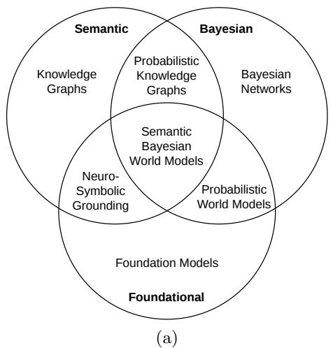
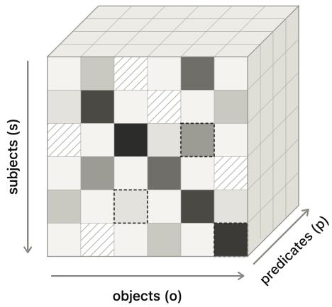

# Semantic Bayesian World Models

Tommaso Soru[0000-0002-1276-2366]

Liber AI Research, London, UK tom@liberai.org

Abstract. Knowledge graphs describe reality in crisp assertions, while the systems now consuming them, foundation models and autonomous agents, reason natively in probabilities. We argue that this mismatch is why the integration of language models and knowledge graphs remains a data-feeding pipeline rather than a unified reasoning architecture. We envision Semantic Bayesian World Models (SBWMs): a Web that describes the world not as a database of facts but as a shared, evolving fabric of beliefs over knowledge graphs, where ontological axioms constrain priors, observations update beliefs by Bayesian conditioning, and actions intervene upon the world. We work through what an agent gains from such a model: a home-security agent deciding whether the figure at the gate is a courier or a burglar, an actuarial estimate aggregated by entailment rather than by string frequency, a planning task that language models reliably fail, and the estimation of quantities that no document has ever stated. We then set out what the community must build to make them possible: belief annotation over RDF 1.2, probabilistic entailment regimes, semantic calibration layers, and protocols by which agents that have never met can exchange, and disagree over, calibrated beliefs.

Keywords: Semantic Web · Neuro-symbolic AI · Bayesian inference · World models · Knowledge graphs · Foundation models · Uncertainty

## 1 Introduction

An autonomous agent must act before it knows. It must decide whether the figure at the gate is a courier or a burglar, whether a plan will work, whether a risk is worth taking – on evidence that is partial, noisy, and time-critical. Acting under uncertainty requires a representation of uncertainty, and that is precisely what the Web does not ofer the machines now consuming it.

Knowledge graphs describe reality in crisp assertions. A triple is stated or it is not; an axiom holds or it does not. The open-world assumption lets a graph model ignorance – what it does not say – but not degrees of belief – how strongly we hold what it does say. That design bought a great deal: shared vocabularies, global identifiers, machine-checkable entailment, and scale from laboratory ontologies to graphs of billions of statements. What it cannot express is the epistemic state of its own consumers.

Those consumers reason natively in probabilities: every token is sampled from a distribution, and every belief is graded. Yet when they meet knowledge graphs, the integration is a data-feeding pipeline – retrieve triples, paste them into a context window – rather than a unified reasoning architecture. We argue that the deeper obstacle is representational rather than technical: foundation models trafic in probability distributions, whereas knowledge graphs encode Boolean assertions, leaving neither able to express the other’s epistemic state natively. The mismatch is measurable: language models produce probability judgements that violate the axioms of probability [27] and fall far short of normative Bayesian belief updating [18].

We envision Semantic Bayesian World Models (SBWMs): a Web that describes the world not as a database of facts but as a shared, evolving fabric of beliefs over knowledge graphs. In an SBWM, ontological axioms constrain priors, observations update beliefs by Bayesian conditioning, and actions intervene upon the world. The Web becomes what Quine and Ullian called a web of belief [19] – except dereferenceable, exchangeable, and machine-actionable.

We defend, further, a deliberately strong conjecture: language models cannot scale to superhuman intelligence while knowledge remains organised as statistical association between substrings. Whatever the substrate, knowledge must be organised semantically and probabilistically – as propositions with stable identity, carrying coherent degrees of belief.

The paper proceeds in three movements: what an SBWM is, how it is represented, and how one could be built (Sect. 2); what an agent can do with one that it cannot do with a knowledge graph or a language model alone (Sect. 3); and what the community must build to get there (Sect. 4).

## 2 Semantic Bayesian World Models

Three research traditions each hold a piece of the puzzle (Fig. 1a, Table 1). Bayesian networks ofer calibrated uncertainty, conditional independence, and a calculus of intervention [17] – but their structure is hand-crafted, their vocabularies are local to each model, and they do not learn from unstructured data. Knowledge graphs ofer web-scale shared semantics, global identity through URIs, and deductive entailment – but their statements are crisp, largely static, and silent about confidence. Foundation models learn from everything and generalise across domains – but their symbols are ungrounded, their beliefs subsymbolic, and their probability judgements incoherent [27].

Each pairwise overlap is an active field: probabilistic knowledge graphs at the intersection of Bayesian networks and knowledge graphs; probabilistic world models at the intersection of Bayesian methods and foundation models [9, 10, 14, 3, 26]; neuro-symbolic grounding at the intersection of knowledge graphs and foundation models. The three-way centre – probabilistic, semantic, and learned – remains, to our knowledge, unoccupied. That centre is the Semantic Bayesian World Model.

Every ingredient has been attempted in isolation. The W3C’s Uncertainty Reasoning incubator group mapped the design space [13]; BayesOWL compiled OWL taxonomies into Bayesian networks [6]; PR-OWL and MEBN defined probabilistic ontologies over first-order Bayesian fragments [4, 12]; DISPONTE gave description logics a distribution semantics [22]; Markov logic, ProbLog, and probabilistic soft logic unified logic with probabilistic graphical models [21, 5, 2]; noisy sensors and efectors were given a semantics in the situation calculus [1]; and a substantial literature managed uncertainty and vagueness in description logics [15]. What none of these had was a source of numbers at scale, statement-level annotation as a first-class citizen, or an application that made graded belief over shared symbols worth its cost. All three now exist: language-model logprobabilities beat chance by double digits on real-world forecasting [24]; RDF 1.2, building on the foundations of RDF-star [11], makes statement-level annotation native; and world models are the acknowledged frontier of AI [9, 14, 26], which autonomous agents need in order to act.

  
(b)  
Fig. 1. Two views of a Semantic Bayesian World Model: (a) its position at the intersection of three research traditions, and (b) a possible computational representation of its graph prior. Cells with diagonal hatch have missing values, some of which are predicted (dashed border) via neural inference.

Table 1. What each tradition can and cannot do.
<table><tr><td>Capability</td><td>Bayesian Networks</td><td>Knowledge Graphs</td><td>Foundation Models</td></tr><tr><td>Calibrated uncertainty</td><td>√</td><td></td><td>partial</td></tr><tr><td>Shared web-scale semantics</td><td></td><td>√</td><td></td></tr><tr><td>Learning from unstructured data</td><td></td><td></td><td>√</td></tr><tr><td>Causal intervention (do)</td><td>√</td><td></td><td></td></tr><tr><td>Deductive entailment</td><td>partial</td><td>√</td><td>unreliable</td></tr><tr><td>Global identity (URIs)</td><td></td><td>√</td><td></td></tr><tr><td>Dynamics and prediction</td><td>partial</td><td></td><td>√</td></tr></table>

## 2.1 Beliefs Are Predictions

Cognition does not operate on Boolean truth. Even “this is my $\mathrm { c a r } ^ { \mathrm { , } }$ is a belief held with very high confidence, not a theorem. Agents survive by predicting their environment and minimising prediction error – a view developed most ambitiously in the free-energy principle [8], whose neuroscientific claims remain contested but whose engineering slogan we happily borrow: a belief is a prediction, and learning is belief revision.

We define an SBWM as a tuple $\mathcal { M } = ( \Sigma , P _ { 0 } , T , O )$ : a vocabulary and TBox Σ; a prior $P _ { 0 }$ over RDF graphs; a transition kernel $T ( G ^ { \prime } \mid G , a )$ over graph edits, capturing how actions a change the world; and an observation model $O ( o \mid G )$ mapping noisy perception – sensor readings, extractor outputs, language model log-probabilities – to likelihoods over triples. The belief state is a distribution over graphs; Bayes’ rule is the update; the ontology is the prior.

## 2.2 Ontologies Are Priors

The organising principle is coherence with respect to entailment:

$$
A \models B \implies P ( A ) \leq P ( B ) ,\tag{1}
$$

from which the TBox yields a family of constraints for free:

$$
\langle c _ { 2 } , { \mathrm { r d f } } \mathsf { s } ; \mathsf { s u b } \mathsf { C l a s s } \mathsf { 0 f } , c _ { 1 } \rangle \implies P ( \langle s , { \mathrm { r d f } } ; \mathsf { t y p } \mathsf { e } , c _ { 2 } \rangle ) \leq P ( \langle s , { \mathrm { r d f } } ; { \mathrm { t y p } } \mathsf { e } , c _ { 1 } \rangle )\tag{2}
$$

$$
\langle p _ { 2 } , { \bf r } \mathrm { d } \mathbf { f } \circ \cdot \mathbf { s } \mathbf { u } \mathrm { b } \mathsf { P r o p e r t y } \mathsf { U } \mathbf { f } , p _ { 1 } \rangle \implies P ( \langle s , p _ { 2 } , o \rangle ) \leq P ( \langle s , p _ { 1 } , o \rangle )\tag{3}
$$

$$
\langle c _ { 1 } , \mathsf { o u l . d i s j o i n t w i t h } , c _ { 2 } \rangle \Longrightarrow P ( \langle s , \mathbf { r d f } : \mathbf { t y p e } , c _ { 1 } \rangle \wedge \langle s , \mathbf { r d f } : \mathbf { t y p e } , c _ { 2 } \rangle ) = 0\tag{4}
$$

$$
\operatorname { d o m } ( p ) = c \implies P ( \langle s , \mathbf { r } \mathbf { d } \mathbf { f } : \mathbf { t } \mathbf { y } \mathbf { p } \mathbf { e } , c \rangle \mid \langle s , p , o \rangle ) = 1\tag{5}
$$

These constraints are more useful than they look, because refinement can only subtract mass:

$$
P ( m a n ) \geq P ( m a n \land c a l l e d A n d r e a ) \geq P ( m a n \land c a l l e d A n d r e a \land l i k e s . F e r r a r i ) ,
$$

a bound any estimator must respect. Eqs. 2 and 3 impose the same shape inside the graph: :Man rdfs:subClassOf :HumanBeing caps the belief that x is a man by the belief that x is a human being, and :favouriteCar rdfs:subPropertyOf :likes caps the belief that a Ferrari is x’s favourite car by the belief that x likes Ferraris. The bounds transfer across languages because they are stated over URIs: that Andrea names a man in Italian and a woman almost everywhere else is a fact no credence attached to a string survives, and one a credence attached to an identifier never meets.

Two consequences follow. First, hierarchical priors defined along the class tree satisfy Eq. 2 by construction and give unseen subclasses inherited prior mass from their parents: the ontology computes priors for data never observed. Second, any neural scorer can be made coherent by projecting its outputs onto the polytope defined by the axioms – if perception reports $P ( c u p ) = 0 . 9$ but $P ( c o n t a i n e r ) =$ 0.6, the projection repairs the violation. Such a semantic calibration layer is diferentiable and drops into any architecture; de Finetti’s coherence argument supplies its normative justification [7].

## 2.3 Adapting SPARQL to Causal Inference

The distinction at the heart of causal inference – seeing versus doing [17] – maps directly onto the existing stack: SPARQL WHERE is conditioning; SPARQL UPDATE is the causal do-operator, with DELETE/INSERT performing graph ‘surgery’ on the world graph itself. RDF 1.2 carries the belief annotations on the statements themselves,

$$
\leqslant < : \mathtt { x O O 1 } : \mathtt { l i k e s } : \mathtt { F e r r a r i } > : \mathtt { p r o b } ^ { \mathrm { ~ \tiny ~ " ~ } } 0 . 3 ^ { \overset { \mathtt { N } } { \mathtt { N } } \widehat { \tiny { \sim } } \widehat { \textbf { x } } \mathtt { S } \mathtt { d } } : \mathtt { d e c i m a l } .
$$

and conditional structure lives in lifted networks whose nodes are triple patterns, in the tradition of MEBN fragments [12], with conditional probability tables published as Linked Data. The ontology contributes conditionals for free (Eq. 5). An agent-native query surface then falls out naturally:

Listing 1.1. A conditional-probability query over an SBWM.  
SELECT ?c ( PROB { ?x rdf: type ?c }   
GIVEN { ?x : locatedIn : Kitchen } AS ?p)   
WHERE { ?c rdfs : subClassOf : Container }

## 2.4 Representation, Learning, and Scale

A distribution over graphs admits a concrete representation: sparse tensors indexed by subject, predicate, and object. Priors $P ( \langle s , p , o \rangle )$ form a 3-dimensional tensor (Fig. 1b); one-event conditionals $P ( \langle s , p , o \rangle \mid \langle s _ { 1 } , p _ { 1 } , o _ { 1 } \rangle )$ a 6-dimensional one; two-event conditionals a 9-dimensional one; and so on. These tensors are astronomically sparse, and therein lies a potential new research avenue: semantic Bayesian tensor completion. Missing entries are predicted from semantically adjacent ones – knowledge graph completion graduates from link prediction to prior estimation [20] – and eficient Bayesian update becomes a question of sparse tensor algebra.

The gain is the ability to answer questions no source has ever stated. Suppose an agent needs P(⟨x, :hasVisited, :Ibiza⟩ $| \mathsf { a g e } ( x ) \in [ 2 0 , 2 2 ] \rangle$ ). No document reports it and no cell holds it, so a language model can only interpolate between phrasings it has seen. In a tensor organised by concepts, the neighbours are identifiable: the adjacent bracket is known, $P ( \cdot \mid [ 1 8 , 2 0 ] ) = 0 . 3 3$ , and the age profile of the sibling and parent classes of :Ibiza under :LeisureDestination is known from cells that were observed. Completing the entry is a transport problem over semantically adjacent cells, and what comes back is a posterior with provenance rather than a fluent sentence.

The substrate already scales: trillion-triple loads have been demonstrated repeatedly, by AllegroGraph in 2011,1 by Oracle at 1.08 trillion edges [16], and by Stardog across clouds,2 on resources modest beside those used to serve a single frontier language model.

## 2.5 Building One

Construction needs no component that does not already exist. Multilingual web text is processed by small language models fine-tuned for knowledge extraction, or by dependency parsers, into typed triples; the extractor’s own logprobabilities, rather than a number elicited by hand, supply the initial confidence on each statement [24, 23], and translating language into probabilistic programs is an increasingly practical route [25]. Aggregating across documents and languages – where the same proposition extracted from a German and a Portuguese source is one URI, not two strings – yields a semantic Bayesian knowledge graph: a graph whose every statement carries a credence with provenance. Semantic Bayesian tensor completion then estimates the cells no document supports, turning the graph into a usable prior $P _ { 0 } ;$ adding a transition kernel and an observation model turns that prior into a world model. Each stage is a recognisable research task. What is missing is the commitment to carry the probabilities through all of them, instead of thresholding them away at the first step – which is what today’s extraction pipelines do, and why the confidences they compute never reach the agent that needs them.

## 3 SBWMs at Work

## 3.1 A Camera in the Garden

A household security agent runs locally on a camera overlooking a garden. At 22:04 it detects a person at the gate, carrying a box. Raise the alarm, or not?

Perception alone cannot answer, because the question is about an unobservable: the visitor’s goal. The vision model reports a person (0.99), a box-shaped object (0.82), and no uniform clearly visible (0.4 that one is present); nothing in that vector distinguishes a late delivery from a burglary. A language model asked the question in prose will produce a fluent answer attached to a number that moves when the prompt is paraphrased.

An SBWM answers by decomposition. The unobservable in question is the visitor’s goal, ⟨?p, :goal, :Theft⟩, and Bayes’ rule turns one unanswerable question into several answerable ones,

$$
P ( T h e f t \mid o ) ~ = ~ { \frac { P ( o \mid T h e f t ) P ( T h e f t ) } { \sum _ { h \in \mathcal { H } } P ( o \mid h ) P ( h ) } } , ~ \mathcal { H } = \{ T h e f t , D e l i v e r y , V i s i t , . . . \} ,\tag{6}
$$

each of which is a belief over a triple with a stable identifier, and each of which comes from a diferent publisher (Table 2).

Table 2. Beliefs the agent needs, and where each one comes from. No two share a publisher; all share a vocabulary.
<table><tr><td>Belief</td><td>Source</td></tr><tr><td> $P ( \langle ? p , : \mathbf { g } \mathbf { o } \mathbf { a } \mathrm { 1 } , : \mathbf { T } \mathbf { h } \mathbf { e } \mathbf { f } \mathbf { t } \rangle )$ </td><td>burglary rate for the postcode, from a po- lice open-data endpoint, conditioned on month and hour</td></tr><tr><td>P((:order42, :deliveryDue, today〉) P(〈?p, rdf:type, :Courier〉 | hour =</td><td>the household&#x27;s own graph the carrier&#x27;s published delivery-hour distri-</td></tr><tr><td>22) P((:neighbour1, :isAt, :Home〉)</td><td>bution presence signals next door, shared under</td></tr><tr><td></td><td>an access policy</td></tr><tr><td>P(o |〈?x, rdf:type, :Parcel〉)</td><td>the camera&#x27;s own vision model, as O(o | G)</td></tr></table>

Three properties of this arrangement are unavailable to a monolithic model. First, the beliefs are separately sourced: the crime rate comes from the police, the delivery window from the carrier, the order from the household. None of these parties trained a model together, and none needs to; they publish beliefs at dereferenceable URIs over a shared vocabulary, and the agent merges them under explicit provenance. Second, they are separately updatable: when the household cancels the order, exactly one credence changes and the posterior moves with it – no retraining, no prompt engineering, and an audit trail showing which belief did the work. Third, the ontology keeps the hypotheses honest: with :Courier owl:disjointWith :Burglar and both rdfs:subClassOf :Visitor, the competing explanations are forced to compete for mass, and Eq. 2 guarantees $P ( V i s i t o r ) \geq P ( C o u r i e r )$ however the neural scorer behaves.

The agent can also ask what to do. Switching on the floodlight is an intervention, not an observation, and the distinction is material: the agent evaluates it by applying INSERT DATA { :floodlight :status :On } to the world graph – Pearl’s do(·), realised as graph surgery (Sect. 2.3) – and reading of P(⟨?p, :leaves, :Property⟩) under each hypothesis through the transition kernel T. A courier does not flee a floodlight; a burglar does. The action that best discriminates between the hypotheses is therefore computed, not prompted, and the alarm is raised on a posterior the household can inspect.

## 3.2 Aggregation by Entailment

An insurer’s agent needs the probability that a vehicle of a given class, driven by a driver in a given age band, is involved in an accident in the rain. A language model’s estimate reflects how often near-identical sentences occurred in training text: synonyms shift it, translation shifts it, and instances that must be inferred – a vehicle typed only by its model name, whose class follows by entailment – are missed entirely. If the model is semantic, cases are aggregated by entailment instead: one graph pattern covers every subclass and every instance, each make of car and each language of report. If the model is Bayesian, the estimate is a posterior that moves as new evidence arrives, except that in an SBWM the likelihoods attach to concepts rather than to strings, so a claim filed in Portuguese updates the same belief as a claim filed in German.

## 3.3 The Car Wash Test

Some failures are about planning rather than estimation. Consider: “My car needs washing, but the car wash is only 100 m away. Should I walk or drive?” State-of-the-art language models frequently answer walk – the distance is short

– missing that washing requires the car to be at the car wash. A few triples of formalisation dissolve the confusion:

Listing 1.2. The car wash test, formalised.

: washes rdfs : domain : CarWash ; rdfs : range :Car ;   
rdfs : subPropertyOf : sharesLocationWith .   
: carwash001 a : CarWash .   
: car001 a :Car ; : status : Dirty ; : owner :Me ;   
: sharesLocationWith :Me .   
# Rule : ?o : status : Clean <- ?s : washes ?o .   
# Goal : : car001 : status : Clean .

Backward chaining from the goal requires some ⟨?s, :washes, :car001⟩; the domain axiom forces ?s to be a car wash; the sub-property axiom forces ⟨?s, :sharesLocationWith, :car001⟩; and since the car currently shares a location with its owner, not with the car wash, any plan must move the car, i.e. drive. Under uncertain perception the same machinery degrades gracefully: if a vision system is only 90% confident the object is a car, every downstream belief reflects that uncertainty instead of relying on an overconfident binary assertion.

## 3.4 Why Symbols Matter

The three vignettes share a structure. In each, the agent must isolate a belief, source it, update it, and aggregate it over everything the belief entails. When knowledge is stored as statistical association between strings, beliefs cannot be isolated and updated individually, credences attach to phrasings rather than propositions, and entailment is approximated by similarity. Superhuman performance at forecasting, planning, and science demands exactly the operations this representation denies. Scaling parameters and data sharpens the approximation without changing the representation; even models explicitly taught normative updating acquire the skill approximately and sub-symbolically [18].

We therefore argue that language models cannot scale to superhuman intelligence without organising knowledge in a semantic and probabilistic framework: propositions with stable, language-invariant identity, carrying credences that obey the axioms of probability. The claim is falsifiable – a pure language model that maintained coherent credences under paraphrase and translation, and aggregated them across entailed instances, would refute it [27]. And the framework need not be an external triple store: if fragments of one already exist implicitly inside the weights, the case for building it explicitly – auditable, shareable, dereferenceable – only strengthens.

## 4 What Must Be Built

The vision demands precise architectural shifts. First, a W3C belief-annotation vocabulary – PROV for priors – so that probabilities, their calibration method, and their provenance travel together. Second, probabilistic entailment regimes, in which classical entailment is the probability-one special case and subsumption acts as a monotonicity constraint (Eq. 2). Third, probabilistic SHACL, reading shapes as soft constraints with violation costs rather than binary conformance. Fourth, semantic calibration layers as standard components between neural scorers and triple stores (Sect. 2.2). Fifth, federated belief exchange: priors published at dereferenceable URIs, merged under explicit provenance, so that two agents who have never met can disagree numerically – and resolve the disagreement by evidence. The camera in the garden needs all five, and needs nothing else.

The agenda is ambitious because its hardest questions remain open. Identity must itself become probabilistic: uncertain coreference and owl:sameAs cannot simply be assumed away. Tractability is equally fundamental. Weighted model counting is #P-hard, higher-order conditional tensors grow combinatorially, and practical systems will depend on sparsity, factorisation, and lifted inference over ontology symmetries. The numbers also require scrutiny: logit-derived confidences vary across models and phrasings [27], so calibration methods and source reliability must travel with the beliefs they produce.

These are not peripheral caveats but the criteria by which the vision should be judged: a probabilistic Web must deliver calibration and coherence, not merely accuracy. Yet nothing above is distant. The parts already exist – extractors that emit confidences, stores that annotate statements, ontologies that constrain them – held apart only by the habit of discarding probabilities at the first opportunity. An agent deciding whether to raise the alarm cannot aford that habit, and the Semantic Web is best placed to spare it: once it learns to say not merely what is the case, but how strongly it is believed, and on what evidence.

## References

1. Bacchus, F., Halpern, J.Y., Levesque, H.J.: Reasoning about noisy sensors and efectors in the situation calculus. Artificial Intelligence 111(1–2), 171–208 (1999)

2. Bach, S.H., Broecheler, M., Huang, B., Getoor, L.: Hinge-loss Markov random fields and probabilistic soft logic. Journal of Machine Learning Research (2017)

3. Bruce, J., Dennis, M., Edwards, A., et al.: Genie: Generative interactive environments. In: 41st International Conference on Machine Learning (2024)

4. Costa, P.C.G., Laskey, K.B.: PR-OWL: A framework for probabilistic ontologies. In: Proceedings of the 4th International Conference on Formal Ontology in Information Systems (FOIS) (2006)

5. De Raedt, L., Kimmig, A., Toivonen, H.: ProbLog: A probabilistic Prolog and its application in link discovery. In: Proceedings of the 20th International Joint Conference on Artificial Intelligence (IJCAI) (2007)

6. Ding, Z., Peng, Y.: A probabilistic extension to ontology language OWL. In: Proceedings of the 37th Hawaii International Conference on System Sciences (2004)

7. de Finetti, B.: Theory of Probability. Wiley (1974)

8. Friston, K.: The free-energy principle: A unified brain theory? Nature Reviews Neuroscience 11(2), 127–138 (2010)

9. Ha, D., Schmidhuber, J.: Recurrent world models facilitate policy evolution. In: Advances in Neural Information Processing Systems (NeurIPS) (2018)

10. Hafner, D., Pasukonis, J., Ba, J., Lillicrap, T.: Mastering diverse domains through world models (2023), arXiv:2301.04104

11. Hartig, O.: Foundations of RDF\* and SPARQL\*: An alternative approach to statement-level metadata in RDF. In: Proceedings of the 11th Alberto Mendelzon International Workshop on Foundations of Data Management (AMW) (2017)

12. Laskey, K.B.: MEBN: A language for first-order Bayesian knowledge bases. Artificial Intelligence 172(2–3), 140–178 (2008)

13. Laskey, K.J., Laskey, K.B., Costa, P.C.G., Kokar, M.M., Martin, T., Lukasiewicz, T.: Uncertainty reasoning for the World Wide Web. W3C Incubator Group Report (2008), https://www.w3.org/2005/Incubator/urw3/XGR-urw3-20080331/

14. LeCun, Y.: A path towards autonomous machine intelligence (2022), openReview preprint

15. Lukasiewicz, T., Straccia, U.: Managing uncertainty and vagueness in description logics for the Semantic Web. Journal of Web Semantics 6(4), 291–308 (2008)

16. Oracle: One trillion RDF triples benchmark with Oracle Exadata. Technical report, https://www.oracle.com/a/tech/docs/rdfgraph-1-trillion-benchmark.pdf

17. Pearl, J.: Causality: Models, Reasoning, and Inference. Cambridge University Press, 2nd edn. (2009)

18. Qiu, L., Sha, F., Allen, K., Kim, Y., Linzen, T., van Steenkiste, S.: Bayesian teaching enables probabilistic reasoning in large language models. Nature Communications 17, 1238 (2026)

19. Quine, W.V.O., Ullian, J.S.: The Web of Belief. Random House (1970)

20. Ren, H., Leskovec, J.: Beta embeddings for multi-hop logical reasoning in knowledge graphs. In: Advances in Neural Information Processing Systems (2020)

21. Richardson, M., Domingos, P.: Markov logic networks. Machine Learning 62(1–2), 107–136 (2006)

22. Riguzzi, F., Bellodi, E., Lamma, E., Zese, R.: Probabilistic description logics under the distribution semantics. Semantic Web 6(5), 477–501 (2015)

23. Soru, T., Marshall, J.: Trend extraction and analysis via large language models. In: Proceedings of the 18th IEEE International Conference on Semantic Computing (ICSC). pp. 285–288 (2024)

24. Soru, T., Marshall, J.: Leveraging log probabilities in language models to forecast future events (2025), arXiv:2501.04880

25. Wong, L., Grand, G., Lew, A.K., Goodman, N.D., Mansinghka, V.K., Andreas, J., Tenenbaum, J.B.: From word models to world models: Translating from natural language to the probabilistic language of thought (2023), arXiv:2306.12672

26. Yang, M.: Toward causal foundation world models: From representation to decision-making. AAAI Conference on Artificial Intelligence (2026)

27. Zhu, J.Q., Grifiths, T.L.: Incoherent probability judgments in large language models. In: 46th Annual Conference of the Cognitive Science Society (2024)